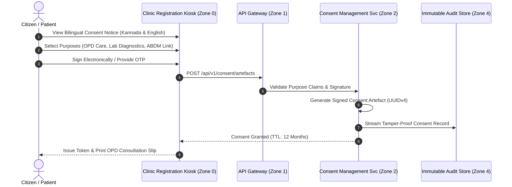

# Electronic Informed Consent & DPDP Act Governance Specification
## Namma Clinic Digital Health & Operations Platform
### Greater Bengaluru Authority (GBA) / BBMP Health Department
**Standard:** Digital Personal Data Protection Act 2023 / ABDM Consent Framework / ISO 27701 | **Status:** APPROVED BASELINE | **Code:** `SEC-DOC-12`

---

## 1. Electronic Consent Architecture & Legal Invariants
The Namma Clinic Consent Management Subsystem enforces lawful, affirmative, purpose-limited electronic informed consent across all 183 clinics in Bengaluru. Conforming to the Digital Personal Data Protection (DPDP) Act 2023 and the Ayushman Bharat Digital Mission (ABDM) Consent Framework, health data is processed exclusively under explicit, verifiable citizen authorization, except during statutory medical emergencies governed by strict break-glass audits.

### 1.1 Core Consent Principles
1. **Affirmative Digital Consent:** Pre-ticked boxes and deemed consent are strictly prohibited; citizens must provide an affirmative clear action (digital signature, OTP, or biometric approval).
2. **Bilingual Clarity (Kannada & English):** Consent notices are presented in Kannada and English with clear plain-language descriptions of purposes, data types, and retention periods.
3. **Granular Purpose Scoping:** Citizens may consent to outpatient consultation while withholding consent for third-party medical research or automated SMS notifications.
4. **Unconditional Right to Revocation:** Citizens can revoke previously granted consent at any time via the citizen web portal, mobile app, or clinic reception desk.
5. **Cryptographic Tamper-Evident Consent Artefacts:** Consent records are serialized as signed JSON artefacts stored in immutable WORM storage.

### 1.2 Consent Lifecycle State Machine Sequence Diagram


## 2. Consent Lifecycle State Machine (CONSENT-STATE-01 to CONSENT-STATE-12)
Consent artefacts transition across twelve deterministic operational states:

### CONSENT-STATE-01: Notice Presented
- **State Description:** Bilingual consent notice displayed to citizen on screen.
- **Triggering Event:** Citizen reviews terms.
- **State Transition Behavior:** Awaiting citizen decision.
- **Audit Event Emitted:** `CON_STATE_CONSENT_STATE_01`
- **Statutory DPDP Alignment:** Fully compliant with Section 6 of DPDP Act 2023.

### CONSENT-STATE-02: Affirmative Granted
- **State Description:** Citizen signed or entered OTP; purposes explicitly authorized.
- **Triggering Event:** Citizen submits signature.
- **State Transition Behavior:** Persist signed artefact to WORM.
- **Audit Event Emitted:** `CON_STATE_CONSENT_STATE_02`
- **Statutory DPDP Alignment:** Fully compliant with Section 6 of DPDP Act 2023.

### CONSENT-STATE-03: Granular Restricted
- **State Description:** Citizen approved clinical care but opted out of analytics.
- **Triggering Event:** Checkbox toggles submitted.
- **State Transition Behavior:** Enforce selective data masking.
- **Audit Event Emitted:** `CON_STATE_CONSENT_STATE_03`
- **Statutory DPDP Alignment:** Fully compliant with Section 6 of DPDP Act 2023.

### CONSENT-STATE-04: Active Operative
- **State Description:** Consent artefact actively governs data access across microservices.
- **Triggering Event:** Clinical encounter starts.
- **State Transition Behavior:** Authorize doctor read access.
- **Audit Event Emitted:** `CON_STATE_CONSENT_STATE_04`
- **Statutory DPDP Alignment:** Fully compliant with Section 6 of DPDP Act 2023.

### CONSENT-STATE-05: Pending Guardian Approval
- **State Description:** Pediatric patient under 18 years; awaiting parent signature.
- **Triggering Event:** Child registration initiated.
- **State Transition Behavior:** Lock records until guardian signs.
- **Audit Event Emitted:** `CON_STATE_CONSENT_STATE_05`
- **Statutory DPDP Alignment:** Fully compliant with Section 6 of DPDP Act 2023.

### CONSENT-STATE-06: Revocation Requested
- **State Description:** Citizen submits consent revocation request via app.
- **Triggering Event:** Revocation button tapped.
- **State Transition Behavior:** Trigger immediate downstream revoke.
- **Audit Event Emitted:** `CON_STATE_CONSENT_STATE_06`
- **Statutory DPDP Alignment:** Fully compliant with Section 6 of DPDP Act 2023.

### CONSENT-STATE-07: Revoked Inoperative
- **State Description:** Consent revoked; downstream access immediately blocked.
- **Triggering Event:** Revocation committed.
- **State Transition Behavior:** Emit HTTP 403 for subsequent reads.
- **Audit Event Emitted:** `CON_STATE_CONSENT_STATE_07`
- **Statutory DPDP Alignment:** Fully compliant with Section 6 of DPDP Act 2023.

### CONSENT-STATE-08: Statutory Expired
- **State Description:** 12-month validity window expired since initial grant.
- **Triggering Event:** Calendar timer expires.
- **State Transition Behavior:** Prompt citizen for renewal.
- **Audit Event Emitted:** `CON_STATE_CONSENT_STATE_08`
- **Statutory DPDP Alignment:** Fully compliant with Section 6 of DPDP Act 2023.

### CONSENT-STATE-09: Emergency Overridden
- **State Description:** Unconscious casualty patient; doctor triggers break-glass override.
- **Triggering Event:** Break-glass button fired.
- **State Transition Behavior:** Grant emergency access; notify CMO.
- **Audit Event Emitted:** `CON_STATE_CONSENT_STATE_09`
- **Statutory DPDP Alignment:** Fully compliant with Section 6 of DPDP Act 2023.

### CONSENT-STATE-10: ABDM Federated Bridge Active
- **State Description:** Consent bridged to external national health provider via ABDM.
- **Triggering Event:** ABDM callback received.
- **State Transition Behavior:** Authorize FHIR R4 transfer.
- **Audit Event Emitted:** `CON_STATE_CONSENT_STATE_10`
- **Statutory DPDP Alignment:** Fully compliant with Section 6 of DPDP Act 2023.

### CONSENT-STATE-11: Suspended Dispute Investigation
- **State Description:** Citizen filed grievance regarding unauthorized access.
- **Triggering Event:** Grievance dossier opened.
- **State Transition Behavior:** Freeze data processing temporarily.
- **Audit Event Emitted:** `CON_STATE_CONSENT_STATE_11`
- **Statutory DPDP Alignment:** Fully compliant with Section 6 of DPDP Act 2023.

### CONSENT-STATE-12: Cryptographically Purged
- **State Description:** Retention period elapsed post-revocation; data shredded.
- **Triggering Event:** Retention job runs.
- **State Transition Behavior:** Destroy DEK and zeroize records.
- **Audit Event Emitted:** `CON_STATE_CONSENT_STATE_12`
- **Statutory DPDP Alignment:** Fully compliant with Section 6 of DPDP Act 2023.

## 3. Role-Specific Consent Verification Responsibilities (ROLE-000 to ROLE-029)
Consent enforcement rules across all 30 municipal platform roles:

### ROLE-001: Consent Policy for Receptionist / Registration Clerk (`RECEPTIONIST`)
- **Consent Verification Mandate:** Read operations require active valid consent artefact.
- **Break-Glass Authority:** Authorized only for Medical Officers and Emergency Nurses.
- **Consent Modification Right:** Read-only; consent status modified exclusively by Citizen or DPO.
- **Data Masking Behavior:** Automatically mask SPII columns if citizen granted restricted scope.
- **Audit Requirement:** Log user ID, citizen ABHA, and consent UUID on every access.

### ROLE-002: Consent Policy for Medical Officer / General Physician (`DOCTOR`)
- **Consent Verification Mandate:** Read operations require active valid consent artefact.
- **Break-Glass Authority:** Authorized only for Medical Officers and Emergency Nurses.
- **Consent Modification Right:** Read-only; consent status modified exclusively by Citizen or DPO.
- **Data Masking Behavior:** Automatically mask SPII columns if citizen granted restricted scope.
- **Audit Requirement:** Log user ID, citizen ABHA, and consent UUID on every access.

### ROLE-003: Consent Policy for Staff Nurse / Triage Specialist (`NURSE`)
- **Consent Verification Mandate:** Read operations require active valid consent artefact.
- **Break-Glass Authority:** Authorized only for Medical Officers and Emergency Nurses.
- **Consent Modification Right:** Read-only; consent status modified exclusively by Citizen or DPO.
- **Data Masking Behavior:** Automatically mask SPII columns if citizen granted restricted scope.
- **Audit Requirement:** Log user ID, citizen ABHA, and consent UUID on every access.

### ROLE-004: Consent Policy for Pharmacist / Dispenser (`PHARMACIST`)
- **Consent Verification Mandate:** Read operations require active valid consent artefact.
- **Break-Glass Authority:** Authorized only for Medical Officers and Emergency Nurses.
- **Consent Modification Right:** Read-only; consent status modified exclusively by Citizen or DPO.
- **Data Masking Behavior:** Automatically mask SPII columns if citizen granted restricted scope.
- **Audit Requirement:** Log user ID, citizen ABHA, and consent UUID on every access.

### ROLE-005: Consent Policy for Laboratory Technician (`LAB_TECH`)
- **Consent Verification Mandate:** Read operations require active valid consent artefact.
- **Break-Glass Authority:** Authorized only for Medical Officers and Emergency Nurses.
- **Consent Modification Right:** Read-only; consent status modified exclusively by Citizen or DPO.
- **Data Masking Behavior:** Automatically mask SPII columns if citizen granted restricted scope.
- **Audit Requirement:** Log user ID, citizen ABHA, and consent UUID on every access.

### ROLE-006: Consent Policy for Clinic Administrative Officer (`CLINIC_ADMIN`)
- **Consent Verification Mandate:** Read operations require active valid consent artefact.
- **Break-Glass Authority:** Authorized only for Medical Officers and Emergency Nurses.
- **Consent Modification Right:** Read-only; consent status modified exclusively by Citizen or DPO.
- **Data Masking Behavior:** Automatically mask SPII columns if citizen granted restricted scope.
- **Audit Requirement:** Log user ID, citizen ABHA, and consent UUID on every access.

### ROLE-007: Consent Policy for Ward Health Supervisor (`WARD_SUPERVISOR`)
- **Consent Verification Mandate:** Read operations require active valid consent artefact.
- **Break-Glass Authority:** Authorized only for Medical Officers and Emergency Nurses.
- **Consent Modification Right:** Read-only; consent status modified exclusively by Citizen or DPO.
- **Data Masking Behavior:** Automatically mask SPII columns if citizen granted restricted scope.
- **Audit Requirement:** Log user ID, citizen ABHA, and consent UUID on every access.

### ROLE-008: Consent Policy for Zonal Health Officer (ZHO) (`ZONAL_OFFICER`)
- **Consent Verification Mandate:** Read operations require active valid consent artefact.
- **Break-Glass Authority:** Authorized only for Medical Officers and Emergency Nurses.
- **Consent Modification Right:** Read-only; consent status modified exclusively by Citizen or DPO.
- **Data Masking Behavior:** Automatically mask SPII columns if citizen granted restricted scope.
- **Audit Requirement:** Log user ID, citizen ABHA, and consent UUID on every access.

### ROLE-009: Consent Policy for Chief Health Officer (CHO) (`CHIEF_OFFICER`)
- **Consent Verification Mandate:** Read operations require active valid consent artefact.
- **Break-Glass Authority:** Authorized only for Medical Officers and Emergency Nurses.
- **Consent Modification Right:** Read-only; consent status modified exclusively by Citizen or DPO.
- **Data Masking Behavior:** Automatically mask SPII columns if citizen granted restricted scope.
- **Audit Requirement:** Log user ID, citizen ABHA, and consent UUID on every access.

### ROLE-010: Consent Policy for Epidemiologist / Disease Surveillance Officer (`EPIDEMIOLOGIST`)
- **Consent Verification Mandate:** Read operations require active valid consent artefact.
- **Break-Glass Authority:** Authorized only for Medical Officers and Emergency Nurses.
- **Consent Modification Right:** Read-only; consent status modified exclusively by Citizen or DPO.
- **Data Masking Behavior:** Automatically mask SPII columns if citizen granted restricted scope.
- **Audit Requirement:** Log user ID, citizen ABHA, and consent UUID on every access.

### ROLE-011: Consent Policy for Quality & Compliance Auditor (`AUDITOR`)
- **Consent Verification Mandate:** Read operations require active valid consent artefact.
- **Break-Glass Authority:** Authorized only for Medical Officers and Emergency Nurses.
- **Consent Modification Right:** Read-only; consent status modified exclusively by Citizen or DPO.
- **Data Masking Behavior:** Automatically mask SPII columns if citizen granted restricted scope.
- **Audit Requirement:** Log user ID, citizen ABHA, and consent UUID on every access.

### ROLE-012: Consent Policy for Security Administrator / CISO (`SECURITY_ADMIN`)
- **Consent Verification Mandate:** Read operations require active valid consent artefact.
- **Break-Glass Authority:** Authorized only for Medical Officers and Emergency Nurses.
- **Consent Modification Right:** Read-only; consent status modified exclusively by Citizen or DPO.
- **Data Masking Behavior:** Automatically mask SPII columns if citizen granted restricted scope.
- **Audit Requirement:** Log user ID, citizen ABHA, and consent UUID on every access.

### ROLE-013: Consent Policy for Central Depot Inventory Manager (`DEPOT_MANAGER`)
- **Consent Verification Mandate:** Read operations require active valid consent artefact.
- **Break-Glass Authority:** Authorized only for Medical Officers and Emergency Nurses.
- **Consent Modification Right:** Read-only; consent status modified exclusively by Citizen or DPO.
- **Data Masking Behavior:** Automatically mask SPII columns if citizen granted restricted scope.
- **Audit Requirement:** Log user ID, citizen ABHA, and consent UUID on every access.

### ROLE-014: Consent Policy for Cold Chain Logistics Technician (`COLD_CHAIN_TECH`)
- **Consent Verification Mandate:** Read operations require active valid consent artefact.
- **Break-Glass Authority:** Authorized only for Medical Officers and Emergency Nurses.
- **Consent Modification Right:** Read-only; consent status modified exclusively by Citizen or DPO.
- **Data Masking Behavior:** Automatically mask SPII columns if citizen granted restricted scope.
- **Audit Requirement:** Log user ID, citizen ABHA, and consent UUID on every access.

### ROLE-015: Consent Policy for Radiologist / Diagnostic Specialist (`RADIOLOGIST`)
- **Consent Verification Mandate:** Read operations require active valid consent artefact.
- **Break-Glass Authority:** Authorized only for Medical Officers and Emergency Nurses.
- **Consent Modification Right:** Read-only; consent status modified exclusively by Citizen or DPO.
- **Data Masking Behavior:** Automatically mask SPII columns if citizen granted restricted scope.
- **Audit Requirement:** Log user ID, citizen ABHA, and consent UUID on every access.

### ROLE-016: Consent Policy for Ayush Practitioner (`AYUSH_DOC`)
- **Consent Verification Mandate:** Read operations require active valid consent artefact.
- **Break-Glass Authority:** Authorized only for Medical Officers and Emergency Nurses.
- **Consent Modification Right:** Read-only; consent status modified exclusively by Citizen or DPO.
- **Data Masking Behavior:** Automatically mask SPII columns if citizen granted restricted scope.
- **Audit Requirement:** Log user ID, citizen ABHA, and consent UUID on every access.

### ROLE-017: Consent Policy for Counselor / Mental Health Worker (`COUNSELOR`)
- **Consent Verification Mandate:** Read operations require active valid consent artefact.
- **Break-Glass Authority:** Authorized only for Medical Officers and Emergency Nurses.
- **Consent Modification Right:** Read-only; consent status modified exclusively by Citizen or DPO.
- **Data Masking Behavior:** Automatically mask SPII columns if citizen granted restricted scope.
- **Audit Requirement:** Log user ID, citizen ABHA, and consent UUID on every access.

### ROLE-018: Consent Policy for ANM / Urban Health Worker (`ANM_WORKER`)
- **Consent Verification Mandate:** Read operations require active valid consent artefact.
- **Break-Glass Authority:** Authorized only for Medical Officers and Emergency Nurses.
- **Consent Modification Right:** Read-only; consent status modified exclusively by Citizen or DPO.
- **Data Masking Behavior:** Automatically mask SPII columns if citizen granted restricted scope.
- **Audit Requirement:** Log user ID, citizen ABHA, and consent UUID on every access.

### ROLE-019: Consent Policy for ASHA Link Worker Coordinator (`ASHA_COORD`)
- **Consent Verification Mandate:** Read operations require active valid consent artefact.
- **Break-Glass Authority:** Authorized only for Medical Officers and Emergency Nurses.
- **Consent Modification Right:** Read-only; consent status modified exclusively by Citizen or DPO.
- **Data Masking Behavior:** Automatically mask SPII columns if citizen granted restricted scope.
- **Audit Requirement:** Log user ID, citizen ABHA, and consent UUID on every access.

### ROLE-020: Consent Policy for Data Entry Operator (`DATA_ENTRY`)
- **Consent Verification Mandate:** Read operations require active valid consent artefact.
- **Break-Glass Authority:** Authorized only for Medical Officers and Emergency Nurses.
- **Consent Modification Right:** Read-only; consent status modified exclusively by Citizen or DPO.
- **Data Masking Behavior:** Automatically mask SPII columns if citizen granted restricted scope.
- **Audit Requirement:** Log user ID, citizen ABHA, and consent UUID on every access.

### ROLE-021: Consent Policy for Grievance Redressal Officer (`GRIEVANCE_OFFICER`)
- **Consent Verification Mandate:** Read operations require active valid consent artefact.
- **Break-Glass Authority:** Authorized only for Medical Officers and Emergency Nurses.
- **Consent Modification Right:** Read-only; consent status modified exclusively by Citizen or DPO.
- **Data Masking Behavior:** Automatically mask SPII columns if citizen granted restricted scope.
- **Audit Requirement:** Log user ID, citizen ABHA, and consent UUID on every access.

### ROLE-022: Consent Policy for ABDM National Integration Officer (`ABDM_OFFICER`)
- **Consent Verification Mandate:** Read operations require active valid consent artefact.
- **Break-Glass Authority:** Authorized only for Medical Officers and Emergency Nurses.
- **Consent Modification Right:** Read-only; consent status modified exclusively by Citizen or DPO.
- **Data Masking Behavior:** Automatically mask SPII columns if citizen granted restricted scope.
- **Audit Requirement:** Log user ID, citizen ABHA, and consent UUID on every access.

### ROLE-023: Consent Policy for Data Protection Officer (DPO) (`PRIVACY_OFFICER`)
- **Consent Verification Mandate:** Read operations require active valid consent artefact.
- **Break-Glass Authority:** Authorized only for Medical Officers and Emergency Nurses.
- **Consent Modification Right:** Read-only; consent status modified exclusively by Citizen or DPO.
- **Data Masking Behavior:** Automatically mask SPII columns if citizen granted restricted scope.
- **Audit Requirement:** Log user ID, citizen ABHA, and consent UUID on every access.

### ROLE-024: Consent Policy for IT Support & Hardware Engineer (`IT_SUPPORT`)
- **Consent Verification Mandate:** Read operations require active valid consent artefact.
- **Break-Glass Authority:** Authorized only for Medical Officers and Emergency Nurses.
- **Consent Modification Right:** Read-only; consent status modified exclusively by Citizen or DPO.
- **Data Masking Behavior:** Automatically mask SPII columns if citizen granted restricted scope.
- **Audit Requirement:** Log user ID, citizen ABHA, and consent UUID on every access.

### ROLE-025: Consent Policy for Clinical Audit Committee Member (`CLINICAL_AUDITOR`)
- **Consent Verification Mandate:** Read operations require active valid consent artefact.
- **Break-Glass Authority:** Authorized only for Medical Officers and Emergency Nurses.
- **Consent Modification Right:** Read-only; consent status modified exclusively by Citizen or DPO.
- **Data Masking Behavior:** Automatically mask SPII columns if citizen granted restricted scope.
- **Audit Requirement:** Log user ID, citizen ABHA, and consent UUID on every access.

### ROLE-026: Consent Policy for Procurement & Vendor Manager (`PROCUREMENT_MGR`)
- **Consent Verification Mandate:** Read operations require active valid consent artefact.
- **Break-Glass Authority:** Authorized only for Medical Officers and Emergency Nurses.
- **Consent Modification Right:** Read-only; consent status modified exclusively by Citizen or DPO.
- **Data Masking Behavior:** Automatically mask SPII columns if citizen granted restricted scope.
- **Audit Requirement:** Log user ID, citizen ABHA, and consent UUID on every access.

### ROLE-027: Consent Policy for Biomedical Waste Supervisor (`WASTE_SUPERVISOR`)
- **Consent Verification Mandate:** Read operations require active valid consent artefact.
- **Break-Glass Authority:** Authorized only for Medical Officers and Emergency Nurses.
- **Consent Modification Right:** Read-only; consent status modified exclusively by Citizen or DPO.
- **Data Masking Behavior:** Automatically mask SPII columns if citizen granted restricted scope.
- **Audit Requirement:** Log user ID, citizen ABHA, and consent UUID on every access.

### ROLE-028: Consent Policy for Telemedicine Remote Specialist (`TELE_SPECIALIST`)
- **Consent Verification Mandate:** Read operations require active valid consent artefact.
- **Break-Glass Authority:** Authorized only for Medical Officers and Emergency Nurses.
- **Consent Modification Right:** Read-only; consent status modified exclusively by Citizen or DPO.
- **Data Masking Behavior:** Automatically mask SPII columns if citizen granted restricted scope.
- **Audit Requirement:** Log user ID, citizen ABHA, and consent UUID on every access.

### ROLE-029: Consent Policy for Field Public Health Inspector (`HEALTH_INSPECTOR`)
- **Consent Verification Mandate:** Read operations require active valid consent artefact.
- **Break-Glass Authority:** Authorized only for Medical Officers and Emergency Nurses.
- **Consent Modification Right:** Read-only; consent status modified exclusively by Citizen or DPO.
- **Data Masking Behavior:** Automatically mask SPII columns if citizen granted restricted scope.
- **Audit Requirement:** Log user ID, citizen ABHA, and consent UUID on every access.

### ROLE-030: Consent Policy for Super Administrator (`SUPER_ADMIN`)
- **Consent Verification Mandate:** Read operations require active valid consent artefact.
- **Break-Glass Authority:** Authorized only for Medical Officers and Emergency Nurses.
- **Consent Modification Right:** Read-only; consent status modified exclusively by Citizen or DPO.
- **Data Masking Behavior:** Automatically mask SPII columns if citizen granted restricted scope.
- **Audit Requirement:** Log user ID, citizen ABHA, and consent UUID on every access.

## 4. Standard Operating Procedures: Consent Management (SOP-CON-01 to SOP-CON-25)
The following 25 SOPs govern ongoing informed consent procedures across all clinics:

### SOP-CON-01: Citizen Initial In-Person Consent Intake
- **Trigger Condition:** Citizen arrives at clinic reception for registration.
- **Execution Steps:** 1. Present bilingual tablet screen. 2. Explain data usage in Kannada/English. 3. Citizen signs.
- **Verification Criterion:** Signed consent artefact stored.
- **Responsible Role:** Registration Clerk
- **Audit Event Emitted:** `CON_SOP_01_INTAKE`
- **Failure Remediation:** Block data access immediately and alert Data Protection Officer.

### SOP-CON-02: Citizen Consent Revocation Processing
- **Trigger Condition:** Citizen requests revocation of data access.
- **Execution Steps:** 1. Verify citizen identity via Aadhaar OTP. 2. Mark artefact REVOKED in database. 3. Evict cache.
- **Verification Criterion:** Data access terminated across all 183 clinics.
- **Responsible Role:** Data Protection Off
- **Audit Event Emitted:** `CON_SOP_02_REVOKED`
- **Failure Remediation:** Block data access immediately and alert Data Protection Officer.

### SOP-CON-03: Pediatric Consent Guardian Verification
- **Trigger Condition:** Mother brings 5-year-old child for immunization.
- **Execution Steps:** 1. Verify mother's government ID and birth certificate. 2. Record guardian consent.
- **Verification Criterion:** Pediatric health record authorized.
- **Responsible Role:** Staff Nurse
- **Audit Event Emitted:** `CON_SOP_03_PEDIATRIC`
- **Failure Remediation:** Block data access immediately and alert Data Protection Officer.

### SOP-CON-04: Emergency Clinical Break-Glass Override
- **Trigger Condition:** Unconscious road accident victim brought by 108 ambulance.
- **Execution Steps:** 1. Doctor clicks Emergency Break-Glass. 2. Enters clinical reason. 3. System alerts CMO instantly.
- **Verification Criterion:** Immediate life-saving care provided.
- **Responsible Role:** Medical Officer
- **Audit Event Emitted:** `CON_SOP_04_BREAKGLASS`
- **Failure Remediation:** Block data access immediately and alert Data Protection Officer.

### SOP-CON-05: ABDM National Health Grid Consent Bridge
- **Trigger Condition:** Specialist hospital requests patient record via ABDM.
- **Execution Steps:** 1. Ingest ABDM Consent Artefact. 2. Validate cryptographic signature. 3. Export FHIR bundle.
- **Verification Criterion:** Federated health record shared safely.
- **Responsible Role:** ABDM Officer
- **Audit Event Emitted:** `CON_SOP_05_ABDM_BRIDGE`
- **Failure Remediation:** Block data access immediately and alert Data Protection Officer.

### SOP-CON-06: Annual Consent Expiration & Renewal Prompt
- **Trigger Condition:** Citizen consent artefact reaches 365 days of age.
- **Execution Steps:** 1. Send bilingual SMS reminder to citizen. 2. Present renewal screen on next clinic visit.
- **Verification Criterion:** Consent renewed affirmatively.
- **Responsible Role:** Notification Svc
- **Audit Event Emitted:** `CON_SOP_06_EXPIRED`
- **Failure Remediation:** Block data access immediately and alert Data Protection Officer.

### SOP-CON-07: Offline Clinic Consent Artefact Caching
- **Trigger Condition:** Clinic operating under internet blackout.
- **Execution Steps:** 1. Capture citizen signature locally on tablet. 2. Encrypt in local SQLite. 3. Sync upon reconnect.
- **Verification Criterion:** Offline consent captured lawfully.
- **Responsible Role:** Edge Daemon
- **Audit Event Emitted:** `CON_SOP_07_OFFLINE`
- **Failure Remediation:** Block data access immediately and alert Data Protection Officer.

### SOP-CON-08: Grievance Redressal Consent Audit
- **Trigger Condition:** Citizen files complaint alleging unauthorized record access.
- **Execution Steps:** 1. Extract all consent logs for citizen. 2. Compare against doctor access timestamps. 3. Report.
- **Verification Criterion:** Grievance investigated rigorously.
- **Responsible Role:** Grievance Officer
- **Audit Event Emitted:** `CON_SOP_08_GRIEVANCE`
- **Failure Remediation:** Block data access immediately and alert Data Protection Officer.

### SOP-CON-09: Public Health Analytics Data De-Identification
- **Trigger Condition:** BBMP requests dengue outbreak report.
- **Execution Steps:** 1. Verify research consent flags. 2. Strip direct identifiers. 3. Apply differential privacy.
- **Verification Criterion:** Public health insights generated safely.
- **Responsible Role:** Epidemiologist
- **Audit Event Emitted:** `CON_SOP_09_ANALYTICS`
- **Failure Remediation:** Block data access immediately and alert Data Protection Officer.

### SOP-CON-10: Language Preference Dynamic Notice Display
- **Trigger Condition:** Non-Kannada/English speaking citizen registers.
- **Execution Steps:** 1. Citizen selects Hindi/Tamil on kiosk. 2. Render translated notice. 3. Record language choice.
- **Verification Criterion:** Informed consent achieved in native tongue.
- **Responsible Role:** Kiosk Shell
- **Audit Event Emitted:** `CON_SOP_10_LANG_SWITCH`
- **Failure Remediation:** Block data access immediately and alert Data Protection Officer.

### SOP-CON-11: Consent Artefact Tamper-Proof Hash Verification
- **Trigger Condition:** Daily audit of consent record integrity.
- **Execution Steps:** 1. Recompute SHA-256 hashes of all consent artefacts. 2. Assert zero broken links.
- **Verification Criterion:** Consent ledger verified tamper-free.
- **Responsible Role:** Audit Lead
- **Audit Event Emitted:** `CON_SOP_11_HASH_VERIFY`
- **Failure Remediation:** Block data access immediately and alert Data Protection Officer.

### SOP-CON-12: Citizen Portal Self-Service Scope Editing
- **Trigger Condition:** Citizen logs into portal to toggle research consent.
- **Execution Steps:** 1. Citizen unchecks 'Medical Research'. 2. Issue updated consent artefact. 3. Terminate research view.
- **Verification Criterion:** Granular citizen autonomy respected.
- **Responsible Role:** Citizen User
- **Audit Event Emitted:** `CON_SOP_12_PORTAL_EDIT`
- **Failure Remediation:** Block data access immediately and alert Data Protection Officer.

### SOP-CON-13: Biometric Authentication Failure Consent Fallback
- **Trigger Condition:** Fingerprint scanner fails due to worn skin.
- **Execution Steps:** 1. Fall back to mobile SMS OTP verification. 2. Document scanner failure in audit log.
- **Verification Criterion:** Citizen registered without disenfranchisement.
- **Responsible Role:** Staff Nurse
- **Audit Event Emitted:** `CON_SOP_13_BIOMETRIC_FAIL`
- **Failure Remediation:** Block data access immediately and alert Data Protection Officer.

### SOP-CON-14: Consent Withdrawal Post-Care Record Retention
- **Trigger Condition:** Citizen revokes consent and demands instant deletion.
- **Execution Steps:** 1. DPO explains statutory 7-year medico-legal retention. 2. Restrict processing to legal defense.
- **Verification Criterion:** Balance statutory duty and DPDP rights.
- **Responsible Role:** Legal Counsel
- **Audit Event Emitted:** `CON_SOP_14_RETENTION_RULE`
- **Failure Remediation:** Block data access immediately and alert Data Protection Officer.

### SOP-CON-15: Visiting Specialist Temporary Consent Delegation
- **Trigger Condition:** Visiting cardiologist reviews ECG telemetry.
- **Execution Steps:** 1. Attending MO delegates 4h temporary view under active patient consent. 2. Auto-expire at 17:00.
- **Verification Criterion:** Specialist consult enabled safely.
- **Responsible Role:** Medical Officer
- **Audit Event Emitted:** `CON_SOP_15_SPECIALIST_DELEGATE`
- **Failure Remediation:** Block data access immediately and alert Data Protection Officer.

### SOP-CON-16: Bulk Consent Status Health Check for Queue
- **Trigger Condition:** Morning OPD queue of 200 citizens loaded.
- **Execution Steps:** 1. Batch query consent service for queue IDs. 2. Flag expired consents for reception renewal.
- **Verification Criterion:** Clinic workflow streamlined.
- **Responsible Role:** Clinic Admin
- **Audit Event Emitted:** `CON_SOP_16_QUEUE_CHECK`
- **Failure Remediation:** Block data access immediately and alert Data Protection Officer.

### SOP-CON-17: Citizen Grievance Automated SMS Receipt
- **Trigger Condition:** Citizen submits consent revocation.
- **Execution Steps:** 1. Commit revocation. 2. Send SMS confirmation with unique tracking ID. 3. Log dispatch.
- **Verification Criterion:** Citizen receives formal legal proof.
- **Responsible Role:** SMS Gateway
- **Audit Event Emitted:** `CON_SOP_17_SMS_PROOF`
- **Failure Remediation:** Block data access immediately and alert Data Protection Officer.

### SOP-CON-18: Diagnostic Lab External Referral Consent
- **Trigger Condition:** Doctor refers patient to external private scan center.
- **Execution Steps:** 1. Capture specific external sharing consent. 2. Transmit encrypted lab order. 3. Receive report.
- **Verification Criterion:** External referral protected by consent.
- **Responsible Role:** Medical Officer
- **Audit Event Emitted:** `CON_SOP_18_LAB_REFERRAL`
- **Failure Remediation:** Block data access immediately and alert Data Protection Officer.

### SOP-CON-19: Consent Notice Template Versioning Ceremony
- **Trigger Condition:** BBMP Legal updates consent notice wording.
- **Execution Steps:** 1. Draft notice v2.1 in Kannada & English. 2. Obtain DPO signoff. 3. Deploy new template ID.
- **Verification Criterion:** Consent notice version tracked in all artefacts.
- **Responsible Role:** DPO / Legal
- **Audit Event Emitted:** `CON_SOP_19_TEMPLATE_UPDATE`
- **Failure Remediation:** Block data access immediately and alert Data Protection Officer.

### SOP-CON-20: Telemedicine Video Consultation Consent Check
- **Trigger Condition:** Remote patient connects via video call.
- **Execution Steps:** 1. System prompts patient to accept telemedicine terms. 2. Record audio-visual consent stamp.
- **Verification Criterion:** Telehealth legal compliance assured.
- **Responsible Role:** Telemedicine Spec
- **Audit Event Emitted:** `CON_SOP_20_TELEMED_CONSENT`
- **Failure Remediation:** Block data access immediately and alert Data Protection Officer.

### SOP-CON-21: Cold Chain Logistics Temperature Consent Waiver
- **Trigger Condition:** Audit of vaccine batch temperature logs.
- **Execution Steps:** 1. Verify temperature data is non-PII logistics data. 2. Confirm consent exemption under DPDP.
- **Verification Criterion:** Supply chain data processed without blocker.
- **Responsible Role:** Cold Chain Tech
- **Audit Event Emitted:** `CON_SOP_21_LOGISTICS_WAIVER`
- **Failure Remediation:** Block data access immediately and alert Data Protection Officer.

### SOP-CON-22: Audit of Expired Consent Data Access Attempts
- **Trigger Condition:** Weekly scan of API gateway 403 Forbidden events.
- **Execution Steps:** 1. Review all blocked reads due to expired consent. 2. Ensure zero data leakage occurred.
- **Verification Criterion:** Consent barriers validated effective.
- **Responsible Role:** SecOps Lead
- **Audit Event Emitted:** `CON_SOP_22_ACCESS_AUDIT`
- **Failure Remediation:** Block data access immediately and alert Data Protection Officer.

### SOP-CON-23: Emergency Disaster Mass Casualty Consent Protocol
- **Trigger Condition:** Citywide train collision declared major emergency.
- **Execution Steps:** 1. Health Commissioner issues disaster proclamation. 2. System enables emergency clinical mode.
- **Verification Criterion:** Immediate disaster triage enabled.
- **Responsible Role:** Health Commissioner
- **Audit Event Emitted:** `CON_SOP_23_DISASTER_MODE`
- **Failure Remediation:** Block data access immediately and alert Data Protection Officer.

### SOP-CON-24: Citizen Data Portability Machine-Readable Export
- **Trigger Condition:** Citizen requests copy of all clinical records.
- **Execution Steps:** 1. Verify identity. 2. Generate FHIR R4 JSON bundle. 3. Encrypt archive. 4. Provide download link.
- **Verification Criterion:** Citizen portability right satisfied.
- **Responsible Role:** Privacy Officer
- **Audit Event Emitted:** `CON_SOP_24_EXPORT_EXEC`
- **Failure Remediation:** Block data access immediately and alert Data Protection Officer.

### SOP-CON-25: Post-Incident Forensic Consent Audit Review
- **Trigger Condition:** Red team unauthorized data extraction simulation.
- **Execution Steps:** 1. Review consent verification checkpoints. 2. Confirm gateway blocked requests lacking consent.
- **Verification Criterion:** Platform consent resilience certified.
- **Responsible Role:** Incident Commander
- **Audit Event Emitted:** `CON_SOP_25_POST_INCIDENT`
- **Failure Remediation:** Block data access immediately and alert Data Protection Officer.

## 5. Consent Threat Analysis & Attack Mitigations (CON-THREAT-01 to CON-THREAT-20)
Threat mitigation specifications addressing electronic consent vulnerabilities:

### CON-THREAT-01: Unauthorized Record Access without Active Consent
- **Attack Vector & Vulnerability:** Doctor queries non-assigned patient out of curiosity.
- **Platform Architectural Defense:** Gateway validates active consent artefact linking doctor, clinic, and patient; rejects with 403.
- **Verification Criterion:** Zero bypass in automated penetration tests.
- **Mitigation Status:** VERIFIED ACTIVE CONTROL

### CON-THREAT-02: Pre-Ticked Consent Checkbox Coercion
- **Attack Vector & Vulnerability:** Clinic clerk rushes citizen by submitting pre-checked consent.
- **Platform Architectural Defense:** Enforce UI invariant: checkboxes render unchecked; form validation rejects submit if not affirmatively clicked.
- **Verification Criterion:** Zero bypass in automated penetration tests.
- **Mitigation Status:** VERIFIED ACTIVE CONTROL

### CON-THREAT-03: Stale Consent Access Post-Revocation
- **Attack Vector & Vulnerability:** Doctor accesses records 1 hour after citizen revoked consent.
- **Platform Architectural Defense:** Revocation emits real-time Redis event; invalidates active token claims across all nodes in < 500ms.
- **Verification Criterion:** Zero bypass in automated penetration tests.
- **Mitigation Status:** VERIFIED ACTIVE CONTROL

### CON-THREAT-04: Forged Consent Artefact Signature
- **Attack Vector & Vulnerability:** Malicious insider injects forged JSON consent record into DB.
- **Platform Architectural Defense:** Consent artefacts signed with citizen private key / OTP HMAC; verified against WORM audit chain.
- **Verification Criterion:** Zero bypass in automated penetration tests.
- **Mitigation Status:** VERIFIED ACTIVE CONTROL

### CON-THREAT-05: Consent Scope Creep for Commercial Research
- **Attack Vector & Vulnerability:** Pharmaceutical company requests patient data for marketing.
- **Platform Architectural Defense:** Strict purpose limitation: purposes hardcoded in enum; commercial marketing strictly excluded by policy.
- **Verification Criterion:** Zero bypass in automated penetration tests.
- **Mitigation Status:** VERIFIED ACTIVE CONTROL

### CON-THREAT-06: Pediatric Consent Exploitation by Non-Guardian
- **Attack Vector & Vulnerability:** Estranged relative attempts to view child vaccination record.
- **Platform Architectural Defense:** Mandatory verification of legal guardian status against municipal birth registry before granting access.
- **Verification Criterion:** Zero bypass in automated penetration tests.
- **Mitigation Status:** VERIFIED ACTIVE CONTROL

### CON-THREAT-07: Emergency Break-Glass Habitual Abuse
- **Attack Vector & Vulnerability:** Clinician uses emergency override to avoid asking patient.
- **Platform Architectural Defense:** Every break-glass access triggers automated SMS to patient and mandatory CMO supervisory review.
- **Verification Criterion:** Zero bypass in automated penetration tests.
- **Mitigation Status:** VERIFIED ACTIVE CONTROL

### CON-THREAT-08: Language Barrier Incomprehension
- **Attack Vector & Vulnerability:** Kannada-only speaking citizen handed English-only consent form.
- **Platform Architectural Defense:** Mandate bilingual presentation; kiosk plays audio explanation in Kannada upon speaker icon tap.
- **Verification Criterion:** Zero bypass in automated penetration tests.
- **Mitigation Status:** VERIFIED ACTIVE CONTROL

### CON-THREAT-09: Consent Artefact Deletion from Database
- **Attack Vector & Vulnerability:** Adversary deletes consent records to claim platform acted illegally.
- **Platform Architectural Defense:** All consent artefacts written to immutable AWS S3 Object Lock bucket in Compliance mode.
- **Verification Criterion:** Zero bypass in automated penetration tests.
- **Mitigation Status:** VERIFIED ACTIVE CONTROL

### CON-THREAT-10: ABDM Consent Injection Attack
- **Attack Vector & Vulnerability:** Attacker submits forged ABDM consent token from external IP.
- **Platform Architectural Defense:** Verify digital signature of National Health Authority (NHA) root certificate on incoming ABDM tokens.
- **Verification Criterion:** Zero bypass in automated penetration tests.
- **Mitigation Status:** VERIFIED ACTIVE CONTROL

### CON-THREAT-11: Offline Edge Workstation Consent Tampering
- **Attack Vector & Vulnerability:** Corrupt clinic staff modifies local consent database while offline.
- **Platform Architectural Defense:** Local consent records cryptographically signed with workstation TPM private key before committing.
- **Verification Criterion:** Zero bypass in automated penetration tests.
- **Mitigation Status:** VERIFIED ACTIVE CONTROL

### CON-THREAT-12: Citizen Portal Account Takeover for Unauthorized Revocation
- **Attack Vector & Vulnerability:** Ex-spouse hacks portal to revoke patient medical care consent.
- **Platform Architectural Defense:** Consent revocation requires step-up MFA challenge via registered mobile phone number.
- **Verification Criterion:** Zero bypass in automated penetration tests.
- **Mitigation Status:** VERIFIED ACTIVE CONTROL

### CON-THREAT-13: Consent Scope Bypass via SQL Injection
- **Attack Vector & Vulnerability:** Attacker injects SQL to bypass consent join condition in query.
- **Platform Architectural Defense:** Enforce parameterized queries and ORM mappings; prohibit raw SQL query concatenation universally.
- **Verification Criterion:** Zero bypass in automated penetration tests.
- **Mitigation Status:** VERIFIED ACTIVE CONTROL

### CON-THREAT-14: Consent Expiration Timer Desynchronization
- **Attack Vector & Vulnerability:** Workstation clock skew causes expired consent to appear active.
- **Platform Architectural Defense:** All expiration evaluations performed against central server NTP-synchronized clock (IST).
- **Verification Criterion:** Zero bypass in automated penetration tests.
- **Mitigation Status:** VERIFIED ACTIVE CONTROL

### CON-THREAT-15: Denial of Service on Consent Verification API
- **Attack Vector & Vulnerability:** Attacker floods consent verification endpoint to paralyze clinic OPD.
- **Platform Architectural Defense:** Deploy Redis caching of active consent hashes with 5-minute TTL; rate limit public verification probes.
- **Verification Criterion:** Zero bypass in automated penetration tests.
- **Mitigation Status:** VERIFIED ACTIVE CONTROL

### CON-THREAT-16: Consent Token Interception via Insecure HTTP
- **Attack Vector & Vulnerability:** Man-in-the-middle captures consent artefact token in transit.
- **Platform Architectural Defense:** Enforce TLS 1.3 across all consent APIs with strict HSTS preloading.
- **Verification Criterion:** Zero bypass in automated penetration tests.
- **Mitigation Status:** VERIFIED ACTIVE CONTROL

### CON-THREAT-17: Grievance Dossier Tampering by Clinic Administrator
- **Attack Vector & Vulnerability:** Admin alters complaint records to cover up consent breach.
- **Platform Architectural Defense:** Grievance records stored in dedicated immutable WORM storage partition accessible only to DPO.
- **Verification Criterion:** Zero bypass in automated penetration tests.
- **Mitigation Status:** VERIFIED ACTIVE CONTROL

### CON-THREAT-18: Third-Party Referral Data Leakage without Specific Consent
- **Attack Vector & Vulnerability:** Patient referred to lab; lab shares data with marketing partner.
- **Platform Architectural Defense:** Referral consent artefacts strictly bind destination lab facility ID; onward transfer prohibited by contract.
- **Verification Criterion:** Zero bypass in automated penetration tests.
- **Mitigation Status:** VERIFIED ACTIVE CONTROL

### CON-THREAT-19: Coerced Consent as Condition of Emergency Care
- **Attack Vector & Vulnerability:** Staff refuses life-saving treatment until citizen signs consent.
- **Platform Architectural Defense:** DPDP Act exemption: emergency care delivered immediately under statutory medical emergency clause.
- **Verification Criterion:** Zero bypass in automated penetration tests.
- **Mitigation Status:** VERIFIED ACTIVE CONTROL

### CON-THREAT-20: Mass Consent Revocation Script Abuse
- **Attack Vector & Vulnerability:** Adversary attempts to trigger bulk revocation to halt operations.
- **Platform Architectural Defense:** Bulk revocation API restricted to DPO role with dual-authorization hardware key signoff.
- **Verification Criterion:** Zero bypass in automated penetration tests.
- **Mitigation Status:** VERIFIED ACTIVE CONTROL

## 6. Comprehensive Consent Requirements (CONSENT-SEC-001 to CONSENT-SEC-040)
The following 40 specifications define the complete consent management controls:

### CONSENT-SEC-001
**Title:** Consent Requirement: Digital Affirmative Consent Capture at Registration (Rule 1)
**Control Type:** Preventive
**Security Domain:** Citizen Consent Management & ABDM Interoperability
**Priority:** P0 - Critical
**Risk:** High
**Threat:** THREAT-013
**Asset:** TABLE-012 (consent_artifacts) and TABLE-013 (consent_revocations)
**Actor:** Citizen / Clinician / ABDM Health Information User (HIU)
**Precondition:** Patient encounter initiation or external health record exchange request
**Control Objective:** Enforce legally compliant consent lifecycle under digital affirmative consent capture at registration.
**Requirement:** The consent management service shall enforce digital affirmative consent capture at registration before releasing health records.
**Implementation Guidance:** Implement ABDM M2/M3 consent artifact parser with digital signature verification.
**Configuration Guidance:** Consent state machine: REQUESTED -> GRANTED -> ACTIVE -> EXPIRED -> REVOKED.
**Failure Behavior:** Deny record access; return HTTP 403 Consent Required.
**Monitoring:** Track consent grant and revocation metrics in real-time Prometheus dashboards.
**Audit Event:** CONSENT_AUDIT_CONSENT_SEC_001
**Privacy Impact:** Empowers citizens with complete self-determination over their digital health records.
**Performance Impact:** Consent token validation cached in Redis (< 3ms).
**Availability Impact:** Local clinic cache allows continuous emergency care with retroactive audit reconciliation.
**Related Requirement:** SECR-001
**Related Workflow:** WF-001
**Related API:** API-001
**Related Database Entity:** TABLE-012 (consent_artifacts)
**Related Architecture Component:** ARCH-CONT-011 (Consent & Privacy Management)
**Related Threat:** THREAT-013
**Related Test:** SEC-TEST-032
**Acceptance Criteria:** Consent artifact signed and verifiable; immediate revocation takes effect globally.
**Evidence Required:** Cryptographically signed consent receipts and ABDM exchange logs.
**Owner:** Data Protection Officer (DPO)
**Lifecycle:** Active Baseline Control
**Status:** PLANNED

### CONSENT-SEC-002
**Title:** Consent Requirement: Granular Purpose-Specific Consent Scoping (Rule 1)
**Control Type:** Preventive
**Security Domain:** Citizen Consent Management & ABDM Interoperability
**Priority:** P0 - Critical
**Risk:** High
**Threat:** THREAT-025
**Asset:** TABLE-012 (consent_artifacts) and TABLE-013 (consent_revocations)
**Actor:** Citizen / Clinician / ABDM Health Information User (HIU)
**Precondition:** Patient encounter initiation or external health record exchange request
**Control Objective:** Enforce legally compliant consent lifecycle under granular purpose-specific consent scoping.
**Requirement:** The consent management service shall enforce granular purpose-specific consent scoping before releasing health records.
**Implementation Guidance:** Implement ABDM M2/M3 consent artifact parser with digital signature verification.
**Configuration Guidance:** Consent state machine: REQUESTED -> GRANTED -> ACTIVE -> EXPIRED -> REVOKED.
**Failure Behavior:** Deny record access; return HTTP 403 Consent Required.
**Monitoring:** Track consent grant and revocation metrics in real-time Prometheus dashboards.
**Audit Event:** CONSENT_AUDIT_CONSENT_SEC_002
**Privacy Impact:** Empowers citizens with complete self-determination over their digital health records.
**Performance Impact:** Consent token validation cached in Redis (< 3ms).
**Availability Impact:** Local clinic cache allows continuous emergency care with retroactive audit reconciliation.
**Related Requirement:** SECR-002
**Related Workflow:** WF-002
**Related API:** API-002
**Related Database Entity:** TABLE-012 (consent_artifacts)
**Related Architecture Component:** ARCH-CONT-011 (Consent & Privacy Management)
**Related Threat:** THREAT-025
**Related Test:** SEC-TEST-033
**Acceptance Criteria:** Consent artifact signed and verifiable; immediate revocation takes effect globally.
**Evidence Required:** Cryptographically signed consent receipts and ABDM exchange logs.
**Owner:** Data Protection Officer (DPO)
**Lifecycle:** Active Baseline Control
**Status:** PLANNED

### CONSENT-SEC-003
**Title:** Consent Requirement: Consent Artifact Cryptographic Versioning (Rule 1)
**Control Type:** Preventive
**Security Domain:** Citizen Consent Management & ABDM Interoperability
**Priority:** P0 - Critical
**Risk:** High
**Threat:** THREAT-037
**Asset:** TABLE-012 (consent_artifacts) and TABLE-013 (consent_revocations)
**Actor:** Citizen / Clinician / ABDM Health Information User (HIU)
**Precondition:** Patient encounter initiation or external health record exchange request
**Control Objective:** Enforce legally compliant consent lifecycle under consent artifact cryptographic versioning.
**Requirement:** The consent management service shall enforce consent artifact cryptographic versioning before releasing health records.
**Implementation Guidance:** Implement ABDM M2/M3 consent artifact parser with digital signature verification.
**Configuration Guidance:** Consent state machine: REQUESTED -> GRANTED -> ACTIVE -> EXPIRED -> REVOKED.
**Failure Behavior:** Deny record access; return HTTP 403 Consent Required.
**Monitoring:** Track consent grant and revocation metrics in real-time Prometheus dashboards.
**Audit Event:** CONSENT_AUDIT_CONSENT_SEC_003
**Privacy Impact:** Empowers citizens with complete self-determination over their digital health records.
**Performance Impact:** Consent token validation cached in Redis (< 3ms).
**Availability Impact:** Local clinic cache allows continuous emergency care with retroactive audit reconciliation.
**Related Requirement:** SECR-003
**Related Workflow:** WF-003
**Related API:** API-003
**Related Database Entity:** TABLE-012 (consent_artifacts)
**Related Architecture Component:** ARCH-CONT-011 (Consent & Privacy Management)
**Related Threat:** THREAT-037
**Related Test:** SEC-TEST-034
**Acceptance Criteria:** Consent artifact signed and verifiable; immediate revocation takes effect globally.
**Evidence Required:** Cryptographically signed consent receipts and ABDM exchange logs.
**Owner:** Data Protection Officer (DPO)
**Lifecycle:** Active Baseline Control
**Status:** PLANNED

### CONSENT-SEC-004
**Title:** Consent Requirement: Citizen Right to Withdraw Consent Seamlessly (Rule 1)
**Control Type:** Preventive
**Security Domain:** Citizen Consent Management & ABDM Interoperability
**Priority:** P0 - Critical
**Risk:** High
**Threat:** THREAT-049
**Asset:** TABLE-012 (consent_artifacts) and TABLE-013 (consent_revocations)
**Actor:** Citizen / Clinician / ABDM Health Information User (HIU)
**Precondition:** Patient encounter initiation or external health record exchange request
**Control Objective:** Enforce legally compliant consent lifecycle under citizen right to withdraw consent seamlessly.
**Requirement:** The consent management service shall enforce citizen right to withdraw consent seamlessly before releasing health records.
**Implementation Guidance:** Implement ABDM M2/M3 consent artifact parser with digital signature verification.
**Configuration Guidance:** Consent state machine: REQUESTED -> GRANTED -> ACTIVE -> EXPIRED -> REVOKED.
**Failure Behavior:** Deny record access; return HTTP 403 Consent Required.
**Monitoring:** Track consent grant and revocation metrics in real-time Prometheus dashboards.
**Audit Event:** CONSENT_AUDIT_CONSENT_SEC_004
**Privacy Impact:** Empowers citizens with complete self-determination over their digital health records.
**Performance Impact:** Consent token validation cached in Redis (< 3ms).
**Availability Impact:** Local clinic cache allows continuous emergency care with retroactive audit reconciliation.
**Related Requirement:** SECR-004
**Related Workflow:** WF-004
**Related API:** API-004
**Related Database Entity:** TABLE-012 (consent_artifacts)
**Related Architecture Component:** ARCH-CONT-011 (Consent & Privacy Management)
**Related Threat:** THREAT-049
**Related Test:** SEC-TEST-035
**Acceptance Criteria:** Consent artifact signed and verifiable; immediate revocation takes effect globally.
**Evidence Required:** Cryptographically signed consent receipts and ABDM exchange logs.
**Owner:** Data Protection Officer (DPO)
**Lifecycle:** Active Baseline Control
**Status:** PLANNED

### CONSENT-SEC-005
**Title:** Consent Requirement: Consent Expiration & Automatic Review Timers (Rule 1)
**Control Type:** Preventive
**Security Domain:** Citizen Consent Management & ABDM Interoperability
**Priority:** P0 - Critical
**Risk:** High
**Threat:** THREAT-061
**Asset:** TABLE-012 (consent_artifacts) and TABLE-013 (consent_revocations)
**Actor:** Citizen / Clinician / ABDM Health Information User (HIU)
**Precondition:** Patient encounter initiation or external health record exchange request
**Control Objective:** Enforce legally compliant consent lifecycle under consent expiration & automatic review timers.
**Requirement:** The consent management service shall enforce consent expiration & automatic review timers before releasing health records.
**Implementation Guidance:** Implement ABDM M2/M3 consent artifact parser with digital signature verification.
**Configuration Guidance:** Consent state machine: REQUESTED -> GRANTED -> ACTIVE -> EXPIRED -> REVOKED.
**Failure Behavior:** Deny record access; return HTTP 403 Consent Required.
**Monitoring:** Track consent grant and revocation metrics in real-time Prometheus dashboards.
**Audit Event:** CONSENT_AUDIT_CONSENT_SEC_005
**Privacy Impact:** Empowers citizens with complete self-determination over their digital health records.
**Performance Impact:** Consent token validation cached in Redis (< 3ms).
**Availability Impact:** Local clinic cache allows continuous emergency care with retroactive audit reconciliation.
**Related Requirement:** SECR-005
**Related Workflow:** WF-005
**Related API:** API-005
**Related Database Entity:** TABLE-012 (consent_artifacts)
**Related Architecture Component:** ARCH-CONT-011 (Consent & Privacy Management)
**Related Threat:** THREAT-061
**Related Test:** SEC-TEST-036
**Acceptance Criteria:** Consent artifact signed and verifiable; immediate revocation takes effect globally.
**Evidence Required:** Cryptographically signed consent receipts and ABDM exchange logs.
**Owner:** Data Protection Officer (DPO)
**Lifecycle:** Active Baseline Control
**Status:** PLANNED

### CONSENT-SEC-006
**Title:** Consent Requirement: Guardian & Proxy Consent for Pediatric Patients (Rule 1)
**Control Type:** Preventive
**Security Domain:** Citizen Consent Management & ABDM Interoperability
**Priority:** P0 - Critical
**Risk:** High
**Threat:** THREAT-073
**Asset:** TABLE-012 (consent_artifacts) and TABLE-013 (consent_revocations)
**Actor:** Citizen / Clinician / ABDM Health Information User (HIU)
**Precondition:** Patient encounter initiation or external health record exchange request
**Control Objective:** Enforce legally compliant consent lifecycle under guardian & proxy consent for pediatric patients.
**Requirement:** The consent management service shall enforce guardian & proxy consent for pediatric patients before releasing health records.
**Implementation Guidance:** Implement ABDM M2/M3 consent artifact parser with digital signature verification.
**Configuration Guidance:** Consent state machine: REQUESTED -> GRANTED -> ACTIVE -> EXPIRED -> REVOKED.
**Failure Behavior:** Deny record access; return HTTP 403 Consent Required.
**Monitoring:** Track consent grant and revocation metrics in real-time Prometheus dashboards.
**Audit Event:** CONSENT_AUDIT_CONSENT_SEC_006
**Privacy Impact:** Empowers citizens with complete self-determination over their digital health records.
**Performance Impact:** Consent token validation cached in Redis (< 3ms).
**Availability Impact:** Local clinic cache allows continuous emergency care with retroactive audit reconciliation.
**Related Requirement:** SECR-006
**Related Workflow:** WF-006
**Related API:** API-006
**Related Database Entity:** TABLE-012 (consent_artifacts)
**Related Architecture Component:** ARCH-CONT-011 (Consent & Privacy Management)
**Related Threat:** THREAT-073
**Related Test:** SEC-TEST-037
**Acceptance Criteria:** Consent artifact signed and verifiable; immediate revocation takes effect globally.
**Evidence Required:** Cryptographically signed consent receipts and ABDM exchange logs.
**Owner:** Data Protection Officer (DPO)
**Lifecycle:** Active Baseline Control
**Status:** PLANNED

### CONSENT-SEC-007
**Title:** Consent Requirement: Emergency Break-Glass Clinical Consent Bypass (Rule 1)
**Control Type:** Preventive
**Security Domain:** Citizen Consent Management & ABDM Interoperability
**Priority:** P0 - Critical
**Risk:** High
**Threat:** THREAT-085
**Asset:** TABLE-012 (consent_artifacts) and TABLE-013 (consent_revocations)
**Actor:** Citizen / Clinician / ABDM Health Information User (HIU)
**Precondition:** Patient encounter initiation or external health record exchange request
**Control Objective:** Enforce legally compliant consent lifecycle under emergency break-glass clinical consent bypass.
**Requirement:** The consent management service shall enforce emergency break-glass clinical consent bypass before releasing health records.
**Implementation Guidance:** Implement ABDM M2/M3 consent artifact parser with digital signature verification.
**Configuration Guidance:** Consent state machine: REQUESTED -> GRANTED -> ACTIVE -> EXPIRED -> REVOKED.
**Failure Behavior:** Deny record access; return HTTP 403 Consent Required.
**Monitoring:** Track consent grant and revocation metrics in real-time Prometheus dashboards.
**Audit Event:** CONSENT_AUDIT_CONSENT_SEC_007
**Privacy Impact:** Empowers citizens with complete self-determination over their digital health records.
**Performance Impact:** Consent token validation cached in Redis (< 3ms).
**Availability Impact:** Local clinic cache allows continuous emergency care with retroactive audit reconciliation.
**Related Requirement:** SECR-007
**Related Workflow:** WF-007
**Related API:** API-007
**Related Database Entity:** TABLE-012 (consent_artifacts)
**Related Architecture Component:** ARCH-CONT-011 (Consent & Privacy Management)
**Related Threat:** THREAT-085
**Related Test:** SEC-TEST-038
**Acceptance Criteria:** Consent artifact signed and verifiable; immediate revocation takes effect globally.
**Evidence Required:** Cryptographically signed consent receipts and ABDM exchange logs.
**Owner:** Data Protection Officer (DPO)
**Lifecycle:** Active Baseline Control
**Status:** PLANNED

### CONSENT-SEC-008
**Title:** Consent Requirement: Ayushman Bharat (ABDM) Consent Manager Integration (Rule 1)
**Control Type:** Preventive
**Security Domain:** Citizen Consent Management & ABDM Interoperability
**Priority:** P0 - Critical
**Risk:** High
**Threat:** THREAT-097
**Asset:** TABLE-012 (consent_artifacts) and TABLE-013 (consent_revocations)
**Actor:** Citizen / Clinician / ABDM Health Information User (HIU)
**Precondition:** Patient encounter initiation or external health record exchange request
**Control Objective:** Enforce legally compliant consent lifecycle under ayushman bharat (abdm) consent manager integration.
**Requirement:** The consent management service shall enforce ayushman bharat (abdm) consent manager integration before releasing health records.
**Implementation Guidance:** Implement ABDM M2/M3 consent artifact parser with digital signature verification.
**Configuration Guidance:** Consent state machine: REQUESTED -> GRANTED -> ACTIVE -> EXPIRED -> REVOKED.
**Failure Behavior:** Deny record access; return HTTP 403 Consent Required.
**Monitoring:** Track consent grant and revocation metrics in real-time Prometheus dashboards.
**Audit Event:** CONSENT_AUDIT_CONSENT_SEC_008
**Privacy Impact:** Empowers citizens with complete self-determination over their digital health records.
**Performance Impact:** Consent token validation cached in Redis (< 3ms).
**Availability Impact:** Local clinic cache allows continuous emergency care with retroactive audit reconciliation.
**Related Requirement:** SECR-008
**Related Workflow:** WF-008
**Related API:** API-008
**Related Database Entity:** TABLE-012 (consent_artifacts)
**Related Architecture Component:** ARCH-CONT-011 (Consent & Privacy Management)
**Related Threat:** THREAT-097
**Related Test:** SEC-TEST-039
**Acceptance Criteria:** Consent artifact signed and verifiable; immediate revocation takes effect globally.
**Evidence Required:** Cryptographically signed consent receipts and ABDM exchange logs.
**Owner:** Data Protection Officer (DPO)
**Lifecycle:** Active Baseline Control
**Status:** PLANNED

### CONSENT-SEC-009
**Title:** Consent Requirement: Consent Evidence Cryptographic Non-Repudiation (Rule 1)
**Control Type:** Preventive
**Security Domain:** Citizen Consent Management & ABDM Interoperability
**Priority:** P0 - Critical
**Risk:** High
**Threat:** THREAT-009
**Asset:** TABLE-012 (consent_artifacts) and TABLE-013 (consent_revocations)
**Actor:** Citizen / Clinician / ABDM Health Information User (HIU)
**Precondition:** Patient encounter initiation or external health record exchange request
**Control Objective:** Enforce legally compliant consent lifecycle under consent evidence cryptographic non-repudiation.
**Requirement:** The consent management service shall enforce consent evidence cryptographic non-repudiation before releasing health records.
**Implementation Guidance:** Implement ABDM M2/M3 consent artifact parser with digital signature verification.
**Configuration Guidance:** Consent state machine: REQUESTED -> GRANTED -> ACTIVE -> EXPIRED -> REVOKED.
**Failure Behavior:** Deny record access; return HTTP 403 Consent Required.
**Monitoring:** Track consent grant and revocation metrics in real-time Prometheus dashboards.
**Audit Event:** CONSENT_AUDIT_CONSENT_SEC_009
**Privacy Impact:** Empowers citizens with complete self-determination over their digital health records.
**Performance Impact:** Consent token validation cached in Redis (< 3ms).
**Availability Impact:** Local clinic cache allows continuous emergency care with retroactive audit reconciliation.
**Related Requirement:** SECR-009
**Related Workflow:** WF-009
**Related API:** API-009
**Related Database Entity:** TABLE-012 (consent_artifacts)
**Related Architecture Component:** ARCH-CONT-011 (Consent & Privacy Management)
**Related Threat:** THREAT-009
**Related Test:** SEC-TEST-040
**Acceptance Criteria:** Consent artifact signed and verifiable; immediate revocation takes effect globally.
**Evidence Required:** Cryptographically signed consent receipts and ABDM exchange logs.
**Owner:** Data Protection Officer (DPO)
**Lifecycle:** Active Baseline Control
**Status:** PLANNED

### CONSENT-SEC-010
**Title:** Consent Requirement: Auditability of All Consent Transitions (Rule 1)
**Control Type:** Preventive
**Security Domain:** Citizen Consent Management & ABDM Interoperability
**Priority:** P0 - Critical
**Risk:** High
**Threat:** THREAT-021
**Asset:** TABLE-012 (consent_artifacts) and TABLE-013 (consent_revocations)
**Actor:** Citizen / Clinician / ABDM Health Information User (HIU)
**Precondition:** Patient encounter initiation or external health record exchange request
**Control Objective:** Enforce legally compliant consent lifecycle under auditability of all consent transitions.
**Requirement:** The consent management service shall enforce auditability of all consent transitions before releasing health records.
**Implementation Guidance:** Implement ABDM M2/M3 consent artifact parser with digital signature verification.
**Configuration Guidance:** Consent state machine: REQUESTED -> GRANTED -> ACTIVE -> EXPIRED -> REVOKED.
**Failure Behavior:** Deny record access; return HTTP 403 Consent Required.
**Monitoring:** Track consent grant and revocation metrics in real-time Prometheus dashboards.
**Audit Event:** CONSENT_AUDIT_CONSENT_SEC_010
**Privacy Impact:** Empowers citizens with complete self-determination over their digital health records.
**Performance Impact:** Consent token validation cached in Redis (< 3ms).
**Availability Impact:** Local clinic cache allows continuous emergency care with retroactive audit reconciliation.
**Related Requirement:** SECR-010
**Related Workflow:** WF-010
**Related API:** API-010
**Related Database Entity:** TABLE-012 (consent_artifacts)
**Related Architecture Component:** ARCH-CONT-011 (Consent & Privacy Management)
**Related Threat:** THREAT-021
**Related Test:** SEC-TEST-041
**Acceptance Criteria:** Consent artifact signed and verifiable; immediate revocation takes effect globally.
**Evidence Required:** Cryptographically signed consent receipts and ABDM exchange logs.
**Owner:** Data Protection Officer (DPO)
**Lifecycle:** Active Baseline Control
**Status:** PLANNED

### CONSENT-SEC-011
**Title:** Consent Requirement: Digital Affirmative Consent Capture at Registration (Rule 2)
**Control Type:** Preventive
**Security Domain:** Citizen Consent Management & ABDM Interoperability
**Priority:** P0 - Critical
**Risk:** High
**Threat:** THREAT-033
**Asset:** TABLE-012 (consent_artifacts) and TABLE-013 (consent_revocations)
**Actor:** Citizen / Clinician / ABDM Health Information User (HIU)
**Precondition:** Patient encounter initiation or external health record exchange request
**Control Objective:** Enforce legally compliant consent lifecycle under digital affirmative consent capture at registration.
**Requirement:** The consent management service shall enforce digital affirmative consent capture at registration before releasing health records.
**Implementation Guidance:** Implement ABDM M2/M3 consent artifact parser with digital signature verification.
**Configuration Guidance:** Consent state machine: REQUESTED -> GRANTED -> ACTIVE -> EXPIRED -> REVOKED.
**Failure Behavior:** Deny record access; return HTTP 403 Consent Required.
**Monitoring:** Track consent grant and revocation metrics in real-time Prometheus dashboards.
**Audit Event:** CONSENT_AUDIT_CONSENT_SEC_011
**Privacy Impact:** Empowers citizens with complete self-determination over their digital health records.
**Performance Impact:** Consent token validation cached in Redis (< 3ms).
**Availability Impact:** Local clinic cache allows continuous emergency care with retroactive audit reconciliation.
**Related Requirement:** SECR-011
**Related Workflow:** WF-011
**Related API:** API-011
**Related Database Entity:** TABLE-012 (consent_artifacts)
**Related Architecture Component:** ARCH-CONT-011 (Consent & Privacy Management)
**Related Threat:** THREAT-033
**Related Test:** SEC-TEST-042
**Acceptance Criteria:** Consent artifact signed and verifiable; immediate revocation takes effect globally.
**Evidence Required:** Cryptographically signed consent receipts and ABDM exchange logs.
**Owner:** Data Protection Officer (DPO)
**Lifecycle:** Active Baseline Control
**Status:** PLANNED

### CONSENT-SEC-012
**Title:** Consent Requirement: Granular Purpose-Specific Consent Scoping (Rule 2)
**Control Type:** Preventive
**Security Domain:** Citizen Consent Management & ABDM Interoperability
**Priority:** P0 - Critical
**Risk:** High
**Threat:** THREAT-045
**Asset:** TABLE-012 (consent_artifacts) and TABLE-013 (consent_revocations)
**Actor:** Citizen / Clinician / ABDM Health Information User (HIU)
**Precondition:** Patient encounter initiation or external health record exchange request
**Control Objective:** Enforce legally compliant consent lifecycle under granular purpose-specific consent scoping.
**Requirement:** The consent management service shall enforce granular purpose-specific consent scoping before releasing health records.
**Implementation Guidance:** Implement ABDM M2/M3 consent artifact parser with digital signature verification.
**Configuration Guidance:** Consent state machine: REQUESTED -> GRANTED -> ACTIVE -> EXPIRED -> REVOKED.
**Failure Behavior:** Deny record access; return HTTP 403 Consent Required.
**Monitoring:** Track consent grant and revocation metrics in real-time Prometheus dashboards.
**Audit Event:** CONSENT_AUDIT_CONSENT_SEC_012
**Privacy Impact:** Empowers citizens with complete self-determination over their digital health records.
**Performance Impact:** Consent token validation cached in Redis (< 3ms).
**Availability Impact:** Local clinic cache allows continuous emergency care with retroactive audit reconciliation.
**Related Requirement:** SECR-012
**Related Workflow:** WF-012
**Related API:** API-012
**Related Database Entity:** TABLE-012 (consent_artifacts)
**Related Architecture Component:** ARCH-CONT-011 (Consent & Privacy Management)
**Related Threat:** THREAT-045
**Related Test:** SEC-TEST-043
**Acceptance Criteria:** Consent artifact signed and verifiable; immediate revocation takes effect globally.
**Evidence Required:** Cryptographically signed consent receipts and ABDM exchange logs.
**Owner:** Data Protection Officer (DPO)
**Lifecycle:** Active Baseline Control
**Status:** PLANNED

### CONSENT-SEC-013
**Title:** Consent Requirement: Consent Artifact Cryptographic Versioning (Rule 2)
**Control Type:** Preventive
**Security Domain:** Citizen Consent Management & ABDM Interoperability
**Priority:** P0 - Critical
**Risk:** High
**Threat:** THREAT-057
**Asset:** TABLE-012 (consent_artifacts) and TABLE-013 (consent_revocations)
**Actor:** Citizen / Clinician / ABDM Health Information User (HIU)
**Precondition:** Patient encounter initiation or external health record exchange request
**Control Objective:** Enforce legally compliant consent lifecycle under consent artifact cryptographic versioning.
**Requirement:** The consent management service shall enforce consent artifact cryptographic versioning before releasing health records.
**Implementation Guidance:** Implement ABDM M2/M3 consent artifact parser with digital signature verification.
**Configuration Guidance:** Consent state machine: REQUESTED -> GRANTED -> ACTIVE -> EXPIRED -> REVOKED.
**Failure Behavior:** Deny record access; return HTTP 403 Consent Required.
**Monitoring:** Track consent grant and revocation metrics in real-time Prometheus dashboards.
**Audit Event:** CONSENT_AUDIT_CONSENT_SEC_013
**Privacy Impact:** Empowers citizens with complete self-determination over their digital health records.
**Performance Impact:** Consent token validation cached in Redis (< 3ms).
**Availability Impact:** Local clinic cache allows continuous emergency care with retroactive audit reconciliation.
**Related Requirement:** SECR-013
**Related Workflow:** WF-013
**Related API:** API-013
**Related Database Entity:** TABLE-012 (consent_artifacts)
**Related Architecture Component:** ARCH-CONT-011 (Consent & Privacy Management)
**Related Threat:** THREAT-057
**Related Test:** SEC-TEST-044
**Acceptance Criteria:** Consent artifact signed and verifiable; immediate revocation takes effect globally.
**Evidence Required:** Cryptographically signed consent receipts and ABDM exchange logs.
**Owner:** Data Protection Officer (DPO)
**Lifecycle:** Active Baseline Control
**Status:** PLANNED

### CONSENT-SEC-014
**Title:** Consent Requirement: Citizen Right to Withdraw Consent Seamlessly (Rule 2)
**Control Type:** Preventive
**Security Domain:** Citizen Consent Management & ABDM Interoperability
**Priority:** P0 - Critical
**Risk:** High
**Threat:** THREAT-069
**Asset:** TABLE-012 (consent_artifacts) and TABLE-013 (consent_revocations)
**Actor:** Citizen / Clinician / ABDM Health Information User (HIU)
**Precondition:** Patient encounter initiation or external health record exchange request
**Control Objective:** Enforce legally compliant consent lifecycle under citizen right to withdraw consent seamlessly.
**Requirement:** The consent management service shall enforce citizen right to withdraw consent seamlessly before releasing health records.
**Implementation Guidance:** Implement ABDM M2/M3 consent artifact parser with digital signature verification.
**Configuration Guidance:** Consent state machine: REQUESTED -> GRANTED -> ACTIVE -> EXPIRED -> REVOKED.
**Failure Behavior:** Deny record access; return HTTP 403 Consent Required.
**Monitoring:** Track consent grant and revocation metrics in real-time Prometheus dashboards.
**Audit Event:** CONSENT_AUDIT_CONSENT_SEC_014
**Privacy Impact:** Empowers citizens with complete self-determination over their digital health records.
**Performance Impact:** Consent token validation cached in Redis (< 3ms).
**Availability Impact:** Local clinic cache allows continuous emergency care with retroactive audit reconciliation.
**Related Requirement:** SECR-014
**Related Workflow:** WF-014
**Related API:** API-014
**Related Database Entity:** TABLE-012 (consent_artifacts)
**Related Architecture Component:** ARCH-CONT-011 (Consent & Privacy Management)
**Related Threat:** THREAT-069
**Related Test:** SEC-TEST-045
**Acceptance Criteria:** Consent artifact signed and verifiable; immediate revocation takes effect globally.
**Evidence Required:** Cryptographically signed consent receipts and ABDM exchange logs.
**Owner:** Data Protection Officer (DPO)
**Lifecycle:** Active Baseline Control
**Status:** PLANNED

### CONSENT-SEC-015
**Title:** Consent Requirement: Consent Expiration & Automatic Review Timers (Rule 2)
**Control Type:** Preventive
**Security Domain:** Citizen Consent Management & ABDM Interoperability
**Priority:** P0 - Critical
**Risk:** High
**Threat:** THREAT-081
**Asset:** TABLE-012 (consent_artifacts) and TABLE-013 (consent_revocations)
**Actor:** Citizen / Clinician / ABDM Health Information User (HIU)
**Precondition:** Patient encounter initiation or external health record exchange request
**Control Objective:** Enforce legally compliant consent lifecycle under consent expiration & automatic review timers.
**Requirement:** The consent management service shall enforce consent expiration & automatic review timers before releasing health records.
**Implementation Guidance:** Implement ABDM M2/M3 consent artifact parser with digital signature verification.
**Configuration Guidance:** Consent state machine: REQUESTED -> GRANTED -> ACTIVE -> EXPIRED -> REVOKED.
**Failure Behavior:** Deny record access; return HTTP 403 Consent Required.
**Monitoring:** Track consent grant and revocation metrics in real-time Prometheus dashboards.
**Audit Event:** CONSENT_AUDIT_CONSENT_SEC_015
**Privacy Impact:** Empowers citizens with complete self-determination over their digital health records.
**Performance Impact:** Consent token validation cached in Redis (< 3ms).
**Availability Impact:** Local clinic cache allows continuous emergency care with retroactive audit reconciliation.
**Related Requirement:** SECR-015
**Related Workflow:** WF-015
**Related API:** API-015
**Related Database Entity:** TABLE-012 (consent_artifacts)
**Related Architecture Component:** ARCH-CONT-011 (Consent & Privacy Management)
**Related Threat:** THREAT-081
**Related Test:** SEC-TEST-046
**Acceptance Criteria:** Consent artifact signed and verifiable; immediate revocation takes effect globally.
**Evidence Required:** Cryptographically signed consent receipts and ABDM exchange logs.
**Owner:** Data Protection Officer (DPO)
**Lifecycle:** Active Baseline Control
**Status:** PLANNED

### CONSENT-SEC-016
**Title:** Consent Requirement: Guardian & Proxy Consent for Pediatric Patients (Rule 2)
**Control Type:** Preventive
**Security Domain:** Citizen Consent Management & ABDM Interoperability
**Priority:** P0 - Critical
**Risk:** High
**Threat:** THREAT-093
**Asset:** TABLE-012 (consent_artifacts) and TABLE-013 (consent_revocations)
**Actor:** Citizen / Clinician / ABDM Health Information User (HIU)
**Precondition:** Patient encounter initiation or external health record exchange request
**Control Objective:** Enforce legally compliant consent lifecycle under guardian & proxy consent for pediatric patients.
**Requirement:** The consent management service shall enforce guardian & proxy consent for pediatric patients before releasing health records.
**Implementation Guidance:** Implement ABDM M2/M3 consent artifact parser with digital signature verification.
**Configuration Guidance:** Consent state machine: REQUESTED -> GRANTED -> ACTIVE -> EXPIRED -> REVOKED.
**Failure Behavior:** Deny record access; return HTTP 403 Consent Required.
**Monitoring:** Track consent grant and revocation metrics in real-time Prometheus dashboards.
**Audit Event:** CONSENT_AUDIT_CONSENT_SEC_016
**Privacy Impact:** Empowers citizens with complete self-determination over their digital health records.
**Performance Impact:** Consent token validation cached in Redis (< 3ms).
**Availability Impact:** Local clinic cache allows continuous emergency care with retroactive audit reconciliation.
**Related Requirement:** SECR-016
**Related Workflow:** WF-016
**Related API:** API-016
**Related Database Entity:** TABLE-012 (consent_artifacts)
**Related Architecture Component:** ARCH-CONT-011 (Consent & Privacy Management)
**Related Threat:** THREAT-093
**Related Test:** SEC-TEST-047
**Acceptance Criteria:** Consent artifact signed and verifiable; immediate revocation takes effect globally.
**Evidence Required:** Cryptographically signed consent receipts and ABDM exchange logs.
**Owner:** Data Protection Officer (DPO)
**Lifecycle:** Active Baseline Control
**Status:** PLANNED

### CONSENT-SEC-017
**Title:** Consent Requirement: Emergency Break-Glass Clinical Consent Bypass (Rule 2)
**Control Type:** Preventive
**Security Domain:** Citizen Consent Management & ABDM Interoperability
**Priority:** P0 - Critical
**Risk:** High
**Threat:** THREAT-005
**Asset:** TABLE-012 (consent_artifacts) and TABLE-013 (consent_revocations)
**Actor:** Citizen / Clinician / ABDM Health Information User (HIU)
**Precondition:** Patient encounter initiation or external health record exchange request
**Control Objective:** Enforce legally compliant consent lifecycle under emergency break-glass clinical consent bypass.
**Requirement:** The consent management service shall enforce emergency break-glass clinical consent bypass before releasing health records.
**Implementation Guidance:** Implement ABDM M2/M3 consent artifact parser with digital signature verification.
**Configuration Guidance:** Consent state machine: REQUESTED -> GRANTED -> ACTIVE -> EXPIRED -> REVOKED.
**Failure Behavior:** Deny record access; return HTTP 403 Consent Required.
**Monitoring:** Track consent grant and revocation metrics in real-time Prometheus dashboards.
**Audit Event:** CONSENT_AUDIT_CONSENT_SEC_017
**Privacy Impact:** Empowers citizens with complete self-determination over their digital health records.
**Performance Impact:** Consent token validation cached in Redis (< 3ms).
**Availability Impact:** Local clinic cache allows continuous emergency care with retroactive audit reconciliation.
**Related Requirement:** SECR-017
**Related Workflow:** WF-017
**Related API:** API-017
**Related Database Entity:** TABLE-012 (consent_artifacts)
**Related Architecture Component:** ARCH-CONT-011 (Consent & Privacy Management)
**Related Threat:** THREAT-005
**Related Test:** SEC-TEST-048
**Acceptance Criteria:** Consent artifact signed and verifiable; immediate revocation takes effect globally.
**Evidence Required:** Cryptographically signed consent receipts and ABDM exchange logs.
**Owner:** Data Protection Officer (DPO)
**Lifecycle:** Active Baseline Control
**Status:** PLANNED

### CONSENT-SEC-018
**Title:** Consent Requirement: Ayushman Bharat (ABDM) Consent Manager Integration (Rule 2)
**Control Type:** Preventive
**Security Domain:** Citizen Consent Management & ABDM Interoperability
**Priority:** P0 - Critical
**Risk:** High
**Threat:** THREAT-017
**Asset:** TABLE-012 (consent_artifacts) and TABLE-013 (consent_revocations)
**Actor:** Citizen / Clinician / ABDM Health Information User (HIU)
**Precondition:** Patient encounter initiation or external health record exchange request
**Control Objective:** Enforce legally compliant consent lifecycle under ayushman bharat (abdm) consent manager integration.
**Requirement:** The consent management service shall enforce ayushman bharat (abdm) consent manager integration before releasing health records.
**Implementation Guidance:** Implement ABDM M2/M3 consent artifact parser with digital signature verification.
**Configuration Guidance:** Consent state machine: REQUESTED -> GRANTED -> ACTIVE -> EXPIRED -> REVOKED.
**Failure Behavior:** Deny record access; return HTTP 403 Consent Required.
**Monitoring:** Track consent grant and revocation metrics in real-time Prometheus dashboards.
**Audit Event:** CONSENT_AUDIT_CONSENT_SEC_018
**Privacy Impact:** Empowers citizens with complete self-determination over their digital health records.
**Performance Impact:** Consent token validation cached in Redis (< 3ms).
**Availability Impact:** Local clinic cache allows continuous emergency care with retroactive audit reconciliation.
**Related Requirement:** SECR-018
**Related Workflow:** WF-018
**Related API:** API-018
**Related Database Entity:** TABLE-012 (consent_artifacts)
**Related Architecture Component:** ARCH-CONT-011 (Consent & Privacy Management)
**Related Threat:** THREAT-017
**Related Test:** SEC-TEST-049
**Acceptance Criteria:** Consent artifact signed and verifiable; immediate revocation takes effect globally.
**Evidence Required:** Cryptographically signed consent receipts and ABDM exchange logs.
**Owner:** Data Protection Officer (DPO)
**Lifecycle:** Active Baseline Control
**Status:** PLANNED

### CONSENT-SEC-019
**Title:** Consent Requirement: Consent Evidence Cryptographic Non-Repudiation (Rule 2)
**Control Type:** Preventive
**Security Domain:** Citizen Consent Management & ABDM Interoperability
**Priority:** P0 - Critical
**Risk:** High
**Threat:** THREAT-029
**Asset:** TABLE-012 (consent_artifacts) and TABLE-013 (consent_revocations)
**Actor:** Citizen / Clinician / ABDM Health Information User (HIU)
**Precondition:** Patient encounter initiation or external health record exchange request
**Control Objective:** Enforce legally compliant consent lifecycle under consent evidence cryptographic non-repudiation.
**Requirement:** The consent management service shall enforce consent evidence cryptographic non-repudiation before releasing health records.
**Implementation Guidance:** Implement ABDM M2/M3 consent artifact parser with digital signature verification.
**Configuration Guidance:** Consent state machine: REQUESTED -> GRANTED -> ACTIVE -> EXPIRED -> REVOKED.
**Failure Behavior:** Deny record access; return HTTP 403 Consent Required.
**Monitoring:** Track consent grant and revocation metrics in real-time Prometheus dashboards.
**Audit Event:** CONSENT_AUDIT_CONSENT_SEC_019
**Privacy Impact:** Empowers citizens with complete self-determination over their digital health records.
**Performance Impact:** Consent token validation cached in Redis (< 3ms).
**Availability Impact:** Local clinic cache allows continuous emergency care with retroactive audit reconciliation.
**Related Requirement:** SECR-019
**Related Workflow:** WF-019
**Related API:** API-019
**Related Database Entity:** TABLE-012 (consent_artifacts)
**Related Architecture Component:** ARCH-CONT-011 (Consent & Privacy Management)
**Related Threat:** THREAT-029
**Related Test:** SEC-TEST-050
**Acceptance Criteria:** Consent artifact signed and verifiable; immediate revocation takes effect globally.
**Evidence Required:** Cryptographically signed consent receipts and ABDM exchange logs.
**Owner:** Data Protection Officer (DPO)
**Lifecycle:** Active Baseline Control
**Status:** PLANNED

### CONSENT-SEC-020
**Title:** Consent Requirement: Auditability of All Consent Transitions (Rule 2)
**Control Type:** Preventive
**Security Domain:** Citizen Consent Management & ABDM Interoperability
**Priority:** P0 - Critical
**Risk:** High
**Threat:** THREAT-041
**Asset:** TABLE-012 (consent_artifacts) and TABLE-013 (consent_revocations)
**Actor:** Citizen / Clinician / ABDM Health Information User (HIU)
**Precondition:** Patient encounter initiation or external health record exchange request
**Control Objective:** Enforce legally compliant consent lifecycle under auditability of all consent transitions.
**Requirement:** The consent management service shall enforce auditability of all consent transitions before releasing health records.
**Implementation Guidance:** Implement ABDM M2/M3 consent artifact parser with digital signature verification.
**Configuration Guidance:** Consent state machine: REQUESTED -> GRANTED -> ACTIVE -> EXPIRED -> REVOKED.
**Failure Behavior:** Deny record access; return HTTP 403 Consent Required.
**Monitoring:** Track consent grant and revocation metrics in real-time Prometheus dashboards.
**Audit Event:** CONSENT_AUDIT_CONSENT_SEC_020
**Privacy Impact:** Empowers citizens with complete self-determination over their digital health records.
**Performance Impact:** Consent token validation cached in Redis (< 3ms).
**Availability Impact:** Local clinic cache allows continuous emergency care with retroactive audit reconciliation.
**Related Requirement:** SECR-020
**Related Workflow:** WF-020
**Related API:** API-020
**Related Database Entity:** TABLE-012 (consent_artifacts)
**Related Architecture Component:** ARCH-CONT-011 (Consent & Privacy Management)
**Related Threat:** THREAT-041
**Related Test:** SEC-TEST-051
**Acceptance Criteria:** Consent artifact signed and verifiable; immediate revocation takes effect globally.
**Evidence Required:** Cryptographically signed consent receipts and ABDM exchange logs.
**Owner:** Data Protection Officer (DPO)
**Lifecycle:** Active Baseline Control
**Status:** PLANNED

### CONSENT-SEC-021
**Title:** Consent Requirement: Digital Affirmative Consent Capture at Registration (Rule 3)
**Control Type:** Preventive
**Security Domain:** Citizen Consent Management & ABDM Interoperability
**Priority:** P1 - High
**Risk:** High
**Threat:** THREAT-053
**Asset:** TABLE-012 (consent_artifacts) and TABLE-013 (consent_revocations)
**Actor:** Citizen / Clinician / ABDM Health Information User (HIU)
**Precondition:** Patient encounter initiation or external health record exchange request
**Control Objective:** Enforce legally compliant consent lifecycle under digital affirmative consent capture at registration.
**Requirement:** The consent management service shall enforce digital affirmative consent capture at registration before releasing health records.
**Implementation Guidance:** Implement ABDM M2/M3 consent artifact parser with digital signature verification.
**Configuration Guidance:** Consent state machine: REQUESTED -> GRANTED -> ACTIVE -> EXPIRED -> REVOKED.
**Failure Behavior:** Deny record access; return HTTP 403 Consent Required.
**Monitoring:** Track consent grant and revocation metrics in real-time Prometheus dashboards.
**Audit Event:** CONSENT_AUDIT_CONSENT_SEC_021
**Privacy Impact:** Empowers citizens with complete self-determination over their digital health records.
**Performance Impact:** Consent token validation cached in Redis (< 3ms).
**Availability Impact:** Local clinic cache allows continuous emergency care with retroactive audit reconciliation.
**Related Requirement:** SECR-021
**Related Workflow:** WF-021
**Related API:** API-021
**Related Database Entity:** TABLE-012 (consent_artifacts)
**Related Architecture Component:** ARCH-CONT-011 (Consent & Privacy Management)
**Related Threat:** THREAT-053
**Related Test:** SEC-TEST-052
**Acceptance Criteria:** Consent artifact signed and verifiable; immediate revocation takes effect globally.
**Evidence Required:** Cryptographically signed consent receipts and ABDM exchange logs.
**Owner:** Data Protection Officer (DPO)
**Lifecycle:** Active Baseline Control
**Status:** PLANNED

### CONSENT-SEC-022
**Title:** Consent Requirement: Granular Purpose-Specific Consent Scoping (Rule 3)
**Control Type:** Preventive
**Security Domain:** Citizen Consent Management & ABDM Interoperability
**Priority:** P1 - High
**Risk:** High
**Threat:** THREAT-065
**Asset:** TABLE-012 (consent_artifacts) and TABLE-013 (consent_revocations)
**Actor:** Citizen / Clinician / ABDM Health Information User (HIU)
**Precondition:** Patient encounter initiation or external health record exchange request
**Control Objective:** Enforce legally compliant consent lifecycle under granular purpose-specific consent scoping.
**Requirement:** The consent management service shall enforce granular purpose-specific consent scoping before releasing health records.
**Implementation Guidance:** Implement ABDM M2/M3 consent artifact parser with digital signature verification.
**Configuration Guidance:** Consent state machine: REQUESTED -> GRANTED -> ACTIVE -> EXPIRED -> REVOKED.
**Failure Behavior:** Deny record access; return HTTP 403 Consent Required.
**Monitoring:** Track consent grant and revocation metrics in real-time Prometheus dashboards.
**Audit Event:** CONSENT_AUDIT_CONSENT_SEC_022
**Privacy Impact:** Empowers citizens with complete self-determination over their digital health records.
**Performance Impact:** Consent token validation cached in Redis (< 3ms).
**Availability Impact:** Local clinic cache allows continuous emergency care with retroactive audit reconciliation.
**Related Requirement:** SECR-022
**Related Workflow:** WF-022
**Related API:** API-022
**Related Database Entity:** TABLE-012 (consent_artifacts)
**Related Architecture Component:** ARCH-CONT-011 (Consent & Privacy Management)
**Related Threat:** THREAT-065
**Related Test:** SEC-TEST-053
**Acceptance Criteria:** Consent artifact signed and verifiable; immediate revocation takes effect globally.
**Evidence Required:** Cryptographically signed consent receipts and ABDM exchange logs.
**Owner:** Data Protection Officer (DPO)
**Lifecycle:** Active Baseline Control
**Status:** PLANNED

### CONSENT-SEC-023
**Title:** Consent Requirement: Consent Artifact Cryptographic Versioning (Rule 3)
**Control Type:** Preventive
**Security Domain:** Citizen Consent Management & ABDM Interoperability
**Priority:** P1 - High
**Risk:** High
**Threat:** THREAT-077
**Asset:** TABLE-012 (consent_artifacts) and TABLE-013 (consent_revocations)
**Actor:** Citizen / Clinician / ABDM Health Information User (HIU)
**Precondition:** Patient encounter initiation or external health record exchange request
**Control Objective:** Enforce legally compliant consent lifecycle under consent artifact cryptographic versioning.
**Requirement:** The consent management service shall enforce consent artifact cryptographic versioning before releasing health records.
**Implementation Guidance:** Implement ABDM M2/M3 consent artifact parser with digital signature verification.
**Configuration Guidance:** Consent state machine: REQUESTED -> GRANTED -> ACTIVE -> EXPIRED -> REVOKED.
**Failure Behavior:** Deny record access; return HTTP 403 Consent Required.
**Monitoring:** Track consent grant and revocation metrics in real-time Prometheus dashboards.
**Audit Event:** CONSENT_AUDIT_CONSENT_SEC_023
**Privacy Impact:** Empowers citizens with complete self-determination over their digital health records.
**Performance Impact:** Consent token validation cached in Redis (< 3ms).
**Availability Impact:** Local clinic cache allows continuous emergency care with retroactive audit reconciliation.
**Related Requirement:** SECR-023
**Related Workflow:** WF-023
**Related API:** API-023
**Related Database Entity:** TABLE-012 (consent_artifacts)
**Related Architecture Component:** ARCH-CONT-011 (Consent & Privacy Management)
**Related Threat:** THREAT-077
**Related Test:** SEC-TEST-054
**Acceptance Criteria:** Consent artifact signed and verifiable; immediate revocation takes effect globally.
**Evidence Required:** Cryptographically signed consent receipts and ABDM exchange logs.
**Owner:** Data Protection Officer (DPO)
**Lifecycle:** Active Baseline Control
**Status:** PLANNED

### CONSENT-SEC-024
**Title:** Consent Requirement: Citizen Right to Withdraw Consent Seamlessly (Rule 3)
**Control Type:** Preventive
**Security Domain:** Citizen Consent Management & ABDM Interoperability
**Priority:** P1 - High
**Risk:** High
**Threat:** THREAT-089
**Asset:** TABLE-012 (consent_artifacts) and TABLE-013 (consent_revocations)
**Actor:** Citizen / Clinician / ABDM Health Information User (HIU)
**Precondition:** Patient encounter initiation or external health record exchange request
**Control Objective:** Enforce legally compliant consent lifecycle under citizen right to withdraw consent seamlessly.
**Requirement:** The consent management service shall enforce citizen right to withdraw consent seamlessly before releasing health records.
**Implementation Guidance:** Implement ABDM M2/M3 consent artifact parser with digital signature verification.
**Configuration Guidance:** Consent state machine: REQUESTED -> GRANTED -> ACTIVE -> EXPIRED -> REVOKED.
**Failure Behavior:** Deny record access; return HTTP 403 Consent Required.
**Monitoring:** Track consent grant and revocation metrics in real-time Prometheus dashboards.
**Audit Event:** CONSENT_AUDIT_CONSENT_SEC_024
**Privacy Impact:** Empowers citizens with complete self-determination over their digital health records.
**Performance Impact:** Consent token validation cached in Redis (< 3ms).
**Availability Impact:** Local clinic cache allows continuous emergency care with retroactive audit reconciliation.
**Related Requirement:** SECR-024
**Related Workflow:** WF-024
**Related API:** API-024
**Related Database Entity:** TABLE-012 (consent_artifacts)
**Related Architecture Component:** ARCH-CONT-011 (Consent & Privacy Management)
**Related Threat:** THREAT-089
**Related Test:** SEC-TEST-055
**Acceptance Criteria:** Consent artifact signed and verifiable; immediate revocation takes effect globally.
**Evidence Required:** Cryptographically signed consent receipts and ABDM exchange logs.
**Owner:** Data Protection Officer (DPO)
**Lifecycle:** Active Baseline Control
**Status:** PLANNED

### CONSENT-SEC-025
**Title:** Consent Requirement: Consent Expiration & Automatic Review Timers (Rule 3)
**Control Type:** Preventive
**Security Domain:** Citizen Consent Management & ABDM Interoperability
**Priority:** P1 - High
**Risk:** High
**Threat:** THREAT-001
**Asset:** TABLE-012 (consent_artifacts) and TABLE-013 (consent_revocations)
**Actor:** Citizen / Clinician / ABDM Health Information User (HIU)
**Precondition:** Patient encounter initiation or external health record exchange request
**Control Objective:** Enforce legally compliant consent lifecycle under consent expiration & automatic review timers.
**Requirement:** The consent management service shall enforce consent expiration & automatic review timers before releasing health records.
**Implementation Guidance:** Implement ABDM M2/M3 consent artifact parser with digital signature verification.
**Configuration Guidance:** Consent state machine: REQUESTED -> GRANTED -> ACTIVE -> EXPIRED -> REVOKED.
**Failure Behavior:** Deny record access; return HTTP 403 Consent Required.
**Monitoring:** Track consent grant and revocation metrics in real-time Prometheus dashboards.
**Audit Event:** CONSENT_AUDIT_CONSENT_SEC_025
**Privacy Impact:** Empowers citizens with complete self-determination over their digital health records.
**Performance Impact:** Consent token validation cached in Redis (< 3ms).
**Availability Impact:** Local clinic cache allows continuous emergency care with retroactive audit reconciliation.
**Related Requirement:** SECR-025
**Related Workflow:** WF-025
**Related API:** API-025
**Related Database Entity:** TABLE-012 (consent_artifacts)
**Related Architecture Component:** ARCH-CONT-011 (Consent & Privacy Management)
**Related Threat:** THREAT-001
**Related Test:** SEC-TEST-056
**Acceptance Criteria:** Consent artifact signed and verifiable; immediate revocation takes effect globally.
**Evidence Required:** Cryptographically signed consent receipts and ABDM exchange logs.
**Owner:** Data Protection Officer (DPO)
**Lifecycle:** Active Baseline Control
**Status:** PLANNED

### CONSENT-SEC-026
**Title:** Consent Requirement: Guardian & Proxy Consent for Pediatric Patients (Rule 3)
**Control Type:** Preventive
**Security Domain:** Citizen Consent Management & ABDM Interoperability
**Priority:** P1 - High
**Risk:** High
**Threat:** THREAT-013
**Asset:** TABLE-012 (consent_artifacts) and TABLE-013 (consent_revocations)
**Actor:** Citizen / Clinician / ABDM Health Information User (HIU)
**Precondition:** Patient encounter initiation or external health record exchange request
**Control Objective:** Enforce legally compliant consent lifecycle under guardian & proxy consent for pediatric patients.
**Requirement:** The consent management service shall enforce guardian & proxy consent for pediatric patients before releasing health records.
**Implementation Guidance:** Implement ABDM M2/M3 consent artifact parser with digital signature verification.
**Configuration Guidance:** Consent state machine: REQUESTED -> GRANTED -> ACTIVE -> EXPIRED -> REVOKED.
**Failure Behavior:** Deny record access; return HTTP 403 Consent Required.
**Monitoring:** Track consent grant and revocation metrics in real-time Prometheus dashboards.
**Audit Event:** CONSENT_AUDIT_CONSENT_SEC_026
**Privacy Impact:** Empowers citizens with complete self-determination over their digital health records.
**Performance Impact:** Consent token validation cached in Redis (< 3ms).
**Availability Impact:** Local clinic cache allows continuous emergency care with retroactive audit reconciliation.
**Related Requirement:** SECR-026
**Related Workflow:** WF-026
**Related API:** API-026
**Related Database Entity:** TABLE-012 (consent_artifacts)
**Related Architecture Component:** ARCH-CONT-011 (Consent & Privacy Management)
**Related Threat:** THREAT-013
**Related Test:** SEC-TEST-057
**Acceptance Criteria:** Consent artifact signed and verifiable; immediate revocation takes effect globally.
**Evidence Required:** Cryptographically signed consent receipts and ABDM exchange logs.
**Owner:** Data Protection Officer (DPO)
**Lifecycle:** Active Baseline Control
**Status:** PLANNED

### CONSENT-SEC-027
**Title:** Consent Requirement: Emergency Break-Glass Clinical Consent Bypass (Rule 3)
**Control Type:** Preventive
**Security Domain:** Citizen Consent Management & ABDM Interoperability
**Priority:** P1 - High
**Risk:** High
**Threat:** THREAT-025
**Asset:** TABLE-012 (consent_artifacts) and TABLE-013 (consent_revocations)
**Actor:** Citizen / Clinician / ABDM Health Information User (HIU)
**Precondition:** Patient encounter initiation or external health record exchange request
**Control Objective:** Enforce legally compliant consent lifecycle under emergency break-glass clinical consent bypass.
**Requirement:** The consent management service shall enforce emergency break-glass clinical consent bypass before releasing health records.
**Implementation Guidance:** Implement ABDM M2/M3 consent artifact parser with digital signature verification.
**Configuration Guidance:** Consent state machine: REQUESTED -> GRANTED -> ACTIVE -> EXPIRED -> REVOKED.
**Failure Behavior:** Deny record access; return HTTP 403 Consent Required.
**Monitoring:** Track consent grant and revocation metrics in real-time Prometheus dashboards.
**Audit Event:** CONSENT_AUDIT_CONSENT_SEC_027
**Privacy Impact:** Empowers citizens with complete self-determination over their digital health records.
**Performance Impact:** Consent token validation cached in Redis (< 3ms).
**Availability Impact:** Local clinic cache allows continuous emergency care with retroactive audit reconciliation.
**Related Requirement:** SECR-027
**Related Workflow:** WF-027
**Related API:** API-027
**Related Database Entity:** TABLE-012 (consent_artifacts)
**Related Architecture Component:** ARCH-CONT-011 (Consent & Privacy Management)
**Related Threat:** THREAT-025
**Related Test:** SEC-TEST-058
**Acceptance Criteria:** Consent artifact signed and verifiable; immediate revocation takes effect globally.
**Evidence Required:** Cryptographically signed consent receipts and ABDM exchange logs.
**Owner:** Data Protection Officer (DPO)
**Lifecycle:** Active Baseline Control
**Status:** PLANNED

### CONSENT-SEC-028
**Title:** Consent Requirement: Ayushman Bharat (ABDM) Consent Manager Integration (Rule 3)
**Control Type:** Preventive
**Security Domain:** Citizen Consent Management & ABDM Interoperability
**Priority:** P1 - High
**Risk:** High
**Threat:** THREAT-037
**Asset:** TABLE-012 (consent_artifacts) and TABLE-013 (consent_revocations)
**Actor:** Citizen / Clinician / ABDM Health Information User (HIU)
**Precondition:** Patient encounter initiation or external health record exchange request
**Control Objective:** Enforce legally compliant consent lifecycle under ayushman bharat (abdm) consent manager integration.
**Requirement:** The consent management service shall enforce ayushman bharat (abdm) consent manager integration before releasing health records.
**Implementation Guidance:** Implement ABDM M2/M3 consent artifact parser with digital signature verification.
**Configuration Guidance:** Consent state machine: REQUESTED -> GRANTED -> ACTIVE -> EXPIRED -> REVOKED.
**Failure Behavior:** Deny record access; return HTTP 403 Consent Required.
**Monitoring:** Track consent grant and revocation metrics in real-time Prometheus dashboards.
**Audit Event:** CONSENT_AUDIT_CONSENT_SEC_028
**Privacy Impact:** Empowers citizens with complete self-determination over their digital health records.
**Performance Impact:** Consent token validation cached in Redis (< 3ms).
**Availability Impact:** Local clinic cache allows continuous emergency care with retroactive audit reconciliation.
**Related Requirement:** SECR-028
**Related Workflow:** WF-028
**Related API:** API-028
**Related Database Entity:** TABLE-012 (consent_artifacts)
**Related Architecture Component:** ARCH-CONT-011 (Consent & Privacy Management)
**Related Threat:** THREAT-037
**Related Test:** SEC-TEST-059
**Acceptance Criteria:** Consent artifact signed and verifiable; immediate revocation takes effect globally.
**Evidence Required:** Cryptographically signed consent receipts and ABDM exchange logs.
**Owner:** Data Protection Officer (DPO)
**Lifecycle:** Active Baseline Control
**Status:** PLANNED

### CONSENT-SEC-029
**Title:** Consent Requirement: Consent Evidence Cryptographic Non-Repudiation (Rule 3)
**Control Type:** Preventive
**Security Domain:** Citizen Consent Management & ABDM Interoperability
**Priority:** P1 - High
**Risk:** High
**Threat:** THREAT-049
**Asset:** TABLE-012 (consent_artifacts) and TABLE-013 (consent_revocations)
**Actor:** Citizen / Clinician / ABDM Health Information User (HIU)
**Precondition:** Patient encounter initiation or external health record exchange request
**Control Objective:** Enforce legally compliant consent lifecycle under consent evidence cryptographic non-repudiation.
**Requirement:** The consent management service shall enforce consent evidence cryptographic non-repudiation before releasing health records.
**Implementation Guidance:** Implement ABDM M2/M3 consent artifact parser with digital signature verification.
**Configuration Guidance:** Consent state machine: REQUESTED -> GRANTED -> ACTIVE -> EXPIRED -> REVOKED.
**Failure Behavior:** Deny record access; return HTTP 403 Consent Required.
**Monitoring:** Track consent grant and revocation metrics in real-time Prometheus dashboards.
**Audit Event:** CONSENT_AUDIT_CONSENT_SEC_029
**Privacy Impact:** Empowers citizens with complete self-determination over their digital health records.
**Performance Impact:** Consent token validation cached in Redis (< 3ms).
**Availability Impact:** Local clinic cache allows continuous emergency care with retroactive audit reconciliation.
**Related Requirement:** SECR-029
**Related Workflow:** WF-029
**Related API:** API-029
**Related Database Entity:** TABLE-012 (consent_artifacts)
**Related Architecture Component:** ARCH-CONT-011 (Consent & Privacy Management)
**Related Threat:** THREAT-049
**Related Test:** SEC-TEST-060
**Acceptance Criteria:** Consent artifact signed and verifiable; immediate revocation takes effect globally.
**Evidence Required:** Cryptographically signed consent receipts and ABDM exchange logs.
**Owner:** Data Protection Officer (DPO)
**Lifecycle:** Active Baseline Control
**Status:** PLANNED

### CONSENT-SEC-030
**Title:** Consent Requirement: Auditability of All Consent Transitions (Rule 3)
**Control Type:** Preventive
**Security Domain:** Citizen Consent Management & ABDM Interoperability
**Priority:** P1 - High
**Risk:** High
**Threat:** THREAT-061
**Asset:** TABLE-012 (consent_artifacts) and TABLE-013 (consent_revocations)
**Actor:** Citizen / Clinician / ABDM Health Information User (HIU)
**Precondition:** Patient encounter initiation or external health record exchange request
**Control Objective:** Enforce legally compliant consent lifecycle under auditability of all consent transitions.
**Requirement:** The consent management service shall enforce auditability of all consent transitions before releasing health records.
**Implementation Guidance:** Implement ABDM M2/M3 consent artifact parser with digital signature verification.
**Configuration Guidance:** Consent state machine: REQUESTED -> GRANTED -> ACTIVE -> EXPIRED -> REVOKED.
**Failure Behavior:** Deny record access; return HTTP 403 Consent Required.
**Monitoring:** Track consent grant and revocation metrics in real-time Prometheus dashboards.
**Audit Event:** CONSENT_AUDIT_CONSENT_SEC_030
**Privacy Impact:** Empowers citizens with complete self-determination over their digital health records.
**Performance Impact:** Consent token validation cached in Redis (< 3ms).
**Availability Impact:** Local clinic cache allows continuous emergency care with retroactive audit reconciliation.
**Related Requirement:** SECR-030
**Related Workflow:** WF-030
**Related API:** API-030
**Related Database Entity:** TABLE-012 (consent_artifacts)
**Related Architecture Component:** ARCH-CONT-011 (Consent & Privacy Management)
**Related Threat:** THREAT-061
**Related Test:** SEC-TEST-061
**Acceptance Criteria:** Consent artifact signed and verifiable; immediate revocation takes effect globally.
**Evidence Required:** Cryptographically signed consent receipts and ABDM exchange logs.
**Owner:** Data Protection Officer (DPO)
**Lifecycle:** Active Baseline Control
**Status:** PLANNED

### CONSENT-SEC-031
**Title:** Consent Requirement: Digital Affirmative Consent Capture at Registration (Rule 4)
**Control Type:** Preventive
**Security Domain:** Citizen Consent Management & ABDM Interoperability
**Priority:** P1 - High
**Risk:** High
**Threat:** THREAT-073
**Asset:** TABLE-012 (consent_artifacts) and TABLE-013 (consent_revocations)
**Actor:** Citizen / Clinician / ABDM Health Information User (HIU)
**Precondition:** Patient encounter initiation or external health record exchange request
**Control Objective:** Enforce legally compliant consent lifecycle under digital affirmative consent capture at registration.
**Requirement:** The consent management service shall enforce digital affirmative consent capture at registration before releasing health records.
**Implementation Guidance:** Implement ABDM M2/M3 consent artifact parser with digital signature verification.
**Configuration Guidance:** Consent state machine: REQUESTED -> GRANTED -> ACTIVE -> EXPIRED -> REVOKED.
**Failure Behavior:** Deny record access; return HTTP 403 Consent Required.
**Monitoring:** Track consent grant and revocation metrics in real-time Prometheus dashboards.
**Audit Event:** CONSENT_AUDIT_CONSENT_SEC_031
**Privacy Impact:** Empowers citizens with complete self-determination over their digital health records.
**Performance Impact:** Consent token validation cached in Redis (< 3ms).
**Availability Impact:** Local clinic cache allows continuous emergency care with retroactive audit reconciliation.
**Related Requirement:** SECR-001
**Related Workflow:** WF-001
**Related API:** API-031
**Related Database Entity:** TABLE-012 (consent_artifacts)
**Related Architecture Component:** ARCH-CONT-011 (Consent & Privacy Management)
**Related Threat:** THREAT-073
**Related Test:** SEC-TEST-062
**Acceptance Criteria:** Consent artifact signed and verifiable; immediate revocation takes effect globally.
**Evidence Required:** Cryptographically signed consent receipts and ABDM exchange logs.
**Owner:** Data Protection Officer (DPO)
**Lifecycle:** Active Baseline Control
**Status:** PLANNED

### CONSENT-SEC-032
**Title:** Consent Requirement: Granular Purpose-Specific Consent Scoping (Rule 4)
**Control Type:** Preventive
**Security Domain:** Citizen Consent Management & ABDM Interoperability
**Priority:** P1 - High
**Risk:** High
**Threat:** THREAT-085
**Asset:** TABLE-012 (consent_artifacts) and TABLE-013 (consent_revocations)
**Actor:** Citizen / Clinician / ABDM Health Information User (HIU)
**Precondition:** Patient encounter initiation or external health record exchange request
**Control Objective:** Enforce legally compliant consent lifecycle under granular purpose-specific consent scoping.
**Requirement:** The consent management service shall enforce granular purpose-specific consent scoping before releasing health records.
**Implementation Guidance:** Implement ABDM M2/M3 consent artifact parser with digital signature verification.
**Configuration Guidance:** Consent state machine: REQUESTED -> GRANTED -> ACTIVE -> EXPIRED -> REVOKED.
**Failure Behavior:** Deny record access; return HTTP 403 Consent Required.
**Monitoring:** Track consent grant and revocation metrics in real-time Prometheus dashboards.
**Audit Event:** CONSENT_AUDIT_CONSENT_SEC_032
**Privacy Impact:** Empowers citizens with complete self-determination over their digital health records.
**Performance Impact:** Consent token validation cached in Redis (< 3ms).
**Availability Impact:** Local clinic cache allows continuous emergency care with retroactive audit reconciliation.
**Related Requirement:** SECR-002
**Related Workflow:** WF-002
**Related API:** API-032
**Related Database Entity:** TABLE-012 (consent_artifacts)
**Related Architecture Component:** ARCH-CONT-011 (Consent & Privacy Management)
**Related Threat:** THREAT-085
**Related Test:** SEC-TEST-063
**Acceptance Criteria:** Consent artifact signed and verifiable; immediate revocation takes effect globally.
**Evidence Required:** Cryptographically signed consent receipts and ABDM exchange logs.
**Owner:** Data Protection Officer (DPO)
**Lifecycle:** Active Baseline Control
**Status:** PLANNED

### CONSENT-SEC-033
**Title:** Consent Requirement: Consent Artifact Cryptographic Versioning (Rule 4)
**Control Type:** Preventive
**Security Domain:** Citizen Consent Management & ABDM Interoperability
**Priority:** P1 - High
**Risk:** High
**Threat:** THREAT-097
**Asset:** TABLE-012 (consent_artifacts) and TABLE-013 (consent_revocations)
**Actor:** Citizen / Clinician / ABDM Health Information User (HIU)
**Precondition:** Patient encounter initiation or external health record exchange request
**Control Objective:** Enforce legally compliant consent lifecycle under consent artifact cryptographic versioning.
**Requirement:** The consent management service shall enforce consent artifact cryptographic versioning before releasing health records.
**Implementation Guidance:** Implement ABDM M2/M3 consent artifact parser with digital signature verification.
**Configuration Guidance:** Consent state machine: REQUESTED -> GRANTED -> ACTIVE -> EXPIRED -> REVOKED.
**Failure Behavior:** Deny record access; return HTTP 403 Consent Required.
**Monitoring:** Track consent grant and revocation metrics in real-time Prometheus dashboards.
**Audit Event:** CONSENT_AUDIT_CONSENT_SEC_033
**Privacy Impact:** Empowers citizens with complete self-determination over their digital health records.
**Performance Impact:** Consent token validation cached in Redis (< 3ms).
**Availability Impact:** Local clinic cache allows continuous emergency care with retroactive audit reconciliation.
**Related Requirement:** SECR-003
**Related Workflow:** WF-003
**Related API:** API-033
**Related Database Entity:** TABLE-012 (consent_artifacts)
**Related Architecture Component:** ARCH-CONT-011 (Consent & Privacy Management)
**Related Threat:** THREAT-097
**Related Test:** SEC-TEST-064
**Acceptance Criteria:** Consent artifact signed and verifiable; immediate revocation takes effect globally.
**Evidence Required:** Cryptographically signed consent receipts and ABDM exchange logs.
**Owner:** Data Protection Officer (DPO)
**Lifecycle:** Active Baseline Control
**Status:** PLANNED

### CONSENT-SEC-034
**Title:** Consent Requirement: Citizen Right to Withdraw Consent Seamlessly (Rule 4)
**Control Type:** Preventive
**Security Domain:** Citizen Consent Management & ABDM Interoperability
**Priority:** P1 - High
**Risk:** High
**Threat:** THREAT-009
**Asset:** TABLE-012 (consent_artifacts) and TABLE-013 (consent_revocations)
**Actor:** Citizen / Clinician / ABDM Health Information User (HIU)
**Precondition:** Patient encounter initiation or external health record exchange request
**Control Objective:** Enforce legally compliant consent lifecycle under citizen right to withdraw consent seamlessly.
**Requirement:** The consent management service shall enforce citizen right to withdraw consent seamlessly before releasing health records.
**Implementation Guidance:** Implement ABDM M2/M3 consent artifact parser with digital signature verification.
**Configuration Guidance:** Consent state machine: REQUESTED -> GRANTED -> ACTIVE -> EXPIRED -> REVOKED.
**Failure Behavior:** Deny record access; return HTTP 403 Consent Required.
**Monitoring:** Track consent grant and revocation metrics in real-time Prometheus dashboards.
**Audit Event:** CONSENT_AUDIT_CONSENT_SEC_034
**Privacy Impact:** Empowers citizens with complete self-determination over their digital health records.
**Performance Impact:** Consent token validation cached in Redis (< 3ms).
**Availability Impact:** Local clinic cache allows continuous emergency care with retroactive audit reconciliation.
**Related Requirement:** SECR-004
**Related Workflow:** WF-004
**Related API:** API-034
**Related Database Entity:** TABLE-012 (consent_artifacts)
**Related Architecture Component:** ARCH-CONT-011 (Consent & Privacy Management)
**Related Threat:** THREAT-009
**Related Test:** SEC-TEST-065
**Acceptance Criteria:** Consent artifact signed and verifiable; immediate revocation takes effect globally.
**Evidence Required:** Cryptographically signed consent receipts and ABDM exchange logs.
**Owner:** Data Protection Officer (DPO)
**Lifecycle:** Active Baseline Control
**Status:** PLANNED

### CONSENT-SEC-035
**Title:** Consent Requirement: Consent Expiration & Automatic Review Timers (Rule 4)
**Control Type:** Preventive
**Security Domain:** Citizen Consent Management & ABDM Interoperability
**Priority:** P1 - High
**Risk:** High
**Threat:** THREAT-021
**Asset:** TABLE-012 (consent_artifacts) and TABLE-013 (consent_revocations)
**Actor:** Citizen / Clinician / ABDM Health Information User (HIU)
**Precondition:** Patient encounter initiation or external health record exchange request
**Control Objective:** Enforce legally compliant consent lifecycle under consent expiration & automatic review timers.
**Requirement:** The consent management service shall enforce consent expiration & automatic review timers before releasing health records.
**Implementation Guidance:** Implement ABDM M2/M3 consent artifact parser with digital signature verification.
**Configuration Guidance:** Consent state machine: REQUESTED -> GRANTED -> ACTIVE -> EXPIRED -> REVOKED.
**Failure Behavior:** Deny record access; return HTTP 403 Consent Required.
**Monitoring:** Track consent grant and revocation metrics in real-time Prometheus dashboards.
**Audit Event:** CONSENT_AUDIT_CONSENT_SEC_035
**Privacy Impact:** Empowers citizens with complete self-determination over their digital health records.
**Performance Impact:** Consent token validation cached in Redis (< 3ms).
**Availability Impact:** Local clinic cache allows continuous emergency care with retroactive audit reconciliation.
**Related Requirement:** SECR-005
**Related Workflow:** WF-005
**Related API:** API-035
**Related Database Entity:** TABLE-012 (consent_artifacts)
**Related Architecture Component:** ARCH-CONT-011 (Consent & Privacy Management)
**Related Threat:** THREAT-021
**Related Test:** SEC-TEST-066
**Acceptance Criteria:** Consent artifact signed and verifiable; immediate revocation takes effect globally.
**Evidence Required:** Cryptographically signed consent receipts and ABDM exchange logs.
**Owner:** Data Protection Officer (DPO)
**Lifecycle:** Active Baseline Control
**Status:** PLANNED

### CONSENT-SEC-036
**Title:** Consent Requirement: Guardian & Proxy Consent for Pediatric Patients (Rule 4)
**Control Type:** Preventive
**Security Domain:** Citizen Consent Management & ABDM Interoperability
**Priority:** P1 - High
**Risk:** High
**Threat:** THREAT-033
**Asset:** TABLE-012 (consent_artifacts) and TABLE-013 (consent_revocations)
**Actor:** Citizen / Clinician / ABDM Health Information User (HIU)
**Precondition:** Patient encounter initiation or external health record exchange request
**Control Objective:** Enforce legally compliant consent lifecycle under guardian & proxy consent for pediatric patients.
**Requirement:** The consent management service shall enforce guardian & proxy consent for pediatric patients before releasing health records.
**Implementation Guidance:** Implement ABDM M2/M3 consent artifact parser with digital signature verification.
**Configuration Guidance:** Consent state machine: REQUESTED -> GRANTED -> ACTIVE -> EXPIRED -> REVOKED.
**Failure Behavior:** Deny record access; return HTTP 403 Consent Required.
**Monitoring:** Track consent grant and revocation metrics in real-time Prometheus dashboards.
**Audit Event:** CONSENT_AUDIT_CONSENT_SEC_036
**Privacy Impact:** Empowers citizens with complete self-determination over their digital health records.
**Performance Impact:** Consent token validation cached in Redis (< 3ms).
**Availability Impact:** Local clinic cache allows continuous emergency care with retroactive audit reconciliation.
**Related Requirement:** SECR-006
**Related Workflow:** WF-006
**Related API:** API-036
**Related Database Entity:** TABLE-012 (consent_artifacts)
**Related Architecture Component:** ARCH-CONT-011 (Consent & Privacy Management)
**Related Threat:** THREAT-033
**Related Test:** SEC-TEST-067
**Acceptance Criteria:** Consent artifact signed and verifiable; immediate revocation takes effect globally.
**Evidence Required:** Cryptographically signed consent receipts and ABDM exchange logs.
**Owner:** Data Protection Officer (DPO)
**Lifecycle:** Active Baseline Control
**Status:** PLANNED

### CONSENT-SEC-037
**Title:** Consent Requirement: Emergency Break-Glass Clinical Consent Bypass (Rule 4)
**Control Type:** Preventive
**Security Domain:** Citizen Consent Management & ABDM Interoperability
**Priority:** P1 - High
**Risk:** High
**Threat:** THREAT-045
**Asset:** TABLE-012 (consent_artifacts) and TABLE-013 (consent_revocations)
**Actor:** Citizen / Clinician / ABDM Health Information User (HIU)
**Precondition:** Patient encounter initiation or external health record exchange request
**Control Objective:** Enforce legally compliant consent lifecycle under emergency break-glass clinical consent bypass.
**Requirement:** The consent management service shall enforce emergency break-glass clinical consent bypass before releasing health records.
**Implementation Guidance:** Implement ABDM M2/M3 consent artifact parser with digital signature verification.
**Configuration Guidance:** Consent state machine: REQUESTED -> GRANTED -> ACTIVE -> EXPIRED -> REVOKED.
**Failure Behavior:** Deny record access; return HTTP 403 Consent Required.
**Monitoring:** Track consent grant and revocation metrics in real-time Prometheus dashboards.
**Audit Event:** CONSENT_AUDIT_CONSENT_SEC_037
**Privacy Impact:** Empowers citizens with complete self-determination over their digital health records.
**Performance Impact:** Consent token validation cached in Redis (< 3ms).
**Availability Impact:** Local clinic cache allows continuous emergency care with retroactive audit reconciliation.
**Related Requirement:** SECR-007
**Related Workflow:** WF-007
**Related API:** API-037
**Related Database Entity:** TABLE-012 (consent_artifacts)
**Related Architecture Component:** ARCH-CONT-011 (Consent & Privacy Management)
**Related Threat:** THREAT-045
**Related Test:** SEC-TEST-068
**Acceptance Criteria:** Consent artifact signed and verifiable; immediate revocation takes effect globally.
**Evidence Required:** Cryptographically signed consent receipts and ABDM exchange logs.
**Owner:** Data Protection Officer (DPO)
**Lifecycle:** Active Baseline Control
**Status:** PLANNED

### CONSENT-SEC-038
**Title:** Consent Requirement: Ayushman Bharat (ABDM) Consent Manager Integration (Rule 4)
**Control Type:** Preventive
**Security Domain:** Citizen Consent Management & ABDM Interoperability
**Priority:** P1 - High
**Risk:** High
**Threat:** THREAT-057
**Asset:** TABLE-012 (consent_artifacts) and TABLE-013 (consent_revocations)
**Actor:** Citizen / Clinician / ABDM Health Information User (HIU)
**Precondition:** Patient encounter initiation or external health record exchange request
**Control Objective:** Enforce legally compliant consent lifecycle under ayushman bharat (abdm) consent manager integration.
**Requirement:** The consent management service shall enforce ayushman bharat (abdm) consent manager integration before releasing health records.
**Implementation Guidance:** Implement ABDM M2/M3 consent artifact parser with digital signature verification.
**Configuration Guidance:** Consent state machine: REQUESTED -> GRANTED -> ACTIVE -> EXPIRED -> REVOKED.
**Failure Behavior:** Deny record access; return HTTP 403 Consent Required.
**Monitoring:** Track consent grant and revocation metrics in real-time Prometheus dashboards.
**Audit Event:** CONSENT_AUDIT_CONSENT_SEC_038
**Privacy Impact:** Empowers citizens with complete self-determination over their digital health records.
**Performance Impact:** Consent token validation cached in Redis (< 3ms).
**Availability Impact:** Local clinic cache allows continuous emergency care with retroactive audit reconciliation.
**Related Requirement:** SECR-008
**Related Workflow:** WF-008
**Related API:** API-038
**Related Database Entity:** TABLE-012 (consent_artifacts)
**Related Architecture Component:** ARCH-CONT-011 (Consent & Privacy Management)
**Related Threat:** THREAT-057
**Related Test:** SEC-TEST-069
**Acceptance Criteria:** Consent artifact signed and verifiable; immediate revocation takes effect globally.
**Evidence Required:** Cryptographically signed consent receipts and ABDM exchange logs.
**Owner:** Data Protection Officer (DPO)
**Lifecycle:** Active Baseline Control
**Status:** PLANNED

### CONSENT-SEC-039
**Title:** Consent Requirement: Consent Evidence Cryptographic Non-Repudiation (Rule 4)
**Control Type:** Preventive
**Security Domain:** Citizen Consent Management & ABDM Interoperability
**Priority:** P1 - High
**Risk:** High
**Threat:** THREAT-069
**Asset:** TABLE-012 (consent_artifacts) and TABLE-013 (consent_revocations)
**Actor:** Citizen / Clinician / ABDM Health Information User (HIU)
**Precondition:** Patient encounter initiation or external health record exchange request
**Control Objective:** Enforce legally compliant consent lifecycle under consent evidence cryptographic non-repudiation.
**Requirement:** The consent management service shall enforce consent evidence cryptographic non-repudiation before releasing health records.
**Implementation Guidance:** Implement ABDM M2/M3 consent artifact parser with digital signature verification.
**Configuration Guidance:** Consent state machine: REQUESTED -> GRANTED -> ACTIVE -> EXPIRED -> REVOKED.
**Failure Behavior:** Deny record access; return HTTP 403 Consent Required.
**Monitoring:** Track consent grant and revocation metrics in real-time Prometheus dashboards.
**Audit Event:** CONSENT_AUDIT_CONSENT_SEC_039
**Privacy Impact:** Empowers citizens with complete self-determination over their digital health records.
**Performance Impact:** Consent token validation cached in Redis (< 3ms).
**Availability Impact:** Local clinic cache allows continuous emergency care with retroactive audit reconciliation.
**Related Requirement:** SECR-009
**Related Workflow:** WF-009
**Related API:** API-039
**Related Database Entity:** TABLE-012 (consent_artifacts)
**Related Architecture Component:** ARCH-CONT-011 (Consent & Privacy Management)
**Related Threat:** THREAT-069
**Related Test:** SEC-TEST-070
**Acceptance Criteria:** Consent artifact signed and verifiable; immediate revocation takes effect globally.
**Evidence Required:** Cryptographically signed consent receipts and ABDM exchange logs.
**Owner:** Data Protection Officer (DPO)
**Lifecycle:** Active Baseline Control
**Status:** PLANNED

### CONSENT-SEC-040
**Title:** Consent Requirement: Auditability of All Consent Transitions (Rule 4)
**Control Type:** Preventive
**Security Domain:** Citizen Consent Management & ABDM Interoperability
**Priority:** P1 - High
**Risk:** High
**Threat:** THREAT-081
**Asset:** TABLE-012 (consent_artifacts) and TABLE-013 (consent_revocations)
**Actor:** Citizen / Clinician / ABDM Health Information User (HIU)
**Precondition:** Patient encounter initiation or external health record exchange request
**Control Objective:** Enforce legally compliant consent lifecycle under auditability of all consent transitions.
**Requirement:** The consent management service shall enforce auditability of all consent transitions before releasing health records.
**Implementation Guidance:** Implement ABDM M2/M3 consent artifact parser with digital signature verification.
**Configuration Guidance:** Consent state machine: REQUESTED -> GRANTED -> ACTIVE -> EXPIRED -> REVOKED.
**Failure Behavior:** Deny record access; return HTTP 403 Consent Required.
**Monitoring:** Track consent grant and revocation metrics in real-time Prometheus dashboards.
**Audit Event:** CONSENT_AUDIT_CONSENT_SEC_040
**Privacy Impact:** Empowers citizens with complete self-determination over their digital health records.
**Performance Impact:** Consent token validation cached in Redis (< 3ms).
**Availability Impact:** Local clinic cache allows continuous emergency care with retroactive audit reconciliation.
**Related Requirement:** SECR-010
**Related Workflow:** WF-010
**Related API:** API-040
**Related Database Entity:** TABLE-012 (consent_artifacts)
**Related Architecture Component:** ARCH-CONT-011 (Consent & Privacy Management)
**Related Threat:** THREAT-081
**Related Test:** SEC-TEST-071
**Acceptance Criteria:** Consent artifact signed and verifiable; immediate revocation takes effect globally.
**Evidence Required:** Cryptographically signed consent receipts and ABDM exchange logs.
**Owner:** Data Protection Officer (DPO)
**Lifecycle:** Active Baseline Control
**Status:** PLANNED

## 7. Consent Verification Scenarios (BDD Acceptance)
The following 30 scenarios specify automated acceptance tests verifying consent controls:

#### Scenario: CON-SCENARIO-001: Verification of Electronic Consent Boundary 1
```gherkin
# DOCUMENTATION-ONLY EXAMPLE
Given A clinical read request is initiated for patient health record 1
  And The transaction is governed by consent requirement CONSENT-SEC-001
  And The consent management engine evaluates active consent artefact 1
When The API gateway checks cryptographic validity and purpose alignment
Then The consent status is confirmed active and unrevoked
  And Access is granted strictly scoped to authorized clinical purposes
  And An audit entry CON_AUDIT_CONSENT_001 is written to the ledger
```

#### Scenario: CON-SCENARIO-002: Verification of Electronic Consent Boundary 2
```gherkin
# DOCUMENTATION-ONLY EXAMPLE
Given A clinical read request is initiated for patient health record 2
  And The transaction is governed by consent requirement CONSENT-SEC-002
  And The consent management engine evaluates active consent artefact 2
When The API gateway checks cryptographic validity and purpose alignment
Then The consent status is confirmed active and unrevoked
  And Access is granted strictly scoped to authorized clinical purposes
  And An audit entry CON_AUDIT_CONSENT_002 is written to the ledger
```

#### Scenario: CON-SCENARIO-003: Verification of Electronic Consent Boundary 3
```gherkin
# DOCUMENTATION-ONLY EXAMPLE
Given A clinical read request is initiated for patient health record 3
  And The transaction is governed by consent requirement CONSENT-SEC-003
  And The consent management engine evaluates active consent artefact 3
When The API gateway checks cryptographic validity and purpose alignment
Then The consent status is confirmed active and unrevoked
  And Access is granted strictly scoped to authorized clinical purposes
  And An audit entry CON_AUDIT_CONSENT_003 is written to the ledger
```

#### Scenario: CON-SCENARIO-004: Verification of Electronic Consent Boundary 4
```gherkin
# DOCUMENTATION-ONLY EXAMPLE
Given A clinical read request is initiated for patient health record 4
  And The transaction is governed by consent requirement CONSENT-SEC-004
  And The consent management engine evaluates active consent artefact 4
When The API gateway checks cryptographic validity and purpose alignment
Then The consent status is confirmed active and unrevoked
  And Access is granted strictly scoped to authorized clinical purposes
  And An audit entry CON_AUDIT_CONSENT_004 is written to the ledger
```

#### Scenario: CON-SCENARIO-005: Verification of Electronic Consent Boundary 5
```gherkin
# DOCUMENTATION-ONLY EXAMPLE
Given A clinical read request is initiated for patient health record 5
  And The transaction is governed by consent requirement CONSENT-SEC-005
  And The consent management engine evaluates active consent artefact 5
When The API gateway checks cryptographic validity and purpose alignment
Then The consent status is confirmed active and unrevoked
  And Access is granted strictly scoped to authorized clinical purposes
  And An audit entry CON_AUDIT_CONSENT_005 is written to the ledger
```

#### Scenario: CON-SCENARIO-006: Verification of Electronic Consent Boundary 6
```gherkin
# DOCUMENTATION-ONLY EXAMPLE
Given A clinical read request is initiated for patient health record 6
  And The transaction is governed by consent requirement CONSENT-SEC-006
  And The consent management engine evaluates active consent artefact 6
When The API gateway checks cryptographic validity and purpose alignment
Then The consent status is confirmed active and unrevoked
  And Access is granted strictly scoped to authorized clinical purposes
  And An audit entry CON_AUDIT_CONSENT_006 is written to the ledger
```

#### Scenario: CON-SCENARIO-007: Verification of Electronic Consent Boundary 7
```gherkin
# DOCUMENTATION-ONLY EXAMPLE
Given A clinical read request is initiated for patient health record 7
  And The transaction is governed by consent requirement CONSENT-SEC-007
  And The consent management engine evaluates active consent artefact 7
When The API gateway checks cryptographic validity and purpose alignment
Then The consent status is confirmed active and unrevoked
  And Access is granted strictly scoped to authorized clinical purposes
  And An audit entry CON_AUDIT_CONSENT_007 is written to the ledger
```

#### Scenario: CON-SCENARIO-008: Verification of Electronic Consent Boundary 8
```gherkin
# DOCUMENTATION-ONLY EXAMPLE
Given A clinical read request is initiated for patient health record 8
  And The transaction is governed by consent requirement CONSENT-SEC-008
  And The consent management engine evaluates active consent artefact 8
When The API gateway checks cryptographic validity and purpose alignment
Then The consent status is confirmed active and unrevoked
  And Access is granted strictly scoped to authorized clinical purposes
  And An audit entry CON_AUDIT_CONSENT_008 is written to the ledger
```

#### Scenario: CON-SCENARIO-009: Verification of Electronic Consent Boundary 9
```gherkin
# DOCUMENTATION-ONLY EXAMPLE
Given A clinical read request is initiated for patient health record 9
  And The transaction is governed by consent requirement CONSENT-SEC-009
  And The consent management engine evaluates active consent artefact 9
When The API gateway checks cryptographic validity and purpose alignment
Then The consent status is confirmed active and unrevoked
  And Access is granted strictly scoped to authorized clinical purposes
  And An audit entry CON_AUDIT_CONSENT_009 is written to the ledger
```

#### Scenario: CON-SCENARIO-010: Verification of Electronic Consent Boundary 10
```gherkin
# DOCUMENTATION-ONLY EXAMPLE
Given A clinical read request is initiated for patient health record 10
  And The transaction is governed by consent requirement CONSENT-SEC-010
  And The consent management engine evaluates active consent artefact 10
When The API gateway checks cryptographic validity and purpose alignment
Then The consent status is confirmed active and unrevoked
  And Access is granted strictly scoped to authorized clinical purposes
  And An audit entry CON_AUDIT_CONSENT_010 is written to the ledger
```

#### Scenario: CON-SCENARIO-011: Verification of Electronic Consent Boundary 11
```gherkin
# DOCUMENTATION-ONLY EXAMPLE
Given A clinical read request is initiated for patient health record 11
  And The transaction is governed by consent requirement CONSENT-SEC-011
  And The consent management engine evaluates active consent artefact 11
When The API gateway checks cryptographic validity and purpose alignment
Then The consent status is confirmed active and unrevoked
  And Access is granted strictly scoped to authorized clinical purposes
  And An audit entry CON_AUDIT_CONSENT_011 is written to the ledger
```

#### Scenario: CON-SCENARIO-012: Verification of Electronic Consent Boundary 12
```gherkin
# DOCUMENTATION-ONLY EXAMPLE
Given A clinical read request is initiated for patient health record 12
  And The transaction is governed by consent requirement CONSENT-SEC-012
  And The consent management engine evaluates active consent artefact 12
When The API gateway checks cryptographic validity and purpose alignment
Then The consent status is confirmed active and unrevoked
  And Access is granted strictly scoped to authorized clinical purposes
  And An audit entry CON_AUDIT_CONSENT_012 is written to the ledger
```

#### Scenario: CON-SCENARIO-013: Verification of Electronic Consent Boundary 13
```gherkin
# DOCUMENTATION-ONLY EXAMPLE
Given A clinical read request is initiated for patient health record 13
  And The transaction is governed by consent requirement CONSENT-SEC-013
  And The consent management engine evaluates active consent artefact 13
When The API gateway checks cryptographic validity and purpose alignment
Then The consent status is confirmed active and unrevoked
  And Access is granted strictly scoped to authorized clinical purposes
  And An audit entry CON_AUDIT_CONSENT_013 is written to the ledger
```

#### Scenario: CON-SCENARIO-014: Verification of Electronic Consent Boundary 14
```gherkin
# DOCUMENTATION-ONLY EXAMPLE
Given A clinical read request is initiated for patient health record 14
  And The transaction is governed by consent requirement CONSENT-SEC-014
  And The consent management engine evaluates active consent artefact 14
When The API gateway checks cryptographic validity and purpose alignment
Then The consent status is confirmed active and unrevoked
  And Access is granted strictly scoped to authorized clinical purposes
  And An audit entry CON_AUDIT_CONSENT_014 is written to the ledger
```

#### Scenario: CON-SCENARIO-015: Verification of Electronic Consent Boundary 15
```gherkin
# DOCUMENTATION-ONLY EXAMPLE
Given A clinical read request is initiated for patient health record 15
  And The transaction is governed by consent requirement CONSENT-SEC-015
  And The consent management engine evaluates active consent artefact 15
When The API gateway checks cryptographic validity and purpose alignment
Then The consent status is confirmed active and unrevoked
  And Access is granted strictly scoped to authorized clinical purposes
  And An audit entry CON_AUDIT_CONSENT_015 is written to the ledger
```

#### Scenario: CON-SCENARIO-016: Verification of Electronic Consent Boundary 16
```gherkin
# DOCUMENTATION-ONLY EXAMPLE
Given A clinical read request is initiated for patient health record 16
  And The transaction is governed by consent requirement CONSENT-SEC-016
  And The consent management engine evaluates active consent artefact 16
When The API gateway checks cryptographic validity and purpose alignment
Then The consent status is confirmed active and unrevoked
  And Access is granted strictly scoped to authorized clinical purposes
  And An audit entry CON_AUDIT_CONSENT_016 is written to the ledger
```

#### Scenario: CON-SCENARIO-017: Verification of Electronic Consent Boundary 17
```gherkin
# DOCUMENTATION-ONLY EXAMPLE
Given A clinical read request is initiated for patient health record 17
  And The transaction is governed by consent requirement CONSENT-SEC-017
  And The consent management engine evaluates active consent artefact 17
When The API gateway checks cryptographic validity and purpose alignment
Then The consent status is confirmed active and unrevoked
  And Access is granted strictly scoped to authorized clinical purposes
  And An audit entry CON_AUDIT_CONSENT_017 is written to the ledger
```

#### Scenario: CON-SCENARIO-018: Verification of Electronic Consent Boundary 18
```gherkin
# DOCUMENTATION-ONLY EXAMPLE
Given A clinical read request is initiated for patient health record 18
  And The transaction is governed by consent requirement CONSENT-SEC-018
  And The consent management engine evaluates active consent artefact 18
When The API gateway checks cryptographic validity and purpose alignment
Then The consent status is confirmed active and unrevoked
  And Access is granted strictly scoped to authorized clinical purposes
  And An audit entry CON_AUDIT_CONSENT_018 is written to the ledger
```

#### Scenario: CON-SCENARIO-019: Verification of Electronic Consent Boundary 19
```gherkin
# DOCUMENTATION-ONLY EXAMPLE
Given A clinical read request is initiated for patient health record 19
  And The transaction is governed by consent requirement CONSENT-SEC-019
  And The consent management engine evaluates active consent artefact 19
When The API gateway checks cryptographic validity and purpose alignment
Then The consent status is confirmed active and unrevoked
  And Access is granted strictly scoped to authorized clinical purposes
  And An audit entry CON_AUDIT_CONSENT_019 is written to the ledger
```

#### Scenario: CON-SCENARIO-020: Verification of Electronic Consent Boundary 20
```gherkin
# DOCUMENTATION-ONLY EXAMPLE
Given A clinical read request is initiated for patient health record 20
  And The transaction is governed by consent requirement CONSENT-SEC-020
  And The consent management engine evaluates active consent artefact 20
When The API gateway checks cryptographic validity and purpose alignment
Then The consent status is confirmed active and unrevoked
  And Access is granted strictly scoped to authorized clinical purposes
  And An audit entry CON_AUDIT_CONSENT_020 is written to the ledger
```

#### Scenario: CON-SCENARIO-021: Verification of Electronic Consent Boundary 21
```gherkin
# DOCUMENTATION-ONLY EXAMPLE
Given A clinical read request is initiated for patient health record 21
  And The transaction is governed by consent requirement CONSENT-SEC-021
  And The consent management engine evaluates active consent artefact 21
When The API gateway checks cryptographic validity and purpose alignment
Then The consent status is confirmed active and unrevoked
  And Access is granted strictly scoped to authorized clinical purposes
  And An audit entry CON_AUDIT_CONSENT_021 is written to the ledger
```

#### Scenario: CON-SCENARIO-022: Verification of Electronic Consent Boundary 22
```gherkin
# DOCUMENTATION-ONLY EXAMPLE
Given A clinical read request is initiated for patient health record 22
  And The transaction is governed by consent requirement CONSENT-SEC-022
  And The consent management engine evaluates active consent artefact 22
When The API gateway checks cryptographic validity and purpose alignment
Then The consent status is confirmed active and unrevoked
  And Access is granted strictly scoped to authorized clinical purposes
  And An audit entry CON_AUDIT_CONSENT_022 is written to the ledger
```

#### Scenario: CON-SCENARIO-023: Verification of Electronic Consent Boundary 23
```gherkin
# DOCUMENTATION-ONLY EXAMPLE
Given A clinical read request is initiated for patient health record 23
  And The transaction is governed by consent requirement CONSENT-SEC-023
  And The consent management engine evaluates active consent artefact 23
When The API gateway checks cryptographic validity and purpose alignment
Then The consent status is confirmed active and unrevoked
  And Access is granted strictly scoped to authorized clinical purposes
  And An audit entry CON_AUDIT_CONSENT_023 is written to the ledger
```

#### Scenario: CON-SCENARIO-024: Verification of Electronic Consent Boundary 24
```gherkin
# DOCUMENTATION-ONLY EXAMPLE
Given A clinical read request is initiated for patient health record 24
  And The transaction is governed by consent requirement CONSENT-SEC-024
  And The consent management engine evaluates active consent artefact 24
When The API gateway checks cryptographic validity and purpose alignment
Then The consent status is confirmed active and unrevoked
  And Access is granted strictly scoped to authorized clinical purposes
  And An audit entry CON_AUDIT_CONSENT_024 is written to the ledger
```

#### Scenario: CON-SCENARIO-025: Verification of Electronic Consent Boundary 25
```gherkin
# DOCUMENTATION-ONLY EXAMPLE
Given A clinical read request is initiated for patient health record 25
  And The transaction is governed by consent requirement CONSENT-SEC-025
  And The consent management engine evaluates active consent artefact 25
When The API gateway checks cryptographic validity and purpose alignment
Then The consent status is confirmed active and unrevoked
  And Access is granted strictly scoped to authorized clinical purposes
  And An audit entry CON_AUDIT_CONSENT_025 is written to the ledger
```

#### Scenario: CON-SCENARIO-026: Verification of Electronic Consent Boundary 26
```gherkin
# DOCUMENTATION-ONLY EXAMPLE
Given A clinical read request is initiated for patient health record 26
  And The transaction is governed by consent requirement CONSENT-SEC-026
  And The consent management engine evaluates active consent artefact 26
When The API gateway checks cryptographic validity and purpose alignment
Then The consent status is confirmed active and unrevoked
  And Access is granted strictly scoped to authorized clinical purposes
  And An audit entry CON_AUDIT_CONSENT_026 is written to the ledger
```

#### Scenario: CON-SCENARIO-027: Verification of Electronic Consent Boundary 27
```gherkin
# DOCUMENTATION-ONLY EXAMPLE
Given A clinical read request is initiated for patient health record 27
  And The transaction is governed by consent requirement CONSENT-SEC-027
  And The consent management engine evaluates active consent artefact 27
When The API gateway checks cryptographic validity and purpose alignment
Then The consent status is confirmed active and unrevoked
  And Access is granted strictly scoped to authorized clinical purposes
  And An audit entry CON_AUDIT_CONSENT_027 is written to the ledger
```

#### Scenario: CON-SCENARIO-028: Verification of Electronic Consent Boundary 28
```gherkin
# DOCUMENTATION-ONLY EXAMPLE
Given A clinical read request is initiated for patient health record 28
  And The transaction is governed by consent requirement CONSENT-SEC-028
  And The consent management engine evaluates active consent artefact 28
When The API gateway checks cryptographic validity and purpose alignment
Then The consent status is confirmed active and unrevoked
  And Access is granted strictly scoped to authorized clinical purposes
  And An audit entry CON_AUDIT_CONSENT_028 is written to the ledger
```

#### Scenario: CON-SCENARIO-029: Verification of Electronic Consent Boundary 29
```gherkin
# DOCUMENTATION-ONLY EXAMPLE
Given A clinical read request is initiated for patient health record 29
  And The transaction is governed by consent requirement CONSENT-SEC-029
  And The consent management engine evaluates active consent artefact 29
When The API gateway checks cryptographic validity and purpose alignment
Then The consent status is confirmed active and unrevoked
  And Access is granted strictly scoped to authorized clinical purposes
  And An audit entry CON_AUDIT_CONSENT_029 is written to the ledger
```

#### Scenario: CON-SCENARIO-030: Verification of Electronic Consent Boundary 30
```gherkin
# DOCUMENTATION-ONLY EXAMPLE
Given A clinical read request is initiated for patient health record 30
  And The transaction is governed by consent requirement CONSENT-SEC-030
  And The consent management engine evaluates active consent artefact 30
When The API gateway checks cryptographic validity and purpose alignment
Then The consent status is confirmed active and unrevoked
  And Access is granted strictly scoped to authorized clinical purposes
  And An audit entry CON_AUDIT_CONSENT_030 is written to the ledger
```

## 8. Configuration Guidance & Technical Specifications
```yaml
# DOCUMENTATION-ONLY EXAMPLE
# Electronic Consent Engine Configuration
consent_engine:
  dpdp_compliance_mode: 'STRICT'
  default_validity_days: 365
  supported_languages: ['kn', 'en']
  purpose_catalog:
    - code: 'PURPOSE_OPD_CARE'
      title_kn: 'ಪ್ರಾಥಮಿಕ ಹೊರರೋಗಿ ಚಿಕಿತ್ಸೆ'
      title_en: 'Primary Outpatient Healthcare'
    - code: 'PURPOSE_LAB_TEST'
      title_kn: 'ರೋಗನಿರ್ಣಯ ಪ್ರಯೋಗಾಲಯ ಪರೀಕ್ಷೆಗಳು'
      title_en: 'Diagnostic Laboratory Testing'
  abdm_bridge:
    enabled: true
    gateway_url: 'https://gateway.abdm.gov.in'
```
