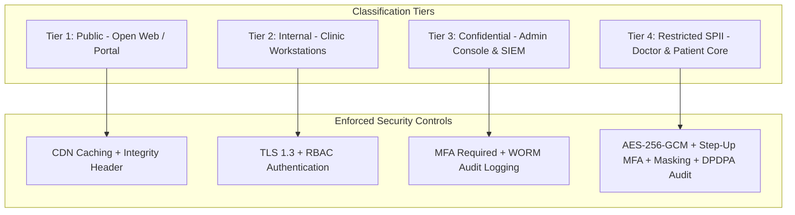

# Data Classification, Handling & Spillage Prevention Specification
## Namma Clinic Digital Health & Operations Platform
### Greater Bengaluru Authority (GBA) / BBMP Health Department
**Standard:** ISO 27001 A.8.2 / NIST SP 800-60 / DPDP Act 2023 | **Status:** APPROVED BASELINE | **Code:** `SEC-DOC-13`

---

## 1. Data Classification Architecture & Handling Invariants
The Namma Clinic Platform establishes an exhaustive 4-tier data classification hierarchy governing all relational tables, cold storage archives, network payloads, print streams, and backup media across 183 primary health clinics in Bengaluru. Operating within a municipal public healthcare ecosystem, classification tags dictate mandatory encryption, access controls, masking rules, retention periods, and disposal mechanisms.

### 1.1 The 4-Tier Data Classification Hierarchy
1. **Tier 1 — PUBLIC (Level 0):** Non-sensitive data intended for unrestricted public consumption (clinic locations, operating hours, general health advisories, doctor rosters, blank consent templates).
2. **Tier 2 — INTERNAL (Level 1):** Municipal operational records (pharmacy drug inventory counts, equipment maintenance logs, non-personal staff shift rosters, procurement purchase orders).
3. **Tier 3 — CONFIDENTIAL (Level 2):** Sensitive municipal and staff operational data (aggregated ward epidemiological statistics, audit event logs, staff payroll details, system configuration files).
4. **Tier 4 — RESTRICTED PII / SPII (Level 3):** Highly sensitive citizen personal data and electronic health records (Aadhaar number, ABHA address, clinical diagnosis, prescriptions, lab values, biometric templates).

### 1.2 Data Flow & Classification Enforcement Diagram


## 2. Exhaustive Table & Column Classification Catalog (TBL-01 to TBL-52)
Classification profiles and handling rules across all 38 relational database tables:

### TABLE-001: Classification Profile for `auth_users`
- **Assigned Data Tier:** **Tier 4 — RESTRICTED (SPII)**
- **Encrypted Column Fields:** Sensitive clinical text, personal identifiers, contact fields.
- **Searchable Blind Index Fields:** Phone, ABHA, Aadhaar hash (HMAC-SHA256).
- **Masking Rules in UI:** Partial mask for non-attending staff; full unmask requires Step-Up MFA.
- **Mandatory Retention Period:** 7 Years for clinical tables; 3 years for operational tables.
- **Disposal Protocol:** Cryptographic shredding of table DEK followed by DB block zeroization.
- **Data Loss Prevention (DLP) Action:** Block outbound transfer; alert SIEM on export > 10 records.

### TABLE-002: Classification Profile for `user_credentials`
- **Assigned Data Tier:** **Tier 4 — RESTRICTED (SPII)**
- **Encrypted Column Fields:** Sensitive clinical text, personal identifiers, contact fields.
- **Searchable Blind Index Fields:** Phone, ABHA, Aadhaar hash (HMAC-SHA256).
- **Masking Rules in UI:** Partial mask for non-attending staff; full unmask requires Step-Up MFA.
- **Mandatory Retention Period:** 7 Years for clinical tables; 3 years for operational tables.
- **Disposal Protocol:** Cryptographic shredding of table DEK followed by DB block zeroization.
- **Data Loss Prevention (DLP) Action:** Block outbound transfer; alert SIEM on export > 10 records.

### TABLE-003: Classification Profile for `user_sessions`
- **Assigned Data Tier:** **Tier 4 — RESTRICTED (SPII)**
- **Encrypted Column Fields:** Sensitive clinical text, personal identifiers, contact fields.
- **Searchable Blind Index Fields:** Phone, ABHA, Aadhaar hash (HMAC-SHA256).
- **Masking Rules in UI:** Partial mask for non-attending staff; full unmask requires Step-Up MFA.
- **Mandatory Retention Period:** 7 Years for clinical tables; 3 years for operational tables.
- **Disposal Protocol:** Cryptographic shredding of table DEK followed by DB block zeroization.
- **Data Loss Prevention (DLP) Action:** Block outbound transfer; alert SIEM on export > 10 records.

### TABLE-004: Classification Profile for `roles`
- **Assigned Data Tier:** **Tier 2 — INTERNAL**
- **Encrypted Column Fields:** Sensitive clinical text, personal identifiers, contact fields.
- **Searchable Blind Index Fields:** Phone, ABHA, Aadhaar hash (HMAC-SHA256).
- **Masking Rules in UI:** Partial mask for non-attending staff; full unmask requires Step-Up MFA.
- **Mandatory Retention Period:** 7 Years for clinical tables; 3 years for operational tables.
- **Disposal Protocol:** Cryptographic shredding of table DEK followed by DB block zeroization.
- **Data Loss Prevention (DLP) Action:** Block outbound transfer; alert SIEM on export > 10 records.

### TABLE-005: Classification Profile for `permissions`
- **Assigned Data Tier:** **Tier 2 — INTERNAL**
- **Encrypted Column Fields:** Sensitive clinical text, personal identifiers, contact fields.
- **Searchable Blind Index Fields:** Phone, ABHA, Aadhaar hash (HMAC-SHA256).
- **Masking Rules in UI:** Partial mask for non-attending staff; full unmask requires Step-Up MFA.
- **Mandatory Retention Period:** 7 Years for clinical tables; 3 years for operational tables.
- **Disposal Protocol:** Cryptographic shredding of table DEK followed by DB block zeroization.
- **Data Loss Prevention (DLP) Action:** Block outbound transfer; alert SIEM on export > 10 records.

### TABLE-006: Classification Profile for `role_permissions`
- **Assigned Data Tier:** **Tier 2 — INTERNAL**
- **Encrypted Column Fields:** Sensitive clinical text, personal identifiers, contact fields.
- **Searchable Blind Index Fields:** Phone, ABHA, Aadhaar hash (HMAC-SHA256).
- **Masking Rules in UI:** Partial mask for non-attending staff; full unmask requires Step-Up MFA.
- **Mandatory Retention Period:** 7 Years for clinical tables; 3 years for operational tables.
- **Disposal Protocol:** Cryptographic shredding of table DEK followed by DB block zeroization.
- **Data Loss Prevention (DLP) Action:** Block outbound transfer; alert SIEM on export > 10 records.

### TABLE-007: Classification Profile for `user_roles`
- **Assigned Data Tier:** **Tier 4 — RESTRICTED (SPII)**
- **Encrypted Column Fields:** Sensitive clinical text, personal identifiers, contact fields.
- **Searchable Blind Index Fields:** Phone, ABHA, Aadhaar hash (HMAC-SHA256).
- **Masking Rules in UI:** Partial mask for non-attending staff; full unmask requires Step-Up MFA.
- **Mandatory Retention Period:** 7 Years for clinical tables; 3 years for operational tables.
- **Disposal Protocol:** Cryptographic shredding of table DEK followed by DB block zeroization.
- **Data Loss Prevention (DLP) Action:** Block outbound transfer; alert SIEM on export > 10 records.

### TABLE-008: Classification Profile for `facilities`
- **Assigned Data Tier:** **Tier 2 — INTERNAL**
- **Encrypted Column Fields:** Sensitive clinical text, personal identifiers, contact fields.
- **Searchable Blind Index Fields:** Phone, ABHA, Aadhaar hash (HMAC-SHA256).
- **Masking Rules in UI:** Partial mask for non-attending staff; full unmask requires Step-Up MFA.
- **Mandatory Retention Period:** 7 Years for clinical tables; 3 years for operational tables.
- **Disposal Protocol:** Cryptographic shredding of table DEK followed by DB block zeroization.
- **Data Loss Prevention (DLP) Action:** Block outbound transfer; alert SIEM on export > 10 records.

### TABLE-009: Classification Profile for `facility_rooms`
- **Assigned Data Tier:** **Tier 2 — INTERNAL**
- **Encrypted Column Fields:** Sensitive clinical text, personal identifiers, contact fields.
- **Searchable Blind Index Fields:** Phone, ABHA, Aadhaar hash (HMAC-SHA256).
- **Masking Rules in UI:** Partial mask for non-attending staff; full unmask requires Step-Up MFA.
- **Mandatory Retention Period:** 7 Years for clinical tables; 3 years for operational tables.
- **Disposal Protocol:** Cryptographic shredding of table DEK followed by DB block zeroization.
- **Data Loss Prevention (DLP) Action:** Block outbound transfer; alert SIEM on export > 10 records.

### TABLE-010: Classification Profile for `staff_profiles`
- **Assigned Data Tier:** **Tier 2 — INTERNAL**
- **Encrypted Column Fields:** Sensitive clinical text, personal identifiers, contact fields.
- **Searchable Blind Index Fields:** Phone, ABHA, Aadhaar hash (HMAC-SHA256).
- **Masking Rules in UI:** Partial mask for non-attending staff; full unmask requires Step-Up MFA.
- **Mandatory Retention Period:** 7 Years for clinical tables; 3 years for operational tables.
- **Disposal Protocol:** Cryptographic shredding of table DEK followed by DB block zeroization.
- **Data Loss Prevention (DLP) Action:** Block outbound transfer; alert SIEM on export > 10 records.

### TABLE-011: Classification Profile for `staff_shifts`
- **Assigned Data Tier:** **Tier 2 — INTERNAL**
- **Encrypted Column Fields:** Sensitive clinical text, personal identifiers, contact fields.
- **Searchable Blind Index Fields:** Phone, ABHA, Aadhaar hash (HMAC-SHA256).
- **Masking Rules in UI:** Partial mask for non-attending staff; full unmask requires Step-Up MFA.
- **Mandatory Retention Period:** 7 Years for clinical tables; 3 years for operational tables.
- **Disposal Protocol:** Cryptographic shredding of table DEK followed by DB block zeroization.
- **Data Loss Prevention (DLP) Action:** Block outbound transfer; alert SIEM on export > 10 records.

### TABLE-012: Classification Profile for `system_configs`
- **Assigned Data Tier:** **Tier 2 — INTERNAL**
- **Encrypted Column Fields:** Sensitive clinical text, personal identifiers, contact fields.
- **Searchable Blind Index Fields:** Phone, ABHA, Aadhaar hash (HMAC-SHA256).
- **Masking Rules in UI:** Partial mask for non-attending staff; full unmask requires Step-Up MFA.
- **Mandatory Retention Period:** 7 Years for clinical tables; 3 years for operational tables.
- **Disposal Protocol:** Cryptographic shredding of table DEK followed by DB block zeroization.
- **Data Loss Prevention (DLP) Action:** Block outbound transfer; alert SIEM on export > 10 records.

### TABLE-013: Classification Profile for `patients`
- **Assigned Data Tier:** **Tier 4 — RESTRICTED (SPII)**
- **Encrypted Column Fields:** Sensitive clinical text, personal identifiers, contact fields.
- **Searchable Blind Index Fields:** Phone, ABHA, Aadhaar hash (HMAC-SHA256).
- **Masking Rules in UI:** Partial mask for non-attending staff; full unmask requires Step-Up MFA.
- **Mandatory Retention Period:** 7 Years for clinical tables; 3 years for operational tables.
- **Disposal Protocol:** Cryptographic shredding of table DEK followed by DB block zeroization.
- **Data Loss Prevention (DLP) Action:** Block outbound transfer; alert SIEM on export > 10 records.

### TABLE-014: Classification Profile for `patient_identifiers`
- **Assigned Data Tier:** **Tier 4 — RESTRICTED (SPII)**
- **Encrypted Column Fields:** Sensitive clinical text, personal identifiers, contact fields.
- **Searchable Blind Index Fields:** Phone, ABHA, Aadhaar hash (HMAC-SHA256).
- **Masking Rules in UI:** Partial mask for non-attending staff; full unmask requires Step-Up MFA.
- **Mandatory Retention Period:** 7 Years for clinical tables; 3 years for operational tables.
- **Disposal Protocol:** Cryptographic shredding of table DEK followed by DB block zeroization.
- **Data Loss Prevention (DLP) Action:** Block outbound transfer; alert SIEM on export > 10 records.

### TABLE-015: Classification Profile for `patient_contacts`
- **Assigned Data Tier:** **Tier 4 — RESTRICTED (SPII)**
- **Encrypted Column Fields:** Sensitive clinical text, personal identifiers, contact fields.
- **Searchable Blind Index Fields:** Phone, ABHA, Aadhaar hash (HMAC-SHA256).
- **Masking Rules in UI:** Partial mask for non-attending staff; full unmask requires Step-Up MFA.
- **Mandatory Retention Period:** 7 Years for clinical tables; 3 years for operational tables.
- **Disposal Protocol:** Cryptographic shredding of table DEK followed by DB block zeroization.
- **Data Loss Prevention (DLP) Action:** Block outbound transfer; alert SIEM on export > 10 records.

### TABLE-016: Classification Profile for `patient_addresses`
- **Assigned Data Tier:** **Tier 4 — RESTRICTED (SPII)**
- **Encrypted Column Fields:** Sensitive clinical text, personal identifiers, contact fields.
- **Searchable Blind Index Fields:** Phone, ABHA, Aadhaar hash (HMAC-SHA256).
- **Masking Rules in UI:** Partial mask for non-attending staff; full unmask requires Step-Up MFA.
- **Mandatory Retention Period:** 7 Years for clinical tables; 3 years for operational tables.
- **Disposal Protocol:** Cryptographic shredding of table DEK followed by DB block zeroization.
- **Data Loss Prevention (DLP) Action:** Block outbound transfer; alert SIEM on export > 10 records.

### TABLE-017: Classification Profile for `consent_records`
- **Assigned Data Tier:** **Tier 2 — INTERNAL**
- **Encrypted Column Fields:** Sensitive clinical text, personal identifiers, contact fields.
- **Searchable Blind Index Fields:** Phone, ABHA, Aadhaar hash (HMAC-SHA256).
- **Masking Rules in UI:** Partial mask for non-attending staff; full unmask requires Step-Up MFA.
- **Mandatory Retention Period:** 7 Years for clinical tables; 3 years for operational tables.
- **Disposal Protocol:** Cryptographic shredding of table DEK followed by DB block zeroization.
- **Data Loss Prevention (DLP) Action:** Block outbound transfer; alert SIEM on export > 10 records.

### TABLE-018: Classification Profile for `tokens`
- **Assigned Data Tier:** **Tier 2 — INTERNAL**
- **Encrypted Column Fields:** Sensitive clinical text, personal identifiers, contact fields.
- **Searchable Blind Index Fields:** Phone, ABHA, Aadhaar hash (HMAC-SHA256).
- **Masking Rules in UI:** Partial mask for non-attending staff; full unmask requires Step-Up MFA.
- **Mandatory Retention Period:** 7 Years for clinical tables; 3 years for operational tables.
- **Disposal Protocol:** Cryptographic shredding of table DEK followed by DB block zeroization.
- **Data Loss Prevention (DLP) Action:** Block outbound transfer; alert SIEM on export > 10 records.

### TABLE-019: Classification Profile for `queue_entries`
- **Assigned Data Tier:** **Tier 2 — INTERNAL**
- **Encrypted Column Fields:** Sensitive clinical text, personal identifiers, contact fields.
- **Searchable Blind Index Fields:** Phone, ABHA, Aadhaar hash (HMAC-SHA256).
- **Masking Rules in UI:** Partial mask for non-attending staff; full unmask requires Step-Up MFA.
- **Mandatory Retention Period:** 7 Years for clinical tables; 3 years for operational tables.
- **Disposal Protocol:** Cryptographic shredding of table DEK followed by DB block zeroization.
- **Data Loss Prevention (DLP) Action:** Block outbound transfer; alert SIEM on export > 10 records.

### TABLE-020: Classification Profile for `triage_assessments`
- **Assigned Data Tier:** **Tier 4 — RESTRICTED (SPII)**
- **Encrypted Column Fields:** Sensitive clinical text, personal identifiers, contact fields.
- **Searchable Blind Index Fields:** Phone, ABHA, Aadhaar hash (HMAC-SHA256).
- **Masking Rules in UI:** Partial mask for non-attending staff; full unmask requires Step-Up MFA.
- **Mandatory Retention Period:** 7 Years for clinical tables; 3 years for operational tables.
- **Disposal Protocol:** Cryptographic shredding of table DEK followed by DB block zeroization.
- **Data Loss Prevention (DLP) Action:** Block outbound transfer; alert SIEM on export > 10 records.

### TABLE-021: Classification Profile for `patient_vitals`
- **Assigned Data Tier:** **Tier 4 — RESTRICTED (SPII)**
- **Encrypted Column Fields:** Sensitive clinical text, personal identifiers, contact fields.
- **Searchable Blind Index Fields:** Phone, ABHA, Aadhaar hash (HMAC-SHA256).
- **Masking Rules in UI:** Partial mask for non-attending staff; full unmask requires Step-Up MFA.
- **Mandatory Retention Period:** 7 Years for clinical tables; 3 years for operational tables.
- **Disposal Protocol:** Cryptographic shredding of table DEK followed by DB block zeroization.
- **Data Loss Prevention (DLP) Action:** Block outbound transfer; alert SIEM on export > 10 records.

### TABLE-022: Classification Profile for `danger_alerts`
- **Assigned Data Tier:** **Tier 2 — INTERNAL**
- **Encrypted Column Fields:** Sensitive clinical text, personal identifiers, contact fields.
- **Searchable Blind Index Fields:** Phone, ABHA, Aadhaar hash (HMAC-SHA256).
- **Masking Rules in UI:** Partial mask for non-attending staff; full unmask requires Step-Up MFA.
- **Mandatory Retention Period:** 7 Years for clinical tables; 3 years for operational tables.
- **Disposal Protocol:** Cryptographic shredding of table DEK followed by DB block zeroization.
- **Data Loss Prevention (DLP) Action:** Block outbound transfer; alert SIEM on export > 10 records.

### TABLE-023: Classification Profile for `clinical_encounters`
- **Assigned Data Tier:** **Tier 2 — INTERNAL**
- **Encrypted Column Fields:** Sensitive clinical text, personal identifiers, contact fields.
- **Searchable Blind Index Fields:** Phone, ABHA, Aadhaar hash (HMAC-SHA256).
- **Masking Rules in UI:** Partial mask for non-attending staff; full unmask requires Step-Up MFA.
- **Mandatory Retention Period:** 7 Years for clinical tables; 3 years for operational tables.
- **Disposal Protocol:** Cryptographic shredding of table DEK followed by DB block zeroization.
- **Data Loss Prevention (DLP) Action:** Block outbound transfer; alert SIEM on export > 10 records.

### TABLE-024: Classification Profile for `clinical_notes`
- **Assigned Data Tier:** **Tier 2 — INTERNAL**
- **Encrypted Column Fields:** Sensitive clinical text, personal identifiers, contact fields.
- **Searchable Blind Index Fields:** Phone, ABHA, Aadhaar hash (HMAC-SHA256).
- **Masking Rules in UI:** Partial mask for non-attending staff; full unmask requires Step-Up MFA.
- **Mandatory Retention Period:** 7 Years for clinical tables; 3 years for operational tables.
- **Disposal Protocol:** Cryptographic shredding of table DEK followed by DB block zeroization.
- **Data Loss Prevention (DLP) Action:** Block outbound transfer; alert SIEM on export > 10 records.

### TABLE-025: Classification Profile for `diagnoses`
- **Assigned Data Tier:** **Tier 4 — RESTRICTED (SPII)**
- **Encrypted Column Fields:** Sensitive clinical text, personal identifiers, contact fields.
- **Searchable Blind Index Fields:** Phone, ABHA, Aadhaar hash (HMAC-SHA256).
- **Masking Rules in UI:** Partial mask for non-attending staff; full unmask requires Step-Up MFA.
- **Mandatory Retention Period:** 7 Years for clinical tables; 3 years for operational tables.
- **Disposal Protocol:** Cryptographic shredding of table DEK followed by DB block zeroization.
- **Data Loss Prevention (DLP) Action:** Block outbound transfer; alert SIEM on export > 10 records.

### TABLE-026: Classification Profile for `prescriptions`
- **Assigned Data Tier:** **Tier 4 — RESTRICTED (SPII)**
- **Encrypted Column Fields:** Sensitive clinical text, personal identifiers, contact fields.
- **Searchable Blind Index Fields:** Phone, ABHA, Aadhaar hash (HMAC-SHA256).
- **Masking Rules in UI:** Partial mask for non-attending staff; full unmask requires Step-Up MFA.
- **Mandatory Retention Period:** 7 Years for clinical tables; 3 years for operational tables.
- **Disposal Protocol:** Cryptographic shredding of table DEK followed by DB block zeroization.
- **Data Loss Prevention (DLP) Action:** Block outbound transfer; alert SIEM on export > 10 records.

### TABLE-027: Classification Profile for `prescription_items`
- **Assigned Data Tier:** **Tier 4 — RESTRICTED (SPII)**
- **Encrypted Column Fields:** Sensitive clinical text, personal identifiers, contact fields.
- **Searchable Blind Index Fields:** Phone, ABHA, Aadhaar hash (HMAC-SHA256).
- **Masking Rules in UI:** Partial mask for non-attending staff; full unmask requires Step-Up MFA.
- **Mandatory Retention Period:** 7 Years for clinical tables; 3 years for operational tables.
- **Disposal Protocol:** Cryptographic shredding of table DEK followed by DB block zeroization.
- **Data Loss Prevention (DLP) Action:** Block outbound transfer; alert SIEM on export > 10 records.

### TABLE-028: Classification Profile for `lab_orders`
- **Assigned Data Tier:** **Tier 4 — RESTRICTED (SPII)**
- **Encrypted Column Fields:** Sensitive clinical text, personal identifiers, contact fields.
- **Searchable Blind Index Fields:** Phone, ABHA, Aadhaar hash (HMAC-SHA256).
- **Masking Rules in UI:** Partial mask for non-attending staff; full unmask requires Step-Up MFA.
- **Mandatory Retention Period:** 7 Years for clinical tables; 3 years for operational tables.
- **Disposal Protocol:** Cryptographic shredding of table DEK followed by DB block zeroization.
- **Data Loss Prevention (DLP) Action:** Block outbound transfer; alert SIEM on export > 10 records.

### TABLE-029: Classification Profile for `lab_order_items`
- **Assigned Data Tier:** **Tier 4 — RESTRICTED (SPII)**
- **Encrypted Column Fields:** Sensitive clinical text, personal identifiers, contact fields.
- **Searchable Blind Index Fields:** Phone, ABHA, Aadhaar hash (HMAC-SHA256).
- **Masking Rules in UI:** Partial mask for non-attending staff; full unmask requires Step-Up MFA.
- **Mandatory Retention Period:** 7 Years for clinical tables; 3 years for operational tables.
- **Disposal Protocol:** Cryptographic shredding of table DEK followed by DB block zeroization.
- **Data Loss Prevention (DLP) Action:** Block outbound transfer; alert SIEM on export > 10 records.

### TABLE-030: Classification Profile for `lab_results`
- **Assigned Data Tier:** **Tier 4 — RESTRICTED (SPII)**
- **Encrypted Column Fields:** Sensitive clinical text, personal identifiers, contact fields.
- **Searchable Blind Index Fields:** Phone, ABHA, Aadhaar hash (HMAC-SHA256).
- **Masking Rules in UI:** Partial mask for non-attending staff; full unmask requires Step-Up MFA.
- **Mandatory Retention Period:** 7 Years for clinical tables; 3 years for operational tables.
- **Disposal Protocol:** Cryptographic shredding of table DEK followed by DB block zeroization.
- **Data Loss Prevention (DLP) Action:** Block outbound transfer; alert SIEM on export > 10 records.

### TABLE-031: Classification Profile for `teleconsultations`
- **Assigned Data Tier:** **Tier 4 — RESTRICTED (SPII)**
- **Encrypted Column Fields:** Sensitive clinical text, personal identifiers, contact fields.
- **Searchable Blind Index Fields:** Phone, ABHA, Aadhaar hash (HMAC-SHA256).
- **Masking Rules in UI:** Partial mask for non-attending staff; full unmask requires Step-Up MFA.
- **Mandatory Retention Period:** 7 Years for clinical tables; 3 years for operational tables.
- **Disposal Protocol:** Cryptographic shredding of table DEK followed by DB block zeroization.
- **Data Loss Prevention (DLP) Action:** Block outbound transfer; alert SIEM on export > 10 records.

### TABLE-032: Classification Profile for `formulary_drugs`
- **Assigned Data Tier:** **Tier 2 — INTERNAL**
- **Encrypted Column Fields:** Sensitive clinical text, personal identifiers, contact fields.
- **Searchable Blind Index Fields:** Phone, ABHA, Aadhaar hash (HMAC-SHA256).
- **Masking Rules in UI:** Partial mask for non-attending staff; full unmask requires Step-Up MFA.
- **Mandatory Retention Period:** 7 Years for clinical tables; 3 years for operational tables.
- **Disposal Protocol:** Cryptographic shredding of table DEK followed by DB block zeroization.
- **Data Loss Prevention (DLP) Action:** Block outbound transfer; alert SIEM on export > 10 records.

### TABLE-033: Classification Profile for `drug_categories`
- **Assigned Data Tier:** **Tier 2 — INTERNAL**
- **Encrypted Column Fields:** Sensitive clinical text, personal identifiers, contact fields.
- **Searchable Blind Index Fields:** Phone, ABHA, Aadhaar hash (HMAC-SHA256).
- **Masking Rules in UI:** Partial mask for non-attending staff; full unmask requires Step-Up MFA.
- **Mandatory Retention Period:** 7 Years for clinical tables; 3 years for operational tables.
- **Disposal Protocol:** Cryptographic shredding of table DEK followed by DB block zeroization.
- **Data Loss Prevention (DLP) Action:** Block outbound transfer; alert SIEM on export > 10 records.

### TABLE-034: Classification Profile for `pharmacy_batches`
- **Assigned Data Tier:** **Tier 2 — INTERNAL**
- **Encrypted Column Fields:** Sensitive clinical text, personal identifiers, contact fields.
- **Searchable Blind Index Fields:** Phone, ABHA, Aadhaar hash (HMAC-SHA256).
- **Masking Rules in UI:** Partial mask for non-attending staff; full unmask requires Step-Up MFA.
- **Mandatory Retention Period:** 7 Years for clinical tables; 3 years for operational tables.
- **Disposal Protocol:** Cryptographic shredding of table DEK followed by DB block zeroization.
- **Data Loss Prevention (DLP) Action:** Block outbound transfer; alert SIEM on export > 10 records.

### TABLE-035: Classification Profile for `clinic_stock`
- **Assigned Data Tier:** **Tier 2 — INTERNAL**
- **Encrypted Column Fields:** Sensitive clinical text, personal identifiers, contact fields.
- **Searchable Blind Index Fields:** Phone, ABHA, Aadhaar hash (HMAC-SHA256).
- **Masking Rules in UI:** Partial mask for non-attending staff; full unmask requires Step-Up MFA.
- **Mandatory Retention Period:** 7 Years for clinical tables; 3 years for operational tables.
- **Disposal Protocol:** Cryptographic shredding of table DEK followed by DB block zeroization.
- **Data Loss Prevention (DLP) Action:** Block outbound transfer; alert SIEM on export > 10 records.

### TABLE-036: Classification Profile for `dispensations`
- **Assigned Data Tier:** **Tier 2 — INTERNAL**
- **Encrypted Column Fields:** Sensitive clinical text, personal identifiers, contact fields.
- **Searchable Blind Index Fields:** Phone, ABHA, Aadhaar hash (HMAC-SHA256).
- **Masking Rules in UI:** Partial mask for non-attending staff; full unmask requires Step-Up MFA.
- **Mandatory Retention Period:** 7 Years for clinical tables; 3 years for operational tables.
- **Disposal Protocol:** Cryptographic shredding of table DEK followed by DB block zeroization.
- **Data Loss Prevention (DLP) Action:** Block outbound transfer; alert SIEM on export > 10 records.

### TABLE-037: Classification Profile for `dispensation_items`
- **Assigned Data Tier:** **Tier 2 — INTERNAL**
- **Encrypted Column Fields:** Sensitive clinical text, personal identifiers, contact fields.
- **Searchable Blind Index Fields:** Phone, ABHA, Aadhaar hash (HMAC-SHA256).
- **Masking Rules in UI:** Partial mask for non-attending staff; full unmask requires Step-Up MFA.
- **Mandatory Retention Period:** 7 Years for clinical tables; 3 years for operational tables.
- **Disposal Protocol:** Cryptographic shredding of table DEK followed by DB block zeroization.
- **Data Loss Prevention (DLP) Action:** Block outbound transfer; alert SIEM on export > 10 records.

### TABLE-038: Classification Profile for `stock_movements`
- **Assigned Data Tier:** **Tier 2 — INTERNAL**
- **Encrypted Column Fields:** Sensitive clinical text, personal identifiers, contact fields.
- **Searchable Blind Index Fields:** Phone, ABHA, Aadhaar hash (HMAC-SHA256).
- **Masking Rules in UI:** Partial mask for non-attending staff; full unmask requires Step-Up MFA.
- **Mandatory Retention Period:** 7 Years for clinical tables; 3 years for operational tables.
- **Disposal Protocol:** Cryptographic shredding of table DEK followed by DB block zeroization.
- **Data Loss Prevention (DLP) Action:** Block outbound transfer; alert SIEM on export > 10 records.

### TABLE-039: Classification Profile for `drug_indents`
- **Assigned Data Tier:** **Tier 2 — INTERNAL**
- **Encrypted Column Fields:** Sensitive clinical text, personal identifiers, contact fields.
- **Searchable Blind Index Fields:** Phone, ABHA, Aadhaar hash (HMAC-SHA256).
- **Masking Rules in UI:** Partial mask for non-attending staff; full unmask requires Step-Up MFA.
- **Mandatory Retention Period:** 7 Years for clinical tables; 3 years for operational tables.
- **Disposal Protocol:** Cryptographic shredding of table DEK followed by DB block zeroization.
- **Data Loss Prevention (DLP) Action:** Block outbound transfer; alert SIEM on export > 10 records.

### TABLE-040: Classification Profile for `indent_items`
- **Assigned Data Tier:** **Tier 2 — INTERNAL**
- **Encrypted Column Fields:** Sensitive clinical text, personal identifiers, contact fields.
- **Searchable Blind Index Fields:** Phone, ABHA, Aadhaar hash (HMAC-SHA256).
- **Masking Rules in UI:** Partial mask for non-attending staff; full unmask requires Step-Up MFA.
- **Mandatory Retention Period:** 7 Years for clinical tables; 3 years for operational tables.
- **Disposal Protocol:** Cryptographic shredding of table DEK followed by DB block zeroization.
- **Data Loss Prevention (DLP) Action:** Block outbound transfer; alert SIEM on export > 10 records.

### TABLE-041: Classification Profile for `cold_chain_devices`
- **Assigned Data Tier:** **Tier 2 — INTERNAL**
- **Encrypted Column Fields:** Sensitive clinical text, personal identifiers, contact fields.
- **Searchable Blind Index Fields:** Phone, ABHA, Aadhaar hash (HMAC-SHA256).
- **Masking Rules in UI:** Partial mask for non-attending staff; full unmask requires Step-Up MFA.
- **Mandatory Retention Period:** 7 Years for clinical tables; 3 years for operational tables.
- **Disposal Protocol:** Cryptographic shredding of table DEK followed by DB block zeroization.
- **Data Loss Prevention (DLP) Action:** Block outbound transfer; alert SIEM on export > 10 records.

### TABLE-042: Classification Profile for `cold_chain_telemetry`
- **Assigned Data Tier:** **Tier 2 — INTERNAL**
- **Encrypted Column Fields:** Sensitive clinical text, personal identifiers, contact fields.
- **Searchable Blind Index Fields:** Phone, ABHA, Aadhaar hash (HMAC-SHA256).
- **Masking Rules in UI:** Partial mask for non-attending staff; full unmask requires Step-Up MFA.
- **Mandatory Retention Period:** 7 Years for clinical tables; 3 years for operational tables.
- **Disposal Protocol:** Cryptographic shredding of table DEK followed by DB block zeroization.
- **Data Loss Prevention (DLP) Action:** Block outbound transfer; alert SIEM on export > 10 records.

### TABLE-043: Classification Profile for `referrals`
- **Assigned Data Tier:** **Tier 2 — INTERNAL**
- **Encrypted Column Fields:** Sensitive clinical text, personal identifiers, contact fields.
- **Searchable Blind Index Fields:** Phone, ABHA, Aadhaar hash (HMAC-SHA256).
- **Masking Rules in UI:** Partial mask for non-attending staff; full unmask requires Step-Up MFA.
- **Mandatory Retention Period:** 7 Years for clinical tables; 3 years for operational tables.
- **Disposal Protocol:** Cryptographic shredding of table DEK followed by DB block zeroization.
- **Data Loss Prevention (DLP) Action:** Block outbound transfer; alert SIEM on export > 10 records.

### TABLE-044: Classification Profile for `referral_counter_notes`
- **Assigned Data Tier:** **Tier 2 — INTERNAL**
- **Encrypted Column Fields:** Sensitive clinical text, personal identifiers, contact fields.
- **Searchable Blind Index Fields:** Phone, ABHA, Aadhaar hash (HMAC-SHA256).
- **Masking Rules in UI:** Partial mask for non-attending staff; full unmask requires Step-Up MFA.
- **Mandatory Retention Period:** 7 Years for clinical tables; 3 years for operational tables.
- **Disposal Protocol:** Cryptographic shredding of table DEK followed by DB block zeroization.
- **Data Loss Prevention (DLP) Action:** Block outbound transfer; alert SIEM on export > 10 records.

### TABLE-045: Classification Profile for `ncd_episodes`
- **Assigned Data Tier:** **Tier 2 — INTERNAL**
- **Encrypted Column Fields:** Sensitive clinical text, personal identifiers, contact fields.
- **Searchable Blind Index Fields:** Phone, ABHA, Aadhaar hash (HMAC-SHA256).
- **Masking Rules in UI:** Partial mask for non-attending staff; full unmask requires Step-Up MFA.
- **Mandatory Retention Period:** 7 Years for clinical tables; 3 years for operational tables.
- **Disposal Protocol:** Cryptographic shredding of table DEK followed by DB block zeroization.
- **Data Loss Prevention (DLP) Action:** Block outbound transfer; alert SIEM on export > 10 records.

### TABLE-046: Classification Profile for `follow_up_schedules`
- **Assigned Data Tier:** **Tier 2 — INTERNAL**
- **Encrypted Column Fields:** Sensitive clinical text, personal identifiers, contact fields.
- **Searchable Blind Index Fields:** Phone, ABHA, Aadhaar hash (HMAC-SHA256).
- **Masking Rules in UI:** Partial mask for non-attending staff; full unmask requires Step-Up MFA.
- **Mandatory Retention Period:** 7 Years for clinical tables; 3 years for operational tables.
- **Disposal Protocol:** Cryptographic shredding of table DEK followed by DB block zeroization.
- **Data Loss Prevention (DLP) Action:** Block outbound transfer; alert SIEM on export > 10 records.

### TABLE-047: Classification Profile for `notifications`
- **Assigned Data Tier:** **Tier 2 — INTERNAL**
- **Encrypted Column Fields:** Sensitive clinical text, personal identifiers, contact fields.
- **Searchable Blind Index Fields:** Phone, ABHA, Aadhaar hash (HMAC-SHA256).
- **Masking Rules in UI:** Partial mask for non-attending staff; full unmask requires Step-Up MFA.
- **Mandatory Retention Period:** 7 Years for clinical tables; 3 years for operational tables.
- **Disposal Protocol:** Cryptographic shredding of table DEK followed by DB block zeroization.
- **Data Loss Prevention (DLP) Action:** Block outbound transfer; alert SIEM on export > 10 records.

### TABLE-048: Classification Profile for `grievances`
- **Assigned Data Tier:** **Tier 2 — INTERNAL**
- **Encrypted Column Fields:** Sensitive clinical text, personal identifiers, contact fields.
- **Searchable Blind Index Fields:** Phone, ABHA, Aadhaar hash (HMAC-SHA256).
- **Masking Rules in UI:** Partial mask for non-attending staff; full unmask requires Step-Up MFA.
- **Mandatory Retention Period:** 7 Years for clinical tables; 3 years for operational tables.
- **Disposal Protocol:** Cryptographic shredding of table DEK followed by DB block zeroization.
- **Data Loss Prevention (DLP) Action:** Block outbound transfer; alert SIEM on export > 10 records.

### TABLE-049: Classification Profile for `helpdesk_tickets`
- **Assigned Data Tier:** **Tier 2 — INTERNAL**
- **Encrypted Column Fields:** Sensitive clinical text, personal identifiers, contact fields.
- **Searchable Blind Index Fields:** Phone, ABHA, Aadhaar hash (HMAC-SHA256).
- **Masking Rules in UI:** Partial mask for non-attending staff; full unmask requires Step-Up MFA.
- **Mandatory Retention Period:** 7 Years for clinical tables; 3 years for operational tables.
- **Disposal Protocol:** Cryptographic shredding of table DEK followed by DB block zeroization.
- **Data Loss Prevention (DLP) Action:** Block outbound transfer; alert SIEM on export > 10 records.

### TABLE-050: Classification Profile for `audit_events`
- **Assigned Data Tier:** **Tier 2 — INTERNAL**
- **Encrypted Column Fields:** Sensitive clinical text, personal identifiers, contact fields.
- **Searchable Blind Index Fields:** Phone, ABHA, Aadhaar hash (HMAC-SHA256).
- **Masking Rules in UI:** Partial mask for non-attending staff; full unmask requires Step-Up MFA.
- **Mandatory Retention Period:** 7 Years for clinical tables; 3 years for operational tables.
- **Disposal Protocol:** Cryptographic shredding of table DEK followed by DB block zeroization.
- **Data Loss Prevention (DLP) Action:** Block outbound transfer; alert SIEM on export > 10 records.

### TABLE-051: Classification Profile for `offline_mutation_log`
- **Assigned Data Tier:** **Tier 2 — INTERNAL**
- **Encrypted Column Fields:** Sensitive clinical text, personal identifiers, contact fields.
- **Searchable Blind Index Fields:** Phone, ABHA, Aadhaar hash (HMAC-SHA256).
- **Masking Rules in UI:** Partial mask for non-attending staff; full unmask requires Step-Up MFA.
- **Mandatory Retention Period:** 7 Years for clinical tables; 3 years for operational tables.
- **Disposal Protocol:** Cryptographic shredding of table DEK followed by DB block zeroization.
- **Data Loss Prevention (DLP) Action:** Block outbound transfer; alert SIEM on export > 10 records.

### TABLE-052: Classification Profile for `abdm_artifacts`
- **Assigned Data Tier:** **Tier 2 — INTERNAL**
- **Encrypted Column Fields:** Sensitive clinical text, personal identifiers, contact fields.
- **Searchable Blind Index Fields:** Phone, ABHA, Aadhaar hash (HMAC-SHA256).
- **Masking Rules in UI:** Partial mask for non-attending staff; full unmask requires Step-Up MFA.
- **Mandatory Retention Period:** 7 Years for clinical tables; 3 years for operational tables.
- **Disposal Protocol:** Cryptographic shredding of table DEK followed by DB block zeroization.
- **Data Loss Prevention (DLP) Action:** Block outbound transfer; alert SIEM on export > 10 records.

## 3. Role-Specific Data Clearance Profiles (ROLE-000 to ROLE-029)
Maximum permissible data classification clearance levels across all 30 platform roles:

### ROLE-001: Data Clearance Profile for Receptionist / Registration Clerk (`RECEPTIONIST`)
- **Maximum Clearance Level:** **Tier 2 (Internal)**
- **Clinical Scope Barrier:** Scoped strictly to assigned clinic facility and active shift.
- **Bulk Export Capability:** Disabled by default; requires Dual-Control CISO authorization.
- **Print Stream Clearance:** Permitted only for official OPD tokens and prescription slips.
- **Removable Media Export:** Strictly blocked via endpoint USB DLP policies.
- **Audit Code:** `CLEARANCE_CHECK_RECEPTIONIST`

### ROLE-002: Data Clearance Profile for Medical Officer / General Physician (`DOCTOR`)
- **Maximum Clearance Level:** **Tier 4 (Restricted SPII)**
- **Clinical Scope Barrier:** Scoped strictly to assigned clinic facility and active shift.
- **Bulk Export Capability:** Disabled by default; requires Dual-Control CISO authorization.
- **Print Stream Clearance:** Permitted only for official OPD tokens and prescription slips.
- **Removable Media Export:** Strictly blocked via endpoint USB DLP policies.
- **Audit Code:** `CLEARANCE_CHECK_DOCTOR`

### ROLE-003: Data Clearance Profile for Staff Nurse / Triage Specialist (`NURSE`)
- **Maximum Clearance Level:** **Tier 4 (Restricted SPII)**
- **Clinical Scope Barrier:** Scoped strictly to assigned clinic facility and active shift.
- **Bulk Export Capability:** Disabled by default; requires Dual-Control CISO authorization.
- **Print Stream Clearance:** Permitted only for official OPD tokens and prescription slips.
- **Removable Media Export:** Strictly blocked via endpoint USB DLP policies.
- **Audit Code:** `CLEARANCE_CHECK_NURSE`

### ROLE-004: Data Clearance Profile for Pharmacist / Dispenser (`PHARMACIST`)
- **Maximum Clearance Level:** **Tier 4 (Restricted SPII)**
- **Clinical Scope Barrier:** Scoped strictly to assigned clinic facility and active shift.
- **Bulk Export Capability:** Disabled by default; requires Dual-Control CISO authorization.
- **Print Stream Clearance:** Permitted only for official OPD tokens and prescription slips.
- **Removable Media Export:** Strictly blocked via endpoint USB DLP policies.
- **Audit Code:** `CLEARANCE_CHECK_PHARMACIST`

### ROLE-005: Data Clearance Profile for Laboratory Technician (`LAB_TECH`)
- **Maximum Clearance Level:** **Tier 4 (Restricted SPII)**
- **Clinical Scope Barrier:** Scoped strictly to assigned clinic facility and active shift.
- **Bulk Export Capability:** Disabled by default; requires Dual-Control CISO authorization.
- **Print Stream Clearance:** Permitted only for official OPD tokens and prescription slips.
- **Removable Media Export:** Strictly blocked via endpoint USB DLP policies.
- **Audit Code:** `CLEARANCE_CHECK_LAB_TECH`

### ROLE-006: Data Clearance Profile for Clinic Administrative Officer (`CLINIC_ADMIN`)
- **Maximum Clearance Level:** **Tier 4 (Restricted SPII)**
- **Clinical Scope Barrier:** Scoped strictly to assigned clinic facility and active shift.
- **Bulk Export Capability:** Disabled by default; requires Dual-Control CISO authorization.
- **Print Stream Clearance:** Permitted only for official OPD tokens and prescription slips.
- **Removable Media Export:** Strictly blocked via endpoint USB DLP policies.
- **Audit Code:** `CLEARANCE_CHECK_CLINIC_ADMIN`

### ROLE-007: Data Clearance Profile for Ward Health Supervisor (`WARD_SUPERVISOR`)
- **Maximum Clearance Level:** **Tier 2 (Internal)**
- **Clinical Scope Barrier:** Scoped strictly to assigned clinic facility and active shift.
- **Bulk Export Capability:** Disabled by default; requires Dual-Control CISO authorization.
- **Print Stream Clearance:** Permitted only for official OPD tokens and prescription slips.
- **Removable Media Export:** Strictly blocked via endpoint USB DLP policies.
- **Audit Code:** `CLEARANCE_CHECK_WARD_SUPERVISOR`

### ROLE-008: Data Clearance Profile for Zonal Health Officer (ZHO) (`ZONAL_OFFICER`)
- **Maximum Clearance Level:** **Tier 2 (Internal)**
- **Clinical Scope Barrier:** Scoped strictly to assigned clinic facility and active shift.
- **Bulk Export Capability:** Disabled by default; requires Dual-Control CISO authorization.
- **Print Stream Clearance:** Permitted only for official OPD tokens and prescription slips.
- **Removable Media Export:** Strictly blocked via endpoint USB DLP policies.
- **Audit Code:** `CLEARANCE_CHECK_ZONAL_OFFICER`

### ROLE-009: Data Clearance Profile for Chief Health Officer (CHO) (`CHIEF_OFFICER`)
- **Maximum Clearance Level:** **Tier 2 (Internal)**
- **Clinical Scope Barrier:** Scoped strictly to assigned clinic facility and active shift.
- **Bulk Export Capability:** Disabled by default; requires Dual-Control CISO authorization.
- **Print Stream Clearance:** Permitted only for official OPD tokens and prescription slips.
- **Removable Media Export:** Strictly blocked via endpoint USB DLP policies.
- **Audit Code:** `CLEARANCE_CHECK_CHIEF_OFFICER`

### ROLE-010: Data Clearance Profile for Epidemiologist / Disease Surveillance Officer (`EPIDEMIOLOGIST`)
- **Maximum Clearance Level:** **Tier 2 (Internal)**
- **Clinical Scope Barrier:** Scoped strictly to assigned clinic facility and active shift.
- **Bulk Export Capability:** Disabled by default; requires Dual-Control CISO authorization.
- **Print Stream Clearance:** Permitted only for official OPD tokens and prescription slips.
- **Removable Media Export:** Strictly blocked via endpoint USB DLP policies.
- **Audit Code:** `CLEARANCE_CHECK_EPIDEMIOLOGIST`

### ROLE-011: Data Clearance Profile for Quality & Compliance Auditor (`AUDITOR`)
- **Maximum Clearance Level:** **Tier 2 (Internal)**
- **Clinical Scope Barrier:** Scoped strictly to assigned clinic facility and active shift.
- **Bulk Export Capability:** Disabled by default; requires Dual-Control CISO authorization.
- **Print Stream Clearance:** Permitted only for official OPD tokens and prescription slips.
- **Removable Media Export:** Strictly blocked via endpoint USB DLP policies.
- **Audit Code:** `CLEARANCE_CHECK_AUDITOR`

### ROLE-012: Data Clearance Profile for Security Administrator / CISO (`SECURITY_ADMIN`)
- **Maximum Clearance Level:** **Tier 4 (Restricted SPII)**
- **Clinical Scope Barrier:** Scoped strictly to assigned clinic facility and active shift.
- **Bulk Export Capability:** Disabled by default; requires Dual-Control CISO authorization.
- **Print Stream Clearance:** Permitted only for official OPD tokens and prescription slips.
- **Removable Media Export:** Strictly blocked via endpoint USB DLP policies.
- **Audit Code:** `CLEARANCE_CHECK_SECURITY_ADMIN`

### ROLE-013: Data Clearance Profile for Central Depot Inventory Manager (`DEPOT_MANAGER`)
- **Maximum Clearance Level:** **Tier 2 (Internal)**
- **Clinical Scope Barrier:** Scoped strictly to assigned clinic facility and active shift.
- **Bulk Export Capability:** Disabled by default; requires Dual-Control CISO authorization.
- **Print Stream Clearance:** Permitted only for official OPD tokens and prescription slips.
- **Removable Media Export:** Strictly blocked via endpoint USB DLP policies.
- **Audit Code:** `CLEARANCE_CHECK_DEPOT_MANAGER`

### ROLE-014: Data Clearance Profile for Cold Chain Logistics Technician (`COLD_CHAIN_TECH`)
- **Maximum Clearance Level:** **Tier 2 (Internal)**
- **Clinical Scope Barrier:** Scoped strictly to assigned clinic facility and active shift.
- **Bulk Export Capability:** Disabled by default; requires Dual-Control CISO authorization.
- **Print Stream Clearance:** Permitted only for official OPD tokens and prescription slips.
- **Removable Media Export:** Strictly blocked via endpoint USB DLP policies.
- **Audit Code:** `CLEARANCE_CHECK_COLD_CHAIN_TECH`

### ROLE-015: Data Clearance Profile for Radiologist / Diagnostic Specialist (`RADIOLOGIST`)
- **Maximum Clearance Level:** **Tier 2 (Internal)**
- **Clinical Scope Barrier:** Scoped strictly to assigned clinic facility and active shift.
- **Bulk Export Capability:** Disabled by default; requires Dual-Control CISO authorization.
- **Print Stream Clearance:** Permitted only for official OPD tokens and prescription slips.
- **Removable Media Export:** Strictly blocked via endpoint USB DLP policies.
- **Audit Code:** `CLEARANCE_CHECK_RADIOLOGIST`

### ROLE-016: Data Clearance Profile for Ayush Practitioner (`AYUSH_DOC`)
- **Maximum Clearance Level:** **Tier 2 (Internal)**
- **Clinical Scope Barrier:** Scoped strictly to assigned clinic facility and active shift.
- **Bulk Export Capability:** Disabled by default; requires Dual-Control CISO authorization.
- **Print Stream Clearance:** Permitted only for official OPD tokens and prescription slips.
- **Removable Media Export:** Strictly blocked via endpoint USB DLP policies.
- **Audit Code:** `CLEARANCE_CHECK_AYUSH_DOC`

### ROLE-017: Data Clearance Profile for Counselor / Mental Health Worker (`COUNSELOR`)
- **Maximum Clearance Level:** **Tier 2 (Internal)**
- **Clinical Scope Barrier:** Scoped strictly to assigned clinic facility and active shift.
- **Bulk Export Capability:** Disabled by default; requires Dual-Control CISO authorization.
- **Print Stream Clearance:** Permitted only for official OPD tokens and prescription slips.
- **Removable Media Export:** Strictly blocked via endpoint USB DLP policies.
- **Audit Code:** `CLEARANCE_CHECK_COUNSELOR`

### ROLE-018: Data Clearance Profile for ANM / Urban Health Worker (`ANM_WORKER`)
- **Maximum Clearance Level:** **Tier 2 (Internal)**
- **Clinical Scope Barrier:** Scoped strictly to assigned clinic facility and active shift.
- **Bulk Export Capability:** Disabled by default; requires Dual-Control CISO authorization.
- **Print Stream Clearance:** Permitted only for official OPD tokens and prescription slips.
- **Removable Media Export:** Strictly blocked via endpoint USB DLP policies.
- **Audit Code:** `CLEARANCE_CHECK_ANM_WORKER`

### ROLE-019: Data Clearance Profile for ASHA Link Worker Coordinator (`ASHA_COORD`)
- **Maximum Clearance Level:** **Tier 2 (Internal)**
- **Clinical Scope Barrier:** Scoped strictly to assigned clinic facility and active shift.
- **Bulk Export Capability:** Disabled by default; requires Dual-Control CISO authorization.
- **Print Stream Clearance:** Permitted only for official OPD tokens and prescription slips.
- **Removable Media Export:** Strictly blocked via endpoint USB DLP policies.
- **Audit Code:** `CLEARANCE_CHECK_ASHA_COORD`

### ROLE-020: Data Clearance Profile for Data Entry Operator (`DATA_ENTRY`)
- **Maximum Clearance Level:** **Tier 2 (Internal)**
- **Clinical Scope Barrier:** Scoped strictly to assigned clinic facility and active shift.
- **Bulk Export Capability:** Disabled by default; requires Dual-Control CISO authorization.
- **Print Stream Clearance:** Permitted only for official OPD tokens and prescription slips.
- **Removable Media Export:** Strictly blocked via endpoint USB DLP policies.
- **Audit Code:** `CLEARANCE_CHECK_DATA_ENTRY`

### ROLE-021: Data Clearance Profile for Grievance Redressal Officer (`GRIEVANCE_OFFICER`)
- **Maximum Clearance Level:** **Tier 2 (Internal)**
- **Clinical Scope Barrier:** Scoped strictly to assigned clinic facility and active shift.
- **Bulk Export Capability:** Disabled by default; requires Dual-Control CISO authorization.
- **Print Stream Clearance:** Permitted only for official OPD tokens and prescription slips.
- **Removable Media Export:** Strictly blocked via endpoint USB DLP policies.
- **Audit Code:** `CLEARANCE_CHECK_GRIEVANCE_OFFICER`

### ROLE-022: Data Clearance Profile for ABDM National Integration Officer (`ABDM_OFFICER`)
- **Maximum Clearance Level:** **Tier 2 (Internal)**
- **Clinical Scope Barrier:** Scoped strictly to assigned clinic facility and active shift.
- **Bulk Export Capability:** Disabled by default; requires Dual-Control CISO authorization.
- **Print Stream Clearance:** Permitted only for official OPD tokens and prescription slips.
- **Removable Media Export:** Strictly blocked via endpoint USB DLP policies.
- **Audit Code:** `CLEARANCE_CHECK_ABDM_OFFICER`

### ROLE-023: Data Clearance Profile for Data Protection Officer (DPO) (`PRIVACY_OFFICER`)
- **Maximum Clearance Level:** **Tier 2 (Internal)**
- **Clinical Scope Barrier:** Scoped strictly to assigned clinic facility and active shift.
- **Bulk Export Capability:** Disabled by default; requires Dual-Control CISO authorization.
- **Print Stream Clearance:** Permitted only for official OPD tokens and prescription slips.
- **Removable Media Export:** Strictly blocked via endpoint USB DLP policies.
- **Audit Code:** `CLEARANCE_CHECK_PRIVACY_OFFICER`

### ROLE-024: Data Clearance Profile for IT Support & Hardware Engineer (`IT_SUPPORT`)
- **Maximum Clearance Level:** **Tier 2 (Internal)**
- **Clinical Scope Barrier:** Scoped strictly to assigned clinic facility and active shift.
- **Bulk Export Capability:** Disabled by default; requires Dual-Control CISO authorization.
- **Print Stream Clearance:** Permitted only for official OPD tokens and prescription slips.
- **Removable Media Export:** Strictly blocked via endpoint USB DLP policies.
- **Audit Code:** `CLEARANCE_CHECK_IT_SUPPORT`

### ROLE-025: Data Clearance Profile for Clinical Audit Committee Member (`CLINICAL_AUDITOR`)
- **Maximum Clearance Level:** **Tier 2 (Internal)**
- **Clinical Scope Barrier:** Scoped strictly to assigned clinic facility and active shift.
- **Bulk Export Capability:** Disabled by default; requires Dual-Control CISO authorization.
- **Print Stream Clearance:** Permitted only for official OPD tokens and prescription slips.
- **Removable Media Export:** Strictly blocked via endpoint USB DLP policies.
- **Audit Code:** `CLEARANCE_CHECK_CLINICAL_AUDITOR`

### ROLE-026: Data Clearance Profile for Procurement & Vendor Manager (`PROCUREMENT_MGR`)
- **Maximum Clearance Level:** **Tier 2 (Internal)**
- **Clinical Scope Barrier:** Scoped strictly to assigned clinic facility and active shift.
- **Bulk Export Capability:** Disabled by default; requires Dual-Control CISO authorization.
- **Print Stream Clearance:** Permitted only for official OPD tokens and prescription slips.
- **Removable Media Export:** Strictly blocked via endpoint USB DLP policies.
- **Audit Code:** `CLEARANCE_CHECK_PROCUREMENT_MGR`

### ROLE-027: Data Clearance Profile for Biomedical Waste Supervisor (`WASTE_SUPERVISOR`)
- **Maximum Clearance Level:** **Tier 2 (Internal)**
- **Clinical Scope Barrier:** Scoped strictly to assigned clinic facility and active shift.
- **Bulk Export Capability:** Disabled by default; requires Dual-Control CISO authorization.
- **Print Stream Clearance:** Permitted only for official OPD tokens and prescription slips.
- **Removable Media Export:** Strictly blocked via endpoint USB DLP policies.
- **Audit Code:** `CLEARANCE_CHECK_WASTE_SUPERVISOR`

### ROLE-028: Data Clearance Profile for Telemedicine Remote Specialist (`TELE_SPECIALIST`)
- **Maximum Clearance Level:** **Tier 2 (Internal)**
- **Clinical Scope Barrier:** Scoped strictly to assigned clinic facility and active shift.
- **Bulk Export Capability:** Disabled by default; requires Dual-Control CISO authorization.
- **Print Stream Clearance:** Permitted only for official OPD tokens and prescription slips.
- **Removable Media Export:** Strictly blocked via endpoint USB DLP policies.
- **Audit Code:** `CLEARANCE_CHECK_TELE_SPECIALIST`

### ROLE-029: Data Clearance Profile for Field Public Health Inspector (`HEALTH_INSPECTOR`)
- **Maximum Clearance Level:** **Tier 2 (Internal)**
- **Clinical Scope Barrier:** Scoped strictly to assigned clinic facility and active shift.
- **Bulk Export Capability:** Disabled by default; requires Dual-Control CISO authorization.
- **Print Stream Clearance:** Permitted only for official OPD tokens and prescription slips.
- **Removable Media Export:** Strictly blocked via endpoint USB DLP policies.
- **Audit Code:** `CLEARANCE_CHECK_HEALTH_INSPECTOR`

### ROLE-030: Data Clearance Profile for Super Administrator (`SUPER_ADMIN`)
- **Maximum Clearance Level:** **Tier 4 (Restricted SPII)**
- **Clinical Scope Barrier:** Scoped strictly to assigned clinic facility and active shift.
- **Bulk Export Capability:** Disabled by default; requires Dual-Control CISO authorization.
- **Print Stream Clearance:** Permitted only for official OPD tokens and prescription slips.
- **Removable Media Export:** Strictly blocked via endpoint USB DLP policies.
- **Audit Code:** `CLEARANCE_CHECK_SUPER_ADMIN`

## 4. Standard Operating Procedures: Data Classification & DLP (SOP-CLS-01 to SOP-CLS-25)
The following 25 SOPs govern data classification labeling and handling enforcement:

### SOP-CLS-01: New Database Schema Table Classification Labeling
- **Trigger Condition:** DBA creates new database table.
- **Execution Steps:** 1. Review schema columns. 2. Apply metadata classification tag. 3. Configure column encryption.
- **Verification Criterion:** Table enrolled with accurate classification.
- **Responsible Role:** Data Protection Off
- **Audit Event Emitted:** `CLS_SOP_01_TAGGED`
- **Failure Remediation:** Block data movement immediately and alert Security Operations Center.

### SOP-CLS-02: Restricted SPII Data Export Dual-Signoff
- **Trigger Condition:** Medical Superintendent requests epidemiological research cohort.
- **Execution Steps:** 1. Verify ethical review approval. 2. Dean & DPO provide hardware key touch. 3. Export de-identified set.
- **Verification Criterion:** Cohort exported with zero direct PII.
- **Responsible Role:** CISO / DPO
- **Audit Event Emitted:** `CLS_SOP_02_EXPORT`
- **Failure Remediation:** Block data movement immediately and alert Security Operations Center.

### SOP-CLS-03: Data Loss Prevention (DLP) Workstation USB Block
- **Trigger Condition:** Nurse inserts personal USB flash drive into clinic PC.
- **Execution Steps:** 1. Workstation agent detects mass storage device. 2. Block USB read/write. 3. Log alert to SIEM.
- **Verification Criterion:** Exfiltration via physical media prevented.
- **Responsible Role:** Endpoint Agent
- **Audit Event Emitted:** `CLS_SOP_03_USB_BLOCKED`
- **Failure Remediation:** Block data movement immediately and alert Security Operations Center.

### SOP-CLS-04: Data Spillage Incident Containment & Cleansing
- **Trigger Condition:** Confidential staff payroll spreadsheet emailed to public list.
- **Execution Steps:** 1. Recall email. 2. Purge mail server queue. 3. Execute secure wipe on recipient endpoints.
- **Verification Criterion:** Data spillage eradicated.
- **Responsible Role:** Incident Commander
- **Audit Event Emitted:** `CLS_SOP_04_SPILLAGE_PURGE`
- **Failure Remediation:** Block data movement immediately and alert Security Operations Center.

### SOP-CLS-05: Automated Sensitive Data Discovery Scan
- **Trigger Condition:** Monthly scan of database tables and S3 buckets.
- **Execution Steps:** 1. Execute pattern recognition engine (Aadhaar, phone, PAN). 2. Assert zero unclassified PII.
- **Verification Criterion:** 100% data assets accurately tagged.
- **Responsible Role:** Security Lead
- **Audit Event Emitted:** `CLS_SOP_05_SCAN_COMPLETED`
- **Failure Remediation:** Block data movement immediately and alert Security Operations Center.

### SOP-CLS-06: Public Health Aggregate Data De-Identification Verification
- **Trigger Condition:** Weekly publication of ward dengue statistics.
- **Execution Steps:** 1. Verify k-anonymity (k >= 5) on ward aggregate counts. 2. Suppress counts < 5 to prevent deanonymization.
- **Verification Criterion:** Citizen privacy preserved in public data.
- **Responsible Role:** Epidemiologist
- **Audit Event Emitted:** `CLS_SOP_06_DEIDENTIFIED`
- **Failure Remediation:** Block data movement immediately and alert Security Operations Center.

### SOP-CLS-07: Paper Prescription Slip Physical Shredding Protocol
- **Trigger Condition:** Pharmacist retains paper copy of dispensed controlled drug.
- **Execution Steps:** 1. Store in locked dispensary safe. 2. After statutory 2 years, shred via cross-cut DIN 66399 P-4 shredder.
- **Verification Criterion:** Physical paper securely destroyed.
- **Responsible Role:** Pharmacist
- **Audit Event Emitted:** `CLS_SOP_07_SHREDDED`
- **Failure Remediation:** Block data movement immediately and alert Security Operations Center.

### SOP-CLS-08: Email Ingress DLP Header Inspection
- **Trigger Condition:** Inbound email from private lab center.
- **Execution Steps:** 1. Inspect attachment classification headers. 2. Quarantine files containing unencrypted SPII.
- **Verification Criterion:** Inbound unencrypted data quarantined.
- **Responsible Role:** Mail Gateway
- **Audit Event Emitted:** `CLS_SOP_08_MAIL_DLP`
- **Failure Remediation:** Block data movement immediately and alert Security Operations Center.

### SOP-CLS-09: Cloud Storage Bucket Public Access Block Audit
- **Trigger Condition:** Daily automated check of S3 bucket policies.
- **Execution Steps:** 1. Verify S3 Block Public Access is active on 100% of buckets. 2. Assert zero public read grants.
- **Verification Criterion:** Zero cloud storage leakage.
- **Responsible Role:** DevOps Lead
- **Audit Event Emitted:** `CLS_SOP_09_S3_AUDIT`
- **Failure Remediation:** Block data movement immediately and alert Security Operations Center.

### SOP-CLS-10: Citizen PII Dynamic Masking in Support Console
- **Trigger Condition:** Helpdesk technician investigates patient portal login issue.
- **Execution Steps:** 1. Open citizen profile. 2. Aadhaar and phone masked as 'XXXX-XXXX-1234'. 3. Unmask blocked.
- **Verification Criterion:** Support staff sees only necessary fields.
- **Responsible Role:** IT Support
- **Audit Event Emitted:** `CLS_SOP_10_MASKED`
- **Failure Remediation:** Block data movement immediately and alert Security Operations Center.

### SOP-CLS-11: Clinical Encounter Progress Note Redaction
- **Trigger Condition:** Medical record requested for court legal summons.
- **Execution Steps:** 1. Medical Officer and Legal Counsel review notes. 2. Redact third-party sensitive details. 3. Certify.
- **Verification Criterion:** Court submission compliant with DPDP.
- **Responsible Role:** Legal Counsel
- **Audit Event Emitted:** `CLS_SOP_11_COURT_REDACT`
- **Failure Remediation:** Block data movement immediately and alert Security Operations Center.

### SOP-CLS-12: Retired Workstation SSD Cryptographic Sanitization
- **Trigger Condition:** Decommissioning worn-out clinic mini-PC.
- **Execution Steps:** 1. Execute ATA Enhanced Secure Erase. 2. Overwrite with pseudorandom pattern. 3. Physical crush.
- **Verification Criterion:** Storage media certified sanitized.
- **Responsible Role:** Hardware Tech
- **Audit Event Emitted:** `CLS_SOP_12_DRIVE_WIPE`
- **Failure Remediation:** Block data movement immediately and alert Security Operations Center.

### SOP-CLS-13: Biometric Scanner Minutiae Classification Audit
- **Trigger Condition:** Quarterly audit of optical fingerprint scanner driver.
- **Execution Steps:** 1. Inspect scanner temporary memory buffer. 2. Assert raw bitmap image deleted immediately.
- **Verification Criterion:** Raw biometrics never touch persistent disk.
- **Responsible Role:** Hardware Engineer
- **Audit Event Emitted:** `CLS_SOP_13_BIOMETRIC_CHECK`
- **Failure Remediation:** Block data movement immediately and alert Security Operations Center.

### SOP-CLS-14: Print Spooler File Immediate Purge Verification
- **Trigger Condition:** Thermal receipt printer prints medication receipt.
- **Execution Steps:** 1. Windows spooler file encrypted. 2. Spool file wiped immediately after printer paper cut.
- **Verification Criterion:** Zero residual print spools on disk.
- **Responsible Role:** IT Support
- **Audit Event Emitted:** `CLS_SOP_14_SPOOL_WIPE`
- **Failure Remediation:** Block data movement immediately and alert Security Operations Center.

### SOP-CLS-15: Clinic Network VLAN Micro-Segmentation Audit
- **Trigger Condition:** Audit of network traffic between reception and doctor PCs.
- **Execution Steps:** 1. Attempt connection from reception PC to doctor DB port. 2. Assert firewall drops packet.
- **Verification Criterion:** VLAN boundaries strictly enforced.
- **Responsible Role:** Network Lead
- **Audit Event Emitted:** `CLS_SOP_15_VLAN_AUDIT`
- **Failure Remediation:** Block data movement immediately and alert Security Operations Center.

### SOP-CLS-16: Emergency Disaster Recovery Data Classification Mapping
- **Trigger Condition:** Restoring backup archive into DR sandbox.
- **Execution Steps:** 1. Verify classification tags persist through restore. 2. Assert Tier 4 protections active.
- **Verification Criterion:** Classification maintained during DR.
- **Responsible Role:** DevOps Lead
- **Audit Event Emitted:** `CLS_SOP_16_DR_RESTORE`
- **Failure Remediation:** Block data movement immediately and alert Security Operations Center.

### SOP-CLS-17: Classification Downgrade Request Review
- **Trigger Condition:** Researcher requests reclassification of historical data.
- **Execution Steps:** 1. Review dataset for residual quasi-identifiers. 2. DPO rejects downgrade if risk exists.
- **Verification Criterion:** Classification integrity maintained.
- **Responsible Role:** Data Protection Off
- **Audit Event Emitted:** `CLS_SOP_17_DOWNGRADE_REVIEW`
- **Failure Remediation:** Block data movement immediately and alert Security Operations Center.

### SOP-CLS-18: Clipboard Copy-Paste Restrictions on Clinic Terminal
- **Trigger Condition:** Clinician attempts to copy patient health record to notepad.
- **Execution Steps:** 1. DLP agent monitors clipboard buffer. 2. Prohibit pasting Tier 4 data into non-whitelisted apps.
- **Verification Criterion:** Data exfiltration via clipboard blocked.
- **Responsible Role:** Endpoint Agent
- **Audit Event Emitted:** `CLS_SOP_18_CLIPBOARD_BLOCK`
- **Failure Remediation:** Block data movement immediately and alert Security Operations Center.

### SOP-CLS-19: Automated SIEM Alert on Bulk Data Retrieval
- **Trigger Condition:** Doctor account queries 100 patient records in 5 minutes.
- **Execution Steps:** 1. SIEM detects anomalous query volume. 2. Suspend session automatically. 3. Dispatch SMS alert.
- **Verification Criterion:** Bulk scraping thwarted immediately.
- **Responsible Role:** SecOps Lead
- **Audit Event Emitted:** `CLS_SOP_19_BULK_ALERT`
- **Failure Remediation:** Block data movement immediately and alert Security Operations Center.

### SOP-CLS-20: Third-Party Vendor Access Classification Boundary
- **Trigger Condition:** Software contractor debugs API gateway performance.
- **Execution Steps:** 1. Grant access to synthetic test environment only. 2. Prohibit access to Tier 4 production DB.
- **Verification Criterion:** Contractor isolated from real patient data.
- **Responsible Role:** Security Architect
- **Audit Event Emitted:** `CLS_SOP_20_VENDOR_ISOLATE`
- **Failure Remediation:** Block data movement immediately and alert Security Operations Center.

### SOP-CLS-21: Barcode Label Classification & Masking Inspection
- **Trigger Condition:** Medication box labeled with patient prescription.
- **Execution Steps:** 1. Inspect printed barcode. 2. Verify patient diagnosis is omitted from label. 3. Retain Rx ID only.
- **Verification Criterion:** Patient privacy preserved on physical packaging.
- **Responsible Role:** Pharmacist
- **Audit Event Emitted:** `CLS_SOP_21_LABEL_INSPECT`
- **Failure Remediation:** Block data movement immediately and alert Security Operations Center.

### SOP-CLS-22: Audit Log Classification Tag Verification
- **Trigger Condition:** Audit service ingests clinical event stream.
- **Execution Steps:** 1. Append classification tag 'Tier 3 (Confidential)' to audit block. 2. Seal in WORM archive.
- **Verification Criterion:** Audit logs classified accurately.
- **Responsible Role:** Audit Lead
- **Audit Event Emitted:** `CLS_SOP_22_AUDIT_TAG`
- **Failure Remediation:** Block data movement immediately and alert Security Operations Center.

### SOP-CLS-23: Mobile Device Management (MDM) DLP Profile Push
- **Trigger Condition:** Nurse issued Android tablet for field health visits.
- **Execution Steps:** 1. Push MDM profile disabling screenshots and camera. 2. Enforce Knox container encryption.
- **Verification Criterion:** Field tablets secured against data theft.
- **Responsible Role:** IT Support
- **Audit Event Emitted:** `CLS_SOP_23_MDM_PUSH`
- **Failure Remediation:** Block data movement immediately and alert Security Operations Center.

### SOP-CLS-24: Clinic Wi-Fi Guest Network Isolation Audit
- **Trigger Condition:** Citizen connects to clinic waiting room guest Wi-Fi.
- **Execution Steps:** 1. Attempt connection from guest Wi-Fi to clinic staff subnet. 2. Assert complete subnet isolation.
- **Verification Criterion:** Guest network completely firewalled.
- **Responsible Role:** Network Engineer
- **Audit Event Emitted:** `CLS_SOP_24_GUEST_ISOLATE`
- **Failure Remediation:** Block data movement immediately and alert Security Operations Center.

### SOP-CLS-25: Post-Incident Forensic Data Classification Reconciliation
- **Trigger Condition:** Forensic analysis of attempted data exfiltration.
- **Execution Steps:** 1. Audit exfiltration logs against classification database. 2. Confirm zero Tier 4 data left perimeter.
- **Verification Criterion:** Security incident scope formally bounded.
- **Responsible Role:** Incident Commander
- **Audit Event Emitted:** `CLS_SOP_25_POST_INCIDENT`
- **Failure Remediation:** Block data movement immediately and alert Security Operations Center.

## 5. Classification Threat Analysis & Attack Mitigations (CLS-THREAT-01 to CLS-THREAT-20)
Threat mitigation specifications addressing data spillage and misclassification risks:

### CLS-THREAT-01: Accidental Spillage of Restricted SPII to Public CDN
- **Attack Vector & Vulnerability:** Static asset build script accidentally bundles patient clinical notes.
- **Platform Architectural Defense:** CI/CD build pipeline runs automated DLP regex scanner; merge blocked if SPII patterns detected.
- **Verification Criterion:** Zero bypass in automated penetration tests.
- **Mitigation Status:** VERIFIED ACTIVE CONTROL

### CLS-THREAT-02: Insider Exfiltration via USB Mass Storage
- **Attack Vector & Vulnerability:** Disgruntled clerk copies database backup to personal thumb drive.
- **Platform Architectural Defense:** Endpoint Group Policy completely disables USB storage class drivers across all 183 clinic mini-PCs.
- **Verification Criterion:** Zero bypass in automated penetration tests.
- **Mitigation Status:** VERIFIED ACTIVE CONTROL

### CLS-THREAT-03: Data Classification Downgrade to Avoid Encryption
- **Attack Vector & Vulnerability:** Developer tags table as 'Public' to improve query performance.
- **Platform Architectural Defense:** Classification schema changes require dual-signoff from DPO and Security Architect in Git PR.
- **Verification Criterion:** Zero bypass in automated penetration tests.
- **Mitigation Status:** VERIFIED ACTIVE CONTROL

### CLS-THREAT-04: De-Anonymization of Public Health Aggregates
- **Attack Vector & Vulnerability:** Attacker joins public ward health statistics with voter registry.
- **Platform Architectural Defense:** Enforce k-anonymity (k >= 5) and l-diversity; inject differential privacy Laplace noise into small aggregates.
- **Verification Criterion:** Zero bypass in automated penetration tests.
- **Mitigation Status:** VERIFIED ACTIVE CONTROL

### CLS-THREAT-05: Unmasked Patient Data Display in Public Waiting Room
- **Attack Vector & Vulnerability:** Queue display TV shows patient full names and diagnoses.
- **Platform Architectural Defense:** Queue display renders only token number and initials (e.g. 'Token #42 - R. K.'); zero clinical diagnosis.
- **Verification Criterion:** Zero bypass in automated penetration tests.
- **Mitigation Status:** VERIFIED ACTIVE CONTROL

### CLS-THREAT-06: Clipboard Data Leakage across Browser Tabs
- **Attack Vector & Vulnerability:** Doctor copies patient EHR data into personal webmail tab.
- **Platform Architectural Defense:** Enforce isolated browser session containers; block copy-paste between clinic PWA and external domains.
- **Verification Criterion:** Zero bypass in automated penetration tests.
- **Mitigation Status:** VERIFIED ACTIVE CONTROL

### CLS-THREAT-07: Residual Data on Repurposed Clinic Hardware
- **Attack Vector & Vulnerability:** Old clinic PC re-assigned to reception desk with doctor cache intact.
- **Platform Architectural Defense:** Mandatory cryptographic wipe and fresh OS image deployment before hardware is reassigned between roles.
- **Verification Criterion:** Zero bypass in automated penetration tests.
- **Mitigation Status:** VERIFIED ACTIVE CONTROL

### CLS-THREAT-08: Paper Waste Dumpster Diving at Clinic
- **Attack Vector & Vulnerability:** Attacker searches clinic trash bin for discarded prescription slips.
- **Platform Architectural Defense:** Mandatory disposal of all paper medical slips into locked shredder bins; daily cross-cut shredding.
- **Verification Criterion:** Zero bypass in automated penetration tests.
- **Mitigation Status:** VERIFIED ACTIVE CONTROL

### CLS-THREAT-09: Unencrypted Diagnostic Image Upload to S3
- **Attack Vector & Vulnerability:** Lab tech uploads X-ray DICOM image to unencrypted public bucket.
- **Platform Architectural Defense:** AWS S3 bucket policy denies PutObject requests lacking server-side encryption (x-amz-server-side-encryption).
- **Verification Criterion:** Zero bypass in automated penetration tests.
- **Mitigation Status:** VERIFIED ACTIVE CONTROL

### CLS-THREAT-10: Excessive API Response Field Over-Fetching
- **Attack Vector & Vulnerability:** Mobile API endpoint returns full citizen profile instead of name.
- **Platform Architectural Defense:** Deploy strict GraphQL / REST DTO serializers that strip unrequested fields conforming to least privilege.
- **Verification Criterion:** Zero bypass in automated penetration tests.
- **Mitigation Status:** VERIFIED ACTIVE CONTROL

### CLS-THREAT-11: Screenshot Data Extraction from Clinic Kiosk
- **Attack Vector & Vulnerability:** Attacker uses keyboard shortcut (PrintScreen) to capture citizen record.
- **Platform Architectural Defense:** Kiosk shell disables Windows desktop keys (Win+PrtScn, Alt+Tab, Ctrl+Shift+Esc) via low-level keyboard hook.
- **Verification Criterion:** Zero bypass in automated penetration tests.
- **Mitigation Status:** VERIFIED ACTIVE CONTROL

### CLS-THREAT-12: Data Exfiltration via DNS Tunneling
- **Attack Vector & Vulnerability:** Malware encodes sensitive patient data into DNS query subdomains.
- **Platform Architectural Defense:** Clinic DNS traffic restricted to internal resolver; gateway blocks anomalous high-entropy DNS queries.
- **Verification Criterion:** Zero bypass in automated penetration tests.
- **Mitigation Status:** VERIFIED ACTIVE CONTROL

### CLS-THREAT-13: Thermal Printer Roll Exfiltration
- **Attack Vector & Vulnerability:** Adversary steals discarded carbon or thermal printer test rolls.
- **Platform Architectural Defense:** Use carbonless thermal paper with zero ink ribbon; test prints use synthetic dummy patient tokens.
- **Verification Criterion:** Zero bypass in automated penetration tests.
- **Mitigation Status:** VERIFIED ACTIVE CONTROL

### CLS-THREAT-14: Unauthenticated Redis Cache Data Harvesting
- **Attack Vector & Vulnerability:** Attacker connects to internal Redis port to read cached patient sessions.
- **Platform Architectural Defense:** Enable Redis AUTH with 256-bit password, require TLS, and isolate Redis to private backend pod network.
- **Verification Criterion:** Zero bypass in automated penetration tests.
- **Mitigation Status:** VERIFIED ACTIVE CONTROL

### CLS-THREAT-15: Over-Retention of Historical Medical Records
- **Attack Vector & Vulnerability:** Records retained past statutory limits, increasing breach exposure.
- **Platform Architectural Defense:** Automated monthly purge jobs cryptographically shred records exceeding 7-year statutory retention period.
- **Verification Criterion:** Zero bypass in automated penetration tests.
- **Mitigation Status:** VERIFIED ACTIVE CONTROL

### CLS-THREAT-16: Third-Party Developer Access to Real Production Data
- **Attack Vector & Vulnerability:** Contractor requests production database dump for bug reproduction.
- **Platform Architectural Defense:** Prohibit production data export strictly; provide automated synthetic data generator for development.
- **Verification Criterion:** Zero bypass in automated penetration tests.
- **Mitigation Status:** VERIFIED ACTIVE CONTROL

### CLS-THREAT-17: Unencrypted Backup Tape Transit Theft
- **Attack Vector & Vulnerability:** Physical courier losing backup media during transit to archive.
- **Platform Architectural Defense:** All backup archives encrypted with AES-256-GCM before transport; transport vehicles tracked via GPS.
- **Verification Criterion:** Zero bypass in automated penetration tests.
- **Mitigation Status:** VERIFIED ACTIVE CONTROL

### CLS-THREAT-18: Misconfigured Cloud ElasticSearch Index Exposure
- **Attack Vector & Vulnerability:** Logging cluster accidentally exposed to Internet without auth.
- **Platform Architectural Defense:** ElasticSearch placed within private VPC subnet with zero external IP allocation; security group enforced.
- **Verification Criterion:** Zero bypass in automated penetration tests.
- **Mitigation Status:** VERIFIED ACTIVE CONTROL

### CLS-THREAT-19: Camera Photographing Doctor Screen in Consultation Room
- **Attack Vector & Vulnerability:** Visitor surreptitiously snaps photo of doctor monitor.
- **Platform Architectural Defense:** Position doctor workstation monitor away from visitor seating; install physical polarizing privacy filters.
- **Verification Criterion:** Zero bypass in automated penetration tests.
- **Mitigation Status:** VERIFIED ACTIVE CONTROL

### CLS-THREAT-20: Unauthorized Medical Record Export by Intern
- **Attack Vector & Vulnerability:** Medical student downloads 500 patient charts for thesis.
- **Platform Architectural Defense:** Rate limit daily exports to max 10 records per staff; require Medical Superintendent approval for larger batches.
- **Verification Criterion:** Zero bypass in automated penetration tests.
- **Mitigation Status:** VERIFIED ACTIVE CONTROL

## 6. Comprehensive Classification Controls (CLASS-SEC-001 to CLASS-SEC-020)
The following 20 specifications define the complete data classification controls:

### CLASS-SEC-001
**Title:** Data Classification Policy: PUBLIC Tier Governance Rule 1
**Control Type:** Preventive
**Security Domain:** Data Classification & Asset Handling
**Priority:** P1 - High
**Risk:** Low
**Threat:** THREAT-014
**Asset:** Data Tier PUBLIC: Publicly accessible clinic directory, operating hours, health awareness bulletins.
**Actor:** All System Components / Personnel / External Processors
**Precondition:** Data entity ingested, stored, processed, or exported
**Control Objective:** Enforce baseline security handling for classification tier PUBLIC.
**Requirement:** The platform shall enforce security controls for PUBLIC data: Zero encryption required in transit/rest; open access..
**Implementation Guidance:** Label database tables, schemas, and API payloads with PUBLIC metadata tags.
**Configuration Guidance:** Mask PUBLIC fields in logs and export files unless explicitly unmasked under authorized audit.
**Failure Behavior:** Immediate rejection of unencrypted storage or transmission of classified data.
**Monitoring:** Automated DLP scanner scanning for unencrypted PUBLIC patterns.
**Audit Event:** DATA_CLASSIFICATION_CLASS_SEC_001
**Privacy Impact:** Ensures sensitive PUBLIC information is protected commensurate with risk.
**Performance Impact:** Field masking performed in stream with negligible latency (< 1ms).
**Availability Impact:** Classification tagging does not impede query execution.
**Related Requirement:** SECR-001
**Related Workflow:** WF-001
**Related API:** API-001
**Related Database Entity:** TABLE-001 (auth_users)
**Related Architecture Component:** ARCH-CONT-007 (Central Database Cluster)
**Related Threat:** THREAT-014
**Related Test:** SEC-TEST-052
**Acceptance Criteria:** Zero leakage of plaintext Restricted/Highly-Restricted data in logs or public exports.
**Evidence Required:** DLP audit reports, database schema classification tag audit.
**Owner:** Chief Information Security Officer (CISO)
**Lifecycle:** Active Baseline Control
**Status:** PLANNED

### CLASS-SEC-002
**Title:** Data Classification Policy: INTERNAL Tier Governance Rule 1
**Control Type:** Preventive
**Security Domain:** Data Classification & Asset Handling
**Priority:** P1 - High
**Risk:** Medium
**Threat:** THREAT-027
**Asset:** Data Tier INTERNAL: Staff schedules, facility inventory counts, municipal training material.
**Actor:** All System Components / Personnel / External Processors
**Precondition:** Data entity ingested, stored, processed, or exported
**Control Objective:** Enforce baseline security handling for classification tier INTERNAL.
**Requirement:** The platform shall enforce security controls for INTERNAL data: Encrypted in transit (TLS 1.3); authenticated staff access only..
**Implementation Guidance:** Label database tables, schemas, and API payloads with INTERNAL metadata tags.
**Configuration Guidance:** Mask INTERNAL fields in logs and export files unless explicitly unmasked under authorized audit.
**Failure Behavior:** Immediate rejection of unencrypted storage or transmission of classified data.
**Monitoring:** Automated DLP scanner scanning for unencrypted INTERNAL patterns.
**Audit Event:** DATA_CLASSIFICATION_CLASS_SEC_002
**Privacy Impact:** Ensures sensitive INTERNAL information is protected commensurate with risk.
**Performance Impact:** Field masking performed in stream with negligible latency (< 1ms).
**Availability Impact:** Classification tagging does not impede query execution.
**Related Requirement:** SECR-002
**Related Workflow:** WF-002
**Related API:** API-002
**Related Database Entity:** TABLE-002 (user_credentials)
**Related Architecture Component:** ARCH-CONT-007 (Central Database Cluster)
**Related Threat:** THREAT-027
**Related Test:** SEC-TEST-053
**Acceptance Criteria:** Zero leakage of plaintext Restricted/Highly-Restricted data in logs or public exports.
**Evidence Required:** DLP audit reports, database schema classification tag audit.
**Owner:** Chief Information Security Officer (CISO)
**Lifecycle:** Active Baseline Control
**Status:** PLANNED

### CLASS-SEC-003
**Title:** Data Classification Policy: CONFIDENTIAL Tier Governance Rule 1
**Control Type:** Preventive
**Security Domain:** Data Classification & Asset Handling
**Priority:** P1 - High
**Risk:** High
**Threat:** THREAT-040
**Asset:** Data Tier CONFIDENTIAL: Aggregated clinic performance statistics, operational reports, billing summaries.
**Actor:** All System Components / Personnel / External Processors
**Precondition:** Data entity ingested, stored, processed, or exported
**Control Objective:** Enforce baseline security handling for classification tier CONFIDENTIAL.
**Requirement:** The platform shall enforce security controls for CONFIDENTIAL data: Encrypted in transit & rest; role-restricted access; audit logged..
**Implementation Guidance:** Label database tables, schemas, and API payloads with CONFIDENTIAL metadata tags.
**Configuration Guidance:** Mask CONFIDENTIAL fields in logs and export files unless explicitly unmasked under authorized audit.
**Failure Behavior:** Immediate rejection of unencrypted storage or transmission of classified data.
**Monitoring:** Automated DLP scanner scanning for unencrypted CONFIDENTIAL patterns.
**Audit Event:** DATA_CLASSIFICATION_CLASS_SEC_003
**Privacy Impact:** Ensures sensitive CONFIDENTIAL information is protected commensurate with risk.
**Performance Impact:** Field masking performed in stream with negligible latency (< 1ms).
**Availability Impact:** Classification tagging does not impede query execution.
**Related Requirement:** SECR-003
**Related Workflow:** WF-003
**Related API:** API-003
**Related Database Entity:** TABLE-003 (user_sessions)
**Related Architecture Component:** ARCH-CONT-007 (Central Database Cluster)
**Related Threat:** THREAT-040
**Related Test:** SEC-TEST-054
**Acceptance Criteria:** Zero leakage of plaintext Restricted/Highly-Restricted data in logs or public exports.
**Evidence Required:** DLP audit reports, database schema classification tag audit.
**Owner:** Chief Information Security Officer (CISO)
**Lifecycle:** Active Baseline Control
**Status:** PLANNED

### CLASS-SEC-004
**Title:** Data Classification Policy: RESTRICTED Tier Governance Rule 1
**Control Type:** Preventive
**Security Domain:** Data Classification & Asset Handling
**Priority:** P0 - Critical
**Risk:** Critical
**Threat:** THREAT-053
**Asset:** Data Tier RESTRICTED: Patient Personally Identifiable Information (PII) - Name, Aadhaar, Phone, Address.
**Actor:** All System Components / Personnel / External Processors
**Precondition:** Data entity ingested, stored, processed, or exported
**Control Objective:** Enforce baseline security handling for classification tier RESTRICTED.
**Requirement:** The platform shall enforce security controls for RESTRICTED data: Field-level encryption, blind indexing, strict masking in UI/logs, DPO governed..
**Implementation Guidance:** Label database tables, schemas, and API payloads with RESTRICTED metadata tags.
**Configuration Guidance:** Mask RESTRICTED fields in logs and export files unless explicitly unmasked under authorized audit.
**Failure Behavior:** Immediate rejection of unencrypted storage or transmission of classified data.
**Monitoring:** Automated DLP scanner scanning for unencrypted RESTRICTED patterns.
**Audit Event:** DATA_CLASSIFICATION_CLASS_SEC_004
**Privacy Impact:** Ensures sensitive RESTRICTED information is protected commensurate with risk.
**Performance Impact:** Field masking performed in stream with negligible latency (< 1ms).
**Availability Impact:** Classification tagging does not impede query execution.
**Related Requirement:** SECR-004
**Related Workflow:** WF-004
**Related API:** API-004
**Related Database Entity:** TABLE-004 (roles)
**Related Architecture Component:** ARCH-CONT-007 (Central Database Cluster)
**Related Threat:** THREAT-053
**Related Test:** SEC-TEST-055
**Acceptance Criteria:** Zero leakage of plaintext Restricted/Highly-Restricted data in logs or public exports.
**Evidence Required:** DLP audit reports, database schema classification tag audit.
**Owner:** Chief Information Security Officer (CISO)
**Lifecycle:** Active Baseline Control
**Status:** PLANNED

### CLASS-SEC-005
**Title:** Data Classification Policy: HIGHLY-RESTRICTED Tier Governance Rule 1
**Control Type:** Preventive
**Security Domain:** Data Classification & Asset Handling
**Priority:** P0 - Critical
**Risk:** Critical
**Threat:** THREAT-066
**Asset:** Data Tier HIGHLY-RESTRICTED: Protected Health Information (PHI), diagnoses, prescriptions, lab results, crypto keys.
**Actor:** All System Components / Personnel / External Processors
**Precondition:** Data entity ingested, stored, processed, or exported
**Control Objective:** Enforce baseline security handling for classification tier HIGHLY-RESTRICTED.
**Requirement:** The platform shall enforce security controls for HIGHLY-RESTRICTED data: Asymmetric envelope encryption, hardware HSM keys, WORM audit, affirmative consent required..
**Implementation Guidance:** Label database tables, schemas, and API payloads with HIGHLY-RESTRICTED metadata tags.
**Configuration Guidance:** Mask HIGHLY-RESTRICTED fields in logs and export files unless explicitly unmasked under authorized audit.
**Failure Behavior:** Immediate rejection of unencrypted storage or transmission of classified data.
**Monitoring:** Automated DLP scanner scanning for unencrypted HIGHLY-RESTRICTED patterns.
**Audit Event:** DATA_CLASSIFICATION_CLASS_SEC_005
**Privacy Impact:** Ensures sensitive HIGHLY-RESTRICTED information is protected commensurate with risk.
**Performance Impact:** Field masking performed in stream with negligible latency (< 1ms).
**Availability Impact:** Classification tagging does not impede query execution.
**Related Requirement:** SECR-005
**Related Workflow:** WF-005
**Related API:** API-005
**Related Database Entity:** TABLE-005 (permissions)
**Related Architecture Component:** ARCH-CONT-007 (Central Database Cluster)
**Related Threat:** THREAT-066
**Related Test:** SEC-TEST-056
**Acceptance Criteria:** Zero leakage of plaintext Restricted/Highly-Restricted data in logs or public exports.
**Evidence Required:** DLP audit reports, database schema classification tag audit.
**Owner:** Chief Information Security Officer (CISO)
**Lifecycle:** Active Baseline Control
**Status:** PLANNED

### CLASS-SEC-006
**Title:** Data Classification Policy: PUBLIC Tier Governance Rule 2
**Control Type:** Preventive
**Security Domain:** Data Classification & Asset Handling
**Priority:** P1 - High
**Risk:** Low
**Threat:** THREAT-079
**Asset:** Data Tier PUBLIC: Publicly accessible clinic directory, operating hours, health awareness bulletins.
**Actor:** All System Components / Personnel / External Processors
**Precondition:** Data entity ingested, stored, processed, or exported
**Control Objective:** Enforce baseline security handling for classification tier PUBLIC.
**Requirement:** The platform shall enforce security controls for PUBLIC data: Zero encryption required in transit/rest; open access..
**Implementation Guidance:** Label database tables, schemas, and API payloads with PUBLIC metadata tags.
**Configuration Guidance:** Mask PUBLIC fields in logs and export files unless explicitly unmasked under authorized audit.
**Failure Behavior:** Immediate rejection of unencrypted storage or transmission of classified data.
**Monitoring:** Automated DLP scanner scanning for unencrypted PUBLIC patterns.
**Audit Event:** DATA_CLASSIFICATION_CLASS_SEC_006
**Privacy Impact:** Ensures sensitive PUBLIC information is protected commensurate with risk.
**Performance Impact:** Field masking performed in stream with negligible latency (< 1ms).
**Availability Impact:** Classification tagging does not impede query execution.
**Related Requirement:** SECR-006
**Related Workflow:** WF-006
**Related API:** API-006
**Related Database Entity:** TABLE-006 (role_permissions)
**Related Architecture Component:** ARCH-CONT-007 (Central Database Cluster)
**Related Threat:** THREAT-079
**Related Test:** SEC-TEST-057
**Acceptance Criteria:** Zero leakage of plaintext Restricted/Highly-Restricted data in logs or public exports.
**Evidence Required:** DLP audit reports, database schema classification tag audit.
**Owner:** Chief Information Security Officer (CISO)
**Lifecycle:** Active Baseline Control
**Status:** PLANNED

### CLASS-SEC-007
**Title:** Data Classification Policy: INTERNAL Tier Governance Rule 2
**Control Type:** Preventive
**Security Domain:** Data Classification & Asset Handling
**Priority:** P1 - High
**Risk:** Medium
**Threat:** THREAT-092
**Asset:** Data Tier INTERNAL: Staff schedules, facility inventory counts, municipal training material.
**Actor:** All System Components / Personnel / External Processors
**Precondition:** Data entity ingested, stored, processed, or exported
**Control Objective:** Enforce baseline security handling for classification tier INTERNAL.
**Requirement:** The platform shall enforce security controls for INTERNAL data: Encrypted in transit (TLS 1.3); authenticated staff access only..
**Implementation Guidance:** Label database tables, schemas, and API payloads with INTERNAL metadata tags.
**Configuration Guidance:** Mask INTERNAL fields in logs and export files unless explicitly unmasked under authorized audit.
**Failure Behavior:** Immediate rejection of unencrypted storage or transmission of classified data.
**Monitoring:** Automated DLP scanner scanning for unencrypted INTERNAL patterns.
**Audit Event:** DATA_CLASSIFICATION_CLASS_SEC_007
**Privacy Impact:** Ensures sensitive INTERNAL information is protected commensurate with risk.
**Performance Impact:** Field masking performed in stream with negligible latency (< 1ms).
**Availability Impact:** Classification tagging does not impede query execution.
**Related Requirement:** SECR-007
**Related Workflow:** WF-007
**Related API:** API-007
**Related Database Entity:** TABLE-007 (user_roles)
**Related Architecture Component:** ARCH-CONT-007 (Central Database Cluster)
**Related Threat:** THREAT-092
**Related Test:** SEC-TEST-058
**Acceptance Criteria:** Zero leakage of plaintext Restricted/Highly-Restricted data in logs or public exports.
**Evidence Required:** DLP audit reports, database schema classification tag audit.
**Owner:** Chief Information Security Officer (CISO)
**Lifecycle:** Active Baseline Control
**Status:** PLANNED

### CLASS-SEC-008
**Title:** Data Classification Policy: CONFIDENTIAL Tier Governance Rule 2
**Control Type:** Preventive
**Security Domain:** Data Classification & Asset Handling
**Priority:** P1 - High
**Risk:** High
**Threat:** THREAT-005
**Asset:** Data Tier CONFIDENTIAL: Aggregated clinic performance statistics, operational reports, billing summaries.
**Actor:** All System Components / Personnel / External Processors
**Precondition:** Data entity ingested, stored, processed, or exported
**Control Objective:** Enforce baseline security handling for classification tier CONFIDENTIAL.
**Requirement:** The platform shall enforce security controls for CONFIDENTIAL data: Encrypted in transit & rest; role-restricted access; audit logged..
**Implementation Guidance:** Label database tables, schemas, and API payloads with CONFIDENTIAL metadata tags.
**Configuration Guidance:** Mask CONFIDENTIAL fields in logs and export files unless explicitly unmasked under authorized audit.
**Failure Behavior:** Immediate rejection of unencrypted storage or transmission of classified data.
**Monitoring:** Automated DLP scanner scanning for unencrypted CONFIDENTIAL patterns.
**Audit Event:** DATA_CLASSIFICATION_CLASS_SEC_008
**Privacy Impact:** Ensures sensitive CONFIDENTIAL information is protected commensurate with risk.
**Performance Impact:** Field masking performed in stream with negligible latency (< 1ms).
**Availability Impact:** Classification tagging does not impede query execution.
**Related Requirement:** SECR-008
**Related Workflow:** WF-008
**Related API:** API-008
**Related Database Entity:** TABLE-008 (facilities)
**Related Architecture Component:** ARCH-CONT-007 (Central Database Cluster)
**Related Threat:** THREAT-005
**Related Test:** SEC-TEST-059
**Acceptance Criteria:** Zero leakage of plaintext Restricted/Highly-Restricted data in logs or public exports.
**Evidence Required:** DLP audit reports, database schema classification tag audit.
**Owner:** Chief Information Security Officer (CISO)
**Lifecycle:** Active Baseline Control
**Status:** PLANNED

### CLASS-SEC-009
**Title:** Data Classification Policy: RESTRICTED Tier Governance Rule 2
**Control Type:** Preventive
**Security Domain:** Data Classification & Asset Handling
**Priority:** P0 - Critical
**Risk:** Critical
**Threat:** THREAT-018
**Asset:** Data Tier RESTRICTED: Patient Personally Identifiable Information (PII) - Name, Aadhaar, Phone, Address.
**Actor:** All System Components / Personnel / External Processors
**Precondition:** Data entity ingested, stored, processed, or exported
**Control Objective:** Enforce baseline security handling for classification tier RESTRICTED.
**Requirement:** The platform shall enforce security controls for RESTRICTED data: Field-level encryption, blind indexing, strict masking in UI/logs, DPO governed..
**Implementation Guidance:** Label database tables, schemas, and API payloads with RESTRICTED metadata tags.
**Configuration Guidance:** Mask RESTRICTED fields in logs and export files unless explicitly unmasked under authorized audit.
**Failure Behavior:** Immediate rejection of unencrypted storage or transmission of classified data.
**Monitoring:** Automated DLP scanner scanning for unencrypted RESTRICTED patterns.
**Audit Event:** DATA_CLASSIFICATION_CLASS_SEC_009
**Privacy Impact:** Ensures sensitive RESTRICTED information is protected commensurate with risk.
**Performance Impact:** Field masking performed in stream with negligible latency (< 1ms).
**Availability Impact:** Classification tagging does not impede query execution.
**Related Requirement:** SECR-009
**Related Workflow:** WF-009
**Related API:** API-009
**Related Database Entity:** TABLE-009 (facility_rooms)
**Related Architecture Component:** ARCH-CONT-007 (Central Database Cluster)
**Related Threat:** THREAT-018
**Related Test:** SEC-TEST-060
**Acceptance Criteria:** Zero leakage of plaintext Restricted/Highly-Restricted data in logs or public exports.
**Evidence Required:** DLP audit reports, database schema classification tag audit.
**Owner:** Chief Information Security Officer (CISO)
**Lifecycle:** Active Baseline Control
**Status:** PLANNED

### CLASS-SEC-010
**Title:** Data Classification Policy: HIGHLY-RESTRICTED Tier Governance Rule 2
**Control Type:** Preventive
**Security Domain:** Data Classification & Asset Handling
**Priority:** P0 - Critical
**Risk:** Critical
**Threat:** THREAT-031
**Asset:** Data Tier HIGHLY-RESTRICTED: Protected Health Information (PHI), diagnoses, prescriptions, lab results, crypto keys.
**Actor:** All System Components / Personnel / External Processors
**Precondition:** Data entity ingested, stored, processed, or exported
**Control Objective:** Enforce baseline security handling for classification tier HIGHLY-RESTRICTED.
**Requirement:** The platform shall enforce security controls for HIGHLY-RESTRICTED data: Asymmetric envelope encryption, hardware HSM keys, WORM audit, affirmative consent required..
**Implementation Guidance:** Label database tables, schemas, and API payloads with HIGHLY-RESTRICTED metadata tags.
**Configuration Guidance:** Mask HIGHLY-RESTRICTED fields in logs and export files unless explicitly unmasked under authorized audit.
**Failure Behavior:** Immediate rejection of unencrypted storage or transmission of classified data.
**Monitoring:** Automated DLP scanner scanning for unencrypted HIGHLY-RESTRICTED patterns.
**Audit Event:** DATA_CLASSIFICATION_CLASS_SEC_010
**Privacy Impact:** Ensures sensitive HIGHLY-RESTRICTED information is protected commensurate with risk.
**Performance Impact:** Field masking performed in stream with negligible latency (< 1ms).
**Availability Impact:** Classification tagging does not impede query execution.
**Related Requirement:** SECR-010
**Related Workflow:** WF-010
**Related API:** API-010
**Related Database Entity:** TABLE-010 (staff_profiles)
**Related Architecture Component:** ARCH-CONT-007 (Central Database Cluster)
**Related Threat:** THREAT-031
**Related Test:** SEC-TEST-061
**Acceptance Criteria:** Zero leakage of plaintext Restricted/Highly-Restricted data in logs or public exports.
**Evidence Required:** DLP audit reports, database schema classification tag audit.
**Owner:** Chief Information Security Officer (CISO)
**Lifecycle:** Active Baseline Control
**Status:** PLANNED

### CLASS-SEC-011
**Title:** Data Classification Policy: PUBLIC Tier Governance Rule 3
**Control Type:** Preventive
**Security Domain:** Data Classification & Asset Handling
**Priority:** P1 - High
**Risk:** Low
**Threat:** THREAT-044
**Asset:** Data Tier PUBLIC: Publicly accessible clinic directory, operating hours, health awareness bulletins.
**Actor:** All System Components / Personnel / External Processors
**Precondition:** Data entity ingested, stored, processed, or exported
**Control Objective:** Enforce baseline security handling for classification tier PUBLIC.
**Requirement:** The platform shall enforce security controls for PUBLIC data: Zero encryption required in transit/rest; open access..
**Implementation Guidance:** Label database tables, schemas, and API payloads with PUBLIC metadata tags.
**Configuration Guidance:** Mask PUBLIC fields in logs and export files unless explicitly unmasked under authorized audit.
**Failure Behavior:** Immediate rejection of unencrypted storage or transmission of classified data.
**Monitoring:** Automated DLP scanner scanning for unencrypted PUBLIC patterns.
**Audit Event:** DATA_CLASSIFICATION_CLASS_SEC_011
**Privacy Impact:** Ensures sensitive PUBLIC information is protected commensurate with risk.
**Performance Impact:** Field masking performed in stream with negligible latency (< 1ms).
**Availability Impact:** Classification tagging does not impede query execution.
**Related Requirement:** SECR-011
**Related Workflow:** WF-011
**Related API:** API-011
**Related Database Entity:** TABLE-011 (staff_shifts)
**Related Architecture Component:** ARCH-CONT-007 (Central Database Cluster)
**Related Threat:** THREAT-044
**Related Test:** SEC-TEST-062
**Acceptance Criteria:** Zero leakage of plaintext Restricted/Highly-Restricted data in logs or public exports.
**Evidence Required:** DLP audit reports, database schema classification tag audit.
**Owner:** Chief Information Security Officer (CISO)
**Lifecycle:** Active Baseline Control
**Status:** PLANNED

### CLASS-SEC-012
**Title:** Data Classification Policy: INTERNAL Tier Governance Rule 3
**Control Type:** Preventive
**Security Domain:** Data Classification & Asset Handling
**Priority:** P1 - High
**Risk:** Medium
**Threat:** THREAT-057
**Asset:** Data Tier INTERNAL: Staff schedules, facility inventory counts, municipal training material.
**Actor:** All System Components / Personnel / External Processors
**Precondition:** Data entity ingested, stored, processed, or exported
**Control Objective:** Enforce baseline security handling for classification tier INTERNAL.
**Requirement:** The platform shall enforce security controls for INTERNAL data: Encrypted in transit (TLS 1.3); authenticated staff access only..
**Implementation Guidance:** Label database tables, schemas, and API payloads with INTERNAL metadata tags.
**Configuration Guidance:** Mask INTERNAL fields in logs and export files unless explicitly unmasked under authorized audit.
**Failure Behavior:** Immediate rejection of unencrypted storage or transmission of classified data.
**Monitoring:** Automated DLP scanner scanning for unencrypted INTERNAL patterns.
**Audit Event:** DATA_CLASSIFICATION_CLASS_SEC_012
**Privacy Impact:** Ensures sensitive INTERNAL information is protected commensurate with risk.
**Performance Impact:** Field masking performed in stream with negligible latency (< 1ms).
**Availability Impact:** Classification tagging does not impede query execution.
**Related Requirement:** SECR-012
**Related Workflow:** WF-012
**Related API:** API-012
**Related Database Entity:** TABLE-012 (system_configs)
**Related Architecture Component:** ARCH-CONT-007 (Central Database Cluster)
**Related Threat:** THREAT-057
**Related Test:** SEC-TEST-063
**Acceptance Criteria:** Zero leakage of plaintext Restricted/Highly-Restricted data in logs or public exports.
**Evidence Required:** DLP audit reports, database schema classification tag audit.
**Owner:** Chief Information Security Officer (CISO)
**Lifecycle:** Active Baseline Control
**Status:** PLANNED

### CLASS-SEC-013
**Title:** Data Classification Policy: CONFIDENTIAL Tier Governance Rule 3
**Control Type:** Preventive
**Security Domain:** Data Classification & Asset Handling
**Priority:** P1 - High
**Risk:** High
**Threat:** THREAT-070
**Asset:** Data Tier CONFIDENTIAL: Aggregated clinic performance statistics, operational reports, billing summaries.
**Actor:** All System Components / Personnel / External Processors
**Precondition:** Data entity ingested, stored, processed, or exported
**Control Objective:** Enforce baseline security handling for classification tier CONFIDENTIAL.
**Requirement:** The platform shall enforce security controls for CONFIDENTIAL data: Encrypted in transit & rest; role-restricted access; audit logged..
**Implementation Guidance:** Label database tables, schemas, and API payloads with CONFIDENTIAL metadata tags.
**Configuration Guidance:** Mask CONFIDENTIAL fields in logs and export files unless explicitly unmasked under authorized audit.
**Failure Behavior:** Immediate rejection of unencrypted storage or transmission of classified data.
**Monitoring:** Automated DLP scanner scanning for unencrypted CONFIDENTIAL patterns.
**Audit Event:** DATA_CLASSIFICATION_CLASS_SEC_013
**Privacy Impact:** Ensures sensitive CONFIDENTIAL information is protected commensurate with risk.
**Performance Impact:** Field masking performed in stream with negligible latency (< 1ms).
**Availability Impact:** Classification tagging does not impede query execution.
**Related Requirement:** SECR-013
**Related Workflow:** WF-013
**Related API:** API-013
**Related Database Entity:** TABLE-013 (patients)
**Related Architecture Component:** ARCH-CONT-007 (Central Database Cluster)
**Related Threat:** THREAT-070
**Related Test:** SEC-TEST-064
**Acceptance Criteria:** Zero leakage of plaintext Restricted/Highly-Restricted data in logs or public exports.
**Evidence Required:** DLP audit reports, database schema classification tag audit.
**Owner:** Chief Information Security Officer (CISO)
**Lifecycle:** Active Baseline Control
**Status:** PLANNED

### CLASS-SEC-014
**Title:** Data Classification Policy: RESTRICTED Tier Governance Rule 3
**Control Type:** Preventive
**Security Domain:** Data Classification & Asset Handling
**Priority:** P0 - Critical
**Risk:** Critical
**Threat:** THREAT-083
**Asset:** Data Tier RESTRICTED: Patient Personally Identifiable Information (PII) - Name, Aadhaar, Phone, Address.
**Actor:** All System Components / Personnel / External Processors
**Precondition:** Data entity ingested, stored, processed, or exported
**Control Objective:** Enforce baseline security handling for classification tier RESTRICTED.
**Requirement:** The platform shall enforce security controls for RESTRICTED data: Field-level encryption, blind indexing, strict masking in UI/logs, DPO governed..
**Implementation Guidance:** Label database tables, schemas, and API payloads with RESTRICTED metadata tags.
**Configuration Guidance:** Mask RESTRICTED fields in logs and export files unless explicitly unmasked under authorized audit.
**Failure Behavior:** Immediate rejection of unencrypted storage or transmission of classified data.
**Monitoring:** Automated DLP scanner scanning for unencrypted RESTRICTED patterns.
**Audit Event:** DATA_CLASSIFICATION_CLASS_SEC_014
**Privacy Impact:** Ensures sensitive RESTRICTED information is protected commensurate with risk.
**Performance Impact:** Field masking performed in stream with negligible latency (< 1ms).
**Availability Impact:** Classification tagging does not impede query execution.
**Related Requirement:** SECR-014
**Related Workflow:** WF-014
**Related API:** API-014
**Related Database Entity:** TABLE-014 (patient_identifiers)
**Related Architecture Component:** ARCH-CONT-007 (Central Database Cluster)
**Related Threat:** THREAT-083
**Related Test:** SEC-TEST-065
**Acceptance Criteria:** Zero leakage of plaintext Restricted/Highly-Restricted data in logs or public exports.
**Evidence Required:** DLP audit reports, database schema classification tag audit.
**Owner:** Chief Information Security Officer (CISO)
**Lifecycle:** Active Baseline Control
**Status:** PLANNED

### CLASS-SEC-015
**Title:** Data Classification Policy: HIGHLY-RESTRICTED Tier Governance Rule 3
**Control Type:** Preventive
**Security Domain:** Data Classification & Asset Handling
**Priority:** P0 - Critical
**Risk:** Critical
**Threat:** THREAT-096
**Asset:** Data Tier HIGHLY-RESTRICTED: Protected Health Information (PHI), diagnoses, prescriptions, lab results, crypto keys.
**Actor:** All System Components / Personnel / External Processors
**Precondition:** Data entity ingested, stored, processed, or exported
**Control Objective:** Enforce baseline security handling for classification tier HIGHLY-RESTRICTED.
**Requirement:** The platform shall enforce security controls for HIGHLY-RESTRICTED data: Asymmetric envelope encryption, hardware HSM keys, WORM audit, affirmative consent required..
**Implementation Guidance:** Label database tables, schemas, and API payloads with HIGHLY-RESTRICTED metadata tags.
**Configuration Guidance:** Mask HIGHLY-RESTRICTED fields in logs and export files unless explicitly unmasked under authorized audit.
**Failure Behavior:** Immediate rejection of unencrypted storage or transmission of classified data.
**Monitoring:** Automated DLP scanner scanning for unencrypted HIGHLY-RESTRICTED patterns.
**Audit Event:** DATA_CLASSIFICATION_CLASS_SEC_015
**Privacy Impact:** Ensures sensitive HIGHLY-RESTRICTED information is protected commensurate with risk.
**Performance Impact:** Field masking performed in stream with negligible latency (< 1ms).
**Availability Impact:** Classification tagging does not impede query execution.
**Related Requirement:** SECR-015
**Related Workflow:** WF-015
**Related API:** API-015
**Related Database Entity:** TABLE-015 (patient_contacts)
**Related Architecture Component:** ARCH-CONT-007 (Central Database Cluster)
**Related Threat:** THREAT-096
**Related Test:** SEC-TEST-066
**Acceptance Criteria:** Zero leakage of plaintext Restricted/Highly-Restricted data in logs or public exports.
**Evidence Required:** DLP audit reports, database schema classification tag audit.
**Owner:** Chief Information Security Officer (CISO)
**Lifecycle:** Active Baseline Control
**Status:** PLANNED

### CLASS-SEC-016
**Title:** Data Classification Policy: PUBLIC Tier Governance Rule 4
**Control Type:** Preventive
**Security Domain:** Data Classification & Asset Handling
**Priority:** P1 - High
**Risk:** Low
**Threat:** THREAT-009
**Asset:** Data Tier PUBLIC: Publicly accessible clinic directory, operating hours, health awareness bulletins.
**Actor:** All System Components / Personnel / External Processors
**Precondition:** Data entity ingested, stored, processed, or exported
**Control Objective:** Enforce baseline security handling for classification tier PUBLIC.
**Requirement:** The platform shall enforce security controls for PUBLIC data: Zero encryption required in transit/rest; open access..
**Implementation Guidance:** Label database tables, schemas, and API payloads with PUBLIC metadata tags.
**Configuration Guidance:** Mask PUBLIC fields in logs and export files unless explicitly unmasked under authorized audit.
**Failure Behavior:** Immediate rejection of unencrypted storage or transmission of classified data.
**Monitoring:** Automated DLP scanner scanning for unencrypted PUBLIC patterns.
**Audit Event:** DATA_CLASSIFICATION_CLASS_SEC_016
**Privacy Impact:** Ensures sensitive PUBLIC information is protected commensurate with risk.
**Performance Impact:** Field masking performed in stream with negligible latency (< 1ms).
**Availability Impact:** Classification tagging does not impede query execution.
**Related Requirement:** SECR-016
**Related Workflow:** WF-016
**Related API:** API-016
**Related Database Entity:** TABLE-016 (patient_addresses)
**Related Architecture Component:** ARCH-CONT-007 (Central Database Cluster)
**Related Threat:** THREAT-009
**Related Test:** SEC-TEST-067
**Acceptance Criteria:** Zero leakage of plaintext Restricted/Highly-Restricted data in logs or public exports.
**Evidence Required:** DLP audit reports, database schema classification tag audit.
**Owner:** Chief Information Security Officer (CISO)
**Lifecycle:** Active Baseline Control
**Status:** PLANNED

### CLASS-SEC-017
**Title:** Data Classification Policy: INTERNAL Tier Governance Rule 4
**Control Type:** Preventive
**Security Domain:** Data Classification & Asset Handling
**Priority:** P1 - High
**Risk:** Medium
**Threat:** THREAT-022
**Asset:** Data Tier INTERNAL: Staff schedules, facility inventory counts, municipal training material.
**Actor:** All System Components / Personnel / External Processors
**Precondition:** Data entity ingested, stored, processed, or exported
**Control Objective:** Enforce baseline security handling for classification tier INTERNAL.
**Requirement:** The platform shall enforce security controls for INTERNAL data: Encrypted in transit (TLS 1.3); authenticated staff access only..
**Implementation Guidance:** Label database tables, schemas, and API payloads with INTERNAL metadata tags.
**Configuration Guidance:** Mask INTERNAL fields in logs and export files unless explicitly unmasked under authorized audit.
**Failure Behavior:** Immediate rejection of unencrypted storage or transmission of classified data.
**Monitoring:** Automated DLP scanner scanning for unencrypted INTERNAL patterns.
**Audit Event:** DATA_CLASSIFICATION_CLASS_SEC_017
**Privacy Impact:** Ensures sensitive INTERNAL information is protected commensurate with risk.
**Performance Impact:** Field masking performed in stream with negligible latency (< 1ms).
**Availability Impact:** Classification tagging does not impede query execution.
**Related Requirement:** SECR-017
**Related Workflow:** WF-017
**Related API:** API-017
**Related Database Entity:** TABLE-017 (consent_records)
**Related Architecture Component:** ARCH-CONT-007 (Central Database Cluster)
**Related Threat:** THREAT-022
**Related Test:** SEC-TEST-068
**Acceptance Criteria:** Zero leakage of plaintext Restricted/Highly-Restricted data in logs or public exports.
**Evidence Required:** DLP audit reports, database schema classification tag audit.
**Owner:** Chief Information Security Officer (CISO)
**Lifecycle:** Active Baseline Control
**Status:** PLANNED

### CLASS-SEC-018
**Title:** Data Classification Policy: CONFIDENTIAL Tier Governance Rule 4
**Control Type:** Preventive
**Security Domain:** Data Classification & Asset Handling
**Priority:** P1 - High
**Risk:** High
**Threat:** THREAT-035
**Asset:** Data Tier CONFIDENTIAL: Aggregated clinic performance statistics, operational reports, billing summaries.
**Actor:** All System Components / Personnel / External Processors
**Precondition:** Data entity ingested, stored, processed, or exported
**Control Objective:** Enforce baseline security handling for classification tier CONFIDENTIAL.
**Requirement:** The platform shall enforce security controls for CONFIDENTIAL data: Encrypted in transit & rest; role-restricted access; audit logged..
**Implementation Guidance:** Label database tables, schemas, and API payloads with CONFIDENTIAL metadata tags.
**Configuration Guidance:** Mask CONFIDENTIAL fields in logs and export files unless explicitly unmasked under authorized audit.
**Failure Behavior:** Immediate rejection of unencrypted storage or transmission of classified data.
**Monitoring:** Automated DLP scanner scanning for unencrypted CONFIDENTIAL patterns.
**Audit Event:** DATA_CLASSIFICATION_CLASS_SEC_018
**Privacy Impact:** Ensures sensitive CONFIDENTIAL information is protected commensurate with risk.
**Performance Impact:** Field masking performed in stream with negligible latency (< 1ms).
**Availability Impact:** Classification tagging does not impede query execution.
**Related Requirement:** SECR-018
**Related Workflow:** WF-018
**Related API:** API-018
**Related Database Entity:** TABLE-018 (tokens)
**Related Architecture Component:** ARCH-CONT-007 (Central Database Cluster)
**Related Threat:** THREAT-035
**Related Test:** SEC-TEST-069
**Acceptance Criteria:** Zero leakage of plaintext Restricted/Highly-Restricted data in logs or public exports.
**Evidence Required:** DLP audit reports, database schema classification tag audit.
**Owner:** Chief Information Security Officer (CISO)
**Lifecycle:** Active Baseline Control
**Status:** PLANNED

### CLASS-SEC-019
**Title:** Data Classification Policy: RESTRICTED Tier Governance Rule 4
**Control Type:** Preventive
**Security Domain:** Data Classification & Asset Handling
**Priority:** P0 - Critical
**Risk:** Critical
**Threat:** THREAT-048
**Asset:** Data Tier RESTRICTED: Patient Personally Identifiable Information (PII) - Name, Aadhaar, Phone, Address.
**Actor:** All System Components / Personnel / External Processors
**Precondition:** Data entity ingested, stored, processed, or exported
**Control Objective:** Enforce baseline security handling for classification tier RESTRICTED.
**Requirement:** The platform shall enforce security controls for RESTRICTED data: Field-level encryption, blind indexing, strict masking in UI/logs, DPO governed..
**Implementation Guidance:** Label database tables, schemas, and API payloads with RESTRICTED metadata tags.
**Configuration Guidance:** Mask RESTRICTED fields in logs and export files unless explicitly unmasked under authorized audit.
**Failure Behavior:** Immediate rejection of unencrypted storage or transmission of classified data.
**Monitoring:** Automated DLP scanner scanning for unencrypted RESTRICTED patterns.
**Audit Event:** DATA_CLASSIFICATION_CLASS_SEC_019
**Privacy Impact:** Ensures sensitive RESTRICTED information is protected commensurate with risk.
**Performance Impact:** Field masking performed in stream with negligible latency (< 1ms).
**Availability Impact:** Classification tagging does not impede query execution.
**Related Requirement:** SECR-019
**Related Workflow:** WF-019
**Related API:** API-019
**Related Database Entity:** TABLE-019 (queue_entries)
**Related Architecture Component:** ARCH-CONT-007 (Central Database Cluster)
**Related Threat:** THREAT-048
**Related Test:** SEC-TEST-070
**Acceptance Criteria:** Zero leakage of plaintext Restricted/Highly-Restricted data in logs or public exports.
**Evidence Required:** DLP audit reports, database schema classification tag audit.
**Owner:** Chief Information Security Officer (CISO)
**Lifecycle:** Active Baseline Control
**Status:** PLANNED

### CLASS-SEC-020
**Title:** Data Classification Policy: HIGHLY-RESTRICTED Tier Governance Rule 4
**Control Type:** Preventive
**Security Domain:** Data Classification & Asset Handling
**Priority:** P0 - Critical
**Risk:** Critical
**Threat:** THREAT-061
**Asset:** Data Tier HIGHLY-RESTRICTED: Protected Health Information (PHI), diagnoses, prescriptions, lab results, crypto keys.
**Actor:** All System Components / Personnel / External Processors
**Precondition:** Data entity ingested, stored, processed, or exported
**Control Objective:** Enforce baseline security handling for classification tier HIGHLY-RESTRICTED.
**Requirement:** The platform shall enforce security controls for HIGHLY-RESTRICTED data: Asymmetric envelope encryption, hardware HSM keys, WORM audit, affirmative consent required..
**Implementation Guidance:** Label database tables, schemas, and API payloads with HIGHLY-RESTRICTED metadata tags.
**Configuration Guidance:** Mask HIGHLY-RESTRICTED fields in logs and export files unless explicitly unmasked under authorized audit.
**Failure Behavior:** Immediate rejection of unencrypted storage or transmission of classified data.
**Monitoring:** Automated DLP scanner scanning for unencrypted HIGHLY-RESTRICTED patterns.
**Audit Event:** DATA_CLASSIFICATION_CLASS_SEC_020
**Privacy Impact:** Ensures sensitive HIGHLY-RESTRICTED information is protected commensurate with risk.
**Performance Impact:** Field masking performed in stream with negligible latency (< 1ms).
**Availability Impact:** Classification tagging does not impede query execution.
**Related Requirement:** SECR-020
**Related Workflow:** WF-020
**Related API:** API-020
**Related Database Entity:** TABLE-020 (triage_assessments)
**Related Architecture Component:** ARCH-CONT-007 (Central Database Cluster)
**Related Threat:** THREAT-061
**Related Test:** SEC-TEST-071
**Acceptance Criteria:** Zero leakage of plaintext Restricted/Highly-Restricted data in logs or public exports.
**Evidence Required:** DLP audit reports, database schema classification tag audit.
**Owner:** Chief Information Security Officer (CISO)
**Lifecycle:** Active Baseline Control
**Status:** PLANNED

## 6. Protocol Ingress/Egress DLP Inspection Rules (DLP-RULE-01 to DLP-RULE-10)
Protocol-specific boundary data loss prevention rules across platform gateways:

### DLP-RULE-01: HTTPS REST API Response Body DLP Filter
- **Enforcement Boundary:** Perimeter Envoy Gateway
- **DLP Inspection Logic:** Deep inspect JSON response payloads; redact unmasked 12-digit Aadhaar patterns and raw credit cards.
- **Security Outcome:** Zero cleartext SPII egress to browser.
- **Audit Code:** `DLP_ENFORCE_DLP_RULE_01`

### DLP-RULE-02: WebSocket Edge Sync Stream Inspection
- **Enforcement Boundary:** Offline Replication Gateway
- **DLP Inspection Logic:** Assert all clinical sync payloads are encrypted with workstation DEK before transmission over wire.
- **Security Outcome:** Unencrypted sync batches dropped at edge.
- **Audit Code:** `DLP_ENFORCE_DLP_RULE_02`

### DLP-RULE-03: SMTP Outbound Email Alert Sanitizer
- **Enforcement Boundary:** Citizen Notification Gateway
- **DLP Inspection Logic:** Block dispatch of emails containing clinical diagnosis or prescription medication names; send generic portal link.
- **Security Outcome:** Patient medical conditions never sent via cleartext email.
- **Audit Code:** `DLP_ENFORCE_DLP_RULE_03`

### DLP-RULE-04: SMS Gateway OTP & Notification Filter
- **Enforcement Boundary:** Bilingual SMS Gateway
- **DLP Inspection Logic:** Ensure SMS text contains only appointment time, token number, and clinic address; zero clinical data.
- **Security Outcome:** SMS eavesdropping yields zero medical insights.
- **Audit Code:** `DLP_ENFORCE_DLP_RULE_04`

### DLP-RULE-05: Thermal Printer Raw ESC/POS Stream Filter
- **Enforcement Boundary:** Clinic Peripheral Bridge
- **DLP Inspection Logic:** Inspect raw ESC/POS byte buffers; ensure diagnosis omitted; mask patient telephone on paper slips.
- **Security Outcome:** Paper waste protected against identity theft.
- **Audit Code:** `DLP_ENFORCE_DLP_RULE_05`

### DLP-RULE-06: DICOM Medical Imaging File Egress Guard
- **Enforcement Boundary:** Diagnostic PACS Gateway
- **DLP Inspection Logic:** Scrub DICOM metadata header tags (0010,0010 Patient Name; 0010,0020 Patient ID) before export for research.
- **Security Outcome:** Diagnostic imaging fully de-identified.
- **Audit Code:** `DLP_ENFORCE_DLP_RULE_06`

### DLP-RULE-07: ABDM Health Information Exchange (HIE) Guard
- **Enforcement Boundary:** National ABDM Gateway
- **DLP Inspection Logic:** Verify patient active consent artefact UUID before allowing FHIR R4 bundle serialization and dispatch.
- **Security Outcome:** Zero medical record transfers without citizen consent.
- **Audit Code:** `DLP_ENFORCE_DLP_RULE_07`

### DLP-RULE-08: SIEM Logging Ingestion Redaction Filter
- **Enforcement Boundary:** Vector / Fluentbit Daemon
- **DLP Inspection Logic:** Scrub Authorization Bearer headers, session cookies, and password fields from all application log lines.
- **Security Outcome:** Audit logs free of sensitive credentials.
- **Audit Code:** `DLP_ENFORCE_DLP_RULE_08`

### DLP-RULE-09: PostgreSQL Logical Replication Stream Filter
- **Enforcement Boundary:** Database Data Warehouse Sync
- **DLP Inspection Logic:** Filter out encrypted patient columns from ClickHouse analytics replica; sync de-identified aggregates only.
- **Security Outcome:** Analytics warehouse stores zero direct PII.
- **Audit Code:** `DLP_ENFORCE_DLP_RULE_09`

### DLP-RULE-10: Disaster Recovery S3 Cross-Region Replication Egress
- **Enforcement Boundary:** Cloud Storage Gateway
- **DLP Inspection Logic:** Verify all S3 replication streams enforce SSE-KMS with destination region customer managed keys.
- **Security Outcome:** Inter-region backups encrypted end-to-end.
- **Audit Code:** `DLP_ENFORCE_DLP_RULE_10`

## 7. Classification Verification Scenarios (BDD Acceptance)
The following 30 scenarios specify automated acceptance tests verifying data classification controls:

#### Scenario: CLS-SCENARIO-001: Verification of Data Classification Handling 1
```gherkin
# DOCUMENTATION-ONLY EXAMPLE
Given A data access or transfer request is initiated for classification tier 1
  And The transaction is governed by classification policy CLASS-SEC-001
  And The DLP engine inspects data payload, destination zone, and actor credentials
When The system verifies clearance tags and applies mandatory masking rules
Then Sensitive fields are protected or masked conforming to the assigned tier
  And Unauthorized egress attempts are immediately blocked with security alerts
  And An audit entry CLS_AUDIT_CLASS_001 is written to the ledger
```

#### Scenario: CLS-SCENARIO-002: Verification of Data Classification Handling 2
```gherkin
# DOCUMENTATION-ONLY EXAMPLE
Given A data access or transfer request is initiated for classification tier 2
  And The transaction is governed by classification policy CLASS-SEC-002
  And The DLP engine inspects data payload, destination zone, and actor credentials
When The system verifies clearance tags and applies mandatory masking rules
Then Sensitive fields are protected or masked conforming to the assigned tier
  And Unauthorized egress attempts are immediately blocked with security alerts
  And An audit entry CLS_AUDIT_CLASS_002 is written to the ledger
```

#### Scenario: CLS-SCENARIO-003: Verification of Data Classification Handling 3
```gherkin
# DOCUMENTATION-ONLY EXAMPLE
Given A data access or transfer request is initiated for classification tier 3
  And The transaction is governed by classification policy CLASS-SEC-003
  And The DLP engine inspects data payload, destination zone, and actor credentials
When The system verifies clearance tags and applies mandatory masking rules
Then Sensitive fields are protected or masked conforming to the assigned tier
  And Unauthorized egress attempts are immediately blocked with security alerts
  And An audit entry CLS_AUDIT_CLASS_003 is written to the ledger
```

#### Scenario: CLS-SCENARIO-004: Verification of Data Classification Handling 4
```gherkin
# DOCUMENTATION-ONLY EXAMPLE
Given A data access or transfer request is initiated for classification tier 4
  And The transaction is governed by classification policy CLASS-SEC-004
  And The DLP engine inspects data payload, destination zone, and actor credentials
When The system verifies clearance tags and applies mandatory masking rules
Then Sensitive fields are protected or masked conforming to the assigned tier
  And Unauthorized egress attempts are immediately blocked with security alerts
  And An audit entry CLS_AUDIT_CLASS_004 is written to the ledger
```

#### Scenario: CLS-SCENARIO-005: Verification of Data Classification Handling 5
```gherkin
# DOCUMENTATION-ONLY EXAMPLE
Given A data access or transfer request is initiated for classification tier 1
  And The transaction is governed by classification policy CLASS-SEC-005
  And The DLP engine inspects data payload, destination zone, and actor credentials
When The system verifies clearance tags and applies mandatory masking rules
Then Sensitive fields are protected or masked conforming to the assigned tier
  And Unauthorized egress attempts are immediately blocked with security alerts
  And An audit entry CLS_AUDIT_CLASS_005 is written to the ledger
```

#### Scenario: CLS-SCENARIO-006: Verification of Data Classification Handling 6
```gherkin
# DOCUMENTATION-ONLY EXAMPLE
Given A data access or transfer request is initiated for classification tier 2
  And The transaction is governed by classification policy CLASS-SEC-006
  And The DLP engine inspects data payload, destination zone, and actor credentials
When The system verifies clearance tags and applies mandatory masking rules
Then Sensitive fields are protected or masked conforming to the assigned tier
  And Unauthorized egress attempts are immediately blocked with security alerts
  And An audit entry CLS_AUDIT_CLASS_006 is written to the ledger
```

#### Scenario: CLS-SCENARIO-007: Verification of Data Classification Handling 7
```gherkin
# DOCUMENTATION-ONLY EXAMPLE
Given A data access or transfer request is initiated for classification tier 3
  And The transaction is governed by classification policy CLASS-SEC-007
  And The DLP engine inspects data payload, destination zone, and actor credentials
When The system verifies clearance tags and applies mandatory masking rules
Then Sensitive fields are protected or masked conforming to the assigned tier
  And Unauthorized egress attempts are immediately blocked with security alerts
  And An audit entry CLS_AUDIT_CLASS_007 is written to the ledger
```

#### Scenario: CLS-SCENARIO-008: Verification of Data Classification Handling 8
```gherkin
# DOCUMENTATION-ONLY EXAMPLE
Given A data access or transfer request is initiated for classification tier 4
  And The transaction is governed by classification policy CLASS-SEC-008
  And The DLP engine inspects data payload, destination zone, and actor credentials
When The system verifies clearance tags and applies mandatory masking rules
Then Sensitive fields are protected or masked conforming to the assigned tier
  And Unauthorized egress attempts are immediately blocked with security alerts
  And An audit entry CLS_AUDIT_CLASS_008 is written to the ledger
```

#### Scenario: CLS-SCENARIO-009: Verification of Data Classification Handling 9
```gherkin
# DOCUMENTATION-ONLY EXAMPLE
Given A data access or transfer request is initiated for classification tier 1
  And The transaction is governed by classification policy CLASS-SEC-009
  And The DLP engine inspects data payload, destination zone, and actor credentials
When The system verifies clearance tags and applies mandatory masking rules
Then Sensitive fields are protected or masked conforming to the assigned tier
  And Unauthorized egress attempts are immediately blocked with security alerts
  And An audit entry CLS_AUDIT_CLASS_009 is written to the ledger
```

#### Scenario: CLS-SCENARIO-010: Verification of Data Classification Handling 10
```gherkin
# DOCUMENTATION-ONLY EXAMPLE
Given A data access or transfer request is initiated for classification tier 2
  And The transaction is governed by classification policy CLASS-SEC-010
  And The DLP engine inspects data payload, destination zone, and actor credentials
When The system verifies clearance tags and applies mandatory masking rules
Then Sensitive fields are protected or masked conforming to the assigned tier
  And Unauthorized egress attempts are immediately blocked with security alerts
  And An audit entry CLS_AUDIT_CLASS_010 is written to the ledger
```

#### Scenario: CLS-SCENARIO-011: Verification of Data Classification Handling 11
```gherkin
# DOCUMENTATION-ONLY EXAMPLE
Given A data access or transfer request is initiated for classification tier 3
  And The transaction is governed by classification policy CLASS-SEC-011
  And The DLP engine inspects data payload, destination zone, and actor credentials
When The system verifies clearance tags and applies mandatory masking rules
Then Sensitive fields are protected or masked conforming to the assigned tier
  And Unauthorized egress attempts are immediately blocked with security alerts
  And An audit entry CLS_AUDIT_CLASS_011 is written to the ledger
```

#### Scenario: CLS-SCENARIO-012: Verification of Data Classification Handling 12
```gherkin
# DOCUMENTATION-ONLY EXAMPLE
Given A data access or transfer request is initiated for classification tier 4
  And The transaction is governed by classification policy CLASS-SEC-012
  And The DLP engine inspects data payload, destination zone, and actor credentials
When The system verifies clearance tags and applies mandatory masking rules
Then Sensitive fields are protected or masked conforming to the assigned tier
  And Unauthorized egress attempts are immediately blocked with security alerts
  And An audit entry CLS_AUDIT_CLASS_012 is written to the ledger
```

#### Scenario: CLS-SCENARIO-013: Verification of Data Classification Handling 13
```gherkin
# DOCUMENTATION-ONLY EXAMPLE
Given A data access or transfer request is initiated for classification tier 1
  And The transaction is governed by classification policy CLASS-SEC-013
  And The DLP engine inspects data payload, destination zone, and actor credentials
When The system verifies clearance tags and applies mandatory masking rules
Then Sensitive fields are protected or masked conforming to the assigned tier
  And Unauthorized egress attempts are immediately blocked with security alerts
  And An audit entry CLS_AUDIT_CLASS_013 is written to the ledger
```

#### Scenario: CLS-SCENARIO-014: Verification of Data Classification Handling 14
```gherkin
# DOCUMENTATION-ONLY EXAMPLE
Given A data access or transfer request is initiated for classification tier 2
  And The transaction is governed by classification policy CLASS-SEC-014
  And The DLP engine inspects data payload, destination zone, and actor credentials
When The system verifies clearance tags and applies mandatory masking rules
Then Sensitive fields are protected or masked conforming to the assigned tier
  And Unauthorized egress attempts are immediately blocked with security alerts
  And An audit entry CLS_AUDIT_CLASS_014 is written to the ledger
```

#### Scenario: CLS-SCENARIO-015: Verification of Data Classification Handling 15
```gherkin
# DOCUMENTATION-ONLY EXAMPLE
Given A data access or transfer request is initiated for classification tier 3
  And The transaction is governed by classification policy CLASS-SEC-015
  And The DLP engine inspects data payload, destination zone, and actor credentials
When The system verifies clearance tags and applies mandatory masking rules
Then Sensitive fields are protected or masked conforming to the assigned tier
  And Unauthorized egress attempts are immediately blocked with security alerts
  And An audit entry CLS_AUDIT_CLASS_015 is written to the ledger
```

#### Scenario: CLS-SCENARIO-016: Verification of Data Classification Handling 16
```gherkin
# DOCUMENTATION-ONLY EXAMPLE
Given A data access or transfer request is initiated for classification tier 4
  And The transaction is governed by classification policy CLASS-SEC-016
  And The DLP engine inspects data payload, destination zone, and actor credentials
When The system verifies clearance tags and applies mandatory masking rules
Then Sensitive fields are protected or masked conforming to the assigned tier
  And Unauthorized egress attempts are immediately blocked with security alerts
  And An audit entry CLS_AUDIT_CLASS_016 is written to the ledger
```

#### Scenario: CLS-SCENARIO-017: Verification of Data Classification Handling 17
```gherkin
# DOCUMENTATION-ONLY EXAMPLE
Given A data access or transfer request is initiated for classification tier 1
  And The transaction is governed by classification policy CLASS-SEC-017
  And The DLP engine inspects data payload, destination zone, and actor credentials
When The system verifies clearance tags and applies mandatory masking rules
Then Sensitive fields are protected or masked conforming to the assigned tier
  And Unauthorized egress attempts are immediately blocked with security alerts
  And An audit entry CLS_AUDIT_CLASS_017 is written to the ledger
```

#### Scenario: CLS-SCENARIO-018: Verification of Data Classification Handling 18
```gherkin
# DOCUMENTATION-ONLY EXAMPLE
Given A data access or transfer request is initiated for classification tier 2
  And The transaction is governed by classification policy CLASS-SEC-018
  And The DLP engine inspects data payload, destination zone, and actor credentials
When The system verifies clearance tags and applies mandatory masking rules
Then Sensitive fields are protected or masked conforming to the assigned tier
  And Unauthorized egress attempts are immediately blocked with security alerts
  And An audit entry CLS_AUDIT_CLASS_018 is written to the ledger
```

#### Scenario: CLS-SCENARIO-019: Verification of Data Classification Handling 19
```gherkin
# DOCUMENTATION-ONLY EXAMPLE
Given A data access or transfer request is initiated for classification tier 3
  And The transaction is governed by classification policy CLASS-SEC-019
  And The DLP engine inspects data payload, destination zone, and actor credentials
When The system verifies clearance tags and applies mandatory masking rules
Then Sensitive fields are protected or masked conforming to the assigned tier
  And Unauthorized egress attempts are immediately blocked with security alerts
  And An audit entry CLS_AUDIT_CLASS_019 is written to the ledger
```

#### Scenario: CLS-SCENARIO-020: Verification of Data Classification Handling 20
```gherkin
# DOCUMENTATION-ONLY EXAMPLE
Given A data access or transfer request is initiated for classification tier 4
  And The transaction is governed by classification policy CLASS-SEC-020
  And The DLP engine inspects data payload, destination zone, and actor credentials
When The system verifies clearance tags and applies mandatory masking rules
Then Sensitive fields are protected or masked conforming to the assigned tier
  And Unauthorized egress attempts are immediately blocked with security alerts
  And An audit entry CLS_AUDIT_CLASS_020 is written to the ledger
```

#### Scenario: CLS-SCENARIO-021: Verification of Data Classification Handling 21
```gherkin
# DOCUMENTATION-ONLY EXAMPLE
Given A data access or transfer request is initiated for classification tier 1
  And The transaction is governed by classification policy CLASS-SEC-001
  And The DLP engine inspects data payload, destination zone, and actor credentials
When The system verifies clearance tags and applies mandatory masking rules
Then Sensitive fields are protected or masked conforming to the assigned tier
  And Unauthorized egress attempts are immediately blocked with security alerts
  And An audit entry CLS_AUDIT_CLASS_001 is written to the ledger
```

#### Scenario: CLS-SCENARIO-022: Verification of Data Classification Handling 22
```gherkin
# DOCUMENTATION-ONLY EXAMPLE
Given A data access or transfer request is initiated for classification tier 2
  And The transaction is governed by classification policy CLASS-SEC-002
  And The DLP engine inspects data payload, destination zone, and actor credentials
When The system verifies clearance tags and applies mandatory masking rules
Then Sensitive fields are protected or masked conforming to the assigned tier
  And Unauthorized egress attempts are immediately blocked with security alerts
  And An audit entry CLS_AUDIT_CLASS_002 is written to the ledger
```

#### Scenario: CLS-SCENARIO-023: Verification of Data Classification Handling 23
```gherkin
# DOCUMENTATION-ONLY EXAMPLE
Given A data access or transfer request is initiated for classification tier 3
  And The transaction is governed by classification policy CLASS-SEC-003
  And The DLP engine inspects data payload, destination zone, and actor credentials
When The system verifies clearance tags and applies mandatory masking rules
Then Sensitive fields are protected or masked conforming to the assigned tier
  And Unauthorized egress attempts are immediately blocked with security alerts
  And An audit entry CLS_AUDIT_CLASS_003 is written to the ledger
```

#### Scenario: CLS-SCENARIO-024: Verification of Data Classification Handling 24
```gherkin
# DOCUMENTATION-ONLY EXAMPLE
Given A data access or transfer request is initiated for classification tier 4
  And The transaction is governed by classification policy CLASS-SEC-004
  And The DLP engine inspects data payload, destination zone, and actor credentials
When The system verifies clearance tags and applies mandatory masking rules
Then Sensitive fields are protected or masked conforming to the assigned tier
  And Unauthorized egress attempts are immediately blocked with security alerts
  And An audit entry CLS_AUDIT_CLASS_004 is written to the ledger
```

#### Scenario: CLS-SCENARIO-025: Verification of Data Classification Handling 25
```gherkin
# DOCUMENTATION-ONLY EXAMPLE
Given A data access or transfer request is initiated for classification tier 1
  And The transaction is governed by classification policy CLASS-SEC-005
  And The DLP engine inspects data payload, destination zone, and actor credentials
When The system verifies clearance tags and applies mandatory masking rules
Then Sensitive fields are protected or masked conforming to the assigned tier
  And Unauthorized egress attempts are immediately blocked with security alerts
  And An audit entry CLS_AUDIT_CLASS_005 is written to the ledger
```

#### Scenario: CLS-SCENARIO-026: Verification of Data Classification Handling 26
```gherkin
# DOCUMENTATION-ONLY EXAMPLE
Given A data access or transfer request is initiated for classification tier 2
  And The transaction is governed by classification policy CLASS-SEC-006
  And The DLP engine inspects data payload, destination zone, and actor credentials
When The system verifies clearance tags and applies mandatory masking rules
Then Sensitive fields are protected or masked conforming to the assigned tier
  And Unauthorized egress attempts are immediately blocked with security alerts
  And An audit entry CLS_AUDIT_CLASS_006 is written to the ledger
```

#### Scenario: CLS-SCENARIO-027: Verification of Data Classification Handling 27
```gherkin
# DOCUMENTATION-ONLY EXAMPLE
Given A data access or transfer request is initiated for classification tier 3
  And The transaction is governed by classification policy CLASS-SEC-007
  And The DLP engine inspects data payload, destination zone, and actor credentials
When The system verifies clearance tags and applies mandatory masking rules
Then Sensitive fields are protected or masked conforming to the assigned tier
  And Unauthorized egress attempts are immediately blocked with security alerts
  And An audit entry CLS_AUDIT_CLASS_007 is written to the ledger
```

#### Scenario: CLS-SCENARIO-028: Verification of Data Classification Handling 28
```gherkin
# DOCUMENTATION-ONLY EXAMPLE
Given A data access or transfer request is initiated for classification tier 4
  And The transaction is governed by classification policy CLASS-SEC-008
  And The DLP engine inspects data payload, destination zone, and actor credentials
When The system verifies clearance tags and applies mandatory masking rules
Then Sensitive fields are protected or masked conforming to the assigned tier
  And Unauthorized egress attempts are immediately blocked with security alerts
  And An audit entry CLS_AUDIT_CLASS_008 is written to the ledger
```

#### Scenario: CLS-SCENARIO-029: Verification of Data Classification Handling 29
```gherkin
# DOCUMENTATION-ONLY EXAMPLE
Given A data access or transfer request is initiated for classification tier 1
  And The transaction is governed by classification policy CLASS-SEC-009
  And The DLP engine inspects data payload, destination zone, and actor credentials
When The system verifies clearance tags and applies mandatory masking rules
Then Sensitive fields are protected or masked conforming to the assigned tier
  And Unauthorized egress attempts are immediately blocked with security alerts
  And An audit entry CLS_AUDIT_CLASS_009 is written to the ledger
```

#### Scenario: CLS-SCENARIO-030: Verification of Data Classification Handling 30
```gherkin
# DOCUMENTATION-ONLY EXAMPLE
Given A data access or transfer request is initiated for classification tier 2
  And The transaction is governed by classification policy CLASS-SEC-010
  And The DLP engine inspects data payload, destination zone, and actor credentials
When The system verifies clearance tags and applies mandatory masking rules
Then Sensitive fields are protected or masked conforming to the assigned tier
  And Unauthorized egress attempts are immediately blocked with security alerts
  And An audit entry CLS_AUDIT_CLASS_010 is written to the ledger
```

#### Scenario: CLS-SCENARIO-031: Verification of Data Classification Handling 31
```gherkin
# DOCUMENTATION-ONLY EXAMPLE
Given A data access or transfer request is initiated for classification tier 3
  And The transaction is governed by classification policy CLASS-SEC-011
  And The DLP engine inspects data payload, destination zone, and actor credentials
When The system verifies clearance tags and applies mandatory masking rules
Then Sensitive fields are protected or masked conforming to the assigned tier
  And Unauthorized egress attempts are immediately blocked with security alerts
  And An audit entry CLS_AUDIT_CLASS_011 is written to the ledger
```

#### Scenario: CLS-SCENARIO-032: Verification of Data Classification Handling 32
```gherkin
# DOCUMENTATION-ONLY EXAMPLE
Given A data access or transfer request is initiated for classification tier 4
  And The transaction is governed by classification policy CLASS-SEC-012
  And The DLP engine inspects data payload, destination zone, and actor credentials
When The system verifies clearance tags and applies mandatory masking rules
Then Sensitive fields are protected or masked conforming to the assigned tier
  And Unauthorized egress attempts are immediately blocked with security alerts
  And An audit entry CLS_AUDIT_CLASS_012 is written to the ledger
```

#### Scenario: CLS-SCENARIO-033: Verification of Data Classification Handling 33
```gherkin
# DOCUMENTATION-ONLY EXAMPLE
Given A data access or transfer request is initiated for classification tier 1
  And The transaction is governed by classification policy CLASS-SEC-013
  And The DLP engine inspects data payload, destination zone, and actor credentials
When The system verifies clearance tags and applies mandatory masking rules
Then Sensitive fields are protected or masked conforming to the assigned tier
  And Unauthorized egress attempts are immediately blocked with security alerts
  And An audit entry CLS_AUDIT_CLASS_013 is written to the ledger
```

#### Scenario: CLS-SCENARIO-034: Verification of Data Classification Handling 34
```gherkin
# DOCUMENTATION-ONLY EXAMPLE
Given A data access or transfer request is initiated for classification tier 2
  And The transaction is governed by classification policy CLASS-SEC-014
  And The DLP engine inspects data payload, destination zone, and actor credentials
When The system verifies clearance tags and applies mandatory masking rules
Then Sensitive fields are protected or masked conforming to the assigned tier
  And Unauthorized egress attempts are immediately blocked with security alerts
  And An audit entry CLS_AUDIT_CLASS_014 is written to the ledger
```

#### Scenario: CLS-SCENARIO-035: Verification of Data Classification Handling 35
```gherkin
# DOCUMENTATION-ONLY EXAMPLE
Given A data access or transfer request is initiated for classification tier 3
  And The transaction is governed by classification policy CLASS-SEC-015
  And The DLP engine inspects data payload, destination zone, and actor credentials
When The system verifies clearance tags and applies mandatory masking rules
Then Sensitive fields are protected or masked conforming to the assigned tier
  And Unauthorized egress attempts are immediately blocked with security alerts
  And An audit entry CLS_AUDIT_CLASS_015 is written to the ledger
```

#### Scenario: CLS-SCENARIO-036: Verification of Data Classification Handling 36
```gherkin
# DOCUMENTATION-ONLY EXAMPLE
Given A data access or transfer request is initiated for classification tier 4
  And The transaction is governed by classification policy CLASS-SEC-016
  And The DLP engine inspects data payload, destination zone, and actor credentials
When The system verifies clearance tags and applies mandatory masking rules
Then Sensitive fields are protected or masked conforming to the assigned tier
  And Unauthorized egress attempts are immediately blocked with security alerts
  And An audit entry CLS_AUDIT_CLASS_016 is written to the ledger
```

#### Scenario: CLS-SCENARIO-037: Verification of Data Classification Handling 37
```gherkin
# DOCUMENTATION-ONLY EXAMPLE
Given A data access or transfer request is initiated for classification tier 1
  And The transaction is governed by classification policy CLASS-SEC-017
  And The DLP engine inspects data payload, destination zone, and actor credentials
When The system verifies clearance tags and applies mandatory masking rules
Then Sensitive fields are protected or masked conforming to the assigned tier
  And Unauthorized egress attempts are immediately blocked with security alerts
  And An audit entry CLS_AUDIT_CLASS_017 is written to the ledger
```

#### Scenario: CLS-SCENARIO-038: Verification of Data Classification Handling 38
```gherkin
# DOCUMENTATION-ONLY EXAMPLE
Given A data access or transfer request is initiated for classification tier 2
  And The transaction is governed by classification policy CLASS-SEC-018
  And The DLP engine inspects data payload, destination zone, and actor credentials
When The system verifies clearance tags and applies mandatory masking rules
Then Sensitive fields are protected or masked conforming to the assigned tier
  And Unauthorized egress attempts are immediately blocked with security alerts
  And An audit entry CLS_AUDIT_CLASS_018 is written to the ledger
```

#### Scenario: CLS-SCENARIO-039: Verification of Data Classification Handling 39
```gherkin
# DOCUMENTATION-ONLY EXAMPLE
Given A data access or transfer request is initiated for classification tier 3
  And The transaction is governed by classification policy CLASS-SEC-019
  And The DLP engine inspects data payload, destination zone, and actor credentials
When The system verifies clearance tags and applies mandatory masking rules
Then Sensitive fields are protected or masked conforming to the assigned tier
  And Unauthorized egress attempts are immediately blocked with security alerts
  And An audit entry CLS_AUDIT_CLASS_019 is written to the ledger
```

#### Scenario: CLS-SCENARIO-040: Verification of Data Classification Handling 40
```gherkin
# DOCUMENTATION-ONLY EXAMPLE
Given A data access or transfer request is initiated for classification tier 4
  And The transaction is governed by classification policy CLASS-SEC-020
  And The DLP engine inspects data payload, destination zone, and actor credentials
When The system verifies clearance tags and applies mandatory masking rules
Then Sensitive fields are protected or masked conforming to the assigned tier
  And Unauthorized egress attempts are immediately blocked with security alerts
  And An audit entry CLS_AUDIT_CLASS_020 is written to the ledger
```

## 8. Configuration Guidance & Technical Specifications
```yaml
# DOCUMENTATION-ONLY EXAMPLE
# Data Classification & DLP Policy Engine Configuration
data_classification:
  default_tier: 'TIER_3_CONFIDENTIAL'
  enforce_column_encryption: true
  tiers:
    tier_1_public:
      encryption_required: false
      dlp_scan_enabled: false
    tier_2_internal:
      encryption_required: true
      allowed_networks: ['10.0.0.0/8']
    tier_3_confidential:
      encryption_required: true
      audit_retention_days: 2555  # 7 Years
    tier_4_restricted_spii:
      encryption_required: true
      cipher: 'AES-256-GCM'
      step_up_mfa_required: true
```
