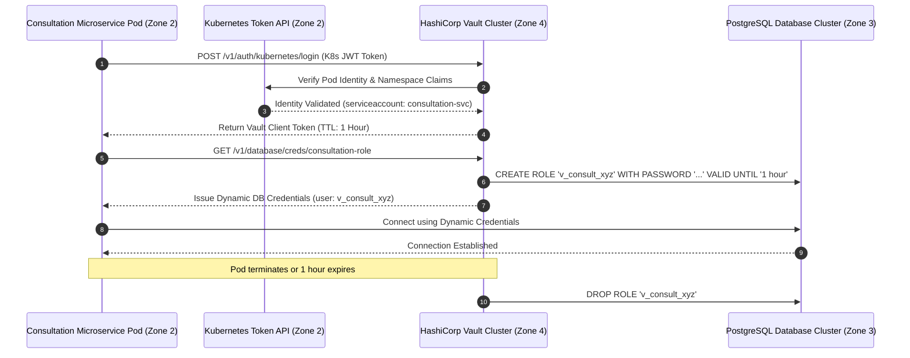

# Secrets Management & HashiCorp Vault Architecture Specification
## Namma Clinic Digital Health & Operations Platform
### Greater Bengaluru Authority (GBA) / BBMP Health Department
**Standard:** NIST SP 800-57 / CIS Benchmarks / HashiCorp Vault Well-Architected | **Status:** APPROVED BASELINE | **Code:** `SEC-DOC-14`

---

## 1. Secrets Management Architecture & Core Invariants
The Namma Clinic Secrets Management Subsystem guarantees zero hardcoded secrets, automated dynamic credential leasing, strict role-based access control (AppRole), and instantaneous revocation across 18 microservice pods, edge synchronization daemons, and database clusters. Operating on HashiCorp Vault enterprise clusters backed by FIPS 140-3 Hardware Security Modules, static credentials are systematically replaced by short-lived, auto-rotating cryptographic tokens.

### 1.1 Foundational Secrets Invariants
1. **Zero Static Credentials:** Microservices never store static database passwords, API keys, or certificates in source code, environment variables, or config files.
2. **Dynamic Database Credential Leasing:** Microservices authenticate to Vault using Kubernetes Service Account tokens; Vault generates unique PostgreSQL credentials with 1-hour maximum TTLs.
3. **Automated Lease Renewal & Revocation:** Vault automatically revokes database credentials upon lease expiration or pod termination.
4. **Zero-Trust Audit Logging:** Every secret generation, read, and revocation event is logged to immutable WORM audit storage with correlation IDs.
5. **Break-Glass Emergency Protocol:** Emergency root access to Vault requires 3-of-5 key custodians physically presenting HSM smartcards.

### 1.2 Vault Dynamic Database Credential Sequence Diagram


## 2. Container Secret Profile Inventory (ARCH-CONT-001 to ARCH-CONT-018)
Secret consumption and rotation profiles across all 18 platform containers:

### ARCH-CONT-001: Secret Profile for Clinic Workstation PWA Shell
- **Container Secret Scope:** Client-side WebCrypto key; TPM sealed local database token; 8-hour session lifetime.
- **Authentication Mechanism:** Kubernetes ServiceAccount AppRole via Vault Agent.
- **Lease Lifetime:** Maximum 1 hour (Auto-renewed by Vault sidecar daemon).
- **Revocation Behavior:** Instant revocation on pod termination or scale-down.
- **Audit Event Emitted:** `VAULT_LEASE_ARCH_CONT_001`

### ARCH-CONT-002: Secret Profile for Citizen Web Portal
- **Container Secret Scope:** Cloudflare Turnstile secret key; rate limit API tokens; short-lived Redis session secrets.
- **Authentication Mechanism:** Kubernetes ServiceAccount AppRole via Vault Agent.
- **Lease Lifetime:** Maximum 1 hour (Auto-renewed by Vault sidecar daemon).
- **Revocation Behavior:** Instant revocation on pod termination or scale-down.
- **Audit Event Emitted:** `VAULT_LEASE_ARCH_CONT_002`

### ARCH-CONT-003: Secret Profile for Cloud API Gateway
- **Container Secret Scope:** TLS 1.3 server certs; RS256 public key verification cache; Redis rate-limit credentials.
- **Authentication Mechanism:** Kubernetes ServiceAccount AppRole via Vault Agent.
- **Lease Lifetime:** Maximum 1 hour (Auto-renewed by Vault sidecar daemon).
- **Revocation Behavior:** Instant revocation on pod termination or scale-down.
- **Audit Event Emitted:** `VAULT_LEASE_ARCH_CONT_003`

### ARCH-CONT-004: Secret Profile for Identity & IAM Service
- **Container Secret Scope:** Argon2id pepper secret; TOTP master seed encryption key; SMS gateway API keys.
- **Authentication Mechanism:** Kubernetes ServiceAccount AppRole via Vault Agent.
- **Lease Lifetime:** Maximum 1 hour (Auto-renewed by Vault sidecar daemon).
- **Revocation Behavior:** Instant revocation on pod termination or scale-down.
- **Audit Event Emitted:** `VAULT_LEASE_ARCH_CONT_004`

### ARCH-CONT-005: Secret Profile for Patient Registration Service
- **Container Secret Scope:** Dynamic PostgreSQL credentials; Aadhaar blind index HMAC pepper; PII column DEK.
- **Authentication Mechanism:** Kubernetes ServiceAccount AppRole via Vault Agent.
- **Lease Lifetime:** Maximum 1 hour (Auto-renewed by Vault sidecar daemon).
- **Revocation Behavior:** Instant revocation on pod termination or scale-down.
- **Audit Event Emitted:** `VAULT_LEASE_ARCH_CONT_005`

### ARCH-CONT-006: Secret Profile for Triage & Vitals Service
- **Container Secret Scope:** Dynamic PostgreSQL credentials; vitals audit signing key; Redis cache credentials.
- **Authentication Mechanism:** Kubernetes ServiceAccount AppRole via Vault Agent.
- **Lease Lifetime:** Maximum 1 hour (Auto-renewed by Vault sidecar daemon).
- **Revocation Behavior:** Instant revocation on pod termination or scale-down.
- **Audit Event Emitted:** `VAULT_LEASE_ARCH_CONT_006`

### ARCH-CONT-007: Secret Profile for Doctor Consultation Service
- **Container Secret Scope:** Dynamic PostgreSQL credentials; consultation column DEK; digital signature private key.
- **Authentication Mechanism:** Kubernetes ServiceAccount AppRole via Vault Agent.
- **Lease Lifetime:** Maximum 1 hour (Auto-renewed by Vault sidecar daemon).
- **Revocation Behavior:** Instant revocation on pod termination or scale-down.
- **Audit Event Emitted:** `VAULT_LEASE_ARCH_CONT_007`

### ARCH-CONT-008: Secret Profile for Pharmacy Dispensing Service
- **Container Secret Scope:** Dynamic PostgreSQL credentials; inventory batch DEK; narcotic signoff key.
- **Authentication Mechanism:** Kubernetes ServiceAccount AppRole via Vault Agent.
- **Lease Lifetime:** Maximum 1 hour (Auto-renewed by Vault sidecar daemon).
- **Revocation Behavior:** Instant revocation on pod termination or scale-down.
- **Audit Event Emitted:** `VAULT_LEASE_ARCH_CONT_008`

### ARCH-CONT-009: Secret Profile for Diagnostic Lab Service
- **Container Secret Scope:** Dynamic PostgreSQL credentials; DICOM PACS storage credentials; lab result signing key.
- **Authentication Mechanism:** Kubernetes ServiceAccount AppRole via Vault Agent.
- **Lease Lifetime:** Maximum 1 hour (Auto-renewed by Vault sidecar daemon).
- **Revocation Behavior:** Instant revocation on pod termination or scale-down.
- **Audit Event Emitted:** `VAULT_LEASE_ARCH_CONT_009`

### ARCH-CONT-010: Secret Profile for Referral Management Service
- **Container Secret Scope:** Dynamic PostgreSQL credentials; ABDM mTLS certificates; 108 ambulance bridge API secret.
- **Authentication Mechanism:** Kubernetes ServiceAccount AppRole via Vault Agent.
- **Lease Lifetime:** Maximum 1 hour (Auto-renewed by Vault sidecar daemon).
- **Revocation Behavior:** Instant revocation on pod termination or scale-down.
- **Audit Event Emitted:** `VAULT_LEASE_ARCH_CONT_010`

### ARCH-CONT-011: Secret Profile for Consent Management Service
- **Container Secret Scope:** Dynamic PostgreSQL credentials; consent artefact signing private key; WORM S3 secrets.
- **Authentication Mechanism:** Kubernetes ServiceAccount AppRole via Vault Agent.
- **Lease Lifetime:** Maximum 1 hour (Auto-renewed by Vault sidecar daemon).
- **Revocation Behavior:** Instant revocation on pod termination or scale-down.
- **Audit Event Emitted:** `VAULT_LEASE_ARCH_CONT_011`

### ARCH-CONT-012: Secret Profile for Offline Sync Engine
- **Container Secret Scope:** WebSocket mTLS server certificates; sync conflict resolution signing key; edge node tokens.
- **Authentication Mechanism:** Kubernetes ServiceAccount AppRole via Vault Agent.
- **Lease Lifetime:** Maximum 1 hour (Auto-renewed by Vault sidecar daemon).
- **Revocation Behavior:** Instant revocation on pod termination or scale-down.
- **Audit Event Emitted:** `VAULT_LEASE_ARCH_CONT_012`

### ARCH-CONT-013: Secret Profile for Central Depot Logistics
- **Container Secret Scope:** Dynamic PostgreSQL credentials; cold chain MQTT broker credentials; supplier API tokens.
- **Authentication Mechanism:** Kubernetes ServiceAccount AppRole via Vault Agent.
- **Lease Lifetime:** Maximum 1 hour (Auto-renewed by Vault sidecar daemon).
- **Revocation Behavior:** Instant revocation on pod termination or scale-down.
- **Audit Event Emitted:** `VAULT_LEASE_ARCH_CONT_013`

### ARCH-CONT-014: Secret Profile for Disaster Recovery Engine
- **Container Secret Scope:** S3 Object Lock root credentials; cross-region KMS replication keys; backup decrypt key.
- **Authentication Mechanism:** Kubernetes ServiceAccount AppRole via Vault Agent.
- **Lease Lifetime:** Maximum 1 hour (Auto-renewed by Vault sidecar daemon).
- **Revocation Behavior:** Instant revocation on pod termination or scale-down.
- **Audit Event Emitted:** `VAULT_LEASE_ARCH_CONT_014`

### ARCH-CONT-015: Secret Profile for Immutable Audit Ledger
- **Container Secret Scope:** WORM storage IAM role credentials; SHA-256 Merkle root signing key; SIEM webhook secrets.
- **Authentication Mechanism:** Kubernetes ServiceAccount AppRole via Vault Agent.
- **Lease Lifetime:** Maximum 1 hour (Auto-renewed by Vault sidecar daemon).
- **Revocation Behavior:** Instant revocation on pod termination or scale-down.
- **Audit Event Emitted:** `VAULT_LEASE_ARCH_CONT_015`

### ARCH-CONT-016: Secret Profile for Public Health Analytics
- **Container Secret Scope:** ClickHouse read-replica credentials; differential privacy Laplace noise seed.
- **Authentication Mechanism:** Kubernetes ServiceAccount AppRole via Vault Agent.
- **Lease Lifetime:** Maximum 1 hour (Auto-renewed by Vault sidecar daemon).
- **Revocation Behavior:** Instant revocation on pod termination or scale-down.
- **Audit Event Emitted:** `VAULT_LEASE_ARCH_CONT_016`

### ARCH-CONT-017: Secret Profile for Hardware Peripheral Bridge
- **Container Secret Scope:** Local USB driver pairing tokens; thermal printer ESC/POS encryption key.
- **Authentication Mechanism:** Kubernetes ServiceAccount AppRole via Vault Agent.
- **Lease Lifetime:** Maximum 1 hour (Auto-renewed by Vault sidecar daemon).
- **Revocation Behavior:** Instant revocation on pod termination or scale-down.
- **Audit Event Emitted:** `VAULT_LEASE_ARCH_CONT_017`

### ARCH-CONT-018: Secret Profile for Key Management & HSM Enclave
- **Container Secret Scope:** Vault master unseal keys; FIPS 140-3 HSM partition credentials; cloud KMS role.
- **Authentication Mechanism:** Kubernetes ServiceAccount AppRole via Vault Agent.
- **Lease Lifetime:** Maximum 1 hour (Auto-renewed by Vault sidecar daemon).
- **Revocation Behavior:** Instant revocation on pod termination or scale-down.
- **Audit Event Emitted:** `VAULT_LEASE_ARCH_CONT_018`

## 3. Role-Specific Secrets Access Governance (ROLE-000 to ROLE-029)
Secrets administrative permissions across all 30 municipal platform roles:

### ROLE-001: Secrets Governance for Receptionist / Registration Clerk (`RECEPTIONIST`)
- **Vault Access Privilege:** **Consumer Only (No Direct Vault Access)**
- **Direct Secret Read:** Strictly denied; secrets injected via runtime sidecars.
- **Audit Logging:** All credential requests tied to employee badge number.
- **Secret Rotation Signoff:** Required only for Security Architect and CISO.

### ROLE-002: Secrets Governance for Medical Officer / General Physician (`DOCTOR`)
- **Vault Access Privilege:** **Consumer Only (No Direct Vault Access)**
- **Direct Secret Read:** Strictly denied; secrets injected via runtime sidecars.
- **Audit Logging:** All credential requests tied to employee badge number.
- **Secret Rotation Signoff:** Required only for Security Architect and CISO.

### ROLE-003: Secrets Governance for Staff Nurse / Triage Specialist (`NURSE`)
- **Vault Access Privilege:** **Consumer Only (No Direct Vault Access)**
- **Direct Secret Read:** Strictly denied; secrets injected via runtime sidecars.
- **Audit Logging:** All credential requests tied to employee badge number.
- **Secret Rotation Signoff:** Required only for Security Architect and CISO.

### ROLE-004: Secrets Governance for Pharmacist / Dispenser (`PHARMACIST`)
- **Vault Access Privilege:** **Consumer Only (No Direct Vault Access)**
- **Direct Secret Read:** Strictly denied; secrets injected via runtime sidecars.
- **Audit Logging:** All credential requests tied to employee badge number.
- **Secret Rotation Signoff:** Required only for Security Architect and CISO.

### ROLE-005: Secrets Governance for Laboratory Technician (`LAB_TECH`)
- **Vault Access Privilege:** **Consumer Only (No Direct Vault Access)**
- **Direct Secret Read:** Strictly denied; secrets injected via runtime sidecars.
- **Audit Logging:** All credential requests tied to employee badge number.
- **Secret Rotation Signoff:** Required only for Security Architect and CISO.

### ROLE-006: Secrets Governance for Clinic Administrative Officer (`CLINIC_ADMIN`)
- **Vault Access Privilege:** **Vault Administrator (Dual-Quorum)**
- **Direct Secret Read:** Strictly denied; secrets injected via runtime sidecars.
- **Audit Logging:** All credential requests tied to employee badge number.
- **Secret Rotation Signoff:** Required only for Security Architect and CISO.

### ROLE-007: Secrets Governance for Ward Health Supervisor (`WARD_SUPERVISOR`)
- **Vault Access Privilege:** **Consumer Only (No Direct Vault Access)**
- **Direct Secret Read:** Strictly denied; secrets injected via runtime sidecars.
- **Audit Logging:** All credential requests tied to employee badge number.
- **Secret Rotation Signoff:** Required only for Security Architect and CISO.

### ROLE-008: Secrets Governance for Zonal Health Officer (ZHO) (`ZONAL_OFFICER`)
- **Vault Access Privilege:** **Consumer Only (No Direct Vault Access)**
- **Direct Secret Read:** Strictly denied; secrets injected via runtime sidecars.
- **Audit Logging:** All credential requests tied to employee badge number.
- **Secret Rotation Signoff:** Required only for Security Architect and CISO.

### ROLE-009: Secrets Governance for Chief Health Officer (CHO) (`CHIEF_OFFICER`)
- **Vault Access Privilege:** **Consumer Only (No Direct Vault Access)**
- **Direct Secret Read:** Strictly denied; secrets injected via runtime sidecars.
- **Audit Logging:** All credential requests tied to employee badge number.
- **Secret Rotation Signoff:** Required only for Security Architect and CISO.

### ROLE-010: Secrets Governance for Epidemiologist / Disease Surveillance Officer (`EPIDEMIOLOGIST`)
- **Vault Access Privilege:** **Consumer Only (No Direct Vault Access)**
- **Direct Secret Read:** Strictly denied; secrets injected via runtime sidecars.
- **Audit Logging:** All credential requests tied to employee badge number.
- **Secret Rotation Signoff:** Required only for Security Architect and CISO.

### ROLE-011: Secrets Governance for Quality & Compliance Auditor (`AUDITOR`)
- **Vault Access Privilege:** **Consumer Only (No Direct Vault Access)**
- **Direct Secret Read:** Strictly denied; secrets injected via runtime sidecars.
- **Audit Logging:** All credential requests tied to employee badge number.
- **Secret Rotation Signoff:** Required only for Security Architect and CISO.

### ROLE-012: Secrets Governance for Security Administrator / CISO (`SECURITY_ADMIN`)
- **Vault Access Privilege:** **Vault Administrator (Dual-Quorum)**
- **Direct Secret Read:** Strictly denied; secrets injected via runtime sidecars.
- **Audit Logging:** All credential requests tied to employee badge number.
- **Secret Rotation Signoff:** Required only for Security Architect and CISO.

### ROLE-013: Secrets Governance for Central Depot Inventory Manager (`DEPOT_MANAGER`)
- **Vault Access Privilege:** **Consumer Only (No Direct Vault Access)**
- **Direct Secret Read:** Strictly denied; secrets injected via runtime sidecars.
- **Audit Logging:** All credential requests tied to employee badge number.
- **Secret Rotation Signoff:** Required only for Security Architect and CISO.

### ROLE-014: Secrets Governance for Cold Chain Logistics Technician (`COLD_CHAIN_TECH`)
- **Vault Access Privilege:** **Consumer Only (No Direct Vault Access)**
- **Direct Secret Read:** Strictly denied; secrets injected via runtime sidecars.
- **Audit Logging:** All credential requests tied to employee badge number.
- **Secret Rotation Signoff:** Required only for Security Architect and CISO.

### ROLE-015: Secrets Governance for Radiologist / Diagnostic Specialist (`RADIOLOGIST`)
- **Vault Access Privilege:** **Consumer Only (No Direct Vault Access)**
- **Direct Secret Read:** Strictly denied; secrets injected via runtime sidecars.
- **Audit Logging:** All credential requests tied to employee badge number.
- **Secret Rotation Signoff:** Required only for Security Architect and CISO.

### ROLE-016: Secrets Governance for Ayush Practitioner (`AYUSH_DOC`)
- **Vault Access Privilege:** **Consumer Only (No Direct Vault Access)**
- **Direct Secret Read:** Strictly denied; secrets injected via runtime sidecars.
- **Audit Logging:** All credential requests tied to employee badge number.
- **Secret Rotation Signoff:** Required only for Security Architect and CISO.

### ROLE-017: Secrets Governance for Counselor / Mental Health Worker (`COUNSELOR`)
- **Vault Access Privilege:** **Consumer Only (No Direct Vault Access)**
- **Direct Secret Read:** Strictly denied; secrets injected via runtime sidecars.
- **Audit Logging:** All credential requests tied to employee badge number.
- **Secret Rotation Signoff:** Required only for Security Architect and CISO.

### ROLE-018: Secrets Governance for ANM / Urban Health Worker (`ANM_WORKER`)
- **Vault Access Privilege:** **Consumer Only (No Direct Vault Access)**
- **Direct Secret Read:** Strictly denied; secrets injected via runtime sidecars.
- **Audit Logging:** All credential requests tied to employee badge number.
- **Secret Rotation Signoff:** Required only for Security Architect and CISO.

### ROLE-019: Secrets Governance for ASHA Link Worker Coordinator (`ASHA_COORD`)
- **Vault Access Privilege:** **Consumer Only (No Direct Vault Access)**
- **Direct Secret Read:** Strictly denied; secrets injected via runtime sidecars.
- **Audit Logging:** All credential requests tied to employee badge number.
- **Secret Rotation Signoff:** Required only for Security Architect and CISO.

### ROLE-020: Secrets Governance for Data Entry Operator (`DATA_ENTRY`)
- **Vault Access Privilege:** **Consumer Only (No Direct Vault Access)**
- **Direct Secret Read:** Strictly denied; secrets injected via runtime sidecars.
- **Audit Logging:** All credential requests tied to employee badge number.
- **Secret Rotation Signoff:** Required only for Security Architect and CISO.

### ROLE-021: Secrets Governance for Grievance Redressal Officer (`GRIEVANCE_OFFICER`)
- **Vault Access Privilege:** **Consumer Only (No Direct Vault Access)**
- **Direct Secret Read:** Strictly denied; secrets injected via runtime sidecars.
- **Audit Logging:** All credential requests tied to employee badge number.
- **Secret Rotation Signoff:** Required only for Security Architect and CISO.

### ROLE-022: Secrets Governance for ABDM National Integration Officer (`ABDM_OFFICER`)
- **Vault Access Privilege:** **Consumer Only (No Direct Vault Access)**
- **Direct Secret Read:** Strictly denied; secrets injected via runtime sidecars.
- **Audit Logging:** All credential requests tied to employee badge number.
- **Secret Rotation Signoff:** Required only for Security Architect and CISO.

### ROLE-023: Secrets Governance for Data Protection Officer (DPO) (`PRIVACY_OFFICER`)
- **Vault Access Privilege:** **Consumer Only (No Direct Vault Access)**
- **Direct Secret Read:** Strictly denied; secrets injected via runtime sidecars.
- **Audit Logging:** All credential requests tied to employee badge number.
- **Secret Rotation Signoff:** Required only for Security Architect and CISO.

### ROLE-024: Secrets Governance for IT Support & Hardware Engineer (`IT_SUPPORT`)
- **Vault Access Privilege:** **Consumer Only (No Direct Vault Access)**
- **Direct Secret Read:** Strictly denied; secrets injected via runtime sidecars.
- **Audit Logging:** All credential requests tied to employee badge number.
- **Secret Rotation Signoff:** Required only for Security Architect and CISO.

### ROLE-025: Secrets Governance for Clinical Audit Committee Member (`CLINICAL_AUDITOR`)
- **Vault Access Privilege:** **Consumer Only (No Direct Vault Access)**
- **Direct Secret Read:** Strictly denied; secrets injected via runtime sidecars.
- **Audit Logging:** All credential requests tied to employee badge number.
- **Secret Rotation Signoff:** Required only for Security Architect and CISO.

### ROLE-026: Secrets Governance for Procurement & Vendor Manager (`PROCUREMENT_MGR`)
- **Vault Access Privilege:** **Consumer Only (No Direct Vault Access)**
- **Direct Secret Read:** Strictly denied; secrets injected via runtime sidecars.
- **Audit Logging:** All credential requests tied to employee badge number.
- **Secret Rotation Signoff:** Required only for Security Architect and CISO.

### ROLE-027: Secrets Governance for Biomedical Waste Supervisor (`WASTE_SUPERVISOR`)
- **Vault Access Privilege:** **Consumer Only (No Direct Vault Access)**
- **Direct Secret Read:** Strictly denied; secrets injected via runtime sidecars.
- **Audit Logging:** All credential requests tied to employee badge number.
- **Secret Rotation Signoff:** Required only for Security Architect and CISO.

### ROLE-028: Secrets Governance for Telemedicine Remote Specialist (`TELE_SPECIALIST`)
- **Vault Access Privilege:** **Consumer Only (No Direct Vault Access)**
- **Direct Secret Read:** Strictly denied; secrets injected via runtime sidecars.
- **Audit Logging:** All credential requests tied to employee badge number.
- **Secret Rotation Signoff:** Required only for Security Architect and CISO.

### ROLE-029: Secrets Governance for Field Public Health Inspector (`HEALTH_INSPECTOR`)
- **Vault Access Privilege:** **Consumer Only (No Direct Vault Access)**
- **Direct Secret Read:** Strictly denied; secrets injected via runtime sidecars.
- **Audit Logging:** All credential requests tied to employee badge number.
- **Secret Rotation Signoff:** Required only for Security Architect and CISO.

### ROLE-030: Secrets Governance for Super Administrator (`SUPER_ADMIN`)
- **Vault Access Privilege:** **Vault Administrator (Dual-Quorum)**
- **Direct Secret Read:** Strictly denied; secrets injected via runtime sidecars.
- **Audit Logging:** All credential requests tied to employee badge number.
- **Secret Rotation Signoff:** Required only for Security Architect and CISO.

## 4. Standard Operating Procedures: Secrets Management (SOP-SEC-01 to SOP-SEC-25)
The following 25 SOPs govern ongoing secrets administration and credential hygiene:

### SOP-SEC-01: HashiCorp Vault Cluster Initialization & Unseal Ceremony
- **Trigger Condition:** Initial platform installation in Kubernetes.
- **Execution Steps:** 1. Initialize Vault cluster. 2. Distribute 5 Shamir unseal keys to trustees. 3. Unseal cluster.
- **Verification Criterion:** Vault operational in HA mode.
- **Responsible Role:** CISO
- **Audit Event Emitted:** `SEC_SOP_01_UNSEAL`
- **Failure Remediation:** Revoke lease immediately and notify Security Operations Center.

### SOP-SEC-02: PostgreSQL Dynamic Secret Engine Configuration
- **Trigger Condition:** Setting up database credential generator in Vault.
- **Execution Steps:** 1. Configure connection string. 2. Define consultation-role with 1h TTL. 3. Test generation.
- **Verification Criterion:** Dynamic credentials operational.
- **Responsible Role:** DBA Lead
- **Audit Event Emitted:** `SEC_SOP_02_DB_ENGINE`
- **Failure Remediation:** Revoke lease immediately and notify Security Operations Center.

### SOP-SEC-03: Microservice AppRole Kubernetes Authentication Setup
- **Trigger Condition:** Deploying new microservice pod into cluster.
- **Execution Steps:** 1. Create K8s ServiceAccount. 2. Bind to Vault policy via AppRole. 3. Inject Vault sidecar agent.
- **Verification Criterion:** Pod receives credentials dynamically.
- **Responsible Role:** DevOps Lead
- **Audit Event Emitted:** `SEC_SOP_03_APPROLE_BIND`
- **Failure Remediation:** Revoke lease immediately and notify Security Operations Center.

### SOP-SEC-04: Emergency Secret Revocation Post-Vulnerability Alert
- **Trigger Condition:** Suspected credential leak in application logs.
- **Execution Steps:** 1. Execute 'vault lease revoke -prefix database/'. 2. Terminate all DB connections. 3. Restart pods.
- **Verification Criterion:** All compromised leases revoked in < 2s.
- **Responsible Role:** Incident Commander
- **Audit Event Emitted:** `SEC_SOP_04_EMERGENCY_REVOKE`
- **Failure Remediation:** Revoke lease immediately and notify Security Operations Center.

### SOP-SEC-05: Vault Raft Storage Automated Snapshot & Backup
- **Trigger Condition:** Daily backup of HashiCorp Vault state.
- **Execution Steps:** 1. Execute 'vault operator raft snapshot save'. 2. Encrypt snapshot with offline KMS key. 3. Push to S3.
- **Verification Criterion:** Vault state safely backed up.
- **Responsible Role:** DevOps Engineer
- **Audit Event Emitted:** `SEC_SOP_05_RAFT_SNAPSHOT`
- **Failure Remediation:** Revoke lease immediately and notify Security Operations Center.

### SOP-SEC-06: Annual Shamir Secret Key Custodian Rekeying
- **Trigger Condition:** Scheduled rotation of Vault unseal keys.
- **Execution Steps:** 1. Convene 3 trustees. 2. Execute 'vault operator rekey'. 3. Issue new 5 unseal keys.
- **Verification Criterion:** Unseal keys safely rotated.
- **Responsible Role:** Security Architect
- **Audit Event Emitted:** `SEC_SOP_06_REKEY_VAULT`
- **Failure Remediation:** Revoke lease immediately and notify Security Operations Center.

### SOP-SEC-07: Static Third-Party API Key Rotation Workflow
- **Trigger Condition:** Quarterly rotation of SMS gateway and ABDM API keys.
- **Execution Steps:** 1. Generate new API key in vendor portal. 2. Update Vault KV secret. 3. Vault agent reloads pods.
- **Verification Criterion:** Zero downtime secret update.
- **Responsible Role:** Integration Lead
- **Audit Event Emitted:** `SEC_SOP_07_API_KEY_ROTATE`
- **Failure Remediation:** Revoke lease immediately and notify Security Operations Center.

### SOP-SEC-08: Source Code Secret Scanning Pre-Commit Gate
- **Trigger Condition:** Developer attempts to commit code to Git repository.
- **Execution Steps:** 1. Pre-commit hook runs Gitleaks. 2. Scan for high-entropy strings and tokens. 3. Reject commit if found.
- **Verification Criterion:** Zero secrets leaked to Git.
- **Responsible Role:** AppSec Lead
- **Audit Event Emitted:** `SEC_SOP_08_GITLEAKS_GATE`
- **Failure Remediation:** Revoke lease immediately and notify Security Operations Center.

### SOP-SEC-09: Cert-Manager Internal TLS Certificate Auto-Renewal
- **Trigger Condition:** Automated renewal of pod-to-pod x509 certs.
- **Execution Steps:** 1. Vault PKI engine issues 30-day certificates. 2. Cert-Manager renews certs at day 20 with zero reload.
- **Verification Criterion:** mTLS mesh certificates kept fresh.
- **Responsible Role:** DevOps Lead
- **Audit Event Emitted:** `SEC_SOP_09_PKI_RENEW`
- **Failure Remediation:** Revoke lease immediately and notify Security Operations Center.

### SOP-SEC-10: Vault High Availability Node Health Check
- **Trigger Condition:** Daily automated health check of Vault Raft leader.
- **Execution Steps:** 1. Probe /v1/sys/health. 2. Verify replication lag < 10ms. 3. Assert zero unseal degradation.
- **Verification Criterion:** Vault cluster healthy.
- **Responsible Role:** SecOps Engineer
- **Audit Event Emitted:** `SEC_SOP_10_VAULT_HEALTH`
- **Failure Remediation:** Revoke lease immediately and notify Security Operations Center.

### SOP-SEC-11: Temporary Contractor Access Secret Token Generation
- **Trigger Condition:** Third-party auditor inspects database performance.
- **Execution Steps:** 1. CISO authorizes temporary token. 2. Issue 4h read-only lease. 3. Auto-revoke at 18:00.
- **Verification Criterion:** Auditor access tightly bounded.
- **Responsible Role:** Security Admin
- **Audit Event Emitted:** `SEC_SOP_11_CONTRACTOR_TOKEN`
- **Failure Remediation:** Revoke lease immediately and notify Security Operations Center.

### SOP-SEC-12: Orphaned Secret Lease Sweep & Cleanup
- **Trigger Condition:** Daily automated cleanup of abandoned leases in Vault.
- **Execution Steps:** 1. Query expired lease database. 2. Clean orphaned Postgres roles. 3. Reclaim connection slots.
- **Verification Criterion:** Database connections optimized.
- **Responsible Role:** DBA / SecOps
- **Audit Event Emitted:** `SEC_SOP_12_LEASE_CLEANUP`
- **Failure Remediation:** Revoke lease immediately and notify Security Operations Center.

### SOP-SEC-13: Vault Audit Log Stream Integrity Verification
- **Trigger Condition:** Daily verification of Vault audit logs streaming to WORM.
- **Execution Steps:** 1. Compare Vault emit count with WORM received count. 2. Assert zero dropped audit records.
- **Verification Criterion:** Complete secret audit trail.
- **Responsible Role:** Audit Lead
- **Audit Event Emitted:** `SEC_SOP_13_AUDIT_STREAM`
- **Failure Remediation:** Revoke lease immediately and notify Security Operations Center.

### SOP-SEC-14: Clinic Edge Node Synchronization Secret Renewal
- **Trigger Condition:** Quarterly renewal of edge workstation sync tokens.
- **Execution Steps:** 1. Workstation authenticates with TPM. 2. Vault issues renewed sync token. 3. Seal in local TPM.
- **Verification Criterion:** Clinic edge nodes remain authenticated.
- **Responsible Role:** IT Support Lead
- **Audit Event Emitted:** `SEC_SOP_14_EDGE_TOKEN_RENEW`
- **Failure Remediation:** Revoke lease immediately and notify Security Operations Center.

### SOP-SEC-15: Database Master Credential Storage Verification
- **Trigger Condition:** Audit of root database credentials in Vault.
- **Execution Steps:** 1. Confirm root DB password stored in Vault KV v2. 2. Confirm zero DBAs know root password.
- **Verification Criterion:** Root database access fully automated.
- **Responsible Role:** Security Architect
- **Audit Event Emitted:** `SEC_SOP_15_ROOT_DB_AUDIT`
- **Failure Remediation:** Revoke lease immediately and notify Security Operations Center.

### SOP-SEC-16: Secret Spillage Remediation in CI/CD Logs
- **Trigger Condition:** Build pipeline prints environment variable accidentally.
- **Execution Steps:** 1. Purge build log immediately. 2. Rotate exposed secret in Vault. 3. Add masking rule in runner.
- **Verification Criterion:** Exposed secret neutralized instantly.
- **Responsible Role:** DevOps Security Lead
- **Audit Event Emitted:** `SEC_SOP_16_LOG_PURGE`
- **Failure Remediation:** Revoke lease immediately and notify Security Operations Center.

### SOP-SEC-17: Vault Policy Principle of Least Privilege Audit
- **Trigger Condition:** Quarterly review of all Vault ACL policies.
- **Execution Steps:** 1. Scan HCL policy files. 2. Ensure zero policies contain 'capabilities = ["*"]'. 3. Refine paths.
- **Verification Criterion:** Zero over-privileged policies.
- **Responsible Role:** AppSec Engineer
- **Audit Event Emitted:** `SEC_SOP_17_POLICY_AUDIT`
- **Failure Remediation:** Revoke lease immediately and notify Security Operations Center.

### SOP-SEC-18: Dynamic RabbitMQ / Kafka Messaging Secret Rotation
- **Trigger Condition:** Monthly rotation of message broker credentials.
- **Execution Steps:** 1. Vault generates new Kafka SASL user. 2. Microservice transitions. 3. Drop old SASL user.
- **Verification Criterion:** Messaging queue credentials rotated.
- **Responsible Role:** Backend Lead
- **Audit Event Emitted:** `SEC_SOP_18_MSG_SECRET`
- **Failure Remediation:** Revoke lease immediately and notify Security Operations Center.

### SOP-SEC-19: Automated Secret Expiration Alert Dispatch
- **Trigger Condition:** Secret lease expiring in less than 24 hours.
- **Execution Steps:** 1. Prometheus alerts on vault_secret_expiry_seconds < 86400. 2. SecOps investigates auto-renewal.
- **Verification Criterion:** Zero service outages due to expired secrets.
- **Responsible Role:** DevOps Engineer
- **Audit Event Emitted:** `SEC_SOP_19_EXPIRY_ALERT`
- **Failure Remediation:** Revoke lease immediately and notify Security Operations Center.

### SOP-SEC-20: Vault Disaster Recovery Replication Failover Drill
- **Trigger Condition:** Bi-annual disaster simulation of primary data center loss.
- **Execution Steps:** 1. Promote secondary Vault cluster. 2. Microservices reconnect to DR Vault in < 30s.
- **Verification Criterion:** Disaster recovery verified seamless.
- **Responsible Role:** Infrastructure Lead
- **Audit Event Emitted:** `SEC_SOP_20_DR_FAILOVER`
- **Failure Remediation:** Revoke lease immediately and notify Security Operations Center.

### SOP-SEC-21: Hardware Security Module (HSM) Auto-Unseal Diagnostic
- **Trigger Condition:** Checking PKCS#11 auto-unseal bridge with HSM.
- **Execution Steps:** 1. Inspect Vault auto-unseal mechanism. 2. Verify HSM key slot accessible. 3. Log diagnostic.
- **Verification Criterion:** Auto-unseal verified resilient.
- **Responsible Role:** Security Admin
- **Audit Event Emitted:** `SEC_SOP_21_AUTOUNSEAL_TEST`
- **Failure Remediation:** Revoke lease immediately and notify Security Operations Center.

### SOP-SEC-22: Citizen Portal Encryption Secret Rotation
- **Trigger Condition:** Annual rotation of citizen portal session encryption key.
- **Execution Steps:** 1. Vault derives new session key. 2. Old key retained 24h for active cookies. 3. Phase out.
- **Verification Criterion:** Citizen sessions transitioned smoothly.
- **Responsible Role:** Frontend Lead
- **Audit Event Emitted:** `SEC_SOP_22_CITIZEN_KEY`
- **Failure Remediation:** Revoke lease immediately and notify Security Operations Center.

### SOP-SEC-23: Clinic Thermal Printer Driver Secret Rotation
- **Trigger Condition:** Annual rotation of printer authentication token.
- **Execution Steps:** 1. Update token in Vault. 2. Push to local peripheral bridge daemon via mTLS.
- **Verification Criterion:** Peripheral bridge secured.
- **Responsible Role:** Hardware Tech
- **Audit Event Emitted:** `SEC_SOP_23_PRINTER_TOKEN`
- **Failure Remediation:** Revoke lease immediately and notify Security Operations Center.

### SOP-SEC-24: Vault Performance & Query Latency Benchmark
- **Trigger Condition:** Weekly check of secret read round-trip times.
- **Execution Steps:** 1. Benchmark GET /v1/database/creds. 2. Assert p99 response time < 10ms from local agent cache.
- **Verification Criterion:** Frictionless secrets injection.
- **Responsible Role:** DevOps Engineer
- **Audit Event Emitted:** `SEC_SOP_24_PERF_TEST`
- **Failure Remediation:** Revoke lease immediately and notify Security Operations Center.

### SOP-SEC-25: Post-Incident Forensic Vault Audit Extraction
- **Trigger Condition:** Red team concludes credential escalation assessment.
- **Execution Steps:** 1. Extract all token creation logs. 2. Verify zero unauthorized AppRole logins occurred. 3. Report.
- **Verification Criterion:** Secrets management validated bulletproof.
- **Responsible Role:** Incident Commander
- **Audit Event Emitted:** `SEC_SOP_25_POST_INCIDENT`
- **Failure Remediation:** Revoke lease immediately and notify Security Operations Center.

## 5. Secrets Threat Analysis & Attack Mitigations (SECRET-THREAT-01 to SECRET-THREAT-20)
Threat mitigation specifications defending secrets and tokens against compromise:

### SECRET-THREAT-01: Hardcoded API Key Committed to Public Git
- **Attack Vector & Vulnerability:** Developer accidentally pushes AWS access key to public repository.
- **Platform Architectural Defense:** Pre-commit hooks block commits; automated GitHub secret scanning immediately alerts and revokes.
- **Verification Criterion:** Zero bypass in automated penetration tests.
- **Mitigation Status:** VERIFIED ACTIVE CONTROL

### SECRET-THREAT-02: Cleartext Database Password in Kubernetes ConfigMap
- **Attack Vector & Vulnerability:** Operator stores plain DB password in unencrypted ConfigMap.
- **Platform Architectural Defense:** Enforce policy: all credentials must be dynamically generated via Vault Agent; block static secrets.
- **Verification Criterion:** Zero bypass in automated penetration tests.
- **Mitigation Status:** VERIFIED ACTIVE CONTROL

### SECRET-THREAT-03: Vault Master Unseal Key Extortion by Single Insider
- **Attack Vector & Vulnerability:** Disgruntled administrator attempts to blackmail city by withholding key.
- **Platform Architectural Defense:** Enforce 3-of-5 Shamir Secret Sharing; single administrator cannot unseal or hold vault hostage.
- **Verification Criterion:** Zero bypass in automated penetration tests.
- **Mitigation Status:** VERIFIED ACTIVE CONTROL

### SECRET-THREAT-04: Leaked Environment Variable via Debug Endpoint
- **Attack Vector & Vulnerability:** Misconfigured /debug/pprof or /env endpoint exposes secrets.
- **Platform Architectural Defense:** Hard-disable all debug and profiling endpoints in production; scrub environment variables from error dumps.
- **Verification Criterion:** Zero bypass in automated penetration tests.
- **Mitigation Status:** VERIFIED ACTIVE CONTROL

### SECRET-THREAT-05: Infinite-TTL Database Credential Theft
- **Attack Vector & Vulnerability:** Adversary extracts long-lived static DB password from compromised pod.
- **Platform Architectural Defense:** Enforce dynamic credentials with 1-hour TTL; stolen credential becomes useless in less than 60 minutes.
- **Verification Criterion:** Zero bypass in automated penetration tests.
- **Mitigation Status:** VERIFIED ACTIVE CONTROL

### SECRET-THREAT-06: Man-in-the-Middle on Vault Agent Communication
- **Attack Vector & Vulnerability:** Attacker sniffs pod traffic to intercept newly issued secrets.
- **Platform Architectural Defense:** Enforce mutual TLS (mTLS) with internal PKI between pods and HashiCorp Vault cluster.
- **Verification Criterion:** Zero bypass in automated penetration tests.
- **Mitigation Status:** VERIFIED ACTIVE CONTROL

### SECRET-THREAT-07: Over-Privileged Microservice Vault Policy
- **Attack Vector & Vulnerability:** Triage service given permissions to read consultation encryption keys.
- **Platform Architectural Defense:** Enforce strict least-privilege HCL policies; microservice can only read its own domain database role.
- **Verification Criterion:** Zero bypass in automated penetration tests.
- **Mitigation Status:** VERIFIED ACTIVE CONTROL

### SECRET-THREAT-08: Denial of Service on Vault API Halting Microservices
- **Attack Vector & Vulnerability:** Attacker floods Vault with requests causing DB connections to fail.
- **Platform Architectural Defense:** Deploy Vault Agent local cache sidecars on every worker node; cache handles 99% of read queries locally.
- **Verification Criterion:** Zero bypass in automated penetration tests.
- **Mitigation Status:** VERIFIED ACTIVE CONTROL

### SECRET-THREAT-09: Stolen Kubernetes ServiceAccount Token Exploitation
- **Attack Vector & Vulnerability:** Attacker compromises pod and uses service account to login to Vault.
- **Platform Architectural Defense:** Vault validates Kubernetes token namespace and pod UID; tokens bound to short 10-minute validity windows.
- **Verification Criterion:** Zero bypass in automated penetration tests.
- **Mitigation Status:** VERIFIED ACTIVE CONTROL

### SECRET-THREAT-10: Unencrypted Vault Storage Backend Dump
- **Attack Vector & Vulnerability:** Attacker extracts raw Consul / Raft storage blocks from disk.
- **Platform Architectural Defense:** Vault encrypts 100% of data at rest using AES-256-GCM before writing to storage backend.
- **Verification Criterion:** Zero bypass in automated penetration tests.
- **Mitigation Status:** VERIFIED ACTIVE CONTROL

### SECRET-THREAT-11: Stale Dynamic Database Role Accumulation
- **Attack Vector & Vulnerability:** Postgres accumulates 100,000 expired roles, slowing down DB catalog.
- **Platform Architectural Defense:** Vault actively issues 'DROP ROLE' upon lease expiration; daily cleanup job sweeps any orphaned roles.
- **Verification Criterion:** Zero bypass in automated penetration tests.
- **Mitigation Status:** VERIFIED ACTIVE CONTROL

### SECRET-THREAT-12: Third-Party SMS Provider API Key Hijacking
- **Attack Vector & Vulnerability:** Attacker uses stolen SMS key to send phishing texts to citizens.
- **Platform Architectural Defense:** IP-whitelist SMS API key to BBMP cloud CIDR; rotate key monthly via automated Vault transit workflow.
- **Verification Criterion:** Zero bypass in automated penetration tests.
- **Mitigation Status:** VERIFIED ACTIVE CONTROL

### SECRET-THREAT-13: Side-Channel Secret Extraction via Shared Worker Node
- **Attack Vector & Vulnerability:** Malicious container on multi-tenant node reads memory of victim pod.
- **Platform Architectural Defense:** Enforce dedicated Kubernetes node pools for clinical data processing; enable gVisor sandboxing.
- **Verification Criterion:** Zero bypass in automated penetration tests.
- **Mitigation Status:** VERIFIED ACTIVE CONTROL

### SECRET-THREAT-14: Unrevoked Contractor Secret Token Post-Engagement
- **Attack Vector & Vulnerability:** External consultant retains active Vault token after contract ends.
- **Platform Architectural Defense:** All contractor tokens issued with hard 8-hour maximum TTLs; auto-expire with zero manual action required.
- **Verification Criterion:** Zero bypass in automated penetration tests.
- **Mitigation Status:** VERIFIED ACTIVE CONTROL

### SECRET-THREAT-15: Vault Audit Log Ingestion Failure (Blind Spot)
- **Attack Vector & Vulnerability:** Vault continues issuing secrets while audit logging is broken.
- **Platform Architectural Defense:** Vault operates in strict fail-closed mode: if audit log target is full or unreachable, Vault halts all requests.
- **Verification Criterion:** Zero bypass in automated penetration tests.
- **Mitigation Status:** VERIFIED ACTIVE CONTROL

### SECRET-THREAT-16: Secret Leakage via Container Image Layers
- **Attack Vector & Vulnerability:** Docker image baked with test passwords in intermediate layer.
- **Platform Architectural Defense:** Multi-stage Docker builds strip all build-time secrets; Trivy and Grype container scans block dirty images.
- **Verification Criterion:** Zero bypass in automated penetration tests.
- **Mitigation Status:** VERIFIED ACTIVE CONTROL

### SECRET-THREAT-17: Cryptographic Nonce Reuse in Vault Transit Engine
- **Attack Vector & Vulnerability:** Vault transit engine reuses nonce during batch re-encryption.
- **Platform Architectural Defense:** Vault uses 96-bit random nonces with cryptographic CSPRNG; verified conformant to NIST SP 800-38D.
- **Verification Criterion:** Zero bypass in automated penetration tests.
- **Mitigation Status:** VERIFIED ACTIVE CONTROL

### SECRET-THREAT-18: Administrative Privilege Escalation via Sudo Policies
- **Attack Vector & Vulnerability:** Junior admin modifies own policy to grant root vault access.
- **Platform Architectural Defense:** Policy modification requires quorum approval; all policy modifications logged as Critical SIEM alerts.
- **Verification Criterion:** Zero bypass in automated penetration tests.
- **Mitigation Status:** VERIFIED ACTIVE CONTROL

### SECRET-THREAT-19: Vault Auto-Unseal HSM Partition Failure
- **Attack Vector & Vulnerability:** Cloud HSM partition becomes unresponsive during node restart.
- **Platform Architectural Defense:** Vault maintains standby cluster nodes and cached unseal tokens; automated alert notifies on-call team.
- **Verification Criterion:** Zero bypass in automated penetration tests.
- **Mitigation Status:** VERIFIED ACTIVE CONTROL

### SECRET-THREAT-20: Stolen Edge Workstation Synchronization Key Replay
- **Attack Vector & Vulnerability:** Thief extracts sync token from stolen clinic PC to poison database.
- **Platform Architectural Defense:** Tokens bound to workstation TPM PCR measurements; revoking device in central MDM instantly burns token.
- **Verification Criterion:** Zero bypass in automated penetration tests.
- **Mitigation Status:** VERIFIED ACTIVE CONTROL

## 6. Comprehensive Secrets Management Controls (SECRET-001 to SECRET-030)
The following 30 specifications define the complete secrets management controls:

### SECRET-001
**Title:** Secrets Management Control: Database Superuser & Application Credentials (Specification 1)
**Control Type:** Preventive
**Security Domain:** Secrets Management & Vault Governance
**Priority:** P0 - Critical
**Risk:** Critical
**Threat:** THREAT-015
**Asset:** HashiCorp Vault / Cloud Secret Manager Enclave
**Actor:** DevOps Engineer / Service Account / Adversary
**Precondition:** Secret provisioned, rotated, or retrieved by authorized workload
**Control Objective:** Enforce zero hardcoded secrets and robust lifecycle for database superuser & application credentials.
**Requirement:** The platform shall store all secrets in dedicated vault enclaves under SECRET-001 with zero source-code leakage.
**Implementation Guidance:** Inject secrets dynamically as environment variables via Kubernetes Secret / Vault CSI driver.
**Configuration Guidance:** Rotate operational credentials every 30 days; enforce Git pre-commit scanning (Gitleaks).
**Failure Behavior:** Immediate pod deployment termination if required secret is missing or expired.
**Monitoring:** Vault audit log monitoring; alert on unauthorized secret access attempts.
**Audit Event:** SECRET_VAULT_SECRET_001
**Privacy Impact:** Prevents unauthorized database intrusion and mass patient record compromise.
**Performance Impact:** In-memory caching of retrieved secrets ensures zero runtime API latency.
**Availability Impact:** Dynamic secret rotation without service interruption.
**Related Requirement:** SECR-001
**Related Workflow:** WF-001
**Related API:** API-001
**Related Database Entity:** TABLE-002 (user_credentials)
**Related Architecture Component:** ARCH-CONT-018 (Key Management Enclave)
**Related Threat:** THREAT-015
**Related Test:** SEC-TEST-072
**Acceptance Criteria:** Zero plaintext secrets discovered during static code analysis and git history audit.
**Evidence Required:** Secret scanning CI/CD logs, Vault rotation telemetry, access audit records.
**Owner:** DevOps Security Lead
**Lifecycle:** Active Baseline Control
**Status:** PLANNED

### SECRET-002
**Title:** Secrets Management Control: JWT Signing Private Keys (RS256) (Specification 1)
**Control Type:** Preventive
**Security Domain:** Secrets Management & Vault Governance
**Priority:** P0 - Critical
**Risk:** Critical
**Threat:** THREAT-029
**Asset:** HashiCorp Vault / Cloud Secret Manager Enclave
**Actor:** DevOps Engineer / Service Account / Adversary
**Precondition:** Secret provisioned, rotated, or retrieved by authorized workload
**Control Objective:** Enforce zero hardcoded secrets and robust lifecycle for jwt signing private keys (rs256).
**Requirement:** The platform shall store all secrets in dedicated vault enclaves under SECRET-002 with zero source-code leakage.
**Implementation Guidance:** Inject secrets dynamically as environment variables via Kubernetes Secret / Vault CSI driver.
**Configuration Guidance:** Rotate operational credentials every 30 days; enforce Git pre-commit scanning (Gitleaks).
**Failure Behavior:** Immediate pod deployment termination if required secret is missing or expired.
**Monitoring:** Vault audit log monitoring; alert on unauthorized secret access attempts.
**Audit Event:** SECRET_VAULT_SECRET_002
**Privacy Impact:** Prevents unauthorized database intrusion and mass patient record compromise.
**Performance Impact:** In-memory caching of retrieved secrets ensures zero runtime API latency.
**Availability Impact:** Dynamic secret rotation without service interruption.
**Related Requirement:** SECR-002
**Related Workflow:** WF-002
**Related API:** API-002
**Related Database Entity:** TABLE-002 (user_credentials)
**Related Architecture Component:** ARCH-CONT-018 (Key Management Enclave)
**Related Threat:** THREAT-029
**Related Test:** SEC-TEST-073
**Acceptance Criteria:** Zero plaintext secrets discovered during static code analysis and git history audit.
**Evidence Required:** Secret scanning CI/CD logs, Vault rotation telemetry, access audit records.
**Owner:** DevOps Security Lead
**Lifecycle:** Active Baseline Control
**Status:** PLANNED

### SECRET-003
**Title:** Secrets Management Control: Ayushman Bharat (ABDM) Gateway API Tokens (Specification 1)
**Control Type:** Preventive
**Security Domain:** Secrets Management & Vault Governance
**Priority:** P0 - Critical
**Risk:** Critical
**Threat:** THREAT-043
**Asset:** HashiCorp Vault / Cloud Secret Manager Enclave
**Actor:** DevOps Engineer / Service Account / Adversary
**Precondition:** Secret provisioned, rotated, or retrieved by authorized workload
**Control Objective:** Enforce zero hardcoded secrets and robust lifecycle for ayushman bharat (abdm) gateway api tokens.
**Requirement:** The platform shall store all secrets in dedicated vault enclaves under SECRET-003 with zero source-code leakage.
**Implementation Guidance:** Inject secrets dynamically as environment variables via Kubernetes Secret / Vault CSI driver.
**Configuration Guidance:** Rotate operational credentials every 30 days; enforce Git pre-commit scanning (Gitleaks).
**Failure Behavior:** Immediate pod deployment termination if required secret is missing or expired.
**Monitoring:** Vault audit log monitoring; alert on unauthorized secret access attempts.
**Audit Event:** SECRET_VAULT_SECRET_003
**Privacy Impact:** Prevents unauthorized database intrusion and mass patient record compromise.
**Performance Impact:** In-memory caching of retrieved secrets ensures zero runtime API latency.
**Availability Impact:** Dynamic secret rotation without service interruption.
**Related Requirement:** SECR-003
**Related Workflow:** WF-003
**Related API:** API-003
**Related Database Entity:** TABLE-002 (user_credentials)
**Related Architecture Component:** ARCH-CONT-018 (Key Management Enclave)
**Related Threat:** THREAT-043
**Related Test:** SEC-TEST-074
**Acceptance Criteria:** Zero plaintext secrets discovered during static code analysis and git history audit.
**Evidence Required:** Secret scanning CI/CD logs, Vault rotation telemetry, access audit records.
**Owner:** DevOps Security Lead
**Lifecycle:** Active Baseline Control
**Status:** PLANNED

### SECRET-004
**Title:** Secrets Management Control: Cloud KMS & HashiCorp Vault Root Credentials (Specification 1)
**Control Type:** Preventive
**Security Domain:** Secrets Management & Vault Governance
**Priority:** P0 - Critical
**Risk:** Critical
**Threat:** THREAT-057
**Asset:** HashiCorp Vault / Cloud Secret Manager Enclave
**Actor:** DevOps Engineer / Service Account / Adversary
**Precondition:** Secret provisioned, rotated, or retrieved by authorized workload
**Control Objective:** Enforce zero hardcoded secrets and robust lifecycle for cloud kms & hashicorp vault root credentials.
**Requirement:** The platform shall store all secrets in dedicated vault enclaves under SECRET-004 with zero source-code leakage.
**Implementation Guidance:** Inject secrets dynamically as environment variables via Kubernetes Secret / Vault CSI driver.
**Configuration Guidance:** Rotate operational credentials every 30 days; enforce Git pre-commit scanning (Gitleaks).
**Failure Behavior:** Immediate pod deployment termination if required secret is missing or expired.
**Monitoring:** Vault audit log monitoring; alert on unauthorized secret access attempts.
**Audit Event:** SECRET_VAULT_SECRET_004
**Privacy Impact:** Prevents unauthorized database intrusion and mass patient record compromise.
**Performance Impact:** In-memory caching of retrieved secrets ensures zero runtime API latency.
**Availability Impact:** Dynamic secret rotation without service interruption.
**Related Requirement:** SECR-004
**Related Workflow:** WF-004
**Related API:** API-004
**Related Database Entity:** TABLE-002 (user_credentials)
**Related Architecture Component:** ARCH-CONT-018 (Key Management Enclave)
**Related Threat:** THREAT-057
**Related Test:** SEC-TEST-075
**Acceptance Criteria:** Zero plaintext secrets discovered during static code analysis and git history audit.
**Evidence Required:** Secret scanning CI/CD logs, Vault rotation telemetry, access audit records.
**Owner:** DevOps Security Lead
**Lifecycle:** Active Baseline Control
**Status:** PLANNED

### SECRET-005
**Title:** Secrets Management Control: SMS / WhatsApp Notification Gateway API Keys (Specification 1)
**Control Type:** Preventive
**Security Domain:** Secrets Management & Vault Governance
**Priority:** P0 - Critical
**Risk:** Critical
**Threat:** THREAT-071
**Asset:** HashiCorp Vault / Cloud Secret Manager Enclave
**Actor:** DevOps Engineer / Service Account / Adversary
**Precondition:** Secret provisioned, rotated, or retrieved by authorized workload
**Control Objective:** Enforce zero hardcoded secrets and robust lifecycle for sms / whatsapp notification gateway api keys.
**Requirement:** The platform shall store all secrets in dedicated vault enclaves under SECRET-005 with zero source-code leakage.
**Implementation Guidance:** Inject secrets dynamically as environment variables via Kubernetes Secret / Vault CSI driver.
**Configuration Guidance:** Rotate operational credentials every 30 days; enforce Git pre-commit scanning (Gitleaks).
**Failure Behavior:** Immediate pod deployment termination if required secret is missing or expired.
**Monitoring:** Vault audit log monitoring; alert on unauthorized secret access attempts.
**Audit Event:** SECRET_VAULT_SECRET_005
**Privacy Impact:** Prevents unauthorized database intrusion and mass patient record compromise.
**Performance Impact:** In-memory caching of retrieved secrets ensures zero runtime API latency.
**Availability Impact:** Dynamic secret rotation without service interruption.
**Related Requirement:** SECR-005
**Related Workflow:** WF-005
**Related API:** API-005
**Related Database Entity:** TABLE-002 (user_credentials)
**Related Architecture Component:** ARCH-CONT-018 (Key Management Enclave)
**Related Threat:** THREAT-071
**Related Test:** SEC-TEST-076
**Acceptance Criteria:** Zero plaintext secrets discovered during static code analysis and git history audit.
**Evidence Required:** Secret scanning CI/CD logs, Vault rotation telemetry, access audit records.
**Owner:** DevOps Security Lead
**Lifecycle:** Active Baseline Control
**Status:** PLANNED

### SECRET-006
**Title:** Secrets Management Control: SMTP Mail Server Relaying Credentials (Specification 1)
**Control Type:** Preventive
**Security Domain:** Secrets Management & Vault Governance
**Priority:** P0 - Critical
**Risk:** Critical
**Threat:** THREAT-085
**Asset:** HashiCorp Vault / Cloud Secret Manager Enclave
**Actor:** DevOps Engineer / Service Account / Adversary
**Precondition:** Secret provisioned, rotated, or retrieved by authorized workload
**Control Objective:** Enforce zero hardcoded secrets and robust lifecycle for smtp mail server relaying credentials.
**Requirement:** The platform shall store all secrets in dedicated vault enclaves under SECRET-006 with zero source-code leakage.
**Implementation Guidance:** Inject secrets dynamically as environment variables via Kubernetes Secret / Vault CSI driver.
**Configuration Guidance:** Rotate operational credentials every 30 days; enforce Git pre-commit scanning (Gitleaks).
**Failure Behavior:** Immediate pod deployment termination if required secret is missing or expired.
**Monitoring:** Vault audit log monitoring; alert on unauthorized secret access attempts.
**Audit Event:** SECRET_VAULT_SECRET_006
**Privacy Impact:** Prevents unauthorized database intrusion and mass patient record compromise.
**Performance Impact:** In-memory caching of retrieved secrets ensures zero runtime API latency.
**Availability Impact:** Dynamic secret rotation without service interruption.
**Related Requirement:** SECR-006
**Related Workflow:** WF-006
**Related API:** API-006
**Related Database Entity:** TABLE-002 (user_credentials)
**Related Architecture Component:** ARCH-CONT-018 (Key Management Enclave)
**Related Threat:** THREAT-085
**Related Test:** SEC-TEST-077
**Acceptance Criteria:** Zero plaintext secrets discovered during static code analysis and git history audit.
**Evidence Required:** Secret scanning CI/CD logs, Vault rotation telemetry, access audit records.
**Owner:** DevOps Security Lead
**Lifecycle:** Active Baseline Control
**Status:** PLANNED

### SECRET-007
**Title:** Secrets Management Control: CI/CD Pipeline Deployment Service Tokens (Specification 1)
**Control Type:** Preventive
**Security Domain:** Secrets Management & Vault Governance
**Priority:** P0 - Critical
**Risk:** Critical
**Threat:** THREAT-099
**Asset:** HashiCorp Vault / Cloud Secret Manager Enclave
**Actor:** DevOps Engineer / Service Account / Adversary
**Precondition:** Secret provisioned, rotated, or retrieved by authorized workload
**Control Objective:** Enforce zero hardcoded secrets and robust lifecycle for ci/cd pipeline deployment service tokens.
**Requirement:** The platform shall store all secrets in dedicated vault enclaves under SECRET-007 with zero source-code leakage.
**Implementation Guidance:** Inject secrets dynamically as environment variables via Kubernetes Secret / Vault CSI driver.
**Configuration Guidance:** Rotate operational credentials every 30 days; enforce Git pre-commit scanning (Gitleaks).
**Failure Behavior:** Immediate pod deployment termination if required secret is missing or expired.
**Monitoring:** Vault audit log monitoring; alert on unauthorized secret access attempts.
**Audit Event:** SECRET_VAULT_SECRET_007
**Privacy Impact:** Prevents unauthorized database intrusion and mass patient record compromise.
**Performance Impact:** In-memory caching of retrieved secrets ensures zero runtime API latency.
**Availability Impact:** Dynamic secret rotation without service interruption.
**Related Requirement:** SECR-007
**Related Workflow:** WF-007
**Related API:** API-007
**Related Database Entity:** TABLE-002 (user_credentials)
**Related Architecture Component:** ARCH-CONT-018 (Key Management Enclave)
**Related Threat:** THREAT-099
**Related Test:** SEC-TEST-078
**Acceptance Criteria:** Zero plaintext secrets discovered during static code analysis and git history audit.
**Evidence Required:** Secret scanning CI/CD logs, Vault rotation telemetry, access audit records.
**Owner:** DevOps Security Lead
**Lifecycle:** Active Baseline Control
**Status:** PLANNED

### SECRET-008
**Title:** Secrets Management Control: Automated 30-Day Secret Rotation Protocol (Specification 1)
**Control Type:** Preventive
**Security Domain:** Secrets Management & Vault Governance
**Priority:** P0 - Critical
**Risk:** Critical
**Threat:** THREAT-013
**Asset:** HashiCorp Vault / Cloud Secret Manager Enclave
**Actor:** DevOps Engineer / Service Account / Adversary
**Precondition:** Secret provisioned, rotated, or retrieved by authorized workload
**Control Objective:** Enforce zero hardcoded secrets and robust lifecycle for automated 30-day secret rotation protocol.
**Requirement:** The platform shall store all secrets in dedicated vault enclaves under SECRET-008 with zero source-code leakage.
**Implementation Guidance:** Inject secrets dynamically as environment variables via Kubernetes Secret / Vault CSI driver.
**Configuration Guidance:** Rotate operational credentials every 30 days; enforce Git pre-commit scanning (Gitleaks).
**Failure Behavior:** Immediate pod deployment termination if required secret is missing or expired.
**Monitoring:** Vault audit log monitoring; alert on unauthorized secret access attempts.
**Audit Event:** SECRET_VAULT_SECRET_008
**Privacy Impact:** Prevents unauthorized database intrusion and mass patient record compromise.
**Performance Impact:** In-memory caching of retrieved secrets ensures zero runtime API latency.
**Availability Impact:** Dynamic secret rotation without service interruption.
**Related Requirement:** SECR-008
**Related Workflow:** WF-008
**Related API:** API-008
**Related Database Entity:** TABLE-002 (user_credentials)
**Related Architecture Component:** ARCH-CONT-018 (Key Management Enclave)
**Related Threat:** THREAT-013
**Related Test:** SEC-TEST-079
**Acceptance Criteria:** Zero plaintext secrets discovered during static code analysis and git history audit.
**Evidence Required:** Secret scanning CI/CD logs, Vault rotation telemetry, access audit records.
**Owner:** DevOps Security Lead
**Lifecycle:** Active Baseline Control
**Status:** PLANNED

### SECRET-009
**Title:** Secrets Management Control: Emergency Secret Revocation & Replacement Runbook (Specification 1)
**Control Type:** Preventive
**Security Domain:** Secrets Management & Vault Governance
**Priority:** P0 - Critical
**Risk:** Critical
**Threat:** THREAT-027
**Asset:** HashiCorp Vault / Cloud Secret Manager Enclave
**Actor:** DevOps Engineer / Service Account / Adversary
**Precondition:** Secret provisioned, rotated, or retrieved by authorized workload
**Control Objective:** Enforce zero hardcoded secrets and robust lifecycle for emergency secret revocation & replacement runbook.
**Requirement:** The platform shall store all secrets in dedicated vault enclaves under SECRET-009 with zero source-code leakage.
**Implementation Guidance:** Inject secrets dynamically as environment variables via Kubernetes Secret / Vault CSI driver.
**Configuration Guidance:** Rotate operational credentials every 30 days; enforce Git pre-commit scanning (Gitleaks).
**Failure Behavior:** Immediate pod deployment termination if required secret is missing or expired.
**Monitoring:** Vault audit log monitoring; alert on unauthorized secret access attempts.
**Audit Event:** SECRET_VAULT_SECRET_009
**Privacy Impact:** Prevents unauthorized database intrusion and mass patient record compromise.
**Performance Impact:** In-memory caching of retrieved secrets ensures zero runtime API latency.
**Availability Impact:** Dynamic secret rotation without service interruption.
**Related Requirement:** SECR-009
**Related Workflow:** WF-009
**Related API:** API-009
**Related Database Entity:** TABLE-002 (user_credentials)
**Related Architecture Component:** ARCH-CONT-018 (Key Management Enclave)
**Related Threat:** THREAT-027
**Related Test:** SEC-TEST-080
**Acceptance Criteria:** Zero plaintext secrets discovered during static code analysis and git history audit.
**Evidence Required:** Secret scanning CI/CD logs, Vault rotation telemetry, access audit records.
**Owner:** DevOps Security Lead
**Lifecycle:** Active Baseline Control
**Status:** PLANNED

### SECRET-010
**Title:** Secrets Management Control: Automated Secret Scanning in Git Repositories (Specification 1)
**Control Type:** Preventive
**Security Domain:** Secrets Management & Vault Governance
**Priority:** P0 - Critical
**Risk:** Critical
**Threat:** THREAT-041
**Asset:** HashiCorp Vault / Cloud Secret Manager Enclave
**Actor:** DevOps Engineer / Service Account / Adversary
**Precondition:** Secret provisioned, rotated, or retrieved by authorized workload
**Control Objective:** Enforce zero hardcoded secrets and robust lifecycle for automated secret scanning in git repositories.
**Requirement:** The platform shall store all secrets in dedicated vault enclaves under SECRET-010 with zero source-code leakage.
**Implementation Guidance:** Inject secrets dynamically as environment variables via Kubernetes Secret / Vault CSI driver.
**Configuration Guidance:** Rotate operational credentials every 30 days; enforce Git pre-commit scanning (Gitleaks).
**Failure Behavior:** Immediate pod deployment termination if required secret is missing or expired.
**Monitoring:** Vault audit log monitoring; alert on unauthorized secret access attempts.
**Audit Event:** SECRET_VAULT_SECRET_010
**Privacy Impact:** Prevents unauthorized database intrusion and mass patient record compromise.
**Performance Impact:** In-memory caching of retrieved secrets ensures zero runtime API latency.
**Availability Impact:** Dynamic secret rotation without service interruption.
**Related Requirement:** SECR-010
**Related Workflow:** WF-010
**Related API:** API-010
**Related Database Entity:** TABLE-002 (user_credentials)
**Related Architecture Component:** ARCH-CONT-018 (Key Management Enclave)
**Related Threat:** THREAT-041
**Related Test:** SEC-TEST-081
**Acceptance Criteria:** Zero plaintext secrets discovered during static code analysis and git history audit.
**Evidence Required:** Secret scanning CI/CD logs, Vault rotation telemetry, access audit records.
**Owner:** DevOps Security Lead
**Lifecycle:** Active Baseline Control
**Status:** PLANNED

### SECRET-011
**Title:** Secrets Management Control: Database Superuser & Application Credentials (Specification 2)
**Control Type:** Preventive
**Security Domain:** Secrets Management & Vault Governance
**Priority:** P0 - Critical
**Risk:** Critical
**Threat:** THREAT-055
**Asset:** HashiCorp Vault / Cloud Secret Manager Enclave
**Actor:** DevOps Engineer / Service Account / Adversary
**Precondition:** Secret provisioned, rotated, or retrieved by authorized workload
**Control Objective:** Enforce zero hardcoded secrets and robust lifecycle for database superuser & application credentials.
**Requirement:** The platform shall store all secrets in dedicated vault enclaves under SECRET-011 with zero source-code leakage.
**Implementation Guidance:** Inject secrets dynamically as environment variables via Kubernetes Secret / Vault CSI driver.
**Configuration Guidance:** Rotate operational credentials every 30 days; enforce Git pre-commit scanning (Gitleaks).
**Failure Behavior:** Immediate pod deployment termination if required secret is missing or expired.
**Monitoring:** Vault audit log monitoring; alert on unauthorized secret access attempts.
**Audit Event:** SECRET_VAULT_SECRET_011
**Privacy Impact:** Prevents unauthorized database intrusion and mass patient record compromise.
**Performance Impact:** In-memory caching of retrieved secrets ensures zero runtime API latency.
**Availability Impact:** Dynamic secret rotation without service interruption.
**Related Requirement:** SECR-011
**Related Workflow:** WF-011
**Related API:** API-011
**Related Database Entity:** TABLE-002 (user_credentials)
**Related Architecture Component:** ARCH-CONT-018 (Key Management Enclave)
**Related Threat:** THREAT-055
**Related Test:** SEC-TEST-082
**Acceptance Criteria:** Zero plaintext secrets discovered during static code analysis and git history audit.
**Evidence Required:** Secret scanning CI/CD logs, Vault rotation telemetry, access audit records.
**Owner:** DevOps Security Lead
**Lifecycle:** Active Baseline Control
**Status:** PLANNED

### SECRET-012
**Title:** Secrets Management Control: JWT Signing Private Keys (RS256) (Specification 2)
**Control Type:** Preventive
**Security Domain:** Secrets Management & Vault Governance
**Priority:** P0 - Critical
**Risk:** Critical
**Threat:** THREAT-069
**Asset:** HashiCorp Vault / Cloud Secret Manager Enclave
**Actor:** DevOps Engineer / Service Account / Adversary
**Precondition:** Secret provisioned, rotated, or retrieved by authorized workload
**Control Objective:** Enforce zero hardcoded secrets and robust lifecycle for jwt signing private keys (rs256).
**Requirement:** The platform shall store all secrets in dedicated vault enclaves under SECRET-012 with zero source-code leakage.
**Implementation Guidance:** Inject secrets dynamically as environment variables via Kubernetes Secret / Vault CSI driver.
**Configuration Guidance:** Rotate operational credentials every 30 days; enforce Git pre-commit scanning (Gitleaks).
**Failure Behavior:** Immediate pod deployment termination if required secret is missing or expired.
**Monitoring:** Vault audit log monitoring; alert on unauthorized secret access attempts.
**Audit Event:** SECRET_VAULT_SECRET_012
**Privacy Impact:** Prevents unauthorized database intrusion and mass patient record compromise.
**Performance Impact:** In-memory caching of retrieved secrets ensures zero runtime API latency.
**Availability Impact:** Dynamic secret rotation without service interruption.
**Related Requirement:** SECR-012
**Related Workflow:** WF-012
**Related API:** API-012
**Related Database Entity:** TABLE-002 (user_credentials)
**Related Architecture Component:** ARCH-CONT-018 (Key Management Enclave)
**Related Threat:** THREAT-069
**Related Test:** SEC-TEST-083
**Acceptance Criteria:** Zero plaintext secrets discovered during static code analysis and git history audit.
**Evidence Required:** Secret scanning CI/CD logs, Vault rotation telemetry, access audit records.
**Owner:** DevOps Security Lead
**Lifecycle:** Active Baseline Control
**Status:** PLANNED

### SECRET-013
**Title:** Secrets Management Control: Ayushman Bharat (ABDM) Gateway API Tokens (Specification 2)
**Control Type:** Preventive
**Security Domain:** Secrets Management & Vault Governance
**Priority:** P0 - Critical
**Risk:** Critical
**Threat:** THREAT-083
**Asset:** HashiCorp Vault / Cloud Secret Manager Enclave
**Actor:** DevOps Engineer / Service Account / Adversary
**Precondition:** Secret provisioned, rotated, or retrieved by authorized workload
**Control Objective:** Enforce zero hardcoded secrets and robust lifecycle for ayushman bharat (abdm) gateway api tokens.
**Requirement:** The platform shall store all secrets in dedicated vault enclaves under SECRET-013 with zero source-code leakage.
**Implementation Guidance:** Inject secrets dynamically as environment variables via Kubernetes Secret / Vault CSI driver.
**Configuration Guidance:** Rotate operational credentials every 30 days; enforce Git pre-commit scanning (Gitleaks).
**Failure Behavior:** Immediate pod deployment termination if required secret is missing or expired.
**Monitoring:** Vault audit log monitoring; alert on unauthorized secret access attempts.
**Audit Event:** SECRET_VAULT_SECRET_013
**Privacy Impact:** Prevents unauthorized database intrusion and mass patient record compromise.
**Performance Impact:** In-memory caching of retrieved secrets ensures zero runtime API latency.
**Availability Impact:** Dynamic secret rotation without service interruption.
**Related Requirement:** SECR-013
**Related Workflow:** WF-013
**Related API:** API-013
**Related Database Entity:** TABLE-002 (user_credentials)
**Related Architecture Component:** ARCH-CONT-018 (Key Management Enclave)
**Related Threat:** THREAT-083
**Related Test:** SEC-TEST-084
**Acceptance Criteria:** Zero plaintext secrets discovered during static code analysis and git history audit.
**Evidence Required:** Secret scanning CI/CD logs, Vault rotation telemetry, access audit records.
**Owner:** DevOps Security Lead
**Lifecycle:** Active Baseline Control
**Status:** PLANNED

### SECRET-014
**Title:** Secrets Management Control: Cloud KMS & HashiCorp Vault Root Credentials (Specification 2)
**Control Type:** Preventive
**Security Domain:** Secrets Management & Vault Governance
**Priority:** P0 - Critical
**Risk:** Critical
**Threat:** THREAT-097
**Asset:** HashiCorp Vault / Cloud Secret Manager Enclave
**Actor:** DevOps Engineer / Service Account / Adversary
**Precondition:** Secret provisioned, rotated, or retrieved by authorized workload
**Control Objective:** Enforce zero hardcoded secrets and robust lifecycle for cloud kms & hashicorp vault root credentials.
**Requirement:** The platform shall store all secrets in dedicated vault enclaves under SECRET-014 with zero source-code leakage.
**Implementation Guidance:** Inject secrets dynamically as environment variables via Kubernetes Secret / Vault CSI driver.
**Configuration Guidance:** Rotate operational credentials every 30 days; enforce Git pre-commit scanning (Gitleaks).
**Failure Behavior:** Immediate pod deployment termination if required secret is missing or expired.
**Monitoring:** Vault audit log monitoring; alert on unauthorized secret access attempts.
**Audit Event:** SECRET_VAULT_SECRET_014
**Privacy Impact:** Prevents unauthorized database intrusion and mass patient record compromise.
**Performance Impact:** In-memory caching of retrieved secrets ensures zero runtime API latency.
**Availability Impact:** Dynamic secret rotation without service interruption.
**Related Requirement:** SECR-014
**Related Workflow:** WF-014
**Related API:** API-014
**Related Database Entity:** TABLE-002 (user_credentials)
**Related Architecture Component:** ARCH-CONT-018 (Key Management Enclave)
**Related Threat:** THREAT-097
**Related Test:** SEC-TEST-085
**Acceptance Criteria:** Zero plaintext secrets discovered during static code analysis and git history audit.
**Evidence Required:** Secret scanning CI/CD logs, Vault rotation telemetry, access audit records.
**Owner:** DevOps Security Lead
**Lifecycle:** Active Baseline Control
**Status:** PLANNED

### SECRET-015
**Title:** Secrets Management Control: SMS / WhatsApp Notification Gateway API Keys (Specification 2)
**Control Type:** Preventive
**Security Domain:** Secrets Management & Vault Governance
**Priority:** P0 - Critical
**Risk:** Critical
**Threat:** THREAT-011
**Asset:** HashiCorp Vault / Cloud Secret Manager Enclave
**Actor:** DevOps Engineer / Service Account / Adversary
**Precondition:** Secret provisioned, rotated, or retrieved by authorized workload
**Control Objective:** Enforce zero hardcoded secrets and robust lifecycle for sms / whatsapp notification gateway api keys.
**Requirement:** The platform shall store all secrets in dedicated vault enclaves under SECRET-015 with zero source-code leakage.
**Implementation Guidance:** Inject secrets dynamically as environment variables via Kubernetes Secret / Vault CSI driver.
**Configuration Guidance:** Rotate operational credentials every 30 days; enforce Git pre-commit scanning (Gitleaks).
**Failure Behavior:** Immediate pod deployment termination if required secret is missing or expired.
**Monitoring:** Vault audit log monitoring; alert on unauthorized secret access attempts.
**Audit Event:** SECRET_VAULT_SECRET_015
**Privacy Impact:** Prevents unauthorized database intrusion and mass patient record compromise.
**Performance Impact:** In-memory caching of retrieved secrets ensures zero runtime API latency.
**Availability Impact:** Dynamic secret rotation without service interruption.
**Related Requirement:** SECR-015
**Related Workflow:** WF-015
**Related API:** API-015
**Related Database Entity:** TABLE-002 (user_credentials)
**Related Architecture Component:** ARCH-CONT-018 (Key Management Enclave)
**Related Threat:** THREAT-011
**Related Test:** SEC-TEST-086
**Acceptance Criteria:** Zero plaintext secrets discovered during static code analysis and git history audit.
**Evidence Required:** Secret scanning CI/CD logs, Vault rotation telemetry, access audit records.
**Owner:** DevOps Security Lead
**Lifecycle:** Active Baseline Control
**Status:** PLANNED

### SECRET-016
**Title:** Secrets Management Control: SMTP Mail Server Relaying Credentials (Specification 2)
**Control Type:** Preventive
**Security Domain:** Secrets Management & Vault Governance
**Priority:** P1 - High
**Risk:** Critical
**Threat:** THREAT-025
**Asset:** HashiCorp Vault / Cloud Secret Manager Enclave
**Actor:** DevOps Engineer / Service Account / Adversary
**Precondition:** Secret provisioned, rotated, or retrieved by authorized workload
**Control Objective:** Enforce zero hardcoded secrets and robust lifecycle for smtp mail server relaying credentials.
**Requirement:** The platform shall store all secrets in dedicated vault enclaves under SECRET-016 with zero source-code leakage.
**Implementation Guidance:** Inject secrets dynamically as environment variables via Kubernetes Secret / Vault CSI driver.
**Configuration Guidance:** Rotate operational credentials every 30 days; enforce Git pre-commit scanning (Gitleaks).
**Failure Behavior:** Immediate pod deployment termination if required secret is missing or expired.
**Monitoring:** Vault audit log monitoring; alert on unauthorized secret access attempts.
**Audit Event:** SECRET_VAULT_SECRET_016
**Privacy Impact:** Prevents unauthorized database intrusion and mass patient record compromise.
**Performance Impact:** In-memory caching of retrieved secrets ensures zero runtime API latency.
**Availability Impact:** Dynamic secret rotation without service interruption.
**Related Requirement:** SECR-016
**Related Workflow:** WF-016
**Related API:** API-016
**Related Database Entity:** TABLE-002 (user_credentials)
**Related Architecture Component:** ARCH-CONT-018 (Key Management Enclave)
**Related Threat:** THREAT-025
**Related Test:** SEC-TEST-087
**Acceptance Criteria:** Zero plaintext secrets discovered during static code analysis and git history audit.
**Evidence Required:** Secret scanning CI/CD logs, Vault rotation telemetry, access audit records.
**Owner:** DevOps Security Lead
**Lifecycle:** Active Baseline Control
**Status:** PLANNED

### SECRET-017
**Title:** Secrets Management Control: CI/CD Pipeline Deployment Service Tokens (Specification 2)
**Control Type:** Preventive
**Security Domain:** Secrets Management & Vault Governance
**Priority:** P1 - High
**Risk:** Critical
**Threat:** THREAT-039
**Asset:** HashiCorp Vault / Cloud Secret Manager Enclave
**Actor:** DevOps Engineer / Service Account / Adversary
**Precondition:** Secret provisioned, rotated, or retrieved by authorized workload
**Control Objective:** Enforce zero hardcoded secrets and robust lifecycle for ci/cd pipeline deployment service tokens.
**Requirement:** The platform shall store all secrets in dedicated vault enclaves under SECRET-017 with zero source-code leakage.
**Implementation Guidance:** Inject secrets dynamically as environment variables via Kubernetes Secret / Vault CSI driver.
**Configuration Guidance:** Rotate operational credentials every 30 days; enforce Git pre-commit scanning (Gitleaks).
**Failure Behavior:** Immediate pod deployment termination if required secret is missing or expired.
**Monitoring:** Vault audit log monitoring; alert on unauthorized secret access attempts.
**Audit Event:** SECRET_VAULT_SECRET_017
**Privacy Impact:** Prevents unauthorized database intrusion and mass patient record compromise.
**Performance Impact:** In-memory caching of retrieved secrets ensures zero runtime API latency.
**Availability Impact:** Dynamic secret rotation without service interruption.
**Related Requirement:** SECR-017
**Related Workflow:** WF-017
**Related API:** API-017
**Related Database Entity:** TABLE-002 (user_credentials)
**Related Architecture Component:** ARCH-CONT-018 (Key Management Enclave)
**Related Threat:** THREAT-039
**Related Test:** SEC-TEST-088
**Acceptance Criteria:** Zero plaintext secrets discovered during static code analysis and git history audit.
**Evidence Required:** Secret scanning CI/CD logs, Vault rotation telemetry, access audit records.
**Owner:** DevOps Security Lead
**Lifecycle:** Active Baseline Control
**Status:** PLANNED

### SECRET-018
**Title:** Secrets Management Control: Automated 30-Day Secret Rotation Protocol (Specification 2)
**Control Type:** Preventive
**Security Domain:** Secrets Management & Vault Governance
**Priority:** P1 - High
**Risk:** Critical
**Threat:** THREAT-053
**Asset:** HashiCorp Vault / Cloud Secret Manager Enclave
**Actor:** DevOps Engineer / Service Account / Adversary
**Precondition:** Secret provisioned, rotated, or retrieved by authorized workload
**Control Objective:** Enforce zero hardcoded secrets and robust lifecycle for automated 30-day secret rotation protocol.
**Requirement:** The platform shall store all secrets in dedicated vault enclaves under SECRET-018 with zero source-code leakage.
**Implementation Guidance:** Inject secrets dynamically as environment variables via Kubernetes Secret / Vault CSI driver.
**Configuration Guidance:** Rotate operational credentials every 30 days; enforce Git pre-commit scanning (Gitleaks).
**Failure Behavior:** Immediate pod deployment termination if required secret is missing or expired.
**Monitoring:** Vault audit log monitoring; alert on unauthorized secret access attempts.
**Audit Event:** SECRET_VAULT_SECRET_018
**Privacy Impact:** Prevents unauthorized database intrusion and mass patient record compromise.
**Performance Impact:** In-memory caching of retrieved secrets ensures zero runtime API latency.
**Availability Impact:** Dynamic secret rotation without service interruption.
**Related Requirement:** SECR-018
**Related Workflow:** WF-018
**Related API:** API-018
**Related Database Entity:** TABLE-002 (user_credentials)
**Related Architecture Component:** ARCH-CONT-018 (Key Management Enclave)
**Related Threat:** THREAT-053
**Related Test:** SEC-TEST-089
**Acceptance Criteria:** Zero plaintext secrets discovered during static code analysis and git history audit.
**Evidence Required:** Secret scanning CI/CD logs, Vault rotation telemetry, access audit records.
**Owner:** DevOps Security Lead
**Lifecycle:** Active Baseline Control
**Status:** PLANNED

### SECRET-019
**Title:** Secrets Management Control: Emergency Secret Revocation & Replacement Runbook (Specification 2)
**Control Type:** Preventive
**Security Domain:** Secrets Management & Vault Governance
**Priority:** P1 - High
**Risk:** Critical
**Threat:** THREAT-067
**Asset:** HashiCorp Vault / Cloud Secret Manager Enclave
**Actor:** DevOps Engineer / Service Account / Adversary
**Precondition:** Secret provisioned, rotated, or retrieved by authorized workload
**Control Objective:** Enforce zero hardcoded secrets and robust lifecycle for emergency secret revocation & replacement runbook.
**Requirement:** The platform shall store all secrets in dedicated vault enclaves under SECRET-019 with zero source-code leakage.
**Implementation Guidance:** Inject secrets dynamically as environment variables via Kubernetes Secret / Vault CSI driver.
**Configuration Guidance:** Rotate operational credentials every 30 days; enforce Git pre-commit scanning (Gitleaks).
**Failure Behavior:** Immediate pod deployment termination if required secret is missing or expired.
**Monitoring:** Vault audit log monitoring; alert on unauthorized secret access attempts.
**Audit Event:** SECRET_VAULT_SECRET_019
**Privacy Impact:** Prevents unauthorized database intrusion and mass patient record compromise.
**Performance Impact:** In-memory caching of retrieved secrets ensures zero runtime API latency.
**Availability Impact:** Dynamic secret rotation without service interruption.
**Related Requirement:** SECR-019
**Related Workflow:** WF-019
**Related API:** API-019
**Related Database Entity:** TABLE-002 (user_credentials)
**Related Architecture Component:** ARCH-CONT-018 (Key Management Enclave)
**Related Threat:** THREAT-067
**Related Test:** SEC-TEST-090
**Acceptance Criteria:** Zero plaintext secrets discovered during static code analysis and git history audit.
**Evidence Required:** Secret scanning CI/CD logs, Vault rotation telemetry, access audit records.
**Owner:** DevOps Security Lead
**Lifecycle:** Active Baseline Control
**Status:** PLANNED

### SECRET-020
**Title:** Secrets Management Control: Automated Secret Scanning in Git Repositories (Specification 2)
**Control Type:** Preventive
**Security Domain:** Secrets Management & Vault Governance
**Priority:** P1 - High
**Risk:** Critical
**Threat:** THREAT-081
**Asset:** HashiCorp Vault / Cloud Secret Manager Enclave
**Actor:** DevOps Engineer / Service Account / Adversary
**Precondition:** Secret provisioned, rotated, or retrieved by authorized workload
**Control Objective:** Enforce zero hardcoded secrets and robust lifecycle for automated secret scanning in git repositories.
**Requirement:** The platform shall store all secrets in dedicated vault enclaves under SECRET-020 with zero source-code leakage.
**Implementation Guidance:** Inject secrets dynamically as environment variables via Kubernetes Secret / Vault CSI driver.
**Configuration Guidance:** Rotate operational credentials every 30 days; enforce Git pre-commit scanning (Gitleaks).
**Failure Behavior:** Immediate pod deployment termination if required secret is missing or expired.
**Monitoring:** Vault audit log monitoring; alert on unauthorized secret access attempts.
**Audit Event:** SECRET_VAULT_SECRET_020
**Privacy Impact:** Prevents unauthorized database intrusion and mass patient record compromise.
**Performance Impact:** In-memory caching of retrieved secrets ensures zero runtime API latency.
**Availability Impact:** Dynamic secret rotation without service interruption.
**Related Requirement:** SECR-020
**Related Workflow:** WF-020
**Related API:** API-020
**Related Database Entity:** TABLE-002 (user_credentials)
**Related Architecture Component:** ARCH-CONT-018 (Key Management Enclave)
**Related Threat:** THREAT-081
**Related Test:** SEC-TEST-091
**Acceptance Criteria:** Zero plaintext secrets discovered during static code analysis and git history audit.
**Evidence Required:** Secret scanning CI/CD logs, Vault rotation telemetry, access audit records.
**Owner:** DevOps Security Lead
**Lifecycle:** Active Baseline Control
**Status:** PLANNED

### SECRET-021
**Title:** Secrets Management Control: Database Superuser & Application Credentials (Specification 3)
**Control Type:** Preventive
**Security Domain:** Secrets Management & Vault Governance
**Priority:** P1 - High
**Risk:** Critical
**Threat:** THREAT-095
**Asset:** HashiCorp Vault / Cloud Secret Manager Enclave
**Actor:** DevOps Engineer / Service Account / Adversary
**Precondition:** Secret provisioned, rotated, or retrieved by authorized workload
**Control Objective:** Enforce zero hardcoded secrets and robust lifecycle for database superuser & application credentials.
**Requirement:** The platform shall store all secrets in dedicated vault enclaves under SECRET-021 with zero source-code leakage.
**Implementation Guidance:** Inject secrets dynamically as environment variables via Kubernetes Secret / Vault CSI driver.
**Configuration Guidance:** Rotate operational credentials every 30 days; enforce Git pre-commit scanning (Gitleaks).
**Failure Behavior:** Immediate pod deployment termination if required secret is missing or expired.
**Monitoring:** Vault audit log monitoring; alert on unauthorized secret access attempts.
**Audit Event:** SECRET_VAULT_SECRET_021
**Privacy Impact:** Prevents unauthorized database intrusion and mass patient record compromise.
**Performance Impact:** In-memory caching of retrieved secrets ensures zero runtime API latency.
**Availability Impact:** Dynamic secret rotation without service interruption.
**Related Requirement:** SECR-021
**Related Workflow:** WF-021
**Related API:** API-021
**Related Database Entity:** TABLE-002 (user_credentials)
**Related Architecture Component:** ARCH-CONT-018 (Key Management Enclave)
**Related Threat:** THREAT-095
**Related Test:** SEC-TEST-092
**Acceptance Criteria:** Zero plaintext secrets discovered during static code analysis and git history audit.
**Evidence Required:** Secret scanning CI/CD logs, Vault rotation telemetry, access audit records.
**Owner:** DevOps Security Lead
**Lifecycle:** Active Baseline Control
**Status:** PLANNED

### SECRET-022
**Title:** Secrets Management Control: JWT Signing Private Keys (RS256) (Specification 3)
**Control Type:** Preventive
**Security Domain:** Secrets Management & Vault Governance
**Priority:** P1 - High
**Risk:** Critical
**Threat:** THREAT-009
**Asset:** HashiCorp Vault / Cloud Secret Manager Enclave
**Actor:** DevOps Engineer / Service Account / Adversary
**Precondition:** Secret provisioned, rotated, or retrieved by authorized workload
**Control Objective:** Enforce zero hardcoded secrets and robust lifecycle for jwt signing private keys (rs256).
**Requirement:** The platform shall store all secrets in dedicated vault enclaves under SECRET-022 with zero source-code leakage.
**Implementation Guidance:** Inject secrets dynamically as environment variables via Kubernetes Secret / Vault CSI driver.
**Configuration Guidance:** Rotate operational credentials every 30 days; enforce Git pre-commit scanning (Gitleaks).
**Failure Behavior:** Immediate pod deployment termination if required secret is missing or expired.
**Monitoring:** Vault audit log monitoring; alert on unauthorized secret access attempts.
**Audit Event:** SECRET_VAULT_SECRET_022
**Privacy Impact:** Prevents unauthorized database intrusion and mass patient record compromise.
**Performance Impact:** In-memory caching of retrieved secrets ensures zero runtime API latency.
**Availability Impact:** Dynamic secret rotation without service interruption.
**Related Requirement:** SECR-022
**Related Workflow:** WF-022
**Related API:** API-022
**Related Database Entity:** TABLE-002 (user_credentials)
**Related Architecture Component:** ARCH-CONT-018 (Key Management Enclave)
**Related Threat:** THREAT-009
**Related Test:** SEC-TEST-093
**Acceptance Criteria:** Zero plaintext secrets discovered during static code analysis and git history audit.
**Evidence Required:** Secret scanning CI/CD logs, Vault rotation telemetry, access audit records.
**Owner:** DevOps Security Lead
**Lifecycle:** Active Baseline Control
**Status:** PLANNED

### SECRET-023
**Title:** Secrets Management Control: Ayushman Bharat (ABDM) Gateway API Tokens (Specification 3)
**Control Type:** Preventive
**Security Domain:** Secrets Management & Vault Governance
**Priority:** P1 - High
**Risk:** Critical
**Threat:** THREAT-023
**Asset:** HashiCorp Vault / Cloud Secret Manager Enclave
**Actor:** DevOps Engineer / Service Account / Adversary
**Precondition:** Secret provisioned, rotated, or retrieved by authorized workload
**Control Objective:** Enforce zero hardcoded secrets and robust lifecycle for ayushman bharat (abdm) gateway api tokens.
**Requirement:** The platform shall store all secrets in dedicated vault enclaves under SECRET-023 with zero source-code leakage.
**Implementation Guidance:** Inject secrets dynamically as environment variables via Kubernetes Secret / Vault CSI driver.
**Configuration Guidance:** Rotate operational credentials every 30 days; enforce Git pre-commit scanning (Gitleaks).
**Failure Behavior:** Immediate pod deployment termination if required secret is missing or expired.
**Monitoring:** Vault audit log monitoring; alert on unauthorized secret access attempts.
**Audit Event:** SECRET_VAULT_SECRET_023
**Privacy Impact:** Prevents unauthorized database intrusion and mass patient record compromise.
**Performance Impact:** In-memory caching of retrieved secrets ensures zero runtime API latency.
**Availability Impact:** Dynamic secret rotation without service interruption.
**Related Requirement:** SECR-023
**Related Workflow:** WF-023
**Related API:** API-023
**Related Database Entity:** TABLE-002 (user_credentials)
**Related Architecture Component:** ARCH-CONT-018 (Key Management Enclave)
**Related Threat:** THREAT-023
**Related Test:** SEC-TEST-094
**Acceptance Criteria:** Zero plaintext secrets discovered during static code analysis and git history audit.
**Evidence Required:** Secret scanning CI/CD logs, Vault rotation telemetry, access audit records.
**Owner:** DevOps Security Lead
**Lifecycle:** Active Baseline Control
**Status:** PLANNED

### SECRET-024
**Title:** Secrets Management Control: Cloud KMS & HashiCorp Vault Root Credentials (Specification 3)
**Control Type:** Preventive
**Security Domain:** Secrets Management & Vault Governance
**Priority:** P1 - High
**Risk:** Critical
**Threat:** THREAT-037
**Asset:** HashiCorp Vault / Cloud Secret Manager Enclave
**Actor:** DevOps Engineer / Service Account / Adversary
**Precondition:** Secret provisioned, rotated, or retrieved by authorized workload
**Control Objective:** Enforce zero hardcoded secrets and robust lifecycle for cloud kms & hashicorp vault root credentials.
**Requirement:** The platform shall store all secrets in dedicated vault enclaves under SECRET-024 with zero source-code leakage.
**Implementation Guidance:** Inject secrets dynamically as environment variables via Kubernetes Secret / Vault CSI driver.
**Configuration Guidance:** Rotate operational credentials every 30 days; enforce Git pre-commit scanning (Gitleaks).
**Failure Behavior:** Immediate pod deployment termination if required secret is missing or expired.
**Monitoring:** Vault audit log monitoring; alert on unauthorized secret access attempts.
**Audit Event:** SECRET_VAULT_SECRET_024
**Privacy Impact:** Prevents unauthorized database intrusion and mass patient record compromise.
**Performance Impact:** In-memory caching of retrieved secrets ensures zero runtime API latency.
**Availability Impact:** Dynamic secret rotation without service interruption.
**Related Requirement:** SECR-024
**Related Workflow:** WF-024
**Related API:** API-024
**Related Database Entity:** TABLE-002 (user_credentials)
**Related Architecture Component:** ARCH-CONT-018 (Key Management Enclave)
**Related Threat:** THREAT-037
**Related Test:** SEC-TEST-095
**Acceptance Criteria:** Zero plaintext secrets discovered during static code analysis and git history audit.
**Evidence Required:** Secret scanning CI/CD logs, Vault rotation telemetry, access audit records.
**Owner:** DevOps Security Lead
**Lifecycle:** Active Baseline Control
**Status:** PLANNED

### SECRET-025
**Title:** Secrets Management Control: SMS / WhatsApp Notification Gateway API Keys (Specification 3)
**Control Type:** Preventive
**Security Domain:** Secrets Management & Vault Governance
**Priority:** P1 - High
**Risk:** Critical
**Threat:** THREAT-051
**Asset:** HashiCorp Vault / Cloud Secret Manager Enclave
**Actor:** DevOps Engineer / Service Account / Adversary
**Precondition:** Secret provisioned, rotated, or retrieved by authorized workload
**Control Objective:** Enforce zero hardcoded secrets and robust lifecycle for sms / whatsapp notification gateway api keys.
**Requirement:** The platform shall store all secrets in dedicated vault enclaves under SECRET-025 with zero source-code leakage.
**Implementation Guidance:** Inject secrets dynamically as environment variables via Kubernetes Secret / Vault CSI driver.
**Configuration Guidance:** Rotate operational credentials every 30 days; enforce Git pre-commit scanning (Gitleaks).
**Failure Behavior:** Immediate pod deployment termination if required secret is missing or expired.
**Monitoring:** Vault audit log monitoring; alert on unauthorized secret access attempts.
**Audit Event:** SECRET_VAULT_SECRET_025
**Privacy Impact:** Prevents unauthorized database intrusion and mass patient record compromise.
**Performance Impact:** In-memory caching of retrieved secrets ensures zero runtime API latency.
**Availability Impact:** Dynamic secret rotation without service interruption.
**Related Requirement:** SECR-025
**Related Workflow:** WF-025
**Related API:** API-025
**Related Database Entity:** TABLE-002 (user_credentials)
**Related Architecture Component:** ARCH-CONT-018 (Key Management Enclave)
**Related Threat:** THREAT-051
**Related Test:** SEC-TEST-096
**Acceptance Criteria:** Zero plaintext secrets discovered during static code analysis and git history audit.
**Evidence Required:** Secret scanning CI/CD logs, Vault rotation telemetry, access audit records.
**Owner:** DevOps Security Lead
**Lifecycle:** Active Baseline Control
**Status:** PLANNED

### SECRET-026
**Title:** Secrets Management Control: SMTP Mail Server Relaying Credentials (Specification 3)
**Control Type:** Preventive
**Security Domain:** Secrets Management & Vault Governance
**Priority:** P1 - High
**Risk:** Critical
**Threat:** THREAT-065
**Asset:** HashiCorp Vault / Cloud Secret Manager Enclave
**Actor:** DevOps Engineer / Service Account / Adversary
**Precondition:** Secret provisioned, rotated, or retrieved by authorized workload
**Control Objective:** Enforce zero hardcoded secrets and robust lifecycle for smtp mail server relaying credentials.
**Requirement:** The platform shall store all secrets in dedicated vault enclaves under SECRET-026 with zero source-code leakage.
**Implementation Guidance:** Inject secrets dynamically as environment variables via Kubernetes Secret / Vault CSI driver.
**Configuration Guidance:** Rotate operational credentials every 30 days; enforce Git pre-commit scanning (Gitleaks).
**Failure Behavior:** Immediate pod deployment termination if required secret is missing or expired.
**Monitoring:** Vault audit log monitoring; alert on unauthorized secret access attempts.
**Audit Event:** SECRET_VAULT_SECRET_026
**Privacy Impact:** Prevents unauthorized database intrusion and mass patient record compromise.
**Performance Impact:** In-memory caching of retrieved secrets ensures zero runtime API latency.
**Availability Impact:** Dynamic secret rotation without service interruption.
**Related Requirement:** SECR-026
**Related Workflow:** WF-026
**Related API:** API-026
**Related Database Entity:** TABLE-002 (user_credentials)
**Related Architecture Component:** ARCH-CONT-018 (Key Management Enclave)
**Related Threat:** THREAT-065
**Related Test:** SEC-TEST-097
**Acceptance Criteria:** Zero plaintext secrets discovered during static code analysis and git history audit.
**Evidence Required:** Secret scanning CI/CD logs, Vault rotation telemetry, access audit records.
**Owner:** DevOps Security Lead
**Lifecycle:** Active Baseline Control
**Status:** PLANNED

### SECRET-027
**Title:** Secrets Management Control: CI/CD Pipeline Deployment Service Tokens (Specification 3)
**Control Type:** Preventive
**Security Domain:** Secrets Management & Vault Governance
**Priority:** P1 - High
**Risk:** Critical
**Threat:** THREAT-079
**Asset:** HashiCorp Vault / Cloud Secret Manager Enclave
**Actor:** DevOps Engineer / Service Account / Adversary
**Precondition:** Secret provisioned, rotated, or retrieved by authorized workload
**Control Objective:** Enforce zero hardcoded secrets and robust lifecycle for ci/cd pipeline deployment service tokens.
**Requirement:** The platform shall store all secrets in dedicated vault enclaves under SECRET-027 with zero source-code leakage.
**Implementation Guidance:** Inject secrets dynamically as environment variables via Kubernetes Secret / Vault CSI driver.
**Configuration Guidance:** Rotate operational credentials every 30 days; enforce Git pre-commit scanning (Gitleaks).
**Failure Behavior:** Immediate pod deployment termination if required secret is missing or expired.
**Monitoring:** Vault audit log monitoring; alert on unauthorized secret access attempts.
**Audit Event:** SECRET_VAULT_SECRET_027
**Privacy Impact:** Prevents unauthorized database intrusion and mass patient record compromise.
**Performance Impact:** In-memory caching of retrieved secrets ensures zero runtime API latency.
**Availability Impact:** Dynamic secret rotation without service interruption.
**Related Requirement:** SECR-027
**Related Workflow:** WF-027
**Related API:** API-027
**Related Database Entity:** TABLE-002 (user_credentials)
**Related Architecture Component:** ARCH-CONT-018 (Key Management Enclave)
**Related Threat:** THREAT-079
**Related Test:** SEC-TEST-098
**Acceptance Criteria:** Zero plaintext secrets discovered during static code analysis and git history audit.
**Evidence Required:** Secret scanning CI/CD logs, Vault rotation telemetry, access audit records.
**Owner:** DevOps Security Lead
**Lifecycle:** Active Baseline Control
**Status:** PLANNED

### SECRET-028
**Title:** Secrets Management Control: Automated 30-Day Secret Rotation Protocol (Specification 3)
**Control Type:** Preventive
**Security Domain:** Secrets Management & Vault Governance
**Priority:** P1 - High
**Risk:** Critical
**Threat:** THREAT-093
**Asset:** HashiCorp Vault / Cloud Secret Manager Enclave
**Actor:** DevOps Engineer / Service Account / Adversary
**Precondition:** Secret provisioned, rotated, or retrieved by authorized workload
**Control Objective:** Enforce zero hardcoded secrets and robust lifecycle for automated 30-day secret rotation protocol.
**Requirement:** The platform shall store all secrets in dedicated vault enclaves under SECRET-028 with zero source-code leakage.
**Implementation Guidance:** Inject secrets dynamically as environment variables via Kubernetes Secret / Vault CSI driver.
**Configuration Guidance:** Rotate operational credentials every 30 days; enforce Git pre-commit scanning (Gitleaks).
**Failure Behavior:** Immediate pod deployment termination if required secret is missing or expired.
**Monitoring:** Vault audit log monitoring; alert on unauthorized secret access attempts.
**Audit Event:** SECRET_VAULT_SECRET_028
**Privacy Impact:** Prevents unauthorized database intrusion and mass patient record compromise.
**Performance Impact:** In-memory caching of retrieved secrets ensures zero runtime API latency.
**Availability Impact:** Dynamic secret rotation without service interruption.
**Related Requirement:** SECR-028
**Related Workflow:** WF-028
**Related API:** API-028
**Related Database Entity:** TABLE-002 (user_credentials)
**Related Architecture Component:** ARCH-CONT-018 (Key Management Enclave)
**Related Threat:** THREAT-093
**Related Test:** SEC-TEST-099
**Acceptance Criteria:** Zero plaintext secrets discovered during static code analysis and git history audit.
**Evidence Required:** Secret scanning CI/CD logs, Vault rotation telemetry, access audit records.
**Owner:** DevOps Security Lead
**Lifecycle:** Active Baseline Control
**Status:** PLANNED

### SECRET-029
**Title:** Secrets Management Control: Emergency Secret Revocation & Replacement Runbook (Specification 3)
**Control Type:** Preventive
**Security Domain:** Secrets Management & Vault Governance
**Priority:** P1 - High
**Risk:** Critical
**Threat:** THREAT-007
**Asset:** HashiCorp Vault / Cloud Secret Manager Enclave
**Actor:** DevOps Engineer / Service Account / Adversary
**Precondition:** Secret provisioned, rotated, or retrieved by authorized workload
**Control Objective:** Enforce zero hardcoded secrets and robust lifecycle for emergency secret revocation & replacement runbook.
**Requirement:** The platform shall store all secrets in dedicated vault enclaves under SECRET-029 with zero source-code leakage.
**Implementation Guidance:** Inject secrets dynamically as environment variables via Kubernetes Secret / Vault CSI driver.
**Configuration Guidance:** Rotate operational credentials every 30 days; enforce Git pre-commit scanning (Gitleaks).
**Failure Behavior:** Immediate pod deployment termination if required secret is missing or expired.
**Monitoring:** Vault audit log monitoring; alert on unauthorized secret access attempts.
**Audit Event:** SECRET_VAULT_SECRET_029
**Privacy Impact:** Prevents unauthorized database intrusion and mass patient record compromise.
**Performance Impact:** In-memory caching of retrieved secrets ensures zero runtime API latency.
**Availability Impact:** Dynamic secret rotation without service interruption.
**Related Requirement:** SECR-029
**Related Workflow:** WF-029
**Related API:** API-029
**Related Database Entity:** TABLE-002 (user_credentials)
**Related Architecture Component:** ARCH-CONT-018 (Key Management Enclave)
**Related Threat:** THREAT-007
**Related Test:** SEC-TEST-100
**Acceptance Criteria:** Zero plaintext secrets discovered during static code analysis and git history audit.
**Evidence Required:** Secret scanning CI/CD logs, Vault rotation telemetry, access audit records.
**Owner:** DevOps Security Lead
**Lifecycle:** Active Baseline Control
**Status:** PLANNED

### SECRET-030
**Title:** Secrets Management Control: Automated Secret Scanning in Git Repositories (Specification 3)
**Control Type:** Preventive
**Security Domain:** Secrets Management & Vault Governance
**Priority:** P1 - High
**Risk:** Critical
**Threat:** THREAT-021
**Asset:** HashiCorp Vault / Cloud Secret Manager Enclave
**Actor:** DevOps Engineer / Service Account / Adversary
**Precondition:** Secret provisioned, rotated, or retrieved by authorized workload
**Control Objective:** Enforce zero hardcoded secrets and robust lifecycle for automated secret scanning in git repositories.
**Requirement:** The platform shall store all secrets in dedicated vault enclaves under SECRET-030 with zero source-code leakage.
**Implementation Guidance:** Inject secrets dynamically as environment variables via Kubernetes Secret / Vault CSI driver.
**Configuration Guidance:** Rotate operational credentials every 30 days; enforce Git pre-commit scanning (Gitleaks).
**Failure Behavior:** Immediate pod deployment termination if required secret is missing or expired.
**Monitoring:** Vault audit log monitoring; alert on unauthorized secret access attempts.
**Audit Event:** SECRET_VAULT_SECRET_030
**Privacy Impact:** Prevents unauthorized database intrusion and mass patient record compromise.
**Performance Impact:** In-memory caching of retrieved secrets ensures zero runtime API latency.
**Availability Impact:** Dynamic secret rotation without service interruption.
**Related Requirement:** SECR-030
**Related Workflow:** WF-030
**Related API:** API-030
**Related Database Entity:** TABLE-002 (user_credentials)
**Related Architecture Component:** ARCH-CONT-018 (Key Management Enclave)
**Related Threat:** THREAT-021
**Related Test:** SEC-TEST-101
**Acceptance Criteria:** Zero plaintext secrets discovered during static code analysis and git history audit.
**Evidence Required:** Secret scanning CI/CD logs, Vault rotation telemetry, access audit records.
**Owner:** DevOps Security Lead
**Lifecycle:** Active Baseline Control
**Status:** PLANNED

## 6. Secrets Disaster Recovery & Break-Glass Runbooks (VAULT-DR-01 to VAULT-DR-15)
Operational runbooks for Vault cluster recovery and emergency secrets management:

### VAULT-DR-01: Vault Active Node Kernel Panic Recovery
- **Trigger Condition:** Active Vault node crashes unexpectedly.
- **Execution Steps:** 1. Raft consensus automatically elects new leader in < 3s. 2. Verify microservice connectivity. 3. Rebuild node.
- **Recovery Outcome:** Zero secrets downtime for clinics.
- **Responsible Officer:** DevOps Engineer
- **Audit Code:** `VAULT_DR_VAULT_DR_01`

### VAULT-DR-02: Emergency Break-Glass Root Token Generation Ceremony
- **Trigger Condition:** Catastrophic authentication failure locks all admins out.
- **Execution Steps:** 1. Convene 3-of-5 key custodians with smartcards. 2. Execute 'vault operator generate-root'. 3. Issue single-use root token.
- **Recovery Outcome:** Emergency root access obtained under multi-party control.
- **Responsible Officer:** CISO
- **Audit Code:** `VAULT_DR_VAULT_DR_02`

### VAULT-DR-03: Vault Dynamic Database Secret Engine Outage Fallback
- **Trigger Condition:** Vault unable to communicate with PostgreSQL cluster.
- **Execution Steps:** 1. Existing leases remain valid until TTL. 2. Alert on-call DBA. 3. Restore network route to database.
- **Recovery Outcome:** Pods continue operating on active leases.
- **Responsible Officer:** DBA Lead
- **Audit Code:** `VAULT_DR_VAULT_DR_03`

### VAULT-DR-04: Raft Storage Disk Corruption Recovery
- **Trigger Condition:** Underlying NVMe disk reports bad sectors on Vault node.
- **Execution Steps:** 1. Remove degraded node from Raft peer list. 2. Provision new disk. 3. Re-join cluster with auto-sync.
- **Recovery Outcome:** Raft cluster healthy at 3/3 nodes.
- **Responsible Officer:** Infrastructure Lead
- **Audit Code:** `VAULT_DR_VAULT_DR_04`

### VAULT-DR-05: Compromised Microservice AppRole Immediate Revocation
- **Trigger Condition:** AppRole secret ID exposed in public test log.
- **Execution Steps:** 1. Issue 'vault write auth/approle/role/triage-svc/secret-id-accessor/destroy'. 2. Invalidate all issued tokens.
- **Recovery Outcome:** Attacker locked out immediately.
- **Responsible Officer:** SecOps Lead
- **Audit Code:** `VAULT_DR_VAULT_DR_05`

### VAULT-DR-06: Vault PKI Intermediate Certificate Scheduled Renewal
- **Trigger Condition:** Internal CA certificate expiring in 30 days.
- **Execution Steps:** 1. Generate new intermediate CSR in Vault. 2. Sign with Root CA. 3. Import signed chain. 4. Zero pod reloads.
- **Recovery Outcome:** Internal TLS valid for another 12 months.
- **Responsible Officer:** Security Architect
- **Audit Code:** `VAULT_DR_VAULT_DR_06`

### VAULT-DR-07: Disaster Recovery Cross-Region Replication Resync
- **Trigger Condition:** WAN link between Bengaluru and Mumbai DR severed for 12h.
- **Execution Steps:** 1. Link restored. 2. Verify WAL stream replay. 3. Confirm DR cluster reports healthy replication status.
- **Recovery Outcome:** Secondary region fully up to date.
- **Responsible Officer:** DevOps Lead
- **Audit Code:** `VAULT_DR_VAULT_DR_07`

### VAULT-DR-08: PostgreSQL Dynamic Role Accumulation Cleanup
- **Trigger Condition:** Database contains 5,000 expired Vault roles.
- **Execution Steps:** 1. Execute 'vault lease revoke -force'. 2. Run SQL script dropping orphaned 'v_kube_*' roles.
- **Recovery Outcome:** Database catalog performance restored.
- **Responsible Officer:** DBA Lead
- **Audit Code:** `VAULT_DR_VAULT_DR_08`

### VAULT-DR-09: Cloud KMS Auto-Unseal Bridge Failure Recovery
- **Trigger Condition:** Cloud provider KMS endpoint returns HTTP 500.
- **Execution Steps:** 1. Vault cluster remains unsealed in RAM. 2. Fall back to manual unseal keys if restart required.
- **Recovery Outcome:** Clinic operations uninterrupted.
- **Responsible Officer:** Cloud Architect
- **Audit Code:** `VAULT_DR_VAULT_DR_09`

### VAULT-DR-10: Vault Audit Device Disk Full Fail-Closed Recovery
- **Trigger Condition:** Disk hosting Vault audit log fills to 100%.
- **Execution Steps:** 1. Vault halts operations to prevent unaudited actions. 2. Expand audit storage volume. 3. Vault resumes automatically.
- **Recovery Outcome:** Zero unaudited transactions allowed.
- **Responsible Officer:** Storage Admin
- **Audit Code:** `VAULT_DR_VAULT_DR_10`

### VAULT-DR-11: Kubelet ServiceAccount Token Rotation Synchronization
- **Trigger Condition:** Kubernetes cluster rotates service account tokens.
- **Execution Steps:** 1. Vault agent re-reads token from /var/run/secrets. 2. Re-authenticates to Vault seamlessly.
- **Recovery Outcome:** Continuous credential leasing.
- **Responsible Officer:** DevOps Engineer
- **Audit Code:** `VAULT_DR_VAULT_DR_11`

### VAULT-DR-12: Microservice Secret Leasing Rate Throttling Tune
- **Trigger Condition:** High-load clinic day triggers 500 credential reqs/min.
- **Execution Steps:** 1. Vault agent local cache handles renewals. 2. Adjust Vault lease rate limits to 2,000 req/min.
- **Recovery Outcome:** Smooth credential issuance under peak load.
- **Responsible Officer:** API Gateway Lead
- **Audit Code:** `VAULT_DR_VAULT_DR_12`

### VAULT-DR-13: Vault KV v2 Secret Version Rollback Ceremony
- **Trigger Condition:** Operator accidentally updates configuration with invalid JSON.
- **Execution Steps:** 1. Execute 'vault kv rollback -version=3'. 2. Revert to known good config. 3. Verify pod reload.
- **Recovery Outcome:** Config restored without downtime.
- **Responsible Officer:** Security Engineer
- **Audit Code:** `VAULT_DR_VAULT_DR_13`

### VAULT-DR-14: Emergency Workstation TPM Secret Revocation
- **Trigger Condition:** Clinic mini-PC reported stolen from reception.
- **Execution Steps:** 1. Identify workstation device ID in Vault. 2. Destroy device sync token and local encryption key.
- **Recovery Outcome:** Stolen workstation cannot access platform.
- **Responsible Officer:** IT Support Lead
- **Audit Code:** `VAULT_DR_VAULT_DR_14`

### VAULT-DR-15: Post-Incident Forensic Vault Audit Ledger Verification
- **Trigger Condition:** Red team unauthorized privilege escalation exercise.
- **Execution Steps:** 1. Ingest Vault audit stream into SIEM. 2. Verify all access attempts matched valid service account UIDs.
- **Recovery Outcome:** Secrets governance certified airtight.
- **Responsible Officer:** Incident Commander
- **Audit Code:** `VAULT_DR_VAULT_DR_15`

## 7. Secrets Verification Scenarios (BDD Acceptance)
The following 30 scenarios specify automated acceptance tests verifying secrets management:

#### Scenario: SECRET-SCENARIO-001: Verification of Secrets Lifecycle Invariant 1
```gherkin
# DOCUMENTATION-ONLY EXAMPLE
Given A microservice pod requests dynamic database credentials for domain 1
  And The transaction is governed by secrets management control SECRET-001
  And The HashiCorp Vault cluster evaluates pod identity and AppRole policy
When Vault generates short-lived dynamic credentials and logs lease
Then The issued credentials provide least-privilege access with a 1-hour lease ceiling
  And The lease is tracked in the active lease registry for automated revocation
  And An audit entry SECRET_AUDIT_SECRET_001 is written to the ledger
```

#### Scenario: SECRET-SCENARIO-002: Verification of Secrets Lifecycle Invariant 2
```gherkin
# DOCUMENTATION-ONLY EXAMPLE
Given A microservice pod requests dynamic database credentials for domain 2
  And The transaction is governed by secrets management control SECRET-002
  And The HashiCorp Vault cluster evaluates pod identity and AppRole policy
When Vault generates short-lived dynamic credentials and logs lease
Then The issued credentials provide least-privilege access with a 1-hour lease ceiling
  And The lease is tracked in the active lease registry for automated revocation
  And An audit entry SECRET_AUDIT_SECRET_002 is written to the ledger
```

#### Scenario: SECRET-SCENARIO-003: Verification of Secrets Lifecycle Invariant 3
```gherkin
# DOCUMENTATION-ONLY EXAMPLE
Given A microservice pod requests dynamic database credentials for domain 3
  And The transaction is governed by secrets management control SECRET-003
  And The HashiCorp Vault cluster evaluates pod identity and AppRole policy
When Vault generates short-lived dynamic credentials and logs lease
Then The issued credentials provide least-privilege access with a 1-hour lease ceiling
  And The lease is tracked in the active lease registry for automated revocation
  And An audit entry SECRET_AUDIT_SECRET_003 is written to the ledger
```

#### Scenario: SECRET-SCENARIO-004: Verification of Secrets Lifecycle Invariant 4
```gherkin
# DOCUMENTATION-ONLY EXAMPLE
Given A microservice pod requests dynamic database credentials for domain 4
  And The transaction is governed by secrets management control SECRET-004
  And The HashiCorp Vault cluster evaluates pod identity and AppRole policy
When Vault generates short-lived dynamic credentials and logs lease
Then The issued credentials provide least-privilege access with a 1-hour lease ceiling
  And The lease is tracked in the active lease registry for automated revocation
  And An audit entry SECRET_AUDIT_SECRET_004 is written to the ledger
```

#### Scenario: SECRET-SCENARIO-005: Verification of Secrets Lifecycle Invariant 5
```gherkin
# DOCUMENTATION-ONLY EXAMPLE
Given A microservice pod requests dynamic database credentials for domain 5
  And The transaction is governed by secrets management control SECRET-005
  And The HashiCorp Vault cluster evaluates pod identity and AppRole policy
When Vault generates short-lived dynamic credentials and logs lease
Then The issued credentials provide least-privilege access with a 1-hour lease ceiling
  And The lease is tracked in the active lease registry for automated revocation
  And An audit entry SECRET_AUDIT_SECRET_005 is written to the ledger
```

#### Scenario: SECRET-SCENARIO-006: Verification of Secrets Lifecycle Invariant 6
```gherkin
# DOCUMENTATION-ONLY EXAMPLE
Given A microservice pod requests dynamic database credentials for domain 6
  And The transaction is governed by secrets management control SECRET-006
  And The HashiCorp Vault cluster evaluates pod identity and AppRole policy
When Vault generates short-lived dynamic credentials and logs lease
Then The issued credentials provide least-privilege access with a 1-hour lease ceiling
  And The lease is tracked in the active lease registry for automated revocation
  And An audit entry SECRET_AUDIT_SECRET_006 is written to the ledger
```

#### Scenario: SECRET-SCENARIO-007: Verification of Secrets Lifecycle Invariant 7
```gherkin
# DOCUMENTATION-ONLY EXAMPLE
Given A microservice pod requests dynamic database credentials for domain 7
  And The transaction is governed by secrets management control SECRET-007
  And The HashiCorp Vault cluster evaluates pod identity and AppRole policy
When Vault generates short-lived dynamic credentials and logs lease
Then The issued credentials provide least-privilege access with a 1-hour lease ceiling
  And The lease is tracked in the active lease registry for automated revocation
  And An audit entry SECRET_AUDIT_SECRET_007 is written to the ledger
```

#### Scenario: SECRET-SCENARIO-008: Verification of Secrets Lifecycle Invariant 8
```gherkin
# DOCUMENTATION-ONLY EXAMPLE
Given A microservice pod requests dynamic database credentials for domain 8
  And The transaction is governed by secrets management control SECRET-008
  And The HashiCorp Vault cluster evaluates pod identity and AppRole policy
When Vault generates short-lived dynamic credentials and logs lease
Then The issued credentials provide least-privilege access with a 1-hour lease ceiling
  And The lease is tracked in the active lease registry for automated revocation
  And An audit entry SECRET_AUDIT_SECRET_008 is written to the ledger
```

#### Scenario: SECRET-SCENARIO-009: Verification of Secrets Lifecycle Invariant 9
```gherkin
# DOCUMENTATION-ONLY EXAMPLE
Given A microservice pod requests dynamic database credentials for domain 9
  And The transaction is governed by secrets management control SECRET-009
  And The HashiCorp Vault cluster evaluates pod identity and AppRole policy
When Vault generates short-lived dynamic credentials and logs lease
Then The issued credentials provide least-privilege access with a 1-hour lease ceiling
  And The lease is tracked in the active lease registry for automated revocation
  And An audit entry SECRET_AUDIT_SECRET_009 is written to the ledger
```

#### Scenario: SECRET-SCENARIO-010: Verification of Secrets Lifecycle Invariant 10
```gherkin
# DOCUMENTATION-ONLY EXAMPLE
Given A microservice pod requests dynamic database credentials for domain 10
  And The transaction is governed by secrets management control SECRET-010
  And The HashiCorp Vault cluster evaluates pod identity and AppRole policy
When Vault generates short-lived dynamic credentials and logs lease
Then The issued credentials provide least-privilege access with a 1-hour lease ceiling
  And The lease is tracked in the active lease registry for automated revocation
  And An audit entry SECRET_AUDIT_SECRET_010 is written to the ledger
```

#### Scenario: SECRET-SCENARIO-011: Verification of Secrets Lifecycle Invariant 11
```gherkin
# DOCUMENTATION-ONLY EXAMPLE
Given A microservice pod requests dynamic database credentials for domain 11
  And The transaction is governed by secrets management control SECRET-011
  And The HashiCorp Vault cluster evaluates pod identity and AppRole policy
When Vault generates short-lived dynamic credentials and logs lease
Then The issued credentials provide least-privilege access with a 1-hour lease ceiling
  And The lease is tracked in the active lease registry for automated revocation
  And An audit entry SECRET_AUDIT_SECRET_011 is written to the ledger
```

#### Scenario: SECRET-SCENARIO-012: Verification of Secrets Lifecycle Invariant 12
```gherkin
# DOCUMENTATION-ONLY EXAMPLE
Given A microservice pod requests dynamic database credentials for domain 12
  And The transaction is governed by secrets management control SECRET-012
  And The HashiCorp Vault cluster evaluates pod identity and AppRole policy
When Vault generates short-lived dynamic credentials and logs lease
Then The issued credentials provide least-privilege access with a 1-hour lease ceiling
  And The lease is tracked in the active lease registry for automated revocation
  And An audit entry SECRET_AUDIT_SECRET_012 is written to the ledger
```

#### Scenario: SECRET-SCENARIO-013: Verification of Secrets Lifecycle Invariant 13
```gherkin
# DOCUMENTATION-ONLY EXAMPLE
Given A microservice pod requests dynamic database credentials for domain 13
  And The transaction is governed by secrets management control SECRET-013
  And The HashiCorp Vault cluster evaluates pod identity and AppRole policy
When Vault generates short-lived dynamic credentials and logs lease
Then The issued credentials provide least-privilege access with a 1-hour lease ceiling
  And The lease is tracked in the active lease registry for automated revocation
  And An audit entry SECRET_AUDIT_SECRET_013 is written to the ledger
```

#### Scenario: SECRET-SCENARIO-014: Verification of Secrets Lifecycle Invariant 14
```gherkin
# DOCUMENTATION-ONLY EXAMPLE
Given A microservice pod requests dynamic database credentials for domain 14
  And The transaction is governed by secrets management control SECRET-014
  And The HashiCorp Vault cluster evaluates pod identity and AppRole policy
When Vault generates short-lived dynamic credentials and logs lease
Then The issued credentials provide least-privilege access with a 1-hour lease ceiling
  And The lease is tracked in the active lease registry for automated revocation
  And An audit entry SECRET_AUDIT_SECRET_014 is written to the ledger
```

#### Scenario: SECRET-SCENARIO-015: Verification of Secrets Lifecycle Invariant 15
```gherkin
# DOCUMENTATION-ONLY EXAMPLE
Given A microservice pod requests dynamic database credentials for domain 15
  And The transaction is governed by secrets management control SECRET-015
  And The HashiCorp Vault cluster evaluates pod identity and AppRole policy
When Vault generates short-lived dynamic credentials and logs lease
Then The issued credentials provide least-privilege access with a 1-hour lease ceiling
  And The lease is tracked in the active lease registry for automated revocation
  And An audit entry SECRET_AUDIT_SECRET_015 is written to the ledger
```

#### Scenario: SECRET-SCENARIO-016: Verification of Secrets Lifecycle Invariant 16
```gherkin
# DOCUMENTATION-ONLY EXAMPLE
Given A microservice pod requests dynamic database credentials for domain 16
  And The transaction is governed by secrets management control SECRET-016
  And The HashiCorp Vault cluster evaluates pod identity and AppRole policy
When Vault generates short-lived dynamic credentials and logs lease
Then The issued credentials provide least-privilege access with a 1-hour lease ceiling
  And The lease is tracked in the active lease registry for automated revocation
  And An audit entry SECRET_AUDIT_SECRET_016 is written to the ledger
```

#### Scenario: SECRET-SCENARIO-017: Verification of Secrets Lifecycle Invariant 17
```gherkin
# DOCUMENTATION-ONLY EXAMPLE
Given A microservice pod requests dynamic database credentials for domain 17
  And The transaction is governed by secrets management control SECRET-017
  And The HashiCorp Vault cluster evaluates pod identity and AppRole policy
When Vault generates short-lived dynamic credentials and logs lease
Then The issued credentials provide least-privilege access with a 1-hour lease ceiling
  And The lease is tracked in the active lease registry for automated revocation
  And An audit entry SECRET_AUDIT_SECRET_017 is written to the ledger
```

#### Scenario: SECRET-SCENARIO-018: Verification of Secrets Lifecycle Invariant 18
```gherkin
# DOCUMENTATION-ONLY EXAMPLE
Given A microservice pod requests dynamic database credentials for domain 18
  And The transaction is governed by secrets management control SECRET-018
  And The HashiCorp Vault cluster evaluates pod identity and AppRole policy
When Vault generates short-lived dynamic credentials and logs lease
Then The issued credentials provide least-privilege access with a 1-hour lease ceiling
  And The lease is tracked in the active lease registry for automated revocation
  And An audit entry SECRET_AUDIT_SECRET_018 is written to the ledger
```

#### Scenario: SECRET-SCENARIO-019: Verification of Secrets Lifecycle Invariant 19
```gherkin
# DOCUMENTATION-ONLY EXAMPLE
Given A microservice pod requests dynamic database credentials for domain 19
  And The transaction is governed by secrets management control SECRET-019
  And The HashiCorp Vault cluster evaluates pod identity and AppRole policy
When Vault generates short-lived dynamic credentials and logs lease
Then The issued credentials provide least-privilege access with a 1-hour lease ceiling
  And The lease is tracked in the active lease registry for automated revocation
  And An audit entry SECRET_AUDIT_SECRET_019 is written to the ledger
```

#### Scenario: SECRET-SCENARIO-020: Verification of Secrets Lifecycle Invariant 20
```gherkin
# DOCUMENTATION-ONLY EXAMPLE
Given A microservice pod requests dynamic database credentials for domain 20
  And The transaction is governed by secrets management control SECRET-020
  And The HashiCorp Vault cluster evaluates pod identity and AppRole policy
When Vault generates short-lived dynamic credentials and logs lease
Then The issued credentials provide least-privilege access with a 1-hour lease ceiling
  And The lease is tracked in the active lease registry for automated revocation
  And An audit entry SECRET_AUDIT_SECRET_020 is written to the ledger
```

#### Scenario: SECRET-SCENARIO-021: Verification of Secrets Lifecycle Invariant 21
```gherkin
# DOCUMENTATION-ONLY EXAMPLE
Given A microservice pod requests dynamic database credentials for domain 21
  And The transaction is governed by secrets management control SECRET-021
  And The HashiCorp Vault cluster evaluates pod identity and AppRole policy
When Vault generates short-lived dynamic credentials and logs lease
Then The issued credentials provide least-privilege access with a 1-hour lease ceiling
  And The lease is tracked in the active lease registry for automated revocation
  And An audit entry SECRET_AUDIT_SECRET_021 is written to the ledger
```

#### Scenario: SECRET-SCENARIO-022: Verification of Secrets Lifecycle Invariant 22
```gherkin
# DOCUMENTATION-ONLY EXAMPLE
Given A microservice pod requests dynamic database credentials for domain 22
  And The transaction is governed by secrets management control SECRET-022
  And The HashiCorp Vault cluster evaluates pod identity and AppRole policy
When Vault generates short-lived dynamic credentials and logs lease
Then The issued credentials provide least-privilege access with a 1-hour lease ceiling
  And The lease is tracked in the active lease registry for automated revocation
  And An audit entry SECRET_AUDIT_SECRET_022 is written to the ledger
```

#### Scenario: SECRET-SCENARIO-023: Verification of Secrets Lifecycle Invariant 23
```gherkin
# DOCUMENTATION-ONLY EXAMPLE
Given A microservice pod requests dynamic database credentials for domain 23
  And The transaction is governed by secrets management control SECRET-023
  And The HashiCorp Vault cluster evaluates pod identity and AppRole policy
When Vault generates short-lived dynamic credentials and logs lease
Then The issued credentials provide least-privilege access with a 1-hour lease ceiling
  And The lease is tracked in the active lease registry for automated revocation
  And An audit entry SECRET_AUDIT_SECRET_023 is written to the ledger
```

#### Scenario: SECRET-SCENARIO-024: Verification of Secrets Lifecycle Invariant 24
```gherkin
# DOCUMENTATION-ONLY EXAMPLE
Given A microservice pod requests dynamic database credentials for domain 24
  And The transaction is governed by secrets management control SECRET-024
  And The HashiCorp Vault cluster evaluates pod identity and AppRole policy
When Vault generates short-lived dynamic credentials and logs lease
Then The issued credentials provide least-privilege access with a 1-hour lease ceiling
  And The lease is tracked in the active lease registry for automated revocation
  And An audit entry SECRET_AUDIT_SECRET_024 is written to the ledger
```

#### Scenario: SECRET-SCENARIO-025: Verification of Secrets Lifecycle Invariant 25
```gherkin
# DOCUMENTATION-ONLY EXAMPLE
Given A microservice pod requests dynamic database credentials for domain 25
  And The transaction is governed by secrets management control SECRET-025
  And The HashiCorp Vault cluster evaluates pod identity and AppRole policy
When Vault generates short-lived dynamic credentials and logs lease
Then The issued credentials provide least-privilege access with a 1-hour lease ceiling
  And The lease is tracked in the active lease registry for automated revocation
  And An audit entry SECRET_AUDIT_SECRET_025 is written to the ledger
```

#### Scenario: SECRET-SCENARIO-026: Verification of Secrets Lifecycle Invariant 26
```gherkin
# DOCUMENTATION-ONLY EXAMPLE
Given A microservice pod requests dynamic database credentials for domain 26
  And The transaction is governed by secrets management control SECRET-026
  And The HashiCorp Vault cluster evaluates pod identity and AppRole policy
When Vault generates short-lived dynamic credentials and logs lease
Then The issued credentials provide least-privilege access with a 1-hour lease ceiling
  And The lease is tracked in the active lease registry for automated revocation
  And An audit entry SECRET_AUDIT_SECRET_026 is written to the ledger
```

#### Scenario: SECRET-SCENARIO-027: Verification of Secrets Lifecycle Invariant 27
```gherkin
# DOCUMENTATION-ONLY EXAMPLE
Given A microservice pod requests dynamic database credentials for domain 27
  And The transaction is governed by secrets management control SECRET-027
  And The HashiCorp Vault cluster evaluates pod identity and AppRole policy
When Vault generates short-lived dynamic credentials and logs lease
Then The issued credentials provide least-privilege access with a 1-hour lease ceiling
  And The lease is tracked in the active lease registry for automated revocation
  And An audit entry SECRET_AUDIT_SECRET_027 is written to the ledger
```

#### Scenario: SECRET-SCENARIO-028: Verification of Secrets Lifecycle Invariant 28
```gherkin
# DOCUMENTATION-ONLY EXAMPLE
Given A microservice pod requests dynamic database credentials for domain 28
  And The transaction is governed by secrets management control SECRET-028
  And The HashiCorp Vault cluster evaluates pod identity and AppRole policy
When Vault generates short-lived dynamic credentials and logs lease
Then The issued credentials provide least-privilege access with a 1-hour lease ceiling
  And The lease is tracked in the active lease registry for automated revocation
  And An audit entry SECRET_AUDIT_SECRET_028 is written to the ledger
```

#### Scenario: SECRET-SCENARIO-029: Verification of Secrets Lifecycle Invariant 29
```gherkin
# DOCUMENTATION-ONLY EXAMPLE
Given A microservice pod requests dynamic database credentials for domain 29
  And The transaction is governed by secrets management control SECRET-029
  And The HashiCorp Vault cluster evaluates pod identity and AppRole policy
When Vault generates short-lived dynamic credentials and logs lease
Then The issued credentials provide least-privilege access with a 1-hour lease ceiling
  And The lease is tracked in the active lease registry for automated revocation
  And An audit entry SECRET_AUDIT_SECRET_029 is written to the ledger
```

#### Scenario: SECRET-SCENARIO-030: Verification of Secrets Lifecycle Invariant 30
```gherkin
# DOCUMENTATION-ONLY EXAMPLE
Given A microservice pod requests dynamic database credentials for domain 30
  And The transaction is governed by secrets management control SECRET-030
  And The HashiCorp Vault cluster evaluates pod identity and AppRole policy
When Vault generates short-lived dynamic credentials and logs lease
Then The issued credentials provide least-privilege access with a 1-hour lease ceiling
  And The lease is tracked in the active lease registry for automated revocation
  And An audit entry SECRET_AUDIT_SECRET_030 is written to the ledger
```

#### Scenario: SECRET-SCENARIO-031: Verification of Secrets Lifecycle Invariant 31
```gherkin
# DOCUMENTATION-ONLY EXAMPLE
Given A microservice pod requests dynamic database credentials for domain 31
  And The transaction is governed by secrets management control SECRET-001
  And The HashiCorp Vault cluster evaluates pod identity and AppRole policy
When Vault generates short-lived dynamic credentials and logs lease
Then The issued credentials provide least-privilege access with a 1-hour lease ceiling
  And The lease is tracked in the active lease registry for automated revocation
  And An audit entry SECRET_AUDIT_SECRET_001 is written to the ledger
```

#### Scenario: SECRET-SCENARIO-032: Verification of Secrets Lifecycle Invariant 32
```gherkin
# DOCUMENTATION-ONLY EXAMPLE
Given A microservice pod requests dynamic database credentials for domain 32
  And The transaction is governed by secrets management control SECRET-002
  And The HashiCorp Vault cluster evaluates pod identity and AppRole policy
When Vault generates short-lived dynamic credentials and logs lease
Then The issued credentials provide least-privilege access with a 1-hour lease ceiling
  And The lease is tracked in the active lease registry for automated revocation
  And An audit entry SECRET_AUDIT_SECRET_002 is written to the ledger
```

#### Scenario: SECRET-SCENARIO-033: Verification of Secrets Lifecycle Invariant 33
```gherkin
# DOCUMENTATION-ONLY EXAMPLE
Given A microservice pod requests dynamic database credentials for domain 33
  And The transaction is governed by secrets management control SECRET-003
  And The HashiCorp Vault cluster evaluates pod identity and AppRole policy
When Vault generates short-lived dynamic credentials and logs lease
Then The issued credentials provide least-privilege access with a 1-hour lease ceiling
  And The lease is tracked in the active lease registry for automated revocation
  And An audit entry SECRET_AUDIT_SECRET_003 is written to the ledger
```

#### Scenario: SECRET-SCENARIO-034: Verification of Secrets Lifecycle Invariant 34
```gherkin
# DOCUMENTATION-ONLY EXAMPLE
Given A microservice pod requests dynamic database credentials for domain 34
  And The transaction is governed by secrets management control SECRET-004
  And The HashiCorp Vault cluster evaluates pod identity and AppRole policy
When Vault generates short-lived dynamic credentials and logs lease
Then The issued credentials provide least-privilege access with a 1-hour lease ceiling
  And The lease is tracked in the active lease registry for automated revocation
  And An audit entry SECRET_AUDIT_SECRET_004 is written to the ledger
```

#### Scenario: SECRET-SCENARIO-035: Verification of Secrets Lifecycle Invariant 35
```gherkin
# DOCUMENTATION-ONLY EXAMPLE
Given A microservice pod requests dynamic database credentials for domain 35
  And The transaction is governed by secrets management control SECRET-005
  And The HashiCorp Vault cluster evaluates pod identity and AppRole policy
When Vault generates short-lived dynamic credentials and logs lease
Then The issued credentials provide least-privilege access with a 1-hour lease ceiling
  And The lease is tracked in the active lease registry for automated revocation
  And An audit entry SECRET_AUDIT_SECRET_005 is written to the ledger
```

#### Scenario: SECRET-SCENARIO-036: Verification of Secrets Lifecycle Invariant 36
```gherkin
# DOCUMENTATION-ONLY EXAMPLE
Given A microservice pod requests dynamic database credentials for domain 36
  And The transaction is governed by secrets management control SECRET-006
  And The HashiCorp Vault cluster evaluates pod identity and AppRole policy
When Vault generates short-lived dynamic credentials and logs lease
Then The issued credentials provide least-privilege access with a 1-hour lease ceiling
  And The lease is tracked in the active lease registry for automated revocation
  And An audit entry SECRET_AUDIT_SECRET_006 is written to the ledger
```

#### Scenario: SECRET-SCENARIO-037: Verification of Secrets Lifecycle Invariant 37
```gherkin
# DOCUMENTATION-ONLY EXAMPLE
Given A microservice pod requests dynamic database credentials for domain 37
  And The transaction is governed by secrets management control SECRET-007
  And The HashiCorp Vault cluster evaluates pod identity and AppRole policy
When Vault generates short-lived dynamic credentials and logs lease
Then The issued credentials provide least-privilege access with a 1-hour lease ceiling
  And The lease is tracked in the active lease registry for automated revocation
  And An audit entry SECRET_AUDIT_SECRET_007 is written to the ledger
```

#### Scenario: SECRET-SCENARIO-038: Verification of Secrets Lifecycle Invariant 38
```gherkin
# DOCUMENTATION-ONLY EXAMPLE
Given A microservice pod requests dynamic database credentials for domain 38
  And The transaction is governed by secrets management control SECRET-008
  And The HashiCorp Vault cluster evaluates pod identity and AppRole policy
When Vault generates short-lived dynamic credentials and logs lease
Then The issued credentials provide least-privilege access with a 1-hour lease ceiling
  And The lease is tracked in the active lease registry for automated revocation
  And An audit entry SECRET_AUDIT_SECRET_008 is written to the ledger
```

#### Scenario: SECRET-SCENARIO-039: Verification of Secrets Lifecycle Invariant 39
```gherkin
# DOCUMENTATION-ONLY EXAMPLE
Given A microservice pod requests dynamic database credentials for domain 39
  And The transaction is governed by secrets management control SECRET-009
  And The HashiCorp Vault cluster evaluates pod identity and AppRole policy
When Vault generates short-lived dynamic credentials and logs lease
Then The issued credentials provide least-privilege access with a 1-hour lease ceiling
  And The lease is tracked in the active lease registry for automated revocation
  And An audit entry SECRET_AUDIT_SECRET_009 is written to the ledger
```

#### Scenario: SECRET-SCENARIO-040: Verification of Secrets Lifecycle Invariant 40
```gherkin
# DOCUMENTATION-ONLY EXAMPLE
Given A microservice pod requests dynamic database credentials for domain 40
  And The transaction is governed by secrets management control SECRET-010
  And The HashiCorp Vault cluster evaluates pod identity and AppRole policy
When Vault generates short-lived dynamic credentials and logs lease
Then The issued credentials provide least-privilege access with a 1-hour lease ceiling
  And The lease is tracked in the active lease registry for automated revocation
  And An audit entry SECRET_AUDIT_SECRET_010 is written to the ledger
```

## 8. Configuration Guidance & Technical Specifications
```hcl
# DOCUMENTATION-ONLY EXAMPLE
# HashiCorp Vault AppRole & PostgreSQL Dynamic Secret Policy
path "database/creds/consultation-service-role" {
  capabilities = ["read"]
}
path "transit/encrypt/consultation-notes-key" {
  capabilities = ["update"]
}
path "transit/decrypt/consultation-notes-key" {
  capabilities = ["update"]
}
path "sys/*" {
  capabilities = ["deny"]
}
```
