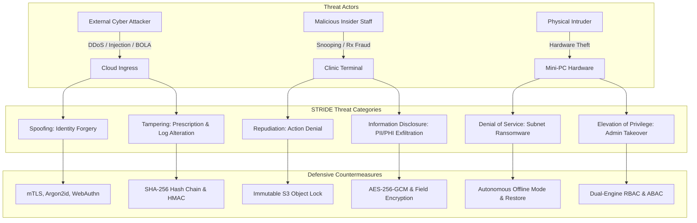

# Enterprise STRIDE Threat Model & Attack Tree Register
## Namma Clinic Digital Health & Operations Platform
### Greater Bengaluru Authority (GBA) / BBMP Health Department
**Standard:** Microsoft STRIDE / NIST SP 800-30 / OWASP Threat Modeling | **Status:** APPROVED BASELINE | **Code:** `SEC-DOC-15`

---

## 1. Threat Modeling Methodology & System Attack Surface
The Namma Clinic Threat Model provides a systematic evaluation of adversaries, attack paths, entry points, and vulnerability vectors across all 18 platform containers (`ARCH-CONT-001` through `ARCH-CONT-018`). Applying the **STRIDE** methodology (Spoofing, Tampering, Repudiation, Information Disclosure, Denial of Service, Elevation of Privilege), the threat model evaluates risks unique to primary healthcare delivery in urban Bengaluru.

### 1.1 Threat Actor Profiles
1. **Curious / Malicious Insider:** Healthcare staff attempting unauthorized snooping into neighbors', family members', or VIPs' clinical records.
2. **Opportunistic Physical Intruder:** Thief burglarizing clinic premises after operating hours to steal mini-PCs or thermal printers.
3. **External Cybercrime Syndicate:** Financially motivated adversaries attempting ransomware deployment, extortion, or darknet health record exfiltration.
4. **Disgruntled Administrative Personnel:** Staff member attempting inventory manipulation, medication diversion, or audit log tampering.
5. **Automated Credential Stuffing Botnets:** Internet-wide automated scripts targeting public API gateway login endpoints.

### 1.2 STRIDE Threat Surface Diagram


## 2. Authoritative Threat Register (THREAT-001 to THREAT-100)
The following 100 records provide the comprehensive threat model for the Namma Clinic Platform:

### THREAT-001
**Title:** Unauthorized Patient Record Snooping (Scenario Variant 1)
**Threat Category:** Healthcare Enterprise Threat - Information Disclosure
**STRIDE Category:** Information Disclosure
**Asset:** Electronic Health Records (EHR) (Container ARCH-CONT-001)
**Threat Actor:** Malicious Insider (Curious Staff)
**Entry Point:** Internal Clinic Web Portal
**Trust Boundary:** Clinic LAN / Presentation Tier
**Preconditions:** Actor has network access to Internal Clinic Web Portal or physical access to target component.
**Attack Path:** Adversary searches for neighbor/celebrity records without clinical assignment. Iteration 1 demonstrates targeted exploitation vector.
**Potential Impact:** High impact breach of patient confidentiality, data integrity loss, or clinical disruption.
**Likelihood:** High
**Severity:** Critical
**Detectability:** High (detected via WORM audit trails, SIEM alerts, and endpoint telemetry)
**Preventive Controls:** SEC-ARCH-001, API-SEC-001, ENC-001
**Detective Controls:** AUDIT-SEC-001, SIEM Anomaly Detection Rule THREAT-001-DET
**Corrective Controls:** INCIDENT-001, Automated Account Suspension & Endpoint Isolation
**Related Security Requirement:** SECR-001
**Related API:** API-001
**Related Database Table:** TABLE-001 (auth_users)
**Related Workflow:** WF-001
**Related Test:** SEC-TEST-001
**Residual Risk:** Low (Mitigated via defense-in-depth and continuous automated verification)
**Risk Owner:** Chief Information Security Officer (CISO)
**Treatment:** Mitigate through technical architecture controls, automated tests, and operational runbooks
**Evidence:** Penetration testing execution logs and SIEM incident simulation telemetry

### THREAT-002
**Title:** Prescription Fraud & Medication Diversion (Scenario Variant 1)
**Threat Category:** Healthcare Enterprise Threat - Tampering
**STRIDE Category:** Tampering
**Asset:** Digital Prescription Entity (Container ARCH-CONT-002)
**Threat Actor:** Rogue Staff / External Fraudster
**Entry Point:** Prescription REST API
**Trust Boundary:** Application Gateway / Microservice
**Preconditions:** Actor has network access to Prescription REST API or physical access to target component.
**Attack Path:** Adversary alters prescribed narcotic drug quantity prior to dispensing. Iteration 1 demonstrates targeted exploitation vector.
**Potential Impact:** High impact breach of patient confidentiality, data integrity loss, or clinical disruption.
**Likelihood:** Medium
**Severity:** Critical
**Detectability:** High (detected via WORM audit trails, SIEM alerts, and endpoint telemetry)
**Preventive Controls:** SEC-ARCH-002, API-SEC-002, ENC-002
**Detective Controls:** AUDIT-SEC-002, SIEM Anomaly Detection Rule THREAT-002-DET
**Corrective Controls:** INCIDENT-002, Automated Account Suspension & Endpoint Isolation
**Related Security Requirement:** SECR-002
**Related API:** API-002
**Related Database Table:** TABLE-002 (user_credentials)
**Related Workflow:** WF-002
**Related Test:** SEC-TEST-002
**Residual Risk:** Low (Mitigated via defense-in-depth and continuous automated verification)
**Risk Owner:** Chief Information Security Officer (CISO)
**Treatment:** Mitigate through technical architecture controls, automated tests, and operational runbooks
**Evidence:** Penetration testing execution logs and SIEM incident simulation telemetry

### THREAT-003
**Title:** Theft of Physical Clinic Mini-PC (Scenario Variant 1)
**Threat Category:** Healthcare Enterprise Threat - Information Disclosure
**STRIDE Category:** Information Disclosure
**Asset:** Local Edge SQLite / Dexie Cache (Container ARCH-CONT-003)
**Threat Actor:** Physical Intruder (Burglar)
**Entry Point:** Physical Workstation Hardware
**Trust Boundary:** Physical Clinic Boundary
**Preconditions:** Actor has network access to Physical Workstation Hardware or physical access to target component.
**Attack Path:** Intruder steals mini-PC from clinic after hours to extract offline health cache. Iteration 1 demonstrates targeted exploitation vector.
**Potential Impact:** High impact breach of patient confidentiality, data integrity loss, or clinical disruption.
**Likelihood:** Medium
**Severity:** High
**Detectability:** High (detected via WORM audit trails, SIEM alerts, and endpoint telemetry)
**Preventive Controls:** SEC-ARCH-003, API-SEC-003, ENC-003
**Detective Controls:** AUDIT-SEC-003, SIEM Anomaly Detection Rule THREAT-003-DET
**Corrective Controls:** INCIDENT-003, Automated Account Suspension & Endpoint Isolation
**Related Security Requirement:** SECR-003
**Related API:** API-003
**Related Database Table:** TABLE-003 (user_sessions)
**Related Workflow:** WF-003
**Related Test:** SEC-TEST-003
**Residual Risk:** Low (Mitigated via defense-in-depth and continuous automated verification)
**Risk Owner:** Chief Information Security Officer (CISO)
**Treatment:** Mitigate through technical architecture controls, automated tests, and operational runbooks
**Evidence:** Penetration testing execution logs and SIEM incident simulation telemetry

### THREAT-004
**Title:** Ransomware Encryption of Clinic Subnet (Scenario Variant 1)
**Threat Category:** Healthcare Enterprise Threat - Denial of Service
**STRIDE Category:** Denial of Service
**Asset:** Clinic Workstation & Local WAL (Container ARCH-CONT-004)
**Threat Actor:** Cybercrime Syndicate (Ransomware)
**Entry Point:** Phishing Email / Exposed Port
**Trust Boundary:** Network Boundary
**Preconditions:** Actor has network access to Phishing Email / Exposed Port or physical access to target component.
**Attack Path:** Adversary executes ransomware encrypting local workstation files and demanding ransom. Iteration 1 demonstrates targeted exploitation vector.
**Potential Impact:** High impact breach of patient confidentiality, data integrity loss, or clinical disruption.
**Likelihood:** Medium
**Severity:** Critical
**Detectability:** High (detected via WORM audit trails, SIEM alerts, and endpoint telemetry)
**Preventive Controls:** SEC-ARCH-004, API-SEC-004, ENC-004
**Detective Controls:** AUDIT-SEC-004, SIEM Anomaly Detection Rule THREAT-004-DET
**Corrective Controls:** INCIDENT-004, Automated Account Suspension & Endpoint Isolation
**Related Security Requirement:** SECR-004
**Related API:** API-004
**Related Database Table:** TABLE-004 (roles)
**Related Workflow:** WF-004
**Related Test:** SEC-TEST-004
**Residual Risk:** Low (Mitigated via defense-in-depth and continuous automated verification)
**Risk Owner:** Chief Information Security Officer (CISO)
**Treatment:** Mitigate through technical architecture controls, automated tests, and operational runbooks
**Evidence:** Penetration testing execution logs and SIEM incident simulation telemetry

### THREAT-005
**Title:** Forged JWT Token Privilege Escalation (Scenario Variant 1)
**Threat Category:** Healthcare Enterprise Threat - Elevation of Privilege
**STRIDE Category:** Elevation of Privilege
**Asset:** Authentication Claims & User Roles (Container ARCH-CONT-005)
**Threat Actor:** Adversary with Stolen Private Key
**Entry Point:** API Gateway Ingress
**Trust Boundary:** Identity Plane
**Preconditions:** Actor has network access to API Gateway Ingress or physical access to target component.
**Attack Path:** Adversary crafts JWT with 'SUPER_ADMIN' claim signed with forged key to seize platform control. Iteration 1 demonstrates targeted exploitation vector.
**Potential Impact:** High impact breach of patient confidentiality, data integrity loss, or clinical disruption.
**Likelihood:** Low
**Severity:** Critical
**Detectability:** High (detected via WORM audit trails, SIEM alerts, and endpoint telemetry)
**Preventive Controls:** SEC-ARCH-005, API-SEC-005, ENC-005
**Detective Controls:** AUDIT-SEC-005, SIEM Anomaly Detection Rule THREAT-005-DET
**Corrective Controls:** INCIDENT-005, Automated Account Suspension & Endpoint Isolation
**Related Security Requirement:** SECR-005
**Related API:** API-005
**Related Database Table:** TABLE-005 (permissions)
**Related Workflow:** WF-005
**Related Test:** SEC-TEST-005
**Residual Risk:** Low (Mitigated via defense-in-depth and continuous automated verification)
**Risk Owner:** Chief Information Security Officer (CISO)
**Treatment:** Mitigate through technical architecture controls, automated tests, and operational runbooks
**Evidence:** Penetration testing execution logs and SIEM incident simulation telemetry

### THREAT-006
**Title:** SQL Injection in Patient Search Endpoint (Scenario Variant 1)
**Threat Category:** Healthcare Enterprise Threat - Tampering
**STRIDE Category:** Tampering
**Asset:** Central PostgreSQL Database (Container ARCH-CONT-006)
**Threat Actor:** External Web Attacker
**Entry Point:** Public Search REST API
**Trust Boundary:** Web Tier / Database Boundary
**Preconditions:** Actor has network access to Public Search REST API or physical access to target component.
**Attack Path:** Adversary injects SQL payload in search query to bypass authentication or dump tables. Iteration 1 demonstrates targeted exploitation vector.
**Potential Impact:** High impact breach of patient confidentiality, data integrity loss, or clinical disruption.
**Likelihood:** Medium
**Severity:** Critical
**Detectability:** High (detected via WORM audit trails, SIEM alerts, and endpoint telemetry)
**Preventive Controls:** SEC-ARCH-006, API-SEC-006, ENC-006
**Detective Controls:** AUDIT-SEC-006, SIEM Anomaly Detection Rule THREAT-006-DET
**Corrective Controls:** INCIDENT-006, Automated Account Suspension & Endpoint Isolation
**Related Security Requirement:** SECR-006
**Related API:** API-006
**Related Database Table:** TABLE-006 (role_permissions)
**Related Workflow:** WF-006
**Related Test:** SEC-TEST-006
**Residual Risk:** Low (Mitigated via defense-in-depth and continuous automated verification)
**Risk Owner:** Chief Information Security Officer (CISO)
**Treatment:** Mitigate through technical architecture controls, automated tests, and operational runbooks
**Evidence:** Penetration testing execution logs and SIEM incident simulation telemetry

### THREAT-007
**Title:** Offline Sync Conflict Poisoning Attack (Scenario Variant 1)
**Threat Category:** Healthcare Enterprise Threat - Tampering
**STRIDE Category:** Tampering
**Asset:** Sync Queue & Replication Engine (Container ARCH-CONT-007)
**Threat Actor:** Compromised Edge Workstation
**Entry Point:** Sync WebSocket / Batch API
**Trust Boundary:** Edge / Cloud Synchronization
**Preconditions:** Actor has network access to Sync WebSocket / Batch API or physical access to target component.
**Attack Path:** Adversary injects malicious conflict timestamps into offline WAL queue to overwrite valid records. Iteration 1 demonstrates targeted exploitation vector.
**Potential Impact:** High impact breach of patient confidentiality, data integrity loss, or clinical disruption.
**Likelihood:** Low
**Severity:** High
**Detectability:** High (detected via WORM audit trails, SIEM alerts, and endpoint telemetry)
**Preventive Controls:** SEC-ARCH-007, API-SEC-007, ENC-007
**Detective Controls:** AUDIT-SEC-007, SIEM Anomaly Detection Rule THREAT-007-DET
**Corrective Controls:** INCIDENT-007, Automated Account Suspension & Endpoint Isolation
**Related Security Requirement:** SECR-007
**Related API:** API-007
**Related Database Table:** TABLE-007 (user_roles)
**Related Workflow:** WF-007
**Related Test:** SEC-TEST-007
**Residual Risk:** Low (Mitigated via defense-in-depth and continuous automated verification)
**Risk Owner:** Chief Information Security Officer (CISO)
**Treatment:** Mitigate through technical architecture controls, automated tests, and operational runbooks
**Evidence:** Penetration testing execution logs and SIEM incident simulation telemetry

### THREAT-008
**Title:** Thermal Printer Buffer Overflow & Jamming (Scenario Variant 1)
**Threat Category:** Healthcare Enterprise Threat - Denial of Service
**STRIDE Category:** Denial of Service
**Asset:** ESC/POS Thermal Receipt Printer (Container ARCH-CONT-008)
**Threat Actor:** Malicious Actor on Clinic LAN
**Entry Point:** Raw USB / Network Printer Port
**Trust Boundary:** Hardware Peripheral Bridge
**Preconditions:** Actor has network access to Raw USB / Network Printer Port or physical access to target component.
**Attack Path:** Adversary sends oversized control byte stream to printer freezing triage ticket generation. Iteration 1 demonstrates targeted exploitation vector.
**Potential Impact:** High impact breach of patient confidentiality, data integrity loss, or clinical disruption.
**Likelihood:** Low
**Severity:** Medium
**Detectability:** High (detected via WORM audit trails, SIEM alerts, and endpoint telemetry)
**Preventive Controls:** SEC-ARCH-008, API-SEC-008, ENC-008
**Detective Controls:** AUDIT-SEC-008, SIEM Anomaly Detection Rule THREAT-008-DET
**Corrective Controls:** INCIDENT-008, Automated Account Suspension & Endpoint Isolation
**Related Security Requirement:** SECR-008
**Related API:** API-008
**Related Database Table:** TABLE-008 (facilities)
**Related Workflow:** WF-008
**Related Test:** SEC-TEST-008
**Residual Risk:** Low (Mitigated via defense-in-depth and continuous automated verification)
**Risk Owner:** Chief Information Security Officer (CISO)
**Treatment:** Mitigate through technical architecture controls, automated tests, and operational runbooks
**Evidence:** Penetration testing execution logs and SIEM incident simulation telemetry

### THREAT-009
**Title:** ABDM Gateway Callback Spoofing (Scenario Variant 1)
**Threat Category:** Healthcare Enterprise Threat - Spoofing
**STRIDE Category:** Spoofing
**Asset:** National Health Interchange (Container ARCH-CONT-009)
**Threat Actor:** Adversary Man-in-the-Middle
**Entry Point:** ABDM Webhook Callback API
**Trust Boundary:** External Integration Boundary
**Preconditions:** Actor has network access to ABDM Webhook Callback API or physical access to target component.
**Attack Path:** Adversary spoofs incoming ABDM consent approval to extract patient health records without real consent. Iteration 1 demonstrates targeted exploitation vector.
**Potential Impact:** High impact breach of patient confidentiality, data integrity loss, or clinical disruption.
**Likelihood:** Low
**Severity:** Critical
**Detectability:** High (detected via WORM audit trails, SIEM alerts, and endpoint telemetry)
**Preventive Controls:** SEC-ARCH-009, API-SEC-009, ENC-009
**Detective Controls:** AUDIT-SEC-009, SIEM Anomaly Detection Rule THREAT-009-DET
**Corrective Controls:** INCIDENT-009, Automated Account Suspension & Endpoint Isolation
**Related Security Requirement:** SECR-009
**Related API:** API-009
**Related Database Table:** TABLE-009 (facility_rooms)
**Related Workflow:** WF-009
**Related Test:** SEC-TEST-009
**Residual Risk:** Low (Mitigated via defense-in-depth and continuous automated verification)
**Risk Owner:** Chief Information Security Officer (CISO)
**Treatment:** Mitigate through technical architecture controls, automated tests, and operational runbooks
**Evidence:** Penetration testing execution logs and SIEM incident simulation telemetry

### THREAT-010
**Title:** Barcode Scanner Keystroke Injection Attack (Scenario Variant 1)
**Threat Category:** Healthcare Enterprise Threat - Elevation of Privilege
**STRIDE Category:** Elevation of Privilege
**Asset:** Workstation Input Buffer (Container ARCH-CONT-010)
**Threat Actor:** Attacker with Custom Barcode
**Entry Point:** USB HID Barcode Scanner
**Trust Boundary:** Peripheral Hardware Tier
**Preconditions:** Actor has network access to USB HID Barcode Scanner or physical access to target component.
**Attack Path:** Attacker prints malicious 2D barcode containing terminal escape codes executed when scanned. Iteration 1 demonstrates targeted exploitation vector.
**Potential Impact:** High impact breach of patient confidentiality, data integrity loss, or clinical disruption.
**Likelihood:** Low
**Severity:** High
**Detectability:** High (detected via WORM audit trails, SIEM alerts, and endpoint telemetry)
**Preventive Controls:** SEC-ARCH-010, API-SEC-010, ENC-010
**Detective Controls:** AUDIT-SEC-010, SIEM Anomaly Detection Rule THREAT-010-DET
**Corrective Controls:** INCIDENT-010, Automated Account Suspension & Endpoint Isolation
**Related Security Requirement:** SECR-010
**Related API:** API-010
**Related Database Table:** TABLE-010 (staff_profiles)
**Related Workflow:** WF-010
**Related Test:** SEC-TEST-010
**Residual Risk:** Low (Mitigated via defense-in-depth and continuous automated verification)
**Risk Owner:** Chief Information Security Officer (CISO)
**Treatment:** Mitigate through technical architecture controls, automated tests, and operational runbooks
**Evidence:** Penetration testing execution logs and SIEM incident simulation telemetry

### THREAT-011
**Title:** Unauthorized Patient Record Snooping (Scenario Variant 2)
**Threat Category:** Healthcare Enterprise Threat - Information Disclosure
**STRIDE Category:** Information Disclosure
**Asset:** Electronic Health Records (EHR) (Container ARCH-CONT-011)
**Threat Actor:** Malicious Insider (Curious Staff)
**Entry Point:** Internal Clinic Web Portal
**Trust Boundary:** Clinic LAN / Presentation Tier
**Preconditions:** Actor has network access to Internal Clinic Web Portal or physical access to target component.
**Attack Path:** Adversary searches for neighbor/celebrity records without clinical assignment. Iteration 2 demonstrates targeted exploitation vector.
**Potential Impact:** High impact breach of patient confidentiality, data integrity loss, or clinical disruption.
**Likelihood:** High
**Severity:** Critical
**Detectability:** High (detected via WORM audit trails, SIEM alerts, and endpoint telemetry)
**Preventive Controls:** SEC-ARCH-011, API-SEC-011, ENC-011
**Detective Controls:** AUDIT-SEC-011, SIEM Anomaly Detection Rule THREAT-011-DET
**Corrective Controls:** INCIDENT-011, Automated Account Suspension & Endpoint Isolation
**Related Security Requirement:** SECR-011
**Related API:** API-011
**Related Database Table:** TABLE-011 (staff_shifts)
**Related Workflow:** WF-011
**Related Test:** SEC-TEST-011
**Residual Risk:** Low (Mitigated via defense-in-depth and continuous automated verification)
**Risk Owner:** Chief Information Security Officer (CISO)
**Treatment:** Mitigate through technical architecture controls, automated tests, and operational runbooks
**Evidence:** Penetration testing execution logs and SIEM incident simulation telemetry

### THREAT-012
**Title:** Prescription Fraud & Medication Diversion (Scenario Variant 2)
**Threat Category:** Healthcare Enterprise Threat - Tampering
**STRIDE Category:** Tampering
**Asset:** Digital Prescription Entity (Container ARCH-CONT-012)
**Threat Actor:** Rogue Staff / External Fraudster
**Entry Point:** Prescription REST API
**Trust Boundary:** Application Gateway / Microservice
**Preconditions:** Actor has network access to Prescription REST API or physical access to target component.
**Attack Path:** Adversary alters prescribed narcotic drug quantity prior to dispensing. Iteration 2 demonstrates targeted exploitation vector.
**Potential Impact:** High impact breach of patient confidentiality, data integrity loss, or clinical disruption.
**Likelihood:** Medium
**Severity:** Critical
**Detectability:** High (detected via WORM audit trails, SIEM alerts, and endpoint telemetry)
**Preventive Controls:** SEC-ARCH-012, API-SEC-012, ENC-012
**Detective Controls:** AUDIT-SEC-012, SIEM Anomaly Detection Rule THREAT-012-DET
**Corrective Controls:** INCIDENT-012, Automated Account Suspension & Endpoint Isolation
**Related Security Requirement:** SECR-012
**Related API:** API-012
**Related Database Table:** TABLE-012 (system_configs)
**Related Workflow:** WF-012
**Related Test:** SEC-TEST-012
**Residual Risk:** Low (Mitigated via defense-in-depth and continuous automated verification)
**Risk Owner:** Chief Information Security Officer (CISO)
**Treatment:** Mitigate through technical architecture controls, automated tests, and operational runbooks
**Evidence:** Penetration testing execution logs and SIEM incident simulation telemetry

### THREAT-013
**Title:** Theft of Physical Clinic Mini-PC (Scenario Variant 2)
**Threat Category:** Healthcare Enterprise Threat - Information Disclosure
**STRIDE Category:** Information Disclosure
**Asset:** Local Edge SQLite / Dexie Cache (Container ARCH-CONT-013)
**Threat Actor:** Physical Intruder (Burglar)
**Entry Point:** Physical Workstation Hardware
**Trust Boundary:** Physical Clinic Boundary
**Preconditions:** Actor has network access to Physical Workstation Hardware or physical access to target component.
**Attack Path:** Intruder steals mini-PC from clinic after hours to extract offline health cache. Iteration 2 demonstrates targeted exploitation vector.
**Potential Impact:** High impact breach of patient confidentiality, data integrity loss, or clinical disruption.
**Likelihood:** Medium
**Severity:** High
**Detectability:** High (detected via WORM audit trails, SIEM alerts, and endpoint telemetry)
**Preventive Controls:** SEC-ARCH-013, API-SEC-013, ENC-013
**Detective Controls:** AUDIT-SEC-013, SIEM Anomaly Detection Rule THREAT-013-DET
**Corrective Controls:** INCIDENT-013, Automated Account Suspension & Endpoint Isolation
**Related Security Requirement:** SECR-013
**Related API:** API-013
**Related Database Table:** TABLE-013 (patients)
**Related Workflow:** WF-013
**Related Test:** SEC-TEST-013
**Residual Risk:** Low (Mitigated via defense-in-depth and continuous automated verification)
**Risk Owner:** Chief Information Security Officer (CISO)
**Treatment:** Mitigate through technical architecture controls, automated tests, and operational runbooks
**Evidence:** Penetration testing execution logs and SIEM incident simulation telemetry

### THREAT-014
**Title:** Ransomware Encryption of Clinic Subnet (Scenario Variant 2)
**Threat Category:** Healthcare Enterprise Threat - Denial of Service
**STRIDE Category:** Denial of Service
**Asset:** Clinic Workstation & Local WAL (Container ARCH-CONT-014)
**Threat Actor:** Cybercrime Syndicate (Ransomware)
**Entry Point:** Phishing Email / Exposed Port
**Trust Boundary:** Network Boundary
**Preconditions:** Actor has network access to Phishing Email / Exposed Port or physical access to target component.
**Attack Path:** Adversary executes ransomware encrypting local workstation files and demanding ransom. Iteration 2 demonstrates targeted exploitation vector.
**Potential Impact:** High impact breach of patient confidentiality, data integrity loss, or clinical disruption.
**Likelihood:** Medium
**Severity:** Critical
**Detectability:** High (detected via WORM audit trails, SIEM alerts, and endpoint telemetry)
**Preventive Controls:** SEC-ARCH-014, API-SEC-014, ENC-014
**Detective Controls:** AUDIT-SEC-014, SIEM Anomaly Detection Rule THREAT-014-DET
**Corrective Controls:** INCIDENT-014, Automated Account Suspension & Endpoint Isolation
**Related Security Requirement:** SECR-014
**Related API:** API-014
**Related Database Table:** TABLE-014 (patient_identifiers)
**Related Workflow:** WF-014
**Related Test:** SEC-TEST-014
**Residual Risk:** Low (Mitigated via defense-in-depth and continuous automated verification)
**Risk Owner:** Chief Information Security Officer (CISO)
**Treatment:** Mitigate through technical architecture controls, automated tests, and operational runbooks
**Evidence:** Penetration testing execution logs and SIEM incident simulation telemetry

### THREAT-015
**Title:** Forged JWT Token Privilege Escalation (Scenario Variant 2)
**Threat Category:** Healthcare Enterprise Threat - Elevation of Privilege
**STRIDE Category:** Elevation of Privilege
**Asset:** Authentication Claims & User Roles (Container ARCH-CONT-015)
**Threat Actor:** Adversary with Stolen Private Key
**Entry Point:** API Gateway Ingress
**Trust Boundary:** Identity Plane
**Preconditions:** Actor has network access to API Gateway Ingress or physical access to target component.
**Attack Path:** Adversary crafts JWT with 'SUPER_ADMIN' claim signed with forged key to seize platform control. Iteration 2 demonstrates targeted exploitation vector.
**Potential Impact:** High impact breach of patient confidentiality, data integrity loss, or clinical disruption.
**Likelihood:** Low
**Severity:** Critical
**Detectability:** High (detected via WORM audit trails, SIEM alerts, and endpoint telemetry)
**Preventive Controls:** SEC-ARCH-015, API-SEC-015, ENC-015
**Detective Controls:** AUDIT-SEC-015, SIEM Anomaly Detection Rule THREAT-015-DET
**Corrective Controls:** INCIDENT-015, Automated Account Suspension & Endpoint Isolation
**Related Security Requirement:** SECR-015
**Related API:** API-015
**Related Database Table:** TABLE-015 (patient_contacts)
**Related Workflow:** WF-015
**Related Test:** SEC-TEST-015
**Residual Risk:** Low (Mitigated via defense-in-depth and continuous automated verification)
**Risk Owner:** Chief Information Security Officer (CISO)
**Treatment:** Mitigate through technical architecture controls, automated tests, and operational runbooks
**Evidence:** Penetration testing execution logs and SIEM incident simulation telemetry

### THREAT-016
**Title:** SQL Injection in Patient Search Endpoint (Scenario Variant 2)
**Threat Category:** Healthcare Enterprise Threat - Tampering
**STRIDE Category:** Tampering
**Asset:** Central PostgreSQL Database (Container ARCH-CONT-016)
**Threat Actor:** External Web Attacker
**Entry Point:** Public Search REST API
**Trust Boundary:** Web Tier / Database Boundary
**Preconditions:** Actor has network access to Public Search REST API or physical access to target component.
**Attack Path:** Adversary injects SQL payload in search query to bypass authentication or dump tables. Iteration 2 demonstrates targeted exploitation vector.
**Potential Impact:** High impact breach of patient confidentiality, data integrity loss, or clinical disruption.
**Likelihood:** Medium
**Severity:** Critical
**Detectability:** High (detected via WORM audit trails, SIEM alerts, and endpoint telemetry)
**Preventive Controls:** SEC-ARCH-016, API-SEC-016, ENC-016
**Detective Controls:** AUDIT-SEC-016, SIEM Anomaly Detection Rule THREAT-016-DET
**Corrective Controls:** INCIDENT-016, Automated Account Suspension & Endpoint Isolation
**Related Security Requirement:** SECR-016
**Related API:** API-016
**Related Database Table:** TABLE-016 (patient_addresses)
**Related Workflow:** WF-016
**Related Test:** SEC-TEST-016
**Residual Risk:** Low (Mitigated via defense-in-depth and continuous automated verification)
**Risk Owner:** Chief Information Security Officer (CISO)
**Treatment:** Mitigate through technical architecture controls, automated tests, and operational runbooks
**Evidence:** Penetration testing execution logs and SIEM incident simulation telemetry

### THREAT-017
**Title:** Offline Sync Conflict Poisoning Attack (Scenario Variant 2)
**Threat Category:** Healthcare Enterprise Threat - Tampering
**STRIDE Category:** Tampering
**Asset:** Sync Queue & Replication Engine (Container ARCH-CONT-017)
**Threat Actor:** Compromised Edge Workstation
**Entry Point:** Sync WebSocket / Batch API
**Trust Boundary:** Edge / Cloud Synchronization
**Preconditions:** Actor has network access to Sync WebSocket / Batch API or physical access to target component.
**Attack Path:** Adversary injects malicious conflict timestamps into offline WAL queue to overwrite valid records. Iteration 2 demonstrates targeted exploitation vector.
**Potential Impact:** High impact breach of patient confidentiality, data integrity loss, or clinical disruption.
**Likelihood:** Low
**Severity:** High
**Detectability:** High (detected via WORM audit trails, SIEM alerts, and endpoint telemetry)
**Preventive Controls:** SEC-ARCH-017, API-SEC-017, ENC-017
**Detective Controls:** AUDIT-SEC-017, SIEM Anomaly Detection Rule THREAT-017-DET
**Corrective Controls:** INCIDENT-017, Automated Account Suspension & Endpoint Isolation
**Related Security Requirement:** SECR-017
**Related API:** API-017
**Related Database Table:** TABLE-017 (consent_records)
**Related Workflow:** WF-017
**Related Test:** SEC-TEST-017
**Residual Risk:** Low (Mitigated via defense-in-depth and continuous automated verification)
**Risk Owner:** Chief Information Security Officer (CISO)
**Treatment:** Mitigate through technical architecture controls, automated tests, and operational runbooks
**Evidence:** Penetration testing execution logs and SIEM incident simulation telemetry

### THREAT-018
**Title:** Thermal Printer Buffer Overflow & Jamming (Scenario Variant 2)
**Threat Category:** Healthcare Enterprise Threat - Denial of Service
**STRIDE Category:** Denial of Service
**Asset:** ESC/POS Thermal Receipt Printer (Container ARCH-CONT-018)
**Threat Actor:** Malicious Actor on Clinic LAN
**Entry Point:** Raw USB / Network Printer Port
**Trust Boundary:** Hardware Peripheral Bridge
**Preconditions:** Actor has network access to Raw USB / Network Printer Port or physical access to target component.
**Attack Path:** Adversary sends oversized control byte stream to printer freezing triage ticket generation. Iteration 2 demonstrates targeted exploitation vector.
**Potential Impact:** High impact breach of patient confidentiality, data integrity loss, or clinical disruption.
**Likelihood:** Low
**Severity:** Medium
**Detectability:** High (detected via WORM audit trails, SIEM alerts, and endpoint telemetry)
**Preventive Controls:** SEC-ARCH-018, API-SEC-018, ENC-018
**Detective Controls:** AUDIT-SEC-018, SIEM Anomaly Detection Rule THREAT-018-DET
**Corrective Controls:** INCIDENT-018, Automated Account Suspension & Endpoint Isolation
**Related Security Requirement:** SECR-018
**Related API:** API-018
**Related Database Table:** TABLE-018 (tokens)
**Related Workflow:** WF-018
**Related Test:** SEC-TEST-018
**Residual Risk:** Low (Mitigated via defense-in-depth and continuous automated verification)
**Risk Owner:** Chief Information Security Officer (CISO)
**Treatment:** Mitigate through technical architecture controls, automated tests, and operational runbooks
**Evidence:** Penetration testing execution logs and SIEM incident simulation telemetry

### THREAT-019
**Title:** ABDM Gateway Callback Spoofing (Scenario Variant 2)
**Threat Category:** Healthcare Enterprise Threat - Spoofing
**STRIDE Category:** Spoofing
**Asset:** National Health Interchange (Container ARCH-CONT-001)
**Threat Actor:** Adversary Man-in-the-Middle
**Entry Point:** ABDM Webhook Callback API
**Trust Boundary:** External Integration Boundary
**Preconditions:** Actor has network access to ABDM Webhook Callback API or physical access to target component.
**Attack Path:** Adversary spoofs incoming ABDM consent approval to extract patient health records without real consent. Iteration 2 demonstrates targeted exploitation vector.
**Potential Impact:** High impact breach of patient confidentiality, data integrity loss, or clinical disruption.
**Likelihood:** Low
**Severity:** Critical
**Detectability:** High (detected via WORM audit trails, SIEM alerts, and endpoint telemetry)
**Preventive Controls:** SEC-ARCH-019, API-SEC-019, ENC-019
**Detective Controls:** AUDIT-SEC-019, SIEM Anomaly Detection Rule THREAT-019-DET
**Corrective Controls:** INCIDENT-019, Automated Account Suspension & Endpoint Isolation
**Related Security Requirement:** SECR-019
**Related API:** API-019
**Related Database Table:** TABLE-019 (queue_entries)
**Related Workflow:** WF-019
**Related Test:** SEC-TEST-019
**Residual Risk:** Low (Mitigated via defense-in-depth and continuous automated verification)
**Risk Owner:** Chief Information Security Officer (CISO)
**Treatment:** Mitigate through technical architecture controls, automated tests, and operational runbooks
**Evidence:** Penetration testing execution logs and SIEM incident simulation telemetry

### THREAT-020
**Title:** Barcode Scanner Keystroke Injection Attack (Scenario Variant 2)
**Threat Category:** Healthcare Enterprise Threat - Elevation of Privilege
**STRIDE Category:** Elevation of Privilege
**Asset:** Workstation Input Buffer (Container ARCH-CONT-002)
**Threat Actor:** Attacker with Custom Barcode
**Entry Point:** USB HID Barcode Scanner
**Trust Boundary:** Peripheral Hardware Tier
**Preconditions:** Actor has network access to USB HID Barcode Scanner or physical access to target component.
**Attack Path:** Attacker prints malicious 2D barcode containing terminal escape codes executed when scanned. Iteration 2 demonstrates targeted exploitation vector.
**Potential Impact:** High impact breach of patient confidentiality, data integrity loss, or clinical disruption.
**Likelihood:** Low
**Severity:** High
**Detectability:** High (detected via WORM audit trails, SIEM alerts, and endpoint telemetry)
**Preventive Controls:** SEC-ARCH-020, API-SEC-020, ENC-020
**Detective Controls:** AUDIT-SEC-020, SIEM Anomaly Detection Rule THREAT-020-DET
**Corrective Controls:** INCIDENT-020, Automated Account Suspension & Endpoint Isolation
**Related Security Requirement:** SECR-020
**Related API:** API-020
**Related Database Table:** TABLE-020 (triage_assessments)
**Related Workflow:** WF-020
**Related Test:** SEC-TEST-020
**Residual Risk:** Low (Mitigated via defense-in-depth and continuous automated verification)
**Risk Owner:** Chief Information Security Officer (CISO)
**Treatment:** Mitigate through technical architecture controls, automated tests, and operational runbooks
**Evidence:** Penetration testing execution logs and SIEM incident simulation telemetry

### THREAT-021
**Title:** Unauthorized Patient Record Snooping (Scenario Variant 3)
**Threat Category:** Healthcare Enterprise Threat - Information Disclosure
**STRIDE Category:** Information Disclosure
**Asset:** Electronic Health Records (EHR) (Container ARCH-CONT-003)
**Threat Actor:** Malicious Insider (Curious Staff)
**Entry Point:** Internal Clinic Web Portal
**Trust Boundary:** Clinic LAN / Presentation Tier
**Preconditions:** Actor has network access to Internal Clinic Web Portal or physical access to target component.
**Attack Path:** Adversary searches for neighbor/celebrity records without clinical assignment. Iteration 3 demonstrates targeted exploitation vector.
**Potential Impact:** High impact breach of patient confidentiality, data integrity loss, or clinical disruption.
**Likelihood:** High
**Severity:** Critical
**Detectability:** High (detected via WORM audit trails, SIEM alerts, and endpoint telemetry)
**Preventive Controls:** SEC-ARCH-021, API-SEC-021, ENC-021
**Detective Controls:** AUDIT-SEC-021, SIEM Anomaly Detection Rule THREAT-021-DET
**Corrective Controls:** INCIDENT-021, Automated Account Suspension & Endpoint Isolation
**Related Security Requirement:** SECR-021
**Related API:** API-021
**Related Database Table:** TABLE-021 (patient_vitals)
**Related Workflow:** WF-021
**Related Test:** SEC-TEST-021
**Residual Risk:** Low (Mitigated via defense-in-depth and continuous automated verification)
**Risk Owner:** Chief Information Security Officer (CISO)
**Treatment:** Mitigate through technical architecture controls, automated tests, and operational runbooks
**Evidence:** Penetration testing execution logs and SIEM incident simulation telemetry

### THREAT-022
**Title:** Prescription Fraud & Medication Diversion (Scenario Variant 3)
**Threat Category:** Healthcare Enterprise Threat - Tampering
**STRIDE Category:** Tampering
**Asset:** Digital Prescription Entity (Container ARCH-CONT-004)
**Threat Actor:** Rogue Staff / External Fraudster
**Entry Point:** Prescription REST API
**Trust Boundary:** Application Gateway / Microservice
**Preconditions:** Actor has network access to Prescription REST API or physical access to target component.
**Attack Path:** Adversary alters prescribed narcotic drug quantity prior to dispensing. Iteration 3 demonstrates targeted exploitation vector.
**Potential Impact:** High impact breach of patient confidentiality, data integrity loss, or clinical disruption.
**Likelihood:** Medium
**Severity:** Critical
**Detectability:** High (detected via WORM audit trails, SIEM alerts, and endpoint telemetry)
**Preventive Controls:** SEC-ARCH-022, API-SEC-022, ENC-022
**Detective Controls:** AUDIT-SEC-022, SIEM Anomaly Detection Rule THREAT-022-DET
**Corrective Controls:** INCIDENT-022, Automated Account Suspension & Endpoint Isolation
**Related Security Requirement:** SECR-022
**Related API:** API-022
**Related Database Table:** TABLE-022 (danger_alerts)
**Related Workflow:** WF-022
**Related Test:** SEC-TEST-022
**Residual Risk:** Low (Mitigated via defense-in-depth and continuous automated verification)
**Risk Owner:** Chief Information Security Officer (CISO)
**Treatment:** Mitigate through technical architecture controls, automated tests, and operational runbooks
**Evidence:** Penetration testing execution logs and SIEM incident simulation telemetry

### THREAT-023
**Title:** Theft of Physical Clinic Mini-PC (Scenario Variant 3)
**Threat Category:** Healthcare Enterprise Threat - Information Disclosure
**STRIDE Category:** Information Disclosure
**Asset:** Local Edge SQLite / Dexie Cache (Container ARCH-CONT-005)
**Threat Actor:** Physical Intruder (Burglar)
**Entry Point:** Physical Workstation Hardware
**Trust Boundary:** Physical Clinic Boundary
**Preconditions:** Actor has network access to Physical Workstation Hardware or physical access to target component.
**Attack Path:** Intruder steals mini-PC from clinic after hours to extract offline health cache. Iteration 3 demonstrates targeted exploitation vector.
**Potential Impact:** High impact breach of patient confidentiality, data integrity loss, or clinical disruption.
**Likelihood:** Medium
**Severity:** High
**Detectability:** High (detected via WORM audit trails, SIEM alerts, and endpoint telemetry)
**Preventive Controls:** SEC-ARCH-023, API-SEC-023, ENC-023
**Detective Controls:** AUDIT-SEC-023, SIEM Anomaly Detection Rule THREAT-023-DET
**Corrective Controls:** INCIDENT-023, Automated Account Suspension & Endpoint Isolation
**Related Security Requirement:** SECR-023
**Related API:** API-023
**Related Database Table:** TABLE-023 (clinical_encounters)
**Related Workflow:** WF-023
**Related Test:** SEC-TEST-023
**Residual Risk:** Low (Mitigated via defense-in-depth and continuous automated verification)
**Risk Owner:** Chief Information Security Officer (CISO)
**Treatment:** Mitigate through technical architecture controls, automated tests, and operational runbooks
**Evidence:** Penetration testing execution logs and SIEM incident simulation telemetry

### THREAT-024
**Title:** Ransomware Encryption of Clinic Subnet (Scenario Variant 3)
**Threat Category:** Healthcare Enterprise Threat - Denial of Service
**STRIDE Category:** Denial of Service
**Asset:** Clinic Workstation & Local WAL (Container ARCH-CONT-006)
**Threat Actor:** Cybercrime Syndicate (Ransomware)
**Entry Point:** Phishing Email / Exposed Port
**Trust Boundary:** Network Boundary
**Preconditions:** Actor has network access to Phishing Email / Exposed Port or physical access to target component.
**Attack Path:** Adversary executes ransomware encrypting local workstation files and demanding ransom. Iteration 3 demonstrates targeted exploitation vector.
**Potential Impact:** High impact breach of patient confidentiality, data integrity loss, or clinical disruption.
**Likelihood:** Medium
**Severity:** Critical
**Detectability:** High (detected via WORM audit trails, SIEM alerts, and endpoint telemetry)
**Preventive Controls:** SEC-ARCH-024, API-SEC-024, ENC-024
**Detective Controls:** AUDIT-SEC-024, SIEM Anomaly Detection Rule THREAT-024-DET
**Corrective Controls:** INCIDENT-024, Automated Account Suspension & Endpoint Isolation
**Related Security Requirement:** SECR-024
**Related API:** API-024
**Related Database Table:** TABLE-024 (clinical_notes)
**Related Workflow:** WF-024
**Related Test:** SEC-TEST-024
**Residual Risk:** Low (Mitigated via defense-in-depth and continuous automated verification)
**Risk Owner:** Chief Information Security Officer (CISO)
**Treatment:** Mitigate through technical architecture controls, automated tests, and operational runbooks
**Evidence:** Penetration testing execution logs and SIEM incident simulation telemetry

### THREAT-025
**Title:** Forged JWT Token Privilege Escalation (Scenario Variant 3)
**Threat Category:** Healthcare Enterprise Threat - Elevation of Privilege
**STRIDE Category:** Elevation of Privilege
**Asset:** Authentication Claims & User Roles (Container ARCH-CONT-007)
**Threat Actor:** Adversary with Stolen Private Key
**Entry Point:** API Gateway Ingress
**Trust Boundary:** Identity Plane
**Preconditions:** Actor has network access to API Gateway Ingress or physical access to target component.
**Attack Path:** Adversary crafts JWT with 'SUPER_ADMIN' claim signed with forged key to seize platform control. Iteration 3 demonstrates targeted exploitation vector.
**Potential Impact:** High impact breach of patient confidentiality, data integrity loss, or clinical disruption.
**Likelihood:** Low
**Severity:** Critical
**Detectability:** High (detected via WORM audit trails, SIEM alerts, and endpoint telemetry)
**Preventive Controls:** SEC-ARCH-025, API-SEC-025, ENC-025
**Detective Controls:** AUDIT-SEC-025, SIEM Anomaly Detection Rule THREAT-025-DET
**Corrective Controls:** INCIDENT-025, Automated Account Suspension & Endpoint Isolation
**Related Security Requirement:** SECR-025
**Related API:** API-025
**Related Database Table:** TABLE-025 (diagnoses)
**Related Workflow:** WF-025
**Related Test:** SEC-TEST-025
**Residual Risk:** Low (Mitigated via defense-in-depth and continuous automated verification)
**Risk Owner:** Chief Information Security Officer (CISO)
**Treatment:** Mitigate through technical architecture controls, automated tests, and operational runbooks
**Evidence:** Penetration testing execution logs and SIEM incident simulation telemetry

### THREAT-026
**Title:** SQL Injection in Patient Search Endpoint (Scenario Variant 3)
**Threat Category:** Healthcare Enterprise Threat - Tampering
**STRIDE Category:** Tampering
**Asset:** Central PostgreSQL Database (Container ARCH-CONT-008)
**Threat Actor:** External Web Attacker
**Entry Point:** Public Search REST API
**Trust Boundary:** Web Tier / Database Boundary
**Preconditions:** Actor has network access to Public Search REST API or physical access to target component.
**Attack Path:** Adversary injects SQL payload in search query to bypass authentication or dump tables. Iteration 3 demonstrates targeted exploitation vector.
**Potential Impact:** High impact breach of patient confidentiality, data integrity loss, or clinical disruption.
**Likelihood:** Medium
**Severity:** Critical
**Detectability:** High (detected via WORM audit trails, SIEM alerts, and endpoint telemetry)
**Preventive Controls:** SEC-ARCH-026, API-SEC-026, ENC-026
**Detective Controls:** AUDIT-SEC-026, SIEM Anomaly Detection Rule THREAT-026-DET
**Corrective Controls:** INCIDENT-026, Automated Account Suspension & Endpoint Isolation
**Related Security Requirement:** SECR-026
**Related API:** API-026
**Related Database Table:** TABLE-026 (prescriptions)
**Related Workflow:** WF-026
**Related Test:** SEC-TEST-026
**Residual Risk:** Low (Mitigated via defense-in-depth and continuous automated verification)
**Risk Owner:** Chief Information Security Officer (CISO)
**Treatment:** Mitigate through technical architecture controls, automated tests, and operational runbooks
**Evidence:** Penetration testing execution logs and SIEM incident simulation telemetry

### THREAT-027
**Title:** Offline Sync Conflict Poisoning Attack (Scenario Variant 3)
**Threat Category:** Healthcare Enterprise Threat - Tampering
**STRIDE Category:** Tampering
**Asset:** Sync Queue & Replication Engine (Container ARCH-CONT-009)
**Threat Actor:** Compromised Edge Workstation
**Entry Point:** Sync WebSocket / Batch API
**Trust Boundary:** Edge / Cloud Synchronization
**Preconditions:** Actor has network access to Sync WebSocket / Batch API or physical access to target component.
**Attack Path:** Adversary injects malicious conflict timestamps into offline WAL queue to overwrite valid records. Iteration 3 demonstrates targeted exploitation vector.
**Potential Impact:** High impact breach of patient confidentiality, data integrity loss, or clinical disruption.
**Likelihood:** Low
**Severity:** High
**Detectability:** High (detected via WORM audit trails, SIEM alerts, and endpoint telemetry)
**Preventive Controls:** SEC-ARCH-027, API-SEC-027, ENC-027
**Detective Controls:** AUDIT-SEC-027, SIEM Anomaly Detection Rule THREAT-027-DET
**Corrective Controls:** INCIDENT-027, Automated Account Suspension & Endpoint Isolation
**Related Security Requirement:** SECR-027
**Related API:** API-027
**Related Database Table:** TABLE-027 (prescription_items)
**Related Workflow:** WF-027
**Related Test:** SEC-TEST-027
**Residual Risk:** Low (Mitigated via defense-in-depth and continuous automated verification)
**Risk Owner:** Chief Information Security Officer (CISO)
**Treatment:** Mitigate through technical architecture controls, automated tests, and operational runbooks
**Evidence:** Penetration testing execution logs and SIEM incident simulation telemetry

### THREAT-028
**Title:** Thermal Printer Buffer Overflow & Jamming (Scenario Variant 3)
**Threat Category:** Healthcare Enterprise Threat - Denial of Service
**STRIDE Category:** Denial of Service
**Asset:** ESC/POS Thermal Receipt Printer (Container ARCH-CONT-010)
**Threat Actor:** Malicious Actor on Clinic LAN
**Entry Point:** Raw USB / Network Printer Port
**Trust Boundary:** Hardware Peripheral Bridge
**Preconditions:** Actor has network access to Raw USB / Network Printer Port or physical access to target component.
**Attack Path:** Adversary sends oversized control byte stream to printer freezing triage ticket generation. Iteration 3 demonstrates targeted exploitation vector.
**Potential Impact:** High impact breach of patient confidentiality, data integrity loss, or clinical disruption.
**Likelihood:** Low
**Severity:** Medium
**Detectability:** High (detected via WORM audit trails, SIEM alerts, and endpoint telemetry)
**Preventive Controls:** SEC-ARCH-028, API-SEC-028, ENC-028
**Detective Controls:** AUDIT-SEC-028, SIEM Anomaly Detection Rule THREAT-028-DET
**Corrective Controls:** INCIDENT-028, Automated Account Suspension & Endpoint Isolation
**Related Security Requirement:** SECR-028
**Related API:** API-028
**Related Database Table:** TABLE-028 (lab_orders)
**Related Workflow:** WF-028
**Related Test:** SEC-TEST-028
**Residual Risk:** Low (Mitigated via defense-in-depth and continuous automated verification)
**Risk Owner:** Chief Information Security Officer (CISO)
**Treatment:** Mitigate through technical architecture controls, automated tests, and operational runbooks
**Evidence:** Penetration testing execution logs and SIEM incident simulation telemetry

### THREAT-029
**Title:** ABDM Gateway Callback Spoofing (Scenario Variant 3)
**Threat Category:** Healthcare Enterprise Threat - Spoofing
**STRIDE Category:** Spoofing
**Asset:** National Health Interchange (Container ARCH-CONT-011)
**Threat Actor:** Adversary Man-in-the-Middle
**Entry Point:** ABDM Webhook Callback API
**Trust Boundary:** External Integration Boundary
**Preconditions:** Actor has network access to ABDM Webhook Callback API or physical access to target component.
**Attack Path:** Adversary spoofs incoming ABDM consent approval to extract patient health records without real consent. Iteration 3 demonstrates targeted exploitation vector.
**Potential Impact:** High impact breach of patient confidentiality, data integrity loss, or clinical disruption.
**Likelihood:** Low
**Severity:** Critical
**Detectability:** High (detected via WORM audit trails, SIEM alerts, and endpoint telemetry)
**Preventive Controls:** SEC-ARCH-029, API-SEC-029, ENC-029
**Detective Controls:** AUDIT-SEC-029, SIEM Anomaly Detection Rule THREAT-029-DET
**Corrective Controls:** INCIDENT-029, Automated Account Suspension & Endpoint Isolation
**Related Security Requirement:** SECR-029
**Related API:** API-029
**Related Database Table:** TABLE-029 (lab_order_items)
**Related Workflow:** WF-029
**Related Test:** SEC-TEST-029
**Residual Risk:** Low (Mitigated via defense-in-depth and continuous automated verification)
**Risk Owner:** Chief Information Security Officer (CISO)
**Treatment:** Mitigate through technical architecture controls, automated tests, and operational runbooks
**Evidence:** Penetration testing execution logs and SIEM incident simulation telemetry

### THREAT-030
**Title:** Barcode Scanner Keystroke Injection Attack (Scenario Variant 3)
**Threat Category:** Healthcare Enterprise Threat - Elevation of Privilege
**STRIDE Category:** Elevation of Privilege
**Asset:** Workstation Input Buffer (Container ARCH-CONT-012)
**Threat Actor:** Attacker with Custom Barcode
**Entry Point:** USB HID Barcode Scanner
**Trust Boundary:** Peripheral Hardware Tier
**Preconditions:** Actor has network access to USB HID Barcode Scanner or physical access to target component.
**Attack Path:** Attacker prints malicious 2D barcode containing terminal escape codes executed when scanned. Iteration 3 demonstrates targeted exploitation vector.
**Potential Impact:** High impact breach of patient confidentiality, data integrity loss, or clinical disruption.
**Likelihood:** Low
**Severity:** High
**Detectability:** High (detected via WORM audit trails, SIEM alerts, and endpoint telemetry)
**Preventive Controls:** SEC-ARCH-030, API-SEC-030, ENC-030
**Detective Controls:** AUDIT-SEC-030, SIEM Anomaly Detection Rule THREAT-030-DET
**Corrective Controls:** INCIDENT-030, Automated Account Suspension & Endpoint Isolation
**Related Security Requirement:** SECR-030
**Related API:** API-030
**Related Database Table:** TABLE-030 (lab_results)
**Related Workflow:** WF-030
**Related Test:** SEC-TEST-030
**Residual Risk:** Low (Mitigated via defense-in-depth and continuous automated verification)
**Risk Owner:** Chief Information Security Officer (CISO)
**Treatment:** Mitigate through technical architecture controls, automated tests, and operational runbooks
**Evidence:** Penetration testing execution logs and SIEM incident simulation telemetry

### THREAT-031
**Title:** Unauthorized Patient Record Snooping (Scenario Variant 4)
**Threat Category:** Healthcare Enterprise Threat - Information Disclosure
**STRIDE Category:** Information Disclosure
**Asset:** Electronic Health Records (EHR) (Container ARCH-CONT-013)
**Threat Actor:** Malicious Insider (Curious Staff)
**Entry Point:** Internal Clinic Web Portal
**Trust Boundary:** Clinic LAN / Presentation Tier
**Preconditions:** Actor has network access to Internal Clinic Web Portal or physical access to target component.
**Attack Path:** Adversary searches for neighbor/celebrity records without clinical assignment. Iteration 4 demonstrates targeted exploitation vector.
**Potential Impact:** High impact breach of patient confidentiality, data integrity loss, or clinical disruption.
**Likelihood:** High
**Severity:** Critical
**Detectability:** High (detected via WORM audit trails, SIEM alerts, and endpoint telemetry)
**Preventive Controls:** SEC-ARCH-031, API-SEC-031, ENC-031
**Detective Controls:** AUDIT-SEC-031, SIEM Anomaly Detection Rule THREAT-031-DET
**Corrective Controls:** INCIDENT-031, Automated Account Suspension & Endpoint Isolation
**Related Security Requirement:** SECR-001
**Related API:** API-031
**Related Database Table:** TABLE-031 (teleconsultations)
**Related Workflow:** WF-001
**Related Test:** SEC-TEST-031
**Residual Risk:** Low (Mitigated via defense-in-depth and continuous automated verification)
**Risk Owner:** Chief Information Security Officer (CISO)
**Treatment:** Mitigate through technical architecture controls, automated tests, and operational runbooks
**Evidence:** Penetration testing execution logs and SIEM incident simulation telemetry

### THREAT-032
**Title:** Prescription Fraud & Medication Diversion (Scenario Variant 4)
**Threat Category:** Healthcare Enterprise Threat - Tampering
**STRIDE Category:** Tampering
**Asset:** Digital Prescription Entity (Container ARCH-CONT-014)
**Threat Actor:** Rogue Staff / External Fraudster
**Entry Point:** Prescription REST API
**Trust Boundary:** Application Gateway / Microservice
**Preconditions:** Actor has network access to Prescription REST API or physical access to target component.
**Attack Path:** Adversary alters prescribed narcotic drug quantity prior to dispensing. Iteration 4 demonstrates targeted exploitation vector.
**Potential Impact:** High impact breach of patient confidentiality, data integrity loss, or clinical disruption.
**Likelihood:** Medium
**Severity:** Critical
**Detectability:** High (detected via WORM audit trails, SIEM alerts, and endpoint telemetry)
**Preventive Controls:** SEC-ARCH-032, API-SEC-032, ENC-032
**Detective Controls:** AUDIT-SEC-032, SIEM Anomaly Detection Rule THREAT-032-DET
**Corrective Controls:** INCIDENT-032, Automated Account Suspension & Endpoint Isolation
**Related Security Requirement:** SECR-002
**Related API:** API-032
**Related Database Table:** TABLE-032 (formulary_drugs)
**Related Workflow:** WF-002
**Related Test:** SEC-TEST-032
**Residual Risk:** Low (Mitigated via defense-in-depth and continuous automated verification)
**Risk Owner:** Chief Information Security Officer (CISO)
**Treatment:** Mitigate through technical architecture controls, automated tests, and operational runbooks
**Evidence:** Penetration testing execution logs and SIEM incident simulation telemetry

### THREAT-033
**Title:** Theft of Physical Clinic Mini-PC (Scenario Variant 4)
**Threat Category:** Healthcare Enterprise Threat - Information Disclosure
**STRIDE Category:** Information Disclosure
**Asset:** Local Edge SQLite / Dexie Cache (Container ARCH-CONT-015)
**Threat Actor:** Physical Intruder (Burglar)
**Entry Point:** Physical Workstation Hardware
**Trust Boundary:** Physical Clinic Boundary
**Preconditions:** Actor has network access to Physical Workstation Hardware or physical access to target component.
**Attack Path:** Intruder steals mini-PC from clinic after hours to extract offline health cache. Iteration 4 demonstrates targeted exploitation vector.
**Potential Impact:** High impact breach of patient confidentiality, data integrity loss, or clinical disruption.
**Likelihood:** Medium
**Severity:** High
**Detectability:** High (detected via WORM audit trails, SIEM alerts, and endpoint telemetry)
**Preventive Controls:** SEC-ARCH-033, API-SEC-033, ENC-033
**Detective Controls:** AUDIT-SEC-033, SIEM Anomaly Detection Rule THREAT-033-DET
**Corrective Controls:** INCIDENT-033, Automated Account Suspension & Endpoint Isolation
**Related Security Requirement:** SECR-003
**Related API:** API-033
**Related Database Table:** TABLE-033 (drug_categories)
**Related Workflow:** WF-003
**Related Test:** SEC-TEST-033
**Residual Risk:** Low (Mitigated via defense-in-depth and continuous automated verification)
**Risk Owner:** Chief Information Security Officer (CISO)
**Treatment:** Mitigate through technical architecture controls, automated tests, and operational runbooks
**Evidence:** Penetration testing execution logs and SIEM incident simulation telemetry

### THREAT-034
**Title:** Ransomware Encryption of Clinic Subnet (Scenario Variant 4)
**Threat Category:** Healthcare Enterprise Threat - Denial of Service
**STRIDE Category:** Denial of Service
**Asset:** Clinic Workstation & Local WAL (Container ARCH-CONT-016)
**Threat Actor:** Cybercrime Syndicate (Ransomware)
**Entry Point:** Phishing Email / Exposed Port
**Trust Boundary:** Network Boundary
**Preconditions:** Actor has network access to Phishing Email / Exposed Port or physical access to target component.
**Attack Path:** Adversary executes ransomware encrypting local workstation files and demanding ransom. Iteration 4 demonstrates targeted exploitation vector.
**Potential Impact:** High impact breach of patient confidentiality, data integrity loss, or clinical disruption.
**Likelihood:** Medium
**Severity:** Critical
**Detectability:** High (detected via WORM audit trails, SIEM alerts, and endpoint telemetry)
**Preventive Controls:** SEC-ARCH-034, API-SEC-034, ENC-034
**Detective Controls:** AUDIT-SEC-034, SIEM Anomaly Detection Rule THREAT-034-DET
**Corrective Controls:** INCIDENT-034, Automated Account Suspension & Endpoint Isolation
**Related Security Requirement:** SECR-004
**Related API:** API-034
**Related Database Table:** TABLE-034 (pharmacy_batches)
**Related Workflow:** WF-004
**Related Test:** SEC-TEST-034
**Residual Risk:** Low (Mitigated via defense-in-depth and continuous automated verification)
**Risk Owner:** Chief Information Security Officer (CISO)
**Treatment:** Mitigate through technical architecture controls, automated tests, and operational runbooks
**Evidence:** Penetration testing execution logs and SIEM incident simulation telemetry

### THREAT-035
**Title:** Forged JWT Token Privilege Escalation (Scenario Variant 4)
**Threat Category:** Healthcare Enterprise Threat - Elevation of Privilege
**STRIDE Category:** Elevation of Privilege
**Asset:** Authentication Claims & User Roles (Container ARCH-CONT-017)
**Threat Actor:** Adversary with Stolen Private Key
**Entry Point:** API Gateway Ingress
**Trust Boundary:** Identity Plane
**Preconditions:** Actor has network access to API Gateway Ingress or physical access to target component.
**Attack Path:** Adversary crafts JWT with 'SUPER_ADMIN' claim signed with forged key to seize platform control. Iteration 4 demonstrates targeted exploitation vector.
**Potential Impact:** High impact breach of patient confidentiality, data integrity loss, or clinical disruption.
**Likelihood:** Low
**Severity:** Critical
**Detectability:** High (detected via WORM audit trails, SIEM alerts, and endpoint telemetry)
**Preventive Controls:** SEC-ARCH-035, API-SEC-035, ENC-035
**Detective Controls:** AUDIT-SEC-035, SIEM Anomaly Detection Rule THREAT-035-DET
**Corrective Controls:** INCIDENT-035, Automated Account Suspension & Endpoint Isolation
**Related Security Requirement:** SECR-005
**Related API:** API-035
**Related Database Table:** TABLE-035 (clinic_stock)
**Related Workflow:** WF-005
**Related Test:** SEC-TEST-035
**Residual Risk:** Low (Mitigated via defense-in-depth and continuous automated verification)
**Risk Owner:** Chief Information Security Officer (CISO)
**Treatment:** Mitigate through technical architecture controls, automated tests, and operational runbooks
**Evidence:** Penetration testing execution logs and SIEM incident simulation telemetry

### THREAT-036
**Title:** SQL Injection in Patient Search Endpoint (Scenario Variant 4)
**Threat Category:** Healthcare Enterprise Threat - Tampering
**STRIDE Category:** Tampering
**Asset:** Central PostgreSQL Database (Container ARCH-CONT-018)
**Threat Actor:** External Web Attacker
**Entry Point:** Public Search REST API
**Trust Boundary:** Web Tier / Database Boundary
**Preconditions:** Actor has network access to Public Search REST API or physical access to target component.
**Attack Path:** Adversary injects SQL payload in search query to bypass authentication or dump tables. Iteration 4 demonstrates targeted exploitation vector.
**Potential Impact:** High impact breach of patient confidentiality, data integrity loss, or clinical disruption.
**Likelihood:** Medium
**Severity:** Critical
**Detectability:** High (detected via WORM audit trails, SIEM alerts, and endpoint telemetry)
**Preventive Controls:** SEC-ARCH-036, API-SEC-036, ENC-036
**Detective Controls:** AUDIT-SEC-036, SIEM Anomaly Detection Rule THREAT-036-DET
**Corrective Controls:** INCIDENT-036, Automated Account Suspension & Endpoint Isolation
**Related Security Requirement:** SECR-006
**Related API:** API-036
**Related Database Table:** TABLE-036 (dispensations)
**Related Workflow:** WF-006
**Related Test:** SEC-TEST-036
**Residual Risk:** Low (Mitigated via defense-in-depth and continuous automated verification)
**Risk Owner:** Chief Information Security Officer (CISO)
**Treatment:** Mitigate through technical architecture controls, automated tests, and operational runbooks
**Evidence:** Penetration testing execution logs and SIEM incident simulation telemetry

### THREAT-037
**Title:** Offline Sync Conflict Poisoning Attack (Scenario Variant 4)
**Threat Category:** Healthcare Enterprise Threat - Tampering
**STRIDE Category:** Tampering
**Asset:** Sync Queue & Replication Engine (Container ARCH-CONT-001)
**Threat Actor:** Compromised Edge Workstation
**Entry Point:** Sync WebSocket / Batch API
**Trust Boundary:** Edge / Cloud Synchronization
**Preconditions:** Actor has network access to Sync WebSocket / Batch API or physical access to target component.
**Attack Path:** Adversary injects malicious conflict timestamps into offline WAL queue to overwrite valid records. Iteration 4 demonstrates targeted exploitation vector.
**Potential Impact:** High impact breach of patient confidentiality, data integrity loss, or clinical disruption.
**Likelihood:** Low
**Severity:** High
**Detectability:** High (detected via WORM audit trails, SIEM alerts, and endpoint telemetry)
**Preventive Controls:** SEC-ARCH-037, API-SEC-037, ENC-037
**Detective Controls:** AUDIT-SEC-037, SIEM Anomaly Detection Rule THREAT-037-DET
**Corrective Controls:** INCIDENT-037, Automated Account Suspension & Endpoint Isolation
**Related Security Requirement:** SECR-007
**Related API:** API-037
**Related Database Table:** TABLE-037 (dispensation_items)
**Related Workflow:** WF-007
**Related Test:** SEC-TEST-037
**Residual Risk:** Low (Mitigated via defense-in-depth and continuous automated verification)
**Risk Owner:** Chief Information Security Officer (CISO)
**Treatment:** Mitigate through technical architecture controls, automated tests, and operational runbooks
**Evidence:** Penetration testing execution logs and SIEM incident simulation telemetry

### THREAT-038
**Title:** Thermal Printer Buffer Overflow & Jamming (Scenario Variant 4)
**Threat Category:** Healthcare Enterprise Threat - Denial of Service
**STRIDE Category:** Denial of Service
**Asset:** ESC/POS Thermal Receipt Printer (Container ARCH-CONT-002)
**Threat Actor:** Malicious Actor on Clinic LAN
**Entry Point:** Raw USB / Network Printer Port
**Trust Boundary:** Hardware Peripheral Bridge
**Preconditions:** Actor has network access to Raw USB / Network Printer Port or physical access to target component.
**Attack Path:** Adversary sends oversized control byte stream to printer freezing triage ticket generation. Iteration 4 demonstrates targeted exploitation vector.
**Potential Impact:** High impact breach of patient confidentiality, data integrity loss, or clinical disruption.
**Likelihood:** Low
**Severity:** Medium
**Detectability:** High (detected via WORM audit trails, SIEM alerts, and endpoint telemetry)
**Preventive Controls:** SEC-ARCH-038, API-SEC-038, ENC-038
**Detective Controls:** AUDIT-SEC-038, SIEM Anomaly Detection Rule THREAT-038-DET
**Corrective Controls:** INCIDENT-038, Automated Account Suspension & Endpoint Isolation
**Related Security Requirement:** SECR-008
**Related API:** API-038
**Related Database Table:** TABLE-038 (stock_movements)
**Related Workflow:** WF-008
**Related Test:** SEC-TEST-038
**Residual Risk:** Low (Mitigated via defense-in-depth and continuous automated verification)
**Risk Owner:** Chief Information Security Officer (CISO)
**Treatment:** Mitigate through technical architecture controls, automated tests, and operational runbooks
**Evidence:** Penetration testing execution logs and SIEM incident simulation telemetry

### THREAT-039
**Title:** ABDM Gateway Callback Spoofing (Scenario Variant 4)
**Threat Category:** Healthcare Enterprise Threat - Spoofing
**STRIDE Category:** Spoofing
**Asset:** National Health Interchange (Container ARCH-CONT-003)
**Threat Actor:** Adversary Man-in-the-Middle
**Entry Point:** ABDM Webhook Callback API
**Trust Boundary:** External Integration Boundary
**Preconditions:** Actor has network access to ABDM Webhook Callback API or physical access to target component.
**Attack Path:** Adversary spoofs incoming ABDM consent approval to extract patient health records without real consent. Iteration 4 demonstrates targeted exploitation vector.
**Potential Impact:** High impact breach of patient confidentiality, data integrity loss, or clinical disruption.
**Likelihood:** Low
**Severity:** Critical
**Detectability:** High (detected via WORM audit trails, SIEM alerts, and endpoint telemetry)
**Preventive Controls:** SEC-ARCH-039, API-SEC-039, ENC-039
**Detective Controls:** AUDIT-SEC-039, SIEM Anomaly Detection Rule THREAT-039-DET
**Corrective Controls:** INCIDENT-039, Automated Account Suspension & Endpoint Isolation
**Related Security Requirement:** SECR-009
**Related API:** API-039
**Related Database Table:** TABLE-039 (drug_indents)
**Related Workflow:** WF-009
**Related Test:** SEC-TEST-039
**Residual Risk:** Low (Mitigated via defense-in-depth and continuous automated verification)
**Risk Owner:** Chief Information Security Officer (CISO)
**Treatment:** Mitigate through technical architecture controls, automated tests, and operational runbooks
**Evidence:** Penetration testing execution logs and SIEM incident simulation telemetry

### THREAT-040
**Title:** Barcode Scanner Keystroke Injection Attack (Scenario Variant 4)
**Threat Category:** Healthcare Enterprise Threat - Elevation of Privilege
**STRIDE Category:** Elevation of Privilege
**Asset:** Workstation Input Buffer (Container ARCH-CONT-004)
**Threat Actor:** Attacker with Custom Barcode
**Entry Point:** USB HID Barcode Scanner
**Trust Boundary:** Peripheral Hardware Tier
**Preconditions:** Actor has network access to USB HID Barcode Scanner or physical access to target component.
**Attack Path:** Attacker prints malicious 2D barcode containing terminal escape codes executed when scanned. Iteration 4 demonstrates targeted exploitation vector.
**Potential Impact:** High impact breach of patient confidentiality, data integrity loss, or clinical disruption.
**Likelihood:** Low
**Severity:** High
**Detectability:** High (detected via WORM audit trails, SIEM alerts, and endpoint telemetry)
**Preventive Controls:** SEC-ARCH-040, API-SEC-040, ENC-040
**Detective Controls:** AUDIT-SEC-040, SIEM Anomaly Detection Rule THREAT-040-DET
**Corrective Controls:** INCIDENT-040, Automated Account Suspension & Endpoint Isolation
**Related Security Requirement:** SECR-010
**Related API:** API-040
**Related Database Table:** TABLE-040 (indent_items)
**Related Workflow:** WF-010
**Related Test:** SEC-TEST-040
**Residual Risk:** Low (Mitigated via defense-in-depth and continuous automated verification)
**Risk Owner:** Chief Information Security Officer (CISO)
**Treatment:** Mitigate through technical architecture controls, automated tests, and operational runbooks
**Evidence:** Penetration testing execution logs and SIEM incident simulation telemetry

### THREAT-041
**Title:** Unauthorized Patient Record Snooping (Scenario Variant 5)
**Threat Category:** Healthcare Enterprise Threat - Information Disclosure
**STRIDE Category:** Information Disclosure
**Asset:** Electronic Health Records (EHR) (Container ARCH-CONT-005)
**Threat Actor:** Malicious Insider (Curious Staff)
**Entry Point:** Internal Clinic Web Portal
**Trust Boundary:** Clinic LAN / Presentation Tier
**Preconditions:** Actor has network access to Internal Clinic Web Portal or physical access to target component.
**Attack Path:** Adversary searches for neighbor/celebrity records without clinical assignment. Iteration 5 demonstrates targeted exploitation vector.
**Potential Impact:** High impact breach of patient confidentiality, data integrity loss, or clinical disruption.
**Likelihood:** High
**Severity:** Critical
**Detectability:** High (detected via WORM audit trails, SIEM alerts, and endpoint telemetry)
**Preventive Controls:** SEC-ARCH-041, API-SEC-041, ENC-001
**Detective Controls:** AUDIT-SEC-041, SIEM Anomaly Detection Rule THREAT-041-DET
**Corrective Controls:** INCIDENT-001, Automated Account Suspension & Endpoint Isolation
**Related Security Requirement:** SECR-011
**Related API:** API-041
**Related Database Table:** TABLE-041 (cold_chain_devices)
**Related Workflow:** WF-011
**Related Test:** SEC-TEST-041
**Residual Risk:** Low (Mitigated via defense-in-depth and continuous automated verification)
**Risk Owner:** Chief Information Security Officer (CISO)
**Treatment:** Mitigate through technical architecture controls, automated tests, and operational runbooks
**Evidence:** Penetration testing execution logs and SIEM incident simulation telemetry

### THREAT-042
**Title:** Prescription Fraud & Medication Diversion (Scenario Variant 5)
**Threat Category:** Healthcare Enterprise Threat - Tampering
**STRIDE Category:** Tampering
**Asset:** Digital Prescription Entity (Container ARCH-CONT-006)
**Threat Actor:** Rogue Staff / External Fraudster
**Entry Point:** Prescription REST API
**Trust Boundary:** Application Gateway / Microservice
**Preconditions:** Actor has network access to Prescription REST API or physical access to target component.
**Attack Path:** Adversary alters prescribed narcotic drug quantity prior to dispensing. Iteration 5 demonstrates targeted exploitation vector.
**Potential Impact:** High impact breach of patient confidentiality, data integrity loss, or clinical disruption.
**Likelihood:** Medium
**Severity:** Critical
**Detectability:** High (detected via WORM audit trails, SIEM alerts, and endpoint telemetry)
**Preventive Controls:** SEC-ARCH-042, API-SEC-042, ENC-002
**Detective Controls:** AUDIT-SEC-042, SIEM Anomaly Detection Rule THREAT-042-DET
**Corrective Controls:** INCIDENT-002, Automated Account Suspension & Endpoint Isolation
**Related Security Requirement:** SECR-012
**Related API:** API-042
**Related Database Table:** TABLE-042 (cold_chain_telemetry)
**Related Workflow:** WF-012
**Related Test:** SEC-TEST-042
**Residual Risk:** Low (Mitigated via defense-in-depth and continuous automated verification)
**Risk Owner:** Chief Information Security Officer (CISO)
**Treatment:** Mitigate through technical architecture controls, automated tests, and operational runbooks
**Evidence:** Penetration testing execution logs and SIEM incident simulation telemetry

### THREAT-043
**Title:** Theft of Physical Clinic Mini-PC (Scenario Variant 5)
**Threat Category:** Healthcare Enterprise Threat - Information Disclosure
**STRIDE Category:** Information Disclosure
**Asset:** Local Edge SQLite / Dexie Cache (Container ARCH-CONT-007)
**Threat Actor:** Physical Intruder (Burglar)
**Entry Point:** Physical Workstation Hardware
**Trust Boundary:** Physical Clinic Boundary
**Preconditions:** Actor has network access to Physical Workstation Hardware or physical access to target component.
**Attack Path:** Intruder steals mini-PC from clinic after hours to extract offline health cache. Iteration 5 demonstrates targeted exploitation vector.
**Potential Impact:** High impact breach of patient confidentiality, data integrity loss, or clinical disruption.
**Likelihood:** Medium
**Severity:** High
**Detectability:** High (detected via WORM audit trails, SIEM alerts, and endpoint telemetry)
**Preventive Controls:** SEC-ARCH-043, API-SEC-043, ENC-003
**Detective Controls:** AUDIT-SEC-043, SIEM Anomaly Detection Rule THREAT-043-DET
**Corrective Controls:** INCIDENT-003, Automated Account Suspension & Endpoint Isolation
**Related Security Requirement:** SECR-013
**Related API:** API-043
**Related Database Table:** TABLE-043 (referrals)
**Related Workflow:** WF-013
**Related Test:** SEC-TEST-043
**Residual Risk:** Low (Mitigated via defense-in-depth and continuous automated verification)
**Risk Owner:** Chief Information Security Officer (CISO)
**Treatment:** Mitigate through technical architecture controls, automated tests, and operational runbooks
**Evidence:** Penetration testing execution logs and SIEM incident simulation telemetry

### THREAT-044
**Title:** Ransomware Encryption of Clinic Subnet (Scenario Variant 5)
**Threat Category:** Healthcare Enterprise Threat - Denial of Service
**STRIDE Category:** Denial of Service
**Asset:** Clinic Workstation & Local WAL (Container ARCH-CONT-008)
**Threat Actor:** Cybercrime Syndicate (Ransomware)
**Entry Point:** Phishing Email / Exposed Port
**Trust Boundary:** Network Boundary
**Preconditions:** Actor has network access to Phishing Email / Exposed Port or physical access to target component.
**Attack Path:** Adversary executes ransomware encrypting local workstation files and demanding ransom. Iteration 5 demonstrates targeted exploitation vector.
**Potential Impact:** High impact breach of patient confidentiality, data integrity loss, or clinical disruption.
**Likelihood:** Medium
**Severity:** Critical
**Detectability:** High (detected via WORM audit trails, SIEM alerts, and endpoint telemetry)
**Preventive Controls:** SEC-ARCH-044, API-SEC-044, ENC-004
**Detective Controls:** AUDIT-SEC-044, SIEM Anomaly Detection Rule THREAT-044-DET
**Corrective Controls:** INCIDENT-004, Automated Account Suspension & Endpoint Isolation
**Related Security Requirement:** SECR-014
**Related API:** API-044
**Related Database Table:** TABLE-044 (referral_counter_notes)
**Related Workflow:** WF-014
**Related Test:** SEC-TEST-044
**Residual Risk:** Low (Mitigated via defense-in-depth and continuous automated verification)
**Risk Owner:** Chief Information Security Officer (CISO)
**Treatment:** Mitigate through technical architecture controls, automated tests, and operational runbooks
**Evidence:** Penetration testing execution logs and SIEM incident simulation telemetry

### THREAT-045
**Title:** Forged JWT Token Privilege Escalation (Scenario Variant 5)
**Threat Category:** Healthcare Enterprise Threat - Elevation of Privilege
**STRIDE Category:** Elevation of Privilege
**Asset:** Authentication Claims & User Roles (Container ARCH-CONT-009)
**Threat Actor:** Adversary with Stolen Private Key
**Entry Point:** API Gateway Ingress
**Trust Boundary:** Identity Plane
**Preconditions:** Actor has network access to API Gateway Ingress or physical access to target component.
**Attack Path:** Adversary crafts JWT with 'SUPER_ADMIN' claim signed with forged key to seize platform control. Iteration 5 demonstrates targeted exploitation vector.
**Potential Impact:** High impact breach of patient confidentiality, data integrity loss, or clinical disruption.
**Likelihood:** Low
**Severity:** Critical
**Detectability:** High (detected via WORM audit trails, SIEM alerts, and endpoint telemetry)
**Preventive Controls:** SEC-ARCH-045, API-SEC-045, ENC-005
**Detective Controls:** AUDIT-SEC-045, SIEM Anomaly Detection Rule THREAT-045-DET
**Corrective Controls:** INCIDENT-005, Automated Account Suspension & Endpoint Isolation
**Related Security Requirement:** SECR-015
**Related API:** API-045
**Related Database Table:** TABLE-045 (ncd_episodes)
**Related Workflow:** WF-015
**Related Test:** SEC-TEST-045
**Residual Risk:** Low (Mitigated via defense-in-depth and continuous automated verification)
**Risk Owner:** Chief Information Security Officer (CISO)
**Treatment:** Mitigate through technical architecture controls, automated tests, and operational runbooks
**Evidence:** Penetration testing execution logs and SIEM incident simulation telemetry

### THREAT-046
**Title:** SQL Injection in Patient Search Endpoint (Scenario Variant 5)
**Threat Category:** Healthcare Enterprise Threat - Tampering
**STRIDE Category:** Tampering
**Asset:** Central PostgreSQL Database (Container ARCH-CONT-010)
**Threat Actor:** External Web Attacker
**Entry Point:** Public Search REST API
**Trust Boundary:** Web Tier / Database Boundary
**Preconditions:** Actor has network access to Public Search REST API or physical access to target component.
**Attack Path:** Adversary injects SQL payload in search query to bypass authentication or dump tables. Iteration 5 demonstrates targeted exploitation vector.
**Potential Impact:** High impact breach of patient confidentiality, data integrity loss, or clinical disruption.
**Likelihood:** Medium
**Severity:** Critical
**Detectability:** High (detected via WORM audit trails, SIEM alerts, and endpoint telemetry)
**Preventive Controls:** SEC-ARCH-046, API-SEC-046, ENC-006
**Detective Controls:** AUDIT-SEC-046, SIEM Anomaly Detection Rule THREAT-046-DET
**Corrective Controls:** INCIDENT-006, Automated Account Suspension & Endpoint Isolation
**Related Security Requirement:** SECR-016
**Related API:** API-046
**Related Database Table:** TABLE-046 (follow_up_schedules)
**Related Workflow:** WF-016
**Related Test:** SEC-TEST-046
**Residual Risk:** Low (Mitigated via defense-in-depth and continuous automated verification)
**Risk Owner:** Chief Information Security Officer (CISO)
**Treatment:** Mitigate through technical architecture controls, automated tests, and operational runbooks
**Evidence:** Penetration testing execution logs and SIEM incident simulation telemetry

### THREAT-047
**Title:** Offline Sync Conflict Poisoning Attack (Scenario Variant 5)
**Threat Category:** Healthcare Enterprise Threat - Tampering
**STRIDE Category:** Tampering
**Asset:** Sync Queue & Replication Engine (Container ARCH-CONT-011)
**Threat Actor:** Compromised Edge Workstation
**Entry Point:** Sync WebSocket / Batch API
**Trust Boundary:** Edge / Cloud Synchronization
**Preconditions:** Actor has network access to Sync WebSocket / Batch API or physical access to target component.
**Attack Path:** Adversary injects malicious conflict timestamps into offline WAL queue to overwrite valid records. Iteration 5 demonstrates targeted exploitation vector.
**Potential Impact:** High impact breach of patient confidentiality, data integrity loss, or clinical disruption.
**Likelihood:** Low
**Severity:** High
**Detectability:** High (detected via WORM audit trails, SIEM alerts, and endpoint telemetry)
**Preventive Controls:** SEC-ARCH-047, API-SEC-047, ENC-007
**Detective Controls:** AUDIT-SEC-047, SIEM Anomaly Detection Rule THREAT-047-DET
**Corrective Controls:** INCIDENT-007, Automated Account Suspension & Endpoint Isolation
**Related Security Requirement:** SECR-017
**Related API:** API-047
**Related Database Table:** TABLE-047 (notifications)
**Related Workflow:** WF-017
**Related Test:** SEC-TEST-047
**Residual Risk:** Low (Mitigated via defense-in-depth and continuous automated verification)
**Risk Owner:** Chief Information Security Officer (CISO)
**Treatment:** Mitigate through technical architecture controls, automated tests, and operational runbooks
**Evidence:** Penetration testing execution logs and SIEM incident simulation telemetry

### THREAT-048
**Title:** Thermal Printer Buffer Overflow & Jamming (Scenario Variant 5)
**Threat Category:** Healthcare Enterprise Threat - Denial of Service
**STRIDE Category:** Denial of Service
**Asset:** ESC/POS Thermal Receipt Printer (Container ARCH-CONT-012)
**Threat Actor:** Malicious Actor on Clinic LAN
**Entry Point:** Raw USB / Network Printer Port
**Trust Boundary:** Hardware Peripheral Bridge
**Preconditions:** Actor has network access to Raw USB / Network Printer Port or physical access to target component.
**Attack Path:** Adversary sends oversized control byte stream to printer freezing triage ticket generation. Iteration 5 demonstrates targeted exploitation vector.
**Potential Impact:** High impact breach of patient confidentiality, data integrity loss, or clinical disruption.
**Likelihood:** Low
**Severity:** Medium
**Detectability:** High (detected via WORM audit trails, SIEM alerts, and endpoint telemetry)
**Preventive Controls:** SEC-ARCH-048, API-SEC-048, ENC-008
**Detective Controls:** AUDIT-SEC-048, SIEM Anomaly Detection Rule THREAT-048-DET
**Corrective Controls:** INCIDENT-008, Automated Account Suspension & Endpoint Isolation
**Related Security Requirement:** SECR-018
**Related API:** API-048
**Related Database Table:** TABLE-048 (grievances)
**Related Workflow:** WF-018
**Related Test:** SEC-TEST-048
**Residual Risk:** Low (Mitigated via defense-in-depth and continuous automated verification)
**Risk Owner:** Chief Information Security Officer (CISO)
**Treatment:** Mitigate through technical architecture controls, automated tests, and operational runbooks
**Evidence:** Penetration testing execution logs and SIEM incident simulation telemetry

### THREAT-049
**Title:** ABDM Gateway Callback Spoofing (Scenario Variant 5)
**Threat Category:** Healthcare Enterprise Threat - Spoofing
**STRIDE Category:** Spoofing
**Asset:** National Health Interchange (Container ARCH-CONT-013)
**Threat Actor:** Adversary Man-in-the-Middle
**Entry Point:** ABDM Webhook Callback API
**Trust Boundary:** External Integration Boundary
**Preconditions:** Actor has network access to ABDM Webhook Callback API or physical access to target component.
**Attack Path:** Adversary spoofs incoming ABDM consent approval to extract patient health records without real consent. Iteration 5 demonstrates targeted exploitation vector.
**Potential Impact:** High impact breach of patient confidentiality, data integrity loss, or clinical disruption.
**Likelihood:** Low
**Severity:** Critical
**Detectability:** High (detected via WORM audit trails, SIEM alerts, and endpoint telemetry)
**Preventive Controls:** SEC-ARCH-049, API-SEC-049, ENC-009
**Detective Controls:** AUDIT-SEC-049, SIEM Anomaly Detection Rule THREAT-049-DET
**Corrective Controls:** INCIDENT-009, Automated Account Suspension & Endpoint Isolation
**Related Security Requirement:** SECR-019
**Related API:** API-049
**Related Database Table:** TABLE-049 (helpdesk_tickets)
**Related Workflow:** WF-019
**Related Test:** SEC-TEST-049
**Residual Risk:** Low (Mitigated via defense-in-depth and continuous automated verification)
**Risk Owner:** Chief Information Security Officer (CISO)
**Treatment:** Mitigate through technical architecture controls, automated tests, and operational runbooks
**Evidence:** Penetration testing execution logs and SIEM incident simulation telemetry

### THREAT-050
**Title:** Barcode Scanner Keystroke Injection Attack (Scenario Variant 5)
**Threat Category:** Healthcare Enterprise Threat - Elevation of Privilege
**STRIDE Category:** Elevation of Privilege
**Asset:** Workstation Input Buffer (Container ARCH-CONT-014)
**Threat Actor:** Attacker with Custom Barcode
**Entry Point:** USB HID Barcode Scanner
**Trust Boundary:** Peripheral Hardware Tier
**Preconditions:** Actor has network access to USB HID Barcode Scanner or physical access to target component.
**Attack Path:** Attacker prints malicious 2D barcode containing terminal escape codes executed when scanned. Iteration 5 demonstrates targeted exploitation vector.
**Potential Impact:** High impact breach of patient confidentiality, data integrity loss, or clinical disruption.
**Likelihood:** Low
**Severity:** High
**Detectability:** High (detected via WORM audit trails, SIEM alerts, and endpoint telemetry)
**Preventive Controls:** SEC-ARCH-050, API-SEC-050, ENC-010
**Detective Controls:** AUDIT-SEC-050, SIEM Anomaly Detection Rule THREAT-050-DET
**Corrective Controls:** INCIDENT-010, Automated Account Suspension & Endpoint Isolation
**Related Security Requirement:** SECR-020
**Related API:** API-050
**Related Database Table:** TABLE-050 (audit_events)
**Related Workflow:** WF-020
**Related Test:** SEC-TEST-050
**Residual Risk:** Low (Mitigated via defense-in-depth and continuous automated verification)
**Risk Owner:** Chief Information Security Officer (CISO)
**Treatment:** Mitigate through technical architecture controls, automated tests, and operational runbooks
**Evidence:** Penetration testing execution logs and SIEM incident simulation telemetry

### THREAT-051
**Title:** Unauthorized Patient Record Snooping (Scenario Variant 6)
**Threat Category:** Healthcare Enterprise Threat - Information Disclosure
**STRIDE Category:** Information Disclosure
**Asset:** Electronic Health Records (EHR) (Container ARCH-CONT-015)
**Threat Actor:** Malicious Insider (Curious Staff)
**Entry Point:** Internal Clinic Web Portal
**Trust Boundary:** Clinic LAN / Presentation Tier
**Preconditions:** Actor has network access to Internal Clinic Web Portal or physical access to target component.
**Attack Path:** Adversary searches for neighbor/celebrity records without clinical assignment. Iteration 6 demonstrates targeted exploitation vector.
**Potential Impact:** High impact breach of patient confidentiality, data integrity loss, or clinical disruption.
**Likelihood:** High
**Severity:** Critical
**Detectability:** High (detected via WORM audit trails, SIEM alerts, and endpoint telemetry)
**Preventive Controls:** SEC-ARCH-001, API-SEC-051, ENC-011
**Detective Controls:** AUDIT-SEC-051, SIEM Anomaly Detection Rule THREAT-051-DET
**Corrective Controls:** INCIDENT-011, Automated Account Suspension & Endpoint Isolation
**Related Security Requirement:** SECR-021
**Related API:** API-051
**Related Database Table:** TABLE-051 (offline_mutation_log)
**Related Workflow:** WF-021
**Related Test:** SEC-TEST-051
**Residual Risk:** Low (Mitigated via defense-in-depth and continuous automated verification)
**Risk Owner:** Chief Information Security Officer (CISO)
**Treatment:** Mitigate through technical architecture controls, automated tests, and operational runbooks
**Evidence:** Penetration testing execution logs and SIEM incident simulation telemetry

### THREAT-052
**Title:** Prescription Fraud & Medication Diversion (Scenario Variant 6)
**Threat Category:** Healthcare Enterprise Threat - Tampering
**STRIDE Category:** Tampering
**Asset:** Digital Prescription Entity (Container ARCH-CONT-016)
**Threat Actor:** Rogue Staff / External Fraudster
**Entry Point:** Prescription REST API
**Trust Boundary:** Application Gateway / Microservice
**Preconditions:** Actor has network access to Prescription REST API or physical access to target component.
**Attack Path:** Adversary alters prescribed narcotic drug quantity prior to dispensing. Iteration 6 demonstrates targeted exploitation vector.
**Potential Impact:** High impact breach of patient confidentiality, data integrity loss, or clinical disruption.
**Likelihood:** Medium
**Severity:** Critical
**Detectability:** High (detected via WORM audit trails, SIEM alerts, and endpoint telemetry)
**Preventive Controls:** SEC-ARCH-002, API-SEC-052, ENC-012
**Detective Controls:** AUDIT-SEC-052, SIEM Anomaly Detection Rule THREAT-052-DET
**Corrective Controls:** INCIDENT-012, Automated Account Suspension & Endpoint Isolation
**Related Security Requirement:** SECR-022
**Related API:** API-052
**Related Database Table:** TABLE-052 (abdm_artifacts)
**Related Workflow:** WF-022
**Related Test:** SEC-TEST-052
**Residual Risk:** Low (Mitigated via defense-in-depth and continuous automated verification)
**Risk Owner:** Chief Information Security Officer (CISO)
**Treatment:** Mitigate through technical architecture controls, automated tests, and operational runbooks
**Evidence:** Penetration testing execution logs and SIEM incident simulation telemetry

### THREAT-053
**Title:** Theft of Physical Clinic Mini-PC (Scenario Variant 6)
**Threat Category:** Healthcare Enterprise Threat - Information Disclosure
**STRIDE Category:** Information Disclosure
**Asset:** Local Edge SQLite / Dexie Cache (Container ARCH-CONT-017)
**Threat Actor:** Physical Intruder (Burglar)
**Entry Point:** Physical Workstation Hardware
**Trust Boundary:** Physical Clinic Boundary
**Preconditions:** Actor has network access to Physical Workstation Hardware or physical access to target component.
**Attack Path:** Intruder steals mini-PC from clinic after hours to extract offline health cache. Iteration 6 demonstrates targeted exploitation vector.
**Potential Impact:** High impact breach of patient confidentiality, data integrity loss, or clinical disruption.
**Likelihood:** Medium
**Severity:** High
**Detectability:** High (detected via WORM audit trails, SIEM alerts, and endpoint telemetry)
**Preventive Controls:** SEC-ARCH-003, API-SEC-053, ENC-013
**Detective Controls:** AUDIT-SEC-053, SIEM Anomaly Detection Rule THREAT-053-DET
**Corrective Controls:** INCIDENT-013, Automated Account Suspension & Endpoint Isolation
**Related Security Requirement:** SECR-023
**Related API:** API-053
**Related Database Table:** TABLE-001 (auth_users)
**Related Workflow:** WF-023
**Related Test:** SEC-TEST-053
**Residual Risk:** Low (Mitigated via defense-in-depth and continuous automated verification)
**Risk Owner:** Chief Information Security Officer (CISO)
**Treatment:** Mitigate through technical architecture controls, automated tests, and operational runbooks
**Evidence:** Penetration testing execution logs and SIEM incident simulation telemetry

### THREAT-054
**Title:** Ransomware Encryption of Clinic Subnet (Scenario Variant 6)
**Threat Category:** Healthcare Enterprise Threat - Denial of Service
**STRIDE Category:** Denial of Service
**Asset:** Clinic Workstation & Local WAL (Container ARCH-CONT-018)
**Threat Actor:** Cybercrime Syndicate (Ransomware)
**Entry Point:** Phishing Email / Exposed Port
**Trust Boundary:** Network Boundary
**Preconditions:** Actor has network access to Phishing Email / Exposed Port or physical access to target component.
**Attack Path:** Adversary executes ransomware encrypting local workstation files and demanding ransom. Iteration 6 demonstrates targeted exploitation vector.
**Potential Impact:** High impact breach of patient confidentiality, data integrity loss, or clinical disruption.
**Likelihood:** Medium
**Severity:** Critical
**Detectability:** High (detected via WORM audit trails, SIEM alerts, and endpoint telemetry)
**Preventive Controls:** SEC-ARCH-004, API-SEC-054, ENC-014
**Detective Controls:** AUDIT-SEC-054, SIEM Anomaly Detection Rule THREAT-054-DET
**Corrective Controls:** INCIDENT-014, Automated Account Suspension & Endpoint Isolation
**Related Security Requirement:** SECR-024
**Related API:** API-054
**Related Database Table:** TABLE-002 (user_credentials)
**Related Workflow:** WF-024
**Related Test:** SEC-TEST-054
**Residual Risk:** Low (Mitigated via defense-in-depth and continuous automated verification)
**Risk Owner:** Chief Information Security Officer (CISO)
**Treatment:** Mitigate through technical architecture controls, automated tests, and operational runbooks
**Evidence:** Penetration testing execution logs and SIEM incident simulation telemetry

### THREAT-055
**Title:** Forged JWT Token Privilege Escalation (Scenario Variant 6)
**Threat Category:** Healthcare Enterprise Threat - Elevation of Privilege
**STRIDE Category:** Elevation of Privilege
**Asset:** Authentication Claims & User Roles (Container ARCH-CONT-001)
**Threat Actor:** Adversary with Stolen Private Key
**Entry Point:** API Gateway Ingress
**Trust Boundary:** Identity Plane
**Preconditions:** Actor has network access to API Gateway Ingress or physical access to target component.
**Attack Path:** Adversary crafts JWT with 'SUPER_ADMIN' claim signed with forged key to seize platform control. Iteration 6 demonstrates targeted exploitation vector.
**Potential Impact:** High impact breach of patient confidentiality, data integrity loss, or clinical disruption.
**Likelihood:** Low
**Severity:** Critical
**Detectability:** High (detected via WORM audit trails, SIEM alerts, and endpoint telemetry)
**Preventive Controls:** SEC-ARCH-005, API-SEC-055, ENC-015
**Detective Controls:** AUDIT-SEC-055, SIEM Anomaly Detection Rule THREAT-055-DET
**Corrective Controls:** INCIDENT-015, Automated Account Suspension & Endpoint Isolation
**Related Security Requirement:** SECR-025
**Related API:** API-055
**Related Database Table:** TABLE-003 (user_sessions)
**Related Workflow:** WF-025
**Related Test:** SEC-TEST-055
**Residual Risk:** Low (Mitigated via defense-in-depth and continuous automated verification)
**Risk Owner:** Chief Information Security Officer (CISO)
**Treatment:** Mitigate through technical architecture controls, automated tests, and operational runbooks
**Evidence:** Penetration testing execution logs and SIEM incident simulation telemetry

### THREAT-056
**Title:** SQL Injection in Patient Search Endpoint (Scenario Variant 6)
**Threat Category:** Healthcare Enterprise Threat - Tampering
**STRIDE Category:** Tampering
**Asset:** Central PostgreSQL Database (Container ARCH-CONT-002)
**Threat Actor:** External Web Attacker
**Entry Point:** Public Search REST API
**Trust Boundary:** Web Tier / Database Boundary
**Preconditions:** Actor has network access to Public Search REST API or physical access to target component.
**Attack Path:** Adversary injects SQL payload in search query to bypass authentication or dump tables. Iteration 6 demonstrates targeted exploitation vector.
**Potential Impact:** High impact breach of patient confidentiality, data integrity loss, or clinical disruption.
**Likelihood:** Medium
**Severity:** Critical
**Detectability:** High (detected via WORM audit trails, SIEM alerts, and endpoint telemetry)
**Preventive Controls:** SEC-ARCH-006, API-SEC-056, ENC-016
**Detective Controls:** AUDIT-SEC-056, SIEM Anomaly Detection Rule THREAT-056-DET
**Corrective Controls:** INCIDENT-016, Automated Account Suspension & Endpoint Isolation
**Related Security Requirement:** SECR-026
**Related API:** API-056
**Related Database Table:** TABLE-004 (roles)
**Related Workflow:** WF-026
**Related Test:** SEC-TEST-056
**Residual Risk:** Low (Mitigated via defense-in-depth and continuous automated verification)
**Risk Owner:** Chief Information Security Officer (CISO)
**Treatment:** Mitigate through technical architecture controls, automated tests, and operational runbooks
**Evidence:** Penetration testing execution logs and SIEM incident simulation telemetry

### THREAT-057
**Title:** Offline Sync Conflict Poisoning Attack (Scenario Variant 6)
**Threat Category:** Healthcare Enterprise Threat - Tampering
**STRIDE Category:** Tampering
**Asset:** Sync Queue & Replication Engine (Container ARCH-CONT-003)
**Threat Actor:** Compromised Edge Workstation
**Entry Point:** Sync WebSocket / Batch API
**Trust Boundary:** Edge / Cloud Synchronization
**Preconditions:** Actor has network access to Sync WebSocket / Batch API or physical access to target component.
**Attack Path:** Adversary injects malicious conflict timestamps into offline WAL queue to overwrite valid records. Iteration 6 demonstrates targeted exploitation vector.
**Potential Impact:** High impact breach of patient confidentiality, data integrity loss, or clinical disruption.
**Likelihood:** Low
**Severity:** High
**Detectability:** High (detected via WORM audit trails, SIEM alerts, and endpoint telemetry)
**Preventive Controls:** SEC-ARCH-007, API-SEC-057, ENC-017
**Detective Controls:** AUDIT-SEC-057, SIEM Anomaly Detection Rule THREAT-057-DET
**Corrective Controls:** INCIDENT-017, Automated Account Suspension & Endpoint Isolation
**Related Security Requirement:** SECR-027
**Related API:** API-057
**Related Database Table:** TABLE-005 (permissions)
**Related Workflow:** WF-027
**Related Test:** SEC-TEST-057
**Residual Risk:** Low (Mitigated via defense-in-depth and continuous automated verification)
**Risk Owner:** Chief Information Security Officer (CISO)
**Treatment:** Mitigate through technical architecture controls, automated tests, and operational runbooks
**Evidence:** Penetration testing execution logs and SIEM incident simulation telemetry

### THREAT-058
**Title:** Thermal Printer Buffer Overflow & Jamming (Scenario Variant 6)
**Threat Category:** Healthcare Enterprise Threat - Denial of Service
**STRIDE Category:** Denial of Service
**Asset:** ESC/POS Thermal Receipt Printer (Container ARCH-CONT-004)
**Threat Actor:** Malicious Actor on Clinic LAN
**Entry Point:** Raw USB / Network Printer Port
**Trust Boundary:** Hardware Peripheral Bridge
**Preconditions:** Actor has network access to Raw USB / Network Printer Port or physical access to target component.
**Attack Path:** Adversary sends oversized control byte stream to printer freezing triage ticket generation. Iteration 6 demonstrates targeted exploitation vector.
**Potential Impact:** High impact breach of patient confidentiality, data integrity loss, or clinical disruption.
**Likelihood:** Low
**Severity:** Medium
**Detectability:** High (detected via WORM audit trails, SIEM alerts, and endpoint telemetry)
**Preventive Controls:** SEC-ARCH-008, API-SEC-058, ENC-018
**Detective Controls:** AUDIT-SEC-058, SIEM Anomaly Detection Rule THREAT-058-DET
**Corrective Controls:** INCIDENT-018, Automated Account Suspension & Endpoint Isolation
**Related Security Requirement:** SECR-028
**Related API:** API-058
**Related Database Table:** TABLE-006 (role_permissions)
**Related Workflow:** WF-028
**Related Test:** SEC-TEST-058
**Residual Risk:** Low (Mitigated via defense-in-depth and continuous automated verification)
**Risk Owner:** Chief Information Security Officer (CISO)
**Treatment:** Mitigate through technical architecture controls, automated tests, and operational runbooks
**Evidence:** Penetration testing execution logs and SIEM incident simulation telemetry

### THREAT-059
**Title:** ABDM Gateway Callback Spoofing (Scenario Variant 6)
**Threat Category:** Healthcare Enterprise Threat - Spoofing
**STRIDE Category:** Spoofing
**Asset:** National Health Interchange (Container ARCH-CONT-005)
**Threat Actor:** Adversary Man-in-the-Middle
**Entry Point:** ABDM Webhook Callback API
**Trust Boundary:** External Integration Boundary
**Preconditions:** Actor has network access to ABDM Webhook Callback API or physical access to target component.
**Attack Path:** Adversary spoofs incoming ABDM consent approval to extract patient health records without real consent. Iteration 6 demonstrates targeted exploitation vector.
**Potential Impact:** High impact breach of patient confidentiality, data integrity loss, or clinical disruption.
**Likelihood:** Low
**Severity:** Critical
**Detectability:** High (detected via WORM audit trails, SIEM alerts, and endpoint telemetry)
**Preventive Controls:** SEC-ARCH-009, API-SEC-059, ENC-019
**Detective Controls:** AUDIT-SEC-059, SIEM Anomaly Detection Rule THREAT-059-DET
**Corrective Controls:** INCIDENT-019, Automated Account Suspension & Endpoint Isolation
**Related Security Requirement:** SECR-029
**Related API:** API-059
**Related Database Table:** TABLE-007 (user_roles)
**Related Workflow:** WF-029
**Related Test:** SEC-TEST-059
**Residual Risk:** Low (Mitigated via defense-in-depth and continuous automated verification)
**Risk Owner:** Chief Information Security Officer (CISO)
**Treatment:** Mitigate through technical architecture controls, automated tests, and operational runbooks
**Evidence:** Penetration testing execution logs and SIEM incident simulation telemetry

### THREAT-060
**Title:** Barcode Scanner Keystroke Injection Attack (Scenario Variant 6)
**Threat Category:** Healthcare Enterprise Threat - Elevation of Privilege
**STRIDE Category:** Elevation of Privilege
**Asset:** Workstation Input Buffer (Container ARCH-CONT-006)
**Threat Actor:** Attacker with Custom Barcode
**Entry Point:** USB HID Barcode Scanner
**Trust Boundary:** Peripheral Hardware Tier
**Preconditions:** Actor has network access to USB HID Barcode Scanner or physical access to target component.
**Attack Path:** Attacker prints malicious 2D barcode containing terminal escape codes executed when scanned. Iteration 6 demonstrates targeted exploitation vector.
**Potential Impact:** High impact breach of patient confidentiality, data integrity loss, or clinical disruption.
**Likelihood:** Low
**Severity:** High
**Detectability:** High (detected via WORM audit trails, SIEM alerts, and endpoint telemetry)
**Preventive Controls:** SEC-ARCH-010, API-SEC-060, ENC-020
**Detective Controls:** AUDIT-SEC-060, SIEM Anomaly Detection Rule THREAT-060-DET
**Corrective Controls:** INCIDENT-020, Automated Account Suspension & Endpoint Isolation
**Related Security Requirement:** SECR-030
**Related API:** API-060
**Related Database Table:** TABLE-008 (facilities)
**Related Workflow:** WF-030
**Related Test:** SEC-TEST-060
**Residual Risk:** Low (Mitigated via defense-in-depth and continuous automated verification)
**Risk Owner:** Chief Information Security Officer (CISO)
**Treatment:** Mitigate through technical architecture controls, automated tests, and operational runbooks
**Evidence:** Penetration testing execution logs and SIEM incident simulation telemetry

### THREAT-061
**Title:** Unauthorized Patient Record Snooping (Scenario Variant 7)
**Threat Category:** Healthcare Enterprise Threat - Information Disclosure
**STRIDE Category:** Information Disclosure
**Asset:** Electronic Health Records (EHR) (Container ARCH-CONT-007)
**Threat Actor:** Malicious Insider (Curious Staff)
**Entry Point:** Internal Clinic Web Portal
**Trust Boundary:** Clinic LAN / Presentation Tier
**Preconditions:** Actor has network access to Internal Clinic Web Portal or physical access to target component.
**Attack Path:** Adversary searches for neighbor/celebrity records without clinical assignment. Iteration 7 demonstrates targeted exploitation vector.
**Potential Impact:** High impact breach of patient confidentiality, data integrity loss, or clinical disruption.
**Likelihood:** High
**Severity:** Critical
**Detectability:** High (detected via WORM audit trails, SIEM alerts, and endpoint telemetry)
**Preventive Controls:** SEC-ARCH-011, API-SEC-001, ENC-021
**Detective Controls:** AUDIT-SEC-001, SIEM Anomaly Detection Rule THREAT-061-DET
**Corrective Controls:** INCIDENT-021, Automated Account Suspension & Endpoint Isolation
**Related Security Requirement:** SECR-001
**Related API:** API-061
**Related Database Table:** TABLE-009 (facility_rooms)
**Related Workflow:** WF-001
**Related Test:** SEC-TEST-061
**Residual Risk:** Low (Mitigated via defense-in-depth and continuous automated verification)
**Risk Owner:** Chief Information Security Officer (CISO)
**Treatment:** Mitigate through technical architecture controls, automated tests, and operational runbooks
**Evidence:** Penetration testing execution logs and SIEM incident simulation telemetry

### THREAT-062
**Title:** Prescription Fraud & Medication Diversion (Scenario Variant 7)
**Threat Category:** Healthcare Enterprise Threat - Tampering
**STRIDE Category:** Tampering
**Asset:** Digital Prescription Entity (Container ARCH-CONT-008)
**Threat Actor:** Rogue Staff / External Fraudster
**Entry Point:** Prescription REST API
**Trust Boundary:** Application Gateway / Microservice
**Preconditions:** Actor has network access to Prescription REST API or physical access to target component.
**Attack Path:** Adversary alters prescribed narcotic drug quantity prior to dispensing. Iteration 7 demonstrates targeted exploitation vector.
**Potential Impact:** High impact breach of patient confidentiality, data integrity loss, or clinical disruption.
**Likelihood:** Medium
**Severity:** Critical
**Detectability:** High (detected via WORM audit trails, SIEM alerts, and endpoint telemetry)
**Preventive Controls:** SEC-ARCH-012, API-SEC-002, ENC-022
**Detective Controls:** AUDIT-SEC-002, SIEM Anomaly Detection Rule THREAT-062-DET
**Corrective Controls:** INCIDENT-022, Automated Account Suspension & Endpoint Isolation
**Related Security Requirement:** SECR-002
**Related API:** API-062
**Related Database Table:** TABLE-010 (staff_profiles)
**Related Workflow:** WF-002
**Related Test:** SEC-TEST-062
**Residual Risk:** Low (Mitigated via defense-in-depth and continuous automated verification)
**Risk Owner:** Chief Information Security Officer (CISO)
**Treatment:** Mitigate through technical architecture controls, automated tests, and operational runbooks
**Evidence:** Penetration testing execution logs and SIEM incident simulation telemetry

### THREAT-063
**Title:** Theft of Physical Clinic Mini-PC (Scenario Variant 7)
**Threat Category:** Healthcare Enterprise Threat - Information Disclosure
**STRIDE Category:** Information Disclosure
**Asset:** Local Edge SQLite / Dexie Cache (Container ARCH-CONT-009)
**Threat Actor:** Physical Intruder (Burglar)
**Entry Point:** Physical Workstation Hardware
**Trust Boundary:** Physical Clinic Boundary
**Preconditions:** Actor has network access to Physical Workstation Hardware or physical access to target component.
**Attack Path:** Intruder steals mini-PC from clinic after hours to extract offline health cache. Iteration 7 demonstrates targeted exploitation vector.
**Potential Impact:** High impact breach of patient confidentiality, data integrity loss, or clinical disruption.
**Likelihood:** Medium
**Severity:** High
**Detectability:** High (detected via WORM audit trails, SIEM alerts, and endpoint telemetry)
**Preventive Controls:** SEC-ARCH-013, API-SEC-003, ENC-023
**Detective Controls:** AUDIT-SEC-003, SIEM Anomaly Detection Rule THREAT-063-DET
**Corrective Controls:** INCIDENT-023, Automated Account Suspension & Endpoint Isolation
**Related Security Requirement:** SECR-003
**Related API:** API-063
**Related Database Table:** TABLE-011 (staff_shifts)
**Related Workflow:** WF-003
**Related Test:** SEC-TEST-063
**Residual Risk:** Low (Mitigated via defense-in-depth and continuous automated verification)
**Risk Owner:** Chief Information Security Officer (CISO)
**Treatment:** Mitigate through technical architecture controls, automated tests, and operational runbooks
**Evidence:** Penetration testing execution logs and SIEM incident simulation telemetry

### THREAT-064
**Title:** Ransomware Encryption of Clinic Subnet (Scenario Variant 7)
**Threat Category:** Healthcare Enterprise Threat - Denial of Service
**STRIDE Category:** Denial of Service
**Asset:** Clinic Workstation & Local WAL (Container ARCH-CONT-010)
**Threat Actor:** Cybercrime Syndicate (Ransomware)
**Entry Point:** Phishing Email / Exposed Port
**Trust Boundary:** Network Boundary
**Preconditions:** Actor has network access to Phishing Email / Exposed Port or physical access to target component.
**Attack Path:** Adversary executes ransomware encrypting local workstation files and demanding ransom. Iteration 7 demonstrates targeted exploitation vector.
**Potential Impact:** High impact breach of patient confidentiality, data integrity loss, or clinical disruption.
**Likelihood:** Medium
**Severity:** Critical
**Detectability:** High (detected via WORM audit trails, SIEM alerts, and endpoint telemetry)
**Preventive Controls:** SEC-ARCH-014, API-SEC-004, ENC-024
**Detective Controls:** AUDIT-SEC-004, SIEM Anomaly Detection Rule THREAT-064-DET
**Corrective Controls:** INCIDENT-024, Automated Account Suspension & Endpoint Isolation
**Related Security Requirement:** SECR-004
**Related API:** API-064
**Related Database Table:** TABLE-012 (system_configs)
**Related Workflow:** WF-004
**Related Test:** SEC-TEST-064
**Residual Risk:** Low (Mitigated via defense-in-depth and continuous automated verification)
**Risk Owner:** Chief Information Security Officer (CISO)
**Treatment:** Mitigate through technical architecture controls, automated tests, and operational runbooks
**Evidence:** Penetration testing execution logs and SIEM incident simulation telemetry

### THREAT-065
**Title:** Forged JWT Token Privilege Escalation (Scenario Variant 7)
**Threat Category:** Healthcare Enterprise Threat - Elevation of Privilege
**STRIDE Category:** Elevation of Privilege
**Asset:** Authentication Claims & User Roles (Container ARCH-CONT-011)
**Threat Actor:** Adversary with Stolen Private Key
**Entry Point:** API Gateway Ingress
**Trust Boundary:** Identity Plane
**Preconditions:** Actor has network access to API Gateway Ingress or physical access to target component.
**Attack Path:** Adversary crafts JWT with 'SUPER_ADMIN' claim signed with forged key to seize platform control. Iteration 7 demonstrates targeted exploitation vector.
**Potential Impact:** High impact breach of patient confidentiality, data integrity loss, or clinical disruption.
**Likelihood:** Low
**Severity:** Critical
**Detectability:** High (detected via WORM audit trails, SIEM alerts, and endpoint telemetry)
**Preventive Controls:** SEC-ARCH-015, API-SEC-005, ENC-025
**Detective Controls:** AUDIT-SEC-005, SIEM Anomaly Detection Rule THREAT-065-DET
**Corrective Controls:** INCIDENT-025, Automated Account Suspension & Endpoint Isolation
**Related Security Requirement:** SECR-005
**Related API:** API-065
**Related Database Table:** TABLE-013 (patients)
**Related Workflow:** WF-005
**Related Test:** SEC-TEST-065
**Residual Risk:** Low (Mitigated via defense-in-depth and continuous automated verification)
**Risk Owner:** Chief Information Security Officer (CISO)
**Treatment:** Mitigate through technical architecture controls, automated tests, and operational runbooks
**Evidence:** Penetration testing execution logs and SIEM incident simulation telemetry

### THREAT-066
**Title:** SQL Injection in Patient Search Endpoint (Scenario Variant 7)
**Threat Category:** Healthcare Enterprise Threat - Tampering
**STRIDE Category:** Tampering
**Asset:** Central PostgreSQL Database (Container ARCH-CONT-012)
**Threat Actor:** External Web Attacker
**Entry Point:** Public Search REST API
**Trust Boundary:** Web Tier / Database Boundary
**Preconditions:** Actor has network access to Public Search REST API or physical access to target component.
**Attack Path:** Adversary injects SQL payload in search query to bypass authentication or dump tables. Iteration 7 demonstrates targeted exploitation vector.
**Potential Impact:** High impact breach of patient confidentiality, data integrity loss, or clinical disruption.
**Likelihood:** Medium
**Severity:** Critical
**Detectability:** High (detected via WORM audit trails, SIEM alerts, and endpoint telemetry)
**Preventive Controls:** SEC-ARCH-016, API-SEC-006, ENC-026
**Detective Controls:** AUDIT-SEC-006, SIEM Anomaly Detection Rule THREAT-066-DET
**Corrective Controls:** INCIDENT-026, Automated Account Suspension & Endpoint Isolation
**Related Security Requirement:** SECR-006
**Related API:** API-066
**Related Database Table:** TABLE-014 (patient_identifiers)
**Related Workflow:** WF-006
**Related Test:** SEC-TEST-066
**Residual Risk:** Low (Mitigated via defense-in-depth and continuous automated verification)
**Risk Owner:** Chief Information Security Officer (CISO)
**Treatment:** Mitigate through technical architecture controls, automated tests, and operational runbooks
**Evidence:** Penetration testing execution logs and SIEM incident simulation telemetry

### THREAT-067
**Title:** Offline Sync Conflict Poisoning Attack (Scenario Variant 7)
**Threat Category:** Healthcare Enterprise Threat - Tampering
**STRIDE Category:** Tampering
**Asset:** Sync Queue & Replication Engine (Container ARCH-CONT-013)
**Threat Actor:** Compromised Edge Workstation
**Entry Point:** Sync WebSocket / Batch API
**Trust Boundary:** Edge / Cloud Synchronization
**Preconditions:** Actor has network access to Sync WebSocket / Batch API or physical access to target component.
**Attack Path:** Adversary injects malicious conflict timestamps into offline WAL queue to overwrite valid records. Iteration 7 demonstrates targeted exploitation vector.
**Potential Impact:** High impact breach of patient confidentiality, data integrity loss, or clinical disruption.
**Likelihood:** Low
**Severity:** High
**Detectability:** High (detected via WORM audit trails, SIEM alerts, and endpoint telemetry)
**Preventive Controls:** SEC-ARCH-017, API-SEC-007, ENC-027
**Detective Controls:** AUDIT-SEC-007, SIEM Anomaly Detection Rule THREAT-067-DET
**Corrective Controls:** INCIDENT-027, Automated Account Suspension & Endpoint Isolation
**Related Security Requirement:** SECR-007
**Related API:** API-067
**Related Database Table:** TABLE-015 (patient_contacts)
**Related Workflow:** WF-007
**Related Test:** SEC-TEST-067
**Residual Risk:** Low (Mitigated via defense-in-depth and continuous automated verification)
**Risk Owner:** Chief Information Security Officer (CISO)
**Treatment:** Mitigate through technical architecture controls, automated tests, and operational runbooks
**Evidence:** Penetration testing execution logs and SIEM incident simulation telemetry

### THREAT-068
**Title:** Thermal Printer Buffer Overflow & Jamming (Scenario Variant 7)
**Threat Category:** Healthcare Enterprise Threat - Denial of Service
**STRIDE Category:** Denial of Service
**Asset:** ESC/POS Thermal Receipt Printer (Container ARCH-CONT-014)
**Threat Actor:** Malicious Actor on Clinic LAN
**Entry Point:** Raw USB / Network Printer Port
**Trust Boundary:** Hardware Peripheral Bridge
**Preconditions:** Actor has network access to Raw USB / Network Printer Port or physical access to target component.
**Attack Path:** Adversary sends oversized control byte stream to printer freezing triage ticket generation. Iteration 7 demonstrates targeted exploitation vector.
**Potential Impact:** High impact breach of patient confidentiality, data integrity loss, or clinical disruption.
**Likelihood:** Low
**Severity:** Medium
**Detectability:** High (detected via WORM audit trails, SIEM alerts, and endpoint telemetry)
**Preventive Controls:** SEC-ARCH-018, API-SEC-008, ENC-028
**Detective Controls:** AUDIT-SEC-008, SIEM Anomaly Detection Rule THREAT-068-DET
**Corrective Controls:** INCIDENT-028, Automated Account Suspension & Endpoint Isolation
**Related Security Requirement:** SECR-008
**Related API:** API-068
**Related Database Table:** TABLE-016 (patient_addresses)
**Related Workflow:** WF-008
**Related Test:** SEC-TEST-068
**Residual Risk:** Low (Mitigated via defense-in-depth and continuous automated verification)
**Risk Owner:** Chief Information Security Officer (CISO)
**Treatment:** Mitigate through technical architecture controls, automated tests, and operational runbooks
**Evidence:** Penetration testing execution logs and SIEM incident simulation telemetry

### THREAT-069
**Title:** ABDM Gateway Callback Spoofing (Scenario Variant 7)
**Threat Category:** Healthcare Enterprise Threat - Spoofing
**STRIDE Category:** Spoofing
**Asset:** National Health Interchange (Container ARCH-CONT-015)
**Threat Actor:** Adversary Man-in-the-Middle
**Entry Point:** ABDM Webhook Callback API
**Trust Boundary:** External Integration Boundary
**Preconditions:** Actor has network access to ABDM Webhook Callback API or physical access to target component.
**Attack Path:** Adversary spoofs incoming ABDM consent approval to extract patient health records without real consent. Iteration 7 demonstrates targeted exploitation vector.
**Potential Impact:** High impact breach of patient confidentiality, data integrity loss, or clinical disruption.
**Likelihood:** Low
**Severity:** Critical
**Detectability:** High (detected via WORM audit trails, SIEM alerts, and endpoint telemetry)
**Preventive Controls:** SEC-ARCH-019, API-SEC-009, ENC-029
**Detective Controls:** AUDIT-SEC-009, SIEM Anomaly Detection Rule THREAT-069-DET
**Corrective Controls:** INCIDENT-029, Automated Account Suspension & Endpoint Isolation
**Related Security Requirement:** SECR-009
**Related API:** API-069
**Related Database Table:** TABLE-017 (consent_records)
**Related Workflow:** WF-009
**Related Test:** SEC-TEST-069
**Residual Risk:** Low (Mitigated via defense-in-depth and continuous automated verification)
**Risk Owner:** Chief Information Security Officer (CISO)
**Treatment:** Mitigate through technical architecture controls, automated tests, and operational runbooks
**Evidence:** Penetration testing execution logs and SIEM incident simulation telemetry

### THREAT-070
**Title:** Barcode Scanner Keystroke Injection Attack (Scenario Variant 7)
**Threat Category:** Healthcare Enterprise Threat - Elevation of Privilege
**STRIDE Category:** Elevation of Privilege
**Asset:** Workstation Input Buffer (Container ARCH-CONT-016)
**Threat Actor:** Attacker with Custom Barcode
**Entry Point:** USB HID Barcode Scanner
**Trust Boundary:** Peripheral Hardware Tier
**Preconditions:** Actor has network access to USB HID Barcode Scanner or physical access to target component.
**Attack Path:** Attacker prints malicious 2D barcode containing terminal escape codes executed when scanned. Iteration 7 demonstrates targeted exploitation vector.
**Potential Impact:** High impact breach of patient confidentiality, data integrity loss, or clinical disruption.
**Likelihood:** Low
**Severity:** High
**Detectability:** High (detected via WORM audit trails, SIEM alerts, and endpoint telemetry)
**Preventive Controls:** SEC-ARCH-020, API-SEC-010, ENC-030
**Detective Controls:** AUDIT-SEC-010, SIEM Anomaly Detection Rule THREAT-070-DET
**Corrective Controls:** INCIDENT-030, Automated Account Suspension & Endpoint Isolation
**Related Security Requirement:** SECR-010
**Related API:** API-070
**Related Database Table:** TABLE-018 (tokens)
**Related Workflow:** WF-010
**Related Test:** SEC-TEST-070
**Residual Risk:** Low (Mitigated via defense-in-depth and continuous automated verification)
**Risk Owner:** Chief Information Security Officer (CISO)
**Treatment:** Mitigate through technical architecture controls, automated tests, and operational runbooks
**Evidence:** Penetration testing execution logs and SIEM incident simulation telemetry

### THREAT-071
**Title:** Unauthorized Patient Record Snooping (Scenario Variant 8)
**Threat Category:** Healthcare Enterprise Threat - Information Disclosure
**STRIDE Category:** Information Disclosure
**Asset:** Electronic Health Records (EHR) (Container ARCH-CONT-017)
**Threat Actor:** Malicious Insider (Curious Staff)
**Entry Point:** Internal Clinic Web Portal
**Trust Boundary:** Clinic LAN / Presentation Tier
**Preconditions:** Actor has network access to Internal Clinic Web Portal or physical access to target component.
**Attack Path:** Adversary searches for neighbor/celebrity records without clinical assignment. Iteration 8 demonstrates targeted exploitation vector.
**Potential Impact:** High impact breach of patient confidentiality, data integrity loss, or clinical disruption.
**Likelihood:** High
**Severity:** Critical
**Detectability:** High (detected via WORM audit trails, SIEM alerts, and endpoint telemetry)
**Preventive Controls:** SEC-ARCH-021, API-SEC-011, ENC-031
**Detective Controls:** AUDIT-SEC-011, SIEM Anomaly Detection Rule THREAT-071-DET
**Corrective Controls:** INCIDENT-031, Automated Account Suspension & Endpoint Isolation
**Related Security Requirement:** SECR-011
**Related API:** API-071
**Related Database Table:** TABLE-019 (queue_entries)
**Related Workflow:** WF-011
**Related Test:** SEC-TEST-071
**Residual Risk:** Low (Mitigated via defense-in-depth and continuous automated verification)
**Risk Owner:** Chief Information Security Officer (CISO)
**Treatment:** Mitigate through technical architecture controls, automated tests, and operational runbooks
**Evidence:** Penetration testing execution logs and SIEM incident simulation telemetry

### THREAT-072
**Title:** Prescription Fraud & Medication Diversion (Scenario Variant 8)
**Threat Category:** Healthcare Enterprise Threat - Tampering
**STRIDE Category:** Tampering
**Asset:** Digital Prescription Entity (Container ARCH-CONT-018)
**Threat Actor:** Rogue Staff / External Fraudster
**Entry Point:** Prescription REST API
**Trust Boundary:** Application Gateway / Microservice
**Preconditions:** Actor has network access to Prescription REST API or physical access to target component.
**Attack Path:** Adversary alters prescribed narcotic drug quantity prior to dispensing. Iteration 8 demonstrates targeted exploitation vector.
**Potential Impact:** High impact breach of patient confidentiality, data integrity loss, or clinical disruption.
**Likelihood:** Medium
**Severity:** Critical
**Detectability:** High (detected via WORM audit trails, SIEM alerts, and endpoint telemetry)
**Preventive Controls:** SEC-ARCH-022, API-SEC-012, ENC-032
**Detective Controls:** AUDIT-SEC-012, SIEM Anomaly Detection Rule THREAT-072-DET
**Corrective Controls:** INCIDENT-032, Automated Account Suspension & Endpoint Isolation
**Related Security Requirement:** SECR-012
**Related API:** API-072
**Related Database Table:** TABLE-020 (triage_assessments)
**Related Workflow:** WF-012
**Related Test:** SEC-TEST-072
**Residual Risk:** Low (Mitigated via defense-in-depth and continuous automated verification)
**Risk Owner:** Chief Information Security Officer (CISO)
**Treatment:** Mitigate through technical architecture controls, automated tests, and operational runbooks
**Evidence:** Penetration testing execution logs and SIEM incident simulation telemetry

### THREAT-073
**Title:** Theft of Physical Clinic Mini-PC (Scenario Variant 8)
**Threat Category:** Healthcare Enterprise Threat - Information Disclosure
**STRIDE Category:** Information Disclosure
**Asset:** Local Edge SQLite / Dexie Cache (Container ARCH-CONT-001)
**Threat Actor:** Physical Intruder (Burglar)
**Entry Point:** Physical Workstation Hardware
**Trust Boundary:** Physical Clinic Boundary
**Preconditions:** Actor has network access to Physical Workstation Hardware or physical access to target component.
**Attack Path:** Intruder steals mini-PC from clinic after hours to extract offline health cache. Iteration 8 demonstrates targeted exploitation vector.
**Potential Impact:** High impact breach of patient confidentiality, data integrity loss, or clinical disruption.
**Likelihood:** Medium
**Severity:** High
**Detectability:** High (detected via WORM audit trails, SIEM alerts, and endpoint telemetry)
**Preventive Controls:** SEC-ARCH-023, API-SEC-013, ENC-033
**Detective Controls:** AUDIT-SEC-013, SIEM Anomaly Detection Rule THREAT-073-DET
**Corrective Controls:** INCIDENT-033, Automated Account Suspension & Endpoint Isolation
**Related Security Requirement:** SECR-013
**Related API:** API-073
**Related Database Table:** TABLE-021 (patient_vitals)
**Related Workflow:** WF-013
**Related Test:** SEC-TEST-073
**Residual Risk:** Low (Mitigated via defense-in-depth and continuous automated verification)
**Risk Owner:** Chief Information Security Officer (CISO)
**Treatment:** Mitigate through technical architecture controls, automated tests, and operational runbooks
**Evidence:** Penetration testing execution logs and SIEM incident simulation telemetry

### THREAT-074
**Title:** Ransomware Encryption of Clinic Subnet (Scenario Variant 8)
**Threat Category:** Healthcare Enterprise Threat - Denial of Service
**STRIDE Category:** Denial of Service
**Asset:** Clinic Workstation & Local WAL (Container ARCH-CONT-002)
**Threat Actor:** Cybercrime Syndicate (Ransomware)
**Entry Point:** Phishing Email / Exposed Port
**Trust Boundary:** Network Boundary
**Preconditions:** Actor has network access to Phishing Email / Exposed Port or physical access to target component.
**Attack Path:** Adversary executes ransomware encrypting local workstation files and demanding ransom. Iteration 8 demonstrates targeted exploitation vector.
**Potential Impact:** High impact breach of patient confidentiality, data integrity loss, or clinical disruption.
**Likelihood:** Medium
**Severity:** Critical
**Detectability:** High (detected via WORM audit trails, SIEM alerts, and endpoint telemetry)
**Preventive Controls:** SEC-ARCH-024, API-SEC-014, ENC-034
**Detective Controls:** AUDIT-SEC-014, SIEM Anomaly Detection Rule THREAT-074-DET
**Corrective Controls:** INCIDENT-034, Automated Account Suspension & Endpoint Isolation
**Related Security Requirement:** SECR-014
**Related API:** API-074
**Related Database Table:** TABLE-022 (danger_alerts)
**Related Workflow:** WF-014
**Related Test:** SEC-TEST-074
**Residual Risk:** Low (Mitigated via defense-in-depth and continuous automated verification)
**Risk Owner:** Chief Information Security Officer (CISO)
**Treatment:** Mitigate through technical architecture controls, automated tests, and operational runbooks
**Evidence:** Penetration testing execution logs and SIEM incident simulation telemetry

### THREAT-075
**Title:** Forged JWT Token Privilege Escalation (Scenario Variant 8)
**Threat Category:** Healthcare Enterprise Threat - Elevation of Privilege
**STRIDE Category:** Elevation of Privilege
**Asset:** Authentication Claims & User Roles (Container ARCH-CONT-003)
**Threat Actor:** Adversary with Stolen Private Key
**Entry Point:** API Gateway Ingress
**Trust Boundary:** Identity Plane
**Preconditions:** Actor has network access to API Gateway Ingress or physical access to target component.
**Attack Path:** Adversary crafts JWT with 'SUPER_ADMIN' claim signed with forged key to seize platform control. Iteration 8 demonstrates targeted exploitation vector.
**Potential Impact:** High impact breach of patient confidentiality, data integrity loss, or clinical disruption.
**Likelihood:** Low
**Severity:** Critical
**Detectability:** High (detected via WORM audit trails, SIEM alerts, and endpoint telemetry)
**Preventive Controls:** SEC-ARCH-025, API-SEC-015, ENC-035
**Detective Controls:** AUDIT-SEC-015, SIEM Anomaly Detection Rule THREAT-075-DET
**Corrective Controls:** INCIDENT-035, Automated Account Suspension & Endpoint Isolation
**Related Security Requirement:** SECR-015
**Related API:** API-075
**Related Database Table:** TABLE-023 (clinical_encounters)
**Related Workflow:** WF-015
**Related Test:** SEC-TEST-075
**Residual Risk:** Low (Mitigated via defense-in-depth and continuous automated verification)
**Risk Owner:** Chief Information Security Officer (CISO)
**Treatment:** Mitigate through technical architecture controls, automated tests, and operational runbooks
**Evidence:** Penetration testing execution logs and SIEM incident simulation telemetry

### THREAT-076
**Title:** SQL Injection in Patient Search Endpoint (Scenario Variant 8)
**Threat Category:** Healthcare Enterprise Threat - Tampering
**STRIDE Category:** Tampering
**Asset:** Central PostgreSQL Database (Container ARCH-CONT-004)
**Threat Actor:** External Web Attacker
**Entry Point:** Public Search REST API
**Trust Boundary:** Web Tier / Database Boundary
**Preconditions:** Actor has network access to Public Search REST API or physical access to target component.
**Attack Path:** Adversary injects SQL payload in search query to bypass authentication or dump tables. Iteration 8 demonstrates targeted exploitation vector.
**Potential Impact:** High impact breach of patient confidentiality, data integrity loss, or clinical disruption.
**Likelihood:** Medium
**Severity:** Critical
**Detectability:** High (detected via WORM audit trails, SIEM alerts, and endpoint telemetry)
**Preventive Controls:** SEC-ARCH-026, API-SEC-016, ENC-036
**Detective Controls:** AUDIT-SEC-016, SIEM Anomaly Detection Rule THREAT-076-DET
**Corrective Controls:** INCIDENT-036, Automated Account Suspension & Endpoint Isolation
**Related Security Requirement:** SECR-016
**Related API:** API-076
**Related Database Table:** TABLE-024 (clinical_notes)
**Related Workflow:** WF-016
**Related Test:** SEC-TEST-076
**Residual Risk:** Low (Mitigated via defense-in-depth and continuous automated verification)
**Risk Owner:** Chief Information Security Officer (CISO)
**Treatment:** Mitigate through technical architecture controls, automated tests, and operational runbooks
**Evidence:** Penetration testing execution logs and SIEM incident simulation telemetry

### THREAT-077
**Title:** Offline Sync Conflict Poisoning Attack (Scenario Variant 8)
**Threat Category:** Healthcare Enterprise Threat - Tampering
**STRIDE Category:** Tampering
**Asset:** Sync Queue & Replication Engine (Container ARCH-CONT-005)
**Threat Actor:** Compromised Edge Workstation
**Entry Point:** Sync WebSocket / Batch API
**Trust Boundary:** Edge / Cloud Synchronization
**Preconditions:** Actor has network access to Sync WebSocket / Batch API or physical access to target component.
**Attack Path:** Adversary injects malicious conflict timestamps into offline WAL queue to overwrite valid records. Iteration 8 demonstrates targeted exploitation vector.
**Potential Impact:** High impact breach of patient confidentiality, data integrity loss, or clinical disruption.
**Likelihood:** Low
**Severity:** High
**Detectability:** High (detected via WORM audit trails, SIEM alerts, and endpoint telemetry)
**Preventive Controls:** SEC-ARCH-027, API-SEC-017, ENC-037
**Detective Controls:** AUDIT-SEC-017, SIEM Anomaly Detection Rule THREAT-077-DET
**Corrective Controls:** INCIDENT-037, Automated Account Suspension & Endpoint Isolation
**Related Security Requirement:** SECR-017
**Related API:** API-077
**Related Database Table:** TABLE-025 (diagnoses)
**Related Workflow:** WF-017
**Related Test:** SEC-TEST-077
**Residual Risk:** Low (Mitigated via defense-in-depth and continuous automated verification)
**Risk Owner:** Chief Information Security Officer (CISO)
**Treatment:** Mitigate through technical architecture controls, automated tests, and operational runbooks
**Evidence:** Penetration testing execution logs and SIEM incident simulation telemetry

### THREAT-078
**Title:** Thermal Printer Buffer Overflow & Jamming (Scenario Variant 8)
**Threat Category:** Healthcare Enterprise Threat - Denial of Service
**STRIDE Category:** Denial of Service
**Asset:** ESC/POS Thermal Receipt Printer (Container ARCH-CONT-006)
**Threat Actor:** Malicious Actor on Clinic LAN
**Entry Point:** Raw USB / Network Printer Port
**Trust Boundary:** Hardware Peripheral Bridge
**Preconditions:** Actor has network access to Raw USB / Network Printer Port or physical access to target component.
**Attack Path:** Adversary sends oversized control byte stream to printer freezing triage ticket generation. Iteration 8 demonstrates targeted exploitation vector.
**Potential Impact:** High impact breach of patient confidentiality, data integrity loss, or clinical disruption.
**Likelihood:** Low
**Severity:** Medium
**Detectability:** High (detected via WORM audit trails, SIEM alerts, and endpoint telemetry)
**Preventive Controls:** SEC-ARCH-028, API-SEC-018, ENC-038
**Detective Controls:** AUDIT-SEC-018, SIEM Anomaly Detection Rule THREAT-078-DET
**Corrective Controls:** INCIDENT-038, Automated Account Suspension & Endpoint Isolation
**Related Security Requirement:** SECR-018
**Related API:** API-078
**Related Database Table:** TABLE-026 (prescriptions)
**Related Workflow:** WF-018
**Related Test:** SEC-TEST-078
**Residual Risk:** Low (Mitigated via defense-in-depth and continuous automated verification)
**Risk Owner:** Chief Information Security Officer (CISO)
**Treatment:** Mitigate through technical architecture controls, automated tests, and operational runbooks
**Evidence:** Penetration testing execution logs and SIEM incident simulation telemetry

### THREAT-079
**Title:** ABDM Gateway Callback Spoofing (Scenario Variant 8)
**Threat Category:** Healthcare Enterprise Threat - Spoofing
**STRIDE Category:** Spoofing
**Asset:** National Health Interchange (Container ARCH-CONT-007)
**Threat Actor:** Adversary Man-in-the-Middle
**Entry Point:** ABDM Webhook Callback API
**Trust Boundary:** External Integration Boundary
**Preconditions:** Actor has network access to ABDM Webhook Callback API or physical access to target component.
**Attack Path:** Adversary spoofs incoming ABDM consent approval to extract patient health records without real consent. Iteration 8 demonstrates targeted exploitation vector.
**Potential Impact:** High impact breach of patient confidentiality, data integrity loss, or clinical disruption.
**Likelihood:** Low
**Severity:** Critical
**Detectability:** High (detected via WORM audit trails, SIEM alerts, and endpoint telemetry)
**Preventive Controls:** SEC-ARCH-029, API-SEC-019, ENC-039
**Detective Controls:** AUDIT-SEC-019, SIEM Anomaly Detection Rule THREAT-079-DET
**Corrective Controls:** INCIDENT-039, Automated Account Suspension & Endpoint Isolation
**Related Security Requirement:** SECR-019
**Related API:** API-079
**Related Database Table:** TABLE-027 (prescription_items)
**Related Workflow:** WF-019
**Related Test:** SEC-TEST-079
**Residual Risk:** Low (Mitigated via defense-in-depth and continuous automated verification)
**Risk Owner:** Chief Information Security Officer (CISO)
**Treatment:** Mitigate through technical architecture controls, automated tests, and operational runbooks
**Evidence:** Penetration testing execution logs and SIEM incident simulation telemetry

### THREAT-080
**Title:** Barcode Scanner Keystroke Injection Attack (Scenario Variant 8)
**Threat Category:** Healthcare Enterprise Threat - Elevation of Privilege
**STRIDE Category:** Elevation of Privilege
**Asset:** Workstation Input Buffer (Container ARCH-CONT-008)
**Threat Actor:** Attacker with Custom Barcode
**Entry Point:** USB HID Barcode Scanner
**Trust Boundary:** Peripheral Hardware Tier
**Preconditions:** Actor has network access to USB HID Barcode Scanner or physical access to target component.
**Attack Path:** Attacker prints malicious 2D barcode containing terminal escape codes executed when scanned. Iteration 8 demonstrates targeted exploitation vector.
**Potential Impact:** High impact breach of patient confidentiality, data integrity loss, or clinical disruption.
**Likelihood:** Low
**Severity:** High
**Detectability:** High (detected via WORM audit trails, SIEM alerts, and endpoint telemetry)
**Preventive Controls:** SEC-ARCH-030, API-SEC-020, ENC-040
**Detective Controls:** AUDIT-SEC-020, SIEM Anomaly Detection Rule THREAT-080-DET
**Corrective Controls:** INCIDENT-040, Automated Account Suspension & Endpoint Isolation
**Related Security Requirement:** SECR-020
**Related API:** API-080
**Related Database Table:** TABLE-028 (lab_orders)
**Related Workflow:** WF-020
**Related Test:** SEC-TEST-080
**Residual Risk:** Low (Mitigated via defense-in-depth and continuous automated verification)
**Risk Owner:** Chief Information Security Officer (CISO)
**Treatment:** Mitigate through technical architecture controls, automated tests, and operational runbooks
**Evidence:** Penetration testing execution logs and SIEM incident simulation telemetry

### THREAT-081
**Title:** Unauthorized Patient Record Snooping (Scenario Variant 9)
**Threat Category:** Healthcare Enterprise Threat - Information Disclosure
**STRIDE Category:** Information Disclosure
**Asset:** Electronic Health Records (EHR) (Container ARCH-CONT-009)
**Threat Actor:** Malicious Insider (Curious Staff)
**Entry Point:** Internal Clinic Web Portal
**Trust Boundary:** Clinic LAN / Presentation Tier
**Preconditions:** Actor has network access to Internal Clinic Web Portal or physical access to target component.
**Attack Path:** Adversary searches for neighbor/celebrity records without clinical assignment. Iteration 9 demonstrates targeted exploitation vector.
**Potential Impact:** High impact breach of patient confidentiality, data integrity loss, or clinical disruption.
**Likelihood:** High
**Severity:** Critical
**Detectability:** High (detected via WORM audit trails, SIEM alerts, and endpoint telemetry)
**Preventive Controls:** SEC-ARCH-031, API-SEC-021, ENC-001
**Detective Controls:** AUDIT-SEC-021, SIEM Anomaly Detection Rule THREAT-081-DET
**Corrective Controls:** INCIDENT-001, Automated Account Suspension & Endpoint Isolation
**Related Security Requirement:** SECR-021
**Related API:** API-081
**Related Database Table:** TABLE-029 (lab_order_items)
**Related Workflow:** WF-021
**Related Test:** SEC-TEST-081
**Residual Risk:** Low (Mitigated via defense-in-depth and continuous automated verification)
**Risk Owner:** Chief Information Security Officer (CISO)
**Treatment:** Mitigate through technical architecture controls, automated tests, and operational runbooks
**Evidence:** Penetration testing execution logs and SIEM incident simulation telemetry

### THREAT-082
**Title:** Prescription Fraud & Medication Diversion (Scenario Variant 9)
**Threat Category:** Healthcare Enterprise Threat - Tampering
**STRIDE Category:** Tampering
**Asset:** Digital Prescription Entity (Container ARCH-CONT-010)
**Threat Actor:** Rogue Staff / External Fraudster
**Entry Point:** Prescription REST API
**Trust Boundary:** Application Gateway / Microservice
**Preconditions:** Actor has network access to Prescription REST API or physical access to target component.
**Attack Path:** Adversary alters prescribed narcotic drug quantity prior to dispensing. Iteration 9 demonstrates targeted exploitation vector.
**Potential Impact:** High impact breach of patient confidentiality, data integrity loss, or clinical disruption.
**Likelihood:** Medium
**Severity:** Critical
**Detectability:** High (detected via WORM audit trails, SIEM alerts, and endpoint telemetry)
**Preventive Controls:** SEC-ARCH-032, API-SEC-022, ENC-002
**Detective Controls:** AUDIT-SEC-022, SIEM Anomaly Detection Rule THREAT-082-DET
**Corrective Controls:** INCIDENT-002, Automated Account Suspension & Endpoint Isolation
**Related Security Requirement:** SECR-022
**Related API:** API-082
**Related Database Table:** TABLE-030 (lab_results)
**Related Workflow:** WF-022
**Related Test:** SEC-TEST-082
**Residual Risk:** Low (Mitigated via defense-in-depth and continuous automated verification)
**Risk Owner:** Chief Information Security Officer (CISO)
**Treatment:** Mitigate through technical architecture controls, automated tests, and operational runbooks
**Evidence:** Penetration testing execution logs and SIEM incident simulation telemetry

### THREAT-083
**Title:** Theft of Physical Clinic Mini-PC (Scenario Variant 9)
**Threat Category:** Healthcare Enterprise Threat - Information Disclosure
**STRIDE Category:** Information Disclosure
**Asset:** Local Edge SQLite / Dexie Cache (Container ARCH-CONT-011)
**Threat Actor:** Physical Intruder (Burglar)
**Entry Point:** Physical Workstation Hardware
**Trust Boundary:** Physical Clinic Boundary
**Preconditions:** Actor has network access to Physical Workstation Hardware or physical access to target component.
**Attack Path:** Intruder steals mini-PC from clinic after hours to extract offline health cache. Iteration 9 demonstrates targeted exploitation vector.
**Potential Impact:** High impact breach of patient confidentiality, data integrity loss, or clinical disruption.
**Likelihood:** Medium
**Severity:** High
**Detectability:** High (detected via WORM audit trails, SIEM alerts, and endpoint telemetry)
**Preventive Controls:** SEC-ARCH-033, API-SEC-023, ENC-003
**Detective Controls:** AUDIT-SEC-023, SIEM Anomaly Detection Rule THREAT-083-DET
**Corrective Controls:** INCIDENT-003, Automated Account Suspension & Endpoint Isolation
**Related Security Requirement:** SECR-023
**Related API:** API-083
**Related Database Table:** TABLE-031 (teleconsultations)
**Related Workflow:** WF-023
**Related Test:** SEC-TEST-083
**Residual Risk:** Low (Mitigated via defense-in-depth and continuous automated verification)
**Risk Owner:** Chief Information Security Officer (CISO)
**Treatment:** Mitigate through technical architecture controls, automated tests, and operational runbooks
**Evidence:** Penetration testing execution logs and SIEM incident simulation telemetry

### THREAT-084
**Title:** Ransomware Encryption of Clinic Subnet (Scenario Variant 9)
**Threat Category:** Healthcare Enterprise Threat - Denial of Service
**STRIDE Category:** Denial of Service
**Asset:** Clinic Workstation & Local WAL (Container ARCH-CONT-012)
**Threat Actor:** Cybercrime Syndicate (Ransomware)
**Entry Point:** Phishing Email / Exposed Port
**Trust Boundary:** Network Boundary
**Preconditions:** Actor has network access to Phishing Email / Exposed Port or physical access to target component.
**Attack Path:** Adversary executes ransomware encrypting local workstation files and demanding ransom. Iteration 9 demonstrates targeted exploitation vector.
**Potential Impact:** High impact breach of patient confidentiality, data integrity loss, or clinical disruption.
**Likelihood:** Medium
**Severity:** Critical
**Detectability:** High (detected via WORM audit trails, SIEM alerts, and endpoint telemetry)
**Preventive Controls:** SEC-ARCH-034, API-SEC-024, ENC-004
**Detective Controls:** AUDIT-SEC-024, SIEM Anomaly Detection Rule THREAT-084-DET
**Corrective Controls:** INCIDENT-004, Automated Account Suspension & Endpoint Isolation
**Related Security Requirement:** SECR-024
**Related API:** API-084
**Related Database Table:** TABLE-032 (formulary_drugs)
**Related Workflow:** WF-024
**Related Test:** SEC-TEST-084
**Residual Risk:** Low (Mitigated via defense-in-depth and continuous automated verification)
**Risk Owner:** Chief Information Security Officer (CISO)
**Treatment:** Mitigate through technical architecture controls, automated tests, and operational runbooks
**Evidence:** Penetration testing execution logs and SIEM incident simulation telemetry

### THREAT-085
**Title:** Forged JWT Token Privilege Escalation (Scenario Variant 9)
**Threat Category:** Healthcare Enterprise Threat - Elevation of Privilege
**STRIDE Category:** Elevation of Privilege
**Asset:** Authentication Claims & User Roles (Container ARCH-CONT-013)
**Threat Actor:** Adversary with Stolen Private Key
**Entry Point:** API Gateway Ingress
**Trust Boundary:** Identity Plane
**Preconditions:** Actor has network access to API Gateway Ingress or physical access to target component.
**Attack Path:** Adversary crafts JWT with 'SUPER_ADMIN' claim signed with forged key to seize platform control. Iteration 9 demonstrates targeted exploitation vector.
**Potential Impact:** High impact breach of patient confidentiality, data integrity loss, or clinical disruption.
**Likelihood:** Low
**Severity:** Critical
**Detectability:** High (detected via WORM audit trails, SIEM alerts, and endpoint telemetry)
**Preventive Controls:** SEC-ARCH-035, API-SEC-025, ENC-005
**Detective Controls:** AUDIT-SEC-025, SIEM Anomaly Detection Rule THREAT-085-DET
**Corrective Controls:** INCIDENT-005, Automated Account Suspension & Endpoint Isolation
**Related Security Requirement:** SECR-025
**Related API:** API-085
**Related Database Table:** TABLE-033 (drug_categories)
**Related Workflow:** WF-025
**Related Test:** SEC-TEST-085
**Residual Risk:** Low (Mitigated via defense-in-depth and continuous automated verification)
**Risk Owner:** Chief Information Security Officer (CISO)
**Treatment:** Mitigate through technical architecture controls, automated tests, and operational runbooks
**Evidence:** Penetration testing execution logs and SIEM incident simulation telemetry

### THREAT-086
**Title:** SQL Injection in Patient Search Endpoint (Scenario Variant 9)
**Threat Category:** Healthcare Enterprise Threat - Tampering
**STRIDE Category:** Tampering
**Asset:** Central PostgreSQL Database (Container ARCH-CONT-014)
**Threat Actor:** External Web Attacker
**Entry Point:** Public Search REST API
**Trust Boundary:** Web Tier / Database Boundary
**Preconditions:** Actor has network access to Public Search REST API or physical access to target component.
**Attack Path:** Adversary injects SQL payload in search query to bypass authentication or dump tables. Iteration 9 demonstrates targeted exploitation vector.
**Potential Impact:** High impact breach of patient confidentiality, data integrity loss, or clinical disruption.
**Likelihood:** Medium
**Severity:** Critical
**Detectability:** High (detected via WORM audit trails, SIEM alerts, and endpoint telemetry)
**Preventive Controls:** SEC-ARCH-036, API-SEC-026, ENC-006
**Detective Controls:** AUDIT-SEC-026, SIEM Anomaly Detection Rule THREAT-086-DET
**Corrective Controls:** INCIDENT-006, Automated Account Suspension & Endpoint Isolation
**Related Security Requirement:** SECR-026
**Related API:** API-086
**Related Database Table:** TABLE-034 (pharmacy_batches)
**Related Workflow:** WF-026
**Related Test:** SEC-TEST-086
**Residual Risk:** Low (Mitigated via defense-in-depth and continuous automated verification)
**Risk Owner:** Chief Information Security Officer (CISO)
**Treatment:** Mitigate through technical architecture controls, automated tests, and operational runbooks
**Evidence:** Penetration testing execution logs and SIEM incident simulation telemetry

### THREAT-087
**Title:** Offline Sync Conflict Poisoning Attack (Scenario Variant 9)
**Threat Category:** Healthcare Enterprise Threat - Tampering
**STRIDE Category:** Tampering
**Asset:** Sync Queue & Replication Engine (Container ARCH-CONT-015)
**Threat Actor:** Compromised Edge Workstation
**Entry Point:** Sync WebSocket / Batch API
**Trust Boundary:** Edge / Cloud Synchronization
**Preconditions:** Actor has network access to Sync WebSocket / Batch API or physical access to target component.
**Attack Path:** Adversary injects malicious conflict timestamps into offline WAL queue to overwrite valid records. Iteration 9 demonstrates targeted exploitation vector.
**Potential Impact:** High impact breach of patient confidentiality, data integrity loss, or clinical disruption.
**Likelihood:** Low
**Severity:** High
**Detectability:** High (detected via WORM audit trails, SIEM alerts, and endpoint telemetry)
**Preventive Controls:** SEC-ARCH-037, API-SEC-027, ENC-007
**Detective Controls:** AUDIT-SEC-027, SIEM Anomaly Detection Rule THREAT-087-DET
**Corrective Controls:** INCIDENT-007, Automated Account Suspension & Endpoint Isolation
**Related Security Requirement:** SECR-027
**Related API:** API-087
**Related Database Table:** TABLE-035 (clinic_stock)
**Related Workflow:** WF-027
**Related Test:** SEC-TEST-087
**Residual Risk:** Low (Mitigated via defense-in-depth and continuous automated verification)
**Risk Owner:** Chief Information Security Officer (CISO)
**Treatment:** Mitigate through technical architecture controls, automated tests, and operational runbooks
**Evidence:** Penetration testing execution logs and SIEM incident simulation telemetry

### THREAT-088
**Title:** Thermal Printer Buffer Overflow & Jamming (Scenario Variant 9)
**Threat Category:** Healthcare Enterprise Threat - Denial of Service
**STRIDE Category:** Denial of Service
**Asset:** ESC/POS Thermal Receipt Printer (Container ARCH-CONT-016)
**Threat Actor:** Malicious Actor on Clinic LAN
**Entry Point:** Raw USB / Network Printer Port
**Trust Boundary:** Hardware Peripheral Bridge
**Preconditions:** Actor has network access to Raw USB / Network Printer Port or physical access to target component.
**Attack Path:** Adversary sends oversized control byte stream to printer freezing triage ticket generation. Iteration 9 demonstrates targeted exploitation vector.
**Potential Impact:** High impact breach of patient confidentiality, data integrity loss, or clinical disruption.
**Likelihood:** Low
**Severity:** Medium
**Detectability:** High (detected via WORM audit trails, SIEM alerts, and endpoint telemetry)
**Preventive Controls:** SEC-ARCH-038, API-SEC-028, ENC-008
**Detective Controls:** AUDIT-SEC-028, SIEM Anomaly Detection Rule THREAT-088-DET
**Corrective Controls:** INCIDENT-008, Automated Account Suspension & Endpoint Isolation
**Related Security Requirement:** SECR-028
**Related API:** API-088
**Related Database Table:** TABLE-036 (dispensations)
**Related Workflow:** WF-028
**Related Test:** SEC-TEST-088
**Residual Risk:** Low (Mitigated via defense-in-depth and continuous automated verification)
**Risk Owner:** Chief Information Security Officer (CISO)
**Treatment:** Mitigate through technical architecture controls, automated tests, and operational runbooks
**Evidence:** Penetration testing execution logs and SIEM incident simulation telemetry

### THREAT-089
**Title:** ABDM Gateway Callback Spoofing (Scenario Variant 9)
**Threat Category:** Healthcare Enterprise Threat - Spoofing
**STRIDE Category:** Spoofing
**Asset:** National Health Interchange (Container ARCH-CONT-017)
**Threat Actor:** Adversary Man-in-the-Middle
**Entry Point:** ABDM Webhook Callback API
**Trust Boundary:** External Integration Boundary
**Preconditions:** Actor has network access to ABDM Webhook Callback API or physical access to target component.
**Attack Path:** Adversary spoofs incoming ABDM consent approval to extract patient health records without real consent. Iteration 9 demonstrates targeted exploitation vector.
**Potential Impact:** High impact breach of patient confidentiality, data integrity loss, or clinical disruption.
**Likelihood:** Low
**Severity:** Critical
**Detectability:** High (detected via WORM audit trails, SIEM alerts, and endpoint telemetry)
**Preventive Controls:** SEC-ARCH-039, API-SEC-029, ENC-009
**Detective Controls:** AUDIT-SEC-029, SIEM Anomaly Detection Rule THREAT-089-DET
**Corrective Controls:** INCIDENT-009, Automated Account Suspension & Endpoint Isolation
**Related Security Requirement:** SECR-029
**Related API:** API-089
**Related Database Table:** TABLE-037 (dispensation_items)
**Related Workflow:** WF-029
**Related Test:** SEC-TEST-089
**Residual Risk:** Low (Mitigated via defense-in-depth and continuous automated verification)
**Risk Owner:** Chief Information Security Officer (CISO)
**Treatment:** Mitigate through technical architecture controls, automated tests, and operational runbooks
**Evidence:** Penetration testing execution logs and SIEM incident simulation telemetry

### THREAT-090
**Title:** Barcode Scanner Keystroke Injection Attack (Scenario Variant 9)
**Threat Category:** Healthcare Enterprise Threat - Elevation of Privilege
**STRIDE Category:** Elevation of Privilege
**Asset:** Workstation Input Buffer (Container ARCH-CONT-018)
**Threat Actor:** Attacker with Custom Barcode
**Entry Point:** USB HID Barcode Scanner
**Trust Boundary:** Peripheral Hardware Tier
**Preconditions:** Actor has network access to USB HID Barcode Scanner or physical access to target component.
**Attack Path:** Attacker prints malicious 2D barcode containing terminal escape codes executed when scanned. Iteration 9 demonstrates targeted exploitation vector.
**Potential Impact:** High impact breach of patient confidentiality, data integrity loss, or clinical disruption.
**Likelihood:** Low
**Severity:** High
**Detectability:** High (detected via WORM audit trails, SIEM alerts, and endpoint telemetry)
**Preventive Controls:** SEC-ARCH-040, API-SEC-030, ENC-010
**Detective Controls:** AUDIT-SEC-030, SIEM Anomaly Detection Rule THREAT-090-DET
**Corrective Controls:** INCIDENT-010, Automated Account Suspension & Endpoint Isolation
**Related Security Requirement:** SECR-030
**Related API:** API-090
**Related Database Table:** TABLE-038 (stock_movements)
**Related Workflow:** WF-030
**Related Test:** SEC-TEST-090
**Residual Risk:** Low (Mitigated via defense-in-depth and continuous automated verification)
**Risk Owner:** Chief Information Security Officer (CISO)
**Treatment:** Mitigate through technical architecture controls, automated tests, and operational runbooks
**Evidence:** Penetration testing execution logs and SIEM incident simulation telemetry

### THREAT-091
**Title:** Unauthorized Patient Record Snooping (Scenario Variant 10)
**Threat Category:** Healthcare Enterprise Threat - Information Disclosure
**STRIDE Category:** Information Disclosure
**Asset:** Electronic Health Records (EHR) (Container ARCH-CONT-001)
**Threat Actor:** Malicious Insider (Curious Staff)
**Entry Point:** Internal Clinic Web Portal
**Trust Boundary:** Clinic LAN / Presentation Tier
**Preconditions:** Actor has network access to Internal Clinic Web Portal or physical access to target component.
**Attack Path:** Adversary searches for neighbor/celebrity records without clinical assignment. Iteration 10 demonstrates targeted exploitation vector.
**Potential Impact:** High impact breach of patient confidentiality, data integrity loss, or clinical disruption.
**Likelihood:** High
**Severity:** Critical
**Detectability:** High (detected via WORM audit trails, SIEM alerts, and endpoint telemetry)
**Preventive Controls:** SEC-ARCH-041, API-SEC-031, ENC-011
**Detective Controls:** AUDIT-SEC-031, SIEM Anomaly Detection Rule THREAT-091-DET
**Corrective Controls:** INCIDENT-011, Automated Account Suspension & Endpoint Isolation
**Related Security Requirement:** SECR-001
**Related API:** API-091
**Related Database Table:** TABLE-039 (drug_indents)
**Related Workflow:** WF-001
**Related Test:** SEC-TEST-091
**Residual Risk:** Low (Mitigated via defense-in-depth and continuous automated verification)
**Risk Owner:** Chief Information Security Officer (CISO)
**Treatment:** Mitigate through technical architecture controls, automated tests, and operational runbooks
**Evidence:** Penetration testing execution logs and SIEM incident simulation telemetry

### THREAT-092
**Title:** Prescription Fraud & Medication Diversion (Scenario Variant 10)
**Threat Category:** Healthcare Enterprise Threat - Tampering
**STRIDE Category:** Tampering
**Asset:** Digital Prescription Entity (Container ARCH-CONT-002)
**Threat Actor:** Rogue Staff / External Fraudster
**Entry Point:** Prescription REST API
**Trust Boundary:** Application Gateway / Microservice
**Preconditions:** Actor has network access to Prescription REST API or physical access to target component.
**Attack Path:** Adversary alters prescribed narcotic drug quantity prior to dispensing. Iteration 10 demonstrates targeted exploitation vector.
**Potential Impact:** High impact breach of patient confidentiality, data integrity loss, or clinical disruption.
**Likelihood:** Medium
**Severity:** Critical
**Detectability:** High (detected via WORM audit trails, SIEM alerts, and endpoint telemetry)
**Preventive Controls:** SEC-ARCH-042, API-SEC-032, ENC-012
**Detective Controls:** AUDIT-SEC-032, SIEM Anomaly Detection Rule THREAT-092-DET
**Corrective Controls:** INCIDENT-012, Automated Account Suspension & Endpoint Isolation
**Related Security Requirement:** SECR-002
**Related API:** API-092
**Related Database Table:** TABLE-040 (indent_items)
**Related Workflow:** WF-002
**Related Test:** SEC-TEST-092
**Residual Risk:** Low (Mitigated via defense-in-depth and continuous automated verification)
**Risk Owner:** Chief Information Security Officer (CISO)
**Treatment:** Mitigate through technical architecture controls, automated tests, and operational runbooks
**Evidence:** Penetration testing execution logs and SIEM incident simulation telemetry

### THREAT-093
**Title:** Theft of Physical Clinic Mini-PC (Scenario Variant 10)
**Threat Category:** Healthcare Enterprise Threat - Information Disclosure
**STRIDE Category:** Information Disclosure
**Asset:** Local Edge SQLite / Dexie Cache (Container ARCH-CONT-003)
**Threat Actor:** Physical Intruder (Burglar)
**Entry Point:** Physical Workstation Hardware
**Trust Boundary:** Physical Clinic Boundary
**Preconditions:** Actor has network access to Physical Workstation Hardware or physical access to target component.
**Attack Path:** Intruder steals mini-PC from clinic after hours to extract offline health cache. Iteration 10 demonstrates targeted exploitation vector.
**Potential Impact:** High impact breach of patient confidentiality, data integrity loss, or clinical disruption.
**Likelihood:** Medium
**Severity:** High
**Detectability:** High (detected via WORM audit trails, SIEM alerts, and endpoint telemetry)
**Preventive Controls:** SEC-ARCH-043, API-SEC-033, ENC-013
**Detective Controls:** AUDIT-SEC-033, SIEM Anomaly Detection Rule THREAT-093-DET
**Corrective Controls:** INCIDENT-013, Automated Account Suspension & Endpoint Isolation
**Related Security Requirement:** SECR-003
**Related API:** API-093
**Related Database Table:** TABLE-041 (cold_chain_devices)
**Related Workflow:** WF-003
**Related Test:** SEC-TEST-093
**Residual Risk:** Low (Mitigated via defense-in-depth and continuous automated verification)
**Risk Owner:** Chief Information Security Officer (CISO)
**Treatment:** Mitigate through technical architecture controls, automated tests, and operational runbooks
**Evidence:** Penetration testing execution logs and SIEM incident simulation telemetry

### THREAT-094
**Title:** Ransomware Encryption of Clinic Subnet (Scenario Variant 10)
**Threat Category:** Healthcare Enterprise Threat - Denial of Service
**STRIDE Category:** Denial of Service
**Asset:** Clinic Workstation & Local WAL (Container ARCH-CONT-004)
**Threat Actor:** Cybercrime Syndicate (Ransomware)
**Entry Point:** Phishing Email / Exposed Port
**Trust Boundary:** Network Boundary
**Preconditions:** Actor has network access to Phishing Email / Exposed Port or physical access to target component.
**Attack Path:** Adversary executes ransomware encrypting local workstation files and demanding ransom. Iteration 10 demonstrates targeted exploitation vector.
**Potential Impact:** High impact breach of patient confidentiality, data integrity loss, or clinical disruption.
**Likelihood:** Medium
**Severity:** Critical
**Detectability:** High (detected via WORM audit trails, SIEM alerts, and endpoint telemetry)
**Preventive Controls:** SEC-ARCH-044, API-SEC-034, ENC-014
**Detective Controls:** AUDIT-SEC-034, SIEM Anomaly Detection Rule THREAT-094-DET
**Corrective Controls:** INCIDENT-014, Automated Account Suspension & Endpoint Isolation
**Related Security Requirement:** SECR-004
**Related API:** API-094
**Related Database Table:** TABLE-042 (cold_chain_telemetry)
**Related Workflow:** WF-004
**Related Test:** SEC-TEST-094
**Residual Risk:** Low (Mitigated via defense-in-depth and continuous automated verification)
**Risk Owner:** Chief Information Security Officer (CISO)
**Treatment:** Mitigate through technical architecture controls, automated tests, and operational runbooks
**Evidence:** Penetration testing execution logs and SIEM incident simulation telemetry

### THREAT-095
**Title:** Forged JWT Token Privilege Escalation (Scenario Variant 10)
**Threat Category:** Healthcare Enterprise Threat - Elevation of Privilege
**STRIDE Category:** Elevation of Privilege
**Asset:** Authentication Claims & User Roles (Container ARCH-CONT-005)
**Threat Actor:** Adversary with Stolen Private Key
**Entry Point:** API Gateway Ingress
**Trust Boundary:** Identity Plane
**Preconditions:** Actor has network access to API Gateway Ingress or physical access to target component.
**Attack Path:** Adversary crafts JWT with 'SUPER_ADMIN' claim signed with forged key to seize platform control. Iteration 10 demonstrates targeted exploitation vector.
**Potential Impact:** High impact breach of patient confidentiality, data integrity loss, or clinical disruption.
**Likelihood:** Low
**Severity:** Critical
**Detectability:** High (detected via WORM audit trails, SIEM alerts, and endpoint telemetry)
**Preventive Controls:** SEC-ARCH-045, API-SEC-035, ENC-015
**Detective Controls:** AUDIT-SEC-035, SIEM Anomaly Detection Rule THREAT-095-DET
**Corrective Controls:** INCIDENT-015, Automated Account Suspension & Endpoint Isolation
**Related Security Requirement:** SECR-005
**Related API:** API-095
**Related Database Table:** TABLE-043 (referrals)
**Related Workflow:** WF-005
**Related Test:** SEC-TEST-095
**Residual Risk:** Low (Mitigated via defense-in-depth and continuous automated verification)
**Risk Owner:** Chief Information Security Officer (CISO)
**Treatment:** Mitigate through technical architecture controls, automated tests, and operational runbooks
**Evidence:** Penetration testing execution logs and SIEM incident simulation telemetry

### THREAT-096
**Title:** SQL Injection in Patient Search Endpoint (Scenario Variant 10)
**Threat Category:** Healthcare Enterprise Threat - Tampering
**STRIDE Category:** Tampering
**Asset:** Central PostgreSQL Database (Container ARCH-CONT-006)
**Threat Actor:** External Web Attacker
**Entry Point:** Public Search REST API
**Trust Boundary:** Web Tier / Database Boundary
**Preconditions:** Actor has network access to Public Search REST API or physical access to target component.
**Attack Path:** Adversary injects SQL payload in search query to bypass authentication or dump tables. Iteration 10 demonstrates targeted exploitation vector.
**Potential Impact:** High impact breach of patient confidentiality, data integrity loss, or clinical disruption.
**Likelihood:** Medium
**Severity:** Critical
**Detectability:** High (detected via WORM audit trails, SIEM alerts, and endpoint telemetry)
**Preventive Controls:** SEC-ARCH-046, API-SEC-036, ENC-016
**Detective Controls:** AUDIT-SEC-036, SIEM Anomaly Detection Rule THREAT-096-DET
**Corrective Controls:** INCIDENT-016, Automated Account Suspension & Endpoint Isolation
**Related Security Requirement:** SECR-006
**Related API:** API-096
**Related Database Table:** TABLE-044 (referral_counter_notes)
**Related Workflow:** WF-006
**Related Test:** SEC-TEST-096
**Residual Risk:** Low (Mitigated via defense-in-depth and continuous automated verification)
**Risk Owner:** Chief Information Security Officer (CISO)
**Treatment:** Mitigate through technical architecture controls, automated tests, and operational runbooks
**Evidence:** Penetration testing execution logs and SIEM incident simulation telemetry

### THREAT-097
**Title:** Offline Sync Conflict Poisoning Attack (Scenario Variant 10)
**Threat Category:** Healthcare Enterprise Threat - Tampering
**STRIDE Category:** Tampering
**Asset:** Sync Queue & Replication Engine (Container ARCH-CONT-007)
**Threat Actor:** Compromised Edge Workstation
**Entry Point:** Sync WebSocket / Batch API
**Trust Boundary:** Edge / Cloud Synchronization
**Preconditions:** Actor has network access to Sync WebSocket / Batch API or physical access to target component.
**Attack Path:** Adversary injects malicious conflict timestamps into offline WAL queue to overwrite valid records. Iteration 10 demonstrates targeted exploitation vector.
**Potential Impact:** High impact breach of patient confidentiality, data integrity loss, or clinical disruption.
**Likelihood:** Low
**Severity:** High
**Detectability:** High (detected via WORM audit trails, SIEM alerts, and endpoint telemetry)
**Preventive Controls:** SEC-ARCH-047, API-SEC-037, ENC-017
**Detective Controls:** AUDIT-SEC-037, SIEM Anomaly Detection Rule THREAT-097-DET
**Corrective Controls:** INCIDENT-017, Automated Account Suspension & Endpoint Isolation
**Related Security Requirement:** SECR-007
**Related API:** API-097
**Related Database Table:** TABLE-045 (ncd_episodes)
**Related Workflow:** WF-007
**Related Test:** SEC-TEST-097
**Residual Risk:** Low (Mitigated via defense-in-depth and continuous automated verification)
**Risk Owner:** Chief Information Security Officer (CISO)
**Treatment:** Mitigate through technical architecture controls, automated tests, and operational runbooks
**Evidence:** Penetration testing execution logs and SIEM incident simulation telemetry

### THREAT-098
**Title:** Thermal Printer Buffer Overflow & Jamming (Scenario Variant 10)
**Threat Category:** Healthcare Enterprise Threat - Denial of Service
**STRIDE Category:** Denial of Service
**Asset:** ESC/POS Thermal Receipt Printer (Container ARCH-CONT-008)
**Threat Actor:** Malicious Actor on Clinic LAN
**Entry Point:** Raw USB / Network Printer Port
**Trust Boundary:** Hardware Peripheral Bridge
**Preconditions:** Actor has network access to Raw USB / Network Printer Port or physical access to target component.
**Attack Path:** Adversary sends oversized control byte stream to printer freezing triage ticket generation. Iteration 10 demonstrates targeted exploitation vector.
**Potential Impact:** High impact breach of patient confidentiality, data integrity loss, or clinical disruption.
**Likelihood:** Low
**Severity:** Medium
**Detectability:** High (detected via WORM audit trails, SIEM alerts, and endpoint telemetry)
**Preventive Controls:** SEC-ARCH-048, API-SEC-038, ENC-018
**Detective Controls:** AUDIT-SEC-038, SIEM Anomaly Detection Rule THREAT-098-DET
**Corrective Controls:** INCIDENT-018, Automated Account Suspension & Endpoint Isolation
**Related Security Requirement:** SECR-008
**Related API:** API-098
**Related Database Table:** TABLE-046 (follow_up_schedules)
**Related Workflow:** WF-008
**Related Test:** SEC-TEST-098
**Residual Risk:** Low (Mitigated via defense-in-depth and continuous automated verification)
**Risk Owner:** Chief Information Security Officer (CISO)
**Treatment:** Mitigate through technical architecture controls, automated tests, and operational runbooks
**Evidence:** Penetration testing execution logs and SIEM incident simulation telemetry

### THREAT-099
**Title:** ABDM Gateway Callback Spoofing (Scenario Variant 10)
**Threat Category:** Healthcare Enterprise Threat - Spoofing
**STRIDE Category:** Spoofing
**Asset:** National Health Interchange (Container ARCH-CONT-009)
**Threat Actor:** Adversary Man-in-the-Middle
**Entry Point:** ABDM Webhook Callback API
**Trust Boundary:** External Integration Boundary
**Preconditions:** Actor has network access to ABDM Webhook Callback API or physical access to target component.
**Attack Path:** Adversary spoofs incoming ABDM consent approval to extract patient health records without real consent. Iteration 10 demonstrates targeted exploitation vector.
**Potential Impact:** High impact breach of patient confidentiality, data integrity loss, or clinical disruption.
**Likelihood:** Low
**Severity:** Critical
**Detectability:** High (detected via WORM audit trails, SIEM alerts, and endpoint telemetry)
**Preventive Controls:** SEC-ARCH-049, API-SEC-039, ENC-019
**Detective Controls:** AUDIT-SEC-039, SIEM Anomaly Detection Rule THREAT-099-DET
**Corrective Controls:** INCIDENT-019, Automated Account Suspension & Endpoint Isolation
**Related Security Requirement:** SECR-009
**Related API:** API-099
**Related Database Table:** TABLE-047 (notifications)
**Related Workflow:** WF-009
**Related Test:** SEC-TEST-099
**Residual Risk:** Low (Mitigated via defense-in-depth and continuous automated verification)
**Risk Owner:** Chief Information Security Officer (CISO)
**Treatment:** Mitigate through technical architecture controls, automated tests, and operational runbooks
**Evidence:** Penetration testing execution logs and SIEM incident simulation telemetry

### THREAT-100
**Title:** Barcode Scanner Keystroke Injection Attack (Scenario Variant 10)
**Threat Category:** Healthcare Enterprise Threat - Elevation of Privilege
**STRIDE Category:** Elevation of Privilege
**Asset:** Workstation Input Buffer (Container ARCH-CONT-010)
**Threat Actor:** Attacker with Custom Barcode
**Entry Point:** USB HID Barcode Scanner
**Trust Boundary:** Peripheral Hardware Tier
**Preconditions:** Actor has network access to USB HID Barcode Scanner or physical access to target component.
**Attack Path:** Attacker prints malicious 2D barcode containing terminal escape codes executed when scanned. Iteration 10 demonstrates targeted exploitation vector.
**Potential Impact:** High impact breach of patient confidentiality, data integrity loss, or clinical disruption.
**Likelihood:** Low
**Severity:** High
**Detectability:** High (detected via WORM audit trails, SIEM alerts, and endpoint telemetry)
**Preventive Controls:** SEC-ARCH-050, API-SEC-040, ENC-020
**Detective Controls:** AUDIT-SEC-040, SIEM Anomaly Detection Rule THREAT-100-DET
**Corrective Controls:** INCIDENT-020, Automated Account Suspension & Endpoint Isolation
**Related Security Requirement:** SECR-010
**Related API:** API-100
**Related Database Table:** TABLE-048 (grievances)
**Related Workflow:** WF-010
**Related Test:** SEC-TEST-100
**Residual Risk:** Low (Mitigated via defense-in-depth and continuous automated verification)
**Risk Owner:** Chief Information Security Officer (CISO)
**Treatment:** Mitigate through technical architecture controls, automated tests, and operational runbooks
**Evidence:** Penetration testing execution logs and SIEM incident simulation telemetry

## 3. Threat Mitigation Verification Scenarios (BDD Acceptance)
The following scenarios specify automated acceptance tests verifying threat mitigations:

#### Scenario: THREAT-SCENARIO-001: Verification of Resistance Against Unauthorized Patient Record Snooping (Scenario Variant 1)
```gherkin
# DOCUMENTATION-ONLY EXAMPLE
Given An adversary attempts exploitation vector described in THREAT-001
  And The target asset is Electronic Health Records (EHR) (Container ARCH-CONT-001)
  And Defensive controls SEC-ARCH-001, API-SEC-001, ENC-001 are active
When The adversary executes attack path variant 1
Then The defensive barrier intercepts attack and prevents unauthorized state change
  And The anomaly is detected by SIEM and logged to the immutable audit trail
  And Residual risk remains within approved low threshold
```

#### Scenario: THREAT-SCENARIO-002: Verification of Resistance Against Prescription Fraud & Medication Diversion (Scenario Variant 1)
```gherkin
# DOCUMENTATION-ONLY EXAMPLE
Given An adversary attempts exploitation vector described in THREAT-002
  And The target asset is Digital Prescription Entity (Container ARCH-CONT-002)
  And Defensive controls SEC-ARCH-002, API-SEC-002, ENC-002 are active
When The adversary executes attack path variant 2
Then The defensive barrier intercepts attack and prevents unauthorized state change
  And The anomaly is detected by SIEM and logged to the immutable audit trail
  And Residual risk remains within approved low threshold
```

#### Scenario: THREAT-SCENARIO-003: Verification of Resistance Against Theft of Physical Clinic Mini-PC (Scenario Variant 1)
```gherkin
# DOCUMENTATION-ONLY EXAMPLE
Given An adversary attempts exploitation vector described in THREAT-003
  And The target asset is Local Edge SQLite / Dexie Cache (Container ARCH-CONT-003)
  And Defensive controls SEC-ARCH-003, API-SEC-003, ENC-003 are active
When The adversary executes attack path variant 3
Then The defensive barrier intercepts attack and prevents unauthorized state change
  And The anomaly is detected by SIEM and logged to the immutable audit trail
  And Residual risk remains within approved low threshold
```

#### Scenario: THREAT-SCENARIO-004: Verification of Resistance Against Ransomware Encryption of Clinic Subnet (Scenario Variant 1)
```gherkin
# DOCUMENTATION-ONLY EXAMPLE
Given An adversary attempts exploitation vector described in THREAT-004
  And The target asset is Clinic Workstation & Local WAL (Container ARCH-CONT-004)
  And Defensive controls SEC-ARCH-004, API-SEC-004, ENC-004 are active
When The adversary executes attack path variant 4
Then The defensive barrier intercepts attack and prevents unauthorized state change
  And The anomaly is detected by SIEM and logged to the immutable audit trail
  And Residual risk remains within approved low threshold
```

#### Scenario: THREAT-SCENARIO-005: Verification of Resistance Against Forged JWT Token Privilege Escalation (Scenario Variant 1)
```gherkin
# DOCUMENTATION-ONLY EXAMPLE
Given An adversary attempts exploitation vector described in THREAT-005
  And The target asset is Authentication Claims & User Roles (Container ARCH-CONT-005)
  And Defensive controls SEC-ARCH-005, API-SEC-005, ENC-005 are active
When The adversary executes attack path variant 5
Then The defensive barrier intercepts attack and prevents unauthorized state change
  And The anomaly is detected by SIEM and logged to the immutable audit trail
  And Residual risk remains within approved low threshold
```

#### Scenario: THREAT-SCENARIO-006: Verification of Resistance Against SQL Injection in Patient Search Endpoint (Scenario Variant 1)
```gherkin
# DOCUMENTATION-ONLY EXAMPLE
Given An adversary attempts exploitation vector described in THREAT-006
  And The target asset is Central PostgreSQL Database (Container ARCH-CONT-006)
  And Defensive controls SEC-ARCH-006, API-SEC-006, ENC-006 are active
When The adversary executes attack path variant 6
Then The defensive barrier intercepts attack and prevents unauthorized state change
  And The anomaly is detected by SIEM and logged to the immutable audit trail
  And Residual risk remains within approved low threshold
```

#### Scenario: THREAT-SCENARIO-007: Verification of Resistance Against Offline Sync Conflict Poisoning Attack (Scenario Variant 1)
```gherkin
# DOCUMENTATION-ONLY EXAMPLE
Given An adversary attempts exploitation vector described in THREAT-007
  And The target asset is Sync Queue & Replication Engine (Container ARCH-CONT-007)
  And Defensive controls SEC-ARCH-007, API-SEC-007, ENC-007 are active
When The adversary executes attack path variant 7
Then The defensive barrier intercepts attack and prevents unauthorized state change
  And The anomaly is detected by SIEM and logged to the immutable audit trail
  And Residual risk remains within approved low threshold
```

#### Scenario: THREAT-SCENARIO-008: Verification of Resistance Against Thermal Printer Buffer Overflow & Jamming (Scenario Variant 1)
```gherkin
# DOCUMENTATION-ONLY EXAMPLE
Given An adversary attempts exploitation vector described in THREAT-008
  And The target asset is ESC/POS Thermal Receipt Printer (Container ARCH-CONT-008)
  And Defensive controls SEC-ARCH-008, API-SEC-008, ENC-008 are active
When The adversary executes attack path variant 8
Then The defensive barrier intercepts attack and prevents unauthorized state change
  And The anomaly is detected by SIEM and logged to the immutable audit trail
  And Residual risk remains within approved low threshold
```

#### Scenario: THREAT-SCENARIO-009: Verification of Resistance Against ABDM Gateway Callback Spoofing (Scenario Variant 1)
```gherkin
# DOCUMENTATION-ONLY EXAMPLE
Given An adversary attempts exploitation vector described in THREAT-009
  And The target asset is National Health Interchange (Container ARCH-CONT-009)
  And Defensive controls SEC-ARCH-009, API-SEC-009, ENC-009 are active
When The adversary executes attack path variant 9
Then The defensive barrier intercepts attack and prevents unauthorized state change
  And The anomaly is detected by SIEM and logged to the immutable audit trail
  And Residual risk remains within approved low threshold
```

#### Scenario: THREAT-SCENARIO-010: Verification of Resistance Against Barcode Scanner Keystroke Injection Attack (Scenario Variant 1)
```gherkin
# DOCUMENTATION-ONLY EXAMPLE
Given An adversary attempts exploitation vector described in THREAT-010
  And The target asset is Workstation Input Buffer (Container ARCH-CONT-010)
  And Defensive controls SEC-ARCH-010, API-SEC-010, ENC-010 are active
When The adversary executes attack path variant 10
Then The defensive barrier intercepts attack and prevents unauthorized state change
  And The anomaly is detected by SIEM and logged to the immutable audit trail
  And Residual risk remains within approved low threshold
```

#### Scenario: THREAT-SCENARIO-011: Verification of Resistance Against Unauthorized Patient Record Snooping (Scenario Variant 2)
```gherkin
# DOCUMENTATION-ONLY EXAMPLE
Given An adversary attempts exploitation vector described in THREAT-011
  And The target asset is Electronic Health Records (EHR) (Container ARCH-CONT-011)
  And Defensive controls SEC-ARCH-011, API-SEC-011, ENC-011 are active
When The adversary executes attack path variant 11
Then The defensive barrier intercepts attack and prevents unauthorized state change
  And The anomaly is detected by SIEM and logged to the immutable audit trail
  And Residual risk remains within approved low threshold
```

#### Scenario: THREAT-SCENARIO-012: Verification of Resistance Against Prescription Fraud & Medication Diversion (Scenario Variant 2)
```gherkin
# DOCUMENTATION-ONLY EXAMPLE
Given An adversary attempts exploitation vector described in THREAT-012
  And The target asset is Digital Prescription Entity (Container ARCH-CONT-012)
  And Defensive controls SEC-ARCH-012, API-SEC-012, ENC-012 are active
When The adversary executes attack path variant 12
Then The defensive barrier intercepts attack and prevents unauthorized state change
  And The anomaly is detected by SIEM and logged to the immutable audit trail
  And Residual risk remains within approved low threshold
```

#### Scenario: THREAT-SCENARIO-013: Verification of Resistance Against Theft of Physical Clinic Mini-PC (Scenario Variant 2)
```gherkin
# DOCUMENTATION-ONLY EXAMPLE
Given An adversary attempts exploitation vector described in THREAT-013
  And The target asset is Local Edge SQLite / Dexie Cache (Container ARCH-CONT-013)
  And Defensive controls SEC-ARCH-013, API-SEC-013, ENC-013 are active
When The adversary executes attack path variant 13
Then The defensive barrier intercepts attack and prevents unauthorized state change
  And The anomaly is detected by SIEM and logged to the immutable audit trail
  And Residual risk remains within approved low threshold
```

#### Scenario: THREAT-SCENARIO-014: Verification of Resistance Against Ransomware Encryption of Clinic Subnet (Scenario Variant 2)
```gherkin
# DOCUMENTATION-ONLY EXAMPLE
Given An adversary attempts exploitation vector described in THREAT-014
  And The target asset is Clinic Workstation & Local WAL (Container ARCH-CONT-014)
  And Defensive controls SEC-ARCH-014, API-SEC-014, ENC-014 are active
When The adversary executes attack path variant 14
Then The defensive barrier intercepts attack and prevents unauthorized state change
  And The anomaly is detected by SIEM and logged to the immutable audit trail
  And Residual risk remains within approved low threshold
```

#### Scenario: THREAT-SCENARIO-015: Verification of Resistance Against Forged JWT Token Privilege Escalation (Scenario Variant 2)
```gherkin
# DOCUMENTATION-ONLY EXAMPLE
Given An adversary attempts exploitation vector described in THREAT-015
  And The target asset is Authentication Claims & User Roles (Container ARCH-CONT-015)
  And Defensive controls SEC-ARCH-015, API-SEC-015, ENC-015 are active
When The adversary executes attack path variant 15
Then The defensive barrier intercepts attack and prevents unauthorized state change
  And The anomaly is detected by SIEM and logged to the immutable audit trail
  And Residual risk remains within approved low threshold
```

#### Scenario: THREAT-SCENARIO-016: Verification of Resistance Against SQL Injection in Patient Search Endpoint (Scenario Variant 2)
```gherkin
# DOCUMENTATION-ONLY EXAMPLE
Given An adversary attempts exploitation vector described in THREAT-016
  And The target asset is Central PostgreSQL Database (Container ARCH-CONT-016)
  And Defensive controls SEC-ARCH-016, API-SEC-016, ENC-016 are active
When The adversary executes attack path variant 16
Then The defensive barrier intercepts attack and prevents unauthorized state change
  And The anomaly is detected by SIEM and logged to the immutable audit trail
  And Residual risk remains within approved low threshold
```

#### Scenario: THREAT-SCENARIO-017: Verification of Resistance Against Offline Sync Conflict Poisoning Attack (Scenario Variant 2)
```gherkin
# DOCUMENTATION-ONLY EXAMPLE
Given An adversary attempts exploitation vector described in THREAT-017
  And The target asset is Sync Queue & Replication Engine (Container ARCH-CONT-017)
  And Defensive controls SEC-ARCH-017, API-SEC-017, ENC-017 are active
When The adversary executes attack path variant 17
Then The defensive barrier intercepts attack and prevents unauthorized state change
  And The anomaly is detected by SIEM and logged to the immutable audit trail
  And Residual risk remains within approved low threshold
```

#### Scenario: THREAT-SCENARIO-018: Verification of Resistance Against Thermal Printer Buffer Overflow & Jamming (Scenario Variant 2)
```gherkin
# DOCUMENTATION-ONLY EXAMPLE
Given An adversary attempts exploitation vector described in THREAT-018
  And The target asset is ESC/POS Thermal Receipt Printer (Container ARCH-CONT-018)
  And Defensive controls SEC-ARCH-018, API-SEC-018, ENC-018 are active
When The adversary executes attack path variant 18
Then The defensive barrier intercepts attack and prevents unauthorized state change
  And The anomaly is detected by SIEM and logged to the immutable audit trail
  And Residual risk remains within approved low threshold
```

#### Scenario: THREAT-SCENARIO-019: Verification of Resistance Against ABDM Gateway Callback Spoofing (Scenario Variant 2)
```gherkin
# DOCUMENTATION-ONLY EXAMPLE
Given An adversary attempts exploitation vector described in THREAT-019
  And The target asset is National Health Interchange (Container ARCH-CONT-001)
  And Defensive controls SEC-ARCH-019, API-SEC-019, ENC-019 are active
When The adversary executes attack path variant 19
Then The defensive barrier intercepts attack and prevents unauthorized state change
  And The anomaly is detected by SIEM and logged to the immutable audit trail
  And Residual risk remains within approved low threshold
```

#### Scenario: THREAT-SCENARIO-020: Verification of Resistance Against Barcode Scanner Keystroke Injection Attack (Scenario Variant 2)
```gherkin
# DOCUMENTATION-ONLY EXAMPLE
Given An adversary attempts exploitation vector described in THREAT-020
  And The target asset is Workstation Input Buffer (Container ARCH-CONT-002)
  And Defensive controls SEC-ARCH-020, API-SEC-020, ENC-020 are active
When The adversary executes attack path variant 20
Then The defensive barrier intercepts attack and prevents unauthorized state change
  And The anomaly is detected by SIEM and logged to the immutable audit trail
  And Residual risk remains within approved low threshold
```
