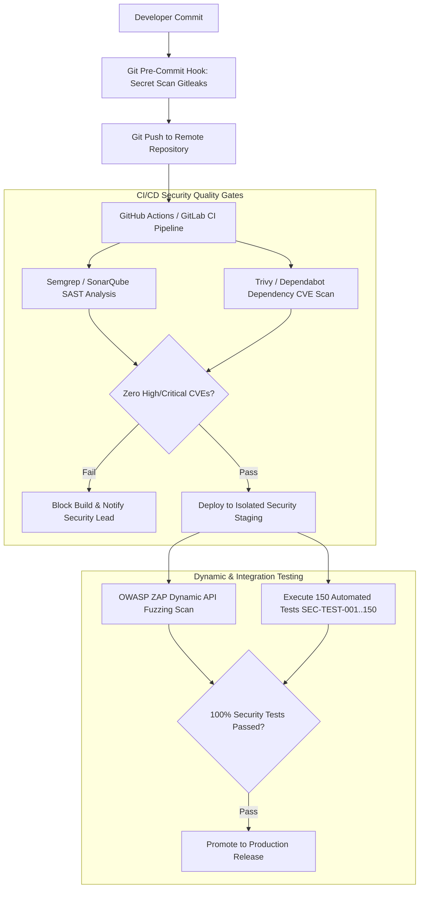

# Security Testing Strategy & Verification Pipeline Specification
## Namma Clinic Digital Health & Operations Platform
### Greater Bengaluru Authority (GBA) / BBMP Health Department
**Standard:** OWASP ASVS Level 2 / DevSecOps Quality Gates / NIST SP 800-115 | **Status:** APPROVED BASELINE | **Code:** `SEC-DOC-16`

---

## 1. Security Testing Strategy & DevSecOps Test Pyramid
The Namma Clinic Security Testing Strategy enforces automated security quality gates across every phase of the software development lifecycle (SDLC). To guarantee that zero critical or high-severity vulnerabilities reach municipal clinic production environments, testing spans Static Application Security Testing (SAST), Dynamic Application Security Testing (DAST), Software Composition Analysis (SCA), Secret Scanning, and comprehensive automated functional security verification.

### 1.1 DevSecOps CI/CD Security Quality Gates
1. **Pre-Commit Gate:** Automated Git hooks (Gitleaks, TruffleHog) scan developer commits for credentials and private keys before push.
2. **Build Gate (SAST & Linting):** Semgrep and SonarQube evaluate source code for injection flaws, unescaped output, and broken crypto. Zero High/Critical findings allowed.
3. **Dependency Gate (SCA):** Trivy and Dependabot analyze npm and Python packages. Builds fail on any Critical CVE without approved exception.
4. **Deployment Gate (DAST):** OWASP ZAP automated baseline scans run against ephemeral test deployments, verifying API security and response headers.
5. **Continuous Verification:** Nightly test runner executes the complete catalog of 150 automated security tests against staging environments.

### 1.2 Automated Security Pipeline Diagram


## 2. Comprehensive Security Test Catalog (SEC-TEST-001 to SEC-TEST-150)
The following 150 planned test specifications define the automated security testing baseline:

### SEC-TEST-001
**Test Category:** Static Application Security Testing (SAST)
**Objective:** Verify source code for SQLi, XSS, insecure crypto, and hardcoded secrets using Semgrep & SonarQube. (Test Case Variant 1)
**Security Control:** SEC-ARCH-001
**Requirement:** SECR-001
**Threat:** THREAT-001
**Preconditions:** Test runner initialized in isolated security testing environment with synthetic clinical fixtures.
**Environment:** Automated Security Staging & CI/CD Pipeline (Linux x86_64, PostgreSQL 16, Redis 7)
**Test Data:** Synthetic patient records, mock JWT keypairs, and fuzzed JSON request payloads.
**Execution Steps:** 1. Deploy test target. 2. Dispatch test harness payload for Static Application Security Testing (SAST). 3. Assert response code and audit capture.
**Expected Result:** Target enforces defensive barrier, returns expected HTTP status, and logs security audit event.
**Failure Criteria:** Unauthorized bypass, plaintext data leakage, HTTP 500 unhandled crash, or missing audit record.
**Severity:** Critical
**Automation Candidate:** Yes (Automated CI/CD security gate in pytest / k6 / OWASP ZAP)
**Evidence:** JUnit XML test results, ZAP vulnerability report, SIEM test audit logs.
**Cleanup:** Purge synthetic test records, flush test Redis keys, and rotate test tokens.
**Related API:** API-001
**Related UI:** SCREEN-001
**Related Database:** TABLE-001 (auth_users)
**Related Workflow:** WF-001
**Traceability:** PLANNED-TEST-SEC-001

### SEC-TEST-002
**Test Category:** Dynamic Application Security Testing (DAST)
**Objective:** Execute automated blackbox and graybox vulnerability scans against running API Gateway using OWASP ZAP. (Test Case Variant 1)
**Security Control:** SEC-ARCH-002
**Requirement:** SECR-002
**Threat:** THREAT-002
**Preconditions:** Test runner initialized in isolated security testing environment with synthetic clinical fixtures.
**Environment:** Automated Security Staging & CI/CD Pipeline (Linux x86_64, PostgreSQL 16, Redis 7)
**Test Data:** Synthetic patient records, mock JWT keypairs, and fuzzed JSON request payloads.
**Execution Steps:** 1. Deploy test target. 2. Dispatch test harness payload for Dynamic Application Security Testing (DAST). 3. Assert response code and audit capture.
**Expected Result:** Target enforces defensive barrier, returns expected HTTP status, and logs security audit event.
**Failure Criteria:** Unauthorized bypass, plaintext data leakage, HTTP 500 unhandled crash, or missing audit record.
**Severity:** Critical
**Automation Candidate:** Yes (Automated CI/CD security gate in pytest / k6 / OWASP ZAP)
**Evidence:** JUnit XML test results, ZAP vulnerability report, SIEM test audit logs.
**Cleanup:** Purge synthetic test records, flush test Redis keys, and rotate test tokens.
**Related API:** API-002
**Related UI:** SCREEN-002
**Related Database:** TABLE-002 (user_credentials)
**Related Workflow:** WF-002
**Traceability:** PLANNED-TEST-SEC-002

### SEC-TEST-003
**Test Category:** Software Composition Analysis (SCA)
**Objective:** Scan third-party npm and Python dependencies for known CVEs using Trivy and Dependabot. (Test Case Variant 1)
**Security Control:** SEC-ARCH-003
**Requirement:** SECR-003
**Threat:** THREAT-003
**Preconditions:** Test runner initialized in isolated security testing environment with synthetic clinical fixtures.
**Environment:** Automated Security Staging & CI/CD Pipeline (Linux x86_64, PostgreSQL 16, Redis 7)
**Test Data:** Synthetic patient records, mock JWT keypairs, and fuzzed JSON request payloads.
**Execution Steps:** 1. Deploy test target. 2. Dispatch test harness payload for Software Composition Analysis (SCA). 3. Assert response code and audit capture.
**Expected Result:** Target enforces defensive barrier, returns expected HTTP status, and logs security audit event.
**Failure Criteria:** Unauthorized bypass, plaintext data leakage, HTTP 500 unhandled crash, or missing audit record.
**Severity:** Critical
**Automation Candidate:** Yes (Automated CI/CD security gate in pytest / k6 / OWASP ZAP)
**Evidence:** JUnit XML test results, ZAP vulnerability report, SIEM test audit logs.
**Cleanup:** Purge synthetic test records, flush test Redis keys, and rotate test tokens.
**Related API:** API-003
**Related UI:** SCREEN-003
**Related Database:** TABLE-003 (user_sessions)
**Related Workflow:** WF-003
**Traceability:** PLANNED-TEST-SEC-003

### SEC-TEST-004
**Test Category:** API Security & BOLA/BFLA Verification
**Objective:** Assert broken object-level and function-level authorization rejection across all endpoints. (Test Case Variant 1)
**Security Control:** SEC-ARCH-004
**Requirement:** SECR-004
**Threat:** THREAT-004
**Preconditions:** Test runner initialized in isolated security testing environment with synthetic clinical fixtures.
**Environment:** Automated Security Staging & CI/CD Pipeline (Linux x86_64, PostgreSQL 16, Redis 7)
**Test Data:** Synthetic patient records, mock JWT keypairs, and fuzzed JSON request payloads.
**Execution Steps:** 1. Deploy test target. 2. Dispatch test harness payload for API Security & BOLA/BFLA Verification. 3. Assert response code and audit capture.
**Expected Result:** Target enforces defensive barrier, returns expected HTTP status, and logs security audit event.
**Failure Criteria:** Unauthorized bypass, plaintext data leakage, HTTP 500 unhandled crash, or missing audit record.
**Severity:** Critical
**Automation Candidate:** Yes (Automated CI/CD security gate in pytest / k6 / OWASP ZAP)
**Evidence:** JUnit XML test results, ZAP vulnerability report, SIEM test audit logs.
**Cleanup:** Purge synthetic test records, flush test Redis keys, and rotate test tokens.
**Related API:** API-004
**Related UI:** SCREEN-004
**Related Database:** TABLE-004 (roles)
**Related Workflow:** WF-004
**Traceability:** PLANNED-TEST-SEC-004

### SEC-TEST-005
**Test Category:** Authentication & Brute Force Lockout Test
**Objective:** Simulate credential stuffing attack and verify account lockout triggers after 5 failed attempts. (Test Case Variant 1)
**Security Control:** SEC-ARCH-005
**Requirement:** SECR-005
**Threat:** THREAT-005
**Preconditions:** Test runner initialized in isolated security testing environment with synthetic clinical fixtures.
**Environment:** Automated Security Staging & CI/CD Pipeline (Linux x86_64, PostgreSQL 16, Redis 7)
**Test Data:** Synthetic patient records, mock JWT keypairs, and fuzzed JSON request payloads.
**Execution Steps:** 1. Deploy test target. 2. Dispatch test harness payload for Authentication & Brute Force Lockout Test. 3. Assert response code and audit capture.
**Expected Result:** Target enforces defensive barrier, returns expected HTTP status, and logs security audit event.
**Failure Criteria:** Unauthorized bypass, plaintext data leakage, HTTP 500 unhandled crash, or missing audit record.
**Severity:** Critical
**Automation Candidate:** Yes (Automated CI/CD security gate in pytest / k6 / OWASP ZAP)
**Evidence:** JUnit XML test results, ZAP vulnerability report, SIEM test audit logs.
**Cleanup:** Purge synthetic test records, flush test Redis keys, and rotate test tokens.
**Related API:** API-005
**Related UI:** SCREEN-005
**Related Database:** TABLE-005 (permissions)
**Related Workflow:** WF-005
**Traceability:** PLANNED-TEST-SEC-005

### SEC-TEST-006
**Test Category:** RBAC & ABAC Boundary Enforcement Test
**Objective:** Verify that user roles cannot perform actions outside their designated clinical ward or duty. (Test Case Variant 1)
**Security Control:** SEC-ARCH-006
**Requirement:** SECR-006
**Threat:** THREAT-006
**Preconditions:** Test runner initialized in isolated security testing environment with synthetic clinical fixtures.
**Environment:** Automated Security Staging & CI/CD Pipeline (Linux x86_64, PostgreSQL 16, Redis 7)
**Test Data:** Synthetic patient records, mock JWT keypairs, and fuzzed JSON request payloads.
**Execution Steps:** 1. Deploy test target. 2. Dispatch test harness payload for RBAC & ABAC Boundary Enforcement Test. 3. Assert response code and audit capture.
**Expected Result:** Target enforces defensive barrier, returns expected HTTP status, and logs security audit event.
**Failure Criteria:** Unauthorized bypass, plaintext data leakage, HTTP 500 unhandled crash, or missing audit record.
**Severity:** Critical
**Automation Candidate:** Yes (Automated CI/CD security gate in pytest / k6 / OWASP ZAP)
**Evidence:** JUnit XML test results, ZAP vulnerability report, SIEM test audit logs.
**Cleanup:** Purge synthetic test records, flush test Redis keys, and rotate test tokens.
**Related API:** API-006
**Related UI:** SCREEN-006
**Related Database:** TABLE-006 (role_permissions)
**Related Workflow:** WF-006
**Traceability:** PLANNED-TEST-SEC-006

### SEC-TEST-007
**Test Category:** Session Fixation & Token Tampering Test
**Objective:** Submit tampered JWT payload with modified signature and verify immediate HTTP 401 rejection. (Test Case Variant 1)
**Security Control:** SEC-ARCH-007
**Requirement:** SECR-007
**Threat:** THREAT-007
**Preconditions:** Test runner initialized in isolated security testing environment with synthetic clinical fixtures.
**Environment:** Automated Security Staging & CI/CD Pipeline (Linux x86_64, PostgreSQL 16, Redis 7)
**Test Data:** Synthetic patient records, mock JWT keypairs, and fuzzed JSON request payloads.
**Execution Steps:** 1. Deploy test target. 2. Dispatch test harness payload for Session Fixation & Token Tampering Test. 3. Assert response code and audit capture.
**Expected Result:** Target enforces defensive barrier, returns expected HTTP status, and logs security audit event.
**Failure Criteria:** Unauthorized bypass, plaintext data leakage, HTTP 500 unhandled crash, or missing audit record.
**Severity:** Critical
**Automation Candidate:** Yes (Automated CI/CD security gate in pytest / k6 / OWASP ZAP)
**Evidence:** JUnit XML test results, ZAP vulnerability report, SIEM test audit logs.
**Cleanup:** Purge synthetic test records, flush test Redis keys, and rotate test tokens.
**Related API:** API-007
**Related UI:** SCREEN-007
**Related Database:** TABLE-007 (user_roles)
**Related Workflow:** WF-007
**Traceability:** PLANNED-TEST-SEC-007

### SEC-TEST-008
**Test Category:** MFA Challenge & Bypass Resistance Test
**Objective:** Attempt API invocation requiring step-up authentication without valid TOTP proof. (Test Case Variant 1)
**Security Control:** SEC-ARCH-008
**Requirement:** SECR-008
**Threat:** THREAT-008
**Preconditions:** Test runner initialized in isolated security testing environment with synthetic clinical fixtures.
**Environment:** Automated Security Staging & CI/CD Pipeline (Linux x86_64, PostgreSQL 16, Redis 7)
**Test Data:** Synthetic patient records, mock JWT keypairs, and fuzzed JSON request payloads.
**Execution Steps:** 1. Deploy test target. 2. Dispatch test harness payload for MFA Challenge & Bypass Resistance Test. 3. Assert response code and audit capture.
**Expected Result:** Target enforces defensive barrier, returns expected HTTP status, and logs security audit event.
**Failure Criteria:** Unauthorized bypass, plaintext data leakage, HTTP 500 unhandled crash, or missing audit record.
**Severity:** Critical
**Automation Candidate:** Yes (Automated CI/CD security gate in pytest / k6 / OWASP ZAP)
**Evidence:** JUnit XML test results, ZAP vulnerability report, SIEM test audit logs.
**Cleanup:** Purge synthetic test records, flush test Redis keys, and rotate test tokens.
**Related API:** API-008
**Related UI:** SCREEN-008
**Related Database:** TABLE-008 (facilities)
**Related Workflow:** WF-008
**Traceability:** PLANNED-TEST-SEC-008

### SEC-TEST-009
**Test Category:** Data Encryption at Rest & Transit Test
**Objective:** Inspect network packet captures and raw database files to verify 100% ciphertext presence. (Test Case Variant 1)
**Security Control:** SEC-ARCH-009
**Requirement:** SECR-009
**Threat:** THREAT-009
**Preconditions:** Test runner initialized in isolated security testing environment with synthetic clinical fixtures.
**Environment:** Automated Security Staging & CI/CD Pipeline (Linux x86_64, PostgreSQL 16, Redis 7)
**Test Data:** Synthetic patient records, mock JWT keypairs, and fuzzed JSON request payloads.
**Execution Steps:** 1. Deploy test target. 2. Dispatch test harness payload for Data Encryption at Rest & Transit Test. 3. Assert response code and audit capture.
**Expected Result:** Target enforces defensive barrier, returns expected HTTP status, and logs security audit event.
**Failure Criteria:** Unauthorized bypass, plaintext data leakage, HTTP 500 unhandled crash, or missing audit record.
**Severity:** Critical
**Automation Candidate:** Yes (Automated CI/CD security gate in pytest / k6 / OWASP ZAP)
**Evidence:** JUnit XML test results, ZAP vulnerability report, SIEM test audit logs.
**Cleanup:** Purge synthetic test records, flush test Redis keys, and rotate test tokens.
**Related API:** API-009
**Related UI:** SCREEN-009
**Related Database:** TABLE-009 (facility_rooms)
**Related Workflow:** WF-009
**Traceability:** PLANNED-TEST-SEC-009

### SEC-TEST-010
**Test Category:** Field-Level PII Masking Verification Test
**Objective:** Query patient demographic records and assert that Aadhaar and phone numbers are masked in logs. (Test Case Variant 1)
**Security Control:** SEC-ARCH-010
**Requirement:** SECR-010
**Threat:** THREAT-010
**Preconditions:** Test runner initialized in isolated security testing environment with synthetic clinical fixtures.
**Environment:** Automated Security Staging & CI/CD Pipeline (Linux x86_64, PostgreSQL 16, Redis 7)
**Test Data:** Synthetic patient records, mock JWT keypairs, and fuzzed JSON request payloads.
**Execution Steps:** 1. Deploy test target. 2. Dispatch test harness payload for Field-Level PII Masking Verification Test. 3. Assert response code and audit capture.
**Expected Result:** Target enforces defensive barrier, returns expected HTTP status, and logs security audit event.
**Failure Criteria:** Unauthorized bypass, plaintext data leakage, HTTP 500 unhandled crash, or missing audit record.
**Severity:** Critical
**Automation Candidate:** Yes (Automated CI/CD security gate in pytest / k6 / OWASP ZAP)
**Evidence:** JUnit XML test results, ZAP vulnerability report, SIEM test audit logs.
**Cleanup:** Purge synthetic test records, flush test Redis keys, and rotate test tokens.
**Related API:** API-010
**Related UI:** SCREEN-010
**Related Database:** TABLE-010 (staff_profiles)
**Related Workflow:** WF-010
**Traceability:** PLANNED-TEST-SEC-010

### SEC-TEST-011
**Test Category:** Immutable WORM Audit Trail Integrity Test
**Objective:** Verify SHA-256 cryptographic chaining across audit log blocks and assert tampering detection. (Test Case Variant 1)
**Security Control:** SEC-ARCH-011
**Requirement:** SECR-011
**Threat:** THREAT-011
**Preconditions:** Test runner initialized in isolated security testing environment with synthetic clinical fixtures.
**Environment:** Automated Security Staging & CI/CD Pipeline (Linux x86_64, PostgreSQL 16, Redis 7)
**Test Data:** Synthetic patient records, mock JWT keypairs, and fuzzed JSON request payloads.
**Execution Steps:** 1. Deploy test target. 2. Dispatch test harness payload for Immutable WORM Audit Trail Integrity Test. 3. Assert response code and audit capture.
**Expected Result:** Target enforces defensive barrier, returns expected HTTP status, and logs security audit event.
**Failure Criteria:** Unauthorized bypass, plaintext data leakage, HTTP 500 unhandled crash, or missing audit record.
**Severity:** Critical
**Automation Candidate:** Yes (Automated CI/CD security gate in pytest / k6 / OWASP ZAP)
**Evidence:** JUnit XML test results, ZAP vulnerability report, SIEM test audit logs.
**Cleanup:** Purge synthetic test records, flush test Redis keys, and rotate test tokens.
**Related API:** API-011
**Related UI:** SCREEN-011
**Related Database:** TABLE-011 (staff_shifts)
**Related Workflow:** WF-011
**Traceability:** PLANNED-TEST-SEC-011

### SEC-TEST-012
**Test Category:** Offline Edge Cache Theft Simulation Test
**Objective:** Attempt to open offline SQLite database without hardware TPM key and assert decryption failure. (Test Case Variant 1)
**Security Control:** SEC-ARCH-012
**Requirement:** SECR-012
**Threat:** THREAT-012
**Preconditions:** Test runner initialized in isolated security testing environment with synthetic clinical fixtures.
**Environment:** Automated Security Staging & CI/CD Pipeline (Linux x86_64, PostgreSQL 16, Redis 7)
**Test Data:** Synthetic patient records, mock JWT keypairs, and fuzzed JSON request payloads.
**Execution Steps:** 1. Deploy test target. 2. Dispatch test harness payload for Offline Edge Cache Theft Simulation Test. 3. Assert response code and audit capture.
**Expected Result:** Target enforces defensive barrier, returns expected HTTP status, and logs security audit event.
**Failure Criteria:** Unauthorized bypass, plaintext data leakage, HTTP 500 unhandled crash, or missing audit record.
**Severity:** Critical
**Automation Candidate:** Yes (Automated CI/CD security gate in pytest / k6 / OWASP ZAP)
**Evidence:** JUnit XML test results, ZAP vulnerability report, SIEM test audit logs.
**Cleanup:** Purge synthetic test records, flush test Redis keys, and rotate test tokens.
**Related API:** API-012
**Related UI:** SCREEN-012
**Related Database:** TABLE-012 (system_configs)
**Related Workflow:** WF-012
**Traceability:** PLANNED-TEST-SEC-012

### SEC-TEST-013
**Test Category:** Offline Sync Conflict Poisoning Test
**Objective:** Submit conflicting sync transaction with forged timestamp and verify conflict resolution engine. (Test Case Variant 1)
**Security Control:** SEC-ARCH-013
**Requirement:** SECR-013
**Threat:** THREAT-013
**Preconditions:** Test runner initialized in isolated security testing environment with synthetic clinical fixtures.
**Environment:** Automated Security Staging & CI/CD Pipeline (Linux x86_64, PostgreSQL 16, Redis 7)
**Test Data:** Synthetic patient records, mock JWT keypairs, and fuzzed JSON request payloads.
**Execution Steps:** 1. Deploy test target. 2. Dispatch test harness payload for Offline Sync Conflict Poisoning Test. 3. Assert response code and audit capture.
**Expected Result:** Target enforces defensive barrier, returns expected HTTP status, and logs security audit event.
**Failure Criteria:** Unauthorized bypass, plaintext data leakage, HTTP 500 unhandled crash, or missing audit record.
**Severity:** Critical
**Automation Candidate:** Yes (Automated CI/CD security gate in pytest / k6 / OWASP ZAP)
**Evidence:** JUnit XML test results, ZAP vulnerability report, SIEM test audit logs.
**Cleanup:** Purge synthetic test records, flush test Redis keys, and rotate test tokens.
**Related API:** API-013
**Related UI:** SCREEN-013
**Related Database:** TABLE-013 (patients)
**Related Workflow:** WF-013
**Traceability:** PLANNED-TEST-SEC-013

### SEC-TEST-014
**Test Category:** Thermal Printer / Peripheral Fuzzing Test
**Objective:** Send malformed ESC/POS byte sequences and verify hardware bridge gracefully handles exceptions. (Test Case Variant 1)
**Security Control:** SEC-ARCH-014
**Requirement:** SECR-014
**Threat:** THREAT-014
**Preconditions:** Test runner initialized in isolated security testing environment with synthetic clinical fixtures.
**Environment:** Automated Security Staging & CI/CD Pipeline (Linux x86_64, PostgreSQL 16, Redis 7)
**Test Data:** Synthetic patient records, mock JWT keypairs, and fuzzed JSON request payloads.
**Execution Steps:** 1. Deploy test target. 2. Dispatch test harness payload for Thermal Printer / Peripheral Fuzzing Test. 3. Assert response code and audit capture.
**Expected Result:** Target enforces defensive barrier, returns expected HTTP status, and logs security audit event.
**Failure Criteria:** Unauthorized bypass, plaintext data leakage, HTTP 500 unhandled crash, or missing audit record.
**Severity:** Critical
**Automation Candidate:** Yes (Automated CI/CD security gate in pytest / k6 / OWASP ZAP)
**Evidence:** JUnit XML test results, ZAP vulnerability report, SIEM test audit logs.
**Cleanup:** Purge synthetic test records, flush test Redis keys, and rotate test tokens.
**Related API:** API-014
**Related UI:** SCREEN-014
**Related Database:** TABLE-014 (patient_identifiers)
**Related Workflow:** WF-014
**Traceability:** PLANNED-TEST-SEC-014

### SEC-TEST-015
**Test Category:** Disaster Recovery & Backup Restore Test
**Objective:** Execute automated restore from air-gapped S3 backup and verify RPO <= 5m and RTO <= 15m compliance. (Test Case Variant 1)
**Security Control:** SEC-ARCH-015
**Requirement:** SECR-015
**Threat:** THREAT-015
**Preconditions:** Test runner initialized in isolated security testing environment with synthetic clinical fixtures.
**Environment:** Automated Security Staging & CI/CD Pipeline (Linux x86_64, PostgreSQL 16, Redis 7)
**Test Data:** Synthetic patient records, mock JWT keypairs, and fuzzed JSON request payloads.
**Execution Steps:** 1. Deploy test target. 2. Dispatch test harness payload for Disaster Recovery & Backup Restore Test. 3. Assert response code and audit capture.
**Expected Result:** Target enforces defensive barrier, returns expected HTTP status, and logs security audit event.
**Failure Criteria:** Unauthorized bypass, plaintext data leakage, HTTP 500 unhandled crash, or missing audit record.
**Severity:** Critical
**Automation Candidate:** Yes (Automated CI/CD security gate in pytest / k6 / OWASP ZAP)
**Evidence:** JUnit XML test results, ZAP vulnerability report, SIEM test audit logs.
**Cleanup:** Purge synthetic test records, flush test Redis keys, and rotate test tokens.
**Related API:** API-015
**Related UI:** SCREEN-015
**Related Database:** TABLE-015 (patient_contacts)
**Related Workflow:** WF-015
**Traceability:** PLANNED-TEST-SEC-015

### SEC-TEST-016
**Test Category:** Static Application Security Testing (SAST)
**Objective:** Verify source code for SQLi, XSS, insecure crypto, and hardcoded secrets using Semgrep & SonarQube. (Test Case Variant 2)
**Security Control:** SEC-ARCH-016
**Requirement:** SECR-016
**Threat:** THREAT-016
**Preconditions:** Test runner initialized in isolated security testing environment with synthetic clinical fixtures.
**Environment:** Automated Security Staging & CI/CD Pipeline (Linux x86_64, PostgreSQL 16, Redis 7)
**Test Data:** Synthetic patient records, mock JWT keypairs, and fuzzed JSON request payloads.
**Execution Steps:** 1. Deploy test target. 2. Dispatch test harness payload for Static Application Security Testing (SAST). 3. Assert response code and audit capture.
**Expected Result:** Target enforces defensive barrier, returns expected HTTP status, and logs security audit event.
**Failure Criteria:** Unauthorized bypass, plaintext data leakage, HTTP 500 unhandled crash, or missing audit record.
**Severity:** Critical
**Automation Candidate:** Yes (Automated CI/CD security gate in pytest / k6 / OWASP ZAP)
**Evidence:** JUnit XML test results, ZAP vulnerability report, SIEM test audit logs.
**Cleanup:** Purge synthetic test records, flush test Redis keys, and rotate test tokens.
**Related API:** API-016
**Related UI:** SCREEN-016
**Related Database:** TABLE-016 (patient_addresses)
**Related Workflow:** WF-016
**Traceability:** PLANNED-TEST-SEC-016

### SEC-TEST-017
**Test Category:** Dynamic Application Security Testing (DAST)
**Objective:** Execute automated blackbox and graybox vulnerability scans against running API Gateway using OWASP ZAP. (Test Case Variant 2)
**Security Control:** SEC-ARCH-017
**Requirement:** SECR-017
**Threat:** THREAT-017
**Preconditions:** Test runner initialized in isolated security testing environment with synthetic clinical fixtures.
**Environment:** Automated Security Staging & CI/CD Pipeline (Linux x86_64, PostgreSQL 16, Redis 7)
**Test Data:** Synthetic patient records, mock JWT keypairs, and fuzzed JSON request payloads.
**Execution Steps:** 1. Deploy test target. 2. Dispatch test harness payload for Dynamic Application Security Testing (DAST). 3. Assert response code and audit capture.
**Expected Result:** Target enforces defensive barrier, returns expected HTTP status, and logs security audit event.
**Failure Criteria:** Unauthorized bypass, plaintext data leakage, HTTP 500 unhandled crash, or missing audit record.
**Severity:** Critical
**Automation Candidate:** Yes (Automated CI/CD security gate in pytest / k6 / OWASP ZAP)
**Evidence:** JUnit XML test results, ZAP vulnerability report, SIEM test audit logs.
**Cleanup:** Purge synthetic test records, flush test Redis keys, and rotate test tokens.
**Related API:** API-017
**Related UI:** SCREEN-017
**Related Database:** TABLE-017 (consent_records)
**Related Workflow:** WF-017
**Traceability:** PLANNED-TEST-SEC-017

### SEC-TEST-018
**Test Category:** Software Composition Analysis (SCA)
**Objective:** Scan third-party npm and Python dependencies for known CVEs using Trivy and Dependabot. (Test Case Variant 2)
**Security Control:** SEC-ARCH-018
**Requirement:** SECR-018
**Threat:** THREAT-018
**Preconditions:** Test runner initialized in isolated security testing environment with synthetic clinical fixtures.
**Environment:** Automated Security Staging & CI/CD Pipeline (Linux x86_64, PostgreSQL 16, Redis 7)
**Test Data:** Synthetic patient records, mock JWT keypairs, and fuzzed JSON request payloads.
**Execution Steps:** 1. Deploy test target. 2. Dispatch test harness payload for Software Composition Analysis (SCA). 3. Assert response code and audit capture.
**Expected Result:** Target enforces defensive barrier, returns expected HTTP status, and logs security audit event.
**Failure Criteria:** Unauthorized bypass, plaintext data leakage, HTTP 500 unhandled crash, or missing audit record.
**Severity:** Critical
**Automation Candidate:** Yes (Automated CI/CD security gate in pytest / k6 / OWASP ZAP)
**Evidence:** JUnit XML test results, ZAP vulnerability report, SIEM test audit logs.
**Cleanup:** Purge synthetic test records, flush test Redis keys, and rotate test tokens.
**Related API:** API-018
**Related UI:** SCREEN-018
**Related Database:** TABLE-018 (tokens)
**Related Workflow:** WF-018
**Traceability:** PLANNED-TEST-SEC-018

### SEC-TEST-019
**Test Category:** API Security & BOLA/BFLA Verification
**Objective:** Assert broken object-level and function-level authorization rejection across all endpoints. (Test Case Variant 2)
**Security Control:** SEC-ARCH-019
**Requirement:** SECR-019
**Threat:** THREAT-019
**Preconditions:** Test runner initialized in isolated security testing environment with synthetic clinical fixtures.
**Environment:** Automated Security Staging & CI/CD Pipeline (Linux x86_64, PostgreSQL 16, Redis 7)
**Test Data:** Synthetic patient records, mock JWT keypairs, and fuzzed JSON request payloads.
**Execution Steps:** 1. Deploy test target. 2. Dispatch test harness payload for API Security & BOLA/BFLA Verification. 3. Assert response code and audit capture.
**Expected Result:** Target enforces defensive barrier, returns expected HTTP status, and logs security audit event.
**Failure Criteria:** Unauthorized bypass, plaintext data leakage, HTTP 500 unhandled crash, or missing audit record.
**Severity:** Critical
**Automation Candidate:** Yes (Automated CI/CD security gate in pytest / k6 / OWASP ZAP)
**Evidence:** JUnit XML test results, ZAP vulnerability report, SIEM test audit logs.
**Cleanup:** Purge synthetic test records, flush test Redis keys, and rotate test tokens.
**Related API:** API-019
**Related UI:** SCREEN-019
**Related Database:** TABLE-019 (queue_entries)
**Related Workflow:** WF-019
**Traceability:** PLANNED-TEST-SEC-019

### SEC-TEST-020
**Test Category:** Authentication & Brute Force Lockout Test
**Objective:** Simulate credential stuffing attack and verify account lockout triggers after 5 failed attempts. (Test Case Variant 2)
**Security Control:** SEC-ARCH-020
**Requirement:** SECR-020
**Threat:** THREAT-020
**Preconditions:** Test runner initialized in isolated security testing environment with synthetic clinical fixtures.
**Environment:** Automated Security Staging & CI/CD Pipeline (Linux x86_64, PostgreSQL 16, Redis 7)
**Test Data:** Synthetic patient records, mock JWT keypairs, and fuzzed JSON request payloads.
**Execution Steps:** 1. Deploy test target. 2. Dispatch test harness payload for Authentication & Brute Force Lockout Test. 3. Assert response code and audit capture.
**Expected Result:** Target enforces defensive barrier, returns expected HTTP status, and logs security audit event.
**Failure Criteria:** Unauthorized bypass, plaintext data leakage, HTTP 500 unhandled crash, or missing audit record.
**Severity:** Critical
**Automation Candidate:** Yes (Automated CI/CD security gate in pytest / k6 / OWASP ZAP)
**Evidence:** JUnit XML test results, ZAP vulnerability report, SIEM test audit logs.
**Cleanup:** Purge synthetic test records, flush test Redis keys, and rotate test tokens.
**Related API:** API-020
**Related UI:** SCREEN-020
**Related Database:** TABLE-020 (triage_assessments)
**Related Workflow:** WF-020
**Traceability:** PLANNED-TEST-SEC-020

### SEC-TEST-021
**Test Category:** RBAC & ABAC Boundary Enforcement Test
**Objective:** Verify that user roles cannot perform actions outside their designated clinical ward or duty. (Test Case Variant 2)
**Security Control:** SEC-ARCH-021
**Requirement:** SECR-021
**Threat:** THREAT-021
**Preconditions:** Test runner initialized in isolated security testing environment with synthetic clinical fixtures.
**Environment:** Automated Security Staging & CI/CD Pipeline (Linux x86_64, PostgreSQL 16, Redis 7)
**Test Data:** Synthetic patient records, mock JWT keypairs, and fuzzed JSON request payloads.
**Execution Steps:** 1. Deploy test target. 2. Dispatch test harness payload for RBAC & ABAC Boundary Enforcement Test. 3. Assert response code and audit capture.
**Expected Result:** Target enforces defensive barrier, returns expected HTTP status, and logs security audit event.
**Failure Criteria:** Unauthorized bypass, plaintext data leakage, HTTP 500 unhandled crash, or missing audit record.
**Severity:** Critical
**Automation Candidate:** Yes (Automated CI/CD security gate in pytest / k6 / OWASP ZAP)
**Evidence:** JUnit XML test results, ZAP vulnerability report, SIEM test audit logs.
**Cleanup:** Purge synthetic test records, flush test Redis keys, and rotate test tokens.
**Related API:** API-021
**Related UI:** SCREEN-021
**Related Database:** TABLE-021 (patient_vitals)
**Related Workflow:** WF-021
**Traceability:** PLANNED-TEST-SEC-021

### SEC-TEST-022
**Test Category:** Session Fixation & Token Tampering Test
**Objective:** Submit tampered JWT payload with modified signature and verify immediate HTTP 401 rejection. (Test Case Variant 2)
**Security Control:** SEC-ARCH-022
**Requirement:** SECR-022
**Threat:** THREAT-022
**Preconditions:** Test runner initialized in isolated security testing environment with synthetic clinical fixtures.
**Environment:** Automated Security Staging & CI/CD Pipeline (Linux x86_64, PostgreSQL 16, Redis 7)
**Test Data:** Synthetic patient records, mock JWT keypairs, and fuzzed JSON request payloads.
**Execution Steps:** 1. Deploy test target. 2. Dispatch test harness payload for Session Fixation & Token Tampering Test. 3. Assert response code and audit capture.
**Expected Result:** Target enforces defensive barrier, returns expected HTTP status, and logs security audit event.
**Failure Criteria:** Unauthorized bypass, plaintext data leakage, HTTP 500 unhandled crash, or missing audit record.
**Severity:** Critical
**Automation Candidate:** Yes (Automated CI/CD security gate in pytest / k6 / OWASP ZAP)
**Evidence:** JUnit XML test results, ZAP vulnerability report, SIEM test audit logs.
**Cleanup:** Purge synthetic test records, flush test Redis keys, and rotate test tokens.
**Related API:** API-022
**Related UI:** SCREEN-022
**Related Database:** TABLE-022 (danger_alerts)
**Related Workflow:** WF-022
**Traceability:** PLANNED-TEST-SEC-022

### SEC-TEST-023
**Test Category:** MFA Challenge & Bypass Resistance Test
**Objective:** Attempt API invocation requiring step-up authentication without valid TOTP proof. (Test Case Variant 2)
**Security Control:** SEC-ARCH-023
**Requirement:** SECR-023
**Threat:** THREAT-023
**Preconditions:** Test runner initialized in isolated security testing environment with synthetic clinical fixtures.
**Environment:** Automated Security Staging & CI/CD Pipeline (Linux x86_64, PostgreSQL 16, Redis 7)
**Test Data:** Synthetic patient records, mock JWT keypairs, and fuzzed JSON request payloads.
**Execution Steps:** 1. Deploy test target. 2. Dispatch test harness payload for MFA Challenge & Bypass Resistance Test. 3. Assert response code and audit capture.
**Expected Result:** Target enforces defensive barrier, returns expected HTTP status, and logs security audit event.
**Failure Criteria:** Unauthorized bypass, plaintext data leakage, HTTP 500 unhandled crash, or missing audit record.
**Severity:** Critical
**Automation Candidate:** Yes (Automated CI/CD security gate in pytest / k6 / OWASP ZAP)
**Evidence:** JUnit XML test results, ZAP vulnerability report, SIEM test audit logs.
**Cleanup:** Purge synthetic test records, flush test Redis keys, and rotate test tokens.
**Related API:** API-023
**Related UI:** SCREEN-023
**Related Database:** TABLE-023 (clinical_encounters)
**Related Workflow:** WF-023
**Traceability:** PLANNED-TEST-SEC-023

### SEC-TEST-024
**Test Category:** Data Encryption at Rest & Transit Test
**Objective:** Inspect network packet captures and raw database files to verify 100% ciphertext presence. (Test Case Variant 2)
**Security Control:** SEC-ARCH-024
**Requirement:** SECR-024
**Threat:** THREAT-024
**Preconditions:** Test runner initialized in isolated security testing environment with synthetic clinical fixtures.
**Environment:** Automated Security Staging & CI/CD Pipeline (Linux x86_64, PostgreSQL 16, Redis 7)
**Test Data:** Synthetic patient records, mock JWT keypairs, and fuzzed JSON request payloads.
**Execution Steps:** 1. Deploy test target. 2. Dispatch test harness payload for Data Encryption at Rest & Transit Test. 3. Assert response code and audit capture.
**Expected Result:** Target enforces defensive barrier, returns expected HTTP status, and logs security audit event.
**Failure Criteria:** Unauthorized bypass, plaintext data leakage, HTTP 500 unhandled crash, or missing audit record.
**Severity:** Critical
**Automation Candidate:** Yes (Automated CI/CD security gate in pytest / k6 / OWASP ZAP)
**Evidence:** JUnit XML test results, ZAP vulnerability report, SIEM test audit logs.
**Cleanup:** Purge synthetic test records, flush test Redis keys, and rotate test tokens.
**Related API:** API-024
**Related UI:** SCREEN-024
**Related Database:** TABLE-024 (clinical_notes)
**Related Workflow:** WF-024
**Traceability:** PLANNED-TEST-SEC-024

### SEC-TEST-025
**Test Category:** Field-Level PII Masking Verification Test
**Objective:** Query patient demographic records and assert that Aadhaar and phone numbers are masked in logs. (Test Case Variant 2)
**Security Control:** SEC-ARCH-025
**Requirement:** SECR-025
**Threat:** THREAT-025
**Preconditions:** Test runner initialized in isolated security testing environment with synthetic clinical fixtures.
**Environment:** Automated Security Staging & CI/CD Pipeline (Linux x86_64, PostgreSQL 16, Redis 7)
**Test Data:** Synthetic patient records, mock JWT keypairs, and fuzzed JSON request payloads.
**Execution Steps:** 1. Deploy test target. 2. Dispatch test harness payload for Field-Level PII Masking Verification Test. 3. Assert response code and audit capture.
**Expected Result:** Target enforces defensive barrier, returns expected HTTP status, and logs security audit event.
**Failure Criteria:** Unauthorized bypass, plaintext data leakage, HTTP 500 unhandled crash, or missing audit record.
**Severity:** Critical
**Automation Candidate:** Yes (Automated CI/CD security gate in pytest / k6 / OWASP ZAP)
**Evidence:** JUnit XML test results, ZAP vulnerability report, SIEM test audit logs.
**Cleanup:** Purge synthetic test records, flush test Redis keys, and rotate test tokens.
**Related API:** API-025
**Related UI:** SCREEN-025
**Related Database:** TABLE-025 (diagnoses)
**Related Workflow:** WF-025
**Traceability:** PLANNED-TEST-SEC-025

### SEC-TEST-026
**Test Category:** Immutable WORM Audit Trail Integrity Test
**Objective:** Verify SHA-256 cryptographic chaining across audit log blocks and assert tampering detection. (Test Case Variant 2)
**Security Control:** SEC-ARCH-026
**Requirement:** SECR-026
**Threat:** THREAT-026
**Preconditions:** Test runner initialized in isolated security testing environment with synthetic clinical fixtures.
**Environment:** Automated Security Staging & CI/CD Pipeline (Linux x86_64, PostgreSQL 16, Redis 7)
**Test Data:** Synthetic patient records, mock JWT keypairs, and fuzzed JSON request payloads.
**Execution Steps:** 1. Deploy test target. 2. Dispatch test harness payload for Immutable WORM Audit Trail Integrity Test. 3. Assert response code and audit capture.
**Expected Result:** Target enforces defensive barrier, returns expected HTTP status, and logs security audit event.
**Failure Criteria:** Unauthorized bypass, plaintext data leakage, HTTP 500 unhandled crash, or missing audit record.
**Severity:** Critical
**Automation Candidate:** Yes (Automated CI/CD security gate in pytest / k6 / OWASP ZAP)
**Evidence:** JUnit XML test results, ZAP vulnerability report, SIEM test audit logs.
**Cleanup:** Purge synthetic test records, flush test Redis keys, and rotate test tokens.
**Related API:** API-026
**Related UI:** SCREEN-026
**Related Database:** TABLE-026 (prescriptions)
**Related Workflow:** WF-026
**Traceability:** PLANNED-TEST-SEC-026

### SEC-TEST-027
**Test Category:** Offline Edge Cache Theft Simulation Test
**Objective:** Attempt to open offline SQLite database without hardware TPM key and assert decryption failure. (Test Case Variant 2)
**Security Control:** SEC-ARCH-027
**Requirement:** SECR-027
**Threat:** THREAT-027
**Preconditions:** Test runner initialized in isolated security testing environment with synthetic clinical fixtures.
**Environment:** Automated Security Staging & CI/CD Pipeline (Linux x86_64, PostgreSQL 16, Redis 7)
**Test Data:** Synthetic patient records, mock JWT keypairs, and fuzzed JSON request payloads.
**Execution Steps:** 1. Deploy test target. 2. Dispatch test harness payload for Offline Edge Cache Theft Simulation Test. 3. Assert response code and audit capture.
**Expected Result:** Target enforces defensive barrier, returns expected HTTP status, and logs security audit event.
**Failure Criteria:** Unauthorized bypass, plaintext data leakage, HTTP 500 unhandled crash, or missing audit record.
**Severity:** Critical
**Automation Candidate:** Yes (Automated CI/CD security gate in pytest / k6 / OWASP ZAP)
**Evidence:** JUnit XML test results, ZAP vulnerability report, SIEM test audit logs.
**Cleanup:** Purge synthetic test records, flush test Redis keys, and rotate test tokens.
**Related API:** API-027
**Related UI:** SCREEN-027
**Related Database:** TABLE-027 (prescription_items)
**Related Workflow:** WF-027
**Traceability:** PLANNED-TEST-SEC-027

### SEC-TEST-028
**Test Category:** Offline Sync Conflict Poisoning Test
**Objective:** Submit conflicting sync transaction with forged timestamp and verify conflict resolution engine. (Test Case Variant 2)
**Security Control:** SEC-ARCH-028
**Requirement:** SECR-028
**Threat:** THREAT-028
**Preconditions:** Test runner initialized in isolated security testing environment with synthetic clinical fixtures.
**Environment:** Automated Security Staging & CI/CD Pipeline (Linux x86_64, PostgreSQL 16, Redis 7)
**Test Data:** Synthetic patient records, mock JWT keypairs, and fuzzed JSON request payloads.
**Execution Steps:** 1. Deploy test target. 2. Dispatch test harness payload for Offline Sync Conflict Poisoning Test. 3. Assert response code and audit capture.
**Expected Result:** Target enforces defensive barrier, returns expected HTTP status, and logs security audit event.
**Failure Criteria:** Unauthorized bypass, plaintext data leakage, HTTP 500 unhandled crash, or missing audit record.
**Severity:** Critical
**Automation Candidate:** Yes (Automated CI/CD security gate in pytest / k6 / OWASP ZAP)
**Evidence:** JUnit XML test results, ZAP vulnerability report, SIEM test audit logs.
**Cleanup:** Purge synthetic test records, flush test Redis keys, and rotate test tokens.
**Related API:** API-028
**Related UI:** SCREEN-028
**Related Database:** TABLE-028 (lab_orders)
**Related Workflow:** WF-028
**Traceability:** PLANNED-TEST-SEC-028

### SEC-TEST-029
**Test Category:** Thermal Printer / Peripheral Fuzzing Test
**Objective:** Send malformed ESC/POS byte sequences and verify hardware bridge gracefully handles exceptions. (Test Case Variant 2)
**Security Control:** SEC-ARCH-029
**Requirement:** SECR-029
**Threat:** THREAT-029
**Preconditions:** Test runner initialized in isolated security testing environment with synthetic clinical fixtures.
**Environment:** Automated Security Staging & CI/CD Pipeline (Linux x86_64, PostgreSQL 16, Redis 7)
**Test Data:** Synthetic patient records, mock JWT keypairs, and fuzzed JSON request payloads.
**Execution Steps:** 1. Deploy test target. 2. Dispatch test harness payload for Thermal Printer / Peripheral Fuzzing Test. 3. Assert response code and audit capture.
**Expected Result:** Target enforces defensive barrier, returns expected HTTP status, and logs security audit event.
**Failure Criteria:** Unauthorized bypass, plaintext data leakage, HTTP 500 unhandled crash, or missing audit record.
**Severity:** Critical
**Automation Candidate:** Yes (Automated CI/CD security gate in pytest / k6 / OWASP ZAP)
**Evidence:** JUnit XML test results, ZAP vulnerability report, SIEM test audit logs.
**Cleanup:** Purge synthetic test records, flush test Redis keys, and rotate test tokens.
**Related API:** API-029
**Related UI:** SCREEN-029
**Related Database:** TABLE-029 (lab_order_items)
**Related Workflow:** WF-029
**Traceability:** PLANNED-TEST-SEC-029

### SEC-TEST-030
**Test Category:** Disaster Recovery & Backup Restore Test
**Objective:** Execute automated restore from air-gapped S3 backup and verify RPO <= 5m and RTO <= 15m compliance. (Test Case Variant 2)
**Security Control:** SEC-ARCH-030
**Requirement:** SECR-030
**Threat:** THREAT-030
**Preconditions:** Test runner initialized in isolated security testing environment with synthetic clinical fixtures.
**Environment:** Automated Security Staging & CI/CD Pipeline (Linux x86_64, PostgreSQL 16, Redis 7)
**Test Data:** Synthetic patient records, mock JWT keypairs, and fuzzed JSON request payloads.
**Execution Steps:** 1. Deploy test target. 2. Dispatch test harness payload for Disaster Recovery & Backup Restore Test. 3. Assert response code and audit capture.
**Expected Result:** Target enforces defensive barrier, returns expected HTTP status, and logs security audit event.
**Failure Criteria:** Unauthorized bypass, plaintext data leakage, HTTP 500 unhandled crash, or missing audit record.
**Severity:** Critical
**Automation Candidate:** Yes (Automated CI/CD security gate in pytest / k6 / OWASP ZAP)
**Evidence:** JUnit XML test results, ZAP vulnerability report, SIEM test audit logs.
**Cleanup:** Purge synthetic test records, flush test Redis keys, and rotate test tokens.
**Related API:** API-030
**Related UI:** SCREEN-030
**Related Database:** TABLE-030 (lab_results)
**Related Workflow:** WF-030
**Traceability:** PLANNED-TEST-SEC-030

### SEC-TEST-031
**Test Category:** Static Application Security Testing (SAST)
**Objective:** Verify source code for SQLi, XSS, insecure crypto, and hardcoded secrets using Semgrep & SonarQube. (Test Case Variant 3)
**Security Control:** SEC-ARCH-031
**Requirement:** SECR-001
**Threat:** THREAT-031
**Preconditions:** Test runner initialized in isolated security testing environment with synthetic clinical fixtures.
**Environment:** Automated Security Staging & CI/CD Pipeline (Linux x86_64, PostgreSQL 16, Redis 7)
**Test Data:** Synthetic patient records, mock JWT keypairs, and fuzzed JSON request payloads.
**Execution Steps:** 1. Deploy test target. 2. Dispatch test harness payload for Static Application Security Testing (SAST). 3. Assert response code and audit capture.
**Expected Result:** Target enforces defensive barrier, returns expected HTTP status, and logs security audit event.
**Failure Criteria:** Unauthorized bypass, plaintext data leakage, HTTP 500 unhandled crash, or missing audit record.
**Severity:** Critical
**Automation Candidate:** Yes (Automated CI/CD security gate in pytest / k6 / OWASP ZAP)
**Evidence:** JUnit XML test results, ZAP vulnerability report, SIEM test audit logs.
**Cleanup:** Purge synthetic test records, flush test Redis keys, and rotate test tokens.
**Related API:** API-031
**Related UI:** SCREEN-031
**Related Database:** TABLE-031 (teleconsultations)
**Related Workflow:** WF-001
**Traceability:** PLANNED-TEST-SEC-031

### SEC-TEST-032
**Test Category:** Dynamic Application Security Testing (DAST)
**Objective:** Execute automated blackbox and graybox vulnerability scans against running API Gateway using OWASP ZAP. (Test Case Variant 3)
**Security Control:** SEC-ARCH-032
**Requirement:** SECR-002
**Threat:** THREAT-032
**Preconditions:** Test runner initialized in isolated security testing environment with synthetic clinical fixtures.
**Environment:** Automated Security Staging & CI/CD Pipeline (Linux x86_64, PostgreSQL 16, Redis 7)
**Test Data:** Synthetic patient records, mock JWT keypairs, and fuzzed JSON request payloads.
**Execution Steps:** 1. Deploy test target. 2. Dispatch test harness payload for Dynamic Application Security Testing (DAST). 3. Assert response code and audit capture.
**Expected Result:** Target enforces defensive barrier, returns expected HTTP status, and logs security audit event.
**Failure Criteria:** Unauthorized bypass, plaintext data leakage, HTTP 500 unhandled crash, or missing audit record.
**Severity:** Critical
**Automation Candidate:** Yes (Automated CI/CD security gate in pytest / k6 / OWASP ZAP)
**Evidence:** JUnit XML test results, ZAP vulnerability report, SIEM test audit logs.
**Cleanup:** Purge synthetic test records, flush test Redis keys, and rotate test tokens.
**Related API:** API-032
**Related UI:** SCREEN-032
**Related Database:** TABLE-032 (formulary_drugs)
**Related Workflow:** WF-002
**Traceability:** PLANNED-TEST-SEC-032

### SEC-TEST-033
**Test Category:** Software Composition Analysis (SCA)
**Objective:** Scan third-party npm and Python dependencies for known CVEs using Trivy and Dependabot. (Test Case Variant 3)
**Security Control:** SEC-ARCH-033
**Requirement:** SECR-003
**Threat:** THREAT-033
**Preconditions:** Test runner initialized in isolated security testing environment with synthetic clinical fixtures.
**Environment:** Automated Security Staging & CI/CD Pipeline (Linux x86_64, PostgreSQL 16, Redis 7)
**Test Data:** Synthetic patient records, mock JWT keypairs, and fuzzed JSON request payloads.
**Execution Steps:** 1. Deploy test target. 2. Dispatch test harness payload for Software Composition Analysis (SCA). 3. Assert response code and audit capture.
**Expected Result:** Target enforces defensive barrier, returns expected HTTP status, and logs security audit event.
**Failure Criteria:** Unauthorized bypass, plaintext data leakage, HTTP 500 unhandled crash, or missing audit record.
**Severity:** Critical
**Automation Candidate:** Yes (Automated CI/CD security gate in pytest / k6 / OWASP ZAP)
**Evidence:** JUnit XML test results, ZAP vulnerability report, SIEM test audit logs.
**Cleanup:** Purge synthetic test records, flush test Redis keys, and rotate test tokens.
**Related API:** API-033
**Related UI:** SCREEN-033
**Related Database:** TABLE-033 (drug_categories)
**Related Workflow:** WF-003
**Traceability:** PLANNED-TEST-SEC-033

### SEC-TEST-034
**Test Category:** API Security & BOLA/BFLA Verification
**Objective:** Assert broken object-level and function-level authorization rejection across all endpoints. (Test Case Variant 3)
**Security Control:** SEC-ARCH-034
**Requirement:** SECR-004
**Threat:** THREAT-034
**Preconditions:** Test runner initialized in isolated security testing environment with synthetic clinical fixtures.
**Environment:** Automated Security Staging & CI/CD Pipeline (Linux x86_64, PostgreSQL 16, Redis 7)
**Test Data:** Synthetic patient records, mock JWT keypairs, and fuzzed JSON request payloads.
**Execution Steps:** 1. Deploy test target. 2. Dispatch test harness payload for API Security & BOLA/BFLA Verification. 3. Assert response code and audit capture.
**Expected Result:** Target enforces defensive barrier, returns expected HTTP status, and logs security audit event.
**Failure Criteria:** Unauthorized bypass, plaintext data leakage, HTTP 500 unhandled crash, or missing audit record.
**Severity:** Critical
**Automation Candidate:** Yes (Automated CI/CD security gate in pytest / k6 / OWASP ZAP)
**Evidence:** JUnit XML test results, ZAP vulnerability report, SIEM test audit logs.
**Cleanup:** Purge synthetic test records, flush test Redis keys, and rotate test tokens.
**Related API:** API-034
**Related UI:** SCREEN-034
**Related Database:** TABLE-034 (pharmacy_batches)
**Related Workflow:** WF-004
**Traceability:** PLANNED-TEST-SEC-034

### SEC-TEST-035
**Test Category:** Authentication & Brute Force Lockout Test
**Objective:** Simulate credential stuffing attack and verify account lockout triggers after 5 failed attempts. (Test Case Variant 3)
**Security Control:** SEC-ARCH-035
**Requirement:** SECR-005
**Threat:** THREAT-035
**Preconditions:** Test runner initialized in isolated security testing environment with synthetic clinical fixtures.
**Environment:** Automated Security Staging & CI/CD Pipeline (Linux x86_64, PostgreSQL 16, Redis 7)
**Test Data:** Synthetic patient records, mock JWT keypairs, and fuzzed JSON request payloads.
**Execution Steps:** 1. Deploy test target. 2. Dispatch test harness payload for Authentication & Brute Force Lockout Test. 3. Assert response code and audit capture.
**Expected Result:** Target enforces defensive barrier, returns expected HTTP status, and logs security audit event.
**Failure Criteria:** Unauthorized bypass, plaintext data leakage, HTTP 500 unhandled crash, or missing audit record.
**Severity:** Critical
**Automation Candidate:** Yes (Automated CI/CD security gate in pytest / k6 / OWASP ZAP)
**Evidence:** JUnit XML test results, ZAP vulnerability report, SIEM test audit logs.
**Cleanup:** Purge synthetic test records, flush test Redis keys, and rotate test tokens.
**Related API:** API-035
**Related UI:** SCREEN-035
**Related Database:** TABLE-035 (clinic_stock)
**Related Workflow:** WF-005
**Traceability:** PLANNED-TEST-SEC-035

### SEC-TEST-036
**Test Category:** RBAC & ABAC Boundary Enforcement Test
**Objective:** Verify that user roles cannot perform actions outside their designated clinical ward or duty. (Test Case Variant 3)
**Security Control:** SEC-ARCH-036
**Requirement:** SECR-006
**Threat:** THREAT-036
**Preconditions:** Test runner initialized in isolated security testing environment with synthetic clinical fixtures.
**Environment:** Automated Security Staging & CI/CD Pipeline (Linux x86_64, PostgreSQL 16, Redis 7)
**Test Data:** Synthetic patient records, mock JWT keypairs, and fuzzed JSON request payloads.
**Execution Steps:** 1. Deploy test target. 2. Dispatch test harness payload for RBAC & ABAC Boundary Enforcement Test. 3. Assert response code and audit capture.
**Expected Result:** Target enforces defensive barrier, returns expected HTTP status, and logs security audit event.
**Failure Criteria:** Unauthorized bypass, plaintext data leakage, HTTP 500 unhandled crash, or missing audit record.
**Severity:** Critical
**Automation Candidate:** Yes (Automated CI/CD security gate in pytest / k6 / OWASP ZAP)
**Evidence:** JUnit XML test results, ZAP vulnerability report, SIEM test audit logs.
**Cleanup:** Purge synthetic test records, flush test Redis keys, and rotate test tokens.
**Related API:** API-036
**Related UI:** SCREEN-036
**Related Database:** TABLE-036 (dispensations)
**Related Workflow:** WF-006
**Traceability:** PLANNED-TEST-SEC-036

### SEC-TEST-037
**Test Category:** Session Fixation & Token Tampering Test
**Objective:** Submit tampered JWT payload with modified signature and verify immediate HTTP 401 rejection. (Test Case Variant 3)
**Security Control:** SEC-ARCH-037
**Requirement:** SECR-007
**Threat:** THREAT-037
**Preconditions:** Test runner initialized in isolated security testing environment with synthetic clinical fixtures.
**Environment:** Automated Security Staging & CI/CD Pipeline (Linux x86_64, PostgreSQL 16, Redis 7)
**Test Data:** Synthetic patient records, mock JWT keypairs, and fuzzed JSON request payloads.
**Execution Steps:** 1. Deploy test target. 2. Dispatch test harness payload for Session Fixation & Token Tampering Test. 3. Assert response code and audit capture.
**Expected Result:** Target enforces defensive barrier, returns expected HTTP status, and logs security audit event.
**Failure Criteria:** Unauthorized bypass, plaintext data leakage, HTTP 500 unhandled crash, or missing audit record.
**Severity:** Critical
**Automation Candidate:** Yes (Automated CI/CD security gate in pytest / k6 / OWASP ZAP)
**Evidence:** JUnit XML test results, ZAP vulnerability report, SIEM test audit logs.
**Cleanup:** Purge synthetic test records, flush test Redis keys, and rotate test tokens.
**Related API:** API-037
**Related UI:** SCREEN-037
**Related Database:** TABLE-037 (dispensation_items)
**Related Workflow:** WF-007
**Traceability:** PLANNED-TEST-SEC-037

### SEC-TEST-038
**Test Category:** MFA Challenge & Bypass Resistance Test
**Objective:** Attempt API invocation requiring step-up authentication without valid TOTP proof. (Test Case Variant 3)
**Security Control:** SEC-ARCH-038
**Requirement:** SECR-008
**Threat:** THREAT-038
**Preconditions:** Test runner initialized in isolated security testing environment with synthetic clinical fixtures.
**Environment:** Automated Security Staging & CI/CD Pipeline (Linux x86_64, PostgreSQL 16, Redis 7)
**Test Data:** Synthetic patient records, mock JWT keypairs, and fuzzed JSON request payloads.
**Execution Steps:** 1. Deploy test target. 2. Dispatch test harness payload for MFA Challenge & Bypass Resistance Test. 3. Assert response code and audit capture.
**Expected Result:** Target enforces defensive barrier, returns expected HTTP status, and logs security audit event.
**Failure Criteria:** Unauthorized bypass, plaintext data leakage, HTTP 500 unhandled crash, or missing audit record.
**Severity:** Critical
**Automation Candidate:** Yes (Automated CI/CD security gate in pytest / k6 / OWASP ZAP)
**Evidence:** JUnit XML test results, ZAP vulnerability report, SIEM test audit logs.
**Cleanup:** Purge synthetic test records, flush test Redis keys, and rotate test tokens.
**Related API:** API-038
**Related UI:** SCREEN-038
**Related Database:** TABLE-038 (stock_movements)
**Related Workflow:** WF-008
**Traceability:** PLANNED-TEST-SEC-038

### SEC-TEST-039
**Test Category:** Data Encryption at Rest & Transit Test
**Objective:** Inspect network packet captures and raw database files to verify 100% ciphertext presence. (Test Case Variant 3)
**Security Control:** SEC-ARCH-039
**Requirement:** SECR-009
**Threat:** THREAT-039
**Preconditions:** Test runner initialized in isolated security testing environment with synthetic clinical fixtures.
**Environment:** Automated Security Staging & CI/CD Pipeline (Linux x86_64, PostgreSQL 16, Redis 7)
**Test Data:** Synthetic patient records, mock JWT keypairs, and fuzzed JSON request payloads.
**Execution Steps:** 1. Deploy test target. 2. Dispatch test harness payload for Data Encryption at Rest & Transit Test. 3. Assert response code and audit capture.
**Expected Result:** Target enforces defensive barrier, returns expected HTTP status, and logs security audit event.
**Failure Criteria:** Unauthorized bypass, plaintext data leakage, HTTP 500 unhandled crash, or missing audit record.
**Severity:** Critical
**Automation Candidate:** Yes (Automated CI/CD security gate in pytest / k6 / OWASP ZAP)
**Evidence:** JUnit XML test results, ZAP vulnerability report, SIEM test audit logs.
**Cleanup:** Purge synthetic test records, flush test Redis keys, and rotate test tokens.
**Related API:** API-039
**Related UI:** SCREEN-039
**Related Database:** TABLE-039 (drug_indents)
**Related Workflow:** WF-009
**Traceability:** PLANNED-TEST-SEC-039

### SEC-TEST-040
**Test Category:** Field-Level PII Masking Verification Test
**Objective:** Query patient demographic records and assert that Aadhaar and phone numbers are masked in logs. (Test Case Variant 3)
**Security Control:** SEC-ARCH-040
**Requirement:** SECR-010
**Threat:** THREAT-040
**Preconditions:** Test runner initialized in isolated security testing environment with synthetic clinical fixtures.
**Environment:** Automated Security Staging & CI/CD Pipeline (Linux x86_64, PostgreSQL 16, Redis 7)
**Test Data:** Synthetic patient records, mock JWT keypairs, and fuzzed JSON request payloads.
**Execution Steps:** 1. Deploy test target. 2. Dispatch test harness payload for Field-Level PII Masking Verification Test. 3. Assert response code and audit capture.
**Expected Result:** Target enforces defensive barrier, returns expected HTTP status, and logs security audit event.
**Failure Criteria:** Unauthorized bypass, plaintext data leakage, HTTP 500 unhandled crash, or missing audit record.
**Severity:** Critical
**Automation Candidate:** Yes (Automated CI/CD security gate in pytest / k6 / OWASP ZAP)
**Evidence:** JUnit XML test results, ZAP vulnerability report, SIEM test audit logs.
**Cleanup:** Purge synthetic test records, flush test Redis keys, and rotate test tokens.
**Related API:** API-040
**Related UI:** SCREEN-040
**Related Database:** TABLE-040 (indent_items)
**Related Workflow:** WF-010
**Traceability:** PLANNED-TEST-SEC-040

### SEC-TEST-041
**Test Category:** Immutable WORM Audit Trail Integrity Test
**Objective:** Verify SHA-256 cryptographic chaining across audit log blocks and assert tampering detection. (Test Case Variant 3)
**Security Control:** SEC-ARCH-041
**Requirement:** SECR-011
**Threat:** THREAT-041
**Preconditions:** Test runner initialized in isolated security testing environment with synthetic clinical fixtures.
**Environment:** Automated Security Staging & CI/CD Pipeline (Linux x86_64, PostgreSQL 16, Redis 7)
**Test Data:** Synthetic patient records, mock JWT keypairs, and fuzzed JSON request payloads.
**Execution Steps:** 1. Deploy test target. 2. Dispatch test harness payload for Immutable WORM Audit Trail Integrity Test. 3. Assert response code and audit capture.
**Expected Result:** Target enforces defensive barrier, returns expected HTTP status, and logs security audit event.
**Failure Criteria:** Unauthorized bypass, plaintext data leakage, HTTP 500 unhandled crash, or missing audit record.
**Severity:** Critical
**Automation Candidate:** Yes (Automated CI/CD security gate in pytest / k6 / OWASP ZAP)
**Evidence:** JUnit XML test results, ZAP vulnerability report, SIEM test audit logs.
**Cleanup:** Purge synthetic test records, flush test Redis keys, and rotate test tokens.
**Related API:** API-041
**Related UI:** SCREEN-041
**Related Database:** TABLE-041 (cold_chain_devices)
**Related Workflow:** WF-011
**Traceability:** PLANNED-TEST-SEC-041

### SEC-TEST-042
**Test Category:** Offline Edge Cache Theft Simulation Test
**Objective:** Attempt to open offline SQLite database without hardware TPM key and assert decryption failure. (Test Case Variant 3)
**Security Control:** SEC-ARCH-042
**Requirement:** SECR-012
**Threat:** THREAT-042
**Preconditions:** Test runner initialized in isolated security testing environment with synthetic clinical fixtures.
**Environment:** Automated Security Staging & CI/CD Pipeline (Linux x86_64, PostgreSQL 16, Redis 7)
**Test Data:** Synthetic patient records, mock JWT keypairs, and fuzzed JSON request payloads.
**Execution Steps:** 1. Deploy test target. 2. Dispatch test harness payload for Offline Edge Cache Theft Simulation Test. 3. Assert response code and audit capture.
**Expected Result:** Target enforces defensive barrier, returns expected HTTP status, and logs security audit event.
**Failure Criteria:** Unauthorized bypass, plaintext data leakage, HTTP 500 unhandled crash, or missing audit record.
**Severity:** Critical
**Automation Candidate:** Yes (Automated CI/CD security gate in pytest / k6 / OWASP ZAP)
**Evidence:** JUnit XML test results, ZAP vulnerability report, SIEM test audit logs.
**Cleanup:** Purge synthetic test records, flush test Redis keys, and rotate test tokens.
**Related API:** API-042
**Related UI:** SCREEN-042
**Related Database:** TABLE-042 (cold_chain_telemetry)
**Related Workflow:** WF-012
**Traceability:** PLANNED-TEST-SEC-042

### SEC-TEST-043
**Test Category:** Offline Sync Conflict Poisoning Test
**Objective:** Submit conflicting sync transaction with forged timestamp and verify conflict resolution engine. (Test Case Variant 3)
**Security Control:** SEC-ARCH-043
**Requirement:** SECR-013
**Threat:** THREAT-043
**Preconditions:** Test runner initialized in isolated security testing environment with synthetic clinical fixtures.
**Environment:** Automated Security Staging & CI/CD Pipeline (Linux x86_64, PostgreSQL 16, Redis 7)
**Test Data:** Synthetic patient records, mock JWT keypairs, and fuzzed JSON request payloads.
**Execution Steps:** 1. Deploy test target. 2. Dispatch test harness payload for Offline Sync Conflict Poisoning Test. 3. Assert response code and audit capture.
**Expected Result:** Target enforces defensive barrier, returns expected HTTP status, and logs security audit event.
**Failure Criteria:** Unauthorized bypass, plaintext data leakage, HTTP 500 unhandled crash, or missing audit record.
**Severity:** Critical
**Automation Candidate:** Yes (Automated CI/CD security gate in pytest / k6 / OWASP ZAP)
**Evidence:** JUnit XML test results, ZAP vulnerability report, SIEM test audit logs.
**Cleanup:** Purge synthetic test records, flush test Redis keys, and rotate test tokens.
**Related API:** API-043
**Related UI:** SCREEN-043
**Related Database:** TABLE-043 (referrals)
**Related Workflow:** WF-013
**Traceability:** PLANNED-TEST-SEC-043

### SEC-TEST-044
**Test Category:** Thermal Printer / Peripheral Fuzzing Test
**Objective:** Send malformed ESC/POS byte sequences and verify hardware bridge gracefully handles exceptions. (Test Case Variant 3)
**Security Control:** SEC-ARCH-044
**Requirement:** SECR-014
**Threat:** THREAT-044
**Preconditions:** Test runner initialized in isolated security testing environment with synthetic clinical fixtures.
**Environment:** Automated Security Staging & CI/CD Pipeline (Linux x86_64, PostgreSQL 16, Redis 7)
**Test Data:** Synthetic patient records, mock JWT keypairs, and fuzzed JSON request payloads.
**Execution Steps:** 1. Deploy test target. 2. Dispatch test harness payload for Thermal Printer / Peripheral Fuzzing Test. 3. Assert response code and audit capture.
**Expected Result:** Target enforces defensive barrier, returns expected HTTP status, and logs security audit event.
**Failure Criteria:** Unauthorized bypass, plaintext data leakage, HTTP 500 unhandled crash, or missing audit record.
**Severity:** Critical
**Automation Candidate:** Yes (Automated CI/CD security gate in pytest / k6 / OWASP ZAP)
**Evidence:** JUnit XML test results, ZAP vulnerability report, SIEM test audit logs.
**Cleanup:** Purge synthetic test records, flush test Redis keys, and rotate test tokens.
**Related API:** API-044
**Related UI:** SCREEN-044
**Related Database:** TABLE-044 (referral_counter_notes)
**Related Workflow:** WF-014
**Traceability:** PLANNED-TEST-SEC-044

### SEC-TEST-045
**Test Category:** Disaster Recovery & Backup Restore Test
**Objective:** Execute automated restore from air-gapped S3 backup and verify RPO <= 5m and RTO <= 15m compliance. (Test Case Variant 3)
**Security Control:** SEC-ARCH-045
**Requirement:** SECR-015
**Threat:** THREAT-045
**Preconditions:** Test runner initialized in isolated security testing environment with synthetic clinical fixtures.
**Environment:** Automated Security Staging & CI/CD Pipeline (Linux x86_64, PostgreSQL 16, Redis 7)
**Test Data:** Synthetic patient records, mock JWT keypairs, and fuzzed JSON request payloads.
**Execution Steps:** 1. Deploy test target. 2. Dispatch test harness payload for Disaster Recovery & Backup Restore Test. 3. Assert response code and audit capture.
**Expected Result:** Target enforces defensive barrier, returns expected HTTP status, and logs security audit event.
**Failure Criteria:** Unauthorized bypass, plaintext data leakage, HTTP 500 unhandled crash, or missing audit record.
**Severity:** Critical
**Automation Candidate:** Yes (Automated CI/CD security gate in pytest / k6 / OWASP ZAP)
**Evidence:** JUnit XML test results, ZAP vulnerability report, SIEM test audit logs.
**Cleanup:** Purge synthetic test records, flush test Redis keys, and rotate test tokens.
**Related API:** API-045
**Related UI:** SCREEN-045
**Related Database:** TABLE-045 (ncd_episodes)
**Related Workflow:** WF-015
**Traceability:** PLANNED-TEST-SEC-045

### SEC-TEST-046
**Test Category:** Static Application Security Testing (SAST)
**Objective:** Verify source code for SQLi, XSS, insecure crypto, and hardcoded secrets using Semgrep & SonarQube. (Test Case Variant 4)
**Security Control:** SEC-ARCH-046
**Requirement:** SECR-016
**Threat:** THREAT-046
**Preconditions:** Test runner initialized in isolated security testing environment with synthetic clinical fixtures.
**Environment:** Automated Security Staging & CI/CD Pipeline (Linux x86_64, PostgreSQL 16, Redis 7)
**Test Data:** Synthetic patient records, mock JWT keypairs, and fuzzed JSON request payloads.
**Execution Steps:** 1. Deploy test target. 2. Dispatch test harness payload for Static Application Security Testing (SAST). 3. Assert response code and audit capture.
**Expected Result:** Target enforces defensive barrier, returns expected HTTP status, and logs security audit event.
**Failure Criteria:** Unauthorized bypass, plaintext data leakage, HTTP 500 unhandled crash, or missing audit record.
**Severity:** Critical
**Automation Candidate:** Yes (Automated CI/CD security gate in pytest / k6 / OWASP ZAP)
**Evidence:** JUnit XML test results, ZAP vulnerability report, SIEM test audit logs.
**Cleanup:** Purge synthetic test records, flush test Redis keys, and rotate test tokens.
**Related API:** API-046
**Related UI:** SCREEN-046
**Related Database:** TABLE-046 (follow_up_schedules)
**Related Workflow:** WF-016
**Traceability:** PLANNED-TEST-SEC-046

### SEC-TEST-047
**Test Category:** Dynamic Application Security Testing (DAST)
**Objective:** Execute automated blackbox and graybox vulnerability scans against running API Gateway using OWASP ZAP. (Test Case Variant 4)
**Security Control:** SEC-ARCH-047
**Requirement:** SECR-017
**Threat:** THREAT-047
**Preconditions:** Test runner initialized in isolated security testing environment with synthetic clinical fixtures.
**Environment:** Automated Security Staging & CI/CD Pipeline (Linux x86_64, PostgreSQL 16, Redis 7)
**Test Data:** Synthetic patient records, mock JWT keypairs, and fuzzed JSON request payloads.
**Execution Steps:** 1. Deploy test target. 2. Dispatch test harness payload for Dynamic Application Security Testing (DAST). 3. Assert response code and audit capture.
**Expected Result:** Target enforces defensive barrier, returns expected HTTP status, and logs security audit event.
**Failure Criteria:** Unauthorized bypass, plaintext data leakage, HTTP 500 unhandled crash, or missing audit record.
**Severity:** Critical
**Automation Candidate:** Yes (Automated CI/CD security gate in pytest / k6 / OWASP ZAP)
**Evidence:** JUnit XML test results, ZAP vulnerability report, SIEM test audit logs.
**Cleanup:** Purge synthetic test records, flush test Redis keys, and rotate test tokens.
**Related API:** API-047
**Related UI:** SCREEN-047
**Related Database:** TABLE-047 (notifications)
**Related Workflow:** WF-017
**Traceability:** PLANNED-TEST-SEC-047

### SEC-TEST-048
**Test Category:** Software Composition Analysis (SCA)
**Objective:** Scan third-party npm and Python dependencies for known CVEs using Trivy and Dependabot. (Test Case Variant 4)
**Security Control:** SEC-ARCH-048
**Requirement:** SECR-018
**Threat:** THREAT-048
**Preconditions:** Test runner initialized in isolated security testing environment with synthetic clinical fixtures.
**Environment:** Automated Security Staging & CI/CD Pipeline (Linux x86_64, PostgreSQL 16, Redis 7)
**Test Data:** Synthetic patient records, mock JWT keypairs, and fuzzed JSON request payloads.
**Execution Steps:** 1. Deploy test target. 2. Dispatch test harness payload for Software Composition Analysis (SCA). 3. Assert response code and audit capture.
**Expected Result:** Target enforces defensive barrier, returns expected HTTP status, and logs security audit event.
**Failure Criteria:** Unauthorized bypass, plaintext data leakage, HTTP 500 unhandled crash, or missing audit record.
**Severity:** Critical
**Automation Candidate:** Yes (Automated CI/CD security gate in pytest / k6 / OWASP ZAP)
**Evidence:** JUnit XML test results, ZAP vulnerability report, SIEM test audit logs.
**Cleanup:** Purge synthetic test records, flush test Redis keys, and rotate test tokens.
**Related API:** API-048
**Related UI:** SCREEN-048
**Related Database:** TABLE-048 (grievances)
**Related Workflow:** WF-018
**Traceability:** PLANNED-TEST-SEC-048

### SEC-TEST-049
**Test Category:** API Security & BOLA/BFLA Verification
**Objective:** Assert broken object-level and function-level authorization rejection across all endpoints. (Test Case Variant 4)
**Security Control:** SEC-ARCH-049
**Requirement:** SECR-019
**Threat:** THREAT-049
**Preconditions:** Test runner initialized in isolated security testing environment with synthetic clinical fixtures.
**Environment:** Automated Security Staging & CI/CD Pipeline (Linux x86_64, PostgreSQL 16, Redis 7)
**Test Data:** Synthetic patient records, mock JWT keypairs, and fuzzed JSON request payloads.
**Execution Steps:** 1. Deploy test target. 2. Dispatch test harness payload for API Security & BOLA/BFLA Verification. 3. Assert response code and audit capture.
**Expected Result:** Target enforces defensive barrier, returns expected HTTP status, and logs security audit event.
**Failure Criteria:** Unauthorized bypass, plaintext data leakage, HTTP 500 unhandled crash, or missing audit record.
**Severity:** Critical
**Automation Candidate:** Yes (Automated CI/CD security gate in pytest / k6 / OWASP ZAP)
**Evidence:** JUnit XML test results, ZAP vulnerability report, SIEM test audit logs.
**Cleanup:** Purge synthetic test records, flush test Redis keys, and rotate test tokens.
**Related API:** API-049
**Related UI:** SCREEN-049
**Related Database:** TABLE-049 (helpdesk_tickets)
**Related Workflow:** WF-019
**Traceability:** PLANNED-TEST-SEC-049

### SEC-TEST-050
**Test Category:** Authentication & Brute Force Lockout Test
**Objective:** Simulate credential stuffing attack and verify account lockout triggers after 5 failed attempts. (Test Case Variant 4)
**Security Control:** SEC-ARCH-050
**Requirement:** SECR-020
**Threat:** THREAT-050
**Preconditions:** Test runner initialized in isolated security testing environment with synthetic clinical fixtures.
**Environment:** Automated Security Staging & CI/CD Pipeline (Linux x86_64, PostgreSQL 16, Redis 7)
**Test Data:** Synthetic patient records, mock JWT keypairs, and fuzzed JSON request payloads.
**Execution Steps:** 1. Deploy test target. 2. Dispatch test harness payload for Authentication & Brute Force Lockout Test. 3. Assert response code and audit capture.
**Expected Result:** Target enforces defensive barrier, returns expected HTTP status, and logs security audit event.
**Failure Criteria:** Unauthorized bypass, plaintext data leakage, HTTP 500 unhandled crash, or missing audit record.
**Severity:** Critical
**Automation Candidate:** Yes (Automated CI/CD security gate in pytest / k6 / OWASP ZAP)
**Evidence:** JUnit XML test results, ZAP vulnerability report, SIEM test audit logs.
**Cleanup:** Purge synthetic test records, flush test Redis keys, and rotate test tokens.
**Related API:** API-050
**Related UI:** SCREEN-050
**Related Database:** TABLE-050 (audit_events)
**Related Workflow:** WF-020
**Traceability:** PLANNED-TEST-SEC-050

### SEC-TEST-051
**Test Category:** RBAC & ABAC Boundary Enforcement Test
**Objective:** Verify that user roles cannot perform actions outside their designated clinical ward or duty. (Test Case Variant 4)
**Security Control:** SEC-ARCH-001
**Requirement:** SECR-021
**Threat:** THREAT-051
**Preconditions:** Test runner initialized in isolated security testing environment with synthetic clinical fixtures.
**Environment:** Automated Security Staging & CI/CD Pipeline (Linux x86_64, PostgreSQL 16, Redis 7)
**Test Data:** Synthetic patient records, mock JWT keypairs, and fuzzed JSON request payloads.
**Execution Steps:** 1. Deploy test target. 2. Dispatch test harness payload for RBAC & ABAC Boundary Enforcement Test. 3. Assert response code and audit capture.
**Expected Result:** Target enforces defensive barrier, returns expected HTTP status, and logs security audit event.
**Failure Criteria:** Unauthorized bypass, plaintext data leakage, HTTP 500 unhandled crash, or missing audit record.
**Severity:** High
**Automation Candidate:** Yes (Automated CI/CD security gate in pytest / k6 / OWASP ZAP)
**Evidence:** JUnit XML test results, ZAP vulnerability report, SIEM test audit logs.
**Cleanup:** Purge synthetic test records, flush test Redis keys, and rotate test tokens.
**Related API:** API-051
**Related UI:** SCREEN-051
**Related Database:** TABLE-051 (offline_mutation_log)
**Related Workflow:** WF-021
**Traceability:** PLANNED-TEST-SEC-051

### SEC-TEST-052
**Test Category:** Session Fixation & Token Tampering Test
**Objective:** Submit tampered JWT payload with modified signature and verify immediate HTTP 401 rejection. (Test Case Variant 4)
**Security Control:** SEC-ARCH-002
**Requirement:** SECR-022
**Threat:** THREAT-052
**Preconditions:** Test runner initialized in isolated security testing environment with synthetic clinical fixtures.
**Environment:** Automated Security Staging & CI/CD Pipeline (Linux x86_64, PostgreSQL 16, Redis 7)
**Test Data:** Synthetic patient records, mock JWT keypairs, and fuzzed JSON request payloads.
**Execution Steps:** 1. Deploy test target. 2. Dispatch test harness payload for Session Fixation & Token Tampering Test. 3. Assert response code and audit capture.
**Expected Result:** Target enforces defensive barrier, returns expected HTTP status, and logs security audit event.
**Failure Criteria:** Unauthorized bypass, plaintext data leakage, HTTP 500 unhandled crash, or missing audit record.
**Severity:** High
**Automation Candidate:** Yes (Automated CI/CD security gate in pytest / k6 / OWASP ZAP)
**Evidence:** JUnit XML test results, ZAP vulnerability report, SIEM test audit logs.
**Cleanup:** Purge synthetic test records, flush test Redis keys, and rotate test tokens.
**Related API:** API-052
**Related UI:** SCREEN-052
**Related Database:** TABLE-052 (abdm_artifacts)
**Related Workflow:** WF-022
**Traceability:** PLANNED-TEST-SEC-052

### SEC-TEST-053
**Test Category:** MFA Challenge & Bypass Resistance Test
**Objective:** Attempt API invocation requiring step-up authentication without valid TOTP proof. (Test Case Variant 4)
**Security Control:** SEC-ARCH-003
**Requirement:** SECR-023
**Threat:** THREAT-053
**Preconditions:** Test runner initialized in isolated security testing environment with synthetic clinical fixtures.
**Environment:** Automated Security Staging & CI/CD Pipeline (Linux x86_64, PostgreSQL 16, Redis 7)
**Test Data:** Synthetic patient records, mock JWT keypairs, and fuzzed JSON request payloads.
**Execution Steps:** 1. Deploy test target. 2. Dispatch test harness payload for MFA Challenge & Bypass Resistance Test. 3. Assert response code and audit capture.
**Expected Result:** Target enforces defensive barrier, returns expected HTTP status, and logs security audit event.
**Failure Criteria:** Unauthorized bypass, plaintext data leakage, HTTP 500 unhandled crash, or missing audit record.
**Severity:** High
**Automation Candidate:** Yes (Automated CI/CD security gate in pytest / k6 / OWASP ZAP)
**Evidence:** JUnit XML test results, ZAP vulnerability report, SIEM test audit logs.
**Cleanup:** Purge synthetic test records, flush test Redis keys, and rotate test tokens.
**Related API:** API-053
**Related UI:** SCREEN-053
**Related Database:** TABLE-001 (auth_users)
**Related Workflow:** WF-023
**Traceability:** PLANNED-TEST-SEC-053

### SEC-TEST-054
**Test Category:** Data Encryption at Rest & Transit Test
**Objective:** Inspect network packet captures and raw database files to verify 100% ciphertext presence. (Test Case Variant 4)
**Security Control:** SEC-ARCH-004
**Requirement:** SECR-024
**Threat:** THREAT-054
**Preconditions:** Test runner initialized in isolated security testing environment with synthetic clinical fixtures.
**Environment:** Automated Security Staging & CI/CD Pipeline (Linux x86_64, PostgreSQL 16, Redis 7)
**Test Data:** Synthetic patient records, mock JWT keypairs, and fuzzed JSON request payloads.
**Execution Steps:** 1. Deploy test target. 2. Dispatch test harness payload for Data Encryption at Rest & Transit Test. 3. Assert response code and audit capture.
**Expected Result:** Target enforces defensive barrier, returns expected HTTP status, and logs security audit event.
**Failure Criteria:** Unauthorized bypass, plaintext data leakage, HTTP 500 unhandled crash, or missing audit record.
**Severity:** High
**Automation Candidate:** Yes (Automated CI/CD security gate in pytest / k6 / OWASP ZAP)
**Evidence:** JUnit XML test results, ZAP vulnerability report, SIEM test audit logs.
**Cleanup:** Purge synthetic test records, flush test Redis keys, and rotate test tokens.
**Related API:** API-054
**Related UI:** SCREEN-054
**Related Database:** TABLE-002 (user_credentials)
**Related Workflow:** WF-024
**Traceability:** PLANNED-TEST-SEC-054

### SEC-TEST-055
**Test Category:** Field-Level PII Masking Verification Test
**Objective:** Query patient demographic records and assert that Aadhaar and phone numbers are masked in logs. (Test Case Variant 4)
**Security Control:** SEC-ARCH-005
**Requirement:** SECR-025
**Threat:** THREAT-055
**Preconditions:** Test runner initialized in isolated security testing environment with synthetic clinical fixtures.
**Environment:** Automated Security Staging & CI/CD Pipeline (Linux x86_64, PostgreSQL 16, Redis 7)
**Test Data:** Synthetic patient records, mock JWT keypairs, and fuzzed JSON request payloads.
**Execution Steps:** 1. Deploy test target. 2. Dispatch test harness payload for Field-Level PII Masking Verification Test. 3. Assert response code and audit capture.
**Expected Result:** Target enforces defensive barrier, returns expected HTTP status, and logs security audit event.
**Failure Criteria:** Unauthorized bypass, plaintext data leakage, HTTP 500 unhandled crash, or missing audit record.
**Severity:** High
**Automation Candidate:** Yes (Automated CI/CD security gate in pytest / k6 / OWASP ZAP)
**Evidence:** JUnit XML test results, ZAP vulnerability report, SIEM test audit logs.
**Cleanup:** Purge synthetic test records, flush test Redis keys, and rotate test tokens.
**Related API:** API-055
**Related UI:** SCREEN-055
**Related Database:** TABLE-003 (user_sessions)
**Related Workflow:** WF-025
**Traceability:** PLANNED-TEST-SEC-055

### SEC-TEST-056
**Test Category:** Immutable WORM Audit Trail Integrity Test
**Objective:** Verify SHA-256 cryptographic chaining across audit log blocks and assert tampering detection. (Test Case Variant 4)
**Security Control:** SEC-ARCH-006
**Requirement:** SECR-026
**Threat:** THREAT-056
**Preconditions:** Test runner initialized in isolated security testing environment with synthetic clinical fixtures.
**Environment:** Automated Security Staging & CI/CD Pipeline (Linux x86_64, PostgreSQL 16, Redis 7)
**Test Data:** Synthetic patient records, mock JWT keypairs, and fuzzed JSON request payloads.
**Execution Steps:** 1. Deploy test target. 2. Dispatch test harness payload for Immutable WORM Audit Trail Integrity Test. 3. Assert response code and audit capture.
**Expected Result:** Target enforces defensive barrier, returns expected HTTP status, and logs security audit event.
**Failure Criteria:** Unauthorized bypass, plaintext data leakage, HTTP 500 unhandled crash, or missing audit record.
**Severity:** High
**Automation Candidate:** Yes (Automated CI/CD security gate in pytest / k6 / OWASP ZAP)
**Evidence:** JUnit XML test results, ZAP vulnerability report, SIEM test audit logs.
**Cleanup:** Purge synthetic test records, flush test Redis keys, and rotate test tokens.
**Related API:** API-056
**Related UI:** SCREEN-056
**Related Database:** TABLE-004 (roles)
**Related Workflow:** WF-026
**Traceability:** PLANNED-TEST-SEC-056

### SEC-TEST-057
**Test Category:** Offline Edge Cache Theft Simulation Test
**Objective:** Attempt to open offline SQLite database without hardware TPM key and assert decryption failure. (Test Case Variant 4)
**Security Control:** SEC-ARCH-007
**Requirement:** SECR-027
**Threat:** THREAT-057
**Preconditions:** Test runner initialized in isolated security testing environment with synthetic clinical fixtures.
**Environment:** Automated Security Staging & CI/CD Pipeline (Linux x86_64, PostgreSQL 16, Redis 7)
**Test Data:** Synthetic patient records, mock JWT keypairs, and fuzzed JSON request payloads.
**Execution Steps:** 1. Deploy test target. 2. Dispatch test harness payload for Offline Edge Cache Theft Simulation Test. 3. Assert response code and audit capture.
**Expected Result:** Target enforces defensive barrier, returns expected HTTP status, and logs security audit event.
**Failure Criteria:** Unauthorized bypass, plaintext data leakage, HTTP 500 unhandled crash, or missing audit record.
**Severity:** High
**Automation Candidate:** Yes (Automated CI/CD security gate in pytest / k6 / OWASP ZAP)
**Evidence:** JUnit XML test results, ZAP vulnerability report, SIEM test audit logs.
**Cleanup:** Purge synthetic test records, flush test Redis keys, and rotate test tokens.
**Related API:** API-057
**Related UI:** SCREEN-057
**Related Database:** TABLE-005 (permissions)
**Related Workflow:** WF-027
**Traceability:** PLANNED-TEST-SEC-057

### SEC-TEST-058
**Test Category:** Offline Sync Conflict Poisoning Test
**Objective:** Submit conflicting sync transaction with forged timestamp and verify conflict resolution engine. (Test Case Variant 4)
**Security Control:** SEC-ARCH-008
**Requirement:** SECR-028
**Threat:** THREAT-058
**Preconditions:** Test runner initialized in isolated security testing environment with synthetic clinical fixtures.
**Environment:** Automated Security Staging & CI/CD Pipeline (Linux x86_64, PostgreSQL 16, Redis 7)
**Test Data:** Synthetic patient records, mock JWT keypairs, and fuzzed JSON request payloads.
**Execution Steps:** 1. Deploy test target. 2. Dispatch test harness payload for Offline Sync Conflict Poisoning Test. 3. Assert response code and audit capture.
**Expected Result:** Target enforces defensive barrier, returns expected HTTP status, and logs security audit event.
**Failure Criteria:** Unauthorized bypass, plaintext data leakage, HTTP 500 unhandled crash, or missing audit record.
**Severity:** High
**Automation Candidate:** Yes (Automated CI/CD security gate in pytest / k6 / OWASP ZAP)
**Evidence:** JUnit XML test results, ZAP vulnerability report, SIEM test audit logs.
**Cleanup:** Purge synthetic test records, flush test Redis keys, and rotate test tokens.
**Related API:** API-058
**Related UI:** SCREEN-058
**Related Database:** TABLE-006 (role_permissions)
**Related Workflow:** WF-028
**Traceability:** PLANNED-TEST-SEC-058

### SEC-TEST-059
**Test Category:** Thermal Printer / Peripheral Fuzzing Test
**Objective:** Send malformed ESC/POS byte sequences and verify hardware bridge gracefully handles exceptions. (Test Case Variant 4)
**Security Control:** SEC-ARCH-009
**Requirement:** SECR-029
**Threat:** THREAT-059
**Preconditions:** Test runner initialized in isolated security testing environment with synthetic clinical fixtures.
**Environment:** Automated Security Staging & CI/CD Pipeline (Linux x86_64, PostgreSQL 16, Redis 7)
**Test Data:** Synthetic patient records, mock JWT keypairs, and fuzzed JSON request payloads.
**Execution Steps:** 1. Deploy test target. 2. Dispatch test harness payload for Thermal Printer / Peripheral Fuzzing Test. 3. Assert response code and audit capture.
**Expected Result:** Target enforces defensive barrier, returns expected HTTP status, and logs security audit event.
**Failure Criteria:** Unauthorized bypass, plaintext data leakage, HTTP 500 unhandled crash, or missing audit record.
**Severity:** High
**Automation Candidate:** Yes (Automated CI/CD security gate in pytest / k6 / OWASP ZAP)
**Evidence:** JUnit XML test results, ZAP vulnerability report, SIEM test audit logs.
**Cleanup:** Purge synthetic test records, flush test Redis keys, and rotate test tokens.
**Related API:** API-059
**Related UI:** SCREEN-059
**Related Database:** TABLE-007 (user_roles)
**Related Workflow:** WF-029
**Traceability:** PLANNED-TEST-SEC-059

### SEC-TEST-060
**Test Category:** Disaster Recovery & Backup Restore Test
**Objective:** Execute automated restore from air-gapped S3 backup and verify RPO <= 5m and RTO <= 15m compliance. (Test Case Variant 4)
**Security Control:** SEC-ARCH-010
**Requirement:** SECR-030
**Threat:** THREAT-060
**Preconditions:** Test runner initialized in isolated security testing environment with synthetic clinical fixtures.
**Environment:** Automated Security Staging & CI/CD Pipeline (Linux x86_64, PostgreSQL 16, Redis 7)
**Test Data:** Synthetic patient records, mock JWT keypairs, and fuzzed JSON request payloads.
**Execution Steps:** 1. Deploy test target. 2. Dispatch test harness payload for Disaster Recovery & Backup Restore Test. 3. Assert response code and audit capture.
**Expected Result:** Target enforces defensive barrier, returns expected HTTP status, and logs security audit event.
**Failure Criteria:** Unauthorized bypass, plaintext data leakage, HTTP 500 unhandled crash, or missing audit record.
**Severity:** High
**Automation Candidate:** Yes (Automated CI/CD security gate in pytest / k6 / OWASP ZAP)
**Evidence:** JUnit XML test results, ZAP vulnerability report, SIEM test audit logs.
**Cleanup:** Purge synthetic test records, flush test Redis keys, and rotate test tokens.
**Related API:** API-060
**Related UI:** SCREEN-060
**Related Database:** TABLE-008 (facilities)
**Related Workflow:** WF-030
**Traceability:** PLANNED-TEST-SEC-060

### SEC-TEST-061
**Test Category:** Static Application Security Testing (SAST)
**Objective:** Verify source code for SQLi, XSS, insecure crypto, and hardcoded secrets using Semgrep & SonarQube. (Test Case Variant 5)
**Security Control:** SEC-ARCH-011
**Requirement:** SECR-001
**Threat:** THREAT-061
**Preconditions:** Test runner initialized in isolated security testing environment with synthetic clinical fixtures.
**Environment:** Automated Security Staging & CI/CD Pipeline (Linux x86_64, PostgreSQL 16, Redis 7)
**Test Data:** Synthetic patient records, mock JWT keypairs, and fuzzed JSON request payloads.
**Execution Steps:** 1. Deploy test target. 2. Dispatch test harness payload for Static Application Security Testing (SAST). 3. Assert response code and audit capture.
**Expected Result:** Target enforces defensive barrier, returns expected HTTP status, and logs security audit event.
**Failure Criteria:** Unauthorized bypass, plaintext data leakage, HTTP 500 unhandled crash, or missing audit record.
**Severity:** High
**Automation Candidate:** Yes (Automated CI/CD security gate in pytest / k6 / OWASP ZAP)
**Evidence:** JUnit XML test results, ZAP vulnerability report, SIEM test audit logs.
**Cleanup:** Purge synthetic test records, flush test Redis keys, and rotate test tokens.
**Related API:** API-061
**Related UI:** SCREEN-061
**Related Database:** TABLE-009 (facility_rooms)
**Related Workflow:** WF-001
**Traceability:** PLANNED-TEST-SEC-061

### SEC-TEST-062
**Test Category:** Dynamic Application Security Testing (DAST)
**Objective:** Execute automated blackbox and graybox vulnerability scans against running API Gateway using OWASP ZAP. (Test Case Variant 5)
**Security Control:** SEC-ARCH-012
**Requirement:** SECR-002
**Threat:** THREAT-062
**Preconditions:** Test runner initialized in isolated security testing environment with synthetic clinical fixtures.
**Environment:** Automated Security Staging & CI/CD Pipeline (Linux x86_64, PostgreSQL 16, Redis 7)
**Test Data:** Synthetic patient records, mock JWT keypairs, and fuzzed JSON request payloads.
**Execution Steps:** 1. Deploy test target. 2. Dispatch test harness payload for Dynamic Application Security Testing (DAST). 3. Assert response code and audit capture.
**Expected Result:** Target enforces defensive barrier, returns expected HTTP status, and logs security audit event.
**Failure Criteria:** Unauthorized bypass, plaintext data leakage, HTTP 500 unhandled crash, or missing audit record.
**Severity:** High
**Automation Candidate:** Yes (Automated CI/CD security gate in pytest / k6 / OWASP ZAP)
**Evidence:** JUnit XML test results, ZAP vulnerability report, SIEM test audit logs.
**Cleanup:** Purge synthetic test records, flush test Redis keys, and rotate test tokens.
**Related API:** API-062
**Related UI:** SCREEN-062
**Related Database:** TABLE-010 (staff_profiles)
**Related Workflow:** WF-002
**Traceability:** PLANNED-TEST-SEC-062

### SEC-TEST-063
**Test Category:** Software Composition Analysis (SCA)
**Objective:** Scan third-party npm and Python dependencies for known CVEs using Trivy and Dependabot. (Test Case Variant 5)
**Security Control:** SEC-ARCH-013
**Requirement:** SECR-003
**Threat:** THREAT-063
**Preconditions:** Test runner initialized in isolated security testing environment with synthetic clinical fixtures.
**Environment:** Automated Security Staging & CI/CD Pipeline (Linux x86_64, PostgreSQL 16, Redis 7)
**Test Data:** Synthetic patient records, mock JWT keypairs, and fuzzed JSON request payloads.
**Execution Steps:** 1. Deploy test target. 2. Dispatch test harness payload for Software Composition Analysis (SCA). 3. Assert response code and audit capture.
**Expected Result:** Target enforces defensive barrier, returns expected HTTP status, and logs security audit event.
**Failure Criteria:** Unauthorized bypass, plaintext data leakage, HTTP 500 unhandled crash, or missing audit record.
**Severity:** High
**Automation Candidate:** Yes (Automated CI/CD security gate in pytest / k6 / OWASP ZAP)
**Evidence:** JUnit XML test results, ZAP vulnerability report, SIEM test audit logs.
**Cleanup:** Purge synthetic test records, flush test Redis keys, and rotate test tokens.
**Related API:** API-063
**Related UI:** SCREEN-063
**Related Database:** TABLE-011 (staff_shifts)
**Related Workflow:** WF-003
**Traceability:** PLANNED-TEST-SEC-063

### SEC-TEST-064
**Test Category:** API Security & BOLA/BFLA Verification
**Objective:** Assert broken object-level and function-level authorization rejection across all endpoints. (Test Case Variant 5)
**Security Control:** SEC-ARCH-014
**Requirement:** SECR-004
**Threat:** THREAT-064
**Preconditions:** Test runner initialized in isolated security testing environment with synthetic clinical fixtures.
**Environment:** Automated Security Staging & CI/CD Pipeline (Linux x86_64, PostgreSQL 16, Redis 7)
**Test Data:** Synthetic patient records, mock JWT keypairs, and fuzzed JSON request payloads.
**Execution Steps:** 1. Deploy test target. 2. Dispatch test harness payload for API Security & BOLA/BFLA Verification. 3. Assert response code and audit capture.
**Expected Result:** Target enforces defensive barrier, returns expected HTTP status, and logs security audit event.
**Failure Criteria:** Unauthorized bypass, plaintext data leakage, HTTP 500 unhandled crash, or missing audit record.
**Severity:** High
**Automation Candidate:** Yes (Automated CI/CD security gate in pytest / k6 / OWASP ZAP)
**Evidence:** JUnit XML test results, ZAP vulnerability report, SIEM test audit logs.
**Cleanup:** Purge synthetic test records, flush test Redis keys, and rotate test tokens.
**Related API:** API-064
**Related UI:** SCREEN-064
**Related Database:** TABLE-012 (system_configs)
**Related Workflow:** WF-004
**Traceability:** PLANNED-TEST-SEC-064

### SEC-TEST-065
**Test Category:** Authentication & Brute Force Lockout Test
**Objective:** Simulate credential stuffing attack and verify account lockout triggers after 5 failed attempts. (Test Case Variant 5)
**Security Control:** SEC-ARCH-015
**Requirement:** SECR-005
**Threat:** THREAT-065
**Preconditions:** Test runner initialized in isolated security testing environment with synthetic clinical fixtures.
**Environment:** Automated Security Staging & CI/CD Pipeline (Linux x86_64, PostgreSQL 16, Redis 7)
**Test Data:** Synthetic patient records, mock JWT keypairs, and fuzzed JSON request payloads.
**Execution Steps:** 1. Deploy test target. 2. Dispatch test harness payload for Authentication & Brute Force Lockout Test. 3. Assert response code and audit capture.
**Expected Result:** Target enforces defensive barrier, returns expected HTTP status, and logs security audit event.
**Failure Criteria:** Unauthorized bypass, plaintext data leakage, HTTP 500 unhandled crash, or missing audit record.
**Severity:** High
**Automation Candidate:** Yes (Automated CI/CD security gate in pytest / k6 / OWASP ZAP)
**Evidence:** JUnit XML test results, ZAP vulnerability report, SIEM test audit logs.
**Cleanup:** Purge synthetic test records, flush test Redis keys, and rotate test tokens.
**Related API:** API-065
**Related UI:** SCREEN-065
**Related Database:** TABLE-013 (patients)
**Related Workflow:** WF-005
**Traceability:** PLANNED-TEST-SEC-065

### SEC-TEST-066
**Test Category:** RBAC & ABAC Boundary Enforcement Test
**Objective:** Verify that user roles cannot perform actions outside their designated clinical ward or duty. (Test Case Variant 5)
**Security Control:** SEC-ARCH-016
**Requirement:** SECR-006
**Threat:** THREAT-066
**Preconditions:** Test runner initialized in isolated security testing environment with synthetic clinical fixtures.
**Environment:** Automated Security Staging & CI/CD Pipeline (Linux x86_64, PostgreSQL 16, Redis 7)
**Test Data:** Synthetic patient records, mock JWT keypairs, and fuzzed JSON request payloads.
**Execution Steps:** 1. Deploy test target. 2. Dispatch test harness payload for RBAC & ABAC Boundary Enforcement Test. 3. Assert response code and audit capture.
**Expected Result:** Target enforces defensive barrier, returns expected HTTP status, and logs security audit event.
**Failure Criteria:** Unauthorized bypass, plaintext data leakage, HTTP 500 unhandled crash, or missing audit record.
**Severity:** High
**Automation Candidate:** Yes (Automated CI/CD security gate in pytest / k6 / OWASP ZAP)
**Evidence:** JUnit XML test results, ZAP vulnerability report, SIEM test audit logs.
**Cleanup:** Purge synthetic test records, flush test Redis keys, and rotate test tokens.
**Related API:** API-066
**Related UI:** SCREEN-066
**Related Database:** TABLE-014 (patient_identifiers)
**Related Workflow:** WF-006
**Traceability:** PLANNED-TEST-SEC-066

### SEC-TEST-067
**Test Category:** Session Fixation & Token Tampering Test
**Objective:** Submit tampered JWT payload with modified signature and verify immediate HTTP 401 rejection. (Test Case Variant 5)
**Security Control:** SEC-ARCH-017
**Requirement:** SECR-007
**Threat:** THREAT-067
**Preconditions:** Test runner initialized in isolated security testing environment with synthetic clinical fixtures.
**Environment:** Automated Security Staging & CI/CD Pipeline (Linux x86_64, PostgreSQL 16, Redis 7)
**Test Data:** Synthetic patient records, mock JWT keypairs, and fuzzed JSON request payloads.
**Execution Steps:** 1. Deploy test target. 2. Dispatch test harness payload for Session Fixation & Token Tampering Test. 3. Assert response code and audit capture.
**Expected Result:** Target enforces defensive barrier, returns expected HTTP status, and logs security audit event.
**Failure Criteria:** Unauthorized bypass, plaintext data leakage, HTTP 500 unhandled crash, or missing audit record.
**Severity:** High
**Automation Candidate:** Yes (Automated CI/CD security gate in pytest / k6 / OWASP ZAP)
**Evidence:** JUnit XML test results, ZAP vulnerability report, SIEM test audit logs.
**Cleanup:** Purge synthetic test records, flush test Redis keys, and rotate test tokens.
**Related API:** API-067
**Related UI:** SCREEN-067
**Related Database:** TABLE-015 (patient_contacts)
**Related Workflow:** WF-007
**Traceability:** PLANNED-TEST-SEC-067

### SEC-TEST-068
**Test Category:** MFA Challenge & Bypass Resistance Test
**Objective:** Attempt API invocation requiring step-up authentication without valid TOTP proof. (Test Case Variant 5)
**Security Control:** SEC-ARCH-018
**Requirement:** SECR-008
**Threat:** THREAT-068
**Preconditions:** Test runner initialized in isolated security testing environment with synthetic clinical fixtures.
**Environment:** Automated Security Staging & CI/CD Pipeline (Linux x86_64, PostgreSQL 16, Redis 7)
**Test Data:** Synthetic patient records, mock JWT keypairs, and fuzzed JSON request payloads.
**Execution Steps:** 1. Deploy test target. 2. Dispatch test harness payload for MFA Challenge & Bypass Resistance Test. 3. Assert response code and audit capture.
**Expected Result:** Target enforces defensive barrier, returns expected HTTP status, and logs security audit event.
**Failure Criteria:** Unauthorized bypass, plaintext data leakage, HTTP 500 unhandled crash, or missing audit record.
**Severity:** High
**Automation Candidate:** Yes (Automated CI/CD security gate in pytest / k6 / OWASP ZAP)
**Evidence:** JUnit XML test results, ZAP vulnerability report, SIEM test audit logs.
**Cleanup:** Purge synthetic test records, flush test Redis keys, and rotate test tokens.
**Related API:** API-068
**Related UI:** SCREEN-068
**Related Database:** TABLE-016 (patient_addresses)
**Related Workflow:** WF-008
**Traceability:** PLANNED-TEST-SEC-068

### SEC-TEST-069
**Test Category:** Data Encryption at Rest & Transit Test
**Objective:** Inspect network packet captures and raw database files to verify 100% ciphertext presence. (Test Case Variant 5)
**Security Control:** SEC-ARCH-019
**Requirement:** SECR-009
**Threat:** THREAT-069
**Preconditions:** Test runner initialized in isolated security testing environment with synthetic clinical fixtures.
**Environment:** Automated Security Staging & CI/CD Pipeline (Linux x86_64, PostgreSQL 16, Redis 7)
**Test Data:** Synthetic patient records, mock JWT keypairs, and fuzzed JSON request payloads.
**Execution Steps:** 1. Deploy test target. 2. Dispatch test harness payload for Data Encryption at Rest & Transit Test. 3. Assert response code and audit capture.
**Expected Result:** Target enforces defensive barrier, returns expected HTTP status, and logs security audit event.
**Failure Criteria:** Unauthorized bypass, plaintext data leakage, HTTP 500 unhandled crash, or missing audit record.
**Severity:** High
**Automation Candidate:** Yes (Automated CI/CD security gate in pytest / k6 / OWASP ZAP)
**Evidence:** JUnit XML test results, ZAP vulnerability report, SIEM test audit logs.
**Cleanup:** Purge synthetic test records, flush test Redis keys, and rotate test tokens.
**Related API:** API-069
**Related UI:** SCREEN-069
**Related Database:** TABLE-017 (consent_records)
**Related Workflow:** WF-009
**Traceability:** PLANNED-TEST-SEC-069

### SEC-TEST-070
**Test Category:** Field-Level PII Masking Verification Test
**Objective:** Query patient demographic records and assert that Aadhaar and phone numbers are masked in logs. (Test Case Variant 5)
**Security Control:** SEC-ARCH-020
**Requirement:** SECR-010
**Threat:** THREAT-070
**Preconditions:** Test runner initialized in isolated security testing environment with synthetic clinical fixtures.
**Environment:** Automated Security Staging & CI/CD Pipeline (Linux x86_64, PostgreSQL 16, Redis 7)
**Test Data:** Synthetic patient records, mock JWT keypairs, and fuzzed JSON request payloads.
**Execution Steps:** 1. Deploy test target. 2. Dispatch test harness payload for Field-Level PII Masking Verification Test. 3. Assert response code and audit capture.
**Expected Result:** Target enforces defensive barrier, returns expected HTTP status, and logs security audit event.
**Failure Criteria:** Unauthorized bypass, plaintext data leakage, HTTP 500 unhandled crash, or missing audit record.
**Severity:** High
**Automation Candidate:** Yes (Automated CI/CD security gate in pytest / k6 / OWASP ZAP)
**Evidence:** JUnit XML test results, ZAP vulnerability report, SIEM test audit logs.
**Cleanup:** Purge synthetic test records, flush test Redis keys, and rotate test tokens.
**Related API:** API-070
**Related UI:** SCREEN-070
**Related Database:** TABLE-018 (tokens)
**Related Workflow:** WF-010
**Traceability:** PLANNED-TEST-SEC-070

### SEC-TEST-071
**Test Category:** Immutable WORM Audit Trail Integrity Test
**Objective:** Verify SHA-256 cryptographic chaining across audit log blocks and assert tampering detection. (Test Case Variant 5)
**Security Control:** SEC-ARCH-021
**Requirement:** SECR-011
**Threat:** THREAT-071
**Preconditions:** Test runner initialized in isolated security testing environment with synthetic clinical fixtures.
**Environment:** Automated Security Staging & CI/CD Pipeline (Linux x86_64, PostgreSQL 16, Redis 7)
**Test Data:** Synthetic patient records, mock JWT keypairs, and fuzzed JSON request payloads.
**Execution Steps:** 1. Deploy test target. 2. Dispatch test harness payload for Immutable WORM Audit Trail Integrity Test. 3. Assert response code and audit capture.
**Expected Result:** Target enforces defensive barrier, returns expected HTTP status, and logs security audit event.
**Failure Criteria:** Unauthorized bypass, plaintext data leakage, HTTP 500 unhandled crash, or missing audit record.
**Severity:** High
**Automation Candidate:** Yes (Automated CI/CD security gate in pytest / k6 / OWASP ZAP)
**Evidence:** JUnit XML test results, ZAP vulnerability report, SIEM test audit logs.
**Cleanup:** Purge synthetic test records, flush test Redis keys, and rotate test tokens.
**Related API:** API-071
**Related UI:** SCREEN-071
**Related Database:** TABLE-019 (queue_entries)
**Related Workflow:** WF-011
**Traceability:** PLANNED-TEST-SEC-071

### SEC-TEST-072
**Test Category:** Offline Edge Cache Theft Simulation Test
**Objective:** Attempt to open offline SQLite database without hardware TPM key and assert decryption failure. (Test Case Variant 5)
**Security Control:** SEC-ARCH-022
**Requirement:** SECR-012
**Threat:** THREAT-072
**Preconditions:** Test runner initialized in isolated security testing environment with synthetic clinical fixtures.
**Environment:** Automated Security Staging & CI/CD Pipeline (Linux x86_64, PostgreSQL 16, Redis 7)
**Test Data:** Synthetic patient records, mock JWT keypairs, and fuzzed JSON request payloads.
**Execution Steps:** 1. Deploy test target. 2. Dispatch test harness payload for Offline Edge Cache Theft Simulation Test. 3. Assert response code and audit capture.
**Expected Result:** Target enforces defensive barrier, returns expected HTTP status, and logs security audit event.
**Failure Criteria:** Unauthorized bypass, plaintext data leakage, HTTP 500 unhandled crash, or missing audit record.
**Severity:** High
**Automation Candidate:** Yes (Automated CI/CD security gate in pytest / k6 / OWASP ZAP)
**Evidence:** JUnit XML test results, ZAP vulnerability report, SIEM test audit logs.
**Cleanup:** Purge synthetic test records, flush test Redis keys, and rotate test tokens.
**Related API:** API-072
**Related UI:** SCREEN-072
**Related Database:** TABLE-020 (triage_assessments)
**Related Workflow:** WF-012
**Traceability:** PLANNED-TEST-SEC-072

### SEC-TEST-073
**Test Category:** Offline Sync Conflict Poisoning Test
**Objective:** Submit conflicting sync transaction with forged timestamp and verify conflict resolution engine. (Test Case Variant 5)
**Security Control:** SEC-ARCH-023
**Requirement:** SECR-013
**Threat:** THREAT-073
**Preconditions:** Test runner initialized in isolated security testing environment with synthetic clinical fixtures.
**Environment:** Automated Security Staging & CI/CD Pipeline (Linux x86_64, PostgreSQL 16, Redis 7)
**Test Data:** Synthetic patient records, mock JWT keypairs, and fuzzed JSON request payloads.
**Execution Steps:** 1. Deploy test target. 2. Dispatch test harness payload for Offline Sync Conflict Poisoning Test. 3. Assert response code and audit capture.
**Expected Result:** Target enforces defensive barrier, returns expected HTTP status, and logs security audit event.
**Failure Criteria:** Unauthorized bypass, plaintext data leakage, HTTP 500 unhandled crash, or missing audit record.
**Severity:** High
**Automation Candidate:** Yes (Automated CI/CD security gate in pytest / k6 / OWASP ZAP)
**Evidence:** JUnit XML test results, ZAP vulnerability report, SIEM test audit logs.
**Cleanup:** Purge synthetic test records, flush test Redis keys, and rotate test tokens.
**Related API:** API-073
**Related UI:** SCREEN-073
**Related Database:** TABLE-021 (patient_vitals)
**Related Workflow:** WF-013
**Traceability:** PLANNED-TEST-SEC-073

### SEC-TEST-074
**Test Category:** Thermal Printer / Peripheral Fuzzing Test
**Objective:** Send malformed ESC/POS byte sequences and verify hardware bridge gracefully handles exceptions. (Test Case Variant 5)
**Security Control:** SEC-ARCH-024
**Requirement:** SECR-014
**Threat:** THREAT-074
**Preconditions:** Test runner initialized in isolated security testing environment with synthetic clinical fixtures.
**Environment:** Automated Security Staging & CI/CD Pipeline (Linux x86_64, PostgreSQL 16, Redis 7)
**Test Data:** Synthetic patient records, mock JWT keypairs, and fuzzed JSON request payloads.
**Execution Steps:** 1. Deploy test target. 2. Dispatch test harness payload for Thermal Printer / Peripheral Fuzzing Test. 3. Assert response code and audit capture.
**Expected Result:** Target enforces defensive barrier, returns expected HTTP status, and logs security audit event.
**Failure Criteria:** Unauthorized bypass, plaintext data leakage, HTTP 500 unhandled crash, or missing audit record.
**Severity:** High
**Automation Candidate:** Yes (Automated CI/CD security gate in pytest / k6 / OWASP ZAP)
**Evidence:** JUnit XML test results, ZAP vulnerability report, SIEM test audit logs.
**Cleanup:** Purge synthetic test records, flush test Redis keys, and rotate test tokens.
**Related API:** API-074
**Related UI:** SCREEN-074
**Related Database:** TABLE-022 (danger_alerts)
**Related Workflow:** WF-014
**Traceability:** PLANNED-TEST-SEC-074

### SEC-TEST-075
**Test Category:** Disaster Recovery & Backup Restore Test
**Objective:** Execute automated restore from air-gapped S3 backup and verify RPO <= 5m and RTO <= 15m compliance. (Test Case Variant 5)
**Security Control:** SEC-ARCH-025
**Requirement:** SECR-015
**Threat:** THREAT-075
**Preconditions:** Test runner initialized in isolated security testing environment with synthetic clinical fixtures.
**Environment:** Automated Security Staging & CI/CD Pipeline (Linux x86_64, PostgreSQL 16, Redis 7)
**Test Data:** Synthetic patient records, mock JWT keypairs, and fuzzed JSON request payloads.
**Execution Steps:** 1. Deploy test target. 2. Dispatch test harness payload for Disaster Recovery & Backup Restore Test. 3. Assert response code and audit capture.
**Expected Result:** Target enforces defensive barrier, returns expected HTTP status, and logs security audit event.
**Failure Criteria:** Unauthorized bypass, plaintext data leakage, HTTP 500 unhandled crash, or missing audit record.
**Severity:** High
**Automation Candidate:** Yes (Automated CI/CD security gate in pytest / k6 / OWASP ZAP)
**Evidence:** JUnit XML test results, ZAP vulnerability report, SIEM test audit logs.
**Cleanup:** Purge synthetic test records, flush test Redis keys, and rotate test tokens.
**Related API:** API-075
**Related UI:** SCREEN-075
**Related Database:** TABLE-023 (clinical_encounters)
**Related Workflow:** WF-015
**Traceability:** PLANNED-TEST-SEC-075

### SEC-TEST-076
**Test Category:** Static Application Security Testing (SAST)
**Objective:** Verify source code for SQLi, XSS, insecure crypto, and hardcoded secrets using Semgrep & SonarQube. (Test Case Variant 6)
**Security Control:** SEC-ARCH-026
**Requirement:** SECR-016
**Threat:** THREAT-076
**Preconditions:** Test runner initialized in isolated security testing environment with synthetic clinical fixtures.
**Environment:** Automated Security Staging & CI/CD Pipeline (Linux x86_64, PostgreSQL 16, Redis 7)
**Test Data:** Synthetic patient records, mock JWT keypairs, and fuzzed JSON request payloads.
**Execution Steps:** 1. Deploy test target. 2. Dispatch test harness payload for Static Application Security Testing (SAST). 3. Assert response code and audit capture.
**Expected Result:** Target enforces defensive barrier, returns expected HTTP status, and logs security audit event.
**Failure Criteria:** Unauthorized bypass, plaintext data leakage, HTTP 500 unhandled crash, or missing audit record.
**Severity:** High
**Automation Candidate:** Yes (Automated CI/CD security gate in pytest / k6 / OWASP ZAP)
**Evidence:** JUnit XML test results, ZAP vulnerability report, SIEM test audit logs.
**Cleanup:** Purge synthetic test records, flush test Redis keys, and rotate test tokens.
**Related API:** API-076
**Related UI:** SCREEN-076
**Related Database:** TABLE-024 (clinical_notes)
**Related Workflow:** WF-016
**Traceability:** PLANNED-TEST-SEC-076

### SEC-TEST-077
**Test Category:** Dynamic Application Security Testing (DAST)
**Objective:** Execute automated blackbox and graybox vulnerability scans against running API Gateway using OWASP ZAP. (Test Case Variant 6)
**Security Control:** SEC-ARCH-027
**Requirement:** SECR-017
**Threat:** THREAT-077
**Preconditions:** Test runner initialized in isolated security testing environment with synthetic clinical fixtures.
**Environment:** Automated Security Staging & CI/CD Pipeline (Linux x86_64, PostgreSQL 16, Redis 7)
**Test Data:** Synthetic patient records, mock JWT keypairs, and fuzzed JSON request payloads.
**Execution Steps:** 1. Deploy test target. 2. Dispatch test harness payload for Dynamic Application Security Testing (DAST). 3. Assert response code and audit capture.
**Expected Result:** Target enforces defensive barrier, returns expected HTTP status, and logs security audit event.
**Failure Criteria:** Unauthorized bypass, plaintext data leakage, HTTP 500 unhandled crash, or missing audit record.
**Severity:** High
**Automation Candidate:** Yes (Automated CI/CD security gate in pytest / k6 / OWASP ZAP)
**Evidence:** JUnit XML test results, ZAP vulnerability report, SIEM test audit logs.
**Cleanup:** Purge synthetic test records, flush test Redis keys, and rotate test tokens.
**Related API:** API-077
**Related UI:** SCREEN-077
**Related Database:** TABLE-025 (diagnoses)
**Related Workflow:** WF-017
**Traceability:** PLANNED-TEST-SEC-077

### SEC-TEST-078
**Test Category:** Software Composition Analysis (SCA)
**Objective:** Scan third-party npm and Python dependencies for known CVEs using Trivy and Dependabot. (Test Case Variant 6)
**Security Control:** SEC-ARCH-028
**Requirement:** SECR-018
**Threat:** THREAT-078
**Preconditions:** Test runner initialized in isolated security testing environment with synthetic clinical fixtures.
**Environment:** Automated Security Staging & CI/CD Pipeline (Linux x86_64, PostgreSQL 16, Redis 7)
**Test Data:** Synthetic patient records, mock JWT keypairs, and fuzzed JSON request payloads.
**Execution Steps:** 1. Deploy test target. 2. Dispatch test harness payload for Software Composition Analysis (SCA). 3. Assert response code and audit capture.
**Expected Result:** Target enforces defensive barrier, returns expected HTTP status, and logs security audit event.
**Failure Criteria:** Unauthorized bypass, plaintext data leakage, HTTP 500 unhandled crash, or missing audit record.
**Severity:** High
**Automation Candidate:** Yes (Automated CI/CD security gate in pytest / k6 / OWASP ZAP)
**Evidence:** JUnit XML test results, ZAP vulnerability report, SIEM test audit logs.
**Cleanup:** Purge synthetic test records, flush test Redis keys, and rotate test tokens.
**Related API:** API-078
**Related UI:** SCREEN-078
**Related Database:** TABLE-026 (prescriptions)
**Related Workflow:** WF-018
**Traceability:** PLANNED-TEST-SEC-078

### SEC-TEST-079
**Test Category:** API Security & BOLA/BFLA Verification
**Objective:** Assert broken object-level and function-level authorization rejection across all endpoints. (Test Case Variant 6)
**Security Control:** SEC-ARCH-029
**Requirement:** SECR-019
**Threat:** THREAT-079
**Preconditions:** Test runner initialized in isolated security testing environment with synthetic clinical fixtures.
**Environment:** Automated Security Staging & CI/CD Pipeline (Linux x86_64, PostgreSQL 16, Redis 7)
**Test Data:** Synthetic patient records, mock JWT keypairs, and fuzzed JSON request payloads.
**Execution Steps:** 1. Deploy test target. 2. Dispatch test harness payload for API Security & BOLA/BFLA Verification. 3. Assert response code and audit capture.
**Expected Result:** Target enforces defensive barrier, returns expected HTTP status, and logs security audit event.
**Failure Criteria:** Unauthorized bypass, plaintext data leakage, HTTP 500 unhandled crash, or missing audit record.
**Severity:** High
**Automation Candidate:** Yes (Automated CI/CD security gate in pytest / k6 / OWASP ZAP)
**Evidence:** JUnit XML test results, ZAP vulnerability report, SIEM test audit logs.
**Cleanup:** Purge synthetic test records, flush test Redis keys, and rotate test tokens.
**Related API:** API-079
**Related UI:** SCREEN-079
**Related Database:** TABLE-027 (prescription_items)
**Related Workflow:** WF-019
**Traceability:** PLANNED-TEST-SEC-079

### SEC-TEST-080
**Test Category:** Authentication & Brute Force Lockout Test
**Objective:** Simulate credential stuffing attack and verify account lockout triggers after 5 failed attempts. (Test Case Variant 6)
**Security Control:** SEC-ARCH-030
**Requirement:** SECR-020
**Threat:** THREAT-080
**Preconditions:** Test runner initialized in isolated security testing environment with synthetic clinical fixtures.
**Environment:** Automated Security Staging & CI/CD Pipeline (Linux x86_64, PostgreSQL 16, Redis 7)
**Test Data:** Synthetic patient records, mock JWT keypairs, and fuzzed JSON request payloads.
**Execution Steps:** 1. Deploy test target. 2. Dispatch test harness payload for Authentication & Brute Force Lockout Test. 3. Assert response code and audit capture.
**Expected Result:** Target enforces defensive barrier, returns expected HTTP status, and logs security audit event.
**Failure Criteria:** Unauthorized bypass, plaintext data leakage, HTTP 500 unhandled crash, or missing audit record.
**Severity:** High
**Automation Candidate:** Yes (Automated CI/CD security gate in pytest / k6 / OWASP ZAP)
**Evidence:** JUnit XML test results, ZAP vulnerability report, SIEM test audit logs.
**Cleanup:** Purge synthetic test records, flush test Redis keys, and rotate test tokens.
**Related API:** API-080
**Related UI:** SCREEN-080
**Related Database:** TABLE-028 (lab_orders)
**Related Workflow:** WF-020
**Traceability:** PLANNED-TEST-SEC-080

### SEC-TEST-081
**Test Category:** RBAC & ABAC Boundary Enforcement Test
**Objective:** Verify that user roles cannot perform actions outside their designated clinical ward or duty. (Test Case Variant 6)
**Security Control:** SEC-ARCH-031
**Requirement:** SECR-021
**Threat:** THREAT-081
**Preconditions:** Test runner initialized in isolated security testing environment with synthetic clinical fixtures.
**Environment:** Automated Security Staging & CI/CD Pipeline (Linux x86_64, PostgreSQL 16, Redis 7)
**Test Data:** Synthetic patient records, mock JWT keypairs, and fuzzed JSON request payloads.
**Execution Steps:** 1. Deploy test target. 2. Dispatch test harness payload for RBAC & ABAC Boundary Enforcement Test. 3. Assert response code and audit capture.
**Expected Result:** Target enforces defensive barrier, returns expected HTTP status, and logs security audit event.
**Failure Criteria:** Unauthorized bypass, plaintext data leakage, HTTP 500 unhandled crash, or missing audit record.
**Severity:** High
**Automation Candidate:** Yes (Automated CI/CD security gate in pytest / k6 / OWASP ZAP)
**Evidence:** JUnit XML test results, ZAP vulnerability report, SIEM test audit logs.
**Cleanup:** Purge synthetic test records, flush test Redis keys, and rotate test tokens.
**Related API:** API-081
**Related UI:** SCREEN-081
**Related Database:** TABLE-029 (lab_order_items)
**Related Workflow:** WF-021
**Traceability:** PLANNED-TEST-SEC-081

### SEC-TEST-082
**Test Category:** Session Fixation & Token Tampering Test
**Objective:** Submit tampered JWT payload with modified signature and verify immediate HTTP 401 rejection. (Test Case Variant 6)
**Security Control:** SEC-ARCH-032
**Requirement:** SECR-022
**Threat:** THREAT-082
**Preconditions:** Test runner initialized in isolated security testing environment with synthetic clinical fixtures.
**Environment:** Automated Security Staging & CI/CD Pipeline (Linux x86_64, PostgreSQL 16, Redis 7)
**Test Data:** Synthetic patient records, mock JWT keypairs, and fuzzed JSON request payloads.
**Execution Steps:** 1. Deploy test target. 2. Dispatch test harness payload for Session Fixation & Token Tampering Test. 3. Assert response code and audit capture.
**Expected Result:** Target enforces defensive barrier, returns expected HTTP status, and logs security audit event.
**Failure Criteria:** Unauthorized bypass, plaintext data leakage, HTTP 500 unhandled crash, or missing audit record.
**Severity:** High
**Automation Candidate:** Yes (Automated CI/CD security gate in pytest / k6 / OWASP ZAP)
**Evidence:** JUnit XML test results, ZAP vulnerability report, SIEM test audit logs.
**Cleanup:** Purge synthetic test records, flush test Redis keys, and rotate test tokens.
**Related API:** API-082
**Related UI:** SCREEN-082
**Related Database:** TABLE-030 (lab_results)
**Related Workflow:** WF-022
**Traceability:** PLANNED-TEST-SEC-082

### SEC-TEST-083
**Test Category:** MFA Challenge & Bypass Resistance Test
**Objective:** Attempt API invocation requiring step-up authentication without valid TOTP proof. (Test Case Variant 6)
**Security Control:** SEC-ARCH-033
**Requirement:** SECR-023
**Threat:** THREAT-083
**Preconditions:** Test runner initialized in isolated security testing environment with synthetic clinical fixtures.
**Environment:** Automated Security Staging & CI/CD Pipeline (Linux x86_64, PostgreSQL 16, Redis 7)
**Test Data:** Synthetic patient records, mock JWT keypairs, and fuzzed JSON request payloads.
**Execution Steps:** 1. Deploy test target. 2. Dispatch test harness payload for MFA Challenge & Bypass Resistance Test. 3. Assert response code and audit capture.
**Expected Result:** Target enforces defensive barrier, returns expected HTTP status, and logs security audit event.
**Failure Criteria:** Unauthorized bypass, plaintext data leakage, HTTP 500 unhandled crash, or missing audit record.
**Severity:** High
**Automation Candidate:** Yes (Automated CI/CD security gate in pytest / k6 / OWASP ZAP)
**Evidence:** JUnit XML test results, ZAP vulnerability report, SIEM test audit logs.
**Cleanup:** Purge synthetic test records, flush test Redis keys, and rotate test tokens.
**Related API:** API-083
**Related UI:** SCREEN-083
**Related Database:** TABLE-031 (teleconsultations)
**Related Workflow:** WF-023
**Traceability:** PLANNED-TEST-SEC-083

### SEC-TEST-084
**Test Category:** Data Encryption at Rest & Transit Test
**Objective:** Inspect network packet captures and raw database files to verify 100% ciphertext presence. (Test Case Variant 6)
**Security Control:** SEC-ARCH-034
**Requirement:** SECR-024
**Threat:** THREAT-084
**Preconditions:** Test runner initialized in isolated security testing environment with synthetic clinical fixtures.
**Environment:** Automated Security Staging & CI/CD Pipeline (Linux x86_64, PostgreSQL 16, Redis 7)
**Test Data:** Synthetic patient records, mock JWT keypairs, and fuzzed JSON request payloads.
**Execution Steps:** 1. Deploy test target. 2. Dispatch test harness payload for Data Encryption at Rest & Transit Test. 3. Assert response code and audit capture.
**Expected Result:** Target enforces defensive barrier, returns expected HTTP status, and logs security audit event.
**Failure Criteria:** Unauthorized bypass, plaintext data leakage, HTTP 500 unhandled crash, or missing audit record.
**Severity:** High
**Automation Candidate:** Yes (Automated CI/CD security gate in pytest / k6 / OWASP ZAP)
**Evidence:** JUnit XML test results, ZAP vulnerability report, SIEM test audit logs.
**Cleanup:** Purge synthetic test records, flush test Redis keys, and rotate test tokens.
**Related API:** API-084
**Related UI:** SCREEN-084
**Related Database:** TABLE-032 (formulary_drugs)
**Related Workflow:** WF-024
**Traceability:** PLANNED-TEST-SEC-084

### SEC-TEST-085
**Test Category:** Field-Level PII Masking Verification Test
**Objective:** Query patient demographic records and assert that Aadhaar and phone numbers are masked in logs. (Test Case Variant 6)
**Security Control:** SEC-ARCH-035
**Requirement:** SECR-025
**Threat:** THREAT-085
**Preconditions:** Test runner initialized in isolated security testing environment with synthetic clinical fixtures.
**Environment:** Automated Security Staging & CI/CD Pipeline (Linux x86_64, PostgreSQL 16, Redis 7)
**Test Data:** Synthetic patient records, mock JWT keypairs, and fuzzed JSON request payloads.
**Execution Steps:** 1. Deploy test target. 2. Dispatch test harness payload for Field-Level PII Masking Verification Test. 3. Assert response code and audit capture.
**Expected Result:** Target enforces defensive barrier, returns expected HTTP status, and logs security audit event.
**Failure Criteria:** Unauthorized bypass, plaintext data leakage, HTTP 500 unhandled crash, or missing audit record.
**Severity:** High
**Automation Candidate:** Yes (Automated CI/CD security gate in pytest / k6 / OWASP ZAP)
**Evidence:** JUnit XML test results, ZAP vulnerability report, SIEM test audit logs.
**Cleanup:** Purge synthetic test records, flush test Redis keys, and rotate test tokens.
**Related API:** API-085
**Related UI:** SCREEN-085
**Related Database:** TABLE-033 (drug_categories)
**Related Workflow:** WF-025
**Traceability:** PLANNED-TEST-SEC-085

### SEC-TEST-086
**Test Category:** Immutable WORM Audit Trail Integrity Test
**Objective:** Verify SHA-256 cryptographic chaining across audit log blocks and assert tampering detection. (Test Case Variant 6)
**Security Control:** SEC-ARCH-036
**Requirement:** SECR-026
**Threat:** THREAT-086
**Preconditions:** Test runner initialized in isolated security testing environment with synthetic clinical fixtures.
**Environment:** Automated Security Staging & CI/CD Pipeline (Linux x86_64, PostgreSQL 16, Redis 7)
**Test Data:** Synthetic patient records, mock JWT keypairs, and fuzzed JSON request payloads.
**Execution Steps:** 1. Deploy test target. 2. Dispatch test harness payload for Immutable WORM Audit Trail Integrity Test. 3. Assert response code and audit capture.
**Expected Result:** Target enforces defensive barrier, returns expected HTTP status, and logs security audit event.
**Failure Criteria:** Unauthorized bypass, plaintext data leakage, HTTP 500 unhandled crash, or missing audit record.
**Severity:** High
**Automation Candidate:** Yes (Automated CI/CD security gate in pytest / k6 / OWASP ZAP)
**Evidence:** JUnit XML test results, ZAP vulnerability report, SIEM test audit logs.
**Cleanup:** Purge synthetic test records, flush test Redis keys, and rotate test tokens.
**Related API:** API-086
**Related UI:** SCREEN-086
**Related Database:** TABLE-034 (pharmacy_batches)
**Related Workflow:** WF-026
**Traceability:** PLANNED-TEST-SEC-086

### SEC-TEST-087
**Test Category:** Offline Edge Cache Theft Simulation Test
**Objective:** Attempt to open offline SQLite database without hardware TPM key and assert decryption failure. (Test Case Variant 6)
**Security Control:** SEC-ARCH-037
**Requirement:** SECR-027
**Threat:** THREAT-087
**Preconditions:** Test runner initialized in isolated security testing environment with synthetic clinical fixtures.
**Environment:** Automated Security Staging & CI/CD Pipeline (Linux x86_64, PostgreSQL 16, Redis 7)
**Test Data:** Synthetic patient records, mock JWT keypairs, and fuzzed JSON request payloads.
**Execution Steps:** 1. Deploy test target. 2. Dispatch test harness payload for Offline Edge Cache Theft Simulation Test. 3. Assert response code and audit capture.
**Expected Result:** Target enforces defensive barrier, returns expected HTTP status, and logs security audit event.
**Failure Criteria:** Unauthorized bypass, plaintext data leakage, HTTP 500 unhandled crash, or missing audit record.
**Severity:** High
**Automation Candidate:** Yes (Automated CI/CD security gate in pytest / k6 / OWASP ZAP)
**Evidence:** JUnit XML test results, ZAP vulnerability report, SIEM test audit logs.
**Cleanup:** Purge synthetic test records, flush test Redis keys, and rotate test tokens.
**Related API:** API-087
**Related UI:** SCREEN-087
**Related Database:** TABLE-035 (clinic_stock)
**Related Workflow:** WF-027
**Traceability:** PLANNED-TEST-SEC-087

### SEC-TEST-088
**Test Category:** Offline Sync Conflict Poisoning Test
**Objective:** Submit conflicting sync transaction with forged timestamp and verify conflict resolution engine. (Test Case Variant 6)
**Security Control:** SEC-ARCH-038
**Requirement:** SECR-028
**Threat:** THREAT-088
**Preconditions:** Test runner initialized in isolated security testing environment with synthetic clinical fixtures.
**Environment:** Automated Security Staging & CI/CD Pipeline (Linux x86_64, PostgreSQL 16, Redis 7)
**Test Data:** Synthetic patient records, mock JWT keypairs, and fuzzed JSON request payloads.
**Execution Steps:** 1. Deploy test target. 2. Dispatch test harness payload for Offline Sync Conflict Poisoning Test. 3. Assert response code and audit capture.
**Expected Result:** Target enforces defensive barrier, returns expected HTTP status, and logs security audit event.
**Failure Criteria:** Unauthorized bypass, plaintext data leakage, HTTP 500 unhandled crash, or missing audit record.
**Severity:** High
**Automation Candidate:** Yes (Automated CI/CD security gate in pytest / k6 / OWASP ZAP)
**Evidence:** JUnit XML test results, ZAP vulnerability report, SIEM test audit logs.
**Cleanup:** Purge synthetic test records, flush test Redis keys, and rotate test tokens.
**Related API:** API-088
**Related UI:** SCREEN-088
**Related Database:** TABLE-036 (dispensations)
**Related Workflow:** WF-028
**Traceability:** PLANNED-TEST-SEC-088

### SEC-TEST-089
**Test Category:** Thermal Printer / Peripheral Fuzzing Test
**Objective:** Send malformed ESC/POS byte sequences and verify hardware bridge gracefully handles exceptions. (Test Case Variant 6)
**Security Control:** SEC-ARCH-039
**Requirement:** SECR-029
**Threat:** THREAT-089
**Preconditions:** Test runner initialized in isolated security testing environment with synthetic clinical fixtures.
**Environment:** Automated Security Staging & CI/CD Pipeline (Linux x86_64, PostgreSQL 16, Redis 7)
**Test Data:** Synthetic patient records, mock JWT keypairs, and fuzzed JSON request payloads.
**Execution Steps:** 1. Deploy test target. 2. Dispatch test harness payload for Thermal Printer / Peripheral Fuzzing Test. 3. Assert response code and audit capture.
**Expected Result:** Target enforces defensive barrier, returns expected HTTP status, and logs security audit event.
**Failure Criteria:** Unauthorized bypass, plaintext data leakage, HTTP 500 unhandled crash, or missing audit record.
**Severity:** High
**Automation Candidate:** Yes (Automated CI/CD security gate in pytest / k6 / OWASP ZAP)
**Evidence:** JUnit XML test results, ZAP vulnerability report, SIEM test audit logs.
**Cleanup:** Purge synthetic test records, flush test Redis keys, and rotate test tokens.
**Related API:** API-089
**Related UI:** SCREEN-089
**Related Database:** TABLE-037 (dispensation_items)
**Related Workflow:** WF-029
**Traceability:** PLANNED-TEST-SEC-089

### SEC-TEST-090
**Test Category:** Disaster Recovery & Backup Restore Test
**Objective:** Execute automated restore from air-gapped S3 backup and verify RPO <= 5m and RTO <= 15m compliance. (Test Case Variant 6)
**Security Control:** SEC-ARCH-040
**Requirement:** SECR-030
**Threat:** THREAT-090
**Preconditions:** Test runner initialized in isolated security testing environment with synthetic clinical fixtures.
**Environment:** Automated Security Staging & CI/CD Pipeline (Linux x86_64, PostgreSQL 16, Redis 7)
**Test Data:** Synthetic patient records, mock JWT keypairs, and fuzzed JSON request payloads.
**Execution Steps:** 1. Deploy test target. 2. Dispatch test harness payload for Disaster Recovery & Backup Restore Test. 3. Assert response code and audit capture.
**Expected Result:** Target enforces defensive barrier, returns expected HTTP status, and logs security audit event.
**Failure Criteria:** Unauthorized bypass, plaintext data leakage, HTTP 500 unhandled crash, or missing audit record.
**Severity:** High
**Automation Candidate:** Yes (Automated CI/CD security gate in pytest / k6 / OWASP ZAP)
**Evidence:** JUnit XML test results, ZAP vulnerability report, SIEM test audit logs.
**Cleanup:** Purge synthetic test records, flush test Redis keys, and rotate test tokens.
**Related API:** API-090
**Related UI:** SCREEN-090
**Related Database:** TABLE-038 (stock_movements)
**Related Workflow:** WF-030
**Traceability:** PLANNED-TEST-SEC-090

### SEC-TEST-091
**Test Category:** Static Application Security Testing (SAST)
**Objective:** Verify source code for SQLi, XSS, insecure crypto, and hardcoded secrets using Semgrep & SonarQube. (Test Case Variant 7)
**Security Control:** SEC-ARCH-041
**Requirement:** SECR-001
**Threat:** THREAT-091
**Preconditions:** Test runner initialized in isolated security testing environment with synthetic clinical fixtures.
**Environment:** Automated Security Staging & CI/CD Pipeline (Linux x86_64, PostgreSQL 16, Redis 7)
**Test Data:** Synthetic patient records, mock JWT keypairs, and fuzzed JSON request payloads.
**Execution Steps:** 1. Deploy test target. 2. Dispatch test harness payload for Static Application Security Testing (SAST). 3. Assert response code and audit capture.
**Expected Result:** Target enforces defensive barrier, returns expected HTTP status, and logs security audit event.
**Failure Criteria:** Unauthorized bypass, plaintext data leakage, HTTP 500 unhandled crash, or missing audit record.
**Severity:** High
**Automation Candidate:** Yes (Automated CI/CD security gate in pytest / k6 / OWASP ZAP)
**Evidence:** JUnit XML test results, ZAP vulnerability report, SIEM test audit logs.
**Cleanup:** Purge synthetic test records, flush test Redis keys, and rotate test tokens.
**Related API:** API-091
**Related UI:** SCREEN-091
**Related Database:** TABLE-039 (drug_indents)
**Related Workflow:** WF-001
**Traceability:** PLANNED-TEST-SEC-091

### SEC-TEST-092
**Test Category:** Dynamic Application Security Testing (DAST)
**Objective:** Execute automated blackbox and graybox vulnerability scans against running API Gateway using OWASP ZAP. (Test Case Variant 7)
**Security Control:** SEC-ARCH-042
**Requirement:** SECR-002
**Threat:** THREAT-092
**Preconditions:** Test runner initialized in isolated security testing environment with synthetic clinical fixtures.
**Environment:** Automated Security Staging & CI/CD Pipeline (Linux x86_64, PostgreSQL 16, Redis 7)
**Test Data:** Synthetic patient records, mock JWT keypairs, and fuzzed JSON request payloads.
**Execution Steps:** 1. Deploy test target. 2. Dispatch test harness payload for Dynamic Application Security Testing (DAST). 3. Assert response code and audit capture.
**Expected Result:** Target enforces defensive barrier, returns expected HTTP status, and logs security audit event.
**Failure Criteria:** Unauthorized bypass, plaintext data leakage, HTTP 500 unhandled crash, or missing audit record.
**Severity:** High
**Automation Candidate:** Yes (Automated CI/CD security gate in pytest / k6 / OWASP ZAP)
**Evidence:** JUnit XML test results, ZAP vulnerability report, SIEM test audit logs.
**Cleanup:** Purge synthetic test records, flush test Redis keys, and rotate test tokens.
**Related API:** API-092
**Related UI:** SCREEN-092
**Related Database:** TABLE-040 (indent_items)
**Related Workflow:** WF-002
**Traceability:** PLANNED-TEST-SEC-092

### SEC-TEST-093
**Test Category:** Software Composition Analysis (SCA)
**Objective:** Scan third-party npm and Python dependencies for known CVEs using Trivy and Dependabot. (Test Case Variant 7)
**Security Control:** SEC-ARCH-043
**Requirement:** SECR-003
**Threat:** THREAT-093
**Preconditions:** Test runner initialized in isolated security testing environment with synthetic clinical fixtures.
**Environment:** Automated Security Staging & CI/CD Pipeline (Linux x86_64, PostgreSQL 16, Redis 7)
**Test Data:** Synthetic patient records, mock JWT keypairs, and fuzzed JSON request payloads.
**Execution Steps:** 1. Deploy test target. 2. Dispatch test harness payload for Software Composition Analysis (SCA). 3. Assert response code and audit capture.
**Expected Result:** Target enforces defensive barrier, returns expected HTTP status, and logs security audit event.
**Failure Criteria:** Unauthorized bypass, plaintext data leakage, HTTP 500 unhandled crash, or missing audit record.
**Severity:** High
**Automation Candidate:** Yes (Automated CI/CD security gate in pytest / k6 / OWASP ZAP)
**Evidence:** JUnit XML test results, ZAP vulnerability report, SIEM test audit logs.
**Cleanup:** Purge synthetic test records, flush test Redis keys, and rotate test tokens.
**Related API:** API-093
**Related UI:** SCREEN-093
**Related Database:** TABLE-041 (cold_chain_devices)
**Related Workflow:** WF-003
**Traceability:** PLANNED-TEST-SEC-093

### SEC-TEST-094
**Test Category:** API Security & BOLA/BFLA Verification
**Objective:** Assert broken object-level and function-level authorization rejection across all endpoints. (Test Case Variant 7)
**Security Control:** SEC-ARCH-044
**Requirement:** SECR-004
**Threat:** THREAT-094
**Preconditions:** Test runner initialized in isolated security testing environment with synthetic clinical fixtures.
**Environment:** Automated Security Staging & CI/CD Pipeline (Linux x86_64, PostgreSQL 16, Redis 7)
**Test Data:** Synthetic patient records, mock JWT keypairs, and fuzzed JSON request payloads.
**Execution Steps:** 1. Deploy test target. 2. Dispatch test harness payload for API Security & BOLA/BFLA Verification. 3. Assert response code and audit capture.
**Expected Result:** Target enforces defensive barrier, returns expected HTTP status, and logs security audit event.
**Failure Criteria:** Unauthorized bypass, plaintext data leakage, HTTP 500 unhandled crash, or missing audit record.
**Severity:** High
**Automation Candidate:** Yes (Automated CI/CD security gate in pytest / k6 / OWASP ZAP)
**Evidence:** JUnit XML test results, ZAP vulnerability report, SIEM test audit logs.
**Cleanup:** Purge synthetic test records, flush test Redis keys, and rotate test tokens.
**Related API:** API-094
**Related UI:** SCREEN-094
**Related Database:** TABLE-042 (cold_chain_telemetry)
**Related Workflow:** WF-004
**Traceability:** PLANNED-TEST-SEC-094

### SEC-TEST-095
**Test Category:** Authentication & Brute Force Lockout Test
**Objective:** Simulate credential stuffing attack and verify account lockout triggers after 5 failed attempts. (Test Case Variant 7)
**Security Control:** SEC-ARCH-045
**Requirement:** SECR-005
**Threat:** THREAT-095
**Preconditions:** Test runner initialized in isolated security testing environment with synthetic clinical fixtures.
**Environment:** Automated Security Staging & CI/CD Pipeline (Linux x86_64, PostgreSQL 16, Redis 7)
**Test Data:** Synthetic patient records, mock JWT keypairs, and fuzzed JSON request payloads.
**Execution Steps:** 1. Deploy test target. 2. Dispatch test harness payload for Authentication & Brute Force Lockout Test. 3. Assert response code and audit capture.
**Expected Result:** Target enforces defensive barrier, returns expected HTTP status, and logs security audit event.
**Failure Criteria:** Unauthorized bypass, plaintext data leakage, HTTP 500 unhandled crash, or missing audit record.
**Severity:** High
**Automation Candidate:** Yes (Automated CI/CD security gate in pytest / k6 / OWASP ZAP)
**Evidence:** JUnit XML test results, ZAP vulnerability report, SIEM test audit logs.
**Cleanup:** Purge synthetic test records, flush test Redis keys, and rotate test tokens.
**Related API:** API-095
**Related UI:** SCREEN-095
**Related Database:** TABLE-043 (referrals)
**Related Workflow:** WF-005
**Traceability:** PLANNED-TEST-SEC-095

### SEC-TEST-096
**Test Category:** RBAC & ABAC Boundary Enforcement Test
**Objective:** Verify that user roles cannot perform actions outside their designated clinical ward or duty. (Test Case Variant 7)
**Security Control:** SEC-ARCH-046
**Requirement:** SECR-006
**Threat:** THREAT-096
**Preconditions:** Test runner initialized in isolated security testing environment with synthetic clinical fixtures.
**Environment:** Automated Security Staging & CI/CD Pipeline (Linux x86_64, PostgreSQL 16, Redis 7)
**Test Data:** Synthetic patient records, mock JWT keypairs, and fuzzed JSON request payloads.
**Execution Steps:** 1. Deploy test target. 2. Dispatch test harness payload for RBAC & ABAC Boundary Enforcement Test. 3. Assert response code and audit capture.
**Expected Result:** Target enforces defensive barrier, returns expected HTTP status, and logs security audit event.
**Failure Criteria:** Unauthorized bypass, plaintext data leakage, HTTP 500 unhandled crash, or missing audit record.
**Severity:** High
**Automation Candidate:** Yes (Automated CI/CD security gate in pytest / k6 / OWASP ZAP)
**Evidence:** JUnit XML test results, ZAP vulnerability report, SIEM test audit logs.
**Cleanup:** Purge synthetic test records, flush test Redis keys, and rotate test tokens.
**Related API:** API-096
**Related UI:** SCREEN-096
**Related Database:** TABLE-044 (referral_counter_notes)
**Related Workflow:** WF-006
**Traceability:** PLANNED-TEST-SEC-096

### SEC-TEST-097
**Test Category:** Session Fixation & Token Tampering Test
**Objective:** Submit tampered JWT payload with modified signature and verify immediate HTTP 401 rejection. (Test Case Variant 7)
**Security Control:** SEC-ARCH-047
**Requirement:** SECR-007
**Threat:** THREAT-097
**Preconditions:** Test runner initialized in isolated security testing environment with synthetic clinical fixtures.
**Environment:** Automated Security Staging & CI/CD Pipeline (Linux x86_64, PostgreSQL 16, Redis 7)
**Test Data:** Synthetic patient records, mock JWT keypairs, and fuzzed JSON request payloads.
**Execution Steps:** 1. Deploy test target. 2. Dispatch test harness payload for Session Fixation & Token Tampering Test. 3. Assert response code and audit capture.
**Expected Result:** Target enforces defensive barrier, returns expected HTTP status, and logs security audit event.
**Failure Criteria:** Unauthorized bypass, plaintext data leakage, HTTP 500 unhandled crash, or missing audit record.
**Severity:** High
**Automation Candidate:** Yes (Automated CI/CD security gate in pytest / k6 / OWASP ZAP)
**Evidence:** JUnit XML test results, ZAP vulnerability report, SIEM test audit logs.
**Cleanup:** Purge synthetic test records, flush test Redis keys, and rotate test tokens.
**Related API:** API-097
**Related UI:** SCREEN-097
**Related Database:** TABLE-045 (ncd_episodes)
**Related Workflow:** WF-007
**Traceability:** PLANNED-TEST-SEC-097

### SEC-TEST-098
**Test Category:** MFA Challenge & Bypass Resistance Test
**Objective:** Attempt API invocation requiring step-up authentication without valid TOTP proof. (Test Case Variant 7)
**Security Control:** SEC-ARCH-048
**Requirement:** SECR-008
**Threat:** THREAT-098
**Preconditions:** Test runner initialized in isolated security testing environment with synthetic clinical fixtures.
**Environment:** Automated Security Staging & CI/CD Pipeline (Linux x86_64, PostgreSQL 16, Redis 7)
**Test Data:** Synthetic patient records, mock JWT keypairs, and fuzzed JSON request payloads.
**Execution Steps:** 1. Deploy test target. 2. Dispatch test harness payload for MFA Challenge & Bypass Resistance Test. 3. Assert response code and audit capture.
**Expected Result:** Target enforces defensive barrier, returns expected HTTP status, and logs security audit event.
**Failure Criteria:** Unauthorized bypass, plaintext data leakage, HTTP 500 unhandled crash, or missing audit record.
**Severity:** High
**Automation Candidate:** Yes (Automated CI/CD security gate in pytest / k6 / OWASP ZAP)
**Evidence:** JUnit XML test results, ZAP vulnerability report, SIEM test audit logs.
**Cleanup:** Purge synthetic test records, flush test Redis keys, and rotate test tokens.
**Related API:** API-098
**Related UI:** SCREEN-098
**Related Database:** TABLE-046 (follow_up_schedules)
**Related Workflow:** WF-008
**Traceability:** PLANNED-TEST-SEC-098

### SEC-TEST-099
**Test Category:** Data Encryption at Rest & Transit Test
**Objective:** Inspect network packet captures and raw database files to verify 100% ciphertext presence. (Test Case Variant 7)
**Security Control:** SEC-ARCH-049
**Requirement:** SECR-009
**Threat:** THREAT-099
**Preconditions:** Test runner initialized in isolated security testing environment with synthetic clinical fixtures.
**Environment:** Automated Security Staging & CI/CD Pipeline (Linux x86_64, PostgreSQL 16, Redis 7)
**Test Data:** Synthetic patient records, mock JWT keypairs, and fuzzed JSON request payloads.
**Execution Steps:** 1. Deploy test target. 2. Dispatch test harness payload for Data Encryption at Rest & Transit Test. 3. Assert response code and audit capture.
**Expected Result:** Target enforces defensive barrier, returns expected HTTP status, and logs security audit event.
**Failure Criteria:** Unauthorized bypass, plaintext data leakage, HTTP 500 unhandled crash, or missing audit record.
**Severity:** High
**Automation Candidate:** Yes (Automated CI/CD security gate in pytest / k6 / OWASP ZAP)
**Evidence:** JUnit XML test results, ZAP vulnerability report, SIEM test audit logs.
**Cleanup:** Purge synthetic test records, flush test Redis keys, and rotate test tokens.
**Related API:** API-099
**Related UI:** SCREEN-099
**Related Database:** TABLE-047 (notifications)
**Related Workflow:** WF-009
**Traceability:** PLANNED-TEST-SEC-099

### SEC-TEST-100
**Test Category:** Field-Level PII Masking Verification Test
**Objective:** Query patient demographic records and assert that Aadhaar and phone numbers are masked in logs. (Test Case Variant 7)
**Security Control:** SEC-ARCH-050
**Requirement:** SECR-010
**Threat:** THREAT-100
**Preconditions:** Test runner initialized in isolated security testing environment with synthetic clinical fixtures.
**Environment:** Automated Security Staging & CI/CD Pipeline (Linux x86_64, PostgreSQL 16, Redis 7)
**Test Data:** Synthetic patient records, mock JWT keypairs, and fuzzed JSON request payloads.
**Execution Steps:** 1. Deploy test target. 2. Dispatch test harness payload for Field-Level PII Masking Verification Test. 3. Assert response code and audit capture.
**Expected Result:** Target enforces defensive barrier, returns expected HTTP status, and logs security audit event.
**Failure Criteria:** Unauthorized bypass, plaintext data leakage, HTTP 500 unhandled crash, or missing audit record.
**Severity:** High
**Automation Candidate:** Yes (Automated CI/CD security gate in pytest / k6 / OWASP ZAP)
**Evidence:** JUnit XML test results, ZAP vulnerability report, SIEM test audit logs.
**Cleanup:** Purge synthetic test records, flush test Redis keys, and rotate test tokens.
**Related API:** API-100
**Related UI:** SCREEN-100
**Related Database:** TABLE-048 (grievances)
**Related Workflow:** WF-010
**Traceability:** PLANNED-TEST-SEC-100

### SEC-TEST-101
**Test Category:** Immutable WORM Audit Trail Integrity Test
**Objective:** Verify SHA-256 cryptographic chaining across audit log blocks and assert tampering detection. (Test Case Variant 7)
**Security Control:** SEC-ARCH-001
**Requirement:** SECR-011
**Threat:** THREAT-001
**Preconditions:** Test runner initialized in isolated security testing environment with synthetic clinical fixtures.
**Environment:** Automated Security Staging & CI/CD Pipeline (Linux x86_64, PostgreSQL 16, Redis 7)
**Test Data:** Synthetic patient records, mock JWT keypairs, and fuzzed JSON request payloads.
**Execution Steps:** 1. Deploy test target. 2. Dispatch test harness payload for Immutable WORM Audit Trail Integrity Test. 3. Assert response code and audit capture.
**Expected Result:** Target enforces defensive barrier, returns expected HTTP status, and logs security audit event.
**Failure Criteria:** Unauthorized bypass, plaintext data leakage, HTTP 500 unhandled crash, or missing audit record.
**Severity:** Medium
**Automation Candidate:** Yes (Automated CI/CD security gate in pytest / k6 / OWASP ZAP)
**Evidence:** JUnit XML test results, ZAP vulnerability report, SIEM test audit logs.
**Cleanup:** Purge synthetic test records, flush test Redis keys, and rotate test tokens.
**Related API:** API-101
**Related UI:** SCREEN-101
**Related Database:** TABLE-049 (helpdesk_tickets)
**Related Workflow:** WF-011
**Traceability:** PLANNED-TEST-SEC-101

### SEC-TEST-102
**Test Category:** Offline Edge Cache Theft Simulation Test
**Objective:** Attempt to open offline SQLite database without hardware TPM key and assert decryption failure. (Test Case Variant 7)
**Security Control:** SEC-ARCH-002
**Requirement:** SECR-012
**Threat:** THREAT-002
**Preconditions:** Test runner initialized in isolated security testing environment with synthetic clinical fixtures.
**Environment:** Automated Security Staging & CI/CD Pipeline (Linux x86_64, PostgreSQL 16, Redis 7)
**Test Data:** Synthetic patient records, mock JWT keypairs, and fuzzed JSON request payloads.
**Execution Steps:** 1. Deploy test target. 2. Dispatch test harness payload for Offline Edge Cache Theft Simulation Test. 3. Assert response code and audit capture.
**Expected Result:** Target enforces defensive barrier, returns expected HTTP status, and logs security audit event.
**Failure Criteria:** Unauthorized bypass, plaintext data leakage, HTTP 500 unhandled crash, or missing audit record.
**Severity:** Medium
**Automation Candidate:** Yes (Automated CI/CD security gate in pytest / k6 / OWASP ZAP)
**Evidence:** JUnit XML test results, ZAP vulnerability report, SIEM test audit logs.
**Cleanup:** Purge synthetic test records, flush test Redis keys, and rotate test tokens.
**Related API:** API-102
**Related UI:** SCREEN-102
**Related Database:** TABLE-050 (audit_events)
**Related Workflow:** WF-012
**Traceability:** PLANNED-TEST-SEC-102

### SEC-TEST-103
**Test Category:** Offline Sync Conflict Poisoning Test
**Objective:** Submit conflicting sync transaction with forged timestamp and verify conflict resolution engine. (Test Case Variant 7)
**Security Control:** SEC-ARCH-003
**Requirement:** SECR-013
**Threat:** THREAT-003
**Preconditions:** Test runner initialized in isolated security testing environment with synthetic clinical fixtures.
**Environment:** Automated Security Staging & CI/CD Pipeline (Linux x86_64, PostgreSQL 16, Redis 7)
**Test Data:** Synthetic patient records, mock JWT keypairs, and fuzzed JSON request payloads.
**Execution Steps:** 1. Deploy test target. 2. Dispatch test harness payload for Offline Sync Conflict Poisoning Test. 3. Assert response code and audit capture.
**Expected Result:** Target enforces defensive barrier, returns expected HTTP status, and logs security audit event.
**Failure Criteria:** Unauthorized bypass, plaintext data leakage, HTTP 500 unhandled crash, or missing audit record.
**Severity:** Medium
**Automation Candidate:** Yes (Automated CI/CD security gate in pytest / k6 / OWASP ZAP)
**Evidence:** JUnit XML test results, ZAP vulnerability report, SIEM test audit logs.
**Cleanup:** Purge synthetic test records, flush test Redis keys, and rotate test tokens.
**Related API:** API-103
**Related UI:** SCREEN-103
**Related Database:** TABLE-051 (offline_mutation_log)
**Related Workflow:** WF-013
**Traceability:** PLANNED-TEST-SEC-103

### SEC-TEST-104
**Test Category:** Thermal Printer / Peripheral Fuzzing Test
**Objective:** Send malformed ESC/POS byte sequences and verify hardware bridge gracefully handles exceptions. (Test Case Variant 7)
**Security Control:** SEC-ARCH-004
**Requirement:** SECR-014
**Threat:** THREAT-004
**Preconditions:** Test runner initialized in isolated security testing environment with synthetic clinical fixtures.
**Environment:** Automated Security Staging & CI/CD Pipeline (Linux x86_64, PostgreSQL 16, Redis 7)
**Test Data:** Synthetic patient records, mock JWT keypairs, and fuzzed JSON request payloads.
**Execution Steps:** 1. Deploy test target. 2. Dispatch test harness payload for Thermal Printer / Peripheral Fuzzing Test. 3. Assert response code and audit capture.
**Expected Result:** Target enforces defensive barrier, returns expected HTTP status, and logs security audit event.
**Failure Criteria:** Unauthorized bypass, plaintext data leakage, HTTP 500 unhandled crash, or missing audit record.
**Severity:** Medium
**Automation Candidate:** Yes (Automated CI/CD security gate in pytest / k6 / OWASP ZAP)
**Evidence:** JUnit XML test results, ZAP vulnerability report, SIEM test audit logs.
**Cleanup:** Purge synthetic test records, flush test Redis keys, and rotate test tokens.
**Related API:** API-104
**Related UI:** SCREEN-104
**Related Database:** TABLE-052 (abdm_artifacts)
**Related Workflow:** WF-014
**Traceability:** PLANNED-TEST-SEC-104

### SEC-TEST-105
**Test Category:** Disaster Recovery & Backup Restore Test
**Objective:** Execute automated restore from air-gapped S3 backup and verify RPO <= 5m and RTO <= 15m compliance. (Test Case Variant 7)
**Security Control:** SEC-ARCH-005
**Requirement:** SECR-015
**Threat:** THREAT-005
**Preconditions:** Test runner initialized in isolated security testing environment with synthetic clinical fixtures.
**Environment:** Automated Security Staging & CI/CD Pipeline (Linux x86_64, PostgreSQL 16, Redis 7)
**Test Data:** Synthetic patient records, mock JWT keypairs, and fuzzed JSON request payloads.
**Execution Steps:** 1. Deploy test target. 2. Dispatch test harness payload for Disaster Recovery & Backup Restore Test. 3. Assert response code and audit capture.
**Expected Result:** Target enforces defensive barrier, returns expected HTTP status, and logs security audit event.
**Failure Criteria:** Unauthorized bypass, plaintext data leakage, HTTP 500 unhandled crash, or missing audit record.
**Severity:** Medium
**Automation Candidate:** Yes (Automated CI/CD security gate in pytest / k6 / OWASP ZAP)
**Evidence:** JUnit XML test results, ZAP vulnerability report, SIEM test audit logs.
**Cleanup:** Purge synthetic test records, flush test Redis keys, and rotate test tokens.
**Related API:** API-105
**Related UI:** SCREEN-105
**Related Database:** TABLE-001 (auth_users)
**Related Workflow:** WF-015
**Traceability:** PLANNED-TEST-SEC-105

### SEC-TEST-106
**Test Category:** Static Application Security Testing (SAST)
**Objective:** Verify source code for SQLi, XSS, insecure crypto, and hardcoded secrets using Semgrep & SonarQube. (Test Case Variant 8)
**Security Control:** SEC-ARCH-006
**Requirement:** SECR-016
**Threat:** THREAT-006
**Preconditions:** Test runner initialized in isolated security testing environment with synthetic clinical fixtures.
**Environment:** Automated Security Staging & CI/CD Pipeline (Linux x86_64, PostgreSQL 16, Redis 7)
**Test Data:** Synthetic patient records, mock JWT keypairs, and fuzzed JSON request payloads.
**Execution Steps:** 1. Deploy test target. 2. Dispatch test harness payload for Static Application Security Testing (SAST). 3. Assert response code and audit capture.
**Expected Result:** Target enforces defensive barrier, returns expected HTTP status, and logs security audit event.
**Failure Criteria:** Unauthorized bypass, plaintext data leakage, HTTP 500 unhandled crash, or missing audit record.
**Severity:** Medium
**Automation Candidate:** Yes (Automated CI/CD security gate in pytest / k6 / OWASP ZAP)
**Evidence:** JUnit XML test results, ZAP vulnerability report, SIEM test audit logs.
**Cleanup:** Purge synthetic test records, flush test Redis keys, and rotate test tokens.
**Related API:** API-106
**Related UI:** SCREEN-106
**Related Database:** TABLE-002 (user_credentials)
**Related Workflow:** WF-016
**Traceability:** PLANNED-TEST-SEC-106

### SEC-TEST-107
**Test Category:** Dynamic Application Security Testing (DAST)
**Objective:** Execute automated blackbox and graybox vulnerability scans against running API Gateway using OWASP ZAP. (Test Case Variant 8)
**Security Control:** SEC-ARCH-007
**Requirement:** SECR-017
**Threat:** THREAT-007
**Preconditions:** Test runner initialized in isolated security testing environment with synthetic clinical fixtures.
**Environment:** Automated Security Staging & CI/CD Pipeline (Linux x86_64, PostgreSQL 16, Redis 7)
**Test Data:** Synthetic patient records, mock JWT keypairs, and fuzzed JSON request payloads.
**Execution Steps:** 1. Deploy test target. 2. Dispatch test harness payload for Dynamic Application Security Testing (DAST). 3. Assert response code and audit capture.
**Expected Result:** Target enforces defensive barrier, returns expected HTTP status, and logs security audit event.
**Failure Criteria:** Unauthorized bypass, plaintext data leakage, HTTP 500 unhandled crash, or missing audit record.
**Severity:** Medium
**Automation Candidate:** Yes (Automated CI/CD security gate in pytest / k6 / OWASP ZAP)
**Evidence:** JUnit XML test results, ZAP vulnerability report, SIEM test audit logs.
**Cleanup:** Purge synthetic test records, flush test Redis keys, and rotate test tokens.
**Related API:** API-107
**Related UI:** SCREEN-107
**Related Database:** TABLE-003 (user_sessions)
**Related Workflow:** WF-017
**Traceability:** PLANNED-TEST-SEC-107

### SEC-TEST-108
**Test Category:** Software Composition Analysis (SCA)
**Objective:** Scan third-party npm and Python dependencies for known CVEs using Trivy and Dependabot. (Test Case Variant 8)
**Security Control:** SEC-ARCH-008
**Requirement:** SECR-018
**Threat:** THREAT-008
**Preconditions:** Test runner initialized in isolated security testing environment with synthetic clinical fixtures.
**Environment:** Automated Security Staging & CI/CD Pipeline (Linux x86_64, PostgreSQL 16, Redis 7)
**Test Data:** Synthetic patient records, mock JWT keypairs, and fuzzed JSON request payloads.
**Execution Steps:** 1. Deploy test target. 2. Dispatch test harness payload for Software Composition Analysis (SCA). 3. Assert response code and audit capture.
**Expected Result:** Target enforces defensive barrier, returns expected HTTP status, and logs security audit event.
**Failure Criteria:** Unauthorized bypass, plaintext data leakage, HTTP 500 unhandled crash, or missing audit record.
**Severity:** Medium
**Automation Candidate:** Yes (Automated CI/CD security gate in pytest / k6 / OWASP ZAP)
**Evidence:** JUnit XML test results, ZAP vulnerability report, SIEM test audit logs.
**Cleanup:** Purge synthetic test records, flush test Redis keys, and rotate test tokens.
**Related API:** API-108
**Related UI:** SCREEN-108
**Related Database:** TABLE-004 (roles)
**Related Workflow:** WF-018
**Traceability:** PLANNED-TEST-SEC-108

### SEC-TEST-109
**Test Category:** API Security & BOLA/BFLA Verification
**Objective:** Assert broken object-level and function-level authorization rejection across all endpoints. (Test Case Variant 8)
**Security Control:** SEC-ARCH-009
**Requirement:** SECR-019
**Threat:** THREAT-009
**Preconditions:** Test runner initialized in isolated security testing environment with synthetic clinical fixtures.
**Environment:** Automated Security Staging & CI/CD Pipeline (Linux x86_64, PostgreSQL 16, Redis 7)
**Test Data:** Synthetic patient records, mock JWT keypairs, and fuzzed JSON request payloads.
**Execution Steps:** 1. Deploy test target. 2. Dispatch test harness payload for API Security & BOLA/BFLA Verification. 3. Assert response code and audit capture.
**Expected Result:** Target enforces defensive barrier, returns expected HTTP status, and logs security audit event.
**Failure Criteria:** Unauthorized bypass, plaintext data leakage, HTTP 500 unhandled crash, or missing audit record.
**Severity:** Medium
**Automation Candidate:** Yes (Automated CI/CD security gate in pytest / k6 / OWASP ZAP)
**Evidence:** JUnit XML test results, ZAP vulnerability report, SIEM test audit logs.
**Cleanup:** Purge synthetic test records, flush test Redis keys, and rotate test tokens.
**Related API:** API-109
**Related UI:** SCREEN-001
**Related Database:** TABLE-005 (permissions)
**Related Workflow:** WF-019
**Traceability:** PLANNED-TEST-SEC-109

### SEC-TEST-110
**Test Category:** Authentication & Brute Force Lockout Test
**Objective:** Simulate credential stuffing attack and verify account lockout triggers after 5 failed attempts. (Test Case Variant 8)
**Security Control:** SEC-ARCH-010
**Requirement:** SECR-020
**Threat:** THREAT-010
**Preconditions:** Test runner initialized in isolated security testing environment with synthetic clinical fixtures.
**Environment:** Automated Security Staging & CI/CD Pipeline (Linux x86_64, PostgreSQL 16, Redis 7)
**Test Data:** Synthetic patient records, mock JWT keypairs, and fuzzed JSON request payloads.
**Execution Steps:** 1. Deploy test target. 2. Dispatch test harness payload for Authentication & Brute Force Lockout Test. 3. Assert response code and audit capture.
**Expected Result:** Target enforces defensive barrier, returns expected HTTP status, and logs security audit event.
**Failure Criteria:** Unauthorized bypass, plaintext data leakage, HTTP 500 unhandled crash, or missing audit record.
**Severity:** Medium
**Automation Candidate:** Yes (Automated CI/CD security gate in pytest / k6 / OWASP ZAP)
**Evidence:** JUnit XML test results, ZAP vulnerability report, SIEM test audit logs.
**Cleanup:** Purge synthetic test records, flush test Redis keys, and rotate test tokens.
**Related API:** API-110
**Related UI:** SCREEN-002
**Related Database:** TABLE-006 (role_permissions)
**Related Workflow:** WF-020
**Traceability:** PLANNED-TEST-SEC-110

### SEC-TEST-111
**Test Category:** RBAC & ABAC Boundary Enforcement Test
**Objective:** Verify that user roles cannot perform actions outside their designated clinical ward or duty. (Test Case Variant 8)
**Security Control:** SEC-ARCH-011
**Requirement:** SECR-021
**Threat:** THREAT-011
**Preconditions:** Test runner initialized in isolated security testing environment with synthetic clinical fixtures.
**Environment:** Automated Security Staging & CI/CD Pipeline (Linux x86_64, PostgreSQL 16, Redis 7)
**Test Data:** Synthetic patient records, mock JWT keypairs, and fuzzed JSON request payloads.
**Execution Steps:** 1. Deploy test target. 2. Dispatch test harness payload for RBAC & ABAC Boundary Enforcement Test. 3. Assert response code and audit capture.
**Expected Result:** Target enforces defensive barrier, returns expected HTTP status, and logs security audit event.
**Failure Criteria:** Unauthorized bypass, plaintext data leakage, HTTP 500 unhandled crash, or missing audit record.
**Severity:** Medium
**Automation Candidate:** Yes (Automated CI/CD security gate in pytest / k6 / OWASP ZAP)
**Evidence:** JUnit XML test results, ZAP vulnerability report, SIEM test audit logs.
**Cleanup:** Purge synthetic test records, flush test Redis keys, and rotate test tokens.
**Related API:** API-111
**Related UI:** SCREEN-003
**Related Database:** TABLE-007 (user_roles)
**Related Workflow:** WF-021
**Traceability:** PLANNED-TEST-SEC-111

### SEC-TEST-112
**Test Category:** Session Fixation & Token Tampering Test
**Objective:** Submit tampered JWT payload with modified signature and verify immediate HTTP 401 rejection. (Test Case Variant 8)
**Security Control:** SEC-ARCH-012
**Requirement:** SECR-022
**Threat:** THREAT-012
**Preconditions:** Test runner initialized in isolated security testing environment with synthetic clinical fixtures.
**Environment:** Automated Security Staging & CI/CD Pipeline (Linux x86_64, PostgreSQL 16, Redis 7)
**Test Data:** Synthetic patient records, mock JWT keypairs, and fuzzed JSON request payloads.
**Execution Steps:** 1. Deploy test target. 2. Dispatch test harness payload for Session Fixation & Token Tampering Test. 3. Assert response code and audit capture.
**Expected Result:** Target enforces defensive barrier, returns expected HTTP status, and logs security audit event.
**Failure Criteria:** Unauthorized bypass, plaintext data leakage, HTTP 500 unhandled crash, or missing audit record.
**Severity:** Medium
**Automation Candidate:** Yes (Automated CI/CD security gate in pytest / k6 / OWASP ZAP)
**Evidence:** JUnit XML test results, ZAP vulnerability report, SIEM test audit logs.
**Cleanup:** Purge synthetic test records, flush test Redis keys, and rotate test tokens.
**Related API:** API-112
**Related UI:** SCREEN-004
**Related Database:** TABLE-008 (facilities)
**Related Workflow:** WF-022
**Traceability:** PLANNED-TEST-SEC-112

### SEC-TEST-113
**Test Category:** MFA Challenge & Bypass Resistance Test
**Objective:** Attempt API invocation requiring step-up authentication without valid TOTP proof. (Test Case Variant 8)
**Security Control:** SEC-ARCH-013
**Requirement:** SECR-023
**Threat:** THREAT-013
**Preconditions:** Test runner initialized in isolated security testing environment with synthetic clinical fixtures.
**Environment:** Automated Security Staging & CI/CD Pipeline (Linux x86_64, PostgreSQL 16, Redis 7)
**Test Data:** Synthetic patient records, mock JWT keypairs, and fuzzed JSON request payloads.
**Execution Steps:** 1. Deploy test target. 2. Dispatch test harness payload for MFA Challenge & Bypass Resistance Test. 3. Assert response code and audit capture.
**Expected Result:** Target enforces defensive barrier, returns expected HTTP status, and logs security audit event.
**Failure Criteria:** Unauthorized bypass, plaintext data leakage, HTTP 500 unhandled crash, or missing audit record.
**Severity:** Medium
**Automation Candidate:** Yes (Automated CI/CD security gate in pytest / k6 / OWASP ZAP)
**Evidence:** JUnit XML test results, ZAP vulnerability report, SIEM test audit logs.
**Cleanup:** Purge synthetic test records, flush test Redis keys, and rotate test tokens.
**Related API:** API-113
**Related UI:** SCREEN-005
**Related Database:** TABLE-009 (facility_rooms)
**Related Workflow:** WF-023
**Traceability:** PLANNED-TEST-SEC-113

### SEC-TEST-114
**Test Category:** Data Encryption at Rest & Transit Test
**Objective:** Inspect network packet captures and raw database files to verify 100% ciphertext presence. (Test Case Variant 8)
**Security Control:** SEC-ARCH-014
**Requirement:** SECR-024
**Threat:** THREAT-014
**Preconditions:** Test runner initialized in isolated security testing environment with synthetic clinical fixtures.
**Environment:** Automated Security Staging & CI/CD Pipeline (Linux x86_64, PostgreSQL 16, Redis 7)
**Test Data:** Synthetic patient records, mock JWT keypairs, and fuzzed JSON request payloads.
**Execution Steps:** 1. Deploy test target. 2. Dispatch test harness payload for Data Encryption at Rest & Transit Test. 3. Assert response code and audit capture.
**Expected Result:** Target enforces defensive barrier, returns expected HTTP status, and logs security audit event.
**Failure Criteria:** Unauthorized bypass, plaintext data leakage, HTTP 500 unhandled crash, or missing audit record.
**Severity:** Medium
**Automation Candidate:** Yes (Automated CI/CD security gate in pytest / k6 / OWASP ZAP)
**Evidence:** JUnit XML test results, ZAP vulnerability report, SIEM test audit logs.
**Cleanup:** Purge synthetic test records, flush test Redis keys, and rotate test tokens.
**Related API:** API-114
**Related UI:** SCREEN-006
**Related Database:** TABLE-010 (staff_profiles)
**Related Workflow:** WF-024
**Traceability:** PLANNED-TEST-SEC-114

### SEC-TEST-115
**Test Category:** Field-Level PII Masking Verification Test
**Objective:** Query patient demographic records and assert that Aadhaar and phone numbers are masked in logs. (Test Case Variant 8)
**Security Control:** SEC-ARCH-015
**Requirement:** SECR-025
**Threat:** THREAT-015
**Preconditions:** Test runner initialized in isolated security testing environment with synthetic clinical fixtures.
**Environment:** Automated Security Staging & CI/CD Pipeline (Linux x86_64, PostgreSQL 16, Redis 7)
**Test Data:** Synthetic patient records, mock JWT keypairs, and fuzzed JSON request payloads.
**Execution Steps:** 1. Deploy test target. 2. Dispatch test harness payload for Field-Level PII Masking Verification Test. 3. Assert response code and audit capture.
**Expected Result:** Target enforces defensive barrier, returns expected HTTP status, and logs security audit event.
**Failure Criteria:** Unauthorized bypass, plaintext data leakage, HTTP 500 unhandled crash, or missing audit record.
**Severity:** Medium
**Automation Candidate:** Yes (Automated CI/CD security gate in pytest / k6 / OWASP ZAP)
**Evidence:** JUnit XML test results, ZAP vulnerability report, SIEM test audit logs.
**Cleanup:** Purge synthetic test records, flush test Redis keys, and rotate test tokens.
**Related API:** API-115
**Related UI:** SCREEN-007
**Related Database:** TABLE-011 (staff_shifts)
**Related Workflow:** WF-025
**Traceability:** PLANNED-TEST-SEC-115

### SEC-TEST-116
**Test Category:** Immutable WORM Audit Trail Integrity Test
**Objective:** Verify SHA-256 cryptographic chaining across audit log blocks and assert tampering detection. (Test Case Variant 8)
**Security Control:** SEC-ARCH-016
**Requirement:** SECR-026
**Threat:** THREAT-016
**Preconditions:** Test runner initialized in isolated security testing environment with synthetic clinical fixtures.
**Environment:** Automated Security Staging & CI/CD Pipeline (Linux x86_64, PostgreSQL 16, Redis 7)
**Test Data:** Synthetic patient records, mock JWT keypairs, and fuzzed JSON request payloads.
**Execution Steps:** 1. Deploy test target. 2. Dispatch test harness payload for Immutable WORM Audit Trail Integrity Test. 3. Assert response code and audit capture.
**Expected Result:** Target enforces defensive barrier, returns expected HTTP status, and logs security audit event.
**Failure Criteria:** Unauthorized bypass, plaintext data leakage, HTTP 500 unhandled crash, or missing audit record.
**Severity:** Medium
**Automation Candidate:** Yes (Automated CI/CD security gate in pytest / k6 / OWASP ZAP)
**Evidence:** JUnit XML test results, ZAP vulnerability report, SIEM test audit logs.
**Cleanup:** Purge synthetic test records, flush test Redis keys, and rotate test tokens.
**Related API:** API-116
**Related UI:** SCREEN-008
**Related Database:** TABLE-012 (system_configs)
**Related Workflow:** WF-026
**Traceability:** PLANNED-TEST-SEC-116

### SEC-TEST-117
**Test Category:** Offline Edge Cache Theft Simulation Test
**Objective:** Attempt to open offline SQLite database without hardware TPM key and assert decryption failure. (Test Case Variant 8)
**Security Control:** SEC-ARCH-017
**Requirement:** SECR-027
**Threat:** THREAT-017
**Preconditions:** Test runner initialized in isolated security testing environment with synthetic clinical fixtures.
**Environment:** Automated Security Staging & CI/CD Pipeline (Linux x86_64, PostgreSQL 16, Redis 7)
**Test Data:** Synthetic patient records, mock JWT keypairs, and fuzzed JSON request payloads.
**Execution Steps:** 1. Deploy test target. 2. Dispatch test harness payload for Offline Edge Cache Theft Simulation Test. 3. Assert response code and audit capture.
**Expected Result:** Target enforces defensive barrier, returns expected HTTP status, and logs security audit event.
**Failure Criteria:** Unauthorized bypass, plaintext data leakage, HTTP 500 unhandled crash, or missing audit record.
**Severity:** Medium
**Automation Candidate:** Yes (Automated CI/CD security gate in pytest / k6 / OWASP ZAP)
**Evidence:** JUnit XML test results, ZAP vulnerability report, SIEM test audit logs.
**Cleanup:** Purge synthetic test records, flush test Redis keys, and rotate test tokens.
**Related API:** API-117
**Related UI:** SCREEN-009
**Related Database:** TABLE-013 (patients)
**Related Workflow:** WF-027
**Traceability:** PLANNED-TEST-SEC-117

### SEC-TEST-118
**Test Category:** Offline Sync Conflict Poisoning Test
**Objective:** Submit conflicting sync transaction with forged timestamp and verify conflict resolution engine. (Test Case Variant 8)
**Security Control:** SEC-ARCH-018
**Requirement:** SECR-028
**Threat:** THREAT-018
**Preconditions:** Test runner initialized in isolated security testing environment with synthetic clinical fixtures.
**Environment:** Automated Security Staging & CI/CD Pipeline (Linux x86_64, PostgreSQL 16, Redis 7)
**Test Data:** Synthetic patient records, mock JWT keypairs, and fuzzed JSON request payloads.
**Execution Steps:** 1. Deploy test target. 2. Dispatch test harness payload for Offline Sync Conflict Poisoning Test. 3. Assert response code and audit capture.
**Expected Result:** Target enforces defensive barrier, returns expected HTTP status, and logs security audit event.
**Failure Criteria:** Unauthorized bypass, plaintext data leakage, HTTP 500 unhandled crash, or missing audit record.
**Severity:** Medium
**Automation Candidate:** Yes (Automated CI/CD security gate in pytest / k6 / OWASP ZAP)
**Evidence:** JUnit XML test results, ZAP vulnerability report, SIEM test audit logs.
**Cleanup:** Purge synthetic test records, flush test Redis keys, and rotate test tokens.
**Related API:** API-118
**Related UI:** SCREEN-010
**Related Database:** TABLE-014 (patient_identifiers)
**Related Workflow:** WF-028
**Traceability:** PLANNED-TEST-SEC-118

### SEC-TEST-119
**Test Category:** Thermal Printer / Peripheral Fuzzing Test
**Objective:** Send malformed ESC/POS byte sequences and verify hardware bridge gracefully handles exceptions. (Test Case Variant 8)
**Security Control:** SEC-ARCH-019
**Requirement:** SECR-029
**Threat:** THREAT-019
**Preconditions:** Test runner initialized in isolated security testing environment with synthetic clinical fixtures.
**Environment:** Automated Security Staging & CI/CD Pipeline (Linux x86_64, PostgreSQL 16, Redis 7)
**Test Data:** Synthetic patient records, mock JWT keypairs, and fuzzed JSON request payloads.
**Execution Steps:** 1. Deploy test target. 2. Dispatch test harness payload for Thermal Printer / Peripheral Fuzzing Test. 3. Assert response code and audit capture.
**Expected Result:** Target enforces defensive barrier, returns expected HTTP status, and logs security audit event.
**Failure Criteria:** Unauthorized bypass, plaintext data leakage, HTTP 500 unhandled crash, or missing audit record.
**Severity:** Medium
**Automation Candidate:** Yes (Automated CI/CD security gate in pytest / k6 / OWASP ZAP)
**Evidence:** JUnit XML test results, ZAP vulnerability report, SIEM test audit logs.
**Cleanup:** Purge synthetic test records, flush test Redis keys, and rotate test tokens.
**Related API:** API-119
**Related UI:** SCREEN-011
**Related Database:** TABLE-015 (patient_contacts)
**Related Workflow:** WF-029
**Traceability:** PLANNED-TEST-SEC-119

### SEC-TEST-120
**Test Category:** Disaster Recovery & Backup Restore Test
**Objective:** Execute automated restore from air-gapped S3 backup and verify RPO <= 5m and RTO <= 15m compliance. (Test Case Variant 8)
**Security Control:** SEC-ARCH-020
**Requirement:** SECR-030
**Threat:** THREAT-020
**Preconditions:** Test runner initialized in isolated security testing environment with synthetic clinical fixtures.
**Environment:** Automated Security Staging & CI/CD Pipeline (Linux x86_64, PostgreSQL 16, Redis 7)
**Test Data:** Synthetic patient records, mock JWT keypairs, and fuzzed JSON request payloads.
**Execution Steps:** 1. Deploy test target. 2. Dispatch test harness payload for Disaster Recovery & Backup Restore Test. 3. Assert response code and audit capture.
**Expected Result:** Target enforces defensive barrier, returns expected HTTP status, and logs security audit event.
**Failure Criteria:** Unauthorized bypass, plaintext data leakage, HTTP 500 unhandled crash, or missing audit record.
**Severity:** Medium
**Automation Candidate:** Yes (Automated CI/CD security gate in pytest / k6 / OWASP ZAP)
**Evidence:** JUnit XML test results, ZAP vulnerability report, SIEM test audit logs.
**Cleanup:** Purge synthetic test records, flush test Redis keys, and rotate test tokens.
**Related API:** API-120
**Related UI:** SCREEN-012
**Related Database:** TABLE-016 (patient_addresses)
**Related Workflow:** WF-030
**Traceability:** PLANNED-TEST-SEC-120

### SEC-TEST-121
**Test Category:** Static Application Security Testing (SAST)
**Objective:** Verify source code for SQLi, XSS, insecure crypto, and hardcoded secrets using Semgrep & SonarQube. (Test Case Variant 9)
**Security Control:** SEC-ARCH-021
**Requirement:** SECR-001
**Threat:** THREAT-021
**Preconditions:** Test runner initialized in isolated security testing environment with synthetic clinical fixtures.
**Environment:** Automated Security Staging & CI/CD Pipeline (Linux x86_64, PostgreSQL 16, Redis 7)
**Test Data:** Synthetic patient records, mock JWT keypairs, and fuzzed JSON request payloads.
**Execution Steps:** 1. Deploy test target. 2. Dispatch test harness payload for Static Application Security Testing (SAST). 3. Assert response code and audit capture.
**Expected Result:** Target enforces defensive barrier, returns expected HTTP status, and logs security audit event.
**Failure Criteria:** Unauthorized bypass, plaintext data leakage, HTTP 500 unhandled crash, or missing audit record.
**Severity:** Medium
**Automation Candidate:** Yes (Automated CI/CD security gate in pytest / k6 / OWASP ZAP)
**Evidence:** JUnit XML test results, ZAP vulnerability report, SIEM test audit logs.
**Cleanup:** Purge synthetic test records, flush test Redis keys, and rotate test tokens.
**Related API:** API-121
**Related UI:** SCREEN-013
**Related Database:** TABLE-017 (consent_records)
**Related Workflow:** WF-001
**Traceability:** PLANNED-TEST-SEC-121

### SEC-TEST-122
**Test Category:** Dynamic Application Security Testing (DAST)
**Objective:** Execute automated blackbox and graybox vulnerability scans against running API Gateway using OWASP ZAP. (Test Case Variant 9)
**Security Control:** SEC-ARCH-022
**Requirement:** SECR-002
**Threat:** THREAT-022
**Preconditions:** Test runner initialized in isolated security testing environment with synthetic clinical fixtures.
**Environment:** Automated Security Staging & CI/CD Pipeline (Linux x86_64, PostgreSQL 16, Redis 7)
**Test Data:** Synthetic patient records, mock JWT keypairs, and fuzzed JSON request payloads.
**Execution Steps:** 1. Deploy test target. 2. Dispatch test harness payload for Dynamic Application Security Testing (DAST). 3. Assert response code and audit capture.
**Expected Result:** Target enforces defensive barrier, returns expected HTTP status, and logs security audit event.
**Failure Criteria:** Unauthorized bypass, plaintext data leakage, HTTP 500 unhandled crash, or missing audit record.
**Severity:** Medium
**Automation Candidate:** Yes (Automated CI/CD security gate in pytest / k6 / OWASP ZAP)
**Evidence:** JUnit XML test results, ZAP vulnerability report, SIEM test audit logs.
**Cleanup:** Purge synthetic test records, flush test Redis keys, and rotate test tokens.
**Related API:** API-122
**Related UI:** SCREEN-014
**Related Database:** TABLE-018 (tokens)
**Related Workflow:** WF-002
**Traceability:** PLANNED-TEST-SEC-122

### SEC-TEST-123
**Test Category:** Software Composition Analysis (SCA)
**Objective:** Scan third-party npm and Python dependencies for known CVEs using Trivy and Dependabot. (Test Case Variant 9)
**Security Control:** SEC-ARCH-023
**Requirement:** SECR-003
**Threat:** THREAT-023
**Preconditions:** Test runner initialized in isolated security testing environment with synthetic clinical fixtures.
**Environment:** Automated Security Staging & CI/CD Pipeline (Linux x86_64, PostgreSQL 16, Redis 7)
**Test Data:** Synthetic patient records, mock JWT keypairs, and fuzzed JSON request payloads.
**Execution Steps:** 1. Deploy test target. 2. Dispatch test harness payload for Software Composition Analysis (SCA). 3. Assert response code and audit capture.
**Expected Result:** Target enforces defensive barrier, returns expected HTTP status, and logs security audit event.
**Failure Criteria:** Unauthorized bypass, plaintext data leakage, HTTP 500 unhandled crash, or missing audit record.
**Severity:** Medium
**Automation Candidate:** Yes (Automated CI/CD security gate in pytest / k6 / OWASP ZAP)
**Evidence:** JUnit XML test results, ZAP vulnerability report, SIEM test audit logs.
**Cleanup:** Purge synthetic test records, flush test Redis keys, and rotate test tokens.
**Related API:** API-123
**Related UI:** SCREEN-015
**Related Database:** TABLE-019 (queue_entries)
**Related Workflow:** WF-003
**Traceability:** PLANNED-TEST-SEC-123

### SEC-TEST-124
**Test Category:** API Security & BOLA/BFLA Verification
**Objective:** Assert broken object-level and function-level authorization rejection across all endpoints. (Test Case Variant 9)
**Security Control:** SEC-ARCH-024
**Requirement:** SECR-004
**Threat:** THREAT-024
**Preconditions:** Test runner initialized in isolated security testing environment with synthetic clinical fixtures.
**Environment:** Automated Security Staging & CI/CD Pipeline (Linux x86_64, PostgreSQL 16, Redis 7)
**Test Data:** Synthetic patient records, mock JWT keypairs, and fuzzed JSON request payloads.
**Execution Steps:** 1. Deploy test target. 2. Dispatch test harness payload for API Security & BOLA/BFLA Verification. 3. Assert response code and audit capture.
**Expected Result:** Target enforces defensive barrier, returns expected HTTP status, and logs security audit event.
**Failure Criteria:** Unauthorized bypass, plaintext data leakage, HTTP 500 unhandled crash, or missing audit record.
**Severity:** Medium
**Automation Candidate:** Yes (Automated CI/CD security gate in pytest / k6 / OWASP ZAP)
**Evidence:** JUnit XML test results, ZAP vulnerability report, SIEM test audit logs.
**Cleanup:** Purge synthetic test records, flush test Redis keys, and rotate test tokens.
**Related API:** API-124
**Related UI:** SCREEN-016
**Related Database:** TABLE-020 (triage_assessments)
**Related Workflow:** WF-004
**Traceability:** PLANNED-TEST-SEC-124

### SEC-TEST-125
**Test Category:** Authentication & Brute Force Lockout Test
**Objective:** Simulate credential stuffing attack and verify account lockout triggers after 5 failed attempts. (Test Case Variant 9)
**Security Control:** SEC-ARCH-025
**Requirement:** SECR-005
**Threat:** THREAT-025
**Preconditions:** Test runner initialized in isolated security testing environment with synthetic clinical fixtures.
**Environment:** Automated Security Staging & CI/CD Pipeline (Linux x86_64, PostgreSQL 16, Redis 7)
**Test Data:** Synthetic patient records, mock JWT keypairs, and fuzzed JSON request payloads.
**Execution Steps:** 1. Deploy test target. 2. Dispatch test harness payload for Authentication & Brute Force Lockout Test. 3. Assert response code and audit capture.
**Expected Result:** Target enforces defensive barrier, returns expected HTTP status, and logs security audit event.
**Failure Criteria:** Unauthorized bypass, plaintext data leakage, HTTP 500 unhandled crash, or missing audit record.
**Severity:** Medium
**Automation Candidate:** Yes (Automated CI/CD security gate in pytest / k6 / OWASP ZAP)
**Evidence:** JUnit XML test results, ZAP vulnerability report, SIEM test audit logs.
**Cleanup:** Purge synthetic test records, flush test Redis keys, and rotate test tokens.
**Related API:** API-125
**Related UI:** SCREEN-017
**Related Database:** TABLE-021 (patient_vitals)
**Related Workflow:** WF-005
**Traceability:** PLANNED-TEST-SEC-125

### SEC-TEST-126
**Test Category:** RBAC & ABAC Boundary Enforcement Test
**Objective:** Verify that user roles cannot perform actions outside their designated clinical ward or duty. (Test Case Variant 9)
**Security Control:** SEC-ARCH-026
**Requirement:** SECR-006
**Threat:** THREAT-026
**Preconditions:** Test runner initialized in isolated security testing environment with synthetic clinical fixtures.
**Environment:** Automated Security Staging & CI/CD Pipeline (Linux x86_64, PostgreSQL 16, Redis 7)
**Test Data:** Synthetic patient records, mock JWT keypairs, and fuzzed JSON request payloads.
**Execution Steps:** 1. Deploy test target. 2. Dispatch test harness payload for RBAC & ABAC Boundary Enforcement Test. 3. Assert response code and audit capture.
**Expected Result:** Target enforces defensive barrier, returns expected HTTP status, and logs security audit event.
**Failure Criteria:** Unauthorized bypass, plaintext data leakage, HTTP 500 unhandled crash, or missing audit record.
**Severity:** Medium
**Automation Candidate:** Yes (Automated CI/CD security gate in pytest / k6 / OWASP ZAP)
**Evidence:** JUnit XML test results, ZAP vulnerability report, SIEM test audit logs.
**Cleanup:** Purge synthetic test records, flush test Redis keys, and rotate test tokens.
**Related API:** API-126
**Related UI:** SCREEN-018
**Related Database:** TABLE-022 (danger_alerts)
**Related Workflow:** WF-006
**Traceability:** PLANNED-TEST-SEC-126

### SEC-TEST-127
**Test Category:** Session Fixation & Token Tampering Test
**Objective:** Submit tampered JWT payload with modified signature and verify immediate HTTP 401 rejection. (Test Case Variant 9)
**Security Control:** SEC-ARCH-027
**Requirement:** SECR-007
**Threat:** THREAT-027
**Preconditions:** Test runner initialized in isolated security testing environment with synthetic clinical fixtures.
**Environment:** Automated Security Staging & CI/CD Pipeline (Linux x86_64, PostgreSQL 16, Redis 7)
**Test Data:** Synthetic patient records, mock JWT keypairs, and fuzzed JSON request payloads.
**Execution Steps:** 1. Deploy test target. 2. Dispatch test harness payload for Session Fixation & Token Tampering Test. 3. Assert response code and audit capture.
**Expected Result:** Target enforces defensive barrier, returns expected HTTP status, and logs security audit event.
**Failure Criteria:** Unauthorized bypass, plaintext data leakage, HTTP 500 unhandled crash, or missing audit record.
**Severity:** Medium
**Automation Candidate:** Yes (Automated CI/CD security gate in pytest / k6 / OWASP ZAP)
**Evidence:** JUnit XML test results, ZAP vulnerability report, SIEM test audit logs.
**Cleanup:** Purge synthetic test records, flush test Redis keys, and rotate test tokens.
**Related API:** API-127
**Related UI:** SCREEN-019
**Related Database:** TABLE-023 (clinical_encounters)
**Related Workflow:** WF-007
**Traceability:** PLANNED-TEST-SEC-127

### SEC-TEST-128
**Test Category:** MFA Challenge & Bypass Resistance Test
**Objective:** Attempt API invocation requiring step-up authentication without valid TOTP proof. (Test Case Variant 9)
**Security Control:** SEC-ARCH-028
**Requirement:** SECR-008
**Threat:** THREAT-028
**Preconditions:** Test runner initialized in isolated security testing environment with synthetic clinical fixtures.
**Environment:** Automated Security Staging & CI/CD Pipeline (Linux x86_64, PostgreSQL 16, Redis 7)
**Test Data:** Synthetic patient records, mock JWT keypairs, and fuzzed JSON request payloads.
**Execution Steps:** 1. Deploy test target. 2. Dispatch test harness payload for MFA Challenge & Bypass Resistance Test. 3. Assert response code and audit capture.
**Expected Result:** Target enforces defensive barrier, returns expected HTTP status, and logs security audit event.
**Failure Criteria:** Unauthorized bypass, plaintext data leakage, HTTP 500 unhandled crash, or missing audit record.
**Severity:** Medium
**Automation Candidate:** Yes (Automated CI/CD security gate in pytest / k6 / OWASP ZAP)
**Evidence:** JUnit XML test results, ZAP vulnerability report, SIEM test audit logs.
**Cleanup:** Purge synthetic test records, flush test Redis keys, and rotate test tokens.
**Related API:** API-128
**Related UI:** SCREEN-020
**Related Database:** TABLE-024 (clinical_notes)
**Related Workflow:** WF-008
**Traceability:** PLANNED-TEST-SEC-128

### SEC-TEST-129
**Test Category:** Data Encryption at Rest & Transit Test
**Objective:** Inspect network packet captures and raw database files to verify 100% ciphertext presence. (Test Case Variant 9)
**Security Control:** SEC-ARCH-029
**Requirement:** SECR-009
**Threat:** THREAT-029
**Preconditions:** Test runner initialized in isolated security testing environment with synthetic clinical fixtures.
**Environment:** Automated Security Staging & CI/CD Pipeline (Linux x86_64, PostgreSQL 16, Redis 7)
**Test Data:** Synthetic patient records, mock JWT keypairs, and fuzzed JSON request payloads.
**Execution Steps:** 1. Deploy test target. 2. Dispatch test harness payload for Data Encryption at Rest & Transit Test. 3. Assert response code and audit capture.
**Expected Result:** Target enforces defensive barrier, returns expected HTTP status, and logs security audit event.
**Failure Criteria:** Unauthorized bypass, plaintext data leakage, HTTP 500 unhandled crash, or missing audit record.
**Severity:** Medium
**Automation Candidate:** Yes (Automated CI/CD security gate in pytest / k6 / OWASP ZAP)
**Evidence:** JUnit XML test results, ZAP vulnerability report, SIEM test audit logs.
**Cleanup:** Purge synthetic test records, flush test Redis keys, and rotate test tokens.
**Related API:** API-129
**Related UI:** SCREEN-021
**Related Database:** TABLE-025 (diagnoses)
**Related Workflow:** WF-009
**Traceability:** PLANNED-TEST-SEC-129

### SEC-TEST-130
**Test Category:** Field-Level PII Masking Verification Test
**Objective:** Query patient demographic records and assert that Aadhaar and phone numbers are masked in logs. (Test Case Variant 9)
**Security Control:** SEC-ARCH-030
**Requirement:** SECR-010
**Threat:** THREAT-030
**Preconditions:** Test runner initialized in isolated security testing environment with synthetic clinical fixtures.
**Environment:** Automated Security Staging & CI/CD Pipeline (Linux x86_64, PostgreSQL 16, Redis 7)
**Test Data:** Synthetic patient records, mock JWT keypairs, and fuzzed JSON request payloads.
**Execution Steps:** 1. Deploy test target. 2. Dispatch test harness payload for Field-Level PII Masking Verification Test. 3. Assert response code and audit capture.
**Expected Result:** Target enforces defensive barrier, returns expected HTTP status, and logs security audit event.
**Failure Criteria:** Unauthorized bypass, plaintext data leakage, HTTP 500 unhandled crash, or missing audit record.
**Severity:** Medium
**Automation Candidate:** Yes (Automated CI/CD security gate in pytest / k6 / OWASP ZAP)
**Evidence:** JUnit XML test results, ZAP vulnerability report, SIEM test audit logs.
**Cleanup:** Purge synthetic test records, flush test Redis keys, and rotate test tokens.
**Related API:** API-130
**Related UI:** SCREEN-022
**Related Database:** TABLE-026 (prescriptions)
**Related Workflow:** WF-010
**Traceability:** PLANNED-TEST-SEC-130

### SEC-TEST-131
**Test Category:** Immutable WORM Audit Trail Integrity Test
**Objective:** Verify SHA-256 cryptographic chaining across audit log blocks and assert tampering detection. (Test Case Variant 9)
**Security Control:** SEC-ARCH-031
**Requirement:** SECR-011
**Threat:** THREAT-031
**Preconditions:** Test runner initialized in isolated security testing environment with synthetic clinical fixtures.
**Environment:** Automated Security Staging & CI/CD Pipeline (Linux x86_64, PostgreSQL 16, Redis 7)
**Test Data:** Synthetic patient records, mock JWT keypairs, and fuzzed JSON request payloads.
**Execution Steps:** 1. Deploy test target. 2. Dispatch test harness payload for Immutable WORM Audit Trail Integrity Test. 3. Assert response code and audit capture.
**Expected Result:** Target enforces defensive barrier, returns expected HTTP status, and logs security audit event.
**Failure Criteria:** Unauthorized bypass, plaintext data leakage, HTTP 500 unhandled crash, or missing audit record.
**Severity:** Medium
**Automation Candidate:** Yes (Automated CI/CD security gate in pytest / k6 / OWASP ZAP)
**Evidence:** JUnit XML test results, ZAP vulnerability report, SIEM test audit logs.
**Cleanup:** Purge synthetic test records, flush test Redis keys, and rotate test tokens.
**Related API:** API-131
**Related UI:** SCREEN-023
**Related Database:** TABLE-027 (prescription_items)
**Related Workflow:** WF-011
**Traceability:** PLANNED-TEST-SEC-131

### SEC-TEST-132
**Test Category:** Offline Edge Cache Theft Simulation Test
**Objective:** Attempt to open offline SQLite database without hardware TPM key and assert decryption failure. (Test Case Variant 9)
**Security Control:** SEC-ARCH-032
**Requirement:** SECR-012
**Threat:** THREAT-032
**Preconditions:** Test runner initialized in isolated security testing environment with synthetic clinical fixtures.
**Environment:** Automated Security Staging & CI/CD Pipeline (Linux x86_64, PostgreSQL 16, Redis 7)
**Test Data:** Synthetic patient records, mock JWT keypairs, and fuzzed JSON request payloads.
**Execution Steps:** 1. Deploy test target. 2. Dispatch test harness payload for Offline Edge Cache Theft Simulation Test. 3. Assert response code and audit capture.
**Expected Result:** Target enforces defensive barrier, returns expected HTTP status, and logs security audit event.
**Failure Criteria:** Unauthorized bypass, plaintext data leakage, HTTP 500 unhandled crash, or missing audit record.
**Severity:** Medium
**Automation Candidate:** Yes (Automated CI/CD security gate in pytest / k6 / OWASP ZAP)
**Evidence:** JUnit XML test results, ZAP vulnerability report, SIEM test audit logs.
**Cleanup:** Purge synthetic test records, flush test Redis keys, and rotate test tokens.
**Related API:** API-132
**Related UI:** SCREEN-024
**Related Database:** TABLE-028 (lab_orders)
**Related Workflow:** WF-012
**Traceability:** PLANNED-TEST-SEC-132

### SEC-TEST-133
**Test Category:** Offline Sync Conflict Poisoning Test
**Objective:** Submit conflicting sync transaction with forged timestamp and verify conflict resolution engine. (Test Case Variant 9)
**Security Control:** SEC-ARCH-033
**Requirement:** SECR-013
**Threat:** THREAT-033
**Preconditions:** Test runner initialized in isolated security testing environment with synthetic clinical fixtures.
**Environment:** Automated Security Staging & CI/CD Pipeline (Linux x86_64, PostgreSQL 16, Redis 7)
**Test Data:** Synthetic patient records, mock JWT keypairs, and fuzzed JSON request payloads.
**Execution Steps:** 1. Deploy test target. 2. Dispatch test harness payload for Offline Sync Conflict Poisoning Test. 3. Assert response code and audit capture.
**Expected Result:** Target enforces defensive barrier, returns expected HTTP status, and logs security audit event.
**Failure Criteria:** Unauthorized bypass, plaintext data leakage, HTTP 500 unhandled crash, or missing audit record.
**Severity:** Medium
**Automation Candidate:** Yes (Automated CI/CD security gate in pytest / k6 / OWASP ZAP)
**Evidence:** JUnit XML test results, ZAP vulnerability report, SIEM test audit logs.
**Cleanup:** Purge synthetic test records, flush test Redis keys, and rotate test tokens.
**Related API:** API-133
**Related UI:** SCREEN-025
**Related Database:** TABLE-029 (lab_order_items)
**Related Workflow:** WF-013
**Traceability:** PLANNED-TEST-SEC-133

### SEC-TEST-134
**Test Category:** Thermal Printer / Peripheral Fuzzing Test
**Objective:** Send malformed ESC/POS byte sequences and verify hardware bridge gracefully handles exceptions. (Test Case Variant 9)
**Security Control:** SEC-ARCH-034
**Requirement:** SECR-014
**Threat:** THREAT-034
**Preconditions:** Test runner initialized in isolated security testing environment with synthetic clinical fixtures.
**Environment:** Automated Security Staging & CI/CD Pipeline (Linux x86_64, PostgreSQL 16, Redis 7)
**Test Data:** Synthetic patient records, mock JWT keypairs, and fuzzed JSON request payloads.
**Execution Steps:** 1. Deploy test target. 2. Dispatch test harness payload for Thermal Printer / Peripheral Fuzzing Test. 3. Assert response code and audit capture.
**Expected Result:** Target enforces defensive barrier, returns expected HTTP status, and logs security audit event.
**Failure Criteria:** Unauthorized bypass, plaintext data leakage, HTTP 500 unhandled crash, or missing audit record.
**Severity:** Medium
**Automation Candidate:** Yes (Automated CI/CD security gate in pytest / k6 / OWASP ZAP)
**Evidence:** JUnit XML test results, ZAP vulnerability report, SIEM test audit logs.
**Cleanup:** Purge synthetic test records, flush test Redis keys, and rotate test tokens.
**Related API:** API-134
**Related UI:** SCREEN-026
**Related Database:** TABLE-030 (lab_results)
**Related Workflow:** WF-014
**Traceability:** PLANNED-TEST-SEC-134

### SEC-TEST-135
**Test Category:** Disaster Recovery & Backup Restore Test
**Objective:** Execute automated restore from air-gapped S3 backup and verify RPO <= 5m and RTO <= 15m compliance. (Test Case Variant 9)
**Security Control:** SEC-ARCH-035
**Requirement:** SECR-015
**Threat:** THREAT-035
**Preconditions:** Test runner initialized in isolated security testing environment with synthetic clinical fixtures.
**Environment:** Automated Security Staging & CI/CD Pipeline (Linux x86_64, PostgreSQL 16, Redis 7)
**Test Data:** Synthetic patient records, mock JWT keypairs, and fuzzed JSON request payloads.
**Execution Steps:** 1. Deploy test target. 2. Dispatch test harness payload for Disaster Recovery & Backup Restore Test. 3. Assert response code and audit capture.
**Expected Result:** Target enforces defensive barrier, returns expected HTTP status, and logs security audit event.
**Failure Criteria:** Unauthorized bypass, plaintext data leakage, HTTP 500 unhandled crash, or missing audit record.
**Severity:** Medium
**Automation Candidate:** Yes (Automated CI/CD security gate in pytest / k6 / OWASP ZAP)
**Evidence:** JUnit XML test results, ZAP vulnerability report, SIEM test audit logs.
**Cleanup:** Purge synthetic test records, flush test Redis keys, and rotate test tokens.
**Related API:** API-135
**Related UI:** SCREEN-027
**Related Database:** TABLE-031 (teleconsultations)
**Related Workflow:** WF-015
**Traceability:** PLANNED-TEST-SEC-135

### SEC-TEST-136
**Test Category:** Static Application Security Testing (SAST)
**Objective:** Verify source code for SQLi, XSS, insecure crypto, and hardcoded secrets using Semgrep & SonarQube. (Test Case Variant 10)
**Security Control:** SEC-ARCH-036
**Requirement:** SECR-016
**Threat:** THREAT-036
**Preconditions:** Test runner initialized in isolated security testing environment with synthetic clinical fixtures.
**Environment:** Automated Security Staging & CI/CD Pipeline (Linux x86_64, PostgreSQL 16, Redis 7)
**Test Data:** Synthetic patient records, mock JWT keypairs, and fuzzed JSON request payloads.
**Execution Steps:** 1. Deploy test target. 2. Dispatch test harness payload for Static Application Security Testing (SAST). 3. Assert response code and audit capture.
**Expected Result:** Target enforces defensive barrier, returns expected HTTP status, and logs security audit event.
**Failure Criteria:** Unauthorized bypass, plaintext data leakage, HTTP 500 unhandled crash, or missing audit record.
**Severity:** Medium
**Automation Candidate:** Yes (Automated CI/CD security gate in pytest / k6 / OWASP ZAP)
**Evidence:** JUnit XML test results, ZAP vulnerability report, SIEM test audit logs.
**Cleanup:** Purge synthetic test records, flush test Redis keys, and rotate test tokens.
**Related API:** API-136
**Related UI:** SCREEN-028
**Related Database:** TABLE-032 (formulary_drugs)
**Related Workflow:** WF-016
**Traceability:** PLANNED-TEST-SEC-136

### SEC-TEST-137
**Test Category:** Dynamic Application Security Testing (DAST)
**Objective:** Execute automated blackbox and graybox vulnerability scans against running API Gateway using OWASP ZAP. (Test Case Variant 10)
**Security Control:** SEC-ARCH-037
**Requirement:** SECR-017
**Threat:** THREAT-037
**Preconditions:** Test runner initialized in isolated security testing environment with synthetic clinical fixtures.
**Environment:** Automated Security Staging & CI/CD Pipeline (Linux x86_64, PostgreSQL 16, Redis 7)
**Test Data:** Synthetic patient records, mock JWT keypairs, and fuzzed JSON request payloads.
**Execution Steps:** 1. Deploy test target. 2. Dispatch test harness payload for Dynamic Application Security Testing (DAST). 3. Assert response code and audit capture.
**Expected Result:** Target enforces defensive barrier, returns expected HTTP status, and logs security audit event.
**Failure Criteria:** Unauthorized bypass, plaintext data leakage, HTTP 500 unhandled crash, or missing audit record.
**Severity:** Medium
**Automation Candidate:** Yes (Automated CI/CD security gate in pytest / k6 / OWASP ZAP)
**Evidence:** JUnit XML test results, ZAP vulnerability report, SIEM test audit logs.
**Cleanup:** Purge synthetic test records, flush test Redis keys, and rotate test tokens.
**Related API:** API-137
**Related UI:** SCREEN-029
**Related Database:** TABLE-033 (drug_categories)
**Related Workflow:** WF-017
**Traceability:** PLANNED-TEST-SEC-137

### SEC-TEST-138
**Test Category:** Software Composition Analysis (SCA)
**Objective:** Scan third-party npm and Python dependencies for known CVEs using Trivy and Dependabot. (Test Case Variant 10)
**Security Control:** SEC-ARCH-038
**Requirement:** SECR-018
**Threat:** THREAT-038
**Preconditions:** Test runner initialized in isolated security testing environment with synthetic clinical fixtures.
**Environment:** Automated Security Staging & CI/CD Pipeline (Linux x86_64, PostgreSQL 16, Redis 7)
**Test Data:** Synthetic patient records, mock JWT keypairs, and fuzzed JSON request payloads.
**Execution Steps:** 1. Deploy test target. 2. Dispatch test harness payload for Software Composition Analysis (SCA). 3. Assert response code and audit capture.
**Expected Result:** Target enforces defensive barrier, returns expected HTTP status, and logs security audit event.
**Failure Criteria:** Unauthorized bypass, plaintext data leakage, HTTP 500 unhandled crash, or missing audit record.
**Severity:** Medium
**Automation Candidate:** Yes (Automated CI/CD security gate in pytest / k6 / OWASP ZAP)
**Evidence:** JUnit XML test results, ZAP vulnerability report, SIEM test audit logs.
**Cleanup:** Purge synthetic test records, flush test Redis keys, and rotate test tokens.
**Related API:** API-138
**Related UI:** SCREEN-030
**Related Database:** TABLE-034 (pharmacy_batches)
**Related Workflow:** WF-018
**Traceability:** PLANNED-TEST-SEC-138

### SEC-TEST-139
**Test Category:** API Security & BOLA/BFLA Verification
**Objective:** Assert broken object-level and function-level authorization rejection across all endpoints. (Test Case Variant 10)
**Security Control:** SEC-ARCH-039
**Requirement:** SECR-019
**Threat:** THREAT-039
**Preconditions:** Test runner initialized in isolated security testing environment with synthetic clinical fixtures.
**Environment:** Automated Security Staging & CI/CD Pipeline (Linux x86_64, PostgreSQL 16, Redis 7)
**Test Data:** Synthetic patient records, mock JWT keypairs, and fuzzed JSON request payloads.
**Execution Steps:** 1. Deploy test target. 2. Dispatch test harness payload for API Security & BOLA/BFLA Verification. 3. Assert response code and audit capture.
**Expected Result:** Target enforces defensive barrier, returns expected HTTP status, and logs security audit event.
**Failure Criteria:** Unauthorized bypass, plaintext data leakage, HTTP 500 unhandled crash, or missing audit record.
**Severity:** Medium
**Automation Candidate:** Yes (Automated CI/CD security gate in pytest / k6 / OWASP ZAP)
**Evidence:** JUnit XML test results, ZAP vulnerability report, SIEM test audit logs.
**Cleanup:** Purge synthetic test records, flush test Redis keys, and rotate test tokens.
**Related API:** API-139
**Related UI:** SCREEN-031
**Related Database:** TABLE-035 (clinic_stock)
**Related Workflow:** WF-019
**Traceability:** PLANNED-TEST-SEC-139

### SEC-TEST-140
**Test Category:** Authentication & Brute Force Lockout Test
**Objective:** Simulate credential stuffing attack and verify account lockout triggers after 5 failed attempts. (Test Case Variant 10)
**Security Control:** SEC-ARCH-040
**Requirement:** SECR-020
**Threat:** THREAT-040
**Preconditions:** Test runner initialized in isolated security testing environment with synthetic clinical fixtures.
**Environment:** Automated Security Staging & CI/CD Pipeline (Linux x86_64, PostgreSQL 16, Redis 7)
**Test Data:** Synthetic patient records, mock JWT keypairs, and fuzzed JSON request payloads.
**Execution Steps:** 1. Deploy test target. 2. Dispatch test harness payload for Authentication & Brute Force Lockout Test. 3. Assert response code and audit capture.
**Expected Result:** Target enforces defensive barrier, returns expected HTTP status, and logs security audit event.
**Failure Criteria:** Unauthorized bypass, plaintext data leakage, HTTP 500 unhandled crash, or missing audit record.
**Severity:** Medium
**Automation Candidate:** Yes (Automated CI/CD security gate in pytest / k6 / OWASP ZAP)
**Evidence:** JUnit XML test results, ZAP vulnerability report, SIEM test audit logs.
**Cleanup:** Purge synthetic test records, flush test Redis keys, and rotate test tokens.
**Related API:** API-140
**Related UI:** SCREEN-032
**Related Database:** TABLE-036 (dispensations)
**Related Workflow:** WF-020
**Traceability:** PLANNED-TEST-SEC-140

### SEC-TEST-141
**Test Category:** RBAC & ABAC Boundary Enforcement Test
**Objective:** Verify that user roles cannot perform actions outside their designated clinical ward or duty. (Test Case Variant 10)
**Security Control:** SEC-ARCH-041
**Requirement:** SECR-021
**Threat:** THREAT-041
**Preconditions:** Test runner initialized in isolated security testing environment with synthetic clinical fixtures.
**Environment:** Automated Security Staging & CI/CD Pipeline (Linux x86_64, PostgreSQL 16, Redis 7)
**Test Data:** Synthetic patient records, mock JWT keypairs, and fuzzed JSON request payloads.
**Execution Steps:** 1. Deploy test target. 2. Dispatch test harness payload for RBAC & ABAC Boundary Enforcement Test. 3. Assert response code and audit capture.
**Expected Result:** Target enforces defensive barrier, returns expected HTTP status, and logs security audit event.
**Failure Criteria:** Unauthorized bypass, plaintext data leakage, HTTP 500 unhandled crash, or missing audit record.
**Severity:** Medium
**Automation Candidate:** Yes (Automated CI/CD security gate in pytest / k6 / OWASP ZAP)
**Evidence:** JUnit XML test results, ZAP vulnerability report, SIEM test audit logs.
**Cleanup:** Purge synthetic test records, flush test Redis keys, and rotate test tokens.
**Related API:** API-141
**Related UI:** SCREEN-033
**Related Database:** TABLE-037 (dispensation_items)
**Related Workflow:** WF-021
**Traceability:** PLANNED-TEST-SEC-141

### SEC-TEST-142
**Test Category:** Session Fixation & Token Tampering Test
**Objective:** Submit tampered JWT payload with modified signature and verify immediate HTTP 401 rejection. (Test Case Variant 10)
**Security Control:** SEC-ARCH-042
**Requirement:** SECR-022
**Threat:** THREAT-042
**Preconditions:** Test runner initialized in isolated security testing environment with synthetic clinical fixtures.
**Environment:** Automated Security Staging & CI/CD Pipeline (Linux x86_64, PostgreSQL 16, Redis 7)
**Test Data:** Synthetic patient records, mock JWT keypairs, and fuzzed JSON request payloads.
**Execution Steps:** 1. Deploy test target. 2. Dispatch test harness payload for Session Fixation & Token Tampering Test. 3. Assert response code and audit capture.
**Expected Result:** Target enforces defensive barrier, returns expected HTTP status, and logs security audit event.
**Failure Criteria:** Unauthorized bypass, plaintext data leakage, HTTP 500 unhandled crash, or missing audit record.
**Severity:** Medium
**Automation Candidate:** Yes (Automated CI/CD security gate in pytest / k6 / OWASP ZAP)
**Evidence:** JUnit XML test results, ZAP vulnerability report, SIEM test audit logs.
**Cleanup:** Purge synthetic test records, flush test Redis keys, and rotate test tokens.
**Related API:** API-142
**Related UI:** SCREEN-034
**Related Database:** TABLE-038 (stock_movements)
**Related Workflow:** WF-022
**Traceability:** PLANNED-TEST-SEC-142

### SEC-TEST-143
**Test Category:** MFA Challenge & Bypass Resistance Test
**Objective:** Attempt API invocation requiring step-up authentication without valid TOTP proof. (Test Case Variant 10)
**Security Control:** SEC-ARCH-043
**Requirement:** SECR-023
**Threat:** THREAT-043
**Preconditions:** Test runner initialized in isolated security testing environment with synthetic clinical fixtures.
**Environment:** Automated Security Staging & CI/CD Pipeline (Linux x86_64, PostgreSQL 16, Redis 7)
**Test Data:** Synthetic patient records, mock JWT keypairs, and fuzzed JSON request payloads.
**Execution Steps:** 1. Deploy test target. 2. Dispatch test harness payload for MFA Challenge & Bypass Resistance Test. 3. Assert response code and audit capture.
**Expected Result:** Target enforces defensive barrier, returns expected HTTP status, and logs security audit event.
**Failure Criteria:** Unauthorized bypass, plaintext data leakage, HTTP 500 unhandled crash, or missing audit record.
**Severity:** Medium
**Automation Candidate:** Yes (Automated CI/CD security gate in pytest / k6 / OWASP ZAP)
**Evidence:** JUnit XML test results, ZAP vulnerability report, SIEM test audit logs.
**Cleanup:** Purge synthetic test records, flush test Redis keys, and rotate test tokens.
**Related API:** API-143
**Related UI:** SCREEN-035
**Related Database:** TABLE-039 (drug_indents)
**Related Workflow:** WF-023
**Traceability:** PLANNED-TEST-SEC-143

### SEC-TEST-144
**Test Category:** Data Encryption at Rest & Transit Test
**Objective:** Inspect network packet captures and raw database files to verify 100% ciphertext presence. (Test Case Variant 10)
**Security Control:** SEC-ARCH-044
**Requirement:** SECR-024
**Threat:** THREAT-044
**Preconditions:** Test runner initialized in isolated security testing environment with synthetic clinical fixtures.
**Environment:** Automated Security Staging & CI/CD Pipeline (Linux x86_64, PostgreSQL 16, Redis 7)
**Test Data:** Synthetic patient records, mock JWT keypairs, and fuzzed JSON request payloads.
**Execution Steps:** 1. Deploy test target. 2. Dispatch test harness payload for Data Encryption at Rest & Transit Test. 3. Assert response code and audit capture.
**Expected Result:** Target enforces defensive barrier, returns expected HTTP status, and logs security audit event.
**Failure Criteria:** Unauthorized bypass, plaintext data leakage, HTTP 500 unhandled crash, or missing audit record.
**Severity:** Medium
**Automation Candidate:** Yes (Automated CI/CD security gate in pytest / k6 / OWASP ZAP)
**Evidence:** JUnit XML test results, ZAP vulnerability report, SIEM test audit logs.
**Cleanup:** Purge synthetic test records, flush test Redis keys, and rotate test tokens.
**Related API:** API-144
**Related UI:** SCREEN-036
**Related Database:** TABLE-040 (indent_items)
**Related Workflow:** WF-024
**Traceability:** PLANNED-TEST-SEC-144

### SEC-TEST-145
**Test Category:** Field-Level PII Masking Verification Test
**Objective:** Query patient demographic records and assert that Aadhaar and phone numbers are masked in logs. (Test Case Variant 10)
**Security Control:** SEC-ARCH-045
**Requirement:** SECR-025
**Threat:** THREAT-045
**Preconditions:** Test runner initialized in isolated security testing environment with synthetic clinical fixtures.
**Environment:** Automated Security Staging & CI/CD Pipeline (Linux x86_64, PostgreSQL 16, Redis 7)
**Test Data:** Synthetic patient records, mock JWT keypairs, and fuzzed JSON request payloads.
**Execution Steps:** 1. Deploy test target. 2. Dispatch test harness payload for Field-Level PII Masking Verification Test. 3. Assert response code and audit capture.
**Expected Result:** Target enforces defensive barrier, returns expected HTTP status, and logs security audit event.
**Failure Criteria:** Unauthorized bypass, plaintext data leakage, HTTP 500 unhandled crash, or missing audit record.
**Severity:** Medium
**Automation Candidate:** Yes (Automated CI/CD security gate in pytest / k6 / OWASP ZAP)
**Evidence:** JUnit XML test results, ZAP vulnerability report, SIEM test audit logs.
**Cleanup:** Purge synthetic test records, flush test Redis keys, and rotate test tokens.
**Related API:** API-145
**Related UI:** SCREEN-037
**Related Database:** TABLE-041 (cold_chain_devices)
**Related Workflow:** WF-025
**Traceability:** PLANNED-TEST-SEC-145

### SEC-TEST-146
**Test Category:** Immutable WORM Audit Trail Integrity Test
**Objective:** Verify SHA-256 cryptographic chaining across audit log blocks and assert tampering detection. (Test Case Variant 10)
**Security Control:** SEC-ARCH-046
**Requirement:** SECR-026
**Threat:** THREAT-046
**Preconditions:** Test runner initialized in isolated security testing environment with synthetic clinical fixtures.
**Environment:** Automated Security Staging & CI/CD Pipeline (Linux x86_64, PostgreSQL 16, Redis 7)
**Test Data:** Synthetic patient records, mock JWT keypairs, and fuzzed JSON request payloads.
**Execution Steps:** 1. Deploy test target. 2. Dispatch test harness payload for Immutable WORM Audit Trail Integrity Test. 3. Assert response code and audit capture.
**Expected Result:** Target enforces defensive barrier, returns expected HTTP status, and logs security audit event.
**Failure Criteria:** Unauthorized bypass, plaintext data leakage, HTTP 500 unhandled crash, or missing audit record.
**Severity:** Medium
**Automation Candidate:** Yes (Automated CI/CD security gate in pytest / k6 / OWASP ZAP)
**Evidence:** JUnit XML test results, ZAP vulnerability report, SIEM test audit logs.
**Cleanup:** Purge synthetic test records, flush test Redis keys, and rotate test tokens.
**Related API:** API-146
**Related UI:** SCREEN-038
**Related Database:** TABLE-042 (cold_chain_telemetry)
**Related Workflow:** WF-026
**Traceability:** PLANNED-TEST-SEC-146

### SEC-TEST-147
**Test Category:** Offline Edge Cache Theft Simulation Test
**Objective:** Attempt to open offline SQLite database without hardware TPM key and assert decryption failure. (Test Case Variant 10)
**Security Control:** SEC-ARCH-047
**Requirement:** SECR-027
**Threat:** THREAT-047
**Preconditions:** Test runner initialized in isolated security testing environment with synthetic clinical fixtures.
**Environment:** Automated Security Staging & CI/CD Pipeline (Linux x86_64, PostgreSQL 16, Redis 7)
**Test Data:** Synthetic patient records, mock JWT keypairs, and fuzzed JSON request payloads.
**Execution Steps:** 1. Deploy test target. 2. Dispatch test harness payload for Offline Edge Cache Theft Simulation Test. 3. Assert response code and audit capture.
**Expected Result:** Target enforces defensive barrier, returns expected HTTP status, and logs security audit event.
**Failure Criteria:** Unauthorized bypass, plaintext data leakage, HTTP 500 unhandled crash, or missing audit record.
**Severity:** Medium
**Automation Candidate:** Yes (Automated CI/CD security gate in pytest / k6 / OWASP ZAP)
**Evidence:** JUnit XML test results, ZAP vulnerability report, SIEM test audit logs.
**Cleanup:** Purge synthetic test records, flush test Redis keys, and rotate test tokens.
**Related API:** API-147
**Related UI:** SCREEN-039
**Related Database:** TABLE-043 (referrals)
**Related Workflow:** WF-027
**Traceability:** PLANNED-TEST-SEC-147

### SEC-TEST-148
**Test Category:** Offline Sync Conflict Poisoning Test
**Objective:** Submit conflicting sync transaction with forged timestamp and verify conflict resolution engine. (Test Case Variant 10)
**Security Control:** SEC-ARCH-048
**Requirement:** SECR-028
**Threat:** THREAT-048
**Preconditions:** Test runner initialized in isolated security testing environment with synthetic clinical fixtures.
**Environment:** Automated Security Staging & CI/CD Pipeline (Linux x86_64, PostgreSQL 16, Redis 7)
**Test Data:** Synthetic patient records, mock JWT keypairs, and fuzzed JSON request payloads.
**Execution Steps:** 1. Deploy test target. 2. Dispatch test harness payload for Offline Sync Conflict Poisoning Test. 3. Assert response code and audit capture.
**Expected Result:** Target enforces defensive barrier, returns expected HTTP status, and logs security audit event.
**Failure Criteria:** Unauthorized bypass, plaintext data leakage, HTTP 500 unhandled crash, or missing audit record.
**Severity:** Medium
**Automation Candidate:** Yes (Automated CI/CD security gate in pytest / k6 / OWASP ZAP)
**Evidence:** JUnit XML test results, ZAP vulnerability report, SIEM test audit logs.
**Cleanup:** Purge synthetic test records, flush test Redis keys, and rotate test tokens.
**Related API:** API-148
**Related UI:** SCREEN-040
**Related Database:** TABLE-044 (referral_counter_notes)
**Related Workflow:** WF-028
**Traceability:** PLANNED-TEST-SEC-148

### SEC-TEST-149
**Test Category:** Thermal Printer / Peripheral Fuzzing Test
**Objective:** Send malformed ESC/POS byte sequences and verify hardware bridge gracefully handles exceptions. (Test Case Variant 10)
**Security Control:** SEC-ARCH-049
**Requirement:** SECR-029
**Threat:** THREAT-049
**Preconditions:** Test runner initialized in isolated security testing environment with synthetic clinical fixtures.
**Environment:** Automated Security Staging & CI/CD Pipeline (Linux x86_64, PostgreSQL 16, Redis 7)
**Test Data:** Synthetic patient records, mock JWT keypairs, and fuzzed JSON request payloads.
**Execution Steps:** 1. Deploy test target. 2. Dispatch test harness payload for Thermal Printer / Peripheral Fuzzing Test. 3. Assert response code and audit capture.
**Expected Result:** Target enforces defensive barrier, returns expected HTTP status, and logs security audit event.
**Failure Criteria:** Unauthorized bypass, plaintext data leakage, HTTP 500 unhandled crash, or missing audit record.
**Severity:** Medium
**Automation Candidate:** Yes (Automated CI/CD security gate in pytest / k6 / OWASP ZAP)
**Evidence:** JUnit XML test results, ZAP vulnerability report, SIEM test audit logs.
**Cleanup:** Purge synthetic test records, flush test Redis keys, and rotate test tokens.
**Related API:** API-149
**Related UI:** SCREEN-041
**Related Database:** TABLE-045 (ncd_episodes)
**Related Workflow:** WF-029
**Traceability:** PLANNED-TEST-SEC-149

### SEC-TEST-150
**Test Category:** Disaster Recovery & Backup Restore Test
**Objective:** Execute automated restore from air-gapped S3 backup and verify RPO <= 5m and RTO <= 15m compliance. (Test Case Variant 10)
**Security Control:** SEC-ARCH-050
**Requirement:** SECR-030
**Threat:** THREAT-050
**Preconditions:** Test runner initialized in isolated security testing environment with synthetic clinical fixtures.
**Environment:** Automated Security Staging & CI/CD Pipeline (Linux x86_64, PostgreSQL 16, Redis 7)
**Test Data:** Synthetic patient records, mock JWT keypairs, and fuzzed JSON request payloads.
**Execution Steps:** 1. Deploy test target. 2. Dispatch test harness payload for Disaster Recovery & Backup Restore Test. 3. Assert response code and audit capture.
**Expected Result:** Target enforces defensive barrier, returns expected HTTP status, and logs security audit event.
**Failure Criteria:** Unauthorized bypass, plaintext data leakage, HTTP 500 unhandled crash, or missing audit record.
**Severity:** Medium
**Automation Candidate:** Yes (Automated CI/CD security gate in pytest / k6 / OWASP ZAP)
**Evidence:** JUnit XML test results, ZAP vulnerability report, SIEM test audit logs.
**Cleanup:** Purge synthetic test records, flush test Redis keys, and rotate test tokens.
**Related API:** API-150
**Related UI:** SCREEN-042
**Related Database:** TABLE-046 (follow_up_schedules)
**Related Workflow:** WF-030
**Traceability:** PLANNED-TEST-SEC-150

## 3. Security Test Execution Scenarios (BDD Acceptance)
The following scenarios specify automated acceptance tests verifying security test execution:

#### Scenario: SEC-TEST-SCENARIO-001: Verification of Test Suite Gate 1
```gherkin
# DOCUMENTATION-ONLY EXAMPLE
Given The CI/CD pipeline executes security test SEC-TEST-001
  And The target security control is SEC-ARCH-001
  And The test runner deploys synthetic test fixture in staging environment
When The test suite executes test steps for category Static Application Security Testing (SAST)
Then The security assertion passes with expected defensive response code
  And Zero unhandled exceptions or vulnerability leaks are observed
  And Test execution telemetry is recorded in test report PLANNED-TEST-SEC-001
```

#### Scenario: SEC-TEST-SCENARIO-002: Verification of Test Suite Gate 2
```gherkin
# DOCUMENTATION-ONLY EXAMPLE
Given The CI/CD pipeline executes security test SEC-TEST-002
  And The target security control is SEC-ARCH-002
  And The test runner deploys synthetic test fixture in staging environment
When The test suite executes test steps for category Dynamic Application Security Testing (DAST)
Then The security assertion passes with expected defensive response code
  And Zero unhandled exceptions or vulnerability leaks are observed
  And Test execution telemetry is recorded in test report PLANNED-TEST-SEC-002
```

#### Scenario: SEC-TEST-SCENARIO-003: Verification of Test Suite Gate 3
```gherkin
# DOCUMENTATION-ONLY EXAMPLE
Given The CI/CD pipeline executes security test SEC-TEST-003
  And The target security control is SEC-ARCH-003
  And The test runner deploys synthetic test fixture in staging environment
When The test suite executes test steps for category Software Composition Analysis (SCA)
Then The security assertion passes with expected defensive response code
  And Zero unhandled exceptions or vulnerability leaks are observed
  And Test execution telemetry is recorded in test report PLANNED-TEST-SEC-003
```

#### Scenario: SEC-TEST-SCENARIO-004: Verification of Test Suite Gate 4
```gherkin
# DOCUMENTATION-ONLY EXAMPLE
Given The CI/CD pipeline executes security test SEC-TEST-004
  And The target security control is SEC-ARCH-004
  And The test runner deploys synthetic test fixture in staging environment
When The test suite executes test steps for category API Security & BOLA/BFLA Verification
Then The security assertion passes with expected defensive response code
  And Zero unhandled exceptions or vulnerability leaks are observed
  And Test execution telemetry is recorded in test report PLANNED-TEST-SEC-004
```

#### Scenario: SEC-TEST-SCENARIO-005: Verification of Test Suite Gate 5
```gherkin
# DOCUMENTATION-ONLY EXAMPLE
Given The CI/CD pipeline executes security test SEC-TEST-005
  And The target security control is SEC-ARCH-005
  And The test runner deploys synthetic test fixture in staging environment
When The test suite executes test steps for category Authentication & Brute Force Lockout Test
Then The security assertion passes with expected defensive response code
  And Zero unhandled exceptions or vulnerability leaks are observed
  And Test execution telemetry is recorded in test report PLANNED-TEST-SEC-005
```

#### Scenario: SEC-TEST-SCENARIO-006: Verification of Test Suite Gate 6
```gherkin
# DOCUMENTATION-ONLY EXAMPLE
Given The CI/CD pipeline executes security test SEC-TEST-006
  And The target security control is SEC-ARCH-006
  And The test runner deploys synthetic test fixture in staging environment
When The test suite executes test steps for category RBAC & ABAC Boundary Enforcement Test
Then The security assertion passes with expected defensive response code
  And Zero unhandled exceptions or vulnerability leaks are observed
  And Test execution telemetry is recorded in test report PLANNED-TEST-SEC-006
```

#### Scenario: SEC-TEST-SCENARIO-007: Verification of Test Suite Gate 7
```gherkin
# DOCUMENTATION-ONLY EXAMPLE
Given The CI/CD pipeline executes security test SEC-TEST-007
  And The target security control is SEC-ARCH-007
  And The test runner deploys synthetic test fixture in staging environment
When The test suite executes test steps for category Session Fixation & Token Tampering Test
Then The security assertion passes with expected defensive response code
  And Zero unhandled exceptions or vulnerability leaks are observed
  And Test execution telemetry is recorded in test report PLANNED-TEST-SEC-007
```

#### Scenario: SEC-TEST-SCENARIO-008: Verification of Test Suite Gate 8
```gherkin
# DOCUMENTATION-ONLY EXAMPLE
Given The CI/CD pipeline executes security test SEC-TEST-008
  And The target security control is SEC-ARCH-008
  And The test runner deploys synthetic test fixture in staging environment
When The test suite executes test steps for category MFA Challenge & Bypass Resistance Test
Then The security assertion passes with expected defensive response code
  And Zero unhandled exceptions or vulnerability leaks are observed
  And Test execution telemetry is recorded in test report PLANNED-TEST-SEC-008
```

#### Scenario: SEC-TEST-SCENARIO-009: Verification of Test Suite Gate 9
```gherkin
# DOCUMENTATION-ONLY EXAMPLE
Given The CI/CD pipeline executes security test SEC-TEST-009
  And The target security control is SEC-ARCH-009
  And The test runner deploys synthetic test fixture in staging environment
When The test suite executes test steps for category Data Encryption at Rest & Transit Test
Then The security assertion passes with expected defensive response code
  And Zero unhandled exceptions or vulnerability leaks are observed
  And Test execution telemetry is recorded in test report PLANNED-TEST-SEC-009
```

#### Scenario: SEC-TEST-SCENARIO-010: Verification of Test Suite Gate 10
```gherkin
# DOCUMENTATION-ONLY EXAMPLE
Given The CI/CD pipeline executes security test SEC-TEST-010
  And The target security control is SEC-ARCH-010
  And The test runner deploys synthetic test fixture in staging environment
When The test suite executes test steps for category Field-Level PII Masking Verification Test
Then The security assertion passes with expected defensive response code
  And Zero unhandled exceptions or vulnerability leaks are observed
  And Test execution telemetry is recorded in test report PLANNED-TEST-SEC-010
```

#### Scenario: SEC-TEST-SCENARIO-011: Verification of Test Suite Gate 11
```gherkin
# DOCUMENTATION-ONLY EXAMPLE
Given The CI/CD pipeline executes security test SEC-TEST-011
  And The target security control is SEC-ARCH-011
  And The test runner deploys synthetic test fixture in staging environment
When The test suite executes test steps for category Immutable WORM Audit Trail Integrity Test
Then The security assertion passes with expected defensive response code
  And Zero unhandled exceptions or vulnerability leaks are observed
  And Test execution telemetry is recorded in test report PLANNED-TEST-SEC-011
```

#### Scenario: SEC-TEST-SCENARIO-012: Verification of Test Suite Gate 12
```gherkin
# DOCUMENTATION-ONLY EXAMPLE
Given The CI/CD pipeline executes security test SEC-TEST-012
  And The target security control is SEC-ARCH-012
  And The test runner deploys synthetic test fixture in staging environment
When The test suite executes test steps for category Offline Edge Cache Theft Simulation Test
Then The security assertion passes with expected defensive response code
  And Zero unhandled exceptions or vulnerability leaks are observed
  And Test execution telemetry is recorded in test report PLANNED-TEST-SEC-012
```

#### Scenario: SEC-TEST-SCENARIO-013: Verification of Test Suite Gate 13
```gherkin
# DOCUMENTATION-ONLY EXAMPLE
Given The CI/CD pipeline executes security test SEC-TEST-013
  And The target security control is SEC-ARCH-013
  And The test runner deploys synthetic test fixture in staging environment
When The test suite executes test steps for category Offline Sync Conflict Poisoning Test
Then The security assertion passes with expected defensive response code
  And Zero unhandled exceptions or vulnerability leaks are observed
  And Test execution telemetry is recorded in test report PLANNED-TEST-SEC-013
```

#### Scenario: SEC-TEST-SCENARIO-014: Verification of Test Suite Gate 14
```gherkin
# DOCUMENTATION-ONLY EXAMPLE
Given The CI/CD pipeline executes security test SEC-TEST-014
  And The target security control is SEC-ARCH-014
  And The test runner deploys synthetic test fixture in staging environment
When The test suite executes test steps for category Thermal Printer / Peripheral Fuzzing Test
Then The security assertion passes with expected defensive response code
  And Zero unhandled exceptions or vulnerability leaks are observed
  And Test execution telemetry is recorded in test report PLANNED-TEST-SEC-014
```

#### Scenario: SEC-TEST-SCENARIO-015: Verification of Test Suite Gate 15
```gherkin
# DOCUMENTATION-ONLY EXAMPLE
Given The CI/CD pipeline executes security test SEC-TEST-015
  And The target security control is SEC-ARCH-015
  And The test runner deploys synthetic test fixture in staging environment
When The test suite executes test steps for category Disaster Recovery & Backup Restore Test
Then The security assertion passes with expected defensive response code
  And Zero unhandled exceptions or vulnerability leaks are observed
  And Test execution telemetry is recorded in test report PLANNED-TEST-SEC-015
```

#### Scenario: SEC-TEST-SCENARIO-016: Verification of Test Suite Gate 16
```gherkin
# DOCUMENTATION-ONLY EXAMPLE
Given The CI/CD pipeline executes security test SEC-TEST-016
  And The target security control is SEC-ARCH-016
  And The test runner deploys synthetic test fixture in staging environment
When The test suite executes test steps for category Static Application Security Testing (SAST)
Then The security assertion passes with expected defensive response code
  And Zero unhandled exceptions or vulnerability leaks are observed
  And Test execution telemetry is recorded in test report PLANNED-TEST-SEC-016
```

#### Scenario: SEC-TEST-SCENARIO-017: Verification of Test Suite Gate 17
```gherkin
# DOCUMENTATION-ONLY EXAMPLE
Given The CI/CD pipeline executes security test SEC-TEST-017
  And The target security control is SEC-ARCH-017
  And The test runner deploys synthetic test fixture in staging environment
When The test suite executes test steps for category Dynamic Application Security Testing (DAST)
Then The security assertion passes with expected defensive response code
  And Zero unhandled exceptions or vulnerability leaks are observed
  And Test execution telemetry is recorded in test report PLANNED-TEST-SEC-017
```

#### Scenario: SEC-TEST-SCENARIO-018: Verification of Test Suite Gate 18
```gherkin
# DOCUMENTATION-ONLY EXAMPLE
Given The CI/CD pipeline executes security test SEC-TEST-018
  And The target security control is SEC-ARCH-018
  And The test runner deploys synthetic test fixture in staging environment
When The test suite executes test steps for category Software Composition Analysis (SCA)
Then The security assertion passes with expected defensive response code
  And Zero unhandled exceptions or vulnerability leaks are observed
  And Test execution telemetry is recorded in test report PLANNED-TEST-SEC-018
```

#### Scenario: SEC-TEST-SCENARIO-019: Verification of Test Suite Gate 19
```gherkin
# DOCUMENTATION-ONLY EXAMPLE
Given The CI/CD pipeline executes security test SEC-TEST-019
  And The target security control is SEC-ARCH-019
  And The test runner deploys synthetic test fixture in staging environment
When The test suite executes test steps for category API Security & BOLA/BFLA Verification
Then The security assertion passes with expected defensive response code
  And Zero unhandled exceptions or vulnerability leaks are observed
  And Test execution telemetry is recorded in test report PLANNED-TEST-SEC-019
```

#### Scenario: SEC-TEST-SCENARIO-020: Verification of Test Suite Gate 20
```gherkin
# DOCUMENTATION-ONLY EXAMPLE
Given The CI/CD pipeline executes security test SEC-TEST-020
  And The target security control is SEC-ARCH-020
  And The test runner deploys synthetic test fixture in staging environment
When The test suite executes test steps for category Authentication & Brute Force Lockout Test
Then The security assertion passes with expected defensive response code
  And Zero unhandled exceptions or vulnerability leaks are observed
  And Test execution telemetry is recorded in test report PLANNED-TEST-SEC-020
```
