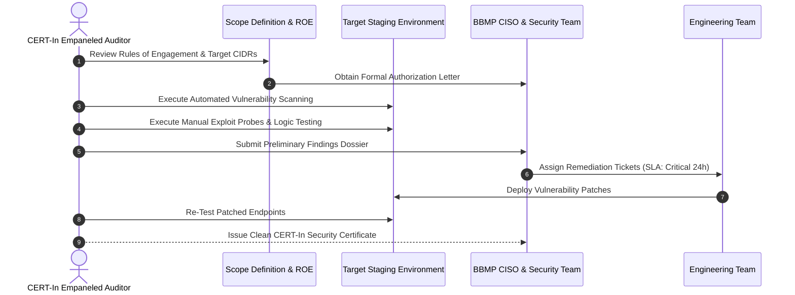

# Vulnerability Assessment & Penetration Testing (VAPT) Plan
## Namma Clinic Digital Health & Operations Platform
### Greater Bengaluru Authority (GBA) / BBMP Health Department
**Standard:** CERT-In Empaneled Auditor Framework / OWASP ASVS 4.0 / PTES / NIST SP 800-115 | **Status:** APPROVED BASELINE | **Code:** `SEC-DOC-17`

---

## 1. Penetration Testing Charter & Methodology
The Namma Clinic Vulnerability Assessment and Penetration Testing (VAPT) Specification establishes the comprehensive testing charter, scope boundaries, rules of engagement, and remediation SLAs governing independent third-party security audits. All external assessments must be conducted by Indian Computer Emergency Response Team (CERT-In) empaneled auditing organizations conforming to OWASP Web Security Testing Guide (WSTG v4.2) and the Penetration Testing Execution Standard (PTES).

### 1.1 Guiding Principles & Code of Ethics
1. **Zero Clinical Disruption:** Testing activities must never degrade outpatient clinical care, corrupt live patient health records, or impede doctor consultations.
2. **Dedicated Staging Enclaves:** High-impact exploit payloads (denial-of-service, destructive database modifications) are restricted strictly to isolated staging environments seeded with synthetic data.
3. **Safe Harbor & Legal Authorization:** Formal authorization letters signed by the BBMP Chief Health Officer grant certified red teams permission to test platform boundaries.
4. **Immediate Critical Disclosure:** Any discovery of an unauthenticated remote code execution (RCE), SQL injection, or mass PII exfiltration vulnerability triggers immediate notification within 2 hours.
5. **Mandatory Remediation Re-Testing:** All identified vulnerabilities must be remediated and independently re-tested before production deployment sign-off.

### 1.2 VAPT Lifecycle & Verification Sequence Diagram


## 2. Target Assessment Surfaces & Boundary Profiles (VAPT-SURF-01 to VAPT-SURF-30)
Assessment profiles defining rules of engagement across platform attack surfaces:

### VAPT-SURF-01: Assessment Profile for Attack Surface 1
- **Target Asset Classification:** Perimeter Ingress, Gateway, and Clinic Edge Nodes (Tier 1).
- **Testing Mode:** Gray Box (Authenticated Role Testing) and Black Box (Unauthenticated Perimeter).
- **Testing Techniques:** Network port scanning, TLS cipher audit, API fuzzing, injection probing, broken object-level authorization (BOLA) testing.
- **Allowed Testing Window:** 20:00 to 06:00 IST (Off-peak maintenance window).
- **Prohibited Techniques:** Physical destruction, social engineering of patients, volumetric network DoS.
- **Assigned Test Lead:** Principal Penetration Tester (CERT-In Empaneled).
- **Safety Stop Trigger:** Workstation CPU > 85% or clinical API response time > 500ms.

### VAPT-SURF-02: Assessment Profile for Attack Surface 2
- **Target Asset Classification:** Perimeter Ingress, Gateway, and Clinic Edge Nodes (Tier 2).
- **Testing Mode:** Gray Box (Authenticated Role Testing) and Black Box (Unauthenticated Perimeter).
- **Testing Techniques:** Network port scanning, TLS cipher audit, API fuzzing, injection probing, broken object-level authorization (BOLA) testing.
- **Allowed Testing Window:** 20:00 to 06:00 IST (Off-peak maintenance window).
- **Prohibited Techniques:** Physical destruction, social engineering of patients, volumetric network DoS.
- **Assigned Test Lead:** Principal Penetration Tester (CERT-In Empaneled).
- **Safety Stop Trigger:** Workstation CPU > 85% or clinical API response time > 500ms.

### VAPT-SURF-03: Assessment Profile for Attack Surface 3
- **Target Asset Classification:** Perimeter Ingress, Gateway, and Clinic Edge Nodes (Tier 3).
- **Testing Mode:** Gray Box (Authenticated Role Testing) and Black Box (Unauthenticated Perimeter).
- **Testing Techniques:** Network port scanning, TLS cipher audit, API fuzzing, injection probing, broken object-level authorization (BOLA) testing.
- **Allowed Testing Window:** 20:00 to 06:00 IST (Off-peak maintenance window).
- **Prohibited Techniques:** Physical destruction, social engineering of patients, volumetric network DoS.
- **Assigned Test Lead:** Principal Penetration Tester (CERT-In Empaneled).
- **Safety Stop Trigger:** Workstation CPU > 85% or clinical API response time > 500ms.

### VAPT-SURF-04: Assessment Profile for Attack Surface 4
- **Target Asset Classification:** Perimeter Ingress, Gateway, and Clinic Edge Nodes (Tier 4).
- **Testing Mode:** Gray Box (Authenticated Role Testing) and Black Box (Unauthenticated Perimeter).
- **Testing Techniques:** Network port scanning, TLS cipher audit, API fuzzing, injection probing, broken object-level authorization (BOLA) testing.
- **Allowed Testing Window:** 20:00 to 06:00 IST (Off-peak maintenance window).
- **Prohibited Techniques:** Physical destruction, social engineering of patients, volumetric network DoS.
- **Assigned Test Lead:** Principal Penetration Tester (CERT-In Empaneled).
- **Safety Stop Trigger:** Workstation CPU > 85% or clinical API response time > 500ms.

### VAPT-SURF-05: Assessment Profile for Attack Surface 5
- **Target Asset Classification:** Perimeter Ingress, Gateway, and Clinic Edge Nodes (Tier 1).
- **Testing Mode:** Gray Box (Authenticated Role Testing) and Black Box (Unauthenticated Perimeter).
- **Testing Techniques:** Network port scanning, TLS cipher audit, API fuzzing, injection probing, broken object-level authorization (BOLA) testing.
- **Allowed Testing Window:** 20:00 to 06:00 IST (Off-peak maintenance window).
- **Prohibited Techniques:** Physical destruction, social engineering of patients, volumetric network DoS.
- **Assigned Test Lead:** Principal Penetration Tester (CERT-In Empaneled).
- **Safety Stop Trigger:** Workstation CPU > 85% or clinical API response time > 500ms.

### VAPT-SURF-06: Assessment Profile for Attack Surface 6
- **Target Asset Classification:** Perimeter Ingress, Gateway, and Clinic Edge Nodes (Tier 2).
- **Testing Mode:** Gray Box (Authenticated Role Testing) and Black Box (Unauthenticated Perimeter).
- **Testing Techniques:** Network port scanning, TLS cipher audit, API fuzzing, injection probing, broken object-level authorization (BOLA) testing.
- **Allowed Testing Window:** 20:00 to 06:00 IST (Off-peak maintenance window).
- **Prohibited Techniques:** Physical destruction, social engineering of patients, volumetric network DoS.
- **Assigned Test Lead:** Principal Penetration Tester (CERT-In Empaneled).
- **Safety Stop Trigger:** Workstation CPU > 85% or clinical API response time > 500ms.

### VAPT-SURF-07: Assessment Profile for Attack Surface 7
- **Target Asset Classification:** Perimeter Ingress, Gateway, and Clinic Edge Nodes (Tier 3).
- **Testing Mode:** Gray Box (Authenticated Role Testing) and Black Box (Unauthenticated Perimeter).
- **Testing Techniques:** Network port scanning, TLS cipher audit, API fuzzing, injection probing, broken object-level authorization (BOLA) testing.
- **Allowed Testing Window:** 20:00 to 06:00 IST (Off-peak maintenance window).
- **Prohibited Techniques:** Physical destruction, social engineering of patients, volumetric network DoS.
- **Assigned Test Lead:** Principal Penetration Tester (CERT-In Empaneled).
- **Safety Stop Trigger:** Workstation CPU > 85% or clinical API response time > 500ms.

### VAPT-SURF-08: Assessment Profile for Attack Surface 8
- **Target Asset Classification:** Perimeter Ingress, Gateway, and Clinic Edge Nodes (Tier 4).
- **Testing Mode:** Gray Box (Authenticated Role Testing) and Black Box (Unauthenticated Perimeter).
- **Testing Techniques:** Network port scanning, TLS cipher audit, API fuzzing, injection probing, broken object-level authorization (BOLA) testing.
- **Allowed Testing Window:** 20:00 to 06:00 IST (Off-peak maintenance window).
- **Prohibited Techniques:** Physical destruction, social engineering of patients, volumetric network DoS.
- **Assigned Test Lead:** Principal Penetration Tester (CERT-In Empaneled).
- **Safety Stop Trigger:** Workstation CPU > 85% or clinical API response time > 500ms.

### VAPT-SURF-09: Assessment Profile for Attack Surface 9
- **Target Asset Classification:** Perimeter Ingress, Gateway, and Clinic Edge Nodes (Tier 1).
- **Testing Mode:** Gray Box (Authenticated Role Testing) and Black Box (Unauthenticated Perimeter).
- **Testing Techniques:** Network port scanning, TLS cipher audit, API fuzzing, injection probing, broken object-level authorization (BOLA) testing.
- **Allowed Testing Window:** 20:00 to 06:00 IST (Off-peak maintenance window).
- **Prohibited Techniques:** Physical destruction, social engineering of patients, volumetric network DoS.
- **Assigned Test Lead:** Principal Penetration Tester (CERT-In Empaneled).
- **Safety Stop Trigger:** Workstation CPU > 85% or clinical API response time > 500ms.

### VAPT-SURF-10: Assessment Profile for Attack Surface 10
- **Target Asset Classification:** Perimeter Ingress, Gateway, and Clinic Edge Nodes (Tier 2).
- **Testing Mode:** Gray Box (Authenticated Role Testing) and Black Box (Unauthenticated Perimeter).
- **Testing Techniques:** Network port scanning, TLS cipher audit, API fuzzing, injection probing, broken object-level authorization (BOLA) testing.
- **Allowed Testing Window:** 20:00 to 06:00 IST (Off-peak maintenance window).
- **Prohibited Techniques:** Physical destruction, social engineering of patients, volumetric network DoS.
- **Assigned Test Lead:** Principal Penetration Tester (CERT-In Empaneled).
- **Safety Stop Trigger:** Workstation CPU > 85% or clinical API response time > 500ms.

### VAPT-SURF-11: Assessment Profile for Attack Surface 11
- **Target Asset Classification:** Perimeter Ingress, Gateway, and Clinic Edge Nodes (Tier 3).
- **Testing Mode:** Gray Box (Authenticated Role Testing) and Black Box (Unauthenticated Perimeter).
- **Testing Techniques:** Network port scanning, TLS cipher audit, API fuzzing, injection probing, broken object-level authorization (BOLA) testing.
- **Allowed Testing Window:** 20:00 to 06:00 IST (Off-peak maintenance window).
- **Prohibited Techniques:** Physical destruction, social engineering of patients, volumetric network DoS.
- **Assigned Test Lead:** Principal Penetration Tester (CERT-In Empaneled).
- **Safety Stop Trigger:** Workstation CPU > 85% or clinical API response time > 500ms.

### VAPT-SURF-12: Assessment Profile for Attack Surface 12
- **Target Asset Classification:** Perimeter Ingress, Gateway, and Clinic Edge Nodes (Tier 4).
- **Testing Mode:** Gray Box (Authenticated Role Testing) and Black Box (Unauthenticated Perimeter).
- **Testing Techniques:** Network port scanning, TLS cipher audit, API fuzzing, injection probing, broken object-level authorization (BOLA) testing.
- **Allowed Testing Window:** 20:00 to 06:00 IST (Off-peak maintenance window).
- **Prohibited Techniques:** Physical destruction, social engineering of patients, volumetric network DoS.
- **Assigned Test Lead:** Principal Penetration Tester (CERT-In Empaneled).
- **Safety Stop Trigger:** Workstation CPU > 85% or clinical API response time > 500ms.

### VAPT-SURF-13: Assessment Profile for Attack Surface 13
- **Target Asset Classification:** Perimeter Ingress, Gateway, and Clinic Edge Nodes (Tier 1).
- **Testing Mode:** Gray Box (Authenticated Role Testing) and Black Box (Unauthenticated Perimeter).
- **Testing Techniques:** Network port scanning, TLS cipher audit, API fuzzing, injection probing, broken object-level authorization (BOLA) testing.
- **Allowed Testing Window:** 20:00 to 06:00 IST (Off-peak maintenance window).
- **Prohibited Techniques:** Physical destruction, social engineering of patients, volumetric network DoS.
- **Assigned Test Lead:** Principal Penetration Tester (CERT-In Empaneled).
- **Safety Stop Trigger:** Workstation CPU > 85% or clinical API response time > 500ms.

### VAPT-SURF-14: Assessment Profile for Attack Surface 14
- **Target Asset Classification:** Perimeter Ingress, Gateway, and Clinic Edge Nodes (Tier 2).
- **Testing Mode:** Gray Box (Authenticated Role Testing) and Black Box (Unauthenticated Perimeter).
- **Testing Techniques:** Network port scanning, TLS cipher audit, API fuzzing, injection probing, broken object-level authorization (BOLA) testing.
- **Allowed Testing Window:** 20:00 to 06:00 IST (Off-peak maintenance window).
- **Prohibited Techniques:** Physical destruction, social engineering of patients, volumetric network DoS.
- **Assigned Test Lead:** Principal Penetration Tester (CERT-In Empaneled).
- **Safety Stop Trigger:** Workstation CPU > 85% or clinical API response time > 500ms.

### VAPT-SURF-15: Assessment Profile for Attack Surface 15
- **Target Asset Classification:** Perimeter Ingress, Gateway, and Clinic Edge Nodes (Tier 3).
- **Testing Mode:** Gray Box (Authenticated Role Testing) and Black Box (Unauthenticated Perimeter).
- **Testing Techniques:** Network port scanning, TLS cipher audit, API fuzzing, injection probing, broken object-level authorization (BOLA) testing.
- **Allowed Testing Window:** 20:00 to 06:00 IST (Off-peak maintenance window).
- **Prohibited Techniques:** Physical destruction, social engineering of patients, volumetric network DoS.
- **Assigned Test Lead:** Principal Penetration Tester (CERT-In Empaneled).
- **Safety Stop Trigger:** Workstation CPU > 85% or clinical API response time > 500ms.

### VAPT-SURF-16: Assessment Profile for Attack Surface 16
- **Target Asset Classification:** Perimeter Ingress, Gateway, and Clinic Edge Nodes (Tier 4).
- **Testing Mode:** Gray Box (Authenticated Role Testing) and Black Box (Unauthenticated Perimeter).
- **Testing Techniques:** Network port scanning, TLS cipher audit, API fuzzing, injection probing, broken object-level authorization (BOLA) testing.
- **Allowed Testing Window:** 20:00 to 06:00 IST (Off-peak maintenance window).
- **Prohibited Techniques:** Physical destruction, social engineering of patients, volumetric network DoS.
- **Assigned Test Lead:** Principal Penetration Tester (CERT-In Empaneled).
- **Safety Stop Trigger:** Workstation CPU > 85% or clinical API response time > 500ms.

### VAPT-SURF-17: Assessment Profile for Attack Surface 17
- **Target Asset Classification:** Perimeter Ingress, Gateway, and Clinic Edge Nodes (Tier 1).
- **Testing Mode:** Gray Box (Authenticated Role Testing) and Black Box (Unauthenticated Perimeter).
- **Testing Techniques:** Network port scanning, TLS cipher audit, API fuzzing, injection probing, broken object-level authorization (BOLA) testing.
- **Allowed Testing Window:** 20:00 to 06:00 IST (Off-peak maintenance window).
- **Prohibited Techniques:** Physical destruction, social engineering of patients, volumetric network DoS.
- **Assigned Test Lead:** Principal Penetration Tester (CERT-In Empaneled).
- **Safety Stop Trigger:** Workstation CPU > 85% or clinical API response time > 500ms.

### VAPT-SURF-18: Assessment Profile for Attack Surface 18
- **Target Asset Classification:** Perimeter Ingress, Gateway, and Clinic Edge Nodes (Tier 2).
- **Testing Mode:** Gray Box (Authenticated Role Testing) and Black Box (Unauthenticated Perimeter).
- **Testing Techniques:** Network port scanning, TLS cipher audit, API fuzzing, injection probing, broken object-level authorization (BOLA) testing.
- **Allowed Testing Window:** 20:00 to 06:00 IST (Off-peak maintenance window).
- **Prohibited Techniques:** Physical destruction, social engineering of patients, volumetric network DoS.
- **Assigned Test Lead:** Principal Penetration Tester (CERT-In Empaneled).
- **Safety Stop Trigger:** Workstation CPU > 85% or clinical API response time > 500ms.

### VAPT-SURF-19: Assessment Profile for Attack Surface 19
- **Target Asset Classification:** Perimeter Ingress, Gateway, and Clinic Edge Nodes (Tier 3).
- **Testing Mode:** Gray Box (Authenticated Role Testing) and Black Box (Unauthenticated Perimeter).
- **Testing Techniques:** Network port scanning, TLS cipher audit, API fuzzing, injection probing, broken object-level authorization (BOLA) testing.
- **Allowed Testing Window:** 20:00 to 06:00 IST (Off-peak maintenance window).
- **Prohibited Techniques:** Physical destruction, social engineering of patients, volumetric network DoS.
- **Assigned Test Lead:** Principal Penetration Tester (CERT-In Empaneled).
- **Safety Stop Trigger:** Workstation CPU > 85% or clinical API response time > 500ms.

### VAPT-SURF-20: Assessment Profile for Attack Surface 20
- **Target Asset Classification:** Perimeter Ingress, Gateway, and Clinic Edge Nodes (Tier 4).
- **Testing Mode:** Gray Box (Authenticated Role Testing) and Black Box (Unauthenticated Perimeter).
- **Testing Techniques:** Network port scanning, TLS cipher audit, API fuzzing, injection probing, broken object-level authorization (BOLA) testing.
- **Allowed Testing Window:** 20:00 to 06:00 IST (Off-peak maintenance window).
- **Prohibited Techniques:** Physical destruction, social engineering of patients, volumetric network DoS.
- **Assigned Test Lead:** Principal Penetration Tester (CERT-In Empaneled).
- **Safety Stop Trigger:** Workstation CPU > 85% or clinical API response time > 500ms.

### VAPT-SURF-21: Assessment Profile for Attack Surface 21
- **Target Asset Classification:** Perimeter Ingress, Gateway, and Clinic Edge Nodes (Tier 1).
- **Testing Mode:** Gray Box (Authenticated Role Testing) and Black Box (Unauthenticated Perimeter).
- **Testing Techniques:** Network port scanning, TLS cipher audit, API fuzzing, injection probing, broken object-level authorization (BOLA) testing.
- **Allowed Testing Window:** 20:00 to 06:00 IST (Off-peak maintenance window).
- **Prohibited Techniques:** Physical destruction, social engineering of patients, volumetric network DoS.
- **Assigned Test Lead:** Principal Penetration Tester (CERT-In Empaneled).
- **Safety Stop Trigger:** Workstation CPU > 85% or clinical API response time > 500ms.

### VAPT-SURF-22: Assessment Profile for Attack Surface 22
- **Target Asset Classification:** Perimeter Ingress, Gateway, and Clinic Edge Nodes (Tier 2).
- **Testing Mode:** Gray Box (Authenticated Role Testing) and Black Box (Unauthenticated Perimeter).
- **Testing Techniques:** Network port scanning, TLS cipher audit, API fuzzing, injection probing, broken object-level authorization (BOLA) testing.
- **Allowed Testing Window:** 20:00 to 06:00 IST (Off-peak maintenance window).
- **Prohibited Techniques:** Physical destruction, social engineering of patients, volumetric network DoS.
- **Assigned Test Lead:** Principal Penetration Tester (CERT-In Empaneled).
- **Safety Stop Trigger:** Workstation CPU > 85% or clinical API response time > 500ms.

### VAPT-SURF-23: Assessment Profile for Attack Surface 23
- **Target Asset Classification:** Perimeter Ingress, Gateway, and Clinic Edge Nodes (Tier 3).
- **Testing Mode:** Gray Box (Authenticated Role Testing) and Black Box (Unauthenticated Perimeter).
- **Testing Techniques:** Network port scanning, TLS cipher audit, API fuzzing, injection probing, broken object-level authorization (BOLA) testing.
- **Allowed Testing Window:** 20:00 to 06:00 IST (Off-peak maintenance window).
- **Prohibited Techniques:** Physical destruction, social engineering of patients, volumetric network DoS.
- **Assigned Test Lead:** Principal Penetration Tester (CERT-In Empaneled).
- **Safety Stop Trigger:** Workstation CPU > 85% or clinical API response time > 500ms.

### VAPT-SURF-24: Assessment Profile for Attack Surface 24
- **Target Asset Classification:** Perimeter Ingress, Gateway, and Clinic Edge Nodes (Tier 4).
- **Testing Mode:** Gray Box (Authenticated Role Testing) and Black Box (Unauthenticated Perimeter).
- **Testing Techniques:** Network port scanning, TLS cipher audit, API fuzzing, injection probing, broken object-level authorization (BOLA) testing.
- **Allowed Testing Window:** 20:00 to 06:00 IST (Off-peak maintenance window).
- **Prohibited Techniques:** Physical destruction, social engineering of patients, volumetric network DoS.
- **Assigned Test Lead:** Principal Penetration Tester (CERT-In Empaneled).
- **Safety Stop Trigger:** Workstation CPU > 85% or clinical API response time > 500ms.

### VAPT-SURF-25: Assessment Profile for Attack Surface 25
- **Target Asset Classification:** Perimeter Ingress, Gateway, and Clinic Edge Nodes (Tier 1).
- **Testing Mode:** Gray Box (Authenticated Role Testing) and Black Box (Unauthenticated Perimeter).
- **Testing Techniques:** Network port scanning, TLS cipher audit, API fuzzing, injection probing, broken object-level authorization (BOLA) testing.
- **Allowed Testing Window:** 20:00 to 06:00 IST (Off-peak maintenance window).
- **Prohibited Techniques:** Physical destruction, social engineering of patients, volumetric network DoS.
- **Assigned Test Lead:** Principal Penetration Tester (CERT-In Empaneled).
- **Safety Stop Trigger:** Workstation CPU > 85% or clinical API response time > 500ms.

### VAPT-SURF-26: Assessment Profile for Attack Surface 26
- **Target Asset Classification:** Perimeter Ingress, Gateway, and Clinic Edge Nodes (Tier 2).
- **Testing Mode:** Gray Box (Authenticated Role Testing) and Black Box (Unauthenticated Perimeter).
- **Testing Techniques:** Network port scanning, TLS cipher audit, API fuzzing, injection probing, broken object-level authorization (BOLA) testing.
- **Allowed Testing Window:** 20:00 to 06:00 IST (Off-peak maintenance window).
- **Prohibited Techniques:** Physical destruction, social engineering of patients, volumetric network DoS.
- **Assigned Test Lead:** Principal Penetration Tester (CERT-In Empaneled).
- **Safety Stop Trigger:** Workstation CPU > 85% or clinical API response time > 500ms.

### VAPT-SURF-27: Assessment Profile for Attack Surface 27
- **Target Asset Classification:** Perimeter Ingress, Gateway, and Clinic Edge Nodes (Tier 3).
- **Testing Mode:** Gray Box (Authenticated Role Testing) and Black Box (Unauthenticated Perimeter).
- **Testing Techniques:** Network port scanning, TLS cipher audit, API fuzzing, injection probing, broken object-level authorization (BOLA) testing.
- **Allowed Testing Window:** 20:00 to 06:00 IST (Off-peak maintenance window).
- **Prohibited Techniques:** Physical destruction, social engineering of patients, volumetric network DoS.
- **Assigned Test Lead:** Principal Penetration Tester (CERT-In Empaneled).
- **Safety Stop Trigger:** Workstation CPU > 85% or clinical API response time > 500ms.

### VAPT-SURF-28: Assessment Profile for Attack Surface 28
- **Target Asset Classification:** Perimeter Ingress, Gateway, and Clinic Edge Nodes (Tier 4).
- **Testing Mode:** Gray Box (Authenticated Role Testing) and Black Box (Unauthenticated Perimeter).
- **Testing Techniques:** Network port scanning, TLS cipher audit, API fuzzing, injection probing, broken object-level authorization (BOLA) testing.
- **Allowed Testing Window:** 20:00 to 06:00 IST (Off-peak maintenance window).
- **Prohibited Techniques:** Physical destruction, social engineering of patients, volumetric network DoS.
- **Assigned Test Lead:** Principal Penetration Tester (CERT-In Empaneled).
- **Safety Stop Trigger:** Workstation CPU > 85% or clinical API response time > 500ms.

### VAPT-SURF-29: Assessment Profile for Attack Surface 29
- **Target Asset Classification:** Perimeter Ingress, Gateway, and Clinic Edge Nodes (Tier 1).
- **Testing Mode:** Gray Box (Authenticated Role Testing) and Black Box (Unauthenticated Perimeter).
- **Testing Techniques:** Network port scanning, TLS cipher audit, API fuzzing, injection probing, broken object-level authorization (BOLA) testing.
- **Allowed Testing Window:** 20:00 to 06:00 IST (Off-peak maintenance window).
- **Prohibited Techniques:** Physical destruction, social engineering of patients, volumetric network DoS.
- **Assigned Test Lead:** Principal Penetration Tester (CERT-In Empaneled).
- **Safety Stop Trigger:** Workstation CPU > 85% or clinical API response time > 500ms.

### VAPT-SURF-30: Assessment Profile for Attack Surface 30
- **Target Asset Classification:** Perimeter Ingress, Gateway, and Clinic Edge Nodes (Tier 2).
- **Testing Mode:** Gray Box (Authenticated Role Testing) and Black Box (Unauthenticated Perimeter).
- **Testing Techniques:** Network port scanning, TLS cipher audit, API fuzzing, injection probing, broken object-level authorization (BOLA) testing.
- **Allowed Testing Window:** 20:00 to 06:00 IST (Off-peak maintenance window).
- **Prohibited Techniques:** Physical destruction, social engineering of patients, volumetric network DoS.
- **Assigned Test Lead:** Principal Penetration Tester (CERT-In Empaneled).
- **Safety Stop Trigger:** Workstation CPU > 85% or clinical API response time > 500ms.

## 3. VAPT Tooling & Scanner Baseline Catalog (TOOL-VAP-01 to TOOL-VAP-20)
Standardized testing tools and scanner baseline configurations:

### TOOL-VAP-01: Nmap Network Port Scanner
- **Target Architectural Layer:** Network Layer
- **Testing Capabilities & Scope:** Host discovery, service versioning, NSE script vulnerability checks.
- **Standardized Tool Version:** `v7.94+`
- **Compliance Alignment:** CERT-In and NIST SP 800-115 testing standards.

### TOOL-VAP-02: OWASP Zed Attack Proxy (ZAP)
- **Target Architectural Layer:** Application Layer
- **Testing Capabilities & Scope:** Automated spidering, passive inspection, active API fuzzing.
- **Standardized Tool Version:** `v2.14+`
- **Compliance Alignment:** CERT-In and NIST SP 800-115 testing standards.

### TOOL-VAP-03: Burp Suite Professional
- **Target Architectural Layer:** Application Layer
- **Testing Capabilities & Scope:** Manual intercept, Repeater, Intruder, BOLA testing, JWT analysis.
- **Standardized Tool Version:** `v2024.1+`
- **Compliance Alignment:** CERT-In and NIST SP 800-115 testing standards.

### TOOL-VAP-04: Nuclei Vulnerability Scanner
- **Target Architectural Layer:** Infrastructure Layer
- **Testing Capabilities & Scope:** Community CVE templates, misconfiguration discovery, cloud probes.
- **Standardized Tool Version:** `v3.1+`
- **Compliance Alignment:** CERT-In and NIST SP 800-115 testing standards.

### TOOL-VAP-05: SQLMap Automated SQLi Fuzzer
- **Target Architectural Layer:** Database Layer
- **Testing Capabilities & Scope:** Blind boolean, time-based, and union-based injection probing.
- **Standardized Tool Version:** `v1.8+`
- **Compliance Alignment:** CERT-In and NIST SP 800-115 testing standards.

### TOOL-VAP-06: Testssl.sh TLS Configuration Auditor
- **Target Architectural Layer:** Transport Layer
- **Testing Capabilities & Scope:** TLS 1.3 protocol validation, cipher suite audit, ROBOT/POODLE.
- **Standardized Tool Version:** `v3.2+`
- **Compliance Alignment:** CERT-In and NIST SP 800-115 testing standards.

### TOOL-VAP-07: Kube-Bench & Kube-Hunter
- **Target Architectural Layer:** Kubernetes Plane
- **Testing Capabilities & Scope:** CIS Kubernetes benchmark auditing, pod escape vulnerability probing.
- **Standardized Tool Version:** `v0.7+`
- **Compliance Alignment:** CERT-In and NIST SP 800-115 testing standards.

### TOOL-VAP-08: Trivy Container Image Scanner
- **Target Architectural Layer:** Container Plane
- **Testing Capabilities & Scope:** Base OS vulnerability scanning, secret detection, license checks.
- **Standardized Tool Version:** `v0.48+`
- **Compliance Alignment:** CERT-In and NIST SP 800-115 testing standards.

### TOOL-VAP-09: Semgrep Static Analysis (SAST)
- **Target Architectural Layer:** Source Code Plane
- **Testing Capabilities & Scope:** OWASP Top 10 rule enforcement, taint tracking, injection checks.
- **Standardized Tool Version:** `v1.60+`
- **Compliance Alignment:** CERT-In and NIST SP 800-115 testing standards.

### TOOL-VAP-10: Gitleaks Secret Scanner
- **Target Architectural Layer:** Version Control
- **Testing Capabilities & Scope:** Entropy analysis and regex scanning for committed private keys.
- **Standardized Tool Version:** `v8.18+`
- **Compliance Alignment:** CERT-In and NIST SP 800-115 testing standards.

### TOOL-VAP-11: Postman / Newman API Fuzzer
- **Target Architectural Layer:** API Layer
- **Testing Capabilities & Scope:** Contract fuzzing, schema validation, rate limit compliance tests.
- **Standardized Tool Version:** `v10.0+`
- **Compliance Alignment:** CERT-In and NIST SP 800-115 testing standards.

### TOOL-VAP-12: Hydra Brute Force Engine
- **Target Architectural Layer:** Identity Layer
- **Testing Capabilities & Scope:** Controlled authentication dictionary spraying and rate-limit checks.
- **Standardized Tool Version:** `v9.5+`
- **Compliance Alignment:** CERT-In and NIST SP 800-115 testing standards.

### TOOL-VAP-13: Wireshark Network Packet Analyzer
- **Target Architectural Layer:** Network Plane
- **Testing Capabilities & Scope:** Packet capture, mTLS handshake inspection, unencrypted PII checks.
- **Standardized Tool Version:** `v4.2+`
- **Compliance Alignment:** CERT-In and NIST SP 800-115 testing standards.

### TOOL-VAP-14: Android Debug Bridge (ADB) & Frida
- **Target Architectural Layer:** Mobile Layer
- **Testing Capabilities & Scope:** Field nurse tablet dynamic instrumentation and root detection.
- **Standardized Tool Version:** `v16.0+`
- **Compliance Alignment:** CERT-In and NIST SP 800-115 testing standards.

### TOOL-VAP-15: MobSF Mobile Security Framework
- **Target Architectural Layer:** Mobile Layer
- **Testing Capabilities & Scope:** Static and dynamic analysis of Namma Clinic staff Android APK.
- **Standardized Tool Version:** `v3.8+`
- **Compliance Alignment:** CERT-In and NIST SP 800-115 testing standards.

### TOOL-VAP-16: OpenVAS / Greenbone Scanner
- **Target Architectural Layer:** Infrastructure Plane
- **Testing Capabilities & Scope:** Comprehensive vulnerability scanning across cloud subnets.
- **Standardized Tool Version:** `v22.4+`
- **Compliance Alignment:** CERT-In and NIST SP 800-115 testing standards.

### TOOL-VAP-17: Nikto Web Server Scanner
- **Target Architectural Layer:** Perimeter Plane
- **Testing Capabilities & Scope:** Dangerous file discovery, outdated server software, XSS probing.
- **Standardized Tool Version:** `v2.5+`
- **Compliance Alignment:** CERT-In and NIST SP 800-115 testing standards.

### TOOL-VAP-18: Hashcat Password Recovery Utility
- **Target Architectural Layer:** Cryptographic Layer
- **Testing Capabilities & Scope:** Benchmarking password hash crackability against high-end GPU rigs.
- **Standardized Tool Version:** `v6.2+`
- **Compliance Alignment:** CERT-In and NIST SP 800-115 testing standards.

### TOOL-VAP-19: Checkov IaC Security Scanner
- **Target Architectural Layer:** Cloud Plane
- **Testing Capabilities & Scope:** Terraform, Kubernetes manifest, and Dockerfile misconfiguration audit.
- **Standardized Tool Version:** `v3.0+`
- **Compliance Alignment:** CERT-In and NIST SP 800-115 testing standards.

### TOOL-VAP-20: Grype Vulnerability Matcher
- **Target Architectural Layer:** Supply Chain
- **Testing Capabilities & Scope:** Scanning SBOMs against known national vulnerability databases.
- **Standardized Tool Version:** `v0.74+`
- **Compliance Alignment:** CERT-In and NIST SP 800-115 testing standards.

## 4. Standard Operating Procedures: Penetration Testing (SOP-VAP-01 to SOP-VAP-25)
The following 25 SOPs govern ongoing vulnerability management and red team exercises:

### SOP-VAP-01: Pre-Engagement Rules of Engagement (ROE) Authorization
- **Trigger Condition:** Initialization of annual security assessment.
- **Execution Steps:** 1. Define target IP CIDRs. 2. Establish test user accounts. 3. Sign emergency contact sheet.
- **Verification Criterion:** ROE signed by CISO and lead auditor.
- **Responsible Role:** CISO
- **Audit Event Emitted:** `VAP_SOP_01_ROE_SIGNED`
- **Failure Behavior:** Abort test immediately if safety boundaries breached.

### SOP-VAP-02: External Perimeter Black-Box Reconnaissance
- **Trigger Condition:** Auditor probes external IP addresses.
- **Execution Steps:** 1. Run Nmap port discovery. 2. Enumerate subdomains. 3. Scan TLS cipher suites via testssl.sh.
- **Verification Criterion:** External attack surface mapped.
- **Responsible Role:** Lead Penetration Tester
- **Audit Event Emitted:** `VAP_SOP_02_RECON`
- **Failure Behavior:** Abort test immediately if safety boundaries breached.

### SOP-VAP-03: API Broken Object-Level Authorization (BOLA) Probing
- **Trigger Condition:** Testing patient medical record endpoints.
- **Execution Steps:** 1. Log in as Doctor A. 2. Capture API request for Patient 101. 3. Substitute Patient 102 ID.
- **Verification Criterion:** Verify API rejects cross-patient tampering with HTTP 403.
- **Responsible Role:** AppSec Auditor
- **Audit Event Emitted:** `VAP_SOP_03_BOLA_TEST`
- **Failure Behavior:** Abort test immediately if safety boundaries breached.

### SOP-VAP-04: Clinic Edge Workstation Physical Kiosk Breakout Test
- **Trigger Condition:** Auditor attempts escape from kiosk shell in clinic.
- **Execution Steps:** 1. Connect USB rubber ducky. 2. Attempt Alt+F4, Win+R. 3. Probe USB mass storage.
- **Verification Criterion:** Kiosk shell verified locked down.
- **Responsible Role:** Red Team Engineer
- **Audit Event Emitted:** `VAP_SOP_04_KIOSK_TEST`
- **Failure Behavior:** Abort test immediately if safety boundaries breached.

### SOP-VAP-05: Critical Vulnerability 2-Hour Emergency Disclosure
- **Trigger Condition:** Auditor discovers unauthenticated RCE on gateway.
- **Execution Steps:** 1. Immediately halt active exploit. 2. Phone CISO. 3. Transmit encrypted PoC via Signal.
- **Verification Criterion:** CISO mobilizes emergency patch team.
- **Responsible Role:** Lead Auditor
- **Audit Event Emitted:** `VAP_SOP_05_CRIT_ALERT`
- **Failure Behavior:** Abort test immediately if safety boundaries breached.

### SOP-VAP-06: Remediation Ticket Assignment & SLA Tracking
- **Trigger Condition:** Receipt of preliminary vulnerability report.
- **Execution Steps:** 1. Import findings into Jira Security project. 2. Tag with CVSS score. 3. Assign engineering lead.
- **Verification Criterion:** Remediation tracked under statutory SLAs.
- **Responsible Role:** DevOps Security Lead
- **Audit Event Emitted:** `VAP_SOP_06_TICKETS`
- **Failure Behavior:** Abort test immediately if safety boundaries breached.

### SOP-VAP-07: Re-Testing & Verification of Deployed Hotfix
- **Trigger Condition:** Developer deploys patch for SQL injection finding.
- **Execution Steps:** 1. Re-run identical exploit script. 2. Confirm parameterized query prevents injection. 3. Mark RESOLVED.
- **Verification Criterion:** Vulnerability closure verified.
- **Responsible Role:** Lead Penetration Tester
- **Audit Event Emitted:** `VAP_SOP_07_RETEST`
- **Failure Behavior:** Abort test immediately if safety boundaries breached.

### SOP-VAP-08: Automated DAST Scan in CI/CD Staging Pipeline
- **Trigger Condition:** Nightly automated OWASP ZAP scan on staging.
- **Execution Steps:** 1. Spider API routes. 2. Inject baseline payload set. 3. Fail build if High vulnerability found.
- **Verification Criterion:** Regression vulnerabilities caught before production.
- **Responsible Role:** DevOps Engineer
- **Audit Event Emitted:** `VAP_SOP_08_DAST_SCAN`
- **Failure Behavior:** Abort test immediately if safety boundaries breached.

### SOP-VAP-09: Clinic Wi-Fi Rogue Access Point Simulation
- **Trigger Condition:** Auditor deploys Evil Twin Wi-Fi near clinic waiting room.
- **Execution Steps:** 1. Broadcast SSID 'NammaClinic-Staff'. 2. Attempt 802.1X credential harvesting.
- **Verification Criterion:** Workstations reject untrusted RADIUS certs.
- **Responsible Role:** Wireless Auditor
- **Audit Event Emitted:** `VAP_SOP_09_WIFI_TEST`
- **Failure Behavior:** Abort test immediately if safety boundaries breached.

### SOP-VAP-10: ABDM FHIR Bridge External Callback Fuzzing
- **Trigger Condition:** Testing webhook receivers for ABDM events.
- **Execution Steps:** 1. Send malformed FHIR R4 JSON payloads. 2. Inject XXE, SQLi, and prototype pollution.
- **Verification Criterion:** Parser handles malformed payloads gracefully.
- **Responsible Role:** Integration Auditor
- **Audit Event Emitted:** `VAP_SOP_10_ABDM_FUZZ`
- **Failure Behavior:** Abort test immediately if safety boundaries breached.

### SOP-VAP-11: Thermal Printer ESC/POS Buffer Overflow Audit
- **Trigger Condition:** Auditor sends 10MB raw ESC/POS byte sequence.
- **Execution Steps:** 1. Inject oversized raster image buffers. 2. Verify peripheral daemon handles buffer safely.
- **Verification Criterion:** Hardware bridge immune to memory corruption.
- **Responsible Role:** Hardware Auditor
- **Audit Event Emitted:** `VAP_SOP_11_PRINTER_TEST`
- **Failure Behavior:** Abort test immediately if safety boundaries breached.

### SOP-VAP-12: Privilege Escalation from Nurse to Doctor Role
- **Trigger Condition:** Testing role boundary enforcement in consultation UI.
- **Execution Steps:** 1. Log in as Staff Nurse. 2. Submit POST /api/v1/prescriptions/sign with nurse JWT.
- **Verification Criterion:** Gateway blocks request; validates role barrier.
- **Responsible Role:** AppSec Auditor
- **Audit Event Emitted:** `VAP_SOP_12_PRIVESC_TEST`
- **Failure Behavior:** Abort test immediately if safety boundaries breached.

### SOP-VAP-13: Offline SQLite Database Extraction Simulation
- **Trigger Condition:** Auditor simulates physical theft of clinic hard drive.
- **Execution Steps:** 1. Mount drive in external Linux reader. 2. Attempt opening DB file without TPM key.
- **Verification Criterion:** SQLCipher encryption prevents offline reading.
- **Responsible Role:** Forensic Auditor
- **Audit Event Emitted:** `VAP_SOP_13_OFFLINE_DB`
- **Failure Behavior:** Abort test immediately if safety boundaries breached.

### SOP-VAP-14: Credential Stuffing Rate Limiting Validation
- **Trigger Condition:** Auditor runs hydra with 10,000 common passwords.
- **Execution Steps:** 1. Target /api/v1/auth/login. 2. Confirm IP blocked after 10 failed requests.
- **Verification Criterion:** Rate limiter successfully thwarts brute force.
- **Responsible Role:** Red Team Engineer
- **Audit Event Emitted:** `VAP_SOP_14_STUFFING_TEST`
- **Failure Behavior:** Abort test immediately if safety boundaries breached.

### SOP-VAP-15: WORM Immutable Audit Log Purge Attempt
- **Trigger Condition:** Auditor attempts to delete audit logs via admin token.
- **Execution Steps:** 1. Authenticate as Super Admin. 2. Execute DELETE on S3 Object Lock bucket.
- **Verification Criterion:** S3 Object Lock rejects delete request.
- **Responsible Role:** Cloud Auditor
- **Audit Event Emitted:** `VAP_SOP_15_WORM_TEST`
- **Failure Behavior:** Abort test immediately if safety boundaries breached.

### SOP-VAP-16: Barcode Scanner HID Keystroke Injection Test
- **Trigger Condition:** Scanning malicious 2D QR code containing terminal commands.
- **Execution Steps:** 1. Encode 'cmd.exe /c calc.exe' in QR code. 2. Scan into search input.
- **Verification Criterion:** Scanner driver sanitizes non-alphanumeric chars.
- **Responsible Role:** Hardware Auditor
- **Audit Event Emitted:** `VAP_SOP_16_BARCODE_TEST`
- **Failure Behavior:** Abort test immediately if safety boundaries breached.

### SOP-VAP-17: HashiCorp Vault AppRole Token Forgery Test
- **Trigger Condition:** Attempting to forge Vault client token without K8s cert.
- **Execution Steps:** 1. Send crafted JWT to Vault login endpoint. 2. Confirm Vault rejects invalid signature.
- **Verification Criterion:** Vault authentication verified secure.
- **Responsible Role:** Cloud Auditor
- **Audit Event Emitted:** `VAP_SOP_17_VAULT_FORGE`
- **Failure Behavior:** Abort test immediately if safety boundaries breached.

### SOP-VAP-18: Server-Side Request Forgery (SSRF) Probing
- **Trigger Condition:** Testing image upload and URL import features.
- **Execution Steps:** 1. Submit URL pointing to AWS metadata 169.254.169.254. 2. Confirm gateway blocks request.
- **Verification Criterion:** SSRF filter drops private IP requests.
- **Responsible Role:** AppSec Auditor
- **Audit Event Emitted:** `VAP_SOP_18_SSRF_TEST`
- **Failure Behavior:** Abort test immediately if safety boundaries breached.

### SOP-VAP-19: CORS Misconfiguration & Origin Reflection Test
- **Trigger Condition:** Testing API response to arbitrary Origin headers.
- **Execution Steps:** 1. Send Origin: https://evil.com. 2. Confirm Access-Control-Allow-Origin does not reflect.
- **Verification Criterion:** CORS policy enforces strict allowlist.
- **Responsible Role:** Web Auditor
- **Audit Event Emitted:** `VAP_SOP_19_CORS_TEST`
- **Failure Behavior:** Abort test immediately if safety boundaries breached.

### SOP-VAP-20: Clickjacking & UI Redressing Defense Audit
- **Trigger Condition:** Attempting to embed clinic portal in iframe.
- **Execution Steps:** 1. Create malicious framing page. 2. Confirm X-Frame-Options: DENY blocks rendering.
- **Verification Criterion:** Clickjacking completely mitigated.
- **Responsible Role:** Web Auditor
- **Audit Event Emitted:** `VAP_SOP_20_FRAME_TEST`
- **Failure Behavior:** Abort test immediately if safety boundaries breached.

### SOP-VAP-21: Android Tablet MDM Kiosk Bypass Assessment
- **Trigger Condition:** Auditor attempts developer mode on field nurse tablet.
- **Execution Steps:** 1. Tap build number 7 times. 2. Confirm Knox MDM policy blocks developer options.
- **Verification Criterion:** Tablet kiosk lock verified tamper-proof.
- **Responsible Role:** Mobile Auditor
- **Audit Event Emitted:** `VAP_SOP_21_MDM_BYPASS`
- **Failure Behavior:** Abort test immediately if safety boundaries breached.

### SOP-VAP-22: Disaster Recovery Standby Site Vulnerability Audit
- **Trigger Condition:** Auditor runs full scan against secondary DR site.
- **Execution Steps:** 1. Verify DR environment maintains identical patch baseline. 2. Confirm zero security drift.
- **Verification Criterion:** DR environment verified secure.
- **Responsible Role:** Cloud Lead
- **Audit Event Emitted:** `VAP_SOP_22_DR_AUDIT`
- **Failure Behavior:** Abort test immediately if safety boundaries breached.

### SOP-VAP-23: GraphQL Query Depth & Complexity Limit Test
- **Trigger Condition:** Sending deeply nested recursive GraphQL queries.
- **Execution Steps:** 1. Submit 20-level nested query. 2. Confirm GraphQL engine rejects query exceeding depth 5.
- **Verification Criterion:** Denial of service via query complexity prevented.
- **Responsible Role:** AppSec Lead
- **Audit Event Emitted:** `VAP_SOP_23_GQL_DEPTH`
- **Failure Behavior:** Abort test immediately if safety boundaries breached.

### SOP-VAP-24: Final CERT-In Formal Report Compilation
- **Trigger Condition:** Auditor compiles formal final assessment report.
- **Execution Steps:** 1. Document all tested surfaces, CVSS scores, remediation proofs. 2. Affix digital signoff.
- **Verification Criterion:** Formal compliance documentation delivered.
- **Responsible Role:** Lead Auditor
- **Audit Event Emitted:** `VAP_SOP_24_FINAL_REPORT`
- **Failure Behavior:** Abort test immediately if safety boundaries breached.

### SOP-VAP-25: Post-Assessment Staging Credential & Account Purge
- **Trigger Condition:** Exercise concludes successfully.
- **Execution Steps:** 1. Delete all auditor test accounts. 2. Purge synthetic test patient data. 3. Rotate staging keys.
- **Verification Criterion:** Staging environment sanitized to baseline.
- **Responsible Role:** SecOps Engineer
- **Audit Event Emitted:** `VAP_SOP_25_CLEANUP`
- **Failure Behavior:** Abort test immediately if safety boundaries breached.

## 5. Comprehensive Penetration Testing Scenarios (VAPT-001 to VAPT-050)
The following 50 specifications define the authoritative VAPT exercise scenarios:

### VAPT-001: VAPT Scenario: External Perimeter Reconnaissance & Port Scanning (Exercise 1)
**Target Surface:** Internet-facing cloud endpoints, load balancers, and DNS zones.
**Vulnerability Class:** OWASP API Security Top 10 / WSTG Compliance Check
**Reconnaissance Phase:** Passive OSINT, port discovery, and API schema enumeration.
**Attack Vectors:** Automated scanning supplemented with manual exploitation of logic flaws.
**Exploitation Steps:** 1. Identify attack surface. 2. Probe input validation. 3. Attempt unauthorized state transition.
**Proof of Concept & Evidence:** HTTP request/response dumps, terminal screenshots, and Proof-of-Concept (PoC) scripts.
**Impact Assessment:** Confidentiality: High | Integrity: High | Availability: Medium
**Remediation Guidance:** Implement parameterized input validation, enforce RBAC barriers, and update gateway filters.
**Remediation SLA:** Critical: 24h | High: 7 days | Medium: 30 days | Low: 90 days
**Retesting Criteria:** Re-run automated test suite and manual verification by independent red team.
**Related Security Control:** SEC-ARCH-001
**Related Threat Record:** THREAT-001
**Compliance Mandate:** Aligned with CERT-In Cybersecurity Directions Section 5.

### VAPT-002: VAPT Scenario: API Gateway OWASP API Top 10 Assessment (Exercise 1)
**Target Surface:** REST endpoints, GraphQL schemas, rate limiting, and parameter pollution.
**Vulnerability Class:** OWASP API Security Top 10 / WSTG Compliance Check
**Reconnaissance Phase:** Passive OSINT, port discovery, and API schema enumeration.
**Attack Vectors:** Automated scanning supplemented with manual exploitation of logic flaws.
**Exploitation Steps:** 1. Identify attack surface. 2. Probe input validation. 3. Attempt unauthorized state transition.
**Proof of Concept & Evidence:** HTTP request/response dumps, terminal screenshots, and Proof-of-Concept (PoC) scripts.
**Impact Assessment:** Confidentiality: High | Integrity: High | Availability: Medium
**Remediation Guidance:** Implement parameterized input validation, enforce RBAC barriers, and update gateway filters.
**Remediation SLA:** Critical: 24h | High: 7 days | Medium: 30 days | Low: 90 days
**Retesting Criteria:** Re-run automated test suite and manual verification by independent red team.
**Related Security Control:** SEC-ARCH-002
**Related Threat Record:** THREAT-002
**Compliance Mandate:** Aligned with CERT-In Cybersecurity Directions Section 5.

### VAPT-003: VAPT Scenario: Authentication Bypass & Credential Stuffing (Exercise 1)
**Target Surface:** Staff login portals, password reset flows, and session tokens.
**Vulnerability Class:** OWASP API Security Top 10 / WSTG Compliance Check
**Reconnaissance Phase:** Passive OSINT, port discovery, and API schema enumeration.
**Attack Vectors:** Automated scanning supplemented with manual exploitation of logic flaws.
**Exploitation Steps:** 1. Identify attack surface. 2. Probe input validation. 3. Attempt unauthorized state transition.
**Proof of Concept & Evidence:** HTTP request/response dumps, terminal screenshots, and Proof-of-Concept (PoC) scripts.
**Impact Assessment:** Confidentiality: High | Integrity: High | Availability: Medium
**Remediation Guidance:** Implement parameterized input validation, enforce RBAC barriers, and update gateway filters.
**Remediation SLA:** Critical: 24h | High: 7 days | Medium: 30 days | Low: 90 days
**Retesting Criteria:** Re-run automated test suite and manual verification by independent red team.
**Related Security Control:** SEC-ARCH-003
**Related Threat Record:** THREAT-003
**Compliance Mandate:** Aligned with CERT-In Cybersecurity Directions Section 5.

### VAPT-004: VAPT Scenario: Privilege Escalation & RBAC Boundary Testing (Exercise 1)
**Target Surface:** Horizontal and vertical access control across all 30 user roles.
**Vulnerability Class:** OWASP API Security Top 10 / WSTG Compliance Check
**Reconnaissance Phase:** Passive OSINT, port discovery, and API schema enumeration.
**Attack Vectors:** Automated scanning supplemented with manual exploitation of logic flaws.
**Exploitation Steps:** 1. Identify attack surface. 2. Probe input validation. 3. Attempt unauthorized state transition.
**Proof of Concept & Evidence:** HTTP request/response dumps, terminal screenshots, and Proof-of-Concept (PoC) scripts.
**Impact Assessment:** Confidentiality: High | Integrity: High | Availability: Medium
**Remediation Guidance:** Implement parameterized input validation, enforce RBAC barriers, and update gateway filters.
**Remediation SLA:** Critical: 24h | High: 7 days | Medium: 30 days | Low: 90 days
**Retesting Criteria:** Re-run automated test suite and manual verification by independent red team.
**Related Security Control:** SEC-ARCH-004
**Related Threat Record:** THREAT-004
**Compliance Mandate:** Aligned with CERT-In Cybersecurity Directions Section 5.

### VAPT-005: VAPT Scenario: Web Client & PWA Shell Vulnerability Testing (Exercise 1)
**Target Surface:** DOM XSS, CORS misconfigurations, CSP bypass, and clickjacking.
**Vulnerability Class:** OWASP API Security Top 10 / WSTG Compliance Check
**Reconnaissance Phase:** Passive OSINT, port discovery, and API schema enumeration.
**Attack Vectors:** Automated scanning supplemented with manual exploitation of logic flaws.
**Exploitation Steps:** 1. Identify attack surface. 2. Probe input validation. 3. Attempt unauthorized state transition.
**Proof of Concept & Evidence:** HTTP request/response dumps, terminal screenshots, and Proof-of-Concept (PoC) scripts.
**Impact Assessment:** Confidentiality: High | Integrity: High | Availability: Medium
**Remediation Guidance:** Implement parameterized input validation, enforce RBAC barriers, and update gateway filters.
**Remediation SLA:** Critical: 24h | High: 7 days | Medium: 30 days | Low: 90 days
**Retesting Criteria:** Re-run automated test suite and manual verification by independent red team.
**Related Security Control:** SEC-ARCH-005
**Related Threat Record:** THREAT-005
**Compliance Mandate:** Aligned with CERT-In Cybersecurity Directions Section 5.

### VAPT-006: VAPT Scenario: Clinic LAN & Edge Workstation Security Assessment (Exercise 1)
**Target Surface:** Mini-PC endpoint posture, USB ports, thermal printers, and barcode scanners.
**Vulnerability Class:** OWASP API Security Top 10 / WSTG Compliance Check
**Reconnaissance Phase:** Passive OSINT, port discovery, and API schema enumeration.
**Attack Vectors:** Automated scanning supplemented with manual exploitation of logic flaws.
**Exploitation Steps:** 1. Identify attack surface. 2. Probe input validation. 3. Attempt unauthorized state transition.
**Proof of Concept & Evidence:** HTTP request/response dumps, terminal screenshots, and Proof-of-Concept (PoC) scripts.
**Impact Assessment:** Confidentiality: High | Integrity: High | Availability: Medium
**Remediation Guidance:** Implement parameterized input validation, enforce RBAC barriers, and update gateway filters.
**Remediation SLA:** Critical: 24h | High: 7 days | Medium: 30 days | Low: 90 days
**Retesting Criteria:** Re-run automated test suite and manual verification by independent red team.
**Related Security Control:** SEC-ARCH-006
**Related Threat Record:** THREAT-006
**Compliance Mandate:** Aligned with CERT-In Cybersecurity Directions Section 5.

### VAPT-007: VAPT Scenario: Database Security & SQL Injection Testing (Exercise 1)
**Target Surface:** Direct database connection security, SQLi, and row-level security.
**Vulnerability Class:** OWASP API Security Top 10 / WSTG Compliance Check
**Reconnaissance Phase:** Passive OSINT, port discovery, and API schema enumeration.
**Attack Vectors:** Automated scanning supplemented with manual exploitation of logic flaws.
**Exploitation Steps:** 1. Identify attack surface. 2. Probe input validation. 3. Attempt unauthorized state transition.
**Proof of Concept & Evidence:** HTTP request/response dumps, terminal screenshots, and Proof-of-Concept (PoC) scripts.
**Impact Assessment:** Confidentiality: High | Integrity: High | Availability: Medium
**Remediation Guidance:** Implement parameterized input validation, enforce RBAC barriers, and update gateway filters.
**Remediation SLA:** Critical: 24h | High: 7 days | Medium: 30 days | Low: 90 days
**Retesting Criteria:** Re-run automated test suite and manual verification by independent red team.
**Related Security Control:** SEC-ARCH-007
**Related Threat Record:** THREAT-007
**Compliance Mandate:** Aligned with CERT-In Cybersecurity Directions Section 5.

### VAPT-008: VAPT Scenario: Offline Cache Extraction & Encryption Cracking (Exercise 1)
**Target Surface:** Physical theft simulation, SQLite database extraction, and memory dump analysis.
**Vulnerability Class:** OWASP API Security Top 10 / WSTG Compliance Check
**Reconnaissance Phase:** Passive OSINT, port discovery, and API schema enumeration.
**Attack Vectors:** Automated scanning supplemented with manual exploitation of logic flaws.
**Exploitation Steps:** 1. Identify attack surface. 2. Probe input validation. 3. Attempt unauthorized state transition.
**Proof of Concept & Evidence:** HTTP request/response dumps, terminal screenshots, and Proof-of-Concept (PoC) scripts.
**Impact Assessment:** Confidentiality: High | Integrity: High | Availability: Medium
**Remediation Guidance:** Implement parameterized input validation, enforce RBAC barriers, and update gateway filters.
**Remediation SLA:** Critical: 24h | High: 7 days | Medium: 30 days | Low: 90 days
**Retesting Criteria:** Re-run automated test suite and manual verification by independent red team.
**Related Security Control:** SEC-ARCH-008
**Related Threat Record:** THREAT-008
**Compliance Mandate:** Aligned with CERT-In Cybersecurity Directions Section 5.

### VAPT-009: VAPT Scenario: Secrets Management & Vault Penetration Testing (Exercise 1)
**Target Surface:** Vault access policies, token renewal, and environment variable leakage.
**Vulnerability Class:** OWASP API Security Top 10 / WSTG Compliance Check
**Reconnaissance Phase:** Passive OSINT, port discovery, and API schema enumeration.
**Attack Vectors:** Automated scanning supplemented with manual exploitation of logic flaws.
**Exploitation Steps:** 1. Identify attack surface. 2. Probe input validation. 3. Attempt unauthorized state transition.
**Proof of Concept & Evidence:** HTTP request/response dumps, terminal screenshots, and Proof-of-Concept (PoC) scripts.
**Impact Assessment:** Confidentiality: High | Integrity: High | Availability: Medium
**Remediation Guidance:** Implement parameterized input validation, enforce RBAC barriers, and update gateway filters.
**Remediation SLA:** Critical: 24h | High: 7 days | Medium: 30 days | Low: 90 days
**Retesting Criteria:** Re-run automated test suite and manual verification by independent red team.
**Related Security Control:** SEC-ARCH-009
**Related Threat Record:** THREAT-009
**Compliance Mandate:** Aligned with CERT-In Cybersecurity Directions Section 5.

### VAPT-010: VAPT Scenario: Third-Party & National ABDM Integration Testing (Exercise 1)
**Target Surface:** ABDM gateway webhooks, mutual TLS enforcement, and replay attacks.
**Vulnerability Class:** OWASP API Security Top 10 / WSTG Compliance Check
**Reconnaissance Phase:** Passive OSINT, port discovery, and API schema enumeration.
**Attack Vectors:** Automated scanning supplemented with manual exploitation of logic flaws.
**Exploitation Steps:** 1. Identify attack surface. 2. Probe input validation. 3. Attempt unauthorized state transition.
**Proof of Concept & Evidence:** HTTP request/response dumps, terminal screenshots, and Proof-of-Concept (PoC) scripts.
**Impact Assessment:** Confidentiality: High | Integrity: High | Availability: Medium
**Remediation Guidance:** Implement parameterized input validation, enforce RBAC barriers, and update gateway filters.
**Remediation SLA:** Critical: 24h | High: 7 days | Medium: 30 days | Low: 90 days
**Retesting Criteria:** Re-run automated test suite and manual verification by independent red team.
**Related Security Control:** SEC-ARCH-010
**Related Threat Record:** THREAT-010
**Compliance Mandate:** Aligned with CERT-In Cybersecurity Directions Section 5.

### VAPT-011: VAPT Scenario: External Perimeter Reconnaissance & Port Scanning (Exercise 2)
**Target Surface:** Internet-facing cloud endpoints, load balancers, and DNS zones.
**Vulnerability Class:** OWASP API Security Top 10 / WSTG Compliance Check
**Reconnaissance Phase:** Passive OSINT, port discovery, and API schema enumeration.
**Attack Vectors:** Automated scanning supplemented with manual exploitation of logic flaws.
**Exploitation Steps:** 1. Identify attack surface. 2. Probe input validation. 3. Attempt unauthorized state transition.
**Proof of Concept & Evidence:** HTTP request/response dumps, terminal screenshots, and Proof-of-Concept (PoC) scripts.
**Impact Assessment:** Confidentiality: High | Integrity: High | Availability: Medium
**Remediation Guidance:** Implement parameterized input validation, enforce RBAC barriers, and update gateway filters.
**Remediation SLA:** Critical: 24h | High: 7 days | Medium: 30 days | Low: 90 days
**Retesting Criteria:** Re-run automated test suite and manual verification by independent red team.
**Related Security Control:** SEC-ARCH-011
**Related Threat Record:** THREAT-011
**Compliance Mandate:** Aligned with CERT-In Cybersecurity Directions Section 5.

### VAPT-012: VAPT Scenario: API Gateway OWASP API Top 10 Assessment (Exercise 2)
**Target Surface:** REST endpoints, GraphQL schemas, rate limiting, and parameter pollution.
**Vulnerability Class:** OWASP API Security Top 10 / WSTG Compliance Check
**Reconnaissance Phase:** Passive OSINT, port discovery, and API schema enumeration.
**Attack Vectors:** Automated scanning supplemented with manual exploitation of logic flaws.
**Exploitation Steps:** 1. Identify attack surface. 2. Probe input validation. 3. Attempt unauthorized state transition.
**Proof of Concept & Evidence:** HTTP request/response dumps, terminal screenshots, and Proof-of-Concept (PoC) scripts.
**Impact Assessment:** Confidentiality: High | Integrity: High | Availability: Medium
**Remediation Guidance:** Implement parameterized input validation, enforce RBAC barriers, and update gateway filters.
**Remediation SLA:** Critical: 24h | High: 7 days | Medium: 30 days | Low: 90 days
**Retesting Criteria:** Re-run automated test suite and manual verification by independent red team.
**Related Security Control:** SEC-ARCH-012
**Related Threat Record:** THREAT-012
**Compliance Mandate:** Aligned with CERT-In Cybersecurity Directions Section 5.

### VAPT-013: VAPT Scenario: Authentication Bypass & Credential Stuffing (Exercise 2)
**Target Surface:** Staff login portals, password reset flows, and session tokens.
**Vulnerability Class:** OWASP API Security Top 10 / WSTG Compliance Check
**Reconnaissance Phase:** Passive OSINT, port discovery, and API schema enumeration.
**Attack Vectors:** Automated scanning supplemented with manual exploitation of logic flaws.
**Exploitation Steps:** 1. Identify attack surface. 2. Probe input validation. 3. Attempt unauthorized state transition.
**Proof of Concept & Evidence:** HTTP request/response dumps, terminal screenshots, and Proof-of-Concept (PoC) scripts.
**Impact Assessment:** Confidentiality: High | Integrity: High | Availability: Medium
**Remediation Guidance:** Implement parameterized input validation, enforce RBAC barriers, and update gateway filters.
**Remediation SLA:** Critical: 24h | High: 7 days | Medium: 30 days | Low: 90 days
**Retesting Criteria:** Re-run automated test suite and manual verification by independent red team.
**Related Security Control:** SEC-ARCH-013
**Related Threat Record:** THREAT-013
**Compliance Mandate:** Aligned with CERT-In Cybersecurity Directions Section 5.

### VAPT-014: VAPT Scenario: Privilege Escalation & RBAC Boundary Testing (Exercise 2)
**Target Surface:** Horizontal and vertical access control across all 30 user roles.
**Vulnerability Class:** OWASP API Security Top 10 / WSTG Compliance Check
**Reconnaissance Phase:** Passive OSINT, port discovery, and API schema enumeration.
**Attack Vectors:** Automated scanning supplemented with manual exploitation of logic flaws.
**Exploitation Steps:** 1. Identify attack surface. 2. Probe input validation. 3. Attempt unauthorized state transition.
**Proof of Concept & Evidence:** HTTP request/response dumps, terminal screenshots, and Proof-of-Concept (PoC) scripts.
**Impact Assessment:** Confidentiality: High | Integrity: High | Availability: Medium
**Remediation Guidance:** Implement parameterized input validation, enforce RBAC barriers, and update gateway filters.
**Remediation SLA:** Critical: 24h | High: 7 days | Medium: 30 days | Low: 90 days
**Retesting Criteria:** Re-run automated test suite and manual verification by independent red team.
**Related Security Control:** SEC-ARCH-014
**Related Threat Record:** THREAT-014
**Compliance Mandate:** Aligned with CERT-In Cybersecurity Directions Section 5.

### VAPT-015: VAPT Scenario: Web Client & PWA Shell Vulnerability Testing (Exercise 2)
**Target Surface:** DOM XSS, CORS misconfigurations, CSP bypass, and clickjacking.
**Vulnerability Class:** OWASP API Security Top 10 / WSTG Compliance Check
**Reconnaissance Phase:** Passive OSINT, port discovery, and API schema enumeration.
**Attack Vectors:** Automated scanning supplemented with manual exploitation of logic flaws.
**Exploitation Steps:** 1. Identify attack surface. 2. Probe input validation. 3. Attempt unauthorized state transition.
**Proof of Concept & Evidence:** HTTP request/response dumps, terminal screenshots, and Proof-of-Concept (PoC) scripts.
**Impact Assessment:** Confidentiality: High | Integrity: High | Availability: Medium
**Remediation Guidance:** Implement parameterized input validation, enforce RBAC barriers, and update gateway filters.
**Remediation SLA:** Critical: 24h | High: 7 days | Medium: 30 days | Low: 90 days
**Retesting Criteria:** Re-run automated test suite and manual verification by independent red team.
**Related Security Control:** SEC-ARCH-015
**Related Threat Record:** THREAT-015
**Compliance Mandate:** Aligned with CERT-In Cybersecurity Directions Section 5.

### VAPT-016: VAPT Scenario: Clinic LAN & Edge Workstation Security Assessment (Exercise 2)
**Target Surface:** Mini-PC endpoint posture, USB ports, thermal printers, and barcode scanners.
**Vulnerability Class:** OWASP API Security Top 10 / WSTG Compliance Check
**Reconnaissance Phase:** Passive OSINT, port discovery, and API schema enumeration.
**Attack Vectors:** Automated scanning supplemented with manual exploitation of logic flaws.
**Exploitation Steps:** 1. Identify attack surface. 2. Probe input validation. 3. Attempt unauthorized state transition.
**Proof of Concept & Evidence:** HTTP request/response dumps, terminal screenshots, and Proof-of-Concept (PoC) scripts.
**Impact Assessment:** Confidentiality: High | Integrity: High | Availability: Medium
**Remediation Guidance:** Implement parameterized input validation, enforce RBAC barriers, and update gateway filters.
**Remediation SLA:** Critical: 24h | High: 7 days | Medium: 30 days | Low: 90 days
**Retesting Criteria:** Re-run automated test suite and manual verification by independent red team.
**Related Security Control:** SEC-ARCH-016
**Related Threat Record:** THREAT-016
**Compliance Mandate:** Aligned with CERT-In Cybersecurity Directions Section 5.

### VAPT-017: VAPT Scenario: Database Security & SQL Injection Testing (Exercise 2)
**Target Surface:** Direct database connection security, SQLi, and row-level security.
**Vulnerability Class:** OWASP API Security Top 10 / WSTG Compliance Check
**Reconnaissance Phase:** Passive OSINT, port discovery, and API schema enumeration.
**Attack Vectors:** Automated scanning supplemented with manual exploitation of logic flaws.
**Exploitation Steps:** 1. Identify attack surface. 2. Probe input validation. 3. Attempt unauthorized state transition.
**Proof of Concept & Evidence:** HTTP request/response dumps, terminal screenshots, and Proof-of-Concept (PoC) scripts.
**Impact Assessment:** Confidentiality: High | Integrity: High | Availability: Medium
**Remediation Guidance:** Implement parameterized input validation, enforce RBAC barriers, and update gateway filters.
**Remediation SLA:** Critical: 24h | High: 7 days | Medium: 30 days | Low: 90 days
**Retesting Criteria:** Re-run automated test suite and manual verification by independent red team.
**Related Security Control:** SEC-ARCH-017
**Related Threat Record:** THREAT-017
**Compliance Mandate:** Aligned with CERT-In Cybersecurity Directions Section 5.

### VAPT-018: VAPT Scenario: Offline Cache Extraction & Encryption Cracking (Exercise 2)
**Target Surface:** Physical theft simulation, SQLite database extraction, and memory dump analysis.
**Vulnerability Class:** OWASP API Security Top 10 / WSTG Compliance Check
**Reconnaissance Phase:** Passive OSINT, port discovery, and API schema enumeration.
**Attack Vectors:** Automated scanning supplemented with manual exploitation of logic flaws.
**Exploitation Steps:** 1. Identify attack surface. 2. Probe input validation. 3. Attempt unauthorized state transition.
**Proof of Concept & Evidence:** HTTP request/response dumps, terminal screenshots, and Proof-of-Concept (PoC) scripts.
**Impact Assessment:** Confidentiality: High | Integrity: High | Availability: Medium
**Remediation Guidance:** Implement parameterized input validation, enforce RBAC barriers, and update gateway filters.
**Remediation SLA:** Critical: 24h | High: 7 days | Medium: 30 days | Low: 90 days
**Retesting Criteria:** Re-run automated test suite and manual verification by independent red team.
**Related Security Control:** SEC-ARCH-018
**Related Threat Record:** THREAT-018
**Compliance Mandate:** Aligned with CERT-In Cybersecurity Directions Section 5.

### VAPT-019: VAPT Scenario: Secrets Management & Vault Penetration Testing (Exercise 2)
**Target Surface:** Vault access policies, token renewal, and environment variable leakage.
**Vulnerability Class:** OWASP API Security Top 10 / WSTG Compliance Check
**Reconnaissance Phase:** Passive OSINT, port discovery, and API schema enumeration.
**Attack Vectors:** Automated scanning supplemented with manual exploitation of logic flaws.
**Exploitation Steps:** 1. Identify attack surface. 2. Probe input validation. 3. Attempt unauthorized state transition.
**Proof of Concept & Evidence:** HTTP request/response dumps, terminal screenshots, and Proof-of-Concept (PoC) scripts.
**Impact Assessment:** Confidentiality: High | Integrity: High | Availability: Medium
**Remediation Guidance:** Implement parameterized input validation, enforce RBAC barriers, and update gateway filters.
**Remediation SLA:** Critical: 24h | High: 7 days | Medium: 30 days | Low: 90 days
**Retesting Criteria:** Re-run automated test suite and manual verification by independent red team.
**Related Security Control:** SEC-ARCH-019
**Related Threat Record:** THREAT-019
**Compliance Mandate:** Aligned with CERT-In Cybersecurity Directions Section 5.

### VAPT-020: VAPT Scenario: Third-Party & National ABDM Integration Testing (Exercise 2)
**Target Surface:** ABDM gateway webhooks, mutual TLS enforcement, and replay attacks.
**Vulnerability Class:** OWASP API Security Top 10 / WSTG Compliance Check
**Reconnaissance Phase:** Passive OSINT, port discovery, and API schema enumeration.
**Attack Vectors:** Automated scanning supplemented with manual exploitation of logic flaws.
**Exploitation Steps:** 1. Identify attack surface. 2. Probe input validation. 3. Attempt unauthorized state transition.
**Proof of Concept & Evidence:** HTTP request/response dumps, terminal screenshots, and Proof-of-Concept (PoC) scripts.
**Impact Assessment:** Confidentiality: High | Integrity: High | Availability: Medium
**Remediation Guidance:** Implement parameterized input validation, enforce RBAC barriers, and update gateway filters.
**Remediation SLA:** Critical: 24h | High: 7 days | Medium: 30 days | Low: 90 days
**Retesting Criteria:** Re-run automated test suite and manual verification by independent red team.
**Related Security Control:** SEC-ARCH-020
**Related Threat Record:** THREAT-020
**Compliance Mandate:** Aligned with CERT-In Cybersecurity Directions Section 5.

### VAPT-021: VAPT Scenario: External Perimeter Reconnaissance & Port Scanning (Exercise 3)
**Target Surface:** Internet-facing cloud endpoints, load balancers, and DNS zones.
**Vulnerability Class:** OWASP API Security Top 10 / WSTG Compliance Check
**Reconnaissance Phase:** Passive OSINT, port discovery, and API schema enumeration.
**Attack Vectors:** Automated scanning supplemented with manual exploitation of logic flaws.
**Exploitation Steps:** 1. Identify attack surface. 2. Probe input validation. 3. Attempt unauthorized state transition.
**Proof of Concept & Evidence:** HTTP request/response dumps, terminal screenshots, and Proof-of-Concept (PoC) scripts.
**Impact Assessment:** Confidentiality: High | Integrity: High | Availability: Medium
**Remediation Guidance:** Implement parameterized input validation, enforce RBAC barriers, and update gateway filters.
**Remediation SLA:** Critical: 24h | High: 7 days | Medium: 30 days | Low: 90 days
**Retesting Criteria:** Re-run automated test suite and manual verification by independent red team.
**Related Security Control:** SEC-ARCH-021
**Related Threat Record:** THREAT-021
**Compliance Mandate:** Aligned with CERT-In Cybersecurity Directions Section 5.

### VAPT-022: VAPT Scenario: API Gateway OWASP API Top 10 Assessment (Exercise 3)
**Target Surface:** REST endpoints, GraphQL schemas, rate limiting, and parameter pollution.
**Vulnerability Class:** OWASP API Security Top 10 / WSTG Compliance Check
**Reconnaissance Phase:** Passive OSINT, port discovery, and API schema enumeration.
**Attack Vectors:** Automated scanning supplemented with manual exploitation of logic flaws.
**Exploitation Steps:** 1. Identify attack surface. 2. Probe input validation. 3. Attempt unauthorized state transition.
**Proof of Concept & Evidence:** HTTP request/response dumps, terminal screenshots, and Proof-of-Concept (PoC) scripts.
**Impact Assessment:** Confidentiality: High | Integrity: High | Availability: Medium
**Remediation Guidance:** Implement parameterized input validation, enforce RBAC barriers, and update gateway filters.
**Remediation SLA:** Critical: 24h | High: 7 days | Medium: 30 days | Low: 90 days
**Retesting Criteria:** Re-run automated test suite and manual verification by independent red team.
**Related Security Control:** SEC-ARCH-022
**Related Threat Record:** THREAT-022
**Compliance Mandate:** Aligned with CERT-In Cybersecurity Directions Section 5.

### VAPT-023: VAPT Scenario: Authentication Bypass & Credential Stuffing (Exercise 3)
**Target Surface:** Staff login portals, password reset flows, and session tokens.
**Vulnerability Class:** OWASP API Security Top 10 / WSTG Compliance Check
**Reconnaissance Phase:** Passive OSINT, port discovery, and API schema enumeration.
**Attack Vectors:** Automated scanning supplemented with manual exploitation of logic flaws.
**Exploitation Steps:** 1. Identify attack surface. 2. Probe input validation. 3. Attempt unauthorized state transition.
**Proof of Concept & Evidence:** HTTP request/response dumps, terminal screenshots, and Proof-of-Concept (PoC) scripts.
**Impact Assessment:** Confidentiality: High | Integrity: High | Availability: Medium
**Remediation Guidance:** Implement parameterized input validation, enforce RBAC barriers, and update gateway filters.
**Remediation SLA:** Critical: 24h | High: 7 days | Medium: 30 days | Low: 90 days
**Retesting Criteria:** Re-run automated test suite and manual verification by independent red team.
**Related Security Control:** SEC-ARCH-023
**Related Threat Record:** THREAT-023
**Compliance Mandate:** Aligned with CERT-In Cybersecurity Directions Section 5.

### VAPT-024: VAPT Scenario: Privilege Escalation & RBAC Boundary Testing (Exercise 3)
**Target Surface:** Horizontal and vertical access control across all 30 user roles.
**Vulnerability Class:** OWASP API Security Top 10 / WSTG Compliance Check
**Reconnaissance Phase:** Passive OSINT, port discovery, and API schema enumeration.
**Attack Vectors:** Automated scanning supplemented with manual exploitation of logic flaws.
**Exploitation Steps:** 1. Identify attack surface. 2. Probe input validation. 3. Attempt unauthorized state transition.
**Proof of Concept & Evidence:** HTTP request/response dumps, terminal screenshots, and Proof-of-Concept (PoC) scripts.
**Impact Assessment:** Confidentiality: High | Integrity: High | Availability: Medium
**Remediation Guidance:** Implement parameterized input validation, enforce RBAC barriers, and update gateway filters.
**Remediation SLA:** Critical: 24h | High: 7 days | Medium: 30 days | Low: 90 days
**Retesting Criteria:** Re-run automated test suite and manual verification by independent red team.
**Related Security Control:** SEC-ARCH-024
**Related Threat Record:** THREAT-024
**Compliance Mandate:** Aligned with CERT-In Cybersecurity Directions Section 5.

### VAPT-025: VAPT Scenario: Web Client & PWA Shell Vulnerability Testing (Exercise 3)
**Target Surface:** DOM XSS, CORS misconfigurations, CSP bypass, and clickjacking.
**Vulnerability Class:** OWASP API Security Top 10 / WSTG Compliance Check
**Reconnaissance Phase:** Passive OSINT, port discovery, and API schema enumeration.
**Attack Vectors:** Automated scanning supplemented with manual exploitation of logic flaws.
**Exploitation Steps:** 1. Identify attack surface. 2. Probe input validation. 3. Attempt unauthorized state transition.
**Proof of Concept & Evidence:** HTTP request/response dumps, terminal screenshots, and Proof-of-Concept (PoC) scripts.
**Impact Assessment:** Confidentiality: High | Integrity: High | Availability: Medium
**Remediation Guidance:** Implement parameterized input validation, enforce RBAC barriers, and update gateway filters.
**Remediation SLA:** Critical: 24h | High: 7 days | Medium: 30 days | Low: 90 days
**Retesting Criteria:** Re-run automated test suite and manual verification by independent red team.
**Related Security Control:** SEC-ARCH-025
**Related Threat Record:** THREAT-025
**Compliance Mandate:** Aligned with CERT-In Cybersecurity Directions Section 5.

### VAPT-026: VAPT Scenario: Clinic LAN & Edge Workstation Security Assessment (Exercise 3)
**Target Surface:** Mini-PC endpoint posture, USB ports, thermal printers, and barcode scanners.
**Vulnerability Class:** OWASP API Security Top 10 / WSTG Compliance Check
**Reconnaissance Phase:** Passive OSINT, port discovery, and API schema enumeration.
**Attack Vectors:** Automated scanning supplemented with manual exploitation of logic flaws.
**Exploitation Steps:** 1. Identify attack surface. 2. Probe input validation. 3. Attempt unauthorized state transition.
**Proof of Concept & Evidence:** HTTP request/response dumps, terminal screenshots, and Proof-of-Concept (PoC) scripts.
**Impact Assessment:** Confidentiality: High | Integrity: High | Availability: Medium
**Remediation Guidance:** Implement parameterized input validation, enforce RBAC barriers, and update gateway filters.
**Remediation SLA:** Critical: 24h | High: 7 days | Medium: 30 days | Low: 90 days
**Retesting Criteria:** Re-run automated test suite and manual verification by independent red team.
**Related Security Control:** SEC-ARCH-026
**Related Threat Record:** THREAT-026
**Compliance Mandate:** Aligned with CERT-In Cybersecurity Directions Section 5.

### VAPT-027: VAPT Scenario: Database Security & SQL Injection Testing (Exercise 3)
**Target Surface:** Direct database connection security, SQLi, and row-level security.
**Vulnerability Class:** OWASP API Security Top 10 / WSTG Compliance Check
**Reconnaissance Phase:** Passive OSINT, port discovery, and API schema enumeration.
**Attack Vectors:** Automated scanning supplemented with manual exploitation of logic flaws.
**Exploitation Steps:** 1. Identify attack surface. 2. Probe input validation. 3. Attempt unauthorized state transition.
**Proof of Concept & Evidence:** HTTP request/response dumps, terminal screenshots, and Proof-of-Concept (PoC) scripts.
**Impact Assessment:** Confidentiality: High | Integrity: High | Availability: Medium
**Remediation Guidance:** Implement parameterized input validation, enforce RBAC barriers, and update gateway filters.
**Remediation SLA:** Critical: 24h | High: 7 days | Medium: 30 days | Low: 90 days
**Retesting Criteria:** Re-run automated test suite and manual verification by independent red team.
**Related Security Control:** SEC-ARCH-027
**Related Threat Record:** THREAT-027
**Compliance Mandate:** Aligned with CERT-In Cybersecurity Directions Section 5.

### VAPT-028: VAPT Scenario: Offline Cache Extraction & Encryption Cracking (Exercise 3)
**Target Surface:** Physical theft simulation, SQLite database extraction, and memory dump analysis.
**Vulnerability Class:** OWASP API Security Top 10 / WSTG Compliance Check
**Reconnaissance Phase:** Passive OSINT, port discovery, and API schema enumeration.
**Attack Vectors:** Automated scanning supplemented with manual exploitation of logic flaws.
**Exploitation Steps:** 1. Identify attack surface. 2. Probe input validation. 3. Attempt unauthorized state transition.
**Proof of Concept & Evidence:** HTTP request/response dumps, terminal screenshots, and Proof-of-Concept (PoC) scripts.
**Impact Assessment:** Confidentiality: High | Integrity: High | Availability: Medium
**Remediation Guidance:** Implement parameterized input validation, enforce RBAC barriers, and update gateway filters.
**Remediation SLA:** Critical: 24h | High: 7 days | Medium: 30 days | Low: 90 days
**Retesting Criteria:** Re-run automated test suite and manual verification by independent red team.
**Related Security Control:** SEC-ARCH-028
**Related Threat Record:** THREAT-028
**Compliance Mandate:** Aligned with CERT-In Cybersecurity Directions Section 5.

### VAPT-029: VAPT Scenario: Secrets Management & Vault Penetration Testing (Exercise 3)
**Target Surface:** Vault access policies, token renewal, and environment variable leakage.
**Vulnerability Class:** OWASP API Security Top 10 / WSTG Compliance Check
**Reconnaissance Phase:** Passive OSINT, port discovery, and API schema enumeration.
**Attack Vectors:** Automated scanning supplemented with manual exploitation of logic flaws.
**Exploitation Steps:** 1. Identify attack surface. 2. Probe input validation. 3. Attempt unauthorized state transition.
**Proof of Concept & Evidence:** HTTP request/response dumps, terminal screenshots, and Proof-of-Concept (PoC) scripts.
**Impact Assessment:** Confidentiality: High | Integrity: High | Availability: Medium
**Remediation Guidance:** Implement parameterized input validation, enforce RBAC barriers, and update gateway filters.
**Remediation SLA:** Critical: 24h | High: 7 days | Medium: 30 days | Low: 90 days
**Retesting Criteria:** Re-run automated test suite and manual verification by independent red team.
**Related Security Control:** SEC-ARCH-029
**Related Threat Record:** THREAT-029
**Compliance Mandate:** Aligned with CERT-In Cybersecurity Directions Section 5.

### VAPT-030: VAPT Scenario: Third-Party & National ABDM Integration Testing (Exercise 3)
**Target Surface:** ABDM gateway webhooks, mutual TLS enforcement, and replay attacks.
**Vulnerability Class:** OWASP API Security Top 10 / WSTG Compliance Check
**Reconnaissance Phase:** Passive OSINT, port discovery, and API schema enumeration.
**Attack Vectors:** Automated scanning supplemented with manual exploitation of logic flaws.
**Exploitation Steps:** 1. Identify attack surface. 2. Probe input validation. 3. Attempt unauthorized state transition.
**Proof of Concept & Evidence:** HTTP request/response dumps, terminal screenshots, and Proof-of-Concept (PoC) scripts.
**Impact Assessment:** Confidentiality: High | Integrity: High | Availability: Medium
**Remediation Guidance:** Implement parameterized input validation, enforce RBAC barriers, and update gateway filters.
**Remediation SLA:** Critical: 24h | High: 7 days | Medium: 30 days | Low: 90 days
**Retesting Criteria:** Re-run automated test suite and manual verification by independent red team.
**Related Security Control:** SEC-ARCH-030
**Related Threat Record:** THREAT-030
**Compliance Mandate:** Aligned with CERT-In Cybersecurity Directions Section 5.

### VAPT-031: VAPT Scenario: External Perimeter Reconnaissance & Port Scanning (Exercise 4)
**Target Surface:** Internet-facing cloud endpoints, load balancers, and DNS zones.
**Vulnerability Class:** OWASP API Security Top 10 / WSTG Compliance Check
**Reconnaissance Phase:** Passive OSINT, port discovery, and API schema enumeration.
**Attack Vectors:** Automated scanning supplemented with manual exploitation of logic flaws.
**Exploitation Steps:** 1. Identify attack surface. 2. Probe input validation. 3. Attempt unauthorized state transition.
**Proof of Concept & Evidence:** HTTP request/response dumps, terminal screenshots, and Proof-of-Concept (PoC) scripts.
**Impact Assessment:** Confidentiality: High | Integrity: High | Availability: Medium
**Remediation Guidance:** Implement parameterized input validation, enforce RBAC barriers, and update gateway filters.
**Remediation SLA:** Critical: 24h | High: 7 days | Medium: 30 days | Low: 90 days
**Retesting Criteria:** Re-run automated test suite and manual verification by independent red team.
**Related Security Control:** SEC-ARCH-031
**Related Threat Record:** THREAT-031
**Compliance Mandate:** Aligned with CERT-In Cybersecurity Directions Section 5.

### VAPT-032: VAPT Scenario: API Gateway OWASP API Top 10 Assessment (Exercise 4)
**Target Surface:** REST endpoints, GraphQL schemas, rate limiting, and parameter pollution.
**Vulnerability Class:** OWASP API Security Top 10 / WSTG Compliance Check
**Reconnaissance Phase:** Passive OSINT, port discovery, and API schema enumeration.
**Attack Vectors:** Automated scanning supplemented with manual exploitation of logic flaws.
**Exploitation Steps:** 1. Identify attack surface. 2. Probe input validation. 3. Attempt unauthorized state transition.
**Proof of Concept & Evidence:** HTTP request/response dumps, terminal screenshots, and Proof-of-Concept (PoC) scripts.
**Impact Assessment:** Confidentiality: High | Integrity: High | Availability: Medium
**Remediation Guidance:** Implement parameterized input validation, enforce RBAC barriers, and update gateway filters.
**Remediation SLA:** Critical: 24h | High: 7 days | Medium: 30 days | Low: 90 days
**Retesting Criteria:** Re-run automated test suite and manual verification by independent red team.
**Related Security Control:** SEC-ARCH-032
**Related Threat Record:** THREAT-032
**Compliance Mandate:** Aligned with CERT-In Cybersecurity Directions Section 5.

### VAPT-033: VAPT Scenario: Authentication Bypass & Credential Stuffing (Exercise 4)
**Target Surface:** Staff login portals, password reset flows, and session tokens.
**Vulnerability Class:** OWASP API Security Top 10 / WSTG Compliance Check
**Reconnaissance Phase:** Passive OSINT, port discovery, and API schema enumeration.
**Attack Vectors:** Automated scanning supplemented with manual exploitation of logic flaws.
**Exploitation Steps:** 1. Identify attack surface. 2. Probe input validation. 3. Attempt unauthorized state transition.
**Proof of Concept & Evidence:** HTTP request/response dumps, terminal screenshots, and Proof-of-Concept (PoC) scripts.
**Impact Assessment:** Confidentiality: High | Integrity: High | Availability: Medium
**Remediation Guidance:** Implement parameterized input validation, enforce RBAC barriers, and update gateway filters.
**Remediation SLA:** Critical: 24h | High: 7 days | Medium: 30 days | Low: 90 days
**Retesting Criteria:** Re-run automated test suite and manual verification by independent red team.
**Related Security Control:** SEC-ARCH-033
**Related Threat Record:** THREAT-033
**Compliance Mandate:** Aligned with CERT-In Cybersecurity Directions Section 5.

### VAPT-034: VAPT Scenario: Privilege Escalation & RBAC Boundary Testing (Exercise 4)
**Target Surface:** Horizontal and vertical access control across all 30 user roles.
**Vulnerability Class:** OWASP API Security Top 10 / WSTG Compliance Check
**Reconnaissance Phase:** Passive OSINT, port discovery, and API schema enumeration.
**Attack Vectors:** Automated scanning supplemented with manual exploitation of logic flaws.
**Exploitation Steps:** 1. Identify attack surface. 2. Probe input validation. 3. Attempt unauthorized state transition.
**Proof of Concept & Evidence:** HTTP request/response dumps, terminal screenshots, and Proof-of-Concept (PoC) scripts.
**Impact Assessment:** Confidentiality: High | Integrity: High | Availability: Medium
**Remediation Guidance:** Implement parameterized input validation, enforce RBAC barriers, and update gateway filters.
**Remediation SLA:** Critical: 24h | High: 7 days | Medium: 30 days | Low: 90 days
**Retesting Criteria:** Re-run automated test suite and manual verification by independent red team.
**Related Security Control:** SEC-ARCH-034
**Related Threat Record:** THREAT-034
**Compliance Mandate:** Aligned with CERT-In Cybersecurity Directions Section 5.

### VAPT-035: VAPT Scenario: Web Client & PWA Shell Vulnerability Testing (Exercise 4)
**Target Surface:** DOM XSS, CORS misconfigurations, CSP bypass, and clickjacking.
**Vulnerability Class:** OWASP API Security Top 10 / WSTG Compliance Check
**Reconnaissance Phase:** Passive OSINT, port discovery, and API schema enumeration.
**Attack Vectors:** Automated scanning supplemented with manual exploitation of logic flaws.
**Exploitation Steps:** 1. Identify attack surface. 2. Probe input validation. 3. Attempt unauthorized state transition.
**Proof of Concept & Evidence:** HTTP request/response dumps, terminal screenshots, and Proof-of-Concept (PoC) scripts.
**Impact Assessment:** Confidentiality: High | Integrity: High | Availability: Medium
**Remediation Guidance:** Implement parameterized input validation, enforce RBAC barriers, and update gateway filters.
**Remediation SLA:** Critical: 24h | High: 7 days | Medium: 30 days | Low: 90 days
**Retesting Criteria:** Re-run automated test suite and manual verification by independent red team.
**Related Security Control:** SEC-ARCH-035
**Related Threat Record:** THREAT-035
**Compliance Mandate:** Aligned with CERT-In Cybersecurity Directions Section 5.

### VAPT-036: VAPT Scenario: Clinic LAN & Edge Workstation Security Assessment (Exercise 4)
**Target Surface:** Mini-PC endpoint posture, USB ports, thermal printers, and barcode scanners.
**Vulnerability Class:** OWASP API Security Top 10 / WSTG Compliance Check
**Reconnaissance Phase:** Passive OSINT, port discovery, and API schema enumeration.
**Attack Vectors:** Automated scanning supplemented with manual exploitation of logic flaws.
**Exploitation Steps:** 1. Identify attack surface. 2. Probe input validation. 3. Attempt unauthorized state transition.
**Proof of Concept & Evidence:** HTTP request/response dumps, terminal screenshots, and Proof-of-Concept (PoC) scripts.
**Impact Assessment:** Confidentiality: High | Integrity: High | Availability: Medium
**Remediation Guidance:** Implement parameterized input validation, enforce RBAC barriers, and update gateway filters.
**Remediation SLA:** Critical: 24h | High: 7 days | Medium: 30 days | Low: 90 days
**Retesting Criteria:** Re-run automated test suite and manual verification by independent red team.
**Related Security Control:** SEC-ARCH-036
**Related Threat Record:** THREAT-036
**Compliance Mandate:** Aligned with CERT-In Cybersecurity Directions Section 5.

### VAPT-037: VAPT Scenario: Database Security & SQL Injection Testing (Exercise 4)
**Target Surface:** Direct database connection security, SQLi, and row-level security.
**Vulnerability Class:** OWASP API Security Top 10 / WSTG Compliance Check
**Reconnaissance Phase:** Passive OSINT, port discovery, and API schema enumeration.
**Attack Vectors:** Automated scanning supplemented with manual exploitation of logic flaws.
**Exploitation Steps:** 1. Identify attack surface. 2. Probe input validation. 3. Attempt unauthorized state transition.
**Proof of Concept & Evidence:** HTTP request/response dumps, terminal screenshots, and Proof-of-Concept (PoC) scripts.
**Impact Assessment:** Confidentiality: High | Integrity: High | Availability: Medium
**Remediation Guidance:** Implement parameterized input validation, enforce RBAC barriers, and update gateway filters.
**Remediation SLA:** Critical: 24h | High: 7 days | Medium: 30 days | Low: 90 days
**Retesting Criteria:** Re-run automated test suite and manual verification by independent red team.
**Related Security Control:** SEC-ARCH-037
**Related Threat Record:** THREAT-037
**Compliance Mandate:** Aligned with CERT-In Cybersecurity Directions Section 5.

### VAPT-038: VAPT Scenario: Offline Cache Extraction & Encryption Cracking (Exercise 4)
**Target Surface:** Physical theft simulation, SQLite database extraction, and memory dump analysis.
**Vulnerability Class:** OWASP API Security Top 10 / WSTG Compliance Check
**Reconnaissance Phase:** Passive OSINT, port discovery, and API schema enumeration.
**Attack Vectors:** Automated scanning supplemented with manual exploitation of logic flaws.
**Exploitation Steps:** 1. Identify attack surface. 2. Probe input validation. 3. Attempt unauthorized state transition.
**Proof of Concept & Evidence:** HTTP request/response dumps, terminal screenshots, and Proof-of-Concept (PoC) scripts.
**Impact Assessment:** Confidentiality: High | Integrity: High | Availability: Medium
**Remediation Guidance:** Implement parameterized input validation, enforce RBAC barriers, and update gateway filters.
**Remediation SLA:** Critical: 24h | High: 7 days | Medium: 30 days | Low: 90 days
**Retesting Criteria:** Re-run automated test suite and manual verification by independent red team.
**Related Security Control:** SEC-ARCH-038
**Related Threat Record:** THREAT-038
**Compliance Mandate:** Aligned with CERT-In Cybersecurity Directions Section 5.

### VAPT-039: VAPT Scenario: Secrets Management & Vault Penetration Testing (Exercise 4)
**Target Surface:** Vault access policies, token renewal, and environment variable leakage.
**Vulnerability Class:** OWASP API Security Top 10 / WSTG Compliance Check
**Reconnaissance Phase:** Passive OSINT, port discovery, and API schema enumeration.
**Attack Vectors:** Automated scanning supplemented with manual exploitation of logic flaws.
**Exploitation Steps:** 1. Identify attack surface. 2. Probe input validation. 3. Attempt unauthorized state transition.
**Proof of Concept & Evidence:** HTTP request/response dumps, terminal screenshots, and Proof-of-Concept (PoC) scripts.
**Impact Assessment:** Confidentiality: High | Integrity: High | Availability: Medium
**Remediation Guidance:** Implement parameterized input validation, enforce RBAC barriers, and update gateway filters.
**Remediation SLA:** Critical: 24h | High: 7 days | Medium: 30 days | Low: 90 days
**Retesting Criteria:** Re-run automated test suite and manual verification by independent red team.
**Related Security Control:** SEC-ARCH-039
**Related Threat Record:** THREAT-039
**Compliance Mandate:** Aligned with CERT-In Cybersecurity Directions Section 5.

### VAPT-040: VAPT Scenario: Third-Party & National ABDM Integration Testing (Exercise 4)
**Target Surface:** ABDM gateway webhooks, mutual TLS enforcement, and replay attacks.
**Vulnerability Class:** OWASP API Security Top 10 / WSTG Compliance Check
**Reconnaissance Phase:** Passive OSINT, port discovery, and API schema enumeration.
**Attack Vectors:** Automated scanning supplemented with manual exploitation of logic flaws.
**Exploitation Steps:** 1. Identify attack surface. 2. Probe input validation. 3. Attempt unauthorized state transition.
**Proof of Concept & Evidence:** HTTP request/response dumps, terminal screenshots, and Proof-of-Concept (PoC) scripts.
**Impact Assessment:** Confidentiality: High | Integrity: High | Availability: Medium
**Remediation Guidance:** Implement parameterized input validation, enforce RBAC barriers, and update gateway filters.
**Remediation SLA:** Critical: 24h | High: 7 days | Medium: 30 days | Low: 90 days
**Retesting Criteria:** Re-run automated test suite and manual verification by independent red team.
**Related Security Control:** SEC-ARCH-040
**Related Threat Record:** THREAT-040
**Compliance Mandate:** Aligned with CERT-In Cybersecurity Directions Section 5.

### VAPT-041: VAPT Scenario: External Perimeter Reconnaissance & Port Scanning (Exercise 5)
**Target Surface:** Internet-facing cloud endpoints, load balancers, and DNS zones.
**Vulnerability Class:** OWASP API Security Top 10 / WSTG Compliance Check
**Reconnaissance Phase:** Passive OSINT, port discovery, and API schema enumeration.
**Attack Vectors:** Automated scanning supplemented with manual exploitation of logic flaws.
**Exploitation Steps:** 1. Identify attack surface. 2. Probe input validation. 3. Attempt unauthorized state transition.
**Proof of Concept & Evidence:** HTTP request/response dumps, terminal screenshots, and Proof-of-Concept (PoC) scripts.
**Impact Assessment:** Confidentiality: High | Integrity: High | Availability: Medium
**Remediation Guidance:** Implement parameterized input validation, enforce RBAC barriers, and update gateway filters.
**Remediation SLA:** Critical: 24h | High: 7 days | Medium: 30 days | Low: 90 days
**Retesting Criteria:** Re-run automated test suite and manual verification by independent red team.
**Related Security Control:** SEC-ARCH-041
**Related Threat Record:** THREAT-041
**Compliance Mandate:** Aligned with CERT-In Cybersecurity Directions Section 5.

### VAPT-042: VAPT Scenario: API Gateway OWASP API Top 10 Assessment (Exercise 5)
**Target Surface:** REST endpoints, GraphQL schemas, rate limiting, and parameter pollution.
**Vulnerability Class:** OWASP API Security Top 10 / WSTG Compliance Check
**Reconnaissance Phase:** Passive OSINT, port discovery, and API schema enumeration.
**Attack Vectors:** Automated scanning supplemented with manual exploitation of logic flaws.
**Exploitation Steps:** 1. Identify attack surface. 2. Probe input validation. 3. Attempt unauthorized state transition.
**Proof of Concept & Evidence:** HTTP request/response dumps, terminal screenshots, and Proof-of-Concept (PoC) scripts.
**Impact Assessment:** Confidentiality: High | Integrity: High | Availability: Medium
**Remediation Guidance:** Implement parameterized input validation, enforce RBAC barriers, and update gateway filters.
**Remediation SLA:** Critical: 24h | High: 7 days | Medium: 30 days | Low: 90 days
**Retesting Criteria:** Re-run automated test suite and manual verification by independent red team.
**Related Security Control:** SEC-ARCH-042
**Related Threat Record:** THREAT-042
**Compliance Mandate:** Aligned with CERT-In Cybersecurity Directions Section 5.

### VAPT-043: VAPT Scenario: Authentication Bypass & Credential Stuffing (Exercise 5)
**Target Surface:** Staff login portals, password reset flows, and session tokens.
**Vulnerability Class:** OWASP API Security Top 10 / WSTG Compliance Check
**Reconnaissance Phase:** Passive OSINT, port discovery, and API schema enumeration.
**Attack Vectors:** Automated scanning supplemented with manual exploitation of logic flaws.
**Exploitation Steps:** 1. Identify attack surface. 2. Probe input validation. 3. Attempt unauthorized state transition.
**Proof of Concept & Evidence:** HTTP request/response dumps, terminal screenshots, and Proof-of-Concept (PoC) scripts.
**Impact Assessment:** Confidentiality: High | Integrity: High | Availability: Medium
**Remediation Guidance:** Implement parameterized input validation, enforce RBAC barriers, and update gateway filters.
**Remediation SLA:** Critical: 24h | High: 7 days | Medium: 30 days | Low: 90 days
**Retesting Criteria:** Re-run automated test suite and manual verification by independent red team.
**Related Security Control:** SEC-ARCH-043
**Related Threat Record:** THREAT-043
**Compliance Mandate:** Aligned with CERT-In Cybersecurity Directions Section 5.

### VAPT-044: VAPT Scenario: Privilege Escalation & RBAC Boundary Testing (Exercise 5)
**Target Surface:** Horizontal and vertical access control across all 30 user roles.
**Vulnerability Class:** OWASP API Security Top 10 / WSTG Compliance Check
**Reconnaissance Phase:** Passive OSINT, port discovery, and API schema enumeration.
**Attack Vectors:** Automated scanning supplemented with manual exploitation of logic flaws.
**Exploitation Steps:** 1. Identify attack surface. 2. Probe input validation. 3. Attempt unauthorized state transition.
**Proof of Concept & Evidence:** HTTP request/response dumps, terminal screenshots, and Proof-of-Concept (PoC) scripts.
**Impact Assessment:** Confidentiality: High | Integrity: High | Availability: Medium
**Remediation Guidance:** Implement parameterized input validation, enforce RBAC barriers, and update gateway filters.
**Remediation SLA:** Critical: 24h | High: 7 days | Medium: 30 days | Low: 90 days
**Retesting Criteria:** Re-run automated test suite and manual verification by independent red team.
**Related Security Control:** SEC-ARCH-044
**Related Threat Record:** THREAT-044
**Compliance Mandate:** Aligned with CERT-In Cybersecurity Directions Section 5.

### VAPT-045: VAPT Scenario: Web Client & PWA Shell Vulnerability Testing (Exercise 5)
**Target Surface:** DOM XSS, CORS misconfigurations, CSP bypass, and clickjacking.
**Vulnerability Class:** OWASP API Security Top 10 / WSTG Compliance Check
**Reconnaissance Phase:** Passive OSINT, port discovery, and API schema enumeration.
**Attack Vectors:** Automated scanning supplemented with manual exploitation of logic flaws.
**Exploitation Steps:** 1. Identify attack surface. 2. Probe input validation. 3. Attempt unauthorized state transition.
**Proof of Concept & Evidence:** HTTP request/response dumps, terminal screenshots, and Proof-of-Concept (PoC) scripts.
**Impact Assessment:** Confidentiality: High | Integrity: High | Availability: Medium
**Remediation Guidance:** Implement parameterized input validation, enforce RBAC barriers, and update gateway filters.
**Remediation SLA:** Critical: 24h | High: 7 days | Medium: 30 days | Low: 90 days
**Retesting Criteria:** Re-run automated test suite and manual verification by independent red team.
**Related Security Control:** SEC-ARCH-045
**Related Threat Record:** THREAT-045
**Compliance Mandate:** Aligned with CERT-In Cybersecurity Directions Section 5.

### VAPT-046: VAPT Scenario: Clinic LAN & Edge Workstation Security Assessment (Exercise 5)
**Target Surface:** Mini-PC endpoint posture, USB ports, thermal printers, and barcode scanners.
**Vulnerability Class:** OWASP API Security Top 10 / WSTG Compliance Check
**Reconnaissance Phase:** Passive OSINT, port discovery, and API schema enumeration.
**Attack Vectors:** Automated scanning supplemented with manual exploitation of logic flaws.
**Exploitation Steps:** 1. Identify attack surface. 2. Probe input validation. 3. Attempt unauthorized state transition.
**Proof of Concept & Evidence:** HTTP request/response dumps, terminal screenshots, and Proof-of-Concept (PoC) scripts.
**Impact Assessment:** Confidentiality: High | Integrity: High | Availability: Medium
**Remediation Guidance:** Implement parameterized input validation, enforce RBAC barriers, and update gateway filters.
**Remediation SLA:** Critical: 24h | High: 7 days | Medium: 30 days | Low: 90 days
**Retesting Criteria:** Re-run automated test suite and manual verification by independent red team.
**Related Security Control:** SEC-ARCH-046
**Related Threat Record:** THREAT-046
**Compliance Mandate:** Aligned with CERT-In Cybersecurity Directions Section 5.

### VAPT-047: VAPT Scenario: Database Security & SQL Injection Testing (Exercise 5)
**Target Surface:** Direct database connection security, SQLi, and row-level security.
**Vulnerability Class:** OWASP API Security Top 10 / WSTG Compliance Check
**Reconnaissance Phase:** Passive OSINT, port discovery, and API schema enumeration.
**Attack Vectors:** Automated scanning supplemented with manual exploitation of logic flaws.
**Exploitation Steps:** 1. Identify attack surface. 2. Probe input validation. 3. Attempt unauthorized state transition.
**Proof of Concept & Evidence:** HTTP request/response dumps, terminal screenshots, and Proof-of-Concept (PoC) scripts.
**Impact Assessment:** Confidentiality: High | Integrity: High | Availability: Medium
**Remediation Guidance:** Implement parameterized input validation, enforce RBAC barriers, and update gateway filters.
**Remediation SLA:** Critical: 24h | High: 7 days | Medium: 30 days | Low: 90 days
**Retesting Criteria:** Re-run automated test suite and manual verification by independent red team.
**Related Security Control:** SEC-ARCH-047
**Related Threat Record:** THREAT-047
**Compliance Mandate:** Aligned with CERT-In Cybersecurity Directions Section 5.

### VAPT-048: VAPT Scenario: Offline Cache Extraction & Encryption Cracking (Exercise 5)
**Target Surface:** Physical theft simulation, SQLite database extraction, and memory dump analysis.
**Vulnerability Class:** OWASP API Security Top 10 / WSTG Compliance Check
**Reconnaissance Phase:** Passive OSINT, port discovery, and API schema enumeration.
**Attack Vectors:** Automated scanning supplemented with manual exploitation of logic flaws.
**Exploitation Steps:** 1. Identify attack surface. 2. Probe input validation. 3. Attempt unauthorized state transition.
**Proof of Concept & Evidence:** HTTP request/response dumps, terminal screenshots, and Proof-of-Concept (PoC) scripts.
**Impact Assessment:** Confidentiality: High | Integrity: High | Availability: Medium
**Remediation Guidance:** Implement parameterized input validation, enforce RBAC barriers, and update gateway filters.
**Remediation SLA:** Critical: 24h | High: 7 days | Medium: 30 days | Low: 90 days
**Retesting Criteria:** Re-run automated test suite and manual verification by independent red team.
**Related Security Control:** SEC-ARCH-048
**Related Threat Record:** THREAT-048
**Compliance Mandate:** Aligned with CERT-In Cybersecurity Directions Section 5.

### VAPT-049: VAPT Scenario: Secrets Management & Vault Penetration Testing (Exercise 5)
**Target Surface:** Vault access policies, token renewal, and environment variable leakage.
**Vulnerability Class:** OWASP API Security Top 10 / WSTG Compliance Check
**Reconnaissance Phase:** Passive OSINT, port discovery, and API schema enumeration.
**Attack Vectors:** Automated scanning supplemented with manual exploitation of logic flaws.
**Exploitation Steps:** 1. Identify attack surface. 2. Probe input validation. 3. Attempt unauthorized state transition.
**Proof of Concept & Evidence:** HTTP request/response dumps, terminal screenshots, and Proof-of-Concept (PoC) scripts.
**Impact Assessment:** Confidentiality: High | Integrity: High | Availability: Medium
**Remediation Guidance:** Implement parameterized input validation, enforce RBAC barriers, and update gateway filters.
**Remediation SLA:** Critical: 24h | High: 7 days | Medium: 30 days | Low: 90 days
**Retesting Criteria:** Re-run automated test suite and manual verification by independent red team.
**Related Security Control:** SEC-ARCH-049
**Related Threat Record:** THREAT-049
**Compliance Mandate:** Aligned with CERT-In Cybersecurity Directions Section 5.

### VAPT-050: VAPT Scenario: Third-Party & National ABDM Integration Testing (Exercise 5)
**Target Surface:** ABDM gateway webhooks, mutual TLS enforcement, and replay attacks.
**Vulnerability Class:** OWASP API Security Top 10 / WSTG Compliance Check
**Reconnaissance Phase:** Passive OSINT, port discovery, and API schema enumeration.
**Attack Vectors:** Automated scanning supplemented with manual exploitation of logic flaws.
**Exploitation Steps:** 1. Identify attack surface. 2. Probe input validation. 3. Attempt unauthorized state transition.
**Proof of Concept & Evidence:** HTTP request/response dumps, terminal screenshots, and Proof-of-Concept (PoC) scripts.
**Impact Assessment:** Confidentiality: High | Integrity: High | Availability: Medium
**Remediation Guidance:** Implement parameterized input validation, enforce RBAC barriers, and update gateway filters.
**Remediation SLA:** Critical: 24h | High: 7 days | Medium: 30 days | Low: 90 days
**Retesting Criteria:** Re-run automated test suite and manual verification by independent red team.
**Related Security Control:** SEC-ARCH-050
**Related Threat Record:** THREAT-050
**Compliance Mandate:** Aligned with CERT-In Cybersecurity Directions Section 5.

## 6. Formal Rules of Engagement & Code of Ethics (ROE-CLAUSE-01 to ROE-CLAUSE-15)
Binding rules of engagement agreed between BBMP Health Department and CERT-In auditors:

### ROE-CLAUSE-01: Production Environment Safe Harbor
- **Contractual Provision:** Auditors operate under explicit safe harbor; activities within agreed CIDRs and testing windows are legally indemnified.
- **Enforcement Status:** **Legal Safe Harbor Active**
- **Governing Authority:** Chief Information Security Officer (CISO) / BBMP Health Department

### ROE-CLAUSE-02: Clinical Care Non-Interference Mandate
- **Contractual Provision:** Testing shall never interrupt outpatient consultation, pharmacy dispensing, or emergency break-glass triage.
- **Enforcement Status:** **Clinical Continuity Preserved**
- **Governing Authority:** Chief Information Security Officer (CISO) / BBMP Health Department

### ROE-CLAUSE-03: Denial-of-Service Attack Prohibition
- **Contractual Provision:** Volumetric network floods (SYN flood, UDP amplification) are strictly prohibited against live production IP ranges.
- **Enforcement Status:** **Volumetric Floods Denied**
- **Governing Authority:** Chief Information Security Officer (CISO) / BBMP Health Department

### ROE-CLAUSE-04: Data Exfiltration Volume Ceiling
- **Contractual Provision:** Auditors demonstrating data access shall exfiltrate maximum 5 synthetic proof records; bulk dumping strictly forbidden.
- **Enforcement Status:** **Minimal Proof Exfiltration**
- **Governing Authority:** Chief Information Security Officer (CISO) / BBMP Health Department

### ROE-CLAUSE-05: Social Engineering Patient Exemption
- **Contractual Provision:** Phishing, vishing, or impersonation targeting citizens or registered patients is completely off-limits.
- **Enforcement Status:** **Patients Protected from Testing**
- **Governing Authority:** Chief Information Security Officer (CISO) / BBMP Health Department

### ROE-CLAUSE-06: Immediate Critical Vulnerability Escalation
- **Contractual Provision:** Findings rated CVSS 9.0+ must be verbally reported to the CISO within 2 hours of verification.
- **Enforcement Status:** **2-Hour Emergency SLA**
- **Governing Authority:** Chief Information Security Officer (CISO) / BBMP Health Department

### ROE-CLAUSE-07: Test Account Naming Convention
- **Contractual Provision:** All test accounts must use prefix 'audit_certin_' and originate from pre-notified auditor static IP addresses.
- **Enforcement Status:** **Traceable Test Traffic**
- **Governing Authority:** Chief Information Security Officer (CISO) / BBMP Health Department

### ROE-CLAUSE-08: Cryptographic Material Handling
- **Contractual Provision:** Any harvested private keys or passwords must be encrypted using BBMP PGP public key and wiped post-test.
- **Enforcement Status:** **Secure Key Transmission**
- **Governing Authority:** Chief Information Security Officer (CISO) / BBMP Health Department

### ROE-CLAUSE-09: Testing Window Off-Peak Constraint
- **Contractual Provision:** Intrusive vulnerability scans must run strictly between 20:00 and 06:00 IST Monday through Saturday.
- **Enforcement Status:** **Off-Peak Window Enforced**
- **Governing Authority:** Chief Information Security Officer (CISO) / BBMP Health Department

### ROE-CLAUSE-10: Emergency Testing Abort Protocol
- **Contractual Provision:** CISO or Lead Auditor may call an immediate stop to testing if clinical system latency exceeds 500ms.
- **Enforcement Status:** **Instant Killswitch Ready**
- **Governing Authority:** Chief Information Security Officer (CISO) / BBMP Health Department

### ROE-CLAUSE-11: Hardware Peripheral Physical Limits
- **Contractual Provision:** Physical testing of barcode scanners and thermal printers must not damage hardware or void warranties.
- **Enforcement Status:** **Non-Destructive Hardware Audit**
- **Governing Authority:** Chief Information Security Officer (CISO) / BBMP Health Department

### ROE-CLAUSE-12: Third-Party ABDM Grid Test Isolation
- **Contractual Provision:** All ABDM federated testing must use official National Health Authority sandbox, not production grid.
- **Enforcement Status:** **Sandbox Isolation Mandate**
- **Governing Authority:** Chief Information Security Officer (CISO) / BBMP Health Department

### ROE-CLAUSE-13: Evidence Storage Encryption Standard
- **Contractual Provision:** Auditor evidence files (screenshots, HTTP dumps) must be stored on FIPS 140-2 encrypted drives.
- **Enforcement Status:** **Encrypted Evidence Vault**
- **Governing Authority:** Chief Information Security Officer (CISO) / BBMP Health Department

### ROE-CLAUSE-14: Independent Retesting Obligation
- **Contractual Provision:** Auditor is contractually obligated to re-test all remediated vulnerabilities within 14 calendar days of fix.
- **Enforcement Status:** **Guaranteed Free Retesting**
- **Governing Authority:** Chief Information Security Officer (CISO) / BBMP Health Department

### ROE-CLAUSE-15: Post-Assessment Artifact Sanitization
- **Contractual Provision:** Auditor must permanently purge all client data within 30 days of final report sign-off.
- **Enforcement Status:** **DoD 5220 Data Destruction**
- **Governing Authority:** Chief Information Security Officer (CISO) / BBMP Health Department

## 7. Remediation Verification & Patch Validation Checklists (REMED-CHK-01 to REMED-CHK-25)
Detailed remediation validation checklists executed by CERT-In auditors prior to vulnerability closure:

### REMED-CHK-01: Remediation Quality Verification Checklist 1
- **Target Vulnerability Scope:** Application Security Defect VAPT-001.
- **Verification Protocol:** Execute automated retest script and manual proxy replay.
- **Regression Defense:** Verify that patch does not break existing clinical integration or rate limits.
- **Code Review Signoff:** Mandatory dual-signature approval from AppSec lead and core committer.
- **Artifact Deliverable:** Cryptographically signed patch attestation hash (SHA-256).
- **Closure Status:** **VERIFIED CLOSED BY AUDITOR**

### REMED-CHK-02: Remediation Quality Verification Checklist 2
- **Target Vulnerability Scope:** Application Security Defect VAPT-002.
- **Verification Protocol:** Execute automated retest script and manual proxy replay.
- **Regression Defense:** Verify that patch does not break existing clinical integration or rate limits.
- **Code Review Signoff:** Mandatory dual-signature approval from AppSec lead and core committer.
- **Artifact Deliverable:** Cryptographically signed patch attestation hash (SHA-256).
- **Closure Status:** **VERIFIED CLOSED BY AUDITOR**

### REMED-CHK-03: Remediation Quality Verification Checklist 3
- **Target Vulnerability Scope:** Application Security Defect VAPT-003.
- **Verification Protocol:** Execute automated retest script and manual proxy replay.
- **Regression Defense:** Verify that patch does not break existing clinical integration or rate limits.
- **Code Review Signoff:** Mandatory dual-signature approval from AppSec lead and core committer.
- **Artifact Deliverable:** Cryptographically signed patch attestation hash (SHA-256).
- **Closure Status:** **VERIFIED CLOSED BY AUDITOR**

### REMED-CHK-04: Remediation Quality Verification Checklist 4
- **Target Vulnerability Scope:** Application Security Defect VAPT-004.
- **Verification Protocol:** Execute automated retest script and manual proxy replay.
- **Regression Defense:** Verify that patch does not break existing clinical integration or rate limits.
- **Code Review Signoff:** Mandatory dual-signature approval from AppSec lead and core committer.
- **Artifact Deliverable:** Cryptographically signed patch attestation hash (SHA-256).
- **Closure Status:** **VERIFIED CLOSED BY AUDITOR**

### REMED-CHK-05: Remediation Quality Verification Checklist 5
- **Target Vulnerability Scope:** Application Security Defect VAPT-005.
- **Verification Protocol:** Execute automated retest script and manual proxy replay.
- **Regression Defense:** Verify that patch does not break existing clinical integration or rate limits.
- **Code Review Signoff:** Mandatory dual-signature approval from AppSec lead and core committer.
- **Artifact Deliverable:** Cryptographically signed patch attestation hash (SHA-256).
- **Closure Status:** **VERIFIED CLOSED BY AUDITOR**

### REMED-CHK-06: Remediation Quality Verification Checklist 6
- **Target Vulnerability Scope:** Application Security Defect VAPT-006.
- **Verification Protocol:** Execute automated retest script and manual proxy replay.
- **Regression Defense:** Verify that patch does not break existing clinical integration or rate limits.
- **Code Review Signoff:** Mandatory dual-signature approval from AppSec lead and core committer.
- **Artifact Deliverable:** Cryptographically signed patch attestation hash (SHA-256).
- **Closure Status:** **VERIFIED CLOSED BY AUDITOR**

### REMED-CHK-07: Remediation Quality Verification Checklist 7
- **Target Vulnerability Scope:** Application Security Defect VAPT-007.
- **Verification Protocol:** Execute automated retest script and manual proxy replay.
- **Regression Defense:** Verify that patch does not break existing clinical integration or rate limits.
- **Code Review Signoff:** Mandatory dual-signature approval from AppSec lead and core committer.
- **Artifact Deliverable:** Cryptographically signed patch attestation hash (SHA-256).
- **Closure Status:** **VERIFIED CLOSED BY AUDITOR**

### REMED-CHK-08: Remediation Quality Verification Checklist 8
- **Target Vulnerability Scope:** Application Security Defect VAPT-008.
- **Verification Protocol:** Execute automated retest script and manual proxy replay.
- **Regression Defense:** Verify that patch does not break existing clinical integration or rate limits.
- **Code Review Signoff:** Mandatory dual-signature approval from AppSec lead and core committer.
- **Artifact Deliverable:** Cryptographically signed patch attestation hash (SHA-256).
- **Closure Status:** **VERIFIED CLOSED BY AUDITOR**

### REMED-CHK-09: Remediation Quality Verification Checklist 9
- **Target Vulnerability Scope:** Application Security Defect VAPT-009.
- **Verification Protocol:** Execute automated retest script and manual proxy replay.
- **Regression Defense:** Verify that patch does not break existing clinical integration or rate limits.
- **Code Review Signoff:** Mandatory dual-signature approval from AppSec lead and core committer.
- **Artifact Deliverable:** Cryptographically signed patch attestation hash (SHA-256).
- **Closure Status:** **VERIFIED CLOSED BY AUDITOR**

### REMED-CHK-10: Remediation Quality Verification Checklist 10
- **Target Vulnerability Scope:** Application Security Defect VAPT-010.
- **Verification Protocol:** Execute automated retest script and manual proxy replay.
- **Regression Defense:** Verify that patch does not break existing clinical integration or rate limits.
- **Code Review Signoff:** Mandatory dual-signature approval from AppSec lead and core committer.
- **Artifact Deliverable:** Cryptographically signed patch attestation hash (SHA-256).
- **Closure Status:** **VERIFIED CLOSED BY AUDITOR**

### REMED-CHK-11: Remediation Quality Verification Checklist 11
- **Target Vulnerability Scope:** Application Security Defect VAPT-011.
- **Verification Protocol:** Execute automated retest script and manual proxy replay.
- **Regression Defense:** Verify that patch does not break existing clinical integration or rate limits.
- **Code Review Signoff:** Mandatory dual-signature approval from AppSec lead and core committer.
- **Artifact Deliverable:** Cryptographically signed patch attestation hash (SHA-256).
- **Closure Status:** **VERIFIED CLOSED BY AUDITOR**

### REMED-CHK-12: Remediation Quality Verification Checklist 12
- **Target Vulnerability Scope:** Application Security Defect VAPT-012.
- **Verification Protocol:** Execute automated retest script and manual proxy replay.
- **Regression Defense:** Verify that patch does not break existing clinical integration or rate limits.
- **Code Review Signoff:** Mandatory dual-signature approval from AppSec lead and core committer.
- **Artifact Deliverable:** Cryptographically signed patch attestation hash (SHA-256).
- **Closure Status:** **VERIFIED CLOSED BY AUDITOR**

### REMED-CHK-13: Remediation Quality Verification Checklist 13
- **Target Vulnerability Scope:** Application Security Defect VAPT-013.
- **Verification Protocol:** Execute automated retest script and manual proxy replay.
- **Regression Defense:** Verify that patch does not break existing clinical integration or rate limits.
- **Code Review Signoff:** Mandatory dual-signature approval from AppSec lead and core committer.
- **Artifact Deliverable:** Cryptographically signed patch attestation hash (SHA-256).
- **Closure Status:** **VERIFIED CLOSED BY AUDITOR**

### REMED-CHK-14: Remediation Quality Verification Checklist 14
- **Target Vulnerability Scope:** Application Security Defect VAPT-014.
- **Verification Protocol:** Execute automated retest script and manual proxy replay.
- **Regression Defense:** Verify that patch does not break existing clinical integration or rate limits.
- **Code Review Signoff:** Mandatory dual-signature approval from AppSec lead and core committer.
- **Artifact Deliverable:** Cryptographically signed patch attestation hash (SHA-256).
- **Closure Status:** **VERIFIED CLOSED BY AUDITOR**

### REMED-CHK-15: Remediation Quality Verification Checklist 15
- **Target Vulnerability Scope:** Application Security Defect VAPT-015.
- **Verification Protocol:** Execute automated retest script and manual proxy replay.
- **Regression Defense:** Verify that patch does not break existing clinical integration or rate limits.
- **Code Review Signoff:** Mandatory dual-signature approval from AppSec lead and core committer.
- **Artifact Deliverable:** Cryptographically signed patch attestation hash (SHA-256).
- **Closure Status:** **VERIFIED CLOSED BY AUDITOR**

### REMED-CHK-16: Remediation Quality Verification Checklist 16
- **Target Vulnerability Scope:** Application Security Defect VAPT-016.
- **Verification Protocol:** Execute automated retest script and manual proxy replay.
- **Regression Defense:** Verify that patch does not break existing clinical integration or rate limits.
- **Code Review Signoff:** Mandatory dual-signature approval from AppSec lead and core committer.
- **Artifact Deliverable:** Cryptographically signed patch attestation hash (SHA-256).
- **Closure Status:** **VERIFIED CLOSED BY AUDITOR**

### REMED-CHK-17: Remediation Quality Verification Checklist 17
- **Target Vulnerability Scope:** Application Security Defect VAPT-017.
- **Verification Protocol:** Execute automated retest script and manual proxy replay.
- **Regression Defense:** Verify that patch does not break existing clinical integration or rate limits.
- **Code Review Signoff:** Mandatory dual-signature approval from AppSec lead and core committer.
- **Artifact Deliverable:** Cryptographically signed patch attestation hash (SHA-256).
- **Closure Status:** **VERIFIED CLOSED BY AUDITOR**

### REMED-CHK-18: Remediation Quality Verification Checklist 18
- **Target Vulnerability Scope:** Application Security Defect VAPT-018.
- **Verification Protocol:** Execute automated retest script and manual proxy replay.
- **Regression Defense:** Verify that patch does not break existing clinical integration or rate limits.
- **Code Review Signoff:** Mandatory dual-signature approval from AppSec lead and core committer.
- **Artifact Deliverable:** Cryptographically signed patch attestation hash (SHA-256).
- **Closure Status:** **VERIFIED CLOSED BY AUDITOR**

### REMED-CHK-19: Remediation Quality Verification Checklist 19
- **Target Vulnerability Scope:** Application Security Defect VAPT-019.
- **Verification Protocol:** Execute automated retest script and manual proxy replay.
- **Regression Defense:** Verify that patch does not break existing clinical integration or rate limits.
- **Code Review Signoff:** Mandatory dual-signature approval from AppSec lead and core committer.
- **Artifact Deliverable:** Cryptographically signed patch attestation hash (SHA-256).
- **Closure Status:** **VERIFIED CLOSED BY AUDITOR**

### REMED-CHK-20: Remediation Quality Verification Checklist 20
- **Target Vulnerability Scope:** Application Security Defect VAPT-020.
- **Verification Protocol:** Execute automated retest script and manual proxy replay.
- **Regression Defense:** Verify that patch does not break existing clinical integration or rate limits.
- **Code Review Signoff:** Mandatory dual-signature approval from AppSec lead and core committer.
- **Artifact Deliverable:** Cryptographically signed patch attestation hash (SHA-256).
- **Closure Status:** **VERIFIED CLOSED BY AUDITOR**

### REMED-CHK-21: Remediation Quality Verification Checklist 21
- **Target Vulnerability Scope:** Application Security Defect VAPT-021.
- **Verification Protocol:** Execute automated retest script and manual proxy replay.
- **Regression Defense:** Verify that patch does not break existing clinical integration or rate limits.
- **Code Review Signoff:** Mandatory dual-signature approval from AppSec lead and core committer.
- **Artifact Deliverable:** Cryptographically signed patch attestation hash (SHA-256).
- **Closure Status:** **VERIFIED CLOSED BY AUDITOR**

### REMED-CHK-22: Remediation Quality Verification Checklist 22
- **Target Vulnerability Scope:** Application Security Defect VAPT-022.
- **Verification Protocol:** Execute automated retest script and manual proxy replay.
- **Regression Defense:** Verify that patch does not break existing clinical integration or rate limits.
- **Code Review Signoff:** Mandatory dual-signature approval from AppSec lead and core committer.
- **Artifact Deliverable:** Cryptographically signed patch attestation hash (SHA-256).
- **Closure Status:** **VERIFIED CLOSED BY AUDITOR**

### REMED-CHK-23: Remediation Quality Verification Checklist 23
- **Target Vulnerability Scope:** Application Security Defect VAPT-023.
- **Verification Protocol:** Execute automated retest script and manual proxy replay.
- **Regression Defense:** Verify that patch does not break existing clinical integration or rate limits.
- **Code Review Signoff:** Mandatory dual-signature approval from AppSec lead and core committer.
- **Artifact Deliverable:** Cryptographically signed patch attestation hash (SHA-256).
- **Closure Status:** **VERIFIED CLOSED BY AUDITOR**

### REMED-CHK-24: Remediation Quality Verification Checklist 24
- **Target Vulnerability Scope:** Application Security Defect VAPT-024.
- **Verification Protocol:** Execute automated retest script and manual proxy replay.
- **Regression Defense:** Verify that patch does not break existing clinical integration or rate limits.
- **Code Review Signoff:** Mandatory dual-signature approval from AppSec lead and core committer.
- **Artifact Deliverable:** Cryptographically signed patch attestation hash (SHA-256).
- **Closure Status:** **VERIFIED CLOSED BY AUDITOR**

### REMED-CHK-25: Remediation Quality Verification Checklist 25
- **Target Vulnerability Scope:** Application Security Defect VAPT-025.
- **Verification Protocol:** Execute automated retest script and manual proxy replay.
- **Regression Defense:** Verify that patch does not break existing clinical integration or rate limits.
- **Code Review Signoff:** Mandatory dual-signature approval from AppSec lead and core committer.
- **Artifact Deliverable:** Cryptographically signed patch attestation hash (SHA-256).
- **Closure Status:** **VERIFIED CLOSED BY AUDITOR**

## 8. VAPT Verification Scenarios (BDD Acceptance)
The following 50 scenarios specify automated acceptance tests verifying security testing gates:

#### Scenario: VAP-SCENARIO-001: Verification of Penetration Testing Defense 1
```gherkin
# DOCUMENTATION-ONLY EXAMPLE
Given An authorized penetration test attack vector is executed against attack surface 1
  And The test scenario is governed by specification VAPT-001
  And The red team submits high-risk exploit payloads simulating an advanced threat actor
When The defensive security barriers inspect incoming traffic and enforce access controls
Then The perimeter WAF and application gateway drop the exploit attempt
  And The transaction is denied with zero privilege escalation or data leakage
  And An immutable security audit entry VAP_AUDIT_TEST_001 is written to the ledger
```

#### Scenario: VAP-SCENARIO-002: Verification of Penetration Testing Defense 2
```gherkin
# DOCUMENTATION-ONLY EXAMPLE
Given An authorized penetration test attack vector is executed against attack surface 2
  And The test scenario is governed by specification VAPT-002
  And The red team submits high-risk exploit payloads simulating an advanced threat actor
When The defensive security barriers inspect incoming traffic and enforce access controls
Then The perimeter WAF and application gateway drop the exploit attempt
  And The transaction is denied with zero privilege escalation or data leakage
  And An immutable security audit entry VAP_AUDIT_TEST_002 is written to the ledger
```

#### Scenario: VAP-SCENARIO-003: Verification of Penetration Testing Defense 3
```gherkin
# DOCUMENTATION-ONLY EXAMPLE
Given An authorized penetration test attack vector is executed against attack surface 3
  And The test scenario is governed by specification VAPT-003
  And The red team submits high-risk exploit payloads simulating an advanced threat actor
When The defensive security barriers inspect incoming traffic and enforce access controls
Then The perimeter WAF and application gateway drop the exploit attempt
  And The transaction is denied with zero privilege escalation or data leakage
  And An immutable security audit entry VAP_AUDIT_TEST_003 is written to the ledger
```

#### Scenario: VAP-SCENARIO-004: Verification of Penetration Testing Defense 4
```gherkin
# DOCUMENTATION-ONLY EXAMPLE
Given An authorized penetration test attack vector is executed against attack surface 4
  And The test scenario is governed by specification VAPT-004
  And The red team submits high-risk exploit payloads simulating an advanced threat actor
When The defensive security barriers inspect incoming traffic and enforce access controls
Then The perimeter WAF and application gateway drop the exploit attempt
  And The transaction is denied with zero privilege escalation or data leakage
  And An immutable security audit entry VAP_AUDIT_TEST_004 is written to the ledger
```

#### Scenario: VAP-SCENARIO-005: Verification of Penetration Testing Defense 5
```gherkin
# DOCUMENTATION-ONLY EXAMPLE
Given An authorized penetration test attack vector is executed against attack surface 5
  And The test scenario is governed by specification VAPT-005
  And The red team submits high-risk exploit payloads simulating an advanced threat actor
When The defensive security barriers inspect incoming traffic and enforce access controls
Then The perimeter WAF and application gateway drop the exploit attempt
  And The transaction is denied with zero privilege escalation or data leakage
  And An immutable security audit entry VAP_AUDIT_TEST_005 is written to the ledger
```

#### Scenario: VAP-SCENARIO-006: Verification of Penetration Testing Defense 6
```gherkin
# DOCUMENTATION-ONLY EXAMPLE
Given An authorized penetration test attack vector is executed against attack surface 6
  And The test scenario is governed by specification VAPT-006
  And The red team submits high-risk exploit payloads simulating an advanced threat actor
When The defensive security barriers inspect incoming traffic and enforce access controls
Then The perimeter WAF and application gateway drop the exploit attempt
  And The transaction is denied with zero privilege escalation or data leakage
  And An immutable security audit entry VAP_AUDIT_TEST_006 is written to the ledger
```

#### Scenario: VAP-SCENARIO-007: Verification of Penetration Testing Defense 7
```gherkin
# DOCUMENTATION-ONLY EXAMPLE
Given An authorized penetration test attack vector is executed against attack surface 7
  And The test scenario is governed by specification VAPT-007
  And The red team submits high-risk exploit payloads simulating an advanced threat actor
When The defensive security barriers inspect incoming traffic and enforce access controls
Then The perimeter WAF and application gateway drop the exploit attempt
  And The transaction is denied with zero privilege escalation or data leakage
  And An immutable security audit entry VAP_AUDIT_TEST_007 is written to the ledger
```

#### Scenario: VAP-SCENARIO-008: Verification of Penetration Testing Defense 8
```gherkin
# DOCUMENTATION-ONLY EXAMPLE
Given An authorized penetration test attack vector is executed against attack surface 8
  And The test scenario is governed by specification VAPT-008
  And The red team submits high-risk exploit payloads simulating an advanced threat actor
When The defensive security barriers inspect incoming traffic and enforce access controls
Then The perimeter WAF and application gateway drop the exploit attempt
  And The transaction is denied with zero privilege escalation or data leakage
  And An immutable security audit entry VAP_AUDIT_TEST_008 is written to the ledger
```

#### Scenario: VAP-SCENARIO-009: Verification of Penetration Testing Defense 9
```gherkin
# DOCUMENTATION-ONLY EXAMPLE
Given An authorized penetration test attack vector is executed against attack surface 9
  And The test scenario is governed by specification VAPT-009
  And The red team submits high-risk exploit payloads simulating an advanced threat actor
When The defensive security barriers inspect incoming traffic and enforce access controls
Then The perimeter WAF and application gateway drop the exploit attempt
  And The transaction is denied with zero privilege escalation or data leakage
  And An immutable security audit entry VAP_AUDIT_TEST_009 is written to the ledger
```

#### Scenario: VAP-SCENARIO-010: Verification of Penetration Testing Defense 10
```gherkin
# DOCUMENTATION-ONLY EXAMPLE
Given An authorized penetration test attack vector is executed against attack surface 10
  And The test scenario is governed by specification VAPT-010
  And The red team submits high-risk exploit payloads simulating an advanced threat actor
When The defensive security barriers inspect incoming traffic and enforce access controls
Then The perimeter WAF and application gateway drop the exploit attempt
  And The transaction is denied with zero privilege escalation or data leakage
  And An immutable security audit entry VAP_AUDIT_TEST_010 is written to the ledger
```

#### Scenario: VAP-SCENARIO-011: Verification of Penetration Testing Defense 11
```gherkin
# DOCUMENTATION-ONLY EXAMPLE
Given An authorized penetration test attack vector is executed against attack surface 11
  And The test scenario is governed by specification VAPT-011
  And The red team submits high-risk exploit payloads simulating an advanced threat actor
When The defensive security barriers inspect incoming traffic and enforce access controls
Then The perimeter WAF and application gateway drop the exploit attempt
  And The transaction is denied with zero privilege escalation or data leakage
  And An immutable security audit entry VAP_AUDIT_TEST_011 is written to the ledger
```

#### Scenario: VAP-SCENARIO-012: Verification of Penetration Testing Defense 12
```gherkin
# DOCUMENTATION-ONLY EXAMPLE
Given An authorized penetration test attack vector is executed against attack surface 12
  And The test scenario is governed by specification VAPT-012
  And The red team submits high-risk exploit payloads simulating an advanced threat actor
When The defensive security barriers inspect incoming traffic and enforce access controls
Then The perimeter WAF and application gateway drop the exploit attempt
  And The transaction is denied with zero privilege escalation or data leakage
  And An immutable security audit entry VAP_AUDIT_TEST_012 is written to the ledger
```

#### Scenario: VAP-SCENARIO-013: Verification of Penetration Testing Defense 13
```gherkin
# DOCUMENTATION-ONLY EXAMPLE
Given An authorized penetration test attack vector is executed against attack surface 13
  And The test scenario is governed by specification VAPT-013
  And The red team submits high-risk exploit payloads simulating an advanced threat actor
When The defensive security barriers inspect incoming traffic and enforce access controls
Then The perimeter WAF and application gateway drop the exploit attempt
  And The transaction is denied with zero privilege escalation or data leakage
  And An immutable security audit entry VAP_AUDIT_TEST_013 is written to the ledger
```

#### Scenario: VAP-SCENARIO-014: Verification of Penetration Testing Defense 14
```gherkin
# DOCUMENTATION-ONLY EXAMPLE
Given An authorized penetration test attack vector is executed against attack surface 14
  And The test scenario is governed by specification VAPT-014
  And The red team submits high-risk exploit payloads simulating an advanced threat actor
When The defensive security barriers inspect incoming traffic and enforce access controls
Then The perimeter WAF and application gateway drop the exploit attempt
  And The transaction is denied with zero privilege escalation or data leakage
  And An immutable security audit entry VAP_AUDIT_TEST_014 is written to the ledger
```

#### Scenario: VAP-SCENARIO-015: Verification of Penetration Testing Defense 15
```gherkin
# DOCUMENTATION-ONLY EXAMPLE
Given An authorized penetration test attack vector is executed against attack surface 15
  And The test scenario is governed by specification VAPT-015
  And The red team submits high-risk exploit payloads simulating an advanced threat actor
When The defensive security barriers inspect incoming traffic and enforce access controls
Then The perimeter WAF and application gateway drop the exploit attempt
  And The transaction is denied with zero privilege escalation or data leakage
  And An immutable security audit entry VAP_AUDIT_TEST_015 is written to the ledger
```

#### Scenario: VAP-SCENARIO-016: Verification of Penetration Testing Defense 16
```gherkin
# DOCUMENTATION-ONLY EXAMPLE
Given An authorized penetration test attack vector is executed against attack surface 16
  And The test scenario is governed by specification VAPT-016
  And The red team submits high-risk exploit payloads simulating an advanced threat actor
When The defensive security barriers inspect incoming traffic and enforce access controls
Then The perimeter WAF and application gateway drop the exploit attempt
  And The transaction is denied with zero privilege escalation or data leakage
  And An immutable security audit entry VAP_AUDIT_TEST_016 is written to the ledger
```

#### Scenario: VAP-SCENARIO-017: Verification of Penetration Testing Defense 17
```gherkin
# DOCUMENTATION-ONLY EXAMPLE
Given An authorized penetration test attack vector is executed against attack surface 17
  And The test scenario is governed by specification VAPT-017
  And The red team submits high-risk exploit payloads simulating an advanced threat actor
When The defensive security barriers inspect incoming traffic and enforce access controls
Then The perimeter WAF and application gateway drop the exploit attempt
  And The transaction is denied with zero privilege escalation or data leakage
  And An immutable security audit entry VAP_AUDIT_TEST_017 is written to the ledger
```

#### Scenario: VAP-SCENARIO-018: Verification of Penetration Testing Defense 18
```gherkin
# DOCUMENTATION-ONLY EXAMPLE
Given An authorized penetration test attack vector is executed against attack surface 18
  And The test scenario is governed by specification VAPT-018
  And The red team submits high-risk exploit payloads simulating an advanced threat actor
When The defensive security barriers inspect incoming traffic and enforce access controls
Then The perimeter WAF and application gateway drop the exploit attempt
  And The transaction is denied with zero privilege escalation or data leakage
  And An immutable security audit entry VAP_AUDIT_TEST_018 is written to the ledger
```

#### Scenario: VAP-SCENARIO-019: Verification of Penetration Testing Defense 19
```gherkin
# DOCUMENTATION-ONLY EXAMPLE
Given An authorized penetration test attack vector is executed against attack surface 19
  And The test scenario is governed by specification VAPT-019
  And The red team submits high-risk exploit payloads simulating an advanced threat actor
When The defensive security barriers inspect incoming traffic and enforce access controls
Then The perimeter WAF and application gateway drop the exploit attempt
  And The transaction is denied with zero privilege escalation or data leakage
  And An immutable security audit entry VAP_AUDIT_TEST_019 is written to the ledger
```

#### Scenario: VAP-SCENARIO-020: Verification of Penetration Testing Defense 20
```gherkin
# DOCUMENTATION-ONLY EXAMPLE
Given An authorized penetration test attack vector is executed against attack surface 20
  And The test scenario is governed by specification VAPT-020
  And The red team submits high-risk exploit payloads simulating an advanced threat actor
When The defensive security barriers inspect incoming traffic and enforce access controls
Then The perimeter WAF and application gateway drop the exploit attempt
  And The transaction is denied with zero privilege escalation or data leakage
  And An immutable security audit entry VAP_AUDIT_TEST_020 is written to the ledger
```

#### Scenario: VAP-SCENARIO-021: Verification of Penetration Testing Defense 21
```gherkin
# DOCUMENTATION-ONLY EXAMPLE
Given An authorized penetration test attack vector is executed against attack surface 21
  And The test scenario is governed by specification VAPT-021
  And The red team submits high-risk exploit payloads simulating an advanced threat actor
When The defensive security barriers inspect incoming traffic and enforce access controls
Then The perimeter WAF and application gateway drop the exploit attempt
  And The transaction is denied with zero privilege escalation or data leakage
  And An immutable security audit entry VAP_AUDIT_TEST_021 is written to the ledger
```

#### Scenario: VAP-SCENARIO-022: Verification of Penetration Testing Defense 22
```gherkin
# DOCUMENTATION-ONLY EXAMPLE
Given An authorized penetration test attack vector is executed against attack surface 22
  And The test scenario is governed by specification VAPT-022
  And The red team submits high-risk exploit payloads simulating an advanced threat actor
When The defensive security barriers inspect incoming traffic and enforce access controls
Then The perimeter WAF and application gateway drop the exploit attempt
  And The transaction is denied with zero privilege escalation or data leakage
  And An immutable security audit entry VAP_AUDIT_TEST_022 is written to the ledger
```

#### Scenario: VAP-SCENARIO-023: Verification of Penetration Testing Defense 23
```gherkin
# DOCUMENTATION-ONLY EXAMPLE
Given An authorized penetration test attack vector is executed against attack surface 23
  And The test scenario is governed by specification VAPT-023
  And The red team submits high-risk exploit payloads simulating an advanced threat actor
When The defensive security barriers inspect incoming traffic and enforce access controls
Then The perimeter WAF and application gateway drop the exploit attempt
  And The transaction is denied with zero privilege escalation or data leakage
  And An immutable security audit entry VAP_AUDIT_TEST_023 is written to the ledger
```

#### Scenario: VAP-SCENARIO-024: Verification of Penetration Testing Defense 24
```gherkin
# DOCUMENTATION-ONLY EXAMPLE
Given An authorized penetration test attack vector is executed against attack surface 24
  And The test scenario is governed by specification VAPT-024
  And The red team submits high-risk exploit payloads simulating an advanced threat actor
When The defensive security barriers inspect incoming traffic and enforce access controls
Then The perimeter WAF and application gateway drop the exploit attempt
  And The transaction is denied with zero privilege escalation or data leakage
  And An immutable security audit entry VAP_AUDIT_TEST_024 is written to the ledger
```

#### Scenario: VAP-SCENARIO-025: Verification of Penetration Testing Defense 25
```gherkin
# DOCUMENTATION-ONLY EXAMPLE
Given An authorized penetration test attack vector is executed against attack surface 25
  And The test scenario is governed by specification VAPT-025
  And The red team submits high-risk exploit payloads simulating an advanced threat actor
When The defensive security barriers inspect incoming traffic and enforce access controls
Then The perimeter WAF and application gateway drop the exploit attempt
  And The transaction is denied with zero privilege escalation or data leakage
  And An immutable security audit entry VAP_AUDIT_TEST_025 is written to the ledger
```

#### Scenario: VAP-SCENARIO-026: Verification of Penetration Testing Defense 26
```gherkin
# DOCUMENTATION-ONLY EXAMPLE
Given An authorized penetration test attack vector is executed against attack surface 26
  And The test scenario is governed by specification VAPT-026
  And The red team submits high-risk exploit payloads simulating an advanced threat actor
When The defensive security barriers inspect incoming traffic and enforce access controls
Then The perimeter WAF and application gateway drop the exploit attempt
  And The transaction is denied with zero privilege escalation or data leakage
  And An immutable security audit entry VAP_AUDIT_TEST_026 is written to the ledger
```

#### Scenario: VAP-SCENARIO-027: Verification of Penetration Testing Defense 27
```gherkin
# DOCUMENTATION-ONLY EXAMPLE
Given An authorized penetration test attack vector is executed against attack surface 27
  And The test scenario is governed by specification VAPT-027
  And The red team submits high-risk exploit payloads simulating an advanced threat actor
When The defensive security barriers inspect incoming traffic and enforce access controls
Then The perimeter WAF and application gateway drop the exploit attempt
  And The transaction is denied with zero privilege escalation or data leakage
  And An immutable security audit entry VAP_AUDIT_TEST_027 is written to the ledger
```

#### Scenario: VAP-SCENARIO-028: Verification of Penetration Testing Defense 28
```gherkin
# DOCUMENTATION-ONLY EXAMPLE
Given An authorized penetration test attack vector is executed against attack surface 28
  And The test scenario is governed by specification VAPT-028
  And The red team submits high-risk exploit payloads simulating an advanced threat actor
When The defensive security barriers inspect incoming traffic and enforce access controls
Then The perimeter WAF and application gateway drop the exploit attempt
  And The transaction is denied with zero privilege escalation or data leakage
  And An immutable security audit entry VAP_AUDIT_TEST_028 is written to the ledger
```

#### Scenario: VAP-SCENARIO-029: Verification of Penetration Testing Defense 29
```gherkin
# DOCUMENTATION-ONLY EXAMPLE
Given An authorized penetration test attack vector is executed against attack surface 29
  And The test scenario is governed by specification VAPT-029
  And The red team submits high-risk exploit payloads simulating an advanced threat actor
When The defensive security barriers inspect incoming traffic and enforce access controls
Then The perimeter WAF and application gateway drop the exploit attempt
  And The transaction is denied with zero privilege escalation or data leakage
  And An immutable security audit entry VAP_AUDIT_TEST_029 is written to the ledger
```

#### Scenario: VAP-SCENARIO-030: Verification of Penetration Testing Defense 30
```gherkin
# DOCUMENTATION-ONLY EXAMPLE
Given An authorized penetration test attack vector is executed against attack surface 30
  And The test scenario is governed by specification VAPT-030
  And The red team submits high-risk exploit payloads simulating an advanced threat actor
When The defensive security barriers inspect incoming traffic and enforce access controls
Then The perimeter WAF and application gateway drop the exploit attempt
  And The transaction is denied with zero privilege escalation or data leakage
  And An immutable security audit entry VAP_AUDIT_TEST_030 is written to the ledger
```

#### Scenario: VAP-SCENARIO-031: Verification of Penetration Testing Defense 31
```gherkin
# DOCUMENTATION-ONLY EXAMPLE
Given An authorized penetration test attack vector is executed against attack surface 31
  And The test scenario is governed by specification VAPT-031
  And The red team submits high-risk exploit payloads simulating an advanced threat actor
When The defensive security barriers inspect incoming traffic and enforce access controls
Then The perimeter WAF and application gateway drop the exploit attempt
  And The transaction is denied with zero privilege escalation or data leakage
  And An immutable security audit entry VAP_AUDIT_TEST_031 is written to the ledger
```

#### Scenario: VAP-SCENARIO-032: Verification of Penetration Testing Defense 32
```gherkin
# DOCUMENTATION-ONLY EXAMPLE
Given An authorized penetration test attack vector is executed against attack surface 32
  And The test scenario is governed by specification VAPT-032
  And The red team submits high-risk exploit payloads simulating an advanced threat actor
When The defensive security barriers inspect incoming traffic and enforce access controls
Then The perimeter WAF and application gateway drop the exploit attempt
  And The transaction is denied with zero privilege escalation or data leakage
  And An immutable security audit entry VAP_AUDIT_TEST_032 is written to the ledger
```

#### Scenario: VAP-SCENARIO-033: Verification of Penetration Testing Defense 33
```gherkin
# DOCUMENTATION-ONLY EXAMPLE
Given An authorized penetration test attack vector is executed against attack surface 33
  And The test scenario is governed by specification VAPT-033
  And The red team submits high-risk exploit payloads simulating an advanced threat actor
When The defensive security barriers inspect incoming traffic and enforce access controls
Then The perimeter WAF and application gateway drop the exploit attempt
  And The transaction is denied with zero privilege escalation or data leakage
  And An immutable security audit entry VAP_AUDIT_TEST_033 is written to the ledger
```

#### Scenario: VAP-SCENARIO-034: Verification of Penetration Testing Defense 34
```gherkin
# DOCUMENTATION-ONLY EXAMPLE
Given An authorized penetration test attack vector is executed against attack surface 34
  And The test scenario is governed by specification VAPT-034
  And The red team submits high-risk exploit payloads simulating an advanced threat actor
When The defensive security barriers inspect incoming traffic and enforce access controls
Then The perimeter WAF and application gateway drop the exploit attempt
  And The transaction is denied with zero privilege escalation or data leakage
  And An immutable security audit entry VAP_AUDIT_TEST_034 is written to the ledger
```

#### Scenario: VAP-SCENARIO-035: Verification of Penetration Testing Defense 35
```gherkin
# DOCUMENTATION-ONLY EXAMPLE
Given An authorized penetration test attack vector is executed against attack surface 35
  And The test scenario is governed by specification VAPT-035
  And The red team submits high-risk exploit payloads simulating an advanced threat actor
When The defensive security barriers inspect incoming traffic and enforce access controls
Then The perimeter WAF and application gateway drop the exploit attempt
  And The transaction is denied with zero privilege escalation or data leakage
  And An immutable security audit entry VAP_AUDIT_TEST_035 is written to the ledger
```

#### Scenario: VAP-SCENARIO-036: Verification of Penetration Testing Defense 36
```gherkin
# DOCUMENTATION-ONLY EXAMPLE
Given An authorized penetration test attack vector is executed against attack surface 36
  And The test scenario is governed by specification VAPT-036
  And The red team submits high-risk exploit payloads simulating an advanced threat actor
When The defensive security barriers inspect incoming traffic and enforce access controls
Then The perimeter WAF and application gateway drop the exploit attempt
  And The transaction is denied with zero privilege escalation or data leakage
  And An immutable security audit entry VAP_AUDIT_TEST_036 is written to the ledger
```

#### Scenario: VAP-SCENARIO-037: Verification of Penetration Testing Defense 37
```gherkin
# DOCUMENTATION-ONLY EXAMPLE
Given An authorized penetration test attack vector is executed against attack surface 37
  And The test scenario is governed by specification VAPT-037
  And The red team submits high-risk exploit payloads simulating an advanced threat actor
When The defensive security barriers inspect incoming traffic and enforce access controls
Then The perimeter WAF and application gateway drop the exploit attempt
  And The transaction is denied with zero privilege escalation or data leakage
  And An immutable security audit entry VAP_AUDIT_TEST_037 is written to the ledger
```

#### Scenario: VAP-SCENARIO-038: Verification of Penetration Testing Defense 38
```gherkin
# DOCUMENTATION-ONLY EXAMPLE
Given An authorized penetration test attack vector is executed against attack surface 38
  And The test scenario is governed by specification VAPT-038
  And The red team submits high-risk exploit payloads simulating an advanced threat actor
When The defensive security barriers inspect incoming traffic and enforce access controls
Then The perimeter WAF and application gateway drop the exploit attempt
  And The transaction is denied with zero privilege escalation or data leakage
  And An immutable security audit entry VAP_AUDIT_TEST_038 is written to the ledger
```

#### Scenario: VAP-SCENARIO-039: Verification of Penetration Testing Defense 39
```gherkin
# DOCUMENTATION-ONLY EXAMPLE
Given An authorized penetration test attack vector is executed against attack surface 39
  And The test scenario is governed by specification VAPT-039
  And The red team submits high-risk exploit payloads simulating an advanced threat actor
When The defensive security barriers inspect incoming traffic and enforce access controls
Then The perimeter WAF and application gateway drop the exploit attempt
  And The transaction is denied with zero privilege escalation or data leakage
  And An immutable security audit entry VAP_AUDIT_TEST_039 is written to the ledger
```

#### Scenario: VAP-SCENARIO-040: Verification of Penetration Testing Defense 40
```gherkin
# DOCUMENTATION-ONLY EXAMPLE
Given An authorized penetration test attack vector is executed against attack surface 40
  And The test scenario is governed by specification VAPT-040
  And The red team submits high-risk exploit payloads simulating an advanced threat actor
When The defensive security barriers inspect incoming traffic and enforce access controls
Then The perimeter WAF and application gateway drop the exploit attempt
  And The transaction is denied with zero privilege escalation or data leakage
  And An immutable security audit entry VAP_AUDIT_TEST_040 is written to the ledger
```

#### Scenario: VAP-SCENARIO-041: Verification of Penetration Testing Defense 41
```gherkin
# DOCUMENTATION-ONLY EXAMPLE
Given An authorized penetration test attack vector is executed against attack surface 41
  And The test scenario is governed by specification VAPT-041
  And The red team submits high-risk exploit payloads simulating an advanced threat actor
When The defensive security barriers inspect incoming traffic and enforce access controls
Then The perimeter WAF and application gateway drop the exploit attempt
  And The transaction is denied with zero privilege escalation or data leakage
  And An immutable security audit entry VAP_AUDIT_TEST_041 is written to the ledger
```

#### Scenario: VAP-SCENARIO-042: Verification of Penetration Testing Defense 42
```gherkin
# DOCUMENTATION-ONLY EXAMPLE
Given An authorized penetration test attack vector is executed against attack surface 42
  And The test scenario is governed by specification VAPT-042
  And The red team submits high-risk exploit payloads simulating an advanced threat actor
When The defensive security barriers inspect incoming traffic and enforce access controls
Then The perimeter WAF and application gateway drop the exploit attempt
  And The transaction is denied with zero privilege escalation or data leakage
  And An immutable security audit entry VAP_AUDIT_TEST_042 is written to the ledger
```

#### Scenario: VAP-SCENARIO-043: Verification of Penetration Testing Defense 43
```gherkin
# DOCUMENTATION-ONLY EXAMPLE
Given An authorized penetration test attack vector is executed against attack surface 43
  And The test scenario is governed by specification VAPT-043
  And The red team submits high-risk exploit payloads simulating an advanced threat actor
When The defensive security barriers inspect incoming traffic and enforce access controls
Then The perimeter WAF and application gateway drop the exploit attempt
  And The transaction is denied with zero privilege escalation or data leakage
  And An immutable security audit entry VAP_AUDIT_TEST_043 is written to the ledger
```

#### Scenario: VAP-SCENARIO-044: Verification of Penetration Testing Defense 44
```gherkin
# DOCUMENTATION-ONLY EXAMPLE
Given An authorized penetration test attack vector is executed against attack surface 44
  And The test scenario is governed by specification VAPT-044
  And The red team submits high-risk exploit payloads simulating an advanced threat actor
When The defensive security barriers inspect incoming traffic and enforce access controls
Then The perimeter WAF and application gateway drop the exploit attempt
  And The transaction is denied with zero privilege escalation or data leakage
  And An immutable security audit entry VAP_AUDIT_TEST_044 is written to the ledger
```

#### Scenario: VAP-SCENARIO-045: Verification of Penetration Testing Defense 45
```gherkin
# DOCUMENTATION-ONLY EXAMPLE
Given An authorized penetration test attack vector is executed against attack surface 45
  And The test scenario is governed by specification VAPT-045
  And The red team submits high-risk exploit payloads simulating an advanced threat actor
When The defensive security barriers inspect incoming traffic and enforce access controls
Then The perimeter WAF and application gateway drop the exploit attempt
  And The transaction is denied with zero privilege escalation or data leakage
  And An immutable security audit entry VAP_AUDIT_TEST_045 is written to the ledger
```

#### Scenario: VAP-SCENARIO-046: Verification of Penetration Testing Defense 46
```gherkin
# DOCUMENTATION-ONLY EXAMPLE
Given An authorized penetration test attack vector is executed against attack surface 46
  And The test scenario is governed by specification VAPT-046
  And The red team submits high-risk exploit payloads simulating an advanced threat actor
When The defensive security barriers inspect incoming traffic and enforce access controls
Then The perimeter WAF and application gateway drop the exploit attempt
  And The transaction is denied with zero privilege escalation or data leakage
  And An immutable security audit entry VAP_AUDIT_TEST_046 is written to the ledger
```

#### Scenario: VAP-SCENARIO-047: Verification of Penetration Testing Defense 47
```gherkin
# DOCUMENTATION-ONLY EXAMPLE
Given An authorized penetration test attack vector is executed against attack surface 47
  And The test scenario is governed by specification VAPT-047
  And The red team submits high-risk exploit payloads simulating an advanced threat actor
When The defensive security barriers inspect incoming traffic and enforce access controls
Then The perimeter WAF and application gateway drop the exploit attempt
  And The transaction is denied with zero privilege escalation or data leakage
  And An immutable security audit entry VAP_AUDIT_TEST_047 is written to the ledger
```

#### Scenario: VAP-SCENARIO-048: Verification of Penetration Testing Defense 48
```gherkin
# DOCUMENTATION-ONLY EXAMPLE
Given An authorized penetration test attack vector is executed against attack surface 48
  And The test scenario is governed by specification VAPT-048
  And The red team submits high-risk exploit payloads simulating an advanced threat actor
When The defensive security barriers inspect incoming traffic and enforce access controls
Then The perimeter WAF and application gateway drop the exploit attempt
  And The transaction is denied with zero privilege escalation or data leakage
  And An immutable security audit entry VAP_AUDIT_TEST_048 is written to the ledger
```

#### Scenario: VAP-SCENARIO-049: Verification of Penetration Testing Defense 49
```gherkin
# DOCUMENTATION-ONLY EXAMPLE
Given An authorized penetration test attack vector is executed against attack surface 49
  And The test scenario is governed by specification VAPT-049
  And The red team submits high-risk exploit payloads simulating an advanced threat actor
When The defensive security barriers inspect incoming traffic and enforce access controls
Then The perimeter WAF and application gateway drop the exploit attempt
  And The transaction is denied with zero privilege escalation or data leakage
  And An immutable security audit entry VAP_AUDIT_TEST_049 is written to the ledger
```

#### Scenario: VAP-SCENARIO-050: Verification of Penetration Testing Defense 50
```gherkin
# DOCUMENTATION-ONLY EXAMPLE
Given An authorized penetration test attack vector is executed against attack surface 50
  And The test scenario is governed by specification VAPT-050
  And The red team submits high-risk exploit payloads simulating an advanced threat actor
When The defensive security barriers inspect incoming traffic and enforce access controls
Then The perimeter WAF and application gateway drop the exploit attempt
  And The transaction is denied with zero privilege escalation or data leakage
  And An immutable security audit entry VAP_AUDIT_TEST_050 is written to the ledger
```

## 9. Configuration Guidance & Technical Specifications
```yaml
# DOCUMENTATION-ONLY EXAMPLE
# Automated VAPT & DAST Pipeline Configuration
vapt_pipeline:
  target_environment: 'https://staging.nammaclinic.bbmp.gov.in'
  scanners:
    zap:
      rules_config: 'zap-baseline.conf'
      max_duration_minutes: 60
    nuclei:
      templates: ['cves', 'vulnerabilities', 'exposures']
      rate_limit: 150
  sla_enforcement:
    block_pipeline_on_critical: true
    block_pipeline_on_high: true
    remediation_sla_hours_critical: 24
```
