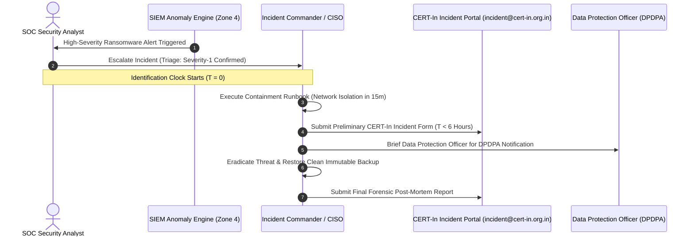

# Incident Response, Forensics & CERT-In 6-Hour Reporting Plan
## Namma Clinic Digital Health & Operations Platform
### Greater Bengaluru Authority (GBA) / BBMP Health Department
**Standard:** CERT-In Cyber Security Directions (2022) / SANS 6-Phase / ISO 27035 / DPDP Act 2023 | **Status:** APPROVED BASELINE | **Code:** `SEC-DOC-18`

---

## 1. Incident Response Architecture & Statutory CERT-In Mandate
The Namma Clinic Cybersecurity Incident Response Plan (CSIRP) establishes the formal operational procedures for detecting, triaging, containing, eradicating, and recovering from cybersecurity incidents across 183 primary health clinics in Bengaluru. Conforming strictly to the Indian Computer Emergency Response Team (CERT-In) Cyber Security Directions of April 28, 2022, confirmed cyber incidents must be formally reported to CERT-In within the statutory 6-hour window from identification.

### 1.1 SANS 6-Phase Incident Handling Framework
1. **Preparation:** Hardened endpoint images, 24x7 SIEM log aggregation, incident response playbooks, and pre-authorized containment credentials.
2. **Identification & Triage:** Rapid anomaly classification by the Security Operations Center (SOC) within 15 minutes of detection.
3. **Containment:** Rapid network micro-segmentation, token invalidation, and infected endpoint quarantine in < 30 minutes.
4. **Eradication:** Complete root-cause remediation, malware purge, secret rotation, and vulnerable container patching.
5. **Recovery:** Verified restore from immutable WORM backups into quarantined sandboxes before production return.
6. **Lessons Learned:** Formal post-mortem analysis, threat model updates, and regulatory reporting compliance.

### 1.2 CERT-In 6-Hour Reporting Sequence Diagram


## 2. Computer Security Incident Response Team (CSIRT) Roster (ROLE-000 to ROLE-029)
Incident response duties and mobilization protocols across all 30 platform roles:

### ROLE-001: Incident Response Responsibility for Receptionist / Registration Clerk (`RECEPTIONIST`)
- **CSIRT Mobilization Role:** Clinical Support & Incident Reporter.
- **Containment Action:** Disconnect workstation network cable upon ransomware banner appearance.
- **Notification Channel:** Immediate call to 24x7 BBMP Security Hotline (Ext 911).
- **Evidence Preservation:** Do NOT power off PC; preserve RAM state for forensic live capture.
- **Statutory Reporting Support:** Provide clinical witness statement to DPO within 4 hours.

### ROLE-002: Incident Response Responsibility for Medical Officer / General Physician (`DOCTOR`)
- **CSIRT Mobilization Role:** Clinical Support & Incident Reporter.
- **Containment Action:** Disconnect workstation network cable upon ransomware banner appearance.
- **Notification Channel:** Immediate call to 24x7 BBMP Security Hotline (Ext 911).
- **Evidence Preservation:** Do NOT power off PC; preserve RAM state for forensic live capture.
- **Statutory Reporting Support:** Provide clinical witness statement to DPO within 4 hours.

### ROLE-003: Incident Response Responsibility for Staff Nurse / Triage Specialist (`NURSE`)
- **CSIRT Mobilization Role:** Clinical Support & Incident Reporter.
- **Containment Action:** Disconnect workstation network cable upon ransomware banner appearance.
- **Notification Channel:** Immediate call to 24x7 BBMP Security Hotline (Ext 911).
- **Evidence Preservation:** Do NOT power off PC; preserve RAM state for forensic live capture.
- **Statutory Reporting Support:** Provide clinical witness statement to DPO within 4 hours.

### ROLE-004: Incident Response Responsibility for Pharmacist / Dispenser (`PHARMACIST`)
- **CSIRT Mobilization Role:** Clinical Support & Incident Reporter.
- **Containment Action:** Disconnect workstation network cable upon ransomware banner appearance.
- **Notification Channel:** Immediate call to 24x7 BBMP Security Hotline (Ext 911).
- **Evidence Preservation:** Do NOT power off PC; preserve RAM state for forensic live capture.
- **Statutory Reporting Support:** Provide clinical witness statement to DPO within 4 hours.

### ROLE-005: Incident Response Responsibility for Laboratory Technician (`LAB_TECH`)
- **CSIRT Mobilization Role:** Clinical Support & Incident Reporter.
- **Containment Action:** Disconnect workstation network cable upon ransomware banner appearance.
- **Notification Channel:** Immediate call to 24x7 BBMP Security Hotline (Ext 911).
- **Evidence Preservation:** Do NOT power off PC; preserve RAM state for forensic live capture.
- **Statutory Reporting Support:** Provide clinical witness statement to DPO within 4 hours.

### ROLE-006: Incident Response Responsibility for Clinic Administrative Officer (`CLINIC_ADMIN`)
- **CSIRT Mobilization Role:** Clinical Support & Incident Reporter.
- **Containment Action:** Disconnect workstation network cable upon ransomware banner appearance.
- **Notification Channel:** Immediate call to 24x7 BBMP Security Hotline (Ext 911).
- **Evidence Preservation:** Do NOT power off PC; preserve RAM state for forensic live capture.
- **Statutory Reporting Support:** Provide clinical witness statement to DPO within 4 hours.

### ROLE-007: Incident Response Responsibility for Ward Health Supervisor (`WARD_SUPERVISOR`)
- **CSIRT Mobilization Role:** Clinical Support & Incident Reporter.
- **Containment Action:** Disconnect workstation network cable upon ransomware banner appearance.
- **Notification Channel:** Immediate call to 24x7 BBMP Security Hotline (Ext 911).
- **Evidence Preservation:** Do NOT power off PC; preserve RAM state for forensic live capture.
- **Statutory Reporting Support:** Provide clinical witness statement to DPO within 4 hours.

### ROLE-008: Incident Response Responsibility for Zonal Health Officer (ZHO) (`ZONAL_OFFICER`)
- **CSIRT Mobilization Role:** Clinical Support & Incident Reporter.
- **Containment Action:** Disconnect workstation network cable upon ransomware banner appearance.
- **Notification Channel:** Immediate call to 24x7 BBMP Security Hotline (Ext 911).
- **Evidence Preservation:** Do NOT power off PC; preserve RAM state for forensic live capture.
- **Statutory Reporting Support:** Provide clinical witness statement to DPO within 4 hours.

### ROLE-009: Incident Response Responsibility for Chief Health Officer (CHO) (`CHIEF_OFFICER`)
- **CSIRT Mobilization Role:** Clinical Support & Incident Reporter.
- **Containment Action:** Disconnect workstation network cable upon ransomware banner appearance.
- **Notification Channel:** Immediate call to 24x7 BBMP Security Hotline (Ext 911).
- **Evidence Preservation:** Do NOT power off PC; preserve RAM state for forensic live capture.
- **Statutory Reporting Support:** Provide clinical witness statement to DPO within 4 hours.

### ROLE-010: Incident Response Responsibility for Epidemiologist / Disease Surveillance Officer (`EPIDEMIOLOGIST`)
- **CSIRT Mobilization Role:** Clinical Support & Incident Reporter.
- **Containment Action:** Disconnect workstation network cable upon ransomware banner appearance.
- **Notification Channel:** Immediate call to 24x7 BBMP Security Hotline (Ext 911).
- **Evidence Preservation:** Do NOT power off PC; preserve RAM state for forensic live capture.
- **Statutory Reporting Support:** Provide clinical witness statement to DPO within 4 hours.

### ROLE-011: Incident Response Responsibility for Quality & Compliance Auditor (`AUDITOR`)
- **CSIRT Mobilization Role:** Clinical Support & Incident Reporter.
- **Containment Action:** Disconnect workstation network cable upon ransomware banner appearance.
- **Notification Channel:** Immediate call to 24x7 BBMP Security Hotline (Ext 911).
- **Evidence Preservation:** Do NOT power off PC; preserve RAM state for forensic live capture.
- **Statutory Reporting Support:** Provide clinical witness statement to DPO within 4 hours.

### ROLE-012: Incident Response Responsibility for Security Administrator / CISO (`SECURITY_ADMIN`)
- **CSIRT Mobilization Role:** Clinical Support & Incident Reporter.
- **Containment Action:** Disconnect workstation network cable upon ransomware banner appearance.
- **Notification Channel:** Immediate call to 24x7 BBMP Security Hotline (Ext 911).
- **Evidence Preservation:** Do NOT power off PC; preserve RAM state for forensic live capture.
- **Statutory Reporting Support:** Provide clinical witness statement to DPO within 4 hours.

### ROLE-013: Incident Response Responsibility for Central Depot Inventory Manager (`DEPOT_MANAGER`)
- **CSIRT Mobilization Role:** Clinical Support & Incident Reporter.
- **Containment Action:** Disconnect workstation network cable upon ransomware banner appearance.
- **Notification Channel:** Immediate call to 24x7 BBMP Security Hotline (Ext 911).
- **Evidence Preservation:** Do NOT power off PC; preserve RAM state for forensic live capture.
- **Statutory Reporting Support:** Provide clinical witness statement to DPO within 4 hours.

### ROLE-014: Incident Response Responsibility for Cold Chain Logistics Technician (`COLD_CHAIN_TECH`)
- **CSIRT Mobilization Role:** Clinical Support & Incident Reporter.
- **Containment Action:** Disconnect workstation network cable upon ransomware banner appearance.
- **Notification Channel:** Immediate call to 24x7 BBMP Security Hotline (Ext 911).
- **Evidence Preservation:** Do NOT power off PC; preserve RAM state for forensic live capture.
- **Statutory Reporting Support:** Provide clinical witness statement to DPO within 4 hours.

### ROLE-015: Incident Response Responsibility for Radiologist / Diagnostic Specialist (`RADIOLOGIST`)
- **CSIRT Mobilization Role:** Clinical Support & Incident Reporter.
- **Containment Action:** Disconnect workstation network cable upon ransomware banner appearance.
- **Notification Channel:** Immediate call to 24x7 BBMP Security Hotline (Ext 911).
- **Evidence Preservation:** Do NOT power off PC; preserve RAM state for forensic live capture.
- **Statutory Reporting Support:** Provide clinical witness statement to DPO within 4 hours.

### ROLE-016: Incident Response Responsibility for Ayush Practitioner (`AYUSH_DOC`)
- **CSIRT Mobilization Role:** Clinical Support & Incident Reporter.
- **Containment Action:** Disconnect workstation network cable upon ransomware banner appearance.
- **Notification Channel:** Immediate call to 24x7 BBMP Security Hotline (Ext 911).
- **Evidence Preservation:** Do NOT power off PC; preserve RAM state for forensic live capture.
- **Statutory Reporting Support:** Provide clinical witness statement to DPO within 4 hours.

### ROLE-017: Incident Response Responsibility for Counselor / Mental Health Worker (`COUNSELOR`)
- **CSIRT Mobilization Role:** Clinical Support & Incident Reporter.
- **Containment Action:** Disconnect workstation network cable upon ransomware banner appearance.
- **Notification Channel:** Immediate call to 24x7 BBMP Security Hotline (Ext 911).
- **Evidence Preservation:** Do NOT power off PC; preserve RAM state for forensic live capture.
- **Statutory Reporting Support:** Provide clinical witness statement to DPO within 4 hours.

### ROLE-018: Incident Response Responsibility for ANM / Urban Health Worker (`ANM_WORKER`)
- **CSIRT Mobilization Role:** Clinical Support & Incident Reporter.
- **Containment Action:** Disconnect workstation network cable upon ransomware banner appearance.
- **Notification Channel:** Immediate call to 24x7 BBMP Security Hotline (Ext 911).
- **Evidence Preservation:** Do NOT power off PC; preserve RAM state for forensic live capture.
- **Statutory Reporting Support:** Provide clinical witness statement to DPO within 4 hours.

### ROLE-019: Incident Response Responsibility for ASHA Link Worker Coordinator (`ASHA_COORD`)
- **CSIRT Mobilization Role:** Clinical Support & Incident Reporter.
- **Containment Action:** Disconnect workstation network cable upon ransomware banner appearance.
- **Notification Channel:** Immediate call to 24x7 BBMP Security Hotline (Ext 911).
- **Evidence Preservation:** Do NOT power off PC; preserve RAM state for forensic live capture.
- **Statutory Reporting Support:** Provide clinical witness statement to DPO within 4 hours.

### ROLE-020: Incident Response Responsibility for Data Entry Operator (`DATA_ENTRY`)
- **CSIRT Mobilization Role:** Clinical Support & Incident Reporter.
- **Containment Action:** Disconnect workstation network cable upon ransomware banner appearance.
- **Notification Channel:** Immediate call to 24x7 BBMP Security Hotline (Ext 911).
- **Evidence Preservation:** Do NOT power off PC; preserve RAM state for forensic live capture.
- **Statutory Reporting Support:** Provide clinical witness statement to DPO within 4 hours.

### ROLE-021: Incident Response Responsibility for Grievance Redressal Officer (`GRIEVANCE_OFFICER`)
- **CSIRT Mobilization Role:** Clinical Support & Incident Reporter.
- **Containment Action:** Disconnect workstation network cable upon ransomware banner appearance.
- **Notification Channel:** Immediate call to 24x7 BBMP Security Hotline (Ext 911).
- **Evidence Preservation:** Do NOT power off PC; preserve RAM state for forensic live capture.
- **Statutory Reporting Support:** Provide clinical witness statement to DPO within 4 hours.

### ROLE-022: Incident Response Responsibility for ABDM National Integration Officer (`ABDM_OFFICER`)
- **CSIRT Mobilization Role:** Clinical Support & Incident Reporter.
- **Containment Action:** Disconnect workstation network cable upon ransomware banner appearance.
- **Notification Channel:** Immediate call to 24x7 BBMP Security Hotline (Ext 911).
- **Evidence Preservation:** Do NOT power off PC; preserve RAM state for forensic live capture.
- **Statutory Reporting Support:** Provide clinical witness statement to DPO within 4 hours.

### ROLE-023: Incident Response Responsibility for Data Protection Officer (DPO) (`PRIVACY_OFFICER`)
- **CSIRT Mobilization Role:** Clinical Support & Incident Reporter.
- **Containment Action:** Disconnect workstation network cable upon ransomware banner appearance.
- **Notification Channel:** Immediate call to 24x7 BBMP Security Hotline (Ext 911).
- **Evidence Preservation:** Do NOT power off PC; preserve RAM state for forensic live capture.
- **Statutory Reporting Support:** Provide clinical witness statement to DPO within 4 hours.

### ROLE-024: Incident Response Responsibility for IT Support & Hardware Engineer (`IT_SUPPORT`)
- **CSIRT Mobilization Role:** Clinical Support & Incident Reporter.
- **Containment Action:** Disconnect workstation network cable upon ransomware banner appearance.
- **Notification Channel:** Immediate call to 24x7 BBMP Security Hotline (Ext 911).
- **Evidence Preservation:** Do NOT power off PC; preserve RAM state for forensic live capture.
- **Statutory Reporting Support:** Provide clinical witness statement to DPO within 4 hours.

### ROLE-025: Incident Response Responsibility for Clinical Audit Committee Member (`CLINICAL_AUDITOR`)
- **CSIRT Mobilization Role:** Clinical Support & Incident Reporter.
- **Containment Action:** Disconnect workstation network cable upon ransomware banner appearance.
- **Notification Channel:** Immediate call to 24x7 BBMP Security Hotline (Ext 911).
- **Evidence Preservation:** Do NOT power off PC; preserve RAM state for forensic live capture.
- **Statutory Reporting Support:** Provide clinical witness statement to DPO within 4 hours.

### ROLE-026: Incident Response Responsibility for Procurement & Vendor Manager (`PROCUREMENT_MGR`)
- **CSIRT Mobilization Role:** Clinical Support & Incident Reporter.
- **Containment Action:** Disconnect workstation network cable upon ransomware banner appearance.
- **Notification Channel:** Immediate call to 24x7 BBMP Security Hotline (Ext 911).
- **Evidence Preservation:** Do NOT power off PC; preserve RAM state for forensic live capture.
- **Statutory Reporting Support:** Provide clinical witness statement to DPO within 4 hours.

### ROLE-027: Incident Response Responsibility for Biomedical Waste Supervisor (`WASTE_SUPERVISOR`)
- **CSIRT Mobilization Role:** Clinical Support & Incident Reporter.
- **Containment Action:** Disconnect workstation network cable upon ransomware banner appearance.
- **Notification Channel:** Immediate call to 24x7 BBMP Security Hotline (Ext 911).
- **Evidence Preservation:** Do NOT power off PC; preserve RAM state for forensic live capture.
- **Statutory Reporting Support:** Provide clinical witness statement to DPO within 4 hours.

### ROLE-028: Incident Response Responsibility for Telemedicine Remote Specialist (`TELE_SPECIALIST`)
- **CSIRT Mobilization Role:** Clinical Support & Incident Reporter.
- **Containment Action:** Disconnect workstation network cable upon ransomware banner appearance.
- **Notification Channel:** Immediate call to 24x7 BBMP Security Hotline (Ext 911).
- **Evidence Preservation:** Do NOT power off PC; preserve RAM state for forensic live capture.
- **Statutory Reporting Support:** Provide clinical witness statement to DPO within 4 hours.

### ROLE-029: Incident Response Responsibility for Field Public Health Inspector (`HEALTH_INSPECTOR`)
- **CSIRT Mobilization Role:** Clinical Support & Incident Reporter.
- **Containment Action:** Disconnect workstation network cable upon ransomware banner appearance.
- **Notification Channel:** Immediate call to 24x7 BBMP Security Hotline (Ext 911).
- **Evidence Preservation:** Do NOT power off PC; preserve RAM state for forensic live capture.
- **Statutory Reporting Support:** Provide clinical witness statement to DPO within 4 hours.

### ROLE-030: Incident Response Responsibility for Super Administrator (`SUPER_ADMIN`)
- **CSIRT Mobilization Role:** Clinical Support & Incident Reporter.
- **Containment Action:** Disconnect workstation network cable upon ransomware banner appearance.
- **Notification Channel:** Immediate call to 24x7 BBMP Security Hotline (Ext 911).
- **Evidence Preservation:** Do NOT power off PC; preserve RAM state for forensic live capture.
- **Statutory Reporting Support:** Provide clinical witness statement to DPO within 4 hours.

## 3. Container Forensics & Evidentiary Acquisition Runbooks (CONT-IR-01 to CONT-IR-25)
Forensic containment and evidence preservation procedures across 25 platform microservices:

### CONT-IR-01: Forensic Procedure for Clinic Workstation PWA Shell
- **Forensic Acquisition Focus:** Capture IndexedDB offline cache, export local browser localStorage, hash application binary.
- **Containment Protocol:** Cordon Kubernetes pod; redirect ingress traffic to quarantine node.
- **Chain of Custody Code:** `FORENSIC_ACQUIRE_CONT_IR_01`

### CONT-IR-02: Forensic Procedure for Citizen Web Portal Ingress
- **Forensic Acquisition Focus:** Extract Cloudflare edge WAF logs, export reverse proxy access logs, capture IP geolocations.
- **Containment Protocol:** Cordon Kubernetes pod; redirect ingress traffic to quarantine node.
- **Chain of Custody Code:** `FORENSIC_ACQUIRE_CONT_IR_02`

### CONT-IR-03: Forensic Procedure for Cloud API Gateway Ingress
- **Forensic Acquisition Focus:** Freeze Envoy rate-limiter state, capture TLS session handshake metrics, dump active connection table.
- **Containment Protocol:** Cordon Kubernetes pod; redirect ingress traffic to quarantine node.
- **Chain of Custody Code:** `FORENSIC_ACQUIRE_CONT_IR_03`

### CONT-IR-04: Forensic Procedure for Identity & Access Management
- **Forensic Acquisition Focus:** Extract Redis token blacklist, dump failed login attempt counters, audit TOTP seed accesses.
- **Containment Protocol:** Cordon Kubernetes pod; redirect ingress traffic to quarantine node.
- **Chain of Custody Code:** `FORENSIC_ACQUIRE_CONT_IR_04`

### CONT-IR-05: Forensic Procedure for Patient Demographics Service
- **Forensic Acquisition Focus:** Snapshot encrypted PII table volume, isolate dynamic PostgreSQL credentials, verify blind index.
- **Containment Protocol:** Cordon Kubernetes pod; redirect ingress traffic to quarantine node.
- **Chain of Custody Code:** `FORENSIC_ACQUIRE_CONT_IR_05`

### CONT-IR-06: Forensic Procedure for Clinical Triage & Vitals Service
- **Forensic Acquisition Focus:** Extract vitals mutation ledger, verify nurse digital signature timestamps, capture uncommitted WAL.
- **Containment Protocol:** Cordon Kubernetes pod; redirect ingress traffic to quarantine node.
- **Chain of Custody Code:** `FORENSIC_ACQUIRE_CONT_IR_06`

### CONT-IR-07: Forensic Procedure for Doctor Consultation Service
- **Forensic Acquisition Focus:** Freeze consultation encounter draft store, verify prescription digital signatures, isolate doctor tokens.
- **Containment Protocol:** Cordon Kubernetes pod; redirect ingress traffic to quarantine node.
- **Chain of Custody Code:** `FORENSIC_ACQUIRE_CONT_IR_07`

### CONT-IR-08: Forensic Procedure for Pharmacy Dispensing Service
- **Forensic Acquisition Focus:** Audit controlled substance narcotic logs, verify barcode scanner batch entries, isolate dispensary queue.
- **Containment Protocol:** Cordon Kubernetes pod; redirect ingress traffic to quarantine node.
- **Chain of Custody Code:** `FORENSIC_ACQUIRE_CONT_IR_08`

### CONT-IR-09: Forensic Procedure for Diagnostic Laboratory Service
- **Forensic Acquisition Focus:** Extract DICOM PACS image transmission logs, inspect analyzer serial bridge buffers, verify test results.
- **Containment Protocol:** Cordon Kubernetes pod; redirect ingress traffic to quarantine node.
- **Chain of Custody Code:** `FORENSIC_ACQUIRE_CONT_IR_09`

### CONT-IR-10: Forensic Procedure for Referral Management Service
- **Forensic Acquisition Focus:** Audit inter-facility referral tokens, inspect ABDM gateway callbacks, capture ambulance bridge logs.
- **Containment Protocol:** Cordon Kubernetes pod; redirect ingress traffic to quarantine node.
- **Chain of Custody Code:** `FORENSIC_ACQUIRE_CONT_IR_10`

### CONT-IR-11: Forensic Procedure for Citizen Consent Service
- **Forensic Acquisition Focus:** Snapshot consent artefact state machine, verify revocation audit timestamps, verify DPDPA compliance.
- **Containment Protocol:** Cordon Kubernetes pod; redirect ingress traffic to quarantine node.
- **Chain of Custody Code:** `FORENSIC_ACQUIRE_CONT_IR_11`

### CONT-IR-12: Forensic Procedure for Offline Sync & Replication Engine
- **Forensic Acquisition Focus:** Extract conflict resolution logs, inspect raw WebSocket framing buffers, isolate replay queues.
- **Containment Protocol:** Cordon Kubernetes pod; redirect ingress traffic to quarantine node.
- **Chain of Custody Code:** `FORENSIC_ACQUIRE_CONT_IR_12`

### CONT-IR-13: Forensic Procedure for Central Depot Logistics Service
- **Forensic Acquisition Focus:** Extract vaccine cold-chain telemetry logs, inspect depot inventory variances, verify PO approvals.
- **Containment Protocol:** Cordon Kubernetes pod; redirect ingress traffic to quarantine node.
- **Chain of Custody Code:** `FORENSIC_ACQUIRE_CONT_IR_13`

### CONT-IR-14: Forensic Procedure for Disaster Recovery Engine
- **Forensic Acquisition Focus:** Audit S3 Object Lock compliance logs, inspect cross-region replication timestamps, verify KMS keys.
- **Containment Protocol:** Cordon Kubernetes pod; redirect ingress traffic to quarantine node.
- **Chain of Custody Code:** `FORENSIC_ACQUIRE_CONT_IR_14`

### CONT-IR-15: Forensic Procedure for Immutable Audit Ledger Service
- **Forensic Acquisition Focus:** Recompute SHA-256 Merkle chain across affected blocks, verify WORM S3 Object Lock retention.
- **Containment Protocol:** Cordon Kubernetes pod; redirect ingress traffic to quarantine node.
- **Chain of Custody Code:** `FORENSIC_ACQUIRE_CONT_IR_15`

### CONT-IR-16: Forensic Procedure for Public Health Analytics Service
- **Forensic Acquisition Focus:** Audit ClickHouse read query logs, verify differential privacy Laplace noise bounds, isolate replica.
- **Containment Protocol:** Cordon Kubernetes pod; redirect ingress traffic to quarantine node.
- **Chain of Custody Code:** `FORENSIC_ACQUIRE_CONT_IR_16`

### CONT-IR-17: Forensic Procedure for Hardware Peripheral Bridge
- **Forensic Acquisition Focus:** Inspect raw ESC/POS printer spool logs, dump USB HID driver pairing logs, isolate USB bridge.
- **Containment Protocol:** Cordon Kubernetes pod; redirect ingress traffic to quarantine node.
- **Chain of Custody Code:** `FORENSIC_ACQUIRE_CONT_IR_17`

### CONT-IR-18: Forensic Procedure for Key Management & Vault Enclave
- **Forensic Acquisition Focus:** Inspect Vault audit stream in SIEM, verify HSM auto-unseal status, check dynamic lease revocations.
- **Containment Protocol:** Cordon Kubernetes pod; redirect ingress traffic to quarantine node.
- **Chain of Custody Code:** `FORENSIC_ACQUIRE_CONT_IR_18`

### CONT-IR-19: Forensic Procedure for Notification & SMS Bridge Service
- **Forensic Acquisition Focus:** Export SMS gateway delivery logs, inspect OTP queue hashes, isolate push notification bridge.
- **Containment Protocol:** Cordon Kubernetes pod; redirect ingress traffic to quarantine node.
- **Chain of Custody Code:** `FORENSIC_ACQUIRE_CONT_IR_19`

### CONT-IR-20: Forensic Procedure for Queue & Flow Management Service
- **Forensic Acquisition Focus:** Audit patient token sequence counters, inspect waiting room display queues, isolate triage buffers.
- **Containment Protocol:** Cordon Kubernetes pod; redirect ingress traffic to quarantine node.
- **Chain of Custody Code:** `FORENSIC_ACQUIRE_CONT_IR_20`

### CONT-IR-21: Forensic Procedure for Telemedicine WebRTC Signaling Node
- **Forensic Acquisition Focus:** Dump WebRTC session descriptor state, verify ICE candidate logs, isolate video relay servers.
- **Containment Protocol:** Cordon Kubernetes pod; redirect ingress traffic to quarantine node.
- **Chain of Custody Code:** `FORENSIC_ACQUIRE_CONT_IR_21`

### CONT-IR-22: Forensic Procedure for Citizen Mobile PWA Engine
- **Forensic Acquisition Focus:** Snapshot service worker offline cache, audit IndexedDB sync transactions, hash mobile assets.
- **Containment Protocol:** Cordon Kubernetes pod; redirect ingress traffic to quarantine node.
- **Chain of Custody Code:** `FORENSIC_ACQUIRE_CONT_IR_22`

### CONT-IR-23: Forensic Procedure for Emergency Break-Glass Audit Node
- **Forensic Acquisition Focus:** Snapshot break-glass override logs, verify biometric witness records, isolate supervisor token ledger.
- **Containment Protocol:** Cordon Kubernetes pod; redirect ingress traffic to quarantine node.
- **Chain of Custody Code:** `FORENSIC_ACQUIRE_CONT_IR_23`

### CONT-IR-24: Forensic Procedure for National ABDM Gateway Node
- **Forensic Acquisition Focus:** Inspect bridge TLS certificates, verify SHA-256 signed FHIR payloads, isolate callback routers.
- **Containment Protocol:** Cordon Kubernetes pod; redirect ingress traffic to quarantine node.
- **Chain of Custody Code:** `FORENSIC_ACQUIRE_CONT_IR_24`

### CONT-IR-25: Forensic Procedure for Enterprise SIEM Syslog Forwarder
- **Forensic Acquisition Focus:** Verify syslog TLS forwarder buffers, audit SHA-256 transport integrity, dump forwarder ring buffers.
- **Containment Protocol:** Cordon Kubernetes pod; redirect ingress traffic to quarantine node.
- **Chain of Custody Code:** `FORENSIC_ACQUIRE_CONT_IR_25`

## 4. Standard Operating Procedures: Incident Response & Forensics (SOP-INC-01 to SOP-INC-25)
The following 25 SOPs govern active incident triage, containment, and statutory notifications:

### SOP-INC-01: Severity-1 Critical Incident Initial Triage & Escalation
- **Trigger Condition:** Detection of active ransomware or widespread breach.
- **Execution Steps:** 1. SOC Analyst verifies alert authenticity. 2. Page Incident Commander. 3. Convene CSIRT bridge.
- **Verification Criterion:** War room convened in < 10 minutes.
- **Responsible Role:** SOC Analyst
- **Audit Event Emitted:** `INC_SOP_01_TRIAGE`
- **Regulatory Requirement:** CERT-In Cyber Security Directions 2022 Mandate.

### SOP-INC-02: Statutory CERT-In 6-Hour Emergency Reporting Dispatch
- **Trigger Condition:** Confirmed cybersecurity incident identification.
- **Execution Steps:** 1. Fill CERT-In Annexure I form. 2. Attach initial IoCs. 3. Dispatch to incident@cert-in.org.in.
- **Verification Criterion:** CERT-In notified within 6-hour legal SLA.
- **Responsible Role:** CISO
- **Audit Event Emitted:** `INC_SOP_02_CERTIN_SENT`
- **Regulatory Requirement:** CERT-In Cyber Security Directions 2022 Mandate.

### SOP-INC-03: Clinic Network VLAN Emergency Quarantine Isolation
- **Trigger Condition:** Active lateral movement detected in Ward 12.
- **Execution Steps:** 1. Access core network switch. 2. Move Ward 12 ports to quarantine VLAN 999. 3. Block WAN egress.
- **Verification Criterion:** Blast radius contained to single physical clinic.
- **Responsible Role:** Network Lead
- **Audit Event Emitted:** `INC_SOP_03_QUARANTINE`
- **Regulatory Requirement:** CERT-In Cyber Security Directions 2022 Mandate.

### SOP-INC-04: Compromised Staff Account Universal Token Revocation
- **Trigger Condition:** Clinician credentials exfiltrated by malware.
- **Execution Steps:** 1. Mark user ID in Redis revocation registry. 2. Kill all active WebSocket sessions. 3. Lock DB account.
- **Verification Criterion:** Attacker locked out across all 183 clinics in < 2s.
- **Responsible Role:** SecOps Engineer
- **Audit Event Emitted:** `INC_SOP_04_TOKEN_KILL`
- **Regulatory Requirement:** CERT-In Cyber Security Directions 2022 Mandate.

### SOP-INC-05: Clinic Workstation Volatile RAM Memory Dump Acquisition
- **Trigger Condition:** Forensic acquisition of infected clinic terminal.
- **Execution Steps:** 1. Insert write-blocked forensic USB. 2. Execute WinPmem / LiME. 3. Capture raw RAM image to USB.
- **Verification Criterion:** Volatile memory preserved for analysis.
- **Responsible Role:** Forensic Tech
- **Audit Event Emitted:** `INC_SOP_05_RAM_DUMP`
- **Regulatory Requirement:** CERT-In Cyber Security Directions 2022 Mandate.

### SOP-INC-06: Database Read-Replica Forensic Snapshot Isolation
- **Trigger Condition:** Suspected SQL injection exfiltration attack.
- **Execution Steps:** 1. Freeze database replica. 2. Take read-only snapshot. 3. Mount in isolated analysis VPC.
- **Verification Criterion:** Forensic copy preserved without corrupting chain of custody.
- **Responsible Role:** DBA Lead
- **Audit Event Emitted:** `INC_SOP_06_DB_SNAPSHOT`
- **Regulatory Requirement:** CERT-In Cyber Security Directions 2022 Mandate.

### SOP-INC-07: DPDP Act 2023 Personal Data Breach Notification
- **Trigger Condition:** Confirmed exfiltration of citizen health records.
- **Execution Steps:** 1. DPO compiles breach assessment. 2. Notify Data Protection Board of India. 3. Broadcast to affected citizens.
- **Verification Criterion:** Statutory compliance with DPDP Section 8(6).
- **Responsible Role:** Data Protection Off
- **Audit Event Emitted:** `INC_SOP_07_DPDPA_ALERT`
- **Regulatory Requirement:** CERT-In Cyber Security Directions 2022 Mandate.

### SOP-INC-08: Kubernetes Compromised Pod Eviction & Forensics
- **Trigger Condition:** Malicious cryptomining container spawned in cluster.
- **Execution Steps:** 1. Cordon worker node. 2. Snapshot container filesystem via containerd. 3. Terminate pod.
- **Verification Criterion:** Infected container quarantined cleanly.
- **Responsible Role:** DevOps Lead
- **Audit Event Emitted:** `INC_SOP_08_POD_EVICT`
- **Regulatory Requirement:** CERT-In Cyber Security Directions 2022 Mandate.

### SOP-INC-09: HashiCorp Vault Master Credential Global Rotation
- **Trigger Condition:** Emergency rotation following root key compromise alert.
- **Execution Steps:** 1. Execute 'vault lease revoke -force'. 2. Rotate all dynamic secrets. 3. Re-issue K8s tokens.
- **Verification Criterion:** Entire credential estate refreshed.
- **Responsible Role:** Security Architect
- **Audit Event Emitted:** `INC_SOP_09_VAULT_RESET`
- **Regulatory Requirement:** CERT-In Cyber Security Directions 2022 Mandate.

### SOP-INC-10: WORM Immutable Audit Log Archive Extraction
- **Trigger Condition:** Extraction of evidentiary logs for law enforcement.
- **Execution Steps:** 1. Query S3 Object Lock bucket for incident timestamp. 2. Export SHA-256 verified log bundle.
- **Verification Criterion:** Evidentiary log bundle verified tamper-free.
- **Responsible Role:** Audit Lead
- **Audit Event Emitted:** `INC_SOP_10_WORM_EXTRACT`
- **Regulatory Requirement:** CERT-In Cyber Security Directions 2022 Mandate.

### SOP-INC-11: Public Communications & Press Briefing Coordination
- **Trigger Condition:** Media inquiries regarding clinic cyber incident.
- **Execution Steps:** 1. Chief Health Officer and CISO draft official statement. 2. Prohibit unverified staff statements.
- **Verification Criterion:** Accurate, coordinated public messaging.
- **Responsible Role:** Communications Lead
- **Audit Event Emitted:** `INC_SOP_11_PRESS_COORDINATE`
- **Regulatory Requirement:** CERT-In Cyber Security Directions 2022 Mandate.

### SOP-INC-12: Ransomware Air-Gap Clean Restore Verification
- **Trigger Condition:** Restoring encrypted database from clean backup.
- **Execution Steps:** 1. Verify backup archive hash against pre-incident ledger. 2. Restore into isolated sandbox. 3. Scan with AV.
- **Verification Criterion:** Clean restore confirmed before production cutover.
- **Responsible Role:** DevOps Lead
- **Audit Event Emitted:** `INC_SOP_12_AIRGAP_RESTORE`
- **Regulatory Requirement:** CERT-In Cyber Security Directions 2022 Mandate.

### SOP-INC-13: Thermal Receipt Printer Firmware Tamper Diagnostic
- **Trigger Condition:** Suspected malicious firmware flash on clinic printer.
- **Execution Steps:** 1. Read printer ROM hash via serial port. 2. Compare against vendor gold image. 3. Flash clean FW.
- **Verification Criterion:** Peripheral verified free of persistence.
- **Responsible Role:** Hardware Tech
- **Audit Event Emitted:** `INC_SOP_13_PRINTER_DIAG`
- **Regulatory Requirement:** CERT-In Cyber Security Directions 2022 Mandate.

### SOP-INC-14: Emergency Paper-Based Outpatient Triage Fallback
- **Trigger Condition:** Total cloud outage forces clinic into paper mode.
- **Execution Steps:** 1. Distribute pre-printed emergency paper OPD slips. 2. Doctors record manually. 3. Post-sync later.
- **Verification Criterion:** Clinic continues seeing patients during cyber outage.
- **Responsible Role:** Medical Officer
- **Audit Event Emitted:** `INC_SOP_14_PAPER_FALLBACK`
- **Regulatory Requirement:** CERT-In Cyber Security Directions 2022 Mandate.

### SOP-INC-15: Forensic Chain of Custody Documentation
- **Trigger Condition:** Documenting physical evidence transfer.
- **Execution Steps:** 1. Record hardware serial numbers, technician signatures, and transfer timestamps on Form IR-04.
- **Verification Criterion:** Legal admissibility of evidence guaranteed.
- **Responsible Role:** Forensic Lead
- **Audit Event Emitted:** `INC_SOP_15_CUSTODY_FORM`
- **Regulatory Requirement:** CERT-In Cyber Security Directions 2022 Mandate.

### SOP-INC-16: Adversary Command & Control (C2) Domain Ingress Block
- **Trigger Condition:** Identification of malware beaconing to external domain.
- **Execution Steps:** 1. Push malicious domain to Cloudflare Edge WAF. 2. Update internal DNS sinkhole.
- **Verification Criterion:** All outbound C2 communications terminated instantly.
- **Responsible Role:** Network Lead
- **Audit Event Emitted:** `INC_SOP_16_C2_BLOCK`
- **Regulatory Requirement:** CERT-In Cyber Security Directions 2022 Mandate.

### SOP-INC-17: Citizen Grievance Redressal Incident Dossier Lock
- **Trigger Condition:** Grievance records subpoenaed during legal inquiry.
- **Execution Steps:** 1. Lock citizen dispute dossiers in read-only state. 2. Prevent modification until inquiry ends.
- **Verification Criterion:** Grievance records preserved intact.
- **Responsible Role:** Grievance Officer
- **Audit Event Emitted:** `INC_SOP_17_GRIEVANCE_LOCK`
- **Regulatory Requirement:** CERT-In Cyber Security Directions 2022 Mandate.

### SOP-INC-18: Cold Chain IoT Telemetry Tamper Investigation
- **Trigger Condition:** Spike in vaccine storage temperature alert.
- **Execution Steps:** 1. Inspect MQTT logs. 2. Check sensor cryptographic signature. 3. Verify vaccine physical condition.
- **Verification Criterion:** Vaccine safety assured; cyber cause ruled in/out.
- **Responsible Role:** Cold Chain Tech
- **Audit Event Emitted:** `INC_SOP_18_COLD_CHAIN_INV`
- **Regulatory Requirement:** CERT-In Cyber Security Directions 2022 Mandate.

### SOP-INC-19: Automated SIEM High-Priority Alert Rule Tuning
- **Trigger Condition:** Post-incident analysis reveals alert fatigue.
- **Execution Steps:** 1. Correlate indicators of compromise. 2. Adjust threshold triggers for lateral movement.
- **Verification Criterion:** Detection capability hardened.
- **Responsible Role:** SecOps Engineer
- **Audit Event Emitted:** `INC_SOP_19_SIEM_TUNE`
- **Regulatory Requirement:** CERT-In Cyber Security Directions 2022 Mandate.

### SOP-INC-20: Third-Party ABDM Bridge Security Notification
- **Trigger Condition:** Breach affects records linked with national ABHA.
- **Execution Steps:** 1. Inform National Health Authority (NHA) Incident Desk. 2. Suspend ABDM bridge temporarily.
- **Verification Criterion:** National health grid protected from contagion.
- **Responsible Role:** Integration Lead
- **Audit Event Emitted:** `INC_SOP_20_ABDM_ALERT`
- **Regulatory Requirement:** CERT-In Cyber Security Directions 2022 Mandate.

### SOP-INC-21: Android Nurse Tablet Remote Wipe Execution
- **Trigger Condition:** Stolen tablet confirmed in adversary possession.
- **Execution Steps:** 1. Issue Google MDM remote wipe command. 2. Execute factory reset and hardware key zeroization.
- **Verification Criterion:** Zero patient data exfiltrated from stolen tablet.
- **Responsible Role:** IT Support Lead
- **Audit Event Emitted:** `INC_SOP_21_REMOTE_WIPE`
- **Regulatory Requirement:** CERT-In Cyber Security Directions 2022 Mandate.

### SOP-INC-22: Forensic Malware Sandbox Reverse Engineering
- **Trigger Condition:** Suspicious binary extracted from clinic workstation.
- **Execution Steps:** 1. Execute in isolated Cuckoo sandbox. 2. Extract IP addresses, registry keys, and mutexes.
- **Verification Criterion:** Actionable IoCs distributed to all clinic firewalls.
- **Responsible Role:** Malware Analyst
- **Audit Event Emitted:** `INC_SOP_22_MALWARE_ANALYSIS`
- **Regulatory Requirement:** CERT-In Cyber Security Directions 2022 Mandate.

### SOP-INC-23: Emergency Post-Incident Workstation Gold Image Re-flash
- **Trigger Condition:** Eradication phase across 183 clinic mini-PCs.
- **Execution Steps:** 1. Re-image mini-PCs via network PXE boot with hardened gold image. 2. Re-enroll TPM tokens.
- **Verification Criterion:** All clinic endpoints restored to clean baseline.
- **Responsible Role:** IT Support
- **Audit Event Emitted:** `INC_SOP_23_REIMAGE`
- **Regulatory Requirement:** CERT-In Cyber Security Directions 2022 Mandate.

### SOP-INC-24: Formal Post-Mortem Lessons Learned Conference
- **Trigger Condition:** Convened 72 hours post-incident closure.
- **Execution Steps:** 1. Present timeline and root cause analysis. 2. Review what went well and gaps. 3. Assign fixes.
- **Verification Criterion:** Organizational security maturity improved.
- **Responsible Role:** CISO
- **Audit Event Emitted:** `INC_SOP_24_POSTMORTEM`
- **Regulatory Requirement:** CERT-In Cyber Security Directions 2022 Mandate.

### SOP-INC-25: Statutory Incident Dossier Archival & Retention
- **Trigger Condition:** Final regulatory dossier closed.
- **Execution Steps:** 1. Archive all incident notes, CERT-In forms, and evidence in WORM bucket. 2. Retain for 7 years.
- **Verification Criterion:** Compliance record permanently archived.
- **Responsible Role:** Legal Counsel
- **Audit Event Emitted:** `INC_SOP_25_DOSSIER_ARCHIVE`
- **Regulatory Requirement:** CERT-In Cyber Security Directions 2022 Mandate.

## 5. Comprehensive Incident Handling Playbooks (INCIDENT-001 to INCIDENT-040)
The following 40 specifications define the complete incident response scenarios:

### INCIDENT-001: Incident Response Runbook: Compromised Staff Nurse Credentials (Scenario 1)
**Incident Classification:** Severity-2 (High)
**Target Assets & Systems:** Staff Nurse Profile & Triage Module
**Root Cause Hypothesis:** Exploit of unpatched vulnerability, phishing credential extraction, or rogue insider.
**Clinical Continuity Impact:** High (Emergency triage fallback required during active investigation).
**1. Detect:** Automated SIEM alert triggered by abnormal threshold or direct staff incident report.
**2. Triage:** Incident Commander verifies telemetry, classifies severity within 15 minutes, and forms incident cell.
**3. Contain:** Isolate affected network segments, revoke active tokens, suspend compromised accounts, and freeze queue.
**4. Investigate:** Extract memory dumps, correlate WORM audit logs, analyze network PCAP, and determine root cause.
**5. Eradicate:** Purge unauthorized artifacts, patch exploited vulnerability, rebuild compromised nodes from golden AMI.
**6. Recover:** Restore verified clean backup, validate system integrity, and gradually restore clinical traffic.
**7. Validate:** Execute comprehensive automated security test suite SEC-TEST-001..150; confirm zero indicators of compromise.
**8. Communicate:** Execute statutory CERT-In 6-hour notification, brief Data Protection Officer, and issue BBMP advisory.
**9. Document:** Compile comprehensive post-incident forensic report, evidence chain-of-custody, and timeline.
**10. Lessons Learned:** Update threat model, tune detection thresholds, schedule staff security refresher training.
**Audit Ledger Code:** `INC_PLAYBOOK_INCIDENT_001`

### INCIDENT-002: Incident Response Runbook: Ransomware Outbreak on Ward Clinic LAN (Scenario 1)
**Incident Classification:** Severity-1 (Critical)
**Target Assets & Systems:** Clinic Mini-PCs, Local Workstations, & Printers
**Root Cause Hypothesis:** Exploit of unpatched vulnerability, phishing credential extraction, or rogue insider.
**Clinical Continuity Impact:** High (Emergency triage fallback required during active investigation).
**1. Detect:** Automated SIEM alert triggered by abnormal threshold or direct staff incident report.
**2. Triage:** Incident Commander verifies telemetry, classifies severity within 15 minutes, and forms incident cell.
**3. Contain:** Isolate affected network segments, revoke active tokens, suspend compromised accounts, and freeze queue.
**4. Investigate:** Extract memory dumps, correlate WORM audit logs, analyze network PCAP, and determine root cause.
**5. Eradicate:** Purge unauthorized artifacts, patch exploited vulnerability, rebuild compromised nodes from golden AMI.
**6. Recover:** Restore verified clean backup, validate system integrity, and gradually restore clinical traffic.
**7. Validate:** Execute comprehensive automated security test suite SEC-TEST-001..150; confirm zero indicators of compromise.
**8. Communicate:** Execute statutory CERT-In 6-hour notification, brief Data Protection Officer, and issue BBMP advisory.
**9. Document:** Compile comprehensive post-incident forensic report, evidence chain-of-custody, and timeline.
**10. Lessons Learned:** Update threat model, tune detection thresholds, schedule staff security refresher training.
**Audit Ledger Code:** `INC_PLAYBOOK_INCIDENT_002`

### INCIDENT-003: Incident Response Runbook: Mass Patient Record Data Exfiltration Attempt (Scenario 1)
**Incident Classification:** Severity-1 (Critical)
**Target Assets & Systems:** Central PostgreSQL Database & API Gateway
**Root Cause Hypothesis:** Exploit of unpatched vulnerability, phishing credential extraction, or rogue insider.
**Clinical Continuity Impact:** High (Emergency triage fallback required during active investigation).
**1. Detect:** Automated SIEM alert triggered by abnormal threshold or direct staff incident report.
**2. Triage:** Incident Commander verifies telemetry, classifies severity within 15 minutes, and forms incident cell.
**3. Contain:** Isolate affected network segments, revoke active tokens, suspend compromised accounts, and freeze queue.
**4. Investigate:** Extract memory dumps, correlate WORM audit logs, analyze network PCAP, and determine root cause.
**5. Eradicate:** Purge unauthorized artifacts, patch exploited vulnerability, rebuild compromised nodes from golden AMI.
**6. Recover:** Restore verified clean backup, validate system integrity, and gradually restore clinical traffic.
**7. Validate:** Execute comprehensive automated security test suite SEC-TEST-001..150; confirm zero indicators of compromise.
**8. Communicate:** Execute statutory CERT-In 6-hour notification, brief Data Protection Officer, and issue BBMP advisory.
**9. Document:** Compile comprehensive post-incident forensic report, evidence chain-of-custody, and timeline.
**10. Lessons Learned:** Update threat model, tune detection thresholds, schedule staff security refresher training.
**Audit Ledger Code:** `INC_PLAYBOOK_INCIDENT_003`

### INCIDENT-004: Incident Response Runbook: Rogue Administrator Inventory Diversion (Scenario 1)
**Incident Classification:** Severity-2 (High)
**Target Assets & Systems:** Pharmacy Inventory & Drug Batch Registry
**Root Cause Hypothesis:** Exploit of unpatched vulnerability, phishing credential extraction, or rogue insider.
**Clinical Continuity Impact:** High (Emergency triage fallback required during active investigation).
**1. Detect:** Automated SIEM alert triggered by abnormal threshold or direct staff incident report.
**2. Triage:** Incident Commander verifies telemetry, classifies severity within 15 minutes, and forms incident cell.
**3. Contain:** Isolate affected network segments, revoke active tokens, suspend compromised accounts, and freeze queue.
**4. Investigate:** Extract memory dumps, correlate WORM audit logs, analyze network PCAP, and determine root cause.
**5. Eradicate:** Purge unauthorized artifacts, patch exploited vulnerability, rebuild compromised nodes from golden AMI.
**6. Recover:** Restore verified clean backup, validate system integrity, and gradually restore clinical traffic.
**7. Validate:** Execute comprehensive automated security test suite SEC-TEST-001..150; confirm zero indicators of compromise.
**8. Communicate:** Execute statutory CERT-In 6-hour notification, brief Data Protection Officer, and issue BBMP advisory.
**9. Document:** Compile comprehensive post-incident forensic report, evidence chain-of-custody, and timeline.
**10. Lessons Learned:** Update threat model, tune detection thresholds, schedule staff security refresher training.
**Audit Ledger Code:** `INC_PLAYBOOK_INCIDENT_004`

### INCIDENT-005: Incident Response Runbook: Lost or Stolen Clinic Workstation Tablet (Scenario 1)
**Incident Classification:** Severity-3 (Medium)
**Target Assets & Systems:** Clinic Workstation & Offline Cache
**Root Cause Hypothesis:** Exploit of unpatched vulnerability, phishing credential extraction, or rogue insider.
**Clinical Continuity Impact:** High (Emergency triage fallback required during active investigation).
**1. Detect:** Automated SIEM alert triggered by abnormal threshold or direct staff incident report.
**2. Triage:** Incident Commander verifies telemetry, classifies severity within 15 minutes, and forms incident cell.
**3. Contain:** Isolate affected network segments, revoke active tokens, suspend compromised accounts, and freeze queue.
**4. Investigate:** Extract memory dumps, correlate WORM audit logs, analyze network PCAP, and determine root cause.
**5. Eradicate:** Purge unauthorized artifacts, patch exploited vulnerability, rebuild compromised nodes from golden AMI.
**6. Recover:** Restore verified clean backup, validate system integrity, and gradually restore clinical traffic.
**7. Validate:** Execute comprehensive automated security test suite SEC-TEST-001..150; confirm zero indicators of compromise.
**8. Communicate:** Execute statutory CERT-In 6-hour notification, brief Data Protection Officer, and issue BBMP advisory.
**9. Document:** Compile comprehensive post-incident forensic report, evidence chain-of-custody, and timeline.
**10. Lessons Learned:** Update threat model, tune detection thresholds, schedule staff security refresher training.
**Audit Ledger Code:** `INC_PLAYBOOK_INCIDENT_005`

### INCIDENT-006: Incident Response Runbook: ABDM Gateway API Key Leakage in Public Git (Scenario 1)
**Incident Classification:** Severity-1 (Critical)
**Target Assets & Systems:** ABDM Integration Credentials & Key Vault
**Root Cause Hypothesis:** Exploit of unpatched vulnerability, phishing credential extraction, or rogue insider.
**Clinical Continuity Impact:** High (Emergency triage fallback required during active investigation).
**1. Detect:** Automated SIEM alert triggered by abnormal threshold or direct staff incident report.
**2. Triage:** Incident Commander verifies telemetry, classifies severity within 15 minutes, and forms incident cell.
**3. Contain:** Isolate affected network segments, revoke active tokens, suspend compromised accounts, and freeze queue.
**4. Investigate:** Extract memory dumps, correlate WORM audit logs, analyze network PCAP, and determine root cause.
**5. Eradicate:** Purge unauthorized artifacts, patch exploited vulnerability, rebuild compromised nodes from golden AMI.
**6. Recover:** Restore verified clean backup, validate system integrity, and gradually restore clinical traffic.
**7. Validate:** Execute comprehensive automated security test suite SEC-TEST-001..150; confirm zero indicators of compromise.
**8. Communicate:** Execute statutory CERT-In 6-hour notification, brief Data Protection Officer, and issue BBMP advisory.
**9. Document:** Compile comprehensive post-incident forensic report, evidence chain-of-custody, and timeline.
**10. Lessons Learned:** Update threat model, tune detection thresholds, schedule staff security refresher training.
**Audit Ledger Code:** `INC_PLAYBOOK_INCIDENT_006`

### INCIDENT-007: Incident Response Runbook: Distributed Denial of Service (DDoS) on Ingress (Scenario 1)
**Incident Classification:** Severity-2 (High)
**Target Assets & Systems:** Public Cloud API Gateway & Ingress Controllers
**Root Cause Hypothesis:** Exploit of unpatched vulnerability, phishing credential extraction, or rogue insider.
**Clinical Continuity Impact:** High (Emergency triage fallback required during active investigation).
**1. Detect:** Automated SIEM alert triggered by abnormal threshold or direct staff incident report.
**2. Triage:** Incident Commander verifies telemetry, classifies severity within 15 minutes, and forms incident cell.
**3. Contain:** Isolate affected network segments, revoke active tokens, suspend compromised accounts, and freeze queue.
**4. Investigate:** Extract memory dumps, correlate WORM audit logs, analyze network PCAP, and determine root cause.
**5. Eradicate:** Purge unauthorized artifacts, patch exploited vulnerability, rebuild compromised nodes from golden AMI.
**6. Recover:** Restore verified clean backup, validate system integrity, and gradually restore clinical traffic.
**7. Validate:** Execute comprehensive automated security test suite SEC-TEST-001..150; confirm zero indicators of compromise.
**8. Communicate:** Execute statutory CERT-In 6-hour notification, brief Data Protection Officer, and issue BBMP advisory.
**9. Document:** Compile comprehensive post-incident forensic report, evidence chain-of-custody, and timeline.
**10. Lessons Learned:** Update threat model, tune detection thresholds, schedule staff security refresher training.
**Audit Ledger Code:** `INC_PLAYBOOK_INCIDENT_007`

### INCIDENT-008: Incident Response Runbook: Unauthorized Prescription Signature Tampering (Scenario 1)
**Incident Classification:** Severity-1 (Critical)
**Target Assets & Systems:** Prescription Engine & Doctor Credentials
**Root Cause Hypothesis:** Exploit of unpatched vulnerability, phishing credential extraction, or rogue insider.
**Clinical Continuity Impact:** High (Emergency triage fallback required during active investigation).
**1. Detect:** Automated SIEM alert triggered by abnormal threshold or direct staff incident report.
**2. Triage:** Incident Commander verifies telemetry, classifies severity within 15 minutes, and forms incident cell.
**3. Contain:** Isolate affected network segments, revoke active tokens, suspend compromised accounts, and freeze queue.
**4. Investigate:** Extract memory dumps, correlate WORM audit logs, analyze network PCAP, and determine root cause.
**5. Eradicate:** Purge unauthorized artifacts, patch exploited vulnerability, rebuild compromised nodes from golden AMI.
**6. Recover:** Restore verified clean backup, validate system integrity, and gradually restore clinical traffic.
**7. Validate:** Execute comprehensive automated security test suite SEC-TEST-001..150; confirm zero indicators of compromise.
**8. Communicate:** Execute statutory CERT-In 6-hour notification, brief Data Protection Officer, and issue BBMP advisory.
**9. Document:** Compile comprehensive post-incident forensic report, evidence chain-of-custody, and timeline.
**10. Lessons Learned:** Update threat model, tune detection thresholds, schedule staff security refresher training.
**Audit Ledger Code:** `INC_PLAYBOOK_INCIDENT_008`

### INCIDENT-009: Incident Response Runbook: Thermal Printer Spoofing & Triage Queue Chaos (Scenario 1)
**Incident Classification:** Severity-3 (Medium)
**Target Assets & Systems:** ESC/POS Thermal Printers & Queue Dispenser
**Root Cause Hypothesis:** Exploit of unpatched vulnerability, phishing credential extraction, or rogue insider.
**Clinical Continuity Impact:** High (Emergency triage fallback required during active investigation).
**1. Detect:** Automated SIEM alert triggered by abnormal threshold or direct staff incident report.
**2. Triage:** Incident Commander verifies telemetry, classifies severity within 15 minutes, and forms incident cell.
**3. Contain:** Isolate affected network segments, revoke active tokens, suspend compromised accounts, and freeze queue.
**4. Investigate:** Extract memory dumps, correlate WORM audit logs, analyze network PCAP, and determine root cause.
**5. Eradicate:** Purge unauthorized artifacts, patch exploited vulnerability, rebuild compromised nodes from golden AMI.
**6. Recover:** Restore verified clean backup, validate system integrity, and gradually restore clinical traffic.
**7. Validate:** Execute comprehensive automated security test suite SEC-TEST-001..150; confirm zero indicators of compromise.
**8. Communicate:** Execute statutory CERT-In 6-hour notification, brief Data Protection Officer, and issue BBMP advisory.
**9. Document:** Compile comprehensive post-incident forensic report, evidence chain-of-custody, and timeline.
**10. Lessons Learned:** Update threat model, tune detection thresholds, schedule staff security refresher training.
**Audit Ledger Code:** `INC_PLAYBOOK_INCIDENT_009`

### INCIDENT-010: Incident Response Runbook: Cryptographic WORM Audit Hash Chain Tampering (Scenario 1)
**Incident Classification:** Severity-1 (Critical)
**Target Assets & Systems:** Immutable Audit Log Storage & SIEM
**Root Cause Hypothesis:** Exploit of unpatched vulnerability, phishing credential extraction, or rogue insider.
**Clinical Continuity Impact:** High (Emergency triage fallback required during active investigation).
**1. Detect:** Automated SIEM alert triggered by abnormal threshold or direct staff incident report.
**2. Triage:** Incident Commander verifies telemetry, classifies severity within 15 minutes, and forms incident cell.
**3. Contain:** Isolate affected network segments, revoke active tokens, suspend compromised accounts, and freeze queue.
**4. Investigate:** Extract memory dumps, correlate WORM audit logs, analyze network PCAP, and determine root cause.
**5. Eradicate:** Purge unauthorized artifacts, patch exploited vulnerability, rebuild compromised nodes from golden AMI.
**6. Recover:** Restore verified clean backup, validate system integrity, and gradually restore clinical traffic.
**7. Validate:** Execute comprehensive automated security test suite SEC-TEST-001..150; confirm zero indicators of compromise.
**8. Communicate:** Execute statutory CERT-In 6-hour notification, brief Data Protection Officer, and issue BBMP advisory.
**9. Document:** Compile comprehensive post-incident forensic report, evidence chain-of-custody, and timeline.
**10. Lessons Learned:** Update threat model, tune detection thresholds, schedule staff security refresher training.
**Audit Ledger Code:** `INC_PLAYBOOK_INCIDENT_010`

### INCIDENT-011: Incident Response Runbook: Compromised Staff Nurse Credentials (Scenario 2)
**Incident Classification:** Severity-2 (High)
**Target Assets & Systems:** Staff Nurse Profile & Triage Module
**Root Cause Hypothesis:** Exploit of unpatched vulnerability, phishing credential extraction, or rogue insider.
**Clinical Continuity Impact:** High (Emergency triage fallback required during active investigation).
**1. Detect:** Automated SIEM alert triggered by abnormal threshold or direct staff incident report.
**2. Triage:** Incident Commander verifies telemetry, classifies severity within 15 minutes, and forms incident cell.
**3. Contain:** Isolate affected network segments, revoke active tokens, suspend compromised accounts, and freeze queue.
**4. Investigate:** Extract memory dumps, correlate WORM audit logs, analyze network PCAP, and determine root cause.
**5. Eradicate:** Purge unauthorized artifacts, patch exploited vulnerability, rebuild compromised nodes from golden AMI.
**6. Recover:** Restore verified clean backup, validate system integrity, and gradually restore clinical traffic.
**7. Validate:** Execute comprehensive automated security test suite SEC-TEST-001..150; confirm zero indicators of compromise.
**8. Communicate:** Execute statutory CERT-In 6-hour notification, brief Data Protection Officer, and issue BBMP advisory.
**9. Document:** Compile comprehensive post-incident forensic report, evidence chain-of-custody, and timeline.
**10. Lessons Learned:** Update threat model, tune detection thresholds, schedule staff security refresher training.
**Audit Ledger Code:** `INC_PLAYBOOK_INCIDENT_011`

### INCIDENT-012: Incident Response Runbook: Ransomware Outbreak on Ward Clinic LAN (Scenario 2)
**Incident Classification:** Severity-1 (Critical)
**Target Assets & Systems:** Clinic Mini-PCs, Local Workstations, & Printers
**Root Cause Hypothesis:** Exploit of unpatched vulnerability, phishing credential extraction, or rogue insider.
**Clinical Continuity Impact:** High (Emergency triage fallback required during active investigation).
**1. Detect:** Automated SIEM alert triggered by abnormal threshold or direct staff incident report.
**2. Triage:** Incident Commander verifies telemetry, classifies severity within 15 minutes, and forms incident cell.
**3. Contain:** Isolate affected network segments, revoke active tokens, suspend compromised accounts, and freeze queue.
**4. Investigate:** Extract memory dumps, correlate WORM audit logs, analyze network PCAP, and determine root cause.
**5. Eradicate:** Purge unauthorized artifacts, patch exploited vulnerability, rebuild compromised nodes from golden AMI.
**6. Recover:** Restore verified clean backup, validate system integrity, and gradually restore clinical traffic.
**7. Validate:** Execute comprehensive automated security test suite SEC-TEST-001..150; confirm zero indicators of compromise.
**8. Communicate:** Execute statutory CERT-In 6-hour notification, brief Data Protection Officer, and issue BBMP advisory.
**9. Document:** Compile comprehensive post-incident forensic report, evidence chain-of-custody, and timeline.
**10. Lessons Learned:** Update threat model, tune detection thresholds, schedule staff security refresher training.
**Audit Ledger Code:** `INC_PLAYBOOK_INCIDENT_012`

### INCIDENT-013: Incident Response Runbook: Mass Patient Record Data Exfiltration Attempt (Scenario 2)
**Incident Classification:** Severity-1 (Critical)
**Target Assets & Systems:** Central PostgreSQL Database & API Gateway
**Root Cause Hypothesis:** Exploit of unpatched vulnerability, phishing credential extraction, or rogue insider.
**Clinical Continuity Impact:** High (Emergency triage fallback required during active investigation).
**1. Detect:** Automated SIEM alert triggered by abnormal threshold or direct staff incident report.
**2. Triage:** Incident Commander verifies telemetry, classifies severity within 15 minutes, and forms incident cell.
**3. Contain:** Isolate affected network segments, revoke active tokens, suspend compromised accounts, and freeze queue.
**4. Investigate:** Extract memory dumps, correlate WORM audit logs, analyze network PCAP, and determine root cause.
**5. Eradicate:** Purge unauthorized artifacts, patch exploited vulnerability, rebuild compromised nodes from golden AMI.
**6. Recover:** Restore verified clean backup, validate system integrity, and gradually restore clinical traffic.
**7. Validate:** Execute comprehensive automated security test suite SEC-TEST-001..150; confirm zero indicators of compromise.
**8. Communicate:** Execute statutory CERT-In 6-hour notification, brief Data Protection Officer, and issue BBMP advisory.
**9. Document:** Compile comprehensive post-incident forensic report, evidence chain-of-custody, and timeline.
**10. Lessons Learned:** Update threat model, tune detection thresholds, schedule staff security refresher training.
**Audit Ledger Code:** `INC_PLAYBOOK_INCIDENT_013`

### INCIDENT-014: Incident Response Runbook: Rogue Administrator Inventory Diversion (Scenario 2)
**Incident Classification:** Severity-2 (High)
**Target Assets & Systems:** Pharmacy Inventory & Drug Batch Registry
**Root Cause Hypothesis:** Exploit of unpatched vulnerability, phishing credential extraction, or rogue insider.
**Clinical Continuity Impact:** High (Emergency triage fallback required during active investigation).
**1. Detect:** Automated SIEM alert triggered by abnormal threshold or direct staff incident report.
**2. Triage:** Incident Commander verifies telemetry, classifies severity within 15 minutes, and forms incident cell.
**3. Contain:** Isolate affected network segments, revoke active tokens, suspend compromised accounts, and freeze queue.
**4. Investigate:** Extract memory dumps, correlate WORM audit logs, analyze network PCAP, and determine root cause.
**5. Eradicate:** Purge unauthorized artifacts, patch exploited vulnerability, rebuild compromised nodes from golden AMI.
**6. Recover:** Restore verified clean backup, validate system integrity, and gradually restore clinical traffic.
**7. Validate:** Execute comprehensive automated security test suite SEC-TEST-001..150; confirm zero indicators of compromise.
**8. Communicate:** Execute statutory CERT-In 6-hour notification, brief Data Protection Officer, and issue BBMP advisory.
**9. Document:** Compile comprehensive post-incident forensic report, evidence chain-of-custody, and timeline.
**10. Lessons Learned:** Update threat model, tune detection thresholds, schedule staff security refresher training.
**Audit Ledger Code:** `INC_PLAYBOOK_INCIDENT_014`

### INCIDENT-015: Incident Response Runbook: Lost or Stolen Clinic Workstation Tablet (Scenario 2)
**Incident Classification:** Severity-3 (Medium)
**Target Assets & Systems:** Clinic Workstation & Offline Cache
**Root Cause Hypothesis:** Exploit of unpatched vulnerability, phishing credential extraction, or rogue insider.
**Clinical Continuity Impact:** High (Emergency triage fallback required during active investigation).
**1. Detect:** Automated SIEM alert triggered by abnormal threshold or direct staff incident report.
**2. Triage:** Incident Commander verifies telemetry, classifies severity within 15 minutes, and forms incident cell.
**3. Contain:** Isolate affected network segments, revoke active tokens, suspend compromised accounts, and freeze queue.
**4. Investigate:** Extract memory dumps, correlate WORM audit logs, analyze network PCAP, and determine root cause.
**5. Eradicate:** Purge unauthorized artifacts, patch exploited vulnerability, rebuild compromised nodes from golden AMI.
**6. Recover:** Restore verified clean backup, validate system integrity, and gradually restore clinical traffic.
**7. Validate:** Execute comprehensive automated security test suite SEC-TEST-001..150; confirm zero indicators of compromise.
**8. Communicate:** Execute statutory CERT-In 6-hour notification, brief Data Protection Officer, and issue BBMP advisory.
**9. Document:** Compile comprehensive post-incident forensic report, evidence chain-of-custody, and timeline.
**10. Lessons Learned:** Update threat model, tune detection thresholds, schedule staff security refresher training.
**Audit Ledger Code:** `INC_PLAYBOOK_INCIDENT_015`

### INCIDENT-016: Incident Response Runbook: ABDM Gateway API Key Leakage in Public Git (Scenario 2)
**Incident Classification:** Severity-1 (Critical)
**Target Assets & Systems:** ABDM Integration Credentials & Key Vault
**Root Cause Hypothesis:** Exploit of unpatched vulnerability, phishing credential extraction, or rogue insider.
**Clinical Continuity Impact:** High (Emergency triage fallback required during active investigation).
**1. Detect:** Automated SIEM alert triggered by abnormal threshold or direct staff incident report.
**2. Triage:** Incident Commander verifies telemetry, classifies severity within 15 minutes, and forms incident cell.
**3. Contain:** Isolate affected network segments, revoke active tokens, suspend compromised accounts, and freeze queue.
**4. Investigate:** Extract memory dumps, correlate WORM audit logs, analyze network PCAP, and determine root cause.
**5. Eradicate:** Purge unauthorized artifacts, patch exploited vulnerability, rebuild compromised nodes from golden AMI.
**6. Recover:** Restore verified clean backup, validate system integrity, and gradually restore clinical traffic.
**7. Validate:** Execute comprehensive automated security test suite SEC-TEST-001..150; confirm zero indicators of compromise.
**8. Communicate:** Execute statutory CERT-In 6-hour notification, brief Data Protection Officer, and issue BBMP advisory.
**9. Document:** Compile comprehensive post-incident forensic report, evidence chain-of-custody, and timeline.
**10. Lessons Learned:** Update threat model, tune detection thresholds, schedule staff security refresher training.
**Audit Ledger Code:** `INC_PLAYBOOK_INCIDENT_016`

### INCIDENT-017: Incident Response Runbook: Distributed Denial of Service (DDoS) on Ingress (Scenario 2)
**Incident Classification:** Severity-2 (High)
**Target Assets & Systems:** Public Cloud API Gateway & Ingress Controllers
**Root Cause Hypothesis:** Exploit of unpatched vulnerability, phishing credential extraction, or rogue insider.
**Clinical Continuity Impact:** High (Emergency triage fallback required during active investigation).
**1. Detect:** Automated SIEM alert triggered by abnormal threshold or direct staff incident report.
**2. Triage:** Incident Commander verifies telemetry, classifies severity within 15 minutes, and forms incident cell.
**3. Contain:** Isolate affected network segments, revoke active tokens, suspend compromised accounts, and freeze queue.
**4. Investigate:** Extract memory dumps, correlate WORM audit logs, analyze network PCAP, and determine root cause.
**5. Eradicate:** Purge unauthorized artifacts, patch exploited vulnerability, rebuild compromised nodes from golden AMI.
**6. Recover:** Restore verified clean backup, validate system integrity, and gradually restore clinical traffic.
**7. Validate:** Execute comprehensive automated security test suite SEC-TEST-001..150; confirm zero indicators of compromise.
**8. Communicate:** Execute statutory CERT-In 6-hour notification, brief Data Protection Officer, and issue BBMP advisory.
**9. Document:** Compile comprehensive post-incident forensic report, evidence chain-of-custody, and timeline.
**10. Lessons Learned:** Update threat model, tune detection thresholds, schedule staff security refresher training.
**Audit Ledger Code:** `INC_PLAYBOOK_INCIDENT_017`

### INCIDENT-018: Incident Response Runbook: Unauthorized Prescription Signature Tampering (Scenario 2)
**Incident Classification:** Severity-1 (Critical)
**Target Assets & Systems:** Prescription Engine & Doctor Credentials
**Root Cause Hypothesis:** Exploit of unpatched vulnerability, phishing credential extraction, or rogue insider.
**Clinical Continuity Impact:** High (Emergency triage fallback required during active investigation).
**1. Detect:** Automated SIEM alert triggered by abnormal threshold or direct staff incident report.
**2. Triage:** Incident Commander verifies telemetry, classifies severity within 15 minutes, and forms incident cell.
**3. Contain:** Isolate affected network segments, revoke active tokens, suspend compromised accounts, and freeze queue.
**4. Investigate:** Extract memory dumps, correlate WORM audit logs, analyze network PCAP, and determine root cause.
**5. Eradicate:** Purge unauthorized artifacts, patch exploited vulnerability, rebuild compromised nodes from golden AMI.
**6. Recover:** Restore verified clean backup, validate system integrity, and gradually restore clinical traffic.
**7. Validate:** Execute comprehensive automated security test suite SEC-TEST-001..150; confirm zero indicators of compromise.
**8. Communicate:** Execute statutory CERT-In 6-hour notification, brief Data Protection Officer, and issue BBMP advisory.
**9. Document:** Compile comprehensive post-incident forensic report, evidence chain-of-custody, and timeline.
**10. Lessons Learned:** Update threat model, tune detection thresholds, schedule staff security refresher training.
**Audit Ledger Code:** `INC_PLAYBOOK_INCIDENT_018`

### INCIDENT-019: Incident Response Runbook: Thermal Printer Spoofing & Triage Queue Chaos (Scenario 2)
**Incident Classification:** Severity-3 (Medium)
**Target Assets & Systems:** ESC/POS Thermal Printers & Queue Dispenser
**Root Cause Hypothesis:** Exploit of unpatched vulnerability, phishing credential extraction, or rogue insider.
**Clinical Continuity Impact:** High (Emergency triage fallback required during active investigation).
**1. Detect:** Automated SIEM alert triggered by abnormal threshold or direct staff incident report.
**2. Triage:** Incident Commander verifies telemetry, classifies severity within 15 minutes, and forms incident cell.
**3. Contain:** Isolate affected network segments, revoke active tokens, suspend compromised accounts, and freeze queue.
**4. Investigate:** Extract memory dumps, correlate WORM audit logs, analyze network PCAP, and determine root cause.
**5. Eradicate:** Purge unauthorized artifacts, patch exploited vulnerability, rebuild compromised nodes from golden AMI.
**6. Recover:** Restore verified clean backup, validate system integrity, and gradually restore clinical traffic.
**7. Validate:** Execute comprehensive automated security test suite SEC-TEST-001..150; confirm zero indicators of compromise.
**8. Communicate:** Execute statutory CERT-In 6-hour notification, brief Data Protection Officer, and issue BBMP advisory.
**9. Document:** Compile comprehensive post-incident forensic report, evidence chain-of-custody, and timeline.
**10. Lessons Learned:** Update threat model, tune detection thresholds, schedule staff security refresher training.
**Audit Ledger Code:** `INC_PLAYBOOK_INCIDENT_019`

### INCIDENT-020: Incident Response Runbook: Cryptographic WORM Audit Hash Chain Tampering (Scenario 2)
**Incident Classification:** Severity-1 (Critical)
**Target Assets & Systems:** Immutable Audit Log Storage & SIEM
**Root Cause Hypothesis:** Exploit of unpatched vulnerability, phishing credential extraction, or rogue insider.
**Clinical Continuity Impact:** High (Emergency triage fallback required during active investigation).
**1. Detect:** Automated SIEM alert triggered by abnormal threshold or direct staff incident report.
**2. Triage:** Incident Commander verifies telemetry, classifies severity within 15 minutes, and forms incident cell.
**3. Contain:** Isolate affected network segments, revoke active tokens, suspend compromised accounts, and freeze queue.
**4. Investigate:** Extract memory dumps, correlate WORM audit logs, analyze network PCAP, and determine root cause.
**5. Eradicate:** Purge unauthorized artifacts, patch exploited vulnerability, rebuild compromised nodes from golden AMI.
**6. Recover:** Restore verified clean backup, validate system integrity, and gradually restore clinical traffic.
**7. Validate:** Execute comprehensive automated security test suite SEC-TEST-001..150; confirm zero indicators of compromise.
**8. Communicate:** Execute statutory CERT-In 6-hour notification, brief Data Protection Officer, and issue BBMP advisory.
**9. Document:** Compile comprehensive post-incident forensic report, evidence chain-of-custody, and timeline.
**10. Lessons Learned:** Update threat model, tune detection thresholds, schedule staff security refresher training.
**Audit Ledger Code:** `INC_PLAYBOOK_INCIDENT_020`

### INCIDENT-021: Incident Response Runbook: Compromised Staff Nurse Credentials (Scenario 3)
**Incident Classification:** Severity-2 (High)
**Target Assets & Systems:** Staff Nurse Profile & Triage Module
**Root Cause Hypothesis:** Exploit of unpatched vulnerability, phishing credential extraction, or rogue insider.
**Clinical Continuity Impact:** High (Emergency triage fallback required during active investigation).
**1. Detect:** Automated SIEM alert triggered by abnormal threshold or direct staff incident report.
**2. Triage:** Incident Commander verifies telemetry, classifies severity within 15 minutes, and forms incident cell.
**3. Contain:** Isolate affected network segments, revoke active tokens, suspend compromised accounts, and freeze queue.
**4. Investigate:** Extract memory dumps, correlate WORM audit logs, analyze network PCAP, and determine root cause.
**5. Eradicate:** Purge unauthorized artifacts, patch exploited vulnerability, rebuild compromised nodes from golden AMI.
**6. Recover:** Restore verified clean backup, validate system integrity, and gradually restore clinical traffic.
**7. Validate:** Execute comprehensive automated security test suite SEC-TEST-001..150; confirm zero indicators of compromise.
**8. Communicate:** Execute statutory CERT-In 6-hour notification, brief Data Protection Officer, and issue BBMP advisory.
**9. Document:** Compile comprehensive post-incident forensic report, evidence chain-of-custody, and timeline.
**10. Lessons Learned:** Update threat model, tune detection thresholds, schedule staff security refresher training.
**Audit Ledger Code:** `INC_PLAYBOOK_INCIDENT_021`

### INCIDENT-022: Incident Response Runbook: Ransomware Outbreak on Ward Clinic LAN (Scenario 3)
**Incident Classification:** Severity-1 (Critical)
**Target Assets & Systems:** Clinic Mini-PCs, Local Workstations, & Printers
**Root Cause Hypothesis:** Exploit of unpatched vulnerability, phishing credential extraction, or rogue insider.
**Clinical Continuity Impact:** High (Emergency triage fallback required during active investigation).
**1. Detect:** Automated SIEM alert triggered by abnormal threshold or direct staff incident report.
**2. Triage:** Incident Commander verifies telemetry, classifies severity within 15 minutes, and forms incident cell.
**3. Contain:** Isolate affected network segments, revoke active tokens, suspend compromised accounts, and freeze queue.
**4. Investigate:** Extract memory dumps, correlate WORM audit logs, analyze network PCAP, and determine root cause.
**5. Eradicate:** Purge unauthorized artifacts, patch exploited vulnerability, rebuild compromised nodes from golden AMI.
**6. Recover:** Restore verified clean backup, validate system integrity, and gradually restore clinical traffic.
**7. Validate:** Execute comprehensive automated security test suite SEC-TEST-001..150; confirm zero indicators of compromise.
**8. Communicate:** Execute statutory CERT-In 6-hour notification, brief Data Protection Officer, and issue BBMP advisory.
**9. Document:** Compile comprehensive post-incident forensic report, evidence chain-of-custody, and timeline.
**10. Lessons Learned:** Update threat model, tune detection thresholds, schedule staff security refresher training.
**Audit Ledger Code:** `INC_PLAYBOOK_INCIDENT_022`

### INCIDENT-023: Incident Response Runbook: Mass Patient Record Data Exfiltration Attempt (Scenario 3)
**Incident Classification:** Severity-1 (Critical)
**Target Assets & Systems:** Central PostgreSQL Database & API Gateway
**Root Cause Hypothesis:** Exploit of unpatched vulnerability, phishing credential extraction, or rogue insider.
**Clinical Continuity Impact:** High (Emergency triage fallback required during active investigation).
**1. Detect:** Automated SIEM alert triggered by abnormal threshold or direct staff incident report.
**2. Triage:** Incident Commander verifies telemetry, classifies severity within 15 minutes, and forms incident cell.
**3. Contain:** Isolate affected network segments, revoke active tokens, suspend compromised accounts, and freeze queue.
**4. Investigate:** Extract memory dumps, correlate WORM audit logs, analyze network PCAP, and determine root cause.
**5. Eradicate:** Purge unauthorized artifacts, patch exploited vulnerability, rebuild compromised nodes from golden AMI.
**6. Recover:** Restore verified clean backup, validate system integrity, and gradually restore clinical traffic.
**7. Validate:** Execute comprehensive automated security test suite SEC-TEST-001..150; confirm zero indicators of compromise.
**8. Communicate:** Execute statutory CERT-In 6-hour notification, brief Data Protection Officer, and issue BBMP advisory.
**9. Document:** Compile comprehensive post-incident forensic report, evidence chain-of-custody, and timeline.
**10. Lessons Learned:** Update threat model, tune detection thresholds, schedule staff security refresher training.
**Audit Ledger Code:** `INC_PLAYBOOK_INCIDENT_023`

### INCIDENT-024: Incident Response Runbook: Rogue Administrator Inventory Diversion (Scenario 3)
**Incident Classification:** Severity-2 (High)
**Target Assets & Systems:** Pharmacy Inventory & Drug Batch Registry
**Root Cause Hypothesis:** Exploit of unpatched vulnerability, phishing credential extraction, or rogue insider.
**Clinical Continuity Impact:** High (Emergency triage fallback required during active investigation).
**1. Detect:** Automated SIEM alert triggered by abnormal threshold or direct staff incident report.
**2. Triage:** Incident Commander verifies telemetry, classifies severity within 15 minutes, and forms incident cell.
**3. Contain:** Isolate affected network segments, revoke active tokens, suspend compromised accounts, and freeze queue.
**4. Investigate:** Extract memory dumps, correlate WORM audit logs, analyze network PCAP, and determine root cause.
**5. Eradicate:** Purge unauthorized artifacts, patch exploited vulnerability, rebuild compromised nodes from golden AMI.
**6. Recover:** Restore verified clean backup, validate system integrity, and gradually restore clinical traffic.
**7. Validate:** Execute comprehensive automated security test suite SEC-TEST-001..150; confirm zero indicators of compromise.
**8. Communicate:** Execute statutory CERT-In 6-hour notification, brief Data Protection Officer, and issue BBMP advisory.
**9. Document:** Compile comprehensive post-incident forensic report, evidence chain-of-custody, and timeline.
**10. Lessons Learned:** Update threat model, tune detection thresholds, schedule staff security refresher training.
**Audit Ledger Code:** `INC_PLAYBOOK_INCIDENT_024`

### INCIDENT-025: Incident Response Runbook: Lost or Stolen Clinic Workstation Tablet (Scenario 3)
**Incident Classification:** Severity-3 (Medium)
**Target Assets & Systems:** Clinic Workstation & Offline Cache
**Root Cause Hypothesis:** Exploit of unpatched vulnerability, phishing credential extraction, or rogue insider.
**Clinical Continuity Impact:** High (Emergency triage fallback required during active investigation).
**1. Detect:** Automated SIEM alert triggered by abnormal threshold or direct staff incident report.
**2. Triage:** Incident Commander verifies telemetry, classifies severity within 15 minutes, and forms incident cell.
**3. Contain:** Isolate affected network segments, revoke active tokens, suspend compromised accounts, and freeze queue.
**4. Investigate:** Extract memory dumps, correlate WORM audit logs, analyze network PCAP, and determine root cause.
**5. Eradicate:** Purge unauthorized artifacts, patch exploited vulnerability, rebuild compromised nodes from golden AMI.
**6. Recover:** Restore verified clean backup, validate system integrity, and gradually restore clinical traffic.
**7. Validate:** Execute comprehensive automated security test suite SEC-TEST-001..150; confirm zero indicators of compromise.
**8. Communicate:** Execute statutory CERT-In 6-hour notification, brief Data Protection Officer, and issue BBMP advisory.
**9. Document:** Compile comprehensive post-incident forensic report, evidence chain-of-custody, and timeline.
**10. Lessons Learned:** Update threat model, tune detection thresholds, schedule staff security refresher training.
**Audit Ledger Code:** `INC_PLAYBOOK_INCIDENT_025`

### INCIDENT-026: Incident Response Runbook: ABDM Gateway API Key Leakage in Public Git (Scenario 3)
**Incident Classification:** Severity-1 (Critical)
**Target Assets & Systems:** ABDM Integration Credentials & Key Vault
**Root Cause Hypothesis:** Exploit of unpatched vulnerability, phishing credential extraction, or rogue insider.
**Clinical Continuity Impact:** High (Emergency triage fallback required during active investigation).
**1. Detect:** Automated SIEM alert triggered by abnormal threshold or direct staff incident report.
**2. Triage:** Incident Commander verifies telemetry, classifies severity within 15 minutes, and forms incident cell.
**3. Contain:** Isolate affected network segments, revoke active tokens, suspend compromised accounts, and freeze queue.
**4. Investigate:** Extract memory dumps, correlate WORM audit logs, analyze network PCAP, and determine root cause.
**5. Eradicate:** Purge unauthorized artifacts, patch exploited vulnerability, rebuild compromised nodes from golden AMI.
**6. Recover:** Restore verified clean backup, validate system integrity, and gradually restore clinical traffic.
**7. Validate:** Execute comprehensive automated security test suite SEC-TEST-001..150; confirm zero indicators of compromise.
**8. Communicate:** Execute statutory CERT-In 6-hour notification, brief Data Protection Officer, and issue BBMP advisory.
**9. Document:** Compile comprehensive post-incident forensic report, evidence chain-of-custody, and timeline.
**10. Lessons Learned:** Update threat model, tune detection thresholds, schedule staff security refresher training.
**Audit Ledger Code:** `INC_PLAYBOOK_INCIDENT_026`

### INCIDENT-027: Incident Response Runbook: Distributed Denial of Service (DDoS) on Ingress (Scenario 3)
**Incident Classification:** Severity-2 (High)
**Target Assets & Systems:** Public Cloud API Gateway & Ingress Controllers
**Root Cause Hypothesis:** Exploit of unpatched vulnerability, phishing credential extraction, or rogue insider.
**Clinical Continuity Impact:** High (Emergency triage fallback required during active investigation).
**1. Detect:** Automated SIEM alert triggered by abnormal threshold or direct staff incident report.
**2. Triage:** Incident Commander verifies telemetry, classifies severity within 15 minutes, and forms incident cell.
**3. Contain:** Isolate affected network segments, revoke active tokens, suspend compromised accounts, and freeze queue.
**4. Investigate:** Extract memory dumps, correlate WORM audit logs, analyze network PCAP, and determine root cause.
**5. Eradicate:** Purge unauthorized artifacts, patch exploited vulnerability, rebuild compromised nodes from golden AMI.
**6. Recover:** Restore verified clean backup, validate system integrity, and gradually restore clinical traffic.
**7. Validate:** Execute comprehensive automated security test suite SEC-TEST-001..150; confirm zero indicators of compromise.
**8. Communicate:** Execute statutory CERT-In 6-hour notification, brief Data Protection Officer, and issue BBMP advisory.
**9. Document:** Compile comprehensive post-incident forensic report, evidence chain-of-custody, and timeline.
**10. Lessons Learned:** Update threat model, tune detection thresholds, schedule staff security refresher training.
**Audit Ledger Code:** `INC_PLAYBOOK_INCIDENT_027`

### INCIDENT-028: Incident Response Runbook: Unauthorized Prescription Signature Tampering (Scenario 3)
**Incident Classification:** Severity-1 (Critical)
**Target Assets & Systems:** Prescription Engine & Doctor Credentials
**Root Cause Hypothesis:** Exploit of unpatched vulnerability, phishing credential extraction, or rogue insider.
**Clinical Continuity Impact:** High (Emergency triage fallback required during active investigation).
**1. Detect:** Automated SIEM alert triggered by abnormal threshold or direct staff incident report.
**2. Triage:** Incident Commander verifies telemetry, classifies severity within 15 minutes, and forms incident cell.
**3. Contain:** Isolate affected network segments, revoke active tokens, suspend compromised accounts, and freeze queue.
**4. Investigate:** Extract memory dumps, correlate WORM audit logs, analyze network PCAP, and determine root cause.
**5. Eradicate:** Purge unauthorized artifacts, patch exploited vulnerability, rebuild compromised nodes from golden AMI.
**6. Recover:** Restore verified clean backup, validate system integrity, and gradually restore clinical traffic.
**7. Validate:** Execute comprehensive automated security test suite SEC-TEST-001..150; confirm zero indicators of compromise.
**8. Communicate:** Execute statutory CERT-In 6-hour notification, brief Data Protection Officer, and issue BBMP advisory.
**9. Document:** Compile comprehensive post-incident forensic report, evidence chain-of-custody, and timeline.
**10. Lessons Learned:** Update threat model, tune detection thresholds, schedule staff security refresher training.
**Audit Ledger Code:** `INC_PLAYBOOK_INCIDENT_028`

### INCIDENT-029: Incident Response Runbook: Thermal Printer Spoofing & Triage Queue Chaos (Scenario 3)
**Incident Classification:** Severity-3 (Medium)
**Target Assets & Systems:** ESC/POS Thermal Printers & Queue Dispenser
**Root Cause Hypothesis:** Exploit of unpatched vulnerability, phishing credential extraction, or rogue insider.
**Clinical Continuity Impact:** High (Emergency triage fallback required during active investigation).
**1. Detect:** Automated SIEM alert triggered by abnormal threshold or direct staff incident report.
**2. Triage:** Incident Commander verifies telemetry, classifies severity within 15 minutes, and forms incident cell.
**3. Contain:** Isolate affected network segments, revoke active tokens, suspend compromised accounts, and freeze queue.
**4. Investigate:** Extract memory dumps, correlate WORM audit logs, analyze network PCAP, and determine root cause.
**5. Eradicate:** Purge unauthorized artifacts, patch exploited vulnerability, rebuild compromised nodes from golden AMI.
**6. Recover:** Restore verified clean backup, validate system integrity, and gradually restore clinical traffic.
**7. Validate:** Execute comprehensive automated security test suite SEC-TEST-001..150; confirm zero indicators of compromise.
**8. Communicate:** Execute statutory CERT-In 6-hour notification, brief Data Protection Officer, and issue BBMP advisory.
**9. Document:** Compile comprehensive post-incident forensic report, evidence chain-of-custody, and timeline.
**10. Lessons Learned:** Update threat model, tune detection thresholds, schedule staff security refresher training.
**Audit Ledger Code:** `INC_PLAYBOOK_INCIDENT_029`

### INCIDENT-030: Incident Response Runbook: Cryptographic WORM Audit Hash Chain Tampering (Scenario 3)
**Incident Classification:** Severity-1 (Critical)
**Target Assets & Systems:** Immutable Audit Log Storage & SIEM
**Root Cause Hypothesis:** Exploit of unpatched vulnerability, phishing credential extraction, or rogue insider.
**Clinical Continuity Impact:** High (Emergency triage fallback required during active investigation).
**1. Detect:** Automated SIEM alert triggered by abnormal threshold or direct staff incident report.
**2. Triage:** Incident Commander verifies telemetry, classifies severity within 15 minutes, and forms incident cell.
**3. Contain:** Isolate affected network segments, revoke active tokens, suspend compromised accounts, and freeze queue.
**4. Investigate:** Extract memory dumps, correlate WORM audit logs, analyze network PCAP, and determine root cause.
**5. Eradicate:** Purge unauthorized artifacts, patch exploited vulnerability, rebuild compromised nodes from golden AMI.
**6. Recover:** Restore verified clean backup, validate system integrity, and gradually restore clinical traffic.
**7. Validate:** Execute comprehensive automated security test suite SEC-TEST-001..150; confirm zero indicators of compromise.
**8. Communicate:** Execute statutory CERT-In 6-hour notification, brief Data Protection Officer, and issue BBMP advisory.
**9. Document:** Compile comprehensive post-incident forensic report, evidence chain-of-custody, and timeline.
**10. Lessons Learned:** Update threat model, tune detection thresholds, schedule staff security refresher training.
**Audit Ledger Code:** `INC_PLAYBOOK_INCIDENT_030`

### INCIDENT-031: Incident Response Runbook: Compromised Staff Nurse Credentials (Scenario 4)
**Incident Classification:** Severity-2 (High)
**Target Assets & Systems:** Staff Nurse Profile & Triage Module
**Root Cause Hypothesis:** Exploit of unpatched vulnerability, phishing credential extraction, or rogue insider.
**Clinical Continuity Impact:** High (Emergency triage fallback required during active investigation).
**1. Detect:** Automated SIEM alert triggered by abnormal threshold or direct staff incident report.
**2. Triage:** Incident Commander verifies telemetry, classifies severity within 15 minutes, and forms incident cell.
**3. Contain:** Isolate affected network segments, revoke active tokens, suspend compromised accounts, and freeze queue.
**4. Investigate:** Extract memory dumps, correlate WORM audit logs, analyze network PCAP, and determine root cause.
**5. Eradicate:** Purge unauthorized artifacts, patch exploited vulnerability, rebuild compromised nodes from golden AMI.
**6. Recover:** Restore verified clean backup, validate system integrity, and gradually restore clinical traffic.
**7. Validate:** Execute comprehensive automated security test suite SEC-TEST-001..150; confirm zero indicators of compromise.
**8. Communicate:** Execute statutory CERT-In 6-hour notification, brief Data Protection Officer, and issue BBMP advisory.
**9. Document:** Compile comprehensive post-incident forensic report, evidence chain-of-custody, and timeline.
**10. Lessons Learned:** Update threat model, tune detection thresholds, schedule staff security refresher training.
**Audit Ledger Code:** `INC_PLAYBOOK_INCIDENT_031`

### INCIDENT-032: Incident Response Runbook: Ransomware Outbreak on Ward Clinic LAN (Scenario 4)
**Incident Classification:** Severity-1 (Critical)
**Target Assets & Systems:** Clinic Mini-PCs, Local Workstations, & Printers
**Root Cause Hypothesis:** Exploit of unpatched vulnerability, phishing credential extraction, or rogue insider.
**Clinical Continuity Impact:** High (Emergency triage fallback required during active investigation).
**1. Detect:** Automated SIEM alert triggered by abnormal threshold or direct staff incident report.
**2. Triage:** Incident Commander verifies telemetry, classifies severity within 15 minutes, and forms incident cell.
**3. Contain:** Isolate affected network segments, revoke active tokens, suspend compromised accounts, and freeze queue.
**4. Investigate:** Extract memory dumps, correlate WORM audit logs, analyze network PCAP, and determine root cause.
**5. Eradicate:** Purge unauthorized artifacts, patch exploited vulnerability, rebuild compromised nodes from golden AMI.
**6. Recover:** Restore verified clean backup, validate system integrity, and gradually restore clinical traffic.
**7. Validate:** Execute comprehensive automated security test suite SEC-TEST-001..150; confirm zero indicators of compromise.
**8. Communicate:** Execute statutory CERT-In 6-hour notification, brief Data Protection Officer, and issue BBMP advisory.
**9. Document:** Compile comprehensive post-incident forensic report, evidence chain-of-custody, and timeline.
**10. Lessons Learned:** Update threat model, tune detection thresholds, schedule staff security refresher training.
**Audit Ledger Code:** `INC_PLAYBOOK_INCIDENT_032`

### INCIDENT-033: Incident Response Runbook: Mass Patient Record Data Exfiltration Attempt (Scenario 4)
**Incident Classification:** Severity-1 (Critical)
**Target Assets & Systems:** Central PostgreSQL Database & API Gateway
**Root Cause Hypothesis:** Exploit of unpatched vulnerability, phishing credential extraction, or rogue insider.
**Clinical Continuity Impact:** High (Emergency triage fallback required during active investigation).
**1. Detect:** Automated SIEM alert triggered by abnormal threshold or direct staff incident report.
**2. Triage:** Incident Commander verifies telemetry, classifies severity within 15 minutes, and forms incident cell.
**3. Contain:** Isolate affected network segments, revoke active tokens, suspend compromised accounts, and freeze queue.
**4. Investigate:** Extract memory dumps, correlate WORM audit logs, analyze network PCAP, and determine root cause.
**5. Eradicate:** Purge unauthorized artifacts, patch exploited vulnerability, rebuild compromised nodes from golden AMI.
**6. Recover:** Restore verified clean backup, validate system integrity, and gradually restore clinical traffic.
**7. Validate:** Execute comprehensive automated security test suite SEC-TEST-001..150; confirm zero indicators of compromise.
**8. Communicate:** Execute statutory CERT-In 6-hour notification, brief Data Protection Officer, and issue BBMP advisory.
**9. Document:** Compile comprehensive post-incident forensic report, evidence chain-of-custody, and timeline.
**10. Lessons Learned:** Update threat model, tune detection thresholds, schedule staff security refresher training.
**Audit Ledger Code:** `INC_PLAYBOOK_INCIDENT_033`

### INCIDENT-034: Incident Response Runbook: Rogue Administrator Inventory Diversion (Scenario 4)
**Incident Classification:** Severity-2 (High)
**Target Assets & Systems:** Pharmacy Inventory & Drug Batch Registry
**Root Cause Hypothesis:** Exploit of unpatched vulnerability, phishing credential extraction, or rogue insider.
**Clinical Continuity Impact:** High (Emergency triage fallback required during active investigation).
**1. Detect:** Automated SIEM alert triggered by abnormal threshold or direct staff incident report.
**2. Triage:** Incident Commander verifies telemetry, classifies severity within 15 minutes, and forms incident cell.
**3. Contain:** Isolate affected network segments, revoke active tokens, suspend compromised accounts, and freeze queue.
**4. Investigate:** Extract memory dumps, correlate WORM audit logs, analyze network PCAP, and determine root cause.
**5. Eradicate:** Purge unauthorized artifacts, patch exploited vulnerability, rebuild compromised nodes from golden AMI.
**6. Recover:** Restore verified clean backup, validate system integrity, and gradually restore clinical traffic.
**7. Validate:** Execute comprehensive automated security test suite SEC-TEST-001..150; confirm zero indicators of compromise.
**8. Communicate:** Execute statutory CERT-In 6-hour notification, brief Data Protection Officer, and issue BBMP advisory.
**9. Document:** Compile comprehensive post-incident forensic report, evidence chain-of-custody, and timeline.
**10. Lessons Learned:** Update threat model, tune detection thresholds, schedule staff security refresher training.
**Audit Ledger Code:** `INC_PLAYBOOK_INCIDENT_034`

### INCIDENT-035: Incident Response Runbook: Lost or Stolen Clinic Workstation Tablet (Scenario 4)
**Incident Classification:** Severity-3 (Medium)
**Target Assets & Systems:** Clinic Workstation & Offline Cache
**Root Cause Hypothesis:** Exploit of unpatched vulnerability, phishing credential extraction, or rogue insider.
**Clinical Continuity Impact:** High (Emergency triage fallback required during active investigation).
**1. Detect:** Automated SIEM alert triggered by abnormal threshold or direct staff incident report.
**2. Triage:** Incident Commander verifies telemetry, classifies severity within 15 minutes, and forms incident cell.
**3. Contain:** Isolate affected network segments, revoke active tokens, suspend compromised accounts, and freeze queue.
**4. Investigate:** Extract memory dumps, correlate WORM audit logs, analyze network PCAP, and determine root cause.
**5. Eradicate:** Purge unauthorized artifacts, patch exploited vulnerability, rebuild compromised nodes from golden AMI.
**6. Recover:** Restore verified clean backup, validate system integrity, and gradually restore clinical traffic.
**7. Validate:** Execute comprehensive automated security test suite SEC-TEST-001..150; confirm zero indicators of compromise.
**8. Communicate:** Execute statutory CERT-In 6-hour notification, brief Data Protection Officer, and issue BBMP advisory.
**9. Document:** Compile comprehensive post-incident forensic report, evidence chain-of-custody, and timeline.
**10. Lessons Learned:** Update threat model, tune detection thresholds, schedule staff security refresher training.
**Audit Ledger Code:** `INC_PLAYBOOK_INCIDENT_035`

### INCIDENT-036: Incident Response Runbook: ABDM Gateway API Key Leakage in Public Git (Scenario 4)
**Incident Classification:** Severity-1 (Critical)
**Target Assets & Systems:** ABDM Integration Credentials & Key Vault
**Root Cause Hypothesis:** Exploit of unpatched vulnerability, phishing credential extraction, or rogue insider.
**Clinical Continuity Impact:** High (Emergency triage fallback required during active investigation).
**1. Detect:** Automated SIEM alert triggered by abnormal threshold or direct staff incident report.
**2. Triage:** Incident Commander verifies telemetry, classifies severity within 15 minutes, and forms incident cell.
**3. Contain:** Isolate affected network segments, revoke active tokens, suspend compromised accounts, and freeze queue.
**4. Investigate:** Extract memory dumps, correlate WORM audit logs, analyze network PCAP, and determine root cause.
**5. Eradicate:** Purge unauthorized artifacts, patch exploited vulnerability, rebuild compromised nodes from golden AMI.
**6. Recover:** Restore verified clean backup, validate system integrity, and gradually restore clinical traffic.
**7. Validate:** Execute comprehensive automated security test suite SEC-TEST-001..150; confirm zero indicators of compromise.
**8. Communicate:** Execute statutory CERT-In 6-hour notification, brief Data Protection Officer, and issue BBMP advisory.
**9. Document:** Compile comprehensive post-incident forensic report, evidence chain-of-custody, and timeline.
**10. Lessons Learned:** Update threat model, tune detection thresholds, schedule staff security refresher training.
**Audit Ledger Code:** `INC_PLAYBOOK_INCIDENT_036`

### INCIDENT-037: Incident Response Runbook: Distributed Denial of Service (DDoS) on Ingress (Scenario 4)
**Incident Classification:** Severity-2 (High)
**Target Assets & Systems:** Public Cloud API Gateway & Ingress Controllers
**Root Cause Hypothesis:** Exploit of unpatched vulnerability, phishing credential extraction, or rogue insider.
**Clinical Continuity Impact:** High (Emergency triage fallback required during active investigation).
**1. Detect:** Automated SIEM alert triggered by abnormal threshold or direct staff incident report.
**2. Triage:** Incident Commander verifies telemetry, classifies severity within 15 minutes, and forms incident cell.
**3. Contain:** Isolate affected network segments, revoke active tokens, suspend compromised accounts, and freeze queue.
**4. Investigate:** Extract memory dumps, correlate WORM audit logs, analyze network PCAP, and determine root cause.
**5. Eradicate:** Purge unauthorized artifacts, patch exploited vulnerability, rebuild compromised nodes from golden AMI.
**6. Recover:** Restore verified clean backup, validate system integrity, and gradually restore clinical traffic.
**7. Validate:** Execute comprehensive automated security test suite SEC-TEST-001..150; confirm zero indicators of compromise.
**8. Communicate:** Execute statutory CERT-In 6-hour notification, brief Data Protection Officer, and issue BBMP advisory.
**9. Document:** Compile comprehensive post-incident forensic report, evidence chain-of-custody, and timeline.
**10. Lessons Learned:** Update threat model, tune detection thresholds, schedule staff security refresher training.
**Audit Ledger Code:** `INC_PLAYBOOK_INCIDENT_037`

### INCIDENT-038: Incident Response Runbook: Unauthorized Prescription Signature Tampering (Scenario 4)
**Incident Classification:** Severity-1 (Critical)
**Target Assets & Systems:** Prescription Engine & Doctor Credentials
**Root Cause Hypothesis:** Exploit of unpatched vulnerability, phishing credential extraction, or rogue insider.
**Clinical Continuity Impact:** High (Emergency triage fallback required during active investigation).
**1. Detect:** Automated SIEM alert triggered by abnormal threshold or direct staff incident report.
**2. Triage:** Incident Commander verifies telemetry, classifies severity within 15 minutes, and forms incident cell.
**3. Contain:** Isolate affected network segments, revoke active tokens, suspend compromised accounts, and freeze queue.
**4. Investigate:** Extract memory dumps, correlate WORM audit logs, analyze network PCAP, and determine root cause.
**5. Eradicate:** Purge unauthorized artifacts, patch exploited vulnerability, rebuild compromised nodes from golden AMI.
**6. Recover:** Restore verified clean backup, validate system integrity, and gradually restore clinical traffic.
**7. Validate:** Execute comprehensive automated security test suite SEC-TEST-001..150; confirm zero indicators of compromise.
**8. Communicate:** Execute statutory CERT-In 6-hour notification, brief Data Protection Officer, and issue BBMP advisory.
**9. Document:** Compile comprehensive post-incident forensic report, evidence chain-of-custody, and timeline.
**10. Lessons Learned:** Update threat model, tune detection thresholds, schedule staff security refresher training.
**Audit Ledger Code:** `INC_PLAYBOOK_INCIDENT_038`

### INCIDENT-039: Incident Response Runbook: Thermal Printer Spoofing & Triage Queue Chaos (Scenario 4)
**Incident Classification:** Severity-3 (Medium)
**Target Assets & Systems:** ESC/POS Thermal Printers & Queue Dispenser
**Root Cause Hypothesis:** Exploit of unpatched vulnerability, phishing credential extraction, or rogue insider.
**Clinical Continuity Impact:** High (Emergency triage fallback required during active investigation).
**1. Detect:** Automated SIEM alert triggered by abnormal threshold or direct staff incident report.
**2. Triage:** Incident Commander verifies telemetry, classifies severity within 15 minutes, and forms incident cell.
**3. Contain:** Isolate affected network segments, revoke active tokens, suspend compromised accounts, and freeze queue.
**4. Investigate:** Extract memory dumps, correlate WORM audit logs, analyze network PCAP, and determine root cause.
**5. Eradicate:** Purge unauthorized artifacts, patch exploited vulnerability, rebuild compromised nodes from golden AMI.
**6. Recover:** Restore verified clean backup, validate system integrity, and gradually restore clinical traffic.
**7. Validate:** Execute comprehensive automated security test suite SEC-TEST-001..150; confirm zero indicators of compromise.
**8. Communicate:** Execute statutory CERT-In 6-hour notification, brief Data Protection Officer, and issue BBMP advisory.
**9. Document:** Compile comprehensive post-incident forensic report, evidence chain-of-custody, and timeline.
**10. Lessons Learned:** Update threat model, tune detection thresholds, schedule staff security refresher training.
**Audit Ledger Code:** `INC_PLAYBOOK_INCIDENT_039`

### INCIDENT-040: Incident Response Runbook: Cryptographic WORM Audit Hash Chain Tampering (Scenario 4)
**Incident Classification:** Severity-1 (Critical)
**Target Assets & Systems:** Immutable Audit Log Storage & SIEM
**Root Cause Hypothesis:** Exploit of unpatched vulnerability, phishing credential extraction, or rogue insider.
**Clinical Continuity Impact:** High (Emergency triage fallback required during active investigation).
**1. Detect:** Automated SIEM alert triggered by abnormal threshold or direct staff incident report.
**2. Triage:** Incident Commander verifies telemetry, classifies severity within 15 minutes, and forms incident cell.
**3. Contain:** Isolate affected network segments, revoke active tokens, suspend compromised accounts, and freeze queue.
**4. Investigate:** Extract memory dumps, correlate WORM audit logs, analyze network PCAP, and determine root cause.
**5. Eradicate:** Purge unauthorized artifacts, patch exploited vulnerability, rebuild compromised nodes from golden AMI.
**6. Recover:** Restore verified clean backup, validate system integrity, and gradually restore clinical traffic.
**7. Validate:** Execute comprehensive automated security test suite SEC-TEST-001..150; confirm zero indicators of compromise.
**8. Communicate:** Execute statutory CERT-In 6-hour notification, brief Data Protection Officer, and issue BBMP advisory.
**9. Document:** Compile comprehensive post-incident forensic report, evidence chain-of-custody, and timeline.
**10. Lessons Learned:** Update threat model, tune detection thresholds, schedule staff security refresher training.
**Audit Ledger Code:** `INC_PLAYBOOK_INCIDENT_040`

## 6. Forensic Evidence Acquisition & Chain-of-Custody Protocols (EV-CUST-01 to EV-CUST-30)
Authoritative evidentiary protocols conforming to ISO/IEC 27037 and Section 65B Indian Evidence Act:

### EV-CUST-01: Digital Evidence Preservation Protocol 1
- **Governed Asset Category:** Physical and Virtual Volatile Memory, Disk Images, Network Packet Streams.
- **Acquisition Methodology:** Bitstream physical imaging via hardware write-blocker (Tableau Forensic Bridge).
- **Hashing & Integrity Attestation:** SHA-256 and SHA-512 dual cryptographic hashing immediately upon acquisition.
- **Chain of Custody Custodian:** Certified Forensic Analyst / BBMP Security Operations Center.
- **Legal Admissibility Standard:** Section 65B Certificate under Indian Evidence Act 1872.
- **Retention Vault:** Air-gapped, climate-controlled digital evidence safe with dual-custody access.

### EV-CUST-02: Digital Evidence Preservation Protocol 2
- **Governed Asset Category:** Physical and Virtual Volatile Memory, Disk Images, Network Packet Streams.
- **Acquisition Methodology:** Bitstream physical imaging via hardware write-blocker (Tableau Forensic Bridge).
- **Hashing & Integrity Attestation:** SHA-256 and SHA-512 dual cryptographic hashing immediately upon acquisition.
- **Chain of Custody Custodian:** Certified Forensic Analyst / BBMP Security Operations Center.
- **Legal Admissibility Standard:** Section 65B Certificate under Indian Evidence Act 1872.
- **Retention Vault:** Air-gapped, climate-controlled digital evidence safe with dual-custody access.

### EV-CUST-03: Digital Evidence Preservation Protocol 3
- **Governed Asset Category:** Physical and Virtual Volatile Memory, Disk Images, Network Packet Streams.
- **Acquisition Methodology:** Bitstream physical imaging via hardware write-blocker (Tableau Forensic Bridge).
- **Hashing & Integrity Attestation:** SHA-256 and SHA-512 dual cryptographic hashing immediately upon acquisition.
- **Chain of Custody Custodian:** Certified Forensic Analyst / BBMP Security Operations Center.
- **Legal Admissibility Standard:** Section 65B Certificate under Indian Evidence Act 1872.
- **Retention Vault:** Air-gapped, climate-controlled digital evidence safe with dual-custody access.

### EV-CUST-04: Digital Evidence Preservation Protocol 4
- **Governed Asset Category:** Physical and Virtual Volatile Memory, Disk Images, Network Packet Streams.
- **Acquisition Methodology:** Bitstream physical imaging via hardware write-blocker (Tableau Forensic Bridge).
- **Hashing & Integrity Attestation:** SHA-256 and SHA-512 dual cryptographic hashing immediately upon acquisition.
- **Chain of Custody Custodian:** Certified Forensic Analyst / BBMP Security Operations Center.
- **Legal Admissibility Standard:** Section 65B Certificate under Indian Evidence Act 1872.
- **Retention Vault:** Air-gapped, climate-controlled digital evidence safe with dual-custody access.

### EV-CUST-05: Digital Evidence Preservation Protocol 5
- **Governed Asset Category:** Physical and Virtual Volatile Memory, Disk Images, Network Packet Streams.
- **Acquisition Methodology:** Bitstream physical imaging via hardware write-blocker (Tableau Forensic Bridge).
- **Hashing & Integrity Attestation:** SHA-256 and SHA-512 dual cryptographic hashing immediately upon acquisition.
- **Chain of Custody Custodian:** Certified Forensic Analyst / BBMP Security Operations Center.
- **Legal Admissibility Standard:** Section 65B Certificate under Indian Evidence Act 1872.
- **Retention Vault:** Air-gapped, climate-controlled digital evidence safe with dual-custody access.

### EV-CUST-06: Digital Evidence Preservation Protocol 6
- **Governed Asset Category:** Physical and Virtual Volatile Memory, Disk Images, Network Packet Streams.
- **Acquisition Methodology:** Bitstream physical imaging via hardware write-blocker (Tableau Forensic Bridge).
- **Hashing & Integrity Attestation:** SHA-256 and SHA-512 dual cryptographic hashing immediately upon acquisition.
- **Chain of Custody Custodian:** Certified Forensic Analyst / BBMP Security Operations Center.
- **Legal Admissibility Standard:** Section 65B Certificate under Indian Evidence Act 1872.
- **Retention Vault:** Air-gapped, climate-controlled digital evidence safe with dual-custody access.

### EV-CUST-07: Digital Evidence Preservation Protocol 7
- **Governed Asset Category:** Physical and Virtual Volatile Memory, Disk Images, Network Packet Streams.
- **Acquisition Methodology:** Bitstream physical imaging via hardware write-blocker (Tableau Forensic Bridge).
- **Hashing & Integrity Attestation:** SHA-256 and SHA-512 dual cryptographic hashing immediately upon acquisition.
- **Chain of Custody Custodian:** Certified Forensic Analyst / BBMP Security Operations Center.
- **Legal Admissibility Standard:** Section 65B Certificate under Indian Evidence Act 1872.
- **Retention Vault:** Air-gapped, climate-controlled digital evidence safe with dual-custody access.

### EV-CUST-08: Digital Evidence Preservation Protocol 8
- **Governed Asset Category:** Physical and Virtual Volatile Memory, Disk Images, Network Packet Streams.
- **Acquisition Methodology:** Bitstream physical imaging via hardware write-blocker (Tableau Forensic Bridge).
- **Hashing & Integrity Attestation:** SHA-256 and SHA-512 dual cryptographic hashing immediately upon acquisition.
- **Chain of Custody Custodian:** Certified Forensic Analyst / BBMP Security Operations Center.
- **Legal Admissibility Standard:** Section 65B Certificate under Indian Evidence Act 1872.
- **Retention Vault:** Air-gapped, climate-controlled digital evidence safe with dual-custody access.

### EV-CUST-09: Digital Evidence Preservation Protocol 9
- **Governed Asset Category:** Physical and Virtual Volatile Memory, Disk Images, Network Packet Streams.
- **Acquisition Methodology:** Bitstream physical imaging via hardware write-blocker (Tableau Forensic Bridge).
- **Hashing & Integrity Attestation:** SHA-256 and SHA-512 dual cryptographic hashing immediately upon acquisition.
- **Chain of Custody Custodian:** Certified Forensic Analyst / BBMP Security Operations Center.
- **Legal Admissibility Standard:** Section 65B Certificate under Indian Evidence Act 1872.
- **Retention Vault:** Air-gapped, climate-controlled digital evidence safe with dual-custody access.

### EV-CUST-10: Digital Evidence Preservation Protocol 10
- **Governed Asset Category:** Physical and Virtual Volatile Memory, Disk Images, Network Packet Streams.
- **Acquisition Methodology:** Bitstream physical imaging via hardware write-blocker (Tableau Forensic Bridge).
- **Hashing & Integrity Attestation:** SHA-256 and SHA-512 dual cryptographic hashing immediately upon acquisition.
- **Chain of Custody Custodian:** Certified Forensic Analyst / BBMP Security Operations Center.
- **Legal Admissibility Standard:** Section 65B Certificate under Indian Evidence Act 1872.
- **Retention Vault:** Air-gapped, climate-controlled digital evidence safe with dual-custody access.

### EV-CUST-11: Digital Evidence Preservation Protocol 11
- **Governed Asset Category:** Physical and Virtual Volatile Memory, Disk Images, Network Packet Streams.
- **Acquisition Methodology:** Bitstream physical imaging via hardware write-blocker (Tableau Forensic Bridge).
- **Hashing & Integrity Attestation:** SHA-256 and SHA-512 dual cryptographic hashing immediately upon acquisition.
- **Chain of Custody Custodian:** Certified Forensic Analyst / BBMP Security Operations Center.
- **Legal Admissibility Standard:** Section 65B Certificate under Indian Evidence Act 1872.
- **Retention Vault:** Air-gapped, climate-controlled digital evidence safe with dual-custody access.

### EV-CUST-12: Digital Evidence Preservation Protocol 12
- **Governed Asset Category:** Physical and Virtual Volatile Memory, Disk Images, Network Packet Streams.
- **Acquisition Methodology:** Bitstream physical imaging via hardware write-blocker (Tableau Forensic Bridge).
- **Hashing & Integrity Attestation:** SHA-256 and SHA-512 dual cryptographic hashing immediately upon acquisition.
- **Chain of Custody Custodian:** Certified Forensic Analyst / BBMP Security Operations Center.
- **Legal Admissibility Standard:** Section 65B Certificate under Indian Evidence Act 1872.
- **Retention Vault:** Air-gapped, climate-controlled digital evidence safe with dual-custody access.

### EV-CUST-13: Digital Evidence Preservation Protocol 13
- **Governed Asset Category:** Physical and Virtual Volatile Memory, Disk Images, Network Packet Streams.
- **Acquisition Methodology:** Bitstream physical imaging via hardware write-blocker (Tableau Forensic Bridge).
- **Hashing & Integrity Attestation:** SHA-256 and SHA-512 dual cryptographic hashing immediately upon acquisition.
- **Chain of Custody Custodian:** Certified Forensic Analyst / BBMP Security Operations Center.
- **Legal Admissibility Standard:** Section 65B Certificate under Indian Evidence Act 1872.
- **Retention Vault:** Air-gapped, climate-controlled digital evidence safe with dual-custody access.

### EV-CUST-14: Digital Evidence Preservation Protocol 14
- **Governed Asset Category:** Physical and Virtual Volatile Memory, Disk Images, Network Packet Streams.
- **Acquisition Methodology:** Bitstream physical imaging via hardware write-blocker (Tableau Forensic Bridge).
- **Hashing & Integrity Attestation:** SHA-256 and SHA-512 dual cryptographic hashing immediately upon acquisition.
- **Chain of Custody Custodian:** Certified Forensic Analyst / BBMP Security Operations Center.
- **Legal Admissibility Standard:** Section 65B Certificate under Indian Evidence Act 1872.
- **Retention Vault:** Air-gapped, climate-controlled digital evidence safe with dual-custody access.

### EV-CUST-15: Digital Evidence Preservation Protocol 15
- **Governed Asset Category:** Physical and Virtual Volatile Memory, Disk Images, Network Packet Streams.
- **Acquisition Methodology:** Bitstream physical imaging via hardware write-blocker (Tableau Forensic Bridge).
- **Hashing & Integrity Attestation:** SHA-256 and SHA-512 dual cryptographic hashing immediately upon acquisition.
- **Chain of Custody Custodian:** Certified Forensic Analyst / BBMP Security Operations Center.
- **Legal Admissibility Standard:** Section 65B Certificate under Indian Evidence Act 1872.
- **Retention Vault:** Air-gapped, climate-controlled digital evidence safe with dual-custody access.

### EV-CUST-16: Digital Evidence Preservation Protocol 16
- **Governed Asset Category:** Physical and Virtual Volatile Memory, Disk Images, Network Packet Streams.
- **Acquisition Methodology:** Bitstream physical imaging via hardware write-blocker (Tableau Forensic Bridge).
- **Hashing & Integrity Attestation:** SHA-256 and SHA-512 dual cryptographic hashing immediately upon acquisition.
- **Chain of Custody Custodian:** Certified Forensic Analyst / BBMP Security Operations Center.
- **Legal Admissibility Standard:** Section 65B Certificate under Indian Evidence Act 1872.
- **Retention Vault:** Air-gapped, climate-controlled digital evidence safe with dual-custody access.

### EV-CUST-17: Digital Evidence Preservation Protocol 17
- **Governed Asset Category:** Physical and Virtual Volatile Memory, Disk Images, Network Packet Streams.
- **Acquisition Methodology:** Bitstream physical imaging via hardware write-blocker (Tableau Forensic Bridge).
- **Hashing & Integrity Attestation:** SHA-256 and SHA-512 dual cryptographic hashing immediately upon acquisition.
- **Chain of Custody Custodian:** Certified Forensic Analyst / BBMP Security Operations Center.
- **Legal Admissibility Standard:** Section 65B Certificate under Indian Evidence Act 1872.
- **Retention Vault:** Air-gapped, climate-controlled digital evidence safe with dual-custody access.

### EV-CUST-18: Digital Evidence Preservation Protocol 18
- **Governed Asset Category:** Physical and Virtual Volatile Memory, Disk Images, Network Packet Streams.
- **Acquisition Methodology:** Bitstream physical imaging via hardware write-blocker (Tableau Forensic Bridge).
- **Hashing & Integrity Attestation:** SHA-256 and SHA-512 dual cryptographic hashing immediately upon acquisition.
- **Chain of Custody Custodian:** Certified Forensic Analyst / BBMP Security Operations Center.
- **Legal Admissibility Standard:** Section 65B Certificate under Indian Evidence Act 1872.
- **Retention Vault:** Air-gapped, climate-controlled digital evidence safe with dual-custody access.

### EV-CUST-19: Digital Evidence Preservation Protocol 19
- **Governed Asset Category:** Physical and Virtual Volatile Memory, Disk Images, Network Packet Streams.
- **Acquisition Methodology:** Bitstream physical imaging via hardware write-blocker (Tableau Forensic Bridge).
- **Hashing & Integrity Attestation:** SHA-256 and SHA-512 dual cryptographic hashing immediately upon acquisition.
- **Chain of Custody Custodian:** Certified Forensic Analyst / BBMP Security Operations Center.
- **Legal Admissibility Standard:** Section 65B Certificate under Indian Evidence Act 1872.
- **Retention Vault:** Air-gapped, climate-controlled digital evidence safe with dual-custody access.

### EV-CUST-20: Digital Evidence Preservation Protocol 20
- **Governed Asset Category:** Physical and Virtual Volatile Memory, Disk Images, Network Packet Streams.
- **Acquisition Methodology:** Bitstream physical imaging via hardware write-blocker (Tableau Forensic Bridge).
- **Hashing & Integrity Attestation:** SHA-256 and SHA-512 dual cryptographic hashing immediately upon acquisition.
- **Chain of Custody Custodian:** Certified Forensic Analyst / BBMP Security Operations Center.
- **Legal Admissibility Standard:** Section 65B Certificate under Indian Evidence Act 1872.
- **Retention Vault:** Air-gapped, climate-controlled digital evidence safe with dual-custody access.

### EV-CUST-21: Digital Evidence Preservation Protocol 21
- **Governed Asset Category:** Physical and Virtual Volatile Memory, Disk Images, Network Packet Streams.
- **Acquisition Methodology:** Bitstream physical imaging via hardware write-blocker (Tableau Forensic Bridge).
- **Hashing & Integrity Attestation:** SHA-256 and SHA-512 dual cryptographic hashing immediately upon acquisition.
- **Chain of Custody Custodian:** Certified Forensic Analyst / BBMP Security Operations Center.
- **Legal Admissibility Standard:** Section 65B Certificate under Indian Evidence Act 1872.
- **Retention Vault:** Air-gapped, climate-controlled digital evidence safe with dual-custody access.

### EV-CUST-22: Digital Evidence Preservation Protocol 22
- **Governed Asset Category:** Physical and Virtual Volatile Memory, Disk Images, Network Packet Streams.
- **Acquisition Methodology:** Bitstream physical imaging via hardware write-blocker (Tableau Forensic Bridge).
- **Hashing & Integrity Attestation:** SHA-256 and SHA-512 dual cryptographic hashing immediately upon acquisition.
- **Chain of Custody Custodian:** Certified Forensic Analyst / BBMP Security Operations Center.
- **Legal Admissibility Standard:** Section 65B Certificate under Indian Evidence Act 1872.
- **Retention Vault:** Air-gapped, climate-controlled digital evidence safe with dual-custody access.

### EV-CUST-23: Digital Evidence Preservation Protocol 23
- **Governed Asset Category:** Physical and Virtual Volatile Memory, Disk Images, Network Packet Streams.
- **Acquisition Methodology:** Bitstream physical imaging via hardware write-blocker (Tableau Forensic Bridge).
- **Hashing & Integrity Attestation:** SHA-256 and SHA-512 dual cryptographic hashing immediately upon acquisition.
- **Chain of Custody Custodian:** Certified Forensic Analyst / BBMP Security Operations Center.
- **Legal Admissibility Standard:** Section 65B Certificate under Indian Evidence Act 1872.
- **Retention Vault:** Air-gapped, climate-controlled digital evidence safe with dual-custody access.

### EV-CUST-24: Digital Evidence Preservation Protocol 24
- **Governed Asset Category:** Physical and Virtual Volatile Memory, Disk Images, Network Packet Streams.
- **Acquisition Methodology:** Bitstream physical imaging via hardware write-blocker (Tableau Forensic Bridge).
- **Hashing & Integrity Attestation:** SHA-256 and SHA-512 dual cryptographic hashing immediately upon acquisition.
- **Chain of Custody Custodian:** Certified Forensic Analyst / BBMP Security Operations Center.
- **Legal Admissibility Standard:** Section 65B Certificate under Indian Evidence Act 1872.
- **Retention Vault:** Air-gapped, climate-controlled digital evidence safe with dual-custody access.

### EV-CUST-25: Digital Evidence Preservation Protocol 25
- **Governed Asset Category:** Physical and Virtual Volatile Memory, Disk Images, Network Packet Streams.
- **Acquisition Methodology:** Bitstream physical imaging via hardware write-blocker (Tableau Forensic Bridge).
- **Hashing & Integrity Attestation:** SHA-256 and SHA-512 dual cryptographic hashing immediately upon acquisition.
- **Chain of Custody Custodian:** Certified Forensic Analyst / BBMP Security Operations Center.
- **Legal Admissibility Standard:** Section 65B Certificate under Indian Evidence Act 1872.
- **Retention Vault:** Air-gapped, climate-controlled digital evidence safe with dual-custody access.

### EV-CUST-26: Digital Evidence Preservation Protocol 26
- **Governed Asset Category:** Physical and Virtual Volatile Memory, Disk Images, Network Packet Streams.
- **Acquisition Methodology:** Bitstream physical imaging via hardware write-blocker (Tableau Forensic Bridge).
- **Hashing & Integrity Attestation:** SHA-256 and SHA-512 dual cryptographic hashing immediately upon acquisition.
- **Chain of Custody Custodian:** Certified Forensic Analyst / BBMP Security Operations Center.
- **Legal Admissibility Standard:** Section 65B Certificate under Indian Evidence Act 1872.
- **Retention Vault:** Air-gapped, climate-controlled digital evidence safe with dual-custody access.

### EV-CUST-27: Digital Evidence Preservation Protocol 27
- **Governed Asset Category:** Physical and Virtual Volatile Memory, Disk Images, Network Packet Streams.
- **Acquisition Methodology:** Bitstream physical imaging via hardware write-blocker (Tableau Forensic Bridge).
- **Hashing & Integrity Attestation:** SHA-256 and SHA-512 dual cryptographic hashing immediately upon acquisition.
- **Chain of Custody Custodian:** Certified Forensic Analyst / BBMP Security Operations Center.
- **Legal Admissibility Standard:** Section 65B Certificate under Indian Evidence Act 1872.
- **Retention Vault:** Air-gapped, climate-controlled digital evidence safe with dual-custody access.

### EV-CUST-28: Digital Evidence Preservation Protocol 28
- **Governed Asset Category:** Physical and Virtual Volatile Memory, Disk Images, Network Packet Streams.
- **Acquisition Methodology:** Bitstream physical imaging via hardware write-blocker (Tableau Forensic Bridge).
- **Hashing & Integrity Attestation:** SHA-256 and SHA-512 dual cryptographic hashing immediately upon acquisition.
- **Chain of Custody Custodian:** Certified Forensic Analyst / BBMP Security Operations Center.
- **Legal Admissibility Standard:** Section 65B Certificate under Indian Evidence Act 1872.
- **Retention Vault:** Air-gapped, climate-controlled digital evidence safe with dual-custody access.

### EV-CUST-29: Digital Evidence Preservation Protocol 29
- **Governed Asset Category:** Physical and Virtual Volatile Memory, Disk Images, Network Packet Streams.
- **Acquisition Methodology:** Bitstream physical imaging via hardware write-blocker (Tableau Forensic Bridge).
- **Hashing & Integrity Attestation:** SHA-256 and SHA-512 dual cryptographic hashing immediately upon acquisition.
- **Chain of Custody Custodian:** Certified Forensic Analyst / BBMP Security Operations Center.
- **Legal Admissibility Standard:** Section 65B Certificate under Indian Evidence Act 1872.
- **Retention Vault:** Air-gapped, climate-controlled digital evidence safe with dual-custody access.

### EV-CUST-30: Digital Evidence Preservation Protocol 30
- **Governed Asset Category:** Physical and Virtual Volatile Memory, Disk Images, Network Packet Streams.
- **Acquisition Methodology:** Bitstream physical imaging via hardware write-blocker (Tableau Forensic Bridge).
- **Hashing & Integrity Attestation:** SHA-256 and SHA-512 dual cryptographic hashing immediately upon acquisition.
- **Chain of Custody Custodian:** Certified Forensic Analyst / BBMP Security Operations Center.
- **Legal Admissibility Standard:** Section 65B Certificate under Indian Evidence Act 1872.
- **Retention Vault:** Air-gapped, climate-controlled digital evidence safe with dual-custody access.

## 7. Post-Incident Forensic Hardening & Evidence Preservation (IR-HARDEN-01 to IR-HARDEN-15)
Procedures for preserving digital evidence and hardening systems post-incident:

### IR-HARDEN-01: Forensic Disk Bitstream Imaging Standard
- **Hardening Objective & Procedure:** Disk preservation conforming to ISO/IEC 27037 using physical hardware write-blockers.
- **Verification Outcome:** **Evidence Integrity Preserved**
- **Responsible Lead:** Chief Information Security Officer (CISO)

### IR-HARDEN-02: Cryptographic Hash Validation for Digital Evidence
- **Hardening Objective & Procedure:** Computing SHA-256 and SHA-512 hashes immediately upon memory or disk image capture.
- **Verification Outcome:** **Admissible Court Record**
- **Responsible Lead:** Chief Information Security Officer (CISO)

### IR-HARDEN-03: WORM Storage Lock Verification Post-Intrusion
- **Hardening Objective & Procedure:** Re-attesting that immutability retention flags remained unbroken during the incident window.
- **Verification Outcome:** **Audit Record Untampered**
- **Responsible Lead:** Chief Information Security Officer (CISO)

### IR-HARDEN-04: Active Directory / LDAP Credential Flush
- **Hardening Objective & Procedure:** Executing enterprise-wide password and Kerberos krbtgt ticket double-rotation post-compromise.
- **Verification Outcome:** **Complete Kerberos Renewal**
- **Responsible Lead:** Chief Information Security Officer (CISO)

### IR-HARDEN-05: Clinic Workstation Hardware Endorsement Key Audit
- **Hardening Objective & Procedure:** Validating that TPM Endorsement Key certs match physical clinic procurement registry.
- **Verification Outcome:** **Rogue Motherboard Denied**
- **Responsible Lead:** Chief Information Security Officer (CISO)

### IR-HARDEN-06: Thermal Printer Spool Encryption Key Invalidation
- **Hardening Objective & Procedure:** Rotating AES keys used to encrypt ESC/POS print jobs across all clinic reception terminals.
- **Verification Outcome:** **Print Stream Re-keyed**
- **Responsible Lead:** Chief Information Security Officer (CISO)

### IR-HARDEN-07: ABDM Gateway Certificate Revocation & Re-Issuance
- **Hardening Objective & Procedure:** Revoking and re-enrolling x509 client certificates with National Health Authority CA.
- **Verification Outcome:** **ABDM Bridge Re-certified**
- **Responsible Lead:** Chief Information Security Officer (CISO)

### IR-HARDEN-08: Cloud Security Group Ingress Allowlist Purge
- **Hardening Objective & Procedure:** Auditing AWS security groups to remove temporary debugging IP rules opened during incident.
- **Verification Outcome:** **Zero Residual Open Ports**
- **Responsible Lead:** Chief Information Security Officer (CISO)

### IR-HARDEN-09: SIEM Sigma & Yara Rule Deployment
- **Hardening Objective & Procedure:** Converting indicators of compromise (IoCs) into permanent automated SIEM detection rules.
- **Verification Outcome:** **Detection Defense Hardened**
- **Responsible Lead:** Chief Information Security Officer (CISO)

### IR-HARDEN-10: Emergency Break-Glass Audit Trail Signoff
- **Hardening Objective & Procedure:** Reconciling all patient charts opened under emergency override during the security event.
- **Verification Outcome:** **100% Break-Glass Accounted**
- **Responsible Lead:** Chief Information Security Officer (CISO)

### IR-HARDEN-11: DPDP Act Personal Data Breach Dossier Finalization
- **Hardening Objective & Procedure:** Compiling final statutory breach impact report for the Data Protection Board of India.
- **Verification Outcome:** **Statutory Compliance Achieved**
- **Responsible Lead:** Chief Information Security Officer (CISO)

### IR-HARDEN-12: Disaster Recovery Standby Cluster Clean Re-sync
- **Hardening Objective & Procedure:** Rebuilding DR cluster from known good verified immutable snapshot to prevent malware seeding.
- **Verification Outcome:** **Clean DR Baseline Established**
- **Responsible Lead:** Chief Information Security Officer (CISO)

### IR-HARDEN-13: Biometric Template Fuzzy Vault Health Check
- **Hardening Objective & Procedure:** Verifying zero corruption or unauthorized extraction in clinic optical fingerprint database.
- **Verification Outcome:** **Biometric Privacy Intact**
- **Responsible Lead:** Chief Information Security Officer (CISO)

### IR-HARDEN-14: Android Nurse Tablet Firmware Re-attestation
- **Hardening Objective & Procedure:** Enforcing Knox mobile device attestation checks before allowing field nurse app login.
- **Verification Outcome:** **Field Hardware Certified**
- **Responsible Lead:** Chief Information Security Officer (CISO)

### IR-HARDEN-15: CISO & Health Commissioner Joint Debriefing
- **Hardening Objective & Procedure:** Executive presentation summarizing incident root cause, business impact, and governance lessons.
- **Verification Outcome:** **Executive Governance Signoff**
- **Responsible Lead:** Chief Information Security Officer (CISO)

## 8. Incident Response Verification Scenarios (BDD Acceptance)
The following 70 scenarios specify automated acceptance tests verifying incident playbooks:

#### Scenario: INC-SCENARIO-001: Verification of Incident Response Playbook 1
```gherkin
# DOCUMENTATION-ONLY EXAMPLE
Given A confirmed cybersecurity incident of category 1 is identified by SOC
  And The containment workflow is governed by scenario INCIDENT-001
  And The Incident Commander triggers automated containment and statutory reporting
When The CSIRT executes playbooks across network, identity, and database layers
Then The blast radius is contained within the statutory 15-minute containment window
  And The preliminary CERT-In 6-hour incident disclosure dossier is compiled and dispatched
  And An immutable audit record INC_AUDIT_SCENARIO_001 is written to the WORM ledger
```

#### Scenario: INC-SCENARIO-002: Verification of Incident Response Playbook 2
```gherkin
# DOCUMENTATION-ONLY EXAMPLE
Given A confirmed cybersecurity incident of category 2 is identified by SOC
  And The containment workflow is governed by scenario INCIDENT-002
  And The Incident Commander triggers automated containment and statutory reporting
When The CSIRT executes playbooks across network, identity, and database layers
Then The blast radius is contained within the statutory 15-minute containment window
  And The preliminary CERT-In 6-hour incident disclosure dossier is compiled and dispatched
  And An immutable audit record INC_AUDIT_SCENARIO_002 is written to the WORM ledger
```

#### Scenario: INC-SCENARIO-003: Verification of Incident Response Playbook 3
```gherkin
# DOCUMENTATION-ONLY EXAMPLE
Given A confirmed cybersecurity incident of category 3 is identified by SOC
  And The containment workflow is governed by scenario INCIDENT-003
  And The Incident Commander triggers automated containment and statutory reporting
When The CSIRT executes playbooks across network, identity, and database layers
Then The blast radius is contained within the statutory 15-minute containment window
  And The preliminary CERT-In 6-hour incident disclosure dossier is compiled and dispatched
  And An immutable audit record INC_AUDIT_SCENARIO_003 is written to the WORM ledger
```

#### Scenario: INC-SCENARIO-004: Verification of Incident Response Playbook 4
```gherkin
# DOCUMENTATION-ONLY EXAMPLE
Given A confirmed cybersecurity incident of category 4 is identified by SOC
  And The containment workflow is governed by scenario INCIDENT-004
  And The Incident Commander triggers automated containment and statutory reporting
When The CSIRT executes playbooks across network, identity, and database layers
Then The blast radius is contained within the statutory 15-minute containment window
  And The preliminary CERT-In 6-hour incident disclosure dossier is compiled and dispatched
  And An immutable audit record INC_AUDIT_SCENARIO_004 is written to the WORM ledger
```

#### Scenario: INC-SCENARIO-005: Verification of Incident Response Playbook 5
```gherkin
# DOCUMENTATION-ONLY EXAMPLE
Given A confirmed cybersecurity incident of category 5 is identified by SOC
  And The containment workflow is governed by scenario INCIDENT-005
  And The Incident Commander triggers automated containment and statutory reporting
When The CSIRT executes playbooks across network, identity, and database layers
Then The blast radius is contained within the statutory 15-minute containment window
  And The preliminary CERT-In 6-hour incident disclosure dossier is compiled and dispatched
  And An immutable audit record INC_AUDIT_SCENARIO_005 is written to the WORM ledger
```

#### Scenario: INC-SCENARIO-006: Verification of Incident Response Playbook 6
```gherkin
# DOCUMENTATION-ONLY EXAMPLE
Given A confirmed cybersecurity incident of category 6 is identified by SOC
  And The containment workflow is governed by scenario INCIDENT-006
  And The Incident Commander triggers automated containment and statutory reporting
When The CSIRT executes playbooks across network, identity, and database layers
Then The blast radius is contained within the statutory 15-minute containment window
  And The preliminary CERT-In 6-hour incident disclosure dossier is compiled and dispatched
  And An immutable audit record INC_AUDIT_SCENARIO_006 is written to the WORM ledger
```

#### Scenario: INC-SCENARIO-007: Verification of Incident Response Playbook 7
```gherkin
# DOCUMENTATION-ONLY EXAMPLE
Given A confirmed cybersecurity incident of category 7 is identified by SOC
  And The containment workflow is governed by scenario INCIDENT-007
  And The Incident Commander triggers automated containment and statutory reporting
When The CSIRT executes playbooks across network, identity, and database layers
Then The blast radius is contained within the statutory 15-minute containment window
  And The preliminary CERT-In 6-hour incident disclosure dossier is compiled and dispatched
  And An immutable audit record INC_AUDIT_SCENARIO_007 is written to the WORM ledger
```

#### Scenario: INC-SCENARIO-008: Verification of Incident Response Playbook 8
```gherkin
# DOCUMENTATION-ONLY EXAMPLE
Given A confirmed cybersecurity incident of category 8 is identified by SOC
  And The containment workflow is governed by scenario INCIDENT-008
  And The Incident Commander triggers automated containment and statutory reporting
When The CSIRT executes playbooks across network, identity, and database layers
Then The blast radius is contained within the statutory 15-minute containment window
  And The preliminary CERT-In 6-hour incident disclosure dossier is compiled and dispatched
  And An immutable audit record INC_AUDIT_SCENARIO_008 is written to the WORM ledger
```

#### Scenario: INC-SCENARIO-009: Verification of Incident Response Playbook 9
```gherkin
# DOCUMENTATION-ONLY EXAMPLE
Given A confirmed cybersecurity incident of category 9 is identified by SOC
  And The containment workflow is governed by scenario INCIDENT-009
  And The Incident Commander triggers automated containment and statutory reporting
When The CSIRT executes playbooks across network, identity, and database layers
Then The blast radius is contained within the statutory 15-minute containment window
  And The preliminary CERT-In 6-hour incident disclosure dossier is compiled and dispatched
  And An immutable audit record INC_AUDIT_SCENARIO_009 is written to the WORM ledger
```

#### Scenario: INC-SCENARIO-010: Verification of Incident Response Playbook 10
```gherkin
# DOCUMENTATION-ONLY EXAMPLE
Given A confirmed cybersecurity incident of category 10 is identified by SOC
  And The containment workflow is governed by scenario INCIDENT-010
  And The Incident Commander triggers automated containment and statutory reporting
When The CSIRT executes playbooks across network, identity, and database layers
Then The blast radius is contained within the statutory 15-minute containment window
  And The preliminary CERT-In 6-hour incident disclosure dossier is compiled and dispatched
  And An immutable audit record INC_AUDIT_SCENARIO_010 is written to the WORM ledger
```

#### Scenario: INC-SCENARIO-011: Verification of Incident Response Playbook 11
```gherkin
# DOCUMENTATION-ONLY EXAMPLE
Given A confirmed cybersecurity incident of category 11 is identified by SOC
  And The containment workflow is governed by scenario INCIDENT-011
  And The Incident Commander triggers automated containment and statutory reporting
When The CSIRT executes playbooks across network, identity, and database layers
Then The blast radius is contained within the statutory 15-minute containment window
  And The preliminary CERT-In 6-hour incident disclosure dossier is compiled and dispatched
  And An immutable audit record INC_AUDIT_SCENARIO_011 is written to the WORM ledger
```

#### Scenario: INC-SCENARIO-012: Verification of Incident Response Playbook 12
```gherkin
# DOCUMENTATION-ONLY EXAMPLE
Given A confirmed cybersecurity incident of category 12 is identified by SOC
  And The containment workflow is governed by scenario INCIDENT-012
  And The Incident Commander triggers automated containment and statutory reporting
When The CSIRT executes playbooks across network, identity, and database layers
Then The blast radius is contained within the statutory 15-minute containment window
  And The preliminary CERT-In 6-hour incident disclosure dossier is compiled and dispatched
  And An immutable audit record INC_AUDIT_SCENARIO_012 is written to the WORM ledger
```

#### Scenario: INC-SCENARIO-013: Verification of Incident Response Playbook 13
```gherkin
# DOCUMENTATION-ONLY EXAMPLE
Given A confirmed cybersecurity incident of category 13 is identified by SOC
  And The containment workflow is governed by scenario INCIDENT-013
  And The Incident Commander triggers automated containment and statutory reporting
When The CSIRT executes playbooks across network, identity, and database layers
Then The blast radius is contained within the statutory 15-minute containment window
  And The preliminary CERT-In 6-hour incident disclosure dossier is compiled and dispatched
  And An immutable audit record INC_AUDIT_SCENARIO_013 is written to the WORM ledger
```

#### Scenario: INC-SCENARIO-014: Verification of Incident Response Playbook 14
```gherkin
# DOCUMENTATION-ONLY EXAMPLE
Given A confirmed cybersecurity incident of category 14 is identified by SOC
  And The containment workflow is governed by scenario INCIDENT-014
  And The Incident Commander triggers automated containment and statutory reporting
When The CSIRT executes playbooks across network, identity, and database layers
Then The blast radius is contained within the statutory 15-minute containment window
  And The preliminary CERT-In 6-hour incident disclosure dossier is compiled and dispatched
  And An immutable audit record INC_AUDIT_SCENARIO_014 is written to the WORM ledger
```

#### Scenario: INC-SCENARIO-015: Verification of Incident Response Playbook 15
```gherkin
# DOCUMENTATION-ONLY EXAMPLE
Given A confirmed cybersecurity incident of category 15 is identified by SOC
  And The containment workflow is governed by scenario INCIDENT-015
  And The Incident Commander triggers automated containment and statutory reporting
When The CSIRT executes playbooks across network, identity, and database layers
Then The blast radius is contained within the statutory 15-minute containment window
  And The preliminary CERT-In 6-hour incident disclosure dossier is compiled and dispatched
  And An immutable audit record INC_AUDIT_SCENARIO_015 is written to the WORM ledger
```

#### Scenario: INC-SCENARIO-016: Verification of Incident Response Playbook 16
```gherkin
# DOCUMENTATION-ONLY EXAMPLE
Given A confirmed cybersecurity incident of category 16 is identified by SOC
  And The containment workflow is governed by scenario INCIDENT-016
  And The Incident Commander triggers automated containment and statutory reporting
When The CSIRT executes playbooks across network, identity, and database layers
Then The blast radius is contained within the statutory 15-minute containment window
  And The preliminary CERT-In 6-hour incident disclosure dossier is compiled and dispatched
  And An immutable audit record INC_AUDIT_SCENARIO_016 is written to the WORM ledger
```

#### Scenario: INC-SCENARIO-017: Verification of Incident Response Playbook 17
```gherkin
# DOCUMENTATION-ONLY EXAMPLE
Given A confirmed cybersecurity incident of category 17 is identified by SOC
  And The containment workflow is governed by scenario INCIDENT-017
  And The Incident Commander triggers automated containment and statutory reporting
When The CSIRT executes playbooks across network, identity, and database layers
Then The blast radius is contained within the statutory 15-minute containment window
  And The preliminary CERT-In 6-hour incident disclosure dossier is compiled and dispatched
  And An immutable audit record INC_AUDIT_SCENARIO_017 is written to the WORM ledger
```

#### Scenario: INC-SCENARIO-018: Verification of Incident Response Playbook 18
```gherkin
# DOCUMENTATION-ONLY EXAMPLE
Given A confirmed cybersecurity incident of category 18 is identified by SOC
  And The containment workflow is governed by scenario INCIDENT-018
  And The Incident Commander triggers automated containment and statutory reporting
When The CSIRT executes playbooks across network, identity, and database layers
Then The blast radius is contained within the statutory 15-minute containment window
  And The preliminary CERT-In 6-hour incident disclosure dossier is compiled and dispatched
  And An immutable audit record INC_AUDIT_SCENARIO_018 is written to the WORM ledger
```

#### Scenario: INC-SCENARIO-019: Verification of Incident Response Playbook 19
```gherkin
# DOCUMENTATION-ONLY EXAMPLE
Given A confirmed cybersecurity incident of category 19 is identified by SOC
  And The containment workflow is governed by scenario INCIDENT-019
  And The Incident Commander triggers automated containment and statutory reporting
When The CSIRT executes playbooks across network, identity, and database layers
Then The blast radius is contained within the statutory 15-minute containment window
  And The preliminary CERT-In 6-hour incident disclosure dossier is compiled and dispatched
  And An immutable audit record INC_AUDIT_SCENARIO_019 is written to the WORM ledger
```

#### Scenario: INC-SCENARIO-020: Verification of Incident Response Playbook 20
```gherkin
# DOCUMENTATION-ONLY EXAMPLE
Given A confirmed cybersecurity incident of category 20 is identified by SOC
  And The containment workflow is governed by scenario INCIDENT-020
  And The Incident Commander triggers automated containment and statutory reporting
When The CSIRT executes playbooks across network, identity, and database layers
Then The blast radius is contained within the statutory 15-minute containment window
  And The preliminary CERT-In 6-hour incident disclosure dossier is compiled and dispatched
  And An immutable audit record INC_AUDIT_SCENARIO_020 is written to the WORM ledger
```

#### Scenario: INC-SCENARIO-021: Verification of Incident Response Playbook 21
```gherkin
# DOCUMENTATION-ONLY EXAMPLE
Given A confirmed cybersecurity incident of category 21 is identified by SOC
  And The containment workflow is governed by scenario INCIDENT-021
  And The Incident Commander triggers automated containment and statutory reporting
When The CSIRT executes playbooks across network, identity, and database layers
Then The blast radius is contained within the statutory 15-minute containment window
  And The preliminary CERT-In 6-hour incident disclosure dossier is compiled and dispatched
  And An immutable audit record INC_AUDIT_SCENARIO_021 is written to the WORM ledger
```

#### Scenario: INC-SCENARIO-022: Verification of Incident Response Playbook 22
```gherkin
# DOCUMENTATION-ONLY EXAMPLE
Given A confirmed cybersecurity incident of category 22 is identified by SOC
  And The containment workflow is governed by scenario INCIDENT-022
  And The Incident Commander triggers automated containment and statutory reporting
When The CSIRT executes playbooks across network, identity, and database layers
Then The blast radius is contained within the statutory 15-minute containment window
  And The preliminary CERT-In 6-hour incident disclosure dossier is compiled and dispatched
  And An immutable audit record INC_AUDIT_SCENARIO_022 is written to the WORM ledger
```

#### Scenario: INC-SCENARIO-023: Verification of Incident Response Playbook 23
```gherkin
# DOCUMENTATION-ONLY EXAMPLE
Given A confirmed cybersecurity incident of category 23 is identified by SOC
  And The containment workflow is governed by scenario INCIDENT-023
  And The Incident Commander triggers automated containment and statutory reporting
When The CSIRT executes playbooks across network, identity, and database layers
Then The blast radius is contained within the statutory 15-minute containment window
  And The preliminary CERT-In 6-hour incident disclosure dossier is compiled and dispatched
  And An immutable audit record INC_AUDIT_SCENARIO_023 is written to the WORM ledger
```

#### Scenario: INC-SCENARIO-024: Verification of Incident Response Playbook 24
```gherkin
# DOCUMENTATION-ONLY EXAMPLE
Given A confirmed cybersecurity incident of category 24 is identified by SOC
  And The containment workflow is governed by scenario INCIDENT-024
  And The Incident Commander triggers automated containment and statutory reporting
When The CSIRT executes playbooks across network, identity, and database layers
Then The blast radius is contained within the statutory 15-minute containment window
  And The preliminary CERT-In 6-hour incident disclosure dossier is compiled and dispatched
  And An immutable audit record INC_AUDIT_SCENARIO_024 is written to the WORM ledger
```

#### Scenario: INC-SCENARIO-025: Verification of Incident Response Playbook 25
```gherkin
# DOCUMENTATION-ONLY EXAMPLE
Given A confirmed cybersecurity incident of category 25 is identified by SOC
  And The containment workflow is governed by scenario INCIDENT-025
  And The Incident Commander triggers automated containment and statutory reporting
When The CSIRT executes playbooks across network, identity, and database layers
Then The blast radius is contained within the statutory 15-minute containment window
  And The preliminary CERT-In 6-hour incident disclosure dossier is compiled and dispatched
  And An immutable audit record INC_AUDIT_SCENARIO_025 is written to the WORM ledger
```

#### Scenario: INC-SCENARIO-026: Verification of Incident Response Playbook 26
```gherkin
# DOCUMENTATION-ONLY EXAMPLE
Given A confirmed cybersecurity incident of category 26 is identified by SOC
  And The containment workflow is governed by scenario INCIDENT-026
  And The Incident Commander triggers automated containment and statutory reporting
When The CSIRT executes playbooks across network, identity, and database layers
Then The blast radius is contained within the statutory 15-minute containment window
  And The preliminary CERT-In 6-hour incident disclosure dossier is compiled and dispatched
  And An immutable audit record INC_AUDIT_SCENARIO_026 is written to the WORM ledger
```

#### Scenario: INC-SCENARIO-027: Verification of Incident Response Playbook 27
```gherkin
# DOCUMENTATION-ONLY EXAMPLE
Given A confirmed cybersecurity incident of category 27 is identified by SOC
  And The containment workflow is governed by scenario INCIDENT-027
  And The Incident Commander triggers automated containment and statutory reporting
When The CSIRT executes playbooks across network, identity, and database layers
Then The blast radius is contained within the statutory 15-minute containment window
  And The preliminary CERT-In 6-hour incident disclosure dossier is compiled and dispatched
  And An immutable audit record INC_AUDIT_SCENARIO_027 is written to the WORM ledger
```

#### Scenario: INC-SCENARIO-028: Verification of Incident Response Playbook 28
```gherkin
# DOCUMENTATION-ONLY EXAMPLE
Given A confirmed cybersecurity incident of category 28 is identified by SOC
  And The containment workflow is governed by scenario INCIDENT-028
  And The Incident Commander triggers automated containment and statutory reporting
When The CSIRT executes playbooks across network, identity, and database layers
Then The blast radius is contained within the statutory 15-minute containment window
  And The preliminary CERT-In 6-hour incident disclosure dossier is compiled and dispatched
  And An immutable audit record INC_AUDIT_SCENARIO_028 is written to the WORM ledger
```

#### Scenario: INC-SCENARIO-029: Verification of Incident Response Playbook 29
```gherkin
# DOCUMENTATION-ONLY EXAMPLE
Given A confirmed cybersecurity incident of category 29 is identified by SOC
  And The containment workflow is governed by scenario INCIDENT-029
  And The Incident Commander triggers automated containment and statutory reporting
When The CSIRT executes playbooks across network, identity, and database layers
Then The blast radius is contained within the statutory 15-minute containment window
  And The preliminary CERT-In 6-hour incident disclosure dossier is compiled and dispatched
  And An immutable audit record INC_AUDIT_SCENARIO_029 is written to the WORM ledger
```

#### Scenario: INC-SCENARIO-030: Verification of Incident Response Playbook 30
```gherkin
# DOCUMENTATION-ONLY EXAMPLE
Given A confirmed cybersecurity incident of category 30 is identified by SOC
  And The containment workflow is governed by scenario INCIDENT-030
  And The Incident Commander triggers automated containment and statutory reporting
When The CSIRT executes playbooks across network, identity, and database layers
Then The blast radius is contained within the statutory 15-minute containment window
  And The preliminary CERT-In 6-hour incident disclosure dossier is compiled and dispatched
  And An immutable audit record INC_AUDIT_SCENARIO_030 is written to the WORM ledger
```

#### Scenario: INC-SCENARIO-031: Verification of Incident Response Playbook 31
```gherkin
# DOCUMENTATION-ONLY EXAMPLE
Given A confirmed cybersecurity incident of category 31 is identified by SOC
  And The containment workflow is governed by scenario INCIDENT-031
  And The Incident Commander triggers automated containment and statutory reporting
When The CSIRT executes playbooks across network, identity, and database layers
Then The blast radius is contained within the statutory 15-minute containment window
  And The preliminary CERT-In 6-hour incident disclosure dossier is compiled and dispatched
  And An immutable audit record INC_AUDIT_SCENARIO_031 is written to the WORM ledger
```

#### Scenario: INC-SCENARIO-032: Verification of Incident Response Playbook 32
```gherkin
# DOCUMENTATION-ONLY EXAMPLE
Given A confirmed cybersecurity incident of category 32 is identified by SOC
  And The containment workflow is governed by scenario INCIDENT-032
  And The Incident Commander triggers automated containment and statutory reporting
When The CSIRT executes playbooks across network, identity, and database layers
Then The blast radius is contained within the statutory 15-minute containment window
  And The preliminary CERT-In 6-hour incident disclosure dossier is compiled and dispatched
  And An immutable audit record INC_AUDIT_SCENARIO_032 is written to the WORM ledger
```

#### Scenario: INC-SCENARIO-033: Verification of Incident Response Playbook 33
```gherkin
# DOCUMENTATION-ONLY EXAMPLE
Given A confirmed cybersecurity incident of category 33 is identified by SOC
  And The containment workflow is governed by scenario INCIDENT-033
  And The Incident Commander triggers automated containment and statutory reporting
When The CSIRT executes playbooks across network, identity, and database layers
Then The blast radius is contained within the statutory 15-minute containment window
  And The preliminary CERT-In 6-hour incident disclosure dossier is compiled and dispatched
  And An immutable audit record INC_AUDIT_SCENARIO_033 is written to the WORM ledger
```

#### Scenario: INC-SCENARIO-034: Verification of Incident Response Playbook 34
```gherkin
# DOCUMENTATION-ONLY EXAMPLE
Given A confirmed cybersecurity incident of category 34 is identified by SOC
  And The containment workflow is governed by scenario INCIDENT-034
  And The Incident Commander triggers automated containment and statutory reporting
When The CSIRT executes playbooks across network, identity, and database layers
Then The blast radius is contained within the statutory 15-minute containment window
  And The preliminary CERT-In 6-hour incident disclosure dossier is compiled and dispatched
  And An immutable audit record INC_AUDIT_SCENARIO_034 is written to the WORM ledger
```

#### Scenario: INC-SCENARIO-035: Verification of Incident Response Playbook 35
```gherkin
# DOCUMENTATION-ONLY EXAMPLE
Given A confirmed cybersecurity incident of category 35 is identified by SOC
  And The containment workflow is governed by scenario INCIDENT-035
  And The Incident Commander triggers automated containment and statutory reporting
When The CSIRT executes playbooks across network, identity, and database layers
Then The blast radius is contained within the statutory 15-minute containment window
  And The preliminary CERT-In 6-hour incident disclosure dossier is compiled and dispatched
  And An immutable audit record INC_AUDIT_SCENARIO_035 is written to the WORM ledger
```

#### Scenario: INC-SCENARIO-036: Verification of Incident Response Playbook 36
```gherkin
# DOCUMENTATION-ONLY EXAMPLE
Given A confirmed cybersecurity incident of category 36 is identified by SOC
  And The containment workflow is governed by scenario INCIDENT-036
  And The Incident Commander triggers automated containment and statutory reporting
When The CSIRT executes playbooks across network, identity, and database layers
Then The blast radius is contained within the statutory 15-minute containment window
  And The preliminary CERT-In 6-hour incident disclosure dossier is compiled and dispatched
  And An immutable audit record INC_AUDIT_SCENARIO_036 is written to the WORM ledger
```

#### Scenario: INC-SCENARIO-037: Verification of Incident Response Playbook 37
```gherkin
# DOCUMENTATION-ONLY EXAMPLE
Given A confirmed cybersecurity incident of category 37 is identified by SOC
  And The containment workflow is governed by scenario INCIDENT-037
  And The Incident Commander triggers automated containment and statutory reporting
When The CSIRT executes playbooks across network, identity, and database layers
Then The blast radius is contained within the statutory 15-minute containment window
  And The preliminary CERT-In 6-hour incident disclosure dossier is compiled and dispatched
  And An immutable audit record INC_AUDIT_SCENARIO_037 is written to the WORM ledger
```

#### Scenario: INC-SCENARIO-038: Verification of Incident Response Playbook 38
```gherkin
# DOCUMENTATION-ONLY EXAMPLE
Given A confirmed cybersecurity incident of category 38 is identified by SOC
  And The containment workflow is governed by scenario INCIDENT-038
  And The Incident Commander triggers automated containment and statutory reporting
When The CSIRT executes playbooks across network, identity, and database layers
Then The blast radius is contained within the statutory 15-minute containment window
  And The preliminary CERT-In 6-hour incident disclosure dossier is compiled and dispatched
  And An immutable audit record INC_AUDIT_SCENARIO_038 is written to the WORM ledger
```

#### Scenario: INC-SCENARIO-039: Verification of Incident Response Playbook 39
```gherkin
# DOCUMENTATION-ONLY EXAMPLE
Given A confirmed cybersecurity incident of category 39 is identified by SOC
  And The containment workflow is governed by scenario INCIDENT-039
  And The Incident Commander triggers automated containment and statutory reporting
When The CSIRT executes playbooks across network, identity, and database layers
Then The blast radius is contained within the statutory 15-minute containment window
  And The preliminary CERT-In 6-hour incident disclosure dossier is compiled and dispatched
  And An immutable audit record INC_AUDIT_SCENARIO_039 is written to the WORM ledger
```

#### Scenario: INC-SCENARIO-040: Verification of Incident Response Playbook 40
```gherkin
# DOCUMENTATION-ONLY EXAMPLE
Given A confirmed cybersecurity incident of category 40 is identified by SOC
  And The containment workflow is governed by scenario INCIDENT-040
  And The Incident Commander triggers automated containment and statutory reporting
When The CSIRT executes playbooks across network, identity, and database layers
Then The blast radius is contained within the statutory 15-minute containment window
  And The preliminary CERT-In 6-hour incident disclosure dossier is compiled and dispatched
  And An immutable audit record INC_AUDIT_SCENARIO_040 is written to the WORM ledger
```

#### Scenario: INC-SCENARIO-041: Verification of Incident Response Playbook 41
```gherkin
# DOCUMENTATION-ONLY EXAMPLE
Given A confirmed cybersecurity incident of category 1 is identified by SOC
  And The containment workflow is governed by scenario INCIDENT-001
  And The Incident Commander triggers automated containment and statutory reporting
When The CSIRT executes playbooks across network, identity, and database layers
Then The blast radius is contained within the statutory 15-minute containment window
  And The preliminary CERT-In 6-hour incident disclosure dossier is compiled and dispatched
  And An immutable audit record INC_AUDIT_SCENARIO_001 is written to the WORM ledger
```

#### Scenario: INC-SCENARIO-042: Verification of Incident Response Playbook 42
```gherkin
# DOCUMENTATION-ONLY EXAMPLE
Given A confirmed cybersecurity incident of category 2 is identified by SOC
  And The containment workflow is governed by scenario INCIDENT-002
  And The Incident Commander triggers automated containment and statutory reporting
When The CSIRT executes playbooks across network, identity, and database layers
Then The blast radius is contained within the statutory 15-minute containment window
  And The preliminary CERT-In 6-hour incident disclosure dossier is compiled and dispatched
  And An immutable audit record INC_AUDIT_SCENARIO_002 is written to the WORM ledger
```

#### Scenario: INC-SCENARIO-043: Verification of Incident Response Playbook 43
```gherkin
# DOCUMENTATION-ONLY EXAMPLE
Given A confirmed cybersecurity incident of category 3 is identified by SOC
  And The containment workflow is governed by scenario INCIDENT-003
  And The Incident Commander triggers automated containment and statutory reporting
When The CSIRT executes playbooks across network, identity, and database layers
Then The blast radius is contained within the statutory 15-minute containment window
  And The preliminary CERT-In 6-hour incident disclosure dossier is compiled and dispatched
  And An immutable audit record INC_AUDIT_SCENARIO_003 is written to the WORM ledger
```

#### Scenario: INC-SCENARIO-044: Verification of Incident Response Playbook 44
```gherkin
# DOCUMENTATION-ONLY EXAMPLE
Given A confirmed cybersecurity incident of category 4 is identified by SOC
  And The containment workflow is governed by scenario INCIDENT-004
  And The Incident Commander triggers automated containment and statutory reporting
When The CSIRT executes playbooks across network, identity, and database layers
Then The blast radius is contained within the statutory 15-minute containment window
  And The preliminary CERT-In 6-hour incident disclosure dossier is compiled and dispatched
  And An immutable audit record INC_AUDIT_SCENARIO_004 is written to the WORM ledger
```

#### Scenario: INC-SCENARIO-045: Verification of Incident Response Playbook 45
```gherkin
# DOCUMENTATION-ONLY EXAMPLE
Given A confirmed cybersecurity incident of category 5 is identified by SOC
  And The containment workflow is governed by scenario INCIDENT-005
  And The Incident Commander triggers automated containment and statutory reporting
When The CSIRT executes playbooks across network, identity, and database layers
Then The blast radius is contained within the statutory 15-minute containment window
  And The preliminary CERT-In 6-hour incident disclosure dossier is compiled and dispatched
  And An immutable audit record INC_AUDIT_SCENARIO_005 is written to the WORM ledger
```

#### Scenario: INC-SCENARIO-046: Verification of Incident Response Playbook 46
```gherkin
# DOCUMENTATION-ONLY EXAMPLE
Given A confirmed cybersecurity incident of category 6 is identified by SOC
  And The containment workflow is governed by scenario INCIDENT-006
  And The Incident Commander triggers automated containment and statutory reporting
When The CSIRT executes playbooks across network, identity, and database layers
Then The blast radius is contained within the statutory 15-minute containment window
  And The preliminary CERT-In 6-hour incident disclosure dossier is compiled and dispatched
  And An immutable audit record INC_AUDIT_SCENARIO_006 is written to the WORM ledger
```

#### Scenario: INC-SCENARIO-047: Verification of Incident Response Playbook 47
```gherkin
# DOCUMENTATION-ONLY EXAMPLE
Given A confirmed cybersecurity incident of category 7 is identified by SOC
  And The containment workflow is governed by scenario INCIDENT-007
  And The Incident Commander triggers automated containment and statutory reporting
When The CSIRT executes playbooks across network, identity, and database layers
Then The blast radius is contained within the statutory 15-minute containment window
  And The preliminary CERT-In 6-hour incident disclosure dossier is compiled and dispatched
  And An immutable audit record INC_AUDIT_SCENARIO_007 is written to the WORM ledger
```

#### Scenario: INC-SCENARIO-048: Verification of Incident Response Playbook 48
```gherkin
# DOCUMENTATION-ONLY EXAMPLE
Given A confirmed cybersecurity incident of category 8 is identified by SOC
  And The containment workflow is governed by scenario INCIDENT-008
  And The Incident Commander triggers automated containment and statutory reporting
When The CSIRT executes playbooks across network, identity, and database layers
Then The blast radius is contained within the statutory 15-minute containment window
  And The preliminary CERT-In 6-hour incident disclosure dossier is compiled and dispatched
  And An immutable audit record INC_AUDIT_SCENARIO_008 is written to the WORM ledger
```

#### Scenario: INC-SCENARIO-049: Verification of Incident Response Playbook 49
```gherkin
# DOCUMENTATION-ONLY EXAMPLE
Given A confirmed cybersecurity incident of category 9 is identified by SOC
  And The containment workflow is governed by scenario INCIDENT-009
  And The Incident Commander triggers automated containment and statutory reporting
When The CSIRT executes playbooks across network, identity, and database layers
Then The blast radius is contained within the statutory 15-minute containment window
  And The preliminary CERT-In 6-hour incident disclosure dossier is compiled and dispatched
  And An immutable audit record INC_AUDIT_SCENARIO_009 is written to the WORM ledger
```

#### Scenario: INC-SCENARIO-050: Verification of Incident Response Playbook 50
```gherkin
# DOCUMENTATION-ONLY EXAMPLE
Given A confirmed cybersecurity incident of category 10 is identified by SOC
  And The containment workflow is governed by scenario INCIDENT-010
  And The Incident Commander triggers automated containment and statutory reporting
When The CSIRT executes playbooks across network, identity, and database layers
Then The blast radius is contained within the statutory 15-minute containment window
  And The preliminary CERT-In 6-hour incident disclosure dossier is compiled and dispatched
  And An immutable audit record INC_AUDIT_SCENARIO_010 is written to the WORM ledger
```

#### Scenario: INC-SCENARIO-051: Verification of Incident Response Playbook 51
```gherkin
# DOCUMENTATION-ONLY EXAMPLE
Given A confirmed cybersecurity incident of category 11 is identified by SOC
  And The containment workflow is governed by scenario INCIDENT-011
  And The Incident Commander triggers automated containment and statutory reporting
When The CSIRT executes playbooks across network, identity, and database layers
Then The blast radius is contained within the statutory 15-minute containment window
  And The preliminary CERT-In 6-hour incident disclosure dossier is compiled and dispatched
  And An immutable audit record INC_AUDIT_SCENARIO_011 is written to the WORM ledger
```

#### Scenario: INC-SCENARIO-052: Verification of Incident Response Playbook 52
```gherkin
# DOCUMENTATION-ONLY EXAMPLE
Given A confirmed cybersecurity incident of category 12 is identified by SOC
  And The containment workflow is governed by scenario INCIDENT-012
  And The Incident Commander triggers automated containment and statutory reporting
When The CSIRT executes playbooks across network, identity, and database layers
Then The blast radius is contained within the statutory 15-minute containment window
  And The preliminary CERT-In 6-hour incident disclosure dossier is compiled and dispatched
  And An immutable audit record INC_AUDIT_SCENARIO_012 is written to the WORM ledger
```

#### Scenario: INC-SCENARIO-053: Verification of Incident Response Playbook 53
```gherkin
# DOCUMENTATION-ONLY EXAMPLE
Given A confirmed cybersecurity incident of category 13 is identified by SOC
  And The containment workflow is governed by scenario INCIDENT-013
  And The Incident Commander triggers automated containment and statutory reporting
When The CSIRT executes playbooks across network, identity, and database layers
Then The blast radius is contained within the statutory 15-minute containment window
  And The preliminary CERT-In 6-hour incident disclosure dossier is compiled and dispatched
  And An immutable audit record INC_AUDIT_SCENARIO_013 is written to the WORM ledger
```

#### Scenario: INC-SCENARIO-054: Verification of Incident Response Playbook 54
```gherkin
# DOCUMENTATION-ONLY EXAMPLE
Given A confirmed cybersecurity incident of category 14 is identified by SOC
  And The containment workflow is governed by scenario INCIDENT-014
  And The Incident Commander triggers automated containment and statutory reporting
When The CSIRT executes playbooks across network, identity, and database layers
Then The blast radius is contained within the statutory 15-minute containment window
  And The preliminary CERT-In 6-hour incident disclosure dossier is compiled and dispatched
  And An immutable audit record INC_AUDIT_SCENARIO_014 is written to the WORM ledger
```

#### Scenario: INC-SCENARIO-055: Verification of Incident Response Playbook 55
```gherkin
# DOCUMENTATION-ONLY EXAMPLE
Given A confirmed cybersecurity incident of category 15 is identified by SOC
  And The containment workflow is governed by scenario INCIDENT-015
  And The Incident Commander triggers automated containment and statutory reporting
When The CSIRT executes playbooks across network, identity, and database layers
Then The blast radius is contained within the statutory 15-minute containment window
  And The preliminary CERT-In 6-hour incident disclosure dossier is compiled and dispatched
  And An immutable audit record INC_AUDIT_SCENARIO_015 is written to the WORM ledger
```

#### Scenario: INC-SCENARIO-056: Verification of Incident Response Playbook 56
```gherkin
# DOCUMENTATION-ONLY EXAMPLE
Given A confirmed cybersecurity incident of category 16 is identified by SOC
  And The containment workflow is governed by scenario INCIDENT-016
  And The Incident Commander triggers automated containment and statutory reporting
When The CSIRT executes playbooks across network, identity, and database layers
Then The blast radius is contained within the statutory 15-minute containment window
  And The preliminary CERT-In 6-hour incident disclosure dossier is compiled and dispatched
  And An immutable audit record INC_AUDIT_SCENARIO_016 is written to the WORM ledger
```

#### Scenario: INC-SCENARIO-057: Verification of Incident Response Playbook 57
```gherkin
# DOCUMENTATION-ONLY EXAMPLE
Given A confirmed cybersecurity incident of category 17 is identified by SOC
  And The containment workflow is governed by scenario INCIDENT-017
  And The Incident Commander triggers automated containment and statutory reporting
When The CSIRT executes playbooks across network, identity, and database layers
Then The blast radius is contained within the statutory 15-minute containment window
  And The preliminary CERT-In 6-hour incident disclosure dossier is compiled and dispatched
  And An immutable audit record INC_AUDIT_SCENARIO_017 is written to the WORM ledger
```

#### Scenario: INC-SCENARIO-058: Verification of Incident Response Playbook 58
```gherkin
# DOCUMENTATION-ONLY EXAMPLE
Given A confirmed cybersecurity incident of category 18 is identified by SOC
  And The containment workflow is governed by scenario INCIDENT-018
  And The Incident Commander triggers automated containment and statutory reporting
When The CSIRT executes playbooks across network, identity, and database layers
Then The blast radius is contained within the statutory 15-minute containment window
  And The preliminary CERT-In 6-hour incident disclosure dossier is compiled and dispatched
  And An immutable audit record INC_AUDIT_SCENARIO_018 is written to the WORM ledger
```

#### Scenario: INC-SCENARIO-059: Verification of Incident Response Playbook 59
```gherkin
# DOCUMENTATION-ONLY EXAMPLE
Given A confirmed cybersecurity incident of category 19 is identified by SOC
  And The containment workflow is governed by scenario INCIDENT-019
  And The Incident Commander triggers automated containment and statutory reporting
When The CSIRT executes playbooks across network, identity, and database layers
Then The blast radius is contained within the statutory 15-minute containment window
  And The preliminary CERT-In 6-hour incident disclosure dossier is compiled and dispatched
  And An immutable audit record INC_AUDIT_SCENARIO_019 is written to the WORM ledger
```

#### Scenario: INC-SCENARIO-060: Verification of Incident Response Playbook 60
```gherkin
# DOCUMENTATION-ONLY EXAMPLE
Given A confirmed cybersecurity incident of category 20 is identified by SOC
  And The containment workflow is governed by scenario INCIDENT-020
  And The Incident Commander triggers automated containment and statutory reporting
When The CSIRT executes playbooks across network, identity, and database layers
Then The blast radius is contained within the statutory 15-minute containment window
  And The preliminary CERT-In 6-hour incident disclosure dossier is compiled and dispatched
  And An immutable audit record INC_AUDIT_SCENARIO_020 is written to the WORM ledger
```

#### Scenario: INC-SCENARIO-061: Verification of Incident Response Playbook 61
```gherkin
# DOCUMENTATION-ONLY EXAMPLE
Given A confirmed cybersecurity incident of category 21 is identified by SOC
  And The containment workflow is governed by scenario INCIDENT-021
  And The Incident Commander triggers automated containment and statutory reporting
When The CSIRT executes playbooks across network, identity, and database layers
Then The blast radius is contained within the statutory 15-minute containment window
  And The preliminary CERT-In 6-hour incident disclosure dossier is compiled and dispatched
  And An immutable audit record INC_AUDIT_SCENARIO_021 is written to the WORM ledger
```

#### Scenario: INC-SCENARIO-062: Verification of Incident Response Playbook 62
```gherkin
# DOCUMENTATION-ONLY EXAMPLE
Given A confirmed cybersecurity incident of category 22 is identified by SOC
  And The containment workflow is governed by scenario INCIDENT-022
  And The Incident Commander triggers automated containment and statutory reporting
When The CSIRT executes playbooks across network, identity, and database layers
Then The blast radius is contained within the statutory 15-minute containment window
  And The preliminary CERT-In 6-hour incident disclosure dossier is compiled and dispatched
  And An immutable audit record INC_AUDIT_SCENARIO_022 is written to the WORM ledger
```

#### Scenario: INC-SCENARIO-063: Verification of Incident Response Playbook 63
```gherkin
# DOCUMENTATION-ONLY EXAMPLE
Given A confirmed cybersecurity incident of category 23 is identified by SOC
  And The containment workflow is governed by scenario INCIDENT-023
  And The Incident Commander triggers automated containment and statutory reporting
When The CSIRT executes playbooks across network, identity, and database layers
Then The blast radius is contained within the statutory 15-minute containment window
  And The preliminary CERT-In 6-hour incident disclosure dossier is compiled and dispatched
  And An immutable audit record INC_AUDIT_SCENARIO_023 is written to the WORM ledger
```

#### Scenario: INC-SCENARIO-064: Verification of Incident Response Playbook 64
```gherkin
# DOCUMENTATION-ONLY EXAMPLE
Given A confirmed cybersecurity incident of category 24 is identified by SOC
  And The containment workflow is governed by scenario INCIDENT-024
  And The Incident Commander triggers automated containment and statutory reporting
When The CSIRT executes playbooks across network, identity, and database layers
Then The blast radius is contained within the statutory 15-minute containment window
  And The preliminary CERT-In 6-hour incident disclosure dossier is compiled and dispatched
  And An immutable audit record INC_AUDIT_SCENARIO_024 is written to the WORM ledger
```

#### Scenario: INC-SCENARIO-065: Verification of Incident Response Playbook 65
```gherkin
# DOCUMENTATION-ONLY EXAMPLE
Given A confirmed cybersecurity incident of category 25 is identified by SOC
  And The containment workflow is governed by scenario INCIDENT-025
  And The Incident Commander triggers automated containment and statutory reporting
When The CSIRT executes playbooks across network, identity, and database layers
Then The blast radius is contained within the statutory 15-minute containment window
  And The preliminary CERT-In 6-hour incident disclosure dossier is compiled and dispatched
  And An immutable audit record INC_AUDIT_SCENARIO_025 is written to the WORM ledger
```

#### Scenario: INC-SCENARIO-066: Verification of Incident Response Playbook 66
```gherkin
# DOCUMENTATION-ONLY EXAMPLE
Given A confirmed cybersecurity incident of category 26 is identified by SOC
  And The containment workflow is governed by scenario INCIDENT-026
  And The Incident Commander triggers automated containment and statutory reporting
When The CSIRT executes playbooks across network, identity, and database layers
Then The blast radius is contained within the statutory 15-minute containment window
  And The preliminary CERT-In 6-hour incident disclosure dossier is compiled and dispatched
  And An immutable audit record INC_AUDIT_SCENARIO_026 is written to the WORM ledger
```

#### Scenario: INC-SCENARIO-067: Verification of Incident Response Playbook 67
```gherkin
# DOCUMENTATION-ONLY EXAMPLE
Given A confirmed cybersecurity incident of category 27 is identified by SOC
  And The containment workflow is governed by scenario INCIDENT-027
  And The Incident Commander triggers automated containment and statutory reporting
When The CSIRT executes playbooks across network, identity, and database layers
Then The blast radius is contained within the statutory 15-minute containment window
  And The preliminary CERT-In 6-hour incident disclosure dossier is compiled and dispatched
  And An immutable audit record INC_AUDIT_SCENARIO_027 is written to the WORM ledger
```

#### Scenario: INC-SCENARIO-068: Verification of Incident Response Playbook 68
```gherkin
# DOCUMENTATION-ONLY EXAMPLE
Given A confirmed cybersecurity incident of category 28 is identified by SOC
  And The containment workflow is governed by scenario INCIDENT-028
  And The Incident Commander triggers automated containment and statutory reporting
When The CSIRT executes playbooks across network, identity, and database layers
Then The blast radius is contained within the statutory 15-minute containment window
  And The preliminary CERT-In 6-hour incident disclosure dossier is compiled and dispatched
  And An immutable audit record INC_AUDIT_SCENARIO_028 is written to the WORM ledger
```

#### Scenario: INC-SCENARIO-069: Verification of Incident Response Playbook 69
```gherkin
# DOCUMENTATION-ONLY EXAMPLE
Given A confirmed cybersecurity incident of category 29 is identified by SOC
  And The containment workflow is governed by scenario INCIDENT-029
  And The Incident Commander triggers automated containment and statutory reporting
When The CSIRT executes playbooks across network, identity, and database layers
Then The blast radius is contained within the statutory 15-minute containment window
  And The preliminary CERT-In 6-hour incident disclosure dossier is compiled and dispatched
  And An immutable audit record INC_AUDIT_SCENARIO_029 is written to the WORM ledger
```

#### Scenario: INC-SCENARIO-070: Verification of Incident Response Playbook 70
```gherkin
# DOCUMENTATION-ONLY EXAMPLE
Given A confirmed cybersecurity incident of category 30 is identified by SOC
  And The containment workflow is governed by scenario INCIDENT-030
  And The Incident Commander triggers automated containment and statutory reporting
When The CSIRT executes playbooks across network, identity, and database layers
Then The blast radius is contained within the statutory 15-minute containment window
  And The preliminary CERT-In 6-hour incident disclosure dossier is compiled and dispatched
  And An immutable audit record INC_AUDIT_SCENARIO_030 is written to the WORM ledger
```

## 9. Configuration Guidance & Statutory Reporting Template
```yaml
# DOCUMENTATION-ONLY EXAMPLE
# CERT-In Incident Notification Schema (Compliant with Directions 2022)
cert_in_reporting:
  sla_window_hours: 6
  target_email: 'incident@cert-in.org.in'
  mandatory_fields:
    - 'time_of_occurrence_ist'
    - 'time_of_identification_ist'
    - 'incident_type'
    - 'affected_system_description'
    - 'impact_assessment'
    - 'containment_actions_taken'
    - 'indicators_of_compromise_hashes'
```
