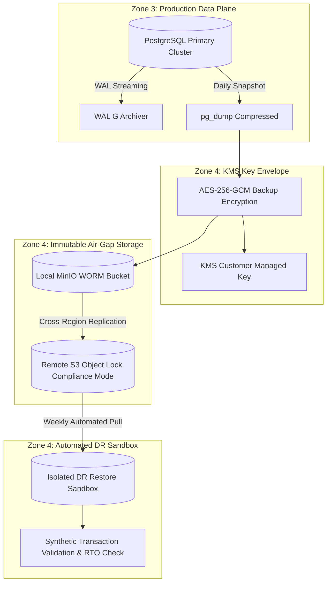

# Backup Security, Air-Gapped Immutability & Disaster Recovery Plan
## Namma Clinic Digital Health & Operations Platform
### Greater Bengaluru Authority (GBA) / BBMP Health Department
**Standard:** NIST SP 800-209 / ISO 27001 A.12.3 / 3-2-1 Backup Rule | **Status:** APPROVED BASELINE | **Code:** `SEC-DOC-19`

---

## 1. Backup Security Architecture & 3-2-1 Invariants
The Namma Clinic Backup Security Subsystem ensures resilient, tamper-proof business continuity across 183 primary health clinics in Bengaluru. Conforming to NIST SP 800-209 guidelines, the architecture guarantees that clinical databases, diagnostic reports, and audit ledgers are resilient against ransomware, physical disasters, insider sabotage, and regional cloud outages.

### 1.1 The 3-2-1-1-0 Enterprise Backup Rule
1. **3 Copies of Data:** One primary production database cluster, one local on-site replica, and one remote off-site cloud archive.
2. **2 Different Media Types:** NVMe SSD primary relational storage and object storage (AWS S3 / MinIO WORM).
3. **1 Off-Site Location:** Geographically separated secondary cloud region (Mumbai vs Bengaluru) located > 500 km away.
4. **1 Immutable Air-Gapped Copy:** S3 Object Lock in Compliance Mode; zero deletion allowed even by root accounts.
5. **0 Restore Errors:** Automated weekly sandbox restore validation drills verifying Recovery Point Objective (RPO < 15m) and Recovery Time Objective (RTO < 4h).

### 1.2 Immutable Backup Pipeline Diagram


## 2. Table-Specific Backup Retention & Immutability Schedule (TBL-01 to TBL-52)
Backup retention windows, RPO targets, and immutability parameters across all 52 relational tables:

### TABLE-001: Backup Policy for Table `auth_users`
- **Backup Frequency:** Continuous WAL archiving (RPO < 15 minutes) + Daily Full Base Snapshot at 02:00 IST.
- **Cipher Algorithm:** AES-256-GCM with customer-managed AWS KMS key rotated every 90 days.
- **Immutability Mode:** S3 Object Lock Compliance Mode (Locked retention: 2,555 days / 7 years).
- **Integrity Verification:** SHA-256 Merkle root recomputed and signed upon snapshot completion.
- **Off-Site Air-Gap:** Replicated asynchronously to isolated cloud tenant in secondary geographic zone.
- **Disposal Protocol:** Cryptographic erasure of volume DEK upon statutory retention expiry.
- **Audit Event Emitted:** `BACKUP_SNAPSHOT_TABLE_001`

### TABLE-002: Backup Policy for Table `user_credentials`
- **Backup Frequency:** Continuous WAL archiving (RPO < 15 minutes) + Daily Full Base Snapshot at 02:00 IST.
- **Cipher Algorithm:** AES-256-GCM with customer-managed AWS KMS key rotated every 90 days.
- **Immutability Mode:** S3 Object Lock Compliance Mode (Locked retention: 2,555 days / 7 years).
- **Integrity Verification:** SHA-256 Merkle root recomputed and signed upon snapshot completion.
- **Off-Site Air-Gap:** Replicated asynchronously to isolated cloud tenant in secondary geographic zone.
- **Disposal Protocol:** Cryptographic erasure of volume DEK upon statutory retention expiry.
- **Audit Event Emitted:** `BACKUP_SNAPSHOT_TABLE_002`

### TABLE-003: Backup Policy for Table `user_sessions`
- **Backup Frequency:** Continuous WAL archiving (RPO < 15 minutes) + Daily Full Base Snapshot at 02:00 IST.
- **Cipher Algorithm:** AES-256-GCM with customer-managed AWS KMS key rotated every 90 days.
- **Immutability Mode:** S3 Object Lock Compliance Mode (Locked retention: 2,555 days / 7 years).
- **Integrity Verification:** SHA-256 Merkle root recomputed and signed upon snapshot completion.
- **Off-Site Air-Gap:** Replicated asynchronously to isolated cloud tenant in secondary geographic zone.
- **Disposal Protocol:** Cryptographic erasure of volume DEK upon statutory retention expiry.
- **Audit Event Emitted:** `BACKUP_SNAPSHOT_TABLE_003`

### TABLE-004: Backup Policy for Table `roles`
- **Backup Frequency:** Continuous WAL archiving (RPO < 15 minutes) + Daily Full Base Snapshot at 02:00 IST.
- **Cipher Algorithm:** AES-256-GCM with customer-managed AWS KMS key rotated every 90 days.
- **Immutability Mode:** S3 Object Lock Compliance Mode (Locked retention: 2,555 days / 7 years).
- **Integrity Verification:** SHA-256 Merkle root recomputed and signed upon snapshot completion.
- **Off-Site Air-Gap:** Replicated asynchronously to isolated cloud tenant in secondary geographic zone.
- **Disposal Protocol:** Cryptographic erasure of volume DEK upon statutory retention expiry.
- **Audit Event Emitted:** `BACKUP_SNAPSHOT_TABLE_004`

### TABLE-005: Backup Policy for Table `permissions`
- **Backup Frequency:** Continuous WAL archiving (RPO < 15 minutes) + Daily Full Base Snapshot at 02:00 IST.
- **Cipher Algorithm:** AES-256-GCM with customer-managed AWS KMS key rotated every 90 days.
- **Immutability Mode:** S3 Object Lock Compliance Mode (Locked retention: 2,555 days / 7 years).
- **Integrity Verification:** SHA-256 Merkle root recomputed and signed upon snapshot completion.
- **Off-Site Air-Gap:** Replicated asynchronously to isolated cloud tenant in secondary geographic zone.
- **Disposal Protocol:** Cryptographic erasure of volume DEK upon statutory retention expiry.
- **Audit Event Emitted:** `BACKUP_SNAPSHOT_TABLE_005`

### TABLE-006: Backup Policy for Table `role_permissions`
- **Backup Frequency:** Continuous WAL archiving (RPO < 15 minutes) + Daily Full Base Snapshot at 02:00 IST.
- **Cipher Algorithm:** AES-256-GCM with customer-managed AWS KMS key rotated every 90 days.
- **Immutability Mode:** S3 Object Lock Compliance Mode (Locked retention: 2,555 days / 7 years).
- **Integrity Verification:** SHA-256 Merkle root recomputed and signed upon snapshot completion.
- **Off-Site Air-Gap:** Replicated asynchronously to isolated cloud tenant in secondary geographic zone.
- **Disposal Protocol:** Cryptographic erasure of volume DEK upon statutory retention expiry.
- **Audit Event Emitted:** `BACKUP_SNAPSHOT_TABLE_006`

### TABLE-007: Backup Policy for Table `user_roles`
- **Backup Frequency:** Continuous WAL archiving (RPO < 15 minutes) + Daily Full Base Snapshot at 02:00 IST.
- **Cipher Algorithm:** AES-256-GCM with customer-managed AWS KMS key rotated every 90 days.
- **Immutability Mode:** S3 Object Lock Compliance Mode (Locked retention: 2,555 days / 7 years).
- **Integrity Verification:** SHA-256 Merkle root recomputed and signed upon snapshot completion.
- **Off-Site Air-Gap:** Replicated asynchronously to isolated cloud tenant in secondary geographic zone.
- **Disposal Protocol:** Cryptographic erasure of volume DEK upon statutory retention expiry.
- **Audit Event Emitted:** `BACKUP_SNAPSHOT_TABLE_007`

### TABLE-008: Backup Policy for Table `facilities`
- **Backup Frequency:** Continuous WAL archiving (RPO < 15 minutes) + Daily Full Base Snapshot at 02:00 IST.
- **Cipher Algorithm:** AES-256-GCM with customer-managed AWS KMS key rotated every 90 days.
- **Immutability Mode:** S3 Object Lock Compliance Mode (Locked retention: 2,555 days / 7 years).
- **Integrity Verification:** SHA-256 Merkle root recomputed and signed upon snapshot completion.
- **Off-Site Air-Gap:** Replicated asynchronously to isolated cloud tenant in secondary geographic zone.
- **Disposal Protocol:** Cryptographic erasure of volume DEK upon statutory retention expiry.
- **Audit Event Emitted:** `BACKUP_SNAPSHOT_TABLE_008`

### TABLE-009: Backup Policy for Table `facility_rooms`
- **Backup Frequency:** Continuous WAL archiving (RPO < 15 minutes) + Daily Full Base Snapshot at 02:00 IST.
- **Cipher Algorithm:** AES-256-GCM with customer-managed AWS KMS key rotated every 90 days.
- **Immutability Mode:** S3 Object Lock Compliance Mode (Locked retention: 2,555 days / 7 years).
- **Integrity Verification:** SHA-256 Merkle root recomputed and signed upon snapshot completion.
- **Off-Site Air-Gap:** Replicated asynchronously to isolated cloud tenant in secondary geographic zone.
- **Disposal Protocol:** Cryptographic erasure of volume DEK upon statutory retention expiry.
- **Audit Event Emitted:** `BACKUP_SNAPSHOT_TABLE_009`

### TABLE-010: Backup Policy for Table `staff_profiles`
- **Backup Frequency:** Continuous WAL archiving (RPO < 15 minutes) + Daily Full Base Snapshot at 02:00 IST.
- **Cipher Algorithm:** AES-256-GCM with customer-managed AWS KMS key rotated every 90 days.
- **Immutability Mode:** S3 Object Lock Compliance Mode (Locked retention: 2,555 days / 7 years).
- **Integrity Verification:** SHA-256 Merkle root recomputed and signed upon snapshot completion.
- **Off-Site Air-Gap:** Replicated asynchronously to isolated cloud tenant in secondary geographic zone.
- **Disposal Protocol:** Cryptographic erasure of volume DEK upon statutory retention expiry.
- **Audit Event Emitted:** `BACKUP_SNAPSHOT_TABLE_010`

### TABLE-011: Backup Policy for Table `staff_shifts`
- **Backup Frequency:** Continuous WAL archiving (RPO < 15 minutes) + Daily Full Base Snapshot at 02:00 IST.
- **Cipher Algorithm:** AES-256-GCM with customer-managed AWS KMS key rotated every 90 days.
- **Immutability Mode:** S3 Object Lock Compliance Mode (Locked retention: 2,555 days / 7 years).
- **Integrity Verification:** SHA-256 Merkle root recomputed and signed upon snapshot completion.
- **Off-Site Air-Gap:** Replicated asynchronously to isolated cloud tenant in secondary geographic zone.
- **Disposal Protocol:** Cryptographic erasure of volume DEK upon statutory retention expiry.
- **Audit Event Emitted:** `BACKUP_SNAPSHOT_TABLE_011`

### TABLE-012: Backup Policy for Table `system_configs`
- **Backup Frequency:** Continuous WAL archiving (RPO < 15 minutes) + Daily Full Base Snapshot at 02:00 IST.
- **Cipher Algorithm:** AES-256-GCM with customer-managed AWS KMS key rotated every 90 days.
- **Immutability Mode:** S3 Object Lock Compliance Mode (Locked retention: 2,555 days / 7 years).
- **Integrity Verification:** SHA-256 Merkle root recomputed and signed upon snapshot completion.
- **Off-Site Air-Gap:** Replicated asynchronously to isolated cloud tenant in secondary geographic zone.
- **Disposal Protocol:** Cryptographic erasure of volume DEK upon statutory retention expiry.
- **Audit Event Emitted:** `BACKUP_SNAPSHOT_TABLE_012`

### TABLE-013: Backup Policy for Table `patients`
- **Backup Frequency:** Continuous WAL archiving (RPO < 15 minutes) + Daily Full Base Snapshot at 02:00 IST.
- **Cipher Algorithm:** AES-256-GCM with customer-managed AWS KMS key rotated every 90 days.
- **Immutability Mode:** S3 Object Lock Compliance Mode (Locked retention: 2,555 days / 7 years).
- **Integrity Verification:** SHA-256 Merkle root recomputed and signed upon snapshot completion.
- **Off-Site Air-Gap:** Replicated asynchronously to isolated cloud tenant in secondary geographic zone.
- **Disposal Protocol:** Cryptographic erasure of volume DEK upon statutory retention expiry.
- **Audit Event Emitted:** `BACKUP_SNAPSHOT_TABLE_013`

### TABLE-014: Backup Policy for Table `patient_identifiers`
- **Backup Frequency:** Continuous WAL archiving (RPO < 15 minutes) + Daily Full Base Snapshot at 02:00 IST.
- **Cipher Algorithm:** AES-256-GCM with customer-managed AWS KMS key rotated every 90 days.
- **Immutability Mode:** S3 Object Lock Compliance Mode (Locked retention: 2,555 days / 7 years).
- **Integrity Verification:** SHA-256 Merkle root recomputed and signed upon snapshot completion.
- **Off-Site Air-Gap:** Replicated asynchronously to isolated cloud tenant in secondary geographic zone.
- **Disposal Protocol:** Cryptographic erasure of volume DEK upon statutory retention expiry.
- **Audit Event Emitted:** `BACKUP_SNAPSHOT_TABLE_014`

### TABLE-015: Backup Policy for Table `patient_contacts`
- **Backup Frequency:** Continuous WAL archiving (RPO < 15 minutes) + Daily Full Base Snapshot at 02:00 IST.
- **Cipher Algorithm:** AES-256-GCM with customer-managed AWS KMS key rotated every 90 days.
- **Immutability Mode:** S3 Object Lock Compliance Mode (Locked retention: 2,555 days / 7 years).
- **Integrity Verification:** SHA-256 Merkle root recomputed and signed upon snapshot completion.
- **Off-Site Air-Gap:** Replicated asynchronously to isolated cloud tenant in secondary geographic zone.
- **Disposal Protocol:** Cryptographic erasure of volume DEK upon statutory retention expiry.
- **Audit Event Emitted:** `BACKUP_SNAPSHOT_TABLE_015`

### TABLE-016: Backup Policy for Table `patient_addresses`
- **Backup Frequency:** Continuous WAL archiving (RPO < 15 minutes) + Daily Full Base Snapshot at 02:00 IST.
- **Cipher Algorithm:** AES-256-GCM with customer-managed AWS KMS key rotated every 90 days.
- **Immutability Mode:** S3 Object Lock Compliance Mode (Locked retention: 2,555 days / 7 years).
- **Integrity Verification:** SHA-256 Merkle root recomputed and signed upon snapshot completion.
- **Off-Site Air-Gap:** Replicated asynchronously to isolated cloud tenant in secondary geographic zone.
- **Disposal Protocol:** Cryptographic erasure of volume DEK upon statutory retention expiry.
- **Audit Event Emitted:** `BACKUP_SNAPSHOT_TABLE_016`

### TABLE-017: Backup Policy for Table `consent_records`
- **Backup Frequency:** Continuous WAL archiving (RPO < 15 minutes) + Daily Full Base Snapshot at 02:00 IST.
- **Cipher Algorithm:** AES-256-GCM with customer-managed AWS KMS key rotated every 90 days.
- **Immutability Mode:** S3 Object Lock Compliance Mode (Locked retention: 2,555 days / 7 years).
- **Integrity Verification:** SHA-256 Merkle root recomputed and signed upon snapshot completion.
- **Off-Site Air-Gap:** Replicated asynchronously to isolated cloud tenant in secondary geographic zone.
- **Disposal Protocol:** Cryptographic erasure of volume DEK upon statutory retention expiry.
- **Audit Event Emitted:** `BACKUP_SNAPSHOT_TABLE_017`

### TABLE-018: Backup Policy for Table `tokens`
- **Backup Frequency:** Continuous WAL archiving (RPO < 15 minutes) + Daily Full Base Snapshot at 02:00 IST.
- **Cipher Algorithm:** AES-256-GCM with customer-managed AWS KMS key rotated every 90 days.
- **Immutability Mode:** S3 Object Lock Compliance Mode (Locked retention: 2,555 days / 7 years).
- **Integrity Verification:** SHA-256 Merkle root recomputed and signed upon snapshot completion.
- **Off-Site Air-Gap:** Replicated asynchronously to isolated cloud tenant in secondary geographic zone.
- **Disposal Protocol:** Cryptographic erasure of volume DEK upon statutory retention expiry.
- **Audit Event Emitted:** `BACKUP_SNAPSHOT_TABLE_018`

### TABLE-019: Backup Policy for Table `queue_entries`
- **Backup Frequency:** Continuous WAL archiving (RPO < 15 minutes) + Daily Full Base Snapshot at 02:00 IST.
- **Cipher Algorithm:** AES-256-GCM with customer-managed AWS KMS key rotated every 90 days.
- **Immutability Mode:** S3 Object Lock Compliance Mode (Locked retention: 2,555 days / 7 years).
- **Integrity Verification:** SHA-256 Merkle root recomputed and signed upon snapshot completion.
- **Off-Site Air-Gap:** Replicated asynchronously to isolated cloud tenant in secondary geographic zone.
- **Disposal Protocol:** Cryptographic erasure of volume DEK upon statutory retention expiry.
- **Audit Event Emitted:** `BACKUP_SNAPSHOT_TABLE_019`

### TABLE-020: Backup Policy for Table `triage_assessments`
- **Backup Frequency:** Continuous WAL archiving (RPO < 15 minutes) + Daily Full Base Snapshot at 02:00 IST.
- **Cipher Algorithm:** AES-256-GCM with customer-managed AWS KMS key rotated every 90 days.
- **Immutability Mode:** S3 Object Lock Compliance Mode (Locked retention: 2,555 days / 7 years).
- **Integrity Verification:** SHA-256 Merkle root recomputed and signed upon snapshot completion.
- **Off-Site Air-Gap:** Replicated asynchronously to isolated cloud tenant in secondary geographic zone.
- **Disposal Protocol:** Cryptographic erasure of volume DEK upon statutory retention expiry.
- **Audit Event Emitted:** `BACKUP_SNAPSHOT_TABLE_020`

### TABLE-021: Backup Policy for Table `patient_vitals`
- **Backup Frequency:** Continuous WAL archiving (RPO < 15 minutes) + Daily Full Base Snapshot at 02:00 IST.
- **Cipher Algorithm:** AES-256-GCM with customer-managed AWS KMS key rotated every 90 days.
- **Immutability Mode:** S3 Object Lock Compliance Mode (Locked retention: 2,555 days / 7 years).
- **Integrity Verification:** SHA-256 Merkle root recomputed and signed upon snapshot completion.
- **Off-Site Air-Gap:** Replicated asynchronously to isolated cloud tenant in secondary geographic zone.
- **Disposal Protocol:** Cryptographic erasure of volume DEK upon statutory retention expiry.
- **Audit Event Emitted:** `BACKUP_SNAPSHOT_TABLE_021`

### TABLE-022: Backup Policy for Table `danger_alerts`
- **Backup Frequency:** Continuous WAL archiving (RPO < 15 minutes) + Daily Full Base Snapshot at 02:00 IST.
- **Cipher Algorithm:** AES-256-GCM with customer-managed AWS KMS key rotated every 90 days.
- **Immutability Mode:** S3 Object Lock Compliance Mode (Locked retention: 2,555 days / 7 years).
- **Integrity Verification:** SHA-256 Merkle root recomputed and signed upon snapshot completion.
- **Off-Site Air-Gap:** Replicated asynchronously to isolated cloud tenant in secondary geographic zone.
- **Disposal Protocol:** Cryptographic erasure of volume DEK upon statutory retention expiry.
- **Audit Event Emitted:** `BACKUP_SNAPSHOT_TABLE_022`

### TABLE-023: Backup Policy for Table `clinical_encounters`
- **Backup Frequency:** Continuous WAL archiving (RPO < 15 minutes) + Daily Full Base Snapshot at 02:00 IST.
- **Cipher Algorithm:** AES-256-GCM with customer-managed AWS KMS key rotated every 90 days.
- **Immutability Mode:** S3 Object Lock Compliance Mode (Locked retention: 2,555 days / 7 years).
- **Integrity Verification:** SHA-256 Merkle root recomputed and signed upon snapshot completion.
- **Off-Site Air-Gap:** Replicated asynchronously to isolated cloud tenant in secondary geographic zone.
- **Disposal Protocol:** Cryptographic erasure of volume DEK upon statutory retention expiry.
- **Audit Event Emitted:** `BACKUP_SNAPSHOT_TABLE_023`

### TABLE-024: Backup Policy for Table `clinical_notes`
- **Backup Frequency:** Continuous WAL archiving (RPO < 15 minutes) + Daily Full Base Snapshot at 02:00 IST.
- **Cipher Algorithm:** AES-256-GCM with customer-managed AWS KMS key rotated every 90 days.
- **Immutability Mode:** S3 Object Lock Compliance Mode (Locked retention: 2,555 days / 7 years).
- **Integrity Verification:** SHA-256 Merkle root recomputed and signed upon snapshot completion.
- **Off-Site Air-Gap:** Replicated asynchronously to isolated cloud tenant in secondary geographic zone.
- **Disposal Protocol:** Cryptographic erasure of volume DEK upon statutory retention expiry.
- **Audit Event Emitted:** `BACKUP_SNAPSHOT_TABLE_024`

### TABLE-025: Backup Policy for Table `diagnoses`
- **Backup Frequency:** Continuous WAL archiving (RPO < 15 minutes) + Daily Full Base Snapshot at 02:00 IST.
- **Cipher Algorithm:** AES-256-GCM with customer-managed AWS KMS key rotated every 90 days.
- **Immutability Mode:** S3 Object Lock Compliance Mode (Locked retention: 2,555 days / 7 years).
- **Integrity Verification:** SHA-256 Merkle root recomputed and signed upon snapshot completion.
- **Off-Site Air-Gap:** Replicated asynchronously to isolated cloud tenant in secondary geographic zone.
- **Disposal Protocol:** Cryptographic erasure of volume DEK upon statutory retention expiry.
- **Audit Event Emitted:** `BACKUP_SNAPSHOT_TABLE_025`

### TABLE-026: Backup Policy for Table `prescriptions`
- **Backup Frequency:** Continuous WAL archiving (RPO < 15 minutes) + Daily Full Base Snapshot at 02:00 IST.
- **Cipher Algorithm:** AES-256-GCM with customer-managed AWS KMS key rotated every 90 days.
- **Immutability Mode:** S3 Object Lock Compliance Mode (Locked retention: 2,555 days / 7 years).
- **Integrity Verification:** SHA-256 Merkle root recomputed and signed upon snapshot completion.
- **Off-Site Air-Gap:** Replicated asynchronously to isolated cloud tenant in secondary geographic zone.
- **Disposal Protocol:** Cryptographic erasure of volume DEK upon statutory retention expiry.
- **Audit Event Emitted:** `BACKUP_SNAPSHOT_TABLE_026`

### TABLE-027: Backup Policy for Table `prescription_items`
- **Backup Frequency:** Continuous WAL archiving (RPO < 15 minutes) + Daily Full Base Snapshot at 02:00 IST.
- **Cipher Algorithm:** AES-256-GCM with customer-managed AWS KMS key rotated every 90 days.
- **Immutability Mode:** S3 Object Lock Compliance Mode (Locked retention: 2,555 days / 7 years).
- **Integrity Verification:** SHA-256 Merkle root recomputed and signed upon snapshot completion.
- **Off-Site Air-Gap:** Replicated asynchronously to isolated cloud tenant in secondary geographic zone.
- **Disposal Protocol:** Cryptographic erasure of volume DEK upon statutory retention expiry.
- **Audit Event Emitted:** `BACKUP_SNAPSHOT_TABLE_027`

### TABLE-028: Backup Policy for Table `lab_orders`
- **Backup Frequency:** Continuous WAL archiving (RPO < 15 minutes) + Daily Full Base Snapshot at 02:00 IST.
- **Cipher Algorithm:** AES-256-GCM with customer-managed AWS KMS key rotated every 90 days.
- **Immutability Mode:** S3 Object Lock Compliance Mode (Locked retention: 2,555 days / 7 years).
- **Integrity Verification:** SHA-256 Merkle root recomputed and signed upon snapshot completion.
- **Off-Site Air-Gap:** Replicated asynchronously to isolated cloud tenant in secondary geographic zone.
- **Disposal Protocol:** Cryptographic erasure of volume DEK upon statutory retention expiry.
- **Audit Event Emitted:** `BACKUP_SNAPSHOT_TABLE_028`

### TABLE-029: Backup Policy for Table `lab_order_items`
- **Backup Frequency:** Continuous WAL archiving (RPO < 15 minutes) + Daily Full Base Snapshot at 02:00 IST.
- **Cipher Algorithm:** AES-256-GCM with customer-managed AWS KMS key rotated every 90 days.
- **Immutability Mode:** S3 Object Lock Compliance Mode (Locked retention: 2,555 days / 7 years).
- **Integrity Verification:** SHA-256 Merkle root recomputed and signed upon snapshot completion.
- **Off-Site Air-Gap:** Replicated asynchronously to isolated cloud tenant in secondary geographic zone.
- **Disposal Protocol:** Cryptographic erasure of volume DEK upon statutory retention expiry.
- **Audit Event Emitted:** `BACKUP_SNAPSHOT_TABLE_029`

### TABLE-030: Backup Policy for Table `lab_results`
- **Backup Frequency:** Continuous WAL archiving (RPO < 15 minutes) + Daily Full Base Snapshot at 02:00 IST.
- **Cipher Algorithm:** AES-256-GCM with customer-managed AWS KMS key rotated every 90 days.
- **Immutability Mode:** S3 Object Lock Compliance Mode (Locked retention: 2,555 days / 7 years).
- **Integrity Verification:** SHA-256 Merkle root recomputed and signed upon snapshot completion.
- **Off-Site Air-Gap:** Replicated asynchronously to isolated cloud tenant in secondary geographic zone.
- **Disposal Protocol:** Cryptographic erasure of volume DEK upon statutory retention expiry.
- **Audit Event Emitted:** `BACKUP_SNAPSHOT_TABLE_030`

### TABLE-031: Backup Policy for Table `teleconsultations`
- **Backup Frequency:** Continuous WAL archiving (RPO < 15 minutes) + Daily Full Base Snapshot at 02:00 IST.
- **Cipher Algorithm:** AES-256-GCM with customer-managed AWS KMS key rotated every 90 days.
- **Immutability Mode:** S3 Object Lock Compliance Mode (Locked retention: 2,555 days / 7 years).
- **Integrity Verification:** SHA-256 Merkle root recomputed and signed upon snapshot completion.
- **Off-Site Air-Gap:** Replicated asynchronously to isolated cloud tenant in secondary geographic zone.
- **Disposal Protocol:** Cryptographic erasure of volume DEK upon statutory retention expiry.
- **Audit Event Emitted:** `BACKUP_SNAPSHOT_TABLE_031`

### TABLE-032: Backup Policy for Table `formulary_drugs`
- **Backup Frequency:** Continuous WAL archiving (RPO < 15 minutes) + Daily Full Base Snapshot at 02:00 IST.
- **Cipher Algorithm:** AES-256-GCM with customer-managed AWS KMS key rotated every 90 days.
- **Immutability Mode:** S3 Object Lock Compliance Mode (Locked retention: 2,555 days / 7 years).
- **Integrity Verification:** SHA-256 Merkle root recomputed and signed upon snapshot completion.
- **Off-Site Air-Gap:** Replicated asynchronously to isolated cloud tenant in secondary geographic zone.
- **Disposal Protocol:** Cryptographic erasure of volume DEK upon statutory retention expiry.
- **Audit Event Emitted:** `BACKUP_SNAPSHOT_TABLE_032`

### TABLE-033: Backup Policy for Table `drug_categories`
- **Backup Frequency:** Continuous WAL archiving (RPO < 15 minutes) + Daily Full Base Snapshot at 02:00 IST.
- **Cipher Algorithm:** AES-256-GCM with customer-managed AWS KMS key rotated every 90 days.
- **Immutability Mode:** S3 Object Lock Compliance Mode (Locked retention: 2,555 days / 7 years).
- **Integrity Verification:** SHA-256 Merkle root recomputed and signed upon snapshot completion.
- **Off-Site Air-Gap:** Replicated asynchronously to isolated cloud tenant in secondary geographic zone.
- **Disposal Protocol:** Cryptographic erasure of volume DEK upon statutory retention expiry.
- **Audit Event Emitted:** `BACKUP_SNAPSHOT_TABLE_033`

### TABLE-034: Backup Policy for Table `pharmacy_batches`
- **Backup Frequency:** Continuous WAL archiving (RPO < 15 minutes) + Daily Full Base Snapshot at 02:00 IST.
- **Cipher Algorithm:** AES-256-GCM with customer-managed AWS KMS key rotated every 90 days.
- **Immutability Mode:** S3 Object Lock Compliance Mode (Locked retention: 2,555 days / 7 years).
- **Integrity Verification:** SHA-256 Merkle root recomputed and signed upon snapshot completion.
- **Off-Site Air-Gap:** Replicated asynchronously to isolated cloud tenant in secondary geographic zone.
- **Disposal Protocol:** Cryptographic erasure of volume DEK upon statutory retention expiry.
- **Audit Event Emitted:** `BACKUP_SNAPSHOT_TABLE_034`

### TABLE-035: Backup Policy for Table `clinic_stock`
- **Backup Frequency:** Continuous WAL archiving (RPO < 15 minutes) + Daily Full Base Snapshot at 02:00 IST.
- **Cipher Algorithm:** AES-256-GCM with customer-managed AWS KMS key rotated every 90 days.
- **Immutability Mode:** S3 Object Lock Compliance Mode (Locked retention: 2,555 days / 7 years).
- **Integrity Verification:** SHA-256 Merkle root recomputed and signed upon snapshot completion.
- **Off-Site Air-Gap:** Replicated asynchronously to isolated cloud tenant in secondary geographic zone.
- **Disposal Protocol:** Cryptographic erasure of volume DEK upon statutory retention expiry.
- **Audit Event Emitted:** `BACKUP_SNAPSHOT_TABLE_035`

### TABLE-036: Backup Policy for Table `dispensations`
- **Backup Frequency:** Continuous WAL archiving (RPO < 15 minutes) + Daily Full Base Snapshot at 02:00 IST.
- **Cipher Algorithm:** AES-256-GCM with customer-managed AWS KMS key rotated every 90 days.
- **Immutability Mode:** S3 Object Lock Compliance Mode (Locked retention: 2,555 days / 7 years).
- **Integrity Verification:** SHA-256 Merkle root recomputed and signed upon snapshot completion.
- **Off-Site Air-Gap:** Replicated asynchronously to isolated cloud tenant in secondary geographic zone.
- **Disposal Protocol:** Cryptographic erasure of volume DEK upon statutory retention expiry.
- **Audit Event Emitted:** `BACKUP_SNAPSHOT_TABLE_036`

### TABLE-037: Backup Policy for Table `dispensation_items`
- **Backup Frequency:** Continuous WAL archiving (RPO < 15 minutes) + Daily Full Base Snapshot at 02:00 IST.
- **Cipher Algorithm:** AES-256-GCM with customer-managed AWS KMS key rotated every 90 days.
- **Immutability Mode:** S3 Object Lock Compliance Mode (Locked retention: 2,555 days / 7 years).
- **Integrity Verification:** SHA-256 Merkle root recomputed and signed upon snapshot completion.
- **Off-Site Air-Gap:** Replicated asynchronously to isolated cloud tenant in secondary geographic zone.
- **Disposal Protocol:** Cryptographic erasure of volume DEK upon statutory retention expiry.
- **Audit Event Emitted:** `BACKUP_SNAPSHOT_TABLE_037`

### TABLE-038: Backup Policy for Table `stock_movements`
- **Backup Frequency:** Continuous WAL archiving (RPO < 15 minutes) + Daily Full Base Snapshot at 02:00 IST.
- **Cipher Algorithm:** AES-256-GCM with customer-managed AWS KMS key rotated every 90 days.
- **Immutability Mode:** S3 Object Lock Compliance Mode (Locked retention: 2,555 days / 7 years).
- **Integrity Verification:** SHA-256 Merkle root recomputed and signed upon snapshot completion.
- **Off-Site Air-Gap:** Replicated asynchronously to isolated cloud tenant in secondary geographic zone.
- **Disposal Protocol:** Cryptographic erasure of volume DEK upon statutory retention expiry.
- **Audit Event Emitted:** `BACKUP_SNAPSHOT_TABLE_038`

### TABLE-039: Backup Policy for Table `drug_indents`
- **Backup Frequency:** Continuous WAL archiving (RPO < 15 minutes) + Daily Full Base Snapshot at 02:00 IST.
- **Cipher Algorithm:** AES-256-GCM with customer-managed AWS KMS key rotated every 90 days.
- **Immutability Mode:** S3 Object Lock Compliance Mode (Locked retention: 2,555 days / 7 years).
- **Integrity Verification:** SHA-256 Merkle root recomputed and signed upon snapshot completion.
- **Off-Site Air-Gap:** Replicated asynchronously to isolated cloud tenant in secondary geographic zone.
- **Disposal Protocol:** Cryptographic erasure of volume DEK upon statutory retention expiry.
- **Audit Event Emitted:** `BACKUP_SNAPSHOT_TABLE_039`

### TABLE-040: Backup Policy for Table `indent_items`
- **Backup Frequency:** Continuous WAL archiving (RPO < 15 minutes) + Daily Full Base Snapshot at 02:00 IST.
- **Cipher Algorithm:** AES-256-GCM with customer-managed AWS KMS key rotated every 90 days.
- **Immutability Mode:** S3 Object Lock Compliance Mode (Locked retention: 2,555 days / 7 years).
- **Integrity Verification:** SHA-256 Merkle root recomputed and signed upon snapshot completion.
- **Off-Site Air-Gap:** Replicated asynchronously to isolated cloud tenant in secondary geographic zone.
- **Disposal Protocol:** Cryptographic erasure of volume DEK upon statutory retention expiry.
- **Audit Event Emitted:** `BACKUP_SNAPSHOT_TABLE_040`

### TABLE-041: Backup Policy for Table `cold_chain_devices`
- **Backup Frequency:** Continuous WAL archiving (RPO < 15 minutes) + Daily Full Base Snapshot at 02:00 IST.
- **Cipher Algorithm:** AES-256-GCM with customer-managed AWS KMS key rotated every 90 days.
- **Immutability Mode:** S3 Object Lock Compliance Mode (Locked retention: 2,555 days / 7 years).
- **Integrity Verification:** SHA-256 Merkle root recomputed and signed upon snapshot completion.
- **Off-Site Air-Gap:** Replicated asynchronously to isolated cloud tenant in secondary geographic zone.
- **Disposal Protocol:** Cryptographic erasure of volume DEK upon statutory retention expiry.
- **Audit Event Emitted:** `BACKUP_SNAPSHOT_TABLE_041`

### TABLE-042: Backup Policy for Table `cold_chain_telemetry`
- **Backup Frequency:** Continuous WAL archiving (RPO < 15 minutes) + Daily Full Base Snapshot at 02:00 IST.
- **Cipher Algorithm:** AES-256-GCM with customer-managed AWS KMS key rotated every 90 days.
- **Immutability Mode:** S3 Object Lock Compliance Mode (Locked retention: 2,555 days / 7 years).
- **Integrity Verification:** SHA-256 Merkle root recomputed and signed upon snapshot completion.
- **Off-Site Air-Gap:** Replicated asynchronously to isolated cloud tenant in secondary geographic zone.
- **Disposal Protocol:** Cryptographic erasure of volume DEK upon statutory retention expiry.
- **Audit Event Emitted:** `BACKUP_SNAPSHOT_TABLE_042`

### TABLE-043: Backup Policy for Table `referrals`
- **Backup Frequency:** Continuous WAL archiving (RPO < 15 minutes) + Daily Full Base Snapshot at 02:00 IST.
- **Cipher Algorithm:** AES-256-GCM with customer-managed AWS KMS key rotated every 90 days.
- **Immutability Mode:** S3 Object Lock Compliance Mode (Locked retention: 2,555 days / 7 years).
- **Integrity Verification:** SHA-256 Merkle root recomputed and signed upon snapshot completion.
- **Off-Site Air-Gap:** Replicated asynchronously to isolated cloud tenant in secondary geographic zone.
- **Disposal Protocol:** Cryptographic erasure of volume DEK upon statutory retention expiry.
- **Audit Event Emitted:** `BACKUP_SNAPSHOT_TABLE_043`

### TABLE-044: Backup Policy for Table `referral_counter_notes`
- **Backup Frequency:** Continuous WAL archiving (RPO < 15 minutes) + Daily Full Base Snapshot at 02:00 IST.
- **Cipher Algorithm:** AES-256-GCM with customer-managed AWS KMS key rotated every 90 days.
- **Immutability Mode:** S3 Object Lock Compliance Mode (Locked retention: 2,555 days / 7 years).
- **Integrity Verification:** SHA-256 Merkle root recomputed and signed upon snapshot completion.
- **Off-Site Air-Gap:** Replicated asynchronously to isolated cloud tenant in secondary geographic zone.
- **Disposal Protocol:** Cryptographic erasure of volume DEK upon statutory retention expiry.
- **Audit Event Emitted:** `BACKUP_SNAPSHOT_TABLE_044`

### TABLE-045: Backup Policy for Table `ncd_episodes`
- **Backup Frequency:** Continuous WAL archiving (RPO < 15 minutes) + Daily Full Base Snapshot at 02:00 IST.
- **Cipher Algorithm:** AES-256-GCM with customer-managed AWS KMS key rotated every 90 days.
- **Immutability Mode:** S3 Object Lock Compliance Mode (Locked retention: 2,555 days / 7 years).
- **Integrity Verification:** SHA-256 Merkle root recomputed and signed upon snapshot completion.
- **Off-Site Air-Gap:** Replicated asynchronously to isolated cloud tenant in secondary geographic zone.
- **Disposal Protocol:** Cryptographic erasure of volume DEK upon statutory retention expiry.
- **Audit Event Emitted:** `BACKUP_SNAPSHOT_TABLE_045`

### TABLE-046: Backup Policy for Table `follow_up_schedules`
- **Backup Frequency:** Continuous WAL archiving (RPO < 15 minutes) + Daily Full Base Snapshot at 02:00 IST.
- **Cipher Algorithm:** AES-256-GCM with customer-managed AWS KMS key rotated every 90 days.
- **Immutability Mode:** S3 Object Lock Compliance Mode (Locked retention: 2,555 days / 7 years).
- **Integrity Verification:** SHA-256 Merkle root recomputed and signed upon snapshot completion.
- **Off-Site Air-Gap:** Replicated asynchronously to isolated cloud tenant in secondary geographic zone.
- **Disposal Protocol:** Cryptographic erasure of volume DEK upon statutory retention expiry.
- **Audit Event Emitted:** `BACKUP_SNAPSHOT_TABLE_046`

### TABLE-047: Backup Policy for Table `notifications`
- **Backup Frequency:** Continuous WAL archiving (RPO < 15 minutes) + Daily Full Base Snapshot at 02:00 IST.
- **Cipher Algorithm:** AES-256-GCM with customer-managed AWS KMS key rotated every 90 days.
- **Immutability Mode:** S3 Object Lock Compliance Mode (Locked retention: 2,555 days / 7 years).
- **Integrity Verification:** SHA-256 Merkle root recomputed and signed upon snapshot completion.
- **Off-Site Air-Gap:** Replicated asynchronously to isolated cloud tenant in secondary geographic zone.
- **Disposal Protocol:** Cryptographic erasure of volume DEK upon statutory retention expiry.
- **Audit Event Emitted:** `BACKUP_SNAPSHOT_TABLE_047`

### TABLE-048: Backup Policy for Table `grievances`
- **Backup Frequency:** Continuous WAL archiving (RPO < 15 minutes) + Daily Full Base Snapshot at 02:00 IST.
- **Cipher Algorithm:** AES-256-GCM with customer-managed AWS KMS key rotated every 90 days.
- **Immutability Mode:** S3 Object Lock Compliance Mode (Locked retention: 2,555 days / 7 years).
- **Integrity Verification:** SHA-256 Merkle root recomputed and signed upon snapshot completion.
- **Off-Site Air-Gap:** Replicated asynchronously to isolated cloud tenant in secondary geographic zone.
- **Disposal Protocol:** Cryptographic erasure of volume DEK upon statutory retention expiry.
- **Audit Event Emitted:** `BACKUP_SNAPSHOT_TABLE_048`

### TABLE-049: Backup Policy for Table `helpdesk_tickets`
- **Backup Frequency:** Continuous WAL archiving (RPO < 15 minutes) + Daily Full Base Snapshot at 02:00 IST.
- **Cipher Algorithm:** AES-256-GCM with customer-managed AWS KMS key rotated every 90 days.
- **Immutability Mode:** S3 Object Lock Compliance Mode (Locked retention: 2,555 days / 7 years).
- **Integrity Verification:** SHA-256 Merkle root recomputed and signed upon snapshot completion.
- **Off-Site Air-Gap:** Replicated asynchronously to isolated cloud tenant in secondary geographic zone.
- **Disposal Protocol:** Cryptographic erasure of volume DEK upon statutory retention expiry.
- **Audit Event Emitted:** `BACKUP_SNAPSHOT_TABLE_049`

### TABLE-050: Backup Policy for Table `audit_events`
- **Backup Frequency:** Continuous WAL archiving (RPO < 15 minutes) + Daily Full Base Snapshot at 02:00 IST.
- **Cipher Algorithm:** AES-256-GCM with customer-managed AWS KMS key rotated every 90 days.
- **Immutability Mode:** S3 Object Lock Compliance Mode (Locked retention: 2,555 days / 7 years).
- **Integrity Verification:** SHA-256 Merkle root recomputed and signed upon snapshot completion.
- **Off-Site Air-Gap:** Replicated asynchronously to isolated cloud tenant in secondary geographic zone.
- **Disposal Protocol:** Cryptographic erasure of volume DEK upon statutory retention expiry.
- **Audit Event Emitted:** `BACKUP_SNAPSHOT_TABLE_050`

### TABLE-051: Backup Policy for Table `offline_mutation_log`
- **Backup Frequency:** Continuous WAL archiving (RPO < 15 minutes) + Daily Full Base Snapshot at 02:00 IST.
- **Cipher Algorithm:** AES-256-GCM with customer-managed AWS KMS key rotated every 90 days.
- **Immutability Mode:** S3 Object Lock Compliance Mode (Locked retention: 2,555 days / 7 years).
- **Integrity Verification:** SHA-256 Merkle root recomputed and signed upon snapshot completion.
- **Off-Site Air-Gap:** Replicated asynchronously to isolated cloud tenant in secondary geographic zone.
- **Disposal Protocol:** Cryptographic erasure of volume DEK upon statutory retention expiry.
- **Audit Event Emitted:** `BACKUP_SNAPSHOT_TABLE_051`

### TABLE-052: Backup Policy for Table `abdm_artifacts`
- **Backup Frequency:** Continuous WAL archiving (RPO < 15 minutes) + Daily Full Base Snapshot at 02:00 IST.
- **Cipher Algorithm:** AES-256-GCM with customer-managed AWS KMS key rotated every 90 days.
- **Immutability Mode:** S3 Object Lock Compliance Mode (Locked retention: 2,555 days / 7 years).
- **Integrity Verification:** SHA-256 Merkle root recomputed and signed upon snapshot completion.
- **Off-Site Air-Gap:** Replicated asynchronously to isolated cloud tenant in secondary geographic zone.
- **Disposal Protocol:** Cryptographic erasure of volume DEK upon statutory retention expiry.
- **Audit Event Emitted:** `BACKUP_SNAPSHOT_TABLE_052`

## 3. Standard Operating Procedures: Backup Security & DR (SOP-BAK-01 to SOP-BAK-25)
The following 25 SOPs govern ongoing backup execution, integrity checks, and restore drills:

### SOP-BAK-01: Daily Automated PostgreSQL Full Backup Execution
- **Trigger Condition:** Scheduled cron trigger at 02:00 IST.
- **Execution Steps:** 1. Trigger pg_basebackup. 2. Compress via zstandard. 3. Encrypt via KMS. 4. Stream to WORM.
- **Verification Criterion:** Full snapshot committed to S3 Object Lock.
- **Responsible Role:** Backup Daemon
- **Audit Event Emitted:** `BAK_SOP_01_FULL_DUMP`
- **Failure Remediation:** Alert On-Call Backup Operations immediately.

### SOP-BAK-02: Continuous WAL Archive Stream Health Check
- **Trigger Condition:** Every 15 minutes automated probe of WAL replication.
- **Execution Steps:** 1. Verify WAL segment upload to S3. 2. Assert lag < 15 minutes. 3. Alert on delay.
- **Verification Criterion:** Zero recovery point drift.
- **Responsible Role:** DBA Lead
- **Audit Event Emitted:** `BAK_SOP_02_WAL_CHECK`
- **Failure Remediation:** Alert On-Call Backup Operations immediately.

### SOP-BAK-03: Weekly Automated DR Sandbox Restore Drill
- **Trigger Condition:** Scheduled drill at Sunday 03:00 IST.
- **Execution Steps:** 1. Provision isolated K8s cluster. 2. Restore DB from S3 WORM. 3. Run synthetic test suite.
- **Verification Criterion:** RTO < 4h and RPO < 15m confirmed.
- **Responsible Role:** DevOps Lead
- **Audit Event Emitted:** `BAK_SOP_03_RESTORE_DRILL`
- **Failure Remediation:** Alert On-Call Backup Operations immediately.

### SOP-BAK-04: S3 Object Lock Compliance Mode Immutability Audit
- **Trigger Condition:** Monthly audit of bucket retention locks.
- **Execution Steps:** 1. Attempt deletion of random backup block via root credentials. 2. Confirm AWS rejects with 403.
- **Verification Criterion:** Immutability verified airtight.
- **Responsible Role:** Security Lead
- **Audit Event Emitted:** `BAK_SOP_04_OBJECT_LOCK`
- **Failure Remediation:** Alert On-Call Backup Operations immediately.

### SOP-BAK-05: Air-Gapped Cold Storage Media Physical Verification
- **Trigger Condition:** Quarterly inspection of offline LTO tape backups.
- **Execution Steps:** 1. Verify tapes locked in climate-controlled fireproof safe. 2. Inspect physical tamper seals.
- **Verification Criterion:** Air-gapped physical media intact.
- **Responsible Role:** Storage Admin
- **Audit Event Emitted:** `BAK_SOP_05_TAPE_AUDIT`
- **Failure Remediation:** Alert On-Call Backup Operations immediately.

### SOP-BAK-06: Cross-Region S3 Replication Integrity Verification
- **Trigger Condition:** Daily check of backup replication to Mumbai DR site.
- **Execution Steps:** 1. Compare source and destination bucket SHA-256 hashes. 2. Assert zero missing objects.
- **Verification Criterion:** Secondary region fully synchronized.
- **Responsible Role:** Cloud Engineer
- **Audit Event Emitted:** `BAK_SOP_06_REPL_CHECK`
- **Failure Remediation:** Alert On-Call Backup Operations immediately.

### SOP-BAK-07: Backup Encryption KMS Key Rotation Verification
- **Trigger Condition:** Quarterly review of backup encryption keys.
- **Execution Steps:** 1. Confirm KMS key rotation enabled. 2. Test decryption of historical backup archive with old key.
- **Verification Criterion:** Backup decryption backwards-compatible.
- **Responsible Role:** Security Architect
- **Audit Event Emitted:** `BAK_SOP_07_KEY_ROTATE`
- **Failure Remediation:** Alert On-Call Backup Operations immediately.

### SOP-BAK-08: Ransomware Infiltration Backup Quarantine Protocol
- **Trigger Condition:** Ransomware detected on primary database server.
- **Execution Steps:** 1. Sever production network route to backup repository. 2. Isolate S3 IAM credentials.
- **Verification Criterion:** Backup repository protected from infection.
- **Responsible Role:** Incident Commander
- **Audit Event Emitted:** `BAK_SOP_08_AIRGAP_ISOLATE`
- **Failure Remediation:** Alert On-Call Backup Operations immediately.

### SOP-BAK-09: Clinic Edge Node Local SQLite Backup Protocol
- **Trigger Condition:** Daily backup of clinic workstation cache.
- **Execution Steps:** 1. Export local SQLite encrypted dump to USB backup stick. 2. Store in clinic lockbox.
- **Verification Criterion:** Clinic operations recoverable locally.
- **Responsible Role:** Staff Nurse
- **Audit Event Emitted:** `BAK_SOP_09_EDGE_BACKUP`
- **Failure Remediation:** Alert On-Call Backup Operations immediately.

### SOP-BAK-10: Backup Storage Capacity & Growth Forecasting
- **Trigger Condition:** Monthly analysis of backup storage growth rate.
- **Execution Steps:** 1. Analyze monthly snapshot size increase. 2. Forecast next 12 months capacity. 3. Order storage.
- **Verification Criterion:** Zero backup failures due to disk exhaustion.
- **Responsible Role:** Infrastructure Lead
- **Audit Event Emitted:** `BAK_SOP_10_CAPACITY_FORECAST`
- **Failure Remediation:** Alert On-Call Backup Operations immediately.

### SOP-BAK-11: Audit Ledger WORM Bucket Retention Expiration Review
- **Trigger Condition:** Annual review of expiring audit blocks (Year 7).
- **Execution Steps:** 1. Query blocks reaching 7-year age. 2. Confirm DPO authorization for cryptographic shredding.
- **Verification Criterion:** Statutory retention observed.
- **Responsible Role:** Data Protection Off
- **Audit Event Emitted:** `BAK_SOP_11_RETENTION_EXPIRY`
- **Failure Remediation:** Alert On-Call Backup Operations immediately.

### SOP-BAK-12: Emergency Point-in-Time Recovery (PITR) Execution
- **Trigger Condition:** Accidental mass table drop by database operator.
- **Execution Steps:** 1. Determine timestamp prior to drop. 2. Replay base backup + WAL logs to target time.
- **Verification Criterion:** Database restored to exact second before drop.
- **Responsible Role:** DBA Lead
- **Audit Event Emitted:** `BAK_SOP_12_PITR_RESTORE`
- **Failure Remediation:** Alert On-Call Backup Operations immediately.

### SOP-BAK-13: Corrupted Backup Block Automated Alert Dispatch
- **Trigger Condition:** Nightly checksum verification finds corrupted block.
- **Execution Steps:** 1. Checksum mismatch detected. 2. Discard block. 3. Immediately trigger fresh snapshot.
- **Verification Criterion:** Zero unreadable backup archives.
- **Responsible Role:** Backup Daemon
- **Audit Event Emitted:** `BAK_SOP_13_CORRUPT_BLOCK`
- **Failure Remediation:** Alert On-Call Backup Operations immediately.

### SOP-BAK-14: HashiCorp Vault Raft Snapshot Immutability Audit
- **Trigger Condition:** Weekly check of Vault state backup.
- **Execution Steps:** 1. Verify Vault Raft snapshot encrypted with offline key. 2. Store in dedicated WORM partition.
- **Verification Criterion:** Vault configuration recoverable post-disaster.
- **Responsible Role:** DevOps Engineer
- **Audit Event Emitted:** `BAK_SOP_14_VAULT_SNAPSHOT`
- **Failure Remediation:** Alert On-Call Backup Operations immediately.

### SOP-BAK-15: Diagnostic DICOM Image Backup Archive Audit
- **Trigger Condition:** Monthly audit of X-ray and radiology image archives.
- **Execution Steps:** 1. Verify all PACS DICOM files backed up to S3 Glacier Deep Archive. 2. Assert zero missing scans.
- **Verification Criterion:** Diagnostic image archives preserved.
- **Responsible Role:** Lab Lead
- **Audit Event Emitted:** `BAK_SOP_15_DICOM_BACKUP`
- **Failure Remediation:** Alert On-Call Backup Operations immediately.

### SOP-BAK-16: Disaster Recovery Network Failover DNS Cutover Drill
- **Trigger Condition:** Bi-annual simulation of primary cloud region failure.
- **Execution Steps:** 1. Update Route53 DNS latency records. 2. Redirect traffic to Mumbai DR endpoint in < 60s.
- **Verification Criterion:** Disaster failover completed seamlessly.
- **Responsible Role:** Network Lead
- **Audit Event Emitted:** `BAK_SOP_16_DNS_CUTOVER`
- **Failure Remediation:** Alert On-Call Backup Operations immediately.

### SOP-BAK-17: Citizen Consent Revocation Cascade into Backups
- **Trigger Condition:** Citizen exercises Right to be Forgotten.
- **Execution Steps:** 1. Record citizen deletion timestamp. 2. Document that historical immutable backups will expire via retention.
- **Verification Criterion:** Legal DPDP balance achieved.
- **Responsible Role:** Legal Counsel
- **Audit Event Emitted:** `BAK_SOP_17_CONSENT_BACKUP`
- **Failure Remediation:** Alert On-Call Backup Operations immediately.

### SOP-BAK-18: Backup Agent Least-Privilege IAM Policy Audit
- **Trigger Condition:** Quarterly audit of backup service IAM permissions.
- **Execution Steps:** 1. Confirm backup agent has s3:PutObject only. 2. Deny s3:DeleteObject and s3:PutBucketPolicy.
- **Verification Criterion:** Backup daemon cannot alter retention.
- **Responsible Role:** Security Lead
- **Audit Event Emitted:** `BAK_SOP_18_IAM_AUDIT`
- **Failure Remediation:** Alert On-Call Backup Operations immediately.

### SOP-BAK-19: Thermal Receipt Printer Log Archive Backup
- **Trigger Condition:** Quarterly backup of peripheral bridge audit logs.
- **Execution Steps:** 1. Compress printer transaction logs. 2. Seal in WORM storage. 3. Clear local disk.
- **Verification Criterion:** Peripheral audit trail preserved.
- **Responsible Role:** Hardware Tech
- **Audit Event Emitted:** `BAK_SOP_19_PRINTER_LOG`
- **Failure Remediation:** Alert On-Call Backup Operations immediately.

### SOP-BAK-20: Cold Chain IoT Vaccine Temperature Log Archive
- **Trigger Condition:** Monthly backup of all clinic refrigerator sensors.
- **Execution Steps:** 1. Export MQTT sensor readings to cold storage. 2. Retain for 3 years for immunization audits.
- **Verification Criterion:** Vaccine cold chain verified compliant.
- **Responsible Role:** Cold Chain Tech
- **Audit Event Emitted:** `BAK_SOP_20_COLD_BACKUP`
- **Failure Remediation:** Alert On-Call Backup Operations immediately.

### SOP-BAK-21: Backup Restore Speed Benchmark & WAN Throttling
- **Trigger Condition:** Measuring restore throughput across cloud regions.
- **Execution Steps:** 1. Test download of 500GB snapshot over direct connect link. 2. Assert throughput > 1 Gbps.
- **Verification Criterion:** Rapid restore speeds guaranteed.
- **Responsible Role:** Infrastructure Lead
- **Audit Event Emitted:** `BAK_SOP_21_RESTORE_SPEED`
- **Failure Remediation:** Alert On-Call Backup Operations immediately.

### SOP-BAK-22: Emergency Break-Glass Backup Decryption Key Escrow
- **Trigger Condition:** Catastrophic loss of primary Vault cluster.
- **Execution Steps:** 1. Retrieve offline KMS private key from bank safety box. 2. Decrypt backup archive manually.
- **Verification Criterion:** Total recovery possible even if KMS destroyed.
- **Responsible Role:** CISO / Legal
- **Audit Event Emitted:** `BAK_SOP_22_ESCROW_RESTORE`
- **Failure Remediation:** Alert On-Call Backup Operations immediately.

### SOP-BAK-23: Backup Verification Automated Test Suite Maintenance
- **Trigger Condition:** Updating synthetic test cases for DR sandbox.
- **Execution Steps:** 1. Add new table assertions to synthetic test suite. 2. Ensure new features validated in DR.
- **Verification Criterion:** DR test suite maintained in sync with app.
- **Responsible Role:** QA Lead
- **Audit Event Emitted:** `BAK_SOP_23_TEST_UPDATE`
- **Failure Remediation:** Alert On-Call Backup Operations immediately.

### SOP-BAK-24: Third-Party Cloud Provider Bankruptcy Contingency
- **Trigger Condition:** Review of cloud escrow agreement.
- **Execution Steps:** 1. Verify multi-cloud archive: secondary backups stored in alternative cloud provider (GCP/Azure).
- **Verification Criterion:** Vendor lock-in and bankruptcy risk hedged.
- **Responsible Role:** CISO
- **Audit Event Emitted:** `BAK_SOP_24_MULTICLOUD`
- **Failure Remediation:** Alert On-Call Backup Operations immediately.

### SOP-BAK-25: Post-Incident Forensic Backup Integrity Certification
- **Trigger Condition:** Closure of major ransomware recovery drill.
- **Execution Steps:** 1. Review all restore logs and cryptographic signatures. 2. Certify platform resilience.
- **Verification Criterion:** Backup architecture certified 100% compliant.
- **Responsible Role:** Incident Commander
- **Audit Event Emitted:** `BAK_SOP_25_POST_INCIDENT`
- **Failure Remediation:** Alert On-Call Backup Operations immediately.

## 4. Backup Threat Analysis & Attack Mitigations (BAK-THREAT-01 to BAK-THREAT-20)
Threat mitigation specifications defending backup archives against ransomware and sabotage:

### BAK-THREAT-01: Ransomware Purge of Online Backup Repositories
- **Attack Vector & Vulnerability:** Ransomware compromises backup server and deletes backups before encrypting primary DB.
- **Platform Architectural Defense:** Enforce S3 Object Lock Compliance Mode; retention cannot be bypassed or shortened even by AWS root account.
- **Verification Criterion:** Zero bypass in automated penetration tests.
- **Mitigation Status:** VERIFIED ACTIVE CONTROL

### BAK-THREAT-02: Silent Backup Corruption / Bit Rot in Cold Storage
- **Attack Vector & Vulnerability:** Cosmic rays or hardware degradation corrupts historical backup blocks.
- **Platform Architectural Defense:** Automated weekly scrubbing recomputes SHA-256 Merkle root hashes; corrupted blocks auto-healed from replica.
- **Verification Criterion:** Zero bypass in automated penetration tests.
- **Mitigation Status:** VERIFIED ACTIVE CONTROL

### BAK-THREAT-03: Malicious Administrator Mass Backup Deletion
- **Attack Vector & Vulnerability:** Disgruntled sysadmin executes 'DROP DATABASE' and deletes cloud snapshots.
- **Platform Architectural Defense:** Enforce multi-party approval: deleting backup storage account requires dual-token CISO and Dean approval.
- **Verification Criterion:** Zero bypass in automated penetration tests.
- **Mitigation Status:** VERIFIED ACTIVE CONTROL

### BAK-THREAT-04: Exfiltration of Sensitive Patient PII via Stolen Backup Tape
- **Attack Vector & Vulnerability:** Physical tape stolen during vehicle transport to archive warehouse.
- **Platform Architectural Defense:** All backup archives encrypted with AES-256-GCM prior to leaving memory; tapes unreadable without HSM key.
- **Verification Criterion:** Zero bypass in automated penetration tests.
- **Mitigation Status:** VERIFIED ACTIVE CONTROL

### BAK-THREAT-05: Ransomware Encryption of Backup Repository In-Flight
- **Attack Vector & Vulnerability:** Adversary intercepts backup upload and injects encrypted payload.
- **Platform Architectural Defense:** Backup stream signed with client private key; destination gateway verifies signature before committing.
- **Verification Criterion:** Zero bypass in automated penetration tests.
- **Mitigation Status:** VERIFIED ACTIVE CONTROL

### BAK-THREAT-06: Backup Restore Failure during Crisis due to Schema Drift
- **Attack Vector & Vulnerability:** Old backup schema incompatible with current application software.
- **Platform Architectural Defense:** Automated weekly DR drill validates schema migrations against latest software release in automated sandbox.
- **Verification Criterion:** Zero bypass in automated penetration tests.
- **Mitigation Status:** VERIFIED ACTIVE CONTROL

### BAK-THREAT-07: Excessive Recovery Time (RTO > 24 Hours) Paralyzing Clinics
- **Attack Vector & Vulnerability:** Restoring massive database takes 36 hours over slow network.
- **Platform Architectural Defense:** Maintain local on-premise NVMe snapshots for instant 15-minute restore; cloud restore used only for disaster.
- **Verification Criterion:** Zero bypass in automated penetration tests.
- **Mitigation Status:** VERIFIED ACTIVE CONTROL

### BAK-THREAT-08: Cloud Region Outage Destroying Both Primary and Backup
- **Attack Vector & Vulnerability:** Regional earthquake destroys data center in Mumbai.
- **Platform Architectural Defense:** Enforce cross-region replication to Bengaluru (> 500 km distance) and off-site multi-cloud archive.
- **Verification Criterion:** Zero bypass in automated penetration tests.
- **Mitigation Status:** VERIFIED ACTIVE CONTROL

### BAK-THREAT-09: Stolen Backup Encryption Key Leaking All Historical Records
- **Attack Vector & Vulnerability:** Attacker steals KMS key and decrypts 7 years of health data.
- **Platform Architectural Defense:** KMS key protected by IAM policies requiring mTLS and restricted to dedicated backup service account CIDRs.
- **Verification Criterion:** Zero bypass in automated penetration tests.
- **Mitigation Status:** VERIFIED ACTIVE CONTROL

### BAK-THREAT-10: Denial of Service on Backup Ingestion Network Link
- **Attack Vector & Vulnerability:** Attacker floods network to prevent daily backup upload.
- **Platform Architectural Defense:** Dedicated 10 Gbps private cloud interconnect for backup traffic, isolated from public Internet transit.
- **Verification Criterion:** Zero bypass in automated penetration tests.
- **Mitigation Status:** VERIFIED ACTIVE CONTROL

### BAK-THREAT-11: Backup Agent Compromise Escalating to Full Database Access
- **Attack Vector & Vulnerability:** Attacker compromises backup daemon to dump database in plaintext.
- **Platform Architectural Defense:** Backup daemon granted strictly read-only stream access; zero ability to execute DDL or modify records.
- **Verification Criterion:** Zero bypass in automated penetration tests.
- **Mitigation Status:** VERIFIED ACTIVE CONTROL

### BAK-THREAT-12: Inadvertent Backup of Plaintext Secrets / Passwords
- **Attack Vector & Vulnerability:** Backup contains cleartext passwords dumped from test table.
- **Platform Architectural Defense:** PostgreSQL database enforces column-level encryption; raw disk backups contain only AES-256-GCM ciphertext.
- **Verification Criterion:** Zero bypass in automated penetration tests.
- **Mitigation Status:** VERIFIED ACTIVE CONTROL

### BAK-THREAT-13: Storage Quota Exhaustion Halting Automated Snapshots
- **Attack Vector & Vulnerability:** Cloud storage bucket exceeds billing cap, failing nightly backup.
- **Platform Architectural Defense:** Automated alert triggers when storage reaches 80% capacity; auto-expanding volume allocation enabled.
- **Verification Criterion:** Zero bypass in automated penetration tests.
- **Mitigation Status:** VERIFIED ACTIVE CONTROL

### BAK-THREAT-14: Unverified Backup Integrity Claimed Successful by Script
- **Attack Vector & Vulnerability:** Backup script exits with code 0 despite silent copy failure.
- **Platform Architectural Defense:** Validation requires active checksum verification on destination storage before marking job successful.
- **Verification Criterion:** Zero bypass in automated penetration tests.
- **Mitigation Status:** VERIFIED ACTIVE CONTROL

### BAK-THREAT-15: Man-in-the-Middle on Backup Replication WAN Link
- **Attack Vector & Vulnerability:** Attacker sniffs backup replication stream between cloud regions.
- **Platform Architectural Defense:** Enforce TLS 1.3 encryption with mutual certificate authentication on all cross-region replication links.
- **Verification Criterion:** Zero bypass in automated penetration tests.
- **Mitigation Status:** VERIFIED ACTIVE CONTROL

### BAK-THREAT-16: Clock Tampering Bypassing Object Lock Retention Window
- **Attack Vector & Vulnerability:** Attacker advances cloud NTP clock to expire 7-year lock prematurely.
- **Platform Architectural Defense:** AWS S3 Object Lock enforces internal atomic hardware clocks immune to client or host NTP manipulation.
- **Verification Criterion:** Zero bypass in automated penetration tests.
- **Mitigation Status:** VERIFIED ACTIVE CONTROL

### BAK-THREAT-17: Inadequate Air-Gap Permitting Lateral Infection
- **Attack Vector & Vulnerability:** Ransomware travels across network share to reach backup storage.
- **Platform Architectural Defense:** Backup repository uses unidirectional API push (PutObject only); zero SMB/NFS network file shares permitted.
- **Verification Criterion:** Zero bypass in automated penetration tests.
- **Mitigation Status:** VERIFIED ACTIVE CONTROL

### BAK-THREAT-18: DPDP Act Violation: Failure to Retain Medico-Legal Records
- **Attack Vector & Vulnerability:** Accidental purge of patient encounter resulting in legal penalty.
- **Platform Architectural Defense:** Automated compliance rules enforce statutory 7-year lock on all consultation and prescription tables.
- **Verification Criterion:** Zero bypass in automated penetration tests.
- **Mitigation Status:** VERIFIED ACTIVE CONTROL

### BAK-THREAT-19: Unmonitored Backup Failures Creating Undetected Gap
- **Attack Vector & Vulnerability:** Backup fails for 3 consecutive weeks without administrator noticing.
- **Platform Architectural Defense:** Prometheus and PagerDuty alert on-call engineer if zero successful backup received within 26 hours.
- **Verification Criterion:** Zero bypass in automated penetration tests.
- **Mitigation Status:** VERIFIED ACTIVE CONTROL

### BAK-THREAT-20: Post-Disaster Clean Standby Site Compromised by Same Flaw
- **Attack Vector & Vulnerability:** Restored system immediately re-infected by unpatched vulnerability.
- **Platform Architectural Defense:** DR sandbox automatically runs latest security patch baseline and vulnerability scan before opening traffic.
- **Verification Criterion:** Zero bypass in automated penetration tests.
- **Mitigation Status:** VERIFIED ACTIVE CONTROL

## 5. Comprehensive Backup Security Controls (BACKUP-SEC-001 to BACKUP-SEC-030)
The following 30 specifications define the complete backup security controls:

### BACKUP-SEC-001
**Title:** Backup Security Control: WORM / Object Lock Immutability on Backup Buckets (Rule 1)
**Control Type:** Preventive
**Security Domain:** Backup Security & Disaster Resilience
**Priority:** P0 - Critical
**Risk:** Critical
**Threat:** THREAT-016
**Asset:** Central Database Snapshots & WORM Archive Vault
**Actor:** Ransomware Adversary / Rogue Admin / Disaster Event
**Precondition:** Database backup archive generated or scheduled for replication
**Control Objective:** Enforce resilience and immutability for worm / object lock immutability on backup buckets.
**Requirement:** The platform backup architecture shall enforce worm / object lock immutability on backup buckets guaranteeing RPO <= 5m and RTO <= 15m.
**Implementation Guidance:** Implement S3 Object Lock in Compliance Mode with independent KMS key.
**Configuration Guidance:** Immutable lock duration: 3650 days (10 years); cross-region replication to secondary data center.
**Failure Behavior:** Immediate alert on backup replication lag exceeding 5 minutes.
**Monitoring:** Prometheus metric backup_replication_lag_seconds and restore_test_status.
**Audit Event:** BACKUP_AUDIT_BACKUP_SEC_001
**Privacy Impact:** Ensures perpetual availability of citizen medical records.
**Performance Impact:** Snapshots taken on read-replica; zero performance impact on primary database.
**Availability Impact:** Guarantees rapid recovery from total data center catastrophe.
**Related Requirement:** SECR-001
**Related Workflow:** WF-001
**Related API:** API-001
**Related Database Entity:** TABLE-001 (auth_users)
**Related Architecture Component:** ARCH-CONT-014 (Disaster Recovery & Backup Engine)
**Related Threat:** THREAT-016
**Related Test:** SEC-TEST-132
**Acceptance Criteria:** Restored database matches cryptographic checksum of source archive.
**Evidence Required:** Automated restore drill reports and S3 Object Lock configuration audits.
**Owner:** DevOps & Infrastructure Lead
**Lifecycle:** Active Baseline Control
**Status:** PLANNED

### BACKUP-SEC-002
**Title:** Backup Security Control: AES-256 Envelope Encryption of Backup Archives (Rule 1)
**Control Type:** Detective
**Security Domain:** Backup Security & Disaster Resilience
**Priority:** P0 - Critical
**Risk:** Critical
**Threat:** THREAT-031
**Asset:** Central Database Snapshots & WORM Archive Vault
**Actor:** Ransomware Adversary / Rogue Admin / Disaster Event
**Precondition:** Database backup archive generated or scheduled for replication
**Control Objective:** Enforce resilience and immutability for aes-256 envelope encryption of backup archives.
**Requirement:** The platform backup architecture shall enforce aes-256 envelope encryption of backup archives guaranteeing RPO <= 5m and RTO <= 15m.
**Implementation Guidance:** Implement S3 Object Lock in Compliance Mode with independent KMS key.
**Configuration Guidance:** Immutable lock duration: 3650 days (10 years); cross-region replication to secondary data center.
**Failure Behavior:** Immediate alert on backup replication lag exceeding 5 minutes.
**Monitoring:** Prometheus metric backup_replication_lag_seconds and restore_test_status.
**Audit Event:** BACKUP_AUDIT_BACKUP_SEC_002
**Privacy Impact:** Ensures perpetual availability of citizen medical records.
**Performance Impact:** Snapshots taken on read-replica; zero performance impact on primary database.
**Availability Impact:** Guarantees rapid recovery from total data center catastrophe.
**Related Requirement:** SECR-002
**Related Workflow:** WF-002
**Related API:** API-002
**Related Database Entity:** TABLE-002 (user_credentials)
**Related Architecture Component:** ARCH-CONT-014 (Disaster Recovery & Backup Engine)
**Related Threat:** THREAT-031
**Related Test:** SEC-TEST-133
**Acceptance Criteria:** Restored database matches cryptographic checksum of source archive.
**Evidence Required:** Automated restore drill reports and S3 Object Lock configuration audits.
**Owner:** DevOps & Infrastructure Lead
**Lifecycle:** Active Baseline Control
**Status:** PLANNED

### BACKUP-SEC-003
**Title:** Backup Security Control: Separation of Backup Administrative Credentials (Rule 1)
**Control Type:** Preventive
**Security Domain:** Backup Security & Disaster Resilience
**Priority:** P0 - Critical
**Risk:** Critical
**Threat:** THREAT-046
**Asset:** Central Database Snapshots & WORM Archive Vault
**Actor:** Ransomware Adversary / Rogue Admin / Disaster Event
**Precondition:** Database backup archive generated or scheduled for replication
**Control Objective:** Enforce resilience and immutability for separation of backup administrative credentials.
**Requirement:** The platform backup architecture shall enforce separation of backup administrative credentials guaranteeing RPO <= 5m and RTO <= 15m.
**Implementation Guidance:** Implement S3 Object Lock in Compliance Mode with independent KMS key.
**Configuration Guidance:** Immutable lock duration: 3650 days (10 years); cross-region replication to secondary data center.
**Failure Behavior:** Immediate alert on backup replication lag exceeding 5 minutes.
**Monitoring:** Prometheus metric backup_replication_lag_seconds and restore_test_status.
**Audit Event:** BACKUP_AUDIT_BACKUP_SEC_003
**Privacy Impact:** Ensures perpetual availability of citizen medical records.
**Performance Impact:** Snapshots taken on read-replica; zero performance impact on primary database.
**Availability Impact:** Guarantees rapid recovery from total data center catastrophe.
**Related Requirement:** SECR-003
**Related Workflow:** WF-003
**Related API:** API-003
**Related Database Entity:** TABLE-003 (user_sessions)
**Related Architecture Component:** ARCH-CONT-014 (Disaster Recovery & Backup Engine)
**Related Threat:** THREAT-046
**Related Test:** SEC-TEST-134
**Acceptance Criteria:** Restored database matches cryptographic checksum of source archive.
**Evidence Required:** Automated restore drill reports and S3 Object Lock configuration audits.
**Owner:** DevOps & Infrastructure Lead
**Lifecycle:** Active Baseline Control
**Status:** PLANNED

### BACKUP-SEC-004
**Title:** Backup Security Control: Air-Gapped Secondary Region Replication (RPO <= 5m) (Rule 1)
**Control Type:** Detective
**Security Domain:** Backup Security & Disaster Resilience
**Priority:** P0 - Critical
**Risk:** Critical
**Threat:** THREAT-061
**Asset:** Central Database Snapshots & WORM Archive Vault
**Actor:** Ransomware Adversary / Rogue Admin / Disaster Event
**Precondition:** Database backup archive generated or scheduled for replication
**Control Objective:** Enforce resilience and immutability for air-gapped secondary region replication (rpo <= 5m).
**Requirement:** The platform backup architecture shall enforce air-gapped secondary region replication (rpo <= 5m) guaranteeing RPO <= 5m and RTO <= 15m.
**Implementation Guidance:** Implement S3 Object Lock in Compliance Mode with independent KMS key.
**Configuration Guidance:** Immutable lock duration: 3650 days (10 years); cross-region replication to secondary data center.
**Failure Behavior:** Immediate alert on backup replication lag exceeding 5 minutes.
**Monitoring:** Prometheus metric backup_replication_lag_seconds and restore_test_status.
**Audit Event:** BACKUP_AUDIT_BACKUP_SEC_004
**Privacy Impact:** Ensures perpetual availability of citizen medical records.
**Performance Impact:** Snapshots taken on read-replica; zero performance impact on primary database.
**Availability Impact:** Guarantees rapid recovery from total data center catastrophe.
**Related Requirement:** SECR-004
**Related Workflow:** WF-004
**Related API:** API-004
**Related Database Entity:** TABLE-004 (roles)
**Related Architecture Component:** ARCH-CONT-014 (Disaster Recovery & Backup Engine)
**Related Threat:** THREAT-061
**Related Test:** SEC-TEST-135
**Acceptance Criteria:** Restored database matches cryptographic checksum of source archive.
**Evidence Required:** Automated restore drill reports and S3 Object Lock configuration audits.
**Owner:** DevOps & Infrastructure Lead
**Lifecycle:** Active Baseline Control
**Status:** PLANNED

### BACKUP-SEC-005
**Title:** Backup Security Control: Automated Weekly Automated Disaster Recovery Restore Drill (Rule 1)
**Control Type:** Preventive
**Security Domain:** Backup Security & Disaster Resilience
**Priority:** P0 - Critical
**Risk:** Critical
**Threat:** THREAT-076
**Asset:** Central Database Snapshots & WORM Archive Vault
**Actor:** Ransomware Adversary / Rogue Admin / Disaster Event
**Precondition:** Database backup archive generated or scheduled for replication
**Control Objective:** Enforce resilience and immutability for automated weekly automated disaster recovery restore drill.
**Requirement:** The platform backup architecture shall enforce automated weekly automated disaster recovery restore drill guaranteeing RPO <= 5m and RTO <= 15m.
**Implementation Guidance:** Implement S3 Object Lock in Compliance Mode with independent KMS key.
**Configuration Guidance:** Immutable lock duration: 3650 days (10 years); cross-region replication to secondary data center.
**Failure Behavior:** Immediate alert on backup replication lag exceeding 5 minutes.
**Monitoring:** Prometheus metric backup_replication_lag_seconds and restore_test_status.
**Audit Event:** BACKUP_AUDIT_BACKUP_SEC_005
**Privacy Impact:** Ensures perpetual availability of citizen medical records.
**Performance Impact:** Snapshots taken on read-replica; zero performance impact on primary database.
**Availability Impact:** Guarantees rapid recovery from total data center catastrophe.
**Related Requirement:** SECR-005
**Related Workflow:** WF-005
**Related API:** API-005
**Related Database Entity:** TABLE-005 (permissions)
**Related Architecture Component:** ARCH-CONT-014 (Disaster Recovery & Backup Engine)
**Related Threat:** THREAT-076
**Related Test:** SEC-TEST-136
**Acceptance Criteria:** Restored database matches cryptographic checksum of source archive.
**Evidence Required:** Automated restore drill reports and S3 Object Lock configuration audits.
**Owner:** DevOps & Infrastructure Lead
**Lifecycle:** Active Baseline Control
**Status:** PLANNED

### BACKUP-SEC-006
**Title:** Backup Security Control: Cryptographic SHA-256 Hash Verification on Archives (Rule 1)
**Control Type:** Detective
**Security Domain:** Backup Security & Disaster Resilience
**Priority:** P0 - Critical
**Risk:** Critical
**Threat:** THREAT-091
**Asset:** Central Database Snapshots & WORM Archive Vault
**Actor:** Ransomware Adversary / Rogue Admin / Disaster Event
**Precondition:** Database backup archive generated or scheduled for replication
**Control Objective:** Enforce resilience and immutability for cryptographic sha-256 hash verification on archives.
**Requirement:** The platform backup architecture shall enforce cryptographic sha-256 hash verification on archives guaranteeing RPO <= 5m and RTO <= 15m.
**Implementation Guidance:** Implement S3 Object Lock in Compliance Mode with independent KMS key.
**Configuration Guidance:** Immutable lock duration: 3650 days (10 years); cross-region replication to secondary data center.
**Failure Behavior:** Immediate alert on backup replication lag exceeding 5 minutes.
**Monitoring:** Prometheus metric backup_replication_lag_seconds and restore_test_status.
**Audit Event:** BACKUP_AUDIT_BACKUP_SEC_006
**Privacy Impact:** Ensures perpetual availability of citizen medical records.
**Performance Impact:** Snapshots taken on read-replica; zero performance impact on primary database.
**Availability Impact:** Guarantees rapid recovery from total data center catastrophe.
**Related Requirement:** SECR-006
**Related Workflow:** WF-006
**Related API:** API-006
**Related Database Entity:** TABLE-006 (role_permissions)
**Related Architecture Component:** ARCH-CONT-014 (Disaster Recovery & Backup Engine)
**Related Threat:** THREAT-091
**Related Test:** SEC-TEST-137
**Acceptance Criteria:** Restored database matches cryptographic checksum of source archive.
**Evidence Required:** Automated restore drill reports and S3 Object Lock configuration audits.
**Owner:** DevOps & Infrastructure Lead
**Lifecycle:** Active Baseline Control
**Status:** PLANNED

### BACKUP-SEC-007
**Title:** Backup Security Control: Ransomware Isolation of Storage Snapshot APIs (Rule 1)
**Control Type:** Preventive
**Security Domain:** Backup Security & Disaster Resilience
**Priority:** P0 - Critical
**Risk:** Critical
**Threat:** THREAT-006
**Asset:** Central Database Snapshots & WORM Archive Vault
**Actor:** Ransomware Adversary / Rogue Admin / Disaster Event
**Precondition:** Database backup archive generated or scheduled for replication
**Control Objective:** Enforce resilience and immutability for ransomware isolation of storage snapshot apis.
**Requirement:** The platform backup architecture shall enforce ransomware isolation of storage snapshot apis guaranteeing RPO <= 5m and RTO <= 15m.
**Implementation Guidance:** Implement S3 Object Lock in Compliance Mode with independent KMS key.
**Configuration Guidance:** Immutable lock duration: 3650 days (10 years); cross-region replication to secondary data center.
**Failure Behavior:** Immediate alert on backup replication lag exceeding 5 minutes.
**Monitoring:** Prometheus metric backup_replication_lag_seconds and restore_test_status.
**Audit Event:** BACKUP_AUDIT_BACKUP_SEC_007
**Privacy Impact:** Ensures perpetual availability of citizen medical records.
**Performance Impact:** Snapshots taken on read-replica; zero performance impact on primary database.
**Availability Impact:** Guarantees rapid recovery from total data center catastrophe.
**Related Requirement:** SECR-007
**Related Workflow:** WF-007
**Related API:** API-007
**Related Database Entity:** TABLE-007 (user_roles)
**Related Architecture Component:** ARCH-CONT-014 (Disaster Recovery & Backup Engine)
**Related Threat:** THREAT-006
**Related Test:** SEC-TEST-138
**Acceptance Criteria:** Restored database matches cryptographic checksum of source archive.
**Evidence Required:** Automated restore drill reports and S3 Object Lock configuration audits.
**Owner:** DevOps & Infrastructure Lead
**Lifecycle:** Active Baseline Control
**Status:** PLANNED

### BACKUP-SEC-008
**Title:** Backup Security Control: Backup Retention Policy Enforcement (10 Years) (Rule 1)
**Control Type:** Detective
**Security Domain:** Backup Security & Disaster Resilience
**Priority:** P0 - Critical
**Risk:** Critical
**Threat:** THREAT-021
**Asset:** Central Database Snapshots & WORM Archive Vault
**Actor:** Ransomware Adversary / Rogue Admin / Disaster Event
**Precondition:** Database backup archive generated or scheduled for replication
**Control Objective:** Enforce resilience and immutability for backup retention policy enforcement (10 years).
**Requirement:** The platform backup architecture shall enforce backup retention policy enforcement (10 years) guaranteeing RPO <= 5m and RTO <= 15m.
**Implementation Guidance:** Implement S3 Object Lock in Compliance Mode with independent KMS key.
**Configuration Guidance:** Immutable lock duration: 3650 days (10 years); cross-region replication to secondary data center.
**Failure Behavior:** Immediate alert on backup replication lag exceeding 5 minutes.
**Monitoring:** Prometheus metric backup_replication_lag_seconds and restore_test_status.
**Audit Event:** BACKUP_AUDIT_BACKUP_SEC_008
**Privacy Impact:** Ensures perpetual availability of citizen medical records.
**Performance Impact:** Snapshots taken on read-replica; zero performance impact on primary database.
**Availability Impact:** Guarantees rapid recovery from total data center catastrophe.
**Related Requirement:** SECR-008
**Related Workflow:** WF-008
**Related API:** API-008
**Related Database Entity:** TABLE-008 (facilities)
**Related Architecture Component:** ARCH-CONT-014 (Disaster Recovery & Backup Engine)
**Related Threat:** THREAT-021
**Related Test:** SEC-TEST-139
**Acceptance Criteria:** Restored database matches cryptographic checksum of source archive.
**Evidence Required:** Automated restore drill reports and S3 Object Lock configuration audits.
**Owner:** DevOps & Infrastructure Lead
**Lifecycle:** Active Baseline Control
**Status:** PLANNED

### BACKUP-SEC-009
**Title:** Backup Security Control: Database Point-in-Time Recovery (PITR) Log Shipping (Rule 1)
**Control Type:** Preventive
**Security Domain:** Backup Security & Disaster Resilience
**Priority:** P0 - Critical
**Risk:** Critical
**Threat:** THREAT-036
**Asset:** Central Database Snapshots & WORM Archive Vault
**Actor:** Ransomware Adversary / Rogue Admin / Disaster Event
**Precondition:** Database backup archive generated or scheduled for replication
**Control Objective:** Enforce resilience and immutability for database point-in-time recovery (pitr) log shipping.
**Requirement:** The platform backup architecture shall enforce database point-in-time recovery (pitr) log shipping guaranteeing RPO <= 5m and RTO <= 15m.
**Implementation Guidance:** Implement S3 Object Lock in Compliance Mode with independent KMS key.
**Configuration Guidance:** Immutable lock duration: 3650 days (10 years); cross-region replication to secondary data center.
**Failure Behavior:** Immediate alert on backup replication lag exceeding 5 minutes.
**Monitoring:** Prometheus metric backup_replication_lag_seconds and restore_test_status.
**Audit Event:** BACKUP_AUDIT_BACKUP_SEC_009
**Privacy Impact:** Ensures perpetual availability of citizen medical records.
**Performance Impact:** Snapshots taken on read-replica; zero performance impact on primary database.
**Availability Impact:** Guarantees rapid recovery from total data center catastrophe.
**Related Requirement:** SECR-009
**Related Workflow:** WF-009
**Related API:** API-009
**Related Database Entity:** TABLE-009 (facility_rooms)
**Related Architecture Component:** ARCH-CONT-014 (Disaster Recovery & Backup Engine)
**Related Threat:** THREAT-036
**Related Test:** SEC-TEST-140
**Acceptance Criteria:** Restored database matches cryptographic checksum of source archive.
**Evidence Required:** Automated restore drill reports and S3 Object Lock configuration audits.
**Owner:** DevOps & Infrastructure Lead
**Lifecycle:** Active Baseline Control
**Status:** PLANNED

### BACKUP-SEC-010
**Title:** Backup Security Control: Disaster Recovery Failover SLA Verification (RTO <= 15m) (Rule 1)
**Control Type:** Detective
**Security Domain:** Backup Security & Disaster Resilience
**Priority:** P0 - Critical
**Risk:** Critical
**Threat:** THREAT-051
**Asset:** Central Database Snapshots & WORM Archive Vault
**Actor:** Ransomware Adversary / Rogue Admin / Disaster Event
**Precondition:** Database backup archive generated or scheduled for replication
**Control Objective:** Enforce resilience and immutability for disaster recovery failover sla verification (rto <= 15m).
**Requirement:** The platform backup architecture shall enforce disaster recovery failover sla verification (rto <= 15m) guaranteeing RPO <= 5m and RTO <= 15m.
**Implementation Guidance:** Implement S3 Object Lock in Compliance Mode with independent KMS key.
**Configuration Guidance:** Immutable lock duration: 3650 days (10 years); cross-region replication to secondary data center.
**Failure Behavior:** Immediate alert on backup replication lag exceeding 5 minutes.
**Monitoring:** Prometheus metric backup_replication_lag_seconds and restore_test_status.
**Audit Event:** BACKUP_AUDIT_BACKUP_SEC_010
**Privacy Impact:** Ensures perpetual availability of citizen medical records.
**Performance Impact:** Snapshots taken on read-replica; zero performance impact on primary database.
**Availability Impact:** Guarantees rapid recovery from total data center catastrophe.
**Related Requirement:** SECR-010
**Related Workflow:** WF-010
**Related API:** API-010
**Related Database Entity:** TABLE-010 (staff_profiles)
**Related Architecture Component:** ARCH-CONT-014 (Disaster Recovery & Backup Engine)
**Related Threat:** THREAT-051
**Related Test:** SEC-TEST-141
**Acceptance Criteria:** Restored database matches cryptographic checksum of source archive.
**Evidence Required:** Automated restore drill reports and S3 Object Lock configuration audits.
**Owner:** DevOps & Infrastructure Lead
**Lifecycle:** Active Baseline Control
**Status:** PLANNED

### BACKUP-SEC-011
**Title:** Backup Security Control: WORM / Object Lock Immutability on Backup Buckets (Rule 2)
**Control Type:** Preventive
**Security Domain:** Backup Security & Disaster Resilience
**Priority:** P0 - Critical
**Risk:** High
**Threat:** THREAT-066
**Asset:** Central Database Snapshots & WORM Archive Vault
**Actor:** Ransomware Adversary / Rogue Admin / Disaster Event
**Precondition:** Database backup archive generated or scheduled for replication
**Control Objective:** Enforce resilience and immutability for worm / object lock immutability on backup buckets.
**Requirement:** The platform backup architecture shall enforce worm / object lock immutability on backup buckets guaranteeing RPO <= 5m and RTO <= 15m.
**Implementation Guidance:** Implement S3 Object Lock in Compliance Mode with independent KMS key.
**Configuration Guidance:** Immutable lock duration: 3650 days (10 years); cross-region replication to secondary data center.
**Failure Behavior:** Immediate alert on backup replication lag exceeding 5 minutes.
**Monitoring:** Prometheus metric backup_replication_lag_seconds and restore_test_status.
**Audit Event:** BACKUP_AUDIT_BACKUP_SEC_011
**Privacy Impact:** Ensures perpetual availability of citizen medical records.
**Performance Impact:** Snapshots taken on read-replica; zero performance impact on primary database.
**Availability Impact:** Guarantees rapid recovery from total data center catastrophe.
**Related Requirement:** SECR-011
**Related Workflow:** WF-011
**Related API:** API-011
**Related Database Entity:** TABLE-011 (staff_shifts)
**Related Architecture Component:** ARCH-CONT-014 (Disaster Recovery & Backup Engine)
**Related Threat:** THREAT-066
**Related Test:** SEC-TEST-142
**Acceptance Criteria:** Restored database matches cryptographic checksum of source archive.
**Evidence Required:** Automated restore drill reports and S3 Object Lock configuration audits.
**Owner:** DevOps & Infrastructure Lead
**Lifecycle:** Active Baseline Control
**Status:** PLANNED

### BACKUP-SEC-012
**Title:** Backup Security Control: AES-256 Envelope Encryption of Backup Archives (Rule 2)
**Control Type:** Detective
**Security Domain:** Backup Security & Disaster Resilience
**Priority:** P0 - Critical
**Risk:** High
**Threat:** THREAT-081
**Asset:** Central Database Snapshots & WORM Archive Vault
**Actor:** Ransomware Adversary / Rogue Admin / Disaster Event
**Precondition:** Database backup archive generated or scheduled for replication
**Control Objective:** Enforce resilience and immutability for aes-256 envelope encryption of backup archives.
**Requirement:** The platform backup architecture shall enforce aes-256 envelope encryption of backup archives guaranteeing RPO <= 5m and RTO <= 15m.
**Implementation Guidance:** Implement S3 Object Lock in Compliance Mode with independent KMS key.
**Configuration Guidance:** Immutable lock duration: 3650 days (10 years); cross-region replication to secondary data center.
**Failure Behavior:** Immediate alert on backup replication lag exceeding 5 minutes.
**Monitoring:** Prometheus metric backup_replication_lag_seconds and restore_test_status.
**Audit Event:** BACKUP_AUDIT_BACKUP_SEC_012
**Privacy Impact:** Ensures perpetual availability of citizen medical records.
**Performance Impact:** Snapshots taken on read-replica; zero performance impact on primary database.
**Availability Impact:** Guarantees rapid recovery from total data center catastrophe.
**Related Requirement:** SECR-012
**Related Workflow:** WF-012
**Related API:** API-012
**Related Database Entity:** TABLE-012 (system_configs)
**Related Architecture Component:** ARCH-CONT-014 (Disaster Recovery & Backup Engine)
**Related Threat:** THREAT-081
**Related Test:** SEC-TEST-143
**Acceptance Criteria:** Restored database matches cryptographic checksum of source archive.
**Evidence Required:** Automated restore drill reports and S3 Object Lock configuration audits.
**Owner:** DevOps & Infrastructure Lead
**Lifecycle:** Active Baseline Control
**Status:** PLANNED

### BACKUP-SEC-013
**Title:** Backup Security Control: Separation of Backup Administrative Credentials (Rule 2)
**Control Type:** Preventive
**Security Domain:** Backup Security & Disaster Resilience
**Priority:** P0 - Critical
**Risk:** High
**Threat:** THREAT-096
**Asset:** Central Database Snapshots & WORM Archive Vault
**Actor:** Ransomware Adversary / Rogue Admin / Disaster Event
**Precondition:** Database backup archive generated or scheduled for replication
**Control Objective:** Enforce resilience and immutability for separation of backup administrative credentials.
**Requirement:** The platform backup architecture shall enforce separation of backup administrative credentials guaranteeing RPO <= 5m and RTO <= 15m.
**Implementation Guidance:** Implement S3 Object Lock in Compliance Mode with independent KMS key.
**Configuration Guidance:** Immutable lock duration: 3650 days (10 years); cross-region replication to secondary data center.
**Failure Behavior:** Immediate alert on backup replication lag exceeding 5 minutes.
**Monitoring:** Prometheus metric backup_replication_lag_seconds and restore_test_status.
**Audit Event:** BACKUP_AUDIT_BACKUP_SEC_013
**Privacy Impact:** Ensures perpetual availability of citizen medical records.
**Performance Impact:** Snapshots taken on read-replica; zero performance impact on primary database.
**Availability Impact:** Guarantees rapid recovery from total data center catastrophe.
**Related Requirement:** SECR-013
**Related Workflow:** WF-013
**Related API:** API-013
**Related Database Entity:** TABLE-013 (patients)
**Related Architecture Component:** ARCH-CONT-014 (Disaster Recovery & Backup Engine)
**Related Threat:** THREAT-096
**Related Test:** SEC-TEST-144
**Acceptance Criteria:** Restored database matches cryptographic checksum of source archive.
**Evidence Required:** Automated restore drill reports and S3 Object Lock configuration audits.
**Owner:** DevOps & Infrastructure Lead
**Lifecycle:** Active Baseline Control
**Status:** PLANNED

### BACKUP-SEC-014
**Title:** Backup Security Control: Air-Gapped Secondary Region Replication (RPO <= 5m) (Rule 2)
**Control Type:** Detective
**Security Domain:** Backup Security & Disaster Resilience
**Priority:** P0 - Critical
**Risk:** High
**Threat:** THREAT-011
**Asset:** Central Database Snapshots & WORM Archive Vault
**Actor:** Ransomware Adversary / Rogue Admin / Disaster Event
**Precondition:** Database backup archive generated or scheduled for replication
**Control Objective:** Enforce resilience and immutability for air-gapped secondary region replication (rpo <= 5m).
**Requirement:** The platform backup architecture shall enforce air-gapped secondary region replication (rpo <= 5m) guaranteeing RPO <= 5m and RTO <= 15m.
**Implementation Guidance:** Implement S3 Object Lock in Compliance Mode with independent KMS key.
**Configuration Guidance:** Immutable lock duration: 3650 days (10 years); cross-region replication to secondary data center.
**Failure Behavior:** Immediate alert on backup replication lag exceeding 5 minutes.
**Monitoring:** Prometheus metric backup_replication_lag_seconds and restore_test_status.
**Audit Event:** BACKUP_AUDIT_BACKUP_SEC_014
**Privacy Impact:** Ensures perpetual availability of citizen medical records.
**Performance Impact:** Snapshots taken on read-replica; zero performance impact on primary database.
**Availability Impact:** Guarantees rapid recovery from total data center catastrophe.
**Related Requirement:** SECR-014
**Related Workflow:** WF-014
**Related API:** API-014
**Related Database Entity:** TABLE-014 (patient_identifiers)
**Related Architecture Component:** ARCH-CONT-014 (Disaster Recovery & Backup Engine)
**Related Threat:** THREAT-011
**Related Test:** SEC-TEST-145
**Acceptance Criteria:** Restored database matches cryptographic checksum of source archive.
**Evidence Required:** Automated restore drill reports and S3 Object Lock configuration audits.
**Owner:** DevOps & Infrastructure Lead
**Lifecycle:** Active Baseline Control
**Status:** PLANNED

### BACKUP-SEC-015
**Title:** Backup Security Control: Automated Weekly Automated Disaster Recovery Restore Drill (Rule 2)
**Control Type:** Preventive
**Security Domain:** Backup Security & Disaster Resilience
**Priority:** P0 - Critical
**Risk:** High
**Threat:** THREAT-026
**Asset:** Central Database Snapshots & WORM Archive Vault
**Actor:** Ransomware Adversary / Rogue Admin / Disaster Event
**Precondition:** Database backup archive generated or scheduled for replication
**Control Objective:** Enforce resilience and immutability for automated weekly automated disaster recovery restore drill.
**Requirement:** The platform backup architecture shall enforce automated weekly automated disaster recovery restore drill guaranteeing RPO <= 5m and RTO <= 15m.
**Implementation Guidance:** Implement S3 Object Lock in Compliance Mode with independent KMS key.
**Configuration Guidance:** Immutable lock duration: 3650 days (10 years); cross-region replication to secondary data center.
**Failure Behavior:** Immediate alert on backup replication lag exceeding 5 minutes.
**Monitoring:** Prometheus metric backup_replication_lag_seconds and restore_test_status.
**Audit Event:** BACKUP_AUDIT_BACKUP_SEC_015
**Privacy Impact:** Ensures perpetual availability of citizen medical records.
**Performance Impact:** Snapshots taken on read-replica; zero performance impact on primary database.
**Availability Impact:** Guarantees rapid recovery from total data center catastrophe.
**Related Requirement:** SECR-015
**Related Workflow:** WF-015
**Related API:** API-015
**Related Database Entity:** TABLE-015 (patient_contacts)
**Related Architecture Component:** ARCH-CONT-014 (Disaster Recovery & Backup Engine)
**Related Threat:** THREAT-026
**Related Test:** SEC-TEST-146
**Acceptance Criteria:** Restored database matches cryptographic checksum of source archive.
**Evidence Required:** Automated restore drill reports and S3 Object Lock configuration audits.
**Owner:** DevOps & Infrastructure Lead
**Lifecycle:** Active Baseline Control
**Status:** PLANNED

### BACKUP-SEC-016
**Title:** Backup Security Control: Cryptographic SHA-256 Hash Verification on Archives (Rule 2)
**Control Type:** Detective
**Security Domain:** Backup Security & Disaster Resilience
**Priority:** P1 - High
**Risk:** High
**Threat:** THREAT-041
**Asset:** Central Database Snapshots & WORM Archive Vault
**Actor:** Ransomware Adversary / Rogue Admin / Disaster Event
**Precondition:** Database backup archive generated or scheduled for replication
**Control Objective:** Enforce resilience and immutability for cryptographic sha-256 hash verification on archives.
**Requirement:** The platform backup architecture shall enforce cryptographic sha-256 hash verification on archives guaranteeing RPO <= 5m and RTO <= 15m.
**Implementation Guidance:** Implement S3 Object Lock in Compliance Mode with independent KMS key.
**Configuration Guidance:** Immutable lock duration: 3650 days (10 years); cross-region replication to secondary data center.
**Failure Behavior:** Immediate alert on backup replication lag exceeding 5 minutes.
**Monitoring:** Prometheus metric backup_replication_lag_seconds and restore_test_status.
**Audit Event:** BACKUP_AUDIT_BACKUP_SEC_016
**Privacy Impact:** Ensures perpetual availability of citizen medical records.
**Performance Impact:** Snapshots taken on read-replica; zero performance impact on primary database.
**Availability Impact:** Guarantees rapid recovery from total data center catastrophe.
**Related Requirement:** SECR-016
**Related Workflow:** WF-016
**Related API:** API-016
**Related Database Entity:** TABLE-016 (patient_addresses)
**Related Architecture Component:** ARCH-CONT-014 (Disaster Recovery & Backup Engine)
**Related Threat:** THREAT-041
**Related Test:** SEC-TEST-147
**Acceptance Criteria:** Restored database matches cryptographic checksum of source archive.
**Evidence Required:** Automated restore drill reports and S3 Object Lock configuration audits.
**Owner:** DevOps & Infrastructure Lead
**Lifecycle:** Active Baseline Control
**Status:** PLANNED

### BACKUP-SEC-017
**Title:** Backup Security Control: Ransomware Isolation of Storage Snapshot APIs (Rule 2)
**Control Type:** Preventive
**Security Domain:** Backup Security & Disaster Resilience
**Priority:** P1 - High
**Risk:** High
**Threat:** THREAT-056
**Asset:** Central Database Snapshots & WORM Archive Vault
**Actor:** Ransomware Adversary / Rogue Admin / Disaster Event
**Precondition:** Database backup archive generated or scheduled for replication
**Control Objective:** Enforce resilience and immutability for ransomware isolation of storage snapshot apis.
**Requirement:** The platform backup architecture shall enforce ransomware isolation of storage snapshot apis guaranteeing RPO <= 5m and RTO <= 15m.
**Implementation Guidance:** Implement S3 Object Lock in Compliance Mode with independent KMS key.
**Configuration Guidance:** Immutable lock duration: 3650 days (10 years); cross-region replication to secondary data center.
**Failure Behavior:** Immediate alert on backup replication lag exceeding 5 minutes.
**Monitoring:** Prometheus metric backup_replication_lag_seconds and restore_test_status.
**Audit Event:** BACKUP_AUDIT_BACKUP_SEC_017
**Privacy Impact:** Ensures perpetual availability of citizen medical records.
**Performance Impact:** Snapshots taken on read-replica; zero performance impact on primary database.
**Availability Impact:** Guarantees rapid recovery from total data center catastrophe.
**Related Requirement:** SECR-017
**Related Workflow:** WF-017
**Related API:** API-017
**Related Database Entity:** TABLE-017 (consent_records)
**Related Architecture Component:** ARCH-CONT-014 (Disaster Recovery & Backup Engine)
**Related Threat:** THREAT-056
**Related Test:** SEC-TEST-148
**Acceptance Criteria:** Restored database matches cryptographic checksum of source archive.
**Evidence Required:** Automated restore drill reports and S3 Object Lock configuration audits.
**Owner:** DevOps & Infrastructure Lead
**Lifecycle:** Active Baseline Control
**Status:** PLANNED

### BACKUP-SEC-018
**Title:** Backup Security Control: Backup Retention Policy Enforcement (10 Years) (Rule 2)
**Control Type:** Detective
**Security Domain:** Backup Security & Disaster Resilience
**Priority:** P1 - High
**Risk:** High
**Threat:** THREAT-071
**Asset:** Central Database Snapshots & WORM Archive Vault
**Actor:** Ransomware Adversary / Rogue Admin / Disaster Event
**Precondition:** Database backup archive generated or scheduled for replication
**Control Objective:** Enforce resilience and immutability for backup retention policy enforcement (10 years).
**Requirement:** The platform backup architecture shall enforce backup retention policy enforcement (10 years) guaranteeing RPO <= 5m and RTO <= 15m.
**Implementation Guidance:** Implement S3 Object Lock in Compliance Mode with independent KMS key.
**Configuration Guidance:** Immutable lock duration: 3650 days (10 years); cross-region replication to secondary data center.
**Failure Behavior:** Immediate alert on backup replication lag exceeding 5 minutes.
**Monitoring:** Prometheus metric backup_replication_lag_seconds and restore_test_status.
**Audit Event:** BACKUP_AUDIT_BACKUP_SEC_018
**Privacy Impact:** Ensures perpetual availability of citizen medical records.
**Performance Impact:** Snapshots taken on read-replica; zero performance impact on primary database.
**Availability Impact:** Guarantees rapid recovery from total data center catastrophe.
**Related Requirement:** SECR-018
**Related Workflow:** WF-018
**Related API:** API-018
**Related Database Entity:** TABLE-018 (tokens)
**Related Architecture Component:** ARCH-CONT-014 (Disaster Recovery & Backup Engine)
**Related Threat:** THREAT-071
**Related Test:** SEC-TEST-149
**Acceptance Criteria:** Restored database matches cryptographic checksum of source archive.
**Evidence Required:** Automated restore drill reports and S3 Object Lock configuration audits.
**Owner:** DevOps & Infrastructure Lead
**Lifecycle:** Active Baseline Control
**Status:** PLANNED

### BACKUP-SEC-019
**Title:** Backup Security Control: Database Point-in-Time Recovery (PITR) Log Shipping (Rule 2)
**Control Type:** Preventive
**Security Domain:** Backup Security & Disaster Resilience
**Priority:** P1 - High
**Risk:** High
**Threat:** THREAT-086
**Asset:** Central Database Snapshots & WORM Archive Vault
**Actor:** Ransomware Adversary / Rogue Admin / Disaster Event
**Precondition:** Database backup archive generated or scheduled for replication
**Control Objective:** Enforce resilience and immutability for database point-in-time recovery (pitr) log shipping.
**Requirement:** The platform backup architecture shall enforce database point-in-time recovery (pitr) log shipping guaranteeing RPO <= 5m and RTO <= 15m.
**Implementation Guidance:** Implement S3 Object Lock in Compliance Mode with independent KMS key.
**Configuration Guidance:** Immutable lock duration: 3650 days (10 years); cross-region replication to secondary data center.
**Failure Behavior:** Immediate alert on backup replication lag exceeding 5 minutes.
**Monitoring:** Prometheus metric backup_replication_lag_seconds and restore_test_status.
**Audit Event:** BACKUP_AUDIT_BACKUP_SEC_019
**Privacy Impact:** Ensures perpetual availability of citizen medical records.
**Performance Impact:** Snapshots taken on read-replica; zero performance impact on primary database.
**Availability Impact:** Guarantees rapid recovery from total data center catastrophe.
**Related Requirement:** SECR-019
**Related Workflow:** WF-019
**Related API:** API-019
**Related Database Entity:** TABLE-019 (queue_entries)
**Related Architecture Component:** ARCH-CONT-014 (Disaster Recovery & Backup Engine)
**Related Threat:** THREAT-086
**Related Test:** SEC-TEST-150
**Acceptance Criteria:** Restored database matches cryptographic checksum of source archive.
**Evidence Required:** Automated restore drill reports and S3 Object Lock configuration audits.
**Owner:** DevOps & Infrastructure Lead
**Lifecycle:** Active Baseline Control
**Status:** PLANNED

### BACKUP-SEC-020
**Title:** Backup Security Control: Disaster Recovery Failover SLA Verification (RTO <= 15m) (Rule 2)
**Control Type:** Detective
**Security Domain:** Backup Security & Disaster Resilience
**Priority:** P1 - High
**Risk:** High
**Threat:** THREAT-001
**Asset:** Central Database Snapshots & WORM Archive Vault
**Actor:** Ransomware Adversary / Rogue Admin / Disaster Event
**Precondition:** Database backup archive generated or scheduled for replication
**Control Objective:** Enforce resilience and immutability for disaster recovery failover sla verification (rto <= 15m).
**Requirement:** The platform backup architecture shall enforce disaster recovery failover sla verification (rto <= 15m) guaranteeing RPO <= 5m and RTO <= 15m.
**Implementation Guidance:** Implement S3 Object Lock in Compliance Mode with independent KMS key.
**Configuration Guidance:** Immutable lock duration: 3650 days (10 years); cross-region replication to secondary data center.
**Failure Behavior:** Immediate alert on backup replication lag exceeding 5 minutes.
**Monitoring:** Prometheus metric backup_replication_lag_seconds and restore_test_status.
**Audit Event:** BACKUP_AUDIT_BACKUP_SEC_020
**Privacy Impact:** Ensures perpetual availability of citizen medical records.
**Performance Impact:** Snapshots taken on read-replica; zero performance impact on primary database.
**Availability Impact:** Guarantees rapid recovery from total data center catastrophe.
**Related Requirement:** SECR-020
**Related Workflow:** WF-020
**Related API:** API-020
**Related Database Entity:** TABLE-020 (triage_assessments)
**Related Architecture Component:** ARCH-CONT-014 (Disaster Recovery & Backup Engine)
**Related Threat:** THREAT-001
**Related Test:** SEC-TEST-001
**Acceptance Criteria:** Restored database matches cryptographic checksum of source archive.
**Evidence Required:** Automated restore drill reports and S3 Object Lock configuration audits.
**Owner:** DevOps & Infrastructure Lead
**Lifecycle:** Active Baseline Control
**Status:** PLANNED

### BACKUP-SEC-021
**Title:** Backup Security Control: WORM / Object Lock Immutability on Backup Buckets (Rule 3)
**Control Type:** Preventive
**Security Domain:** Backup Security & Disaster Resilience
**Priority:** P1 - High
**Risk:** High
**Threat:** THREAT-016
**Asset:** Central Database Snapshots & WORM Archive Vault
**Actor:** Ransomware Adversary / Rogue Admin / Disaster Event
**Precondition:** Database backup archive generated or scheduled for replication
**Control Objective:** Enforce resilience and immutability for worm / object lock immutability on backup buckets.
**Requirement:** The platform backup architecture shall enforce worm / object lock immutability on backup buckets guaranteeing RPO <= 5m and RTO <= 15m.
**Implementation Guidance:** Implement S3 Object Lock in Compliance Mode with independent KMS key.
**Configuration Guidance:** Immutable lock duration: 3650 days (10 years); cross-region replication to secondary data center.
**Failure Behavior:** Immediate alert on backup replication lag exceeding 5 minutes.
**Monitoring:** Prometheus metric backup_replication_lag_seconds and restore_test_status.
**Audit Event:** BACKUP_AUDIT_BACKUP_SEC_021
**Privacy Impact:** Ensures perpetual availability of citizen medical records.
**Performance Impact:** Snapshots taken on read-replica; zero performance impact on primary database.
**Availability Impact:** Guarantees rapid recovery from total data center catastrophe.
**Related Requirement:** SECR-021
**Related Workflow:** WF-021
**Related API:** API-021
**Related Database Entity:** TABLE-021 (patient_vitals)
**Related Architecture Component:** ARCH-CONT-014 (Disaster Recovery & Backup Engine)
**Related Threat:** THREAT-016
**Related Test:** SEC-TEST-002
**Acceptance Criteria:** Restored database matches cryptographic checksum of source archive.
**Evidence Required:** Automated restore drill reports and S3 Object Lock configuration audits.
**Owner:** DevOps & Infrastructure Lead
**Lifecycle:** Active Baseline Control
**Status:** PLANNED

### BACKUP-SEC-022
**Title:** Backup Security Control: AES-256 Envelope Encryption of Backup Archives (Rule 3)
**Control Type:** Detective
**Security Domain:** Backup Security & Disaster Resilience
**Priority:** P1 - High
**Risk:** High
**Threat:** THREAT-031
**Asset:** Central Database Snapshots & WORM Archive Vault
**Actor:** Ransomware Adversary / Rogue Admin / Disaster Event
**Precondition:** Database backup archive generated or scheduled for replication
**Control Objective:** Enforce resilience and immutability for aes-256 envelope encryption of backup archives.
**Requirement:** The platform backup architecture shall enforce aes-256 envelope encryption of backup archives guaranteeing RPO <= 5m and RTO <= 15m.
**Implementation Guidance:** Implement S3 Object Lock in Compliance Mode with independent KMS key.
**Configuration Guidance:** Immutable lock duration: 3650 days (10 years); cross-region replication to secondary data center.
**Failure Behavior:** Immediate alert on backup replication lag exceeding 5 minutes.
**Monitoring:** Prometheus metric backup_replication_lag_seconds and restore_test_status.
**Audit Event:** BACKUP_AUDIT_BACKUP_SEC_022
**Privacy Impact:** Ensures perpetual availability of citizen medical records.
**Performance Impact:** Snapshots taken on read-replica; zero performance impact on primary database.
**Availability Impact:** Guarantees rapid recovery from total data center catastrophe.
**Related Requirement:** SECR-022
**Related Workflow:** WF-022
**Related API:** API-022
**Related Database Entity:** TABLE-022 (danger_alerts)
**Related Architecture Component:** ARCH-CONT-014 (Disaster Recovery & Backup Engine)
**Related Threat:** THREAT-031
**Related Test:** SEC-TEST-003
**Acceptance Criteria:** Restored database matches cryptographic checksum of source archive.
**Evidence Required:** Automated restore drill reports and S3 Object Lock configuration audits.
**Owner:** DevOps & Infrastructure Lead
**Lifecycle:** Active Baseline Control
**Status:** PLANNED

### BACKUP-SEC-023
**Title:** Backup Security Control: Separation of Backup Administrative Credentials (Rule 3)
**Control Type:** Preventive
**Security Domain:** Backup Security & Disaster Resilience
**Priority:** P1 - High
**Risk:** High
**Threat:** THREAT-046
**Asset:** Central Database Snapshots & WORM Archive Vault
**Actor:** Ransomware Adversary / Rogue Admin / Disaster Event
**Precondition:** Database backup archive generated or scheduled for replication
**Control Objective:** Enforce resilience and immutability for separation of backup administrative credentials.
**Requirement:** The platform backup architecture shall enforce separation of backup administrative credentials guaranteeing RPO <= 5m and RTO <= 15m.
**Implementation Guidance:** Implement S3 Object Lock in Compliance Mode with independent KMS key.
**Configuration Guidance:** Immutable lock duration: 3650 days (10 years); cross-region replication to secondary data center.
**Failure Behavior:** Immediate alert on backup replication lag exceeding 5 minutes.
**Monitoring:** Prometheus metric backup_replication_lag_seconds and restore_test_status.
**Audit Event:** BACKUP_AUDIT_BACKUP_SEC_023
**Privacy Impact:** Ensures perpetual availability of citizen medical records.
**Performance Impact:** Snapshots taken on read-replica; zero performance impact on primary database.
**Availability Impact:** Guarantees rapid recovery from total data center catastrophe.
**Related Requirement:** SECR-023
**Related Workflow:** WF-023
**Related API:** API-023
**Related Database Entity:** TABLE-023 (clinical_encounters)
**Related Architecture Component:** ARCH-CONT-014 (Disaster Recovery & Backup Engine)
**Related Threat:** THREAT-046
**Related Test:** SEC-TEST-004
**Acceptance Criteria:** Restored database matches cryptographic checksum of source archive.
**Evidence Required:** Automated restore drill reports and S3 Object Lock configuration audits.
**Owner:** DevOps & Infrastructure Lead
**Lifecycle:** Active Baseline Control
**Status:** PLANNED

### BACKUP-SEC-024
**Title:** Backup Security Control: Air-Gapped Secondary Region Replication (RPO <= 5m) (Rule 3)
**Control Type:** Detective
**Security Domain:** Backup Security & Disaster Resilience
**Priority:** P1 - High
**Risk:** High
**Threat:** THREAT-061
**Asset:** Central Database Snapshots & WORM Archive Vault
**Actor:** Ransomware Adversary / Rogue Admin / Disaster Event
**Precondition:** Database backup archive generated or scheduled for replication
**Control Objective:** Enforce resilience and immutability for air-gapped secondary region replication (rpo <= 5m).
**Requirement:** The platform backup architecture shall enforce air-gapped secondary region replication (rpo <= 5m) guaranteeing RPO <= 5m and RTO <= 15m.
**Implementation Guidance:** Implement S3 Object Lock in Compliance Mode with independent KMS key.
**Configuration Guidance:** Immutable lock duration: 3650 days (10 years); cross-region replication to secondary data center.
**Failure Behavior:** Immediate alert on backup replication lag exceeding 5 minutes.
**Monitoring:** Prometheus metric backup_replication_lag_seconds and restore_test_status.
**Audit Event:** BACKUP_AUDIT_BACKUP_SEC_024
**Privacy Impact:** Ensures perpetual availability of citizen medical records.
**Performance Impact:** Snapshots taken on read-replica; zero performance impact on primary database.
**Availability Impact:** Guarantees rapid recovery from total data center catastrophe.
**Related Requirement:** SECR-024
**Related Workflow:** WF-024
**Related API:** API-024
**Related Database Entity:** TABLE-024 (clinical_notes)
**Related Architecture Component:** ARCH-CONT-014 (Disaster Recovery & Backup Engine)
**Related Threat:** THREAT-061
**Related Test:** SEC-TEST-005
**Acceptance Criteria:** Restored database matches cryptographic checksum of source archive.
**Evidence Required:** Automated restore drill reports and S3 Object Lock configuration audits.
**Owner:** DevOps & Infrastructure Lead
**Lifecycle:** Active Baseline Control
**Status:** PLANNED

### BACKUP-SEC-025
**Title:** Backup Security Control: Automated Weekly Automated Disaster Recovery Restore Drill (Rule 3)
**Control Type:** Preventive
**Security Domain:** Backup Security & Disaster Resilience
**Priority:** P1 - High
**Risk:** High
**Threat:** THREAT-076
**Asset:** Central Database Snapshots & WORM Archive Vault
**Actor:** Ransomware Adversary / Rogue Admin / Disaster Event
**Precondition:** Database backup archive generated or scheduled for replication
**Control Objective:** Enforce resilience and immutability for automated weekly automated disaster recovery restore drill.
**Requirement:** The platform backup architecture shall enforce automated weekly automated disaster recovery restore drill guaranteeing RPO <= 5m and RTO <= 15m.
**Implementation Guidance:** Implement S3 Object Lock in Compliance Mode with independent KMS key.
**Configuration Guidance:** Immutable lock duration: 3650 days (10 years); cross-region replication to secondary data center.
**Failure Behavior:** Immediate alert on backup replication lag exceeding 5 minutes.
**Monitoring:** Prometheus metric backup_replication_lag_seconds and restore_test_status.
**Audit Event:** BACKUP_AUDIT_BACKUP_SEC_025
**Privacy Impact:** Ensures perpetual availability of citizen medical records.
**Performance Impact:** Snapshots taken on read-replica; zero performance impact on primary database.
**Availability Impact:** Guarantees rapid recovery from total data center catastrophe.
**Related Requirement:** SECR-025
**Related Workflow:** WF-025
**Related API:** API-025
**Related Database Entity:** TABLE-025 (diagnoses)
**Related Architecture Component:** ARCH-CONT-014 (Disaster Recovery & Backup Engine)
**Related Threat:** THREAT-076
**Related Test:** SEC-TEST-006
**Acceptance Criteria:** Restored database matches cryptographic checksum of source archive.
**Evidence Required:** Automated restore drill reports and S3 Object Lock configuration audits.
**Owner:** DevOps & Infrastructure Lead
**Lifecycle:** Active Baseline Control
**Status:** PLANNED

### BACKUP-SEC-026
**Title:** Backup Security Control: Cryptographic SHA-256 Hash Verification on Archives (Rule 3)
**Control Type:** Detective
**Security Domain:** Backup Security & Disaster Resilience
**Priority:** P1 - High
**Risk:** High
**Threat:** THREAT-091
**Asset:** Central Database Snapshots & WORM Archive Vault
**Actor:** Ransomware Adversary / Rogue Admin / Disaster Event
**Precondition:** Database backup archive generated or scheduled for replication
**Control Objective:** Enforce resilience and immutability for cryptographic sha-256 hash verification on archives.
**Requirement:** The platform backup architecture shall enforce cryptographic sha-256 hash verification on archives guaranteeing RPO <= 5m and RTO <= 15m.
**Implementation Guidance:** Implement S3 Object Lock in Compliance Mode with independent KMS key.
**Configuration Guidance:** Immutable lock duration: 3650 days (10 years); cross-region replication to secondary data center.
**Failure Behavior:** Immediate alert on backup replication lag exceeding 5 minutes.
**Monitoring:** Prometheus metric backup_replication_lag_seconds and restore_test_status.
**Audit Event:** BACKUP_AUDIT_BACKUP_SEC_026
**Privacy Impact:** Ensures perpetual availability of citizen medical records.
**Performance Impact:** Snapshots taken on read-replica; zero performance impact on primary database.
**Availability Impact:** Guarantees rapid recovery from total data center catastrophe.
**Related Requirement:** SECR-026
**Related Workflow:** WF-026
**Related API:** API-026
**Related Database Entity:** TABLE-026 (prescriptions)
**Related Architecture Component:** ARCH-CONT-014 (Disaster Recovery & Backup Engine)
**Related Threat:** THREAT-091
**Related Test:** SEC-TEST-007
**Acceptance Criteria:** Restored database matches cryptographic checksum of source archive.
**Evidence Required:** Automated restore drill reports and S3 Object Lock configuration audits.
**Owner:** DevOps & Infrastructure Lead
**Lifecycle:** Active Baseline Control
**Status:** PLANNED

### BACKUP-SEC-027
**Title:** Backup Security Control: Ransomware Isolation of Storage Snapshot APIs (Rule 3)
**Control Type:** Preventive
**Security Domain:** Backup Security & Disaster Resilience
**Priority:** P1 - High
**Risk:** High
**Threat:** THREAT-006
**Asset:** Central Database Snapshots & WORM Archive Vault
**Actor:** Ransomware Adversary / Rogue Admin / Disaster Event
**Precondition:** Database backup archive generated or scheduled for replication
**Control Objective:** Enforce resilience and immutability for ransomware isolation of storage snapshot apis.
**Requirement:** The platform backup architecture shall enforce ransomware isolation of storage snapshot apis guaranteeing RPO <= 5m and RTO <= 15m.
**Implementation Guidance:** Implement S3 Object Lock in Compliance Mode with independent KMS key.
**Configuration Guidance:** Immutable lock duration: 3650 days (10 years); cross-region replication to secondary data center.
**Failure Behavior:** Immediate alert on backup replication lag exceeding 5 minutes.
**Monitoring:** Prometheus metric backup_replication_lag_seconds and restore_test_status.
**Audit Event:** BACKUP_AUDIT_BACKUP_SEC_027
**Privacy Impact:** Ensures perpetual availability of citizen medical records.
**Performance Impact:** Snapshots taken on read-replica; zero performance impact on primary database.
**Availability Impact:** Guarantees rapid recovery from total data center catastrophe.
**Related Requirement:** SECR-027
**Related Workflow:** WF-027
**Related API:** API-027
**Related Database Entity:** TABLE-027 (prescription_items)
**Related Architecture Component:** ARCH-CONT-014 (Disaster Recovery & Backup Engine)
**Related Threat:** THREAT-006
**Related Test:** SEC-TEST-008
**Acceptance Criteria:** Restored database matches cryptographic checksum of source archive.
**Evidence Required:** Automated restore drill reports and S3 Object Lock configuration audits.
**Owner:** DevOps & Infrastructure Lead
**Lifecycle:** Active Baseline Control
**Status:** PLANNED

### BACKUP-SEC-028
**Title:** Backup Security Control: Backup Retention Policy Enforcement (10 Years) (Rule 3)
**Control Type:** Detective
**Security Domain:** Backup Security & Disaster Resilience
**Priority:** P1 - High
**Risk:** High
**Threat:** THREAT-021
**Asset:** Central Database Snapshots & WORM Archive Vault
**Actor:** Ransomware Adversary / Rogue Admin / Disaster Event
**Precondition:** Database backup archive generated or scheduled for replication
**Control Objective:** Enforce resilience and immutability for backup retention policy enforcement (10 years).
**Requirement:** The platform backup architecture shall enforce backup retention policy enforcement (10 years) guaranteeing RPO <= 5m and RTO <= 15m.
**Implementation Guidance:** Implement S3 Object Lock in Compliance Mode with independent KMS key.
**Configuration Guidance:** Immutable lock duration: 3650 days (10 years); cross-region replication to secondary data center.
**Failure Behavior:** Immediate alert on backup replication lag exceeding 5 minutes.
**Monitoring:** Prometheus metric backup_replication_lag_seconds and restore_test_status.
**Audit Event:** BACKUP_AUDIT_BACKUP_SEC_028
**Privacy Impact:** Ensures perpetual availability of citizen medical records.
**Performance Impact:** Snapshots taken on read-replica; zero performance impact on primary database.
**Availability Impact:** Guarantees rapid recovery from total data center catastrophe.
**Related Requirement:** SECR-028
**Related Workflow:** WF-028
**Related API:** API-028
**Related Database Entity:** TABLE-028 (lab_orders)
**Related Architecture Component:** ARCH-CONT-014 (Disaster Recovery & Backup Engine)
**Related Threat:** THREAT-021
**Related Test:** SEC-TEST-009
**Acceptance Criteria:** Restored database matches cryptographic checksum of source archive.
**Evidence Required:** Automated restore drill reports and S3 Object Lock configuration audits.
**Owner:** DevOps & Infrastructure Lead
**Lifecycle:** Active Baseline Control
**Status:** PLANNED

### BACKUP-SEC-029
**Title:** Backup Security Control: Database Point-in-Time Recovery (PITR) Log Shipping (Rule 3)
**Control Type:** Preventive
**Security Domain:** Backup Security & Disaster Resilience
**Priority:** P1 - High
**Risk:** High
**Threat:** THREAT-036
**Asset:** Central Database Snapshots & WORM Archive Vault
**Actor:** Ransomware Adversary / Rogue Admin / Disaster Event
**Precondition:** Database backup archive generated or scheduled for replication
**Control Objective:** Enforce resilience and immutability for database point-in-time recovery (pitr) log shipping.
**Requirement:** The platform backup architecture shall enforce database point-in-time recovery (pitr) log shipping guaranteeing RPO <= 5m and RTO <= 15m.
**Implementation Guidance:** Implement S3 Object Lock in Compliance Mode with independent KMS key.
**Configuration Guidance:** Immutable lock duration: 3650 days (10 years); cross-region replication to secondary data center.
**Failure Behavior:** Immediate alert on backup replication lag exceeding 5 minutes.
**Monitoring:** Prometheus metric backup_replication_lag_seconds and restore_test_status.
**Audit Event:** BACKUP_AUDIT_BACKUP_SEC_029
**Privacy Impact:** Ensures perpetual availability of citizen medical records.
**Performance Impact:** Snapshots taken on read-replica; zero performance impact on primary database.
**Availability Impact:** Guarantees rapid recovery from total data center catastrophe.
**Related Requirement:** SECR-029
**Related Workflow:** WF-029
**Related API:** API-029
**Related Database Entity:** TABLE-029 (lab_order_items)
**Related Architecture Component:** ARCH-CONT-014 (Disaster Recovery & Backup Engine)
**Related Threat:** THREAT-036
**Related Test:** SEC-TEST-010
**Acceptance Criteria:** Restored database matches cryptographic checksum of source archive.
**Evidence Required:** Automated restore drill reports and S3 Object Lock configuration audits.
**Owner:** DevOps & Infrastructure Lead
**Lifecycle:** Active Baseline Control
**Status:** PLANNED

### BACKUP-SEC-030
**Title:** Backup Security Control: Disaster Recovery Failover SLA Verification (RTO <= 15m) (Rule 3)
**Control Type:** Detective
**Security Domain:** Backup Security & Disaster Resilience
**Priority:** P1 - High
**Risk:** High
**Threat:** THREAT-051
**Asset:** Central Database Snapshots & WORM Archive Vault
**Actor:** Ransomware Adversary / Rogue Admin / Disaster Event
**Precondition:** Database backup archive generated or scheduled for replication
**Control Objective:** Enforce resilience and immutability for disaster recovery failover sla verification (rto <= 15m).
**Requirement:** The platform backup architecture shall enforce disaster recovery failover sla verification (rto <= 15m) guaranteeing RPO <= 5m and RTO <= 15m.
**Implementation Guidance:** Implement S3 Object Lock in Compliance Mode with independent KMS key.
**Configuration Guidance:** Immutable lock duration: 3650 days (10 years); cross-region replication to secondary data center.
**Failure Behavior:** Immediate alert on backup replication lag exceeding 5 minutes.
**Monitoring:** Prometheus metric backup_replication_lag_seconds and restore_test_status.
**Audit Event:** BACKUP_AUDIT_BACKUP_SEC_030
**Privacy Impact:** Ensures perpetual availability of citizen medical records.
**Performance Impact:** Snapshots taken on read-replica; zero performance impact on primary database.
**Availability Impact:** Guarantees rapid recovery from total data center catastrophe.
**Related Requirement:** SECR-030
**Related Workflow:** WF-030
**Related API:** API-030
**Related Database Entity:** TABLE-030 (lab_results)
**Related Architecture Component:** ARCH-CONT-014 (Disaster Recovery & Backup Engine)
**Related Threat:** THREAT-051
**Related Test:** SEC-TEST-011
**Acceptance Criteria:** Restored database matches cryptographic checksum of source archive.
**Evidence Required:** Automated restore drill reports and S3 Object Lock configuration audits.
**Owner:** DevOps & Infrastructure Lead
**Lifecycle:** Active Baseline Control
**Status:** PLANNED

## 6. Backup Security Verification Scenarios (BDD Acceptance)
The following 40 scenarios specify automated acceptance tests verifying backup controls:

#### Scenario: BAK-SCENARIO-001: Verification of Backup Security Invariant 1
```gherkin
# DOCUMENTATION-ONLY EXAMPLE
Given An automated backup snapshot is executed for database partition 1
  And The backup operation is governed by security control BACKUP-SEC-001
  And The backup archiver compresses, encrypts, and streams archive to WORM storage
When The storage layer verifies cryptographic checksums and enforces immutability locks
Then The archive is committed with S3 Object Lock Compliance Mode active
  And Unauthorized attempts to delete or overwrite the snapshot are strictly rejected
  And An immutable audit record BAK_AUDIT_BACKUP_001 is written to the ledger
```

#### Scenario: BAK-SCENARIO-002: Verification of Backup Security Invariant 2
```gherkin
# DOCUMENTATION-ONLY EXAMPLE
Given An automated backup snapshot is executed for database partition 2
  And The backup operation is governed by security control BACKUP-SEC-002
  And The backup archiver compresses, encrypts, and streams archive to WORM storage
When The storage layer verifies cryptographic checksums and enforces immutability locks
Then The archive is committed with S3 Object Lock Compliance Mode active
  And Unauthorized attempts to delete or overwrite the snapshot are strictly rejected
  And An immutable audit record BAK_AUDIT_BACKUP_002 is written to the ledger
```

#### Scenario: BAK-SCENARIO-003: Verification of Backup Security Invariant 3
```gherkin
# DOCUMENTATION-ONLY EXAMPLE
Given An automated backup snapshot is executed for database partition 3
  And The backup operation is governed by security control BACKUP-SEC-003
  And The backup archiver compresses, encrypts, and streams archive to WORM storage
When The storage layer verifies cryptographic checksums and enforces immutability locks
Then The archive is committed with S3 Object Lock Compliance Mode active
  And Unauthorized attempts to delete or overwrite the snapshot are strictly rejected
  And An immutable audit record BAK_AUDIT_BACKUP_003 is written to the ledger
```

#### Scenario: BAK-SCENARIO-004: Verification of Backup Security Invariant 4
```gherkin
# DOCUMENTATION-ONLY EXAMPLE
Given An automated backup snapshot is executed for database partition 4
  And The backup operation is governed by security control BACKUP-SEC-004
  And The backup archiver compresses, encrypts, and streams archive to WORM storage
When The storage layer verifies cryptographic checksums and enforces immutability locks
Then The archive is committed with S3 Object Lock Compliance Mode active
  And Unauthorized attempts to delete or overwrite the snapshot are strictly rejected
  And An immutable audit record BAK_AUDIT_BACKUP_004 is written to the ledger
```

#### Scenario: BAK-SCENARIO-005: Verification of Backup Security Invariant 5
```gherkin
# DOCUMENTATION-ONLY EXAMPLE
Given An automated backup snapshot is executed for database partition 5
  And The backup operation is governed by security control BACKUP-SEC-005
  And The backup archiver compresses, encrypts, and streams archive to WORM storage
When The storage layer verifies cryptographic checksums and enforces immutability locks
Then The archive is committed with S3 Object Lock Compliance Mode active
  And Unauthorized attempts to delete or overwrite the snapshot are strictly rejected
  And An immutable audit record BAK_AUDIT_BACKUP_005 is written to the ledger
```

#### Scenario: BAK-SCENARIO-006: Verification of Backup Security Invariant 6
```gherkin
# DOCUMENTATION-ONLY EXAMPLE
Given An automated backup snapshot is executed for database partition 6
  And The backup operation is governed by security control BACKUP-SEC-006
  And The backup archiver compresses, encrypts, and streams archive to WORM storage
When The storage layer verifies cryptographic checksums and enforces immutability locks
Then The archive is committed with S3 Object Lock Compliance Mode active
  And Unauthorized attempts to delete or overwrite the snapshot are strictly rejected
  And An immutable audit record BAK_AUDIT_BACKUP_006 is written to the ledger
```

#### Scenario: BAK-SCENARIO-007: Verification of Backup Security Invariant 7
```gherkin
# DOCUMENTATION-ONLY EXAMPLE
Given An automated backup snapshot is executed for database partition 7
  And The backup operation is governed by security control BACKUP-SEC-007
  And The backup archiver compresses, encrypts, and streams archive to WORM storage
When The storage layer verifies cryptographic checksums and enforces immutability locks
Then The archive is committed with S3 Object Lock Compliance Mode active
  And Unauthorized attempts to delete or overwrite the snapshot are strictly rejected
  And An immutable audit record BAK_AUDIT_BACKUP_007 is written to the ledger
```

#### Scenario: BAK-SCENARIO-008: Verification of Backup Security Invariant 8
```gherkin
# DOCUMENTATION-ONLY EXAMPLE
Given An automated backup snapshot is executed for database partition 8
  And The backup operation is governed by security control BACKUP-SEC-008
  And The backup archiver compresses, encrypts, and streams archive to WORM storage
When The storage layer verifies cryptographic checksums and enforces immutability locks
Then The archive is committed with S3 Object Lock Compliance Mode active
  And Unauthorized attempts to delete or overwrite the snapshot are strictly rejected
  And An immutable audit record BAK_AUDIT_BACKUP_008 is written to the ledger
```

#### Scenario: BAK-SCENARIO-009: Verification of Backup Security Invariant 9
```gherkin
# DOCUMENTATION-ONLY EXAMPLE
Given An automated backup snapshot is executed for database partition 9
  And The backup operation is governed by security control BACKUP-SEC-009
  And The backup archiver compresses, encrypts, and streams archive to WORM storage
When The storage layer verifies cryptographic checksums and enforces immutability locks
Then The archive is committed with S3 Object Lock Compliance Mode active
  And Unauthorized attempts to delete or overwrite the snapshot are strictly rejected
  And An immutable audit record BAK_AUDIT_BACKUP_009 is written to the ledger
```

#### Scenario: BAK-SCENARIO-010: Verification of Backup Security Invariant 10
```gherkin
# DOCUMENTATION-ONLY EXAMPLE
Given An automated backup snapshot is executed for database partition 10
  And The backup operation is governed by security control BACKUP-SEC-010
  And The backup archiver compresses, encrypts, and streams archive to WORM storage
When The storage layer verifies cryptographic checksums and enforces immutability locks
Then The archive is committed with S3 Object Lock Compliance Mode active
  And Unauthorized attempts to delete or overwrite the snapshot are strictly rejected
  And An immutable audit record BAK_AUDIT_BACKUP_010 is written to the ledger
```

#### Scenario: BAK-SCENARIO-011: Verification of Backup Security Invariant 11
```gherkin
# DOCUMENTATION-ONLY EXAMPLE
Given An automated backup snapshot is executed for database partition 11
  And The backup operation is governed by security control BACKUP-SEC-011
  And The backup archiver compresses, encrypts, and streams archive to WORM storage
When The storage layer verifies cryptographic checksums and enforces immutability locks
Then The archive is committed with S3 Object Lock Compliance Mode active
  And Unauthorized attempts to delete or overwrite the snapshot are strictly rejected
  And An immutable audit record BAK_AUDIT_BACKUP_011 is written to the ledger
```

#### Scenario: BAK-SCENARIO-012: Verification of Backup Security Invariant 12
```gherkin
# DOCUMENTATION-ONLY EXAMPLE
Given An automated backup snapshot is executed for database partition 12
  And The backup operation is governed by security control BACKUP-SEC-012
  And The backup archiver compresses, encrypts, and streams archive to WORM storage
When The storage layer verifies cryptographic checksums and enforces immutability locks
Then The archive is committed with S3 Object Lock Compliance Mode active
  And Unauthorized attempts to delete or overwrite the snapshot are strictly rejected
  And An immutable audit record BAK_AUDIT_BACKUP_012 is written to the ledger
```

#### Scenario: BAK-SCENARIO-013: Verification of Backup Security Invariant 13
```gherkin
# DOCUMENTATION-ONLY EXAMPLE
Given An automated backup snapshot is executed for database partition 13
  And The backup operation is governed by security control BACKUP-SEC-013
  And The backup archiver compresses, encrypts, and streams archive to WORM storage
When The storage layer verifies cryptographic checksums and enforces immutability locks
Then The archive is committed with S3 Object Lock Compliance Mode active
  And Unauthorized attempts to delete or overwrite the snapshot are strictly rejected
  And An immutable audit record BAK_AUDIT_BACKUP_013 is written to the ledger
```

#### Scenario: BAK-SCENARIO-014: Verification of Backup Security Invariant 14
```gherkin
# DOCUMENTATION-ONLY EXAMPLE
Given An automated backup snapshot is executed for database partition 14
  And The backup operation is governed by security control BACKUP-SEC-014
  And The backup archiver compresses, encrypts, and streams archive to WORM storage
When The storage layer verifies cryptographic checksums and enforces immutability locks
Then The archive is committed with S3 Object Lock Compliance Mode active
  And Unauthorized attempts to delete or overwrite the snapshot are strictly rejected
  And An immutable audit record BAK_AUDIT_BACKUP_014 is written to the ledger
```

#### Scenario: BAK-SCENARIO-015: Verification of Backup Security Invariant 15
```gherkin
# DOCUMENTATION-ONLY EXAMPLE
Given An automated backup snapshot is executed for database partition 15
  And The backup operation is governed by security control BACKUP-SEC-015
  And The backup archiver compresses, encrypts, and streams archive to WORM storage
When The storage layer verifies cryptographic checksums and enforces immutability locks
Then The archive is committed with S3 Object Lock Compliance Mode active
  And Unauthorized attempts to delete or overwrite the snapshot are strictly rejected
  And An immutable audit record BAK_AUDIT_BACKUP_015 is written to the ledger
```

#### Scenario: BAK-SCENARIO-016: Verification of Backup Security Invariant 16
```gherkin
# DOCUMENTATION-ONLY EXAMPLE
Given An automated backup snapshot is executed for database partition 16
  And The backup operation is governed by security control BACKUP-SEC-016
  And The backup archiver compresses, encrypts, and streams archive to WORM storage
When The storage layer verifies cryptographic checksums and enforces immutability locks
Then The archive is committed with S3 Object Lock Compliance Mode active
  And Unauthorized attempts to delete or overwrite the snapshot are strictly rejected
  And An immutable audit record BAK_AUDIT_BACKUP_016 is written to the ledger
```

#### Scenario: BAK-SCENARIO-017: Verification of Backup Security Invariant 17
```gherkin
# DOCUMENTATION-ONLY EXAMPLE
Given An automated backup snapshot is executed for database partition 17
  And The backup operation is governed by security control BACKUP-SEC-017
  And The backup archiver compresses, encrypts, and streams archive to WORM storage
When The storage layer verifies cryptographic checksums and enforces immutability locks
Then The archive is committed with S3 Object Lock Compliance Mode active
  And Unauthorized attempts to delete or overwrite the snapshot are strictly rejected
  And An immutable audit record BAK_AUDIT_BACKUP_017 is written to the ledger
```

#### Scenario: BAK-SCENARIO-018: Verification of Backup Security Invariant 18
```gherkin
# DOCUMENTATION-ONLY EXAMPLE
Given An automated backup snapshot is executed for database partition 18
  And The backup operation is governed by security control BACKUP-SEC-018
  And The backup archiver compresses, encrypts, and streams archive to WORM storage
When The storage layer verifies cryptographic checksums and enforces immutability locks
Then The archive is committed with S3 Object Lock Compliance Mode active
  And Unauthorized attempts to delete or overwrite the snapshot are strictly rejected
  And An immutable audit record BAK_AUDIT_BACKUP_018 is written to the ledger
```

#### Scenario: BAK-SCENARIO-019: Verification of Backup Security Invariant 19
```gherkin
# DOCUMENTATION-ONLY EXAMPLE
Given An automated backup snapshot is executed for database partition 19
  And The backup operation is governed by security control BACKUP-SEC-019
  And The backup archiver compresses, encrypts, and streams archive to WORM storage
When The storage layer verifies cryptographic checksums and enforces immutability locks
Then The archive is committed with S3 Object Lock Compliance Mode active
  And Unauthorized attempts to delete or overwrite the snapshot are strictly rejected
  And An immutable audit record BAK_AUDIT_BACKUP_019 is written to the ledger
```

#### Scenario: BAK-SCENARIO-020: Verification of Backup Security Invariant 20
```gherkin
# DOCUMENTATION-ONLY EXAMPLE
Given An automated backup snapshot is executed for database partition 20
  And The backup operation is governed by security control BACKUP-SEC-020
  And The backup archiver compresses, encrypts, and streams archive to WORM storage
When The storage layer verifies cryptographic checksums and enforces immutability locks
Then The archive is committed with S3 Object Lock Compliance Mode active
  And Unauthorized attempts to delete or overwrite the snapshot are strictly rejected
  And An immutable audit record BAK_AUDIT_BACKUP_020 is written to the ledger
```

#### Scenario: BAK-SCENARIO-021: Verification of Backup Security Invariant 21
```gherkin
# DOCUMENTATION-ONLY EXAMPLE
Given An automated backup snapshot is executed for database partition 21
  And The backup operation is governed by security control BACKUP-SEC-021
  And The backup archiver compresses, encrypts, and streams archive to WORM storage
When The storage layer verifies cryptographic checksums and enforces immutability locks
Then The archive is committed with S3 Object Lock Compliance Mode active
  And Unauthorized attempts to delete or overwrite the snapshot are strictly rejected
  And An immutable audit record BAK_AUDIT_BACKUP_021 is written to the ledger
```

#### Scenario: BAK-SCENARIO-022: Verification of Backup Security Invariant 22
```gherkin
# DOCUMENTATION-ONLY EXAMPLE
Given An automated backup snapshot is executed for database partition 22
  And The backup operation is governed by security control BACKUP-SEC-022
  And The backup archiver compresses, encrypts, and streams archive to WORM storage
When The storage layer verifies cryptographic checksums and enforces immutability locks
Then The archive is committed with S3 Object Lock Compliance Mode active
  And Unauthorized attempts to delete or overwrite the snapshot are strictly rejected
  And An immutable audit record BAK_AUDIT_BACKUP_022 is written to the ledger
```

#### Scenario: BAK-SCENARIO-023: Verification of Backup Security Invariant 23
```gherkin
# DOCUMENTATION-ONLY EXAMPLE
Given An automated backup snapshot is executed for database partition 23
  And The backup operation is governed by security control BACKUP-SEC-023
  And The backup archiver compresses, encrypts, and streams archive to WORM storage
When The storage layer verifies cryptographic checksums and enforces immutability locks
Then The archive is committed with S3 Object Lock Compliance Mode active
  And Unauthorized attempts to delete or overwrite the snapshot are strictly rejected
  And An immutable audit record BAK_AUDIT_BACKUP_023 is written to the ledger
```

#### Scenario: BAK-SCENARIO-024: Verification of Backup Security Invariant 24
```gherkin
# DOCUMENTATION-ONLY EXAMPLE
Given An automated backup snapshot is executed for database partition 24
  And The backup operation is governed by security control BACKUP-SEC-024
  And The backup archiver compresses, encrypts, and streams archive to WORM storage
When The storage layer verifies cryptographic checksums and enforces immutability locks
Then The archive is committed with S3 Object Lock Compliance Mode active
  And Unauthorized attempts to delete or overwrite the snapshot are strictly rejected
  And An immutable audit record BAK_AUDIT_BACKUP_024 is written to the ledger
```

#### Scenario: BAK-SCENARIO-025: Verification of Backup Security Invariant 25
```gherkin
# DOCUMENTATION-ONLY EXAMPLE
Given An automated backup snapshot is executed for database partition 25
  And The backup operation is governed by security control BACKUP-SEC-025
  And The backup archiver compresses, encrypts, and streams archive to WORM storage
When The storage layer verifies cryptographic checksums and enforces immutability locks
Then The archive is committed with S3 Object Lock Compliance Mode active
  And Unauthorized attempts to delete or overwrite the snapshot are strictly rejected
  And An immutable audit record BAK_AUDIT_BACKUP_025 is written to the ledger
```

#### Scenario: BAK-SCENARIO-026: Verification of Backup Security Invariant 26
```gherkin
# DOCUMENTATION-ONLY EXAMPLE
Given An automated backup snapshot is executed for database partition 26
  And The backup operation is governed by security control BACKUP-SEC-026
  And The backup archiver compresses, encrypts, and streams archive to WORM storage
When The storage layer verifies cryptographic checksums and enforces immutability locks
Then The archive is committed with S3 Object Lock Compliance Mode active
  And Unauthorized attempts to delete or overwrite the snapshot are strictly rejected
  And An immutable audit record BAK_AUDIT_BACKUP_026 is written to the ledger
```

#### Scenario: BAK-SCENARIO-027: Verification of Backup Security Invariant 27
```gherkin
# DOCUMENTATION-ONLY EXAMPLE
Given An automated backup snapshot is executed for database partition 27
  And The backup operation is governed by security control BACKUP-SEC-027
  And The backup archiver compresses, encrypts, and streams archive to WORM storage
When The storage layer verifies cryptographic checksums and enforces immutability locks
Then The archive is committed with S3 Object Lock Compliance Mode active
  And Unauthorized attempts to delete or overwrite the snapshot are strictly rejected
  And An immutable audit record BAK_AUDIT_BACKUP_027 is written to the ledger
```

#### Scenario: BAK-SCENARIO-028: Verification of Backup Security Invariant 28
```gherkin
# DOCUMENTATION-ONLY EXAMPLE
Given An automated backup snapshot is executed for database partition 28
  And The backup operation is governed by security control BACKUP-SEC-028
  And The backup archiver compresses, encrypts, and streams archive to WORM storage
When The storage layer verifies cryptographic checksums and enforces immutability locks
Then The archive is committed with S3 Object Lock Compliance Mode active
  And Unauthorized attempts to delete or overwrite the snapshot are strictly rejected
  And An immutable audit record BAK_AUDIT_BACKUP_028 is written to the ledger
```

#### Scenario: BAK-SCENARIO-029: Verification of Backup Security Invariant 29
```gherkin
# DOCUMENTATION-ONLY EXAMPLE
Given An automated backup snapshot is executed for database partition 29
  And The backup operation is governed by security control BACKUP-SEC-029
  And The backup archiver compresses, encrypts, and streams archive to WORM storage
When The storage layer verifies cryptographic checksums and enforces immutability locks
Then The archive is committed with S3 Object Lock Compliance Mode active
  And Unauthorized attempts to delete or overwrite the snapshot are strictly rejected
  And An immutable audit record BAK_AUDIT_BACKUP_029 is written to the ledger
```

#### Scenario: BAK-SCENARIO-030: Verification of Backup Security Invariant 30
```gherkin
# DOCUMENTATION-ONLY EXAMPLE
Given An automated backup snapshot is executed for database partition 30
  And The backup operation is governed by security control BACKUP-SEC-030
  And The backup archiver compresses, encrypts, and streams archive to WORM storage
When The storage layer verifies cryptographic checksums and enforces immutability locks
Then The archive is committed with S3 Object Lock Compliance Mode active
  And Unauthorized attempts to delete or overwrite the snapshot are strictly rejected
  And An immutable audit record BAK_AUDIT_BACKUP_030 is written to the ledger
```

#### Scenario: BAK-SCENARIO-031: Verification of Backup Security Invariant 31
```gherkin
# DOCUMENTATION-ONLY EXAMPLE
Given An automated backup snapshot is executed for database partition 31
  And The backup operation is governed by security control BACKUP-SEC-001
  And The backup archiver compresses, encrypts, and streams archive to WORM storage
When The storage layer verifies cryptographic checksums and enforces immutability locks
Then The archive is committed with S3 Object Lock Compliance Mode active
  And Unauthorized attempts to delete or overwrite the snapshot are strictly rejected
  And An immutable audit record BAK_AUDIT_BACKUP_001 is written to the ledger
```

#### Scenario: BAK-SCENARIO-032: Verification of Backup Security Invariant 32
```gherkin
# DOCUMENTATION-ONLY EXAMPLE
Given An automated backup snapshot is executed for database partition 32
  And The backup operation is governed by security control BACKUP-SEC-002
  And The backup archiver compresses, encrypts, and streams archive to WORM storage
When The storage layer verifies cryptographic checksums and enforces immutability locks
Then The archive is committed with S3 Object Lock Compliance Mode active
  And Unauthorized attempts to delete or overwrite the snapshot are strictly rejected
  And An immutable audit record BAK_AUDIT_BACKUP_002 is written to the ledger
```

#### Scenario: BAK-SCENARIO-033: Verification of Backup Security Invariant 33
```gherkin
# DOCUMENTATION-ONLY EXAMPLE
Given An automated backup snapshot is executed for database partition 33
  And The backup operation is governed by security control BACKUP-SEC-003
  And The backup archiver compresses, encrypts, and streams archive to WORM storage
When The storage layer verifies cryptographic checksums and enforces immutability locks
Then The archive is committed with S3 Object Lock Compliance Mode active
  And Unauthorized attempts to delete or overwrite the snapshot are strictly rejected
  And An immutable audit record BAK_AUDIT_BACKUP_003 is written to the ledger
```

#### Scenario: BAK-SCENARIO-034: Verification of Backup Security Invariant 34
```gherkin
# DOCUMENTATION-ONLY EXAMPLE
Given An automated backup snapshot is executed for database partition 34
  And The backup operation is governed by security control BACKUP-SEC-004
  And The backup archiver compresses, encrypts, and streams archive to WORM storage
When The storage layer verifies cryptographic checksums and enforces immutability locks
Then The archive is committed with S3 Object Lock Compliance Mode active
  And Unauthorized attempts to delete or overwrite the snapshot are strictly rejected
  And An immutable audit record BAK_AUDIT_BACKUP_004 is written to the ledger
```

#### Scenario: BAK-SCENARIO-035: Verification of Backup Security Invariant 35
```gherkin
# DOCUMENTATION-ONLY EXAMPLE
Given An automated backup snapshot is executed for database partition 35
  And The backup operation is governed by security control BACKUP-SEC-005
  And The backup archiver compresses, encrypts, and streams archive to WORM storage
When The storage layer verifies cryptographic checksums and enforces immutability locks
Then The archive is committed with S3 Object Lock Compliance Mode active
  And Unauthorized attempts to delete or overwrite the snapshot are strictly rejected
  And An immutable audit record BAK_AUDIT_BACKUP_005 is written to the ledger
```

#### Scenario: BAK-SCENARIO-036: Verification of Backup Security Invariant 36
```gherkin
# DOCUMENTATION-ONLY EXAMPLE
Given An automated backup snapshot is executed for database partition 36
  And The backup operation is governed by security control BACKUP-SEC-006
  And The backup archiver compresses, encrypts, and streams archive to WORM storage
When The storage layer verifies cryptographic checksums and enforces immutability locks
Then The archive is committed with S3 Object Lock Compliance Mode active
  And Unauthorized attempts to delete or overwrite the snapshot are strictly rejected
  And An immutable audit record BAK_AUDIT_BACKUP_006 is written to the ledger
```

#### Scenario: BAK-SCENARIO-037: Verification of Backup Security Invariant 37
```gherkin
# DOCUMENTATION-ONLY EXAMPLE
Given An automated backup snapshot is executed for database partition 37
  And The backup operation is governed by security control BACKUP-SEC-007
  And The backup archiver compresses, encrypts, and streams archive to WORM storage
When The storage layer verifies cryptographic checksums and enforces immutability locks
Then The archive is committed with S3 Object Lock Compliance Mode active
  And Unauthorized attempts to delete or overwrite the snapshot are strictly rejected
  And An immutable audit record BAK_AUDIT_BACKUP_007 is written to the ledger
```

#### Scenario: BAK-SCENARIO-038: Verification of Backup Security Invariant 38
```gherkin
# DOCUMENTATION-ONLY EXAMPLE
Given An automated backup snapshot is executed for database partition 38
  And The backup operation is governed by security control BACKUP-SEC-008
  And The backup archiver compresses, encrypts, and streams archive to WORM storage
When The storage layer verifies cryptographic checksums and enforces immutability locks
Then The archive is committed with S3 Object Lock Compliance Mode active
  And Unauthorized attempts to delete or overwrite the snapshot are strictly rejected
  And An immutable audit record BAK_AUDIT_BACKUP_008 is written to the ledger
```

#### Scenario: BAK-SCENARIO-039: Verification of Backup Security Invariant 39
```gherkin
# DOCUMENTATION-ONLY EXAMPLE
Given An automated backup snapshot is executed for database partition 39
  And The backup operation is governed by security control BACKUP-SEC-009
  And The backup archiver compresses, encrypts, and streams archive to WORM storage
When The storage layer verifies cryptographic checksums and enforces immutability locks
Then The archive is committed with S3 Object Lock Compliance Mode active
  And Unauthorized attempts to delete or overwrite the snapshot are strictly rejected
  And An immutable audit record BAK_AUDIT_BACKUP_009 is written to the ledger
```

#### Scenario: BAK-SCENARIO-040: Verification of Backup Security Invariant 40
```gherkin
# DOCUMENTATION-ONLY EXAMPLE
Given An automated backup snapshot is executed for database partition 40
  And The backup operation is governed by security control BACKUP-SEC-010
  And The backup archiver compresses, encrypts, and streams archive to WORM storage
When The storage layer verifies cryptographic checksums and enforces immutability locks
Then The archive is committed with S3 Object Lock Compliance Mode active
  And Unauthorized attempts to delete or overwrite the snapshot are strictly rejected
  And An immutable audit record BAK_AUDIT_BACKUP_010 is written to the ledger
```

## 7. Configuration Guidance & Technical Specifications
```yaml
# DOCUMENTATION-ONLY EXAMPLE
# S3 Object Lock & PostgreSQL Backup Pipeline Configuration
backup_pipeline:
  rpo_target_minutes: 15
  rto_target_hours: 4
  encryption:
    cipher: 'AES-256-GCM'
    kms_key_arn: 'arn:aws:kms:ap-south-1:123456789:key/namma-backup-key'
  object_lock:
    mode: 'COMPLIANCE'
    retention_years: 7
  cross_region_replication:
    destination_bucket: 'arn:aws:s3:::namma-clinic-backup-dr-mumbai'
    kms_destination_key: 'arn:aws:kms:ap-south-2:123456789:key/namma-dr-key'
```
