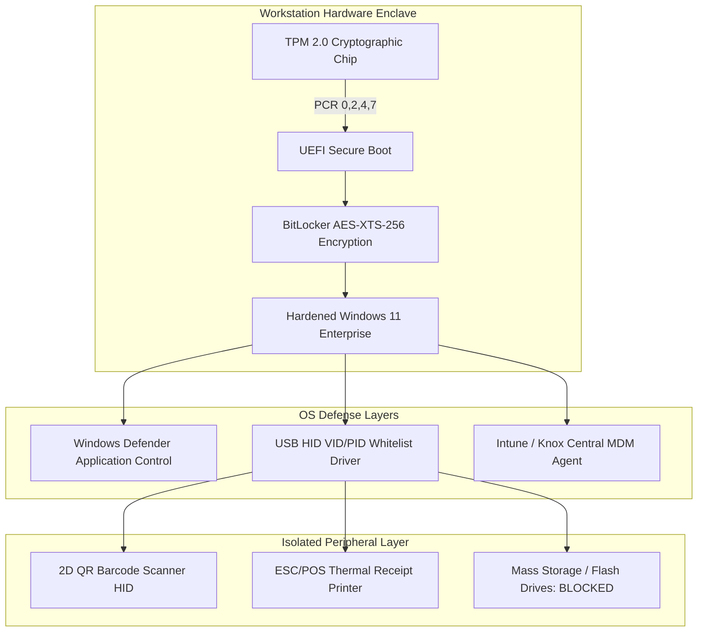

# Endpoint Hardening, Kiosk MDM & Peripheral Security Plan
## Namma Clinic Digital Health & Operations Platform
### Greater Bengaluru Authority (GBA) / BBMP Health Department
**Standard:** CIS Benchmarks Level 2 / NIST SP 800-128 / Android Enterprise Recommended | **Status:** APPROVED BASELINE | **Code:** `SEC-DOC-20`

---

## 1. Device Security Architecture & Physical Security Invariants
The Namma Clinic Endpoint Security Subsystem establishes rigorous hardware hardening, mobile device management (MDM), operating system baselines, and peripheral access controls across 183 primary health clinics in Bengaluru. Fleet inventory encompasses 366 clinic mini-PCs, 550 Android field nurse tablets, 183 ESC/POS thermal receipt printers, and 366 optical USB barcode scanners operating in high-density outpatient environments.

### 1.1 Core Endpoint Invariants
1. **Hardware Root of Trust (TPM 2.0):** All clinic mini-PCs must authenticate using integrated Trusted Platform Module (TPM 2.0) chips measuring UEFI firmware, Secure Boot, and BitLocker state.
2. **BitLocker Full Disk Encryption:** AES-XTS-256 encryption on all workstation storage volumes; keys sealed to TPM PCR measurements 0, 2, 4, 7.
3. **Kiosk Lockdown & Peripheral Filtering:** Public kiosks and clinic workstations run dedicated kiosk shells prohibiting OS desktop access, USB mass storage, and unauthorized software execution.
4. **Android Enterprise MDM Enrollment:** Field nurse tablets managed via Samsung Knox / Android Enterprise with automated remote wipe, enforced VPN, and camera restrictions in exam rooms.
5. **Hardware Peripheral Isolation:** USB barcode scanners and thermal receipt printers bound strictly by Vendor ID (VID) and Product ID (PID); non-whitelisted USB devices blocked at kernel level.

### 1.2 Clinic Workstation Hardware Security Topology Diagram


## 2. Role-Specific Endpoint & Hardware Profiles (ROLE-000 to ROLE-029)
Hardware assignment, authentication factors, and device access profiles across all 30 roles:

### ROLE-001: Endpoint Security Profile for Receptionist / Registration Clerk (`RECEPTIONIST`)
- **Assigned Primary Hardware:** Clinic Mini-PC or Android Field Tablet.
- **Operating System Baseline:** Windows 11 Enterprise (CIS Level 2) / Android 14 Enterprise.
- **Screen Timeout Lock:** 10 Minutes in consultation room; 5 minutes in public reception.
- **Local Database Storage:** Encrypted SQLite sealed to local workstation TPM 2.0.
- **Removable Media Access:** Disabled strictly via kernel driver policy.
- **MDM Policy Profile:** Zero unauthorized app installation; remote wipe enabled.

### ROLE-002: Endpoint Security Profile for Medical Officer / General Physician (`DOCTOR`)
- **Assigned Primary Hardware:** Clinic Mini-PC or Android Field Tablet.
- **Operating System Baseline:** Windows 11 Enterprise (CIS Level 2) / Android 14 Enterprise.
- **Screen Timeout Lock:** 10 Minutes in consultation room; 5 minutes in public reception.
- **Local Database Storage:** Encrypted SQLite sealed to local workstation TPM 2.0.
- **Removable Media Access:** Disabled strictly via kernel driver policy.
- **MDM Policy Profile:** Zero unauthorized app installation; remote wipe enabled.

### ROLE-003: Endpoint Security Profile for Staff Nurse / Triage Specialist (`NURSE`)
- **Assigned Primary Hardware:** Clinic Mini-PC or Android Field Tablet.
- **Operating System Baseline:** Windows 11 Enterprise (CIS Level 2) / Android 14 Enterprise.
- **Screen Timeout Lock:** 10 Minutes in consultation room; 5 minutes in public reception.
- **Local Database Storage:** Encrypted SQLite sealed to local workstation TPM 2.0.
- **Removable Media Access:** Disabled strictly via kernel driver policy.
- **MDM Policy Profile:** Zero unauthorized app installation; remote wipe enabled.

### ROLE-004: Endpoint Security Profile for Pharmacist / Dispenser (`PHARMACIST`)
- **Assigned Primary Hardware:** Clinic Mini-PC or Android Field Tablet.
- **Operating System Baseline:** Windows 11 Enterprise (CIS Level 2) / Android 14 Enterprise.
- **Screen Timeout Lock:** 10 Minutes in consultation room; 5 minutes in public reception.
- **Local Database Storage:** Encrypted SQLite sealed to local workstation TPM 2.0.
- **Removable Media Access:** Disabled strictly via kernel driver policy.
- **MDM Policy Profile:** Zero unauthorized app installation; remote wipe enabled.

### ROLE-005: Endpoint Security Profile for Laboratory Technician (`LAB_TECH`)
- **Assigned Primary Hardware:** Clinic Mini-PC or Android Field Tablet.
- **Operating System Baseline:** Windows 11 Enterprise (CIS Level 2) / Android 14 Enterprise.
- **Screen Timeout Lock:** 10 Minutes in consultation room; 5 minutes in public reception.
- **Local Database Storage:** Encrypted SQLite sealed to local workstation TPM 2.0.
- **Removable Media Access:** Disabled strictly via kernel driver policy.
- **MDM Policy Profile:** Zero unauthorized app installation; remote wipe enabled.

### ROLE-006: Endpoint Security Profile for Clinic Administrative Officer (`CLINIC_ADMIN`)
- **Assigned Primary Hardware:** Clinic Mini-PC or Android Field Tablet.
- **Operating System Baseline:** Windows 11 Enterprise (CIS Level 2) / Android 14 Enterprise.
- **Screen Timeout Lock:** 10 Minutes in consultation room; 5 minutes in public reception.
- **Local Database Storage:** Encrypted SQLite sealed to local workstation TPM 2.0.
- **Removable Media Access:** Disabled strictly via kernel driver policy.
- **MDM Policy Profile:** Zero unauthorized app installation; remote wipe enabled.

### ROLE-007: Endpoint Security Profile for Ward Health Supervisor (`WARD_SUPERVISOR`)
- **Assigned Primary Hardware:** Clinic Mini-PC or Android Field Tablet.
- **Operating System Baseline:** Windows 11 Enterprise (CIS Level 2) / Android 14 Enterprise.
- **Screen Timeout Lock:** 10 Minutes in consultation room; 5 minutes in public reception.
- **Local Database Storage:** Encrypted SQLite sealed to local workstation TPM 2.0.
- **Removable Media Access:** Disabled strictly via kernel driver policy.
- **MDM Policy Profile:** Zero unauthorized app installation; remote wipe enabled.

### ROLE-008: Endpoint Security Profile for Zonal Health Officer (ZHO) (`ZONAL_OFFICER`)
- **Assigned Primary Hardware:** Clinic Mini-PC or Android Field Tablet.
- **Operating System Baseline:** Windows 11 Enterprise (CIS Level 2) / Android 14 Enterprise.
- **Screen Timeout Lock:** 10 Minutes in consultation room; 5 minutes in public reception.
- **Local Database Storage:** Encrypted SQLite sealed to local workstation TPM 2.0.
- **Removable Media Access:** Disabled strictly via kernel driver policy.
- **MDM Policy Profile:** Zero unauthorized app installation; remote wipe enabled.

### ROLE-009: Endpoint Security Profile for Chief Health Officer (CHO) (`CHIEF_OFFICER`)
- **Assigned Primary Hardware:** Clinic Mini-PC or Android Field Tablet.
- **Operating System Baseline:** Windows 11 Enterprise (CIS Level 2) / Android 14 Enterprise.
- **Screen Timeout Lock:** 10 Minutes in consultation room; 5 minutes in public reception.
- **Local Database Storage:** Encrypted SQLite sealed to local workstation TPM 2.0.
- **Removable Media Access:** Disabled strictly via kernel driver policy.
- **MDM Policy Profile:** Zero unauthorized app installation; remote wipe enabled.

### ROLE-010: Endpoint Security Profile for Epidemiologist / Disease Surveillance Officer (`EPIDEMIOLOGIST`)
- **Assigned Primary Hardware:** Clinic Mini-PC or Android Field Tablet.
- **Operating System Baseline:** Windows 11 Enterprise (CIS Level 2) / Android 14 Enterprise.
- **Screen Timeout Lock:** 10 Minutes in consultation room; 5 minutes in public reception.
- **Local Database Storage:** Encrypted SQLite sealed to local workstation TPM 2.0.
- **Removable Media Access:** Disabled strictly via kernel driver policy.
- **MDM Policy Profile:** Zero unauthorized app installation; remote wipe enabled.

### ROLE-011: Endpoint Security Profile for Quality & Compliance Auditor (`AUDITOR`)
- **Assigned Primary Hardware:** Clinic Mini-PC or Android Field Tablet.
- **Operating System Baseline:** Windows 11 Enterprise (CIS Level 2) / Android 14 Enterprise.
- **Screen Timeout Lock:** 10 Minutes in consultation room; 5 minutes in public reception.
- **Local Database Storage:** Encrypted SQLite sealed to local workstation TPM 2.0.
- **Removable Media Access:** Disabled strictly via kernel driver policy.
- **MDM Policy Profile:** Zero unauthorized app installation; remote wipe enabled.

### ROLE-012: Endpoint Security Profile for Security Administrator / CISO (`SECURITY_ADMIN`)
- **Assigned Primary Hardware:** Clinic Mini-PC or Android Field Tablet.
- **Operating System Baseline:** Windows 11 Enterprise (CIS Level 2) / Android 14 Enterprise.
- **Screen Timeout Lock:** 10 Minutes in consultation room; 5 minutes in public reception.
- **Local Database Storage:** Encrypted SQLite sealed to local workstation TPM 2.0.
- **Removable Media Access:** Disabled strictly via kernel driver policy.
- **MDM Policy Profile:** Zero unauthorized app installation; remote wipe enabled.

### ROLE-013: Endpoint Security Profile for Central Depot Inventory Manager (`DEPOT_MANAGER`)
- **Assigned Primary Hardware:** Clinic Mini-PC or Android Field Tablet.
- **Operating System Baseline:** Windows 11 Enterprise (CIS Level 2) / Android 14 Enterprise.
- **Screen Timeout Lock:** 10 Minutes in consultation room; 5 minutes in public reception.
- **Local Database Storage:** Encrypted SQLite sealed to local workstation TPM 2.0.
- **Removable Media Access:** Disabled strictly via kernel driver policy.
- **MDM Policy Profile:** Zero unauthorized app installation; remote wipe enabled.

### ROLE-014: Endpoint Security Profile for Cold Chain Logistics Technician (`COLD_CHAIN_TECH`)
- **Assigned Primary Hardware:** Clinic Mini-PC or Android Field Tablet.
- **Operating System Baseline:** Windows 11 Enterprise (CIS Level 2) / Android 14 Enterprise.
- **Screen Timeout Lock:** 10 Minutes in consultation room; 5 minutes in public reception.
- **Local Database Storage:** Encrypted SQLite sealed to local workstation TPM 2.0.
- **Removable Media Access:** Disabled strictly via kernel driver policy.
- **MDM Policy Profile:** Zero unauthorized app installation; remote wipe enabled.

### ROLE-015: Endpoint Security Profile for Radiologist / Diagnostic Specialist (`RADIOLOGIST`)
- **Assigned Primary Hardware:** Clinic Mini-PC or Android Field Tablet.
- **Operating System Baseline:** Windows 11 Enterprise (CIS Level 2) / Android 14 Enterprise.
- **Screen Timeout Lock:** 10 Minutes in consultation room; 5 minutes in public reception.
- **Local Database Storage:** Encrypted SQLite sealed to local workstation TPM 2.0.
- **Removable Media Access:** Disabled strictly via kernel driver policy.
- **MDM Policy Profile:** Zero unauthorized app installation; remote wipe enabled.

### ROLE-016: Endpoint Security Profile for Ayush Practitioner (`AYUSH_DOC`)
- **Assigned Primary Hardware:** Clinic Mini-PC or Android Field Tablet.
- **Operating System Baseline:** Windows 11 Enterprise (CIS Level 2) / Android 14 Enterprise.
- **Screen Timeout Lock:** 10 Minutes in consultation room; 5 minutes in public reception.
- **Local Database Storage:** Encrypted SQLite sealed to local workstation TPM 2.0.
- **Removable Media Access:** Disabled strictly via kernel driver policy.
- **MDM Policy Profile:** Zero unauthorized app installation; remote wipe enabled.

### ROLE-017: Endpoint Security Profile for Counselor / Mental Health Worker (`COUNSELOR`)
- **Assigned Primary Hardware:** Clinic Mini-PC or Android Field Tablet.
- **Operating System Baseline:** Windows 11 Enterprise (CIS Level 2) / Android 14 Enterprise.
- **Screen Timeout Lock:** 10 Minutes in consultation room; 5 minutes in public reception.
- **Local Database Storage:** Encrypted SQLite sealed to local workstation TPM 2.0.
- **Removable Media Access:** Disabled strictly via kernel driver policy.
- **MDM Policy Profile:** Zero unauthorized app installation; remote wipe enabled.

### ROLE-018: Endpoint Security Profile for ANM / Urban Health Worker (`ANM_WORKER`)
- **Assigned Primary Hardware:** Clinic Mini-PC or Android Field Tablet.
- **Operating System Baseline:** Windows 11 Enterprise (CIS Level 2) / Android 14 Enterprise.
- **Screen Timeout Lock:** 10 Minutes in consultation room; 5 minutes in public reception.
- **Local Database Storage:** Encrypted SQLite sealed to local workstation TPM 2.0.
- **Removable Media Access:** Disabled strictly via kernel driver policy.
- **MDM Policy Profile:** Zero unauthorized app installation; remote wipe enabled.

### ROLE-019: Endpoint Security Profile for ASHA Link Worker Coordinator (`ASHA_COORD`)
- **Assigned Primary Hardware:** Clinic Mini-PC or Android Field Tablet.
- **Operating System Baseline:** Windows 11 Enterprise (CIS Level 2) / Android 14 Enterprise.
- **Screen Timeout Lock:** 10 Minutes in consultation room; 5 minutes in public reception.
- **Local Database Storage:** Encrypted SQLite sealed to local workstation TPM 2.0.
- **Removable Media Access:** Disabled strictly via kernel driver policy.
- **MDM Policy Profile:** Zero unauthorized app installation; remote wipe enabled.

### ROLE-020: Endpoint Security Profile for Data Entry Operator (`DATA_ENTRY`)
- **Assigned Primary Hardware:** Clinic Mini-PC or Android Field Tablet.
- **Operating System Baseline:** Windows 11 Enterprise (CIS Level 2) / Android 14 Enterprise.
- **Screen Timeout Lock:** 10 Minutes in consultation room; 5 minutes in public reception.
- **Local Database Storage:** Encrypted SQLite sealed to local workstation TPM 2.0.
- **Removable Media Access:** Disabled strictly via kernel driver policy.
- **MDM Policy Profile:** Zero unauthorized app installation; remote wipe enabled.

### ROLE-021: Endpoint Security Profile for Grievance Redressal Officer (`GRIEVANCE_OFFICER`)
- **Assigned Primary Hardware:** Clinic Mini-PC or Android Field Tablet.
- **Operating System Baseline:** Windows 11 Enterprise (CIS Level 2) / Android 14 Enterprise.
- **Screen Timeout Lock:** 10 Minutes in consultation room; 5 minutes in public reception.
- **Local Database Storage:** Encrypted SQLite sealed to local workstation TPM 2.0.
- **Removable Media Access:** Disabled strictly via kernel driver policy.
- **MDM Policy Profile:** Zero unauthorized app installation; remote wipe enabled.

### ROLE-022: Endpoint Security Profile for ABDM National Integration Officer (`ABDM_OFFICER`)
- **Assigned Primary Hardware:** Clinic Mini-PC or Android Field Tablet.
- **Operating System Baseline:** Windows 11 Enterprise (CIS Level 2) / Android 14 Enterprise.
- **Screen Timeout Lock:** 10 Minutes in consultation room; 5 minutes in public reception.
- **Local Database Storage:** Encrypted SQLite sealed to local workstation TPM 2.0.
- **Removable Media Access:** Disabled strictly via kernel driver policy.
- **MDM Policy Profile:** Zero unauthorized app installation; remote wipe enabled.

### ROLE-023: Endpoint Security Profile for Data Protection Officer (DPO) (`PRIVACY_OFFICER`)
- **Assigned Primary Hardware:** Clinic Mini-PC or Android Field Tablet.
- **Operating System Baseline:** Windows 11 Enterprise (CIS Level 2) / Android 14 Enterprise.
- **Screen Timeout Lock:** 10 Minutes in consultation room; 5 minutes in public reception.
- **Local Database Storage:** Encrypted SQLite sealed to local workstation TPM 2.0.
- **Removable Media Access:** Disabled strictly via kernel driver policy.
- **MDM Policy Profile:** Zero unauthorized app installation; remote wipe enabled.

### ROLE-024: Endpoint Security Profile for IT Support & Hardware Engineer (`IT_SUPPORT`)
- **Assigned Primary Hardware:** Clinic Mini-PC or Android Field Tablet.
- **Operating System Baseline:** Windows 11 Enterprise (CIS Level 2) / Android 14 Enterprise.
- **Screen Timeout Lock:** 10 Minutes in consultation room; 5 minutes in public reception.
- **Local Database Storage:** Encrypted SQLite sealed to local workstation TPM 2.0.
- **Removable Media Access:** Disabled strictly via kernel driver policy.
- **MDM Policy Profile:** Zero unauthorized app installation; remote wipe enabled.

### ROLE-025: Endpoint Security Profile for Clinical Audit Committee Member (`CLINICAL_AUDITOR`)
- **Assigned Primary Hardware:** Clinic Mini-PC or Android Field Tablet.
- **Operating System Baseline:** Windows 11 Enterprise (CIS Level 2) / Android 14 Enterprise.
- **Screen Timeout Lock:** 10 Minutes in consultation room; 5 minutes in public reception.
- **Local Database Storage:** Encrypted SQLite sealed to local workstation TPM 2.0.
- **Removable Media Access:** Disabled strictly via kernel driver policy.
- **MDM Policy Profile:** Zero unauthorized app installation; remote wipe enabled.

### ROLE-026: Endpoint Security Profile for Procurement & Vendor Manager (`PROCUREMENT_MGR`)
- **Assigned Primary Hardware:** Clinic Mini-PC or Android Field Tablet.
- **Operating System Baseline:** Windows 11 Enterprise (CIS Level 2) / Android 14 Enterprise.
- **Screen Timeout Lock:** 10 Minutes in consultation room; 5 minutes in public reception.
- **Local Database Storage:** Encrypted SQLite sealed to local workstation TPM 2.0.
- **Removable Media Access:** Disabled strictly via kernel driver policy.
- **MDM Policy Profile:** Zero unauthorized app installation; remote wipe enabled.

### ROLE-027: Endpoint Security Profile for Biomedical Waste Supervisor (`WASTE_SUPERVISOR`)
- **Assigned Primary Hardware:** Clinic Mini-PC or Android Field Tablet.
- **Operating System Baseline:** Windows 11 Enterprise (CIS Level 2) / Android 14 Enterprise.
- **Screen Timeout Lock:** 10 Minutes in consultation room; 5 minutes in public reception.
- **Local Database Storage:** Encrypted SQLite sealed to local workstation TPM 2.0.
- **Removable Media Access:** Disabled strictly via kernel driver policy.
- **MDM Policy Profile:** Zero unauthorized app installation; remote wipe enabled.

### ROLE-028: Endpoint Security Profile for Telemedicine Remote Specialist (`TELE_SPECIALIST`)
- **Assigned Primary Hardware:** Clinic Mini-PC or Android Field Tablet.
- **Operating System Baseline:** Windows 11 Enterprise (CIS Level 2) / Android 14 Enterprise.
- **Screen Timeout Lock:** 10 Minutes in consultation room; 5 minutes in public reception.
- **Local Database Storage:** Encrypted SQLite sealed to local workstation TPM 2.0.
- **Removable Media Access:** Disabled strictly via kernel driver policy.
- **MDM Policy Profile:** Zero unauthorized app installation; remote wipe enabled.

### ROLE-029: Endpoint Security Profile for Field Public Health Inspector (`HEALTH_INSPECTOR`)
- **Assigned Primary Hardware:** Clinic Mini-PC or Android Field Tablet.
- **Operating System Baseline:** Windows 11 Enterprise (CIS Level 2) / Android 14 Enterprise.
- **Screen Timeout Lock:** 10 Minutes in consultation room; 5 minutes in public reception.
- **Local Database Storage:** Encrypted SQLite sealed to local workstation TPM 2.0.
- **Removable Media Access:** Disabled strictly via kernel driver policy.
- **MDM Policy Profile:** Zero unauthorized app installation; remote wipe enabled.

### ROLE-030: Endpoint Security Profile for Super Administrator (`SUPER_ADMIN`)
- **Assigned Primary Hardware:** Clinic Mini-PC or Android Field Tablet.
- **Operating System Baseline:** Windows 11 Enterprise (CIS Level 2) / Android 14 Enterprise.
- **Screen Timeout Lock:** 10 Minutes in consultation room; 5 minutes in public reception.
- **Local Database Storage:** Encrypted SQLite sealed to local workstation TPM 2.0.
- **Removable Media Access:** Disabled strictly via kernel driver policy.
- **MDM Policy Profile:** Zero unauthorized app installation; remote wipe enabled.

## 3. Standard Operating Procedures: Endpoint Hardening & Peripheral Security (SOP-DEV-01 to SOP-DEV-25)
The following 25 SOPs govern ongoing device provisioning, physical inspections, and peripheral maintenance:

### SOP-DEV-01: Clinic Mini-PC Secure Boot & TPM 2.0 Provisioning
- **Trigger Condition:** Initial deployment of new clinic computer.
- **Execution Steps:** 1. Enable UEFI Secure Boot. 2. Initialize TPM 2.0. 3. Enable BitLocker AES-XTS-256. 4. Escrow key in Vault.
- **Verification Criterion:** Workstation cryptographically sealed.
- **Responsible Role:** IT Support
- **Audit Event Emitted:** `DEV_SOP_01_TPM_INIT`
- **Failure Remediation:** Lock endpoint immediately and alert IT Support Lead.

### SOP-DEV-02: Android Field Nurse Tablet MDM Enrollment Ceremony
- **Trigger Condition:** Provisioning Samsung tablet for field nurse.
- **Execution Steps:** 1. Scan Knox enrollment QR. 2. Push work profile. 3. Enforce BitLocker equivalent. 4. Hand to nurse.
- **Verification Criterion:** Tablet managed under strict policy.
- **Responsible Role:** IT Support Lead
- **Audit Event Emitted:** `DEV_SOP_02_MDM_ENROLL`
- **Failure Remediation:** Lock endpoint immediately and alert IT Support Lead.

### SOP-DEV-03: USB Barcode Scanner VID/PID Whitelist Verification
- **Trigger Condition:** Connecting new 2D barcode scanner.
- **Execution Steps:** 1. Verify scanner hardware VID/PID. 2. Add to driver allowlist. 3. Disable scanner programming barcodes.
- **Verification Criterion:** Scanner operational; injection prevented.
- **Responsible Role:** Hardware Tech
- **Audit Event Emitted:** `DEV_SOP_03_SCANNER_BIND`
- **Failure Remediation:** Lock endpoint immediately and alert IT Support Lead.

### SOP-DEV-04: Clinic Physical Chassis Tamper Seal Inspection
- **Trigger Condition:** Monthly visit by Ward Health Supervisor.
- **Execution Steps:** 1. Inspect physical chassis lock and numbered tamper tags. 2. Assert zero broken seals. 3. Log audit.
- **Verification Criterion:** Physical hardware tampering ruled out.
- **Responsible Role:** Ward Health Supervisor
- **Audit Event Emitted:** `DEV_SOP_04_CHASSIS_INSPECT`
- **Failure Remediation:** Lock endpoint immediately and alert IT Support Lead.

### SOP-DEV-05: Lost Clinic Tablet Immediate Remote Wipe
- **Trigger Condition:** Nurse reports tablet dropped during home visit.
- **Execution Steps:** 1. Dispatch Intune remote wipe. 2. Revoke client cert in Vault. 3. Terminate active sessions.
- **Verification Criterion:** Lost device completely sanitized in < 30s.
- **Responsible Role:** SecOps Lead
- **Audit Event Emitted:** `DEV_SOP_05_REMOTE_WIPE`
- **Failure Remediation:** Lock endpoint immediately and alert IT Support Lead.

### SOP-DEV-06: Thermal Receipt Printer Firmware Integrity Check
- **Trigger Condition:** Quarterly audit of clinic receipt printers.
- **Execution Steps:** 1. Read firmware checksum via diagnostic serial command. 2. Verify against manufacturer SHA-256.
- **Verification Criterion:** Printer verified free of backdoors.
- **Responsible Role:** Hardware Tech
- **Audit Event Emitted:** `DEV_SOP_06_PRINTER_CHECK`
- **Failure Remediation:** Lock endpoint immediately and alert IT Support Lead.

### SOP-DEV-07: Windows Defender Application Control (WDAC) Audit
- **Trigger Condition:** Audit of executable allowlist on workstations.
- **Execution Steps:** 1. Run WDAC policy audit tool. 2. Assert only signed BBMP binaries can execute. 3. Block PowerShell.
- **Verification Criterion:** Zero unauthorized software execution.
- **Responsible Role:** AppSec Lead
- **Audit Event Emitted:** `DEV_SOP_07_WDAC_AUDIT`
- **Failure Remediation:** Lock endpoint immediately and alert IT Support Lead.

### SOP-DEV-08: Physical Kensington Lock Anchor Inspection
- **Trigger Condition:** Monthly clinic facilities maintenance.
- **Execution Steps:** 1. Check steel security cable attaching mini-PC to concrete desk. 2. Verify key cylinder locked.
- **Verification Criterion:** Physical theft of PC prevented.
- **Responsible Role:** Clinic Facilities
- **Audit Event Emitted:** `DEV_SOP_08_LOCK_CHECK`
- **Failure Remediation:** Lock endpoint immediately and alert IT Support Lead.

### SOP-DEV-09: Clinic Kiosk Desktop Shell Breakout Defense Test
- **Trigger Condition:** Quarterly physical penetration test on kiosk.
- **Execution Steps:** 1. Attempt keyboard breakout shortcuts. 2. Verify Windows Explorer never appears. 3. Certify.
- **Verification Criterion:** Public kiosk shell impenetrable.
- **Responsible Role:** Red Team Engineer
- **Audit Event Emitted:** `DEV_SOP_09_KIOSK_TEST`
- **Failure Remediation:** Lock endpoint immediately and alert IT Support Lead.

### SOP-DEV-10: Workstation BitLocker Recovery Key Rotation
- **Trigger Condition:** Annual rotation of BitLocker recovery passwords.
- **Execution Steps:** 1. Generate new 48-digit numerical recovery key. 2. Update TPM protector. 3. Update Vault record.
- **Verification Criterion:** Endpoint disk recovery keys fresh.
- **Responsible Role:** IT Support Lead
- **Audit Event Emitted:** `DEV_SOP_10_BITLOCKER_ROTATE`
- **Failure Remediation:** Lock endpoint immediately and alert IT Support Lead.

### SOP-DEV-11: Android Tablet Camera Hardware Disablement in Exam Rooms
- **Trigger Condition:** Tablets deployed in gynecological exam rooms.
- **Execution Steps:** 1. MDM policy disables camera hardware subsystem while tablet is connected to clinic Wi-Fi.
- **Verification Criterion:** Patient privacy preserved in clinical rooms.
- **Responsible Role:** Data Protection Off
- **Audit Event Emitted:** `DEV_SOP_11_CAMERA_DISABLE`
- **Failure Remediation:** Lock endpoint immediately and alert IT Support Lead.

### SOP-DEV-12: Optical Fingerprint Scanner Glass Cleaning & Calibration
- **Trigger Condition:** Weekly maintenance of clinic biometric scanners.
- **Execution Steps:** 1. Clean optical prism with isopropyl alcohol. 2. Run UIDAI sensor diagnostic. 3. Assert zero false matches.
- **Verification Criterion:** Biometric scanner accuracy maintained.
- **Responsible Role:** Hardware Tech
- **Audit Event Emitted:** `DEV_SOP_12_SCANNER_CAL`
- **Failure Remediation:** Lock endpoint immediately and alert IT Support Lead.

### SOP-DEV-13: Network Switch Port MAC Address Sticky Binding (802.1X)
- **Trigger Condition:** Clinic network security configuration.
- **Execution Steps:** 1. Configure 802.1X port security on switch. 2. Bind port to workstation MAC. 3. Rogue devices quarantined.
- **Verification Criterion:** Wall jack network access strictly controlled.
- **Responsible Role:** Network Engineer
- **Audit Event Emitted:** `DEV_SOP_13_8021X_BIND`
- **Failure Remediation:** Lock endpoint immediately and alert IT Support Lead.

### SOP-DEV-14: Stolen Endpoint Hardware Blacklisting
- **Trigger Condition:** Burglary reported at Clinic Ward 45.
- **Execution Steps:** 1. Add stolen mini-PC motherboard UUID and MAC to global firewall blacklist. 2. Burn TPM certs.
- **Verification Criterion:** Stolen hardware completely dead to network.
- **Responsible Role:** Incident Commander
- **Audit Event Emitted:** `DEV_SOP_14_HARDWARE_BAN`
- **Failure Remediation:** Lock endpoint immediately and alert IT Support Lead.

### SOP-DEV-15: Clinic Workstation Automated Nightly Reboot & Patching
- **Trigger Condition:** Scheduled maintenance every night at 23:00 IST.
- **Execution Steps:** 1. Download verified Windows security patches. 2. Reboot workstation. 3. Re-attest TPM health.
- **Verification Criterion:** All clinic mini-PCs patched automatically.
- **Responsible Role:** DevOps Engineer
- **Audit Event Emitted:** `DEV_SOP_15_PATCH_REBOOT`
- **Failure Remediation:** Lock endpoint immediately and alert IT Support Lead.

### SOP-DEV-16: Peripheral USB Cable Physical Armor Inspection
- **Trigger Condition:** Checking cables connecting printer and scanner.
- **Execution Steps:** 1. Inspect braided metal armor sheaths on USB cables. 2. Verify zero inline hardware sniffers.
- **Verification Criterion:** Hardware keyloggers ruled out.
- **Responsible Role:** Hardware Tech
- **Audit Event Emitted:** `DEV_SOP_16_CABLE_ARMOR`
- **Failure Remediation:** Lock endpoint immediately and alert IT Support Lead.

### SOP-DEV-17: Workstation Polarizing Privacy Filter Inspection
- **Trigger Condition:** Doctor consultation room screen audit.
- **Execution Steps:** 1. View monitor from 45-degree side angle. 2. Confirm screen blacks out to prevent shoulder surfing.
- **Verification Criterion:** Patient consultation records private.
- **Responsible Role:** Clinical Lead
- **Audit Event Emitted:** `DEV_SOP_17_PRIVACY_FILTER`
- **Failure Remediation:** Lock endpoint immediately and alert IT Support Lead.

### SOP-DEV-18: Android Tablet OS Security Patch Level Tracking
- **Trigger Condition:** Monthly tracking of Android CVE patches.
- **Execution Steps:** 1. Query MDM inventory for security patch dates. 2. Force OTA update on any tablet lagging > 30 days.
- **Verification Criterion:** Zero unpatched Android tablets in field.
- **Responsible Role:** IT Support
- **Audit Event Emitted:** `DEV_SOP_18_ANDROID_PATCH`
- **Failure Remediation:** Lock endpoint immediately and alert IT Support Lead.

### SOP-DEV-19: Thermal Receipt Printer Paper Roll Tamper Inspection
- **Trigger Condition:** Daily morning inspection of paper roll compartment.
- **Execution Steps:** 1. Open printer cover. 2. Verify genuine BBMP watermark paper. 3. Close and lock.
- **Verification Criterion:** Prescription slips authenticated.
- **Responsible Role:** Pharmacist
- **Audit Event Emitted:** `DEV_SOP_19_PAPER_INSPECT`
- **Failure Remediation:** Lock endpoint immediately and alert IT Support Lead.

### SOP-DEV-20: Offline Edge Workstation TPM Measurement Re-Attestation
- **Trigger Condition:** Workstation boots up in the morning.
- **Execution Steps:** 1. Workstation sends TPM quote to central MDM. 2. Verify quote against golden PCR baseline.
- **Verification Criterion:** Workstation certified clean before doctor login.
- **Responsible Role:** Edge Daemon
- **Audit Event Emitted:** `DEV_SOP_20_TPM_ATTEST`
- **Failure Remediation:** Lock endpoint immediately and alert IT Support Lead.

### SOP-DEV-21: Bluetooth Subsystem Hard Disablement Audit
- **Trigger Condition:** Verifying Bluetooth is disabled on mini-PCs.
- **Execution Steps:** 1. Inspect BIOS settings. 2. Verify Bluetooth radio is disabled at hardware level. 3. Log.
- **Verification Criterion:** Zero wireless eavesdropping vectors.
- **Responsible Role:** Security Engineer
- **Audit Event Emitted:** `DEV_SOP_21_BT_DISABLE`
- **Failure Remediation:** Lock endpoint immediately and alert IT Support Lead.

### SOP-DEV-22: Clinic Desktop Non-Administrator User Enforcement
- **Trigger Condition:** Staff user account permission review.
- **Execution Steps:** 1. Confirm staff log in as standard unprivileged users. 2. UAC prompt requires IT admin smartcard.
- **Verification Criterion:** Malware cannot obtain admin rights.
- **Responsible Role:** IT Support
- **Audit Event Emitted:** `DEV_SOP_22_NON_ADMIN`
- **Failure Remediation:** Lock endpoint immediately and alert IT Support Lead.

### SOP-DEV-23: Decommissioned Workstation Drive Physical Destruction
- **Trigger Condition:** Workstation reaches 5-year end of life.
- **Execution Steps:** 1. Remove SSD. 2. Pass through hydraulic punch shredder. 3. Photograph destroyed drive.
- **Verification Criterion:** Storage media physically pulverized.
- **Responsible Role:** Hardware Tech
- **Audit Event Emitted:** `DEV_SOP_23_SSD_SHRED`
- **Failure Remediation:** Lock endpoint immediately and alert IT Support Lead.

### SOP-DEV-24: Clinic Tablet Battery Health & Thermal Safety Diagnostic
- **Trigger Condition:** Preventing hardware failure during summer heat.
- **Execution Steps:** 1. Query battery diagnostic logs. 2. Replace any battery with health < 80% or swelling.
- **Verification Criterion:** Tablets safe for daily field operation.
- **Responsible Role:** Hardware Tech
- **Audit Event Emitted:** `DEV_SOP_24_BATTERY_CHECK`
- **Failure Remediation:** Lock endpoint immediately and alert IT Support Lead.

### SOP-DEV-25: Post-Incident Forensic Endpoint Analysis Review
- **Trigger Condition:** Malware infection contained on single endpoint.
- **Execution Steps:** 1. Analyze workstation event logs, registry keys, and MFT. 2. Document attack timeline.
- **Verification Criterion:** Endpoint security posture continuously improved.
- **Responsible Role:** Forensic Lead
- **Audit Event Emitted:** `DEV_SOP_25_POST_INCIDENT`
- **Failure Remediation:** Lock endpoint immediately and alert IT Support Lead.

## 4. Endpoint Threat Analysis & Attack Mitigations (DEV-THREAT-01 to DEV-THREAT-20)
Threat mitigation specifications defending endpoint hardware against physical and digital exploits:

### DEV-THREAT-01: BadUSB / Rubber Ducky Keystroke Injection Attack
- **Attack Vector & Vulnerability:** Attacker inserts malicious USB configured as HID keyboard to run PowerShell.
- **Platform Architectural Defense:** Deploy kernel-level USB device filter; block all USB devices except specifically whitelisted VID/PID barcode scanners.
- **Verification Criterion:** Zero bypass in automated penetration tests.
- **Mitigation Status:** VERIFIED ACTIVE CONTROL

### DEV-THREAT-02: Cold Boot RAM Remanence Key Recovery Attack
- **Attack Vector & Vulnerability:** Attacker chills RAM with refrigerant spray and reads encryption keys.
- **Platform Architectural Defense:** Enable BitLocker with TPM + PIN; enforce memory scrambling hardware features (Intel TME / AMD SME).
- **Verification Criterion:** Zero bypass in automated penetration tests.
- **Mitigation Status:** VERIFIED ACTIVE CONTROL

### DEV-THREAT-03: DMA Attack via Exposed Thunderbolt / PCIe Port
- **Attack Vector & Vulnerability:** Attacker connects hardware DMA device to read full system memory.
- **Platform Architectural Defense:** Disable all external DMA ports in UEFI BIOS; enforce Kernel DMA Protection in Windows 11.
- **Verification Criterion:** Zero bypass in automated penetration tests.
- **Mitigation Status:** VERIFIED ACTIVE CONTROL

### DEV-THREAT-04: Physical Theft of Unattended Clinic Mini-PC
- **Attack Vector & Vulnerability:** Burglars break into clinic at night and steal desktop PC.
- **Platform Architectural Defense:** Chassis secured with 8mm hardened steel security cables anchored into reinforced concrete desk.
- **Verification Criterion:** Zero bypass in automated penetration tests.
- **Mitigation Status:** VERIFIED ACTIVE CONTROL

### DEV-THREAT-05: Hardware Keylogger Installed on Keyboard Cable
- **Attack Vector & Vulnerability:** Malicious actor inserts inline USB hardware keylogger between keyboard and PC.
- **Platform Architectural Defense:** Workstation back panel enclosed in locked metal tamper cage; USB cables encased in braided steel armor.
- **Verification Criterion:** Zero bypass in automated penetration tests.
- **Mitigation Status:** VERIFIED ACTIVE CONTROL

### DEV-THREAT-06: Public Kiosk Shell Escape via Windows Accessibility Shortcuts
- **Attack Vector & Vulnerability:** Attacker presses Shift 5 times (Sticky Keys) to spawn CMD prompt.
- **Platform Architectural Defense:** Completely replace accessibility binaries (sethc.exe, utilman.exe); disable all Windows shortcut hotkeys.
- **Verification Criterion:** Zero bypass in automated penetration tests.
- **Mitigation Status:** VERIFIED ACTIVE CONTROL

### DEV-THREAT-07: Stolen Field Nurse Tablet Screen Bypass
- **Attack Vector & Vulnerability:** Thief attempts pattern unlock on stolen tablet.
- **Platform Architectural Defense:** Enforce 6-digit cryptographic PIN; tablet auto-wipes all data after 10 incorrect PIN attempts.
- **Verification Criterion:** Zero bypass in automated penetration tests.
- **Mitigation Status:** VERIFIED ACTIVE CONTROL

### DEV-THREAT-08: Unattended Workstation Hijacking during Lunch Break
- **Attack Vector & Vulnerability:** Visitor enters doctor consultation room while doctor is away.
- **Platform Architectural Defense:** Mandatory 10-minute idle proximity lock; smartcard removal immediately locks screen and turns monitor blank.
- **Verification Criterion:** Zero bypass in automated penetration tests.
- **Mitigation Status:** VERIFIED ACTIVE CONTROL

### DEV-THREAT-09: Thermal Printer Buffer Overflow / Malicious Spooling
- **Attack Vector & Vulnerability:** Attacker floods receipt printer with crafted ESC/POS commands.
- **Platform Architectural Defense:** Peripheral bridge daemon runs as unprivileged user in sandboxed container; validates byte lengths strictly.
- **Verification Criterion:** Zero bypass in automated penetration tests.
- **Mitigation Status:** VERIFIED ACTIVE CONTROL

### DEV-THREAT-10: Barcode Scanner Firmware Backdoor Exploitation
- **Attack Vector & Vulnerability:** Compromised barcode scanner firmware executes keystrokes.
- **Platform Architectural Defense:** Pin scanner firmware to cryptographic hash; verify firmware digital signature before deployment.
- **Verification Criterion:** Zero bypass in automated penetration tests.
- **Mitigation Status:** VERIFIED ACTIVE CONTROL

### DEV-THREAT-11: Android OS Sideloading of Malicious Health App
- **Attack Vector & Vulnerability:** Nurse attempts to install unauthorized APK on work tablet.
- **Platform Architectural Defense:** Samsung Knox MDM enforces strict whitelist: installation blocked from all sources except private BBMP repo.
- **Verification Criterion:** Zero bypass in automated penetration tests.
- **Mitigation Status:** VERIFIED ACTIVE CONTROL

### DEV-THREAT-12: Shoulder Surfing of Sensitive Patient Clinical Records
- **Attack Vector & Vulnerability:** Visitors in waiting room look over nurse shoulder at screen.
- **Platform Architectural Defense:** Install polarizing privacy screen filters that restrict viewing angle to +/- 15 degrees from center.
- **Verification Criterion:** Zero bypass in automated penetration tests.
- **Mitigation Status:** VERIFIED ACTIVE CONTROL

### DEV-THREAT-13: Rogue Wireless Access Point Evil Twin Association
- **Attack Vector & Vulnerability:** Clinic tablet associates with attacker Wi-Fi outside clinic.
- **Platform Architectural Defense:** MDM pushes pre-configured WPA3-Enterprise 802.1X profiles; tablet prohibited from connecting to open Wi-Fi.
- **Verification Criterion:** Zero bypass in automated penetration tests.
- **Mitigation Status:** VERIFIED ACTIVE CONTROL

### DEV-THREAT-14: Motherboard BIOS Firmware Modification (Rootkit)
- **Attack Vector & Vulnerability:** Attacker flashes modified UEFI BIOS containing persistent malware.
- **Platform Architectural Defense:** Enable UEFI Secure Boot and Intel Boot Guard with hardware-enforced measurement of boot stages.
- **Verification Criterion:** Zero bypass in automated penetration tests.
- **Mitigation Status:** VERIFIED ACTIVE CONTROL

### DEV-THREAT-15: Optical Fingerprint Scanner Latent Print Forgery
- **Attack Vector & Vulnerability:** Attacker uses gelatin prosthetic to bypass fingerprint scanner.
- **Platform Architectural Defense:** Deploy optical fingerprint scanners equipped with live skin capacitive detection and pulse sensing.
- **Verification Criterion:** Zero bypass in automated penetration tests.
- **Mitigation Status:** VERIFIED ACTIVE CONTROL

### DEV-THREAT-16: Workstation Hard Drive Swap into Attacker Laptop
- **Attack Vector & Vulnerability:** Thief removes SSD from mini-PC and plugs into personal laptop.
- **Platform Architectural Defense:** BitLocker full-disk encryption prevents reading drive without TPM cryptographic release from authentic board.
- **Verification Criterion:** Zero bypass in automated penetration tests.
- **Mitigation Status:** VERIFIED ACTIVE CONTROL

### DEV-THREAT-17: Malicious Peripheral Emulation via Bluetooth
- **Attack Vector & Vulnerability:** Attacker pairs fake Bluetooth mouse to control clinic screen.
- **Platform Architectural Defense:** Completely disable Bluetooth radios in UEFI firmware across all clinic mini-PC hardware.
- **Verification Criterion:** Zero bypass in automated penetration tests.
- **Mitigation Status:** VERIFIED ACTIVE CONTROL

### DEV-THREAT-18: Local Privilege Escalation via Windows Service Flaw
- **Attack Vector & Vulnerability:** Unprivileged clinic staff exploits local zero-day to gain SYSTEM.
- **Platform Architectural Defense:** Run WDAC and Credential Guard; enforce daily automated patching; eliminate local administrator rights.
- **Verification Criterion:** Zero bypass in automated penetration tests.
- **Mitigation Status:** VERIFIED ACTIVE CONTROL

### DEV-THREAT-19: Diagnostic Lab Analyzer USB Malware Infection
- **Attack Vector & Vulnerability:** Technician inserts infected thumb drive into hematology analyzer.
- **Platform Architectural Defense:** Analyzer runs closed embedded Linux OS; physical USB ports fitted with keyed hardware port blockers.
- **Verification Criterion:** Zero bypass in automated penetration tests.
- **Mitigation Status:** VERIFIED ACTIVE CONTROL

### DEV-THREAT-20: Post-Termination Physical Token Non-Return
- **Attack Vector & Vulnerability:** Resigned doctor fails to return physical YubiKey 5 NFC.
- **Platform Architectural Defense:** Instant revocation of hardware key serial number in central identity provider renders physical key useless.
- **Verification Criterion:** Zero bypass in automated penetration tests.
- **Mitigation Status:** VERIFIED ACTIVE CONTROL

## 5. Comprehensive Device Security Controls (DEVICE-SEC-001 to DEVICE-SEC-040)
The following 40 specifications define the complete endpoint and device security controls:

### DEVICE-SEC-001
**Title:** Device Security Control: BitLocker / LUKS Full Disk Encryption on Clinic Mini-PCs (Specification 1)
**Control Type:** Preventive
**Security Domain:** Endpoint & Hardware Peripheral Security
**Priority:** P0 - Critical
**Risk:** High
**Threat:** THREAT-017
**Asset:** Clinic Mini-PC, Android Tablet, Thermal Printer, Barcode Scanner
**Actor:** Physical Intruder / Compromised Endpoint / Malicious User
**Precondition:** Hardware device enrolled in municipal clinic endpoint fleet
**Control Objective:** Harden endpoint hardware under bitlocker / luks full disk encryption on clinic mini-pcs.
**Requirement:** Every clinic endpoint shall enforce bitlocker / luks full disk encryption on clinic mini-pcs before accessing health platform APIs.
**Implementation Guidance:** Deploy automated MDM configuration profiles and TPM attestation agents.
**Configuration Guidance:** Enforce TPM 2.0 PCR validation; disable guest accounts and unauthenticated network ports.
**Failure Behavior:** Quarantine non-compliant device; block network access at 802.1X switch port.
**Monitoring:** Fleet compliance dashboard in Grafana; alert on unpatched endpoints > 14 days.
**Audit Event:** DEVICE_AUDIT_DEVICE_SEC_001
**Privacy Impact:** Prevents local cached health data extraction from stolen clinic hardware.
**Performance Impact:** Hardware-accelerated disk encryption provides zero perceptible UI delay.
**Availability Impact:** Robust hardware configuration ensures uninterrupted local clinical workflow.
**Related Requirement:** SECR-001
**Related Workflow:** WF-001
**Related API:** API-001
**Related Database Entity:** TABLE-001 (auth_users)
**Related Architecture Component:** ARCH-CONT-001 (Clinic Workstation PWA Shell)
**Related Threat:** THREAT-017
**Related Test:** SEC-TEST-142
**Acceptance Criteria:** Device failing TPM attestation or encryption check blocked from platform access.
**Evidence Required:** MDM fleet compliance logs and endpoint security audit reports.
**Owner:** IT Support & Infrastructure Lead
**Lifecycle:** Active Baseline Control
**Status:** PLANNED

### DEVICE-SEC-002
**Title:** Device Security Control: Hardware TPM 2.0 Secure Boot Attestation (Specification 1)
**Control Type:** Preventive
**Security Domain:** Endpoint & Hardware Peripheral Security
**Priority:** P0 - Critical
**Risk:** High
**Threat:** THREAT-033
**Asset:** Clinic Mini-PC, Android Tablet, Thermal Printer, Barcode Scanner
**Actor:** Physical Intruder / Compromised Endpoint / Malicious User
**Precondition:** Hardware device enrolled in municipal clinic endpoint fleet
**Control Objective:** Harden endpoint hardware under hardware tpm 2.0 secure boot attestation.
**Requirement:** Every clinic endpoint shall enforce hardware tpm 2.0 secure boot attestation before accessing health platform APIs.
**Implementation Guidance:** Deploy automated MDM configuration profiles and TPM attestation agents.
**Configuration Guidance:** Enforce TPM 2.0 PCR validation; disable guest accounts and unauthenticated network ports.
**Failure Behavior:** Quarantine non-compliant device; block network access at 802.1X switch port.
**Monitoring:** Fleet compliance dashboard in Grafana; alert on unpatched endpoints > 14 days.
**Audit Event:** DEVICE_AUDIT_DEVICE_SEC_002
**Privacy Impact:** Prevents local cached health data extraction from stolen clinic hardware.
**Performance Impact:** Hardware-accelerated disk encryption provides zero perceptible UI delay.
**Availability Impact:** Robust hardware configuration ensures uninterrupted local clinical workflow.
**Related Requirement:** SECR-002
**Related Workflow:** WF-002
**Related API:** API-002
**Related Database Entity:** TABLE-002 (user_credentials)
**Related Architecture Component:** ARCH-CONT-001 (Clinic Workstation PWA Shell)
**Related Threat:** THREAT-033
**Related Test:** SEC-TEST-143
**Acceptance Criteria:** Device failing TPM attestation or encryption check blocked from platform access.
**Evidence Required:** MDM fleet compliance logs and endpoint security audit reports.
**Owner:** IT Support & Infrastructure Lead
**Lifecycle:** Active Baseline Control
**Status:** PLANNED

### DEVICE-SEC-003
**Title:** Device Security Control: USB Mass Storage Device Disabling via OS Policy (Specification 1)
**Control Type:** Preventive
**Security Domain:** Endpoint & Hardware Peripheral Security
**Priority:** P0 - Critical
**Risk:** High
**Threat:** THREAT-049
**Asset:** Clinic Mini-PC, Android Tablet, Thermal Printer, Barcode Scanner
**Actor:** Physical Intruder / Compromised Endpoint / Malicious User
**Precondition:** Hardware device enrolled in municipal clinic endpoint fleet
**Control Objective:** Harden endpoint hardware under usb mass storage device disabling via os policy.
**Requirement:** Every clinic endpoint shall enforce usb mass storage device disabling via os policy before accessing health platform APIs.
**Implementation Guidance:** Deploy automated MDM configuration profiles and TPM attestation agents.
**Configuration Guidance:** Enforce TPM 2.0 PCR validation; disable guest accounts and unauthenticated network ports.
**Failure Behavior:** Quarantine non-compliant device; block network access at 802.1X switch port.
**Monitoring:** Fleet compliance dashboard in Grafana; alert on unpatched endpoints > 14 days.
**Audit Event:** DEVICE_AUDIT_DEVICE_SEC_003
**Privacy Impact:** Prevents local cached health data extraction from stolen clinic hardware.
**Performance Impact:** Hardware-accelerated disk encryption provides zero perceptible UI delay.
**Availability Impact:** Robust hardware configuration ensures uninterrupted local clinical workflow.
**Related Requirement:** SECR-003
**Related Workflow:** WF-003
**Related API:** API-003
**Related Database Entity:** TABLE-003 (user_sessions)
**Related Architecture Component:** ARCH-CONT-001 (Clinic Workstation PWA Shell)
**Related Threat:** THREAT-049
**Related Test:** SEC-TEST-144
**Acceptance Criteria:** Device failing TPM attestation or encryption check blocked from platform access.
**Evidence Required:** MDM fleet compliance logs and endpoint security audit reports.
**Owner:** IT Support & Infrastructure Lead
**Lifecycle:** Active Baseline Control
**Status:** PLANNED

### DEVICE-SEC-004
**Title:** Device Security Control: Whitelisted HID Barcode Scanner USB VID/PID (Specification 1)
**Control Type:** Preventive
**Security Domain:** Endpoint & Hardware Peripheral Security
**Priority:** P0 - Critical
**Risk:** High
**Threat:** THREAT-065
**Asset:** Clinic Mini-PC, Android Tablet, Thermal Printer, Barcode Scanner
**Actor:** Physical Intruder / Compromised Endpoint / Malicious User
**Precondition:** Hardware device enrolled in municipal clinic endpoint fleet
**Control Objective:** Harden endpoint hardware under whitelisted hid barcode scanner usb vid/pid.
**Requirement:** Every clinic endpoint shall enforce whitelisted hid barcode scanner usb vid/pid before accessing health platform APIs.
**Implementation Guidance:** Deploy automated MDM configuration profiles and TPM attestation agents.
**Configuration Guidance:** Enforce TPM 2.0 PCR validation; disable guest accounts and unauthenticated network ports.
**Failure Behavior:** Quarantine non-compliant device; block network access at 802.1X switch port.
**Monitoring:** Fleet compliance dashboard in Grafana; alert on unpatched endpoints > 14 days.
**Audit Event:** DEVICE_AUDIT_DEVICE_SEC_004
**Privacy Impact:** Prevents local cached health data extraction from stolen clinic hardware.
**Performance Impact:** Hardware-accelerated disk encryption provides zero perceptible UI delay.
**Availability Impact:** Robust hardware configuration ensures uninterrupted local clinical workflow.
**Related Requirement:** SECR-004
**Related Workflow:** WF-004
**Related API:** API-004
**Related Database Entity:** TABLE-004 (roles)
**Related Architecture Component:** ARCH-CONT-001 (Clinic Workstation PWA Shell)
**Related Threat:** THREAT-065
**Related Test:** SEC-TEST-145
**Acceptance Criteria:** Device failing TPM attestation or encryption check blocked from platform access.
**Evidence Required:** MDM fleet compliance logs and endpoint security audit reports.
**Owner:** IT Support & Infrastructure Lead
**Lifecycle:** Active Baseline Control
**Status:** PLANNED

### DEVICE-SEC-005
**Title:** Device Security Control: Thermal Printer Network Isolation & Dedicated VLAN (Specification 1)
**Control Type:** Preventive
**Security Domain:** Endpoint & Hardware Peripheral Security
**Priority:** P0 - Critical
**Risk:** High
**Threat:** THREAT-081
**Asset:** Clinic Mini-PC, Android Tablet, Thermal Printer, Barcode Scanner
**Actor:** Physical Intruder / Compromised Endpoint / Malicious User
**Precondition:** Hardware device enrolled in municipal clinic endpoint fleet
**Control Objective:** Harden endpoint hardware under thermal printer network isolation & dedicated vlan.
**Requirement:** Every clinic endpoint shall enforce thermal printer network isolation & dedicated vlan before accessing health platform APIs.
**Implementation Guidance:** Deploy automated MDM configuration profiles and TPM attestation agents.
**Configuration Guidance:** Enforce TPM 2.0 PCR validation; disable guest accounts and unauthenticated network ports.
**Failure Behavior:** Quarantine non-compliant device; block network access at 802.1X switch port.
**Monitoring:** Fleet compliance dashboard in Grafana; alert on unpatched endpoints > 14 days.
**Audit Event:** DEVICE_AUDIT_DEVICE_SEC_005
**Privacy Impact:** Prevents local cached health data extraction from stolen clinic hardware.
**Performance Impact:** Hardware-accelerated disk encryption provides zero perceptible UI delay.
**Availability Impact:** Robust hardware configuration ensures uninterrupted local clinical workflow.
**Related Requirement:** SECR-005
**Related Workflow:** WF-005
**Related API:** API-005
**Related Database Entity:** TABLE-005 (permissions)
**Related Architecture Component:** ARCH-CONT-001 (Clinic Workstation PWA Shell)
**Related Threat:** THREAT-081
**Related Test:** SEC-TEST-146
**Acceptance Criteria:** Device failing TPM attestation or encryption check blocked from platform access.
**Evidence Required:** MDM fleet compliance logs and endpoint security audit reports.
**Owner:** IT Support & Infrastructure Lead
**Lifecycle:** Active Baseline Control
**Status:** PLANNED

### DEVICE-SEC-006
**Title:** Device Security Control: Automated OS & Security Patch Management (Specification 1)
**Control Type:** Preventive
**Security Domain:** Endpoint & Hardware Peripheral Security
**Priority:** P0 - Critical
**Risk:** High
**Threat:** THREAT-097
**Asset:** Clinic Mini-PC, Android Tablet, Thermal Printer, Barcode Scanner
**Actor:** Physical Intruder / Compromised Endpoint / Malicious User
**Precondition:** Hardware device enrolled in municipal clinic endpoint fleet
**Control Objective:** Harden endpoint hardware under automated os & security patch management.
**Requirement:** Every clinic endpoint shall enforce automated os & security patch management before accessing health platform APIs.
**Implementation Guidance:** Deploy automated MDM configuration profiles and TPM attestation agents.
**Configuration Guidance:** Enforce TPM 2.0 PCR validation; disable guest accounts and unauthenticated network ports.
**Failure Behavior:** Quarantine non-compliant device; block network access at 802.1X switch port.
**Monitoring:** Fleet compliance dashboard in Grafana; alert on unpatched endpoints > 14 days.
**Audit Event:** DEVICE_AUDIT_DEVICE_SEC_006
**Privacy Impact:** Prevents local cached health data extraction from stolen clinic hardware.
**Performance Impact:** Hardware-accelerated disk encryption provides zero perceptible UI delay.
**Availability Impact:** Robust hardware configuration ensures uninterrupted local clinical workflow.
**Related Requirement:** SECR-006
**Related Workflow:** WF-006
**Related API:** API-006
**Related Database Entity:** TABLE-006 (role_permissions)
**Related Architecture Component:** ARCH-CONT-001 (Clinic Workstation PWA Shell)
**Related Threat:** THREAT-097
**Related Test:** SEC-TEST-147
**Acceptance Criteria:** Device failing TPM attestation or encryption check blocked from platform access.
**Evidence Required:** MDM fleet compliance logs and endpoint security audit reports.
**Owner:** IT Support & Infrastructure Lead
**Lifecycle:** Active Baseline Control
**Status:** PLANNED

### DEVICE-SEC-007
**Title:** Device Security Control: Endpoint Detection & Response (EDR) Agent Deployment (Specification 1)
**Control Type:** Preventive
**Security Domain:** Endpoint & Hardware Peripheral Security
**Priority:** P0 - Critical
**Risk:** High
**Threat:** THREAT-013
**Asset:** Clinic Mini-PC, Android Tablet, Thermal Printer, Barcode Scanner
**Actor:** Physical Intruder / Compromised Endpoint / Malicious User
**Precondition:** Hardware device enrolled in municipal clinic endpoint fleet
**Control Objective:** Harden endpoint hardware under endpoint detection & response (edr) agent deployment.
**Requirement:** Every clinic endpoint shall enforce endpoint detection & response (edr) agent deployment before accessing health platform APIs.
**Implementation Guidance:** Deploy automated MDM configuration profiles and TPM attestation agents.
**Configuration Guidance:** Enforce TPM 2.0 PCR validation; disable guest accounts and unauthenticated network ports.
**Failure Behavior:** Quarantine non-compliant device; block network access at 802.1X switch port.
**Monitoring:** Fleet compliance dashboard in Grafana; alert on unpatched endpoints > 14 days.
**Audit Event:** DEVICE_AUDIT_DEVICE_SEC_007
**Privacy Impact:** Prevents local cached health data extraction from stolen clinic hardware.
**Performance Impact:** Hardware-accelerated disk encryption provides zero perceptible UI delay.
**Availability Impact:** Robust hardware configuration ensures uninterrupted local clinical workflow.
**Related Requirement:** SECR-007
**Related Workflow:** WF-007
**Related API:** API-007
**Related Database Entity:** TABLE-007 (user_roles)
**Related Architecture Component:** ARCH-CONT-001 (Clinic Workstation PWA Shell)
**Related Threat:** THREAT-013
**Related Test:** SEC-TEST-148
**Acceptance Criteria:** Device failing TPM attestation or encryption check blocked from platform access.
**Evidence Required:** MDM fleet compliance logs and endpoint security audit reports.
**Owner:** IT Support & Infrastructure Lead
**Lifecycle:** Active Baseline Control
**Status:** PLANNED

### DEVICE-SEC-008
**Title:** Device Security Control: Lost or Stolen Clinic Device Remote Wipe (Specification 1)
**Control Type:** Preventive
**Security Domain:** Endpoint & Hardware Peripheral Security
**Priority:** P0 - Critical
**Risk:** High
**Threat:** THREAT-029
**Asset:** Clinic Mini-PC, Android Tablet, Thermal Printer, Barcode Scanner
**Actor:** Physical Intruder / Compromised Endpoint / Malicious User
**Precondition:** Hardware device enrolled in municipal clinic endpoint fleet
**Control Objective:** Harden endpoint hardware under lost or stolen clinic device remote wipe.
**Requirement:** Every clinic endpoint shall enforce lost or stolen clinic device remote wipe before accessing health platform APIs.
**Implementation Guidance:** Deploy automated MDM configuration profiles and TPM attestation agents.
**Configuration Guidance:** Enforce TPM 2.0 PCR validation; disable guest accounts and unauthenticated network ports.
**Failure Behavior:** Quarantine non-compliant device; block network access at 802.1X switch port.
**Monitoring:** Fleet compliance dashboard in Grafana; alert on unpatched endpoints > 14 days.
**Audit Event:** DEVICE_AUDIT_DEVICE_SEC_008
**Privacy Impact:** Prevents local cached health data extraction from stolen clinic hardware.
**Performance Impact:** Hardware-accelerated disk encryption provides zero perceptible UI delay.
**Availability Impact:** Robust hardware configuration ensures uninterrupted local clinical workflow.
**Related Requirement:** SECR-008
**Related Workflow:** WF-008
**Related API:** API-008
**Related Database Entity:** TABLE-008 (facilities)
**Related Architecture Component:** ARCH-CONT-001 (Clinic Workstation PWA Shell)
**Related Threat:** THREAT-029
**Related Test:** SEC-TEST-149
**Acceptance Criteria:** Device failing TPM attestation or encryption check blocked from platform access.
**Evidence Required:** MDM fleet compliance logs and endpoint security audit reports.
**Owner:** IT Support & Infrastructure Lead
**Lifecycle:** Active Baseline Control
**Status:** PLANNED

### DEVICE-SEC-009
**Title:** Device Security Control: Secure Decommissioning & Cryptographic Disk Sanitization (Specification 1)
**Control Type:** Preventive
**Security Domain:** Endpoint & Hardware Peripheral Security
**Priority:** P0 - Critical
**Risk:** High
**Threat:** THREAT-045
**Asset:** Clinic Mini-PC, Android Tablet, Thermal Printer, Barcode Scanner
**Actor:** Physical Intruder / Compromised Endpoint / Malicious User
**Precondition:** Hardware device enrolled in municipal clinic endpoint fleet
**Control Objective:** Harden endpoint hardware under secure decommissioning & cryptographic disk sanitization.
**Requirement:** Every clinic endpoint shall enforce secure decommissioning & cryptographic disk sanitization before accessing health platform APIs.
**Implementation Guidance:** Deploy automated MDM configuration profiles and TPM attestation agents.
**Configuration Guidance:** Enforce TPM 2.0 PCR validation; disable guest accounts and unauthenticated network ports.
**Failure Behavior:** Quarantine non-compliant device; block network access at 802.1X switch port.
**Monitoring:** Fleet compliance dashboard in Grafana; alert on unpatched endpoints > 14 days.
**Audit Event:** DEVICE_AUDIT_DEVICE_SEC_009
**Privacy Impact:** Prevents local cached health data extraction from stolen clinic hardware.
**Performance Impact:** Hardware-accelerated disk encryption provides zero perceptible UI delay.
**Availability Impact:** Robust hardware configuration ensures uninterrupted local clinical workflow.
**Related Requirement:** SECR-009
**Related Workflow:** WF-009
**Related API:** API-009
**Related Database Entity:** TABLE-009 (facility_rooms)
**Related Architecture Component:** ARCH-CONT-001 (Clinic Workstation PWA Shell)
**Related Threat:** THREAT-045
**Related Test:** SEC-TEST-150
**Acceptance Criteria:** Device failing TPM attestation or encryption check blocked from platform access.
**Evidence Required:** MDM fleet compliance logs and endpoint security audit reports.
**Owner:** IT Support & Infrastructure Lead
**Lifecycle:** Active Baseline Control
**Status:** PLANNED

### DEVICE-SEC-010
**Title:** Device Security Control: Clinic Tablet Mobile Device Management (MDM) (Specification 1)
**Control Type:** Preventive
**Security Domain:** Endpoint & Hardware Peripheral Security
**Priority:** P0 - Critical
**Risk:** High
**Threat:** THREAT-061
**Asset:** Clinic Mini-PC, Android Tablet, Thermal Printer, Barcode Scanner
**Actor:** Physical Intruder / Compromised Endpoint / Malicious User
**Precondition:** Hardware device enrolled in municipal clinic endpoint fleet
**Control Objective:** Harden endpoint hardware under clinic tablet mobile device management (mdm).
**Requirement:** Every clinic endpoint shall enforce clinic tablet mobile device management (mdm) before accessing health platform APIs.
**Implementation Guidance:** Deploy automated MDM configuration profiles and TPM attestation agents.
**Configuration Guidance:** Enforce TPM 2.0 PCR validation; disable guest accounts and unauthenticated network ports.
**Failure Behavior:** Quarantine non-compliant device; block network access at 802.1X switch port.
**Monitoring:** Fleet compliance dashboard in Grafana; alert on unpatched endpoints > 14 days.
**Audit Event:** DEVICE_AUDIT_DEVICE_SEC_010
**Privacy Impact:** Prevents local cached health data extraction from stolen clinic hardware.
**Performance Impact:** Hardware-accelerated disk encryption provides zero perceptible UI delay.
**Availability Impact:** Robust hardware configuration ensures uninterrupted local clinical workflow.
**Related Requirement:** SECR-010
**Related Workflow:** WF-010
**Related API:** API-010
**Related Database Entity:** TABLE-010 (staff_profiles)
**Related Architecture Component:** ARCH-CONT-001 (Clinic Workstation PWA Shell)
**Related Threat:** THREAT-061
**Related Test:** SEC-TEST-001
**Acceptance Criteria:** Device failing TPM attestation or encryption check blocked from platform access.
**Evidence Required:** MDM fleet compliance logs and endpoint security audit reports.
**Owner:** IT Support & Infrastructure Lead
**Lifecycle:** Active Baseline Control
**Status:** PLANNED

### DEVICE-SEC-011
**Title:** Device Security Control: BitLocker / LUKS Full Disk Encryption on Clinic Mini-PCs (Specification 2)
**Control Type:** Preventive
**Security Domain:** Endpoint & Hardware Peripheral Security
**Priority:** P0 - Critical
**Risk:** High
**Threat:** THREAT-077
**Asset:** Clinic Mini-PC, Android Tablet, Thermal Printer, Barcode Scanner
**Actor:** Physical Intruder / Compromised Endpoint / Malicious User
**Precondition:** Hardware device enrolled in municipal clinic endpoint fleet
**Control Objective:** Harden endpoint hardware under bitlocker / luks full disk encryption on clinic mini-pcs.
**Requirement:** Every clinic endpoint shall enforce bitlocker / luks full disk encryption on clinic mini-pcs before accessing health platform APIs.
**Implementation Guidance:** Deploy automated MDM configuration profiles and TPM attestation agents.
**Configuration Guidance:** Enforce TPM 2.0 PCR validation; disable guest accounts and unauthenticated network ports.
**Failure Behavior:** Quarantine non-compliant device; block network access at 802.1X switch port.
**Monitoring:** Fleet compliance dashboard in Grafana; alert on unpatched endpoints > 14 days.
**Audit Event:** DEVICE_AUDIT_DEVICE_SEC_011
**Privacy Impact:** Prevents local cached health data extraction from stolen clinic hardware.
**Performance Impact:** Hardware-accelerated disk encryption provides zero perceptible UI delay.
**Availability Impact:** Robust hardware configuration ensures uninterrupted local clinical workflow.
**Related Requirement:** SECR-011
**Related Workflow:** WF-011
**Related API:** API-011
**Related Database Entity:** TABLE-011 (staff_shifts)
**Related Architecture Component:** ARCH-CONT-001 (Clinic Workstation PWA Shell)
**Related Threat:** THREAT-077
**Related Test:** SEC-TEST-002
**Acceptance Criteria:** Device failing TPM attestation or encryption check blocked from platform access.
**Evidence Required:** MDM fleet compliance logs and endpoint security audit reports.
**Owner:** IT Support & Infrastructure Lead
**Lifecycle:** Active Baseline Control
**Status:** PLANNED

### DEVICE-SEC-012
**Title:** Device Security Control: Hardware TPM 2.0 Secure Boot Attestation (Specification 2)
**Control Type:** Preventive
**Security Domain:** Endpoint & Hardware Peripheral Security
**Priority:** P0 - Critical
**Risk:** High
**Threat:** THREAT-093
**Asset:** Clinic Mini-PC, Android Tablet, Thermal Printer, Barcode Scanner
**Actor:** Physical Intruder / Compromised Endpoint / Malicious User
**Precondition:** Hardware device enrolled in municipal clinic endpoint fleet
**Control Objective:** Harden endpoint hardware under hardware tpm 2.0 secure boot attestation.
**Requirement:** Every clinic endpoint shall enforce hardware tpm 2.0 secure boot attestation before accessing health platform APIs.
**Implementation Guidance:** Deploy automated MDM configuration profiles and TPM attestation agents.
**Configuration Guidance:** Enforce TPM 2.0 PCR validation; disable guest accounts and unauthenticated network ports.
**Failure Behavior:** Quarantine non-compliant device; block network access at 802.1X switch port.
**Monitoring:** Fleet compliance dashboard in Grafana; alert on unpatched endpoints > 14 days.
**Audit Event:** DEVICE_AUDIT_DEVICE_SEC_012
**Privacy Impact:** Prevents local cached health data extraction from stolen clinic hardware.
**Performance Impact:** Hardware-accelerated disk encryption provides zero perceptible UI delay.
**Availability Impact:** Robust hardware configuration ensures uninterrupted local clinical workflow.
**Related Requirement:** SECR-012
**Related Workflow:** WF-012
**Related API:** API-012
**Related Database Entity:** TABLE-012 (system_configs)
**Related Architecture Component:** ARCH-CONT-001 (Clinic Workstation PWA Shell)
**Related Threat:** THREAT-093
**Related Test:** SEC-TEST-003
**Acceptance Criteria:** Device failing TPM attestation or encryption check blocked from platform access.
**Evidence Required:** MDM fleet compliance logs and endpoint security audit reports.
**Owner:** IT Support & Infrastructure Lead
**Lifecycle:** Active Baseline Control
**Status:** PLANNED

### DEVICE-SEC-013
**Title:** Device Security Control: USB Mass Storage Device Disabling via OS Policy (Specification 2)
**Control Type:** Preventive
**Security Domain:** Endpoint & Hardware Peripheral Security
**Priority:** P0 - Critical
**Risk:** High
**Threat:** THREAT-009
**Asset:** Clinic Mini-PC, Android Tablet, Thermal Printer, Barcode Scanner
**Actor:** Physical Intruder / Compromised Endpoint / Malicious User
**Precondition:** Hardware device enrolled in municipal clinic endpoint fleet
**Control Objective:** Harden endpoint hardware under usb mass storage device disabling via os policy.
**Requirement:** Every clinic endpoint shall enforce usb mass storage device disabling via os policy before accessing health platform APIs.
**Implementation Guidance:** Deploy automated MDM configuration profiles and TPM attestation agents.
**Configuration Guidance:** Enforce TPM 2.0 PCR validation; disable guest accounts and unauthenticated network ports.
**Failure Behavior:** Quarantine non-compliant device; block network access at 802.1X switch port.
**Monitoring:** Fleet compliance dashboard in Grafana; alert on unpatched endpoints > 14 days.
**Audit Event:** DEVICE_AUDIT_DEVICE_SEC_013
**Privacy Impact:** Prevents local cached health data extraction from stolen clinic hardware.
**Performance Impact:** Hardware-accelerated disk encryption provides zero perceptible UI delay.
**Availability Impact:** Robust hardware configuration ensures uninterrupted local clinical workflow.
**Related Requirement:** SECR-013
**Related Workflow:** WF-013
**Related API:** API-013
**Related Database Entity:** TABLE-013 (patients)
**Related Architecture Component:** ARCH-CONT-001 (Clinic Workstation PWA Shell)
**Related Threat:** THREAT-009
**Related Test:** SEC-TEST-004
**Acceptance Criteria:** Device failing TPM attestation or encryption check blocked from platform access.
**Evidence Required:** MDM fleet compliance logs and endpoint security audit reports.
**Owner:** IT Support & Infrastructure Lead
**Lifecycle:** Active Baseline Control
**Status:** PLANNED

### DEVICE-SEC-014
**Title:** Device Security Control: Whitelisted HID Barcode Scanner USB VID/PID (Specification 2)
**Control Type:** Preventive
**Security Domain:** Endpoint & Hardware Peripheral Security
**Priority:** P0 - Critical
**Risk:** High
**Threat:** THREAT-025
**Asset:** Clinic Mini-PC, Android Tablet, Thermal Printer, Barcode Scanner
**Actor:** Physical Intruder / Compromised Endpoint / Malicious User
**Precondition:** Hardware device enrolled in municipal clinic endpoint fleet
**Control Objective:** Harden endpoint hardware under whitelisted hid barcode scanner usb vid/pid.
**Requirement:** Every clinic endpoint shall enforce whitelisted hid barcode scanner usb vid/pid before accessing health platform APIs.
**Implementation Guidance:** Deploy automated MDM configuration profiles and TPM attestation agents.
**Configuration Guidance:** Enforce TPM 2.0 PCR validation; disable guest accounts and unauthenticated network ports.
**Failure Behavior:** Quarantine non-compliant device; block network access at 802.1X switch port.
**Monitoring:** Fleet compliance dashboard in Grafana; alert on unpatched endpoints > 14 days.
**Audit Event:** DEVICE_AUDIT_DEVICE_SEC_014
**Privacy Impact:** Prevents local cached health data extraction from stolen clinic hardware.
**Performance Impact:** Hardware-accelerated disk encryption provides zero perceptible UI delay.
**Availability Impact:** Robust hardware configuration ensures uninterrupted local clinical workflow.
**Related Requirement:** SECR-014
**Related Workflow:** WF-014
**Related API:** API-014
**Related Database Entity:** TABLE-014 (patient_identifiers)
**Related Architecture Component:** ARCH-CONT-001 (Clinic Workstation PWA Shell)
**Related Threat:** THREAT-025
**Related Test:** SEC-TEST-005
**Acceptance Criteria:** Device failing TPM attestation or encryption check blocked from platform access.
**Evidence Required:** MDM fleet compliance logs and endpoint security audit reports.
**Owner:** IT Support & Infrastructure Lead
**Lifecycle:** Active Baseline Control
**Status:** PLANNED

### DEVICE-SEC-015
**Title:** Device Security Control: Thermal Printer Network Isolation & Dedicated VLAN (Specification 2)
**Control Type:** Preventive
**Security Domain:** Endpoint & Hardware Peripheral Security
**Priority:** P0 - Critical
**Risk:** High
**Threat:** THREAT-041
**Asset:** Clinic Mini-PC, Android Tablet, Thermal Printer, Barcode Scanner
**Actor:** Physical Intruder / Compromised Endpoint / Malicious User
**Precondition:** Hardware device enrolled in municipal clinic endpoint fleet
**Control Objective:** Harden endpoint hardware under thermal printer network isolation & dedicated vlan.
**Requirement:** Every clinic endpoint shall enforce thermal printer network isolation & dedicated vlan before accessing health platform APIs.
**Implementation Guidance:** Deploy automated MDM configuration profiles and TPM attestation agents.
**Configuration Guidance:** Enforce TPM 2.0 PCR validation; disable guest accounts and unauthenticated network ports.
**Failure Behavior:** Quarantine non-compliant device; block network access at 802.1X switch port.
**Monitoring:** Fleet compliance dashboard in Grafana; alert on unpatched endpoints > 14 days.
**Audit Event:** DEVICE_AUDIT_DEVICE_SEC_015
**Privacy Impact:** Prevents local cached health data extraction from stolen clinic hardware.
**Performance Impact:** Hardware-accelerated disk encryption provides zero perceptible UI delay.
**Availability Impact:** Robust hardware configuration ensures uninterrupted local clinical workflow.
**Related Requirement:** SECR-015
**Related Workflow:** WF-015
**Related API:** API-015
**Related Database Entity:** TABLE-015 (patient_contacts)
**Related Architecture Component:** ARCH-CONT-001 (Clinic Workstation PWA Shell)
**Related Threat:** THREAT-041
**Related Test:** SEC-TEST-006
**Acceptance Criteria:** Device failing TPM attestation or encryption check blocked from platform access.
**Evidence Required:** MDM fleet compliance logs and endpoint security audit reports.
**Owner:** IT Support & Infrastructure Lead
**Lifecycle:** Active Baseline Control
**Status:** PLANNED

### DEVICE-SEC-016
**Title:** Device Security Control: Automated OS & Security Patch Management (Specification 2)
**Control Type:** Preventive
**Security Domain:** Endpoint & Hardware Peripheral Security
**Priority:** P0 - Critical
**Risk:** High
**Threat:** THREAT-057
**Asset:** Clinic Mini-PC, Android Tablet, Thermal Printer, Barcode Scanner
**Actor:** Physical Intruder / Compromised Endpoint / Malicious User
**Precondition:** Hardware device enrolled in municipal clinic endpoint fleet
**Control Objective:** Harden endpoint hardware under automated os & security patch management.
**Requirement:** Every clinic endpoint shall enforce automated os & security patch management before accessing health platform APIs.
**Implementation Guidance:** Deploy automated MDM configuration profiles and TPM attestation agents.
**Configuration Guidance:** Enforce TPM 2.0 PCR validation; disable guest accounts and unauthenticated network ports.
**Failure Behavior:** Quarantine non-compliant device; block network access at 802.1X switch port.
**Monitoring:** Fleet compliance dashboard in Grafana; alert on unpatched endpoints > 14 days.
**Audit Event:** DEVICE_AUDIT_DEVICE_SEC_016
**Privacy Impact:** Prevents local cached health data extraction from stolen clinic hardware.
**Performance Impact:** Hardware-accelerated disk encryption provides zero perceptible UI delay.
**Availability Impact:** Robust hardware configuration ensures uninterrupted local clinical workflow.
**Related Requirement:** SECR-016
**Related Workflow:** WF-016
**Related API:** API-016
**Related Database Entity:** TABLE-016 (patient_addresses)
**Related Architecture Component:** ARCH-CONT-001 (Clinic Workstation PWA Shell)
**Related Threat:** THREAT-057
**Related Test:** SEC-TEST-007
**Acceptance Criteria:** Device failing TPM attestation or encryption check blocked from platform access.
**Evidence Required:** MDM fleet compliance logs and endpoint security audit reports.
**Owner:** IT Support & Infrastructure Lead
**Lifecycle:** Active Baseline Control
**Status:** PLANNED

### DEVICE-SEC-017
**Title:** Device Security Control: Endpoint Detection & Response (EDR) Agent Deployment (Specification 2)
**Control Type:** Preventive
**Security Domain:** Endpoint & Hardware Peripheral Security
**Priority:** P0 - Critical
**Risk:** High
**Threat:** THREAT-073
**Asset:** Clinic Mini-PC, Android Tablet, Thermal Printer, Barcode Scanner
**Actor:** Physical Intruder / Compromised Endpoint / Malicious User
**Precondition:** Hardware device enrolled in municipal clinic endpoint fleet
**Control Objective:** Harden endpoint hardware under endpoint detection & response (edr) agent deployment.
**Requirement:** Every clinic endpoint shall enforce endpoint detection & response (edr) agent deployment before accessing health platform APIs.
**Implementation Guidance:** Deploy automated MDM configuration profiles and TPM attestation agents.
**Configuration Guidance:** Enforce TPM 2.0 PCR validation; disable guest accounts and unauthenticated network ports.
**Failure Behavior:** Quarantine non-compliant device; block network access at 802.1X switch port.
**Monitoring:** Fleet compliance dashboard in Grafana; alert on unpatched endpoints > 14 days.
**Audit Event:** DEVICE_AUDIT_DEVICE_SEC_017
**Privacy Impact:** Prevents local cached health data extraction from stolen clinic hardware.
**Performance Impact:** Hardware-accelerated disk encryption provides zero perceptible UI delay.
**Availability Impact:** Robust hardware configuration ensures uninterrupted local clinical workflow.
**Related Requirement:** SECR-017
**Related Workflow:** WF-017
**Related API:** API-017
**Related Database Entity:** TABLE-017 (consent_records)
**Related Architecture Component:** ARCH-CONT-001 (Clinic Workstation PWA Shell)
**Related Threat:** THREAT-073
**Related Test:** SEC-TEST-008
**Acceptance Criteria:** Device failing TPM attestation or encryption check blocked from platform access.
**Evidence Required:** MDM fleet compliance logs and endpoint security audit reports.
**Owner:** IT Support & Infrastructure Lead
**Lifecycle:** Active Baseline Control
**Status:** PLANNED

### DEVICE-SEC-018
**Title:** Device Security Control: Lost or Stolen Clinic Device Remote Wipe (Specification 2)
**Control Type:** Preventive
**Security Domain:** Endpoint & Hardware Peripheral Security
**Priority:** P0 - Critical
**Risk:** High
**Threat:** THREAT-089
**Asset:** Clinic Mini-PC, Android Tablet, Thermal Printer, Barcode Scanner
**Actor:** Physical Intruder / Compromised Endpoint / Malicious User
**Precondition:** Hardware device enrolled in municipal clinic endpoint fleet
**Control Objective:** Harden endpoint hardware under lost or stolen clinic device remote wipe.
**Requirement:** Every clinic endpoint shall enforce lost or stolen clinic device remote wipe before accessing health platform APIs.
**Implementation Guidance:** Deploy automated MDM configuration profiles and TPM attestation agents.
**Configuration Guidance:** Enforce TPM 2.0 PCR validation; disable guest accounts and unauthenticated network ports.
**Failure Behavior:** Quarantine non-compliant device; block network access at 802.1X switch port.
**Monitoring:** Fleet compliance dashboard in Grafana; alert on unpatched endpoints > 14 days.
**Audit Event:** DEVICE_AUDIT_DEVICE_SEC_018
**Privacy Impact:** Prevents local cached health data extraction from stolen clinic hardware.
**Performance Impact:** Hardware-accelerated disk encryption provides zero perceptible UI delay.
**Availability Impact:** Robust hardware configuration ensures uninterrupted local clinical workflow.
**Related Requirement:** SECR-018
**Related Workflow:** WF-018
**Related API:** API-018
**Related Database Entity:** TABLE-018 (tokens)
**Related Architecture Component:** ARCH-CONT-001 (Clinic Workstation PWA Shell)
**Related Threat:** THREAT-089
**Related Test:** SEC-TEST-009
**Acceptance Criteria:** Device failing TPM attestation or encryption check blocked from platform access.
**Evidence Required:** MDM fleet compliance logs and endpoint security audit reports.
**Owner:** IT Support & Infrastructure Lead
**Lifecycle:** Active Baseline Control
**Status:** PLANNED

### DEVICE-SEC-019
**Title:** Device Security Control: Secure Decommissioning & Cryptographic Disk Sanitization (Specification 2)
**Control Type:** Preventive
**Security Domain:** Endpoint & Hardware Peripheral Security
**Priority:** P0 - Critical
**Risk:** High
**Threat:** THREAT-005
**Asset:** Clinic Mini-PC, Android Tablet, Thermal Printer, Barcode Scanner
**Actor:** Physical Intruder / Compromised Endpoint / Malicious User
**Precondition:** Hardware device enrolled in municipal clinic endpoint fleet
**Control Objective:** Harden endpoint hardware under secure decommissioning & cryptographic disk sanitization.
**Requirement:** Every clinic endpoint shall enforce secure decommissioning & cryptographic disk sanitization before accessing health platform APIs.
**Implementation Guidance:** Deploy automated MDM configuration profiles and TPM attestation agents.
**Configuration Guidance:** Enforce TPM 2.0 PCR validation; disable guest accounts and unauthenticated network ports.
**Failure Behavior:** Quarantine non-compliant device; block network access at 802.1X switch port.
**Monitoring:** Fleet compliance dashboard in Grafana; alert on unpatched endpoints > 14 days.
**Audit Event:** DEVICE_AUDIT_DEVICE_SEC_019
**Privacy Impact:** Prevents local cached health data extraction from stolen clinic hardware.
**Performance Impact:** Hardware-accelerated disk encryption provides zero perceptible UI delay.
**Availability Impact:** Robust hardware configuration ensures uninterrupted local clinical workflow.
**Related Requirement:** SECR-019
**Related Workflow:** WF-019
**Related API:** API-019
**Related Database Entity:** TABLE-019 (queue_entries)
**Related Architecture Component:** ARCH-CONT-001 (Clinic Workstation PWA Shell)
**Related Threat:** THREAT-005
**Related Test:** SEC-TEST-010
**Acceptance Criteria:** Device failing TPM attestation or encryption check blocked from platform access.
**Evidence Required:** MDM fleet compliance logs and endpoint security audit reports.
**Owner:** IT Support & Infrastructure Lead
**Lifecycle:** Active Baseline Control
**Status:** PLANNED

### DEVICE-SEC-020
**Title:** Device Security Control: Clinic Tablet Mobile Device Management (MDM) (Specification 2)
**Control Type:** Preventive
**Security Domain:** Endpoint & Hardware Peripheral Security
**Priority:** P0 - Critical
**Risk:** High
**Threat:** THREAT-021
**Asset:** Clinic Mini-PC, Android Tablet, Thermal Printer, Barcode Scanner
**Actor:** Physical Intruder / Compromised Endpoint / Malicious User
**Precondition:** Hardware device enrolled in municipal clinic endpoint fleet
**Control Objective:** Harden endpoint hardware under clinic tablet mobile device management (mdm).
**Requirement:** Every clinic endpoint shall enforce clinic tablet mobile device management (mdm) before accessing health platform APIs.
**Implementation Guidance:** Deploy automated MDM configuration profiles and TPM attestation agents.
**Configuration Guidance:** Enforce TPM 2.0 PCR validation; disable guest accounts and unauthenticated network ports.
**Failure Behavior:** Quarantine non-compliant device; block network access at 802.1X switch port.
**Monitoring:** Fleet compliance dashboard in Grafana; alert on unpatched endpoints > 14 days.
**Audit Event:** DEVICE_AUDIT_DEVICE_SEC_020
**Privacy Impact:** Prevents local cached health data extraction from stolen clinic hardware.
**Performance Impact:** Hardware-accelerated disk encryption provides zero perceptible UI delay.
**Availability Impact:** Robust hardware configuration ensures uninterrupted local clinical workflow.
**Related Requirement:** SECR-020
**Related Workflow:** WF-020
**Related API:** API-020
**Related Database Entity:** TABLE-020 (triage_assessments)
**Related Architecture Component:** ARCH-CONT-001 (Clinic Workstation PWA Shell)
**Related Threat:** THREAT-021
**Related Test:** SEC-TEST-011
**Acceptance Criteria:** Device failing TPM attestation or encryption check blocked from platform access.
**Evidence Required:** MDM fleet compliance logs and endpoint security audit reports.
**Owner:** IT Support & Infrastructure Lead
**Lifecycle:** Active Baseline Control
**Status:** PLANNED

### DEVICE-SEC-021
**Title:** Device Security Control: BitLocker / LUKS Full Disk Encryption on Clinic Mini-PCs (Specification 3)
**Control Type:** Preventive
**Security Domain:** Endpoint & Hardware Peripheral Security
**Priority:** P1 - High
**Risk:** High
**Threat:** THREAT-037
**Asset:** Clinic Mini-PC, Android Tablet, Thermal Printer, Barcode Scanner
**Actor:** Physical Intruder / Compromised Endpoint / Malicious User
**Precondition:** Hardware device enrolled in municipal clinic endpoint fleet
**Control Objective:** Harden endpoint hardware under bitlocker / luks full disk encryption on clinic mini-pcs.
**Requirement:** Every clinic endpoint shall enforce bitlocker / luks full disk encryption on clinic mini-pcs before accessing health platform APIs.
**Implementation Guidance:** Deploy automated MDM configuration profiles and TPM attestation agents.
**Configuration Guidance:** Enforce TPM 2.0 PCR validation; disable guest accounts and unauthenticated network ports.
**Failure Behavior:** Quarantine non-compliant device; block network access at 802.1X switch port.
**Monitoring:** Fleet compliance dashboard in Grafana; alert on unpatched endpoints > 14 days.
**Audit Event:** DEVICE_AUDIT_DEVICE_SEC_021
**Privacy Impact:** Prevents local cached health data extraction from stolen clinic hardware.
**Performance Impact:** Hardware-accelerated disk encryption provides zero perceptible UI delay.
**Availability Impact:** Robust hardware configuration ensures uninterrupted local clinical workflow.
**Related Requirement:** SECR-021
**Related Workflow:** WF-021
**Related API:** API-021
**Related Database Entity:** TABLE-021 (patient_vitals)
**Related Architecture Component:** ARCH-CONT-001 (Clinic Workstation PWA Shell)
**Related Threat:** THREAT-037
**Related Test:** SEC-TEST-012
**Acceptance Criteria:** Device failing TPM attestation or encryption check blocked from platform access.
**Evidence Required:** MDM fleet compliance logs and endpoint security audit reports.
**Owner:** IT Support & Infrastructure Lead
**Lifecycle:** Active Baseline Control
**Status:** PLANNED

### DEVICE-SEC-022
**Title:** Device Security Control: Hardware TPM 2.0 Secure Boot Attestation (Specification 3)
**Control Type:** Preventive
**Security Domain:** Endpoint & Hardware Peripheral Security
**Priority:** P1 - High
**Risk:** High
**Threat:** THREAT-053
**Asset:** Clinic Mini-PC, Android Tablet, Thermal Printer, Barcode Scanner
**Actor:** Physical Intruder / Compromised Endpoint / Malicious User
**Precondition:** Hardware device enrolled in municipal clinic endpoint fleet
**Control Objective:** Harden endpoint hardware under hardware tpm 2.0 secure boot attestation.
**Requirement:** Every clinic endpoint shall enforce hardware tpm 2.0 secure boot attestation before accessing health platform APIs.
**Implementation Guidance:** Deploy automated MDM configuration profiles and TPM attestation agents.
**Configuration Guidance:** Enforce TPM 2.0 PCR validation; disable guest accounts and unauthenticated network ports.
**Failure Behavior:** Quarantine non-compliant device; block network access at 802.1X switch port.
**Monitoring:** Fleet compliance dashboard in Grafana; alert on unpatched endpoints > 14 days.
**Audit Event:** DEVICE_AUDIT_DEVICE_SEC_022
**Privacy Impact:** Prevents local cached health data extraction from stolen clinic hardware.
**Performance Impact:** Hardware-accelerated disk encryption provides zero perceptible UI delay.
**Availability Impact:** Robust hardware configuration ensures uninterrupted local clinical workflow.
**Related Requirement:** SECR-022
**Related Workflow:** WF-022
**Related API:** API-022
**Related Database Entity:** TABLE-022 (danger_alerts)
**Related Architecture Component:** ARCH-CONT-001 (Clinic Workstation PWA Shell)
**Related Threat:** THREAT-053
**Related Test:** SEC-TEST-013
**Acceptance Criteria:** Device failing TPM attestation or encryption check blocked from platform access.
**Evidence Required:** MDM fleet compliance logs and endpoint security audit reports.
**Owner:** IT Support & Infrastructure Lead
**Lifecycle:** Active Baseline Control
**Status:** PLANNED

### DEVICE-SEC-023
**Title:** Device Security Control: USB Mass Storage Device Disabling via OS Policy (Specification 3)
**Control Type:** Preventive
**Security Domain:** Endpoint & Hardware Peripheral Security
**Priority:** P1 - High
**Risk:** High
**Threat:** THREAT-069
**Asset:** Clinic Mini-PC, Android Tablet, Thermal Printer, Barcode Scanner
**Actor:** Physical Intruder / Compromised Endpoint / Malicious User
**Precondition:** Hardware device enrolled in municipal clinic endpoint fleet
**Control Objective:** Harden endpoint hardware under usb mass storage device disabling via os policy.
**Requirement:** Every clinic endpoint shall enforce usb mass storage device disabling via os policy before accessing health platform APIs.
**Implementation Guidance:** Deploy automated MDM configuration profiles and TPM attestation agents.
**Configuration Guidance:** Enforce TPM 2.0 PCR validation; disable guest accounts and unauthenticated network ports.
**Failure Behavior:** Quarantine non-compliant device; block network access at 802.1X switch port.
**Monitoring:** Fleet compliance dashboard in Grafana; alert on unpatched endpoints > 14 days.
**Audit Event:** DEVICE_AUDIT_DEVICE_SEC_023
**Privacy Impact:** Prevents local cached health data extraction from stolen clinic hardware.
**Performance Impact:** Hardware-accelerated disk encryption provides zero perceptible UI delay.
**Availability Impact:** Robust hardware configuration ensures uninterrupted local clinical workflow.
**Related Requirement:** SECR-023
**Related Workflow:** WF-023
**Related API:** API-023
**Related Database Entity:** TABLE-023 (clinical_encounters)
**Related Architecture Component:** ARCH-CONT-001 (Clinic Workstation PWA Shell)
**Related Threat:** THREAT-069
**Related Test:** SEC-TEST-014
**Acceptance Criteria:** Device failing TPM attestation or encryption check blocked from platform access.
**Evidence Required:** MDM fleet compliance logs and endpoint security audit reports.
**Owner:** IT Support & Infrastructure Lead
**Lifecycle:** Active Baseline Control
**Status:** PLANNED

### DEVICE-SEC-024
**Title:** Device Security Control: Whitelisted HID Barcode Scanner USB VID/PID (Specification 3)
**Control Type:** Preventive
**Security Domain:** Endpoint & Hardware Peripheral Security
**Priority:** P1 - High
**Risk:** High
**Threat:** THREAT-085
**Asset:** Clinic Mini-PC, Android Tablet, Thermal Printer, Barcode Scanner
**Actor:** Physical Intruder / Compromised Endpoint / Malicious User
**Precondition:** Hardware device enrolled in municipal clinic endpoint fleet
**Control Objective:** Harden endpoint hardware under whitelisted hid barcode scanner usb vid/pid.
**Requirement:** Every clinic endpoint shall enforce whitelisted hid barcode scanner usb vid/pid before accessing health platform APIs.
**Implementation Guidance:** Deploy automated MDM configuration profiles and TPM attestation agents.
**Configuration Guidance:** Enforce TPM 2.0 PCR validation; disable guest accounts and unauthenticated network ports.
**Failure Behavior:** Quarantine non-compliant device; block network access at 802.1X switch port.
**Monitoring:** Fleet compliance dashboard in Grafana; alert on unpatched endpoints > 14 days.
**Audit Event:** DEVICE_AUDIT_DEVICE_SEC_024
**Privacy Impact:** Prevents local cached health data extraction from stolen clinic hardware.
**Performance Impact:** Hardware-accelerated disk encryption provides zero perceptible UI delay.
**Availability Impact:** Robust hardware configuration ensures uninterrupted local clinical workflow.
**Related Requirement:** SECR-024
**Related Workflow:** WF-024
**Related API:** API-024
**Related Database Entity:** TABLE-024 (clinical_notes)
**Related Architecture Component:** ARCH-CONT-001 (Clinic Workstation PWA Shell)
**Related Threat:** THREAT-085
**Related Test:** SEC-TEST-015
**Acceptance Criteria:** Device failing TPM attestation or encryption check blocked from platform access.
**Evidence Required:** MDM fleet compliance logs and endpoint security audit reports.
**Owner:** IT Support & Infrastructure Lead
**Lifecycle:** Active Baseline Control
**Status:** PLANNED

### DEVICE-SEC-025
**Title:** Device Security Control: Thermal Printer Network Isolation & Dedicated VLAN (Specification 3)
**Control Type:** Preventive
**Security Domain:** Endpoint & Hardware Peripheral Security
**Priority:** P1 - High
**Risk:** High
**Threat:** THREAT-001
**Asset:** Clinic Mini-PC, Android Tablet, Thermal Printer, Barcode Scanner
**Actor:** Physical Intruder / Compromised Endpoint / Malicious User
**Precondition:** Hardware device enrolled in municipal clinic endpoint fleet
**Control Objective:** Harden endpoint hardware under thermal printer network isolation & dedicated vlan.
**Requirement:** Every clinic endpoint shall enforce thermal printer network isolation & dedicated vlan before accessing health platform APIs.
**Implementation Guidance:** Deploy automated MDM configuration profiles and TPM attestation agents.
**Configuration Guidance:** Enforce TPM 2.0 PCR validation; disable guest accounts and unauthenticated network ports.
**Failure Behavior:** Quarantine non-compliant device; block network access at 802.1X switch port.
**Monitoring:** Fleet compliance dashboard in Grafana; alert on unpatched endpoints > 14 days.
**Audit Event:** DEVICE_AUDIT_DEVICE_SEC_025
**Privacy Impact:** Prevents local cached health data extraction from stolen clinic hardware.
**Performance Impact:** Hardware-accelerated disk encryption provides zero perceptible UI delay.
**Availability Impact:** Robust hardware configuration ensures uninterrupted local clinical workflow.
**Related Requirement:** SECR-025
**Related Workflow:** WF-025
**Related API:** API-025
**Related Database Entity:** TABLE-025 (diagnoses)
**Related Architecture Component:** ARCH-CONT-001 (Clinic Workstation PWA Shell)
**Related Threat:** THREAT-001
**Related Test:** SEC-TEST-016
**Acceptance Criteria:** Device failing TPM attestation or encryption check blocked from platform access.
**Evidence Required:** MDM fleet compliance logs and endpoint security audit reports.
**Owner:** IT Support & Infrastructure Lead
**Lifecycle:** Active Baseline Control
**Status:** PLANNED

### DEVICE-SEC-026
**Title:** Device Security Control: Automated OS & Security Patch Management (Specification 3)
**Control Type:** Preventive
**Security Domain:** Endpoint & Hardware Peripheral Security
**Priority:** P1 - High
**Risk:** High
**Threat:** THREAT-017
**Asset:** Clinic Mini-PC, Android Tablet, Thermal Printer, Barcode Scanner
**Actor:** Physical Intruder / Compromised Endpoint / Malicious User
**Precondition:** Hardware device enrolled in municipal clinic endpoint fleet
**Control Objective:** Harden endpoint hardware under automated os & security patch management.
**Requirement:** Every clinic endpoint shall enforce automated os & security patch management before accessing health platform APIs.
**Implementation Guidance:** Deploy automated MDM configuration profiles and TPM attestation agents.
**Configuration Guidance:** Enforce TPM 2.0 PCR validation; disable guest accounts and unauthenticated network ports.
**Failure Behavior:** Quarantine non-compliant device; block network access at 802.1X switch port.
**Monitoring:** Fleet compliance dashboard in Grafana; alert on unpatched endpoints > 14 days.
**Audit Event:** DEVICE_AUDIT_DEVICE_SEC_026
**Privacy Impact:** Prevents local cached health data extraction from stolen clinic hardware.
**Performance Impact:** Hardware-accelerated disk encryption provides zero perceptible UI delay.
**Availability Impact:** Robust hardware configuration ensures uninterrupted local clinical workflow.
**Related Requirement:** SECR-026
**Related Workflow:** WF-026
**Related API:** API-026
**Related Database Entity:** TABLE-026 (prescriptions)
**Related Architecture Component:** ARCH-CONT-001 (Clinic Workstation PWA Shell)
**Related Threat:** THREAT-017
**Related Test:** SEC-TEST-017
**Acceptance Criteria:** Device failing TPM attestation or encryption check blocked from platform access.
**Evidence Required:** MDM fleet compliance logs and endpoint security audit reports.
**Owner:** IT Support & Infrastructure Lead
**Lifecycle:** Active Baseline Control
**Status:** PLANNED

### DEVICE-SEC-027
**Title:** Device Security Control: Endpoint Detection & Response (EDR) Agent Deployment (Specification 3)
**Control Type:** Preventive
**Security Domain:** Endpoint & Hardware Peripheral Security
**Priority:** P1 - High
**Risk:** High
**Threat:** THREAT-033
**Asset:** Clinic Mini-PC, Android Tablet, Thermal Printer, Barcode Scanner
**Actor:** Physical Intruder / Compromised Endpoint / Malicious User
**Precondition:** Hardware device enrolled in municipal clinic endpoint fleet
**Control Objective:** Harden endpoint hardware under endpoint detection & response (edr) agent deployment.
**Requirement:** Every clinic endpoint shall enforce endpoint detection & response (edr) agent deployment before accessing health platform APIs.
**Implementation Guidance:** Deploy automated MDM configuration profiles and TPM attestation agents.
**Configuration Guidance:** Enforce TPM 2.0 PCR validation; disable guest accounts and unauthenticated network ports.
**Failure Behavior:** Quarantine non-compliant device; block network access at 802.1X switch port.
**Monitoring:** Fleet compliance dashboard in Grafana; alert on unpatched endpoints > 14 days.
**Audit Event:** DEVICE_AUDIT_DEVICE_SEC_027
**Privacy Impact:** Prevents local cached health data extraction from stolen clinic hardware.
**Performance Impact:** Hardware-accelerated disk encryption provides zero perceptible UI delay.
**Availability Impact:** Robust hardware configuration ensures uninterrupted local clinical workflow.
**Related Requirement:** SECR-027
**Related Workflow:** WF-027
**Related API:** API-027
**Related Database Entity:** TABLE-027 (prescription_items)
**Related Architecture Component:** ARCH-CONT-001 (Clinic Workstation PWA Shell)
**Related Threat:** THREAT-033
**Related Test:** SEC-TEST-018
**Acceptance Criteria:** Device failing TPM attestation or encryption check blocked from platform access.
**Evidence Required:** MDM fleet compliance logs and endpoint security audit reports.
**Owner:** IT Support & Infrastructure Lead
**Lifecycle:** Active Baseline Control
**Status:** PLANNED

### DEVICE-SEC-028
**Title:** Device Security Control: Lost or Stolen Clinic Device Remote Wipe (Specification 3)
**Control Type:** Preventive
**Security Domain:** Endpoint & Hardware Peripheral Security
**Priority:** P1 - High
**Risk:** High
**Threat:** THREAT-049
**Asset:** Clinic Mini-PC, Android Tablet, Thermal Printer, Barcode Scanner
**Actor:** Physical Intruder / Compromised Endpoint / Malicious User
**Precondition:** Hardware device enrolled in municipal clinic endpoint fleet
**Control Objective:** Harden endpoint hardware under lost or stolen clinic device remote wipe.
**Requirement:** Every clinic endpoint shall enforce lost or stolen clinic device remote wipe before accessing health platform APIs.
**Implementation Guidance:** Deploy automated MDM configuration profiles and TPM attestation agents.
**Configuration Guidance:** Enforce TPM 2.0 PCR validation; disable guest accounts and unauthenticated network ports.
**Failure Behavior:** Quarantine non-compliant device; block network access at 802.1X switch port.
**Monitoring:** Fleet compliance dashboard in Grafana; alert on unpatched endpoints > 14 days.
**Audit Event:** DEVICE_AUDIT_DEVICE_SEC_028
**Privacy Impact:** Prevents local cached health data extraction from stolen clinic hardware.
**Performance Impact:** Hardware-accelerated disk encryption provides zero perceptible UI delay.
**Availability Impact:** Robust hardware configuration ensures uninterrupted local clinical workflow.
**Related Requirement:** SECR-028
**Related Workflow:** WF-028
**Related API:** API-028
**Related Database Entity:** TABLE-028 (lab_orders)
**Related Architecture Component:** ARCH-CONT-001 (Clinic Workstation PWA Shell)
**Related Threat:** THREAT-049
**Related Test:** SEC-TEST-019
**Acceptance Criteria:** Device failing TPM attestation or encryption check blocked from platform access.
**Evidence Required:** MDM fleet compliance logs and endpoint security audit reports.
**Owner:** IT Support & Infrastructure Lead
**Lifecycle:** Active Baseline Control
**Status:** PLANNED

### DEVICE-SEC-029
**Title:** Device Security Control: Secure Decommissioning & Cryptographic Disk Sanitization (Specification 3)
**Control Type:** Preventive
**Security Domain:** Endpoint & Hardware Peripheral Security
**Priority:** P1 - High
**Risk:** High
**Threat:** THREAT-065
**Asset:** Clinic Mini-PC, Android Tablet, Thermal Printer, Barcode Scanner
**Actor:** Physical Intruder / Compromised Endpoint / Malicious User
**Precondition:** Hardware device enrolled in municipal clinic endpoint fleet
**Control Objective:** Harden endpoint hardware under secure decommissioning & cryptographic disk sanitization.
**Requirement:** Every clinic endpoint shall enforce secure decommissioning & cryptographic disk sanitization before accessing health platform APIs.
**Implementation Guidance:** Deploy automated MDM configuration profiles and TPM attestation agents.
**Configuration Guidance:** Enforce TPM 2.0 PCR validation; disable guest accounts and unauthenticated network ports.
**Failure Behavior:** Quarantine non-compliant device; block network access at 802.1X switch port.
**Monitoring:** Fleet compliance dashboard in Grafana; alert on unpatched endpoints > 14 days.
**Audit Event:** DEVICE_AUDIT_DEVICE_SEC_029
**Privacy Impact:** Prevents local cached health data extraction from stolen clinic hardware.
**Performance Impact:** Hardware-accelerated disk encryption provides zero perceptible UI delay.
**Availability Impact:** Robust hardware configuration ensures uninterrupted local clinical workflow.
**Related Requirement:** SECR-029
**Related Workflow:** WF-029
**Related API:** API-029
**Related Database Entity:** TABLE-029 (lab_order_items)
**Related Architecture Component:** ARCH-CONT-001 (Clinic Workstation PWA Shell)
**Related Threat:** THREAT-065
**Related Test:** SEC-TEST-020
**Acceptance Criteria:** Device failing TPM attestation or encryption check blocked from platform access.
**Evidence Required:** MDM fleet compliance logs and endpoint security audit reports.
**Owner:** IT Support & Infrastructure Lead
**Lifecycle:** Active Baseline Control
**Status:** PLANNED

### DEVICE-SEC-030
**Title:** Device Security Control: Clinic Tablet Mobile Device Management (MDM) (Specification 3)
**Control Type:** Preventive
**Security Domain:** Endpoint & Hardware Peripheral Security
**Priority:** P1 - High
**Risk:** High
**Threat:** THREAT-081
**Asset:** Clinic Mini-PC, Android Tablet, Thermal Printer, Barcode Scanner
**Actor:** Physical Intruder / Compromised Endpoint / Malicious User
**Precondition:** Hardware device enrolled in municipal clinic endpoint fleet
**Control Objective:** Harden endpoint hardware under clinic tablet mobile device management (mdm).
**Requirement:** Every clinic endpoint shall enforce clinic tablet mobile device management (mdm) before accessing health platform APIs.
**Implementation Guidance:** Deploy automated MDM configuration profiles and TPM attestation agents.
**Configuration Guidance:** Enforce TPM 2.0 PCR validation; disable guest accounts and unauthenticated network ports.
**Failure Behavior:** Quarantine non-compliant device; block network access at 802.1X switch port.
**Monitoring:** Fleet compliance dashboard in Grafana; alert on unpatched endpoints > 14 days.
**Audit Event:** DEVICE_AUDIT_DEVICE_SEC_030
**Privacy Impact:** Prevents local cached health data extraction from stolen clinic hardware.
**Performance Impact:** Hardware-accelerated disk encryption provides zero perceptible UI delay.
**Availability Impact:** Robust hardware configuration ensures uninterrupted local clinical workflow.
**Related Requirement:** SECR-030
**Related Workflow:** WF-030
**Related API:** API-030
**Related Database Entity:** TABLE-030 (lab_results)
**Related Architecture Component:** ARCH-CONT-001 (Clinic Workstation PWA Shell)
**Related Threat:** THREAT-081
**Related Test:** SEC-TEST-021
**Acceptance Criteria:** Device failing TPM attestation or encryption check blocked from platform access.
**Evidence Required:** MDM fleet compliance logs and endpoint security audit reports.
**Owner:** IT Support & Infrastructure Lead
**Lifecycle:** Active Baseline Control
**Status:** PLANNED

### DEVICE-SEC-031
**Title:** Device Security Control: BitLocker / LUKS Full Disk Encryption on Clinic Mini-PCs (Specification 4)
**Control Type:** Preventive
**Security Domain:** Endpoint & Hardware Peripheral Security
**Priority:** P1 - High
**Risk:** High
**Threat:** THREAT-097
**Asset:** Clinic Mini-PC, Android Tablet, Thermal Printer, Barcode Scanner
**Actor:** Physical Intruder / Compromised Endpoint / Malicious User
**Precondition:** Hardware device enrolled in municipal clinic endpoint fleet
**Control Objective:** Harden endpoint hardware under bitlocker / luks full disk encryption on clinic mini-pcs.
**Requirement:** Every clinic endpoint shall enforce bitlocker / luks full disk encryption on clinic mini-pcs before accessing health platform APIs.
**Implementation Guidance:** Deploy automated MDM configuration profiles and TPM attestation agents.
**Configuration Guidance:** Enforce TPM 2.0 PCR validation; disable guest accounts and unauthenticated network ports.
**Failure Behavior:** Quarantine non-compliant device; block network access at 802.1X switch port.
**Monitoring:** Fleet compliance dashboard in Grafana; alert on unpatched endpoints > 14 days.
**Audit Event:** DEVICE_AUDIT_DEVICE_SEC_031
**Privacy Impact:** Prevents local cached health data extraction from stolen clinic hardware.
**Performance Impact:** Hardware-accelerated disk encryption provides zero perceptible UI delay.
**Availability Impact:** Robust hardware configuration ensures uninterrupted local clinical workflow.
**Related Requirement:** SECR-001
**Related Workflow:** WF-001
**Related API:** API-031
**Related Database Entity:** TABLE-031 (teleconsultations)
**Related Architecture Component:** ARCH-CONT-001 (Clinic Workstation PWA Shell)
**Related Threat:** THREAT-097
**Related Test:** SEC-TEST-022
**Acceptance Criteria:** Device failing TPM attestation or encryption check blocked from platform access.
**Evidence Required:** MDM fleet compliance logs and endpoint security audit reports.
**Owner:** IT Support & Infrastructure Lead
**Lifecycle:** Active Baseline Control
**Status:** PLANNED

### DEVICE-SEC-032
**Title:** Device Security Control: Hardware TPM 2.0 Secure Boot Attestation (Specification 4)
**Control Type:** Preventive
**Security Domain:** Endpoint & Hardware Peripheral Security
**Priority:** P1 - High
**Risk:** High
**Threat:** THREAT-013
**Asset:** Clinic Mini-PC, Android Tablet, Thermal Printer, Barcode Scanner
**Actor:** Physical Intruder / Compromised Endpoint / Malicious User
**Precondition:** Hardware device enrolled in municipal clinic endpoint fleet
**Control Objective:** Harden endpoint hardware under hardware tpm 2.0 secure boot attestation.
**Requirement:** Every clinic endpoint shall enforce hardware tpm 2.0 secure boot attestation before accessing health platform APIs.
**Implementation Guidance:** Deploy automated MDM configuration profiles and TPM attestation agents.
**Configuration Guidance:** Enforce TPM 2.0 PCR validation; disable guest accounts and unauthenticated network ports.
**Failure Behavior:** Quarantine non-compliant device; block network access at 802.1X switch port.
**Monitoring:** Fleet compliance dashboard in Grafana; alert on unpatched endpoints > 14 days.
**Audit Event:** DEVICE_AUDIT_DEVICE_SEC_032
**Privacy Impact:** Prevents local cached health data extraction from stolen clinic hardware.
**Performance Impact:** Hardware-accelerated disk encryption provides zero perceptible UI delay.
**Availability Impact:** Robust hardware configuration ensures uninterrupted local clinical workflow.
**Related Requirement:** SECR-002
**Related Workflow:** WF-002
**Related API:** API-032
**Related Database Entity:** TABLE-032 (formulary_drugs)
**Related Architecture Component:** ARCH-CONT-001 (Clinic Workstation PWA Shell)
**Related Threat:** THREAT-013
**Related Test:** SEC-TEST-023
**Acceptance Criteria:** Device failing TPM attestation or encryption check blocked from platform access.
**Evidence Required:** MDM fleet compliance logs and endpoint security audit reports.
**Owner:** IT Support & Infrastructure Lead
**Lifecycle:** Active Baseline Control
**Status:** PLANNED

### DEVICE-SEC-033
**Title:** Device Security Control: USB Mass Storage Device Disabling via OS Policy (Specification 4)
**Control Type:** Preventive
**Security Domain:** Endpoint & Hardware Peripheral Security
**Priority:** P1 - High
**Risk:** High
**Threat:** THREAT-029
**Asset:** Clinic Mini-PC, Android Tablet, Thermal Printer, Barcode Scanner
**Actor:** Physical Intruder / Compromised Endpoint / Malicious User
**Precondition:** Hardware device enrolled in municipal clinic endpoint fleet
**Control Objective:** Harden endpoint hardware under usb mass storage device disabling via os policy.
**Requirement:** Every clinic endpoint shall enforce usb mass storage device disabling via os policy before accessing health platform APIs.
**Implementation Guidance:** Deploy automated MDM configuration profiles and TPM attestation agents.
**Configuration Guidance:** Enforce TPM 2.0 PCR validation; disable guest accounts and unauthenticated network ports.
**Failure Behavior:** Quarantine non-compliant device; block network access at 802.1X switch port.
**Monitoring:** Fleet compliance dashboard in Grafana; alert on unpatched endpoints > 14 days.
**Audit Event:** DEVICE_AUDIT_DEVICE_SEC_033
**Privacy Impact:** Prevents local cached health data extraction from stolen clinic hardware.
**Performance Impact:** Hardware-accelerated disk encryption provides zero perceptible UI delay.
**Availability Impact:** Robust hardware configuration ensures uninterrupted local clinical workflow.
**Related Requirement:** SECR-003
**Related Workflow:** WF-003
**Related API:** API-033
**Related Database Entity:** TABLE-033 (drug_categories)
**Related Architecture Component:** ARCH-CONT-001 (Clinic Workstation PWA Shell)
**Related Threat:** THREAT-029
**Related Test:** SEC-TEST-024
**Acceptance Criteria:** Device failing TPM attestation or encryption check blocked from platform access.
**Evidence Required:** MDM fleet compliance logs and endpoint security audit reports.
**Owner:** IT Support & Infrastructure Lead
**Lifecycle:** Active Baseline Control
**Status:** PLANNED

### DEVICE-SEC-034
**Title:** Device Security Control: Whitelisted HID Barcode Scanner USB VID/PID (Specification 4)
**Control Type:** Preventive
**Security Domain:** Endpoint & Hardware Peripheral Security
**Priority:** P1 - High
**Risk:** High
**Threat:** THREAT-045
**Asset:** Clinic Mini-PC, Android Tablet, Thermal Printer, Barcode Scanner
**Actor:** Physical Intruder / Compromised Endpoint / Malicious User
**Precondition:** Hardware device enrolled in municipal clinic endpoint fleet
**Control Objective:** Harden endpoint hardware under whitelisted hid barcode scanner usb vid/pid.
**Requirement:** Every clinic endpoint shall enforce whitelisted hid barcode scanner usb vid/pid before accessing health platform APIs.
**Implementation Guidance:** Deploy automated MDM configuration profiles and TPM attestation agents.
**Configuration Guidance:** Enforce TPM 2.0 PCR validation; disable guest accounts and unauthenticated network ports.
**Failure Behavior:** Quarantine non-compliant device; block network access at 802.1X switch port.
**Monitoring:** Fleet compliance dashboard in Grafana; alert on unpatched endpoints > 14 days.
**Audit Event:** DEVICE_AUDIT_DEVICE_SEC_034
**Privacy Impact:** Prevents local cached health data extraction from stolen clinic hardware.
**Performance Impact:** Hardware-accelerated disk encryption provides zero perceptible UI delay.
**Availability Impact:** Robust hardware configuration ensures uninterrupted local clinical workflow.
**Related Requirement:** SECR-004
**Related Workflow:** WF-004
**Related API:** API-034
**Related Database Entity:** TABLE-034 (pharmacy_batches)
**Related Architecture Component:** ARCH-CONT-001 (Clinic Workstation PWA Shell)
**Related Threat:** THREAT-045
**Related Test:** SEC-TEST-025
**Acceptance Criteria:** Device failing TPM attestation or encryption check blocked from platform access.
**Evidence Required:** MDM fleet compliance logs and endpoint security audit reports.
**Owner:** IT Support & Infrastructure Lead
**Lifecycle:** Active Baseline Control
**Status:** PLANNED

### DEVICE-SEC-035
**Title:** Device Security Control: Thermal Printer Network Isolation & Dedicated VLAN (Specification 4)
**Control Type:** Preventive
**Security Domain:** Endpoint & Hardware Peripheral Security
**Priority:** P1 - High
**Risk:** High
**Threat:** THREAT-061
**Asset:** Clinic Mini-PC, Android Tablet, Thermal Printer, Barcode Scanner
**Actor:** Physical Intruder / Compromised Endpoint / Malicious User
**Precondition:** Hardware device enrolled in municipal clinic endpoint fleet
**Control Objective:** Harden endpoint hardware under thermal printer network isolation & dedicated vlan.
**Requirement:** Every clinic endpoint shall enforce thermal printer network isolation & dedicated vlan before accessing health platform APIs.
**Implementation Guidance:** Deploy automated MDM configuration profiles and TPM attestation agents.
**Configuration Guidance:** Enforce TPM 2.0 PCR validation; disable guest accounts and unauthenticated network ports.
**Failure Behavior:** Quarantine non-compliant device; block network access at 802.1X switch port.
**Monitoring:** Fleet compliance dashboard in Grafana; alert on unpatched endpoints > 14 days.
**Audit Event:** DEVICE_AUDIT_DEVICE_SEC_035
**Privacy Impact:** Prevents local cached health data extraction from stolen clinic hardware.
**Performance Impact:** Hardware-accelerated disk encryption provides zero perceptible UI delay.
**Availability Impact:** Robust hardware configuration ensures uninterrupted local clinical workflow.
**Related Requirement:** SECR-005
**Related Workflow:** WF-005
**Related API:** API-035
**Related Database Entity:** TABLE-035 (clinic_stock)
**Related Architecture Component:** ARCH-CONT-001 (Clinic Workstation PWA Shell)
**Related Threat:** THREAT-061
**Related Test:** SEC-TEST-026
**Acceptance Criteria:** Device failing TPM attestation or encryption check blocked from platform access.
**Evidence Required:** MDM fleet compliance logs and endpoint security audit reports.
**Owner:** IT Support & Infrastructure Lead
**Lifecycle:** Active Baseline Control
**Status:** PLANNED

### DEVICE-SEC-036
**Title:** Device Security Control: Automated OS & Security Patch Management (Specification 4)
**Control Type:** Preventive
**Security Domain:** Endpoint & Hardware Peripheral Security
**Priority:** P1 - High
**Risk:** High
**Threat:** THREAT-077
**Asset:** Clinic Mini-PC, Android Tablet, Thermal Printer, Barcode Scanner
**Actor:** Physical Intruder / Compromised Endpoint / Malicious User
**Precondition:** Hardware device enrolled in municipal clinic endpoint fleet
**Control Objective:** Harden endpoint hardware under automated os & security patch management.
**Requirement:** Every clinic endpoint shall enforce automated os & security patch management before accessing health platform APIs.
**Implementation Guidance:** Deploy automated MDM configuration profiles and TPM attestation agents.
**Configuration Guidance:** Enforce TPM 2.0 PCR validation; disable guest accounts and unauthenticated network ports.
**Failure Behavior:** Quarantine non-compliant device; block network access at 802.1X switch port.
**Monitoring:** Fleet compliance dashboard in Grafana; alert on unpatched endpoints > 14 days.
**Audit Event:** DEVICE_AUDIT_DEVICE_SEC_036
**Privacy Impact:** Prevents local cached health data extraction from stolen clinic hardware.
**Performance Impact:** Hardware-accelerated disk encryption provides zero perceptible UI delay.
**Availability Impact:** Robust hardware configuration ensures uninterrupted local clinical workflow.
**Related Requirement:** SECR-006
**Related Workflow:** WF-006
**Related API:** API-036
**Related Database Entity:** TABLE-036 (dispensations)
**Related Architecture Component:** ARCH-CONT-001 (Clinic Workstation PWA Shell)
**Related Threat:** THREAT-077
**Related Test:** SEC-TEST-027
**Acceptance Criteria:** Device failing TPM attestation or encryption check blocked from platform access.
**Evidence Required:** MDM fleet compliance logs and endpoint security audit reports.
**Owner:** IT Support & Infrastructure Lead
**Lifecycle:** Active Baseline Control
**Status:** PLANNED

### DEVICE-SEC-037
**Title:** Device Security Control: Endpoint Detection & Response (EDR) Agent Deployment (Specification 4)
**Control Type:** Preventive
**Security Domain:** Endpoint & Hardware Peripheral Security
**Priority:** P1 - High
**Risk:** High
**Threat:** THREAT-093
**Asset:** Clinic Mini-PC, Android Tablet, Thermal Printer, Barcode Scanner
**Actor:** Physical Intruder / Compromised Endpoint / Malicious User
**Precondition:** Hardware device enrolled in municipal clinic endpoint fleet
**Control Objective:** Harden endpoint hardware under endpoint detection & response (edr) agent deployment.
**Requirement:** Every clinic endpoint shall enforce endpoint detection & response (edr) agent deployment before accessing health platform APIs.
**Implementation Guidance:** Deploy automated MDM configuration profiles and TPM attestation agents.
**Configuration Guidance:** Enforce TPM 2.0 PCR validation; disable guest accounts and unauthenticated network ports.
**Failure Behavior:** Quarantine non-compliant device; block network access at 802.1X switch port.
**Monitoring:** Fleet compliance dashboard in Grafana; alert on unpatched endpoints > 14 days.
**Audit Event:** DEVICE_AUDIT_DEVICE_SEC_037
**Privacy Impact:** Prevents local cached health data extraction from stolen clinic hardware.
**Performance Impact:** Hardware-accelerated disk encryption provides zero perceptible UI delay.
**Availability Impact:** Robust hardware configuration ensures uninterrupted local clinical workflow.
**Related Requirement:** SECR-007
**Related Workflow:** WF-007
**Related API:** API-037
**Related Database Entity:** TABLE-037 (dispensation_items)
**Related Architecture Component:** ARCH-CONT-001 (Clinic Workstation PWA Shell)
**Related Threat:** THREAT-093
**Related Test:** SEC-TEST-028
**Acceptance Criteria:** Device failing TPM attestation or encryption check blocked from platform access.
**Evidence Required:** MDM fleet compliance logs and endpoint security audit reports.
**Owner:** IT Support & Infrastructure Lead
**Lifecycle:** Active Baseline Control
**Status:** PLANNED

### DEVICE-SEC-038
**Title:** Device Security Control: Lost or Stolen Clinic Device Remote Wipe (Specification 4)
**Control Type:** Preventive
**Security Domain:** Endpoint & Hardware Peripheral Security
**Priority:** P1 - High
**Risk:** High
**Threat:** THREAT-009
**Asset:** Clinic Mini-PC, Android Tablet, Thermal Printer, Barcode Scanner
**Actor:** Physical Intruder / Compromised Endpoint / Malicious User
**Precondition:** Hardware device enrolled in municipal clinic endpoint fleet
**Control Objective:** Harden endpoint hardware under lost or stolen clinic device remote wipe.
**Requirement:** Every clinic endpoint shall enforce lost or stolen clinic device remote wipe before accessing health platform APIs.
**Implementation Guidance:** Deploy automated MDM configuration profiles and TPM attestation agents.
**Configuration Guidance:** Enforce TPM 2.0 PCR validation; disable guest accounts and unauthenticated network ports.
**Failure Behavior:** Quarantine non-compliant device; block network access at 802.1X switch port.
**Monitoring:** Fleet compliance dashboard in Grafana; alert on unpatched endpoints > 14 days.
**Audit Event:** DEVICE_AUDIT_DEVICE_SEC_038
**Privacy Impact:** Prevents local cached health data extraction from stolen clinic hardware.
**Performance Impact:** Hardware-accelerated disk encryption provides zero perceptible UI delay.
**Availability Impact:** Robust hardware configuration ensures uninterrupted local clinical workflow.
**Related Requirement:** SECR-008
**Related Workflow:** WF-008
**Related API:** API-038
**Related Database Entity:** TABLE-038 (stock_movements)
**Related Architecture Component:** ARCH-CONT-001 (Clinic Workstation PWA Shell)
**Related Threat:** THREAT-009
**Related Test:** SEC-TEST-029
**Acceptance Criteria:** Device failing TPM attestation or encryption check blocked from platform access.
**Evidence Required:** MDM fleet compliance logs and endpoint security audit reports.
**Owner:** IT Support & Infrastructure Lead
**Lifecycle:** Active Baseline Control
**Status:** PLANNED

### DEVICE-SEC-039
**Title:** Device Security Control: Secure Decommissioning & Cryptographic Disk Sanitization (Specification 4)
**Control Type:** Preventive
**Security Domain:** Endpoint & Hardware Peripheral Security
**Priority:** P1 - High
**Risk:** High
**Threat:** THREAT-025
**Asset:** Clinic Mini-PC, Android Tablet, Thermal Printer, Barcode Scanner
**Actor:** Physical Intruder / Compromised Endpoint / Malicious User
**Precondition:** Hardware device enrolled in municipal clinic endpoint fleet
**Control Objective:** Harden endpoint hardware under secure decommissioning & cryptographic disk sanitization.
**Requirement:** Every clinic endpoint shall enforce secure decommissioning & cryptographic disk sanitization before accessing health platform APIs.
**Implementation Guidance:** Deploy automated MDM configuration profiles and TPM attestation agents.
**Configuration Guidance:** Enforce TPM 2.0 PCR validation; disable guest accounts and unauthenticated network ports.
**Failure Behavior:** Quarantine non-compliant device; block network access at 802.1X switch port.
**Monitoring:** Fleet compliance dashboard in Grafana; alert on unpatched endpoints > 14 days.
**Audit Event:** DEVICE_AUDIT_DEVICE_SEC_039
**Privacy Impact:** Prevents local cached health data extraction from stolen clinic hardware.
**Performance Impact:** Hardware-accelerated disk encryption provides zero perceptible UI delay.
**Availability Impact:** Robust hardware configuration ensures uninterrupted local clinical workflow.
**Related Requirement:** SECR-009
**Related Workflow:** WF-009
**Related API:** API-039
**Related Database Entity:** TABLE-039 (drug_indents)
**Related Architecture Component:** ARCH-CONT-001 (Clinic Workstation PWA Shell)
**Related Threat:** THREAT-025
**Related Test:** SEC-TEST-030
**Acceptance Criteria:** Device failing TPM attestation or encryption check blocked from platform access.
**Evidence Required:** MDM fleet compliance logs and endpoint security audit reports.
**Owner:** IT Support & Infrastructure Lead
**Lifecycle:** Active Baseline Control
**Status:** PLANNED

### DEVICE-SEC-040
**Title:** Device Security Control: Clinic Tablet Mobile Device Management (MDM) (Specification 4)
**Control Type:** Preventive
**Security Domain:** Endpoint & Hardware Peripheral Security
**Priority:** P1 - High
**Risk:** High
**Threat:** THREAT-041
**Asset:** Clinic Mini-PC, Android Tablet, Thermal Printer, Barcode Scanner
**Actor:** Physical Intruder / Compromised Endpoint / Malicious User
**Precondition:** Hardware device enrolled in municipal clinic endpoint fleet
**Control Objective:** Harden endpoint hardware under clinic tablet mobile device management (mdm).
**Requirement:** Every clinic endpoint shall enforce clinic tablet mobile device management (mdm) before accessing health platform APIs.
**Implementation Guidance:** Deploy automated MDM configuration profiles and TPM attestation agents.
**Configuration Guidance:** Enforce TPM 2.0 PCR validation; disable guest accounts and unauthenticated network ports.
**Failure Behavior:** Quarantine non-compliant device; block network access at 802.1X switch port.
**Monitoring:** Fleet compliance dashboard in Grafana; alert on unpatched endpoints > 14 days.
**Audit Event:** DEVICE_AUDIT_DEVICE_SEC_040
**Privacy Impact:** Prevents local cached health data extraction from stolen clinic hardware.
**Performance Impact:** Hardware-accelerated disk encryption provides zero perceptible UI delay.
**Availability Impact:** Robust hardware configuration ensures uninterrupted local clinical workflow.
**Related Requirement:** SECR-010
**Related Workflow:** WF-010
**Related API:** API-040
**Related Database Entity:** TABLE-040 (indent_items)
**Related Architecture Component:** ARCH-CONT-001 (Clinic Workstation PWA Shell)
**Related Threat:** THREAT-041
**Related Test:** SEC-TEST-031
**Acceptance Criteria:** Device failing TPM attestation or encryption check blocked from platform access.
**Evidence Required:** MDM fleet compliance logs and endpoint security audit reports.
**Owner:** IT Support & Infrastructure Lead
**Lifecycle:** Active Baseline Control
**Status:** PLANNED

## 6. Device Security Verification Scenarios (BDD Acceptance)
The following 40 scenarios specify automated acceptance tests verifying device hardening:

#### Scenario: DEV-SCENARIO-001: Verification of Device Security Boundary 1
```gherkin
# DOCUMENTATION-ONLY EXAMPLE
Given A clinic endpoint workstation or mobile tablet operating in Ward 1 is evaluated
  And The device configuration is governed by security policy DEVICE-SEC-001
  And An unauthorized peripheral insertion or unauthorized software execution is attempted 1
When The operating system security controls and kernel filter driver inspect the event
Then The unauthorized action is blocked immediately at the kernel driver layer
  And The endpoint remains in a secure compliant state with zero privilege bypass
  And An immutable audit event DEV_AUDIT_DEVICE_001 is written to the ledger
```

#### Scenario: DEV-SCENARIO-002: Verification of Device Security Boundary 2
```gherkin
# DOCUMENTATION-ONLY EXAMPLE
Given A clinic endpoint workstation or mobile tablet operating in Ward 2 is evaluated
  And The device configuration is governed by security policy DEVICE-SEC-002
  And An unauthorized peripheral insertion or unauthorized software execution is attempted 2
When The operating system security controls and kernel filter driver inspect the event
Then The unauthorized action is blocked immediately at the kernel driver layer
  And The endpoint remains in a secure compliant state with zero privilege bypass
  And An immutable audit event DEV_AUDIT_DEVICE_002 is written to the ledger
```

#### Scenario: DEV-SCENARIO-003: Verification of Device Security Boundary 3
```gherkin
# DOCUMENTATION-ONLY EXAMPLE
Given A clinic endpoint workstation or mobile tablet operating in Ward 3 is evaluated
  And The device configuration is governed by security policy DEVICE-SEC-003
  And An unauthorized peripheral insertion or unauthorized software execution is attempted 3
When The operating system security controls and kernel filter driver inspect the event
Then The unauthorized action is blocked immediately at the kernel driver layer
  And The endpoint remains in a secure compliant state with zero privilege bypass
  And An immutable audit event DEV_AUDIT_DEVICE_003 is written to the ledger
```

#### Scenario: DEV-SCENARIO-004: Verification of Device Security Boundary 4
```gherkin
# DOCUMENTATION-ONLY EXAMPLE
Given A clinic endpoint workstation or mobile tablet operating in Ward 4 is evaluated
  And The device configuration is governed by security policy DEVICE-SEC-004
  And An unauthorized peripheral insertion or unauthorized software execution is attempted 4
When The operating system security controls and kernel filter driver inspect the event
Then The unauthorized action is blocked immediately at the kernel driver layer
  And The endpoint remains in a secure compliant state with zero privilege bypass
  And An immutable audit event DEV_AUDIT_DEVICE_004 is written to the ledger
```

#### Scenario: DEV-SCENARIO-005: Verification of Device Security Boundary 5
```gherkin
# DOCUMENTATION-ONLY EXAMPLE
Given A clinic endpoint workstation or mobile tablet operating in Ward 5 is evaluated
  And The device configuration is governed by security policy DEVICE-SEC-005
  And An unauthorized peripheral insertion or unauthorized software execution is attempted 5
When The operating system security controls and kernel filter driver inspect the event
Then The unauthorized action is blocked immediately at the kernel driver layer
  And The endpoint remains in a secure compliant state with zero privilege bypass
  And An immutable audit event DEV_AUDIT_DEVICE_005 is written to the ledger
```

#### Scenario: DEV-SCENARIO-006: Verification of Device Security Boundary 6
```gherkin
# DOCUMENTATION-ONLY EXAMPLE
Given A clinic endpoint workstation or mobile tablet operating in Ward 6 is evaluated
  And The device configuration is governed by security policy DEVICE-SEC-006
  And An unauthorized peripheral insertion or unauthorized software execution is attempted 6
When The operating system security controls and kernel filter driver inspect the event
Then The unauthorized action is blocked immediately at the kernel driver layer
  And The endpoint remains in a secure compliant state with zero privilege bypass
  And An immutable audit event DEV_AUDIT_DEVICE_006 is written to the ledger
```

#### Scenario: DEV-SCENARIO-007: Verification of Device Security Boundary 7
```gherkin
# DOCUMENTATION-ONLY EXAMPLE
Given A clinic endpoint workstation or mobile tablet operating in Ward 7 is evaluated
  And The device configuration is governed by security policy DEVICE-SEC-007
  And An unauthorized peripheral insertion or unauthorized software execution is attempted 7
When The operating system security controls and kernel filter driver inspect the event
Then The unauthorized action is blocked immediately at the kernel driver layer
  And The endpoint remains in a secure compliant state with zero privilege bypass
  And An immutable audit event DEV_AUDIT_DEVICE_007 is written to the ledger
```

#### Scenario: DEV-SCENARIO-008: Verification of Device Security Boundary 8
```gherkin
# DOCUMENTATION-ONLY EXAMPLE
Given A clinic endpoint workstation or mobile tablet operating in Ward 8 is evaluated
  And The device configuration is governed by security policy DEVICE-SEC-008
  And An unauthorized peripheral insertion or unauthorized software execution is attempted 8
When The operating system security controls and kernel filter driver inspect the event
Then The unauthorized action is blocked immediately at the kernel driver layer
  And The endpoint remains in a secure compliant state with zero privilege bypass
  And An immutable audit event DEV_AUDIT_DEVICE_008 is written to the ledger
```

#### Scenario: DEV-SCENARIO-009: Verification of Device Security Boundary 9
```gherkin
# DOCUMENTATION-ONLY EXAMPLE
Given A clinic endpoint workstation or mobile tablet operating in Ward 9 is evaluated
  And The device configuration is governed by security policy DEVICE-SEC-009
  And An unauthorized peripheral insertion or unauthorized software execution is attempted 9
When The operating system security controls and kernel filter driver inspect the event
Then The unauthorized action is blocked immediately at the kernel driver layer
  And The endpoint remains in a secure compliant state with zero privilege bypass
  And An immutable audit event DEV_AUDIT_DEVICE_009 is written to the ledger
```

#### Scenario: DEV-SCENARIO-010: Verification of Device Security Boundary 10
```gherkin
# DOCUMENTATION-ONLY EXAMPLE
Given A clinic endpoint workstation or mobile tablet operating in Ward 10 is evaluated
  And The device configuration is governed by security policy DEVICE-SEC-010
  And An unauthorized peripheral insertion or unauthorized software execution is attempted 10
When The operating system security controls and kernel filter driver inspect the event
Then The unauthorized action is blocked immediately at the kernel driver layer
  And The endpoint remains in a secure compliant state with zero privilege bypass
  And An immutable audit event DEV_AUDIT_DEVICE_010 is written to the ledger
```

#### Scenario: DEV-SCENARIO-011: Verification of Device Security Boundary 11
```gherkin
# DOCUMENTATION-ONLY EXAMPLE
Given A clinic endpoint workstation or mobile tablet operating in Ward 11 is evaluated
  And The device configuration is governed by security policy DEVICE-SEC-011
  And An unauthorized peripheral insertion or unauthorized software execution is attempted 11
When The operating system security controls and kernel filter driver inspect the event
Then The unauthorized action is blocked immediately at the kernel driver layer
  And The endpoint remains in a secure compliant state with zero privilege bypass
  And An immutable audit event DEV_AUDIT_DEVICE_011 is written to the ledger
```

#### Scenario: DEV-SCENARIO-012: Verification of Device Security Boundary 12
```gherkin
# DOCUMENTATION-ONLY EXAMPLE
Given A clinic endpoint workstation or mobile tablet operating in Ward 12 is evaluated
  And The device configuration is governed by security policy DEVICE-SEC-012
  And An unauthorized peripheral insertion or unauthorized software execution is attempted 12
When The operating system security controls and kernel filter driver inspect the event
Then The unauthorized action is blocked immediately at the kernel driver layer
  And The endpoint remains in a secure compliant state with zero privilege bypass
  And An immutable audit event DEV_AUDIT_DEVICE_012 is written to the ledger
```

#### Scenario: DEV-SCENARIO-013: Verification of Device Security Boundary 13
```gherkin
# DOCUMENTATION-ONLY EXAMPLE
Given A clinic endpoint workstation or mobile tablet operating in Ward 13 is evaluated
  And The device configuration is governed by security policy DEVICE-SEC-013
  And An unauthorized peripheral insertion or unauthorized software execution is attempted 13
When The operating system security controls and kernel filter driver inspect the event
Then The unauthorized action is blocked immediately at the kernel driver layer
  And The endpoint remains in a secure compliant state with zero privilege bypass
  And An immutable audit event DEV_AUDIT_DEVICE_013 is written to the ledger
```

#### Scenario: DEV-SCENARIO-014: Verification of Device Security Boundary 14
```gherkin
# DOCUMENTATION-ONLY EXAMPLE
Given A clinic endpoint workstation or mobile tablet operating in Ward 14 is evaluated
  And The device configuration is governed by security policy DEVICE-SEC-014
  And An unauthorized peripheral insertion or unauthorized software execution is attempted 14
When The operating system security controls and kernel filter driver inspect the event
Then The unauthorized action is blocked immediately at the kernel driver layer
  And The endpoint remains in a secure compliant state with zero privilege bypass
  And An immutable audit event DEV_AUDIT_DEVICE_014 is written to the ledger
```

#### Scenario: DEV-SCENARIO-015: Verification of Device Security Boundary 15
```gherkin
# DOCUMENTATION-ONLY EXAMPLE
Given A clinic endpoint workstation or mobile tablet operating in Ward 15 is evaluated
  And The device configuration is governed by security policy DEVICE-SEC-015
  And An unauthorized peripheral insertion or unauthorized software execution is attempted 15
When The operating system security controls and kernel filter driver inspect the event
Then The unauthorized action is blocked immediately at the kernel driver layer
  And The endpoint remains in a secure compliant state with zero privilege bypass
  And An immutable audit event DEV_AUDIT_DEVICE_015 is written to the ledger
```

#### Scenario: DEV-SCENARIO-016: Verification of Device Security Boundary 16
```gherkin
# DOCUMENTATION-ONLY EXAMPLE
Given A clinic endpoint workstation or mobile tablet operating in Ward 16 is evaluated
  And The device configuration is governed by security policy DEVICE-SEC-016
  And An unauthorized peripheral insertion or unauthorized software execution is attempted 16
When The operating system security controls and kernel filter driver inspect the event
Then The unauthorized action is blocked immediately at the kernel driver layer
  And The endpoint remains in a secure compliant state with zero privilege bypass
  And An immutable audit event DEV_AUDIT_DEVICE_016 is written to the ledger
```

#### Scenario: DEV-SCENARIO-017: Verification of Device Security Boundary 17
```gherkin
# DOCUMENTATION-ONLY EXAMPLE
Given A clinic endpoint workstation or mobile tablet operating in Ward 17 is evaluated
  And The device configuration is governed by security policy DEVICE-SEC-017
  And An unauthorized peripheral insertion or unauthorized software execution is attempted 17
When The operating system security controls and kernel filter driver inspect the event
Then The unauthorized action is blocked immediately at the kernel driver layer
  And The endpoint remains in a secure compliant state with zero privilege bypass
  And An immutable audit event DEV_AUDIT_DEVICE_017 is written to the ledger
```

#### Scenario: DEV-SCENARIO-018: Verification of Device Security Boundary 18
```gherkin
# DOCUMENTATION-ONLY EXAMPLE
Given A clinic endpoint workstation or mobile tablet operating in Ward 18 is evaluated
  And The device configuration is governed by security policy DEVICE-SEC-018
  And An unauthorized peripheral insertion or unauthorized software execution is attempted 18
When The operating system security controls and kernel filter driver inspect the event
Then The unauthorized action is blocked immediately at the kernel driver layer
  And The endpoint remains in a secure compliant state with zero privilege bypass
  And An immutable audit event DEV_AUDIT_DEVICE_018 is written to the ledger
```

#### Scenario: DEV-SCENARIO-019: Verification of Device Security Boundary 19
```gherkin
# DOCUMENTATION-ONLY EXAMPLE
Given A clinic endpoint workstation or mobile tablet operating in Ward 19 is evaluated
  And The device configuration is governed by security policy DEVICE-SEC-019
  And An unauthorized peripheral insertion or unauthorized software execution is attempted 19
When The operating system security controls and kernel filter driver inspect the event
Then The unauthorized action is blocked immediately at the kernel driver layer
  And The endpoint remains in a secure compliant state with zero privilege bypass
  And An immutable audit event DEV_AUDIT_DEVICE_019 is written to the ledger
```

#### Scenario: DEV-SCENARIO-020: Verification of Device Security Boundary 20
```gherkin
# DOCUMENTATION-ONLY EXAMPLE
Given A clinic endpoint workstation or mobile tablet operating in Ward 20 is evaluated
  And The device configuration is governed by security policy DEVICE-SEC-020
  And An unauthorized peripheral insertion or unauthorized software execution is attempted 20
When The operating system security controls and kernel filter driver inspect the event
Then The unauthorized action is blocked immediately at the kernel driver layer
  And The endpoint remains in a secure compliant state with zero privilege bypass
  And An immutable audit event DEV_AUDIT_DEVICE_020 is written to the ledger
```

#### Scenario: DEV-SCENARIO-021: Verification of Device Security Boundary 21
```gherkin
# DOCUMENTATION-ONLY EXAMPLE
Given A clinic endpoint workstation or mobile tablet operating in Ward 21 is evaluated
  And The device configuration is governed by security policy DEVICE-SEC-021
  And An unauthorized peripheral insertion or unauthorized software execution is attempted 21
When The operating system security controls and kernel filter driver inspect the event
Then The unauthorized action is blocked immediately at the kernel driver layer
  And The endpoint remains in a secure compliant state with zero privilege bypass
  And An immutable audit event DEV_AUDIT_DEVICE_021 is written to the ledger
```

#### Scenario: DEV-SCENARIO-022: Verification of Device Security Boundary 22
```gherkin
# DOCUMENTATION-ONLY EXAMPLE
Given A clinic endpoint workstation or mobile tablet operating in Ward 22 is evaluated
  And The device configuration is governed by security policy DEVICE-SEC-022
  And An unauthorized peripheral insertion or unauthorized software execution is attempted 22
When The operating system security controls and kernel filter driver inspect the event
Then The unauthorized action is blocked immediately at the kernel driver layer
  And The endpoint remains in a secure compliant state with zero privilege bypass
  And An immutable audit event DEV_AUDIT_DEVICE_022 is written to the ledger
```

#### Scenario: DEV-SCENARIO-023: Verification of Device Security Boundary 23
```gherkin
# DOCUMENTATION-ONLY EXAMPLE
Given A clinic endpoint workstation or mobile tablet operating in Ward 23 is evaluated
  And The device configuration is governed by security policy DEVICE-SEC-023
  And An unauthorized peripheral insertion or unauthorized software execution is attempted 23
When The operating system security controls and kernel filter driver inspect the event
Then The unauthorized action is blocked immediately at the kernel driver layer
  And The endpoint remains in a secure compliant state with zero privilege bypass
  And An immutable audit event DEV_AUDIT_DEVICE_023 is written to the ledger
```

#### Scenario: DEV-SCENARIO-024: Verification of Device Security Boundary 24
```gherkin
# DOCUMENTATION-ONLY EXAMPLE
Given A clinic endpoint workstation or mobile tablet operating in Ward 24 is evaluated
  And The device configuration is governed by security policy DEVICE-SEC-024
  And An unauthorized peripheral insertion or unauthorized software execution is attempted 24
When The operating system security controls and kernel filter driver inspect the event
Then The unauthorized action is blocked immediately at the kernel driver layer
  And The endpoint remains in a secure compliant state with zero privilege bypass
  And An immutable audit event DEV_AUDIT_DEVICE_024 is written to the ledger
```

#### Scenario: DEV-SCENARIO-025: Verification of Device Security Boundary 25
```gherkin
# DOCUMENTATION-ONLY EXAMPLE
Given A clinic endpoint workstation or mobile tablet operating in Ward 25 is evaluated
  And The device configuration is governed by security policy DEVICE-SEC-025
  And An unauthorized peripheral insertion or unauthorized software execution is attempted 25
When The operating system security controls and kernel filter driver inspect the event
Then The unauthorized action is blocked immediately at the kernel driver layer
  And The endpoint remains in a secure compliant state with zero privilege bypass
  And An immutable audit event DEV_AUDIT_DEVICE_025 is written to the ledger
```

#### Scenario: DEV-SCENARIO-026: Verification of Device Security Boundary 26
```gherkin
# DOCUMENTATION-ONLY EXAMPLE
Given A clinic endpoint workstation or mobile tablet operating in Ward 26 is evaluated
  And The device configuration is governed by security policy DEVICE-SEC-026
  And An unauthorized peripheral insertion or unauthorized software execution is attempted 26
When The operating system security controls and kernel filter driver inspect the event
Then The unauthorized action is blocked immediately at the kernel driver layer
  And The endpoint remains in a secure compliant state with zero privilege bypass
  And An immutable audit event DEV_AUDIT_DEVICE_026 is written to the ledger
```

#### Scenario: DEV-SCENARIO-027: Verification of Device Security Boundary 27
```gherkin
# DOCUMENTATION-ONLY EXAMPLE
Given A clinic endpoint workstation or mobile tablet operating in Ward 27 is evaluated
  And The device configuration is governed by security policy DEVICE-SEC-027
  And An unauthorized peripheral insertion or unauthorized software execution is attempted 27
When The operating system security controls and kernel filter driver inspect the event
Then The unauthorized action is blocked immediately at the kernel driver layer
  And The endpoint remains in a secure compliant state with zero privilege bypass
  And An immutable audit event DEV_AUDIT_DEVICE_027 is written to the ledger
```

#### Scenario: DEV-SCENARIO-028: Verification of Device Security Boundary 28
```gherkin
# DOCUMENTATION-ONLY EXAMPLE
Given A clinic endpoint workstation or mobile tablet operating in Ward 28 is evaluated
  And The device configuration is governed by security policy DEVICE-SEC-028
  And An unauthorized peripheral insertion or unauthorized software execution is attempted 28
When The operating system security controls and kernel filter driver inspect the event
Then The unauthorized action is blocked immediately at the kernel driver layer
  And The endpoint remains in a secure compliant state with zero privilege bypass
  And An immutable audit event DEV_AUDIT_DEVICE_028 is written to the ledger
```

#### Scenario: DEV-SCENARIO-029: Verification of Device Security Boundary 29
```gherkin
# DOCUMENTATION-ONLY EXAMPLE
Given A clinic endpoint workstation or mobile tablet operating in Ward 29 is evaluated
  And The device configuration is governed by security policy DEVICE-SEC-029
  And An unauthorized peripheral insertion or unauthorized software execution is attempted 29
When The operating system security controls and kernel filter driver inspect the event
Then The unauthorized action is blocked immediately at the kernel driver layer
  And The endpoint remains in a secure compliant state with zero privilege bypass
  And An immutable audit event DEV_AUDIT_DEVICE_029 is written to the ledger
```

#### Scenario: DEV-SCENARIO-030: Verification of Device Security Boundary 30
```gherkin
# DOCUMENTATION-ONLY EXAMPLE
Given A clinic endpoint workstation or mobile tablet operating in Ward 30 is evaluated
  And The device configuration is governed by security policy DEVICE-SEC-030
  And An unauthorized peripheral insertion or unauthorized software execution is attempted 30
When The operating system security controls and kernel filter driver inspect the event
Then The unauthorized action is blocked immediately at the kernel driver layer
  And The endpoint remains in a secure compliant state with zero privilege bypass
  And An immutable audit event DEV_AUDIT_DEVICE_030 is written to the ledger
```

#### Scenario: DEV-SCENARIO-031: Verification of Device Security Boundary 31
```gherkin
# DOCUMENTATION-ONLY EXAMPLE
Given A clinic endpoint workstation or mobile tablet operating in Ward 31 is evaluated
  And The device configuration is governed by security policy DEVICE-SEC-031
  And An unauthorized peripheral insertion or unauthorized software execution is attempted 31
When The operating system security controls and kernel filter driver inspect the event
Then The unauthorized action is blocked immediately at the kernel driver layer
  And The endpoint remains in a secure compliant state with zero privilege bypass
  And An immutable audit event DEV_AUDIT_DEVICE_031 is written to the ledger
```

#### Scenario: DEV-SCENARIO-032: Verification of Device Security Boundary 32
```gherkin
# DOCUMENTATION-ONLY EXAMPLE
Given A clinic endpoint workstation or mobile tablet operating in Ward 32 is evaluated
  And The device configuration is governed by security policy DEVICE-SEC-032
  And An unauthorized peripheral insertion or unauthorized software execution is attempted 32
When The operating system security controls and kernel filter driver inspect the event
Then The unauthorized action is blocked immediately at the kernel driver layer
  And The endpoint remains in a secure compliant state with zero privilege bypass
  And An immutable audit event DEV_AUDIT_DEVICE_032 is written to the ledger
```

#### Scenario: DEV-SCENARIO-033: Verification of Device Security Boundary 33
```gherkin
# DOCUMENTATION-ONLY EXAMPLE
Given A clinic endpoint workstation or mobile tablet operating in Ward 33 is evaluated
  And The device configuration is governed by security policy DEVICE-SEC-033
  And An unauthorized peripheral insertion or unauthorized software execution is attempted 33
When The operating system security controls and kernel filter driver inspect the event
Then The unauthorized action is blocked immediately at the kernel driver layer
  And The endpoint remains in a secure compliant state with zero privilege bypass
  And An immutable audit event DEV_AUDIT_DEVICE_033 is written to the ledger
```

#### Scenario: DEV-SCENARIO-034: Verification of Device Security Boundary 34
```gherkin
# DOCUMENTATION-ONLY EXAMPLE
Given A clinic endpoint workstation or mobile tablet operating in Ward 34 is evaluated
  And The device configuration is governed by security policy DEVICE-SEC-034
  And An unauthorized peripheral insertion or unauthorized software execution is attempted 34
When The operating system security controls and kernel filter driver inspect the event
Then The unauthorized action is blocked immediately at the kernel driver layer
  And The endpoint remains in a secure compliant state with zero privilege bypass
  And An immutable audit event DEV_AUDIT_DEVICE_034 is written to the ledger
```

#### Scenario: DEV-SCENARIO-035: Verification of Device Security Boundary 35
```gherkin
# DOCUMENTATION-ONLY EXAMPLE
Given A clinic endpoint workstation or mobile tablet operating in Ward 35 is evaluated
  And The device configuration is governed by security policy DEVICE-SEC-035
  And An unauthorized peripheral insertion or unauthorized software execution is attempted 35
When The operating system security controls and kernel filter driver inspect the event
Then The unauthorized action is blocked immediately at the kernel driver layer
  And The endpoint remains in a secure compliant state with zero privilege bypass
  And An immutable audit event DEV_AUDIT_DEVICE_035 is written to the ledger
```

#### Scenario: DEV-SCENARIO-036: Verification of Device Security Boundary 36
```gherkin
# DOCUMENTATION-ONLY EXAMPLE
Given A clinic endpoint workstation or mobile tablet operating in Ward 36 is evaluated
  And The device configuration is governed by security policy DEVICE-SEC-036
  And An unauthorized peripheral insertion or unauthorized software execution is attempted 36
When The operating system security controls and kernel filter driver inspect the event
Then The unauthorized action is blocked immediately at the kernel driver layer
  And The endpoint remains in a secure compliant state with zero privilege bypass
  And An immutable audit event DEV_AUDIT_DEVICE_036 is written to the ledger
```

#### Scenario: DEV-SCENARIO-037: Verification of Device Security Boundary 37
```gherkin
# DOCUMENTATION-ONLY EXAMPLE
Given A clinic endpoint workstation or mobile tablet operating in Ward 37 is evaluated
  And The device configuration is governed by security policy DEVICE-SEC-037
  And An unauthorized peripheral insertion or unauthorized software execution is attempted 37
When The operating system security controls and kernel filter driver inspect the event
Then The unauthorized action is blocked immediately at the kernel driver layer
  And The endpoint remains in a secure compliant state with zero privilege bypass
  And An immutable audit event DEV_AUDIT_DEVICE_037 is written to the ledger
```

#### Scenario: DEV-SCENARIO-038: Verification of Device Security Boundary 38
```gherkin
# DOCUMENTATION-ONLY EXAMPLE
Given A clinic endpoint workstation or mobile tablet operating in Ward 38 is evaluated
  And The device configuration is governed by security policy DEVICE-SEC-038
  And An unauthorized peripheral insertion or unauthorized software execution is attempted 38
When The operating system security controls and kernel filter driver inspect the event
Then The unauthorized action is blocked immediately at the kernel driver layer
  And The endpoint remains in a secure compliant state with zero privilege bypass
  And An immutable audit event DEV_AUDIT_DEVICE_038 is written to the ledger
```

#### Scenario: DEV-SCENARIO-039: Verification of Device Security Boundary 39
```gherkin
# DOCUMENTATION-ONLY EXAMPLE
Given A clinic endpoint workstation or mobile tablet operating in Ward 39 is evaluated
  And The device configuration is governed by security policy DEVICE-SEC-039
  And An unauthorized peripheral insertion or unauthorized software execution is attempted 39
When The operating system security controls and kernel filter driver inspect the event
Then The unauthorized action is blocked immediately at the kernel driver layer
  And The endpoint remains in a secure compliant state with zero privilege bypass
  And An immutable audit event DEV_AUDIT_DEVICE_039 is written to the ledger
```

#### Scenario: DEV-SCENARIO-040: Verification of Device Security Boundary 40
```gherkin
# DOCUMENTATION-ONLY EXAMPLE
Given A clinic endpoint workstation or mobile tablet operating in Ward 40 is evaluated
  And The device configuration is governed by security policy DEVICE-SEC-040
  And An unauthorized peripheral insertion or unauthorized software execution is attempted 40
When The operating system security controls and kernel filter driver inspect the event
Then The unauthorized action is blocked immediately at the kernel driver layer
  And The endpoint remains in a secure compliant state with zero privilege bypass
  And An immutable audit event DEV_AUDIT_DEVICE_040 is written to the ledger
```

## 7. Configuration Guidance & Technical Specifications
```yaml
# DOCUMENTATION-ONLY EXAMPLE
# Windows Defender Application Control (WDAC) & USB Whitelist Policy
endpoint_policy:
  tpm_attestation: true
  bitlocker_encryption_method: 'XTS-AES-256'
  idle_lock_timeout_seconds: 600
  usb_peripheral_whitelist:
    - device_type: 'BARCODE_SCANNER'
      vendor_id: '0x05E0'  # Zebra Technologies
      product_id: '0x1200'
    - device_type: 'THERMAL_PRINTER'
      vendor_id: '0x04B8'  # Epson ESC/POS
      product_id: '0x0202'
  blocked_device_classes:
    - 'USB_MASS_STORAGE'
    - 'BLUETOOTH'
```
