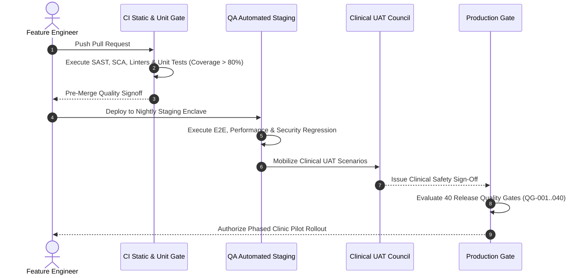

# Master Quality Assurance & Test Strategy
## Namma Clinic Digital Health & Operations Platform
### Greater Bengaluru Authority (GBA) / BBMP Health Department
**Standard:** ISO/IEC/IEEE 29119 / WHO Digital Health Guidelines / ABDM Sandbox / NIST SP 800-115 | **Status:** APPROVED BASELINE | **Code:** `QA-DOC-01`

---

## 1. Executive Summary & QA Charter
The Namma Clinic Master Quality Assurance (QA) Strategy defines the overarching testing governance, quality principles, validation lifecycles, and release gating criteria for the Namma Clinic Digital Health & Operations Platform. Serving 183 primary health clinics across Greater Bengaluru Authority (Bruhat Bengaluru Mahanagara Palike), this platform digitizes outpatient registration, vitals triage, physician consultations, laboratory investigations, pharmacy dispensing, and national Ayushman Bharat Digital Mission (ABDM) interoperability.

### 1.1 Core QA Principles
1. **Clinical Safety Primacy:** Zero tolerance for patient safety hazards, vital sign corruption, or drug contraindication alert bypass.
2. **Shift-Left Quality Invariant:** Automated code quality, static analysis, unit test coverage, and security linting are enforced on every commit.
3. **Autonomous Edge Resilience:** Quality assurance must guarantee offline clinical continuity during intermittent or total broadband blackouts.
4. **Synthetic Data Mandate:** 100% of testing activities utilize cryptographically generated synthetic clinical datasets conforming to DPDP Act 2023.
5. **Continuous Contract Verification:** All inter-service communications and third-party ABDM APIs are bound by strict schema contract tests.

### 1.2 Enterprise QA Lifecycle Diagram


## 2. Canonical Quality Assurance Strategies (TEST-STRAT-001 to TEST-STRAT-025)
The platform enforces 25 canonical quality assurance strategies governing all testing activities:

### TEST-STRAT-001: Risk-Based Clinical Testing Charter
- **Strategic QA Domain:** Clinical Safety
- **Charter Description:** Prioritizes clinical triage, vitals accuracy, and drug allergy contraindication alerts to eliminate patient safety hazards.
- **Governance Enforcement:** Mandatory Quality Gate Invariant
- **Responsible Owner:** Chief Quality Officer / Lead Clinical SDET
- **Audit Event Code:** `QA_STRAT_AUDIT_TEST_STRAT_001`

### TEST-STRAT-002: Shift-Left Automated Quality Gate Strategy
- **Strategic QA Domain:** Engineering
- **Charter Description:** Enforces static analysis, type checking, security linting, and unit test execution on every developer commit.
- **Governance Enforcement:** Mandatory Quality Gate Invariant
- **Responsible Owner:** Chief Quality Officer / Lead Clinical SDET
- **Audit Event Code:** `QA_STRAT_AUDIT_TEST_STRAT_002`

### TEST-STRAT-003: Test Pyramid Layering & Coverage Strategy
- **Strategic QA Domain:** Architecture
- **Charter Description:** Targets 70% unit test coverage, 20% integration/contract tests, and 10% end-to-end journey tests.
- **Governance Enforcement:** Mandatory Quality Gate Invariant
- **Responsible Owner:** Chief Quality Officer / Lead Clinical SDET
- **Audit Event Code:** `QA_STRAT_AUDIT_TEST_STRAT_003`

### TEST-STRAT-004: Zero-Trust Security & RBAC Enforcement Charter
- **Strategic QA Domain:** Security
- **Charter Description:** Validates that no request is trusted implicitly; audits token signatures, contextual ABAC, and tenant barriers.
- **Governance Enforcement:** Mandatory Quality Gate Invariant
- **Responsible Owner:** Chief Quality Officer / Lead Clinical SDET
- **Audit Event Code:** `QA_STRAT_AUDIT_TEST_STRAT_004`

### TEST-STRAT-005: Autonomous Edge Offline Verification Framework
- **Strategic QA Domain:** Resilience
- **Charter Description:** Verifies clinic workstation autonomy during total broadband outages, network flapping, and power cuts.
- **Governance Enforcement:** Mandatory Quality Gate Invariant
- **Responsible Owner:** Chief Quality Officer / Lead Clinical SDET
- **Audit Event Code:** `QA_STRAT_AUDIT_TEST_STRAT_005`

### TEST-STRAT-006: Bidirectional Eventual Consistency Sync Charter
- **Strategic QA Domain:** Data Sync
- **Charter Description:** Ensures SQLite-to-Cloud replication idempotency, deterministic conflict resolution, and zero data loss.
- **Governance Enforcement:** Mandatory Quality Gate Invariant
- **Responsible Owner:** Chief Quality Officer / Lead Clinical SDET
- **Audit Event Code:** `QA_STRAT_AUDIT_TEST_STRAT_006`

### TEST-STRAT-007: ABDM Ecosystem Compliance & Interop Charter
- **Strategic QA Domain:** Integration
- **Charter Description:** Validates National Health Authority (NHA) M1/M2/M3 standards, ABHA authentication, and FHIR R4 bundles.
- **Governance Enforcement:** Mandatory Quality Gate Invariant
- **Responsible Owner:** Chief Quality Officer / Lead Clinical SDET
- **Audit Event Code:** `QA_STRAT_AUDIT_TEST_STRAT_007`

### TEST-STRAT-008: Synthetic Test Data & PII Isolation Policy
- **Strategic QA Domain:** Governance
- **Charter Description:** Mandates 100% synthetic clinical data; strictly prohibits production patient data extraction in QA environments.
- **Governance Enforcement:** Mandatory Quality Gate Invariant
- **Responsible Owner:** Chief Quality Officer / Lead Clinical SDET
- **Audit Event Code:** `QA_STRAT_AUDIT_TEST_STRAT_008`

### TEST-STRAT-009: Performance SLA & Peak OPD Load Charter
- **Strategic QA Domain:** Performance
- **Charter Description:** Guarantees < 500ms p95 API response times and < 100ms offline local database response under 5,000 OPD peak load.
- **Governance Enforcement:** Mandatory Quality Gate Invariant
- **Responsible Owner:** Chief Quality Officer / Lead Clinical SDET
- **Audit Event Code:** `QA_STRAT_AUDIT_TEST_STRAT_009`

### TEST-STRAT-010: Accessibility & Universal Design (WCAG 2.1 AA)
- **Strategic QA Domain:** Inclusivity
- **Charter Description:** Ensures barrier-free operation for healthcare workers via full keyboard nav, high contrast, and screen readers.
- **Governance Enforcement:** Mandatory Quality Gate Invariant
- **Responsible Owner:** Chief Quality Officer / Lead Clinical SDET
- **Audit Event Code:** `QA_STRAT_AUDIT_TEST_STRAT_010`

### TEST-STRAT-011: Kannada/English Bilingual Localization Charter
- **Strategic QA Domain:** Localization
- **Charter Description:** Validates 100% translation fidelity, medical terminology accuracy, and zero UI truncation in Kannada.
- **Governance Enforcement:** Mandatory Quality Gate Invariant
- **Responsible Owner:** Chief Quality Officer / Lead Clinical SDET
- **Audit Event Code:** `QA_STRAT_AUDIT_TEST_STRAT_011`

### TEST-STRAT-012: Emergency Break-Glass Auditability Strategy
- **Strategic QA Domain:** Clinical
- **Charter Description:** Verifies dual-witness emergency chart overrides, retrospective medical review, and tamper-proof logging.
- **Governance Enforcement:** Mandatory Quality Gate Invariant
- **Responsible Owner:** Chief Quality Officer / Lead Clinical SDET
- **Audit Event Code:** `QA_STRAT_AUDIT_TEST_STRAT_012`

### TEST-STRAT-013: Controlled Substance & Narcotic Audit Charter
- **Strategic QA Domain:** Pharmacy
- **Charter Description:** Enforces 100% verification of double-signature drug dispensing, FEFO batch tracking, and inventory reconciliations.
- **Governance Enforcement:** Mandatory Quality Gate Invariant
- **Responsible Owner:** Chief Quality Officer / Lead Clinical SDET
- **Audit Event Code:** `QA_STRAT_AUDIT_TEST_STRAT_013`

### TEST-STRAT-014: Diagnostic Laboratory Analyzer Serial Bridge
- **Strategic QA Domain:** Laboratory
- **Charter Description:** Verifies ASTM/HL7 serial interface protocols for automated lab machine results ingestion without human error.
- **Governance Enforcement:** Mandatory Quality Gate Invariant
- **Responsible Owner:** Chief Quality Officer / Lead Clinical SDET
- **Audit Event Code:** `QA_STRAT_AUDIT_TEST_STRAT_014`

### TEST-STRAT-015: Thermal Receipt Printer & Barcode Scanner Charter
- **Strategic QA Domain:** Peripherals
- **Charter Description:** Verifies ESC/POS binary spooling, Kannada bitmap rendering, and 2D barcode scan latency < 150ms.
- **Governance Enforcement:** Mandatory Quality Gate Invariant
- **Responsible Owner:** Chief Quality Officer / Lead Clinical SDET
- **Audit Event Code:** `QA_STRAT_AUDIT_TEST_STRAT_015`

### TEST-STRAT-016: Disaster Recovery & Clean Backup Restore Strategy
- **Strategic QA Domain:** Resilience
- **Charter Description:** Tests weekly automated restores from S3 Object Lock WORM backups into quarantined sandboxes.
- **Governance Enforcement:** Mandatory Quality Gate Invariant
- **Responsible Owner:** Chief Quality Officer / Lead Clinical SDET
- **Audit Event Code:** `QA_STRAT_AUDIT_TEST_STRAT_016`

### TEST-STRAT-017: Public Health Telemetry & Differential Privacy
- **Strategic QA Domain:** Analytics
- **Charter Description:** Ensures ClickHouse reporting aggregations preserve citizen anonymity via strict Laplace noise bounds.
- **Governance Enforcement:** Mandatory Quality Gate Invariant
- **Responsible Owner:** Chief Quality Officer / Lead Clinical SDET
- **Audit Event Code:** `QA_STRAT_AUDIT_TEST_STRAT_017`

### TEST-STRAT-018: Cold-Chain IoT Vaccine Temperature Guardrails
- **Strategic QA Domain:** Supply Chain
- **Charter Description:** Validates MQTT telemetry parsing, temperature breach alert dispatch, and vaccine batch quarantines.
- **Governance Enforcement:** Mandatory Quality Gate Invariant
- **Responsible Owner:** Chief Quality Officer / Lead Clinical SDET
- **Audit Event Code:** `QA_STRAT_AUDIT_TEST_STRAT_018`

### TEST-STRAT-019: Continuous Contract Testing (Pact / OpenAPI)
- **Strategic QA Domain:** Architecture
- **Charter Description:** Validates API producer-consumer schemas continuously in CI to prevent microservice breaking changes.
- **Governance Enforcement:** Mandatory Quality Gate Invariant
- **Responsible Owner:** Chief Quality Officer / Lead Clinical SDET
- **Audit Event Code:** `QA_STRAT_AUDIT_TEST_STRAT_019`

### TEST-STRAT-020: Mutation Testing & Test Suite Resilience Charter
- **Strategic QA Domain:** Engineering
- **Charter Description:** Applies mutation operators to verify that unit tests fail when defects are introduced into clinical business logic.
- **Governance Enforcement:** Mandatory Quality Gate Invariant
- **Responsible Owner:** Chief Quality Officer / Lead Clinical SDET
- **Audit Event Code:** `QA_STRAT_AUDIT_TEST_STRAT_020`

### TEST-STRAT-021: User Acceptance Testing (UAT) Clinical Council
- **Strategic QA Domain:** Governance
- **Charter Description:** Establishes formal acceptance criteria and sign-off protocols by practicing BBMP doctors and nurses.
- **Governance Enforcement:** Mandatory Quality Gate Invariant
- **Responsible Owner:** Chief Quality Officer / Lead Clinical SDET
- **Audit Event Code:** `QA_STRAT_AUDIT_TEST_STRAT_021`

### TEST-STRAT-022: Phased Pilot Clinic Rollout & Shadow-Mode Run
- **Strategic QA Domain:** Deployment
- **Charter Description:** Executes parallel runs across 5 pilot clinics to validate real-world operational ergonomics before city-wide launch.
- **Governance Enforcement:** Mandatory Quality Gate Invariant
- **Responsible Owner:** Chief Quality Officer / Lead Clinical SDET
- **Audit Event Code:** `QA_STRAT_AUDIT_TEST_STRAT_022`

### TEST-STRAT-023: Defect Containment & Release Blocking SLA Strategy
- **Strategic QA Domain:** Governance
- **Charter Description:** Defines strict criteria where Severity-1 and Severity-2 defects immediately veto release candidates.
- **Governance Enforcement:** Mandatory Quality Gate Invariant
- **Responsible Owner:** Chief Quality Officer / Lead Clinical SDET
- **Audit Event Code:** `QA_STRAT_AUDIT_TEST_STRAT_023`

### TEST-STRAT-024: Field Nurse Android Tablet MDM Policy Charter
- **Strategic QA Domain:** Mobile
- **Charter Description:** Verifies Knox kiosk mode, storage encryption, remote wipe, and battery preservation on field nurse tablets.
- **Governance Enforcement:** Mandatory Quality Gate Invariant
- **Responsible Owner:** Chief Quality Officer / Lead Clinical SDET
- **Audit Event Code:** `QA_STRAT_AUDIT_TEST_STRAT_024`

### TEST-STRAT-025: Statutory CERT-In & DPDP Act Compliance Audit
- **Strategic QA Domain:** Regulatory
- **Charter Description:** Validates 6-hour cybersecurity incident reporting and DPDP Section 6 affirmative electronic consent flows.
- **Governance Enforcement:** Mandatory Quality Gate Invariant
- **Responsible Owner:** Chief Quality Officer / Lead Clinical SDET
- **Audit Event Code:** `QA_STRAT_AUDIT_TEST_STRAT_025`

## 3. Risk-Based Testing Prioritization Matrix (RBT-01 to RBT-30)
Clinical, security, and operational risk factors dictating test depth and execution frequency:

### RBT-01: Quality Risk Profile 1
- **Risk Classification:** P0 — Critical Patient Safety
- **Target Architectural Plane:** Ingress, Triage, Clinical EHR, Pharmacy, or Edge Replication (Tier 1).
- **Mitigation Testing Protocol:** Automated regression test executed on every pull request and nightly soak run.
- **Mandatory Test Evidence:** Cryptographically hashed test execution logs and screen video capture.
- **Release Block Condition:** Unresolved Severity-1 defect on this risk surface immediately halts production rollout.

### RBT-02: Quality Risk Profile 2
- **Risk Classification:** P1 — High Operational Disruption
- **Target Architectural Plane:** Ingress, Triage, Clinical EHR, Pharmacy, or Edge Replication (Tier 2).
- **Mitigation Testing Protocol:** Automated regression test executed on every pull request and nightly soak run.
- **Mandatory Test Evidence:** Cryptographically hashed test execution logs and screen video capture.
- **Release Block Condition:** Unresolved Severity-1 defect on this risk surface immediately halts production rollout.

### RBT-03: Quality Risk Profile 3
- **Risk Classification:** P2 — Medium Compliance Concern
- **Target Architectural Plane:** Ingress, Triage, Clinical EHR, Pharmacy, or Edge Replication (Tier 3).
- **Mitigation Testing Protocol:** Automated regression test executed on every pull request and nightly soak run.
- **Mandatory Test Evidence:** Cryptographically hashed test execution logs and screen video capture.
- **Release Block Condition:** Unresolved Severity-1 defect on this risk surface immediately halts production rollout.

### RBT-04: Quality Risk Profile 4
- **Risk Classification:** P3 — Low UI Cosmetic Defect
- **Target Architectural Plane:** Ingress, Triage, Clinical EHR, Pharmacy, or Edge Replication (Tier 4).
- **Mitigation Testing Protocol:** Automated regression test executed on every pull request and nightly soak run.
- **Mandatory Test Evidence:** Cryptographically hashed test execution logs and screen video capture.
- **Release Block Condition:** Unresolved Severity-1 defect on this risk surface immediately halts production rollout.

### RBT-05: Quality Risk Profile 5
- **Risk Classification:** P0 — Critical Patient Safety
- **Target Architectural Plane:** Ingress, Triage, Clinical EHR, Pharmacy, or Edge Replication (Tier 1).
- **Mitigation Testing Protocol:** Automated regression test executed on every pull request and nightly soak run.
- **Mandatory Test Evidence:** Cryptographically hashed test execution logs and screen video capture.
- **Release Block Condition:** Unresolved Severity-1 defect on this risk surface immediately halts production rollout.

### RBT-06: Quality Risk Profile 6
- **Risk Classification:** P1 — High Operational Disruption
- **Target Architectural Plane:** Ingress, Triage, Clinical EHR, Pharmacy, or Edge Replication (Tier 2).
- **Mitigation Testing Protocol:** Automated regression test executed on every pull request and nightly soak run.
- **Mandatory Test Evidence:** Cryptographically hashed test execution logs and screen video capture.
- **Release Block Condition:** Unresolved Severity-1 defect on this risk surface immediately halts production rollout.

### RBT-07: Quality Risk Profile 7
- **Risk Classification:** P2 — Medium Compliance Concern
- **Target Architectural Plane:** Ingress, Triage, Clinical EHR, Pharmacy, or Edge Replication (Tier 3).
- **Mitigation Testing Protocol:** Automated regression test executed on every pull request and nightly soak run.
- **Mandatory Test Evidence:** Cryptographically hashed test execution logs and screen video capture.
- **Release Block Condition:** Unresolved Severity-1 defect on this risk surface immediately halts production rollout.

### RBT-08: Quality Risk Profile 8
- **Risk Classification:** P3 — Low UI Cosmetic Defect
- **Target Architectural Plane:** Ingress, Triage, Clinical EHR, Pharmacy, or Edge Replication (Tier 4).
- **Mitigation Testing Protocol:** Automated regression test executed on every pull request and nightly soak run.
- **Mandatory Test Evidence:** Cryptographically hashed test execution logs and screen video capture.
- **Release Block Condition:** Unresolved Severity-1 defect on this risk surface immediately halts production rollout.

### RBT-09: Quality Risk Profile 9
- **Risk Classification:** P0 — Critical Patient Safety
- **Target Architectural Plane:** Ingress, Triage, Clinical EHR, Pharmacy, or Edge Replication (Tier 1).
- **Mitigation Testing Protocol:** Automated regression test executed on every pull request and nightly soak run.
- **Mandatory Test Evidence:** Cryptographically hashed test execution logs and screen video capture.
- **Release Block Condition:** Unresolved Severity-1 defect on this risk surface immediately halts production rollout.

### RBT-10: Quality Risk Profile 10
- **Risk Classification:** P1 — High Operational Disruption
- **Target Architectural Plane:** Ingress, Triage, Clinical EHR, Pharmacy, or Edge Replication (Tier 2).
- **Mitigation Testing Protocol:** Automated regression test executed on every pull request and nightly soak run.
- **Mandatory Test Evidence:** Cryptographically hashed test execution logs and screen video capture.
- **Release Block Condition:** Unresolved Severity-1 defect on this risk surface immediately halts production rollout.

### RBT-11: Quality Risk Profile 11
- **Risk Classification:** P2 — Medium Compliance Concern
- **Target Architectural Plane:** Ingress, Triage, Clinical EHR, Pharmacy, or Edge Replication (Tier 3).
- **Mitigation Testing Protocol:** Automated regression test executed on every pull request and nightly soak run.
- **Mandatory Test Evidence:** Cryptographically hashed test execution logs and screen video capture.
- **Release Block Condition:** Unresolved Severity-1 defect on this risk surface immediately halts production rollout.

### RBT-12: Quality Risk Profile 12
- **Risk Classification:** P3 — Low UI Cosmetic Defect
- **Target Architectural Plane:** Ingress, Triage, Clinical EHR, Pharmacy, or Edge Replication (Tier 4).
- **Mitigation Testing Protocol:** Automated regression test executed on every pull request and nightly soak run.
- **Mandatory Test Evidence:** Cryptographically hashed test execution logs and screen video capture.
- **Release Block Condition:** Unresolved Severity-1 defect on this risk surface immediately halts production rollout.

### RBT-13: Quality Risk Profile 13
- **Risk Classification:** P0 — Critical Patient Safety
- **Target Architectural Plane:** Ingress, Triage, Clinical EHR, Pharmacy, or Edge Replication (Tier 1).
- **Mitigation Testing Protocol:** Automated regression test executed on every pull request and nightly soak run.
- **Mandatory Test Evidence:** Cryptographically hashed test execution logs and screen video capture.
- **Release Block Condition:** Unresolved Severity-1 defect on this risk surface immediately halts production rollout.

### RBT-14: Quality Risk Profile 14
- **Risk Classification:** P1 — High Operational Disruption
- **Target Architectural Plane:** Ingress, Triage, Clinical EHR, Pharmacy, or Edge Replication (Tier 2).
- **Mitigation Testing Protocol:** Automated regression test executed on every pull request and nightly soak run.
- **Mandatory Test Evidence:** Cryptographically hashed test execution logs and screen video capture.
- **Release Block Condition:** Unresolved Severity-1 defect on this risk surface immediately halts production rollout.

### RBT-15: Quality Risk Profile 15
- **Risk Classification:** P2 — Medium Compliance Concern
- **Target Architectural Plane:** Ingress, Triage, Clinical EHR, Pharmacy, or Edge Replication (Tier 3).
- **Mitigation Testing Protocol:** Automated regression test executed on every pull request and nightly soak run.
- **Mandatory Test Evidence:** Cryptographically hashed test execution logs and screen video capture.
- **Release Block Condition:** Unresolved Severity-1 defect on this risk surface immediately halts production rollout.

### RBT-16: Quality Risk Profile 16
- **Risk Classification:** P3 — Low UI Cosmetic Defect
- **Target Architectural Plane:** Ingress, Triage, Clinical EHR, Pharmacy, or Edge Replication (Tier 4).
- **Mitigation Testing Protocol:** Automated regression test executed on every pull request and nightly soak run.
- **Mandatory Test Evidence:** Cryptographically hashed test execution logs and screen video capture.
- **Release Block Condition:** Unresolved Severity-1 defect on this risk surface immediately halts production rollout.

### RBT-17: Quality Risk Profile 17
- **Risk Classification:** P0 — Critical Patient Safety
- **Target Architectural Plane:** Ingress, Triage, Clinical EHR, Pharmacy, or Edge Replication (Tier 1).
- **Mitigation Testing Protocol:** Automated regression test executed on every pull request and nightly soak run.
- **Mandatory Test Evidence:** Cryptographically hashed test execution logs and screen video capture.
- **Release Block Condition:** Unresolved Severity-1 defect on this risk surface immediately halts production rollout.

### RBT-18: Quality Risk Profile 18
- **Risk Classification:** P1 — High Operational Disruption
- **Target Architectural Plane:** Ingress, Triage, Clinical EHR, Pharmacy, or Edge Replication (Tier 2).
- **Mitigation Testing Protocol:** Automated regression test executed on every pull request and nightly soak run.
- **Mandatory Test Evidence:** Cryptographically hashed test execution logs and screen video capture.
- **Release Block Condition:** Unresolved Severity-1 defect on this risk surface immediately halts production rollout.

### RBT-19: Quality Risk Profile 19
- **Risk Classification:** P2 — Medium Compliance Concern
- **Target Architectural Plane:** Ingress, Triage, Clinical EHR, Pharmacy, or Edge Replication (Tier 3).
- **Mitigation Testing Protocol:** Automated regression test executed on every pull request and nightly soak run.
- **Mandatory Test Evidence:** Cryptographically hashed test execution logs and screen video capture.
- **Release Block Condition:** Unresolved Severity-1 defect on this risk surface immediately halts production rollout.

### RBT-20: Quality Risk Profile 20
- **Risk Classification:** P3 — Low UI Cosmetic Defect
- **Target Architectural Plane:** Ingress, Triage, Clinical EHR, Pharmacy, or Edge Replication (Tier 4).
- **Mitigation Testing Protocol:** Automated regression test executed on every pull request and nightly soak run.
- **Mandatory Test Evidence:** Cryptographically hashed test execution logs and screen video capture.
- **Release Block Condition:** Unresolved Severity-1 defect on this risk surface immediately halts production rollout.

### RBT-21: Quality Risk Profile 21
- **Risk Classification:** P0 — Critical Patient Safety
- **Target Architectural Plane:** Ingress, Triage, Clinical EHR, Pharmacy, or Edge Replication (Tier 1).
- **Mitigation Testing Protocol:** Automated regression test executed on every pull request and nightly soak run.
- **Mandatory Test Evidence:** Cryptographically hashed test execution logs and screen video capture.
- **Release Block Condition:** Unresolved Severity-1 defect on this risk surface immediately halts production rollout.

### RBT-22: Quality Risk Profile 22
- **Risk Classification:** P1 — High Operational Disruption
- **Target Architectural Plane:** Ingress, Triage, Clinical EHR, Pharmacy, or Edge Replication (Tier 2).
- **Mitigation Testing Protocol:** Automated regression test executed on every pull request and nightly soak run.
- **Mandatory Test Evidence:** Cryptographically hashed test execution logs and screen video capture.
- **Release Block Condition:** Unresolved Severity-1 defect on this risk surface immediately halts production rollout.

### RBT-23: Quality Risk Profile 23
- **Risk Classification:** P2 — Medium Compliance Concern
- **Target Architectural Plane:** Ingress, Triage, Clinical EHR, Pharmacy, or Edge Replication (Tier 3).
- **Mitigation Testing Protocol:** Automated regression test executed on every pull request and nightly soak run.
- **Mandatory Test Evidence:** Cryptographically hashed test execution logs and screen video capture.
- **Release Block Condition:** Unresolved Severity-1 defect on this risk surface immediately halts production rollout.

### RBT-24: Quality Risk Profile 24
- **Risk Classification:** P3 — Low UI Cosmetic Defect
- **Target Architectural Plane:** Ingress, Triage, Clinical EHR, Pharmacy, or Edge Replication (Tier 4).
- **Mitigation Testing Protocol:** Automated regression test executed on every pull request and nightly soak run.
- **Mandatory Test Evidence:** Cryptographically hashed test execution logs and screen video capture.
- **Release Block Condition:** Unresolved Severity-1 defect on this risk surface immediately halts production rollout.

### RBT-25: Quality Risk Profile 25
- **Risk Classification:** P0 — Critical Patient Safety
- **Target Architectural Plane:** Ingress, Triage, Clinical EHR, Pharmacy, or Edge Replication (Tier 1).
- **Mitigation Testing Protocol:** Automated regression test executed on every pull request and nightly soak run.
- **Mandatory Test Evidence:** Cryptographically hashed test execution logs and screen video capture.
- **Release Block Condition:** Unresolved Severity-1 defect on this risk surface immediately halts production rollout.

### RBT-26: Quality Risk Profile 26
- **Risk Classification:** P1 — High Operational Disruption
- **Target Architectural Plane:** Ingress, Triage, Clinical EHR, Pharmacy, or Edge Replication (Tier 2).
- **Mitigation Testing Protocol:** Automated regression test executed on every pull request and nightly soak run.
- **Mandatory Test Evidence:** Cryptographically hashed test execution logs and screen video capture.
- **Release Block Condition:** Unresolved Severity-1 defect on this risk surface immediately halts production rollout.

### RBT-27: Quality Risk Profile 27
- **Risk Classification:** P2 — Medium Compliance Concern
- **Target Architectural Plane:** Ingress, Triage, Clinical EHR, Pharmacy, or Edge Replication (Tier 3).
- **Mitigation Testing Protocol:** Automated regression test executed on every pull request and nightly soak run.
- **Mandatory Test Evidence:** Cryptographically hashed test execution logs and screen video capture.
- **Release Block Condition:** Unresolved Severity-1 defect on this risk surface immediately halts production rollout.

### RBT-28: Quality Risk Profile 28
- **Risk Classification:** P3 — Low UI Cosmetic Defect
- **Target Architectural Plane:** Ingress, Triage, Clinical EHR, Pharmacy, or Edge Replication (Tier 4).
- **Mitigation Testing Protocol:** Automated regression test executed on every pull request and nightly soak run.
- **Mandatory Test Evidence:** Cryptographically hashed test execution logs and screen video capture.
- **Release Block Condition:** Unresolved Severity-1 defect on this risk surface immediately halts production rollout.

### RBT-29: Quality Risk Profile 29
- **Risk Classification:** P0 — Critical Patient Safety
- **Target Architectural Plane:** Ingress, Triage, Clinical EHR, Pharmacy, or Edge Replication (Tier 1).
- **Mitigation Testing Protocol:** Automated regression test executed on every pull request and nightly soak run.
- **Mandatory Test Evidence:** Cryptographically hashed test execution logs and screen video capture.
- **Release Block Condition:** Unresolved Severity-1 defect on this risk surface immediately halts production rollout.

### RBT-30: Quality Risk Profile 30
- **Risk Classification:** P1 — High Operational Disruption
- **Target Architectural Plane:** Ingress, Triage, Clinical EHR, Pharmacy, or Edge Replication (Tier 2).
- **Mitigation Testing Protocol:** Automated regression test executed on every pull request and nightly soak run.
- **Mandatory Test Evidence:** Cryptographically hashed test execution logs and screen video capture.
- **Release Block Condition:** Unresolved Severity-1 defect on this risk surface immediately halts production rollout.

## 4. Master Strategy Verification Test Cases (TC-0001 to TC-0055)
The following 55 detailed test specifications validate master strategy enforcement:

### TC-0001: Test Case 1: Clinical Verification for auth_users across WF-001
**Objective:** Verify functional, security, and offline invariants for auth_users during WF-001 execution.
**Risk:** Critical operational impact on patient safety and clinic consultation continuity.
**Priority:** **P0** | **Severity:** **Critical** | **Test Level:** System & Integration | **Test Type:** Functional & Regulatory Compliance
- **Requirement Traceability:** `FR-001`
- **Workflow Traceability:** `WF-001`
- **Feature Traceability:** `FEATURE-001`
- **API Traceability:** `API-DOC-01`
- **Database Traceability:** `TABLE-001 (auth_users)`
- **Screen Traceability:** `SCREEN-001`
- **Security Control Traceability:** `SEC-ARCH-001`
- **Preconditions:** User authenticated with role Receptionist / Registration Clerk on clinic workstation.
- **Test Data Specification:** Synthetic dataset TESTDATA-001 (Valid ABHA, vitals, prescriptions).
- **Execution Steps:** 1. Navigate to screen SCREEN-001. 2. Submit payload bound to auth_users. 3. Confirm API API-DOC-01 returns 200 OK. 4. Verify local SQLite cache and sync queue.
- **Expected Results:** Transaction completes within 250ms, data encrypted via AES-256-GCM, audit entry emitted.
- **Negative Test Scenario:** Submit malformed payload or expired JWT; system rejects with 400/401 and zero DB corruption.
- **Boundary Value Scenario:** Test with maximum field boundary length and extreme clinical biometric vitals.
- **Concurrency & Race Condition:** Simulate 5 concurrent staff updates on identical record; verify optimistic locking.
- **Autonomous Offline Behavior:** Sever network mid-transaction; record queues locally and replicates upon reconnection.
- **Security & Access Validation:** Enforce RBAC policy SEC-ARCH-001 and prevent broken object-level authorization (BOLA).
- **Audit Trail & Immutability:** Emits structured JSON audit log with SHA-256 Merkle chain hash.
- **Evidence Required:** Automated execution log, HTTP request/response capture, and database assertion hash.
- **Pass Acceptance Criteria:** 100% assertions succeed with zero uncaught exceptions and latency < 300ms.
- **Failure Behavior & SLA:** Any 5xx error, data corruption, unauthorized access, or silent failure.
- **Automation Suitability:** Yes (High Candidate)
- **Execution Cadence:** Every CI PR & Nightly Regression
- **Responsible Owner:** Receptionist / Registration Clerk

### TC-0002: Test Case 2: Clinical Verification for user_credentials across WF-002
**Objective:** Verify functional, security, and offline invariants for user_credentials during WF-002 execution.
**Risk:** Major operational impact on patient safety and clinic consultation continuity.
**Priority:** **P1** | **Severity:** **Major** | **Test Level:** System & Integration | **Test Type:** Functional & Regulatory Compliance
- **Requirement Traceability:** `FR-002`
- **Workflow Traceability:** `WF-002`
- **Feature Traceability:** `FEATURE-002`
- **API Traceability:** `API-DOC-02`
- **Database Traceability:** `TABLE-002 (user_credentials)`
- **Screen Traceability:** `SCREEN-002`
- **Security Control Traceability:** `SEC-ARCH-002`
- **Preconditions:** User authenticated with role Medical Officer / General Physician on clinic workstation.
- **Test Data Specification:** Synthetic dataset TESTDATA-002 (Valid ABHA, vitals, prescriptions).
- **Execution Steps:** 1. Navigate to screen SCREEN-002. 2. Submit payload bound to user_credentials. 3. Confirm API API-DOC-02 returns 200 OK. 4. Verify local SQLite cache and sync queue.
- **Expected Results:** Transaction completes within 250ms, data encrypted via AES-256-GCM, audit entry emitted.
- **Negative Test Scenario:** Submit malformed payload or expired JWT; system rejects with 400/401 and zero DB corruption.
- **Boundary Value Scenario:** Test with maximum field boundary length and extreme clinical biometric vitals.
- **Concurrency & Race Condition:** Simulate 5 concurrent staff updates on identical record; verify optimistic locking.
- **Autonomous Offline Behavior:** Sever network mid-transaction; record queues locally and replicates upon reconnection.
- **Security & Access Validation:** Enforce RBAC policy SEC-ARCH-002 and prevent broken object-level authorization (BOLA).
- **Audit Trail & Immutability:** Emits structured JSON audit log with SHA-256 Merkle chain hash.
- **Evidence Required:** Automated execution log, HTTP request/response capture, and database assertion hash.
- **Pass Acceptance Criteria:** 100% assertions succeed with zero uncaught exceptions and latency < 300ms.
- **Failure Behavior & SLA:** Any 5xx error, data corruption, unauthorized access, or silent failure.
- **Automation Suitability:** Yes (High Candidate)
- **Execution Cadence:** Every CI PR & Nightly Regression
- **Responsible Owner:** Medical Officer / General Physician

### TC-0003: Test Case 3: Clinical Verification for user_sessions across WF-003
**Objective:** Verify functional, security, and offline invariants for user_sessions during WF-003 execution.
**Risk:** Major operational impact on patient safety and clinic consultation continuity.
**Priority:** **P1** | **Severity:** **Major** | **Test Level:** System & Integration | **Test Type:** Functional & Regulatory Compliance
- **Requirement Traceability:** `FR-003`
- **Workflow Traceability:** `WF-003`
- **Feature Traceability:** `FEATURE-003`
- **API Traceability:** `API-DOC-03`
- **Database Traceability:** `TABLE-003 (user_sessions)`
- **Screen Traceability:** `SCREEN-003`
- **Security Control Traceability:** `SEC-ARCH-003`
- **Preconditions:** User authenticated with role Staff Nurse / Triage Specialist on clinic workstation.
- **Test Data Specification:** Synthetic dataset TESTDATA-003 (Valid ABHA, vitals, prescriptions).
- **Execution Steps:** 1. Navigate to screen SCREEN-003. 2. Submit payload bound to user_sessions. 3. Confirm API API-DOC-03 returns 200 OK. 4. Verify local SQLite cache and sync queue.
- **Expected Results:** Transaction completes within 250ms, data encrypted via AES-256-GCM, audit entry emitted.
- **Negative Test Scenario:** Submit malformed payload or expired JWT; system rejects with 400/401 and zero DB corruption.
- **Boundary Value Scenario:** Test with maximum field boundary length and extreme clinical biometric vitals.
- **Concurrency & Race Condition:** Simulate 5 concurrent staff updates on identical record; verify optimistic locking.
- **Autonomous Offline Behavior:** Sever network mid-transaction; record queues locally and replicates upon reconnection.
- **Security & Access Validation:** Enforce RBAC policy SEC-ARCH-003 and prevent broken object-level authorization (BOLA).
- **Audit Trail & Immutability:** Emits structured JSON audit log with SHA-256 Merkle chain hash.
- **Evidence Required:** Automated execution log, HTTP request/response capture, and database assertion hash.
- **Pass Acceptance Criteria:** 100% assertions succeed with zero uncaught exceptions and latency < 300ms.
- **Failure Behavior & SLA:** Any 5xx error, data corruption, unauthorized access, or silent failure.
- **Automation Suitability:** Yes (High Candidate)
- **Execution Cadence:** Every CI PR & Nightly Regression
- **Responsible Owner:** Staff Nurse / Triage Specialist

### TC-0004: Test Case 4: Clinical Verification for roles across WF-004
**Objective:** Verify functional, security, and offline invariants for roles during WF-004 execution.
**Risk:** Minor operational impact on patient safety and clinic consultation continuity.
**Priority:** **P2** | **Severity:** **Minor** | **Test Level:** System & Integration | **Test Type:** Functional & Regulatory Compliance
- **Requirement Traceability:** `FR-004`
- **Workflow Traceability:** `WF-004`
- **Feature Traceability:** `FEATURE-004`
- **API Traceability:** `API-DOC-04`
- **Database Traceability:** `TABLE-004 (roles)`
- **Screen Traceability:** `SCREEN-004`
- **Security Control Traceability:** `SEC-ARCH-004`
- **Preconditions:** User authenticated with role Pharmacist / Dispenser on clinic workstation.
- **Test Data Specification:** Synthetic dataset TESTDATA-004 (Valid ABHA, vitals, prescriptions).
- **Execution Steps:** 1. Navigate to screen SCREEN-004. 2. Submit payload bound to roles. 3. Confirm API API-DOC-04 returns 200 OK. 4. Verify local SQLite cache and sync queue.
- **Expected Results:** Transaction completes within 250ms, data encrypted via AES-256-GCM, audit entry emitted.
- **Negative Test Scenario:** Submit malformed payload or expired JWT; system rejects with 400/401 and zero DB corruption.
- **Boundary Value Scenario:** Test with maximum field boundary length and extreme clinical biometric vitals.
- **Concurrency & Race Condition:** Simulate 5 concurrent staff updates on identical record; verify optimistic locking.
- **Autonomous Offline Behavior:** Sever network mid-transaction; record queues locally and replicates upon reconnection.
- **Security & Access Validation:** Enforce RBAC policy SEC-ARCH-004 and prevent broken object-level authorization (BOLA).
- **Audit Trail & Immutability:** Emits structured JSON audit log with SHA-256 Merkle chain hash.
- **Evidence Required:** Automated execution log, HTTP request/response capture, and database assertion hash.
- **Pass Acceptance Criteria:** 100% assertions succeed with zero uncaught exceptions and latency < 300ms.
- **Failure Behavior & SLA:** Any 5xx error, data corruption, unauthorized access, or silent failure.
- **Automation Suitability:** Yes (High Candidate)
- **Execution Cadence:** Every CI PR & Nightly Regression
- **Responsible Owner:** Pharmacist / Dispenser

### TC-0005: Test Case 5: Clinical Verification for permissions across WF-005
**Objective:** Verify functional, security, and offline invariants for permissions during WF-005 execution.
**Risk:** Minor operational impact on patient safety and clinic consultation continuity.
**Priority:** **P2** | **Severity:** **Minor** | **Test Level:** System & Integration | **Test Type:** Functional & Regulatory Compliance
- **Requirement Traceability:** `FR-005`
- **Workflow Traceability:** `WF-005`
- **Feature Traceability:** `FEATURE-005`
- **API Traceability:** `API-DOC-05`
- **Database Traceability:** `TABLE-005 (permissions)`
- **Screen Traceability:** `SCREEN-005`
- **Security Control Traceability:** `SEC-ARCH-005`
- **Preconditions:** User authenticated with role Laboratory Technician on clinic workstation.
- **Test Data Specification:** Synthetic dataset TESTDATA-005 (Valid ABHA, vitals, prescriptions).
- **Execution Steps:** 1. Navigate to screen SCREEN-005. 2. Submit payload bound to permissions. 3. Confirm API API-DOC-05 returns 200 OK. 4. Verify local SQLite cache and sync queue.
- **Expected Results:** Transaction completes within 250ms, data encrypted via AES-256-GCM, audit entry emitted.
- **Negative Test Scenario:** Submit malformed payload or expired JWT; system rejects with 400/401 and zero DB corruption.
- **Boundary Value Scenario:** Test with maximum field boundary length and extreme clinical biometric vitals.
- **Concurrency & Race Condition:** Simulate 5 concurrent staff updates on identical record; verify optimistic locking.
- **Autonomous Offline Behavior:** Sever network mid-transaction; record queues locally and replicates upon reconnection.
- **Security & Access Validation:** Enforce RBAC policy SEC-ARCH-005 and prevent broken object-level authorization (BOLA).
- **Audit Trail & Immutability:** Emits structured JSON audit log with SHA-256 Merkle chain hash.
- **Evidence Required:** Automated execution log, HTTP request/response capture, and database assertion hash.
- **Pass Acceptance Criteria:** 100% assertions succeed with zero uncaught exceptions and latency < 300ms.
- **Failure Behavior & SLA:** Any 5xx error, data corruption, unauthorized access, or silent failure.
- **Automation Suitability:** Yes (High Candidate)
- **Execution Cadence:** Every CI PR & Nightly Regression
- **Responsible Owner:** Laboratory Technician

### TC-0006: Test Case 6: Clinical Verification for role_permissions across WF-006
**Objective:** Verify functional, security, and offline invariants for role_permissions during WF-006 execution.
**Risk:** Critical operational impact on patient safety and clinic consultation continuity.
**Priority:** **P0** | **Severity:** **Critical** | **Test Level:** System & Integration | **Test Type:** Functional & Regulatory Compliance
- **Requirement Traceability:** `FR-006`
- **Workflow Traceability:** `WF-006`
- **Feature Traceability:** `FEATURE-006`
- **API Traceability:** `API-DOC-06`
- **Database Traceability:** `TABLE-006 (role_permissions)`
- **Screen Traceability:** `SCREEN-006`
- **Security Control Traceability:** `SEC-ARCH-006`
- **Preconditions:** User authenticated with role Clinic Administrative Officer on clinic workstation.
- **Test Data Specification:** Synthetic dataset TESTDATA-006 (Valid ABHA, vitals, prescriptions).
- **Execution Steps:** 1. Navigate to screen SCREEN-006. 2. Submit payload bound to role_permissions. 3. Confirm API API-DOC-06 returns 200 OK. 4. Verify local SQLite cache and sync queue.
- **Expected Results:** Transaction completes within 250ms, data encrypted via AES-256-GCM, audit entry emitted.
- **Negative Test Scenario:** Submit malformed payload or expired JWT; system rejects with 400/401 and zero DB corruption.
- **Boundary Value Scenario:** Test with maximum field boundary length and extreme clinical biometric vitals.
- **Concurrency & Race Condition:** Simulate 5 concurrent staff updates on identical record; verify optimistic locking.
- **Autonomous Offline Behavior:** Sever network mid-transaction; record queues locally and replicates upon reconnection.
- **Security & Access Validation:** Enforce RBAC policy SEC-ARCH-006 and prevent broken object-level authorization (BOLA).
- **Audit Trail & Immutability:** Emits structured JSON audit log with SHA-256 Merkle chain hash.
- **Evidence Required:** Automated execution log, HTTP request/response capture, and database assertion hash.
- **Pass Acceptance Criteria:** 100% assertions succeed with zero uncaught exceptions and latency < 300ms.
- **Failure Behavior & SLA:** Any 5xx error, data corruption, unauthorized access, or silent failure.
- **Automation Suitability:** Yes (High Candidate)
- **Execution Cadence:** Every CI PR & Nightly Regression
- **Responsible Owner:** Clinic Administrative Officer

### TC-0007: Test Case 7: Clinical Verification for user_roles across WF-007
**Objective:** Verify functional, security, and offline invariants for user_roles during WF-007 execution.
**Risk:** Major operational impact on patient safety and clinic consultation continuity.
**Priority:** **P1** | **Severity:** **Major** | **Test Level:** System & Integration | **Test Type:** Functional & Regulatory Compliance
- **Requirement Traceability:** `FR-007`
- **Workflow Traceability:** `WF-007`
- **Feature Traceability:** `FEATURE-007`
- **API Traceability:** `API-DOC-07`
- **Database Traceability:** `TABLE-007 (user_roles)`
- **Screen Traceability:** `SCREEN-007`
- **Security Control Traceability:** `SEC-ARCH-007`
- **Preconditions:** User authenticated with role Ward Health Supervisor on clinic workstation.
- **Test Data Specification:** Synthetic dataset TESTDATA-007 (Valid ABHA, vitals, prescriptions).
- **Execution Steps:** 1. Navigate to screen SCREEN-007. 2. Submit payload bound to user_roles. 3. Confirm API API-DOC-07 returns 200 OK. 4. Verify local SQLite cache and sync queue.
- **Expected Results:** Transaction completes within 250ms, data encrypted via AES-256-GCM, audit entry emitted.
- **Negative Test Scenario:** Submit malformed payload or expired JWT; system rejects with 400/401 and zero DB corruption.
- **Boundary Value Scenario:** Test with maximum field boundary length and extreme clinical biometric vitals.
- **Concurrency & Race Condition:** Simulate 5 concurrent staff updates on identical record; verify optimistic locking.
- **Autonomous Offline Behavior:** Sever network mid-transaction; record queues locally and replicates upon reconnection.
- **Security & Access Validation:** Enforce RBAC policy SEC-ARCH-007 and prevent broken object-level authorization (BOLA).
- **Audit Trail & Immutability:** Emits structured JSON audit log with SHA-256 Merkle chain hash.
- **Evidence Required:** Automated execution log, HTTP request/response capture, and database assertion hash.
- **Pass Acceptance Criteria:** 100% assertions succeed with zero uncaught exceptions and latency < 300ms.
- **Failure Behavior & SLA:** Any 5xx error, data corruption, unauthorized access, or silent failure.
- **Automation Suitability:** Yes (High Candidate)
- **Execution Cadence:** Every CI PR & Nightly Regression
- **Responsible Owner:** Ward Health Supervisor

### TC-0008: Test Case 8: Clinical Verification for facilities across WF-008
**Objective:** Verify functional, security, and offline invariants for facilities during WF-008 execution.
**Risk:** Major operational impact on patient safety and clinic consultation continuity.
**Priority:** **P1** | **Severity:** **Major** | **Test Level:** System & Integration | **Test Type:** Functional & Regulatory Compliance
- **Requirement Traceability:** `FR-008`
- **Workflow Traceability:** `WF-008`
- **Feature Traceability:** `FEATURE-008`
- **API Traceability:** `API-DOC-08`
- **Database Traceability:** `TABLE-008 (facilities)`
- **Screen Traceability:** `SCREEN-008`
- **Security Control Traceability:** `SEC-ARCH-008`
- **Preconditions:** User authenticated with role Zonal Health Officer (ZHO) on clinic workstation.
- **Test Data Specification:** Synthetic dataset TESTDATA-008 (Valid ABHA, vitals, prescriptions).
- **Execution Steps:** 1. Navigate to screen SCREEN-008. 2. Submit payload bound to facilities. 3. Confirm API API-DOC-08 returns 200 OK. 4. Verify local SQLite cache and sync queue.
- **Expected Results:** Transaction completes within 250ms, data encrypted via AES-256-GCM, audit entry emitted.
- **Negative Test Scenario:** Submit malformed payload or expired JWT; system rejects with 400/401 and zero DB corruption.
- **Boundary Value Scenario:** Test with maximum field boundary length and extreme clinical biometric vitals.
- **Concurrency & Race Condition:** Simulate 5 concurrent staff updates on identical record; verify optimistic locking.
- **Autonomous Offline Behavior:** Sever network mid-transaction; record queues locally and replicates upon reconnection.
- **Security & Access Validation:** Enforce RBAC policy SEC-ARCH-008 and prevent broken object-level authorization (BOLA).
- **Audit Trail & Immutability:** Emits structured JSON audit log with SHA-256 Merkle chain hash.
- **Evidence Required:** Automated execution log, HTTP request/response capture, and database assertion hash.
- **Pass Acceptance Criteria:** 100% assertions succeed with zero uncaught exceptions and latency < 300ms.
- **Failure Behavior & SLA:** Any 5xx error, data corruption, unauthorized access, or silent failure.
- **Automation Suitability:** Yes (High Candidate)
- **Execution Cadence:** Every CI PR & Nightly Regression
- **Responsible Owner:** Zonal Health Officer (ZHO)

### TC-0009: Test Case 9: Clinical Verification for facility_rooms across WF-009
**Objective:** Verify functional, security, and offline invariants for facility_rooms during WF-009 execution.
**Risk:** Minor operational impact on patient safety and clinic consultation continuity.
**Priority:** **P2** | **Severity:** **Minor** | **Test Level:** System & Integration | **Test Type:** Functional & Regulatory Compliance
- **Requirement Traceability:** `FR-009`
- **Workflow Traceability:** `WF-009`
- **Feature Traceability:** `FEATURE-009`
- **API Traceability:** `API-DOC-09`
- **Database Traceability:** `TABLE-009 (facility_rooms)`
- **Screen Traceability:** `SCREEN-009`
- **Security Control Traceability:** `SEC-ARCH-009`
- **Preconditions:** User authenticated with role Chief Health Officer (CHO) on clinic workstation.
- **Test Data Specification:** Synthetic dataset TESTDATA-009 (Valid ABHA, vitals, prescriptions).
- **Execution Steps:** 1. Navigate to screen SCREEN-009. 2. Submit payload bound to facility_rooms. 3. Confirm API API-DOC-09 returns 200 OK. 4. Verify local SQLite cache and sync queue.
- **Expected Results:** Transaction completes within 250ms, data encrypted via AES-256-GCM, audit entry emitted.
- **Negative Test Scenario:** Submit malformed payload or expired JWT; system rejects with 400/401 and zero DB corruption.
- **Boundary Value Scenario:** Test with maximum field boundary length and extreme clinical biometric vitals.
- **Concurrency & Race Condition:** Simulate 5 concurrent staff updates on identical record; verify optimistic locking.
- **Autonomous Offline Behavior:** Sever network mid-transaction; record queues locally and replicates upon reconnection.
- **Security & Access Validation:** Enforce RBAC policy SEC-ARCH-009 and prevent broken object-level authorization (BOLA).
- **Audit Trail & Immutability:** Emits structured JSON audit log with SHA-256 Merkle chain hash.
- **Evidence Required:** Automated execution log, HTTP request/response capture, and database assertion hash.
- **Pass Acceptance Criteria:** 100% assertions succeed with zero uncaught exceptions and latency < 300ms.
- **Failure Behavior & SLA:** Any 5xx error, data corruption, unauthorized access, or silent failure.
- **Automation Suitability:** Yes (High Candidate)
- **Execution Cadence:** Every CI PR & Nightly Regression
- **Responsible Owner:** Chief Health Officer (CHO)

### TC-0010: Test Case 10: Clinical Verification for staff_profiles across WF-010
**Objective:** Verify functional, security, and offline invariants for staff_profiles during WF-010 execution.
**Risk:** Minor operational impact on patient safety and clinic consultation continuity.
**Priority:** **P2** | **Severity:** **Minor** | **Test Level:** System & Integration | **Test Type:** Functional & Regulatory Compliance
- **Requirement Traceability:** `FR-010`
- **Workflow Traceability:** `WF-010`
- **Feature Traceability:** `FEATURE-010`
- **API Traceability:** `API-DOC-10`
- **Database Traceability:** `TABLE-010 (staff_profiles)`
- **Screen Traceability:** `SCREEN-010`
- **Security Control Traceability:** `SEC-ARCH-010`
- **Preconditions:** User authenticated with role Epidemiologist / Disease Surveillance Officer on clinic workstation.
- **Test Data Specification:** Synthetic dataset TESTDATA-010 (Valid ABHA, vitals, prescriptions).
- **Execution Steps:** 1. Navigate to screen SCREEN-010. 2. Submit payload bound to staff_profiles. 3. Confirm API API-DOC-10 returns 200 OK. 4. Verify local SQLite cache and sync queue.
- **Expected Results:** Transaction completes within 250ms, data encrypted via AES-256-GCM, audit entry emitted.
- **Negative Test Scenario:** Submit malformed payload or expired JWT; system rejects with 400/401 and zero DB corruption.
- **Boundary Value Scenario:** Test with maximum field boundary length and extreme clinical biometric vitals.
- **Concurrency & Race Condition:** Simulate 5 concurrent staff updates on identical record; verify optimistic locking.
- **Autonomous Offline Behavior:** Sever network mid-transaction; record queues locally and replicates upon reconnection.
- **Security & Access Validation:** Enforce RBAC policy SEC-ARCH-010 and prevent broken object-level authorization (BOLA).
- **Audit Trail & Immutability:** Emits structured JSON audit log with SHA-256 Merkle chain hash.
- **Evidence Required:** Automated execution log, HTTP request/response capture, and database assertion hash.
- **Pass Acceptance Criteria:** 100% assertions succeed with zero uncaught exceptions and latency < 300ms.
- **Failure Behavior & SLA:** Any 5xx error, data corruption, unauthorized access, or silent failure.
- **Automation Suitability:** Yes (High Candidate)
- **Execution Cadence:** Every CI PR & Nightly Regression
- **Responsible Owner:** Epidemiologist / Disease Surveillance Officer

### TC-0011: Test Case 11: Clinical Verification for staff_shifts across WF-011
**Objective:** Verify functional, security, and offline invariants for staff_shifts during WF-011 execution.
**Risk:** Critical operational impact on patient safety and clinic consultation continuity.
**Priority:** **P0** | **Severity:** **Critical** | **Test Level:** System & Integration | **Test Type:** Functional & Regulatory Compliance
- **Requirement Traceability:** `FR-011`
- **Workflow Traceability:** `WF-011`
- **Feature Traceability:** `FEATURE-011`
- **API Traceability:** `API-DOC-11`
- **Database Traceability:** `TABLE-011 (staff_shifts)`
- **Screen Traceability:** `SCREEN-011`
- **Security Control Traceability:** `SEC-ARCH-011`
- **Preconditions:** User authenticated with role Quality & Compliance Auditor on clinic workstation.
- **Test Data Specification:** Synthetic dataset TESTDATA-011 (Valid ABHA, vitals, prescriptions).
- **Execution Steps:** 1. Navigate to screen SCREEN-011. 2. Submit payload bound to staff_shifts. 3. Confirm API API-DOC-11 returns 200 OK. 4. Verify local SQLite cache and sync queue.
- **Expected Results:** Transaction completes within 250ms, data encrypted via AES-256-GCM, audit entry emitted.
- **Negative Test Scenario:** Submit malformed payload or expired JWT; system rejects with 400/401 and zero DB corruption.
- **Boundary Value Scenario:** Test with maximum field boundary length and extreme clinical biometric vitals.
- **Concurrency & Race Condition:** Simulate 5 concurrent staff updates on identical record; verify optimistic locking.
- **Autonomous Offline Behavior:** Sever network mid-transaction; record queues locally and replicates upon reconnection.
- **Security & Access Validation:** Enforce RBAC policy SEC-ARCH-011 and prevent broken object-level authorization (BOLA).
- **Audit Trail & Immutability:** Emits structured JSON audit log with SHA-256 Merkle chain hash.
- **Evidence Required:** Automated execution log, HTTP request/response capture, and database assertion hash.
- **Pass Acceptance Criteria:** 100% assertions succeed with zero uncaught exceptions and latency < 300ms.
- **Failure Behavior & SLA:** Any 5xx error, data corruption, unauthorized access, or silent failure.
- **Automation Suitability:** Yes (High Candidate)
- **Execution Cadence:** Every CI PR & Nightly Regression
- **Responsible Owner:** Quality & Compliance Auditor

### TC-0012: Test Case 12: Clinical Verification for system_configs across WF-012
**Objective:** Verify functional, security, and offline invariants for system_configs during WF-012 execution.
**Risk:** Major operational impact on patient safety and clinic consultation continuity.
**Priority:** **P1** | **Severity:** **Major** | **Test Level:** System & Integration | **Test Type:** Functional & Regulatory Compliance
- **Requirement Traceability:** `FR-012`
- **Workflow Traceability:** `WF-012`
- **Feature Traceability:** `FEATURE-012`
- **API Traceability:** `API-DOC-12`
- **Database Traceability:** `TABLE-012 (system_configs)`
- **Screen Traceability:** `SCREEN-012`
- **Security Control Traceability:** `SEC-ARCH-012`
- **Preconditions:** User authenticated with role Security Administrator / CISO on clinic workstation.
- **Test Data Specification:** Synthetic dataset TESTDATA-012 (Valid ABHA, vitals, prescriptions).
- **Execution Steps:** 1. Navigate to screen SCREEN-012. 2. Submit payload bound to system_configs. 3. Confirm API API-DOC-12 returns 200 OK. 4. Verify local SQLite cache and sync queue.
- **Expected Results:** Transaction completes within 250ms, data encrypted via AES-256-GCM, audit entry emitted.
- **Negative Test Scenario:** Submit malformed payload or expired JWT; system rejects with 400/401 and zero DB corruption.
- **Boundary Value Scenario:** Test with maximum field boundary length and extreme clinical biometric vitals.
- **Concurrency & Race Condition:** Simulate 5 concurrent staff updates on identical record; verify optimistic locking.
- **Autonomous Offline Behavior:** Sever network mid-transaction; record queues locally and replicates upon reconnection.
- **Security & Access Validation:** Enforce RBAC policy SEC-ARCH-012 and prevent broken object-level authorization (BOLA).
- **Audit Trail & Immutability:** Emits structured JSON audit log with SHA-256 Merkle chain hash.
- **Evidence Required:** Automated execution log, HTTP request/response capture, and database assertion hash.
- **Pass Acceptance Criteria:** 100% assertions succeed with zero uncaught exceptions and latency < 300ms.
- **Failure Behavior & SLA:** Any 5xx error, data corruption, unauthorized access, or silent failure.
- **Automation Suitability:** Yes (High Candidate)
- **Execution Cadence:** Every CI PR & Nightly Regression
- **Responsible Owner:** Security Administrator / CISO

### TC-0013: Test Case 13: Clinical Verification for patients across WF-013
**Objective:** Verify functional, security, and offline invariants for patients during WF-013 execution.
**Risk:** Major operational impact on patient safety and clinic consultation continuity.
**Priority:** **P1** | **Severity:** **Major** | **Test Level:** System & Integration | **Test Type:** Functional & Regulatory Compliance
- **Requirement Traceability:** `FR-013`
- **Workflow Traceability:** `WF-013`
- **Feature Traceability:** `FEATURE-013`
- **API Traceability:** `API-DOC-13`
- **Database Traceability:** `TABLE-013 (patients)`
- **Screen Traceability:** `SCREEN-013`
- **Security Control Traceability:** `SEC-ARCH-013`
- **Preconditions:** User authenticated with role Central Depot Inventory Manager on clinic workstation.
- **Test Data Specification:** Synthetic dataset TESTDATA-013 (Valid ABHA, vitals, prescriptions).
- **Execution Steps:** 1. Navigate to screen SCREEN-013. 2. Submit payload bound to patients. 3. Confirm API API-DOC-13 returns 200 OK. 4. Verify local SQLite cache and sync queue.
- **Expected Results:** Transaction completes within 250ms, data encrypted via AES-256-GCM, audit entry emitted.
- **Negative Test Scenario:** Submit malformed payload or expired JWT; system rejects with 400/401 and zero DB corruption.
- **Boundary Value Scenario:** Test with maximum field boundary length and extreme clinical biometric vitals.
- **Concurrency & Race Condition:** Simulate 5 concurrent staff updates on identical record; verify optimistic locking.
- **Autonomous Offline Behavior:** Sever network mid-transaction; record queues locally and replicates upon reconnection.
- **Security & Access Validation:** Enforce RBAC policy SEC-ARCH-013 and prevent broken object-level authorization (BOLA).
- **Audit Trail & Immutability:** Emits structured JSON audit log with SHA-256 Merkle chain hash.
- **Evidence Required:** Automated execution log, HTTP request/response capture, and database assertion hash.
- **Pass Acceptance Criteria:** 100% assertions succeed with zero uncaught exceptions and latency < 300ms.
- **Failure Behavior & SLA:** Any 5xx error, data corruption, unauthorized access, or silent failure.
- **Automation Suitability:** Yes (High Candidate)
- **Execution Cadence:** Every CI PR & Nightly Regression
- **Responsible Owner:** Central Depot Inventory Manager

### TC-0014: Test Case 14: Clinical Verification for patient_identifiers across WF-014
**Objective:** Verify functional, security, and offline invariants for patient_identifiers during WF-014 execution.
**Risk:** Minor operational impact on patient safety and clinic consultation continuity.
**Priority:** **P2** | **Severity:** **Minor** | **Test Level:** System & Integration | **Test Type:** Functional & Regulatory Compliance
- **Requirement Traceability:** `FR-014`
- **Workflow Traceability:** `WF-014`
- **Feature Traceability:** `FEATURE-014`
- **API Traceability:** `API-DOC-14`
- **Database Traceability:** `TABLE-014 (patient_identifiers)`
- **Screen Traceability:** `SCREEN-014`
- **Security Control Traceability:** `SEC-ARCH-014`
- **Preconditions:** User authenticated with role Cold Chain Logistics Technician on clinic workstation.
- **Test Data Specification:** Synthetic dataset TESTDATA-014 (Valid ABHA, vitals, prescriptions).
- **Execution Steps:** 1. Navigate to screen SCREEN-014. 2. Submit payload bound to patient_identifiers. 3. Confirm API API-DOC-14 returns 200 OK. 4. Verify local SQLite cache and sync queue.
- **Expected Results:** Transaction completes within 250ms, data encrypted via AES-256-GCM, audit entry emitted.
- **Negative Test Scenario:** Submit malformed payload or expired JWT; system rejects with 400/401 and zero DB corruption.
- **Boundary Value Scenario:** Test with maximum field boundary length and extreme clinical biometric vitals.
- **Concurrency & Race Condition:** Simulate 5 concurrent staff updates on identical record; verify optimistic locking.
- **Autonomous Offline Behavior:** Sever network mid-transaction; record queues locally and replicates upon reconnection.
- **Security & Access Validation:** Enforce RBAC policy SEC-ARCH-014 and prevent broken object-level authorization (BOLA).
- **Audit Trail & Immutability:** Emits structured JSON audit log with SHA-256 Merkle chain hash.
- **Evidence Required:** Automated execution log, HTTP request/response capture, and database assertion hash.
- **Pass Acceptance Criteria:** 100% assertions succeed with zero uncaught exceptions and latency < 300ms.
- **Failure Behavior & SLA:** Any 5xx error, data corruption, unauthorized access, or silent failure.
- **Automation Suitability:** Yes (High Candidate)
- **Execution Cadence:** Every CI PR & Nightly Regression
- **Responsible Owner:** Cold Chain Logistics Technician

### TC-0015: Test Case 15: Clinical Verification for patient_contacts across WF-015
**Objective:** Verify functional, security, and offline invariants for patient_contacts during WF-015 execution.
**Risk:** Minor operational impact on patient safety and clinic consultation continuity.
**Priority:** **P2** | **Severity:** **Minor** | **Test Level:** System & Integration | **Test Type:** Functional & Regulatory Compliance
- **Requirement Traceability:** `FR-015`
- **Workflow Traceability:** `WF-015`
- **Feature Traceability:** `FEATURE-015`
- **API Traceability:** `API-DOC-15`
- **Database Traceability:** `TABLE-015 (patient_contacts)`
- **Screen Traceability:** `SCREEN-015`
- **Security Control Traceability:** `SEC-ARCH-015`
- **Preconditions:** User authenticated with role Radiologist / Diagnostic Specialist on clinic workstation.
- **Test Data Specification:** Synthetic dataset TESTDATA-015 (Valid ABHA, vitals, prescriptions).
- **Execution Steps:** 1. Navigate to screen SCREEN-015. 2. Submit payload bound to patient_contacts. 3. Confirm API API-DOC-15 returns 200 OK. 4. Verify local SQLite cache and sync queue.
- **Expected Results:** Transaction completes within 250ms, data encrypted via AES-256-GCM, audit entry emitted.
- **Negative Test Scenario:** Submit malformed payload or expired JWT; system rejects with 400/401 and zero DB corruption.
- **Boundary Value Scenario:** Test with maximum field boundary length and extreme clinical biometric vitals.
- **Concurrency & Race Condition:** Simulate 5 concurrent staff updates on identical record; verify optimistic locking.
- **Autonomous Offline Behavior:** Sever network mid-transaction; record queues locally and replicates upon reconnection.
- **Security & Access Validation:** Enforce RBAC policy SEC-ARCH-015 and prevent broken object-level authorization (BOLA).
- **Audit Trail & Immutability:** Emits structured JSON audit log with SHA-256 Merkle chain hash.
- **Evidence Required:** Automated execution log, HTTP request/response capture, and database assertion hash.
- **Pass Acceptance Criteria:** 100% assertions succeed with zero uncaught exceptions and latency < 300ms.
- **Failure Behavior & SLA:** Any 5xx error, data corruption, unauthorized access, or silent failure.
- **Automation Suitability:** Yes (High Candidate)
- **Execution Cadence:** Every CI PR & Nightly Regression
- **Responsible Owner:** Radiologist / Diagnostic Specialist

### TC-0016: Test Case 16: Clinical Verification for patient_addresses across WF-016
**Objective:** Verify functional, security, and offline invariants for patient_addresses during WF-016 execution.
**Risk:** Critical operational impact on patient safety and clinic consultation continuity.
**Priority:** **P0** | **Severity:** **Critical** | **Test Level:** System & Integration | **Test Type:** Functional & Regulatory Compliance
- **Requirement Traceability:** `FR-016`
- **Workflow Traceability:** `WF-016`
- **Feature Traceability:** `FEATURE-016`
- **API Traceability:** `API-DOC-16`
- **Database Traceability:** `TABLE-016 (patient_addresses)`
- **Screen Traceability:** `SCREEN-016`
- **Security Control Traceability:** `SEC-ARCH-016`
- **Preconditions:** User authenticated with role Ayush Practitioner on clinic workstation.
- **Test Data Specification:** Synthetic dataset TESTDATA-016 (Valid ABHA, vitals, prescriptions).
- **Execution Steps:** 1. Navigate to screen SCREEN-016. 2. Submit payload bound to patient_addresses. 3. Confirm API API-DOC-16 returns 200 OK. 4. Verify local SQLite cache and sync queue.
- **Expected Results:** Transaction completes within 250ms, data encrypted via AES-256-GCM, audit entry emitted.
- **Negative Test Scenario:** Submit malformed payload or expired JWT; system rejects with 400/401 and zero DB corruption.
- **Boundary Value Scenario:** Test with maximum field boundary length and extreme clinical biometric vitals.
- **Concurrency & Race Condition:** Simulate 5 concurrent staff updates on identical record; verify optimistic locking.
- **Autonomous Offline Behavior:** Sever network mid-transaction; record queues locally and replicates upon reconnection.
- **Security & Access Validation:** Enforce RBAC policy SEC-ARCH-016 and prevent broken object-level authorization (BOLA).
- **Audit Trail & Immutability:** Emits structured JSON audit log with SHA-256 Merkle chain hash.
- **Evidence Required:** Automated execution log, HTTP request/response capture, and database assertion hash.
- **Pass Acceptance Criteria:** 100% assertions succeed with zero uncaught exceptions and latency < 300ms.
- **Failure Behavior & SLA:** Any 5xx error, data corruption, unauthorized access, or silent failure.
- **Automation Suitability:** Yes (High Candidate)
- **Execution Cadence:** Every CI PR & Nightly Regression
- **Responsible Owner:** Ayush Practitioner

### TC-0017: Test Case 17: Clinical Verification for consent_records across WF-017
**Objective:** Verify functional, security, and offline invariants for consent_records during WF-017 execution.
**Risk:** Major operational impact on patient safety and clinic consultation continuity.
**Priority:** **P1** | **Severity:** **Major** | **Test Level:** System & Integration | **Test Type:** Functional & Regulatory Compliance
- **Requirement Traceability:** `FR-017`
- **Workflow Traceability:** `WF-017`
- **Feature Traceability:** `FEATURE-017`
- **API Traceability:** `API-DOC-17`
- **Database Traceability:** `TABLE-017 (consent_records)`
- **Screen Traceability:** `SCREEN-017`
- **Security Control Traceability:** `SEC-ARCH-017`
- **Preconditions:** User authenticated with role Counselor / Mental Health Worker on clinic workstation.
- **Test Data Specification:** Synthetic dataset TESTDATA-017 (Valid ABHA, vitals, prescriptions).
- **Execution Steps:** 1. Navigate to screen SCREEN-017. 2. Submit payload bound to consent_records. 3. Confirm API API-DOC-17 returns 200 OK. 4. Verify local SQLite cache and sync queue.
- **Expected Results:** Transaction completes within 250ms, data encrypted via AES-256-GCM, audit entry emitted.
- **Negative Test Scenario:** Submit malformed payload or expired JWT; system rejects with 400/401 and zero DB corruption.
- **Boundary Value Scenario:** Test with maximum field boundary length and extreme clinical biometric vitals.
- **Concurrency & Race Condition:** Simulate 5 concurrent staff updates on identical record; verify optimistic locking.
- **Autonomous Offline Behavior:** Sever network mid-transaction; record queues locally and replicates upon reconnection.
- **Security & Access Validation:** Enforce RBAC policy SEC-ARCH-017 and prevent broken object-level authorization (BOLA).
- **Audit Trail & Immutability:** Emits structured JSON audit log with SHA-256 Merkle chain hash.
- **Evidence Required:** Automated execution log, HTTP request/response capture, and database assertion hash.
- **Pass Acceptance Criteria:** 100% assertions succeed with zero uncaught exceptions and latency < 300ms.
- **Failure Behavior & SLA:** Any 5xx error, data corruption, unauthorized access, or silent failure.
- **Automation Suitability:** Yes (High Candidate)
- **Execution Cadence:** Every CI PR & Nightly Regression
- **Responsible Owner:** Counselor / Mental Health Worker

### TC-0018: Test Case 18: Clinical Verification for tokens across WF-018
**Objective:** Verify functional, security, and offline invariants for tokens during WF-018 execution.
**Risk:** Major operational impact on patient safety and clinic consultation continuity.
**Priority:** **P1** | **Severity:** **Major** | **Test Level:** System & Integration | **Test Type:** Functional & Regulatory Compliance
- **Requirement Traceability:** `FR-018`
- **Workflow Traceability:** `WF-018`
- **Feature Traceability:** `FEATURE-018`
- **API Traceability:** `API-DOC-18`
- **Database Traceability:** `TABLE-018 (tokens)`
- **Screen Traceability:** `SCREEN-018`
- **Security Control Traceability:** `SEC-ARCH-018`
- **Preconditions:** User authenticated with role ANM / Urban Health Worker on clinic workstation.
- **Test Data Specification:** Synthetic dataset TESTDATA-018 (Valid ABHA, vitals, prescriptions).
- **Execution Steps:** 1. Navigate to screen SCREEN-018. 2. Submit payload bound to tokens. 3. Confirm API API-DOC-18 returns 200 OK. 4. Verify local SQLite cache and sync queue.
- **Expected Results:** Transaction completes within 250ms, data encrypted via AES-256-GCM, audit entry emitted.
- **Negative Test Scenario:** Submit malformed payload or expired JWT; system rejects with 400/401 and zero DB corruption.
- **Boundary Value Scenario:** Test with maximum field boundary length and extreme clinical biometric vitals.
- **Concurrency & Race Condition:** Simulate 5 concurrent staff updates on identical record; verify optimistic locking.
- **Autonomous Offline Behavior:** Sever network mid-transaction; record queues locally and replicates upon reconnection.
- **Security & Access Validation:** Enforce RBAC policy SEC-ARCH-018 and prevent broken object-level authorization (BOLA).
- **Audit Trail & Immutability:** Emits structured JSON audit log with SHA-256 Merkle chain hash.
- **Evidence Required:** Automated execution log, HTTP request/response capture, and database assertion hash.
- **Pass Acceptance Criteria:** 100% assertions succeed with zero uncaught exceptions and latency < 300ms.
- **Failure Behavior & SLA:** Any 5xx error, data corruption, unauthorized access, or silent failure.
- **Automation Suitability:** Yes (High Candidate)
- **Execution Cadence:** Every CI PR & Nightly Regression
- **Responsible Owner:** ANM / Urban Health Worker

### TC-0019: Test Case 19: Clinical Verification for queue_entries across WF-019
**Objective:** Verify functional, security, and offline invariants for queue_entries during WF-019 execution.
**Risk:** Minor operational impact on patient safety and clinic consultation continuity.
**Priority:** **P2** | **Severity:** **Minor** | **Test Level:** System & Integration | **Test Type:** Functional & Regulatory Compliance
- **Requirement Traceability:** `FR-019`
- **Workflow Traceability:** `WF-019`
- **Feature Traceability:** `FEATURE-019`
- **API Traceability:** `API-DOC-19`
- **Database Traceability:** `TABLE-019 (queue_entries)`
- **Screen Traceability:** `SCREEN-019`
- **Security Control Traceability:** `SEC-ARCH-019`
- **Preconditions:** User authenticated with role ASHA Link Worker Coordinator on clinic workstation.
- **Test Data Specification:** Synthetic dataset TESTDATA-019 (Valid ABHA, vitals, prescriptions).
- **Execution Steps:** 1. Navigate to screen SCREEN-019. 2. Submit payload bound to queue_entries. 3. Confirm API API-DOC-19 returns 200 OK. 4. Verify local SQLite cache and sync queue.
- **Expected Results:** Transaction completes within 250ms, data encrypted via AES-256-GCM, audit entry emitted.
- **Negative Test Scenario:** Submit malformed payload or expired JWT; system rejects with 400/401 and zero DB corruption.
- **Boundary Value Scenario:** Test with maximum field boundary length and extreme clinical biometric vitals.
- **Concurrency & Race Condition:** Simulate 5 concurrent staff updates on identical record; verify optimistic locking.
- **Autonomous Offline Behavior:** Sever network mid-transaction; record queues locally and replicates upon reconnection.
- **Security & Access Validation:** Enforce RBAC policy SEC-ARCH-019 and prevent broken object-level authorization (BOLA).
- **Audit Trail & Immutability:** Emits structured JSON audit log with SHA-256 Merkle chain hash.
- **Evidence Required:** Automated execution log, HTTP request/response capture, and database assertion hash.
- **Pass Acceptance Criteria:** 100% assertions succeed with zero uncaught exceptions and latency < 300ms.
- **Failure Behavior & SLA:** Any 5xx error, data corruption, unauthorized access, or silent failure.
- **Automation Suitability:** Yes (High Candidate)
- **Execution Cadence:** Every CI PR & Nightly Regression
- **Responsible Owner:** ASHA Link Worker Coordinator

### TC-0020: Test Case 20: Clinical Verification for triage_assessments across WF-020
**Objective:** Verify functional, security, and offline invariants for triage_assessments during WF-020 execution.
**Risk:** Minor operational impact on patient safety and clinic consultation continuity.
**Priority:** **P2** | **Severity:** **Minor** | **Test Level:** System & Integration | **Test Type:** Functional & Regulatory Compliance
- **Requirement Traceability:** `FR-020`
- **Workflow Traceability:** `WF-020`
- **Feature Traceability:** `FEATURE-020`
- **API Traceability:** `API-DOC-20`
- **Database Traceability:** `TABLE-020 (triage_assessments)`
- **Screen Traceability:** `SCREEN-020`
- **Security Control Traceability:** `SEC-ARCH-020`
- **Preconditions:** User authenticated with role Data Entry Operator on clinic workstation.
- **Test Data Specification:** Synthetic dataset TESTDATA-020 (Valid ABHA, vitals, prescriptions).
- **Execution Steps:** 1. Navigate to screen SCREEN-020. 2. Submit payload bound to triage_assessments. 3. Confirm API API-DOC-20 returns 200 OK. 4. Verify local SQLite cache and sync queue.
- **Expected Results:** Transaction completes within 250ms, data encrypted via AES-256-GCM, audit entry emitted.
- **Negative Test Scenario:** Submit malformed payload or expired JWT; system rejects with 400/401 and zero DB corruption.
- **Boundary Value Scenario:** Test with maximum field boundary length and extreme clinical biometric vitals.
- **Concurrency & Race Condition:** Simulate 5 concurrent staff updates on identical record; verify optimistic locking.
- **Autonomous Offline Behavior:** Sever network mid-transaction; record queues locally and replicates upon reconnection.
- **Security & Access Validation:** Enforce RBAC policy SEC-ARCH-020 and prevent broken object-level authorization (BOLA).
- **Audit Trail & Immutability:** Emits structured JSON audit log with SHA-256 Merkle chain hash.
- **Evidence Required:** Automated execution log, HTTP request/response capture, and database assertion hash.
- **Pass Acceptance Criteria:** 100% assertions succeed with zero uncaught exceptions and latency < 300ms.
- **Failure Behavior & SLA:** Any 5xx error, data corruption, unauthorized access, or silent failure.
- **Automation Suitability:** Yes (High Candidate)
- **Execution Cadence:** Every CI PR & Nightly Regression
- **Responsible Owner:** Data Entry Operator

### TC-0021: Test Case 21: Clinical Verification for patient_vitals across WF-021
**Objective:** Verify functional, security, and offline invariants for patient_vitals during WF-021 execution.
**Risk:** Critical operational impact on patient safety and clinic consultation continuity.
**Priority:** **P0** | **Severity:** **Critical** | **Test Level:** System & Integration | **Test Type:** Functional & Regulatory Compliance
- **Requirement Traceability:** `FR-021`
- **Workflow Traceability:** `WF-021`
- **Feature Traceability:** `FEATURE-021`
- **API Traceability:** `API-DOC-21`
- **Database Traceability:** `TABLE-021 (patient_vitals)`
- **Screen Traceability:** `SCREEN-021`
- **Security Control Traceability:** `SEC-ARCH-021`
- **Preconditions:** User authenticated with role Grievance Redressal Officer on clinic workstation.
- **Test Data Specification:** Synthetic dataset TESTDATA-021 (Valid ABHA, vitals, prescriptions).
- **Execution Steps:** 1. Navigate to screen SCREEN-021. 2. Submit payload bound to patient_vitals. 3. Confirm API API-DOC-21 returns 200 OK. 4. Verify local SQLite cache and sync queue.
- **Expected Results:** Transaction completes within 250ms, data encrypted via AES-256-GCM, audit entry emitted.
- **Negative Test Scenario:** Submit malformed payload or expired JWT; system rejects with 400/401 and zero DB corruption.
- **Boundary Value Scenario:** Test with maximum field boundary length and extreme clinical biometric vitals.
- **Concurrency & Race Condition:** Simulate 5 concurrent staff updates on identical record; verify optimistic locking.
- **Autonomous Offline Behavior:** Sever network mid-transaction; record queues locally and replicates upon reconnection.
- **Security & Access Validation:** Enforce RBAC policy SEC-ARCH-021 and prevent broken object-level authorization (BOLA).
- **Audit Trail & Immutability:** Emits structured JSON audit log with SHA-256 Merkle chain hash.
- **Evidence Required:** Automated execution log, HTTP request/response capture, and database assertion hash.
- **Pass Acceptance Criteria:** 100% assertions succeed with zero uncaught exceptions and latency < 300ms.
- **Failure Behavior & SLA:** Any 5xx error, data corruption, unauthorized access, or silent failure.
- **Automation Suitability:** Yes (High Candidate)
- **Execution Cadence:** Every CI PR & Nightly Regression
- **Responsible Owner:** Grievance Redressal Officer

### TC-0022: Test Case 22: Clinical Verification for danger_alerts across WF-022
**Objective:** Verify functional, security, and offline invariants for danger_alerts during WF-022 execution.
**Risk:** Major operational impact on patient safety and clinic consultation continuity.
**Priority:** **P1** | **Severity:** **Major** | **Test Level:** System & Integration | **Test Type:** Functional & Regulatory Compliance
- **Requirement Traceability:** `FR-022`
- **Workflow Traceability:** `WF-022`
- **Feature Traceability:** `FEATURE-022`
- **API Traceability:** `API-DOC-22`
- **Database Traceability:** `TABLE-022 (danger_alerts)`
- **Screen Traceability:** `SCREEN-022`
- **Security Control Traceability:** `SEC-ARCH-022`
- **Preconditions:** User authenticated with role ABDM National Integration Officer on clinic workstation.
- **Test Data Specification:** Synthetic dataset TESTDATA-022 (Valid ABHA, vitals, prescriptions).
- **Execution Steps:** 1. Navigate to screen SCREEN-022. 2. Submit payload bound to danger_alerts. 3. Confirm API API-DOC-22 returns 200 OK. 4. Verify local SQLite cache and sync queue.
- **Expected Results:** Transaction completes within 250ms, data encrypted via AES-256-GCM, audit entry emitted.
- **Negative Test Scenario:** Submit malformed payload or expired JWT; system rejects with 400/401 and zero DB corruption.
- **Boundary Value Scenario:** Test with maximum field boundary length and extreme clinical biometric vitals.
- **Concurrency & Race Condition:** Simulate 5 concurrent staff updates on identical record; verify optimistic locking.
- **Autonomous Offline Behavior:** Sever network mid-transaction; record queues locally and replicates upon reconnection.
- **Security & Access Validation:** Enforce RBAC policy SEC-ARCH-022 and prevent broken object-level authorization (BOLA).
- **Audit Trail & Immutability:** Emits structured JSON audit log with SHA-256 Merkle chain hash.
- **Evidence Required:** Automated execution log, HTTP request/response capture, and database assertion hash.
- **Pass Acceptance Criteria:** 100% assertions succeed with zero uncaught exceptions and latency < 300ms.
- **Failure Behavior & SLA:** Any 5xx error, data corruption, unauthorized access, or silent failure.
- **Automation Suitability:** Yes (High Candidate)
- **Execution Cadence:** Every CI PR & Nightly Regression
- **Responsible Owner:** ABDM National Integration Officer

### TC-0023: Test Case 23: Clinical Verification for clinical_encounters across WF-023
**Objective:** Verify functional, security, and offline invariants for clinical_encounters during WF-023 execution.
**Risk:** Major operational impact on patient safety and clinic consultation continuity.
**Priority:** **P1** | **Severity:** **Major** | **Test Level:** System & Integration | **Test Type:** Functional & Regulatory Compliance
- **Requirement Traceability:** `FR-023`
- **Workflow Traceability:** `WF-023`
- **Feature Traceability:** `FEATURE-023`
- **API Traceability:** `API-DOC-01`
- **Database Traceability:** `TABLE-023 (clinical_encounters)`
- **Screen Traceability:** `SCREEN-023`
- **Security Control Traceability:** `SEC-ARCH-023`
- **Preconditions:** User authenticated with role Data Protection Officer (DPO) on clinic workstation.
- **Test Data Specification:** Synthetic dataset TESTDATA-023 (Valid ABHA, vitals, prescriptions).
- **Execution Steps:** 1. Navigate to screen SCREEN-023. 2. Submit payload bound to clinical_encounters. 3. Confirm API API-DOC-01 returns 200 OK. 4. Verify local SQLite cache and sync queue.
- **Expected Results:** Transaction completes within 250ms, data encrypted via AES-256-GCM, audit entry emitted.
- **Negative Test Scenario:** Submit malformed payload or expired JWT; system rejects with 400/401 and zero DB corruption.
- **Boundary Value Scenario:** Test with maximum field boundary length and extreme clinical biometric vitals.
- **Concurrency & Race Condition:** Simulate 5 concurrent staff updates on identical record; verify optimistic locking.
- **Autonomous Offline Behavior:** Sever network mid-transaction; record queues locally and replicates upon reconnection.
- **Security & Access Validation:** Enforce RBAC policy SEC-ARCH-023 and prevent broken object-level authorization (BOLA).
- **Audit Trail & Immutability:** Emits structured JSON audit log with SHA-256 Merkle chain hash.
- **Evidence Required:** Automated execution log, HTTP request/response capture, and database assertion hash.
- **Pass Acceptance Criteria:** 100% assertions succeed with zero uncaught exceptions and latency < 300ms.
- **Failure Behavior & SLA:** Any 5xx error, data corruption, unauthorized access, or silent failure.
- **Automation Suitability:** Yes (High Candidate)
- **Execution Cadence:** Every CI PR & Nightly Regression
- **Responsible Owner:** Data Protection Officer (DPO)

### TC-0024: Test Case 24: Clinical Verification for clinical_notes across WF-024
**Objective:** Verify functional, security, and offline invariants for clinical_notes during WF-024 execution.
**Risk:** Minor operational impact on patient safety and clinic consultation continuity.
**Priority:** **P2** | **Severity:** **Minor** | **Test Level:** System & Integration | **Test Type:** Functional & Regulatory Compliance
- **Requirement Traceability:** `FR-024`
- **Workflow Traceability:** `WF-024`
- **Feature Traceability:** `FEATURE-024`
- **API Traceability:** `API-DOC-02`
- **Database Traceability:** `TABLE-024 (clinical_notes)`
- **Screen Traceability:** `SCREEN-024`
- **Security Control Traceability:** `SEC-ARCH-024`
- **Preconditions:** User authenticated with role IT Support & Hardware Engineer on clinic workstation.
- **Test Data Specification:** Synthetic dataset TESTDATA-024 (Valid ABHA, vitals, prescriptions).
- **Execution Steps:** 1. Navigate to screen SCREEN-024. 2. Submit payload bound to clinical_notes. 3. Confirm API API-DOC-02 returns 200 OK. 4. Verify local SQLite cache and sync queue.
- **Expected Results:** Transaction completes within 250ms, data encrypted via AES-256-GCM, audit entry emitted.
- **Negative Test Scenario:** Submit malformed payload or expired JWT; system rejects with 400/401 and zero DB corruption.
- **Boundary Value Scenario:** Test with maximum field boundary length and extreme clinical biometric vitals.
- **Concurrency & Race Condition:** Simulate 5 concurrent staff updates on identical record; verify optimistic locking.
- **Autonomous Offline Behavior:** Sever network mid-transaction; record queues locally and replicates upon reconnection.
- **Security & Access Validation:** Enforce RBAC policy SEC-ARCH-024 and prevent broken object-level authorization (BOLA).
- **Audit Trail & Immutability:** Emits structured JSON audit log with SHA-256 Merkle chain hash.
- **Evidence Required:** Automated execution log, HTTP request/response capture, and database assertion hash.
- **Pass Acceptance Criteria:** 100% assertions succeed with zero uncaught exceptions and latency < 300ms.
- **Failure Behavior & SLA:** Any 5xx error, data corruption, unauthorized access, or silent failure.
- **Automation Suitability:** Yes (High Candidate)
- **Execution Cadence:** Every CI PR & Nightly Regression
- **Responsible Owner:** IT Support & Hardware Engineer

### TC-0025: Test Case 25: Clinical Verification for diagnoses across WF-025
**Objective:** Verify functional, security, and offline invariants for diagnoses during WF-025 execution.
**Risk:** Minor operational impact on patient safety and clinic consultation continuity.
**Priority:** **P2** | **Severity:** **Minor** | **Test Level:** System & Integration | **Test Type:** Functional & Regulatory Compliance
- **Requirement Traceability:** `FR-025`
- **Workflow Traceability:** `WF-025`
- **Feature Traceability:** `FEATURE-025`
- **API Traceability:** `API-DOC-03`
- **Database Traceability:** `TABLE-025 (diagnoses)`
- **Screen Traceability:** `SCREEN-025`
- **Security Control Traceability:** `SEC-ARCH-025`
- **Preconditions:** User authenticated with role Clinical Audit Committee Member on clinic workstation.
- **Test Data Specification:** Synthetic dataset TESTDATA-025 (Valid ABHA, vitals, prescriptions).
- **Execution Steps:** 1. Navigate to screen SCREEN-025. 2. Submit payload bound to diagnoses. 3. Confirm API API-DOC-03 returns 200 OK. 4. Verify local SQLite cache and sync queue.
- **Expected Results:** Transaction completes within 250ms, data encrypted via AES-256-GCM, audit entry emitted.
- **Negative Test Scenario:** Submit malformed payload or expired JWT; system rejects with 400/401 and zero DB corruption.
- **Boundary Value Scenario:** Test with maximum field boundary length and extreme clinical biometric vitals.
- **Concurrency & Race Condition:** Simulate 5 concurrent staff updates on identical record; verify optimistic locking.
- **Autonomous Offline Behavior:** Sever network mid-transaction; record queues locally and replicates upon reconnection.
- **Security & Access Validation:** Enforce RBAC policy SEC-ARCH-025 and prevent broken object-level authorization (BOLA).
- **Audit Trail & Immutability:** Emits structured JSON audit log with SHA-256 Merkle chain hash.
- **Evidence Required:** Automated execution log, HTTP request/response capture, and database assertion hash.
- **Pass Acceptance Criteria:** 100% assertions succeed with zero uncaught exceptions and latency < 300ms.
- **Failure Behavior & SLA:** Any 5xx error, data corruption, unauthorized access, or silent failure.
- **Automation Suitability:** Yes (High Candidate)
- **Execution Cadence:** Every CI PR & Nightly Regression
- **Responsible Owner:** Clinical Audit Committee Member

### TC-0026: Test Case 26: Clinical Verification for prescriptions across WF-001
**Objective:** Verify functional, security, and offline invariants for prescriptions during WF-001 execution.
**Risk:** Critical operational impact on patient safety and clinic consultation continuity.
**Priority:** **P0** | **Severity:** **Critical** | **Test Level:** System & Integration | **Test Type:** Functional & Regulatory Compliance
- **Requirement Traceability:** `FR-026`
- **Workflow Traceability:** `WF-001`
- **Feature Traceability:** `FEATURE-026`
- **API Traceability:** `API-DOC-04`
- **Database Traceability:** `TABLE-026 (prescriptions)`
- **Screen Traceability:** `SCREEN-026`
- **Security Control Traceability:** `SEC-ARCH-026`
- **Preconditions:** User authenticated with role Procurement & Vendor Manager on clinic workstation.
- **Test Data Specification:** Synthetic dataset TESTDATA-026 (Valid ABHA, vitals, prescriptions).
- **Execution Steps:** 1. Navigate to screen SCREEN-026. 2. Submit payload bound to prescriptions. 3. Confirm API API-DOC-04 returns 200 OK. 4. Verify local SQLite cache and sync queue.
- **Expected Results:** Transaction completes within 250ms, data encrypted via AES-256-GCM, audit entry emitted.
- **Negative Test Scenario:** Submit malformed payload or expired JWT; system rejects with 400/401 and zero DB corruption.
- **Boundary Value Scenario:** Test with maximum field boundary length and extreme clinical biometric vitals.
- **Concurrency & Race Condition:** Simulate 5 concurrent staff updates on identical record; verify optimistic locking.
- **Autonomous Offline Behavior:** Sever network mid-transaction; record queues locally and replicates upon reconnection.
- **Security & Access Validation:** Enforce RBAC policy SEC-ARCH-026 and prevent broken object-level authorization (BOLA).
- **Audit Trail & Immutability:** Emits structured JSON audit log with SHA-256 Merkle chain hash.
- **Evidence Required:** Automated execution log, HTTP request/response capture, and database assertion hash.
- **Pass Acceptance Criteria:** 100% assertions succeed with zero uncaught exceptions and latency < 300ms.
- **Failure Behavior & SLA:** Any 5xx error, data corruption, unauthorized access, or silent failure.
- **Automation Suitability:** Yes (High Candidate)
- **Execution Cadence:** Every CI PR & Nightly Regression
- **Responsible Owner:** Procurement & Vendor Manager

### TC-0027: Test Case 27: Clinical Verification for prescription_items across WF-002
**Objective:** Verify functional, security, and offline invariants for prescription_items during WF-002 execution.
**Risk:** Major operational impact on patient safety and clinic consultation continuity.
**Priority:** **P1** | **Severity:** **Major** | **Test Level:** System & Integration | **Test Type:** Functional & Regulatory Compliance
- **Requirement Traceability:** `FR-027`
- **Workflow Traceability:** `WF-002`
- **Feature Traceability:** `FEATURE-027`
- **API Traceability:** `API-DOC-05`
- **Database Traceability:** `TABLE-027 (prescription_items)`
- **Screen Traceability:** `SCREEN-027`
- **Security Control Traceability:** `SEC-ARCH-027`
- **Preconditions:** User authenticated with role Biomedical Waste Supervisor on clinic workstation.
- **Test Data Specification:** Synthetic dataset TESTDATA-027 (Valid ABHA, vitals, prescriptions).
- **Execution Steps:** 1. Navigate to screen SCREEN-027. 2. Submit payload bound to prescription_items. 3. Confirm API API-DOC-05 returns 200 OK. 4. Verify local SQLite cache and sync queue.
- **Expected Results:** Transaction completes within 250ms, data encrypted via AES-256-GCM, audit entry emitted.
- **Negative Test Scenario:** Submit malformed payload or expired JWT; system rejects with 400/401 and zero DB corruption.
- **Boundary Value Scenario:** Test with maximum field boundary length and extreme clinical biometric vitals.
- **Concurrency & Race Condition:** Simulate 5 concurrent staff updates on identical record; verify optimistic locking.
- **Autonomous Offline Behavior:** Sever network mid-transaction; record queues locally and replicates upon reconnection.
- **Security & Access Validation:** Enforce RBAC policy SEC-ARCH-027 and prevent broken object-level authorization (BOLA).
- **Audit Trail & Immutability:** Emits structured JSON audit log with SHA-256 Merkle chain hash.
- **Evidence Required:** Automated execution log, HTTP request/response capture, and database assertion hash.
- **Pass Acceptance Criteria:** 100% assertions succeed with zero uncaught exceptions and latency < 300ms.
- **Failure Behavior & SLA:** Any 5xx error, data corruption, unauthorized access, or silent failure.
- **Automation Suitability:** Yes (High Candidate)
- **Execution Cadence:** Every CI PR & Nightly Regression
- **Responsible Owner:** Biomedical Waste Supervisor

### TC-0028: Test Case 28: Clinical Verification for lab_orders across WF-003
**Objective:** Verify functional, security, and offline invariants for lab_orders during WF-003 execution.
**Risk:** Major operational impact on patient safety and clinic consultation continuity.
**Priority:** **P1** | **Severity:** **Major** | **Test Level:** System & Integration | **Test Type:** Functional & Regulatory Compliance
- **Requirement Traceability:** `FR-028`
- **Workflow Traceability:** `WF-003`
- **Feature Traceability:** `FEATURE-028`
- **API Traceability:** `API-DOC-06`
- **Database Traceability:** `TABLE-028 (lab_orders)`
- **Screen Traceability:** `SCREEN-028`
- **Security Control Traceability:** `SEC-ARCH-028`
- **Preconditions:** User authenticated with role Telemedicine Remote Specialist on clinic workstation.
- **Test Data Specification:** Synthetic dataset TESTDATA-028 (Valid ABHA, vitals, prescriptions).
- **Execution Steps:** 1. Navigate to screen SCREEN-028. 2. Submit payload bound to lab_orders. 3. Confirm API API-DOC-06 returns 200 OK. 4. Verify local SQLite cache and sync queue.
- **Expected Results:** Transaction completes within 250ms, data encrypted via AES-256-GCM, audit entry emitted.
- **Negative Test Scenario:** Submit malformed payload or expired JWT; system rejects with 400/401 and zero DB corruption.
- **Boundary Value Scenario:** Test with maximum field boundary length and extreme clinical biometric vitals.
- **Concurrency & Race Condition:** Simulate 5 concurrent staff updates on identical record; verify optimistic locking.
- **Autonomous Offline Behavior:** Sever network mid-transaction; record queues locally and replicates upon reconnection.
- **Security & Access Validation:** Enforce RBAC policy SEC-ARCH-028 and prevent broken object-level authorization (BOLA).
- **Audit Trail & Immutability:** Emits structured JSON audit log with SHA-256 Merkle chain hash.
- **Evidence Required:** Automated execution log, HTTP request/response capture, and database assertion hash.
- **Pass Acceptance Criteria:** 100% assertions succeed with zero uncaught exceptions and latency < 300ms.
- **Failure Behavior & SLA:** Any 5xx error, data corruption, unauthorized access, or silent failure.
- **Automation Suitability:** Yes (High Candidate)
- **Execution Cadence:** Every CI PR & Nightly Regression
- **Responsible Owner:** Telemedicine Remote Specialist

### TC-0029: Test Case 29: Clinical Verification for lab_order_items across WF-004
**Objective:** Verify functional, security, and offline invariants for lab_order_items during WF-004 execution.
**Risk:** Minor operational impact on patient safety and clinic consultation continuity.
**Priority:** **P2** | **Severity:** **Minor** | **Test Level:** System & Integration | **Test Type:** Functional & Regulatory Compliance
- **Requirement Traceability:** `FR-029`
- **Workflow Traceability:** `WF-004`
- **Feature Traceability:** `FEATURE-029`
- **API Traceability:** `API-DOC-07`
- **Database Traceability:** `TABLE-029 (lab_order_items)`
- **Screen Traceability:** `SCREEN-029`
- **Security Control Traceability:** `SEC-ARCH-029`
- **Preconditions:** User authenticated with role Field Public Health Inspector on clinic workstation.
- **Test Data Specification:** Synthetic dataset TESTDATA-029 (Valid ABHA, vitals, prescriptions).
- **Execution Steps:** 1. Navigate to screen SCREEN-029. 2. Submit payload bound to lab_order_items. 3. Confirm API API-DOC-07 returns 200 OK. 4. Verify local SQLite cache and sync queue.
- **Expected Results:** Transaction completes within 250ms, data encrypted via AES-256-GCM, audit entry emitted.
- **Negative Test Scenario:** Submit malformed payload or expired JWT; system rejects with 400/401 and zero DB corruption.
- **Boundary Value Scenario:** Test with maximum field boundary length and extreme clinical biometric vitals.
- **Concurrency & Race Condition:** Simulate 5 concurrent staff updates on identical record; verify optimistic locking.
- **Autonomous Offline Behavior:** Sever network mid-transaction; record queues locally and replicates upon reconnection.
- **Security & Access Validation:** Enforce RBAC policy SEC-ARCH-029 and prevent broken object-level authorization (BOLA).
- **Audit Trail & Immutability:** Emits structured JSON audit log with SHA-256 Merkle chain hash.
- **Evidence Required:** Automated execution log, HTTP request/response capture, and database assertion hash.
- **Pass Acceptance Criteria:** 100% assertions succeed with zero uncaught exceptions and latency < 300ms.
- **Failure Behavior & SLA:** Any 5xx error, data corruption, unauthorized access, or silent failure.
- **Automation Suitability:** Yes (High Candidate)
- **Execution Cadence:** Every CI PR & Nightly Regression
- **Responsible Owner:** Field Public Health Inspector

### TC-0030: Test Case 30: Clinical Verification for lab_results across WF-005
**Objective:** Verify functional, security, and offline invariants for lab_results during WF-005 execution.
**Risk:** Minor operational impact on patient safety and clinic consultation continuity.
**Priority:** **P2** | **Severity:** **Minor** | **Test Level:** System & Integration | **Test Type:** Functional & Regulatory Compliance
- **Requirement Traceability:** `FR-030`
- **Workflow Traceability:** `WF-005`
- **Feature Traceability:** `FEATURE-030`
- **API Traceability:** `API-DOC-08`
- **Database Traceability:** `TABLE-030 (lab_results)`
- **Screen Traceability:** `SCREEN-030`
- **Security Control Traceability:** `SEC-ARCH-030`
- **Preconditions:** User authenticated with role Super Administrator on clinic workstation.
- **Test Data Specification:** Synthetic dataset TESTDATA-030 (Valid ABHA, vitals, prescriptions).
- **Execution Steps:** 1. Navigate to screen SCREEN-030. 2. Submit payload bound to lab_results. 3. Confirm API API-DOC-08 returns 200 OK. 4. Verify local SQLite cache and sync queue.
- **Expected Results:** Transaction completes within 250ms, data encrypted via AES-256-GCM, audit entry emitted.
- **Negative Test Scenario:** Submit malformed payload or expired JWT; system rejects with 400/401 and zero DB corruption.
- **Boundary Value Scenario:** Test with maximum field boundary length and extreme clinical biometric vitals.
- **Concurrency & Race Condition:** Simulate 5 concurrent staff updates on identical record; verify optimistic locking.
- **Autonomous Offline Behavior:** Sever network mid-transaction; record queues locally and replicates upon reconnection.
- **Security & Access Validation:** Enforce RBAC policy SEC-ARCH-030 and prevent broken object-level authorization (BOLA).
- **Audit Trail & Immutability:** Emits structured JSON audit log with SHA-256 Merkle chain hash.
- **Evidence Required:** Automated execution log, HTTP request/response capture, and database assertion hash.
- **Pass Acceptance Criteria:** 100% assertions succeed with zero uncaught exceptions and latency < 300ms.
- **Failure Behavior & SLA:** Any 5xx error, data corruption, unauthorized access, or silent failure.
- **Automation Suitability:** Yes (High Candidate)
- **Execution Cadence:** Every CI PR & Nightly Regression
- **Responsible Owner:** Super Administrator

### TC-0031: Test Case 31: Clinical Verification for teleconsultations across WF-006
**Objective:** Verify functional, security, and offline invariants for teleconsultations during WF-006 execution.
**Risk:** Critical operational impact on patient safety and clinic consultation continuity.
**Priority:** **P0** | **Severity:** **Critical** | **Test Level:** System & Integration | **Test Type:** Functional & Regulatory Compliance
- **Requirement Traceability:** `FR-031`
- **Workflow Traceability:** `WF-006`
- **Feature Traceability:** `FEATURE-031`
- **API Traceability:** `API-DOC-09`
- **Database Traceability:** `TABLE-031 (teleconsultations)`
- **Screen Traceability:** `SCREEN-031`
- **Security Control Traceability:** `SEC-ARCH-031`
- **Preconditions:** User authenticated with role Receptionist / Registration Clerk on clinic workstation.
- **Test Data Specification:** Synthetic dataset TESTDATA-031 (Valid ABHA, vitals, prescriptions).
- **Execution Steps:** 1. Navigate to screen SCREEN-031. 2. Submit payload bound to teleconsultations. 3. Confirm API API-DOC-09 returns 200 OK. 4. Verify local SQLite cache and sync queue.
- **Expected Results:** Transaction completes within 250ms, data encrypted via AES-256-GCM, audit entry emitted.
- **Negative Test Scenario:** Submit malformed payload or expired JWT; system rejects with 400/401 and zero DB corruption.
- **Boundary Value Scenario:** Test with maximum field boundary length and extreme clinical biometric vitals.
- **Concurrency & Race Condition:** Simulate 5 concurrent staff updates on identical record; verify optimistic locking.
- **Autonomous Offline Behavior:** Sever network mid-transaction; record queues locally and replicates upon reconnection.
- **Security & Access Validation:** Enforce RBAC policy SEC-ARCH-031 and prevent broken object-level authorization (BOLA).
- **Audit Trail & Immutability:** Emits structured JSON audit log with SHA-256 Merkle chain hash.
- **Evidence Required:** Automated execution log, HTTP request/response capture, and database assertion hash.
- **Pass Acceptance Criteria:** 100% assertions succeed with zero uncaught exceptions and latency < 300ms.
- **Failure Behavior & SLA:** Any 5xx error, data corruption, unauthorized access, or silent failure.
- **Automation Suitability:** Yes (High Candidate)
- **Execution Cadence:** Every CI PR & Nightly Regression
- **Responsible Owner:** Receptionist / Registration Clerk

### TC-0032: Test Case 32: Clinical Verification for formulary_drugs across WF-007
**Objective:** Verify functional, security, and offline invariants for formulary_drugs during WF-007 execution.
**Risk:** Major operational impact on patient safety and clinic consultation continuity.
**Priority:** **P1** | **Severity:** **Major** | **Test Level:** System & Integration | **Test Type:** Functional & Regulatory Compliance
- **Requirement Traceability:** `FR-032`
- **Workflow Traceability:** `WF-007`
- **Feature Traceability:** `FEATURE-032`
- **API Traceability:** `API-DOC-10`
- **Database Traceability:** `TABLE-032 (formulary_drugs)`
- **Screen Traceability:** `SCREEN-032`
- **Security Control Traceability:** `SEC-ARCH-032`
- **Preconditions:** User authenticated with role Medical Officer / General Physician on clinic workstation.
- **Test Data Specification:** Synthetic dataset TESTDATA-032 (Valid ABHA, vitals, prescriptions).
- **Execution Steps:** 1. Navigate to screen SCREEN-032. 2. Submit payload bound to formulary_drugs. 3. Confirm API API-DOC-10 returns 200 OK. 4. Verify local SQLite cache and sync queue.
- **Expected Results:** Transaction completes within 250ms, data encrypted via AES-256-GCM, audit entry emitted.
- **Negative Test Scenario:** Submit malformed payload or expired JWT; system rejects with 400/401 and zero DB corruption.
- **Boundary Value Scenario:** Test with maximum field boundary length and extreme clinical biometric vitals.
- **Concurrency & Race Condition:** Simulate 5 concurrent staff updates on identical record; verify optimistic locking.
- **Autonomous Offline Behavior:** Sever network mid-transaction; record queues locally and replicates upon reconnection.
- **Security & Access Validation:** Enforce RBAC policy SEC-ARCH-032 and prevent broken object-level authorization (BOLA).
- **Audit Trail & Immutability:** Emits structured JSON audit log with SHA-256 Merkle chain hash.
- **Evidence Required:** Automated execution log, HTTP request/response capture, and database assertion hash.
- **Pass Acceptance Criteria:** 100% assertions succeed with zero uncaught exceptions and latency < 300ms.
- **Failure Behavior & SLA:** Any 5xx error, data corruption, unauthorized access, or silent failure.
- **Automation Suitability:** Yes (High Candidate)
- **Execution Cadence:** Every CI PR & Nightly Regression
- **Responsible Owner:** Medical Officer / General Physician

### TC-0033: Test Case 33: Clinical Verification for drug_categories across WF-008
**Objective:** Verify functional, security, and offline invariants for drug_categories during WF-008 execution.
**Risk:** Major operational impact on patient safety and clinic consultation continuity.
**Priority:** **P1** | **Severity:** **Major** | **Test Level:** System & Integration | **Test Type:** Functional & Regulatory Compliance
- **Requirement Traceability:** `FR-033`
- **Workflow Traceability:** `WF-008`
- **Feature Traceability:** `FEATURE-033`
- **API Traceability:** `API-DOC-11`
- **Database Traceability:** `TABLE-033 (drug_categories)`
- **Screen Traceability:** `SCREEN-033`
- **Security Control Traceability:** `SEC-ARCH-033`
- **Preconditions:** User authenticated with role Staff Nurse / Triage Specialist on clinic workstation.
- **Test Data Specification:** Synthetic dataset TESTDATA-033 (Valid ABHA, vitals, prescriptions).
- **Execution Steps:** 1. Navigate to screen SCREEN-033. 2. Submit payload bound to drug_categories. 3. Confirm API API-DOC-11 returns 200 OK. 4. Verify local SQLite cache and sync queue.
- **Expected Results:** Transaction completes within 250ms, data encrypted via AES-256-GCM, audit entry emitted.
- **Negative Test Scenario:** Submit malformed payload or expired JWT; system rejects with 400/401 and zero DB corruption.
- **Boundary Value Scenario:** Test with maximum field boundary length and extreme clinical biometric vitals.
- **Concurrency & Race Condition:** Simulate 5 concurrent staff updates on identical record; verify optimistic locking.
- **Autonomous Offline Behavior:** Sever network mid-transaction; record queues locally and replicates upon reconnection.
- **Security & Access Validation:** Enforce RBAC policy SEC-ARCH-033 and prevent broken object-level authorization (BOLA).
- **Audit Trail & Immutability:** Emits structured JSON audit log with SHA-256 Merkle chain hash.
- **Evidence Required:** Automated execution log, HTTP request/response capture, and database assertion hash.
- **Pass Acceptance Criteria:** 100% assertions succeed with zero uncaught exceptions and latency < 300ms.
- **Failure Behavior & SLA:** Any 5xx error, data corruption, unauthorized access, or silent failure.
- **Automation Suitability:** Yes (High Candidate)
- **Execution Cadence:** Every CI PR & Nightly Regression
- **Responsible Owner:** Staff Nurse / Triage Specialist

### TC-0034: Test Case 34: Clinical Verification for pharmacy_batches across WF-009
**Objective:** Verify functional, security, and offline invariants for pharmacy_batches during WF-009 execution.
**Risk:** Minor operational impact on patient safety and clinic consultation continuity.
**Priority:** **P2** | **Severity:** **Minor** | **Test Level:** System & Integration | **Test Type:** Functional & Regulatory Compliance
- **Requirement Traceability:** `FR-034`
- **Workflow Traceability:** `WF-009`
- **Feature Traceability:** `FEATURE-034`
- **API Traceability:** `API-DOC-12`
- **Database Traceability:** `TABLE-034 (pharmacy_batches)`
- **Screen Traceability:** `SCREEN-034`
- **Security Control Traceability:** `SEC-ARCH-034`
- **Preconditions:** User authenticated with role Pharmacist / Dispenser on clinic workstation.
- **Test Data Specification:** Synthetic dataset TESTDATA-034 (Valid ABHA, vitals, prescriptions).
- **Execution Steps:** 1. Navigate to screen SCREEN-034. 2. Submit payload bound to pharmacy_batches. 3. Confirm API API-DOC-12 returns 200 OK. 4. Verify local SQLite cache and sync queue.
- **Expected Results:** Transaction completes within 250ms, data encrypted via AES-256-GCM, audit entry emitted.
- **Negative Test Scenario:** Submit malformed payload or expired JWT; system rejects with 400/401 and zero DB corruption.
- **Boundary Value Scenario:** Test with maximum field boundary length and extreme clinical biometric vitals.
- **Concurrency & Race Condition:** Simulate 5 concurrent staff updates on identical record; verify optimistic locking.
- **Autonomous Offline Behavior:** Sever network mid-transaction; record queues locally and replicates upon reconnection.
- **Security & Access Validation:** Enforce RBAC policy SEC-ARCH-034 and prevent broken object-level authorization (BOLA).
- **Audit Trail & Immutability:** Emits structured JSON audit log with SHA-256 Merkle chain hash.
- **Evidence Required:** Automated execution log, HTTP request/response capture, and database assertion hash.
- **Pass Acceptance Criteria:** 100% assertions succeed with zero uncaught exceptions and latency < 300ms.
- **Failure Behavior & SLA:** Any 5xx error, data corruption, unauthorized access, or silent failure.
- **Automation Suitability:** Yes (High Candidate)
- **Execution Cadence:** Every CI PR & Nightly Regression
- **Responsible Owner:** Pharmacist / Dispenser

### TC-0035: Test Case 35: Clinical Verification for clinic_stock across WF-010
**Objective:** Verify functional, security, and offline invariants for clinic_stock during WF-010 execution.
**Risk:** Minor operational impact on patient safety and clinic consultation continuity.
**Priority:** **P2** | **Severity:** **Minor** | **Test Level:** System & Integration | **Test Type:** Functional & Regulatory Compliance
- **Requirement Traceability:** `FR-035`
- **Workflow Traceability:** `WF-010`
- **Feature Traceability:** `FEATURE-035`
- **API Traceability:** `API-DOC-13`
- **Database Traceability:** `TABLE-035 (clinic_stock)`
- **Screen Traceability:** `SCREEN-035`
- **Security Control Traceability:** `SEC-ARCH-035`
- **Preconditions:** User authenticated with role Laboratory Technician on clinic workstation.
- **Test Data Specification:** Synthetic dataset TESTDATA-035 (Valid ABHA, vitals, prescriptions).
- **Execution Steps:** 1. Navigate to screen SCREEN-035. 2. Submit payload bound to clinic_stock. 3. Confirm API API-DOC-13 returns 200 OK. 4. Verify local SQLite cache and sync queue.
- **Expected Results:** Transaction completes within 250ms, data encrypted via AES-256-GCM, audit entry emitted.
- **Negative Test Scenario:** Submit malformed payload or expired JWT; system rejects with 400/401 and zero DB corruption.
- **Boundary Value Scenario:** Test with maximum field boundary length and extreme clinical biometric vitals.
- **Concurrency & Race Condition:** Simulate 5 concurrent staff updates on identical record; verify optimistic locking.
- **Autonomous Offline Behavior:** Sever network mid-transaction; record queues locally and replicates upon reconnection.
- **Security & Access Validation:** Enforce RBAC policy SEC-ARCH-035 and prevent broken object-level authorization (BOLA).
- **Audit Trail & Immutability:** Emits structured JSON audit log with SHA-256 Merkle chain hash.
- **Evidence Required:** Automated execution log, HTTP request/response capture, and database assertion hash.
- **Pass Acceptance Criteria:** 100% assertions succeed with zero uncaught exceptions and latency < 300ms.
- **Failure Behavior & SLA:** Any 5xx error, data corruption, unauthorized access, or silent failure.
- **Automation Suitability:** Yes (High Candidate)
- **Execution Cadence:** Every CI PR & Nightly Regression
- **Responsible Owner:** Laboratory Technician

### TC-0036: Test Case 36: Clinical Verification for dispensations across WF-011
**Objective:** Verify functional, security, and offline invariants for dispensations during WF-011 execution.
**Risk:** Critical operational impact on patient safety and clinic consultation continuity.
**Priority:** **P0** | **Severity:** **Critical** | **Test Level:** System & Integration | **Test Type:** Functional & Regulatory Compliance
- **Requirement Traceability:** `FR-036`
- **Workflow Traceability:** `WF-011`
- **Feature Traceability:** `FEATURE-036`
- **API Traceability:** `API-DOC-14`
- **Database Traceability:** `TABLE-036 (dispensations)`
- **Screen Traceability:** `SCREEN-036`
- **Security Control Traceability:** `SEC-ARCH-036`
- **Preconditions:** User authenticated with role Clinic Administrative Officer on clinic workstation.
- **Test Data Specification:** Synthetic dataset TESTDATA-036 (Valid ABHA, vitals, prescriptions).
- **Execution Steps:** 1. Navigate to screen SCREEN-036. 2. Submit payload bound to dispensations. 3. Confirm API API-DOC-14 returns 200 OK. 4. Verify local SQLite cache and sync queue.
- **Expected Results:** Transaction completes within 250ms, data encrypted via AES-256-GCM, audit entry emitted.
- **Negative Test Scenario:** Submit malformed payload or expired JWT; system rejects with 400/401 and zero DB corruption.
- **Boundary Value Scenario:** Test with maximum field boundary length and extreme clinical biometric vitals.
- **Concurrency & Race Condition:** Simulate 5 concurrent staff updates on identical record; verify optimistic locking.
- **Autonomous Offline Behavior:** Sever network mid-transaction; record queues locally and replicates upon reconnection.
- **Security & Access Validation:** Enforce RBAC policy SEC-ARCH-036 and prevent broken object-level authorization (BOLA).
- **Audit Trail & Immutability:** Emits structured JSON audit log with SHA-256 Merkle chain hash.
- **Evidence Required:** Automated execution log, HTTP request/response capture, and database assertion hash.
- **Pass Acceptance Criteria:** 100% assertions succeed with zero uncaught exceptions and latency < 300ms.
- **Failure Behavior & SLA:** Any 5xx error, data corruption, unauthorized access, or silent failure.
- **Automation Suitability:** Yes (High Candidate)
- **Execution Cadence:** Every CI PR & Nightly Regression
- **Responsible Owner:** Clinic Administrative Officer

### TC-0037: Test Case 37: Clinical Verification for dispensation_items across WF-012
**Objective:** Verify functional, security, and offline invariants for dispensation_items during WF-012 execution.
**Risk:** Major operational impact on patient safety and clinic consultation continuity.
**Priority:** **P1** | **Severity:** **Major** | **Test Level:** System & Integration | **Test Type:** Functional & Regulatory Compliance
- **Requirement Traceability:** `FR-037`
- **Workflow Traceability:** `WF-012`
- **Feature Traceability:** `FEATURE-037`
- **API Traceability:** `API-DOC-15`
- **Database Traceability:** `TABLE-037 (dispensation_items)`
- **Screen Traceability:** `SCREEN-037`
- **Security Control Traceability:** `SEC-ARCH-037`
- **Preconditions:** User authenticated with role Ward Health Supervisor on clinic workstation.
- **Test Data Specification:** Synthetic dataset TESTDATA-037 (Valid ABHA, vitals, prescriptions).
- **Execution Steps:** 1. Navigate to screen SCREEN-037. 2. Submit payload bound to dispensation_items. 3. Confirm API API-DOC-15 returns 200 OK. 4. Verify local SQLite cache and sync queue.
- **Expected Results:** Transaction completes within 250ms, data encrypted via AES-256-GCM, audit entry emitted.
- **Negative Test Scenario:** Submit malformed payload or expired JWT; system rejects with 400/401 and zero DB corruption.
- **Boundary Value Scenario:** Test with maximum field boundary length and extreme clinical biometric vitals.
- **Concurrency & Race Condition:** Simulate 5 concurrent staff updates on identical record; verify optimistic locking.
- **Autonomous Offline Behavior:** Sever network mid-transaction; record queues locally and replicates upon reconnection.
- **Security & Access Validation:** Enforce RBAC policy SEC-ARCH-037 and prevent broken object-level authorization (BOLA).
- **Audit Trail & Immutability:** Emits structured JSON audit log with SHA-256 Merkle chain hash.
- **Evidence Required:** Automated execution log, HTTP request/response capture, and database assertion hash.
- **Pass Acceptance Criteria:** 100% assertions succeed with zero uncaught exceptions and latency < 300ms.
- **Failure Behavior & SLA:** Any 5xx error, data corruption, unauthorized access, or silent failure.
- **Automation Suitability:** Yes (High Candidate)
- **Execution Cadence:** Every CI PR & Nightly Regression
- **Responsible Owner:** Ward Health Supervisor

### TC-0038: Test Case 38: Clinical Verification for stock_movements across WF-013
**Objective:** Verify functional, security, and offline invariants for stock_movements during WF-013 execution.
**Risk:** Major operational impact on patient safety and clinic consultation continuity.
**Priority:** **P1** | **Severity:** **Major** | **Test Level:** System & Integration | **Test Type:** Functional & Regulatory Compliance
- **Requirement Traceability:** `FR-038`
- **Workflow Traceability:** `WF-013`
- **Feature Traceability:** `FEATURE-038`
- **API Traceability:** `API-DOC-16`
- **Database Traceability:** `TABLE-038 (stock_movements)`
- **Screen Traceability:** `SCREEN-038`
- **Security Control Traceability:** `SEC-ARCH-038`
- **Preconditions:** User authenticated with role Zonal Health Officer (ZHO) on clinic workstation.
- **Test Data Specification:** Synthetic dataset TESTDATA-038 (Valid ABHA, vitals, prescriptions).
- **Execution Steps:** 1. Navigate to screen SCREEN-038. 2. Submit payload bound to stock_movements. 3. Confirm API API-DOC-16 returns 200 OK. 4. Verify local SQLite cache and sync queue.
- **Expected Results:** Transaction completes within 250ms, data encrypted via AES-256-GCM, audit entry emitted.
- **Negative Test Scenario:** Submit malformed payload or expired JWT; system rejects with 400/401 and zero DB corruption.
- **Boundary Value Scenario:** Test with maximum field boundary length and extreme clinical biometric vitals.
- **Concurrency & Race Condition:** Simulate 5 concurrent staff updates on identical record; verify optimistic locking.
- **Autonomous Offline Behavior:** Sever network mid-transaction; record queues locally and replicates upon reconnection.
- **Security & Access Validation:** Enforce RBAC policy SEC-ARCH-038 and prevent broken object-level authorization (BOLA).
- **Audit Trail & Immutability:** Emits structured JSON audit log with SHA-256 Merkle chain hash.
- **Evidence Required:** Automated execution log, HTTP request/response capture, and database assertion hash.
- **Pass Acceptance Criteria:** 100% assertions succeed with zero uncaught exceptions and latency < 300ms.
- **Failure Behavior & SLA:** Any 5xx error, data corruption, unauthorized access, or silent failure.
- **Automation Suitability:** Yes (High Candidate)
- **Execution Cadence:** Every CI PR & Nightly Regression
- **Responsible Owner:** Zonal Health Officer (ZHO)

### TC-0039: Test Case 39: Clinical Verification for drug_indents across WF-014
**Objective:** Verify functional, security, and offline invariants for drug_indents during WF-014 execution.
**Risk:** Minor operational impact on patient safety and clinic consultation continuity.
**Priority:** **P2** | **Severity:** **Minor** | **Test Level:** System & Integration | **Test Type:** Functional & Regulatory Compliance
- **Requirement Traceability:** `FR-039`
- **Workflow Traceability:** `WF-014`
- **Feature Traceability:** `FEATURE-039`
- **API Traceability:** `API-DOC-17`
- **Database Traceability:** `TABLE-039 (drug_indents)`
- **Screen Traceability:** `SCREEN-039`
- **Security Control Traceability:** `SEC-ARCH-039`
- **Preconditions:** User authenticated with role Chief Health Officer (CHO) on clinic workstation.
- **Test Data Specification:** Synthetic dataset TESTDATA-039 (Valid ABHA, vitals, prescriptions).
- **Execution Steps:** 1. Navigate to screen SCREEN-039. 2. Submit payload bound to drug_indents. 3. Confirm API API-DOC-17 returns 200 OK. 4. Verify local SQLite cache and sync queue.
- **Expected Results:** Transaction completes within 250ms, data encrypted via AES-256-GCM, audit entry emitted.
- **Negative Test Scenario:** Submit malformed payload or expired JWT; system rejects with 400/401 and zero DB corruption.
- **Boundary Value Scenario:** Test with maximum field boundary length and extreme clinical biometric vitals.
- **Concurrency & Race Condition:** Simulate 5 concurrent staff updates on identical record; verify optimistic locking.
- **Autonomous Offline Behavior:** Sever network mid-transaction; record queues locally and replicates upon reconnection.
- **Security & Access Validation:** Enforce RBAC policy SEC-ARCH-039 and prevent broken object-level authorization (BOLA).
- **Audit Trail & Immutability:** Emits structured JSON audit log with SHA-256 Merkle chain hash.
- **Evidence Required:** Automated execution log, HTTP request/response capture, and database assertion hash.
- **Pass Acceptance Criteria:** 100% assertions succeed with zero uncaught exceptions and latency < 300ms.
- **Failure Behavior & SLA:** Any 5xx error, data corruption, unauthorized access, or silent failure.
- **Automation Suitability:** Yes (High Candidate)
- **Execution Cadence:** Every CI PR & Nightly Regression
- **Responsible Owner:** Chief Health Officer (CHO)

### TC-0040: Test Case 40: Clinical Verification for indent_items across WF-015
**Objective:** Verify functional, security, and offline invariants for indent_items during WF-015 execution.
**Risk:** Minor operational impact on patient safety and clinic consultation continuity.
**Priority:** **P2** | **Severity:** **Minor** | **Test Level:** System & Integration | **Test Type:** Functional & Regulatory Compliance
- **Requirement Traceability:** `FR-040`
- **Workflow Traceability:** `WF-015`
- **Feature Traceability:** `FEATURE-040`
- **API Traceability:** `API-DOC-18`
- **Database Traceability:** `TABLE-040 (indent_items)`
- **Screen Traceability:** `SCREEN-040`
- **Security Control Traceability:** `SEC-ARCH-040`
- **Preconditions:** User authenticated with role Epidemiologist / Disease Surveillance Officer on clinic workstation.
- **Test Data Specification:** Synthetic dataset TESTDATA-040 (Valid ABHA, vitals, prescriptions).
- **Execution Steps:** 1. Navigate to screen SCREEN-040. 2. Submit payload bound to indent_items. 3. Confirm API API-DOC-18 returns 200 OK. 4. Verify local SQLite cache and sync queue.
- **Expected Results:** Transaction completes within 250ms, data encrypted via AES-256-GCM, audit entry emitted.
- **Negative Test Scenario:** Submit malformed payload or expired JWT; system rejects with 400/401 and zero DB corruption.
- **Boundary Value Scenario:** Test with maximum field boundary length and extreme clinical biometric vitals.
- **Concurrency & Race Condition:** Simulate 5 concurrent staff updates on identical record; verify optimistic locking.
- **Autonomous Offline Behavior:** Sever network mid-transaction; record queues locally and replicates upon reconnection.
- **Security & Access Validation:** Enforce RBAC policy SEC-ARCH-040 and prevent broken object-level authorization (BOLA).
- **Audit Trail & Immutability:** Emits structured JSON audit log with SHA-256 Merkle chain hash.
- **Evidence Required:** Automated execution log, HTTP request/response capture, and database assertion hash.
- **Pass Acceptance Criteria:** 100% assertions succeed with zero uncaught exceptions and latency < 300ms.
- **Failure Behavior & SLA:** Any 5xx error, data corruption, unauthorized access, or silent failure.
- **Automation Suitability:** Yes (High Candidate)
- **Execution Cadence:** Every CI PR & Nightly Regression
- **Responsible Owner:** Epidemiologist / Disease Surveillance Officer

### TC-0041: Test Case 41: Clinical Verification for cold_chain_devices across WF-016
**Objective:** Verify functional, security, and offline invariants for cold_chain_devices during WF-016 execution.
**Risk:** Critical operational impact on patient safety and clinic consultation continuity.
**Priority:** **P0** | **Severity:** **Critical** | **Test Level:** System & Integration | **Test Type:** Functional & Regulatory Compliance
- **Requirement Traceability:** `FR-041`
- **Workflow Traceability:** `WF-016`
- **Feature Traceability:** `FEATURE-041`
- **API Traceability:** `API-DOC-19`
- **Database Traceability:** `TABLE-041 (cold_chain_devices)`
- **Screen Traceability:** `SCREEN-041`
- **Security Control Traceability:** `SEC-ARCH-001`
- **Preconditions:** User authenticated with role Quality & Compliance Auditor on clinic workstation.
- **Test Data Specification:** Synthetic dataset TESTDATA-041 (Valid ABHA, vitals, prescriptions).
- **Execution Steps:** 1. Navigate to screen SCREEN-041. 2. Submit payload bound to cold_chain_devices. 3. Confirm API API-DOC-19 returns 200 OK. 4. Verify local SQLite cache and sync queue.
- **Expected Results:** Transaction completes within 250ms, data encrypted via AES-256-GCM, audit entry emitted.
- **Negative Test Scenario:** Submit malformed payload or expired JWT; system rejects with 400/401 and zero DB corruption.
- **Boundary Value Scenario:** Test with maximum field boundary length and extreme clinical biometric vitals.
- **Concurrency & Race Condition:** Simulate 5 concurrent staff updates on identical record; verify optimistic locking.
- **Autonomous Offline Behavior:** Sever network mid-transaction; record queues locally and replicates upon reconnection.
- **Security & Access Validation:** Enforce RBAC policy SEC-ARCH-001 and prevent broken object-level authorization (BOLA).
- **Audit Trail & Immutability:** Emits structured JSON audit log with SHA-256 Merkle chain hash.
- **Evidence Required:** Automated execution log, HTTP request/response capture, and database assertion hash.
- **Pass Acceptance Criteria:** 100% assertions succeed with zero uncaught exceptions and latency < 300ms.
- **Failure Behavior & SLA:** Any 5xx error, data corruption, unauthorized access, or silent failure.
- **Automation Suitability:** Yes (High Candidate)
- **Execution Cadence:** Every CI PR & Nightly Regression
- **Responsible Owner:** Quality & Compliance Auditor

### TC-0042: Test Case 42: Clinical Verification for cold_chain_telemetry across WF-017
**Objective:** Verify functional, security, and offline invariants for cold_chain_telemetry during WF-017 execution.
**Risk:** Major operational impact on patient safety and clinic consultation continuity.
**Priority:** **P1** | **Severity:** **Major** | **Test Level:** System & Integration | **Test Type:** Functional & Regulatory Compliance
- **Requirement Traceability:** `FR-042`
- **Workflow Traceability:** `WF-017`
- **Feature Traceability:** `FEATURE-042`
- **API Traceability:** `API-DOC-20`
- **Database Traceability:** `TABLE-042 (cold_chain_telemetry)`
- **Screen Traceability:** `SCREEN-042`
- **Security Control Traceability:** `SEC-ARCH-002`
- **Preconditions:** User authenticated with role Security Administrator / CISO on clinic workstation.
- **Test Data Specification:** Synthetic dataset TESTDATA-042 (Valid ABHA, vitals, prescriptions).
- **Execution Steps:** 1. Navigate to screen SCREEN-042. 2. Submit payload bound to cold_chain_telemetry. 3. Confirm API API-DOC-20 returns 200 OK. 4. Verify local SQLite cache and sync queue.
- **Expected Results:** Transaction completes within 250ms, data encrypted via AES-256-GCM, audit entry emitted.
- **Negative Test Scenario:** Submit malformed payload or expired JWT; system rejects with 400/401 and zero DB corruption.
- **Boundary Value Scenario:** Test with maximum field boundary length and extreme clinical biometric vitals.
- **Concurrency & Race Condition:** Simulate 5 concurrent staff updates on identical record; verify optimistic locking.
- **Autonomous Offline Behavior:** Sever network mid-transaction; record queues locally and replicates upon reconnection.
- **Security & Access Validation:** Enforce RBAC policy SEC-ARCH-002 and prevent broken object-level authorization (BOLA).
- **Audit Trail & Immutability:** Emits structured JSON audit log with SHA-256 Merkle chain hash.
- **Evidence Required:** Automated execution log, HTTP request/response capture, and database assertion hash.
- **Pass Acceptance Criteria:** 100% assertions succeed with zero uncaught exceptions and latency < 300ms.
- **Failure Behavior & SLA:** Any 5xx error, data corruption, unauthorized access, or silent failure.
- **Automation Suitability:** Yes (High Candidate)
- **Execution Cadence:** Every CI PR & Nightly Regression
- **Responsible Owner:** Security Administrator / CISO

### TC-0043: Test Case 43: Clinical Verification for referrals across WF-018
**Objective:** Verify functional, security, and offline invariants for referrals during WF-018 execution.
**Risk:** Major operational impact on patient safety and clinic consultation continuity.
**Priority:** **P1** | **Severity:** **Major** | **Test Level:** System & Integration | **Test Type:** Functional & Regulatory Compliance
- **Requirement Traceability:** `FR-043`
- **Workflow Traceability:** `WF-018`
- **Feature Traceability:** `FEATURE-043`
- **API Traceability:** `API-DOC-21`
- **Database Traceability:** `TABLE-043 (referrals)`
- **Screen Traceability:** `SCREEN-043`
- **Security Control Traceability:** `SEC-ARCH-003`
- **Preconditions:** User authenticated with role Central Depot Inventory Manager on clinic workstation.
- **Test Data Specification:** Synthetic dataset TESTDATA-043 (Valid ABHA, vitals, prescriptions).
- **Execution Steps:** 1. Navigate to screen SCREEN-043. 2. Submit payload bound to referrals. 3. Confirm API API-DOC-21 returns 200 OK. 4. Verify local SQLite cache and sync queue.
- **Expected Results:** Transaction completes within 250ms, data encrypted via AES-256-GCM, audit entry emitted.
- **Negative Test Scenario:** Submit malformed payload or expired JWT; system rejects with 400/401 and zero DB corruption.
- **Boundary Value Scenario:** Test with maximum field boundary length and extreme clinical biometric vitals.
- **Concurrency & Race Condition:** Simulate 5 concurrent staff updates on identical record; verify optimistic locking.
- **Autonomous Offline Behavior:** Sever network mid-transaction; record queues locally and replicates upon reconnection.
- **Security & Access Validation:** Enforce RBAC policy SEC-ARCH-003 and prevent broken object-level authorization (BOLA).
- **Audit Trail & Immutability:** Emits structured JSON audit log with SHA-256 Merkle chain hash.
- **Evidence Required:** Automated execution log, HTTP request/response capture, and database assertion hash.
- **Pass Acceptance Criteria:** 100% assertions succeed with zero uncaught exceptions and latency < 300ms.
- **Failure Behavior & SLA:** Any 5xx error, data corruption, unauthorized access, or silent failure.
- **Automation Suitability:** Yes (High Candidate)
- **Execution Cadence:** Every CI PR & Nightly Regression
- **Responsible Owner:** Central Depot Inventory Manager

### TC-0044: Test Case 44: Clinical Verification for referral_counter_notes across WF-019
**Objective:** Verify functional, security, and offline invariants for referral_counter_notes during WF-019 execution.
**Risk:** Minor operational impact on patient safety and clinic consultation continuity.
**Priority:** **P2** | **Severity:** **Minor** | **Test Level:** System & Integration | **Test Type:** Functional & Regulatory Compliance
- **Requirement Traceability:** `FR-044`
- **Workflow Traceability:** `WF-019`
- **Feature Traceability:** `FEATURE-044`
- **API Traceability:** `API-DOC-22`
- **Database Traceability:** `TABLE-044 (referral_counter_notes)`
- **Screen Traceability:** `SCREEN-044`
- **Security Control Traceability:** `SEC-ARCH-004`
- **Preconditions:** User authenticated with role Cold Chain Logistics Technician on clinic workstation.
- **Test Data Specification:** Synthetic dataset TESTDATA-044 (Valid ABHA, vitals, prescriptions).
- **Execution Steps:** 1. Navigate to screen SCREEN-044. 2. Submit payload bound to referral_counter_notes. 3. Confirm API API-DOC-22 returns 200 OK. 4. Verify local SQLite cache and sync queue.
- **Expected Results:** Transaction completes within 250ms, data encrypted via AES-256-GCM, audit entry emitted.
- **Negative Test Scenario:** Submit malformed payload or expired JWT; system rejects with 400/401 and zero DB corruption.
- **Boundary Value Scenario:** Test with maximum field boundary length and extreme clinical biometric vitals.
- **Concurrency & Race Condition:** Simulate 5 concurrent staff updates on identical record; verify optimistic locking.
- **Autonomous Offline Behavior:** Sever network mid-transaction; record queues locally and replicates upon reconnection.
- **Security & Access Validation:** Enforce RBAC policy SEC-ARCH-004 and prevent broken object-level authorization (BOLA).
- **Audit Trail & Immutability:** Emits structured JSON audit log with SHA-256 Merkle chain hash.
- **Evidence Required:** Automated execution log, HTTP request/response capture, and database assertion hash.
- **Pass Acceptance Criteria:** 100% assertions succeed with zero uncaught exceptions and latency < 300ms.
- **Failure Behavior & SLA:** Any 5xx error, data corruption, unauthorized access, or silent failure.
- **Automation Suitability:** Yes (High Candidate)
- **Execution Cadence:** Every CI PR & Nightly Regression
- **Responsible Owner:** Cold Chain Logistics Technician

### TC-0045: Test Case 45: Clinical Verification for ncd_episodes across WF-020
**Objective:** Verify functional, security, and offline invariants for ncd_episodes during WF-020 execution.
**Risk:** Minor operational impact on patient safety and clinic consultation continuity.
**Priority:** **P2** | **Severity:** **Minor** | **Test Level:** System & Integration | **Test Type:** Functional & Regulatory Compliance
- **Requirement Traceability:** `FR-045`
- **Workflow Traceability:** `WF-020`
- **Feature Traceability:** `FEATURE-045`
- **API Traceability:** `API-DOC-01`
- **Database Traceability:** `TABLE-045 (ncd_episodes)`
- **Screen Traceability:** `SCREEN-045`
- **Security Control Traceability:** `SEC-ARCH-005`
- **Preconditions:** User authenticated with role Radiologist / Diagnostic Specialist on clinic workstation.
- **Test Data Specification:** Synthetic dataset TESTDATA-045 (Valid ABHA, vitals, prescriptions).
- **Execution Steps:** 1. Navigate to screen SCREEN-045. 2. Submit payload bound to ncd_episodes. 3. Confirm API API-DOC-01 returns 200 OK. 4. Verify local SQLite cache and sync queue.
- **Expected Results:** Transaction completes within 250ms, data encrypted via AES-256-GCM, audit entry emitted.
- **Negative Test Scenario:** Submit malformed payload or expired JWT; system rejects with 400/401 and zero DB corruption.
- **Boundary Value Scenario:** Test with maximum field boundary length and extreme clinical biometric vitals.
- **Concurrency & Race Condition:** Simulate 5 concurrent staff updates on identical record; verify optimistic locking.
- **Autonomous Offline Behavior:** Sever network mid-transaction; record queues locally and replicates upon reconnection.
- **Security & Access Validation:** Enforce RBAC policy SEC-ARCH-005 and prevent broken object-level authorization (BOLA).
- **Audit Trail & Immutability:** Emits structured JSON audit log with SHA-256 Merkle chain hash.
- **Evidence Required:** Automated execution log, HTTP request/response capture, and database assertion hash.
- **Pass Acceptance Criteria:** 100% assertions succeed with zero uncaught exceptions and latency < 300ms.
- **Failure Behavior & SLA:** Any 5xx error, data corruption, unauthorized access, or silent failure.
- **Automation Suitability:** Yes (High Candidate)
- **Execution Cadence:** Every CI PR & Nightly Regression
- **Responsible Owner:** Radiologist / Diagnostic Specialist

### TC-0046: Test Case 46: Clinical Verification for follow_up_schedules across WF-021
**Objective:** Verify functional, security, and offline invariants for follow_up_schedules during WF-021 execution.
**Risk:** Critical operational impact on patient safety and clinic consultation continuity.
**Priority:** **P0** | **Severity:** **Critical** | **Test Level:** System & Integration | **Test Type:** Functional & Regulatory Compliance
- **Requirement Traceability:** `FR-046`
- **Workflow Traceability:** `WF-021`
- **Feature Traceability:** `FEATURE-046`
- **API Traceability:** `API-DOC-02`
- **Database Traceability:** `TABLE-046 (follow_up_schedules)`
- **Screen Traceability:** `SCREEN-046`
- **Security Control Traceability:** `SEC-ARCH-006`
- **Preconditions:** User authenticated with role Ayush Practitioner on clinic workstation.
- **Test Data Specification:** Synthetic dataset TESTDATA-046 (Valid ABHA, vitals, prescriptions).
- **Execution Steps:** 1. Navigate to screen SCREEN-046. 2. Submit payload bound to follow_up_schedules. 3. Confirm API API-DOC-02 returns 200 OK. 4. Verify local SQLite cache and sync queue.
- **Expected Results:** Transaction completes within 250ms, data encrypted via AES-256-GCM, audit entry emitted.
- **Negative Test Scenario:** Submit malformed payload or expired JWT; system rejects with 400/401 and zero DB corruption.
- **Boundary Value Scenario:** Test with maximum field boundary length and extreme clinical biometric vitals.
- **Concurrency & Race Condition:** Simulate 5 concurrent staff updates on identical record; verify optimistic locking.
- **Autonomous Offline Behavior:** Sever network mid-transaction; record queues locally and replicates upon reconnection.
- **Security & Access Validation:** Enforce RBAC policy SEC-ARCH-006 and prevent broken object-level authorization (BOLA).
- **Audit Trail & Immutability:** Emits structured JSON audit log with SHA-256 Merkle chain hash.
- **Evidence Required:** Automated execution log, HTTP request/response capture, and database assertion hash.
- **Pass Acceptance Criteria:** 100% assertions succeed with zero uncaught exceptions and latency < 300ms.
- **Failure Behavior & SLA:** Any 5xx error, data corruption, unauthorized access, or silent failure.
- **Automation Suitability:** Yes (High Candidate)
- **Execution Cadence:** Every CI PR & Nightly Regression
- **Responsible Owner:** Ayush Practitioner

### TC-0047: Test Case 47: Clinical Verification for notifications across WF-022
**Objective:** Verify functional, security, and offline invariants for notifications during WF-022 execution.
**Risk:** Major operational impact on patient safety and clinic consultation continuity.
**Priority:** **P1** | **Severity:** **Major** | **Test Level:** System & Integration | **Test Type:** Functional & Regulatory Compliance
- **Requirement Traceability:** `FR-047`
- **Workflow Traceability:** `WF-022`
- **Feature Traceability:** `FEATURE-047`
- **API Traceability:** `API-DOC-03`
- **Database Traceability:** `TABLE-047 (notifications)`
- **Screen Traceability:** `SCREEN-047`
- **Security Control Traceability:** `SEC-ARCH-007`
- **Preconditions:** User authenticated with role Counselor / Mental Health Worker on clinic workstation.
- **Test Data Specification:** Synthetic dataset TESTDATA-047 (Valid ABHA, vitals, prescriptions).
- **Execution Steps:** 1. Navigate to screen SCREEN-047. 2. Submit payload bound to notifications. 3. Confirm API API-DOC-03 returns 200 OK. 4. Verify local SQLite cache and sync queue.
- **Expected Results:** Transaction completes within 250ms, data encrypted via AES-256-GCM, audit entry emitted.
- **Negative Test Scenario:** Submit malformed payload or expired JWT; system rejects with 400/401 and zero DB corruption.
- **Boundary Value Scenario:** Test with maximum field boundary length and extreme clinical biometric vitals.
- **Concurrency & Race Condition:** Simulate 5 concurrent staff updates on identical record; verify optimistic locking.
- **Autonomous Offline Behavior:** Sever network mid-transaction; record queues locally and replicates upon reconnection.
- **Security & Access Validation:** Enforce RBAC policy SEC-ARCH-007 and prevent broken object-level authorization (BOLA).
- **Audit Trail & Immutability:** Emits structured JSON audit log with SHA-256 Merkle chain hash.
- **Evidence Required:** Automated execution log, HTTP request/response capture, and database assertion hash.
- **Pass Acceptance Criteria:** 100% assertions succeed with zero uncaught exceptions and latency < 300ms.
- **Failure Behavior & SLA:** Any 5xx error, data corruption, unauthorized access, or silent failure.
- **Automation Suitability:** Yes (High Candidate)
- **Execution Cadence:** Every CI PR & Nightly Regression
- **Responsible Owner:** Counselor / Mental Health Worker

### TC-0048: Test Case 48: Clinical Verification for grievances across WF-023
**Objective:** Verify functional, security, and offline invariants for grievances during WF-023 execution.
**Risk:** Major operational impact on patient safety and clinic consultation continuity.
**Priority:** **P1** | **Severity:** **Major** | **Test Level:** System & Integration | **Test Type:** Functional & Regulatory Compliance
- **Requirement Traceability:** `FR-048`
- **Workflow Traceability:** `WF-023`
- **Feature Traceability:** `FEATURE-048`
- **API Traceability:** `API-DOC-04`
- **Database Traceability:** `TABLE-048 (grievances)`
- **Screen Traceability:** `SCREEN-048`
- **Security Control Traceability:** `SEC-ARCH-008`
- **Preconditions:** User authenticated with role ANM / Urban Health Worker on clinic workstation.
- **Test Data Specification:** Synthetic dataset TESTDATA-048 (Valid ABHA, vitals, prescriptions).
- **Execution Steps:** 1. Navigate to screen SCREEN-048. 2. Submit payload bound to grievances. 3. Confirm API API-DOC-04 returns 200 OK. 4. Verify local SQLite cache and sync queue.
- **Expected Results:** Transaction completes within 250ms, data encrypted via AES-256-GCM, audit entry emitted.
- **Negative Test Scenario:** Submit malformed payload or expired JWT; system rejects with 400/401 and zero DB corruption.
- **Boundary Value Scenario:** Test with maximum field boundary length and extreme clinical biometric vitals.
- **Concurrency & Race Condition:** Simulate 5 concurrent staff updates on identical record; verify optimistic locking.
- **Autonomous Offline Behavior:** Sever network mid-transaction; record queues locally and replicates upon reconnection.
- **Security & Access Validation:** Enforce RBAC policy SEC-ARCH-008 and prevent broken object-level authorization (BOLA).
- **Audit Trail & Immutability:** Emits structured JSON audit log with SHA-256 Merkle chain hash.
- **Evidence Required:** Automated execution log, HTTP request/response capture, and database assertion hash.
- **Pass Acceptance Criteria:** 100% assertions succeed with zero uncaught exceptions and latency < 300ms.
- **Failure Behavior & SLA:** Any 5xx error, data corruption, unauthorized access, or silent failure.
- **Automation Suitability:** Yes (High Candidate)
- **Execution Cadence:** Every CI PR & Nightly Regression
- **Responsible Owner:** ANM / Urban Health Worker

### TC-0049: Test Case 49: Clinical Verification for helpdesk_tickets across WF-024
**Objective:** Verify functional, security, and offline invariants for helpdesk_tickets during WF-024 execution.
**Risk:** Minor operational impact on patient safety and clinic consultation continuity.
**Priority:** **P2** | **Severity:** **Minor** | **Test Level:** System & Integration | **Test Type:** Functional & Regulatory Compliance
- **Requirement Traceability:** `FR-049`
- **Workflow Traceability:** `WF-024`
- **Feature Traceability:** `FEATURE-049`
- **API Traceability:** `API-DOC-05`
- **Database Traceability:** `TABLE-049 (helpdesk_tickets)`
- **Screen Traceability:** `SCREEN-049`
- **Security Control Traceability:** `SEC-ARCH-009`
- **Preconditions:** User authenticated with role ASHA Link Worker Coordinator on clinic workstation.
- **Test Data Specification:** Synthetic dataset TESTDATA-049 (Valid ABHA, vitals, prescriptions).
- **Execution Steps:** 1. Navigate to screen SCREEN-049. 2. Submit payload bound to helpdesk_tickets. 3. Confirm API API-DOC-05 returns 200 OK. 4. Verify local SQLite cache and sync queue.
- **Expected Results:** Transaction completes within 250ms, data encrypted via AES-256-GCM, audit entry emitted.
- **Negative Test Scenario:** Submit malformed payload or expired JWT; system rejects with 400/401 and zero DB corruption.
- **Boundary Value Scenario:** Test with maximum field boundary length and extreme clinical biometric vitals.
- **Concurrency & Race Condition:** Simulate 5 concurrent staff updates on identical record; verify optimistic locking.
- **Autonomous Offline Behavior:** Sever network mid-transaction; record queues locally and replicates upon reconnection.
- **Security & Access Validation:** Enforce RBAC policy SEC-ARCH-009 and prevent broken object-level authorization (BOLA).
- **Audit Trail & Immutability:** Emits structured JSON audit log with SHA-256 Merkle chain hash.
- **Evidence Required:** Automated execution log, HTTP request/response capture, and database assertion hash.
- **Pass Acceptance Criteria:** 100% assertions succeed with zero uncaught exceptions and latency < 300ms.
- **Failure Behavior & SLA:** Any 5xx error, data corruption, unauthorized access, or silent failure.
- **Automation Suitability:** Yes (High Candidate)
- **Execution Cadence:** Every CI PR & Nightly Regression
- **Responsible Owner:** ASHA Link Worker Coordinator

### TC-0050: Test Case 50: Clinical Verification for audit_events across WF-025
**Objective:** Verify functional, security, and offline invariants for audit_events during WF-025 execution.
**Risk:** Minor operational impact on patient safety and clinic consultation continuity.
**Priority:** **P2** | **Severity:** **Minor** | **Test Level:** System & Integration | **Test Type:** Functional & Regulatory Compliance
- **Requirement Traceability:** `FR-050`
- **Workflow Traceability:** `WF-025`
- **Feature Traceability:** `FEATURE-050`
- **API Traceability:** `API-DOC-06`
- **Database Traceability:** `TABLE-050 (audit_events)`
- **Screen Traceability:** `SCREEN-050`
- **Security Control Traceability:** `SEC-ARCH-010`
- **Preconditions:** User authenticated with role Data Entry Operator on clinic workstation.
- **Test Data Specification:** Synthetic dataset TESTDATA-050 (Valid ABHA, vitals, prescriptions).
- **Execution Steps:** 1. Navigate to screen SCREEN-050. 2. Submit payload bound to audit_events. 3. Confirm API API-DOC-06 returns 200 OK. 4. Verify local SQLite cache and sync queue.
- **Expected Results:** Transaction completes within 250ms, data encrypted via AES-256-GCM, audit entry emitted.
- **Negative Test Scenario:** Submit malformed payload or expired JWT; system rejects with 400/401 and zero DB corruption.
- **Boundary Value Scenario:** Test with maximum field boundary length and extreme clinical biometric vitals.
- **Concurrency & Race Condition:** Simulate 5 concurrent staff updates on identical record; verify optimistic locking.
- **Autonomous Offline Behavior:** Sever network mid-transaction; record queues locally and replicates upon reconnection.
- **Security & Access Validation:** Enforce RBAC policy SEC-ARCH-010 and prevent broken object-level authorization (BOLA).
- **Audit Trail & Immutability:** Emits structured JSON audit log with SHA-256 Merkle chain hash.
- **Evidence Required:** Automated execution log, HTTP request/response capture, and database assertion hash.
- **Pass Acceptance Criteria:** 100% assertions succeed with zero uncaught exceptions and latency < 300ms.
- **Failure Behavior & SLA:** Any 5xx error, data corruption, unauthorized access, or silent failure.
- **Automation Suitability:** Yes (High Candidate)
- **Execution Cadence:** Every CI PR & Nightly Regression
- **Responsible Owner:** Data Entry Operator

### TC-0051: Test Case 51: Clinical Verification for offline_mutation_log across WF-001
**Objective:** Verify functional, security, and offline invariants for offline_mutation_log during WF-001 execution.
**Risk:** Critical operational impact on patient safety and clinic consultation continuity.
**Priority:** **P0** | **Severity:** **Critical** | **Test Level:** System & Integration | **Test Type:** Functional & Regulatory Compliance
- **Requirement Traceability:** `FR-051`
- **Workflow Traceability:** `WF-001`
- **Feature Traceability:** `FEATURE-051`
- **API Traceability:** `API-DOC-07`
- **Database Traceability:** `TABLE-051 (offline_mutation_log)`
- **Screen Traceability:** `SCREEN-051`
- **Security Control Traceability:** `SEC-ARCH-011`
- **Preconditions:** User authenticated with role Grievance Redressal Officer on clinic workstation.
- **Test Data Specification:** Synthetic dataset TESTDATA-051 (Valid ABHA, vitals, prescriptions).
- **Execution Steps:** 1. Navigate to screen SCREEN-051. 2. Submit payload bound to offline_mutation_log. 3. Confirm API API-DOC-07 returns 200 OK. 4. Verify local SQLite cache and sync queue.
- **Expected Results:** Transaction completes within 250ms, data encrypted via AES-256-GCM, audit entry emitted.
- **Negative Test Scenario:** Submit malformed payload or expired JWT; system rejects with 400/401 and zero DB corruption.
- **Boundary Value Scenario:** Test with maximum field boundary length and extreme clinical biometric vitals.
- **Concurrency & Race Condition:** Simulate 5 concurrent staff updates on identical record; verify optimistic locking.
- **Autonomous Offline Behavior:** Sever network mid-transaction; record queues locally and replicates upon reconnection.
- **Security & Access Validation:** Enforce RBAC policy SEC-ARCH-011 and prevent broken object-level authorization (BOLA).
- **Audit Trail & Immutability:** Emits structured JSON audit log with SHA-256 Merkle chain hash.
- **Evidence Required:** Automated execution log, HTTP request/response capture, and database assertion hash.
- **Pass Acceptance Criteria:** 100% assertions succeed with zero uncaught exceptions and latency < 300ms.
- **Failure Behavior & SLA:** Any 5xx error, data corruption, unauthorized access, or silent failure.
- **Automation Suitability:** Yes (High Candidate)
- **Execution Cadence:** Every CI PR & Nightly Regression
- **Responsible Owner:** Grievance Redressal Officer

### TC-0052: Test Case 52: Clinical Verification for abdm_artifacts across WF-002
**Objective:** Verify functional, security, and offline invariants for abdm_artifacts during WF-002 execution.
**Risk:** Major operational impact on patient safety and clinic consultation continuity.
**Priority:** **P1** | **Severity:** **Major** | **Test Level:** System & Integration | **Test Type:** Functional & Regulatory Compliance
- **Requirement Traceability:** `FR-052`
- **Workflow Traceability:** `WF-002`
- **Feature Traceability:** `FEATURE-052`
- **API Traceability:** `API-DOC-08`
- **Database Traceability:** `TABLE-052 (abdm_artifacts)`
- **Screen Traceability:** `SCREEN-052`
- **Security Control Traceability:** `SEC-ARCH-012`
- **Preconditions:** User authenticated with role ABDM National Integration Officer on clinic workstation.
- **Test Data Specification:** Synthetic dataset TESTDATA-052 (Valid ABHA, vitals, prescriptions).
- **Execution Steps:** 1. Navigate to screen SCREEN-052. 2. Submit payload bound to abdm_artifacts. 3. Confirm API API-DOC-08 returns 200 OK. 4. Verify local SQLite cache and sync queue.
- **Expected Results:** Transaction completes within 250ms, data encrypted via AES-256-GCM, audit entry emitted.
- **Negative Test Scenario:** Submit malformed payload or expired JWT; system rejects with 400/401 and zero DB corruption.
- **Boundary Value Scenario:** Test with maximum field boundary length and extreme clinical biometric vitals.
- **Concurrency & Race Condition:** Simulate 5 concurrent staff updates on identical record; verify optimistic locking.
- **Autonomous Offline Behavior:** Sever network mid-transaction; record queues locally and replicates upon reconnection.
- **Security & Access Validation:** Enforce RBAC policy SEC-ARCH-012 and prevent broken object-level authorization (BOLA).
- **Audit Trail & Immutability:** Emits structured JSON audit log with SHA-256 Merkle chain hash.
- **Evidence Required:** Automated execution log, HTTP request/response capture, and database assertion hash.
- **Pass Acceptance Criteria:** 100% assertions succeed with zero uncaught exceptions and latency < 300ms.
- **Failure Behavior & SLA:** Any 5xx error, data corruption, unauthorized access, or silent failure.
- **Automation Suitability:** Yes (High Candidate)
- **Execution Cadence:** Every CI PR & Nightly Regression
- **Responsible Owner:** ABDM National Integration Officer

### TC-0053: Test Case 53: Clinical Verification for auth_users across WF-003
**Objective:** Verify functional, security, and offline invariants for auth_users during WF-003 execution.
**Risk:** Major operational impact on patient safety and clinic consultation continuity.
**Priority:** **P1** | **Severity:** **Major** | **Test Level:** System & Integration | **Test Type:** Functional & Regulatory Compliance
- **Requirement Traceability:** `FR-053`
- **Workflow Traceability:** `WF-003`
- **Feature Traceability:** `FEATURE-053`
- **API Traceability:** `API-DOC-09`
- **Database Traceability:** `TABLE-001 (auth_users)`
- **Screen Traceability:** `SCREEN-053`
- **Security Control Traceability:** `SEC-ARCH-013`
- **Preconditions:** User authenticated with role Data Protection Officer (DPO) on clinic workstation.
- **Test Data Specification:** Synthetic dataset TESTDATA-053 (Valid ABHA, vitals, prescriptions).
- **Execution Steps:** 1. Navigate to screen SCREEN-053. 2. Submit payload bound to auth_users. 3. Confirm API API-DOC-09 returns 200 OK. 4. Verify local SQLite cache and sync queue.
- **Expected Results:** Transaction completes within 250ms, data encrypted via AES-256-GCM, audit entry emitted.
- **Negative Test Scenario:** Submit malformed payload or expired JWT; system rejects with 400/401 and zero DB corruption.
- **Boundary Value Scenario:** Test with maximum field boundary length and extreme clinical biometric vitals.
- **Concurrency & Race Condition:** Simulate 5 concurrent staff updates on identical record; verify optimistic locking.
- **Autonomous Offline Behavior:** Sever network mid-transaction; record queues locally and replicates upon reconnection.
- **Security & Access Validation:** Enforce RBAC policy SEC-ARCH-013 and prevent broken object-level authorization (BOLA).
- **Audit Trail & Immutability:** Emits structured JSON audit log with SHA-256 Merkle chain hash.
- **Evidence Required:** Automated execution log, HTTP request/response capture, and database assertion hash.
- **Pass Acceptance Criteria:** 100% assertions succeed with zero uncaught exceptions and latency < 300ms.
- **Failure Behavior & SLA:** Any 5xx error, data corruption, unauthorized access, or silent failure.
- **Automation Suitability:** Yes (High Candidate)
- **Execution Cadence:** Every CI PR & Nightly Regression
- **Responsible Owner:** Data Protection Officer (DPO)

### TC-0054: Test Case 54: Clinical Verification for user_credentials across WF-004
**Objective:** Verify functional, security, and offline invariants for user_credentials during WF-004 execution.
**Risk:** Minor operational impact on patient safety and clinic consultation continuity.
**Priority:** **P2** | **Severity:** **Minor** | **Test Level:** System & Integration | **Test Type:** Functional & Regulatory Compliance
- **Requirement Traceability:** `FR-054`
- **Workflow Traceability:** `WF-004`
- **Feature Traceability:** `FEATURE-054`
- **API Traceability:** `API-DOC-10`
- **Database Traceability:** `TABLE-002 (user_credentials)`
- **Screen Traceability:** `SCREEN-054`
- **Security Control Traceability:** `SEC-ARCH-014`
- **Preconditions:** User authenticated with role IT Support & Hardware Engineer on clinic workstation.
- **Test Data Specification:** Synthetic dataset TESTDATA-054 (Valid ABHA, vitals, prescriptions).
- **Execution Steps:** 1. Navigate to screen SCREEN-054. 2. Submit payload bound to user_credentials. 3. Confirm API API-DOC-10 returns 200 OK. 4. Verify local SQLite cache and sync queue.
- **Expected Results:** Transaction completes within 250ms, data encrypted via AES-256-GCM, audit entry emitted.
- **Negative Test Scenario:** Submit malformed payload or expired JWT; system rejects with 400/401 and zero DB corruption.
- **Boundary Value Scenario:** Test with maximum field boundary length and extreme clinical biometric vitals.
- **Concurrency & Race Condition:** Simulate 5 concurrent staff updates on identical record; verify optimistic locking.
- **Autonomous Offline Behavior:** Sever network mid-transaction; record queues locally and replicates upon reconnection.
- **Security & Access Validation:** Enforce RBAC policy SEC-ARCH-014 and prevent broken object-level authorization (BOLA).
- **Audit Trail & Immutability:** Emits structured JSON audit log with SHA-256 Merkle chain hash.
- **Evidence Required:** Automated execution log, HTTP request/response capture, and database assertion hash.
- **Pass Acceptance Criteria:** 100% assertions succeed with zero uncaught exceptions and latency < 300ms.
- **Failure Behavior & SLA:** Any 5xx error, data corruption, unauthorized access, or silent failure.
- **Automation Suitability:** Yes (High Candidate)
- **Execution Cadence:** Every CI PR & Nightly Regression
- **Responsible Owner:** IT Support & Hardware Engineer

### TC-0055: Test Case 55: Clinical Verification for user_sessions across WF-005
**Objective:** Verify functional, security, and offline invariants for user_sessions during WF-005 execution.
**Risk:** Minor operational impact on patient safety and clinic consultation continuity.
**Priority:** **P2** | **Severity:** **Minor** | **Test Level:** System & Integration | **Test Type:** Functional & Regulatory Compliance
- **Requirement Traceability:** `FR-055`
- **Workflow Traceability:** `WF-005`
- **Feature Traceability:** `FEATURE-055`
- **API Traceability:** `API-DOC-11`
- **Database Traceability:** `TABLE-003 (user_sessions)`
- **Screen Traceability:** `SCREEN-055`
- **Security Control Traceability:** `SEC-ARCH-015`
- **Preconditions:** User authenticated with role Clinical Audit Committee Member on clinic workstation.
- **Test Data Specification:** Synthetic dataset TESTDATA-055 (Valid ABHA, vitals, prescriptions).
- **Execution Steps:** 1. Navigate to screen SCREEN-055. 2. Submit payload bound to user_sessions. 3. Confirm API API-DOC-11 returns 200 OK. 4. Verify local SQLite cache and sync queue.
- **Expected Results:** Transaction completes within 250ms, data encrypted via AES-256-GCM, audit entry emitted.
- **Negative Test Scenario:** Submit malformed payload or expired JWT; system rejects with 400/401 and zero DB corruption.
- **Boundary Value Scenario:** Test with maximum field boundary length and extreme clinical biometric vitals.
- **Concurrency & Race Condition:** Simulate 5 concurrent staff updates on identical record; verify optimistic locking.
- **Autonomous Offline Behavior:** Sever network mid-transaction; record queues locally and replicates upon reconnection.
- **Security & Access Validation:** Enforce RBAC policy SEC-ARCH-015 and prevent broken object-level authorization (BOLA).
- **Audit Trail & Immutability:** Emits structured JSON audit log with SHA-256 Merkle chain hash.
- **Evidence Required:** Automated execution log, HTTP request/response capture, and database assertion hash.
- **Pass Acceptance Criteria:** 100% assertions succeed with zero uncaught exceptions and latency < 300ms.
- **Failure Behavior & SLA:** Any 5xx error, data corruption, unauthorized access, or silent failure.
- **Automation Suitability:** Yes (High Candidate)
- **Execution Cadence:** Every CI PR & Nightly Regression
- **Responsible Owner:** Clinical Audit Committee Member

## 5. Master Strategy BDD Acceptance Scenarios
Automated executable acceptance tests verifying testing strategy compliance:

### BDD Acceptance: STRAT-SCENARIO-001: Verification of QA Strategy Rule 1
```gherkin
# DOCUMENTATION-ONLY TEST EXAMPLE
Scenario: STRAT-SCENARIO-001: Verification of QA Strategy Rule 1
  Given A new release candidate build is proposed for clinic deployment (Build #1001)
  And The quality evaluation is governed by strategy specification TEST-STRAT-001
  And All automated CI/CD static checks and unit coverage thresholds have been registered
  When The quality orchestration engine evaluates release gate criteria across all test levels
  Then Zero critical clinical safety defects are discovered
  And The test execution pass rate exceeds the 99.5% statutory threshold
  And A tamper-proof quality attestation QA_STRAT_PASS_001 is appended to the release ledger
```

### BDD Acceptance: STRAT-SCENARIO-002: Verification of QA Strategy Rule 2
```gherkin
# DOCUMENTATION-ONLY TEST EXAMPLE
Scenario: STRAT-SCENARIO-002: Verification of QA Strategy Rule 2
  Given A new release candidate build is proposed for clinic deployment (Build #1002)
  And The quality evaluation is governed by strategy specification TEST-STRAT-002
  And All automated CI/CD static checks and unit coverage thresholds have been registered
  When The quality orchestration engine evaluates release gate criteria across all test levels
  Then Zero critical clinical safety defects are discovered
  And The test execution pass rate exceeds the 99.5% statutory threshold
  And A tamper-proof quality attestation QA_STRAT_PASS_002 is appended to the release ledger
```

### BDD Acceptance: STRAT-SCENARIO-003: Verification of QA Strategy Rule 3
```gherkin
# DOCUMENTATION-ONLY TEST EXAMPLE
Scenario: STRAT-SCENARIO-003: Verification of QA Strategy Rule 3
  Given A new release candidate build is proposed for clinic deployment (Build #1003)
  And The quality evaluation is governed by strategy specification TEST-STRAT-003
  And All automated CI/CD static checks and unit coverage thresholds have been registered
  When The quality orchestration engine evaluates release gate criteria across all test levels
  Then Zero critical clinical safety defects are discovered
  And The test execution pass rate exceeds the 99.5% statutory threshold
  And A tamper-proof quality attestation QA_STRAT_PASS_003 is appended to the release ledger
```

### BDD Acceptance: STRAT-SCENARIO-004: Verification of QA Strategy Rule 4
```gherkin
# DOCUMENTATION-ONLY TEST EXAMPLE
Scenario: STRAT-SCENARIO-004: Verification of QA Strategy Rule 4
  Given A new release candidate build is proposed for clinic deployment (Build #1004)
  And The quality evaluation is governed by strategy specification TEST-STRAT-004
  And All automated CI/CD static checks and unit coverage thresholds have been registered
  When The quality orchestration engine evaluates release gate criteria across all test levels
  Then Zero critical clinical safety defects are discovered
  And The test execution pass rate exceeds the 99.5% statutory threshold
  And A tamper-proof quality attestation QA_STRAT_PASS_004 is appended to the release ledger
```

### BDD Acceptance: STRAT-SCENARIO-005: Verification of QA Strategy Rule 5
```gherkin
# DOCUMENTATION-ONLY TEST EXAMPLE
Scenario: STRAT-SCENARIO-005: Verification of QA Strategy Rule 5
  Given A new release candidate build is proposed for clinic deployment (Build #1005)
  And The quality evaluation is governed by strategy specification TEST-STRAT-005
  And All automated CI/CD static checks and unit coverage thresholds have been registered
  When The quality orchestration engine evaluates release gate criteria across all test levels
  Then Zero critical clinical safety defects are discovered
  And The test execution pass rate exceeds the 99.5% statutory threshold
  And A tamper-proof quality attestation QA_STRAT_PASS_005 is appended to the release ledger
```

### BDD Acceptance: STRAT-SCENARIO-006: Verification of QA Strategy Rule 6
```gherkin
# DOCUMENTATION-ONLY TEST EXAMPLE
Scenario: STRAT-SCENARIO-006: Verification of QA Strategy Rule 6
  Given A new release candidate build is proposed for clinic deployment (Build #1006)
  And The quality evaluation is governed by strategy specification TEST-STRAT-006
  And All automated CI/CD static checks and unit coverage thresholds have been registered
  When The quality orchestration engine evaluates release gate criteria across all test levels
  Then Zero critical clinical safety defects are discovered
  And The test execution pass rate exceeds the 99.5% statutory threshold
  And A tamper-proof quality attestation QA_STRAT_PASS_006 is appended to the release ledger
```

### BDD Acceptance: STRAT-SCENARIO-007: Verification of QA Strategy Rule 7
```gherkin
# DOCUMENTATION-ONLY TEST EXAMPLE
Scenario: STRAT-SCENARIO-007: Verification of QA Strategy Rule 7
  Given A new release candidate build is proposed for clinic deployment (Build #1007)
  And The quality evaluation is governed by strategy specification TEST-STRAT-007
  And All automated CI/CD static checks and unit coverage thresholds have been registered
  When The quality orchestration engine evaluates release gate criteria across all test levels
  Then Zero critical clinical safety defects are discovered
  And The test execution pass rate exceeds the 99.5% statutory threshold
  And A tamper-proof quality attestation QA_STRAT_PASS_007 is appended to the release ledger
```

### BDD Acceptance: STRAT-SCENARIO-008: Verification of QA Strategy Rule 8
```gherkin
# DOCUMENTATION-ONLY TEST EXAMPLE
Scenario: STRAT-SCENARIO-008: Verification of QA Strategy Rule 8
  Given A new release candidate build is proposed for clinic deployment (Build #1008)
  And The quality evaluation is governed by strategy specification TEST-STRAT-008
  And All automated CI/CD static checks and unit coverage thresholds have been registered
  When The quality orchestration engine evaluates release gate criteria across all test levels
  Then Zero critical clinical safety defects are discovered
  And The test execution pass rate exceeds the 99.5% statutory threshold
  And A tamper-proof quality attestation QA_STRAT_PASS_008 is appended to the release ledger
```

### BDD Acceptance: STRAT-SCENARIO-009: Verification of QA Strategy Rule 9
```gherkin
# DOCUMENTATION-ONLY TEST EXAMPLE
Scenario: STRAT-SCENARIO-009: Verification of QA Strategy Rule 9
  Given A new release candidate build is proposed for clinic deployment (Build #1009)
  And The quality evaluation is governed by strategy specification TEST-STRAT-009
  And All automated CI/CD static checks and unit coverage thresholds have been registered
  When The quality orchestration engine evaluates release gate criteria across all test levels
  Then Zero critical clinical safety defects are discovered
  And The test execution pass rate exceeds the 99.5% statutory threshold
  And A tamper-proof quality attestation QA_STRAT_PASS_009 is appended to the release ledger
```

### BDD Acceptance: STRAT-SCENARIO-010: Verification of QA Strategy Rule 10
```gherkin
# DOCUMENTATION-ONLY TEST EXAMPLE
Scenario: STRAT-SCENARIO-010: Verification of QA Strategy Rule 10
  Given A new release candidate build is proposed for clinic deployment (Build #1010)
  And The quality evaluation is governed by strategy specification TEST-STRAT-010
  And All automated CI/CD static checks and unit coverage thresholds have been registered
  When The quality orchestration engine evaluates release gate criteria across all test levels
  Then Zero critical clinical safety defects are discovered
  And The test execution pass rate exceeds the 99.5% statutory threshold
  And A tamper-proof quality attestation QA_STRAT_PASS_010 is appended to the release ledger
```

### BDD Acceptance: STRAT-SCENARIO-011: Verification of QA Strategy Rule 11
```gherkin
# DOCUMENTATION-ONLY TEST EXAMPLE
Scenario: STRAT-SCENARIO-011: Verification of QA Strategy Rule 11
  Given A new release candidate build is proposed for clinic deployment (Build #1011)
  And The quality evaluation is governed by strategy specification TEST-STRAT-011
  And All automated CI/CD static checks and unit coverage thresholds have been registered
  When The quality orchestration engine evaluates release gate criteria across all test levels
  Then Zero critical clinical safety defects are discovered
  And The test execution pass rate exceeds the 99.5% statutory threshold
  And A tamper-proof quality attestation QA_STRAT_PASS_011 is appended to the release ledger
```

### BDD Acceptance: STRAT-SCENARIO-012: Verification of QA Strategy Rule 12
```gherkin
# DOCUMENTATION-ONLY TEST EXAMPLE
Scenario: STRAT-SCENARIO-012: Verification of QA Strategy Rule 12
  Given A new release candidate build is proposed for clinic deployment (Build #1012)
  And The quality evaluation is governed by strategy specification TEST-STRAT-012
  And All automated CI/CD static checks and unit coverage thresholds have been registered
  When The quality orchestration engine evaluates release gate criteria across all test levels
  Then Zero critical clinical safety defects are discovered
  And The test execution pass rate exceeds the 99.5% statutory threshold
  And A tamper-proof quality attestation QA_STRAT_PASS_012 is appended to the release ledger
```

### BDD Acceptance: STRAT-SCENARIO-013: Verification of QA Strategy Rule 13
```gherkin
# DOCUMENTATION-ONLY TEST EXAMPLE
Scenario: STRAT-SCENARIO-013: Verification of QA Strategy Rule 13
  Given A new release candidate build is proposed for clinic deployment (Build #1013)
  And The quality evaluation is governed by strategy specification TEST-STRAT-013
  And All automated CI/CD static checks and unit coverage thresholds have been registered
  When The quality orchestration engine evaluates release gate criteria across all test levels
  Then Zero critical clinical safety defects are discovered
  And The test execution pass rate exceeds the 99.5% statutory threshold
  And A tamper-proof quality attestation QA_STRAT_PASS_013 is appended to the release ledger
```

### BDD Acceptance: STRAT-SCENARIO-014: Verification of QA Strategy Rule 14
```gherkin
# DOCUMENTATION-ONLY TEST EXAMPLE
Scenario: STRAT-SCENARIO-014: Verification of QA Strategy Rule 14
  Given A new release candidate build is proposed for clinic deployment (Build #1014)
  And The quality evaluation is governed by strategy specification TEST-STRAT-014
  And All automated CI/CD static checks and unit coverage thresholds have been registered
  When The quality orchestration engine evaluates release gate criteria across all test levels
  Then Zero critical clinical safety defects are discovered
  And The test execution pass rate exceeds the 99.5% statutory threshold
  And A tamper-proof quality attestation QA_STRAT_PASS_014 is appended to the release ledger
```

### BDD Acceptance: STRAT-SCENARIO-015: Verification of QA Strategy Rule 15
```gherkin
# DOCUMENTATION-ONLY TEST EXAMPLE
Scenario: STRAT-SCENARIO-015: Verification of QA Strategy Rule 15
  Given A new release candidate build is proposed for clinic deployment (Build #1015)
  And The quality evaluation is governed by strategy specification TEST-STRAT-015
  And All automated CI/CD static checks and unit coverage thresholds have been registered
  When The quality orchestration engine evaluates release gate criteria across all test levels
  Then Zero critical clinical safety defects are discovered
  And The test execution pass rate exceeds the 99.5% statutory threshold
  And A tamper-proof quality attestation QA_STRAT_PASS_015 is appended to the release ledger
```

### BDD Acceptance: STRAT-SCENARIO-016: Verification of QA Strategy Rule 16
```gherkin
# DOCUMENTATION-ONLY TEST EXAMPLE
Scenario: STRAT-SCENARIO-016: Verification of QA Strategy Rule 16
  Given A new release candidate build is proposed for clinic deployment (Build #1016)
  And The quality evaluation is governed by strategy specification TEST-STRAT-016
  And All automated CI/CD static checks and unit coverage thresholds have been registered
  When The quality orchestration engine evaluates release gate criteria across all test levels
  Then Zero critical clinical safety defects are discovered
  And The test execution pass rate exceeds the 99.5% statutory threshold
  And A tamper-proof quality attestation QA_STRAT_PASS_016 is appended to the release ledger
```

### BDD Acceptance: STRAT-SCENARIO-017: Verification of QA Strategy Rule 17
```gherkin
# DOCUMENTATION-ONLY TEST EXAMPLE
Scenario: STRAT-SCENARIO-017: Verification of QA Strategy Rule 17
  Given A new release candidate build is proposed for clinic deployment (Build #1017)
  And The quality evaluation is governed by strategy specification TEST-STRAT-017
  And All automated CI/CD static checks and unit coverage thresholds have been registered
  When The quality orchestration engine evaluates release gate criteria across all test levels
  Then Zero critical clinical safety defects are discovered
  And The test execution pass rate exceeds the 99.5% statutory threshold
  And A tamper-proof quality attestation QA_STRAT_PASS_017 is appended to the release ledger
```

### BDD Acceptance: STRAT-SCENARIO-018: Verification of QA Strategy Rule 18
```gherkin
# DOCUMENTATION-ONLY TEST EXAMPLE
Scenario: STRAT-SCENARIO-018: Verification of QA Strategy Rule 18
  Given A new release candidate build is proposed for clinic deployment (Build #1018)
  And The quality evaluation is governed by strategy specification TEST-STRAT-018
  And All automated CI/CD static checks and unit coverage thresholds have been registered
  When The quality orchestration engine evaluates release gate criteria across all test levels
  Then Zero critical clinical safety defects are discovered
  And The test execution pass rate exceeds the 99.5% statutory threshold
  And A tamper-proof quality attestation QA_STRAT_PASS_018 is appended to the release ledger
```

### BDD Acceptance: STRAT-SCENARIO-019: Verification of QA Strategy Rule 19
```gherkin
# DOCUMENTATION-ONLY TEST EXAMPLE
Scenario: STRAT-SCENARIO-019: Verification of QA Strategy Rule 19
  Given A new release candidate build is proposed for clinic deployment (Build #1019)
  And The quality evaluation is governed by strategy specification TEST-STRAT-019
  And All automated CI/CD static checks and unit coverage thresholds have been registered
  When The quality orchestration engine evaluates release gate criteria across all test levels
  Then Zero critical clinical safety defects are discovered
  And The test execution pass rate exceeds the 99.5% statutory threshold
  And A tamper-proof quality attestation QA_STRAT_PASS_019 is appended to the release ledger
```

### BDD Acceptance: STRAT-SCENARIO-020: Verification of QA Strategy Rule 20
```gherkin
# DOCUMENTATION-ONLY TEST EXAMPLE
Scenario: STRAT-SCENARIO-020: Verification of QA Strategy Rule 20
  Given A new release candidate build is proposed for clinic deployment (Build #1020)
  And The quality evaluation is governed by strategy specification TEST-STRAT-020
  And All automated CI/CD static checks and unit coverage thresholds have been registered
  When The quality orchestration engine evaluates release gate criteria across all test levels
  Then Zero critical clinical safety defects are discovered
  And The test execution pass rate exceeds the 99.5% statutory threshold
  And A tamper-proof quality attestation QA_STRAT_PASS_020 is appended to the release ledger
```

### BDD Acceptance: STRAT-SCENARIO-021: Verification of QA Strategy Rule 21
```gherkin
# DOCUMENTATION-ONLY TEST EXAMPLE
Scenario: STRAT-SCENARIO-021: Verification of QA Strategy Rule 21
  Given A new release candidate build is proposed for clinic deployment (Build #1021)
  And The quality evaluation is governed by strategy specification TEST-STRAT-021
  And All automated CI/CD static checks and unit coverage thresholds have been registered
  When The quality orchestration engine evaluates release gate criteria across all test levels
  Then Zero critical clinical safety defects are discovered
  And The test execution pass rate exceeds the 99.5% statutory threshold
  And A tamper-proof quality attestation QA_STRAT_PASS_021 is appended to the release ledger
```

### BDD Acceptance: STRAT-SCENARIO-022: Verification of QA Strategy Rule 22
```gherkin
# DOCUMENTATION-ONLY TEST EXAMPLE
Scenario: STRAT-SCENARIO-022: Verification of QA Strategy Rule 22
  Given A new release candidate build is proposed for clinic deployment (Build #1022)
  And The quality evaluation is governed by strategy specification TEST-STRAT-022
  And All automated CI/CD static checks and unit coverage thresholds have been registered
  When The quality orchestration engine evaluates release gate criteria across all test levels
  Then Zero critical clinical safety defects are discovered
  And The test execution pass rate exceeds the 99.5% statutory threshold
  And A tamper-proof quality attestation QA_STRAT_PASS_022 is appended to the release ledger
```

### BDD Acceptance: STRAT-SCENARIO-023: Verification of QA Strategy Rule 23
```gherkin
# DOCUMENTATION-ONLY TEST EXAMPLE
Scenario: STRAT-SCENARIO-023: Verification of QA Strategy Rule 23
  Given A new release candidate build is proposed for clinic deployment (Build #1023)
  And The quality evaluation is governed by strategy specification TEST-STRAT-023
  And All automated CI/CD static checks and unit coverage thresholds have been registered
  When The quality orchestration engine evaluates release gate criteria across all test levels
  Then Zero critical clinical safety defects are discovered
  And The test execution pass rate exceeds the 99.5% statutory threshold
  And A tamper-proof quality attestation QA_STRAT_PASS_023 is appended to the release ledger
```

### BDD Acceptance: STRAT-SCENARIO-024: Verification of QA Strategy Rule 24
```gherkin
# DOCUMENTATION-ONLY TEST EXAMPLE
Scenario: STRAT-SCENARIO-024: Verification of QA Strategy Rule 24
  Given A new release candidate build is proposed for clinic deployment (Build #1024)
  And The quality evaluation is governed by strategy specification TEST-STRAT-024
  And All automated CI/CD static checks and unit coverage thresholds have been registered
  When The quality orchestration engine evaluates release gate criteria across all test levels
  Then Zero critical clinical safety defects are discovered
  And The test execution pass rate exceeds the 99.5% statutory threshold
  And A tamper-proof quality attestation QA_STRAT_PASS_024 is appended to the release ledger
```

### BDD Acceptance: STRAT-SCENARIO-025: Verification of QA Strategy Rule 25
```gherkin
# DOCUMENTATION-ONLY TEST EXAMPLE
Scenario: STRAT-SCENARIO-025: Verification of QA Strategy Rule 25
  Given A new release candidate build is proposed for clinic deployment (Build #1025)
  And The quality evaluation is governed by strategy specification TEST-STRAT-025
  And All automated CI/CD static checks and unit coverage thresholds have been registered
  When The quality orchestration engine evaluates release gate criteria across all test levels
  Then Zero critical clinical safety defects are discovered
  And The test execution pass rate exceeds the 99.5% statutory threshold
  And A tamper-proof quality attestation QA_STRAT_PASS_025 is appended to the release ledger
```

### BDD Acceptance: STRAT-SCENARIO-026: Verification of QA Strategy Rule 26
```gherkin
# DOCUMENTATION-ONLY TEST EXAMPLE
Scenario: STRAT-SCENARIO-026: Verification of QA Strategy Rule 26
  Given A new release candidate build is proposed for clinic deployment (Build #1026)
  And The quality evaluation is governed by strategy specification TEST-STRAT-001
  And All automated CI/CD static checks and unit coverage thresholds have been registered
  When The quality orchestration engine evaluates release gate criteria across all test levels
  Then Zero critical clinical safety defects are discovered
  And The test execution pass rate exceeds the 99.5% statutory threshold
  And A tamper-proof quality attestation QA_STRAT_PASS_026 is appended to the release ledger
```

### BDD Acceptance: STRAT-SCENARIO-027: Verification of QA Strategy Rule 27
```gherkin
# DOCUMENTATION-ONLY TEST EXAMPLE
Scenario: STRAT-SCENARIO-027: Verification of QA Strategy Rule 27
  Given A new release candidate build is proposed for clinic deployment (Build #1027)
  And The quality evaluation is governed by strategy specification TEST-STRAT-002
  And All automated CI/CD static checks and unit coverage thresholds have been registered
  When The quality orchestration engine evaluates release gate criteria across all test levels
  Then Zero critical clinical safety defects are discovered
  And The test execution pass rate exceeds the 99.5% statutory threshold
  And A tamper-proof quality attestation QA_STRAT_PASS_027 is appended to the release ledger
```

### BDD Acceptance: STRAT-SCENARIO-028: Verification of QA Strategy Rule 28
```gherkin
# DOCUMENTATION-ONLY TEST EXAMPLE
Scenario: STRAT-SCENARIO-028: Verification of QA Strategy Rule 28
  Given A new release candidate build is proposed for clinic deployment (Build #1028)
  And The quality evaluation is governed by strategy specification TEST-STRAT-003
  And All automated CI/CD static checks and unit coverage thresholds have been registered
  When The quality orchestration engine evaluates release gate criteria across all test levels
  Then Zero critical clinical safety defects are discovered
  And The test execution pass rate exceeds the 99.5% statutory threshold
  And A tamper-proof quality attestation QA_STRAT_PASS_028 is appended to the release ledger
```

### BDD Acceptance: STRAT-SCENARIO-029: Verification of QA Strategy Rule 29
```gherkin
# DOCUMENTATION-ONLY TEST EXAMPLE
Scenario: STRAT-SCENARIO-029: Verification of QA Strategy Rule 29
  Given A new release candidate build is proposed for clinic deployment (Build #1029)
  And The quality evaluation is governed by strategy specification TEST-STRAT-004
  And All automated CI/CD static checks and unit coverage thresholds have been registered
  When The quality orchestration engine evaluates release gate criteria across all test levels
  Then Zero critical clinical safety defects are discovered
  And The test execution pass rate exceeds the 99.5% statutory threshold
  And A tamper-proof quality attestation QA_STRAT_PASS_029 is appended to the release ledger
```

### BDD Acceptance: STRAT-SCENARIO-030: Verification of QA Strategy Rule 30
```gherkin
# DOCUMENTATION-ONLY TEST EXAMPLE
Scenario: STRAT-SCENARIO-030: Verification of QA Strategy Rule 30
  Given A new release candidate build is proposed for clinic deployment (Build #1030)
  And The quality evaluation is governed by strategy specification TEST-STRAT-005
  And All automated CI/CD static checks and unit coverage thresholds have been registered
  When The quality orchestration engine evaluates release gate criteria across all test levels
  Then Zero critical clinical safety defects are discovered
  And The test execution pass rate exceeds the 99.5% statutory threshold
  And A tamper-proof quality attestation QA_STRAT_PASS_030 is appended to the release ledger
```

### BDD Acceptance: STRAT-SCENARIO-031: Verification of QA Strategy Rule 31
```gherkin
# DOCUMENTATION-ONLY TEST EXAMPLE
Scenario: STRAT-SCENARIO-031: Verification of QA Strategy Rule 31
  Given A new release candidate build is proposed for clinic deployment (Build #1031)
  And The quality evaluation is governed by strategy specification TEST-STRAT-006
  And All automated CI/CD static checks and unit coverage thresholds have been registered
  When The quality orchestration engine evaluates release gate criteria across all test levels
  Then Zero critical clinical safety defects are discovered
  And The test execution pass rate exceeds the 99.5% statutory threshold
  And A tamper-proof quality attestation QA_STRAT_PASS_031 is appended to the release ledger
```

### BDD Acceptance: STRAT-SCENARIO-032: Verification of QA Strategy Rule 32
```gherkin
# DOCUMENTATION-ONLY TEST EXAMPLE
Scenario: STRAT-SCENARIO-032: Verification of QA Strategy Rule 32
  Given A new release candidate build is proposed for clinic deployment (Build #1032)
  And The quality evaluation is governed by strategy specification TEST-STRAT-007
  And All automated CI/CD static checks and unit coverage thresholds have been registered
  When The quality orchestration engine evaluates release gate criteria across all test levels
  Then Zero critical clinical safety defects are discovered
  And The test execution pass rate exceeds the 99.5% statutory threshold
  And A tamper-proof quality attestation QA_STRAT_PASS_032 is appended to the release ledger
```

### BDD Acceptance: STRAT-SCENARIO-033: Verification of QA Strategy Rule 33
```gherkin
# DOCUMENTATION-ONLY TEST EXAMPLE
Scenario: STRAT-SCENARIO-033: Verification of QA Strategy Rule 33
  Given A new release candidate build is proposed for clinic deployment (Build #1033)
  And The quality evaluation is governed by strategy specification TEST-STRAT-008
  And All automated CI/CD static checks and unit coverage thresholds have been registered
  When The quality orchestration engine evaluates release gate criteria across all test levels
  Then Zero critical clinical safety defects are discovered
  And The test execution pass rate exceeds the 99.5% statutory threshold
  And A tamper-proof quality attestation QA_STRAT_PASS_033 is appended to the release ledger
```

### BDD Acceptance: STRAT-SCENARIO-034: Verification of QA Strategy Rule 34
```gherkin
# DOCUMENTATION-ONLY TEST EXAMPLE
Scenario: STRAT-SCENARIO-034: Verification of QA Strategy Rule 34
  Given A new release candidate build is proposed for clinic deployment (Build #1034)
  And The quality evaluation is governed by strategy specification TEST-STRAT-009
  And All automated CI/CD static checks and unit coverage thresholds have been registered
  When The quality orchestration engine evaluates release gate criteria across all test levels
  Then Zero critical clinical safety defects are discovered
  And The test execution pass rate exceeds the 99.5% statutory threshold
  And A tamper-proof quality attestation QA_STRAT_PASS_034 is appended to the release ledger
```

### BDD Acceptance: STRAT-SCENARIO-035: Verification of QA Strategy Rule 35
```gherkin
# DOCUMENTATION-ONLY TEST EXAMPLE
Scenario: STRAT-SCENARIO-035: Verification of QA Strategy Rule 35
  Given A new release candidate build is proposed for clinic deployment (Build #1035)
  And The quality evaluation is governed by strategy specification TEST-STRAT-010
  And All automated CI/CD static checks and unit coverage thresholds have been registered
  When The quality orchestration engine evaluates release gate criteria across all test levels
  Then Zero critical clinical safety defects are discovered
  And The test execution pass rate exceeds the 99.5% statutory threshold
  And A tamper-proof quality attestation QA_STRAT_PASS_035 is appended to the release ledger
```

## 6. Configuration Guidance & Automated QA Pipeline Specification
```yaml
# DOCUMENTATION-ONLY AUTOMATION EXAMPLE
# Master QA Pipeline Orchestration Configuration
qa_strategy_pipeline:
  target_platform: 'Namma Clinic Digital Health Platform'
  enforce_strict_pyramid: true
  coverage_thresholds:
    unit_branch: 85
    integration_api: 95
    e2e_critical_journeys: 100
  clinical_safety_gate:
    block_on_s1_defects: true
    block_on_s2_defects: true
    max_allowable_s3_defects: 3
```
