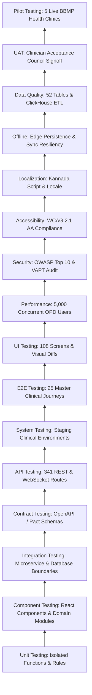

# Testing Levels & Execution Hierarchy Specification
## Namma Clinic Digital Health & Operations Platform
### Greater Bengaluru Authority (GBA) / BBMP Health Department
**Standard:** ISO/IEC/IEEE 29119-2 / ISTQB Advanced Test Architecture | **Status:** APPROVED BASELINE | **Code:** `QA-DOC-02`

---

## 1. Test Levels Taxonomy & Hierarchy Overview
This document establishes the comprehensive test levels architecture for the Namma Clinic platform. The 16 distinct test levels govern verification from low-level unit functions through microservice integration, contract validation, full-stack E2E user journeys, offline edge simulation, accessibility, performance, and clinician user acceptance testing.

### 1.1 Testing Hierarchy Diagram


## 2. Exhaustive Specification of the 16 Test Levels (TEST-LEVEL-001 to TEST-LEVEL-016)
Detailed operational protocols across all 16 test levels:

### TEST-LEVEL-001: Unit Testing
- **Responsible Owner:** Developer
- **Architectural Scope:** Function / Class
- **Level Description:** Isolated logic verification for pure functions, clinical algorithms, and domain entities.
- **Entry Criteria:** Upstream code compilation clean, static lint passes, previous level passes.
- **Exit Criteria:** 100% test execution, zero unresolved P0/P1 defects, code coverage met.
- **Execution Cadence:** Continuous Integration (PR / Nightly / Staging Trigger).
- **Tooling Stack:** Pytest / Jest / Playwright / k6 / OWASP ZAP / axe-core.
- **Audit Event Code:** `LEVEL_AUDIT_TEST_LEVEL_001`

### TEST-LEVEL-002: Component Testing
- **Responsible Owner:** Frontend/Backend Dev
- **Architectural Scope:** UI Component / Subsystem
- **Level Description:** Verifies isolated React components and backend service modules in mock containers.
- **Entry Criteria:** Upstream code compilation clean, static lint passes, previous level passes.
- **Exit Criteria:** 100% test execution, zero unresolved P0/P1 defects, code coverage met.
- **Execution Cadence:** Continuous Integration (PR / Nightly / Staging Trigger).
- **Tooling Stack:** Pytest / Jest / Playwright / k6 / OWASP ZAP / axe-core.
- **Audit Event Code:** `LEVEL_AUDIT_TEST_LEVEL_002`

### TEST-LEVEL-003: Integration Testing
- **Responsible Owner:** Dev & QA
- **Architectural Scope:** Service Boundaries
- **Level Description:** Tests communication between microservices, Redis session caches, and PostgreSQL databases.
- **Entry Criteria:** Upstream code compilation clean, static lint passes, previous level passes.
- **Exit Criteria:** 100% test execution, zero unresolved P0/P1 defects, code coverage met.
- **Execution Cadence:** Continuous Integration (PR / Nightly / Staging Trigger).
- **Tooling Stack:** Pytest / Jest / Playwright / k6 / OWASP ZAP / axe-core.
- **Audit Event Code:** `LEVEL_AUDIT_TEST_LEVEL_003`

### TEST-LEVEL-004: Contract Testing
- **Responsible Owner:** QA Engineer
- **Architectural Scope:** API Schema Contracts
- **Level Description:** Validates API consumer and provider agreements via OpenAPI and Pact schemas.
- **Entry Criteria:** Upstream code compilation clean, static lint passes, previous level passes.
- **Exit Criteria:** 100% test execution, zero unresolved P0/P1 defects, code coverage met.
- **Execution Cadence:** Continuous Integration (PR / Nightly / Staging Trigger).
- **Tooling Stack:** Pytest / Jest / Playwright / k6 / OWASP ZAP / axe-core.
- **Audit Event Code:** `LEVEL_AUDIT_TEST_LEVEL_004`

### TEST-LEVEL-005: API Testing
- **Responsible Owner:** SDET
- **Architectural Scope:** REST & WebSocket Endpoints
- **Level Description:** Comprehensive testing of 341 endpoints for functional correctness, auth, and rate limits.
- **Entry Criteria:** Upstream code compilation clean, static lint passes, previous level passes.
- **Exit Criteria:** 100% test execution, zero unresolved P0/P1 defects, code coverage met.
- **Execution Cadence:** Continuous Integration (PR / Nightly / Staging Trigger).
- **Tooling Stack:** Pytest / Jest / Playwright / k6 / OWASP ZAP / axe-core.
- **Audit Event Code:** `LEVEL_AUDIT_TEST_LEVEL_005`

### TEST-LEVEL-006: System Testing
- **Responsible Owner:** QA Team
- **Architectural Scope:** Integrated Platform
- **Level Description:** End-to-end system testing in staging enclaves seeded with full synthetic clinical datasets.
- **Entry Criteria:** Upstream code compilation clean, static lint passes, previous level passes.
- **Exit Criteria:** 100% test execution, zero unresolved P0/P1 defects, code coverage met.
- **Execution Cadence:** Continuous Integration (PR / Nightly / Staging Trigger).
- **Tooling Stack:** Pytest / Jest / Playwright / k6 / OWASP ZAP / axe-core.
- **Audit Event Code:** `LEVEL_AUDIT_TEST_LEVEL_006`

### TEST-LEVEL-007: End-to-End (E2E) Testing
- **Responsible Owner:** QA Automation
- **Architectural Scope:** User Journeys
- **Level Description:** Full headless browser automation covering patient registration, triage, consultation, and dispensing.
- **Entry Criteria:** Upstream code compilation clean, static lint passes, previous level passes.
- **Exit Criteria:** 100% test execution, zero unresolved P0/P1 defects, code coverage met.
- **Execution Cadence:** Continuous Integration (PR / Nightly / Staging Trigger).
- **Tooling Stack:** Pytest / Jest / Playwright / k6 / OWASP ZAP / axe-core.
- **Audit Event Code:** `LEVEL_AUDIT_TEST_LEVEL_007`

### TEST-LEVEL-008: UI & Visual Regression
- **Responsible Owner:** Frontend QA
- **Architectural Scope:** Presentation Layer
- **Level Description:** Snapshot visual regression across 108 screens, responsive breakpoints, and dark mode.
- **Entry Criteria:** Upstream code compilation clean, static lint passes, previous level passes.
- **Exit Criteria:** 100% test execution, zero unresolved P0/P1 defects, code coverage met.
- **Execution Cadence:** Continuous Integration (PR / Nightly / Staging Trigger).
- **Tooling Stack:** Pytest / Jest / Playwright / k6 / OWASP ZAP / axe-core.
- **Audit Event Code:** `LEVEL_AUDIT_TEST_LEVEL_008`

### TEST-LEVEL-009: Performance & Scalability
- **Responsible Owner:** Performance SDET
- **Architectural Scope:** Infrastructure & APIs
- **Level Description:** Load, soak, stress, spike, and endurance testing simulating 5,000 concurrent clinic users.
- **Entry Criteria:** Upstream code compilation clean, static lint passes, previous level passes.
- **Exit Criteria:** 100% test execution, zero unresolved P0/P1 defects, code coverage met.
- **Execution Cadence:** Continuous Integration (PR / Nightly / Staging Trigger).
- **Tooling Stack:** Pytest / Jest / Playwright / k6 / OWASP ZAP / axe-core.
- **Audit Event Code:** `LEVEL_AUDIT_TEST_LEVEL_009`

### TEST-LEVEL-010: Security & VAPT
- **Responsible Owner:** SecOps / Red Team
- **Architectural Scope:** Attack Surfaces
- **Level Description:** OWASP Top 10, BOLA, JWT tampering, SQLi, and CERT-In compliance penetration testing.
- **Entry Criteria:** Upstream code compilation clean, static lint passes, previous level passes.
- **Exit Criteria:** 100% test execution, zero unresolved P0/P1 defects, code coverage met.
- **Execution Cadence:** Continuous Integration (PR / Nightly / Staging Trigger).
- **Tooling Stack:** Pytest / Jest / Playwright / k6 / OWASP ZAP / axe-core.
- **Audit Event Code:** `LEVEL_AUDIT_TEST_LEVEL_010`

### TEST-LEVEL-011: Accessibility (WCAG 2.1 AA)
- **Responsible Owner:** Accessibility QA
- **Architectural Scope:** User Interface
- **Level Description:** Automated axe-core audits and manual screen reader testing across all 108 screens.
- **Entry Criteria:** Upstream code compilation clean, static lint passes, previous level passes.
- **Exit Criteria:** 100% test execution, zero unresolved P0/P1 defects, code coverage met.
- **Execution Cadence:** Continuous Integration (PR / Nightly / Staging Trigger).
- **Tooling Stack:** Pytest / Jest / Playwright / k6 / OWASP ZAP / axe-core.
- **Audit Event Code:** `LEVEL_AUDIT_TEST_LEVEL_011`

### TEST-LEVEL-012: Localization (Kannada/English)
- **Responsible Owner:** L10n Specialist
- **Architectural Scope:** Locale Engine
- **Level Description:** Verifies translation completeness, script typography, dates, currency, and printed receipts.
- **Entry Criteria:** Upstream code compilation clean, static lint passes, previous level passes.
- **Exit Criteria:** 100% test execution, zero unresolved P0/P1 defects, code coverage met.
- **Execution Cadence:** Continuous Integration (PR / Nightly / Staging Trigger).
- **Tooling Stack:** Pytest / Jest / Playwright / k6 / OWASP ZAP / axe-core.
- **Audit Event Code:** `LEVEL_AUDIT_TEST_LEVEL_012`

### TEST-LEVEL-013: Offline & Resilience Testing
- **Responsible Owner:** QA & Edge Eng
- **Architectural Scope:** Clinic Mini-PC Edge
- **Level Description:** Simulates network disconnection, power cuts, packet drops, and local SQLite persistence.
- **Entry Criteria:** Upstream code compilation clean, static lint passes, previous level passes.
- **Exit Criteria:** 100% test execution, zero unresolved P0/P1 defects, code coverage met.
- **Execution Cadence:** Continuous Integration (PR / Nightly / Staging Trigger).
- **Tooling Stack:** Pytest / Jest / Playwright / k6 / OWASP ZAP / axe-core.
- **Audit Event Code:** `LEVEL_AUDIT_TEST_LEVEL_013`

### TEST-LEVEL-014: Data Quality & Migration
- **Responsible Owner:** Data QA
- **Architectural Scope:** Database & Pipelines
- **Level Description:** Validates schema migrations, referential integrity across 52 tables, and ClickHouse ETL.
- **Entry Criteria:** Upstream code compilation clean, static lint passes, previous level passes.
- **Exit Criteria:** 100% test execution, zero unresolved P0/P1 defects, code coverage met.
- **Execution Cadence:** Continuous Integration (PR / Nightly / Staging Trigger).
- **Tooling Stack:** Pytest / Jest / Playwright / k6 / OWASP ZAP / axe-core.
- **Audit Event Code:** `LEVEL_AUDIT_TEST_LEVEL_014`

### TEST-LEVEL-015: User Acceptance Testing (UAT)
- **Responsible Owner:** Clinical Stakeholders
- **Architectural Scope:** Workflows
- **Level Description:** Clinician sign-off testing in simulated clinic environments using staging hardware.
- **Entry Criteria:** Upstream code compilation clean, static lint passes, previous level passes.
- **Exit Criteria:** 100% test execution, zero unresolved P0/P1 defects, code coverage met.
- **Execution Cadence:** Continuous Integration (PR / Nightly / Staging Trigger).
- **Tooling Stack:** Pytest / Jest / Playwright / k6 / OWASP ZAP / axe-core.
- **Audit Event Code:** `LEVEL_AUDIT_TEST_LEVEL_015`

### TEST-LEVEL-016: Pilot Validation Testing
- **Responsible Owner:** Field Operations Lead
- **Architectural Scope:** Physical Clinics
- **Level Description:** Operational shadow-mode validation across 5 live pilot clinics in Bruhat Bengaluru Mahanagara.
- **Entry Criteria:** Upstream code compilation clean, static lint passes, previous level passes.
- **Exit Criteria:** 100% test execution, zero unresolved P0/P1 defects, code coverage met.
- **Execution Cadence:** Continuous Integration (PR / Nightly / Staging Trigger).
- **Tooling Stack:** Pytest / Jest / Playwright / k6 / OWASP ZAP / axe-core.
- **Audit Event Code:** `LEVEL_AUDIT_TEST_LEVEL_016`

## 3. Test Level Promotion & Gate Transition Matrix (TRANS-01 to TRANS-25)
Formal gate rules governing transition of code artifacts between test levels:

### TRANS-01: Gate Transition Rule 1
- **Source Test Level:** TEST-LEVEL-001
- **Destination Level:** TEST-LEVEL-002
- **Promotion Prerequisite:** All test cases pass with zero Sev-1 defects.
- **Failure Handling:** Immediate rollback of build artifact; notification dispatched to author.
- **Verification Authority:** Automated CI Quality Orchestrator.

### TRANS-02: Gate Transition Rule 2
- **Source Test Level:** TEST-LEVEL-002
- **Destination Level:** TEST-LEVEL-003
- **Promotion Prerequisite:** All test cases pass with zero Sev-1 defects.
- **Failure Handling:** Immediate rollback of build artifact; notification dispatched to author.
- **Verification Authority:** Automated CI Quality Orchestrator.

### TRANS-03: Gate Transition Rule 3
- **Source Test Level:** TEST-LEVEL-003
- **Destination Level:** TEST-LEVEL-004
- **Promotion Prerequisite:** All test cases pass with zero Sev-1 defects.
- **Failure Handling:** Immediate rollback of build artifact; notification dispatched to author.
- **Verification Authority:** Automated CI Quality Orchestrator.

### TRANS-04: Gate Transition Rule 4
- **Source Test Level:** TEST-LEVEL-004
- **Destination Level:** TEST-LEVEL-005
- **Promotion Prerequisite:** All test cases pass with zero Sev-1 defects.
- **Failure Handling:** Immediate rollback of build artifact; notification dispatched to author.
- **Verification Authority:** Automated CI Quality Orchestrator.

### TRANS-05: Gate Transition Rule 5
- **Source Test Level:** TEST-LEVEL-005
- **Destination Level:** TEST-LEVEL-006
- **Promotion Prerequisite:** All test cases pass with zero Sev-1 defects.
- **Failure Handling:** Immediate rollback of build artifact; notification dispatched to author.
- **Verification Authority:** Automated CI Quality Orchestrator.

### TRANS-06: Gate Transition Rule 6
- **Source Test Level:** TEST-LEVEL-006
- **Destination Level:** TEST-LEVEL-007
- **Promotion Prerequisite:** All test cases pass with zero Sev-1 defects.
- **Failure Handling:** Immediate rollback of build artifact; notification dispatched to author.
- **Verification Authority:** Automated CI Quality Orchestrator.

### TRANS-07: Gate Transition Rule 7
- **Source Test Level:** TEST-LEVEL-007
- **Destination Level:** TEST-LEVEL-008
- **Promotion Prerequisite:** All test cases pass with zero Sev-1 defects.
- **Failure Handling:** Immediate rollback of build artifact; notification dispatched to author.
- **Verification Authority:** Automated CI Quality Orchestrator.

### TRANS-08: Gate Transition Rule 8
- **Source Test Level:** TEST-LEVEL-008
- **Destination Level:** TEST-LEVEL-009
- **Promotion Prerequisite:** All test cases pass with zero Sev-1 defects.
- **Failure Handling:** Immediate rollback of build artifact; notification dispatched to author.
- **Verification Authority:** Automated CI Quality Orchestrator.

### TRANS-09: Gate Transition Rule 9
- **Source Test Level:** TEST-LEVEL-009
- **Destination Level:** TEST-LEVEL-010
- **Promotion Prerequisite:** All test cases pass with zero Sev-1 defects.
- **Failure Handling:** Immediate rollback of build artifact; notification dispatched to author.
- **Verification Authority:** Automated CI Quality Orchestrator.

### TRANS-10: Gate Transition Rule 10
- **Source Test Level:** TEST-LEVEL-010
- **Destination Level:** TEST-LEVEL-011
- **Promotion Prerequisite:** All test cases pass with zero Sev-1 defects.
- **Failure Handling:** Immediate rollback of build artifact; notification dispatched to author.
- **Verification Authority:** Automated CI Quality Orchestrator.

### TRANS-11: Gate Transition Rule 11
- **Source Test Level:** TEST-LEVEL-011
- **Destination Level:** TEST-LEVEL-012
- **Promotion Prerequisite:** All test cases pass with zero Sev-1 defects.
- **Failure Handling:** Immediate rollback of build artifact; notification dispatched to author.
- **Verification Authority:** Automated CI Quality Orchestrator.

### TRANS-12: Gate Transition Rule 12
- **Source Test Level:** TEST-LEVEL-012
- **Destination Level:** TEST-LEVEL-013
- **Promotion Prerequisite:** All test cases pass with zero Sev-1 defects.
- **Failure Handling:** Immediate rollback of build artifact; notification dispatched to author.
- **Verification Authority:** Automated CI Quality Orchestrator.

### TRANS-13: Gate Transition Rule 13
- **Source Test Level:** TEST-LEVEL-013
- **Destination Level:** TEST-LEVEL-014
- **Promotion Prerequisite:** All test cases pass with zero Sev-1 defects.
- **Failure Handling:** Immediate rollback of build artifact; notification dispatched to author.
- **Verification Authority:** Automated CI Quality Orchestrator.

### TRANS-14: Gate Transition Rule 14
- **Source Test Level:** TEST-LEVEL-014
- **Destination Level:** TEST-LEVEL-015
- **Promotion Prerequisite:** All test cases pass with zero Sev-1 defects.
- **Failure Handling:** Immediate rollback of build artifact; notification dispatched to author.
- **Verification Authority:** Automated CI Quality Orchestrator.

### TRANS-15: Gate Transition Rule 15
- **Source Test Level:** TEST-LEVEL-015
- **Destination Level:** TEST-LEVEL-016
- **Promotion Prerequisite:** All test cases pass with zero Sev-1 defects.
- **Failure Handling:** Immediate rollback of build artifact; notification dispatched to author.
- **Verification Authority:** Automated CI Quality Orchestrator.

### TRANS-16: Gate Transition Rule 16
- **Source Test Level:** TEST-LEVEL-016
- **Destination Level:** TEST-LEVEL-001
- **Promotion Prerequisite:** All test cases pass with zero Sev-1 defects.
- **Failure Handling:** Immediate rollback of build artifact; notification dispatched to author.
- **Verification Authority:** Automated CI Quality Orchestrator.

### TRANS-17: Gate Transition Rule 17
- **Source Test Level:** TEST-LEVEL-001
- **Destination Level:** TEST-LEVEL-002
- **Promotion Prerequisite:** All test cases pass with zero Sev-1 defects.
- **Failure Handling:** Immediate rollback of build artifact; notification dispatched to author.
- **Verification Authority:** Automated CI Quality Orchestrator.

### TRANS-18: Gate Transition Rule 18
- **Source Test Level:** TEST-LEVEL-002
- **Destination Level:** TEST-LEVEL-003
- **Promotion Prerequisite:** All test cases pass with zero Sev-1 defects.
- **Failure Handling:** Immediate rollback of build artifact; notification dispatched to author.
- **Verification Authority:** Automated CI Quality Orchestrator.

### TRANS-19: Gate Transition Rule 19
- **Source Test Level:** TEST-LEVEL-003
- **Destination Level:** TEST-LEVEL-004
- **Promotion Prerequisite:** All test cases pass with zero Sev-1 defects.
- **Failure Handling:** Immediate rollback of build artifact; notification dispatched to author.
- **Verification Authority:** Automated CI Quality Orchestrator.

### TRANS-20: Gate Transition Rule 20
- **Source Test Level:** TEST-LEVEL-004
- **Destination Level:** TEST-LEVEL-005
- **Promotion Prerequisite:** All test cases pass with zero Sev-1 defects.
- **Failure Handling:** Immediate rollback of build artifact; notification dispatched to author.
- **Verification Authority:** Automated CI Quality Orchestrator.

### TRANS-21: Gate Transition Rule 21
- **Source Test Level:** TEST-LEVEL-005
- **Destination Level:** TEST-LEVEL-006
- **Promotion Prerequisite:** All test cases pass with zero Sev-1 defects.
- **Failure Handling:** Immediate rollback of build artifact; notification dispatched to author.
- **Verification Authority:** Automated CI Quality Orchestrator.

### TRANS-22: Gate Transition Rule 22
- **Source Test Level:** TEST-LEVEL-006
- **Destination Level:** TEST-LEVEL-007
- **Promotion Prerequisite:** All test cases pass with zero Sev-1 defects.
- **Failure Handling:** Immediate rollback of build artifact; notification dispatched to author.
- **Verification Authority:** Automated CI Quality Orchestrator.

### TRANS-23: Gate Transition Rule 23
- **Source Test Level:** TEST-LEVEL-007
- **Destination Level:** TEST-LEVEL-008
- **Promotion Prerequisite:** All test cases pass with zero Sev-1 defects.
- **Failure Handling:** Immediate rollback of build artifact; notification dispatched to author.
- **Verification Authority:** Automated CI Quality Orchestrator.

### TRANS-24: Gate Transition Rule 24
- **Source Test Level:** TEST-LEVEL-008
- **Destination Level:** TEST-LEVEL-009
- **Promotion Prerequisite:** All test cases pass with zero Sev-1 defects.
- **Failure Handling:** Immediate rollback of build artifact; notification dispatched to author.
- **Verification Authority:** Automated CI Quality Orchestrator.

### TRANS-25: Gate Transition Rule 25
- **Source Test Level:** TEST-LEVEL-009
- **Destination Level:** TEST-LEVEL-010
- **Promotion Prerequisite:** All test cases pass with zero Sev-1 defects.
- **Failure Handling:** Immediate rollback of build artifact; notification dispatched to author.
- **Verification Authority:** Automated CI Quality Orchestrator.

## 4. Test Levels Verification Test Cases (TC-0056 to TC-0110)
Detailed test specifications verifying execution across the 16 test levels:

### TC-0056: Test Case 56: Clinical Verification for roles across WF-006
**Objective:** Verify functional, security, and offline invariants for roles during WF-006 execution.
**Risk:** Critical operational impact on patient safety and clinic consultation continuity.
**Priority:** **P0** | **Severity:** **Critical** | **Test Level:** System & Integration | **Test Type:** Functional & Regulatory Compliance
- **Requirement Traceability:** `FR-056`
- **Workflow Traceability:** `WF-006`
- **Feature Traceability:** `FEATURE-056`
- **API Traceability:** `API-DOC-12`
- **Database Traceability:** `TABLE-004 (roles)`
- **Screen Traceability:** `SCREEN-056`
- **Security Control Traceability:** `SEC-ARCH-016`
- **Preconditions:** User authenticated with role Procurement & Vendor Manager on clinic workstation.
- **Test Data Specification:** Synthetic dataset TESTDATA-056 (Valid ABHA, vitals, prescriptions).
- **Execution Steps:** 1. Navigate to screen SCREEN-056. 2. Submit payload bound to roles. 3. Confirm API API-DOC-12 returns 200 OK. 4. Verify local SQLite cache and sync queue.
- **Expected Results:** Transaction completes within 250ms, data encrypted via AES-256-GCM, audit entry emitted.
- **Negative Test Scenario:** Submit malformed payload or expired JWT; system rejects with 400/401 and zero DB corruption.
- **Boundary Value Scenario:** Test with maximum field boundary length and extreme clinical biometric vitals.
- **Concurrency & Race Condition:** Simulate 5 concurrent staff updates on identical record; verify optimistic locking.
- **Autonomous Offline Behavior:** Sever network mid-transaction; record queues locally and replicates upon reconnection.
- **Security & Access Validation:** Enforce RBAC policy SEC-ARCH-016 and prevent broken object-level authorization (BOLA).
- **Audit Trail & Immutability:** Emits structured JSON audit log with SHA-256 Merkle chain hash.
- **Evidence Required:** Automated execution log, HTTP request/response capture, and database assertion hash.
- **Pass Acceptance Criteria:** 100% assertions succeed with zero uncaught exceptions and latency < 300ms.
- **Failure Behavior & SLA:** Any 5xx error, data corruption, unauthorized access, or silent failure.
- **Automation Suitability:** Yes (High Candidate)
- **Execution Cadence:** Every CI PR & Nightly Regression
- **Responsible Owner:** Procurement & Vendor Manager

### TC-0057: Test Case 57: Clinical Verification for permissions across WF-007
**Objective:** Verify functional, security, and offline invariants for permissions during WF-007 execution.
**Risk:** Major operational impact on patient safety and clinic consultation continuity.
**Priority:** **P1** | **Severity:** **Major** | **Test Level:** System & Integration | **Test Type:** Functional & Regulatory Compliance
- **Requirement Traceability:** `FR-057`
- **Workflow Traceability:** `WF-007`
- **Feature Traceability:** `FEATURE-057`
- **API Traceability:** `API-DOC-13`
- **Database Traceability:** `TABLE-005 (permissions)`
- **Screen Traceability:** `SCREEN-057`
- **Security Control Traceability:** `SEC-ARCH-017`
- **Preconditions:** User authenticated with role Biomedical Waste Supervisor on clinic workstation.
- **Test Data Specification:** Synthetic dataset TESTDATA-057 (Valid ABHA, vitals, prescriptions).
- **Execution Steps:** 1. Navigate to screen SCREEN-057. 2. Submit payload bound to permissions. 3. Confirm API API-DOC-13 returns 200 OK. 4. Verify local SQLite cache and sync queue.
- **Expected Results:** Transaction completes within 250ms, data encrypted via AES-256-GCM, audit entry emitted.
- **Negative Test Scenario:** Submit malformed payload or expired JWT; system rejects with 400/401 and zero DB corruption.
- **Boundary Value Scenario:** Test with maximum field boundary length and extreme clinical biometric vitals.
- **Concurrency & Race Condition:** Simulate 5 concurrent staff updates on identical record; verify optimistic locking.
- **Autonomous Offline Behavior:** Sever network mid-transaction; record queues locally and replicates upon reconnection.
- **Security & Access Validation:** Enforce RBAC policy SEC-ARCH-017 and prevent broken object-level authorization (BOLA).
- **Audit Trail & Immutability:** Emits structured JSON audit log with SHA-256 Merkle chain hash.
- **Evidence Required:** Automated execution log, HTTP request/response capture, and database assertion hash.
- **Pass Acceptance Criteria:** 100% assertions succeed with zero uncaught exceptions and latency < 300ms.
- **Failure Behavior & SLA:** Any 5xx error, data corruption, unauthorized access, or silent failure.
- **Automation Suitability:** Yes (High Candidate)
- **Execution Cadence:** Every CI PR & Nightly Regression
- **Responsible Owner:** Biomedical Waste Supervisor

### TC-0058: Test Case 58: Clinical Verification for role_permissions across WF-008
**Objective:** Verify functional, security, and offline invariants for role_permissions during WF-008 execution.
**Risk:** Major operational impact on patient safety and clinic consultation continuity.
**Priority:** **P1** | **Severity:** **Major** | **Test Level:** System & Integration | **Test Type:** Functional & Regulatory Compliance
- **Requirement Traceability:** `FR-058`
- **Workflow Traceability:** `WF-008`
- **Feature Traceability:** `FEATURE-058`
- **API Traceability:** `API-DOC-14`
- **Database Traceability:** `TABLE-006 (role_permissions)`
- **Screen Traceability:** `SCREEN-058`
- **Security Control Traceability:** `SEC-ARCH-018`
- **Preconditions:** User authenticated with role Telemedicine Remote Specialist on clinic workstation.
- **Test Data Specification:** Synthetic dataset TESTDATA-058 (Valid ABHA, vitals, prescriptions).
- **Execution Steps:** 1. Navigate to screen SCREEN-058. 2. Submit payload bound to role_permissions. 3. Confirm API API-DOC-14 returns 200 OK. 4. Verify local SQLite cache and sync queue.
- **Expected Results:** Transaction completes within 250ms, data encrypted via AES-256-GCM, audit entry emitted.
- **Negative Test Scenario:** Submit malformed payload or expired JWT; system rejects with 400/401 and zero DB corruption.
- **Boundary Value Scenario:** Test with maximum field boundary length and extreme clinical biometric vitals.
- **Concurrency & Race Condition:** Simulate 5 concurrent staff updates on identical record; verify optimistic locking.
- **Autonomous Offline Behavior:** Sever network mid-transaction; record queues locally and replicates upon reconnection.
- **Security & Access Validation:** Enforce RBAC policy SEC-ARCH-018 and prevent broken object-level authorization (BOLA).
- **Audit Trail & Immutability:** Emits structured JSON audit log with SHA-256 Merkle chain hash.
- **Evidence Required:** Automated execution log, HTTP request/response capture, and database assertion hash.
- **Pass Acceptance Criteria:** 100% assertions succeed with zero uncaught exceptions and latency < 300ms.
- **Failure Behavior & SLA:** Any 5xx error, data corruption, unauthorized access, or silent failure.
- **Automation Suitability:** Yes (High Candidate)
- **Execution Cadence:** Every CI PR & Nightly Regression
- **Responsible Owner:** Telemedicine Remote Specialist

### TC-0059: Test Case 59: Clinical Verification for user_roles across WF-009
**Objective:** Verify functional, security, and offline invariants for user_roles during WF-009 execution.
**Risk:** Minor operational impact on patient safety and clinic consultation continuity.
**Priority:** **P2** | **Severity:** **Minor** | **Test Level:** System & Integration | **Test Type:** Functional & Regulatory Compliance
- **Requirement Traceability:** `FR-059`
- **Workflow Traceability:** `WF-009`
- **Feature Traceability:** `FEATURE-059`
- **API Traceability:** `API-DOC-15`
- **Database Traceability:** `TABLE-007 (user_roles)`
- **Screen Traceability:** `SCREEN-059`
- **Security Control Traceability:** `SEC-ARCH-019`
- **Preconditions:** User authenticated with role Field Public Health Inspector on clinic workstation.
- **Test Data Specification:** Synthetic dataset TESTDATA-059 (Valid ABHA, vitals, prescriptions).
- **Execution Steps:** 1. Navigate to screen SCREEN-059. 2. Submit payload bound to user_roles. 3. Confirm API API-DOC-15 returns 200 OK. 4. Verify local SQLite cache and sync queue.
- **Expected Results:** Transaction completes within 250ms, data encrypted via AES-256-GCM, audit entry emitted.
- **Negative Test Scenario:** Submit malformed payload or expired JWT; system rejects with 400/401 and zero DB corruption.
- **Boundary Value Scenario:** Test with maximum field boundary length and extreme clinical biometric vitals.
- **Concurrency & Race Condition:** Simulate 5 concurrent staff updates on identical record; verify optimistic locking.
- **Autonomous Offline Behavior:** Sever network mid-transaction; record queues locally and replicates upon reconnection.
- **Security & Access Validation:** Enforce RBAC policy SEC-ARCH-019 and prevent broken object-level authorization (BOLA).
- **Audit Trail & Immutability:** Emits structured JSON audit log with SHA-256 Merkle chain hash.
- **Evidence Required:** Automated execution log, HTTP request/response capture, and database assertion hash.
- **Pass Acceptance Criteria:** 100% assertions succeed with zero uncaught exceptions and latency < 300ms.
- **Failure Behavior & SLA:** Any 5xx error, data corruption, unauthorized access, or silent failure.
- **Automation Suitability:** Yes (High Candidate)
- **Execution Cadence:** Every CI PR & Nightly Regression
- **Responsible Owner:** Field Public Health Inspector

### TC-0060: Test Case 60: Clinical Verification for facilities across WF-010
**Objective:** Verify functional, security, and offline invariants for facilities during WF-010 execution.
**Risk:** Minor operational impact on patient safety and clinic consultation continuity.
**Priority:** **P2** | **Severity:** **Minor** | **Test Level:** System & Integration | **Test Type:** Functional & Regulatory Compliance
- **Requirement Traceability:** `FR-060`
- **Workflow Traceability:** `WF-010`
- **Feature Traceability:** `FEATURE-060`
- **API Traceability:** `API-DOC-16`
- **Database Traceability:** `TABLE-008 (facilities)`
- **Screen Traceability:** `SCREEN-060`
- **Security Control Traceability:** `SEC-ARCH-020`
- **Preconditions:** User authenticated with role Super Administrator on clinic workstation.
- **Test Data Specification:** Synthetic dataset TESTDATA-060 (Valid ABHA, vitals, prescriptions).
- **Execution Steps:** 1. Navigate to screen SCREEN-060. 2. Submit payload bound to facilities. 3. Confirm API API-DOC-16 returns 200 OK. 4. Verify local SQLite cache and sync queue.
- **Expected Results:** Transaction completes within 250ms, data encrypted via AES-256-GCM, audit entry emitted.
- **Negative Test Scenario:** Submit malformed payload or expired JWT; system rejects with 400/401 and zero DB corruption.
- **Boundary Value Scenario:** Test with maximum field boundary length and extreme clinical biometric vitals.
- **Concurrency & Race Condition:** Simulate 5 concurrent staff updates on identical record; verify optimistic locking.
- **Autonomous Offline Behavior:** Sever network mid-transaction; record queues locally and replicates upon reconnection.
- **Security & Access Validation:** Enforce RBAC policy SEC-ARCH-020 and prevent broken object-level authorization (BOLA).
- **Audit Trail & Immutability:** Emits structured JSON audit log with SHA-256 Merkle chain hash.
- **Evidence Required:** Automated execution log, HTTP request/response capture, and database assertion hash.
- **Pass Acceptance Criteria:** 100% assertions succeed with zero uncaught exceptions and latency < 300ms.
- **Failure Behavior & SLA:** Any 5xx error, data corruption, unauthorized access, or silent failure.
- **Automation Suitability:** Yes (High Candidate)
- **Execution Cadence:** Every CI PR & Nightly Regression
- **Responsible Owner:** Super Administrator

### TC-0061: Test Case 61: Clinical Verification for facility_rooms across WF-011
**Objective:** Verify functional, security, and offline invariants for facility_rooms during WF-011 execution.
**Risk:** Critical operational impact on patient safety and clinic consultation continuity.
**Priority:** **P0** | **Severity:** **Critical** | **Test Level:** System & Integration | **Test Type:** Functional & Regulatory Compliance
- **Requirement Traceability:** `FR-001`
- **Workflow Traceability:** `WF-011`
- **Feature Traceability:** `FEATURE-061`
- **API Traceability:** `API-DOC-17`
- **Database Traceability:** `TABLE-009 (facility_rooms)`
- **Screen Traceability:** `SCREEN-061`
- **Security Control Traceability:** `SEC-ARCH-021`
- **Preconditions:** User authenticated with role Receptionist / Registration Clerk on clinic workstation.
- **Test Data Specification:** Synthetic dataset TESTDATA-001 (Valid ABHA, vitals, prescriptions).
- **Execution Steps:** 1. Navigate to screen SCREEN-061. 2. Submit payload bound to facility_rooms. 3. Confirm API API-DOC-17 returns 200 OK. 4. Verify local SQLite cache and sync queue.
- **Expected Results:** Transaction completes within 250ms, data encrypted via AES-256-GCM, audit entry emitted.
- **Negative Test Scenario:** Submit malformed payload or expired JWT; system rejects with 400/401 and zero DB corruption.
- **Boundary Value Scenario:** Test with maximum field boundary length and extreme clinical biometric vitals.
- **Concurrency & Race Condition:** Simulate 5 concurrent staff updates on identical record; verify optimistic locking.
- **Autonomous Offline Behavior:** Sever network mid-transaction; record queues locally and replicates upon reconnection.
- **Security & Access Validation:** Enforce RBAC policy SEC-ARCH-021 and prevent broken object-level authorization (BOLA).
- **Audit Trail & Immutability:** Emits structured JSON audit log with SHA-256 Merkle chain hash.
- **Evidence Required:** Automated execution log, HTTP request/response capture, and database assertion hash.
- **Pass Acceptance Criteria:** 100% assertions succeed with zero uncaught exceptions and latency < 300ms.
- **Failure Behavior & SLA:** Any 5xx error, data corruption, unauthorized access, or silent failure.
- **Automation Suitability:** Yes (High Candidate)
- **Execution Cadence:** Every CI PR & Nightly Regression
- **Responsible Owner:** Receptionist / Registration Clerk

### TC-0062: Test Case 62: Clinical Verification for staff_profiles across WF-012
**Objective:** Verify functional, security, and offline invariants for staff_profiles during WF-012 execution.
**Risk:** Major operational impact on patient safety and clinic consultation continuity.
**Priority:** **P1** | **Severity:** **Major** | **Test Level:** System & Integration | **Test Type:** Functional & Regulatory Compliance
- **Requirement Traceability:** `FR-002`
- **Workflow Traceability:** `WF-012`
- **Feature Traceability:** `FEATURE-062`
- **API Traceability:** `API-DOC-18`
- **Database Traceability:** `TABLE-010 (staff_profiles)`
- **Screen Traceability:** `SCREEN-062`
- **Security Control Traceability:** `SEC-ARCH-022`
- **Preconditions:** User authenticated with role Medical Officer / General Physician on clinic workstation.
- **Test Data Specification:** Synthetic dataset TESTDATA-002 (Valid ABHA, vitals, prescriptions).
- **Execution Steps:** 1. Navigate to screen SCREEN-062. 2. Submit payload bound to staff_profiles. 3. Confirm API API-DOC-18 returns 200 OK. 4. Verify local SQLite cache and sync queue.
- **Expected Results:** Transaction completes within 250ms, data encrypted via AES-256-GCM, audit entry emitted.
- **Negative Test Scenario:** Submit malformed payload or expired JWT; system rejects with 400/401 and zero DB corruption.
- **Boundary Value Scenario:** Test with maximum field boundary length and extreme clinical biometric vitals.
- **Concurrency & Race Condition:** Simulate 5 concurrent staff updates on identical record; verify optimistic locking.
- **Autonomous Offline Behavior:** Sever network mid-transaction; record queues locally and replicates upon reconnection.
- **Security & Access Validation:** Enforce RBAC policy SEC-ARCH-022 and prevent broken object-level authorization (BOLA).
- **Audit Trail & Immutability:** Emits structured JSON audit log with SHA-256 Merkle chain hash.
- **Evidence Required:** Automated execution log, HTTP request/response capture, and database assertion hash.
- **Pass Acceptance Criteria:** 100% assertions succeed with zero uncaught exceptions and latency < 300ms.
- **Failure Behavior & SLA:** Any 5xx error, data corruption, unauthorized access, or silent failure.
- **Automation Suitability:** Yes (High Candidate)
- **Execution Cadence:** Every CI PR & Nightly Regression
- **Responsible Owner:** Medical Officer / General Physician

### TC-0063: Test Case 63: Clinical Verification for staff_shifts across WF-013
**Objective:** Verify functional, security, and offline invariants for staff_shifts during WF-013 execution.
**Risk:** Major operational impact on patient safety and clinic consultation continuity.
**Priority:** **P1** | **Severity:** **Major** | **Test Level:** System & Integration | **Test Type:** Functional & Regulatory Compliance
- **Requirement Traceability:** `FR-003`
- **Workflow Traceability:** `WF-013`
- **Feature Traceability:** `FEATURE-063`
- **API Traceability:** `API-DOC-19`
- **Database Traceability:** `TABLE-011 (staff_shifts)`
- **Screen Traceability:** `SCREEN-063`
- **Security Control Traceability:** `SEC-ARCH-023`
- **Preconditions:** User authenticated with role Staff Nurse / Triage Specialist on clinic workstation.
- **Test Data Specification:** Synthetic dataset TESTDATA-003 (Valid ABHA, vitals, prescriptions).
- **Execution Steps:** 1. Navigate to screen SCREEN-063. 2. Submit payload bound to staff_shifts. 3. Confirm API API-DOC-19 returns 200 OK. 4. Verify local SQLite cache and sync queue.
- **Expected Results:** Transaction completes within 250ms, data encrypted via AES-256-GCM, audit entry emitted.
- **Negative Test Scenario:** Submit malformed payload or expired JWT; system rejects with 400/401 and zero DB corruption.
- **Boundary Value Scenario:** Test with maximum field boundary length and extreme clinical biometric vitals.
- **Concurrency & Race Condition:** Simulate 5 concurrent staff updates on identical record; verify optimistic locking.
- **Autonomous Offline Behavior:** Sever network mid-transaction; record queues locally and replicates upon reconnection.
- **Security & Access Validation:** Enforce RBAC policy SEC-ARCH-023 and prevent broken object-level authorization (BOLA).
- **Audit Trail & Immutability:** Emits structured JSON audit log with SHA-256 Merkle chain hash.
- **Evidence Required:** Automated execution log, HTTP request/response capture, and database assertion hash.
- **Pass Acceptance Criteria:** 100% assertions succeed with zero uncaught exceptions and latency < 300ms.
- **Failure Behavior & SLA:** Any 5xx error, data corruption, unauthorized access, or silent failure.
- **Automation Suitability:** Yes (High Candidate)
- **Execution Cadence:** Every CI PR & Nightly Regression
- **Responsible Owner:** Staff Nurse / Triage Specialist

### TC-0064: Test Case 64: Clinical Verification for system_configs across WF-014
**Objective:** Verify functional, security, and offline invariants for system_configs during WF-014 execution.
**Risk:** Minor operational impact on patient safety and clinic consultation continuity.
**Priority:** **P2** | **Severity:** **Minor** | **Test Level:** System & Integration | **Test Type:** Functional & Regulatory Compliance
- **Requirement Traceability:** `FR-004`
- **Workflow Traceability:** `WF-014`
- **Feature Traceability:** `FEATURE-064`
- **API Traceability:** `API-DOC-20`
- **Database Traceability:** `TABLE-012 (system_configs)`
- **Screen Traceability:** `SCREEN-064`
- **Security Control Traceability:** `SEC-ARCH-024`
- **Preconditions:** User authenticated with role Pharmacist / Dispenser on clinic workstation.
- **Test Data Specification:** Synthetic dataset TESTDATA-004 (Valid ABHA, vitals, prescriptions).
- **Execution Steps:** 1. Navigate to screen SCREEN-064. 2. Submit payload bound to system_configs. 3. Confirm API API-DOC-20 returns 200 OK. 4. Verify local SQLite cache and sync queue.
- **Expected Results:** Transaction completes within 250ms, data encrypted via AES-256-GCM, audit entry emitted.
- **Negative Test Scenario:** Submit malformed payload or expired JWT; system rejects with 400/401 and zero DB corruption.
- **Boundary Value Scenario:** Test with maximum field boundary length and extreme clinical biometric vitals.
- **Concurrency & Race Condition:** Simulate 5 concurrent staff updates on identical record; verify optimistic locking.
- **Autonomous Offline Behavior:** Sever network mid-transaction; record queues locally and replicates upon reconnection.
- **Security & Access Validation:** Enforce RBAC policy SEC-ARCH-024 and prevent broken object-level authorization (BOLA).
- **Audit Trail & Immutability:** Emits structured JSON audit log with SHA-256 Merkle chain hash.
- **Evidence Required:** Automated execution log, HTTP request/response capture, and database assertion hash.
- **Pass Acceptance Criteria:** 100% assertions succeed with zero uncaught exceptions and latency < 300ms.
- **Failure Behavior & SLA:** Any 5xx error, data corruption, unauthorized access, or silent failure.
- **Automation Suitability:** Yes (High Candidate)
- **Execution Cadence:** Every CI PR & Nightly Regression
- **Responsible Owner:** Pharmacist / Dispenser

### TC-0065: Test Case 65: Clinical Verification for patients across WF-015
**Objective:** Verify functional, security, and offline invariants for patients during WF-015 execution.
**Risk:** Minor operational impact on patient safety and clinic consultation continuity.
**Priority:** **P2** | **Severity:** **Minor** | **Test Level:** System & Integration | **Test Type:** Functional & Regulatory Compliance
- **Requirement Traceability:** `FR-005`
- **Workflow Traceability:** `WF-015`
- **Feature Traceability:** `FEATURE-065`
- **API Traceability:** `API-DOC-21`
- **Database Traceability:** `TABLE-013 (patients)`
- **Screen Traceability:** `SCREEN-065`
- **Security Control Traceability:** `SEC-ARCH-025`
- **Preconditions:** User authenticated with role Laboratory Technician on clinic workstation.
- **Test Data Specification:** Synthetic dataset TESTDATA-005 (Valid ABHA, vitals, prescriptions).
- **Execution Steps:** 1. Navigate to screen SCREEN-065. 2. Submit payload bound to patients. 3. Confirm API API-DOC-21 returns 200 OK. 4. Verify local SQLite cache and sync queue.
- **Expected Results:** Transaction completes within 250ms, data encrypted via AES-256-GCM, audit entry emitted.
- **Negative Test Scenario:** Submit malformed payload or expired JWT; system rejects with 400/401 and zero DB corruption.
- **Boundary Value Scenario:** Test with maximum field boundary length and extreme clinical biometric vitals.
- **Concurrency & Race Condition:** Simulate 5 concurrent staff updates on identical record; verify optimistic locking.
- **Autonomous Offline Behavior:** Sever network mid-transaction; record queues locally and replicates upon reconnection.
- **Security & Access Validation:** Enforce RBAC policy SEC-ARCH-025 and prevent broken object-level authorization (BOLA).
- **Audit Trail & Immutability:** Emits structured JSON audit log with SHA-256 Merkle chain hash.
- **Evidence Required:** Automated execution log, HTTP request/response capture, and database assertion hash.
- **Pass Acceptance Criteria:** 100% assertions succeed with zero uncaught exceptions and latency < 300ms.
- **Failure Behavior & SLA:** Any 5xx error, data corruption, unauthorized access, or silent failure.
- **Automation Suitability:** Yes (High Candidate)
- **Execution Cadence:** Every CI PR & Nightly Regression
- **Responsible Owner:** Laboratory Technician

### TC-0066: Test Case 66: Clinical Verification for patient_identifiers across WF-016
**Objective:** Verify functional, security, and offline invariants for patient_identifiers during WF-016 execution.
**Risk:** Critical operational impact on patient safety and clinic consultation continuity.
**Priority:** **P0** | **Severity:** **Critical** | **Test Level:** System & Integration | **Test Type:** Functional & Regulatory Compliance
- **Requirement Traceability:** `FR-006`
- **Workflow Traceability:** `WF-016`
- **Feature Traceability:** `FEATURE-066`
- **API Traceability:** `API-DOC-22`
- **Database Traceability:** `TABLE-014 (patient_identifiers)`
- **Screen Traceability:** `SCREEN-066`
- **Security Control Traceability:** `SEC-ARCH-026`
- **Preconditions:** User authenticated with role Clinic Administrative Officer on clinic workstation.
- **Test Data Specification:** Synthetic dataset TESTDATA-006 (Valid ABHA, vitals, prescriptions).
- **Execution Steps:** 1. Navigate to screen SCREEN-066. 2. Submit payload bound to patient_identifiers. 3. Confirm API API-DOC-22 returns 200 OK. 4. Verify local SQLite cache and sync queue.
- **Expected Results:** Transaction completes within 250ms, data encrypted via AES-256-GCM, audit entry emitted.
- **Negative Test Scenario:** Submit malformed payload or expired JWT; system rejects with 400/401 and zero DB corruption.
- **Boundary Value Scenario:** Test with maximum field boundary length and extreme clinical biometric vitals.
- **Concurrency & Race Condition:** Simulate 5 concurrent staff updates on identical record; verify optimistic locking.
- **Autonomous Offline Behavior:** Sever network mid-transaction; record queues locally and replicates upon reconnection.
- **Security & Access Validation:** Enforce RBAC policy SEC-ARCH-026 and prevent broken object-level authorization (BOLA).
- **Audit Trail & Immutability:** Emits structured JSON audit log with SHA-256 Merkle chain hash.
- **Evidence Required:** Automated execution log, HTTP request/response capture, and database assertion hash.
- **Pass Acceptance Criteria:** 100% assertions succeed with zero uncaught exceptions and latency < 300ms.
- **Failure Behavior & SLA:** Any 5xx error, data corruption, unauthorized access, or silent failure.
- **Automation Suitability:** Yes (High Candidate)
- **Execution Cadence:** Every CI PR & Nightly Regression
- **Responsible Owner:** Clinic Administrative Officer

### TC-0067: Test Case 67: Clinical Verification for patient_contacts across WF-017
**Objective:** Verify functional, security, and offline invariants for patient_contacts during WF-017 execution.
**Risk:** Major operational impact on patient safety and clinic consultation continuity.
**Priority:** **P1** | **Severity:** **Major** | **Test Level:** System & Integration | **Test Type:** Functional & Regulatory Compliance
- **Requirement Traceability:** `FR-007`
- **Workflow Traceability:** `WF-017`
- **Feature Traceability:** `FEATURE-067`
- **API Traceability:** `API-DOC-01`
- **Database Traceability:** `TABLE-015 (patient_contacts)`
- **Screen Traceability:** `SCREEN-067`
- **Security Control Traceability:** `SEC-ARCH-027`
- **Preconditions:** User authenticated with role Ward Health Supervisor on clinic workstation.
- **Test Data Specification:** Synthetic dataset TESTDATA-007 (Valid ABHA, vitals, prescriptions).
- **Execution Steps:** 1. Navigate to screen SCREEN-067. 2. Submit payload bound to patient_contacts. 3. Confirm API API-DOC-01 returns 200 OK. 4. Verify local SQLite cache and sync queue.
- **Expected Results:** Transaction completes within 250ms, data encrypted via AES-256-GCM, audit entry emitted.
- **Negative Test Scenario:** Submit malformed payload or expired JWT; system rejects with 400/401 and zero DB corruption.
- **Boundary Value Scenario:** Test with maximum field boundary length and extreme clinical biometric vitals.
- **Concurrency & Race Condition:** Simulate 5 concurrent staff updates on identical record; verify optimistic locking.
- **Autonomous Offline Behavior:** Sever network mid-transaction; record queues locally and replicates upon reconnection.
- **Security & Access Validation:** Enforce RBAC policy SEC-ARCH-027 and prevent broken object-level authorization (BOLA).
- **Audit Trail & Immutability:** Emits structured JSON audit log with SHA-256 Merkle chain hash.
- **Evidence Required:** Automated execution log, HTTP request/response capture, and database assertion hash.
- **Pass Acceptance Criteria:** 100% assertions succeed with zero uncaught exceptions and latency < 300ms.
- **Failure Behavior & SLA:** Any 5xx error, data corruption, unauthorized access, or silent failure.
- **Automation Suitability:** Yes (High Candidate)
- **Execution Cadence:** Every CI PR & Nightly Regression
- **Responsible Owner:** Ward Health Supervisor

### TC-0068: Test Case 68: Clinical Verification for patient_addresses across WF-018
**Objective:** Verify functional, security, and offline invariants for patient_addresses during WF-018 execution.
**Risk:** Major operational impact on patient safety and clinic consultation continuity.
**Priority:** **P1** | **Severity:** **Major** | **Test Level:** System & Integration | **Test Type:** Functional & Regulatory Compliance
- **Requirement Traceability:** `FR-008`
- **Workflow Traceability:** `WF-018`
- **Feature Traceability:** `FEATURE-068`
- **API Traceability:** `API-DOC-02`
- **Database Traceability:** `TABLE-016 (patient_addresses)`
- **Screen Traceability:** `SCREEN-068`
- **Security Control Traceability:** `SEC-ARCH-028`
- **Preconditions:** User authenticated with role Zonal Health Officer (ZHO) on clinic workstation.
- **Test Data Specification:** Synthetic dataset TESTDATA-008 (Valid ABHA, vitals, prescriptions).
- **Execution Steps:** 1. Navigate to screen SCREEN-068. 2. Submit payload bound to patient_addresses. 3. Confirm API API-DOC-02 returns 200 OK. 4. Verify local SQLite cache and sync queue.
- **Expected Results:** Transaction completes within 250ms, data encrypted via AES-256-GCM, audit entry emitted.
- **Negative Test Scenario:** Submit malformed payload or expired JWT; system rejects with 400/401 and zero DB corruption.
- **Boundary Value Scenario:** Test with maximum field boundary length and extreme clinical biometric vitals.
- **Concurrency & Race Condition:** Simulate 5 concurrent staff updates on identical record; verify optimistic locking.
- **Autonomous Offline Behavior:** Sever network mid-transaction; record queues locally and replicates upon reconnection.
- **Security & Access Validation:** Enforce RBAC policy SEC-ARCH-028 and prevent broken object-level authorization (BOLA).
- **Audit Trail & Immutability:** Emits structured JSON audit log with SHA-256 Merkle chain hash.
- **Evidence Required:** Automated execution log, HTTP request/response capture, and database assertion hash.
- **Pass Acceptance Criteria:** 100% assertions succeed with zero uncaught exceptions and latency < 300ms.
- **Failure Behavior & SLA:** Any 5xx error, data corruption, unauthorized access, or silent failure.
- **Automation Suitability:** Yes (High Candidate)
- **Execution Cadence:** Every CI PR & Nightly Regression
- **Responsible Owner:** Zonal Health Officer (ZHO)

### TC-0069: Test Case 69: Clinical Verification for consent_records across WF-019
**Objective:** Verify functional, security, and offline invariants for consent_records during WF-019 execution.
**Risk:** Minor operational impact on patient safety and clinic consultation continuity.
**Priority:** **P2** | **Severity:** **Minor** | **Test Level:** System & Integration | **Test Type:** Functional & Regulatory Compliance
- **Requirement Traceability:** `FR-009`
- **Workflow Traceability:** `WF-019`
- **Feature Traceability:** `FEATURE-069`
- **API Traceability:** `API-DOC-03`
- **Database Traceability:** `TABLE-017 (consent_records)`
- **Screen Traceability:** `SCREEN-069`
- **Security Control Traceability:** `SEC-ARCH-029`
- **Preconditions:** User authenticated with role Chief Health Officer (CHO) on clinic workstation.
- **Test Data Specification:** Synthetic dataset TESTDATA-009 (Valid ABHA, vitals, prescriptions).
- **Execution Steps:** 1. Navigate to screen SCREEN-069. 2. Submit payload bound to consent_records. 3. Confirm API API-DOC-03 returns 200 OK. 4. Verify local SQLite cache and sync queue.
- **Expected Results:** Transaction completes within 250ms, data encrypted via AES-256-GCM, audit entry emitted.
- **Negative Test Scenario:** Submit malformed payload or expired JWT; system rejects with 400/401 and zero DB corruption.
- **Boundary Value Scenario:** Test with maximum field boundary length and extreme clinical biometric vitals.
- **Concurrency & Race Condition:** Simulate 5 concurrent staff updates on identical record; verify optimistic locking.
- **Autonomous Offline Behavior:** Sever network mid-transaction; record queues locally and replicates upon reconnection.
- **Security & Access Validation:** Enforce RBAC policy SEC-ARCH-029 and prevent broken object-level authorization (BOLA).
- **Audit Trail & Immutability:** Emits structured JSON audit log with SHA-256 Merkle chain hash.
- **Evidence Required:** Automated execution log, HTTP request/response capture, and database assertion hash.
- **Pass Acceptance Criteria:** 100% assertions succeed with zero uncaught exceptions and latency < 300ms.
- **Failure Behavior & SLA:** Any 5xx error, data corruption, unauthorized access, or silent failure.
- **Automation Suitability:** Yes (High Candidate)
- **Execution Cadence:** Every CI PR & Nightly Regression
- **Responsible Owner:** Chief Health Officer (CHO)

### TC-0070: Test Case 70: Clinical Verification for tokens across WF-020
**Objective:** Verify functional, security, and offline invariants for tokens during WF-020 execution.
**Risk:** Minor operational impact on patient safety and clinic consultation continuity.
**Priority:** **P2** | **Severity:** **Minor** | **Test Level:** System & Integration | **Test Type:** Functional & Regulatory Compliance
- **Requirement Traceability:** `FR-010`
- **Workflow Traceability:** `WF-020`
- **Feature Traceability:** `FEATURE-070`
- **API Traceability:** `API-DOC-04`
- **Database Traceability:** `TABLE-018 (tokens)`
- **Screen Traceability:** `SCREEN-070`
- **Security Control Traceability:** `SEC-ARCH-030`
- **Preconditions:** User authenticated with role Epidemiologist / Disease Surveillance Officer on clinic workstation.
- **Test Data Specification:** Synthetic dataset TESTDATA-010 (Valid ABHA, vitals, prescriptions).
- **Execution Steps:** 1. Navigate to screen SCREEN-070. 2. Submit payload bound to tokens. 3. Confirm API API-DOC-04 returns 200 OK. 4. Verify local SQLite cache and sync queue.
- **Expected Results:** Transaction completes within 250ms, data encrypted via AES-256-GCM, audit entry emitted.
- **Negative Test Scenario:** Submit malformed payload or expired JWT; system rejects with 400/401 and zero DB corruption.
- **Boundary Value Scenario:** Test with maximum field boundary length and extreme clinical biometric vitals.
- **Concurrency & Race Condition:** Simulate 5 concurrent staff updates on identical record; verify optimistic locking.
- **Autonomous Offline Behavior:** Sever network mid-transaction; record queues locally and replicates upon reconnection.
- **Security & Access Validation:** Enforce RBAC policy SEC-ARCH-030 and prevent broken object-level authorization (BOLA).
- **Audit Trail & Immutability:** Emits structured JSON audit log with SHA-256 Merkle chain hash.
- **Evidence Required:** Automated execution log, HTTP request/response capture, and database assertion hash.
- **Pass Acceptance Criteria:** 100% assertions succeed with zero uncaught exceptions and latency < 300ms.
- **Failure Behavior & SLA:** Any 5xx error, data corruption, unauthorized access, or silent failure.
- **Automation Suitability:** Yes (High Candidate)
- **Execution Cadence:** Every CI PR & Nightly Regression
- **Responsible Owner:** Epidemiologist / Disease Surveillance Officer

### TC-0071: Test Case 71: Clinical Verification for queue_entries across WF-021
**Objective:** Verify functional, security, and offline invariants for queue_entries during WF-021 execution.
**Risk:** Critical operational impact on patient safety and clinic consultation continuity.
**Priority:** **P0** | **Severity:** **Critical** | **Test Level:** System & Integration | **Test Type:** Functional & Regulatory Compliance
- **Requirement Traceability:** `FR-011`
- **Workflow Traceability:** `WF-021`
- **Feature Traceability:** `FEATURE-071`
- **API Traceability:** `API-DOC-05`
- **Database Traceability:** `TABLE-019 (queue_entries)`
- **Screen Traceability:** `SCREEN-071`
- **Security Control Traceability:** `SEC-ARCH-031`
- **Preconditions:** User authenticated with role Quality & Compliance Auditor on clinic workstation.
- **Test Data Specification:** Synthetic dataset TESTDATA-011 (Valid ABHA, vitals, prescriptions).
- **Execution Steps:** 1. Navigate to screen SCREEN-071. 2. Submit payload bound to queue_entries. 3. Confirm API API-DOC-05 returns 200 OK. 4. Verify local SQLite cache and sync queue.
- **Expected Results:** Transaction completes within 250ms, data encrypted via AES-256-GCM, audit entry emitted.
- **Negative Test Scenario:** Submit malformed payload or expired JWT; system rejects with 400/401 and zero DB corruption.
- **Boundary Value Scenario:** Test with maximum field boundary length and extreme clinical biometric vitals.
- **Concurrency & Race Condition:** Simulate 5 concurrent staff updates on identical record; verify optimistic locking.
- **Autonomous Offline Behavior:** Sever network mid-transaction; record queues locally and replicates upon reconnection.
- **Security & Access Validation:** Enforce RBAC policy SEC-ARCH-031 and prevent broken object-level authorization (BOLA).
- **Audit Trail & Immutability:** Emits structured JSON audit log with SHA-256 Merkle chain hash.
- **Evidence Required:** Automated execution log, HTTP request/response capture, and database assertion hash.
- **Pass Acceptance Criteria:** 100% assertions succeed with zero uncaught exceptions and latency < 300ms.
- **Failure Behavior & SLA:** Any 5xx error, data corruption, unauthorized access, or silent failure.
- **Automation Suitability:** Yes (High Candidate)
- **Execution Cadence:** Every CI PR & Nightly Regression
- **Responsible Owner:** Quality & Compliance Auditor

### TC-0072: Test Case 72: Clinical Verification for triage_assessments across WF-022
**Objective:** Verify functional, security, and offline invariants for triage_assessments during WF-022 execution.
**Risk:** Major operational impact on patient safety and clinic consultation continuity.
**Priority:** **P1** | **Severity:** **Major** | **Test Level:** System & Integration | **Test Type:** Functional & Regulatory Compliance
- **Requirement Traceability:** `FR-012`
- **Workflow Traceability:** `WF-022`
- **Feature Traceability:** `FEATURE-072`
- **API Traceability:** `API-DOC-06`
- **Database Traceability:** `TABLE-020 (triage_assessments)`
- **Screen Traceability:** `SCREEN-072`
- **Security Control Traceability:** `SEC-ARCH-032`
- **Preconditions:** User authenticated with role Security Administrator / CISO on clinic workstation.
- **Test Data Specification:** Synthetic dataset TESTDATA-012 (Valid ABHA, vitals, prescriptions).
- **Execution Steps:** 1. Navigate to screen SCREEN-072. 2. Submit payload bound to triage_assessments. 3. Confirm API API-DOC-06 returns 200 OK. 4. Verify local SQLite cache and sync queue.
- **Expected Results:** Transaction completes within 250ms, data encrypted via AES-256-GCM, audit entry emitted.
- **Negative Test Scenario:** Submit malformed payload or expired JWT; system rejects with 400/401 and zero DB corruption.
- **Boundary Value Scenario:** Test with maximum field boundary length and extreme clinical biometric vitals.
- **Concurrency & Race Condition:** Simulate 5 concurrent staff updates on identical record; verify optimistic locking.
- **Autonomous Offline Behavior:** Sever network mid-transaction; record queues locally and replicates upon reconnection.
- **Security & Access Validation:** Enforce RBAC policy SEC-ARCH-032 and prevent broken object-level authorization (BOLA).
- **Audit Trail & Immutability:** Emits structured JSON audit log with SHA-256 Merkle chain hash.
- **Evidence Required:** Automated execution log, HTTP request/response capture, and database assertion hash.
- **Pass Acceptance Criteria:** 100% assertions succeed with zero uncaught exceptions and latency < 300ms.
- **Failure Behavior & SLA:** Any 5xx error, data corruption, unauthorized access, or silent failure.
- **Automation Suitability:** Yes (High Candidate)
- **Execution Cadence:** Every CI PR & Nightly Regression
- **Responsible Owner:** Security Administrator / CISO

### TC-0073: Test Case 73: Clinical Verification for patient_vitals across WF-023
**Objective:** Verify functional, security, and offline invariants for patient_vitals during WF-023 execution.
**Risk:** Major operational impact on patient safety and clinic consultation continuity.
**Priority:** **P1** | **Severity:** **Major** | **Test Level:** System & Integration | **Test Type:** Functional & Regulatory Compliance
- **Requirement Traceability:** `FR-013`
- **Workflow Traceability:** `WF-023`
- **Feature Traceability:** `FEATURE-073`
- **API Traceability:** `API-DOC-07`
- **Database Traceability:** `TABLE-021 (patient_vitals)`
- **Screen Traceability:** `SCREEN-073`
- **Security Control Traceability:** `SEC-ARCH-033`
- **Preconditions:** User authenticated with role Central Depot Inventory Manager on clinic workstation.
- **Test Data Specification:** Synthetic dataset TESTDATA-013 (Valid ABHA, vitals, prescriptions).
- **Execution Steps:** 1. Navigate to screen SCREEN-073. 2. Submit payload bound to patient_vitals. 3. Confirm API API-DOC-07 returns 200 OK. 4. Verify local SQLite cache and sync queue.
- **Expected Results:** Transaction completes within 250ms, data encrypted via AES-256-GCM, audit entry emitted.
- **Negative Test Scenario:** Submit malformed payload or expired JWT; system rejects with 400/401 and zero DB corruption.
- **Boundary Value Scenario:** Test with maximum field boundary length and extreme clinical biometric vitals.
- **Concurrency & Race Condition:** Simulate 5 concurrent staff updates on identical record; verify optimistic locking.
- **Autonomous Offline Behavior:** Sever network mid-transaction; record queues locally and replicates upon reconnection.
- **Security & Access Validation:** Enforce RBAC policy SEC-ARCH-033 and prevent broken object-level authorization (BOLA).
- **Audit Trail & Immutability:** Emits structured JSON audit log with SHA-256 Merkle chain hash.
- **Evidence Required:** Automated execution log, HTTP request/response capture, and database assertion hash.
- **Pass Acceptance Criteria:** 100% assertions succeed with zero uncaught exceptions and latency < 300ms.
- **Failure Behavior & SLA:** Any 5xx error, data corruption, unauthorized access, or silent failure.
- **Automation Suitability:** Yes (High Candidate)
- **Execution Cadence:** Every CI PR & Nightly Regression
- **Responsible Owner:** Central Depot Inventory Manager

### TC-0074: Test Case 74: Clinical Verification for danger_alerts across WF-024
**Objective:** Verify functional, security, and offline invariants for danger_alerts during WF-024 execution.
**Risk:** Minor operational impact on patient safety and clinic consultation continuity.
**Priority:** **P2** | **Severity:** **Minor** | **Test Level:** System & Integration | **Test Type:** Functional & Regulatory Compliance
- **Requirement Traceability:** `FR-014`
- **Workflow Traceability:** `WF-024`
- **Feature Traceability:** `FEATURE-074`
- **API Traceability:** `API-DOC-08`
- **Database Traceability:** `TABLE-022 (danger_alerts)`
- **Screen Traceability:** `SCREEN-074`
- **Security Control Traceability:** `SEC-ARCH-034`
- **Preconditions:** User authenticated with role Cold Chain Logistics Technician on clinic workstation.
- **Test Data Specification:** Synthetic dataset TESTDATA-014 (Valid ABHA, vitals, prescriptions).
- **Execution Steps:** 1. Navigate to screen SCREEN-074. 2. Submit payload bound to danger_alerts. 3. Confirm API API-DOC-08 returns 200 OK. 4. Verify local SQLite cache and sync queue.
- **Expected Results:** Transaction completes within 250ms, data encrypted via AES-256-GCM, audit entry emitted.
- **Negative Test Scenario:** Submit malformed payload or expired JWT; system rejects with 400/401 and zero DB corruption.
- **Boundary Value Scenario:** Test with maximum field boundary length and extreme clinical biometric vitals.
- **Concurrency & Race Condition:** Simulate 5 concurrent staff updates on identical record; verify optimistic locking.
- **Autonomous Offline Behavior:** Sever network mid-transaction; record queues locally and replicates upon reconnection.
- **Security & Access Validation:** Enforce RBAC policy SEC-ARCH-034 and prevent broken object-level authorization (BOLA).
- **Audit Trail & Immutability:** Emits structured JSON audit log with SHA-256 Merkle chain hash.
- **Evidence Required:** Automated execution log, HTTP request/response capture, and database assertion hash.
- **Pass Acceptance Criteria:** 100% assertions succeed with zero uncaught exceptions and latency < 300ms.
- **Failure Behavior & SLA:** Any 5xx error, data corruption, unauthorized access, or silent failure.
- **Automation Suitability:** Yes (High Candidate)
- **Execution Cadence:** Every CI PR & Nightly Regression
- **Responsible Owner:** Cold Chain Logistics Technician

### TC-0075: Test Case 75: Clinical Verification for clinical_encounters across WF-025
**Objective:** Verify functional, security, and offline invariants for clinical_encounters during WF-025 execution.
**Risk:** Minor operational impact on patient safety and clinic consultation continuity.
**Priority:** **P2** | **Severity:** **Minor** | **Test Level:** System & Integration | **Test Type:** Functional & Regulatory Compliance
- **Requirement Traceability:** `FR-015`
- **Workflow Traceability:** `WF-025`
- **Feature Traceability:** `FEATURE-075`
- **API Traceability:** `API-DOC-09`
- **Database Traceability:** `TABLE-023 (clinical_encounters)`
- **Screen Traceability:** `SCREEN-075`
- **Security Control Traceability:** `SEC-ARCH-035`
- **Preconditions:** User authenticated with role Radiologist / Diagnostic Specialist on clinic workstation.
- **Test Data Specification:** Synthetic dataset TESTDATA-015 (Valid ABHA, vitals, prescriptions).
- **Execution Steps:** 1. Navigate to screen SCREEN-075. 2. Submit payload bound to clinical_encounters. 3. Confirm API API-DOC-09 returns 200 OK. 4. Verify local SQLite cache and sync queue.
- **Expected Results:** Transaction completes within 250ms, data encrypted via AES-256-GCM, audit entry emitted.
- **Negative Test Scenario:** Submit malformed payload or expired JWT; system rejects with 400/401 and zero DB corruption.
- **Boundary Value Scenario:** Test with maximum field boundary length and extreme clinical biometric vitals.
- **Concurrency & Race Condition:** Simulate 5 concurrent staff updates on identical record; verify optimistic locking.
- **Autonomous Offline Behavior:** Sever network mid-transaction; record queues locally and replicates upon reconnection.
- **Security & Access Validation:** Enforce RBAC policy SEC-ARCH-035 and prevent broken object-level authorization (BOLA).
- **Audit Trail & Immutability:** Emits structured JSON audit log with SHA-256 Merkle chain hash.
- **Evidence Required:** Automated execution log, HTTP request/response capture, and database assertion hash.
- **Pass Acceptance Criteria:** 100% assertions succeed with zero uncaught exceptions and latency < 300ms.
- **Failure Behavior & SLA:** Any 5xx error, data corruption, unauthorized access, or silent failure.
- **Automation Suitability:** Yes (High Candidate)
- **Execution Cadence:** Every CI PR & Nightly Regression
- **Responsible Owner:** Radiologist / Diagnostic Specialist

### TC-0076: Test Case 76: Clinical Verification for clinical_notes across WF-001
**Objective:** Verify functional, security, and offline invariants for clinical_notes during WF-001 execution.
**Risk:** Critical operational impact on patient safety and clinic consultation continuity.
**Priority:** **P0** | **Severity:** **Critical** | **Test Level:** System & Integration | **Test Type:** Functional & Regulatory Compliance
- **Requirement Traceability:** `FR-016`
- **Workflow Traceability:** `WF-001`
- **Feature Traceability:** `FEATURE-076`
- **API Traceability:** `API-DOC-10`
- **Database Traceability:** `TABLE-024 (clinical_notes)`
- **Screen Traceability:** `SCREEN-076`
- **Security Control Traceability:** `SEC-ARCH-036`
- **Preconditions:** User authenticated with role Ayush Practitioner on clinic workstation.
- **Test Data Specification:** Synthetic dataset TESTDATA-016 (Valid ABHA, vitals, prescriptions).
- **Execution Steps:** 1. Navigate to screen SCREEN-076. 2. Submit payload bound to clinical_notes. 3. Confirm API API-DOC-10 returns 200 OK. 4. Verify local SQLite cache and sync queue.
- **Expected Results:** Transaction completes within 250ms, data encrypted via AES-256-GCM, audit entry emitted.
- **Negative Test Scenario:** Submit malformed payload or expired JWT; system rejects with 400/401 and zero DB corruption.
- **Boundary Value Scenario:** Test with maximum field boundary length and extreme clinical biometric vitals.
- **Concurrency & Race Condition:** Simulate 5 concurrent staff updates on identical record; verify optimistic locking.
- **Autonomous Offline Behavior:** Sever network mid-transaction; record queues locally and replicates upon reconnection.
- **Security & Access Validation:** Enforce RBAC policy SEC-ARCH-036 and prevent broken object-level authorization (BOLA).
- **Audit Trail & Immutability:** Emits structured JSON audit log with SHA-256 Merkle chain hash.
- **Evidence Required:** Automated execution log, HTTP request/response capture, and database assertion hash.
- **Pass Acceptance Criteria:** 100% assertions succeed with zero uncaught exceptions and latency < 300ms.
- **Failure Behavior & SLA:** Any 5xx error, data corruption, unauthorized access, or silent failure.
- **Automation Suitability:** Yes (High Candidate)
- **Execution Cadence:** Every CI PR & Nightly Regression
- **Responsible Owner:** Ayush Practitioner

### TC-0077: Test Case 77: Clinical Verification for diagnoses across WF-002
**Objective:** Verify functional, security, and offline invariants for diagnoses during WF-002 execution.
**Risk:** Major operational impact on patient safety and clinic consultation continuity.
**Priority:** **P1** | **Severity:** **Major** | **Test Level:** System & Integration | **Test Type:** Functional & Regulatory Compliance
- **Requirement Traceability:** `FR-017`
- **Workflow Traceability:** `WF-002`
- **Feature Traceability:** `FEATURE-077`
- **API Traceability:** `API-DOC-11`
- **Database Traceability:** `TABLE-025 (diagnoses)`
- **Screen Traceability:** `SCREEN-077`
- **Security Control Traceability:** `SEC-ARCH-037`
- **Preconditions:** User authenticated with role Counselor / Mental Health Worker on clinic workstation.
- **Test Data Specification:** Synthetic dataset TESTDATA-017 (Valid ABHA, vitals, prescriptions).
- **Execution Steps:** 1. Navigate to screen SCREEN-077. 2. Submit payload bound to diagnoses. 3. Confirm API API-DOC-11 returns 200 OK. 4. Verify local SQLite cache and sync queue.
- **Expected Results:** Transaction completes within 250ms, data encrypted via AES-256-GCM, audit entry emitted.
- **Negative Test Scenario:** Submit malformed payload or expired JWT; system rejects with 400/401 and zero DB corruption.
- **Boundary Value Scenario:** Test with maximum field boundary length and extreme clinical biometric vitals.
- **Concurrency & Race Condition:** Simulate 5 concurrent staff updates on identical record; verify optimistic locking.
- **Autonomous Offline Behavior:** Sever network mid-transaction; record queues locally and replicates upon reconnection.
- **Security & Access Validation:** Enforce RBAC policy SEC-ARCH-037 and prevent broken object-level authorization (BOLA).
- **Audit Trail & Immutability:** Emits structured JSON audit log with SHA-256 Merkle chain hash.
- **Evidence Required:** Automated execution log, HTTP request/response capture, and database assertion hash.
- **Pass Acceptance Criteria:** 100% assertions succeed with zero uncaught exceptions and latency < 300ms.
- **Failure Behavior & SLA:** Any 5xx error, data corruption, unauthorized access, or silent failure.
- **Automation Suitability:** Yes (High Candidate)
- **Execution Cadence:** Every CI PR & Nightly Regression
- **Responsible Owner:** Counselor / Mental Health Worker

### TC-0078: Test Case 78: Clinical Verification for prescriptions across WF-003
**Objective:** Verify functional, security, and offline invariants for prescriptions during WF-003 execution.
**Risk:** Major operational impact on patient safety and clinic consultation continuity.
**Priority:** **P1** | **Severity:** **Major** | **Test Level:** System & Integration | **Test Type:** Functional & Regulatory Compliance
- **Requirement Traceability:** `FR-018`
- **Workflow Traceability:** `WF-003`
- **Feature Traceability:** `FEATURE-078`
- **API Traceability:** `API-DOC-12`
- **Database Traceability:** `TABLE-026 (prescriptions)`
- **Screen Traceability:** `SCREEN-078`
- **Security Control Traceability:** `SEC-ARCH-038`
- **Preconditions:** User authenticated with role ANM / Urban Health Worker on clinic workstation.
- **Test Data Specification:** Synthetic dataset TESTDATA-018 (Valid ABHA, vitals, prescriptions).
- **Execution Steps:** 1. Navigate to screen SCREEN-078. 2. Submit payload bound to prescriptions. 3. Confirm API API-DOC-12 returns 200 OK. 4. Verify local SQLite cache and sync queue.
- **Expected Results:** Transaction completes within 250ms, data encrypted via AES-256-GCM, audit entry emitted.
- **Negative Test Scenario:** Submit malformed payload or expired JWT; system rejects with 400/401 and zero DB corruption.
- **Boundary Value Scenario:** Test with maximum field boundary length and extreme clinical biometric vitals.
- **Concurrency & Race Condition:** Simulate 5 concurrent staff updates on identical record; verify optimistic locking.
- **Autonomous Offline Behavior:** Sever network mid-transaction; record queues locally and replicates upon reconnection.
- **Security & Access Validation:** Enforce RBAC policy SEC-ARCH-038 and prevent broken object-level authorization (BOLA).
- **Audit Trail & Immutability:** Emits structured JSON audit log with SHA-256 Merkle chain hash.
- **Evidence Required:** Automated execution log, HTTP request/response capture, and database assertion hash.
- **Pass Acceptance Criteria:** 100% assertions succeed with zero uncaught exceptions and latency < 300ms.
- **Failure Behavior & SLA:** Any 5xx error, data corruption, unauthorized access, or silent failure.
- **Automation Suitability:** Yes (High Candidate)
- **Execution Cadence:** Every CI PR & Nightly Regression
- **Responsible Owner:** ANM / Urban Health Worker

### TC-0079: Test Case 79: Clinical Verification for prescription_items across WF-004
**Objective:** Verify functional, security, and offline invariants for prescription_items during WF-004 execution.
**Risk:** Minor operational impact on patient safety and clinic consultation continuity.
**Priority:** **P2** | **Severity:** **Minor** | **Test Level:** System & Integration | **Test Type:** Functional & Regulatory Compliance
- **Requirement Traceability:** `FR-019`
- **Workflow Traceability:** `WF-004`
- **Feature Traceability:** `FEATURE-079`
- **API Traceability:** `API-DOC-13`
- **Database Traceability:** `TABLE-027 (prescription_items)`
- **Screen Traceability:** `SCREEN-079`
- **Security Control Traceability:** `SEC-ARCH-039`
- **Preconditions:** User authenticated with role ASHA Link Worker Coordinator on clinic workstation.
- **Test Data Specification:** Synthetic dataset TESTDATA-019 (Valid ABHA, vitals, prescriptions).
- **Execution Steps:** 1. Navigate to screen SCREEN-079. 2. Submit payload bound to prescription_items. 3. Confirm API API-DOC-13 returns 200 OK. 4. Verify local SQLite cache and sync queue.
- **Expected Results:** Transaction completes within 250ms, data encrypted via AES-256-GCM, audit entry emitted.
- **Negative Test Scenario:** Submit malformed payload or expired JWT; system rejects with 400/401 and zero DB corruption.
- **Boundary Value Scenario:** Test with maximum field boundary length and extreme clinical biometric vitals.
- **Concurrency & Race Condition:** Simulate 5 concurrent staff updates on identical record; verify optimistic locking.
- **Autonomous Offline Behavior:** Sever network mid-transaction; record queues locally and replicates upon reconnection.
- **Security & Access Validation:** Enforce RBAC policy SEC-ARCH-039 and prevent broken object-level authorization (BOLA).
- **Audit Trail & Immutability:** Emits structured JSON audit log with SHA-256 Merkle chain hash.
- **Evidence Required:** Automated execution log, HTTP request/response capture, and database assertion hash.
- **Pass Acceptance Criteria:** 100% assertions succeed with zero uncaught exceptions and latency < 300ms.
- **Failure Behavior & SLA:** Any 5xx error, data corruption, unauthorized access, or silent failure.
- **Automation Suitability:** Yes (High Candidate)
- **Execution Cadence:** Every CI PR & Nightly Regression
- **Responsible Owner:** ASHA Link Worker Coordinator

### TC-0080: Test Case 80: Clinical Verification for lab_orders across WF-005
**Objective:** Verify functional, security, and offline invariants for lab_orders during WF-005 execution.
**Risk:** Minor operational impact on patient safety and clinic consultation continuity.
**Priority:** **P2** | **Severity:** **Minor** | **Test Level:** System & Integration | **Test Type:** Functional & Regulatory Compliance
- **Requirement Traceability:** `FR-020`
- **Workflow Traceability:** `WF-005`
- **Feature Traceability:** `FEATURE-080`
- **API Traceability:** `API-DOC-14`
- **Database Traceability:** `TABLE-028 (lab_orders)`
- **Screen Traceability:** `SCREEN-080`
- **Security Control Traceability:** `SEC-ARCH-040`
- **Preconditions:** User authenticated with role Data Entry Operator on clinic workstation.
- **Test Data Specification:** Synthetic dataset TESTDATA-020 (Valid ABHA, vitals, prescriptions).
- **Execution Steps:** 1. Navigate to screen SCREEN-080. 2. Submit payload bound to lab_orders. 3. Confirm API API-DOC-14 returns 200 OK. 4. Verify local SQLite cache and sync queue.
- **Expected Results:** Transaction completes within 250ms, data encrypted via AES-256-GCM, audit entry emitted.
- **Negative Test Scenario:** Submit malformed payload or expired JWT; system rejects with 400/401 and zero DB corruption.
- **Boundary Value Scenario:** Test with maximum field boundary length and extreme clinical biometric vitals.
- **Concurrency & Race Condition:** Simulate 5 concurrent staff updates on identical record; verify optimistic locking.
- **Autonomous Offline Behavior:** Sever network mid-transaction; record queues locally and replicates upon reconnection.
- **Security & Access Validation:** Enforce RBAC policy SEC-ARCH-040 and prevent broken object-level authorization (BOLA).
- **Audit Trail & Immutability:** Emits structured JSON audit log with SHA-256 Merkle chain hash.
- **Evidence Required:** Automated execution log, HTTP request/response capture, and database assertion hash.
- **Pass Acceptance Criteria:** 100% assertions succeed with zero uncaught exceptions and latency < 300ms.
- **Failure Behavior & SLA:** Any 5xx error, data corruption, unauthorized access, or silent failure.
- **Automation Suitability:** Yes (High Candidate)
- **Execution Cadence:** Every CI PR & Nightly Regression
- **Responsible Owner:** Data Entry Operator

### TC-0081: Test Case 81: Clinical Verification for lab_order_items across WF-006
**Objective:** Verify functional, security, and offline invariants for lab_order_items during WF-006 execution.
**Risk:** Critical operational impact on patient safety and clinic consultation continuity.
**Priority:** **P0** | **Severity:** **Critical** | **Test Level:** System & Integration | **Test Type:** Functional & Regulatory Compliance
- **Requirement Traceability:** `FR-021`
- **Workflow Traceability:** `WF-006`
- **Feature Traceability:** `FEATURE-081`
- **API Traceability:** `API-DOC-15`
- **Database Traceability:** `TABLE-029 (lab_order_items)`
- **Screen Traceability:** `SCREEN-081`
- **Security Control Traceability:** `SEC-ARCH-001`
- **Preconditions:** User authenticated with role Grievance Redressal Officer on clinic workstation.
- **Test Data Specification:** Synthetic dataset TESTDATA-021 (Valid ABHA, vitals, prescriptions).
- **Execution Steps:** 1. Navigate to screen SCREEN-081. 2. Submit payload bound to lab_order_items. 3. Confirm API API-DOC-15 returns 200 OK. 4. Verify local SQLite cache and sync queue.
- **Expected Results:** Transaction completes within 250ms, data encrypted via AES-256-GCM, audit entry emitted.
- **Negative Test Scenario:** Submit malformed payload or expired JWT; system rejects with 400/401 and zero DB corruption.
- **Boundary Value Scenario:** Test with maximum field boundary length and extreme clinical biometric vitals.
- **Concurrency & Race Condition:** Simulate 5 concurrent staff updates on identical record; verify optimistic locking.
- **Autonomous Offline Behavior:** Sever network mid-transaction; record queues locally and replicates upon reconnection.
- **Security & Access Validation:** Enforce RBAC policy SEC-ARCH-001 and prevent broken object-level authorization (BOLA).
- **Audit Trail & Immutability:** Emits structured JSON audit log with SHA-256 Merkle chain hash.
- **Evidence Required:** Automated execution log, HTTP request/response capture, and database assertion hash.
- **Pass Acceptance Criteria:** 100% assertions succeed with zero uncaught exceptions and latency < 300ms.
- **Failure Behavior & SLA:** Any 5xx error, data corruption, unauthorized access, or silent failure.
- **Automation Suitability:** Yes (High Candidate)
- **Execution Cadence:** Every CI PR & Nightly Regression
- **Responsible Owner:** Grievance Redressal Officer

### TC-0082: Test Case 82: Clinical Verification for lab_results across WF-007
**Objective:** Verify functional, security, and offline invariants for lab_results during WF-007 execution.
**Risk:** Major operational impact on patient safety and clinic consultation continuity.
**Priority:** **P1** | **Severity:** **Major** | **Test Level:** System & Integration | **Test Type:** Functional & Regulatory Compliance
- **Requirement Traceability:** `FR-022`
- **Workflow Traceability:** `WF-007`
- **Feature Traceability:** `FEATURE-082`
- **API Traceability:** `API-DOC-16`
- **Database Traceability:** `TABLE-030 (lab_results)`
- **Screen Traceability:** `SCREEN-082`
- **Security Control Traceability:** `SEC-ARCH-002`
- **Preconditions:** User authenticated with role ABDM National Integration Officer on clinic workstation.
- **Test Data Specification:** Synthetic dataset TESTDATA-022 (Valid ABHA, vitals, prescriptions).
- **Execution Steps:** 1. Navigate to screen SCREEN-082. 2. Submit payload bound to lab_results. 3. Confirm API API-DOC-16 returns 200 OK. 4. Verify local SQLite cache and sync queue.
- **Expected Results:** Transaction completes within 250ms, data encrypted via AES-256-GCM, audit entry emitted.
- **Negative Test Scenario:** Submit malformed payload or expired JWT; system rejects with 400/401 and zero DB corruption.
- **Boundary Value Scenario:** Test with maximum field boundary length and extreme clinical biometric vitals.
- **Concurrency & Race Condition:** Simulate 5 concurrent staff updates on identical record; verify optimistic locking.
- **Autonomous Offline Behavior:** Sever network mid-transaction; record queues locally and replicates upon reconnection.
- **Security & Access Validation:** Enforce RBAC policy SEC-ARCH-002 and prevent broken object-level authorization (BOLA).
- **Audit Trail & Immutability:** Emits structured JSON audit log with SHA-256 Merkle chain hash.
- **Evidence Required:** Automated execution log, HTTP request/response capture, and database assertion hash.
- **Pass Acceptance Criteria:** 100% assertions succeed with zero uncaught exceptions and latency < 300ms.
- **Failure Behavior & SLA:** Any 5xx error, data corruption, unauthorized access, or silent failure.
- **Automation Suitability:** Yes (High Candidate)
- **Execution Cadence:** Every CI PR & Nightly Regression
- **Responsible Owner:** ABDM National Integration Officer

### TC-0083: Test Case 83: Clinical Verification for teleconsultations across WF-008
**Objective:** Verify functional, security, and offline invariants for teleconsultations during WF-008 execution.
**Risk:** Major operational impact on patient safety and clinic consultation continuity.
**Priority:** **P1** | **Severity:** **Major** | **Test Level:** System & Integration | **Test Type:** Functional & Regulatory Compliance
- **Requirement Traceability:** `FR-023`
- **Workflow Traceability:** `WF-008`
- **Feature Traceability:** `FEATURE-083`
- **API Traceability:** `API-DOC-17`
- **Database Traceability:** `TABLE-031 (teleconsultations)`
- **Screen Traceability:** `SCREEN-083`
- **Security Control Traceability:** `SEC-ARCH-003`
- **Preconditions:** User authenticated with role Data Protection Officer (DPO) on clinic workstation.
- **Test Data Specification:** Synthetic dataset TESTDATA-023 (Valid ABHA, vitals, prescriptions).
- **Execution Steps:** 1. Navigate to screen SCREEN-083. 2. Submit payload bound to teleconsultations. 3. Confirm API API-DOC-17 returns 200 OK. 4. Verify local SQLite cache and sync queue.
- **Expected Results:** Transaction completes within 250ms, data encrypted via AES-256-GCM, audit entry emitted.
- **Negative Test Scenario:** Submit malformed payload or expired JWT; system rejects with 400/401 and zero DB corruption.
- **Boundary Value Scenario:** Test with maximum field boundary length and extreme clinical biometric vitals.
- **Concurrency & Race Condition:** Simulate 5 concurrent staff updates on identical record; verify optimistic locking.
- **Autonomous Offline Behavior:** Sever network mid-transaction; record queues locally and replicates upon reconnection.
- **Security & Access Validation:** Enforce RBAC policy SEC-ARCH-003 and prevent broken object-level authorization (BOLA).
- **Audit Trail & Immutability:** Emits structured JSON audit log with SHA-256 Merkle chain hash.
- **Evidence Required:** Automated execution log, HTTP request/response capture, and database assertion hash.
- **Pass Acceptance Criteria:** 100% assertions succeed with zero uncaught exceptions and latency < 300ms.
- **Failure Behavior & SLA:** Any 5xx error, data corruption, unauthorized access, or silent failure.
- **Automation Suitability:** Yes (High Candidate)
- **Execution Cadence:** Every CI PR & Nightly Regression
- **Responsible Owner:** Data Protection Officer (DPO)

### TC-0084: Test Case 84: Clinical Verification for formulary_drugs across WF-009
**Objective:** Verify functional, security, and offline invariants for formulary_drugs during WF-009 execution.
**Risk:** Minor operational impact on patient safety and clinic consultation continuity.
**Priority:** **P2** | **Severity:** **Minor** | **Test Level:** System & Integration | **Test Type:** Functional & Regulatory Compliance
- **Requirement Traceability:** `FR-024`
- **Workflow Traceability:** `WF-009`
- **Feature Traceability:** `FEATURE-084`
- **API Traceability:** `API-DOC-18`
- **Database Traceability:** `TABLE-032 (formulary_drugs)`
- **Screen Traceability:** `SCREEN-084`
- **Security Control Traceability:** `SEC-ARCH-004`
- **Preconditions:** User authenticated with role IT Support & Hardware Engineer on clinic workstation.
- **Test Data Specification:** Synthetic dataset TESTDATA-024 (Valid ABHA, vitals, prescriptions).
- **Execution Steps:** 1. Navigate to screen SCREEN-084. 2. Submit payload bound to formulary_drugs. 3. Confirm API API-DOC-18 returns 200 OK. 4. Verify local SQLite cache and sync queue.
- **Expected Results:** Transaction completes within 250ms, data encrypted via AES-256-GCM, audit entry emitted.
- **Negative Test Scenario:** Submit malformed payload or expired JWT; system rejects with 400/401 and zero DB corruption.
- **Boundary Value Scenario:** Test with maximum field boundary length and extreme clinical biometric vitals.
- **Concurrency & Race Condition:** Simulate 5 concurrent staff updates on identical record; verify optimistic locking.
- **Autonomous Offline Behavior:** Sever network mid-transaction; record queues locally and replicates upon reconnection.
- **Security & Access Validation:** Enforce RBAC policy SEC-ARCH-004 and prevent broken object-level authorization (BOLA).
- **Audit Trail & Immutability:** Emits structured JSON audit log with SHA-256 Merkle chain hash.
- **Evidence Required:** Automated execution log, HTTP request/response capture, and database assertion hash.
- **Pass Acceptance Criteria:** 100% assertions succeed with zero uncaught exceptions and latency < 300ms.
- **Failure Behavior & SLA:** Any 5xx error, data corruption, unauthorized access, or silent failure.
- **Automation Suitability:** Yes (High Candidate)
- **Execution Cadence:** Every CI PR & Nightly Regression
- **Responsible Owner:** IT Support & Hardware Engineer

### TC-0085: Test Case 85: Clinical Verification for drug_categories across WF-010
**Objective:** Verify functional, security, and offline invariants for drug_categories during WF-010 execution.
**Risk:** Minor operational impact on patient safety and clinic consultation continuity.
**Priority:** **P2** | **Severity:** **Minor** | **Test Level:** System & Integration | **Test Type:** Functional & Regulatory Compliance
- **Requirement Traceability:** `FR-025`
- **Workflow Traceability:** `WF-010`
- **Feature Traceability:** `FEATURE-085`
- **API Traceability:** `API-DOC-19`
- **Database Traceability:** `TABLE-033 (drug_categories)`
- **Screen Traceability:** `SCREEN-085`
- **Security Control Traceability:** `SEC-ARCH-005`
- **Preconditions:** User authenticated with role Clinical Audit Committee Member on clinic workstation.
- **Test Data Specification:** Synthetic dataset TESTDATA-025 (Valid ABHA, vitals, prescriptions).
- **Execution Steps:** 1. Navigate to screen SCREEN-085. 2. Submit payload bound to drug_categories. 3. Confirm API API-DOC-19 returns 200 OK. 4. Verify local SQLite cache and sync queue.
- **Expected Results:** Transaction completes within 250ms, data encrypted via AES-256-GCM, audit entry emitted.
- **Negative Test Scenario:** Submit malformed payload or expired JWT; system rejects with 400/401 and zero DB corruption.
- **Boundary Value Scenario:** Test with maximum field boundary length and extreme clinical biometric vitals.
- **Concurrency & Race Condition:** Simulate 5 concurrent staff updates on identical record; verify optimistic locking.
- **Autonomous Offline Behavior:** Sever network mid-transaction; record queues locally and replicates upon reconnection.
- **Security & Access Validation:** Enforce RBAC policy SEC-ARCH-005 and prevent broken object-level authorization (BOLA).
- **Audit Trail & Immutability:** Emits structured JSON audit log with SHA-256 Merkle chain hash.
- **Evidence Required:** Automated execution log, HTTP request/response capture, and database assertion hash.
- **Pass Acceptance Criteria:** 100% assertions succeed with zero uncaught exceptions and latency < 300ms.
- **Failure Behavior & SLA:** Any 5xx error, data corruption, unauthorized access, or silent failure.
- **Automation Suitability:** Yes (High Candidate)
- **Execution Cadence:** Every CI PR & Nightly Regression
- **Responsible Owner:** Clinical Audit Committee Member

### TC-0086: Test Case 86: Clinical Verification for pharmacy_batches across WF-011
**Objective:** Verify functional, security, and offline invariants for pharmacy_batches during WF-011 execution.
**Risk:** Critical operational impact on patient safety and clinic consultation continuity.
**Priority:** **P0** | **Severity:** **Critical** | **Test Level:** System & Integration | **Test Type:** Functional & Regulatory Compliance
- **Requirement Traceability:** `FR-026`
- **Workflow Traceability:** `WF-011`
- **Feature Traceability:** `FEATURE-086`
- **API Traceability:** `API-DOC-20`
- **Database Traceability:** `TABLE-034 (pharmacy_batches)`
- **Screen Traceability:** `SCREEN-086`
- **Security Control Traceability:** `SEC-ARCH-006`
- **Preconditions:** User authenticated with role Procurement & Vendor Manager on clinic workstation.
- **Test Data Specification:** Synthetic dataset TESTDATA-026 (Valid ABHA, vitals, prescriptions).
- **Execution Steps:** 1. Navigate to screen SCREEN-086. 2. Submit payload bound to pharmacy_batches. 3. Confirm API API-DOC-20 returns 200 OK. 4. Verify local SQLite cache and sync queue.
- **Expected Results:** Transaction completes within 250ms, data encrypted via AES-256-GCM, audit entry emitted.
- **Negative Test Scenario:** Submit malformed payload or expired JWT; system rejects with 400/401 and zero DB corruption.
- **Boundary Value Scenario:** Test with maximum field boundary length and extreme clinical biometric vitals.
- **Concurrency & Race Condition:** Simulate 5 concurrent staff updates on identical record; verify optimistic locking.
- **Autonomous Offline Behavior:** Sever network mid-transaction; record queues locally and replicates upon reconnection.
- **Security & Access Validation:** Enforce RBAC policy SEC-ARCH-006 and prevent broken object-level authorization (BOLA).
- **Audit Trail & Immutability:** Emits structured JSON audit log with SHA-256 Merkle chain hash.
- **Evidence Required:** Automated execution log, HTTP request/response capture, and database assertion hash.
- **Pass Acceptance Criteria:** 100% assertions succeed with zero uncaught exceptions and latency < 300ms.
- **Failure Behavior & SLA:** Any 5xx error, data corruption, unauthorized access, or silent failure.
- **Automation Suitability:** Yes (High Candidate)
- **Execution Cadence:** Every CI PR & Nightly Regression
- **Responsible Owner:** Procurement & Vendor Manager

### TC-0087: Test Case 87: Clinical Verification for clinic_stock across WF-012
**Objective:** Verify functional, security, and offline invariants for clinic_stock during WF-012 execution.
**Risk:** Major operational impact on patient safety and clinic consultation continuity.
**Priority:** **P1** | **Severity:** **Major** | **Test Level:** System & Integration | **Test Type:** Functional & Regulatory Compliance
- **Requirement Traceability:** `FR-027`
- **Workflow Traceability:** `WF-012`
- **Feature Traceability:** `FEATURE-087`
- **API Traceability:** `API-DOC-21`
- **Database Traceability:** `TABLE-035 (clinic_stock)`
- **Screen Traceability:** `SCREEN-087`
- **Security Control Traceability:** `SEC-ARCH-007`
- **Preconditions:** User authenticated with role Biomedical Waste Supervisor on clinic workstation.
- **Test Data Specification:** Synthetic dataset TESTDATA-027 (Valid ABHA, vitals, prescriptions).
- **Execution Steps:** 1. Navigate to screen SCREEN-087. 2. Submit payload bound to clinic_stock. 3. Confirm API API-DOC-21 returns 200 OK. 4. Verify local SQLite cache and sync queue.
- **Expected Results:** Transaction completes within 250ms, data encrypted via AES-256-GCM, audit entry emitted.
- **Negative Test Scenario:** Submit malformed payload or expired JWT; system rejects with 400/401 and zero DB corruption.
- **Boundary Value Scenario:** Test with maximum field boundary length and extreme clinical biometric vitals.
- **Concurrency & Race Condition:** Simulate 5 concurrent staff updates on identical record; verify optimistic locking.
- **Autonomous Offline Behavior:** Sever network mid-transaction; record queues locally and replicates upon reconnection.
- **Security & Access Validation:** Enforce RBAC policy SEC-ARCH-007 and prevent broken object-level authorization (BOLA).
- **Audit Trail & Immutability:** Emits structured JSON audit log with SHA-256 Merkle chain hash.
- **Evidence Required:** Automated execution log, HTTP request/response capture, and database assertion hash.
- **Pass Acceptance Criteria:** 100% assertions succeed with zero uncaught exceptions and latency < 300ms.
- **Failure Behavior & SLA:** Any 5xx error, data corruption, unauthorized access, or silent failure.
- **Automation Suitability:** Yes (High Candidate)
- **Execution Cadence:** Every CI PR & Nightly Regression
- **Responsible Owner:** Biomedical Waste Supervisor

### TC-0088: Test Case 88: Clinical Verification for dispensations across WF-013
**Objective:** Verify functional, security, and offline invariants for dispensations during WF-013 execution.
**Risk:** Major operational impact on patient safety and clinic consultation continuity.
**Priority:** **P1** | **Severity:** **Major** | **Test Level:** System & Integration | **Test Type:** Functional & Regulatory Compliance
- **Requirement Traceability:** `FR-028`
- **Workflow Traceability:** `WF-013`
- **Feature Traceability:** `FEATURE-088`
- **API Traceability:** `API-DOC-22`
- **Database Traceability:** `TABLE-036 (dispensations)`
- **Screen Traceability:** `SCREEN-088`
- **Security Control Traceability:** `SEC-ARCH-008`
- **Preconditions:** User authenticated with role Telemedicine Remote Specialist on clinic workstation.
- **Test Data Specification:** Synthetic dataset TESTDATA-028 (Valid ABHA, vitals, prescriptions).
- **Execution Steps:** 1. Navigate to screen SCREEN-088. 2. Submit payload bound to dispensations. 3. Confirm API API-DOC-22 returns 200 OK. 4. Verify local SQLite cache and sync queue.
- **Expected Results:** Transaction completes within 250ms, data encrypted via AES-256-GCM, audit entry emitted.
- **Negative Test Scenario:** Submit malformed payload or expired JWT; system rejects with 400/401 and zero DB corruption.
- **Boundary Value Scenario:** Test with maximum field boundary length and extreme clinical biometric vitals.
- **Concurrency & Race Condition:** Simulate 5 concurrent staff updates on identical record; verify optimistic locking.
- **Autonomous Offline Behavior:** Sever network mid-transaction; record queues locally and replicates upon reconnection.
- **Security & Access Validation:** Enforce RBAC policy SEC-ARCH-008 and prevent broken object-level authorization (BOLA).
- **Audit Trail & Immutability:** Emits structured JSON audit log with SHA-256 Merkle chain hash.
- **Evidence Required:** Automated execution log, HTTP request/response capture, and database assertion hash.
- **Pass Acceptance Criteria:** 100% assertions succeed with zero uncaught exceptions and latency < 300ms.
- **Failure Behavior & SLA:** Any 5xx error, data corruption, unauthorized access, or silent failure.
- **Automation Suitability:** Yes (High Candidate)
- **Execution Cadence:** Every CI PR & Nightly Regression
- **Responsible Owner:** Telemedicine Remote Specialist

### TC-0089: Test Case 89: Clinical Verification for dispensation_items across WF-014
**Objective:** Verify functional, security, and offline invariants for dispensation_items during WF-014 execution.
**Risk:** Minor operational impact on patient safety and clinic consultation continuity.
**Priority:** **P2** | **Severity:** **Minor** | **Test Level:** System & Integration | **Test Type:** Functional & Regulatory Compliance
- **Requirement Traceability:** `FR-029`
- **Workflow Traceability:** `WF-014`
- **Feature Traceability:** `FEATURE-089`
- **API Traceability:** `API-DOC-01`
- **Database Traceability:** `TABLE-037 (dispensation_items)`
- **Screen Traceability:** `SCREEN-089`
- **Security Control Traceability:** `SEC-ARCH-009`
- **Preconditions:** User authenticated with role Field Public Health Inspector on clinic workstation.
- **Test Data Specification:** Synthetic dataset TESTDATA-029 (Valid ABHA, vitals, prescriptions).
- **Execution Steps:** 1. Navigate to screen SCREEN-089. 2. Submit payload bound to dispensation_items. 3. Confirm API API-DOC-01 returns 200 OK. 4. Verify local SQLite cache and sync queue.
- **Expected Results:** Transaction completes within 250ms, data encrypted via AES-256-GCM, audit entry emitted.
- **Negative Test Scenario:** Submit malformed payload or expired JWT; system rejects with 400/401 and zero DB corruption.
- **Boundary Value Scenario:** Test with maximum field boundary length and extreme clinical biometric vitals.
- **Concurrency & Race Condition:** Simulate 5 concurrent staff updates on identical record; verify optimistic locking.
- **Autonomous Offline Behavior:** Sever network mid-transaction; record queues locally and replicates upon reconnection.
- **Security & Access Validation:** Enforce RBAC policy SEC-ARCH-009 and prevent broken object-level authorization (BOLA).
- **Audit Trail & Immutability:** Emits structured JSON audit log with SHA-256 Merkle chain hash.
- **Evidence Required:** Automated execution log, HTTP request/response capture, and database assertion hash.
- **Pass Acceptance Criteria:** 100% assertions succeed with zero uncaught exceptions and latency < 300ms.
- **Failure Behavior & SLA:** Any 5xx error, data corruption, unauthorized access, or silent failure.
- **Automation Suitability:** Yes (High Candidate)
- **Execution Cadence:** Every CI PR & Nightly Regression
- **Responsible Owner:** Field Public Health Inspector

### TC-0090: Test Case 90: Clinical Verification for stock_movements across WF-015
**Objective:** Verify functional, security, and offline invariants for stock_movements during WF-015 execution.
**Risk:** Minor operational impact on patient safety and clinic consultation continuity.
**Priority:** **P2** | **Severity:** **Minor** | **Test Level:** System & Integration | **Test Type:** Functional & Regulatory Compliance
- **Requirement Traceability:** `FR-030`
- **Workflow Traceability:** `WF-015`
- **Feature Traceability:** `FEATURE-090`
- **API Traceability:** `API-DOC-02`
- **Database Traceability:** `TABLE-038 (stock_movements)`
- **Screen Traceability:** `SCREEN-090`
- **Security Control Traceability:** `SEC-ARCH-010`
- **Preconditions:** User authenticated with role Super Administrator on clinic workstation.
- **Test Data Specification:** Synthetic dataset TESTDATA-030 (Valid ABHA, vitals, prescriptions).
- **Execution Steps:** 1. Navigate to screen SCREEN-090. 2. Submit payload bound to stock_movements. 3. Confirm API API-DOC-02 returns 200 OK. 4. Verify local SQLite cache and sync queue.
- **Expected Results:** Transaction completes within 250ms, data encrypted via AES-256-GCM, audit entry emitted.
- **Negative Test Scenario:** Submit malformed payload or expired JWT; system rejects with 400/401 and zero DB corruption.
- **Boundary Value Scenario:** Test with maximum field boundary length and extreme clinical biometric vitals.
- **Concurrency & Race Condition:** Simulate 5 concurrent staff updates on identical record; verify optimistic locking.
- **Autonomous Offline Behavior:** Sever network mid-transaction; record queues locally and replicates upon reconnection.
- **Security & Access Validation:** Enforce RBAC policy SEC-ARCH-010 and prevent broken object-level authorization (BOLA).
- **Audit Trail & Immutability:** Emits structured JSON audit log with SHA-256 Merkle chain hash.
- **Evidence Required:** Automated execution log, HTTP request/response capture, and database assertion hash.
- **Pass Acceptance Criteria:** 100% assertions succeed with zero uncaught exceptions and latency < 300ms.
- **Failure Behavior & SLA:** Any 5xx error, data corruption, unauthorized access, or silent failure.
- **Automation Suitability:** Yes (High Candidate)
- **Execution Cadence:** Every CI PR & Nightly Regression
- **Responsible Owner:** Super Administrator

### TC-0091: Test Case 91: Clinical Verification for drug_indents across WF-016
**Objective:** Verify functional, security, and offline invariants for drug_indents during WF-016 execution.
**Risk:** Critical operational impact on patient safety and clinic consultation continuity.
**Priority:** **P0** | **Severity:** **Critical** | **Test Level:** System & Integration | **Test Type:** Functional & Regulatory Compliance
- **Requirement Traceability:** `FR-031`
- **Workflow Traceability:** `WF-016`
- **Feature Traceability:** `FEATURE-091`
- **API Traceability:** `API-DOC-03`
- **Database Traceability:** `TABLE-039 (drug_indents)`
- **Screen Traceability:** `SCREEN-091`
- **Security Control Traceability:** `SEC-ARCH-011`
- **Preconditions:** User authenticated with role Receptionist / Registration Clerk on clinic workstation.
- **Test Data Specification:** Synthetic dataset TESTDATA-031 (Valid ABHA, vitals, prescriptions).
- **Execution Steps:** 1. Navigate to screen SCREEN-091. 2. Submit payload bound to drug_indents. 3. Confirm API API-DOC-03 returns 200 OK. 4. Verify local SQLite cache and sync queue.
- **Expected Results:** Transaction completes within 250ms, data encrypted via AES-256-GCM, audit entry emitted.
- **Negative Test Scenario:** Submit malformed payload or expired JWT; system rejects with 400/401 and zero DB corruption.
- **Boundary Value Scenario:** Test with maximum field boundary length and extreme clinical biometric vitals.
- **Concurrency & Race Condition:** Simulate 5 concurrent staff updates on identical record; verify optimistic locking.
- **Autonomous Offline Behavior:** Sever network mid-transaction; record queues locally and replicates upon reconnection.
- **Security & Access Validation:** Enforce RBAC policy SEC-ARCH-011 and prevent broken object-level authorization (BOLA).
- **Audit Trail & Immutability:** Emits structured JSON audit log with SHA-256 Merkle chain hash.
- **Evidence Required:** Automated execution log, HTTP request/response capture, and database assertion hash.
- **Pass Acceptance Criteria:** 100% assertions succeed with zero uncaught exceptions and latency < 300ms.
- **Failure Behavior & SLA:** Any 5xx error, data corruption, unauthorized access, or silent failure.
- **Automation Suitability:** Yes (High Candidate)
- **Execution Cadence:** Every CI PR & Nightly Regression
- **Responsible Owner:** Receptionist / Registration Clerk

### TC-0092: Test Case 92: Clinical Verification for indent_items across WF-017
**Objective:** Verify functional, security, and offline invariants for indent_items during WF-017 execution.
**Risk:** Major operational impact on patient safety and clinic consultation continuity.
**Priority:** **P1** | **Severity:** **Major** | **Test Level:** System & Integration | **Test Type:** Functional & Regulatory Compliance
- **Requirement Traceability:** `FR-032`
- **Workflow Traceability:** `WF-017`
- **Feature Traceability:** `FEATURE-092`
- **API Traceability:** `API-DOC-04`
- **Database Traceability:** `TABLE-040 (indent_items)`
- **Screen Traceability:** `SCREEN-092`
- **Security Control Traceability:** `SEC-ARCH-012`
- **Preconditions:** User authenticated with role Medical Officer / General Physician on clinic workstation.
- **Test Data Specification:** Synthetic dataset TESTDATA-032 (Valid ABHA, vitals, prescriptions).
- **Execution Steps:** 1. Navigate to screen SCREEN-092. 2. Submit payload bound to indent_items. 3. Confirm API API-DOC-04 returns 200 OK. 4. Verify local SQLite cache and sync queue.
- **Expected Results:** Transaction completes within 250ms, data encrypted via AES-256-GCM, audit entry emitted.
- **Negative Test Scenario:** Submit malformed payload or expired JWT; system rejects with 400/401 and zero DB corruption.
- **Boundary Value Scenario:** Test with maximum field boundary length and extreme clinical biometric vitals.
- **Concurrency & Race Condition:** Simulate 5 concurrent staff updates on identical record; verify optimistic locking.
- **Autonomous Offline Behavior:** Sever network mid-transaction; record queues locally and replicates upon reconnection.
- **Security & Access Validation:** Enforce RBAC policy SEC-ARCH-012 and prevent broken object-level authorization (BOLA).
- **Audit Trail & Immutability:** Emits structured JSON audit log with SHA-256 Merkle chain hash.
- **Evidence Required:** Automated execution log, HTTP request/response capture, and database assertion hash.
- **Pass Acceptance Criteria:** 100% assertions succeed with zero uncaught exceptions and latency < 300ms.
- **Failure Behavior & SLA:** Any 5xx error, data corruption, unauthorized access, or silent failure.
- **Automation Suitability:** Yes (High Candidate)
- **Execution Cadence:** Every CI PR & Nightly Regression
- **Responsible Owner:** Medical Officer / General Physician

### TC-0093: Test Case 93: Clinical Verification for cold_chain_devices across WF-018
**Objective:** Verify functional, security, and offline invariants for cold_chain_devices during WF-018 execution.
**Risk:** Major operational impact on patient safety and clinic consultation continuity.
**Priority:** **P1** | **Severity:** **Major** | **Test Level:** System & Integration | **Test Type:** Functional & Regulatory Compliance
- **Requirement Traceability:** `FR-033`
- **Workflow Traceability:** `WF-018`
- **Feature Traceability:** `FEATURE-093`
- **API Traceability:** `API-DOC-05`
- **Database Traceability:** `TABLE-041 (cold_chain_devices)`
- **Screen Traceability:** `SCREEN-093`
- **Security Control Traceability:** `SEC-ARCH-013`
- **Preconditions:** User authenticated with role Staff Nurse / Triage Specialist on clinic workstation.
- **Test Data Specification:** Synthetic dataset TESTDATA-033 (Valid ABHA, vitals, prescriptions).
- **Execution Steps:** 1. Navigate to screen SCREEN-093. 2. Submit payload bound to cold_chain_devices. 3. Confirm API API-DOC-05 returns 200 OK. 4. Verify local SQLite cache and sync queue.
- **Expected Results:** Transaction completes within 250ms, data encrypted via AES-256-GCM, audit entry emitted.
- **Negative Test Scenario:** Submit malformed payload or expired JWT; system rejects with 400/401 and zero DB corruption.
- **Boundary Value Scenario:** Test with maximum field boundary length and extreme clinical biometric vitals.
- **Concurrency & Race Condition:** Simulate 5 concurrent staff updates on identical record; verify optimistic locking.
- **Autonomous Offline Behavior:** Sever network mid-transaction; record queues locally and replicates upon reconnection.
- **Security & Access Validation:** Enforce RBAC policy SEC-ARCH-013 and prevent broken object-level authorization (BOLA).
- **Audit Trail & Immutability:** Emits structured JSON audit log with SHA-256 Merkle chain hash.
- **Evidence Required:** Automated execution log, HTTP request/response capture, and database assertion hash.
- **Pass Acceptance Criteria:** 100% assertions succeed with zero uncaught exceptions and latency < 300ms.
- **Failure Behavior & SLA:** Any 5xx error, data corruption, unauthorized access, or silent failure.
- **Automation Suitability:** Yes (High Candidate)
- **Execution Cadence:** Every CI PR & Nightly Regression
- **Responsible Owner:** Staff Nurse / Triage Specialist

### TC-0094: Test Case 94: Clinical Verification for cold_chain_telemetry across WF-019
**Objective:** Verify functional, security, and offline invariants for cold_chain_telemetry during WF-019 execution.
**Risk:** Minor operational impact on patient safety and clinic consultation continuity.
**Priority:** **P2** | **Severity:** **Minor** | **Test Level:** System & Integration | **Test Type:** Functional & Regulatory Compliance
- **Requirement Traceability:** `FR-034`
- **Workflow Traceability:** `WF-019`
- **Feature Traceability:** `FEATURE-094`
- **API Traceability:** `API-DOC-06`
- **Database Traceability:** `TABLE-042 (cold_chain_telemetry)`
- **Screen Traceability:** `SCREEN-094`
- **Security Control Traceability:** `SEC-ARCH-014`
- **Preconditions:** User authenticated with role Pharmacist / Dispenser on clinic workstation.
- **Test Data Specification:** Synthetic dataset TESTDATA-034 (Valid ABHA, vitals, prescriptions).
- **Execution Steps:** 1. Navigate to screen SCREEN-094. 2. Submit payload bound to cold_chain_telemetry. 3. Confirm API API-DOC-06 returns 200 OK. 4. Verify local SQLite cache and sync queue.
- **Expected Results:** Transaction completes within 250ms, data encrypted via AES-256-GCM, audit entry emitted.
- **Negative Test Scenario:** Submit malformed payload or expired JWT; system rejects with 400/401 and zero DB corruption.
- **Boundary Value Scenario:** Test with maximum field boundary length and extreme clinical biometric vitals.
- **Concurrency & Race Condition:** Simulate 5 concurrent staff updates on identical record; verify optimistic locking.
- **Autonomous Offline Behavior:** Sever network mid-transaction; record queues locally and replicates upon reconnection.
- **Security & Access Validation:** Enforce RBAC policy SEC-ARCH-014 and prevent broken object-level authorization (BOLA).
- **Audit Trail & Immutability:** Emits structured JSON audit log with SHA-256 Merkle chain hash.
- **Evidence Required:** Automated execution log, HTTP request/response capture, and database assertion hash.
- **Pass Acceptance Criteria:** 100% assertions succeed with zero uncaught exceptions and latency < 300ms.
- **Failure Behavior & SLA:** Any 5xx error, data corruption, unauthorized access, or silent failure.
- **Automation Suitability:** Yes (High Candidate)
- **Execution Cadence:** Every CI PR & Nightly Regression
- **Responsible Owner:** Pharmacist / Dispenser

### TC-0095: Test Case 95: Clinical Verification for referrals across WF-020
**Objective:** Verify functional, security, and offline invariants for referrals during WF-020 execution.
**Risk:** Minor operational impact on patient safety and clinic consultation continuity.
**Priority:** **P2** | **Severity:** **Minor** | **Test Level:** System & Integration | **Test Type:** Functional & Regulatory Compliance
- **Requirement Traceability:** `FR-035`
- **Workflow Traceability:** `WF-020`
- **Feature Traceability:** `FEATURE-095`
- **API Traceability:** `API-DOC-07`
- **Database Traceability:** `TABLE-043 (referrals)`
- **Screen Traceability:** `SCREEN-095`
- **Security Control Traceability:** `SEC-ARCH-015`
- **Preconditions:** User authenticated with role Laboratory Technician on clinic workstation.
- **Test Data Specification:** Synthetic dataset TESTDATA-035 (Valid ABHA, vitals, prescriptions).
- **Execution Steps:** 1. Navigate to screen SCREEN-095. 2. Submit payload bound to referrals. 3. Confirm API API-DOC-07 returns 200 OK. 4. Verify local SQLite cache and sync queue.
- **Expected Results:** Transaction completes within 250ms, data encrypted via AES-256-GCM, audit entry emitted.
- **Negative Test Scenario:** Submit malformed payload or expired JWT; system rejects with 400/401 and zero DB corruption.
- **Boundary Value Scenario:** Test with maximum field boundary length and extreme clinical biometric vitals.
- **Concurrency & Race Condition:** Simulate 5 concurrent staff updates on identical record; verify optimistic locking.
- **Autonomous Offline Behavior:** Sever network mid-transaction; record queues locally and replicates upon reconnection.
- **Security & Access Validation:** Enforce RBAC policy SEC-ARCH-015 and prevent broken object-level authorization (BOLA).
- **Audit Trail & Immutability:** Emits structured JSON audit log with SHA-256 Merkle chain hash.
- **Evidence Required:** Automated execution log, HTTP request/response capture, and database assertion hash.
- **Pass Acceptance Criteria:** 100% assertions succeed with zero uncaught exceptions and latency < 300ms.
- **Failure Behavior & SLA:** Any 5xx error, data corruption, unauthorized access, or silent failure.
- **Automation Suitability:** Yes (High Candidate)
- **Execution Cadence:** Every CI PR & Nightly Regression
- **Responsible Owner:** Laboratory Technician

### TC-0096: Test Case 96: Clinical Verification for referral_counter_notes across WF-021
**Objective:** Verify functional, security, and offline invariants for referral_counter_notes during WF-021 execution.
**Risk:** Critical operational impact on patient safety and clinic consultation continuity.
**Priority:** **P0** | **Severity:** **Critical** | **Test Level:** System & Integration | **Test Type:** Functional & Regulatory Compliance
- **Requirement Traceability:** `FR-036`
- **Workflow Traceability:** `WF-021`
- **Feature Traceability:** `FEATURE-096`
- **API Traceability:** `API-DOC-08`
- **Database Traceability:** `TABLE-044 (referral_counter_notes)`
- **Screen Traceability:** `SCREEN-096`
- **Security Control Traceability:** `SEC-ARCH-016`
- **Preconditions:** User authenticated with role Clinic Administrative Officer on clinic workstation.
- **Test Data Specification:** Synthetic dataset TESTDATA-036 (Valid ABHA, vitals, prescriptions).
- **Execution Steps:** 1. Navigate to screen SCREEN-096. 2. Submit payload bound to referral_counter_notes. 3. Confirm API API-DOC-08 returns 200 OK. 4. Verify local SQLite cache and sync queue.
- **Expected Results:** Transaction completes within 250ms, data encrypted via AES-256-GCM, audit entry emitted.
- **Negative Test Scenario:** Submit malformed payload or expired JWT; system rejects with 400/401 and zero DB corruption.
- **Boundary Value Scenario:** Test with maximum field boundary length and extreme clinical biometric vitals.
- **Concurrency & Race Condition:** Simulate 5 concurrent staff updates on identical record; verify optimistic locking.
- **Autonomous Offline Behavior:** Sever network mid-transaction; record queues locally and replicates upon reconnection.
- **Security & Access Validation:** Enforce RBAC policy SEC-ARCH-016 and prevent broken object-level authorization (BOLA).
- **Audit Trail & Immutability:** Emits structured JSON audit log with SHA-256 Merkle chain hash.
- **Evidence Required:** Automated execution log, HTTP request/response capture, and database assertion hash.
- **Pass Acceptance Criteria:** 100% assertions succeed with zero uncaught exceptions and latency < 300ms.
- **Failure Behavior & SLA:** Any 5xx error, data corruption, unauthorized access, or silent failure.
- **Automation Suitability:** Yes (High Candidate)
- **Execution Cadence:** Every CI PR & Nightly Regression
- **Responsible Owner:** Clinic Administrative Officer

### TC-0097: Test Case 97: Clinical Verification for ncd_episodes across WF-022
**Objective:** Verify functional, security, and offline invariants for ncd_episodes during WF-022 execution.
**Risk:** Major operational impact on patient safety and clinic consultation continuity.
**Priority:** **P1** | **Severity:** **Major** | **Test Level:** System & Integration | **Test Type:** Functional & Regulatory Compliance
- **Requirement Traceability:** `FR-037`
- **Workflow Traceability:** `WF-022`
- **Feature Traceability:** `FEATURE-097`
- **API Traceability:** `API-DOC-09`
- **Database Traceability:** `TABLE-045 (ncd_episodes)`
- **Screen Traceability:** `SCREEN-097`
- **Security Control Traceability:** `SEC-ARCH-017`
- **Preconditions:** User authenticated with role Ward Health Supervisor on clinic workstation.
- **Test Data Specification:** Synthetic dataset TESTDATA-037 (Valid ABHA, vitals, prescriptions).
- **Execution Steps:** 1. Navigate to screen SCREEN-097. 2. Submit payload bound to ncd_episodes. 3. Confirm API API-DOC-09 returns 200 OK. 4. Verify local SQLite cache and sync queue.
- **Expected Results:** Transaction completes within 250ms, data encrypted via AES-256-GCM, audit entry emitted.
- **Negative Test Scenario:** Submit malformed payload or expired JWT; system rejects with 400/401 and zero DB corruption.
- **Boundary Value Scenario:** Test with maximum field boundary length and extreme clinical biometric vitals.
- **Concurrency & Race Condition:** Simulate 5 concurrent staff updates on identical record; verify optimistic locking.
- **Autonomous Offline Behavior:** Sever network mid-transaction; record queues locally and replicates upon reconnection.
- **Security & Access Validation:** Enforce RBAC policy SEC-ARCH-017 and prevent broken object-level authorization (BOLA).
- **Audit Trail & Immutability:** Emits structured JSON audit log with SHA-256 Merkle chain hash.
- **Evidence Required:** Automated execution log, HTTP request/response capture, and database assertion hash.
- **Pass Acceptance Criteria:** 100% assertions succeed with zero uncaught exceptions and latency < 300ms.
- **Failure Behavior & SLA:** Any 5xx error, data corruption, unauthorized access, or silent failure.
- **Automation Suitability:** Yes (High Candidate)
- **Execution Cadence:** Every CI PR & Nightly Regression
- **Responsible Owner:** Ward Health Supervisor

### TC-0098: Test Case 98: Clinical Verification for follow_up_schedules across WF-023
**Objective:** Verify functional, security, and offline invariants for follow_up_schedules during WF-023 execution.
**Risk:** Major operational impact on patient safety and clinic consultation continuity.
**Priority:** **P1** | **Severity:** **Major** | **Test Level:** System & Integration | **Test Type:** Functional & Regulatory Compliance
- **Requirement Traceability:** `FR-038`
- **Workflow Traceability:** `WF-023`
- **Feature Traceability:** `FEATURE-098`
- **API Traceability:** `API-DOC-10`
- **Database Traceability:** `TABLE-046 (follow_up_schedules)`
- **Screen Traceability:** `SCREEN-098`
- **Security Control Traceability:** `SEC-ARCH-018`
- **Preconditions:** User authenticated with role Zonal Health Officer (ZHO) on clinic workstation.
- **Test Data Specification:** Synthetic dataset TESTDATA-038 (Valid ABHA, vitals, prescriptions).
- **Execution Steps:** 1. Navigate to screen SCREEN-098. 2. Submit payload bound to follow_up_schedules. 3. Confirm API API-DOC-10 returns 200 OK. 4. Verify local SQLite cache and sync queue.
- **Expected Results:** Transaction completes within 250ms, data encrypted via AES-256-GCM, audit entry emitted.
- **Negative Test Scenario:** Submit malformed payload or expired JWT; system rejects with 400/401 and zero DB corruption.
- **Boundary Value Scenario:** Test with maximum field boundary length and extreme clinical biometric vitals.
- **Concurrency & Race Condition:** Simulate 5 concurrent staff updates on identical record; verify optimistic locking.
- **Autonomous Offline Behavior:** Sever network mid-transaction; record queues locally and replicates upon reconnection.
- **Security & Access Validation:** Enforce RBAC policy SEC-ARCH-018 and prevent broken object-level authorization (BOLA).
- **Audit Trail & Immutability:** Emits structured JSON audit log with SHA-256 Merkle chain hash.
- **Evidence Required:** Automated execution log, HTTP request/response capture, and database assertion hash.
- **Pass Acceptance Criteria:** 100% assertions succeed with zero uncaught exceptions and latency < 300ms.
- **Failure Behavior & SLA:** Any 5xx error, data corruption, unauthorized access, or silent failure.
- **Automation Suitability:** Yes (High Candidate)
- **Execution Cadence:** Every CI PR & Nightly Regression
- **Responsible Owner:** Zonal Health Officer (ZHO)

### TC-0099: Test Case 99: Clinical Verification for notifications across WF-024
**Objective:** Verify functional, security, and offline invariants for notifications during WF-024 execution.
**Risk:** Minor operational impact on patient safety and clinic consultation continuity.
**Priority:** **P2** | **Severity:** **Minor** | **Test Level:** System & Integration | **Test Type:** Functional & Regulatory Compliance
- **Requirement Traceability:** `FR-039`
- **Workflow Traceability:** `WF-024`
- **Feature Traceability:** `FEATURE-099`
- **API Traceability:** `API-DOC-11`
- **Database Traceability:** `TABLE-047 (notifications)`
- **Screen Traceability:** `SCREEN-099`
- **Security Control Traceability:** `SEC-ARCH-019`
- **Preconditions:** User authenticated with role Chief Health Officer (CHO) on clinic workstation.
- **Test Data Specification:** Synthetic dataset TESTDATA-039 (Valid ABHA, vitals, prescriptions).
- **Execution Steps:** 1. Navigate to screen SCREEN-099. 2. Submit payload bound to notifications. 3. Confirm API API-DOC-11 returns 200 OK. 4. Verify local SQLite cache and sync queue.
- **Expected Results:** Transaction completes within 250ms, data encrypted via AES-256-GCM, audit entry emitted.
- **Negative Test Scenario:** Submit malformed payload or expired JWT; system rejects with 400/401 and zero DB corruption.
- **Boundary Value Scenario:** Test with maximum field boundary length and extreme clinical biometric vitals.
- **Concurrency & Race Condition:** Simulate 5 concurrent staff updates on identical record; verify optimistic locking.
- **Autonomous Offline Behavior:** Sever network mid-transaction; record queues locally and replicates upon reconnection.
- **Security & Access Validation:** Enforce RBAC policy SEC-ARCH-019 and prevent broken object-level authorization (BOLA).
- **Audit Trail & Immutability:** Emits structured JSON audit log with SHA-256 Merkle chain hash.
- **Evidence Required:** Automated execution log, HTTP request/response capture, and database assertion hash.
- **Pass Acceptance Criteria:** 100% assertions succeed with zero uncaught exceptions and latency < 300ms.
- **Failure Behavior & SLA:** Any 5xx error, data corruption, unauthorized access, or silent failure.
- **Automation Suitability:** Yes (High Candidate)
- **Execution Cadence:** Every CI PR & Nightly Regression
- **Responsible Owner:** Chief Health Officer (CHO)

### TC-0100: Test Case 100: Clinical Verification for grievances across WF-025
**Objective:** Verify functional, security, and offline invariants for grievances during WF-025 execution.
**Risk:** Minor operational impact on patient safety and clinic consultation continuity.
**Priority:** **P2** | **Severity:** **Minor** | **Test Level:** System & Integration | **Test Type:** Functional & Regulatory Compliance
- **Requirement Traceability:** `FR-040`
- **Workflow Traceability:** `WF-025`
- **Feature Traceability:** `FEATURE-100`
- **API Traceability:** `API-DOC-12`
- **Database Traceability:** `TABLE-048 (grievances)`
- **Screen Traceability:** `SCREEN-100`
- **Security Control Traceability:** `SEC-ARCH-020`
- **Preconditions:** User authenticated with role Epidemiologist / Disease Surveillance Officer on clinic workstation.
- **Test Data Specification:** Synthetic dataset TESTDATA-040 (Valid ABHA, vitals, prescriptions).
- **Execution Steps:** 1. Navigate to screen SCREEN-100. 2. Submit payload bound to grievances. 3. Confirm API API-DOC-12 returns 200 OK. 4. Verify local SQLite cache and sync queue.
- **Expected Results:** Transaction completes within 250ms, data encrypted via AES-256-GCM, audit entry emitted.
- **Negative Test Scenario:** Submit malformed payload or expired JWT; system rejects with 400/401 and zero DB corruption.
- **Boundary Value Scenario:** Test with maximum field boundary length and extreme clinical biometric vitals.
- **Concurrency & Race Condition:** Simulate 5 concurrent staff updates on identical record; verify optimistic locking.
- **Autonomous Offline Behavior:** Sever network mid-transaction; record queues locally and replicates upon reconnection.
- **Security & Access Validation:** Enforce RBAC policy SEC-ARCH-020 and prevent broken object-level authorization (BOLA).
- **Audit Trail & Immutability:** Emits structured JSON audit log with SHA-256 Merkle chain hash.
- **Evidence Required:** Automated execution log, HTTP request/response capture, and database assertion hash.
- **Pass Acceptance Criteria:** 100% assertions succeed with zero uncaught exceptions and latency < 300ms.
- **Failure Behavior & SLA:** Any 5xx error, data corruption, unauthorized access, or silent failure.
- **Automation Suitability:** Yes (High Candidate)
- **Execution Cadence:** Every CI PR & Nightly Regression
- **Responsible Owner:** Epidemiologist / Disease Surveillance Officer

### TC-0101: Test Case 101: Clinical Verification for helpdesk_tickets across WF-001
**Objective:** Verify functional, security, and offline invariants for helpdesk_tickets during WF-001 execution.
**Risk:** Critical operational impact on patient safety and clinic consultation continuity.
**Priority:** **P0** | **Severity:** **Critical** | **Test Level:** System & Integration | **Test Type:** Functional & Regulatory Compliance
- **Requirement Traceability:** `FR-041`
- **Workflow Traceability:** `WF-001`
- **Feature Traceability:** `FEATURE-101`
- **API Traceability:** `API-DOC-13`
- **Database Traceability:** `TABLE-049 (helpdesk_tickets)`
- **Screen Traceability:** `SCREEN-101`
- **Security Control Traceability:** `SEC-ARCH-021`
- **Preconditions:** User authenticated with role Quality & Compliance Auditor on clinic workstation.
- **Test Data Specification:** Synthetic dataset TESTDATA-041 (Valid ABHA, vitals, prescriptions).
- **Execution Steps:** 1. Navigate to screen SCREEN-101. 2. Submit payload bound to helpdesk_tickets. 3. Confirm API API-DOC-13 returns 200 OK. 4. Verify local SQLite cache and sync queue.
- **Expected Results:** Transaction completes within 250ms, data encrypted via AES-256-GCM, audit entry emitted.
- **Negative Test Scenario:** Submit malformed payload or expired JWT; system rejects with 400/401 and zero DB corruption.
- **Boundary Value Scenario:** Test with maximum field boundary length and extreme clinical biometric vitals.
- **Concurrency & Race Condition:** Simulate 5 concurrent staff updates on identical record; verify optimistic locking.
- **Autonomous Offline Behavior:** Sever network mid-transaction; record queues locally and replicates upon reconnection.
- **Security & Access Validation:** Enforce RBAC policy SEC-ARCH-021 and prevent broken object-level authorization (BOLA).
- **Audit Trail & Immutability:** Emits structured JSON audit log with SHA-256 Merkle chain hash.
- **Evidence Required:** Automated execution log, HTTP request/response capture, and database assertion hash.
- **Pass Acceptance Criteria:** 100% assertions succeed with zero uncaught exceptions and latency < 300ms.
- **Failure Behavior & SLA:** Any 5xx error, data corruption, unauthorized access, or silent failure.
- **Automation Suitability:** Yes (High Candidate)
- **Execution Cadence:** Every CI PR & Nightly Regression
- **Responsible Owner:** Quality & Compliance Auditor

### TC-0102: Test Case 102: Clinical Verification for audit_events across WF-002
**Objective:** Verify functional, security, and offline invariants for audit_events during WF-002 execution.
**Risk:** Major operational impact on patient safety and clinic consultation continuity.
**Priority:** **P1** | **Severity:** **Major** | **Test Level:** System & Integration | **Test Type:** Functional & Regulatory Compliance
- **Requirement Traceability:** `FR-042`
- **Workflow Traceability:** `WF-002`
- **Feature Traceability:** `FEATURE-102`
- **API Traceability:** `API-DOC-14`
- **Database Traceability:** `TABLE-050 (audit_events)`
- **Screen Traceability:** `SCREEN-102`
- **Security Control Traceability:** `SEC-ARCH-022`
- **Preconditions:** User authenticated with role Security Administrator / CISO on clinic workstation.
- **Test Data Specification:** Synthetic dataset TESTDATA-042 (Valid ABHA, vitals, prescriptions).
- **Execution Steps:** 1. Navigate to screen SCREEN-102. 2. Submit payload bound to audit_events. 3. Confirm API API-DOC-14 returns 200 OK. 4. Verify local SQLite cache and sync queue.
- **Expected Results:** Transaction completes within 250ms, data encrypted via AES-256-GCM, audit entry emitted.
- **Negative Test Scenario:** Submit malformed payload or expired JWT; system rejects with 400/401 and zero DB corruption.
- **Boundary Value Scenario:** Test with maximum field boundary length and extreme clinical biometric vitals.
- **Concurrency & Race Condition:** Simulate 5 concurrent staff updates on identical record; verify optimistic locking.
- **Autonomous Offline Behavior:** Sever network mid-transaction; record queues locally and replicates upon reconnection.
- **Security & Access Validation:** Enforce RBAC policy SEC-ARCH-022 and prevent broken object-level authorization (BOLA).
- **Audit Trail & Immutability:** Emits structured JSON audit log with SHA-256 Merkle chain hash.
- **Evidence Required:** Automated execution log, HTTP request/response capture, and database assertion hash.
- **Pass Acceptance Criteria:** 100% assertions succeed with zero uncaught exceptions and latency < 300ms.
- **Failure Behavior & SLA:** Any 5xx error, data corruption, unauthorized access, or silent failure.
- **Automation Suitability:** Yes (High Candidate)
- **Execution Cadence:** Every CI PR & Nightly Regression
- **Responsible Owner:** Security Administrator / CISO

### TC-0103: Test Case 103: Clinical Verification for offline_mutation_log across WF-003
**Objective:** Verify functional, security, and offline invariants for offline_mutation_log during WF-003 execution.
**Risk:** Major operational impact on patient safety and clinic consultation continuity.
**Priority:** **P1** | **Severity:** **Major** | **Test Level:** System & Integration | **Test Type:** Functional & Regulatory Compliance
- **Requirement Traceability:** `FR-043`
- **Workflow Traceability:** `WF-003`
- **Feature Traceability:** `FEATURE-103`
- **API Traceability:** `API-DOC-15`
- **Database Traceability:** `TABLE-051 (offline_mutation_log)`
- **Screen Traceability:** `SCREEN-103`
- **Security Control Traceability:** `SEC-ARCH-023`
- **Preconditions:** User authenticated with role Central Depot Inventory Manager on clinic workstation.
- **Test Data Specification:** Synthetic dataset TESTDATA-043 (Valid ABHA, vitals, prescriptions).
- **Execution Steps:** 1. Navigate to screen SCREEN-103. 2. Submit payload bound to offline_mutation_log. 3. Confirm API API-DOC-15 returns 200 OK. 4. Verify local SQLite cache and sync queue.
- **Expected Results:** Transaction completes within 250ms, data encrypted via AES-256-GCM, audit entry emitted.
- **Negative Test Scenario:** Submit malformed payload or expired JWT; system rejects with 400/401 and zero DB corruption.
- **Boundary Value Scenario:** Test with maximum field boundary length and extreme clinical biometric vitals.
- **Concurrency & Race Condition:** Simulate 5 concurrent staff updates on identical record; verify optimistic locking.
- **Autonomous Offline Behavior:** Sever network mid-transaction; record queues locally and replicates upon reconnection.
- **Security & Access Validation:** Enforce RBAC policy SEC-ARCH-023 and prevent broken object-level authorization (BOLA).
- **Audit Trail & Immutability:** Emits structured JSON audit log with SHA-256 Merkle chain hash.
- **Evidence Required:** Automated execution log, HTTP request/response capture, and database assertion hash.
- **Pass Acceptance Criteria:** 100% assertions succeed with zero uncaught exceptions and latency < 300ms.
- **Failure Behavior & SLA:** Any 5xx error, data corruption, unauthorized access, or silent failure.
- **Automation Suitability:** Yes (High Candidate)
- **Execution Cadence:** Every CI PR & Nightly Regression
- **Responsible Owner:** Central Depot Inventory Manager

### TC-0104: Test Case 104: Clinical Verification for abdm_artifacts across WF-004
**Objective:** Verify functional, security, and offline invariants for abdm_artifacts during WF-004 execution.
**Risk:** Minor operational impact on patient safety and clinic consultation continuity.
**Priority:** **P2** | **Severity:** **Minor** | **Test Level:** System & Integration | **Test Type:** Functional & Regulatory Compliance
- **Requirement Traceability:** `FR-044`
- **Workflow Traceability:** `WF-004`
- **Feature Traceability:** `FEATURE-104`
- **API Traceability:** `API-DOC-16`
- **Database Traceability:** `TABLE-052 (abdm_artifacts)`
- **Screen Traceability:** `SCREEN-104`
- **Security Control Traceability:** `SEC-ARCH-024`
- **Preconditions:** User authenticated with role Cold Chain Logistics Technician on clinic workstation.
- **Test Data Specification:** Synthetic dataset TESTDATA-044 (Valid ABHA, vitals, prescriptions).
- **Execution Steps:** 1. Navigate to screen SCREEN-104. 2. Submit payload bound to abdm_artifacts. 3. Confirm API API-DOC-16 returns 200 OK. 4. Verify local SQLite cache and sync queue.
- **Expected Results:** Transaction completes within 250ms, data encrypted via AES-256-GCM, audit entry emitted.
- **Negative Test Scenario:** Submit malformed payload or expired JWT; system rejects with 400/401 and zero DB corruption.
- **Boundary Value Scenario:** Test with maximum field boundary length and extreme clinical biometric vitals.
- **Concurrency & Race Condition:** Simulate 5 concurrent staff updates on identical record; verify optimistic locking.
- **Autonomous Offline Behavior:** Sever network mid-transaction; record queues locally and replicates upon reconnection.
- **Security & Access Validation:** Enforce RBAC policy SEC-ARCH-024 and prevent broken object-level authorization (BOLA).
- **Audit Trail & Immutability:** Emits structured JSON audit log with SHA-256 Merkle chain hash.
- **Evidence Required:** Automated execution log, HTTP request/response capture, and database assertion hash.
- **Pass Acceptance Criteria:** 100% assertions succeed with zero uncaught exceptions and latency < 300ms.
- **Failure Behavior & SLA:** Any 5xx error, data corruption, unauthorized access, or silent failure.
- **Automation Suitability:** Yes (High Candidate)
- **Execution Cadence:** Every CI PR & Nightly Regression
- **Responsible Owner:** Cold Chain Logistics Technician

### TC-0105: Test Case 105: Clinical Verification for auth_users across WF-005
**Objective:** Verify functional, security, and offline invariants for auth_users during WF-005 execution.
**Risk:** Minor operational impact on patient safety and clinic consultation continuity.
**Priority:** **P2** | **Severity:** **Minor** | **Test Level:** System & Integration | **Test Type:** Functional & Regulatory Compliance
- **Requirement Traceability:** `FR-045`
- **Workflow Traceability:** `WF-005`
- **Feature Traceability:** `FEATURE-105`
- **API Traceability:** `API-DOC-17`
- **Database Traceability:** `TABLE-001 (auth_users)`
- **Screen Traceability:** `SCREEN-105`
- **Security Control Traceability:** `SEC-ARCH-025`
- **Preconditions:** User authenticated with role Radiologist / Diagnostic Specialist on clinic workstation.
- **Test Data Specification:** Synthetic dataset TESTDATA-045 (Valid ABHA, vitals, prescriptions).
- **Execution Steps:** 1. Navigate to screen SCREEN-105. 2. Submit payload bound to auth_users. 3. Confirm API API-DOC-17 returns 200 OK. 4. Verify local SQLite cache and sync queue.
- **Expected Results:** Transaction completes within 250ms, data encrypted via AES-256-GCM, audit entry emitted.
- **Negative Test Scenario:** Submit malformed payload or expired JWT; system rejects with 400/401 and zero DB corruption.
- **Boundary Value Scenario:** Test with maximum field boundary length and extreme clinical biometric vitals.
- **Concurrency & Race Condition:** Simulate 5 concurrent staff updates on identical record; verify optimistic locking.
- **Autonomous Offline Behavior:** Sever network mid-transaction; record queues locally and replicates upon reconnection.
- **Security & Access Validation:** Enforce RBAC policy SEC-ARCH-025 and prevent broken object-level authorization (BOLA).
- **Audit Trail & Immutability:** Emits structured JSON audit log with SHA-256 Merkle chain hash.
- **Evidence Required:** Automated execution log, HTTP request/response capture, and database assertion hash.
- **Pass Acceptance Criteria:** 100% assertions succeed with zero uncaught exceptions and latency < 300ms.
- **Failure Behavior & SLA:** Any 5xx error, data corruption, unauthorized access, or silent failure.
- **Automation Suitability:** Yes (High Candidate)
- **Execution Cadence:** Every CI PR & Nightly Regression
- **Responsible Owner:** Radiologist / Diagnostic Specialist

### TC-0106: Test Case 106: Clinical Verification for user_credentials across WF-006
**Objective:** Verify functional, security, and offline invariants for user_credentials during WF-006 execution.
**Risk:** Critical operational impact on patient safety and clinic consultation continuity.
**Priority:** **P0** | **Severity:** **Critical** | **Test Level:** System & Integration | **Test Type:** Functional & Regulatory Compliance
- **Requirement Traceability:** `FR-046`
- **Workflow Traceability:** `WF-006`
- **Feature Traceability:** `FEATURE-106`
- **API Traceability:** `API-DOC-18`
- **Database Traceability:** `TABLE-002 (user_credentials)`
- **Screen Traceability:** `SCREEN-106`
- **Security Control Traceability:** `SEC-ARCH-026`
- **Preconditions:** User authenticated with role Ayush Practitioner on clinic workstation.
- **Test Data Specification:** Synthetic dataset TESTDATA-046 (Valid ABHA, vitals, prescriptions).
- **Execution Steps:** 1. Navigate to screen SCREEN-106. 2. Submit payload bound to user_credentials. 3. Confirm API API-DOC-18 returns 200 OK. 4. Verify local SQLite cache and sync queue.
- **Expected Results:** Transaction completes within 250ms, data encrypted via AES-256-GCM, audit entry emitted.
- **Negative Test Scenario:** Submit malformed payload or expired JWT; system rejects with 400/401 and zero DB corruption.
- **Boundary Value Scenario:** Test with maximum field boundary length and extreme clinical biometric vitals.
- **Concurrency & Race Condition:** Simulate 5 concurrent staff updates on identical record; verify optimistic locking.
- **Autonomous Offline Behavior:** Sever network mid-transaction; record queues locally and replicates upon reconnection.
- **Security & Access Validation:** Enforce RBAC policy SEC-ARCH-026 and prevent broken object-level authorization (BOLA).
- **Audit Trail & Immutability:** Emits structured JSON audit log with SHA-256 Merkle chain hash.
- **Evidence Required:** Automated execution log, HTTP request/response capture, and database assertion hash.
- **Pass Acceptance Criteria:** 100% assertions succeed with zero uncaught exceptions and latency < 300ms.
- **Failure Behavior & SLA:** Any 5xx error, data corruption, unauthorized access, or silent failure.
- **Automation Suitability:** Yes (High Candidate)
- **Execution Cadence:** Every CI PR & Nightly Regression
- **Responsible Owner:** Ayush Practitioner

### TC-0107: Test Case 107: Clinical Verification for user_sessions across WF-007
**Objective:** Verify functional, security, and offline invariants for user_sessions during WF-007 execution.
**Risk:** Major operational impact on patient safety and clinic consultation continuity.
**Priority:** **P1** | **Severity:** **Major** | **Test Level:** System & Integration | **Test Type:** Functional & Regulatory Compliance
- **Requirement Traceability:** `FR-047`
- **Workflow Traceability:** `WF-007`
- **Feature Traceability:** `FEATURE-107`
- **API Traceability:** `API-DOC-19`
- **Database Traceability:** `TABLE-003 (user_sessions)`
- **Screen Traceability:** `SCREEN-107`
- **Security Control Traceability:** `SEC-ARCH-027`
- **Preconditions:** User authenticated with role Counselor / Mental Health Worker on clinic workstation.
- **Test Data Specification:** Synthetic dataset TESTDATA-047 (Valid ABHA, vitals, prescriptions).
- **Execution Steps:** 1. Navigate to screen SCREEN-107. 2. Submit payload bound to user_sessions. 3. Confirm API API-DOC-19 returns 200 OK. 4. Verify local SQLite cache and sync queue.
- **Expected Results:** Transaction completes within 250ms, data encrypted via AES-256-GCM, audit entry emitted.
- **Negative Test Scenario:** Submit malformed payload or expired JWT; system rejects with 400/401 and zero DB corruption.
- **Boundary Value Scenario:** Test with maximum field boundary length and extreme clinical biometric vitals.
- **Concurrency & Race Condition:** Simulate 5 concurrent staff updates on identical record; verify optimistic locking.
- **Autonomous Offline Behavior:** Sever network mid-transaction; record queues locally and replicates upon reconnection.
- **Security & Access Validation:** Enforce RBAC policy SEC-ARCH-027 and prevent broken object-level authorization (BOLA).
- **Audit Trail & Immutability:** Emits structured JSON audit log with SHA-256 Merkle chain hash.
- **Evidence Required:** Automated execution log, HTTP request/response capture, and database assertion hash.
- **Pass Acceptance Criteria:** 100% assertions succeed with zero uncaught exceptions and latency < 300ms.
- **Failure Behavior & SLA:** Any 5xx error, data corruption, unauthorized access, or silent failure.
- **Automation Suitability:** Yes (High Candidate)
- **Execution Cadence:** Every CI PR & Nightly Regression
- **Responsible Owner:** Counselor / Mental Health Worker

### TC-0108: Test Case 108: Clinical Verification for roles across WF-008
**Objective:** Verify functional, security, and offline invariants for roles during WF-008 execution.
**Risk:** Major operational impact on patient safety and clinic consultation continuity.
**Priority:** **P1** | **Severity:** **Major** | **Test Level:** System & Integration | **Test Type:** Functional & Regulatory Compliance
- **Requirement Traceability:** `FR-048`
- **Workflow Traceability:** `WF-008`
- **Feature Traceability:** `FEATURE-108`
- **API Traceability:** `API-DOC-20`
- **Database Traceability:** `TABLE-004 (roles)`
- **Screen Traceability:** `SCREEN-108`
- **Security Control Traceability:** `SEC-ARCH-028`
- **Preconditions:** User authenticated with role ANM / Urban Health Worker on clinic workstation.
- **Test Data Specification:** Synthetic dataset TESTDATA-048 (Valid ABHA, vitals, prescriptions).
- **Execution Steps:** 1. Navigate to screen SCREEN-108. 2. Submit payload bound to roles. 3. Confirm API API-DOC-20 returns 200 OK. 4. Verify local SQLite cache and sync queue.
- **Expected Results:** Transaction completes within 250ms, data encrypted via AES-256-GCM, audit entry emitted.
- **Negative Test Scenario:** Submit malformed payload or expired JWT; system rejects with 400/401 and zero DB corruption.
- **Boundary Value Scenario:** Test with maximum field boundary length and extreme clinical biometric vitals.
- **Concurrency & Race Condition:** Simulate 5 concurrent staff updates on identical record; verify optimistic locking.
- **Autonomous Offline Behavior:** Sever network mid-transaction; record queues locally and replicates upon reconnection.
- **Security & Access Validation:** Enforce RBAC policy SEC-ARCH-028 and prevent broken object-level authorization (BOLA).
- **Audit Trail & Immutability:** Emits structured JSON audit log with SHA-256 Merkle chain hash.
- **Evidence Required:** Automated execution log, HTTP request/response capture, and database assertion hash.
- **Pass Acceptance Criteria:** 100% assertions succeed with zero uncaught exceptions and latency < 300ms.
- **Failure Behavior & SLA:** Any 5xx error, data corruption, unauthorized access, or silent failure.
- **Automation Suitability:** Yes (High Candidate)
- **Execution Cadence:** Every CI PR & Nightly Regression
- **Responsible Owner:** ANM / Urban Health Worker

### TC-0109: Test Case 109: Clinical Verification for permissions across WF-009
**Objective:** Verify functional, security, and offline invariants for permissions during WF-009 execution.
**Risk:** Minor operational impact on patient safety and clinic consultation continuity.
**Priority:** **P2** | **Severity:** **Minor** | **Test Level:** System & Integration | **Test Type:** Functional & Regulatory Compliance
- **Requirement Traceability:** `FR-049`
- **Workflow Traceability:** `WF-009`
- **Feature Traceability:** `FEATURE-109`
- **API Traceability:** `API-DOC-21`
- **Database Traceability:** `TABLE-005 (permissions)`
- **Screen Traceability:** `SCREEN-001`
- **Security Control Traceability:** `SEC-ARCH-029`
- **Preconditions:** User authenticated with role ASHA Link Worker Coordinator on clinic workstation.
- **Test Data Specification:** Synthetic dataset TESTDATA-049 (Valid ABHA, vitals, prescriptions).
- **Execution Steps:** 1. Navigate to screen SCREEN-001. 2. Submit payload bound to permissions. 3. Confirm API API-DOC-21 returns 200 OK. 4. Verify local SQLite cache and sync queue.
- **Expected Results:** Transaction completes within 250ms, data encrypted via AES-256-GCM, audit entry emitted.
- **Negative Test Scenario:** Submit malformed payload or expired JWT; system rejects with 400/401 and zero DB corruption.
- **Boundary Value Scenario:** Test with maximum field boundary length and extreme clinical biometric vitals.
- **Concurrency & Race Condition:** Simulate 5 concurrent staff updates on identical record; verify optimistic locking.
- **Autonomous Offline Behavior:** Sever network mid-transaction; record queues locally and replicates upon reconnection.
- **Security & Access Validation:** Enforce RBAC policy SEC-ARCH-029 and prevent broken object-level authorization (BOLA).
- **Audit Trail & Immutability:** Emits structured JSON audit log with SHA-256 Merkle chain hash.
- **Evidence Required:** Automated execution log, HTTP request/response capture, and database assertion hash.
- **Pass Acceptance Criteria:** 100% assertions succeed with zero uncaught exceptions and latency < 300ms.
- **Failure Behavior & SLA:** Any 5xx error, data corruption, unauthorized access, or silent failure.
- **Automation Suitability:** Yes (High Candidate)
- **Execution Cadence:** Every CI PR & Nightly Regression
- **Responsible Owner:** ASHA Link Worker Coordinator

### TC-0110: Test Case 110: Clinical Verification for role_permissions across WF-010
**Objective:** Verify functional, security, and offline invariants for role_permissions during WF-010 execution.
**Risk:** Minor operational impact on patient safety and clinic consultation continuity.
**Priority:** **P2** | **Severity:** **Minor** | **Test Level:** System & Integration | **Test Type:** Functional & Regulatory Compliance
- **Requirement Traceability:** `FR-050`
- **Workflow Traceability:** `WF-010`
- **Feature Traceability:** `FEATURE-110`
- **API Traceability:** `API-DOC-22`
- **Database Traceability:** `TABLE-006 (role_permissions)`
- **Screen Traceability:** `SCREEN-002`
- **Security Control Traceability:** `SEC-ARCH-030`
- **Preconditions:** User authenticated with role Data Entry Operator on clinic workstation.
- **Test Data Specification:** Synthetic dataset TESTDATA-050 (Valid ABHA, vitals, prescriptions).
- **Execution Steps:** 1. Navigate to screen SCREEN-002. 2. Submit payload bound to role_permissions. 3. Confirm API API-DOC-22 returns 200 OK. 4. Verify local SQLite cache and sync queue.
- **Expected Results:** Transaction completes within 250ms, data encrypted via AES-256-GCM, audit entry emitted.
- **Negative Test Scenario:** Submit malformed payload or expired JWT; system rejects with 400/401 and zero DB corruption.
- **Boundary Value Scenario:** Test with maximum field boundary length and extreme clinical biometric vitals.
- **Concurrency & Race Condition:** Simulate 5 concurrent staff updates on identical record; verify optimistic locking.
- **Autonomous Offline Behavior:** Sever network mid-transaction; record queues locally and replicates upon reconnection.
- **Security & Access Validation:** Enforce RBAC policy SEC-ARCH-030 and prevent broken object-level authorization (BOLA).
- **Audit Trail & Immutability:** Emits structured JSON audit log with SHA-256 Merkle chain hash.
- **Evidence Required:** Automated execution log, HTTP request/response capture, and database assertion hash.
- **Pass Acceptance Criteria:** 100% assertions succeed with zero uncaught exceptions and latency < 300ms.
- **Failure Behavior & SLA:** Any 5xx error, data corruption, unauthorized access, or silent failure.
- **Automation Suitability:** Yes (High Candidate)
- **Execution Cadence:** Every CI PR & Nightly Regression
- **Responsible Owner:** Data Entry Operator

## 5. Test Levels BDD Acceptance Scenarios
Automated acceptance scenarios validating test level execution gates:

### BDD Acceptance: LEVEL-SCENARIO-001: Verification of Test Level Promotion 1
```gherkin
# DOCUMENTATION-ONLY TEST EXAMPLE
Scenario: LEVEL-SCENARIO-001: Verification of Test Level Promotion 1
  Given Artifact build is undergoing verification at level TEST-LEVEL-001
  And The test harness executes automated verification suite covering transition rule TRANS-01
  And Test execution metrics are captured in the continuous testing telemetry bus
  When The quality gate evaluator reviews test results, branch coverage, and defect counts
  Then The promotion criteria are fully satisfied with zero blocking defects
  And The artifact is certified for promotion to the next testing tier
  And A cryptographically signed level attestation LEVEL_PASS_001 is recorded in SIEM
```

### BDD Acceptance: LEVEL-SCENARIO-002: Verification of Test Level Promotion 2
```gherkin
# DOCUMENTATION-ONLY TEST EXAMPLE
Scenario: LEVEL-SCENARIO-002: Verification of Test Level Promotion 2
  Given Artifact build is undergoing verification at level TEST-LEVEL-002
  And The test harness executes automated verification suite covering transition rule TRANS-02
  And Test execution metrics are captured in the continuous testing telemetry bus
  When The quality gate evaluator reviews test results, branch coverage, and defect counts
  Then The promotion criteria are fully satisfied with zero blocking defects
  And The artifact is certified for promotion to the next testing tier
  And A cryptographically signed level attestation LEVEL_PASS_002 is recorded in SIEM
```

### BDD Acceptance: LEVEL-SCENARIO-003: Verification of Test Level Promotion 3
```gherkin
# DOCUMENTATION-ONLY TEST EXAMPLE
Scenario: LEVEL-SCENARIO-003: Verification of Test Level Promotion 3
  Given Artifact build is undergoing verification at level TEST-LEVEL-003
  And The test harness executes automated verification suite covering transition rule TRANS-03
  And Test execution metrics are captured in the continuous testing telemetry bus
  When The quality gate evaluator reviews test results, branch coverage, and defect counts
  Then The promotion criteria are fully satisfied with zero blocking defects
  And The artifact is certified for promotion to the next testing tier
  And A cryptographically signed level attestation LEVEL_PASS_003 is recorded in SIEM
```

### BDD Acceptance: LEVEL-SCENARIO-004: Verification of Test Level Promotion 4
```gherkin
# DOCUMENTATION-ONLY TEST EXAMPLE
Scenario: LEVEL-SCENARIO-004: Verification of Test Level Promotion 4
  Given Artifact build is undergoing verification at level TEST-LEVEL-004
  And The test harness executes automated verification suite covering transition rule TRANS-04
  And Test execution metrics are captured in the continuous testing telemetry bus
  When The quality gate evaluator reviews test results, branch coverage, and defect counts
  Then The promotion criteria are fully satisfied with zero blocking defects
  And The artifact is certified for promotion to the next testing tier
  And A cryptographically signed level attestation LEVEL_PASS_004 is recorded in SIEM
```

### BDD Acceptance: LEVEL-SCENARIO-005: Verification of Test Level Promotion 5
```gherkin
# DOCUMENTATION-ONLY TEST EXAMPLE
Scenario: LEVEL-SCENARIO-005: Verification of Test Level Promotion 5
  Given Artifact build is undergoing verification at level TEST-LEVEL-005
  And The test harness executes automated verification suite covering transition rule TRANS-05
  And Test execution metrics are captured in the continuous testing telemetry bus
  When The quality gate evaluator reviews test results, branch coverage, and defect counts
  Then The promotion criteria are fully satisfied with zero blocking defects
  And The artifact is certified for promotion to the next testing tier
  And A cryptographically signed level attestation LEVEL_PASS_005 is recorded in SIEM
```

### BDD Acceptance: LEVEL-SCENARIO-006: Verification of Test Level Promotion 6
```gherkin
# DOCUMENTATION-ONLY TEST EXAMPLE
Scenario: LEVEL-SCENARIO-006: Verification of Test Level Promotion 6
  Given Artifact build is undergoing verification at level TEST-LEVEL-006
  And The test harness executes automated verification suite covering transition rule TRANS-06
  And Test execution metrics are captured in the continuous testing telemetry bus
  When The quality gate evaluator reviews test results, branch coverage, and defect counts
  Then The promotion criteria are fully satisfied with zero blocking defects
  And The artifact is certified for promotion to the next testing tier
  And A cryptographically signed level attestation LEVEL_PASS_006 is recorded in SIEM
```

### BDD Acceptance: LEVEL-SCENARIO-007: Verification of Test Level Promotion 7
```gherkin
# DOCUMENTATION-ONLY TEST EXAMPLE
Scenario: LEVEL-SCENARIO-007: Verification of Test Level Promotion 7
  Given Artifact build is undergoing verification at level TEST-LEVEL-007
  And The test harness executes automated verification suite covering transition rule TRANS-07
  And Test execution metrics are captured in the continuous testing telemetry bus
  When The quality gate evaluator reviews test results, branch coverage, and defect counts
  Then The promotion criteria are fully satisfied with zero blocking defects
  And The artifact is certified for promotion to the next testing tier
  And A cryptographically signed level attestation LEVEL_PASS_007 is recorded in SIEM
```

### BDD Acceptance: LEVEL-SCENARIO-008: Verification of Test Level Promotion 8
```gherkin
# DOCUMENTATION-ONLY TEST EXAMPLE
Scenario: LEVEL-SCENARIO-008: Verification of Test Level Promotion 8
  Given Artifact build is undergoing verification at level TEST-LEVEL-008
  And The test harness executes automated verification suite covering transition rule TRANS-08
  And Test execution metrics are captured in the continuous testing telemetry bus
  When The quality gate evaluator reviews test results, branch coverage, and defect counts
  Then The promotion criteria are fully satisfied with zero blocking defects
  And The artifact is certified for promotion to the next testing tier
  And A cryptographically signed level attestation LEVEL_PASS_008 is recorded in SIEM
```

### BDD Acceptance: LEVEL-SCENARIO-009: Verification of Test Level Promotion 9
```gherkin
# DOCUMENTATION-ONLY TEST EXAMPLE
Scenario: LEVEL-SCENARIO-009: Verification of Test Level Promotion 9
  Given Artifact build is undergoing verification at level TEST-LEVEL-009
  And The test harness executes automated verification suite covering transition rule TRANS-09
  And Test execution metrics are captured in the continuous testing telemetry bus
  When The quality gate evaluator reviews test results, branch coverage, and defect counts
  Then The promotion criteria are fully satisfied with zero blocking defects
  And The artifact is certified for promotion to the next testing tier
  And A cryptographically signed level attestation LEVEL_PASS_009 is recorded in SIEM
```

### BDD Acceptance: LEVEL-SCENARIO-010: Verification of Test Level Promotion 10
```gherkin
# DOCUMENTATION-ONLY TEST EXAMPLE
Scenario: LEVEL-SCENARIO-010: Verification of Test Level Promotion 10
  Given Artifact build is undergoing verification at level TEST-LEVEL-010
  And The test harness executes automated verification suite covering transition rule TRANS-10
  And Test execution metrics are captured in the continuous testing telemetry bus
  When The quality gate evaluator reviews test results, branch coverage, and defect counts
  Then The promotion criteria are fully satisfied with zero blocking defects
  And The artifact is certified for promotion to the next testing tier
  And A cryptographically signed level attestation LEVEL_PASS_010 is recorded in SIEM
```

### BDD Acceptance: LEVEL-SCENARIO-011: Verification of Test Level Promotion 11
```gherkin
# DOCUMENTATION-ONLY TEST EXAMPLE
Scenario: LEVEL-SCENARIO-011: Verification of Test Level Promotion 11
  Given Artifact build is undergoing verification at level TEST-LEVEL-011
  And The test harness executes automated verification suite covering transition rule TRANS-11
  And Test execution metrics are captured in the continuous testing telemetry bus
  When The quality gate evaluator reviews test results, branch coverage, and defect counts
  Then The promotion criteria are fully satisfied with zero blocking defects
  And The artifact is certified for promotion to the next testing tier
  And A cryptographically signed level attestation LEVEL_PASS_011 is recorded in SIEM
```

### BDD Acceptance: LEVEL-SCENARIO-012: Verification of Test Level Promotion 12
```gherkin
# DOCUMENTATION-ONLY TEST EXAMPLE
Scenario: LEVEL-SCENARIO-012: Verification of Test Level Promotion 12
  Given Artifact build is undergoing verification at level TEST-LEVEL-012
  And The test harness executes automated verification suite covering transition rule TRANS-12
  And Test execution metrics are captured in the continuous testing telemetry bus
  When The quality gate evaluator reviews test results, branch coverage, and defect counts
  Then The promotion criteria are fully satisfied with zero blocking defects
  And The artifact is certified for promotion to the next testing tier
  And A cryptographically signed level attestation LEVEL_PASS_012 is recorded in SIEM
```

### BDD Acceptance: LEVEL-SCENARIO-013: Verification of Test Level Promotion 13
```gherkin
# DOCUMENTATION-ONLY TEST EXAMPLE
Scenario: LEVEL-SCENARIO-013: Verification of Test Level Promotion 13
  Given Artifact build is undergoing verification at level TEST-LEVEL-013
  And The test harness executes automated verification suite covering transition rule TRANS-13
  And Test execution metrics are captured in the continuous testing telemetry bus
  When The quality gate evaluator reviews test results, branch coverage, and defect counts
  Then The promotion criteria are fully satisfied with zero blocking defects
  And The artifact is certified for promotion to the next testing tier
  And A cryptographically signed level attestation LEVEL_PASS_013 is recorded in SIEM
```

### BDD Acceptance: LEVEL-SCENARIO-014: Verification of Test Level Promotion 14
```gherkin
# DOCUMENTATION-ONLY TEST EXAMPLE
Scenario: LEVEL-SCENARIO-014: Verification of Test Level Promotion 14
  Given Artifact build is undergoing verification at level TEST-LEVEL-014
  And The test harness executes automated verification suite covering transition rule TRANS-14
  And Test execution metrics are captured in the continuous testing telemetry bus
  When The quality gate evaluator reviews test results, branch coverage, and defect counts
  Then The promotion criteria are fully satisfied with zero blocking defects
  And The artifact is certified for promotion to the next testing tier
  And A cryptographically signed level attestation LEVEL_PASS_014 is recorded in SIEM
```

### BDD Acceptance: LEVEL-SCENARIO-015: Verification of Test Level Promotion 15
```gherkin
# DOCUMENTATION-ONLY TEST EXAMPLE
Scenario: LEVEL-SCENARIO-015: Verification of Test Level Promotion 15
  Given Artifact build is undergoing verification at level TEST-LEVEL-015
  And The test harness executes automated verification suite covering transition rule TRANS-15
  And Test execution metrics are captured in the continuous testing telemetry bus
  When The quality gate evaluator reviews test results, branch coverage, and defect counts
  Then The promotion criteria are fully satisfied with zero blocking defects
  And The artifact is certified for promotion to the next testing tier
  And A cryptographically signed level attestation LEVEL_PASS_015 is recorded in SIEM
```

### BDD Acceptance: LEVEL-SCENARIO-016: Verification of Test Level Promotion 16
```gherkin
# DOCUMENTATION-ONLY TEST EXAMPLE
Scenario: LEVEL-SCENARIO-016: Verification of Test Level Promotion 16
  Given Artifact build is undergoing verification at level TEST-LEVEL-016
  And The test harness executes automated verification suite covering transition rule TRANS-16
  And Test execution metrics are captured in the continuous testing telemetry bus
  When The quality gate evaluator reviews test results, branch coverage, and defect counts
  Then The promotion criteria are fully satisfied with zero blocking defects
  And The artifact is certified for promotion to the next testing tier
  And A cryptographically signed level attestation LEVEL_PASS_016 is recorded in SIEM
```

### BDD Acceptance: LEVEL-SCENARIO-017: Verification of Test Level Promotion 17
```gherkin
# DOCUMENTATION-ONLY TEST EXAMPLE
Scenario: LEVEL-SCENARIO-017: Verification of Test Level Promotion 17
  Given Artifact build is undergoing verification at level TEST-LEVEL-001
  And The test harness executes automated verification suite covering transition rule TRANS-17
  And Test execution metrics are captured in the continuous testing telemetry bus
  When The quality gate evaluator reviews test results, branch coverage, and defect counts
  Then The promotion criteria are fully satisfied with zero blocking defects
  And The artifact is certified for promotion to the next testing tier
  And A cryptographically signed level attestation LEVEL_PASS_017 is recorded in SIEM
```

### BDD Acceptance: LEVEL-SCENARIO-018: Verification of Test Level Promotion 18
```gherkin
# DOCUMENTATION-ONLY TEST EXAMPLE
Scenario: LEVEL-SCENARIO-018: Verification of Test Level Promotion 18
  Given Artifact build is undergoing verification at level TEST-LEVEL-002
  And The test harness executes automated verification suite covering transition rule TRANS-18
  And Test execution metrics are captured in the continuous testing telemetry bus
  When The quality gate evaluator reviews test results, branch coverage, and defect counts
  Then The promotion criteria are fully satisfied with zero blocking defects
  And The artifact is certified for promotion to the next testing tier
  And A cryptographically signed level attestation LEVEL_PASS_018 is recorded in SIEM
```

### BDD Acceptance: LEVEL-SCENARIO-019: Verification of Test Level Promotion 19
```gherkin
# DOCUMENTATION-ONLY TEST EXAMPLE
Scenario: LEVEL-SCENARIO-019: Verification of Test Level Promotion 19
  Given Artifact build is undergoing verification at level TEST-LEVEL-003
  And The test harness executes automated verification suite covering transition rule TRANS-19
  And Test execution metrics are captured in the continuous testing telemetry bus
  When The quality gate evaluator reviews test results, branch coverage, and defect counts
  Then The promotion criteria are fully satisfied with zero blocking defects
  And The artifact is certified for promotion to the next testing tier
  And A cryptographically signed level attestation LEVEL_PASS_019 is recorded in SIEM
```

### BDD Acceptance: LEVEL-SCENARIO-020: Verification of Test Level Promotion 20
```gherkin
# DOCUMENTATION-ONLY TEST EXAMPLE
Scenario: LEVEL-SCENARIO-020: Verification of Test Level Promotion 20
  Given Artifact build is undergoing verification at level TEST-LEVEL-004
  And The test harness executes automated verification suite covering transition rule TRANS-20
  And Test execution metrics are captured in the continuous testing telemetry bus
  When The quality gate evaluator reviews test results, branch coverage, and defect counts
  Then The promotion criteria are fully satisfied with zero blocking defects
  And The artifact is certified for promotion to the next testing tier
  And A cryptographically signed level attestation LEVEL_PASS_020 is recorded in SIEM
```

### BDD Acceptance: LEVEL-SCENARIO-021: Verification of Test Level Promotion 21
```gherkin
# DOCUMENTATION-ONLY TEST EXAMPLE
Scenario: LEVEL-SCENARIO-021: Verification of Test Level Promotion 21
  Given Artifact build is undergoing verification at level TEST-LEVEL-005
  And The test harness executes automated verification suite covering transition rule TRANS-21
  And Test execution metrics are captured in the continuous testing telemetry bus
  When The quality gate evaluator reviews test results, branch coverage, and defect counts
  Then The promotion criteria are fully satisfied with zero blocking defects
  And The artifact is certified for promotion to the next testing tier
  And A cryptographically signed level attestation LEVEL_PASS_021 is recorded in SIEM
```

### BDD Acceptance: LEVEL-SCENARIO-022: Verification of Test Level Promotion 22
```gherkin
# DOCUMENTATION-ONLY TEST EXAMPLE
Scenario: LEVEL-SCENARIO-022: Verification of Test Level Promotion 22
  Given Artifact build is undergoing verification at level TEST-LEVEL-006
  And The test harness executes automated verification suite covering transition rule TRANS-22
  And Test execution metrics are captured in the continuous testing telemetry bus
  When The quality gate evaluator reviews test results, branch coverage, and defect counts
  Then The promotion criteria are fully satisfied with zero blocking defects
  And The artifact is certified for promotion to the next testing tier
  And A cryptographically signed level attestation LEVEL_PASS_022 is recorded in SIEM
```

### BDD Acceptance: LEVEL-SCENARIO-023: Verification of Test Level Promotion 23
```gherkin
# DOCUMENTATION-ONLY TEST EXAMPLE
Scenario: LEVEL-SCENARIO-023: Verification of Test Level Promotion 23
  Given Artifact build is undergoing verification at level TEST-LEVEL-007
  And The test harness executes automated verification suite covering transition rule TRANS-23
  And Test execution metrics are captured in the continuous testing telemetry bus
  When The quality gate evaluator reviews test results, branch coverage, and defect counts
  Then The promotion criteria are fully satisfied with zero blocking defects
  And The artifact is certified for promotion to the next testing tier
  And A cryptographically signed level attestation LEVEL_PASS_023 is recorded in SIEM
```

### BDD Acceptance: LEVEL-SCENARIO-024: Verification of Test Level Promotion 24
```gherkin
# DOCUMENTATION-ONLY TEST EXAMPLE
Scenario: LEVEL-SCENARIO-024: Verification of Test Level Promotion 24
  Given Artifact build is undergoing verification at level TEST-LEVEL-008
  And The test harness executes automated verification suite covering transition rule TRANS-24
  And Test execution metrics are captured in the continuous testing telemetry bus
  When The quality gate evaluator reviews test results, branch coverage, and defect counts
  Then The promotion criteria are fully satisfied with zero blocking defects
  And The artifact is certified for promotion to the next testing tier
  And A cryptographically signed level attestation LEVEL_PASS_024 is recorded in SIEM
```

### BDD Acceptance: LEVEL-SCENARIO-025: Verification of Test Level Promotion 25
```gherkin
# DOCUMENTATION-ONLY TEST EXAMPLE
Scenario: LEVEL-SCENARIO-025: Verification of Test Level Promotion 25
  Given Artifact build is undergoing verification at level TEST-LEVEL-009
  And The test harness executes automated verification suite covering transition rule TRANS-25
  And Test execution metrics are captured in the continuous testing telemetry bus
  When The quality gate evaluator reviews test results, branch coverage, and defect counts
  Then The promotion criteria are fully satisfied with zero blocking defects
  And The artifact is certified for promotion to the next testing tier
  And A cryptographically signed level attestation LEVEL_PASS_025 is recorded in SIEM
```

### BDD Acceptance: LEVEL-SCENARIO-026: Verification of Test Level Promotion 26
```gherkin
# DOCUMENTATION-ONLY TEST EXAMPLE
Scenario: LEVEL-SCENARIO-026: Verification of Test Level Promotion 26
  Given Artifact build is undergoing verification at level TEST-LEVEL-010
  And The test harness executes automated verification suite covering transition rule TRANS-01
  And Test execution metrics are captured in the continuous testing telemetry bus
  When The quality gate evaluator reviews test results, branch coverage, and defect counts
  Then The promotion criteria are fully satisfied with zero blocking defects
  And The artifact is certified for promotion to the next testing tier
  And A cryptographically signed level attestation LEVEL_PASS_026 is recorded in SIEM
```

### BDD Acceptance: LEVEL-SCENARIO-027: Verification of Test Level Promotion 27
```gherkin
# DOCUMENTATION-ONLY TEST EXAMPLE
Scenario: LEVEL-SCENARIO-027: Verification of Test Level Promotion 27
  Given Artifact build is undergoing verification at level TEST-LEVEL-011
  And The test harness executes automated verification suite covering transition rule TRANS-02
  And Test execution metrics are captured in the continuous testing telemetry bus
  When The quality gate evaluator reviews test results, branch coverage, and defect counts
  Then The promotion criteria are fully satisfied with zero blocking defects
  And The artifact is certified for promotion to the next testing tier
  And A cryptographically signed level attestation LEVEL_PASS_027 is recorded in SIEM
```

### BDD Acceptance: LEVEL-SCENARIO-028: Verification of Test Level Promotion 28
```gherkin
# DOCUMENTATION-ONLY TEST EXAMPLE
Scenario: LEVEL-SCENARIO-028: Verification of Test Level Promotion 28
  Given Artifact build is undergoing verification at level TEST-LEVEL-012
  And The test harness executes automated verification suite covering transition rule TRANS-03
  And Test execution metrics are captured in the continuous testing telemetry bus
  When The quality gate evaluator reviews test results, branch coverage, and defect counts
  Then The promotion criteria are fully satisfied with zero blocking defects
  And The artifact is certified for promotion to the next testing tier
  And A cryptographically signed level attestation LEVEL_PASS_028 is recorded in SIEM
```

### BDD Acceptance: LEVEL-SCENARIO-029: Verification of Test Level Promotion 29
```gherkin
# DOCUMENTATION-ONLY TEST EXAMPLE
Scenario: LEVEL-SCENARIO-029: Verification of Test Level Promotion 29
  Given Artifact build is undergoing verification at level TEST-LEVEL-013
  And The test harness executes automated verification suite covering transition rule TRANS-04
  And Test execution metrics are captured in the continuous testing telemetry bus
  When The quality gate evaluator reviews test results, branch coverage, and defect counts
  Then The promotion criteria are fully satisfied with zero blocking defects
  And The artifact is certified for promotion to the next testing tier
  And A cryptographically signed level attestation LEVEL_PASS_029 is recorded in SIEM
```

### BDD Acceptance: LEVEL-SCENARIO-030: Verification of Test Level Promotion 30
```gherkin
# DOCUMENTATION-ONLY TEST EXAMPLE
Scenario: LEVEL-SCENARIO-030: Verification of Test Level Promotion 30
  Given Artifact build is undergoing verification at level TEST-LEVEL-014
  And The test harness executes automated verification suite covering transition rule TRANS-05
  And Test execution metrics are captured in the continuous testing telemetry bus
  When The quality gate evaluator reviews test results, branch coverage, and defect counts
  Then The promotion criteria are fully satisfied with zero blocking defects
  And The artifact is certified for promotion to the next testing tier
  And A cryptographically signed level attestation LEVEL_PASS_030 is recorded in SIEM
```

### BDD Acceptance: LEVEL-SCENARIO-031: Verification of Test Level Promotion 31
```gherkin
# DOCUMENTATION-ONLY TEST EXAMPLE
Scenario: LEVEL-SCENARIO-031: Verification of Test Level Promotion 31
  Given Artifact build is undergoing verification at level TEST-LEVEL-015
  And The test harness executes automated verification suite covering transition rule TRANS-06
  And Test execution metrics are captured in the continuous testing telemetry bus
  When The quality gate evaluator reviews test results, branch coverage, and defect counts
  Then The promotion criteria are fully satisfied with zero blocking defects
  And The artifact is certified for promotion to the next testing tier
  And A cryptographically signed level attestation LEVEL_PASS_031 is recorded in SIEM
```

### BDD Acceptance: LEVEL-SCENARIO-032: Verification of Test Level Promotion 32
```gherkin
# DOCUMENTATION-ONLY TEST EXAMPLE
Scenario: LEVEL-SCENARIO-032: Verification of Test Level Promotion 32
  Given Artifact build is undergoing verification at level TEST-LEVEL-016
  And The test harness executes automated verification suite covering transition rule TRANS-07
  And Test execution metrics are captured in the continuous testing telemetry bus
  When The quality gate evaluator reviews test results, branch coverage, and defect counts
  Then The promotion criteria are fully satisfied with zero blocking defects
  And The artifact is certified for promotion to the next testing tier
  And A cryptographically signed level attestation LEVEL_PASS_032 is recorded in SIEM
```

### BDD Acceptance: LEVEL-SCENARIO-033: Verification of Test Level Promotion 33
```gherkin
# DOCUMENTATION-ONLY TEST EXAMPLE
Scenario: LEVEL-SCENARIO-033: Verification of Test Level Promotion 33
  Given Artifact build is undergoing verification at level TEST-LEVEL-001
  And The test harness executes automated verification suite covering transition rule TRANS-08
  And Test execution metrics are captured in the continuous testing telemetry bus
  When The quality gate evaluator reviews test results, branch coverage, and defect counts
  Then The promotion criteria are fully satisfied with zero blocking defects
  And The artifact is certified for promotion to the next testing tier
  And A cryptographically signed level attestation LEVEL_PASS_033 is recorded in SIEM
```

### BDD Acceptance: LEVEL-SCENARIO-034: Verification of Test Level Promotion 34
```gherkin
# DOCUMENTATION-ONLY TEST EXAMPLE
Scenario: LEVEL-SCENARIO-034: Verification of Test Level Promotion 34
  Given Artifact build is undergoing verification at level TEST-LEVEL-002
  And The test harness executes automated verification suite covering transition rule TRANS-09
  And Test execution metrics are captured in the continuous testing telemetry bus
  When The quality gate evaluator reviews test results, branch coverage, and defect counts
  Then The promotion criteria are fully satisfied with zero blocking defects
  And The artifact is certified for promotion to the next testing tier
  And A cryptographically signed level attestation LEVEL_PASS_034 is recorded in SIEM
```

### BDD Acceptance: LEVEL-SCENARIO-035: Verification of Test Level Promotion 35
```gherkin
# DOCUMENTATION-ONLY TEST EXAMPLE
Scenario: LEVEL-SCENARIO-035: Verification of Test Level Promotion 35
  Given Artifact build is undergoing verification at level TEST-LEVEL-003
  And The test harness executes automated verification suite covering transition rule TRANS-10
  And Test execution metrics are captured in the continuous testing telemetry bus
  When The quality gate evaluator reviews test results, branch coverage, and defect counts
  Then The promotion criteria are fully satisfied with zero blocking defects
  And The artifact is certified for promotion to the next testing tier
  And A cryptographically signed level attestation LEVEL_PASS_035 is recorded in SIEM
```

## 6. Configuration Guidance & Technical Specifications
```yaml
# DOCUMENTATION-ONLY TEST EXAMPLE
# Multi-Level Testing Orchestration Matrix
test_levels_orchestration:
  levels:
    unit: { timeout_seconds: 180, fail_fast: true }
    integration: { timeout_seconds: 600, parallel_workers: 4 }
    e2e: { timeout_seconds: 1800, headless: true }
    performance: { target_rps: 5000, duration_minutes: 30 }
```
