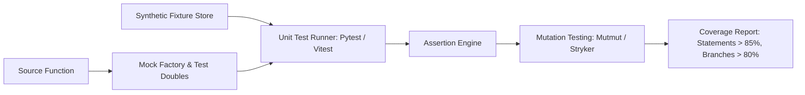

# Unit Testing Strategy, Fixtures & Mutation Testing Plan
## Namma Clinic Digital Health & Operations Platform
### Greater Bengaluru Authority (GBA) / BBMP Health Department
**Standard:** ISO/IEC/IEEE 29119-3 / Mutation Testing Standard / Jest & Pytest Protocols | **Status:** APPROVED BASELINE | **Code:** `QA-DOC-03`

---

## 1. Unit Testing Charter & Scope Boundaries
The Namma Clinic Unit Testing Plan establishes the technical specifications for verifying isolated domain logic, clinical algorithms, mathematical calculations, schema validation functions, and state machines. Both backend Node.js / Python modules and frontend React / TypeScript state slices must achieve strict branch and statement coverage thresholds before merging into the main project trunk.

### 1.1 Core Unit Testing Invariants
1. **Absolute Isolation:** Unit tests must never make real network calls, access physical hard drives, or bind to live databases; all I/O must be mocked or stubbed.
2. **Deterministic Execution:** Unit tests must produce 100% identical pass/fail outcomes regardless of execution order, time zone, or CPU clock speed.
3. **Speed SLA:** The entire suite of 2,500+ unit tests must execute in under 120 seconds in local developer environments.
4. **Clinical Safety Branch Coverage:** 100% branch coverage is mandatory for all clinical danger alert, pediatric dosage calculation, and drug interaction functions.
5. **Mutation Testing Gate:** A mutation testing score >= 80% is enforced to guarantee that unit tests detect injected code mutations.

### 1.2 Unit Testing Execution Architecture


## 2. Unit Testing Domain Suites Catalog (UNIT-SUITE-01 to UNIT-SUITE-30)
Standardized unit test suite profiles covering core platform algorithms:

### UNIT-SUITE-01: Aadhaar & ABHA Blind Index Hash Derivation
- **Functional Domain:** Security
- **Governed Algorithm & Logic:** HMAC-SHA256 with dedicated pepper
- **Coverage Mandate:** 100% Statement, 100% Branch Coverage.
- **Test Double Strategy:** Pure in-memory unit execution with zero external mocks.
- **Mutation Testing Benchmark:** Minimum 85% mutation kill score.

### UNIT-SUITE-02: Pediatric Weight-for-Age Z-Score Calculator
- **Functional Domain:** Clinical
- **Governed Algorithm & Logic:** WHO Anthro 2006 growth standard tables
- **Coverage Mandate:** 100% Statement, 100% Branch Coverage.
- **Test Double Strategy:** Pure in-memory unit execution with zero external mocks.
- **Mutation Testing Benchmark:** Minimum 85% mutation kill score.

### UNIT-SUITE-03: Adult BMI & Nutritional Classification
- **Functional Domain:** Clinical
- **Governed Algorithm & Logic:** WHO Asian-Pacific BMI boundary cutoffs
- **Coverage Mandate:** 100% Statement, 100% Branch Coverage.
- **Test Double Strategy:** Pure in-memory unit execution with zero external mocks.
- **Mutation Testing Benchmark:** Minimum 85% mutation kill score.

### UNIT-SUITE-04: Blood Pressure Clinical Triage Category Rule
- **Functional Domain:** Triage
- **Governed Algorithm & Logic:** AHA / JNC-8 hypertension classification
- **Coverage Mandate:** 100% Statement, 100% Branch Coverage.
- **Test Double Strategy:** Pure in-memory unit execution with zero external mocks.
- **Mutation Testing Benchmark:** Minimum 85% mutation kill score.

### UNIT-SUITE-05: Pulse Oximetry Oxygen Saturation Danger Trigger
- **Functional Domain:** Triage
- **Governed Algorithm & Logic:** SpO2 < 92% emergency red flag trigger
- **Coverage Mandate:** 100% Statement, 100% Branch Coverage.
- **Test Double Strategy:** Pure in-memory unit execution with zero external mocks.
- **Mutation Testing Benchmark:** Minimum 85% mutation kill score.

### UNIT-SUITE-06: Pediatric Paracetamol Dosage Calculator
- **Functional Domain:** Pharmacy
- **Governed Algorithm & Logic:** 15mg/kg/dose strictly capped at 500mg
- **Coverage Mandate:** 100% Statement, 100% Branch Coverage.
- **Test Double Strategy:** Pure in-memory unit execution with zero external mocks.
- **Mutation Testing Benchmark:** Minimum 85% mutation kill score.

### UNIT-SUITE-07: Drug-Drug Contraindication Matrix Engine
- **Functional Domain:** Pharmacy
- **Governed Algorithm & Logic:** Warfarin + Aspirin severe bleeding hazard
- **Coverage Mandate:** 100% Statement, 100% Branch Coverage.
- **Test Double Strategy:** Pure in-memory unit execution with zero external mocks.
- **Mutation Testing Benchmark:** Minimum 85% mutation kill score.

### UNIT-SUITE-08: Drug-Allergy Cross-Reactivity Analyzer
- **Functional Domain:** Clinical
- **Governed Algorithm & Logic:** Penicillin allergy amoxicillin cross-check
- **Coverage Mandate:** 100% Statement, 100% Branch Coverage.
- **Test Double Strategy:** Pure in-memory unit execution with zero external mocks.
- **Mutation Testing Benchmark:** Minimum 85% mutation kill score.

### UNIT-SUITE-09: Prescription Expiry & Max Refill Calculator
- **Functional Domain:** Pharmacy
- **Governed Algorithm & Logic:** Schedule H1 restricted medication rules
- **Coverage Mandate:** 100% Statement, 100% Branch Coverage.
- **Test Double Strategy:** Pure in-memory unit execution with zero external mocks.
- **Mutation Testing Benchmark:** Minimum 85% mutation kill score.

### UNIT-SUITE-10: First-Expired First-Out (FEFO) Inventory Sorter
- **Functional Domain:** Inventory
- **Governed Algorithm & Logic:** Sorts warehouse drug batches by expiry date
- **Coverage Mandate:** 100% Statement, 100% Branch Coverage.
- **Test Double Strategy:** Pure in-memory unit execution with zero external mocks.
- **Mutation Testing Benchmark:** Minimum 85% mutation kill score.

### UNIT-SUITE-11: Cold-Chain IoT Vaccine Temperature Parser
- **Functional Domain:** Supply Chain
- **Governed Algorithm & Logic:** Parses MQTT float arrays; flags 2C-8C breach
- **Coverage Mandate:** 100% Statement, 100% Branch Coverage.
- **Test Double Strategy:** Pure in-memory unit execution with zero external mocks.
- **Mutation Testing Benchmark:** Minimum 85% mutation kill score.

### UNIT-SUITE-12: RS256 JWT Signature & Claims Verifier
- **Functional Domain:** Auth
- **Governed Algorithm & Logic:** NIST SP 800-63B token expiration verification
- **Coverage Mandate:** 100% Statement, 100% Branch Coverage.
- **Test Double Strategy:** Pure in-memory unit execution with zero external mocks.
- **Mutation Testing Benchmark:** Minimum 85% mutation kill score.

### UNIT-SUITE-13: Argon2id Password Complexity & Hash Matcher
- **Functional Domain:** Auth
- **Governed Algorithm & Logic:** Memory-hard 64MB Argon2id parameter check
- **Coverage Mandate:** 100% Statement, 100% Branch Coverage.
- **Test Double Strategy:** Pure in-memory unit execution with zero external mocks.
- **Mutation Testing Benchmark:** Minimum 85% mutation kill score.

### UNIT-SUITE-14: ABAC Contextual Role & Shift Boundary Evaluator
- **Functional Domain:** Auth
- **Governed Algorithm & Logic:** Verifies clinic ID, ward ID, and shift schedule
- **Coverage Mandate:** 100% Statement, 100% Branch Coverage.
- **Test Double Strategy:** Pure in-memory unit execution with zero external mocks.
- **Mutation Testing Benchmark:** Minimum 85% mutation kill score.

### UNIT-SUITE-15: Offline Mutation Queue Serialization Engine
- **Functional Domain:** Offline
- **Governed Algorithm & Logic:** Protobuf / JSON serialization for SQLite sync
- **Coverage Mandate:** 100% Statement, 100% Branch Coverage.
- **Test Double Strategy:** Pure in-memory unit execution with zero external mocks.
- **Mutation Testing Benchmark:** Minimum 85% mutation kill score.

### UNIT-SUITE-16: Vector Clock Conflict Resolution Function
- **Functional Domain:** Offline
- **Governed Algorithm & Logic:** Deterministic Lamport timestamp conflict resolver
- **Coverage Mandate:** 100% Statement, 100% Branch Coverage.
- **Test Double Strategy:** Pure in-memory unit execution with zero external mocks.
- **Mutation Testing Benchmark:** Minimum 85% mutation kill score.

### UNIT-SUITE-17: Bilingual Kannada Unicode String Sanitizer
- **Functional Domain:** L10n
- **Governed Algorithm & Logic:** Prevents XSS while preserving Kannada glyphs
- **Coverage Mandate:** 100% Statement, 100% Branch Coverage.
- **Test Double Strategy:** Pure in-memory unit execution with zero external mocks.
- **Mutation Testing Benchmark:** Minimum 85% mutation kill score.

### UNIT-SUITE-18: Indian Mobile Phone 10-Digit Normalizer
- **Functional Domain:** Registration
- **Governed Algorithm & Logic:** Strips +91, 0, whitespace; validates regex
- **Coverage Mandate:** 100% Statement, 100% Branch Coverage.
- **Test Double Strategy:** Pure in-memory unit execution with zero external mocks.
- **Mutation Testing Benchmark:** Minimum 85% mutation kill score.

### UNIT-SUITE-19: Aadhaar Verhoeff Checksum Validator
- **Functional Domain:** Registration
- **Governed Algorithm & Logic:** Verhoeff algorithm error-detecting code
- **Coverage Mandate:** 100% Statement, 100% Branch Coverage.
- **Test Double Strategy:** Pure in-memory unit execution with zero external mocks.
- **Mutation Testing Benchmark:** Minimum 85% mutation kill score.

### UNIT-SUITE-20: Laboratory Reference Range Delta Check
- **Functional Domain:** Laboratory
- **Governed Algorithm & Logic:** Compares current serum creatinine with history
- **Coverage Mandate:** 100% Statement, 100% Branch Coverage.
- **Test Double Strategy:** Pure in-memory unit execution with zero external mocks.
- **Mutation Testing Benchmark:** Minimum 85% mutation kill score.

### UNIT-SUITE-21: Differential Privacy Laplace Noise Invariant
- **Functional Domain:** Analytics
- **Governed Algorithm & Logic:** Adds calibrated noise to ClickHouse count queries
- **Coverage Mandate:** 100% Statement, 100% Branch Coverage.
- **Test Double Strategy:** Pure in-memory unit execution with zero external mocks.
- **Mutation Testing Benchmark:** Minimum 85% mutation kill score.

### UNIT-SUITE-22: WORM Audit Log SHA-256 Merkle Leaf Hasher
- **Functional Domain:** Audit
- **Governed Algorithm & Logic:** Computes SHA-256 leaf hash from audit JSON
- **Coverage Mandate:** 100% Statement, 100% Branch Coverage.
- **Test Double Strategy:** Pure in-memory unit execution with zero external mocks.
- **Mutation Testing Benchmark:** Minimum 85% mutation kill score.

### UNIT-SUITE-23: ESC/POS Binary Print Stream Builder
- **Functional Domain:** Peripherals
- **Governed Algorithm & Logic:** Generates raw byte stream for thermal slips
- **Coverage Mandate:** 100% Statement, 100% Branch Coverage.
- **Test Double Strategy:** Pure in-memory unit execution with zero external mocks.
- **Mutation Testing Benchmark:** Minimum 85% mutation kill score.

### UNIT-SUITE-24: Barcode Code-128 Check Character Calculator
- **Functional Domain:** Peripherals
- **Governed Algorithm & Logic:** Calculates modulo 103 checksum for barcodes
- **Coverage Mandate:** 100% Statement, 100% Branch Coverage.
- **Test Double Strategy:** Pure in-memory unit execution with zero external mocks.
- **Mutation Testing Benchmark:** Minimum 85% mutation kill score.

### UNIT-SUITE-25: WCAG Color Contrast Ratio Calculator
- **Functional Domain:** Accessibility
- **Governed Algorithm & Logic:** Calculates relative luminance; checks >= 4.5:1
- **Coverage Mandate:** 100% Statement, 100% Branch Coverage.
- **Test Double Strategy:** Pure in-memory unit execution with zero external mocks.
- **Mutation Testing Benchmark:** Minimum 85% mutation kill score.

### UNIT-SUITE-26: Session Inactivity 10-Minute Timeout Tracker
- **Functional Domain:** Session
- **Governed Algorithm & Logic:** Tracks client interaction events and idle lock
- **Coverage Mandate:** 100% Statement, 100% Branch Coverage.
- **Test Double Strategy:** Pure in-memory unit execution with zero external mocks.
- **Mutation Testing Benchmark:** Minimum 85% mutation kill score.

### UNIT-SUITE-27: Patient Token Queue Position Predictor
- **Functional Domain:** Queue
- **Governed Algorithm & Logic:** Calculates estimated wait time based on doctor avg
- **Coverage Mandate:** 100% Statement, 100% Branch Coverage.
- **Test Double Strategy:** Pure in-memory unit execution with zero external mocks.
- **Mutation Testing Benchmark:** Minimum 85% mutation kill score.

### UNIT-SUITE-28: Emergency Break-Glass Supervisor Token Validator
- **Functional Domain:** Emergency
- **Governed Algorithm & Logic:** Validates dual-witness cryptographic signoff
- **Coverage Mandate:** 100% Statement, 100% Branch Coverage.
- **Test Double Strategy:** Pure in-memory unit execution with zero external mocks.
- **Mutation Testing Benchmark:** Minimum 85% mutation kill score.

### UNIT-SUITE-29: ABDM FHIR R4 Bundle Assembler
- **Functional Domain:** Integration
- **Governed Algorithm & Logic:** Transforms internal EHR data to FHIR Composition
- **Coverage Mandate:** 100% Statement, 100% Branch Coverage.
- **Test Double Strategy:** Pure in-memory unit execution with zero external mocks.
- **Mutation Testing Benchmark:** Minimum 85% mutation kill score.

### UNIT-SUITE-30: SQLite In-Memory Local Cache Pruning Policy
- **Functional Domain:** Storage
- **Governed Algorithm & Logic:** Evicts completed visits when cache exceeds 50MB
- **Coverage Mandate:** 100% Statement, 100% Branch Coverage.
- **Test Double Strategy:** Pure in-memory unit execution with zero external mocks.
- **Mutation Testing Benchmark:** Minimum 85% mutation kill score.

## 3. Unit Test Specifications (TC-0111 to TC-0165)
Detailed unit test cases covering core platform logic:

### TC-0111: Test Case 111: Clinical Verification for user_roles across WF-011
**Objective:** Verify functional, security, and offline invariants for user_roles during WF-011 execution.
**Risk:** Critical operational impact on patient safety and clinic consultation continuity.
**Priority:** **P0** | **Severity:** **Critical** | **Test Level:** System & Integration | **Test Type:** Functional & Regulatory Compliance
- **Requirement Traceability:** `FR-051`
- **Workflow Traceability:** `WF-011`
- **Feature Traceability:** `FEATURE-111`
- **API Traceability:** `API-DOC-01`
- **Database Traceability:** `TABLE-007 (user_roles)`
- **Screen Traceability:** `SCREEN-003`
- **Security Control Traceability:** `SEC-ARCH-031`
- **Preconditions:** User authenticated with role Grievance Redressal Officer on clinic workstation.
- **Test Data Specification:** Synthetic dataset TESTDATA-051 (Valid ABHA, vitals, prescriptions).
- **Execution Steps:** 1. Navigate to screen SCREEN-003. 2. Submit payload bound to user_roles. 3. Confirm API API-DOC-01 returns 200 OK. 4. Verify local SQLite cache and sync queue.
- **Expected Results:** Transaction completes within 250ms, data encrypted via AES-256-GCM, audit entry emitted.
- **Negative Test Scenario:** Submit malformed payload or expired JWT; system rejects with 400/401 and zero DB corruption.
- **Boundary Value Scenario:** Test with maximum field boundary length and extreme clinical biometric vitals.
- **Concurrency & Race Condition:** Simulate 5 concurrent staff updates on identical record; verify optimistic locking.
- **Autonomous Offline Behavior:** Sever network mid-transaction; record queues locally and replicates upon reconnection.
- **Security & Access Validation:** Enforce RBAC policy SEC-ARCH-031 and prevent broken object-level authorization (BOLA).
- **Audit Trail & Immutability:** Emits structured JSON audit log with SHA-256 Merkle chain hash.
- **Evidence Required:** Automated execution log, HTTP request/response capture, and database assertion hash.
- **Pass Acceptance Criteria:** 100% assertions succeed with zero uncaught exceptions and latency < 300ms.
- **Failure Behavior & SLA:** Any 5xx error, data corruption, unauthorized access, or silent failure.
- **Automation Suitability:** Yes (High Candidate)
- **Execution Cadence:** Every CI PR & Nightly Regression
- **Responsible Owner:** Grievance Redressal Officer

### TC-0112: Test Case 112: Clinical Verification for facilities across WF-012
**Objective:** Verify functional, security, and offline invariants for facilities during WF-012 execution.
**Risk:** Major operational impact on patient safety and clinic consultation continuity.
**Priority:** **P1** | **Severity:** **Major** | **Test Level:** System & Integration | **Test Type:** Functional & Regulatory Compliance
- **Requirement Traceability:** `FR-052`
- **Workflow Traceability:** `WF-012`
- **Feature Traceability:** `FEATURE-112`
- **API Traceability:** `API-DOC-02`
- **Database Traceability:** `TABLE-008 (facilities)`
- **Screen Traceability:** `SCREEN-004`
- **Security Control Traceability:** `SEC-ARCH-032`
- **Preconditions:** User authenticated with role ABDM National Integration Officer on clinic workstation.
- **Test Data Specification:** Synthetic dataset TESTDATA-052 (Valid ABHA, vitals, prescriptions).
- **Execution Steps:** 1. Navigate to screen SCREEN-004. 2. Submit payload bound to facilities. 3. Confirm API API-DOC-02 returns 200 OK. 4. Verify local SQLite cache and sync queue.
- **Expected Results:** Transaction completes within 250ms, data encrypted via AES-256-GCM, audit entry emitted.
- **Negative Test Scenario:** Submit malformed payload or expired JWT; system rejects with 400/401 and zero DB corruption.
- **Boundary Value Scenario:** Test with maximum field boundary length and extreme clinical biometric vitals.
- **Concurrency & Race Condition:** Simulate 5 concurrent staff updates on identical record; verify optimistic locking.
- **Autonomous Offline Behavior:** Sever network mid-transaction; record queues locally and replicates upon reconnection.
- **Security & Access Validation:** Enforce RBAC policy SEC-ARCH-032 and prevent broken object-level authorization (BOLA).
- **Audit Trail & Immutability:** Emits structured JSON audit log with SHA-256 Merkle chain hash.
- **Evidence Required:** Automated execution log, HTTP request/response capture, and database assertion hash.
- **Pass Acceptance Criteria:** 100% assertions succeed with zero uncaught exceptions and latency < 300ms.
- **Failure Behavior & SLA:** Any 5xx error, data corruption, unauthorized access, or silent failure.
- **Automation Suitability:** Yes (High Candidate)
- **Execution Cadence:** Every CI PR & Nightly Regression
- **Responsible Owner:** ABDM National Integration Officer

### TC-0113: Test Case 113: Clinical Verification for facility_rooms across WF-013
**Objective:** Verify functional, security, and offline invariants for facility_rooms during WF-013 execution.
**Risk:** Major operational impact on patient safety and clinic consultation continuity.
**Priority:** **P1** | **Severity:** **Major** | **Test Level:** System & Integration | **Test Type:** Functional & Regulatory Compliance
- **Requirement Traceability:** `FR-053`
- **Workflow Traceability:** `WF-013`
- **Feature Traceability:** `FEATURE-113`
- **API Traceability:** `API-DOC-03`
- **Database Traceability:** `TABLE-009 (facility_rooms)`
- **Screen Traceability:** `SCREEN-005`
- **Security Control Traceability:** `SEC-ARCH-033`
- **Preconditions:** User authenticated with role Data Protection Officer (DPO) on clinic workstation.
- **Test Data Specification:** Synthetic dataset TESTDATA-053 (Valid ABHA, vitals, prescriptions).
- **Execution Steps:** 1. Navigate to screen SCREEN-005. 2. Submit payload bound to facility_rooms. 3. Confirm API API-DOC-03 returns 200 OK. 4. Verify local SQLite cache and sync queue.
- **Expected Results:** Transaction completes within 250ms, data encrypted via AES-256-GCM, audit entry emitted.
- **Negative Test Scenario:** Submit malformed payload or expired JWT; system rejects with 400/401 and zero DB corruption.
- **Boundary Value Scenario:** Test with maximum field boundary length and extreme clinical biometric vitals.
- **Concurrency & Race Condition:** Simulate 5 concurrent staff updates on identical record; verify optimistic locking.
- **Autonomous Offline Behavior:** Sever network mid-transaction; record queues locally and replicates upon reconnection.
- **Security & Access Validation:** Enforce RBAC policy SEC-ARCH-033 and prevent broken object-level authorization (BOLA).
- **Audit Trail & Immutability:** Emits structured JSON audit log with SHA-256 Merkle chain hash.
- **Evidence Required:** Automated execution log, HTTP request/response capture, and database assertion hash.
- **Pass Acceptance Criteria:** 100% assertions succeed with zero uncaught exceptions and latency < 300ms.
- **Failure Behavior & SLA:** Any 5xx error, data corruption, unauthorized access, or silent failure.
- **Automation Suitability:** Yes (High Candidate)
- **Execution Cadence:** Every CI PR & Nightly Regression
- **Responsible Owner:** Data Protection Officer (DPO)

### TC-0114: Test Case 114: Clinical Verification for staff_profiles across WF-014
**Objective:** Verify functional, security, and offline invariants for staff_profiles during WF-014 execution.
**Risk:** Minor operational impact on patient safety and clinic consultation continuity.
**Priority:** **P2** | **Severity:** **Minor** | **Test Level:** System & Integration | **Test Type:** Functional & Regulatory Compliance
- **Requirement Traceability:** `FR-054`
- **Workflow Traceability:** `WF-014`
- **Feature Traceability:** `FEATURE-114`
- **API Traceability:** `API-DOC-04`
- **Database Traceability:** `TABLE-010 (staff_profiles)`
- **Screen Traceability:** `SCREEN-006`
- **Security Control Traceability:** `SEC-ARCH-034`
- **Preconditions:** User authenticated with role IT Support & Hardware Engineer on clinic workstation.
- **Test Data Specification:** Synthetic dataset TESTDATA-054 (Valid ABHA, vitals, prescriptions).
- **Execution Steps:** 1. Navigate to screen SCREEN-006. 2. Submit payload bound to staff_profiles. 3. Confirm API API-DOC-04 returns 200 OK. 4. Verify local SQLite cache and sync queue.
- **Expected Results:** Transaction completes within 250ms, data encrypted via AES-256-GCM, audit entry emitted.
- **Negative Test Scenario:** Submit malformed payload or expired JWT; system rejects with 400/401 and zero DB corruption.
- **Boundary Value Scenario:** Test with maximum field boundary length and extreme clinical biometric vitals.
- **Concurrency & Race Condition:** Simulate 5 concurrent staff updates on identical record; verify optimistic locking.
- **Autonomous Offline Behavior:** Sever network mid-transaction; record queues locally and replicates upon reconnection.
- **Security & Access Validation:** Enforce RBAC policy SEC-ARCH-034 and prevent broken object-level authorization (BOLA).
- **Audit Trail & Immutability:** Emits structured JSON audit log with SHA-256 Merkle chain hash.
- **Evidence Required:** Automated execution log, HTTP request/response capture, and database assertion hash.
- **Pass Acceptance Criteria:** 100% assertions succeed with zero uncaught exceptions and latency < 300ms.
- **Failure Behavior & SLA:** Any 5xx error, data corruption, unauthorized access, or silent failure.
- **Automation Suitability:** Yes (High Candidate)
- **Execution Cadence:** Every CI PR & Nightly Regression
- **Responsible Owner:** IT Support & Hardware Engineer

### TC-0115: Test Case 115: Clinical Verification for staff_shifts across WF-015
**Objective:** Verify functional, security, and offline invariants for staff_shifts during WF-015 execution.
**Risk:** Minor operational impact on patient safety and clinic consultation continuity.
**Priority:** **P2** | **Severity:** **Minor** | **Test Level:** System & Integration | **Test Type:** Functional & Regulatory Compliance
- **Requirement Traceability:** `FR-055`
- **Workflow Traceability:** `WF-015`
- **Feature Traceability:** `FEATURE-115`
- **API Traceability:** `API-DOC-05`
- **Database Traceability:** `TABLE-011 (staff_shifts)`
- **Screen Traceability:** `SCREEN-007`
- **Security Control Traceability:** `SEC-ARCH-035`
- **Preconditions:** User authenticated with role Clinical Audit Committee Member on clinic workstation.
- **Test Data Specification:** Synthetic dataset TESTDATA-055 (Valid ABHA, vitals, prescriptions).
- **Execution Steps:** 1. Navigate to screen SCREEN-007. 2. Submit payload bound to staff_shifts. 3. Confirm API API-DOC-05 returns 200 OK. 4. Verify local SQLite cache and sync queue.
- **Expected Results:** Transaction completes within 250ms, data encrypted via AES-256-GCM, audit entry emitted.
- **Negative Test Scenario:** Submit malformed payload or expired JWT; system rejects with 400/401 and zero DB corruption.
- **Boundary Value Scenario:** Test with maximum field boundary length and extreme clinical biometric vitals.
- **Concurrency & Race Condition:** Simulate 5 concurrent staff updates on identical record; verify optimistic locking.
- **Autonomous Offline Behavior:** Sever network mid-transaction; record queues locally and replicates upon reconnection.
- **Security & Access Validation:** Enforce RBAC policy SEC-ARCH-035 and prevent broken object-level authorization (BOLA).
- **Audit Trail & Immutability:** Emits structured JSON audit log with SHA-256 Merkle chain hash.
- **Evidence Required:** Automated execution log, HTTP request/response capture, and database assertion hash.
- **Pass Acceptance Criteria:** 100% assertions succeed with zero uncaught exceptions and latency < 300ms.
- **Failure Behavior & SLA:** Any 5xx error, data corruption, unauthorized access, or silent failure.
- **Automation Suitability:** Yes (High Candidate)
- **Execution Cadence:** Every CI PR & Nightly Regression
- **Responsible Owner:** Clinical Audit Committee Member

### TC-0116: Test Case 116: Clinical Verification for system_configs across WF-016
**Objective:** Verify functional, security, and offline invariants for system_configs during WF-016 execution.
**Risk:** Critical operational impact on patient safety and clinic consultation continuity.
**Priority:** **P0** | **Severity:** **Critical** | **Test Level:** System & Integration | **Test Type:** Functional & Regulatory Compliance
- **Requirement Traceability:** `FR-056`
- **Workflow Traceability:** `WF-016`
- **Feature Traceability:** `FEATURE-116`
- **API Traceability:** `API-DOC-06`
- **Database Traceability:** `TABLE-012 (system_configs)`
- **Screen Traceability:** `SCREEN-008`
- **Security Control Traceability:** `SEC-ARCH-036`
- **Preconditions:** User authenticated with role Procurement & Vendor Manager on clinic workstation.
- **Test Data Specification:** Synthetic dataset TESTDATA-056 (Valid ABHA, vitals, prescriptions).
- **Execution Steps:** 1. Navigate to screen SCREEN-008. 2. Submit payload bound to system_configs. 3. Confirm API API-DOC-06 returns 200 OK. 4. Verify local SQLite cache and sync queue.
- **Expected Results:** Transaction completes within 250ms, data encrypted via AES-256-GCM, audit entry emitted.
- **Negative Test Scenario:** Submit malformed payload or expired JWT; system rejects with 400/401 and zero DB corruption.
- **Boundary Value Scenario:** Test with maximum field boundary length and extreme clinical biometric vitals.
- **Concurrency & Race Condition:** Simulate 5 concurrent staff updates on identical record; verify optimistic locking.
- **Autonomous Offline Behavior:** Sever network mid-transaction; record queues locally and replicates upon reconnection.
- **Security & Access Validation:** Enforce RBAC policy SEC-ARCH-036 and prevent broken object-level authorization (BOLA).
- **Audit Trail & Immutability:** Emits structured JSON audit log with SHA-256 Merkle chain hash.
- **Evidence Required:** Automated execution log, HTTP request/response capture, and database assertion hash.
- **Pass Acceptance Criteria:** 100% assertions succeed with zero uncaught exceptions and latency < 300ms.
- **Failure Behavior & SLA:** Any 5xx error, data corruption, unauthorized access, or silent failure.
- **Automation Suitability:** Yes (High Candidate)
- **Execution Cadence:** Every CI PR & Nightly Regression
- **Responsible Owner:** Procurement & Vendor Manager

### TC-0117: Test Case 117: Clinical Verification for patients across WF-017
**Objective:** Verify functional, security, and offline invariants for patients during WF-017 execution.
**Risk:** Major operational impact on patient safety and clinic consultation continuity.
**Priority:** **P1** | **Severity:** **Major** | **Test Level:** System & Integration | **Test Type:** Functional & Regulatory Compliance
- **Requirement Traceability:** `FR-057`
- **Workflow Traceability:** `WF-017`
- **Feature Traceability:** `FEATURE-117`
- **API Traceability:** `API-DOC-07`
- **Database Traceability:** `TABLE-013 (patients)`
- **Screen Traceability:** `SCREEN-009`
- **Security Control Traceability:** `SEC-ARCH-037`
- **Preconditions:** User authenticated with role Biomedical Waste Supervisor on clinic workstation.
- **Test Data Specification:** Synthetic dataset TESTDATA-057 (Valid ABHA, vitals, prescriptions).
- **Execution Steps:** 1. Navigate to screen SCREEN-009. 2. Submit payload bound to patients. 3. Confirm API API-DOC-07 returns 200 OK. 4. Verify local SQLite cache and sync queue.
- **Expected Results:** Transaction completes within 250ms, data encrypted via AES-256-GCM, audit entry emitted.
- **Negative Test Scenario:** Submit malformed payload or expired JWT; system rejects with 400/401 and zero DB corruption.
- **Boundary Value Scenario:** Test with maximum field boundary length and extreme clinical biometric vitals.
- **Concurrency & Race Condition:** Simulate 5 concurrent staff updates on identical record; verify optimistic locking.
- **Autonomous Offline Behavior:** Sever network mid-transaction; record queues locally and replicates upon reconnection.
- **Security & Access Validation:** Enforce RBAC policy SEC-ARCH-037 and prevent broken object-level authorization (BOLA).
- **Audit Trail & Immutability:** Emits structured JSON audit log with SHA-256 Merkle chain hash.
- **Evidence Required:** Automated execution log, HTTP request/response capture, and database assertion hash.
- **Pass Acceptance Criteria:** 100% assertions succeed with zero uncaught exceptions and latency < 300ms.
- **Failure Behavior & SLA:** Any 5xx error, data corruption, unauthorized access, or silent failure.
- **Automation Suitability:** Yes (High Candidate)
- **Execution Cadence:** Every CI PR & Nightly Regression
- **Responsible Owner:** Biomedical Waste Supervisor

### TC-0118: Test Case 118: Clinical Verification for patient_identifiers across WF-018
**Objective:** Verify functional, security, and offline invariants for patient_identifiers during WF-018 execution.
**Risk:** Major operational impact on patient safety and clinic consultation continuity.
**Priority:** **P1** | **Severity:** **Major** | **Test Level:** System & Integration | **Test Type:** Functional & Regulatory Compliance
- **Requirement Traceability:** `FR-058`
- **Workflow Traceability:** `WF-018`
- **Feature Traceability:** `FEATURE-118`
- **API Traceability:** `API-DOC-08`
- **Database Traceability:** `TABLE-014 (patient_identifiers)`
- **Screen Traceability:** `SCREEN-010`
- **Security Control Traceability:** `SEC-ARCH-038`
- **Preconditions:** User authenticated with role Telemedicine Remote Specialist on clinic workstation.
- **Test Data Specification:** Synthetic dataset TESTDATA-058 (Valid ABHA, vitals, prescriptions).
- **Execution Steps:** 1. Navigate to screen SCREEN-010. 2. Submit payload bound to patient_identifiers. 3. Confirm API API-DOC-08 returns 200 OK. 4. Verify local SQLite cache and sync queue.
- **Expected Results:** Transaction completes within 250ms, data encrypted via AES-256-GCM, audit entry emitted.
- **Negative Test Scenario:** Submit malformed payload or expired JWT; system rejects with 400/401 and zero DB corruption.
- **Boundary Value Scenario:** Test with maximum field boundary length and extreme clinical biometric vitals.
- **Concurrency & Race Condition:** Simulate 5 concurrent staff updates on identical record; verify optimistic locking.
- **Autonomous Offline Behavior:** Sever network mid-transaction; record queues locally and replicates upon reconnection.
- **Security & Access Validation:** Enforce RBAC policy SEC-ARCH-038 and prevent broken object-level authorization (BOLA).
- **Audit Trail & Immutability:** Emits structured JSON audit log with SHA-256 Merkle chain hash.
- **Evidence Required:** Automated execution log, HTTP request/response capture, and database assertion hash.
- **Pass Acceptance Criteria:** 100% assertions succeed with zero uncaught exceptions and latency < 300ms.
- **Failure Behavior & SLA:** Any 5xx error, data corruption, unauthorized access, or silent failure.
- **Automation Suitability:** Yes (High Candidate)
- **Execution Cadence:** Every CI PR & Nightly Regression
- **Responsible Owner:** Telemedicine Remote Specialist

### TC-0119: Test Case 119: Clinical Verification for patient_contacts across WF-019
**Objective:** Verify functional, security, and offline invariants for patient_contacts during WF-019 execution.
**Risk:** Minor operational impact on patient safety and clinic consultation continuity.
**Priority:** **P2** | **Severity:** **Minor** | **Test Level:** System & Integration | **Test Type:** Functional & Regulatory Compliance
- **Requirement Traceability:** `FR-059`
- **Workflow Traceability:** `WF-019`
- **Feature Traceability:** `FEATURE-119`
- **API Traceability:** `API-DOC-09`
- **Database Traceability:** `TABLE-015 (patient_contacts)`
- **Screen Traceability:** `SCREEN-011`
- **Security Control Traceability:** `SEC-ARCH-039`
- **Preconditions:** User authenticated with role Field Public Health Inspector on clinic workstation.
- **Test Data Specification:** Synthetic dataset TESTDATA-059 (Valid ABHA, vitals, prescriptions).
- **Execution Steps:** 1. Navigate to screen SCREEN-011. 2. Submit payload bound to patient_contacts. 3. Confirm API API-DOC-09 returns 200 OK. 4. Verify local SQLite cache and sync queue.
- **Expected Results:** Transaction completes within 250ms, data encrypted via AES-256-GCM, audit entry emitted.
- **Negative Test Scenario:** Submit malformed payload or expired JWT; system rejects with 400/401 and zero DB corruption.
- **Boundary Value Scenario:** Test with maximum field boundary length and extreme clinical biometric vitals.
- **Concurrency & Race Condition:** Simulate 5 concurrent staff updates on identical record; verify optimistic locking.
- **Autonomous Offline Behavior:** Sever network mid-transaction; record queues locally and replicates upon reconnection.
- **Security & Access Validation:** Enforce RBAC policy SEC-ARCH-039 and prevent broken object-level authorization (BOLA).
- **Audit Trail & Immutability:** Emits structured JSON audit log with SHA-256 Merkle chain hash.
- **Evidence Required:** Automated execution log, HTTP request/response capture, and database assertion hash.
- **Pass Acceptance Criteria:** 100% assertions succeed with zero uncaught exceptions and latency < 300ms.
- **Failure Behavior & SLA:** Any 5xx error, data corruption, unauthorized access, or silent failure.
- **Automation Suitability:** Yes (High Candidate)
- **Execution Cadence:** Every CI PR & Nightly Regression
- **Responsible Owner:** Field Public Health Inspector

### TC-0120: Test Case 120: Clinical Verification for patient_addresses across WF-020
**Objective:** Verify functional, security, and offline invariants for patient_addresses during WF-020 execution.
**Risk:** Minor operational impact on patient safety and clinic consultation continuity.
**Priority:** **P2** | **Severity:** **Minor** | **Test Level:** System & Integration | **Test Type:** Functional & Regulatory Compliance
- **Requirement Traceability:** `FR-060`
- **Workflow Traceability:** `WF-020`
- **Feature Traceability:** `FEATURE-120`
- **API Traceability:** `API-DOC-10`
- **Database Traceability:** `TABLE-016 (patient_addresses)`
- **Screen Traceability:** `SCREEN-012`
- **Security Control Traceability:** `SEC-ARCH-040`
- **Preconditions:** User authenticated with role Super Administrator on clinic workstation.
- **Test Data Specification:** Synthetic dataset TESTDATA-060 (Valid ABHA, vitals, prescriptions).
- **Execution Steps:** 1. Navigate to screen SCREEN-012. 2. Submit payload bound to patient_addresses. 3. Confirm API API-DOC-10 returns 200 OK. 4. Verify local SQLite cache and sync queue.
- **Expected Results:** Transaction completes within 250ms, data encrypted via AES-256-GCM, audit entry emitted.
- **Negative Test Scenario:** Submit malformed payload or expired JWT; system rejects with 400/401 and zero DB corruption.
- **Boundary Value Scenario:** Test with maximum field boundary length and extreme clinical biometric vitals.
- **Concurrency & Race Condition:** Simulate 5 concurrent staff updates on identical record; verify optimistic locking.
- **Autonomous Offline Behavior:** Sever network mid-transaction; record queues locally and replicates upon reconnection.
- **Security & Access Validation:** Enforce RBAC policy SEC-ARCH-040 and prevent broken object-level authorization (BOLA).
- **Audit Trail & Immutability:** Emits structured JSON audit log with SHA-256 Merkle chain hash.
- **Evidence Required:** Automated execution log, HTTP request/response capture, and database assertion hash.
- **Pass Acceptance Criteria:** 100% assertions succeed with zero uncaught exceptions and latency < 300ms.
- **Failure Behavior & SLA:** Any 5xx error, data corruption, unauthorized access, or silent failure.
- **Automation Suitability:** Yes (High Candidate)
- **Execution Cadence:** Every CI PR & Nightly Regression
- **Responsible Owner:** Super Administrator

### TC-0121: Test Case 121: Clinical Verification for consent_records across WF-021
**Objective:** Verify functional, security, and offline invariants for consent_records during WF-021 execution.
**Risk:** Critical operational impact on patient safety and clinic consultation continuity.
**Priority:** **P0** | **Severity:** **Critical** | **Test Level:** System & Integration | **Test Type:** Functional & Regulatory Compliance
- **Requirement Traceability:** `FR-001`
- **Workflow Traceability:** `WF-021`
- **Feature Traceability:** `FEATURE-121`
- **API Traceability:** `API-DOC-11`
- **Database Traceability:** `TABLE-017 (consent_records)`
- **Screen Traceability:** `SCREEN-013`
- **Security Control Traceability:** `SEC-ARCH-001`
- **Preconditions:** User authenticated with role Receptionist / Registration Clerk on clinic workstation.
- **Test Data Specification:** Synthetic dataset TESTDATA-001 (Valid ABHA, vitals, prescriptions).
- **Execution Steps:** 1. Navigate to screen SCREEN-013. 2. Submit payload bound to consent_records. 3. Confirm API API-DOC-11 returns 200 OK. 4. Verify local SQLite cache and sync queue.
- **Expected Results:** Transaction completes within 250ms, data encrypted via AES-256-GCM, audit entry emitted.
- **Negative Test Scenario:** Submit malformed payload or expired JWT; system rejects with 400/401 and zero DB corruption.
- **Boundary Value Scenario:** Test with maximum field boundary length and extreme clinical biometric vitals.
- **Concurrency & Race Condition:** Simulate 5 concurrent staff updates on identical record; verify optimistic locking.
- **Autonomous Offline Behavior:** Sever network mid-transaction; record queues locally and replicates upon reconnection.
- **Security & Access Validation:** Enforce RBAC policy SEC-ARCH-001 and prevent broken object-level authorization (BOLA).
- **Audit Trail & Immutability:** Emits structured JSON audit log with SHA-256 Merkle chain hash.
- **Evidence Required:** Automated execution log, HTTP request/response capture, and database assertion hash.
- **Pass Acceptance Criteria:** 100% assertions succeed with zero uncaught exceptions and latency < 300ms.
- **Failure Behavior & SLA:** Any 5xx error, data corruption, unauthorized access, or silent failure.
- **Automation Suitability:** Yes (High Candidate)
- **Execution Cadence:** Every CI PR & Nightly Regression
- **Responsible Owner:** Receptionist / Registration Clerk

### TC-0122: Test Case 122: Clinical Verification for tokens across WF-022
**Objective:** Verify functional, security, and offline invariants for tokens during WF-022 execution.
**Risk:** Major operational impact on patient safety and clinic consultation continuity.
**Priority:** **P1** | **Severity:** **Major** | **Test Level:** System & Integration | **Test Type:** Functional & Regulatory Compliance
- **Requirement Traceability:** `FR-002`
- **Workflow Traceability:** `WF-022`
- **Feature Traceability:** `FEATURE-122`
- **API Traceability:** `API-DOC-12`
- **Database Traceability:** `TABLE-018 (tokens)`
- **Screen Traceability:** `SCREEN-014`
- **Security Control Traceability:** `SEC-ARCH-002`
- **Preconditions:** User authenticated with role Medical Officer / General Physician on clinic workstation.
- **Test Data Specification:** Synthetic dataset TESTDATA-002 (Valid ABHA, vitals, prescriptions).
- **Execution Steps:** 1. Navigate to screen SCREEN-014. 2. Submit payload bound to tokens. 3. Confirm API API-DOC-12 returns 200 OK. 4. Verify local SQLite cache and sync queue.
- **Expected Results:** Transaction completes within 250ms, data encrypted via AES-256-GCM, audit entry emitted.
- **Negative Test Scenario:** Submit malformed payload or expired JWT; system rejects with 400/401 and zero DB corruption.
- **Boundary Value Scenario:** Test with maximum field boundary length and extreme clinical biometric vitals.
- **Concurrency & Race Condition:** Simulate 5 concurrent staff updates on identical record; verify optimistic locking.
- **Autonomous Offline Behavior:** Sever network mid-transaction; record queues locally and replicates upon reconnection.
- **Security & Access Validation:** Enforce RBAC policy SEC-ARCH-002 and prevent broken object-level authorization (BOLA).
- **Audit Trail & Immutability:** Emits structured JSON audit log with SHA-256 Merkle chain hash.
- **Evidence Required:** Automated execution log, HTTP request/response capture, and database assertion hash.
- **Pass Acceptance Criteria:** 100% assertions succeed with zero uncaught exceptions and latency < 300ms.
- **Failure Behavior & SLA:** Any 5xx error, data corruption, unauthorized access, or silent failure.
- **Automation Suitability:** Yes (High Candidate)
- **Execution Cadence:** Every CI PR & Nightly Regression
- **Responsible Owner:** Medical Officer / General Physician

### TC-0123: Test Case 123: Clinical Verification for queue_entries across WF-023
**Objective:** Verify functional, security, and offline invariants for queue_entries during WF-023 execution.
**Risk:** Major operational impact on patient safety and clinic consultation continuity.
**Priority:** **P1** | **Severity:** **Major** | **Test Level:** System & Integration | **Test Type:** Functional & Regulatory Compliance
- **Requirement Traceability:** `FR-003`
- **Workflow Traceability:** `WF-023`
- **Feature Traceability:** `FEATURE-123`
- **API Traceability:** `API-DOC-13`
- **Database Traceability:** `TABLE-019 (queue_entries)`
- **Screen Traceability:** `SCREEN-015`
- **Security Control Traceability:** `SEC-ARCH-003`
- **Preconditions:** User authenticated with role Staff Nurse / Triage Specialist on clinic workstation.
- **Test Data Specification:** Synthetic dataset TESTDATA-003 (Valid ABHA, vitals, prescriptions).
- **Execution Steps:** 1. Navigate to screen SCREEN-015. 2. Submit payload bound to queue_entries. 3. Confirm API API-DOC-13 returns 200 OK. 4. Verify local SQLite cache and sync queue.
- **Expected Results:** Transaction completes within 250ms, data encrypted via AES-256-GCM, audit entry emitted.
- **Negative Test Scenario:** Submit malformed payload or expired JWT; system rejects with 400/401 and zero DB corruption.
- **Boundary Value Scenario:** Test with maximum field boundary length and extreme clinical biometric vitals.
- **Concurrency & Race Condition:** Simulate 5 concurrent staff updates on identical record; verify optimistic locking.
- **Autonomous Offline Behavior:** Sever network mid-transaction; record queues locally and replicates upon reconnection.
- **Security & Access Validation:** Enforce RBAC policy SEC-ARCH-003 and prevent broken object-level authorization (BOLA).
- **Audit Trail & Immutability:** Emits structured JSON audit log with SHA-256 Merkle chain hash.
- **Evidence Required:** Automated execution log, HTTP request/response capture, and database assertion hash.
- **Pass Acceptance Criteria:** 100% assertions succeed with zero uncaught exceptions and latency < 300ms.
- **Failure Behavior & SLA:** Any 5xx error, data corruption, unauthorized access, or silent failure.
- **Automation Suitability:** Yes (High Candidate)
- **Execution Cadence:** Every CI PR & Nightly Regression
- **Responsible Owner:** Staff Nurse / Triage Specialist

### TC-0124: Test Case 124: Clinical Verification for triage_assessments across WF-024
**Objective:** Verify functional, security, and offline invariants for triage_assessments during WF-024 execution.
**Risk:** Minor operational impact on patient safety and clinic consultation continuity.
**Priority:** **P2** | **Severity:** **Minor** | **Test Level:** System & Integration | **Test Type:** Functional & Regulatory Compliance
- **Requirement Traceability:** `FR-004`
- **Workflow Traceability:** `WF-024`
- **Feature Traceability:** `FEATURE-124`
- **API Traceability:** `API-DOC-14`
- **Database Traceability:** `TABLE-020 (triage_assessments)`
- **Screen Traceability:** `SCREEN-016`
- **Security Control Traceability:** `SEC-ARCH-004`
- **Preconditions:** User authenticated with role Pharmacist / Dispenser on clinic workstation.
- **Test Data Specification:** Synthetic dataset TESTDATA-004 (Valid ABHA, vitals, prescriptions).
- **Execution Steps:** 1. Navigate to screen SCREEN-016. 2. Submit payload bound to triage_assessments. 3. Confirm API API-DOC-14 returns 200 OK. 4. Verify local SQLite cache and sync queue.
- **Expected Results:** Transaction completes within 250ms, data encrypted via AES-256-GCM, audit entry emitted.
- **Negative Test Scenario:** Submit malformed payload or expired JWT; system rejects with 400/401 and zero DB corruption.
- **Boundary Value Scenario:** Test with maximum field boundary length and extreme clinical biometric vitals.
- **Concurrency & Race Condition:** Simulate 5 concurrent staff updates on identical record; verify optimistic locking.
- **Autonomous Offline Behavior:** Sever network mid-transaction; record queues locally and replicates upon reconnection.
- **Security & Access Validation:** Enforce RBAC policy SEC-ARCH-004 and prevent broken object-level authorization (BOLA).
- **Audit Trail & Immutability:** Emits structured JSON audit log with SHA-256 Merkle chain hash.
- **Evidence Required:** Automated execution log, HTTP request/response capture, and database assertion hash.
- **Pass Acceptance Criteria:** 100% assertions succeed with zero uncaught exceptions and latency < 300ms.
- **Failure Behavior & SLA:** Any 5xx error, data corruption, unauthorized access, or silent failure.
- **Automation Suitability:** Yes (High Candidate)
- **Execution Cadence:** Every CI PR & Nightly Regression
- **Responsible Owner:** Pharmacist / Dispenser

### TC-0125: Test Case 125: Clinical Verification for patient_vitals across WF-025
**Objective:** Verify functional, security, and offline invariants for patient_vitals during WF-025 execution.
**Risk:** Minor operational impact on patient safety and clinic consultation continuity.
**Priority:** **P2** | **Severity:** **Minor** | **Test Level:** System & Integration | **Test Type:** Functional & Regulatory Compliance
- **Requirement Traceability:** `FR-005`
- **Workflow Traceability:** `WF-025`
- **Feature Traceability:** `FEATURE-125`
- **API Traceability:** `API-DOC-15`
- **Database Traceability:** `TABLE-021 (patient_vitals)`
- **Screen Traceability:** `SCREEN-017`
- **Security Control Traceability:** `SEC-ARCH-005`
- **Preconditions:** User authenticated with role Laboratory Technician on clinic workstation.
- **Test Data Specification:** Synthetic dataset TESTDATA-005 (Valid ABHA, vitals, prescriptions).
- **Execution Steps:** 1. Navigate to screen SCREEN-017. 2. Submit payload bound to patient_vitals. 3. Confirm API API-DOC-15 returns 200 OK. 4. Verify local SQLite cache and sync queue.
- **Expected Results:** Transaction completes within 250ms, data encrypted via AES-256-GCM, audit entry emitted.
- **Negative Test Scenario:** Submit malformed payload or expired JWT; system rejects with 400/401 and zero DB corruption.
- **Boundary Value Scenario:** Test with maximum field boundary length and extreme clinical biometric vitals.
- **Concurrency & Race Condition:** Simulate 5 concurrent staff updates on identical record; verify optimistic locking.
- **Autonomous Offline Behavior:** Sever network mid-transaction; record queues locally and replicates upon reconnection.
- **Security & Access Validation:** Enforce RBAC policy SEC-ARCH-005 and prevent broken object-level authorization (BOLA).
- **Audit Trail & Immutability:** Emits structured JSON audit log with SHA-256 Merkle chain hash.
- **Evidence Required:** Automated execution log, HTTP request/response capture, and database assertion hash.
- **Pass Acceptance Criteria:** 100% assertions succeed with zero uncaught exceptions and latency < 300ms.
- **Failure Behavior & SLA:** Any 5xx error, data corruption, unauthorized access, or silent failure.
- **Automation Suitability:** Yes (High Candidate)
- **Execution Cadence:** Every CI PR & Nightly Regression
- **Responsible Owner:** Laboratory Technician

### TC-0126: Test Case 126: Clinical Verification for danger_alerts across WF-001
**Objective:** Verify functional, security, and offline invariants for danger_alerts during WF-001 execution.
**Risk:** Critical operational impact on patient safety and clinic consultation continuity.
**Priority:** **P0** | **Severity:** **Critical** | **Test Level:** System & Integration | **Test Type:** Functional & Regulatory Compliance
- **Requirement Traceability:** `FR-006`
- **Workflow Traceability:** `WF-001`
- **Feature Traceability:** `FEATURE-126`
- **API Traceability:** `API-DOC-16`
- **Database Traceability:** `TABLE-022 (danger_alerts)`
- **Screen Traceability:** `SCREEN-018`
- **Security Control Traceability:** `SEC-ARCH-006`
- **Preconditions:** User authenticated with role Clinic Administrative Officer on clinic workstation.
- **Test Data Specification:** Synthetic dataset TESTDATA-006 (Valid ABHA, vitals, prescriptions).
- **Execution Steps:** 1. Navigate to screen SCREEN-018. 2. Submit payload bound to danger_alerts. 3. Confirm API API-DOC-16 returns 200 OK. 4. Verify local SQLite cache and sync queue.
- **Expected Results:** Transaction completes within 250ms, data encrypted via AES-256-GCM, audit entry emitted.
- **Negative Test Scenario:** Submit malformed payload or expired JWT; system rejects with 400/401 and zero DB corruption.
- **Boundary Value Scenario:** Test with maximum field boundary length and extreme clinical biometric vitals.
- **Concurrency & Race Condition:** Simulate 5 concurrent staff updates on identical record; verify optimistic locking.
- **Autonomous Offline Behavior:** Sever network mid-transaction; record queues locally and replicates upon reconnection.
- **Security & Access Validation:** Enforce RBAC policy SEC-ARCH-006 and prevent broken object-level authorization (BOLA).
- **Audit Trail & Immutability:** Emits structured JSON audit log with SHA-256 Merkle chain hash.
- **Evidence Required:** Automated execution log, HTTP request/response capture, and database assertion hash.
- **Pass Acceptance Criteria:** 100% assertions succeed with zero uncaught exceptions and latency < 300ms.
- **Failure Behavior & SLA:** Any 5xx error, data corruption, unauthorized access, or silent failure.
- **Automation Suitability:** Yes (High Candidate)
- **Execution Cadence:** Every CI PR & Nightly Regression
- **Responsible Owner:** Clinic Administrative Officer

### TC-0127: Test Case 127: Clinical Verification for clinical_encounters across WF-002
**Objective:** Verify functional, security, and offline invariants for clinical_encounters during WF-002 execution.
**Risk:** Major operational impact on patient safety and clinic consultation continuity.
**Priority:** **P1** | **Severity:** **Major** | **Test Level:** System & Integration | **Test Type:** Functional & Regulatory Compliance
- **Requirement Traceability:** `FR-007`
- **Workflow Traceability:** `WF-002`
- **Feature Traceability:** `FEATURE-127`
- **API Traceability:** `API-DOC-17`
- **Database Traceability:** `TABLE-023 (clinical_encounters)`
- **Screen Traceability:** `SCREEN-019`
- **Security Control Traceability:** `SEC-ARCH-007`
- **Preconditions:** User authenticated with role Ward Health Supervisor on clinic workstation.
- **Test Data Specification:** Synthetic dataset TESTDATA-007 (Valid ABHA, vitals, prescriptions).
- **Execution Steps:** 1. Navigate to screen SCREEN-019. 2. Submit payload bound to clinical_encounters. 3. Confirm API API-DOC-17 returns 200 OK. 4. Verify local SQLite cache and sync queue.
- **Expected Results:** Transaction completes within 250ms, data encrypted via AES-256-GCM, audit entry emitted.
- **Negative Test Scenario:** Submit malformed payload or expired JWT; system rejects with 400/401 and zero DB corruption.
- **Boundary Value Scenario:** Test with maximum field boundary length and extreme clinical biometric vitals.
- **Concurrency & Race Condition:** Simulate 5 concurrent staff updates on identical record; verify optimistic locking.
- **Autonomous Offline Behavior:** Sever network mid-transaction; record queues locally and replicates upon reconnection.
- **Security & Access Validation:** Enforce RBAC policy SEC-ARCH-007 and prevent broken object-level authorization (BOLA).
- **Audit Trail & Immutability:** Emits structured JSON audit log with SHA-256 Merkle chain hash.
- **Evidence Required:** Automated execution log, HTTP request/response capture, and database assertion hash.
- **Pass Acceptance Criteria:** 100% assertions succeed with zero uncaught exceptions and latency < 300ms.
- **Failure Behavior & SLA:** Any 5xx error, data corruption, unauthorized access, or silent failure.
- **Automation Suitability:** Yes (High Candidate)
- **Execution Cadence:** Every CI PR & Nightly Regression
- **Responsible Owner:** Ward Health Supervisor

### TC-0128: Test Case 128: Clinical Verification for clinical_notes across WF-003
**Objective:** Verify functional, security, and offline invariants for clinical_notes during WF-003 execution.
**Risk:** Major operational impact on patient safety and clinic consultation continuity.
**Priority:** **P1** | **Severity:** **Major** | **Test Level:** System & Integration | **Test Type:** Functional & Regulatory Compliance
- **Requirement Traceability:** `FR-008`
- **Workflow Traceability:** `WF-003`
- **Feature Traceability:** `FEATURE-128`
- **API Traceability:** `API-DOC-18`
- **Database Traceability:** `TABLE-024 (clinical_notes)`
- **Screen Traceability:** `SCREEN-020`
- **Security Control Traceability:** `SEC-ARCH-008`
- **Preconditions:** User authenticated with role Zonal Health Officer (ZHO) on clinic workstation.
- **Test Data Specification:** Synthetic dataset TESTDATA-008 (Valid ABHA, vitals, prescriptions).
- **Execution Steps:** 1. Navigate to screen SCREEN-020. 2. Submit payload bound to clinical_notes. 3. Confirm API API-DOC-18 returns 200 OK. 4. Verify local SQLite cache and sync queue.
- **Expected Results:** Transaction completes within 250ms, data encrypted via AES-256-GCM, audit entry emitted.
- **Negative Test Scenario:** Submit malformed payload or expired JWT; system rejects with 400/401 and zero DB corruption.
- **Boundary Value Scenario:** Test with maximum field boundary length and extreme clinical biometric vitals.
- **Concurrency & Race Condition:** Simulate 5 concurrent staff updates on identical record; verify optimistic locking.
- **Autonomous Offline Behavior:** Sever network mid-transaction; record queues locally and replicates upon reconnection.
- **Security & Access Validation:** Enforce RBAC policy SEC-ARCH-008 and prevent broken object-level authorization (BOLA).
- **Audit Trail & Immutability:** Emits structured JSON audit log with SHA-256 Merkle chain hash.
- **Evidence Required:** Automated execution log, HTTP request/response capture, and database assertion hash.
- **Pass Acceptance Criteria:** 100% assertions succeed with zero uncaught exceptions and latency < 300ms.
- **Failure Behavior & SLA:** Any 5xx error, data corruption, unauthorized access, or silent failure.
- **Automation Suitability:** Yes (High Candidate)
- **Execution Cadence:** Every CI PR & Nightly Regression
- **Responsible Owner:** Zonal Health Officer (ZHO)

### TC-0129: Test Case 129: Clinical Verification for diagnoses across WF-004
**Objective:** Verify functional, security, and offline invariants for diagnoses during WF-004 execution.
**Risk:** Minor operational impact on patient safety and clinic consultation continuity.
**Priority:** **P2** | **Severity:** **Minor** | **Test Level:** System & Integration | **Test Type:** Functional & Regulatory Compliance
- **Requirement Traceability:** `FR-009`
- **Workflow Traceability:** `WF-004`
- **Feature Traceability:** `FEATURE-129`
- **API Traceability:** `API-DOC-19`
- **Database Traceability:** `TABLE-025 (diagnoses)`
- **Screen Traceability:** `SCREEN-021`
- **Security Control Traceability:** `SEC-ARCH-009`
- **Preconditions:** User authenticated with role Chief Health Officer (CHO) on clinic workstation.
- **Test Data Specification:** Synthetic dataset TESTDATA-009 (Valid ABHA, vitals, prescriptions).
- **Execution Steps:** 1. Navigate to screen SCREEN-021. 2. Submit payload bound to diagnoses. 3. Confirm API API-DOC-19 returns 200 OK. 4. Verify local SQLite cache and sync queue.
- **Expected Results:** Transaction completes within 250ms, data encrypted via AES-256-GCM, audit entry emitted.
- **Negative Test Scenario:** Submit malformed payload or expired JWT; system rejects with 400/401 and zero DB corruption.
- **Boundary Value Scenario:** Test with maximum field boundary length and extreme clinical biometric vitals.
- **Concurrency & Race Condition:** Simulate 5 concurrent staff updates on identical record; verify optimistic locking.
- **Autonomous Offline Behavior:** Sever network mid-transaction; record queues locally and replicates upon reconnection.
- **Security & Access Validation:** Enforce RBAC policy SEC-ARCH-009 and prevent broken object-level authorization (BOLA).
- **Audit Trail & Immutability:** Emits structured JSON audit log with SHA-256 Merkle chain hash.
- **Evidence Required:** Automated execution log, HTTP request/response capture, and database assertion hash.
- **Pass Acceptance Criteria:** 100% assertions succeed with zero uncaught exceptions and latency < 300ms.
- **Failure Behavior & SLA:** Any 5xx error, data corruption, unauthorized access, or silent failure.
- **Automation Suitability:** Yes (High Candidate)
- **Execution Cadence:** Every CI PR & Nightly Regression
- **Responsible Owner:** Chief Health Officer (CHO)

### TC-0130: Test Case 130: Clinical Verification for prescriptions across WF-005
**Objective:** Verify functional, security, and offline invariants for prescriptions during WF-005 execution.
**Risk:** Minor operational impact on patient safety and clinic consultation continuity.
**Priority:** **P2** | **Severity:** **Minor** | **Test Level:** System & Integration | **Test Type:** Functional & Regulatory Compliance
- **Requirement Traceability:** `FR-010`
- **Workflow Traceability:** `WF-005`
- **Feature Traceability:** `FEATURE-130`
- **API Traceability:** `API-DOC-20`
- **Database Traceability:** `TABLE-026 (prescriptions)`
- **Screen Traceability:** `SCREEN-022`
- **Security Control Traceability:** `SEC-ARCH-010`
- **Preconditions:** User authenticated with role Epidemiologist / Disease Surveillance Officer on clinic workstation.
- **Test Data Specification:** Synthetic dataset TESTDATA-010 (Valid ABHA, vitals, prescriptions).
- **Execution Steps:** 1. Navigate to screen SCREEN-022. 2. Submit payload bound to prescriptions. 3. Confirm API API-DOC-20 returns 200 OK. 4. Verify local SQLite cache and sync queue.
- **Expected Results:** Transaction completes within 250ms, data encrypted via AES-256-GCM, audit entry emitted.
- **Negative Test Scenario:** Submit malformed payload or expired JWT; system rejects with 400/401 and zero DB corruption.
- **Boundary Value Scenario:** Test with maximum field boundary length and extreme clinical biometric vitals.
- **Concurrency & Race Condition:** Simulate 5 concurrent staff updates on identical record; verify optimistic locking.
- **Autonomous Offline Behavior:** Sever network mid-transaction; record queues locally and replicates upon reconnection.
- **Security & Access Validation:** Enforce RBAC policy SEC-ARCH-010 and prevent broken object-level authorization (BOLA).
- **Audit Trail & Immutability:** Emits structured JSON audit log with SHA-256 Merkle chain hash.
- **Evidence Required:** Automated execution log, HTTP request/response capture, and database assertion hash.
- **Pass Acceptance Criteria:** 100% assertions succeed with zero uncaught exceptions and latency < 300ms.
- **Failure Behavior & SLA:** Any 5xx error, data corruption, unauthorized access, or silent failure.
- **Automation Suitability:** Yes (High Candidate)
- **Execution Cadence:** Every CI PR & Nightly Regression
- **Responsible Owner:** Epidemiologist / Disease Surveillance Officer

### TC-0131: Test Case 131: Clinical Verification for prescription_items across WF-006
**Objective:** Verify functional, security, and offline invariants for prescription_items during WF-006 execution.
**Risk:** Critical operational impact on patient safety and clinic consultation continuity.
**Priority:** **P0** | **Severity:** **Critical** | **Test Level:** System & Integration | **Test Type:** Functional & Regulatory Compliance
- **Requirement Traceability:** `FR-011`
- **Workflow Traceability:** `WF-006`
- **Feature Traceability:** `FEATURE-131`
- **API Traceability:** `API-DOC-21`
- **Database Traceability:** `TABLE-027 (prescription_items)`
- **Screen Traceability:** `SCREEN-023`
- **Security Control Traceability:** `SEC-ARCH-011`
- **Preconditions:** User authenticated with role Quality & Compliance Auditor on clinic workstation.
- **Test Data Specification:** Synthetic dataset TESTDATA-011 (Valid ABHA, vitals, prescriptions).
- **Execution Steps:** 1. Navigate to screen SCREEN-023. 2. Submit payload bound to prescription_items. 3. Confirm API API-DOC-21 returns 200 OK. 4. Verify local SQLite cache and sync queue.
- **Expected Results:** Transaction completes within 250ms, data encrypted via AES-256-GCM, audit entry emitted.
- **Negative Test Scenario:** Submit malformed payload or expired JWT; system rejects with 400/401 and zero DB corruption.
- **Boundary Value Scenario:** Test with maximum field boundary length and extreme clinical biometric vitals.
- **Concurrency & Race Condition:** Simulate 5 concurrent staff updates on identical record; verify optimistic locking.
- **Autonomous Offline Behavior:** Sever network mid-transaction; record queues locally and replicates upon reconnection.
- **Security & Access Validation:** Enforce RBAC policy SEC-ARCH-011 and prevent broken object-level authorization (BOLA).
- **Audit Trail & Immutability:** Emits structured JSON audit log with SHA-256 Merkle chain hash.
- **Evidence Required:** Automated execution log, HTTP request/response capture, and database assertion hash.
- **Pass Acceptance Criteria:** 100% assertions succeed with zero uncaught exceptions and latency < 300ms.
- **Failure Behavior & SLA:** Any 5xx error, data corruption, unauthorized access, or silent failure.
- **Automation Suitability:** Yes (High Candidate)
- **Execution Cadence:** Every CI PR & Nightly Regression
- **Responsible Owner:** Quality & Compliance Auditor

### TC-0132: Test Case 132: Clinical Verification for lab_orders across WF-007
**Objective:** Verify functional, security, and offline invariants for lab_orders during WF-007 execution.
**Risk:** Major operational impact on patient safety and clinic consultation continuity.
**Priority:** **P1** | **Severity:** **Major** | **Test Level:** System & Integration | **Test Type:** Functional & Regulatory Compliance
- **Requirement Traceability:** `FR-012`
- **Workflow Traceability:** `WF-007`
- **Feature Traceability:** `FEATURE-132`
- **API Traceability:** `API-DOC-22`
- **Database Traceability:** `TABLE-028 (lab_orders)`
- **Screen Traceability:** `SCREEN-024`
- **Security Control Traceability:** `SEC-ARCH-012`
- **Preconditions:** User authenticated with role Security Administrator / CISO on clinic workstation.
- **Test Data Specification:** Synthetic dataset TESTDATA-012 (Valid ABHA, vitals, prescriptions).
- **Execution Steps:** 1. Navigate to screen SCREEN-024. 2. Submit payload bound to lab_orders. 3. Confirm API API-DOC-22 returns 200 OK. 4. Verify local SQLite cache and sync queue.
- **Expected Results:** Transaction completes within 250ms, data encrypted via AES-256-GCM, audit entry emitted.
- **Negative Test Scenario:** Submit malformed payload or expired JWT; system rejects with 400/401 and zero DB corruption.
- **Boundary Value Scenario:** Test with maximum field boundary length and extreme clinical biometric vitals.
- **Concurrency & Race Condition:** Simulate 5 concurrent staff updates on identical record; verify optimistic locking.
- **Autonomous Offline Behavior:** Sever network mid-transaction; record queues locally and replicates upon reconnection.
- **Security & Access Validation:** Enforce RBAC policy SEC-ARCH-012 and prevent broken object-level authorization (BOLA).
- **Audit Trail & Immutability:** Emits structured JSON audit log with SHA-256 Merkle chain hash.
- **Evidence Required:** Automated execution log, HTTP request/response capture, and database assertion hash.
- **Pass Acceptance Criteria:** 100% assertions succeed with zero uncaught exceptions and latency < 300ms.
- **Failure Behavior & SLA:** Any 5xx error, data corruption, unauthorized access, or silent failure.
- **Automation Suitability:** Yes (High Candidate)
- **Execution Cadence:** Every CI PR & Nightly Regression
- **Responsible Owner:** Security Administrator / CISO

### TC-0133: Test Case 133: Clinical Verification for lab_order_items across WF-008
**Objective:** Verify functional, security, and offline invariants for lab_order_items during WF-008 execution.
**Risk:** Major operational impact on patient safety and clinic consultation continuity.
**Priority:** **P1** | **Severity:** **Major** | **Test Level:** System & Integration | **Test Type:** Functional & Regulatory Compliance
- **Requirement Traceability:** `FR-013`
- **Workflow Traceability:** `WF-008`
- **Feature Traceability:** `FEATURE-133`
- **API Traceability:** `API-DOC-01`
- **Database Traceability:** `TABLE-029 (lab_order_items)`
- **Screen Traceability:** `SCREEN-025`
- **Security Control Traceability:** `SEC-ARCH-013`
- **Preconditions:** User authenticated with role Central Depot Inventory Manager on clinic workstation.
- **Test Data Specification:** Synthetic dataset TESTDATA-013 (Valid ABHA, vitals, prescriptions).
- **Execution Steps:** 1. Navigate to screen SCREEN-025. 2. Submit payload bound to lab_order_items. 3. Confirm API API-DOC-01 returns 200 OK. 4. Verify local SQLite cache and sync queue.
- **Expected Results:** Transaction completes within 250ms, data encrypted via AES-256-GCM, audit entry emitted.
- **Negative Test Scenario:** Submit malformed payload or expired JWT; system rejects with 400/401 and zero DB corruption.
- **Boundary Value Scenario:** Test with maximum field boundary length and extreme clinical biometric vitals.
- **Concurrency & Race Condition:** Simulate 5 concurrent staff updates on identical record; verify optimistic locking.
- **Autonomous Offline Behavior:** Sever network mid-transaction; record queues locally and replicates upon reconnection.
- **Security & Access Validation:** Enforce RBAC policy SEC-ARCH-013 and prevent broken object-level authorization (BOLA).
- **Audit Trail & Immutability:** Emits structured JSON audit log with SHA-256 Merkle chain hash.
- **Evidence Required:** Automated execution log, HTTP request/response capture, and database assertion hash.
- **Pass Acceptance Criteria:** 100% assertions succeed with zero uncaught exceptions and latency < 300ms.
- **Failure Behavior & SLA:** Any 5xx error, data corruption, unauthorized access, or silent failure.
- **Automation Suitability:** Yes (High Candidate)
- **Execution Cadence:** Every CI PR & Nightly Regression
- **Responsible Owner:** Central Depot Inventory Manager

### TC-0134: Test Case 134: Clinical Verification for lab_results across WF-009
**Objective:** Verify functional, security, and offline invariants for lab_results during WF-009 execution.
**Risk:** Minor operational impact on patient safety and clinic consultation continuity.
**Priority:** **P2** | **Severity:** **Minor** | **Test Level:** System & Integration | **Test Type:** Functional & Regulatory Compliance
- **Requirement Traceability:** `FR-014`
- **Workflow Traceability:** `WF-009`
- **Feature Traceability:** `FEATURE-134`
- **API Traceability:** `API-DOC-02`
- **Database Traceability:** `TABLE-030 (lab_results)`
- **Screen Traceability:** `SCREEN-026`
- **Security Control Traceability:** `SEC-ARCH-014`
- **Preconditions:** User authenticated with role Cold Chain Logistics Technician on clinic workstation.
- **Test Data Specification:** Synthetic dataset TESTDATA-014 (Valid ABHA, vitals, prescriptions).
- **Execution Steps:** 1. Navigate to screen SCREEN-026. 2. Submit payload bound to lab_results. 3. Confirm API API-DOC-02 returns 200 OK. 4. Verify local SQLite cache and sync queue.
- **Expected Results:** Transaction completes within 250ms, data encrypted via AES-256-GCM, audit entry emitted.
- **Negative Test Scenario:** Submit malformed payload or expired JWT; system rejects with 400/401 and zero DB corruption.
- **Boundary Value Scenario:** Test with maximum field boundary length and extreme clinical biometric vitals.
- **Concurrency & Race Condition:** Simulate 5 concurrent staff updates on identical record; verify optimistic locking.
- **Autonomous Offline Behavior:** Sever network mid-transaction; record queues locally and replicates upon reconnection.
- **Security & Access Validation:** Enforce RBAC policy SEC-ARCH-014 and prevent broken object-level authorization (BOLA).
- **Audit Trail & Immutability:** Emits structured JSON audit log with SHA-256 Merkle chain hash.
- **Evidence Required:** Automated execution log, HTTP request/response capture, and database assertion hash.
- **Pass Acceptance Criteria:** 100% assertions succeed with zero uncaught exceptions and latency < 300ms.
- **Failure Behavior & SLA:** Any 5xx error, data corruption, unauthorized access, or silent failure.
- **Automation Suitability:** Yes (High Candidate)
- **Execution Cadence:** Every CI PR & Nightly Regression
- **Responsible Owner:** Cold Chain Logistics Technician

### TC-0135: Test Case 135: Clinical Verification for teleconsultations across WF-010
**Objective:** Verify functional, security, and offline invariants for teleconsultations during WF-010 execution.
**Risk:** Minor operational impact on patient safety and clinic consultation continuity.
**Priority:** **P2** | **Severity:** **Minor** | **Test Level:** System & Integration | **Test Type:** Functional & Regulatory Compliance
- **Requirement Traceability:** `FR-015`
- **Workflow Traceability:** `WF-010`
- **Feature Traceability:** `FEATURE-135`
- **API Traceability:** `API-DOC-03`
- **Database Traceability:** `TABLE-031 (teleconsultations)`
- **Screen Traceability:** `SCREEN-027`
- **Security Control Traceability:** `SEC-ARCH-015`
- **Preconditions:** User authenticated with role Radiologist / Diagnostic Specialist on clinic workstation.
- **Test Data Specification:** Synthetic dataset TESTDATA-015 (Valid ABHA, vitals, prescriptions).
- **Execution Steps:** 1. Navigate to screen SCREEN-027. 2. Submit payload bound to teleconsultations. 3. Confirm API API-DOC-03 returns 200 OK. 4. Verify local SQLite cache and sync queue.
- **Expected Results:** Transaction completes within 250ms, data encrypted via AES-256-GCM, audit entry emitted.
- **Negative Test Scenario:** Submit malformed payload or expired JWT; system rejects with 400/401 and zero DB corruption.
- **Boundary Value Scenario:** Test with maximum field boundary length and extreme clinical biometric vitals.
- **Concurrency & Race Condition:** Simulate 5 concurrent staff updates on identical record; verify optimistic locking.
- **Autonomous Offline Behavior:** Sever network mid-transaction; record queues locally and replicates upon reconnection.
- **Security & Access Validation:** Enforce RBAC policy SEC-ARCH-015 and prevent broken object-level authorization (BOLA).
- **Audit Trail & Immutability:** Emits structured JSON audit log with SHA-256 Merkle chain hash.
- **Evidence Required:** Automated execution log, HTTP request/response capture, and database assertion hash.
- **Pass Acceptance Criteria:** 100% assertions succeed with zero uncaught exceptions and latency < 300ms.
- **Failure Behavior & SLA:** Any 5xx error, data corruption, unauthorized access, or silent failure.
- **Automation Suitability:** Yes (High Candidate)
- **Execution Cadence:** Every CI PR & Nightly Regression
- **Responsible Owner:** Radiologist / Diagnostic Specialist

### TC-0136: Test Case 136: Clinical Verification for formulary_drugs across WF-011
**Objective:** Verify functional, security, and offline invariants for formulary_drugs during WF-011 execution.
**Risk:** Critical operational impact on patient safety and clinic consultation continuity.
**Priority:** **P0** | **Severity:** **Critical** | **Test Level:** System & Integration | **Test Type:** Functional & Regulatory Compliance
- **Requirement Traceability:** `FR-016`
- **Workflow Traceability:** `WF-011`
- **Feature Traceability:** `FEATURE-136`
- **API Traceability:** `API-DOC-04`
- **Database Traceability:** `TABLE-032 (formulary_drugs)`
- **Screen Traceability:** `SCREEN-028`
- **Security Control Traceability:** `SEC-ARCH-016`
- **Preconditions:** User authenticated with role Ayush Practitioner on clinic workstation.
- **Test Data Specification:** Synthetic dataset TESTDATA-016 (Valid ABHA, vitals, prescriptions).
- **Execution Steps:** 1. Navigate to screen SCREEN-028. 2. Submit payload bound to formulary_drugs. 3. Confirm API API-DOC-04 returns 200 OK. 4. Verify local SQLite cache and sync queue.
- **Expected Results:** Transaction completes within 250ms, data encrypted via AES-256-GCM, audit entry emitted.
- **Negative Test Scenario:** Submit malformed payload or expired JWT; system rejects with 400/401 and zero DB corruption.
- **Boundary Value Scenario:** Test with maximum field boundary length and extreme clinical biometric vitals.
- **Concurrency & Race Condition:** Simulate 5 concurrent staff updates on identical record; verify optimistic locking.
- **Autonomous Offline Behavior:** Sever network mid-transaction; record queues locally and replicates upon reconnection.
- **Security & Access Validation:** Enforce RBAC policy SEC-ARCH-016 and prevent broken object-level authorization (BOLA).
- **Audit Trail & Immutability:** Emits structured JSON audit log with SHA-256 Merkle chain hash.
- **Evidence Required:** Automated execution log, HTTP request/response capture, and database assertion hash.
- **Pass Acceptance Criteria:** 100% assertions succeed with zero uncaught exceptions and latency < 300ms.
- **Failure Behavior & SLA:** Any 5xx error, data corruption, unauthorized access, or silent failure.
- **Automation Suitability:** Yes (High Candidate)
- **Execution Cadence:** Every CI PR & Nightly Regression
- **Responsible Owner:** Ayush Practitioner

### TC-0137: Test Case 137: Clinical Verification for drug_categories across WF-012
**Objective:** Verify functional, security, and offline invariants for drug_categories during WF-012 execution.
**Risk:** Major operational impact on patient safety and clinic consultation continuity.
**Priority:** **P1** | **Severity:** **Major** | **Test Level:** System & Integration | **Test Type:** Functional & Regulatory Compliance
- **Requirement Traceability:** `FR-017`
- **Workflow Traceability:** `WF-012`
- **Feature Traceability:** `FEATURE-137`
- **API Traceability:** `API-DOC-05`
- **Database Traceability:** `TABLE-033 (drug_categories)`
- **Screen Traceability:** `SCREEN-029`
- **Security Control Traceability:** `SEC-ARCH-017`
- **Preconditions:** User authenticated with role Counselor / Mental Health Worker on clinic workstation.
- **Test Data Specification:** Synthetic dataset TESTDATA-017 (Valid ABHA, vitals, prescriptions).
- **Execution Steps:** 1. Navigate to screen SCREEN-029. 2. Submit payload bound to drug_categories. 3. Confirm API API-DOC-05 returns 200 OK. 4. Verify local SQLite cache and sync queue.
- **Expected Results:** Transaction completes within 250ms, data encrypted via AES-256-GCM, audit entry emitted.
- **Negative Test Scenario:** Submit malformed payload or expired JWT; system rejects with 400/401 and zero DB corruption.
- **Boundary Value Scenario:** Test with maximum field boundary length and extreme clinical biometric vitals.
- **Concurrency & Race Condition:** Simulate 5 concurrent staff updates on identical record; verify optimistic locking.
- **Autonomous Offline Behavior:** Sever network mid-transaction; record queues locally and replicates upon reconnection.
- **Security & Access Validation:** Enforce RBAC policy SEC-ARCH-017 and prevent broken object-level authorization (BOLA).
- **Audit Trail & Immutability:** Emits structured JSON audit log with SHA-256 Merkle chain hash.
- **Evidence Required:** Automated execution log, HTTP request/response capture, and database assertion hash.
- **Pass Acceptance Criteria:** 100% assertions succeed with zero uncaught exceptions and latency < 300ms.
- **Failure Behavior & SLA:** Any 5xx error, data corruption, unauthorized access, or silent failure.
- **Automation Suitability:** Yes (High Candidate)
- **Execution Cadence:** Every CI PR & Nightly Regression
- **Responsible Owner:** Counselor / Mental Health Worker

### TC-0138: Test Case 138: Clinical Verification for pharmacy_batches across WF-013
**Objective:** Verify functional, security, and offline invariants for pharmacy_batches during WF-013 execution.
**Risk:** Major operational impact on patient safety and clinic consultation continuity.
**Priority:** **P1** | **Severity:** **Major** | **Test Level:** System & Integration | **Test Type:** Functional & Regulatory Compliance
- **Requirement Traceability:** `FR-018`
- **Workflow Traceability:** `WF-013`
- **Feature Traceability:** `FEATURE-138`
- **API Traceability:** `API-DOC-06`
- **Database Traceability:** `TABLE-034 (pharmacy_batches)`
- **Screen Traceability:** `SCREEN-030`
- **Security Control Traceability:** `SEC-ARCH-018`
- **Preconditions:** User authenticated with role ANM / Urban Health Worker on clinic workstation.
- **Test Data Specification:** Synthetic dataset TESTDATA-018 (Valid ABHA, vitals, prescriptions).
- **Execution Steps:** 1. Navigate to screen SCREEN-030. 2. Submit payload bound to pharmacy_batches. 3. Confirm API API-DOC-06 returns 200 OK. 4. Verify local SQLite cache and sync queue.
- **Expected Results:** Transaction completes within 250ms, data encrypted via AES-256-GCM, audit entry emitted.
- **Negative Test Scenario:** Submit malformed payload or expired JWT; system rejects with 400/401 and zero DB corruption.
- **Boundary Value Scenario:** Test with maximum field boundary length and extreme clinical biometric vitals.
- **Concurrency & Race Condition:** Simulate 5 concurrent staff updates on identical record; verify optimistic locking.
- **Autonomous Offline Behavior:** Sever network mid-transaction; record queues locally and replicates upon reconnection.
- **Security & Access Validation:** Enforce RBAC policy SEC-ARCH-018 and prevent broken object-level authorization (BOLA).
- **Audit Trail & Immutability:** Emits structured JSON audit log with SHA-256 Merkle chain hash.
- **Evidence Required:** Automated execution log, HTTP request/response capture, and database assertion hash.
- **Pass Acceptance Criteria:** 100% assertions succeed with zero uncaught exceptions and latency < 300ms.
- **Failure Behavior & SLA:** Any 5xx error, data corruption, unauthorized access, or silent failure.
- **Automation Suitability:** Yes (High Candidate)
- **Execution Cadence:** Every CI PR & Nightly Regression
- **Responsible Owner:** ANM / Urban Health Worker

### TC-0139: Test Case 139: Clinical Verification for clinic_stock across WF-014
**Objective:** Verify functional, security, and offline invariants for clinic_stock during WF-014 execution.
**Risk:** Minor operational impact on patient safety and clinic consultation continuity.
**Priority:** **P2** | **Severity:** **Minor** | **Test Level:** System & Integration | **Test Type:** Functional & Regulatory Compliance
- **Requirement Traceability:** `FR-019`
- **Workflow Traceability:** `WF-014`
- **Feature Traceability:** `FEATURE-139`
- **API Traceability:** `API-DOC-07`
- **Database Traceability:** `TABLE-035 (clinic_stock)`
- **Screen Traceability:** `SCREEN-031`
- **Security Control Traceability:** `SEC-ARCH-019`
- **Preconditions:** User authenticated with role ASHA Link Worker Coordinator on clinic workstation.
- **Test Data Specification:** Synthetic dataset TESTDATA-019 (Valid ABHA, vitals, prescriptions).
- **Execution Steps:** 1. Navigate to screen SCREEN-031. 2. Submit payload bound to clinic_stock. 3. Confirm API API-DOC-07 returns 200 OK. 4. Verify local SQLite cache and sync queue.
- **Expected Results:** Transaction completes within 250ms, data encrypted via AES-256-GCM, audit entry emitted.
- **Negative Test Scenario:** Submit malformed payload or expired JWT; system rejects with 400/401 and zero DB corruption.
- **Boundary Value Scenario:** Test with maximum field boundary length and extreme clinical biometric vitals.
- **Concurrency & Race Condition:** Simulate 5 concurrent staff updates on identical record; verify optimistic locking.
- **Autonomous Offline Behavior:** Sever network mid-transaction; record queues locally and replicates upon reconnection.
- **Security & Access Validation:** Enforce RBAC policy SEC-ARCH-019 and prevent broken object-level authorization (BOLA).
- **Audit Trail & Immutability:** Emits structured JSON audit log with SHA-256 Merkle chain hash.
- **Evidence Required:** Automated execution log, HTTP request/response capture, and database assertion hash.
- **Pass Acceptance Criteria:** 100% assertions succeed with zero uncaught exceptions and latency < 300ms.
- **Failure Behavior & SLA:** Any 5xx error, data corruption, unauthorized access, or silent failure.
- **Automation Suitability:** Yes (High Candidate)
- **Execution Cadence:** Every CI PR & Nightly Regression
- **Responsible Owner:** ASHA Link Worker Coordinator

### TC-0140: Test Case 140: Clinical Verification for dispensations across WF-015
**Objective:** Verify functional, security, and offline invariants for dispensations during WF-015 execution.
**Risk:** Minor operational impact on patient safety and clinic consultation continuity.
**Priority:** **P2** | **Severity:** **Minor** | **Test Level:** System & Integration | **Test Type:** Functional & Regulatory Compliance
- **Requirement Traceability:** `FR-020`
- **Workflow Traceability:** `WF-015`
- **Feature Traceability:** `FEATURE-140`
- **API Traceability:** `API-DOC-08`
- **Database Traceability:** `TABLE-036 (dispensations)`
- **Screen Traceability:** `SCREEN-032`
- **Security Control Traceability:** `SEC-ARCH-020`
- **Preconditions:** User authenticated with role Data Entry Operator on clinic workstation.
- **Test Data Specification:** Synthetic dataset TESTDATA-020 (Valid ABHA, vitals, prescriptions).
- **Execution Steps:** 1. Navigate to screen SCREEN-032. 2. Submit payload bound to dispensations. 3. Confirm API API-DOC-08 returns 200 OK. 4. Verify local SQLite cache and sync queue.
- **Expected Results:** Transaction completes within 250ms, data encrypted via AES-256-GCM, audit entry emitted.
- **Negative Test Scenario:** Submit malformed payload or expired JWT; system rejects with 400/401 and zero DB corruption.
- **Boundary Value Scenario:** Test with maximum field boundary length and extreme clinical biometric vitals.
- **Concurrency & Race Condition:** Simulate 5 concurrent staff updates on identical record; verify optimistic locking.
- **Autonomous Offline Behavior:** Sever network mid-transaction; record queues locally and replicates upon reconnection.
- **Security & Access Validation:** Enforce RBAC policy SEC-ARCH-020 and prevent broken object-level authorization (BOLA).
- **Audit Trail & Immutability:** Emits structured JSON audit log with SHA-256 Merkle chain hash.
- **Evidence Required:** Automated execution log, HTTP request/response capture, and database assertion hash.
- **Pass Acceptance Criteria:** 100% assertions succeed with zero uncaught exceptions and latency < 300ms.
- **Failure Behavior & SLA:** Any 5xx error, data corruption, unauthorized access, or silent failure.
- **Automation Suitability:** Yes (High Candidate)
- **Execution Cadence:** Every CI PR & Nightly Regression
- **Responsible Owner:** Data Entry Operator

### TC-0141: Test Case 141: Clinical Verification for dispensation_items across WF-016
**Objective:** Verify functional, security, and offline invariants for dispensation_items during WF-016 execution.
**Risk:** Critical operational impact on patient safety and clinic consultation continuity.
**Priority:** **P0** | **Severity:** **Critical** | **Test Level:** System & Integration | **Test Type:** Functional & Regulatory Compliance
- **Requirement Traceability:** `FR-021`
- **Workflow Traceability:** `WF-016`
- **Feature Traceability:** `FEATURE-141`
- **API Traceability:** `API-DOC-09`
- **Database Traceability:** `TABLE-037 (dispensation_items)`
- **Screen Traceability:** `SCREEN-033`
- **Security Control Traceability:** `SEC-ARCH-021`
- **Preconditions:** User authenticated with role Grievance Redressal Officer on clinic workstation.
- **Test Data Specification:** Synthetic dataset TESTDATA-021 (Valid ABHA, vitals, prescriptions).
- **Execution Steps:** 1. Navigate to screen SCREEN-033. 2. Submit payload bound to dispensation_items. 3. Confirm API API-DOC-09 returns 200 OK. 4. Verify local SQLite cache and sync queue.
- **Expected Results:** Transaction completes within 250ms, data encrypted via AES-256-GCM, audit entry emitted.
- **Negative Test Scenario:** Submit malformed payload or expired JWT; system rejects with 400/401 and zero DB corruption.
- **Boundary Value Scenario:** Test with maximum field boundary length and extreme clinical biometric vitals.
- **Concurrency & Race Condition:** Simulate 5 concurrent staff updates on identical record; verify optimistic locking.
- **Autonomous Offline Behavior:** Sever network mid-transaction; record queues locally and replicates upon reconnection.
- **Security & Access Validation:** Enforce RBAC policy SEC-ARCH-021 and prevent broken object-level authorization (BOLA).
- **Audit Trail & Immutability:** Emits structured JSON audit log with SHA-256 Merkle chain hash.
- **Evidence Required:** Automated execution log, HTTP request/response capture, and database assertion hash.
- **Pass Acceptance Criteria:** 100% assertions succeed with zero uncaught exceptions and latency < 300ms.
- **Failure Behavior & SLA:** Any 5xx error, data corruption, unauthorized access, or silent failure.
- **Automation Suitability:** Yes (High Candidate)
- **Execution Cadence:** Every CI PR & Nightly Regression
- **Responsible Owner:** Grievance Redressal Officer

### TC-0142: Test Case 142: Clinical Verification for stock_movements across WF-017
**Objective:** Verify functional, security, and offline invariants for stock_movements during WF-017 execution.
**Risk:** Major operational impact on patient safety and clinic consultation continuity.
**Priority:** **P1** | **Severity:** **Major** | **Test Level:** System & Integration | **Test Type:** Functional & Regulatory Compliance
- **Requirement Traceability:** `FR-022`
- **Workflow Traceability:** `WF-017`
- **Feature Traceability:** `FEATURE-142`
- **API Traceability:** `API-DOC-10`
- **Database Traceability:** `TABLE-038 (stock_movements)`
- **Screen Traceability:** `SCREEN-034`
- **Security Control Traceability:** `SEC-ARCH-022`
- **Preconditions:** User authenticated with role ABDM National Integration Officer on clinic workstation.
- **Test Data Specification:** Synthetic dataset TESTDATA-022 (Valid ABHA, vitals, prescriptions).
- **Execution Steps:** 1. Navigate to screen SCREEN-034. 2. Submit payload bound to stock_movements. 3. Confirm API API-DOC-10 returns 200 OK. 4. Verify local SQLite cache and sync queue.
- **Expected Results:** Transaction completes within 250ms, data encrypted via AES-256-GCM, audit entry emitted.
- **Negative Test Scenario:** Submit malformed payload or expired JWT; system rejects with 400/401 and zero DB corruption.
- **Boundary Value Scenario:** Test with maximum field boundary length and extreme clinical biometric vitals.
- **Concurrency & Race Condition:** Simulate 5 concurrent staff updates on identical record; verify optimistic locking.
- **Autonomous Offline Behavior:** Sever network mid-transaction; record queues locally and replicates upon reconnection.
- **Security & Access Validation:** Enforce RBAC policy SEC-ARCH-022 and prevent broken object-level authorization (BOLA).
- **Audit Trail & Immutability:** Emits structured JSON audit log with SHA-256 Merkle chain hash.
- **Evidence Required:** Automated execution log, HTTP request/response capture, and database assertion hash.
- **Pass Acceptance Criteria:** 100% assertions succeed with zero uncaught exceptions and latency < 300ms.
- **Failure Behavior & SLA:** Any 5xx error, data corruption, unauthorized access, or silent failure.
- **Automation Suitability:** Yes (High Candidate)
- **Execution Cadence:** Every CI PR & Nightly Regression
- **Responsible Owner:** ABDM National Integration Officer

### TC-0143: Test Case 143: Clinical Verification for drug_indents across WF-018
**Objective:** Verify functional, security, and offline invariants for drug_indents during WF-018 execution.
**Risk:** Major operational impact on patient safety and clinic consultation continuity.
**Priority:** **P1** | **Severity:** **Major** | **Test Level:** System & Integration | **Test Type:** Functional & Regulatory Compliance
- **Requirement Traceability:** `FR-023`
- **Workflow Traceability:** `WF-018`
- **Feature Traceability:** `FEATURE-143`
- **API Traceability:** `API-DOC-11`
- **Database Traceability:** `TABLE-039 (drug_indents)`
- **Screen Traceability:** `SCREEN-035`
- **Security Control Traceability:** `SEC-ARCH-023`
- **Preconditions:** User authenticated with role Data Protection Officer (DPO) on clinic workstation.
- **Test Data Specification:** Synthetic dataset TESTDATA-023 (Valid ABHA, vitals, prescriptions).
- **Execution Steps:** 1. Navigate to screen SCREEN-035. 2. Submit payload bound to drug_indents. 3. Confirm API API-DOC-11 returns 200 OK. 4. Verify local SQLite cache and sync queue.
- **Expected Results:** Transaction completes within 250ms, data encrypted via AES-256-GCM, audit entry emitted.
- **Negative Test Scenario:** Submit malformed payload or expired JWT; system rejects with 400/401 and zero DB corruption.
- **Boundary Value Scenario:** Test with maximum field boundary length and extreme clinical biometric vitals.
- **Concurrency & Race Condition:** Simulate 5 concurrent staff updates on identical record; verify optimistic locking.
- **Autonomous Offline Behavior:** Sever network mid-transaction; record queues locally and replicates upon reconnection.
- **Security & Access Validation:** Enforce RBAC policy SEC-ARCH-023 and prevent broken object-level authorization (BOLA).
- **Audit Trail & Immutability:** Emits structured JSON audit log with SHA-256 Merkle chain hash.
- **Evidence Required:** Automated execution log, HTTP request/response capture, and database assertion hash.
- **Pass Acceptance Criteria:** 100% assertions succeed with zero uncaught exceptions and latency < 300ms.
- **Failure Behavior & SLA:** Any 5xx error, data corruption, unauthorized access, or silent failure.
- **Automation Suitability:** Yes (High Candidate)
- **Execution Cadence:** Every CI PR & Nightly Regression
- **Responsible Owner:** Data Protection Officer (DPO)

### TC-0144: Test Case 144: Clinical Verification for indent_items across WF-019
**Objective:** Verify functional, security, and offline invariants for indent_items during WF-019 execution.
**Risk:** Minor operational impact on patient safety and clinic consultation continuity.
**Priority:** **P2** | **Severity:** **Minor** | **Test Level:** System & Integration | **Test Type:** Functional & Regulatory Compliance
- **Requirement Traceability:** `FR-024`
- **Workflow Traceability:** `WF-019`
- **Feature Traceability:** `FEATURE-144`
- **API Traceability:** `API-DOC-12`
- **Database Traceability:** `TABLE-040 (indent_items)`
- **Screen Traceability:** `SCREEN-036`
- **Security Control Traceability:** `SEC-ARCH-024`
- **Preconditions:** User authenticated with role IT Support & Hardware Engineer on clinic workstation.
- **Test Data Specification:** Synthetic dataset TESTDATA-024 (Valid ABHA, vitals, prescriptions).
- **Execution Steps:** 1. Navigate to screen SCREEN-036. 2. Submit payload bound to indent_items. 3. Confirm API API-DOC-12 returns 200 OK. 4. Verify local SQLite cache and sync queue.
- **Expected Results:** Transaction completes within 250ms, data encrypted via AES-256-GCM, audit entry emitted.
- **Negative Test Scenario:** Submit malformed payload or expired JWT; system rejects with 400/401 and zero DB corruption.
- **Boundary Value Scenario:** Test with maximum field boundary length and extreme clinical biometric vitals.
- **Concurrency & Race Condition:** Simulate 5 concurrent staff updates on identical record; verify optimistic locking.
- **Autonomous Offline Behavior:** Sever network mid-transaction; record queues locally and replicates upon reconnection.
- **Security & Access Validation:** Enforce RBAC policy SEC-ARCH-024 and prevent broken object-level authorization (BOLA).
- **Audit Trail & Immutability:** Emits structured JSON audit log with SHA-256 Merkle chain hash.
- **Evidence Required:** Automated execution log, HTTP request/response capture, and database assertion hash.
- **Pass Acceptance Criteria:** 100% assertions succeed with zero uncaught exceptions and latency < 300ms.
- **Failure Behavior & SLA:** Any 5xx error, data corruption, unauthorized access, or silent failure.
- **Automation Suitability:** Yes (High Candidate)
- **Execution Cadence:** Every CI PR & Nightly Regression
- **Responsible Owner:** IT Support & Hardware Engineer

### TC-0145: Test Case 145: Clinical Verification for cold_chain_devices across WF-020
**Objective:** Verify functional, security, and offline invariants for cold_chain_devices during WF-020 execution.
**Risk:** Minor operational impact on patient safety and clinic consultation continuity.
**Priority:** **P2** | **Severity:** **Minor** | **Test Level:** System & Integration | **Test Type:** Functional & Regulatory Compliance
- **Requirement Traceability:** `FR-025`
- **Workflow Traceability:** `WF-020`
- **Feature Traceability:** `FEATURE-145`
- **API Traceability:** `API-DOC-13`
- **Database Traceability:** `TABLE-041 (cold_chain_devices)`
- **Screen Traceability:** `SCREEN-037`
- **Security Control Traceability:** `SEC-ARCH-025`
- **Preconditions:** User authenticated with role Clinical Audit Committee Member on clinic workstation.
- **Test Data Specification:** Synthetic dataset TESTDATA-025 (Valid ABHA, vitals, prescriptions).
- **Execution Steps:** 1. Navigate to screen SCREEN-037. 2. Submit payload bound to cold_chain_devices. 3. Confirm API API-DOC-13 returns 200 OK. 4. Verify local SQLite cache and sync queue.
- **Expected Results:** Transaction completes within 250ms, data encrypted via AES-256-GCM, audit entry emitted.
- **Negative Test Scenario:** Submit malformed payload or expired JWT; system rejects with 400/401 and zero DB corruption.
- **Boundary Value Scenario:** Test with maximum field boundary length and extreme clinical biometric vitals.
- **Concurrency & Race Condition:** Simulate 5 concurrent staff updates on identical record; verify optimistic locking.
- **Autonomous Offline Behavior:** Sever network mid-transaction; record queues locally and replicates upon reconnection.
- **Security & Access Validation:** Enforce RBAC policy SEC-ARCH-025 and prevent broken object-level authorization (BOLA).
- **Audit Trail & Immutability:** Emits structured JSON audit log with SHA-256 Merkle chain hash.
- **Evidence Required:** Automated execution log, HTTP request/response capture, and database assertion hash.
- **Pass Acceptance Criteria:** 100% assertions succeed with zero uncaught exceptions and latency < 300ms.
- **Failure Behavior & SLA:** Any 5xx error, data corruption, unauthorized access, or silent failure.
- **Automation Suitability:** Yes (High Candidate)
- **Execution Cadence:** Every CI PR & Nightly Regression
- **Responsible Owner:** Clinical Audit Committee Member

### TC-0146: Test Case 146: Clinical Verification for cold_chain_telemetry across WF-021
**Objective:** Verify functional, security, and offline invariants for cold_chain_telemetry during WF-021 execution.
**Risk:** Critical operational impact on patient safety and clinic consultation continuity.
**Priority:** **P0** | **Severity:** **Critical** | **Test Level:** System & Integration | **Test Type:** Functional & Regulatory Compliance
- **Requirement Traceability:** `FR-026`
- **Workflow Traceability:** `WF-021`
- **Feature Traceability:** `FEATURE-146`
- **API Traceability:** `API-DOC-14`
- **Database Traceability:** `TABLE-042 (cold_chain_telemetry)`
- **Screen Traceability:** `SCREEN-038`
- **Security Control Traceability:** `SEC-ARCH-026`
- **Preconditions:** User authenticated with role Procurement & Vendor Manager on clinic workstation.
- **Test Data Specification:** Synthetic dataset TESTDATA-026 (Valid ABHA, vitals, prescriptions).
- **Execution Steps:** 1. Navigate to screen SCREEN-038. 2. Submit payload bound to cold_chain_telemetry. 3. Confirm API API-DOC-14 returns 200 OK. 4. Verify local SQLite cache and sync queue.
- **Expected Results:** Transaction completes within 250ms, data encrypted via AES-256-GCM, audit entry emitted.
- **Negative Test Scenario:** Submit malformed payload or expired JWT; system rejects with 400/401 and zero DB corruption.
- **Boundary Value Scenario:** Test with maximum field boundary length and extreme clinical biometric vitals.
- **Concurrency & Race Condition:** Simulate 5 concurrent staff updates on identical record; verify optimistic locking.
- **Autonomous Offline Behavior:** Sever network mid-transaction; record queues locally and replicates upon reconnection.
- **Security & Access Validation:** Enforce RBAC policy SEC-ARCH-026 and prevent broken object-level authorization (BOLA).
- **Audit Trail & Immutability:** Emits structured JSON audit log with SHA-256 Merkle chain hash.
- **Evidence Required:** Automated execution log, HTTP request/response capture, and database assertion hash.
- **Pass Acceptance Criteria:** 100% assertions succeed with zero uncaught exceptions and latency < 300ms.
- **Failure Behavior & SLA:** Any 5xx error, data corruption, unauthorized access, or silent failure.
- **Automation Suitability:** Yes (High Candidate)
- **Execution Cadence:** Every CI PR & Nightly Regression
- **Responsible Owner:** Procurement & Vendor Manager

### TC-0147: Test Case 147: Clinical Verification for referrals across WF-022
**Objective:** Verify functional, security, and offline invariants for referrals during WF-022 execution.
**Risk:** Major operational impact on patient safety and clinic consultation continuity.
**Priority:** **P1** | **Severity:** **Major** | **Test Level:** System & Integration | **Test Type:** Functional & Regulatory Compliance
- **Requirement Traceability:** `FR-027`
- **Workflow Traceability:** `WF-022`
- **Feature Traceability:** `FEATURE-147`
- **API Traceability:** `API-DOC-15`
- **Database Traceability:** `TABLE-043 (referrals)`
- **Screen Traceability:** `SCREEN-039`
- **Security Control Traceability:** `SEC-ARCH-027`
- **Preconditions:** User authenticated with role Biomedical Waste Supervisor on clinic workstation.
- **Test Data Specification:** Synthetic dataset TESTDATA-027 (Valid ABHA, vitals, prescriptions).
- **Execution Steps:** 1. Navigate to screen SCREEN-039. 2. Submit payload bound to referrals. 3. Confirm API API-DOC-15 returns 200 OK. 4. Verify local SQLite cache and sync queue.
- **Expected Results:** Transaction completes within 250ms, data encrypted via AES-256-GCM, audit entry emitted.
- **Negative Test Scenario:** Submit malformed payload or expired JWT; system rejects with 400/401 and zero DB corruption.
- **Boundary Value Scenario:** Test with maximum field boundary length and extreme clinical biometric vitals.
- **Concurrency & Race Condition:** Simulate 5 concurrent staff updates on identical record; verify optimistic locking.
- **Autonomous Offline Behavior:** Sever network mid-transaction; record queues locally and replicates upon reconnection.
- **Security & Access Validation:** Enforce RBAC policy SEC-ARCH-027 and prevent broken object-level authorization (BOLA).
- **Audit Trail & Immutability:** Emits structured JSON audit log with SHA-256 Merkle chain hash.
- **Evidence Required:** Automated execution log, HTTP request/response capture, and database assertion hash.
- **Pass Acceptance Criteria:** 100% assertions succeed with zero uncaught exceptions and latency < 300ms.
- **Failure Behavior & SLA:** Any 5xx error, data corruption, unauthorized access, or silent failure.
- **Automation Suitability:** Yes (High Candidate)
- **Execution Cadence:** Every CI PR & Nightly Regression
- **Responsible Owner:** Biomedical Waste Supervisor

### TC-0148: Test Case 148: Clinical Verification for referral_counter_notes across WF-023
**Objective:** Verify functional, security, and offline invariants for referral_counter_notes during WF-023 execution.
**Risk:** Major operational impact on patient safety and clinic consultation continuity.
**Priority:** **P1** | **Severity:** **Major** | **Test Level:** System & Integration | **Test Type:** Functional & Regulatory Compliance
- **Requirement Traceability:** `FR-028`
- **Workflow Traceability:** `WF-023`
- **Feature Traceability:** `FEATURE-148`
- **API Traceability:** `API-DOC-16`
- **Database Traceability:** `TABLE-044 (referral_counter_notes)`
- **Screen Traceability:** `SCREEN-040`
- **Security Control Traceability:** `SEC-ARCH-028`
- **Preconditions:** User authenticated with role Telemedicine Remote Specialist on clinic workstation.
- **Test Data Specification:** Synthetic dataset TESTDATA-028 (Valid ABHA, vitals, prescriptions).
- **Execution Steps:** 1. Navigate to screen SCREEN-040. 2. Submit payload bound to referral_counter_notes. 3. Confirm API API-DOC-16 returns 200 OK. 4. Verify local SQLite cache and sync queue.
- **Expected Results:** Transaction completes within 250ms, data encrypted via AES-256-GCM, audit entry emitted.
- **Negative Test Scenario:** Submit malformed payload or expired JWT; system rejects with 400/401 and zero DB corruption.
- **Boundary Value Scenario:** Test with maximum field boundary length and extreme clinical biometric vitals.
- **Concurrency & Race Condition:** Simulate 5 concurrent staff updates on identical record; verify optimistic locking.
- **Autonomous Offline Behavior:** Sever network mid-transaction; record queues locally and replicates upon reconnection.
- **Security & Access Validation:** Enforce RBAC policy SEC-ARCH-028 and prevent broken object-level authorization (BOLA).
- **Audit Trail & Immutability:** Emits structured JSON audit log with SHA-256 Merkle chain hash.
- **Evidence Required:** Automated execution log, HTTP request/response capture, and database assertion hash.
- **Pass Acceptance Criteria:** 100% assertions succeed with zero uncaught exceptions and latency < 300ms.
- **Failure Behavior & SLA:** Any 5xx error, data corruption, unauthorized access, or silent failure.
- **Automation Suitability:** Yes (High Candidate)
- **Execution Cadence:** Every CI PR & Nightly Regression
- **Responsible Owner:** Telemedicine Remote Specialist

### TC-0149: Test Case 149: Clinical Verification for ncd_episodes across WF-024
**Objective:** Verify functional, security, and offline invariants for ncd_episodes during WF-024 execution.
**Risk:** Minor operational impact on patient safety and clinic consultation continuity.
**Priority:** **P2** | **Severity:** **Minor** | **Test Level:** System & Integration | **Test Type:** Functional & Regulatory Compliance
- **Requirement Traceability:** `FR-029`
- **Workflow Traceability:** `WF-024`
- **Feature Traceability:** `FEATURE-149`
- **API Traceability:** `API-DOC-17`
- **Database Traceability:** `TABLE-045 (ncd_episodes)`
- **Screen Traceability:** `SCREEN-041`
- **Security Control Traceability:** `SEC-ARCH-029`
- **Preconditions:** User authenticated with role Field Public Health Inspector on clinic workstation.
- **Test Data Specification:** Synthetic dataset TESTDATA-029 (Valid ABHA, vitals, prescriptions).
- **Execution Steps:** 1. Navigate to screen SCREEN-041. 2. Submit payload bound to ncd_episodes. 3. Confirm API API-DOC-17 returns 200 OK. 4. Verify local SQLite cache and sync queue.
- **Expected Results:** Transaction completes within 250ms, data encrypted via AES-256-GCM, audit entry emitted.
- **Negative Test Scenario:** Submit malformed payload or expired JWT; system rejects with 400/401 and zero DB corruption.
- **Boundary Value Scenario:** Test with maximum field boundary length and extreme clinical biometric vitals.
- **Concurrency & Race Condition:** Simulate 5 concurrent staff updates on identical record; verify optimistic locking.
- **Autonomous Offline Behavior:** Sever network mid-transaction; record queues locally and replicates upon reconnection.
- **Security & Access Validation:** Enforce RBAC policy SEC-ARCH-029 and prevent broken object-level authorization (BOLA).
- **Audit Trail & Immutability:** Emits structured JSON audit log with SHA-256 Merkle chain hash.
- **Evidence Required:** Automated execution log, HTTP request/response capture, and database assertion hash.
- **Pass Acceptance Criteria:** 100% assertions succeed with zero uncaught exceptions and latency < 300ms.
- **Failure Behavior & SLA:** Any 5xx error, data corruption, unauthorized access, or silent failure.
- **Automation Suitability:** Yes (High Candidate)
- **Execution Cadence:** Every CI PR & Nightly Regression
- **Responsible Owner:** Field Public Health Inspector

### TC-0150: Test Case 150: Clinical Verification for follow_up_schedules across WF-025
**Objective:** Verify functional, security, and offline invariants for follow_up_schedules during WF-025 execution.
**Risk:** Minor operational impact on patient safety and clinic consultation continuity.
**Priority:** **P2** | **Severity:** **Minor** | **Test Level:** System & Integration | **Test Type:** Functional & Regulatory Compliance
- **Requirement Traceability:** `FR-030`
- **Workflow Traceability:** `WF-025`
- **Feature Traceability:** `FEATURE-150`
- **API Traceability:** `API-DOC-18`
- **Database Traceability:** `TABLE-046 (follow_up_schedules)`
- **Screen Traceability:** `SCREEN-042`
- **Security Control Traceability:** `SEC-ARCH-030`
- **Preconditions:** User authenticated with role Super Administrator on clinic workstation.
- **Test Data Specification:** Synthetic dataset TESTDATA-030 (Valid ABHA, vitals, prescriptions).
- **Execution Steps:** 1. Navigate to screen SCREEN-042. 2. Submit payload bound to follow_up_schedules. 3. Confirm API API-DOC-18 returns 200 OK. 4. Verify local SQLite cache and sync queue.
- **Expected Results:** Transaction completes within 250ms, data encrypted via AES-256-GCM, audit entry emitted.
- **Negative Test Scenario:** Submit malformed payload or expired JWT; system rejects with 400/401 and zero DB corruption.
- **Boundary Value Scenario:** Test with maximum field boundary length and extreme clinical biometric vitals.
- **Concurrency & Race Condition:** Simulate 5 concurrent staff updates on identical record; verify optimistic locking.
- **Autonomous Offline Behavior:** Sever network mid-transaction; record queues locally and replicates upon reconnection.
- **Security & Access Validation:** Enforce RBAC policy SEC-ARCH-030 and prevent broken object-level authorization (BOLA).
- **Audit Trail & Immutability:** Emits structured JSON audit log with SHA-256 Merkle chain hash.
- **Evidence Required:** Automated execution log, HTTP request/response capture, and database assertion hash.
- **Pass Acceptance Criteria:** 100% assertions succeed with zero uncaught exceptions and latency < 300ms.
- **Failure Behavior & SLA:** Any 5xx error, data corruption, unauthorized access, or silent failure.
- **Automation Suitability:** Yes (High Candidate)
- **Execution Cadence:** Every CI PR & Nightly Regression
- **Responsible Owner:** Super Administrator

### TC-0151: Test Case 151: Clinical Verification for notifications across WF-001
**Objective:** Verify functional, security, and offline invariants for notifications during WF-001 execution.
**Risk:** Critical operational impact on patient safety and clinic consultation continuity.
**Priority:** **P0** | **Severity:** **Critical** | **Test Level:** System & Integration | **Test Type:** Functional & Regulatory Compliance
- **Requirement Traceability:** `FR-031`
- **Workflow Traceability:** `WF-001`
- **Feature Traceability:** `FEATURE-151`
- **API Traceability:** `API-DOC-19`
- **Database Traceability:** `TABLE-047 (notifications)`
- **Screen Traceability:** `SCREEN-043`
- **Security Control Traceability:** `SEC-ARCH-031`
- **Preconditions:** User authenticated with role Receptionist / Registration Clerk on clinic workstation.
- **Test Data Specification:** Synthetic dataset TESTDATA-031 (Valid ABHA, vitals, prescriptions).
- **Execution Steps:** 1. Navigate to screen SCREEN-043. 2. Submit payload bound to notifications. 3. Confirm API API-DOC-19 returns 200 OK. 4. Verify local SQLite cache and sync queue.
- **Expected Results:** Transaction completes within 250ms, data encrypted via AES-256-GCM, audit entry emitted.
- **Negative Test Scenario:** Submit malformed payload or expired JWT; system rejects with 400/401 and zero DB corruption.
- **Boundary Value Scenario:** Test with maximum field boundary length and extreme clinical biometric vitals.
- **Concurrency & Race Condition:** Simulate 5 concurrent staff updates on identical record; verify optimistic locking.
- **Autonomous Offline Behavior:** Sever network mid-transaction; record queues locally and replicates upon reconnection.
- **Security & Access Validation:** Enforce RBAC policy SEC-ARCH-031 and prevent broken object-level authorization (BOLA).
- **Audit Trail & Immutability:** Emits structured JSON audit log with SHA-256 Merkle chain hash.
- **Evidence Required:** Automated execution log, HTTP request/response capture, and database assertion hash.
- **Pass Acceptance Criteria:** 100% assertions succeed with zero uncaught exceptions and latency < 300ms.
- **Failure Behavior & SLA:** Any 5xx error, data corruption, unauthorized access, or silent failure.
- **Automation Suitability:** Yes (High Candidate)
- **Execution Cadence:** Every CI PR & Nightly Regression
- **Responsible Owner:** Receptionist / Registration Clerk

### TC-0152: Test Case 152: Clinical Verification for grievances across WF-002
**Objective:** Verify functional, security, and offline invariants for grievances during WF-002 execution.
**Risk:** Major operational impact on patient safety and clinic consultation continuity.
**Priority:** **P1** | **Severity:** **Major** | **Test Level:** System & Integration | **Test Type:** Functional & Regulatory Compliance
- **Requirement Traceability:** `FR-032`
- **Workflow Traceability:** `WF-002`
- **Feature Traceability:** `FEATURE-152`
- **API Traceability:** `API-DOC-20`
- **Database Traceability:** `TABLE-048 (grievances)`
- **Screen Traceability:** `SCREEN-044`
- **Security Control Traceability:** `SEC-ARCH-032`
- **Preconditions:** User authenticated with role Medical Officer / General Physician on clinic workstation.
- **Test Data Specification:** Synthetic dataset TESTDATA-032 (Valid ABHA, vitals, prescriptions).
- **Execution Steps:** 1. Navigate to screen SCREEN-044. 2. Submit payload bound to grievances. 3. Confirm API API-DOC-20 returns 200 OK. 4. Verify local SQLite cache and sync queue.
- **Expected Results:** Transaction completes within 250ms, data encrypted via AES-256-GCM, audit entry emitted.
- **Negative Test Scenario:** Submit malformed payload or expired JWT; system rejects with 400/401 and zero DB corruption.
- **Boundary Value Scenario:** Test with maximum field boundary length and extreme clinical biometric vitals.
- **Concurrency & Race Condition:** Simulate 5 concurrent staff updates on identical record; verify optimistic locking.
- **Autonomous Offline Behavior:** Sever network mid-transaction; record queues locally and replicates upon reconnection.
- **Security & Access Validation:** Enforce RBAC policy SEC-ARCH-032 and prevent broken object-level authorization (BOLA).
- **Audit Trail & Immutability:** Emits structured JSON audit log with SHA-256 Merkle chain hash.
- **Evidence Required:** Automated execution log, HTTP request/response capture, and database assertion hash.
- **Pass Acceptance Criteria:** 100% assertions succeed with zero uncaught exceptions and latency < 300ms.
- **Failure Behavior & SLA:** Any 5xx error, data corruption, unauthorized access, or silent failure.
- **Automation Suitability:** Yes (High Candidate)
- **Execution Cadence:** Every CI PR & Nightly Regression
- **Responsible Owner:** Medical Officer / General Physician

### TC-0153: Test Case 153: Clinical Verification for helpdesk_tickets across WF-003
**Objective:** Verify functional, security, and offline invariants for helpdesk_tickets during WF-003 execution.
**Risk:** Major operational impact on patient safety and clinic consultation continuity.
**Priority:** **P1** | **Severity:** **Major** | **Test Level:** System & Integration | **Test Type:** Functional & Regulatory Compliance
- **Requirement Traceability:** `FR-033`
- **Workflow Traceability:** `WF-003`
- **Feature Traceability:** `FEATURE-153`
- **API Traceability:** `API-DOC-21`
- **Database Traceability:** `TABLE-049 (helpdesk_tickets)`
- **Screen Traceability:** `SCREEN-045`
- **Security Control Traceability:** `SEC-ARCH-033`
- **Preconditions:** User authenticated with role Staff Nurse / Triage Specialist on clinic workstation.
- **Test Data Specification:** Synthetic dataset TESTDATA-033 (Valid ABHA, vitals, prescriptions).
- **Execution Steps:** 1. Navigate to screen SCREEN-045. 2. Submit payload bound to helpdesk_tickets. 3. Confirm API API-DOC-21 returns 200 OK. 4. Verify local SQLite cache and sync queue.
- **Expected Results:** Transaction completes within 250ms, data encrypted via AES-256-GCM, audit entry emitted.
- **Negative Test Scenario:** Submit malformed payload or expired JWT; system rejects with 400/401 and zero DB corruption.
- **Boundary Value Scenario:** Test with maximum field boundary length and extreme clinical biometric vitals.
- **Concurrency & Race Condition:** Simulate 5 concurrent staff updates on identical record; verify optimistic locking.
- **Autonomous Offline Behavior:** Sever network mid-transaction; record queues locally and replicates upon reconnection.
- **Security & Access Validation:** Enforce RBAC policy SEC-ARCH-033 and prevent broken object-level authorization (BOLA).
- **Audit Trail & Immutability:** Emits structured JSON audit log with SHA-256 Merkle chain hash.
- **Evidence Required:** Automated execution log, HTTP request/response capture, and database assertion hash.
- **Pass Acceptance Criteria:** 100% assertions succeed with zero uncaught exceptions and latency < 300ms.
- **Failure Behavior & SLA:** Any 5xx error, data corruption, unauthorized access, or silent failure.
- **Automation Suitability:** Yes (High Candidate)
- **Execution Cadence:** Every CI PR & Nightly Regression
- **Responsible Owner:** Staff Nurse / Triage Specialist

### TC-0154: Test Case 154: Clinical Verification for audit_events across WF-004
**Objective:** Verify functional, security, and offline invariants for audit_events during WF-004 execution.
**Risk:** Minor operational impact on patient safety and clinic consultation continuity.
**Priority:** **P2** | **Severity:** **Minor** | **Test Level:** System & Integration | **Test Type:** Functional & Regulatory Compliance
- **Requirement Traceability:** `FR-034`
- **Workflow Traceability:** `WF-004`
- **Feature Traceability:** `FEATURE-154`
- **API Traceability:** `API-DOC-22`
- **Database Traceability:** `TABLE-050 (audit_events)`
- **Screen Traceability:** `SCREEN-046`
- **Security Control Traceability:** `SEC-ARCH-034`
- **Preconditions:** User authenticated with role Pharmacist / Dispenser on clinic workstation.
- **Test Data Specification:** Synthetic dataset TESTDATA-034 (Valid ABHA, vitals, prescriptions).
- **Execution Steps:** 1. Navigate to screen SCREEN-046. 2. Submit payload bound to audit_events. 3. Confirm API API-DOC-22 returns 200 OK. 4. Verify local SQLite cache and sync queue.
- **Expected Results:** Transaction completes within 250ms, data encrypted via AES-256-GCM, audit entry emitted.
- **Negative Test Scenario:** Submit malformed payload or expired JWT; system rejects with 400/401 and zero DB corruption.
- **Boundary Value Scenario:** Test with maximum field boundary length and extreme clinical biometric vitals.
- **Concurrency & Race Condition:** Simulate 5 concurrent staff updates on identical record; verify optimistic locking.
- **Autonomous Offline Behavior:** Sever network mid-transaction; record queues locally and replicates upon reconnection.
- **Security & Access Validation:** Enforce RBAC policy SEC-ARCH-034 and prevent broken object-level authorization (BOLA).
- **Audit Trail & Immutability:** Emits structured JSON audit log with SHA-256 Merkle chain hash.
- **Evidence Required:** Automated execution log, HTTP request/response capture, and database assertion hash.
- **Pass Acceptance Criteria:** 100% assertions succeed with zero uncaught exceptions and latency < 300ms.
- **Failure Behavior & SLA:** Any 5xx error, data corruption, unauthorized access, or silent failure.
- **Automation Suitability:** Yes (High Candidate)
- **Execution Cadence:** Every CI PR & Nightly Regression
- **Responsible Owner:** Pharmacist / Dispenser

### TC-0155: Test Case 155: Clinical Verification for offline_mutation_log across WF-005
**Objective:** Verify functional, security, and offline invariants for offline_mutation_log during WF-005 execution.
**Risk:** Minor operational impact on patient safety and clinic consultation continuity.
**Priority:** **P2** | **Severity:** **Minor** | **Test Level:** System & Integration | **Test Type:** Functional & Regulatory Compliance
- **Requirement Traceability:** `FR-035`
- **Workflow Traceability:** `WF-005`
- **Feature Traceability:** `FEATURE-155`
- **API Traceability:** `API-DOC-01`
- **Database Traceability:** `TABLE-051 (offline_mutation_log)`
- **Screen Traceability:** `SCREEN-047`
- **Security Control Traceability:** `SEC-ARCH-035`
- **Preconditions:** User authenticated with role Laboratory Technician on clinic workstation.
- **Test Data Specification:** Synthetic dataset TESTDATA-035 (Valid ABHA, vitals, prescriptions).
- **Execution Steps:** 1. Navigate to screen SCREEN-047. 2. Submit payload bound to offline_mutation_log. 3. Confirm API API-DOC-01 returns 200 OK. 4. Verify local SQLite cache and sync queue.
- **Expected Results:** Transaction completes within 250ms, data encrypted via AES-256-GCM, audit entry emitted.
- **Negative Test Scenario:** Submit malformed payload or expired JWT; system rejects with 400/401 and zero DB corruption.
- **Boundary Value Scenario:** Test with maximum field boundary length and extreme clinical biometric vitals.
- **Concurrency & Race Condition:** Simulate 5 concurrent staff updates on identical record; verify optimistic locking.
- **Autonomous Offline Behavior:** Sever network mid-transaction; record queues locally and replicates upon reconnection.
- **Security & Access Validation:** Enforce RBAC policy SEC-ARCH-035 and prevent broken object-level authorization (BOLA).
- **Audit Trail & Immutability:** Emits structured JSON audit log with SHA-256 Merkle chain hash.
- **Evidence Required:** Automated execution log, HTTP request/response capture, and database assertion hash.
- **Pass Acceptance Criteria:** 100% assertions succeed with zero uncaught exceptions and latency < 300ms.
- **Failure Behavior & SLA:** Any 5xx error, data corruption, unauthorized access, or silent failure.
- **Automation Suitability:** Yes (High Candidate)
- **Execution Cadence:** Every CI PR & Nightly Regression
- **Responsible Owner:** Laboratory Technician

### TC-0156: Test Case 156: Clinical Verification for abdm_artifacts across WF-006
**Objective:** Verify functional, security, and offline invariants for abdm_artifacts during WF-006 execution.
**Risk:** Critical operational impact on patient safety and clinic consultation continuity.
**Priority:** **P0** | **Severity:** **Critical** | **Test Level:** System & Integration | **Test Type:** Functional & Regulatory Compliance
- **Requirement Traceability:** `FR-036`
- **Workflow Traceability:** `WF-006`
- **Feature Traceability:** `FEATURE-156`
- **API Traceability:** `API-DOC-02`
- **Database Traceability:** `TABLE-052 (abdm_artifacts)`
- **Screen Traceability:** `SCREEN-048`
- **Security Control Traceability:** `SEC-ARCH-036`
- **Preconditions:** User authenticated with role Clinic Administrative Officer on clinic workstation.
- **Test Data Specification:** Synthetic dataset TESTDATA-036 (Valid ABHA, vitals, prescriptions).
- **Execution Steps:** 1. Navigate to screen SCREEN-048. 2. Submit payload bound to abdm_artifacts. 3. Confirm API API-DOC-02 returns 200 OK. 4. Verify local SQLite cache and sync queue.
- **Expected Results:** Transaction completes within 250ms, data encrypted via AES-256-GCM, audit entry emitted.
- **Negative Test Scenario:** Submit malformed payload or expired JWT; system rejects with 400/401 and zero DB corruption.
- **Boundary Value Scenario:** Test with maximum field boundary length and extreme clinical biometric vitals.
- **Concurrency & Race Condition:** Simulate 5 concurrent staff updates on identical record; verify optimistic locking.
- **Autonomous Offline Behavior:** Sever network mid-transaction; record queues locally and replicates upon reconnection.
- **Security & Access Validation:** Enforce RBAC policy SEC-ARCH-036 and prevent broken object-level authorization (BOLA).
- **Audit Trail & Immutability:** Emits structured JSON audit log with SHA-256 Merkle chain hash.
- **Evidence Required:** Automated execution log, HTTP request/response capture, and database assertion hash.
- **Pass Acceptance Criteria:** 100% assertions succeed with zero uncaught exceptions and latency < 300ms.
- **Failure Behavior & SLA:** Any 5xx error, data corruption, unauthorized access, or silent failure.
- **Automation Suitability:** Yes (High Candidate)
- **Execution Cadence:** Every CI PR & Nightly Regression
- **Responsible Owner:** Clinic Administrative Officer

### TC-0157: Test Case 157: Clinical Verification for auth_users across WF-007
**Objective:** Verify functional, security, and offline invariants for auth_users during WF-007 execution.
**Risk:** Major operational impact on patient safety and clinic consultation continuity.
**Priority:** **P1** | **Severity:** **Major** | **Test Level:** System & Integration | **Test Type:** Functional & Regulatory Compliance
- **Requirement Traceability:** `FR-037`
- **Workflow Traceability:** `WF-007`
- **Feature Traceability:** `FEATURE-157`
- **API Traceability:** `API-DOC-03`
- **Database Traceability:** `TABLE-001 (auth_users)`
- **Screen Traceability:** `SCREEN-049`
- **Security Control Traceability:** `SEC-ARCH-037`
- **Preconditions:** User authenticated with role Ward Health Supervisor on clinic workstation.
- **Test Data Specification:** Synthetic dataset TESTDATA-037 (Valid ABHA, vitals, prescriptions).
- **Execution Steps:** 1. Navigate to screen SCREEN-049. 2. Submit payload bound to auth_users. 3. Confirm API API-DOC-03 returns 200 OK. 4. Verify local SQLite cache and sync queue.
- **Expected Results:** Transaction completes within 250ms, data encrypted via AES-256-GCM, audit entry emitted.
- **Negative Test Scenario:** Submit malformed payload or expired JWT; system rejects with 400/401 and zero DB corruption.
- **Boundary Value Scenario:** Test with maximum field boundary length and extreme clinical biometric vitals.
- **Concurrency & Race Condition:** Simulate 5 concurrent staff updates on identical record; verify optimistic locking.
- **Autonomous Offline Behavior:** Sever network mid-transaction; record queues locally and replicates upon reconnection.
- **Security & Access Validation:** Enforce RBAC policy SEC-ARCH-037 and prevent broken object-level authorization (BOLA).
- **Audit Trail & Immutability:** Emits structured JSON audit log with SHA-256 Merkle chain hash.
- **Evidence Required:** Automated execution log, HTTP request/response capture, and database assertion hash.
- **Pass Acceptance Criteria:** 100% assertions succeed with zero uncaught exceptions and latency < 300ms.
- **Failure Behavior & SLA:** Any 5xx error, data corruption, unauthorized access, or silent failure.
- **Automation Suitability:** Yes (High Candidate)
- **Execution Cadence:** Every CI PR & Nightly Regression
- **Responsible Owner:** Ward Health Supervisor

### TC-0158: Test Case 158: Clinical Verification for user_credentials across WF-008
**Objective:** Verify functional, security, and offline invariants for user_credentials during WF-008 execution.
**Risk:** Major operational impact on patient safety and clinic consultation continuity.
**Priority:** **P1** | **Severity:** **Major** | **Test Level:** System & Integration | **Test Type:** Functional & Regulatory Compliance
- **Requirement Traceability:** `FR-038`
- **Workflow Traceability:** `WF-008`
- **Feature Traceability:** `FEATURE-158`
- **API Traceability:** `API-DOC-04`
- **Database Traceability:** `TABLE-002 (user_credentials)`
- **Screen Traceability:** `SCREEN-050`
- **Security Control Traceability:** `SEC-ARCH-038`
- **Preconditions:** User authenticated with role Zonal Health Officer (ZHO) on clinic workstation.
- **Test Data Specification:** Synthetic dataset TESTDATA-038 (Valid ABHA, vitals, prescriptions).
- **Execution Steps:** 1. Navigate to screen SCREEN-050. 2. Submit payload bound to user_credentials. 3. Confirm API API-DOC-04 returns 200 OK. 4. Verify local SQLite cache and sync queue.
- **Expected Results:** Transaction completes within 250ms, data encrypted via AES-256-GCM, audit entry emitted.
- **Negative Test Scenario:** Submit malformed payload or expired JWT; system rejects with 400/401 and zero DB corruption.
- **Boundary Value Scenario:** Test with maximum field boundary length and extreme clinical biometric vitals.
- **Concurrency & Race Condition:** Simulate 5 concurrent staff updates on identical record; verify optimistic locking.
- **Autonomous Offline Behavior:** Sever network mid-transaction; record queues locally and replicates upon reconnection.
- **Security & Access Validation:** Enforce RBAC policy SEC-ARCH-038 and prevent broken object-level authorization (BOLA).
- **Audit Trail & Immutability:** Emits structured JSON audit log with SHA-256 Merkle chain hash.
- **Evidence Required:** Automated execution log, HTTP request/response capture, and database assertion hash.
- **Pass Acceptance Criteria:** 100% assertions succeed with zero uncaught exceptions and latency < 300ms.
- **Failure Behavior & SLA:** Any 5xx error, data corruption, unauthorized access, or silent failure.
- **Automation Suitability:** Yes (High Candidate)
- **Execution Cadence:** Every CI PR & Nightly Regression
- **Responsible Owner:** Zonal Health Officer (ZHO)

### TC-0159: Test Case 159: Clinical Verification for user_sessions across WF-009
**Objective:** Verify functional, security, and offline invariants for user_sessions during WF-009 execution.
**Risk:** Minor operational impact on patient safety and clinic consultation continuity.
**Priority:** **P2** | **Severity:** **Minor** | **Test Level:** System & Integration | **Test Type:** Functional & Regulatory Compliance
- **Requirement Traceability:** `FR-039`
- **Workflow Traceability:** `WF-009`
- **Feature Traceability:** `FEATURE-159`
- **API Traceability:** `API-DOC-05`
- **Database Traceability:** `TABLE-003 (user_sessions)`
- **Screen Traceability:** `SCREEN-051`
- **Security Control Traceability:** `SEC-ARCH-039`
- **Preconditions:** User authenticated with role Chief Health Officer (CHO) on clinic workstation.
- **Test Data Specification:** Synthetic dataset TESTDATA-039 (Valid ABHA, vitals, prescriptions).
- **Execution Steps:** 1. Navigate to screen SCREEN-051. 2. Submit payload bound to user_sessions. 3. Confirm API API-DOC-05 returns 200 OK. 4. Verify local SQLite cache and sync queue.
- **Expected Results:** Transaction completes within 250ms, data encrypted via AES-256-GCM, audit entry emitted.
- **Negative Test Scenario:** Submit malformed payload or expired JWT; system rejects with 400/401 and zero DB corruption.
- **Boundary Value Scenario:** Test with maximum field boundary length and extreme clinical biometric vitals.
- **Concurrency & Race Condition:** Simulate 5 concurrent staff updates on identical record; verify optimistic locking.
- **Autonomous Offline Behavior:** Sever network mid-transaction; record queues locally and replicates upon reconnection.
- **Security & Access Validation:** Enforce RBAC policy SEC-ARCH-039 and prevent broken object-level authorization (BOLA).
- **Audit Trail & Immutability:** Emits structured JSON audit log with SHA-256 Merkle chain hash.
- **Evidence Required:** Automated execution log, HTTP request/response capture, and database assertion hash.
- **Pass Acceptance Criteria:** 100% assertions succeed with zero uncaught exceptions and latency < 300ms.
- **Failure Behavior & SLA:** Any 5xx error, data corruption, unauthorized access, or silent failure.
- **Automation Suitability:** Yes (High Candidate)
- **Execution Cadence:** Every CI PR & Nightly Regression
- **Responsible Owner:** Chief Health Officer (CHO)

### TC-0160: Test Case 160: Clinical Verification for roles across WF-010
**Objective:** Verify functional, security, and offline invariants for roles during WF-010 execution.
**Risk:** Minor operational impact on patient safety and clinic consultation continuity.
**Priority:** **P2** | **Severity:** **Minor** | **Test Level:** System & Integration | **Test Type:** Functional & Regulatory Compliance
- **Requirement Traceability:** `FR-040`
- **Workflow Traceability:** `WF-010`
- **Feature Traceability:** `FEATURE-160`
- **API Traceability:** `API-DOC-06`
- **Database Traceability:** `TABLE-004 (roles)`
- **Screen Traceability:** `SCREEN-052`
- **Security Control Traceability:** `SEC-ARCH-040`
- **Preconditions:** User authenticated with role Epidemiologist / Disease Surveillance Officer on clinic workstation.
- **Test Data Specification:** Synthetic dataset TESTDATA-040 (Valid ABHA, vitals, prescriptions).
- **Execution Steps:** 1. Navigate to screen SCREEN-052. 2. Submit payload bound to roles. 3. Confirm API API-DOC-06 returns 200 OK. 4. Verify local SQLite cache and sync queue.
- **Expected Results:** Transaction completes within 250ms, data encrypted via AES-256-GCM, audit entry emitted.
- **Negative Test Scenario:** Submit malformed payload or expired JWT; system rejects with 400/401 and zero DB corruption.
- **Boundary Value Scenario:** Test with maximum field boundary length and extreme clinical biometric vitals.
- **Concurrency & Race Condition:** Simulate 5 concurrent staff updates on identical record; verify optimistic locking.
- **Autonomous Offline Behavior:** Sever network mid-transaction; record queues locally and replicates upon reconnection.
- **Security & Access Validation:** Enforce RBAC policy SEC-ARCH-040 and prevent broken object-level authorization (BOLA).
- **Audit Trail & Immutability:** Emits structured JSON audit log with SHA-256 Merkle chain hash.
- **Evidence Required:** Automated execution log, HTTP request/response capture, and database assertion hash.
- **Pass Acceptance Criteria:** 100% assertions succeed with zero uncaught exceptions and latency < 300ms.
- **Failure Behavior & SLA:** Any 5xx error, data corruption, unauthorized access, or silent failure.
- **Automation Suitability:** Yes (High Candidate)
- **Execution Cadence:** Every CI PR & Nightly Regression
- **Responsible Owner:** Epidemiologist / Disease Surveillance Officer

### TC-0161: Test Case 161: Clinical Verification for permissions across WF-011
**Objective:** Verify functional, security, and offline invariants for permissions during WF-011 execution.
**Risk:** Critical operational impact on patient safety and clinic consultation continuity.
**Priority:** **P0** | **Severity:** **Critical** | **Test Level:** System & Integration | **Test Type:** Functional & Regulatory Compliance
- **Requirement Traceability:** `FR-041`
- **Workflow Traceability:** `WF-011`
- **Feature Traceability:** `FEATURE-161`
- **API Traceability:** `API-DOC-07`
- **Database Traceability:** `TABLE-005 (permissions)`
- **Screen Traceability:** `SCREEN-053`
- **Security Control Traceability:** `SEC-ARCH-001`
- **Preconditions:** User authenticated with role Quality & Compliance Auditor on clinic workstation.
- **Test Data Specification:** Synthetic dataset TESTDATA-041 (Valid ABHA, vitals, prescriptions).
- **Execution Steps:** 1. Navigate to screen SCREEN-053. 2. Submit payload bound to permissions. 3. Confirm API API-DOC-07 returns 200 OK. 4. Verify local SQLite cache and sync queue.
- **Expected Results:** Transaction completes within 250ms, data encrypted via AES-256-GCM, audit entry emitted.
- **Negative Test Scenario:** Submit malformed payload or expired JWT; system rejects with 400/401 and zero DB corruption.
- **Boundary Value Scenario:** Test with maximum field boundary length and extreme clinical biometric vitals.
- **Concurrency & Race Condition:** Simulate 5 concurrent staff updates on identical record; verify optimistic locking.
- **Autonomous Offline Behavior:** Sever network mid-transaction; record queues locally and replicates upon reconnection.
- **Security & Access Validation:** Enforce RBAC policy SEC-ARCH-001 and prevent broken object-level authorization (BOLA).
- **Audit Trail & Immutability:** Emits structured JSON audit log with SHA-256 Merkle chain hash.
- **Evidence Required:** Automated execution log, HTTP request/response capture, and database assertion hash.
- **Pass Acceptance Criteria:** 100% assertions succeed with zero uncaught exceptions and latency < 300ms.
- **Failure Behavior & SLA:** Any 5xx error, data corruption, unauthorized access, or silent failure.
- **Automation Suitability:** Yes (High Candidate)
- **Execution Cadence:** Every CI PR & Nightly Regression
- **Responsible Owner:** Quality & Compliance Auditor

### TC-0162: Test Case 162: Clinical Verification for role_permissions across WF-012
**Objective:** Verify functional, security, and offline invariants for role_permissions during WF-012 execution.
**Risk:** Major operational impact on patient safety and clinic consultation continuity.
**Priority:** **P1** | **Severity:** **Major** | **Test Level:** System & Integration | **Test Type:** Functional & Regulatory Compliance
- **Requirement Traceability:** `FR-042`
- **Workflow Traceability:** `WF-012`
- **Feature Traceability:** `FEATURE-162`
- **API Traceability:** `API-DOC-08`
- **Database Traceability:** `TABLE-006 (role_permissions)`
- **Screen Traceability:** `SCREEN-054`
- **Security Control Traceability:** `SEC-ARCH-002`
- **Preconditions:** User authenticated with role Security Administrator / CISO on clinic workstation.
- **Test Data Specification:** Synthetic dataset TESTDATA-042 (Valid ABHA, vitals, prescriptions).
- **Execution Steps:** 1. Navigate to screen SCREEN-054. 2. Submit payload bound to role_permissions. 3. Confirm API API-DOC-08 returns 200 OK. 4. Verify local SQLite cache and sync queue.
- **Expected Results:** Transaction completes within 250ms, data encrypted via AES-256-GCM, audit entry emitted.
- **Negative Test Scenario:** Submit malformed payload or expired JWT; system rejects with 400/401 and zero DB corruption.
- **Boundary Value Scenario:** Test with maximum field boundary length and extreme clinical biometric vitals.
- **Concurrency & Race Condition:** Simulate 5 concurrent staff updates on identical record; verify optimistic locking.
- **Autonomous Offline Behavior:** Sever network mid-transaction; record queues locally and replicates upon reconnection.
- **Security & Access Validation:** Enforce RBAC policy SEC-ARCH-002 and prevent broken object-level authorization (BOLA).
- **Audit Trail & Immutability:** Emits structured JSON audit log with SHA-256 Merkle chain hash.
- **Evidence Required:** Automated execution log, HTTP request/response capture, and database assertion hash.
- **Pass Acceptance Criteria:** 100% assertions succeed with zero uncaught exceptions and latency < 300ms.
- **Failure Behavior & SLA:** Any 5xx error, data corruption, unauthorized access, or silent failure.
- **Automation Suitability:** Yes (High Candidate)
- **Execution Cadence:** Every CI PR & Nightly Regression
- **Responsible Owner:** Security Administrator / CISO

### TC-0163: Test Case 163: Clinical Verification for user_roles across WF-013
**Objective:** Verify functional, security, and offline invariants for user_roles during WF-013 execution.
**Risk:** Major operational impact on patient safety and clinic consultation continuity.
**Priority:** **P1** | **Severity:** **Major** | **Test Level:** System & Integration | **Test Type:** Functional & Regulatory Compliance
- **Requirement Traceability:** `FR-043`
- **Workflow Traceability:** `WF-013`
- **Feature Traceability:** `FEATURE-163`
- **API Traceability:** `API-DOC-09`
- **Database Traceability:** `TABLE-007 (user_roles)`
- **Screen Traceability:** `SCREEN-055`
- **Security Control Traceability:** `SEC-ARCH-003`
- **Preconditions:** User authenticated with role Central Depot Inventory Manager on clinic workstation.
- **Test Data Specification:** Synthetic dataset TESTDATA-043 (Valid ABHA, vitals, prescriptions).
- **Execution Steps:** 1. Navigate to screen SCREEN-055. 2. Submit payload bound to user_roles. 3. Confirm API API-DOC-09 returns 200 OK. 4. Verify local SQLite cache and sync queue.
- **Expected Results:** Transaction completes within 250ms, data encrypted via AES-256-GCM, audit entry emitted.
- **Negative Test Scenario:** Submit malformed payload or expired JWT; system rejects with 400/401 and zero DB corruption.
- **Boundary Value Scenario:** Test with maximum field boundary length and extreme clinical biometric vitals.
- **Concurrency & Race Condition:** Simulate 5 concurrent staff updates on identical record; verify optimistic locking.
- **Autonomous Offline Behavior:** Sever network mid-transaction; record queues locally and replicates upon reconnection.
- **Security & Access Validation:** Enforce RBAC policy SEC-ARCH-003 and prevent broken object-level authorization (BOLA).
- **Audit Trail & Immutability:** Emits structured JSON audit log with SHA-256 Merkle chain hash.
- **Evidence Required:** Automated execution log, HTTP request/response capture, and database assertion hash.
- **Pass Acceptance Criteria:** 100% assertions succeed with zero uncaught exceptions and latency < 300ms.
- **Failure Behavior & SLA:** Any 5xx error, data corruption, unauthorized access, or silent failure.
- **Automation Suitability:** Yes (High Candidate)
- **Execution Cadence:** Every CI PR & Nightly Regression
- **Responsible Owner:** Central Depot Inventory Manager

### TC-0164: Test Case 164: Clinical Verification for facilities across WF-014
**Objective:** Verify functional, security, and offline invariants for facilities during WF-014 execution.
**Risk:** Minor operational impact on patient safety and clinic consultation continuity.
**Priority:** **P2** | **Severity:** **Minor** | **Test Level:** System & Integration | **Test Type:** Functional & Regulatory Compliance
- **Requirement Traceability:** `FR-044`
- **Workflow Traceability:** `WF-014`
- **Feature Traceability:** `FEATURE-164`
- **API Traceability:** `API-DOC-10`
- **Database Traceability:** `TABLE-008 (facilities)`
- **Screen Traceability:** `SCREEN-056`
- **Security Control Traceability:** `SEC-ARCH-004`
- **Preconditions:** User authenticated with role Cold Chain Logistics Technician on clinic workstation.
- **Test Data Specification:** Synthetic dataset TESTDATA-044 (Valid ABHA, vitals, prescriptions).
- **Execution Steps:** 1. Navigate to screen SCREEN-056. 2. Submit payload bound to facilities. 3. Confirm API API-DOC-10 returns 200 OK. 4. Verify local SQLite cache and sync queue.
- **Expected Results:** Transaction completes within 250ms, data encrypted via AES-256-GCM, audit entry emitted.
- **Negative Test Scenario:** Submit malformed payload or expired JWT; system rejects with 400/401 and zero DB corruption.
- **Boundary Value Scenario:** Test with maximum field boundary length and extreme clinical biometric vitals.
- **Concurrency & Race Condition:** Simulate 5 concurrent staff updates on identical record; verify optimistic locking.
- **Autonomous Offline Behavior:** Sever network mid-transaction; record queues locally and replicates upon reconnection.
- **Security & Access Validation:** Enforce RBAC policy SEC-ARCH-004 and prevent broken object-level authorization (BOLA).
- **Audit Trail & Immutability:** Emits structured JSON audit log with SHA-256 Merkle chain hash.
- **Evidence Required:** Automated execution log, HTTP request/response capture, and database assertion hash.
- **Pass Acceptance Criteria:** 100% assertions succeed with zero uncaught exceptions and latency < 300ms.
- **Failure Behavior & SLA:** Any 5xx error, data corruption, unauthorized access, or silent failure.
- **Automation Suitability:** Yes (High Candidate)
- **Execution Cadence:** Every CI PR & Nightly Regression
- **Responsible Owner:** Cold Chain Logistics Technician

### TC-0165: Test Case 165: Clinical Verification for facility_rooms across WF-015
**Objective:** Verify functional, security, and offline invariants for facility_rooms during WF-015 execution.
**Risk:** Minor operational impact on patient safety and clinic consultation continuity.
**Priority:** **P2** | **Severity:** **Minor** | **Test Level:** System & Integration | **Test Type:** Functional & Regulatory Compliance
- **Requirement Traceability:** `FR-045`
- **Workflow Traceability:** `WF-015`
- **Feature Traceability:** `FEATURE-165`
- **API Traceability:** `API-DOC-11`
- **Database Traceability:** `TABLE-009 (facility_rooms)`
- **Screen Traceability:** `SCREEN-057`
- **Security Control Traceability:** `SEC-ARCH-005`
- **Preconditions:** User authenticated with role Radiologist / Diagnostic Specialist on clinic workstation.
- **Test Data Specification:** Synthetic dataset TESTDATA-045 (Valid ABHA, vitals, prescriptions).
- **Execution Steps:** 1. Navigate to screen SCREEN-057. 2. Submit payload bound to facility_rooms. 3. Confirm API API-DOC-11 returns 200 OK. 4. Verify local SQLite cache and sync queue.
- **Expected Results:** Transaction completes within 250ms, data encrypted via AES-256-GCM, audit entry emitted.
- **Negative Test Scenario:** Submit malformed payload or expired JWT; system rejects with 400/401 and zero DB corruption.
- **Boundary Value Scenario:** Test with maximum field boundary length and extreme clinical biometric vitals.
- **Concurrency & Race Condition:** Simulate 5 concurrent staff updates on identical record; verify optimistic locking.
- **Autonomous Offline Behavior:** Sever network mid-transaction; record queues locally and replicates upon reconnection.
- **Security & Access Validation:** Enforce RBAC policy SEC-ARCH-005 and prevent broken object-level authorization (BOLA).
- **Audit Trail & Immutability:** Emits structured JSON audit log with SHA-256 Merkle chain hash.
- **Evidence Required:** Automated execution log, HTTP request/response capture, and database assertion hash.
- **Pass Acceptance Criteria:** 100% assertions succeed with zero uncaught exceptions and latency < 300ms.
- **Failure Behavior & SLA:** Any 5xx error, data corruption, unauthorized access, or silent failure.
- **Automation Suitability:** Yes (High Candidate)
- **Execution Cadence:** Every CI PR & Nightly Regression
- **Responsible Owner:** Radiologist / Diagnostic Specialist

## 4. Unit Test Verification Scenarios (BDD Acceptance)
Automated acceptance scenarios validating unit test suite gates:

### BDD Acceptance: UNIT-SCENARIO-001: Verification of Algorithm Unit Suite 1
```gherkin
# DOCUMENTATION-ONLY TEST EXAMPLE
Scenario: UNIT-SCENARIO-001: Verification of Algorithm Unit Suite 1
  Given A unit test execution run is triggered for suite UNIT-SUITE-01
  And The test runner executes 100 parameterized test vectors including boundary values
  And Code coverage profiling is active across statement, branch, and function counters
  When The test assertions execute against isolated in-memory domain models
  Then All test assertions evaluate to TRUE in < 5 milliseconds
  And Branch coverage across the algorithm strictly meets 100%
  And A clean unit test attestation UNIT_PASS_001 is recorded in the CI pipeline
```

### BDD Acceptance: UNIT-SCENARIO-002: Verification of Algorithm Unit Suite 2
```gherkin
# DOCUMENTATION-ONLY TEST EXAMPLE
Scenario: UNIT-SCENARIO-002: Verification of Algorithm Unit Suite 2
  Given A unit test execution run is triggered for suite UNIT-SUITE-02
  And The test runner executes 100 parameterized test vectors including boundary values
  And Code coverage profiling is active across statement, branch, and function counters
  When The test assertions execute against isolated in-memory domain models
  Then All test assertions evaluate to TRUE in < 5 milliseconds
  And Branch coverage across the algorithm strictly meets 100%
  And A clean unit test attestation UNIT_PASS_002 is recorded in the CI pipeline
```

### BDD Acceptance: UNIT-SCENARIO-003: Verification of Algorithm Unit Suite 3
```gherkin
# DOCUMENTATION-ONLY TEST EXAMPLE
Scenario: UNIT-SCENARIO-003: Verification of Algorithm Unit Suite 3
  Given A unit test execution run is triggered for suite UNIT-SUITE-03
  And The test runner executes 100 parameterized test vectors including boundary values
  And Code coverage profiling is active across statement, branch, and function counters
  When The test assertions execute against isolated in-memory domain models
  Then All test assertions evaluate to TRUE in < 5 milliseconds
  And Branch coverage across the algorithm strictly meets 100%
  And A clean unit test attestation UNIT_PASS_003 is recorded in the CI pipeline
```

### BDD Acceptance: UNIT-SCENARIO-004: Verification of Algorithm Unit Suite 4
```gherkin
# DOCUMENTATION-ONLY TEST EXAMPLE
Scenario: UNIT-SCENARIO-004: Verification of Algorithm Unit Suite 4
  Given A unit test execution run is triggered for suite UNIT-SUITE-04
  And The test runner executes 100 parameterized test vectors including boundary values
  And Code coverage profiling is active across statement, branch, and function counters
  When The test assertions execute against isolated in-memory domain models
  Then All test assertions evaluate to TRUE in < 5 milliseconds
  And Branch coverage across the algorithm strictly meets 100%
  And A clean unit test attestation UNIT_PASS_004 is recorded in the CI pipeline
```

### BDD Acceptance: UNIT-SCENARIO-005: Verification of Algorithm Unit Suite 5
```gherkin
# DOCUMENTATION-ONLY TEST EXAMPLE
Scenario: UNIT-SCENARIO-005: Verification of Algorithm Unit Suite 5
  Given A unit test execution run is triggered for suite UNIT-SUITE-05
  And The test runner executes 100 parameterized test vectors including boundary values
  And Code coverage profiling is active across statement, branch, and function counters
  When The test assertions execute against isolated in-memory domain models
  Then All test assertions evaluate to TRUE in < 5 milliseconds
  And Branch coverage across the algorithm strictly meets 100%
  And A clean unit test attestation UNIT_PASS_005 is recorded in the CI pipeline
```

### BDD Acceptance: UNIT-SCENARIO-006: Verification of Algorithm Unit Suite 6
```gherkin
# DOCUMENTATION-ONLY TEST EXAMPLE
Scenario: UNIT-SCENARIO-006: Verification of Algorithm Unit Suite 6
  Given A unit test execution run is triggered for suite UNIT-SUITE-06
  And The test runner executes 100 parameterized test vectors including boundary values
  And Code coverage profiling is active across statement, branch, and function counters
  When The test assertions execute against isolated in-memory domain models
  Then All test assertions evaluate to TRUE in < 5 milliseconds
  And Branch coverage across the algorithm strictly meets 100%
  And A clean unit test attestation UNIT_PASS_006 is recorded in the CI pipeline
```

### BDD Acceptance: UNIT-SCENARIO-007: Verification of Algorithm Unit Suite 7
```gherkin
# DOCUMENTATION-ONLY TEST EXAMPLE
Scenario: UNIT-SCENARIO-007: Verification of Algorithm Unit Suite 7
  Given A unit test execution run is triggered for suite UNIT-SUITE-07
  And The test runner executes 100 parameterized test vectors including boundary values
  And Code coverage profiling is active across statement, branch, and function counters
  When The test assertions execute against isolated in-memory domain models
  Then All test assertions evaluate to TRUE in < 5 milliseconds
  And Branch coverage across the algorithm strictly meets 100%
  And A clean unit test attestation UNIT_PASS_007 is recorded in the CI pipeline
```

### BDD Acceptance: UNIT-SCENARIO-008: Verification of Algorithm Unit Suite 8
```gherkin
# DOCUMENTATION-ONLY TEST EXAMPLE
Scenario: UNIT-SCENARIO-008: Verification of Algorithm Unit Suite 8
  Given A unit test execution run is triggered for suite UNIT-SUITE-08
  And The test runner executes 100 parameterized test vectors including boundary values
  And Code coverage profiling is active across statement, branch, and function counters
  When The test assertions execute against isolated in-memory domain models
  Then All test assertions evaluate to TRUE in < 5 milliseconds
  And Branch coverage across the algorithm strictly meets 100%
  And A clean unit test attestation UNIT_PASS_008 is recorded in the CI pipeline
```

### BDD Acceptance: UNIT-SCENARIO-009: Verification of Algorithm Unit Suite 9
```gherkin
# DOCUMENTATION-ONLY TEST EXAMPLE
Scenario: UNIT-SCENARIO-009: Verification of Algorithm Unit Suite 9
  Given A unit test execution run is triggered for suite UNIT-SUITE-09
  And The test runner executes 100 parameterized test vectors including boundary values
  And Code coverage profiling is active across statement, branch, and function counters
  When The test assertions execute against isolated in-memory domain models
  Then All test assertions evaluate to TRUE in < 5 milliseconds
  And Branch coverage across the algorithm strictly meets 100%
  And A clean unit test attestation UNIT_PASS_009 is recorded in the CI pipeline
```

### BDD Acceptance: UNIT-SCENARIO-010: Verification of Algorithm Unit Suite 10
```gherkin
# DOCUMENTATION-ONLY TEST EXAMPLE
Scenario: UNIT-SCENARIO-010: Verification of Algorithm Unit Suite 10
  Given A unit test execution run is triggered for suite UNIT-SUITE-10
  And The test runner executes 100 parameterized test vectors including boundary values
  And Code coverage profiling is active across statement, branch, and function counters
  When The test assertions execute against isolated in-memory domain models
  Then All test assertions evaluate to TRUE in < 5 milliseconds
  And Branch coverage across the algorithm strictly meets 100%
  And A clean unit test attestation UNIT_PASS_010 is recorded in the CI pipeline
```

### BDD Acceptance: UNIT-SCENARIO-011: Verification of Algorithm Unit Suite 11
```gherkin
# DOCUMENTATION-ONLY TEST EXAMPLE
Scenario: UNIT-SCENARIO-011: Verification of Algorithm Unit Suite 11
  Given A unit test execution run is triggered for suite UNIT-SUITE-11
  And The test runner executes 100 parameterized test vectors including boundary values
  And Code coverage profiling is active across statement, branch, and function counters
  When The test assertions execute against isolated in-memory domain models
  Then All test assertions evaluate to TRUE in < 5 milliseconds
  And Branch coverage across the algorithm strictly meets 100%
  And A clean unit test attestation UNIT_PASS_011 is recorded in the CI pipeline
```

### BDD Acceptance: UNIT-SCENARIO-012: Verification of Algorithm Unit Suite 12
```gherkin
# DOCUMENTATION-ONLY TEST EXAMPLE
Scenario: UNIT-SCENARIO-012: Verification of Algorithm Unit Suite 12
  Given A unit test execution run is triggered for suite UNIT-SUITE-12
  And The test runner executes 100 parameterized test vectors including boundary values
  And Code coverage profiling is active across statement, branch, and function counters
  When The test assertions execute against isolated in-memory domain models
  Then All test assertions evaluate to TRUE in < 5 milliseconds
  And Branch coverage across the algorithm strictly meets 100%
  And A clean unit test attestation UNIT_PASS_012 is recorded in the CI pipeline
```

### BDD Acceptance: UNIT-SCENARIO-013: Verification of Algorithm Unit Suite 13
```gherkin
# DOCUMENTATION-ONLY TEST EXAMPLE
Scenario: UNIT-SCENARIO-013: Verification of Algorithm Unit Suite 13
  Given A unit test execution run is triggered for suite UNIT-SUITE-13
  And The test runner executes 100 parameterized test vectors including boundary values
  And Code coverage profiling is active across statement, branch, and function counters
  When The test assertions execute against isolated in-memory domain models
  Then All test assertions evaluate to TRUE in < 5 milliseconds
  And Branch coverage across the algorithm strictly meets 100%
  And A clean unit test attestation UNIT_PASS_013 is recorded in the CI pipeline
```

### BDD Acceptance: UNIT-SCENARIO-014: Verification of Algorithm Unit Suite 14
```gherkin
# DOCUMENTATION-ONLY TEST EXAMPLE
Scenario: UNIT-SCENARIO-014: Verification of Algorithm Unit Suite 14
  Given A unit test execution run is triggered for suite UNIT-SUITE-14
  And The test runner executes 100 parameterized test vectors including boundary values
  And Code coverage profiling is active across statement, branch, and function counters
  When The test assertions execute against isolated in-memory domain models
  Then All test assertions evaluate to TRUE in < 5 milliseconds
  And Branch coverage across the algorithm strictly meets 100%
  And A clean unit test attestation UNIT_PASS_014 is recorded in the CI pipeline
```

### BDD Acceptance: UNIT-SCENARIO-015: Verification of Algorithm Unit Suite 15
```gherkin
# DOCUMENTATION-ONLY TEST EXAMPLE
Scenario: UNIT-SCENARIO-015: Verification of Algorithm Unit Suite 15
  Given A unit test execution run is triggered for suite UNIT-SUITE-15
  And The test runner executes 100 parameterized test vectors including boundary values
  And Code coverage profiling is active across statement, branch, and function counters
  When The test assertions execute against isolated in-memory domain models
  Then All test assertions evaluate to TRUE in < 5 milliseconds
  And Branch coverage across the algorithm strictly meets 100%
  And A clean unit test attestation UNIT_PASS_015 is recorded in the CI pipeline
```

### BDD Acceptance: UNIT-SCENARIO-016: Verification of Algorithm Unit Suite 16
```gherkin
# DOCUMENTATION-ONLY TEST EXAMPLE
Scenario: UNIT-SCENARIO-016: Verification of Algorithm Unit Suite 16
  Given A unit test execution run is triggered for suite UNIT-SUITE-16
  And The test runner executes 100 parameterized test vectors including boundary values
  And Code coverage profiling is active across statement, branch, and function counters
  When The test assertions execute against isolated in-memory domain models
  Then All test assertions evaluate to TRUE in < 5 milliseconds
  And Branch coverage across the algorithm strictly meets 100%
  And A clean unit test attestation UNIT_PASS_016 is recorded in the CI pipeline
```

### BDD Acceptance: UNIT-SCENARIO-017: Verification of Algorithm Unit Suite 17
```gherkin
# DOCUMENTATION-ONLY TEST EXAMPLE
Scenario: UNIT-SCENARIO-017: Verification of Algorithm Unit Suite 17
  Given A unit test execution run is triggered for suite UNIT-SUITE-17
  And The test runner executes 100 parameterized test vectors including boundary values
  And Code coverage profiling is active across statement, branch, and function counters
  When The test assertions execute against isolated in-memory domain models
  Then All test assertions evaluate to TRUE in < 5 milliseconds
  And Branch coverage across the algorithm strictly meets 100%
  And A clean unit test attestation UNIT_PASS_017 is recorded in the CI pipeline
```

### BDD Acceptance: UNIT-SCENARIO-018: Verification of Algorithm Unit Suite 18
```gherkin
# DOCUMENTATION-ONLY TEST EXAMPLE
Scenario: UNIT-SCENARIO-018: Verification of Algorithm Unit Suite 18
  Given A unit test execution run is triggered for suite UNIT-SUITE-18
  And The test runner executes 100 parameterized test vectors including boundary values
  And Code coverage profiling is active across statement, branch, and function counters
  When The test assertions execute against isolated in-memory domain models
  Then All test assertions evaluate to TRUE in < 5 milliseconds
  And Branch coverage across the algorithm strictly meets 100%
  And A clean unit test attestation UNIT_PASS_018 is recorded in the CI pipeline
```

### BDD Acceptance: UNIT-SCENARIO-019: Verification of Algorithm Unit Suite 19
```gherkin
# DOCUMENTATION-ONLY TEST EXAMPLE
Scenario: UNIT-SCENARIO-019: Verification of Algorithm Unit Suite 19
  Given A unit test execution run is triggered for suite UNIT-SUITE-19
  And The test runner executes 100 parameterized test vectors including boundary values
  And Code coverage profiling is active across statement, branch, and function counters
  When The test assertions execute against isolated in-memory domain models
  Then All test assertions evaluate to TRUE in < 5 milliseconds
  And Branch coverage across the algorithm strictly meets 100%
  And A clean unit test attestation UNIT_PASS_019 is recorded in the CI pipeline
```

### BDD Acceptance: UNIT-SCENARIO-020: Verification of Algorithm Unit Suite 20
```gherkin
# DOCUMENTATION-ONLY TEST EXAMPLE
Scenario: UNIT-SCENARIO-020: Verification of Algorithm Unit Suite 20
  Given A unit test execution run is triggered for suite UNIT-SUITE-20
  And The test runner executes 100 parameterized test vectors including boundary values
  And Code coverage profiling is active across statement, branch, and function counters
  When The test assertions execute against isolated in-memory domain models
  Then All test assertions evaluate to TRUE in < 5 milliseconds
  And Branch coverage across the algorithm strictly meets 100%
  And A clean unit test attestation UNIT_PASS_020 is recorded in the CI pipeline
```

### BDD Acceptance: UNIT-SCENARIO-021: Verification of Algorithm Unit Suite 21
```gherkin
# DOCUMENTATION-ONLY TEST EXAMPLE
Scenario: UNIT-SCENARIO-021: Verification of Algorithm Unit Suite 21
  Given A unit test execution run is triggered for suite UNIT-SUITE-21
  And The test runner executes 100 parameterized test vectors including boundary values
  And Code coverage profiling is active across statement, branch, and function counters
  When The test assertions execute against isolated in-memory domain models
  Then All test assertions evaluate to TRUE in < 5 milliseconds
  And Branch coverage across the algorithm strictly meets 100%
  And A clean unit test attestation UNIT_PASS_021 is recorded in the CI pipeline
```

### BDD Acceptance: UNIT-SCENARIO-022: Verification of Algorithm Unit Suite 22
```gherkin
# DOCUMENTATION-ONLY TEST EXAMPLE
Scenario: UNIT-SCENARIO-022: Verification of Algorithm Unit Suite 22
  Given A unit test execution run is triggered for suite UNIT-SUITE-22
  And The test runner executes 100 parameterized test vectors including boundary values
  And Code coverage profiling is active across statement, branch, and function counters
  When The test assertions execute against isolated in-memory domain models
  Then All test assertions evaluate to TRUE in < 5 milliseconds
  And Branch coverage across the algorithm strictly meets 100%
  And A clean unit test attestation UNIT_PASS_022 is recorded in the CI pipeline
```

### BDD Acceptance: UNIT-SCENARIO-023: Verification of Algorithm Unit Suite 23
```gherkin
# DOCUMENTATION-ONLY TEST EXAMPLE
Scenario: UNIT-SCENARIO-023: Verification of Algorithm Unit Suite 23
  Given A unit test execution run is triggered for suite UNIT-SUITE-23
  And The test runner executes 100 parameterized test vectors including boundary values
  And Code coverage profiling is active across statement, branch, and function counters
  When The test assertions execute against isolated in-memory domain models
  Then All test assertions evaluate to TRUE in < 5 milliseconds
  And Branch coverage across the algorithm strictly meets 100%
  And A clean unit test attestation UNIT_PASS_023 is recorded in the CI pipeline
```

### BDD Acceptance: UNIT-SCENARIO-024: Verification of Algorithm Unit Suite 24
```gherkin
# DOCUMENTATION-ONLY TEST EXAMPLE
Scenario: UNIT-SCENARIO-024: Verification of Algorithm Unit Suite 24
  Given A unit test execution run is triggered for suite UNIT-SUITE-24
  And The test runner executes 100 parameterized test vectors including boundary values
  And Code coverage profiling is active across statement, branch, and function counters
  When The test assertions execute against isolated in-memory domain models
  Then All test assertions evaluate to TRUE in < 5 milliseconds
  And Branch coverage across the algorithm strictly meets 100%
  And A clean unit test attestation UNIT_PASS_024 is recorded in the CI pipeline
```

### BDD Acceptance: UNIT-SCENARIO-025: Verification of Algorithm Unit Suite 25
```gherkin
# DOCUMENTATION-ONLY TEST EXAMPLE
Scenario: UNIT-SCENARIO-025: Verification of Algorithm Unit Suite 25
  Given A unit test execution run is triggered for suite UNIT-SUITE-25
  And The test runner executes 100 parameterized test vectors including boundary values
  And Code coverage profiling is active across statement, branch, and function counters
  When The test assertions execute against isolated in-memory domain models
  Then All test assertions evaluate to TRUE in < 5 milliseconds
  And Branch coverage across the algorithm strictly meets 100%
  And A clean unit test attestation UNIT_PASS_025 is recorded in the CI pipeline
```

### BDD Acceptance: UNIT-SCENARIO-026: Verification of Algorithm Unit Suite 26
```gherkin
# DOCUMENTATION-ONLY TEST EXAMPLE
Scenario: UNIT-SCENARIO-026: Verification of Algorithm Unit Suite 26
  Given A unit test execution run is triggered for suite UNIT-SUITE-26
  And The test runner executes 100 parameterized test vectors including boundary values
  And Code coverage profiling is active across statement, branch, and function counters
  When The test assertions execute against isolated in-memory domain models
  Then All test assertions evaluate to TRUE in < 5 milliseconds
  And Branch coverage across the algorithm strictly meets 100%
  And A clean unit test attestation UNIT_PASS_026 is recorded in the CI pipeline
```

### BDD Acceptance: UNIT-SCENARIO-027: Verification of Algorithm Unit Suite 27
```gherkin
# DOCUMENTATION-ONLY TEST EXAMPLE
Scenario: UNIT-SCENARIO-027: Verification of Algorithm Unit Suite 27
  Given A unit test execution run is triggered for suite UNIT-SUITE-27
  And The test runner executes 100 parameterized test vectors including boundary values
  And Code coverage profiling is active across statement, branch, and function counters
  When The test assertions execute against isolated in-memory domain models
  Then All test assertions evaluate to TRUE in < 5 milliseconds
  And Branch coverage across the algorithm strictly meets 100%
  And A clean unit test attestation UNIT_PASS_027 is recorded in the CI pipeline
```

### BDD Acceptance: UNIT-SCENARIO-028: Verification of Algorithm Unit Suite 28
```gherkin
# DOCUMENTATION-ONLY TEST EXAMPLE
Scenario: UNIT-SCENARIO-028: Verification of Algorithm Unit Suite 28
  Given A unit test execution run is triggered for suite UNIT-SUITE-28
  And The test runner executes 100 parameterized test vectors including boundary values
  And Code coverage profiling is active across statement, branch, and function counters
  When The test assertions execute against isolated in-memory domain models
  Then All test assertions evaluate to TRUE in < 5 milliseconds
  And Branch coverage across the algorithm strictly meets 100%
  And A clean unit test attestation UNIT_PASS_028 is recorded in the CI pipeline
```

### BDD Acceptance: UNIT-SCENARIO-029: Verification of Algorithm Unit Suite 29
```gherkin
# DOCUMENTATION-ONLY TEST EXAMPLE
Scenario: UNIT-SCENARIO-029: Verification of Algorithm Unit Suite 29
  Given A unit test execution run is triggered for suite UNIT-SUITE-29
  And The test runner executes 100 parameterized test vectors including boundary values
  And Code coverage profiling is active across statement, branch, and function counters
  When The test assertions execute against isolated in-memory domain models
  Then All test assertions evaluate to TRUE in < 5 milliseconds
  And Branch coverage across the algorithm strictly meets 100%
  And A clean unit test attestation UNIT_PASS_029 is recorded in the CI pipeline
```

### BDD Acceptance: UNIT-SCENARIO-030: Verification of Algorithm Unit Suite 30
```gherkin
# DOCUMENTATION-ONLY TEST EXAMPLE
Scenario: UNIT-SCENARIO-030: Verification of Algorithm Unit Suite 30
  Given A unit test execution run is triggered for suite UNIT-SUITE-30
  And The test runner executes 100 parameterized test vectors including boundary values
  And Code coverage profiling is active across statement, branch, and function counters
  When The test assertions execute against isolated in-memory domain models
  Then All test assertions evaluate to TRUE in < 5 milliseconds
  And Branch coverage across the algorithm strictly meets 100%
  And A clean unit test attestation UNIT_PASS_030 is recorded in the CI pipeline
```

### BDD Acceptance: UNIT-SCENARIO-031: Verification of Algorithm Unit Suite 31
```gherkin
# DOCUMENTATION-ONLY TEST EXAMPLE
Scenario: UNIT-SCENARIO-031: Verification of Algorithm Unit Suite 31
  Given A unit test execution run is triggered for suite UNIT-SUITE-01
  And The test runner executes 100 parameterized test vectors including boundary values
  And Code coverage profiling is active across statement, branch, and function counters
  When The test assertions execute against isolated in-memory domain models
  Then All test assertions evaluate to TRUE in < 5 milliseconds
  And Branch coverage across the algorithm strictly meets 100%
  And A clean unit test attestation UNIT_PASS_031 is recorded in the CI pipeline
```

### BDD Acceptance: UNIT-SCENARIO-032: Verification of Algorithm Unit Suite 32
```gherkin
# DOCUMENTATION-ONLY TEST EXAMPLE
Scenario: UNIT-SCENARIO-032: Verification of Algorithm Unit Suite 32
  Given A unit test execution run is triggered for suite UNIT-SUITE-02
  And The test runner executes 100 parameterized test vectors including boundary values
  And Code coverage profiling is active across statement, branch, and function counters
  When The test assertions execute against isolated in-memory domain models
  Then All test assertions evaluate to TRUE in < 5 milliseconds
  And Branch coverage across the algorithm strictly meets 100%
  And A clean unit test attestation UNIT_PASS_032 is recorded in the CI pipeline
```

### BDD Acceptance: UNIT-SCENARIO-033: Verification of Algorithm Unit Suite 33
```gherkin
# DOCUMENTATION-ONLY TEST EXAMPLE
Scenario: UNIT-SCENARIO-033: Verification of Algorithm Unit Suite 33
  Given A unit test execution run is triggered for suite UNIT-SUITE-03
  And The test runner executes 100 parameterized test vectors including boundary values
  And Code coverage profiling is active across statement, branch, and function counters
  When The test assertions execute against isolated in-memory domain models
  Then All test assertions evaluate to TRUE in < 5 milliseconds
  And Branch coverage across the algorithm strictly meets 100%
  And A clean unit test attestation UNIT_PASS_033 is recorded in the CI pipeline
```

### BDD Acceptance: UNIT-SCENARIO-034: Verification of Algorithm Unit Suite 34
```gherkin
# DOCUMENTATION-ONLY TEST EXAMPLE
Scenario: UNIT-SCENARIO-034: Verification of Algorithm Unit Suite 34
  Given A unit test execution run is triggered for suite UNIT-SUITE-04
  And The test runner executes 100 parameterized test vectors including boundary values
  And Code coverage profiling is active across statement, branch, and function counters
  When The test assertions execute against isolated in-memory domain models
  Then All test assertions evaluate to TRUE in < 5 milliseconds
  And Branch coverage across the algorithm strictly meets 100%
  And A clean unit test attestation UNIT_PASS_034 is recorded in the CI pipeline
```

### BDD Acceptance: UNIT-SCENARIO-035: Verification of Algorithm Unit Suite 35
```gherkin
# DOCUMENTATION-ONLY TEST EXAMPLE
Scenario: UNIT-SCENARIO-035: Verification of Algorithm Unit Suite 35
  Given A unit test execution run is triggered for suite UNIT-SUITE-05
  And The test runner executes 100 parameterized test vectors including boundary values
  And Code coverage profiling is active across statement, branch, and function counters
  When The test assertions execute against isolated in-memory domain models
  Then All test assertions evaluate to TRUE in < 5 milliseconds
  And Branch coverage across the algorithm strictly meets 100%
  And A clean unit test attestation UNIT_PASS_035 is recorded in the CI pipeline
```

## 5. Configuration Guidance & Technical Specifications
```yaml
# DOCUMENTATION-ONLY TEST EXAMPLE
# Vitest & Pytest Unit Test Configuration
unit_test_config:
  framework: 'vitest / pytest'
  coverage_reporters: ['text', 'lcov', 'json']
  thresholds:
    statements: 85
    branches: 80
    functions: 90
    lines: 85
  mutation_testing:
    tool: 'stryker / mutmut'
    min_mutation_score: 80
```
