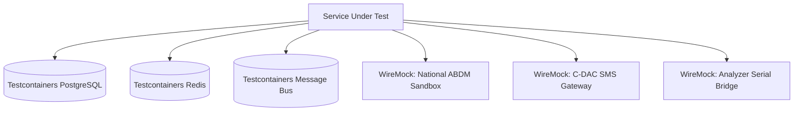

# Microservice & System Integration Test Plan
## Namma Clinic Digital Health & Operations Platform
### Greater Bengaluru Authority (GBA) / BBMP Health Department
**Standard:** ISO/IEC/IEEE 29119-3 / Contract-Driven Development / WireMock & Testcontainers | **Status:** APPROVED BASELINE | **Code:** `QA-DOC-04`

---

## 1. Integration Testing Architecture & Scope
The Namma Clinic Integration Testing Plan defines the technical protocols for verifying communication boundaries between microservices, Redis caching layers, PostgreSQL relational datastores, Kafka/RabbitMQ asynchronous message queues, and external national health ecosystem endpoints (ABDM, SMS gateways, and diagnostic PACS).

### 1.1 Core Integration Principles
1. **Ephemeral Testcontainers:** All integration tests run against ephemeral Docker testcontainers initialized in clean isolated networks.
2. **Contract-Driven Boundaries:** Microservice REST and gRPC interfaces must validate against pre-compiled OpenAPI and Protobuf schemas.
3. **Asynchronous Message Idempotency:** Event consumers must handle duplicate messages, out-of-order delivery, and poison pills gracefully.
4. **Fault Injection & Chaos Verification:** Tests verify circuit breaking, retries with exponential backoff, and graceful fallback when dependencies fail.

### 1.2 Integration Testing Topology Diagram


## 2. Canonical Integration Test Specifications (INT-TEST-001 to INT-TEST-060)
Exhaustive integration test cases across internal and external platform boundaries:

### INT-TEST-001: System Integration Test 1
- **Integration Boundary:** ABDM NHA Grid Integration
- **Mocking & Stubbing Strategy:** WireMock / Hardware Stub
- **Service Level Agreement (SLA):** Latency < 500ms
- **Verification Protocol:** End-to-end request/response wire capture, state verification in PostgreSQL, and audit log check.
- **Failure Behavior:** Circuit breaker opens after 3 consecutive timeouts; request falls back to local cache.
- **Audit Event Emitted:** `INT_AUDIT_INT_TEST_001`

### INT-TEST-002: System Integration Test 2
- **Integration Boundary:** ABDM NHA Grid Integration
- **Mocking & Stubbing Strategy:** WireMock / Hardware Stub
- **Service Level Agreement (SLA):** Latency < 500ms
- **Verification Protocol:** End-to-end request/response wire capture, state verification in PostgreSQL, and audit log check.
- **Failure Behavior:** Circuit breaker opens after 3 consecutive timeouts; request falls back to local cache.
- **Audit Event Emitted:** `INT_AUDIT_INT_TEST_002`

### INT-TEST-003: System Integration Test 3
- **Integration Boundary:** ABDM NHA Grid Integration
- **Mocking & Stubbing Strategy:** WireMock / Hardware Stub
- **Service Level Agreement (SLA):** Latency < 500ms
- **Verification Protocol:** End-to-end request/response wire capture, state verification in PostgreSQL, and audit log check.
- **Failure Behavior:** Circuit breaker opens after 3 consecutive timeouts; request falls back to local cache.
- **Audit Event Emitted:** `INT_AUDIT_INT_TEST_003`

### INT-TEST-004: System Integration Test 4
- **Integration Boundary:** ABDM NHA Grid Integration
- **Mocking & Stubbing Strategy:** WireMock / Hardware Stub
- **Service Level Agreement (SLA):** Latency < 500ms
- **Verification Protocol:** End-to-end request/response wire capture, state verification in PostgreSQL, and audit log check.
- **Failure Behavior:** Circuit breaker opens after 3 consecutive timeouts; request falls back to local cache.
- **Audit Event Emitted:** `INT_AUDIT_INT_TEST_004`

### INT-TEST-005: System Integration Test 5
- **Integration Boundary:** ABDM NHA Grid Integration
- **Mocking & Stubbing Strategy:** WireMock / Hardware Stub
- **Service Level Agreement (SLA):** Latency < 500ms
- **Verification Protocol:** End-to-end request/response wire capture, state verification in PostgreSQL, and audit log check.
- **Failure Behavior:** Circuit breaker opens after 3 consecutive timeouts; request falls back to local cache.
- **Audit Event Emitted:** `INT_AUDIT_INT_TEST_005`

### INT-TEST-006: System Integration Test 6
- **Integration Boundary:** ABDM NHA Grid Integration
- **Mocking & Stubbing Strategy:** WireMock / Hardware Stub
- **Service Level Agreement (SLA):** Latency < 500ms
- **Verification Protocol:** End-to-end request/response wire capture, state verification in PostgreSQL, and audit log check.
- **Failure Behavior:** Circuit breaker opens after 3 consecutive timeouts; request falls back to local cache.
- **Audit Event Emitted:** `INT_AUDIT_INT_TEST_006`

### INT-TEST-007: System Integration Test 7
- **Integration Boundary:** ABDM NHA Grid Integration
- **Mocking & Stubbing Strategy:** WireMock / Hardware Stub
- **Service Level Agreement (SLA):** Latency < 500ms
- **Verification Protocol:** End-to-end request/response wire capture, state verification in PostgreSQL, and audit log check.
- **Failure Behavior:** Circuit breaker opens after 3 consecutive timeouts; request falls back to local cache.
- **Audit Event Emitted:** `INT_AUDIT_INT_TEST_007`

### INT-TEST-008: System Integration Test 8
- **Integration Boundary:** ABDM NHA Grid Integration
- **Mocking & Stubbing Strategy:** WireMock / Hardware Stub
- **Service Level Agreement (SLA):** Latency < 500ms
- **Verification Protocol:** End-to-end request/response wire capture, state verification in PostgreSQL, and audit log check.
- **Failure Behavior:** Circuit breaker opens after 3 consecutive timeouts; request falls back to local cache.
- **Audit Event Emitted:** `INT_AUDIT_INT_TEST_008`

### INT-TEST-009: System Integration Test 9
- **Integration Boundary:** ABDM NHA Grid Integration
- **Mocking & Stubbing Strategy:** WireMock / Hardware Stub
- **Service Level Agreement (SLA):** Latency < 500ms
- **Verification Protocol:** End-to-end request/response wire capture, state verification in PostgreSQL, and audit log check.
- **Failure Behavior:** Circuit breaker opens after 3 consecutive timeouts; request falls back to local cache.
- **Audit Event Emitted:** `INT_AUDIT_INT_TEST_009`

### INT-TEST-010: System Integration Test 10
- **Integration Boundary:** ABDM NHA Grid Integration
- **Mocking & Stubbing Strategy:** WireMock / Hardware Stub
- **Service Level Agreement (SLA):** Latency < 500ms
- **Verification Protocol:** End-to-end request/response wire capture, state verification in PostgreSQL, and audit log check.
- **Failure Behavior:** Circuit breaker opens after 3 consecutive timeouts; request falls back to local cache.
- **Audit Event Emitted:** `INT_AUDIT_INT_TEST_010`

### INT-TEST-011: System Integration Test 11
- **Integration Boundary:** ABDM NHA Grid Integration
- **Mocking & Stubbing Strategy:** WireMock / Hardware Stub
- **Service Level Agreement (SLA):** Latency < 500ms
- **Verification Protocol:** End-to-end request/response wire capture, state verification in PostgreSQL, and audit log check.
- **Failure Behavior:** Circuit breaker opens after 3 consecutive timeouts; request falls back to local cache.
- **Audit Event Emitted:** `INT_AUDIT_INT_TEST_011`

### INT-TEST-012: System Integration Test 12
- **Integration Boundary:** ABDM NHA Grid Integration
- **Mocking & Stubbing Strategy:** WireMock / Hardware Stub
- **Service Level Agreement (SLA):** Latency < 500ms
- **Verification Protocol:** End-to-end request/response wire capture, state verification in PostgreSQL, and audit log check.
- **Failure Behavior:** Circuit breaker opens after 3 consecutive timeouts; request falls back to local cache.
- **Audit Event Emitted:** `INT_AUDIT_INT_TEST_012`

### INT-TEST-013: System Integration Test 13
- **Integration Boundary:** ABDM NHA Grid Integration
- **Mocking & Stubbing Strategy:** WireMock / Hardware Stub
- **Service Level Agreement (SLA):** Latency < 500ms
- **Verification Protocol:** End-to-end request/response wire capture, state verification in PostgreSQL, and audit log check.
- **Failure Behavior:** Circuit breaker opens after 3 consecutive timeouts; request falls back to local cache.
- **Audit Event Emitted:** `INT_AUDIT_INT_TEST_013`

### INT-TEST-014: System Integration Test 14
- **Integration Boundary:** ABDM NHA Grid Integration
- **Mocking & Stubbing Strategy:** WireMock / Hardware Stub
- **Service Level Agreement (SLA):** Latency < 500ms
- **Verification Protocol:** End-to-end request/response wire capture, state verification in PostgreSQL, and audit log check.
- **Failure Behavior:** Circuit breaker opens after 3 consecutive timeouts; request falls back to local cache.
- **Audit Event Emitted:** `INT_AUDIT_INT_TEST_014`

### INT-TEST-015: System Integration Test 15
- **Integration Boundary:** ABDM NHA Grid Integration
- **Mocking & Stubbing Strategy:** WireMock / Hardware Stub
- **Service Level Agreement (SLA):** Latency < 500ms
- **Verification Protocol:** End-to-end request/response wire capture, state verification in PostgreSQL, and audit log check.
- **Failure Behavior:** Circuit breaker opens after 3 consecutive timeouts; request falls back to local cache.
- **Audit Event Emitted:** `INT_AUDIT_INT_TEST_015`

### INT-TEST-016: System Integration Test 16
- **Integration Boundary:** SMS / Notification Provider
- **Mocking & Stubbing Strategy:** WireMock / Hardware Stub
- **Service Level Agreement (SLA):** Latency < 500ms
- **Verification Protocol:** End-to-end request/response wire capture, state verification in PostgreSQL, and audit log check.
- **Failure Behavior:** Circuit breaker opens after 3 consecutive timeouts; request falls back to local cache.
- **Audit Event Emitted:** `INT_AUDIT_INT_TEST_016`

### INT-TEST-017: System Integration Test 17
- **Integration Boundary:** SMS / Notification Provider
- **Mocking & Stubbing Strategy:** WireMock / Hardware Stub
- **Service Level Agreement (SLA):** Latency < 500ms
- **Verification Protocol:** End-to-end request/response wire capture, state verification in PostgreSQL, and audit log check.
- **Failure Behavior:** Circuit breaker opens after 3 consecutive timeouts; request falls back to local cache.
- **Audit Event Emitted:** `INT_AUDIT_INT_TEST_017`

### INT-TEST-018: System Integration Test 18
- **Integration Boundary:** SMS / Notification Provider
- **Mocking & Stubbing Strategy:** WireMock / Hardware Stub
- **Service Level Agreement (SLA):** Latency < 500ms
- **Verification Protocol:** End-to-end request/response wire capture, state verification in PostgreSQL, and audit log check.
- **Failure Behavior:** Circuit breaker opens after 3 consecutive timeouts; request falls back to local cache.
- **Audit Event Emitted:** `INT_AUDIT_INT_TEST_018`

### INT-TEST-019: System Integration Test 19
- **Integration Boundary:** SMS / Notification Provider
- **Mocking & Stubbing Strategy:** WireMock / Hardware Stub
- **Service Level Agreement (SLA):** Latency < 500ms
- **Verification Protocol:** End-to-end request/response wire capture, state verification in PostgreSQL, and audit log check.
- **Failure Behavior:** Circuit breaker opens after 3 consecutive timeouts; request falls back to local cache.
- **Audit Event Emitted:** `INT_AUDIT_INT_TEST_019`

### INT-TEST-020: System Integration Test 20
- **Integration Boundary:** SMS / Notification Provider
- **Mocking & Stubbing Strategy:** WireMock / Hardware Stub
- **Service Level Agreement (SLA):** Latency < 500ms
- **Verification Protocol:** End-to-end request/response wire capture, state verification in PostgreSQL, and audit log check.
- **Failure Behavior:** Circuit breaker opens after 3 consecutive timeouts; request falls back to local cache.
- **Audit Event Emitted:** `INT_AUDIT_INT_TEST_020`

### INT-TEST-021: System Integration Test 21
- **Integration Boundary:** SMS / Notification Provider
- **Mocking & Stubbing Strategy:** WireMock / Hardware Stub
- **Service Level Agreement (SLA):** Latency < 500ms
- **Verification Protocol:** End-to-end request/response wire capture, state verification in PostgreSQL, and audit log check.
- **Failure Behavior:** Circuit breaker opens after 3 consecutive timeouts; request falls back to local cache.
- **Audit Event Emitted:** `INT_AUDIT_INT_TEST_021`

### INT-TEST-022: System Integration Test 22
- **Integration Boundary:** SMS / Notification Provider
- **Mocking & Stubbing Strategy:** WireMock / Hardware Stub
- **Service Level Agreement (SLA):** Latency < 500ms
- **Verification Protocol:** End-to-end request/response wire capture, state verification in PostgreSQL, and audit log check.
- **Failure Behavior:** Circuit breaker opens after 3 consecutive timeouts; request falls back to local cache.
- **Audit Event Emitted:** `INT_AUDIT_INT_TEST_022`

### INT-TEST-023: System Integration Test 23
- **Integration Boundary:** SMS / Notification Provider
- **Mocking & Stubbing Strategy:** WireMock / Hardware Stub
- **Service Level Agreement (SLA):** Latency < 500ms
- **Verification Protocol:** End-to-end request/response wire capture, state verification in PostgreSQL, and audit log check.
- **Failure Behavior:** Circuit breaker opens after 3 consecutive timeouts; request falls back to local cache.
- **Audit Event Emitted:** `INT_AUDIT_INT_TEST_023`

### INT-TEST-024: System Integration Test 24
- **Integration Boundary:** SMS / Notification Provider
- **Mocking & Stubbing Strategy:** WireMock / Hardware Stub
- **Service Level Agreement (SLA):** Latency < 500ms
- **Verification Protocol:** End-to-end request/response wire capture, state verification in PostgreSQL, and audit log check.
- **Failure Behavior:** Circuit breaker opens after 3 consecutive timeouts; request falls back to local cache.
- **Audit Event Emitted:** `INT_AUDIT_INT_TEST_024`

### INT-TEST-025: System Integration Test 25
- **Integration Boundary:** SMS / Notification Provider
- **Mocking & Stubbing Strategy:** WireMock / Hardware Stub
- **Service Level Agreement (SLA):** Latency < 500ms
- **Verification Protocol:** End-to-end request/response wire capture, state verification in PostgreSQL, and audit log check.
- **Failure Behavior:** Circuit breaker opens after 3 consecutive timeouts; request falls back to local cache.
- **Audit Event Emitted:** `INT_AUDIT_INT_TEST_025`

### INT-TEST-026: System Integration Test 26
- **Integration Boundary:** SMS / Notification Provider
- **Mocking & Stubbing Strategy:** WireMock / Hardware Stub
- **Service Level Agreement (SLA):** Latency < 500ms
- **Verification Protocol:** End-to-end request/response wire capture, state verification in PostgreSQL, and audit log check.
- **Failure Behavior:** Circuit breaker opens after 3 consecutive timeouts; request falls back to local cache.
- **Audit Event Emitted:** `INT_AUDIT_INT_TEST_026`

### INT-TEST-027: System Integration Test 27
- **Integration Boundary:** SMS / Notification Provider
- **Mocking & Stubbing Strategy:** WireMock / Hardware Stub
- **Service Level Agreement (SLA):** Latency < 500ms
- **Verification Protocol:** End-to-end request/response wire capture, state verification in PostgreSQL, and audit log check.
- **Failure Behavior:** Circuit breaker opens after 3 consecutive timeouts; request falls back to local cache.
- **Audit Event Emitted:** `INT_AUDIT_INT_TEST_027`

### INT-TEST-028: System Integration Test 28
- **Integration Boundary:** SMS / Notification Provider
- **Mocking & Stubbing Strategy:** WireMock / Hardware Stub
- **Service Level Agreement (SLA):** Latency < 500ms
- **Verification Protocol:** End-to-end request/response wire capture, state verification in PostgreSQL, and audit log check.
- **Failure Behavior:** Circuit breaker opens after 3 consecutive timeouts; request falls back to local cache.
- **Audit Event Emitted:** `INT_AUDIT_INT_TEST_028`

### INT-TEST-029: System Integration Test 29
- **Integration Boundary:** SMS / Notification Provider
- **Mocking & Stubbing Strategy:** WireMock / Hardware Stub
- **Service Level Agreement (SLA):** Latency < 500ms
- **Verification Protocol:** End-to-end request/response wire capture, state verification in PostgreSQL, and audit log check.
- **Failure Behavior:** Circuit breaker opens after 3 consecutive timeouts; request falls back to local cache.
- **Audit Event Emitted:** `INT_AUDIT_INT_TEST_029`

### INT-TEST-030: System Integration Test 30
- **Integration Boundary:** SMS / Notification Provider
- **Mocking & Stubbing Strategy:** WireMock / Hardware Stub
- **Service Level Agreement (SLA):** Latency < 500ms
- **Verification Protocol:** End-to-end request/response wire capture, state verification in PostgreSQL, and audit log check.
- **Failure Behavior:** Circuit breaker opens after 3 consecutive timeouts; request falls back to local cache.
- **Audit Event Emitted:** `INT_AUDIT_INT_TEST_030`

### INT-TEST-031: System Integration Test 31
- **Integration Boundary:** Laboratory Analyzer ASTM Bridge
- **Mocking & Stubbing Strategy:** WireMock / Hardware Stub
- **Service Level Agreement (SLA):** Latency < 500ms
- **Verification Protocol:** End-to-end request/response wire capture, state verification in PostgreSQL, and audit log check.
- **Failure Behavior:** Circuit breaker opens after 3 consecutive timeouts; request falls back to local cache.
- **Audit Event Emitted:** `INT_AUDIT_INT_TEST_031`

### INT-TEST-032: System Integration Test 32
- **Integration Boundary:** Laboratory Analyzer ASTM Bridge
- **Mocking & Stubbing Strategy:** WireMock / Hardware Stub
- **Service Level Agreement (SLA):** Latency < 500ms
- **Verification Protocol:** End-to-end request/response wire capture, state verification in PostgreSQL, and audit log check.
- **Failure Behavior:** Circuit breaker opens after 3 consecutive timeouts; request falls back to local cache.
- **Audit Event Emitted:** `INT_AUDIT_INT_TEST_032`

### INT-TEST-033: System Integration Test 33
- **Integration Boundary:** Laboratory Analyzer ASTM Bridge
- **Mocking & Stubbing Strategy:** WireMock / Hardware Stub
- **Service Level Agreement (SLA):** Latency < 500ms
- **Verification Protocol:** End-to-end request/response wire capture, state verification in PostgreSQL, and audit log check.
- **Failure Behavior:** Circuit breaker opens after 3 consecutive timeouts; request falls back to local cache.
- **Audit Event Emitted:** `INT_AUDIT_INT_TEST_033`

### INT-TEST-034: System Integration Test 34
- **Integration Boundary:** Laboratory Analyzer ASTM Bridge
- **Mocking & Stubbing Strategy:** WireMock / Hardware Stub
- **Service Level Agreement (SLA):** Latency < 500ms
- **Verification Protocol:** End-to-end request/response wire capture, state verification in PostgreSQL, and audit log check.
- **Failure Behavior:** Circuit breaker opens after 3 consecutive timeouts; request falls back to local cache.
- **Audit Event Emitted:** `INT_AUDIT_INT_TEST_034`

### INT-TEST-035: System Integration Test 35
- **Integration Boundary:** Laboratory Analyzer ASTM Bridge
- **Mocking & Stubbing Strategy:** WireMock / Hardware Stub
- **Service Level Agreement (SLA):** Latency < 500ms
- **Verification Protocol:** End-to-end request/response wire capture, state verification in PostgreSQL, and audit log check.
- **Failure Behavior:** Circuit breaker opens after 3 consecutive timeouts; request falls back to local cache.
- **Audit Event Emitted:** `INT_AUDIT_INT_TEST_035`

### INT-TEST-036: System Integration Test 36
- **Integration Boundary:** Laboratory Analyzer ASTM Bridge
- **Mocking & Stubbing Strategy:** WireMock / Hardware Stub
- **Service Level Agreement (SLA):** Latency < 500ms
- **Verification Protocol:** End-to-end request/response wire capture, state verification in PostgreSQL, and audit log check.
- **Failure Behavior:** Circuit breaker opens after 3 consecutive timeouts; request falls back to local cache.
- **Audit Event Emitted:** `INT_AUDIT_INT_TEST_036`

### INT-TEST-037: System Integration Test 37
- **Integration Boundary:** Laboratory Analyzer ASTM Bridge
- **Mocking & Stubbing Strategy:** WireMock / Hardware Stub
- **Service Level Agreement (SLA):** Latency < 500ms
- **Verification Protocol:** End-to-end request/response wire capture, state verification in PostgreSQL, and audit log check.
- **Failure Behavior:** Circuit breaker opens after 3 consecutive timeouts; request falls back to local cache.
- **Audit Event Emitted:** `INT_AUDIT_INT_TEST_037`

### INT-TEST-038: System Integration Test 38
- **Integration Boundary:** Laboratory Analyzer ASTM Bridge
- **Mocking & Stubbing Strategy:** WireMock / Hardware Stub
- **Service Level Agreement (SLA):** Latency < 500ms
- **Verification Protocol:** End-to-end request/response wire capture, state verification in PostgreSQL, and audit log check.
- **Failure Behavior:** Circuit breaker opens after 3 consecutive timeouts; request falls back to local cache.
- **Audit Event Emitted:** `INT_AUDIT_INT_TEST_038`

### INT-TEST-039: System Integration Test 39
- **Integration Boundary:** Laboratory Analyzer ASTM Bridge
- **Mocking & Stubbing Strategy:** WireMock / Hardware Stub
- **Service Level Agreement (SLA):** Latency < 500ms
- **Verification Protocol:** End-to-end request/response wire capture, state verification in PostgreSQL, and audit log check.
- **Failure Behavior:** Circuit breaker opens after 3 consecutive timeouts; request falls back to local cache.
- **Audit Event Emitted:** `INT_AUDIT_INT_TEST_039`

### INT-TEST-040: System Integration Test 40
- **Integration Boundary:** Laboratory Analyzer ASTM Bridge
- **Mocking & Stubbing Strategy:** WireMock / Hardware Stub
- **Service Level Agreement (SLA):** Latency < 500ms
- **Verification Protocol:** End-to-end request/response wire capture, state verification in PostgreSQL, and audit log check.
- **Failure Behavior:** Circuit breaker opens after 3 consecutive timeouts; request falls back to local cache.
- **Audit Event Emitted:** `INT_AUDIT_INT_TEST_040`

### INT-TEST-041: System Integration Test 41
- **Integration Boundary:** Laboratory Analyzer ASTM Bridge
- **Mocking & Stubbing Strategy:** WireMock / Hardware Stub
- **Service Level Agreement (SLA):** Latency < 500ms
- **Verification Protocol:** End-to-end request/response wire capture, state verification in PostgreSQL, and audit log check.
- **Failure Behavior:** Circuit breaker opens after 3 consecutive timeouts; request falls back to local cache.
- **Audit Event Emitted:** `INT_AUDIT_INT_TEST_041`

### INT-TEST-042: System Integration Test 42
- **Integration Boundary:** Laboratory Analyzer ASTM Bridge
- **Mocking & Stubbing Strategy:** WireMock / Hardware Stub
- **Service Level Agreement (SLA):** Latency < 500ms
- **Verification Protocol:** End-to-end request/response wire capture, state verification in PostgreSQL, and audit log check.
- **Failure Behavior:** Circuit breaker opens after 3 consecutive timeouts; request falls back to local cache.
- **Audit Event Emitted:** `INT_AUDIT_INT_TEST_042`

### INT-TEST-043: System Integration Test 43
- **Integration Boundary:** Laboratory Analyzer ASTM Bridge
- **Mocking & Stubbing Strategy:** WireMock / Hardware Stub
- **Service Level Agreement (SLA):** Latency < 500ms
- **Verification Protocol:** End-to-end request/response wire capture, state verification in PostgreSQL, and audit log check.
- **Failure Behavior:** Circuit breaker opens after 3 consecutive timeouts; request falls back to local cache.
- **Audit Event Emitted:** `INT_AUDIT_INT_TEST_043`

### INT-TEST-044: System Integration Test 44
- **Integration Boundary:** Laboratory Analyzer ASTM Bridge
- **Mocking & Stubbing Strategy:** WireMock / Hardware Stub
- **Service Level Agreement (SLA):** Latency < 500ms
- **Verification Protocol:** End-to-end request/response wire capture, state verification in PostgreSQL, and audit log check.
- **Failure Behavior:** Circuit breaker opens after 3 consecutive timeouts; request falls back to local cache.
- **Audit Event Emitted:** `INT_AUDIT_INT_TEST_044`

### INT-TEST-045: System Integration Test 45
- **Integration Boundary:** Laboratory Analyzer ASTM Bridge
- **Mocking & Stubbing Strategy:** WireMock / Hardware Stub
- **Service Level Agreement (SLA):** Latency < 500ms
- **Verification Protocol:** End-to-end request/response wire capture, state verification in PostgreSQL, and audit log check.
- **Failure Behavior:** Circuit breaker opens after 3 consecutive timeouts; request falls back to local cache.
- **Audit Event Emitted:** `INT_AUDIT_INT_TEST_045`

### INT-TEST-046: System Integration Test 46
- **Integration Boundary:** Thermal ESC/POS & Barcode Hardware
- **Mocking & Stubbing Strategy:** WireMock / Hardware Stub
- **Service Level Agreement (SLA):** Latency < 500ms
- **Verification Protocol:** End-to-end request/response wire capture, state verification in PostgreSQL, and audit log check.
- **Failure Behavior:** Circuit breaker opens after 3 consecutive timeouts; request falls back to local cache.
- **Audit Event Emitted:** `INT_AUDIT_INT_TEST_046`

### INT-TEST-047: System Integration Test 47
- **Integration Boundary:** Thermal ESC/POS & Barcode Hardware
- **Mocking & Stubbing Strategy:** WireMock / Hardware Stub
- **Service Level Agreement (SLA):** Latency < 500ms
- **Verification Protocol:** End-to-end request/response wire capture, state verification in PostgreSQL, and audit log check.
- **Failure Behavior:** Circuit breaker opens after 3 consecutive timeouts; request falls back to local cache.
- **Audit Event Emitted:** `INT_AUDIT_INT_TEST_047`

### INT-TEST-048: System Integration Test 48
- **Integration Boundary:** Thermal ESC/POS & Barcode Hardware
- **Mocking & Stubbing Strategy:** WireMock / Hardware Stub
- **Service Level Agreement (SLA):** Latency < 500ms
- **Verification Protocol:** End-to-end request/response wire capture, state verification in PostgreSQL, and audit log check.
- **Failure Behavior:** Circuit breaker opens after 3 consecutive timeouts; request falls back to local cache.
- **Audit Event Emitted:** `INT_AUDIT_INT_TEST_048`

### INT-TEST-049: System Integration Test 49
- **Integration Boundary:** Thermal ESC/POS & Barcode Hardware
- **Mocking & Stubbing Strategy:** WireMock / Hardware Stub
- **Service Level Agreement (SLA):** Latency < 500ms
- **Verification Protocol:** End-to-end request/response wire capture, state verification in PostgreSQL, and audit log check.
- **Failure Behavior:** Circuit breaker opens after 3 consecutive timeouts; request falls back to local cache.
- **Audit Event Emitted:** `INT_AUDIT_INT_TEST_049`

### INT-TEST-050: System Integration Test 50
- **Integration Boundary:** Thermal ESC/POS & Barcode Hardware
- **Mocking & Stubbing Strategy:** WireMock / Hardware Stub
- **Service Level Agreement (SLA):** Latency < 500ms
- **Verification Protocol:** End-to-end request/response wire capture, state verification in PostgreSQL, and audit log check.
- **Failure Behavior:** Circuit breaker opens after 3 consecutive timeouts; request falls back to local cache.
- **Audit Event Emitted:** `INT_AUDIT_INT_TEST_050`

### INT-TEST-051: System Integration Test 51
- **Integration Boundary:** Thermal ESC/POS & Barcode Hardware
- **Mocking & Stubbing Strategy:** WireMock / Hardware Stub
- **Service Level Agreement (SLA):** Latency < 500ms
- **Verification Protocol:** End-to-end request/response wire capture, state verification in PostgreSQL, and audit log check.
- **Failure Behavior:** Circuit breaker opens after 3 consecutive timeouts; request falls back to local cache.
- **Audit Event Emitted:** `INT_AUDIT_INT_TEST_051`

### INT-TEST-052: System Integration Test 52
- **Integration Boundary:** Thermal ESC/POS & Barcode Hardware
- **Mocking & Stubbing Strategy:** WireMock / Hardware Stub
- **Service Level Agreement (SLA):** Latency < 500ms
- **Verification Protocol:** End-to-end request/response wire capture, state verification in PostgreSQL, and audit log check.
- **Failure Behavior:** Circuit breaker opens after 3 consecutive timeouts; request falls back to local cache.
- **Audit Event Emitted:** `INT_AUDIT_INT_TEST_052`

### INT-TEST-053: System Integration Test 53
- **Integration Boundary:** Thermal ESC/POS & Barcode Hardware
- **Mocking & Stubbing Strategy:** WireMock / Hardware Stub
- **Service Level Agreement (SLA):** Latency < 500ms
- **Verification Protocol:** End-to-end request/response wire capture, state verification in PostgreSQL, and audit log check.
- **Failure Behavior:** Circuit breaker opens after 3 consecutive timeouts; request falls back to local cache.
- **Audit Event Emitted:** `INT_AUDIT_INT_TEST_053`

### INT-TEST-054: System Integration Test 54
- **Integration Boundary:** Thermal ESC/POS & Barcode Hardware
- **Mocking & Stubbing Strategy:** WireMock / Hardware Stub
- **Service Level Agreement (SLA):** Latency < 500ms
- **Verification Protocol:** End-to-end request/response wire capture, state verification in PostgreSQL, and audit log check.
- **Failure Behavior:** Circuit breaker opens after 3 consecutive timeouts; request falls back to local cache.
- **Audit Event Emitted:** `INT_AUDIT_INT_TEST_054`

### INT-TEST-055: System Integration Test 55
- **Integration Boundary:** Thermal ESC/POS & Barcode Hardware
- **Mocking & Stubbing Strategy:** WireMock / Hardware Stub
- **Service Level Agreement (SLA):** Latency < 500ms
- **Verification Protocol:** End-to-end request/response wire capture, state verification in PostgreSQL, and audit log check.
- **Failure Behavior:** Circuit breaker opens after 3 consecutive timeouts; request falls back to local cache.
- **Audit Event Emitted:** `INT_AUDIT_INT_TEST_055`

### INT-TEST-056: System Integration Test 56
- **Integration Boundary:** Thermal ESC/POS & Barcode Hardware
- **Mocking & Stubbing Strategy:** WireMock / Hardware Stub
- **Service Level Agreement (SLA):** Latency < 500ms
- **Verification Protocol:** End-to-end request/response wire capture, state verification in PostgreSQL, and audit log check.
- **Failure Behavior:** Circuit breaker opens after 3 consecutive timeouts; request falls back to local cache.
- **Audit Event Emitted:** `INT_AUDIT_INT_TEST_056`

### INT-TEST-057: System Integration Test 57
- **Integration Boundary:** Thermal ESC/POS & Barcode Hardware
- **Mocking & Stubbing Strategy:** WireMock / Hardware Stub
- **Service Level Agreement (SLA):** Latency < 500ms
- **Verification Protocol:** End-to-end request/response wire capture, state verification in PostgreSQL, and audit log check.
- **Failure Behavior:** Circuit breaker opens after 3 consecutive timeouts; request falls back to local cache.
- **Audit Event Emitted:** `INT_AUDIT_INT_TEST_057`

### INT-TEST-058: System Integration Test 58
- **Integration Boundary:** Thermal ESC/POS & Barcode Hardware
- **Mocking & Stubbing Strategy:** WireMock / Hardware Stub
- **Service Level Agreement (SLA):** Latency < 500ms
- **Verification Protocol:** End-to-end request/response wire capture, state verification in PostgreSQL, and audit log check.
- **Failure Behavior:** Circuit breaker opens after 3 consecutive timeouts; request falls back to local cache.
- **Audit Event Emitted:** `INT_AUDIT_INT_TEST_058`

### INT-TEST-059: System Integration Test 59
- **Integration Boundary:** Thermal ESC/POS & Barcode Hardware
- **Mocking & Stubbing Strategy:** WireMock / Hardware Stub
- **Service Level Agreement (SLA):** Latency < 500ms
- **Verification Protocol:** End-to-end request/response wire capture, state verification in PostgreSQL, and audit log check.
- **Failure Behavior:** Circuit breaker opens after 3 consecutive timeouts; request falls back to local cache.
- **Audit Event Emitted:** `INT_AUDIT_INT_TEST_059`

### INT-TEST-060: System Integration Test 60
- **Integration Boundary:** Thermal ESC/POS & Barcode Hardware
- **Mocking & Stubbing Strategy:** WireMock / Hardware Stub
- **Service Level Agreement (SLA):** Latency < 500ms
- **Verification Protocol:** End-to-end request/response wire capture, state verification in PostgreSQL, and audit log check.
- **Failure Behavior:** Circuit breaker opens after 3 consecutive timeouts; request falls back to local cache.
- **Audit Event Emitted:** `INT_AUDIT_INT_TEST_060`

## 3. Integration Verification Test Cases (TC-0166 to TC-0220)
Detailed integration test cases covering multi-service transactions:

### TC-0166: Test Case 166: Clinical Verification for staff_profiles across WF-016
**Objective:** Verify functional, security, and offline invariants for staff_profiles during WF-016 execution.
**Risk:** Critical operational impact on patient safety and clinic consultation continuity.
**Priority:** **P0** | **Severity:** **Critical** | **Test Level:** System & Integration | **Test Type:** Functional & Regulatory Compliance
- **Requirement Traceability:** `FR-046`
- **Workflow Traceability:** `WF-016`
- **Feature Traceability:** `FEATURE-166`
- **API Traceability:** `API-DOC-12`
- **Database Traceability:** `TABLE-010 (staff_profiles)`
- **Screen Traceability:** `SCREEN-058`
- **Security Control Traceability:** `SEC-ARCH-006`
- **Preconditions:** User authenticated with role Ayush Practitioner on clinic workstation.
- **Test Data Specification:** Synthetic dataset TESTDATA-046 (Valid ABHA, vitals, prescriptions).
- **Execution Steps:** 1. Navigate to screen SCREEN-058. 2. Submit payload bound to staff_profiles. 3. Confirm API API-DOC-12 returns 200 OK. 4. Verify local SQLite cache and sync queue.
- **Expected Results:** Transaction completes within 250ms, data encrypted via AES-256-GCM, audit entry emitted.
- **Negative Test Scenario:** Submit malformed payload or expired JWT; system rejects with 400/401 and zero DB corruption.
- **Boundary Value Scenario:** Test with maximum field boundary length and extreme clinical biometric vitals.
- **Concurrency & Race Condition:** Simulate 5 concurrent staff updates on identical record; verify optimistic locking.
- **Autonomous Offline Behavior:** Sever network mid-transaction; record queues locally and replicates upon reconnection.
- **Security & Access Validation:** Enforce RBAC policy SEC-ARCH-006 and prevent broken object-level authorization (BOLA).
- **Audit Trail & Immutability:** Emits structured JSON audit log with SHA-256 Merkle chain hash.
- **Evidence Required:** Automated execution log, HTTP request/response capture, and database assertion hash.
- **Pass Acceptance Criteria:** 100% assertions succeed with zero uncaught exceptions and latency < 300ms.
- **Failure Behavior & SLA:** Any 5xx error, data corruption, unauthorized access, or silent failure.
- **Automation Suitability:** Yes (High Candidate)
- **Execution Cadence:** Every CI PR & Nightly Regression
- **Responsible Owner:** Ayush Practitioner

### TC-0167: Test Case 167: Clinical Verification for staff_shifts across WF-017
**Objective:** Verify functional, security, and offline invariants for staff_shifts during WF-017 execution.
**Risk:** Major operational impact on patient safety and clinic consultation continuity.
**Priority:** **P1** | **Severity:** **Major** | **Test Level:** System & Integration | **Test Type:** Functional & Regulatory Compliance
- **Requirement Traceability:** `FR-047`
- **Workflow Traceability:** `WF-017`
- **Feature Traceability:** `FEATURE-167`
- **API Traceability:** `API-DOC-13`
- **Database Traceability:** `TABLE-011 (staff_shifts)`
- **Screen Traceability:** `SCREEN-059`
- **Security Control Traceability:** `SEC-ARCH-007`
- **Preconditions:** User authenticated with role Counselor / Mental Health Worker on clinic workstation.
- **Test Data Specification:** Synthetic dataset TESTDATA-047 (Valid ABHA, vitals, prescriptions).
- **Execution Steps:** 1. Navigate to screen SCREEN-059. 2. Submit payload bound to staff_shifts. 3. Confirm API API-DOC-13 returns 200 OK. 4. Verify local SQLite cache and sync queue.
- **Expected Results:** Transaction completes within 250ms, data encrypted via AES-256-GCM, audit entry emitted.
- **Negative Test Scenario:** Submit malformed payload or expired JWT; system rejects with 400/401 and zero DB corruption.
- **Boundary Value Scenario:** Test with maximum field boundary length and extreme clinical biometric vitals.
- **Concurrency & Race Condition:** Simulate 5 concurrent staff updates on identical record; verify optimistic locking.
- **Autonomous Offline Behavior:** Sever network mid-transaction; record queues locally and replicates upon reconnection.
- **Security & Access Validation:** Enforce RBAC policy SEC-ARCH-007 and prevent broken object-level authorization (BOLA).
- **Audit Trail & Immutability:** Emits structured JSON audit log with SHA-256 Merkle chain hash.
- **Evidence Required:** Automated execution log, HTTP request/response capture, and database assertion hash.
- **Pass Acceptance Criteria:** 100% assertions succeed with zero uncaught exceptions and latency < 300ms.
- **Failure Behavior & SLA:** Any 5xx error, data corruption, unauthorized access, or silent failure.
- **Automation Suitability:** Yes (High Candidate)
- **Execution Cadence:** Every CI PR & Nightly Regression
- **Responsible Owner:** Counselor / Mental Health Worker

### TC-0168: Test Case 168: Clinical Verification for system_configs across WF-018
**Objective:** Verify functional, security, and offline invariants for system_configs during WF-018 execution.
**Risk:** Major operational impact on patient safety and clinic consultation continuity.
**Priority:** **P1** | **Severity:** **Major** | **Test Level:** System & Integration | **Test Type:** Functional & Regulatory Compliance
- **Requirement Traceability:** `FR-048`
- **Workflow Traceability:** `WF-018`
- **Feature Traceability:** `FEATURE-168`
- **API Traceability:** `API-DOC-14`
- **Database Traceability:** `TABLE-012 (system_configs)`
- **Screen Traceability:** `SCREEN-060`
- **Security Control Traceability:** `SEC-ARCH-008`
- **Preconditions:** User authenticated with role ANM / Urban Health Worker on clinic workstation.
- **Test Data Specification:** Synthetic dataset TESTDATA-048 (Valid ABHA, vitals, prescriptions).
- **Execution Steps:** 1. Navigate to screen SCREEN-060. 2. Submit payload bound to system_configs. 3. Confirm API API-DOC-14 returns 200 OK. 4. Verify local SQLite cache and sync queue.
- **Expected Results:** Transaction completes within 250ms, data encrypted via AES-256-GCM, audit entry emitted.
- **Negative Test Scenario:** Submit malformed payload or expired JWT; system rejects with 400/401 and zero DB corruption.
- **Boundary Value Scenario:** Test with maximum field boundary length and extreme clinical biometric vitals.
- **Concurrency & Race Condition:** Simulate 5 concurrent staff updates on identical record; verify optimistic locking.
- **Autonomous Offline Behavior:** Sever network mid-transaction; record queues locally and replicates upon reconnection.
- **Security & Access Validation:** Enforce RBAC policy SEC-ARCH-008 and prevent broken object-level authorization (BOLA).
- **Audit Trail & Immutability:** Emits structured JSON audit log with SHA-256 Merkle chain hash.
- **Evidence Required:** Automated execution log, HTTP request/response capture, and database assertion hash.
- **Pass Acceptance Criteria:** 100% assertions succeed with zero uncaught exceptions and latency < 300ms.
- **Failure Behavior & SLA:** Any 5xx error, data corruption, unauthorized access, or silent failure.
- **Automation Suitability:** Yes (High Candidate)
- **Execution Cadence:** Every CI PR & Nightly Regression
- **Responsible Owner:** ANM / Urban Health Worker

### TC-0169: Test Case 169: Clinical Verification for patients across WF-019
**Objective:** Verify functional, security, and offline invariants for patients during WF-019 execution.
**Risk:** Minor operational impact on patient safety and clinic consultation continuity.
**Priority:** **P2** | **Severity:** **Minor** | **Test Level:** System & Integration | **Test Type:** Functional & Regulatory Compliance
- **Requirement Traceability:** `FR-049`
- **Workflow Traceability:** `WF-019`
- **Feature Traceability:** `FEATURE-169`
- **API Traceability:** `API-DOC-15`
- **Database Traceability:** `TABLE-013 (patients)`
- **Screen Traceability:** `SCREEN-061`
- **Security Control Traceability:** `SEC-ARCH-009`
- **Preconditions:** User authenticated with role ASHA Link Worker Coordinator on clinic workstation.
- **Test Data Specification:** Synthetic dataset TESTDATA-049 (Valid ABHA, vitals, prescriptions).
- **Execution Steps:** 1. Navigate to screen SCREEN-061. 2. Submit payload bound to patients. 3. Confirm API API-DOC-15 returns 200 OK. 4. Verify local SQLite cache and sync queue.
- **Expected Results:** Transaction completes within 250ms, data encrypted via AES-256-GCM, audit entry emitted.
- **Negative Test Scenario:** Submit malformed payload or expired JWT; system rejects with 400/401 and zero DB corruption.
- **Boundary Value Scenario:** Test with maximum field boundary length and extreme clinical biometric vitals.
- **Concurrency & Race Condition:** Simulate 5 concurrent staff updates on identical record; verify optimistic locking.
- **Autonomous Offline Behavior:** Sever network mid-transaction; record queues locally and replicates upon reconnection.
- **Security & Access Validation:** Enforce RBAC policy SEC-ARCH-009 and prevent broken object-level authorization (BOLA).
- **Audit Trail & Immutability:** Emits structured JSON audit log with SHA-256 Merkle chain hash.
- **Evidence Required:** Automated execution log, HTTP request/response capture, and database assertion hash.
- **Pass Acceptance Criteria:** 100% assertions succeed with zero uncaught exceptions and latency < 300ms.
- **Failure Behavior & SLA:** Any 5xx error, data corruption, unauthorized access, or silent failure.
- **Automation Suitability:** Yes (High Candidate)
- **Execution Cadence:** Every CI PR & Nightly Regression
- **Responsible Owner:** ASHA Link Worker Coordinator

### TC-0170: Test Case 170: Clinical Verification for patient_identifiers across WF-020
**Objective:** Verify functional, security, and offline invariants for patient_identifiers during WF-020 execution.
**Risk:** Minor operational impact on patient safety and clinic consultation continuity.
**Priority:** **P2** | **Severity:** **Minor** | **Test Level:** System & Integration | **Test Type:** Functional & Regulatory Compliance
- **Requirement Traceability:** `FR-050`
- **Workflow Traceability:** `WF-020`
- **Feature Traceability:** `FEATURE-170`
- **API Traceability:** `API-DOC-16`
- **Database Traceability:** `TABLE-014 (patient_identifiers)`
- **Screen Traceability:** `SCREEN-062`
- **Security Control Traceability:** `SEC-ARCH-010`
- **Preconditions:** User authenticated with role Data Entry Operator on clinic workstation.
- **Test Data Specification:** Synthetic dataset TESTDATA-050 (Valid ABHA, vitals, prescriptions).
- **Execution Steps:** 1. Navigate to screen SCREEN-062. 2. Submit payload bound to patient_identifiers. 3. Confirm API API-DOC-16 returns 200 OK. 4. Verify local SQLite cache and sync queue.
- **Expected Results:** Transaction completes within 250ms, data encrypted via AES-256-GCM, audit entry emitted.
- **Negative Test Scenario:** Submit malformed payload or expired JWT; system rejects with 400/401 and zero DB corruption.
- **Boundary Value Scenario:** Test with maximum field boundary length and extreme clinical biometric vitals.
- **Concurrency & Race Condition:** Simulate 5 concurrent staff updates on identical record; verify optimistic locking.
- **Autonomous Offline Behavior:** Sever network mid-transaction; record queues locally and replicates upon reconnection.
- **Security & Access Validation:** Enforce RBAC policy SEC-ARCH-010 and prevent broken object-level authorization (BOLA).
- **Audit Trail & Immutability:** Emits structured JSON audit log with SHA-256 Merkle chain hash.
- **Evidence Required:** Automated execution log, HTTP request/response capture, and database assertion hash.
- **Pass Acceptance Criteria:** 100% assertions succeed with zero uncaught exceptions and latency < 300ms.
- **Failure Behavior & SLA:** Any 5xx error, data corruption, unauthorized access, or silent failure.
- **Automation Suitability:** Yes (High Candidate)
- **Execution Cadence:** Every CI PR & Nightly Regression
- **Responsible Owner:** Data Entry Operator

### TC-0171: Test Case 171: Clinical Verification for patient_contacts across WF-021
**Objective:** Verify functional, security, and offline invariants for patient_contacts during WF-021 execution.
**Risk:** Critical operational impact on patient safety and clinic consultation continuity.
**Priority:** **P0** | **Severity:** **Critical** | **Test Level:** System & Integration | **Test Type:** Functional & Regulatory Compliance
- **Requirement Traceability:** `FR-051`
- **Workflow Traceability:** `WF-021`
- **Feature Traceability:** `FEATURE-171`
- **API Traceability:** `API-DOC-17`
- **Database Traceability:** `TABLE-015 (patient_contacts)`
- **Screen Traceability:** `SCREEN-063`
- **Security Control Traceability:** `SEC-ARCH-011`
- **Preconditions:** User authenticated with role Grievance Redressal Officer on clinic workstation.
- **Test Data Specification:** Synthetic dataset TESTDATA-051 (Valid ABHA, vitals, prescriptions).
- **Execution Steps:** 1. Navigate to screen SCREEN-063. 2. Submit payload bound to patient_contacts. 3. Confirm API API-DOC-17 returns 200 OK. 4. Verify local SQLite cache and sync queue.
- **Expected Results:** Transaction completes within 250ms, data encrypted via AES-256-GCM, audit entry emitted.
- **Negative Test Scenario:** Submit malformed payload or expired JWT; system rejects with 400/401 and zero DB corruption.
- **Boundary Value Scenario:** Test with maximum field boundary length and extreme clinical biometric vitals.
- **Concurrency & Race Condition:** Simulate 5 concurrent staff updates on identical record; verify optimistic locking.
- **Autonomous Offline Behavior:** Sever network mid-transaction; record queues locally and replicates upon reconnection.
- **Security & Access Validation:** Enforce RBAC policy SEC-ARCH-011 and prevent broken object-level authorization (BOLA).
- **Audit Trail & Immutability:** Emits structured JSON audit log with SHA-256 Merkle chain hash.
- **Evidence Required:** Automated execution log, HTTP request/response capture, and database assertion hash.
- **Pass Acceptance Criteria:** 100% assertions succeed with zero uncaught exceptions and latency < 300ms.
- **Failure Behavior & SLA:** Any 5xx error, data corruption, unauthorized access, or silent failure.
- **Automation Suitability:** Yes (High Candidate)
- **Execution Cadence:** Every CI PR & Nightly Regression
- **Responsible Owner:** Grievance Redressal Officer

### TC-0172: Test Case 172: Clinical Verification for patient_addresses across WF-022
**Objective:** Verify functional, security, and offline invariants for patient_addresses during WF-022 execution.
**Risk:** Major operational impact on patient safety and clinic consultation continuity.
**Priority:** **P1** | **Severity:** **Major** | **Test Level:** System & Integration | **Test Type:** Functional & Regulatory Compliance
- **Requirement Traceability:** `FR-052`
- **Workflow Traceability:** `WF-022`
- **Feature Traceability:** `FEATURE-172`
- **API Traceability:** `API-DOC-18`
- **Database Traceability:** `TABLE-016 (patient_addresses)`
- **Screen Traceability:** `SCREEN-064`
- **Security Control Traceability:** `SEC-ARCH-012`
- **Preconditions:** User authenticated with role ABDM National Integration Officer on clinic workstation.
- **Test Data Specification:** Synthetic dataset TESTDATA-052 (Valid ABHA, vitals, prescriptions).
- **Execution Steps:** 1. Navigate to screen SCREEN-064. 2. Submit payload bound to patient_addresses. 3. Confirm API API-DOC-18 returns 200 OK. 4. Verify local SQLite cache and sync queue.
- **Expected Results:** Transaction completes within 250ms, data encrypted via AES-256-GCM, audit entry emitted.
- **Negative Test Scenario:** Submit malformed payload or expired JWT; system rejects with 400/401 and zero DB corruption.
- **Boundary Value Scenario:** Test with maximum field boundary length and extreme clinical biometric vitals.
- **Concurrency & Race Condition:** Simulate 5 concurrent staff updates on identical record; verify optimistic locking.
- **Autonomous Offline Behavior:** Sever network mid-transaction; record queues locally and replicates upon reconnection.
- **Security & Access Validation:** Enforce RBAC policy SEC-ARCH-012 and prevent broken object-level authorization (BOLA).
- **Audit Trail & Immutability:** Emits structured JSON audit log with SHA-256 Merkle chain hash.
- **Evidence Required:** Automated execution log, HTTP request/response capture, and database assertion hash.
- **Pass Acceptance Criteria:** 100% assertions succeed with zero uncaught exceptions and latency < 300ms.
- **Failure Behavior & SLA:** Any 5xx error, data corruption, unauthorized access, or silent failure.
- **Automation Suitability:** Yes (High Candidate)
- **Execution Cadence:** Every CI PR & Nightly Regression
- **Responsible Owner:** ABDM National Integration Officer

### TC-0173: Test Case 173: Clinical Verification for consent_records across WF-023
**Objective:** Verify functional, security, and offline invariants for consent_records during WF-023 execution.
**Risk:** Major operational impact on patient safety and clinic consultation continuity.
**Priority:** **P1** | **Severity:** **Major** | **Test Level:** System & Integration | **Test Type:** Functional & Regulatory Compliance
- **Requirement Traceability:** `FR-053`
- **Workflow Traceability:** `WF-023`
- **Feature Traceability:** `FEATURE-173`
- **API Traceability:** `API-DOC-19`
- **Database Traceability:** `TABLE-017 (consent_records)`
- **Screen Traceability:** `SCREEN-065`
- **Security Control Traceability:** `SEC-ARCH-013`
- **Preconditions:** User authenticated with role Data Protection Officer (DPO) on clinic workstation.
- **Test Data Specification:** Synthetic dataset TESTDATA-053 (Valid ABHA, vitals, prescriptions).
- **Execution Steps:** 1. Navigate to screen SCREEN-065. 2. Submit payload bound to consent_records. 3. Confirm API API-DOC-19 returns 200 OK. 4. Verify local SQLite cache and sync queue.
- **Expected Results:** Transaction completes within 250ms, data encrypted via AES-256-GCM, audit entry emitted.
- **Negative Test Scenario:** Submit malformed payload or expired JWT; system rejects with 400/401 and zero DB corruption.
- **Boundary Value Scenario:** Test with maximum field boundary length and extreme clinical biometric vitals.
- **Concurrency & Race Condition:** Simulate 5 concurrent staff updates on identical record; verify optimistic locking.
- **Autonomous Offline Behavior:** Sever network mid-transaction; record queues locally and replicates upon reconnection.
- **Security & Access Validation:** Enforce RBAC policy SEC-ARCH-013 and prevent broken object-level authorization (BOLA).
- **Audit Trail & Immutability:** Emits structured JSON audit log with SHA-256 Merkle chain hash.
- **Evidence Required:** Automated execution log, HTTP request/response capture, and database assertion hash.
- **Pass Acceptance Criteria:** 100% assertions succeed with zero uncaught exceptions and latency < 300ms.
- **Failure Behavior & SLA:** Any 5xx error, data corruption, unauthorized access, or silent failure.
- **Automation Suitability:** Yes (High Candidate)
- **Execution Cadence:** Every CI PR & Nightly Regression
- **Responsible Owner:** Data Protection Officer (DPO)

### TC-0174: Test Case 174: Clinical Verification for tokens across WF-024
**Objective:** Verify functional, security, and offline invariants for tokens during WF-024 execution.
**Risk:** Minor operational impact on patient safety and clinic consultation continuity.
**Priority:** **P2** | **Severity:** **Minor** | **Test Level:** System & Integration | **Test Type:** Functional & Regulatory Compliance
- **Requirement Traceability:** `FR-054`
- **Workflow Traceability:** `WF-024`
- **Feature Traceability:** `FEATURE-174`
- **API Traceability:** `API-DOC-20`
- **Database Traceability:** `TABLE-018 (tokens)`
- **Screen Traceability:** `SCREEN-066`
- **Security Control Traceability:** `SEC-ARCH-014`
- **Preconditions:** User authenticated with role IT Support & Hardware Engineer on clinic workstation.
- **Test Data Specification:** Synthetic dataset TESTDATA-054 (Valid ABHA, vitals, prescriptions).
- **Execution Steps:** 1. Navigate to screen SCREEN-066. 2. Submit payload bound to tokens. 3. Confirm API API-DOC-20 returns 200 OK. 4. Verify local SQLite cache and sync queue.
- **Expected Results:** Transaction completes within 250ms, data encrypted via AES-256-GCM, audit entry emitted.
- **Negative Test Scenario:** Submit malformed payload or expired JWT; system rejects with 400/401 and zero DB corruption.
- **Boundary Value Scenario:** Test with maximum field boundary length and extreme clinical biometric vitals.
- **Concurrency & Race Condition:** Simulate 5 concurrent staff updates on identical record; verify optimistic locking.
- **Autonomous Offline Behavior:** Sever network mid-transaction; record queues locally and replicates upon reconnection.
- **Security & Access Validation:** Enforce RBAC policy SEC-ARCH-014 and prevent broken object-level authorization (BOLA).
- **Audit Trail & Immutability:** Emits structured JSON audit log with SHA-256 Merkle chain hash.
- **Evidence Required:** Automated execution log, HTTP request/response capture, and database assertion hash.
- **Pass Acceptance Criteria:** 100% assertions succeed with zero uncaught exceptions and latency < 300ms.
- **Failure Behavior & SLA:** Any 5xx error, data corruption, unauthorized access, or silent failure.
- **Automation Suitability:** Yes (High Candidate)
- **Execution Cadence:** Every CI PR & Nightly Regression
- **Responsible Owner:** IT Support & Hardware Engineer

### TC-0175: Test Case 175: Clinical Verification for queue_entries across WF-025
**Objective:** Verify functional, security, and offline invariants for queue_entries during WF-025 execution.
**Risk:** Minor operational impact on patient safety and clinic consultation continuity.
**Priority:** **P2** | **Severity:** **Minor** | **Test Level:** System & Integration | **Test Type:** Functional & Regulatory Compliance
- **Requirement Traceability:** `FR-055`
- **Workflow Traceability:** `WF-025`
- **Feature Traceability:** `FEATURE-175`
- **API Traceability:** `API-DOC-21`
- **Database Traceability:** `TABLE-019 (queue_entries)`
- **Screen Traceability:** `SCREEN-067`
- **Security Control Traceability:** `SEC-ARCH-015`
- **Preconditions:** User authenticated with role Clinical Audit Committee Member on clinic workstation.
- **Test Data Specification:** Synthetic dataset TESTDATA-055 (Valid ABHA, vitals, prescriptions).
- **Execution Steps:** 1. Navigate to screen SCREEN-067. 2. Submit payload bound to queue_entries. 3. Confirm API API-DOC-21 returns 200 OK. 4. Verify local SQLite cache and sync queue.
- **Expected Results:** Transaction completes within 250ms, data encrypted via AES-256-GCM, audit entry emitted.
- **Negative Test Scenario:** Submit malformed payload or expired JWT; system rejects with 400/401 and zero DB corruption.
- **Boundary Value Scenario:** Test with maximum field boundary length and extreme clinical biometric vitals.
- **Concurrency & Race Condition:** Simulate 5 concurrent staff updates on identical record; verify optimistic locking.
- **Autonomous Offline Behavior:** Sever network mid-transaction; record queues locally and replicates upon reconnection.
- **Security & Access Validation:** Enforce RBAC policy SEC-ARCH-015 and prevent broken object-level authorization (BOLA).
- **Audit Trail & Immutability:** Emits structured JSON audit log with SHA-256 Merkle chain hash.
- **Evidence Required:** Automated execution log, HTTP request/response capture, and database assertion hash.
- **Pass Acceptance Criteria:** 100% assertions succeed with zero uncaught exceptions and latency < 300ms.
- **Failure Behavior & SLA:** Any 5xx error, data corruption, unauthorized access, or silent failure.
- **Automation Suitability:** Yes (High Candidate)
- **Execution Cadence:** Every CI PR & Nightly Regression
- **Responsible Owner:** Clinical Audit Committee Member

### TC-0176: Test Case 176: Clinical Verification for triage_assessments across WF-001
**Objective:** Verify functional, security, and offline invariants for triage_assessments during WF-001 execution.
**Risk:** Critical operational impact on patient safety and clinic consultation continuity.
**Priority:** **P0** | **Severity:** **Critical** | **Test Level:** System & Integration | **Test Type:** Functional & Regulatory Compliance
- **Requirement Traceability:** `FR-056`
- **Workflow Traceability:** `WF-001`
- **Feature Traceability:** `FEATURE-176`
- **API Traceability:** `API-DOC-22`
- **Database Traceability:** `TABLE-020 (triage_assessments)`
- **Screen Traceability:** `SCREEN-068`
- **Security Control Traceability:** `SEC-ARCH-016`
- **Preconditions:** User authenticated with role Procurement & Vendor Manager on clinic workstation.
- **Test Data Specification:** Synthetic dataset TESTDATA-056 (Valid ABHA, vitals, prescriptions).
- **Execution Steps:** 1. Navigate to screen SCREEN-068. 2. Submit payload bound to triage_assessments. 3. Confirm API API-DOC-22 returns 200 OK. 4. Verify local SQLite cache and sync queue.
- **Expected Results:** Transaction completes within 250ms, data encrypted via AES-256-GCM, audit entry emitted.
- **Negative Test Scenario:** Submit malformed payload or expired JWT; system rejects with 400/401 and zero DB corruption.
- **Boundary Value Scenario:** Test with maximum field boundary length and extreme clinical biometric vitals.
- **Concurrency & Race Condition:** Simulate 5 concurrent staff updates on identical record; verify optimistic locking.
- **Autonomous Offline Behavior:** Sever network mid-transaction; record queues locally and replicates upon reconnection.
- **Security & Access Validation:** Enforce RBAC policy SEC-ARCH-016 and prevent broken object-level authorization (BOLA).
- **Audit Trail & Immutability:** Emits structured JSON audit log with SHA-256 Merkle chain hash.
- **Evidence Required:** Automated execution log, HTTP request/response capture, and database assertion hash.
- **Pass Acceptance Criteria:** 100% assertions succeed with zero uncaught exceptions and latency < 300ms.
- **Failure Behavior & SLA:** Any 5xx error, data corruption, unauthorized access, or silent failure.
- **Automation Suitability:** Yes (High Candidate)
- **Execution Cadence:** Every CI PR & Nightly Regression
- **Responsible Owner:** Procurement & Vendor Manager

### TC-0177: Test Case 177: Clinical Verification for patient_vitals across WF-002
**Objective:** Verify functional, security, and offline invariants for patient_vitals during WF-002 execution.
**Risk:** Major operational impact on patient safety and clinic consultation continuity.
**Priority:** **P1** | **Severity:** **Major** | **Test Level:** System & Integration | **Test Type:** Functional & Regulatory Compliance
- **Requirement Traceability:** `FR-057`
- **Workflow Traceability:** `WF-002`
- **Feature Traceability:** `FEATURE-177`
- **API Traceability:** `API-DOC-01`
- **Database Traceability:** `TABLE-021 (patient_vitals)`
- **Screen Traceability:** `SCREEN-069`
- **Security Control Traceability:** `SEC-ARCH-017`
- **Preconditions:** User authenticated with role Biomedical Waste Supervisor on clinic workstation.
- **Test Data Specification:** Synthetic dataset TESTDATA-057 (Valid ABHA, vitals, prescriptions).
- **Execution Steps:** 1. Navigate to screen SCREEN-069. 2. Submit payload bound to patient_vitals. 3. Confirm API API-DOC-01 returns 200 OK. 4. Verify local SQLite cache and sync queue.
- **Expected Results:** Transaction completes within 250ms, data encrypted via AES-256-GCM, audit entry emitted.
- **Negative Test Scenario:** Submit malformed payload or expired JWT; system rejects with 400/401 and zero DB corruption.
- **Boundary Value Scenario:** Test with maximum field boundary length and extreme clinical biometric vitals.
- **Concurrency & Race Condition:** Simulate 5 concurrent staff updates on identical record; verify optimistic locking.
- **Autonomous Offline Behavior:** Sever network mid-transaction; record queues locally and replicates upon reconnection.
- **Security & Access Validation:** Enforce RBAC policy SEC-ARCH-017 and prevent broken object-level authorization (BOLA).
- **Audit Trail & Immutability:** Emits structured JSON audit log with SHA-256 Merkle chain hash.
- **Evidence Required:** Automated execution log, HTTP request/response capture, and database assertion hash.
- **Pass Acceptance Criteria:** 100% assertions succeed with zero uncaught exceptions and latency < 300ms.
- **Failure Behavior & SLA:** Any 5xx error, data corruption, unauthorized access, or silent failure.
- **Automation Suitability:** Yes (High Candidate)
- **Execution Cadence:** Every CI PR & Nightly Regression
- **Responsible Owner:** Biomedical Waste Supervisor

### TC-0178: Test Case 178: Clinical Verification for danger_alerts across WF-003
**Objective:** Verify functional, security, and offline invariants for danger_alerts during WF-003 execution.
**Risk:** Major operational impact on patient safety and clinic consultation continuity.
**Priority:** **P1** | **Severity:** **Major** | **Test Level:** System & Integration | **Test Type:** Functional & Regulatory Compliance
- **Requirement Traceability:** `FR-058`
- **Workflow Traceability:** `WF-003`
- **Feature Traceability:** `FEATURE-178`
- **API Traceability:** `API-DOC-02`
- **Database Traceability:** `TABLE-022 (danger_alerts)`
- **Screen Traceability:** `SCREEN-070`
- **Security Control Traceability:** `SEC-ARCH-018`
- **Preconditions:** User authenticated with role Telemedicine Remote Specialist on clinic workstation.
- **Test Data Specification:** Synthetic dataset TESTDATA-058 (Valid ABHA, vitals, prescriptions).
- **Execution Steps:** 1. Navigate to screen SCREEN-070. 2. Submit payload bound to danger_alerts. 3. Confirm API API-DOC-02 returns 200 OK. 4. Verify local SQLite cache and sync queue.
- **Expected Results:** Transaction completes within 250ms, data encrypted via AES-256-GCM, audit entry emitted.
- **Negative Test Scenario:** Submit malformed payload or expired JWT; system rejects with 400/401 and zero DB corruption.
- **Boundary Value Scenario:** Test with maximum field boundary length and extreme clinical biometric vitals.
- **Concurrency & Race Condition:** Simulate 5 concurrent staff updates on identical record; verify optimistic locking.
- **Autonomous Offline Behavior:** Sever network mid-transaction; record queues locally and replicates upon reconnection.
- **Security & Access Validation:** Enforce RBAC policy SEC-ARCH-018 and prevent broken object-level authorization (BOLA).
- **Audit Trail & Immutability:** Emits structured JSON audit log with SHA-256 Merkle chain hash.
- **Evidence Required:** Automated execution log, HTTP request/response capture, and database assertion hash.
- **Pass Acceptance Criteria:** 100% assertions succeed with zero uncaught exceptions and latency < 300ms.
- **Failure Behavior & SLA:** Any 5xx error, data corruption, unauthorized access, or silent failure.
- **Automation Suitability:** Yes (High Candidate)
- **Execution Cadence:** Every CI PR & Nightly Regression
- **Responsible Owner:** Telemedicine Remote Specialist

### TC-0179: Test Case 179: Clinical Verification for clinical_encounters across WF-004
**Objective:** Verify functional, security, and offline invariants for clinical_encounters during WF-004 execution.
**Risk:** Minor operational impact on patient safety and clinic consultation continuity.
**Priority:** **P2** | **Severity:** **Minor** | **Test Level:** System & Integration | **Test Type:** Functional & Regulatory Compliance
- **Requirement Traceability:** `FR-059`
- **Workflow Traceability:** `WF-004`
- **Feature Traceability:** `FEATURE-179`
- **API Traceability:** `API-DOC-03`
- **Database Traceability:** `TABLE-023 (clinical_encounters)`
- **Screen Traceability:** `SCREEN-071`
- **Security Control Traceability:** `SEC-ARCH-019`
- **Preconditions:** User authenticated with role Field Public Health Inspector on clinic workstation.
- **Test Data Specification:** Synthetic dataset TESTDATA-059 (Valid ABHA, vitals, prescriptions).
- **Execution Steps:** 1. Navigate to screen SCREEN-071. 2. Submit payload bound to clinical_encounters. 3. Confirm API API-DOC-03 returns 200 OK. 4. Verify local SQLite cache and sync queue.
- **Expected Results:** Transaction completes within 250ms, data encrypted via AES-256-GCM, audit entry emitted.
- **Negative Test Scenario:** Submit malformed payload or expired JWT; system rejects with 400/401 and zero DB corruption.
- **Boundary Value Scenario:** Test with maximum field boundary length and extreme clinical biometric vitals.
- **Concurrency & Race Condition:** Simulate 5 concurrent staff updates on identical record; verify optimistic locking.
- **Autonomous Offline Behavior:** Sever network mid-transaction; record queues locally and replicates upon reconnection.
- **Security & Access Validation:** Enforce RBAC policy SEC-ARCH-019 and prevent broken object-level authorization (BOLA).
- **Audit Trail & Immutability:** Emits structured JSON audit log with SHA-256 Merkle chain hash.
- **Evidence Required:** Automated execution log, HTTP request/response capture, and database assertion hash.
- **Pass Acceptance Criteria:** 100% assertions succeed with zero uncaught exceptions and latency < 300ms.
- **Failure Behavior & SLA:** Any 5xx error, data corruption, unauthorized access, or silent failure.
- **Automation Suitability:** Yes (High Candidate)
- **Execution Cadence:** Every CI PR & Nightly Regression
- **Responsible Owner:** Field Public Health Inspector

### TC-0180: Test Case 180: Clinical Verification for clinical_notes across WF-005
**Objective:** Verify functional, security, and offline invariants for clinical_notes during WF-005 execution.
**Risk:** Minor operational impact on patient safety and clinic consultation continuity.
**Priority:** **P2** | **Severity:** **Minor** | **Test Level:** System & Integration | **Test Type:** Functional & Regulatory Compliance
- **Requirement Traceability:** `FR-060`
- **Workflow Traceability:** `WF-005`
- **Feature Traceability:** `FEATURE-180`
- **API Traceability:** `API-DOC-04`
- **Database Traceability:** `TABLE-024 (clinical_notes)`
- **Screen Traceability:** `SCREEN-072`
- **Security Control Traceability:** `SEC-ARCH-020`
- **Preconditions:** User authenticated with role Super Administrator on clinic workstation.
- **Test Data Specification:** Synthetic dataset TESTDATA-060 (Valid ABHA, vitals, prescriptions).
- **Execution Steps:** 1. Navigate to screen SCREEN-072. 2. Submit payload bound to clinical_notes. 3. Confirm API API-DOC-04 returns 200 OK. 4. Verify local SQLite cache and sync queue.
- **Expected Results:** Transaction completes within 250ms, data encrypted via AES-256-GCM, audit entry emitted.
- **Negative Test Scenario:** Submit malformed payload or expired JWT; system rejects with 400/401 and zero DB corruption.
- **Boundary Value Scenario:** Test with maximum field boundary length and extreme clinical biometric vitals.
- **Concurrency & Race Condition:** Simulate 5 concurrent staff updates on identical record; verify optimistic locking.
- **Autonomous Offline Behavior:** Sever network mid-transaction; record queues locally and replicates upon reconnection.
- **Security & Access Validation:** Enforce RBAC policy SEC-ARCH-020 and prevent broken object-level authorization (BOLA).
- **Audit Trail & Immutability:** Emits structured JSON audit log with SHA-256 Merkle chain hash.
- **Evidence Required:** Automated execution log, HTTP request/response capture, and database assertion hash.
- **Pass Acceptance Criteria:** 100% assertions succeed with zero uncaught exceptions and latency < 300ms.
- **Failure Behavior & SLA:** Any 5xx error, data corruption, unauthorized access, or silent failure.
- **Automation Suitability:** Yes (High Candidate)
- **Execution Cadence:** Every CI PR & Nightly Regression
- **Responsible Owner:** Super Administrator

### TC-0181: Test Case 181: Clinical Verification for diagnoses across WF-006
**Objective:** Verify functional, security, and offline invariants for diagnoses during WF-006 execution.
**Risk:** Critical operational impact on patient safety and clinic consultation continuity.
**Priority:** **P0** | **Severity:** **Critical** | **Test Level:** System & Integration | **Test Type:** Functional & Regulatory Compliance
- **Requirement Traceability:** `FR-001`
- **Workflow Traceability:** `WF-006`
- **Feature Traceability:** `FEATURE-001`
- **API Traceability:** `API-DOC-05`
- **Database Traceability:** `TABLE-025 (diagnoses)`
- **Screen Traceability:** `SCREEN-073`
- **Security Control Traceability:** `SEC-ARCH-021`
- **Preconditions:** User authenticated with role Receptionist / Registration Clerk on clinic workstation.
- **Test Data Specification:** Synthetic dataset TESTDATA-001 (Valid ABHA, vitals, prescriptions).
- **Execution Steps:** 1. Navigate to screen SCREEN-073. 2. Submit payload bound to diagnoses. 3. Confirm API API-DOC-05 returns 200 OK. 4. Verify local SQLite cache and sync queue.
- **Expected Results:** Transaction completes within 250ms, data encrypted via AES-256-GCM, audit entry emitted.
- **Negative Test Scenario:** Submit malformed payload or expired JWT; system rejects with 400/401 and zero DB corruption.
- **Boundary Value Scenario:** Test with maximum field boundary length and extreme clinical biometric vitals.
- **Concurrency & Race Condition:** Simulate 5 concurrent staff updates on identical record; verify optimistic locking.
- **Autonomous Offline Behavior:** Sever network mid-transaction; record queues locally and replicates upon reconnection.
- **Security & Access Validation:** Enforce RBAC policy SEC-ARCH-021 and prevent broken object-level authorization (BOLA).
- **Audit Trail & Immutability:** Emits structured JSON audit log with SHA-256 Merkle chain hash.
- **Evidence Required:** Automated execution log, HTTP request/response capture, and database assertion hash.
- **Pass Acceptance Criteria:** 100% assertions succeed with zero uncaught exceptions and latency < 300ms.
- **Failure Behavior & SLA:** Any 5xx error, data corruption, unauthorized access, or silent failure.
- **Automation Suitability:** Yes (High Candidate)
- **Execution Cadence:** Every CI PR & Nightly Regression
- **Responsible Owner:** Receptionist / Registration Clerk

### TC-0182: Test Case 182: Clinical Verification for prescriptions across WF-007
**Objective:** Verify functional, security, and offline invariants for prescriptions during WF-007 execution.
**Risk:** Major operational impact on patient safety and clinic consultation continuity.
**Priority:** **P1** | **Severity:** **Major** | **Test Level:** System & Integration | **Test Type:** Functional & Regulatory Compliance
- **Requirement Traceability:** `FR-002`
- **Workflow Traceability:** `WF-007`
- **Feature Traceability:** `FEATURE-002`
- **API Traceability:** `API-DOC-06`
- **Database Traceability:** `TABLE-026 (prescriptions)`
- **Screen Traceability:** `SCREEN-074`
- **Security Control Traceability:** `SEC-ARCH-022`
- **Preconditions:** User authenticated with role Medical Officer / General Physician on clinic workstation.
- **Test Data Specification:** Synthetic dataset TESTDATA-002 (Valid ABHA, vitals, prescriptions).
- **Execution Steps:** 1. Navigate to screen SCREEN-074. 2. Submit payload bound to prescriptions. 3. Confirm API API-DOC-06 returns 200 OK. 4. Verify local SQLite cache and sync queue.
- **Expected Results:** Transaction completes within 250ms, data encrypted via AES-256-GCM, audit entry emitted.
- **Negative Test Scenario:** Submit malformed payload or expired JWT; system rejects with 400/401 and zero DB corruption.
- **Boundary Value Scenario:** Test with maximum field boundary length and extreme clinical biometric vitals.
- **Concurrency & Race Condition:** Simulate 5 concurrent staff updates on identical record; verify optimistic locking.
- **Autonomous Offline Behavior:** Sever network mid-transaction; record queues locally and replicates upon reconnection.
- **Security & Access Validation:** Enforce RBAC policy SEC-ARCH-022 and prevent broken object-level authorization (BOLA).
- **Audit Trail & Immutability:** Emits structured JSON audit log with SHA-256 Merkle chain hash.
- **Evidence Required:** Automated execution log, HTTP request/response capture, and database assertion hash.
- **Pass Acceptance Criteria:** 100% assertions succeed with zero uncaught exceptions and latency < 300ms.
- **Failure Behavior & SLA:** Any 5xx error, data corruption, unauthorized access, or silent failure.
- **Automation Suitability:** Yes (High Candidate)
- **Execution Cadence:** Every CI PR & Nightly Regression
- **Responsible Owner:** Medical Officer / General Physician

### TC-0183: Test Case 183: Clinical Verification for prescription_items across WF-008
**Objective:** Verify functional, security, and offline invariants for prescription_items during WF-008 execution.
**Risk:** Major operational impact on patient safety and clinic consultation continuity.
**Priority:** **P1** | **Severity:** **Major** | **Test Level:** System & Integration | **Test Type:** Functional & Regulatory Compliance
- **Requirement Traceability:** `FR-003`
- **Workflow Traceability:** `WF-008`
- **Feature Traceability:** `FEATURE-003`
- **API Traceability:** `API-DOC-07`
- **Database Traceability:** `TABLE-027 (prescription_items)`
- **Screen Traceability:** `SCREEN-075`
- **Security Control Traceability:** `SEC-ARCH-023`
- **Preconditions:** User authenticated with role Staff Nurse / Triage Specialist on clinic workstation.
- **Test Data Specification:** Synthetic dataset TESTDATA-003 (Valid ABHA, vitals, prescriptions).
- **Execution Steps:** 1. Navigate to screen SCREEN-075. 2. Submit payload bound to prescription_items. 3. Confirm API API-DOC-07 returns 200 OK. 4. Verify local SQLite cache and sync queue.
- **Expected Results:** Transaction completes within 250ms, data encrypted via AES-256-GCM, audit entry emitted.
- **Negative Test Scenario:** Submit malformed payload or expired JWT; system rejects with 400/401 and zero DB corruption.
- **Boundary Value Scenario:** Test with maximum field boundary length and extreme clinical biometric vitals.
- **Concurrency & Race Condition:** Simulate 5 concurrent staff updates on identical record; verify optimistic locking.
- **Autonomous Offline Behavior:** Sever network mid-transaction; record queues locally and replicates upon reconnection.
- **Security & Access Validation:** Enforce RBAC policy SEC-ARCH-023 and prevent broken object-level authorization (BOLA).
- **Audit Trail & Immutability:** Emits structured JSON audit log with SHA-256 Merkle chain hash.
- **Evidence Required:** Automated execution log, HTTP request/response capture, and database assertion hash.
- **Pass Acceptance Criteria:** 100% assertions succeed with zero uncaught exceptions and latency < 300ms.
- **Failure Behavior & SLA:** Any 5xx error, data corruption, unauthorized access, or silent failure.
- **Automation Suitability:** Yes (High Candidate)
- **Execution Cadence:** Every CI PR & Nightly Regression
- **Responsible Owner:** Staff Nurse / Triage Specialist

### TC-0184: Test Case 184: Clinical Verification for lab_orders across WF-009
**Objective:** Verify functional, security, and offline invariants for lab_orders during WF-009 execution.
**Risk:** Minor operational impact on patient safety and clinic consultation continuity.
**Priority:** **P2** | **Severity:** **Minor** | **Test Level:** System & Integration | **Test Type:** Functional & Regulatory Compliance
- **Requirement Traceability:** `FR-004`
- **Workflow Traceability:** `WF-009`
- **Feature Traceability:** `FEATURE-004`
- **API Traceability:** `API-DOC-08`
- **Database Traceability:** `TABLE-028 (lab_orders)`
- **Screen Traceability:** `SCREEN-076`
- **Security Control Traceability:** `SEC-ARCH-024`
- **Preconditions:** User authenticated with role Pharmacist / Dispenser on clinic workstation.
- **Test Data Specification:** Synthetic dataset TESTDATA-004 (Valid ABHA, vitals, prescriptions).
- **Execution Steps:** 1. Navigate to screen SCREEN-076. 2. Submit payload bound to lab_orders. 3. Confirm API API-DOC-08 returns 200 OK. 4. Verify local SQLite cache and sync queue.
- **Expected Results:** Transaction completes within 250ms, data encrypted via AES-256-GCM, audit entry emitted.
- **Negative Test Scenario:** Submit malformed payload or expired JWT; system rejects with 400/401 and zero DB corruption.
- **Boundary Value Scenario:** Test with maximum field boundary length and extreme clinical biometric vitals.
- **Concurrency & Race Condition:** Simulate 5 concurrent staff updates on identical record; verify optimistic locking.
- **Autonomous Offline Behavior:** Sever network mid-transaction; record queues locally and replicates upon reconnection.
- **Security & Access Validation:** Enforce RBAC policy SEC-ARCH-024 and prevent broken object-level authorization (BOLA).
- **Audit Trail & Immutability:** Emits structured JSON audit log with SHA-256 Merkle chain hash.
- **Evidence Required:** Automated execution log, HTTP request/response capture, and database assertion hash.
- **Pass Acceptance Criteria:** 100% assertions succeed with zero uncaught exceptions and latency < 300ms.
- **Failure Behavior & SLA:** Any 5xx error, data corruption, unauthorized access, or silent failure.
- **Automation Suitability:** Yes (High Candidate)
- **Execution Cadence:** Every CI PR & Nightly Regression
- **Responsible Owner:** Pharmacist / Dispenser

### TC-0185: Test Case 185: Clinical Verification for lab_order_items across WF-010
**Objective:** Verify functional, security, and offline invariants for lab_order_items during WF-010 execution.
**Risk:** Minor operational impact on patient safety and clinic consultation continuity.
**Priority:** **P2** | **Severity:** **Minor** | **Test Level:** System & Integration | **Test Type:** Functional & Regulatory Compliance
- **Requirement Traceability:** `FR-005`
- **Workflow Traceability:** `WF-010`
- **Feature Traceability:** `FEATURE-005`
- **API Traceability:** `API-DOC-09`
- **Database Traceability:** `TABLE-029 (lab_order_items)`
- **Screen Traceability:** `SCREEN-077`
- **Security Control Traceability:** `SEC-ARCH-025`
- **Preconditions:** User authenticated with role Laboratory Technician on clinic workstation.
- **Test Data Specification:** Synthetic dataset TESTDATA-005 (Valid ABHA, vitals, prescriptions).
- **Execution Steps:** 1. Navigate to screen SCREEN-077. 2. Submit payload bound to lab_order_items. 3. Confirm API API-DOC-09 returns 200 OK. 4. Verify local SQLite cache and sync queue.
- **Expected Results:** Transaction completes within 250ms, data encrypted via AES-256-GCM, audit entry emitted.
- **Negative Test Scenario:** Submit malformed payload or expired JWT; system rejects with 400/401 and zero DB corruption.
- **Boundary Value Scenario:** Test with maximum field boundary length and extreme clinical biometric vitals.
- **Concurrency & Race Condition:** Simulate 5 concurrent staff updates on identical record; verify optimistic locking.
- **Autonomous Offline Behavior:** Sever network mid-transaction; record queues locally and replicates upon reconnection.
- **Security & Access Validation:** Enforce RBAC policy SEC-ARCH-025 and prevent broken object-level authorization (BOLA).
- **Audit Trail & Immutability:** Emits structured JSON audit log with SHA-256 Merkle chain hash.
- **Evidence Required:** Automated execution log, HTTP request/response capture, and database assertion hash.
- **Pass Acceptance Criteria:** 100% assertions succeed with zero uncaught exceptions and latency < 300ms.
- **Failure Behavior & SLA:** Any 5xx error, data corruption, unauthorized access, or silent failure.
- **Automation Suitability:** Yes (High Candidate)
- **Execution Cadence:** Every CI PR & Nightly Regression
- **Responsible Owner:** Laboratory Technician

### TC-0186: Test Case 186: Clinical Verification for lab_results across WF-011
**Objective:** Verify functional, security, and offline invariants for lab_results during WF-011 execution.
**Risk:** Critical operational impact on patient safety and clinic consultation continuity.
**Priority:** **P0** | **Severity:** **Critical** | **Test Level:** System & Integration | **Test Type:** Functional & Regulatory Compliance
- **Requirement Traceability:** `FR-006`
- **Workflow Traceability:** `WF-011`
- **Feature Traceability:** `FEATURE-006`
- **API Traceability:** `API-DOC-10`
- **Database Traceability:** `TABLE-030 (lab_results)`
- **Screen Traceability:** `SCREEN-078`
- **Security Control Traceability:** `SEC-ARCH-026`
- **Preconditions:** User authenticated with role Clinic Administrative Officer on clinic workstation.
- **Test Data Specification:** Synthetic dataset TESTDATA-006 (Valid ABHA, vitals, prescriptions).
- **Execution Steps:** 1. Navigate to screen SCREEN-078. 2. Submit payload bound to lab_results. 3. Confirm API API-DOC-10 returns 200 OK. 4. Verify local SQLite cache and sync queue.
- **Expected Results:** Transaction completes within 250ms, data encrypted via AES-256-GCM, audit entry emitted.
- **Negative Test Scenario:** Submit malformed payload or expired JWT; system rejects with 400/401 and zero DB corruption.
- **Boundary Value Scenario:** Test with maximum field boundary length and extreme clinical biometric vitals.
- **Concurrency & Race Condition:** Simulate 5 concurrent staff updates on identical record; verify optimistic locking.
- **Autonomous Offline Behavior:** Sever network mid-transaction; record queues locally and replicates upon reconnection.
- **Security & Access Validation:** Enforce RBAC policy SEC-ARCH-026 and prevent broken object-level authorization (BOLA).
- **Audit Trail & Immutability:** Emits structured JSON audit log with SHA-256 Merkle chain hash.
- **Evidence Required:** Automated execution log, HTTP request/response capture, and database assertion hash.
- **Pass Acceptance Criteria:** 100% assertions succeed with zero uncaught exceptions and latency < 300ms.
- **Failure Behavior & SLA:** Any 5xx error, data corruption, unauthorized access, or silent failure.
- **Automation Suitability:** Yes (High Candidate)
- **Execution Cadence:** Every CI PR & Nightly Regression
- **Responsible Owner:** Clinic Administrative Officer

### TC-0187: Test Case 187: Clinical Verification for teleconsultations across WF-012
**Objective:** Verify functional, security, and offline invariants for teleconsultations during WF-012 execution.
**Risk:** Major operational impact on patient safety and clinic consultation continuity.
**Priority:** **P1** | **Severity:** **Major** | **Test Level:** System & Integration | **Test Type:** Functional & Regulatory Compliance
- **Requirement Traceability:** `FR-007`
- **Workflow Traceability:** `WF-012`
- **Feature Traceability:** `FEATURE-007`
- **API Traceability:** `API-DOC-11`
- **Database Traceability:** `TABLE-031 (teleconsultations)`
- **Screen Traceability:** `SCREEN-079`
- **Security Control Traceability:** `SEC-ARCH-027`
- **Preconditions:** User authenticated with role Ward Health Supervisor on clinic workstation.
- **Test Data Specification:** Synthetic dataset TESTDATA-007 (Valid ABHA, vitals, prescriptions).
- **Execution Steps:** 1. Navigate to screen SCREEN-079. 2. Submit payload bound to teleconsultations. 3. Confirm API API-DOC-11 returns 200 OK. 4. Verify local SQLite cache and sync queue.
- **Expected Results:** Transaction completes within 250ms, data encrypted via AES-256-GCM, audit entry emitted.
- **Negative Test Scenario:** Submit malformed payload or expired JWT; system rejects with 400/401 and zero DB corruption.
- **Boundary Value Scenario:** Test with maximum field boundary length and extreme clinical biometric vitals.
- **Concurrency & Race Condition:** Simulate 5 concurrent staff updates on identical record; verify optimistic locking.
- **Autonomous Offline Behavior:** Sever network mid-transaction; record queues locally and replicates upon reconnection.
- **Security & Access Validation:** Enforce RBAC policy SEC-ARCH-027 and prevent broken object-level authorization (BOLA).
- **Audit Trail & Immutability:** Emits structured JSON audit log with SHA-256 Merkle chain hash.
- **Evidence Required:** Automated execution log, HTTP request/response capture, and database assertion hash.
- **Pass Acceptance Criteria:** 100% assertions succeed with zero uncaught exceptions and latency < 300ms.
- **Failure Behavior & SLA:** Any 5xx error, data corruption, unauthorized access, or silent failure.
- **Automation Suitability:** Yes (High Candidate)
- **Execution Cadence:** Every CI PR & Nightly Regression
- **Responsible Owner:** Ward Health Supervisor

### TC-0188: Test Case 188: Clinical Verification for formulary_drugs across WF-013
**Objective:** Verify functional, security, and offline invariants for formulary_drugs during WF-013 execution.
**Risk:** Major operational impact on patient safety and clinic consultation continuity.
**Priority:** **P1** | **Severity:** **Major** | **Test Level:** System & Integration | **Test Type:** Functional & Regulatory Compliance
- **Requirement Traceability:** `FR-008`
- **Workflow Traceability:** `WF-013`
- **Feature Traceability:** `FEATURE-008`
- **API Traceability:** `API-DOC-12`
- **Database Traceability:** `TABLE-032 (formulary_drugs)`
- **Screen Traceability:** `SCREEN-080`
- **Security Control Traceability:** `SEC-ARCH-028`
- **Preconditions:** User authenticated with role Zonal Health Officer (ZHO) on clinic workstation.
- **Test Data Specification:** Synthetic dataset TESTDATA-008 (Valid ABHA, vitals, prescriptions).
- **Execution Steps:** 1. Navigate to screen SCREEN-080. 2. Submit payload bound to formulary_drugs. 3. Confirm API API-DOC-12 returns 200 OK. 4. Verify local SQLite cache and sync queue.
- **Expected Results:** Transaction completes within 250ms, data encrypted via AES-256-GCM, audit entry emitted.
- **Negative Test Scenario:** Submit malformed payload or expired JWT; system rejects with 400/401 and zero DB corruption.
- **Boundary Value Scenario:** Test with maximum field boundary length and extreme clinical biometric vitals.
- **Concurrency & Race Condition:** Simulate 5 concurrent staff updates on identical record; verify optimistic locking.
- **Autonomous Offline Behavior:** Sever network mid-transaction; record queues locally and replicates upon reconnection.
- **Security & Access Validation:** Enforce RBAC policy SEC-ARCH-028 and prevent broken object-level authorization (BOLA).
- **Audit Trail & Immutability:** Emits structured JSON audit log with SHA-256 Merkle chain hash.
- **Evidence Required:** Automated execution log, HTTP request/response capture, and database assertion hash.
- **Pass Acceptance Criteria:** 100% assertions succeed with zero uncaught exceptions and latency < 300ms.
- **Failure Behavior & SLA:** Any 5xx error, data corruption, unauthorized access, or silent failure.
- **Automation Suitability:** Yes (High Candidate)
- **Execution Cadence:** Every CI PR & Nightly Regression
- **Responsible Owner:** Zonal Health Officer (ZHO)

### TC-0189: Test Case 189: Clinical Verification for drug_categories across WF-014
**Objective:** Verify functional, security, and offline invariants for drug_categories during WF-014 execution.
**Risk:** Minor operational impact on patient safety and clinic consultation continuity.
**Priority:** **P2** | **Severity:** **Minor** | **Test Level:** System & Integration | **Test Type:** Functional & Regulatory Compliance
- **Requirement Traceability:** `FR-009`
- **Workflow Traceability:** `WF-014`
- **Feature Traceability:** `FEATURE-009`
- **API Traceability:** `API-DOC-13`
- **Database Traceability:** `TABLE-033 (drug_categories)`
- **Screen Traceability:** `SCREEN-081`
- **Security Control Traceability:** `SEC-ARCH-029`
- **Preconditions:** User authenticated with role Chief Health Officer (CHO) on clinic workstation.
- **Test Data Specification:** Synthetic dataset TESTDATA-009 (Valid ABHA, vitals, prescriptions).
- **Execution Steps:** 1. Navigate to screen SCREEN-081. 2. Submit payload bound to drug_categories. 3. Confirm API API-DOC-13 returns 200 OK. 4. Verify local SQLite cache and sync queue.
- **Expected Results:** Transaction completes within 250ms, data encrypted via AES-256-GCM, audit entry emitted.
- **Negative Test Scenario:** Submit malformed payload or expired JWT; system rejects with 400/401 and zero DB corruption.
- **Boundary Value Scenario:** Test with maximum field boundary length and extreme clinical biometric vitals.
- **Concurrency & Race Condition:** Simulate 5 concurrent staff updates on identical record; verify optimistic locking.
- **Autonomous Offline Behavior:** Sever network mid-transaction; record queues locally and replicates upon reconnection.
- **Security & Access Validation:** Enforce RBAC policy SEC-ARCH-029 and prevent broken object-level authorization (BOLA).
- **Audit Trail & Immutability:** Emits structured JSON audit log with SHA-256 Merkle chain hash.
- **Evidence Required:** Automated execution log, HTTP request/response capture, and database assertion hash.
- **Pass Acceptance Criteria:** 100% assertions succeed with zero uncaught exceptions and latency < 300ms.
- **Failure Behavior & SLA:** Any 5xx error, data corruption, unauthorized access, or silent failure.
- **Automation Suitability:** Yes (High Candidate)
- **Execution Cadence:** Every CI PR & Nightly Regression
- **Responsible Owner:** Chief Health Officer (CHO)

### TC-0190: Test Case 190: Clinical Verification for pharmacy_batches across WF-015
**Objective:** Verify functional, security, and offline invariants for pharmacy_batches during WF-015 execution.
**Risk:** Minor operational impact on patient safety and clinic consultation continuity.
**Priority:** **P2** | **Severity:** **Minor** | **Test Level:** System & Integration | **Test Type:** Functional & Regulatory Compliance
- **Requirement Traceability:** `FR-010`
- **Workflow Traceability:** `WF-015`
- **Feature Traceability:** `FEATURE-010`
- **API Traceability:** `API-DOC-14`
- **Database Traceability:** `TABLE-034 (pharmacy_batches)`
- **Screen Traceability:** `SCREEN-082`
- **Security Control Traceability:** `SEC-ARCH-030`
- **Preconditions:** User authenticated with role Epidemiologist / Disease Surveillance Officer on clinic workstation.
- **Test Data Specification:** Synthetic dataset TESTDATA-010 (Valid ABHA, vitals, prescriptions).
- **Execution Steps:** 1. Navigate to screen SCREEN-082. 2. Submit payload bound to pharmacy_batches. 3. Confirm API API-DOC-14 returns 200 OK. 4. Verify local SQLite cache and sync queue.
- **Expected Results:** Transaction completes within 250ms, data encrypted via AES-256-GCM, audit entry emitted.
- **Negative Test Scenario:** Submit malformed payload or expired JWT; system rejects with 400/401 and zero DB corruption.
- **Boundary Value Scenario:** Test with maximum field boundary length and extreme clinical biometric vitals.
- **Concurrency & Race Condition:** Simulate 5 concurrent staff updates on identical record; verify optimistic locking.
- **Autonomous Offline Behavior:** Sever network mid-transaction; record queues locally and replicates upon reconnection.
- **Security & Access Validation:** Enforce RBAC policy SEC-ARCH-030 and prevent broken object-level authorization (BOLA).
- **Audit Trail & Immutability:** Emits structured JSON audit log with SHA-256 Merkle chain hash.
- **Evidence Required:** Automated execution log, HTTP request/response capture, and database assertion hash.
- **Pass Acceptance Criteria:** 100% assertions succeed with zero uncaught exceptions and latency < 300ms.
- **Failure Behavior & SLA:** Any 5xx error, data corruption, unauthorized access, or silent failure.
- **Automation Suitability:** Yes (High Candidate)
- **Execution Cadence:** Every CI PR & Nightly Regression
- **Responsible Owner:** Epidemiologist / Disease Surveillance Officer

### TC-0191: Test Case 191: Clinical Verification for clinic_stock across WF-016
**Objective:** Verify functional, security, and offline invariants for clinic_stock during WF-016 execution.
**Risk:** Critical operational impact on patient safety and clinic consultation continuity.
**Priority:** **P0** | **Severity:** **Critical** | **Test Level:** System & Integration | **Test Type:** Functional & Regulatory Compliance
- **Requirement Traceability:** `FR-011`
- **Workflow Traceability:** `WF-016`
- **Feature Traceability:** `FEATURE-011`
- **API Traceability:** `API-DOC-15`
- **Database Traceability:** `TABLE-035 (clinic_stock)`
- **Screen Traceability:** `SCREEN-083`
- **Security Control Traceability:** `SEC-ARCH-031`
- **Preconditions:** User authenticated with role Quality & Compliance Auditor on clinic workstation.
- **Test Data Specification:** Synthetic dataset TESTDATA-011 (Valid ABHA, vitals, prescriptions).
- **Execution Steps:** 1. Navigate to screen SCREEN-083. 2. Submit payload bound to clinic_stock. 3. Confirm API API-DOC-15 returns 200 OK. 4. Verify local SQLite cache and sync queue.
- **Expected Results:** Transaction completes within 250ms, data encrypted via AES-256-GCM, audit entry emitted.
- **Negative Test Scenario:** Submit malformed payload or expired JWT; system rejects with 400/401 and zero DB corruption.
- **Boundary Value Scenario:** Test with maximum field boundary length and extreme clinical biometric vitals.
- **Concurrency & Race Condition:** Simulate 5 concurrent staff updates on identical record; verify optimistic locking.
- **Autonomous Offline Behavior:** Sever network mid-transaction; record queues locally and replicates upon reconnection.
- **Security & Access Validation:** Enforce RBAC policy SEC-ARCH-031 and prevent broken object-level authorization (BOLA).
- **Audit Trail & Immutability:** Emits structured JSON audit log with SHA-256 Merkle chain hash.
- **Evidence Required:** Automated execution log, HTTP request/response capture, and database assertion hash.
- **Pass Acceptance Criteria:** 100% assertions succeed with zero uncaught exceptions and latency < 300ms.
- **Failure Behavior & SLA:** Any 5xx error, data corruption, unauthorized access, or silent failure.
- **Automation Suitability:** Yes (High Candidate)
- **Execution Cadence:** Every CI PR & Nightly Regression
- **Responsible Owner:** Quality & Compliance Auditor

### TC-0192: Test Case 192: Clinical Verification for dispensations across WF-017
**Objective:** Verify functional, security, and offline invariants for dispensations during WF-017 execution.
**Risk:** Major operational impact on patient safety and clinic consultation continuity.
**Priority:** **P1** | **Severity:** **Major** | **Test Level:** System & Integration | **Test Type:** Functional & Regulatory Compliance
- **Requirement Traceability:** `FR-012`
- **Workflow Traceability:** `WF-017`
- **Feature Traceability:** `FEATURE-012`
- **API Traceability:** `API-DOC-16`
- **Database Traceability:** `TABLE-036 (dispensations)`
- **Screen Traceability:** `SCREEN-084`
- **Security Control Traceability:** `SEC-ARCH-032`
- **Preconditions:** User authenticated with role Security Administrator / CISO on clinic workstation.
- **Test Data Specification:** Synthetic dataset TESTDATA-012 (Valid ABHA, vitals, prescriptions).
- **Execution Steps:** 1. Navigate to screen SCREEN-084. 2. Submit payload bound to dispensations. 3. Confirm API API-DOC-16 returns 200 OK. 4. Verify local SQLite cache and sync queue.
- **Expected Results:** Transaction completes within 250ms, data encrypted via AES-256-GCM, audit entry emitted.
- **Negative Test Scenario:** Submit malformed payload or expired JWT; system rejects with 400/401 and zero DB corruption.
- **Boundary Value Scenario:** Test with maximum field boundary length and extreme clinical biometric vitals.
- **Concurrency & Race Condition:** Simulate 5 concurrent staff updates on identical record; verify optimistic locking.
- **Autonomous Offline Behavior:** Sever network mid-transaction; record queues locally and replicates upon reconnection.
- **Security & Access Validation:** Enforce RBAC policy SEC-ARCH-032 and prevent broken object-level authorization (BOLA).
- **Audit Trail & Immutability:** Emits structured JSON audit log with SHA-256 Merkle chain hash.
- **Evidence Required:** Automated execution log, HTTP request/response capture, and database assertion hash.
- **Pass Acceptance Criteria:** 100% assertions succeed with zero uncaught exceptions and latency < 300ms.
- **Failure Behavior & SLA:** Any 5xx error, data corruption, unauthorized access, or silent failure.
- **Automation Suitability:** Yes (High Candidate)
- **Execution Cadence:** Every CI PR & Nightly Regression
- **Responsible Owner:** Security Administrator / CISO

### TC-0193: Test Case 193: Clinical Verification for dispensation_items across WF-018
**Objective:** Verify functional, security, and offline invariants for dispensation_items during WF-018 execution.
**Risk:** Major operational impact on patient safety and clinic consultation continuity.
**Priority:** **P1** | **Severity:** **Major** | **Test Level:** System & Integration | **Test Type:** Functional & Regulatory Compliance
- **Requirement Traceability:** `FR-013`
- **Workflow Traceability:** `WF-018`
- **Feature Traceability:** `FEATURE-013`
- **API Traceability:** `API-DOC-17`
- **Database Traceability:** `TABLE-037 (dispensation_items)`
- **Screen Traceability:** `SCREEN-085`
- **Security Control Traceability:** `SEC-ARCH-033`
- **Preconditions:** User authenticated with role Central Depot Inventory Manager on clinic workstation.
- **Test Data Specification:** Synthetic dataset TESTDATA-013 (Valid ABHA, vitals, prescriptions).
- **Execution Steps:** 1. Navigate to screen SCREEN-085. 2. Submit payload bound to dispensation_items. 3. Confirm API API-DOC-17 returns 200 OK. 4. Verify local SQLite cache and sync queue.
- **Expected Results:** Transaction completes within 250ms, data encrypted via AES-256-GCM, audit entry emitted.
- **Negative Test Scenario:** Submit malformed payload or expired JWT; system rejects with 400/401 and zero DB corruption.
- **Boundary Value Scenario:** Test with maximum field boundary length and extreme clinical biometric vitals.
- **Concurrency & Race Condition:** Simulate 5 concurrent staff updates on identical record; verify optimistic locking.
- **Autonomous Offline Behavior:** Sever network mid-transaction; record queues locally and replicates upon reconnection.
- **Security & Access Validation:** Enforce RBAC policy SEC-ARCH-033 and prevent broken object-level authorization (BOLA).
- **Audit Trail & Immutability:** Emits structured JSON audit log with SHA-256 Merkle chain hash.
- **Evidence Required:** Automated execution log, HTTP request/response capture, and database assertion hash.
- **Pass Acceptance Criteria:** 100% assertions succeed with zero uncaught exceptions and latency < 300ms.
- **Failure Behavior & SLA:** Any 5xx error, data corruption, unauthorized access, or silent failure.
- **Automation Suitability:** Yes (High Candidate)
- **Execution Cadence:** Every CI PR & Nightly Regression
- **Responsible Owner:** Central Depot Inventory Manager

### TC-0194: Test Case 194: Clinical Verification for stock_movements across WF-019
**Objective:** Verify functional, security, and offline invariants for stock_movements during WF-019 execution.
**Risk:** Minor operational impact on patient safety and clinic consultation continuity.
**Priority:** **P2** | **Severity:** **Minor** | **Test Level:** System & Integration | **Test Type:** Functional & Regulatory Compliance
- **Requirement Traceability:** `FR-014`
- **Workflow Traceability:** `WF-019`
- **Feature Traceability:** `FEATURE-014`
- **API Traceability:** `API-DOC-18`
- **Database Traceability:** `TABLE-038 (stock_movements)`
- **Screen Traceability:** `SCREEN-086`
- **Security Control Traceability:** `SEC-ARCH-034`
- **Preconditions:** User authenticated with role Cold Chain Logistics Technician on clinic workstation.
- **Test Data Specification:** Synthetic dataset TESTDATA-014 (Valid ABHA, vitals, prescriptions).
- **Execution Steps:** 1. Navigate to screen SCREEN-086. 2. Submit payload bound to stock_movements. 3. Confirm API API-DOC-18 returns 200 OK. 4. Verify local SQLite cache and sync queue.
- **Expected Results:** Transaction completes within 250ms, data encrypted via AES-256-GCM, audit entry emitted.
- **Negative Test Scenario:** Submit malformed payload or expired JWT; system rejects with 400/401 and zero DB corruption.
- **Boundary Value Scenario:** Test with maximum field boundary length and extreme clinical biometric vitals.
- **Concurrency & Race Condition:** Simulate 5 concurrent staff updates on identical record; verify optimistic locking.
- **Autonomous Offline Behavior:** Sever network mid-transaction; record queues locally and replicates upon reconnection.
- **Security & Access Validation:** Enforce RBAC policy SEC-ARCH-034 and prevent broken object-level authorization (BOLA).
- **Audit Trail & Immutability:** Emits structured JSON audit log with SHA-256 Merkle chain hash.
- **Evidence Required:** Automated execution log, HTTP request/response capture, and database assertion hash.
- **Pass Acceptance Criteria:** 100% assertions succeed with zero uncaught exceptions and latency < 300ms.
- **Failure Behavior & SLA:** Any 5xx error, data corruption, unauthorized access, or silent failure.
- **Automation Suitability:** Yes (High Candidate)
- **Execution Cadence:** Every CI PR & Nightly Regression
- **Responsible Owner:** Cold Chain Logistics Technician

### TC-0195: Test Case 195: Clinical Verification for drug_indents across WF-020
**Objective:** Verify functional, security, and offline invariants for drug_indents during WF-020 execution.
**Risk:** Minor operational impact on patient safety and clinic consultation continuity.
**Priority:** **P2** | **Severity:** **Minor** | **Test Level:** System & Integration | **Test Type:** Functional & Regulatory Compliance
- **Requirement Traceability:** `FR-015`
- **Workflow Traceability:** `WF-020`
- **Feature Traceability:** `FEATURE-015`
- **API Traceability:** `API-DOC-19`
- **Database Traceability:** `TABLE-039 (drug_indents)`
- **Screen Traceability:** `SCREEN-087`
- **Security Control Traceability:** `SEC-ARCH-035`
- **Preconditions:** User authenticated with role Radiologist / Diagnostic Specialist on clinic workstation.
- **Test Data Specification:** Synthetic dataset TESTDATA-015 (Valid ABHA, vitals, prescriptions).
- **Execution Steps:** 1. Navigate to screen SCREEN-087. 2. Submit payload bound to drug_indents. 3. Confirm API API-DOC-19 returns 200 OK. 4. Verify local SQLite cache and sync queue.
- **Expected Results:** Transaction completes within 250ms, data encrypted via AES-256-GCM, audit entry emitted.
- **Negative Test Scenario:** Submit malformed payload or expired JWT; system rejects with 400/401 and zero DB corruption.
- **Boundary Value Scenario:** Test with maximum field boundary length and extreme clinical biometric vitals.
- **Concurrency & Race Condition:** Simulate 5 concurrent staff updates on identical record; verify optimistic locking.
- **Autonomous Offline Behavior:** Sever network mid-transaction; record queues locally and replicates upon reconnection.
- **Security & Access Validation:** Enforce RBAC policy SEC-ARCH-035 and prevent broken object-level authorization (BOLA).
- **Audit Trail & Immutability:** Emits structured JSON audit log with SHA-256 Merkle chain hash.
- **Evidence Required:** Automated execution log, HTTP request/response capture, and database assertion hash.
- **Pass Acceptance Criteria:** 100% assertions succeed with zero uncaught exceptions and latency < 300ms.
- **Failure Behavior & SLA:** Any 5xx error, data corruption, unauthorized access, or silent failure.
- **Automation Suitability:** Yes (High Candidate)
- **Execution Cadence:** Every CI PR & Nightly Regression
- **Responsible Owner:** Radiologist / Diagnostic Specialist

### TC-0196: Test Case 196: Clinical Verification for indent_items across WF-021
**Objective:** Verify functional, security, and offline invariants for indent_items during WF-021 execution.
**Risk:** Critical operational impact on patient safety and clinic consultation continuity.
**Priority:** **P0** | **Severity:** **Critical** | **Test Level:** System & Integration | **Test Type:** Functional & Regulatory Compliance
- **Requirement Traceability:** `FR-016`
- **Workflow Traceability:** `WF-021`
- **Feature Traceability:** `FEATURE-016`
- **API Traceability:** `API-DOC-20`
- **Database Traceability:** `TABLE-040 (indent_items)`
- **Screen Traceability:** `SCREEN-088`
- **Security Control Traceability:** `SEC-ARCH-036`
- **Preconditions:** User authenticated with role Ayush Practitioner on clinic workstation.
- **Test Data Specification:** Synthetic dataset TESTDATA-016 (Valid ABHA, vitals, prescriptions).
- **Execution Steps:** 1. Navigate to screen SCREEN-088. 2. Submit payload bound to indent_items. 3. Confirm API API-DOC-20 returns 200 OK. 4. Verify local SQLite cache and sync queue.
- **Expected Results:** Transaction completes within 250ms, data encrypted via AES-256-GCM, audit entry emitted.
- **Negative Test Scenario:** Submit malformed payload or expired JWT; system rejects with 400/401 and zero DB corruption.
- **Boundary Value Scenario:** Test with maximum field boundary length and extreme clinical biometric vitals.
- **Concurrency & Race Condition:** Simulate 5 concurrent staff updates on identical record; verify optimistic locking.
- **Autonomous Offline Behavior:** Sever network mid-transaction; record queues locally and replicates upon reconnection.
- **Security & Access Validation:** Enforce RBAC policy SEC-ARCH-036 and prevent broken object-level authorization (BOLA).
- **Audit Trail & Immutability:** Emits structured JSON audit log with SHA-256 Merkle chain hash.
- **Evidence Required:** Automated execution log, HTTP request/response capture, and database assertion hash.
- **Pass Acceptance Criteria:** 100% assertions succeed with zero uncaught exceptions and latency < 300ms.
- **Failure Behavior & SLA:** Any 5xx error, data corruption, unauthorized access, or silent failure.
- **Automation Suitability:** Yes (High Candidate)
- **Execution Cadence:** Every CI PR & Nightly Regression
- **Responsible Owner:** Ayush Practitioner

### TC-0197: Test Case 197: Clinical Verification for cold_chain_devices across WF-022
**Objective:** Verify functional, security, and offline invariants for cold_chain_devices during WF-022 execution.
**Risk:** Major operational impact on patient safety and clinic consultation continuity.
**Priority:** **P1** | **Severity:** **Major** | **Test Level:** System & Integration | **Test Type:** Functional & Regulatory Compliance
- **Requirement Traceability:** `FR-017`
- **Workflow Traceability:** `WF-022`
- **Feature Traceability:** `FEATURE-017`
- **API Traceability:** `API-DOC-21`
- **Database Traceability:** `TABLE-041 (cold_chain_devices)`
- **Screen Traceability:** `SCREEN-089`
- **Security Control Traceability:** `SEC-ARCH-037`
- **Preconditions:** User authenticated with role Counselor / Mental Health Worker on clinic workstation.
- **Test Data Specification:** Synthetic dataset TESTDATA-017 (Valid ABHA, vitals, prescriptions).
- **Execution Steps:** 1. Navigate to screen SCREEN-089. 2. Submit payload bound to cold_chain_devices. 3. Confirm API API-DOC-21 returns 200 OK. 4. Verify local SQLite cache and sync queue.
- **Expected Results:** Transaction completes within 250ms, data encrypted via AES-256-GCM, audit entry emitted.
- **Negative Test Scenario:** Submit malformed payload or expired JWT; system rejects with 400/401 and zero DB corruption.
- **Boundary Value Scenario:** Test with maximum field boundary length and extreme clinical biometric vitals.
- **Concurrency & Race Condition:** Simulate 5 concurrent staff updates on identical record; verify optimistic locking.
- **Autonomous Offline Behavior:** Sever network mid-transaction; record queues locally and replicates upon reconnection.
- **Security & Access Validation:** Enforce RBAC policy SEC-ARCH-037 and prevent broken object-level authorization (BOLA).
- **Audit Trail & Immutability:** Emits structured JSON audit log with SHA-256 Merkle chain hash.
- **Evidence Required:** Automated execution log, HTTP request/response capture, and database assertion hash.
- **Pass Acceptance Criteria:** 100% assertions succeed with zero uncaught exceptions and latency < 300ms.
- **Failure Behavior & SLA:** Any 5xx error, data corruption, unauthorized access, or silent failure.
- **Automation Suitability:** Yes (High Candidate)
- **Execution Cadence:** Every CI PR & Nightly Regression
- **Responsible Owner:** Counselor / Mental Health Worker

### TC-0198: Test Case 198: Clinical Verification for cold_chain_telemetry across WF-023
**Objective:** Verify functional, security, and offline invariants for cold_chain_telemetry during WF-023 execution.
**Risk:** Major operational impact on patient safety and clinic consultation continuity.
**Priority:** **P1** | **Severity:** **Major** | **Test Level:** System & Integration | **Test Type:** Functional & Regulatory Compliance
- **Requirement Traceability:** `FR-018`
- **Workflow Traceability:** `WF-023`
- **Feature Traceability:** `FEATURE-018`
- **API Traceability:** `API-DOC-22`
- **Database Traceability:** `TABLE-042 (cold_chain_telemetry)`
- **Screen Traceability:** `SCREEN-090`
- **Security Control Traceability:** `SEC-ARCH-038`
- **Preconditions:** User authenticated with role ANM / Urban Health Worker on clinic workstation.
- **Test Data Specification:** Synthetic dataset TESTDATA-018 (Valid ABHA, vitals, prescriptions).
- **Execution Steps:** 1. Navigate to screen SCREEN-090. 2. Submit payload bound to cold_chain_telemetry. 3. Confirm API API-DOC-22 returns 200 OK. 4. Verify local SQLite cache and sync queue.
- **Expected Results:** Transaction completes within 250ms, data encrypted via AES-256-GCM, audit entry emitted.
- **Negative Test Scenario:** Submit malformed payload or expired JWT; system rejects with 400/401 and zero DB corruption.
- **Boundary Value Scenario:** Test with maximum field boundary length and extreme clinical biometric vitals.
- **Concurrency & Race Condition:** Simulate 5 concurrent staff updates on identical record; verify optimistic locking.
- **Autonomous Offline Behavior:** Sever network mid-transaction; record queues locally and replicates upon reconnection.
- **Security & Access Validation:** Enforce RBAC policy SEC-ARCH-038 and prevent broken object-level authorization (BOLA).
- **Audit Trail & Immutability:** Emits structured JSON audit log with SHA-256 Merkle chain hash.
- **Evidence Required:** Automated execution log, HTTP request/response capture, and database assertion hash.
- **Pass Acceptance Criteria:** 100% assertions succeed with zero uncaught exceptions and latency < 300ms.
- **Failure Behavior & SLA:** Any 5xx error, data corruption, unauthorized access, or silent failure.
- **Automation Suitability:** Yes (High Candidate)
- **Execution Cadence:** Every CI PR & Nightly Regression
- **Responsible Owner:** ANM / Urban Health Worker

### TC-0199: Test Case 199: Clinical Verification for referrals across WF-024
**Objective:** Verify functional, security, and offline invariants for referrals during WF-024 execution.
**Risk:** Minor operational impact on patient safety and clinic consultation continuity.
**Priority:** **P2** | **Severity:** **Minor** | **Test Level:** System & Integration | **Test Type:** Functional & Regulatory Compliance
- **Requirement Traceability:** `FR-019`
- **Workflow Traceability:** `WF-024`
- **Feature Traceability:** `FEATURE-019`
- **API Traceability:** `API-DOC-01`
- **Database Traceability:** `TABLE-043 (referrals)`
- **Screen Traceability:** `SCREEN-091`
- **Security Control Traceability:** `SEC-ARCH-039`
- **Preconditions:** User authenticated with role ASHA Link Worker Coordinator on clinic workstation.
- **Test Data Specification:** Synthetic dataset TESTDATA-019 (Valid ABHA, vitals, prescriptions).
- **Execution Steps:** 1. Navigate to screen SCREEN-091. 2. Submit payload bound to referrals. 3. Confirm API API-DOC-01 returns 200 OK. 4. Verify local SQLite cache and sync queue.
- **Expected Results:** Transaction completes within 250ms, data encrypted via AES-256-GCM, audit entry emitted.
- **Negative Test Scenario:** Submit malformed payload or expired JWT; system rejects with 400/401 and zero DB corruption.
- **Boundary Value Scenario:** Test with maximum field boundary length and extreme clinical biometric vitals.
- **Concurrency & Race Condition:** Simulate 5 concurrent staff updates on identical record; verify optimistic locking.
- **Autonomous Offline Behavior:** Sever network mid-transaction; record queues locally and replicates upon reconnection.
- **Security & Access Validation:** Enforce RBAC policy SEC-ARCH-039 and prevent broken object-level authorization (BOLA).
- **Audit Trail & Immutability:** Emits structured JSON audit log with SHA-256 Merkle chain hash.
- **Evidence Required:** Automated execution log, HTTP request/response capture, and database assertion hash.
- **Pass Acceptance Criteria:** 100% assertions succeed with zero uncaught exceptions and latency < 300ms.
- **Failure Behavior & SLA:** Any 5xx error, data corruption, unauthorized access, or silent failure.
- **Automation Suitability:** Yes (High Candidate)
- **Execution Cadence:** Every CI PR & Nightly Regression
- **Responsible Owner:** ASHA Link Worker Coordinator

### TC-0200: Test Case 200: Clinical Verification for referral_counter_notes across WF-025
**Objective:** Verify functional, security, and offline invariants for referral_counter_notes during WF-025 execution.
**Risk:** Minor operational impact on patient safety and clinic consultation continuity.
**Priority:** **P2** | **Severity:** **Minor** | **Test Level:** System & Integration | **Test Type:** Functional & Regulatory Compliance
- **Requirement Traceability:** `FR-020`
- **Workflow Traceability:** `WF-025`
- **Feature Traceability:** `FEATURE-020`
- **API Traceability:** `API-DOC-02`
- **Database Traceability:** `TABLE-044 (referral_counter_notes)`
- **Screen Traceability:** `SCREEN-092`
- **Security Control Traceability:** `SEC-ARCH-040`
- **Preconditions:** User authenticated with role Data Entry Operator on clinic workstation.
- **Test Data Specification:** Synthetic dataset TESTDATA-020 (Valid ABHA, vitals, prescriptions).
- **Execution Steps:** 1. Navigate to screen SCREEN-092. 2. Submit payload bound to referral_counter_notes. 3. Confirm API API-DOC-02 returns 200 OK. 4. Verify local SQLite cache and sync queue.
- **Expected Results:** Transaction completes within 250ms, data encrypted via AES-256-GCM, audit entry emitted.
- **Negative Test Scenario:** Submit malformed payload or expired JWT; system rejects with 400/401 and zero DB corruption.
- **Boundary Value Scenario:** Test with maximum field boundary length and extreme clinical biometric vitals.
- **Concurrency & Race Condition:** Simulate 5 concurrent staff updates on identical record; verify optimistic locking.
- **Autonomous Offline Behavior:** Sever network mid-transaction; record queues locally and replicates upon reconnection.
- **Security & Access Validation:** Enforce RBAC policy SEC-ARCH-040 and prevent broken object-level authorization (BOLA).
- **Audit Trail & Immutability:** Emits structured JSON audit log with SHA-256 Merkle chain hash.
- **Evidence Required:** Automated execution log, HTTP request/response capture, and database assertion hash.
- **Pass Acceptance Criteria:** 100% assertions succeed with zero uncaught exceptions and latency < 300ms.
- **Failure Behavior & SLA:** Any 5xx error, data corruption, unauthorized access, or silent failure.
- **Automation Suitability:** Yes (High Candidate)
- **Execution Cadence:** Every CI PR & Nightly Regression
- **Responsible Owner:** Data Entry Operator

### TC-0201: Test Case 201: Clinical Verification for ncd_episodes across WF-001
**Objective:** Verify functional, security, and offline invariants for ncd_episodes during WF-001 execution.
**Risk:** Critical operational impact on patient safety and clinic consultation continuity.
**Priority:** **P0** | **Severity:** **Critical** | **Test Level:** System & Integration | **Test Type:** Functional & Regulatory Compliance
- **Requirement Traceability:** `FR-021`
- **Workflow Traceability:** `WF-001`
- **Feature Traceability:** `FEATURE-021`
- **API Traceability:** `API-DOC-03`
- **Database Traceability:** `TABLE-045 (ncd_episodes)`
- **Screen Traceability:** `SCREEN-093`
- **Security Control Traceability:** `SEC-ARCH-001`
- **Preconditions:** User authenticated with role Grievance Redressal Officer on clinic workstation.
- **Test Data Specification:** Synthetic dataset TESTDATA-021 (Valid ABHA, vitals, prescriptions).
- **Execution Steps:** 1. Navigate to screen SCREEN-093. 2. Submit payload bound to ncd_episodes. 3. Confirm API API-DOC-03 returns 200 OK. 4. Verify local SQLite cache and sync queue.
- **Expected Results:** Transaction completes within 250ms, data encrypted via AES-256-GCM, audit entry emitted.
- **Negative Test Scenario:** Submit malformed payload or expired JWT; system rejects with 400/401 and zero DB corruption.
- **Boundary Value Scenario:** Test with maximum field boundary length and extreme clinical biometric vitals.
- **Concurrency & Race Condition:** Simulate 5 concurrent staff updates on identical record; verify optimistic locking.
- **Autonomous Offline Behavior:** Sever network mid-transaction; record queues locally and replicates upon reconnection.
- **Security & Access Validation:** Enforce RBAC policy SEC-ARCH-001 and prevent broken object-level authorization (BOLA).
- **Audit Trail & Immutability:** Emits structured JSON audit log with SHA-256 Merkle chain hash.
- **Evidence Required:** Automated execution log, HTTP request/response capture, and database assertion hash.
- **Pass Acceptance Criteria:** 100% assertions succeed with zero uncaught exceptions and latency < 300ms.
- **Failure Behavior & SLA:** Any 5xx error, data corruption, unauthorized access, or silent failure.
- **Automation Suitability:** Yes (High Candidate)
- **Execution Cadence:** Every CI PR & Nightly Regression
- **Responsible Owner:** Grievance Redressal Officer

### TC-0202: Test Case 202: Clinical Verification for follow_up_schedules across WF-002
**Objective:** Verify functional, security, and offline invariants for follow_up_schedules during WF-002 execution.
**Risk:** Major operational impact on patient safety and clinic consultation continuity.
**Priority:** **P1** | **Severity:** **Major** | **Test Level:** System & Integration | **Test Type:** Functional & Regulatory Compliance
- **Requirement Traceability:** `FR-022`
- **Workflow Traceability:** `WF-002`
- **Feature Traceability:** `FEATURE-022`
- **API Traceability:** `API-DOC-04`
- **Database Traceability:** `TABLE-046 (follow_up_schedules)`
- **Screen Traceability:** `SCREEN-094`
- **Security Control Traceability:** `SEC-ARCH-002`
- **Preconditions:** User authenticated with role ABDM National Integration Officer on clinic workstation.
- **Test Data Specification:** Synthetic dataset TESTDATA-022 (Valid ABHA, vitals, prescriptions).
- **Execution Steps:** 1. Navigate to screen SCREEN-094. 2. Submit payload bound to follow_up_schedules. 3. Confirm API API-DOC-04 returns 200 OK. 4. Verify local SQLite cache and sync queue.
- **Expected Results:** Transaction completes within 250ms, data encrypted via AES-256-GCM, audit entry emitted.
- **Negative Test Scenario:** Submit malformed payload or expired JWT; system rejects with 400/401 and zero DB corruption.
- **Boundary Value Scenario:** Test with maximum field boundary length and extreme clinical biometric vitals.
- **Concurrency & Race Condition:** Simulate 5 concurrent staff updates on identical record; verify optimistic locking.
- **Autonomous Offline Behavior:** Sever network mid-transaction; record queues locally and replicates upon reconnection.
- **Security & Access Validation:** Enforce RBAC policy SEC-ARCH-002 and prevent broken object-level authorization (BOLA).
- **Audit Trail & Immutability:** Emits structured JSON audit log with SHA-256 Merkle chain hash.
- **Evidence Required:** Automated execution log, HTTP request/response capture, and database assertion hash.
- **Pass Acceptance Criteria:** 100% assertions succeed with zero uncaught exceptions and latency < 300ms.
- **Failure Behavior & SLA:** Any 5xx error, data corruption, unauthorized access, or silent failure.
- **Automation Suitability:** Yes (High Candidate)
- **Execution Cadence:** Every CI PR & Nightly Regression
- **Responsible Owner:** ABDM National Integration Officer

### TC-0203: Test Case 203: Clinical Verification for notifications across WF-003
**Objective:** Verify functional, security, and offline invariants for notifications during WF-003 execution.
**Risk:** Major operational impact on patient safety and clinic consultation continuity.
**Priority:** **P1** | **Severity:** **Major** | **Test Level:** System & Integration | **Test Type:** Functional & Regulatory Compliance
- **Requirement Traceability:** `FR-023`
- **Workflow Traceability:** `WF-003`
- **Feature Traceability:** `FEATURE-023`
- **API Traceability:** `API-DOC-05`
- **Database Traceability:** `TABLE-047 (notifications)`
- **Screen Traceability:** `SCREEN-095`
- **Security Control Traceability:** `SEC-ARCH-003`
- **Preconditions:** User authenticated with role Data Protection Officer (DPO) on clinic workstation.
- **Test Data Specification:** Synthetic dataset TESTDATA-023 (Valid ABHA, vitals, prescriptions).
- **Execution Steps:** 1. Navigate to screen SCREEN-095. 2. Submit payload bound to notifications. 3. Confirm API API-DOC-05 returns 200 OK. 4. Verify local SQLite cache and sync queue.
- **Expected Results:** Transaction completes within 250ms, data encrypted via AES-256-GCM, audit entry emitted.
- **Negative Test Scenario:** Submit malformed payload or expired JWT; system rejects with 400/401 and zero DB corruption.
- **Boundary Value Scenario:** Test with maximum field boundary length and extreme clinical biometric vitals.
- **Concurrency & Race Condition:** Simulate 5 concurrent staff updates on identical record; verify optimistic locking.
- **Autonomous Offline Behavior:** Sever network mid-transaction; record queues locally and replicates upon reconnection.
- **Security & Access Validation:** Enforce RBAC policy SEC-ARCH-003 and prevent broken object-level authorization (BOLA).
- **Audit Trail & Immutability:** Emits structured JSON audit log with SHA-256 Merkle chain hash.
- **Evidence Required:** Automated execution log, HTTP request/response capture, and database assertion hash.
- **Pass Acceptance Criteria:** 100% assertions succeed with zero uncaught exceptions and latency < 300ms.
- **Failure Behavior & SLA:** Any 5xx error, data corruption, unauthorized access, or silent failure.
- **Automation Suitability:** Yes (High Candidate)
- **Execution Cadence:** Every CI PR & Nightly Regression
- **Responsible Owner:** Data Protection Officer (DPO)

### TC-0204: Test Case 204: Clinical Verification for grievances across WF-004
**Objective:** Verify functional, security, and offline invariants for grievances during WF-004 execution.
**Risk:** Minor operational impact on patient safety and clinic consultation continuity.
**Priority:** **P2** | **Severity:** **Minor** | **Test Level:** System & Integration | **Test Type:** Functional & Regulatory Compliance
- **Requirement Traceability:** `FR-024`
- **Workflow Traceability:** `WF-004`
- **Feature Traceability:** `FEATURE-024`
- **API Traceability:** `API-DOC-06`
- **Database Traceability:** `TABLE-048 (grievances)`
- **Screen Traceability:** `SCREEN-096`
- **Security Control Traceability:** `SEC-ARCH-004`
- **Preconditions:** User authenticated with role IT Support & Hardware Engineer on clinic workstation.
- **Test Data Specification:** Synthetic dataset TESTDATA-024 (Valid ABHA, vitals, prescriptions).
- **Execution Steps:** 1. Navigate to screen SCREEN-096. 2. Submit payload bound to grievances. 3. Confirm API API-DOC-06 returns 200 OK. 4. Verify local SQLite cache and sync queue.
- **Expected Results:** Transaction completes within 250ms, data encrypted via AES-256-GCM, audit entry emitted.
- **Negative Test Scenario:** Submit malformed payload or expired JWT; system rejects with 400/401 and zero DB corruption.
- **Boundary Value Scenario:** Test with maximum field boundary length and extreme clinical biometric vitals.
- **Concurrency & Race Condition:** Simulate 5 concurrent staff updates on identical record; verify optimistic locking.
- **Autonomous Offline Behavior:** Sever network mid-transaction; record queues locally and replicates upon reconnection.
- **Security & Access Validation:** Enforce RBAC policy SEC-ARCH-004 and prevent broken object-level authorization (BOLA).
- **Audit Trail & Immutability:** Emits structured JSON audit log with SHA-256 Merkle chain hash.
- **Evidence Required:** Automated execution log, HTTP request/response capture, and database assertion hash.
- **Pass Acceptance Criteria:** 100% assertions succeed with zero uncaught exceptions and latency < 300ms.
- **Failure Behavior & SLA:** Any 5xx error, data corruption, unauthorized access, or silent failure.
- **Automation Suitability:** Yes (High Candidate)
- **Execution Cadence:** Every CI PR & Nightly Regression
- **Responsible Owner:** IT Support & Hardware Engineer

### TC-0205: Test Case 205: Clinical Verification for helpdesk_tickets across WF-005
**Objective:** Verify functional, security, and offline invariants for helpdesk_tickets during WF-005 execution.
**Risk:** Minor operational impact on patient safety and clinic consultation continuity.
**Priority:** **P2** | **Severity:** **Minor** | **Test Level:** System & Integration | **Test Type:** Functional & Regulatory Compliance
- **Requirement Traceability:** `FR-025`
- **Workflow Traceability:** `WF-005`
- **Feature Traceability:** `FEATURE-025`
- **API Traceability:** `API-DOC-07`
- **Database Traceability:** `TABLE-049 (helpdesk_tickets)`
- **Screen Traceability:** `SCREEN-097`
- **Security Control Traceability:** `SEC-ARCH-005`
- **Preconditions:** User authenticated with role Clinical Audit Committee Member on clinic workstation.
- **Test Data Specification:** Synthetic dataset TESTDATA-025 (Valid ABHA, vitals, prescriptions).
- **Execution Steps:** 1. Navigate to screen SCREEN-097. 2. Submit payload bound to helpdesk_tickets. 3. Confirm API API-DOC-07 returns 200 OK. 4. Verify local SQLite cache and sync queue.
- **Expected Results:** Transaction completes within 250ms, data encrypted via AES-256-GCM, audit entry emitted.
- **Negative Test Scenario:** Submit malformed payload or expired JWT; system rejects with 400/401 and zero DB corruption.
- **Boundary Value Scenario:** Test with maximum field boundary length and extreme clinical biometric vitals.
- **Concurrency & Race Condition:** Simulate 5 concurrent staff updates on identical record; verify optimistic locking.
- **Autonomous Offline Behavior:** Sever network mid-transaction; record queues locally and replicates upon reconnection.
- **Security & Access Validation:** Enforce RBAC policy SEC-ARCH-005 and prevent broken object-level authorization (BOLA).
- **Audit Trail & Immutability:** Emits structured JSON audit log with SHA-256 Merkle chain hash.
- **Evidence Required:** Automated execution log, HTTP request/response capture, and database assertion hash.
- **Pass Acceptance Criteria:** 100% assertions succeed with zero uncaught exceptions and latency < 300ms.
- **Failure Behavior & SLA:** Any 5xx error, data corruption, unauthorized access, or silent failure.
- **Automation Suitability:** Yes (High Candidate)
- **Execution Cadence:** Every CI PR & Nightly Regression
- **Responsible Owner:** Clinical Audit Committee Member

### TC-0206: Test Case 206: Clinical Verification for audit_events across WF-006
**Objective:** Verify functional, security, and offline invariants for audit_events during WF-006 execution.
**Risk:** Critical operational impact on patient safety and clinic consultation continuity.
**Priority:** **P0** | **Severity:** **Critical** | **Test Level:** System & Integration | **Test Type:** Functional & Regulatory Compliance
- **Requirement Traceability:** `FR-026`
- **Workflow Traceability:** `WF-006`
- **Feature Traceability:** `FEATURE-026`
- **API Traceability:** `API-DOC-08`
- **Database Traceability:** `TABLE-050 (audit_events)`
- **Screen Traceability:** `SCREEN-098`
- **Security Control Traceability:** `SEC-ARCH-006`
- **Preconditions:** User authenticated with role Procurement & Vendor Manager on clinic workstation.
- **Test Data Specification:** Synthetic dataset TESTDATA-026 (Valid ABHA, vitals, prescriptions).
- **Execution Steps:** 1. Navigate to screen SCREEN-098. 2. Submit payload bound to audit_events. 3. Confirm API API-DOC-08 returns 200 OK. 4. Verify local SQLite cache and sync queue.
- **Expected Results:** Transaction completes within 250ms, data encrypted via AES-256-GCM, audit entry emitted.
- **Negative Test Scenario:** Submit malformed payload or expired JWT; system rejects with 400/401 and zero DB corruption.
- **Boundary Value Scenario:** Test with maximum field boundary length and extreme clinical biometric vitals.
- **Concurrency & Race Condition:** Simulate 5 concurrent staff updates on identical record; verify optimistic locking.
- **Autonomous Offline Behavior:** Sever network mid-transaction; record queues locally and replicates upon reconnection.
- **Security & Access Validation:** Enforce RBAC policy SEC-ARCH-006 and prevent broken object-level authorization (BOLA).
- **Audit Trail & Immutability:** Emits structured JSON audit log with SHA-256 Merkle chain hash.
- **Evidence Required:** Automated execution log, HTTP request/response capture, and database assertion hash.
- **Pass Acceptance Criteria:** 100% assertions succeed with zero uncaught exceptions and latency < 300ms.
- **Failure Behavior & SLA:** Any 5xx error, data corruption, unauthorized access, or silent failure.
- **Automation Suitability:** Yes (High Candidate)
- **Execution Cadence:** Every CI PR & Nightly Regression
- **Responsible Owner:** Procurement & Vendor Manager

### TC-0207: Test Case 207: Clinical Verification for offline_mutation_log across WF-007
**Objective:** Verify functional, security, and offline invariants for offline_mutation_log during WF-007 execution.
**Risk:** Major operational impact on patient safety and clinic consultation continuity.
**Priority:** **P1** | **Severity:** **Major** | **Test Level:** System & Integration | **Test Type:** Functional & Regulatory Compliance
- **Requirement Traceability:** `FR-027`
- **Workflow Traceability:** `WF-007`
- **Feature Traceability:** `FEATURE-027`
- **API Traceability:** `API-DOC-09`
- **Database Traceability:** `TABLE-051 (offline_mutation_log)`
- **Screen Traceability:** `SCREEN-099`
- **Security Control Traceability:** `SEC-ARCH-007`
- **Preconditions:** User authenticated with role Biomedical Waste Supervisor on clinic workstation.
- **Test Data Specification:** Synthetic dataset TESTDATA-027 (Valid ABHA, vitals, prescriptions).
- **Execution Steps:** 1. Navigate to screen SCREEN-099. 2. Submit payload bound to offline_mutation_log. 3. Confirm API API-DOC-09 returns 200 OK. 4. Verify local SQLite cache and sync queue.
- **Expected Results:** Transaction completes within 250ms, data encrypted via AES-256-GCM, audit entry emitted.
- **Negative Test Scenario:** Submit malformed payload or expired JWT; system rejects with 400/401 and zero DB corruption.
- **Boundary Value Scenario:** Test with maximum field boundary length and extreme clinical biometric vitals.
- **Concurrency & Race Condition:** Simulate 5 concurrent staff updates on identical record; verify optimistic locking.
- **Autonomous Offline Behavior:** Sever network mid-transaction; record queues locally and replicates upon reconnection.
- **Security & Access Validation:** Enforce RBAC policy SEC-ARCH-007 and prevent broken object-level authorization (BOLA).
- **Audit Trail & Immutability:** Emits structured JSON audit log with SHA-256 Merkle chain hash.
- **Evidence Required:** Automated execution log, HTTP request/response capture, and database assertion hash.
- **Pass Acceptance Criteria:** 100% assertions succeed with zero uncaught exceptions and latency < 300ms.
- **Failure Behavior & SLA:** Any 5xx error, data corruption, unauthorized access, or silent failure.
- **Automation Suitability:** Yes (High Candidate)
- **Execution Cadence:** Every CI PR & Nightly Regression
- **Responsible Owner:** Biomedical Waste Supervisor

### TC-0208: Test Case 208: Clinical Verification for abdm_artifacts across WF-008
**Objective:** Verify functional, security, and offline invariants for abdm_artifacts during WF-008 execution.
**Risk:** Major operational impact on patient safety and clinic consultation continuity.
**Priority:** **P1** | **Severity:** **Major** | **Test Level:** System & Integration | **Test Type:** Functional & Regulatory Compliance
- **Requirement Traceability:** `FR-028`
- **Workflow Traceability:** `WF-008`
- **Feature Traceability:** `FEATURE-028`
- **API Traceability:** `API-DOC-10`
- **Database Traceability:** `TABLE-052 (abdm_artifacts)`
- **Screen Traceability:** `SCREEN-100`
- **Security Control Traceability:** `SEC-ARCH-008`
- **Preconditions:** User authenticated with role Telemedicine Remote Specialist on clinic workstation.
- **Test Data Specification:** Synthetic dataset TESTDATA-028 (Valid ABHA, vitals, prescriptions).
- **Execution Steps:** 1. Navigate to screen SCREEN-100. 2. Submit payload bound to abdm_artifacts. 3. Confirm API API-DOC-10 returns 200 OK. 4. Verify local SQLite cache and sync queue.
- **Expected Results:** Transaction completes within 250ms, data encrypted via AES-256-GCM, audit entry emitted.
- **Negative Test Scenario:** Submit malformed payload or expired JWT; system rejects with 400/401 and zero DB corruption.
- **Boundary Value Scenario:** Test with maximum field boundary length and extreme clinical biometric vitals.
- **Concurrency & Race Condition:** Simulate 5 concurrent staff updates on identical record; verify optimistic locking.
- **Autonomous Offline Behavior:** Sever network mid-transaction; record queues locally and replicates upon reconnection.
- **Security & Access Validation:** Enforce RBAC policy SEC-ARCH-008 and prevent broken object-level authorization (BOLA).
- **Audit Trail & Immutability:** Emits structured JSON audit log with SHA-256 Merkle chain hash.
- **Evidence Required:** Automated execution log, HTTP request/response capture, and database assertion hash.
- **Pass Acceptance Criteria:** 100% assertions succeed with zero uncaught exceptions and latency < 300ms.
- **Failure Behavior & SLA:** Any 5xx error, data corruption, unauthorized access, or silent failure.
- **Automation Suitability:** Yes (High Candidate)
- **Execution Cadence:** Every CI PR & Nightly Regression
- **Responsible Owner:** Telemedicine Remote Specialist

### TC-0209: Test Case 209: Clinical Verification for auth_users across WF-009
**Objective:** Verify functional, security, and offline invariants for auth_users during WF-009 execution.
**Risk:** Minor operational impact on patient safety and clinic consultation continuity.
**Priority:** **P2** | **Severity:** **Minor** | **Test Level:** System & Integration | **Test Type:** Functional & Regulatory Compliance
- **Requirement Traceability:** `FR-029`
- **Workflow Traceability:** `WF-009`
- **Feature Traceability:** `FEATURE-029`
- **API Traceability:** `API-DOC-11`
- **Database Traceability:** `TABLE-001 (auth_users)`
- **Screen Traceability:** `SCREEN-101`
- **Security Control Traceability:** `SEC-ARCH-009`
- **Preconditions:** User authenticated with role Field Public Health Inspector on clinic workstation.
- **Test Data Specification:** Synthetic dataset TESTDATA-029 (Valid ABHA, vitals, prescriptions).
- **Execution Steps:** 1. Navigate to screen SCREEN-101. 2. Submit payload bound to auth_users. 3. Confirm API API-DOC-11 returns 200 OK. 4. Verify local SQLite cache and sync queue.
- **Expected Results:** Transaction completes within 250ms, data encrypted via AES-256-GCM, audit entry emitted.
- **Negative Test Scenario:** Submit malformed payload or expired JWT; system rejects with 400/401 and zero DB corruption.
- **Boundary Value Scenario:** Test with maximum field boundary length and extreme clinical biometric vitals.
- **Concurrency & Race Condition:** Simulate 5 concurrent staff updates on identical record; verify optimistic locking.
- **Autonomous Offline Behavior:** Sever network mid-transaction; record queues locally and replicates upon reconnection.
- **Security & Access Validation:** Enforce RBAC policy SEC-ARCH-009 and prevent broken object-level authorization (BOLA).
- **Audit Trail & Immutability:** Emits structured JSON audit log with SHA-256 Merkle chain hash.
- **Evidence Required:** Automated execution log, HTTP request/response capture, and database assertion hash.
- **Pass Acceptance Criteria:** 100% assertions succeed with zero uncaught exceptions and latency < 300ms.
- **Failure Behavior & SLA:** Any 5xx error, data corruption, unauthorized access, or silent failure.
- **Automation Suitability:** Yes (High Candidate)
- **Execution Cadence:** Every CI PR & Nightly Regression
- **Responsible Owner:** Field Public Health Inspector

### TC-0210: Test Case 210: Clinical Verification for user_credentials across WF-010
**Objective:** Verify functional, security, and offline invariants for user_credentials during WF-010 execution.
**Risk:** Minor operational impact on patient safety and clinic consultation continuity.
**Priority:** **P2** | **Severity:** **Minor** | **Test Level:** System & Integration | **Test Type:** Functional & Regulatory Compliance
- **Requirement Traceability:** `FR-030`
- **Workflow Traceability:** `WF-010`
- **Feature Traceability:** `FEATURE-030`
- **API Traceability:** `API-DOC-12`
- **Database Traceability:** `TABLE-002 (user_credentials)`
- **Screen Traceability:** `SCREEN-102`
- **Security Control Traceability:** `SEC-ARCH-010`
- **Preconditions:** User authenticated with role Super Administrator on clinic workstation.
- **Test Data Specification:** Synthetic dataset TESTDATA-030 (Valid ABHA, vitals, prescriptions).
- **Execution Steps:** 1. Navigate to screen SCREEN-102. 2. Submit payload bound to user_credentials. 3. Confirm API API-DOC-12 returns 200 OK. 4. Verify local SQLite cache and sync queue.
- **Expected Results:** Transaction completes within 250ms, data encrypted via AES-256-GCM, audit entry emitted.
- **Negative Test Scenario:** Submit malformed payload or expired JWT; system rejects with 400/401 and zero DB corruption.
- **Boundary Value Scenario:** Test with maximum field boundary length and extreme clinical biometric vitals.
- **Concurrency & Race Condition:** Simulate 5 concurrent staff updates on identical record; verify optimistic locking.
- **Autonomous Offline Behavior:** Sever network mid-transaction; record queues locally and replicates upon reconnection.
- **Security & Access Validation:** Enforce RBAC policy SEC-ARCH-010 and prevent broken object-level authorization (BOLA).
- **Audit Trail & Immutability:** Emits structured JSON audit log with SHA-256 Merkle chain hash.
- **Evidence Required:** Automated execution log, HTTP request/response capture, and database assertion hash.
- **Pass Acceptance Criteria:** 100% assertions succeed with zero uncaught exceptions and latency < 300ms.
- **Failure Behavior & SLA:** Any 5xx error, data corruption, unauthorized access, or silent failure.
- **Automation Suitability:** Yes (High Candidate)
- **Execution Cadence:** Every CI PR & Nightly Regression
- **Responsible Owner:** Super Administrator

### TC-0211: Test Case 211: Clinical Verification for user_sessions across WF-011
**Objective:** Verify functional, security, and offline invariants for user_sessions during WF-011 execution.
**Risk:** Critical operational impact on patient safety and clinic consultation continuity.
**Priority:** **P0** | **Severity:** **Critical** | **Test Level:** System & Integration | **Test Type:** Functional & Regulatory Compliance
- **Requirement Traceability:** `FR-031`
- **Workflow Traceability:** `WF-011`
- **Feature Traceability:** `FEATURE-031`
- **API Traceability:** `API-DOC-13`
- **Database Traceability:** `TABLE-003 (user_sessions)`
- **Screen Traceability:** `SCREEN-103`
- **Security Control Traceability:** `SEC-ARCH-011`
- **Preconditions:** User authenticated with role Receptionist / Registration Clerk on clinic workstation.
- **Test Data Specification:** Synthetic dataset TESTDATA-031 (Valid ABHA, vitals, prescriptions).
- **Execution Steps:** 1. Navigate to screen SCREEN-103. 2. Submit payload bound to user_sessions. 3. Confirm API API-DOC-13 returns 200 OK. 4. Verify local SQLite cache and sync queue.
- **Expected Results:** Transaction completes within 250ms, data encrypted via AES-256-GCM, audit entry emitted.
- **Negative Test Scenario:** Submit malformed payload or expired JWT; system rejects with 400/401 and zero DB corruption.
- **Boundary Value Scenario:** Test with maximum field boundary length and extreme clinical biometric vitals.
- **Concurrency & Race Condition:** Simulate 5 concurrent staff updates on identical record; verify optimistic locking.
- **Autonomous Offline Behavior:** Sever network mid-transaction; record queues locally and replicates upon reconnection.
- **Security & Access Validation:** Enforce RBAC policy SEC-ARCH-011 and prevent broken object-level authorization (BOLA).
- **Audit Trail & Immutability:** Emits structured JSON audit log with SHA-256 Merkle chain hash.
- **Evidence Required:** Automated execution log, HTTP request/response capture, and database assertion hash.
- **Pass Acceptance Criteria:** 100% assertions succeed with zero uncaught exceptions and latency < 300ms.
- **Failure Behavior & SLA:** Any 5xx error, data corruption, unauthorized access, or silent failure.
- **Automation Suitability:** Yes (High Candidate)
- **Execution Cadence:** Every CI PR & Nightly Regression
- **Responsible Owner:** Receptionist / Registration Clerk

### TC-0212: Test Case 212: Clinical Verification for roles across WF-012
**Objective:** Verify functional, security, and offline invariants for roles during WF-012 execution.
**Risk:** Major operational impact on patient safety and clinic consultation continuity.
**Priority:** **P1** | **Severity:** **Major** | **Test Level:** System & Integration | **Test Type:** Functional & Regulatory Compliance
- **Requirement Traceability:** `FR-032`
- **Workflow Traceability:** `WF-012`
- **Feature Traceability:** `FEATURE-032`
- **API Traceability:** `API-DOC-14`
- **Database Traceability:** `TABLE-004 (roles)`
- **Screen Traceability:** `SCREEN-104`
- **Security Control Traceability:** `SEC-ARCH-012`
- **Preconditions:** User authenticated with role Medical Officer / General Physician on clinic workstation.
- **Test Data Specification:** Synthetic dataset TESTDATA-032 (Valid ABHA, vitals, prescriptions).
- **Execution Steps:** 1. Navigate to screen SCREEN-104. 2. Submit payload bound to roles. 3. Confirm API API-DOC-14 returns 200 OK. 4. Verify local SQLite cache and sync queue.
- **Expected Results:** Transaction completes within 250ms, data encrypted via AES-256-GCM, audit entry emitted.
- **Negative Test Scenario:** Submit malformed payload or expired JWT; system rejects with 400/401 and zero DB corruption.
- **Boundary Value Scenario:** Test with maximum field boundary length and extreme clinical biometric vitals.
- **Concurrency & Race Condition:** Simulate 5 concurrent staff updates on identical record; verify optimistic locking.
- **Autonomous Offline Behavior:** Sever network mid-transaction; record queues locally and replicates upon reconnection.
- **Security & Access Validation:** Enforce RBAC policy SEC-ARCH-012 and prevent broken object-level authorization (BOLA).
- **Audit Trail & Immutability:** Emits structured JSON audit log with SHA-256 Merkle chain hash.
- **Evidence Required:** Automated execution log, HTTP request/response capture, and database assertion hash.
- **Pass Acceptance Criteria:** 100% assertions succeed with zero uncaught exceptions and latency < 300ms.
- **Failure Behavior & SLA:** Any 5xx error, data corruption, unauthorized access, or silent failure.
- **Automation Suitability:** Yes (High Candidate)
- **Execution Cadence:** Every CI PR & Nightly Regression
- **Responsible Owner:** Medical Officer / General Physician

### TC-0213: Test Case 213: Clinical Verification for permissions across WF-013
**Objective:** Verify functional, security, and offline invariants for permissions during WF-013 execution.
**Risk:** Major operational impact on patient safety and clinic consultation continuity.
**Priority:** **P1** | **Severity:** **Major** | **Test Level:** System & Integration | **Test Type:** Functional & Regulatory Compliance
- **Requirement Traceability:** `FR-033`
- **Workflow Traceability:** `WF-013`
- **Feature Traceability:** `FEATURE-033`
- **API Traceability:** `API-DOC-15`
- **Database Traceability:** `TABLE-005 (permissions)`
- **Screen Traceability:** `SCREEN-105`
- **Security Control Traceability:** `SEC-ARCH-013`
- **Preconditions:** User authenticated with role Staff Nurse / Triage Specialist on clinic workstation.
- **Test Data Specification:** Synthetic dataset TESTDATA-033 (Valid ABHA, vitals, prescriptions).
- **Execution Steps:** 1. Navigate to screen SCREEN-105. 2. Submit payload bound to permissions. 3. Confirm API API-DOC-15 returns 200 OK. 4. Verify local SQLite cache and sync queue.
- **Expected Results:** Transaction completes within 250ms, data encrypted via AES-256-GCM, audit entry emitted.
- **Negative Test Scenario:** Submit malformed payload or expired JWT; system rejects with 400/401 and zero DB corruption.
- **Boundary Value Scenario:** Test with maximum field boundary length and extreme clinical biometric vitals.
- **Concurrency & Race Condition:** Simulate 5 concurrent staff updates on identical record; verify optimistic locking.
- **Autonomous Offline Behavior:** Sever network mid-transaction; record queues locally and replicates upon reconnection.
- **Security & Access Validation:** Enforce RBAC policy SEC-ARCH-013 and prevent broken object-level authorization (BOLA).
- **Audit Trail & Immutability:** Emits structured JSON audit log with SHA-256 Merkle chain hash.
- **Evidence Required:** Automated execution log, HTTP request/response capture, and database assertion hash.
- **Pass Acceptance Criteria:** 100% assertions succeed with zero uncaught exceptions and latency < 300ms.
- **Failure Behavior & SLA:** Any 5xx error, data corruption, unauthorized access, or silent failure.
- **Automation Suitability:** Yes (High Candidate)
- **Execution Cadence:** Every CI PR & Nightly Regression
- **Responsible Owner:** Staff Nurse / Triage Specialist

### TC-0214: Test Case 214: Clinical Verification for role_permissions across WF-014
**Objective:** Verify functional, security, and offline invariants for role_permissions during WF-014 execution.
**Risk:** Minor operational impact on patient safety and clinic consultation continuity.
**Priority:** **P2** | **Severity:** **Minor** | **Test Level:** System & Integration | **Test Type:** Functional & Regulatory Compliance
- **Requirement Traceability:** `FR-034`
- **Workflow Traceability:** `WF-014`
- **Feature Traceability:** `FEATURE-034`
- **API Traceability:** `API-DOC-16`
- **Database Traceability:** `TABLE-006 (role_permissions)`
- **Screen Traceability:** `SCREEN-106`
- **Security Control Traceability:** `SEC-ARCH-014`
- **Preconditions:** User authenticated with role Pharmacist / Dispenser on clinic workstation.
- **Test Data Specification:** Synthetic dataset TESTDATA-034 (Valid ABHA, vitals, prescriptions).
- **Execution Steps:** 1. Navigate to screen SCREEN-106. 2. Submit payload bound to role_permissions. 3. Confirm API API-DOC-16 returns 200 OK. 4. Verify local SQLite cache and sync queue.
- **Expected Results:** Transaction completes within 250ms, data encrypted via AES-256-GCM, audit entry emitted.
- **Negative Test Scenario:** Submit malformed payload or expired JWT; system rejects with 400/401 and zero DB corruption.
- **Boundary Value Scenario:** Test with maximum field boundary length and extreme clinical biometric vitals.
- **Concurrency & Race Condition:** Simulate 5 concurrent staff updates on identical record; verify optimistic locking.
- **Autonomous Offline Behavior:** Sever network mid-transaction; record queues locally and replicates upon reconnection.
- **Security & Access Validation:** Enforce RBAC policy SEC-ARCH-014 and prevent broken object-level authorization (BOLA).
- **Audit Trail & Immutability:** Emits structured JSON audit log with SHA-256 Merkle chain hash.
- **Evidence Required:** Automated execution log, HTTP request/response capture, and database assertion hash.
- **Pass Acceptance Criteria:** 100% assertions succeed with zero uncaught exceptions and latency < 300ms.
- **Failure Behavior & SLA:** Any 5xx error, data corruption, unauthorized access, or silent failure.
- **Automation Suitability:** Yes (High Candidate)
- **Execution Cadence:** Every CI PR & Nightly Regression
- **Responsible Owner:** Pharmacist / Dispenser

### TC-0215: Test Case 215: Clinical Verification for user_roles across WF-015
**Objective:** Verify functional, security, and offline invariants for user_roles during WF-015 execution.
**Risk:** Minor operational impact on patient safety and clinic consultation continuity.
**Priority:** **P2** | **Severity:** **Minor** | **Test Level:** System & Integration | **Test Type:** Functional & Regulatory Compliance
- **Requirement Traceability:** `FR-035`
- **Workflow Traceability:** `WF-015`
- **Feature Traceability:** `FEATURE-035`
- **API Traceability:** `API-DOC-17`
- **Database Traceability:** `TABLE-007 (user_roles)`
- **Screen Traceability:** `SCREEN-107`
- **Security Control Traceability:** `SEC-ARCH-015`
- **Preconditions:** User authenticated with role Laboratory Technician on clinic workstation.
- **Test Data Specification:** Synthetic dataset TESTDATA-035 (Valid ABHA, vitals, prescriptions).
- **Execution Steps:** 1. Navigate to screen SCREEN-107. 2. Submit payload bound to user_roles. 3. Confirm API API-DOC-17 returns 200 OK. 4. Verify local SQLite cache and sync queue.
- **Expected Results:** Transaction completes within 250ms, data encrypted via AES-256-GCM, audit entry emitted.
- **Negative Test Scenario:** Submit malformed payload or expired JWT; system rejects with 400/401 and zero DB corruption.
- **Boundary Value Scenario:** Test with maximum field boundary length and extreme clinical biometric vitals.
- **Concurrency & Race Condition:** Simulate 5 concurrent staff updates on identical record; verify optimistic locking.
- **Autonomous Offline Behavior:** Sever network mid-transaction; record queues locally and replicates upon reconnection.
- **Security & Access Validation:** Enforce RBAC policy SEC-ARCH-015 and prevent broken object-level authorization (BOLA).
- **Audit Trail & Immutability:** Emits structured JSON audit log with SHA-256 Merkle chain hash.
- **Evidence Required:** Automated execution log, HTTP request/response capture, and database assertion hash.
- **Pass Acceptance Criteria:** 100% assertions succeed with zero uncaught exceptions and latency < 300ms.
- **Failure Behavior & SLA:** Any 5xx error, data corruption, unauthorized access, or silent failure.
- **Automation Suitability:** Yes (High Candidate)
- **Execution Cadence:** Every CI PR & Nightly Regression
- **Responsible Owner:** Laboratory Technician

### TC-0216: Test Case 216: Clinical Verification for facilities across WF-016
**Objective:** Verify functional, security, and offline invariants for facilities during WF-016 execution.
**Risk:** Critical operational impact on patient safety and clinic consultation continuity.
**Priority:** **P0** | **Severity:** **Critical** | **Test Level:** System & Integration | **Test Type:** Functional & Regulatory Compliance
- **Requirement Traceability:** `FR-036`
- **Workflow Traceability:** `WF-016`
- **Feature Traceability:** `FEATURE-036`
- **API Traceability:** `API-DOC-18`
- **Database Traceability:** `TABLE-008 (facilities)`
- **Screen Traceability:** `SCREEN-108`
- **Security Control Traceability:** `SEC-ARCH-016`
- **Preconditions:** User authenticated with role Clinic Administrative Officer on clinic workstation.
- **Test Data Specification:** Synthetic dataset TESTDATA-036 (Valid ABHA, vitals, prescriptions).
- **Execution Steps:** 1. Navigate to screen SCREEN-108. 2. Submit payload bound to facilities. 3. Confirm API API-DOC-18 returns 200 OK. 4. Verify local SQLite cache and sync queue.
- **Expected Results:** Transaction completes within 250ms, data encrypted via AES-256-GCM, audit entry emitted.
- **Negative Test Scenario:** Submit malformed payload or expired JWT; system rejects with 400/401 and zero DB corruption.
- **Boundary Value Scenario:** Test with maximum field boundary length and extreme clinical biometric vitals.
- **Concurrency & Race Condition:** Simulate 5 concurrent staff updates on identical record; verify optimistic locking.
- **Autonomous Offline Behavior:** Sever network mid-transaction; record queues locally and replicates upon reconnection.
- **Security & Access Validation:** Enforce RBAC policy SEC-ARCH-016 and prevent broken object-level authorization (BOLA).
- **Audit Trail & Immutability:** Emits structured JSON audit log with SHA-256 Merkle chain hash.
- **Evidence Required:** Automated execution log, HTTP request/response capture, and database assertion hash.
- **Pass Acceptance Criteria:** 100% assertions succeed with zero uncaught exceptions and latency < 300ms.
- **Failure Behavior & SLA:** Any 5xx error, data corruption, unauthorized access, or silent failure.
- **Automation Suitability:** Yes (High Candidate)
- **Execution Cadence:** Every CI PR & Nightly Regression
- **Responsible Owner:** Clinic Administrative Officer

### TC-0217: Test Case 217: Clinical Verification for facility_rooms across WF-017
**Objective:** Verify functional, security, and offline invariants for facility_rooms during WF-017 execution.
**Risk:** Major operational impact on patient safety and clinic consultation continuity.
**Priority:** **P1** | **Severity:** **Major** | **Test Level:** System & Integration | **Test Type:** Functional & Regulatory Compliance
- **Requirement Traceability:** `FR-037`
- **Workflow Traceability:** `WF-017`
- **Feature Traceability:** `FEATURE-037`
- **API Traceability:** `API-DOC-19`
- **Database Traceability:** `TABLE-009 (facility_rooms)`
- **Screen Traceability:** `SCREEN-001`
- **Security Control Traceability:** `SEC-ARCH-017`
- **Preconditions:** User authenticated with role Ward Health Supervisor on clinic workstation.
- **Test Data Specification:** Synthetic dataset TESTDATA-037 (Valid ABHA, vitals, prescriptions).
- **Execution Steps:** 1. Navigate to screen SCREEN-001. 2. Submit payload bound to facility_rooms. 3. Confirm API API-DOC-19 returns 200 OK. 4. Verify local SQLite cache and sync queue.
- **Expected Results:** Transaction completes within 250ms, data encrypted via AES-256-GCM, audit entry emitted.
- **Negative Test Scenario:** Submit malformed payload or expired JWT; system rejects with 400/401 and zero DB corruption.
- **Boundary Value Scenario:** Test with maximum field boundary length and extreme clinical biometric vitals.
- **Concurrency & Race Condition:** Simulate 5 concurrent staff updates on identical record; verify optimistic locking.
- **Autonomous Offline Behavior:** Sever network mid-transaction; record queues locally and replicates upon reconnection.
- **Security & Access Validation:** Enforce RBAC policy SEC-ARCH-017 and prevent broken object-level authorization (BOLA).
- **Audit Trail & Immutability:** Emits structured JSON audit log with SHA-256 Merkle chain hash.
- **Evidence Required:** Automated execution log, HTTP request/response capture, and database assertion hash.
- **Pass Acceptance Criteria:** 100% assertions succeed with zero uncaught exceptions and latency < 300ms.
- **Failure Behavior & SLA:** Any 5xx error, data corruption, unauthorized access, or silent failure.
- **Automation Suitability:** Yes (High Candidate)
- **Execution Cadence:** Every CI PR & Nightly Regression
- **Responsible Owner:** Ward Health Supervisor

### TC-0218: Test Case 218: Clinical Verification for staff_profiles across WF-018
**Objective:** Verify functional, security, and offline invariants for staff_profiles during WF-018 execution.
**Risk:** Major operational impact on patient safety and clinic consultation continuity.
**Priority:** **P1** | **Severity:** **Major** | **Test Level:** System & Integration | **Test Type:** Functional & Regulatory Compliance
- **Requirement Traceability:** `FR-038`
- **Workflow Traceability:** `WF-018`
- **Feature Traceability:** `FEATURE-038`
- **API Traceability:** `API-DOC-20`
- **Database Traceability:** `TABLE-010 (staff_profiles)`
- **Screen Traceability:** `SCREEN-002`
- **Security Control Traceability:** `SEC-ARCH-018`
- **Preconditions:** User authenticated with role Zonal Health Officer (ZHO) on clinic workstation.
- **Test Data Specification:** Synthetic dataset TESTDATA-038 (Valid ABHA, vitals, prescriptions).
- **Execution Steps:** 1. Navigate to screen SCREEN-002. 2. Submit payload bound to staff_profiles. 3. Confirm API API-DOC-20 returns 200 OK. 4. Verify local SQLite cache and sync queue.
- **Expected Results:** Transaction completes within 250ms, data encrypted via AES-256-GCM, audit entry emitted.
- **Negative Test Scenario:** Submit malformed payload or expired JWT; system rejects with 400/401 and zero DB corruption.
- **Boundary Value Scenario:** Test with maximum field boundary length and extreme clinical biometric vitals.
- **Concurrency & Race Condition:** Simulate 5 concurrent staff updates on identical record; verify optimistic locking.
- **Autonomous Offline Behavior:** Sever network mid-transaction; record queues locally and replicates upon reconnection.
- **Security & Access Validation:** Enforce RBAC policy SEC-ARCH-018 and prevent broken object-level authorization (BOLA).
- **Audit Trail & Immutability:** Emits structured JSON audit log with SHA-256 Merkle chain hash.
- **Evidence Required:** Automated execution log, HTTP request/response capture, and database assertion hash.
- **Pass Acceptance Criteria:** 100% assertions succeed with zero uncaught exceptions and latency < 300ms.
- **Failure Behavior & SLA:** Any 5xx error, data corruption, unauthorized access, or silent failure.
- **Automation Suitability:** Yes (High Candidate)
- **Execution Cadence:** Every CI PR & Nightly Regression
- **Responsible Owner:** Zonal Health Officer (ZHO)

### TC-0219: Test Case 219: Clinical Verification for staff_shifts across WF-019
**Objective:** Verify functional, security, and offline invariants for staff_shifts during WF-019 execution.
**Risk:** Minor operational impact on patient safety and clinic consultation continuity.
**Priority:** **P2** | **Severity:** **Minor** | **Test Level:** System & Integration | **Test Type:** Functional & Regulatory Compliance
- **Requirement Traceability:** `FR-039`
- **Workflow Traceability:** `WF-019`
- **Feature Traceability:** `FEATURE-039`
- **API Traceability:** `API-DOC-21`
- **Database Traceability:** `TABLE-011 (staff_shifts)`
- **Screen Traceability:** `SCREEN-003`
- **Security Control Traceability:** `SEC-ARCH-019`
- **Preconditions:** User authenticated with role Chief Health Officer (CHO) on clinic workstation.
- **Test Data Specification:** Synthetic dataset TESTDATA-039 (Valid ABHA, vitals, prescriptions).
- **Execution Steps:** 1. Navigate to screen SCREEN-003. 2. Submit payload bound to staff_shifts. 3. Confirm API API-DOC-21 returns 200 OK. 4. Verify local SQLite cache and sync queue.
- **Expected Results:** Transaction completes within 250ms, data encrypted via AES-256-GCM, audit entry emitted.
- **Negative Test Scenario:** Submit malformed payload or expired JWT; system rejects with 400/401 and zero DB corruption.
- **Boundary Value Scenario:** Test with maximum field boundary length and extreme clinical biometric vitals.
- **Concurrency & Race Condition:** Simulate 5 concurrent staff updates on identical record; verify optimistic locking.
- **Autonomous Offline Behavior:** Sever network mid-transaction; record queues locally and replicates upon reconnection.
- **Security & Access Validation:** Enforce RBAC policy SEC-ARCH-019 and prevent broken object-level authorization (BOLA).
- **Audit Trail & Immutability:** Emits structured JSON audit log with SHA-256 Merkle chain hash.
- **Evidence Required:** Automated execution log, HTTP request/response capture, and database assertion hash.
- **Pass Acceptance Criteria:** 100% assertions succeed with zero uncaught exceptions and latency < 300ms.
- **Failure Behavior & SLA:** Any 5xx error, data corruption, unauthorized access, or silent failure.
- **Automation Suitability:** Yes (High Candidate)
- **Execution Cadence:** Every CI PR & Nightly Regression
- **Responsible Owner:** Chief Health Officer (CHO)

### TC-0220: Test Case 220: Clinical Verification for system_configs across WF-020
**Objective:** Verify functional, security, and offline invariants for system_configs during WF-020 execution.
**Risk:** Minor operational impact on patient safety and clinic consultation continuity.
**Priority:** **P2** | **Severity:** **Minor** | **Test Level:** System & Integration | **Test Type:** Functional & Regulatory Compliance
- **Requirement Traceability:** `FR-040`
- **Workflow Traceability:** `WF-020`
- **Feature Traceability:** `FEATURE-040`
- **API Traceability:** `API-DOC-22`
- **Database Traceability:** `TABLE-012 (system_configs)`
- **Screen Traceability:** `SCREEN-004`
- **Security Control Traceability:** `SEC-ARCH-020`
- **Preconditions:** User authenticated with role Epidemiologist / Disease Surveillance Officer on clinic workstation.
- **Test Data Specification:** Synthetic dataset TESTDATA-040 (Valid ABHA, vitals, prescriptions).
- **Execution Steps:** 1. Navigate to screen SCREEN-004. 2. Submit payload bound to system_configs. 3. Confirm API API-DOC-22 returns 200 OK. 4. Verify local SQLite cache and sync queue.
- **Expected Results:** Transaction completes within 250ms, data encrypted via AES-256-GCM, audit entry emitted.
- **Negative Test Scenario:** Submit malformed payload or expired JWT; system rejects with 400/401 and zero DB corruption.
- **Boundary Value Scenario:** Test with maximum field boundary length and extreme clinical biometric vitals.
- **Concurrency & Race Condition:** Simulate 5 concurrent staff updates on identical record; verify optimistic locking.
- **Autonomous Offline Behavior:** Sever network mid-transaction; record queues locally and replicates upon reconnection.
- **Security & Access Validation:** Enforce RBAC policy SEC-ARCH-020 and prevent broken object-level authorization (BOLA).
- **Audit Trail & Immutability:** Emits structured JSON audit log with SHA-256 Merkle chain hash.
- **Evidence Required:** Automated execution log, HTTP request/response capture, and database assertion hash.
- **Pass Acceptance Criteria:** 100% assertions succeed with zero uncaught exceptions and latency < 300ms.
- **Failure Behavior & SLA:** Any 5xx error, data corruption, unauthorized access, or silent failure.
- **Automation Suitability:** Yes (High Candidate)
- **Execution Cadence:** Every CI PR & Nightly Regression
- **Responsible Owner:** Epidemiologist / Disease Surveillance Officer

## 4. Integration BDD Acceptance Scenarios
Automated acceptance scenarios validating microservice integration boundaries:

### BDD Acceptance: INT-SCENARIO-001: Verification of Integration Boundary 1
```gherkin
# DOCUMENTATION-ONLY TEST EXAMPLE
Scenario: INT-SCENARIO-001: Verification of Integration Boundary 1
  Given The service under test executes integration test case INT-TEST-001
  And A complex multi-service transaction is initiated spanning identity, consultation, and billing
  And Downstream dependencies are orchestrated using isolated Testcontainers and WireMock
  When The service executes cross-service calls via mutual TLS 1.3 channels
  Then The transaction completes successfully with atomic consistency
  And All database state changes, cache updates, and audit ledger entries reconcile perfectly
  And An integration audit verification record INT_PASS_001 is registered
```

### BDD Acceptance: INT-SCENARIO-002: Verification of Integration Boundary 2
```gherkin
# DOCUMENTATION-ONLY TEST EXAMPLE
Scenario: INT-SCENARIO-002: Verification of Integration Boundary 2
  Given The service under test executes integration test case INT-TEST-002
  And A complex multi-service transaction is initiated spanning identity, consultation, and billing
  And Downstream dependencies are orchestrated using isolated Testcontainers and WireMock
  When The service executes cross-service calls via mutual TLS 1.3 channels
  Then The transaction completes successfully with atomic consistency
  And All database state changes, cache updates, and audit ledger entries reconcile perfectly
  And An integration audit verification record INT_PASS_002 is registered
```

### BDD Acceptance: INT-SCENARIO-003: Verification of Integration Boundary 3
```gherkin
# DOCUMENTATION-ONLY TEST EXAMPLE
Scenario: INT-SCENARIO-003: Verification of Integration Boundary 3
  Given The service under test executes integration test case INT-TEST-003
  And A complex multi-service transaction is initiated spanning identity, consultation, and billing
  And Downstream dependencies are orchestrated using isolated Testcontainers and WireMock
  When The service executes cross-service calls via mutual TLS 1.3 channels
  Then The transaction completes successfully with atomic consistency
  And All database state changes, cache updates, and audit ledger entries reconcile perfectly
  And An integration audit verification record INT_PASS_003 is registered
```

### BDD Acceptance: INT-SCENARIO-004: Verification of Integration Boundary 4
```gherkin
# DOCUMENTATION-ONLY TEST EXAMPLE
Scenario: INT-SCENARIO-004: Verification of Integration Boundary 4
  Given The service under test executes integration test case INT-TEST-004
  And A complex multi-service transaction is initiated spanning identity, consultation, and billing
  And Downstream dependencies are orchestrated using isolated Testcontainers and WireMock
  When The service executes cross-service calls via mutual TLS 1.3 channels
  Then The transaction completes successfully with atomic consistency
  And All database state changes, cache updates, and audit ledger entries reconcile perfectly
  And An integration audit verification record INT_PASS_004 is registered
```

### BDD Acceptance: INT-SCENARIO-005: Verification of Integration Boundary 5
```gherkin
# DOCUMENTATION-ONLY TEST EXAMPLE
Scenario: INT-SCENARIO-005: Verification of Integration Boundary 5
  Given The service under test executes integration test case INT-TEST-005
  And A complex multi-service transaction is initiated spanning identity, consultation, and billing
  And Downstream dependencies are orchestrated using isolated Testcontainers and WireMock
  When The service executes cross-service calls via mutual TLS 1.3 channels
  Then The transaction completes successfully with atomic consistency
  And All database state changes, cache updates, and audit ledger entries reconcile perfectly
  And An integration audit verification record INT_PASS_005 is registered
```

### BDD Acceptance: INT-SCENARIO-006: Verification of Integration Boundary 6
```gherkin
# DOCUMENTATION-ONLY TEST EXAMPLE
Scenario: INT-SCENARIO-006: Verification of Integration Boundary 6
  Given The service under test executes integration test case INT-TEST-006
  And A complex multi-service transaction is initiated spanning identity, consultation, and billing
  And Downstream dependencies are orchestrated using isolated Testcontainers and WireMock
  When The service executes cross-service calls via mutual TLS 1.3 channels
  Then The transaction completes successfully with atomic consistency
  And All database state changes, cache updates, and audit ledger entries reconcile perfectly
  And An integration audit verification record INT_PASS_006 is registered
```

### BDD Acceptance: INT-SCENARIO-007: Verification of Integration Boundary 7
```gherkin
# DOCUMENTATION-ONLY TEST EXAMPLE
Scenario: INT-SCENARIO-007: Verification of Integration Boundary 7
  Given The service under test executes integration test case INT-TEST-007
  And A complex multi-service transaction is initiated spanning identity, consultation, and billing
  And Downstream dependencies are orchestrated using isolated Testcontainers and WireMock
  When The service executes cross-service calls via mutual TLS 1.3 channels
  Then The transaction completes successfully with atomic consistency
  And All database state changes, cache updates, and audit ledger entries reconcile perfectly
  And An integration audit verification record INT_PASS_007 is registered
```

### BDD Acceptance: INT-SCENARIO-008: Verification of Integration Boundary 8
```gherkin
# DOCUMENTATION-ONLY TEST EXAMPLE
Scenario: INT-SCENARIO-008: Verification of Integration Boundary 8
  Given The service under test executes integration test case INT-TEST-008
  And A complex multi-service transaction is initiated spanning identity, consultation, and billing
  And Downstream dependencies are orchestrated using isolated Testcontainers and WireMock
  When The service executes cross-service calls via mutual TLS 1.3 channels
  Then The transaction completes successfully with atomic consistency
  And All database state changes, cache updates, and audit ledger entries reconcile perfectly
  And An integration audit verification record INT_PASS_008 is registered
```

### BDD Acceptance: INT-SCENARIO-009: Verification of Integration Boundary 9
```gherkin
# DOCUMENTATION-ONLY TEST EXAMPLE
Scenario: INT-SCENARIO-009: Verification of Integration Boundary 9
  Given The service under test executes integration test case INT-TEST-009
  And A complex multi-service transaction is initiated spanning identity, consultation, and billing
  And Downstream dependencies are orchestrated using isolated Testcontainers and WireMock
  When The service executes cross-service calls via mutual TLS 1.3 channels
  Then The transaction completes successfully with atomic consistency
  And All database state changes, cache updates, and audit ledger entries reconcile perfectly
  And An integration audit verification record INT_PASS_009 is registered
```

### BDD Acceptance: INT-SCENARIO-010: Verification of Integration Boundary 10
```gherkin
# DOCUMENTATION-ONLY TEST EXAMPLE
Scenario: INT-SCENARIO-010: Verification of Integration Boundary 10
  Given The service under test executes integration test case INT-TEST-010
  And A complex multi-service transaction is initiated spanning identity, consultation, and billing
  And Downstream dependencies are orchestrated using isolated Testcontainers and WireMock
  When The service executes cross-service calls via mutual TLS 1.3 channels
  Then The transaction completes successfully with atomic consistency
  And All database state changes, cache updates, and audit ledger entries reconcile perfectly
  And An integration audit verification record INT_PASS_010 is registered
```

### BDD Acceptance: INT-SCENARIO-011: Verification of Integration Boundary 11
```gherkin
# DOCUMENTATION-ONLY TEST EXAMPLE
Scenario: INT-SCENARIO-011: Verification of Integration Boundary 11
  Given The service under test executes integration test case INT-TEST-011
  And A complex multi-service transaction is initiated spanning identity, consultation, and billing
  And Downstream dependencies are orchestrated using isolated Testcontainers and WireMock
  When The service executes cross-service calls via mutual TLS 1.3 channels
  Then The transaction completes successfully with atomic consistency
  And All database state changes, cache updates, and audit ledger entries reconcile perfectly
  And An integration audit verification record INT_PASS_011 is registered
```

### BDD Acceptance: INT-SCENARIO-012: Verification of Integration Boundary 12
```gherkin
# DOCUMENTATION-ONLY TEST EXAMPLE
Scenario: INT-SCENARIO-012: Verification of Integration Boundary 12
  Given The service under test executes integration test case INT-TEST-012
  And A complex multi-service transaction is initiated spanning identity, consultation, and billing
  And Downstream dependencies are orchestrated using isolated Testcontainers and WireMock
  When The service executes cross-service calls via mutual TLS 1.3 channels
  Then The transaction completes successfully with atomic consistency
  And All database state changes, cache updates, and audit ledger entries reconcile perfectly
  And An integration audit verification record INT_PASS_012 is registered
```

### BDD Acceptance: INT-SCENARIO-013: Verification of Integration Boundary 13
```gherkin
# DOCUMENTATION-ONLY TEST EXAMPLE
Scenario: INT-SCENARIO-013: Verification of Integration Boundary 13
  Given The service under test executes integration test case INT-TEST-013
  And A complex multi-service transaction is initiated spanning identity, consultation, and billing
  And Downstream dependencies are orchestrated using isolated Testcontainers and WireMock
  When The service executes cross-service calls via mutual TLS 1.3 channels
  Then The transaction completes successfully with atomic consistency
  And All database state changes, cache updates, and audit ledger entries reconcile perfectly
  And An integration audit verification record INT_PASS_013 is registered
```

### BDD Acceptance: INT-SCENARIO-014: Verification of Integration Boundary 14
```gherkin
# DOCUMENTATION-ONLY TEST EXAMPLE
Scenario: INT-SCENARIO-014: Verification of Integration Boundary 14
  Given The service under test executes integration test case INT-TEST-014
  And A complex multi-service transaction is initiated spanning identity, consultation, and billing
  And Downstream dependencies are orchestrated using isolated Testcontainers and WireMock
  When The service executes cross-service calls via mutual TLS 1.3 channels
  Then The transaction completes successfully with atomic consistency
  And All database state changes, cache updates, and audit ledger entries reconcile perfectly
  And An integration audit verification record INT_PASS_014 is registered
```

### BDD Acceptance: INT-SCENARIO-015: Verification of Integration Boundary 15
```gherkin
# DOCUMENTATION-ONLY TEST EXAMPLE
Scenario: INT-SCENARIO-015: Verification of Integration Boundary 15
  Given The service under test executes integration test case INT-TEST-015
  And A complex multi-service transaction is initiated spanning identity, consultation, and billing
  And Downstream dependencies are orchestrated using isolated Testcontainers and WireMock
  When The service executes cross-service calls via mutual TLS 1.3 channels
  Then The transaction completes successfully with atomic consistency
  And All database state changes, cache updates, and audit ledger entries reconcile perfectly
  And An integration audit verification record INT_PASS_015 is registered
```

### BDD Acceptance: INT-SCENARIO-016: Verification of Integration Boundary 16
```gherkin
# DOCUMENTATION-ONLY TEST EXAMPLE
Scenario: INT-SCENARIO-016: Verification of Integration Boundary 16
  Given The service under test executes integration test case INT-TEST-016
  And A complex multi-service transaction is initiated spanning identity, consultation, and billing
  And Downstream dependencies are orchestrated using isolated Testcontainers and WireMock
  When The service executes cross-service calls via mutual TLS 1.3 channels
  Then The transaction completes successfully with atomic consistency
  And All database state changes, cache updates, and audit ledger entries reconcile perfectly
  And An integration audit verification record INT_PASS_016 is registered
```

### BDD Acceptance: INT-SCENARIO-017: Verification of Integration Boundary 17
```gherkin
# DOCUMENTATION-ONLY TEST EXAMPLE
Scenario: INT-SCENARIO-017: Verification of Integration Boundary 17
  Given The service under test executes integration test case INT-TEST-017
  And A complex multi-service transaction is initiated spanning identity, consultation, and billing
  And Downstream dependencies are orchestrated using isolated Testcontainers and WireMock
  When The service executes cross-service calls via mutual TLS 1.3 channels
  Then The transaction completes successfully with atomic consistency
  And All database state changes, cache updates, and audit ledger entries reconcile perfectly
  And An integration audit verification record INT_PASS_017 is registered
```

### BDD Acceptance: INT-SCENARIO-018: Verification of Integration Boundary 18
```gherkin
# DOCUMENTATION-ONLY TEST EXAMPLE
Scenario: INT-SCENARIO-018: Verification of Integration Boundary 18
  Given The service under test executes integration test case INT-TEST-018
  And A complex multi-service transaction is initiated spanning identity, consultation, and billing
  And Downstream dependencies are orchestrated using isolated Testcontainers and WireMock
  When The service executes cross-service calls via mutual TLS 1.3 channels
  Then The transaction completes successfully with atomic consistency
  And All database state changes, cache updates, and audit ledger entries reconcile perfectly
  And An integration audit verification record INT_PASS_018 is registered
```

### BDD Acceptance: INT-SCENARIO-019: Verification of Integration Boundary 19
```gherkin
# DOCUMENTATION-ONLY TEST EXAMPLE
Scenario: INT-SCENARIO-019: Verification of Integration Boundary 19
  Given The service under test executes integration test case INT-TEST-019
  And A complex multi-service transaction is initiated spanning identity, consultation, and billing
  And Downstream dependencies are orchestrated using isolated Testcontainers and WireMock
  When The service executes cross-service calls via mutual TLS 1.3 channels
  Then The transaction completes successfully with atomic consistency
  And All database state changes, cache updates, and audit ledger entries reconcile perfectly
  And An integration audit verification record INT_PASS_019 is registered
```

### BDD Acceptance: INT-SCENARIO-020: Verification of Integration Boundary 20
```gherkin
# DOCUMENTATION-ONLY TEST EXAMPLE
Scenario: INT-SCENARIO-020: Verification of Integration Boundary 20
  Given The service under test executes integration test case INT-TEST-020
  And A complex multi-service transaction is initiated spanning identity, consultation, and billing
  And Downstream dependencies are orchestrated using isolated Testcontainers and WireMock
  When The service executes cross-service calls via mutual TLS 1.3 channels
  Then The transaction completes successfully with atomic consistency
  And All database state changes, cache updates, and audit ledger entries reconcile perfectly
  And An integration audit verification record INT_PASS_020 is registered
```

### BDD Acceptance: INT-SCENARIO-021: Verification of Integration Boundary 21
```gherkin
# DOCUMENTATION-ONLY TEST EXAMPLE
Scenario: INT-SCENARIO-021: Verification of Integration Boundary 21
  Given The service under test executes integration test case INT-TEST-021
  And A complex multi-service transaction is initiated spanning identity, consultation, and billing
  And Downstream dependencies are orchestrated using isolated Testcontainers and WireMock
  When The service executes cross-service calls via mutual TLS 1.3 channels
  Then The transaction completes successfully with atomic consistency
  And All database state changes, cache updates, and audit ledger entries reconcile perfectly
  And An integration audit verification record INT_PASS_021 is registered
```

### BDD Acceptance: INT-SCENARIO-022: Verification of Integration Boundary 22
```gherkin
# DOCUMENTATION-ONLY TEST EXAMPLE
Scenario: INT-SCENARIO-022: Verification of Integration Boundary 22
  Given The service under test executes integration test case INT-TEST-022
  And A complex multi-service transaction is initiated spanning identity, consultation, and billing
  And Downstream dependencies are orchestrated using isolated Testcontainers and WireMock
  When The service executes cross-service calls via mutual TLS 1.3 channels
  Then The transaction completes successfully with atomic consistency
  And All database state changes, cache updates, and audit ledger entries reconcile perfectly
  And An integration audit verification record INT_PASS_022 is registered
```

### BDD Acceptance: INT-SCENARIO-023: Verification of Integration Boundary 23
```gherkin
# DOCUMENTATION-ONLY TEST EXAMPLE
Scenario: INT-SCENARIO-023: Verification of Integration Boundary 23
  Given The service under test executes integration test case INT-TEST-023
  And A complex multi-service transaction is initiated spanning identity, consultation, and billing
  And Downstream dependencies are orchestrated using isolated Testcontainers and WireMock
  When The service executes cross-service calls via mutual TLS 1.3 channels
  Then The transaction completes successfully with atomic consistency
  And All database state changes, cache updates, and audit ledger entries reconcile perfectly
  And An integration audit verification record INT_PASS_023 is registered
```

### BDD Acceptance: INT-SCENARIO-024: Verification of Integration Boundary 24
```gherkin
# DOCUMENTATION-ONLY TEST EXAMPLE
Scenario: INT-SCENARIO-024: Verification of Integration Boundary 24
  Given The service under test executes integration test case INT-TEST-024
  And A complex multi-service transaction is initiated spanning identity, consultation, and billing
  And Downstream dependencies are orchestrated using isolated Testcontainers and WireMock
  When The service executes cross-service calls via mutual TLS 1.3 channels
  Then The transaction completes successfully with atomic consistency
  And All database state changes, cache updates, and audit ledger entries reconcile perfectly
  And An integration audit verification record INT_PASS_024 is registered
```

### BDD Acceptance: INT-SCENARIO-025: Verification of Integration Boundary 25
```gherkin
# DOCUMENTATION-ONLY TEST EXAMPLE
Scenario: INT-SCENARIO-025: Verification of Integration Boundary 25
  Given The service under test executes integration test case INT-TEST-025
  And A complex multi-service transaction is initiated spanning identity, consultation, and billing
  And Downstream dependencies are orchestrated using isolated Testcontainers and WireMock
  When The service executes cross-service calls via mutual TLS 1.3 channels
  Then The transaction completes successfully with atomic consistency
  And All database state changes, cache updates, and audit ledger entries reconcile perfectly
  And An integration audit verification record INT_PASS_025 is registered
```

### BDD Acceptance: INT-SCENARIO-026: Verification of Integration Boundary 26
```gherkin
# DOCUMENTATION-ONLY TEST EXAMPLE
Scenario: INT-SCENARIO-026: Verification of Integration Boundary 26
  Given The service under test executes integration test case INT-TEST-026
  And A complex multi-service transaction is initiated spanning identity, consultation, and billing
  And Downstream dependencies are orchestrated using isolated Testcontainers and WireMock
  When The service executes cross-service calls via mutual TLS 1.3 channels
  Then The transaction completes successfully with atomic consistency
  And All database state changes, cache updates, and audit ledger entries reconcile perfectly
  And An integration audit verification record INT_PASS_026 is registered
```

### BDD Acceptance: INT-SCENARIO-027: Verification of Integration Boundary 27
```gherkin
# DOCUMENTATION-ONLY TEST EXAMPLE
Scenario: INT-SCENARIO-027: Verification of Integration Boundary 27
  Given The service under test executes integration test case INT-TEST-027
  And A complex multi-service transaction is initiated spanning identity, consultation, and billing
  And Downstream dependencies are orchestrated using isolated Testcontainers and WireMock
  When The service executes cross-service calls via mutual TLS 1.3 channels
  Then The transaction completes successfully with atomic consistency
  And All database state changes, cache updates, and audit ledger entries reconcile perfectly
  And An integration audit verification record INT_PASS_027 is registered
```

### BDD Acceptance: INT-SCENARIO-028: Verification of Integration Boundary 28
```gherkin
# DOCUMENTATION-ONLY TEST EXAMPLE
Scenario: INT-SCENARIO-028: Verification of Integration Boundary 28
  Given The service under test executes integration test case INT-TEST-028
  And A complex multi-service transaction is initiated spanning identity, consultation, and billing
  And Downstream dependencies are orchestrated using isolated Testcontainers and WireMock
  When The service executes cross-service calls via mutual TLS 1.3 channels
  Then The transaction completes successfully with atomic consistency
  And All database state changes, cache updates, and audit ledger entries reconcile perfectly
  And An integration audit verification record INT_PASS_028 is registered
```

### BDD Acceptance: INT-SCENARIO-029: Verification of Integration Boundary 29
```gherkin
# DOCUMENTATION-ONLY TEST EXAMPLE
Scenario: INT-SCENARIO-029: Verification of Integration Boundary 29
  Given The service under test executes integration test case INT-TEST-029
  And A complex multi-service transaction is initiated spanning identity, consultation, and billing
  And Downstream dependencies are orchestrated using isolated Testcontainers and WireMock
  When The service executes cross-service calls via mutual TLS 1.3 channels
  Then The transaction completes successfully with atomic consistency
  And All database state changes, cache updates, and audit ledger entries reconcile perfectly
  And An integration audit verification record INT_PASS_029 is registered
```

### BDD Acceptance: INT-SCENARIO-030: Verification of Integration Boundary 30
```gherkin
# DOCUMENTATION-ONLY TEST EXAMPLE
Scenario: INT-SCENARIO-030: Verification of Integration Boundary 30
  Given The service under test executes integration test case INT-TEST-030
  And A complex multi-service transaction is initiated spanning identity, consultation, and billing
  And Downstream dependencies are orchestrated using isolated Testcontainers and WireMock
  When The service executes cross-service calls via mutual TLS 1.3 channels
  Then The transaction completes successfully with atomic consistency
  And All database state changes, cache updates, and audit ledger entries reconcile perfectly
  And An integration audit verification record INT_PASS_030 is registered
```

### BDD Acceptance: INT-SCENARIO-031: Verification of Integration Boundary 31
```gherkin
# DOCUMENTATION-ONLY TEST EXAMPLE
Scenario: INT-SCENARIO-031: Verification of Integration Boundary 31
  Given The service under test executes integration test case INT-TEST-031
  And A complex multi-service transaction is initiated spanning identity, consultation, and billing
  And Downstream dependencies are orchestrated using isolated Testcontainers and WireMock
  When The service executes cross-service calls via mutual TLS 1.3 channels
  Then The transaction completes successfully with atomic consistency
  And All database state changes, cache updates, and audit ledger entries reconcile perfectly
  And An integration audit verification record INT_PASS_031 is registered
```

### BDD Acceptance: INT-SCENARIO-032: Verification of Integration Boundary 32
```gherkin
# DOCUMENTATION-ONLY TEST EXAMPLE
Scenario: INT-SCENARIO-032: Verification of Integration Boundary 32
  Given The service under test executes integration test case INT-TEST-032
  And A complex multi-service transaction is initiated spanning identity, consultation, and billing
  And Downstream dependencies are orchestrated using isolated Testcontainers and WireMock
  When The service executes cross-service calls via mutual TLS 1.3 channels
  Then The transaction completes successfully with atomic consistency
  And All database state changes, cache updates, and audit ledger entries reconcile perfectly
  And An integration audit verification record INT_PASS_032 is registered
```

### BDD Acceptance: INT-SCENARIO-033: Verification of Integration Boundary 33
```gherkin
# DOCUMENTATION-ONLY TEST EXAMPLE
Scenario: INT-SCENARIO-033: Verification of Integration Boundary 33
  Given The service under test executes integration test case INT-TEST-033
  And A complex multi-service transaction is initiated spanning identity, consultation, and billing
  And Downstream dependencies are orchestrated using isolated Testcontainers and WireMock
  When The service executes cross-service calls via mutual TLS 1.3 channels
  Then The transaction completes successfully with atomic consistency
  And All database state changes, cache updates, and audit ledger entries reconcile perfectly
  And An integration audit verification record INT_PASS_033 is registered
```

### BDD Acceptance: INT-SCENARIO-034: Verification of Integration Boundary 34
```gherkin
# DOCUMENTATION-ONLY TEST EXAMPLE
Scenario: INT-SCENARIO-034: Verification of Integration Boundary 34
  Given The service under test executes integration test case INT-TEST-034
  And A complex multi-service transaction is initiated spanning identity, consultation, and billing
  And Downstream dependencies are orchestrated using isolated Testcontainers and WireMock
  When The service executes cross-service calls via mutual TLS 1.3 channels
  Then The transaction completes successfully with atomic consistency
  And All database state changes, cache updates, and audit ledger entries reconcile perfectly
  And An integration audit verification record INT_PASS_034 is registered
```

### BDD Acceptance: INT-SCENARIO-035: Verification of Integration Boundary 35
```gherkin
# DOCUMENTATION-ONLY TEST EXAMPLE
Scenario: INT-SCENARIO-035: Verification of Integration Boundary 35
  Given The service under test executes integration test case INT-TEST-035
  And A complex multi-service transaction is initiated spanning identity, consultation, and billing
  And Downstream dependencies are orchestrated using isolated Testcontainers and WireMock
  When The service executes cross-service calls via mutual TLS 1.3 channels
  Then The transaction completes successfully with atomic consistency
  And All database state changes, cache updates, and audit ledger entries reconcile perfectly
  And An integration audit verification record INT_PASS_035 is registered
```

## 5. Configuration Guidance & Technical Specifications
```yaml
# DOCUMENTATION-ONLY TEST EXAMPLE
# Testcontainers & Integration Test Configuration
integration_test_config:
  testcontainers:
    postgres:
      image: 'postgres:16-alpine'
      tmpfs_mount: true
    redis:
      image: 'redis:7-alpine'
  wiremock:
    abdm_port: 8089
    sms_port: 8090
  timeouts:
    http_client_timeout_ms: 1000
```
