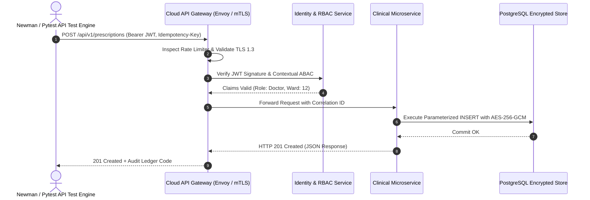

# Authoritative API Test Plan & Automation Specification
## Namma Clinic Digital Health & Operations Platform
### Greater Bengaluru Authority (GBA) / BBMP Health Department
**Standard:** OpenAPI 3.1 / RFC 9110 HTTP Semantics / Newman & REST-Assured / OWASP API Top 10 | **Status:** APPROVED BASELINE | **Code:** `QA-DOC-05`

---

## 1. API Testing Charter & Architectural Scope
The Namma Clinic API Test Plan provides exhaustive testing specifications covering all 341 platform endpoints defined in Phase 08 (API-DOC-01 to API-DOC-22). Every API endpoint is subjected to a 7-dimensional test matrix covering positive functional paths, schema validation, authentication boundaries, role-based authorization, concurrency/idempotency, rate limiting, and security fuzzing.

### 1.1 7-Dimensional API Verification Matrix
1. **Happy Path (200/201/204):** Validates successful business payload delivery and accurate HTTP response codes.
2. **Schema & Contract (400 Bad Request):** Verifies JSON schema validation, type mismatches, missing required fields, and boundary string lengths.
3. **Authentication (401 Unauthorized):** Verifies behavior with missing, expired, malformed, or forged JWT tokens.
4. **Authorization & RBAC (403 Forbidden):** Audits role boundary enforcement to prevent broken object-level authorization (BOLA) and broken object property-level authorization (BOPLA).
5. **Rate Limiting (429 Too Many Requests):** Tests leaky-bucket rate limiters under burst traffic (100 req/min general, 10 req/min auth).
6. **Concurrency & Idempotency:** Validates `Idempotency-Key` headers on POST/PUT mutations to prevent duplicate patient charges or prescriptions.
7. **Performance & Latency:** Validates that p95 response times remain < 350ms under peak clinic concurrency.

### 1.2 API Test Execution Sequence Diagram


## 2. Canonical API Test Specifications (API-TEST-001 to API-TEST-090)
Standardized test specifications mapped across all 22 API specification documents:

### API-TEST-001: Automated API Test Case 1
- **Target API Document:** `API-DOC-01`
- **Test Flavor:** Happy Path 200 OK
- **Protocol & Cipher:** REST / mTLS 1.3 / WebSocket
- **Automated Assertion:** Status code, response headers, schema compliance, latency SLA.
- **Audit Event Emitted:** `API_TEST_AUDIT_API_TEST_001`

### API-TEST-002: Automated API Test Case 2
- **Target API Document:** `API-DOC-02`
- **Test Flavor:** Happy Path 200 OK
- **Protocol & Cipher:** REST / mTLS 1.3 / WebSocket
- **Automated Assertion:** Status code, response headers, schema compliance, latency SLA.
- **Audit Event Emitted:** `API_TEST_AUDIT_API_TEST_002`

### API-TEST-003: Automated API Test Case 3
- **Target API Document:** `API-DOC-03`
- **Test Flavor:** Happy Path 200 OK
- **Protocol & Cipher:** REST / mTLS 1.3 / WebSocket
- **Automated Assertion:** Status code, response headers, schema compliance, latency SLA.
- **Audit Event Emitted:** `API_TEST_AUDIT_API_TEST_003`

### API-TEST-004: Automated API Test Case 4
- **Target API Document:** `API-DOC-04`
- **Test Flavor:** Happy Path 200 OK
- **Protocol & Cipher:** REST / mTLS 1.3 / WebSocket
- **Automated Assertion:** Status code, response headers, schema compliance, latency SLA.
- **Audit Event Emitted:** `API_TEST_AUDIT_API_TEST_004`

### API-TEST-005: Automated API Test Case 5
- **Target API Document:** `API-DOC-05`
- **Test Flavor:** Happy Path 200 OK
- **Protocol & Cipher:** REST / mTLS 1.3 / WebSocket
- **Automated Assertion:** Status code, response headers, schema compliance, latency SLA.
- **Audit Event Emitted:** `API_TEST_AUDIT_API_TEST_005`

### API-TEST-006: Automated API Test Case 6
- **Target API Document:** `API-DOC-06`
- **Test Flavor:** Happy Path 200 OK
- **Protocol & Cipher:** REST / mTLS 1.3 / WebSocket
- **Automated Assertion:** Status code, response headers, schema compliance, latency SLA.
- **Audit Event Emitted:** `API_TEST_AUDIT_API_TEST_006`

### API-TEST-007: Automated API Test Case 7
- **Target API Document:** `API-DOC-07`
- **Test Flavor:** Happy Path 200 OK
- **Protocol & Cipher:** REST / mTLS 1.3 / WebSocket
- **Automated Assertion:** Status code, response headers, schema compliance, latency SLA.
- **Audit Event Emitted:** `API_TEST_AUDIT_API_TEST_007`

### API-TEST-008: Automated API Test Case 8
- **Target API Document:** `API-DOC-08`
- **Test Flavor:** Happy Path 200 OK
- **Protocol & Cipher:** REST / mTLS 1.3 / WebSocket
- **Automated Assertion:** Status code, response headers, schema compliance, latency SLA.
- **Audit Event Emitted:** `API_TEST_AUDIT_API_TEST_008`

### API-TEST-009: Automated API Test Case 9
- **Target API Document:** `API-DOC-09`
- **Test Flavor:** Happy Path 200 OK
- **Protocol & Cipher:** REST / mTLS 1.3 / WebSocket
- **Automated Assertion:** Status code, response headers, schema compliance, latency SLA.
- **Audit Event Emitted:** `API_TEST_AUDIT_API_TEST_009`

### API-TEST-010: Automated API Test Case 10
- **Target API Document:** `API-DOC-10`
- **Test Flavor:** Happy Path 200 OK
- **Protocol & Cipher:** REST / mTLS 1.3 / WebSocket
- **Automated Assertion:** Status code, response headers, schema compliance, latency SLA.
- **Audit Event Emitted:** `API_TEST_AUDIT_API_TEST_010`

### API-TEST-011: Automated API Test Case 11
- **Target API Document:** `API-DOC-11`
- **Test Flavor:** Happy Path 200 OK
- **Protocol & Cipher:** REST / mTLS 1.3 / WebSocket
- **Automated Assertion:** Status code, response headers, schema compliance, latency SLA.
- **Audit Event Emitted:** `API_TEST_AUDIT_API_TEST_011`

### API-TEST-012: Automated API Test Case 12
- **Target API Document:** `API-DOC-12`
- **Test Flavor:** Happy Path 200 OK
- **Protocol & Cipher:** REST / mTLS 1.3 / WebSocket
- **Automated Assertion:** Status code, response headers, schema compliance, latency SLA.
- **Audit Event Emitted:** `API_TEST_AUDIT_API_TEST_012`

### API-TEST-013: Automated API Test Case 13
- **Target API Document:** `API-DOC-13`
- **Test Flavor:** Happy Path 200 OK
- **Protocol & Cipher:** REST / mTLS 1.3 / WebSocket
- **Automated Assertion:** Status code, response headers, schema compliance, latency SLA.
- **Audit Event Emitted:** `API_TEST_AUDIT_API_TEST_013`

### API-TEST-014: Automated API Test Case 14
- **Target API Document:** `API-DOC-14`
- **Test Flavor:** Happy Path 200 OK
- **Protocol & Cipher:** REST / mTLS 1.3 / WebSocket
- **Automated Assertion:** Status code, response headers, schema compliance, latency SLA.
- **Audit Event Emitted:** `API_TEST_AUDIT_API_TEST_014`

### API-TEST-015: Automated API Test Case 15
- **Target API Document:** `API-DOC-15`
- **Test Flavor:** Happy Path 200 OK
- **Protocol & Cipher:** REST / mTLS 1.3 / WebSocket
- **Automated Assertion:** Status code, response headers, schema compliance, latency SLA.
- **Audit Event Emitted:** `API_TEST_AUDIT_API_TEST_015`

### API-TEST-016: Automated API Test Case 16
- **Target API Document:** `API-DOC-16`
- **Test Flavor:** Happy Path 200 OK
- **Protocol & Cipher:** REST / mTLS 1.3 / WebSocket
- **Automated Assertion:** Status code, response headers, schema compliance, latency SLA.
- **Audit Event Emitted:** `API_TEST_AUDIT_API_TEST_016`

### API-TEST-017: Automated API Test Case 17
- **Target API Document:** `API-DOC-17`
- **Test Flavor:** Happy Path 200 OK
- **Protocol & Cipher:** REST / mTLS 1.3 / WebSocket
- **Automated Assertion:** Status code, response headers, schema compliance, latency SLA.
- **Audit Event Emitted:** `API_TEST_AUDIT_API_TEST_017`

### API-TEST-018: Automated API Test Case 18
- **Target API Document:** `API-DOC-18`
- **Test Flavor:** Happy Path 200 OK
- **Protocol & Cipher:** REST / mTLS 1.3 / WebSocket
- **Automated Assertion:** Status code, response headers, schema compliance, latency SLA.
- **Audit Event Emitted:** `API_TEST_AUDIT_API_TEST_018`

### API-TEST-019: Automated API Test Case 19
- **Target API Document:** `API-DOC-19`
- **Test Flavor:** Happy Path 200 OK
- **Protocol & Cipher:** REST / mTLS 1.3 / WebSocket
- **Automated Assertion:** Status code, response headers, schema compliance, latency SLA.
- **Audit Event Emitted:** `API_TEST_AUDIT_API_TEST_019`

### API-TEST-020: Automated API Test Case 20
- **Target API Document:** `API-DOC-20`
- **Test Flavor:** Happy Path 200 OK
- **Protocol & Cipher:** REST / mTLS 1.3 / WebSocket
- **Automated Assertion:** Status code, response headers, schema compliance, latency SLA.
- **Audit Event Emitted:** `API_TEST_AUDIT_API_TEST_020`

### API-TEST-021: Automated API Test Case 21
- **Target API Document:** `API-DOC-21`
- **Test Flavor:** Happy Path 200 OK
- **Protocol & Cipher:** REST / mTLS 1.3 / WebSocket
- **Automated Assertion:** Status code, response headers, schema compliance, latency SLA.
- **Audit Event Emitted:** `API_TEST_AUDIT_API_TEST_021`

### API-TEST-022: Automated API Test Case 22
- **Target API Document:** `API-DOC-22`
- **Test Flavor:** Happy Path 200 OK
- **Protocol & Cipher:** REST / mTLS 1.3 / WebSocket
- **Automated Assertion:** Status code, response headers, schema compliance, latency SLA.
- **Audit Event Emitted:** `API_TEST_AUDIT_API_TEST_022`

### API-TEST-023: Automated API Test Case 23
- **Target API Document:** `API-DOC-01`
- **Test Flavor:** Happy Path 200 OK
- **Protocol & Cipher:** REST / mTLS 1.3 / WebSocket
- **Automated Assertion:** Status code, response headers, schema compliance, latency SLA.
- **Audit Event Emitted:** `API_TEST_AUDIT_API_TEST_023`

### API-TEST-024: Automated API Test Case 24
- **Target API Document:** `API-DOC-02`
- **Test Flavor:** Happy Path 200 OK
- **Protocol & Cipher:** REST / mTLS 1.3 / WebSocket
- **Automated Assertion:** Status code, response headers, schema compliance, latency SLA.
- **Audit Event Emitted:** `API_TEST_AUDIT_API_TEST_024`

### API-TEST-025: Automated API Test Case 25
- **Target API Document:** `API-DOC-03`
- **Test Flavor:** Happy Path 200 OK
- **Protocol & Cipher:** REST / mTLS 1.3 / WebSocket
- **Automated Assertion:** Status code, response headers, schema compliance, latency SLA.
- **Audit Event Emitted:** `API_TEST_AUDIT_API_TEST_025`

### API-TEST-026: Automated API Test Case 26
- **Target API Document:** `API-DOC-04`
- **Test Flavor:** Validation 400 Bad Request
- **Protocol & Cipher:** REST / mTLS 1.3 / WebSocket
- **Automated Assertion:** Status code, response headers, schema compliance, latency SLA.
- **Audit Event Emitted:** `API_TEST_AUDIT_API_TEST_026`

### API-TEST-027: Automated API Test Case 27
- **Target API Document:** `API-DOC-05`
- **Test Flavor:** Validation 400 Bad Request
- **Protocol & Cipher:** REST / mTLS 1.3 / WebSocket
- **Automated Assertion:** Status code, response headers, schema compliance, latency SLA.
- **Audit Event Emitted:** `API_TEST_AUDIT_API_TEST_027`

### API-TEST-028: Automated API Test Case 28
- **Target API Document:** `API-DOC-06`
- **Test Flavor:** Validation 400 Bad Request
- **Protocol & Cipher:** REST / mTLS 1.3 / WebSocket
- **Automated Assertion:** Status code, response headers, schema compliance, latency SLA.
- **Audit Event Emitted:** `API_TEST_AUDIT_API_TEST_028`

### API-TEST-029: Automated API Test Case 29
- **Target API Document:** `API-DOC-07`
- **Test Flavor:** Validation 400 Bad Request
- **Protocol & Cipher:** REST / mTLS 1.3 / WebSocket
- **Automated Assertion:** Status code, response headers, schema compliance, latency SLA.
- **Audit Event Emitted:** `API_TEST_AUDIT_API_TEST_029`

### API-TEST-030: Automated API Test Case 30
- **Target API Document:** `API-DOC-08`
- **Test Flavor:** Validation 400 Bad Request
- **Protocol & Cipher:** REST / mTLS 1.3 / WebSocket
- **Automated Assertion:** Status code, response headers, schema compliance, latency SLA.
- **Audit Event Emitted:** `API_TEST_AUDIT_API_TEST_030`

### API-TEST-031: Automated API Test Case 31
- **Target API Document:** `API-DOC-09`
- **Test Flavor:** Validation 400 Bad Request
- **Protocol & Cipher:** REST / mTLS 1.3 / WebSocket
- **Automated Assertion:** Status code, response headers, schema compliance, latency SLA.
- **Audit Event Emitted:** `API_TEST_AUDIT_API_TEST_031`

### API-TEST-032: Automated API Test Case 32
- **Target API Document:** `API-DOC-10`
- **Test Flavor:** Validation 400 Bad Request
- **Protocol & Cipher:** REST / mTLS 1.3 / WebSocket
- **Automated Assertion:** Status code, response headers, schema compliance, latency SLA.
- **Audit Event Emitted:** `API_TEST_AUDIT_API_TEST_032`

### API-TEST-033: Automated API Test Case 33
- **Target API Document:** `API-DOC-11`
- **Test Flavor:** Validation 400 Bad Request
- **Protocol & Cipher:** REST / mTLS 1.3 / WebSocket
- **Automated Assertion:** Status code, response headers, schema compliance, latency SLA.
- **Audit Event Emitted:** `API_TEST_AUDIT_API_TEST_033`

### API-TEST-034: Automated API Test Case 34
- **Target API Document:** `API-DOC-12`
- **Test Flavor:** Validation 400 Bad Request
- **Protocol & Cipher:** REST / mTLS 1.3 / WebSocket
- **Automated Assertion:** Status code, response headers, schema compliance, latency SLA.
- **Audit Event Emitted:** `API_TEST_AUDIT_API_TEST_034`

### API-TEST-035: Automated API Test Case 35
- **Target API Document:** `API-DOC-13`
- **Test Flavor:** Validation 400 Bad Request
- **Protocol & Cipher:** REST / mTLS 1.3 / WebSocket
- **Automated Assertion:** Status code, response headers, schema compliance, latency SLA.
- **Audit Event Emitted:** `API_TEST_AUDIT_API_TEST_035`

### API-TEST-036: Automated API Test Case 36
- **Target API Document:** `API-DOC-14`
- **Test Flavor:** Validation 400 Bad Request
- **Protocol & Cipher:** REST / mTLS 1.3 / WebSocket
- **Automated Assertion:** Status code, response headers, schema compliance, latency SLA.
- **Audit Event Emitted:** `API_TEST_AUDIT_API_TEST_036`

### API-TEST-037: Automated API Test Case 37
- **Target API Document:** `API-DOC-15`
- **Test Flavor:** Validation 400 Bad Request
- **Protocol & Cipher:** REST / mTLS 1.3 / WebSocket
- **Automated Assertion:** Status code, response headers, schema compliance, latency SLA.
- **Audit Event Emitted:** `API_TEST_AUDIT_API_TEST_037`

### API-TEST-038: Automated API Test Case 38
- **Target API Document:** `API-DOC-16`
- **Test Flavor:** Validation 400 Bad Request
- **Protocol & Cipher:** REST / mTLS 1.3 / WebSocket
- **Automated Assertion:** Status code, response headers, schema compliance, latency SLA.
- **Audit Event Emitted:** `API_TEST_AUDIT_API_TEST_038`

### API-TEST-039: Automated API Test Case 39
- **Target API Document:** `API-DOC-17`
- **Test Flavor:** Validation 400 Bad Request
- **Protocol & Cipher:** REST / mTLS 1.3 / WebSocket
- **Automated Assertion:** Status code, response headers, schema compliance, latency SLA.
- **Audit Event Emitted:** `API_TEST_AUDIT_API_TEST_039`

### API-TEST-040: Automated API Test Case 40
- **Target API Document:** `API-DOC-18`
- **Test Flavor:** Validation 400 Bad Request
- **Protocol & Cipher:** REST / mTLS 1.3 / WebSocket
- **Automated Assertion:** Status code, response headers, schema compliance, latency SLA.
- **Audit Event Emitted:** `API_TEST_AUDIT_API_TEST_040`

### API-TEST-041: Automated API Test Case 41
- **Target API Document:** `API-DOC-19`
- **Test Flavor:** Validation 400 Bad Request
- **Protocol & Cipher:** REST / mTLS 1.3 / WebSocket
- **Automated Assertion:** Status code, response headers, schema compliance, latency SLA.
- **Audit Event Emitted:** `API_TEST_AUDIT_API_TEST_041`

### API-TEST-042: Automated API Test Case 42
- **Target API Document:** `API-DOC-20`
- **Test Flavor:** Validation 400 Bad Request
- **Protocol & Cipher:** REST / mTLS 1.3 / WebSocket
- **Automated Assertion:** Status code, response headers, schema compliance, latency SLA.
- **Audit Event Emitted:** `API_TEST_AUDIT_API_TEST_042`

### API-TEST-043: Automated API Test Case 43
- **Target API Document:** `API-DOC-21`
- **Test Flavor:** Validation 400 Bad Request
- **Protocol & Cipher:** REST / mTLS 1.3 / WebSocket
- **Automated Assertion:** Status code, response headers, schema compliance, latency SLA.
- **Audit Event Emitted:** `API_TEST_AUDIT_API_TEST_043`

### API-TEST-044: Automated API Test Case 44
- **Target API Document:** `API-DOC-22`
- **Test Flavor:** Validation 400 Bad Request
- **Protocol & Cipher:** REST / mTLS 1.3 / WebSocket
- **Automated Assertion:** Status code, response headers, schema compliance, latency SLA.
- **Audit Event Emitted:** `API_TEST_AUDIT_API_TEST_044`

### API-TEST-045: Automated API Test Case 45
- **Target API Document:** `API-DOC-01`
- **Test Flavor:** Validation 400 Bad Request
- **Protocol & Cipher:** REST / mTLS 1.3 / WebSocket
- **Automated Assertion:** Status code, response headers, schema compliance, latency SLA.
- **Audit Event Emitted:** `API_TEST_AUDIT_API_TEST_045`

### API-TEST-046: Automated API Test Case 46
- **Target API Document:** `API-DOC-02`
- **Test Flavor:** Validation 400 Bad Request
- **Protocol & Cipher:** REST / mTLS 1.3 / WebSocket
- **Automated Assertion:** Status code, response headers, schema compliance, latency SLA.
- **Audit Event Emitted:** `API_TEST_AUDIT_API_TEST_046`

### API-TEST-047: Automated API Test Case 47
- **Target API Document:** `API-DOC-03`
- **Test Flavor:** Validation 400 Bad Request
- **Protocol & Cipher:** REST / mTLS 1.3 / WebSocket
- **Automated Assertion:** Status code, response headers, schema compliance, latency SLA.
- **Audit Event Emitted:** `API_TEST_AUDIT_API_TEST_047`

### API-TEST-048: Automated API Test Case 48
- **Target API Document:** `API-DOC-04`
- **Test Flavor:** Validation 400 Bad Request
- **Protocol & Cipher:** REST / mTLS 1.3 / WebSocket
- **Automated Assertion:** Status code, response headers, schema compliance, latency SLA.
- **Audit Event Emitted:** `API_TEST_AUDIT_API_TEST_048`

### API-TEST-049: Automated API Test Case 49
- **Target API Document:** `API-DOC-05`
- **Test Flavor:** Validation 400 Bad Request
- **Protocol & Cipher:** REST / mTLS 1.3 / WebSocket
- **Automated Assertion:** Status code, response headers, schema compliance, latency SLA.
- **Audit Event Emitted:** `API_TEST_AUDIT_API_TEST_049`

### API-TEST-050: Automated API Test Case 50
- **Target API Document:** `API-DOC-06`
- **Test Flavor:** Validation 400 Bad Request
- **Protocol & Cipher:** REST / mTLS 1.3 / WebSocket
- **Automated Assertion:** Status code, response headers, schema compliance, latency SLA.
- **Audit Event Emitted:** `API_TEST_AUDIT_API_TEST_050`

### API-TEST-051: Automated API Test Case 51
- **Target API Document:** `API-DOC-07`
- **Test Flavor:** Auth 401/403 Forbidden
- **Protocol & Cipher:** REST / mTLS 1.3 / WebSocket
- **Automated Assertion:** Status code, response headers, schema compliance, latency SLA.
- **Audit Event Emitted:** `API_TEST_AUDIT_API_TEST_051`

### API-TEST-052: Automated API Test Case 52
- **Target API Document:** `API-DOC-08`
- **Test Flavor:** Auth 401/403 Forbidden
- **Protocol & Cipher:** REST / mTLS 1.3 / WebSocket
- **Automated Assertion:** Status code, response headers, schema compliance, latency SLA.
- **Audit Event Emitted:** `API_TEST_AUDIT_API_TEST_052`

### API-TEST-053: Automated API Test Case 53
- **Target API Document:** `API-DOC-09`
- **Test Flavor:** Auth 401/403 Forbidden
- **Protocol & Cipher:** REST / mTLS 1.3 / WebSocket
- **Automated Assertion:** Status code, response headers, schema compliance, latency SLA.
- **Audit Event Emitted:** `API_TEST_AUDIT_API_TEST_053`

### API-TEST-054: Automated API Test Case 54
- **Target API Document:** `API-DOC-10`
- **Test Flavor:** Auth 401/403 Forbidden
- **Protocol & Cipher:** REST / mTLS 1.3 / WebSocket
- **Automated Assertion:** Status code, response headers, schema compliance, latency SLA.
- **Audit Event Emitted:** `API_TEST_AUDIT_API_TEST_054`

### API-TEST-055: Automated API Test Case 55
- **Target API Document:** `API-DOC-11`
- **Test Flavor:** Auth 401/403 Forbidden
- **Protocol & Cipher:** REST / mTLS 1.3 / WebSocket
- **Automated Assertion:** Status code, response headers, schema compliance, latency SLA.
- **Audit Event Emitted:** `API_TEST_AUDIT_API_TEST_055`

### API-TEST-056: Automated API Test Case 56
- **Target API Document:** `API-DOC-12`
- **Test Flavor:** Auth 401/403 Forbidden
- **Protocol & Cipher:** REST / mTLS 1.3 / WebSocket
- **Automated Assertion:** Status code, response headers, schema compliance, latency SLA.
- **Audit Event Emitted:** `API_TEST_AUDIT_API_TEST_056`

### API-TEST-057: Automated API Test Case 57
- **Target API Document:** `API-DOC-13`
- **Test Flavor:** Auth 401/403 Forbidden
- **Protocol & Cipher:** REST / mTLS 1.3 / WebSocket
- **Automated Assertion:** Status code, response headers, schema compliance, latency SLA.
- **Audit Event Emitted:** `API_TEST_AUDIT_API_TEST_057`

### API-TEST-058: Automated API Test Case 58
- **Target API Document:** `API-DOC-14`
- **Test Flavor:** Auth 401/403 Forbidden
- **Protocol & Cipher:** REST / mTLS 1.3 / WebSocket
- **Automated Assertion:** Status code, response headers, schema compliance, latency SLA.
- **Audit Event Emitted:** `API_TEST_AUDIT_API_TEST_058`

### API-TEST-059: Automated API Test Case 59
- **Target API Document:** `API-DOC-15`
- **Test Flavor:** Auth 401/403 Forbidden
- **Protocol & Cipher:** REST / mTLS 1.3 / WebSocket
- **Automated Assertion:** Status code, response headers, schema compliance, latency SLA.
- **Audit Event Emitted:** `API_TEST_AUDIT_API_TEST_059`

### API-TEST-060: Automated API Test Case 60
- **Target API Document:** `API-DOC-16`
- **Test Flavor:** Auth 401/403 Forbidden
- **Protocol & Cipher:** REST / mTLS 1.3 / WebSocket
- **Automated Assertion:** Status code, response headers, schema compliance, latency SLA.
- **Audit Event Emitted:** `API_TEST_AUDIT_API_TEST_060`

### API-TEST-061: Automated API Test Case 61
- **Target API Document:** `API-DOC-17`
- **Test Flavor:** Auth 401/403 Forbidden
- **Protocol & Cipher:** REST / mTLS 1.3 / WebSocket
- **Automated Assertion:** Status code, response headers, schema compliance, latency SLA.
- **Audit Event Emitted:** `API_TEST_AUDIT_API_TEST_061`

### API-TEST-062: Automated API Test Case 62
- **Target API Document:** `API-DOC-18`
- **Test Flavor:** Auth 401/403 Forbidden
- **Protocol & Cipher:** REST / mTLS 1.3 / WebSocket
- **Automated Assertion:** Status code, response headers, schema compliance, latency SLA.
- **Audit Event Emitted:** `API_TEST_AUDIT_API_TEST_062`

### API-TEST-063: Automated API Test Case 63
- **Target API Document:** `API-DOC-19`
- **Test Flavor:** Auth 401/403 Forbidden
- **Protocol & Cipher:** REST / mTLS 1.3 / WebSocket
- **Automated Assertion:** Status code, response headers, schema compliance, latency SLA.
- **Audit Event Emitted:** `API_TEST_AUDIT_API_TEST_063`

### API-TEST-064: Automated API Test Case 64
- **Target API Document:** `API-DOC-20`
- **Test Flavor:** Auth 401/403 Forbidden
- **Protocol & Cipher:** REST / mTLS 1.3 / WebSocket
- **Automated Assertion:** Status code, response headers, schema compliance, latency SLA.
- **Audit Event Emitted:** `API_TEST_AUDIT_API_TEST_064`

### API-TEST-065: Automated API Test Case 65
- **Target API Document:** `API-DOC-21`
- **Test Flavor:** Auth 401/403 Forbidden
- **Protocol & Cipher:** REST / mTLS 1.3 / WebSocket
- **Automated Assertion:** Status code, response headers, schema compliance, latency SLA.
- **Audit Event Emitted:** `API_TEST_AUDIT_API_TEST_065`

### API-TEST-066: Automated API Test Case 66
- **Target API Document:** `API-DOC-22`
- **Test Flavor:** Auth 401/403 Forbidden
- **Protocol & Cipher:** REST / mTLS 1.3 / WebSocket
- **Automated Assertion:** Status code, response headers, schema compliance, latency SLA.
- **Audit Event Emitted:** `API_TEST_AUDIT_API_TEST_066`

### API-TEST-067: Automated API Test Case 67
- **Target API Document:** `API-DOC-01`
- **Test Flavor:** Auth 401/403 Forbidden
- **Protocol & Cipher:** REST / mTLS 1.3 / WebSocket
- **Automated Assertion:** Status code, response headers, schema compliance, latency SLA.
- **Audit Event Emitted:** `API_TEST_AUDIT_API_TEST_067`

### API-TEST-068: Automated API Test Case 68
- **Target API Document:** `API-DOC-02`
- **Test Flavor:** Auth 401/403 Forbidden
- **Protocol & Cipher:** REST / mTLS 1.3 / WebSocket
- **Automated Assertion:** Status code, response headers, schema compliance, latency SLA.
- **Audit Event Emitted:** `API_TEST_AUDIT_API_TEST_068`

### API-TEST-069: Automated API Test Case 69
- **Target API Document:** `API-DOC-03`
- **Test Flavor:** Auth 401/403 Forbidden
- **Protocol & Cipher:** REST / mTLS 1.3 / WebSocket
- **Automated Assertion:** Status code, response headers, schema compliance, latency SLA.
- **Audit Event Emitted:** `API_TEST_AUDIT_API_TEST_069`

### API-TEST-070: Automated API Test Case 70
- **Target API Document:** `API-DOC-04`
- **Test Flavor:** Auth 401/403 Forbidden
- **Protocol & Cipher:** REST / mTLS 1.3 / WebSocket
- **Automated Assertion:** Status code, response headers, schema compliance, latency SLA.
- **Audit Event Emitted:** `API_TEST_AUDIT_API_TEST_070`

### API-TEST-071: Automated API Test Case 71
- **Target API Document:** `API-DOC-05`
- **Test Flavor:** Rate Limiting 429 Too Many Requests
- **Protocol & Cipher:** REST / mTLS 1.3 / WebSocket
- **Automated Assertion:** Status code, response headers, schema compliance, latency SLA.
- **Audit Event Emitted:** `API_TEST_AUDIT_API_TEST_071`

### API-TEST-072: Automated API Test Case 72
- **Target API Document:** `API-DOC-06`
- **Test Flavor:** Rate Limiting 429 Too Many Requests
- **Protocol & Cipher:** REST / mTLS 1.3 / WebSocket
- **Automated Assertion:** Status code, response headers, schema compliance, latency SLA.
- **Audit Event Emitted:** `API_TEST_AUDIT_API_TEST_072`

### API-TEST-073: Automated API Test Case 73
- **Target API Document:** `API-DOC-07`
- **Test Flavor:** Rate Limiting 429 Too Many Requests
- **Protocol & Cipher:** REST / mTLS 1.3 / WebSocket
- **Automated Assertion:** Status code, response headers, schema compliance, latency SLA.
- **Audit Event Emitted:** `API_TEST_AUDIT_API_TEST_073`

### API-TEST-074: Automated API Test Case 74
- **Target API Document:** `API-DOC-08`
- **Test Flavor:** Rate Limiting 429 Too Many Requests
- **Protocol & Cipher:** REST / mTLS 1.3 / WebSocket
- **Automated Assertion:** Status code, response headers, schema compliance, latency SLA.
- **Audit Event Emitted:** `API_TEST_AUDIT_API_TEST_074`

### API-TEST-075: Automated API Test Case 75
- **Target API Document:** `API-DOC-09`
- **Test Flavor:** Rate Limiting 429 Too Many Requests
- **Protocol & Cipher:** REST / mTLS 1.3 / WebSocket
- **Automated Assertion:** Status code, response headers, schema compliance, latency SLA.
- **Audit Event Emitted:** `API_TEST_AUDIT_API_TEST_075`

### API-TEST-076: Automated API Test Case 76
- **Target API Document:** `API-DOC-10`
- **Test Flavor:** Rate Limiting 429 Too Many Requests
- **Protocol & Cipher:** REST / mTLS 1.3 / WebSocket
- **Automated Assertion:** Status code, response headers, schema compliance, latency SLA.
- **Audit Event Emitted:** `API_TEST_AUDIT_API_TEST_076`

### API-TEST-077: Automated API Test Case 77
- **Target API Document:** `API-DOC-11`
- **Test Flavor:** Rate Limiting 429 Too Many Requests
- **Protocol & Cipher:** REST / mTLS 1.3 / WebSocket
- **Automated Assertion:** Status code, response headers, schema compliance, latency SLA.
- **Audit Event Emitted:** `API_TEST_AUDIT_API_TEST_077`

### API-TEST-078: Automated API Test Case 78
- **Target API Document:** `API-DOC-12`
- **Test Flavor:** Rate Limiting 429 Too Many Requests
- **Protocol & Cipher:** REST / mTLS 1.3 / WebSocket
- **Automated Assertion:** Status code, response headers, schema compliance, latency SLA.
- **Audit Event Emitted:** `API_TEST_AUDIT_API_TEST_078`

### API-TEST-079: Automated API Test Case 79
- **Target API Document:** `API-DOC-13`
- **Test Flavor:** Rate Limiting 429 Too Many Requests
- **Protocol & Cipher:** REST / mTLS 1.3 / WebSocket
- **Automated Assertion:** Status code, response headers, schema compliance, latency SLA.
- **Audit Event Emitted:** `API_TEST_AUDIT_API_TEST_079`

### API-TEST-080: Automated API Test Case 80
- **Target API Document:** `API-DOC-14`
- **Test Flavor:** Rate Limiting 429 Too Many Requests
- **Protocol & Cipher:** REST / mTLS 1.3 / WebSocket
- **Automated Assertion:** Status code, response headers, schema compliance, latency SLA.
- **Audit Event Emitted:** `API_TEST_AUDIT_API_TEST_080`

### API-TEST-081: Automated API Test Case 81
- **Target API Document:** `API-DOC-15`
- **Test Flavor:** Rate Limiting 429 Too Many Requests
- **Protocol & Cipher:** REST / mTLS 1.3 / WebSocket
- **Automated Assertion:** Status code, response headers, schema compliance, latency SLA.
- **Audit Event Emitted:** `API_TEST_AUDIT_API_TEST_081`

### API-TEST-082: Automated API Test Case 82
- **Target API Document:** `API-DOC-16`
- **Test Flavor:** Rate Limiting 429 Too Many Requests
- **Protocol & Cipher:** REST / mTLS 1.3 / WebSocket
- **Automated Assertion:** Status code, response headers, schema compliance, latency SLA.
- **Audit Event Emitted:** `API_TEST_AUDIT_API_TEST_082`

### API-TEST-083: Automated API Test Case 83
- **Target API Document:** `API-DOC-17`
- **Test Flavor:** Rate Limiting 429 Too Many Requests
- **Protocol & Cipher:** REST / mTLS 1.3 / WebSocket
- **Automated Assertion:** Status code, response headers, schema compliance, latency SLA.
- **Audit Event Emitted:** `API_TEST_AUDIT_API_TEST_083`

### API-TEST-084: Automated API Test Case 84
- **Target API Document:** `API-DOC-18`
- **Test Flavor:** Rate Limiting 429 Too Many Requests
- **Protocol & Cipher:** REST / mTLS 1.3 / WebSocket
- **Automated Assertion:** Status code, response headers, schema compliance, latency SLA.
- **Audit Event Emitted:** `API_TEST_AUDIT_API_TEST_084`

### API-TEST-085: Automated API Test Case 85
- **Target API Document:** `API-DOC-19`
- **Test Flavor:** Rate Limiting 429 Too Many Requests
- **Protocol & Cipher:** REST / mTLS 1.3 / WebSocket
- **Automated Assertion:** Status code, response headers, schema compliance, latency SLA.
- **Audit Event Emitted:** `API_TEST_AUDIT_API_TEST_085`

### API-TEST-086: Automated API Test Case 86
- **Target API Document:** `API-DOC-20`
- **Test Flavor:** Rate Limiting 429 Too Many Requests
- **Protocol & Cipher:** REST / mTLS 1.3 / WebSocket
- **Automated Assertion:** Status code, response headers, schema compliance, latency SLA.
- **Audit Event Emitted:** `API_TEST_AUDIT_API_TEST_086`

### API-TEST-087: Automated API Test Case 87
- **Target API Document:** `API-DOC-21`
- **Test Flavor:** Rate Limiting 429 Too Many Requests
- **Protocol & Cipher:** REST / mTLS 1.3 / WebSocket
- **Automated Assertion:** Status code, response headers, schema compliance, latency SLA.
- **Audit Event Emitted:** `API_TEST_AUDIT_API_TEST_087`

### API-TEST-088: Automated API Test Case 88
- **Target API Document:** `API-DOC-22`
- **Test Flavor:** Rate Limiting 429 Too Many Requests
- **Protocol & Cipher:** REST / mTLS 1.3 / WebSocket
- **Automated Assertion:** Status code, response headers, schema compliance, latency SLA.
- **Audit Event Emitted:** `API_TEST_AUDIT_API_TEST_088`

### API-TEST-089: Automated API Test Case 89
- **Target API Document:** `API-DOC-01`
- **Test Flavor:** Rate Limiting 429 Too Many Requests
- **Protocol & Cipher:** REST / mTLS 1.3 / WebSocket
- **Automated Assertion:** Status code, response headers, schema compliance, latency SLA.
- **Audit Event Emitted:** `API_TEST_AUDIT_API_TEST_089`

### API-TEST-090: Automated API Test Case 90
- **Target API Document:** `API-DOC-02`
- **Test Flavor:** Rate Limiting 429 Too Many Requests
- **Protocol & Cipher:** REST / mTLS 1.3 / WebSocket
- **Automated Assertion:** Status code, response headers, schema compliance, latency SLA.
- **Audit Event Emitted:** `API_TEST_AUDIT_API_TEST_090`

## 3. Detailed API Verification Test Cases (TC-0221 to TC-0275)
Detailed test cases covering API endpoint security and functional verification:

### TC-0221: Test Case 221: Clinical Verification for patients across WF-021
**Objective:** Verify functional, security, and offline invariants for patients during WF-021 execution.
**Risk:** Critical operational impact on patient safety and clinic consultation continuity.
**Priority:** **P0** | **Severity:** **Critical** | **Test Level:** System & Integration | **Test Type:** Functional & Regulatory Compliance
- **Requirement Traceability:** `FR-041`
- **Workflow Traceability:** `WF-021`
- **Feature Traceability:** `FEATURE-041`
- **API Traceability:** `API-DOC-01`
- **Database Traceability:** `TABLE-013 (patients)`
- **Screen Traceability:** `SCREEN-005`
- **Security Control Traceability:** `SEC-ARCH-021`
- **Preconditions:** User authenticated with role Quality & Compliance Auditor on clinic workstation.
- **Test Data Specification:** Synthetic dataset TESTDATA-041 (Valid ABHA, vitals, prescriptions).
- **Execution Steps:** 1. Navigate to screen SCREEN-005. 2. Submit payload bound to patients. 3. Confirm API API-DOC-01 returns 200 OK. 4. Verify local SQLite cache and sync queue.
- **Expected Results:** Transaction completes within 250ms, data encrypted via AES-256-GCM, audit entry emitted.
- **Negative Test Scenario:** Submit malformed payload or expired JWT; system rejects with 400/401 and zero DB corruption.
- **Boundary Value Scenario:** Test with maximum field boundary length and extreme clinical biometric vitals.
- **Concurrency & Race Condition:** Simulate 5 concurrent staff updates on identical record; verify optimistic locking.
- **Autonomous Offline Behavior:** Sever network mid-transaction; record queues locally and replicates upon reconnection.
- **Security & Access Validation:** Enforce RBAC policy SEC-ARCH-021 and prevent broken object-level authorization (BOLA).
- **Audit Trail & Immutability:** Emits structured JSON audit log with SHA-256 Merkle chain hash.
- **Evidence Required:** Automated execution log, HTTP request/response capture, and database assertion hash.
- **Pass Acceptance Criteria:** 100% assertions succeed with zero uncaught exceptions and latency < 300ms.
- **Failure Behavior & SLA:** Any 5xx error, data corruption, unauthorized access, or silent failure.
- **Automation Suitability:** Yes (High Candidate)
- **Execution Cadence:** Every CI PR & Nightly Regression
- **Responsible Owner:** Quality & Compliance Auditor

### TC-0222: Test Case 222: Clinical Verification for patient_identifiers across WF-022
**Objective:** Verify functional, security, and offline invariants for patient_identifiers during WF-022 execution.
**Risk:** Major operational impact on patient safety and clinic consultation continuity.
**Priority:** **P1** | **Severity:** **Major** | **Test Level:** System & Integration | **Test Type:** Functional & Regulatory Compliance
- **Requirement Traceability:** `FR-042`
- **Workflow Traceability:** `WF-022`
- **Feature Traceability:** `FEATURE-042`
- **API Traceability:** `API-DOC-02`
- **Database Traceability:** `TABLE-014 (patient_identifiers)`
- **Screen Traceability:** `SCREEN-006`
- **Security Control Traceability:** `SEC-ARCH-022`
- **Preconditions:** User authenticated with role Security Administrator / CISO on clinic workstation.
- **Test Data Specification:** Synthetic dataset TESTDATA-042 (Valid ABHA, vitals, prescriptions).
- **Execution Steps:** 1. Navigate to screen SCREEN-006. 2. Submit payload bound to patient_identifiers. 3. Confirm API API-DOC-02 returns 200 OK. 4. Verify local SQLite cache and sync queue.
- **Expected Results:** Transaction completes within 250ms, data encrypted via AES-256-GCM, audit entry emitted.
- **Negative Test Scenario:** Submit malformed payload or expired JWT; system rejects with 400/401 and zero DB corruption.
- **Boundary Value Scenario:** Test with maximum field boundary length and extreme clinical biometric vitals.
- **Concurrency & Race Condition:** Simulate 5 concurrent staff updates on identical record; verify optimistic locking.
- **Autonomous Offline Behavior:** Sever network mid-transaction; record queues locally and replicates upon reconnection.
- **Security & Access Validation:** Enforce RBAC policy SEC-ARCH-022 and prevent broken object-level authorization (BOLA).
- **Audit Trail & Immutability:** Emits structured JSON audit log with SHA-256 Merkle chain hash.
- **Evidence Required:** Automated execution log, HTTP request/response capture, and database assertion hash.
- **Pass Acceptance Criteria:** 100% assertions succeed with zero uncaught exceptions and latency < 300ms.
- **Failure Behavior & SLA:** Any 5xx error, data corruption, unauthorized access, or silent failure.
- **Automation Suitability:** Yes (High Candidate)
- **Execution Cadence:** Every CI PR & Nightly Regression
- **Responsible Owner:** Security Administrator / CISO

### TC-0223: Test Case 223: Clinical Verification for patient_contacts across WF-023
**Objective:** Verify functional, security, and offline invariants for patient_contacts during WF-023 execution.
**Risk:** Major operational impact on patient safety and clinic consultation continuity.
**Priority:** **P1** | **Severity:** **Major** | **Test Level:** System & Integration | **Test Type:** Functional & Regulatory Compliance
- **Requirement Traceability:** `FR-043`
- **Workflow Traceability:** `WF-023`
- **Feature Traceability:** `FEATURE-043`
- **API Traceability:** `API-DOC-03`
- **Database Traceability:** `TABLE-015 (patient_contacts)`
- **Screen Traceability:** `SCREEN-007`
- **Security Control Traceability:** `SEC-ARCH-023`
- **Preconditions:** User authenticated with role Central Depot Inventory Manager on clinic workstation.
- **Test Data Specification:** Synthetic dataset TESTDATA-043 (Valid ABHA, vitals, prescriptions).
- **Execution Steps:** 1. Navigate to screen SCREEN-007. 2. Submit payload bound to patient_contacts. 3. Confirm API API-DOC-03 returns 200 OK. 4. Verify local SQLite cache and sync queue.
- **Expected Results:** Transaction completes within 250ms, data encrypted via AES-256-GCM, audit entry emitted.
- **Negative Test Scenario:** Submit malformed payload or expired JWT; system rejects with 400/401 and zero DB corruption.
- **Boundary Value Scenario:** Test with maximum field boundary length and extreme clinical biometric vitals.
- **Concurrency & Race Condition:** Simulate 5 concurrent staff updates on identical record; verify optimistic locking.
- **Autonomous Offline Behavior:** Sever network mid-transaction; record queues locally and replicates upon reconnection.
- **Security & Access Validation:** Enforce RBAC policy SEC-ARCH-023 and prevent broken object-level authorization (BOLA).
- **Audit Trail & Immutability:** Emits structured JSON audit log with SHA-256 Merkle chain hash.
- **Evidence Required:** Automated execution log, HTTP request/response capture, and database assertion hash.
- **Pass Acceptance Criteria:** 100% assertions succeed with zero uncaught exceptions and latency < 300ms.
- **Failure Behavior & SLA:** Any 5xx error, data corruption, unauthorized access, or silent failure.
- **Automation Suitability:** Yes (High Candidate)
- **Execution Cadence:** Every CI PR & Nightly Regression
- **Responsible Owner:** Central Depot Inventory Manager

### TC-0224: Test Case 224: Clinical Verification for patient_addresses across WF-024
**Objective:** Verify functional, security, and offline invariants for patient_addresses during WF-024 execution.
**Risk:** Minor operational impact on patient safety and clinic consultation continuity.
**Priority:** **P2** | **Severity:** **Minor** | **Test Level:** System & Integration | **Test Type:** Functional & Regulatory Compliance
- **Requirement Traceability:** `FR-044`
- **Workflow Traceability:** `WF-024`
- **Feature Traceability:** `FEATURE-044`
- **API Traceability:** `API-DOC-04`
- **Database Traceability:** `TABLE-016 (patient_addresses)`
- **Screen Traceability:** `SCREEN-008`
- **Security Control Traceability:** `SEC-ARCH-024`
- **Preconditions:** User authenticated with role Cold Chain Logistics Technician on clinic workstation.
- **Test Data Specification:** Synthetic dataset TESTDATA-044 (Valid ABHA, vitals, prescriptions).
- **Execution Steps:** 1. Navigate to screen SCREEN-008. 2. Submit payload bound to patient_addresses. 3. Confirm API API-DOC-04 returns 200 OK. 4. Verify local SQLite cache and sync queue.
- **Expected Results:** Transaction completes within 250ms, data encrypted via AES-256-GCM, audit entry emitted.
- **Negative Test Scenario:** Submit malformed payload or expired JWT; system rejects with 400/401 and zero DB corruption.
- **Boundary Value Scenario:** Test with maximum field boundary length and extreme clinical biometric vitals.
- **Concurrency & Race Condition:** Simulate 5 concurrent staff updates on identical record; verify optimistic locking.
- **Autonomous Offline Behavior:** Sever network mid-transaction; record queues locally and replicates upon reconnection.
- **Security & Access Validation:** Enforce RBAC policy SEC-ARCH-024 and prevent broken object-level authorization (BOLA).
- **Audit Trail & Immutability:** Emits structured JSON audit log with SHA-256 Merkle chain hash.
- **Evidence Required:** Automated execution log, HTTP request/response capture, and database assertion hash.
- **Pass Acceptance Criteria:** 100% assertions succeed with zero uncaught exceptions and latency < 300ms.
- **Failure Behavior & SLA:** Any 5xx error, data corruption, unauthorized access, or silent failure.
- **Automation Suitability:** Yes (High Candidate)
- **Execution Cadence:** Every CI PR & Nightly Regression
- **Responsible Owner:** Cold Chain Logistics Technician

### TC-0225: Test Case 225: Clinical Verification for consent_records across WF-025
**Objective:** Verify functional, security, and offline invariants for consent_records during WF-025 execution.
**Risk:** Minor operational impact on patient safety and clinic consultation continuity.
**Priority:** **P2** | **Severity:** **Minor** | **Test Level:** System & Integration | **Test Type:** Functional & Regulatory Compliance
- **Requirement Traceability:** `FR-045`
- **Workflow Traceability:** `WF-025`
- **Feature Traceability:** `FEATURE-045`
- **API Traceability:** `API-DOC-05`
- **Database Traceability:** `TABLE-017 (consent_records)`
- **Screen Traceability:** `SCREEN-009`
- **Security Control Traceability:** `SEC-ARCH-025`
- **Preconditions:** User authenticated with role Radiologist / Diagnostic Specialist on clinic workstation.
- **Test Data Specification:** Synthetic dataset TESTDATA-045 (Valid ABHA, vitals, prescriptions).
- **Execution Steps:** 1. Navigate to screen SCREEN-009. 2. Submit payload bound to consent_records. 3. Confirm API API-DOC-05 returns 200 OK. 4. Verify local SQLite cache and sync queue.
- **Expected Results:** Transaction completes within 250ms, data encrypted via AES-256-GCM, audit entry emitted.
- **Negative Test Scenario:** Submit malformed payload or expired JWT; system rejects with 400/401 and zero DB corruption.
- **Boundary Value Scenario:** Test with maximum field boundary length and extreme clinical biometric vitals.
- **Concurrency & Race Condition:** Simulate 5 concurrent staff updates on identical record; verify optimistic locking.
- **Autonomous Offline Behavior:** Sever network mid-transaction; record queues locally and replicates upon reconnection.
- **Security & Access Validation:** Enforce RBAC policy SEC-ARCH-025 and prevent broken object-level authorization (BOLA).
- **Audit Trail & Immutability:** Emits structured JSON audit log with SHA-256 Merkle chain hash.
- **Evidence Required:** Automated execution log, HTTP request/response capture, and database assertion hash.
- **Pass Acceptance Criteria:** 100% assertions succeed with zero uncaught exceptions and latency < 300ms.
- **Failure Behavior & SLA:** Any 5xx error, data corruption, unauthorized access, or silent failure.
- **Automation Suitability:** Yes (High Candidate)
- **Execution Cadence:** Every CI PR & Nightly Regression
- **Responsible Owner:** Radiologist / Diagnostic Specialist

### TC-0226: Test Case 226: Clinical Verification for tokens across WF-001
**Objective:** Verify functional, security, and offline invariants for tokens during WF-001 execution.
**Risk:** Critical operational impact on patient safety and clinic consultation continuity.
**Priority:** **P0** | **Severity:** **Critical** | **Test Level:** System & Integration | **Test Type:** Functional & Regulatory Compliance
- **Requirement Traceability:** `FR-046`
- **Workflow Traceability:** `WF-001`
- **Feature Traceability:** `FEATURE-046`
- **API Traceability:** `API-DOC-06`
- **Database Traceability:** `TABLE-018 (tokens)`
- **Screen Traceability:** `SCREEN-010`
- **Security Control Traceability:** `SEC-ARCH-026`
- **Preconditions:** User authenticated with role Ayush Practitioner on clinic workstation.
- **Test Data Specification:** Synthetic dataset TESTDATA-046 (Valid ABHA, vitals, prescriptions).
- **Execution Steps:** 1. Navigate to screen SCREEN-010. 2. Submit payload bound to tokens. 3. Confirm API API-DOC-06 returns 200 OK. 4. Verify local SQLite cache and sync queue.
- **Expected Results:** Transaction completes within 250ms, data encrypted via AES-256-GCM, audit entry emitted.
- **Negative Test Scenario:** Submit malformed payload or expired JWT; system rejects with 400/401 and zero DB corruption.
- **Boundary Value Scenario:** Test with maximum field boundary length and extreme clinical biometric vitals.
- **Concurrency & Race Condition:** Simulate 5 concurrent staff updates on identical record; verify optimistic locking.
- **Autonomous Offline Behavior:** Sever network mid-transaction; record queues locally and replicates upon reconnection.
- **Security & Access Validation:** Enforce RBAC policy SEC-ARCH-026 and prevent broken object-level authorization (BOLA).
- **Audit Trail & Immutability:** Emits structured JSON audit log with SHA-256 Merkle chain hash.
- **Evidence Required:** Automated execution log, HTTP request/response capture, and database assertion hash.
- **Pass Acceptance Criteria:** 100% assertions succeed with zero uncaught exceptions and latency < 300ms.
- **Failure Behavior & SLA:** Any 5xx error, data corruption, unauthorized access, or silent failure.
- **Automation Suitability:** Yes (High Candidate)
- **Execution Cadence:** Every CI PR & Nightly Regression
- **Responsible Owner:** Ayush Practitioner

### TC-0227: Test Case 227: Clinical Verification for queue_entries across WF-002
**Objective:** Verify functional, security, and offline invariants for queue_entries during WF-002 execution.
**Risk:** Major operational impact on patient safety and clinic consultation continuity.
**Priority:** **P1** | **Severity:** **Major** | **Test Level:** System & Integration | **Test Type:** Functional & Regulatory Compliance
- **Requirement Traceability:** `FR-047`
- **Workflow Traceability:** `WF-002`
- **Feature Traceability:** `FEATURE-047`
- **API Traceability:** `API-DOC-07`
- **Database Traceability:** `TABLE-019 (queue_entries)`
- **Screen Traceability:** `SCREEN-011`
- **Security Control Traceability:** `SEC-ARCH-027`
- **Preconditions:** User authenticated with role Counselor / Mental Health Worker on clinic workstation.
- **Test Data Specification:** Synthetic dataset TESTDATA-047 (Valid ABHA, vitals, prescriptions).
- **Execution Steps:** 1. Navigate to screen SCREEN-011. 2. Submit payload bound to queue_entries. 3. Confirm API API-DOC-07 returns 200 OK. 4. Verify local SQLite cache and sync queue.
- **Expected Results:** Transaction completes within 250ms, data encrypted via AES-256-GCM, audit entry emitted.
- **Negative Test Scenario:** Submit malformed payload or expired JWT; system rejects with 400/401 and zero DB corruption.
- **Boundary Value Scenario:** Test with maximum field boundary length and extreme clinical biometric vitals.
- **Concurrency & Race Condition:** Simulate 5 concurrent staff updates on identical record; verify optimistic locking.
- **Autonomous Offline Behavior:** Sever network mid-transaction; record queues locally and replicates upon reconnection.
- **Security & Access Validation:** Enforce RBAC policy SEC-ARCH-027 and prevent broken object-level authorization (BOLA).
- **Audit Trail & Immutability:** Emits structured JSON audit log with SHA-256 Merkle chain hash.
- **Evidence Required:** Automated execution log, HTTP request/response capture, and database assertion hash.
- **Pass Acceptance Criteria:** 100% assertions succeed with zero uncaught exceptions and latency < 300ms.
- **Failure Behavior & SLA:** Any 5xx error, data corruption, unauthorized access, or silent failure.
- **Automation Suitability:** Yes (High Candidate)
- **Execution Cadence:** Every CI PR & Nightly Regression
- **Responsible Owner:** Counselor / Mental Health Worker

### TC-0228: Test Case 228: Clinical Verification for triage_assessments across WF-003
**Objective:** Verify functional, security, and offline invariants for triage_assessments during WF-003 execution.
**Risk:** Major operational impact on patient safety and clinic consultation continuity.
**Priority:** **P1** | **Severity:** **Major** | **Test Level:** System & Integration | **Test Type:** Functional & Regulatory Compliance
- **Requirement Traceability:** `FR-048`
- **Workflow Traceability:** `WF-003`
- **Feature Traceability:** `FEATURE-048`
- **API Traceability:** `API-DOC-08`
- **Database Traceability:** `TABLE-020 (triage_assessments)`
- **Screen Traceability:** `SCREEN-012`
- **Security Control Traceability:** `SEC-ARCH-028`
- **Preconditions:** User authenticated with role ANM / Urban Health Worker on clinic workstation.
- **Test Data Specification:** Synthetic dataset TESTDATA-048 (Valid ABHA, vitals, prescriptions).
- **Execution Steps:** 1. Navigate to screen SCREEN-012. 2. Submit payload bound to triage_assessments. 3. Confirm API API-DOC-08 returns 200 OK. 4. Verify local SQLite cache and sync queue.
- **Expected Results:** Transaction completes within 250ms, data encrypted via AES-256-GCM, audit entry emitted.
- **Negative Test Scenario:** Submit malformed payload or expired JWT; system rejects with 400/401 and zero DB corruption.
- **Boundary Value Scenario:** Test with maximum field boundary length and extreme clinical biometric vitals.
- **Concurrency & Race Condition:** Simulate 5 concurrent staff updates on identical record; verify optimistic locking.
- **Autonomous Offline Behavior:** Sever network mid-transaction; record queues locally and replicates upon reconnection.
- **Security & Access Validation:** Enforce RBAC policy SEC-ARCH-028 and prevent broken object-level authorization (BOLA).
- **Audit Trail & Immutability:** Emits structured JSON audit log with SHA-256 Merkle chain hash.
- **Evidence Required:** Automated execution log, HTTP request/response capture, and database assertion hash.
- **Pass Acceptance Criteria:** 100% assertions succeed with zero uncaught exceptions and latency < 300ms.
- **Failure Behavior & SLA:** Any 5xx error, data corruption, unauthorized access, or silent failure.
- **Automation Suitability:** Yes (High Candidate)
- **Execution Cadence:** Every CI PR & Nightly Regression
- **Responsible Owner:** ANM / Urban Health Worker

### TC-0229: Test Case 229: Clinical Verification for patient_vitals across WF-004
**Objective:** Verify functional, security, and offline invariants for patient_vitals during WF-004 execution.
**Risk:** Minor operational impact on patient safety and clinic consultation continuity.
**Priority:** **P2** | **Severity:** **Minor** | **Test Level:** System & Integration | **Test Type:** Functional & Regulatory Compliance
- **Requirement Traceability:** `FR-049`
- **Workflow Traceability:** `WF-004`
- **Feature Traceability:** `FEATURE-049`
- **API Traceability:** `API-DOC-09`
- **Database Traceability:** `TABLE-021 (patient_vitals)`
- **Screen Traceability:** `SCREEN-013`
- **Security Control Traceability:** `SEC-ARCH-029`
- **Preconditions:** User authenticated with role ASHA Link Worker Coordinator on clinic workstation.
- **Test Data Specification:** Synthetic dataset TESTDATA-049 (Valid ABHA, vitals, prescriptions).
- **Execution Steps:** 1. Navigate to screen SCREEN-013. 2. Submit payload bound to patient_vitals. 3. Confirm API API-DOC-09 returns 200 OK. 4. Verify local SQLite cache and sync queue.
- **Expected Results:** Transaction completes within 250ms, data encrypted via AES-256-GCM, audit entry emitted.
- **Negative Test Scenario:** Submit malformed payload or expired JWT; system rejects with 400/401 and zero DB corruption.
- **Boundary Value Scenario:** Test with maximum field boundary length and extreme clinical biometric vitals.
- **Concurrency & Race Condition:** Simulate 5 concurrent staff updates on identical record; verify optimistic locking.
- **Autonomous Offline Behavior:** Sever network mid-transaction; record queues locally and replicates upon reconnection.
- **Security & Access Validation:** Enforce RBAC policy SEC-ARCH-029 and prevent broken object-level authorization (BOLA).
- **Audit Trail & Immutability:** Emits structured JSON audit log with SHA-256 Merkle chain hash.
- **Evidence Required:** Automated execution log, HTTP request/response capture, and database assertion hash.
- **Pass Acceptance Criteria:** 100% assertions succeed with zero uncaught exceptions and latency < 300ms.
- **Failure Behavior & SLA:** Any 5xx error, data corruption, unauthorized access, or silent failure.
- **Automation Suitability:** Yes (High Candidate)
- **Execution Cadence:** Every CI PR & Nightly Regression
- **Responsible Owner:** ASHA Link Worker Coordinator

### TC-0230: Test Case 230: Clinical Verification for danger_alerts across WF-005
**Objective:** Verify functional, security, and offline invariants for danger_alerts during WF-005 execution.
**Risk:** Minor operational impact on patient safety and clinic consultation continuity.
**Priority:** **P2** | **Severity:** **Minor** | **Test Level:** System & Integration | **Test Type:** Functional & Regulatory Compliance
- **Requirement Traceability:** `FR-050`
- **Workflow Traceability:** `WF-005`
- **Feature Traceability:** `FEATURE-050`
- **API Traceability:** `API-DOC-10`
- **Database Traceability:** `TABLE-022 (danger_alerts)`
- **Screen Traceability:** `SCREEN-014`
- **Security Control Traceability:** `SEC-ARCH-030`
- **Preconditions:** User authenticated with role Data Entry Operator on clinic workstation.
- **Test Data Specification:** Synthetic dataset TESTDATA-050 (Valid ABHA, vitals, prescriptions).
- **Execution Steps:** 1. Navigate to screen SCREEN-014. 2. Submit payload bound to danger_alerts. 3. Confirm API API-DOC-10 returns 200 OK. 4. Verify local SQLite cache and sync queue.
- **Expected Results:** Transaction completes within 250ms, data encrypted via AES-256-GCM, audit entry emitted.
- **Negative Test Scenario:** Submit malformed payload or expired JWT; system rejects with 400/401 and zero DB corruption.
- **Boundary Value Scenario:** Test with maximum field boundary length and extreme clinical biometric vitals.
- **Concurrency & Race Condition:** Simulate 5 concurrent staff updates on identical record; verify optimistic locking.
- **Autonomous Offline Behavior:** Sever network mid-transaction; record queues locally and replicates upon reconnection.
- **Security & Access Validation:** Enforce RBAC policy SEC-ARCH-030 and prevent broken object-level authorization (BOLA).
- **Audit Trail & Immutability:** Emits structured JSON audit log with SHA-256 Merkle chain hash.
- **Evidence Required:** Automated execution log, HTTP request/response capture, and database assertion hash.
- **Pass Acceptance Criteria:** 100% assertions succeed with zero uncaught exceptions and latency < 300ms.
- **Failure Behavior & SLA:** Any 5xx error, data corruption, unauthorized access, or silent failure.
- **Automation Suitability:** Yes (High Candidate)
- **Execution Cadence:** Every CI PR & Nightly Regression
- **Responsible Owner:** Data Entry Operator

### TC-0231: Test Case 231: Clinical Verification for clinical_encounters across WF-006
**Objective:** Verify functional, security, and offline invariants for clinical_encounters during WF-006 execution.
**Risk:** Critical operational impact on patient safety and clinic consultation continuity.
**Priority:** **P0** | **Severity:** **Critical** | **Test Level:** System & Integration | **Test Type:** Functional & Regulatory Compliance
- **Requirement Traceability:** `FR-051`
- **Workflow Traceability:** `WF-006`
- **Feature Traceability:** `FEATURE-051`
- **API Traceability:** `API-DOC-11`
- **Database Traceability:** `TABLE-023 (clinical_encounters)`
- **Screen Traceability:** `SCREEN-015`
- **Security Control Traceability:** `SEC-ARCH-031`
- **Preconditions:** User authenticated with role Grievance Redressal Officer on clinic workstation.
- **Test Data Specification:** Synthetic dataset TESTDATA-051 (Valid ABHA, vitals, prescriptions).
- **Execution Steps:** 1. Navigate to screen SCREEN-015. 2. Submit payload bound to clinical_encounters. 3. Confirm API API-DOC-11 returns 200 OK. 4. Verify local SQLite cache and sync queue.
- **Expected Results:** Transaction completes within 250ms, data encrypted via AES-256-GCM, audit entry emitted.
- **Negative Test Scenario:** Submit malformed payload or expired JWT; system rejects with 400/401 and zero DB corruption.
- **Boundary Value Scenario:** Test with maximum field boundary length and extreme clinical biometric vitals.
- **Concurrency & Race Condition:** Simulate 5 concurrent staff updates on identical record; verify optimistic locking.
- **Autonomous Offline Behavior:** Sever network mid-transaction; record queues locally and replicates upon reconnection.
- **Security & Access Validation:** Enforce RBAC policy SEC-ARCH-031 and prevent broken object-level authorization (BOLA).
- **Audit Trail & Immutability:** Emits structured JSON audit log with SHA-256 Merkle chain hash.
- **Evidence Required:** Automated execution log, HTTP request/response capture, and database assertion hash.
- **Pass Acceptance Criteria:** 100% assertions succeed with zero uncaught exceptions and latency < 300ms.
- **Failure Behavior & SLA:** Any 5xx error, data corruption, unauthorized access, or silent failure.
- **Automation Suitability:** Yes (High Candidate)
- **Execution Cadence:** Every CI PR & Nightly Regression
- **Responsible Owner:** Grievance Redressal Officer

### TC-0232: Test Case 232: Clinical Verification for clinical_notes across WF-007
**Objective:** Verify functional, security, and offline invariants for clinical_notes during WF-007 execution.
**Risk:** Major operational impact on patient safety and clinic consultation continuity.
**Priority:** **P1** | **Severity:** **Major** | **Test Level:** System & Integration | **Test Type:** Functional & Regulatory Compliance
- **Requirement Traceability:** `FR-052`
- **Workflow Traceability:** `WF-007`
- **Feature Traceability:** `FEATURE-052`
- **API Traceability:** `API-DOC-12`
- **Database Traceability:** `TABLE-024 (clinical_notes)`
- **Screen Traceability:** `SCREEN-016`
- **Security Control Traceability:** `SEC-ARCH-032`
- **Preconditions:** User authenticated with role ABDM National Integration Officer on clinic workstation.
- **Test Data Specification:** Synthetic dataset TESTDATA-052 (Valid ABHA, vitals, prescriptions).
- **Execution Steps:** 1. Navigate to screen SCREEN-016. 2. Submit payload bound to clinical_notes. 3. Confirm API API-DOC-12 returns 200 OK. 4. Verify local SQLite cache and sync queue.
- **Expected Results:** Transaction completes within 250ms, data encrypted via AES-256-GCM, audit entry emitted.
- **Negative Test Scenario:** Submit malformed payload or expired JWT; system rejects with 400/401 and zero DB corruption.
- **Boundary Value Scenario:** Test with maximum field boundary length and extreme clinical biometric vitals.
- **Concurrency & Race Condition:** Simulate 5 concurrent staff updates on identical record; verify optimistic locking.
- **Autonomous Offline Behavior:** Sever network mid-transaction; record queues locally and replicates upon reconnection.
- **Security & Access Validation:** Enforce RBAC policy SEC-ARCH-032 and prevent broken object-level authorization (BOLA).
- **Audit Trail & Immutability:** Emits structured JSON audit log with SHA-256 Merkle chain hash.
- **Evidence Required:** Automated execution log, HTTP request/response capture, and database assertion hash.
- **Pass Acceptance Criteria:** 100% assertions succeed with zero uncaught exceptions and latency < 300ms.
- **Failure Behavior & SLA:** Any 5xx error, data corruption, unauthorized access, or silent failure.
- **Automation Suitability:** Yes (High Candidate)
- **Execution Cadence:** Every CI PR & Nightly Regression
- **Responsible Owner:** ABDM National Integration Officer

### TC-0233: Test Case 233: Clinical Verification for diagnoses across WF-008
**Objective:** Verify functional, security, and offline invariants for diagnoses during WF-008 execution.
**Risk:** Major operational impact on patient safety and clinic consultation continuity.
**Priority:** **P1** | **Severity:** **Major** | **Test Level:** System & Integration | **Test Type:** Functional & Regulatory Compliance
- **Requirement Traceability:** `FR-053`
- **Workflow Traceability:** `WF-008`
- **Feature Traceability:** `FEATURE-053`
- **API Traceability:** `API-DOC-13`
- **Database Traceability:** `TABLE-025 (diagnoses)`
- **Screen Traceability:** `SCREEN-017`
- **Security Control Traceability:** `SEC-ARCH-033`
- **Preconditions:** User authenticated with role Data Protection Officer (DPO) on clinic workstation.
- **Test Data Specification:** Synthetic dataset TESTDATA-053 (Valid ABHA, vitals, prescriptions).
- **Execution Steps:** 1. Navigate to screen SCREEN-017. 2. Submit payload bound to diagnoses. 3. Confirm API API-DOC-13 returns 200 OK. 4. Verify local SQLite cache and sync queue.
- **Expected Results:** Transaction completes within 250ms, data encrypted via AES-256-GCM, audit entry emitted.
- **Negative Test Scenario:** Submit malformed payload or expired JWT; system rejects with 400/401 and zero DB corruption.
- **Boundary Value Scenario:** Test with maximum field boundary length and extreme clinical biometric vitals.
- **Concurrency & Race Condition:** Simulate 5 concurrent staff updates on identical record; verify optimistic locking.
- **Autonomous Offline Behavior:** Sever network mid-transaction; record queues locally and replicates upon reconnection.
- **Security & Access Validation:** Enforce RBAC policy SEC-ARCH-033 and prevent broken object-level authorization (BOLA).
- **Audit Trail & Immutability:** Emits structured JSON audit log with SHA-256 Merkle chain hash.
- **Evidence Required:** Automated execution log, HTTP request/response capture, and database assertion hash.
- **Pass Acceptance Criteria:** 100% assertions succeed with zero uncaught exceptions and latency < 300ms.
- **Failure Behavior & SLA:** Any 5xx error, data corruption, unauthorized access, or silent failure.
- **Automation Suitability:** Yes (High Candidate)
- **Execution Cadence:** Every CI PR & Nightly Regression
- **Responsible Owner:** Data Protection Officer (DPO)

### TC-0234: Test Case 234: Clinical Verification for prescriptions across WF-009
**Objective:** Verify functional, security, and offline invariants for prescriptions during WF-009 execution.
**Risk:** Minor operational impact on patient safety and clinic consultation continuity.
**Priority:** **P2** | **Severity:** **Minor** | **Test Level:** System & Integration | **Test Type:** Functional & Regulatory Compliance
- **Requirement Traceability:** `FR-054`
- **Workflow Traceability:** `WF-009`
- **Feature Traceability:** `FEATURE-054`
- **API Traceability:** `API-DOC-14`
- **Database Traceability:** `TABLE-026 (prescriptions)`
- **Screen Traceability:** `SCREEN-018`
- **Security Control Traceability:** `SEC-ARCH-034`
- **Preconditions:** User authenticated with role IT Support & Hardware Engineer on clinic workstation.
- **Test Data Specification:** Synthetic dataset TESTDATA-054 (Valid ABHA, vitals, prescriptions).
- **Execution Steps:** 1. Navigate to screen SCREEN-018. 2. Submit payload bound to prescriptions. 3. Confirm API API-DOC-14 returns 200 OK. 4. Verify local SQLite cache and sync queue.
- **Expected Results:** Transaction completes within 250ms, data encrypted via AES-256-GCM, audit entry emitted.
- **Negative Test Scenario:** Submit malformed payload or expired JWT; system rejects with 400/401 and zero DB corruption.
- **Boundary Value Scenario:** Test with maximum field boundary length and extreme clinical biometric vitals.
- **Concurrency & Race Condition:** Simulate 5 concurrent staff updates on identical record; verify optimistic locking.
- **Autonomous Offline Behavior:** Sever network mid-transaction; record queues locally and replicates upon reconnection.
- **Security & Access Validation:** Enforce RBAC policy SEC-ARCH-034 and prevent broken object-level authorization (BOLA).
- **Audit Trail & Immutability:** Emits structured JSON audit log with SHA-256 Merkle chain hash.
- **Evidence Required:** Automated execution log, HTTP request/response capture, and database assertion hash.
- **Pass Acceptance Criteria:** 100% assertions succeed with zero uncaught exceptions and latency < 300ms.
- **Failure Behavior & SLA:** Any 5xx error, data corruption, unauthorized access, or silent failure.
- **Automation Suitability:** Yes (High Candidate)
- **Execution Cadence:** Every CI PR & Nightly Regression
- **Responsible Owner:** IT Support & Hardware Engineer

### TC-0235: Test Case 235: Clinical Verification for prescription_items across WF-010
**Objective:** Verify functional, security, and offline invariants for prescription_items during WF-010 execution.
**Risk:** Minor operational impact on patient safety and clinic consultation continuity.
**Priority:** **P2** | **Severity:** **Minor** | **Test Level:** System & Integration | **Test Type:** Functional & Regulatory Compliance
- **Requirement Traceability:** `FR-055`
- **Workflow Traceability:** `WF-010`
- **Feature Traceability:** `FEATURE-055`
- **API Traceability:** `API-DOC-15`
- **Database Traceability:** `TABLE-027 (prescription_items)`
- **Screen Traceability:** `SCREEN-019`
- **Security Control Traceability:** `SEC-ARCH-035`
- **Preconditions:** User authenticated with role Clinical Audit Committee Member on clinic workstation.
- **Test Data Specification:** Synthetic dataset TESTDATA-055 (Valid ABHA, vitals, prescriptions).
- **Execution Steps:** 1. Navigate to screen SCREEN-019. 2. Submit payload bound to prescription_items. 3. Confirm API API-DOC-15 returns 200 OK. 4. Verify local SQLite cache and sync queue.
- **Expected Results:** Transaction completes within 250ms, data encrypted via AES-256-GCM, audit entry emitted.
- **Negative Test Scenario:** Submit malformed payload or expired JWT; system rejects with 400/401 and zero DB corruption.
- **Boundary Value Scenario:** Test with maximum field boundary length and extreme clinical biometric vitals.
- **Concurrency & Race Condition:** Simulate 5 concurrent staff updates on identical record; verify optimistic locking.
- **Autonomous Offline Behavior:** Sever network mid-transaction; record queues locally and replicates upon reconnection.
- **Security & Access Validation:** Enforce RBAC policy SEC-ARCH-035 and prevent broken object-level authorization (BOLA).
- **Audit Trail & Immutability:** Emits structured JSON audit log with SHA-256 Merkle chain hash.
- **Evidence Required:** Automated execution log, HTTP request/response capture, and database assertion hash.
- **Pass Acceptance Criteria:** 100% assertions succeed with zero uncaught exceptions and latency < 300ms.
- **Failure Behavior & SLA:** Any 5xx error, data corruption, unauthorized access, or silent failure.
- **Automation Suitability:** Yes (High Candidate)
- **Execution Cadence:** Every CI PR & Nightly Regression
- **Responsible Owner:** Clinical Audit Committee Member

### TC-0236: Test Case 236: Clinical Verification for lab_orders across WF-011
**Objective:** Verify functional, security, and offline invariants for lab_orders during WF-011 execution.
**Risk:** Critical operational impact on patient safety and clinic consultation continuity.
**Priority:** **P0** | **Severity:** **Critical** | **Test Level:** System & Integration | **Test Type:** Functional & Regulatory Compliance
- **Requirement Traceability:** `FR-056`
- **Workflow Traceability:** `WF-011`
- **Feature Traceability:** `FEATURE-056`
- **API Traceability:** `API-DOC-16`
- **Database Traceability:** `TABLE-028 (lab_orders)`
- **Screen Traceability:** `SCREEN-020`
- **Security Control Traceability:** `SEC-ARCH-036`
- **Preconditions:** User authenticated with role Procurement & Vendor Manager on clinic workstation.
- **Test Data Specification:** Synthetic dataset TESTDATA-056 (Valid ABHA, vitals, prescriptions).
- **Execution Steps:** 1. Navigate to screen SCREEN-020. 2. Submit payload bound to lab_orders. 3. Confirm API API-DOC-16 returns 200 OK. 4. Verify local SQLite cache and sync queue.
- **Expected Results:** Transaction completes within 250ms, data encrypted via AES-256-GCM, audit entry emitted.
- **Negative Test Scenario:** Submit malformed payload or expired JWT; system rejects with 400/401 and zero DB corruption.
- **Boundary Value Scenario:** Test with maximum field boundary length and extreme clinical biometric vitals.
- **Concurrency & Race Condition:** Simulate 5 concurrent staff updates on identical record; verify optimistic locking.
- **Autonomous Offline Behavior:** Sever network mid-transaction; record queues locally and replicates upon reconnection.
- **Security & Access Validation:** Enforce RBAC policy SEC-ARCH-036 and prevent broken object-level authorization (BOLA).
- **Audit Trail & Immutability:** Emits structured JSON audit log with SHA-256 Merkle chain hash.
- **Evidence Required:** Automated execution log, HTTP request/response capture, and database assertion hash.
- **Pass Acceptance Criteria:** 100% assertions succeed with zero uncaught exceptions and latency < 300ms.
- **Failure Behavior & SLA:** Any 5xx error, data corruption, unauthorized access, or silent failure.
- **Automation Suitability:** Yes (High Candidate)
- **Execution Cadence:** Every CI PR & Nightly Regression
- **Responsible Owner:** Procurement & Vendor Manager

### TC-0237: Test Case 237: Clinical Verification for lab_order_items across WF-012
**Objective:** Verify functional, security, and offline invariants for lab_order_items during WF-012 execution.
**Risk:** Major operational impact on patient safety and clinic consultation continuity.
**Priority:** **P1** | **Severity:** **Major** | **Test Level:** System & Integration | **Test Type:** Functional & Regulatory Compliance
- **Requirement Traceability:** `FR-057`
- **Workflow Traceability:** `WF-012`
- **Feature Traceability:** `FEATURE-057`
- **API Traceability:** `API-DOC-17`
- **Database Traceability:** `TABLE-029 (lab_order_items)`
- **Screen Traceability:** `SCREEN-021`
- **Security Control Traceability:** `SEC-ARCH-037`
- **Preconditions:** User authenticated with role Biomedical Waste Supervisor on clinic workstation.
- **Test Data Specification:** Synthetic dataset TESTDATA-057 (Valid ABHA, vitals, prescriptions).
- **Execution Steps:** 1. Navigate to screen SCREEN-021. 2. Submit payload bound to lab_order_items. 3. Confirm API API-DOC-17 returns 200 OK. 4. Verify local SQLite cache and sync queue.
- **Expected Results:** Transaction completes within 250ms, data encrypted via AES-256-GCM, audit entry emitted.
- **Negative Test Scenario:** Submit malformed payload or expired JWT; system rejects with 400/401 and zero DB corruption.
- **Boundary Value Scenario:** Test with maximum field boundary length and extreme clinical biometric vitals.
- **Concurrency & Race Condition:** Simulate 5 concurrent staff updates on identical record; verify optimistic locking.
- **Autonomous Offline Behavior:** Sever network mid-transaction; record queues locally and replicates upon reconnection.
- **Security & Access Validation:** Enforce RBAC policy SEC-ARCH-037 and prevent broken object-level authorization (BOLA).
- **Audit Trail & Immutability:** Emits structured JSON audit log with SHA-256 Merkle chain hash.
- **Evidence Required:** Automated execution log, HTTP request/response capture, and database assertion hash.
- **Pass Acceptance Criteria:** 100% assertions succeed with zero uncaught exceptions and latency < 300ms.
- **Failure Behavior & SLA:** Any 5xx error, data corruption, unauthorized access, or silent failure.
- **Automation Suitability:** Yes (High Candidate)
- **Execution Cadence:** Every CI PR & Nightly Regression
- **Responsible Owner:** Biomedical Waste Supervisor

### TC-0238: Test Case 238: Clinical Verification for lab_results across WF-013
**Objective:** Verify functional, security, and offline invariants for lab_results during WF-013 execution.
**Risk:** Major operational impact on patient safety and clinic consultation continuity.
**Priority:** **P1** | **Severity:** **Major** | **Test Level:** System & Integration | **Test Type:** Functional & Regulatory Compliance
- **Requirement Traceability:** `FR-058`
- **Workflow Traceability:** `WF-013`
- **Feature Traceability:** `FEATURE-058`
- **API Traceability:** `API-DOC-18`
- **Database Traceability:** `TABLE-030 (lab_results)`
- **Screen Traceability:** `SCREEN-022`
- **Security Control Traceability:** `SEC-ARCH-038`
- **Preconditions:** User authenticated with role Telemedicine Remote Specialist on clinic workstation.
- **Test Data Specification:** Synthetic dataset TESTDATA-058 (Valid ABHA, vitals, prescriptions).
- **Execution Steps:** 1. Navigate to screen SCREEN-022. 2. Submit payload bound to lab_results. 3. Confirm API API-DOC-18 returns 200 OK. 4. Verify local SQLite cache and sync queue.
- **Expected Results:** Transaction completes within 250ms, data encrypted via AES-256-GCM, audit entry emitted.
- **Negative Test Scenario:** Submit malformed payload or expired JWT; system rejects with 400/401 and zero DB corruption.
- **Boundary Value Scenario:** Test with maximum field boundary length and extreme clinical biometric vitals.
- **Concurrency & Race Condition:** Simulate 5 concurrent staff updates on identical record; verify optimistic locking.
- **Autonomous Offline Behavior:** Sever network mid-transaction; record queues locally and replicates upon reconnection.
- **Security & Access Validation:** Enforce RBAC policy SEC-ARCH-038 and prevent broken object-level authorization (BOLA).
- **Audit Trail & Immutability:** Emits structured JSON audit log with SHA-256 Merkle chain hash.
- **Evidence Required:** Automated execution log, HTTP request/response capture, and database assertion hash.
- **Pass Acceptance Criteria:** 100% assertions succeed with zero uncaught exceptions and latency < 300ms.
- **Failure Behavior & SLA:** Any 5xx error, data corruption, unauthorized access, or silent failure.
- **Automation Suitability:** Yes (High Candidate)
- **Execution Cadence:** Every CI PR & Nightly Regression
- **Responsible Owner:** Telemedicine Remote Specialist

### TC-0239: Test Case 239: Clinical Verification for teleconsultations across WF-014
**Objective:** Verify functional, security, and offline invariants for teleconsultations during WF-014 execution.
**Risk:** Minor operational impact on patient safety and clinic consultation continuity.
**Priority:** **P2** | **Severity:** **Minor** | **Test Level:** System & Integration | **Test Type:** Functional & Regulatory Compliance
- **Requirement Traceability:** `FR-059`
- **Workflow Traceability:** `WF-014`
- **Feature Traceability:** `FEATURE-059`
- **API Traceability:** `API-DOC-19`
- **Database Traceability:** `TABLE-031 (teleconsultations)`
- **Screen Traceability:** `SCREEN-023`
- **Security Control Traceability:** `SEC-ARCH-039`
- **Preconditions:** User authenticated with role Field Public Health Inspector on clinic workstation.
- **Test Data Specification:** Synthetic dataset TESTDATA-059 (Valid ABHA, vitals, prescriptions).
- **Execution Steps:** 1. Navigate to screen SCREEN-023. 2. Submit payload bound to teleconsultations. 3. Confirm API API-DOC-19 returns 200 OK. 4. Verify local SQLite cache and sync queue.
- **Expected Results:** Transaction completes within 250ms, data encrypted via AES-256-GCM, audit entry emitted.
- **Negative Test Scenario:** Submit malformed payload or expired JWT; system rejects with 400/401 and zero DB corruption.
- **Boundary Value Scenario:** Test with maximum field boundary length and extreme clinical biometric vitals.
- **Concurrency & Race Condition:** Simulate 5 concurrent staff updates on identical record; verify optimistic locking.
- **Autonomous Offline Behavior:** Sever network mid-transaction; record queues locally and replicates upon reconnection.
- **Security & Access Validation:** Enforce RBAC policy SEC-ARCH-039 and prevent broken object-level authorization (BOLA).
- **Audit Trail & Immutability:** Emits structured JSON audit log with SHA-256 Merkle chain hash.
- **Evidence Required:** Automated execution log, HTTP request/response capture, and database assertion hash.
- **Pass Acceptance Criteria:** 100% assertions succeed with zero uncaught exceptions and latency < 300ms.
- **Failure Behavior & SLA:** Any 5xx error, data corruption, unauthorized access, or silent failure.
- **Automation Suitability:** Yes (High Candidate)
- **Execution Cadence:** Every CI PR & Nightly Regression
- **Responsible Owner:** Field Public Health Inspector

### TC-0240: Test Case 240: Clinical Verification for formulary_drugs across WF-015
**Objective:** Verify functional, security, and offline invariants for formulary_drugs during WF-015 execution.
**Risk:** Minor operational impact on patient safety and clinic consultation continuity.
**Priority:** **P2** | **Severity:** **Minor** | **Test Level:** System & Integration | **Test Type:** Functional & Regulatory Compliance
- **Requirement Traceability:** `FR-060`
- **Workflow Traceability:** `WF-015`
- **Feature Traceability:** `FEATURE-060`
- **API Traceability:** `API-DOC-20`
- **Database Traceability:** `TABLE-032 (formulary_drugs)`
- **Screen Traceability:** `SCREEN-024`
- **Security Control Traceability:** `SEC-ARCH-040`
- **Preconditions:** User authenticated with role Super Administrator on clinic workstation.
- **Test Data Specification:** Synthetic dataset TESTDATA-060 (Valid ABHA, vitals, prescriptions).
- **Execution Steps:** 1. Navigate to screen SCREEN-024. 2. Submit payload bound to formulary_drugs. 3. Confirm API API-DOC-20 returns 200 OK. 4. Verify local SQLite cache and sync queue.
- **Expected Results:** Transaction completes within 250ms, data encrypted via AES-256-GCM, audit entry emitted.
- **Negative Test Scenario:** Submit malformed payload or expired JWT; system rejects with 400/401 and zero DB corruption.
- **Boundary Value Scenario:** Test with maximum field boundary length and extreme clinical biometric vitals.
- **Concurrency & Race Condition:** Simulate 5 concurrent staff updates on identical record; verify optimistic locking.
- **Autonomous Offline Behavior:** Sever network mid-transaction; record queues locally and replicates upon reconnection.
- **Security & Access Validation:** Enforce RBAC policy SEC-ARCH-040 and prevent broken object-level authorization (BOLA).
- **Audit Trail & Immutability:** Emits structured JSON audit log with SHA-256 Merkle chain hash.
- **Evidence Required:** Automated execution log, HTTP request/response capture, and database assertion hash.
- **Pass Acceptance Criteria:** 100% assertions succeed with zero uncaught exceptions and latency < 300ms.
- **Failure Behavior & SLA:** Any 5xx error, data corruption, unauthorized access, or silent failure.
- **Automation Suitability:** Yes (High Candidate)
- **Execution Cadence:** Every CI PR & Nightly Regression
- **Responsible Owner:** Super Administrator

### TC-0241: Test Case 241: Clinical Verification for drug_categories across WF-016
**Objective:** Verify functional, security, and offline invariants for drug_categories during WF-016 execution.
**Risk:** Critical operational impact on patient safety and clinic consultation continuity.
**Priority:** **P0** | **Severity:** **Critical** | **Test Level:** System & Integration | **Test Type:** Functional & Regulatory Compliance
- **Requirement Traceability:** `FR-001`
- **Workflow Traceability:** `WF-016`
- **Feature Traceability:** `FEATURE-061`
- **API Traceability:** `API-DOC-21`
- **Database Traceability:** `TABLE-033 (drug_categories)`
- **Screen Traceability:** `SCREEN-025`
- **Security Control Traceability:** `SEC-ARCH-001`
- **Preconditions:** User authenticated with role Receptionist / Registration Clerk on clinic workstation.
- **Test Data Specification:** Synthetic dataset TESTDATA-001 (Valid ABHA, vitals, prescriptions).
- **Execution Steps:** 1. Navigate to screen SCREEN-025. 2. Submit payload bound to drug_categories. 3. Confirm API API-DOC-21 returns 200 OK. 4. Verify local SQLite cache and sync queue.
- **Expected Results:** Transaction completes within 250ms, data encrypted via AES-256-GCM, audit entry emitted.
- **Negative Test Scenario:** Submit malformed payload or expired JWT; system rejects with 400/401 and zero DB corruption.
- **Boundary Value Scenario:** Test with maximum field boundary length and extreme clinical biometric vitals.
- **Concurrency & Race Condition:** Simulate 5 concurrent staff updates on identical record; verify optimistic locking.
- **Autonomous Offline Behavior:** Sever network mid-transaction; record queues locally and replicates upon reconnection.
- **Security & Access Validation:** Enforce RBAC policy SEC-ARCH-001 and prevent broken object-level authorization (BOLA).
- **Audit Trail & Immutability:** Emits structured JSON audit log with SHA-256 Merkle chain hash.
- **Evidence Required:** Automated execution log, HTTP request/response capture, and database assertion hash.
- **Pass Acceptance Criteria:** 100% assertions succeed with zero uncaught exceptions and latency < 300ms.
- **Failure Behavior & SLA:** Any 5xx error, data corruption, unauthorized access, or silent failure.
- **Automation Suitability:** Yes (High Candidate)
- **Execution Cadence:** Every CI PR & Nightly Regression
- **Responsible Owner:** Receptionist / Registration Clerk

### TC-0242: Test Case 242: Clinical Verification for pharmacy_batches across WF-017
**Objective:** Verify functional, security, and offline invariants for pharmacy_batches during WF-017 execution.
**Risk:** Major operational impact on patient safety and clinic consultation continuity.
**Priority:** **P1** | **Severity:** **Major** | **Test Level:** System & Integration | **Test Type:** Functional & Regulatory Compliance
- **Requirement Traceability:** `FR-002`
- **Workflow Traceability:** `WF-017`
- **Feature Traceability:** `FEATURE-062`
- **API Traceability:** `API-DOC-22`
- **Database Traceability:** `TABLE-034 (pharmacy_batches)`
- **Screen Traceability:** `SCREEN-026`
- **Security Control Traceability:** `SEC-ARCH-002`
- **Preconditions:** User authenticated with role Medical Officer / General Physician on clinic workstation.
- **Test Data Specification:** Synthetic dataset TESTDATA-002 (Valid ABHA, vitals, prescriptions).
- **Execution Steps:** 1. Navigate to screen SCREEN-026. 2. Submit payload bound to pharmacy_batches. 3. Confirm API API-DOC-22 returns 200 OK. 4. Verify local SQLite cache and sync queue.
- **Expected Results:** Transaction completes within 250ms, data encrypted via AES-256-GCM, audit entry emitted.
- **Negative Test Scenario:** Submit malformed payload or expired JWT; system rejects with 400/401 and zero DB corruption.
- **Boundary Value Scenario:** Test with maximum field boundary length and extreme clinical biometric vitals.
- **Concurrency & Race Condition:** Simulate 5 concurrent staff updates on identical record; verify optimistic locking.
- **Autonomous Offline Behavior:** Sever network mid-transaction; record queues locally and replicates upon reconnection.
- **Security & Access Validation:** Enforce RBAC policy SEC-ARCH-002 and prevent broken object-level authorization (BOLA).
- **Audit Trail & Immutability:** Emits structured JSON audit log with SHA-256 Merkle chain hash.
- **Evidence Required:** Automated execution log, HTTP request/response capture, and database assertion hash.
- **Pass Acceptance Criteria:** 100% assertions succeed with zero uncaught exceptions and latency < 300ms.
- **Failure Behavior & SLA:** Any 5xx error, data corruption, unauthorized access, or silent failure.
- **Automation Suitability:** Yes (High Candidate)
- **Execution Cadence:** Every CI PR & Nightly Regression
- **Responsible Owner:** Medical Officer / General Physician

### TC-0243: Test Case 243: Clinical Verification for clinic_stock across WF-018
**Objective:** Verify functional, security, and offline invariants for clinic_stock during WF-018 execution.
**Risk:** Major operational impact on patient safety and clinic consultation continuity.
**Priority:** **P1** | **Severity:** **Major** | **Test Level:** System & Integration | **Test Type:** Functional & Regulatory Compliance
- **Requirement Traceability:** `FR-003`
- **Workflow Traceability:** `WF-018`
- **Feature Traceability:** `FEATURE-063`
- **API Traceability:** `API-DOC-01`
- **Database Traceability:** `TABLE-035 (clinic_stock)`
- **Screen Traceability:** `SCREEN-027`
- **Security Control Traceability:** `SEC-ARCH-003`
- **Preconditions:** User authenticated with role Staff Nurse / Triage Specialist on clinic workstation.
- **Test Data Specification:** Synthetic dataset TESTDATA-003 (Valid ABHA, vitals, prescriptions).
- **Execution Steps:** 1. Navigate to screen SCREEN-027. 2. Submit payload bound to clinic_stock. 3. Confirm API API-DOC-01 returns 200 OK. 4. Verify local SQLite cache and sync queue.
- **Expected Results:** Transaction completes within 250ms, data encrypted via AES-256-GCM, audit entry emitted.
- **Negative Test Scenario:** Submit malformed payload or expired JWT; system rejects with 400/401 and zero DB corruption.
- **Boundary Value Scenario:** Test with maximum field boundary length and extreme clinical biometric vitals.
- **Concurrency & Race Condition:** Simulate 5 concurrent staff updates on identical record; verify optimistic locking.
- **Autonomous Offline Behavior:** Sever network mid-transaction; record queues locally and replicates upon reconnection.
- **Security & Access Validation:** Enforce RBAC policy SEC-ARCH-003 and prevent broken object-level authorization (BOLA).
- **Audit Trail & Immutability:** Emits structured JSON audit log with SHA-256 Merkle chain hash.
- **Evidence Required:** Automated execution log, HTTP request/response capture, and database assertion hash.
- **Pass Acceptance Criteria:** 100% assertions succeed with zero uncaught exceptions and latency < 300ms.
- **Failure Behavior & SLA:** Any 5xx error, data corruption, unauthorized access, or silent failure.
- **Automation Suitability:** Yes (High Candidate)
- **Execution Cadence:** Every CI PR & Nightly Regression
- **Responsible Owner:** Staff Nurse / Triage Specialist

### TC-0244: Test Case 244: Clinical Verification for dispensations across WF-019
**Objective:** Verify functional, security, and offline invariants for dispensations during WF-019 execution.
**Risk:** Minor operational impact on patient safety and clinic consultation continuity.
**Priority:** **P2** | **Severity:** **Minor** | **Test Level:** System & Integration | **Test Type:** Functional & Regulatory Compliance
- **Requirement Traceability:** `FR-004`
- **Workflow Traceability:** `WF-019`
- **Feature Traceability:** `FEATURE-064`
- **API Traceability:** `API-DOC-02`
- **Database Traceability:** `TABLE-036 (dispensations)`
- **Screen Traceability:** `SCREEN-028`
- **Security Control Traceability:** `SEC-ARCH-004`
- **Preconditions:** User authenticated with role Pharmacist / Dispenser on clinic workstation.
- **Test Data Specification:** Synthetic dataset TESTDATA-004 (Valid ABHA, vitals, prescriptions).
- **Execution Steps:** 1. Navigate to screen SCREEN-028. 2. Submit payload bound to dispensations. 3. Confirm API API-DOC-02 returns 200 OK. 4. Verify local SQLite cache and sync queue.
- **Expected Results:** Transaction completes within 250ms, data encrypted via AES-256-GCM, audit entry emitted.
- **Negative Test Scenario:** Submit malformed payload or expired JWT; system rejects with 400/401 and zero DB corruption.
- **Boundary Value Scenario:** Test with maximum field boundary length and extreme clinical biometric vitals.
- **Concurrency & Race Condition:** Simulate 5 concurrent staff updates on identical record; verify optimistic locking.
- **Autonomous Offline Behavior:** Sever network mid-transaction; record queues locally and replicates upon reconnection.
- **Security & Access Validation:** Enforce RBAC policy SEC-ARCH-004 and prevent broken object-level authorization (BOLA).
- **Audit Trail & Immutability:** Emits structured JSON audit log with SHA-256 Merkle chain hash.
- **Evidence Required:** Automated execution log, HTTP request/response capture, and database assertion hash.
- **Pass Acceptance Criteria:** 100% assertions succeed with zero uncaught exceptions and latency < 300ms.
- **Failure Behavior & SLA:** Any 5xx error, data corruption, unauthorized access, or silent failure.
- **Automation Suitability:** Yes (High Candidate)
- **Execution Cadence:** Every CI PR & Nightly Regression
- **Responsible Owner:** Pharmacist / Dispenser

### TC-0245: Test Case 245: Clinical Verification for dispensation_items across WF-020
**Objective:** Verify functional, security, and offline invariants for dispensation_items during WF-020 execution.
**Risk:** Minor operational impact on patient safety and clinic consultation continuity.
**Priority:** **P2** | **Severity:** **Minor** | **Test Level:** System & Integration | **Test Type:** Functional & Regulatory Compliance
- **Requirement Traceability:** `FR-005`
- **Workflow Traceability:** `WF-020`
- **Feature Traceability:** `FEATURE-065`
- **API Traceability:** `API-DOC-03`
- **Database Traceability:** `TABLE-037 (dispensation_items)`
- **Screen Traceability:** `SCREEN-029`
- **Security Control Traceability:** `SEC-ARCH-005`
- **Preconditions:** User authenticated with role Laboratory Technician on clinic workstation.
- **Test Data Specification:** Synthetic dataset TESTDATA-005 (Valid ABHA, vitals, prescriptions).
- **Execution Steps:** 1. Navigate to screen SCREEN-029. 2. Submit payload bound to dispensation_items. 3. Confirm API API-DOC-03 returns 200 OK. 4. Verify local SQLite cache and sync queue.
- **Expected Results:** Transaction completes within 250ms, data encrypted via AES-256-GCM, audit entry emitted.
- **Negative Test Scenario:** Submit malformed payload or expired JWT; system rejects with 400/401 and zero DB corruption.
- **Boundary Value Scenario:** Test with maximum field boundary length and extreme clinical biometric vitals.
- **Concurrency & Race Condition:** Simulate 5 concurrent staff updates on identical record; verify optimistic locking.
- **Autonomous Offline Behavior:** Sever network mid-transaction; record queues locally and replicates upon reconnection.
- **Security & Access Validation:** Enforce RBAC policy SEC-ARCH-005 and prevent broken object-level authorization (BOLA).
- **Audit Trail & Immutability:** Emits structured JSON audit log with SHA-256 Merkle chain hash.
- **Evidence Required:** Automated execution log, HTTP request/response capture, and database assertion hash.
- **Pass Acceptance Criteria:** 100% assertions succeed with zero uncaught exceptions and latency < 300ms.
- **Failure Behavior & SLA:** Any 5xx error, data corruption, unauthorized access, or silent failure.
- **Automation Suitability:** Yes (High Candidate)
- **Execution Cadence:** Every CI PR & Nightly Regression
- **Responsible Owner:** Laboratory Technician

### TC-0246: Test Case 246: Clinical Verification for stock_movements across WF-021
**Objective:** Verify functional, security, and offline invariants for stock_movements during WF-021 execution.
**Risk:** Critical operational impact on patient safety and clinic consultation continuity.
**Priority:** **P0** | **Severity:** **Critical** | **Test Level:** System & Integration | **Test Type:** Functional & Regulatory Compliance
- **Requirement Traceability:** `FR-006`
- **Workflow Traceability:** `WF-021`
- **Feature Traceability:** `FEATURE-066`
- **API Traceability:** `API-DOC-04`
- **Database Traceability:** `TABLE-038 (stock_movements)`
- **Screen Traceability:** `SCREEN-030`
- **Security Control Traceability:** `SEC-ARCH-006`
- **Preconditions:** User authenticated with role Clinic Administrative Officer on clinic workstation.
- **Test Data Specification:** Synthetic dataset TESTDATA-006 (Valid ABHA, vitals, prescriptions).
- **Execution Steps:** 1. Navigate to screen SCREEN-030. 2. Submit payload bound to stock_movements. 3. Confirm API API-DOC-04 returns 200 OK. 4. Verify local SQLite cache and sync queue.
- **Expected Results:** Transaction completes within 250ms, data encrypted via AES-256-GCM, audit entry emitted.
- **Negative Test Scenario:** Submit malformed payload or expired JWT; system rejects with 400/401 and zero DB corruption.
- **Boundary Value Scenario:** Test with maximum field boundary length and extreme clinical biometric vitals.
- **Concurrency & Race Condition:** Simulate 5 concurrent staff updates on identical record; verify optimistic locking.
- **Autonomous Offline Behavior:** Sever network mid-transaction; record queues locally and replicates upon reconnection.
- **Security & Access Validation:** Enforce RBAC policy SEC-ARCH-006 and prevent broken object-level authorization (BOLA).
- **Audit Trail & Immutability:** Emits structured JSON audit log with SHA-256 Merkle chain hash.
- **Evidence Required:** Automated execution log, HTTP request/response capture, and database assertion hash.
- **Pass Acceptance Criteria:** 100% assertions succeed with zero uncaught exceptions and latency < 300ms.
- **Failure Behavior & SLA:** Any 5xx error, data corruption, unauthorized access, or silent failure.
- **Automation Suitability:** Yes (High Candidate)
- **Execution Cadence:** Every CI PR & Nightly Regression
- **Responsible Owner:** Clinic Administrative Officer

### TC-0247: Test Case 247: Clinical Verification for drug_indents across WF-022
**Objective:** Verify functional, security, and offline invariants for drug_indents during WF-022 execution.
**Risk:** Major operational impact on patient safety and clinic consultation continuity.
**Priority:** **P1** | **Severity:** **Major** | **Test Level:** System & Integration | **Test Type:** Functional & Regulatory Compliance
- **Requirement Traceability:** `FR-007`
- **Workflow Traceability:** `WF-022`
- **Feature Traceability:** `FEATURE-067`
- **API Traceability:** `API-DOC-05`
- **Database Traceability:** `TABLE-039 (drug_indents)`
- **Screen Traceability:** `SCREEN-031`
- **Security Control Traceability:** `SEC-ARCH-007`
- **Preconditions:** User authenticated with role Ward Health Supervisor on clinic workstation.
- **Test Data Specification:** Synthetic dataset TESTDATA-007 (Valid ABHA, vitals, prescriptions).
- **Execution Steps:** 1. Navigate to screen SCREEN-031. 2. Submit payload bound to drug_indents. 3. Confirm API API-DOC-05 returns 200 OK. 4. Verify local SQLite cache and sync queue.
- **Expected Results:** Transaction completes within 250ms, data encrypted via AES-256-GCM, audit entry emitted.
- **Negative Test Scenario:** Submit malformed payload or expired JWT; system rejects with 400/401 and zero DB corruption.
- **Boundary Value Scenario:** Test with maximum field boundary length and extreme clinical biometric vitals.
- **Concurrency & Race Condition:** Simulate 5 concurrent staff updates on identical record; verify optimistic locking.
- **Autonomous Offline Behavior:** Sever network mid-transaction; record queues locally and replicates upon reconnection.
- **Security & Access Validation:** Enforce RBAC policy SEC-ARCH-007 and prevent broken object-level authorization (BOLA).
- **Audit Trail & Immutability:** Emits structured JSON audit log with SHA-256 Merkle chain hash.
- **Evidence Required:** Automated execution log, HTTP request/response capture, and database assertion hash.
- **Pass Acceptance Criteria:** 100% assertions succeed with zero uncaught exceptions and latency < 300ms.
- **Failure Behavior & SLA:** Any 5xx error, data corruption, unauthorized access, or silent failure.
- **Automation Suitability:** Yes (High Candidate)
- **Execution Cadence:** Every CI PR & Nightly Regression
- **Responsible Owner:** Ward Health Supervisor

### TC-0248: Test Case 248: Clinical Verification for indent_items across WF-023
**Objective:** Verify functional, security, and offline invariants for indent_items during WF-023 execution.
**Risk:** Major operational impact on patient safety and clinic consultation continuity.
**Priority:** **P1** | **Severity:** **Major** | **Test Level:** System & Integration | **Test Type:** Functional & Regulatory Compliance
- **Requirement Traceability:** `FR-008`
- **Workflow Traceability:** `WF-023`
- **Feature Traceability:** `FEATURE-068`
- **API Traceability:** `API-DOC-06`
- **Database Traceability:** `TABLE-040 (indent_items)`
- **Screen Traceability:** `SCREEN-032`
- **Security Control Traceability:** `SEC-ARCH-008`
- **Preconditions:** User authenticated with role Zonal Health Officer (ZHO) on clinic workstation.
- **Test Data Specification:** Synthetic dataset TESTDATA-008 (Valid ABHA, vitals, prescriptions).
- **Execution Steps:** 1. Navigate to screen SCREEN-032. 2. Submit payload bound to indent_items. 3. Confirm API API-DOC-06 returns 200 OK. 4. Verify local SQLite cache and sync queue.
- **Expected Results:** Transaction completes within 250ms, data encrypted via AES-256-GCM, audit entry emitted.
- **Negative Test Scenario:** Submit malformed payload or expired JWT; system rejects with 400/401 and zero DB corruption.
- **Boundary Value Scenario:** Test with maximum field boundary length and extreme clinical biometric vitals.
- **Concurrency & Race Condition:** Simulate 5 concurrent staff updates on identical record; verify optimistic locking.
- **Autonomous Offline Behavior:** Sever network mid-transaction; record queues locally and replicates upon reconnection.
- **Security & Access Validation:** Enforce RBAC policy SEC-ARCH-008 and prevent broken object-level authorization (BOLA).
- **Audit Trail & Immutability:** Emits structured JSON audit log with SHA-256 Merkle chain hash.
- **Evidence Required:** Automated execution log, HTTP request/response capture, and database assertion hash.
- **Pass Acceptance Criteria:** 100% assertions succeed with zero uncaught exceptions and latency < 300ms.
- **Failure Behavior & SLA:** Any 5xx error, data corruption, unauthorized access, or silent failure.
- **Automation Suitability:** Yes (High Candidate)
- **Execution Cadence:** Every CI PR & Nightly Regression
- **Responsible Owner:** Zonal Health Officer (ZHO)

### TC-0249: Test Case 249: Clinical Verification for cold_chain_devices across WF-024
**Objective:** Verify functional, security, and offline invariants for cold_chain_devices during WF-024 execution.
**Risk:** Minor operational impact on patient safety and clinic consultation continuity.
**Priority:** **P2** | **Severity:** **Minor** | **Test Level:** System & Integration | **Test Type:** Functional & Regulatory Compliance
- **Requirement Traceability:** `FR-009`
- **Workflow Traceability:** `WF-024`
- **Feature Traceability:** `FEATURE-069`
- **API Traceability:** `API-DOC-07`
- **Database Traceability:** `TABLE-041 (cold_chain_devices)`
- **Screen Traceability:** `SCREEN-033`
- **Security Control Traceability:** `SEC-ARCH-009`
- **Preconditions:** User authenticated with role Chief Health Officer (CHO) on clinic workstation.
- **Test Data Specification:** Synthetic dataset TESTDATA-009 (Valid ABHA, vitals, prescriptions).
- **Execution Steps:** 1. Navigate to screen SCREEN-033. 2. Submit payload bound to cold_chain_devices. 3. Confirm API API-DOC-07 returns 200 OK. 4. Verify local SQLite cache and sync queue.
- **Expected Results:** Transaction completes within 250ms, data encrypted via AES-256-GCM, audit entry emitted.
- **Negative Test Scenario:** Submit malformed payload or expired JWT; system rejects with 400/401 and zero DB corruption.
- **Boundary Value Scenario:** Test with maximum field boundary length and extreme clinical biometric vitals.
- **Concurrency & Race Condition:** Simulate 5 concurrent staff updates on identical record; verify optimistic locking.
- **Autonomous Offline Behavior:** Sever network mid-transaction; record queues locally and replicates upon reconnection.
- **Security & Access Validation:** Enforce RBAC policy SEC-ARCH-009 and prevent broken object-level authorization (BOLA).
- **Audit Trail & Immutability:** Emits structured JSON audit log with SHA-256 Merkle chain hash.
- **Evidence Required:** Automated execution log, HTTP request/response capture, and database assertion hash.
- **Pass Acceptance Criteria:** 100% assertions succeed with zero uncaught exceptions and latency < 300ms.
- **Failure Behavior & SLA:** Any 5xx error, data corruption, unauthorized access, or silent failure.
- **Automation Suitability:** Yes (High Candidate)
- **Execution Cadence:** Every CI PR & Nightly Regression
- **Responsible Owner:** Chief Health Officer (CHO)

### TC-0250: Test Case 250: Clinical Verification for cold_chain_telemetry across WF-025
**Objective:** Verify functional, security, and offline invariants for cold_chain_telemetry during WF-025 execution.
**Risk:** Minor operational impact on patient safety and clinic consultation continuity.
**Priority:** **P2** | **Severity:** **Minor** | **Test Level:** System & Integration | **Test Type:** Functional & Regulatory Compliance
- **Requirement Traceability:** `FR-010`
- **Workflow Traceability:** `WF-025`
- **Feature Traceability:** `FEATURE-070`
- **API Traceability:** `API-DOC-08`
- **Database Traceability:** `TABLE-042 (cold_chain_telemetry)`
- **Screen Traceability:** `SCREEN-034`
- **Security Control Traceability:** `SEC-ARCH-010`
- **Preconditions:** User authenticated with role Epidemiologist / Disease Surveillance Officer on clinic workstation.
- **Test Data Specification:** Synthetic dataset TESTDATA-010 (Valid ABHA, vitals, prescriptions).
- **Execution Steps:** 1. Navigate to screen SCREEN-034. 2. Submit payload bound to cold_chain_telemetry. 3. Confirm API API-DOC-08 returns 200 OK. 4. Verify local SQLite cache and sync queue.
- **Expected Results:** Transaction completes within 250ms, data encrypted via AES-256-GCM, audit entry emitted.
- **Negative Test Scenario:** Submit malformed payload or expired JWT; system rejects with 400/401 and zero DB corruption.
- **Boundary Value Scenario:** Test with maximum field boundary length and extreme clinical biometric vitals.
- **Concurrency & Race Condition:** Simulate 5 concurrent staff updates on identical record; verify optimistic locking.
- **Autonomous Offline Behavior:** Sever network mid-transaction; record queues locally and replicates upon reconnection.
- **Security & Access Validation:** Enforce RBAC policy SEC-ARCH-010 and prevent broken object-level authorization (BOLA).
- **Audit Trail & Immutability:** Emits structured JSON audit log with SHA-256 Merkle chain hash.
- **Evidence Required:** Automated execution log, HTTP request/response capture, and database assertion hash.
- **Pass Acceptance Criteria:** 100% assertions succeed with zero uncaught exceptions and latency < 300ms.
- **Failure Behavior & SLA:** Any 5xx error, data corruption, unauthorized access, or silent failure.
- **Automation Suitability:** Yes (High Candidate)
- **Execution Cadence:** Every CI PR & Nightly Regression
- **Responsible Owner:** Epidemiologist / Disease Surveillance Officer

### TC-0251: Test Case 251: Clinical Verification for referrals across WF-001
**Objective:** Verify functional, security, and offline invariants for referrals during WF-001 execution.
**Risk:** Critical operational impact on patient safety and clinic consultation continuity.
**Priority:** **P0** | **Severity:** **Critical** | **Test Level:** System & Integration | **Test Type:** Functional & Regulatory Compliance
- **Requirement Traceability:** `FR-011`
- **Workflow Traceability:** `WF-001`
- **Feature Traceability:** `FEATURE-071`
- **API Traceability:** `API-DOC-09`
- **Database Traceability:** `TABLE-043 (referrals)`
- **Screen Traceability:** `SCREEN-035`
- **Security Control Traceability:** `SEC-ARCH-011`
- **Preconditions:** User authenticated with role Quality & Compliance Auditor on clinic workstation.
- **Test Data Specification:** Synthetic dataset TESTDATA-011 (Valid ABHA, vitals, prescriptions).
- **Execution Steps:** 1. Navigate to screen SCREEN-035. 2. Submit payload bound to referrals. 3. Confirm API API-DOC-09 returns 200 OK. 4. Verify local SQLite cache and sync queue.
- **Expected Results:** Transaction completes within 250ms, data encrypted via AES-256-GCM, audit entry emitted.
- **Negative Test Scenario:** Submit malformed payload or expired JWT; system rejects with 400/401 and zero DB corruption.
- **Boundary Value Scenario:** Test with maximum field boundary length and extreme clinical biometric vitals.
- **Concurrency & Race Condition:** Simulate 5 concurrent staff updates on identical record; verify optimistic locking.
- **Autonomous Offline Behavior:** Sever network mid-transaction; record queues locally and replicates upon reconnection.
- **Security & Access Validation:** Enforce RBAC policy SEC-ARCH-011 and prevent broken object-level authorization (BOLA).
- **Audit Trail & Immutability:** Emits structured JSON audit log with SHA-256 Merkle chain hash.
- **Evidence Required:** Automated execution log, HTTP request/response capture, and database assertion hash.
- **Pass Acceptance Criteria:** 100% assertions succeed with zero uncaught exceptions and latency < 300ms.
- **Failure Behavior & SLA:** Any 5xx error, data corruption, unauthorized access, or silent failure.
- **Automation Suitability:** Yes (High Candidate)
- **Execution Cadence:** Every CI PR & Nightly Regression
- **Responsible Owner:** Quality & Compliance Auditor

### TC-0252: Test Case 252: Clinical Verification for referral_counter_notes across WF-002
**Objective:** Verify functional, security, and offline invariants for referral_counter_notes during WF-002 execution.
**Risk:** Major operational impact on patient safety and clinic consultation continuity.
**Priority:** **P1** | **Severity:** **Major** | **Test Level:** System & Integration | **Test Type:** Functional & Regulatory Compliance
- **Requirement Traceability:** `FR-012`
- **Workflow Traceability:** `WF-002`
- **Feature Traceability:** `FEATURE-072`
- **API Traceability:** `API-DOC-10`
- **Database Traceability:** `TABLE-044 (referral_counter_notes)`
- **Screen Traceability:** `SCREEN-036`
- **Security Control Traceability:** `SEC-ARCH-012`
- **Preconditions:** User authenticated with role Security Administrator / CISO on clinic workstation.
- **Test Data Specification:** Synthetic dataset TESTDATA-012 (Valid ABHA, vitals, prescriptions).
- **Execution Steps:** 1. Navigate to screen SCREEN-036. 2. Submit payload bound to referral_counter_notes. 3. Confirm API API-DOC-10 returns 200 OK. 4. Verify local SQLite cache and sync queue.
- **Expected Results:** Transaction completes within 250ms, data encrypted via AES-256-GCM, audit entry emitted.
- **Negative Test Scenario:** Submit malformed payload or expired JWT; system rejects with 400/401 and zero DB corruption.
- **Boundary Value Scenario:** Test with maximum field boundary length and extreme clinical biometric vitals.
- **Concurrency & Race Condition:** Simulate 5 concurrent staff updates on identical record; verify optimistic locking.
- **Autonomous Offline Behavior:** Sever network mid-transaction; record queues locally and replicates upon reconnection.
- **Security & Access Validation:** Enforce RBAC policy SEC-ARCH-012 and prevent broken object-level authorization (BOLA).
- **Audit Trail & Immutability:** Emits structured JSON audit log with SHA-256 Merkle chain hash.
- **Evidence Required:** Automated execution log, HTTP request/response capture, and database assertion hash.
- **Pass Acceptance Criteria:** 100% assertions succeed with zero uncaught exceptions and latency < 300ms.
- **Failure Behavior & SLA:** Any 5xx error, data corruption, unauthorized access, or silent failure.
- **Automation Suitability:** Yes (High Candidate)
- **Execution Cadence:** Every CI PR & Nightly Regression
- **Responsible Owner:** Security Administrator / CISO

### TC-0253: Test Case 253: Clinical Verification for ncd_episodes across WF-003
**Objective:** Verify functional, security, and offline invariants for ncd_episodes during WF-003 execution.
**Risk:** Major operational impact on patient safety and clinic consultation continuity.
**Priority:** **P1** | **Severity:** **Major** | **Test Level:** System & Integration | **Test Type:** Functional & Regulatory Compliance
- **Requirement Traceability:** `FR-013`
- **Workflow Traceability:** `WF-003`
- **Feature Traceability:** `FEATURE-073`
- **API Traceability:** `API-DOC-11`
- **Database Traceability:** `TABLE-045 (ncd_episodes)`
- **Screen Traceability:** `SCREEN-037`
- **Security Control Traceability:** `SEC-ARCH-013`
- **Preconditions:** User authenticated with role Central Depot Inventory Manager on clinic workstation.
- **Test Data Specification:** Synthetic dataset TESTDATA-013 (Valid ABHA, vitals, prescriptions).
- **Execution Steps:** 1. Navigate to screen SCREEN-037. 2. Submit payload bound to ncd_episodes. 3. Confirm API API-DOC-11 returns 200 OK. 4. Verify local SQLite cache and sync queue.
- **Expected Results:** Transaction completes within 250ms, data encrypted via AES-256-GCM, audit entry emitted.
- **Negative Test Scenario:** Submit malformed payload or expired JWT; system rejects with 400/401 and zero DB corruption.
- **Boundary Value Scenario:** Test with maximum field boundary length and extreme clinical biometric vitals.
- **Concurrency & Race Condition:** Simulate 5 concurrent staff updates on identical record; verify optimistic locking.
- **Autonomous Offline Behavior:** Sever network mid-transaction; record queues locally and replicates upon reconnection.
- **Security & Access Validation:** Enforce RBAC policy SEC-ARCH-013 and prevent broken object-level authorization (BOLA).
- **Audit Trail & Immutability:** Emits structured JSON audit log with SHA-256 Merkle chain hash.
- **Evidence Required:** Automated execution log, HTTP request/response capture, and database assertion hash.
- **Pass Acceptance Criteria:** 100% assertions succeed with zero uncaught exceptions and latency < 300ms.
- **Failure Behavior & SLA:** Any 5xx error, data corruption, unauthorized access, or silent failure.
- **Automation Suitability:** Yes (High Candidate)
- **Execution Cadence:** Every CI PR & Nightly Regression
- **Responsible Owner:** Central Depot Inventory Manager

### TC-0254: Test Case 254: Clinical Verification for follow_up_schedules across WF-004
**Objective:** Verify functional, security, and offline invariants for follow_up_schedules during WF-004 execution.
**Risk:** Minor operational impact on patient safety and clinic consultation continuity.
**Priority:** **P2** | **Severity:** **Minor** | **Test Level:** System & Integration | **Test Type:** Functional & Regulatory Compliance
- **Requirement Traceability:** `FR-014`
- **Workflow Traceability:** `WF-004`
- **Feature Traceability:** `FEATURE-074`
- **API Traceability:** `API-DOC-12`
- **Database Traceability:** `TABLE-046 (follow_up_schedules)`
- **Screen Traceability:** `SCREEN-038`
- **Security Control Traceability:** `SEC-ARCH-014`
- **Preconditions:** User authenticated with role Cold Chain Logistics Technician on clinic workstation.
- **Test Data Specification:** Synthetic dataset TESTDATA-014 (Valid ABHA, vitals, prescriptions).
- **Execution Steps:** 1. Navigate to screen SCREEN-038. 2. Submit payload bound to follow_up_schedules. 3. Confirm API API-DOC-12 returns 200 OK. 4. Verify local SQLite cache and sync queue.
- **Expected Results:** Transaction completes within 250ms, data encrypted via AES-256-GCM, audit entry emitted.
- **Negative Test Scenario:** Submit malformed payload or expired JWT; system rejects with 400/401 and zero DB corruption.
- **Boundary Value Scenario:** Test with maximum field boundary length and extreme clinical biometric vitals.
- **Concurrency & Race Condition:** Simulate 5 concurrent staff updates on identical record; verify optimistic locking.
- **Autonomous Offline Behavior:** Sever network mid-transaction; record queues locally and replicates upon reconnection.
- **Security & Access Validation:** Enforce RBAC policy SEC-ARCH-014 and prevent broken object-level authorization (BOLA).
- **Audit Trail & Immutability:** Emits structured JSON audit log with SHA-256 Merkle chain hash.
- **Evidence Required:** Automated execution log, HTTP request/response capture, and database assertion hash.
- **Pass Acceptance Criteria:** 100% assertions succeed with zero uncaught exceptions and latency < 300ms.
- **Failure Behavior & SLA:** Any 5xx error, data corruption, unauthorized access, or silent failure.
- **Automation Suitability:** Yes (High Candidate)
- **Execution Cadence:** Every CI PR & Nightly Regression
- **Responsible Owner:** Cold Chain Logistics Technician

### TC-0255: Test Case 255: Clinical Verification for notifications across WF-005
**Objective:** Verify functional, security, and offline invariants for notifications during WF-005 execution.
**Risk:** Minor operational impact on patient safety and clinic consultation continuity.
**Priority:** **P2** | **Severity:** **Minor** | **Test Level:** System & Integration | **Test Type:** Functional & Regulatory Compliance
- **Requirement Traceability:** `FR-015`
- **Workflow Traceability:** `WF-005`
- **Feature Traceability:** `FEATURE-075`
- **API Traceability:** `API-DOC-13`
- **Database Traceability:** `TABLE-047 (notifications)`
- **Screen Traceability:** `SCREEN-039`
- **Security Control Traceability:** `SEC-ARCH-015`
- **Preconditions:** User authenticated with role Radiologist / Diagnostic Specialist on clinic workstation.
- **Test Data Specification:** Synthetic dataset TESTDATA-015 (Valid ABHA, vitals, prescriptions).
- **Execution Steps:** 1. Navigate to screen SCREEN-039. 2. Submit payload bound to notifications. 3. Confirm API API-DOC-13 returns 200 OK. 4. Verify local SQLite cache and sync queue.
- **Expected Results:** Transaction completes within 250ms, data encrypted via AES-256-GCM, audit entry emitted.
- **Negative Test Scenario:** Submit malformed payload or expired JWT; system rejects with 400/401 and zero DB corruption.
- **Boundary Value Scenario:** Test with maximum field boundary length and extreme clinical biometric vitals.
- **Concurrency & Race Condition:** Simulate 5 concurrent staff updates on identical record; verify optimistic locking.
- **Autonomous Offline Behavior:** Sever network mid-transaction; record queues locally and replicates upon reconnection.
- **Security & Access Validation:** Enforce RBAC policy SEC-ARCH-015 and prevent broken object-level authorization (BOLA).
- **Audit Trail & Immutability:** Emits structured JSON audit log with SHA-256 Merkle chain hash.
- **Evidence Required:** Automated execution log, HTTP request/response capture, and database assertion hash.
- **Pass Acceptance Criteria:** 100% assertions succeed with zero uncaught exceptions and latency < 300ms.
- **Failure Behavior & SLA:** Any 5xx error, data corruption, unauthorized access, or silent failure.
- **Automation Suitability:** Yes (High Candidate)
- **Execution Cadence:** Every CI PR & Nightly Regression
- **Responsible Owner:** Radiologist / Diagnostic Specialist

### TC-0256: Test Case 256: Clinical Verification for grievances across WF-006
**Objective:** Verify functional, security, and offline invariants for grievances during WF-006 execution.
**Risk:** Critical operational impact on patient safety and clinic consultation continuity.
**Priority:** **P0** | **Severity:** **Critical** | **Test Level:** System & Integration | **Test Type:** Functional & Regulatory Compliance
- **Requirement Traceability:** `FR-016`
- **Workflow Traceability:** `WF-006`
- **Feature Traceability:** `FEATURE-076`
- **API Traceability:** `API-DOC-14`
- **Database Traceability:** `TABLE-048 (grievances)`
- **Screen Traceability:** `SCREEN-040`
- **Security Control Traceability:** `SEC-ARCH-016`
- **Preconditions:** User authenticated with role Ayush Practitioner on clinic workstation.
- **Test Data Specification:** Synthetic dataset TESTDATA-016 (Valid ABHA, vitals, prescriptions).
- **Execution Steps:** 1. Navigate to screen SCREEN-040. 2. Submit payload bound to grievances. 3. Confirm API API-DOC-14 returns 200 OK. 4. Verify local SQLite cache and sync queue.
- **Expected Results:** Transaction completes within 250ms, data encrypted via AES-256-GCM, audit entry emitted.
- **Negative Test Scenario:** Submit malformed payload or expired JWT; system rejects with 400/401 and zero DB corruption.
- **Boundary Value Scenario:** Test with maximum field boundary length and extreme clinical biometric vitals.
- **Concurrency & Race Condition:** Simulate 5 concurrent staff updates on identical record; verify optimistic locking.
- **Autonomous Offline Behavior:** Sever network mid-transaction; record queues locally and replicates upon reconnection.
- **Security & Access Validation:** Enforce RBAC policy SEC-ARCH-016 and prevent broken object-level authorization (BOLA).
- **Audit Trail & Immutability:** Emits structured JSON audit log with SHA-256 Merkle chain hash.
- **Evidence Required:** Automated execution log, HTTP request/response capture, and database assertion hash.
- **Pass Acceptance Criteria:** 100% assertions succeed with zero uncaught exceptions and latency < 300ms.
- **Failure Behavior & SLA:** Any 5xx error, data corruption, unauthorized access, or silent failure.
- **Automation Suitability:** Yes (High Candidate)
- **Execution Cadence:** Every CI PR & Nightly Regression
- **Responsible Owner:** Ayush Practitioner

### TC-0257: Test Case 257: Clinical Verification for helpdesk_tickets across WF-007
**Objective:** Verify functional, security, and offline invariants for helpdesk_tickets during WF-007 execution.
**Risk:** Major operational impact on patient safety and clinic consultation continuity.
**Priority:** **P1** | **Severity:** **Major** | **Test Level:** System & Integration | **Test Type:** Functional & Regulatory Compliance
- **Requirement Traceability:** `FR-017`
- **Workflow Traceability:** `WF-007`
- **Feature Traceability:** `FEATURE-077`
- **API Traceability:** `API-DOC-15`
- **Database Traceability:** `TABLE-049 (helpdesk_tickets)`
- **Screen Traceability:** `SCREEN-041`
- **Security Control Traceability:** `SEC-ARCH-017`
- **Preconditions:** User authenticated with role Counselor / Mental Health Worker on clinic workstation.
- **Test Data Specification:** Synthetic dataset TESTDATA-017 (Valid ABHA, vitals, prescriptions).
- **Execution Steps:** 1. Navigate to screen SCREEN-041. 2. Submit payload bound to helpdesk_tickets. 3. Confirm API API-DOC-15 returns 200 OK. 4. Verify local SQLite cache and sync queue.
- **Expected Results:** Transaction completes within 250ms, data encrypted via AES-256-GCM, audit entry emitted.
- **Negative Test Scenario:** Submit malformed payload or expired JWT; system rejects with 400/401 and zero DB corruption.
- **Boundary Value Scenario:** Test with maximum field boundary length and extreme clinical biometric vitals.
- **Concurrency & Race Condition:** Simulate 5 concurrent staff updates on identical record; verify optimistic locking.
- **Autonomous Offline Behavior:** Sever network mid-transaction; record queues locally and replicates upon reconnection.
- **Security & Access Validation:** Enforce RBAC policy SEC-ARCH-017 and prevent broken object-level authorization (BOLA).
- **Audit Trail & Immutability:** Emits structured JSON audit log with SHA-256 Merkle chain hash.
- **Evidence Required:** Automated execution log, HTTP request/response capture, and database assertion hash.
- **Pass Acceptance Criteria:** 100% assertions succeed with zero uncaught exceptions and latency < 300ms.
- **Failure Behavior & SLA:** Any 5xx error, data corruption, unauthorized access, or silent failure.
- **Automation Suitability:** Yes (High Candidate)
- **Execution Cadence:** Every CI PR & Nightly Regression
- **Responsible Owner:** Counselor / Mental Health Worker

### TC-0258: Test Case 258: Clinical Verification for audit_events across WF-008
**Objective:** Verify functional, security, and offline invariants for audit_events during WF-008 execution.
**Risk:** Major operational impact on patient safety and clinic consultation continuity.
**Priority:** **P1** | **Severity:** **Major** | **Test Level:** System & Integration | **Test Type:** Functional & Regulatory Compliance
- **Requirement Traceability:** `FR-018`
- **Workflow Traceability:** `WF-008`
- **Feature Traceability:** `FEATURE-078`
- **API Traceability:** `API-DOC-16`
- **Database Traceability:** `TABLE-050 (audit_events)`
- **Screen Traceability:** `SCREEN-042`
- **Security Control Traceability:** `SEC-ARCH-018`
- **Preconditions:** User authenticated with role ANM / Urban Health Worker on clinic workstation.
- **Test Data Specification:** Synthetic dataset TESTDATA-018 (Valid ABHA, vitals, prescriptions).
- **Execution Steps:** 1. Navigate to screen SCREEN-042. 2. Submit payload bound to audit_events. 3. Confirm API API-DOC-16 returns 200 OK. 4. Verify local SQLite cache and sync queue.
- **Expected Results:** Transaction completes within 250ms, data encrypted via AES-256-GCM, audit entry emitted.
- **Negative Test Scenario:** Submit malformed payload or expired JWT; system rejects with 400/401 and zero DB corruption.
- **Boundary Value Scenario:** Test with maximum field boundary length and extreme clinical biometric vitals.
- **Concurrency & Race Condition:** Simulate 5 concurrent staff updates on identical record; verify optimistic locking.
- **Autonomous Offline Behavior:** Sever network mid-transaction; record queues locally and replicates upon reconnection.
- **Security & Access Validation:** Enforce RBAC policy SEC-ARCH-018 and prevent broken object-level authorization (BOLA).
- **Audit Trail & Immutability:** Emits structured JSON audit log with SHA-256 Merkle chain hash.
- **Evidence Required:** Automated execution log, HTTP request/response capture, and database assertion hash.
- **Pass Acceptance Criteria:** 100% assertions succeed with zero uncaught exceptions and latency < 300ms.
- **Failure Behavior & SLA:** Any 5xx error, data corruption, unauthorized access, or silent failure.
- **Automation Suitability:** Yes (High Candidate)
- **Execution Cadence:** Every CI PR & Nightly Regression
- **Responsible Owner:** ANM / Urban Health Worker

### TC-0259: Test Case 259: Clinical Verification for offline_mutation_log across WF-009
**Objective:** Verify functional, security, and offline invariants for offline_mutation_log during WF-009 execution.
**Risk:** Minor operational impact on patient safety and clinic consultation continuity.
**Priority:** **P2** | **Severity:** **Minor** | **Test Level:** System & Integration | **Test Type:** Functional & Regulatory Compliance
- **Requirement Traceability:** `FR-019`
- **Workflow Traceability:** `WF-009`
- **Feature Traceability:** `FEATURE-079`
- **API Traceability:** `API-DOC-17`
- **Database Traceability:** `TABLE-051 (offline_mutation_log)`
- **Screen Traceability:** `SCREEN-043`
- **Security Control Traceability:** `SEC-ARCH-019`
- **Preconditions:** User authenticated with role ASHA Link Worker Coordinator on clinic workstation.
- **Test Data Specification:** Synthetic dataset TESTDATA-019 (Valid ABHA, vitals, prescriptions).
- **Execution Steps:** 1. Navigate to screen SCREEN-043. 2. Submit payload bound to offline_mutation_log. 3. Confirm API API-DOC-17 returns 200 OK. 4. Verify local SQLite cache and sync queue.
- **Expected Results:** Transaction completes within 250ms, data encrypted via AES-256-GCM, audit entry emitted.
- **Negative Test Scenario:** Submit malformed payload or expired JWT; system rejects with 400/401 and zero DB corruption.
- **Boundary Value Scenario:** Test with maximum field boundary length and extreme clinical biometric vitals.
- **Concurrency & Race Condition:** Simulate 5 concurrent staff updates on identical record; verify optimistic locking.
- **Autonomous Offline Behavior:** Sever network mid-transaction; record queues locally and replicates upon reconnection.
- **Security & Access Validation:** Enforce RBAC policy SEC-ARCH-019 and prevent broken object-level authorization (BOLA).
- **Audit Trail & Immutability:** Emits structured JSON audit log with SHA-256 Merkle chain hash.
- **Evidence Required:** Automated execution log, HTTP request/response capture, and database assertion hash.
- **Pass Acceptance Criteria:** 100% assertions succeed with zero uncaught exceptions and latency < 300ms.
- **Failure Behavior & SLA:** Any 5xx error, data corruption, unauthorized access, or silent failure.
- **Automation Suitability:** Yes (High Candidate)
- **Execution Cadence:** Every CI PR & Nightly Regression
- **Responsible Owner:** ASHA Link Worker Coordinator

### TC-0260: Test Case 260: Clinical Verification for abdm_artifacts across WF-010
**Objective:** Verify functional, security, and offline invariants for abdm_artifacts during WF-010 execution.
**Risk:** Minor operational impact on patient safety and clinic consultation continuity.
**Priority:** **P2** | **Severity:** **Minor** | **Test Level:** System & Integration | **Test Type:** Functional & Regulatory Compliance
- **Requirement Traceability:** `FR-020`
- **Workflow Traceability:** `WF-010`
- **Feature Traceability:** `FEATURE-080`
- **API Traceability:** `API-DOC-18`
- **Database Traceability:** `TABLE-052 (abdm_artifacts)`
- **Screen Traceability:** `SCREEN-044`
- **Security Control Traceability:** `SEC-ARCH-020`
- **Preconditions:** User authenticated with role Data Entry Operator on clinic workstation.
- **Test Data Specification:** Synthetic dataset TESTDATA-020 (Valid ABHA, vitals, prescriptions).
- **Execution Steps:** 1. Navigate to screen SCREEN-044. 2. Submit payload bound to abdm_artifacts. 3. Confirm API API-DOC-18 returns 200 OK. 4. Verify local SQLite cache and sync queue.
- **Expected Results:** Transaction completes within 250ms, data encrypted via AES-256-GCM, audit entry emitted.
- **Negative Test Scenario:** Submit malformed payload or expired JWT; system rejects with 400/401 and zero DB corruption.
- **Boundary Value Scenario:** Test with maximum field boundary length and extreme clinical biometric vitals.
- **Concurrency & Race Condition:** Simulate 5 concurrent staff updates on identical record; verify optimistic locking.
- **Autonomous Offline Behavior:** Sever network mid-transaction; record queues locally and replicates upon reconnection.
- **Security & Access Validation:** Enforce RBAC policy SEC-ARCH-020 and prevent broken object-level authorization (BOLA).
- **Audit Trail & Immutability:** Emits structured JSON audit log with SHA-256 Merkle chain hash.
- **Evidence Required:** Automated execution log, HTTP request/response capture, and database assertion hash.
- **Pass Acceptance Criteria:** 100% assertions succeed with zero uncaught exceptions and latency < 300ms.
- **Failure Behavior & SLA:** Any 5xx error, data corruption, unauthorized access, or silent failure.
- **Automation Suitability:** Yes (High Candidate)
- **Execution Cadence:** Every CI PR & Nightly Regression
- **Responsible Owner:** Data Entry Operator

### TC-0261: Test Case 261: Clinical Verification for auth_users across WF-011
**Objective:** Verify functional, security, and offline invariants for auth_users during WF-011 execution.
**Risk:** Critical operational impact on patient safety and clinic consultation continuity.
**Priority:** **P0** | **Severity:** **Critical** | **Test Level:** System & Integration | **Test Type:** Functional & Regulatory Compliance
- **Requirement Traceability:** `FR-021`
- **Workflow Traceability:** `WF-011`
- **Feature Traceability:** `FEATURE-081`
- **API Traceability:** `API-DOC-19`
- **Database Traceability:** `TABLE-001 (auth_users)`
- **Screen Traceability:** `SCREEN-045`
- **Security Control Traceability:** `SEC-ARCH-021`
- **Preconditions:** User authenticated with role Grievance Redressal Officer on clinic workstation.
- **Test Data Specification:** Synthetic dataset TESTDATA-021 (Valid ABHA, vitals, prescriptions).
- **Execution Steps:** 1. Navigate to screen SCREEN-045. 2. Submit payload bound to auth_users. 3. Confirm API API-DOC-19 returns 200 OK. 4. Verify local SQLite cache and sync queue.
- **Expected Results:** Transaction completes within 250ms, data encrypted via AES-256-GCM, audit entry emitted.
- **Negative Test Scenario:** Submit malformed payload or expired JWT; system rejects with 400/401 and zero DB corruption.
- **Boundary Value Scenario:** Test with maximum field boundary length and extreme clinical biometric vitals.
- **Concurrency & Race Condition:** Simulate 5 concurrent staff updates on identical record; verify optimistic locking.
- **Autonomous Offline Behavior:** Sever network mid-transaction; record queues locally and replicates upon reconnection.
- **Security & Access Validation:** Enforce RBAC policy SEC-ARCH-021 and prevent broken object-level authorization (BOLA).
- **Audit Trail & Immutability:** Emits structured JSON audit log with SHA-256 Merkle chain hash.
- **Evidence Required:** Automated execution log, HTTP request/response capture, and database assertion hash.
- **Pass Acceptance Criteria:** 100% assertions succeed with zero uncaught exceptions and latency < 300ms.
- **Failure Behavior & SLA:** Any 5xx error, data corruption, unauthorized access, or silent failure.
- **Automation Suitability:** Yes (High Candidate)
- **Execution Cadence:** Every CI PR & Nightly Regression
- **Responsible Owner:** Grievance Redressal Officer

### TC-0262: Test Case 262: Clinical Verification for user_credentials across WF-012
**Objective:** Verify functional, security, and offline invariants for user_credentials during WF-012 execution.
**Risk:** Major operational impact on patient safety and clinic consultation continuity.
**Priority:** **P1** | **Severity:** **Major** | **Test Level:** System & Integration | **Test Type:** Functional & Regulatory Compliance
- **Requirement Traceability:** `FR-022`
- **Workflow Traceability:** `WF-012`
- **Feature Traceability:** `FEATURE-082`
- **API Traceability:** `API-DOC-20`
- **Database Traceability:** `TABLE-002 (user_credentials)`
- **Screen Traceability:** `SCREEN-046`
- **Security Control Traceability:** `SEC-ARCH-022`
- **Preconditions:** User authenticated with role ABDM National Integration Officer on clinic workstation.
- **Test Data Specification:** Synthetic dataset TESTDATA-022 (Valid ABHA, vitals, prescriptions).
- **Execution Steps:** 1. Navigate to screen SCREEN-046. 2. Submit payload bound to user_credentials. 3. Confirm API API-DOC-20 returns 200 OK. 4. Verify local SQLite cache and sync queue.
- **Expected Results:** Transaction completes within 250ms, data encrypted via AES-256-GCM, audit entry emitted.
- **Negative Test Scenario:** Submit malformed payload or expired JWT; system rejects with 400/401 and zero DB corruption.
- **Boundary Value Scenario:** Test with maximum field boundary length and extreme clinical biometric vitals.
- **Concurrency & Race Condition:** Simulate 5 concurrent staff updates on identical record; verify optimistic locking.
- **Autonomous Offline Behavior:** Sever network mid-transaction; record queues locally and replicates upon reconnection.
- **Security & Access Validation:** Enforce RBAC policy SEC-ARCH-022 and prevent broken object-level authorization (BOLA).
- **Audit Trail & Immutability:** Emits structured JSON audit log with SHA-256 Merkle chain hash.
- **Evidence Required:** Automated execution log, HTTP request/response capture, and database assertion hash.
- **Pass Acceptance Criteria:** 100% assertions succeed with zero uncaught exceptions and latency < 300ms.
- **Failure Behavior & SLA:** Any 5xx error, data corruption, unauthorized access, or silent failure.
- **Automation Suitability:** Yes (High Candidate)
- **Execution Cadence:** Every CI PR & Nightly Regression
- **Responsible Owner:** ABDM National Integration Officer

### TC-0263: Test Case 263: Clinical Verification for user_sessions across WF-013
**Objective:** Verify functional, security, and offline invariants for user_sessions during WF-013 execution.
**Risk:** Major operational impact on patient safety and clinic consultation continuity.
**Priority:** **P1** | **Severity:** **Major** | **Test Level:** System & Integration | **Test Type:** Functional & Regulatory Compliance
- **Requirement Traceability:** `FR-023`
- **Workflow Traceability:** `WF-013`
- **Feature Traceability:** `FEATURE-083`
- **API Traceability:** `API-DOC-21`
- **Database Traceability:** `TABLE-003 (user_sessions)`
- **Screen Traceability:** `SCREEN-047`
- **Security Control Traceability:** `SEC-ARCH-023`
- **Preconditions:** User authenticated with role Data Protection Officer (DPO) on clinic workstation.
- **Test Data Specification:** Synthetic dataset TESTDATA-023 (Valid ABHA, vitals, prescriptions).
- **Execution Steps:** 1. Navigate to screen SCREEN-047. 2. Submit payload bound to user_sessions. 3. Confirm API API-DOC-21 returns 200 OK. 4. Verify local SQLite cache and sync queue.
- **Expected Results:** Transaction completes within 250ms, data encrypted via AES-256-GCM, audit entry emitted.
- **Negative Test Scenario:** Submit malformed payload or expired JWT; system rejects with 400/401 and zero DB corruption.
- **Boundary Value Scenario:** Test with maximum field boundary length and extreme clinical biometric vitals.
- **Concurrency & Race Condition:** Simulate 5 concurrent staff updates on identical record; verify optimistic locking.
- **Autonomous Offline Behavior:** Sever network mid-transaction; record queues locally and replicates upon reconnection.
- **Security & Access Validation:** Enforce RBAC policy SEC-ARCH-023 and prevent broken object-level authorization (BOLA).
- **Audit Trail & Immutability:** Emits structured JSON audit log with SHA-256 Merkle chain hash.
- **Evidence Required:** Automated execution log, HTTP request/response capture, and database assertion hash.
- **Pass Acceptance Criteria:** 100% assertions succeed with zero uncaught exceptions and latency < 300ms.
- **Failure Behavior & SLA:** Any 5xx error, data corruption, unauthorized access, or silent failure.
- **Automation Suitability:** Yes (High Candidate)
- **Execution Cadence:** Every CI PR & Nightly Regression
- **Responsible Owner:** Data Protection Officer (DPO)

### TC-0264: Test Case 264: Clinical Verification for roles across WF-014
**Objective:** Verify functional, security, and offline invariants for roles during WF-014 execution.
**Risk:** Minor operational impact on patient safety and clinic consultation continuity.
**Priority:** **P2** | **Severity:** **Minor** | **Test Level:** System & Integration | **Test Type:** Functional & Regulatory Compliance
- **Requirement Traceability:** `FR-024`
- **Workflow Traceability:** `WF-014`
- **Feature Traceability:** `FEATURE-084`
- **API Traceability:** `API-DOC-22`
- **Database Traceability:** `TABLE-004 (roles)`
- **Screen Traceability:** `SCREEN-048`
- **Security Control Traceability:** `SEC-ARCH-024`
- **Preconditions:** User authenticated with role IT Support & Hardware Engineer on clinic workstation.
- **Test Data Specification:** Synthetic dataset TESTDATA-024 (Valid ABHA, vitals, prescriptions).
- **Execution Steps:** 1. Navigate to screen SCREEN-048. 2. Submit payload bound to roles. 3. Confirm API API-DOC-22 returns 200 OK. 4. Verify local SQLite cache and sync queue.
- **Expected Results:** Transaction completes within 250ms, data encrypted via AES-256-GCM, audit entry emitted.
- **Negative Test Scenario:** Submit malformed payload or expired JWT; system rejects with 400/401 and zero DB corruption.
- **Boundary Value Scenario:** Test with maximum field boundary length and extreme clinical biometric vitals.
- **Concurrency & Race Condition:** Simulate 5 concurrent staff updates on identical record; verify optimistic locking.
- **Autonomous Offline Behavior:** Sever network mid-transaction; record queues locally and replicates upon reconnection.
- **Security & Access Validation:** Enforce RBAC policy SEC-ARCH-024 and prevent broken object-level authorization (BOLA).
- **Audit Trail & Immutability:** Emits structured JSON audit log with SHA-256 Merkle chain hash.
- **Evidence Required:** Automated execution log, HTTP request/response capture, and database assertion hash.
- **Pass Acceptance Criteria:** 100% assertions succeed with zero uncaught exceptions and latency < 300ms.
- **Failure Behavior & SLA:** Any 5xx error, data corruption, unauthorized access, or silent failure.
- **Automation Suitability:** Yes (High Candidate)
- **Execution Cadence:** Every CI PR & Nightly Regression
- **Responsible Owner:** IT Support & Hardware Engineer

### TC-0265: Test Case 265: Clinical Verification for permissions across WF-015
**Objective:** Verify functional, security, and offline invariants for permissions during WF-015 execution.
**Risk:** Minor operational impact on patient safety and clinic consultation continuity.
**Priority:** **P2** | **Severity:** **Minor** | **Test Level:** System & Integration | **Test Type:** Functional & Regulatory Compliance
- **Requirement Traceability:** `FR-025`
- **Workflow Traceability:** `WF-015`
- **Feature Traceability:** `FEATURE-085`
- **API Traceability:** `API-DOC-01`
- **Database Traceability:** `TABLE-005 (permissions)`
- **Screen Traceability:** `SCREEN-049`
- **Security Control Traceability:** `SEC-ARCH-025`
- **Preconditions:** User authenticated with role Clinical Audit Committee Member on clinic workstation.
- **Test Data Specification:** Synthetic dataset TESTDATA-025 (Valid ABHA, vitals, prescriptions).
- **Execution Steps:** 1. Navigate to screen SCREEN-049. 2. Submit payload bound to permissions. 3. Confirm API API-DOC-01 returns 200 OK. 4. Verify local SQLite cache and sync queue.
- **Expected Results:** Transaction completes within 250ms, data encrypted via AES-256-GCM, audit entry emitted.
- **Negative Test Scenario:** Submit malformed payload or expired JWT; system rejects with 400/401 and zero DB corruption.
- **Boundary Value Scenario:** Test with maximum field boundary length and extreme clinical biometric vitals.
- **Concurrency & Race Condition:** Simulate 5 concurrent staff updates on identical record; verify optimistic locking.
- **Autonomous Offline Behavior:** Sever network mid-transaction; record queues locally and replicates upon reconnection.
- **Security & Access Validation:** Enforce RBAC policy SEC-ARCH-025 and prevent broken object-level authorization (BOLA).
- **Audit Trail & Immutability:** Emits structured JSON audit log with SHA-256 Merkle chain hash.
- **Evidence Required:** Automated execution log, HTTP request/response capture, and database assertion hash.
- **Pass Acceptance Criteria:** 100% assertions succeed with zero uncaught exceptions and latency < 300ms.
- **Failure Behavior & SLA:** Any 5xx error, data corruption, unauthorized access, or silent failure.
- **Automation Suitability:** Yes (High Candidate)
- **Execution Cadence:** Every CI PR & Nightly Regression
- **Responsible Owner:** Clinical Audit Committee Member

### TC-0266: Test Case 266: Clinical Verification for role_permissions across WF-016
**Objective:** Verify functional, security, and offline invariants for role_permissions during WF-016 execution.
**Risk:** Critical operational impact on patient safety and clinic consultation continuity.
**Priority:** **P0** | **Severity:** **Critical** | **Test Level:** System & Integration | **Test Type:** Functional & Regulatory Compliance
- **Requirement Traceability:** `FR-026`
- **Workflow Traceability:** `WF-016`
- **Feature Traceability:** `FEATURE-086`
- **API Traceability:** `API-DOC-02`
- **Database Traceability:** `TABLE-006 (role_permissions)`
- **Screen Traceability:** `SCREEN-050`
- **Security Control Traceability:** `SEC-ARCH-026`
- **Preconditions:** User authenticated with role Procurement & Vendor Manager on clinic workstation.
- **Test Data Specification:** Synthetic dataset TESTDATA-026 (Valid ABHA, vitals, prescriptions).
- **Execution Steps:** 1. Navigate to screen SCREEN-050. 2. Submit payload bound to role_permissions. 3. Confirm API API-DOC-02 returns 200 OK. 4. Verify local SQLite cache and sync queue.
- **Expected Results:** Transaction completes within 250ms, data encrypted via AES-256-GCM, audit entry emitted.
- **Negative Test Scenario:** Submit malformed payload or expired JWT; system rejects with 400/401 and zero DB corruption.
- **Boundary Value Scenario:** Test with maximum field boundary length and extreme clinical biometric vitals.
- **Concurrency & Race Condition:** Simulate 5 concurrent staff updates on identical record; verify optimistic locking.
- **Autonomous Offline Behavior:** Sever network mid-transaction; record queues locally and replicates upon reconnection.
- **Security & Access Validation:** Enforce RBAC policy SEC-ARCH-026 and prevent broken object-level authorization (BOLA).
- **Audit Trail & Immutability:** Emits structured JSON audit log with SHA-256 Merkle chain hash.
- **Evidence Required:** Automated execution log, HTTP request/response capture, and database assertion hash.
- **Pass Acceptance Criteria:** 100% assertions succeed with zero uncaught exceptions and latency < 300ms.
- **Failure Behavior & SLA:** Any 5xx error, data corruption, unauthorized access, or silent failure.
- **Automation Suitability:** Yes (High Candidate)
- **Execution Cadence:** Every CI PR & Nightly Regression
- **Responsible Owner:** Procurement & Vendor Manager

### TC-0267: Test Case 267: Clinical Verification for user_roles across WF-017
**Objective:** Verify functional, security, and offline invariants for user_roles during WF-017 execution.
**Risk:** Major operational impact on patient safety and clinic consultation continuity.
**Priority:** **P1** | **Severity:** **Major** | **Test Level:** System & Integration | **Test Type:** Functional & Regulatory Compliance
- **Requirement Traceability:** `FR-027`
- **Workflow Traceability:** `WF-017`
- **Feature Traceability:** `FEATURE-087`
- **API Traceability:** `API-DOC-03`
- **Database Traceability:** `TABLE-007 (user_roles)`
- **Screen Traceability:** `SCREEN-051`
- **Security Control Traceability:** `SEC-ARCH-027`
- **Preconditions:** User authenticated with role Biomedical Waste Supervisor on clinic workstation.
- **Test Data Specification:** Synthetic dataset TESTDATA-027 (Valid ABHA, vitals, prescriptions).
- **Execution Steps:** 1. Navigate to screen SCREEN-051. 2. Submit payload bound to user_roles. 3. Confirm API API-DOC-03 returns 200 OK. 4. Verify local SQLite cache and sync queue.
- **Expected Results:** Transaction completes within 250ms, data encrypted via AES-256-GCM, audit entry emitted.
- **Negative Test Scenario:** Submit malformed payload or expired JWT; system rejects with 400/401 and zero DB corruption.
- **Boundary Value Scenario:** Test with maximum field boundary length and extreme clinical biometric vitals.
- **Concurrency & Race Condition:** Simulate 5 concurrent staff updates on identical record; verify optimistic locking.
- **Autonomous Offline Behavior:** Sever network mid-transaction; record queues locally and replicates upon reconnection.
- **Security & Access Validation:** Enforce RBAC policy SEC-ARCH-027 and prevent broken object-level authorization (BOLA).
- **Audit Trail & Immutability:** Emits structured JSON audit log with SHA-256 Merkle chain hash.
- **Evidence Required:** Automated execution log, HTTP request/response capture, and database assertion hash.
- **Pass Acceptance Criteria:** 100% assertions succeed with zero uncaught exceptions and latency < 300ms.
- **Failure Behavior & SLA:** Any 5xx error, data corruption, unauthorized access, or silent failure.
- **Automation Suitability:** Yes (High Candidate)
- **Execution Cadence:** Every CI PR & Nightly Regression
- **Responsible Owner:** Biomedical Waste Supervisor

### TC-0268: Test Case 268: Clinical Verification for facilities across WF-018
**Objective:** Verify functional, security, and offline invariants for facilities during WF-018 execution.
**Risk:** Major operational impact on patient safety and clinic consultation continuity.
**Priority:** **P1** | **Severity:** **Major** | **Test Level:** System & Integration | **Test Type:** Functional & Regulatory Compliance
- **Requirement Traceability:** `FR-028`
- **Workflow Traceability:** `WF-018`
- **Feature Traceability:** `FEATURE-088`
- **API Traceability:** `API-DOC-04`
- **Database Traceability:** `TABLE-008 (facilities)`
- **Screen Traceability:** `SCREEN-052`
- **Security Control Traceability:** `SEC-ARCH-028`
- **Preconditions:** User authenticated with role Telemedicine Remote Specialist on clinic workstation.
- **Test Data Specification:** Synthetic dataset TESTDATA-028 (Valid ABHA, vitals, prescriptions).
- **Execution Steps:** 1. Navigate to screen SCREEN-052. 2. Submit payload bound to facilities. 3. Confirm API API-DOC-04 returns 200 OK. 4. Verify local SQLite cache and sync queue.
- **Expected Results:** Transaction completes within 250ms, data encrypted via AES-256-GCM, audit entry emitted.
- **Negative Test Scenario:** Submit malformed payload or expired JWT; system rejects with 400/401 and zero DB corruption.
- **Boundary Value Scenario:** Test with maximum field boundary length and extreme clinical biometric vitals.
- **Concurrency & Race Condition:** Simulate 5 concurrent staff updates on identical record; verify optimistic locking.
- **Autonomous Offline Behavior:** Sever network mid-transaction; record queues locally and replicates upon reconnection.
- **Security & Access Validation:** Enforce RBAC policy SEC-ARCH-028 and prevent broken object-level authorization (BOLA).
- **Audit Trail & Immutability:** Emits structured JSON audit log with SHA-256 Merkle chain hash.
- **Evidence Required:** Automated execution log, HTTP request/response capture, and database assertion hash.
- **Pass Acceptance Criteria:** 100% assertions succeed with zero uncaught exceptions and latency < 300ms.
- **Failure Behavior & SLA:** Any 5xx error, data corruption, unauthorized access, or silent failure.
- **Automation Suitability:** Yes (High Candidate)
- **Execution Cadence:** Every CI PR & Nightly Regression
- **Responsible Owner:** Telemedicine Remote Specialist

### TC-0269: Test Case 269: Clinical Verification for facility_rooms across WF-019
**Objective:** Verify functional, security, and offline invariants for facility_rooms during WF-019 execution.
**Risk:** Minor operational impact on patient safety and clinic consultation continuity.
**Priority:** **P2** | **Severity:** **Minor** | **Test Level:** System & Integration | **Test Type:** Functional & Regulatory Compliance
- **Requirement Traceability:** `FR-029`
- **Workflow Traceability:** `WF-019`
- **Feature Traceability:** `FEATURE-089`
- **API Traceability:** `API-DOC-05`
- **Database Traceability:** `TABLE-009 (facility_rooms)`
- **Screen Traceability:** `SCREEN-053`
- **Security Control Traceability:** `SEC-ARCH-029`
- **Preconditions:** User authenticated with role Field Public Health Inspector on clinic workstation.
- **Test Data Specification:** Synthetic dataset TESTDATA-029 (Valid ABHA, vitals, prescriptions).
- **Execution Steps:** 1. Navigate to screen SCREEN-053. 2. Submit payload bound to facility_rooms. 3. Confirm API API-DOC-05 returns 200 OK. 4. Verify local SQLite cache and sync queue.
- **Expected Results:** Transaction completes within 250ms, data encrypted via AES-256-GCM, audit entry emitted.
- **Negative Test Scenario:** Submit malformed payload or expired JWT; system rejects with 400/401 and zero DB corruption.
- **Boundary Value Scenario:** Test with maximum field boundary length and extreme clinical biometric vitals.
- **Concurrency & Race Condition:** Simulate 5 concurrent staff updates on identical record; verify optimistic locking.
- **Autonomous Offline Behavior:** Sever network mid-transaction; record queues locally and replicates upon reconnection.
- **Security & Access Validation:** Enforce RBAC policy SEC-ARCH-029 and prevent broken object-level authorization (BOLA).
- **Audit Trail & Immutability:** Emits structured JSON audit log with SHA-256 Merkle chain hash.
- **Evidence Required:** Automated execution log, HTTP request/response capture, and database assertion hash.
- **Pass Acceptance Criteria:** 100% assertions succeed with zero uncaught exceptions and latency < 300ms.
- **Failure Behavior & SLA:** Any 5xx error, data corruption, unauthorized access, or silent failure.
- **Automation Suitability:** Yes (High Candidate)
- **Execution Cadence:** Every CI PR & Nightly Regression
- **Responsible Owner:** Field Public Health Inspector

### TC-0270: Test Case 270: Clinical Verification for staff_profiles across WF-020
**Objective:** Verify functional, security, and offline invariants for staff_profiles during WF-020 execution.
**Risk:** Minor operational impact on patient safety and clinic consultation continuity.
**Priority:** **P2** | **Severity:** **Minor** | **Test Level:** System & Integration | **Test Type:** Functional & Regulatory Compliance
- **Requirement Traceability:** `FR-030`
- **Workflow Traceability:** `WF-020`
- **Feature Traceability:** `FEATURE-090`
- **API Traceability:** `API-DOC-06`
- **Database Traceability:** `TABLE-010 (staff_profiles)`
- **Screen Traceability:** `SCREEN-054`
- **Security Control Traceability:** `SEC-ARCH-030`
- **Preconditions:** User authenticated with role Super Administrator on clinic workstation.
- **Test Data Specification:** Synthetic dataset TESTDATA-030 (Valid ABHA, vitals, prescriptions).
- **Execution Steps:** 1. Navigate to screen SCREEN-054. 2. Submit payload bound to staff_profiles. 3. Confirm API API-DOC-06 returns 200 OK. 4. Verify local SQLite cache and sync queue.
- **Expected Results:** Transaction completes within 250ms, data encrypted via AES-256-GCM, audit entry emitted.
- **Negative Test Scenario:** Submit malformed payload or expired JWT; system rejects with 400/401 and zero DB corruption.
- **Boundary Value Scenario:** Test with maximum field boundary length and extreme clinical biometric vitals.
- **Concurrency & Race Condition:** Simulate 5 concurrent staff updates on identical record; verify optimistic locking.
- **Autonomous Offline Behavior:** Sever network mid-transaction; record queues locally and replicates upon reconnection.
- **Security & Access Validation:** Enforce RBAC policy SEC-ARCH-030 and prevent broken object-level authorization (BOLA).
- **Audit Trail & Immutability:** Emits structured JSON audit log with SHA-256 Merkle chain hash.
- **Evidence Required:** Automated execution log, HTTP request/response capture, and database assertion hash.
- **Pass Acceptance Criteria:** 100% assertions succeed with zero uncaught exceptions and latency < 300ms.
- **Failure Behavior & SLA:** Any 5xx error, data corruption, unauthorized access, or silent failure.
- **Automation Suitability:** Yes (High Candidate)
- **Execution Cadence:** Every CI PR & Nightly Regression
- **Responsible Owner:** Super Administrator

### TC-0271: Test Case 271: Clinical Verification for staff_shifts across WF-021
**Objective:** Verify functional, security, and offline invariants for staff_shifts during WF-021 execution.
**Risk:** Critical operational impact on patient safety and clinic consultation continuity.
**Priority:** **P0** | **Severity:** **Critical** | **Test Level:** System & Integration | **Test Type:** Functional & Regulatory Compliance
- **Requirement Traceability:** `FR-031`
- **Workflow Traceability:** `WF-021`
- **Feature Traceability:** `FEATURE-091`
- **API Traceability:** `API-DOC-07`
- **Database Traceability:** `TABLE-011 (staff_shifts)`
- **Screen Traceability:** `SCREEN-055`
- **Security Control Traceability:** `SEC-ARCH-031`
- **Preconditions:** User authenticated with role Receptionist / Registration Clerk on clinic workstation.
- **Test Data Specification:** Synthetic dataset TESTDATA-031 (Valid ABHA, vitals, prescriptions).
- **Execution Steps:** 1. Navigate to screen SCREEN-055. 2. Submit payload bound to staff_shifts. 3. Confirm API API-DOC-07 returns 200 OK. 4. Verify local SQLite cache and sync queue.
- **Expected Results:** Transaction completes within 250ms, data encrypted via AES-256-GCM, audit entry emitted.
- **Negative Test Scenario:** Submit malformed payload or expired JWT; system rejects with 400/401 and zero DB corruption.
- **Boundary Value Scenario:** Test with maximum field boundary length and extreme clinical biometric vitals.
- **Concurrency & Race Condition:** Simulate 5 concurrent staff updates on identical record; verify optimistic locking.
- **Autonomous Offline Behavior:** Sever network mid-transaction; record queues locally and replicates upon reconnection.
- **Security & Access Validation:** Enforce RBAC policy SEC-ARCH-031 and prevent broken object-level authorization (BOLA).
- **Audit Trail & Immutability:** Emits structured JSON audit log with SHA-256 Merkle chain hash.
- **Evidence Required:** Automated execution log, HTTP request/response capture, and database assertion hash.
- **Pass Acceptance Criteria:** 100% assertions succeed with zero uncaught exceptions and latency < 300ms.
- **Failure Behavior & SLA:** Any 5xx error, data corruption, unauthorized access, or silent failure.
- **Automation Suitability:** Yes (High Candidate)
- **Execution Cadence:** Every CI PR & Nightly Regression
- **Responsible Owner:** Receptionist / Registration Clerk

### TC-0272: Test Case 272: Clinical Verification for system_configs across WF-022
**Objective:** Verify functional, security, and offline invariants for system_configs during WF-022 execution.
**Risk:** Major operational impact on patient safety and clinic consultation continuity.
**Priority:** **P1** | **Severity:** **Major** | **Test Level:** System & Integration | **Test Type:** Functional & Regulatory Compliance
- **Requirement Traceability:** `FR-032`
- **Workflow Traceability:** `WF-022`
- **Feature Traceability:** `FEATURE-092`
- **API Traceability:** `API-DOC-08`
- **Database Traceability:** `TABLE-012 (system_configs)`
- **Screen Traceability:** `SCREEN-056`
- **Security Control Traceability:** `SEC-ARCH-032`
- **Preconditions:** User authenticated with role Medical Officer / General Physician on clinic workstation.
- **Test Data Specification:** Synthetic dataset TESTDATA-032 (Valid ABHA, vitals, prescriptions).
- **Execution Steps:** 1. Navigate to screen SCREEN-056. 2. Submit payload bound to system_configs. 3. Confirm API API-DOC-08 returns 200 OK. 4. Verify local SQLite cache and sync queue.
- **Expected Results:** Transaction completes within 250ms, data encrypted via AES-256-GCM, audit entry emitted.
- **Negative Test Scenario:** Submit malformed payload or expired JWT; system rejects with 400/401 and zero DB corruption.
- **Boundary Value Scenario:** Test with maximum field boundary length and extreme clinical biometric vitals.
- **Concurrency & Race Condition:** Simulate 5 concurrent staff updates on identical record; verify optimistic locking.
- **Autonomous Offline Behavior:** Sever network mid-transaction; record queues locally and replicates upon reconnection.
- **Security & Access Validation:** Enforce RBAC policy SEC-ARCH-032 and prevent broken object-level authorization (BOLA).
- **Audit Trail & Immutability:** Emits structured JSON audit log with SHA-256 Merkle chain hash.
- **Evidence Required:** Automated execution log, HTTP request/response capture, and database assertion hash.
- **Pass Acceptance Criteria:** 100% assertions succeed with zero uncaught exceptions and latency < 300ms.
- **Failure Behavior & SLA:** Any 5xx error, data corruption, unauthorized access, or silent failure.
- **Automation Suitability:** Yes (High Candidate)
- **Execution Cadence:** Every CI PR & Nightly Regression
- **Responsible Owner:** Medical Officer / General Physician

### TC-0273: Test Case 273: Clinical Verification for patients across WF-023
**Objective:** Verify functional, security, and offline invariants for patients during WF-023 execution.
**Risk:** Major operational impact on patient safety and clinic consultation continuity.
**Priority:** **P1** | **Severity:** **Major** | **Test Level:** System & Integration | **Test Type:** Functional & Regulatory Compliance
- **Requirement Traceability:** `FR-033`
- **Workflow Traceability:** `WF-023`
- **Feature Traceability:** `FEATURE-093`
- **API Traceability:** `API-DOC-09`
- **Database Traceability:** `TABLE-013 (patients)`
- **Screen Traceability:** `SCREEN-057`
- **Security Control Traceability:** `SEC-ARCH-033`
- **Preconditions:** User authenticated with role Staff Nurse / Triage Specialist on clinic workstation.
- **Test Data Specification:** Synthetic dataset TESTDATA-033 (Valid ABHA, vitals, prescriptions).
- **Execution Steps:** 1. Navigate to screen SCREEN-057. 2. Submit payload bound to patients. 3. Confirm API API-DOC-09 returns 200 OK. 4. Verify local SQLite cache and sync queue.
- **Expected Results:** Transaction completes within 250ms, data encrypted via AES-256-GCM, audit entry emitted.
- **Negative Test Scenario:** Submit malformed payload or expired JWT; system rejects with 400/401 and zero DB corruption.
- **Boundary Value Scenario:** Test with maximum field boundary length and extreme clinical biometric vitals.
- **Concurrency & Race Condition:** Simulate 5 concurrent staff updates on identical record; verify optimistic locking.
- **Autonomous Offline Behavior:** Sever network mid-transaction; record queues locally and replicates upon reconnection.
- **Security & Access Validation:** Enforce RBAC policy SEC-ARCH-033 and prevent broken object-level authorization (BOLA).
- **Audit Trail & Immutability:** Emits structured JSON audit log with SHA-256 Merkle chain hash.
- **Evidence Required:** Automated execution log, HTTP request/response capture, and database assertion hash.
- **Pass Acceptance Criteria:** 100% assertions succeed with zero uncaught exceptions and latency < 300ms.
- **Failure Behavior & SLA:** Any 5xx error, data corruption, unauthorized access, or silent failure.
- **Automation Suitability:** Yes (High Candidate)
- **Execution Cadence:** Every CI PR & Nightly Regression
- **Responsible Owner:** Staff Nurse / Triage Specialist

### TC-0274: Test Case 274: Clinical Verification for patient_identifiers across WF-024
**Objective:** Verify functional, security, and offline invariants for patient_identifiers during WF-024 execution.
**Risk:** Minor operational impact on patient safety and clinic consultation continuity.
**Priority:** **P2** | **Severity:** **Minor** | **Test Level:** System & Integration | **Test Type:** Functional & Regulatory Compliance
- **Requirement Traceability:** `FR-034`
- **Workflow Traceability:** `WF-024`
- **Feature Traceability:** `FEATURE-094`
- **API Traceability:** `API-DOC-10`
- **Database Traceability:** `TABLE-014 (patient_identifiers)`
- **Screen Traceability:** `SCREEN-058`
- **Security Control Traceability:** `SEC-ARCH-034`
- **Preconditions:** User authenticated with role Pharmacist / Dispenser on clinic workstation.
- **Test Data Specification:** Synthetic dataset TESTDATA-034 (Valid ABHA, vitals, prescriptions).
- **Execution Steps:** 1. Navigate to screen SCREEN-058. 2. Submit payload bound to patient_identifiers. 3. Confirm API API-DOC-10 returns 200 OK. 4. Verify local SQLite cache and sync queue.
- **Expected Results:** Transaction completes within 250ms, data encrypted via AES-256-GCM, audit entry emitted.
- **Negative Test Scenario:** Submit malformed payload or expired JWT; system rejects with 400/401 and zero DB corruption.
- **Boundary Value Scenario:** Test with maximum field boundary length and extreme clinical biometric vitals.
- **Concurrency & Race Condition:** Simulate 5 concurrent staff updates on identical record; verify optimistic locking.
- **Autonomous Offline Behavior:** Sever network mid-transaction; record queues locally and replicates upon reconnection.
- **Security & Access Validation:** Enforce RBAC policy SEC-ARCH-034 and prevent broken object-level authorization (BOLA).
- **Audit Trail & Immutability:** Emits structured JSON audit log with SHA-256 Merkle chain hash.
- **Evidence Required:** Automated execution log, HTTP request/response capture, and database assertion hash.
- **Pass Acceptance Criteria:** 100% assertions succeed with zero uncaught exceptions and latency < 300ms.
- **Failure Behavior & SLA:** Any 5xx error, data corruption, unauthorized access, or silent failure.
- **Automation Suitability:** Yes (High Candidate)
- **Execution Cadence:** Every CI PR & Nightly Regression
- **Responsible Owner:** Pharmacist / Dispenser

### TC-0275: Test Case 275: Clinical Verification for patient_contacts across WF-025
**Objective:** Verify functional, security, and offline invariants for patient_contacts during WF-025 execution.
**Risk:** Minor operational impact on patient safety and clinic consultation continuity.
**Priority:** **P2** | **Severity:** **Minor** | **Test Level:** System & Integration | **Test Type:** Functional & Regulatory Compliance
- **Requirement Traceability:** `FR-035`
- **Workflow Traceability:** `WF-025`
- **Feature Traceability:** `FEATURE-095`
- **API Traceability:** `API-DOC-11`
- **Database Traceability:** `TABLE-015 (patient_contacts)`
- **Screen Traceability:** `SCREEN-059`
- **Security Control Traceability:** `SEC-ARCH-035`
- **Preconditions:** User authenticated with role Laboratory Technician on clinic workstation.
- **Test Data Specification:** Synthetic dataset TESTDATA-035 (Valid ABHA, vitals, prescriptions).
- **Execution Steps:** 1. Navigate to screen SCREEN-059. 2. Submit payload bound to patient_contacts. 3. Confirm API API-DOC-11 returns 200 OK. 4. Verify local SQLite cache and sync queue.
- **Expected Results:** Transaction completes within 250ms, data encrypted via AES-256-GCM, audit entry emitted.
- **Negative Test Scenario:** Submit malformed payload or expired JWT; system rejects with 400/401 and zero DB corruption.
- **Boundary Value Scenario:** Test with maximum field boundary length and extreme clinical biometric vitals.
- **Concurrency & Race Condition:** Simulate 5 concurrent staff updates on identical record; verify optimistic locking.
- **Autonomous Offline Behavior:** Sever network mid-transaction; record queues locally and replicates upon reconnection.
- **Security & Access Validation:** Enforce RBAC policy SEC-ARCH-035 and prevent broken object-level authorization (BOLA).
- **Audit Trail & Immutability:** Emits structured JSON audit log with SHA-256 Merkle chain hash.
- **Evidence Required:** Automated execution log, HTTP request/response capture, and database assertion hash.
- **Pass Acceptance Criteria:** 100% assertions succeed with zero uncaught exceptions and latency < 300ms.
- **Failure Behavior & SLA:** Any 5xx error, data corruption, unauthorized access, or silent failure.
- **Automation Suitability:** Yes (High Candidate)
- **Execution Cadence:** Every CI PR & Nightly Regression
- **Responsible Owner:** Laboratory Technician

## 4. API BDD Acceptance Scenarios
Automated acceptance scenarios validating REST API endpoints:

### BDD Acceptance: API-SCENARIO-001: Verification of API Contract & Security 1
```gherkin
# DOCUMENTATION-ONLY TEST EXAMPLE
Scenario: API-SCENARIO-001: Verification of API Contract & Security 1
  Given An automated test client submits request governed by specification API-TEST-001
  And The target route is defined in Phase 08 specification API-DOC-01
  And The request contains valid cryptographic bearer tokens and JSON body schema
  When The API gateway inspects headers, enforces rate limiting, and forwards to microservice
  Then The endpoint responds with the expected HTTP status code within 250 milliseconds
  And The response body conforms 100% to the published OpenAPI JSON schema contract
  And A structured audit entry API_GATE_AUDIT_001 is registered in the WORM log
```

### BDD Acceptance: API-SCENARIO-002: Verification of API Contract & Security 2
```gherkin
# DOCUMENTATION-ONLY TEST EXAMPLE
Scenario: API-SCENARIO-002: Verification of API Contract & Security 2
  Given An automated test client submits request governed by specification API-TEST-002
  And The target route is defined in Phase 08 specification API-DOC-02
  And The request contains valid cryptographic bearer tokens and JSON body schema
  When The API gateway inspects headers, enforces rate limiting, and forwards to microservice
  Then The endpoint responds with the expected HTTP status code within 250 milliseconds
  And The response body conforms 100% to the published OpenAPI JSON schema contract
  And A structured audit entry API_GATE_AUDIT_002 is registered in the WORM log
```

### BDD Acceptance: API-SCENARIO-003: Verification of API Contract & Security 3
```gherkin
# DOCUMENTATION-ONLY TEST EXAMPLE
Scenario: API-SCENARIO-003: Verification of API Contract & Security 3
  Given An automated test client submits request governed by specification API-TEST-003
  And The target route is defined in Phase 08 specification API-DOC-03
  And The request contains valid cryptographic bearer tokens and JSON body schema
  When The API gateway inspects headers, enforces rate limiting, and forwards to microservice
  Then The endpoint responds with the expected HTTP status code within 250 milliseconds
  And The response body conforms 100% to the published OpenAPI JSON schema contract
  And A structured audit entry API_GATE_AUDIT_003 is registered in the WORM log
```

### BDD Acceptance: API-SCENARIO-004: Verification of API Contract & Security 4
```gherkin
# DOCUMENTATION-ONLY TEST EXAMPLE
Scenario: API-SCENARIO-004: Verification of API Contract & Security 4
  Given An automated test client submits request governed by specification API-TEST-004
  And The target route is defined in Phase 08 specification API-DOC-04
  And The request contains valid cryptographic bearer tokens and JSON body schema
  When The API gateway inspects headers, enforces rate limiting, and forwards to microservice
  Then The endpoint responds with the expected HTTP status code within 250 milliseconds
  And The response body conforms 100% to the published OpenAPI JSON schema contract
  And A structured audit entry API_GATE_AUDIT_004 is registered in the WORM log
```

### BDD Acceptance: API-SCENARIO-005: Verification of API Contract & Security 5
```gherkin
# DOCUMENTATION-ONLY TEST EXAMPLE
Scenario: API-SCENARIO-005: Verification of API Contract & Security 5
  Given An automated test client submits request governed by specification API-TEST-005
  And The target route is defined in Phase 08 specification API-DOC-05
  And The request contains valid cryptographic bearer tokens and JSON body schema
  When The API gateway inspects headers, enforces rate limiting, and forwards to microservice
  Then The endpoint responds with the expected HTTP status code within 250 milliseconds
  And The response body conforms 100% to the published OpenAPI JSON schema contract
  And A structured audit entry API_GATE_AUDIT_005 is registered in the WORM log
```

### BDD Acceptance: API-SCENARIO-006: Verification of API Contract & Security 6
```gherkin
# DOCUMENTATION-ONLY TEST EXAMPLE
Scenario: API-SCENARIO-006: Verification of API Contract & Security 6
  Given An automated test client submits request governed by specification API-TEST-006
  And The target route is defined in Phase 08 specification API-DOC-06
  And The request contains valid cryptographic bearer tokens and JSON body schema
  When The API gateway inspects headers, enforces rate limiting, and forwards to microservice
  Then The endpoint responds with the expected HTTP status code within 250 milliseconds
  And The response body conforms 100% to the published OpenAPI JSON schema contract
  And A structured audit entry API_GATE_AUDIT_006 is registered in the WORM log
```

### BDD Acceptance: API-SCENARIO-007: Verification of API Contract & Security 7
```gherkin
# DOCUMENTATION-ONLY TEST EXAMPLE
Scenario: API-SCENARIO-007: Verification of API Contract & Security 7
  Given An automated test client submits request governed by specification API-TEST-007
  And The target route is defined in Phase 08 specification API-DOC-07
  And The request contains valid cryptographic bearer tokens and JSON body schema
  When The API gateway inspects headers, enforces rate limiting, and forwards to microservice
  Then The endpoint responds with the expected HTTP status code within 250 milliseconds
  And The response body conforms 100% to the published OpenAPI JSON schema contract
  And A structured audit entry API_GATE_AUDIT_007 is registered in the WORM log
```

### BDD Acceptance: API-SCENARIO-008: Verification of API Contract & Security 8
```gherkin
# DOCUMENTATION-ONLY TEST EXAMPLE
Scenario: API-SCENARIO-008: Verification of API Contract & Security 8
  Given An automated test client submits request governed by specification API-TEST-008
  And The target route is defined in Phase 08 specification API-DOC-08
  And The request contains valid cryptographic bearer tokens and JSON body schema
  When The API gateway inspects headers, enforces rate limiting, and forwards to microservice
  Then The endpoint responds with the expected HTTP status code within 250 milliseconds
  And The response body conforms 100% to the published OpenAPI JSON schema contract
  And A structured audit entry API_GATE_AUDIT_008 is registered in the WORM log
```

### BDD Acceptance: API-SCENARIO-009: Verification of API Contract & Security 9
```gherkin
# DOCUMENTATION-ONLY TEST EXAMPLE
Scenario: API-SCENARIO-009: Verification of API Contract & Security 9
  Given An automated test client submits request governed by specification API-TEST-009
  And The target route is defined in Phase 08 specification API-DOC-09
  And The request contains valid cryptographic bearer tokens and JSON body schema
  When The API gateway inspects headers, enforces rate limiting, and forwards to microservice
  Then The endpoint responds with the expected HTTP status code within 250 milliseconds
  And The response body conforms 100% to the published OpenAPI JSON schema contract
  And A structured audit entry API_GATE_AUDIT_009 is registered in the WORM log
```

### BDD Acceptance: API-SCENARIO-010: Verification of API Contract & Security 10
```gherkin
# DOCUMENTATION-ONLY TEST EXAMPLE
Scenario: API-SCENARIO-010: Verification of API Contract & Security 10
  Given An automated test client submits request governed by specification API-TEST-010
  And The target route is defined in Phase 08 specification API-DOC-10
  And The request contains valid cryptographic bearer tokens and JSON body schema
  When The API gateway inspects headers, enforces rate limiting, and forwards to microservice
  Then The endpoint responds with the expected HTTP status code within 250 milliseconds
  And The response body conforms 100% to the published OpenAPI JSON schema contract
  And A structured audit entry API_GATE_AUDIT_010 is registered in the WORM log
```

### BDD Acceptance: API-SCENARIO-011: Verification of API Contract & Security 11
```gherkin
# DOCUMENTATION-ONLY TEST EXAMPLE
Scenario: API-SCENARIO-011: Verification of API Contract & Security 11
  Given An automated test client submits request governed by specification API-TEST-011
  And The target route is defined in Phase 08 specification API-DOC-11
  And The request contains valid cryptographic bearer tokens and JSON body schema
  When The API gateway inspects headers, enforces rate limiting, and forwards to microservice
  Then The endpoint responds with the expected HTTP status code within 250 milliseconds
  And The response body conforms 100% to the published OpenAPI JSON schema contract
  And A structured audit entry API_GATE_AUDIT_011 is registered in the WORM log
```

### BDD Acceptance: API-SCENARIO-012: Verification of API Contract & Security 12
```gherkin
# DOCUMENTATION-ONLY TEST EXAMPLE
Scenario: API-SCENARIO-012: Verification of API Contract & Security 12
  Given An automated test client submits request governed by specification API-TEST-012
  And The target route is defined in Phase 08 specification API-DOC-12
  And The request contains valid cryptographic bearer tokens and JSON body schema
  When The API gateway inspects headers, enforces rate limiting, and forwards to microservice
  Then The endpoint responds with the expected HTTP status code within 250 milliseconds
  And The response body conforms 100% to the published OpenAPI JSON schema contract
  And A structured audit entry API_GATE_AUDIT_012 is registered in the WORM log
```

### BDD Acceptance: API-SCENARIO-013: Verification of API Contract & Security 13
```gherkin
# DOCUMENTATION-ONLY TEST EXAMPLE
Scenario: API-SCENARIO-013: Verification of API Contract & Security 13
  Given An automated test client submits request governed by specification API-TEST-013
  And The target route is defined in Phase 08 specification API-DOC-13
  And The request contains valid cryptographic bearer tokens and JSON body schema
  When The API gateway inspects headers, enforces rate limiting, and forwards to microservice
  Then The endpoint responds with the expected HTTP status code within 250 milliseconds
  And The response body conforms 100% to the published OpenAPI JSON schema contract
  And A structured audit entry API_GATE_AUDIT_013 is registered in the WORM log
```

### BDD Acceptance: API-SCENARIO-014: Verification of API Contract & Security 14
```gherkin
# DOCUMENTATION-ONLY TEST EXAMPLE
Scenario: API-SCENARIO-014: Verification of API Contract & Security 14
  Given An automated test client submits request governed by specification API-TEST-014
  And The target route is defined in Phase 08 specification API-DOC-14
  And The request contains valid cryptographic bearer tokens and JSON body schema
  When The API gateway inspects headers, enforces rate limiting, and forwards to microservice
  Then The endpoint responds with the expected HTTP status code within 250 milliseconds
  And The response body conforms 100% to the published OpenAPI JSON schema contract
  And A structured audit entry API_GATE_AUDIT_014 is registered in the WORM log
```

### BDD Acceptance: API-SCENARIO-015: Verification of API Contract & Security 15
```gherkin
# DOCUMENTATION-ONLY TEST EXAMPLE
Scenario: API-SCENARIO-015: Verification of API Contract & Security 15
  Given An automated test client submits request governed by specification API-TEST-015
  And The target route is defined in Phase 08 specification API-DOC-15
  And The request contains valid cryptographic bearer tokens and JSON body schema
  When The API gateway inspects headers, enforces rate limiting, and forwards to microservice
  Then The endpoint responds with the expected HTTP status code within 250 milliseconds
  And The response body conforms 100% to the published OpenAPI JSON schema contract
  And A structured audit entry API_GATE_AUDIT_015 is registered in the WORM log
```

### BDD Acceptance: API-SCENARIO-016: Verification of API Contract & Security 16
```gherkin
# DOCUMENTATION-ONLY TEST EXAMPLE
Scenario: API-SCENARIO-016: Verification of API Contract & Security 16
  Given An automated test client submits request governed by specification API-TEST-016
  And The target route is defined in Phase 08 specification API-DOC-16
  And The request contains valid cryptographic bearer tokens and JSON body schema
  When The API gateway inspects headers, enforces rate limiting, and forwards to microservice
  Then The endpoint responds with the expected HTTP status code within 250 milliseconds
  And The response body conforms 100% to the published OpenAPI JSON schema contract
  And A structured audit entry API_GATE_AUDIT_016 is registered in the WORM log
```

### BDD Acceptance: API-SCENARIO-017: Verification of API Contract & Security 17
```gherkin
# DOCUMENTATION-ONLY TEST EXAMPLE
Scenario: API-SCENARIO-017: Verification of API Contract & Security 17
  Given An automated test client submits request governed by specification API-TEST-017
  And The target route is defined in Phase 08 specification API-DOC-17
  And The request contains valid cryptographic bearer tokens and JSON body schema
  When The API gateway inspects headers, enforces rate limiting, and forwards to microservice
  Then The endpoint responds with the expected HTTP status code within 250 milliseconds
  And The response body conforms 100% to the published OpenAPI JSON schema contract
  And A structured audit entry API_GATE_AUDIT_017 is registered in the WORM log
```

### BDD Acceptance: API-SCENARIO-018: Verification of API Contract & Security 18
```gherkin
# DOCUMENTATION-ONLY TEST EXAMPLE
Scenario: API-SCENARIO-018: Verification of API Contract & Security 18
  Given An automated test client submits request governed by specification API-TEST-018
  And The target route is defined in Phase 08 specification API-DOC-18
  And The request contains valid cryptographic bearer tokens and JSON body schema
  When The API gateway inspects headers, enforces rate limiting, and forwards to microservice
  Then The endpoint responds with the expected HTTP status code within 250 milliseconds
  And The response body conforms 100% to the published OpenAPI JSON schema contract
  And A structured audit entry API_GATE_AUDIT_018 is registered in the WORM log
```

### BDD Acceptance: API-SCENARIO-019: Verification of API Contract & Security 19
```gherkin
# DOCUMENTATION-ONLY TEST EXAMPLE
Scenario: API-SCENARIO-019: Verification of API Contract & Security 19
  Given An automated test client submits request governed by specification API-TEST-019
  And The target route is defined in Phase 08 specification API-DOC-19
  And The request contains valid cryptographic bearer tokens and JSON body schema
  When The API gateway inspects headers, enforces rate limiting, and forwards to microservice
  Then The endpoint responds with the expected HTTP status code within 250 milliseconds
  And The response body conforms 100% to the published OpenAPI JSON schema contract
  And A structured audit entry API_GATE_AUDIT_019 is registered in the WORM log
```

### BDD Acceptance: API-SCENARIO-020: Verification of API Contract & Security 20
```gherkin
# DOCUMENTATION-ONLY TEST EXAMPLE
Scenario: API-SCENARIO-020: Verification of API Contract & Security 20
  Given An automated test client submits request governed by specification API-TEST-020
  And The target route is defined in Phase 08 specification API-DOC-20
  And The request contains valid cryptographic bearer tokens and JSON body schema
  When The API gateway inspects headers, enforces rate limiting, and forwards to microservice
  Then The endpoint responds with the expected HTTP status code within 250 milliseconds
  And The response body conforms 100% to the published OpenAPI JSON schema contract
  And A structured audit entry API_GATE_AUDIT_020 is registered in the WORM log
```

### BDD Acceptance: API-SCENARIO-021: Verification of API Contract & Security 21
```gherkin
# DOCUMENTATION-ONLY TEST EXAMPLE
Scenario: API-SCENARIO-021: Verification of API Contract & Security 21
  Given An automated test client submits request governed by specification API-TEST-021
  And The target route is defined in Phase 08 specification API-DOC-21
  And The request contains valid cryptographic bearer tokens and JSON body schema
  When The API gateway inspects headers, enforces rate limiting, and forwards to microservice
  Then The endpoint responds with the expected HTTP status code within 250 milliseconds
  And The response body conforms 100% to the published OpenAPI JSON schema contract
  And A structured audit entry API_GATE_AUDIT_021 is registered in the WORM log
```

### BDD Acceptance: API-SCENARIO-022: Verification of API Contract & Security 22
```gherkin
# DOCUMENTATION-ONLY TEST EXAMPLE
Scenario: API-SCENARIO-022: Verification of API Contract & Security 22
  Given An automated test client submits request governed by specification API-TEST-022
  And The target route is defined in Phase 08 specification API-DOC-22
  And The request contains valid cryptographic bearer tokens and JSON body schema
  When The API gateway inspects headers, enforces rate limiting, and forwards to microservice
  Then The endpoint responds with the expected HTTP status code within 250 milliseconds
  And The response body conforms 100% to the published OpenAPI JSON schema contract
  And A structured audit entry API_GATE_AUDIT_022 is registered in the WORM log
```

### BDD Acceptance: API-SCENARIO-023: Verification of API Contract & Security 23
```gherkin
# DOCUMENTATION-ONLY TEST EXAMPLE
Scenario: API-SCENARIO-023: Verification of API Contract & Security 23
  Given An automated test client submits request governed by specification API-TEST-023
  And The target route is defined in Phase 08 specification API-DOC-01
  And The request contains valid cryptographic bearer tokens and JSON body schema
  When The API gateway inspects headers, enforces rate limiting, and forwards to microservice
  Then The endpoint responds with the expected HTTP status code within 250 milliseconds
  And The response body conforms 100% to the published OpenAPI JSON schema contract
  And A structured audit entry API_GATE_AUDIT_023 is registered in the WORM log
```

### BDD Acceptance: API-SCENARIO-024: Verification of API Contract & Security 24
```gherkin
# DOCUMENTATION-ONLY TEST EXAMPLE
Scenario: API-SCENARIO-024: Verification of API Contract & Security 24
  Given An automated test client submits request governed by specification API-TEST-024
  And The target route is defined in Phase 08 specification API-DOC-02
  And The request contains valid cryptographic bearer tokens and JSON body schema
  When The API gateway inspects headers, enforces rate limiting, and forwards to microservice
  Then The endpoint responds with the expected HTTP status code within 250 milliseconds
  And The response body conforms 100% to the published OpenAPI JSON schema contract
  And A structured audit entry API_GATE_AUDIT_024 is registered in the WORM log
```

### BDD Acceptance: API-SCENARIO-025: Verification of API Contract & Security 25
```gherkin
# DOCUMENTATION-ONLY TEST EXAMPLE
Scenario: API-SCENARIO-025: Verification of API Contract & Security 25
  Given An automated test client submits request governed by specification API-TEST-025
  And The target route is defined in Phase 08 specification API-DOC-03
  And The request contains valid cryptographic bearer tokens and JSON body schema
  When The API gateway inspects headers, enforces rate limiting, and forwards to microservice
  Then The endpoint responds with the expected HTTP status code within 250 milliseconds
  And The response body conforms 100% to the published OpenAPI JSON schema contract
  And A structured audit entry API_GATE_AUDIT_025 is registered in the WORM log
```

### BDD Acceptance: API-SCENARIO-026: Verification of API Contract & Security 26
```gherkin
# DOCUMENTATION-ONLY TEST EXAMPLE
Scenario: API-SCENARIO-026: Verification of API Contract & Security 26
  Given An automated test client submits request governed by specification API-TEST-026
  And The target route is defined in Phase 08 specification API-DOC-04
  And The request contains valid cryptographic bearer tokens and JSON body schema
  When The API gateway inspects headers, enforces rate limiting, and forwards to microservice
  Then The endpoint responds with the expected HTTP status code within 250 milliseconds
  And The response body conforms 100% to the published OpenAPI JSON schema contract
  And A structured audit entry API_GATE_AUDIT_026 is registered in the WORM log
```

### BDD Acceptance: API-SCENARIO-027: Verification of API Contract & Security 27
```gherkin
# DOCUMENTATION-ONLY TEST EXAMPLE
Scenario: API-SCENARIO-027: Verification of API Contract & Security 27
  Given An automated test client submits request governed by specification API-TEST-027
  And The target route is defined in Phase 08 specification API-DOC-05
  And The request contains valid cryptographic bearer tokens and JSON body schema
  When The API gateway inspects headers, enforces rate limiting, and forwards to microservice
  Then The endpoint responds with the expected HTTP status code within 250 milliseconds
  And The response body conforms 100% to the published OpenAPI JSON schema contract
  And A structured audit entry API_GATE_AUDIT_027 is registered in the WORM log
```

### BDD Acceptance: API-SCENARIO-028: Verification of API Contract & Security 28
```gherkin
# DOCUMENTATION-ONLY TEST EXAMPLE
Scenario: API-SCENARIO-028: Verification of API Contract & Security 28
  Given An automated test client submits request governed by specification API-TEST-028
  And The target route is defined in Phase 08 specification API-DOC-06
  And The request contains valid cryptographic bearer tokens and JSON body schema
  When The API gateway inspects headers, enforces rate limiting, and forwards to microservice
  Then The endpoint responds with the expected HTTP status code within 250 milliseconds
  And The response body conforms 100% to the published OpenAPI JSON schema contract
  And A structured audit entry API_GATE_AUDIT_028 is registered in the WORM log
```

### BDD Acceptance: API-SCENARIO-029: Verification of API Contract & Security 29
```gherkin
# DOCUMENTATION-ONLY TEST EXAMPLE
Scenario: API-SCENARIO-029: Verification of API Contract & Security 29
  Given An automated test client submits request governed by specification API-TEST-029
  And The target route is defined in Phase 08 specification API-DOC-07
  And The request contains valid cryptographic bearer tokens and JSON body schema
  When The API gateway inspects headers, enforces rate limiting, and forwards to microservice
  Then The endpoint responds with the expected HTTP status code within 250 milliseconds
  And The response body conforms 100% to the published OpenAPI JSON schema contract
  And A structured audit entry API_GATE_AUDIT_029 is registered in the WORM log
```

### BDD Acceptance: API-SCENARIO-030: Verification of API Contract & Security 30
```gherkin
# DOCUMENTATION-ONLY TEST EXAMPLE
Scenario: API-SCENARIO-030: Verification of API Contract & Security 30
  Given An automated test client submits request governed by specification API-TEST-030
  And The target route is defined in Phase 08 specification API-DOC-08
  And The request contains valid cryptographic bearer tokens and JSON body schema
  When The API gateway inspects headers, enforces rate limiting, and forwards to microservice
  Then The endpoint responds with the expected HTTP status code within 250 milliseconds
  And The response body conforms 100% to the published OpenAPI JSON schema contract
  And A structured audit entry API_GATE_AUDIT_030 is registered in the WORM log
```

### BDD Acceptance: API-SCENARIO-031: Verification of API Contract & Security 31
```gherkin
# DOCUMENTATION-ONLY TEST EXAMPLE
Scenario: API-SCENARIO-031: Verification of API Contract & Security 31
  Given An automated test client submits request governed by specification API-TEST-031
  And The target route is defined in Phase 08 specification API-DOC-09
  And The request contains valid cryptographic bearer tokens and JSON body schema
  When The API gateway inspects headers, enforces rate limiting, and forwards to microservice
  Then The endpoint responds with the expected HTTP status code within 250 milliseconds
  And The response body conforms 100% to the published OpenAPI JSON schema contract
  And A structured audit entry API_GATE_AUDIT_031 is registered in the WORM log
```

### BDD Acceptance: API-SCENARIO-032: Verification of API Contract & Security 32
```gherkin
# DOCUMENTATION-ONLY TEST EXAMPLE
Scenario: API-SCENARIO-032: Verification of API Contract & Security 32
  Given An automated test client submits request governed by specification API-TEST-032
  And The target route is defined in Phase 08 specification API-DOC-10
  And The request contains valid cryptographic bearer tokens and JSON body schema
  When The API gateway inspects headers, enforces rate limiting, and forwards to microservice
  Then The endpoint responds with the expected HTTP status code within 250 milliseconds
  And The response body conforms 100% to the published OpenAPI JSON schema contract
  And A structured audit entry API_GATE_AUDIT_032 is registered in the WORM log
```

### BDD Acceptance: API-SCENARIO-033: Verification of API Contract & Security 33
```gherkin
# DOCUMENTATION-ONLY TEST EXAMPLE
Scenario: API-SCENARIO-033: Verification of API Contract & Security 33
  Given An automated test client submits request governed by specification API-TEST-033
  And The target route is defined in Phase 08 specification API-DOC-11
  And The request contains valid cryptographic bearer tokens and JSON body schema
  When The API gateway inspects headers, enforces rate limiting, and forwards to microservice
  Then The endpoint responds with the expected HTTP status code within 250 milliseconds
  And The response body conforms 100% to the published OpenAPI JSON schema contract
  And A structured audit entry API_GATE_AUDIT_033 is registered in the WORM log
```

### BDD Acceptance: API-SCENARIO-034: Verification of API Contract & Security 34
```gherkin
# DOCUMENTATION-ONLY TEST EXAMPLE
Scenario: API-SCENARIO-034: Verification of API Contract & Security 34
  Given An automated test client submits request governed by specification API-TEST-034
  And The target route is defined in Phase 08 specification API-DOC-12
  And The request contains valid cryptographic bearer tokens and JSON body schema
  When The API gateway inspects headers, enforces rate limiting, and forwards to microservice
  Then The endpoint responds with the expected HTTP status code within 250 milliseconds
  And The response body conforms 100% to the published OpenAPI JSON schema contract
  And A structured audit entry API_GATE_AUDIT_034 is registered in the WORM log
```

### BDD Acceptance: API-SCENARIO-035: Verification of API Contract & Security 35
```gherkin
# DOCUMENTATION-ONLY TEST EXAMPLE
Scenario: API-SCENARIO-035: Verification of API Contract & Security 35
  Given An automated test client submits request governed by specification API-TEST-035
  And The target route is defined in Phase 08 specification API-DOC-13
  And The request contains valid cryptographic bearer tokens and JSON body schema
  When The API gateway inspects headers, enforces rate limiting, and forwards to microservice
  Then The endpoint responds with the expected HTTP status code within 250 milliseconds
  And The response body conforms 100% to the published OpenAPI JSON schema contract
  And A structured audit entry API_GATE_AUDIT_035 is registered in the WORM log
```

## 5. Configuration Guidance & Technical Specifications
```yaml
# DOCUMENTATION-ONLY TEST EXAMPLE
# Newman / Postman CI/CD API Test Execution Configuration
api_test_suite:
  collection: 'namma-clinic-api-tests.json'
  environment: 'staging-env.json'
  globals:
    base_url: 'https://staging.nammaclinic.bbmp.gov.in/api/v1'
    timeout_request_ms: 1000
  reporters: ['cli', 'junit', 'htmlextra']
  bail_on_critical_failure: true
```
