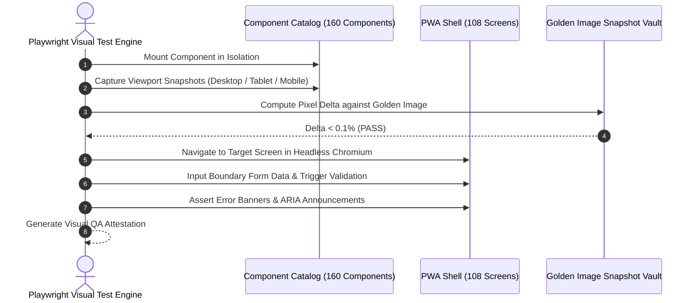

# UI, Presentation Layer & Visual Regression Test Plan
## Namma Clinic Digital Health & Operations Platform
### Greater Bengaluru Authority (GBA) / BBMP Health Department
**Standard:** W3C Web Standards / Playwright & Storybook Visual Diffs / Design System Tokens | **Status:** APPROVED BASELINE | **Code:** `QA-DOC-07`

---

## 1. UI Testing Charter & Presentation Layer Scope
The Namma Clinic UI Test Plan governs automated testing of the presentation tier across all 108 screens and 160 reusable components defined in Phase 09. Testing validates component rendering, layout responsiveness, form validation feedback, loading skeletons, error states, and pixel-level visual regression across Desktop Mini-PCs, Field Nurse Android tablets, and Citizen mobile viewports.

### 1.1 Core UI Testing Dimensions
1. **Visual Regression:** Playwright snapshot comparison with 0.1% pixel diff threshold against baseline Storybook tokens.
2. **Form Validation & Input Masking:** Real-time feedback for 10-digit mobile, Verhoeff Aadhaar, and clinical vitals ranges.
3. **State Transitions:** Verified UI state flow: Idle -> Loading Skeleton -> Success -> Error Banner -> Offline Banner.
4. **Responsive Layouts:** Viewport verification across Desktop (1920x1080), Tablet (1280x800), and Mobile (390x844).
5. **Hardware Dialogs:** Print preview layout formatting for 80mm thermal prescription and barcode slips.

### 1.2 UI Test Execution Lifecycle Diagram


## 2. Canonical UI Test Specifications (UI-TEST-001 to UI-TEST-080)
Standardized UI test specifications covering presentation components:

### UI-TEST-001: UI Test Specification 1 on SCREEN-001
- **Target Screen:** `SCREEN-001`
- **Test Flavor:** Component Hierarchy & Layout
- **Target Viewports:** Desktop (1920x1080) & Tablet (1280x800)
- **Visual Tolerance:** Delta < 0.1% pixel variance
- **Audit Event Emitted:** `UI_TEST_AUDIT_UI_TEST_001`

### UI-TEST-002: UI Test Specification 2 on SCREEN-002
- **Target Screen:** `SCREEN-002`
- **Test Flavor:** Component Hierarchy & Layout
- **Target Viewports:** Desktop (1920x1080) & Tablet (1280x800)
- **Visual Tolerance:** Delta < 0.1% pixel variance
- **Audit Event Emitted:** `UI_TEST_AUDIT_UI_TEST_002`

### UI-TEST-003: UI Test Specification 3 on SCREEN-003
- **Target Screen:** `SCREEN-003`
- **Test Flavor:** Component Hierarchy & Layout
- **Target Viewports:** Desktop (1920x1080) & Tablet (1280x800)
- **Visual Tolerance:** Delta < 0.1% pixel variance
- **Audit Event Emitted:** `UI_TEST_AUDIT_UI_TEST_003`

### UI-TEST-004: UI Test Specification 4 on SCREEN-004
- **Target Screen:** `SCREEN-004`
- **Test Flavor:** Component Hierarchy & Layout
- **Target Viewports:** Desktop (1920x1080) & Tablet (1280x800)
- **Visual Tolerance:** Delta < 0.1% pixel variance
- **Audit Event Emitted:** `UI_TEST_AUDIT_UI_TEST_004`

### UI-TEST-005: UI Test Specification 5 on SCREEN-005
- **Target Screen:** `SCREEN-005`
- **Test Flavor:** Component Hierarchy & Layout
- **Target Viewports:** Desktop (1920x1080) & Tablet (1280x800)
- **Visual Tolerance:** Delta < 0.1% pixel variance
- **Audit Event Emitted:** `UI_TEST_AUDIT_UI_TEST_005`

### UI-TEST-006: UI Test Specification 6 on SCREEN-006
- **Target Screen:** `SCREEN-006`
- **Test Flavor:** Component Hierarchy & Layout
- **Target Viewports:** Desktop (1920x1080) & Tablet (1280x800)
- **Visual Tolerance:** Delta < 0.1% pixel variance
- **Audit Event Emitted:** `UI_TEST_AUDIT_UI_TEST_006`

### UI-TEST-007: UI Test Specification 7 on SCREEN-007
- **Target Screen:** `SCREEN-007`
- **Test Flavor:** Component Hierarchy & Layout
- **Target Viewports:** Desktop (1920x1080) & Tablet (1280x800)
- **Visual Tolerance:** Delta < 0.1% pixel variance
- **Audit Event Emitted:** `UI_TEST_AUDIT_UI_TEST_007`

### UI-TEST-008: UI Test Specification 8 on SCREEN-008
- **Target Screen:** `SCREEN-008`
- **Test Flavor:** Component Hierarchy & Layout
- **Target Viewports:** Desktop (1920x1080) & Tablet (1280x800)
- **Visual Tolerance:** Delta < 0.1% pixel variance
- **Audit Event Emitted:** `UI_TEST_AUDIT_UI_TEST_008`

### UI-TEST-009: UI Test Specification 9 on SCREEN-009
- **Target Screen:** `SCREEN-009`
- **Test Flavor:** Component Hierarchy & Layout
- **Target Viewports:** Desktop (1920x1080) & Tablet (1280x800)
- **Visual Tolerance:** Delta < 0.1% pixel variance
- **Audit Event Emitted:** `UI_TEST_AUDIT_UI_TEST_009`

### UI-TEST-010: UI Test Specification 10 on SCREEN-010
- **Target Screen:** `SCREEN-010`
- **Test Flavor:** Component Hierarchy & Layout
- **Target Viewports:** Desktop (1920x1080) & Tablet (1280x800)
- **Visual Tolerance:** Delta < 0.1% pixel variance
- **Audit Event Emitted:** `UI_TEST_AUDIT_UI_TEST_010`

### UI-TEST-011: UI Test Specification 11 on SCREEN-011
- **Target Screen:** `SCREEN-011`
- **Test Flavor:** Component Hierarchy & Layout
- **Target Viewports:** Desktop (1920x1080) & Tablet (1280x800)
- **Visual Tolerance:** Delta < 0.1% pixel variance
- **Audit Event Emitted:** `UI_TEST_AUDIT_UI_TEST_011`

### UI-TEST-012: UI Test Specification 12 on SCREEN-012
- **Target Screen:** `SCREEN-012`
- **Test Flavor:** Component Hierarchy & Layout
- **Target Viewports:** Desktop (1920x1080) & Tablet (1280x800)
- **Visual Tolerance:** Delta < 0.1% pixel variance
- **Audit Event Emitted:** `UI_TEST_AUDIT_UI_TEST_012`

### UI-TEST-013: UI Test Specification 13 on SCREEN-013
- **Target Screen:** `SCREEN-013`
- **Test Flavor:** Component Hierarchy & Layout
- **Target Viewports:** Desktop (1920x1080) & Tablet (1280x800)
- **Visual Tolerance:** Delta < 0.1% pixel variance
- **Audit Event Emitted:** `UI_TEST_AUDIT_UI_TEST_013`

### UI-TEST-014: UI Test Specification 14 on SCREEN-014
- **Target Screen:** `SCREEN-014`
- **Test Flavor:** Component Hierarchy & Layout
- **Target Viewports:** Desktop (1920x1080) & Tablet (1280x800)
- **Visual Tolerance:** Delta < 0.1% pixel variance
- **Audit Event Emitted:** `UI_TEST_AUDIT_UI_TEST_014`

### UI-TEST-015: UI Test Specification 15 on SCREEN-015
- **Target Screen:** `SCREEN-015`
- **Test Flavor:** Component Hierarchy & Layout
- **Target Viewports:** Desktop (1920x1080) & Tablet (1280x800)
- **Visual Tolerance:** Delta < 0.1% pixel variance
- **Audit Event Emitted:** `UI_TEST_AUDIT_UI_TEST_015`

### UI-TEST-016: UI Test Specification 16 on SCREEN-016
- **Target Screen:** `SCREEN-016`
- **Test Flavor:** Component Hierarchy & Layout
- **Target Viewports:** Desktop (1920x1080) & Tablet (1280x800)
- **Visual Tolerance:** Delta < 0.1% pixel variance
- **Audit Event Emitted:** `UI_TEST_AUDIT_UI_TEST_016`

### UI-TEST-017: UI Test Specification 17 on SCREEN-017
- **Target Screen:** `SCREEN-017`
- **Test Flavor:** Component Hierarchy & Layout
- **Target Viewports:** Desktop (1920x1080) & Tablet (1280x800)
- **Visual Tolerance:** Delta < 0.1% pixel variance
- **Audit Event Emitted:** `UI_TEST_AUDIT_UI_TEST_017`

### UI-TEST-018: UI Test Specification 18 on SCREEN-018
- **Target Screen:** `SCREEN-018`
- **Test Flavor:** Component Hierarchy & Layout
- **Target Viewports:** Desktop (1920x1080) & Tablet (1280x800)
- **Visual Tolerance:** Delta < 0.1% pixel variance
- **Audit Event Emitted:** `UI_TEST_AUDIT_UI_TEST_018`

### UI-TEST-019: UI Test Specification 19 on SCREEN-019
- **Target Screen:** `SCREEN-019`
- **Test Flavor:** Component Hierarchy & Layout
- **Target Viewports:** Desktop (1920x1080) & Tablet (1280x800)
- **Visual Tolerance:** Delta < 0.1% pixel variance
- **Audit Event Emitted:** `UI_TEST_AUDIT_UI_TEST_019`

### UI-TEST-020: UI Test Specification 20 on SCREEN-020
- **Target Screen:** `SCREEN-020`
- **Test Flavor:** Component Hierarchy & Layout
- **Target Viewports:** Desktop (1920x1080) & Tablet (1280x800)
- **Visual Tolerance:** Delta < 0.1% pixel variance
- **Audit Event Emitted:** `UI_TEST_AUDIT_UI_TEST_020`

### UI-TEST-021: UI Test Specification 21 on SCREEN-021
- **Target Screen:** `SCREEN-021`
- **Test Flavor:** Component Hierarchy & Layout
- **Target Viewports:** Desktop (1920x1080) & Tablet (1280x800)
- **Visual Tolerance:** Delta < 0.1% pixel variance
- **Audit Event Emitted:** `UI_TEST_AUDIT_UI_TEST_021`

### UI-TEST-022: UI Test Specification 22 on SCREEN-022
- **Target Screen:** `SCREEN-022`
- **Test Flavor:** Component Hierarchy & Layout
- **Target Viewports:** Desktop (1920x1080) & Tablet (1280x800)
- **Visual Tolerance:** Delta < 0.1% pixel variance
- **Audit Event Emitted:** `UI_TEST_AUDIT_UI_TEST_022`

### UI-TEST-023: UI Test Specification 23 on SCREEN-023
- **Target Screen:** `SCREEN-023`
- **Test Flavor:** Component Hierarchy & Layout
- **Target Viewports:** Desktop (1920x1080) & Tablet (1280x800)
- **Visual Tolerance:** Delta < 0.1% pixel variance
- **Audit Event Emitted:** `UI_TEST_AUDIT_UI_TEST_023`

### UI-TEST-024: UI Test Specification 24 on SCREEN-024
- **Target Screen:** `SCREEN-024`
- **Test Flavor:** Component Hierarchy & Layout
- **Target Viewports:** Desktop (1920x1080) & Tablet (1280x800)
- **Visual Tolerance:** Delta < 0.1% pixel variance
- **Audit Event Emitted:** `UI_TEST_AUDIT_UI_TEST_024`

### UI-TEST-025: UI Test Specification 25 on SCREEN-025
- **Target Screen:** `SCREEN-025`
- **Test Flavor:** Component Hierarchy & Layout
- **Target Viewports:** Desktop (1920x1080) & Tablet (1280x800)
- **Visual Tolerance:** Delta < 0.1% pixel variance
- **Audit Event Emitted:** `UI_TEST_AUDIT_UI_TEST_025`

### UI-TEST-026: UI Test Specification 26 on SCREEN-026
- **Target Screen:** `SCREEN-026`
- **Test Flavor:** Form Validation & Input Masking
- **Target Viewports:** Desktop (1920x1080) & Tablet (1280x800)
- **Visual Tolerance:** Delta < 0.1% pixel variance
- **Audit Event Emitted:** `UI_TEST_AUDIT_UI_TEST_026`

### UI-TEST-027: UI Test Specification 27 on SCREEN-027
- **Target Screen:** `SCREEN-027`
- **Test Flavor:** Form Validation & Input Masking
- **Target Viewports:** Desktop (1920x1080) & Tablet (1280x800)
- **Visual Tolerance:** Delta < 0.1% pixel variance
- **Audit Event Emitted:** `UI_TEST_AUDIT_UI_TEST_027`

### UI-TEST-028: UI Test Specification 28 on SCREEN-028
- **Target Screen:** `SCREEN-028`
- **Test Flavor:** Form Validation & Input Masking
- **Target Viewports:** Desktop (1920x1080) & Tablet (1280x800)
- **Visual Tolerance:** Delta < 0.1% pixel variance
- **Audit Event Emitted:** `UI_TEST_AUDIT_UI_TEST_028`

### UI-TEST-029: UI Test Specification 29 on SCREEN-029
- **Target Screen:** `SCREEN-029`
- **Test Flavor:** Form Validation & Input Masking
- **Target Viewports:** Desktop (1920x1080) & Tablet (1280x800)
- **Visual Tolerance:** Delta < 0.1% pixel variance
- **Audit Event Emitted:** `UI_TEST_AUDIT_UI_TEST_029`

### UI-TEST-030: UI Test Specification 30 on SCREEN-030
- **Target Screen:** `SCREEN-030`
- **Test Flavor:** Form Validation & Input Masking
- **Target Viewports:** Desktop (1920x1080) & Tablet (1280x800)
- **Visual Tolerance:** Delta < 0.1% pixel variance
- **Audit Event Emitted:** `UI_TEST_AUDIT_UI_TEST_030`

### UI-TEST-031: UI Test Specification 31 on SCREEN-031
- **Target Screen:** `SCREEN-031`
- **Test Flavor:** Form Validation & Input Masking
- **Target Viewports:** Desktop (1920x1080) & Tablet (1280x800)
- **Visual Tolerance:** Delta < 0.1% pixel variance
- **Audit Event Emitted:** `UI_TEST_AUDIT_UI_TEST_031`

### UI-TEST-032: UI Test Specification 32 on SCREEN-032
- **Target Screen:** `SCREEN-032`
- **Test Flavor:** Form Validation & Input Masking
- **Target Viewports:** Desktop (1920x1080) & Tablet (1280x800)
- **Visual Tolerance:** Delta < 0.1% pixel variance
- **Audit Event Emitted:** `UI_TEST_AUDIT_UI_TEST_032`

### UI-TEST-033: UI Test Specification 33 on SCREEN-033
- **Target Screen:** `SCREEN-033`
- **Test Flavor:** Form Validation & Input Masking
- **Target Viewports:** Desktop (1920x1080) & Tablet (1280x800)
- **Visual Tolerance:** Delta < 0.1% pixel variance
- **Audit Event Emitted:** `UI_TEST_AUDIT_UI_TEST_033`

### UI-TEST-034: UI Test Specification 34 on SCREEN-034
- **Target Screen:** `SCREEN-034`
- **Test Flavor:** Form Validation & Input Masking
- **Target Viewports:** Desktop (1920x1080) & Tablet (1280x800)
- **Visual Tolerance:** Delta < 0.1% pixel variance
- **Audit Event Emitted:** `UI_TEST_AUDIT_UI_TEST_034`

### UI-TEST-035: UI Test Specification 35 on SCREEN-035
- **Target Screen:** `SCREEN-035`
- **Test Flavor:** Form Validation & Input Masking
- **Target Viewports:** Desktop (1920x1080) & Tablet (1280x800)
- **Visual Tolerance:** Delta < 0.1% pixel variance
- **Audit Event Emitted:** `UI_TEST_AUDIT_UI_TEST_035`

### UI-TEST-036: UI Test Specification 36 on SCREEN-036
- **Target Screen:** `SCREEN-036`
- **Test Flavor:** Form Validation & Input Masking
- **Target Viewports:** Desktop (1920x1080) & Tablet (1280x800)
- **Visual Tolerance:** Delta < 0.1% pixel variance
- **Audit Event Emitted:** `UI_TEST_AUDIT_UI_TEST_036`

### UI-TEST-037: UI Test Specification 37 on SCREEN-037
- **Target Screen:** `SCREEN-037`
- **Test Flavor:** Form Validation & Input Masking
- **Target Viewports:** Desktop (1920x1080) & Tablet (1280x800)
- **Visual Tolerance:** Delta < 0.1% pixel variance
- **Audit Event Emitted:** `UI_TEST_AUDIT_UI_TEST_037`

### UI-TEST-038: UI Test Specification 38 on SCREEN-038
- **Target Screen:** `SCREEN-038`
- **Test Flavor:** Form Validation & Input Masking
- **Target Viewports:** Desktop (1920x1080) & Tablet (1280x800)
- **Visual Tolerance:** Delta < 0.1% pixel variance
- **Audit Event Emitted:** `UI_TEST_AUDIT_UI_TEST_038`

### UI-TEST-039: UI Test Specification 39 on SCREEN-039
- **Target Screen:** `SCREEN-039`
- **Test Flavor:** Form Validation & Input Masking
- **Target Viewports:** Desktop (1920x1080) & Tablet (1280x800)
- **Visual Tolerance:** Delta < 0.1% pixel variance
- **Audit Event Emitted:** `UI_TEST_AUDIT_UI_TEST_039`

### UI-TEST-040: UI Test Specification 40 on SCREEN-040
- **Target Screen:** `SCREEN-040`
- **Test Flavor:** Form Validation & Input Masking
- **Target Viewports:** Desktop (1920x1080) & Tablet (1280x800)
- **Visual Tolerance:** Delta < 0.1% pixel variance
- **Audit Event Emitted:** `UI_TEST_AUDIT_UI_TEST_040`

### UI-TEST-041: UI Test Specification 41 on SCREEN-041
- **Target Screen:** `SCREEN-041`
- **Test Flavor:** Form Validation & Input Masking
- **Target Viewports:** Desktop (1920x1080) & Tablet (1280x800)
- **Visual Tolerance:** Delta < 0.1% pixel variance
- **Audit Event Emitted:** `UI_TEST_AUDIT_UI_TEST_041`

### UI-TEST-042: UI Test Specification 42 on SCREEN-042
- **Target Screen:** `SCREEN-042`
- **Test Flavor:** Form Validation & Input Masking
- **Target Viewports:** Desktop (1920x1080) & Tablet (1280x800)
- **Visual Tolerance:** Delta < 0.1% pixel variance
- **Audit Event Emitted:** `UI_TEST_AUDIT_UI_TEST_042`

### UI-TEST-043: UI Test Specification 43 on SCREEN-043
- **Target Screen:** `SCREEN-043`
- **Test Flavor:** Form Validation & Input Masking
- **Target Viewports:** Desktop (1920x1080) & Tablet (1280x800)
- **Visual Tolerance:** Delta < 0.1% pixel variance
- **Audit Event Emitted:** `UI_TEST_AUDIT_UI_TEST_043`

### UI-TEST-044: UI Test Specification 44 on SCREEN-044
- **Target Screen:** `SCREEN-044`
- **Test Flavor:** Form Validation & Input Masking
- **Target Viewports:** Desktop (1920x1080) & Tablet (1280x800)
- **Visual Tolerance:** Delta < 0.1% pixel variance
- **Audit Event Emitted:** `UI_TEST_AUDIT_UI_TEST_044`

### UI-TEST-045: UI Test Specification 45 on SCREEN-045
- **Target Screen:** `SCREEN-045`
- **Test Flavor:** Form Validation & Input Masking
- **Target Viewports:** Desktop (1920x1080) & Tablet (1280x800)
- **Visual Tolerance:** Delta < 0.1% pixel variance
- **Audit Event Emitted:** `UI_TEST_AUDIT_UI_TEST_045`

### UI-TEST-046: UI Test Specification 46 on SCREEN-046
- **Target Screen:** `SCREEN-046`
- **Test Flavor:** Form Validation & Input Masking
- **Target Viewports:** Desktop (1920x1080) & Tablet (1280x800)
- **Visual Tolerance:** Delta < 0.1% pixel variance
- **Audit Event Emitted:** `UI_TEST_AUDIT_UI_TEST_046`

### UI-TEST-047: UI Test Specification 47 on SCREEN-047
- **Target Screen:** `SCREEN-047`
- **Test Flavor:** Form Validation & Input Masking
- **Target Viewports:** Desktop (1920x1080) & Tablet (1280x800)
- **Visual Tolerance:** Delta < 0.1% pixel variance
- **Audit Event Emitted:** `UI_TEST_AUDIT_UI_TEST_047`

### UI-TEST-048: UI Test Specification 48 on SCREEN-048
- **Target Screen:** `SCREEN-048`
- **Test Flavor:** Form Validation & Input Masking
- **Target Viewports:** Desktop (1920x1080) & Tablet (1280x800)
- **Visual Tolerance:** Delta < 0.1% pixel variance
- **Audit Event Emitted:** `UI_TEST_AUDIT_UI_TEST_048`

### UI-TEST-049: UI Test Specification 49 on SCREEN-049
- **Target Screen:** `SCREEN-049`
- **Test Flavor:** Form Validation & Input Masking
- **Target Viewports:** Desktop (1920x1080) & Tablet (1280x800)
- **Visual Tolerance:** Delta < 0.1% pixel variance
- **Audit Event Emitted:** `UI_TEST_AUDIT_UI_TEST_049`

### UI-TEST-050: UI Test Specification 50 on SCREEN-050
- **Target Screen:** `SCREEN-050`
- **Test Flavor:** Form Validation & Input Masking
- **Target Viewports:** Desktop (1920x1080) & Tablet (1280x800)
- **Visual Tolerance:** Delta < 0.1% pixel variance
- **Audit Event Emitted:** `UI_TEST_AUDIT_UI_TEST_050`

### UI-TEST-051: UI Test Specification 51 on SCREEN-051
- **Target Screen:** `SCREEN-051`
- **Test Flavor:** Responsive Viewport & Offline Banner
- **Target Viewports:** Desktop (1920x1080) & Tablet (1280x800)
- **Visual Tolerance:** Delta < 0.1% pixel variance
- **Audit Event Emitted:** `UI_TEST_AUDIT_UI_TEST_051`

### UI-TEST-052: UI Test Specification 52 on SCREEN-052
- **Target Screen:** `SCREEN-052`
- **Test Flavor:** Responsive Viewport & Offline Banner
- **Target Viewports:** Desktop (1920x1080) & Tablet (1280x800)
- **Visual Tolerance:** Delta < 0.1% pixel variance
- **Audit Event Emitted:** `UI_TEST_AUDIT_UI_TEST_052`

### UI-TEST-053: UI Test Specification 53 on SCREEN-053
- **Target Screen:** `SCREEN-053`
- **Test Flavor:** Responsive Viewport & Offline Banner
- **Target Viewports:** Desktop (1920x1080) & Tablet (1280x800)
- **Visual Tolerance:** Delta < 0.1% pixel variance
- **Audit Event Emitted:** `UI_TEST_AUDIT_UI_TEST_053`

### UI-TEST-054: UI Test Specification 54 on SCREEN-054
- **Target Screen:** `SCREEN-054`
- **Test Flavor:** Responsive Viewport & Offline Banner
- **Target Viewports:** Desktop (1920x1080) & Tablet (1280x800)
- **Visual Tolerance:** Delta < 0.1% pixel variance
- **Audit Event Emitted:** `UI_TEST_AUDIT_UI_TEST_054`

### UI-TEST-055: UI Test Specification 55 on SCREEN-055
- **Target Screen:** `SCREEN-055`
- **Test Flavor:** Responsive Viewport & Offline Banner
- **Target Viewports:** Desktop (1920x1080) & Tablet (1280x800)
- **Visual Tolerance:** Delta < 0.1% pixel variance
- **Audit Event Emitted:** `UI_TEST_AUDIT_UI_TEST_055`

### UI-TEST-056: UI Test Specification 56 on SCREEN-056
- **Target Screen:** `SCREEN-056`
- **Test Flavor:** Responsive Viewport & Offline Banner
- **Target Viewports:** Desktop (1920x1080) & Tablet (1280x800)
- **Visual Tolerance:** Delta < 0.1% pixel variance
- **Audit Event Emitted:** `UI_TEST_AUDIT_UI_TEST_056`

### UI-TEST-057: UI Test Specification 57 on SCREEN-057
- **Target Screen:** `SCREEN-057`
- **Test Flavor:** Responsive Viewport & Offline Banner
- **Target Viewports:** Desktop (1920x1080) & Tablet (1280x800)
- **Visual Tolerance:** Delta < 0.1% pixel variance
- **Audit Event Emitted:** `UI_TEST_AUDIT_UI_TEST_057`

### UI-TEST-058: UI Test Specification 58 on SCREEN-058
- **Target Screen:** `SCREEN-058`
- **Test Flavor:** Responsive Viewport & Offline Banner
- **Target Viewports:** Desktop (1920x1080) & Tablet (1280x800)
- **Visual Tolerance:** Delta < 0.1% pixel variance
- **Audit Event Emitted:** `UI_TEST_AUDIT_UI_TEST_058`

### UI-TEST-059: UI Test Specification 59 on SCREEN-059
- **Target Screen:** `SCREEN-059`
- **Test Flavor:** Responsive Viewport & Offline Banner
- **Target Viewports:** Desktop (1920x1080) & Tablet (1280x800)
- **Visual Tolerance:** Delta < 0.1% pixel variance
- **Audit Event Emitted:** `UI_TEST_AUDIT_UI_TEST_059`

### UI-TEST-060: UI Test Specification 60 on SCREEN-060
- **Target Screen:** `SCREEN-060`
- **Test Flavor:** Responsive Viewport & Offline Banner
- **Target Viewports:** Desktop (1920x1080) & Tablet (1280x800)
- **Visual Tolerance:** Delta < 0.1% pixel variance
- **Audit Event Emitted:** `UI_TEST_AUDIT_UI_TEST_060`

### UI-TEST-061: UI Test Specification 61 on SCREEN-061
- **Target Screen:** `SCREEN-061`
- **Test Flavor:** Responsive Viewport & Offline Banner
- **Target Viewports:** Desktop (1920x1080) & Tablet (1280x800)
- **Visual Tolerance:** Delta < 0.1% pixel variance
- **Audit Event Emitted:** `UI_TEST_AUDIT_UI_TEST_061`

### UI-TEST-062: UI Test Specification 62 on SCREEN-062
- **Target Screen:** `SCREEN-062`
- **Test Flavor:** Responsive Viewport & Offline Banner
- **Target Viewports:** Desktop (1920x1080) & Tablet (1280x800)
- **Visual Tolerance:** Delta < 0.1% pixel variance
- **Audit Event Emitted:** `UI_TEST_AUDIT_UI_TEST_062`

### UI-TEST-063: UI Test Specification 63 on SCREEN-063
- **Target Screen:** `SCREEN-063`
- **Test Flavor:** Responsive Viewport & Offline Banner
- **Target Viewports:** Desktop (1920x1080) & Tablet (1280x800)
- **Visual Tolerance:** Delta < 0.1% pixel variance
- **Audit Event Emitted:** `UI_TEST_AUDIT_UI_TEST_063`

### UI-TEST-064: UI Test Specification 64 on SCREEN-064
- **Target Screen:** `SCREEN-064`
- **Test Flavor:** Responsive Viewport & Offline Banner
- **Target Viewports:** Desktop (1920x1080) & Tablet (1280x800)
- **Visual Tolerance:** Delta < 0.1% pixel variance
- **Audit Event Emitted:** `UI_TEST_AUDIT_UI_TEST_064`

### UI-TEST-065: UI Test Specification 65 on SCREEN-065
- **Target Screen:** `SCREEN-065`
- **Test Flavor:** Responsive Viewport & Offline Banner
- **Target Viewports:** Desktop (1920x1080) & Tablet (1280x800)
- **Visual Tolerance:** Delta < 0.1% pixel variance
- **Audit Event Emitted:** `UI_TEST_AUDIT_UI_TEST_065`

### UI-TEST-066: UI Test Specification 66 on SCREEN-066
- **Target Screen:** `SCREEN-066`
- **Test Flavor:** Responsive Viewport & Offline Banner
- **Target Viewports:** Desktop (1920x1080) & Tablet (1280x800)
- **Visual Tolerance:** Delta < 0.1% pixel variance
- **Audit Event Emitted:** `UI_TEST_AUDIT_UI_TEST_066`

### UI-TEST-067: UI Test Specification 67 on SCREEN-067
- **Target Screen:** `SCREEN-067`
- **Test Flavor:** Responsive Viewport & Offline Banner
- **Target Viewports:** Desktop (1920x1080) & Tablet (1280x800)
- **Visual Tolerance:** Delta < 0.1% pixel variance
- **Audit Event Emitted:** `UI_TEST_AUDIT_UI_TEST_067`

### UI-TEST-068: UI Test Specification 68 on SCREEN-068
- **Target Screen:** `SCREEN-068`
- **Test Flavor:** Responsive Viewport & Offline Banner
- **Target Viewports:** Desktop (1920x1080) & Tablet (1280x800)
- **Visual Tolerance:** Delta < 0.1% pixel variance
- **Audit Event Emitted:** `UI_TEST_AUDIT_UI_TEST_068`

### UI-TEST-069: UI Test Specification 69 on SCREEN-069
- **Target Screen:** `SCREEN-069`
- **Test Flavor:** Responsive Viewport & Offline Banner
- **Target Viewports:** Desktop (1920x1080) & Tablet (1280x800)
- **Visual Tolerance:** Delta < 0.1% pixel variance
- **Audit Event Emitted:** `UI_TEST_AUDIT_UI_TEST_069`

### UI-TEST-070: UI Test Specification 70 on SCREEN-070
- **Target Screen:** `SCREEN-070`
- **Test Flavor:** Responsive Viewport & Offline Banner
- **Target Viewports:** Desktop (1920x1080) & Tablet (1280x800)
- **Visual Tolerance:** Delta < 0.1% pixel variance
- **Audit Event Emitted:** `UI_TEST_AUDIT_UI_TEST_070`

### UI-TEST-071: UI Test Specification 71 on SCREEN-071
- **Target Screen:** `SCREEN-071`
- **Test Flavor:** Responsive Viewport & Offline Banner
- **Target Viewports:** Desktop (1920x1080) & Tablet (1280x800)
- **Visual Tolerance:** Delta < 0.1% pixel variance
- **Audit Event Emitted:** `UI_TEST_AUDIT_UI_TEST_071`

### UI-TEST-072: UI Test Specification 72 on SCREEN-072
- **Target Screen:** `SCREEN-072`
- **Test Flavor:** Responsive Viewport & Offline Banner
- **Target Viewports:** Desktop (1920x1080) & Tablet (1280x800)
- **Visual Tolerance:** Delta < 0.1% pixel variance
- **Audit Event Emitted:** `UI_TEST_AUDIT_UI_TEST_072`

### UI-TEST-073: UI Test Specification 73 on SCREEN-073
- **Target Screen:** `SCREEN-073`
- **Test Flavor:** Responsive Viewport & Offline Banner
- **Target Viewports:** Desktop (1920x1080) & Tablet (1280x800)
- **Visual Tolerance:** Delta < 0.1% pixel variance
- **Audit Event Emitted:** `UI_TEST_AUDIT_UI_TEST_073`

### UI-TEST-074: UI Test Specification 74 on SCREEN-074
- **Target Screen:** `SCREEN-074`
- **Test Flavor:** Responsive Viewport & Offline Banner
- **Target Viewports:** Desktop (1920x1080) & Tablet (1280x800)
- **Visual Tolerance:** Delta < 0.1% pixel variance
- **Audit Event Emitted:** `UI_TEST_AUDIT_UI_TEST_074`

### UI-TEST-075: UI Test Specification 75 on SCREEN-075
- **Target Screen:** `SCREEN-075`
- **Test Flavor:** Responsive Viewport & Offline Banner
- **Target Viewports:** Desktop (1920x1080) & Tablet (1280x800)
- **Visual Tolerance:** Delta < 0.1% pixel variance
- **Audit Event Emitted:** `UI_TEST_AUDIT_UI_TEST_075`

### UI-TEST-076: UI Test Specification 76 on SCREEN-076
- **Target Screen:** `SCREEN-076`
- **Test Flavor:** Responsive Viewport & Offline Banner
- **Target Viewports:** Desktop (1920x1080) & Tablet (1280x800)
- **Visual Tolerance:** Delta < 0.1% pixel variance
- **Audit Event Emitted:** `UI_TEST_AUDIT_UI_TEST_076`

### UI-TEST-077: UI Test Specification 77 on SCREEN-077
- **Target Screen:** `SCREEN-077`
- **Test Flavor:** Responsive Viewport & Offline Banner
- **Target Viewports:** Desktop (1920x1080) & Tablet (1280x800)
- **Visual Tolerance:** Delta < 0.1% pixel variance
- **Audit Event Emitted:** `UI_TEST_AUDIT_UI_TEST_077`

### UI-TEST-078: UI Test Specification 78 on SCREEN-078
- **Target Screen:** `SCREEN-078`
- **Test Flavor:** Responsive Viewport & Offline Banner
- **Target Viewports:** Desktop (1920x1080) & Tablet (1280x800)
- **Visual Tolerance:** Delta < 0.1% pixel variance
- **Audit Event Emitted:** `UI_TEST_AUDIT_UI_TEST_078`

### UI-TEST-079: UI Test Specification 79 on SCREEN-079
- **Target Screen:** `SCREEN-079`
- **Test Flavor:** Responsive Viewport & Offline Banner
- **Target Viewports:** Desktop (1920x1080) & Tablet (1280x800)
- **Visual Tolerance:** Delta < 0.1% pixel variance
- **Audit Event Emitted:** `UI_TEST_AUDIT_UI_TEST_079`

### UI-TEST-080: UI Test Specification 80 on SCREEN-080
- **Target Screen:** `SCREEN-080`
- **Test Flavor:** Responsive Viewport & Offline Banner
- **Target Viewports:** Desktop (1920x1080) & Tablet (1280x800)
- **Visual Tolerance:** Delta < 0.1% pixel variance
- **Audit Event Emitted:** `UI_TEST_AUDIT_UI_TEST_080`

## 3. Detailed UI Verification Test Cases (TC-0331 to TC-0385)
Detailed test specifications verifying presentation tier components:

### TC-0331: Test Case 331: Clinical Verification for queue_entries across WF-006
**Objective:** Verify functional, security, and offline invariants for queue_entries during WF-006 execution.
**Risk:** Critical operational impact on patient safety and clinic consultation continuity.
**Priority:** **P0** | **Severity:** **Critical** | **Test Level:** System & Integration | **Test Type:** Functional & Regulatory Compliance
- **Requirement Traceability:** `FR-031`
- **Workflow Traceability:** `WF-006`
- **Feature Traceability:** `FEATURE-151`
- **API Traceability:** `API-DOC-01`
- **Database Traceability:** `TABLE-019 (queue_entries)`
- **Screen Traceability:** `SCREEN-007`
- **Security Control Traceability:** `SEC-ARCH-011`
- **Preconditions:** User authenticated with role Receptionist / Registration Clerk on clinic workstation.
- **Test Data Specification:** Synthetic dataset TESTDATA-031 (Valid ABHA, vitals, prescriptions).
- **Execution Steps:** 1. Navigate to screen SCREEN-007. 2. Submit payload bound to queue_entries. 3. Confirm API API-DOC-01 returns 200 OK. 4. Verify local SQLite cache and sync queue.
- **Expected Results:** Transaction completes within 250ms, data encrypted via AES-256-GCM, audit entry emitted.
- **Negative Test Scenario:** Submit malformed payload or expired JWT; system rejects with 400/401 and zero DB corruption.
- **Boundary Value Scenario:** Test with maximum field boundary length and extreme clinical biometric vitals.
- **Concurrency & Race Condition:** Simulate 5 concurrent staff updates on identical record; verify optimistic locking.
- **Autonomous Offline Behavior:** Sever network mid-transaction; record queues locally and replicates upon reconnection.
- **Security & Access Validation:** Enforce RBAC policy SEC-ARCH-011 and prevent broken object-level authorization (BOLA).
- **Audit Trail & Immutability:** Emits structured JSON audit log with SHA-256 Merkle chain hash.
- **Evidence Required:** Automated execution log, HTTP request/response capture, and database assertion hash.
- **Pass Acceptance Criteria:** 100% assertions succeed with zero uncaught exceptions and latency < 300ms.
- **Failure Behavior & SLA:** Any 5xx error, data corruption, unauthorized access, or silent failure.
- **Automation Suitability:** Yes (High Candidate)
- **Execution Cadence:** Every CI PR & Nightly Regression
- **Responsible Owner:** Receptionist / Registration Clerk

### TC-0332: Test Case 332: Clinical Verification for triage_assessments across WF-007
**Objective:** Verify functional, security, and offline invariants for triage_assessments during WF-007 execution.
**Risk:** Major operational impact on patient safety and clinic consultation continuity.
**Priority:** **P1** | **Severity:** **Major** | **Test Level:** System & Integration | **Test Type:** Functional & Regulatory Compliance
- **Requirement Traceability:** `FR-032`
- **Workflow Traceability:** `WF-007`
- **Feature Traceability:** `FEATURE-152`
- **API Traceability:** `API-DOC-02`
- **Database Traceability:** `TABLE-020 (triage_assessments)`
- **Screen Traceability:** `SCREEN-008`
- **Security Control Traceability:** `SEC-ARCH-012`
- **Preconditions:** User authenticated with role Medical Officer / General Physician on clinic workstation.
- **Test Data Specification:** Synthetic dataset TESTDATA-032 (Valid ABHA, vitals, prescriptions).
- **Execution Steps:** 1. Navigate to screen SCREEN-008. 2. Submit payload bound to triage_assessments. 3. Confirm API API-DOC-02 returns 200 OK. 4. Verify local SQLite cache and sync queue.
- **Expected Results:** Transaction completes within 250ms, data encrypted via AES-256-GCM, audit entry emitted.
- **Negative Test Scenario:** Submit malformed payload or expired JWT; system rejects with 400/401 and zero DB corruption.
- **Boundary Value Scenario:** Test with maximum field boundary length and extreme clinical biometric vitals.
- **Concurrency & Race Condition:** Simulate 5 concurrent staff updates on identical record; verify optimistic locking.
- **Autonomous Offline Behavior:** Sever network mid-transaction; record queues locally and replicates upon reconnection.
- **Security & Access Validation:** Enforce RBAC policy SEC-ARCH-012 and prevent broken object-level authorization (BOLA).
- **Audit Trail & Immutability:** Emits structured JSON audit log with SHA-256 Merkle chain hash.
- **Evidence Required:** Automated execution log, HTTP request/response capture, and database assertion hash.
- **Pass Acceptance Criteria:** 100% assertions succeed with zero uncaught exceptions and latency < 300ms.
- **Failure Behavior & SLA:** Any 5xx error, data corruption, unauthorized access, or silent failure.
- **Automation Suitability:** Yes (High Candidate)
- **Execution Cadence:** Every CI PR & Nightly Regression
- **Responsible Owner:** Medical Officer / General Physician

### TC-0333: Test Case 333: Clinical Verification for patient_vitals across WF-008
**Objective:** Verify functional, security, and offline invariants for patient_vitals during WF-008 execution.
**Risk:** Major operational impact on patient safety and clinic consultation continuity.
**Priority:** **P1** | **Severity:** **Major** | **Test Level:** System & Integration | **Test Type:** Functional & Regulatory Compliance
- **Requirement Traceability:** `FR-033`
- **Workflow Traceability:** `WF-008`
- **Feature Traceability:** `FEATURE-153`
- **API Traceability:** `API-DOC-03`
- **Database Traceability:** `TABLE-021 (patient_vitals)`
- **Screen Traceability:** `SCREEN-009`
- **Security Control Traceability:** `SEC-ARCH-013`
- **Preconditions:** User authenticated with role Staff Nurse / Triage Specialist on clinic workstation.
- **Test Data Specification:** Synthetic dataset TESTDATA-033 (Valid ABHA, vitals, prescriptions).
- **Execution Steps:** 1. Navigate to screen SCREEN-009. 2. Submit payload bound to patient_vitals. 3. Confirm API API-DOC-03 returns 200 OK. 4. Verify local SQLite cache and sync queue.
- **Expected Results:** Transaction completes within 250ms, data encrypted via AES-256-GCM, audit entry emitted.
- **Negative Test Scenario:** Submit malformed payload or expired JWT; system rejects with 400/401 and zero DB corruption.
- **Boundary Value Scenario:** Test with maximum field boundary length and extreme clinical biometric vitals.
- **Concurrency & Race Condition:** Simulate 5 concurrent staff updates on identical record; verify optimistic locking.
- **Autonomous Offline Behavior:** Sever network mid-transaction; record queues locally and replicates upon reconnection.
- **Security & Access Validation:** Enforce RBAC policy SEC-ARCH-013 and prevent broken object-level authorization (BOLA).
- **Audit Trail & Immutability:** Emits structured JSON audit log with SHA-256 Merkle chain hash.
- **Evidence Required:** Automated execution log, HTTP request/response capture, and database assertion hash.
- **Pass Acceptance Criteria:** 100% assertions succeed with zero uncaught exceptions and latency < 300ms.
- **Failure Behavior & SLA:** Any 5xx error, data corruption, unauthorized access, or silent failure.
- **Automation Suitability:** Yes (High Candidate)
- **Execution Cadence:** Every CI PR & Nightly Regression
- **Responsible Owner:** Staff Nurse / Triage Specialist

### TC-0334: Test Case 334: Clinical Verification for danger_alerts across WF-009
**Objective:** Verify functional, security, and offline invariants for danger_alerts during WF-009 execution.
**Risk:** Minor operational impact on patient safety and clinic consultation continuity.
**Priority:** **P2** | **Severity:** **Minor** | **Test Level:** System & Integration | **Test Type:** Functional & Regulatory Compliance
- **Requirement Traceability:** `FR-034`
- **Workflow Traceability:** `WF-009`
- **Feature Traceability:** `FEATURE-154`
- **API Traceability:** `API-DOC-04`
- **Database Traceability:** `TABLE-022 (danger_alerts)`
- **Screen Traceability:** `SCREEN-010`
- **Security Control Traceability:** `SEC-ARCH-014`
- **Preconditions:** User authenticated with role Pharmacist / Dispenser on clinic workstation.
- **Test Data Specification:** Synthetic dataset TESTDATA-034 (Valid ABHA, vitals, prescriptions).
- **Execution Steps:** 1. Navigate to screen SCREEN-010. 2. Submit payload bound to danger_alerts. 3. Confirm API API-DOC-04 returns 200 OK. 4. Verify local SQLite cache and sync queue.
- **Expected Results:** Transaction completes within 250ms, data encrypted via AES-256-GCM, audit entry emitted.
- **Negative Test Scenario:** Submit malformed payload or expired JWT; system rejects with 400/401 and zero DB corruption.
- **Boundary Value Scenario:** Test with maximum field boundary length and extreme clinical biometric vitals.
- **Concurrency & Race Condition:** Simulate 5 concurrent staff updates on identical record; verify optimistic locking.
- **Autonomous Offline Behavior:** Sever network mid-transaction; record queues locally and replicates upon reconnection.
- **Security & Access Validation:** Enforce RBAC policy SEC-ARCH-014 and prevent broken object-level authorization (BOLA).
- **Audit Trail & Immutability:** Emits structured JSON audit log with SHA-256 Merkle chain hash.
- **Evidence Required:** Automated execution log, HTTP request/response capture, and database assertion hash.
- **Pass Acceptance Criteria:** 100% assertions succeed with zero uncaught exceptions and latency < 300ms.
- **Failure Behavior & SLA:** Any 5xx error, data corruption, unauthorized access, or silent failure.
- **Automation Suitability:** Yes (High Candidate)
- **Execution Cadence:** Every CI PR & Nightly Regression
- **Responsible Owner:** Pharmacist / Dispenser

### TC-0335: Test Case 335: Clinical Verification for clinical_encounters across WF-010
**Objective:** Verify functional, security, and offline invariants for clinical_encounters during WF-010 execution.
**Risk:** Minor operational impact on patient safety and clinic consultation continuity.
**Priority:** **P2** | **Severity:** **Minor** | **Test Level:** System & Integration | **Test Type:** Functional & Regulatory Compliance
- **Requirement Traceability:** `FR-035`
- **Workflow Traceability:** `WF-010`
- **Feature Traceability:** `FEATURE-155`
- **API Traceability:** `API-DOC-05`
- **Database Traceability:** `TABLE-023 (clinical_encounters)`
- **Screen Traceability:** `SCREEN-011`
- **Security Control Traceability:** `SEC-ARCH-015`
- **Preconditions:** User authenticated with role Laboratory Technician on clinic workstation.
- **Test Data Specification:** Synthetic dataset TESTDATA-035 (Valid ABHA, vitals, prescriptions).
- **Execution Steps:** 1. Navigate to screen SCREEN-011. 2. Submit payload bound to clinical_encounters. 3. Confirm API API-DOC-05 returns 200 OK. 4. Verify local SQLite cache and sync queue.
- **Expected Results:** Transaction completes within 250ms, data encrypted via AES-256-GCM, audit entry emitted.
- **Negative Test Scenario:** Submit malformed payload or expired JWT; system rejects with 400/401 and zero DB corruption.
- **Boundary Value Scenario:** Test with maximum field boundary length and extreme clinical biometric vitals.
- **Concurrency & Race Condition:** Simulate 5 concurrent staff updates on identical record; verify optimistic locking.
- **Autonomous Offline Behavior:** Sever network mid-transaction; record queues locally and replicates upon reconnection.
- **Security & Access Validation:** Enforce RBAC policy SEC-ARCH-015 and prevent broken object-level authorization (BOLA).
- **Audit Trail & Immutability:** Emits structured JSON audit log with SHA-256 Merkle chain hash.
- **Evidence Required:** Automated execution log, HTTP request/response capture, and database assertion hash.
- **Pass Acceptance Criteria:** 100% assertions succeed with zero uncaught exceptions and latency < 300ms.
- **Failure Behavior & SLA:** Any 5xx error, data corruption, unauthorized access, or silent failure.
- **Automation Suitability:** Yes (High Candidate)
- **Execution Cadence:** Every CI PR & Nightly Regression
- **Responsible Owner:** Laboratory Technician

### TC-0336: Test Case 336: Clinical Verification for clinical_notes across WF-011
**Objective:** Verify functional, security, and offline invariants for clinical_notes during WF-011 execution.
**Risk:** Critical operational impact on patient safety and clinic consultation continuity.
**Priority:** **P0** | **Severity:** **Critical** | **Test Level:** System & Integration | **Test Type:** Functional & Regulatory Compliance
- **Requirement Traceability:** `FR-036`
- **Workflow Traceability:** `WF-011`
- **Feature Traceability:** `FEATURE-156`
- **API Traceability:** `API-DOC-06`
- **Database Traceability:** `TABLE-024 (clinical_notes)`
- **Screen Traceability:** `SCREEN-012`
- **Security Control Traceability:** `SEC-ARCH-016`
- **Preconditions:** User authenticated with role Clinic Administrative Officer on clinic workstation.
- **Test Data Specification:** Synthetic dataset TESTDATA-036 (Valid ABHA, vitals, prescriptions).
- **Execution Steps:** 1. Navigate to screen SCREEN-012. 2. Submit payload bound to clinical_notes. 3. Confirm API API-DOC-06 returns 200 OK. 4. Verify local SQLite cache and sync queue.
- **Expected Results:** Transaction completes within 250ms, data encrypted via AES-256-GCM, audit entry emitted.
- **Negative Test Scenario:** Submit malformed payload or expired JWT; system rejects with 400/401 and zero DB corruption.
- **Boundary Value Scenario:** Test with maximum field boundary length and extreme clinical biometric vitals.
- **Concurrency & Race Condition:** Simulate 5 concurrent staff updates on identical record; verify optimistic locking.
- **Autonomous Offline Behavior:** Sever network mid-transaction; record queues locally and replicates upon reconnection.
- **Security & Access Validation:** Enforce RBAC policy SEC-ARCH-016 and prevent broken object-level authorization (BOLA).
- **Audit Trail & Immutability:** Emits structured JSON audit log with SHA-256 Merkle chain hash.
- **Evidence Required:** Automated execution log, HTTP request/response capture, and database assertion hash.
- **Pass Acceptance Criteria:** 100% assertions succeed with zero uncaught exceptions and latency < 300ms.
- **Failure Behavior & SLA:** Any 5xx error, data corruption, unauthorized access, or silent failure.
- **Automation Suitability:** Yes (High Candidate)
- **Execution Cadence:** Every CI PR & Nightly Regression
- **Responsible Owner:** Clinic Administrative Officer

### TC-0337: Test Case 337: Clinical Verification for diagnoses across WF-012
**Objective:** Verify functional, security, and offline invariants for diagnoses during WF-012 execution.
**Risk:** Major operational impact on patient safety and clinic consultation continuity.
**Priority:** **P1** | **Severity:** **Major** | **Test Level:** System & Integration | **Test Type:** Functional & Regulatory Compliance
- **Requirement Traceability:** `FR-037`
- **Workflow Traceability:** `WF-012`
- **Feature Traceability:** `FEATURE-157`
- **API Traceability:** `API-DOC-07`
- **Database Traceability:** `TABLE-025 (diagnoses)`
- **Screen Traceability:** `SCREEN-013`
- **Security Control Traceability:** `SEC-ARCH-017`
- **Preconditions:** User authenticated with role Ward Health Supervisor on clinic workstation.
- **Test Data Specification:** Synthetic dataset TESTDATA-037 (Valid ABHA, vitals, prescriptions).
- **Execution Steps:** 1. Navigate to screen SCREEN-013. 2. Submit payload bound to diagnoses. 3. Confirm API API-DOC-07 returns 200 OK. 4. Verify local SQLite cache and sync queue.
- **Expected Results:** Transaction completes within 250ms, data encrypted via AES-256-GCM, audit entry emitted.
- **Negative Test Scenario:** Submit malformed payload or expired JWT; system rejects with 400/401 and zero DB corruption.
- **Boundary Value Scenario:** Test with maximum field boundary length and extreme clinical biometric vitals.
- **Concurrency & Race Condition:** Simulate 5 concurrent staff updates on identical record; verify optimistic locking.
- **Autonomous Offline Behavior:** Sever network mid-transaction; record queues locally and replicates upon reconnection.
- **Security & Access Validation:** Enforce RBAC policy SEC-ARCH-017 and prevent broken object-level authorization (BOLA).
- **Audit Trail & Immutability:** Emits structured JSON audit log with SHA-256 Merkle chain hash.
- **Evidence Required:** Automated execution log, HTTP request/response capture, and database assertion hash.
- **Pass Acceptance Criteria:** 100% assertions succeed with zero uncaught exceptions and latency < 300ms.
- **Failure Behavior & SLA:** Any 5xx error, data corruption, unauthorized access, or silent failure.
- **Automation Suitability:** Yes (High Candidate)
- **Execution Cadence:** Every CI PR & Nightly Regression
- **Responsible Owner:** Ward Health Supervisor

### TC-0338: Test Case 338: Clinical Verification for prescriptions across WF-013
**Objective:** Verify functional, security, and offline invariants for prescriptions during WF-013 execution.
**Risk:** Major operational impact on patient safety and clinic consultation continuity.
**Priority:** **P1** | **Severity:** **Major** | **Test Level:** System & Integration | **Test Type:** Functional & Regulatory Compliance
- **Requirement Traceability:** `FR-038`
- **Workflow Traceability:** `WF-013`
- **Feature Traceability:** `FEATURE-158`
- **API Traceability:** `API-DOC-08`
- **Database Traceability:** `TABLE-026 (prescriptions)`
- **Screen Traceability:** `SCREEN-014`
- **Security Control Traceability:** `SEC-ARCH-018`
- **Preconditions:** User authenticated with role Zonal Health Officer (ZHO) on clinic workstation.
- **Test Data Specification:** Synthetic dataset TESTDATA-038 (Valid ABHA, vitals, prescriptions).
- **Execution Steps:** 1. Navigate to screen SCREEN-014. 2. Submit payload bound to prescriptions. 3. Confirm API API-DOC-08 returns 200 OK. 4. Verify local SQLite cache and sync queue.
- **Expected Results:** Transaction completes within 250ms, data encrypted via AES-256-GCM, audit entry emitted.
- **Negative Test Scenario:** Submit malformed payload or expired JWT; system rejects with 400/401 and zero DB corruption.
- **Boundary Value Scenario:** Test with maximum field boundary length and extreme clinical biometric vitals.
- **Concurrency & Race Condition:** Simulate 5 concurrent staff updates on identical record; verify optimistic locking.
- **Autonomous Offline Behavior:** Sever network mid-transaction; record queues locally and replicates upon reconnection.
- **Security & Access Validation:** Enforce RBAC policy SEC-ARCH-018 and prevent broken object-level authorization (BOLA).
- **Audit Trail & Immutability:** Emits structured JSON audit log with SHA-256 Merkle chain hash.
- **Evidence Required:** Automated execution log, HTTP request/response capture, and database assertion hash.
- **Pass Acceptance Criteria:** 100% assertions succeed with zero uncaught exceptions and latency < 300ms.
- **Failure Behavior & SLA:** Any 5xx error, data corruption, unauthorized access, or silent failure.
- **Automation Suitability:** Yes (High Candidate)
- **Execution Cadence:** Every CI PR & Nightly Regression
- **Responsible Owner:** Zonal Health Officer (ZHO)

### TC-0339: Test Case 339: Clinical Verification for prescription_items across WF-014
**Objective:** Verify functional, security, and offline invariants for prescription_items during WF-014 execution.
**Risk:** Minor operational impact on patient safety and clinic consultation continuity.
**Priority:** **P2** | **Severity:** **Minor** | **Test Level:** System & Integration | **Test Type:** Functional & Regulatory Compliance
- **Requirement Traceability:** `FR-039`
- **Workflow Traceability:** `WF-014`
- **Feature Traceability:** `FEATURE-159`
- **API Traceability:** `API-DOC-09`
- **Database Traceability:** `TABLE-027 (prescription_items)`
- **Screen Traceability:** `SCREEN-015`
- **Security Control Traceability:** `SEC-ARCH-019`
- **Preconditions:** User authenticated with role Chief Health Officer (CHO) on clinic workstation.
- **Test Data Specification:** Synthetic dataset TESTDATA-039 (Valid ABHA, vitals, prescriptions).
- **Execution Steps:** 1. Navigate to screen SCREEN-015. 2. Submit payload bound to prescription_items. 3. Confirm API API-DOC-09 returns 200 OK. 4. Verify local SQLite cache and sync queue.
- **Expected Results:** Transaction completes within 250ms, data encrypted via AES-256-GCM, audit entry emitted.
- **Negative Test Scenario:** Submit malformed payload or expired JWT; system rejects with 400/401 and zero DB corruption.
- **Boundary Value Scenario:** Test with maximum field boundary length and extreme clinical biometric vitals.
- **Concurrency & Race Condition:** Simulate 5 concurrent staff updates on identical record; verify optimistic locking.
- **Autonomous Offline Behavior:** Sever network mid-transaction; record queues locally and replicates upon reconnection.
- **Security & Access Validation:** Enforce RBAC policy SEC-ARCH-019 and prevent broken object-level authorization (BOLA).
- **Audit Trail & Immutability:** Emits structured JSON audit log with SHA-256 Merkle chain hash.
- **Evidence Required:** Automated execution log, HTTP request/response capture, and database assertion hash.
- **Pass Acceptance Criteria:** 100% assertions succeed with zero uncaught exceptions and latency < 300ms.
- **Failure Behavior & SLA:** Any 5xx error, data corruption, unauthorized access, or silent failure.
- **Automation Suitability:** Yes (High Candidate)
- **Execution Cadence:** Every CI PR & Nightly Regression
- **Responsible Owner:** Chief Health Officer (CHO)

### TC-0340: Test Case 340: Clinical Verification for lab_orders across WF-015
**Objective:** Verify functional, security, and offline invariants for lab_orders during WF-015 execution.
**Risk:** Minor operational impact on patient safety and clinic consultation continuity.
**Priority:** **P2** | **Severity:** **Minor** | **Test Level:** System & Integration | **Test Type:** Functional & Regulatory Compliance
- **Requirement Traceability:** `FR-040`
- **Workflow Traceability:** `WF-015`
- **Feature Traceability:** `FEATURE-160`
- **API Traceability:** `API-DOC-10`
- **Database Traceability:** `TABLE-028 (lab_orders)`
- **Screen Traceability:** `SCREEN-016`
- **Security Control Traceability:** `SEC-ARCH-020`
- **Preconditions:** User authenticated with role Epidemiologist / Disease Surveillance Officer on clinic workstation.
- **Test Data Specification:** Synthetic dataset TESTDATA-040 (Valid ABHA, vitals, prescriptions).
- **Execution Steps:** 1. Navigate to screen SCREEN-016. 2. Submit payload bound to lab_orders. 3. Confirm API API-DOC-10 returns 200 OK. 4. Verify local SQLite cache and sync queue.
- **Expected Results:** Transaction completes within 250ms, data encrypted via AES-256-GCM, audit entry emitted.
- **Negative Test Scenario:** Submit malformed payload or expired JWT; system rejects with 400/401 and zero DB corruption.
- **Boundary Value Scenario:** Test with maximum field boundary length and extreme clinical biometric vitals.
- **Concurrency & Race Condition:** Simulate 5 concurrent staff updates on identical record; verify optimistic locking.
- **Autonomous Offline Behavior:** Sever network mid-transaction; record queues locally and replicates upon reconnection.
- **Security & Access Validation:** Enforce RBAC policy SEC-ARCH-020 and prevent broken object-level authorization (BOLA).
- **Audit Trail & Immutability:** Emits structured JSON audit log with SHA-256 Merkle chain hash.
- **Evidence Required:** Automated execution log, HTTP request/response capture, and database assertion hash.
- **Pass Acceptance Criteria:** 100% assertions succeed with zero uncaught exceptions and latency < 300ms.
- **Failure Behavior & SLA:** Any 5xx error, data corruption, unauthorized access, or silent failure.
- **Automation Suitability:** Yes (High Candidate)
- **Execution Cadence:** Every CI PR & Nightly Regression
- **Responsible Owner:** Epidemiologist / Disease Surveillance Officer

### TC-0341: Test Case 341: Clinical Verification for lab_order_items across WF-016
**Objective:** Verify functional, security, and offline invariants for lab_order_items during WF-016 execution.
**Risk:** Critical operational impact on patient safety and clinic consultation continuity.
**Priority:** **P0** | **Severity:** **Critical** | **Test Level:** System & Integration | **Test Type:** Functional & Regulatory Compliance
- **Requirement Traceability:** `FR-041`
- **Workflow Traceability:** `WF-016`
- **Feature Traceability:** `FEATURE-161`
- **API Traceability:** `API-DOC-11`
- **Database Traceability:** `TABLE-029 (lab_order_items)`
- **Screen Traceability:** `SCREEN-017`
- **Security Control Traceability:** `SEC-ARCH-021`
- **Preconditions:** User authenticated with role Quality & Compliance Auditor on clinic workstation.
- **Test Data Specification:** Synthetic dataset TESTDATA-041 (Valid ABHA, vitals, prescriptions).
- **Execution Steps:** 1. Navigate to screen SCREEN-017. 2. Submit payload bound to lab_order_items. 3. Confirm API API-DOC-11 returns 200 OK. 4. Verify local SQLite cache and sync queue.
- **Expected Results:** Transaction completes within 250ms, data encrypted via AES-256-GCM, audit entry emitted.
- **Negative Test Scenario:** Submit malformed payload or expired JWT; system rejects with 400/401 and zero DB corruption.
- **Boundary Value Scenario:** Test with maximum field boundary length and extreme clinical biometric vitals.
- **Concurrency & Race Condition:** Simulate 5 concurrent staff updates on identical record; verify optimistic locking.
- **Autonomous Offline Behavior:** Sever network mid-transaction; record queues locally and replicates upon reconnection.
- **Security & Access Validation:** Enforce RBAC policy SEC-ARCH-021 and prevent broken object-level authorization (BOLA).
- **Audit Trail & Immutability:** Emits structured JSON audit log with SHA-256 Merkle chain hash.
- **Evidence Required:** Automated execution log, HTTP request/response capture, and database assertion hash.
- **Pass Acceptance Criteria:** 100% assertions succeed with zero uncaught exceptions and latency < 300ms.
- **Failure Behavior & SLA:** Any 5xx error, data corruption, unauthorized access, or silent failure.
- **Automation Suitability:** Yes (High Candidate)
- **Execution Cadence:** Every CI PR & Nightly Regression
- **Responsible Owner:** Quality & Compliance Auditor

### TC-0342: Test Case 342: Clinical Verification for lab_results across WF-017
**Objective:** Verify functional, security, and offline invariants for lab_results during WF-017 execution.
**Risk:** Major operational impact on patient safety and clinic consultation continuity.
**Priority:** **P1** | **Severity:** **Major** | **Test Level:** System & Integration | **Test Type:** Functional & Regulatory Compliance
- **Requirement Traceability:** `FR-042`
- **Workflow Traceability:** `WF-017`
- **Feature Traceability:** `FEATURE-162`
- **API Traceability:** `API-DOC-12`
- **Database Traceability:** `TABLE-030 (lab_results)`
- **Screen Traceability:** `SCREEN-018`
- **Security Control Traceability:** `SEC-ARCH-022`
- **Preconditions:** User authenticated with role Security Administrator / CISO on clinic workstation.
- **Test Data Specification:** Synthetic dataset TESTDATA-042 (Valid ABHA, vitals, prescriptions).
- **Execution Steps:** 1. Navigate to screen SCREEN-018. 2. Submit payload bound to lab_results. 3. Confirm API API-DOC-12 returns 200 OK. 4. Verify local SQLite cache and sync queue.
- **Expected Results:** Transaction completes within 250ms, data encrypted via AES-256-GCM, audit entry emitted.
- **Negative Test Scenario:** Submit malformed payload or expired JWT; system rejects with 400/401 and zero DB corruption.
- **Boundary Value Scenario:** Test with maximum field boundary length and extreme clinical biometric vitals.
- **Concurrency & Race Condition:** Simulate 5 concurrent staff updates on identical record; verify optimistic locking.
- **Autonomous Offline Behavior:** Sever network mid-transaction; record queues locally and replicates upon reconnection.
- **Security & Access Validation:** Enforce RBAC policy SEC-ARCH-022 and prevent broken object-level authorization (BOLA).
- **Audit Trail & Immutability:** Emits structured JSON audit log with SHA-256 Merkle chain hash.
- **Evidence Required:** Automated execution log, HTTP request/response capture, and database assertion hash.
- **Pass Acceptance Criteria:** 100% assertions succeed with zero uncaught exceptions and latency < 300ms.
- **Failure Behavior & SLA:** Any 5xx error, data corruption, unauthorized access, or silent failure.
- **Automation Suitability:** Yes (High Candidate)
- **Execution Cadence:** Every CI PR & Nightly Regression
- **Responsible Owner:** Security Administrator / CISO

### TC-0343: Test Case 343: Clinical Verification for teleconsultations across WF-018
**Objective:** Verify functional, security, and offline invariants for teleconsultations during WF-018 execution.
**Risk:** Major operational impact on patient safety and clinic consultation continuity.
**Priority:** **P1** | **Severity:** **Major** | **Test Level:** System & Integration | **Test Type:** Functional & Regulatory Compliance
- **Requirement Traceability:** `FR-043`
- **Workflow Traceability:** `WF-018`
- **Feature Traceability:** `FEATURE-163`
- **API Traceability:** `API-DOC-13`
- **Database Traceability:** `TABLE-031 (teleconsultations)`
- **Screen Traceability:** `SCREEN-019`
- **Security Control Traceability:** `SEC-ARCH-023`
- **Preconditions:** User authenticated with role Central Depot Inventory Manager on clinic workstation.
- **Test Data Specification:** Synthetic dataset TESTDATA-043 (Valid ABHA, vitals, prescriptions).
- **Execution Steps:** 1. Navigate to screen SCREEN-019. 2. Submit payload bound to teleconsultations. 3. Confirm API API-DOC-13 returns 200 OK. 4. Verify local SQLite cache and sync queue.
- **Expected Results:** Transaction completes within 250ms, data encrypted via AES-256-GCM, audit entry emitted.
- **Negative Test Scenario:** Submit malformed payload or expired JWT; system rejects with 400/401 and zero DB corruption.
- **Boundary Value Scenario:** Test with maximum field boundary length and extreme clinical biometric vitals.
- **Concurrency & Race Condition:** Simulate 5 concurrent staff updates on identical record; verify optimistic locking.
- **Autonomous Offline Behavior:** Sever network mid-transaction; record queues locally and replicates upon reconnection.
- **Security & Access Validation:** Enforce RBAC policy SEC-ARCH-023 and prevent broken object-level authorization (BOLA).
- **Audit Trail & Immutability:** Emits structured JSON audit log with SHA-256 Merkle chain hash.
- **Evidence Required:** Automated execution log, HTTP request/response capture, and database assertion hash.
- **Pass Acceptance Criteria:** 100% assertions succeed with zero uncaught exceptions and latency < 300ms.
- **Failure Behavior & SLA:** Any 5xx error, data corruption, unauthorized access, or silent failure.
- **Automation Suitability:** Yes (High Candidate)
- **Execution Cadence:** Every CI PR & Nightly Regression
- **Responsible Owner:** Central Depot Inventory Manager

### TC-0344: Test Case 344: Clinical Verification for formulary_drugs across WF-019
**Objective:** Verify functional, security, and offline invariants for formulary_drugs during WF-019 execution.
**Risk:** Minor operational impact on patient safety and clinic consultation continuity.
**Priority:** **P2** | **Severity:** **Minor** | **Test Level:** System & Integration | **Test Type:** Functional & Regulatory Compliance
- **Requirement Traceability:** `FR-044`
- **Workflow Traceability:** `WF-019`
- **Feature Traceability:** `FEATURE-164`
- **API Traceability:** `API-DOC-14`
- **Database Traceability:** `TABLE-032 (formulary_drugs)`
- **Screen Traceability:** `SCREEN-020`
- **Security Control Traceability:** `SEC-ARCH-024`
- **Preconditions:** User authenticated with role Cold Chain Logistics Technician on clinic workstation.
- **Test Data Specification:** Synthetic dataset TESTDATA-044 (Valid ABHA, vitals, prescriptions).
- **Execution Steps:** 1. Navigate to screen SCREEN-020. 2. Submit payload bound to formulary_drugs. 3. Confirm API API-DOC-14 returns 200 OK. 4. Verify local SQLite cache and sync queue.
- **Expected Results:** Transaction completes within 250ms, data encrypted via AES-256-GCM, audit entry emitted.
- **Negative Test Scenario:** Submit malformed payload or expired JWT; system rejects with 400/401 and zero DB corruption.
- **Boundary Value Scenario:** Test with maximum field boundary length and extreme clinical biometric vitals.
- **Concurrency & Race Condition:** Simulate 5 concurrent staff updates on identical record; verify optimistic locking.
- **Autonomous Offline Behavior:** Sever network mid-transaction; record queues locally and replicates upon reconnection.
- **Security & Access Validation:** Enforce RBAC policy SEC-ARCH-024 and prevent broken object-level authorization (BOLA).
- **Audit Trail & Immutability:** Emits structured JSON audit log with SHA-256 Merkle chain hash.
- **Evidence Required:** Automated execution log, HTTP request/response capture, and database assertion hash.
- **Pass Acceptance Criteria:** 100% assertions succeed with zero uncaught exceptions and latency < 300ms.
- **Failure Behavior & SLA:** Any 5xx error, data corruption, unauthorized access, or silent failure.
- **Automation Suitability:** Yes (High Candidate)
- **Execution Cadence:** Every CI PR & Nightly Regression
- **Responsible Owner:** Cold Chain Logistics Technician

### TC-0345: Test Case 345: Clinical Verification for drug_categories across WF-020
**Objective:** Verify functional, security, and offline invariants for drug_categories during WF-020 execution.
**Risk:** Minor operational impact on patient safety and clinic consultation continuity.
**Priority:** **P2** | **Severity:** **Minor** | **Test Level:** System & Integration | **Test Type:** Functional & Regulatory Compliance
- **Requirement Traceability:** `FR-045`
- **Workflow Traceability:** `WF-020`
- **Feature Traceability:** `FEATURE-165`
- **API Traceability:** `API-DOC-15`
- **Database Traceability:** `TABLE-033 (drug_categories)`
- **Screen Traceability:** `SCREEN-021`
- **Security Control Traceability:** `SEC-ARCH-025`
- **Preconditions:** User authenticated with role Radiologist / Diagnostic Specialist on clinic workstation.
- **Test Data Specification:** Synthetic dataset TESTDATA-045 (Valid ABHA, vitals, prescriptions).
- **Execution Steps:** 1. Navigate to screen SCREEN-021. 2. Submit payload bound to drug_categories. 3. Confirm API API-DOC-15 returns 200 OK. 4. Verify local SQLite cache and sync queue.
- **Expected Results:** Transaction completes within 250ms, data encrypted via AES-256-GCM, audit entry emitted.
- **Negative Test Scenario:** Submit malformed payload or expired JWT; system rejects with 400/401 and zero DB corruption.
- **Boundary Value Scenario:** Test with maximum field boundary length and extreme clinical biometric vitals.
- **Concurrency & Race Condition:** Simulate 5 concurrent staff updates on identical record; verify optimistic locking.
- **Autonomous Offline Behavior:** Sever network mid-transaction; record queues locally and replicates upon reconnection.
- **Security & Access Validation:** Enforce RBAC policy SEC-ARCH-025 and prevent broken object-level authorization (BOLA).
- **Audit Trail & Immutability:** Emits structured JSON audit log with SHA-256 Merkle chain hash.
- **Evidence Required:** Automated execution log, HTTP request/response capture, and database assertion hash.
- **Pass Acceptance Criteria:** 100% assertions succeed with zero uncaught exceptions and latency < 300ms.
- **Failure Behavior & SLA:** Any 5xx error, data corruption, unauthorized access, or silent failure.
- **Automation Suitability:** Yes (High Candidate)
- **Execution Cadence:** Every CI PR & Nightly Regression
- **Responsible Owner:** Radiologist / Diagnostic Specialist

### TC-0346: Test Case 346: Clinical Verification for pharmacy_batches across WF-021
**Objective:** Verify functional, security, and offline invariants for pharmacy_batches during WF-021 execution.
**Risk:** Critical operational impact on patient safety and clinic consultation continuity.
**Priority:** **P0** | **Severity:** **Critical** | **Test Level:** System & Integration | **Test Type:** Functional & Regulatory Compliance
- **Requirement Traceability:** `FR-046`
- **Workflow Traceability:** `WF-021`
- **Feature Traceability:** `FEATURE-166`
- **API Traceability:** `API-DOC-16`
- **Database Traceability:** `TABLE-034 (pharmacy_batches)`
- **Screen Traceability:** `SCREEN-022`
- **Security Control Traceability:** `SEC-ARCH-026`
- **Preconditions:** User authenticated with role Ayush Practitioner on clinic workstation.
- **Test Data Specification:** Synthetic dataset TESTDATA-046 (Valid ABHA, vitals, prescriptions).
- **Execution Steps:** 1. Navigate to screen SCREEN-022. 2. Submit payload bound to pharmacy_batches. 3. Confirm API API-DOC-16 returns 200 OK. 4. Verify local SQLite cache and sync queue.
- **Expected Results:** Transaction completes within 250ms, data encrypted via AES-256-GCM, audit entry emitted.
- **Negative Test Scenario:** Submit malformed payload or expired JWT; system rejects with 400/401 and zero DB corruption.
- **Boundary Value Scenario:** Test with maximum field boundary length and extreme clinical biometric vitals.
- **Concurrency & Race Condition:** Simulate 5 concurrent staff updates on identical record; verify optimistic locking.
- **Autonomous Offline Behavior:** Sever network mid-transaction; record queues locally and replicates upon reconnection.
- **Security & Access Validation:** Enforce RBAC policy SEC-ARCH-026 and prevent broken object-level authorization (BOLA).
- **Audit Trail & Immutability:** Emits structured JSON audit log with SHA-256 Merkle chain hash.
- **Evidence Required:** Automated execution log, HTTP request/response capture, and database assertion hash.
- **Pass Acceptance Criteria:** 100% assertions succeed with zero uncaught exceptions and latency < 300ms.
- **Failure Behavior & SLA:** Any 5xx error, data corruption, unauthorized access, or silent failure.
- **Automation Suitability:** Yes (High Candidate)
- **Execution Cadence:** Every CI PR & Nightly Regression
- **Responsible Owner:** Ayush Practitioner

### TC-0347: Test Case 347: Clinical Verification for clinic_stock across WF-022
**Objective:** Verify functional, security, and offline invariants for clinic_stock during WF-022 execution.
**Risk:** Major operational impact on patient safety and clinic consultation continuity.
**Priority:** **P1** | **Severity:** **Major** | **Test Level:** System & Integration | **Test Type:** Functional & Regulatory Compliance
- **Requirement Traceability:** `FR-047`
- **Workflow Traceability:** `WF-022`
- **Feature Traceability:** `FEATURE-167`
- **API Traceability:** `API-DOC-17`
- **Database Traceability:** `TABLE-035 (clinic_stock)`
- **Screen Traceability:** `SCREEN-023`
- **Security Control Traceability:** `SEC-ARCH-027`
- **Preconditions:** User authenticated with role Counselor / Mental Health Worker on clinic workstation.
- **Test Data Specification:** Synthetic dataset TESTDATA-047 (Valid ABHA, vitals, prescriptions).
- **Execution Steps:** 1. Navigate to screen SCREEN-023. 2. Submit payload bound to clinic_stock. 3. Confirm API API-DOC-17 returns 200 OK. 4. Verify local SQLite cache and sync queue.
- **Expected Results:** Transaction completes within 250ms, data encrypted via AES-256-GCM, audit entry emitted.
- **Negative Test Scenario:** Submit malformed payload or expired JWT; system rejects with 400/401 and zero DB corruption.
- **Boundary Value Scenario:** Test with maximum field boundary length and extreme clinical biometric vitals.
- **Concurrency & Race Condition:** Simulate 5 concurrent staff updates on identical record; verify optimistic locking.
- **Autonomous Offline Behavior:** Sever network mid-transaction; record queues locally and replicates upon reconnection.
- **Security & Access Validation:** Enforce RBAC policy SEC-ARCH-027 and prevent broken object-level authorization (BOLA).
- **Audit Trail & Immutability:** Emits structured JSON audit log with SHA-256 Merkle chain hash.
- **Evidence Required:** Automated execution log, HTTP request/response capture, and database assertion hash.
- **Pass Acceptance Criteria:** 100% assertions succeed with zero uncaught exceptions and latency < 300ms.
- **Failure Behavior & SLA:** Any 5xx error, data corruption, unauthorized access, or silent failure.
- **Automation Suitability:** Yes (High Candidate)
- **Execution Cadence:** Every CI PR & Nightly Regression
- **Responsible Owner:** Counselor / Mental Health Worker

### TC-0348: Test Case 348: Clinical Verification for dispensations across WF-023
**Objective:** Verify functional, security, and offline invariants for dispensations during WF-023 execution.
**Risk:** Major operational impact on patient safety and clinic consultation continuity.
**Priority:** **P1** | **Severity:** **Major** | **Test Level:** System & Integration | **Test Type:** Functional & Regulatory Compliance
- **Requirement Traceability:** `FR-048`
- **Workflow Traceability:** `WF-023`
- **Feature Traceability:** `FEATURE-168`
- **API Traceability:** `API-DOC-18`
- **Database Traceability:** `TABLE-036 (dispensations)`
- **Screen Traceability:** `SCREEN-024`
- **Security Control Traceability:** `SEC-ARCH-028`
- **Preconditions:** User authenticated with role ANM / Urban Health Worker on clinic workstation.
- **Test Data Specification:** Synthetic dataset TESTDATA-048 (Valid ABHA, vitals, prescriptions).
- **Execution Steps:** 1. Navigate to screen SCREEN-024. 2. Submit payload bound to dispensations. 3. Confirm API API-DOC-18 returns 200 OK. 4. Verify local SQLite cache and sync queue.
- **Expected Results:** Transaction completes within 250ms, data encrypted via AES-256-GCM, audit entry emitted.
- **Negative Test Scenario:** Submit malformed payload or expired JWT; system rejects with 400/401 and zero DB corruption.
- **Boundary Value Scenario:** Test with maximum field boundary length and extreme clinical biometric vitals.
- **Concurrency & Race Condition:** Simulate 5 concurrent staff updates on identical record; verify optimistic locking.
- **Autonomous Offline Behavior:** Sever network mid-transaction; record queues locally and replicates upon reconnection.
- **Security & Access Validation:** Enforce RBAC policy SEC-ARCH-028 and prevent broken object-level authorization (BOLA).
- **Audit Trail & Immutability:** Emits structured JSON audit log with SHA-256 Merkle chain hash.
- **Evidence Required:** Automated execution log, HTTP request/response capture, and database assertion hash.
- **Pass Acceptance Criteria:** 100% assertions succeed with zero uncaught exceptions and latency < 300ms.
- **Failure Behavior & SLA:** Any 5xx error, data corruption, unauthorized access, or silent failure.
- **Automation Suitability:** Yes (High Candidate)
- **Execution Cadence:** Every CI PR & Nightly Regression
- **Responsible Owner:** ANM / Urban Health Worker

### TC-0349: Test Case 349: Clinical Verification for dispensation_items across WF-024
**Objective:** Verify functional, security, and offline invariants for dispensation_items during WF-024 execution.
**Risk:** Minor operational impact on patient safety and clinic consultation continuity.
**Priority:** **P2** | **Severity:** **Minor** | **Test Level:** System & Integration | **Test Type:** Functional & Regulatory Compliance
- **Requirement Traceability:** `FR-049`
- **Workflow Traceability:** `WF-024`
- **Feature Traceability:** `FEATURE-169`
- **API Traceability:** `API-DOC-19`
- **Database Traceability:** `TABLE-037 (dispensation_items)`
- **Screen Traceability:** `SCREEN-025`
- **Security Control Traceability:** `SEC-ARCH-029`
- **Preconditions:** User authenticated with role ASHA Link Worker Coordinator on clinic workstation.
- **Test Data Specification:** Synthetic dataset TESTDATA-049 (Valid ABHA, vitals, prescriptions).
- **Execution Steps:** 1. Navigate to screen SCREEN-025. 2. Submit payload bound to dispensation_items. 3. Confirm API API-DOC-19 returns 200 OK. 4. Verify local SQLite cache and sync queue.
- **Expected Results:** Transaction completes within 250ms, data encrypted via AES-256-GCM, audit entry emitted.
- **Negative Test Scenario:** Submit malformed payload or expired JWT; system rejects with 400/401 and zero DB corruption.
- **Boundary Value Scenario:** Test with maximum field boundary length and extreme clinical biometric vitals.
- **Concurrency & Race Condition:** Simulate 5 concurrent staff updates on identical record; verify optimistic locking.
- **Autonomous Offline Behavior:** Sever network mid-transaction; record queues locally and replicates upon reconnection.
- **Security & Access Validation:** Enforce RBAC policy SEC-ARCH-029 and prevent broken object-level authorization (BOLA).
- **Audit Trail & Immutability:** Emits structured JSON audit log with SHA-256 Merkle chain hash.
- **Evidence Required:** Automated execution log, HTTP request/response capture, and database assertion hash.
- **Pass Acceptance Criteria:** 100% assertions succeed with zero uncaught exceptions and latency < 300ms.
- **Failure Behavior & SLA:** Any 5xx error, data corruption, unauthorized access, or silent failure.
- **Automation Suitability:** Yes (High Candidate)
- **Execution Cadence:** Every CI PR & Nightly Regression
- **Responsible Owner:** ASHA Link Worker Coordinator

### TC-0350: Test Case 350: Clinical Verification for stock_movements across WF-025
**Objective:** Verify functional, security, and offline invariants for stock_movements during WF-025 execution.
**Risk:** Minor operational impact on patient safety and clinic consultation continuity.
**Priority:** **P2** | **Severity:** **Minor** | **Test Level:** System & Integration | **Test Type:** Functional & Regulatory Compliance
- **Requirement Traceability:** `FR-050`
- **Workflow Traceability:** `WF-025`
- **Feature Traceability:** `FEATURE-170`
- **API Traceability:** `API-DOC-20`
- **Database Traceability:** `TABLE-038 (stock_movements)`
- **Screen Traceability:** `SCREEN-026`
- **Security Control Traceability:** `SEC-ARCH-030`
- **Preconditions:** User authenticated with role Data Entry Operator on clinic workstation.
- **Test Data Specification:** Synthetic dataset TESTDATA-050 (Valid ABHA, vitals, prescriptions).
- **Execution Steps:** 1. Navigate to screen SCREEN-026. 2. Submit payload bound to stock_movements. 3. Confirm API API-DOC-20 returns 200 OK. 4. Verify local SQLite cache and sync queue.
- **Expected Results:** Transaction completes within 250ms, data encrypted via AES-256-GCM, audit entry emitted.
- **Negative Test Scenario:** Submit malformed payload or expired JWT; system rejects with 400/401 and zero DB corruption.
- **Boundary Value Scenario:** Test with maximum field boundary length and extreme clinical biometric vitals.
- **Concurrency & Race Condition:** Simulate 5 concurrent staff updates on identical record; verify optimistic locking.
- **Autonomous Offline Behavior:** Sever network mid-transaction; record queues locally and replicates upon reconnection.
- **Security & Access Validation:** Enforce RBAC policy SEC-ARCH-030 and prevent broken object-level authorization (BOLA).
- **Audit Trail & Immutability:** Emits structured JSON audit log with SHA-256 Merkle chain hash.
- **Evidence Required:** Automated execution log, HTTP request/response capture, and database assertion hash.
- **Pass Acceptance Criteria:** 100% assertions succeed with zero uncaught exceptions and latency < 300ms.
- **Failure Behavior & SLA:** Any 5xx error, data corruption, unauthorized access, or silent failure.
- **Automation Suitability:** Yes (High Candidate)
- **Execution Cadence:** Every CI PR & Nightly Regression
- **Responsible Owner:** Data Entry Operator

### TC-0351: Test Case 351: Clinical Verification for drug_indents across WF-001
**Objective:** Verify functional, security, and offline invariants for drug_indents during WF-001 execution.
**Risk:** Critical operational impact on patient safety and clinic consultation continuity.
**Priority:** **P0** | **Severity:** **Critical** | **Test Level:** System & Integration | **Test Type:** Functional & Regulatory Compliance
- **Requirement Traceability:** `FR-051`
- **Workflow Traceability:** `WF-001`
- **Feature Traceability:** `FEATURE-171`
- **API Traceability:** `API-DOC-21`
- **Database Traceability:** `TABLE-039 (drug_indents)`
- **Screen Traceability:** `SCREEN-027`
- **Security Control Traceability:** `SEC-ARCH-031`
- **Preconditions:** User authenticated with role Grievance Redressal Officer on clinic workstation.
- **Test Data Specification:** Synthetic dataset TESTDATA-051 (Valid ABHA, vitals, prescriptions).
- **Execution Steps:** 1. Navigate to screen SCREEN-027. 2. Submit payload bound to drug_indents. 3. Confirm API API-DOC-21 returns 200 OK. 4. Verify local SQLite cache and sync queue.
- **Expected Results:** Transaction completes within 250ms, data encrypted via AES-256-GCM, audit entry emitted.
- **Negative Test Scenario:** Submit malformed payload or expired JWT; system rejects with 400/401 and zero DB corruption.
- **Boundary Value Scenario:** Test with maximum field boundary length and extreme clinical biometric vitals.
- **Concurrency & Race Condition:** Simulate 5 concurrent staff updates on identical record; verify optimistic locking.
- **Autonomous Offline Behavior:** Sever network mid-transaction; record queues locally and replicates upon reconnection.
- **Security & Access Validation:** Enforce RBAC policy SEC-ARCH-031 and prevent broken object-level authorization (BOLA).
- **Audit Trail & Immutability:** Emits structured JSON audit log with SHA-256 Merkle chain hash.
- **Evidence Required:** Automated execution log, HTTP request/response capture, and database assertion hash.
- **Pass Acceptance Criteria:** 100% assertions succeed with zero uncaught exceptions and latency < 300ms.
- **Failure Behavior & SLA:** Any 5xx error, data corruption, unauthorized access, or silent failure.
- **Automation Suitability:** Yes (High Candidate)
- **Execution Cadence:** Every CI PR & Nightly Regression
- **Responsible Owner:** Grievance Redressal Officer

### TC-0352: Test Case 352: Clinical Verification for indent_items across WF-002
**Objective:** Verify functional, security, and offline invariants for indent_items during WF-002 execution.
**Risk:** Major operational impact on patient safety and clinic consultation continuity.
**Priority:** **P1** | **Severity:** **Major** | **Test Level:** System & Integration | **Test Type:** Functional & Regulatory Compliance
- **Requirement Traceability:** `FR-052`
- **Workflow Traceability:** `WF-002`
- **Feature Traceability:** `FEATURE-172`
- **API Traceability:** `API-DOC-22`
- **Database Traceability:** `TABLE-040 (indent_items)`
- **Screen Traceability:** `SCREEN-028`
- **Security Control Traceability:** `SEC-ARCH-032`
- **Preconditions:** User authenticated with role ABDM National Integration Officer on clinic workstation.
- **Test Data Specification:** Synthetic dataset TESTDATA-052 (Valid ABHA, vitals, prescriptions).
- **Execution Steps:** 1. Navigate to screen SCREEN-028. 2. Submit payload bound to indent_items. 3. Confirm API API-DOC-22 returns 200 OK. 4. Verify local SQLite cache and sync queue.
- **Expected Results:** Transaction completes within 250ms, data encrypted via AES-256-GCM, audit entry emitted.
- **Negative Test Scenario:** Submit malformed payload or expired JWT; system rejects with 400/401 and zero DB corruption.
- **Boundary Value Scenario:** Test with maximum field boundary length and extreme clinical biometric vitals.
- **Concurrency & Race Condition:** Simulate 5 concurrent staff updates on identical record; verify optimistic locking.
- **Autonomous Offline Behavior:** Sever network mid-transaction; record queues locally and replicates upon reconnection.
- **Security & Access Validation:** Enforce RBAC policy SEC-ARCH-032 and prevent broken object-level authorization (BOLA).
- **Audit Trail & Immutability:** Emits structured JSON audit log with SHA-256 Merkle chain hash.
- **Evidence Required:** Automated execution log, HTTP request/response capture, and database assertion hash.
- **Pass Acceptance Criteria:** 100% assertions succeed with zero uncaught exceptions and latency < 300ms.
- **Failure Behavior & SLA:** Any 5xx error, data corruption, unauthorized access, or silent failure.
- **Automation Suitability:** Yes (High Candidate)
- **Execution Cadence:** Every CI PR & Nightly Regression
- **Responsible Owner:** ABDM National Integration Officer

### TC-0353: Test Case 353: Clinical Verification for cold_chain_devices across WF-003
**Objective:** Verify functional, security, and offline invariants for cold_chain_devices during WF-003 execution.
**Risk:** Major operational impact on patient safety and clinic consultation continuity.
**Priority:** **P1** | **Severity:** **Major** | **Test Level:** System & Integration | **Test Type:** Functional & Regulatory Compliance
- **Requirement Traceability:** `FR-053`
- **Workflow Traceability:** `WF-003`
- **Feature Traceability:** `FEATURE-173`
- **API Traceability:** `API-DOC-01`
- **Database Traceability:** `TABLE-041 (cold_chain_devices)`
- **Screen Traceability:** `SCREEN-029`
- **Security Control Traceability:** `SEC-ARCH-033`
- **Preconditions:** User authenticated with role Data Protection Officer (DPO) on clinic workstation.
- **Test Data Specification:** Synthetic dataset TESTDATA-053 (Valid ABHA, vitals, prescriptions).
- **Execution Steps:** 1. Navigate to screen SCREEN-029. 2. Submit payload bound to cold_chain_devices. 3. Confirm API API-DOC-01 returns 200 OK. 4. Verify local SQLite cache and sync queue.
- **Expected Results:** Transaction completes within 250ms, data encrypted via AES-256-GCM, audit entry emitted.
- **Negative Test Scenario:** Submit malformed payload or expired JWT; system rejects with 400/401 and zero DB corruption.
- **Boundary Value Scenario:** Test with maximum field boundary length and extreme clinical biometric vitals.
- **Concurrency & Race Condition:** Simulate 5 concurrent staff updates on identical record; verify optimistic locking.
- **Autonomous Offline Behavior:** Sever network mid-transaction; record queues locally and replicates upon reconnection.
- **Security & Access Validation:** Enforce RBAC policy SEC-ARCH-033 and prevent broken object-level authorization (BOLA).
- **Audit Trail & Immutability:** Emits structured JSON audit log with SHA-256 Merkle chain hash.
- **Evidence Required:** Automated execution log, HTTP request/response capture, and database assertion hash.
- **Pass Acceptance Criteria:** 100% assertions succeed with zero uncaught exceptions and latency < 300ms.
- **Failure Behavior & SLA:** Any 5xx error, data corruption, unauthorized access, or silent failure.
- **Automation Suitability:** Yes (High Candidate)
- **Execution Cadence:** Every CI PR & Nightly Regression
- **Responsible Owner:** Data Protection Officer (DPO)

### TC-0354: Test Case 354: Clinical Verification for cold_chain_telemetry across WF-004
**Objective:** Verify functional, security, and offline invariants for cold_chain_telemetry during WF-004 execution.
**Risk:** Minor operational impact on patient safety and clinic consultation continuity.
**Priority:** **P2** | **Severity:** **Minor** | **Test Level:** System & Integration | **Test Type:** Functional & Regulatory Compliance
- **Requirement Traceability:** `FR-054`
- **Workflow Traceability:** `WF-004`
- **Feature Traceability:** `FEATURE-174`
- **API Traceability:** `API-DOC-02`
- **Database Traceability:** `TABLE-042 (cold_chain_telemetry)`
- **Screen Traceability:** `SCREEN-030`
- **Security Control Traceability:** `SEC-ARCH-034`
- **Preconditions:** User authenticated with role IT Support & Hardware Engineer on clinic workstation.
- **Test Data Specification:** Synthetic dataset TESTDATA-054 (Valid ABHA, vitals, prescriptions).
- **Execution Steps:** 1. Navigate to screen SCREEN-030. 2. Submit payload bound to cold_chain_telemetry. 3. Confirm API API-DOC-02 returns 200 OK. 4. Verify local SQLite cache and sync queue.
- **Expected Results:** Transaction completes within 250ms, data encrypted via AES-256-GCM, audit entry emitted.
- **Negative Test Scenario:** Submit malformed payload or expired JWT; system rejects with 400/401 and zero DB corruption.
- **Boundary Value Scenario:** Test with maximum field boundary length and extreme clinical biometric vitals.
- **Concurrency & Race Condition:** Simulate 5 concurrent staff updates on identical record; verify optimistic locking.
- **Autonomous Offline Behavior:** Sever network mid-transaction; record queues locally and replicates upon reconnection.
- **Security & Access Validation:** Enforce RBAC policy SEC-ARCH-034 and prevent broken object-level authorization (BOLA).
- **Audit Trail & Immutability:** Emits structured JSON audit log with SHA-256 Merkle chain hash.
- **Evidence Required:** Automated execution log, HTTP request/response capture, and database assertion hash.
- **Pass Acceptance Criteria:** 100% assertions succeed with zero uncaught exceptions and latency < 300ms.
- **Failure Behavior & SLA:** Any 5xx error, data corruption, unauthorized access, or silent failure.
- **Automation Suitability:** Yes (High Candidate)
- **Execution Cadence:** Every CI PR & Nightly Regression
- **Responsible Owner:** IT Support & Hardware Engineer

### TC-0355: Test Case 355: Clinical Verification for referrals across WF-005
**Objective:** Verify functional, security, and offline invariants for referrals during WF-005 execution.
**Risk:** Minor operational impact on patient safety and clinic consultation continuity.
**Priority:** **P2** | **Severity:** **Minor** | **Test Level:** System & Integration | **Test Type:** Functional & Regulatory Compliance
- **Requirement Traceability:** `FR-055`
- **Workflow Traceability:** `WF-005`
- **Feature Traceability:** `FEATURE-175`
- **API Traceability:** `API-DOC-03`
- **Database Traceability:** `TABLE-043 (referrals)`
- **Screen Traceability:** `SCREEN-031`
- **Security Control Traceability:** `SEC-ARCH-035`
- **Preconditions:** User authenticated with role Clinical Audit Committee Member on clinic workstation.
- **Test Data Specification:** Synthetic dataset TESTDATA-055 (Valid ABHA, vitals, prescriptions).
- **Execution Steps:** 1. Navigate to screen SCREEN-031. 2. Submit payload bound to referrals. 3. Confirm API API-DOC-03 returns 200 OK. 4. Verify local SQLite cache and sync queue.
- **Expected Results:** Transaction completes within 250ms, data encrypted via AES-256-GCM, audit entry emitted.
- **Negative Test Scenario:** Submit malformed payload or expired JWT; system rejects with 400/401 and zero DB corruption.
- **Boundary Value Scenario:** Test with maximum field boundary length and extreme clinical biometric vitals.
- **Concurrency & Race Condition:** Simulate 5 concurrent staff updates on identical record; verify optimistic locking.
- **Autonomous Offline Behavior:** Sever network mid-transaction; record queues locally and replicates upon reconnection.
- **Security & Access Validation:** Enforce RBAC policy SEC-ARCH-035 and prevent broken object-level authorization (BOLA).
- **Audit Trail & Immutability:** Emits structured JSON audit log with SHA-256 Merkle chain hash.
- **Evidence Required:** Automated execution log, HTTP request/response capture, and database assertion hash.
- **Pass Acceptance Criteria:** 100% assertions succeed with zero uncaught exceptions and latency < 300ms.
- **Failure Behavior & SLA:** Any 5xx error, data corruption, unauthorized access, or silent failure.
- **Automation Suitability:** Yes (High Candidate)
- **Execution Cadence:** Every CI PR & Nightly Regression
- **Responsible Owner:** Clinical Audit Committee Member

### TC-0356: Test Case 356: Clinical Verification for referral_counter_notes across WF-006
**Objective:** Verify functional, security, and offline invariants for referral_counter_notes during WF-006 execution.
**Risk:** Critical operational impact on patient safety and clinic consultation continuity.
**Priority:** **P0** | **Severity:** **Critical** | **Test Level:** System & Integration | **Test Type:** Functional & Regulatory Compliance
- **Requirement Traceability:** `FR-056`
- **Workflow Traceability:** `WF-006`
- **Feature Traceability:** `FEATURE-176`
- **API Traceability:** `API-DOC-04`
- **Database Traceability:** `TABLE-044 (referral_counter_notes)`
- **Screen Traceability:** `SCREEN-032`
- **Security Control Traceability:** `SEC-ARCH-036`
- **Preconditions:** User authenticated with role Procurement & Vendor Manager on clinic workstation.
- **Test Data Specification:** Synthetic dataset TESTDATA-056 (Valid ABHA, vitals, prescriptions).
- **Execution Steps:** 1. Navigate to screen SCREEN-032. 2. Submit payload bound to referral_counter_notes. 3. Confirm API API-DOC-04 returns 200 OK. 4. Verify local SQLite cache and sync queue.
- **Expected Results:** Transaction completes within 250ms, data encrypted via AES-256-GCM, audit entry emitted.
- **Negative Test Scenario:** Submit malformed payload or expired JWT; system rejects with 400/401 and zero DB corruption.
- **Boundary Value Scenario:** Test with maximum field boundary length and extreme clinical biometric vitals.
- **Concurrency & Race Condition:** Simulate 5 concurrent staff updates on identical record; verify optimistic locking.
- **Autonomous Offline Behavior:** Sever network mid-transaction; record queues locally and replicates upon reconnection.
- **Security & Access Validation:** Enforce RBAC policy SEC-ARCH-036 and prevent broken object-level authorization (BOLA).
- **Audit Trail & Immutability:** Emits structured JSON audit log with SHA-256 Merkle chain hash.
- **Evidence Required:** Automated execution log, HTTP request/response capture, and database assertion hash.
- **Pass Acceptance Criteria:** 100% assertions succeed with zero uncaught exceptions and latency < 300ms.
- **Failure Behavior & SLA:** Any 5xx error, data corruption, unauthorized access, or silent failure.
- **Automation Suitability:** Yes (High Candidate)
- **Execution Cadence:** Every CI PR & Nightly Regression
- **Responsible Owner:** Procurement & Vendor Manager

### TC-0357: Test Case 357: Clinical Verification for ncd_episodes across WF-007
**Objective:** Verify functional, security, and offline invariants for ncd_episodes during WF-007 execution.
**Risk:** Major operational impact on patient safety and clinic consultation continuity.
**Priority:** **P1** | **Severity:** **Major** | **Test Level:** System & Integration | **Test Type:** Functional & Regulatory Compliance
- **Requirement Traceability:** `FR-057`
- **Workflow Traceability:** `WF-007`
- **Feature Traceability:** `FEATURE-177`
- **API Traceability:** `API-DOC-05`
- **Database Traceability:** `TABLE-045 (ncd_episodes)`
- **Screen Traceability:** `SCREEN-033`
- **Security Control Traceability:** `SEC-ARCH-037`
- **Preconditions:** User authenticated with role Biomedical Waste Supervisor on clinic workstation.
- **Test Data Specification:** Synthetic dataset TESTDATA-057 (Valid ABHA, vitals, prescriptions).
- **Execution Steps:** 1. Navigate to screen SCREEN-033. 2. Submit payload bound to ncd_episodes. 3. Confirm API API-DOC-05 returns 200 OK. 4. Verify local SQLite cache and sync queue.
- **Expected Results:** Transaction completes within 250ms, data encrypted via AES-256-GCM, audit entry emitted.
- **Negative Test Scenario:** Submit malformed payload or expired JWT; system rejects with 400/401 and zero DB corruption.
- **Boundary Value Scenario:** Test with maximum field boundary length and extreme clinical biometric vitals.
- **Concurrency & Race Condition:** Simulate 5 concurrent staff updates on identical record; verify optimistic locking.
- **Autonomous Offline Behavior:** Sever network mid-transaction; record queues locally and replicates upon reconnection.
- **Security & Access Validation:** Enforce RBAC policy SEC-ARCH-037 and prevent broken object-level authorization (BOLA).
- **Audit Trail & Immutability:** Emits structured JSON audit log with SHA-256 Merkle chain hash.
- **Evidence Required:** Automated execution log, HTTP request/response capture, and database assertion hash.
- **Pass Acceptance Criteria:** 100% assertions succeed with zero uncaught exceptions and latency < 300ms.
- **Failure Behavior & SLA:** Any 5xx error, data corruption, unauthorized access, or silent failure.
- **Automation Suitability:** Yes (High Candidate)
- **Execution Cadence:** Every CI PR & Nightly Regression
- **Responsible Owner:** Biomedical Waste Supervisor

### TC-0358: Test Case 358: Clinical Verification for follow_up_schedules across WF-008
**Objective:** Verify functional, security, and offline invariants for follow_up_schedules during WF-008 execution.
**Risk:** Major operational impact on patient safety and clinic consultation continuity.
**Priority:** **P1** | **Severity:** **Major** | **Test Level:** System & Integration | **Test Type:** Functional & Regulatory Compliance
- **Requirement Traceability:** `FR-058`
- **Workflow Traceability:** `WF-008`
- **Feature Traceability:** `FEATURE-178`
- **API Traceability:** `API-DOC-06`
- **Database Traceability:** `TABLE-046 (follow_up_schedules)`
- **Screen Traceability:** `SCREEN-034`
- **Security Control Traceability:** `SEC-ARCH-038`
- **Preconditions:** User authenticated with role Telemedicine Remote Specialist on clinic workstation.
- **Test Data Specification:** Synthetic dataset TESTDATA-058 (Valid ABHA, vitals, prescriptions).
- **Execution Steps:** 1. Navigate to screen SCREEN-034. 2. Submit payload bound to follow_up_schedules. 3. Confirm API API-DOC-06 returns 200 OK. 4. Verify local SQLite cache and sync queue.
- **Expected Results:** Transaction completes within 250ms, data encrypted via AES-256-GCM, audit entry emitted.
- **Negative Test Scenario:** Submit malformed payload or expired JWT; system rejects with 400/401 and zero DB corruption.
- **Boundary Value Scenario:** Test with maximum field boundary length and extreme clinical biometric vitals.
- **Concurrency & Race Condition:** Simulate 5 concurrent staff updates on identical record; verify optimistic locking.
- **Autonomous Offline Behavior:** Sever network mid-transaction; record queues locally and replicates upon reconnection.
- **Security & Access Validation:** Enforce RBAC policy SEC-ARCH-038 and prevent broken object-level authorization (BOLA).
- **Audit Trail & Immutability:** Emits structured JSON audit log with SHA-256 Merkle chain hash.
- **Evidence Required:** Automated execution log, HTTP request/response capture, and database assertion hash.
- **Pass Acceptance Criteria:** 100% assertions succeed with zero uncaught exceptions and latency < 300ms.
- **Failure Behavior & SLA:** Any 5xx error, data corruption, unauthorized access, or silent failure.
- **Automation Suitability:** Yes (High Candidate)
- **Execution Cadence:** Every CI PR & Nightly Regression
- **Responsible Owner:** Telemedicine Remote Specialist

### TC-0359: Test Case 359: Clinical Verification for notifications across WF-009
**Objective:** Verify functional, security, and offline invariants for notifications during WF-009 execution.
**Risk:** Minor operational impact on patient safety and clinic consultation continuity.
**Priority:** **P2** | **Severity:** **Minor** | **Test Level:** System & Integration | **Test Type:** Functional & Regulatory Compliance
- **Requirement Traceability:** `FR-059`
- **Workflow Traceability:** `WF-009`
- **Feature Traceability:** `FEATURE-179`
- **API Traceability:** `API-DOC-07`
- **Database Traceability:** `TABLE-047 (notifications)`
- **Screen Traceability:** `SCREEN-035`
- **Security Control Traceability:** `SEC-ARCH-039`
- **Preconditions:** User authenticated with role Field Public Health Inspector on clinic workstation.
- **Test Data Specification:** Synthetic dataset TESTDATA-059 (Valid ABHA, vitals, prescriptions).
- **Execution Steps:** 1. Navigate to screen SCREEN-035. 2. Submit payload bound to notifications. 3. Confirm API API-DOC-07 returns 200 OK. 4. Verify local SQLite cache and sync queue.
- **Expected Results:** Transaction completes within 250ms, data encrypted via AES-256-GCM, audit entry emitted.
- **Negative Test Scenario:** Submit malformed payload or expired JWT; system rejects with 400/401 and zero DB corruption.
- **Boundary Value Scenario:** Test with maximum field boundary length and extreme clinical biometric vitals.
- **Concurrency & Race Condition:** Simulate 5 concurrent staff updates on identical record; verify optimistic locking.
- **Autonomous Offline Behavior:** Sever network mid-transaction; record queues locally and replicates upon reconnection.
- **Security & Access Validation:** Enforce RBAC policy SEC-ARCH-039 and prevent broken object-level authorization (BOLA).
- **Audit Trail & Immutability:** Emits structured JSON audit log with SHA-256 Merkle chain hash.
- **Evidence Required:** Automated execution log, HTTP request/response capture, and database assertion hash.
- **Pass Acceptance Criteria:** 100% assertions succeed with zero uncaught exceptions and latency < 300ms.
- **Failure Behavior & SLA:** Any 5xx error, data corruption, unauthorized access, or silent failure.
- **Automation Suitability:** Yes (High Candidate)
- **Execution Cadence:** Every CI PR & Nightly Regression
- **Responsible Owner:** Field Public Health Inspector

### TC-0360: Test Case 360: Clinical Verification for grievances across WF-010
**Objective:** Verify functional, security, and offline invariants for grievances during WF-010 execution.
**Risk:** Minor operational impact on patient safety and clinic consultation continuity.
**Priority:** **P2** | **Severity:** **Minor** | **Test Level:** System & Integration | **Test Type:** Functional & Regulatory Compliance
- **Requirement Traceability:** `FR-060`
- **Workflow Traceability:** `WF-010`
- **Feature Traceability:** `FEATURE-180`
- **API Traceability:** `API-DOC-08`
- **Database Traceability:** `TABLE-048 (grievances)`
- **Screen Traceability:** `SCREEN-036`
- **Security Control Traceability:** `SEC-ARCH-040`
- **Preconditions:** User authenticated with role Super Administrator on clinic workstation.
- **Test Data Specification:** Synthetic dataset TESTDATA-060 (Valid ABHA, vitals, prescriptions).
- **Execution Steps:** 1. Navigate to screen SCREEN-036. 2. Submit payload bound to grievances. 3. Confirm API API-DOC-08 returns 200 OK. 4. Verify local SQLite cache and sync queue.
- **Expected Results:** Transaction completes within 250ms, data encrypted via AES-256-GCM, audit entry emitted.
- **Negative Test Scenario:** Submit malformed payload or expired JWT; system rejects with 400/401 and zero DB corruption.
- **Boundary Value Scenario:** Test with maximum field boundary length and extreme clinical biometric vitals.
- **Concurrency & Race Condition:** Simulate 5 concurrent staff updates on identical record; verify optimistic locking.
- **Autonomous Offline Behavior:** Sever network mid-transaction; record queues locally and replicates upon reconnection.
- **Security & Access Validation:** Enforce RBAC policy SEC-ARCH-040 and prevent broken object-level authorization (BOLA).
- **Audit Trail & Immutability:** Emits structured JSON audit log with SHA-256 Merkle chain hash.
- **Evidence Required:** Automated execution log, HTTP request/response capture, and database assertion hash.
- **Pass Acceptance Criteria:** 100% assertions succeed with zero uncaught exceptions and latency < 300ms.
- **Failure Behavior & SLA:** Any 5xx error, data corruption, unauthorized access, or silent failure.
- **Automation Suitability:** Yes (High Candidate)
- **Execution Cadence:** Every CI PR & Nightly Regression
- **Responsible Owner:** Super Administrator

### TC-0361: Test Case 361: Clinical Verification for helpdesk_tickets across WF-011
**Objective:** Verify functional, security, and offline invariants for helpdesk_tickets during WF-011 execution.
**Risk:** Critical operational impact on patient safety and clinic consultation continuity.
**Priority:** **P0** | **Severity:** **Critical** | **Test Level:** System & Integration | **Test Type:** Functional & Regulatory Compliance
- **Requirement Traceability:** `FR-001`
- **Workflow Traceability:** `WF-011`
- **Feature Traceability:** `FEATURE-001`
- **API Traceability:** `API-DOC-09`
- **Database Traceability:** `TABLE-049 (helpdesk_tickets)`
- **Screen Traceability:** `SCREEN-037`
- **Security Control Traceability:** `SEC-ARCH-001`
- **Preconditions:** User authenticated with role Receptionist / Registration Clerk on clinic workstation.
- **Test Data Specification:** Synthetic dataset TESTDATA-001 (Valid ABHA, vitals, prescriptions).
- **Execution Steps:** 1. Navigate to screen SCREEN-037. 2. Submit payload bound to helpdesk_tickets. 3. Confirm API API-DOC-09 returns 200 OK. 4. Verify local SQLite cache and sync queue.
- **Expected Results:** Transaction completes within 250ms, data encrypted via AES-256-GCM, audit entry emitted.
- **Negative Test Scenario:** Submit malformed payload or expired JWT; system rejects with 400/401 and zero DB corruption.
- **Boundary Value Scenario:** Test with maximum field boundary length and extreme clinical biometric vitals.
- **Concurrency & Race Condition:** Simulate 5 concurrent staff updates on identical record; verify optimistic locking.
- **Autonomous Offline Behavior:** Sever network mid-transaction; record queues locally and replicates upon reconnection.
- **Security & Access Validation:** Enforce RBAC policy SEC-ARCH-001 and prevent broken object-level authorization (BOLA).
- **Audit Trail & Immutability:** Emits structured JSON audit log with SHA-256 Merkle chain hash.
- **Evidence Required:** Automated execution log, HTTP request/response capture, and database assertion hash.
- **Pass Acceptance Criteria:** 100% assertions succeed with zero uncaught exceptions and latency < 300ms.
- **Failure Behavior & SLA:** Any 5xx error, data corruption, unauthorized access, or silent failure.
- **Automation Suitability:** Yes (High Candidate)
- **Execution Cadence:** Every CI PR & Nightly Regression
- **Responsible Owner:** Receptionist / Registration Clerk

### TC-0362: Test Case 362: Clinical Verification for audit_events across WF-012
**Objective:** Verify functional, security, and offline invariants for audit_events during WF-012 execution.
**Risk:** Major operational impact on patient safety and clinic consultation continuity.
**Priority:** **P1** | **Severity:** **Major** | **Test Level:** System & Integration | **Test Type:** Functional & Regulatory Compliance
- **Requirement Traceability:** `FR-002`
- **Workflow Traceability:** `WF-012`
- **Feature Traceability:** `FEATURE-002`
- **API Traceability:** `API-DOC-10`
- **Database Traceability:** `TABLE-050 (audit_events)`
- **Screen Traceability:** `SCREEN-038`
- **Security Control Traceability:** `SEC-ARCH-002`
- **Preconditions:** User authenticated with role Medical Officer / General Physician on clinic workstation.
- **Test Data Specification:** Synthetic dataset TESTDATA-002 (Valid ABHA, vitals, prescriptions).
- **Execution Steps:** 1. Navigate to screen SCREEN-038. 2. Submit payload bound to audit_events. 3. Confirm API API-DOC-10 returns 200 OK. 4. Verify local SQLite cache and sync queue.
- **Expected Results:** Transaction completes within 250ms, data encrypted via AES-256-GCM, audit entry emitted.
- **Negative Test Scenario:** Submit malformed payload or expired JWT; system rejects with 400/401 and zero DB corruption.
- **Boundary Value Scenario:** Test with maximum field boundary length and extreme clinical biometric vitals.
- **Concurrency & Race Condition:** Simulate 5 concurrent staff updates on identical record; verify optimistic locking.
- **Autonomous Offline Behavior:** Sever network mid-transaction; record queues locally and replicates upon reconnection.
- **Security & Access Validation:** Enforce RBAC policy SEC-ARCH-002 and prevent broken object-level authorization (BOLA).
- **Audit Trail & Immutability:** Emits structured JSON audit log with SHA-256 Merkle chain hash.
- **Evidence Required:** Automated execution log, HTTP request/response capture, and database assertion hash.
- **Pass Acceptance Criteria:** 100% assertions succeed with zero uncaught exceptions and latency < 300ms.
- **Failure Behavior & SLA:** Any 5xx error, data corruption, unauthorized access, or silent failure.
- **Automation Suitability:** Yes (High Candidate)
- **Execution Cadence:** Every CI PR & Nightly Regression
- **Responsible Owner:** Medical Officer / General Physician

### TC-0363: Test Case 363: Clinical Verification for offline_mutation_log across WF-013
**Objective:** Verify functional, security, and offline invariants for offline_mutation_log during WF-013 execution.
**Risk:** Major operational impact on patient safety and clinic consultation continuity.
**Priority:** **P1** | **Severity:** **Major** | **Test Level:** System & Integration | **Test Type:** Functional & Regulatory Compliance
- **Requirement Traceability:** `FR-003`
- **Workflow Traceability:** `WF-013`
- **Feature Traceability:** `FEATURE-003`
- **API Traceability:** `API-DOC-11`
- **Database Traceability:** `TABLE-051 (offline_mutation_log)`
- **Screen Traceability:** `SCREEN-039`
- **Security Control Traceability:** `SEC-ARCH-003`
- **Preconditions:** User authenticated with role Staff Nurse / Triage Specialist on clinic workstation.
- **Test Data Specification:** Synthetic dataset TESTDATA-003 (Valid ABHA, vitals, prescriptions).
- **Execution Steps:** 1. Navigate to screen SCREEN-039. 2. Submit payload bound to offline_mutation_log. 3. Confirm API API-DOC-11 returns 200 OK. 4. Verify local SQLite cache and sync queue.
- **Expected Results:** Transaction completes within 250ms, data encrypted via AES-256-GCM, audit entry emitted.
- **Negative Test Scenario:** Submit malformed payload or expired JWT; system rejects with 400/401 and zero DB corruption.
- **Boundary Value Scenario:** Test with maximum field boundary length and extreme clinical biometric vitals.
- **Concurrency & Race Condition:** Simulate 5 concurrent staff updates on identical record; verify optimistic locking.
- **Autonomous Offline Behavior:** Sever network mid-transaction; record queues locally and replicates upon reconnection.
- **Security & Access Validation:** Enforce RBAC policy SEC-ARCH-003 and prevent broken object-level authorization (BOLA).
- **Audit Trail & Immutability:** Emits structured JSON audit log with SHA-256 Merkle chain hash.
- **Evidence Required:** Automated execution log, HTTP request/response capture, and database assertion hash.
- **Pass Acceptance Criteria:** 100% assertions succeed with zero uncaught exceptions and latency < 300ms.
- **Failure Behavior & SLA:** Any 5xx error, data corruption, unauthorized access, or silent failure.
- **Automation Suitability:** Yes (High Candidate)
- **Execution Cadence:** Every CI PR & Nightly Regression
- **Responsible Owner:** Staff Nurse / Triage Specialist

### TC-0364: Test Case 364: Clinical Verification for abdm_artifacts across WF-014
**Objective:** Verify functional, security, and offline invariants for abdm_artifacts during WF-014 execution.
**Risk:** Minor operational impact on patient safety and clinic consultation continuity.
**Priority:** **P2** | **Severity:** **Minor** | **Test Level:** System & Integration | **Test Type:** Functional & Regulatory Compliance
- **Requirement Traceability:** `FR-004`
- **Workflow Traceability:** `WF-014`
- **Feature Traceability:** `FEATURE-004`
- **API Traceability:** `API-DOC-12`
- **Database Traceability:** `TABLE-052 (abdm_artifacts)`
- **Screen Traceability:** `SCREEN-040`
- **Security Control Traceability:** `SEC-ARCH-004`
- **Preconditions:** User authenticated with role Pharmacist / Dispenser on clinic workstation.
- **Test Data Specification:** Synthetic dataset TESTDATA-004 (Valid ABHA, vitals, prescriptions).
- **Execution Steps:** 1. Navigate to screen SCREEN-040. 2. Submit payload bound to abdm_artifacts. 3. Confirm API API-DOC-12 returns 200 OK. 4. Verify local SQLite cache and sync queue.
- **Expected Results:** Transaction completes within 250ms, data encrypted via AES-256-GCM, audit entry emitted.
- **Negative Test Scenario:** Submit malformed payload or expired JWT; system rejects with 400/401 and zero DB corruption.
- **Boundary Value Scenario:** Test with maximum field boundary length and extreme clinical biometric vitals.
- **Concurrency & Race Condition:** Simulate 5 concurrent staff updates on identical record; verify optimistic locking.
- **Autonomous Offline Behavior:** Sever network mid-transaction; record queues locally and replicates upon reconnection.
- **Security & Access Validation:** Enforce RBAC policy SEC-ARCH-004 and prevent broken object-level authorization (BOLA).
- **Audit Trail & Immutability:** Emits structured JSON audit log with SHA-256 Merkle chain hash.
- **Evidence Required:** Automated execution log, HTTP request/response capture, and database assertion hash.
- **Pass Acceptance Criteria:** 100% assertions succeed with zero uncaught exceptions and latency < 300ms.
- **Failure Behavior & SLA:** Any 5xx error, data corruption, unauthorized access, or silent failure.
- **Automation Suitability:** Yes (High Candidate)
- **Execution Cadence:** Every CI PR & Nightly Regression
- **Responsible Owner:** Pharmacist / Dispenser

### TC-0365: Test Case 365: Clinical Verification for auth_users across WF-015
**Objective:** Verify functional, security, and offline invariants for auth_users during WF-015 execution.
**Risk:** Minor operational impact on patient safety and clinic consultation continuity.
**Priority:** **P2** | **Severity:** **Minor** | **Test Level:** System & Integration | **Test Type:** Functional & Regulatory Compliance
- **Requirement Traceability:** `FR-005`
- **Workflow Traceability:** `WF-015`
- **Feature Traceability:** `FEATURE-005`
- **API Traceability:** `API-DOC-13`
- **Database Traceability:** `TABLE-001 (auth_users)`
- **Screen Traceability:** `SCREEN-041`
- **Security Control Traceability:** `SEC-ARCH-005`
- **Preconditions:** User authenticated with role Laboratory Technician on clinic workstation.
- **Test Data Specification:** Synthetic dataset TESTDATA-005 (Valid ABHA, vitals, prescriptions).
- **Execution Steps:** 1. Navigate to screen SCREEN-041. 2. Submit payload bound to auth_users. 3. Confirm API API-DOC-13 returns 200 OK. 4. Verify local SQLite cache and sync queue.
- **Expected Results:** Transaction completes within 250ms, data encrypted via AES-256-GCM, audit entry emitted.
- **Negative Test Scenario:** Submit malformed payload or expired JWT; system rejects with 400/401 and zero DB corruption.
- **Boundary Value Scenario:** Test with maximum field boundary length and extreme clinical biometric vitals.
- **Concurrency & Race Condition:** Simulate 5 concurrent staff updates on identical record; verify optimistic locking.
- **Autonomous Offline Behavior:** Sever network mid-transaction; record queues locally and replicates upon reconnection.
- **Security & Access Validation:** Enforce RBAC policy SEC-ARCH-005 and prevent broken object-level authorization (BOLA).
- **Audit Trail & Immutability:** Emits structured JSON audit log with SHA-256 Merkle chain hash.
- **Evidence Required:** Automated execution log, HTTP request/response capture, and database assertion hash.
- **Pass Acceptance Criteria:** 100% assertions succeed with zero uncaught exceptions and latency < 300ms.
- **Failure Behavior & SLA:** Any 5xx error, data corruption, unauthorized access, or silent failure.
- **Automation Suitability:** Yes (High Candidate)
- **Execution Cadence:** Every CI PR & Nightly Regression
- **Responsible Owner:** Laboratory Technician

### TC-0366: Test Case 366: Clinical Verification for user_credentials across WF-016
**Objective:** Verify functional, security, and offline invariants for user_credentials during WF-016 execution.
**Risk:** Critical operational impact on patient safety and clinic consultation continuity.
**Priority:** **P0** | **Severity:** **Critical** | **Test Level:** System & Integration | **Test Type:** Functional & Regulatory Compliance
- **Requirement Traceability:** `FR-006`
- **Workflow Traceability:** `WF-016`
- **Feature Traceability:** `FEATURE-006`
- **API Traceability:** `API-DOC-14`
- **Database Traceability:** `TABLE-002 (user_credentials)`
- **Screen Traceability:** `SCREEN-042`
- **Security Control Traceability:** `SEC-ARCH-006`
- **Preconditions:** User authenticated with role Clinic Administrative Officer on clinic workstation.
- **Test Data Specification:** Synthetic dataset TESTDATA-006 (Valid ABHA, vitals, prescriptions).
- **Execution Steps:** 1. Navigate to screen SCREEN-042. 2. Submit payload bound to user_credentials. 3. Confirm API API-DOC-14 returns 200 OK. 4. Verify local SQLite cache and sync queue.
- **Expected Results:** Transaction completes within 250ms, data encrypted via AES-256-GCM, audit entry emitted.
- **Negative Test Scenario:** Submit malformed payload or expired JWT; system rejects with 400/401 and zero DB corruption.
- **Boundary Value Scenario:** Test with maximum field boundary length and extreme clinical biometric vitals.
- **Concurrency & Race Condition:** Simulate 5 concurrent staff updates on identical record; verify optimistic locking.
- **Autonomous Offline Behavior:** Sever network mid-transaction; record queues locally and replicates upon reconnection.
- **Security & Access Validation:** Enforce RBAC policy SEC-ARCH-006 and prevent broken object-level authorization (BOLA).
- **Audit Trail & Immutability:** Emits structured JSON audit log with SHA-256 Merkle chain hash.
- **Evidence Required:** Automated execution log, HTTP request/response capture, and database assertion hash.
- **Pass Acceptance Criteria:** 100% assertions succeed with zero uncaught exceptions and latency < 300ms.
- **Failure Behavior & SLA:** Any 5xx error, data corruption, unauthorized access, or silent failure.
- **Automation Suitability:** Yes (High Candidate)
- **Execution Cadence:** Every CI PR & Nightly Regression
- **Responsible Owner:** Clinic Administrative Officer

### TC-0367: Test Case 367: Clinical Verification for user_sessions across WF-017
**Objective:** Verify functional, security, and offline invariants for user_sessions during WF-017 execution.
**Risk:** Major operational impact on patient safety and clinic consultation continuity.
**Priority:** **P1** | **Severity:** **Major** | **Test Level:** System & Integration | **Test Type:** Functional & Regulatory Compliance
- **Requirement Traceability:** `FR-007`
- **Workflow Traceability:** `WF-017`
- **Feature Traceability:** `FEATURE-007`
- **API Traceability:** `API-DOC-15`
- **Database Traceability:** `TABLE-003 (user_sessions)`
- **Screen Traceability:** `SCREEN-043`
- **Security Control Traceability:** `SEC-ARCH-007`
- **Preconditions:** User authenticated with role Ward Health Supervisor on clinic workstation.
- **Test Data Specification:** Synthetic dataset TESTDATA-007 (Valid ABHA, vitals, prescriptions).
- **Execution Steps:** 1. Navigate to screen SCREEN-043. 2. Submit payload bound to user_sessions. 3. Confirm API API-DOC-15 returns 200 OK. 4. Verify local SQLite cache and sync queue.
- **Expected Results:** Transaction completes within 250ms, data encrypted via AES-256-GCM, audit entry emitted.
- **Negative Test Scenario:** Submit malformed payload or expired JWT; system rejects with 400/401 and zero DB corruption.
- **Boundary Value Scenario:** Test with maximum field boundary length and extreme clinical biometric vitals.
- **Concurrency & Race Condition:** Simulate 5 concurrent staff updates on identical record; verify optimistic locking.
- **Autonomous Offline Behavior:** Sever network mid-transaction; record queues locally and replicates upon reconnection.
- **Security & Access Validation:** Enforce RBAC policy SEC-ARCH-007 and prevent broken object-level authorization (BOLA).
- **Audit Trail & Immutability:** Emits structured JSON audit log with SHA-256 Merkle chain hash.
- **Evidence Required:** Automated execution log, HTTP request/response capture, and database assertion hash.
- **Pass Acceptance Criteria:** 100% assertions succeed with zero uncaught exceptions and latency < 300ms.
- **Failure Behavior & SLA:** Any 5xx error, data corruption, unauthorized access, or silent failure.
- **Automation Suitability:** Yes (High Candidate)
- **Execution Cadence:** Every CI PR & Nightly Regression
- **Responsible Owner:** Ward Health Supervisor

### TC-0368: Test Case 368: Clinical Verification for roles across WF-018
**Objective:** Verify functional, security, and offline invariants for roles during WF-018 execution.
**Risk:** Major operational impact on patient safety and clinic consultation continuity.
**Priority:** **P1** | **Severity:** **Major** | **Test Level:** System & Integration | **Test Type:** Functional & Regulatory Compliance
- **Requirement Traceability:** `FR-008`
- **Workflow Traceability:** `WF-018`
- **Feature Traceability:** `FEATURE-008`
- **API Traceability:** `API-DOC-16`
- **Database Traceability:** `TABLE-004 (roles)`
- **Screen Traceability:** `SCREEN-044`
- **Security Control Traceability:** `SEC-ARCH-008`
- **Preconditions:** User authenticated with role Zonal Health Officer (ZHO) on clinic workstation.
- **Test Data Specification:** Synthetic dataset TESTDATA-008 (Valid ABHA, vitals, prescriptions).
- **Execution Steps:** 1. Navigate to screen SCREEN-044. 2. Submit payload bound to roles. 3. Confirm API API-DOC-16 returns 200 OK. 4. Verify local SQLite cache and sync queue.
- **Expected Results:** Transaction completes within 250ms, data encrypted via AES-256-GCM, audit entry emitted.
- **Negative Test Scenario:** Submit malformed payload or expired JWT; system rejects with 400/401 and zero DB corruption.
- **Boundary Value Scenario:** Test with maximum field boundary length and extreme clinical biometric vitals.
- **Concurrency & Race Condition:** Simulate 5 concurrent staff updates on identical record; verify optimistic locking.
- **Autonomous Offline Behavior:** Sever network mid-transaction; record queues locally and replicates upon reconnection.
- **Security & Access Validation:** Enforce RBAC policy SEC-ARCH-008 and prevent broken object-level authorization (BOLA).
- **Audit Trail & Immutability:** Emits structured JSON audit log with SHA-256 Merkle chain hash.
- **Evidence Required:** Automated execution log, HTTP request/response capture, and database assertion hash.
- **Pass Acceptance Criteria:** 100% assertions succeed with zero uncaught exceptions and latency < 300ms.
- **Failure Behavior & SLA:** Any 5xx error, data corruption, unauthorized access, or silent failure.
- **Automation Suitability:** Yes (High Candidate)
- **Execution Cadence:** Every CI PR & Nightly Regression
- **Responsible Owner:** Zonal Health Officer (ZHO)

### TC-0369: Test Case 369: Clinical Verification for permissions across WF-019
**Objective:** Verify functional, security, and offline invariants for permissions during WF-019 execution.
**Risk:** Minor operational impact on patient safety and clinic consultation continuity.
**Priority:** **P2** | **Severity:** **Minor** | **Test Level:** System & Integration | **Test Type:** Functional & Regulatory Compliance
- **Requirement Traceability:** `FR-009`
- **Workflow Traceability:** `WF-019`
- **Feature Traceability:** `FEATURE-009`
- **API Traceability:** `API-DOC-17`
- **Database Traceability:** `TABLE-005 (permissions)`
- **Screen Traceability:** `SCREEN-045`
- **Security Control Traceability:** `SEC-ARCH-009`
- **Preconditions:** User authenticated with role Chief Health Officer (CHO) on clinic workstation.
- **Test Data Specification:** Synthetic dataset TESTDATA-009 (Valid ABHA, vitals, prescriptions).
- **Execution Steps:** 1. Navigate to screen SCREEN-045. 2. Submit payload bound to permissions. 3. Confirm API API-DOC-17 returns 200 OK. 4. Verify local SQLite cache and sync queue.
- **Expected Results:** Transaction completes within 250ms, data encrypted via AES-256-GCM, audit entry emitted.
- **Negative Test Scenario:** Submit malformed payload or expired JWT; system rejects with 400/401 and zero DB corruption.
- **Boundary Value Scenario:** Test with maximum field boundary length and extreme clinical biometric vitals.
- **Concurrency & Race Condition:** Simulate 5 concurrent staff updates on identical record; verify optimistic locking.
- **Autonomous Offline Behavior:** Sever network mid-transaction; record queues locally and replicates upon reconnection.
- **Security & Access Validation:** Enforce RBAC policy SEC-ARCH-009 and prevent broken object-level authorization (BOLA).
- **Audit Trail & Immutability:** Emits structured JSON audit log with SHA-256 Merkle chain hash.
- **Evidence Required:** Automated execution log, HTTP request/response capture, and database assertion hash.
- **Pass Acceptance Criteria:** 100% assertions succeed with zero uncaught exceptions and latency < 300ms.
- **Failure Behavior & SLA:** Any 5xx error, data corruption, unauthorized access, or silent failure.
- **Automation Suitability:** Yes (High Candidate)
- **Execution Cadence:** Every CI PR & Nightly Regression
- **Responsible Owner:** Chief Health Officer (CHO)

### TC-0370: Test Case 370: Clinical Verification for role_permissions across WF-020
**Objective:** Verify functional, security, and offline invariants for role_permissions during WF-020 execution.
**Risk:** Minor operational impact on patient safety and clinic consultation continuity.
**Priority:** **P2** | **Severity:** **Minor** | **Test Level:** System & Integration | **Test Type:** Functional & Regulatory Compliance
- **Requirement Traceability:** `FR-010`
- **Workflow Traceability:** `WF-020`
- **Feature Traceability:** `FEATURE-010`
- **API Traceability:** `API-DOC-18`
- **Database Traceability:** `TABLE-006 (role_permissions)`
- **Screen Traceability:** `SCREEN-046`
- **Security Control Traceability:** `SEC-ARCH-010`
- **Preconditions:** User authenticated with role Epidemiologist / Disease Surveillance Officer on clinic workstation.
- **Test Data Specification:** Synthetic dataset TESTDATA-010 (Valid ABHA, vitals, prescriptions).
- **Execution Steps:** 1. Navigate to screen SCREEN-046. 2. Submit payload bound to role_permissions. 3. Confirm API API-DOC-18 returns 200 OK. 4. Verify local SQLite cache and sync queue.
- **Expected Results:** Transaction completes within 250ms, data encrypted via AES-256-GCM, audit entry emitted.
- **Negative Test Scenario:** Submit malformed payload or expired JWT; system rejects with 400/401 and zero DB corruption.
- **Boundary Value Scenario:** Test with maximum field boundary length and extreme clinical biometric vitals.
- **Concurrency & Race Condition:** Simulate 5 concurrent staff updates on identical record; verify optimistic locking.
- **Autonomous Offline Behavior:** Sever network mid-transaction; record queues locally and replicates upon reconnection.
- **Security & Access Validation:** Enforce RBAC policy SEC-ARCH-010 and prevent broken object-level authorization (BOLA).
- **Audit Trail & Immutability:** Emits structured JSON audit log with SHA-256 Merkle chain hash.
- **Evidence Required:** Automated execution log, HTTP request/response capture, and database assertion hash.
- **Pass Acceptance Criteria:** 100% assertions succeed with zero uncaught exceptions and latency < 300ms.
- **Failure Behavior & SLA:** Any 5xx error, data corruption, unauthorized access, or silent failure.
- **Automation Suitability:** Yes (High Candidate)
- **Execution Cadence:** Every CI PR & Nightly Regression
- **Responsible Owner:** Epidemiologist / Disease Surveillance Officer

### TC-0371: Test Case 371: Clinical Verification for user_roles across WF-021
**Objective:** Verify functional, security, and offline invariants for user_roles during WF-021 execution.
**Risk:** Critical operational impact on patient safety and clinic consultation continuity.
**Priority:** **P0** | **Severity:** **Critical** | **Test Level:** System & Integration | **Test Type:** Functional & Regulatory Compliance
- **Requirement Traceability:** `FR-011`
- **Workflow Traceability:** `WF-021`
- **Feature Traceability:** `FEATURE-011`
- **API Traceability:** `API-DOC-19`
- **Database Traceability:** `TABLE-007 (user_roles)`
- **Screen Traceability:** `SCREEN-047`
- **Security Control Traceability:** `SEC-ARCH-011`
- **Preconditions:** User authenticated with role Quality & Compliance Auditor on clinic workstation.
- **Test Data Specification:** Synthetic dataset TESTDATA-011 (Valid ABHA, vitals, prescriptions).
- **Execution Steps:** 1. Navigate to screen SCREEN-047. 2. Submit payload bound to user_roles. 3. Confirm API API-DOC-19 returns 200 OK. 4. Verify local SQLite cache and sync queue.
- **Expected Results:** Transaction completes within 250ms, data encrypted via AES-256-GCM, audit entry emitted.
- **Negative Test Scenario:** Submit malformed payload or expired JWT; system rejects with 400/401 and zero DB corruption.
- **Boundary Value Scenario:** Test with maximum field boundary length and extreme clinical biometric vitals.
- **Concurrency & Race Condition:** Simulate 5 concurrent staff updates on identical record; verify optimistic locking.
- **Autonomous Offline Behavior:** Sever network mid-transaction; record queues locally and replicates upon reconnection.
- **Security & Access Validation:** Enforce RBAC policy SEC-ARCH-011 and prevent broken object-level authorization (BOLA).
- **Audit Trail & Immutability:** Emits structured JSON audit log with SHA-256 Merkle chain hash.
- **Evidence Required:** Automated execution log, HTTP request/response capture, and database assertion hash.
- **Pass Acceptance Criteria:** 100% assertions succeed with zero uncaught exceptions and latency < 300ms.
- **Failure Behavior & SLA:** Any 5xx error, data corruption, unauthorized access, or silent failure.
- **Automation Suitability:** Yes (High Candidate)
- **Execution Cadence:** Every CI PR & Nightly Regression
- **Responsible Owner:** Quality & Compliance Auditor

### TC-0372: Test Case 372: Clinical Verification for facilities across WF-022
**Objective:** Verify functional, security, and offline invariants for facilities during WF-022 execution.
**Risk:** Major operational impact on patient safety and clinic consultation continuity.
**Priority:** **P1** | **Severity:** **Major** | **Test Level:** System & Integration | **Test Type:** Functional & Regulatory Compliance
- **Requirement Traceability:** `FR-012`
- **Workflow Traceability:** `WF-022`
- **Feature Traceability:** `FEATURE-012`
- **API Traceability:** `API-DOC-20`
- **Database Traceability:** `TABLE-008 (facilities)`
- **Screen Traceability:** `SCREEN-048`
- **Security Control Traceability:** `SEC-ARCH-012`
- **Preconditions:** User authenticated with role Security Administrator / CISO on clinic workstation.
- **Test Data Specification:** Synthetic dataset TESTDATA-012 (Valid ABHA, vitals, prescriptions).
- **Execution Steps:** 1. Navigate to screen SCREEN-048. 2. Submit payload bound to facilities. 3. Confirm API API-DOC-20 returns 200 OK. 4. Verify local SQLite cache and sync queue.
- **Expected Results:** Transaction completes within 250ms, data encrypted via AES-256-GCM, audit entry emitted.
- **Negative Test Scenario:** Submit malformed payload or expired JWT; system rejects with 400/401 and zero DB corruption.
- **Boundary Value Scenario:** Test with maximum field boundary length and extreme clinical biometric vitals.
- **Concurrency & Race Condition:** Simulate 5 concurrent staff updates on identical record; verify optimistic locking.
- **Autonomous Offline Behavior:** Sever network mid-transaction; record queues locally and replicates upon reconnection.
- **Security & Access Validation:** Enforce RBAC policy SEC-ARCH-012 and prevent broken object-level authorization (BOLA).
- **Audit Trail & Immutability:** Emits structured JSON audit log with SHA-256 Merkle chain hash.
- **Evidence Required:** Automated execution log, HTTP request/response capture, and database assertion hash.
- **Pass Acceptance Criteria:** 100% assertions succeed with zero uncaught exceptions and latency < 300ms.
- **Failure Behavior & SLA:** Any 5xx error, data corruption, unauthorized access, or silent failure.
- **Automation Suitability:** Yes (High Candidate)
- **Execution Cadence:** Every CI PR & Nightly Regression
- **Responsible Owner:** Security Administrator / CISO

### TC-0373: Test Case 373: Clinical Verification for facility_rooms across WF-023
**Objective:** Verify functional, security, and offline invariants for facility_rooms during WF-023 execution.
**Risk:** Major operational impact on patient safety and clinic consultation continuity.
**Priority:** **P1** | **Severity:** **Major** | **Test Level:** System & Integration | **Test Type:** Functional & Regulatory Compliance
- **Requirement Traceability:** `FR-013`
- **Workflow Traceability:** `WF-023`
- **Feature Traceability:** `FEATURE-013`
- **API Traceability:** `API-DOC-21`
- **Database Traceability:** `TABLE-009 (facility_rooms)`
- **Screen Traceability:** `SCREEN-049`
- **Security Control Traceability:** `SEC-ARCH-013`
- **Preconditions:** User authenticated with role Central Depot Inventory Manager on clinic workstation.
- **Test Data Specification:** Synthetic dataset TESTDATA-013 (Valid ABHA, vitals, prescriptions).
- **Execution Steps:** 1. Navigate to screen SCREEN-049. 2. Submit payload bound to facility_rooms. 3. Confirm API API-DOC-21 returns 200 OK. 4. Verify local SQLite cache and sync queue.
- **Expected Results:** Transaction completes within 250ms, data encrypted via AES-256-GCM, audit entry emitted.
- **Negative Test Scenario:** Submit malformed payload or expired JWT; system rejects with 400/401 and zero DB corruption.
- **Boundary Value Scenario:** Test with maximum field boundary length and extreme clinical biometric vitals.
- **Concurrency & Race Condition:** Simulate 5 concurrent staff updates on identical record; verify optimistic locking.
- **Autonomous Offline Behavior:** Sever network mid-transaction; record queues locally and replicates upon reconnection.
- **Security & Access Validation:** Enforce RBAC policy SEC-ARCH-013 and prevent broken object-level authorization (BOLA).
- **Audit Trail & Immutability:** Emits structured JSON audit log with SHA-256 Merkle chain hash.
- **Evidence Required:** Automated execution log, HTTP request/response capture, and database assertion hash.
- **Pass Acceptance Criteria:** 100% assertions succeed with zero uncaught exceptions and latency < 300ms.
- **Failure Behavior & SLA:** Any 5xx error, data corruption, unauthorized access, or silent failure.
- **Automation Suitability:** Yes (High Candidate)
- **Execution Cadence:** Every CI PR & Nightly Regression
- **Responsible Owner:** Central Depot Inventory Manager

### TC-0374: Test Case 374: Clinical Verification for staff_profiles across WF-024
**Objective:** Verify functional, security, and offline invariants for staff_profiles during WF-024 execution.
**Risk:** Minor operational impact on patient safety and clinic consultation continuity.
**Priority:** **P2** | **Severity:** **Minor** | **Test Level:** System & Integration | **Test Type:** Functional & Regulatory Compliance
- **Requirement Traceability:** `FR-014`
- **Workflow Traceability:** `WF-024`
- **Feature Traceability:** `FEATURE-014`
- **API Traceability:** `API-DOC-22`
- **Database Traceability:** `TABLE-010 (staff_profiles)`
- **Screen Traceability:** `SCREEN-050`
- **Security Control Traceability:** `SEC-ARCH-014`
- **Preconditions:** User authenticated with role Cold Chain Logistics Technician on clinic workstation.
- **Test Data Specification:** Synthetic dataset TESTDATA-014 (Valid ABHA, vitals, prescriptions).
- **Execution Steps:** 1. Navigate to screen SCREEN-050. 2. Submit payload bound to staff_profiles. 3. Confirm API API-DOC-22 returns 200 OK. 4. Verify local SQLite cache and sync queue.
- **Expected Results:** Transaction completes within 250ms, data encrypted via AES-256-GCM, audit entry emitted.
- **Negative Test Scenario:** Submit malformed payload or expired JWT; system rejects with 400/401 and zero DB corruption.
- **Boundary Value Scenario:** Test with maximum field boundary length and extreme clinical biometric vitals.
- **Concurrency & Race Condition:** Simulate 5 concurrent staff updates on identical record; verify optimistic locking.
- **Autonomous Offline Behavior:** Sever network mid-transaction; record queues locally and replicates upon reconnection.
- **Security & Access Validation:** Enforce RBAC policy SEC-ARCH-014 and prevent broken object-level authorization (BOLA).
- **Audit Trail & Immutability:** Emits structured JSON audit log with SHA-256 Merkle chain hash.
- **Evidence Required:** Automated execution log, HTTP request/response capture, and database assertion hash.
- **Pass Acceptance Criteria:** 100% assertions succeed with zero uncaught exceptions and latency < 300ms.
- **Failure Behavior & SLA:** Any 5xx error, data corruption, unauthorized access, or silent failure.
- **Automation Suitability:** Yes (High Candidate)
- **Execution Cadence:** Every CI PR & Nightly Regression
- **Responsible Owner:** Cold Chain Logistics Technician

### TC-0375: Test Case 375: Clinical Verification for staff_shifts across WF-025
**Objective:** Verify functional, security, and offline invariants for staff_shifts during WF-025 execution.
**Risk:** Minor operational impact on patient safety and clinic consultation continuity.
**Priority:** **P2** | **Severity:** **Minor** | **Test Level:** System & Integration | **Test Type:** Functional & Regulatory Compliance
- **Requirement Traceability:** `FR-015`
- **Workflow Traceability:** `WF-025`
- **Feature Traceability:** `FEATURE-015`
- **API Traceability:** `API-DOC-01`
- **Database Traceability:** `TABLE-011 (staff_shifts)`
- **Screen Traceability:** `SCREEN-051`
- **Security Control Traceability:** `SEC-ARCH-015`
- **Preconditions:** User authenticated with role Radiologist / Diagnostic Specialist on clinic workstation.
- **Test Data Specification:** Synthetic dataset TESTDATA-015 (Valid ABHA, vitals, prescriptions).
- **Execution Steps:** 1. Navigate to screen SCREEN-051. 2. Submit payload bound to staff_shifts. 3. Confirm API API-DOC-01 returns 200 OK. 4. Verify local SQLite cache and sync queue.
- **Expected Results:** Transaction completes within 250ms, data encrypted via AES-256-GCM, audit entry emitted.
- **Negative Test Scenario:** Submit malformed payload or expired JWT; system rejects with 400/401 and zero DB corruption.
- **Boundary Value Scenario:** Test with maximum field boundary length and extreme clinical biometric vitals.
- **Concurrency & Race Condition:** Simulate 5 concurrent staff updates on identical record; verify optimistic locking.
- **Autonomous Offline Behavior:** Sever network mid-transaction; record queues locally and replicates upon reconnection.
- **Security & Access Validation:** Enforce RBAC policy SEC-ARCH-015 and prevent broken object-level authorization (BOLA).
- **Audit Trail & Immutability:** Emits structured JSON audit log with SHA-256 Merkle chain hash.
- **Evidence Required:** Automated execution log, HTTP request/response capture, and database assertion hash.
- **Pass Acceptance Criteria:** 100% assertions succeed with zero uncaught exceptions and latency < 300ms.
- **Failure Behavior & SLA:** Any 5xx error, data corruption, unauthorized access, or silent failure.
- **Automation Suitability:** Yes (High Candidate)
- **Execution Cadence:** Every CI PR & Nightly Regression
- **Responsible Owner:** Radiologist / Diagnostic Specialist

### TC-0376: Test Case 376: Clinical Verification for system_configs across WF-001
**Objective:** Verify functional, security, and offline invariants for system_configs during WF-001 execution.
**Risk:** Critical operational impact on patient safety and clinic consultation continuity.
**Priority:** **P0** | **Severity:** **Critical** | **Test Level:** System & Integration | **Test Type:** Functional & Regulatory Compliance
- **Requirement Traceability:** `FR-016`
- **Workflow Traceability:** `WF-001`
- **Feature Traceability:** `FEATURE-016`
- **API Traceability:** `API-DOC-02`
- **Database Traceability:** `TABLE-012 (system_configs)`
- **Screen Traceability:** `SCREEN-052`
- **Security Control Traceability:** `SEC-ARCH-016`
- **Preconditions:** User authenticated with role Ayush Practitioner on clinic workstation.
- **Test Data Specification:** Synthetic dataset TESTDATA-016 (Valid ABHA, vitals, prescriptions).
- **Execution Steps:** 1. Navigate to screen SCREEN-052. 2. Submit payload bound to system_configs. 3. Confirm API API-DOC-02 returns 200 OK. 4. Verify local SQLite cache and sync queue.
- **Expected Results:** Transaction completes within 250ms, data encrypted via AES-256-GCM, audit entry emitted.
- **Negative Test Scenario:** Submit malformed payload or expired JWT; system rejects with 400/401 and zero DB corruption.
- **Boundary Value Scenario:** Test with maximum field boundary length and extreme clinical biometric vitals.
- **Concurrency & Race Condition:** Simulate 5 concurrent staff updates on identical record; verify optimistic locking.
- **Autonomous Offline Behavior:** Sever network mid-transaction; record queues locally and replicates upon reconnection.
- **Security & Access Validation:** Enforce RBAC policy SEC-ARCH-016 and prevent broken object-level authorization (BOLA).
- **Audit Trail & Immutability:** Emits structured JSON audit log with SHA-256 Merkle chain hash.
- **Evidence Required:** Automated execution log, HTTP request/response capture, and database assertion hash.
- **Pass Acceptance Criteria:** 100% assertions succeed with zero uncaught exceptions and latency < 300ms.
- **Failure Behavior & SLA:** Any 5xx error, data corruption, unauthorized access, or silent failure.
- **Automation Suitability:** Yes (High Candidate)
- **Execution Cadence:** Every CI PR & Nightly Regression
- **Responsible Owner:** Ayush Practitioner

### TC-0377: Test Case 377: Clinical Verification for patients across WF-002
**Objective:** Verify functional, security, and offline invariants for patients during WF-002 execution.
**Risk:** Major operational impact on patient safety and clinic consultation continuity.
**Priority:** **P1** | **Severity:** **Major** | **Test Level:** System & Integration | **Test Type:** Functional & Regulatory Compliance
- **Requirement Traceability:** `FR-017`
- **Workflow Traceability:** `WF-002`
- **Feature Traceability:** `FEATURE-017`
- **API Traceability:** `API-DOC-03`
- **Database Traceability:** `TABLE-013 (patients)`
- **Screen Traceability:** `SCREEN-053`
- **Security Control Traceability:** `SEC-ARCH-017`
- **Preconditions:** User authenticated with role Counselor / Mental Health Worker on clinic workstation.
- **Test Data Specification:** Synthetic dataset TESTDATA-017 (Valid ABHA, vitals, prescriptions).
- **Execution Steps:** 1. Navigate to screen SCREEN-053. 2. Submit payload bound to patients. 3. Confirm API API-DOC-03 returns 200 OK. 4. Verify local SQLite cache and sync queue.
- **Expected Results:** Transaction completes within 250ms, data encrypted via AES-256-GCM, audit entry emitted.
- **Negative Test Scenario:** Submit malformed payload or expired JWT; system rejects with 400/401 and zero DB corruption.
- **Boundary Value Scenario:** Test with maximum field boundary length and extreme clinical biometric vitals.
- **Concurrency & Race Condition:** Simulate 5 concurrent staff updates on identical record; verify optimistic locking.
- **Autonomous Offline Behavior:** Sever network mid-transaction; record queues locally and replicates upon reconnection.
- **Security & Access Validation:** Enforce RBAC policy SEC-ARCH-017 and prevent broken object-level authorization (BOLA).
- **Audit Trail & Immutability:** Emits structured JSON audit log with SHA-256 Merkle chain hash.
- **Evidence Required:** Automated execution log, HTTP request/response capture, and database assertion hash.
- **Pass Acceptance Criteria:** 100% assertions succeed with zero uncaught exceptions and latency < 300ms.
- **Failure Behavior & SLA:** Any 5xx error, data corruption, unauthorized access, or silent failure.
- **Automation Suitability:** Yes (High Candidate)
- **Execution Cadence:** Every CI PR & Nightly Regression
- **Responsible Owner:** Counselor / Mental Health Worker

### TC-0378: Test Case 378: Clinical Verification for patient_identifiers across WF-003
**Objective:** Verify functional, security, and offline invariants for patient_identifiers during WF-003 execution.
**Risk:** Major operational impact on patient safety and clinic consultation continuity.
**Priority:** **P1** | **Severity:** **Major** | **Test Level:** System & Integration | **Test Type:** Functional & Regulatory Compliance
- **Requirement Traceability:** `FR-018`
- **Workflow Traceability:** `WF-003`
- **Feature Traceability:** `FEATURE-018`
- **API Traceability:** `API-DOC-04`
- **Database Traceability:** `TABLE-014 (patient_identifiers)`
- **Screen Traceability:** `SCREEN-054`
- **Security Control Traceability:** `SEC-ARCH-018`
- **Preconditions:** User authenticated with role ANM / Urban Health Worker on clinic workstation.
- **Test Data Specification:** Synthetic dataset TESTDATA-018 (Valid ABHA, vitals, prescriptions).
- **Execution Steps:** 1. Navigate to screen SCREEN-054. 2. Submit payload bound to patient_identifiers. 3. Confirm API API-DOC-04 returns 200 OK. 4. Verify local SQLite cache and sync queue.
- **Expected Results:** Transaction completes within 250ms, data encrypted via AES-256-GCM, audit entry emitted.
- **Negative Test Scenario:** Submit malformed payload or expired JWT; system rejects with 400/401 and zero DB corruption.
- **Boundary Value Scenario:** Test with maximum field boundary length and extreme clinical biometric vitals.
- **Concurrency & Race Condition:** Simulate 5 concurrent staff updates on identical record; verify optimistic locking.
- **Autonomous Offline Behavior:** Sever network mid-transaction; record queues locally and replicates upon reconnection.
- **Security & Access Validation:** Enforce RBAC policy SEC-ARCH-018 and prevent broken object-level authorization (BOLA).
- **Audit Trail & Immutability:** Emits structured JSON audit log with SHA-256 Merkle chain hash.
- **Evidence Required:** Automated execution log, HTTP request/response capture, and database assertion hash.
- **Pass Acceptance Criteria:** 100% assertions succeed with zero uncaught exceptions and latency < 300ms.
- **Failure Behavior & SLA:** Any 5xx error, data corruption, unauthorized access, or silent failure.
- **Automation Suitability:** Yes (High Candidate)
- **Execution Cadence:** Every CI PR & Nightly Regression
- **Responsible Owner:** ANM / Urban Health Worker

### TC-0379: Test Case 379: Clinical Verification for patient_contacts across WF-004
**Objective:** Verify functional, security, and offline invariants for patient_contacts during WF-004 execution.
**Risk:** Minor operational impact on patient safety and clinic consultation continuity.
**Priority:** **P2** | **Severity:** **Minor** | **Test Level:** System & Integration | **Test Type:** Functional & Regulatory Compliance
- **Requirement Traceability:** `FR-019`
- **Workflow Traceability:** `WF-004`
- **Feature Traceability:** `FEATURE-019`
- **API Traceability:** `API-DOC-05`
- **Database Traceability:** `TABLE-015 (patient_contacts)`
- **Screen Traceability:** `SCREEN-055`
- **Security Control Traceability:** `SEC-ARCH-019`
- **Preconditions:** User authenticated with role ASHA Link Worker Coordinator on clinic workstation.
- **Test Data Specification:** Synthetic dataset TESTDATA-019 (Valid ABHA, vitals, prescriptions).
- **Execution Steps:** 1. Navigate to screen SCREEN-055. 2. Submit payload bound to patient_contacts. 3. Confirm API API-DOC-05 returns 200 OK. 4. Verify local SQLite cache and sync queue.
- **Expected Results:** Transaction completes within 250ms, data encrypted via AES-256-GCM, audit entry emitted.
- **Negative Test Scenario:** Submit malformed payload or expired JWT; system rejects with 400/401 and zero DB corruption.
- **Boundary Value Scenario:** Test with maximum field boundary length and extreme clinical biometric vitals.
- **Concurrency & Race Condition:** Simulate 5 concurrent staff updates on identical record; verify optimistic locking.
- **Autonomous Offline Behavior:** Sever network mid-transaction; record queues locally and replicates upon reconnection.
- **Security & Access Validation:** Enforce RBAC policy SEC-ARCH-019 and prevent broken object-level authorization (BOLA).
- **Audit Trail & Immutability:** Emits structured JSON audit log with SHA-256 Merkle chain hash.
- **Evidence Required:** Automated execution log, HTTP request/response capture, and database assertion hash.
- **Pass Acceptance Criteria:** 100% assertions succeed with zero uncaught exceptions and latency < 300ms.
- **Failure Behavior & SLA:** Any 5xx error, data corruption, unauthorized access, or silent failure.
- **Automation Suitability:** Yes (High Candidate)
- **Execution Cadence:** Every CI PR & Nightly Regression
- **Responsible Owner:** ASHA Link Worker Coordinator

### TC-0380: Test Case 380: Clinical Verification for patient_addresses across WF-005
**Objective:** Verify functional, security, and offline invariants for patient_addresses during WF-005 execution.
**Risk:** Minor operational impact on patient safety and clinic consultation continuity.
**Priority:** **P2** | **Severity:** **Minor** | **Test Level:** System & Integration | **Test Type:** Functional & Regulatory Compliance
- **Requirement Traceability:** `FR-020`
- **Workflow Traceability:** `WF-005`
- **Feature Traceability:** `FEATURE-020`
- **API Traceability:** `API-DOC-06`
- **Database Traceability:** `TABLE-016 (patient_addresses)`
- **Screen Traceability:** `SCREEN-056`
- **Security Control Traceability:** `SEC-ARCH-020`
- **Preconditions:** User authenticated with role Data Entry Operator on clinic workstation.
- **Test Data Specification:** Synthetic dataset TESTDATA-020 (Valid ABHA, vitals, prescriptions).
- **Execution Steps:** 1. Navigate to screen SCREEN-056. 2. Submit payload bound to patient_addresses. 3. Confirm API API-DOC-06 returns 200 OK. 4. Verify local SQLite cache and sync queue.
- **Expected Results:** Transaction completes within 250ms, data encrypted via AES-256-GCM, audit entry emitted.
- **Negative Test Scenario:** Submit malformed payload or expired JWT; system rejects with 400/401 and zero DB corruption.
- **Boundary Value Scenario:** Test with maximum field boundary length and extreme clinical biometric vitals.
- **Concurrency & Race Condition:** Simulate 5 concurrent staff updates on identical record; verify optimistic locking.
- **Autonomous Offline Behavior:** Sever network mid-transaction; record queues locally and replicates upon reconnection.
- **Security & Access Validation:** Enforce RBAC policy SEC-ARCH-020 and prevent broken object-level authorization (BOLA).
- **Audit Trail & Immutability:** Emits structured JSON audit log with SHA-256 Merkle chain hash.
- **Evidence Required:** Automated execution log, HTTP request/response capture, and database assertion hash.
- **Pass Acceptance Criteria:** 100% assertions succeed with zero uncaught exceptions and latency < 300ms.
- **Failure Behavior & SLA:** Any 5xx error, data corruption, unauthorized access, or silent failure.
- **Automation Suitability:** Yes (High Candidate)
- **Execution Cadence:** Every CI PR & Nightly Regression
- **Responsible Owner:** Data Entry Operator

### TC-0381: Test Case 381: Clinical Verification for consent_records across WF-006
**Objective:** Verify functional, security, and offline invariants for consent_records during WF-006 execution.
**Risk:** Critical operational impact on patient safety and clinic consultation continuity.
**Priority:** **P0** | **Severity:** **Critical** | **Test Level:** System & Integration | **Test Type:** Functional & Regulatory Compliance
- **Requirement Traceability:** `FR-021`
- **Workflow Traceability:** `WF-006`
- **Feature Traceability:** `FEATURE-021`
- **API Traceability:** `API-DOC-07`
- **Database Traceability:** `TABLE-017 (consent_records)`
- **Screen Traceability:** `SCREEN-057`
- **Security Control Traceability:** `SEC-ARCH-021`
- **Preconditions:** User authenticated with role Grievance Redressal Officer on clinic workstation.
- **Test Data Specification:** Synthetic dataset TESTDATA-021 (Valid ABHA, vitals, prescriptions).
- **Execution Steps:** 1. Navigate to screen SCREEN-057. 2. Submit payload bound to consent_records. 3. Confirm API API-DOC-07 returns 200 OK. 4. Verify local SQLite cache and sync queue.
- **Expected Results:** Transaction completes within 250ms, data encrypted via AES-256-GCM, audit entry emitted.
- **Negative Test Scenario:** Submit malformed payload or expired JWT; system rejects with 400/401 and zero DB corruption.
- **Boundary Value Scenario:** Test with maximum field boundary length and extreme clinical biometric vitals.
- **Concurrency & Race Condition:** Simulate 5 concurrent staff updates on identical record; verify optimistic locking.
- **Autonomous Offline Behavior:** Sever network mid-transaction; record queues locally and replicates upon reconnection.
- **Security & Access Validation:** Enforce RBAC policy SEC-ARCH-021 and prevent broken object-level authorization (BOLA).
- **Audit Trail & Immutability:** Emits structured JSON audit log with SHA-256 Merkle chain hash.
- **Evidence Required:** Automated execution log, HTTP request/response capture, and database assertion hash.
- **Pass Acceptance Criteria:** 100% assertions succeed with zero uncaught exceptions and latency < 300ms.
- **Failure Behavior & SLA:** Any 5xx error, data corruption, unauthorized access, or silent failure.
- **Automation Suitability:** Yes (High Candidate)
- **Execution Cadence:** Every CI PR & Nightly Regression
- **Responsible Owner:** Grievance Redressal Officer

### TC-0382: Test Case 382: Clinical Verification for tokens across WF-007
**Objective:** Verify functional, security, and offline invariants for tokens during WF-007 execution.
**Risk:** Major operational impact on patient safety and clinic consultation continuity.
**Priority:** **P1** | **Severity:** **Major** | **Test Level:** System & Integration | **Test Type:** Functional & Regulatory Compliance
- **Requirement Traceability:** `FR-022`
- **Workflow Traceability:** `WF-007`
- **Feature Traceability:** `FEATURE-022`
- **API Traceability:** `API-DOC-08`
- **Database Traceability:** `TABLE-018 (tokens)`
- **Screen Traceability:** `SCREEN-058`
- **Security Control Traceability:** `SEC-ARCH-022`
- **Preconditions:** User authenticated with role ABDM National Integration Officer on clinic workstation.
- **Test Data Specification:** Synthetic dataset TESTDATA-022 (Valid ABHA, vitals, prescriptions).
- **Execution Steps:** 1. Navigate to screen SCREEN-058. 2. Submit payload bound to tokens. 3. Confirm API API-DOC-08 returns 200 OK. 4. Verify local SQLite cache and sync queue.
- **Expected Results:** Transaction completes within 250ms, data encrypted via AES-256-GCM, audit entry emitted.
- **Negative Test Scenario:** Submit malformed payload or expired JWT; system rejects with 400/401 and zero DB corruption.
- **Boundary Value Scenario:** Test with maximum field boundary length and extreme clinical biometric vitals.
- **Concurrency & Race Condition:** Simulate 5 concurrent staff updates on identical record; verify optimistic locking.
- **Autonomous Offline Behavior:** Sever network mid-transaction; record queues locally and replicates upon reconnection.
- **Security & Access Validation:** Enforce RBAC policy SEC-ARCH-022 and prevent broken object-level authorization (BOLA).
- **Audit Trail & Immutability:** Emits structured JSON audit log with SHA-256 Merkle chain hash.
- **Evidence Required:** Automated execution log, HTTP request/response capture, and database assertion hash.
- **Pass Acceptance Criteria:** 100% assertions succeed with zero uncaught exceptions and latency < 300ms.
- **Failure Behavior & SLA:** Any 5xx error, data corruption, unauthorized access, or silent failure.
- **Automation Suitability:** Yes (High Candidate)
- **Execution Cadence:** Every CI PR & Nightly Regression
- **Responsible Owner:** ABDM National Integration Officer

### TC-0383: Test Case 383: Clinical Verification for queue_entries across WF-008
**Objective:** Verify functional, security, and offline invariants for queue_entries during WF-008 execution.
**Risk:** Major operational impact on patient safety and clinic consultation continuity.
**Priority:** **P1** | **Severity:** **Major** | **Test Level:** System & Integration | **Test Type:** Functional & Regulatory Compliance
- **Requirement Traceability:** `FR-023`
- **Workflow Traceability:** `WF-008`
- **Feature Traceability:** `FEATURE-023`
- **API Traceability:** `API-DOC-09`
- **Database Traceability:** `TABLE-019 (queue_entries)`
- **Screen Traceability:** `SCREEN-059`
- **Security Control Traceability:** `SEC-ARCH-023`
- **Preconditions:** User authenticated with role Data Protection Officer (DPO) on clinic workstation.
- **Test Data Specification:** Synthetic dataset TESTDATA-023 (Valid ABHA, vitals, prescriptions).
- **Execution Steps:** 1. Navigate to screen SCREEN-059. 2. Submit payload bound to queue_entries. 3. Confirm API API-DOC-09 returns 200 OK. 4. Verify local SQLite cache and sync queue.
- **Expected Results:** Transaction completes within 250ms, data encrypted via AES-256-GCM, audit entry emitted.
- **Negative Test Scenario:** Submit malformed payload or expired JWT; system rejects with 400/401 and zero DB corruption.
- **Boundary Value Scenario:** Test with maximum field boundary length and extreme clinical biometric vitals.
- **Concurrency & Race Condition:** Simulate 5 concurrent staff updates on identical record; verify optimistic locking.
- **Autonomous Offline Behavior:** Sever network mid-transaction; record queues locally and replicates upon reconnection.
- **Security & Access Validation:** Enforce RBAC policy SEC-ARCH-023 and prevent broken object-level authorization (BOLA).
- **Audit Trail & Immutability:** Emits structured JSON audit log with SHA-256 Merkle chain hash.
- **Evidence Required:** Automated execution log, HTTP request/response capture, and database assertion hash.
- **Pass Acceptance Criteria:** 100% assertions succeed with zero uncaught exceptions and latency < 300ms.
- **Failure Behavior & SLA:** Any 5xx error, data corruption, unauthorized access, or silent failure.
- **Automation Suitability:** Yes (High Candidate)
- **Execution Cadence:** Every CI PR & Nightly Regression
- **Responsible Owner:** Data Protection Officer (DPO)

### TC-0384: Test Case 384: Clinical Verification for triage_assessments across WF-009
**Objective:** Verify functional, security, and offline invariants for triage_assessments during WF-009 execution.
**Risk:** Minor operational impact on patient safety and clinic consultation continuity.
**Priority:** **P2** | **Severity:** **Minor** | **Test Level:** System & Integration | **Test Type:** Functional & Regulatory Compliance
- **Requirement Traceability:** `FR-024`
- **Workflow Traceability:** `WF-009`
- **Feature Traceability:** `FEATURE-024`
- **API Traceability:** `API-DOC-10`
- **Database Traceability:** `TABLE-020 (triage_assessments)`
- **Screen Traceability:** `SCREEN-060`
- **Security Control Traceability:** `SEC-ARCH-024`
- **Preconditions:** User authenticated with role IT Support & Hardware Engineer on clinic workstation.
- **Test Data Specification:** Synthetic dataset TESTDATA-024 (Valid ABHA, vitals, prescriptions).
- **Execution Steps:** 1. Navigate to screen SCREEN-060. 2. Submit payload bound to triage_assessments. 3. Confirm API API-DOC-10 returns 200 OK. 4. Verify local SQLite cache and sync queue.
- **Expected Results:** Transaction completes within 250ms, data encrypted via AES-256-GCM, audit entry emitted.
- **Negative Test Scenario:** Submit malformed payload or expired JWT; system rejects with 400/401 and zero DB corruption.
- **Boundary Value Scenario:** Test with maximum field boundary length and extreme clinical biometric vitals.
- **Concurrency & Race Condition:** Simulate 5 concurrent staff updates on identical record; verify optimistic locking.
- **Autonomous Offline Behavior:** Sever network mid-transaction; record queues locally and replicates upon reconnection.
- **Security & Access Validation:** Enforce RBAC policy SEC-ARCH-024 and prevent broken object-level authorization (BOLA).
- **Audit Trail & Immutability:** Emits structured JSON audit log with SHA-256 Merkle chain hash.
- **Evidence Required:** Automated execution log, HTTP request/response capture, and database assertion hash.
- **Pass Acceptance Criteria:** 100% assertions succeed with zero uncaught exceptions and latency < 300ms.
- **Failure Behavior & SLA:** Any 5xx error, data corruption, unauthorized access, or silent failure.
- **Automation Suitability:** Yes (High Candidate)
- **Execution Cadence:** Every CI PR & Nightly Regression
- **Responsible Owner:** IT Support & Hardware Engineer

### TC-0385: Test Case 385: Clinical Verification for patient_vitals across WF-010
**Objective:** Verify functional, security, and offline invariants for patient_vitals during WF-010 execution.
**Risk:** Minor operational impact on patient safety and clinic consultation continuity.
**Priority:** **P2** | **Severity:** **Minor** | **Test Level:** System & Integration | **Test Type:** Functional & Regulatory Compliance
- **Requirement Traceability:** `FR-025`
- **Workflow Traceability:** `WF-010`
- **Feature Traceability:** `FEATURE-025`
- **API Traceability:** `API-DOC-11`
- **Database Traceability:** `TABLE-021 (patient_vitals)`
- **Screen Traceability:** `SCREEN-061`
- **Security Control Traceability:** `SEC-ARCH-025`
- **Preconditions:** User authenticated with role Clinical Audit Committee Member on clinic workstation.
- **Test Data Specification:** Synthetic dataset TESTDATA-025 (Valid ABHA, vitals, prescriptions).
- **Execution Steps:** 1. Navigate to screen SCREEN-061. 2. Submit payload bound to patient_vitals. 3. Confirm API API-DOC-11 returns 200 OK. 4. Verify local SQLite cache and sync queue.
- **Expected Results:** Transaction completes within 250ms, data encrypted via AES-256-GCM, audit entry emitted.
- **Negative Test Scenario:** Submit malformed payload or expired JWT; system rejects with 400/401 and zero DB corruption.
- **Boundary Value Scenario:** Test with maximum field boundary length and extreme clinical biometric vitals.
- **Concurrency & Race Condition:** Simulate 5 concurrent staff updates on identical record; verify optimistic locking.
- **Autonomous Offline Behavior:** Sever network mid-transaction; record queues locally and replicates upon reconnection.
- **Security & Access Validation:** Enforce RBAC policy SEC-ARCH-025 and prevent broken object-level authorization (BOLA).
- **Audit Trail & Immutability:** Emits structured JSON audit log with SHA-256 Merkle chain hash.
- **Evidence Required:** Automated execution log, HTTP request/response capture, and database assertion hash.
- **Pass Acceptance Criteria:** 100% assertions succeed with zero uncaught exceptions and latency < 300ms.
- **Failure Behavior & SLA:** Any 5xx error, data corruption, unauthorized access, or silent failure.
- **Automation Suitability:** Yes (High Candidate)
- **Execution Cadence:** Every CI PR & Nightly Regression
- **Responsible Owner:** Clinical Audit Committee Member

## 4. UI BDD Acceptance Scenarios
Automated acceptance scenarios validating UI presentation states:

### BDD Acceptance: UI-SCENARIO-001: Verification of UI Component State 1
```gherkin
# DOCUMENTATION-ONLY TEST EXAMPLE
Scenario: UI-SCENARIO-001: Verification of UI Component State 1
  Given The clinical UI screen is navigated conforming to UI-TEST-001
  And The viewport is initialized in high-definition clinic workstation resolution (1920x1080)
  And The user actor interacts with clinical form controls and trigger buttons
  When The presentation tier renders feedback states and input validation messages
  Then All UI design system tokens (colors, typography, spacing) adhere to Phase 09 specifications
  And Form validation errors display with clear contrast and appropriate ARIA live attributes
  And A visual regression snapshot attestation UI_PASS_001 is recorded
```

### BDD Acceptance: UI-SCENARIO-002: Verification of UI Component State 2
```gherkin
# DOCUMENTATION-ONLY TEST EXAMPLE
Scenario: UI-SCENARIO-002: Verification of UI Component State 2
  Given The clinical UI screen is navigated conforming to UI-TEST-002
  And The viewport is initialized in high-definition clinic workstation resolution (1920x1080)
  And The user actor interacts with clinical form controls and trigger buttons
  When The presentation tier renders feedback states and input validation messages
  Then All UI design system tokens (colors, typography, spacing) adhere to Phase 09 specifications
  And Form validation errors display with clear contrast and appropriate ARIA live attributes
  And A visual regression snapshot attestation UI_PASS_002 is recorded
```

### BDD Acceptance: UI-SCENARIO-003: Verification of UI Component State 3
```gherkin
# DOCUMENTATION-ONLY TEST EXAMPLE
Scenario: UI-SCENARIO-003: Verification of UI Component State 3
  Given The clinical UI screen is navigated conforming to UI-TEST-003
  And The viewport is initialized in high-definition clinic workstation resolution (1920x1080)
  And The user actor interacts with clinical form controls and trigger buttons
  When The presentation tier renders feedback states and input validation messages
  Then All UI design system tokens (colors, typography, spacing) adhere to Phase 09 specifications
  And Form validation errors display with clear contrast and appropriate ARIA live attributes
  And A visual regression snapshot attestation UI_PASS_003 is recorded
```

### BDD Acceptance: UI-SCENARIO-004: Verification of UI Component State 4
```gherkin
# DOCUMENTATION-ONLY TEST EXAMPLE
Scenario: UI-SCENARIO-004: Verification of UI Component State 4
  Given The clinical UI screen is navigated conforming to UI-TEST-004
  And The viewport is initialized in high-definition clinic workstation resolution (1920x1080)
  And The user actor interacts with clinical form controls and trigger buttons
  When The presentation tier renders feedback states and input validation messages
  Then All UI design system tokens (colors, typography, spacing) adhere to Phase 09 specifications
  And Form validation errors display with clear contrast and appropriate ARIA live attributes
  And A visual regression snapshot attestation UI_PASS_004 is recorded
```

### BDD Acceptance: UI-SCENARIO-005: Verification of UI Component State 5
```gherkin
# DOCUMENTATION-ONLY TEST EXAMPLE
Scenario: UI-SCENARIO-005: Verification of UI Component State 5
  Given The clinical UI screen is navigated conforming to UI-TEST-005
  And The viewport is initialized in high-definition clinic workstation resolution (1920x1080)
  And The user actor interacts with clinical form controls and trigger buttons
  When The presentation tier renders feedback states and input validation messages
  Then All UI design system tokens (colors, typography, spacing) adhere to Phase 09 specifications
  And Form validation errors display with clear contrast and appropriate ARIA live attributes
  And A visual regression snapshot attestation UI_PASS_005 is recorded
```

### BDD Acceptance: UI-SCENARIO-006: Verification of UI Component State 6
```gherkin
# DOCUMENTATION-ONLY TEST EXAMPLE
Scenario: UI-SCENARIO-006: Verification of UI Component State 6
  Given The clinical UI screen is navigated conforming to UI-TEST-006
  And The viewport is initialized in high-definition clinic workstation resolution (1920x1080)
  And The user actor interacts with clinical form controls and trigger buttons
  When The presentation tier renders feedback states and input validation messages
  Then All UI design system tokens (colors, typography, spacing) adhere to Phase 09 specifications
  And Form validation errors display with clear contrast and appropriate ARIA live attributes
  And A visual regression snapshot attestation UI_PASS_006 is recorded
```

### BDD Acceptance: UI-SCENARIO-007: Verification of UI Component State 7
```gherkin
# DOCUMENTATION-ONLY TEST EXAMPLE
Scenario: UI-SCENARIO-007: Verification of UI Component State 7
  Given The clinical UI screen is navigated conforming to UI-TEST-007
  And The viewport is initialized in high-definition clinic workstation resolution (1920x1080)
  And The user actor interacts with clinical form controls and trigger buttons
  When The presentation tier renders feedback states and input validation messages
  Then All UI design system tokens (colors, typography, spacing) adhere to Phase 09 specifications
  And Form validation errors display with clear contrast and appropriate ARIA live attributes
  And A visual regression snapshot attestation UI_PASS_007 is recorded
```

### BDD Acceptance: UI-SCENARIO-008: Verification of UI Component State 8
```gherkin
# DOCUMENTATION-ONLY TEST EXAMPLE
Scenario: UI-SCENARIO-008: Verification of UI Component State 8
  Given The clinical UI screen is navigated conforming to UI-TEST-008
  And The viewport is initialized in high-definition clinic workstation resolution (1920x1080)
  And The user actor interacts with clinical form controls and trigger buttons
  When The presentation tier renders feedback states and input validation messages
  Then All UI design system tokens (colors, typography, spacing) adhere to Phase 09 specifications
  And Form validation errors display with clear contrast and appropriate ARIA live attributes
  And A visual regression snapshot attestation UI_PASS_008 is recorded
```

### BDD Acceptance: UI-SCENARIO-009: Verification of UI Component State 9
```gherkin
# DOCUMENTATION-ONLY TEST EXAMPLE
Scenario: UI-SCENARIO-009: Verification of UI Component State 9
  Given The clinical UI screen is navigated conforming to UI-TEST-009
  And The viewport is initialized in high-definition clinic workstation resolution (1920x1080)
  And The user actor interacts with clinical form controls and trigger buttons
  When The presentation tier renders feedback states and input validation messages
  Then All UI design system tokens (colors, typography, spacing) adhere to Phase 09 specifications
  And Form validation errors display with clear contrast and appropriate ARIA live attributes
  And A visual regression snapshot attestation UI_PASS_009 is recorded
```

### BDD Acceptance: UI-SCENARIO-010: Verification of UI Component State 10
```gherkin
# DOCUMENTATION-ONLY TEST EXAMPLE
Scenario: UI-SCENARIO-010: Verification of UI Component State 10
  Given The clinical UI screen is navigated conforming to UI-TEST-010
  And The viewport is initialized in high-definition clinic workstation resolution (1920x1080)
  And The user actor interacts with clinical form controls and trigger buttons
  When The presentation tier renders feedback states and input validation messages
  Then All UI design system tokens (colors, typography, spacing) adhere to Phase 09 specifications
  And Form validation errors display with clear contrast and appropriate ARIA live attributes
  And A visual regression snapshot attestation UI_PASS_010 is recorded
```

### BDD Acceptance: UI-SCENARIO-011: Verification of UI Component State 11
```gherkin
# DOCUMENTATION-ONLY TEST EXAMPLE
Scenario: UI-SCENARIO-011: Verification of UI Component State 11
  Given The clinical UI screen is navigated conforming to UI-TEST-011
  And The viewport is initialized in high-definition clinic workstation resolution (1920x1080)
  And The user actor interacts with clinical form controls and trigger buttons
  When The presentation tier renders feedback states and input validation messages
  Then All UI design system tokens (colors, typography, spacing) adhere to Phase 09 specifications
  And Form validation errors display with clear contrast and appropriate ARIA live attributes
  And A visual regression snapshot attestation UI_PASS_011 is recorded
```

### BDD Acceptance: UI-SCENARIO-012: Verification of UI Component State 12
```gherkin
# DOCUMENTATION-ONLY TEST EXAMPLE
Scenario: UI-SCENARIO-012: Verification of UI Component State 12
  Given The clinical UI screen is navigated conforming to UI-TEST-012
  And The viewport is initialized in high-definition clinic workstation resolution (1920x1080)
  And The user actor interacts with clinical form controls and trigger buttons
  When The presentation tier renders feedback states and input validation messages
  Then All UI design system tokens (colors, typography, spacing) adhere to Phase 09 specifications
  And Form validation errors display with clear contrast and appropriate ARIA live attributes
  And A visual regression snapshot attestation UI_PASS_012 is recorded
```

### BDD Acceptance: UI-SCENARIO-013: Verification of UI Component State 13
```gherkin
# DOCUMENTATION-ONLY TEST EXAMPLE
Scenario: UI-SCENARIO-013: Verification of UI Component State 13
  Given The clinical UI screen is navigated conforming to UI-TEST-013
  And The viewport is initialized in high-definition clinic workstation resolution (1920x1080)
  And The user actor interacts with clinical form controls and trigger buttons
  When The presentation tier renders feedback states and input validation messages
  Then All UI design system tokens (colors, typography, spacing) adhere to Phase 09 specifications
  And Form validation errors display with clear contrast and appropriate ARIA live attributes
  And A visual regression snapshot attestation UI_PASS_013 is recorded
```

### BDD Acceptance: UI-SCENARIO-014: Verification of UI Component State 14
```gherkin
# DOCUMENTATION-ONLY TEST EXAMPLE
Scenario: UI-SCENARIO-014: Verification of UI Component State 14
  Given The clinical UI screen is navigated conforming to UI-TEST-014
  And The viewport is initialized in high-definition clinic workstation resolution (1920x1080)
  And The user actor interacts with clinical form controls and trigger buttons
  When The presentation tier renders feedback states and input validation messages
  Then All UI design system tokens (colors, typography, spacing) adhere to Phase 09 specifications
  And Form validation errors display with clear contrast and appropriate ARIA live attributes
  And A visual regression snapshot attestation UI_PASS_014 is recorded
```

### BDD Acceptance: UI-SCENARIO-015: Verification of UI Component State 15
```gherkin
# DOCUMENTATION-ONLY TEST EXAMPLE
Scenario: UI-SCENARIO-015: Verification of UI Component State 15
  Given The clinical UI screen is navigated conforming to UI-TEST-015
  And The viewport is initialized in high-definition clinic workstation resolution (1920x1080)
  And The user actor interacts with clinical form controls and trigger buttons
  When The presentation tier renders feedback states and input validation messages
  Then All UI design system tokens (colors, typography, spacing) adhere to Phase 09 specifications
  And Form validation errors display with clear contrast and appropriate ARIA live attributes
  And A visual regression snapshot attestation UI_PASS_015 is recorded
```

### BDD Acceptance: UI-SCENARIO-016: Verification of UI Component State 16
```gherkin
# DOCUMENTATION-ONLY TEST EXAMPLE
Scenario: UI-SCENARIO-016: Verification of UI Component State 16
  Given The clinical UI screen is navigated conforming to UI-TEST-016
  And The viewport is initialized in high-definition clinic workstation resolution (1920x1080)
  And The user actor interacts with clinical form controls and trigger buttons
  When The presentation tier renders feedback states and input validation messages
  Then All UI design system tokens (colors, typography, spacing) adhere to Phase 09 specifications
  And Form validation errors display with clear contrast and appropriate ARIA live attributes
  And A visual regression snapshot attestation UI_PASS_016 is recorded
```

### BDD Acceptance: UI-SCENARIO-017: Verification of UI Component State 17
```gherkin
# DOCUMENTATION-ONLY TEST EXAMPLE
Scenario: UI-SCENARIO-017: Verification of UI Component State 17
  Given The clinical UI screen is navigated conforming to UI-TEST-017
  And The viewport is initialized in high-definition clinic workstation resolution (1920x1080)
  And The user actor interacts with clinical form controls and trigger buttons
  When The presentation tier renders feedback states and input validation messages
  Then All UI design system tokens (colors, typography, spacing) adhere to Phase 09 specifications
  And Form validation errors display with clear contrast and appropriate ARIA live attributes
  And A visual regression snapshot attestation UI_PASS_017 is recorded
```

### BDD Acceptance: UI-SCENARIO-018: Verification of UI Component State 18
```gherkin
# DOCUMENTATION-ONLY TEST EXAMPLE
Scenario: UI-SCENARIO-018: Verification of UI Component State 18
  Given The clinical UI screen is navigated conforming to UI-TEST-018
  And The viewport is initialized in high-definition clinic workstation resolution (1920x1080)
  And The user actor interacts with clinical form controls and trigger buttons
  When The presentation tier renders feedback states and input validation messages
  Then All UI design system tokens (colors, typography, spacing) adhere to Phase 09 specifications
  And Form validation errors display with clear contrast and appropriate ARIA live attributes
  And A visual regression snapshot attestation UI_PASS_018 is recorded
```

### BDD Acceptance: UI-SCENARIO-019: Verification of UI Component State 19
```gherkin
# DOCUMENTATION-ONLY TEST EXAMPLE
Scenario: UI-SCENARIO-019: Verification of UI Component State 19
  Given The clinical UI screen is navigated conforming to UI-TEST-019
  And The viewport is initialized in high-definition clinic workstation resolution (1920x1080)
  And The user actor interacts with clinical form controls and trigger buttons
  When The presentation tier renders feedback states and input validation messages
  Then All UI design system tokens (colors, typography, spacing) adhere to Phase 09 specifications
  And Form validation errors display with clear contrast and appropriate ARIA live attributes
  And A visual regression snapshot attestation UI_PASS_019 is recorded
```

### BDD Acceptance: UI-SCENARIO-020: Verification of UI Component State 20
```gherkin
# DOCUMENTATION-ONLY TEST EXAMPLE
Scenario: UI-SCENARIO-020: Verification of UI Component State 20
  Given The clinical UI screen is navigated conforming to UI-TEST-020
  And The viewport is initialized in high-definition clinic workstation resolution (1920x1080)
  And The user actor interacts with clinical form controls and trigger buttons
  When The presentation tier renders feedback states and input validation messages
  Then All UI design system tokens (colors, typography, spacing) adhere to Phase 09 specifications
  And Form validation errors display with clear contrast and appropriate ARIA live attributes
  And A visual regression snapshot attestation UI_PASS_020 is recorded
```

### BDD Acceptance: UI-SCENARIO-021: Verification of UI Component State 21
```gherkin
# DOCUMENTATION-ONLY TEST EXAMPLE
Scenario: UI-SCENARIO-021: Verification of UI Component State 21
  Given The clinical UI screen is navigated conforming to UI-TEST-021
  And The viewport is initialized in high-definition clinic workstation resolution (1920x1080)
  And The user actor interacts with clinical form controls and trigger buttons
  When The presentation tier renders feedback states and input validation messages
  Then All UI design system tokens (colors, typography, spacing) adhere to Phase 09 specifications
  And Form validation errors display with clear contrast and appropriate ARIA live attributes
  And A visual regression snapshot attestation UI_PASS_021 is recorded
```

### BDD Acceptance: UI-SCENARIO-022: Verification of UI Component State 22
```gherkin
# DOCUMENTATION-ONLY TEST EXAMPLE
Scenario: UI-SCENARIO-022: Verification of UI Component State 22
  Given The clinical UI screen is navigated conforming to UI-TEST-022
  And The viewport is initialized in high-definition clinic workstation resolution (1920x1080)
  And The user actor interacts with clinical form controls and trigger buttons
  When The presentation tier renders feedback states and input validation messages
  Then All UI design system tokens (colors, typography, spacing) adhere to Phase 09 specifications
  And Form validation errors display with clear contrast and appropriate ARIA live attributes
  And A visual regression snapshot attestation UI_PASS_022 is recorded
```

### BDD Acceptance: UI-SCENARIO-023: Verification of UI Component State 23
```gherkin
# DOCUMENTATION-ONLY TEST EXAMPLE
Scenario: UI-SCENARIO-023: Verification of UI Component State 23
  Given The clinical UI screen is navigated conforming to UI-TEST-023
  And The viewport is initialized in high-definition clinic workstation resolution (1920x1080)
  And The user actor interacts with clinical form controls and trigger buttons
  When The presentation tier renders feedback states and input validation messages
  Then All UI design system tokens (colors, typography, spacing) adhere to Phase 09 specifications
  And Form validation errors display with clear contrast and appropriate ARIA live attributes
  And A visual regression snapshot attestation UI_PASS_023 is recorded
```

### BDD Acceptance: UI-SCENARIO-024: Verification of UI Component State 24
```gherkin
# DOCUMENTATION-ONLY TEST EXAMPLE
Scenario: UI-SCENARIO-024: Verification of UI Component State 24
  Given The clinical UI screen is navigated conforming to UI-TEST-024
  And The viewport is initialized in high-definition clinic workstation resolution (1920x1080)
  And The user actor interacts with clinical form controls and trigger buttons
  When The presentation tier renders feedback states and input validation messages
  Then All UI design system tokens (colors, typography, spacing) adhere to Phase 09 specifications
  And Form validation errors display with clear contrast and appropriate ARIA live attributes
  And A visual regression snapshot attestation UI_PASS_024 is recorded
```

### BDD Acceptance: UI-SCENARIO-025: Verification of UI Component State 25
```gherkin
# DOCUMENTATION-ONLY TEST EXAMPLE
Scenario: UI-SCENARIO-025: Verification of UI Component State 25
  Given The clinical UI screen is navigated conforming to UI-TEST-025
  And The viewport is initialized in high-definition clinic workstation resolution (1920x1080)
  And The user actor interacts with clinical form controls and trigger buttons
  When The presentation tier renders feedback states and input validation messages
  Then All UI design system tokens (colors, typography, spacing) adhere to Phase 09 specifications
  And Form validation errors display with clear contrast and appropriate ARIA live attributes
  And A visual regression snapshot attestation UI_PASS_025 is recorded
```

### BDD Acceptance: UI-SCENARIO-026: Verification of UI Component State 26
```gherkin
# DOCUMENTATION-ONLY TEST EXAMPLE
Scenario: UI-SCENARIO-026: Verification of UI Component State 26
  Given The clinical UI screen is navigated conforming to UI-TEST-026
  And The viewport is initialized in high-definition clinic workstation resolution (1920x1080)
  And The user actor interacts with clinical form controls and trigger buttons
  When The presentation tier renders feedback states and input validation messages
  Then All UI design system tokens (colors, typography, spacing) adhere to Phase 09 specifications
  And Form validation errors display with clear contrast and appropriate ARIA live attributes
  And A visual regression snapshot attestation UI_PASS_026 is recorded
```

### BDD Acceptance: UI-SCENARIO-027: Verification of UI Component State 27
```gherkin
# DOCUMENTATION-ONLY TEST EXAMPLE
Scenario: UI-SCENARIO-027: Verification of UI Component State 27
  Given The clinical UI screen is navigated conforming to UI-TEST-027
  And The viewport is initialized in high-definition clinic workstation resolution (1920x1080)
  And The user actor interacts with clinical form controls and trigger buttons
  When The presentation tier renders feedback states and input validation messages
  Then All UI design system tokens (colors, typography, spacing) adhere to Phase 09 specifications
  And Form validation errors display with clear contrast and appropriate ARIA live attributes
  And A visual regression snapshot attestation UI_PASS_027 is recorded
```

### BDD Acceptance: UI-SCENARIO-028: Verification of UI Component State 28
```gherkin
# DOCUMENTATION-ONLY TEST EXAMPLE
Scenario: UI-SCENARIO-028: Verification of UI Component State 28
  Given The clinical UI screen is navigated conforming to UI-TEST-028
  And The viewport is initialized in high-definition clinic workstation resolution (1920x1080)
  And The user actor interacts with clinical form controls and trigger buttons
  When The presentation tier renders feedback states and input validation messages
  Then All UI design system tokens (colors, typography, spacing) adhere to Phase 09 specifications
  And Form validation errors display with clear contrast and appropriate ARIA live attributes
  And A visual regression snapshot attestation UI_PASS_028 is recorded
```

### BDD Acceptance: UI-SCENARIO-029: Verification of UI Component State 29
```gherkin
# DOCUMENTATION-ONLY TEST EXAMPLE
Scenario: UI-SCENARIO-029: Verification of UI Component State 29
  Given The clinical UI screen is navigated conforming to UI-TEST-029
  And The viewport is initialized in high-definition clinic workstation resolution (1920x1080)
  And The user actor interacts with clinical form controls and trigger buttons
  When The presentation tier renders feedback states and input validation messages
  Then All UI design system tokens (colors, typography, spacing) adhere to Phase 09 specifications
  And Form validation errors display with clear contrast and appropriate ARIA live attributes
  And A visual regression snapshot attestation UI_PASS_029 is recorded
```

### BDD Acceptance: UI-SCENARIO-030: Verification of UI Component State 30
```gherkin
# DOCUMENTATION-ONLY TEST EXAMPLE
Scenario: UI-SCENARIO-030: Verification of UI Component State 30
  Given The clinical UI screen is navigated conforming to UI-TEST-030
  And The viewport is initialized in high-definition clinic workstation resolution (1920x1080)
  And The user actor interacts with clinical form controls and trigger buttons
  When The presentation tier renders feedback states and input validation messages
  Then All UI design system tokens (colors, typography, spacing) adhere to Phase 09 specifications
  And Form validation errors display with clear contrast and appropriate ARIA live attributes
  And A visual regression snapshot attestation UI_PASS_030 is recorded
```

### BDD Acceptance: UI-SCENARIO-031: Verification of UI Component State 31
```gherkin
# DOCUMENTATION-ONLY TEST EXAMPLE
Scenario: UI-SCENARIO-031: Verification of UI Component State 31
  Given The clinical UI screen is navigated conforming to UI-TEST-031
  And The viewport is initialized in high-definition clinic workstation resolution (1920x1080)
  And The user actor interacts with clinical form controls and trigger buttons
  When The presentation tier renders feedback states and input validation messages
  Then All UI design system tokens (colors, typography, spacing) adhere to Phase 09 specifications
  And Form validation errors display with clear contrast and appropriate ARIA live attributes
  And A visual regression snapshot attestation UI_PASS_031 is recorded
```

### BDD Acceptance: UI-SCENARIO-032: Verification of UI Component State 32
```gherkin
# DOCUMENTATION-ONLY TEST EXAMPLE
Scenario: UI-SCENARIO-032: Verification of UI Component State 32
  Given The clinical UI screen is navigated conforming to UI-TEST-032
  And The viewport is initialized in high-definition clinic workstation resolution (1920x1080)
  And The user actor interacts with clinical form controls and trigger buttons
  When The presentation tier renders feedback states and input validation messages
  Then All UI design system tokens (colors, typography, spacing) adhere to Phase 09 specifications
  And Form validation errors display with clear contrast and appropriate ARIA live attributes
  And A visual regression snapshot attestation UI_PASS_032 is recorded
```

### BDD Acceptance: UI-SCENARIO-033: Verification of UI Component State 33
```gherkin
# DOCUMENTATION-ONLY TEST EXAMPLE
Scenario: UI-SCENARIO-033: Verification of UI Component State 33
  Given The clinical UI screen is navigated conforming to UI-TEST-033
  And The viewport is initialized in high-definition clinic workstation resolution (1920x1080)
  And The user actor interacts with clinical form controls and trigger buttons
  When The presentation tier renders feedback states and input validation messages
  Then All UI design system tokens (colors, typography, spacing) adhere to Phase 09 specifications
  And Form validation errors display with clear contrast and appropriate ARIA live attributes
  And A visual regression snapshot attestation UI_PASS_033 is recorded
```

### BDD Acceptance: UI-SCENARIO-034: Verification of UI Component State 34
```gherkin
# DOCUMENTATION-ONLY TEST EXAMPLE
Scenario: UI-SCENARIO-034: Verification of UI Component State 34
  Given The clinical UI screen is navigated conforming to UI-TEST-034
  And The viewport is initialized in high-definition clinic workstation resolution (1920x1080)
  And The user actor interacts with clinical form controls and trigger buttons
  When The presentation tier renders feedback states and input validation messages
  Then All UI design system tokens (colors, typography, spacing) adhere to Phase 09 specifications
  And Form validation errors display with clear contrast and appropriate ARIA live attributes
  And A visual regression snapshot attestation UI_PASS_034 is recorded
```

### BDD Acceptance: UI-SCENARIO-035: Verification of UI Component State 35
```gherkin
# DOCUMENTATION-ONLY TEST EXAMPLE
Scenario: UI-SCENARIO-035: Verification of UI Component State 35
  Given The clinical UI screen is navigated conforming to UI-TEST-035
  And The viewport is initialized in high-definition clinic workstation resolution (1920x1080)
  And The user actor interacts with clinical form controls and trigger buttons
  When The presentation tier renders feedback states and input validation messages
  Then All UI design system tokens (colors, typography, spacing) adhere to Phase 09 specifications
  And Form validation errors display with clear contrast and appropriate ARIA live attributes
  And A visual regression snapshot attestation UI_PASS_035 is recorded
```

## 5. Configuration Guidance & Technical Specifications
```yaml
# DOCUMENTATION-ONLY TEST EXAMPLE
# Playwright Visual Regression Configuration
visual_regression_config:
  snapshot_dir: './visual-snapshots'
  threshold_max_diff_pixels: 50
  threshold_pixel_ratio: 0.001
  viewports:
    desktop: { width: 1920, height: 1080 }
    tablet: { width: 1280, height: 800 }
    mobile: { width: 390, height: 844 }
```
