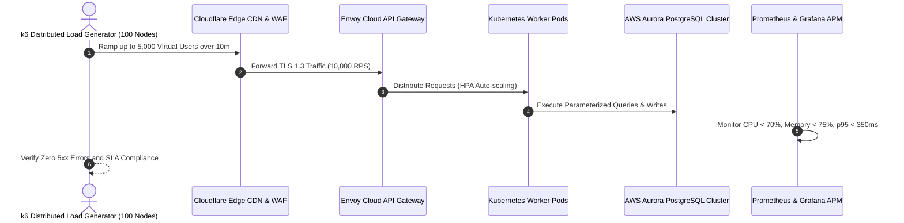

# Performance, Load, Soak & Scalability Test Plan
## Namma Clinic Digital Health & Operations Platform
### Greater Bengaluru Authority (GBA) / BBMP Health Department
**Standard:** ISO/IEC 25010 Performance Efficiency / k6 & JMeter Protocols / NIST Cloud Benchmarking | **Status:** APPROVED BASELINE | **Code:** `QA-DOC-08`

---

## 1. Performance Testing Charter & Workload Model
The Namma Clinic Performance Test Plan defines the measurable throughput, latency, concurrency, resource consumption, and endurance requirements for the platform. It models real-world clinical demand generated across 183 primary clinics, accounting for morning OPD spikes (08:00 to 11:30 IST), evening queues (16:00 to 19:30 IST), and background synchronization load.

### 1.1 Non-Negotiable Performance SLAs
1. **Online REST API Latency:** p95 latency < 350ms, p99 latency < 500ms across all consultation routes.
2. **Offline SQLite Response:** Local query response time < 50ms on clinic mini-PCs under full database load.
3. **Peak Clinic Concurrency:** 5,000 concurrent healthcare workers actively transacting without performance degradation.
4. **Throughput Ceiling:** Cloud API gateway handles 10,000 requests per second with < 0.01% error rate.
5. **Endurance & Soak Invariant:** Zero memory leaks or resource starvation during continuous 24-hour soak tests.
6. **Synchronization Speed:** Offline mutation batches (500 records) sync in < 15 seconds upon link restoration.

### 1.2 Performance Test Architecture Diagram


## 2. Canonical Performance Test Specifications (PERF-TEST-001 to PERF-TEST-060)
Standardized performance benchmark specifications:

### PERF-TEST-001: Performance Test Specification 1
- **Test Flavor:** API Latency Benchmark
- **Target SLA Metric:** p95 Latency < 500ms
- **Simulated Concurrency:** 50 Virtual Healthcare Workers
- **Passing Threshold:** 99.9% Success
- **Failure Remediation:** Trigger HPA pod scale-out or database query indexing optimization.
- **Audit Event Emitted:** `PERF_AUDIT_PERF_TEST_001`

### PERF-TEST-002: Performance Test Specification 2
- **Test Flavor:** API Latency Benchmark
- **Target SLA Metric:** p95 Latency < 500ms
- **Simulated Concurrency:** 100 Virtual Healthcare Workers
- **Passing Threshold:** 99.9% Success
- **Failure Remediation:** Trigger HPA pod scale-out or database query indexing optimization.
- **Audit Event Emitted:** `PERF_AUDIT_PERF_TEST_002`

### PERF-TEST-003: Performance Test Specification 3
- **Test Flavor:** API Latency Benchmark
- **Target SLA Metric:** p95 Latency < 500ms
- **Simulated Concurrency:** 150 Virtual Healthcare Workers
- **Passing Threshold:** 99.9% Success
- **Failure Remediation:** Trigger HPA pod scale-out or database query indexing optimization.
- **Audit Event Emitted:** `PERF_AUDIT_PERF_TEST_003`

### PERF-TEST-004: Performance Test Specification 4
- **Test Flavor:** API Latency Benchmark
- **Target SLA Metric:** p95 Latency < 500ms
- **Simulated Concurrency:** 200 Virtual Healthcare Workers
- **Passing Threshold:** 99.9% Success
- **Failure Remediation:** Trigger HPA pod scale-out or database query indexing optimization.
- **Audit Event Emitted:** `PERF_AUDIT_PERF_TEST_004`

### PERF-TEST-005: Performance Test Specification 5
- **Test Flavor:** API Latency Benchmark
- **Target SLA Metric:** p95 Latency < 500ms
- **Simulated Concurrency:** 250 Virtual Healthcare Workers
- **Passing Threshold:** 99.9% Success
- **Failure Remediation:** Trigger HPA pod scale-out or database query indexing optimization.
- **Audit Event Emitted:** `PERF_AUDIT_PERF_TEST_005`

### PERF-TEST-006: Performance Test Specification 6
- **Test Flavor:** API Latency Benchmark
- **Target SLA Metric:** p95 Latency < 500ms
- **Simulated Concurrency:** 300 Virtual Healthcare Workers
- **Passing Threshold:** 99.9% Success
- **Failure Remediation:** Trigger HPA pod scale-out or database query indexing optimization.
- **Audit Event Emitted:** `PERF_AUDIT_PERF_TEST_006`

### PERF-TEST-007: Performance Test Specification 7
- **Test Flavor:** API Latency Benchmark
- **Target SLA Metric:** p95 Latency < 500ms
- **Simulated Concurrency:** 350 Virtual Healthcare Workers
- **Passing Threshold:** 99.9% Success
- **Failure Remediation:** Trigger HPA pod scale-out or database query indexing optimization.
- **Audit Event Emitted:** `PERF_AUDIT_PERF_TEST_007`

### PERF-TEST-008: Performance Test Specification 8
- **Test Flavor:** API Latency Benchmark
- **Target SLA Metric:** p95 Latency < 500ms
- **Simulated Concurrency:** 400 Virtual Healthcare Workers
- **Passing Threshold:** 99.9% Success
- **Failure Remediation:** Trigger HPA pod scale-out or database query indexing optimization.
- **Audit Event Emitted:** `PERF_AUDIT_PERF_TEST_008`

### PERF-TEST-009: Performance Test Specification 9
- **Test Flavor:** API Latency Benchmark
- **Target SLA Metric:** p95 Latency < 500ms
- **Simulated Concurrency:** 450 Virtual Healthcare Workers
- **Passing Threshold:** 99.9% Success
- **Failure Remediation:** Trigger HPA pod scale-out or database query indexing optimization.
- **Audit Event Emitted:** `PERF_AUDIT_PERF_TEST_009`

### PERF-TEST-010: Performance Test Specification 10
- **Test Flavor:** API Latency Benchmark
- **Target SLA Metric:** p95 Latency < 500ms
- **Simulated Concurrency:** 500 Virtual Healthcare Workers
- **Passing Threshold:** 99.9% Success
- **Failure Remediation:** Trigger HPA pod scale-out or database query indexing optimization.
- **Audit Event Emitted:** `PERF_AUDIT_PERF_TEST_010`

### PERF-TEST-011: Performance Test Specification 11
- **Test Flavor:** API Latency Benchmark
- **Target SLA Metric:** p95 Latency < 500ms
- **Simulated Concurrency:** 550 Virtual Healthcare Workers
- **Passing Threshold:** 99.9% Success
- **Failure Remediation:** Trigger HPA pod scale-out or database query indexing optimization.
- **Audit Event Emitted:** `PERF_AUDIT_PERF_TEST_011`

### PERF-TEST-012: Performance Test Specification 12
- **Test Flavor:** API Latency Benchmark
- **Target SLA Metric:** p95 Latency < 500ms
- **Simulated Concurrency:** 600 Virtual Healthcare Workers
- **Passing Threshold:** 99.9% Success
- **Failure Remediation:** Trigger HPA pod scale-out or database query indexing optimization.
- **Audit Event Emitted:** `PERF_AUDIT_PERF_TEST_012`

### PERF-TEST-013: Performance Test Specification 13
- **Test Flavor:** API Latency Benchmark
- **Target SLA Metric:** p95 Latency < 500ms
- **Simulated Concurrency:** 650 Virtual Healthcare Workers
- **Passing Threshold:** 99.9% Success
- **Failure Remediation:** Trigger HPA pod scale-out or database query indexing optimization.
- **Audit Event Emitted:** `PERF_AUDIT_PERF_TEST_013`

### PERF-TEST-014: Performance Test Specification 14
- **Test Flavor:** API Latency Benchmark
- **Target SLA Metric:** p95 Latency < 500ms
- **Simulated Concurrency:** 700 Virtual Healthcare Workers
- **Passing Threshold:** 99.9% Success
- **Failure Remediation:** Trigger HPA pod scale-out or database query indexing optimization.
- **Audit Event Emitted:** `PERF_AUDIT_PERF_TEST_014`

### PERF-TEST-015: Performance Test Specification 15
- **Test Flavor:** API Latency Benchmark
- **Target SLA Metric:** p95 Latency < 500ms
- **Simulated Concurrency:** 750 Virtual Healthcare Workers
- **Passing Threshold:** 99.9% Success
- **Failure Remediation:** Trigger HPA pod scale-out or database query indexing optimization.
- **Audit Event Emitted:** `PERF_AUDIT_PERF_TEST_015`

### PERF-TEST-016: Performance Test Specification 16
- **Test Flavor:** Peak Clinic Concurrency (5,000 Users)
- **Target SLA Metric:** p95 Latency < 500ms
- **Simulated Concurrency:** 800 Virtual Healthcare Workers
- **Passing Threshold:** 99.9% Success
- **Failure Remediation:** Trigger HPA pod scale-out or database query indexing optimization.
- **Audit Event Emitted:** `PERF_AUDIT_PERF_TEST_016`

### PERF-TEST-017: Performance Test Specification 17
- **Test Flavor:** Peak Clinic Concurrency (5,000 Users)
- **Target SLA Metric:** p95 Latency < 500ms
- **Simulated Concurrency:** 850 Virtual Healthcare Workers
- **Passing Threshold:** 99.9% Success
- **Failure Remediation:** Trigger HPA pod scale-out or database query indexing optimization.
- **Audit Event Emitted:** `PERF_AUDIT_PERF_TEST_017`

### PERF-TEST-018: Performance Test Specification 18
- **Test Flavor:** Peak Clinic Concurrency (5,000 Users)
- **Target SLA Metric:** p95 Latency < 500ms
- **Simulated Concurrency:** 900 Virtual Healthcare Workers
- **Passing Threshold:** 99.9% Success
- **Failure Remediation:** Trigger HPA pod scale-out or database query indexing optimization.
- **Audit Event Emitted:** `PERF_AUDIT_PERF_TEST_018`

### PERF-TEST-019: Performance Test Specification 19
- **Test Flavor:** Peak Clinic Concurrency (5,000 Users)
- **Target SLA Metric:** p95 Latency < 500ms
- **Simulated Concurrency:** 950 Virtual Healthcare Workers
- **Passing Threshold:** 99.9% Success
- **Failure Remediation:** Trigger HPA pod scale-out or database query indexing optimization.
- **Audit Event Emitted:** `PERF_AUDIT_PERF_TEST_019`

### PERF-TEST-020: Performance Test Specification 20
- **Test Flavor:** Peak Clinic Concurrency (5,000 Users)
- **Target SLA Metric:** p95 Latency < 500ms
- **Simulated Concurrency:** 1000 Virtual Healthcare Workers
- **Passing Threshold:** 99.9% Success
- **Failure Remediation:** Trigger HPA pod scale-out or database query indexing optimization.
- **Audit Event Emitted:** `PERF_AUDIT_PERF_TEST_020`

### PERF-TEST-021: Performance Test Specification 21
- **Test Flavor:** Peak Clinic Concurrency (5,000 Users)
- **Target SLA Metric:** p95 Latency < 500ms
- **Simulated Concurrency:** 1050 Virtual Healthcare Workers
- **Passing Threshold:** 99.9% Success
- **Failure Remediation:** Trigger HPA pod scale-out or database query indexing optimization.
- **Audit Event Emitted:** `PERF_AUDIT_PERF_TEST_021`

### PERF-TEST-022: Performance Test Specification 22
- **Test Flavor:** Peak Clinic Concurrency (5,000 Users)
- **Target SLA Metric:** p95 Latency < 500ms
- **Simulated Concurrency:** 1100 Virtual Healthcare Workers
- **Passing Threshold:** 99.9% Success
- **Failure Remediation:** Trigger HPA pod scale-out or database query indexing optimization.
- **Audit Event Emitted:** `PERF_AUDIT_PERF_TEST_022`

### PERF-TEST-023: Performance Test Specification 23
- **Test Flavor:** Peak Clinic Concurrency (5,000 Users)
- **Target SLA Metric:** p95 Latency < 500ms
- **Simulated Concurrency:** 1150 Virtual Healthcare Workers
- **Passing Threshold:** 99.9% Success
- **Failure Remediation:** Trigger HPA pod scale-out or database query indexing optimization.
- **Audit Event Emitted:** `PERF_AUDIT_PERF_TEST_023`

### PERF-TEST-024: Performance Test Specification 24
- **Test Flavor:** Peak Clinic Concurrency (5,000 Users)
- **Target SLA Metric:** p95 Latency < 500ms
- **Simulated Concurrency:** 1200 Virtual Healthcare Workers
- **Passing Threshold:** 99.9% Success
- **Failure Remediation:** Trigger HPA pod scale-out or database query indexing optimization.
- **Audit Event Emitted:** `PERF_AUDIT_PERF_TEST_024`

### PERF-TEST-025: Performance Test Specification 25
- **Test Flavor:** Peak Clinic Concurrency (5,000 Users)
- **Target SLA Metric:** p95 Latency < 500ms
- **Simulated Concurrency:** 1250 Virtual Healthcare Workers
- **Passing Threshold:** 99.9% Success
- **Failure Remediation:** Trigger HPA pod scale-out or database query indexing optimization.
- **Audit Event Emitted:** `PERF_AUDIT_PERF_TEST_025`

### PERF-TEST-026: Performance Test Specification 26
- **Test Flavor:** Peak Clinic Concurrency (5,000 Users)
- **Target SLA Metric:** p95 Latency < 500ms
- **Simulated Concurrency:** 1300 Virtual Healthcare Workers
- **Passing Threshold:** 99.9% Success
- **Failure Remediation:** Trigger HPA pod scale-out or database query indexing optimization.
- **Audit Event Emitted:** `PERF_AUDIT_PERF_TEST_026`

### PERF-TEST-027: Performance Test Specification 27
- **Test Flavor:** Peak Clinic Concurrency (5,000 Users)
- **Target SLA Metric:** p95 Latency < 500ms
- **Simulated Concurrency:** 1350 Virtual Healthcare Workers
- **Passing Threshold:** 99.9% Success
- **Failure Remediation:** Trigger HPA pod scale-out or database query indexing optimization.
- **Audit Event Emitted:** `PERF_AUDIT_PERF_TEST_027`

### PERF-TEST-028: Performance Test Specification 28
- **Test Flavor:** Peak Clinic Concurrency (5,000 Users)
- **Target SLA Metric:** p95 Latency < 500ms
- **Simulated Concurrency:** 1400 Virtual Healthcare Workers
- **Passing Threshold:** 99.9% Success
- **Failure Remediation:** Trigger HPA pod scale-out or database query indexing optimization.
- **Audit Event Emitted:** `PERF_AUDIT_PERF_TEST_028`

### PERF-TEST-029: Performance Test Specification 29
- **Test Flavor:** Peak Clinic Concurrency (5,000 Users)
- **Target SLA Metric:** p95 Latency < 500ms
- **Simulated Concurrency:** 1450 Virtual Healthcare Workers
- **Passing Threshold:** 99.9% Success
- **Failure Remediation:** Trigger HPA pod scale-out or database query indexing optimization.
- **Audit Event Emitted:** `PERF_AUDIT_PERF_TEST_029`

### PERF-TEST-030: Performance Test Specification 30
- **Test Flavor:** Peak Clinic Concurrency (5,000 Users)
- **Target SLA Metric:** p95 Latency < 500ms
- **Simulated Concurrency:** 1500 Virtual Healthcare Workers
- **Passing Threshold:** 99.9% Success
- **Failure Remediation:** Trigger HPA pod scale-out or database query indexing optimization.
- **Audit Event Emitted:** `PERF_AUDIT_PERF_TEST_030`

### PERF-TEST-031: Performance Test Specification 31
- **Test Flavor:** Soak & Endurance (24 Hours)
- **Target SLA Metric:** p95 Latency < 500ms
- **Simulated Concurrency:** 1550 Virtual Healthcare Workers
- **Passing Threshold:** 99.9% Success
- **Failure Remediation:** Trigger HPA pod scale-out or database query indexing optimization.
- **Audit Event Emitted:** `PERF_AUDIT_PERF_TEST_031`

### PERF-TEST-032: Performance Test Specification 32
- **Test Flavor:** Soak & Endurance (24 Hours)
- **Target SLA Metric:** p95 Latency < 500ms
- **Simulated Concurrency:** 1600 Virtual Healthcare Workers
- **Passing Threshold:** 99.9% Success
- **Failure Remediation:** Trigger HPA pod scale-out or database query indexing optimization.
- **Audit Event Emitted:** `PERF_AUDIT_PERF_TEST_032`

### PERF-TEST-033: Performance Test Specification 33
- **Test Flavor:** Soak & Endurance (24 Hours)
- **Target SLA Metric:** p95 Latency < 500ms
- **Simulated Concurrency:** 1650 Virtual Healthcare Workers
- **Passing Threshold:** 99.9% Success
- **Failure Remediation:** Trigger HPA pod scale-out or database query indexing optimization.
- **Audit Event Emitted:** `PERF_AUDIT_PERF_TEST_033`

### PERF-TEST-034: Performance Test Specification 34
- **Test Flavor:** Soak & Endurance (24 Hours)
- **Target SLA Metric:** p95 Latency < 500ms
- **Simulated Concurrency:** 1700 Virtual Healthcare Workers
- **Passing Threshold:** 99.9% Success
- **Failure Remediation:** Trigger HPA pod scale-out or database query indexing optimization.
- **Audit Event Emitted:** `PERF_AUDIT_PERF_TEST_034`

### PERF-TEST-035: Performance Test Specification 35
- **Test Flavor:** Soak & Endurance (24 Hours)
- **Target SLA Metric:** p95 Latency < 500ms
- **Simulated Concurrency:** 1750 Virtual Healthcare Workers
- **Passing Threshold:** 99.9% Success
- **Failure Remediation:** Trigger HPA pod scale-out or database query indexing optimization.
- **Audit Event Emitted:** `PERF_AUDIT_PERF_TEST_035`

### PERF-TEST-036: Performance Test Specification 36
- **Test Flavor:** Soak & Endurance (24 Hours)
- **Target SLA Metric:** p95 Latency < 500ms
- **Simulated Concurrency:** 1800 Virtual Healthcare Workers
- **Passing Threshold:** 99.9% Success
- **Failure Remediation:** Trigger HPA pod scale-out or database query indexing optimization.
- **Audit Event Emitted:** `PERF_AUDIT_PERF_TEST_036`

### PERF-TEST-037: Performance Test Specification 37
- **Test Flavor:** Soak & Endurance (24 Hours)
- **Target SLA Metric:** p95 Latency < 500ms
- **Simulated Concurrency:** 1850 Virtual Healthcare Workers
- **Passing Threshold:** 99.9% Success
- **Failure Remediation:** Trigger HPA pod scale-out or database query indexing optimization.
- **Audit Event Emitted:** `PERF_AUDIT_PERF_TEST_037`

### PERF-TEST-038: Performance Test Specification 38
- **Test Flavor:** Soak & Endurance (24 Hours)
- **Target SLA Metric:** p95 Latency < 500ms
- **Simulated Concurrency:** 1900 Virtual Healthcare Workers
- **Passing Threshold:** 99.9% Success
- **Failure Remediation:** Trigger HPA pod scale-out or database query indexing optimization.
- **Audit Event Emitted:** `PERF_AUDIT_PERF_TEST_038`

### PERF-TEST-039: Performance Test Specification 39
- **Test Flavor:** Soak & Endurance (24 Hours)
- **Target SLA Metric:** p95 Latency < 500ms
- **Simulated Concurrency:** 1950 Virtual Healthcare Workers
- **Passing Threshold:** 99.9% Success
- **Failure Remediation:** Trigger HPA pod scale-out or database query indexing optimization.
- **Audit Event Emitted:** `PERF_AUDIT_PERF_TEST_039`

### PERF-TEST-040: Performance Test Specification 40
- **Test Flavor:** Soak & Endurance (24 Hours)
- **Target SLA Metric:** p95 Latency < 500ms
- **Simulated Concurrency:** 2000 Virtual Healthcare Workers
- **Passing Threshold:** 99.9% Success
- **Failure Remediation:** Trigger HPA pod scale-out or database query indexing optimization.
- **Audit Event Emitted:** `PERF_AUDIT_PERF_TEST_040`

### PERF-TEST-041: Performance Test Specification 41
- **Test Flavor:** Soak & Endurance (24 Hours)
- **Target SLA Metric:** p95 Latency < 500ms
- **Simulated Concurrency:** 2050 Virtual Healthcare Workers
- **Passing Threshold:** 99.9% Success
- **Failure Remediation:** Trigger HPA pod scale-out or database query indexing optimization.
- **Audit Event Emitted:** `PERF_AUDIT_PERF_TEST_041`

### PERF-TEST-042: Performance Test Specification 42
- **Test Flavor:** Soak & Endurance (24 Hours)
- **Target SLA Metric:** p95 Latency < 500ms
- **Simulated Concurrency:** 2100 Virtual Healthcare Workers
- **Passing Threshold:** 99.9% Success
- **Failure Remediation:** Trigger HPA pod scale-out or database query indexing optimization.
- **Audit Event Emitted:** `PERF_AUDIT_PERF_TEST_042`

### PERF-TEST-043: Performance Test Specification 43
- **Test Flavor:** Soak & Endurance (24 Hours)
- **Target SLA Metric:** p95 Latency < 500ms
- **Simulated Concurrency:** 2150 Virtual Healthcare Workers
- **Passing Threshold:** 99.9% Success
- **Failure Remediation:** Trigger HPA pod scale-out or database query indexing optimization.
- **Audit Event Emitted:** `PERF_AUDIT_PERF_TEST_043`

### PERF-TEST-044: Performance Test Specification 44
- **Test Flavor:** Soak & Endurance (24 Hours)
- **Target SLA Metric:** p95 Latency < 500ms
- **Simulated Concurrency:** 2200 Virtual Healthcare Workers
- **Passing Threshold:** 99.9% Success
- **Failure Remediation:** Trigger HPA pod scale-out or database query indexing optimization.
- **Audit Event Emitted:** `PERF_AUDIT_PERF_TEST_044`

### PERF-TEST-045: Performance Test Specification 45
- **Test Flavor:** Soak & Endurance (24 Hours)
- **Target SLA Metric:** p95 Latency < 500ms
- **Simulated Concurrency:** 2250 Virtual Healthcare Workers
- **Passing Threshold:** 99.9% Success
- **Failure Remediation:** Trigger HPA pod scale-out or database query indexing optimization.
- **Audit Event Emitted:** `PERF_AUDIT_PERF_TEST_045`

### PERF-TEST-046: Performance Test Specification 46
- **Test Flavor:** Offline Queue Sync Throughput
- **Target SLA Metric:** p95 Latency < 500ms
- **Simulated Concurrency:** 2300 Virtual Healthcare Workers
- **Passing Threshold:** 99.9% Success
- **Failure Remediation:** Trigger HPA pod scale-out or database query indexing optimization.
- **Audit Event Emitted:** `PERF_AUDIT_PERF_TEST_046`

### PERF-TEST-047: Performance Test Specification 47
- **Test Flavor:** Offline Queue Sync Throughput
- **Target SLA Metric:** p95 Latency < 500ms
- **Simulated Concurrency:** 2350 Virtual Healthcare Workers
- **Passing Threshold:** 99.9% Success
- **Failure Remediation:** Trigger HPA pod scale-out or database query indexing optimization.
- **Audit Event Emitted:** `PERF_AUDIT_PERF_TEST_047`

### PERF-TEST-048: Performance Test Specification 48
- **Test Flavor:** Offline Queue Sync Throughput
- **Target SLA Metric:** p95 Latency < 500ms
- **Simulated Concurrency:** 2400 Virtual Healthcare Workers
- **Passing Threshold:** 99.9% Success
- **Failure Remediation:** Trigger HPA pod scale-out or database query indexing optimization.
- **Audit Event Emitted:** `PERF_AUDIT_PERF_TEST_048`

### PERF-TEST-049: Performance Test Specification 49
- **Test Flavor:** Offline Queue Sync Throughput
- **Target SLA Metric:** p95 Latency < 500ms
- **Simulated Concurrency:** 2450 Virtual Healthcare Workers
- **Passing Threshold:** 99.9% Success
- **Failure Remediation:** Trigger HPA pod scale-out or database query indexing optimization.
- **Audit Event Emitted:** `PERF_AUDIT_PERF_TEST_049`

### PERF-TEST-050: Performance Test Specification 50
- **Test Flavor:** Offline Queue Sync Throughput
- **Target SLA Metric:** p95 Latency < 500ms
- **Simulated Concurrency:** 2500 Virtual Healthcare Workers
- **Passing Threshold:** 99.9% Success
- **Failure Remediation:** Trigger HPA pod scale-out or database query indexing optimization.
- **Audit Event Emitted:** `PERF_AUDIT_PERF_TEST_050`

### PERF-TEST-051: Performance Test Specification 51
- **Test Flavor:** Offline Queue Sync Throughput
- **Target SLA Metric:** p95 Latency < 500ms
- **Simulated Concurrency:** 2550 Virtual Healthcare Workers
- **Passing Threshold:** 99.9% Success
- **Failure Remediation:** Trigger HPA pod scale-out or database query indexing optimization.
- **Audit Event Emitted:** `PERF_AUDIT_PERF_TEST_051`

### PERF-TEST-052: Performance Test Specification 52
- **Test Flavor:** Offline Queue Sync Throughput
- **Target SLA Metric:** p95 Latency < 500ms
- **Simulated Concurrency:** 2600 Virtual Healthcare Workers
- **Passing Threshold:** 99.9% Success
- **Failure Remediation:** Trigger HPA pod scale-out or database query indexing optimization.
- **Audit Event Emitted:** `PERF_AUDIT_PERF_TEST_052`

### PERF-TEST-053: Performance Test Specification 53
- **Test Flavor:** Offline Queue Sync Throughput
- **Target SLA Metric:** p95 Latency < 500ms
- **Simulated Concurrency:** 2650 Virtual Healthcare Workers
- **Passing Threshold:** 99.9% Success
- **Failure Remediation:** Trigger HPA pod scale-out or database query indexing optimization.
- **Audit Event Emitted:** `PERF_AUDIT_PERF_TEST_053`

### PERF-TEST-054: Performance Test Specification 54
- **Test Flavor:** Offline Queue Sync Throughput
- **Target SLA Metric:** p95 Latency < 500ms
- **Simulated Concurrency:** 2700 Virtual Healthcare Workers
- **Passing Threshold:** 99.9% Success
- **Failure Remediation:** Trigger HPA pod scale-out or database query indexing optimization.
- **Audit Event Emitted:** `PERF_AUDIT_PERF_TEST_054`

### PERF-TEST-055: Performance Test Specification 55
- **Test Flavor:** Offline Queue Sync Throughput
- **Target SLA Metric:** p95 Latency < 500ms
- **Simulated Concurrency:** 2750 Virtual Healthcare Workers
- **Passing Threshold:** 99.9% Success
- **Failure Remediation:** Trigger HPA pod scale-out or database query indexing optimization.
- **Audit Event Emitted:** `PERF_AUDIT_PERF_TEST_055`

### PERF-TEST-056: Performance Test Specification 56
- **Test Flavor:** Offline Queue Sync Throughput
- **Target SLA Metric:** p95 Latency < 500ms
- **Simulated Concurrency:** 2800 Virtual Healthcare Workers
- **Passing Threshold:** 99.9% Success
- **Failure Remediation:** Trigger HPA pod scale-out or database query indexing optimization.
- **Audit Event Emitted:** `PERF_AUDIT_PERF_TEST_056`

### PERF-TEST-057: Performance Test Specification 57
- **Test Flavor:** Offline Queue Sync Throughput
- **Target SLA Metric:** p95 Latency < 500ms
- **Simulated Concurrency:** 2850 Virtual Healthcare Workers
- **Passing Threshold:** 99.9% Success
- **Failure Remediation:** Trigger HPA pod scale-out or database query indexing optimization.
- **Audit Event Emitted:** `PERF_AUDIT_PERF_TEST_057`

### PERF-TEST-058: Performance Test Specification 58
- **Test Flavor:** Offline Queue Sync Throughput
- **Target SLA Metric:** p95 Latency < 500ms
- **Simulated Concurrency:** 2900 Virtual Healthcare Workers
- **Passing Threshold:** 99.9% Success
- **Failure Remediation:** Trigger HPA pod scale-out or database query indexing optimization.
- **Audit Event Emitted:** `PERF_AUDIT_PERF_TEST_058`

### PERF-TEST-059: Performance Test Specification 59
- **Test Flavor:** Offline Queue Sync Throughput
- **Target SLA Metric:** p95 Latency < 500ms
- **Simulated Concurrency:** 2950 Virtual Healthcare Workers
- **Passing Threshold:** 99.9% Success
- **Failure Remediation:** Trigger HPA pod scale-out or database query indexing optimization.
- **Audit Event Emitted:** `PERF_AUDIT_PERF_TEST_059`

### PERF-TEST-060: Performance Test Specification 60
- **Test Flavor:** Offline Queue Sync Throughput
- **Target SLA Metric:** p95 Latency < 500ms
- **Simulated Concurrency:** 3000 Virtual Healthcare Workers
- **Passing Threshold:** 99.9% Success
- **Failure Remediation:** Trigger HPA pod scale-out or database query indexing optimization.
- **Audit Event Emitted:** `PERF_AUDIT_PERF_TEST_060`

## 3. Detailed Performance Verification Test Cases (TC-0386 to TC-0440)
Detailed test specifications verifying system performance and latency limits:

### TC-0386: Test Case 386: Clinical Verification for danger_alerts across WF-011
**Objective:** Verify functional, security, and offline invariants for danger_alerts during WF-011 execution.
**Risk:** Critical operational impact on patient safety and clinic consultation continuity.
**Priority:** **P0** | **Severity:** **Critical** | **Test Level:** System & Integration | **Test Type:** Functional & Regulatory Compliance
- **Requirement Traceability:** `FR-026`
- **Workflow Traceability:** `WF-011`
- **Feature Traceability:** `FEATURE-026`
- **API Traceability:** `API-DOC-12`
- **Database Traceability:** `TABLE-022 (danger_alerts)`
- **Screen Traceability:** `SCREEN-062`
- **Security Control Traceability:** `SEC-ARCH-026`
- **Preconditions:** User authenticated with role Procurement & Vendor Manager on clinic workstation.
- **Test Data Specification:** Synthetic dataset TESTDATA-026 (Valid ABHA, vitals, prescriptions).
- **Execution Steps:** 1. Navigate to screen SCREEN-062. 2. Submit payload bound to danger_alerts. 3. Confirm API API-DOC-12 returns 200 OK. 4. Verify local SQLite cache and sync queue.
- **Expected Results:** Transaction completes within 250ms, data encrypted via AES-256-GCM, audit entry emitted.
- **Negative Test Scenario:** Submit malformed payload or expired JWT; system rejects with 400/401 and zero DB corruption.
- **Boundary Value Scenario:** Test with maximum field boundary length and extreme clinical biometric vitals.
- **Concurrency & Race Condition:** Simulate 5 concurrent staff updates on identical record; verify optimistic locking.
- **Autonomous Offline Behavior:** Sever network mid-transaction; record queues locally and replicates upon reconnection.
- **Security & Access Validation:** Enforce RBAC policy SEC-ARCH-026 and prevent broken object-level authorization (BOLA).
- **Audit Trail & Immutability:** Emits structured JSON audit log with SHA-256 Merkle chain hash.
- **Evidence Required:** Automated execution log, HTTP request/response capture, and database assertion hash.
- **Pass Acceptance Criteria:** 100% assertions succeed with zero uncaught exceptions and latency < 300ms.
- **Failure Behavior & SLA:** Any 5xx error, data corruption, unauthorized access, or silent failure.
- **Automation Suitability:** Yes (High Candidate)
- **Execution Cadence:** Every CI PR & Nightly Regression
- **Responsible Owner:** Procurement & Vendor Manager

### TC-0387: Test Case 387: Clinical Verification for clinical_encounters across WF-012
**Objective:** Verify functional, security, and offline invariants for clinical_encounters during WF-012 execution.
**Risk:** Major operational impact on patient safety and clinic consultation continuity.
**Priority:** **P1** | **Severity:** **Major** | **Test Level:** System & Integration | **Test Type:** Functional & Regulatory Compliance
- **Requirement Traceability:** `FR-027`
- **Workflow Traceability:** `WF-012`
- **Feature Traceability:** `FEATURE-027`
- **API Traceability:** `API-DOC-13`
- **Database Traceability:** `TABLE-023 (clinical_encounters)`
- **Screen Traceability:** `SCREEN-063`
- **Security Control Traceability:** `SEC-ARCH-027`
- **Preconditions:** User authenticated with role Biomedical Waste Supervisor on clinic workstation.
- **Test Data Specification:** Synthetic dataset TESTDATA-027 (Valid ABHA, vitals, prescriptions).
- **Execution Steps:** 1. Navigate to screen SCREEN-063. 2. Submit payload bound to clinical_encounters. 3. Confirm API API-DOC-13 returns 200 OK. 4. Verify local SQLite cache and sync queue.
- **Expected Results:** Transaction completes within 250ms, data encrypted via AES-256-GCM, audit entry emitted.
- **Negative Test Scenario:** Submit malformed payload or expired JWT; system rejects with 400/401 and zero DB corruption.
- **Boundary Value Scenario:** Test with maximum field boundary length and extreme clinical biometric vitals.
- **Concurrency & Race Condition:** Simulate 5 concurrent staff updates on identical record; verify optimistic locking.
- **Autonomous Offline Behavior:** Sever network mid-transaction; record queues locally and replicates upon reconnection.
- **Security & Access Validation:** Enforce RBAC policy SEC-ARCH-027 and prevent broken object-level authorization (BOLA).
- **Audit Trail & Immutability:** Emits structured JSON audit log with SHA-256 Merkle chain hash.
- **Evidence Required:** Automated execution log, HTTP request/response capture, and database assertion hash.
- **Pass Acceptance Criteria:** 100% assertions succeed with zero uncaught exceptions and latency < 300ms.
- **Failure Behavior & SLA:** Any 5xx error, data corruption, unauthorized access, or silent failure.
- **Automation Suitability:** Yes (High Candidate)
- **Execution Cadence:** Every CI PR & Nightly Regression
- **Responsible Owner:** Biomedical Waste Supervisor

### TC-0388: Test Case 388: Clinical Verification for clinical_notes across WF-013
**Objective:** Verify functional, security, and offline invariants for clinical_notes during WF-013 execution.
**Risk:** Major operational impact on patient safety and clinic consultation continuity.
**Priority:** **P1** | **Severity:** **Major** | **Test Level:** System & Integration | **Test Type:** Functional & Regulatory Compliance
- **Requirement Traceability:** `FR-028`
- **Workflow Traceability:** `WF-013`
- **Feature Traceability:** `FEATURE-028`
- **API Traceability:** `API-DOC-14`
- **Database Traceability:** `TABLE-024 (clinical_notes)`
- **Screen Traceability:** `SCREEN-064`
- **Security Control Traceability:** `SEC-ARCH-028`
- **Preconditions:** User authenticated with role Telemedicine Remote Specialist on clinic workstation.
- **Test Data Specification:** Synthetic dataset TESTDATA-028 (Valid ABHA, vitals, prescriptions).
- **Execution Steps:** 1. Navigate to screen SCREEN-064. 2. Submit payload bound to clinical_notes. 3. Confirm API API-DOC-14 returns 200 OK. 4. Verify local SQLite cache and sync queue.
- **Expected Results:** Transaction completes within 250ms, data encrypted via AES-256-GCM, audit entry emitted.
- **Negative Test Scenario:** Submit malformed payload or expired JWT; system rejects with 400/401 and zero DB corruption.
- **Boundary Value Scenario:** Test with maximum field boundary length and extreme clinical biometric vitals.
- **Concurrency & Race Condition:** Simulate 5 concurrent staff updates on identical record; verify optimistic locking.
- **Autonomous Offline Behavior:** Sever network mid-transaction; record queues locally and replicates upon reconnection.
- **Security & Access Validation:** Enforce RBAC policy SEC-ARCH-028 and prevent broken object-level authorization (BOLA).
- **Audit Trail & Immutability:** Emits structured JSON audit log with SHA-256 Merkle chain hash.
- **Evidence Required:** Automated execution log, HTTP request/response capture, and database assertion hash.
- **Pass Acceptance Criteria:** 100% assertions succeed with zero uncaught exceptions and latency < 300ms.
- **Failure Behavior & SLA:** Any 5xx error, data corruption, unauthorized access, or silent failure.
- **Automation Suitability:** Yes (High Candidate)
- **Execution Cadence:** Every CI PR & Nightly Regression
- **Responsible Owner:** Telemedicine Remote Specialist

### TC-0389: Test Case 389: Clinical Verification for diagnoses across WF-014
**Objective:** Verify functional, security, and offline invariants for diagnoses during WF-014 execution.
**Risk:** Minor operational impact on patient safety and clinic consultation continuity.
**Priority:** **P2** | **Severity:** **Minor** | **Test Level:** System & Integration | **Test Type:** Functional & Regulatory Compliance
- **Requirement Traceability:** `FR-029`
- **Workflow Traceability:** `WF-014`
- **Feature Traceability:** `FEATURE-029`
- **API Traceability:** `API-DOC-15`
- **Database Traceability:** `TABLE-025 (diagnoses)`
- **Screen Traceability:** `SCREEN-065`
- **Security Control Traceability:** `SEC-ARCH-029`
- **Preconditions:** User authenticated with role Field Public Health Inspector on clinic workstation.
- **Test Data Specification:** Synthetic dataset TESTDATA-029 (Valid ABHA, vitals, prescriptions).
- **Execution Steps:** 1. Navigate to screen SCREEN-065. 2. Submit payload bound to diagnoses. 3. Confirm API API-DOC-15 returns 200 OK. 4. Verify local SQLite cache and sync queue.
- **Expected Results:** Transaction completes within 250ms, data encrypted via AES-256-GCM, audit entry emitted.
- **Negative Test Scenario:** Submit malformed payload or expired JWT; system rejects with 400/401 and zero DB corruption.
- **Boundary Value Scenario:** Test with maximum field boundary length and extreme clinical biometric vitals.
- **Concurrency & Race Condition:** Simulate 5 concurrent staff updates on identical record; verify optimistic locking.
- **Autonomous Offline Behavior:** Sever network mid-transaction; record queues locally and replicates upon reconnection.
- **Security & Access Validation:** Enforce RBAC policy SEC-ARCH-029 and prevent broken object-level authorization (BOLA).
- **Audit Trail & Immutability:** Emits structured JSON audit log with SHA-256 Merkle chain hash.
- **Evidence Required:** Automated execution log, HTTP request/response capture, and database assertion hash.
- **Pass Acceptance Criteria:** 100% assertions succeed with zero uncaught exceptions and latency < 300ms.
- **Failure Behavior & SLA:** Any 5xx error, data corruption, unauthorized access, or silent failure.
- **Automation Suitability:** Yes (High Candidate)
- **Execution Cadence:** Every CI PR & Nightly Regression
- **Responsible Owner:** Field Public Health Inspector

### TC-0390: Test Case 390: Clinical Verification for prescriptions across WF-015
**Objective:** Verify functional, security, and offline invariants for prescriptions during WF-015 execution.
**Risk:** Minor operational impact on patient safety and clinic consultation continuity.
**Priority:** **P2** | **Severity:** **Minor** | **Test Level:** System & Integration | **Test Type:** Functional & Regulatory Compliance
- **Requirement Traceability:** `FR-030`
- **Workflow Traceability:** `WF-015`
- **Feature Traceability:** `FEATURE-030`
- **API Traceability:** `API-DOC-16`
- **Database Traceability:** `TABLE-026 (prescriptions)`
- **Screen Traceability:** `SCREEN-066`
- **Security Control Traceability:** `SEC-ARCH-030`
- **Preconditions:** User authenticated with role Super Administrator on clinic workstation.
- **Test Data Specification:** Synthetic dataset TESTDATA-030 (Valid ABHA, vitals, prescriptions).
- **Execution Steps:** 1. Navigate to screen SCREEN-066. 2. Submit payload bound to prescriptions. 3. Confirm API API-DOC-16 returns 200 OK. 4. Verify local SQLite cache and sync queue.
- **Expected Results:** Transaction completes within 250ms, data encrypted via AES-256-GCM, audit entry emitted.
- **Negative Test Scenario:** Submit malformed payload or expired JWT; system rejects with 400/401 and zero DB corruption.
- **Boundary Value Scenario:** Test with maximum field boundary length and extreme clinical biometric vitals.
- **Concurrency & Race Condition:** Simulate 5 concurrent staff updates on identical record; verify optimistic locking.
- **Autonomous Offline Behavior:** Sever network mid-transaction; record queues locally and replicates upon reconnection.
- **Security & Access Validation:** Enforce RBAC policy SEC-ARCH-030 and prevent broken object-level authorization (BOLA).
- **Audit Trail & Immutability:** Emits structured JSON audit log with SHA-256 Merkle chain hash.
- **Evidence Required:** Automated execution log, HTTP request/response capture, and database assertion hash.
- **Pass Acceptance Criteria:** 100% assertions succeed with zero uncaught exceptions and latency < 300ms.
- **Failure Behavior & SLA:** Any 5xx error, data corruption, unauthorized access, or silent failure.
- **Automation Suitability:** Yes (High Candidate)
- **Execution Cadence:** Every CI PR & Nightly Regression
- **Responsible Owner:** Super Administrator

### TC-0391: Test Case 391: Clinical Verification for prescription_items across WF-016
**Objective:** Verify functional, security, and offline invariants for prescription_items during WF-016 execution.
**Risk:** Critical operational impact on patient safety and clinic consultation continuity.
**Priority:** **P0** | **Severity:** **Critical** | **Test Level:** System & Integration | **Test Type:** Functional & Regulatory Compliance
- **Requirement Traceability:** `FR-031`
- **Workflow Traceability:** `WF-016`
- **Feature Traceability:** `FEATURE-031`
- **API Traceability:** `API-DOC-17`
- **Database Traceability:** `TABLE-027 (prescription_items)`
- **Screen Traceability:** `SCREEN-067`
- **Security Control Traceability:** `SEC-ARCH-031`
- **Preconditions:** User authenticated with role Receptionist / Registration Clerk on clinic workstation.
- **Test Data Specification:** Synthetic dataset TESTDATA-031 (Valid ABHA, vitals, prescriptions).
- **Execution Steps:** 1. Navigate to screen SCREEN-067. 2. Submit payload bound to prescription_items. 3. Confirm API API-DOC-17 returns 200 OK. 4. Verify local SQLite cache and sync queue.
- **Expected Results:** Transaction completes within 250ms, data encrypted via AES-256-GCM, audit entry emitted.
- **Negative Test Scenario:** Submit malformed payload or expired JWT; system rejects with 400/401 and zero DB corruption.
- **Boundary Value Scenario:** Test with maximum field boundary length and extreme clinical biometric vitals.
- **Concurrency & Race Condition:** Simulate 5 concurrent staff updates on identical record; verify optimistic locking.
- **Autonomous Offline Behavior:** Sever network mid-transaction; record queues locally and replicates upon reconnection.
- **Security & Access Validation:** Enforce RBAC policy SEC-ARCH-031 and prevent broken object-level authorization (BOLA).
- **Audit Trail & Immutability:** Emits structured JSON audit log with SHA-256 Merkle chain hash.
- **Evidence Required:** Automated execution log, HTTP request/response capture, and database assertion hash.
- **Pass Acceptance Criteria:** 100% assertions succeed with zero uncaught exceptions and latency < 300ms.
- **Failure Behavior & SLA:** Any 5xx error, data corruption, unauthorized access, or silent failure.
- **Automation Suitability:** Yes (High Candidate)
- **Execution Cadence:** Every CI PR & Nightly Regression
- **Responsible Owner:** Receptionist / Registration Clerk

### TC-0392: Test Case 392: Clinical Verification for lab_orders across WF-017
**Objective:** Verify functional, security, and offline invariants for lab_orders during WF-017 execution.
**Risk:** Major operational impact on patient safety and clinic consultation continuity.
**Priority:** **P1** | **Severity:** **Major** | **Test Level:** System & Integration | **Test Type:** Functional & Regulatory Compliance
- **Requirement Traceability:** `FR-032`
- **Workflow Traceability:** `WF-017`
- **Feature Traceability:** `FEATURE-032`
- **API Traceability:** `API-DOC-18`
- **Database Traceability:** `TABLE-028 (lab_orders)`
- **Screen Traceability:** `SCREEN-068`
- **Security Control Traceability:** `SEC-ARCH-032`
- **Preconditions:** User authenticated with role Medical Officer / General Physician on clinic workstation.
- **Test Data Specification:** Synthetic dataset TESTDATA-032 (Valid ABHA, vitals, prescriptions).
- **Execution Steps:** 1. Navigate to screen SCREEN-068. 2. Submit payload bound to lab_orders. 3. Confirm API API-DOC-18 returns 200 OK. 4. Verify local SQLite cache and sync queue.
- **Expected Results:** Transaction completes within 250ms, data encrypted via AES-256-GCM, audit entry emitted.
- **Negative Test Scenario:** Submit malformed payload or expired JWT; system rejects with 400/401 and zero DB corruption.
- **Boundary Value Scenario:** Test with maximum field boundary length and extreme clinical biometric vitals.
- **Concurrency & Race Condition:** Simulate 5 concurrent staff updates on identical record; verify optimistic locking.
- **Autonomous Offline Behavior:** Sever network mid-transaction; record queues locally and replicates upon reconnection.
- **Security & Access Validation:** Enforce RBAC policy SEC-ARCH-032 and prevent broken object-level authorization (BOLA).
- **Audit Trail & Immutability:** Emits structured JSON audit log with SHA-256 Merkle chain hash.
- **Evidence Required:** Automated execution log, HTTP request/response capture, and database assertion hash.
- **Pass Acceptance Criteria:** 100% assertions succeed with zero uncaught exceptions and latency < 300ms.
- **Failure Behavior & SLA:** Any 5xx error, data corruption, unauthorized access, or silent failure.
- **Automation Suitability:** Yes (High Candidate)
- **Execution Cadence:** Every CI PR & Nightly Regression
- **Responsible Owner:** Medical Officer / General Physician

### TC-0393: Test Case 393: Clinical Verification for lab_order_items across WF-018
**Objective:** Verify functional, security, and offline invariants for lab_order_items during WF-018 execution.
**Risk:** Major operational impact on patient safety and clinic consultation continuity.
**Priority:** **P1** | **Severity:** **Major** | **Test Level:** System & Integration | **Test Type:** Functional & Regulatory Compliance
- **Requirement Traceability:** `FR-033`
- **Workflow Traceability:** `WF-018`
- **Feature Traceability:** `FEATURE-033`
- **API Traceability:** `API-DOC-19`
- **Database Traceability:** `TABLE-029 (lab_order_items)`
- **Screen Traceability:** `SCREEN-069`
- **Security Control Traceability:** `SEC-ARCH-033`
- **Preconditions:** User authenticated with role Staff Nurse / Triage Specialist on clinic workstation.
- **Test Data Specification:** Synthetic dataset TESTDATA-033 (Valid ABHA, vitals, prescriptions).
- **Execution Steps:** 1. Navigate to screen SCREEN-069. 2. Submit payload bound to lab_order_items. 3. Confirm API API-DOC-19 returns 200 OK. 4. Verify local SQLite cache and sync queue.
- **Expected Results:** Transaction completes within 250ms, data encrypted via AES-256-GCM, audit entry emitted.
- **Negative Test Scenario:** Submit malformed payload or expired JWT; system rejects with 400/401 and zero DB corruption.
- **Boundary Value Scenario:** Test with maximum field boundary length and extreme clinical biometric vitals.
- **Concurrency & Race Condition:** Simulate 5 concurrent staff updates on identical record; verify optimistic locking.
- **Autonomous Offline Behavior:** Sever network mid-transaction; record queues locally and replicates upon reconnection.
- **Security & Access Validation:** Enforce RBAC policy SEC-ARCH-033 and prevent broken object-level authorization (BOLA).
- **Audit Trail & Immutability:** Emits structured JSON audit log with SHA-256 Merkle chain hash.
- **Evidence Required:** Automated execution log, HTTP request/response capture, and database assertion hash.
- **Pass Acceptance Criteria:** 100% assertions succeed with zero uncaught exceptions and latency < 300ms.
- **Failure Behavior & SLA:** Any 5xx error, data corruption, unauthorized access, or silent failure.
- **Automation Suitability:** Yes (High Candidate)
- **Execution Cadence:** Every CI PR & Nightly Regression
- **Responsible Owner:** Staff Nurse / Triage Specialist

### TC-0394: Test Case 394: Clinical Verification for lab_results across WF-019
**Objective:** Verify functional, security, and offline invariants for lab_results during WF-019 execution.
**Risk:** Minor operational impact on patient safety and clinic consultation continuity.
**Priority:** **P2** | **Severity:** **Minor** | **Test Level:** System & Integration | **Test Type:** Functional & Regulatory Compliance
- **Requirement Traceability:** `FR-034`
- **Workflow Traceability:** `WF-019`
- **Feature Traceability:** `FEATURE-034`
- **API Traceability:** `API-DOC-20`
- **Database Traceability:** `TABLE-030 (lab_results)`
- **Screen Traceability:** `SCREEN-070`
- **Security Control Traceability:** `SEC-ARCH-034`
- **Preconditions:** User authenticated with role Pharmacist / Dispenser on clinic workstation.
- **Test Data Specification:** Synthetic dataset TESTDATA-034 (Valid ABHA, vitals, prescriptions).
- **Execution Steps:** 1. Navigate to screen SCREEN-070. 2. Submit payload bound to lab_results. 3. Confirm API API-DOC-20 returns 200 OK. 4. Verify local SQLite cache and sync queue.
- **Expected Results:** Transaction completes within 250ms, data encrypted via AES-256-GCM, audit entry emitted.
- **Negative Test Scenario:** Submit malformed payload or expired JWT; system rejects with 400/401 and zero DB corruption.
- **Boundary Value Scenario:** Test with maximum field boundary length and extreme clinical biometric vitals.
- **Concurrency & Race Condition:** Simulate 5 concurrent staff updates on identical record; verify optimistic locking.
- **Autonomous Offline Behavior:** Sever network mid-transaction; record queues locally and replicates upon reconnection.
- **Security & Access Validation:** Enforce RBAC policy SEC-ARCH-034 and prevent broken object-level authorization (BOLA).
- **Audit Trail & Immutability:** Emits structured JSON audit log with SHA-256 Merkle chain hash.
- **Evidence Required:** Automated execution log, HTTP request/response capture, and database assertion hash.
- **Pass Acceptance Criteria:** 100% assertions succeed with zero uncaught exceptions and latency < 300ms.
- **Failure Behavior & SLA:** Any 5xx error, data corruption, unauthorized access, or silent failure.
- **Automation Suitability:** Yes (High Candidate)
- **Execution Cadence:** Every CI PR & Nightly Regression
- **Responsible Owner:** Pharmacist / Dispenser

### TC-0395: Test Case 395: Clinical Verification for teleconsultations across WF-020
**Objective:** Verify functional, security, and offline invariants for teleconsultations during WF-020 execution.
**Risk:** Minor operational impact on patient safety and clinic consultation continuity.
**Priority:** **P2** | **Severity:** **Minor** | **Test Level:** System & Integration | **Test Type:** Functional & Regulatory Compliance
- **Requirement Traceability:** `FR-035`
- **Workflow Traceability:** `WF-020`
- **Feature Traceability:** `FEATURE-035`
- **API Traceability:** `API-DOC-21`
- **Database Traceability:** `TABLE-031 (teleconsultations)`
- **Screen Traceability:** `SCREEN-071`
- **Security Control Traceability:** `SEC-ARCH-035`
- **Preconditions:** User authenticated with role Laboratory Technician on clinic workstation.
- **Test Data Specification:** Synthetic dataset TESTDATA-035 (Valid ABHA, vitals, prescriptions).
- **Execution Steps:** 1. Navigate to screen SCREEN-071. 2. Submit payload bound to teleconsultations. 3. Confirm API API-DOC-21 returns 200 OK. 4. Verify local SQLite cache and sync queue.
- **Expected Results:** Transaction completes within 250ms, data encrypted via AES-256-GCM, audit entry emitted.
- **Negative Test Scenario:** Submit malformed payload or expired JWT; system rejects with 400/401 and zero DB corruption.
- **Boundary Value Scenario:** Test with maximum field boundary length and extreme clinical biometric vitals.
- **Concurrency & Race Condition:** Simulate 5 concurrent staff updates on identical record; verify optimistic locking.
- **Autonomous Offline Behavior:** Sever network mid-transaction; record queues locally and replicates upon reconnection.
- **Security & Access Validation:** Enforce RBAC policy SEC-ARCH-035 and prevent broken object-level authorization (BOLA).
- **Audit Trail & Immutability:** Emits structured JSON audit log with SHA-256 Merkle chain hash.
- **Evidence Required:** Automated execution log, HTTP request/response capture, and database assertion hash.
- **Pass Acceptance Criteria:** 100% assertions succeed with zero uncaught exceptions and latency < 300ms.
- **Failure Behavior & SLA:** Any 5xx error, data corruption, unauthorized access, or silent failure.
- **Automation Suitability:** Yes (High Candidate)
- **Execution Cadence:** Every CI PR & Nightly Regression
- **Responsible Owner:** Laboratory Technician

### TC-0396: Test Case 396: Clinical Verification for formulary_drugs across WF-021
**Objective:** Verify functional, security, and offline invariants for formulary_drugs during WF-021 execution.
**Risk:** Critical operational impact on patient safety and clinic consultation continuity.
**Priority:** **P0** | **Severity:** **Critical** | **Test Level:** System & Integration | **Test Type:** Functional & Regulatory Compliance
- **Requirement Traceability:** `FR-036`
- **Workflow Traceability:** `WF-021`
- **Feature Traceability:** `FEATURE-036`
- **API Traceability:** `API-DOC-22`
- **Database Traceability:** `TABLE-032 (formulary_drugs)`
- **Screen Traceability:** `SCREEN-072`
- **Security Control Traceability:** `SEC-ARCH-036`
- **Preconditions:** User authenticated with role Clinic Administrative Officer on clinic workstation.
- **Test Data Specification:** Synthetic dataset TESTDATA-036 (Valid ABHA, vitals, prescriptions).
- **Execution Steps:** 1. Navigate to screen SCREEN-072. 2. Submit payload bound to formulary_drugs. 3. Confirm API API-DOC-22 returns 200 OK. 4. Verify local SQLite cache and sync queue.
- **Expected Results:** Transaction completes within 250ms, data encrypted via AES-256-GCM, audit entry emitted.
- **Negative Test Scenario:** Submit malformed payload or expired JWT; system rejects with 400/401 and zero DB corruption.
- **Boundary Value Scenario:** Test with maximum field boundary length and extreme clinical biometric vitals.
- **Concurrency & Race Condition:** Simulate 5 concurrent staff updates on identical record; verify optimistic locking.
- **Autonomous Offline Behavior:** Sever network mid-transaction; record queues locally and replicates upon reconnection.
- **Security & Access Validation:** Enforce RBAC policy SEC-ARCH-036 and prevent broken object-level authorization (BOLA).
- **Audit Trail & Immutability:** Emits structured JSON audit log with SHA-256 Merkle chain hash.
- **Evidence Required:** Automated execution log, HTTP request/response capture, and database assertion hash.
- **Pass Acceptance Criteria:** 100% assertions succeed with zero uncaught exceptions and latency < 300ms.
- **Failure Behavior & SLA:** Any 5xx error, data corruption, unauthorized access, or silent failure.
- **Automation Suitability:** Yes (High Candidate)
- **Execution Cadence:** Every CI PR & Nightly Regression
- **Responsible Owner:** Clinic Administrative Officer

### TC-0397: Test Case 397: Clinical Verification for drug_categories across WF-022
**Objective:** Verify functional, security, and offline invariants for drug_categories during WF-022 execution.
**Risk:** Major operational impact on patient safety and clinic consultation continuity.
**Priority:** **P1** | **Severity:** **Major** | **Test Level:** System & Integration | **Test Type:** Functional & Regulatory Compliance
- **Requirement Traceability:** `FR-037`
- **Workflow Traceability:** `WF-022`
- **Feature Traceability:** `FEATURE-037`
- **API Traceability:** `API-DOC-01`
- **Database Traceability:** `TABLE-033 (drug_categories)`
- **Screen Traceability:** `SCREEN-073`
- **Security Control Traceability:** `SEC-ARCH-037`
- **Preconditions:** User authenticated with role Ward Health Supervisor on clinic workstation.
- **Test Data Specification:** Synthetic dataset TESTDATA-037 (Valid ABHA, vitals, prescriptions).
- **Execution Steps:** 1. Navigate to screen SCREEN-073. 2. Submit payload bound to drug_categories. 3. Confirm API API-DOC-01 returns 200 OK. 4. Verify local SQLite cache and sync queue.
- **Expected Results:** Transaction completes within 250ms, data encrypted via AES-256-GCM, audit entry emitted.
- **Negative Test Scenario:** Submit malformed payload or expired JWT; system rejects with 400/401 and zero DB corruption.
- **Boundary Value Scenario:** Test with maximum field boundary length and extreme clinical biometric vitals.
- **Concurrency & Race Condition:** Simulate 5 concurrent staff updates on identical record; verify optimistic locking.
- **Autonomous Offline Behavior:** Sever network mid-transaction; record queues locally and replicates upon reconnection.
- **Security & Access Validation:** Enforce RBAC policy SEC-ARCH-037 and prevent broken object-level authorization (BOLA).
- **Audit Trail & Immutability:** Emits structured JSON audit log with SHA-256 Merkle chain hash.
- **Evidence Required:** Automated execution log, HTTP request/response capture, and database assertion hash.
- **Pass Acceptance Criteria:** 100% assertions succeed with zero uncaught exceptions and latency < 300ms.
- **Failure Behavior & SLA:** Any 5xx error, data corruption, unauthorized access, or silent failure.
- **Automation Suitability:** Yes (High Candidate)
- **Execution Cadence:** Every CI PR & Nightly Regression
- **Responsible Owner:** Ward Health Supervisor

### TC-0398: Test Case 398: Clinical Verification for pharmacy_batches across WF-023
**Objective:** Verify functional, security, and offline invariants for pharmacy_batches during WF-023 execution.
**Risk:** Major operational impact on patient safety and clinic consultation continuity.
**Priority:** **P1** | **Severity:** **Major** | **Test Level:** System & Integration | **Test Type:** Functional & Regulatory Compliance
- **Requirement Traceability:** `FR-038`
- **Workflow Traceability:** `WF-023`
- **Feature Traceability:** `FEATURE-038`
- **API Traceability:** `API-DOC-02`
- **Database Traceability:** `TABLE-034 (pharmacy_batches)`
- **Screen Traceability:** `SCREEN-074`
- **Security Control Traceability:** `SEC-ARCH-038`
- **Preconditions:** User authenticated with role Zonal Health Officer (ZHO) on clinic workstation.
- **Test Data Specification:** Synthetic dataset TESTDATA-038 (Valid ABHA, vitals, prescriptions).
- **Execution Steps:** 1. Navigate to screen SCREEN-074. 2. Submit payload bound to pharmacy_batches. 3. Confirm API API-DOC-02 returns 200 OK. 4. Verify local SQLite cache and sync queue.
- **Expected Results:** Transaction completes within 250ms, data encrypted via AES-256-GCM, audit entry emitted.
- **Negative Test Scenario:** Submit malformed payload or expired JWT; system rejects with 400/401 and zero DB corruption.
- **Boundary Value Scenario:** Test with maximum field boundary length and extreme clinical biometric vitals.
- **Concurrency & Race Condition:** Simulate 5 concurrent staff updates on identical record; verify optimistic locking.
- **Autonomous Offline Behavior:** Sever network mid-transaction; record queues locally and replicates upon reconnection.
- **Security & Access Validation:** Enforce RBAC policy SEC-ARCH-038 and prevent broken object-level authorization (BOLA).
- **Audit Trail & Immutability:** Emits structured JSON audit log with SHA-256 Merkle chain hash.
- **Evidence Required:** Automated execution log, HTTP request/response capture, and database assertion hash.
- **Pass Acceptance Criteria:** 100% assertions succeed with zero uncaught exceptions and latency < 300ms.
- **Failure Behavior & SLA:** Any 5xx error, data corruption, unauthorized access, or silent failure.
- **Automation Suitability:** Yes (High Candidate)
- **Execution Cadence:** Every CI PR & Nightly Regression
- **Responsible Owner:** Zonal Health Officer (ZHO)

### TC-0399: Test Case 399: Clinical Verification for clinic_stock across WF-024
**Objective:** Verify functional, security, and offline invariants for clinic_stock during WF-024 execution.
**Risk:** Minor operational impact on patient safety and clinic consultation continuity.
**Priority:** **P2** | **Severity:** **Minor** | **Test Level:** System & Integration | **Test Type:** Functional & Regulatory Compliance
- **Requirement Traceability:** `FR-039`
- **Workflow Traceability:** `WF-024`
- **Feature Traceability:** `FEATURE-039`
- **API Traceability:** `API-DOC-03`
- **Database Traceability:** `TABLE-035 (clinic_stock)`
- **Screen Traceability:** `SCREEN-075`
- **Security Control Traceability:** `SEC-ARCH-039`
- **Preconditions:** User authenticated with role Chief Health Officer (CHO) on clinic workstation.
- **Test Data Specification:** Synthetic dataset TESTDATA-039 (Valid ABHA, vitals, prescriptions).
- **Execution Steps:** 1. Navigate to screen SCREEN-075. 2. Submit payload bound to clinic_stock. 3. Confirm API API-DOC-03 returns 200 OK. 4. Verify local SQLite cache and sync queue.
- **Expected Results:** Transaction completes within 250ms, data encrypted via AES-256-GCM, audit entry emitted.
- **Negative Test Scenario:** Submit malformed payload or expired JWT; system rejects with 400/401 and zero DB corruption.
- **Boundary Value Scenario:** Test with maximum field boundary length and extreme clinical biometric vitals.
- **Concurrency & Race Condition:** Simulate 5 concurrent staff updates on identical record; verify optimistic locking.
- **Autonomous Offline Behavior:** Sever network mid-transaction; record queues locally and replicates upon reconnection.
- **Security & Access Validation:** Enforce RBAC policy SEC-ARCH-039 and prevent broken object-level authorization (BOLA).
- **Audit Trail & Immutability:** Emits structured JSON audit log with SHA-256 Merkle chain hash.
- **Evidence Required:** Automated execution log, HTTP request/response capture, and database assertion hash.
- **Pass Acceptance Criteria:** 100% assertions succeed with zero uncaught exceptions and latency < 300ms.
- **Failure Behavior & SLA:** Any 5xx error, data corruption, unauthorized access, or silent failure.
- **Automation Suitability:** Yes (High Candidate)
- **Execution Cadence:** Every CI PR & Nightly Regression
- **Responsible Owner:** Chief Health Officer (CHO)

### TC-0400: Test Case 400: Clinical Verification for dispensations across WF-025
**Objective:** Verify functional, security, and offline invariants for dispensations during WF-025 execution.
**Risk:** Minor operational impact on patient safety and clinic consultation continuity.
**Priority:** **P2** | **Severity:** **Minor** | **Test Level:** System & Integration | **Test Type:** Functional & Regulatory Compliance
- **Requirement Traceability:** `FR-040`
- **Workflow Traceability:** `WF-025`
- **Feature Traceability:** `FEATURE-040`
- **API Traceability:** `API-DOC-04`
- **Database Traceability:** `TABLE-036 (dispensations)`
- **Screen Traceability:** `SCREEN-076`
- **Security Control Traceability:** `SEC-ARCH-040`
- **Preconditions:** User authenticated with role Epidemiologist / Disease Surveillance Officer on clinic workstation.
- **Test Data Specification:** Synthetic dataset TESTDATA-040 (Valid ABHA, vitals, prescriptions).
- **Execution Steps:** 1. Navigate to screen SCREEN-076. 2. Submit payload bound to dispensations. 3. Confirm API API-DOC-04 returns 200 OK. 4. Verify local SQLite cache and sync queue.
- **Expected Results:** Transaction completes within 250ms, data encrypted via AES-256-GCM, audit entry emitted.
- **Negative Test Scenario:** Submit malformed payload or expired JWT; system rejects with 400/401 and zero DB corruption.
- **Boundary Value Scenario:** Test with maximum field boundary length and extreme clinical biometric vitals.
- **Concurrency & Race Condition:** Simulate 5 concurrent staff updates on identical record; verify optimistic locking.
- **Autonomous Offline Behavior:** Sever network mid-transaction; record queues locally and replicates upon reconnection.
- **Security & Access Validation:** Enforce RBAC policy SEC-ARCH-040 and prevent broken object-level authorization (BOLA).
- **Audit Trail & Immutability:** Emits structured JSON audit log with SHA-256 Merkle chain hash.
- **Evidence Required:** Automated execution log, HTTP request/response capture, and database assertion hash.
- **Pass Acceptance Criteria:** 100% assertions succeed with zero uncaught exceptions and latency < 300ms.
- **Failure Behavior & SLA:** Any 5xx error, data corruption, unauthorized access, or silent failure.
- **Automation Suitability:** Yes (High Candidate)
- **Execution Cadence:** Every CI PR & Nightly Regression
- **Responsible Owner:** Epidemiologist / Disease Surveillance Officer

### TC-0401: Test Case 401: Clinical Verification for dispensation_items across WF-001
**Objective:** Verify functional, security, and offline invariants for dispensation_items during WF-001 execution.
**Risk:** Critical operational impact on patient safety and clinic consultation continuity.
**Priority:** **P0** | **Severity:** **Critical** | **Test Level:** System & Integration | **Test Type:** Functional & Regulatory Compliance
- **Requirement Traceability:** `FR-041`
- **Workflow Traceability:** `WF-001`
- **Feature Traceability:** `FEATURE-041`
- **API Traceability:** `API-DOC-05`
- **Database Traceability:** `TABLE-037 (dispensation_items)`
- **Screen Traceability:** `SCREEN-077`
- **Security Control Traceability:** `SEC-ARCH-001`
- **Preconditions:** User authenticated with role Quality & Compliance Auditor on clinic workstation.
- **Test Data Specification:** Synthetic dataset TESTDATA-041 (Valid ABHA, vitals, prescriptions).
- **Execution Steps:** 1. Navigate to screen SCREEN-077. 2. Submit payload bound to dispensation_items. 3. Confirm API API-DOC-05 returns 200 OK. 4. Verify local SQLite cache and sync queue.
- **Expected Results:** Transaction completes within 250ms, data encrypted via AES-256-GCM, audit entry emitted.
- **Negative Test Scenario:** Submit malformed payload or expired JWT; system rejects with 400/401 and zero DB corruption.
- **Boundary Value Scenario:** Test with maximum field boundary length and extreme clinical biometric vitals.
- **Concurrency & Race Condition:** Simulate 5 concurrent staff updates on identical record; verify optimistic locking.
- **Autonomous Offline Behavior:** Sever network mid-transaction; record queues locally and replicates upon reconnection.
- **Security & Access Validation:** Enforce RBAC policy SEC-ARCH-001 and prevent broken object-level authorization (BOLA).
- **Audit Trail & Immutability:** Emits structured JSON audit log with SHA-256 Merkle chain hash.
- **Evidence Required:** Automated execution log, HTTP request/response capture, and database assertion hash.
- **Pass Acceptance Criteria:** 100% assertions succeed with zero uncaught exceptions and latency < 300ms.
- **Failure Behavior & SLA:** Any 5xx error, data corruption, unauthorized access, or silent failure.
- **Automation Suitability:** Yes (High Candidate)
- **Execution Cadence:** Every CI PR & Nightly Regression
- **Responsible Owner:** Quality & Compliance Auditor

### TC-0402: Test Case 402: Clinical Verification for stock_movements across WF-002
**Objective:** Verify functional, security, and offline invariants for stock_movements during WF-002 execution.
**Risk:** Major operational impact on patient safety and clinic consultation continuity.
**Priority:** **P1** | **Severity:** **Major** | **Test Level:** System & Integration | **Test Type:** Functional & Regulatory Compliance
- **Requirement Traceability:** `FR-042`
- **Workflow Traceability:** `WF-002`
- **Feature Traceability:** `FEATURE-042`
- **API Traceability:** `API-DOC-06`
- **Database Traceability:** `TABLE-038 (stock_movements)`
- **Screen Traceability:** `SCREEN-078`
- **Security Control Traceability:** `SEC-ARCH-002`
- **Preconditions:** User authenticated with role Security Administrator / CISO on clinic workstation.
- **Test Data Specification:** Synthetic dataset TESTDATA-042 (Valid ABHA, vitals, prescriptions).
- **Execution Steps:** 1. Navigate to screen SCREEN-078. 2. Submit payload bound to stock_movements. 3. Confirm API API-DOC-06 returns 200 OK. 4. Verify local SQLite cache and sync queue.
- **Expected Results:** Transaction completes within 250ms, data encrypted via AES-256-GCM, audit entry emitted.
- **Negative Test Scenario:** Submit malformed payload or expired JWT; system rejects with 400/401 and zero DB corruption.
- **Boundary Value Scenario:** Test with maximum field boundary length and extreme clinical biometric vitals.
- **Concurrency & Race Condition:** Simulate 5 concurrent staff updates on identical record; verify optimistic locking.
- **Autonomous Offline Behavior:** Sever network mid-transaction; record queues locally and replicates upon reconnection.
- **Security & Access Validation:** Enforce RBAC policy SEC-ARCH-002 and prevent broken object-level authorization (BOLA).
- **Audit Trail & Immutability:** Emits structured JSON audit log with SHA-256 Merkle chain hash.
- **Evidence Required:** Automated execution log, HTTP request/response capture, and database assertion hash.
- **Pass Acceptance Criteria:** 100% assertions succeed with zero uncaught exceptions and latency < 300ms.
- **Failure Behavior & SLA:** Any 5xx error, data corruption, unauthorized access, or silent failure.
- **Automation Suitability:** Yes (High Candidate)
- **Execution Cadence:** Every CI PR & Nightly Regression
- **Responsible Owner:** Security Administrator / CISO

### TC-0403: Test Case 403: Clinical Verification for drug_indents across WF-003
**Objective:** Verify functional, security, and offline invariants for drug_indents during WF-003 execution.
**Risk:** Major operational impact on patient safety and clinic consultation continuity.
**Priority:** **P1** | **Severity:** **Major** | **Test Level:** System & Integration | **Test Type:** Functional & Regulatory Compliance
- **Requirement Traceability:** `FR-043`
- **Workflow Traceability:** `WF-003`
- **Feature Traceability:** `FEATURE-043`
- **API Traceability:** `API-DOC-07`
- **Database Traceability:** `TABLE-039 (drug_indents)`
- **Screen Traceability:** `SCREEN-079`
- **Security Control Traceability:** `SEC-ARCH-003`
- **Preconditions:** User authenticated with role Central Depot Inventory Manager on clinic workstation.
- **Test Data Specification:** Synthetic dataset TESTDATA-043 (Valid ABHA, vitals, prescriptions).
- **Execution Steps:** 1. Navigate to screen SCREEN-079. 2. Submit payload bound to drug_indents. 3. Confirm API API-DOC-07 returns 200 OK. 4. Verify local SQLite cache and sync queue.
- **Expected Results:** Transaction completes within 250ms, data encrypted via AES-256-GCM, audit entry emitted.
- **Negative Test Scenario:** Submit malformed payload or expired JWT; system rejects with 400/401 and zero DB corruption.
- **Boundary Value Scenario:** Test with maximum field boundary length and extreme clinical biometric vitals.
- **Concurrency & Race Condition:** Simulate 5 concurrent staff updates on identical record; verify optimistic locking.
- **Autonomous Offline Behavior:** Sever network mid-transaction; record queues locally and replicates upon reconnection.
- **Security & Access Validation:** Enforce RBAC policy SEC-ARCH-003 and prevent broken object-level authorization (BOLA).
- **Audit Trail & Immutability:** Emits structured JSON audit log with SHA-256 Merkle chain hash.
- **Evidence Required:** Automated execution log, HTTP request/response capture, and database assertion hash.
- **Pass Acceptance Criteria:** 100% assertions succeed with zero uncaught exceptions and latency < 300ms.
- **Failure Behavior & SLA:** Any 5xx error, data corruption, unauthorized access, or silent failure.
- **Automation Suitability:** Yes (High Candidate)
- **Execution Cadence:** Every CI PR & Nightly Regression
- **Responsible Owner:** Central Depot Inventory Manager

### TC-0404: Test Case 404: Clinical Verification for indent_items across WF-004
**Objective:** Verify functional, security, and offline invariants for indent_items during WF-004 execution.
**Risk:** Minor operational impact on patient safety and clinic consultation continuity.
**Priority:** **P2** | **Severity:** **Minor** | **Test Level:** System & Integration | **Test Type:** Functional & Regulatory Compliance
- **Requirement Traceability:** `FR-044`
- **Workflow Traceability:** `WF-004`
- **Feature Traceability:** `FEATURE-044`
- **API Traceability:** `API-DOC-08`
- **Database Traceability:** `TABLE-040 (indent_items)`
- **Screen Traceability:** `SCREEN-080`
- **Security Control Traceability:** `SEC-ARCH-004`
- **Preconditions:** User authenticated with role Cold Chain Logistics Technician on clinic workstation.
- **Test Data Specification:** Synthetic dataset TESTDATA-044 (Valid ABHA, vitals, prescriptions).
- **Execution Steps:** 1. Navigate to screen SCREEN-080. 2. Submit payload bound to indent_items. 3. Confirm API API-DOC-08 returns 200 OK. 4. Verify local SQLite cache and sync queue.
- **Expected Results:** Transaction completes within 250ms, data encrypted via AES-256-GCM, audit entry emitted.
- **Negative Test Scenario:** Submit malformed payload or expired JWT; system rejects with 400/401 and zero DB corruption.
- **Boundary Value Scenario:** Test with maximum field boundary length and extreme clinical biometric vitals.
- **Concurrency & Race Condition:** Simulate 5 concurrent staff updates on identical record; verify optimistic locking.
- **Autonomous Offline Behavior:** Sever network mid-transaction; record queues locally and replicates upon reconnection.
- **Security & Access Validation:** Enforce RBAC policy SEC-ARCH-004 and prevent broken object-level authorization (BOLA).
- **Audit Trail & Immutability:** Emits structured JSON audit log with SHA-256 Merkle chain hash.
- **Evidence Required:** Automated execution log, HTTP request/response capture, and database assertion hash.
- **Pass Acceptance Criteria:** 100% assertions succeed with zero uncaught exceptions and latency < 300ms.
- **Failure Behavior & SLA:** Any 5xx error, data corruption, unauthorized access, or silent failure.
- **Automation Suitability:** Yes (High Candidate)
- **Execution Cadence:** Every CI PR & Nightly Regression
- **Responsible Owner:** Cold Chain Logistics Technician

### TC-0405: Test Case 405: Clinical Verification for cold_chain_devices across WF-005
**Objective:** Verify functional, security, and offline invariants for cold_chain_devices during WF-005 execution.
**Risk:** Minor operational impact on patient safety and clinic consultation continuity.
**Priority:** **P2** | **Severity:** **Minor** | **Test Level:** System & Integration | **Test Type:** Functional & Regulatory Compliance
- **Requirement Traceability:** `FR-045`
- **Workflow Traceability:** `WF-005`
- **Feature Traceability:** `FEATURE-045`
- **API Traceability:** `API-DOC-09`
- **Database Traceability:** `TABLE-041 (cold_chain_devices)`
- **Screen Traceability:** `SCREEN-081`
- **Security Control Traceability:** `SEC-ARCH-005`
- **Preconditions:** User authenticated with role Radiologist / Diagnostic Specialist on clinic workstation.
- **Test Data Specification:** Synthetic dataset TESTDATA-045 (Valid ABHA, vitals, prescriptions).
- **Execution Steps:** 1. Navigate to screen SCREEN-081. 2. Submit payload bound to cold_chain_devices. 3. Confirm API API-DOC-09 returns 200 OK. 4. Verify local SQLite cache and sync queue.
- **Expected Results:** Transaction completes within 250ms, data encrypted via AES-256-GCM, audit entry emitted.
- **Negative Test Scenario:** Submit malformed payload or expired JWT; system rejects with 400/401 and zero DB corruption.
- **Boundary Value Scenario:** Test with maximum field boundary length and extreme clinical biometric vitals.
- **Concurrency & Race Condition:** Simulate 5 concurrent staff updates on identical record; verify optimistic locking.
- **Autonomous Offline Behavior:** Sever network mid-transaction; record queues locally and replicates upon reconnection.
- **Security & Access Validation:** Enforce RBAC policy SEC-ARCH-005 and prevent broken object-level authorization (BOLA).
- **Audit Trail & Immutability:** Emits structured JSON audit log with SHA-256 Merkle chain hash.
- **Evidence Required:** Automated execution log, HTTP request/response capture, and database assertion hash.
- **Pass Acceptance Criteria:** 100% assertions succeed with zero uncaught exceptions and latency < 300ms.
- **Failure Behavior & SLA:** Any 5xx error, data corruption, unauthorized access, or silent failure.
- **Automation Suitability:** Yes (High Candidate)
- **Execution Cadence:** Every CI PR & Nightly Regression
- **Responsible Owner:** Radiologist / Diagnostic Specialist

### TC-0406: Test Case 406: Clinical Verification for cold_chain_telemetry across WF-006
**Objective:** Verify functional, security, and offline invariants for cold_chain_telemetry during WF-006 execution.
**Risk:** Critical operational impact on patient safety and clinic consultation continuity.
**Priority:** **P0** | **Severity:** **Critical** | **Test Level:** System & Integration | **Test Type:** Functional & Regulatory Compliance
- **Requirement Traceability:** `FR-046`
- **Workflow Traceability:** `WF-006`
- **Feature Traceability:** `FEATURE-046`
- **API Traceability:** `API-DOC-10`
- **Database Traceability:** `TABLE-042 (cold_chain_telemetry)`
- **Screen Traceability:** `SCREEN-082`
- **Security Control Traceability:** `SEC-ARCH-006`
- **Preconditions:** User authenticated with role Ayush Practitioner on clinic workstation.
- **Test Data Specification:** Synthetic dataset TESTDATA-046 (Valid ABHA, vitals, prescriptions).
- **Execution Steps:** 1. Navigate to screen SCREEN-082. 2. Submit payload bound to cold_chain_telemetry. 3. Confirm API API-DOC-10 returns 200 OK. 4. Verify local SQLite cache and sync queue.
- **Expected Results:** Transaction completes within 250ms, data encrypted via AES-256-GCM, audit entry emitted.
- **Negative Test Scenario:** Submit malformed payload or expired JWT; system rejects with 400/401 and zero DB corruption.
- **Boundary Value Scenario:** Test with maximum field boundary length and extreme clinical biometric vitals.
- **Concurrency & Race Condition:** Simulate 5 concurrent staff updates on identical record; verify optimistic locking.
- **Autonomous Offline Behavior:** Sever network mid-transaction; record queues locally and replicates upon reconnection.
- **Security & Access Validation:** Enforce RBAC policy SEC-ARCH-006 and prevent broken object-level authorization (BOLA).
- **Audit Trail & Immutability:** Emits structured JSON audit log with SHA-256 Merkle chain hash.
- **Evidence Required:** Automated execution log, HTTP request/response capture, and database assertion hash.
- **Pass Acceptance Criteria:** 100% assertions succeed with zero uncaught exceptions and latency < 300ms.
- **Failure Behavior & SLA:** Any 5xx error, data corruption, unauthorized access, or silent failure.
- **Automation Suitability:** Yes (High Candidate)
- **Execution Cadence:** Every CI PR & Nightly Regression
- **Responsible Owner:** Ayush Practitioner

### TC-0407: Test Case 407: Clinical Verification for referrals across WF-007
**Objective:** Verify functional, security, and offline invariants for referrals during WF-007 execution.
**Risk:** Major operational impact on patient safety and clinic consultation continuity.
**Priority:** **P1** | **Severity:** **Major** | **Test Level:** System & Integration | **Test Type:** Functional & Regulatory Compliance
- **Requirement Traceability:** `FR-047`
- **Workflow Traceability:** `WF-007`
- **Feature Traceability:** `FEATURE-047`
- **API Traceability:** `API-DOC-11`
- **Database Traceability:** `TABLE-043 (referrals)`
- **Screen Traceability:** `SCREEN-083`
- **Security Control Traceability:** `SEC-ARCH-007`
- **Preconditions:** User authenticated with role Counselor / Mental Health Worker on clinic workstation.
- **Test Data Specification:** Synthetic dataset TESTDATA-047 (Valid ABHA, vitals, prescriptions).
- **Execution Steps:** 1. Navigate to screen SCREEN-083. 2. Submit payload bound to referrals. 3. Confirm API API-DOC-11 returns 200 OK. 4. Verify local SQLite cache and sync queue.
- **Expected Results:** Transaction completes within 250ms, data encrypted via AES-256-GCM, audit entry emitted.
- **Negative Test Scenario:** Submit malformed payload or expired JWT; system rejects with 400/401 and zero DB corruption.
- **Boundary Value Scenario:** Test with maximum field boundary length and extreme clinical biometric vitals.
- **Concurrency & Race Condition:** Simulate 5 concurrent staff updates on identical record; verify optimistic locking.
- **Autonomous Offline Behavior:** Sever network mid-transaction; record queues locally and replicates upon reconnection.
- **Security & Access Validation:** Enforce RBAC policy SEC-ARCH-007 and prevent broken object-level authorization (BOLA).
- **Audit Trail & Immutability:** Emits structured JSON audit log with SHA-256 Merkle chain hash.
- **Evidence Required:** Automated execution log, HTTP request/response capture, and database assertion hash.
- **Pass Acceptance Criteria:** 100% assertions succeed with zero uncaught exceptions and latency < 300ms.
- **Failure Behavior & SLA:** Any 5xx error, data corruption, unauthorized access, or silent failure.
- **Automation Suitability:** Yes (High Candidate)
- **Execution Cadence:** Every CI PR & Nightly Regression
- **Responsible Owner:** Counselor / Mental Health Worker

### TC-0408: Test Case 408: Clinical Verification for referral_counter_notes across WF-008
**Objective:** Verify functional, security, and offline invariants for referral_counter_notes during WF-008 execution.
**Risk:** Major operational impact on patient safety and clinic consultation continuity.
**Priority:** **P1** | **Severity:** **Major** | **Test Level:** System & Integration | **Test Type:** Functional & Regulatory Compliance
- **Requirement Traceability:** `FR-048`
- **Workflow Traceability:** `WF-008`
- **Feature Traceability:** `FEATURE-048`
- **API Traceability:** `API-DOC-12`
- **Database Traceability:** `TABLE-044 (referral_counter_notes)`
- **Screen Traceability:** `SCREEN-084`
- **Security Control Traceability:** `SEC-ARCH-008`
- **Preconditions:** User authenticated with role ANM / Urban Health Worker on clinic workstation.
- **Test Data Specification:** Synthetic dataset TESTDATA-048 (Valid ABHA, vitals, prescriptions).
- **Execution Steps:** 1. Navigate to screen SCREEN-084. 2. Submit payload bound to referral_counter_notes. 3. Confirm API API-DOC-12 returns 200 OK. 4. Verify local SQLite cache and sync queue.
- **Expected Results:** Transaction completes within 250ms, data encrypted via AES-256-GCM, audit entry emitted.
- **Negative Test Scenario:** Submit malformed payload or expired JWT; system rejects with 400/401 and zero DB corruption.
- **Boundary Value Scenario:** Test with maximum field boundary length and extreme clinical biometric vitals.
- **Concurrency & Race Condition:** Simulate 5 concurrent staff updates on identical record; verify optimistic locking.
- **Autonomous Offline Behavior:** Sever network mid-transaction; record queues locally and replicates upon reconnection.
- **Security & Access Validation:** Enforce RBAC policy SEC-ARCH-008 and prevent broken object-level authorization (BOLA).
- **Audit Trail & Immutability:** Emits structured JSON audit log with SHA-256 Merkle chain hash.
- **Evidence Required:** Automated execution log, HTTP request/response capture, and database assertion hash.
- **Pass Acceptance Criteria:** 100% assertions succeed with zero uncaught exceptions and latency < 300ms.
- **Failure Behavior & SLA:** Any 5xx error, data corruption, unauthorized access, or silent failure.
- **Automation Suitability:** Yes (High Candidate)
- **Execution Cadence:** Every CI PR & Nightly Regression
- **Responsible Owner:** ANM / Urban Health Worker

### TC-0409: Test Case 409: Clinical Verification for ncd_episodes across WF-009
**Objective:** Verify functional, security, and offline invariants for ncd_episodes during WF-009 execution.
**Risk:** Minor operational impact on patient safety and clinic consultation continuity.
**Priority:** **P2** | **Severity:** **Minor** | **Test Level:** System & Integration | **Test Type:** Functional & Regulatory Compliance
- **Requirement Traceability:** `FR-049`
- **Workflow Traceability:** `WF-009`
- **Feature Traceability:** `FEATURE-049`
- **API Traceability:** `API-DOC-13`
- **Database Traceability:** `TABLE-045 (ncd_episodes)`
- **Screen Traceability:** `SCREEN-085`
- **Security Control Traceability:** `SEC-ARCH-009`
- **Preconditions:** User authenticated with role ASHA Link Worker Coordinator on clinic workstation.
- **Test Data Specification:** Synthetic dataset TESTDATA-049 (Valid ABHA, vitals, prescriptions).
- **Execution Steps:** 1. Navigate to screen SCREEN-085. 2. Submit payload bound to ncd_episodes. 3. Confirm API API-DOC-13 returns 200 OK. 4. Verify local SQLite cache and sync queue.
- **Expected Results:** Transaction completes within 250ms, data encrypted via AES-256-GCM, audit entry emitted.
- **Negative Test Scenario:** Submit malformed payload or expired JWT; system rejects with 400/401 and zero DB corruption.
- **Boundary Value Scenario:** Test with maximum field boundary length and extreme clinical biometric vitals.
- **Concurrency & Race Condition:** Simulate 5 concurrent staff updates on identical record; verify optimistic locking.
- **Autonomous Offline Behavior:** Sever network mid-transaction; record queues locally and replicates upon reconnection.
- **Security & Access Validation:** Enforce RBAC policy SEC-ARCH-009 and prevent broken object-level authorization (BOLA).
- **Audit Trail & Immutability:** Emits structured JSON audit log with SHA-256 Merkle chain hash.
- **Evidence Required:** Automated execution log, HTTP request/response capture, and database assertion hash.
- **Pass Acceptance Criteria:** 100% assertions succeed with zero uncaught exceptions and latency < 300ms.
- **Failure Behavior & SLA:** Any 5xx error, data corruption, unauthorized access, or silent failure.
- **Automation Suitability:** Yes (High Candidate)
- **Execution Cadence:** Every CI PR & Nightly Regression
- **Responsible Owner:** ASHA Link Worker Coordinator

### TC-0410: Test Case 410: Clinical Verification for follow_up_schedules across WF-010
**Objective:** Verify functional, security, and offline invariants for follow_up_schedules during WF-010 execution.
**Risk:** Minor operational impact on patient safety and clinic consultation continuity.
**Priority:** **P2** | **Severity:** **Minor** | **Test Level:** System & Integration | **Test Type:** Functional & Regulatory Compliance
- **Requirement Traceability:** `FR-050`
- **Workflow Traceability:** `WF-010`
- **Feature Traceability:** `FEATURE-050`
- **API Traceability:** `API-DOC-14`
- **Database Traceability:** `TABLE-046 (follow_up_schedules)`
- **Screen Traceability:** `SCREEN-086`
- **Security Control Traceability:** `SEC-ARCH-010`
- **Preconditions:** User authenticated with role Data Entry Operator on clinic workstation.
- **Test Data Specification:** Synthetic dataset TESTDATA-050 (Valid ABHA, vitals, prescriptions).
- **Execution Steps:** 1. Navigate to screen SCREEN-086. 2. Submit payload bound to follow_up_schedules. 3. Confirm API API-DOC-14 returns 200 OK. 4. Verify local SQLite cache and sync queue.
- **Expected Results:** Transaction completes within 250ms, data encrypted via AES-256-GCM, audit entry emitted.
- **Negative Test Scenario:** Submit malformed payload or expired JWT; system rejects with 400/401 and zero DB corruption.
- **Boundary Value Scenario:** Test with maximum field boundary length and extreme clinical biometric vitals.
- **Concurrency & Race Condition:** Simulate 5 concurrent staff updates on identical record; verify optimistic locking.
- **Autonomous Offline Behavior:** Sever network mid-transaction; record queues locally and replicates upon reconnection.
- **Security & Access Validation:** Enforce RBAC policy SEC-ARCH-010 and prevent broken object-level authorization (BOLA).
- **Audit Trail & Immutability:** Emits structured JSON audit log with SHA-256 Merkle chain hash.
- **Evidence Required:** Automated execution log, HTTP request/response capture, and database assertion hash.
- **Pass Acceptance Criteria:** 100% assertions succeed with zero uncaught exceptions and latency < 300ms.
- **Failure Behavior & SLA:** Any 5xx error, data corruption, unauthorized access, or silent failure.
- **Automation Suitability:** Yes (High Candidate)
- **Execution Cadence:** Every CI PR & Nightly Regression
- **Responsible Owner:** Data Entry Operator

### TC-0411: Test Case 411: Clinical Verification for notifications across WF-011
**Objective:** Verify functional, security, and offline invariants for notifications during WF-011 execution.
**Risk:** Critical operational impact on patient safety and clinic consultation continuity.
**Priority:** **P0** | **Severity:** **Critical** | **Test Level:** System & Integration | **Test Type:** Functional & Regulatory Compliance
- **Requirement Traceability:** `FR-051`
- **Workflow Traceability:** `WF-011`
- **Feature Traceability:** `FEATURE-051`
- **API Traceability:** `API-DOC-15`
- **Database Traceability:** `TABLE-047 (notifications)`
- **Screen Traceability:** `SCREEN-087`
- **Security Control Traceability:** `SEC-ARCH-011`
- **Preconditions:** User authenticated with role Grievance Redressal Officer on clinic workstation.
- **Test Data Specification:** Synthetic dataset TESTDATA-051 (Valid ABHA, vitals, prescriptions).
- **Execution Steps:** 1. Navigate to screen SCREEN-087. 2. Submit payload bound to notifications. 3. Confirm API API-DOC-15 returns 200 OK. 4. Verify local SQLite cache and sync queue.
- **Expected Results:** Transaction completes within 250ms, data encrypted via AES-256-GCM, audit entry emitted.
- **Negative Test Scenario:** Submit malformed payload or expired JWT; system rejects with 400/401 and zero DB corruption.
- **Boundary Value Scenario:** Test with maximum field boundary length and extreme clinical biometric vitals.
- **Concurrency & Race Condition:** Simulate 5 concurrent staff updates on identical record; verify optimistic locking.
- **Autonomous Offline Behavior:** Sever network mid-transaction; record queues locally and replicates upon reconnection.
- **Security & Access Validation:** Enforce RBAC policy SEC-ARCH-011 and prevent broken object-level authorization (BOLA).
- **Audit Trail & Immutability:** Emits structured JSON audit log with SHA-256 Merkle chain hash.
- **Evidence Required:** Automated execution log, HTTP request/response capture, and database assertion hash.
- **Pass Acceptance Criteria:** 100% assertions succeed with zero uncaught exceptions and latency < 300ms.
- **Failure Behavior & SLA:** Any 5xx error, data corruption, unauthorized access, or silent failure.
- **Automation Suitability:** Yes (High Candidate)
- **Execution Cadence:** Every CI PR & Nightly Regression
- **Responsible Owner:** Grievance Redressal Officer

### TC-0412: Test Case 412: Clinical Verification for grievances across WF-012
**Objective:** Verify functional, security, and offline invariants for grievances during WF-012 execution.
**Risk:** Major operational impact on patient safety and clinic consultation continuity.
**Priority:** **P1** | **Severity:** **Major** | **Test Level:** System & Integration | **Test Type:** Functional & Regulatory Compliance
- **Requirement Traceability:** `FR-052`
- **Workflow Traceability:** `WF-012`
- **Feature Traceability:** `FEATURE-052`
- **API Traceability:** `API-DOC-16`
- **Database Traceability:** `TABLE-048 (grievances)`
- **Screen Traceability:** `SCREEN-088`
- **Security Control Traceability:** `SEC-ARCH-012`
- **Preconditions:** User authenticated with role ABDM National Integration Officer on clinic workstation.
- **Test Data Specification:** Synthetic dataset TESTDATA-052 (Valid ABHA, vitals, prescriptions).
- **Execution Steps:** 1. Navigate to screen SCREEN-088. 2. Submit payload bound to grievances. 3. Confirm API API-DOC-16 returns 200 OK. 4. Verify local SQLite cache and sync queue.
- **Expected Results:** Transaction completes within 250ms, data encrypted via AES-256-GCM, audit entry emitted.
- **Negative Test Scenario:** Submit malformed payload or expired JWT; system rejects with 400/401 and zero DB corruption.
- **Boundary Value Scenario:** Test with maximum field boundary length and extreme clinical biometric vitals.
- **Concurrency & Race Condition:** Simulate 5 concurrent staff updates on identical record; verify optimistic locking.
- **Autonomous Offline Behavior:** Sever network mid-transaction; record queues locally and replicates upon reconnection.
- **Security & Access Validation:** Enforce RBAC policy SEC-ARCH-012 and prevent broken object-level authorization (BOLA).
- **Audit Trail & Immutability:** Emits structured JSON audit log with SHA-256 Merkle chain hash.
- **Evidence Required:** Automated execution log, HTTP request/response capture, and database assertion hash.
- **Pass Acceptance Criteria:** 100% assertions succeed with zero uncaught exceptions and latency < 300ms.
- **Failure Behavior & SLA:** Any 5xx error, data corruption, unauthorized access, or silent failure.
- **Automation Suitability:** Yes (High Candidate)
- **Execution Cadence:** Every CI PR & Nightly Regression
- **Responsible Owner:** ABDM National Integration Officer

### TC-0413: Test Case 413: Clinical Verification for helpdesk_tickets across WF-013
**Objective:** Verify functional, security, and offline invariants for helpdesk_tickets during WF-013 execution.
**Risk:** Major operational impact on patient safety and clinic consultation continuity.
**Priority:** **P1** | **Severity:** **Major** | **Test Level:** System & Integration | **Test Type:** Functional & Regulatory Compliance
- **Requirement Traceability:** `FR-053`
- **Workflow Traceability:** `WF-013`
- **Feature Traceability:** `FEATURE-053`
- **API Traceability:** `API-DOC-17`
- **Database Traceability:** `TABLE-049 (helpdesk_tickets)`
- **Screen Traceability:** `SCREEN-089`
- **Security Control Traceability:** `SEC-ARCH-013`
- **Preconditions:** User authenticated with role Data Protection Officer (DPO) on clinic workstation.
- **Test Data Specification:** Synthetic dataset TESTDATA-053 (Valid ABHA, vitals, prescriptions).
- **Execution Steps:** 1. Navigate to screen SCREEN-089. 2. Submit payload bound to helpdesk_tickets. 3. Confirm API API-DOC-17 returns 200 OK. 4. Verify local SQLite cache and sync queue.
- **Expected Results:** Transaction completes within 250ms, data encrypted via AES-256-GCM, audit entry emitted.
- **Negative Test Scenario:** Submit malformed payload or expired JWT; system rejects with 400/401 and zero DB corruption.
- **Boundary Value Scenario:** Test with maximum field boundary length and extreme clinical biometric vitals.
- **Concurrency & Race Condition:** Simulate 5 concurrent staff updates on identical record; verify optimistic locking.
- **Autonomous Offline Behavior:** Sever network mid-transaction; record queues locally and replicates upon reconnection.
- **Security & Access Validation:** Enforce RBAC policy SEC-ARCH-013 and prevent broken object-level authorization (BOLA).
- **Audit Trail & Immutability:** Emits structured JSON audit log with SHA-256 Merkle chain hash.
- **Evidence Required:** Automated execution log, HTTP request/response capture, and database assertion hash.
- **Pass Acceptance Criteria:** 100% assertions succeed with zero uncaught exceptions and latency < 300ms.
- **Failure Behavior & SLA:** Any 5xx error, data corruption, unauthorized access, or silent failure.
- **Automation Suitability:** Yes (High Candidate)
- **Execution Cadence:** Every CI PR & Nightly Regression
- **Responsible Owner:** Data Protection Officer (DPO)

### TC-0414: Test Case 414: Clinical Verification for audit_events across WF-014
**Objective:** Verify functional, security, and offline invariants for audit_events during WF-014 execution.
**Risk:** Minor operational impact on patient safety and clinic consultation continuity.
**Priority:** **P2** | **Severity:** **Minor** | **Test Level:** System & Integration | **Test Type:** Functional & Regulatory Compliance
- **Requirement Traceability:** `FR-054`
- **Workflow Traceability:** `WF-014`
- **Feature Traceability:** `FEATURE-054`
- **API Traceability:** `API-DOC-18`
- **Database Traceability:** `TABLE-050 (audit_events)`
- **Screen Traceability:** `SCREEN-090`
- **Security Control Traceability:** `SEC-ARCH-014`
- **Preconditions:** User authenticated with role IT Support & Hardware Engineer on clinic workstation.
- **Test Data Specification:** Synthetic dataset TESTDATA-054 (Valid ABHA, vitals, prescriptions).
- **Execution Steps:** 1. Navigate to screen SCREEN-090. 2. Submit payload bound to audit_events. 3. Confirm API API-DOC-18 returns 200 OK. 4. Verify local SQLite cache and sync queue.
- **Expected Results:** Transaction completes within 250ms, data encrypted via AES-256-GCM, audit entry emitted.
- **Negative Test Scenario:** Submit malformed payload or expired JWT; system rejects with 400/401 and zero DB corruption.
- **Boundary Value Scenario:** Test with maximum field boundary length and extreme clinical biometric vitals.
- **Concurrency & Race Condition:** Simulate 5 concurrent staff updates on identical record; verify optimistic locking.
- **Autonomous Offline Behavior:** Sever network mid-transaction; record queues locally and replicates upon reconnection.
- **Security & Access Validation:** Enforce RBAC policy SEC-ARCH-014 and prevent broken object-level authorization (BOLA).
- **Audit Trail & Immutability:** Emits structured JSON audit log with SHA-256 Merkle chain hash.
- **Evidence Required:** Automated execution log, HTTP request/response capture, and database assertion hash.
- **Pass Acceptance Criteria:** 100% assertions succeed with zero uncaught exceptions and latency < 300ms.
- **Failure Behavior & SLA:** Any 5xx error, data corruption, unauthorized access, or silent failure.
- **Automation Suitability:** Yes (High Candidate)
- **Execution Cadence:** Every CI PR & Nightly Regression
- **Responsible Owner:** IT Support & Hardware Engineer

### TC-0415: Test Case 415: Clinical Verification for offline_mutation_log across WF-015
**Objective:** Verify functional, security, and offline invariants for offline_mutation_log during WF-015 execution.
**Risk:** Minor operational impact on patient safety and clinic consultation continuity.
**Priority:** **P2** | **Severity:** **Minor** | **Test Level:** System & Integration | **Test Type:** Functional & Regulatory Compliance
- **Requirement Traceability:** `FR-055`
- **Workflow Traceability:** `WF-015`
- **Feature Traceability:** `FEATURE-055`
- **API Traceability:** `API-DOC-19`
- **Database Traceability:** `TABLE-051 (offline_mutation_log)`
- **Screen Traceability:** `SCREEN-091`
- **Security Control Traceability:** `SEC-ARCH-015`
- **Preconditions:** User authenticated with role Clinical Audit Committee Member on clinic workstation.
- **Test Data Specification:** Synthetic dataset TESTDATA-055 (Valid ABHA, vitals, prescriptions).
- **Execution Steps:** 1. Navigate to screen SCREEN-091. 2. Submit payload bound to offline_mutation_log. 3. Confirm API API-DOC-19 returns 200 OK. 4. Verify local SQLite cache and sync queue.
- **Expected Results:** Transaction completes within 250ms, data encrypted via AES-256-GCM, audit entry emitted.
- **Negative Test Scenario:** Submit malformed payload or expired JWT; system rejects with 400/401 and zero DB corruption.
- **Boundary Value Scenario:** Test with maximum field boundary length and extreme clinical biometric vitals.
- **Concurrency & Race Condition:** Simulate 5 concurrent staff updates on identical record; verify optimistic locking.
- **Autonomous Offline Behavior:** Sever network mid-transaction; record queues locally and replicates upon reconnection.
- **Security & Access Validation:** Enforce RBAC policy SEC-ARCH-015 and prevent broken object-level authorization (BOLA).
- **Audit Trail & Immutability:** Emits structured JSON audit log with SHA-256 Merkle chain hash.
- **Evidence Required:** Automated execution log, HTTP request/response capture, and database assertion hash.
- **Pass Acceptance Criteria:** 100% assertions succeed with zero uncaught exceptions and latency < 300ms.
- **Failure Behavior & SLA:** Any 5xx error, data corruption, unauthorized access, or silent failure.
- **Automation Suitability:** Yes (High Candidate)
- **Execution Cadence:** Every CI PR & Nightly Regression
- **Responsible Owner:** Clinical Audit Committee Member

### TC-0416: Test Case 416: Clinical Verification for abdm_artifacts across WF-016
**Objective:** Verify functional, security, and offline invariants for abdm_artifacts during WF-016 execution.
**Risk:** Critical operational impact on patient safety and clinic consultation continuity.
**Priority:** **P0** | **Severity:** **Critical** | **Test Level:** System & Integration | **Test Type:** Functional & Regulatory Compliance
- **Requirement Traceability:** `FR-056`
- **Workflow Traceability:** `WF-016`
- **Feature Traceability:** `FEATURE-056`
- **API Traceability:** `API-DOC-20`
- **Database Traceability:** `TABLE-052 (abdm_artifacts)`
- **Screen Traceability:** `SCREEN-092`
- **Security Control Traceability:** `SEC-ARCH-016`
- **Preconditions:** User authenticated with role Procurement & Vendor Manager on clinic workstation.
- **Test Data Specification:** Synthetic dataset TESTDATA-056 (Valid ABHA, vitals, prescriptions).
- **Execution Steps:** 1. Navigate to screen SCREEN-092. 2. Submit payload bound to abdm_artifacts. 3. Confirm API API-DOC-20 returns 200 OK. 4. Verify local SQLite cache and sync queue.
- **Expected Results:** Transaction completes within 250ms, data encrypted via AES-256-GCM, audit entry emitted.
- **Negative Test Scenario:** Submit malformed payload or expired JWT; system rejects with 400/401 and zero DB corruption.
- **Boundary Value Scenario:** Test with maximum field boundary length and extreme clinical biometric vitals.
- **Concurrency & Race Condition:** Simulate 5 concurrent staff updates on identical record; verify optimistic locking.
- **Autonomous Offline Behavior:** Sever network mid-transaction; record queues locally and replicates upon reconnection.
- **Security & Access Validation:** Enforce RBAC policy SEC-ARCH-016 and prevent broken object-level authorization (BOLA).
- **Audit Trail & Immutability:** Emits structured JSON audit log with SHA-256 Merkle chain hash.
- **Evidence Required:** Automated execution log, HTTP request/response capture, and database assertion hash.
- **Pass Acceptance Criteria:** 100% assertions succeed with zero uncaught exceptions and latency < 300ms.
- **Failure Behavior & SLA:** Any 5xx error, data corruption, unauthorized access, or silent failure.
- **Automation Suitability:** Yes (High Candidate)
- **Execution Cadence:** Every CI PR & Nightly Regression
- **Responsible Owner:** Procurement & Vendor Manager

### TC-0417: Test Case 417: Clinical Verification for auth_users across WF-017
**Objective:** Verify functional, security, and offline invariants for auth_users during WF-017 execution.
**Risk:** Major operational impact on patient safety and clinic consultation continuity.
**Priority:** **P1** | **Severity:** **Major** | **Test Level:** System & Integration | **Test Type:** Functional & Regulatory Compliance
- **Requirement Traceability:** `FR-057`
- **Workflow Traceability:** `WF-017`
- **Feature Traceability:** `FEATURE-057`
- **API Traceability:** `API-DOC-21`
- **Database Traceability:** `TABLE-001 (auth_users)`
- **Screen Traceability:** `SCREEN-093`
- **Security Control Traceability:** `SEC-ARCH-017`
- **Preconditions:** User authenticated with role Biomedical Waste Supervisor on clinic workstation.
- **Test Data Specification:** Synthetic dataset TESTDATA-057 (Valid ABHA, vitals, prescriptions).
- **Execution Steps:** 1. Navigate to screen SCREEN-093. 2. Submit payload bound to auth_users. 3. Confirm API API-DOC-21 returns 200 OK. 4. Verify local SQLite cache and sync queue.
- **Expected Results:** Transaction completes within 250ms, data encrypted via AES-256-GCM, audit entry emitted.
- **Negative Test Scenario:** Submit malformed payload or expired JWT; system rejects with 400/401 and zero DB corruption.
- **Boundary Value Scenario:** Test with maximum field boundary length and extreme clinical biometric vitals.
- **Concurrency & Race Condition:** Simulate 5 concurrent staff updates on identical record; verify optimistic locking.
- **Autonomous Offline Behavior:** Sever network mid-transaction; record queues locally and replicates upon reconnection.
- **Security & Access Validation:** Enforce RBAC policy SEC-ARCH-017 and prevent broken object-level authorization (BOLA).
- **Audit Trail & Immutability:** Emits structured JSON audit log with SHA-256 Merkle chain hash.
- **Evidence Required:** Automated execution log, HTTP request/response capture, and database assertion hash.
- **Pass Acceptance Criteria:** 100% assertions succeed with zero uncaught exceptions and latency < 300ms.
- **Failure Behavior & SLA:** Any 5xx error, data corruption, unauthorized access, or silent failure.
- **Automation Suitability:** Yes (High Candidate)
- **Execution Cadence:** Every CI PR & Nightly Regression
- **Responsible Owner:** Biomedical Waste Supervisor

### TC-0418: Test Case 418: Clinical Verification for user_credentials across WF-018
**Objective:** Verify functional, security, and offline invariants for user_credentials during WF-018 execution.
**Risk:** Major operational impact on patient safety and clinic consultation continuity.
**Priority:** **P1** | **Severity:** **Major** | **Test Level:** System & Integration | **Test Type:** Functional & Regulatory Compliance
- **Requirement Traceability:** `FR-058`
- **Workflow Traceability:** `WF-018`
- **Feature Traceability:** `FEATURE-058`
- **API Traceability:** `API-DOC-22`
- **Database Traceability:** `TABLE-002 (user_credentials)`
- **Screen Traceability:** `SCREEN-094`
- **Security Control Traceability:** `SEC-ARCH-018`
- **Preconditions:** User authenticated with role Telemedicine Remote Specialist on clinic workstation.
- **Test Data Specification:** Synthetic dataset TESTDATA-058 (Valid ABHA, vitals, prescriptions).
- **Execution Steps:** 1. Navigate to screen SCREEN-094. 2. Submit payload bound to user_credentials. 3. Confirm API API-DOC-22 returns 200 OK. 4. Verify local SQLite cache and sync queue.
- **Expected Results:** Transaction completes within 250ms, data encrypted via AES-256-GCM, audit entry emitted.
- **Negative Test Scenario:** Submit malformed payload or expired JWT; system rejects with 400/401 and zero DB corruption.
- **Boundary Value Scenario:** Test with maximum field boundary length and extreme clinical biometric vitals.
- **Concurrency & Race Condition:** Simulate 5 concurrent staff updates on identical record; verify optimistic locking.
- **Autonomous Offline Behavior:** Sever network mid-transaction; record queues locally and replicates upon reconnection.
- **Security & Access Validation:** Enforce RBAC policy SEC-ARCH-018 and prevent broken object-level authorization (BOLA).
- **Audit Trail & Immutability:** Emits structured JSON audit log with SHA-256 Merkle chain hash.
- **Evidence Required:** Automated execution log, HTTP request/response capture, and database assertion hash.
- **Pass Acceptance Criteria:** 100% assertions succeed with zero uncaught exceptions and latency < 300ms.
- **Failure Behavior & SLA:** Any 5xx error, data corruption, unauthorized access, or silent failure.
- **Automation Suitability:** Yes (High Candidate)
- **Execution Cadence:** Every CI PR & Nightly Regression
- **Responsible Owner:** Telemedicine Remote Specialist

### TC-0419: Test Case 419: Clinical Verification for user_sessions across WF-019
**Objective:** Verify functional, security, and offline invariants for user_sessions during WF-019 execution.
**Risk:** Minor operational impact on patient safety and clinic consultation continuity.
**Priority:** **P2** | **Severity:** **Minor** | **Test Level:** System & Integration | **Test Type:** Functional & Regulatory Compliance
- **Requirement Traceability:** `FR-059`
- **Workflow Traceability:** `WF-019`
- **Feature Traceability:** `FEATURE-059`
- **API Traceability:** `API-DOC-01`
- **Database Traceability:** `TABLE-003 (user_sessions)`
- **Screen Traceability:** `SCREEN-095`
- **Security Control Traceability:** `SEC-ARCH-019`
- **Preconditions:** User authenticated with role Field Public Health Inspector on clinic workstation.
- **Test Data Specification:** Synthetic dataset TESTDATA-059 (Valid ABHA, vitals, prescriptions).
- **Execution Steps:** 1. Navigate to screen SCREEN-095. 2. Submit payload bound to user_sessions. 3. Confirm API API-DOC-01 returns 200 OK. 4. Verify local SQLite cache and sync queue.
- **Expected Results:** Transaction completes within 250ms, data encrypted via AES-256-GCM, audit entry emitted.
- **Negative Test Scenario:** Submit malformed payload or expired JWT; system rejects with 400/401 and zero DB corruption.
- **Boundary Value Scenario:** Test with maximum field boundary length and extreme clinical biometric vitals.
- **Concurrency & Race Condition:** Simulate 5 concurrent staff updates on identical record; verify optimistic locking.
- **Autonomous Offline Behavior:** Sever network mid-transaction; record queues locally and replicates upon reconnection.
- **Security & Access Validation:** Enforce RBAC policy SEC-ARCH-019 and prevent broken object-level authorization (BOLA).
- **Audit Trail & Immutability:** Emits structured JSON audit log with SHA-256 Merkle chain hash.
- **Evidence Required:** Automated execution log, HTTP request/response capture, and database assertion hash.
- **Pass Acceptance Criteria:** 100% assertions succeed with zero uncaught exceptions and latency < 300ms.
- **Failure Behavior & SLA:** Any 5xx error, data corruption, unauthorized access, or silent failure.
- **Automation Suitability:** Yes (High Candidate)
- **Execution Cadence:** Every CI PR & Nightly Regression
- **Responsible Owner:** Field Public Health Inspector

### TC-0420: Test Case 420: Clinical Verification for roles across WF-020
**Objective:** Verify functional, security, and offline invariants for roles during WF-020 execution.
**Risk:** Minor operational impact on patient safety and clinic consultation continuity.
**Priority:** **P2** | **Severity:** **Minor** | **Test Level:** System & Integration | **Test Type:** Functional & Regulatory Compliance
- **Requirement Traceability:** `FR-060`
- **Workflow Traceability:** `WF-020`
- **Feature Traceability:** `FEATURE-060`
- **API Traceability:** `API-DOC-02`
- **Database Traceability:** `TABLE-004 (roles)`
- **Screen Traceability:** `SCREEN-096`
- **Security Control Traceability:** `SEC-ARCH-020`
- **Preconditions:** User authenticated with role Super Administrator on clinic workstation.
- **Test Data Specification:** Synthetic dataset TESTDATA-060 (Valid ABHA, vitals, prescriptions).
- **Execution Steps:** 1. Navigate to screen SCREEN-096. 2. Submit payload bound to roles. 3. Confirm API API-DOC-02 returns 200 OK. 4. Verify local SQLite cache and sync queue.
- **Expected Results:** Transaction completes within 250ms, data encrypted via AES-256-GCM, audit entry emitted.
- **Negative Test Scenario:** Submit malformed payload or expired JWT; system rejects with 400/401 and zero DB corruption.
- **Boundary Value Scenario:** Test with maximum field boundary length and extreme clinical biometric vitals.
- **Concurrency & Race Condition:** Simulate 5 concurrent staff updates on identical record; verify optimistic locking.
- **Autonomous Offline Behavior:** Sever network mid-transaction; record queues locally and replicates upon reconnection.
- **Security & Access Validation:** Enforce RBAC policy SEC-ARCH-020 and prevent broken object-level authorization (BOLA).
- **Audit Trail & Immutability:** Emits structured JSON audit log with SHA-256 Merkle chain hash.
- **Evidence Required:** Automated execution log, HTTP request/response capture, and database assertion hash.
- **Pass Acceptance Criteria:** 100% assertions succeed with zero uncaught exceptions and latency < 300ms.
- **Failure Behavior & SLA:** Any 5xx error, data corruption, unauthorized access, or silent failure.
- **Automation Suitability:** Yes (High Candidate)
- **Execution Cadence:** Every CI PR & Nightly Regression
- **Responsible Owner:** Super Administrator

### TC-0421: Test Case 421: Clinical Verification for permissions across WF-021
**Objective:** Verify functional, security, and offline invariants for permissions during WF-021 execution.
**Risk:** Critical operational impact on patient safety and clinic consultation continuity.
**Priority:** **P0** | **Severity:** **Critical** | **Test Level:** System & Integration | **Test Type:** Functional & Regulatory Compliance
- **Requirement Traceability:** `FR-001`
- **Workflow Traceability:** `WF-021`
- **Feature Traceability:** `FEATURE-061`
- **API Traceability:** `API-DOC-03`
- **Database Traceability:** `TABLE-005 (permissions)`
- **Screen Traceability:** `SCREEN-097`
- **Security Control Traceability:** `SEC-ARCH-021`
- **Preconditions:** User authenticated with role Receptionist / Registration Clerk on clinic workstation.
- **Test Data Specification:** Synthetic dataset TESTDATA-001 (Valid ABHA, vitals, prescriptions).
- **Execution Steps:** 1. Navigate to screen SCREEN-097. 2. Submit payload bound to permissions. 3. Confirm API API-DOC-03 returns 200 OK. 4. Verify local SQLite cache and sync queue.
- **Expected Results:** Transaction completes within 250ms, data encrypted via AES-256-GCM, audit entry emitted.
- **Negative Test Scenario:** Submit malformed payload or expired JWT; system rejects with 400/401 and zero DB corruption.
- **Boundary Value Scenario:** Test with maximum field boundary length and extreme clinical biometric vitals.
- **Concurrency & Race Condition:** Simulate 5 concurrent staff updates on identical record; verify optimistic locking.
- **Autonomous Offline Behavior:** Sever network mid-transaction; record queues locally and replicates upon reconnection.
- **Security & Access Validation:** Enforce RBAC policy SEC-ARCH-021 and prevent broken object-level authorization (BOLA).
- **Audit Trail & Immutability:** Emits structured JSON audit log with SHA-256 Merkle chain hash.
- **Evidence Required:** Automated execution log, HTTP request/response capture, and database assertion hash.
- **Pass Acceptance Criteria:** 100% assertions succeed with zero uncaught exceptions and latency < 300ms.
- **Failure Behavior & SLA:** Any 5xx error, data corruption, unauthorized access, or silent failure.
- **Automation Suitability:** Yes (High Candidate)
- **Execution Cadence:** Every CI PR & Nightly Regression
- **Responsible Owner:** Receptionist / Registration Clerk

### TC-0422: Test Case 422: Clinical Verification for role_permissions across WF-022
**Objective:** Verify functional, security, and offline invariants for role_permissions during WF-022 execution.
**Risk:** Major operational impact on patient safety and clinic consultation continuity.
**Priority:** **P1** | **Severity:** **Major** | **Test Level:** System & Integration | **Test Type:** Functional & Regulatory Compliance
- **Requirement Traceability:** `FR-002`
- **Workflow Traceability:** `WF-022`
- **Feature Traceability:** `FEATURE-062`
- **API Traceability:** `API-DOC-04`
- **Database Traceability:** `TABLE-006 (role_permissions)`
- **Screen Traceability:** `SCREEN-098`
- **Security Control Traceability:** `SEC-ARCH-022`
- **Preconditions:** User authenticated with role Medical Officer / General Physician on clinic workstation.
- **Test Data Specification:** Synthetic dataset TESTDATA-002 (Valid ABHA, vitals, prescriptions).
- **Execution Steps:** 1. Navigate to screen SCREEN-098. 2. Submit payload bound to role_permissions. 3. Confirm API API-DOC-04 returns 200 OK. 4. Verify local SQLite cache and sync queue.
- **Expected Results:** Transaction completes within 250ms, data encrypted via AES-256-GCM, audit entry emitted.
- **Negative Test Scenario:** Submit malformed payload or expired JWT; system rejects with 400/401 and zero DB corruption.
- **Boundary Value Scenario:** Test with maximum field boundary length and extreme clinical biometric vitals.
- **Concurrency & Race Condition:** Simulate 5 concurrent staff updates on identical record; verify optimistic locking.
- **Autonomous Offline Behavior:** Sever network mid-transaction; record queues locally and replicates upon reconnection.
- **Security & Access Validation:** Enforce RBAC policy SEC-ARCH-022 and prevent broken object-level authorization (BOLA).
- **Audit Trail & Immutability:** Emits structured JSON audit log with SHA-256 Merkle chain hash.
- **Evidence Required:** Automated execution log, HTTP request/response capture, and database assertion hash.
- **Pass Acceptance Criteria:** 100% assertions succeed with zero uncaught exceptions and latency < 300ms.
- **Failure Behavior & SLA:** Any 5xx error, data corruption, unauthorized access, or silent failure.
- **Automation Suitability:** Yes (High Candidate)
- **Execution Cadence:** Every CI PR & Nightly Regression
- **Responsible Owner:** Medical Officer / General Physician

### TC-0423: Test Case 423: Clinical Verification for user_roles across WF-023
**Objective:** Verify functional, security, and offline invariants for user_roles during WF-023 execution.
**Risk:** Major operational impact on patient safety and clinic consultation continuity.
**Priority:** **P1** | **Severity:** **Major** | **Test Level:** System & Integration | **Test Type:** Functional & Regulatory Compliance
- **Requirement Traceability:** `FR-003`
- **Workflow Traceability:** `WF-023`
- **Feature Traceability:** `FEATURE-063`
- **API Traceability:** `API-DOC-05`
- **Database Traceability:** `TABLE-007 (user_roles)`
- **Screen Traceability:** `SCREEN-099`
- **Security Control Traceability:** `SEC-ARCH-023`
- **Preconditions:** User authenticated with role Staff Nurse / Triage Specialist on clinic workstation.
- **Test Data Specification:** Synthetic dataset TESTDATA-003 (Valid ABHA, vitals, prescriptions).
- **Execution Steps:** 1. Navigate to screen SCREEN-099. 2. Submit payload bound to user_roles. 3. Confirm API API-DOC-05 returns 200 OK. 4. Verify local SQLite cache and sync queue.
- **Expected Results:** Transaction completes within 250ms, data encrypted via AES-256-GCM, audit entry emitted.
- **Negative Test Scenario:** Submit malformed payload or expired JWT; system rejects with 400/401 and zero DB corruption.
- **Boundary Value Scenario:** Test with maximum field boundary length and extreme clinical biometric vitals.
- **Concurrency & Race Condition:** Simulate 5 concurrent staff updates on identical record; verify optimistic locking.
- **Autonomous Offline Behavior:** Sever network mid-transaction; record queues locally and replicates upon reconnection.
- **Security & Access Validation:** Enforce RBAC policy SEC-ARCH-023 and prevent broken object-level authorization (BOLA).
- **Audit Trail & Immutability:** Emits structured JSON audit log with SHA-256 Merkle chain hash.
- **Evidence Required:** Automated execution log, HTTP request/response capture, and database assertion hash.
- **Pass Acceptance Criteria:** 100% assertions succeed with zero uncaught exceptions and latency < 300ms.
- **Failure Behavior & SLA:** Any 5xx error, data corruption, unauthorized access, or silent failure.
- **Automation Suitability:** Yes (High Candidate)
- **Execution Cadence:** Every CI PR & Nightly Regression
- **Responsible Owner:** Staff Nurse / Triage Specialist

### TC-0424: Test Case 424: Clinical Verification for facilities across WF-024
**Objective:** Verify functional, security, and offline invariants for facilities during WF-024 execution.
**Risk:** Minor operational impact on patient safety and clinic consultation continuity.
**Priority:** **P2** | **Severity:** **Minor** | **Test Level:** System & Integration | **Test Type:** Functional & Regulatory Compliance
- **Requirement Traceability:** `FR-004`
- **Workflow Traceability:** `WF-024`
- **Feature Traceability:** `FEATURE-064`
- **API Traceability:** `API-DOC-06`
- **Database Traceability:** `TABLE-008 (facilities)`
- **Screen Traceability:** `SCREEN-100`
- **Security Control Traceability:** `SEC-ARCH-024`
- **Preconditions:** User authenticated with role Pharmacist / Dispenser on clinic workstation.
- **Test Data Specification:** Synthetic dataset TESTDATA-004 (Valid ABHA, vitals, prescriptions).
- **Execution Steps:** 1. Navigate to screen SCREEN-100. 2. Submit payload bound to facilities. 3. Confirm API API-DOC-06 returns 200 OK. 4. Verify local SQLite cache and sync queue.
- **Expected Results:** Transaction completes within 250ms, data encrypted via AES-256-GCM, audit entry emitted.
- **Negative Test Scenario:** Submit malformed payload or expired JWT; system rejects with 400/401 and zero DB corruption.
- **Boundary Value Scenario:** Test with maximum field boundary length and extreme clinical biometric vitals.
- **Concurrency & Race Condition:** Simulate 5 concurrent staff updates on identical record; verify optimistic locking.
- **Autonomous Offline Behavior:** Sever network mid-transaction; record queues locally and replicates upon reconnection.
- **Security & Access Validation:** Enforce RBAC policy SEC-ARCH-024 and prevent broken object-level authorization (BOLA).
- **Audit Trail & Immutability:** Emits structured JSON audit log with SHA-256 Merkle chain hash.
- **Evidence Required:** Automated execution log, HTTP request/response capture, and database assertion hash.
- **Pass Acceptance Criteria:** 100% assertions succeed with zero uncaught exceptions and latency < 300ms.
- **Failure Behavior & SLA:** Any 5xx error, data corruption, unauthorized access, or silent failure.
- **Automation Suitability:** Yes (High Candidate)
- **Execution Cadence:** Every CI PR & Nightly Regression
- **Responsible Owner:** Pharmacist / Dispenser

### TC-0425: Test Case 425: Clinical Verification for facility_rooms across WF-025
**Objective:** Verify functional, security, and offline invariants for facility_rooms during WF-025 execution.
**Risk:** Minor operational impact on patient safety and clinic consultation continuity.
**Priority:** **P2** | **Severity:** **Minor** | **Test Level:** System & Integration | **Test Type:** Functional & Regulatory Compliance
- **Requirement Traceability:** `FR-005`
- **Workflow Traceability:** `WF-025`
- **Feature Traceability:** `FEATURE-065`
- **API Traceability:** `API-DOC-07`
- **Database Traceability:** `TABLE-009 (facility_rooms)`
- **Screen Traceability:** `SCREEN-101`
- **Security Control Traceability:** `SEC-ARCH-025`
- **Preconditions:** User authenticated with role Laboratory Technician on clinic workstation.
- **Test Data Specification:** Synthetic dataset TESTDATA-005 (Valid ABHA, vitals, prescriptions).
- **Execution Steps:** 1. Navigate to screen SCREEN-101. 2. Submit payload bound to facility_rooms. 3. Confirm API API-DOC-07 returns 200 OK. 4. Verify local SQLite cache and sync queue.
- **Expected Results:** Transaction completes within 250ms, data encrypted via AES-256-GCM, audit entry emitted.
- **Negative Test Scenario:** Submit malformed payload or expired JWT; system rejects with 400/401 and zero DB corruption.
- **Boundary Value Scenario:** Test with maximum field boundary length and extreme clinical biometric vitals.
- **Concurrency & Race Condition:** Simulate 5 concurrent staff updates on identical record; verify optimistic locking.
- **Autonomous Offline Behavior:** Sever network mid-transaction; record queues locally and replicates upon reconnection.
- **Security & Access Validation:** Enforce RBAC policy SEC-ARCH-025 and prevent broken object-level authorization (BOLA).
- **Audit Trail & Immutability:** Emits structured JSON audit log with SHA-256 Merkle chain hash.
- **Evidence Required:** Automated execution log, HTTP request/response capture, and database assertion hash.
- **Pass Acceptance Criteria:** 100% assertions succeed with zero uncaught exceptions and latency < 300ms.
- **Failure Behavior & SLA:** Any 5xx error, data corruption, unauthorized access, or silent failure.
- **Automation Suitability:** Yes (High Candidate)
- **Execution Cadence:** Every CI PR & Nightly Regression
- **Responsible Owner:** Laboratory Technician

### TC-0426: Test Case 426: Clinical Verification for staff_profiles across WF-001
**Objective:** Verify functional, security, and offline invariants for staff_profiles during WF-001 execution.
**Risk:** Critical operational impact on patient safety and clinic consultation continuity.
**Priority:** **P0** | **Severity:** **Critical** | **Test Level:** System & Integration | **Test Type:** Functional & Regulatory Compliance
- **Requirement Traceability:** `FR-006`
- **Workflow Traceability:** `WF-001`
- **Feature Traceability:** `FEATURE-066`
- **API Traceability:** `API-DOC-08`
- **Database Traceability:** `TABLE-010 (staff_profiles)`
- **Screen Traceability:** `SCREEN-102`
- **Security Control Traceability:** `SEC-ARCH-026`
- **Preconditions:** User authenticated with role Clinic Administrative Officer on clinic workstation.
- **Test Data Specification:** Synthetic dataset TESTDATA-006 (Valid ABHA, vitals, prescriptions).
- **Execution Steps:** 1. Navigate to screen SCREEN-102. 2. Submit payload bound to staff_profiles. 3. Confirm API API-DOC-08 returns 200 OK. 4. Verify local SQLite cache and sync queue.
- **Expected Results:** Transaction completes within 250ms, data encrypted via AES-256-GCM, audit entry emitted.
- **Negative Test Scenario:** Submit malformed payload or expired JWT; system rejects with 400/401 and zero DB corruption.
- **Boundary Value Scenario:** Test with maximum field boundary length and extreme clinical biometric vitals.
- **Concurrency & Race Condition:** Simulate 5 concurrent staff updates on identical record; verify optimistic locking.
- **Autonomous Offline Behavior:** Sever network mid-transaction; record queues locally and replicates upon reconnection.
- **Security & Access Validation:** Enforce RBAC policy SEC-ARCH-026 and prevent broken object-level authorization (BOLA).
- **Audit Trail & Immutability:** Emits structured JSON audit log with SHA-256 Merkle chain hash.
- **Evidence Required:** Automated execution log, HTTP request/response capture, and database assertion hash.
- **Pass Acceptance Criteria:** 100% assertions succeed with zero uncaught exceptions and latency < 300ms.
- **Failure Behavior & SLA:** Any 5xx error, data corruption, unauthorized access, or silent failure.
- **Automation Suitability:** Yes (High Candidate)
- **Execution Cadence:** Every CI PR & Nightly Regression
- **Responsible Owner:** Clinic Administrative Officer

### TC-0427: Test Case 427: Clinical Verification for staff_shifts across WF-002
**Objective:** Verify functional, security, and offline invariants for staff_shifts during WF-002 execution.
**Risk:** Major operational impact on patient safety and clinic consultation continuity.
**Priority:** **P1** | **Severity:** **Major** | **Test Level:** System & Integration | **Test Type:** Functional & Regulatory Compliance
- **Requirement Traceability:** `FR-007`
- **Workflow Traceability:** `WF-002`
- **Feature Traceability:** `FEATURE-067`
- **API Traceability:** `API-DOC-09`
- **Database Traceability:** `TABLE-011 (staff_shifts)`
- **Screen Traceability:** `SCREEN-103`
- **Security Control Traceability:** `SEC-ARCH-027`
- **Preconditions:** User authenticated with role Ward Health Supervisor on clinic workstation.
- **Test Data Specification:** Synthetic dataset TESTDATA-007 (Valid ABHA, vitals, prescriptions).
- **Execution Steps:** 1. Navigate to screen SCREEN-103. 2. Submit payload bound to staff_shifts. 3. Confirm API API-DOC-09 returns 200 OK. 4. Verify local SQLite cache and sync queue.
- **Expected Results:** Transaction completes within 250ms, data encrypted via AES-256-GCM, audit entry emitted.
- **Negative Test Scenario:** Submit malformed payload or expired JWT; system rejects with 400/401 and zero DB corruption.
- **Boundary Value Scenario:** Test with maximum field boundary length and extreme clinical biometric vitals.
- **Concurrency & Race Condition:** Simulate 5 concurrent staff updates on identical record; verify optimistic locking.
- **Autonomous Offline Behavior:** Sever network mid-transaction; record queues locally and replicates upon reconnection.
- **Security & Access Validation:** Enforce RBAC policy SEC-ARCH-027 and prevent broken object-level authorization (BOLA).
- **Audit Trail & Immutability:** Emits structured JSON audit log with SHA-256 Merkle chain hash.
- **Evidence Required:** Automated execution log, HTTP request/response capture, and database assertion hash.
- **Pass Acceptance Criteria:** 100% assertions succeed with zero uncaught exceptions and latency < 300ms.
- **Failure Behavior & SLA:** Any 5xx error, data corruption, unauthorized access, or silent failure.
- **Automation Suitability:** Yes (High Candidate)
- **Execution Cadence:** Every CI PR & Nightly Regression
- **Responsible Owner:** Ward Health Supervisor

### TC-0428: Test Case 428: Clinical Verification for system_configs across WF-003
**Objective:** Verify functional, security, and offline invariants for system_configs during WF-003 execution.
**Risk:** Major operational impact on patient safety and clinic consultation continuity.
**Priority:** **P1** | **Severity:** **Major** | **Test Level:** System & Integration | **Test Type:** Functional & Regulatory Compliance
- **Requirement Traceability:** `FR-008`
- **Workflow Traceability:** `WF-003`
- **Feature Traceability:** `FEATURE-068`
- **API Traceability:** `API-DOC-10`
- **Database Traceability:** `TABLE-012 (system_configs)`
- **Screen Traceability:** `SCREEN-104`
- **Security Control Traceability:** `SEC-ARCH-028`
- **Preconditions:** User authenticated with role Zonal Health Officer (ZHO) on clinic workstation.
- **Test Data Specification:** Synthetic dataset TESTDATA-008 (Valid ABHA, vitals, prescriptions).
- **Execution Steps:** 1. Navigate to screen SCREEN-104. 2. Submit payload bound to system_configs. 3. Confirm API API-DOC-10 returns 200 OK. 4. Verify local SQLite cache and sync queue.
- **Expected Results:** Transaction completes within 250ms, data encrypted via AES-256-GCM, audit entry emitted.
- **Negative Test Scenario:** Submit malformed payload or expired JWT; system rejects with 400/401 and zero DB corruption.
- **Boundary Value Scenario:** Test with maximum field boundary length and extreme clinical biometric vitals.
- **Concurrency & Race Condition:** Simulate 5 concurrent staff updates on identical record; verify optimistic locking.
- **Autonomous Offline Behavior:** Sever network mid-transaction; record queues locally and replicates upon reconnection.
- **Security & Access Validation:** Enforce RBAC policy SEC-ARCH-028 and prevent broken object-level authorization (BOLA).
- **Audit Trail & Immutability:** Emits structured JSON audit log with SHA-256 Merkle chain hash.
- **Evidence Required:** Automated execution log, HTTP request/response capture, and database assertion hash.
- **Pass Acceptance Criteria:** 100% assertions succeed with zero uncaught exceptions and latency < 300ms.
- **Failure Behavior & SLA:** Any 5xx error, data corruption, unauthorized access, or silent failure.
- **Automation Suitability:** Yes (High Candidate)
- **Execution Cadence:** Every CI PR & Nightly Regression
- **Responsible Owner:** Zonal Health Officer (ZHO)

### TC-0429: Test Case 429: Clinical Verification for patients across WF-004
**Objective:** Verify functional, security, and offline invariants for patients during WF-004 execution.
**Risk:** Minor operational impact on patient safety and clinic consultation continuity.
**Priority:** **P2** | **Severity:** **Minor** | **Test Level:** System & Integration | **Test Type:** Functional & Regulatory Compliance
- **Requirement Traceability:** `FR-009`
- **Workflow Traceability:** `WF-004`
- **Feature Traceability:** `FEATURE-069`
- **API Traceability:** `API-DOC-11`
- **Database Traceability:** `TABLE-013 (patients)`
- **Screen Traceability:** `SCREEN-105`
- **Security Control Traceability:** `SEC-ARCH-029`
- **Preconditions:** User authenticated with role Chief Health Officer (CHO) on clinic workstation.
- **Test Data Specification:** Synthetic dataset TESTDATA-009 (Valid ABHA, vitals, prescriptions).
- **Execution Steps:** 1. Navigate to screen SCREEN-105. 2. Submit payload bound to patients. 3. Confirm API API-DOC-11 returns 200 OK. 4. Verify local SQLite cache and sync queue.
- **Expected Results:** Transaction completes within 250ms, data encrypted via AES-256-GCM, audit entry emitted.
- **Negative Test Scenario:** Submit malformed payload or expired JWT; system rejects with 400/401 and zero DB corruption.
- **Boundary Value Scenario:** Test with maximum field boundary length and extreme clinical biometric vitals.
- **Concurrency & Race Condition:** Simulate 5 concurrent staff updates on identical record; verify optimistic locking.
- **Autonomous Offline Behavior:** Sever network mid-transaction; record queues locally and replicates upon reconnection.
- **Security & Access Validation:** Enforce RBAC policy SEC-ARCH-029 and prevent broken object-level authorization (BOLA).
- **Audit Trail & Immutability:** Emits structured JSON audit log with SHA-256 Merkle chain hash.
- **Evidence Required:** Automated execution log, HTTP request/response capture, and database assertion hash.
- **Pass Acceptance Criteria:** 100% assertions succeed with zero uncaught exceptions and latency < 300ms.
- **Failure Behavior & SLA:** Any 5xx error, data corruption, unauthorized access, or silent failure.
- **Automation Suitability:** Yes (High Candidate)
- **Execution Cadence:** Every CI PR & Nightly Regression
- **Responsible Owner:** Chief Health Officer (CHO)

### TC-0430: Test Case 430: Clinical Verification for patient_identifiers across WF-005
**Objective:** Verify functional, security, and offline invariants for patient_identifiers during WF-005 execution.
**Risk:** Minor operational impact on patient safety and clinic consultation continuity.
**Priority:** **P2** | **Severity:** **Minor** | **Test Level:** System & Integration | **Test Type:** Functional & Regulatory Compliance
- **Requirement Traceability:** `FR-010`
- **Workflow Traceability:** `WF-005`
- **Feature Traceability:** `FEATURE-070`
- **API Traceability:** `API-DOC-12`
- **Database Traceability:** `TABLE-014 (patient_identifiers)`
- **Screen Traceability:** `SCREEN-106`
- **Security Control Traceability:** `SEC-ARCH-030`
- **Preconditions:** User authenticated with role Epidemiologist / Disease Surveillance Officer on clinic workstation.
- **Test Data Specification:** Synthetic dataset TESTDATA-010 (Valid ABHA, vitals, prescriptions).
- **Execution Steps:** 1. Navigate to screen SCREEN-106. 2. Submit payload bound to patient_identifiers. 3. Confirm API API-DOC-12 returns 200 OK. 4. Verify local SQLite cache and sync queue.
- **Expected Results:** Transaction completes within 250ms, data encrypted via AES-256-GCM, audit entry emitted.
- **Negative Test Scenario:** Submit malformed payload or expired JWT; system rejects with 400/401 and zero DB corruption.
- **Boundary Value Scenario:** Test with maximum field boundary length and extreme clinical biometric vitals.
- **Concurrency & Race Condition:** Simulate 5 concurrent staff updates on identical record; verify optimistic locking.
- **Autonomous Offline Behavior:** Sever network mid-transaction; record queues locally and replicates upon reconnection.
- **Security & Access Validation:** Enforce RBAC policy SEC-ARCH-030 and prevent broken object-level authorization (BOLA).
- **Audit Trail & Immutability:** Emits structured JSON audit log with SHA-256 Merkle chain hash.
- **Evidence Required:** Automated execution log, HTTP request/response capture, and database assertion hash.
- **Pass Acceptance Criteria:** 100% assertions succeed with zero uncaught exceptions and latency < 300ms.
- **Failure Behavior & SLA:** Any 5xx error, data corruption, unauthorized access, or silent failure.
- **Automation Suitability:** Yes (High Candidate)
- **Execution Cadence:** Every CI PR & Nightly Regression
- **Responsible Owner:** Epidemiologist / Disease Surveillance Officer

### TC-0431: Test Case 431: Clinical Verification for patient_contacts across WF-006
**Objective:** Verify functional, security, and offline invariants for patient_contacts during WF-006 execution.
**Risk:** Critical operational impact on patient safety and clinic consultation continuity.
**Priority:** **P0** | **Severity:** **Critical** | **Test Level:** System & Integration | **Test Type:** Functional & Regulatory Compliance
- **Requirement Traceability:** `FR-011`
- **Workflow Traceability:** `WF-006`
- **Feature Traceability:** `FEATURE-071`
- **API Traceability:** `API-DOC-13`
- **Database Traceability:** `TABLE-015 (patient_contacts)`
- **Screen Traceability:** `SCREEN-107`
- **Security Control Traceability:** `SEC-ARCH-031`
- **Preconditions:** User authenticated with role Quality & Compliance Auditor on clinic workstation.
- **Test Data Specification:** Synthetic dataset TESTDATA-011 (Valid ABHA, vitals, prescriptions).
- **Execution Steps:** 1. Navigate to screen SCREEN-107. 2. Submit payload bound to patient_contacts. 3. Confirm API API-DOC-13 returns 200 OK. 4. Verify local SQLite cache and sync queue.
- **Expected Results:** Transaction completes within 250ms, data encrypted via AES-256-GCM, audit entry emitted.
- **Negative Test Scenario:** Submit malformed payload or expired JWT; system rejects with 400/401 and zero DB corruption.
- **Boundary Value Scenario:** Test with maximum field boundary length and extreme clinical biometric vitals.
- **Concurrency & Race Condition:** Simulate 5 concurrent staff updates on identical record; verify optimistic locking.
- **Autonomous Offline Behavior:** Sever network mid-transaction; record queues locally and replicates upon reconnection.
- **Security & Access Validation:** Enforce RBAC policy SEC-ARCH-031 and prevent broken object-level authorization (BOLA).
- **Audit Trail & Immutability:** Emits structured JSON audit log with SHA-256 Merkle chain hash.
- **Evidence Required:** Automated execution log, HTTP request/response capture, and database assertion hash.
- **Pass Acceptance Criteria:** 100% assertions succeed with zero uncaught exceptions and latency < 300ms.
- **Failure Behavior & SLA:** Any 5xx error, data corruption, unauthorized access, or silent failure.
- **Automation Suitability:** Yes (High Candidate)
- **Execution Cadence:** Every CI PR & Nightly Regression
- **Responsible Owner:** Quality & Compliance Auditor

### TC-0432: Test Case 432: Clinical Verification for patient_addresses across WF-007
**Objective:** Verify functional, security, and offline invariants for patient_addresses during WF-007 execution.
**Risk:** Major operational impact on patient safety and clinic consultation continuity.
**Priority:** **P1** | **Severity:** **Major** | **Test Level:** System & Integration | **Test Type:** Functional & Regulatory Compliance
- **Requirement Traceability:** `FR-012`
- **Workflow Traceability:** `WF-007`
- **Feature Traceability:** `FEATURE-072`
- **API Traceability:** `API-DOC-14`
- **Database Traceability:** `TABLE-016 (patient_addresses)`
- **Screen Traceability:** `SCREEN-108`
- **Security Control Traceability:** `SEC-ARCH-032`
- **Preconditions:** User authenticated with role Security Administrator / CISO on clinic workstation.
- **Test Data Specification:** Synthetic dataset TESTDATA-012 (Valid ABHA, vitals, prescriptions).
- **Execution Steps:** 1. Navigate to screen SCREEN-108. 2. Submit payload bound to patient_addresses. 3. Confirm API API-DOC-14 returns 200 OK. 4. Verify local SQLite cache and sync queue.
- **Expected Results:** Transaction completes within 250ms, data encrypted via AES-256-GCM, audit entry emitted.
- **Negative Test Scenario:** Submit malformed payload or expired JWT; system rejects with 400/401 and zero DB corruption.
- **Boundary Value Scenario:** Test with maximum field boundary length and extreme clinical biometric vitals.
- **Concurrency & Race Condition:** Simulate 5 concurrent staff updates on identical record; verify optimistic locking.
- **Autonomous Offline Behavior:** Sever network mid-transaction; record queues locally and replicates upon reconnection.
- **Security & Access Validation:** Enforce RBAC policy SEC-ARCH-032 and prevent broken object-level authorization (BOLA).
- **Audit Trail & Immutability:** Emits structured JSON audit log with SHA-256 Merkle chain hash.
- **Evidence Required:** Automated execution log, HTTP request/response capture, and database assertion hash.
- **Pass Acceptance Criteria:** 100% assertions succeed with zero uncaught exceptions and latency < 300ms.
- **Failure Behavior & SLA:** Any 5xx error, data corruption, unauthorized access, or silent failure.
- **Automation Suitability:** Yes (High Candidate)
- **Execution Cadence:** Every CI PR & Nightly Regression
- **Responsible Owner:** Security Administrator / CISO

### TC-0433: Test Case 433: Clinical Verification for consent_records across WF-008
**Objective:** Verify functional, security, and offline invariants for consent_records during WF-008 execution.
**Risk:** Major operational impact on patient safety and clinic consultation continuity.
**Priority:** **P1** | **Severity:** **Major** | **Test Level:** System & Integration | **Test Type:** Functional & Regulatory Compliance
- **Requirement Traceability:** `FR-013`
- **Workflow Traceability:** `WF-008`
- **Feature Traceability:** `FEATURE-073`
- **API Traceability:** `API-DOC-15`
- **Database Traceability:** `TABLE-017 (consent_records)`
- **Screen Traceability:** `SCREEN-001`
- **Security Control Traceability:** `SEC-ARCH-033`
- **Preconditions:** User authenticated with role Central Depot Inventory Manager on clinic workstation.
- **Test Data Specification:** Synthetic dataset TESTDATA-013 (Valid ABHA, vitals, prescriptions).
- **Execution Steps:** 1. Navigate to screen SCREEN-001. 2. Submit payload bound to consent_records. 3. Confirm API API-DOC-15 returns 200 OK. 4. Verify local SQLite cache and sync queue.
- **Expected Results:** Transaction completes within 250ms, data encrypted via AES-256-GCM, audit entry emitted.
- **Negative Test Scenario:** Submit malformed payload or expired JWT; system rejects with 400/401 and zero DB corruption.
- **Boundary Value Scenario:** Test with maximum field boundary length and extreme clinical biometric vitals.
- **Concurrency & Race Condition:** Simulate 5 concurrent staff updates on identical record; verify optimistic locking.
- **Autonomous Offline Behavior:** Sever network mid-transaction; record queues locally and replicates upon reconnection.
- **Security & Access Validation:** Enforce RBAC policy SEC-ARCH-033 and prevent broken object-level authorization (BOLA).
- **Audit Trail & Immutability:** Emits structured JSON audit log with SHA-256 Merkle chain hash.
- **Evidence Required:** Automated execution log, HTTP request/response capture, and database assertion hash.
- **Pass Acceptance Criteria:** 100% assertions succeed with zero uncaught exceptions and latency < 300ms.
- **Failure Behavior & SLA:** Any 5xx error, data corruption, unauthorized access, or silent failure.
- **Automation Suitability:** Yes (High Candidate)
- **Execution Cadence:** Every CI PR & Nightly Regression
- **Responsible Owner:** Central Depot Inventory Manager

### TC-0434: Test Case 434: Clinical Verification for tokens across WF-009
**Objective:** Verify functional, security, and offline invariants for tokens during WF-009 execution.
**Risk:** Minor operational impact on patient safety and clinic consultation continuity.
**Priority:** **P2** | **Severity:** **Minor** | **Test Level:** System & Integration | **Test Type:** Functional & Regulatory Compliance
- **Requirement Traceability:** `FR-014`
- **Workflow Traceability:** `WF-009`
- **Feature Traceability:** `FEATURE-074`
- **API Traceability:** `API-DOC-16`
- **Database Traceability:** `TABLE-018 (tokens)`
- **Screen Traceability:** `SCREEN-002`
- **Security Control Traceability:** `SEC-ARCH-034`
- **Preconditions:** User authenticated with role Cold Chain Logistics Technician on clinic workstation.
- **Test Data Specification:** Synthetic dataset TESTDATA-014 (Valid ABHA, vitals, prescriptions).
- **Execution Steps:** 1. Navigate to screen SCREEN-002. 2. Submit payload bound to tokens. 3. Confirm API API-DOC-16 returns 200 OK. 4. Verify local SQLite cache and sync queue.
- **Expected Results:** Transaction completes within 250ms, data encrypted via AES-256-GCM, audit entry emitted.
- **Negative Test Scenario:** Submit malformed payload or expired JWT; system rejects with 400/401 and zero DB corruption.
- **Boundary Value Scenario:** Test with maximum field boundary length and extreme clinical biometric vitals.
- **Concurrency & Race Condition:** Simulate 5 concurrent staff updates on identical record; verify optimistic locking.
- **Autonomous Offline Behavior:** Sever network mid-transaction; record queues locally and replicates upon reconnection.
- **Security & Access Validation:** Enforce RBAC policy SEC-ARCH-034 and prevent broken object-level authorization (BOLA).
- **Audit Trail & Immutability:** Emits structured JSON audit log with SHA-256 Merkle chain hash.
- **Evidence Required:** Automated execution log, HTTP request/response capture, and database assertion hash.
- **Pass Acceptance Criteria:** 100% assertions succeed with zero uncaught exceptions and latency < 300ms.
- **Failure Behavior & SLA:** Any 5xx error, data corruption, unauthorized access, or silent failure.
- **Automation Suitability:** Yes (High Candidate)
- **Execution Cadence:** Every CI PR & Nightly Regression
- **Responsible Owner:** Cold Chain Logistics Technician

### TC-0435: Test Case 435: Clinical Verification for queue_entries across WF-010
**Objective:** Verify functional, security, and offline invariants for queue_entries during WF-010 execution.
**Risk:** Minor operational impact on patient safety and clinic consultation continuity.
**Priority:** **P2** | **Severity:** **Minor** | **Test Level:** System & Integration | **Test Type:** Functional & Regulatory Compliance
- **Requirement Traceability:** `FR-015`
- **Workflow Traceability:** `WF-010`
- **Feature Traceability:** `FEATURE-075`
- **API Traceability:** `API-DOC-17`
- **Database Traceability:** `TABLE-019 (queue_entries)`
- **Screen Traceability:** `SCREEN-003`
- **Security Control Traceability:** `SEC-ARCH-035`
- **Preconditions:** User authenticated with role Radiologist / Diagnostic Specialist on clinic workstation.
- **Test Data Specification:** Synthetic dataset TESTDATA-015 (Valid ABHA, vitals, prescriptions).
- **Execution Steps:** 1. Navigate to screen SCREEN-003. 2. Submit payload bound to queue_entries. 3. Confirm API API-DOC-17 returns 200 OK. 4. Verify local SQLite cache and sync queue.
- **Expected Results:** Transaction completes within 250ms, data encrypted via AES-256-GCM, audit entry emitted.
- **Negative Test Scenario:** Submit malformed payload or expired JWT; system rejects with 400/401 and zero DB corruption.
- **Boundary Value Scenario:** Test with maximum field boundary length and extreme clinical biometric vitals.
- **Concurrency & Race Condition:** Simulate 5 concurrent staff updates on identical record; verify optimistic locking.
- **Autonomous Offline Behavior:** Sever network mid-transaction; record queues locally and replicates upon reconnection.
- **Security & Access Validation:** Enforce RBAC policy SEC-ARCH-035 and prevent broken object-level authorization (BOLA).
- **Audit Trail & Immutability:** Emits structured JSON audit log with SHA-256 Merkle chain hash.
- **Evidence Required:** Automated execution log, HTTP request/response capture, and database assertion hash.
- **Pass Acceptance Criteria:** 100% assertions succeed with zero uncaught exceptions and latency < 300ms.
- **Failure Behavior & SLA:** Any 5xx error, data corruption, unauthorized access, or silent failure.
- **Automation Suitability:** Yes (High Candidate)
- **Execution Cadence:** Every CI PR & Nightly Regression
- **Responsible Owner:** Radiologist / Diagnostic Specialist

### TC-0436: Test Case 436: Clinical Verification for triage_assessments across WF-011
**Objective:** Verify functional, security, and offline invariants for triage_assessments during WF-011 execution.
**Risk:** Critical operational impact on patient safety and clinic consultation continuity.
**Priority:** **P0** | **Severity:** **Critical** | **Test Level:** System & Integration | **Test Type:** Functional & Regulatory Compliance
- **Requirement Traceability:** `FR-016`
- **Workflow Traceability:** `WF-011`
- **Feature Traceability:** `FEATURE-076`
- **API Traceability:** `API-DOC-18`
- **Database Traceability:** `TABLE-020 (triage_assessments)`
- **Screen Traceability:** `SCREEN-004`
- **Security Control Traceability:** `SEC-ARCH-036`
- **Preconditions:** User authenticated with role Ayush Practitioner on clinic workstation.
- **Test Data Specification:** Synthetic dataset TESTDATA-016 (Valid ABHA, vitals, prescriptions).
- **Execution Steps:** 1. Navigate to screen SCREEN-004. 2. Submit payload bound to triage_assessments. 3. Confirm API API-DOC-18 returns 200 OK. 4. Verify local SQLite cache and sync queue.
- **Expected Results:** Transaction completes within 250ms, data encrypted via AES-256-GCM, audit entry emitted.
- **Negative Test Scenario:** Submit malformed payload or expired JWT; system rejects with 400/401 and zero DB corruption.
- **Boundary Value Scenario:** Test with maximum field boundary length and extreme clinical biometric vitals.
- **Concurrency & Race Condition:** Simulate 5 concurrent staff updates on identical record; verify optimistic locking.
- **Autonomous Offline Behavior:** Sever network mid-transaction; record queues locally and replicates upon reconnection.
- **Security & Access Validation:** Enforce RBAC policy SEC-ARCH-036 and prevent broken object-level authorization (BOLA).
- **Audit Trail & Immutability:** Emits structured JSON audit log with SHA-256 Merkle chain hash.
- **Evidence Required:** Automated execution log, HTTP request/response capture, and database assertion hash.
- **Pass Acceptance Criteria:** 100% assertions succeed with zero uncaught exceptions and latency < 300ms.
- **Failure Behavior & SLA:** Any 5xx error, data corruption, unauthorized access, or silent failure.
- **Automation Suitability:** Yes (High Candidate)
- **Execution Cadence:** Every CI PR & Nightly Regression
- **Responsible Owner:** Ayush Practitioner

### TC-0437: Test Case 437: Clinical Verification for patient_vitals across WF-012
**Objective:** Verify functional, security, and offline invariants for patient_vitals during WF-012 execution.
**Risk:** Major operational impact on patient safety and clinic consultation continuity.
**Priority:** **P1** | **Severity:** **Major** | **Test Level:** System & Integration | **Test Type:** Functional & Regulatory Compliance
- **Requirement Traceability:** `FR-017`
- **Workflow Traceability:** `WF-012`
- **Feature Traceability:** `FEATURE-077`
- **API Traceability:** `API-DOC-19`
- **Database Traceability:** `TABLE-021 (patient_vitals)`
- **Screen Traceability:** `SCREEN-005`
- **Security Control Traceability:** `SEC-ARCH-037`
- **Preconditions:** User authenticated with role Counselor / Mental Health Worker on clinic workstation.
- **Test Data Specification:** Synthetic dataset TESTDATA-017 (Valid ABHA, vitals, prescriptions).
- **Execution Steps:** 1. Navigate to screen SCREEN-005. 2. Submit payload bound to patient_vitals. 3. Confirm API API-DOC-19 returns 200 OK. 4. Verify local SQLite cache and sync queue.
- **Expected Results:** Transaction completes within 250ms, data encrypted via AES-256-GCM, audit entry emitted.
- **Negative Test Scenario:** Submit malformed payload or expired JWT; system rejects with 400/401 and zero DB corruption.
- **Boundary Value Scenario:** Test with maximum field boundary length and extreme clinical biometric vitals.
- **Concurrency & Race Condition:** Simulate 5 concurrent staff updates on identical record; verify optimistic locking.
- **Autonomous Offline Behavior:** Sever network mid-transaction; record queues locally and replicates upon reconnection.
- **Security & Access Validation:** Enforce RBAC policy SEC-ARCH-037 and prevent broken object-level authorization (BOLA).
- **Audit Trail & Immutability:** Emits structured JSON audit log with SHA-256 Merkle chain hash.
- **Evidence Required:** Automated execution log, HTTP request/response capture, and database assertion hash.
- **Pass Acceptance Criteria:** 100% assertions succeed with zero uncaught exceptions and latency < 300ms.
- **Failure Behavior & SLA:** Any 5xx error, data corruption, unauthorized access, or silent failure.
- **Automation Suitability:** Yes (High Candidate)
- **Execution Cadence:** Every CI PR & Nightly Regression
- **Responsible Owner:** Counselor / Mental Health Worker

### TC-0438: Test Case 438: Clinical Verification for danger_alerts across WF-013
**Objective:** Verify functional, security, and offline invariants for danger_alerts during WF-013 execution.
**Risk:** Major operational impact on patient safety and clinic consultation continuity.
**Priority:** **P1** | **Severity:** **Major** | **Test Level:** System & Integration | **Test Type:** Functional & Regulatory Compliance
- **Requirement Traceability:** `FR-018`
- **Workflow Traceability:** `WF-013`
- **Feature Traceability:** `FEATURE-078`
- **API Traceability:** `API-DOC-20`
- **Database Traceability:** `TABLE-022 (danger_alerts)`
- **Screen Traceability:** `SCREEN-006`
- **Security Control Traceability:** `SEC-ARCH-038`
- **Preconditions:** User authenticated with role ANM / Urban Health Worker on clinic workstation.
- **Test Data Specification:** Synthetic dataset TESTDATA-018 (Valid ABHA, vitals, prescriptions).
- **Execution Steps:** 1. Navigate to screen SCREEN-006. 2. Submit payload bound to danger_alerts. 3. Confirm API API-DOC-20 returns 200 OK. 4. Verify local SQLite cache and sync queue.
- **Expected Results:** Transaction completes within 250ms, data encrypted via AES-256-GCM, audit entry emitted.
- **Negative Test Scenario:** Submit malformed payload or expired JWT; system rejects with 400/401 and zero DB corruption.
- **Boundary Value Scenario:** Test with maximum field boundary length and extreme clinical biometric vitals.
- **Concurrency & Race Condition:** Simulate 5 concurrent staff updates on identical record; verify optimistic locking.
- **Autonomous Offline Behavior:** Sever network mid-transaction; record queues locally and replicates upon reconnection.
- **Security & Access Validation:** Enforce RBAC policy SEC-ARCH-038 and prevent broken object-level authorization (BOLA).
- **Audit Trail & Immutability:** Emits structured JSON audit log with SHA-256 Merkle chain hash.
- **Evidence Required:** Automated execution log, HTTP request/response capture, and database assertion hash.
- **Pass Acceptance Criteria:** 100% assertions succeed with zero uncaught exceptions and latency < 300ms.
- **Failure Behavior & SLA:** Any 5xx error, data corruption, unauthorized access, or silent failure.
- **Automation Suitability:** Yes (High Candidate)
- **Execution Cadence:** Every CI PR & Nightly Regression
- **Responsible Owner:** ANM / Urban Health Worker

### TC-0439: Test Case 439: Clinical Verification for clinical_encounters across WF-014
**Objective:** Verify functional, security, and offline invariants for clinical_encounters during WF-014 execution.
**Risk:** Minor operational impact on patient safety and clinic consultation continuity.
**Priority:** **P2** | **Severity:** **Minor** | **Test Level:** System & Integration | **Test Type:** Functional & Regulatory Compliance
- **Requirement Traceability:** `FR-019`
- **Workflow Traceability:** `WF-014`
- **Feature Traceability:** `FEATURE-079`
- **API Traceability:** `API-DOC-21`
- **Database Traceability:** `TABLE-023 (clinical_encounters)`
- **Screen Traceability:** `SCREEN-007`
- **Security Control Traceability:** `SEC-ARCH-039`
- **Preconditions:** User authenticated with role ASHA Link Worker Coordinator on clinic workstation.
- **Test Data Specification:** Synthetic dataset TESTDATA-019 (Valid ABHA, vitals, prescriptions).
- **Execution Steps:** 1. Navigate to screen SCREEN-007. 2. Submit payload bound to clinical_encounters. 3. Confirm API API-DOC-21 returns 200 OK. 4. Verify local SQLite cache and sync queue.
- **Expected Results:** Transaction completes within 250ms, data encrypted via AES-256-GCM, audit entry emitted.
- **Negative Test Scenario:** Submit malformed payload or expired JWT; system rejects with 400/401 and zero DB corruption.
- **Boundary Value Scenario:** Test with maximum field boundary length and extreme clinical biometric vitals.
- **Concurrency & Race Condition:** Simulate 5 concurrent staff updates on identical record; verify optimistic locking.
- **Autonomous Offline Behavior:** Sever network mid-transaction; record queues locally and replicates upon reconnection.
- **Security & Access Validation:** Enforce RBAC policy SEC-ARCH-039 and prevent broken object-level authorization (BOLA).
- **Audit Trail & Immutability:** Emits structured JSON audit log with SHA-256 Merkle chain hash.
- **Evidence Required:** Automated execution log, HTTP request/response capture, and database assertion hash.
- **Pass Acceptance Criteria:** 100% assertions succeed with zero uncaught exceptions and latency < 300ms.
- **Failure Behavior & SLA:** Any 5xx error, data corruption, unauthorized access, or silent failure.
- **Automation Suitability:** Yes (High Candidate)
- **Execution Cadence:** Every CI PR & Nightly Regression
- **Responsible Owner:** ASHA Link Worker Coordinator

### TC-0440: Test Case 440: Clinical Verification for clinical_notes across WF-015
**Objective:** Verify functional, security, and offline invariants for clinical_notes during WF-015 execution.
**Risk:** Minor operational impact on patient safety and clinic consultation continuity.
**Priority:** **P2** | **Severity:** **Minor** | **Test Level:** System & Integration | **Test Type:** Functional & Regulatory Compliance
- **Requirement Traceability:** `FR-020`
- **Workflow Traceability:** `WF-015`
- **Feature Traceability:** `FEATURE-080`
- **API Traceability:** `API-DOC-22`
- **Database Traceability:** `TABLE-024 (clinical_notes)`
- **Screen Traceability:** `SCREEN-008`
- **Security Control Traceability:** `SEC-ARCH-040`
- **Preconditions:** User authenticated with role Data Entry Operator on clinic workstation.
- **Test Data Specification:** Synthetic dataset TESTDATA-020 (Valid ABHA, vitals, prescriptions).
- **Execution Steps:** 1. Navigate to screen SCREEN-008. 2. Submit payload bound to clinical_notes. 3. Confirm API API-DOC-22 returns 200 OK. 4. Verify local SQLite cache and sync queue.
- **Expected Results:** Transaction completes within 250ms, data encrypted via AES-256-GCM, audit entry emitted.
- **Negative Test Scenario:** Submit malformed payload or expired JWT; system rejects with 400/401 and zero DB corruption.
- **Boundary Value Scenario:** Test with maximum field boundary length and extreme clinical biometric vitals.
- **Concurrency & Race Condition:** Simulate 5 concurrent staff updates on identical record; verify optimistic locking.
- **Autonomous Offline Behavior:** Sever network mid-transaction; record queues locally and replicates upon reconnection.
- **Security & Access Validation:** Enforce RBAC policy SEC-ARCH-040 and prevent broken object-level authorization (BOLA).
- **Audit Trail & Immutability:** Emits structured JSON audit log with SHA-256 Merkle chain hash.
- **Evidence Required:** Automated execution log, HTTP request/response capture, and database assertion hash.
- **Pass Acceptance Criteria:** 100% assertions succeed with zero uncaught exceptions and latency < 300ms.
- **Failure Behavior & SLA:** Any 5xx error, data corruption, unauthorized access, or silent failure.
- **Automation Suitability:** Yes (High Candidate)
- **Execution Cadence:** Every CI PR & Nightly Regression
- **Responsible Owner:** Data Entry Operator

## 4. Performance BDD Acceptance Scenarios
Automated acceptance scenarios validating system performance bounds:

### BDD Acceptance: PERF-SCENARIO-001: Verification of Performance SLA Benchmark 1
```gherkin
# DOCUMENTATION-ONLY TEST EXAMPLE
Scenario: PERF-SCENARIO-001: Verification of Performance SLA Benchmark 1
  Given The distributed load engine executes performance test PERF-TEST-001
  And A simulated traffic load of 5,000 concurrent clinic users is directed to the staging gateway
  And Continuous system telemetry monitoring tracks CPU, memory, and database IOPS
  When The application infrastructure processes transactions under continuous heavy load
  Then The 95th percentile latency remains strictly below the 350-millisecond threshold
  And Total HTTP 5xx error rate remains strictly below 0.01% throughout the 30-minute test window
  And A signed performance benchmark attestation PERF_PASS_001 is recorded in Grafana
```

### BDD Acceptance: PERF-SCENARIO-002: Verification of Performance SLA Benchmark 2
```gherkin
# DOCUMENTATION-ONLY TEST EXAMPLE
Scenario: PERF-SCENARIO-002: Verification of Performance SLA Benchmark 2
  Given The distributed load engine executes performance test PERF-TEST-002
  And A simulated traffic load of 5,000 concurrent clinic users is directed to the staging gateway
  And Continuous system telemetry monitoring tracks CPU, memory, and database IOPS
  When The application infrastructure processes transactions under continuous heavy load
  Then The 95th percentile latency remains strictly below the 350-millisecond threshold
  And Total HTTP 5xx error rate remains strictly below 0.01% throughout the 30-minute test window
  And A signed performance benchmark attestation PERF_PASS_002 is recorded in Grafana
```

### BDD Acceptance: PERF-SCENARIO-003: Verification of Performance SLA Benchmark 3
```gherkin
# DOCUMENTATION-ONLY TEST EXAMPLE
Scenario: PERF-SCENARIO-003: Verification of Performance SLA Benchmark 3
  Given The distributed load engine executes performance test PERF-TEST-003
  And A simulated traffic load of 5,000 concurrent clinic users is directed to the staging gateway
  And Continuous system telemetry monitoring tracks CPU, memory, and database IOPS
  When The application infrastructure processes transactions under continuous heavy load
  Then The 95th percentile latency remains strictly below the 350-millisecond threshold
  And Total HTTP 5xx error rate remains strictly below 0.01% throughout the 30-minute test window
  And A signed performance benchmark attestation PERF_PASS_003 is recorded in Grafana
```

### BDD Acceptance: PERF-SCENARIO-004: Verification of Performance SLA Benchmark 4
```gherkin
# DOCUMENTATION-ONLY TEST EXAMPLE
Scenario: PERF-SCENARIO-004: Verification of Performance SLA Benchmark 4
  Given The distributed load engine executes performance test PERF-TEST-004
  And A simulated traffic load of 5,000 concurrent clinic users is directed to the staging gateway
  And Continuous system telemetry monitoring tracks CPU, memory, and database IOPS
  When The application infrastructure processes transactions under continuous heavy load
  Then The 95th percentile latency remains strictly below the 350-millisecond threshold
  And Total HTTP 5xx error rate remains strictly below 0.01% throughout the 30-minute test window
  And A signed performance benchmark attestation PERF_PASS_004 is recorded in Grafana
```

### BDD Acceptance: PERF-SCENARIO-005: Verification of Performance SLA Benchmark 5
```gherkin
# DOCUMENTATION-ONLY TEST EXAMPLE
Scenario: PERF-SCENARIO-005: Verification of Performance SLA Benchmark 5
  Given The distributed load engine executes performance test PERF-TEST-005
  And A simulated traffic load of 5,000 concurrent clinic users is directed to the staging gateway
  And Continuous system telemetry monitoring tracks CPU, memory, and database IOPS
  When The application infrastructure processes transactions under continuous heavy load
  Then The 95th percentile latency remains strictly below the 350-millisecond threshold
  And Total HTTP 5xx error rate remains strictly below 0.01% throughout the 30-minute test window
  And A signed performance benchmark attestation PERF_PASS_005 is recorded in Grafana
```

### BDD Acceptance: PERF-SCENARIO-006: Verification of Performance SLA Benchmark 6
```gherkin
# DOCUMENTATION-ONLY TEST EXAMPLE
Scenario: PERF-SCENARIO-006: Verification of Performance SLA Benchmark 6
  Given The distributed load engine executes performance test PERF-TEST-006
  And A simulated traffic load of 5,000 concurrent clinic users is directed to the staging gateway
  And Continuous system telemetry monitoring tracks CPU, memory, and database IOPS
  When The application infrastructure processes transactions under continuous heavy load
  Then The 95th percentile latency remains strictly below the 350-millisecond threshold
  And Total HTTP 5xx error rate remains strictly below 0.01% throughout the 30-minute test window
  And A signed performance benchmark attestation PERF_PASS_006 is recorded in Grafana
```

### BDD Acceptance: PERF-SCENARIO-007: Verification of Performance SLA Benchmark 7
```gherkin
# DOCUMENTATION-ONLY TEST EXAMPLE
Scenario: PERF-SCENARIO-007: Verification of Performance SLA Benchmark 7
  Given The distributed load engine executes performance test PERF-TEST-007
  And A simulated traffic load of 5,000 concurrent clinic users is directed to the staging gateway
  And Continuous system telemetry monitoring tracks CPU, memory, and database IOPS
  When The application infrastructure processes transactions under continuous heavy load
  Then The 95th percentile latency remains strictly below the 350-millisecond threshold
  And Total HTTP 5xx error rate remains strictly below 0.01% throughout the 30-minute test window
  And A signed performance benchmark attestation PERF_PASS_007 is recorded in Grafana
```

### BDD Acceptance: PERF-SCENARIO-008: Verification of Performance SLA Benchmark 8
```gherkin
# DOCUMENTATION-ONLY TEST EXAMPLE
Scenario: PERF-SCENARIO-008: Verification of Performance SLA Benchmark 8
  Given The distributed load engine executes performance test PERF-TEST-008
  And A simulated traffic load of 5,000 concurrent clinic users is directed to the staging gateway
  And Continuous system telemetry monitoring tracks CPU, memory, and database IOPS
  When The application infrastructure processes transactions under continuous heavy load
  Then The 95th percentile latency remains strictly below the 350-millisecond threshold
  And Total HTTP 5xx error rate remains strictly below 0.01% throughout the 30-minute test window
  And A signed performance benchmark attestation PERF_PASS_008 is recorded in Grafana
```

### BDD Acceptance: PERF-SCENARIO-009: Verification of Performance SLA Benchmark 9
```gherkin
# DOCUMENTATION-ONLY TEST EXAMPLE
Scenario: PERF-SCENARIO-009: Verification of Performance SLA Benchmark 9
  Given The distributed load engine executes performance test PERF-TEST-009
  And A simulated traffic load of 5,000 concurrent clinic users is directed to the staging gateway
  And Continuous system telemetry monitoring tracks CPU, memory, and database IOPS
  When The application infrastructure processes transactions under continuous heavy load
  Then The 95th percentile latency remains strictly below the 350-millisecond threshold
  And Total HTTP 5xx error rate remains strictly below 0.01% throughout the 30-minute test window
  And A signed performance benchmark attestation PERF_PASS_009 is recorded in Grafana
```

### BDD Acceptance: PERF-SCENARIO-010: Verification of Performance SLA Benchmark 10
```gherkin
# DOCUMENTATION-ONLY TEST EXAMPLE
Scenario: PERF-SCENARIO-010: Verification of Performance SLA Benchmark 10
  Given The distributed load engine executes performance test PERF-TEST-010
  And A simulated traffic load of 5,000 concurrent clinic users is directed to the staging gateway
  And Continuous system telemetry monitoring tracks CPU, memory, and database IOPS
  When The application infrastructure processes transactions under continuous heavy load
  Then The 95th percentile latency remains strictly below the 350-millisecond threshold
  And Total HTTP 5xx error rate remains strictly below 0.01% throughout the 30-minute test window
  And A signed performance benchmark attestation PERF_PASS_010 is recorded in Grafana
```

### BDD Acceptance: PERF-SCENARIO-011: Verification of Performance SLA Benchmark 11
```gherkin
# DOCUMENTATION-ONLY TEST EXAMPLE
Scenario: PERF-SCENARIO-011: Verification of Performance SLA Benchmark 11
  Given The distributed load engine executes performance test PERF-TEST-011
  And A simulated traffic load of 5,000 concurrent clinic users is directed to the staging gateway
  And Continuous system telemetry monitoring tracks CPU, memory, and database IOPS
  When The application infrastructure processes transactions under continuous heavy load
  Then The 95th percentile latency remains strictly below the 350-millisecond threshold
  And Total HTTP 5xx error rate remains strictly below 0.01% throughout the 30-minute test window
  And A signed performance benchmark attestation PERF_PASS_011 is recorded in Grafana
```

### BDD Acceptance: PERF-SCENARIO-012: Verification of Performance SLA Benchmark 12
```gherkin
# DOCUMENTATION-ONLY TEST EXAMPLE
Scenario: PERF-SCENARIO-012: Verification of Performance SLA Benchmark 12
  Given The distributed load engine executes performance test PERF-TEST-012
  And A simulated traffic load of 5,000 concurrent clinic users is directed to the staging gateway
  And Continuous system telemetry monitoring tracks CPU, memory, and database IOPS
  When The application infrastructure processes transactions under continuous heavy load
  Then The 95th percentile latency remains strictly below the 350-millisecond threshold
  And Total HTTP 5xx error rate remains strictly below 0.01% throughout the 30-minute test window
  And A signed performance benchmark attestation PERF_PASS_012 is recorded in Grafana
```

### BDD Acceptance: PERF-SCENARIO-013: Verification of Performance SLA Benchmark 13
```gherkin
# DOCUMENTATION-ONLY TEST EXAMPLE
Scenario: PERF-SCENARIO-013: Verification of Performance SLA Benchmark 13
  Given The distributed load engine executes performance test PERF-TEST-013
  And A simulated traffic load of 5,000 concurrent clinic users is directed to the staging gateway
  And Continuous system telemetry monitoring tracks CPU, memory, and database IOPS
  When The application infrastructure processes transactions under continuous heavy load
  Then The 95th percentile latency remains strictly below the 350-millisecond threshold
  And Total HTTP 5xx error rate remains strictly below 0.01% throughout the 30-minute test window
  And A signed performance benchmark attestation PERF_PASS_013 is recorded in Grafana
```

### BDD Acceptance: PERF-SCENARIO-014: Verification of Performance SLA Benchmark 14
```gherkin
# DOCUMENTATION-ONLY TEST EXAMPLE
Scenario: PERF-SCENARIO-014: Verification of Performance SLA Benchmark 14
  Given The distributed load engine executes performance test PERF-TEST-014
  And A simulated traffic load of 5,000 concurrent clinic users is directed to the staging gateway
  And Continuous system telemetry monitoring tracks CPU, memory, and database IOPS
  When The application infrastructure processes transactions under continuous heavy load
  Then The 95th percentile latency remains strictly below the 350-millisecond threshold
  And Total HTTP 5xx error rate remains strictly below 0.01% throughout the 30-minute test window
  And A signed performance benchmark attestation PERF_PASS_014 is recorded in Grafana
```

### BDD Acceptance: PERF-SCENARIO-015: Verification of Performance SLA Benchmark 15
```gherkin
# DOCUMENTATION-ONLY TEST EXAMPLE
Scenario: PERF-SCENARIO-015: Verification of Performance SLA Benchmark 15
  Given The distributed load engine executes performance test PERF-TEST-015
  And A simulated traffic load of 5,000 concurrent clinic users is directed to the staging gateway
  And Continuous system telemetry monitoring tracks CPU, memory, and database IOPS
  When The application infrastructure processes transactions under continuous heavy load
  Then The 95th percentile latency remains strictly below the 350-millisecond threshold
  And Total HTTP 5xx error rate remains strictly below 0.01% throughout the 30-minute test window
  And A signed performance benchmark attestation PERF_PASS_015 is recorded in Grafana
```

### BDD Acceptance: PERF-SCENARIO-016: Verification of Performance SLA Benchmark 16
```gherkin
# DOCUMENTATION-ONLY TEST EXAMPLE
Scenario: PERF-SCENARIO-016: Verification of Performance SLA Benchmark 16
  Given The distributed load engine executes performance test PERF-TEST-016
  And A simulated traffic load of 5,000 concurrent clinic users is directed to the staging gateway
  And Continuous system telemetry monitoring tracks CPU, memory, and database IOPS
  When The application infrastructure processes transactions under continuous heavy load
  Then The 95th percentile latency remains strictly below the 350-millisecond threshold
  And Total HTTP 5xx error rate remains strictly below 0.01% throughout the 30-minute test window
  And A signed performance benchmark attestation PERF_PASS_016 is recorded in Grafana
```

### BDD Acceptance: PERF-SCENARIO-017: Verification of Performance SLA Benchmark 17
```gherkin
# DOCUMENTATION-ONLY TEST EXAMPLE
Scenario: PERF-SCENARIO-017: Verification of Performance SLA Benchmark 17
  Given The distributed load engine executes performance test PERF-TEST-017
  And A simulated traffic load of 5,000 concurrent clinic users is directed to the staging gateway
  And Continuous system telemetry monitoring tracks CPU, memory, and database IOPS
  When The application infrastructure processes transactions under continuous heavy load
  Then The 95th percentile latency remains strictly below the 350-millisecond threshold
  And Total HTTP 5xx error rate remains strictly below 0.01% throughout the 30-minute test window
  And A signed performance benchmark attestation PERF_PASS_017 is recorded in Grafana
```

### BDD Acceptance: PERF-SCENARIO-018: Verification of Performance SLA Benchmark 18
```gherkin
# DOCUMENTATION-ONLY TEST EXAMPLE
Scenario: PERF-SCENARIO-018: Verification of Performance SLA Benchmark 18
  Given The distributed load engine executes performance test PERF-TEST-018
  And A simulated traffic load of 5,000 concurrent clinic users is directed to the staging gateway
  And Continuous system telemetry monitoring tracks CPU, memory, and database IOPS
  When The application infrastructure processes transactions under continuous heavy load
  Then The 95th percentile latency remains strictly below the 350-millisecond threshold
  And Total HTTP 5xx error rate remains strictly below 0.01% throughout the 30-minute test window
  And A signed performance benchmark attestation PERF_PASS_018 is recorded in Grafana
```

### BDD Acceptance: PERF-SCENARIO-019: Verification of Performance SLA Benchmark 19
```gherkin
# DOCUMENTATION-ONLY TEST EXAMPLE
Scenario: PERF-SCENARIO-019: Verification of Performance SLA Benchmark 19
  Given The distributed load engine executes performance test PERF-TEST-019
  And A simulated traffic load of 5,000 concurrent clinic users is directed to the staging gateway
  And Continuous system telemetry monitoring tracks CPU, memory, and database IOPS
  When The application infrastructure processes transactions under continuous heavy load
  Then The 95th percentile latency remains strictly below the 350-millisecond threshold
  And Total HTTP 5xx error rate remains strictly below 0.01% throughout the 30-minute test window
  And A signed performance benchmark attestation PERF_PASS_019 is recorded in Grafana
```

### BDD Acceptance: PERF-SCENARIO-020: Verification of Performance SLA Benchmark 20
```gherkin
# DOCUMENTATION-ONLY TEST EXAMPLE
Scenario: PERF-SCENARIO-020: Verification of Performance SLA Benchmark 20
  Given The distributed load engine executes performance test PERF-TEST-020
  And A simulated traffic load of 5,000 concurrent clinic users is directed to the staging gateway
  And Continuous system telemetry monitoring tracks CPU, memory, and database IOPS
  When The application infrastructure processes transactions under continuous heavy load
  Then The 95th percentile latency remains strictly below the 350-millisecond threshold
  And Total HTTP 5xx error rate remains strictly below 0.01% throughout the 30-minute test window
  And A signed performance benchmark attestation PERF_PASS_020 is recorded in Grafana
```

### BDD Acceptance: PERF-SCENARIO-021: Verification of Performance SLA Benchmark 21
```gherkin
# DOCUMENTATION-ONLY TEST EXAMPLE
Scenario: PERF-SCENARIO-021: Verification of Performance SLA Benchmark 21
  Given The distributed load engine executes performance test PERF-TEST-021
  And A simulated traffic load of 5,000 concurrent clinic users is directed to the staging gateway
  And Continuous system telemetry monitoring tracks CPU, memory, and database IOPS
  When The application infrastructure processes transactions under continuous heavy load
  Then The 95th percentile latency remains strictly below the 350-millisecond threshold
  And Total HTTP 5xx error rate remains strictly below 0.01% throughout the 30-minute test window
  And A signed performance benchmark attestation PERF_PASS_021 is recorded in Grafana
```

### BDD Acceptance: PERF-SCENARIO-022: Verification of Performance SLA Benchmark 22
```gherkin
# DOCUMENTATION-ONLY TEST EXAMPLE
Scenario: PERF-SCENARIO-022: Verification of Performance SLA Benchmark 22
  Given The distributed load engine executes performance test PERF-TEST-022
  And A simulated traffic load of 5,000 concurrent clinic users is directed to the staging gateway
  And Continuous system telemetry monitoring tracks CPU, memory, and database IOPS
  When The application infrastructure processes transactions under continuous heavy load
  Then The 95th percentile latency remains strictly below the 350-millisecond threshold
  And Total HTTP 5xx error rate remains strictly below 0.01% throughout the 30-minute test window
  And A signed performance benchmark attestation PERF_PASS_022 is recorded in Grafana
```

### BDD Acceptance: PERF-SCENARIO-023: Verification of Performance SLA Benchmark 23
```gherkin
# DOCUMENTATION-ONLY TEST EXAMPLE
Scenario: PERF-SCENARIO-023: Verification of Performance SLA Benchmark 23
  Given The distributed load engine executes performance test PERF-TEST-023
  And A simulated traffic load of 5,000 concurrent clinic users is directed to the staging gateway
  And Continuous system telemetry monitoring tracks CPU, memory, and database IOPS
  When The application infrastructure processes transactions under continuous heavy load
  Then The 95th percentile latency remains strictly below the 350-millisecond threshold
  And Total HTTP 5xx error rate remains strictly below 0.01% throughout the 30-minute test window
  And A signed performance benchmark attestation PERF_PASS_023 is recorded in Grafana
```

### BDD Acceptance: PERF-SCENARIO-024: Verification of Performance SLA Benchmark 24
```gherkin
# DOCUMENTATION-ONLY TEST EXAMPLE
Scenario: PERF-SCENARIO-024: Verification of Performance SLA Benchmark 24
  Given The distributed load engine executes performance test PERF-TEST-024
  And A simulated traffic load of 5,000 concurrent clinic users is directed to the staging gateway
  And Continuous system telemetry monitoring tracks CPU, memory, and database IOPS
  When The application infrastructure processes transactions under continuous heavy load
  Then The 95th percentile latency remains strictly below the 350-millisecond threshold
  And Total HTTP 5xx error rate remains strictly below 0.01% throughout the 30-minute test window
  And A signed performance benchmark attestation PERF_PASS_024 is recorded in Grafana
```

### BDD Acceptance: PERF-SCENARIO-025: Verification of Performance SLA Benchmark 25
```gherkin
# DOCUMENTATION-ONLY TEST EXAMPLE
Scenario: PERF-SCENARIO-025: Verification of Performance SLA Benchmark 25
  Given The distributed load engine executes performance test PERF-TEST-025
  And A simulated traffic load of 5,000 concurrent clinic users is directed to the staging gateway
  And Continuous system telemetry monitoring tracks CPU, memory, and database IOPS
  When The application infrastructure processes transactions under continuous heavy load
  Then The 95th percentile latency remains strictly below the 350-millisecond threshold
  And Total HTTP 5xx error rate remains strictly below 0.01% throughout the 30-minute test window
  And A signed performance benchmark attestation PERF_PASS_025 is recorded in Grafana
```

### BDD Acceptance: PERF-SCENARIO-026: Verification of Performance SLA Benchmark 26
```gherkin
# DOCUMENTATION-ONLY TEST EXAMPLE
Scenario: PERF-SCENARIO-026: Verification of Performance SLA Benchmark 26
  Given The distributed load engine executes performance test PERF-TEST-026
  And A simulated traffic load of 5,000 concurrent clinic users is directed to the staging gateway
  And Continuous system telemetry monitoring tracks CPU, memory, and database IOPS
  When The application infrastructure processes transactions under continuous heavy load
  Then The 95th percentile latency remains strictly below the 350-millisecond threshold
  And Total HTTP 5xx error rate remains strictly below 0.01% throughout the 30-minute test window
  And A signed performance benchmark attestation PERF_PASS_026 is recorded in Grafana
```

### BDD Acceptance: PERF-SCENARIO-027: Verification of Performance SLA Benchmark 27
```gherkin
# DOCUMENTATION-ONLY TEST EXAMPLE
Scenario: PERF-SCENARIO-027: Verification of Performance SLA Benchmark 27
  Given The distributed load engine executes performance test PERF-TEST-027
  And A simulated traffic load of 5,000 concurrent clinic users is directed to the staging gateway
  And Continuous system telemetry monitoring tracks CPU, memory, and database IOPS
  When The application infrastructure processes transactions under continuous heavy load
  Then The 95th percentile latency remains strictly below the 350-millisecond threshold
  And Total HTTP 5xx error rate remains strictly below 0.01% throughout the 30-minute test window
  And A signed performance benchmark attestation PERF_PASS_027 is recorded in Grafana
```

### BDD Acceptance: PERF-SCENARIO-028: Verification of Performance SLA Benchmark 28
```gherkin
# DOCUMENTATION-ONLY TEST EXAMPLE
Scenario: PERF-SCENARIO-028: Verification of Performance SLA Benchmark 28
  Given The distributed load engine executes performance test PERF-TEST-028
  And A simulated traffic load of 5,000 concurrent clinic users is directed to the staging gateway
  And Continuous system telemetry monitoring tracks CPU, memory, and database IOPS
  When The application infrastructure processes transactions under continuous heavy load
  Then The 95th percentile latency remains strictly below the 350-millisecond threshold
  And Total HTTP 5xx error rate remains strictly below 0.01% throughout the 30-minute test window
  And A signed performance benchmark attestation PERF_PASS_028 is recorded in Grafana
```

### BDD Acceptance: PERF-SCENARIO-029: Verification of Performance SLA Benchmark 29
```gherkin
# DOCUMENTATION-ONLY TEST EXAMPLE
Scenario: PERF-SCENARIO-029: Verification of Performance SLA Benchmark 29
  Given The distributed load engine executes performance test PERF-TEST-029
  And A simulated traffic load of 5,000 concurrent clinic users is directed to the staging gateway
  And Continuous system telemetry monitoring tracks CPU, memory, and database IOPS
  When The application infrastructure processes transactions under continuous heavy load
  Then The 95th percentile latency remains strictly below the 350-millisecond threshold
  And Total HTTP 5xx error rate remains strictly below 0.01% throughout the 30-minute test window
  And A signed performance benchmark attestation PERF_PASS_029 is recorded in Grafana
```

### BDD Acceptance: PERF-SCENARIO-030: Verification of Performance SLA Benchmark 30
```gherkin
# DOCUMENTATION-ONLY TEST EXAMPLE
Scenario: PERF-SCENARIO-030: Verification of Performance SLA Benchmark 30
  Given The distributed load engine executes performance test PERF-TEST-030
  And A simulated traffic load of 5,000 concurrent clinic users is directed to the staging gateway
  And Continuous system telemetry monitoring tracks CPU, memory, and database IOPS
  When The application infrastructure processes transactions under continuous heavy load
  Then The 95th percentile latency remains strictly below the 350-millisecond threshold
  And Total HTTP 5xx error rate remains strictly below 0.01% throughout the 30-minute test window
  And A signed performance benchmark attestation PERF_PASS_030 is recorded in Grafana
```

### BDD Acceptance: PERF-SCENARIO-031: Verification of Performance SLA Benchmark 31
```gherkin
# DOCUMENTATION-ONLY TEST EXAMPLE
Scenario: PERF-SCENARIO-031: Verification of Performance SLA Benchmark 31
  Given The distributed load engine executes performance test PERF-TEST-031
  And A simulated traffic load of 5,000 concurrent clinic users is directed to the staging gateway
  And Continuous system telemetry monitoring tracks CPU, memory, and database IOPS
  When The application infrastructure processes transactions under continuous heavy load
  Then The 95th percentile latency remains strictly below the 350-millisecond threshold
  And Total HTTP 5xx error rate remains strictly below 0.01% throughout the 30-minute test window
  And A signed performance benchmark attestation PERF_PASS_031 is recorded in Grafana
```

### BDD Acceptance: PERF-SCENARIO-032: Verification of Performance SLA Benchmark 32
```gherkin
# DOCUMENTATION-ONLY TEST EXAMPLE
Scenario: PERF-SCENARIO-032: Verification of Performance SLA Benchmark 32
  Given The distributed load engine executes performance test PERF-TEST-032
  And A simulated traffic load of 5,000 concurrent clinic users is directed to the staging gateway
  And Continuous system telemetry monitoring tracks CPU, memory, and database IOPS
  When The application infrastructure processes transactions under continuous heavy load
  Then The 95th percentile latency remains strictly below the 350-millisecond threshold
  And Total HTTP 5xx error rate remains strictly below 0.01% throughout the 30-minute test window
  And A signed performance benchmark attestation PERF_PASS_032 is recorded in Grafana
```

### BDD Acceptance: PERF-SCENARIO-033: Verification of Performance SLA Benchmark 33
```gherkin
# DOCUMENTATION-ONLY TEST EXAMPLE
Scenario: PERF-SCENARIO-033: Verification of Performance SLA Benchmark 33
  Given The distributed load engine executes performance test PERF-TEST-033
  And A simulated traffic load of 5,000 concurrent clinic users is directed to the staging gateway
  And Continuous system telemetry monitoring tracks CPU, memory, and database IOPS
  When The application infrastructure processes transactions under continuous heavy load
  Then The 95th percentile latency remains strictly below the 350-millisecond threshold
  And Total HTTP 5xx error rate remains strictly below 0.01% throughout the 30-minute test window
  And A signed performance benchmark attestation PERF_PASS_033 is recorded in Grafana
```

### BDD Acceptance: PERF-SCENARIO-034: Verification of Performance SLA Benchmark 34
```gherkin
# DOCUMENTATION-ONLY TEST EXAMPLE
Scenario: PERF-SCENARIO-034: Verification of Performance SLA Benchmark 34
  Given The distributed load engine executes performance test PERF-TEST-034
  And A simulated traffic load of 5,000 concurrent clinic users is directed to the staging gateway
  And Continuous system telemetry monitoring tracks CPU, memory, and database IOPS
  When The application infrastructure processes transactions under continuous heavy load
  Then The 95th percentile latency remains strictly below the 350-millisecond threshold
  And Total HTTP 5xx error rate remains strictly below 0.01% throughout the 30-minute test window
  And A signed performance benchmark attestation PERF_PASS_034 is recorded in Grafana
```

### BDD Acceptance: PERF-SCENARIO-035: Verification of Performance SLA Benchmark 35
```gherkin
# DOCUMENTATION-ONLY TEST EXAMPLE
Scenario: PERF-SCENARIO-035: Verification of Performance SLA Benchmark 35
  Given The distributed load engine executes performance test PERF-TEST-035
  And A simulated traffic load of 5,000 concurrent clinic users is directed to the staging gateway
  And Continuous system telemetry monitoring tracks CPU, memory, and database IOPS
  When The application infrastructure processes transactions under continuous heavy load
  Then The 95th percentile latency remains strictly below the 350-millisecond threshold
  And Total HTTP 5xx error rate remains strictly below 0.01% throughout the 30-minute test window
  And A signed performance benchmark attestation PERF_PASS_035 is recorded in Grafana
```

## 5. Configuration Guidance & Technical Specifications
```yaml
# DOCUMENTATION-ONLY TEST EXAMPLE
# k6 Distributed Performance Test Configuration
k6_performance_config:
  scenarios:
    peak_clinic_load:
      executor: 'ramping-vus'
      startVUs: 100
      stages:
        - { duration: '5m', target: 2500 }
        - { duration: '15m', target: 5000 }
        - { duration: '5m', target: 0 }
  thresholds:
    http_req_duration: ['p(95)<350', 'p(99)<500']
    http_req_failed: ['rate<0.001']
```
