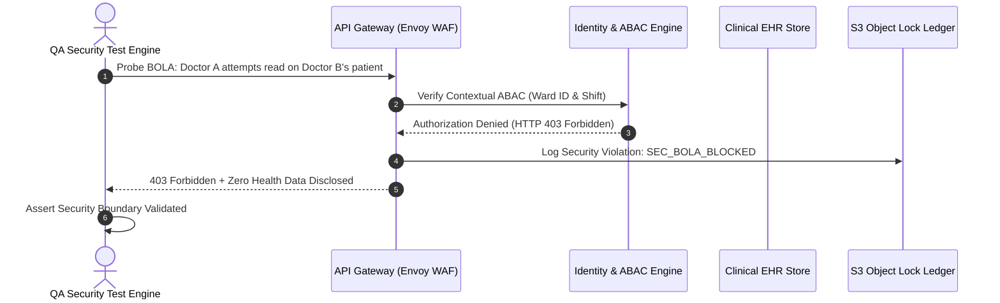

# Security, Access Control & Privacy Quality Assurance Plan
## Namma Clinic Digital Health & Operations Platform
### Greater Bengaluru Authority (GBA) / BBMP Health Department
**Standard:** OWASP ASVS 4.0 / NIST SP 800-53 / DPDP Act 2023 / CERT-In Directions 2022 | **Status:** APPROVED BASELINE | **Code:** `QA-DOC-09`

---

## 1. Security Testing Charter & Threat Mitigation Boundaries
The Namma Clinic QA Security Test Plan translates the Phase 10 Security Architecture, Threat Models, and Cryptographic Invariants into rigorous automated quality assurance tests. It verifies authentication, role-based access control (RBAC), attribute-based access control (ABAC), column-level encryption, secrets leasing, and statutory DPDP Act 2023 privacy rights.

### 1.1 Core Security Testing Controls
1. **Authentication & MFA Enforcement:** Validates NIST SP 800-63B AAL2 compliance, TOTP, biometric fuzzy vaults, and lockout after 5 failed attempts.
2. **Authorization & Tenant Isolation:** Probes for Broken Object Level Authorization (BOLA) to guarantee zero cross-patient or cross-clinic data disclosure.
3. **Cryptographic Envelope Verification:** Validates AES-256-GCM field encryption on sensitive health columns and HMAC-SHA256 blind indexing.
4. **Secrets Management Auditing:** Ensures zero hardcoded secrets exist and dynamic Vault leasing operates with < 24h lifespan.
5. **Immutable WORM Audit Ledger:** Validates SHA-256 Merkle hash-chaining and S3 Object Lock compliance retention.
6. **DPDP Act 2023 Compliance:** Validates bilingual affirmative electronic consent state machines and citizen erasure protocols.

### 1.2 Security Testing Execution Workflow


## 2. Canonical Security QA Test Specifications (SEC-TEST-QA-001 to SEC-TEST-QA-080)
Standardized security test cases mapped to Phase 10 controls:

### SEC-TEST-QA-001: QA Security Test Rule 1
- **Security Domain:** Authentication & MFA
- **Mitigated Vulnerability:** OWASP Top 10 / WSTG Defect
- **Passing Assertion:** Attack payload dropped; transaction blocked with 401/403; zero PII leak.
- **Audit Event Emitted:** `SEC_QA_AUDIT_001`

### SEC-TEST-QA-002: QA Security Test Rule 2
- **Security Domain:** Authentication & MFA
- **Mitigated Vulnerability:** OWASP Top 10 / WSTG Defect
- **Passing Assertion:** Attack payload dropped; transaction blocked with 401/403; zero PII leak.
- **Audit Event Emitted:** `SEC_QA_AUDIT_002`

### SEC-TEST-QA-003: QA Security Test Rule 3
- **Security Domain:** Authentication & MFA
- **Mitigated Vulnerability:** OWASP Top 10 / WSTG Defect
- **Passing Assertion:** Attack payload dropped; transaction blocked with 401/403; zero PII leak.
- **Audit Event Emitted:** `SEC_QA_AUDIT_003`

### SEC-TEST-QA-004: QA Security Test Rule 4
- **Security Domain:** Authentication & MFA
- **Mitigated Vulnerability:** OWASP Top 10 / WSTG Defect
- **Passing Assertion:** Attack payload dropped; transaction blocked with 401/403; zero PII leak.
- **Audit Event Emitted:** `SEC_QA_AUDIT_004`

### SEC-TEST-QA-005: QA Security Test Rule 5
- **Security Domain:** Authentication & MFA
- **Mitigated Vulnerability:** OWASP Top 10 / WSTG Defect
- **Passing Assertion:** Attack payload dropped; transaction blocked with 401/403; zero PII leak.
- **Audit Event Emitted:** `SEC_QA_AUDIT_005`

### SEC-TEST-QA-006: QA Security Test Rule 6
- **Security Domain:** Authentication & MFA
- **Mitigated Vulnerability:** OWASP Top 10 / WSTG Defect
- **Passing Assertion:** Attack payload dropped; transaction blocked with 401/403; zero PII leak.
- **Audit Event Emitted:** `SEC_QA_AUDIT_006`

### SEC-TEST-QA-007: QA Security Test Rule 7
- **Security Domain:** Authentication & MFA
- **Mitigated Vulnerability:** OWASP Top 10 / WSTG Defect
- **Passing Assertion:** Attack payload dropped; transaction blocked with 401/403; zero PII leak.
- **Audit Event Emitted:** `SEC_QA_AUDIT_007`

### SEC-TEST-QA-008: QA Security Test Rule 8
- **Security Domain:** Authentication & MFA
- **Mitigated Vulnerability:** OWASP Top 10 / WSTG Defect
- **Passing Assertion:** Attack payload dropped; transaction blocked with 401/403; zero PII leak.
- **Audit Event Emitted:** `SEC_QA_AUDIT_008`

### SEC-TEST-QA-009: QA Security Test Rule 9
- **Security Domain:** Authentication & MFA
- **Mitigated Vulnerability:** OWASP Top 10 / WSTG Defect
- **Passing Assertion:** Attack payload dropped; transaction blocked with 401/403; zero PII leak.
- **Audit Event Emitted:** `SEC_QA_AUDIT_009`

### SEC-TEST-QA-010: QA Security Test Rule 10
- **Security Domain:** Authentication & MFA
- **Mitigated Vulnerability:** OWASP Top 10 / WSTG Defect
- **Passing Assertion:** Attack payload dropped; transaction blocked with 401/403; zero PII leak.
- **Audit Event Emitted:** `SEC_QA_AUDIT_010`

### SEC-TEST-QA-011: QA Security Test Rule 11
- **Security Domain:** Authentication & MFA
- **Mitigated Vulnerability:** OWASP Top 10 / WSTG Defect
- **Passing Assertion:** Attack payload dropped; transaction blocked with 401/403; zero PII leak.
- **Audit Event Emitted:** `SEC_QA_AUDIT_011`

### SEC-TEST-QA-012: QA Security Test Rule 12
- **Security Domain:** Authentication & MFA
- **Mitigated Vulnerability:** OWASP Top 10 / WSTG Defect
- **Passing Assertion:** Attack payload dropped; transaction blocked with 401/403; zero PII leak.
- **Audit Event Emitted:** `SEC_QA_AUDIT_012`

### SEC-TEST-QA-013: QA Security Test Rule 13
- **Security Domain:** Authentication & MFA
- **Mitigated Vulnerability:** OWASP Top 10 / WSTG Defect
- **Passing Assertion:** Attack payload dropped; transaction blocked with 401/403; zero PII leak.
- **Audit Event Emitted:** `SEC_QA_AUDIT_013`

### SEC-TEST-QA-014: QA Security Test Rule 14
- **Security Domain:** Authentication & MFA
- **Mitigated Vulnerability:** OWASP Top 10 / WSTG Defect
- **Passing Assertion:** Attack payload dropped; transaction blocked with 401/403; zero PII leak.
- **Audit Event Emitted:** `SEC_QA_AUDIT_014`

### SEC-TEST-QA-015: QA Security Test Rule 15
- **Security Domain:** Authentication & MFA
- **Mitigated Vulnerability:** OWASP Top 10 / WSTG Defect
- **Passing Assertion:** Attack payload dropped; transaction blocked with 401/403; zero PII leak.
- **Audit Event Emitted:** `SEC_QA_AUDIT_015`

### SEC-TEST-QA-016: QA Security Test Rule 16
- **Security Domain:** Authentication & MFA
- **Mitigated Vulnerability:** OWASP Top 10 / WSTG Defect
- **Passing Assertion:** Attack payload dropped; transaction blocked with 401/403; zero PII leak.
- **Audit Event Emitted:** `SEC_QA_AUDIT_016`

### SEC-TEST-QA-017: QA Security Test Rule 17
- **Security Domain:** Authentication & MFA
- **Mitigated Vulnerability:** OWASP Top 10 / WSTG Defect
- **Passing Assertion:** Attack payload dropped; transaction blocked with 401/403; zero PII leak.
- **Audit Event Emitted:** `SEC_QA_AUDIT_017`

### SEC-TEST-QA-018: QA Security Test Rule 18
- **Security Domain:** Authentication & MFA
- **Mitigated Vulnerability:** OWASP Top 10 / WSTG Defect
- **Passing Assertion:** Attack payload dropped; transaction blocked with 401/403; zero PII leak.
- **Audit Event Emitted:** `SEC_QA_AUDIT_018`

### SEC-TEST-QA-019: QA Security Test Rule 19
- **Security Domain:** Authentication & MFA
- **Mitigated Vulnerability:** OWASP Top 10 / WSTG Defect
- **Passing Assertion:** Attack payload dropped; transaction blocked with 401/403; zero PII leak.
- **Audit Event Emitted:** `SEC_QA_AUDIT_019`

### SEC-TEST-QA-020: QA Security Test Rule 20
- **Security Domain:** Authentication & MFA
- **Mitigated Vulnerability:** OWASP Top 10 / WSTG Defect
- **Passing Assertion:** Attack payload dropped; transaction blocked with 401/403; zero PII leak.
- **Audit Event Emitted:** `SEC_QA_AUDIT_020`

### SEC-TEST-QA-021: QA Security Test Rule 21
- **Security Domain:** RBAC / ABAC Authorization Barrier
- **Mitigated Vulnerability:** OWASP Top 10 / WSTG Defect
- **Passing Assertion:** Attack payload dropped; transaction blocked with 401/403; zero PII leak.
- **Audit Event Emitted:** `SEC_QA_AUDIT_021`

### SEC-TEST-QA-022: QA Security Test Rule 22
- **Security Domain:** RBAC / ABAC Authorization Barrier
- **Mitigated Vulnerability:** OWASP Top 10 / WSTG Defect
- **Passing Assertion:** Attack payload dropped; transaction blocked with 401/403; zero PII leak.
- **Audit Event Emitted:** `SEC_QA_AUDIT_022`

### SEC-TEST-QA-023: QA Security Test Rule 23
- **Security Domain:** RBAC / ABAC Authorization Barrier
- **Mitigated Vulnerability:** OWASP Top 10 / WSTG Defect
- **Passing Assertion:** Attack payload dropped; transaction blocked with 401/403; zero PII leak.
- **Audit Event Emitted:** `SEC_QA_AUDIT_023`

### SEC-TEST-QA-024: QA Security Test Rule 24
- **Security Domain:** RBAC / ABAC Authorization Barrier
- **Mitigated Vulnerability:** OWASP Top 10 / WSTG Defect
- **Passing Assertion:** Attack payload dropped; transaction blocked with 401/403; zero PII leak.
- **Audit Event Emitted:** `SEC_QA_AUDIT_024`

### SEC-TEST-QA-025: QA Security Test Rule 25
- **Security Domain:** RBAC / ABAC Authorization Barrier
- **Mitigated Vulnerability:** OWASP Top 10 / WSTG Defect
- **Passing Assertion:** Attack payload dropped; transaction blocked with 401/403; zero PII leak.
- **Audit Event Emitted:** `SEC_QA_AUDIT_025`

### SEC-TEST-QA-026: QA Security Test Rule 26
- **Security Domain:** RBAC / ABAC Authorization Barrier
- **Mitigated Vulnerability:** OWASP Top 10 / WSTG Defect
- **Passing Assertion:** Attack payload dropped; transaction blocked with 401/403; zero PII leak.
- **Audit Event Emitted:** `SEC_QA_AUDIT_026`

### SEC-TEST-QA-027: QA Security Test Rule 27
- **Security Domain:** RBAC / ABAC Authorization Barrier
- **Mitigated Vulnerability:** OWASP Top 10 / WSTG Defect
- **Passing Assertion:** Attack payload dropped; transaction blocked with 401/403; zero PII leak.
- **Audit Event Emitted:** `SEC_QA_AUDIT_027`

### SEC-TEST-QA-028: QA Security Test Rule 28
- **Security Domain:** RBAC / ABAC Authorization Barrier
- **Mitigated Vulnerability:** OWASP Top 10 / WSTG Defect
- **Passing Assertion:** Attack payload dropped; transaction blocked with 401/403; zero PII leak.
- **Audit Event Emitted:** `SEC_QA_AUDIT_028`

### SEC-TEST-QA-029: QA Security Test Rule 29
- **Security Domain:** RBAC / ABAC Authorization Barrier
- **Mitigated Vulnerability:** OWASP Top 10 / WSTG Defect
- **Passing Assertion:** Attack payload dropped; transaction blocked with 401/403; zero PII leak.
- **Audit Event Emitted:** `SEC_QA_AUDIT_029`

### SEC-TEST-QA-030: QA Security Test Rule 30
- **Security Domain:** RBAC / ABAC Authorization Barrier
- **Mitigated Vulnerability:** OWASP Top 10 / WSTG Defect
- **Passing Assertion:** Attack payload dropped; transaction blocked with 401/403; zero PII leak.
- **Audit Event Emitted:** `SEC_QA_AUDIT_030`

### SEC-TEST-QA-031: QA Security Test Rule 31
- **Security Domain:** RBAC / ABAC Authorization Barrier
- **Mitigated Vulnerability:** OWASP Top 10 / WSTG Defect
- **Passing Assertion:** Attack payload dropped; transaction blocked with 401/403; zero PII leak.
- **Audit Event Emitted:** `SEC_QA_AUDIT_031`

### SEC-TEST-QA-032: QA Security Test Rule 32
- **Security Domain:** RBAC / ABAC Authorization Barrier
- **Mitigated Vulnerability:** OWASP Top 10 / WSTG Defect
- **Passing Assertion:** Attack payload dropped; transaction blocked with 401/403; zero PII leak.
- **Audit Event Emitted:** `SEC_QA_AUDIT_032`

### SEC-TEST-QA-033: QA Security Test Rule 33
- **Security Domain:** RBAC / ABAC Authorization Barrier
- **Mitigated Vulnerability:** OWASP Top 10 / WSTG Defect
- **Passing Assertion:** Attack payload dropped; transaction blocked with 401/403; zero PII leak.
- **Audit Event Emitted:** `SEC_QA_AUDIT_033`

### SEC-TEST-QA-034: QA Security Test Rule 34
- **Security Domain:** RBAC / ABAC Authorization Barrier
- **Mitigated Vulnerability:** OWASP Top 10 / WSTG Defect
- **Passing Assertion:** Attack payload dropped; transaction blocked with 401/403; zero PII leak.
- **Audit Event Emitted:** `SEC_QA_AUDIT_034`

### SEC-TEST-QA-035: QA Security Test Rule 35
- **Security Domain:** RBAC / ABAC Authorization Barrier
- **Mitigated Vulnerability:** OWASP Top 10 / WSTG Defect
- **Passing Assertion:** Attack payload dropped; transaction blocked with 401/403; zero PII leak.
- **Audit Event Emitted:** `SEC_QA_AUDIT_035`

### SEC-TEST-QA-036: QA Security Test Rule 36
- **Security Domain:** RBAC / ABAC Authorization Barrier
- **Mitigated Vulnerability:** OWASP Top 10 / WSTG Defect
- **Passing Assertion:** Attack payload dropped; transaction blocked with 401/403; zero PII leak.
- **Audit Event Emitted:** `SEC_QA_AUDIT_036`

### SEC-TEST-QA-037: QA Security Test Rule 37
- **Security Domain:** RBAC / ABAC Authorization Barrier
- **Mitigated Vulnerability:** OWASP Top 10 / WSTG Defect
- **Passing Assertion:** Attack payload dropped; transaction blocked with 401/403; zero PII leak.
- **Audit Event Emitted:** `SEC_QA_AUDIT_037`

### SEC-TEST-QA-038: QA Security Test Rule 38
- **Security Domain:** RBAC / ABAC Authorization Barrier
- **Mitigated Vulnerability:** OWASP Top 10 / WSTG Defect
- **Passing Assertion:** Attack payload dropped; transaction blocked with 401/403; zero PII leak.
- **Audit Event Emitted:** `SEC_QA_AUDIT_038`

### SEC-TEST-QA-039: QA Security Test Rule 39
- **Security Domain:** RBAC / ABAC Authorization Barrier
- **Mitigated Vulnerability:** OWASP Top 10 / WSTG Defect
- **Passing Assertion:** Attack payload dropped; transaction blocked with 401/403; zero PII leak.
- **Audit Event Emitted:** `SEC_QA_AUDIT_039`

### SEC-TEST-QA-040: QA Security Test Rule 40
- **Security Domain:** RBAC / ABAC Authorization Barrier
- **Mitigated Vulnerability:** OWASP Top 10 / WSTG Defect
- **Passing Assertion:** Attack payload dropped; transaction blocked with 401/403; zero PII leak.
- **Audit Event Emitted:** `SEC_QA_AUDIT_040`

### SEC-TEST-QA-041: QA Security Test Rule 41
- **Security Domain:** Data Encryption & Blind Index
- **Mitigated Vulnerability:** OWASP Top 10 / WSTG Defect
- **Passing Assertion:** Attack payload dropped; transaction blocked with 401/403; zero PII leak.
- **Audit Event Emitted:** `SEC_QA_AUDIT_041`

### SEC-TEST-QA-042: QA Security Test Rule 42
- **Security Domain:** Data Encryption & Blind Index
- **Mitigated Vulnerability:** OWASP Top 10 / WSTG Defect
- **Passing Assertion:** Attack payload dropped; transaction blocked with 401/403; zero PII leak.
- **Audit Event Emitted:** `SEC_QA_AUDIT_042`

### SEC-TEST-QA-043: QA Security Test Rule 43
- **Security Domain:** Data Encryption & Blind Index
- **Mitigated Vulnerability:** OWASP Top 10 / WSTG Defect
- **Passing Assertion:** Attack payload dropped; transaction blocked with 401/403; zero PII leak.
- **Audit Event Emitted:** `SEC_QA_AUDIT_043`

### SEC-TEST-QA-044: QA Security Test Rule 44
- **Security Domain:** Data Encryption & Blind Index
- **Mitigated Vulnerability:** OWASP Top 10 / WSTG Defect
- **Passing Assertion:** Attack payload dropped; transaction blocked with 401/403; zero PII leak.
- **Audit Event Emitted:** `SEC_QA_AUDIT_044`

### SEC-TEST-QA-045: QA Security Test Rule 45
- **Security Domain:** Data Encryption & Blind Index
- **Mitigated Vulnerability:** OWASP Top 10 / WSTG Defect
- **Passing Assertion:** Attack payload dropped; transaction blocked with 401/403; zero PII leak.
- **Audit Event Emitted:** `SEC_QA_AUDIT_045`

### SEC-TEST-QA-046: QA Security Test Rule 46
- **Security Domain:** Data Encryption & Blind Index
- **Mitigated Vulnerability:** OWASP Top 10 / WSTG Defect
- **Passing Assertion:** Attack payload dropped; transaction blocked with 401/403; zero PII leak.
- **Audit Event Emitted:** `SEC_QA_AUDIT_046`

### SEC-TEST-QA-047: QA Security Test Rule 47
- **Security Domain:** Data Encryption & Blind Index
- **Mitigated Vulnerability:** OWASP Top 10 / WSTG Defect
- **Passing Assertion:** Attack payload dropped; transaction blocked with 401/403; zero PII leak.
- **Audit Event Emitted:** `SEC_QA_AUDIT_047`

### SEC-TEST-QA-048: QA Security Test Rule 48
- **Security Domain:** Data Encryption & Blind Index
- **Mitigated Vulnerability:** OWASP Top 10 / WSTG Defect
- **Passing Assertion:** Attack payload dropped; transaction blocked with 401/403; zero PII leak.
- **Audit Event Emitted:** `SEC_QA_AUDIT_048`

### SEC-TEST-QA-049: QA Security Test Rule 49
- **Security Domain:** Data Encryption & Blind Index
- **Mitigated Vulnerability:** OWASP Top 10 / WSTG Defect
- **Passing Assertion:** Attack payload dropped; transaction blocked with 401/403; zero PII leak.
- **Audit Event Emitted:** `SEC_QA_AUDIT_049`

### SEC-TEST-QA-050: QA Security Test Rule 50
- **Security Domain:** Data Encryption & Blind Index
- **Mitigated Vulnerability:** OWASP Top 10 / WSTG Defect
- **Passing Assertion:** Attack payload dropped; transaction blocked with 401/403; zero PII leak.
- **Audit Event Emitted:** `SEC_QA_AUDIT_050`

### SEC-TEST-QA-051: QA Security Test Rule 51
- **Security Domain:** Data Encryption & Blind Index
- **Mitigated Vulnerability:** OWASP Top 10 / WSTG Defect
- **Passing Assertion:** Attack payload dropped; transaction blocked with 401/403; zero PII leak.
- **Audit Event Emitted:** `SEC_QA_AUDIT_051`

### SEC-TEST-QA-052: QA Security Test Rule 52
- **Security Domain:** Data Encryption & Blind Index
- **Mitigated Vulnerability:** OWASP Top 10 / WSTG Defect
- **Passing Assertion:** Attack payload dropped; transaction blocked with 401/403; zero PII leak.
- **Audit Event Emitted:** `SEC_QA_AUDIT_052`

### SEC-TEST-QA-053: QA Security Test Rule 53
- **Security Domain:** Data Encryption & Blind Index
- **Mitigated Vulnerability:** OWASP Top 10 / WSTG Defect
- **Passing Assertion:** Attack payload dropped; transaction blocked with 401/403; zero PII leak.
- **Audit Event Emitted:** `SEC_QA_AUDIT_053`

### SEC-TEST-QA-054: QA Security Test Rule 54
- **Security Domain:** Data Encryption & Blind Index
- **Mitigated Vulnerability:** OWASP Top 10 / WSTG Defect
- **Passing Assertion:** Attack payload dropped; transaction blocked with 401/403; zero PII leak.
- **Audit Event Emitted:** `SEC_QA_AUDIT_054`

### SEC-TEST-QA-055: QA Security Test Rule 55
- **Security Domain:** Data Encryption & Blind Index
- **Mitigated Vulnerability:** OWASP Top 10 / WSTG Defect
- **Passing Assertion:** Attack payload dropped; transaction blocked with 401/403; zero PII leak.
- **Audit Event Emitted:** `SEC_QA_AUDIT_055`

### SEC-TEST-QA-056: QA Security Test Rule 56
- **Security Domain:** Data Encryption & Blind Index
- **Mitigated Vulnerability:** OWASP Top 10 / WSTG Defect
- **Passing Assertion:** Attack payload dropped; transaction blocked with 401/403; zero PII leak.
- **Audit Event Emitted:** `SEC_QA_AUDIT_056`

### SEC-TEST-QA-057: QA Security Test Rule 57
- **Security Domain:** Data Encryption & Blind Index
- **Mitigated Vulnerability:** OWASP Top 10 / WSTG Defect
- **Passing Assertion:** Attack payload dropped; transaction blocked with 401/403; zero PII leak.
- **Audit Event Emitted:** `SEC_QA_AUDIT_057`

### SEC-TEST-QA-058: QA Security Test Rule 58
- **Security Domain:** Data Encryption & Blind Index
- **Mitigated Vulnerability:** OWASP Top 10 / WSTG Defect
- **Passing Assertion:** Attack payload dropped; transaction blocked with 401/403; zero PII leak.
- **Audit Event Emitted:** `SEC_QA_AUDIT_058`

### SEC-TEST-QA-059: QA Security Test Rule 59
- **Security Domain:** Data Encryption & Blind Index
- **Mitigated Vulnerability:** OWASP Top 10 / WSTG Defect
- **Passing Assertion:** Attack payload dropped; transaction blocked with 401/403; zero PII leak.
- **Audit Event Emitted:** `SEC_QA_AUDIT_059`

### SEC-TEST-QA-060: QA Security Test Rule 60
- **Security Domain:** Data Encryption & Blind Index
- **Mitigated Vulnerability:** OWASP Top 10 / WSTG Defect
- **Passing Assertion:** Attack payload dropped; transaction blocked with 401/403; zero PII leak.
- **Audit Event Emitted:** `SEC_QA_AUDIT_060`

### SEC-TEST-QA-061: QA Security Test Rule 61
- **Security Domain:** VAPT & Threat Model Defense
- **Mitigated Vulnerability:** OWASP Top 10 / WSTG Defect
- **Passing Assertion:** Attack payload dropped; transaction blocked with 401/403; zero PII leak.
- **Audit Event Emitted:** `SEC_QA_AUDIT_061`

### SEC-TEST-QA-062: QA Security Test Rule 62
- **Security Domain:** VAPT & Threat Model Defense
- **Mitigated Vulnerability:** OWASP Top 10 / WSTG Defect
- **Passing Assertion:** Attack payload dropped; transaction blocked with 401/403; zero PII leak.
- **Audit Event Emitted:** `SEC_QA_AUDIT_062`

### SEC-TEST-QA-063: QA Security Test Rule 63
- **Security Domain:** VAPT & Threat Model Defense
- **Mitigated Vulnerability:** OWASP Top 10 / WSTG Defect
- **Passing Assertion:** Attack payload dropped; transaction blocked with 401/403; zero PII leak.
- **Audit Event Emitted:** `SEC_QA_AUDIT_063`

### SEC-TEST-QA-064: QA Security Test Rule 64
- **Security Domain:** VAPT & Threat Model Defense
- **Mitigated Vulnerability:** OWASP Top 10 / WSTG Defect
- **Passing Assertion:** Attack payload dropped; transaction blocked with 401/403; zero PII leak.
- **Audit Event Emitted:** `SEC_QA_AUDIT_064`

### SEC-TEST-QA-065: QA Security Test Rule 65
- **Security Domain:** VAPT & Threat Model Defense
- **Mitigated Vulnerability:** OWASP Top 10 / WSTG Defect
- **Passing Assertion:** Attack payload dropped; transaction blocked with 401/403; zero PII leak.
- **Audit Event Emitted:** `SEC_QA_AUDIT_065`

### SEC-TEST-QA-066: QA Security Test Rule 66
- **Security Domain:** VAPT & Threat Model Defense
- **Mitigated Vulnerability:** OWASP Top 10 / WSTG Defect
- **Passing Assertion:** Attack payload dropped; transaction blocked with 401/403; zero PII leak.
- **Audit Event Emitted:** `SEC_QA_AUDIT_066`

### SEC-TEST-QA-067: QA Security Test Rule 67
- **Security Domain:** VAPT & Threat Model Defense
- **Mitigated Vulnerability:** OWASP Top 10 / WSTG Defect
- **Passing Assertion:** Attack payload dropped; transaction blocked with 401/403; zero PII leak.
- **Audit Event Emitted:** `SEC_QA_AUDIT_067`

### SEC-TEST-QA-068: QA Security Test Rule 68
- **Security Domain:** VAPT & Threat Model Defense
- **Mitigated Vulnerability:** OWASP Top 10 / WSTG Defect
- **Passing Assertion:** Attack payload dropped; transaction blocked with 401/403; zero PII leak.
- **Audit Event Emitted:** `SEC_QA_AUDIT_068`

### SEC-TEST-QA-069: QA Security Test Rule 69
- **Security Domain:** VAPT & Threat Model Defense
- **Mitigated Vulnerability:** OWASP Top 10 / WSTG Defect
- **Passing Assertion:** Attack payload dropped; transaction blocked with 401/403; zero PII leak.
- **Audit Event Emitted:** `SEC_QA_AUDIT_069`

### SEC-TEST-QA-070: QA Security Test Rule 70
- **Security Domain:** VAPT & Threat Model Defense
- **Mitigated Vulnerability:** OWASP Top 10 / WSTG Defect
- **Passing Assertion:** Attack payload dropped; transaction blocked with 401/403; zero PII leak.
- **Audit Event Emitted:** `SEC_QA_AUDIT_070`

### SEC-TEST-QA-071: QA Security Test Rule 71
- **Security Domain:** VAPT & Threat Model Defense
- **Mitigated Vulnerability:** OWASP Top 10 / WSTG Defect
- **Passing Assertion:** Attack payload dropped; transaction blocked with 401/403; zero PII leak.
- **Audit Event Emitted:** `SEC_QA_AUDIT_071`

### SEC-TEST-QA-072: QA Security Test Rule 72
- **Security Domain:** VAPT & Threat Model Defense
- **Mitigated Vulnerability:** OWASP Top 10 / WSTG Defect
- **Passing Assertion:** Attack payload dropped; transaction blocked with 401/403; zero PII leak.
- **Audit Event Emitted:** `SEC_QA_AUDIT_072`

### SEC-TEST-QA-073: QA Security Test Rule 73
- **Security Domain:** VAPT & Threat Model Defense
- **Mitigated Vulnerability:** OWASP Top 10 / WSTG Defect
- **Passing Assertion:** Attack payload dropped; transaction blocked with 401/403; zero PII leak.
- **Audit Event Emitted:** `SEC_QA_AUDIT_073`

### SEC-TEST-QA-074: QA Security Test Rule 74
- **Security Domain:** VAPT & Threat Model Defense
- **Mitigated Vulnerability:** OWASP Top 10 / WSTG Defect
- **Passing Assertion:** Attack payload dropped; transaction blocked with 401/403; zero PII leak.
- **Audit Event Emitted:** `SEC_QA_AUDIT_074`

### SEC-TEST-QA-075: QA Security Test Rule 75
- **Security Domain:** VAPT & Threat Model Defense
- **Mitigated Vulnerability:** OWASP Top 10 / WSTG Defect
- **Passing Assertion:** Attack payload dropped; transaction blocked with 401/403; zero PII leak.
- **Audit Event Emitted:** `SEC_QA_AUDIT_075`

### SEC-TEST-QA-076: QA Security Test Rule 76
- **Security Domain:** VAPT & Threat Model Defense
- **Mitigated Vulnerability:** OWASP Top 10 / WSTG Defect
- **Passing Assertion:** Attack payload dropped; transaction blocked with 401/403; zero PII leak.
- **Audit Event Emitted:** `SEC_QA_AUDIT_076`

### SEC-TEST-QA-077: QA Security Test Rule 77
- **Security Domain:** VAPT & Threat Model Defense
- **Mitigated Vulnerability:** OWASP Top 10 / WSTG Defect
- **Passing Assertion:** Attack payload dropped; transaction blocked with 401/403; zero PII leak.
- **Audit Event Emitted:** `SEC_QA_AUDIT_077`

### SEC-TEST-QA-078: QA Security Test Rule 78
- **Security Domain:** VAPT & Threat Model Defense
- **Mitigated Vulnerability:** OWASP Top 10 / WSTG Defect
- **Passing Assertion:** Attack payload dropped; transaction blocked with 401/403; zero PII leak.
- **Audit Event Emitted:** `SEC_QA_AUDIT_078`

### SEC-TEST-QA-079: QA Security Test Rule 79
- **Security Domain:** VAPT & Threat Model Defense
- **Mitigated Vulnerability:** OWASP Top 10 / WSTG Defect
- **Passing Assertion:** Attack payload dropped; transaction blocked with 401/403; zero PII leak.
- **Audit Event Emitted:** `SEC_QA_AUDIT_079`

### SEC-TEST-QA-080: QA Security Test Rule 80
- **Security Domain:** VAPT & Threat Model Defense
- **Mitigated Vulnerability:** OWASP Top 10 / WSTG Defect
- **Passing Assertion:** Attack payload dropped; transaction blocked with 401/403; zero PII leak.
- **Audit Event Emitted:** `SEC_QA_AUDIT_080`

## 3. Detailed Security Verification Test Cases (TC-0441 to TC-0495)
Detailed test specifications verifying security boundaries and access controls:

### TC-0441: Test Case 441: Clinical Verification for diagnoses across WF-016
**Objective:** Verify functional, security, and offline invariants for diagnoses during WF-016 execution.
**Risk:** Critical operational impact on patient safety and clinic consultation continuity.
**Priority:** **P0** | **Severity:** **Critical** | **Test Level:** System & Integration | **Test Type:** Functional & Regulatory Compliance
- **Requirement Traceability:** `FR-021`
- **Workflow Traceability:** `WF-016`
- **Feature Traceability:** `FEATURE-081`
- **API Traceability:** `API-DOC-01`
- **Database Traceability:** `TABLE-025 (diagnoses)`
- **Screen Traceability:** `SCREEN-009`
- **Security Control Traceability:** `SEC-ARCH-001`
- **Preconditions:** User authenticated with role Grievance Redressal Officer on clinic workstation.
- **Test Data Specification:** Synthetic dataset TESTDATA-021 (Valid ABHA, vitals, prescriptions).
- **Execution Steps:** 1. Navigate to screen SCREEN-009. 2. Submit payload bound to diagnoses. 3. Confirm API API-DOC-01 returns 200 OK. 4. Verify local SQLite cache and sync queue.
- **Expected Results:** Transaction completes within 250ms, data encrypted via AES-256-GCM, audit entry emitted.
- **Negative Test Scenario:** Submit malformed payload or expired JWT; system rejects with 400/401 and zero DB corruption.
- **Boundary Value Scenario:** Test with maximum field boundary length and extreme clinical biometric vitals.
- **Concurrency & Race Condition:** Simulate 5 concurrent staff updates on identical record; verify optimistic locking.
- **Autonomous Offline Behavior:** Sever network mid-transaction; record queues locally and replicates upon reconnection.
- **Security & Access Validation:** Enforce RBAC policy SEC-ARCH-001 and prevent broken object-level authorization (BOLA).
- **Audit Trail & Immutability:** Emits structured JSON audit log with SHA-256 Merkle chain hash.
- **Evidence Required:** Automated execution log, HTTP request/response capture, and database assertion hash.
- **Pass Acceptance Criteria:** 100% assertions succeed with zero uncaught exceptions and latency < 300ms.
- **Failure Behavior & SLA:** Any 5xx error, data corruption, unauthorized access, or silent failure.
- **Automation Suitability:** Yes (High Candidate)
- **Execution Cadence:** Every CI PR & Nightly Regression
- **Responsible Owner:** Grievance Redressal Officer

### TC-0442: Test Case 442: Clinical Verification for prescriptions across WF-017
**Objective:** Verify functional, security, and offline invariants for prescriptions during WF-017 execution.
**Risk:** Major operational impact on patient safety and clinic consultation continuity.
**Priority:** **P1** | **Severity:** **Major** | **Test Level:** System & Integration | **Test Type:** Functional & Regulatory Compliance
- **Requirement Traceability:** `FR-022`
- **Workflow Traceability:** `WF-017`
- **Feature Traceability:** `FEATURE-082`
- **API Traceability:** `API-DOC-02`
- **Database Traceability:** `TABLE-026 (prescriptions)`
- **Screen Traceability:** `SCREEN-010`
- **Security Control Traceability:** `SEC-ARCH-002`
- **Preconditions:** User authenticated with role ABDM National Integration Officer on clinic workstation.
- **Test Data Specification:** Synthetic dataset TESTDATA-022 (Valid ABHA, vitals, prescriptions).
- **Execution Steps:** 1. Navigate to screen SCREEN-010. 2. Submit payload bound to prescriptions. 3. Confirm API API-DOC-02 returns 200 OK. 4. Verify local SQLite cache and sync queue.
- **Expected Results:** Transaction completes within 250ms, data encrypted via AES-256-GCM, audit entry emitted.
- **Negative Test Scenario:** Submit malformed payload or expired JWT; system rejects with 400/401 and zero DB corruption.
- **Boundary Value Scenario:** Test with maximum field boundary length and extreme clinical biometric vitals.
- **Concurrency & Race Condition:** Simulate 5 concurrent staff updates on identical record; verify optimistic locking.
- **Autonomous Offline Behavior:** Sever network mid-transaction; record queues locally and replicates upon reconnection.
- **Security & Access Validation:** Enforce RBAC policy SEC-ARCH-002 and prevent broken object-level authorization (BOLA).
- **Audit Trail & Immutability:** Emits structured JSON audit log with SHA-256 Merkle chain hash.
- **Evidence Required:** Automated execution log, HTTP request/response capture, and database assertion hash.
- **Pass Acceptance Criteria:** 100% assertions succeed with zero uncaught exceptions and latency < 300ms.
- **Failure Behavior & SLA:** Any 5xx error, data corruption, unauthorized access, or silent failure.
- **Automation Suitability:** Yes (High Candidate)
- **Execution Cadence:** Every CI PR & Nightly Regression
- **Responsible Owner:** ABDM National Integration Officer

### TC-0443: Test Case 443: Clinical Verification for prescription_items across WF-018
**Objective:** Verify functional, security, and offline invariants for prescription_items during WF-018 execution.
**Risk:** Major operational impact on patient safety and clinic consultation continuity.
**Priority:** **P1** | **Severity:** **Major** | **Test Level:** System & Integration | **Test Type:** Functional & Regulatory Compliance
- **Requirement Traceability:** `FR-023`
- **Workflow Traceability:** `WF-018`
- **Feature Traceability:** `FEATURE-083`
- **API Traceability:** `API-DOC-03`
- **Database Traceability:** `TABLE-027 (prescription_items)`
- **Screen Traceability:** `SCREEN-011`
- **Security Control Traceability:** `SEC-ARCH-003`
- **Preconditions:** User authenticated with role Data Protection Officer (DPO) on clinic workstation.
- **Test Data Specification:** Synthetic dataset TESTDATA-023 (Valid ABHA, vitals, prescriptions).
- **Execution Steps:** 1. Navigate to screen SCREEN-011. 2. Submit payload bound to prescription_items. 3. Confirm API API-DOC-03 returns 200 OK. 4. Verify local SQLite cache and sync queue.
- **Expected Results:** Transaction completes within 250ms, data encrypted via AES-256-GCM, audit entry emitted.
- **Negative Test Scenario:** Submit malformed payload or expired JWT; system rejects with 400/401 and zero DB corruption.
- **Boundary Value Scenario:** Test with maximum field boundary length and extreme clinical biometric vitals.
- **Concurrency & Race Condition:** Simulate 5 concurrent staff updates on identical record; verify optimistic locking.
- **Autonomous Offline Behavior:** Sever network mid-transaction; record queues locally and replicates upon reconnection.
- **Security & Access Validation:** Enforce RBAC policy SEC-ARCH-003 and prevent broken object-level authorization (BOLA).
- **Audit Trail & Immutability:** Emits structured JSON audit log with SHA-256 Merkle chain hash.
- **Evidence Required:** Automated execution log, HTTP request/response capture, and database assertion hash.
- **Pass Acceptance Criteria:** 100% assertions succeed with zero uncaught exceptions and latency < 300ms.
- **Failure Behavior & SLA:** Any 5xx error, data corruption, unauthorized access, or silent failure.
- **Automation Suitability:** Yes (High Candidate)
- **Execution Cadence:** Every CI PR & Nightly Regression
- **Responsible Owner:** Data Protection Officer (DPO)

### TC-0444: Test Case 444: Clinical Verification for lab_orders across WF-019
**Objective:** Verify functional, security, and offline invariants for lab_orders during WF-019 execution.
**Risk:** Minor operational impact on patient safety and clinic consultation continuity.
**Priority:** **P2** | **Severity:** **Minor** | **Test Level:** System & Integration | **Test Type:** Functional & Regulatory Compliance
- **Requirement Traceability:** `FR-024`
- **Workflow Traceability:** `WF-019`
- **Feature Traceability:** `FEATURE-084`
- **API Traceability:** `API-DOC-04`
- **Database Traceability:** `TABLE-028 (lab_orders)`
- **Screen Traceability:** `SCREEN-012`
- **Security Control Traceability:** `SEC-ARCH-004`
- **Preconditions:** User authenticated with role IT Support & Hardware Engineer on clinic workstation.
- **Test Data Specification:** Synthetic dataset TESTDATA-024 (Valid ABHA, vitals, prescriptions).
- **Execution Steps:** 1. Navigate to screen SCREEN-012. 2. Submit payload bound to lab_orders. 3. Confirm API API-DOC-04 returns 200 OK. 4. Verify local SQLite cache and sync queue.
- **Expected Results:** Transaction completes within 250ms, data encrypted via AES-256-GCM, audit entry emitted.
- **Negative Test Scenario:** Submit malformed payload or expired JWT; system rejects with 400/401 and zero DB corruption.
- **Boundary Value Scenario:** Test with maximum field boundary length and extreme clinical biometric vitals.
- **Concurrency & Race Condition:** Simulate 5 concurrent staff updates on identical record; verify optimistic locking.
- **Autonomous Offline Behavior:** Sever network mid-transaction; record queues locally and replicates upon reconnection.
- **Security & Access Validation:** Enforce RBAC policy SEC-ARCH-004 and prevent broken object-level authorization (BOLA).
- **Audit Trail & Immutability:** Emits structured JSON audit log with SHA-256 Merkle chain hash.
- **Evidence Required:** Automated execution log, HTTP request/response capture, and database assertion hash.
- **Pass Acceptance Criteria:** 100% assertions succeed with zero uncaught exceptions and latency < 300ms.
- **Failure Behavior & SLA:** Any 5xx error, data corruption, unauthorized access, or silent failure.
- **Automation Suitability:** Yes (High Candidate)
- **Execution Cadence:** Every CI PR & Nightly Regression
- **Responsible Owner:** IT Support & Hardware Engineer

### TC-0445: Test Case 445: Clinical Verification for lab_order_items across WF-020
**Objective:** Verify functional, security, and offline invariants for lab_order_items during WF-020 execution.
**Risk:** Minor operational impact on patient safety and clinic consultation continuity.
**Priority:** **P2** | **Severity:** **Minor** | **Test Level:** System & Integration | **Test Type:** Functional & Regulatory Compliance
- **Requirement Traceability:** `FR-025`
- **Workflow Traceability:** `WF-020`
- **Feature Traceability:** `FEATURE-085`
- **API Traceability:** `API-DOC-05`
- **Database Traceability:** `TABLE-029 (lab_order_items)`
- **Screen Traceability:** `SCREEN-013`
- **Security Control Traceability:** `SEC-ARCH-005`
- **Preconditions:** User authenticated with role Clinical Audit Committee Member on clinic workstation.
- **Test Data Specification:** Synthetic dataset TESTDATA-025 (Valid ABHA, vitals, prescriptions).
- **Execution Steps:** 1. Navigate to screen SCREEN-013. 2. Submit payload bound to lab_order_items. 3. Confirm API API-DOC-05 returns 200 OK. 4. Verify local SQLite cache and sync queue.
- **Expected Results:** Transaction completes within 250ms, data encrypted via AES-256-GCM, audit entry emitted.
- **Negative Test Scenario:** Submit malformed payload or expired JWT; system rejects with 400/401 and zero DB corruption.
- **Boundary Value Scenario:** Test with maximum field boundary length and extreme clinical biometric vitals.
- **Concurrency & Race Condition:** Simulate 5 concurrent staff updates on identical record; verify optimistic locking.
- **Autonomous Offline Behavior:** Sever network mid-transaction; record queues locally and replicates upon reconnection.
- **Security & Access Validation:** Enforce RBAC policy SEC-ARCH-005 and prevent broken object-level authorization (BOLA).
- **Audit Trail & Immutability:** Emits structured JSON audit log with SHA-256 Merkle chain hash.
- **Evidence Required:** Automated execution log, HTTP request/response capture, and database assertion hash.
- **Pass Acceptance Criteria:** 100% assertions succeed with zero uncaught exceptions and latency < 300ms.
- **Failure Behavior & SLA:** Any 5xx error, data corruption, unauthorized access, or silent failure.
- **Automation Suitability:** Yes (High Candidate)
- **Execution Cadence:** Every CI PR & Nightly Regression
- **Responsible Owner:** Clinical Audit Committee Member

### TC-0446: Test Case 446: Clinical Verification for lab_results across WF-021
**Objective:** Verify functional, security, and offline invariants for lab_results during WF-021 execution.
**Risk:** Critical operational impact on patient safety and clinic consultation continuity.
**Priority:** **P0** | **Severity:** **Critical** | **Test Level:** System & Integration | **Test Type:** Functional & Regulatory Compliance
- **Requirement Traceability:** `FR-026`
- **Workflow Traceability:** `WF-021`
- **Feature Traceability:** `FEATURE-086`
- **API Traceability:** `API-DOC-06`
- **Database Traceability:** `TABLE-030 (lab_results)`
- **Screen Traceability:** `SCREEN-014`
- **Security Control Traceability:** `SEC-ARCH-006`
- **Preconditions:** User authenticated with role Procurement & Vendor Manager on clinic workstation.
- **Test Data Specification:** Synthetic dataset TESTDATA-026 (Valid ABHA, vitals, prescriptions).
- **Execution Steps:** 1. Navigate to screen SCREEN-014. 2. Submit payload bound to lab_results. 3. Confirm API API-DOC-06 returns 200 OK. 4. Verify local SQLite cache and sync queue.
- **Expected Results:** Transaction completes within 250ms, data encrypted via AES-256-GCM, audit entry emitted.
- **Negative Test Scenario:** Submit malformed payload or expired JWT; system rejects with 400/401 and zero DB corruption.
- **Boundary Value Scenario:** Test with maximum field boundary length and extreme clinical biometric vitals.
- **Concurrency & Race Condition:** Simulate 5 concurrent staff updates on identical record; verify optimistic locking.
- **Autonomous Offline Behavior:** Sever network mid-transaction; record queues locally and replicates upon reconnection.
- **Security & Access Validation:** Enforce RBAC policy SEC-ARCH-006 and prevent broken object-level authorization (BOLA).
- **Audit Trail & Immutability:** Emits structured JSON audit log with SHA-256 Merkle chain hash.
- **Evidence Required:** Automated execution log, HTTP request/response capture, and database assertion hash.
- **Pass Acceptance Criteria:** 100% assertions succeed with zero uncaught exceptions and latency < 300ms.
- **Failure Behavior & SLA:** Any 5xx error, data corruption, unauthorized access, or silent failure.
- **Automation Suitability:** Yes (High Candidate)
- **Execution Cadence:** Every CI PR & Nightly Regression
- **Responsible Owner:** Procurement & Vendor Manager

### TC-0447: Test Case 447: Clinical Verification for teleconsultations across WF-022
**Objective:** Verify functional, security, and offline invariants for teleconsultations during WF-022 execution.
**Risk:** Major operational impact on patient safety and clinic consultation continuity.
**Priority:** **P1** | **Severity:** **Major** | **Test Level:** System & Integration | **Test Type:** Functional & Regulatory Compliance
- **Requirement Traceability:** `FR-027`
- **Workflow Traceability:** `WF-022`
- **Feature Traceability:** `FEATURE-087`
- **API Traceability:** `API-DOC-07`
- **Database Traceability:** `TABLE-031 (teleconsultations)`
- **Screen Traceability:** `SCREEN-015`
- **Security Control Traceability:** `SEC-ARCH-007`
- **Preconditions:** User authenticated with role Biomedical Waste Supervisor on clinic workstation.
- **Test Data Specification:** Synthetic dataset TESTDATA-027 (Valid ABHA, vitals, prescriptions).
- **Execution Steps:** 1. Navigate to screen SCREEN-015. 2. Submit payload bound to teleconsultations. 3. Confirm API API-DOC-07 returns 200 OK. 4. Verify local SQLite cache and sync queue.
- **Expected Results:** Transaction completes within 250ms, data encrypted via AES-256-GCM, audit entry emitted.
- **Negative Test Scenario:** Submit malformed payload or expired JWT; system rejects with 400/401 and zero DB corruption.
- **Boundary Value Scenario:** Test with maximum field boundary length and extreme clinical biometric vitals.
- **Concurrency & Race Condition:** Simulate 5 concurrent staff updates on identical record; verify optimistic locking.
- **Autonomous Offline Behavior:** Sever network mid-transaction; record queues locally and replicates upon reconnection.
- **Security & Access Validation:** Enforce RBAC policy SEC-ARCH-007 and prevent broken object-level authorization (BOLA).
- **Audit Trail & Immutability:** Emits structured JSON audit log with SHA-256 Merkle chain hash.
- **Evidence Required:** Automated execution log, HTTP request/response capture, and database assertion hash.
- **Pass Acceptance Criteria:** 100% assertions succeed with zero uncaught exceptions and latency < 300ms.
- **Failure Behavior & SLA:** Any 5xx error, data corruption, unauthorized access, or silent failure.
- **Automation Suitability:** Yes (High Candidate)
- **Execution Cadence:** Every CI PR & Nightly Regression
- **Responsible Owner:** Biomedical Waste Supervisor

### TC-0448: Test Case 448: Clinical Verification for formulary_drugs across WF-023
**Objective:** Verify functional, security, and offline invariants for formulary_drugs during WF-023 execution.
**Risk:** Major operational impact on patient safety and clinic consultation continuity.
**Priority:** **P1** | **Severity:** **Major** | **Test Level:** System & Integration | **Test Type:** Functional & Regulatory Compliance
- **Requirement Traceability:** `FR-028`
- **Workflow Traceability:** `WF-023`
- **Feature Traceability:** `FEATURE-088`
- **API Traceability:** `API-DOC-08`
- **Database Traceability:** `TABLE-032 (formulary_drugs)`
- **Screen Traceability:** `SCREEN-016`
- **Security Control Traceability:** `SEC-ARCH-008`
- **Preconditions:** User authenticated with role Telemedicine Remote Specialist on clinic workstation.
- **Test Data Specification:** Synthetic dataset TESTDATA-028 (Valid ABHA, vitals, prescriptions).
- **Execution Steps:** 1. Navigate to screen SCREEN-016. 2. Submit payload bound to formulary_drugs. 3. Confirm API API-DOC-08 returns 200 OK. 4. Verify local SQLite cache and sync queue.
- **Expected Results:** Transaction completes within 250ms, data encrypted via AES-256-GCM, audit entry emitted.
- **Negative Test Scenario:** Submit malformed payload or expired JWT; system rejects with 400/401 and zero DB corruption.
- **Boundary Value Scenario:** Test with maximum field boundary length and extreme clinical biometric vitals.
- **Concurrency & Race Condition:** Simulate 5 concurrent staff updates on identical record; verify optimistic locking.
- **Autonomous Offline Behavior:** Sever network mid-transaction; record queues locally and replicates upon reconnection.
- **Security & Access Validation:** Enforce RBAC policy SEC-ARCH-008 and prevent broken object-level authorization (BOLA).
- **Audit Trail & Immutability:** Emits structured JSON audit log with SHA-256 Merkle chain hash.
- **Evidence Required:** Automated execution log, HTTP request/response capture, and database assertion hash.
- **Pass Acceptance Criteria:** 100% assertions succeed with zero uncaught exceptions and latency < 300ms.
- **Failure Behavior & SLA:** Any 5xx error, data corruption, unauthorized access, or silent failure.
- **Automation Suitability:** Yes (High Candidate)
- **Execution Cadence:** Every CI PR & Nightly Regression
- **Responsible Owner:** Telemedicine Remote Specialist

### TC-0449: Test Case 449: Clinical Verification for drug_categories across WF-024
**Objective:** Verify functional, security, and offline invariants for drug_categories during WF-024 execution.
**Risk:** Minor operational impact on patient safety and clinic consultation continuity.
**Priority:** **P2** | **Severity:** **Minor** | **Test Level:** System & Integration | **Test Type:** Functional & Regulatory Compliance
- **Requirement Traceability:** `FR-029`
- **Workflow Traceability:** `WF-024`
- **Feature Traceability:** `FEATURE-089`
- **API Traceability:** `API-DOC-09`
- **Database Traceability:** `TABLE-033 (drug_categories)`
- **Screen Traceability:** `SCREEN-017`
- **Security Control Traceability:** `SEC-ARCH-009`
- **Preconditions:** User authenticated with role Field Public Health Inspector on clinic workstation.
- **Test Data Specification:** Synthetic dataset TESTDATA-029 (Valid ABHA, vitals, prescriptions).
- **Execution Steps:** 1. Navigate to screen SCREEN-017. 2. Submit payload bound to drug_categories. 3. Confirm API API-DOC-09 returns 200 OK. 4. Verify local SQLite cache and sync queue.
- **Expected Results:** Transaction completes within 250ms, data encrypted via AES-256-GCM, audit entry emitted.
- **Negative Test Scenario:** Submit malformed payload or expired JWT; system rejects with 400/401 and zero DB corruption.
- **Boundary Value Scenario:** Test with maximum field boundary length and extreme clinical biometric vitals.
- **Concurrency & Race Condition:** Simulate 5 concurrent staff updates on identical record; verify optimistic locking.
- **Autonomous Offline Behavior:** Sever network mid-transaction; record queues locally and replicates upon reconnection.
- **Security & Access Validation:** Enforce RBAC policy SEC-ARCH-009 and prevent broken object-level authorization (BOLA).
- **Audit Trail & Immutability:** Emits structured JSON audit log with SHA-256 Merkle chain hash.
- **Evidence Required:** Automated execution log, HTTP request/response capture, and database assertion hash.
- **Pass Acceptance Criteria:** 100% assertions succeed with zero uncaught exceptions and latency < 300ms.
- **Failure Behavior & SLA:** Any 5xx error, data corruption, unauthorized access, or silent failure.
- **Automation Suitability:** Yes (High Candidate)
- **Execution Cadence:** Every CI PR & Nightly Regression
- **Responsible Owner:** Field Public Health Inspector

### TC-0450: Test Case 450: Clinical Verification for pharmacy_batches across WF-025
**Objective:** Verify functional, security, and offline invariants for pharmacy_batches during WF-025 execution.
**Risk:** Minor operational impact on patient safety and clinic consultation continuity.
**Priority:** **P2** | **Severity:** **Minor** | **Test Level:** System & Integration | **Test Type:** Functional & Regulatory Compliance
- **Requirement Traceability:** `FR-030`
- **Workflow Traceability:** `WF-025`
- **Feature Traceability:** `FEATURE-090`
- **API Traceability:** `API-DOC-10`
- **Database Traceability:** `TABLE-034 (pharmacy_batches)`
- **Screen Traceability:** `SCREEN-018`
- **Security Control Traceability:** `SEC-ARCH-010`
- **Preconditions:** User authenticated with role Super Administrator on clinic workstation.
- **Test Data Specification:** Synthetic dataset TESTDATA-030 (Valid ABHA, vitals, prescriptions).
- **Execution Steps:** 1. Navigate to screen SCREEN-018. 2. Submit payload bound to pharmacy_batches. 3. Confirm API API-DOC-10 returns 200 OK. 4. Verify local SQLite cache and sync queue.
- **Expected Results:** Transaction completes within 250ms, data encrypted via AES-256-GCM, audit entry emitted.
- **Negative Test Scenario:** Submit malformed payload or expired JWT; system rejects with 400/401 and zero DB corruption.
- **Boundary Value Scenario:** Test with maximum field boundary length and extreme clinical biometric vitals.
- **Concurrency & Race Condition:** Simulate 5 concurrent staff updates on identical record; verify optimistic locking.
- **Autonomous Offline Behavior:** Sever network mid-transaction; record queues locally and replicates upon reconnection.
- **Security & Access Validation:** Enforce RBAC policy SEC-ARCH-010 and prevent broken object-level authorization (BOLA).
- **Audit Trail & Immutability:** Emits structured JSON audit log with SHA-256 Merkle chain hash.
- **Evidence Required:** Automated execution log, HTTP request/response capture, and database assertion hash.
- **Pass Acceptance Criteria:** 100% assertions succeed with zero uncaught exceptions and latency < 300ms.
- **Failure Behavior & SLA:** Any 5xx error, data corruption, unauthorized access, or silent failure.
- **Automation Suitability:** Yes (High Candidate)
- **Execution Cadence:** Every CI PR & Nightly Regression
- **Responsible Owner:** Super Administrator

### TC-0451: Test Case 451: Clinical Verification for clinic_stock across WF-001
**Objective:** Verify functional, security, and offline invariants for clinic_stock during WF-001 execution.
**Risk:** Critical operational impact on patient safety and clinic consultation continuity.
**Priority:** **P0** | **Severity:** **Critical** | **Test Level:** System & Integration | **Test Type:** Functional & Regulatory Compliance
- **Requirement Traceability:** `FR-031`
- **Workflow Traceability:** `WF-001`
- **Feature Traceability:** `FEATURE-091`
- **API Traceability:** `API-DOC-11`
- **Database Traceability:** `TABLE-035 (clinic_stock)`
- **Screen Traceability:** `SCREEN-019`
- **Security Control Traceability:** `SEC-ARCH-011`
- **Preconditions:** User authenticated with role Receptionist / Registration Clerk on clinic workstation.
- **Test Data Specification:** Synthetic dataset TESTDATA-031 (Valid ABHA, vitals, prescriptions).
- **Execution Steps:** 1. Navigate to screen SCREEN-019. 2. Submit payload bound to clinic_stock. 3. Confirm API API-DOC-11 returns 200 OK. 4. Verify local SQLite cache and sync queue.
- **Expected Results:** Transaction completes within 250ms, data encrypted via AES-256-GCM, audit entry emitted.
- **Negative Test Scenario:** Submit malformed payload or expired JWT; system rejects with 400/401 and zero DB corruption.
- **Boundary Value Scenario:** Test with maximum field boundary length and extreme clinical biometric vitals.
- **Concurrency & Race Condition:** Simulate 5 concurrent staff updates on identical record; verify optimistic locking.
- **Autonomous Offline Behavior:** Sever network mid-transaction; record queues locally and replicates upon reconnection.
- **Security & Access Validation:** Enforce RBAC policy SEC-ARCH-011 and prevent broken object-level authorization (BOLA).
- **Audit Trail & Immutability:** Emits structured JSON audit log with SHA-256 Merkle chain hash.
- **Evidence Required:** Automated execution log, HTTP request/response capture, and database assertion hash.
- **Pass Acceptance Criteria:** 100% assertions succeed with zero uncaught exceptions and latency < 300ms.
- **Failure Behavior & SLA:** Any 5xx error, data corruption, unauthorized access, or silent failure.
- **Automation Suitability:** Yes (High Candidate)
- **Execution Cadence:** Every CI PR & Nightly Regression
- **Responsible Owner:** Receptionist / Registration Clerk

### TC-0452: Test Case 452: Clinical Verification for dispensations across WF-002
**Objective:** Verify functional, security, and offline invariants for dispensations during WF-002 execution.
**Risk:** Major operational impact on patient safety and clinic consultation continuity.
**Priority:** **P1** | **Severity:** **Major** | **Test Level:** System & Integration | **Test Type:** Functional & Regulatory Compliance
- **Requirement Traceability:** `FR-032`
- **Workflow Traceability:** `WF-002`
- **Feature Traceability:** `FEATURE-092`
- **API Traceability:** `API-DOC-12`
- **Database Traceability:** `TABLE-036 (dispensations)`
- **Screen Traceability:** `SCREEN-020`
- **Security Control Traceability:** `SEC-ARCH-012`
- **Preconditions:** User authenticated with role Medical Officer / General Physician on clinic workstation.
- **Test Data Specification:** Synthetic dataset TESTDATA-032 (Valid ABHA, vitals, prescriptions).
- **Execution Steps:** 1. Navigate to screen SCREEN-020. 2. Submit payload bound to dispensations. 3. Confirm API API-DOC-12 returns 200 OK. 4. Verify local SQLite cache and sync queue.
- **Expected Results:** Transaction completes within 250ms, data encrypted via AES-256-GCM, audit entry emitted.
- **Negative Test Scenario:** Submit malformed payload or expired JWT; system rejects with 400/401 and zero DB corruption.
- **Boundary Value Scenario:** Test with maximum field boundary length and extreme clinical biometric vitals.
- **Concurrency & Race Condition:** Simulate 5 concurrent staff updates on identical record; verify optimistic locking.
- **Autonomous Offline Behavior:** Sever network mid-transaction; record queues locally and replicates upon reconnection.
- **Security & Access Validation:** Enforce RBAC policy SEC-ARCH-012 and prevent broken object-level authorization (BOLA).
- **Audit Trail & Immutability:** Emits structured JSON audit log with SHA-256 Merkle chain hash.
- **Evidence Required:** Automated execution log, HTTP request/response capture, and database assertion hash.
- **Pass Acceptance Criteria:** 100% assertions succeed with zero uncaught exceptions and latency < 300ms.
- **Failure Behavior & SLA:** Any 5xx error, data corruption, unauthorized access, or silent failure.
- **Automation Suitability:** Yes (High Candidate)
- **Execution Cadence:** Every CI PR & Nightly Regression
- **Responsible Owner:** Medical Officer / General Physician

### TC-0453: Test Case 453: Clinical Verification for dispensation_items across WF-003
**Objective:** Verify functional, security, and offline invariants for dispensation_items during WF-003 execution.
**Risk:** Major operational impact on patient safety and clinic consultation continuity.
**Priority:** **P1** | **Severity:** **Major** | **Test Level:** System & Integration | **Test Type:** Functional & Regulatory Compliance
- **Requirement Traceability:** `FR-033`
- **Workflow Traceability:** `WF-003`
- **Feature Traceability:** `FEATURE-093`
- **API Traceability:** `API-DOC-13`
- **Database Traceability:** `TABLE-037 (dispensation_items)`
- **Screen Traceability:** `SCREEN-021`
- **Security Control Traceability:** `SEC-ARCH-013`
- **Preconditions:** User authenticated with role Staff Nurse / Triage Specialist on clinic workstation.
- **Test Data Specification:** Synthetic dataset TESTDATA-033 (Valid ABHA, vitals, prescriptions).
- **Execution Steps:** 1. Navigate to screen SCREEN-021. 2. Submit payload bound to dispensation_items. 3. Confirm API API-DOC-13 returns 200 OK. 4. Verify local SQLite cache and sync queue.
- **Expected Results:** Transaction completes within 250ms, data encrypted via AES-256-GCM, audit entry emitted.
- **Negative Test Scenario:** Submit malformed payload or expired JWT; system rejects with 400/401 and zero DB corruption.
- **Boundary Value Scenario:** Test with maximum field boundary length and extreme clinical biometric vitals.
- **Concurrency & Race Condition:** Simulate 5 concurrent staff updates on identical record; verify optimistic locking.
- **Autonomous Offline Behavior:** Sever network mid-transaction; record queues locally and replicates upon reconnection.
- **Security & Access Validation:** Enforce RBAC policy SEC-ARCH-013 and prevent broken object-level authorization (BOLA).
- **Audit Trail & Immutability:** Emits structured JSON audit log with SHA-256 Merkle chain hash.
- **Evidence Required:** Automated execution log, HTTP request/response capture, and database assertion hash.
- **Pass Acceptance Criteria:** 100% assertions succeed with zero uncaught exceptions and latency < 300ms.
- **Failure Behavior & SLA:** Any 5xx error, data corruption, unauthorized access, or silent failure.
- **Automation Suitability:** Yes (High Candidate)
- **Execution Cadence:** Every CI PR & Nightly Regression
- **Responsible Owner:** Staff Nurse / Triage Specialist

### TC-0454: Test Case 454: Clinical Verification for stock_movements across WF-004
**Objective:** Verify functional, security, and offline invariants for stock_movements during WF-004 execution.
**Risk:** Minor operational impact on patient safety and clinic consultation continuity.
**Priority:** **P2** | **Severity:** **Minor** | **Test Level:** System & Integration | **Test Type:** Functional & Regulatory Compliance
- **Requirement Traceability:** `FR-034`
- **Workflow Traceability:** `WF-004`
- **Feature Traceability:** `FEATURE-094`
- **API Traceability:** `API-DOC-14`
- **Database Traceability:** `TABLE-038 (stock_movements)`
- **Screen Traceability:** `SCREEN-022`
- **Security Control Traceability:** `SEC-ARCH-014`
- **Preconditions:** User authenticated with role Pharmacist / Dispenser on clinic workstation.
- **Test Data Specification:** Synthetic dataset TESTDATA-034 (Valid ABHA, vitals, prescriptions).
- **Execution Steps:** 1. Navigate to screen SCREEN-022. 2. Submit payload bound to stock_movements. 3. Confirm API API-DOC-14 returns 200 OK. 4. Verify local SQLite cache and sync queue.
- **Expected Results:** Transaction completes within 250ms, data encrypted via AES-256-GCM, audit entry emitted.
- **Negative Test Scenario:** Submit malformed payload or expired JWT; system rejects with 400/401 and zero DB corruption.
- **Boundary Value Scenario:** Test with maximum field boundary length and extreme clinical biometric vitals.
- **Concurrency & Race Condition:** Simulate 5 concurrent staff updates on identical record; verify optimistic locking.
- **Autonomous Offline Behavior:** Sever network mid-transaction; record queues locally and replicates upon reconnection.
- **Security & Access Validation:** Enforce RBAC policy SEC-ARCH-014 and prevent broken object-level authorization (BOLA).
- **Audit Trail & Immutability:** Emits structured JSON audit log with SHA-256 Merkle chain hash.
- **Evidence Required:** Automated execution log, HTTP request/response capture, and database assertion hash.
- **Pass Acceptance Criteria:** 100% assertions succeed with zero uncaught exceptions and latency < 300ms.
- **Failure Behavior & SLA:** Any 5xx error, data corruption, unauthorized access, or silent failure.
- **Automation Suitability:** Yes (High Candidate)
- **Execution Cadence:** Every CI PR & Nightly Regression
- **Responsible Owner:** Pharmacist / Dispenser

### TC-0455: Test Case 455: Clinical Verification for drug_indents across WF-005
**Objective:** Verify functional, security, and offline invariants for drug_indents during WF-005 execution.
**Risk:** Minor operational impact on patient safety and clinic consultation continuity.
**Priority:** **P2** | **Severity:** **Minor** | **Test Level:** System & Integration | **Test Type:** Functional & Regulatory Compliance
- **Requirement Traceability:** `FR-035`
- **Workflow Traceability:** `WF-005`
- **Feature Traceability:** `FEATURE-095`
- **API Traceability:** `API-DOC-15`
- **Database Traceability:** `TABLE-039 (drug_indents)`
- **Screen Traceability:** `SCREEN-023`
- **Security Control Traceability:** `SEC-ARCH-015`
- **Preconditions:** User authenticated with role Laboratory Technician on clinic workstation.
- **Test Data Specification:** Synthetic dataset TESTDATA-035 (Valid ABHA, vitals, prescriptions).
- **Execution Steps:** 1. Navigate to screen SCREEN-023. 2. Submit payload bound to drug_indents. 3. Confirm API API-DOC-15 returns 200 OK. 4. Verify local SQLite cache and sync queue.
- **Expected Results:** Transaction completes within 250ms, data encrypted via AES-256-GCM, audit entry emitted.
- **Negative Test Scenario:** Submit malformed payload or expired JWT; system rejects with 400/401 and zero DB corruption.
- **Boundary Value Scenario:** Test with maximum field boundary length and extreme clinical biometric vitals.
- **Concurrency & Race Condition:** Simulate 5 concurrent staff updates on identical record; verify optimistic locking.
- **Autonomous Offline Behavior:** Sever network mid-transaction; record queues locally and replicates upon reconnection.
- **Security & Access Validation:** Enforce RBAC policy SEC-ARCH-015 and prevent broken object-level authorization (BOLA).
- **Audit Trail & Immutability:** Emits structured JSON audit log with SHA-256 Merkle chain hash.
- **Evidence Required:** Automated execution log, HTTP request/response capture, and database assertion hash.
- **Pass Acceptance Criteria:** 100% assertions succeed with zero uncaught exceptions and latency < 300ms.
- **Failure Behavior & SLA:** Any 5xx error, data corruption, unauthorized access, or silent failure.
- **Automation Suitability:** Yes (High Candidate)
- **Execution Cadence:** Every CI PR & Nightly Regression
- **Responsible Owner:** Laboratory Technician

### TC-0456: Test Case 456: Clinical Verification for indent_items across WF-006
**Objective:** Verify functional, security, and offline invariants for indent_items during WF-006 execution.
**Risk:** Critical operational impact on patient safety and clinic consultation continuity.
**Priority:** **P0** | **Severity:** **Critical** | **Test Level:** System & Integration | **Test Type:** Functional & Regulatory Compliance
- **Requirement Traceability:** `FR-036`
- **Workflow Traceability:** `WF-006`
- **Feature Traceability:** `FEATURE-096`
- **API Traceability:** `API-DOC-16`
- **Database Traceability:** `TABLE-040 (indent_items)`
- **Screen Traceability:** `SCREEN-024`
- **Security Control Traceability:** `SEC-ARCH-016`
- **Preconditions:** User authenticated with role Clinic Administrative Officer on clinic workstation.
- **Test Data Specification:** Synthetic dataset TESTDATA-036 (Valid ABHA, vitals, prescriptions).
- **Execution Steps:** 1. Navigate to screen SCREEN-024. 2. Submit payload bound to indent_items. 3. Confirm API API-DOC-16 returns 200 OK. 4. Verify local SQLite cache and sync queue.
- **Expected Results:** Transaction completes within 250ms, data encrypted via AES-256-GCM, audit entry emitted.
- **Negative Test Scenario:** Submit malformed payload or expired JWT; system rejects with 400/401 and zero DB corruption.
- **Boundary Value Scenario:** Test with maximum field boundary length and extreme clinical biometric vitals.
- **Concurrency & Race Condition:** Simulate 5 concurrent staff updates on identical record; verify optimistic locking.
- **Autonomous Offline Behavior:** Sever network mid-transaction; record queues locally and replicates upon reconnection.
- **Security & Access Validation:** Enforce RBAC policy SEC-ARCH-016 and prevent broken object-level authorization (BOLA).
- **Audit Trail & Immutability:** Emits structured JSON audit log with SHA-256 Merkle chain hash.
- **Evidence Required:** Automated execution log, HTTP request/response capture, and database assertion hash.
- **Pass Acceptance Criteria:** 100% assertions succeed with zero uncaught exceptions and latency < 300ms.
- **Failure Behavior & SLA:** Any 5xx error, data corruption, unauthorized access, or silent failure.
- **Automation Suitability:** Yes (High Candidate)
- **Execution Cadence:** Every CI PR & Nightly Regression
- **Responsible Owner:** Clinic Administrative Officer

### TC-0457: Test Case 457: Clinical Verification for cold_chain_devices across WF-007
**Objective:** Verify functional, security, and offline invariants for cold_chain_devices during WF-007 execution.
**Risk:** Major operational impact on patient safety and clinic consultation continuity.
**Priority:** **P1** | **Severity:** **Major** | **Test Level:** System & Integration | **Test Type:** Functional & Regulatory Compliance
- **Requirement Traceability:** `FR-037`
- **Workflow Traceability:** `WF-007`
- **Feature Traceability:** `FEATURE-097`
- **API Traceability:** `API-DOC-17`
- **Database Traceability:** `TABLE-041 (cold_chain_devices)`
- **Screen Traceability:** `SCREEN-025`
- **Security Control Traceability:** `SEC-ARCH-017`
- **Preconditions:** User authenticated with role Ward Health Supervisor on clinic workstation.
- **Test Data Specification:** Synthetic dataset TESTDATA-037 (Valid ABHA, vitals, prescriptions).
- **Execution Steps:** 1. Navigate to screen SCREEN-025. 2. Submit payload bound to cold_chain_devices. 3. Confirm API API-DOC-17 returns 200 OK. 4. Verify local SQLite cache and sync queue.
- **Expected Results:** Transaction completes within 250ms, data encrypted via AES-256-GCM, audit entry emitted.
- **Negative Test Scenario:** Submit malformed payload or expired JWT; system rejects with 400/401 and zero DB corruption.
- **Boundary Value Scenario:** Test with maximum field boundary length and extreme clinical biometric vitals.
- **Concurrency & Race Condition:** Simulate 5 concurrent staff updates on identical record; verify optimistic locking.
- **Autonomous Offline Behavior:** Sever network mid-transaction; record queues locally and replicates upon reconnection.
- **Security & Access Validation:** Enforce RBAC policy SEC-ARCH-017 and prevent broken object-level authorization (BOLA).
- **Audit Trail & Immutability:** Emits structured JSON audit log with SHA-256 Merkle chain hash.
- **Evidence Required:** Automated execution log, HTTP request/response capture, and database assertion hash.
- **Pass Acceptance Criteria:** 100% assertions succeed with zero uncaught exceptions and latency < 300ms.
- **Failure Behavior & SLA:** Any 5xx error, data corruption, unauthorized access, or silent failure.
- **Automation Suitability:** Yes (High Candidate)
- **Execution Cadence:** Every CI PR & Nightly Regression
- **Responsible Owner:** Ward Health Supervisor

### TC-0458: Test Case 458: Clinical Verification for cold_chain_telemetry across WF-008
**Objective:** Verify functional, security, and offline invariants for cold_chain_telemetry during WF-008 execution.
**Risk:** Major operational impact on patient safety and clinic consultation continuity.
**Priority:** **P1** | **Severity:** **Major** | **Test Level:** System & Integration | **Test Type:** Functional & Regulatory Compliance
- **Requirement Traceability:** `FR-038`
- **Workflow Traceability:** `WF-008`
- **Feature Traceability:** `FEATURE-098`
- **API Traceability:** `API-DOC-18`
- **Database Traceability:** `TABLE-042 (cold_chain_telemetry)`
- **Screen Traceability:** `SCREEN-026`
- **Security Control Traceability:** `SEC-ARCH-018`
- **Preconditions:** User authenticated with role Zonal Health Officer (ZHO) on clinic workstation.
- **Test Data Specification:** Synthetic dataset TESTDATA-038 (Valid ABHA, vitals, prescriptions).
- **Execution Steps:** 1. Navigate to screen SCREEN-026. 2. Submit payload bound to cold_chain_telemetry. 3. Confirm API API-DOC-18 returns 200 OK. 4. Verify local SQLite cache and sync queue.
- **Expected Results:** Transaction completes within 250ms, data encrypted via AES-256-GCM, audit entry emitted.
- **Negative Test Scenario:** Submit malformed payload or expired JWT; system rejects with 400/401 and zero DB corruption.
- **Boundary Value Scenario:** Test with maximum field boundary length and extreme clinical biometric vitals.
- **Concurrency & Race Condition:** Simulate 5 concurrent staff updates on identical record; verify optimistic locking.
- **Autonomous Offline Behavior:** Sever network mid-transaction; record queues locally and replicates upon reconnection.
- **Security & Access Validation:** Enforce RBAC policy SEC-ARCH-018 and prevent broken object-level authorization (BOLA).
- **Audit Trail & Immutability:** Emits structured JSON audit log with SHA-256 Merkle chain hash.
- **Evidence Required:** Automated execution log, HTTP request/response capture, and database assertion hash.
- **Pass Acceptance Criteria:** 100% assertions succeed with zero uncaught exceptions and latency < 300ms.
- **Failure Behavior & SLA:** Any 5xx error, data corruption, unauthorized access, or silent failure.
- **Automation Suitability:** Yes (High Candidate)
- **Execution Cadence:** Every CI PR & Nightly Regression
- **Responsible Owner:** Zonal Health Officer (ZHO)

### TC-0459: Test Case 459: Clinical Verification for referrals across WF-009
**Objective:** Verify functional, security, and offline invariants for referrals during WF-009 execution.
**Risk:** Minor operational impact on patient safety and clinic consultation continuity.
**Priority:** **P2** | **Severity:** **Minor** | **Test Level:** System & Integration | **Test Type:** Functional & Regulatory Compliance
- **Requirement Traceability:** `FR-039`
- **Workflow Traceability:** `WF-009`
- **Feature Traceability:** `FEATURE-099`
- **API Traceability:** `API-DOC-19`
- **Database Traceability:** `TABLE-043 (referrals)`
- **Screen Traceability:** `SCREEN-027`
- **Security Control Traceability:** `SEC-ARCH-019`
- **Preconditions:** User authenticated with role Chief Health Officer (CHO) on clinic workstation.
- **Test Data Specification:** Synthetic dataset TESTDATA-039 (Valid ABHA, vitals, prescriptions).
- **Execution Steps:** 1. Navigate to screen SCREEN-027. 2. Submit payload bound to referrals. 3. Confirm API API-DOC-19 returns 200 OK. 4. Verify local SQLite cache and sync queue.
- **Expected Results:** Transaction completes within 250ms, data encrypted via AES-256-GCM, audit entry emitted.
- **Negative Test Scenario:** Submit malformed payload or expired JWT; system rejects with 400/401 and zero DB corruption.
- **Boundary Value Scenario:** Test with maximum field boundary length and extreme clinical biometric vitals.
- **Concurrency & Race Condition:** Simulate 5 concurrent staff updates on identical record; verify optimistic locking.
- **Autonomous Offline Behavior:** Sever network mid-transaction; record queues locally and replicates upon reconnection.
- **Security & Access Validation:** Enforce RBAC policy SEC-ARCH-019 and prevent broken object-level authorization (BOLA).
- **Audit Trail & Immutability:** Emits structured JSON audit log with SHA-256 Merkle chain hash.
- **Evidence Required:** Automated execution log, HTTP request/response capture, and database assertion hash.
- **Pass Acceptance Criteria:** 100% assertions succeed with zero uncaught exceptions and latency < 300ms.
- **Failure Behavior & SLA:** Any 5xx error, data corruption, unauthorized access, or silent failure.
- **Automation Suitability:** Yes (High Candidate)
- **Execution Cadence:** Every CI PR & Nightly Regression
- **Responsible Owner:** Chief Health Officer (CHO)

### TC-0460: Test Case 460: Clinical Verification for referral_counter_notes across WF-010
**Objective:** Verify functional, security, and offline invariants for referral_counter_notes during WF-010 execution.
**Risk:** Minor operational impact on patient safety and clinic consultation continuity.
**Priority:** **P2** | **Severity:** **Minor** | **Test Level:** System & Integration | **Test Type:** Functional & Regulatory Compliance
- **Requirement Traceability:** `FR-040`
- **Workflow Traceability:** `WF-010`
- **Feature Traceability:** `FEATURE-100`
- **API Traceability:** `API-DOC-20`
- **Database Traceability:** `TABLE-044 (referral_counter_notes)`
- **Screen Traceability:** `SCREEN-028`
- **Security Control Traceability:** `SEC-ARCH-020`
- **Preconditions:** User authenticated with role Epidemiologist / Disease Surveillance Officer on clinic workstation.
- **Test Data Specification:** Synthetic dataset TESTDATA-040 (Valid ABHA, vitals, prescriptions).
- **Execution Steps:** 1. Navigate to screen SCREEN-028. 2. Submit payload bound to referral_counter_notes. 3. Confirm API API-DOC-20 returns 200 OK. 4. Verify local SQLite cache and sync queue.
- **Expected Results:** Transaction completes within 250ms, data encrypted via AES-256-GCM, audit entry emitted.
- **Negative Test Scenario:** Submit malformed payload or expired JWT; system rejects with 400/401 and zero DB corruption.
- **Boundary Value Scenario:** Test with maximum field boundary length and extreme clinical biometric vitals.
- **Concurrency & Race Condition:** Simulate 5 concurrent staff updates on identical record; verify optimistic locking.
- **Autonomous Offline Behavior:** Sever network mid-transaction; record queues locally and replicates upon reconnection.
- **Security & Access Validation:** Enforce RBAC policy SEC-ARCH-020 and prevent broken object-level authorization (BOLA).
- **Audit Trail & Immutability:** Emits structured JSON audit log with SHA-256 Merkle chain hash.
- **Evidence Required:** Automated execution log, HTTP request/response capture, and database assertion hash.
- **Pass Acceptance Criteria:** 100% assertions succeed with zero uncaught exceptions and latency < 300ms.
- **Failure Behavior & SLA:** Any 5xx error, data corruption, unauthorized access, or silent failure.
- **Automation Suitability:** Yes (High Candidate)
- **Execution Cadence:** Every CI PR & Nightly Regression
- **Responsible Owner:** Epidemiologist / Disease Surveillance Officer

### TC-0461: Test Case 461: Clinical Verification for ncd_episodes across WF-011
**Objective:** Verify functional, security, and offline invariants for ncd_episodes during WF-011 execution.
**Risk:** Critical operational impact on patient safety and clinic consultation continuity.
**Priority:** **P0** | **Severity:** **Critical** | **Test Level:** System & Integration | **Test Type:** Functional & Regulatory Compliance
- **Requirement Traceability:** `FR-041`
- **Workflow Traceability:** `WF-011`
- **Feature Traceability:** `FEATURE-101`
- **API Traceability:** `API-DOC-21`
- **Database Traceability:** `TABLE-045 (ncd_episodes)`
- **Screen Traceability:** `SCREEN-029`
- **Security Control Traceability:** `SEC-ARCH-021`
- **Preconditions:** User authenticated with role Quality & Compliance Auditor on clinic workstation.
- **Test Data Specification:** Synthetic dataset TESTDATA-041 (Valid ABHA, vitals, prescriptions).
- **Execution Steps:** 1. Navigate to screen SCREEN-029. 2. Submit payload bound to ncd_episodes. 3. Confirm API API-DOC-21 returns 200 OK. 4. Verify local SQLite cache and sync queue.
- **Expected Results:** Transaction completes within 250ms, data encrypted via AES-256-GCM, audit entry emitted.
- **Negative Test Scenario:** Submit malformed payload or expired JWT; system rejects with 400/401 and zero DB corruption.
- **Boundary Value Scenario:** Test with maximum field boundary length and extreme clinical biometric vitals.
- **Concurrency & Race Condition:** Simulate 5 concurrent staff updates on identical record; verify optimistic locking.
- **Autonomous Offline Behavior:** Sever network mid-transaction; record queues locally and replicates upon reconnection.
- **Security & Access Validation:** Enforce RBAC policy SEC-ARCH-021 and prevent broken object-level authorization (BOLA).
- **Audit Trail & Immutability:** Emits structured JSON audit log with SHA-256 Merkle chain hash.
- **Evidence Required:** Automated execution log, HTTP request/response capture, and database assertion hash.
- **Pass Acceptance Criteria:** 100% assertions succeed with zero uncaught exceptions and latency < 300ms.
- **Failure Behavior & SLA:** Any 5xx error, data corruption, unauthorized access, or silent failure.
- **Automation Suitability:** Yes (High Candidate)
- **Execution Cadence:** Every CI PR & Nightly Regression
- **Responsible Owner:** Quality & Compliance Auditor

### TC-0462: Test Case 462: Clinical Verification for follow_up_schedules across WF-012
**Objective:** Verify functional, security, and offline invariants for follow_up_schedules during WF-012 execution.
**Risk:** Major operational impact on patient safety and clinic consultation continuity.
**Priority:** **P1** | **Severity:** **Major** | **Test Level:** System & Integration | **Test Type:** Functional & Regulatory Compliance
- **Requirement Traceability:** `FR-042`
- **Workflow Traceability:** `WF-012`
- **Feature Traceability:** `FEATURE-102`
- **API Traceability:** `API-DOC-22`
- **Database Traceability:** `TABLE-046 (follow_up_schedules)`
- **Screen Traceability:** `SCREEN-030`
- **Security Control Traceability:** `SEC-ARCH-022`
- **Preconditions:** User authenticated with role Security Administrator / CISO on clinic workstation.
- **Test Data Specification:** Synthetic dataset TESTDATA-042 (Valid ABHA, vitals, prescriptions).
- **Execution Steps:** 1. Navigate to screen SCREEN-030. 2. Submit payload bound to follow_up_schedules. 3. Confirm API API-DOC-22 returns 200 OK. 4. Verify local SQLite cache and sync queue.
- **Expected Results:** Transaction completes within 250ms, data encrypted via AES-256-GCM, audit entry emitted.
- **Negative Test Scenario:** Submit malformed payload or expired JWT; system rejects with 400/401 and zero DB corruption.
- **Boundary Value Scenario:** Test with maximum field boundary length and extreme clinical biometric vitals.
- **Concurrency & Race Condition:** Simulate 5 concurrent staff updates on identical record; verify optimistic locking.
- **Autonomous Offline Behavior:** Sever network mid-transaction; record queues locally and replicates upon reconnection.
- **Security & Access Validation:** Enforce RBAC policy SEC-ARCH-022 and prevent broken object-level authorization (BOLA).
- **Audit Trail & Immutability:** Emits structured JSON audit log with SHA-256 Merkle chain hash.
- **Evidence Required:** Automated execution log, HTTP request/response capture, and database assertion hash.
- **Pass Acceptance Criteria:** 100% assertions succeed with zero uncaught exceptions and latency < 300ms.
- **Failure Behavior & SLA:** Any 5xx error, data corruption, unauthorized access, or silent failure.
- **Automation Suitability:** Yes (High Candidate)
- **Execution Cadence:** Every CI PR & Nightly Regression
- **Responsible Owner:** Security Administrator / CISO

### TC-0463: Test Case 463: Clinical Verification for notifications across WF-013
**Objective:** Verify functional, security, and offline invariants for notifications during WF-013 execution.
**Risk:** Major operational impact on patient safety and clinic consultation continuity.
**Priority:** **P1** | **Severity:** **Major** | **Test Level:** System & Integration | **Test Type:** Functional & Regulatory Compliance
- **Requirement Traceability:** `FR-043`
- **Workflow Traceability:** `WF-013`
- **Feature Traceability:** `FEATURE-103`
- **API Traceability:** `API-DOC-01`
- **Database Traceability:** `TABLE-047 (notifications)`
- **Screen Traceability:** `SCREEN-031`
- **Security Control Traceability:** `SEC-ARCH-023`
- **Preconditions:** User authenticated with role Central Depot Inventory Manager on clinic workstation.
- **Test Data Specification:** Synthetic dataset TESTDATA-043 (Valid ABHA, vitals, prescriptions).
- **Execution Steps:** 1. Navigate to screen SCREEN-031. 2. Submit payload bound to notifications. 3. Confirm API API-DOC-01 returns 200 OK. 4. Verify local SQLite cache and sync queue.
- **Expected Results:** Transaction completes within 250ms, data encrypted via AES-256-GCM, audit entry emitted.
- **Negative Test Scenario:** Submit malformed payload or expired JWT; system rejects with 400/401 and zero DB corruption.
- **Boundary Value Scenario:** Test with maximum field boundary length and extreme clinical biometric vitals.
- **Concurrency & Race Condition:** Simulate 5 concurrent staff updates on identical record; verify optimistic locking.
- **Autonomous Offline Behavior:** Sever network mid-transaction; record queues locally and replicates upon reconnection.
- **Security & Access Validation:** Enforce RBAC policy SEC-ARCH-023 and prevent broken object-level authorization (BOLA).
- **Audit Trail & Immutability:** Emits structured JSON audit log with SHA-256 Merkle chain hash.
- **Evidence Required:** Automated execution log, HTTP request/response capture, and database assertion hash.
- **Pass Acceptance Criteria:** 100% assertions succeed with zero uncaught exceptions and latency < 300ms.
- **Failure Behavior & SLA:** Any 5xx error, data corruption, unauthorized access, or silent failure.
- **Automation Suitability:** Yes (High Candidate)
- **Execution Cadence:** Every CI PR & Nightly Regression
- **Responsible Owner:** Central Depot Inventory Manager

### TC-0464: Test Case 464: Clinical Verification for grievances across WF-014
**Objective:** Verify functional, security, and offline invariants for grievances during WF-014 execution.
**Risk:** Minor operational impact on patient safety and clinic consultation continuity.
**Priority:** **P2** | **Severity:** **Minor** | **Test Level:** System & Integration | **Test Type:** Functional & Regulatory Compliance
- **Requirement Traceability:** `FR-044`
- **Workflow Traceability:** `WF-014`
- **Feature Traceability:** `FEATURE-104`
- **API Traceability:** `API-DOC-02`
- **Database Traceability:** `TABLE-048 (grievances)`
- **Screen Traceability:** `SCREEN-032`
- **Security Control Traceability:** `SEC-ARCH-024`
- **Preconditions:** User authenticated with role Cold Chain Logistics Technician on clinic workstation.
- **Test Data Specification:** Synthetic dataset TESTDATA-044 (Valid ABHA, vitals, prescriptions).
- **Execution Steps:** 1. Navigate to screen SCREEN-032. 2. Submit payload bound to grievances. 3. Confirm API API-DOC-02 returns 200 OK. 4. Verify local SQLite cache and sync queue.
- **Expected Results:** Transaction completes within 250ms, data encrypted via AES-256-GCM, audit entry emitted.
- **Negative Test Scenario:** Submit malformed payload or expired JWT; system rejects with 400/401 and zero DB corruption.
- **Boundary Value Scenario:** Test with maximum field boundary length and extreme clinical biometric vitals.
- **Concurrency & Race Condition:** Simulate 5 concurrent staff updates on identical record; verify optimistic locking.
- **Autonomous Offline Behavior:** Sever network mid-transaction; record queues locally and replicates upon reconnection.
- **Security & Access Validation:** Enforce RBAC policy SEC-ARCH-024 and prevent broken object-level authorization (BOLA).
- **Audit Trail & Immutability:** Emits structured JSON audit log with SHA-256 Merkle chain hash.
- **Evidence Required:** Automated execution log, HTTP request/response capture, and database assertion hash.
- **Pass Acceptance Criteria:** 100% assertions succeed with zero uncaught exceptions and latency < 300ms.
- **Failure Behavior & SLA:** Any 5xx error, data corruption, unauthorized access, or silent failure.
- **Automation Suitability:** Yes (High Candidate)
- **Execution Cadence:** Every CI PR & Nightly Regression
- **Responsible Owner:** Cold Chain Logistics Technician

### TC-0465: Test Case 465: Clinical Verification for helpdesk_tickets across WF-015
**Objective:** Verify functional, security, and offline invariants for helpdesk_tickets during WF-015 execution.
**Risk:** Minor operational impact on patient safety and clinic consultation continuity.
**Priority:** **P2** | **Severity:** **Minor** | **Test Level:** System & Integration | **Test Type:** Functional & Regulatory Compliance
- **Requirement Traceability:** `FR-045`
- **Workflow Traceability:** `WF-015`
- **Feature Traceability:** `FEATURE-105`
- **API Traceability:** `API-DOC-03`
- **Database Traceability:** `TABLE-049 (helpdesk_tickets)`
- **Screen Traceability:** `SCREEN-033`
- **Security Control Traceability:** `SEC-ARCH-025`
- **Preconditions:** User authenticated with role Radiologist / Diagnostic Specialist on clinic workstation.
- **Test Data Specification:** Synthetic dataset TESTDATA-045 (Valid ABHA, vitals, prescriptions).
- **Execution Steps:** 1. Navigate to screen SCREEN-033. 2. Submit payload bound to helpdesk_tickets. 3. Confirm API API-DOC-03 returns 200 OK. 4. Verify local SQLite cache and sync queue.
- **Expected Results:** Transaction completes within 250ms, data encrypted via AES-256-GCM, audit entry emitted.
- **Negative Test Scenario:** Submit malformed payload or expired JWT; system rejects with 400/401 and zero DB corruption.
- **Boundary Value Scenario:** Test with maximum field boundary length and extreme clinical biometric vitals.
- **Concurrency & Race Condition:** Simulate 5 concurrent staff updates on identical record; verify optimistic locking.
- **Autonomous Offline Behavior:** Sever network mid-transaction; record queues locally and replicates upon reconnection.
- **Security & Access Validation:** Enforce RBAC policy SEC-ARCH-025 and prevent broken object-level authorization (BOLA).
- **Audit Trail & Immutability:** Emits structured JSON audit log with SHA-256 Merkle chain hash.
- **Evidence Required:** Automated execution log, HTTP request/response capture, and database assertion hash.
- **Pass Acceptance Criteria:** 100% assertions succeed with zero uncaught exceptions and latency < 300ms.
- **Failure Behavior & SLA:** Any 5xx error, data corruption, unauthorized access, or silent failure.
- **Automation Suitability:** Yes (High Candidate)
- **Execution Cadence:** Every CI PR & Nightly Regression
- **Responsible Owner:** Radiologist / Diagnostic Specialist

### TC-0466: Test Case 466: Clinical Verification for audit_events across WF-016
**Objective:** Verify functional, security, and offline invariants for audit_events during WF-016 execution.
**Risk:** Critical operational impact on patient safety and clinic consultation continuity.
**Priority:** **P0** | **Severity:** **Critical** | **Test Level:** System & Integration | **Test Type:** Functional & Regulatory Compliance
- **Requirement Traceability:** `FR-046`
- **Workflow Traceability:** `WF-016`
- **Feature Traceability:** `FEATURE-106`
- **API Traceability:** `API-DOC-04`
- **Database Traceability:** `TABLE-050 (audit_events)`
- **Screen Traceability:** `SCREEN-034`
- **Security Control Traceability:** `SEC-ARCH-026`
- **Preconditions:** User authenticated with role Ayush Practitioner on clinic workstation.
- **Test Data Specification:** Synthetic dataset TESTDATA-046 (Valid ABHA, vitals, prescriptions).
- **Execution Steps:** 1. Navigate to screen SCREEN-034. 2. Submit payload bound to audit_events. 3. Confirm API API-DOC-04 returns 200 OK. 4. Verify local SQLite cache and sync queue.
- **Expected Results:** Transaction completes within 250ms, data encrypted via AES-256-GCM, audit entry emitted.
- **Negative Test Scenario:** Submit malformed payload or expired JWT; system rejects with 400/401 and zero DB corruption.
- **Boundary Value Scenario:** Test with maximum field boundary length and extreme clinical biometric vitals.
- **Concurrency & Race Condition:** Simulate 5 concurrent staff updates on identical record; verify optimistic locking.
- **Autonomous Offline Behavior:** Sever network mid-transaction; record queues locally and replicates upon reconnection.
- **Security & Access Validation:** Enforce RBAC policy SEC-ARCH-026 and prevent broken object-level authorization (BOLA).
- **Audit Trail & Immutability:** Emits structured JSON audit log with SHA-256 Merkle chain hash.
- **Evidence Required:** Automated execution log, HTTP request/response capture, and database assertion hash.
- **Pass Acceptance Criteria:** 100% assertions succeed with zero uncaught exceptions and latency < 300ms.
- **Failure Behavior & SLA:** Any 5xx error, data corruption, unauthorized access, or silent failure.
- **Automation Suitability:** Yes (High Candidate)
- **Execution Cadence:** Every CI PR & Nightly Regression
- **Responsible Owner:** Ayush Practitioner

### TC-0467: Test Case 467: Clinical Verification for offline_mutation_log across WF-017
**Objective:** Verify functional, security, and offline invariants for offline_mutation_log during WF-017 execution.
**Risk:** Major operational impact on patient safety and clinic consultation continuity.
**Priority:** **P1** | **Severity:** **Major** | **Test Level:** System & Integration | **Test Type:** Functional & Regulatory Compliance
- **Requirement Traceability:** `FR-047`
- **Workflow Traceability:** `WF-017`
- **Feature Traceability:** `FEATURE-107`
- **API Traceability:** `API-DOC-05`
- **Database Traceability:** `TABLE-051 (offline_mutation_log)`
- **Screen Traceability:** `SCREEN-035`
- **Security Control Traceability:** `SEC-ARCH-027`
- **Preconditions:** User authenticated with role Counselor / Mental Health Worker on clinic workstation.
- **Test Data Specification:** Synthetic dataset TESTDATA-047 (Valid ABHA, vitals, prescriptions).
- **Execution Steps:** 1. Navigate to screen SCREEN-035. 2. Submit payload bound to offline_mutation_log. 3. Confirm API API-DOC-05 returns 200 OK. 4. Verify local SQLite cache and sync queue.
- **Expected Results:** Transaction completes within 250ms, data encrypted via AES-256-GCM, audit entry emitted.
- **Negative Test Scenario:** Submit malformed payload or expired JWT; system rejects with 400/401 and zero DB corruption.
- **Boundary Value Scenario:** Test with maximum field boundary length and extreme clinical biometric vitals.
- **Concurrency & Race Condition:** Simulate 5 concurrent staff updates on identical record; verify optimistic locking.
- **Autonomous Offline Behavior:** Sever network mid-transaction; record queues locally and replicates upon reconnection.
- **Security & Access Validation:** Enforce RBAC policy SEC-ARCH-027 and prevent broken object-level authorization (BOLA).
- **Audit Trail & Immutability:** Emits structured JSON audit log with SHA-256 Merkle chain hash.
- **Evidence Required:** Automated execution log, HTTP request/response capture, and database assertion hash.
- **Pass Acceptance Criteria:** 100% assertions succeed with zero uncaught exceptions and latency < 300ms.
- **Failure Behavior & SLA:** Any 5xx error, data corruption, unauthorized access, or silent failure.
- **Automation Suitability:** Yes (High Candidate)
- **Execution Cadence:** Every CI PR & Nightly Regression
- **Responsible Owner:** Counselor / Mental Health Worker

### TC-0468: Test Case 468: Clinical Verification for abdm_artifacts across WF-018
**Objective:** Verify functional, security, and offline invariants for abdm_artifacts during WF-018 execution.
**Risk:** Major operational impact on patient safety and clinic consultation continuity.
**Priority:** **P1** | **Severity:** **Major** | **Test Level:** System & Integration | **Test Type:** Functional & Regulatory Compliance
- **Requirement Traceability:** `FR-048`
- **Workflow Traceability:** `WF-018`
- **Feature Traceability:** `FEATURE-108`
- **API Traceability:** `API-DOC-06`
- **Database Traceability:** `TABLE-052 (abdm_artifacts)`
- **Screen Traceability:** `SCREEN-036`
- **Security Control Traceability:** `SEC-ARCH-028`
- **Preconditions:** User authenticated with role ANM / Urban Health Worker on clinic workstation.
- **Test Data Specification:** Synthetic dataset TESTDATA-048 (Valid ABHA, vitals, prescriptions).
- **Execution Steps:** 1. Navigate to screen SCREEN-036. 2. Submit payload bound to abdm_artifacts. 3. Confirm API API-DOC-06 returns 200 OK. 4. Verify local SQLite cache and sync queue.
- **Expected Results:** Transaction completes within 250ms, data encrypted via AES-256-GCM, audit entry emitted.
- **Negative Test Scenario:** Submit malformed payload or expired JWT; system rejects with 400/401 and zero DB corruption.
- **Boundary Value Scenario:** Test with maximum field boundary length and extreme clinical biometric vitals.
- **Concurrency & Race Condition:** Simulate 5 concurrent staff updates on identical record; verify optimistic locking.
- **Autonomous Offline Behavior:** Sever network mid-transaction; record queues locally and replicates upon reconnection.
- **Security & Access Validation:** Enforce RBAC policy SEC-ARCH-028 and prevent broken object-level authorization (BOLA).
- **Audit Trail & Immutability:** Emits structured JSON audit log with SHA-256 Merkle chain hash.
- **Evidence Required:** Automated execution log, HTTP request/response capture, and database assertion hash.
- **Pass Acceptance Criteria:** 100% assertions succeed with zero uncaught exceptions and latency < 300ms.
- **Failure Behavior & SLA:** Any 5xx error, data corruption, unauthorized access, or silent failure.
- **Automation Suitability:** Yes (High Candidate)
- **Execution Cadence:** Every CI PR & Nightly Regression
- **Responsible Owner:** ANM / Urban Health Worker

### TC-0469: Test Case 469: Clinical Verification for auth_users across WF-019
**Objective:** Verify functional, security, and offline invariants for auth_users during WF-019 execution.
**Risk:** Minor operational impact on patient safety and clinic consultation continuity.
**Priority:** **P2** | **Severity:** **Minor** | **Test Level:** System & Integration | **Test Type:** Functional & Regulatory Compliance
- **Requirement Traceability:** `FR-049`
- **Workflow Traceability:** `WF-019`
- **Feature Traceability:** `FEATURE-109`
- **API Traceability:** `API-DOC-07`
- **Database Traceability:** `TABLE-001 (auth_users)`
- **Screen Traceability:** `SCREEN-037`
- **Security Control Traceability:** `SEC-ARCH-029`
- **Preconditions:** User authenticated with role ASHA Link Worker Coordinator on clinic workstation.
- **Test Data Specification:** Synthetic dataset TESTDATA-049 (Valid ABHA, vitals, prescriptions).
- **Execution Steps:** 1. Navigate to screen SCREEN-037. 2. Submit payload bound to auth_users. 3. Confirm API API-DOC-07 returns 200 OK. 4. Verify local SQLite cache and sync queue.
- **Expected Results:** Transaction completes within 250ms, data encrypted via AES-256-GCM, audit entry emitted.
- **Negative Test Scenario:** Submit malformed payload or expired JWT; system rejects with 400/401 and zero DB corruption.
- **Boundary Value Scenario:** Test with maximum field boundary length and extreme clinical biometric vitals.
- **Concurrency & Race Condition:** Simulate 5 concurrent staff updates on identical record; verify optimistic locking.
- **Autonomous Offline Behavior:** Sever network mid-transaction; record queues locally and replicates upon reconnection.
- **Security & Access Validation:** Enforce RBAC policy SEC-ARCH-029 and prevent broken object-level authorization (BOLA).
- **Audit Trail & Immutability:** Emits structured JSON audit log with SHA-256 Merkle chain hash.
- **Evidence Required:** Automated execution log, HTTP request/response capture, and database assertion hash.
- **Pass Acceptance Criteria:** 100% assertions succeed with zero uncaught exceptions and latency < 300ms.
- **Failure Behavior & SLA:** Any 5xx error, data corruption, unauthorized access, or silent failure.
- **Automation Suitability:** Yes (High Candidate)
- **Execution Cadence:** Every CI PR & Nightly Regression
- **Responsible Owner:** ASHA Link Worker Coordinator

### TC-0470: Test Case 470: Clinical Verification for user_credentials across WF-020
**Objective:** Verify functional, security, and offline invariants for user_credentials during WF-020 execution.
**Risk:** Minor operational impact on patient safety and clinic consultation continuity.
**Priority:** **P2** | **Severity:** **Minor** | **Test Level:** System & Integration | **Test Type:** Functional & Regulatory Compliance
- **Requirement Traceability:** `FR-050`
- **Workflow Traceability:** `WF-020`
- **Feature Traceability:** `FEATURE-110`
- **API Traceability:** `API-DOC-08`
- **Database Traceability:** `TABLE-002 (user_credentials)`
- **Screen Traceability:** `SCREEN-038`
- **Security Control Traceability:** `SEC-ARCH-030`
- **Preconditions:** User authenticated with role Data Entry Operator on clinic workstation.
- **Test Data Specification:** Synthetic dataset TESTDATA-050 (Valid ABHA, vitals, prescriptions).
- **Execution Steps:** 1. Navigate to screen SCREEN-038. 2. Submit payload bound to user_credentials. 3. Confirm API API-DOC-08 returns 200 OK. 4. Verify local SQLite cache and sync queue.
- **Expected Results:** Transaction completes within 250ms, data encrypted via AES-256-GCM, audit entry emitted.
- **Negative Test Scenario:** Submit malformed payload or expired JWT; system rejects with 400/401 and zero DB corruption.
- **Boundary Value Scenario:** Test with maximum field boundary length and extreme clinical biometric vitals.
- **Concurrency & Race Condition:** Simulate 5 concurrent staff updates on identical record; verify optimistic locking.
- **Autonomous Offline Behavior:** Sever network mid-transaction; record queues locally and replicates upon reconnection.
- **Security & Access Validation:** Enforce RBAC policy SEC-ARCH-030 and prevent broken object-level authorization (BOLA).
- **Audit Trail & Immutability:** Emits structured JSON audit log with SHA-256 Merkle chain hash.
- **Evidence Required:** Automated execution log, HTTP request/response capture, and database assertion hash.
- **Pass Acceptance Criteria:** 100% assertions succeed with zero uncaught exceptions and latency < 300ms.
- **Failure Behavior & SLA:** Any 5xx error, data corruption, unauthorized access, or silent failure.
- **Automation Suitability:** Yes (High Candidate)
- **Execution Cadence:** Every CI PR & Nightly Regression
- **Responsible Owner:** Data Entry Operator

### TC-0471: Test Case 471: Clinical Verification for user_sessions across WF-021
**Objective:** Verify functional, security, and offline invariants for user_sessions during WF-021 execution.
**Risk:** Critical operational impact on patient safety and clinic consultation continuity.
**Priority:** **P0** | **Severity:** **Critical** | **Test Level:** System & Integration | **Test Type:** Functional & Regulatory Compliance
- **Requirement Traceability:** `FR-051`
- **Workflow Traceability:** `WF-021`
- **Feature Traceability:** `FEATURE-111`
- **API Traceability:** `API-DOC-09`
- **Database Traceability:** `TABLE-003 (user_sessions)`
- **Screen Traceability:** `SCREEN-039`
- **Security Control Traceability:** `SEC-ARCH-031`
- **Preconditions:** User authenticated with role Grievance Redressal Officer on clinic workstation.
- **Test Data Specification:** Synthetic dataset TESTDATA-051 (Valid ABHA, vitals, prescriptions).
- **Execution Steps:** 1. Navigate to screen SCREEN-039. 2. Submit payload bound to user_sessions. 3. Confirm API API-DOC-09 returns 200 OK. 4. Verify local SQLite cache and sync queue.
- **Expected Results:** Transaction completes within 250ms, data encrypted via AES-256-GCM, audit entry emitted.
- **Negative Test Scenario:** Submit malformed payload or expired JWT; system rejects with 400/401 and zero DB corruption.
- **Boundary Value Scenario:** Test with maximum field boundary length and extreme clinical biometric vitals.
- **Concurrency & Race Condition:** Simulate 5 concurrent staff updates on identical record; verify optimistic locking.
- **Autonomous Offline Behavior:** Sever network mid-transaction; record queues locally and replicates upon reconnection.
- **Security & Access Validation:** Enforce RBAC policy SEC-ARCH-031 and prevent broken object-level authorization (BOLA).
- **Audit Trail & Immutability:** Emits structured JSON audit log with SHA-256 Merkle chain hash.
- **Evidence Required:** Automated execution log, HTTP request/response capture, and database assertion hash.
- **Pass Acceptance Criteria:** 100% assertions succeed with zero uncaught exceptions and latency < 300ms.
- **Failure Behavior & SLA:** Any 5xx error, data corruption, unauthorized access, or silent failure.
- **Automation Suitability:** Yes (High Candidate)
- **Execution Cadence:** Every CI PR & Nightly Regression
- **Responsible Owner:** Grievance Redressal Officer

### TC-0472: Test Case 472: Clinical Verification for roles across WF-022
**Objective:** Verify functional, security, and offline invariants for roles during WF-022 execution.
**Risk:** Major operational impact on patient safety and clinic consultation continuity.
**Priority:** **P1** | **Severity:** **Major** | **Test Level:** System & Integration | **Test Type:** Functional & Regulatory Compliance
- **Requirement Traceability:** `FR-052`
- **Workflow Traceability:** `WF-022`
- **Feature Traceability:** `FEATURE-112`
- **API Traceability:** `API-DOC-10`
- **Database Traceability:** `TABLE-004 (roles)`
- **Screen Traceability:** `SCREEN-040`
- **Security Control Traceability:** `SEC-ARCH-032`
- **Preconditions:** User authenticated with role ABDM National Integration Officer on clinic workstation.
- **Test Data Specification:** Synthetic dataset TESTDATA-052 (Valid ABHA, vitals, prescriptions).
- **Execution Steps:** 1. Navigate to screen SCREEN-040. 2. Submit payload bound to roles. 3. Confirm API API-DOC-10 returns 200 OK. 4. Verify local SQLite cache and sync queue.
- **Expected Results:** Transaction completes within 250ms, data encrypted via AES-256-GCM, audit entry emitted.
- **Negative Test Scenario:** Submit malformed payload or expired JWT; system rejects with 400/401 and zero DB corruption.
- **Boundary Value Scenario:** Test with maximum field boundary length and extreme clinical biometric vitals.
- **Concurrency & Race Condition:** Simulate 5 concurrent staff updates on identical record; verify optimistic locking.
- **Autonomous Offline Behavior:** Sever network mid-transaction; record queues locally and replicates upon reconnection.
- **Security & Access Validation:** Enforce RBAC policy SEC-ARCH-032 and prevent broken object-level authorization (BOLA).
- **Audit Trail & Immutability:** Emits structured JSON audit log with SHA-256 Merkle chain hash.
- **Evidence Required:** Automated execution log, HTTP request/response capture, and database assertion hash.
- **Pass Acceptance Criteria:** 100% assertions succeed with zero uncaught exceptions and latency < 300ms.
- **Failure Behavior & SLA:** Any 5xx error, data corruption, unauthorized access, or silent failure.
- **Automation Suitability:** Yes (High Candidate)
- **Execution Cadence:** Every CI PR & Nightly Regression
- **Responsible Owner:** ABDM National Integration Officer

### TC-0473: Test Case 473: Clinical Verification for permissions across WF-023
**Objective:** Verify functional, security, and offline invariants for permissions during WF-023 execution.
**Risk:** Major operational impact on patient safety and clinic consultation continuity.
**Priority:** **P1** | **Severity:** **Major** | **Test Level:** System & Integration | **Test Type:** Functional & Regulatory Compliance
- **Requirement Traceability:** `FR-053`
- **Workflow Traceability:** `WF-023`
- **Feature Traceability:** `FEATURE-113`
- **API Traceability:** `API-DOC-11`
- **Database Traceability:** `TABLE-005 (permissions)`
- **Screen Traceability:** `SCREEN-041`
- **Security Control Traceability:** `SEC-ARCH-033`
- **Preconditions:** User authenticated with role Data Protection Officer (DPO) on clinic workstation.
- **Test Data Specification:** Synthetic dataset TESTDATA-053 (Valid ABHA, vitals, prescriptions).
- **Execution Steps:** 1. Navigate to screen SCREEN-041. 2. Submit payload bound to permissions. 3. Confirm API API-DOC-11 returns 200 OK. 4. Verify local SQLite cache and sync queue.
- **Expected Results:** Transaction completes within 250ms, data encrypted via AES-256-GCM, audit entry emitted.
- **Negative Test Scenario:** Submit malformed payload or expired JWT; system rejects with 400/401 and zero DB corruption.
- **Boundary Value Scenario:** Test with maximum field boundary length and extreme clinical biometric vitals.
- **Concurrency & Race Condition:** Simulate 5 concurrent staff updates on identical record; verify optimistic locking.
- **Autonomous Offline Behavior:** Sever network mid-transaction; record queues locally and replicates upon reconnection.
- **Security & Access Validation:** Enforce RBAC policy SEC-ARCH-033 and prevent broken object-level authorization (BOLA).
- **Audit Trail & Immutability:** Emits structured JSON audit log with SHA-256 Merkle chain hash.
- **Evidence Required:** Automated execution log, HTTP request/response capture, and database assertion hash.
- **Pass Acceptance Criteria:** 100% assertions succeed with zero uncaught exceptions and latency < 300ms.
- **Failure Behavior & SLA:** Any 5xx error, data corruption, unauthorized access, or silent failure.
- **Automation Suitability:** Yes (High Candidate)
- **Execution Cadence:** Every CI PR & Nightly Regression
- **Responsible Owner:** Data Protection Officer (DPO)

### TC-0474: Test Case 474: Clinical Verification for role_permissions across WF-024
**Objective:** Verify functional, security, and offline invariants for role_permissions during WF-024 execution.
**Risk:** Minor operational impact on patient safety and clinic consultation continuity.
**Priority:** **P2** | **Severity:** **Minor** | **Test Level:** System & Integration | **Test Type:** Functional & Regulatory Compliance
- **Requirement Traceability:** `FR-054`
- **Workflow Traceability:** `WF-024`
- **Feature Traceability:** `FEATURE-114`
- **API Traceability:** `API-DOC-12`
- **Database Traceability:** `TABLE-006 (role_permissions)`
- **Screen Traceability:** `SCREEN-042`
- **Security Control Traceability:** `SEC-ARCH-034`
- **Preconditions:** User authenticated with role IT Support & Hardware Engineer on clinic workstation.
- **Test Data Specification:** Synthetic dataset TESTDATA-054 (Valid ABHA, vitals, prescriptions).
- **Execution Steps:** 1. Navigate to screen SCREEN-042. 2. Submit payload bound to role_permissions. 3. Confirm API API-DOC-12 returns 200 OK. 4. Verify local SQLite cache and sync queue.
- **Expected Results:** Transaction completes within 250ms, data encrypted via AES-256-GCM, audit entry emitted.
- **Negative Test Scenario:** Submit malformed payload or expired JWT; system rejects with 400/401 and zero DB corruption.
- **Boundary Value Scenario:** Test with maximum field boundary length and extreme clinical biometric vitals.
- **Concurrency & Race Condition:** Simulate 5 concurrent staff updates on identical record; verify optimistic locking.
- **Autonomous Offline Behavior:** Sever network mid-transaction; record queues locally and replicates upon reconnection.
- **Security & Access Validation:** Enforce RBAC policy SEC-ARCH-034 and prevent broken object-level authorization (BOLA).
- **Audit Trail & Immutability:** Emits structured JSON audit log with SHA-256 Merkle chain hash.
- **Evidence Required:** Automated execution log, HTTP request/response capture, and database assertion hash.
- **Pass Acceptance Criteria:** 100% assertions succeed with zero uncaught exceptions and latency < 300ms.
- **Failure Behavior & SLA:** Any 5xx error, data corruption, unauthorized access, or silent failure.
- **Automation Suitability:** Yes (High Candidate)
- **Execution Cadence:** Every CI PR & Nightly Regression
- **Responsible Owner:** IT Support & Hardware Engineer

### TC-0475: Test Case 475: Clinical Verification for user_roles across WF-025
**Objective:** Verify functional, security, and offline invariants for user_roles during WF-025 execution.
**Risk:** Minor operational impact on patient safety and clinic consultation continuity.
**Priority:** **P2** | **Severity:** **Minor** | **Test Level:** System & Integration | **Test Type:** Functional & Regulatory Compliance
- **Requirement Traceability:** `FR-055`
- **Workflow Traceability:** `WF-025`
- **Feature Traceability:** `FEATURE-115`
- **API Traceability:** `API-DOC-13`
- **Database Traceability:** `TABLE-007 (user_roles)`
- **Screen Traceability:** `SCREEN-043`
- **Security Control Traceability:** `SEC-ARCH-035`
- **Preconditions:** User authenticated with role Clinical Audit Committee Member on clinic workstation.
- **Test Data Specification:** Synthetic dataset TESTDATA-055 (Valid ABHA, vitals, prescriptions).
- **Execution Steps:** 1. Navigate to screen SCREEN-043. 2. Submit payload bound to user_roles. 3. Confirm API API-DOC-13 returns 200 OK. 4. Verify local SQLite cache and sync queue.
- **Expected Results:** Transaction completes within 250ms, data encrypted via AES-256-GCM, audit entry emitted.
- **Negative Test Scenario:** Submit malformed payload or expired JWT; system rejects with 400/401 and zero DB corruption.
- **Boundary Value Scenario:** Test with maximum field boundary length and extreme clinical biometric vitals.
- **Concurrency & Race Condition:** Simulate 5 concurrent staff updates on identical record; verify optimistic locking.
- **Autonomous Offline Behavior:** Sever network mid-transaction; record queues locally and replicates upon reconnection.
- **Security & Access Validation:** Enforce RBAC policy SEC-ARCH-035 and prevent broken object-level authorization (BOLA).
- **Audit Trail & Immutability:** Emits structured JSON audit log with SHA-256 Merkle chain hash.
- **Evidence Required:** Automated execution log, HTTP request/response capture, and database assertion hash.
- **Pass Acceptance Criteria:** 100% assertions succeed with zero uncaught exceptions and latency < 300ms.
- **Failure Behavior & SLA:** Any 5xx error, data corruption, unauthorized access, or silent failure.
- **Automation Suitability:** Yes (High Candidate)
- **Execution Cadence:** Every CI PR & Nightly Regression
- **Responsible Owner:** Clinical Audit Committee Member

### TC-0476: Test Case 476: Clinical Verification for facilities across WF-001
**Objective:** Verify functional, security, and offline invariants for facilities during WF-001 execution.
**Risk:** Critical operational impact on patient safety and clinic consultation continuity.
**Priority:** **P0** | **Severity:** **Critical** | **Test Level:** System & Integration | **Test Type:** Functional & Regulatory Compliance
- **Requirement Traceability:** `FR-056`
- **Workflow Traceability:** `WF-001`
- **Feature Traceability:** `FEATURE-116`
- **API Traceability:** `API-DOC-14`
- **Database Traceability:** `TABLE-008 (facilities)`
- **Screen Traceability:** `SCREEN-044`
- **Security Control Traceability:** `SEC-ARCH-036`
- **Preconditions:** User authenticated with role Procurement & Vendor Manager on clinic workstation.
- **Test Data Specification:** Synthetic dataset TESTDATA-056 (Valid ABHA, vitals, prescriptions).
- **Execution Steps:** 1. Navigate to screen SCREEN-044. 2. Submit payload bound to facilities. 3. Confirm API API-DOC-14 returns 200 OK. 4. Verify local SQLite cache and sync queue.
- **Expected Results:** Transaction completes within 250ms, data encrypted via AES-256-GCM, audit entry emitted.
- **Negative Test Scenario:** Submit malformed payload or expired JWT; system rejects with 400/401 and zero DB corruption.
- **Boundary Value Scenario:** Test with maximum field boundary length and extreme clinical biometric vitals.
- **Concurrency & Race Condition:** Simulate 5 concurrent staff updates on identical record; verify optimistic locking.
- **Autonomous Offline Behavior:** Sever network mid-transaction; record queues locally and replicates upon reconnection.
- **Security & Access Validation:** Enforce RBAC policy SEC-ARCH-036 and prevent broken object-level authorization (BOLA).
- **Audit Trail & Immutability:** Emits structured JSON audit log with SHA-256 Merkle chain hash.
- **Evidence Required:** Automated execution log, HTTP request/response capture, and database assertion hash.
- **Pass Acceptance Criteria:** 100% assertions succeed with zero uncaught exceptions and latency < 300ms.
- **Failure Behavior & SLA:** Any 5xx error, data corruption, unauthorized access, or silent failure.
- **Automation Suitability:** Yes (High Candidate)
- **Execution Cadence:** Every CI PR & Nightly Regression
- **Responsible Owner:** Procurement & Vendor Manager

### TC-0477: Test Case 477: Clinical Verification for facility_rooms across WF-002
**Objective:** Verify functional, security, and offline invariants for facility_rooms during WF-002 execution.
**Risk:** Major operational impact on patient safety and clinic consultation continuity.
**Priority:** **P1** | **Severity:** **Major** | **Test Level:** System & Integration | **Test Type:** Functional & Regulatory Compliance
- **Requirement Traceability:** `FR-057`
- **Workflow Traceability:** `WF-002`
- **Feature Traceability:** `FEATURE-117`
- **API Traceability:** `API-DOC-15`
- **Database Traceability:** `TABLE-009 (facility_rooms)`
- **Screen Traceability:** `SCREEN-045`
- **Security Control Traceability:** `SEC-ARCH-037`
- **Preconditions:** User authenticated with role Biomedical Waste Supervisor on clinic workstation.
- **Test Data Specification:** Synthetic dataset TESTDATA-057 (Valid ABHA, vitals, prescriptions).
- **Execution Steps:** 1. Navigate to screen SCREEN-045. 2. Submit payload bound to facility_rooms. 3. Confirm API API-DOC-15 returns 200 OK. 4. Verify local SQLite cache and sync queue.
- **Expected Results:** Transaction completes within 250ms, data encrypted via AES-256-GCM, audit entry emitted.
- **Negative Test Scenario:** Submit malformed payload or expired JWT; system rejects with 400/401 and zero DB corruption.
- **Boundary Value Scenario:** Test with maximum field boundary length and extreme clinical biometric vitals.
- **Concurrency & Race Condition:** Simulate 5 concurrent staff updates on identical record; verify optimistic locking.
- **Autonomous Offline Behavior:** Sever network mid-transaction; record queues locally and replicates upon reconnection.
- **Security & Access Validation:** Enforce RBAC policy SEC-ARCH-037 and prevent broken object-level authorization (BOLA).
- **Audit Trail & Immutability:** Emits structured JSON audit log with SHA-256 Merkle chain hash.
- **Evidence Required:** Automated execution log, HTTP request/response capture, and database assertion hash.
- **Pass Acceptance Criteria:** 100% assertions succeed with zero uncaught exceptions and latency < 300ms.
- **Failure Behavior & SLA:** Any 5xx error, data corruption, unauthorized access, or silent failure.
- **Automation Suitability:** Yes (High Candidate)
- **Execution Cadence:** Every CI PR & Nightly Regression
- **Responsible Owner:** Biomedical Waste Supervisor

### TC-0478: Test Case 478: Clinical Verification for staff_profiles across WF-003
**Objective:** Verify functional, security, and offline invariants for staff_profiles during WF-003 execution.
**Risk:** Major operational impact on patient safety and clinic consultation continuity.
**Priority:** **P1** | **Severity:** **Major** | **Test Level:** System & Integration | **Test Type:** Functional & Regulatory Compliance
- **Requirement Traceability:** `FR-058`
- **Workflow Traceability:** `WF-003`
- **Feature Traceability:** `FEATURE-118`
- **API Traceability:** `API-DOC-16`
- **Database Traceability:** `TABLE-010 (staff_profiles)`
- **Screen Traceability:** `SCREEN-046`
- **Security Control Traceability:** `SEC-ARCH-038`
- **Preconditions:** User authenticated with role Telemedicine Remote Specialist on clinic workstation.
- **Test Data Specification:** Synthetic dataset TESTDATA-058 (Valid ABHA, vitals, prescriptions).
- **Execution Steps:** 1. Navigate to screen SCREEN-046. 2. Submit payload bound to staff_profiles. 3. Confirm API API-DOC-16 returns 200 OK. 4. Verify local SQLite cache and sync queue.
- **Expected Results:** Transaction completes within 250ms, data encrypted via AES-256-GCM, audit entry emitted.
- **Negative Test Scenario:** Submit malformed payload or expired JWT; system rejects with 400/401 and zero DB corruption.
- **Boundary Value Scenario:** Test with maximum field boundary length and extreme clinical biometric vitals.
- **Concurrency & Race Condition:** Simulate 5 concurrent staff updates on identical record; verify optimistic locking.
- **Autonomous Offline Behavior:** Sever network mid-transaction; record queues locally and replicates upon reconnection.
- **Security & Access Validation:** Enforce RBAC policy SEC-ARCH-038 and prevent broken object-level authorization (BOLA).
- **Audit Trail & Immutability:** Emits structured JSON audit log with SHA-256 Merkle chain hash.
- **Evidence Required:** Automated execution log, HTTP request/response capture, and database assertion hash.
- **Pass Acceptance Criteria:** 100% assertions succeed with zero uncaught exceptions and latency < 300ms.
- **Failure Behavior & SLA:** Any 5xx error, data corruption, unauthorized access, or silent failure.
- **Automation Suitability:** Yes (High Candidate)
- **Execution Cadence:** Every CI PR & Nightly Regression
- **Responsible Owner:** Telemedicine Remote Specialist

### TC-0479: Test Case 479: Clinical Verification for staff_shifts across WF-004
**Objective:** Verify functional, security, and offline invariants for staff_shifts during WF-004 execution.
**Risk:** Minor operational impact on patient safety and clinic consultation continuity.
**Priority:** **P2** | **Severity:** **Minor** | **Test Level:** System & Integration | **Test Type:** Functional & Regulatory Compliance
- **Requirement Traceability:** `FR-059`
- **Workflow Traceability:** `WF-004`
- **Feature Traceability:** `FEATURE-119`
- **API Traceability:** `API-DOC-17`
- **Database Traceability:** `TABLE-011 (staff_shifts)`
- **Screen Traceability:** `SCREEN-047`
- **Security Control Traceability:** `SEC-ARCH-039`
- **Preconditions:** User authenticated with role Field Public Health Inspector on clinic workstation.
- **Test Data Specification:** Synthetic dataset TESTDATA-059 (Valid ABHA, vitals, prescriptions).
- **Execution Steps:** 1. Navigate to screen SCREEN-047. 2. Submit payload bound to staff_shifts. 3. Confirm API API-DOC-17 returns 200 OK. 4. Verify local SQLite cache and sync queue.
- **Expected Results:** Transaction completes within 250ms, data encrypted via AES-256-GCM, audit entry emitted.
- **Negative Test Scenario:** Submit malformed payload or expired JWT; system rejects with 400/401 and zero DB corruption.
- **Boundary Value Scenario:** Test with maximum field boundary length and extreme clinical biometric vitals.
- **Concurrency & Race Condition:** Simulate 5 concurrent staff updates on identical record; verify optimistic locking.
- **Autonomous Offline Behavior:** Sever network mid-transaction; record queues locally and replicates upon reconnection.
- **Security & Access Validation:** Enforce RBAC policy SEC-ARCH-039 and prevent broken object-level authorization (BOLA).
- **Audit Trail & Immutability:** Emits structured JSON audit log with SHA-256 Merkle chain hash.
- **Evidence Required:** Automated execution log, HTTP request/response capture, and database assertion hash.
- **Pass Acceptance Criteria:** 100% assertions succeed with zero uncaught exceptions and latency < 300ms.
- **Failure Behavior & SLA:** Any 5xx error, data corruption, unauthorized access, or silent failure.
- **Automation Suitability:** Yes (High Candidate)
- **Execution Cadence:** Every CI PR & Nightly Regression
- **Responsible Owner:** Field Public Health Inspector

### TC-0480: Test Case 480: Clinical Verification for system_configs across WF-005
**Objective:** Verify functional, security, and offline invariants for system_configs during WF-005 execution.
**Risk:** Minor operational impact on patient safety and clinic consultation continuity.
**Priority:** **P2** | **Severity:** **Minor** | **Test Level:** System & Integration | **Test Type:** Functional & Regulatory Compliance
- **Requirement Traceability:** `FR-060`
- **Workflow Traceability:** `WF-005`
- **Feature Traceability:** `FEATURE-120`
- **API Traceability:** `API-DOC-18`
- **Database Traceability:** `TABLE-012 (system_configs)`
- **Screen Traceability:** `SCREEN-048`
- **Security Control Traceability:** `SEC-ARCH-040`
- **Preconditions:** User authenticated with role Super Administrator on clinic workstation.
- **Test Data Specification:** Synthetic dataset TESTDATA-060 (Valid ABHA, vitals, prescriptions).
- **Execution Steps:** 1. Navigate to screen SCREEN-048. 2. Submit payload bound to system_configs. 3. Confirm API API-DOC-18 returns 200 OK. 4. Verify local SQLite cache and sync queue.
- **Expected Results:** Transaction completes within 250ms, data encrypted via AES-256-GCM, audit entry emitted.
- **Negative Test Scenario:** Submit malformed payload or expired JWT; system rejects with 400/401 and zero DB corruption.
- **Boundary Value Scenario:** Test with maximum field boundary length and extreme clinical biometric vitals.
- **Concurrency & Race Condition:** Simulate 5 concurrent staff updates on identical record; verify optimistic locking.
- **Autonomous Offline Behavior:** Sever network mid-transaction; record queues locally and replicates upon reconnection.
- **Security & Access Validation:** Enforce RBAC policy SEC-ARCH-040 and prevent broken object-level authorization (BOLA).
- **Audit Trail & Immutability:** Emits structured JSON audit log with SHA-256 Merkle chain hash.
- **Evidence Required:** Automated execution log, HTTP request/response capture, and database assertion hash.
- **Pass Acceptance Criteria:** 100% assertions succeed with zero uncaught exceptions and latency < 300ms.
- **Failure Behavior & SLA:** Any 5xx error, data corruption, unauthorized access, or silent failure.
- **Automation Suitability:** Yes (High Candidate)
- **Execution Cadence:** Every CI PR & Nightly Regression
- **Responsible Owner:** Super Administrator

### TC-0481: Test Case 481: Clinical Verification for patients across WF-006
**Objective:** Verify functional, security, and offline invariants for patients during WF-006 execution.
**Risk:** Critical operational impact on patient safety and clinic consultation continuity.
**Priority:** **P0** | **Severity:** **Critical** | **Test Level:** System & Integration | **Test Type:** Functional & Regulatory Compliance
- **Requirement Traceability:** `FR-001`
- **Workflow Traceability:** `WF-006`
- **Feature Traceability:** `FEATURE-121`
- **API Traceability:** `API-DOC-19`
- **Database Traceability:** `TABLE-013 (patients)`
- **Screen Traceability:** `SCREEN-049`
- **Security Control Traceability:** `SEC-ARCH-001`
- **Preconditions:** User authenticated with role Receptionist / Registration Clerk on clinic workstation.
- **Test Data Specification:** Synthetic dataset TESTDATA-001 (Valid ABHA, vitals, prescriptions).
- **Execution Steps:** 1. Navigate to screen SCREEN-049. 2. Submit payload bound to patients. 3. Confirm API API-DOC-19 returns 200 OK. 4. Verify local SQLite cache and sync queue.
- **Expected Results:** Transaction completes within 250ms, data encrypted via AES-256-GCM, audit entry emitted.
- **Negative Test Scenario:** Submit malformed payload or expired JWT; system rejects with 400/401 and zero DB corruption.
- **Boundary Value Scenario:** Test with maximum field boundary length and extreme clinical biometric vitals.
- **Concurrency & Race Condition:** Simulate 5 concurrent staff updates on identical record; verify optimistic locking.
- **Autonomous Offline Behavior:** Sever network mid-transaction; record queues locally and replicates upon reconnection.
- **Security & Access Validation:** Enforce RBAC policy SEC-ARCH-001 and prevent broken object-level authorization (BOLA).
- **Audit Trail & Immutability:** Emits structured JSON audit log with SHA-256 Merkle chain hash.
- **Evidence Required:** Automated execution log, HTTP request/response capture, and database assertion hash.
- **Pass Acceptance Criteria:** 100% assertions succeed with zero uncaught exceptions and latency < 300ms.
- **Failure Behavior & SLA:** Any 5xx error, data corruption, unauthorized access, or silent failure.
- **Automation Suitability:** Yes (High Candidate)
- **Execution Cadence:** Every CI PR & Nightly Regression
- **Responsible Owner:** Receptionist / Registration Clerk

### TC-0482: Test Case 482: Clinical Verification for patient_identifiers across WF-007
**Objective:** Verify functional, security, and offline invariants for patient_identifiers during WF-007 execution.
**Risk:** Major operational impact on patient safety and clinic consultation continuity.
**Priority:** **P1** | **Severity:** **Major** | **Test Level:** System & Integration | **Test Type:** Functional & Regulatory Compliance
- **Requirement Traceability:** `FR-002`
- **Workflow Traceability:** `WF-007`
- **Feature Traceability:** `FEATURE-122`
- **API Traceability:** `API-DOC-20`
- **Database Traceability:** `TABLE-014 (patient_identifiers)`
- **Screen Traceability:** `SCREEN-050`
- **Security Control Traceability:** `SEC-ARCH-002`
- **Preconditions:** User authenticated with role Medical Officer / General Physician on clinic workstation.
- **Test Data Specification:** Synthetic dataset TESTDATA-002 (Valid ABHA, vitals, prescriptions).
- **Execution Steps:** 1. Navigate to screen SCREEN-050. 2. Submit payload bound to patient_identifiers. 3. Confirm API API-DOC-20 returns 200 OK. 4. Verify local SQLite cache and sync queue.
- **Expected Results:** Transaction completes within 250ms, data encrypted via AES-256-GCM, audit entry emitted.
- **Negative Test Scenario:** Submit malformed payload or expired JWT; system rejects with 400/401 and zero DB corruption.
- **Boundary Value Scenario:** Test with maximum field boundary length and extreme clinical biometric vitals.
- **Concurrency & Race Condition:** Simulate 5 concurrent staff updates on identical record; verify optimistic locking.
- **Autonomous Offline Behavior:** Sever network mid-transaction; record queues locally and replicates upon reconnection.
- **Security & Access Validation:** Enforce RBAC policy SEC-ARCH-002 and prevent broken object-level authorization (BOLA).
- **Audit Trail & Immutability:** Emits structured JSON audit log with SHA-256 Merkle chain hash.
- **Evidence Required:** Automated execution log, HTTP request/response capture, and database assertion hash.
- **Pass Acceptance Criteria:** 100% assertions succeed with zero uncaught exceptions and latency < 300ms.
- **Failure Behavior & SLA:** Any 5xx error, data corruption, unauthorized access, or silent failure.
- **Automation Suitability:** Yes (High Candidate)
- **Execution Cadence:** Every CI PR & Nightly Regression
- **Responsible Owner:** Medical Officer / General Physician

### TC-0483: Test Case 483: Clinical Verification for patient_contacts across WF-008
**Objective:** Verify functional, security, and offline invariants for patient_contacts during WF-008 execution.
**Risk:** Major operational impact on patient safety and clinic consultation continuity.
**Priority:** **P1** | **Severity:** **Major** | **Test Level:** System & Integration | **Test Type:** Functional & Regulatory Compliance
- **Requirement Traceability:** `FR-003`
- **Workflow Traceability:** `WF-008`
- **Feature Traceability:** `FEATURE-123`
- **API Traceability:** `API-DOC-21`
- **Database Traceability:** `TABLE-015 (patient_contacts)`
- **Screen Traceability:** `SCREEN-051`
- **Security Control Traceability:** `SEC-ARCH-003`
- **Preconditions:** User authenticated with role Staff Nurse / Triage Specialist on clinic workstation.
- **Test Data Specification:** Synthetic dataset TESTDATA-003 (Valid ABHA, vitals, prescriptions).
- **Execution Steps:** 1. Navigate to screen SCREEN-051. 2. Submit payload bound to patient_contacts. 3. Confirm API API-DOC-21 returns 200 OK. 4. Verify local SQLite cache and sync queue.
- **Expected Results:** Transaction completes within 250ms, data encrypted via AES-256-GCM, audit entry emitted.
- **Negative Test Scenario:** Submit malformed payload or expired JWT; system rejects with 400/401 and zero DB corruption.
- **Boundary Value Scenario:** Test with maximum field boundary length and extreme clinical biometric vitals.
- **Concurrency & Race Condition:** Simulate 5 concurrent staff updates on identical record; verify optimistic locking.
- **Autonomous Offline Behavior:** Sever network mid-transaction; record queues locally and replicates upon reconnection.
- **Security & Access Validation:** Enforce RBAC policy SEC-ARCH-003 and prevent broken object-level authorization (BOLA).
- **Audit Trail & Immutability:** Emits structured JSON audit log with SHA-256 Merkle chain hash.
- **Evidence Required:** Automated execution log, HTTP request/response capture, and database assertion hash.
- **Pass Acceptance Criteria:** 100% assertions succeed with zero uncaught exceptions and latency < 300ms.
- **Failure Behavior & SLA:** Any 5xx error, data corruption, unauthorized access, or silent failure.
- **Automation Suitability:** Yes (High Candidate)
- **Execution Cadence:** Every CI PR & Nightly Regression
- **Responsible Owner:** Staff Nurse / Triage Specialist

### TC-0484: Test Case 484: Clinical Verification for patient_addresses across WF-009
**Objective:** Verify functional, security, and offline invariants for patient_addresses during WF-009 execution.
**Risk:** Minor operational impact on patient safety and clinic consultation continuity.
**Priority:** **P2** | **Severity:** **Minor** | **Test Level:** System & Integration | **Test Type:** Functional & Regulatory Compliance
- **Requirement Traceability:** `FR-004`
- **Workflow Traceability:** `WF-009`
- **Feature Traceability:** `FEATURE-124`
- **API Traceability:** `API-DOC-22`
- **Database Traceability:** `TABLE-016 (patient_addresses)`
- **Screen Traceability:** `SCREEN-052`
- **Security Control Traceability:** `SEC-ARCH-004`
- **Preconditions:** User authenticated with role Pharmacist / Dispenser on clinic workstation.
- **Test Data Specification:** Synthetic dataset TESTDATA-004 (Valid ABHA, vitals, prescriptions).
- **Execution Steps:** 1. Navigate to screen SCREEN-052. 2. Submit payload bound to patient_addresses. 3. Confirm API API-DOC-22 returns 200 OK. 4. Verify local SQLite cache and sync queue.
- **Expected Results:** Transaction completes within 250ms, data encrypted via AES-256-GCM, audit entry emitted.
- **Negative Test Scenario:** Submit malformed payload or expired JWT; system rejects with 400/401 and zero DB corruption.
- **Boundary Value Scenario:** Test with maximum field boundary length and extreme clinical biometric vitals.
- **Concurrency & Race Condition:** Simulate 5 concurrent staff updates on identical record; verify optimistic locking.
- **Autonomous Offline Behavior:** Sever network mid-transaction; record queues locally and replicates upon reconnection.
- **Security & Access Validation:** Enforce RBAC policy SEC-ARCH-004 and prevent broken object-level authorization (BOLA).
- **Audit Trail & Immutability:** Emits structured JSON audit log with SHA-256 Merkle chain hash.
- **Evidence Required:** Automated execution log, HTTP request/response capture, and database assertion hash.
- **Pass Acceptance Criteria:** 100% assertions succeed with zero uncaught exceptions and latency < 300ms.
- **Failure Behavior & SLA:** Any 5xx error, data corruption, unauthorized access, or silent failure.
- **Automation Suitability:** Yes (High Candidate)
- **Execution Cadence:** Every CI PR & Nightly Regression
- **Responsible Owner:** Pharmacist / Dispenser

### TC-0485: Test Case 485: Clinical Verification for consent_records across WF-010
**Objective:** Verify functional, security, and offline invariants for consent_records during WF-010 execution.
**Risk:** Minor operational impact on patient safety and clinic consultation continuity.
**Priority:** **P2** | **Severity:** **Minor** | **Test Level:** System & Integration | **Test Type:** Functional & Regulatory Compliance
- **Requirement Traceability:** `FR-005`
- **Workflow Traceability:** `WF-010`
- **Feature Traceability:** `FEATURE-125`
- **API Traceability:** `API-DOC-01`
- **Database Traceability:** `TABLE-017 (consent_records)`
- **Screen Traceability:** `SCREEN-053`
- **Security Control Traceability:** `SEC-ARCH-005`
- **Preconditions:** User authenticated with role Laboratory Technician on clinic workstation.
- **Test Data Specification:** Synthetic dataset TESTDATA-005 (Valid ABHA, vitals, prescriptions).
- **Execution Steps:** 1. Navigate to screen SCREEN-053. 2. Submit payload bound to consent_records. 3. Confirm API API-DOC-01 returns 200 OK. 4. Verify local SQLite cache and sync queue.
- **Expected Results:** Transaction completes within 250ms, data encrypted via AES-256-GCM, audit entry emitted.
- **Negative Test Scenario:** Submit malformed payload or expired JWT; system rejects with 400/401 and zero DB corruption.
- **Boundary Value Scenario:** Test with maximum field boundary length and extreme clinical biometric vitals.
- **Concurrency & Race Condition:** Simulate 5 concurrent staff updates on identical record; verify optimistic locking.
- **Autonomous Offline Behavior:** Sever network mid-transaction; record queues locally and replicates upon reconnection.
- **Security & Access Validation:** Enforce RBAC policy SEC-ARCH-005 and prevent broken object-level authorization (BOLA).
- **Audit Trail & Immutability:** Emits structured JSON audit log with SHA-256 Merkle chain hash.
- **Evidence Required:** Automated execution log, HTTP request/response capture, and database assertion hash.
- **Pass Acceptance Criteria:** 100% assertions succeed with zero uncaught exceptions and latency < 300ms.
- **Failure Behavior & SLA:** Any 5xx error, data corruption, unauthorized access, or silent failure.
- **Automation Suitability:** Yes (High Candidate)
- **Execution Cadence:** Every CI PR & Nightly Regression
- **Responsible Owner:** Laboratory Technician

### TC-0486: Test Case 486: Clinical Verification for tokens across WF-011
**Objective:** Verify functional, security, and offline invariants for tokens during WF-011 execution.
**Risk:** Critical operational impact on patient safety and clinic consultation continuity.
**Priority:** **P0** | **Severity:** **Critical** | **Test Level:** System & Integration | **Test Type:** Functional & Regulatory Compliance
- **Requirement Traceability:** `FR-006`
- **Workflow Traceability:** `WF-011`
- **Feature Traceability:** `FEATURE-126`
- **API Traceability:** `API-DOC-02`
- **Database Traceability:** `TABLE-018 (tokens)`
- **Screen Traceability:** `SCREEN-054`
- **Security Control Traceability:** `SEC-ARCH-006`
- **Preconditions:** User authenticated with role Clinic Administrative Officer on clinic workstation.
- **Test Data Specification:** Synthetic dataset TESTDATA-006 (Valid ABHA, vitals, prescriptions).
- **Execution Steps:** 1. Navigate to screen SCREEN-054. 2. Submit payload bound to tokens. 3. Confirm API API-DOC-02 returns 200 OK. 4. Verify local SQLite cache and sync queue.
- **Expected Results:** Transaction completes within 250ms, data encrypted via AES-256-GCM, audit entry emitted.
- **Negative Test Scenario:** Submit malformed payload or expired JWT; system rejects with 400/401 and zero DB corruption.
- **Boundary Value Scenario:** Test with maximum field boundary length and extreme clinical biometric vitals.
- **Concurrency & Race Condition:** Simulate 5 concurrent staff updates on identical record; verify optimistic locking.
- **Autonomous Offline Behavior:** Sever network mid-transaction; record queues locally and replicates upon reconnection.
- **Security & Access Validation:** Enforce RBAC policy SEC-ARCH-006 and prevent broken object-level authorization (BOLA).
- **Audit Trail & Immutability:** Emits structured JSON audit log with SHA-256 Merkle chain hash.
- **Evidence Required:** Automated execution log, HTTP request/response capture, and database assertion hash.
- **Pass Acceptance Criteria:** 100% assertions succeed with zero uncaught exceptions and latency < 300ms.
- **Failure Behavior & SLA:** Any 5xx error, data corruption, unauthorized access, or silent failure.
- **Automation Suitability:** Yes (High Candidate)
- **Execution Cadence:** Every CI PR & Nightly Regression
- **Responsible Owner:** Clinic Administrative Officer

### TC-0487: Test Case 487: Clinical Verification for queue_entries across WF-012
**Objective:** Verify functional, security, and offline invariants for queue_entries during WF-012 execution.
**Risk:** Major operational impact on patient safety and clinic consultation continuity.
**Priority:** **P1** | **Severity:** **Major** | **Test Level:** System & Integration | **Test Type:** Functional & Regulatory Compliance
- **Requirement Traceability:** `FR-007`
- **Workflow Traceability:** `WF-012`
- **Feature Traceability:** `FEATURE-127`
- **API Traceability:** `API-DOC-03`
- **Database Traceability:** `TABLE-019 (queue_entries)`
- **Screen Traceability:** `SCREEN-055`
- **Security Control Traceability:** `SEC-ARCH-007`
- **Preconditions:** User authenticated with role Ward Health Supervisor on clinic workstation.
- **Test Data Specification:** Synthetic dataset TESTDATA-007 (Valid ABHA, vitals, prescriptions).
- **Execution Steps:** 1. Navigate to screen SCREEN-055. 2. Submit payload bound to queue_entries. 3. Confirm API API-DOC-03 returns 200 OK. 4. Verify local SQLite cache and sync queue.
- **Expected Results:** Transaction completes within 250ms, data encrypted via AES-256-GCM, audit entry emitted.
- **Negative Test Scenario:** Submit malformed payload or expired JWT; system rejects with 400/401 and zero DB corruption.
- **Boundary Value Scenario:** Test with maximum field boundary length and extreme clinical biometric vitals.
- **Concurrency & Race Condition:** Simulate 5 concurrent staff updates on identical record; verify optimistic locking.
- **Autonomous Offline Behavior:** Sever network mid-transaction; record queues locally and replicates upon reconnection.
- **Security & Access Validation:** Enforce RBAC policy SEC-ARCH-007 and prevent broken object-level authorization (BOLA).
- **Audit Trail & Immutability:** Emits structured JSON audit log with SHA-256 Merkle chain hash.
- **Evidence Required:** Automated execution log, HTTP request/response capture, and database assertion hash.
- **Pass Acceptance Criteria:** 100% assertions succeed with zero uncaught exceptions and latency < 300ms.
- **Failure Behavior & SLA:** Any 5xx error, data corruption, unauthorized access, or silent failure.
- **Automation Suitability:** Yes (High Candidate)
- **Execution Cadence:** Every CI PR & Nightly Regression
- **Responsible Owner:** Ward Health Supervisor

### TC-0488: Test Case 488: Clinical Verification for triage_assessments across WF-013
**Objective:** Verify functional, security, and offline invariants for triage_assessments during WF-013 execution.
**Risk:** Major operational impact on patient safety and clinic consultation continuity.
**Priority:** **P1** | **Severity:** **Major** | **Test Level:** System & Integration | **Test Type:** Functional & Regulatory Compliance
- **Requirement Traceability:** `FR-008`
- **Workflow Traceability:** `WF-013`
- **Feature Traceability:** `FEATURE-128`
- **API Traceability:** `API-DOC-04`
- **Database Traceability:** `TABLE-020 (triage_assessments)`
- **Screen Traceability:** `SCREEN-056`
- **Security Control Traceability:** `SEC-ARCH-008`
- **Preconditions:** User authenticated with role Zonal Health Officer (ZHO) on clinic workstation.
- **Test Data Specification:** Synthetic dataset TESTDATA-008 (Valid ABHA, vitals, prescriptions).
- **Execution Steps:** 1. Navigate to screen SCREEN-056. 2. Submit payload bound to triage_assessments. 3. Confirm API API-DOC-04 returns 200 OK. 4. Verify local SQLite cache and sync queue.
- **Expected Results:** Transaction completes within 250ms, data encrypted via AES-256-GCM, audit entry emitted.
- **Negative Test Scenario:** Submit malformed payload or expired JWT; system rejects with 400/401 and zero DB corruption.
- **Boundary Value Scenario:** Test with maximum field boundary length and extreme clinical biometric vitals.
- **Concurrency & Race Condition:** Simulate 5 concurrent staff updates on identical record; verify optimistic locking.
- **Autonomous Offline Behavior:** Sever network mid-transaction; record queues locally and replicates upon reconnection.
- **Security & Access Validation:** Enforce RBAC policy SEC-ARCH-008 and prevent broken object-level authorization (BOLA).
- **Audit Trail & Immutability:** Emits structured JSON audit log with SHA-256 Merkle chain hash.
- **Evidence Required:** Automated execution log, HTTP request/response capture, and database assertion hash.
- **Pass Acceptance Criteria:** 100% assertions succeed with zero uncaught exceptions and latency < 300ms.
- **Failure Behavior & SLA:** Any 5xx error, data corruption, unauthorized access, or silent failure.
- **Automation Suitability:** Yes (High Candidate)
- **Execution Cadence:** Every CI PR & Nightly Regression
- **Responsible Owner:** Zonal Health Officer (ZHO)

### TC-0489: Test Case 489: Clinical Verification for patient_vitals across WF-014
**Objective:** Verify functional, security, and offline invariants for patient_vitals during WF-014 execution.
**Risk:** Minor operational impact on patient safety and clinic consultation continuity.
**Priority:** **P2** | **Severity:** **Minor** | **Test Level:** System & Integration | **Test Type:** Functional & Regulatory Compliance
- **Requirement Traceability:** `FR-009`
- **Workflow Traceability:** `WF-014`
- **Feature Traceability:** `FEATURE-129`
- **API Traceability:** `API-DOC-05`
- **Database Traceability:** `TABLE-021 (patient_vitals)`
- **Screen Traceability:** `SCREEN-057`
- **Security Control Traceability:** `SEC-ARCH-009`
- **Preconditions:** User authenticated with role Chief Health Officer (CHO) on clinic workstation.
- **Test Data Specification:** Synthetic dataset TESTDATA-009 (Valid ABHA, vitals, prescriptions).
- **Execution Steps:** 1. Navigate to screen SCREEN-057. 2. Submit payload bound to patient_vitals. 3. Confirm API API-DOC-05 returns 200 OK. 4. Verify local SQLite cache and sync queue.
- **Expected Results:** Transaction completes within 250ms, data encrypted via AES-256-GCM, audit entry emitted.
- **Negative Test Scenario:** Submit malformed payload or expired JWT; system rejects with 400/401 and zero DB corruption.
- **Boundary Value Scenario:** Test with maximum field boundary length and extreme clinical biometric vitals.
- **Concurrency & Race Condition:** Simulate 5 concurrent staff updates on identical record; verify optimistic locking.
- **Autonomous Offline Behavior:** Sever network mid-transaction; record queues locally and replicates upon reconnection.
- **Security & Access Validation:** Enforce RBAC policy SEC-ARCH-009 and prevent broken object-level authorization (BOLA).
- **Audit Trail & Immutability:** Emits structured JSON audit log with SHA-256 Merkle chain hash.
- **Evidence Required:** Automated execution log, HTTP request/response capture, and database assertion hash.
- **Pass Acceptance Criteria:** 100% assertions succeed with zero uncaught exceptions and latency < 300ms.
- **Failure Behavior & SLA:** Any 5xx error, data corruption, unauthorized access, or silent failure.
- **Automation Suitability:** Yes (High Candidate)
- **Execution Cadence:** Every CI PR & Nightly Regression
- **Responsible Owner:** Chief Health Officer (CHO)

### TC-0490: Test Case 490: Clinical Verification for danger_alerts across WF-015
**Objective:** Verify functional, security, and offline invariants for danger_alerts during WF-015 execution.
**Risk:** Minor operational impact on patient safety and clinic consultation continuity.
**Priority:** **P2** | **Severity:** **Minor** | **Test Level:** System & Integration | **Test Type:** Functional & Regulatory Compliance
- **Requirement Traceability:** `FR-010`
- **Workflow Traceability:** `WF-015`
- **Feature Traceability:** `FEATURE-130`
- **API Traceability:** `API-DOC-06`
- **Database Traceability:** `TABLE-022 (danger_alerts)`
- **Screen Traceability:** `SCREEN-058`
- **Security Control Traceability:** `SEC-ARCH-010`
- **Preconditions:** User authenticated with role Epidemiologist / Disease Surveillance Officer on clinic workstation.
- **Test Data Specification:** Synthetic dataset TESTDATA-010 (Valid ABHA, vitals, prescriptions).
- **Execution Steps:** 1. Navigate to screen SCREEN-058. 2. Submit payload bound to danger_alerts. 3. Confirm API API-DOC-06 returns 200 OK. 4. Verify local SQLite cache and sync queue.
- **Expected Results:** Transaction completes within 250ms, data encrypted via AES-256-GCM, audit entry emitted.
- **Negative Test Scenario:** Submit malformed payload or expired JWT; system rejects with 400/401 and zero DB corruption.
- **Boundary Value Scenario:** Test with maximum field boundary length and extreme clinical biometric vitals.
- **Concurrency & Race Condition:** Simulate 5 concurrent staff updates on identical record; verify optimistic locking.
- **Autonomous Offline Behavior:** Sever network mid-transaction; record queues locally and replicates upon reconnection.
- **Security & Access Validation:** Enforce RBAC policy SEC-ARCH-010 and prevent broken object-level authorization (BOLA).
- **Audit Trail & Immutability:** Emits structured JSON audit log with SHA-256 Merkle chain hash.
- **Evidence Required:** Automated execution log, HTTP request/response capture, and database assertion hash.
- **Pass Acceptance Criteria:** 100% assertions succeed with zero uncaught exceptions and latency < 300ms.
- **Failure Behavior & SLA:** Any 5xx error, data corruption, unauthorized access, or silent failure.
- **Automation Suitability:** Yes (High Candidate)
- **Execution Cadence:** Every CI PR & Nightly Regression
- **Responsible Owner:** Epidemiologist / Disease Surveillance Officer

### TC-0491: Test Case 491: Clinical Verification for clinical_encounters across WF-016
**Objective:** Verify functional, security, and offline invariants for clinical_encounters during WF-016 execution.
**Risk:** Critical operational impact on patient safety and clinic consultation continuity.
**Priority:** **P0** | **Severity:** **Critical** | **Test Level:** System & Integration | **Test Type:** Functional & Regulatory Compliance
- **Requirement Traceability:** `FR-011`
- **Workflow Traceability:** `WF-016`
- **Feature Traceability:** `FEATURE-131`
- **API Traceability:** `API-DOC-07`
- **Database Traceability:** `TABLE-023 (clinical_encounters)`
- **Screen Traceability:** `SCREEN-059`
- **Security Control Traceability:** `SEC-ARCH-011`
- **Preconditions:** User authenticated with role Quality & Compliance Auditor on clinic workstation.
- **Test Data Specification:** Synthetic dataset TESTDATA-011 (Valid ABHA, vitals, prescriptions).
- **Execution Steps:** 1. Navigate to screen SCREEN-059. 2. Submit payload bound to clinical_encounters. 3. Confirm API API-DOC-07 returns 200 OK. 4. Verify local SQLite cache and sync queue.
- **Expected Results:** Transaction completes within 250ms, data encrypted via AES-256-GCM, audit entry emitted.
- **Negative Test Scenario:** Submit malformed payload or expired JWT; system rejects with 400/401 and zero DB corruption.
- **Boundary Value Scenario:** Test with maximum field boundary length and extreme clinical biometric vitals.
- **Concurrency & Race Condition:** Simulate 5 concurrent staff updates on identical record; verify optimistic locking.
- **Autonomous Offline Behavior:** Sever network mid-transaction; record queues locally and replicates upon reconnection.
- **Security & Access Validation:** Enforce RBAC policy SEC-ARCH-011 and prevent broken object-level authorization (BOLA).
- **Audit Trail & Immutability:** Emits structured JSON audit log with SHA-256 Merkle chain hash.
- **Evidence Required:** Automated execution log, HTTP request/response capture, and database assertion hash.
- **Pass Acceptance Criteria:** 100% assertions succeed with zero uncaught exceptions and latency < 300ms.
- **Failure Behavior & SLA:** Any 5xx error, data corruption, unauthorized access, or silent failure.
- **Automation Suitability:** Yes (High Candidate)
- **Execution Cadence:** Every CI PR & Nightly Regression
- **Responsible Owner:** Quality & Compliance Auditor

### TC-0492: Test Case 492: Clinical Verification for clinical_notes across WF-017
**Objective:** Verify functional, security, and offline invariants for clinical_notes during WF-017 execution.
**Risk:** Major operational impact on patient safety and clinic consultation continuity.
**Priority:** **P1** | **Severity:** **Major** | **Test Level:** System & Integration | **Test Type:** Functional & Regulatory Compliance
- **Requirement Traceability:** `FR-012`
- **Workflow Traceability:** `WF-017`
- **Feature Traceability:** `FEATURE-132`
- **API Traceability:** `API-DOC-08`
- **Database Traceability:** `TABLE-024 (clinical_notes)`
- **Screen Traceability:** `SCREEN-060`
- **Security Control Traceability:** `SEC-ARCH-012`
- **Preconditions:** User authenticated with role Security Administrator / CISO on clinic workstation.
- **Test Data Specification:** Synthetic dataset TESTDATA-012 (Valid ABHA, vitals, prescriptions).
- **Execution Steps:** 1. Navigate to screen SCREEN-060. 2. Submit payload bound to clinical_notes. 3. Confirm API API-DOC-08 returns 200 OK. 4. Verify local SQLite cache and sync queue.
- **Expected Results:** Transaction completes within 250ms, data encrypted via AES-256-GCM, audit entry emitted.
- **Negative Test Scenario:** Submit malformed payload or expired JWT; system rejects with 400/401 and zero DB corruption.
- **Boundary Value Scenario:** Test with maximum field boundary length and extreme clinical biometric vitals.
- **Concurrency & Race Condition:** Simulate 5 concurrent staff updates on identical record; verify optimistic locking.
- **Autonomous Offline Behavior:** Sever network mid-transaction; record queues locally and replicates upon reconnection.
- **Security & Access Validation:** Enforce RBAC policy SEC-ARCH-012 and prevent broken object-level authorization (BOLA).
- **Audit Trail & Immutability:** Emits structured JSON audit log with SHA-256 Merkle chain hash.
- **Evidence Required:** Automated execution log, HTTP request/response capture, and database assertion hash.
- **Pass Acceptance Criteria:** 100% assertions succeed with zero uncaught exceptions and latency < 300ms.
- **Failure Behavior & SLA:** Any 5xx error, data corruption, unauthorized access, or silent failure.
- **Automation Suitability:** Yes (High Candidate)
- **Execution Cadence:** Every CI PR & Nightly Regression
- **Responsible Owner:** Security Administrator / CISO

### TC-0493: Test Case 493: Clinical Verification for diagnoses across WF-018
**Objective:** Verify functional, security, and offline invariants for diagnoses during WF-018 execution.
**Risk:** Major operational impact on patient safety and clinic consultation continuity.
**Priority:** **P1** | **Severity:** **Major** | **Test Level:** System & Integration | **Test Type:** Functional & Regulatory Compliance
- **Requirement Traceability:** `FR-013`
- **Workflow Traceability:** `WF-018`
- **Feature Traceability:** `FEATURE-133`
- **API Traceability:** `API-DOC-09`
- **Database Traceability:** `TABLE-025 (diagnoses)`
- **Screen Traceability:** `SCREEN-061`
- **Security Control Traceability:** `SEC-ARCH-013`
- **Preconditions:** User authenticated with role Central Depot Inventory Manager on clinic workstation.
- **Test Data Specification:** Synthetic dataset TESTDATA-013 (Valid ABHA, vitals, prescriptions).
- **Execution Steps:** 1. Navigate to screen SCREEN-061. 2. Submit payload bound to diagnoses. 3. Confirm API API-DOC-09 returns 200 OK. 4. Verify local SQLite cache and sync queue.
- **Expected Results:** Transaction completes within 250ms, data encrypted via AES-256-GCM, audit entry emitted.
- **Negative Test Scenario:** Submit malformed payload or expired JWT; system rejects with 400/401 and zero DB corruption.
- **Boundary Value Scenario:** Test with maximum field boundary length and extreme clinical biometric vitals.
- **Concurrency & Race Condition:** Simulate 5 concurrent staff updates on identical record; verify optimistic locking.
- **Autonomous Offline Behavior:** Sever network mid-transaction; record queues locally and replicates upon reconnection.
- **Security & Access Validation:** Enforce RBAC policy SEC-ARCH-013 and prevent broken object-level authorization (BOLA).
- **Audit Trail & Immutability:** Emits structured JSON audit log with SHA-256 Merkle chain hash.
- **Evidence Required:** Automated execution log, HTTP request/response capture, and database assertion hash.
- **Pass Acceptance Criteria:** 100% assertions succeed with zero uncaught exceptions and latency < 300ms.
- **Failure Behavior & SLA:** Any 5xx error, data corruption, unauthorized access, or silent failure.
- **Automation Suitability:** Yes (High Candidate)
- **Execution Cadence:** Every CI PR & Nightly Regression
- **Responsible Owner:** Central Depot Inventory Manager

### TC-0494: Test Case 494: Clinical Verification for prescriptions across WF-019
**Objective:** Verify functional, security, and offline invariants for prescriptions during WF-019 execution.
**Risk:** Minor operational impact on patient safety and clinic consultation continuity.
**Priority:** **P2** | **Severity:** **Minor** | **Test Level:** System & Integration | **Test Type:** Functional & Regulatory Compliance
- **Requirement Traceability:** `FR-014`
- **Workflow Traceability:** `WF-019`
- **Feature Traceability:** `FEATURE-134`
- **API Traceability:** `API-DOC-10`
- **Database Traceability:** `TABLE-026 (prescriptions)`
- **Screen Traceability:** `SCREEN-062`
- **Security Control Traceability:** `SEC-ARCH-014`
- **Preconditions:** User authenticated with role Cold Chain Logistics Technician on clinic workstation.
- **Test Data Specification:** Synthetic dataset TESTDATA-014 (Valid ABHA, vitals, prescriptions).
- **Execution Steps:** 1. Navigate to screen SCREEN-062. 2. Submit payload bound to prescriptions. 3. Confirm API API-DOC-10 returns 200 OK. 4. Verify local SQLite cache and sync queue.
- **Expected Results:** Transaction completes within 250ms, data encrypted via AES-256-GCM, audit entry emitted.
- **Negative Test Scenario:** Submit malformed payload or expired JWT; system rejects with 400/401 and zero DB corruption.
- **Boundary Value Scenario:** Test with maximum field boundary length and extreme clinical biometric vitals.
- **Concurrency & Race Condition:** Simulate 5 concurrent staff updates on identical record; verify optimistic locking.
- **Autonomous Offline Behavior:** Sever network mid-transaction; record queues locally and replicates upon reconnection.
- **Security & Access Validation:** Enforce RBAC policy SEC-ARCH-014 and prevent broken object-level authorization (BOLA).
- **Audit Trail & Immutability:** Emits structured JSON audit log with SHA-256 Merkle chain hash.
- **Evidence Required:** Automated execution log, HTTP request/response capture, and database assertion hash.
- **Pass Acceptance Criteria:** 100% assertions succeed with zero uncaught exceptions and latency < 300ms.
- **Failure Behavior & SLA:** Any 5xx error, data corruption, unauthorized access, or silent failure.
- **Automation Suitability:** Yes (High Candidate)
- **Execution Cadence:** Every CI PR & Nightly Regression
- **Responsible Owner:** Cold Chain Logistics Technician

### TC-0495: Test Case 495: Clinical Verification for prescription_items across WF-020
**Objective:** Verify functional, security, and offline invariants for prescription_items during WF-020 execution.
**Risk:** Minor operational impact on patient safety and clinic consultation continuity.
**Priority:** **P2** | **Severity:** **Minor** | **Test Level:** System & Integration | **Test Type:** Functional & Regulatory Compliance
- **Requirement Traceability:** `FR-015`
- **Workflow Traceability:** `WF-020`
- **Feature Traceability:** `FEATURE-135`
- **API Traceability:** `API-DOC-11`
- **Database Traceability:** `TABLE-027 (prescription_items)`
- **Screen Traceability:** `SCREEN-063`
- **Security Control Traceability:** `SEC-ARCH-015`
- **Preconditions:** User authenticated with role Radiologist / Diagnostic Specialist on clinic workstation.
- **Test Data Specification:** Synthetic dataset TESTDATA-015 (Valid ABHA, vitals, prescriptions).
- **Execution Steps:** 1. Navigate to screen SCREEN-063. 2. Submit payload bound to prescription_items. 3. Confirm API API-DOC-11 returns 200 OK. 4. Verify local SQLite cache and sync queue.
- **Expected Results:** Transaction completes within 250ms, data encrypted via AES-256-GCM, audit entry emitted.
- **Negative Test Scenario:** Submit malformed payload or expired JWT; system rejects with 400/401 and zero DB corruption.
- **Boundary Value Scenario:** Test with maximum field boundary length and extreme clinical biometric vitals.
- **Concurrency & Race Condition:** Simulate 5 concurrent staff updates on identical record; verify optimistic locking.
- **Autonomous Offline Behavior:** Sever network mid-transaction; record queues locally and replicates upon reconnection.
- **Security & Access Validation:** Enforce RBAC policy SEC-ARCH-015 and prevent broken object-level authorization (BOLA).
- **Audit Trail & Immutability:** Emits structured JSON audit log with SHA-256 Merkle chain hash.
- **Evidence Required:** Automated execution log, HTTP request/response capture, and database assertion hash.
- **Pass Acceptance Criteria:** 100% assertions succeed with zero uncaught exceptions and latency < 300ms.
- **Failure Behavior & SLA:** Any 5xx error, data corruption, unauthorized access, or silent failure.
- **Automation Suitability:** Yes (High Candidate)
- **Execution Cadence:** Every CI PR & Nightly Regression
- **Responsible Owner:** Radiologist / Diagnostic Specialist

## 4. Security BDD Acceptance Scenarios
Automated acceptance scenarios validating security quality barriers:

### BDD Acceptance: SEC-SCENARIO-001: Verification of Security Quality Barrier 1
```gherkin
# DOCUMENTATION-ONLY TEST EXAMPLE
Scenario: SEC-SCENARIO-001: Verification of Security Quality Barrier 1
  Given An automated penetration probe executes scenario SEC-TEST-QA-001
  And The test injects malicious payloads simulating advanced adversary techniques
  And The target service is protected by zero-trust gateway barriers and contextual ABAC
  When The security enforcement filters inspect the incoming transaction
  Then The exploit attempt is dropped immediately with appropriate HTTP error code
  And Zero sensitive patient health data or system cryptographic secrets are exposed
  And An immutable security audit entry SEC_QA_PASS_001 is written to the WORM ledger
```

### BDD Acceptance: SEC-SCENARIO-002: Verification of Security Quality Barrier 2
```gherkin
# DOCUMENTATION-ONLY TEST EXAMPLE
Scenario: SEC-SCENARIO-002: Verification of Security Quality Barrier 2
  Given An automated penetration probe executes scenario SEC-TEST-QA-002
  And The test injects malicious payloads simulating advanced adversary techniques
  And The target service is protected by zero-trust gateway barriers and contextual ABAC
  When The security enforcement filters inspect the incoming transaction
  Then The exploit attempt is dropped immediately with appropriate HTTP error code
  And Zero sensitive patient health data or system cryptographic secrets are exposed
  And An immutable security audit entry SEC_QA_PASS_002 is written to the WORM ledger
```

### BDD Acceptance: SEC-SCENARIO-003: Verification of Security Quality Barrier 3
```gherkin
# DOCUMENTATION-ONLY TEST EXAMPLE
Scenario: SEC-SCENARIO-003: Verification of Security Quality Barrier 3
  Given An automated penetration probe executes scenario SEC-TEST-QA-003
  And The test injects malicious payloads simulating advanced adversary techniques
  And The target service is protected by zero-trust gateway barriers and contextual ABAC
  When The security enforcement filters inspect the incoming transaction
  Then The exploit attempt is dropped immediately with appropriate HTTP error code
  And Zero sensitive patient health data or system cryptographic secrets are exposed
  And An immutable security audit entry SEC_QA_PASS_003 is written to the WORM ledger
```

### BDD Acceptance: SEC-SCENARIO-004: Verification of Security Quality Barrier 4
```gherkin
# DOCUMENTATION-ONLY TEST EXAMPLE
Scenario: SEC-SCENARIO-004: Verification of Security Quality Barrier 4
  Given An automated penetration probe executes scenario SEC-TEST-QA-004
  And The test injects malicious payloads simulating advanced adversary techniques
  And The target service is protected by zero-trust gateway barriers and contextual ABAC
  When The security enforcement filters inspect the incoming transaction
  Then The exploit attempt is dropped immediately with appropriate HTTP error code
  And Zero sensitive patient health data or system cryptographic secrets are exposed
  And An immutable security audit entry SEC_QA_PASS_004 is written to the WORM ledger
```

### BDD Acceptance: SEC-SCENARIO-005: Verification of Security Quality Barrier 5
```gherkin
# DOCUMENTATION-ONLY TEST EXAMPLE
Scenario: SEC-SCENARIO-005: Verification of Security Quality Barrier 5
  Given An automated penetration probe executes scenario SEC-TEST-QA-005
  And The test injects malicious payloads simulating advanced adversary techniques
  And The target service is protected by zero-trust gateway barriers and contextual ABAC
  When The security enforcement filters inspect the incoming transaction
  Then The exploit attempt is dropped immediately with appropriate HTTP error code
  And Zero sensitive patient health data or system cryptographic secrets are exposed
  And An immutable security audit entry SEC_QA_PASS_005 is written to the WORM ledger
```

### BDD Acceptance: SEC-SCENARIO-006: Verification of Security Quality Barrier 6
```gherkin
# DOCUMENTATION-ONLY TEST EXAMPLE
Scenario: SEC-SCENARIO-006: Verification of Security Quality Barrier 6
  Given An automated penetration probe executes scenario SEC-TEST-QA-006
  And The test injects malicious payloads simulating advanced adversary techniques
  And The target service is protected by zero-trust gateway barriers and contextual ABAC
  When The security enforcement filters inspect the incoming transaction
  Then The exploit attempt is dropped immediately with appropriate HTTP error code
  And Zero sensitive patient health data or system cryptographic secrets are exposed
  And An immutable security audit entry SEC_QA_PASS_006 is written to the WORM ledger
```

### BDD Acceptance: SEC-SCENARIO-007: Verification of Security Quality Barrier 7
```gherkin
# DOCUMENTATION-ONLY TEST EXAMPLE
Scenario: SEC-SCENARIO-007: Verification of Security Quality Barrier 7
  Given An automated penetration probe executes scenario SEC-TEST-QA-007
  And The test injects malicious payloads simulating advanced adversary techniques
  And The target service is protected by zero-trust gateway barriers and contextual ABAC
  When The security enforcement filters inspect the incoming transaction
  Then The exploit attempt is dropped immediately with appropriate HTTP error code
  And Zero sensitive patient health data or system cryptographic secrets are exposed
  And An immutable security audit entry SEC_QA_PASS_007 is written to the WORM ledger
```

### BDD Acceptance: SEC-SCENARIO-008: Verification of Security Quality Barrier 8
```gherkin
# DOCUMENTATION-ONLY TEST EXAMPLE
Scenario: SEC-SCENARIO-008: Verification of Security Quality Barrier 8
  Given An automated penetration probe executes scenario SEC-TEST-QA-008
  And The test injects malicious payloads simulating advanced adversary techniques
  And The target service is protected by zero-trust gateway barriers and contextual ABAC
  When The security enforcement filters inspect the incoming transaction
  Then The exploit attempt is dropped immediately with appropriate HTTP error code
  And Zero sensitive patient health data or system cryptographic secrets are exposed
  And An immutable security audit entry SEC_QA_PASS_008 is written to the WORM ledger
```

### BDD Acceptance: SEC-SCENARIO-009: Verification of Security Quality Barrier 9
```gherkin
# DOCUMENTATION-ONLY TEST EXAMPLE
Scenario: SEC-SCENARIO-009: Verification of Security Quality Barrier 9
  Given An automated penetration probe executes scenario SEC-TEST-QA-009
  And The test injects malicious payloads simulating advanced adversary techniques
  And The target service is protected by zero-trust gateway barriers and contextual ABAC
  When The security enforcement filters inspect the incoming transaction
  Then The exploit attempt is dropped immediately with appropriate HTTP error code
  And Zero sensitive patient health data or system cryptographic secrets are exposed
  And An immutable security audit entry SEC_QA_PASS_009 is written to the WORM ledger
```

### BDD Acceptance: SEC-SCENARIO-010: Verification of Security Quality Barrier 10
```gherkin
# DOCUMENTATION-ONLY TEST EXAMPLE
Scenario: SEC-SCENARIO-010: Verification of Security Quality Barrier 10
  Given An automated penetration probe executes scenario SEC-TEST-QA-010
  And The test injects malicious payloads simulating advanced adversary techniques
  And The target service is protected by zero-trust gateway barriers and contextual ABAC
  When The security enforcement filters inspect the incoming transaction
  Then The exploit attempt is dropped immediately with appropriate HTTP error code
  And Zero sensitive patient health data or system cryptographic secrets are exposed
  And An immutable security audit entry SEC_QA_PASS_010 is written to the WORM ledger
```

### BDD Acceptance: SEC-SCENARIO-011: Verification of Security Quality Barrier 11
```gherkin
# DOCUMENTATION-ONLY TEST EXAMPLE
Scenario: SEC-SCENARIO-011: Verification of Security Quality Barrier 11
  Given An automated penetration probe executes scenario SEC-TEST-QA-011
  And The test injects malicious payloads simulating advanced adversary techniques
  And The target service is protected by zero-trust gateway barriers and contextual ABAC
  When The security enforcement filters inspect the incoming transaction
  Then The exploit attempt is dropped immediately with appropriate HTTP error code
  And Zero sensitive patient health data or system cryptographic secrets are exposed
  And An immutable security audit entry SEC_QA_PASS_011 is written to the WORM ledger
```

### BDD Acceptance: SEC-SCENARIO-012: Verification of Security Quality Barrier 12
```gherkin
# DOCUMENTATION-ONLY TEST EXAMPLE
Scenario: SEC-SCENARIO-012: Verification of Security Quality Barrier 12
  Given An automated penetration probe executes scenario SEC-TEST-QA-012
  And The test injects malicious payloads simulating advanced adversary techniques
  And The target service is protected by zero-trust gateway barriers and contextual ABAC
  When The security enforcement filters inspect the incoming transaction
  Then The exploit attempt is dropped immediately with appropriate HTTP error code
  And Zero sensitive patient health data or system cryptographic secrets are exposed
  And An immutable security audit entry SEC_QA_PASS_012 is written to the WORM ledger
```

### BDD Acceptance: SEC-SCENARIO-013: Verification of Security Quality Barrier 13
```gherkin
# DOCUMENTATION-ONLY TEST EXAMPLE
Scenario: SEC-SCENARIO-013: Verification of Security Quality Barrier 13
  Given An automated penetration probe executes scenario SEC-TEST-QA-013
  And The test injects malicious payloads simulating advanced adversary techniques
  And The target service is protected by zero-trust gateway barriers and contextual ABAC
  When The security enforcement filters inspect the incoming transaction
  Then The exploit attempt is dropped immediately with appropriate HTTP error code
  And Zero sensitive patient health data or system cryptographic secrets are exposed
  And An immutable security audit entry SEC_QA_PASS_013 is written to the WORM ledger
```

### BDD Acceptance: SEC-SCENARIO-014: Verification of Security Quality Barrier 14
```gherkin
# DOCUMENTATION-ONLY TEST EXAMPLE
Scenario: SEC-SCENARIO-014: Verification of Security Quality Barrier 14
  Given An automated penetration probe executes scenario SEC-TEST-QA-014
  And The test injects malicious payloads simulating advanced adversary techniques
  And The target service is protected by zero-trust gateway barriers and contextual ABAC
  When The security enforcement filters inspect the incoming transaction
  Then The exploit attempt is dropped immediately with appropriate HTTP error code
  And Zero sensitive patient health data or system cryptographic secrets are exposed
  And An immutable security audit entry SEC_QA_PASS_014 is written to the WORM ledger
```

### BDD Acceptance: SEC-SCENARIO-015: Verification of Security Quality Barrier 15
```gherkin
# DOCUMENTATION-ONLY TEST EXAMPLE
Scenario: SEC-SCENARIO-015: Verification of Security Quality Barrier 15
  Given An automated penetration probe executes scenario SEC-TEST-QA-015
  And The test injects malicious payloads simulating advanced adversary techniques
  And The target service is protected by zero-trust gateway barriers and contextual ABAC
  When The security enforcement filters inspect the incoming transaction
  Then The exploit attempt is dropped immediately with appropriate HTTP error code
  And Zero sensitive patient health data or system cryptographic secrets are exposed
  And An immutable security audit entry SEC_QA_PASS_015 is written to the WORM ledger
```

### BDD Acceptance: SEC-SCENARIO-016: Verification of Security Quality Barrier 16
```gherkin
# DOCUMENTATION-ONLY TEST EXAMPLE
Scenario: SEC-SCENARIO-016: Verification of Security Quality Barrier 16
  Given An automated penetration probe executes scenario SEC-TEST-QA-016
  And The test injects malicious payloads simulating advanced adversary techniques
  And The target service is protected by zero-trust gateway barriers and contextual ABAC
  When The security enforcement filters inspect the incoming transaction
  Then The exploit attempt is dropped immediately with appropriate HTTP error code
  And Zero sensitive patient health data or system cryptographic secrets are exposed
  And An immutable security audit entry SEC_QA_PASS_016 is written to the WORM ledger
```

### BDD Acceptance: SEC-SCENARIO-017: Verification of Security Quality Barrier 17
```gherkin
# DOCUMENTATION-ONLY TEST EXAMPLE
Scenario: SEC-SCENARIO-017: Verification of Security Quality Barrier 17
  Given An automated penetration probe executes scenario SEC-TEST-QA-017
  And The test injects malicious payloads simulating advanced adversary techniques
  And The target service is protected by zero-trust gateway barriers and contextual ABAC
  When The security enforcement filters inspect the incoming transaction
  Then The exploit attempt is dropped immediately with appropriate HTTP error code
  And Zero sensitive patient health data or system cryptographic secrets are exposed
  And An immutable security audit entry SEC_QA_PASS_017 is written to the WORM ledger
```

### BDD Acceptance: SEC-SCENARIO-018: Verification of Security Quality Barrier 18
```gherkin
# DOCUMENTATION-ONLY TEST EXAMPLE
Scenario: SEC-SCENARIO-018: Verification of Security Quality Barrier 18
  Given An automated penetration probe executes scenario SEC-TEST-QA-018
  And The test injects malicious payloads simulating advanced adversary techniques
  And The target service is protected by zero-trust gateway barriers and contextual ABAC
  When The security enforcement filters inspect the incoming transaction
  Then The exploit attempt is dropped immediately with appropriate HTTP error code
  And Zero sensitive patient health data or system cryptographic secrets are exposed
  And An immutable security audit entry SEC_QA_PASS_018 is written to the WORM ledger
```

### BDD Acceptance: SEC-SCENARIO-019: Verification of Security Quality Barrier 19
```gherkin
# DOCUMENTATION-ONLY TEST EXAMPLE
Scenario: SEC-SCENARIO-019: Verification of Security Quality Barrier 19
  Given An automated penetration probe executes scenario SEC-TEST-QA-019
  And The test injects malicious payloads simulating advanced adversary techniques
  And The target service is protected by zero-trust gateway barriers and contextual ABAC
  When The security enforcement filters inspect the incoming transaction
  Then The exploit attempt is dropped immediately with appropriate HTTP error code
  And Zero sensitive patient health data or system cryptographic secrets are exposed
  And An immutable security audit entry SEC_QA_PASS_019 is written to the WORM ledger
```

### BDD Acceptance: SEC-SCENARIO-020: Verification of Security Quality Barrier 20
```gherkin
# DOCUMENTATION-ONLY TEST EXAMPLE
Scenario: SEC-SCENARIO-020: Verification of Security Quality Barrier 20
  Given An automated penetration probe executes scenario SEC-TEST-QA-020
  And The test injects malicious payloads simulating advanced adversary techniques
  And The target service is protected by zero-trust gateway barriers and contextual ABAC
  When The security enforcement filters inspect the incoming transaction
  Then The exploit attempt is dropped immediately with appropriate HTTP error code
  And Zero sensitive patient health data or system cryptographic secrets are exposed
  And An immutable security audit entry SEC_QA_PASS_020 is written to the WORM ledger
```

### BDD Acceptance: SEC-SCENARIO-021: Verification of Security Quality Barrier 21
```gherkin
# DOCUMENTATION-ONLY TEST EXAMPLE
Scenario: SEC-SCENARIO-021: Verification of Security Quality Barrier 21
  Given An automated penetration probe executes scenario SEC-TEST-QA-021
  And The test injects malicious payloads simulating advanced adversary techniques
  And The target service is protected by zero-trust gateway barriers and contextual ABAC
  When The security enforcement filters inspect the incoming transaction
  Then The exploit attempt is dropped immediately with appropriate HTTP error code
  And Zero sensitive patient health data or system cryptographic secrets are exposed
  And An immutable security audit entry SEC_QA_PASS_021 is written to the WORM ledger
```

### BDD Acceptance: SEC-SCENARIO-022: Verification of Security Quality Barrier 22
```gherkin
# DOCUMENTATION-ONLY TEST EXAMPLE
Scenario: SEC-SCENARIO-022: Verification of Security Quality Barrier 22
  Given An automated penetration probe executes scenario SEC-TEST-QA-022
  And The test injects malicious payloads simulating advanced adversary techniques
  And The target service is protected by zero-trust gateway barriers and contextual ABAC
  When The security enforcement filters inspect the incoming transaction
  Then The exploit attempt is dropped immediately with appropriate HTTP error code
  And Zero sensitive patient health data or system cryptographic secrets are exposed
  And An immutable security audit entry SEC_QA_PASS_022 is written to the WORM ledger
```

### BDD Acceptance: SEC-SCENARIO-023: Verification of Security Quality Barrier 23
```gherkin
# DOCUMENTATION-ONLY TEST EXAMPLE
Scenario: SEC-SCENARIO-023: Verification of Security Quality Barrier 23
  Given An automated penetration probe executes scenario SEC-TEST-QA-023
  And The test injects malicious payloads simulating advanced adversary techniques
  And The target service is protected by zero-trust gateway barriers and contextual ABAC
  When The security enforcement filters inspect the incoming transaction
  Then The exploit attempt is dropped immediately with appropriate HTTP error code
  And Zero sensitive patient health data or system cryptographic secrets are exposed
  And An immutable security audit entry SEC_QA_PASS_023 is written to the WORM ledger
```

### BDD Acceptance: SEC-SCENARIO-024: Verification of Security Quality Barrier 24
```gherkin
# DOCUMENTATION-ONLY TEST EXAMPLE
Scenario: SEC-SCENARIO-024: Verification of Security Quality Barrier 24
  Given An automated penetration probe executes scenario SEC-TEST-QA-024
  And The test injects malicious payloads simulating advanced adversary techniques
  And The target service is protected by zero-trust gateway barriers and contextual ABAC
  When The security enforcement filters inspect the incoming transaction
  Then The exploit attempt is dropped immediately with appropriate HTTP error code
  And Zero sensitive patient health data or system cryptographic secrets are exposed
  And An immutable security audit entry SEC_QA_PASS_024 is written to the WORM ledger
```

### BDD Acceptance: SEC-SCENARIO-025: Verification of Security Quality Barrier 25
```gherkin
# DOCUMENTATION-ONLY TEST EXAMPLE
Scenario: SEC-SCENARIO-025: Verification of Security Quality Barrier 25
  Given An automated penetration probe executes scenario SEC-TEST-QA-025
  And The test injects malicious payloads simulating advanced adversary techniques
  And The target service is protected by zero-trust gateway barriers and contextual ABAC
  When The security enforcement filters inspect the incoming transaction
  Then The exploit attempt is dropped immediately with appropriate HTTP error code
  And Zero sensitive patient health data or system cryptographic secrets are exposed
  And An immutable security audit entry SEC_QA_PASS_025 is written to the WORM ledger
```

### BDD Acceptance: SEC-SCENARIO-026: Verification of Security Quality Barrier 26
```gherkin
# DOCUMENTATION-ONLY TEST EXAMPLE
Scenario: SEC-SCENARIO-026: Verification of Security Quality Barrier 26
  Given An automated penetration probe executes scenario SEC-TEST-QA-026
  And The test injects malicious payloads simulating advanced adversary techniques
  And The target service is protected by zero-trust gateway barriers and contextual ABAC
  When The security enforcement filters inspect the incoming transaction
  Then The exploit attempt is dropped immediately with appropriate HTTP error code
  And Zero sensitive patient health data or system cryptographic secrets are exposed
  And An immutable security audit entry SEC_QA_PASS_026 is written to the WORM ledger
```

### BDD Acceptance: SEC-SCENARIO-027: Verification of Security Quality Barrier 27
```gherkin
# DOCUMENTATION-ONLY TEST EXAMPLE
Scenario: SEC-SCENARIO-027: Verification of Security Quality Barrier 27
  Given An automated penetration probe executes scenario SEC-TEST-QA-027
  And The test injects malicious payloads simulating advanced adversary techniques
  And The target service is protected by zero-trust gateway barriers and contextual ABAC
  When The security enforcement filters inspect the incoming transaction
  Then The exploit attempt is dropped immediately with appropriate HTTP error code
  And Zero sensitive patient health data or system cryptographic secrets are exposed
  And An immutable security audit entry SEC_QA_PASS_027 is written to the WORM ledger
```

### BDD Acceptance: SEC-SCENARIO-028: Verification of Security Quality Barrier 28
```gherkin
# DOCUMENTATION-ONLY TEST EXAMPLE
Scenario: SEC-SCENARIO-028: Verification of Security Quality Barrier 28
  Given An automated penetration probe executes scenario SEC-TEST-QA-028
  And The test injects malicious payloads simulating advanced adversary techniques
  And The target service is protected by zero-trust gateway barriers and contextual ABAC
  When The security enforcement filters inspect the incoming transaction
  Then The exploit attempt is dropped immediately with appropriate HTTP error code
  And Zero sensitive patient health data or system cryptographic secrets are exposed
  And An immutable security audit entry SEC_QA_PASS_028 is written to the WORM ledger
```

### BDD Acceptance: SEC-SCENARIO-029: Verification of Security Quality Barrier 29
```gherkin
# DOCUMENTATION-ONLY TEST EXAMPLE
Scenario: SEC-SCENARIO-029: Verification of Security Quality Barrier 29
  Given An automated penetration probe executes scenario SEC-TEST-QA-029
  And The test injects malicious payloads simulating advanced adversary techniques
  And The target service is protected by zero-trust gateway barriers and contextual ABAC
  When The security enforcement filters inspect the incoming transaction
  Then The exploit attempt is dropped immediately with appropriate HTTP error code
  And Zero sensitive patient health data or system cryptographic secrets are exposed
  And An immutable security audit entry SEC_QA_PASS_029 is written to the WORM ledger
```

### BDD Acceptance: SEC-SCENARIO-030: Verification of Security Quality Barrier 30
```gherkin
# DOCUMENTATION-ONLY TEST EXAMPLE
Scenario: SEC-SCENARIO-030: Verification of Security Quality Barrier 30
  Given An automated penetration probe executes scenario SEC-TEST-QA-030
  And The test injects malicious payloads simulating advanced adversary techniques
  And The target service is protected by zero-trust gateway barriers and contextual ABAC
  When The security enforcement filters inspect the incoming transaction
  Then The exploit attempt is dropped immediately with appropriate HTTP error code
  And Zero sensitive patient health data or system cryptographic secrets are exposed
  And An immutable security audit entry SEC_QA_PASS_030 is written to the WORM ledger
```

### BDD Acceptance: SEC-SCENARIO-031: Verification of Security Quality Barrier 31
```gherkin
# DOCUMENTATION-ONLY TEST EXAMPLE
Scenario: SEC-SCENARIO-031: Verification of Security Quality Barrier 31
  Given An automated penetration probe executes scenario SEC-TEST-QA-031
  And The test injects malicious payloads simulating advanced adversary techniques
  And The target service is protected by zero-trust gateway barriers and contextual ABAC
  When The security enforcement filters inspect the incoming transaction
  Then The exploit attempt is dropped immediately with appropriate HTTP error code
  And Zero sensitive patient health data or system cryptographic secrets are exposed
  And An immutable security audit entry SEC_QA_PASS_031 is written to the WORM ledger
```

### BDD Acceptance: SEC-SCENARIO-032: Verification of Security Quality Barrier 32
```gherkin
# DOCUMENTATION-ONLY TEST EXAMPLE
Scenario: SEC-SCENARIO-032: Verification of Security Quality Barrier 32
  Given An automated penetration probe executes scenario SEC-TEST-QA-032
  And The test injects malicious payloads simulating advanced adversary techniques
  And The target service is protected by zero-trust gateway barriers and contextual ABAC
  When The security enforcement filters inspect the incoming transaction
  Then The exploit attempt is dropped immediately with appropriate HTTP error code
  And Zero sensitive patient health data or system cryptographic secrets are exposed
  And An immutable security audit entry SEC_QA_PASS_032 is written to the WORM ledger
```

### BDD Acceptance: SEC-SCENARIO-033: Verification of Security Quality Barrier 33
```gherkin
# DOCUMENTATION-ONLY TEST EXAMPLE
Scenario: SEC-SCENARIO-033: Verification of Security Quality Barrier 33
  Given An automated penetration probe executes scenario SEC-TEST-QA-033
  And The test injects malicious payloads simulating advanced adversary techniques
  And The target service is protected by zero-trust gateway barriers and contextual ABAC
  When The security enforcement filters inspect the incoming transaction
  Then The exploit attempt is dropped immediately with appropriate HTTP error code
  And Zero sensitive patient health data or system cryptographic secrets are exposed
  And An immutable security audit entry SEC_QA_PASS_033 is written to the WORM ledger
```

### BDD Acceptance: SEC-SCENARIO-034: Verification of Security Quality Barrier 34
```gherkin
# DOCUMENTATION-ONLY TEST EXAMPLE
Scenario: SEC-SCENARIO-034: Verification of Security Quality Barrier 34
  Given An automated penetration probe executes scenario SEC-TEST-QA-034
  And The test injects malicious payloads simulating advanced adversary techniques
  And The target service is protected by zero-trust gateway barriers and contextual ABAC
  When The security enforcement filters inspect the incoming transaction
  Then The exploit attempt is dropped immediately with appropriate HTTP error code
  And Zero sensitive patient health data or system cryptographic secrets are exposed
  And An immutable security audit entry SEC_QA_PASS_034 is written to the WORM ledger
```

### BDD Acceptance: SEC-SCENARIO-035: Verification of Security Quality Barrier 35
```gherkin
# DOCUMENTATION-ONLY TEST EXAMPLE
Scenario: SEC-SCENARIO-035: Verification of Security Quality Barrier 35
  Given An automated penetration probe executes scenario SEC-TEST-QA-035
  And The test injects malicious payloads simulating advanced adversary techniques
  And The target service is protected by zero-trust gateway barriers and contextual ABAC
  When The security enforcement filters inspect the incoming transaction
  Then The exploit attempt is dropped immediately with appropriate HTTP error code
  And Zero sensitive patient health data or system cryptographic secrets are exposed
  And An immutable security audit entry SEC_QA_PASS_035 is written to the WORM ledger
```

## 5. Configuration Guidance & Technical Specifications
```yaml
# DOCUMENTATION-ONLY TEST EXAMPLE
# Automated Security Test Suite Configuration
security_qa_suite:
  zap_active_scan: true
  rules:
    block_on_high_vulnerability: true
    block_on_medium_vulnerability: true
    max_remediation_hours_critical: 24
  target_surfaces:
    - 'https://staging.nammaclinic.bbmp.gov.in/api/v1/auth'
    - 'https://staging.nammaclinic.bbmp.gov.in/api/v1/consultations'
```
