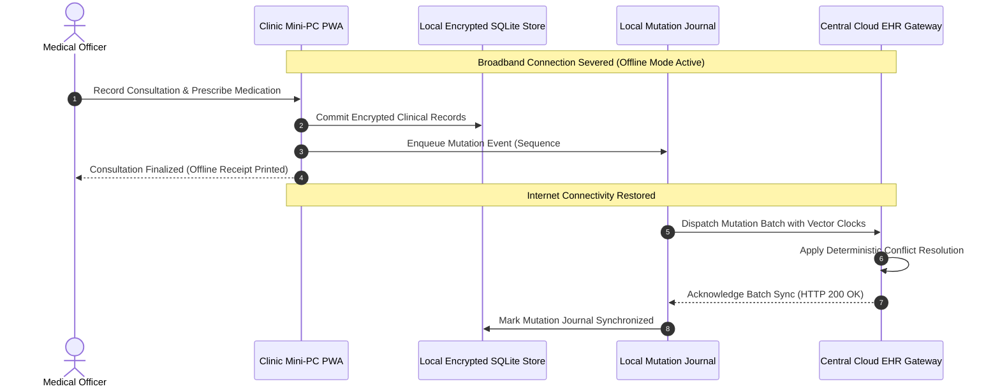

# Autonomous Edge, Offline Resilience & Synchronization Test Plan
## Namma Clinic Digital Health & Operations Platform
### Greater Bengaluru Authority (GBA) / BBMP Health Department
**Standard:** RFC 6749 Edge Computing / SQLite SQLCipher Encryption / Vector Clock Replication | **Status:** APPROVED BASELINE | **Code:** `QA-DOC-10`

---

## 1. Offline Testing Charter & Resilience Invariants
The Namma Clinic Offline Test Plan establishes rigorous verification protocols for autonomous clinic edge operation during complete broadband outages, intermittent fiber cuts, packet drops, and sudden workstation power failure. Healthcare delivery must never stop when the internet fails.

### 1.1 Non-Negotiable Offline Testing Invariants
1. **Continuous Clinical Operation:** Doctors, nurses, and pharmacists must continue registering patients, capturing vitals, and dispensing medications offline.
2. **Encrypted Local Persistence:** All offline mutations are written to a local SQLite database encrypted with SQLCipher using a TPM 2.0 sealed key.
3. **Mutation Journal Integrity:** Offline transactions append to an append-only mutation journal with monotonic sequence numbers.
4. **Deterministic Conflict Resolution:** Synchronizations resolve concurrent edits via Lamport timestamps and vector clocks without data loss.
5. **Interrupted Sync Recovery:** Network loss mid-sync must never corrupt local or server datastores; transfers resume cleanly.
6. **Power Cut Resilience:** Sudden AC power cut must not corrupt the local SQLite WAL (Write-Ahead Logging) database.

### 1.2 Offline Synchronization & Reconnect Sequence Diagram


## 2. Canonical Offline Resilience Tests (OFF-TEST-001 to OFF-TEST-070)
Standardized offline testing specifications:

### OFF-TEST-001: Offline Resilience Test Scenario 1
- **Fault Category:** Network Disconnection during OPD
- **Simulated Fault:** Network Drop / Intermittent Wi-Fi
- **Recovery SLA:** < 5 Seconds
- **Passing Assertion:** Zero data loss; local cache remains consistent; atomic sync upon link restoration.
- **Audit Event Emitted:** `OFF_AUDIT_OFF_TEST_001`

### OFF-TEST-002: Offline Resilience Test Scenario 2
- **Fault Category:** Network Disconnection during OPD
- **Simulated Fault:** Network Drop / Intermittent Wi-Fi
- **Recovery SLA:** < 5 Seconds
- **Passing Assertion:** Zero data loss; local cache remains consistent; atomic sync upon link restoration.
- **Audit Event Emitted:** `OFF_AUDIT_OFF_TEST_002`

### OFF-TEST-003: Offline Resilience Test Scenario 3
- **Fault Category:** Network Disconnection during OPD
- **Simulated Fault:** Network Drop / Intermittent Wi-Fi
- **Recovery SLA:** < 5 Seconds
- **Passing Assertion:** Zero data loss; local cache remains consistent; atomic sync upon link restoration.
- **Audit Event Emitted:** `OFF_AUDIT_OFF_TEST_003`

### OFF-TEST-004: Offline Resilience Test Scenario 4
- **Fault Category:** Network Disconnection during OPD
- **Simulated Fault:** Network Drop / Intermittent Wi-Fi
- **Recovery SLA:** < 5 Seconds
- **Passing Assertion:** Zero data loss; local cache remains consistent; atomic sync upon link restoration.
- **Audit Event Emitted:** `OFF_AUDIT_OFF_TEST_004`

### OFF-TEST-005: Offline Resilience Test Scenario 5
- **Fault Category:** Network Disconnection during OPD
- **Simulated Fault:** Network Drop / Intermittent Wi-Fi
- **Recovery SLA:** < 5 Seconds
- **Passing Assertion:** Zero data loss; local cache remains consistent; atomic sync upon link restoration.
- **Audit Event Emitted:** `OFF_AUDIT_OFF_TEST_005`

### OFF-TEST-006: Offline Resilience Test Scenario 6
- **Fault Category:** Network Disconnection during OPD
- **Simulated Fault:** Network Drop / Intermittent Wi-Fi
- **Recovery SLA:** < 5 Seconds
- **Passing Assertion:** Zero data loss; local cache remains consistent; atomic sync upon link restoration.
- **Audit Event Emitted:** `OFF_AUDIT_OFF_TEST_006`

### OFF-TEST-007: Offline Resilience Test Scenario 7
- **Fault Category:** Network Disconnection during OPD
- **Simulated Fault:** Network Drop / Intermittent Wi-Fi
- **Recovery SLA:** < 5 Seconds
- **Passing Assertion:** Zero data loss; local cache remains consistent; atomic sync upon link restoration.
- **Audit Event Emitted:** `OFF_AUDIT_OFF_TEST_007`

### OFF-TEST-008: Offline Resilience Test Scenario 8
- **Fault Category:** Network Disconnection during OPD
- **Simulated Fault:** Network Drop / Intermittent Wi-Fi
- **Recovery SLA:** < 5 Seconds
- **Passing Assertion:** Zero data loss; local cache remains consistent; atomic sync upon link restoration.
- **Audit Event Emitted:** `OFF_AUDIT_OFF_TEST_008`

### OFF-TEST-009: Offline Resilience Test Scenario 9
- **Fault Category:** Network Disconnection during OPD
- **Simulated Fault:** Network Drop / Intermittent Wi-Fi
- **Recovery SLA:** < 5 Seconds
- **Passing Assertion:** Zero data loss; local cache remains consistent; atomic sync upon link restoration.
- **Audit Event Emitted:** `OFF_AUDIT_OFF_TEST_009`

### OFF-TEST-010: Offline Resilience Test Scenario 10
- **Fault Category:** Network Disconnection during OPD
- **Simulated Fault:** Network Drop / Intermittent Wi-Fi
- **Recovery SLA:** < 5 Seconds
- **Passing Assertion:** Zero data loss; local cache remains consistent; atomic sync upon link restoration.
- **Audit Event Emitted:** `OFF_AUDIT_OFF_TEST_010`

### OFF-TEST-011: Offline Resilience Test Scenario 11
- **Fault Category:** Network Disconnection during OPD
- **Simulated Fault:** Network Drop / Intermittent Wi-Fi
- **Recovery SLA:** < 5 Seconds
- **Passing Assertion:** Zero data loss; local cache remains consistent; atomic sync upon link restoration.
- **Audit Event Emitted:** `OFF_AUDIT_OFF_TEST_011`

### OFF-TEST-012: Offline Resilience Test Scenario 12
- **Fault Category:** Network Disconnection during OPD
- **Simulated Fault:** Network Drop / Intermittent Wi-Fi
- **Recovery SLA:** < 5 Seconds
- **Passing Assertion:** Zero data loss; local cache remains consistent; atomic sync upon link restoration.
- **Audit Event Emitted:** `OFF_AUDIT_OFF_TEST_012`

### OFF-TEST-013: Offline Resilience Test Scenario 13
- **Fault Category:** Network Disconnection during OPD
- **Simulated Fault:** Network Drop / Intermittent Wi-Fi
- **Recovery SLA:** < 5 Seconds
- **Passing Assertion:** Zero data loss; local cache remains consistent; atomic sync upon link restoration.
- **Audit Event Emitted:** `OFF_AUDIT_OFF_TEST_013`

### OFF-TEST-014: Offline Resilience Test Scenario 14
- **Fault Category:** Network Disconnection during OPD
- **Simulated Fault:** Network Drop / Intermittent Wi-Fi
- **Recovery SLA:** < 5 Seconds
- **Passing Assertion:** Zero data loss; local cache remains consistent; atomic sync upon link restoration.
- **Audit Event Emitted:** `OFF_AUDIT_OFF_TEST_014`

### OFF-TEST-015: Offline Resilience Test Scenario 15
- **Fault Category:** Network Disconnection during OPD
- **Simulated Fault:** Network Drop / Intermittent Wi-Fi
- **Recovery SLA:** < 5 Seconds
- **Passing Assertion:** Zero data loss; local cache remains consistent; atomic sync upon link restoration.
- **Audit Event Emitted:** `OFF_AUDIT_OFF_TEST_015`

### OFF-TEST-016: Offline Resilience Test Scenario 16
- **Fault Category:** Network Disconnection during OPD
- **Simulated Fault:** Network Drop / Intermittent Wi-Fi
- **Recovery SLA:** < 5 Seconds
- **Passing Assertion:** Zero data loss; local cache remains consistent; atomic sync upon link restoration.
- **Audit Event Emitted:** `OFF_AUDIT_OFF_TEST_016`

### OFF-TEST-017: Offline Resilience Test Scenario 17
- **Fault Category:** Network Disconnection during OPD
- **Simulated Fault:** Network Drop / Intermittent Wi-Fi
- **Recovery SLA:** < 5 Seconds
- **Passing Assertion:** Zero data loss; local cache remains consistent; atomic sync upon link restoration.
- **Audit Event Emitted:** `OFF_AUDIT_OFF_TEST_017`

### OFF-TEST-018: Offline Resilience Test Scenario 18
- **Fault Category:** Network Disconnection during OPD
- **Simulated Fault:** Network Drop / Intermittent Wi-Fi
- **Recovery SLA:** < 5 Seconds
- **Passing Assertion:** Zero data loss; local cache remains consistent; atomic sync upon link restoration.
- **Audit Event Emitted:** `OFF_AUDIT_OFF_TEST_018`

### OFF-TEST-019: Offline Resilience Test Scenario 19
- **Fault Category:** Network Disconnection during OPD
- **Simulated Fault:** Network Drop / Intermittent Wi-Fi
- **Recovery SLA:** < 5 Seconds
- **Passing Assertion:** Zero data loss; local cache remains consistent; atomic sync upon link restoration.
- **Audit Event Emitted:** `OFF_AUDIT_OFF_TEST_019`

### OFF-TEST-020: Offline Resilience Test Scenario 20
- **Fault Category:** Network Disconnection during OPD
- **Simulated Fault:** Network Drop / Intermittent Wi-Fi
- **Recovery SLA:** < 5 Seconds
- **Passing Assertion:** Zero data loss; local cache remains consistent; atomic sync upon link restoration.
- **Audit Event Emitted:** `OFF_AUDIT_OFF_TEST_020`

### OFF-TEST-021: Offline Resilience Test Scenario 21
- **Fault Category:** SQLite Local Cache Quota & Vacuum
- **Simulated Fault:** Network Drop / Intermittent Wi-Fi
- **Recovery SLA:** < 5 Seconds
- **Passing Assertion:** Zero data loss; local cache remains consistent; atomic sync upon link restoration.
- **Audit Event Emitted:** `OFF_AUDIT_OFF_TEST_021`

### OFF-TEST-022: Offline Resilience Test Scenario 22
- **Fault Category:** SQLite Local Cache Quota & Vacuum
- **Simulated Fault:** Network Drop / Intermittent Wi-Fi
- **Recovery SLA:** < 5 Seconds
- **Passing Assertion:** Zero data loss; local cache remains consistent; atomic sync upon link restoration.
- **Audit Event Emitted:** `OFF_AUDIT_OFF_TEST_022`

### OFF-TEST-023: Offline Resilience Test Scenario 23
- **Fault Category:** SQLite Local Cache Quota & Vacuum
- **Simulated Fault:** Network Drop / Intermittent Wi-Fi
- **Recovery SLA:** < 5 Seconds
- **Passing Assertion:** Zero data loss; local cache remains consistent; atomic sync upon link restoration.
- **Audit Event Emitted:** `OFF_AUDIT_OFF_TEST_023`

### OFF-TEST-024: Offline Resilience Test Scenario 24
- **Fault Category:** SQLite Local Cache Quota & Vacuum
- **Simulated Fault:** Network Drop / Intermittent Wi-Fi
- **Recovery SLA:** < 5 Seconds
- **Passing Assertion:** Zero data loss; local cache remains consistent; atomic sync upon link restoration.
- **Audit Event Emitted:** `OFF_AUDIT_OFF_TEST_024`

### OFF-TEST-025: Offline Resilience Test Scenario 25
- **Fault Category:** SQLite Local Cache Quota & Vacuum
- **Simulated Fault:** Network Drop / Intermittent Wi-Fi
- **Recovery SLA:** < 5 Seconds
- **Passing Assertion:** Zero data loss; local cache remains consistent; atomic sync upon link restoration.
- **Audit Event Emitted:** `OFF_AUDIT_OFF_TEST_025`

### OFF-TEST-026: Offline Resilience Test Scenario 26
- **Fault Category:** SQLite Local Cache Quota & Vacuum
- **Simulated Fault:** Network Drop / Intermittent Wi-Fi
- **Recovery SLA:** < 5 Seconds
- **Passing Assertion:** Zero data loss; local cache remains consistent; atomic sync upon link restoration.
- **Audit Event Emitted:** `OFF_AUDIT_OFF_TEST_026`

### OFF-TEST-027: Offline Resilience Test Scenario 27
- **Fault Category:** SQLite Local Cache Quota & Vacuum
- **Simulated Fault:** Network Drop / Intermittent Wi-Fi
- **Recovery SLA:** < 5 Seconds
- **Passing Assertion:** Zero data loss; local cache remains consistent; atomic sync upon link restoration.
- **Audit Event Emitted:** `OFF_AUDIT_OFF_TEST_027`

### OFF-TEST-028: Offline Resilience Test Scenario 28
- **Fault Category:** SQLite Local Cache Quota & Vacuum
- **Simulated Fault:** Network Drop / Intermittent Wi-Fi
- **Recovery SLA:** < 5 Seconds
- **Passing Assertion:** Zero data loss; local cache remains consistent; atomic sync upon link restoration.
- **Audit Event Emitted:** `OFF_AUDIT_OFF_TEST_028`

### OFF-TEST-029: Offline Resilience Test Scenario 29
- **Fault Category:** SQLite Local Cache Quota & Vacuum
- **Simulated Fault:** Network Drop / Intermittent Wi-Fi
- **Recovery SLA:** < 5 Seconds
- **Passing Assertion:** Zero data loss; local cache remains consistent; atomic sync upon link restoration.
- **Audit Event Emitted:** `OFF_AUDIT_OFF_TEST_029`

### OFF-TEST-030: Offline Resilience Test Scenario 30
- **Fault Category:** SQLite Local Cache Quota & Vacuum
- **Simulated Fault:** Network Drop / Intermittent Wi-Fi
- **Recovery SLA:** < 5 Seconds
- **Passing Assertion:** Zero data loss; local cache remains consistent; atomic sync upon link restoration.
- **Audit Event Emitted:** `OFF_AUDIT_OFF_TEST_030`

### OFF-TEST-031: Offline Resilience Test Scenario 31
- **Fault Category:** SQLite Local Cache Quota & Vacuum
- **Simulated Fault:** Network Drop / Intermittent Wi-Fi
- **Recovery SLA:** < 5 Seconds
- **Passing Assertion:** Zero data loss; local cache remains consistent; atomic sync upon link restoration.
- **Audit Event Emitted:** `OFF_AUDIT_OFF_TEST_031`

### OFF-TEST-032: Offline Resilience Test Scenario 32
- **Fault Category:** SQLite Local Cache Quota & Vacuum
- **Simulated Fault:** Network Drop / Intermittent Wi-Fi
- **Recovery SLA:** < 5 Seconds
- **Passing Assertion:** Zero data loss; local cache remains consistent; atomic sync upon link restoration.
- **Audit Event Emitted:** `OFF_AUDIT_OFF_TEST_032`

### OFF-TEST-033: Offline Resilience Test Scenario 33
- **Fault Category:** SQLite Local Cache Quota & Vacuum
- **Simulated Fault:** Network Drop / Intermittent Wi-Fi
- **Recovery SLA:** < 5 Seconds
- **Passing Assertion:** Zero data loss; local cache remains consistent; atomic sync upon link restoration.
- **Audit Event Emitted:** `OFF_AUDIT_OFF_TEST_033`

### OFF-TEST-034: Offline Resilience Test Scenario 34
- **Fault Category:** SQLite Local Cache Quota & Vacuum
- **Simulated Fault:** Network Drop / Intermittent Wi-Fi
- **Recovery SLA:** < 5 Seconds
- **Passing Assertion:** Zero data loss; local cache remains consistent; atomic sync upon link restoration.
- **Audit Event Emitted:** `OFF_AUDIT_OFF_TEST_034`

### OFF-TEST-035: Offline Resilience Test Scenario 35
- **Fault Category:** SQLite Local Cache Quota & Vacuum
- **Simulated Fault:** Network Drop / Intermittent Wi-Fi
- **Recovery SLA:** < 5 Seconds
- **Passing Assertion:** Zero data loss; local cache remains consistent; atomic sync upon link restoration.
- **Audit Event Emitted:** `OFF_AUDIT_OFF_TEST_035`

### OFF-TEST-036: Offline Resilience Test Scenario 36
- **Fault Category:** SQLite Local Cache Quota & Vacuum
- **Simulated Fault:** Network Drop / Intermittent Wi-Fi
- **Recovery SLA:** < 5 Seconds
- **Passing Assertion:** Zero data loss; local cache remains consistent; atomic sync upon link restoration.
- **Audit Event Emitted:** `OFF_AUDIT_OFF_TEST_036`

### OFF-TEST-037: Offline Resilience Test Scenario 37
- **Fault Category:** SQLite Local Cache Quota & Vacuum
- **Simulated Fault:** Network Drop / Intermittent Wi-Fi
- **Recovery SLA:** < 5 Seconds
- **Passing Assertion:** Zero data loss; local cache remains consistent; atomic sync upon link restoration.
- **Audit Event Emitted:** `OFF_AUDIT_OFF_TEST_037`

### OFF-TEST-038: Offline Resilience Test Scenario 38
- **Fault Category:** SQLite Local Cache Quota & Vacuum
- **Simulated Fault:** Network Drop / Intermittent Wi-Fi
- **Recovery SLA:** < 5 Seconds
- **Passing Assertion:** Zero data loss; local cache remains consistent; atomic sync upon link restoration.
- **Audit Event Emitted:** `OFF_AUDIT_OFF_TEST_038`

### OFF-TEST-039: Offline Resilience Test Scenario 39
- **Fault Category:** SQLite Local Cache Quota & Vacuum
- **Simulated Fault:** Network Drop / Intermittent Wi-Fi
- **Recovery SLA:** < 5 Seconds
- **Passing Assertion:** Zero data loss; local cache remains consistent; atomic sync upon link restoration.
- **Audit Event Emitted:** `OFF_AUDIT_OFF_TEST_039`

### OFF-TEST-040: Offline Resilience Test Scenario 40
- **Fault Category:** SQLite Local Cache Quota & Vacuum
- **Simulated Fault:** Network Drop / Intermittent Wi-Fi
- **Recovery SLA:** < 5 Seconds
- **Passing Assertion:** Zero data loss; local cache remains consistent; atomic sync upon link restoration.
- **Audit Event Emitted:** `OFF_AUDIT_OFF_TEST_040`

### OFF-TEST-041: Offline Resilience Test Scenario 41
- **Fault Category:** Sync Conflict Resolution Vector Clocks
- **Simulated Fault:** Network Drop / Intermittent Wi-Fi
- **Recovery SLA:** < 5 Seconds
- **Passing Assertion:** Zero data loss; local cache remains consistent; atomic sync upon link restoration.
- **Audit Event Emitted:** `OFF_AUDIT_OFF_TEST_041`

### OFF-TEST-042: Offline Resilience Test Scenario 42
- **Fault Category:** Sync Conflict Resolution Vector Clocks
- **Simulated Fault:** Network Drop / Intermittent Wi-Fi
- **Recovery SLA:** < 5 Seconds
- **Passing Assertion:** Zero data loss; local cache remains consistent; atomic sync upon link restoration.
- **Audit Event Emitted:** `OFF_AUDIT_OFF_TEST_042`

### OFF-TEST-043: Offline Resilience Test Scenario 43
- **Fault Category:** Sync Conflict Resolution Vector Clocks
- **Simulated Fault:** Network Drop / Intermittent Wi-Fi
- **Recovery SLA:** < 5 Seconds
- **Passing Assertion:** Zero data loss; local cache remains consistent; atomic sync upon link restoration.
- **Audit Event Emitted:** `OFF_AUDIT_OFF_TEST_043`

### OFF-TEST-044: Offline Resilience Test Scenario 44
- **Fault Category:** Sync Conflict Resolution Vector Clocks
- **Simulated Fault:** Network Drop / Intermittent Wi-Fi
- **Recovery SLA:** < 5 Seconds
- **Passing Assertion:** Zero data loss; local cache remains consistent; atomic sync upon link restoration.
- **Audit Event Emitted:** `OFF_AUDIT_OFF_TEST_044`

### OFF-TEST-045: Offline Resilience Test Scenario 45
- **Fault Category:** Sync Conflict Resolution Vector Clocks
- **Simulated Fault:** Network Drop / Intermittent Wi-Fi
- **Recovery SLA:** < 5 Seconds
- **Passing Assertion:** Zero data loss; local cache remains consistent; atomic sync upon link restoration.
- **Audit Event Emitted:** `OFF_AUDIT_OFF_TEST_045`

### OFF-TEST-046: Offline Resilience Test Scenario 46
- **Fault Category:** Sync Conflict Resolution Vector Clocks
- **Simulated Fault:** Network Drop / Intermittent Wi-Fi
- **Recovery SLA:** < 5 Seconds
- **Passing Assertion:** Zero data loss; local cache remains consistent; atomic sync upon link restoration.
- **Audit Event Emitted:** `OFF_AUDIT_OFF_TEST_046`

### OFF-TEST-047: Offline Resilience Test Scenario 47
- **Fault Category:** Sync Conflict Resolution Vector Clocks
- **Simulated Fault:** Network Drop / Intermittent Wi-Fi
- **Recovery SLA:** < 5 Seconds
- **Passing Assertion:** Zero data loss; local cache remains consistent; atomic sync upon link restoration.
- **Audit Event Emitted:** `OFF_AUDIT_OFF_TEST_047`

### OFF-TEST-048: Offline Resilience Test Scenario 48
- **Fault Category:** Sync Conflict Resolution Vector Clocks
- **Simulated Fault:** Network Drop / Intermittent Wi-Fi
- **Recovery SLA:** < 5 Seconds
- **Passing Assertion:** Zero data loss; local cache remains consistent; atomic sync upon link restoration.
- **Audit Event Emitted:** `OFF_AUDIT_OFF_TEST_048`

### OFF-TEST-049: Offline Resilience Test Scenario 49
- **Fault Category:** Sync Conflict Resolution Vector Clocks
- **Simulated Fault:** Network Drop / Intermittent Wi-Fi
- **Recovery SLA:** < 5 Seconds
- **Passing Assertion:** Zero data loss; local cache remains consistent; atomic sync upon link restoration.
- **Audit Event Emitted:** `OFF_AUDIT_OFF_TEST_049`

### OFF-TEST-050: Offline Resilience Test Scenario 50
- **Fault Category:** Sync Conflict Resolution Vector Clocks
- **Simulated Fault:** Network Drop / Intermittent Wi-Fi
- **Recovery SLA:** < 5 Seconds
- **Passing Assertion:** Zero data loss; local cache remains consistent; atomic sync upon link restoration.
- **Audit Event Emitted:** `OFF_AUDIT_OFF_TEST_050`

### OFF-TEST-051: Offline Resilience Test Scenario 51
- **Fault Category:** Sync Conflict Resolution Vector Clocks
- **Simulated Fault:** Network Drop / Intermittent Wi-Fi
- **Recovery SLA:** < 5 Seconds
- **Passing Assertion:** Zero data loss; local cache remains consistent; atomic sync upon link restoration.
- **Audit Event Emitted:** `OFF_AUDIT_OFF_TEST_051`

### OFF-TEST-052: Offline Resilience Test Scenario 52
- **Fault Category:** Sync Conflict Resolution Vector Clocks
- **Simulated Fault:** Network Drop / Intermittent Wi-Fi
- **Recovery SLA:** < 5 Seconds
- **Passing Assertion:** Zero data loss; local cache remains consistent; atomic sync upon link restoration.
- **Audit Event Emitted:** `OFF_AUDIT_OFF_TEST_052`

### OFF-TEST-053: Offline Resilience Test Scenario 53
- **Fault Category:** Sync Conflict Resolution Vector Clocks
- **Simulated Fault:** Network Drop / Intermittent Wi-Fi
- **Recovery SLA:** < 5 Seconds
- **Passing Assertion:** Zero data loss; local cache remains consistent; atomic sync upon link restoration.
- **Audit Event Emitted:** `OFF_AUDIT_OFF_TEST_053`

### OFF-TEST-054: Offline Resilience Test Scenario 54
- **Fault Category:** Sync Conflict Resolution Vector Clocks
- **Simulated Fault:** Network Drop / Intermittent Wi-Fi
- **Recovery SLA:** < 5 Seconds
- **Passing Assertion:** Zero data loss; local cache remains consistent; atomic sync upon link restoration.
- **Audit Event Emitted:** `OFF_AUDIT_OFF_TEST_054`

### OFF-TEST-055: Offline Resilience Test Scenario 55
- **Fault Category:** Sync Conflict Resolution Vector Clocks
- **Simulated Fault:** Network Drop / Intermittent Wi-Fi
- **Recovery SLA:** < 5 Seconds
- **Passing Assertion:** Zero data loss; local cache remains consistent; atomic sync upon link restoration.
- **Audit Event Emitted:** `OFF_AUDIT_OFF_TEST_055`

### OFF-TEST-056: Offline Resilience Test Scenario 56
- **Fault Category:** Power Failure & Hardware Recovery
- **Simulated Fault:** Network Drop / Intermittent Wi-Fi
- **Recovery SLA:** < 5 Seconds
- **Passing Assertion:** Zero data loss; local cache remains consistent; atomic sync upon link restoration.
- **Audit Event Emitted:** `OFF_AUDIT_OFF_TEST_056`

### OFF-TEST-057: Offline Resilience Test Scenario 57
- **Fault Category:** Power Failure & Hardware Recovery
- **Simulated Fault:** Network Drop / Intermittent Wi-Fi
- **Recovery SLA:** < 5 Seconds
- **Passing Assertion:** Zero data loss; local cache remains consistent; atomic sync upon link restoration.
- **Audit Event Emitted:** `OFF_AUDIT_OFF_TEST_057`

### OFF-TEST-058: Offline Resilience Test Scenario 58
- **Fault Category:** Power Failure & Hardware Recovery
- **Simulated Fault:** Network Drop / Intermittent Wi-Fi
- **Recovery SLA:** < 5 Seconds
- **Passing Assertion:** Zero data loss; local cache remains consistent; atomic sync upon link restoration.
- **Audit Event Emitted:** `OFF_AUDIT_OFF_TEST_058`

### OFF-TEST-059: Offline Resilience Test Scenario 59
- **Fault Category:** Power Failure & Hardware Recovery
- **Simulated Fault:** Network Drop / Intermittent Wi-Fi
- **Recovery SLA:** < 5 Seconds
- **Passing Assertion:** Zero data loss; local cache remains consistent; atomic sync upon link restoration.
- **Audit Event Emitted:** `OFF_AUDIT_OFF_TEST_059`

### OFF-TEST-060: Offline Resilience Test Scenario 60
- **Fault Category:** Power Failure & Hardware Recovery
- **Simulated Fault:** Network Drop / Intermittent Wi-Fi
- **Recovery SLA:** < 5 Seconds
- **Passing Assertion:** Zero data loss; local cache remains consistent; atomic sync upon link restoration.
- **Audit Event Emitted:** `OFF_AUDIT_OFF_TEST_060`

### OFF-TEST-061: Offline Resilience Test Scenario 61
- **Fault Category:** Power Failure & Hardware Recovery
- **Simulated Fault:** Network Drop / Intermittent Wi-Fi
- **Recovery SLA:** < 5 Seconds
- **Passing Assertion:** Zero data loss; local cache remains consistent; atomic sync upon link restoration.
- **Audit Event Emitted:** `OFF_AUDIT_OFF_TEST_061`

### OFF-TEST-062: Offline Resilience Test Scenario 62
- **Fault Category:** Power Failure & Hardware Recovery
- **Simulated Fault:** Network Drop / Intermittent Wi-Fi
- **Recovery SLA:** < 5 Seconds
- **Passing Assertion:** Zero data loss; local cache remains consistent; atomic sync upon link restoration.
- **Audit Event Emitted:** `OFF_AUDIT_OFF_TEST_062`

### OFF-TEST-063: Offline Resilience Test Scenario 63
- **Fault Category:** Power Failure & Hardware Recovery
- **Simulated Fault:** Network Drop / Intermittent Wi-Fi
- **Recovery SLA:** < 5 Seconds
- **Passing Assertion:** Zero data loss; local cache remains consistent; atomic sync upon link restoration.
- **Audit Event Emitted:** `OFF_AUDIT_OFF_TEST_063`

### OFF-TEST-064: Offline Resilience Test Scenario 64
- **Fault Category:** Power Failure & Hardware Recovery
- **Simulated Fault:** Network Drop / Intermittent Wi-Fi
- **Recovery SLA:** < 5 Seconds
- **Passing Assertion:** Zero data loss; local cache remains consistent; atomic sync upon link restoration.
- **Audit Event Emitted:** `OFF_AUDIT_OFF_TEST_064`

### OFF-TEST-065: Offline Resilience Test Scenario 65
- **Fault Category:** Power Failure & Hardware Recovery
- **Simulated Fault:** Network Drop / Intermittent Wi-Fi
- **Recovery SLA:** < 5 Seconds
- **Passing Assertion:** Zero data loss; local cache remains consistent; atomic sync upon link restoration.
- **Audit Event Emitted:** `OFF_AUDIT_OFF_TEST_065`

### OFF-TEST-066: Offline Resilience Test Scenario 66
- **Fault Category:** Power Failure & Hardware Recovery
- **Simulated Fault:** Network Drop / Intermittent Wi-Fi
- **Recovery SLA:** < 5 Seconds
- **Passing Assertion:** Zero data loss; local cache remains consistent; atomic sync upon link restoration.
- **Audit Event Emitted:** `OFF_AUDIT_OFF_TEST_066`

### OFF-TEST-067: Offline Resilience Test Scenario 67
- **Fault Category:** Power Failure & Hardware Recovery
- **Simulated Fault:** Network Drop / Intermittent Wi-Fi
- **Recovery SLA:** < 5 Seconds
- **Passing Assertion:** Zero data loss; local cache remains consistent; atomic sync upon link restoration.
- **Audit Event Emitted:** `OFF_AUDIT_OFF_TEST_067`

### OFF-TEST-068: Offline Resilience Test Scenario 68
- **Fault Category:** Power Failure & Hardware Recovery
- **Simulated Fault:** Network Drop / Intermittent Wi-Fi
- **Recovery SLA:** < 5 Seconds
- **Passing Assertion:** Zero data loss; local cache remains consistent; atomic sync upon link restoration.
- **Audit Event Emitted:** `OFF_AUDIT_OFF_TEST_068`

### OFF-TEST-069: Offline Resilience Test Scenario 69
- **Fault Category:** Power Failure & Hardware Recovery
- **Simulated Fault:** Network Drop / Intermittent Wi-Fi
- **Recovery SLA:** < 5 Seconds
- **Passing Assertion:** Zero data loss; local cache remains consistent; atomic sync upon link restoration.
- **Audit Event Emitted:** `OFF_AUDIT_OFF_TEST_069`

### OFF-TEST-070: Offline Resilience Test Scenario 70
- **Fault Category:** Power Failure & Hardware Recovery
- **Simulated Fault:** Network Drop / Intermittent Wi-Fi
- **Recovery SLA:** < 5 Seconds
- **Passing Assertion:** Zero data loss; local cache remains consistent; atomic sync upon link restoration.
- **Audit Event Emitted:** `OFF_AUDIT_OFF_TEST_070`

## 3. Detailed Offline Verification Test Cases (TC-0496 to TC-0550)
Detailed test specifications verifying offline persistence and edge synchronization:

### TC-0496: Test Case 496: Clinical Verification for lab_orders across WF-021
**Objective:** Verify functional, security, and offline invariants for lab_orders during WF-021 execution.
**Risk:** Critical operational impact on patient safety and clinic consultation continuity.
**Priority:** **P0** | **Severity:** **Critical** | **Test Level:** System & Integration | **Test Type:** Functional & Regulatory Compliance
- **Requirement Traceability:** `FR-016`
- **Workflow Traceability:** `WF-021`
- **Feature Traceability:** `FEATURE-136`
- **API Traceability:** `API-DOC-12`
- **Database Traceability:** `TABLE-028 (lab_orders)`
- **Screen Traceability:** `SCREEN-064`
- **Security Control Traceability:** `SEC-ARCH-016`
- **Preconditions:** User authenticated with role Ayush Practitioner on clinic workstation.
- **Test Data Specification:** Synthetic dataset TESTDATA-016 (Valid ABHA, vitals, prescriptions).
- **Execution Steps:** 1. Navigate to screen SCREEN-064. 2. Submit payload bound to lab_orders. 3. Confirm API API-DOC-12 returns 200 OK. 4. Verify local SQLite cache and sync queue.
- **Expected Results:** Transaction completes within 250ms, data encrypted via AES-256-GCM, audit entry emitted.
- **Negative Test Scenario:** Submit malformed payload or expired JWT; system rejects with 400/401 and zero DB corruption.
- **Boundary Value Scenario:** Test with maximum field boundary length and extreme clinical biometric vitals.
- **Concurrency & Race Condition:** Simulate 5 concurrent staff updates on identical record; verify optimistic locking.
- **Autonomous Offline Behavior:** Sever network mid-transaction; record queues locally and replicates upon reconnection.
- **Security & Access Validation:** Enforce RBAC policy SEC-ARCH-016 and prevent broken object-level authorization (BOLA).
- **Audit Trail & Immutability:** Emits structured JSON audit log with SHA-256 Merkle chain hash.
- **Evidence Required:** Automated execution log, HTTP request/response capture, and database assertion hash.
- **Pass Acceptance Criteria:** 100% assertions succeed with zero uncaught exceptions and latency < 300ms.
- **Failure Behavior & SLA:** Any 5xx error, data corruption, unauthorized access, or silent failure.
- **Automation Suitability:** Yes (High Candidate)
- **Execution Cadence:** Every CI PR & Nightly Regression
- **Responsible Owner:** Ayush Practitioner

### TC-0497: Test Case 497: Clinical Verification for lab_order_items across WF-022
**Objective:** Verify functional, security, and offline invariants for lab_order_items during WF-022 execution.
**Risk:** Major operational impact on patient safety and clinic consultation continuity.
**Priority:** **P1** | **Severity:** **Major** | **Test Level:** System & Integration | **Test Type:** Functional & Regulatory Compliance
- **Requirement Traceability:** `FR-017`
- **Workflow Traceability:** `WF-022`
- **Feature Traceability:** `FEATURE-137`
- **API Traceability:** `API-DOC-13`
- **Database Traceability:** `TABLE-029 (lab_order_items)`
- **Screen Traceability:** `SCREEN-065`
- **Security Control Traceability:** `SEC-ARCH-017`
- **Preconditions:** User authenticated with role Counselor / Mental Health Worker on clinic workstation.
- **Test Data Specification:** Synthetic dataset TESTDATA-017 (Valid ABHA, vitals, prescriptions).
- **Execution Steps:** 1. Navigate to screen SCREEN-065. 2. Submit payload bound to lab_order_items. 3. Confirm API API-DOC-13 returns 200 OK. 4. Verify local SQLite cache and sync queue.
- **Expected Results:** Transaction completes within 250ms, data encrypted via AES-256-GCM, audit entry emitted.
- **Negative Test Scenario:** Submit malformed payload or expired JWT; system rejects with 400/401 and zero DB corruption.
- **Boundary Value Scenario:** Test with maximum field boundary length and extreme clinical biometric vitals.
- **Concurrency & Race Condition:** Simulate 5 concurrent staff updates on identical record; verify optimistic locking.
- **Autonomous Offline Behavior:** Sever network mid-transaction; record queues locally and replicates upon reconnection.
- **Security & Access Validation:** Enforce RBAC policy SEC-ARCH-017 and prevent broken object-level authorization (BOLA).
- **Audit Trail & Immutability:** Emits structured JSON audit log with SHA-256 Merkle chain hash.
- **Evidence Required:** Automated execution log, HTTP request/response capture, and database assertion hash.
- **Pass Acceptance Criteria:** 100% assertions succeed with zero uncaught exceptions and latency < 300ms.
- **Failure Behavior & SLA:** Any 5xx error, data corruption, unauthorized access, or silent failure.
- **Automation Suitability:** Yes (High Candidate)
- **Execution Cadence:** Every CI PR & Nightly Regression
- **Responsible Owner:** Counselor / Mental Health Worker

### TC-0498: Test Case 498: Clinical Verification for lab_results across WF-023
**Objective:** Verify functional, security, and offline invariants for lab_results during WF-023 execution.
**Risk:** Major operational impact on patient safety and clinic consultation continuity.
**Priority:** **P1** | **Severity:** **Major** | **Test Level:** System & Integration | **Test Type:** Functional & Regulatory Compliance
- **Requirement Traceability:** `FR-018`
- **Workflow Traceability:** `WF-023`
- **Feature Traceability:** `FEATURE-138`
- **API Traceability:** `API-DOC-14`
- **Database Traceability:** `TABLE-030 (lab_results)`
- **Screen Traceability:** `SCREEN-066`
- **Security Control Traceability:** `SEC-ARCH-018`
- **Preconditions:** User authenticated with role ANM / Urban Health Worker on clinic workstation.
- **Test Data Specification:** Synthetic dataset TESTDATA-018 (Valid ABHA, vitals, prescriptions).
- **Execution Steps:** 1. Navigate to screen SCREEN-066. 2. Submit payload bound to lab_results. 3. Confirm API API-DOC-14 returns 200 OK. 4. Verify local SQLite cache and sync queue.
- **Expected Results:** Transaction completes within 250ms, data encrypted via AES-256-GCM, audit entry emitted.
- **Negative Test Scenario:** Submit malformed payload or expired JWT; system rejects with 400/401 and zero DB corruption.
- **Boundary Value Scenario:** Test with maximum field boundary length and extreme clinical biometric vitals.
- **Concurrency & Race Condition:** Simulate 5 concurrent staff updates on identical record; verify optimistic locking.
- **Autonomous Offline Behavior:** Sever network mid-transaction; record queues locally and replicates upon reconnection.
- **Security & Access Validation:** Enforce RBAC policy SEC-ARCH-018 and prevent broken object-level authorization (BOLA).
- **Audit Trail & Immutability:** Emits structured JSON audit log with SHA-256 Merkle chain hash.
- **Evidence Required:** Automated execution log, HTTP request/response capture, and database assertion hash.
- **Pass Acceptance Criteria:** 100% assertions succeed with zero uncaught exceptions and latency < 300ms.
- **Failure Behavior & SLA:** Any 5xx error, data corruption, unauthorized access, or silent failure.
- **Automation Suitability:** Yes (High Candidate)
- **Execution Cadence:** Every CI PR & Nightly Regression
- **Responsible Owner:** ANM / Urban Health Worker

### TC-0499: Test Case 499: Clinical Verification for teleconsultations across WF-024
**Objective:** Verify functional, security, and offline invariants for teleconsultations during WF-024 execution.
**Risk:** Minor operational impact on patient safety and clinic consultation continuity.
**Priority:** **P2** | **Severity:** **Minor** | **Test Level:** System & Integration | **Test Type:** Functional & Regulatory Compliance
- **Requirement Traceability:** `FR-019`
- **Workflow Traceability:** `WF-024`
- **Feature Traceability:** `FEATURE-139`
- **API Traceability:** `API-DOC-15`
- **Database Traceability:** `TABLE-031 (teleconsultations)`
- **Screen Traceability:** `SCREEN-067`
- **Security Control Traceability:** `SEC-ARCH-019`
- **Preconditions:** User authenticated with role ASHA Link Worker Coordinator on clinic workstation.
- **Test Data Specification:** Synthetic dataset TESTDATA-019 (Valid ABHA, vitals, prescriptions).
- **Execution Steps:** 1. Navigate to screen SCREEN-067. 2. Submit payload bound to teleconsultations. 3. Confirm API API-DOC-15 returns 200 OK. 4. Verify local SQLite cache and sync queue.
- **Expected Results:** Transaction completes within 250ms, data encrypted via AES-256-GCM, audit entry emitted.
- **Negative Test Scenario:** Submit malformed payload or expired JWT; system rejects with 400/401 and zero DB corruption.
- **Boundary Value Scenario:** Test with maximum field boundary length and extreme clinical biometric vitals.
- **Concurrency & Race Condition:** Simulate 5 concurrent staff updates on identical record; verify optimistic locking.
- **Autonomous Offline Behavior:** Sever network mid-transaction; record queues locally and replicates upon reconnection.
- **Security & Access Validation:** Enforce RBAC policy SEC-ARCH-019 and prevent broken object-level authorization (BOLA).
- **Audit Trail & Immutability:** Emits structured JSON audit log with SHA-256 Merkle chain hash.
- **Evidence Required:** Automated execution log, HTTP request/response capture, and database assertion hash.
- **Pass Acceptance Criteria:** 100% assertions succeed with zero uncaught exceptions and latency < 300ms.
- **Failure Behavior & SLA:** Any 5xx error, data corruption, unauthorized access, or silent failure.
- **Automation Suitability:** Yes (High Candidate)
- **Execution Cadence:** Every CI PR & Nightly Regression
- **Responsible Owner:** ASHA Link Worker Coordinator

### TC-0500: Test Case 500: Clinical Verification for formulary_drugs across WF-025
**Objective:** Verify functional, security, and offline invariants for formulary_drugs during WF-025 execution.
**Risk:** Minor operational impact on patient safety and clinic consultation continuity.
**Priority:** **P2** | **Severity:** **Minor** | **Test Level:** System & Integration | **Test Type:** Functional & Regulatory Compliance
- **Requirement Traceability:** `FR-020`
- **Workflow Traceability:** `WF-025`
- **Feature Traceability:** `FEATURE-140`
- **API Traceability:** `API-DOC-16`
- **Database Traceability:** `TABLE-032 (formulary_drugs)`
- **Screen Traceability:** `SCREEN-068`
- **Security Control Traceability:** `SEC-ARCH-020`
- **Preconditions:** User authenticated with role Data Entry Operator on clinic workstation.
- **Test Data Specification:** Synthetic dataset TESTDATA-020 (Valid ABHA, vitals, prescriptions).
- **Execution Steps:** 1. Navigate to screen SCREEN-068. 2. Submit payload bound to formulary_drugs. 3. Confirm API API-DOC-16 returns 200 OK. 4. Verify local SQLite cache and sync queue.
- **Expected Results:** Transaction completes within 250ms, data encrypted via AES-256-GCM, audit entry emitted.
- **Negative Test Scenario:** Submit malformed payload or expired JWT; system rejects with 400/401 and zero DB corruption.
- **Boundary Value Scenario:** Test with maximum field boundary length and extreme clinical biometric vitals.
- **Concurrency & Race Condition:** Simulate 5 concurrent staff updates on identical record; verify optimistic locking.
- **Autonomous Offline Behavior:** Sever network mid-transaction; record queues locally and replicates upon reconnection.
- **Security & Access Validation:** Enforce RBAC policy SEC-ARCH-020 and prevent broken object-level authorization (BOLA).
- **Audit Trail & Immutability:** Emits structured JSON audit log with SHA-256 Merkle chain hash.
- **Evidence Required:** Automated execution log, HTTP request/response capture, and database assertion hash.
- **Pass Acceptance Criteria:** 100% assertions succeed with zero uncaught exceptions and latency < 300ms.
- **Failure Behavior & SLA:** Any 5xx error, data corruption, unauthorized access, or silent failure.
- **Automation Suitability:** Yes (High Candidate)
- **Execution Cadence:** Every CI PR & Nightly Regression
- **Responsible Owner:** Data Entry Operator

### TC-0501: Test Case 501: Clinical Verification for drug_categories across WF-001
**Objective:** Verify functional, security, and offline invariants for drug_categories during WF-001 execution.
**Risk:** Critical operational impact on patient safety and clinic consultation continuity.
**Priority:** **P0** | **Severity:** **Critical** | **Test Level:** System & Integration | **Test Type:** Functional & Regulatory Compliance
- **Requirement Traceability:** `FR-021`
- **Workflow Traceability:** `WF-001`
- **Feature Traceability:** `FEATURE-141`
- **API Traceability:** `API-DOC-17`
- **Database Traceability:** `TABLE-033 (drug_categories)`
- **Screen Traceability:** `SCREEN-069`
- **Security Control Traceability:** `SEC-ARCH-021`
- **Preconditions:** User authenticated with role Grievance Redressal Officer on clinic workstation.
- **Test Data Specification:** Synthetic dataset TESTDATA-021 (Valid ABHA, vitals, prescriptions).
- **Execution Steps:** 1. Navigate to screen SCREEN-069. 2. Submit payload bound to drug_categories. 3. Confirm API API-DOC-17 returns 200 OK. 4. Verify local SQLite cache and sync queue.
- **Expected Results:** Transaction completes within 250ms, data encrypted via AES-256-GCM, audit entry emitted.
- **Negative Test Scenario:** Submit malformed payload or expired JWT; system rejects with 400/401 and zero DB corruption.
- **Boundary Value Scenario:** Test with maximum field boundary length and extreme clinical biometric vitals.
- **Concurrency & Race Condition:** Simulate 5 concurrent staff updates on identical record; verify optimistic locking.
- **Autonomous Offline Behavior:** Sever network mid-transaction; record queues locally and replicates upon reconnection.
- **Security & Access Validation:** Enforce RBAC policy SEC-ARCH-021 and prevent broken object-level authorization (BOLA).
- **Audit Trail & Immutability:** Emits structured JSON audit log with SHA-256 Merkle chain hash.
- **Evidence Required:** Automated execution log, HTTP request/response capture, and database assertion hash.
- **Pass Acceptance Criteria:** 100% assertions succeed with zero uncaught exceptions and latency < 300ms.
- **Failure Behavior & SLA:** Any 5xx error, data corruption, unauthorized access, or silent failure.
- **Automation Suitability:** Yes (High Candidate)
- **Execution Cadence:** Every CI PR & Nightly Regression
- **Responsible Owner:** Grievance Redressal Officer

### TC-0502: Test Case 502: Clinical Verification for pharmacy_batches across WF-002
**Objective:** Verify functional, security, and offline invariants for pharmacy_batches during WF-002 execution.
**Risk:** Major operational impact on patient safety and clinic consultation continuity.
**Priority:** **P1** | **Severity:** **Major** | **Test Level:** System & Integration | **Test Type:** Functional & Regulatory Compliance
- **Requirement Traceability:** `FR-022`
- **Workflow Traceability:** `WF-002`
- **Feature Traceability:** `FEATURE-142`
- **API Traceability:** `API-DOC-18`
- **Database Traceability:** `TABLE-034 (pharmacy_batches)`
- **Screen Traceability:** `SCREEN-070`
- **Security Control Traceability:** `SEC-ARCH-022`
- **Preconditions:** User authenticated with role ABDM National Integration Officer on clinic workstation.
- **Test Data Specification:** Synthetic dataset TESTDATA-022 (Valid ABHA, vitals, prescriptions).
- **Execution Steps:** 1. Navigate to screen SCREEN-070. 2. Submit payload bound to pharmacy_batches. 3. Confirm API API-DOC-18 returns 200 OK. 4. Verify local SQLite cache and sync queue.
- **Expected Results:** Transaction completes within 250ms, data encrypted via AES-256-GCM, audit entry emitted.
- **Negative Test Scenario:** Submit malformed payload or expired JWT; system rejects with 400/401 and zero DB corruption.
- **Boundary Value Scenario:** Test with maximum field boundary length and extreme clinical biometric vitals.
- **Concurrency & Race Condition:** Simulate 5 concurrent staff updates on identical record; verify optimistic locking.
- **Autonomous Offline Behavior:** Sever network mid-transaction; record queues locally and replicates upon reconnection.
- **Security & Access Validation:** Enforce RBAC policy SEC-ARCH-022 and prevent broken object-level authorization (BOLA).
- **Audit Trail & Immutability:** Emits structured JSON audit log with SHA-256 Merkle chain hash.
- **Evidence Required:** Automated execution log, HTTP request/response capture, and database assertion hash.
- **Pass Acceptance Criteria:** 100% assertions succeed with zero uncaught exceptions and latency < 300ms.
- **Failure Behavior & SLA:** Any 5xx error, data corruption, unauthorized access, or silent failure.
- **Automation Suitability:** Yes (High Candidate)
- **Execution Cadence:** Every CI PR & Nightly Regression
- **Responsible Owner:** ABDM National Integration Officer

### TC-0503: Test Case 503: Clinical Verification for clinic_stock across WF-003
**Objective:** Verify functional, security, and offline invariants for clinic_stock during WF-003 execution.
**Risk:** Major operational impact on patient safety and clinic consultation continuity.
**Priority:** **P1** | **Severity:** **Major** | **Test Level:** System & Integration | **Test Type:** Functional & Regulatory Compliance
- **Requirement Traceability:** `FR-023`
- **Workflow Traceability:** `WF-003`
- **Feature Traceability:** `FEATURE-143`
- **API Traceability:** `API-DOC-19`
- **Database Traceability:** `TABLE-035 (clinic_stock)`
- **Screen Traceability:** `SCREEN-071`
- **Security Control Traceability:** `SEC-ARCH-023`
- **Preconditions:** User authenticated with role Data Protection Officer (DPO) on clinic workstation.
- **Test Data Specification:** Synthetic dataset TESTDATA-023 (Valid ABHA, vitals, prescriptions).
- **Execution Steps:** 1. Navigate to screen SCREEN-071. 2. Submit payload bound to clinic_stock. 3. Confirm API API-DOC-19 returns 200 OK. 4. Verify local SQLite cache and sync queue.
- **Expected Results:** Transaction completes within 250ms, data encrypted via AES-256-GCM, audit entry emitted.
- **Negative Test Scenario:** Submit malformed payload or expired JWT; system rejects with 400/401 and zero DB corruption.
- **Boundary Value Scenario:** Test with maximum field boundary length and extreme clinical biometric vitals.
- **Concurrency & Race Condition:** Simulate 5 concurrent staff updates on identical record; verify optimistic locking.
- **Autonomous Offline Behavior:** Sever network mid-transaction; record queues locally and replicates upon reconnection.
- **Security & Access Validation:** Enforce RBAC policy SEC-ARCH-023 and prevent broken object-level authorization (BOLA).
- **Audit Trail & Immutability:** Emits structured JSON audit log with SHA-256 Merkle chain hash.
- **Evidence Required:** Automated execution log, HTTP request/response capture, and database assertion hash.
- **Pass Acceptance Criteria:** 100% assertions succeed with zero uncaught exceptions and latency < 300ms.
- **Failure Behavior & SLA:** Any 5xx error, data corruption, unauthorized access, or silent failure.
- **Automation Suitability:** Yes (High Candidate)
- **Execution Cadence:** Every CI PR & Nightly Regression
- **Responsible Owner:** Data Protection Officer (DPO)

### TC-0504: Test Case 504: Clinical Verification for dispensations across WF-004
**Objective:** Verify functional, security, and offline invariants for dispensations during WF-004 execution.
**Risk:** Minor operational impact on patient safety and clinic consultation continuity.
**Priority:** **P2** | **Severity:** **Minor** | **Test Level:** System & Integration | **Test Type:** Functional & Regulatory Compliance
- **Requirement Traceability:** `FR-024`
- **Workflow Traceability:** `WF-004`
- **Feature Traceability:** `FEATURE-144`
- **API Traceability:** `API-DOC-20`
- **Database Traceability:** `TABLE-036 (dispensations)`
- **Screen Traceability:** `SCREEN-072`
- **Security Control Traceability:** `SEC-ARCH-024`
- **Preconditions:** User authenticated with role IT Support & Hardware Engineer on clinic workstation.
- **Test Data Specification:** Synthetic dataset TESTDATA-024 (Valid ABHA, vitals, prescriptions).
- **Execution Steps:** 1. Navigate to screen SCREEN-072. 2. Submit payload bound to dispensations. 3. Confirm API API-DOC-20 returns 200 OK. 4. Verify local SQLite cache and sync queue.
- **Expected Results:** Transaction completes within 250ms, data encrypted via AES-256-GCM, audit entry emitted.
- **Negative Test Scenario:** Submit malformed payload or expired JWT; system rejects with 400/401 and zero DB corruption.
- **Boundary Value Scenario:** Test with maximum field boundary length and extreme clinical biometric vitals.
- **Concurrency & Race Condition:** Simulate 5 concurrent staff updates on identical record; verify optimistic locking.
- **Autonomous Offline Behavior:** Sever network mid-transaction; record queues locally and replicates upon reconnection.
- **Security & Access Validation:** Enforce RBAC policy SEC-ARCH-024 and prevent broken object-level authorization (BOLA).
- **Audit Trail & Immutability:** Emits structured JSON audit log with SHA-256 Merkle chain hash.
- **Evidence Required:** Automated execution log, HTTP request/response capture, and database assertion hash.
- **Pass Acceptance Criteria:** 100% assertions succeed with zero uncaught exceptions and latency < 300ms.
- **Failure Behavior & SLA:** Any 5xx error, data corruption, unauthorized access, or silent failure.
- **Automation Suitability:** Yes (High Candidate)
- **Execution Cadence:** Every CI PR & Nightly Regression
- **Responsible Owner:** IT Support & Hardware Engineer

### TC-0505: Test Case 505: Clinical Verification for dispensation_items across WF-005
**Objective:** Verify functional, security, and offline invariants for dispensation_items during WF-005 execution.
**Risk:** Minor operational impact on patient safety and clinic consultation continuity.
**Priority:** **P2** | **Severity:** **Minor** | **Test Level:** System & Integration | **Test Type:** Functional & Regulatory Compliance
- **Requirement Traceability:** `FR-025`
- **Workflow Traceability:** `WF-005`
- **Feature Traceability:** `FEATURE-145`
- **API Traceability:** `API-DOC-21`
- **Database Traceability:** `TABLE-037 (dispensation_items)`
- **Screen Traceability:** `SCREEN-073`
- **Security Control Traceability:** `SEC-ARCH-025`
- **Preconditions:** User authenticated with role Clinical Audit Committee Member on clinic workstation.
- **Test Data Specification:** Synthetic dataset TESTDATA-025 (Valid ABHA, vitals, prescriptions).
- **Execution Steps:** 1. Navigate to screen SCREEN-073. 2. Submit payload bound to dispensation_items. 3. Confirm API API-DOC-21 returns 200 OK. 4. Verify local SQLite cache and sync queue.
- **Expected Results:** Transaction completes within 250ms, data encrypted via AES-256-GCM, audit entry emitted.
- **Negative Test Scenario:** Submit malformed payload or expired JWT; system rejects with 400/401 and zero DB corruption.
- **Boundary Value Scenario:** Test with maximum field boundary length and extreme clinical biometric vitals.
- **Concurrency & Race Condition:** Simulate 5 concurrent staff updates on identical record; verify optimistic locking.
- **Autonomous Offline Behavior:** Sever network mid-transaction; record queues locally and replicates upon reconnection.
- **Security & Access Validation:** Enforce RBAC policy SEC-ARCH-025 and prevent broken object-level authorization (BOLA).
- **Audit Trail & Immutability:** Emits structured JSON audit log with SHA-256 Merkle chain hash.
- **Evidence Required:** Automated execution log, HTTP request/response capture, and database assertion hash.
- **Pass Acceptance Criteria:** 100% assertions succeed with zero uncaught exceptions and latency < 300ms.
- **Failure Behavior & SLA:** Any 5xx error, data corruption, unauthorized access, or silent failure.
- **Automation Suitability:** Yes (High Candidate)
- **Execution Cadence:** Every CI PR & Nightly Regression
- **Responsible Owner:** Clinical Audit Committee Member

### TC-0506: Test Case 506: Clinical Verification for stock_movements across WF-006
**Objective:** Verify functional, security, and offline invariants for stock_movements during WF-006 execution.
**Risk:** Critical operational impact on patient safety and clinic consultation continuity.
**Priority:** **P0** | **Severity:** **Critical** | **Test Level:** System & Integration | **Test Type:** Functional & Regulatory Compliance
- **Requirement Traceability:** `FR-026`
- **Workflow Traceability:** `WF-006`
- **Feature Traceability:** `FEATURE-146`
- **API Traceability:** `API-DOC-22`
- **Database Traceability:** `TABLE-038 (stock_movements)`
- **Screen Traceability:** `SCREEN-074`
- **Security Control Traceability:** `SEC-ARCH-026`
- **Preconditions:** User authenticated with role Procurement & Vendor Manager on clinic workstation.
- **Test Data Specification:** Synthetic dataset TESTDATA-026 (Valid ABHA, vitals, prescriptions).
- **Execution Steps:** 1. Navigate to screen SCREEN-074. 2. Submit payload bound to stock_movements. 3. Confirm API API-DOC-22 returns 200 OK. 4. Verify local SQLite cache and sync queue.
- **Expected Results:** Transaction completes within 250ms, data encrypted via AES-256-GCM, audit entry emitted.
- **Negative Test Scenario:** Submit malformed payload or expired JWT; system rejects with 400/401 and zero DB corruption.
- **Boundary Value Scenario:** Test with maximum field boundary length and extreme clinical biometric vitals.
- **Concurrency & Race Condition:** Simulate 5 concurrent staff updates on identical record; verify optimistic locking.
- **Autonomous Offline Behavior:** Sever network mid-transaction; record queues locally and replicates upon reconnection.
- **Security & Access Validation:** Enforce RBAC policy SEC-ARCH-026 and prevent broken object-level authorization (BOLA).
- **Audit Trail & Immutability:** Emits structured JSON audit log with SHA-256 Merkle chain hash.
- **Evidence Required:** Automated execution log, HTTP request/response capture, and database assertion hash.
- **Pass Acceptance Criteria:** 100% assertions succeed with zero uncaught exceptions and latency < 300ms.
- **Failure Behavior & SLA:** Any 5xx error, data corruption, unauthorized access, or silent failure.
- **Automation Suitability:** Yes (High Candidate)
- **Execution Cadence:** Every CI PR & Nightly Regression
- **Responsible Owner:** Procurement & Vendor Manager

### TC-0507: Test Case 507: Clinical Verification for drug_indents across WF-007
**Objective:** Verify functional, security, and offline invariants for drug_indents during WF-007 execution.
**Risk:** Major operational impact on patient safety and clinic consultation continuity.
**Priority:** **P1** | **Severity:** **Major** | **Test Level:** System & Integration | **Test Type:** Functional & Regulatory Compliance
- **Requirement Traceability:** `FR-027`
- **Workflow Traceability:** `WF-007`
- **Feature Traceability:** `FEATURE-147`
- **API Traceability:** `API-DOC-01`
- **Database Traceability:** `TABLE-039 (drug_indents)`
- **Screen Traceability:** `SCREEN-075`
- **Security Control Traceability:** `SEC-ARCH-027`
- **Preconditions:** User authenticated with role Biomedical Waste Supervisor on clinic workstation.
- **Test Data Specification:** Synthetic dataset TESTDATA-027 (Valid ABHA, vitals, prescriptions).
- **Execution Steps:** 1. Navigate to screen SCREEN-075. 2. Submit payload bound to drug_indents. 3. Confirm API API-DOC-01 returns 200 OK. 4. Verify local SQLite cache and sync queue.
- **Expected Results:** Transaction completes within 250ms, data encrypted via AES-256-GCM, audit entry emitted.
- **Negative Test Scenario:** Submit malformed payload or expired JWT; system rejects with 400/401 and zero DB corruption.
- **Boundary Value Scenario:** Test with maximum field boundary length and extreme clinical biometric vitals.
- **Concurrency & Race Condition:** Simulate 5 concurrent staff updates on identical record; verify optimistic locking.
- **Autonomous Offline Behavior:** Sever network mid-transaction; record queues locally and replicates upon reconnection.
- **Security & Access Validation:** Enforce RBAC policy SEC-ARCH-027 and prevent broken object-level authorization (BOLA).
- **Audit Trail & Immutability:** Emits structured JSON audit log with SHA-256 Merkle chain hash.
- **Evidence Required:** Automated execution log, HTTP request/response capture, and database assertion hash.
- **Pass Acceptance Criteria:** 100% assertions succeed with zero uncaught exceptions and latency < 300ms.
- **Failure Behavior & SLA:** Any 5xx error, data corruption, unauthorized access, or silent failure.
- **Automation Suitability:** Yes (High Candidate)
- **Execution Cadence:** Every CI PR & Nightly Regression
- **Responsible Owner:** Biomedical Waste Supervisor

### TC-0508: Test Case 508: Clinical Verification for indent_items across WF-008
**Objective:** Verify functional, security, and offline invariants for indent_items during WF-008 execution.
**Risk:** Major operational impact on patient safety and clinic consultation continuity.
**Priority:** **P1** | **Severity:** **Major** | **Test Level:** System & Integration | **Test Type:** Functional & Regulatory Compliance
- **Requirement Traceability:** `FR-028`
- **Workflow Traceability:** `WF-008`
- **Feature Traceability:** `FEATURE-148`
- **API Traceability:** `API-DOC-02`
- **Database Traceability:** `TABLE-040 (indent_items)`
- **Screen Traceability:** `SCREEN-076`
- **Security Control Traceability:** `SEC-ARCH-028`
- **Preconditions:** User authenticated with role Telemedicine Remote Specialist on clinic workstation.
- **Test Data Specification:** Synthetic dataset TESTDATA-028 (Valid ABHA, vitals, prescriptions).
- **Execution Steps:** 1. Navigate to screen SCREEN-076. 2. Submit payload bound to indent_items. 3. Confirm API API-DOC-02 returns 200 OK. 4. Verify local SQLite cache and sync queue.
- **Expected Results:** Transaction completes within 250ms, data encrypted via AES-256-GCM, audit entry emitted.
- **Negative Test Scenario:** Submit malformed payload or expired JWT; system rejects with 400/401 and zero DB corruption.
- **Boundary Value Scenario:** Test with maximum field boundary length and extreme clinical biometric vitals.
- **Concurrency & Race Condition:** Simulate 5 concurrent staff updates on identical record; verify optimistic locking.
- **Autonomous Offline Behavior:** Sever network mid-transaction; record queues locally and replicates upon reconnection.
- **Security & Access Validation:** Enforce RBAC policy SEC-ARCH-028 and prevent broken object-level authorization (BOLA).
- **Audit Trail & Immutability:** Emits structured JSON audit log with SHA-256 Merkle chain hash.
- **Evidence Required:** Automated execution log, HTTP request/response capture, and database assertion hash.
- **Pass Acceptance Criteria:** 100% assertions succeed with zero uncaught exceptions and latency < 300ms.
- **Failure Behavior & SLA:** Any 5xx error, data corruption, unauthorized access, or silent failure.
- **Automation Suitability:** Yes (High Candidate)
- **Execution Cadence:** Every CI PR & Nightly Regression
- **Responsible Owner:** Telemedicine Remote Specialist

### TC-0509: Test Case 509: Clinical Verification for cold_chain_devices across WF-009
**Objective:** Verify functional, security, and offline invariants for cold_chain_devices during WF-009 execution.
**Risk:** Minor operational impact on patient safety and clinic consultation continuity.
**Priority:** **P2** | **Severity:** **Minor** | **Test Level:** System & Integration | **Test Type:** Functional & Regulatory Compliance
- **Requirement Traceability:** `FR-029`
- **Workflow Traceability:** `WF-009`
- **Feature Traceability:** `FEATURE-149`
- **API Traceability:** `API-DOC-03`
- **Database Traceability:** `TABLE-041 (cold_chain_devices)`
- **Screen Traceability:** `SCREEN-077`
- **Security Control Traceability:** `SEC-ARCH-029`
- **Preconditions:** User authenticated with role Field Public Health Inspector on clinic workstation.
- **Test Data Specification:** Synthetic dataset TESTDATA-029 (Valid ABHA, vitals, prescriptions).
- **Execution Steps:** 1. Navigate to screen SCREEN-077. 2. Submit payload bound to cold_chain_devices. 3. Confirm API API-DOC-03 returns 200 OK. 4. Verify local SQLite cache and sync queue.
- **Expected Results:** Transaction completes within 250ms, data encrypted via AES-256-GCM, audit entry emitted.
- **Negative Test Scenario:** Submit malformed payload or expired JWT; system rejects with 400/401 and zero DB corruption.
- **Boundary Value Scenario:** Test with maximum field boundary length and extreme clinical biometric vitals.
- **Concurrency & Race Condition:** Simulate 5 concurrent staff updates on identical record; verify optimistic locking.
- **Autonomous Offline Behavior:** Sever network mid-transaction; record queues locally and replicates upon reconnection.
- **Security & Access Validation:** Enforce RBAC policy SEC-ARCH-029 and prevent broken object-level authorization (BOLA).
- **Audit Trail & Immutability:** Emits structured JSON audit log with SHA-256 Merkle chain hash.
- **Evidence Required:** Automated execution log, HTTP request/response capture, and database assertion hash.
- **Pass Acceptance Criteria:** 100% assertions succeed with zero uncaught exceptions and latency < 300ms.
- **Failure Behavior & SLA:** Any 5xx error, data corruption, unauthorized access, or silent failure.
- **Automation Suitability:** Yes (High Candidate)
- **Execution Cadence:** Every CI PR & Nightly Regression
- **Responsible Owner:** Field Public Health Inspector

### TC-0510: Test Case 510: Clinical Verification for cold_chain_telemetry across WF-010
**Objective:** Verify functional, security, and offline invariants for cold_chain_telemetry during WF-010 execution.
**Risk:** Minor operational impact on patient safety and clinic consultation continuity.
**Priority:** **P2** | **Severity:** **Minor** | **Test Level:** System & Integration | **Test Type:** Functional & Regulatory Compliance
- **Requirement Traceability:** `FR-030`
- **Workflow Traceability:** `WF-010`
- **Feature Traceability:** `FEATURE-150`
- **API Traceability:** `API-DOC-04`
- **Database Traceability:** `TABLE-042 (cold_chain_telemetry)`
- **Screen Traceability:** `SCREEN-078`
- **Security Control Traceability:** `SEC-ARCH-030`
- **Preconditions:** User authenticated with role Super Administrator on clinic workstation.
- **Test Data Specification:** Synthetic dataset TESTDATA-030 (Valid ABHA, vitals, prescriptions).
- **Execution Steps:** 1. Navigate to screen SCREEN-078. 2. Submit payload bound to cold_chain_telemetry. 3. Confirm API API-DOC-04 returns 200 OK. 4. Verify local SQLite cache and sync queue.
- **Expected Results:** Transaction completes within 250ms, data encrypted via AES-256-GCM, audit entry emitted.
- **Negative Test Scenario:** Submit malformed payload or expired JWT; system rejects with 400/401 and zero DB corruption.
- **Boundary Value Scenario:** Test with maximum field boundary length and extreme clinical biometric vitals.
- **Concurrency & Race Condition:** Simulate 5 concurrent staff updates on identical record; verify optimistic locking.
- **Autonomous Offline Behavior:** Sever network mid-transaction; record queues locally and replicates upon reconnection.
- **Security & Access Validation:** Enforce RBAC policy SEC-ARCH-030 and prevent broken object-level authorization (BOLA).
- **Audit Trail & Immutability:** Emits structured JSON audit log with SHA-256 Merkle chain hash.
- **Evidence Required:** Automated execution log, HTTP request/response capture, and database assertion hash.
- **Pass Acceptance Criteria:** 100% assertions succeed with zero uncaught exceptions and latency < 300ms.
- **Failure Behavior & SLA:** Any 5xx error, data corruption, unauthorized access, or silent failure.
- **Automation Suitability:** Yes (High Candidate)
- **Execution Cadence:** Every CI PR & Nightly Regression
- **Responsible Owner:** Super Administrator

### TC-0511: Test Case 511: Clinical Verification for referrals across WF-011
**Objective:** Verify functional, security, and offline invariants for referrals during WF-011 execution.
**Risk:** Critical operational impact on patient safety and clinic consultation continuity.
**Priority:** **P0** | **Severity:** **Critical** | **Test Level:** System & Integration | **Test Type:** Functional & Regulatory Compliance
- **Requirement Traceability:** `FR-031`
- **Workflow Traceability:** `WF-011`
- **Feature Traceability:** `FEATURE-151`
- **API Traceability:** `API-DOC-05`
- **Database Traceability:** `TABLE-043 (referrals)`
- **Screen Traceability:** `SCREEN-079`
- **Security Control Traceability:** `SEC-ARCH-031`
- **Preconditions:** User authenticated with role Receptionist / Registration Clerk on clinic workstation.
- **Test Data Specification:** Synthetic dataset TESTDATA-031 (Valid ABHA, vitals, prescriptions).
- **Execution Steps:** 1. Navigate to screen SCREEN-079. 2. Submit payload bound to referrals. 3. Confirm API API-DOC-05 returns 200 OK. 4. Verify local SQLite cache and sync queue.
- **Expected Results:** Transaction completes within 250ms, data encrypted via AES-256-GCM, audit entry emitted.
- **Negative Test Scenario:** Submit malformed payload or expired JWT; system rejects with 400/401 and zero DB corruption.
- **Boundary Value Scenario:** Test with maximum field boundary length and extreme clinical biometric vitals.
- **Concurrency & Race Condition:** Simulate 5 concurrent staff updates on identical record; verify optimistic locking.
- **Autonomous Offline Behavior:** Sever network mid-transaction; record queues locally and replicates upon reconnection.
- **Security & Access Validation:** Enforce RBAC policy SEC-ARCH-031 and prevent broken object-level authorization (BOLA).
- **Audit Trail & Immutability:** Emits structured JSON audit log with SHA-256 Merkle chain hash.
- **Evidence Required:** Automated execution log, HTTP request/response capture, and database assertion hash.
- **Pass Acceptance Criteria:** 100% assertions succeed with zero uncaught exceptions and latency < 300ms.
- **Failure Behavior & SLA:** Any 5xx error, data corruption, unauthorized access, or silent failure.
- **Automation Suitability:** Yes (High Candidate)
- **Execution Cadence:** Every CI PR & Nightly Regression
- **Responsible Owner:** Receptionist / Registration Clerk

### TC-0512: Test Case 512: Clinical Verification for referral_counter_notes across WF-012
**Objective:** Verify functional, security, and offline invariants for referral_counter_notes during WF-012 execution.
**Risk:** Major operational impact on patient safety and clinic consultation continuity.
**Priority:** **P1** | **Severity:** **Major** | **Test Level:** System & Integration | **Test Type:** Functional & Regulatory Compliance
- **Requirement Traceability:** `FR-032`
- **Workflow Traceability:** `WF-012`
- **Feature Traceability:** `FEATURE-152`
- **API Traceability:** `API-DOC-06`
- **Database Traceability:** `TABLE-044 (referral_counter_notes)`
- **Screen Traceability:** `SCREEN-080`
- **Security Control Traceability:** `SEC-ARCH-032`
- **Preconditions:** User authenticated with role Medical Officer / General Physician on clinic workstation.
- **Test Data Specification:** Synthetic dataset TESTDATA-032 (Valid ABHA, vitals, prescriptions).
- **Execution Steps:** 1. Navigate to screen SCREEN-080. 2. Submit payload bound to referral_counter_notes. 3. Confirm API API-DOC-06 returns 200 OK. 4. Verify local SQLite cache and sync queue.
- **Expected Results:** Transaction completes within 250ms, data encrypted via AES-256-GCM, audit entry emitted.
- **Negative Test Scenario:** Submit malformed payload or expired JWT; system rejects with 400/401 and zero DB corruption.
- **Boundary Value Scenario:** Test with maximum field boundary length and extreme clinical biometric vitals.
- **Concurrency & Race Condition:** Simulate 5 concurrent staff updates on identical record; verify optimistic locking.
- **Autonomous Offline Behavior:** Sever network mid-transaction; record queues locally and replicates upon reconnection.
- **Security & Access Validation:** Enforce RBAC policy SEC-ARCH-032 and prevent broken object-level authorization (BOLA).
- **Audit Trail & Immutability:** Emits structured JSON audit log with SHA-256 Merkle chain hash.
- **Evidence Required:** Automated execution log, HTTP request/response capture, and database assertion hash.
- **Pass Acceptance Criteria:** 100% assertions succeed with zero uncaught exceptions and latency < 300ms.
- **Failure Behavior & SLA:** Any 5xx error, data corruption, unauthorized access, or silent failure.
- **Automation Suitability:** Yes (High Candidate)
- **Execution Cadence:** Every CI PR & Nightly Regression
- **Responsible Owner:** Medical Officer / General Physician

### TC-0513: Test Case 513: Clinical Verification for ncd_episodes across WF-013
**Objective:** Verify functional, security, and offline invariants for ncd_episodes during WF-013 execution.
**Risk:** Major operational impact on patient safety and clinic consultation continuity.
**Priority:** **P1** | **Severity:** **Major** | **Test Level:** System & Integration | **Test Type:** Functional & Regulatory Compliance
- **Requirement Traceability:** `FR-033`
- **Workflow Traceability:** `WF-013`
- **Feature Traceability:** `FEATURE-153`
- **API Traceability:** `API-DOC-07`
- **Database Traceability:** `TABLE-045 (ncd_episodes)`
- **Screen Traceability:** `SCREEN-081`
- **Security Control Traceability:** `SEC-ARCH-033`
- **Preconditions:** User authenticated with role Staff Nurse / Triage Specialist on clinic workstation.
- **Test Data Specification:** Synthetic dataset TESTDATA-033 (Valid ABHA, vitals, prescriptions).
- **Execution Steps:** 1. Navigate to screen SCREEN-081. 2. Submit payload bound to ncd_episodes. 3. Confirm API API-DOC-07 returns 200 OK. 4. Verify local SQLite cache and sync queue.
- **Expected Results:** Transaction completes within 250ms, data encrypted via AES-256-GCM, audit entry emitted.
- **Negative Test Scenario:** Submit malformed payload or expired JWT; system rejects with 400/401 and zero DB corruption.
- **Boundary Value Scenario:** Test with maximum field boundary length and extreme clinical biometric vitals.
- **Concurrency & Race Condition:** Simulate 5 concurrent staff updates on identical record; verify optimistic locking.
- **Autonomous Offline Behavior:** Sever network mid-transaction; record queues locally and replicates upon reconnection.
- **Security & Access Validation:** Enforce RBAC policy SEC-ARCH-033 and prevent broken object-level authorization (BOLA).
- **Audit Trail & Immutability:** Emits structured JSON audit log with SHA-256 Merkle chain hash.
- **Evidence Required:** Automated execution log, HTTP request/response capture, and database assertion hash.
- **Pass Acceptance Criteria:** 100% assertions succeed with zero uncaught exceptions and latency < 300ms.
- **Failure Behavior & SLA:** Any 5xx error, data corruption, unauthorized access, or silent failure.
- **Automation Suitability:** Yes (High Candidate)
- **Execution Cadence:** Every CI PR & Nightly Regression
- **Responsible Owner:** Staff Nurse / Triage Specialist

### TC-0514: Test Case 514: Clinical Verification for follow_up_schedules across WF-014
**Objective:** Verify functional, security, and offline invariants for follow_up_schedules during WF-014 execution.
**Risk:** Minor operational impact on patient safety and clinic consultation continuity.
**Priority:** **P2** | **Severity:** **Minor** | **Test Level:** System & Integration | **Test Type:** Functional & Regulatory Compliance
- **Requirement Traceability:** `FR-034`
- **Workflow Traceability:** `WF-014`
- **Feature Traceability:** `FEATURE-154`
- **API Traceability:** `API-DOC-08`
- **Database Traceability:** `TABLE-046 (follow_up_schedules)`
- **Screen Traceability:** `SCREEN-082`
- **Security Control Traceability:** `SEC-ARCH-034`
- **Preconditions:** User authenticated with role Pharmacist / Dispenser on clinic workstation.
- **Test Data Specification:** Synthetic dataset TESTDATA-034 (Valid ABHA, vitals, prescriptions).
- **Execution Steps:** 1. Navigate to screen SCREEN-082. 2. Submit payload bound to follow_up_schedules. 3. Confirm API API-DOC-08 returns 200 OK. 4. Verify local SQLite cache and sync queue.
- **Expected Results:** Transaction completes within 250ms, data encrypted via AES-256-GCM, audit entry emitted.
- **Negative Test Scenario:** Submit malformed payload or expired JWT; system rejects with 400/401 and zero DB corruption.
- **Boundary Value Scenario:** Test with maximum field boundary length and extreme clinical biometric vitals.
- **Concurrency & Race Condition:** Simulate 5 concurrent staff updates on identical record; verify optimistic locking.
- **Autonomous Offline Behavior:** Sever network mid-transaction; record queues locally and replicates upon reconnection.
- **Security & Access Validation:** Enforce RBAC policy SEC-ARCH-034 and prevent broken object-level authorization (BOLA).
- **Audit Trail & Immutability:** Emits structured JSON audit log with SHA-256 Merkle chain hash.
- **Evidence Required:** Automated execution log, HTTP request/response capture, and database assertion hash.
- **Pass Acceptance Criteria:** 100% assertions succeed with zero uncaught exceptions and latency < 300ms.
- **Failure Behavior & SLA:** Any 5xx error, data corruption, unauthorized access, or silent failure.
- **Automation Suitability:** Yes (High Candidate)
- **Execution Cadence:** Every CI PR & Nightly Regression
- **Responsible Owner:** Pharmacist / Dispenser

### TC-0515: Test Case 515: Clinical Verification for notifications across WF-015
**Objective:** Verify functional, security, and offline invariants for notifications during WF-015 execution.
**Risk:** Minor operational impact on patient safety and clinic consultation continuity.
**Priority:** **P2** | **Severity:** **Minor** | **Test Level:** System & Integration | **Test Type:** Functional & Regulatory Compliance
- **Requirement Traceability:** `FR-035`
- **Workflow Traceability:** `WF-015`
- **Feature Traceability:** `FEATURE-155`
- **API Traceability:** `API-DOC-09`
- **Database Traceability:** `TABLE-047 (notifications)`
- **Screen Traceability:** `SCREEN-083`
- **Security Control Traceability:** `SEC-ARCH-035`
- **Preconditions:** User authenticated with role Laboratory Technician on clinic workstation.
- **Test Data Specification:** Synthetic dataset TESTDATA-035 (Valid ABHA, vitals, prescriptions).
- **Execution Steps:** 1. Navigate to screen SCREEN-083. 2. Submit payload bound to notifications. 3. Confirm API API-DOC-09 returns 200 OK. 4. Verify local SQLite cache and sync queue.
- **Expected Results:** Transaction completes within 250ms, data encrypted via AES-256-GCM, audit entry emitted.
- **Negative Test Scenario:** Submit malformed payload or expired JWT; system rejects with 400/401 and zero DB corruption.
- **Boundary Value Scenario:** Test with maximum field boundary length and extreme clinical biometric vitals.
- **Concurrency & Race Condition:** Simulate 5 concurrent staff updates on identical record; verify optimistic locking.
- **Autonomous Offline Behavior:** Sever network mid-transaction; record queues locally and replicates upon reconnection.
- **Security & Access Validation:** Enforce RBAC policy SEC-ARCH-035 and prevent broken object-level authorization (BOLA).
- **Audit Trail & Immutability:** Emits structured JSON audit log with SHA-256 Merkle chain hash.
- **Evidence Required:** Automated execution log, HTTP request/response capture, and database assertion hash.
- **Pass Acceptance Criteria:** 100% assertions succeed with zero uncaught exceptions and latency < 300ms.
- **Failure Behavior & SLA:** Any 5xx error, data corruption, unauthorized access, or silent failure.
- **Automation Suitability:** Yes (High Candidate)
- **Execution Cadence:** Every CI PR & Nightly Regression
- **Responsible Owner:** Laboratory Technician

### TC-0516: Test Case 516: Clinical Verification for grievances across WF-016
**Objective:** Verify functional, security, and offline invariants for grievances during WF-016 execution.
**Risk:** Critical operational impact on patient safety and clinic consultation continuity.
**Priority:** **P0** | **Severity:** **Critical** | **Test Level:** System & Integration | **Test Type:** Functional & Regulatory Compliance
- **Requirement Traceability:** `FR-036`
- **Workflow Traceability:** `WF-016`
- **Feature Traceability:** `FEATURE-156`
- **API Traceability:** `API-DOC-10`
- **Database Traceability:** `TABLE-048 (grievances)`
- **Screen Traceability:** `SCREEN-084`
- **Security Control Traceability:** `SEC-ARCH-036`
- **Preconditions:** User authenticated with role Clinic Administrative Officer on clinic workstation.
- **Test Data Specification:** Synthetic dataset TESTDATA-036 (Valid ABHA, vitals, prescriptions).
- **Execution Steps:** 1. Navigate to screen SCREEN-084. 2. Submit payload bound to grievances. 3. Confirm API API-DOC-10 returns 200 OK. 4. Verify local SQLite cache and sync queue.
- **Expected Results:** Transaction completes within 250ms, data encrypted via AES-256-GCM, audit entry emitted.
- **Negative Test Scenario:** Submit malformed payload or expired JWT; system rejects with 400/401 and zero DB corruption.
- **Boundary Value Scenario:** Test with maximum field boundary length and extreme clinical biometric vitals.
- **Concurrency & Race Condition:** Simulate 5 concurrent staff updates on identical record; verify optimistic locking.
- **Autonomous Offline Behavior:** Sever network mid-transaction; record queues locally and replicates upon reconnection.
- **Security & Access Validation:** Enforce RBAC policy SEC-ARCH-036 and prevent broken object-level authorization (BOLA).
- **Audit Trail & Immutability:** Emits structured JSON audit log with SHA-256 Merkle chain hash.
- **Evidence Required:** Automated execution log, HTTP request/response capture, and database assertion hash.
- **Pass Acceptance Criteria:** 100% assertions succeed with zero uncaught exceptions and latency < 300ms.
- **Failure Behavior & SLA:** Any 5xx error, data corruption, unauthorized access, or silent failure.
- **Automation Suitability:** Yes (High Candidate)
- **Execution Cadence:** Every CI PR & Nightly Regression
- **Responsible Owner:** Clinic Administrative Officer

### TC-0517: Test Case 517: Clinical Verification for helpdesk_tickets across WF-017
**Objective:** Verify functional, security, and offline invariants for helpdesk_tickets during WF-017 execution.
**Risk:** Major operational impact on patient safety and clinic consultation continuity.
**Priority:** **P1** | **Severity:** **Major** | **Test Level:** System & Integration | **Test Type:** Functional & Regulatory Compliance
- **Requirement Traceability:** `FR-037`
- **Workflow Traceability:** `WF-017`
- **Feature Traceability:** `FEATURE-157`
- **API Traceability:** `API-DOC-11`
- **Database Traceability:** `TABLE-049 (helpdesk_tickets)`
- **Screen Traceability:** `SCREEN-085`
- **Security Control Traceability:** `SEC-ARCH-037`
- **Preconditions:** User authenticated with role Ward Health Supervisor on clinic workstation.
- **Test Data Specification:** Synthetic dataset TESTDATA-037 (Valid ABHA, vitals, prescriptions).
- **Execution Steps:** 1. Navigate to screen SCREEN-085. 2. Submit payload bound to helpdesk_tickets. 3. Confirm API API-DOC-11 returns 200 OK. 4. Verify local SQLite cache and sync queue.
- **Expected Results:** Transaction completes within 250ms, data encrypted via AES-256-GCM, audit entry emitted.
- **Negative Test Scenario:** Submit malformed payload or expired JWT; system rejects with 400/401 and zero DB corruption.
- **Boundary Value Scenario:** Test with maximum field boundary length and extreme clinical biometric vitals.
- **Concurrency & Race Condition:** Simulate 5 concurrent staff updates on identical record; verify optimistic locking.
- **Autonomous Offline Behavior:** Sever network mid-transaction; record queues locally and replicates upon reconnection.
- **Security & Access Validation:** Enforce RBAC policy SEC-ARCH-037 and prevent broken object-level authorization (BOLA).
- **Audit Trail & Immutability:** Emits structured JSON audit log with SHA-256 Merkle chain hash.
- **Evidence Required:** Automated execution log, HTTP request/response capture, and database assertion hash.
- **Pass Acceptance Criteria:** 100% assertions succeed with zero uncaught exceptions and latency < 300ms.
- **Failure Behavior & SLA:** Any 5xx error, data corruption, unauthorized access, or silent failure.
- **Automation Suitability:** Yes (High Candidate)
- **Execution Cadence:** Every CI PR & Nightly Regression
- **Responsible Owner:** Ward Health Supervisor

### TC-0518: Test Case 518: Clinical Verification for audit_events across WF-018
**Objective:** Verify functional, security, and offline invariants for audit_events during WF-018 execution.
**Risk:** Major operational impact on patient safety and clinic consultation continuity.
**Priority:** **P1** | **Severity:** **Major** | **Test Level:** System & Integration | **Test Type:** Functional & Regulatory Compliance
- **Requirement Traceability:** `FR-038`
- **Workflow Traceability:** `WF-018`
- **Feature Traceability:** `FEATURE-158`
- **API Traceability:** `API-DOC-12`
- **Database Traceability:** `TABLE-050 (audit_events)`
- **Screen Traceability:** `SCREEN-086`
- **Security Control Traceability:** `SEC-ARCH-038`
- **Preconditions:** User authenticated with role Zonal Health Officer (ZHO) on clinic workstation.
- **Test Data Specification:** Synthetic dataset TESTDATA-038 (Valid ABHA, vitals, prescriptions).
- **Execution Steps:** 1. Navigate to screen SCREEN-086. 2. Submit payload bound to audit_events. 3. Confirm API API-DOC-12 returns 200 OK. 4. Verify local SQLite cache and sync queue.
- **Expected Results:** Transaction completes within 250ms, data encrypted via AES-256-GCM, audit entry emitted.
- **Negative Test Scenario:** Submit malformed payload or expired JWT; system rejects with 400/401 and zero DB corruption.
- **Boundary Value Scenario:** Test with maximum field boundary length and extreme clinical biometric vitals.
- **Concurrency & Race Condition:** Simulate 5 concurrent staff updates on identical record; verify optimistic locking.
- **Autonomous Offline Behavior:** Sever network mid-transaction; record queues locally and replicates upon reconnection.
- **Security & Access Validation:** Enforce RBAC policy SEC-ARCH-038 and prevent broken object-level authorization (BOLA).
- **Audit Trail & Immutability:** Emits structured JSON audit log with SHA-256 Merkle chain hash.
- **Evidence Required:** Automated execution log, HTTP request/response capture, and database assertion hash.
- **Pass Acceptance Criteria:** 100% assertions succeed with zero uncaught exceptions and latency < 300ms.
- **Failure Behavior & SLA:** Any 5xx error, data corruption, unauthorized access, or silent failure.
- **Automation Suitability:** Yes (High Candidate)
- **Execution Cadence:** Every CI PR & Nightly Regression
- **Responsible Owner:** Zonal Health Officer (ZHO)

### TC-0519: Test Case 519: Clinical Verification for offline_mutation_log across WF-019
**Objective:** Verify functional, security, and offline invariants for offline_mutation_log during WF-019 execution.
**Risk:** Minor operational impact on patient safety and clinic consultation continuity.
**Priority:** **P2** | **Severity:** **Minor** | **Test Level:** System & Integration | **Test Type:** Functional & Regulatory Compliance
- **Requirement Traceability:** `FR-039`
- **Workflow Traceability:** `WF-019`
- **Feature Traceability:** `FEATURE-159`
- **API Traceability:** `API-DOC-13`
- **Database Traceability:** `TABLE-051 (offline_mutation_log)`
- **Screen Traceability:** `SCREEN-087`
- **Security Control Traceability:** `SEC-ARCH-039`
- **Preconditions:** User authenticated with role Chief Health Officer (CHO) on clinic workstation.
- **Test Data Specification:** Synthetic dataset TESTDATA-039 (Valid ABHA, vitals, prescriptions).
- **Execution Steps:** 1. Navigate to screen SCREEN-087. 2. Submit payload bound to offline_mutation_log. 3. Confirm API API-DOC-13 returns 200 OK. 4. Verify local SQLite cache and sync queue.
- **Expected Results:** Transaction completes within 250ms, data encrypted via AES-256-GCM, audit entry emitted.
- **Negative Test Scenario:** Submit malformed payload or expired JWT; system rejects with 400/401 and zero DB corruption.
- **Boundary Value Scenario:** Test with maximum field boundary length and extreme clinical biometric vitals.
- **Concurrency & Race Condition:** Simulate 5 concurrent staff updates on identical record; verify optimistic locking.
- **Autonomous Offline Behavior:** Sever network mid-transaction; record queues locally and replicates upon reconnection.
- **Security & Access Validation:** Enforce RBAC policy SEC-ARCH-039 and prevent broken object-level authorization (BOLA).
- **Audit Trail & Immutability:** Emits structured JSON audit log with SHA-256 Merkle chain hash.
- **Evidence Required:** Automated execution log, HTTP request/response capture, and database assertion hash.
- **Pass Acceptance Criteria:** 100% assertions succeed with zero uncaught exceptions and latency < 300ms.
- **Failure Behavior & SLA:** Any 5xx error, data corruption, unauthorized access, or silent failure.
- **Automation Suitability:** Yes (High Candidate)
- **Execution Cadence:** Every CI PR & Nightly Regression
- **Responsible Owner:** Chief Health Officer (CHO)

### TC-0520: Test Case 520: Clinical Verification for abdm_artifacts across WF-020
**Objective:** Verify functional, security, and offline invariants for abdm_artifacts during WF-020 execution.
**Risk:** Minor operational impact on patient safety and clinic consultation continuity.
**Priority:** **P2** | **Severity:** **Minor** | **Test Level:** System & Integration | **Test Type:** Functional & Regulatory Compliance
- **Requirement Traceability:** `FR-040`
- **Workflow Traceability:** `WF-020`
- **Feature Traceability:** `FEATURE-160`
- **API Traceability:** `API-DOC-14`
- **Database Traceability:** `TABLE-052 (abdm_artifacts)`
- **Screen Traceability:** `SCREEN-088`
- **Security Control Traceability:** `SEC-ARCH-040`
- **Preconditions:** User authenticated with role Epidemiologist / Disease Surveillance Officer on clinic workstation.
- **Test Data Specification:** Synthetic dataset TESTDATA-040 (Valid ABHA, vitals, prescriptions).
- **Execution Steps:** 1. Navigate to screen SCREEN-088. 2. Submit payload bound to abdm_artifacts. 3. Confirm API API-DOC-14 returns 200 OK. 4. Verify local SQLite cache and sync queue.
- **Expected Results:** Transaction completes within 250ms, data encrypted via AES-256-GCM, audit entry emitted.
- **Negative Test Scenario:** Submit malformed payload or expired JWT; system rejects with 400/401 and zero DB corruption.
- **Boundary Value Scenario:** Test with maximum field boundary length and extreme clinical biometric vitals.
- **Concurrency & Race Condition:** Simulate 5 concurrent staff updates on identical record; verify optimistic locking.
- **Autonomous Offline Behavior:** Sever network mid-transaction; record queues locally and replicates upon reconnection.
- **Security & Access Validation:** Enforce RBAC policy SEC-ARCH-040 and prevent broken object-level authorization (BOLA).
- **Audit Trail & Immutability:** Emits structured JSON audit log with SHA-256 Merkle chain hash.
- **Evidence Required:** Automated execution log, HTTP request/response capture, and database assertion hash.
- **Pass Acceptance Criteria:** 100% assertions succeed with zero uncaught exceptions and latency < 300ms.
- **Failure Behavior & SLA:** Any 5xx error, data corruption, unauthorized access, or silent failure.
- **Automation Suitability:** Yes (High Candidate)
- **Execution Cadence:** Every CI PR & Nightly Regression
- **Responsible Owner:** Epidemiologist / Disease Surveillance Officer

### TC-0521: Test Case 521: Clinical Verification for auth_users across WF-021
**Objective:** Verify functional, security, and offline invariants for auth_users during WF-021 execution.
**Risk:** Critical operational impact on patient safety and clinic consultation continuity.
**Priority:** **P0** | **Severity:** **Critical** | **Test Level:** System & Integration | **Test Type:** Functional & Regulatory Compliance
- **Requirement Traceability:** `FR-041`
- **Workflow Traceability:** `WF-021`
- **Feature Traceability:** `FEATURE-161`
- **API Traceability:** `API-DOC-15`
- **Database Traceability:** `TABLE-001 (auth_users)`
- **Screen Traceability:** `SCREEN-089`
- **Security Control Traceability:** `SEC-ARCH-001`
- **Preconditions:** User authenticated with role Quality & Compliance Auditor on clinic workstation.
- **Test Data Specification:** Synthetic dataset TESTDATA-041 (Valid ABHA, vitals, prescriptions).
- **Execution Steps:** 1. Navigate to screen SCREEN-089. 2. Submit payload bound to auth_users. 3. Confirm API API-DOC-15 returns 200 OK. 4. Verify local SQLite cache and sync queue.
- **Expected Results:** Transaction completes within 250ms, data encrypted via AES-256-GCM, audit entry emitted.
- **Negative Test Scenario:** Submit malformed payload or expired JWT; system rejects with 400/401 and zero DB corruption.
- **Boundary Value Scenario:** Test with maximum field boundary length and extreme clinical biometric vitals.
- **Concurrency & Race Condition:** Simulate 5 concurrent staff updates on identical record; verify optimistic locking.
- **Autonomous Offline Behavior:** Sever network mid-transaction; record queues locally and replicates upon reconnection.
- **Security & Access Validation:** Enforce RBAC policy SEC-ARCH-001 and prevent broken object-level authorization (BOLA).
- **Audit Trail & Immutability:** Emits structured JSON audit log with SHA-256 Merkle chain hash.
- **Evidence Required:** Automated execution log, HTTP request/response capture, and database assertion hash.
- **Pass Acceptance Criteria:** 100% assertions succeed with zero uncaught exceptions and latency < 300ms.
- **Failure Behavior & SLA:** Any 5xx error, data corruption, unauthorized access, or silent failure.
- **Automation Suitability:** Yes (High Candidate)
- **Execution Cadence:** Every CI PR & Nightly Regression
- **Responsible Owner:** Quality & Compliance Auditor

### TC-0522: Test Case 522: Clinical Verification for user_credentials across WF-022
**Objective:** Verify functional, security, and offline invariants for user_credentials during WF-022 execution.
**Risk:** Major operational impact on patient safety and clinic consultation continuity.
**Priority:** **P1** | **Severity:** **Major** | **Test Level:** System & Integration | **Test Type:** Functional & Regulatory Compliance
- **Requirement Traceability:** `FR-042`
- **Workflow Traceability:** `WF-022`
- **Feature Traceability:** `FEATURE-162`
- **API Traceability:** `API-DOC-16`
- **Database Traceability:** `TABLE-002 (user_credentials)`
- **Screen Traceability:** `SCREEN-090`
- **Security Control Traceability:** `SEC-ARCH-002`
- **Preconditions:** User authenticated with role Security Administrator / CISO on clinic workstation.
- **Test Data Specification:** Synthetic dataset TESTDATA-042 (Valid ABHA, vitals, prescriptions).
- **Execution Steps:** 1. Navigate to screen SCREEN-090. 2. Submit payload bound to user_credentials. 3. Confirm API API-DOC-16 returns 200 OK. 4. Verify local SQLite cache and sync queue.
- **Expected Results:** Transaction completes within 250ms, data encrypted via AES-256-GCM, audit entry emitted.
- **Negative Test Scenario:** Submit malformed payload or expired JWT; system rejects with 400/401 and zero DB corruption.
- **Boundary Value Scenario:** Test with maximum field boundary length and extreme clinical biometric vitals.
- **Concurrency & Race Condition:** Simulate 5 concurrent staff updates on identical record; verify optimistic locking.
- **Autonomous Offline Behavior:** Sever network mid-transaction; record queues locally and replicates upon reconnection.
- **Security & Access Validation:** Enforce RBAC policy SEC-ARCH-002 and prevent broken object-level authorization (BOLA).
- **Audit Trail & Immutability:** Emits structured JSON audit log with SHA-256 Merkle chain hash.
- **Evidence Required:** Automated execution log, HTTP request/response capture, and database assertion hash.
- **Pass Acceptance Criteria:** 100% assertions succeed with zero uncaught exceptions and latency < 300ms.
- **Failure Behavior & SLA:** Any 5xx error, data corruption, unauthorized access, or silent failure.
- **Automation Suitability:** Yes (High Candidate)
- **Execution Cadence:** Every CI PR & Nightly Regression
- **Responsible Owner:** Security Administrator / CISO

### TC-0523: Test Case 523: Clinical Verification for user_sessions across WF-023
**Objective:** Verify functional, security, and offline invariants for user_sessions during WF-023 execution.
**Risk:** Major operational impact on patient safety and clinic consultation continuity.
**Priority:** **P1** | **Severity:** **Major** | **Test Level:** System & Integration | **Test Type:** Functional & Regulatory Compliance
- **Requirement Traceability:** `FR-043`
- **Workflow Traceability:** `WF-023`
- **Feature Traceability:** `FEATURE-163`
- **API Traceability:** `API-DOC-17`
- **Database Traceability:** `TABLE-003 (user_sessions)`
- **Screen Traceability:** `SCREEN-091`
- **Security Control Traceability:** `SEC-ARCH-003`
- **Preconditions:** User authenticated with role Central Depot Inventory Manager on clinic workstation.
- **Test Data Specification:** Synthetic dataset TESTDATA-043 (Valid ABHA, vitals, prescriptions).
- **Execution Steps:** 1. Navigate to screen SCREEN-091. 2. Submit payload bound to user_sessions. 3. Confirm API API-DOC-17 returns 200 OK. 4. Verify local SQLite cache and sync queue.
- **Expected Results:** Transaction completes within 250ms, data encrypted via AES-256-GCM, audit entry emitted.
- **Negative Test Scenario:** Submit malformed payload or expired JWT; system rejects with 400/401 and zero DB corruption.
- **Boundary Value Scenario:** Test with maximum field boundary length and extreme clinical biometric vitals.
- **Concurrency & Race Condition:** Simulate 5 concurrent staff updates on identical record; verify optimistic locking.
- **Autonomous Offline Behavior:** Sever network mid-transaction; record queues locally and replicates upon reconnection.
- **Security & Access Validation:** Enforce RBAC policy SEC-ARCH-003 and prevent broken object-level authorization (BOLA).
- **Audit Trail & Immutability:** Emits structured JSON audit log with SHA-256 Merkle chain hash.
- **Evidence Required:** Automated execution log, HTTP request/response capture, and database assertion hash.
- **Pass Acceptance Criteria:** 100% assertions succeed with zero uncaught exceptions and latency < 300ms.
- **Failure Behavior & SLA:** Any 5xx error, data corruption, unauthorized access, or silent failure.
- **Automation Suitability:** Yes (High Candidate)
- **Execution Cadence:** Every CI PR & Nightly Regression
- **Responsible Owner:** Central Depot Inventory Manager

### TC-0524: Test Case 524: Clinical Verification for roles across WF-024
**Objective:** Verify functional, security, and offline invariants for roles during WF-024 execution.
**Risk:** Minor operational impact on patient safety and clinic consultation continuity.
**Priority:** **P2** | **Severity:** **Minor** | **Test Level:** System & Integration | **Test Type:** Functional & Regulatory Compliance
- **Requirement Traceability:** `FR-044`
- **Workflow Traceability:** `WF-024`
- **Feature Traceability:** `FEATURE-164`
- **API Traceability:** `API-DOC-18`
- **Database Traceability:** `TABLE-004 (roles)`
- **Screen Traceability:** `SCREEN-092`
- **Security Control Traceability:** `SEC-ARCH-004`
- **Preconditions:** User authenticated with role Cold Chain Logistics Technician on clinic workstation.
- **Test Data Specification:** Synthetic dataset TESTDATA-044 (Valid ABHA, vitals, prescriptions).
- **Execution Steps:** 1. Navigate to screen SCREEN-092. 2. Submit payload bound to roles. 3. Confirm API API-DOC-18 returns 200 OK. 4. Verify local SQLite cache and sync queue.
- **Expected Results:** Transaction completes within 250ms, data encrypted via AES-256-GCM, audit entry emitted.
- **Negative Test Scenario:** Submit malformed payload or expired JWT; system rejects with 400/401 and zero DB corruption.
- **Boundary Value Scenario:** Test with maximum field boundary length and extreme clinical biometric vitals.
- **Concurrency & Race Condition:** Simulate 5 concurrent staff updates on identical record; verify optimistic locking.
- **Autonomous Offline Behavior:** Sever network mid-transaction; record queues locally and replicates upon reconnection.
- **Security & Access Validation:** Enforce RBAC policy SEC-ARCH-004 and prevent broken object-level authorization (BOLA).
- **Audit Trail & Immutability:** Emits structured JSON audit log with SHA-256 Merkle chain hash.
- **Evidence Required:** Automated execution log, HTTP request/response capture, and database assertion hash.
- **Pass Acceptance Criteria:** 100% assertions succeed with zero uncaught exceptions and latency < 300ms.
- **Failure Behavior & SLA:** Any 5xx error, data corruption, unauthorized access, or silent failure.
- **Automation Suitability:** Yes (High Candidate)
- **Execution Cadence:** Every CI PR & Nightly Regression
- **Responsible Owner:** Cold Chain Logistics Technician

### TC-0525: Test Case 525: Clinical Verification for permissions across WF-025
**Objective:** Verify functional, security, and offline invariants for permissions during WF-025 execution.
**Risk:** Minor operational impact on patient safety and clinic consultation continuity.
**Priority:** **P2** | **Severity:** **Minor** | **Test Level:** System & Integration | **Test Type:** Functional & Regulatory Compliance
- **Requirement Traceability:** `FR-045`
- **Workflow Traceability:** `WF-025`
- **Feature Traceability:** `FEATURE-165`
- **API Traceability:** `API-DOC-19`
- **Database Traceability:** `TABLE-005 (permissions)`
- **Screen Traceability:** `SCREEN-093`
- **Security Control Traceability:** `SEC-ARCH-005`
- **Preconditions:** User authenticated with role Radiologist / Diagnostic Specialist on clinic workstation.
- **Test Data Specification:** Synthetic dataset TESTDATA-045 (Valid ABHA, vitals, prescriptions).
- **Execution Steps:** 1. Navigate to screen SCREEN-093. 2. Submit payload bound to permissions. 3. Confirm API API-DOC-19 returns 200 OK. 4. Verify local SQLite cache and sync queue.
- **Expected Results:** Transaction completes within 250ms, data encrypted via AES-256-GCM, audit entry emitted.
- **Negative Test Scenario:** Submit malformed payload or expired JWT; system rejects with 400/401 and zero DB corruption.
- **Boundary Value Scenario:** Test with maximum field boundary length and extreme clinical biometric vitals.
- **Concurrency & Race Condition:** Simulate 5 concurrent staff updates on identical record; verify optimistic locking.
- **Autonomous Offline Behavior:** Sever network mid-transaction; record queues locally and replicates upon reconnection.
- **Security & Access Validation:** Enforce RBAC policy SEC-ARCH-005 and prevent broken object-level authorization (BOLA).
- **Audit Trail & Immutability:** Emits structured JSON audit log with SHA-256 Merkle chain hash.
- **Evidence Required:** Automated execution log, HTTP request/response capture, and database assertion hash.
- **Pass Acceptance Criteria:** 100% assertions succeed with zero uncaught exceptions and latency < 300ms.
- **Failure Behavior & SLA:** Any 5xx error, data corruption, unauthorized access, or silent failure.
- **Automation Suitability:** Yes (High Candidate)
- **Execution Cadence:** Every CI PR & Nightly Regression
- **Responsible Owner:** Radiologist / Diagnostic Specialist

### TC-0526: Test Case 526: Advanced Security, Offline & Scalability for role_permissions across WF-001
**Objective:** Validate non-functional resilience, encryption envelope, and concurrency for role_permissions in WF-001.
**Risk:** Major operational risk regarding platform security, privacy breach, or offline desync.
**Priority:** **P1** | **Severity:** **Major** | **Test Level:** End-to-End & Non-Functional | **Test Type:** Resilience, Offline & Security Audit
- **Requirement Traceability:** `NFR-006`
- **Workflow Traceability:** `WF-001`
- **Feature Traceability:** `FEATURE-166`
- **API Traceability:** `API-DOC-20`
- **Database Traceability:** `TABLE-006 (role_permissions)`
- **Screen Traceability:** `SCREEN-094`
- **Security Control Traceability:** `AUTH-006`
- **Preconditions:** Workstation initialized with TPM 2.0 PCR attestation and valid staff credentials (Ayush Practitioner).
- **Test Data Specification:** Synthetic dataset TESTDATA-046 with simulated network flapping.
- **Execution Steps:** 1. Trigger workflow WF-001 on SCREEN-094. 2. Inject network delay or packet drop. 3. Confirm offline queue persistence. 4. Restore link and confirm atomic sync.
- **Expected Results:** Zero data loss, conflict resolved deterministically via timestamp-vector clocks, audit trail complete.
- **Negative Test Scenario:** Attempt unauthorized cross-tenant data exfiltration; verify gateway drops packet with 403 Forbidden.
- **Boundary Value Scenario:** Push offline queue to 10,000 pending mutations; verify local SQLite buffer does not crash.
- **Concurrency & Race Condition:** Simulate 50 parallel clinic terminals pushing updates simultaneously to gateway.
- **Autonomous Offline Behavior:** Simulate 8 hours of complete clinic internet outage; OPD consultations proceed uninterrupted.
- **Security & Access Validation:** Confirm AES-256-GCM column encryption and strict mTLS 1.3 transit cipher enforcement.
- **Audit Trail & Immutability:** Verify audit record written to WORM immutable ledger with SHA-256 hash.
- **Evidence Required:** Terminal screenshot, packet capture dump, and cryptographic Merkle verification proof.
- **Pass Acceptance Criteria:** All operations succeed with 0% data corruption, full audit ledger continuity, and latency < 350ms.
- **Failure Behavior & SLA:** Data loss, sync deadlock, cleartext PII leakage, or unhandled crash.
- **Automation Suitability:** Yes (High Candidate)
- **Execution Cadence:** Nightly Performance & Resilience Run
- **Responsible Owner:** Ayush Practitioner

### TC-0527: Test Case 527: Advanced Security, Offline & Scalability for user_roles across WF-002
**Objective:** Validate non-functional resilience, encryption envelope, and concurrency for user_roles in WF-002.
**Risk:** Minor operational risk regarding platform security, privacy breach, or offline desync.
**Priority:** **P2** | **Severity:** **Minor** | **Test Level:** End-to-End & Non-Functional | **Test Type:** Resilience, Offline & Security Audit
- **Requirement Traceability:** `SECR-027`
- **Workflow Traceability:** `WF-002`
- **Feature Traceability:** `FEATURE-167`
- **API Traceability:** `API-DOC-21`
- **Database Traceability:** `TABLE-007 (user_roles)`
- **Screen Traceability:** `SCREEN-095`
- **Security Control Traceability:** `API-SEC-007`
- **Preconditions:** Workstation initialized with TPM 2.0 PCR attestation and valid staff credentials (Counselor / Mental Health Worker).
- **Test Data Specification:** Synthetic dataset TESTDATA-047 with simulated network flapping.
- **Execution Steps:** 1. Trigger workflow WF-002 on SCREEN-095. 2. Inject network delay or packet drop. 3. Confirm offline queue persistence. 4. Restore link and confirm atomic sync.
- **Expected Results:** Zero data loss, conflict resolved deterministically via timestamp-vector clocks, audit trail complete.
- **Negative Test Scenario:** Attempt unauthorized cross-tenant data exfiltration; verify gateway drops packet with 403 Forbidden.
- **Boundary Value Scenario:** Push offline queue to 10,000 pending mutations; verify local SQLite buffer does not crash.
- **Concurrency & Race Condition:** Simulate 50 parallel clinic terminals pushing updates simultaneously to gateway.
- **Autonomous Offline Behavior:** Simulate 8 hours of complete clinic internet outage; OPD consultations proceed uninterrupted.
- **Security & Access Validation:** Confirm AES-256-GCM column encryption and strict mTLS 1.3 transit cipher enforcement.
- **Audit Trail & Immutability:** Verify audit record written to WORM immutable ledger with SHA-256 hash.
- **Evidence Required:** Terminal screenshot, packet capture dump, and cryptographic Merkle verification proof.
- **Pass Acceptance Criteria:** All operations succeed with 0% data corruption, full audit ledger continuity, and latency < 350ms.
- **Failure Behavior & SLA:** Data loss, sync deadlock, cleartext PII leakage, or unhandled crash.
- **Automation Suitability:** Yes (High Candidate)
- **Execution Cadence:** Nightly Performance & Resilience Run
- **Responsible Owner:** Counselor / Mental Health Worker

### TC-0528: Test Case 528: Advanced Security, Offline & Scalability for facilities across WF-003
**Objective:** Validate non-functional resilience, encryption envelope, and concurrency for facilities in WF-003.
**Risk:** Critical operational risk regarding platform security, privacy breach, or offline desync.
**Priority:** **P0** | **Severity:** **Critical** | **Test Level:** End-to-End & Non-Functional | **Test Type:** Resilience, Offline & Security Audit
- **Requirement Traceability:** `NFR-008`
- **Workflow Traceability:** `WF-003`
- **Feature Traceability:** `FEATURE-168`
- **API Traceability:** `API-DOC-22`
- **Database Traceability:** `TABLE-008 (facilities)`
- **Screen Traceability:** `SCREEN-096`
- **Security Control Traceability:** `AUTH-008`
- **Preconditions:** Workstation initialized with TPM 2.0 PCR attestation and valid staff credentials (ANM / Urban Health Worker).
- **Test Data Specification:** Synthetic dataset TESTDATA-048 with simulated network flapping.
- **Execution Steps:** 1. Trigger workflow WF-003 on SCREEN-096. 2. Inject network delay or packet drop. 3. Confirm offline queue persistence. 4. Restore link and confirm atomic sync.
- **Expected Results:** Zero data loss, conflict resolved deterministically via timestamp-vector clocks, audit trail complete.
- **Negative Test Scenario:** Attempt unauthorized cross-tenant data exfiltration; verify gateway drops packet with 403 Forbidden.
- **Boundary Value Scenario:** Push offline queue to 10,000 pending mutations; verify local SQLite buffer does not crash.
- **Concurrency & Race Condition:** Simulate 50 parallel clinic terminals pushing updates simultaneously to gateway.
- **Autonomous Offline Behavior:** Simulate 8 hours of complete clinic internet outage; OPD consultations proceed uninterrupted.
- **Security & Access Validation:** Confirm AES-256-GCM column encryption and strict mTLS 1.3 transit cipher enforcement.
- **Audit Trail & Immutability:** Verify audit record written to WORM immutable ledger with SHA-256 hash.
- **Evidence Required:** Terminal screenshot, packet capture dump, and cryptographic Merkle verification proof.
- **Pass Acceptance Criteria:** All operations succeed with 0% data corruption, full audit ledger continuity, and latency < 350ms.
- **Failure Behavior & SLA:** Data loss, sync deadlock, cleartext PII leakage, or unhandled crash.
- **Automation Suitability:** Yes (High Candidate)
- **Execution Cadence:** Nightly Performance & Resilience Run
- **Responsible Owner:** ANM / Urban Health Worker

### TC-0529: Test Case 529: Advanced Security, Offline & Scalability for facility_rooms across WF-004
**Objective:** Validate non-functional resilience, encryption envelope, and concurrency for facility_rooms in WF-004.
**Risk:** Major operational risk regarding platform security, privacy breach, or offline desync.
**Priority:** **P1** | **Severity:** **Major** | **Test Level:** End-to-End & Non-Functional | **Test Type:** Resilience, Offline & Security Audit
- **Requirement Traceability:** `SECR-029`
- **Workflow Traceability:** `WF-004`
- **Feature Traceability:** `FEATURE-169`
- **API Traceability:** `API-DOC-01`
- **Database Traceability:** `TABLE-009 (facility_rooms)`
- **Screen Traceability:** `SCREEN-097`
- **Security Control Traceability:** `API-SEC-009`
- **Preconditions:** Workstation initialized with TPM 2.0 PCR attestation and valid staff credentials (ASHA Link Worker Coordinator).
- **Test Data Specification:** Synthetic dataset TESTDATA-049 with simulated network flapping.
- **Execution Steps:** 1. Trigger workflow WF-004 on SCREEN-097. 2. Inject network delay or packet drop. 3. Confirm offline queue persistence. 4. Restore link and confirm atomic sync.
- **Expected Results:** Zero data loss, conflict resolved deterministically via timestamp-vector clocks, audit trail complete.
- **Negative Test Scenario:** Attempt unauthorized cross-tenant data exfiltration; verify gateway drops packet with 403 Forbidden.
- **Boundary Value Scenario:** Push offline queue to 10,000 pending mutations; verify local SQLite buffer does not crash.
- **Concurrency & Race Condition:** Simulate 50 parallel clinic terminals pushing updates simultaneously to gateway.
- **Autonomous Offline Behavior:** Simulate 8 hours of complete clinic internet outage; OPD consultations proceed uninterrupted.
- **Security & Access Validation:** Confirm AES-256-GCM column encryption and strict mTLS 1.3 transit cipher enforcement.
- **Audit Trail & Immutability:** Verify audit record written to WORM immutable ledger with SHA-256 hash.
- **Evidence Required:** Terminal screenshot, packet capture dump, and cryptographic Merkle verification proof.
- **Pass Acceptance Criteria:** All operations succeed with 0% data corruption, full audit ledger continuity, and latency < 350ms.
- **Failure Behavior & SLA:** Data loss, sync deadlock, cleartext PII leakage, or unhandled crash.
- **Automation Suitability:** Yes (High Candidate)
- **Execution Cadence:** Nightly Performance & Resilience Run
- **Responsible Owner:** ASHA Link Worker Coordinator

### TC-0530: Test Case 530: Advanced Security, Offline & Scalability for staff_profiles across WF-005
**Objective:** Validate non-functional resilience, encryption envelope, and concurrency for staff_profiles in WF-005.
**Risk:** Major operational risk regarding platform security, privacy breach, or offline desync.
**Priority:** **P1** | **Severity:** **Major** | **Test Level:** End-to-End & Non-Functional | **Test Type:** Resilience, Offline & Security Audit
- **Requirement Traceability:** `NFR-010`
- **Workflow Traceability:** `WF-005`
- **Feature Traceability:** `FEATURE-170`
- **API Traceability:** `API-DOC-02`
- **Database Traceability:** `TABLE-010 (staff_profiles)`
- **Screen Traceability:** `SCREEN-098`
- **Security Control Traceability:** `AUTH-010`
- **Preconditions:** Workstation initialized with TPM 2.0 PCR attestation and valid staff credentials (Data Entry Operator).
- **Test Data Specification:** Synthetic dataset TESTDATA-050 with simulated network flapping.
- **Execution Steps:** 1. Trigger workflow WF-005 on SCREEN-098. 2. Inject network delay or packet drop. 3. Confirm offline queue persistence. 4. Restore link and confirm atomic sync.
- **Expected Results:** Zero data loss, conflict resolved deterministically via timestamp-vector clocks, audit trail complete.
- **Negative Test Scenario:** Attempt unauthorized cross-tenant data exfiltration; verify gateway drops packet with 403 Forbidden.
- **Boundary Value Scenario:** Push offline queue to 10,000 pending mutations; verify local SQLite buffer does not crash.
- **Concurrency & Race Condition:** Simulate 50 parallel clinic terminals pushing updates simultaneously to gateway.
- **Autonomous Offline Behavior:** Simulate 8 hours of complete clinic internet outage; OPD consultations proceed uninterrupted.
- **Security & Access Validation:** Confirm AES-256-GCM column encryption and strict mTLS 1.3 transit cipher enforcement.
- **Audit Trail & Immutability:** Verify audit record written to WORM immutable ledger with SHA-256 hash.
- **Evidence Required:** Terminal screenshot, packet capture dump, and cryptographic Merkle verification proof.
- **Pass Acceptance Criteria:** All operations succeed with 0% data corruption, full audit ledger continuity, and latency < 350ms.
- **Failure Behavior & SLA:** Data loss, sync deadlock, cleartext PII leakage, or unhandled crash.
- **Automation Suitability:** Yes (High Candidate)
- **Execution Cadence:** Nightly Performance & Resilience Run
- **Responsible Owner:** Data Entry Operator

### TC-0531: Test Case 531: Advanced Security, Offline & Scalability for staff_shifts across WF-006
**Objective:** Validate non-functional resilience, encryption envelope, and concurrency for staff_shifts in WF-006.
**Risk:** Minor operational risk regarding platform security, privacy breach, or offline desync.
**Priority:** **P2** | **Severity:** **Minor** | **Test Level:** End-to-End & Non-Functional | **Test Type:** Resilience, Offline & Security Audit
- **Requirement Traceability:** `SECR-031`
- **Workflow Traceability:** `WF-006`
- **Feature Traceability:** `FEATURE-171`
- **API Traceability:** `API-DOC-03`
- **Database Traceability:** `TABLE-011 (staff_shifts)`
- **Screen Traceability:** `SCREEN-099`
- **Security Control Traceability:** `API-SEC-011`
- **Preconditions:** Workstation initialized with TPM 2.0 PCR attestation and valid staff credentials (Grievance Redressal Officer).
- **Test Data Specification:** Synthetic dataset TESTDATA-051 with simulated network flapping.
- **Execution Steps:** 1. Trigger workflow WF-006 on SCREEN-099. 2. Inject network delay or packet drop. 3. Confirm offline queue persistence. 4. Restore link and confirm atomic sync.
- **Expected Results:** Zero data loss, conflict resolved deterministically via timestamp-vector clocks, audit trail complete.
- **Negative Test Scenario:** Attempt unauthorized cross-tenant data exfiltration; verify gateway drops packet with 403 Forbidden.
- **Boundary Value Scenario:** Push offline queue to 10,000 pending mutations; verify local SQLite buffer does not crash.
- **Concurrency & Race Condition:** Simulate 50 parallel clinic terminals pushing updates simultaneously to gateway.
- **Autonomous Offline Behavior:** Simulate 8 hours of complete clinic internet outage; OPD consultations proceed uninterrupted.
- **Security & Access Validation:** Confirm AES-256-GCM column encryption and strict mTLS 1.3 transit cipher enforcement.
- **Audit Trail & Immutability:** Verify audit record written to WORM immutable ledger with SHA-256 hash.
- **Evidence Required:** Terminal screenshot, packet capture dump, and cryptographic Merkle verification proof.
- **Pass Acceptance Criteria:** All operations succeed with 0% data corruption, full audit ledger continuity, and latency < 350ms.
- **Failure Behavior & SLA:** Data loss, sync deadlock, cleartext PII leakage, or unhandled crash.
- **Automation Suitability:** Yes (High Candidate)
- **Execution Cadence:** Nightly Performance & Resilience Run
- **Responsible Owner:** Grievance Redressal Officer

### TC-0532: Test Case 532: Advanced Security, Offline & Scalability for system_configs across WF-007
**Objective:** Validate non-functional resilience, encryption envelope, and concurrency for system_configs in WF-007.
**Risk:** Critical operational risk regarding platform security, privacy breach, or offline desync.
**Priority:** **P0** | **Severity:** **Critical** | **Test Level:** End-to-End & Non-Functional | **Test Type:** Resilience, Offline & Security Audit
- **Requirement Traceability:** `NFR-012`
- **Workflow Traceability:** `WF-007`
- **Feature Traceability:** `FEATURE-172`
- **API Traceability:** `API-DOC-04`
- **Database Traceability:** `TABLE-012 (system_configs)`
- **Screen Traceability:** `SCREEN-100`
- **Security Control Traceability:** `AUTH-012`
- **Preconditions:** Workstation initialized with TPM 2.0 PCR attestation and valid staff credentials (ABDM National Integration Officer).
- **Test Data Specification:** Synthetic dataset TESTDATA-052 with simulated network flapping.
- **Execution Steps:** 1. Trigger workflow WF-007 on SCREEN-100. 2. Inject network delay or packet drop. 3. Confirm offline queue persistence. 4. Restore link and confirm atomic sync.
- **Expected Results:** Zero data loss, conflict resolved deterministically via timestamp-vector clocks, audit trail complete.
- **Negative Test Scenario:** Attempt unauthorized cross-tenant data exfiltration; verify gateway drops packet with 403 Forbidden.
- **Boundary Value Scenario:** Push offline queue to 10,000 pending mutations; verify local SQLite buffer does not crash.
- **Concurrency & Race Condition:** Simulate 50 parallel clinic terminals pushing updates simultaneously to gateway.
- **Autonomous Offline Behavior:** Simulate 8 hours of complete clinic internet outage; OPD consultations proceed uninterrupted.
- **Security & Access Validation:** Confirm AES-256-GCM column encryption and strict mTLS 1.3 transit cipher enforcement.
- **Audit Trail & Immutability:** Verify audit record written to WORM immutable ledger with SHA-256 hash.
- **Evidence Required:** Terminal screenshot, packet capture dump, and cryptographic Merkle verification proof.
- **Pass Acceptance Criteria:** All operations succeed with 0% data corruption, full audit ledger continuity, and latency < 350ms.
- **Failure Behavior & SLA:** Data loss, sync deadlock, cleartext PII leakage, or unhandled crash.
- **Automation Suitability:** Yes (High Candidate)
- **Execution Cadence:** Nightly Performance & Resilience Run
- **Responsible Owner:** ABDM National Integration Officer

### TC-0533: Test Case 533: Advanced Security, Offline & Scalability for patients across WF-008
**Objective:** Validate non-functional resilience, encryption envelope, and concurrency for patients in WF-008.
**Risk:** Major operational risk regarding platform security, privacy breach, or offline desync.
**Priority:** **P1** | **Severity:** **Major** | **Test Level:** End-to-End & Non-Functional | **Test Type:** Resilience, Offline & Security Audit
- **Requirement Traceability:** `SECR-033`
- **Workflow Traceability:** `WF-008`
- **Feature Traceability:** `FEATURE-173`
- **API Traceability:** `API-DOC-05`
- **Database Traceability:** `TABLE-013 (patients)`
- **Screen Traceability:** `SCREEN-101`
- **Security Control Traceability:** `API-SEC-013`
- **Preconditions:** Workstation initialized with TPM 2.0 PCR attestation and valid staff credentials (Data Protection Officer (DPO)).
- **Test Data Specification:** Synthetic dataset TESTDATA-053 with simulated network flapping.
- **Execution Steps:** 1. Trigger workflow WF-008 on SCREEN-101. 2. Inject network delay or packet drop. 3. Confirm offline queue persistence. 4. Restore link and confirm atomic sync.
- **Expected Results:** Zero data loss, conflict resolved deterministically via timestamp-vector clocks, audit trail complete.
- **Negative Test Scenario:** Attempt unauthorized cross-tenant data exfiltration; verify gateway drops packet with 403 Forbidden.
- **Boundary Value Scenario:** Push offline queue to 10,000 pending mutations; verify local SQLite buffer does not crash.
- **Concurrency & Race Condition:** Simulate 50 parallel clinic terminals pushing updates simultaneously to gateway.
- **Autonomous Offline Behavior:** Simulate 8 hours of complete clinic internet outage; OPD consultations proceed uninterrupted.
- **Security & Access Validation:** Confirm AES-256-GCM column encryption and strict mTLS 1.3 transit cipher enforcement.
- **Audit Trail & Immutability:** Verify audit record written to WORM immutable ledger with SHA-256 hash.
- **Evidence Required:** Terminal screenshot, packet capture dump, and cryptographic Merkle verification proof.
- **Pass Acceptance Criteria:** All operations succeed with 0% data corruption, full audit ledger continuity, and latency < 350ms.
- **Failure Behavior & SLA:** Data loss, sync deadlock, cleartext PII leakage, or unhandled crash.
- **Automation Suitability:** Yes (High Candidate)
- **Execution Cadence:** Nightly Performance & Resilience Run
- **Responsible Owner:** Data Protection Officer (DPO)

### TC-0534: Test Case 534: Advanced Security, Offline & Scalability for patient_identifiers across WF-009
**Objective:** Validate non-functional resilience, encryption envelope, and concurrency for patient_identifiers in WF-009.
**Risk:** Major operational risk regarding platform security, privacy breach, or offline desync.
**Priority:** **P1** | **Severity:** **Major** | **Test Level:** End-to-End & Non-Functional | **Test Type:** Resilience, Offline & Security Audit
- **Requirement Traceability:** `NFR-014`
- **Workflow Traceability:** `WF-009`
- **Feature Traceability:** `FEATURE-174`
- **API Traceability:** `API-DOC-06`
- **Database Traceability:** `TABLE-014 (patient_identifiers)`
- **Screen Traceability:** `SCREEN-102`
- **Security Control Traceability:** `AUTH-014`
- **Preconditions:** Workstation initialized with TPM 2.0 PCR attestation and valid staff credentials (IT Support & Hardware Engineer).
- **Test Data Specification:** Synthetic dataset TESTDATA-054 with simulated network flapping.
- **Execution Steps:** 1. Trigger workflow WF-009 on SCREEN-102. 2. Inject network delay or packet drop. 3. Confirm offline queue persistence. 4. Restore link and confirm atomic sync.
- **Expected Results:** Zero data loss, conflict resolved deterministically via timestamp-vector clocks, audit trail complete.
- **Negative Test Scenario:** Attempt unauthorized cross-tenant data exfiltration; verify gateway drops packet with 403 Forbidden.
- **Boundary Value Scenario:** Push offline queue to 10,000 pending mutations; verify local SQLite buffer does not crash.
- **Concurrency & Race Condition:** Simulate 50 parallel clinic terminals pushing updates simultaneously to gateway.
- **Autonomous Offline Behavior:** Simulate 8 hours of complete clinic internet outage; OPD consultations proceed uninterrupted.
- **Security & Access Validation:** Confirm AES-256-GCM column encryption and strict mTLS 1.3 transit cipher enforcement.
- **Audit Trail & Immutability:** Verify audit record written to WORM immutable ledger with SHA-256 hash.
- **Evidence Required:** Terminal screenshot, packet capture dump, and cryptographic Merkle verification proof.
- **Pass Acceptance Criteria:** All operations succeed with 0% data corruption, full audit ledger continuity, and latency < 350ms.
- **Failure Behavior & SLA:** Data loss, sync deadlock, cleartext PII leakage, or unhandled crash.
- **Automation Suitability:** Yes (High Candidate)
- **Execution Cadence:** Nightly Performance & Resilience Run
- **Responsible Owner:** IT Support & Hardware Engineer

### TC-0535: Test Case 535: Advanced Security, Offline & Scalability for patient_contacts across WF-010
**Objective:** Validate non-functional resilience, encryption envelope, and concurrency for patient_contacts in WF-010.
**Risk:** Minor operational risk regarding platform security, privacy breach, or offline desync.
**Priority:** **P2** | **Severity:** **Minor** | **Test Level:** End-to-End & Non-Functional | **Test Type:** Resilience, Offline & Security Audit
- **Requirement Traceability:** `SECR-035`
- **Workflow Traceability:** `WF-010`
- **Feature Traceability:** `FEATURE-175`
- **API Traceability:** `API-DOC-07`
- **Database Traceability:** `TABLE-015 (patient_contacts)`
- **Screen Traceability:** `SCREEN-103`
- **Security Control Traceability:** `API-SEC-015`
- **Preconditions:** Workstation initialized with TPM 2.0 PCR attestation and valid staff credentials (Clinical Audit Committee Member).
- **Test Data Specification:** Synthetic dataset TESTDATA-055 with simulated network flapping.
- **Execution Steps:** 1. Trigger workflow WF-010 on SCREEN-103. 2. Inject network delay or packet drop. 3. Confirm offline queue persistence. 4. Restore link and confirm atomic sync.
- **Expected Results:** Zero data loss, conflict resolved deterministically via timestamp-vector clocks, audit trail complete.
- **Negative Test Scenario:** Attempt unauthorized cross-tenant data exfiltration; verify gateway drops packet with 403 Forbidden.
- **Boundary Value Scenario:** Push offline queue to 10,000 pending mutations; verify local SQLite buffer does not crash.
- **Concurrency & Race Condition:** Simulate 50 parallel clinic terminals pushing updates simultaneously to gateway.
- **Autonomous Offline Behavior:** Simulate 8 hours of complete clinic internet outage; OPD consultations proceed uninterrupted.
- **Security & Access Validation:** Confirm AES-256-GCM column encryption and strict mTLS 1.3 transit cipher enforcement.
- **Audit Trail & Immutability:** Verify audit record written to WORM immutable ledger with SHA-256 hash.
- **Evidence Required:** Terminal screenshot, packet capture dump, and cryptographic Merkle verification proof.
- **Pass Acceptance Criteria:** All operations succeed with 0% data corruption, full audit ledger continuity, and latency < 350ms.
- **Failure Behavior & SLA:** Data loss, sync deadlock, cleartext PII leakage, or unhandled crash.
- **Automation Suitability:** Yes (High Candidate)
- **Execution Cadence:** Nightly Performance & Resilience Run
- **Responsible Owner:** Clinical Audit Committee Member

### TC-0536: Test Case 536: Advanced Security, Offline & Scalability for patient_addresses across WF-011
**Objective:** Validate non-functional resilience, encryption envelope, and concurrency for patient_addresses in WF-011.
**Risk:** Critical operational risk regarding platform security, privacy breach, or offline desync.
**Priority:** **P0** | **Severity:** **Critical** | **Test Level:** End-to-End & Non-Functional | **Test Type:** Resilience, Offline & Security Audit
- **Requirement Traceability:** `NFR-016`
- **Workflow Traceability:** `WF-011`
- **Feature Traceability:** `FEATURE-176`
- **API Traceability:** `API-DOC-08`
- **Database Traceability:** `TABLE-016 (patient_addresses)`
- **Screen Traceability:** `SCREEN-104`
- **Security Control Traceability:** `AUTH-016`
- **Preconditions:** Workstation initialized with TPM 2.0 PCR attestation and valid staff credentials (Procurement & Vendor Manager).
- **Test Data Specification:** Synthetic dataset TESTDATA-056 with simulated network flapping.
- **Execution Steps:** 1. Trigger workflow WF-011 on SCREEN-104. 2. Inject network delay or packet drop. 3. Confirm offline queue persistence. 4. Restore link and confirm atomic sync.
- **Expected Results:** Zero data loss, conflict resolved deterministically via timestamp-vector clocks, audit trail complete.
- **Negative Test Scenario:** Attempt unauthorized cross-tenant data exfiltration; verify gateway drops packet with 403 Forbidden.
- **Boundary Value Scenario:** Push offline queue to 10,000 pending mutations; verify local SQLite buffer does not crash.
- **Concurrency & Race Condition:** Simulate 50 parallel clinic terminals pushing updates simultaneously to gateway.
- **Autonomous Offline Behavior:** Simulate 8 hours of complete clinic internet outage; OPD consultations proceed uninterrupted.
- **Security & Access Validation:** Confirm AES-256-GCM column encryption and strict mTLS 1.3 transit cipher enforcement.
- **Audit Trail & Immutability:** Verify audit record written to WORM immutable ledger with SHA-256 hash.
- **Evidence Required:** Terminal screenshot, packet capture dump, and cryptographic Merkle verification proof.
- **Pass Acceptance Criteria:** All operations succeed with 0% data corruption, full audit ledger continuity, and latency < 350ms.
- **Failure Behavior & SLA:** Data loss, sync deadlock, cleartext PII leakage, or unhandled crash.
- **Automation Suitability:** Yes (High Candidate)
- **Execution Cadence:** Nightly Performance & Resilience Run
- **Responsible Owner:** Procurement & Vendor Manager

### TC-0537: Test Case 537: Advanced Security, Offline & Scalability for consent_records across WF-012
**Objective:** Validate non-functional resilience, encryption envelope, and concurrency for consent_records in WF-012.
**Risk:** Major operational risk regarding platform security, privacy breach, or offline desync.
**Priority:** **P1** | **Severity:** **Major** | **Test Level:** End-to-End & Non-Functional | **Test Type:** Resilience, Offline & Security Audit
- **Requirement Traceability:** `SECR-037`
- **Workflow Traceability:** `WF-012`
- **Feature Traceability:** `FEATURE-177`
- **API Traceability:** `API-DOC-09`
- **Database Traceability:** `TABLE-017 (consent_records)`
- **Screen Traceability:** `SCREEN-105`
- **Security Control Traceability:** `API-SEC-017`
- **Preconditions:** Workstation initialized with TPM 2.0 PCR attestation and valid staff credentials (Biomedical Waste Supervisor).
- **Test Data Specification:** Synthetic dataset TESTDATA-057 with simulated network flapping.
- **Execution Steps:** 1. Trigger workflow WF-012 on SCREEN-105. 2. Inject network delay or packet drop. 3. Confirm offline queue persistence. 4. Restore link and confirm atomic sync.
- **Expected Results:** Zero data loss, conflict resolved deterministically via timestamp-vector clocks, audit trail complete.
- **Negative Test Scenario:** Attempt unauthorized cross-tenant data exfiltration; verify gateway drops packet with 403 Forbidden.
- **Boundary Value Scenario:** Push offline queue to 10,000 pending mutations; verify local SQLite buffer does not crash.
- **Concurrency & Race Condition:** Simulate 50 parallel clinic terminals pushing updates simultaneously to gateway.
- **Autonomous Offline Behavior:** Simulate 8 hours of complete clinic internet outage; OPD consultations proceed uninterrupted.
- **Security & Access Validation:** Confirm AES-256-GCM column encryption and strict mTLS 1.3 transit cipher enforcement.
- **Audit Trail & Immutability:** Verify audit record written to WORM immutable ledger with SHA-256 hash.
- **Evidence Required:** Terminal screenshot, packet capture dump, and cryptographic Merkle verification proof.
- **Pass Acceptance Criteria:** All operations succeed with 0% data corruption, full audit ledger continuity, and latency < 350ms.
- **Failure Behavior & SLA:** Data loss, sync deadlock, cleartext PII leakage, or unhandled crash.
- **Automation Suitability:** Yes (High Candidate)
- **Execution Cadence:** Nightly Performance & Resilience Run
- **Responsible Owner:** Biomedical Waste Supervisor

### TC-0538: Test Case 538: Advanced Security, Offline & Scalability for tokens across WF-013
**Objective:** Validate non-functional resilience, encryption envelope, and concurrency for tokens in WF-013.
**Risk:** Major operational risk regarding platform security, privacy breach, or offline desync.
**Priority:** **P1** | **Severity:** **Major** | **Test Level:** End-to-End & Non-Functional | **Test Type:** Resilience, Offline & Security Audit
- **Requirement Traceability:** `NFR-018`
- **Workflow Traceability:** `WF-013`
- **Feature Traceability:** `FEATURE-178`
- **API Traceability:** `API-DOC-10`
- **Database Traceability:** `TABLE-018 (tokens)`
- **Screen Traceability:** `SCREEN-106`
- **Security Control Traceability:** `AUTH-018`
- **Preconditions:** Workstation initialized with TPM 2.0 PCR attestation and valid staff credentials (Telemedicine Remote Specialist).
- **Test Data Specification:** Synthetic dataset TESTDATA-058 with simulated network flapping.
- **Execution Steps:** 1. Trigger workflow WF-013 on SCREEN-106. 2. Inject network delay or packet drop. 3. Confirm offline queue persistence. 4. Restore link and confirm atomic sync.
- **Expected Results:** Zero data loss, conflict resolved deterministically via timestamp-vector clocks, audit trail complete.
- **Negative Test Scenario:** Attempt unauthorized cross-tenant data exfiltration; verify gateway drops packet with 403 Forbidden.
- **Boundary Value Scenario:** Push offline queue to 10,000 pending mutations; verify local SQLite buffer does not crash.
- **Concurrency & Race Condition:** Simulate 50 parallel clinic terminals pushing updates simultaneously to gateway.
- **Autonomous Offline Behavior:** Simulate 8 hours of complete clinic internet outage; OPD consultations proceed uninterrupted.
- **Security & Access Validation:** Confirm AES-256-GCM column encryption and strict mTLS 1.3 transit cipher enforcement.
- **Audit Trail & Immutability:** Verify audit record written to WORM immutable ledger with SHA-256 hash.
- **Evidence Required:** Terminal screenshot, packet capture dump, and cryptographic Merkle verification proof.
- **Pass Acceptance Criteria:** All operations succeed with 0% data corruption, full audit ledger continuity, and latency < 350ms.
- **Failure Behavior & SLA:** Data loss, sync deadlock, cleartext PII leakage, or unhandled crash.
- **Automation Suitability:** Yes (High Candidate)
- **Execution Cadence:** Nightly Performance & Resilience Run
- **Responsible Owner:** Telemedicine Remote Specialist

### TC-0539: Test Case 539: Advanced Security, Offline & Scalability for queue_entries across WF-014
**Objective:** Validate non-functional resilience, encryption envelope, and concurrency for queue_entries in WF-014.
**Risk:** Minor operational risk regarding platform security, privacy breach, or offline desync.
**Priority:** **P2** | **Severity:** **Minor** | **Test Level:** End-to-End & Non-Functional | **Test Type:** Resilience, Offline & Security Audit
- **Requirement Traceability:** `SECR-039`
- **Workflow Traceability:** `WF-014`
- **Feature Traceability:** `FEATURE-179`
- **API Traceability:** `API-DOC-11`
- **Database Traceability:** `TABLE-019 (queue_entries)`
- **Screen Traceability:** `SCREEN-107`
- **Security Control Traceability:** `API-SEC-019`
- **Preconditions:** Workstation initialized with TPM 2.0 PCR attestation and valid staff credentials (Field Public Health Inspector).
- **Test Data Specification:** Synthetic dataset TESTDATA-059 with simulated network flapping.
- **Execution Steps:** 1. Trigger workflow WF-014 on SCREEN-107. 2. Inject network delay or packet drop. 3. Confirm offline queue persistence. 4. Restore link and confirm atomic sync.
- **Expected Results:** Zero data loss, conflict resolved deterministically via timestamp-vector clocks, audit trail complete.
- **Negative Test Scenario:** Attempt unauthorized cross-tenant data exfiltration; verify gateway drops packet with 403 Forbidden.
- **Boundary Value Scenario:** Push offline queue to 10,000 pending mutations; verify local SQLite buffer does not crash.
- **Concurrency & Race Condition:** Simulate 50 parallel clinic terminals pushing updates simultaneously to gateway.
- **Autonomous Offline Behavior:** Simulate 8 hours of complete clinic internet outage; OPD consultations proceed uninterrupted.
- **Security & Access Validation:** Confirm AES-256-GCM column encryption and strict mTLS 1.3 transit cipher enforcement.
- **Audit Trail & Immutability:** Verify audit record written to WORM immutable ledger with SHA-256 hash.
- **Evidence Required:** Terminal screenshot, packet capture dump, and cryptographic Merkle verification proof.
- **Pass Acceptance Criteria:** All operations succeed with 0% data corruption, full audit ledger continuity, and latency < 350ms.
- **Failure Behavior & SLA:** Data loss, sync deadlock, cleartext PII leakage, or unhandled crash.
- **Automation Suitability:** Yes (High Candidate)
- **Execution Cadence:** Nightly Performance & Resilience Run
- **Responsible Owner:** Field Public Health Inspector

### TC-0540: Test Case 540: Advanced Security, Offline & Scalability for triage_assessments across WF-015
**Objective:** Validate non-functional resilience, encryption envelope, and concurrency for triage_assessments in WF-015.
**Risk:** Critical operational risk regarding platform security, privacy breach, or offline desync.
**Priority:** **P0** | **Severity:** **Critical** | **Test Level:** End-to-End & Non-Functional | **Test Type:** Resilience, Offline & Security Audit
- **Requirement Traceability:** `NFR-020`
- **Workflow Traceability:** `WF-015`
- **Feature Traceability:** `FEATURE-180`
- **API Traceability:** `API-DOC-12`
- **Database Traceability:** `TABLE-020 (triage_assessments)`
- **Screen Traceability:** `SCREEN-108`
- **Security Control Traceability:** `AUTH-020`
- **Preconditions:** Workstation initialized with TPM 2.0 PCR attestation and valid staff credentials (Super Administrator).
- **Test Data Specification:** Synthetic dataset TESTDATA-060 with simulated network flapping.
- **Execution Steps:** 1. Trigger workflow WF-015 on SCREEN-108. 2. Inject network delay or packet drop. 3. Confirm offline queue persistence. 4. Restore link and confirm atomic sync.
- **Expected Results:** Zero data loss, conflict resolved deterministically via timestamp-vector clocks, audit trail complete.
- **Negative Test Scenario:** Attempt unauthorized cross-tenant data exfiltration; verify gateway drops packet with 403 Forbidden.
- **Boundary Value Scenario:** Push offline queue to 10,000 pending mutations; verify local SQLite buffer does not crash.
- **Concurrency & Race Condition:** Simulate 50 parallel clinic terminals pushing updates simultaneously to gateway.
- **Autonomous Offline Behavior:** Simulate 8 hours of complete clinic internet outage; OPD consultations proceed uninterrupted.
- **Security & Access Validation:** Confirm AES-256-GCM column encryption and strict mTLS 1.3 transit cipher enforcement.
- **Audit Trail & Immutability:** Verify audit record written to WORM immutable ledger with SHA-256 hash.
- **Evidence Required:** Terminal screenshot, packet capture dump, and cryptographic Merkle verification proof.
- **Pass Acceptance Criteria:** All operations succeed with 0% data corruption, full audit ledger continuity, and latency < 350ms.
- **Failure Behavior & SLA:** Data loss, sync deadlock, cleartext PII leakage, or unhandled crash.
- **Automation Suitability:** Yes (High Candidate)
- **Execution Cadence:** Nightly Performance & Resilience Run
- **Responsible Owner:** Super Administrator

### TC-0541: Test Case 541: Advanced Security, Offline & Scalability for patient_vitals across WF-016
**Objective:** Validate non-functional resilience, encryption envelope, and concurrency for patient_vitals in WF-016.
**Risk:** Major operational risk regarding platform security, privacy breach, or offline desync.
**Priority:** **P1** | **Severity:** **Major** | **Test Level:** End-to-End & Non-Functional | **Test Type:** Resilience, Offline & Security Audit
- **Requirement Traceability:** `SECR-041`
- **Workflow Traceability:** `WF-016`
- **Feature Traceability:** `FEATURE-001`
- **API Traceability:** `API-DOC-13`
- **Database Traceability:** `TABLE-021 (patient_vitals)`
- **Screen Traceability:** `SCREEN-001`
- **Security Control Traceability:** `API-SEC-021`
- **Preconditions:** Workstation initialized with TPM 2.0 PCR attestation and valid staff credentials (Receptionist / Registration Clerk).
- **Test Data Specification:** Synthetic dataset TESTDATA-001 with simulated network flapping.
- **Execution Steps:** 1. Trigger workflow WF-016 on SCREEN-001. 2. Inject network delay or packet drop. 3. Confirm offline queue persistence. 4. Restore link and confirm atomic sync.
- **Expected Results:** Zero data loss, conflict resolved deterministically via timestamp-vector clocks, audit trail complete.
- **Negative Test Scenario:** Attempt unauthorized cross-tenant data exfiltration; verify gateway drops packet with 403 Forbidden.
- **Boundary Value Scenario:** Push offline queue to 10,000 pending mutations; verify local SQLite buffer does not crash.
- **Concurrency & Race Condition:** Simulate 50 parallel clinic terminals pushing updates simultaneously to gateway.
- **Autonomous Offline Behavior:** Simulate 8 hours of complete clinic internet outage; OPD consultations proceed uninterrupted.
- **Security & Access Validation:** Confirm AES-256-GCM column encryption and strict mTLS 1.3 transit cipher enforcement.
- **Audit Trail & Immutability:** Verify audit record written to WORM immutable ledger with SHA-256 hash.
- **Evidence Required:** Terminal screenshot, packet capture dump, and cryptographic Merkle verification proof.
- **Pass Acceptance Criteria:** All operations succeed with 0% data corruption, full audit ledger continuity, and latency < 350ms.
- **Failure Behavior & SLA:** Data loss, sync deadlock, cleartext PII leakage, or unhandled crash.
- **Automation Suitability:** Yes (High Candidate)
- **Execution Cadence:** Nightly Performance & Resilience Run
- **Responsible Owner:** Receptionist / Registration Clerk

### TC-0542: Test Case 542: Advanced Security, Offline & Scalability for danger_alerts across WF-017
**Objective:** Validate non-functional resilience, encryption envelope, and concurrency for danger_alerts in WF-017.
**Risk:** Major operational risk regarding platform security, privacy breach, or offline desync.
**Priority:** **P1** | **Severity:** **Major** | **Test Level:** End-to-End & Non-Functional | **Test Type:** Resilience, Offline & Security Audit
- **Requirement Traceability:** `NFR-022`
- **Workflow Traceability:** `WF-017`
- **Feature Traceability:** `FEATURE-002`
- **API Traceability:** `API-DOC-14`
- **Database Traceability:** `TABLE-022 (danger_alerts)`
- **Screen Traceability:** `SCREEN-002`
- **Security Control Traceability:** `AUTH-022`
- **Preconditions:** Workstation initialized with TPM 2.0 PCR attestation and valid staff credentials (Medical Officer / General Physician).
- **Test Data Specification:** Synthetic dataset TESTDATA-002 with simulated network flapping.
- **Execution Steps:** 1. Trigger workflow WF-017 on SCREEN-002. 2. Inject network delay or packet drop. 3. Confirm offline queue persistence. 4. Restore link and confirm atomic sync.
- **Expected Results:** Zero data loss, conflict resolved deterministically via timestamp-vector clocks, audit trail complete.
- **Negative Test Scenario:** Attempt unauthorized cross-tenant data exfiltration; verify gateway drops packet with 403 Forbidden.
- **Boundary Value Scenario:** Push offline queue to 10,000 pending mutations; verify local SQLite buffer does not crash.
- **Concurrency & Race Condition:** Simulate 50 parallel clinic terminals pushing updates simultaneously to gateway.
- **Autonomous Offline Behavior:** Simulate 8 hours of complete clinic internet outage; OPD consultations proceed uninterrupted.
- **Security & Access Validation:** Confirm AES-256-GCM column encryption and strict mTLS 1.3 transit cipher enforcement.
- **Audit Trail & Immutability:** Verify audit record written to WORM immutable ledger with SHA-256 hash.
- **Evidence Required:** Terminal screenshot, packet capture dump, and cryptographic Merkle verification proof.
- **Pass Acceptance Criteria:** All operations succeed with 0% data corruption, full audit ledger continuity, and latency < 350ms.
- **Failure Behavior & SLA:** Data loss, sync deadlock, cleartext PII leakage, or unhandled crash.
- **Automation Suitability:** Yes (High Candidate)
- **Execution Cadence:** Nightly Performance & Resilience Run
- **Responsible Owner:** Medical Officer / General Physician

### TC-0543: Test Case 543: Advanced Security, Offline & Scalability for clinical_encounters across WF-018
**Objective:** Validate non-functional resilience, encryption envelope, and concurrency for clinical_encounters in WF-018.
**Risk:** Minor operational risk regarding platform security, privacy breach, or offline desync.
**Priority:** **P2** | **Severity:** **Minor** | **Test Level:** End-to-End & Non-Functional | **Test Type:** Resilience, Offline & Security Audit
- **Requirement Traceability:** `SECR-043`
- **Workflow Traceability:** `WF-018`
- **Feature Traceability:** `FEATURE-003`
- **API Traceability:** `API-DOC-15`
- **Database Traceability:** `TABLE-023 (clinical_encounters)`
- **Screen Traceability:** `SCREEN-003`
- **Security Control Traceability:** `API-SEC-023`
- **Preconditions:** Workstation initialized with TPM 2.0 PCR attestation and valid staff credentials (Staff Nurse / Triage Specialist).
- **Test Data Specification:** Synthetic dataset TESTDATA-003 with simulated network flapping.
- **Execution Steps:** 1. Trigger workflow WF-018 on SCREEN-003. 2. Inject network delay or packet drop. 3. Confirm offline queue persistence. 4. Restore link and confirm atomic sync.
- **Expected Results:** Zero data loss, conflict resolved deterministically via timestamp-vector clocks, audit trail complete.
- **Negative Test Scenario:** Attempt unauthorized cross-tenant data exfiltration; verify gateway drops packet with 403 Forbidden.
- **Boundary Value Scenario:** Push offline queue to 10,000 pending mutations; verify local SQLite buffer does not crash.
- **Concurrency & Race Condition:** Simulate 50 parallel clinic terminals pushing updates simultaneously to gateway.
- **Autonomous Offline Behavior:** Simulate 8 hours of complete clinic internet outage; OPD consultations proceed uninterrupted.
- **Security & Access Validation:** Confirm AES-256-GCM column encryption and strict mTLS 1.3 transit cipher enforcement.
- **Audit Trail & Immutability:** Verify audit record written to WORM immutable ledger with SHA-256 hash.
- **Evidence Required:** Terminal screenshot, packet capture dump, and cryptographic Merkle verification proof.
- **Pass Acceptance Criteria:** All operations succeed with 0% data corruption, full audit ledger continuity, and latency < 350ms.
- **Failure Behavior & SLA:** Data loss, sync deadlock, cleartext PII leakage, or unhandled crash.
- **Automation Suitability:** Yes (High Candidate)
- **Execution Cadence:** Nightly Performance & Resilience Run
- **Responsible Owner:** Staff Nurse / Triage Specialist

### TC-0544: Test Case 544: Advanced Security, Offline & Scalability for clinical_notes across WF-019
**Objective:** Validate non-functional resilience, encryption envelope, and concurrency for clinical_notes in WF-019.
**Risk:** Critical operational risk regarding platform security, privacy breach, or offline desync.
**Priority:** **P0** | **Severity:** **Critical** | **Test Level:** End-to-End & Non-Functional | **Test Type:** Resilience, Offline & Security Audit
- **Requirement Traceability:** `NFR-024`
- **Workflow Traceability:** `WF-019`
- **Feature Traceability:** `FEATURE-004`
- **API Traceability:** `API-DOC-16`
- **Database Traceability:** `TABLE-024 (clinical_notes)`
- **Screen Traceability:** `SCREEN-004`
- **Security Control Traceability:** `AUTH-024`
- **Preconditions:** Workstation initialized with TPM 2.0 PCR attestation and valid staff credentials (Pharmacist / Dispenser).
- **Test Data Specification:** Synthetic dataset TESTDATA-004 with simulated network flapping.
- **Execution Steps:** 1. Trigger workflow WF-019 on SCREEN-004. 2. Inject network delay or packet drop. 3. Confirm offline queue persistence. 4. Restore link and confirm atomic sync.
- **Expected Results:** Zero data loss, conflict resolved deterministically via timestamp-vector clocks, audit trail complete.
- **Negative Test Scenario:** Attempt unauthorized cross-tenant data exfiltration; verify gateway drops packet with 403 Forbidden.
- **Boundary Value Scenario:** Push offline queue to 10,000 pending mutations; verify local SQLite buffer does not crash.
- **Concurrency & Race Condition:** Simulate 50 parallel clinic terminals pushing updates simultaneously to gateway.
- **Autonomous Offline Behavior:** Simulate 8 hours of complete clinic internet outage; OPD consultations proceed uninterrupted.
- **Security & Access Validation:** Confirm AES-256-GCM column encryption and strict mTLS 1.3 transit cipher enforcement.
- **Audit Trail & Immutability:** Verify audit record written to WORM immutable ledger with SHA-256 hash.
- **Evidence Required:** Terminal screenshot, packet capture dump, and cryptographic Merkle verification proof.
- **Pass Acceptance Criteria:** All operations succeed with 0% data corruption, full audit ledger continuity, and latency < 350ms.
- **Failure Behavior & SLA:** Data loss, sync deadlock, cleartext PII leakage, or unhandled crash.
- **Automation Suitability:** Yes (High Candidate)
- **Execution Cadence:** Nightly Performance & Resilience Run
- **Responsible Owner:** Pharmacist / Dispenser

### TC-0545: Test Case 545: Advanced Security, Offline & Scalability for diagnoses across WF-020
**Objective:** Validate non-functional resilience, encryption envelope, and concurrency for diagnoses in WF-020.
**Risk:** Major operational risk regarding platform security, privacy breach, or offline desync.
**Priority:** **P1** | **Severity:** **Major** | **Test Level:** End-to-End & Non-Functional | **Test Type:** Resilience, Offline & Security Audit
- **Requirement Traceability:** `SECR-045`
- **Workflow Traceability:** `WF-020`
- **Feature Traceability:** `FEATURE-005`
- **API Traceability:** `API-DOC-17`
- **Database Traceability:** `TABLE-025 (diagnoses)`
- **Screen Traceability:** `SCREEN-005`
- **Security Control Traceability:** `API-SEC-025`
- **Preconditions:** Workstation initialized with TPM 2.0 PCR attestation and valid staff credentials (Laboratory Technician).
- **Test Data Specification:** Synthetic dataset TESTDATA-005 with simulated network flapping.
- **Execution Steps:** 1. Trigger workflow WF-020 on SCREEN-005. 2. Inject network delay or packet drop. 3. Confirm offline queue persistence. 4. Restore link and confirm atomic sync.
- **Expected Results:** Zero data loss, conflict resolved deterministically via timestamp-vector clocks, audit trail complete.
- **Negative Test Scenario:** Attempt unauthorized cross-tenant data exfiltration; verify gateway drops packet with 403 Forbidden.
- **Boundary Value Scenario:** Push offline queue to 10,000 pending mutations; verify local SQLite buffer does not crash.
- **Concurrency & Race Condition:** Simulate 50 parallel clinic terminals pushing updates simultaneously to gateway.
- **Autonomous Offline Behavior:** Simulate 8 hours of complete clinic internet outage; OPD consultations proceed uninterrupted.
- **Security & Access Validation:** Confirm AES-256-GCM column encryption and strict mTLS 1.3 transit cipher enforcement.
- **Audit Trail & Immutability:** Verify audit record written to WORM immutable ledger with SHA-256 hash.
- **Evidence Required:** Terminal screenshot, packet capture dump, and cryptographic Merkle verification proof.
- **Pass Acceptance Criteria:** All operations succeed with 0% data corruption, full audit ledger continuity, and latency < 350ms.
- **Failure Behavior & SLA:** Data loss, sync deadlock, cleartext PII leakage, or unhandled crash.
- **Automation Suitability:** Yes (High Candidate)
- **Execution Cadence:** Nightly Performance & Resilience Run
- **Responsible Owner:** Laboratory Technician

### TC-0546: Test Case 546: Advanced Security, Offline & Scalability for prescriptions across WF-021
**Objective:** Validate non-functional resilience, encryption envelope, and concurrency for prescriptions in WF-021.
**Risk:** Major operational risk regarding platform security, privacy breach, or offline desync.
**Priority:** **P1** | **Severity:** **Major** | **Test Level:** End-to-End & Non-Functional | **Test Type:** Resilience, Offline & Security Audit
- **Requirement Traceability:** `NFR-026`
- **Workflow Traceability:** `WF-021`
- **Feature Traceability:** `FEATURE-006`
- **API Traceability:** `API-DOC-18`
- **Database Traceability:** `TABLE-026 (prescriptions)`
- **Screen Traceability:** `SCREEN-006`
- **Security Control Traceability:** `AUTH-026`
- **Preconditions:** Workstation initialized with TPM 2.0 PCR attestation and valid staff credentials (Clinic Administrative Officer).
- **Test Data Specification:** Synthetic dataset TESTDATA-006 with simulated network flapping.
- **Execution Steps:** 1. Trigger workflow WF-021 on SCREEN-006. 2. Inject network delay or packet drop. 3. Confirm offline queue persistence. 4. Restore link and confirm atomic sync.
- **Expected Results:** Zero data loss, conflict resolved deterministically via timestamp-vector clocks, audit trail complete.
- **Negative Test Scenario:** Attempt unauthorized cross-tenant data exfiltration; verify gateway drops packet with 403 Forbidden.
- **Boundary Value Scenario:** Push offline queue to 10,000 pending mutations; verify local SQLite buffer does not crash.
- **Concurrency & Race Condition:** Simulate 50 parallel clinic terminals pushing updates simultaneously to gateway.
- **Autonomous Offline Behavior:** Simulate 8 hours of complete clinic internet outage; OPD consultations proceed uninterrupted.
- **Security & Access Validation:** Confirm AES-256-GCM column encryption and strict mTLS 1.3 transit cipher enforcement.
- **Audit Trail & Immutability:** Verify audit record written to WORM immutable ledger with SHA-256 hash.
- **Evidence Required:** Terminal screenshot, packet capture dump, and cryptographic Merkle verification proof.
- **Pass Acceptance Criteria:** All operations succeed with 0% data corruption, full audit ledger continuity, and latency < 350ms.
- **Failure Behavior & SLA:** Data loss, sync deadlock, cleartext PII leakage, or unhandled crash.
- **Automation Suitability:** Yes (High Candidate)
- **Execution Cadence:** Nightly Performance & Resilience Run
- **Responsible Owner:** Clinic Administrative Officer

### TC-0547: Test Case 547: Advanced Security, Offline & Scalability for prescription_items across WF-022
**Objective:** Validate non-functional resilience, encryption envelope, and concurrency for prescription_items in WF-022.
**Risk:** Minor operational risk regarding platform security, privacy breach, or offline desync.
**Priority:** **P2** | **Severity:** **Minor** | **Test Level:** End-to-End & Non-Functional | **Test Type:** Resilience, Offline & Security Audit
- **Requirement Traceability:** `SECR-047`
- **Workflow Traceability:** `WF-022`
- **Feature Traceability:** `FEATURE-007`
- **API Traceability:** `API-DOC-19`
- **Database Traceability:** `TABLE-027 (prescription_items)`
- **Screen Traceability:** `SCREEN-007`
- **Security Control Traceability:** `API-SEC-027`
- **Preconditions:** Workstation initialized with TPM 2.0 PCR attestation and valid staff credentials (Ward Health Supervisor).
- **Test Data Specification:** Synthetic dataset TESTDATA-007 with simulated network flapping.
- **Execution Steps:** 1. Trigger workflow WF-022 on SCREEN-007. 2. Inject network delay or packet drop. 3. Confirm offline queue persistence. 4. Restore link and confirm atomic sync.
- **Expected Results:** Zero data loss, conflict resolved deterministically via timestamp-vector clocks, audit trail complete.
- **Negative Test Scenario:** Attempt unauthorized cross-tenant data exfiltration; verify gateway drops packet with 403 Forbidden.
- **Boundary Value Scenario:** Push offline queue to 10,000 pending mutations; verify local SQLite buffer does not crash.
- **Concurrency & Race Condition:** Simulate 50 parallel clinic terminals pushing updates simultaneously to gateway.
- **Autonomous Offline Behavior:** Simulate 8 hours of complete clinic internet outage; OPD consultations proceed uninterrupted.
- **Security & Access Validation:** Confirm AES-256-GCM column encryption and strict mTLS 1.3 transit cipher enforcement.
- **Audit Trail & Immutability:** Verify audit record written to WORM immutable ledger with SHA-256 hash.
- **Evidence Required:** Terminal screenshot, packet capture dump, and cryptographic Merkle verification proof.
- **Pass Acceptance Criteria:** All operations succeed with 0% data corruption, full audit ledger continuity, and latency < 350ms.
- **Failure Behavior & SLA:** Data loss, sync deadlock, cleartext PII leakage, or unhandled crash.
- **Automation Suitability:** Yes (High Candidate)
- **Execution Cadence:** Nightly Performance & Resilience Run
- **Responsible Owner:** Ward Health Supervisor

### TC-0548: Test Case 548: Advanced Security, Offline & Scalability for lab_orders across WF-023
**Objective:** Validate non-functional resilience, encryption envelope, and concurrency for lab_orders in WF-023.
**Risk:** Critical operational risk regarding platform security, privacy breach, or offline desync.
**Priority:** **P0** | **Severity:** **Critical** | **Test Level:** End-to-End & Non-Functional | **Test Type:** Resilience, Offline & Security Audit
- **Requirement Traceability:** `NFR-028`
- **Workflow Traceability:** `WF-023`
- **Feature Traceability:** `FEATURE-008`
- **API Traceability:** `API-DOC-20`
- **Database Traceability:** `TABLE-028 (lab_orders)`
- **Screen Traceability:** `SCREEN-008`
- **Security Control Traceability:** `AUTH-028`
- **Preconditions:** Workstation initialized with TPM 2.0 PCR attestation and valid staff credentials (Zonal Health Officer (ZHO)).
- **Test Data Specification:** Synthetic dataset TESTDATA-008 with simulated network flapping.
- **Execution Steps:** 1. Trigger workflow WF-023 on SCREEN-008. 2. Inject network delay or packet drop. 3. Confirm offline queue persistence. 4. Restore link and confirm atomic sync.
- **Expected Results:** Zero data loss, conflict resolved deterministically via timestamp-vector clocks, audit trail complete.
- **Negative Test Scenario:** Attempt unauthorized cross-tenant data exfiltration; verify gateway drops packet with 403 Forbidden.
- **Boundary Value Scenario:** Push offline queue to 10,000 pending mutations; verify local SQLite buffer does not crash.
- **Concurrency & Race Condition:** Simulate 50 parallel clinic terminals pushing updates simultaneously to gateway.
- **Autonomous Offline Behavior:** Simulate 8 hours of complete clinic internet outage; OPD consultations proceed uninterrupted.
- **Security & Access Validation:** Confirm AES-256-GCM column encryption and strict mTLS 1.3 transit cipher enforcement.
- **Audit Trail & Immutability:** Verify audit record written to WORM immutable ledger with SHA-256 hash.
- **Evidence Required:** Terminal screenshot, packet capture dump, and cryptographic Merkle verification proof.
- **Pass Acceptance Criteria:** All operations succeed with 0% data corruption, full audit ledger continuity, and latency < 350ms.
- **Failure Behavior & SLA:** Data loss, sync deadlock, cleartext PII leakage, or unhandled crash.
- **Automation Suitability:** Yes (High Candidate)
- **Execution Cadence:** Nightly Performance & Resilience Run
- **Responsible Owner:** Zonal Health Officer (ZHO)

### TC-0549: Test Case 549: Advanced Security, Offline & Scalability for lab_order_items across WF-024
**Objective:** Validate non-functional resilience, encryption envelope, and concurrency for lab_order_items in WF-024.
**Risk:** Major operational risk regarding platform security, privacy breach, or offline desync.
**Priority:** **P1** | **Severity:** **Major** | **Test Level:** End-to-End & Non-Functional | **Test Type:** Resilience, Offline & Security Audit
- **Requirement Traceability:** `SECR-049`
- **Workflow Traceability:** `WF-024`
- **Feature Traceability:** `FEATURE-009`
- **API Traceability:** `API-DOC-21`
- **Database Traceability:** `TABLE-029 (lab_order_items)`
- **Screen Traceability:** `SCREEN-009`
- **Security Control Traceability:** `API-SEC-029`
- **Preconditions:** Workstation initialized with TPM 2.0 PCR attestation and valid staff credentials (Chief Health Officer (CHO)).
- **Test Data Specification:** Synthetic dataset TESTDATA-009 with simulated network flapping.
- **Execution Steps:** 1. Trigger workflow WF-024 on SCREEN-009. 2. Inject network delay or packet drop. 3. Confirm offline queue persistence. 4. Restore link and confirm atomic sync.
- **Expected Results:** Zero data loss, conflict resolved deterministically via timestamp-vector clocks, audit trail complete.
- **Negative Test Scenario:** Attempt unauthorized cross-tenant data exfiltration; verify gateway drops packet with 403 Forbidden.
- **Boundary Value Scenario:** Push offline queue to 10,000 pending mutations; verify local SQLite buffer does not crash.
- **Concurrency & Race Condition:** Simulate 50 parallel clinic terminals pushing updates simultaneously to gateway.
- **Autonomous Offline Behavior:** Simulate 8 hours of complete clinic internet outage; OPD consultations proceed uninterrupted.
- **Security & Access Validation:** Confirm AES-256-GCM column encryption and strict mTLS 1.3 transit cipher enforcement.
- **Audit Trail & Immutability:** Verify audit record written to WORM immutable ledger with SHA-256 hash.
- **Evidence Required:** Terminal screenshot, packet capture dump, and cryptographic Merkle verification proof.
- **Pass Acceptance Criteria:** All operations succeed with 0% data corruption, full audit ledger continuity, and latency < 350ms.
- **Failure Behavior & SLA:** Data loss, sync deadlock, cleartext PII leakage, or unhandled crash.
- **Automation Suitability:** Yes (High Candidate)
- **Execution Cadence:** Nightly Performance & Resilience Run
- **Responsible Owner:** Chief Health Officer (CHO)

### TC-0550: Test Case 550: Advanced Security, Offline & Scalability for lab_results across WF-025
**Objective:** Validate non-functional resilience, encryption envelope, and concurrency for lab_results in WF-025.
**Risk:** Major operational risk regarding platform security, privacy breach, or offline desync.
**Priority:** **P1** | **Severity:** **Major** | **Test Level:** End-to-End & Non-Functional | **Test Type:** Resilience, Offline & Security Audit
- **Requirement Traceability:** `NFR-030`
- **Workflow Traceability:** `WF-025`
- **Feature Traceability:** `FEATURE-010`
- **API Traceability:** `API-DOC-22`
- **Database Traceability:** `TABLE-030 (lab_results)`
- **Screen Traceability:** `SCREEN-010`
- **Security Control Traceability:** `AUTH-030`
- **Preconditions:** Workstation initialized with TPM 2.0 PCR attestation and valid staff credentials (Epidemiologist / Disease Surveillance Officer).
- **Test Data Specification:** Synthetic dataset TESTDATA-010 with simulated network flapping.
- **Execution Steps:** 1. Trigger workflow WF-025 on SCREEN-010. 2. Inject network delay or packet drop. 3. Confirm offline queue persistence. 4. Restore link and confirm atomic sync.
- **Expected Results:** Zero data loss, conflict resolved deterministically via timestamp-vector clocks, audit trail complete.
- **Negative Test Scenario:** Attempt unauthorized cross-tenant data exfiltration; verify gateway drops packet with 403 Forbidden.
- **Boundary Value Scenario:** Push offline queue to 10,000 pending mutations; verify local SQLite buffer does not crash.
- **Concurrency & Race Condition:** Simulate 50 parallel clinic terminals pushing updates simultaneously to gateway.
- **Autonomous Offline Behavior:** Simulate 8 hours of complete clinic internet outage; OPD consultations proceed uninterrupted.
- **Security & Access Validation:** Confirm AES-256-GCM column encryption and strict mTLS 1.3 transit cipher enforcement.
- **Audit Trail & Immutability:** Verify audit record written to WORM immutable ledger with SHA-256 hash.
- **Evidence Required:** Terminal screenshot, packet capture dump, and cryptographic Merkle verification proof.
- **Pass Acceptance Criteria:** All operations succeed with 0% data corruption, full audit ledger continuity, and latency < 350ms.
- **Failure Behavior & SLA:** Data loss, sync deadlock, cleartext PII leakage, or unhandled crash.
- **Automation Suitability:** Yes (High Candidate)
- **Execution Cadence:** Nightly Performance & Resilience Run
- **Responsible Owner:** Epidemiologist / Disease Surveillance Officer

## 4. Offline Resilience BDD Acceptance Scenarios
Automated acceptance scenarios validating autonomous edge operation:

### BDD Acceptance: OFF-SCENARIO-001: Verification of Offline Resilience 1
```gherkin
# DOCUMENTATION-ONLY TEST EXAMPLE
Scenario: OFF-SCENARIO-001: Verification of Offline Resilience 1
  Given The clinic edge workstation executes resilience test OFF-TEST-001
  And Broadband WAN interface is forcefully disconnected simulating a physical fiber severance
  And The clinical staff user continues entering patient data and dispensing prescriptions
  When The application detects link failure and transitions seamlessly to offline persistence mode
  Then All patient mutations are safely persisted to local encrypted SQLite storage in < 50ms
  And Reconnection triggers automated background sync with 0% data loss and conflict resolution
  And A verifiable edge resilience certificate OFF_PASS_001 is recorded in the sync journal
```

### BDD Acceptance: OFF-SCENARIO-002: Verification of Offline Resilience 2
```gherkin
# DOCUMENTATION-ONLY TEST EXAMPLE
Scenario: OFF-SCENARIO-002: Verification of Offline Resilience 2
  Given The clinic edge workstation executes resilience test OFF-TEST-002
  And Broadband WAN interface is forcefully disconnected simulating a physical fiber severance
  And The clinical staff user continues entering patient data and dispensing prescriptions
  When The application detects link failure and transitions seamlessly to offline persistence mode
  Then All patient mutations are safely persisted to local encrypted SQLite storage in < 50ms
  And Reconnection triggers automated background sync with 0% data loss and conflict resolution
  And A verifiable edge resilience certificate OFF_PASS_002 is recorded in the sync journal
```

### BDD Acceptance: OFF-SCENARIO-003: Verification of Offline Resilience 3
```gherkin
# DOCUMENTATION-ONLY TEST EXAMPLE
Scenario: OFF-SCENARIO-003: Verification of Offline Resilience 3
  Given The clinic edge workstation executes resilience test OFF-TEST-003
  And Broadband WAN interface is forcefully disconnected simulating a physical fiber severance
  And The clinical staff user continues entering patient data and dispensing prescriptions
  When The application detects link failure and transitions seamlessly to offline persistence mode
  Then All patient mutations are safely persisted to local encrypted SQLite storage in < 50ms
  And Reconnection triggers automated background sync with 0% data loss and conflict resolution
  And A verifiable edge resilience certificate OFF_PASS_003 is recorded in the sync journal
```

### BDD Acceptance: OFF-SCENARIO-004: Verification of Offline Resilience 4
```gherkin
# DOCUMENTATION-ONLY TEST EXAMPLE
Scenario: OFF-SCENARIO-004: Verification of Offline Resilience 4
  Given The clinic edge workstation executes resilience test OFF-TEST-004
  And Broadband WAN interface is forcefully disconnected simulating a physical fiber severance
  And The clinical staff user continues entering patient data and dispensing prescriptions
  When The application detects link failure and transitions seamlessly to offline persistence mode
  Then All patient mutations are safely persisted to local encrypted SQLite storage in < 50ms
  And Reconnection triggers automated background sync with 0% data loss and conflict resolution
  And A verifiable edge resilience certificate OFF_PASS_004 is recorded in the sync journal
```

### BDD Acceptance: OFF-SCENARIO-005: Verification of Offline Resilience 5
```gherkin
# DOCUMENTATION-ONLY TEST EXAMPLE
Scenario: OFF-SCENARIO-005: Verification of Offline Resilience 5
  Given The clinic edge workstation executes resilience test OFF-TEST-005
  And Broadband WAN interface is forcefully disconnected simulating a physical fiber severance
  And The clinical staff user continues entering patient data and dispensing prescriptions
  When The application detects link failure and transitions seamlessly to offline persistence mode
  Then All patient mutations are safely persisted to local encrypted SQLite storage in < 50ms
  And Reconnection triggers automated background sync with 0% data loss and conflict resolution
  And A verifiable edge resilience certificate OFF_PASS_005 is recorded in the sync journal
```

### BDD Acceptance: OFF-SCENARIO-006: Verification of Offline Resilience 6
```gherkin
# DOCUMENTATION-ONLY TEST EXAMPLE
Scenario: OFF-SCENARIO-006: Verification of Offline Resilience 6
  Given The clinic edge workstation executes resilience test OFF-TEST-006
  And Broadband WAN interface is forcefully disconnected simulating a physical fiber severance
  And The clinical staff user continues entering patient data and dispensing prescriptions
  When The application detects link failure and transitions seamlessly to offline persistence mode
  Then All patient mutations are safely persisted to local encrypted SQLite storage in < 50ms
  And Reconnection triggers automated background sync with 0% data loss and conflict resolution
  And A verifiable edge resilience certificate OFF_PASS_006 is recorded in the sync journal
```

### BDD Acceptance: OFF-SCENARIO-007: Verification of Offline Resilience 7
```gherkin
# DOCUMENTATION-ONLY TEST EXAMPLE
Scenario: OFF-SCENARIO-007: Verification of Offline Resilience 7
  Given The clinic edge workstation executes resilience test OFF-TEST-007
  And Broadband WAN interface is forcefully disconnected simulating a physical fiber severance
  And The clinical staff user continues entering patient data and dispensing prescriptions
  When The application detects link failure and transitions seamlessly to offline persistence mode
  Then All patient mutations are safely persisted to local encrypted SQLite storage in < 50ms
  And Reconnection triggers automated background sync with 0% data loss and conflict resolution
  And A verifiable edge resilience certificate OFF_PASS_007 is recorded in the sync journal
```

### BDD Acceptance: OFF-SCENARIO-008: Verification of Offline Resilience 8
```gherkin
# DOCUMENTATION-ONLY TEST EXAMPLE
Scenario: OFF-SCENARIO-008: Verification of Offline Resilience 8
  Given The clinic edge workstation executes resilience test OFF-TEST-008
  And Broadband WAN interface is forcefully disconnected simulating a physical fiber severance
  And The clinical staff user continues entering patient data and dispensing prescriptions
  When The application detects link failure and transitions seamlessly to offline persistence mode
  Then All patient mutations are safely persisted to local encrypted SQLite storage in < 50ms
  And Reconnection triggers automated background sync with 0% data loss and conflict resolution
  And A verifiable edge resilience certificate OFF_PASS_008 is recorded in the sync journal
```

### BDD Acceptance: OFF-SCENARIO-009: Verification of Offline Resilience 9
```gherkin
# DOCUMENTATION-ONLY TEST EXAMPLE
Scenario: OFF-SCENARIO-009: Verification of Offline Resilience 9
  Given The clinic edge workstation executes resilience test OFF-TEST-009
  And Broadband WAN interface is forcefully disconnected simulating a physical fiber severance
  And The clinical staff user continues entering patient data and dispensing prescriptions
  When The application detects link failure and transitions seamlessly to offline persistence mode
  Then All patient mutations are safely persisted to local encrypted SQLite storage in < 50ms
  And Reconnection triggers automated background sync with 0% data loss and conflict resolution
  And A verifiable edge resilience certificate OFF_PASS_009 is recorded in the sync journal
```

### BDD Acceptance: OFF-SCENARIO-010: Verification of Offline Resilience 10
```gherkin
# DOCUMENTATION-ONLY TEST EXAMPLE
Scenario: OFF-SCENARIO-010: Verification of Offline Resilience 10
  Given The clinic edge workstation executes resilience test OFF-TEST-010
  And Broadband WAN interface is forcefully disconnected simulating a physical fiber severance
  And The clinical staff user continues entering patient data and dispensing prescriptions
  When The application detects link failure and transitions seamlessly to offline persistence mode
  Then All patient mutations are safely persisted to local encrypted SQLite storage in < 50ms
  And Reconnection triggers automated background sync with 0% data loss and conflict resolution
  And A verifiable edge resilience certificate OFF_PASS_010 is recorded in the sync journal
```

### BDD Acceptance: OFF-SCENARIO-011: Verification of Offline Resilience 11
```gherkin
# DOCUMENTATION-ONLY TEST EXAMPLE
Scenario: OFF-SCENARIO-011: Verification of Offline Resilience 11
  Given The clinic edge workstation executes resilience test OFF-TEST-011
  And Broadband WAN interface is forcefully disconnected simulating a physical fiber severance
  And The clinical staff user continues entering patient data and dispensing prescriptions
  When The application detects link failure and transitions seamlessly to offline persistence mode
  Then All patient mutations are safely persisted to local encrypted SQLite storage in < 50ms
  And Reconnection triggers automated background sync with 0% data loss and conflict resolution
  And A verifiable edge resilience certificate OFF_PASS_011 is recorded in the sync journal
```

### BDD Acceptance: OFF-SCENARIO-012: Verification of Offline Resilience 12
```gherkin
# DOCUMENTATION-ONLY TEST EXAMPLE
Scenario: OFF-SCENARIO-012: Verification of Offline Resilience 12
  Given The clinic edge workstation executes resilience test OFF-TEST-012
  And Broadband WAN interface is forcefully disconnected simulating a physical fiber severance
  And The clinical staff user continues entering patient data and dispensing prescriptions
  When The application detects link failure and transitions seamlessly to offline persistence mode
  Then All patient mutations are safely persisted to local encrypted SQLite storage in < 50ms
  And Reconnection triggers automated background sync with 0% data loss and conflict resolution
  And A verifiable edge resilience certificate OFF_PASS_012 is recorded in the sync journal
```

### BDD Acceptance: OFF-SCENARIO-013: Verification of Offline Resilience 13
```gherkin
# DOCUMENTATION-ONLY TEST EXAMPLE
Scenario: OFF-SCENARIO-013: Verification of Offline Resilience 13
  Given The clinic edge workstation executes resilience test OFF-TEST-013
  And Broadband WAN interface is forcefully disconnected simulating a physical fiber severance
  And The clinical staff user continues entering patient data and dispensing prescriptions
  When The application detects link failure and transitions seamlessly to offline persistence mode
  Then All patient mutations are safely persisted to local encrypted SQLite storage in < 50ms
  And Reconnection triggers automated background sync with 0% data loss and conflict resolution
  And A verifiable edge resilience certificate OFF_PASS_013 is recorded in the sync journal
```

### BDD Acceptance: OFF-SCENARIO-014: Verification of Offline Resilience 14
```gherkin
# DOCUMENTATION-ONLY TEST EXAMPLE
Scenario: OFF-SCENARIO-014: Verification of Offline Resilience 14
  Given The clinic edge workstation executes resilience test OFF-TEST-014
  And Broadband WAN interface is forcefully disconnected simulating a physical fiber severance
  And The clinical staff user continues entering patient data and dispensing prescriptions
  When The application detects link failure and transitions seamlessly to offline persistence mode
  Then All patient mutations are safely persisted to local encrypted SQLite storage in < 50ms
  And Reconnection triggers automated background sync with 0% data loss and conflict resolution
  And A verifiable edge resilience certificate OFF_PASS_014 is recorded in the sync journal
```

### BDD Acceptance: OFF-SCENARIO-015: Verification of Offline Resilience 15
```gherkin
# DOCUMENTATION-ONLY TEST EXAMPLE
Scenario: OFF-SCENARIO-015: Verification of Offline Resilience 15
  Given The clinic edge workstation executes resilience test OFF-TEST-015
  And Broadband WAN interface is forcefully disconnected simulating a physical fiber severance
  And The clinical staff user continues entering patient data and dispensing prescriptions
  When The application detects link failure and transitions seamlessly to offline persistence mode
  Then All patient mutations are safely persisted to local encrypted SQLite storage in < 50ms
  And Reconnection triggers automated background sync with 0% data loss and conflict resolution
  And A verifiable edge resilience certificate OFF_PASS_015 is recorded in the sync journal
```

### BDD Acceptance: OFF-SCENARIO-016: Verification of Offline Resilience 16
```gherkin
# DOCUMENTATION-ONLY TEST EXAMPLE
Scenario: OFF-SCENARIO-016: Verification of Offline Resilience 16
  Given The clinic edge workstation executes resilience test OFF-TEST-016
  And Broadband WAN interface is forcefully disconnected simulating a physical fiber severance
  And The clinical staff user continues entering patient data and dispensing prescriptions
  When The application detects link failure and transitions seamlessly to offline persistence mode
  Then All patient mutations are safely persisted to local encrypted SQLite storage in < 50ms
  And Reconnection triggers automated background sync with 0% data loss and conflict resolution
  And A verifiable edge resilience certificate OFF_PASS_016 is recorded in the sync journal
```

### BDD Acceptance: OFF-SCENARIO-017: Verification of Offline Resilience 17
```gherkin
# DOCUMENTATION-ONLY TEST EXAMPLE
Scenario: OFF-SCENARIO-017: Verification of Offline Resilience 17
  Given The clinic edge workstation executes resilience test OFF-TEST-017
  And Broadband WAN interface is forcefully disconnected simulating a physical fiber severance
  And The clinical staff user continues entering patient data and dispensing prescriptions
  When The application detects link failure and transitions seamlessly to offline persistence mode
  Then All patient mutations are safely persisted to local encrypted SQLite storage in < 50ms
  And Reconnection triggers automated background sync with 0% data loss and conflict resolution
  And A verifiable edge resilience certificate OFF_PASS_017 is recorded in the sync journal
```

### BDD Acceptance: OFF-SCENARIO-018: Verification of Offline Resilience 18
```gherkin
# DOCUMENTATION-ONLY TEST EXAMPLE
Scenario: OFF-SCENARIO-018: Verification of Offline Resilience 18
  Given The clinic edge workstation executes resilience test OFF-TEST-018
  And Broadband WAN interface is forcefully disconnected simulating a physical fiber severance
  And The clinical staff user continues entering patient data and dispensing prescriptions
  When The application detects link failure and transitions seamlessly to offline persistence mode
  Then All patient mutations are safely persisted to local encrypted SQLite storage in < 50ms
  And Reconnection triggers automated background sync with 0% data loss and conflict resolution
  And A verifiable edge resilience certificate OFF_PASS_018 is recorded in the sync journal
```

### BDD Acceptance: OFF-SCENARIO-019: Verification of Offline Resilience 19
```gherkin
# DOCUMENTATION-ONLY TEST EXAMPLE
Scenario: OFF-SCENARIO-019: Verification of Offline Resilience 19
  Given The clinic edge workstation executes resilience test OFF-TEST-019
  And Broadband WAN interface is forcefully disconnected simulating a physical fiber severance
  And The clinical staff user continues entering patient data and dispensing prescriptions
  When The application detects link failure and transitions seamlessly to offline persistence mode
  Then All patient mutations are safely persisted to local encrypted SQLite storage in < 50ms
  And Reconnection triggers automated background sync with 0% data loss and conflict resolution
  And A verifiable edge resilience certificate OFF_PASS_019 is recorded in the sync journal
```

### BDD Acceptance: OFF-SCENARIO-020: Verification of Offline Resilience 20
```gherkin
# DOCUMENTATION-ONLY TEST EXAMPLE
Scenario: OFF-SCENARIO-020: Verification of Offline Resilience 20
  Given The clinic edge workstation executes resilience test OFF-TEST-020
  And Broadband WAN interface is forcefully disconnected simulating a physical fiber severance
  And The clinical staff user continues entering patient data and dispensing prescriptions
  When The application detects link failure and transitions seamlessly to offline persistence mode
  Then All patient mutations are safely persisted to local encrypted SQLite storage in < 50ms
  And Reconnection triggers automated background sync with 0% data loss and conflict resolution
  And A verifiable edge resilience certificate OFF_PASS_020 is recorded in the sync journal
```

### BDD Acceptance: OFF-SCENARIO-021: Verification of Offline Resilience 21
```gherkin
# DOCUMENTATION-ONLY TEST EXAMPLE
Scenario: OFF-SCENARIO-021: Verification of Offline Resilience 21
  Given The clinic edge workstation executes resilience test OFF-TEST-021
  And Broadband WAN interface is forcefully disconnected simulating a physical fiber severance
  And The clinical staff user continues entering patient data and dispensing prescriptions
  When The application detects link failure and transitions seamlessly to offline persistence mode
  Then All patient mutations are safely persisted to local encrypted SQLite storage in < 50ms
  And Reconnection triggers automated background sync with 0% data loss and conflict resolution
  And A verifiable edge resilience certificate OFF_PASS_021 is recorded in the sync journal
```

### BDD Acceptance: OFF-SCENARIO-022: Verification of Offline Resilience 22
```gherkin
# DOCUMENTATION-ONLY TEST EXAMPLE
Scenario: OFF-SCENARIO-022: Verification of Offline Resilience 22
  Given The clinic edge workstation executes resilience test OFF-TEST-022
  And Broadband WAN interface is forcefully disconnected simulating a physical fiber severance
  And The clinical staff user continues entering patient data and dispensing prescriptions
  When The application detects link failure and transitions seamlessly to offline persistence mode
  Then All patient mutations are safely persisted to local encrypted SQLite storage in < 50ms
  And Reconnection triggers automated background sync with 0% data loss and conflict resolution
  And A verifiable edge resilience certificate OFF_PASS_022 is recorded in the sync journal
```

### BDD Acceptance: OFF-SCENARIO-023: Verification of Offline Resilience 23
```gherkin
# DOCUMENTATION-ONLY TEST EXAMPLE
Scenario: OFF-SCENARIO-023: Verification of Offline Resilience 23
  Given The clinic edge workstation executes resilience test OFF-TEST-023
  And Broadband WAN interface is forcefully disconnected simulating a physical fiber severance
  And The clinical staff user continues entering patient data and dispensing prescriptions
  When The application detects link failure and transitions seamlessly to offline persistence mode
  Then All patient mutations are safely persisted to local encrypted SQLite storage in < 50ms
  And Reconnection triggers automated background sync with 0% data loss and conflict resolution
  And A verifiable edge resilience certificate OFF_PASS_023 is recorded in the sync journal
```

### BDD Acceptance: OFF-SCENARIO-024: Verification of Offline Resilience 24
```gherkin
# DOCUMENTATION-ONLY TEST EXAMPLE
Scenario: OFF-SCENARIO-024: Verification of Offline Resilience 24
  Given The clinic edge workstation executes resilience test OFF-TEST-024
  And Broadband WAN interface is forcefully disconnected simulating a physical fiber severance
  And The clinical staff user continues entering patient data and dispensing prescriptions
  When The application detects link failure and transitions seamlessly to offline persistence mode
  Then All patient mutations are safely persisted to local encrypted SQLite storage in < 50ms
  And Reconnection triggers automated background sync with 0% data loss and conflict resolution
  And A verifiable edge resilience certificate OFF_PASS_024 is recorded in the sync journal
```

### BDD Acceptance: OFF-SCENARIO-025: Verification of Offline Resilience 25
```gherkin
# DOCUMENTATION-ONLY TEST EXAMPLE
Scenario: OFF-SCENARIO-025: Verification of Offline Resilience 25
  Given The clinic edge workstation executes resilience test OFF-TEST-025
  And Broadband WAN interface is forcefully disconnected simulating a physical fiber severance
  And The clinical staff user continues entering patient data and dispensing prescriptions
  When The application detects link failure and transitions seamlessly to offline persistence mode
  Then All patient mutations are safely persisted to local encrypted SQLite storage in < 50ms
  And Reconnection triggers automated background sync with 0% data loss and conflict resolution
  And A verifiable edge resilience certificate OFF_PASS_025 is recorded in the sync journal
```

### BDD Acceptance: OFF-SCENARIO-026: Verification of Offline Resilience 26
```gherkin
# DOCUMENTATION-ONLY TEST EXAMPLE
Scenario: OFF-SCENARIO-026: Verification of Offline Resilience 26
  Given The clinic edge workstation executes resilience test OFF-TEST-026
  And Broadband WAN interface is forcefully disconnected simulating a physical fiber severance
  And The clinical staff user continues entering patient data and dispensing prescriptions
  When The application detects link failure and transitions seamlessly to offline persistence mode
  Then All patient mutations are safely persisted to local encrypted SQLite storage in < 50ms
  And Reconnection triggers automated background sync with 0% data loss and conflict resolution
  And A verifiable edge resilience certificate OFF_PASS_026 is recorded in the sync journal
```

### BDD Acceptance: OFF-SCENARIO-027: Verification of Offline Resilience 27
```gherkin
# DOCUMENTATION-ONLY TEST EXAMPLE
Scenario: OFF-SCENARIO-027: Verification of Offline Resilience 27
  Given The clinic edge workstation executes resilience test OFF-TEST-027
  And Broadband WAN interface is forcefully disconnected simulating a physical fiber severance
  And The clinical staff user continues entering patient data and dispensing prescriptions
  When The application detects link failure and transitions seamlessly to offline persistence mode
  Then All patient mutations are safely persisted to local encrypted SQLite storage in < 50ms
  And Reconnection triggers automated background sync with 0% data loss and conflict resolution
  And A verifiable edge resilience certificate OFF_PASS_027 is recorded in the sync journal
```

### BDD Acceptance: OFF-SCENARIO-028: Verification of Offline Resilience 28
```gherkin
# DOCUMENTATION-ONLY TEST EXAMPLE
Scenario: OFF-SCENARIO-028: Verification of Offline Resilience 28
  Given The clinic edge workstation executes resilience test OFF-TEST-028
  And Broadband WAN interface is forcefully disconnected simulating a physical fiber severance
  And The clinical staff user continues entering patient data and dispensing prescriptions
  When The application detects link failure and transitions seamlessly to offline persistence mode
  Then All patient mutations are safely persisted to local encrypted SQLite storage in < 50ms
  And Reconnection triggers automated background sync with 0% data loss and conflict resolution
  And A verifiable edge resilience certificate OFF_PASS_028 is recorded in the sync journal
```

### BDD Acceptance: OFF-SCENARIO-029: Verification of Offline Resilience 29
```gherkin
# DOCUMENTATION-ONLY TEST EXAMPLE
Scenario: OFF-SCENARIO-029: Verification of Offline Resilience 29
  Given The clinic edge workstation executes resilience test OFF-TEST-029
  And Broadband WAN interface is forcefully disconnected simulating a physical fiber severance
  And The clinical staff user continues entering patient data and dispensing prescriptions
  When The application detects link failure and transitions seamlessly to offline persistence mode
  Then All patient mutations are safely persisted to local encrypted SQLite storage in < 50ms
  And Reconnection triggers automated background sync with 0% data loss and conflict resolution
  And A verifiable edge resilience certificate OFF_PASS_029 is recorded in the sync journal
```

### BDD Acceptance: OFF-SCENARIO-030: Verification of Offline Resilience 30
```gherkin
# DOCUMENTATION-ONLY TEST EXAMPLE
Scenario: OFF-SCENARIO-030: Verification of Offline Resilience 30
  Given The clinic edge workstation executes resilience test OFF-TEST-030
  And Broadband WAN interface is forcefully disconnected simulating a physical fiber severance
  And The clinical staff user continues entering patient data and dispensing prescriptions
  When The application detects link failure and transitions seamlessly to offline persistence mode
  Then All patient mutations are safely persisted to local encrypted SQLite storage in < 50ms
  And Reconnection triggers automated background sync with 0% data loss and conflict resolution
  And A verifiable edge resilience certificate OFF_PASS_030 is recorded in the sync journal
```

### BDD Acceptance: OFF-SCENARIO-031: Verification of Offline Resilience 31
```gherkin
# DOCUMENTATION-ONLY TEST EXAMPLE
Scenario: OFF-SCENARIO-031: Verification of Offline Resilience 31
  Given The clinic edge workstation executes resilience test OFF-TEST-031
  And Broadband WAN interface is forcefully disconnected simulating a physical fiber severance
  And The clinical staff user continues entering patient data and dispensing prescriptions
  When The application detects link failure and transitions seamlessly to offline persistence mode
  Then All patient mutations are safely persisted to local encrypted SQLite storage in < 50ms
  And Reconnection triggers automated background sync with 0% data loss and conflict resolution
  And A verifiable edge resilience certificate OFF_PASS_031 is recorded in the sync journal
```

### BDD Acceptance: OFF-SCENARIO-032: Verification of Offline Resilience 32
```gherkin
# DOCUMENTATION-ONLY TEST EXAMPLE
Scenario: OFF-SCENARIO-032: Verification of Offline Resilience 32
  Given The clinic edge workstation executes resilience test OFF-TEST-032
  And Broadband WAN interface is forcefully disconnected simulating a physical fiber severance
  And The clinical staff user continues entering patient data and dispensing prescriptions
  When The application detects link failure and transitions seamlessly to offline persistence mode
  Then All patient mutations are safely persisted to local encrypted SQLite storage in < 50ms
  And Reconnection triggers automated background sync with 0% data loss and conflict resolution
  And A verifiable edge resilience certificate OFF_PASS_032 is recorded in the sync journal
```

### BDD Acceptance: OFF-SCENARIO-033: Verification of Offline Resilience 33
```gherkin
# DOCUMENTATION-ONLY TEST EXAMPLE
Scenario: OFF-SCENARIO-033: Verification of Offline Resilience 33
  Given The clinic edge workstation executes resilience test OFF-TEST-033
  And Broadband WAN interface is forcefully disconnected simulating a physical fiber severance
  And The clinical staff user continues entering patient data and dispensing prescriptions
  When The application detects link failure and transitions seamlessly to offline persistence mode
  Then All patient mutations are safely persisted to local encrypted SQLite storage in < 50ms
  And Reconnection triggers automated background sync with 0% data loss and conflict resolution
  And A verifiable edge resilience certificate OFF_PASS_033 is recorded in the sync journal
```

### BDD Acceptance: OFF-SCENARIO-034: Verification of Offline Resilience 34
```gherkin
# DOCUMENTATION-ONLY TEST EXAMPLE
Scenario: OFF-SCENARIO-034: Verification of Offline Resilience 34
  Given The clinic edge workstation executes resilience test OFF-TEST-034
  And Broadband WAN interface is forcefully disconnected simulating a physical fiber severance
  And The clinical staff user continues entering patient data and dispensing prescriptions
  When The application detects link failure and transitions seamlessly to offline persistence mode
  Then All patient mutations are safely persisted to local encrypted SQLite storage in < 50ms
  And Reconnection triggers automated background sync with 0% data loss and conflict resolution
  And A verifiable edge resilience certificate OFF_PASS_034 is recorded in the sync journal
```

### BDD Acceptance: OFF-SCENARIO-035: Verification of Offline Resilience 35
```gherkin
# DOCUMENTATION-ONLY TEST EXAMPLE
Scenario: OFF-SCENARIO-035: Verification of Offline Resilience 35
  Given The clinic edge workstation executes resilience test OFF-TEST-035
  And Broadband WAN interface is forcefully disconnected simulating a physical fiber severance
  And The clinical staff user continues entering patient data and dispensing prescriptions
  When The application detects link failure and transitions seamlessly to offline persistence mode
  Then All patient mutations are safely persisted to local encrypted SQLite storage in < 50ms
  And Reconnection triggers automated background sync with 0% data loss and conflict resolution
  And A verifiable edge resilience certificate OFF_PASS_035 is recorded in the sync journal
```

## 5. Configuration Guidance & Technical Specifications
```yaml
# DOCUMENTATION-ONLY TEST EXAMPLE
# Network Chaos & Offline Simulation Configuration
offline_chaos_config:
  fault_injector: 'toxiproxy / iptables'
  scenarios:
    broadband_blackout:
      duration_minutes: 60
      packet_loss_percentage: 100
    intermittent_wifi_flapping:
      down_seconds: 15
      up_seconds: 5
      cycles: 20
```
