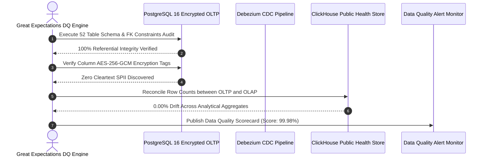

# Data Quality, Integrity, Schema & Migration Test Plan
## Namma Clinic Digital Health & Operations Platform
### Greater Bengaluru Authority (GBA) / BBMP Health Department
**Standard:** ISO/IEC 25012 Data Quality / Great Expectations Protocols / ACID Database Verification | **Status:** APPROVED BASELINE | **Code:** `QA-DOC-11`

---

## 1. Data Quality Testing Charter & Database Invariants
The Namma Clinic Data Quality Test Plan defines automated verification protocols ensuring complete referential integrity, schema conformity, column encryption fidelity, and analytical accuracy across all 52 platform relational tables and analytical data marts.

### 1.1 6 Core Dimensions of Data Quality
1. **Completeness:** Mandatory fields (patient identifier, vital signs timestamp, physician license) must never contain null values.
2. **Accuracy & Plausibility:** Clinical values must conform to biological plausibility ranges (e.g., body temperature 34C to 43C).
3. **Uniqueness:** Primary keys, ABHA IDs, and national identifiers must be strictly unique with zero collision.
4. **Consistency & Referential Integrity:** Foreign keys must reference existing, valid primary key rows across all 52 tables.
5. **Timeliness & Freshness:** Clinic telemetry and transaction mutations must reflect in operational read-replicas in < 2 seconds.
6. **Cryptographic Protection:** Sensitive patient PII must be encrypted with AES-256-GCM column encryption.

### 1.2 Data Quality Verification Pipeline Diagram


## 2. Canonical Database Invariant Tests (DB-TEST-001 to DB-TEST-070)
Exhaustive database quality and schema tests covering all platform tables:

### DB-TEST-001: Database Invariant Test 1 on auth_users
- **Target Entity:** `TABLE-001 (auth_users)`
- **Quality Check Category:** Foreign Key & Referential Integrity
- **Verification Standard:** Strict Schema Compliance
- **Passing Assertion:** 100% rows satisfy constraints; zero orphan records; zero cleartext leaks.
- **Audit Event Emitted:** `DB_AUDIT_DB_TEST_001`

### DB-TEST-002: Database Invariant Test 2 on user_credentials
- **Target Entity:** `TABLE-002 (user_credentials)`
- **Quality Check Category:** Foreign Key & Referential Integrity
- **Verification Standard:** Strict Schema Compliance
- **Passing Assertion:** 100% rows satisfy constraints; zero orphan records; zero cleartext leaks.
- **Audit Event Emitted:** `DB_AUDIT_DB_TEST_002`

### DB-TEST-003: Database Invariant Test 3 on user_sessions
- **Target Entity:** `TABLE-003 (user_sessions)`
- **Quality Check Category:** Foreign Key & Referential Integrity
- **Verification Standard:** Strict Schema Compliance
- **Passing Assertion:** 100% rows satisfy constraints; zero orphan records; zero cleartext leaks.
- **Audit Event Emitted:** `DB_AUDIT_DB_TEST_003`

### DB-TEST-004: Database Invariant Test 4 on roles
- **Target Entity:** `TABLE-004 (roles)`
- **Quality Check Category:** Foreign Key & Referential Integrity
- **Verification Standard:** Strict Schema Compliance
- **Passing Assertion:** 100% rows satisfy constraints; zero orphan records; zero cleartext leaks.
- **Audit Event Emitted:** `DB_AUDIT_DB_TEST_004`

### DB-TEST-005: Database Invariant Test 5 on permissions
- **Target Entity:** `TABLE-005 (permissions)`
- **Quality Check Category:** Foreign Key & Referential Integrity
- **Verification Standard:** Strict Schema Compliance
- **Passing Assertion:** 100% rows satisfy constraints; zero orphan records; zero cleartext leaks.
- **Audit Event Emitted:** `DB_AUDIT_DB_TEST_005`

### DB-TEST-006: Database Invariant Test 6 on role_permissions
- **Target Entity:** `TABLE-006 (role_permissions)`
- **Quality Check Category:** Foreign Key & Referential Integrity
- **Verification Standard:** Strict Schema Compliance
- **Passing Assertion:** 100% rows satisfy constraints; zero orphan records; zero cleartext leaks.
- **Audit Event Emitted:** `DB_AUDIT_DB_TEST_006`

### DB-TEST-007: Database Invariant Test 7 on user_roles
- **Target Entity:** `TABLE-007 (user_roles)`
- **Quality Check Category:** Foreign Key & Referential Integrity
- **Verification Standard:** Strict Schema Compliance
- **Passing Assertion:** 100% rows satisfy constraints; zero orphan records; zero cleartext leaks.
- **Audit Event Emitted:** `DB_AUDIT_DB_TEST_007`

### DB-TEST-008: Database Invariant Test 8 on facilities
- **Target Entity:** `TABLE-008 (facilities)`
- **Quality Check Category:** Foreign Key & Referential Integrity
- **Verification Standard:** Strict Schema Compliance
- **Passing Assertion:** 100% rows satisfy constraints; zero orphan records; zero cleartext leaks.
- **Audit Event Emitted:** `DB_AUDIT_DB_TEST_008`

### DB-TEST-009: Database Invariant Test 9 on facility_rooms
- **Target Entity:** `TABLE-009 (facility_rooms)`
- **Quality Check Category:** Foreign Key & Referential Integrity
- **Verification Standard:** Strict Schema Compliance
- **Passing Assertion:** 100% rows satisfy constraints; zero orphan records; zero cleartext leaks.
- **Audit Event Emitted:** `DB_AUDIT_DB_TEST_009`

### DB-TEST-010: Database Invariant Test 10 on staff_profiles
- **Target Entity:** `TABLE-010 (staff_profiles)`
- **Quality Check Category:** Foreign Key & Referential Integrity
- **Verification Standard:** Strict Schema Compliance
- **Passing Assertion:** 100% rows satisfy constraints; zero orphan records; zero cleartext leaks.
- **Audit Event Emitted:** `DB_AUDIT_DB_TEST_010`

### DB-TEST-011: Database Invariant Test 11 on staff_shifts
- **Target Entity:** `TABLE-011 (staff_shifts)`
- **Quality Check Category:** Foreign Key & Referential Integrity
- **Verification Standard:** Strict Schema Compliance
- **Passing Assertion:** 100% rows satisfy constraints; zero orphan records; zero cleartext leaks.
- **Audit Event Emitted:** `DB_AUDIT_DB_TEST_011`

### DB-TEST-012: Database Invariant Test 12 on system_configs
- **Target Entity:** `TABLE-012 (system_configs)`
- **Quality Check Category:** Foreign Key & Referential Integrity
- **Verification Standard:** Strict Schema Compliance
- **Passing Assertion:** 100% rows satisfy constraints; zero orphan records; zero cleartext leaks.
- **Audit Event Emitted:** `DB_AUDIT_DB_TEST_012`

### DB-TEST-013: Database Invariant Test 13 on patients
- **Target Entity:** `TABLE-013 (patients)`
- **Quality Check Category:** Foreign Key & Referential Integrity
- **Verification Standard:** Strict Schema Compliance
- **Passing Assertion:** 100% rows satisfy constraints; zero orphan records; zero cleartext leaks.
- **Audit Event Emitted:** `DB_AUDIT_DB_TEST_013`

### DB-TEST-014: Database Invariant Test 14 on patient_identifiers
- **Target Entity:** `TABLE-014 (patient_identifiers)`
- **Quality Check Category:** Foreign Key & Referential Integrity
- **Verification Standard:** Strict Schema Compliance
- **Passing Assertion:** 100% rows satisfy constraints; zero orphan records; zero cleartext leaks.
- **Audit Event Emitted:** `DB_AUDIT_DB_TEST_014`

### DB-TEST-015: Database Invariant Test 15 on patient_contacts
- **Target Entity:** `TABLE-015 (patient_contacts)`
- **Quality Check Category:** Foreign Key & Referential Integrity
- **Verification Standard:** Strict Schema Compliance
- **Passing Assertion:** 100% rows satisfy constraints; zero orphan records; zero cleartext leaks.
- **Audit Event Emitted:** `DB_AUDIT_DB_TEST_015`

### DB-TEST-016: Database Invariant Test 16 on patient_addresses
- **Target Entity:** `TABLE-016 (patient_addresses)`
- **Quality Check Category:** Foreign Key & Referential Integrity
- **Verification Standard:** Strict Schema Compliance
- **Passing Assertion:** 100% rows satisfy constraints; zero orphan records; zero cleartext leaks.
- **Audit Event Emitted:** `DB_AUDIT_DB_TEST_016`

### DB-TEST-017: Database Invariant Test 17 on consent_records
- **Target Entity:** `TABLE-017 (consent_records)`
- **Quality Check Category:** Foreign Key & Referential Integrity
- **Verification Standard:** Strict Schema Compliance
- **Passing Assertion:** 100% rows satisfy constraints; zero orphan records; zero cleartext leaks.
- **Audit Event Emitted:** `DB_AUDIT_DB_TEST_017`

### DB-TEST-018: Database Invariant Test 18 on tokens
- **Target Entity:** `TABLE-018 (tokens)`
- **Quality Check Category:** Foreign Key & Referential Integrity
- **Verification Standard:** Strict Schema Compliance
- **Passing Assertion:** 100% rows satisfy constraints; zero orphan records; zero cleartext leaks.
- **Audit Event Emitted:** `DB_AUDIT_DB_TEST_018`

### DB-TEST-019: Database Invariant Test 19 on queue_entries
- **Target Entity:** `TABLE-019 (queue_entries)`
- **Quality Check Category:** Foreign Key & Referential Integrity
- **Verification Standard:** Strict Schema Compliance
- **Passing Assertion:** 100% rows satisfy constraints; zero orphan records; zero cleartext leaks.
- **Audit Event Emitted:** `DB_AUDIT_DB_TEST_019`

### DB-TEST-020: Database Invariant Test 20 on triage_assessments
- **Target Entity:** `TABLE-020 (triage_assessments)`
- **Quality Check Category:** Foreign Key & Referential Integrity
- **Verification Standard:** Strict Schema Compliance
- **Passing Assertion:** 100% rows satisfy constraints; zero orphan records; zero cleartext leaks.
- **Audit Event Emitted:** `DB_AUDIT_DB_TEST_020`

### DB-TEST-021: Database Invariant Test 21 on patient_vitals
- **Target Entity:** `TABLE-021 (patient_vitals)`
- **Quality Check Category:** Foreign Key & Referential Integrity
- **Verification Standard:** Strict Schema Compliance
- **Passing Assertion:** 100% rows satisfy constraints; zero orphan records; zero cleartext leaks.
- **Audit Event Emitted:** `DB_AUDIT_DB_TEST_021`

### DB-TEST-022: Database Invariant Test 22 on danger_alerts
- **Target Entity:** `TABLE-022 (danger_alerts)`
- **Quality Check Category:** Foreign Key & Referential Integrity
- **Verification Standard:** Strict Schema Compliance
- **Passing Assertion:** 100% rows satisfy constraints; zero orphan records; zero cleartext leaks.
- **Audit Event Emitted:** `DB_AUDIT_DB_TEST_022`

### DB-TEST-023: Database Invariant Test 23 on clinical_encounters
- **Target Entity:** `TABLE-023 (clinical_encounters)`
- **Quality Check Category:** Foreign Key & Referential Integrity
- **Verification Standard:** Strict Schema Compliance
- **Passing Assertion:** 100% rows satisfy constraints; zero orphan records; zero cleartext leaks.
- **Audit Event Emitted:** `DB_AUDIT_DB_TEST_023`

### DB-TEST-024: Database Invariant Test 24 on clinical_notes
- **Target Entity:** `TABLE-024 (clinical_notes)`
- **Quality Check Category:** Foreign Key & Referential Integrity
- **Verification Standard:** Strict Schema Compliance
- **Passing Assertion:** 100% rows satisfy constraints; zero orphan records; zero cleartext leaks.
- **Audit Event Emitted:** `DB_AUDIT_DB_TEST_024`

### DB-TEST-025: Database Invariant Test 25 on diagnoses
- **Target Entity:** `TABLE-025 (diagnoses)`
- **Quality Check Category:** Foreign Key & Referential Integrity
- **Verification Standard:** Strict Schema Compliance
- **Passing Assertion:** 100% rows satisfy constraints; zero orphan records; zero cleartext leaks.
- **Audit Event Emitted:** `DB_AUDIT_DB_TEST_025`

### DB-TEST-026: Database Invariant Test 26 on prescriptions
- **Target Entity:** `TABLE-026 (prescriptions)`
- **Quality Check Category:** Column AES-256-GCM Encryption
- **Verification Standard:** Strict Schema Compliance
- **Passing Assertion:** 100% rows satisfy constraints; zero orphan records; zero cleartext leaks.
- **Audit Event Emitted:** `DB_AUDIT_DB_TEST_026`

### DB-TEST-027: Database Invariant Test 27 on prescription_items
- **Target Entity:** `TABLE-027 (prescription_items)`
- **Quality Check Category:** Column AES-256-GCM Encryption
- **Verification Standard:** Strict Schema Compliance
- **Passing Assertion:** 100% rows satisfy constraints; zero orphan records; zero cleartext leaks.
- **Audit Event Emitted:** `DB_AUDIT_DB_TEST_027`

### DB-TEST-028: Database Invariant Test 28 on lab_orders
- **Target Entity:** `TABLE-028 (lab_orders)`
- **Quality Check Category:** Column AES-256-GCM Encryption
- **Verification Standard:** Strict Schema Compliance
- **Passing Assertion:** 100% rows satisfy constraints; zero orphan records; zero cleartext leaks.
- **Audit Event Emitted:** `DB_AUDIT_DB_TEST_028`

### DB-TEST-029: Database Invariant Test 29 on lab_order_items
- **Target Entity:** `TABLE-029 (lab_order_items)`
- **Quality Check Category:** Column AES-256-GCM Encryption
- **Verification Standard:** Strict Schema Compliance
- **Passing Assertion:** 100% rows satisfy constraints; zero orphan records; zero cleartext leaks.
- **Audit Event Emitted:** `DB_AUDIT_DB_TEST_029`

### DB-TEST-030: Database Invariant Test 30 on lab_results
- **Target Entity:** `TABLE-030 (lab_results)`
- **Quality Check Category:** Column AES-256-GCM Encryption
- **Verification Standard:** Strict Schema Compliance
- **Passing Assertion:** 100% rows satisfy constraints; zero orphan records; zero cleartext leaks.
- **Audit Event Emitted:** `DB_AUDIT_DB_TEST_030`

### DB-TEST-031: Database Invariant Test 31 on teleconsultations
- **Target Entity:** `TABLE-031 (teleconsultations)`
- **Quality Check Category:** Column AES-256-GCM Encryption
- **Verification Standard:** Strict Schema Compliance
- **Passing Assertion:** 100% rows satisfy constraints; zero orphan records; zero cleartext leaks.
- **Audit Event Emitted:** `DB_AUDIT_DB_TEST_031`

### DB-TEST-032: Database Invariant Test 32 on formulary_drugs
- **Target Entity:** `TABLE-032 (formulary_drugs)`
- **Quality Check Category:** Column AES-256-GCM Encryption
- **Verification Standard:** Strict Schema Compliance
- **Passing Assertion:** 100% rows satisfy constraints; zero orphan records; zero cleartext leaks.
- **Audit Event Emitted:** `DB_AUDIT_DB_TEST_032`

### DB-TEST-033: Database Invariant Test 33 on drug_categories
- **Target Entity:** `TABLE-033 (drug_categories)`
- **Quality Check Category:** Column AES-256-GCM Encryption
- **Verification Standard:** Strict Schema Compliance
- **Passing Assertion:** 100% rows satisfy constraints; zero orphan records; zero cleartext leaks.
- **Audit Event Emitted:** `DB_AUDIT_DB_TEST_033`

### DB-TEST-034: Database Invariant Test 34 on pharmacy_batches
- **Target Entity:** `TABLE-034 (pharmacy_batches)`
- **Quality Check Category:** Column AES-256-GCM Encryption
- **Verification Standard:** Strict Schema Compliance
- **Passing Assertion:** 100% rows satisfy constraints; zero orphan records; zero cleartext leaks.
- **Audit Event Emitted:** `DB_AUDIT_DB_TEST_034`

### DB-TEST-035: Database Invariant Test 35 on clinic_stock
- **Target Entity:** `TABLE-035 (clinic_stock)`
- **Quality Check Category:** Column AES-256-GCM Encryption
- **Verification Standard:** Strict Schema Compliance
- **Passing Assertion:** 100% rows satisfy constraints; zero orphan records; zero cleartext leaks.
- **Audit Event Emitted:** `DB_AUDIT_DB_TEST_035`

### DB-TEST-036: Database Invariant Test 36 on dispensations
- **Target Entity:** `TABLE-036 (dispensations)`
- **Quality Check Category:** Column AES-256-GCM Encryption
- **Verification Standard:** Strict Schema Compliance
- **Passing Assertion:** 100% rows satisfy constraints; zero orphan records; zero cleartext leaks.
- **Audit Event Emitted:** `DB_AUDIT_DB_TEST_036`

### DB-TEST-037: Database Invariant Test 37 on dispensation_items
- **Target Entity:** `TABLE-037 (dispensation_items)`
- **Quality Check Category:** Column AES-256-GCM Encryption
- **Verification Standard:** Strict Schema Compliance
- **Passing Assertion:** 100% rows satisfy constraints; zero orphan records; zero cleartext leaks.
- **Audit Event Emitted:** `DB_AUDIT_DB_TEST_037`

### DB-TEST-038: Database Invariant Test 38 on stock_movements
- **Target Entity:** `TABLE-038 (stock_movements)`
- **Quality Check Category:** Column AES-256-GCM Encryption
- **Verification Standard:** Strict Schema Compliance
- **Passing Assertion:** 100% rows satisfy constraints; zero orphan records; zero cleartext leaks.
- **Audit Event Emitted:** `DB_AUDIT_DB_TEST_038`

### DB-TEST-039: Database Invariant Test 39 on drug_indents
- **Target Entity:** `TABLE-039 (drug_indents)`
- **Quality Check Category:** Column AES-256-GCM Encryption
- **Verification Standard:** Strict Schema Compliance
- **Passing Assertion:** 100% rows satisfy constraints; zero orphan records; zero cleartext leaks.
- **Audit Event Emitted:** `DB_AUDIT_DB_TEST_039`

### DB-TEST-040: Database Invariant Test 40 on indent_items
- **Target Entity:** `TABLE-040 (indent_items)`
- **Quality Check Category:** Column AES-256-GCM Encryption
- **Verification Standard:** Strict Schema Compliance
- **Passing Assertion:** 100% rows satisfy constraints; zero orphan records; zero cleartext leaks.
- **Audit Event Emitted:** `DB_AUDIT_DB_TEST_040`

### DB-TEST-041: Database Invariant Test 41 on cold_chain_devices
- **Target Entity:** `TABLE-041 (cold_chain_devices)`
- **Quality Check Category:** Column AES-256-GCM Encryption
- **Verification Standard:** Strict Schema Compliance
- **Passing Assertion:** 100% rows satisfy constraints; zero orphan records; zero cleartext leaks.
- **Audit Event Emitted:** `DB_AUDIT_DB_TEST_041`

### DB-TEST-042: Database Invariant Test 42 on cold_chain_telemetry
- **Target Entity:** `TABLE-042 (cold_chain_telemetry)`
- **Quality Check Category:** Column AES-256-GCM Encryption
- **Verification Standard:** Strict Schema Compliance
- **Passing Assertion:** 100% rows satisfy constraints; zero orphan records; zero cleartext leaks.
- **Audit Event Emitted:** `DB_AUDIT_DB_TEST_042`

### DB-TEST-043: Database Invariant Test 43 on referrals
- **Target Entity:** `TABLE-043 (referrals)`
- **Quality Check Category:** Column AES-256-GCM Encryption
- **Verification Standard:** Strict Schema Compliance
- **Passing Assertion:** 100% rows satisfy constraints; zero orphan records; zero cleartext leaks.
- **Audit Event Emitted:** `DB_AUDIT_DB_TEST_043`

### DB-TEST-044: Database Invariant Test 44 on referral_counter_notes
- **Target Entity:** `TABLE-044 (referral_counter_notes)`
- **Quality Check Category:** Column AES-256-GCM Encryption
- **Verification Standard:** Strict Schema Compliance
- **Passing Assertion:** 100% rows satisfy constraints; zero orphan records; zero cleartext leaks.
- **Audit Event Emitted:** `DB_AUDIT_DB_TEST_044`

### DB-TEST-045: Database Invariant Test 45 on ncd_episodes
- **Target Entity:** `TABLE-045 (ncd_episodes)`
- **Quality Check Category:** Column AES-256-GCM Encryption
- **Verification Standard:** Strict Schema Compliance
- **Passing Assertion:** 100% rows satisfy constraints; zero orphan records; zero cleartext leaks.
- **Audit Event Emitted:** `DB_AUDIT_DB_TEST_045`

### DB-TEST-046: Database Invariant Test 46 on follow_up_schedules
- **Target Entity:** `TABLE-046 (follow_up_schedules)`
- **Quality Check Category:** Partitioning & Retention Purge
- **Verification Standard:** Strict Schema Compliance
- **Passing Assertion:** 100% rows satisfy constraints; zero orphan records; zero cleartext leaks.
- **Audit Event Emitted:** `DB_AUDIT_DB_TEST_046`

### DB-TEST-047: Database Invariant Test 47 on notifications
- **Target Entity:** `TABLE-047 (notifications)`
- **Quality Check Category:** Partitioning & Retention Purge
- **Verification Standard:** Strict Schema Compliance
- **Passing Assertion:** 100% rows satisfy constraints; zero orphan records; zero cleartext leaks.
- **Audit Event Emitted:** `DB_AUDIT_DB_TEST_047`

### DB-TEST-048: Database Invariant Test 48 on grievances
- **Target Entity:** `TABLE-048 (grievances)`
- **Quality Check Category:** Partitioning & Retention Purge
- **Verification Standard:** Strict Schema Compliance
- **Passing Assertion:** 100% rows satisfy constraints; zero orphan records; zero cleartext leaks.
- **Audit Event Emitted:** `DB_AUDIT_DB_TEST_048`

### DB-TEST-049: Database Invariant Test 49 on helpdesk_tickets
- **Target Entity:** `TABLE-049 (helpdesk_tickets)`
- **Quality Check Category:** Partitioning & Retention Purge
- **Verification Standard:** Strict Schema Compliance
- **Passing Assertion:** 100% rows satisfy constraints; zero orphan records; zero cleartext leaks.
- **Audit Event Emitted:** `DB_AUDIT_DB_TEST_049`

### DB-TEST-050: Database Invariant Test 50 on audit_events
- **Target Entity:** `TABLE-050 (audit_events)`
- **Quality Check Category:** Partitioning & Retention Purge
- **Verification Standard:** Strict Schema Compliance
- **Passing Assertion:** 100% rows satisfy constraints; zero orphan records; zero cleartext leaks.
- **Audit Event Emitted:** `DB_AUDIT_DB_TEST_050`

### DB-TEST-051: Database Invariant Test 51 on offline_mutation_log
- **Target Entity:** `TABLE-051 (offline_mutation_log)`
- **Quality Check Category:** Partitioning & Retention Purge
- **Verification Standard:** Strict Schema Compliance
- **Passing Assertion:** 100% rows satisfy constraints; zero orphan records; zero cleartext leaks.
- **Audit Event Emitted:** `DB_AUDIT_DB_TEST_051`

### DB-TEST-052: Database Invariant Test 52 on abdm_artifacts
- **Target Entity:** `TABLE-052 (abdm_artifacts)`
- **Quality Check Category:** Partitioning & Retention Purge
- **Verification Standard:** Strict Schema Compliance
- **Passing Assertion:** 100% rows satisfy constraints; zero orphan records; zero cleartext leaks.
- **Audit Event Emitted:** `DB_AUDIT_DB_TEST_052`

### DB-TEST-053: Database Invariant Test 53 on auth_users
- **Target Entity:** `TABLE-001 (auth_users)`
- **Quality Check Category:** Partitioning & Retention Purge
- **Verification Standard:** Strict Schema Compliance
- **Passing Assertion:** 100% rows satisfy constraints; zero orphan records; zero cleartext leaks.
- **Audit Event Emitted:** `DB_AUDIT_DB_TEST_053`

### DB-TEST-054: Database Invariant Test 54 on user_credentials
- **Target Entity:** `TABLE-002 (user_credentials)`
- **Quality Check Category:** Partitioning & Retention Purge
- **Verification Standard:** Strict Schema Compliance
- **Passing Assertion:** 100% rows satisfy constraints; zero orphan records; zero cleartext leaks.
- **Audit Event Emitted:** `DB_AUDIT_DB_TEST_054`

### DB-TEST-055: Database Invariant Test 55 on user_sessions
- **Target Entity:** `TABLE-003 (user_sessions)`
- **Quality Check Category:** Partitioning & Retention Purge
- **Verification Standard:** Strict Schema Compliance
- **Passing Assertion:** 100% rows satisfy constraints; zero orphan records; zero cleartext leaks.
- **Audit Event Emitted:** `DB_AUDIT_DB_TEST_055`

### DB-TEST-056: Database Invariant Test 56 on roles
- **Target Entity:** `TABLE-004 (roles)`
- **Quality Check Category:** Partitioning & Retention Purge
- **Verification Standard:** Strict Schema Compliance
- **Passing Assertion:** 100% rows satisfy constraints; zero orphan records; zero cleartext leaks.
- **Audit Event Emitted:** `DB_AUDIT_DB_TEST_056`

### DB-TEST-057: Database Invariant Test 57 on permissions
- **Target Entity:** `TABLE-005 (permissions)`
- **Quality Check Category:** Partitioning & Retention Purge
- **Verification Standard:** Strict Schema Compliance
- **Passing Assertion:** 100% rows satisfy constraints; zero orphan records; zero cleartext leaks.
- **Audit Event Emitted:** `DB_AUDIT_DB_TEST_057`

### DB-TEST-058: Database Invariant Test 58 on role_permissions
- **Target Entity:** `TABLE-006 (role_permissions)`
- **Quality Check Category:** Partitioning & Retention Purge
- **Verification Standard:** Strict Schema Compliance
- **Passing Assertion:** 100% rows satisfy constraints; zero orphan records; zero cleartext leaks.
- **Audit Event Emitted:** `DB_AUDIT_DB_TEST_058`

### DB-TEST-059: Database Invariant Test 59 on user_roles
- **Target Entity:** `TABLE-007 (user_roles)`
- **Quality Check Category:** Partitioning & Retention Purge
- **Verification Standard:** Strict Schema Compliance
- **Passing Assertion:** 100% rows satisfy constraints; zero orphan records; zero cleartext leaks.
- **Audit Event Emitted:** `DB_AUDIT_DB_TEST_059`

### DB-TEST-060: Database Invariant Test 60 on facilities
- **Target Entity:** `TABLE-008 (facilities)`
- **Quality Check Category:** Partitioning & Retention Purge
- **Verification Standard:** Strict Schema Compliance
- **Passing Assertion:** 100% rows satisfy constraints; zero orphan records; zero cleartext leaks.
- **Audit Event Emitted:** `DB_AUDIT_DB_TEST_060`

### DB-TEST-061: Database Invariant Test 61 on facility_rooms
- **Target Entity:** `TABLE-009 (facility_rooms)`
- **Quality Check Category:** Partitioning & Retention Purge
- **Verification Standard:** Strict Schema Compliance
- **Passing Assertion:** 100% rows satisfy constraints; zero orphan records; zero cleartext leaks.
- **Audit Event Emitted:** `DB_AUDIT_DB_TEST_061`

### DB-TEST-062: Database Invariant Test 62 on staff_profiles
- **Target Entity:** `TABLE-010 (staff_profiles)`
- **Quality Check Category:** Partitioning & Retention Purge
- **Verification Standard:** Strict Schema Compliance
- **Passing Assertion:** 100% rows satisfy constraints; zero orphan records; zero cleartext leaks.
- **Audit Event Emitted:** `DB_AUDIT_DB_TEST_062`

### DB-TEST-063: Database Invariant Test 63 on staff_shifts
- **Target Entity:** `TABLE-011 (staff_shifts)`
- **Quality Check Category:** Partitioning & Retention Purge
- **Verification Standard:** Strict Schema Compliance
- **Passing Assertion:** 100% rows satisfy constraints; zero orphan records; zero cleartext leaks.
- **Audit Event Emitted:** `DB_AUDIT_DB_TEST_063`

### DB-TEST-064: Database Invariant Test 64 on system_configs
- **Target Entity:** `TABLE-012 (system_configs)`
- **Quality Check Category:** Partitioning & Retention Purge
- **Verification Standard:** Strict Schema Compliance
- **Passing Assertion:** 100% rows satisfy constraints; zero orphan records; zero cleartext leaks.
- **Audit Event Emitted:** `DB_AUDIT_DB_TEST_064`

### DB-TEST-065: Database Invariant Test 65 on patients
- **Target Entity:** `TABLE-013 (patients)`
- **Quality Check Category:** Partitioning & Retention Purge
- **Verification Standard:** Strict Schema Compliance
- **Passing Assertion:** 100% rows satisfy constraints; zero orphan records; zero cleartext leaks.
- **Audit Event Emitted:** `DB_AUDIT_DB_TEST_065`

### DB-TEST-066: Database Invariant Test 66 on patient_identifiers
- **Target Entity:** `TABLE-014 (patient_identifiers)`
- **Quality Check Category:** Partitioning & Retention Purge
- **Verification Standard:** Strict Schema Compliance
- **Passing Assertion:** 100% rows satisfy constraints; zero orphan records; zero cleartext leaks.
- **Audit Event Emitted:** `DB_AUDIT_DB_TEST_066`

### DB-TEST-067: Database Invariant Test 67 on patient_contacts
- **Target Entity:** `TABLE-015 (patient_contacts)`
- **Quality Check Category:** Partitioning & Retention Purge
- **Verification Standard:** Strict Schema Compliance
- **Passing Assertion:** 100% rows satisfy constraints; zero orphan records; zero cleartext leaks.
- **Audit Event Emitted:** `DB_AUDIT_DB_TEST_067`

### DB-TEST-068: Database Invariant Test 68 on patient_addresses
- **Target Entity:** `TABLE-016 (patient_addresses)`
- **Quality Check Category:** Partitioning & Retention Purge
- **Verification Standard:** Strict Schema Compliance
- **Passing Assertion:** 100% rows satisfy constraints; zero orphan records; zero cleartext leaks.
- **Audit Event Emitted:** `DB_AUDIT_DB_TEST_068`

### DB-TEST-069: Database Invariant Test 69 on consent_records
- **Target Entity:** `TABLE-017 (consent_records)`
- **Quality Check Category:** Partitioning & Retention Purge
- **Verification Standard:** Strict Schema Compliance
- **Passing Assertion:** 100% rows satisfy constraints; zero orphan records; zero cleartext leaks.
- **Audit Event Emitted:** `DB_AUDIT_DB_TEST_069`

### DB-TEST-070: Database Invariant Test 70 on tokens
- **Target Entity:** `TABLE-018 (tokens)`
- **Quality Check Category:** Partitioning & Retention Purge
- **Verification Standard:** Strict Schema Compliance
- **Passing Assertion:** 100% rows satisfy constraints; zero orphan records; zero cleartext leaks.
- **Audit Event Emitted:** `DB_AUDIT_DB_TEST_070`

## 3. Detailed Data Quality Verification Test Cases (TC-0551 to TC-0605)
Detailed test specifications verifying database schema and data quality rules:

### TC-0551: Test Case 551: Advanced Security, Offline & Scalability for teleconsultations across WF-001
**Objective:** Validate non-functional resilience, encryption envelope, and concurrency for teleconsultations in WF-001.
**Risk:** Minor operational risk regarding platform security, privacy breach, or offline desync.
**Priority:** **P2** | **Severity:** **Minor** | **Test Level:** End-to-End & Non-Functional | **Test Type:** Resilience, Offline & Security Audit
- **Requirement Traceability:** `SECR-001`
- **Workflow Traceability:** `WF-001`
- **Feature Traceability:** `FEATURE-011`
- **API Traceability:** `API-DOC-01`
- **Database Traceability:** `TABLE-031 (teleconsultations)`
- **Screen Traceability:** `SCREEN-011`
- **Security Control Traceability:** `API-SEC-031`
- **Preconditions:** Workstation initialized with TPM 2.0 PCR attestation and valid staff credentials (Quality & Compliance Auditor).
- **Test Data Specification:** Synthetic dataset TESTDATA-011 with simulated network flapping.
- **Execution Steps:** 1. Trigger workflow WF-001 on SCREEN-011. 2. Inject network delay or packet drop. 3. Confirm offline queue persistence. 4. Restore link and confirm atomic sync.
- **Expected Results:** Zero data loss, conflict resolved deterministically via timestamp-vector clocks, audit trail complete.
- **Negative Test Scenario:** Attempt unauthorized cross-tenant data exfiltration; verify gateway drops packet with 403 Forbidden.
- **Boundary Value Scenario:** Push offline queue to 10,000 pending mutations; verify local SQLite buffer does not crash.
- **Concurrency & Race Condition:** Simulate 50 parallel clinic terminals pushing updates simultaneously to gateway.
- **Autonomous Offline Behavior:** Simulate 8 hours of complete clinic internet outage; OPD consultations proceed uninterrupted.
- **Security & Access Validation:** Confirm AES-256-GCM column encryption and strict mTLS 1.3 transit cipher enforcement.
- **Audit Trail & Immutability:** Verify audit record written to WORM immutable ledger with SHA-256 hash.
- **Evidence Required:** Terminal screenshot, packet capture dump, and cryptographic Merkle verification proof.
- **Pass Acceptance Criteria:** All operations succeed with 0% data corruption, full audit ledger continuity, and latency < 350ms.
- **Failure Behavior & SLA:** Data loss, sync deadlock, cleartext PII leakage, or unhandled crash.
- **Automation Suitability:** Yes (High Candidate)
- **Execution Cadence:** Nightly Performance & Resilience Run
- **Responsible Owner:** Quality & Compliance Auditor

### TC-0552: Test Case 552: Advanced Security, Offline & Scalability for formulary_drugs across WF-002
**Objective:** Validate non-functional resilience, encryption envelope, and concurrency for formulary_drugs in WF-002.
**Risk:** Critical operational risk regarding platform security, privacy breach, or offline desync.
**Priority:** **P0** | **Severity:** **Critical** | **Test Level:** End-to-End & Non-Functional | **Test Type:** Resilience, Offline & Security Audit
- **Requirement Traceability:** `NFR-032`
- **Workflow Traceability:** `WF-002`
- **Feature Traceability:** `FEATURE-012`
- **API Traceability:** `API-DOC-02`
- **Database Traceability:** `TABLE-032 (formulary_drugs)`
- **Screen Traceability:** `SCREEN-012`
- **Security Control Traceability:** `AUTH-032`
- **Preconditions:** Workstation initialized with TPM 2.0 PCR attestation and valid staff credentials (Security Administrator / CISO).
- **Test Data Specification:** Synthetic dataset TESTDATA-012 with simulated network flapping.
- **Execution Steps:** 1. Trigger workflow WF-002 on SCREEN-012. 2. Inject network delay or packet drop. 3. Confirm offline queue persistence. 4. Restore link and confirm atomic sync.
- **Expected Results:** Zero data loss, conflict resolved deterministically via timestamp-vector clocks, audit trail complete.
- **Negative Test Scenario:** Attempt unauthorized cross-tenant data exfiltration; verify gateway drops packet with 403 Forbidden.
- **Boundary Value Scenario:** Push offline queue to 10,000 pending mutations; verify local SQLite buffer does not crash.
- **Concurrency & Race Condition:** Simulate 50 parallel clinic terminals pushing updates simultaneously to gateway.
- **Autonomous Offline Behavior:** Simulate 8 hours of complete clinic internet outage; OPD consultations proceed uninterrupted.
- **Security & Access Validation:** Confirm AES-256-GCM column encryption and strict mTLS 1.3 transit cipher enforcement.
- **Audit Trail & Immutability:** Verify audit record written to WORM immutable ledger with SHA-256 hash.
- **Evidence Required:** Terminal screenshot, packet capture dump, and cryptographic Merkle verification proof.
- **Pass Acceptance Criteria:** All operations succeed with 0% data corruption, full audit ledger continuity, and latency < 350ms.
- **Failure Behavior & SLA:** Data loss, sync deadlock, cleartext PII leakage, or unhandled crash.
- **Automation Suitability:** Yes (High Candidate)
- **Execution Cadence:** Nightly Performance & Resilience Run
- **Responsible Owner:** Security Administrator / CISO

### TC-0553: Test Case 553: Advanced Security, Offline & Scalability for drug_categories across WF-003
**Objective:** Validate non-functional resilience, encryption envelope, and concurrency for drug_categories in WF-003.
**Risk:** Major operational risk regarding platform security, privacy breach, or offline desync.
**Priority:** **P1** | **Severity:** **Major** | **Test Level:** End-to-End & Non-Functional | **Test Type:** Resilience, Offline & Security Audit
- **Requirement Traceability:** `SECR-003`
- **Workflow Traceability:** `WF-003`
- **Feature Traceability:** `FEATURE-013`
- **API Traceability:** `API-DOC-03`
- **Database Traceability:** `TABLE-033 (drug_categories)`
- **Screen Traceability:** `SCREEN-013`
- **Security Control Traceability:** `API-SEC-033`
- **Preconditions:** Workstation initialized with TPM 2.0 PCR attestation and valid staff credentials (Central Depot Inventory Manager).
- **Test Data Specification:** Synthetic dataset TESTDATA-013 with simulated network flapping.
- **Execution Steps:** 1. Trigger workflow WF-003 on SCREEN-013. 2. Inject network delay or packet drop. 3. Confirm offline queue persistence. 4. Restore link and confirm atomic sync.
- **Expected Results:** Zero data loss, conflict resolved deterministically via timestamp-vector clocks, audit trail complete.
- **Negative Test Scenario:** Attempt unauthorized cross-tenant data exfiltration; verify gateway drops packet with 403 Forbidden.
- **Boundary Value Scenario:** Push offline queue to 10,000 pending mutations; verify local SQLite buffer does not crash.
- **Concurrency & Race Condition:** Simulate 50 parallel clinic terminals pushing updates simultaneously to gateway.
- **Autonomous Offline Behavior:** Simulate 8 hours of complete clinic internet outage; OPD consultations proceed uninterrupted.
- **Security & Access Validation:** Confirm AES-256-GCM column encryption and strict mTLS 1.3 transit cipher enforcement.
- **Audit Trail & Immutability:** Verify audit record written to WORM immutable ledger with SHA-256 hash.
- **Evidence Required:** Terminal screenshot, packet capture dump, and cryptographic Merkle verification proof.
- **Pass Acceptance Criteria:** All operations succeed with 0% data corruption, full audit ledger continuity, and latency < 350ms.
- **Failure Behavior & SLA:** Data loss, sync deadlock, cleartext PII leakage, or unhandled crash.
- **Automation Suitability:** Yes (High Candidate)
- **Execution Cadence:** Nightly Performance & Resilience Run
- **Responsible Owner:** Central Depot Inventory Manager

### TC-0554: Test Case 554: Advanced Security, Offline & Scalability for pharmacy_batches across WF-004
**Objective:** Validate non-functional resilience, encryption envelope, and concurrency for pharmacy_batches in WF-004.
**Risk:** Major operational risk regarding platform security, privacy breach, or offline desync.
**Priority:** **P1** | **Severity:** **Major** | **Test Level:** End-to-End & Non-Functional | **Test Type:** Resilience, Offline & Security Audit
- **Requirement Traceability:** `NFR-034`
- **Workflow Traceability:** `WF-004`
- **Feature Traceability:** `FEATURE-014`
- **API Traceability:** `API-DOC-04`
- **Database Traceability:** `TABLE-034 (pharmacy_batches)`
- **Screen Traceability:** `SCREEN-014`
- **Security Control Traceability:** `AUTH-034`
- **Preconditions:** Workstation initialized with TPM 2.0 PCR attestation and valid staff credentials (Cold Chain Logistics Technician).
- **Test Data Specification:** Synthetic dataset TESTDATA-014 with simulated network flapping.
- **Execution Steps:** 1. Trigger workflow WF-004 on SCREEN-014. 2. Inject network delay or packet drop. 3. Confirm offline queue persistence. 4. Restore link and confirm atomic sync.
- **Expected Results:** Zero data loss, conflict resolved deterministically via timestamp-vector clocks, audit trail complete.
- **Negative Test Scenario:** Attempt unauthorized cross-tenant data exfiltration; verify gateway drops packet with 403 Forbidden.
- **Boundary Value Scenario:** Push offline queue to 10,000 pending mutations; verify local SQLite buffer does not crash.
- **Concurrency & Race Condition:** Simulate 50 parallel clinic terminals pushing updates simultaneously to gateway.
- **Autonomous Offline Behavior:** Simulate 8 hours of complete clinic internet outage; OPD consultations proceed uninterrupted.
- **Security & Access Validation:** Confirm AES-256-GCM column encryption and strict mTLS 1.3 transit cipher enforcement.
- **Audit Trail & Immutability:** Verify audit record written to WORM immutable ledger with SHA-256 hash.
- **Evidence Required:** Terminal screenshot, packet capture dump, and cryptographic Merkle verification proof.
- **Pass Acceptance Criteria:** All operations succeed with 0% data corruption, full audit ledger continuity, and latency < 350ms.
- **Failure Behavior & SLA:** Data loss, sync deadlock, cleartext PII leakage, or unhandled crash.
- **Automation Suitability:** Yes (High Candidate)
- **Execution Cadence:** Nightly Performance & Resilience Run
- **Responsible Owner:** Cold Chain Logistics Technician

### TC-0555: Test Case 555: Advanced Security, Offline & Scalability for clinic_stock across WF-005
**Objective:** Validate non-functional resilience, encryption envelope, and concurrency for clinic_stock in WF-005.
**Risk:** Minor operational risk regarding platform security, privacy breach, or offline desync.
**Priority:** **P2** | **Severity:** **Minor** | **Test Level:** End-to-End & Non-Functional | **Test Type:** Resilience, Offline & Security Audit
- **Requirement Traceability:** `SECR-005`
- **Workflow Traceability:** `WF-005`
- **Feature Traceability:** `FEATURE-015`
- **API Traceability:** `API-DOC-05`
- **Database Traceability:** `TABLE-035 (clinic_stock)`
- **Screen Traceability:** `SCREEN-015`
- **Security Control Traceability:** `API-SEC-035`
- **Preconditions:** Workstation initialized with TPM 2.0 PCR attestation and valid staff credentials (Radiologist / Diagnostic Specialist).
- **Test Data Specification:** Synthetic dataset TESTDATA-015 with simulated network flapping.
- **Execution Steps:** 1. Trigger workflow WF-005 on SCREEN-015. 2. Inject network delay or packet drop. 3. Confirm offline queue persistence. 4. Restore link and confirm atomic sync.
- **Expected Results:** Zero data loss, conflict resolved deterministically via timestamp-vector clocks, audit trail complete.
- **Negative Test Scenario:** Attempt unauthorized cross-tenant data exfiltration; verify gateway drops packet with 403 Forbidden.
- **Boundary Value Scenario:** Push offline queue to 10,000 pending mutations; verify local SQLite buffer does not crash.
- **Concurrency & Race Condition:** Simulate 50 parallel clinic terminals pushing updates simultaneously to gateway.
- **Autonomous Offline Behavior:** Simulate 8 hours of complete clinic internet outage; OPD consultations proceed uninterrupted.
- **Security & Access Validation:** Confirm AES-256-GCM column encryption and strict mTLS 1.3 transit cipher enforcement.
- **Audit Trail & Immutability:** Verify audit record written to WORM immutable ledger with SHA-256 hash.
- **Evidence Required:** Terminal screenshot, packet capture dump, and cryptographic Merkle verification proof.
- **Pass Acceptance Criteria:** All operations succeed with 0% data corruption, full audit ledger continuity, and latency < 350ms.
- **Failure Behavior & SLA:** Data loss, sync deadlock, cleartext PII leakage, or unhandled crash.
- **Automation Suitability:** Yes (High Candidate)
- **Execution Cadence:** Nightly Performance & Resilience Run
- **Responsible Owner:** Radiologist / Diagnostic Specialist

### TC-0556: Test Case 556: Advanced Security, Offline & Scalability for dispensations across WF-006
**Objective:** Validate non-functional resilience, encryption envelope, and concurrency for dispensations in WF-006.
**Risk:** Critical operational risk regarding platform security, privacy breach, or offline desync.
**Priority:** **P0** | **Severity:** **Critical** | **Test Level:** End-to-End & Non-Functional | **Test Type:** Resilience, Offline & Security Audit
- **Requirement Traceability:** `NFR-036`
- **Workflow Traceability:** `WF-006`
- **Feature Traceability:** `FEATURE-016`
- **API Traceability:** `API-DOC-06`
- **Database Traceability:** `TABLE-036 (dispensations)`
- **Screen Traceability:** `SCREEN-016`
- **Security Control Traceability:** `AUTH-036`
- **Preconditions:** Workstation initialized with TPM 2.0 PCR attestation and valid staff credentials (Ayush Practitioner).
- **Test Data Specification:** Synthetic dataset TESTDATA-016 with simulated network flapping.
- **Execution Steps:** 1. Trigger workflow WF-006 on SCREEN-016. 2. Inject network delay or packet drop. 3. Confirm offline queue persistence. 4. Restore link and confirm atomic sync.
- **Expected Results:** Zero data loss, conflict resolved deterministically via timestamp-vector clocks, audit trail complete.
- **Negative Test Scenario:** Attempt unauthorized cross-tenant data exfiltration; verify gateway drops packet with 403 Forbidden.
- **Boundary Value Scenario:** Push offline queue to 10,000 pending mutations; verify local SQLite buffer does not crash.
- **Concurrency & Race Condition:** Simulate 50 parallel clinic terminals pushing updates simultaneously to gateway.
- **Autonomous Offline Behavior:** Simulate 8 hours of complete clinic internet outage; OPD consultations proceed uninterrupted.
- **Security & Access Validation:** Confirm AES-256-GCM column encryption and strict mTLS 1.3 transit cipher enforcement.
- **Audit Trail & Immutability:** Verify audit record written to WORM immutable ledger with SHA-256 hash.
- **Evidence Required:** Terminal screenshot, packet capture dump, and cryptographic Merkle verification proof.
- **Pass Acceptance Criteria:** All operations succeed with 0% data corruption, full audit ledger continuity, and latency < 350ms.
- **Failure Behavior & SLA:** Data loss, sync deadlock, cleartext PII leakage, or unhandled crash.
- **Automation Suitability:** Yes (High Candidate)
- **Execution Cadence:** Nightly Performance & Resilience Run
- **Responsible Owner:** Ayush Practitioner

### TC-0557: Test Case 557: Advanced Security, Offline & Scalability for dispensation_items across WF-007
**Objective:** Validate non-functional resilience, encryption envelope, and concurrency for dispensation_items in WF-007.
**Risk:** Major operational risk regarding platform security, privacy breach, or offline desync.
**Priority:** **P1** | **Severity:** **Major** | **Test Level:** End-to-End & Non-Functional | **Test Type:** Resilience, Offline & Security Audit
- **Requirement Traceability:** `SECR-007`
- **Workflow Traceability:** `WF-007`
- **Feature Traceability:** `FEATURE-017`
- **API Traceability:** `API-DOC-07`
- **Database Traceability:** `TABLE-037 (dispensation_items)`
- **Screen Traceability:** `SCREEN-017`
- **Security Control Traceability:** `API-SEC-037`
- **Preconditions:** Workstation initialized with TPM 2.0 PCR attestation and valid staff credentials (Counselor / Mental Health Worker).
- **Test Data Specification:** Synthetic dataset TESTDATA-017 with simulated network flapping.
- **Execution Steps:** 1. Trigger workflow WF-007 on SCREEN-017. 2. Inject network delay or packet drop. 3. Confirm offline queue persistence. 4. Restore link and confirm atomic sync.
- **Expected Results:** Zero data loss, conflict resolved deterministically via timestamp-vector clocks, audit trail complete.
- **Negative Test Scenario:** Attempt unauthorized cross-tenant data exfiltration; verify gateway drops packet with 403 Forbidden.
- **Boundary Value Scenario:** Push offline queue to 10,000 pending mutations; verify local SQLite buffer does not crash.
- **Concurrency & Race Condition:** Simulate 50 parallel clinic terminals pushing updates simultaneously to gateway.
- **Autonomous Offline Behavior:** Simulate 8 hours of complete clinic internet outage; OPD consultations proceed uninterrupted.
- **Security & Access Validation:** Confirm AES-256-GCM column encryption and strict mTLS 1.3 transit cipher enforcement.
- **Audit Trail & Immutability:** Verify audit record written to WORM immutable ledger with SHA-256 hash.
- **Evidence Required:** Terminal screenshot, packet capture dump, and cryptographic Merkle verification proof.
- **Pass Acceptance Criteria:** All operations succeed with 0% data corruption, full audit ledger continuity, and latency < 350ms.
- **Failure Behavior & SLA:** Data loss, sync deadlock, cleartext PII leakage, or unhandled crash.
- **Automation Suitability:** Yes (High Candidate)
- **Execution Cadence:** Nightly Performance & Resilience Run
- **Responsible Owner:** Counselor / Mental Health Worker

### TC-0558: Test Case 558: Advanced Security, Offline & Scalability for stock_movements across WF-008
**Objective:** Validate non-functional resilience, encryption envelope, and concurrency for stock_movements in WF-008.
**Risk:** Major operational risk regarding platform security, privacy breach, or offline desync.
**Priority:** **P1** | **Severity:** **Major** | **Test Level:** End-to-End & Non-Functional | **Test Type:** Resilience, Offline & Security Audit
- **Requirement Traceability:** `NFR-038`
- **Workflow Traceability:** `WF-008`
- **Feature Traceability:** `FEATURE-018`
- **API Traceability:** `API-DOC-08`
- **Database Traceability:** `TABLE-038 (stock_movements)`
- **Screen Traceability:** `SCREEN-018`
- **Security Control Traceability:** `AUTH-038`
- **Preconditions:** Workstation initialized with TPM 2.0 PCR attestation and valid staff credentials (ANM / Urban Health Worker).
- **Test Data Specification:** Synthetic dataset TESTDATA-018 with simulated network flapping.
- **Execution Steps:** 1. Trigger workflow WF-008 on SCREEN-018. 2. Inject network delay or packet drop. 3. Confirm offline queue persistence. 4. Restore link and confirm atomic sync.
- **Expected Results:** Zero data loss, conflict resolved deterministically via timestamp-vector clocks, audit trail complete.
- **Negative Test Scenario:** Attempt unauthorized cross-tenant data exfiltration; verify gateway drops packet with 403 Forbidden.
- **Boundary Value Scenario:** Push offline queue to 10,000 pending mutations; verify local SQLite buffer does not crash.
- **Concurrency & Race Condition:** Simulate 50 parallel clinic terminals pushing updates simultaneously to gateway.
- **Autonomous Offline Behavior:** Simulate 8 hours of complete clinic internet outage; OPD consultations proceed uninterrupted.
- **Security & Access Validation:** Confirm AES-256-GCM column encryption and strict mTLS 1.3 transit cipher enforcement.
- **Audit Trail & Immutability:** Verify audit record written to WORM immutable ledger with SHA-256 hash.
- **Evidence Required:** Terminal screenshot, packet capture dump, and cryptographic Merkle verification proof.
- **Pass Acceptance Criteria:** All operations succeed with 0% data corruption, full audit ledger continuity, and latency < 350ms.
- **Failure Behavior & SLA:** Data loss, sync deadlock, cleartext PII leakage, or unhandled crash.
- **Automation Suitability:** Yes (High Candidate)
- **Execution Cadence:** Nightly Performance & Resilience Run
- **Responsible Owner:** ANM / Urban Health Worker

### TC-0559: Test Case 559: Advanced Security, Offline & Scalability for drug_indents across WF-009
**Objective:** Validate non-functional resilience, encryption envelope, and concurrency for drug_indents in WF-009.
**Risk:** Minor operational risk regarding platform security, privacy breach, or offline desync.
**Priority:** **P2** | **Severity:** **Minor** | **Test Level:** End-to-End & Non-Functional | **Test Type:** Resilience, Offline & Security Audit
- **Requirement Traceability:** `SECR-009`
- **Workflow Traceability:** `WF-009`
- **Feature Traceability:** `FEATURE-019`
- **API Traceability:** `API-DOC-09`
- **Database Traceability:** `TABLE-039 (drug_indents)`
- **Screen Traceability:** `SCREEN-019`
- **Security Control Traceability:** `API-SEC-039`
- **Preconditions:** Workstation initialized with TPM 2.0 PCR attestation and valid staff credentials (ASHA Link Worker Coordinator).
- **Test Data Specification:** Synthetic dataset TESTDATA-019 with simulated network flapping.
- **Execution Steps:** 1. Trigger workflow WF-009 on SCREEN-019. 2. Inject network delay or packet drop. 3. Confirm offline queue persistence. 4. Restore link and confirm atomic sync.
- **Expected Results:** Zero data loss, conflict resolved deterministically via timestamp-vector clocks, audit trail complete.
- **Negative Test Scenario:** Attempt unauthorized cross-tenant data exfiltration; verify gateway drops packet with 403 Forbidden.
- **Boundary Value Scenario:** Push offline queue to 10,000 pending mutations; verify local SQLite buffer does not crash.
- **Concurrency & Race Condition:** Simulate 50 parallel clinic terminals pushing updates simultaneously to gateway.
- **Autonomous Offline Behavior:** Simulate 8 hours of complete clinic internet outage; OPD consultations proceed uninterrupted.
- **Security & Access Validation:** Confirm AES-256-GCM column encryption and strict mTLS 1.3 transit cipher enforcement.
- **Audit Trail & Immutability:** Verify audit record written to WORM immutable ledger with SHA-256 hash.
- **Evidence Required:** Terminal screenshot, packet capture dump, and cryptographic Merkle verification proof.
- **Pass Acceptance Criteria:** All operations succeed with 0% data corruption, full audit ledger continuity, and latency < 350ms.
- **Failure Behavior & SLA:** Data loss, sync deadlock, cleartext PII leakage, or unhandled crash.
- **Automation Suitability:** Yes (High Candidate)
- **Execution Cadence:** Nightly Performance & Resilience Run
- **Responsible Owner:** ASHA Link Worker Coordinator

### TC-0560: Test Case 560: Advanced Security, Offline & Scalability for indent_items across WF-010
**Objective:** Validate non-functional resilience, encryption envelope, and concurrency for indent_items in WF-010.
**Risk:** Critical operational risk regarding platform security, privacy breach, or offline desync.
**Priority:** **P0** | **Severity:** **Critical** | **Test Level:** End-to-End & Non-Functional | **Test Type:** Resilience, Offline & Security Audit
- **Requirement Traceability:** `NFR-040`
- **Workflow Traceability:** `WF-010`
- **Feature Traceability:** `FEATURE-020`
- **API Traceability:** `API-DOC-10`
- **Database Traceability:** `TABLE-040 (indent_items)`
- **Screen Traceability:** `SCREEN-020`
- **Security Control Traceability:** `AUTH-040`
- **Preconditions:** Workstation initialized with TPM 2.0 PCR attestation and valid staff credentials (Data Entry Operator).
- **Test Data Specification:** Synthetic dataset TESTDATA-020 with simulated network flapping.
- **Execution Steps:** 1. Trigger workflow WF-010 on SCREEN-020. 2. Inject network delay or packet drop. 3. Confirm offline queue persistence. 4. Restore link and confirm atomic sync.
- **Expected Results:** Zero data loss, conflict resolved deterministically via timestamp-vector clocks, audit trail complete.
- **Negative Test Scenario:** Attempt unauthorized cross-tenant data exfiltration; verify gateway drops packet with 403 Forbidden.
- **Boundary Value Scenario:** Push offline queue to 10,000 pending mutations; verify local SQLite buffer does not crash.
- **Concurrency & Race Condition:** Simulate 50 parallel clinic terminals pushing updates simultaneously to gateway.
- **Autonomous Offline Behavior:** Simulate 8 hours of complete clinic internet outage; OPD consultations proceed uninterrupted.
- **Security & Access Validation:** Confirm AES-256-GCM column encryption and strict mTLS 1.3 transit cipher enforcement.
- **Audit Trail & Immutability:** Verify audit record written to WORM immutable ledger with SHA-256 hash.
- **Evidence Required:** Terminal screenshot, packet capture dump, and cryptographic Merkle verification proof.
- **Pass Acceptance Criteria:** All operations succeed with 0% data corruption, full audit ledger continuity, and latency < 350ms.
- **Failure Behavior & SLA:** Data loss, sync deadlock, cleartext PII leakage, or unhandled crash.
- **Automation Suitability:** Yes (High Candidate)
- **Execution Cadence:** Nightly Performance & Resilience Run
- **Responsible Owner:** Data Entry Operator

### TC-0561: Test Case 561: Advanced Security, Offline & Scalability for cold_chain_devices across WF-011
**Objective:** Validate non-functional resilience, encryption envelope, and concurrency for cold_chain_devices in WF-011.
**Risk:** Major operational risk regarding platform security, privacy breach, or offline desync.
**Priority:** **P1** | **Severity:** **Major** | **Test Level:** End-to-End & Non-Functional | **Test Type:** Resilience, Offline & Security Audit
- **Requirement Traceability:** `SECR-011`
- **Workflow Traceability:** `WF-011`
- **Feature Traceability:** `FEATURE-021`
- **API Traceability:** `API-DOC-11`
- **Database Traceability:** `TABLE-041 (cold_chain_devices)`
- **Screen Traceability:** `SCREEN-021`
- **Security Control Traceability:** `API-SEC-001`
- **Preconditions:** Workstation initialized with TPM 2.0 PCR attestation and valid staff credentials (Grievance Redressal Officer).
- **Test Data Specification:** Synthetic dataset TESTDATA-021 with simulated network flapping.
- **Execution Steps:** 1. Trigger workflow WF-011 on SCREEN-021. 2. Inject network delay or packet drop. 3. Confirm offline queue persistence. 4. Restore link and confirm atomic sync.
- **Expected Results:** Zero data loss, conflict resolved deterministically via timestamp-vector clocks, audit trail complete.
- **Negative Test Scenario:** Attempt unauthorized cross-tenant data exfiltration; verify gateway drops packet with 403 Forbidden.
- **Boundary Value Scenario:** Push offline queue to 10,000 pending mutations; verify local SQLite buffer does not crash.
- **Concurrency & Race Condition:** Simulate 50 parallel clinic terminals pushing updates simultaneously to gateway.
- **Autonomous Offline Behavior:** Simulate 8 hours of complete clinic internet outage; OPD consultations proceed uninterrupted.
- **Security & Access Validation:** Confirm AES-256-GCM column encryption and strict mTLS 1.3 transit cipher enforcement.
- **Audit Trail & Immutability:** Verify audit record written to WORM immutable ledger with SHA-256 hash.
- **Evidence Required:** Terminal screenshot, packet capture dump, and cryptographic Merkle verification proof.
- **Pass Acceptance Criteria:** All operations succeed with 0% data corruption, full audit ledger continuity, and latency < 350ms.
- **Failure Behavior & SLA:** Data loss, sync deadlock, cleartext PII leakage, or unhandled crash.
- **Automation Suitability:** Yes (High Candidate)
- **Execution Cadence:** Nightly Performance & Resilience Run
- **Responsible Owner:** Grievance Redressal Officer

### TC-0562: Test Case 562: Advanced Security, Offline & Scalability for cold_chain_telemetry across WF-012
**Objective:** Validate non-functional resilience, encryption envelope, and concurrency for cold_chain_telemetry in WF-012.
**Risk:** Major operational risk regarding platform security, privacy breach, or offline desync.
**Priority:** **P1** | **Severity:** **Major** | **Test Level:** End-to-End & Non-Functional | **Test Type:** Resilience, Offline & Security Audit
- **Requirement Traceability:** `NFR-002`
- **Workflow Traceability:** `WF-012`
- **Feature Traceability:** `FEATURE-022`
- **API Traceability:** `API-DOC-12`
- **Database Traceability:** `TABLE-042 (cold_chain_telemetry)`
- **Screen Traceability:** `SCREEN-022`
- **Security Control Traceability:** `AUTH-002`
- **Preconditions:** Workstation initialized with TPM 2.0 PCR attestation and valid staff credentials (ABDM National Integration Officer).
- **Test Data Specification:** Synthetic dataset TESTDATA-022 with simulated network flapping.
- **Execution Steps:** 1. Trigger workflow WF-012 on SCREEN-022. 2. Inject network delay or packet drop. 3. Confirm offline queue persistence. 4. Restore link and confirm atomic sync.
- **Expected Results:** Zero data loss, conflict resolved deterministically via timestamp-vector clocks, audit trail complete.
- **Negative Test Scenario:** Attempt unauthorized cross-tenant data exfiltration; verify gateway drops packet with 403 Forbidden.
- **Boundary Value Scenario:** Push offline queue to 10,000 pending mutations; verify local SQLite buffer does not crash.
- **Concurrency & Race Condition:** Simulate 50 parallel clinic terminals pushing updates simultaneously to gateway.
- **Autonomous Offline Behavior:** Simulate 8 hours of complete clinic internet outage; OPD consultations proceed uninterrupted.
- **Security & Access Validation:** Confirm AES-256-GCM column encryption and strict mTLS 1.3 transit cipher enforcement.
- **Audit Trail & Immutability:** Verify audit record written to WORM immutable ledger with SHA-256 hash.
- **Evidence Required:** Terminal screenshot, packet capture dump, and cryptographic Merkle verification proof.
- **Pass Acceptance Criteria:** All operations succeed with 0% data corruption, full audit ledger continuity, and latency < 350ms.
- **Failure Behavior & SLA:** Data loss, sync deadlock, cleartext PII leakage, or unhandled crash.
- **Automation Suitability:** Yes (High Candidate)
- **Execution Cadence:** Nightly Performance & Resilience Run
- **Responsible Owner:** ABDM National Integration Officer

### TC-0563: Test Case 563: Advanced Security, Offline & Scalability for referrals across WF-013
**Objective:** Validate non-functional resilience, encryption envelope, and concurrency for referrals in WF-013.
**Risk:** Minor operational risk regarding platform security, privacy breach, or offline desync.
**Priority:** **P2** | **Severity:** **Minor** | **Test Level:** End-to-End & Non-Functional | **Test Type:** Resilience, Offline & Security Audit
- **Requirement Traceability:** `SECR-013`
- **Workflow Traceability:** `WF-013`
- **Feature Traceability:** `FEATURE-023`
- **API Traceability:** `API-DOC-13`
- **Database Traceability:** `TABLE-043 (referrals)`
- **Screen Traceability:** `SCREEN-023`
- **Security Control Traceability:** `API-SEC-003`
- **Preconditions:** Workstation initialized with TPM 2.0 PCR attestation and valid staff credentials (Data Protection Officer (DPO)).
- **Test Data Specification:** Synthetic dataset TESTDATA-023 with simulated network flapping.
- **Execution Steps:** 1. Trigger workflow WF-013 on SCREEN-023. 2. Inject network delay or packet drop. 3. Confirm offline queue persistence. 4. Restore link and confirm atomic sync.
- **Expected Results:** Zero data loss, conflict resolved deterministically via timestamp-vector clocks, audit trail complete.
- **Negative Test Scenario:** Attempt unauthorized cross-tenant data exfiltration; verify gateway drops packet with 403 Forbidden.
- **Boundary Value Scenario:** Push offline queue to 10,000 pending mutations; verify local SQLite buffer does not crash.
- **Concurrency & Race Condition:** Simulate 50 parallel clinic terminals pushing updates simultaneously to gateway.
- **Autonomous Offline Behavior:** Simulate 8 hours of complete clinic internet outage; OPD consultations proceed uninterrupted.
- **Security & Access Validation:** Confirm AES-256-GCM column encryption and strict mTLS 1.3 transit cipher enforcement.
- **Audit Trail & Immutability:** Verify audit record written to WORM immutable ledger with SHA-256 hash.
- **Evidence Required:** Terminal screenshot, packet capture dump, and cryptographic Merkle verification proof.
- **Pass Acceptance Criteria:** All operations succeed with 0% data corruption, full audit ledger continuity, and latency < 350ms.
- **Failure Behavior & SLA:** Data loss, sync deadlock, cleartext PII leakage, or unhandled crash.
- **Automation Suitability:** Yes (High Candidate)
- **Execution Cadence:** Nightly Performance & Resilience Run
- **Responsible Owner:** Data Protection Officer (DPO)

### TC-0564: Test Case 564: Advanced Security, Offline & Scalability for referral_counter_notes across WF-014
**Objective:** Validate non-functional resilience, encryption envelope, and concurrency for referral_counter_notes in WF-014.
**Risk:** Critical operational risk regarding platform security, privacy breach, or offline desync.
**Priority:** **P0** | **Severity:** **Critical** | **Test Level:** End-to-End & Non-Functional | **Test Type:** Resilience, Offline & Security Audit
- **Requirement Traceability:** `NFR-004`
- **Workflow Traceability:** `WF-014`
- **Feature Traceability:** `FEATURE-024`
- **API Traceability:** `API-DOC-14`
- **Database Traceability:** `TABLE-044 (referral_counter_notes)`
- **Screen Traceability:** `SCREEN-024`
- **Security Control Traceability:** `AUTH-004`
- **Preconditions:** Workstation initialized with TPM 2.0 PCR attestation and valid staff credentials (IT Support & Hardware Engineer).
- **Test Data Specification:** Synthetic dataset TESTDATA-024 with simulated network flapping.
- **Execution Steps:** 1. Trigger workflow WF-014 on SCREEN-024. 2. Inject network delay or packet drop. 3. Confirm offline queue persistence. 4. Restore link and confirm atomic sync.
- **Expected Results:** Zero data loss, conflict resolved deterministically via timestamp-vector clocks, audit trail complete.
- **Negative Test Scenario:** Attempt unauthorized cross-tenant data exfiltration; verify gateway drops packet with 403 Forbidden.
- **Boundary Value Scenario:** Push offline queue to 10,000 pending mutations; verify local SQLite buffer does not crash.
- **Concurrency & Race Condition:** Simulate 50 parallel clinic terminals pushing updates simultaneously to gateway.
- **Autonomous Offline Behavior:** Simulate 8 hours of complete clinic internet outage; OPD consultations proceed uninterrupted.
- **Security & Access Validation:** Confirm AES-256-GCM column encryption and strict mTLS 1.3 transit cipher enforcement.
- **Audit Trail & Immutability:** Verify audit record written to WORM immutable ledger with SHA-256 hash.
- **Evidence Required:** Terminal screenshot, packet capture dump, and cryptographic Merkle verification proof.
- **Pass Acceptance Criteria:** All operations succeed with 0% data corruption, full audit ledger continuity, and latency < 350ms.
- **Failure Behavior & SLA:** Data loss, sync deadlock, cleartext PII leakage, or unhandled crash.
- **Automation Suitability:** Yes (High Candidate)
- **Execution Cadence:** Nightly Performance & Resilience Run
- **Responsible Owner:** IT Support & Hardware Engineer

### TC-0565: Test Case 565: Advanced Security, Offline & Scalability for ncd_episodes across WF-015
**Objective:** Validate non-functional resilience, encryption envelope, and concurrency for ncd_episodes in WF-015.
**Risk:** Major operational risk regarding platform security, privacy breach, or offline desync.
**Priority:** **P1** | **Severity:** **Major** | **Test Level:** End-to-End & Non-Functional | **Test Type:** Resilience, Offline & Security Audit
- **Requirement Traceability:** `SECR-015`
- **Workflow Traceability:** `WF-015`
- **Feature Traceability:** `FEATURE-025`
- **API Traceability:** `API-DOC-15`
- **Database Traceability:** `TABLE-045 (ncd_episodes)`
- **Screen Traceability:** `SCREEN-025`
- **Security Control Traceability:** `API-SEC-005`
- **Preconditions:** Workstation initialized with TPM 2.0 PCR attestation and valid staff credentials (Clinical Audit Committee Member).
- **Test Data Specification:** Synthetic dataset TESTDATA-025 with simulated network flapping.
- **Execution Steps:** 1. Trigger workflow WF-015 on SCREEN-025. 2. Inject network delay or packet drop. 3. Confirm offline queue persistence. 4. Restore link and confirm atomic sync.
- **Expected Results:** Zero data loss, conflict resolved deterministically via timestamp-vector clocks, audit trail complete.
- **Negative Test Scenario:** Attempt unauthorized cross-tenant data exfiltration; verify gateway drops packet with 403 Forbidden.
- **Boundary Value Scenario:** Push offline queue to 10,000 pending mutations; verify local SQLite buffer does not crash.
- **Concurrency & Race Condition:** Simulate 50 parallel clinic terminals pushing updates simultaneously to gateway.
- **Autonomous Offline Behavior:** Simulate 8 hours of complete clinic internet outage; OPD consultations proceed uninterrupted.
- **Security & Access Validation:** Confirm AES-256-GCM column encryption and strict mTLS 1.3 transit cipher enforcement.
- **Audit Trail & Immutability:** Verify audit record written to WORM immutable ledger with SHA-256 hash.
- **Evidence Required:** Terminal screenshot, packet capture dump, and cryptographic Merkle verification proof.
- **Pass Acceptance Criteria:** All operations succeed with 0% data corruption, full audit ledger continuity, and latency < 350ms.
- **Failure Behavior & SLA:** Data loss, sync deadlock, cleartext PII leakage, or unhandled crash.
- **Automation Suitability:** Yes (High Candidate)
- **Execution Cadence:** Nightly Performance & Resilience Run
- **Responsible Owner:** Clinical Audit Committee Member

### TC-0566: Test Case 566: Advanced Security, Offline & Scalability for follow_up_schedules across WF-016
**Objective:** Validate non-functional resilience, encryption envelope, and concurrency for follow_up_schedules in WF-016.
**Risk:** Major operational risk regarding platform security, privacy breach, or offline desync.
**Priority:** **P1** | **Severity:** **Major** | **Test Level:** End-to-End & Non-Functional | **Test Type:** Resilience, Offline & Security Audit
- **Requirement Traceability:** `NFR-006`
- **Workflow Traceability:** `WF-016`
- **Feature Traceability:** `FEATURE-026`
- **API Traceability:** `API-DOC-16`
- **Database Traceability:** `TABLE-046 (follow_up_schedules)`
- **Screen Traceability:** `SCREEN-026`
- **Security Control Traceability:** `AUTH-006`
- **Preconditions:** Workstation initialized with TPM 2.0 PCR attestation and valid staff credentials (Procurement & Vendor Manager).
- **Test Data Specification:** Synthetic dataset TESTDATA-026 with simulated network flapping.
- **Execution Steps:** 1. Trigger workflow WF-016 on SCREEN-026. 2. Inject network delay or packet drop. 3. Confirm offline queue persistence. 4. Restore link and confirm atomic sync.
- **Expected Results:** Zero data loss, conflict resolved deterministically via timestamp-vector clocks, audit trail complete.
- **Negative Test Scenario:** Attempt unauthorized cross-tenant data exfiltration; verify gateway drops packet with 403 Forbidden.
- **Boundary Value Scenario:** Push offline queue to 10,000 pending mutations; verify local SQLite buffer does not crash.
- **Concurrency & Race Condition:** Simulate 50 parallel clinic terminals pushing updates simultaneously to gateway.
- **Autonomous Offline Behavior:** Simulate 8 hours of complete clinic internet outage; OPD consultations proceed uninterrupted.
- **Security & Access Validation:** Confirm AES-256-GCM column encryption and strict mTLS 1.3 transit cipher enforcement.
- **Audit Trail & Immutability:** Verify audit record written to WORM immutable ledger with SHA-256 hash.
- **Evidence Required:** Terminal screenshot, packet capture dump, and cryptographic Merkle verification proof.
- **Pass Acceptance Criteria:** All operations succeed with 0% data corruption, full audit ledger continuity, and latency < 350ms.
- **Failure Behavior & SLA:** Data loss, sync deadlock, cleartext PII leakage, or unhandled crash.
- **Automation Suitability:** Yes (High Candidate)
- **Execution Cadence:** Nightly Performance & Resilience Run
- **Responsible Owner:** Procurement & Vendor Manager

### TC-0567: Test Case 567: Advanced Security, Offline & Scalability for notifications across WF-017
**Objective:** Validate non-functional resilience, encryption envelope, and concurrency for notifications in WF-017.
**Risk:** Minor operational risk regarding platform security, privacy breach, or offline desync.
**Priority:** **P2** | **Severity:** **Minor** | **Test Level:** End-to-End & Non-Functional | **Test Type:** Resilience, Offline & Security Audit
- **Requirement Traceability:** `SECR-017`
- **Workflow Traceability:** `WF-017`
- **Feature Traceability:** `FEATURE-027`
- **API Traceability:** `API-DOC-17`
- **Database Traceability:** `TABLE-047 (notifications)`
- **Screen Traceability:** `SCREEN-027`
- **Security Control Traceability:** `API-SEC-007`
- **Preconditions:** Workstation initialized with TPM 2.0 PCR attestation and valid staff credentials (Biomedical Waste Supervisor).
- **Test Data Specification:** Synthetic dataset TESTDATA-027 with simulated network flapping.
- **Execution Steps:** 1. Trigger workflow WF-017 on SCREEN-027. 2. Inject network delay or packet drop. 3. Confirm offline queue persistence. 4. Restore link and confirm atomic sync.
- **Expected Results:** Zero data loss, conflict resolved deterministically via timestamp-vector clocks, audit trail complete.
- **Negative Test Scenario:** Attempt unauthorized cross-tenant data exfiltration; verify gateway drops packet with 403 Forbidden.
- **Boundary Value Scenario:** Push offline queue to 10,000 pending mutations; verify local SQLite buffer does not crash.
- **Concurrency & Race Condition:** Simulate 50 parallel clinic terminals pushing updates simultaneously to gateway.
- **Autonomous Offline Behavior:** Simulate 8 hours of complete clinic internet outage; OPD consultations proceed uninterrupted.
- **Security & Access Validation:** Confirm AES-256-GCM column encryption and strict mTLS 1.3 transit cipher enforcement.
- **Audit Trail & Immutability:** Verify audit record written to WORM immutable ledger with SHA-256 hash.
- **Evidence Required:** Terminal screenshot, packet capture dump, and cryptographic Merkle verification proof.
- **Pass Acceptance Criteria:** All operations succeed with 0% data corruption, full audit ledger continuity, and latency < 350ms.
- **Failure Behavior & SLA:** Data loss, sync deadlock, cleartext PII leakage, or unhandled crash.
- **Automation Suitability:** Yes (High Candidate)
- **Execution Cadence:** Nightly Performance & Resilience Run
- **Responsible Owner:** Biomedical Waste Supervisor

### TC-0568: Test Case 568: Advanced Security, Offline & Scalability for grievances across WF-018
**Objective:** Validate non-functional resilience, encryption envelope, and concurrency for grievances in WF-018.
**Risk:** Critical operational risk regarding platform security, privacy breach, or offline desync.
**Priority:** **P0** | **Severity:** **Critical** | **Test Level:** End-to-End & Non-Functional | **Test Type:** Resilience, Offline & Security Audit
- **Requirement Traceability:** `NFR-008`
- **Workflow Traceability:** `WF-018`
- **Feature Traceability:** `FEATURE-028`
- **API Traceability:** `API-DOC-18`
- **Database Traceability:** `TABLE-048 (grievances)`
- **Screen Traceability:** `SCREEN-028`
- **Security Control Traceability:** `AUTH-008`
- **Preconditions:** Workstation initialized with TPM 2.0 PCR attestation and valid staff credentials (Telemedicine Remote Specialist).
- **Test Data Specification:** Synthetic dataset TESTDATA-028 with simulated network flapping.
- **Execution Steps:** 1. Trigger workflow WF-018 on SCREEN-028. 2. Inject network delay or packet drop. 3. Confirm offline queue persistence. 4. Restore link and confirm atomic sync.
- **Expected Results:** Zero data loss, conflict resolved deterministically via timestamp-vector clocks, audit trail complete.
- **Negative Test Scenario:** Attempt unauthorized cross-tenant data exfiltration; verify gateway drops packet with 403 Forbidden.
- **Boundary Value Scenario:** Push offline queue to 10,000 pending mutations; verify local SQLite buffer does not crash.
- **Concurrency & Race Condition:** Simulate 50 parallel clinic terminals pushing updates simultaneously to gateway.
- **Autonomous Offline Behavior:** Simulate 8 hours of complete clinic internet outage; OPD consultations proceed uninterrupted.
- **Security & Access Validation:** Confirm AES-256-GCM column encryption and strict mTLS 1.3 transit cipher enforcement.
- **Audit Trail & Immutability:** Verify audit record written to WORM immutable ledger with SHA-256 hash.
- **Evidence Required:** Terminal screenshot, packet capture dump, and cryptographic Merkle verification proof.
- **Pass Acceptance Criteria:** All operations succeed with 0% data corruption, full audit ledger continuity, and latency < 350ms.
- **Failure Behavior & SLA:** Data loss, sync deadlock, cleartext PII leakage, or unhandled crash.
- **Automation Suitability:** Yes (High Candidate)
- **Execution Cadence:** Nightly Performance & Resilience Run
- **Responsible Owner:** Telemedicine Remote Specialist

### TC-0569: Test Case 569: Advanced Security, Offline & Scalability for helpdesk_tickets across WF-019
**Objective:** Validate non-functional resilience, encryption envelope, and concurrency for helpdesk_tickets in WF-019.
**Risk:** Major operational risk regarding platform security, privacy breach, or offline desync.
**Priority:** **P1** | **Severity:** **Major** | **Test Level:** End-to-End & Non-Functional | **Test Type:** Resilience, Offline & Security Audit
- **Requirement Traceability:** `SECR-019`
- **Workflow Traceability:** `WF-019`
- **Feature Traceability:** `FEATURE-029`
- **API Traceability:** `API-DOC-19`
- **Database Traceability:** `TABLE-049 (helpdesk_tickets)`
- **Screen Traceability:** `SCREEN-029`
- **Security Control Traceability:** `API-SEC-009`
- **Preconditions:** Workstation initialized with TPM 2.0 PCR attestation and valid staff credentials (Field Public Health Inspector).
- **Test Data Specification:** Synthetic dataset TESTDATA-029 with simulated network flapping.
- **Execution Steps:** 1. Trigger workflow WF-019 on SCREEN-029. 2. Inject network delay or packet drop. 3. Confirm offline queue persistence. 4. Restore link and confirm atomic sync.
- **Expected Results:** Zero data loss, conflict resolved deterministically via timestamp-vector clocks, audit trail complete.
- **Negative Test Scenario:** Attempt unauthorized cross-tenant data exfiltration; verify gateway drops packet with 403 Forbidden.
- **Boundary Value Scenario:** Push offline queue to 10,000 pending mutations; verify local SQLite buffer does not crash.
- **Concurrency & Race Condition:** Simulate 50 parallel clinic terminals pushing updates simultaneously to gateway.
- **Autonomous Offline Behavior:** Simulate 8 hours of complete clinic internet outage; OPD consultations proceed uninterrupted.
- **Security & Access Validation:** Confirm AES-256-GCM column encryption and strict mTLS 1.3 transit cipher enforcement.
- **Audit Trail & Immutability:** Verify audit record written to WORM immutable ledger with SHA-256 hash.
- **Evidence Required:** Terminal screenshot, packet capture dump, and cryptographic Merkle verification proof.
- **Pass Acceptance Criteria:** All operations succeed with 0% data corruption, full audit ledger continuity, and latency < 350ms.
- **Failure Behavior & SLA:** Data loss, sync deadlock, cleartext PII leakage, or unhandled crash.
- **Automation Suitability:** Yes (High Candidate)
- **Execution Cadence:** Nightly Performance & Resilience Run
- **Responsible Owner:** Field Public Health Inspector

### TC-0570: Test Case 570: Advanced Security, Offline & Scalability for audit_events across WF-020
**Objective:** Validate non-functional resilience, encryption envelope, and concurrency for audit_events in WF-020.
**Risk:** Major operational risk regarding platform security, privacy breach, or offline desync.
**Priority:** **P1** | **Severity:** **Major** | **Test Level:** End-to-End & Non-Functional | **Test Type:** Resilience, Offline & Security Audit
- **Requirement Traceability:** `NFR-010`
- **Workflow Traceability:** `WF-020`
- **Feature Traceability:** `FEATURE-030`
- **API Traceability:** `API-DOC-20`
- **Database Traceability:** `TABLE-050 (audit_events)`
- **Screen Traceability:** `SCREEN-030`
- **Security Control Traceability:** `AUTH-010`
- **Preconditions:** Workstation initialized with TPM 2.0 PCR attestation and valid staff credentials (Super Administrator).
- **Test Data Specification:** Synthetic dataset TESTDATA-030 with simulated network flapping.
- **Execution Steps:** 1. Trigger workflow WF-020 on SCREEN-030. 2. Inject network delay or packet drop. 3. Confirm offline queue persistence. 4. Restore link and confirm atomic sync.
- **Expected Results:** Zero data loss, conflict resolved deterministically via timestamp-vector clocks, audit trail complete.
- **Negative Test Scenario:** Attempt unauthorized cross-tenant data exfiltration; verify gateway drops packet with 403 Forbidden.
- **Boundary Value Scenario:** Push offline queue to 10,000 pending mutations; verify local SQLite buffer does not crash.
- **Concurrency & Race Condition:** Simulate 50 parallel clinic terminals pushing updates simultaneously to gateway.
- **Autonomous Offline Behavior:** Simulate 8 hours of complete clinic internet outage; OPD consultations proceed uninterrupted.
- **Security & Access Validation:** Confirm AES-256-GCM column encryption and strict mTLS 1.3 transit cipher enforcement.
- **Audit Trail & Immutability:** Verify audit record written to WORM immutable ledger with SHA-256 hash.
- **Evidence Required:** Terminal screenshot, packet capture dump, and cryptographic Merkle verification proof.
- **Pass Acceptance Criteria:** All operations succeed with 0% data corruption, full audit ledger continuity, and latency < 350ms.
- **Failure Behavior & SLA:** Data loss, sync deadlock, cleartext PII leakage, or unhandled crash.
- **Automation Suitability:** Yes (High Candidate)
- **Execution Cadence:** Nightly Performance & Resilience Run
- **Responsible Owner:** Super Administrator

### TC-0571: Test Case 571: Advanced Security, Offline & Scalability for offline_mutation_log across WF-021
**Objective:** Validate non-functional resilience, encryption envelope, and concurrency for offline_mutation_log in WF-021.
**Risk:** Minor operational risk regarding platform security, privacy breach, or offline desync.
**Priority:** **P2** | **Severity:** **Minor** | **Test Level:** End-to-End & Non-Functional | **Test Type:** Resilience, Offline & Security Audit
- **Requirement Traceability:** `SECR-021`
- **Workflow Traceability:** `WF-021`
- **Feature Traceability:** `FEATURE-031`
- **API Traceability:** `API-DOC-21`
- **Database Traceability:** `TABLE-051 (offline_mutation_log)`
- **Screen Traceability:** `SCREEN-031`
- **Security Control Traceability:** `API-SEC-011`
- **Preconditions:** Workstation initialized with TPM 2.0 PCR attestation and valid staff credentials (Receptionist / Registration Clerk).
- **Test Data Specification:** Synthetic dataset TESTDATA-031 with simulated network flapping.
- **Execution Steps:** 1. Trigger workflow WF-021 on SCREEN-031. 2. Inject network delay or packet drop. 3. Confirm offline queue persistence. 4. Restore link and confirm atomic sync.
- **Expected Results:** Zero data loss, conflict resolved deterministically via timestamp-vector clocks, audit trail complete.
- **Negative Test Scenario:** Attempt unauthorized cross-tenant data exfiltration; verify gateway drops packet with 403 Forbidden.
- **Boundary Value Scenario:** Push offline queue to 10,000 pending mutations; verify local SQLite buffer does not crash.
- **Concurrency & Race Condition:** Simulate 50 parallel clinic terminals pushing updates simultaneously to gateway.
- **Autonomous Offline Behavior:** Simulate 8 hours of complete clinic internet outage; OPD consultations proceed uninterrupted.
- **Security & Access Validation:** Confirm AES-256-GCM column encryption and strict mTLS 1.3 transit cipher enforcement.
- **Audit Trail & Immutability:** Verify audit record written to WORM immutable ledger with SHA-256 hash.
- **Evidence Required:** Terminal screenshot, packet capture dump, and cryptographic Merkle verification proof.
- **Pass Acceptance Criteria:** All operations succeed with 0% data corruption, full audit ledger continuity, and latency < 350ms.
- **Failure Behavior & SLA:** Data loss, sync deadlock, cleartext PII leakage, or unhandled crash.
- **Automation Suitability:** Yes (High Candidate)
- **Execution Cadence:** Nightly Performance & Resilience Run
- **Responsible Owner:** Receptionist / Registration Clerk

### TC-0572: Test Case 572: Advanced Security, Offline & Scalability for abdm_artifacts across WF-022
**Objective:** Validate non-functional resilience, encryption envelope, and concurrency for abdm_artifacts in WF-022.
**Risk:** Critical operational risk regarding platform security, privacy breach, or offline desync.
**Priority:** **P0** | **Severity:** **Critical** | **Test Level:** End-to-End & Non-Functional | **Test Type:** Resilience, Offline & Security Audit
- **Requirement Traceability:** `NFR-012`
- **Workflow Traceability:** `WF-022`
- **Feature Traceability:** `FEATURE-032`
- **API Traceability:** `API-DOC-22`
- **Database Traceability:** `TABLE-052 (abdm_artifacts)`
- **Screen Traceability:** `SCREEN-032`
- **Security Control Traceability:** `AUTH-012`
- **Preconditions:** Workstation initialized with TPM 2.0 PCR attestation and valid staff credentials (Medical Officer / General Physician).
- **Test Data Specification:** Synthetic dataset TESTDATA-032 with simulated network flapping.
- **Execution Steps:** 1. Trigger workflow WF-022 on SCREEN-032. 2. Inject network delay or packet drop. 3. Confirm offline queue persistence. 4. Restore link and confirm atomic sync.
- **Expected Results:** Zero data loss, conflict resolved deterministically via timestamp-vector clocks, audit trail complete.
- **Negative Test Scenario:** Attempt unauthorized cross-tenant data exfiltration; verify gateway drops packet with 403 Forbidden.
- **Boundary Value Scenario:** Push offline queue to 10,000 pending mutations; verify local SQLite buffer does not crash.
- **Concurrency & Race Condition:** Simulate 50 parallel clinic terminals pushing updates simultaneously to gateway.
- **Autonomous Offline Behavior:** Simulate 8 hours of complete clinic internet outage; OPD consultations proceed uninterrupted.
- **Security & Access Validation:** Confirm AES-256-GCM column encryption and strict mTLS 1.3 transit cipher enforcement.
- **Audit Trail & Immutability:** Verify audit record written to WORM immutable ledger with SHA-256 hash.
- **Evidence Required:** Terminal screenshot, packet capture dump, and cryptographic Merkle verification proof.
- **Pass Acceptance Criteria:** All operations succeed with 0% data corruption, full audit ledger continuity, and latency < 350ms.
- **Failure Behavior & SLA:** Data loss, sync deadlock, cleartext PII leakage, or unhandled crash.
- **Automation Suitability:** Yes (High Candidate)
- **Execution Cadence:** Nightly Performance & Resilience Run
- **Responsible Owner:** Medical Officer / General Physician

### TC-0573: Test Case 573: Advanced Security, Offline & Scalability for auth_users across WF-023
**Objective:** Validate non-functional resilience, encryption envelope, and concurrency for auth_users in WF-023.
**Risk:** Major operational risk regarding platform security, privacy breach, or offline desync.
**Priority:** **P1** | **Severity:** **Major** | **Test Level:** End-to-End & Non-Functional | **Test Type:** Resilience, Offline & Security Audit
- **Requirement Traceability:** `SECR-023`
- **Workflow Traceability:** `WF-023`
- **Feature Traceability:** `FEATURE-033`
- **API Traceability:** `API-DOC-01`
- **Database Traceability:** `TABLE-001 (auth_users)`
- **Screen Traceability:** `SCREEN-033`
- **Security Control Traceability:** `API-SEC-013`
- **Preconditions:** Workstation initialized with TPM 2.0 PCR attestation and valid staff credentials (Staff Nurse / Triage Specialist).
- **Test Data Specification:** Synthetic dataset TESTDATA-033 with simulated network flapping.
- **Execution Steps:** 1. Trigger workflow WF-023 on SCREEN-033. 2. Inject network delay or packet drop. 3. Confirm offline queue persistence. 4. Restore link and confirm atomic sync.
- **Expected Results:** Zero data loss, conflict resolved deterministically via timestamp-vector clocks, audit trail complete.
- **Negative Test Scenario:** Attempt unauthorized cross-tenant data exfiltration; verify gateway drops packet with 403 Forbidden.
- **Boundary Value Scenario:** Push offline queue to 10,000 pending mutations; verify local SQLite buffer does not crash.
- **Concurrency & Race Condition:** Simulate 50 parallel clinic terminals pushing updates simultaneously to gateway.
- **Autonomous Offline Behavior:** Simulate 8 hours of complete clinic internet outage; OPD consultations proceed uninterrupted.
- **Security & Access Validation:** Confirm AES-256-GCM column encryption and strict mTLS 1.3 transit cipher enforcement.
- **Audit Trail & Immutability:** Verify audit record written to WORM immutable ledger with SHA-256 hash.
- **Evidence Required:** Terminal screenshot, packet capture dump, and cryptographic Merkle verification proof.
- **Pass Acceptance Criteria:** All operations succeed with 0% data corruption, full audit ledger continuity, and latency < 350ms.
- **Failure Behavior & SLA:** Data loss, sync deadlock, cleartext PII leakage, or unhandled crash.
- **Automation Suitability:** Yes (High Candidate)
- **Execution Cadence:** Nightly Performance & Resilience Run
- **Responsible Owner:** Staff Nurse / Triage Specialist

### TC-0574: Test Case 574: Advanced Security, Offline & Scalability for user_credentials across WF-024
**Objective:** Validate non-functional resilience, encryption envelope, and concurrency for user_credentials in WF-024.
**Risk:** Major operational risk regarding platform security, privacy breach, or offline desync.
**Priority:** **P1** | **Severity:** **Major** | **Test Level:** End-to-End & Non-Functional | **Test Type:** Resilience, Offline & Security Audit
- **Requirement Traceability:** `NFR-014`
- **Workflow Traceability:** `WF-024`
- **Feature Traceability:** `FEATURE-034`
- **API Traceability:** `API-DOC-02`
- **Database Traceability:** `TABLE-002 (user_credentials)`
- **Screen Traceability:** `SCREEN-034`
- **Security Control Traceability:** `AUTH-014`
- **Preconditions:** Workstation initialized with TPM 2.0 PCR attestation and valid staff credentials (Pharmacist / Dispenser).
- **Test Data Specification:** Synthetic dataset TESTDATA-034 with simulated network flapping.
- **Execution Steps:** 1. Trigger workflow WF-024 on SCREEN-034. 2. Inject network delay or packet drop. 3. Confirm offline queue persistence. 4. Restore link and confirm atomic sync.
- **Expected Results:** Zero data loss, conflict resolved deterministically via timestamp-vector clocks, audit trail complete.
- **Negative Test Scenario:** Attempt unauthorized cross-tenant data exfiltration; verify gateway drops packet with 403 Forbidden.
- **Boundary Value Scenario:** Push offline queue to 10,000 pending mutations; verify local SQLite buffer does not crash.
- **Concurrency & Race Condition:** Simulate 50 parallel clinic terminals pushing updates simultaneously to gateway.
- **Autonomous Offline Behavior:** Simulate 8 hours of complete clinic internet outage; OPD consultations proceed uninterrupted.
- **Security & Access Validation:** Confirm AES-256-GCM column encryption and strict mTLS 1.3 transit cipher enforcement.
- **Audit Trail & Immutability:** Verify audit record written to WORM immutable ledger with SHA-256 hash.
- **Evidence Required:** Terminal screenshot, packet capture dump, and cryptographic Merkle verification proof.
- **Pass Acceptance Criteria:** All operations succeed with 0% data corruption, full audit ledger continuity, and latency < 350ms.
- **Failure Behavior & SLA:** Data loss, sync deadlock, cleartext PII leakage, or unhandled crash.
- **Automation Suitability:** Yes (High Candidate)
- **Execution Cadence:** Nightly Performance & Resilience Run
- **Responsible Owner:** Pharmacist / Dispenser

### TC-0575: Test Case 575: Advanced Security, Offline & Scalability for user_sessions across WF-025
**Objective:** Validate non-functional resilience, encryption envelope, and concurrency for user_sessions in WF-025.
**Risk:** Minor operational risk regarding platform security, privacy breach, or offline desync.
**Priority:** **P2** | **Severity:** **Minor** | **Test Level:** End-to-End & Non-Functional | **Test Type:** Resilience, Offline & Security Audit
- **Requirement Traceability:** `SECR-025`
- **Workflow Traceability:** `WF-025`
- **Feature Traceability:** `FEATURE-035`
- **API Traceability:** `API-DOC-03`
- **Database Traceability:** `TABLE-003 (user_sessions)`
- **Screen Traceability:** `SCREEN-035`
- **Security Control Traceability:** `API-SEC-015`
- **Preconditions:** Workstation initialized with TPM 2.0 PCR attestation and valid staff credentials (Laboratory Technician).
- **Test Data Specification:** Synthetic dataset TESTDATA-035 with simulated network flapping.
- **Execution Steps:** 1. Trigger workflow WF-025 on SCREEN-035. 2. Inject network delay or packet drop. 3. Confirm offline queue persistence. 4. Restore link and confirm atomic sync.
- **Expected Results:** Zero data loss, conflict resolved deterministically via timestamp-vector clocks, audit trail complete.
- **Negative Test Scenario:** Attempt unauthorized cross-tenant data exfiltration; verify gateway drops packet with 403 Forbidden.
- **Boundary Value Scenario:** Push offline queue to 10,000 pending mutations; verify local SQLite buffer does not crash.
- **Concurrency & Race Condition:** Simulate 50 parallel clinic terminals pushing updates simultaneously to gateway.
- **Autonomous Offline Behavior:** Simulate 8 hours of complete clinic internet outage; OPD consultations proceed uninterrupted.
- **Security & Access Validation:** Confirm AES-256-GCM column encryption and strict mTLS 1.3 transit cipher enforcement.
- **Audit Trail & Immutability:** Verify audit record written to WORM immutable ledger with SHA-256 hash.
- **Evidence Required:** Terminal screenshot, packet capture dump, and cryptographic Merkle verification proof.
- **Pass Acceptance Criteria:** All operations succeed with 0% data corruption, full audit ledger continuity, and latency < 350ms.
- **Failure Behavior & SLA:** Data loss, sync deadlock, cleartext PII leakage, or unhandled crash.
- **Automation Suitability:** Yes (High Candidate)
- **Execution Cadence:** Nightly Performance & Resilience Run
- **Responsible Owner:** Laboratory Technician

### TC-0576: Test Case 576: Advanced Security, Offline & Scalability for roles across WF-001
**Objective:** Validate non-functional resilience, encryption envelope, and concurrency for roles in WF-001.
**Risk:** Critical operational risk regarding platform security, privacy breach, or offline desync.
**Priority:** **P0** | **Severity:** **Critical** | **Test Level:** End-to-End & Non-Functional | **Test Type:** Resilience, Offline & Security Audit
- **Requirement Traceability:** `NFR-016`
- **Workflow Traceability:** `WF-001`
- **Feature Traceability:** `FEATURE-036`
- **API Traceability:** `API-DOC-04`
- **Database Traceability:** `TABLE-004 (roles)`
- **Screen Traceability:** `SCREEN-036`
- **Security Control Traceability:** `AUTH-016`
- **Preconditions:** Workstation initialized with TPM 2.0 PCR attestation and valid staff credentials (Clinic Administrative Officer).
- **Test Data Specification:** Synthetic dataset TESTDATA-036 with simulated network flapping.
- **Execution Steps:** 1. Trigger workflow WF-001 on SCREEN-036. 2. Inject network delay or packet drop. 3. Confirm offline queue persistence. 4. Restore link and confirm atomic sync.
- **Expected Results:** Zero data loss, conflict resolved deterministically via timestamp-vector clocks, audit trail complete.
- **Negative Test Scenario:** Attempt unauthorized cross-tenant data exfiltration; verify gateway drops packet with 403 Forbidden.
- **Boundary Value Scenario:** Push offline queue to 10,000 pending mutations; verify local SQLite buffer does not crash.
- **Concurrency & Race Condition:** Simulate 50 parallel clinic terminals pushing updates simultaneously to gateway.
- **Autonomous Offline Behavior:** Simulate 8 hours of complete clinic internet outage; OPD consultations proceed uninterrupted.
- **Security & Access Validation:** Confirm AES-256-GCM column encryption and strict mTLS 1.3 transit cipher enforcement.
- **Audit Trail & Immutability:** Verify audit record written to WORM immutable ledger with SHA-256 hash.
- **Evidence Required:** Terminal screenshot, packet capture dump, and cryptographic Merkle verification proof.
- **Pass Acceptance Criteria:** All operations succeed with 0% data corruption, full audit ledger continuity, and latency < 350ms.
- **Failure Behavior & SLA:** Data loss, sync deadlock, cleartext PII leakage, or unhandled crash.
- **Automation Suitability:** Yes (High Candidate)
- **Execution Cadence:** Nightly Performance & Resilience Run
- **Responsible Owner:** Clinic Administrative Officer

### TC-0577: Test Case 577: Advanced Security, Offline & Scalability for permissions across WF-002
**Objective:** Validate non-functional resilience, encryption envelope, and concurrency for permissions in WF-002.
**Risk:** Major operational risk regarding platform security, privacy breach, or offline desync.
**Priority:** **P1** | **Severity:** **Major** | **Test Level:** End-to-End & Non-Functional | **Test Type:** Resilience, Offline & Security Audit
- **Requirement Traceability:** `SECR-027`
- **Workflow Traceability:** `WF-002`
- **Feature Traceability:** `FEATURE-037`
- **API Traceability:** `API-DOC-05`
- **Database Traceability:** `TABLE-005 (permissions)`
- **Screen Traceability:** `SCREEN-037`
- **Security Control Traceability:** `API-SEC-017`
- **Preconditions:** Workstation initialized with TPM 2.0 PCR attestation and valid staff credentials (Ward Health Supervisor).
- **Test Data Specification:** Synthetic dataset TESTDATA-037 with simulated network flapping.
- **Execution Steps:** 1. Trigger workflow WF-002 on SCREEN-037. 2. Inject network delay or packet drop. 3. Confirm offline queue persistence. 4. Restore link and confirm atomic sync.
- **Expected Results:** Zero data loss, conflict resolved deterministically via timestamp-vector clocks, audit trail complete.
- **Negative Test Scenario:** Attempt unauthorized cross-tenant data exfiltration; verify gateway drops packet with 403 Forbidden.
- **Boundary Value Scenario:** Push offline queue to 10,000 pending mutations; verify local SQLite buffer does not crash.
- **Concurrency & Race Condition:** Simulate 50 parallel clinic terminals pushing updates simultaneously to gateway.
- **Autonomous Offline Behavior:** Simulate 8 hours of complete clinic internet outage; OPD consultations proceed uninterrupted.
- **Security & Access Validation:** Confirm AES-256-GCM column encryption and strict mTLS 1.3 transit cipher enforcement.
- **Audit Trail & Immutability:** Verify audit record written to WORM immutable ledger with SHA-256 hash.
- **Evidence Required:** Terminal screenshot, packet capture dump, and cryptographic Merkle verification proof.
- **Pass Acceptance Criteria:** All operations succeed with 0% data corruption, full audit ledger continuity, and latency < 350ms.
- **Failure Behavior & SLA:** Data loss, sync deadlock, cleartext PII leakage, or unhandled crash.
- **Automation Suitability:** Yes (High Candidate)
- **Execution Cadence:** Nightly Performance & Resilience Run
- **Responsible Owner:** Ward Health Supervisor

### TC-0578: Test Case 578: Advanced Security, Offline & Scalability for role_permissions across WF-003
**Objective:** Validate non-functional resilience, encryption envelope, and concurrency for role_permissions in WF-003.
**Risk:** Major operational risk regarding platform security, privacy breach, or offline desync.
**Priority:** **P1** | **Severity:** **Major** | **Test Level:** End-to-End & Non-Functional | **Test Type:** Resilience, Offline & Security Audit
- **Requirement Traceability:** `NFR-018`
- **Workflow Traceability:** `WF-003`
- **Feature Traceability:** `FEATURE-038`
- **API Traceability:** `API-DOC-06`
- **Database Traceability:** `TABLE-006 (role_permissions)`
- **Screen Traceability:** `SCREEN-038`
- **Security Control Traceability:** `AUTH-018`
- **Preconditions:** Workstation initialized with TPM 2.0 PCR attestation and valid staff credentials (Zonal Health Officer (ZHO)).
- **Test Data Specification:** Synthetic dataset TESTDATA-038 with simulated network flapping.
- **Execution Steps:** 1. Trigger workflow WF-003 on SCREEN-038. 2. Inject network delay or packet drop. 3. Confirm offline queue persistence. 4. Restore link and confirm atomic sync.
- **Expected Results:** Zero data loss, conflict resolved deterministically via timestamp-vector clocks, audit trail complete.
- **Negative Test Scenario:** Attempt unauthorized cross-tenant data exfiltration; verify gateway drops packet with 403 Forbidden.
- **Boundary Value Scenario:** Push offline queue to 10,000 pending mutations; verify local SQLite buffer does not crash.
- **Concurrency & Race Condition:** Simulate 50 parallel clinic terminals pushing updates simultaneously to gateway.
- **Autonomous Offline Behavior:** Simulate 8 hours of complete clinic internet outage; OPD consultations proceed uninterrupted.
- **Security & Access Validation:** Confirm AES-256-GCM column encryption and strict mTLS 1.3 transit cipher enforcement.
- **Audit Trail & Immutability:** Verify audit record written to WORM immutable ledger with SHA-256 hash.
- **Evidence Required:** Terminal screenshot, packet capture dump, and cryptographic Merkle verification proof.
- **Pass Acceptance Criteria:** All operations succeed with 0% data corruption, full audit ledger continuity, and latency < 350ms.
- **Failure Behavior & SLA:** Data loss, sync deadlock, cleartext PII leakage, or unhandled crash.
- **Automation Suitability:** Yes (High Candidate)
- **Execution Cadence:** Nightly Performance & Resilience Run
- **Responsible Owner:** Zonal Health Officer (ZHO)

### TC-0579: Test Case 579: Advanced Security, Offline & Scalability for user_roles across WF-004
**Objective:** Validate non-functional resilience, encryption envelope, and concurrency for user_roles in WF-004.
**Risk:** Minor operational risk regarding platform security, privacy breach, or offline desync.
**Priority:** **P2** | **Severity:** **Minor** | **Test Level:** End-to-End & Non-Functional | **Test Type:** Resilience, Offline & Security Audit
- **Requirement Traceability:** `SECR-029`
- **Workflow Traceability:** `WF-004`
- **Feature Traceability:** `FEATURE-039`
- **API Traceability:** `API-DOC-07`
- **Database Traceability:** `TABLE-007 (user_roles)`
- **Screen Traceability:** `SCREEN-039`
- **Security Control Traceability:** `API-SEC-019`
- **Preconditions:** Workstation initialized with TPM 2.0 PCR attestation and valid staff credentials (Chief Health Officer (CHO)).
- **Test Data Specification:** Synthetic dataset TESTDATA-039 with simulated network flapping.
- **Execution Steps:** 1. Trigger workflow WF-004 on SCREEN-039. 2. Inject network delay or packet drop. 3. Confirm offline queue persistence. 4. Restore link and confirm atomic sync.
- **Expected Results:** Zero data loss, conflict resolved deterministically via timestamp-vector clocks, audit trail complete.
- **Negative Test Scenario:** Attempt unauthorized cross-tenant data exfiltration; verify gateway drops packet with 403 Forbidden.
- **Boundary Value Scenario:** Push offline queue to 10,000 pending mutations; verify local SQLite buffer does not crash.
- **Concurrency & Race Condition:** Simulate 50 parallel clinic terminals pushing updates simultaneously to gateway.
- **Autonomous Offline Behavior:** Simulate 8 hours of complete clinic internet outage; OPD consultations proceed uninterrupted.
- **Security & Access Validation:** Confirm AES-256-GCM column encryption and strict mTLS 1.3 transit cipher enforcement.
- **Audit Trail & Immutability:** Verify audit record written to WORM immutable ledger with SHA-256 hash.
- **Evidence Required:** Terminal screenshot, packet capture dump, and cryptographic Merkle verification proof.
- **Pass Acceptance Criteria:** All operations succeed with 0% data corruption, full audit ledger continuity, and latency < 350ms.
- **Failure Behavior & SLA:** Data loss, sync deadlock, cleartext PII leakage, or unhandled crash.
- **Automation Suitability:** Yes (High Candidate)
- **Execution Cadence:** Nightly Performance & Resilience Run
- **Responsible Owner:** Chief Health Officer (CHO)

### TC-0580: Test Case 580: Advanced Security, Offline & Scalability for facilities across WF-005
**Objective:** Validate non-functional resilience, encryption envelope, and concurrency for facilities in WF-005.
**Risk:** Critical operational risk regarding platform security, privacy breach, or offline desync.
**Priority:** **P0** | **Severity:** **Critical** | **Test Level:** End-to-End & Non-Functional | **Test Type:** Resilience, Offline & Security Audit
- **Requirement Traceability:** `NFR-020`
- **Workflow Traceability:** `WF-005`
- **Feature Traceability:** `FEATURE-040`
- **API Traceability:** `API-DOC-08`
- **Database Traceability:** `TABLE-008 (facilities)`
- **Screen Traceability:** `SCREEN-040`
- **Security Control Traceability:** `AUTH-020`
- **Preconditions:** Workstation initialized with TPM 2.0 PCR attestation and valid staff credentials (Epidemiologist / Disease Surveillance Officer).
- **Test Data Specification:** Synthetic dataset TESTDATA-040 with simulated network flapping.
- **Execution Steps:** 1. Trigger workflow WF-005 on SCREEN-040. 2. Inject network delay or packet drop. 3. Confirm offline queue persistence. 4. Restore link and confirm atomic sync.
- **Expected Results:** Zero data loss, conflict resolved deterministically via timestamp-vector clocks, audit trail complete.
- **Negative Test Scenario:** Attempt unauthorized cross-tenant data exfiltration; verify gateway drops packet with 403 Forbidden.
- **Boundary Value Scenario:** Push offline queue to 10,000 pending mutations; verify local SQLite buffer does not crash.
- **Concurrency & Race Condition:** Simulate 50 parallel clinic terminals pushing updates simultaneously to gateway.
- **Autonomous Offline Behavior:** Simulate 8 hours of complete clinic internet outage; OPD consultations proceed uninterrupted.
- **Security & Access Validation:** Confirm AES-256-GCM column encryption and strict mTLS 1.3 transit cipher enforcement.
- **Audit Trail & Immutability:** Verify audit record written to WORM immutable ledger with SHA-256 hash.
- **Evidence Required:** Terminal screenshot, packet capture dump, and cryptographic Merkle verification proof.
- **Pass Acceptance Criteria:** All operations succeed with 0% data corruption, full audit ledger continuity, and latency < 350ms.
- **Failure Behavior & SLA:** Data loss, sync deadlock, cleartext PII leakage, or unhandled crash.
- **Automation Suitability:** Yes (High Candidate)
- **Execution Cadence:** Nightly Performance & Resilience Run
- **Responsible Owner:** Epidemiologist / Disease Surveillance Officer

### TC-0581: Test Case 581: Advanced Security, Offline & Scalability for facility_rooms across WF-006
**Objective:** Validate non-functional resilience, encryption envelope, and concurrency for facility_rooms in WF-006.
**Risk:** Major operational risk regarding platform security, privacy breach, or offline desync.
**Priority:** **P1** | **Severity:** **Major** | **Test Level:** End-to-End & Non-Functional | **Test Type:** Resilience, Offline & Security Audit
- **Requirement Traceability:** `SECR-031`
- **Workflow Traceability:** `WF-006`
- **Feature Traceability:** `FEATURE-041`
- **API Traceability:** `API-DOC-09`
- **Database Traceability:** `TABLE-009 (facility_rooms)`
- **Screen Traceability:** `SCREEN-041`
- **Security Control Traceability:** `API-SEC-021`
- **Preconditions:** Workstation initialized with TPM 2.0 PCR attestation and valid staff credentials (Quality & Compliance Auditor).
- **Test Data Specification:** Synthetic dataset TESTDATA-041 with simulated network flapping.
- **Execution Steps:** 1. Trigger workflow WF-006 on SCREEN-041. 2. Inject network delay or packet drop. 3. Confirm offline queue persistence. 4. Restore link and confirm atomic sync.
- **Expected Results:** Zero data loss, conflict resolved deterministically via timestamp-vector clocks, audit trail complete.
- **Negative Test Scenario:** Attempt unauthorized cross-tenant data exfiltration; verify gateway drops packet with 403 Forbidden.
- **Boundary Value Scenario:** Push offline queue to 10,000 pending mutations; verify local SQLite buffer does not crash.
- **Concurrency & Race Condition:** Simulate 50 parallel clinic terminals pushing updates simultaneously to gateway.
- **Autonomous Offline Behavior:** Simulate 8 hours of complete clinic internet outage; OPD consultations proceed uninterrupted.
- **Security & Access Validation:** Confirm AES-256-GCM column encryption and strict mTLS 1.3 transit cipher enforcement.
- **Audit Trail & Immutability:** Verify audit record written to WORM immutable ledger with SHA-256 hash.
- **Evidence Required:** Terminal screenshot, packet capture dump, and cryptographic Merkle verification proof.
- **Pass Acceptance Criteria:** All operations succeed with 0% data corruption, full audit ledger continuity, and latency < 350ms.
- **Failure Behavior & SLA:** Data loss, sync deadlock, cleartext PII leakage, or unhandled crash.
- **Automation Suitability:** Yes (High Candidate)
- **Execution Cadence:** Nightly Performance & Resilience Run
- **Responsible Owner:** Quality & Compliance Auditor

### TC-0582: Test Case 582: Advanced Security, Offline & Scalability for staff_profiles across WF-007
**Objective:** Validate non-functional resilience, encryption envelope, and concurrency for staff_profiles in WF-007.
**Risk:** Major operational risk regarding platform security, privacy breach, or offline desync.
**Priority:** **P1** | **Severity:** **Major** | **Test Level:** End-to-End & Non-Functional | **Test Type:** Resilience, Offline & Security Audit
- **Requirement Traceability:** `NFR-022`
- **Workflow Traceability:** `WF-007`
- **Feature Traceability:** `FEATURE-042`
- **API Traceability:** `API-DOC-10`
- **Database Traceability:** `TABLE-010 (staff_profiles)`
- **Screen Traceability:** `SCREEN-042`
- **Security Control Traceability:** `AUTH-022`
- **Preconditions:** Workstation initialized with TPM 2.0 PCR attestation and valid staff credentials (Security Administrator / CISO).
- **Test Data Specification:** Synthetic dataset TESTDATA-042 with simulated network flapping.
- **Execution Steps:** 1. Trigger workflow WF-007 on SCREEN-042. 2. Inject network delay or packet drop. 3. Confirm offline queue persistence. 4. Restore link and confirm atomic sync.
- **Expected Results:** Zero data loss, conflict resolved deterministically via timestamp-vector clocks, audit trail complete.
- **Negative Test Scenario:** Attempt unauthorized cross-tenant data exfiltration; verify gateway drops packet with 403 Forbidden.
- **Boundary Value Scenario:** Push offline queue to 10,000 pending mutations; verify local SQLite buffer does not crash.
- **Concurrency & Race Condition:** Simulate 50 parallel clinic terminals pushing updates simultaneously to gateway.
- **Autonomous Offline Behavior:** Simulate 8 hours of complete clinic internet outage; OPD consultations proceed uninterrupted.
- **Security & Access Validation:** Confirm AES-256-GCM column encryption and strict mTLS 1.3 transit cipher enforcement.
- **Audit Trail & Immutability:** Verify audit record written to WORM immutable ledger with SHA-256 hash.
- **Evidence Required:** Terminal screenshot, packet capture dump, and cryptographic Merkle verification proof.
- **Pass Acceptance Criteria:** All operations succeed with 0% data corruption, full audit ledger continuity, and latency < 350ms.
- **Failure Behavior & SLA:** Data loss, sync deadlock, cleartext PII leakage, or unhandled crash.
- **Automation Suitability:** Yes (High Candidate)
- **Execution Cadence:** Nightly Performance & Resilience Run
- **Responsible Owner:** Security Administrator / CISO

### TC-0583: Test Case 583: Advanced Security, Offline & Scalability for staff_shifts across WF-008
**Objective:** Validate non-functional resilience, encryption envelope, and concurrency for staff_shifts in WF-008.
**Risk:** Minor operational risk regarding platform security, privacy breach, or offline desync.
**Priority:** **P2** | **Severity:** **Minor** | **Test Level:** End-to-End & Non-Functional | **Test Type:** Resilience, Offline & Security Audit
- **Requirement Traceability:** `SECR-033`
- **Workflow Traceability:** `WF-008`
- **Feature Traceability:** `FEATURE-043`
- **API Traceability:** `API-DOC-11`
- **Database Traceability:** `TABLE-011 (staff_shifts)`
- **Screen Traceability:** `SCREEN-043`
- **Security Control Traceability:** `API-SEC-023`
- **Preconditions:** Workstation initialized with TPM 2.0 PCR attestation and valid staff credentials (Central Depot Inventory Manager).
- **Test Data Specification:** Synthetic dataset TESTDATA-043 with simulated network flapping.
- **Execution Steps:** 1. Trigger workflow WF-008 on SCREEN-043. 2. Inject network delay or packet drop. 3. Confirm offline queue persistence. 4. Restore link and confirm atomic sync.
- **Expected Results:** Zero data loss, conflict resolved deterministically via timestamp-vector clocks, audit trail complete.
- **Negative Test Scenario:** Attempt unauthorized cross-tenant data exfiltration; verify gateway drops packet with 403 Forbidden.
- **Boundary Value Scenario:** Push offline queue to 10,000 pending mutations; verify local SQLite buffer does not crash.
- **Concurrency & Race Condition:** Simulate 50 parallel clinic terminals pushing updates simultaneously to gateway.
- **Autonomous Offline Behavior:** Simulate 8 hours of complete clinic internet outage; OPD consultations proceed uninterrupted.
- **Security & Access Validation:** Confirm AES-256-GCM column encryption and strict mTLS 1.3 transit cipher enforcement.
- **Audit Trail & Immutability:** Verify audit record written to WORM immutable ledger with SHA-256 hash.
- **Evidence Required:** Terminal screenshot, packet capture dump, and cryptographic Merkle verification proof.
- **Pass Acceptance Criteria:** All operations succeed with 0% data corruption, full audit ledger continuity, and latency < 350ms.
- **Failure Behavior & SLA:** Data loss, sync deadlock, cleartext PII leakage, or unhandled crash.
- **Automation Suitability:** Yes (High Candidate)
- **Execution Cadence:** Nightly Performance & Resilience Run
- **Responsible Owner:** Central Depot Inventory Manager

### TC-0584: Test Case 584: Advanced Security, Offline & Scalability for system_configs across WF-009
**Objective:** Validate non-functional resilience, encryption envelope, and concurrency for system_configs in WF-009.
**Risk:** Critical operational risk regarding platform security, privacy breach, or offline desync.
**Priority:** **P0** | **Severity:** **Critical** | **Test Level:** End-to-End & Non-Functional | **Test Type:** Resilience, Offline & Security Audit
- **Requirement Traceability:** `NFR-024`
- **Workflow Traceability:** `WF-009`
- **Feature Traceability:** `FEATURE-044`
- **API Traceability:** `API-DOC-12`
- **Database Traceability:** `TABLE-012 (system_configs)`
- **Screen Traceability:** `SCREEN-044`
- **Security Control Traceability:** `AUTH-024`
- **Preconditions:** Workstation initialized with TPM 2.0 PCR attestation and valid staff credentials (Cold Chain Logistics Technician).
- **Test Data Specification:** Synthetic dataset TESTDATA-044 with simulated network flapping.
- **Execution Steps:** 1. Trigger workflow WF-009 on SCREEN-044. 2. Inject network delay or packet drop. 3. Confirm offline queue persistence. 4. Restore link and confirm atomic sync.
- **Expected Results:** Zero data loss, conflict resolved deterministically via timestamp-vector clocks, audit trail complete.
- **Negative Test Scenario:** Attempt unauthorized cross-tenant data exfiltration; verify gateway drops packet with 403 Forbidden.
- **Boundary Value Scenario:** Push offline queue to 10,000 pending mutations; verify local SQLite buffer does not crash.
- **Concurrency & Race Condition:** Simulate 50 parallel clinic terminals pushing updates simultaneously to gateway.
- **Autonomous Offline Behavior:** Simulate 8 hours of complete clinic internet outage; OPD consultations proceed uninterrupted.
- **Security & Access Validation:** Confirm AES-256-GCM column encryption and strict mTLS 1.3 transit cipher enforcement.
- **Audit Trail & Immutability:** Verify audit record written to WORM immutable ledger with SHA-256 hash.
- **Evidence Required:** Terminal screenshot, packet capture dump, and cryptographic Merkle verification proof.
- **Pass Acceptance Criteria:** All operations succeed with 0% data corruption, full audit ledger continuity, and latency < 350ms.
- **Failure Behavior & SLA:** Data loss, sync deadlock, cleartext PII leakage, or unhandled crash.
- **Automation Suitability:** Yes (High Candidate)
- **Execution Cadence:** Nightly Performance & Resilience Run
- **Responsible Owner:** Cold Chain Logistics Technician

### TC-0585: Test Case 585: Advanced Security, Offline & Scalability for patients across WF-010
**Objective:** Validate non-functional resilience, encryption envelope, and concurrency for patients in WF-010.
**Risk:** Major operational risk regarding platform security, privacy breach, or offline desync.
**Priority:** **P1** | **Severity:** **Major** | **Test Level:** End-to-End & Non-Functional | **Test Type:** Resilience, Offline & Security Audit
- **Requirement Traceability:** `SECR-035`
- **Workflow Traceability:** `WF-010`
- **Feature Traceability:** `FEATURE-045`
- **API Traceability:** `API-DOC-13`
- **Database Traceability:** `TABLE-013 (patients)`
- **Screen Traceability:** `SCREEN-045`
- **Security Control Traceability:** `API-SEC-025`
- **Preconditions:** Workstation initialized with TPM 2.0 PCR attestation and valid staff credentials (Radiologist / Diagnostic Specialist).
- **Test Data Specification:** Synthetic dataset TESTDATA-045 with simulated network flapping.
- **Execution Steps:** 1. Trigger workflow WF-010 on SCREEN-045. 2. Inject network delay or packet drop. 3. Confirm offline queue persistence. 4. Restore link and confirm atomic sync.
- **Expected Results:** Zero data loss, conflict resolved deterministically via timestamp-vector clocks, audit trail complete.
- **Negative Test Scenario:** Attempt unauthorized cross-tenant data exfiltration; verify gateway drops packet with 403 Forbidden.
- **Boundary Value Scenario:** Push offline queue to 10,000 pending mutations; verify local SQLite buffer does not crash.
- **Concurrency & Race Condition:** Simulate 50 parallel clinic terminals pushing updates simultaneously to gateway.
- **Autonomous Offline Behavior:** Simulate 8 hours of complete clinic internet outage; OPD consultations proceed uninterrupted.
- **Security & Access Validation:** Confirm AES-256-GCM column encryption and strict mTLS 1.3 transit cipher enforcement.
- **Audit Trail & Immutability:** Verify audit record written to WORM immutable ledger with SHA-256 hash.
- **Evidence Required:** Terminal screenshot, packet capture dump, and cryptographic Merkle verification proof.
- **Pass Acceptance Criteria:** All operations succeed with 0% data corruption, full audit ledger continuity, and latency < 350ms.
- **Failure Behavior & SLA:** Data loss, sync deadlock, cleartext PII leakage, or unhandled crash.
- **Automation Suitability:** Yes (High Candidate)
- **Execution Cadence:** Nightly Performance & Resilience Run
- **Responsible Owner:** Radiologist / Diagnostic Specialist

### TC-0586: Test Case 586: Advanced Security, Offline & Scalability for patient_identifiers across WF-011
**Objective:** Validate non-functional resilience, encryption envelope, and concurrency for patient_identifiers in WF-011.
**Risk:** Major operational risk regarding platform security, privacy breach, or offline desync.
**Priority:** **P1** | **Severity:** **Major** | **Test Level:** End-to-End & Non-Functional | **Test Type:** Resilience, Offline & Security Audit
- **Requirement Traceability:** `NFR-026`
- **Workflow Traceability:** `WF-011`
- **Feature Traceability:** `FEATURE-046`
- **API Traceability:** `API-DOC-14`
- **Database Traceability:** `TABLE-014 (patient_identifiers)`
- **Screen Traceability:** `SCREEN-046`
- **Security Control Traceability:** `AUTH-026`
- **Preconditions:** Workstation initialized with TPM 2.0 PCR attestation and valid staff credentials (Ayush Practitioner).
- **Test Data Specification:** Synthetic dataset TESTDATA-046 with simulated network flapping.
- **Execution Steps:** 1. Trigger workflow WF-011 on SCREEN-046. 2. Inject network delay or packet drop. 3. Confirm offline queue persistence. 4. Restore link and confirm atomic sync.
- **Expected Results:** Zero data loss, conflict resolved deterministically via timestamp-vector clocks, audit trail complete.
- **Negative Test Scenario:** Attempt unauthorized cross-tenant data exfiltration; verify gateway drops packet with 403 Forbidden.
- **Boundary Value Scenario:** Push offline queue to 10,000 pending mutations; verify local SQLite buffer does not crash.
- **Concurrency & Race Condition:** Simulate 50 parallel clinic terminals pushing updates simultaneously to gateway.
- **Autonomous Offline Behavior:** Simulate 8 hours of complete clinic internet outage; OPD consultations proceed uninterrupted.
- **Security & Access Validation:** Confirm AES-256-GCM column encryption and strict mTLS 1.3 transit cipher enforcement.
- **Audit Trail & Immutability:** Verify audit record written to WORM immutable ledger with SHA-256 hash.
- **Evidence Required:** Terminal screenshot, packet capture dump, and cryptographic Merkle verification proof.
- **Pass Acceptance Criteria:** All operations succeed with 0% data corruption, full audit ledger continuity, and latency < 350ms.
- **Failure Behavior & SLA:** Data loss, sync deadlock, cleartext PII leakage, or unhandled crash.
- **Automation Suitability:** Yes (High Candidate)
- **Execution Cadence:** Nightly Performance & Resilience Run
- **Responsible Owner:** Ayush Practitioner

### TC-0587: Test Case 587: Advanced Security, Offline & Scalability for patient_contacts across WF-012
**Objective:** Validate non-functional resilience, encryption envelope, and concurrency for patient_contacts in WF-012.
**Risk:** Minor operational risk regarding platform security, privacy breach, or offline desync.
**Priority:** **P2** | **Severity:** **Minor** | **Test Level:** End-to-End & Non-Functional | **Test Type:** Resilience, Offline & Security Audit
- **Requirement Traceability:** `SECR-037`
- **Workflow Traceability:** `WF-012`
- **Feature Traceability:** `FEATURE-047`
- **API Traceability:** `API-DOC-15`
- **Database Traceability:** `TABLE-015 (patient_contacts)`
- **Screen Traceability:** `SCREEN-047`
- **Security Control Traceability:** `API-SEC-027`
- **Preconditions:** Workstation initialized with TPM 2.0 PCR attestation and valid staff credentials (Counselor / Mental Health Worker).
- **Test Data Specification:** Synthetic dataset TESTDATA-047 with simulated network flapping.
- **Execution Steps:** 1. Trigger workflow WF-012 on SCREEN-047. 2. Inject network delay or packet drop. 3. Confirm offline queue persistence. 4. Restore link and confirm atomic sync.
- **Expected Results:** Zero data loss, conflict resolved deterministically via timestamp-vector clocks, audit trail complete.
- **Negative Test Scenario:** Attempt unauthorized cross-tenant data exfiltration; verify gateway drops packet with 403 Forbidden.
- **Boundary Value Scenario:** Push offline queue to 10,000 pending mutations; verify local SQLite buffer does not crash.
- **Concurrency & Race Condition:** Simulate 50 parallel clinic terminals pushing updates simultaneously to gateway.
- **Autonomous Offline Behavior:** Simulate 8 hours of complete clinic internet outage; OPD consultations proceed uninterrupted.
- **Security & Access Validation:** Confirm AES-256-GCM column encryption and strict mTLS 1.3 transit cipher enforcement.
- **Audit Trail & Immutability:** Verify audit record written to WORM immutable ledger with SHA-256 hash.
- **Evidence Required:** Terminal screenshot, packet capture dump, and cryptographic Merkle verification proof.
- **Pass Acceptance Criteria:** All operations succeed with 0% data corruption, full audit ledger continuity, and latency < 350ms.
- **Failure Behavior & SLA:** Data loss, sync deadlock, cleartext PII leakage, or unhandled crash.
- **Automation Suitability:** Yes (High Candidate)
- **Execution Cadence:** Nightly Performance & Resilience Run
- **Responsible Owner:** Counselor / Mental Health Worker

### TC-0588: Test Case 588: Advanced Security, Offline & Scalability for patient_addresses across WF-013
**Objective:** Validate non-functional resilience, encryption envelope, and concurrency for patient_addresses in WF-013.
**Risk:** Critical operational risk regarding platform security, privacy breach, or offline desync.
**Priority:** **P0** | **Severity:** **Critical** | **Test Level:** End-to-End & Non-Functional | **Test Type:** Resilience, Offline & Security Audit
- **Requirement Traceability:** `NFR-028`
- **Workflow Traceability:** `WF-013`
- **Feature Traceability:** `FEATURE-048`
- **API Traceability:** `API-DOC-16`
- **Database Traceability:** `TABLE-016 (patient_addresses)`
- **Screen Traceability:** `SCREEN-048`
- **Security Control Traceability:** `AUTH-028`
- **Preconditions:** Workstation initialized with TPM 2.0 PCR attestation and valid staff credentials (ANM / Urban Health Worker).
- **Test Data Specification:** Synthetic dataset TESTDATA-048 with simulated network flapping.
- **Execution Steps:** 1. Trigger workflow WF-013 on SCREEN-048. 2. Inject network delay or packet drop. 3. Confirm offline queue persistence. 4. Restore link and confirm atomic sync.
- **Expected Results:** Zero data loss, conflict resolved deterministically via timestamp-vector clocks, audit trail complete.
- **Negative Test Scenario:** Attempt unauthorized cross-tenant data exfiltration; verify gateway drops packet with 403 Forbidden.
- **Boundary Value Scenario:** Push offline queue to 10,000 pending mutations; verify local SQLite buffer does not crash.
- **Concurrency & Race Condition:** Simulate 50 parallel clinic terminals pushing updates simultaneously to gateway.
- **Autonomous Offline Behavior:** Simulate 8 hours of complete clinic internet outage; OPD consultations proceed uninterrupted.
- **Security & Access Validation:** Confirm AES-256-GCM column encryption and strict mTLS 1.3 transit cipher enforcement.
- **Audit Trail & Immutability:** Verify audit record written to WORM immutable ledger with SHA-256 hash.
- **Evidence Required:** Terminal screenshot, packet capture dump, and cryptographic Merkle verification proof.
- **Pass Acceptance Criteria:** All operations succeed with 0% data corruption, full audit ledger continuity, and latency < 350ms.
- **Failure Behavior & SLA:** Data loss, sync deadlock, cleartext PII leakage, or unhandled crash.
- **Automation Suitability:** Yes (High Candidate)
- **Execution Cadence:** Nightly Performance & Resilience Run
- **Responsible Owner:** ANM / Urban Health Worker

### TC-0589: Test Case 589: Advanced Security, Offline & Scalability for consent_records across WF-014
**Objective:** Validate non-functional resilience, encryption envelope, and concurrency for consent_records in WF-014.
**Risk:** Major operational risk regarding platform security, privacy breach, or offline desync.
**Priority:** **P1** | **Severity:** **Major** | **Test Level:** End-to-End & Non-Functional | **Test Type:** Resilience, Offline & Security Audit
- **Requirement Traceability:** `SECR-039`
- **Workflow Traceability:** `WF-014`
- **Feature Traceability:** `FEATURE-049`
- **API Traceability:** `API-DOC-17`
- **Database Traceability:** `TABLE-017 (consent_records)`
- **Screen Traceability:** `SCREEN-049`
- **Security Control Traceability:** `API-SEC-029`
- **Preconditions:** Workstation initialized with TPM 2.0 PCR attestation and valid staff credentials (ASHA Link Worker Coordinator).
- **Test Data Specification:** Synthetic dataset TESTDATA-049 with simulated network flapping.
- **Execution Steps:** 1. Trigger workflow WF-014 on SCREEN-049. 2. Inject network delay or packet drop. 3. Confirm offline queue persistence. 4. Restore link and confirm atomic sync.
- **Expected Results:** Zero data loss, conflict resolved deterministically via timestamp-vector clocks, audit trail complete.
- **Negative Test Scenario:** Attempt unauthorized cross-tenant data exfiltration; verify gateway drops packet with 403 Forbidden.
- **Boundary Value Scenario:** Push offline queue to 10,000 pending mutations; verify local SQLite buffer does not crash.
- **Concurrency & Race Condition:** Simulate 50 parallel clinic terminals pushing updates simultaneously to gateway.
- **Autonomous Offline Behavior:** Simulate 8 hours of complete clinic internet outage; OPD consultations proceed uninterrupted.
- **Security & Access Validation:** Confirm AES-256-GCM column encryption and strict mTLS 1.3 transit cipher enforcement.
- **Audit Trail & Immutability:** Verify audit record written to WORM immutable ledger with SHA-256 hash.
- **Evidence Required:** Terminal screenshot, packet capture dump, and cryptographic Merkle verification proof.
- **Pass Acceptance Criteria:** All operations succeed with 0% data corruption, full audit ledger continuity, and latency < 350ms.
- **Failure Behavior & SLA:** Data loss, sync deadlock, cleartext PII leakage, or unhandled crash.
- **Automation Suitability:** Yes (High Candidate)
- **Execution Cadence:** Nightly Performance & Resilience Run
- **Responsible Owner:** ASHA Link Worker Coordinator

### TC-0590: Test Case 590: Advanced Security, Offline & Scalability for tokens across WF-015
**Objective:** Validate non-functional resilience, encryption envelope, and concurrency for tokens in WF-015.
**Risk:** Major operational risk regarding platform security, privacy breach, or offline desync.
**Priority:** **P1** | **Severity:** **Major** | **Test Level:** End-to-End & Non-Functional | **Test Type:** Resilience, Offline & Security Audit
- **Requirement Traceability:** `NFR-030`
- **Workflow Traceability:** `WF-015`
- **Feature Traceability:** `FEATURE-050`
- **API Traceability:** `API-DOC-18`
- **Database Traceability:** `TABLE-018 (tokens)`
- **Screen Traceability:** `SCREEN-050`
- **Security Control Traceability:** `AUTH-030`
- **Preconditions:** Workstation initialized with TPM 2.0 PCR attestation and valid staff credentials (Data Entry Operator).
- **Test Data Specification:** Synthetic dataset TESTDATA-050 with simulated network flapping.
- **Execution Steps:** 1. Trigger workflow WF-015 on SCREEN-050. 2. Inject network delay or packet drop. 3. Confirm offline queue persistence. 4. Restore link and confirm atomic sync.
- **Expected Results:** Zero data loss, conflict resolved deterministically via timestamp-vector clocks, audit trail complete.
- **Negative Test Scenario:** Attempt unauthorized cross-tenant data exfiltration; verify gateway drops packet with 403 Forbidden.
- **Boundary Value Scenario:** Push offline queue to 10,000 pending mutations; verify local SQLite buffer does not crash.
- **Concurrency & Race Condition:** Simulate 50 parallel clinic terminals pushing updates simultaneously to gateway.
- **Autonomous Offline Behavior:** Simulate 8 hours of complete clinic internet outage; OPD consultations proceed uninterrupted.
- **Security & Access Validation:** Confirm AES-256-GCM column encryption and strict mTLS 1.3 transit cipher enforcement.
- **Audit Trail & Immutability:** Verify audit record written to WORM immutable ledger with SHA-256 hash.
- **Evidence Required:** Terminal screenshot, packet capture dump, and cryptographic Merkle verification proof.
- **Pass Acceptance Criteria:** All operations succeed with 0% data corruption, full audit ledger continuity, and latency < 350ms.
- **Failure Behavior & SLA:** Data loss, sync deadlock, cleartext PII leakage, or unhandled crash.
- **Automation Suitability:** Yes (High Candidate)
- **Execution Cadence:** Nightly Performance & Resilience Run
- **Responsible Owner:** Data Entry Operator

### TC-0591: Test Case 591: Advanced Security, Offline & Scalability for queue_entries across WF-016
**Objective:** Validate non-functional resilience, encryption envelope, and concurrency for queue_entries in WF-016.
**Risk:** Minor operational risk regarding platform security, privacy breach, or offline desync.
**Priority:** **P2** | **Severity:** **Minor** | **Test Level:** End-to-End & Non-Functional | **Test Type:** Resilience, Offline & Security Audit
- **Requirement Traceability:** `SECR-041`
- **Workflow Traceability:** `WF-016`
- **Feature Traceability:** `FEATURE-051`
- **API Traceability:** `API-DOC-19`
- **Database Traceability:** `TABLE-019 (queue_entries)`
- **Screen Traceability:** `SCREEN-051`
- **Security Control Traceability:** `API-SEC-031`
- **Preconditions:** Workstation initialized with TPM 2.0 PCR attestation and valid staff credentials (Grievance Redressal Officer).
- **Test Data Specification:** Synthetic dataset TESTDATA-051 with simulated network flapping.
- **Execution Steps:** 1. Trigger workflow WF-016 on SCREEN-051. 2. Inject network delay or packet drop. 3. Confirm offline queue persistence. 4. Restore link and confirm atomic sync.
- **Expected Results:** Zero data loss, conflict resolved deterministically via timestamp-vector clocks, audit trail complete.
- **Negative Test Scenario:** Attempt unauthorized cross-tenant data exfiltration; verify gateway drops packet with 403 Forbidden.
- **Boundary Value Scenario:** Push offline queue to 10,000 pending mutations; verify local SQLite buffer does not crash.
- **Concurrency & Race Condition:** Simulate 50 parallel clinic terminals pushing updates simultaneously to gateway.
- **Autonomous Offline Behavior:** Simulate 8 hours of complete clinic internet outage; OPD consultations proceed uninterrupted.
- **Security & Access Validation:** Confirm AES-256-GCM column encryption and strict mTLS 1.3 transit cipher enforcement.
- **Audit Trail & Immutability:** Verify audit record written to WORM immutable ledger with SHA-256 hash.
- **Evidence Required:** Terminal screenshot, packet capture dump, and cryptographic Merkle verification proof.
- **Pass Acceptance Criteria:** All operations succeed with 0% data corruption, full audit ledger continuity, and latency < 350ms.
- **Failure Behavior & SLA:** Data loss, sync deadlock, cleartext PII leakage, or unhandled crash.
- **Automation Suitability:** Yes (High Candidate)
- **Execution Cadence:** Nightly Performance & Resilience Run
- **Responsible Owner:** Grievance Redressal Officer

### TC-0592: Test Case 592: Advanced Security, Offline & Scalability for triage_assessments across WF-017
**Objective:** Validate non-functional resilience, encryption envelope, and concurrency for triage_assessments in WF-017.
**Risk:** Critical operational risk regarding platform security, privacy breach, or offline desync.
**Priority:** **P0** | **Severity:** **Critical** | **Test Level:** End-to-End & Non-Functional | **Test Type:** Resilience, Offline & Security Audit
- **Requirement Traceability:** `NFR-032`
- **Workflow Traceability:** `WF-017`
- **Feature Traceability:** `FEATURE-052`
- **API Traceability:** `API-DOC-20`
- **Database Traceability:** `TABLE-020 (triage_assessments)`
- **Screen Traceability:** `SCREEN-052`
- **Security Control Traceability:** `AUTH-032`
- **Preconditions:** Workstation initialized with TPM 2.0 PCR attestation and valid staff credentials (ABDM National Integration Officer).
- **Test Data Specification:** Synthetic dataset TESTDATA-052 with simulated network flapping.
- **Execution Steps:** 1. Trigger workflow WF-017 on SCREEN-052. 2. Inject network delay or packet drop. 3. Confirm offline queue persistence. 4. Restore link and confirm atomic sync.
- **Expected Results:** Zero data loss, conflict resolved deterministically via timestamp-vector clocks, audit trail complete.
- **Negative Test Scenario:** Attempt unauthorized cross-tenant data exfiltration; verify gateway drops packet with 403 Forbidden.
- **Boundary Value Scenario:** Push offline queue to 10,000 pending mutations; verify local SQLite buffer does not crash.
- **Concurrency & Race Condition:** Simulate 50 parallel clinic terminals pushing updates simultaneously to gateway.
- **Autonomous Offline Behavior:** Simulate 8 hours of complete clinic internet outage; OPD consultations proceed uninterrupted.
- **Security & Access Validation:** Confirm AES-256-GCM column encryption and strict mTLS 1.3 transit cipher enforcement.
- **Audit Trail & Immutability:** Verify audit record written to WORM immutable ledger with SHA-256 hash.
- **Evidence Required:** Terminal screenshot, packet capture dump, and cryptographic Merkle verification proof.
- **Pass Acceptance Criteria:** All operations succeed with 0% data corruption, full audit ledger continuity, and latency < 350ms.
- **Failure Behavior & SLA:** Data loss, sync deadlock, cleartext PII leakage, or unhandled crash.
- **Automation Suitability:** Yes (High Candidate)
- **Execution Cadence:** Nightly Performance & Resilience Run
- **Responsible Owner:** ABDM National Integration Officer

### TC-0593: Test Case 593: Advanced Security, Offline & Scalability for patient_vitals across WF-018
**Objective:** Validate non-functional resilience, encryption envelope, and concurrency for patient_vitals in WF-018.
**Risk:** Major operational risk regarding platform security, privacy breach, or offline desync.
**Priority:** **P1** | **Severity:** **Major** | **Test Level:** End-to-End & Non-Functional | **Test Type:** Resilience, Offline & Security Audit
- **Requirement Traceability:** `SECR-043`
- **Workflow Traceability:** `WF-018`
- **Feature Traceability:** `FEATURE-053`
- **API Traceability:** `API-DOC-21`
- **Database Traceability:** `TABLE-021 (patient_vitals)`
- **Screen Traceability:** `SCREEN-053`
- **Security Control Traceability:** `API-SEC-033`
- **Preconditions:** Workstation initialized with TPM 2.0 PCR attestation and valid staff credentials (Data Protection Officer (DPO)).
- **Test Data Specification:** Synthetic dataset TESTDATA-053 with simulated network flapping.
- **Execution Steps:** 1. Trigger workflow WF-018 on SCREEN-053. 2. Inject network delay or packet drop. 3. Confirm offline queue persistence. 4. Restore link and confirm atomic sync.
- **Expected Results:** Zero data loss, conflict resolved deterministically via timestamp-vector clocks, audit trail complete.
- **Negative Test Scenario:** Attempt unauthorized cross-tenant data exfiltration; verify gateway drops packet with 403 Forbidden.
- **Boundary Value Scenario:** Push offline queue to 10,000 pending mutations; verify local SQLite buffer does not crash.
- **Concurrency & Race Condition:** Simulate 50 parallel clinic terminals pushing updates simultaneously to gateway.
- **Autonomous Offline Behavior:** Simulate 8 hours of complete clinic internet outage; OPD consultations proceed uninterrupted.
- **Security & Access Validation:** Confirm AES-256-GCM column encryption and strict mTLS 1.3 transit cipher enforcement.
- **Audit Trail & Immutability:** Verify audit record written to WORM immutable ledger with SHA-256 hash.
- **Evidence Required:** Terminal screenshot, packet capture dump, and cryptographic Merkle verification proof.
- **Pass Acceptance Criteria:** All operations succeed with 0% data corruption, full audit ledger continuity, and latency < 350ms.
- **Failure Behavior & SLA:** Data loss, sync deadlock, cleartext PII leakage, or unhandled crash.
- **Automation Suitability:** Yes (High Candidate)
- **Execution Cadence:** Nightly Performance & Resilience Run
- **Responsible Owner:** Data Protection Officer (DPO)

### TC-0594: Test Case 594: Advanced Security, Offline & Scalability for danger_alerts across WF-019
**Objective:** Validate non-functional resilience, encryption envelope, and concurrency for danger_alerts in WF-019.
**Risk:** Major operational risk regarding platform security, privacy breach, or offline desync.
**Priority:** **P1** | **Severity:** **Major** | **Test Level:** End-to-End & Non-Functional | **Test Type:** Resilience, Offline & Security Audit
- **Requirement Traceability:** `NFR-034`
- **Workflow Traceability:** `WF-019`
- **Feature Traceability:** `FEATURE-054`
- **API Traceability:** `API-DOC-22`
- **Database Traceability:** `TABLE-022 (danger_alerts)`
- **Screen Traceability:** `SCREEN-054`
- **Security Control Traceability:** `AUTH-034`
- **Preconditions:** Workstation initialized with TPM 2.0 PCR attestation and valid staff credentials (IT Support & Hardware Engineer).
- **Test Data Specification:** Synthetic dataset TESTDATA-054 with simulated network flapping.
- **Execution Steps:** 1. Trigger workflow WF-019 on SCREEN-054. 2. Inject network delay or packet drop. 3. Confirm offline queue persistence. 4. Restore link and confirm atomic sync.
- **Expected Results:** Zero data loss, conflict resolved deterministically via timestamp-vector clocks, audit trail complete.
- **Negative Test Scenario:** Attempt unauthorized cross-tenant data exfiltration; verify gateway drops packet with 403 Forbidden.
- **Boundary Value Scenario:** Push offline queue to 10,000 pending mutations; verify local SQLite buffer does not crash.
- **Concurrency & Race Condition:** Simulate 50 parallel clinic terminals pushing updates simultaneously to gateway.
- **Autonomous Offline Behavior:** Simulate 8 hours of complete clinic internet outage; OPD consultations proceed uninterrupted.
- **Security & Access Validation:** Confirm AES-256-GCM column encryption and strict mTLS 1.3 transit cipher enforcement.
- **Audit Trail & Immutability:** Verify audit record written to WORM immutable ledger with SHA-256 hash.
- **Evidence Required:** Terminal screenshot, packet capture dump, and cryptographic Merkle verification proof.
- **Pass Acceptance Criteria:** All operations succeed with 0% data corruption, full audit ledger continuity, and latency < 350ms.
- **Failure Behavior & SLA:** Data loss, sync deadlock, cleartext PII leakage, or unhandled crash.
- **Automation Suitability:** Yes (High Candidate)
- **Execution Cadence:** Nightly Performance & Resilience Run
- **Responsible Owner:** IT Support & Hardware Engineer

### TC-0595: Test Case 595: Advanced Security, Offline & Scalability for clinical_encounters across WF-020
**Objective:** Validate non-functional resilience, encryption envelope, and concurrency for clinical_encounters in WF-020.
**Risk:** Minor operational risk regarding platform security, privacy breach, or offline desync.
**Priority:** **P2** | **Severity:** **Minor** | **Test Level:** End-to-End & Non-Functional | **Test Type:** Resilience, Offline & Security Audit
- **Requirement Traceability:** `SECR-045`
- **Workflow Traceability:** `WF-020`
- **Feature Traceability:** `FEATURE-055`
- **API Traceability:** `API-DOC-01`
- **Database Traceability:** `TABLE-023 (clinical_encounters)`
- **Screen Traceability:** `SCREEN-055`
- **Security Control Traceability:** `API-SEC-035`
- **Preconditions:** Workstation initialized with TPM 2.0 PCR attestation and valid staff credentials (Clinical Audit Committee Member).
- **Test Data Specification:** Synthetic dataset TESTDATA-055 with simulated network flapping.
- **Execution Steps:** 1. Trigger workflow WF-020 on SCREEN-055. 2. Inject network delay or packet drop. 3. Confirm offline queue persistence. 4. Restore link and confirm atomic sync.
- **Expected Results:** Zero data loss, conflict resolved deterministically via timestamp-vector clocks, audit trail complete.
- **Negative Test Scenario:** Attempt unauthorized cross-tenant data exfiltration; verify gateway drops packet with 403 Forbidden.
- **Boundary Value Scenario:** Push offline queue to 10,000 pending mutations; verify local SQLite buffer does not crash.
- **Concurrency & Race Condition:** Simulate 50 parallel clinic terminals pushing updates simultaneously to gateway.
- **Autonomous Offline Behavior:** Simulate 8 hours of complete clinic internet outage; OPD consultations proceed uninterrupted.
- **Security & Access Validation:** Confirm AES-256-GCM column encryption and strict mTLS 1.3 transit cipher enforcement.
- **Audit Trail & Immutability:** Verify audit record written to WORM immutable ledger with SHA-256 hash.
- **Evidence Required:** Terminal screenshot, packet capture dump, and cryptographic Merkle verification proof.
- **Pass Acceptance Criteria:** All operations succeed with 0% data corruption, full audit ledger continuity, and latency < 350ms.
- **Failure Behavior & SLA:** Data loss, sync deadlock, cleartext PII leakage, or unhandled crash.
- **Automation Suitability:** Yes (High Candidate)
- **Execution Cadence:** Nightly Performance & Resilience Run
- **Responsible Owner:** Clinical Audit Committee Member

### TC-0596: Test Case 596: Advanced Security, Offline & Scalability for clinical_notes across WF-021
**Objective:** Validate non-functional resilience, encryption envelope, and concurrency for clinical_notes in WF-021.
**Risk:** Critical operational risk regarding platform security, privacy breach, or offline desync.
**Priority:** **P0** | **Severity:** **Critical** | **Test Level:** End-to-End & Non-Functional | **Test Type:** Resilience, Offline & Security Audit
- **Requirement Traceability:** `NFR-036`
- **Workflow Traceability:** `WF-021`
- **Feature Traceability:** `FEATURE-056`
- **API Traceability:** `API-DOC-02`
- **Database Traceability:** `TABLE-024 (clinical_notes)`
- **Screen Traceability:** `SCREEN-056`
- **Security Control Traceability:** `AUTH-036`
- **Preconditions:** Workstation initialized with TPM 2.0 PCR attestation and valid staff credentials (Procurement & Vendor Manager).
- **Test Data Specification:** Synthetic dataset TESTDATA-056 with simulated network flapping.
- **Execution Steps:** 1. Trigger workflow WF-021 on SCREEN-056. 2. Inject network delay or packet drop. 3. Confirm offline queue persistence. 4. Restore link and confirm atomic sync.
- **Expected Results:** Zero data loss, conflict resolved deterministically via timestamp-vector clocks, audit trail complete.
- **Negative Test Scenario:** Attempt unauthorized cross-tenant data exfiltration; verify gateway drops packet with 403 Forbidden.
- **Boundary Value Scenario:** Push offline queue to 10,000 pending mutations; verify local SQLite buffer does not crash.
- **Concurrency & Race Condition:** Simulate 50 parallel clinic terminals pushing updates simultaneously to gateway.
- **Autonomous Offline Behavior:** Simulate 8 hours of complete clinic internet outage; OPD consultations proceed uninterrupted.
- **Security & Access Validation:** Confirm AES-256-GCM column encryption and strict mTLS 1.3 transit cipher enforcement.
- **Audit Trail & Immutability:** Verify audit record written to WORM immutable ledger with SHA-256 hash.
- **Evidence Required:** Terminal screenshot, packet capture dump, and cryptographic Merkle verification proof.
- **Pass Acceptance Criteria:** All operations succeed with 0% data corruption, full audit ledger continuity, and latency < 350ms.
- **Failure Behavior & SLA:** Data loss, sync deadlock, cleartext PII leakage, or unhandled crash.
- **Automation Suitability:** Yes (High Candidate)
- **Execution Cadence:** Nightly Performance & Resilience Run
- **Responsible Owner:** Procurement & Vendor Manager

### TC-0597: Test Case 597: Advanced Security, Offline & Scalability for diagnoses across WF-022
**Objective:** Validate non-functional resilience, encryption envelope, and concurrency for diagnoses in WF-022.
**Risk:** Major operational risk regarding platform security, privacy breach, or offline desync.
**Priority:** **P1** | **Severity:** **Major** | **Test Level:** End-to-End & Non-Functional | **Test Type:** Resilience, Offline & Security Audit
- **Requirement Traceability:** `SECR-047`
- **Workflow Traceability:** `WF-022`
- **Feature Traceability:** `FEATURE-057`
- **API Traceability:** `API-DOC-03`
- **Database Traceability:** `TABLE-025 (diagnoses)`
- **Screen Traceability:** `SCREEN-057`
- **Security Control Traceability:** `API-SEC-037`
- **Preconditions:** Workstation initialized with TPM 2.0 PCR attestation and valid staff credentials (Biomedical Waste Supervisor).
- **Test Data Specification:** Synthetic dataset TESTDATA-057 with simulated network flapping.
- **Execution Steps:** 1. Trigger workflow WF-022 on SCREEN-057. 2. Inject network delay or packet drop. 3. Confirm offline queue persistence. 4. Restore link and confirm atomic sync.
- **Expected Results:** Zero data loss, conflict resolved deterministically via timestamp-vector clocks, audit trail complete.
- **Negative Test Scenario:** Attempt unauthorized cross-tenant data exfiltration; verify gateway drops packet with 403 Forbidden.
- **Boundary Value Scenario:** Push offline queue to 10,000 pending mutations; verify local SQLite buffer does not crash.
- **Concurrency & Race Condition:** Simulate 50 parallel clinic terminals pushing updates simultaneously to gateway.
- **Autonomous Offline Behavior:** Simulate 8 hours of complete clinic internet outage; OPD consultations proceed uninterrupted.
- **Security & Access Validation:** Confirm AES-256-GCM column encryption and strict mTLS 1.3 transit cipher enforcement.
- **Audit Trail & Immutability:** Verify audit record written to WORM immutable ledger with SHA-256 hash.
- **Evidence Required:** Terminal screenshot, packet capture dump, and cryptographic Merkle verification proof.
- **Pass Acceptance Criteria:** All operations succeed with 0% data corruption, full audit ledger continuity, and latency < 350ms.
- **Failure Behavior & SLA:** Data loss, sync deadlock, cleartext PII leakage, or unhandled crash.
- **Automation Suitability:** Yes (High Candidate)
- **Execution Cadence:** Nightly Performance & Resilience Run
- **Responsible Owner:** Biomedical Waste Supervisor

### TC-0598: Test Case 598: Advanced Security, Offline & Scalability for prescriptions across WF-023
**Objective:** Validate non-functional resilience, encryption envelope, and concurrency for prescriptions in WF-023.
**Risk:** Major operational risk regarding platform security, privacy breach, or offline desync.
**Priority:** **P1** | **Severity:** **Major** | **Test Level:** End-to-End & Non-Functional | **Test Type:** Resilience, Offline & Security Audit
- **Requirement Traceability:** `NFR-038`
- **Workflow Traceability:** `WF-023`
- **Feature Traceability:** `FEATURE-058`
- **API Traceability:** `API-DOC-04`
- **Database Traceability:** `TABLE-026 (prescriptions)`
- **Screen Traceability:** `SCREEN-058`
- **Security Control Traceability:** `AUTH-038`
- **Preconditions:** Workstation initialized with TPM 2.0 PCR attestation and valid staff credentials (Telemedicine Remote Specialist).
- **Test Data Specification:** Synthetic dataset TESTDATA-058 with simulated network flapping.
- **Execution Steps:** 1. Trigger workflow WF-023 on SCREEN-058. 2. Inject network delay or packet drop. 3. Confirm offline queue persistence. 4. Restore link and confirm atomic sync.
- **Expected Results:** Zero data loss, conflict resolved deterministically via timestamp-vector clocks, audit trail complete.
- **Negative Test Scenario:** Attempt unauthorized cross-tenant data exfiltration; verify gateway drops packet with 403 Forbidden.
- **Boundary Value Scenario:** Push offline queue to 10,000 pending mutations; verify local SQLite buffer does not crash.
- **Concurrency & Race Condition:** Simulate 50 parallel clinic terminals pushing updates simultaneously to gateway.
- **Autonomous Offline Behavior:** Simulate 8 hours of complete clinic internet outage; OPD consultations proceed uninterrupted.
- **Security & Access Validation:** Confirm AES-256-GCM column encryption and strict mTLS 1.3 transit cipher enforcement.
- **Audit Trail & Immutability:** Verify audit record written to WORM immutable ledger with SHA-256 hash.
- **Evidence Required:** Terminal screenshot, packet capture dump, and cryptographic Merkle verification proof.
- **Pass Acceptance Criteria:** All operations succeed with 0% data corruption, full audit ledger continuity, and latency < 350ms.
- **Failure Behavior & SLA:** Data loss, sync deadlock, cleartext PII leakage, or unhandled crash.
- **Automation Suitability:** Yes (High Candidate)
- **Execution Cadence:** Nightly Performance & Resilience Run
- **Responsible Owner:** Telemedicine Remote Specialist

### TC-0599: Test Case 599: Advanced Security, Offline & Scalability for prescription_items across WF-024
**Objective:** Validate non-functional resilience, encryption envelope, and concurrency for prescription_items in WF-024.
**Risk:** Minor operational risk regarding platform security, privacy breach, or offline desync.
**Priority:** **P2** | **Severity:** **Minor** | **Test Level:** End-to-End & Non-Functional | **Test Type:** Resilience, Offline & Security Audit
- **Requirement Traceability:** `SECR-049`
- **Workflow Traceability:** `WF-024`
- **Feature Traceability:** `FEATURE-059`
- **API Traceability:** `API-DOC-05`
- **Database Traceability:** `TABLE-027 (prescription_items)`
- **Screen Traceability:** `SCREEN-059`
- **Security Control Traceability:** `API-SEC-039`
- **Preconditions:** Workstation initialized with TPM 2.0 PCR attestation and valid staff credentials (Field Public Health Inspector).
- **Test Data Specification:** Synthetic dataset TESTDATA-059 with simulated network flapping.
- **Execution Steps:** 1. Trigger workflow WF-024 on SCREEN-059. 2. Inject network delay or packet drop. 3. Confirm offline queue persistence. 4. Restore link and confirm atomic sync.
- **Expected Results:** Zero data loss, conflict resolved deterministically via timestamp-vector clocks, audit trail complete.
- **Negative Test Scenario:** Attempt unauthorized cross-tenant data exfiltration; verify gateway drops packet with 403 Forbidden.
- **Boundary Value Scenario:** Push offline queue to 10,000 pending mutations; verify local SQLite buffer does not crash.
- **Concurrency & Race Condition:** Simulate 50 parallel clinic terminals pushing updates simultaneously to gateway.
- **Autonomous Offline Behavior:** Simulate 8 hours of complete clinic internet outage; OPD consultations proceed uninterrupted.
- **Security & Access Validation:** Confirm AES-256-GCM column encryption and strict mTLS 1.3 transit cipher enforcement.
- **Audit Trail & Immutability:** Verify audit record written to WORM immutable ledger with SHA-256 hash.
- **Evidence Required:** Terminal screenshot, packet capture dump, and cryptographic Merkle verification proof.
- **Pass Acceptance Criteria:** All operations succeed with 0% data corruption, full audit ledger continuity, and latency < 350ms.
- **Failure Behavior & SLA:** Data loss, sync deadlock, cleartext PII leakage, or unhandled crash.
- **Automation Suitability:** Yes (High Candidate)
- **Execution Cadence:** Nightly Performance & Resilience Run
- **Responsible Owner:** Field Public Health Inspector

### TC-0600: Test Case 600: Advanced Security, Offline & Scalability for lab_orders across WF-025
**Objective:** Validate non-functional resilience, encryption envelope, and concurrency for lab_orders in WF-025.
**Risk:** Critical operational risk regarding platform security, privacy breach, or offline desync.
**Priority:** **P0** | **Severity:** **Critical** | **Test Level:** End-to-End & Non-Functional | **Test Type:** Resilience, Offline & Security Audit
- **Requirement Traceability:** `NFR-040`
- **Workflow Traceability:** `WF-025`
- **Feature Traceability:** `FEATURE-060`
- **API Traceability:** `API-DOC-06`
- **Database Traceability:** `TABLE-028 (lab_orders)`
- **Screen Traceability:** `SCREEN-060`
- **Security Control Traceability:** `AUTH-040`
- **Preconditions:** Workstation initialized with TPM 2.0 PCR attestation and valid staff credentials (Super Administrator).
- **Test Data Specification:** Synthetic dataset TESTDATA-060 with simulated network flapping.
- **Execution Steps:** 1. Trigger workflow WF-025 on SCREEN-060. 2. Inject network delay or packet drop. 3. Confirm offline queue persistence. 4. Restore link and confirm atomic sync.
- **Expected Results:** Zero data loss, conflict resolved deterministically via timestamp-vector clocks, audit trail complete.
- **Negative Test Scenario:** Attempt unauthorized cross-tenant data exfiltration; verify gateway drops packet with 403 Forbidden.
- **Boundary Value Scenario:** Push offline queue to 10,000 pending mutations; verify local SQLite buffer does not crash.
- **Concurrency & Race Condition:** Simulate 50 parallel clinic terminals pushing updates simultaneously to gateway.
- **Autonomous Offline Behavior:** Simulate 8 hours of complete clinic internet outage; OPD consultations proceed uninterrupted.
- **Security & Access Validation:** Confirm AES-256-GCM column encryption and strict mTLS 1.3 transit cipher enforcement.
- **Audit Trail & Immutability:** Verify audit record written to WORM immutable ledger with SHA-256 hash.
- **Evidence Required:** Terminal screenshot, packet capture dump, and cryptographic Merkle verification proof.
- **Pass Acceptance Criteria:** All operations succeed with 0% data corruption, full audit ledger continuity, and latency < 350ms.
- **Failure Behavior & SLA:** Data loss, sync deadlock, cleartext PII leakage, or unhandled crash.
- **Automation Suitability:** Yes (High Candidate)
- **Execution Cadence:** Nightly Performance & Resilience Run
- **Responsible Owner:** Super Administrator

### TC-0601: Test Case 601: Advanced Security, Offline & Scalability for lab_order_items across WF-001
**Objective:** Validate non-functional resilience, encryption envelope, and concurrency for lab_order_items in WF-001.
**Risk:** Major operational risk regarding platform security, privacy breach, or offline desync.
**Priority:** **P1** | **Severity:** **Major** | **Test Level:** End-to-End & Non-Functional | **Test Type:** Resilience, Offline & Security Audit
- **Requirement Traceability:** `SECR-001`
- **Workflow Traceability:** `WF-001`
- **Feature Traceability:** `FEATURE-061`
- **API Traceability:** `API-DOC-07`
- **Database Traceability:** `TABLE-029 (lab_order_items)`
- **Screen Traceability:** `SCREEN-061`
- **Security Control Traceability:** `API-SEC-001`
- **Preconditions:** Workstation initialized with TPM 2.0 PCR attestation and valid staff credentials (Receptionist / Registration Clerk).
- **Test Data Specification:** Synthetic dataset TESTDATA-001 with simulated network flapping.
- **Execution Steps:** 1. Trigger workflow WF-001 on SCREEN-061. 2. Inject network delay or packet drop. 3. Confirm offline queue persistence. 4. Restore link and confirm atomic sync.
- **Expected Results:** Zero data loss, conflict resolved deterministically via timestamp-vector clocks, audit trail complete.
- **Negative Test Scenario:** Attempt unauthorized cross-tenant data exfiltration; verify gateway drops packet with 403 Forbidden.
- **Boundary Value Scenario:** Push offline queue to 10,000 pending mutations; verify local SQLite buffer does not crash.
- **Concurrency & Race Condition:** Simulate 50 parallel clinic terminals pushing updates simultaneously to gateway.
- **Autonomous Offline Behavior:** Simulate 8 hours of complete clinic internet outage; OPD consultations proceed uninterrupted.
- **Security & Access Validation:** Confirm AES-256-GCM column encryption and strict mTLS 1.3 transit cipher enforcement.
- **Audit Trail & Immutability:** Verify audit record written to WORM immutable ledger with SHA-256 hash.
- **Evidence Required:** Terminal screenshot, packet capture dump, and cryptographic Merkle verification proof.
- **Pass Acceptance Criteria:** All operations succeed with 0% data corruption, full audit ledger continuity, and latency < 350ms.
- **Failure Behavior & SLA:** Data loss, sync deadlock, cleartext PII leakage, or unhandled crash.
- **Automation Suitability:** Yes (High Candidate)
- **Execution Cadence:** Nightly Performance & Resilience Run
- **Responsible Owner:** Receptionist / Registration Clerk

### TC-0602: Test Case 602: Advanced Security, Offline & Scalability for lab_results across WF-002
**Objective:** Validate non-functional resilience, encryption envelope, and concurrency for lab_results in WF-002.
**Risk:** Major operational risk regarding platform security, privacy breach, or offline desync.
**Priority:** **P1** | **Severity:** **Major** | **Test Level:** End-to-End & Non-Functional | **Test Type:** Resilience, Offline & Security Audit
- **Requirement Traceability:** `NFR-002`
- **Workflow Traceability:** `WF-002`
- **Feature Traceability:** `FEATURE-062`
- **API Traceability:** `API-DOC-08`
- **Database Traceability:** `TABLE-030 (lab_results)`
- **Screen Traceability:** `SCREEN-062`
- **Security Control Traceability:** `AUTH-002`
- **Preconditions:** Workstation initialized with TPM 2.0 PCR attestation and valid staff credentials (Medical Officer / General Physician).
- **Test Data Specification:** Synthetic dataset TESTDATA-002 with simulated network flapping.
- **Execution Steps:** 1. Trigger workflow WF-002 on SCREEN-062. 2. Inject network delay or packet drop. 3. Confirm offline queue persistence. 4. Restore link and confirm atomic sync.
- **Expected Results:** Zero data loss, conflict resolved deterministically via timestamp-vector clocks, audit trail complete.
- **Negative Test Scenario:** Attempt unauthorized cross-tenant data exfiltration; verify gateway drops packet with 403 Forbidden.
- **Boundary Value Scenario:** Push offline queue to 10,000 pending mutations; verify local SQLite buffer does not crash.
- **Concurrency & Race Condition:** Simulate 50 parallel clinic terminals pushing updates simultaneously to gateway.
- **Autonomous Offline Behavior:** Simulate 8 hours of complete clinic internet outage; OPD consultations proceed uninterrupted.
- **Security & Access Validation:** Confirm AES-256-GCM column encryption and strict mTLS 1.3 transit cipher enforcement.
- **Audit Trail & Immutability:** Verify audit record written to WORM immutable ledger with SHA-256 hash.
- **Evidence Required:** Terminal screenshot, packet capture dump, and cryptographic Merkle verification proof.
- **Pass Acceptance Criteria:** All operations succeed with 0% data corruption, full audit ledger continuity, and latency < 350ms.
- **Failure Behavior & SLA:** Data loss, sync deadlock, cleartext PII leakage, or unhandled crash.
- **Automation Suitability:** Yes (High Candidate)
- **Execution Cadence:** Nightly Performance & Resilience Run
- **Responsible Owner:** Medical Officer / General Physician

### TC-0603: Test Case 603: Advanced Security, Offline & Scalability for teleconsultations across WF-003
**Objective:** Validate non-functional resilience, encryption envelope, and concurrency for teleconsultations in WF-003.
**Risk:** Minor operational risk regarding platform security, privacy breach, or offline desync.
**Priority:** **P2** | **Severity:** **Minor** | **Test Level:** End-to-End & Non-Functional | **Test Type:** Resilience, Offline & Security Audit
- **Requirement Traceability:** `SECR-003`
- **Workflow Traceability:** `WF-003`
- **Feature Traceability:** `FEATURE-063`
- **API Traceability:** `API-DOC-09`
- **Database Traceability:** `TABLE-031 (teleconsultations)`
- **Screen Traceability:** `SCREEN-063`
- **Security Control Traceability:** `API-SEC-003`
- **Preconditions:** Workstation initialized with TPM 2.0 PCR attestation and valid staff credentials (Staff Nurse / Triage Specialist).
- **Test Data Specification:** Synthetic dataset TESTDATA-003 with simulated network flapping.
- **Execution Steps:** 1. Trigger workflow WF-003 on SCREEN-063. 2. Inject network delay or packet drop. 3. Confirm offline queue persistence. 4. Restore link and confirm atomic sync.
- **Expected Results:** Zero data loss, conflict resolved deterministically via timestamp-vector clocks, audit trail complete.
- **Negative Test Scenario:** Attempt unauthorized cross-tenant data exfiltration; verify gateway drops packet with 403 Forbidden.
- **Boundary Value Scenario:** Push offline queue to 10,000 pending mutations; verify local SQLite buffer does not crash.
- **Concurrency & Race Condition:** Simulate 50 parallel clinic terminals pushing updates simultaneously to gateway.
- **Autonomous Offline Behavior:** Simulate 8 hours of complete clinic internet outage; OPD consultations proceed uninterrupted.
- **Security & Access Validation:** Confirm AES-256-GCM column encryption and strict mTLS 1.3 transit cipher enforcement.
- **Audit Trail & Immutability:** Verify audit record written to WORM immutable ledger with SHA-256 hash.
- **Evidence Required:** Terminal screenshot, packet capture dump, and cryptographic Merkle verification proof.
- **Pass Acceptance Criteria:** All operations succeed with 0% data corruption, full audit ledger continuity, and latency < 350ms.
- **Failure Behavior & SLA:** Data loss, sync deadlock, cleartext PII leakage, or unhandled crash.
- **Automation Suitability:** Yes (High Candidate)
- **Execution Cadence:** Nightly Performance & Resilience Run
- **Responsible Owner:** Staff Nurse / Triage Specialist

### TC-0604: Test Case 604: Advanced Security, Offline & Scalability for formulary_drugs across WF-004
**Objective:** Validate non-functional resilience, encryption envelope, and concurrency for formulary_drugs in WF-004.
**Risk:** Critical operational risk regarding platform security, privacy breach, or offline desync.
**Priority:** **P0** | **Severity:** **Critical** | **Test Level:** End-to-End & Non-Functional | **Test Type:** Resilience, Offline & Security Audit
- **Requirement Traceability:** `NFR-004`
- **Workflow Traceability:** `WF-004`
- **Feature Traceability:** `FEATURE-064`
- **API Traceability:** `API-DOC-10`
- **Database Traceability:** `TABLE-032 (formulary_drugs)`
- **Screen Traceability:** `SCREEN-064`
- **Security Control Traceability:** `AUTH-004`
- **Preconditions:** Workstation initialized with TPM 2.0 PCR attestation and valid staff credentials (Pharmacist / Dispenser).
- **Test Data Specification:** Synthetic dataset TESTDATA-004 with simulated network flapping.
- **Execution Steps:** 1. Trigger workflow WF-004 on SCREEN-064. 2. Inject network delay or packet drop. 3. Confirm offline queue persistence. 4. Restore link and confirm atomic sync.
- **Expected Results:** Zero data loss, conflict resolved deterministically via timestamp-vector clocks, audit trail complete.
- **Negative Test Scenario:** Attempt unauthorized cross-tenant data exfiltration; verify gateway drops packet with 403 Forbidden.
- **Boundary Value Scenario:** Push offline queue to 10,000 pending mutations; verify local SQLite buffer does not crash.
- **Concurrency & Race Condition:** Simulate 50 parallel clinic terminals pushing updates simultaneously to gateway.
- **Autonomous Offline Behavior:** Simulate 8 hours of complete clinic internet outage; OPD consultations proceed uninterrupted.
- **Security & Access Validation:** Confirm AES-256-GCM column encryption and strict mTLS 1.3 transit cipher enforcement.
- **Audit Trail & Immutability:** Verify audit record written to WORM immutable ledger with SHA-256 hash.
- **Evidence Required:** Terminal screenshot, packet capture dump, and cryptographic Merkle verification proof.
- **Pass Acceptance Criteria:** All operations succeed with 0% data corruption, full audit ledger continuity, and latency < 350ms.
- **Failure Behavior & SLA:** Data loss, sync deadlock, cleartext PII leakage, or unhandled crash.
- **Automation Suitability:** Yes (High Candidate)
- **Execution Cadence:** Nightly Performance & Resilience Run
- **Responsible Owner:** Pharmacist / Dispenser

### TC-0605: Test Case 605: Advanced Security, Offline & Scalability for drug_categories across WF-005
**Objective:** Validate non-functional resilience, encryption envelope, and concurrency for drug_categories in WF-005.
**Risk:** Major operational risk regarding platform security, privacy breach, or offline desync.
**Priority:** **P1** | **Severity:** **Major** | **Test Level:** End-to-End & Non-Functional | **Test Type:** Resilience, Offline & Security Audit
- **Requirement Traceability:** `SECR-005`
- **Workflow Traceability:** `WF-005`
- **Feature Traceability:** `FEATURE-065`
- **API Traceability:** `API-DOC-11`
- **Database Traceability:** `TABLE-033 (drug_categories)`
- **Screen Traceability:** `SCREEN-065`
- **Security Control Traceability:** `API-SEC-005`
- **Preconditions:** Workstation initialized with TPM 2.0 PCR attestation and valid staff credentials (Laboratory Technician).
- **Test Data Specification:** Synthetic dataset TESTDATA-005 with simulated network flapping.
- **Execution Steps:** 1. Trigger workflow WF-005 on SCREEN-065. 2. Inject network delay or packet drop. 3. Confirm offline queue persistence. 4. Restore link and confirm atomic sync.
- **Expected Results:** Zero data loss, conflict resolved deterministically via timestamp-vector clocks, audit trail complete.
- **Negative Test Scenario:** Attempt unauthorized cross-tenant data exfiltration; verify gateway drops packet with 403 Forbidden.
- **Boundary Value Scenario:** Push offline queue to 10,000 pending mutations; verify local SQLite buffer does not crash.
- **Concurrency & Race Condition:** Simulate 50 parallel clinic terminals pushing updates simultaneously to gateway.
- **Autonomous Offline Behavior:** Simulate 8 hours of complete clinic internet outage; OPD consultations proceed uninterrupted.
- **Security & Access Validation:** Confirm AES-256-GCM column encryption and strict mTLS 1.3 transit cipher enforcement.
- **Audit Trail & Immutability:** Verify audit record written to WORM immutable ledger with SHA-256 hash.
- **Evidence Required:** Terminal screenshot, packet capture dump, and cryptographic Merkle verification proof.
- **Pass Acceptance Criteria:** All operations succeed with 0% data corruption, full audit ledger continuity, and latency < 350ms.
- **Failure Behavior & SLA:** Data loss, sync deadlock, cleartext PII leakage, or unhandled crash.
- **Automation Suitability:** Yes (High Candidate)
- **Execution Cadence:** Nightly Performance & Resilience Run
- **Responsible Owner:** Laboratory Technician

## 4. Data Quality BDD Acceptance Scenarios
Automated acceptance scenarios validating database integrity:

### BDD Acceptance: DQ-SCENARIO-001: Verification of Database Data Quality 1
```gherkin
# DOCUMENTATION-ONLY TEST EXAMPLE
Scenario: DQ-SCENARIO-001: Verification of Database Data Quality 1
  Given The automated data quality harness initiates suite DB-TEST-001
  And A dataset of 100,000 synthetic patient records is evaluated across all 52 tables
  And Expectation suites evaluate null counts, uniqueness, range boundaries, and foreign keys
  When The database engine executes constraint validations and checksum audits
  Then Zero foreign key orphans or duplicate primary keys are detected
  And Column encryption tags verify that 100% of sensitive PII is encrypted at rest
  And A tamper-proof data quality scorecard DQ_PASS_001 is recorded
```

### BDD Acceptance: DQ-SCENARIO-002: Verification of Database Data Quality 2
```gherkin
# DOCUMENTATION-ONLY TEST EXAMPLE
Scenario: DQ-SCENARIO-002: Verification of Database Data Quality 2
  Given The automated data quality harness initiates suite DB-TEST-002
  And A dataset of 100,000 synthetic patient records is evaluated across all 52 tables
  And Expectation suites evaluate null counts, uniqueness, range boundaries, and foreign keys
  When The database engine executes constraint validations and checksum audits
  Then Zero foreign key orphans or duplicate primary keys are detected
  And Column encryption tags verify that 100% of sensitive PII is encrypted at rest
  And A tamper-proof data quality scorecard DQ_PASS_002 is recorded
```

### BDD Acceptance: DQ-SCENARIO-003: Verification of Database Data Quality 3
```gherkin
# DOCUMENTATION-ONLY TEST EXAMPLE
Scenario: DQ-SCENARIO-003: Verification of Database Data Quality 3
  Given The automated data quality harness initiates suite DB-TEST-003
  And A dataset of 100,000 synthetic patient records is evaluated across all 52 tables
  And Expectation suites evaluate null counts, uniqueness, range boundaries, and foreign keys
  When The database engine executes constraint validations and checksum audits
  Then Zero foreign key orphans or duplicate primary keys are detected
  And Column encryption tags verify that 100% of sensitive PII is encrypted at rest
  And A tamper-proof data quality scorecard DQ_PASS_003 is recorded
```

### BDD Acceptance: DQ-SCENARIO-004: Verification of Database Data Quality 4
```gherkin
# DOCUMENTATION-ONLY TEST EXAMPLE
Scenario: DQ-SCENARIO-004: Verification of Database Data Quality 4
  Given The automated data quality harness initiates suite DB-TEST-004
  And A dataset of 100,000 synthetic patient records is evaluated across all 52 tables
  And Expectation suites evaluate null counts, uniqueness, range boundaries, and foreign keys
  When The database engine executes constraint validations and checksum audits
  Then Zero foreign key orphans or duplicate primary keys are detected
  And Column encryption tags verify that 100% of sensitive PII is encrypted at rest
  And A tamper-proof data quality scorecard DQ_PASS_004 is recorded
```

### BDD Acceptance: DQ-SCENARIO-005: Verification of Database Data Quality 5
```gherkin
# DOCUMENTATION-ONLY TEST EXAMPLE
Scenario: DQ-SCENARIO-005: Verification of Database Data Quality 5
  Given The automated data quality harness initiates suite DB-TEST-005
  And A dataset of 100,000 synthetic patient records is evaluated across all 52 tables
  And Expectation suites evaluate null counts, uniqueness, range boundaries, and foreign keys
  When The database engine executes constraint validations and checksum audits
  Then Zero foreign key orphans or duplicate primary keys are detected
  And Column encryption tags verify that 100% of sensitive PII is encrypted at rest
  And A tamper-proof data quality scorecard DQ_PASS_005 is recorded
```

### BDD Acceptance: DQ-SCENARIO-006: Verification of Database Data Quality 6
```gherkin
# DOCUMENTATION-ONLY TEST EXAMPLE
Scenario: DQ-SCENARIO-006: Verification of Database Data Quality 6
  Given The automated data quality harness initiates suite DB-TEST-006
  And A dataset of 100,000 synthetic patient records is evaluated across all 52 tables
  And Expectation suites evaluate null counts, uniqueness, range boundaries, and foreign keys
  When The database engine executes constraint validations and checksum audits
  Then Zero foreign key orphans or duplicate primary keys are detected
  And Column encryption tags verify that 100% of sensitive PII is encrypted at rest
  And A tamper-proof data quality scorecard DQ_PASS_006 is recorded
```

### BDD Acceptance: DQ-SCENARIO-007: Verification of Database Data Quality 7
```gherkin
# DOCUMENTATION-ONLY TEST EXAMPLE
Scenario: DQ-SCENARIO-007: Verification of Database Data Quality 7
  Given The automated data quality harness initiates suite DB-TEST-007
  And A dataset of 100,000 synthetic patient records is evaluated across all 52 tables
  And Expectation suites evaluate null counts, uniqueness, range boundaries, and foreign keys
  When The database engine executes constraint validations and checksum audits
  Then Zero foreign key orphans or duplicate primary keys are detected
  And Column encryption tags verify that 100% of sensitive PII is encrypted at rest
  And A tamper-proof data quality scorecard DQ_PASS_007 is recorded
```

### BDD Acceptance: DQ-SCENARIO-008: Verification of Database Data Quality 8
```gherkin
# DOCUMENTATION-ONLY TEST EXAMPLE
Scenario: DQ-SCENARIO-008: Verification of Database Data Quality 8
  Given The automated data quality harness initiates suite DB-TEST-008
  And A dataset of 100,000 synthetic patient records is evaluated across all 52 tables
  And Expectation suites evaluate null counts, uniqueness, range boundaries, and foreign keys
  When The database engine executes constraint validations and checksum audits
  Then Zero foreign key orphans or duplicate primary keys are detected
  And Column encryption tags verify that 100% of sensitive PII is encrypted at rest
  And A tamper-proof data quality scorecard DQ_PASS_008 is recorded
```

### BDD Acceptance: DQ-SCENARIO-009: Verification of Database Data Quality 9
```gherkin
# DOCUMENTATION-ONLY TEST EXAMPLE
Scenario: DQ-SCENARIO-009: Verification of Database Data Quality 9
  Given The automated data quality harness initiates suite DB-TEST-009
  And A dataset of 100,000 synthetic patient records is evaluated across all 52 tables
  And Expectation suites evaluate null counts, uniqueness, range boundaries, and foreign keys
  When The database engine executes constraint validations and checksum audits
  Then Zero foreign key orphans or duplicate primary keys are detected
  And Column encryption tags verify that 100% of sensitive PII is encrypted at rest
  And A tamper-proof data quality scorecard DQ_PASS_009 is recorded
```

### BDD Acceptance: DQ-SCENARIO-010: Verification of Database Data Quality 10
```gherkin
# DOCUMENTATION-ONLY TEST EXAMPLE
Scenario: DQ-SCENARIO-010: Verification of Database Data Quality 10
  Given The automated data quality harness initiates suite DB-TEST-010
  And A dataset of 100,000 synthetic patient records is evaluated across all 52 tables
  And Expectation suites evaluate null counts, uniqueness, range boundaries, and foreign keys
  When The database engine executes constraint validations and checksum audits
  Then Zero foreign key orphans or duplicate primary keys are detected
  And Column encryption tags verify that 100% of sensitive PII is encrypted at rest
  And A tamper-proof data quality scorecard DQ_PASS_010 is recorded
```

### BDD Acceptance: DQ-SCENARIO-011: Verification of Database Data Quality 11
```gherkin
# DOCUMENTATION-ONLY TEST EXAMPLE
Scenario: DQ-SCENARIO-011: Verification of Database Data Quality 11
  Given The automated data quality harness initiates suite DB-TEST-011
  And A dataset of 100,000 synthetic patient records is evaluated across all 52 tables
  And Expectation suites evaluate null counts, uniqueness, range boundaries, and foreign keys
  When The database engine executes constraint validations and checksum audits
  Then Zero foreign key orphans or duplicate primary keys are detected
  And Column encryption tags verify that 100% of sensitive PII is encrypted at rest
  And A tamper-proof data quality scorecard DQ_PASS_011 is recorded
```

### BDD Acceptance: DQ-SCENARIO-012: Verification of Database Data Quality 12
```gherkin
# DOCUMENTATION-ONLY TEST EXAMPLE
Scenario: DQ-SCENARIO-012: Verification of Database Data Quality 12
  Given The automated data quality harness initiates suite DB-TEST-012
  And A dataset of 100,000 synthetic patient records is evaluated across all 52 tables
  And Expectation suites evaluate null counts, uniqueness, range boundaries, and foreign keys
  When The database engine executes constraint validations and checksum audits
  Then Zero foreign key orphans or duplicate primary keys are detected
  And Column encryption tags verify that 100% of sensitive PII is encrypted at rest
  And A tamper-proof data quality scorecard DQ_PASS_012 is recorded
```

### BDD Acceptance: DQ-SCENARIO-013: Verification of Database Data Quality 13
```gherkin
# DOCUMENTATION-ONLY TEST EXAMPLE
Scenario: DQ-SCENARIO-013: Verification of Database Data Quality 13
  Given The automated data quality harness initiates suite DB-TEST-013
  And A dataset of 100,000 synthetic patient records is evaluated across all 52 tables
  And Expectation suites evaluate null counts, uniqueness, range boundaries, and foreign keys
  When The database engine executes constraint validations and checksum audits
  Then Zero foreign key orphans or duplicate primary keys are detected
  And Column encryption tags verify that 100% of sensitive PII is encrypted at rest
  And A tamper-proof data quality scorecard DQ_PASS_013 is recorded
```

### BDD Acceptance: DQ-SCENARIO-014: Verification of Database Data Quality 14
```gherkin
# DOCUMENTATION-ONLY TEST EXAMPLE
Scenario: DQ-SCENARIO-014: Verification of Database Data Quality 14
  Given The automated data quality harness initiates suite DB-TEST-014
  And A dataset of 100,000 synthetic patient records is evaluated across all 52 tables
  And Expectation suites evaluate null counts, uniqueness, range boundaries, and foreign keys
  When The database engine executes constraint validations and checksum audits
  Then Zero foreign key orphans or duplicate primary keys are detected
  And Column encryption tags verify that 100% of sensitive PII is encrypted at rest
  And A tamper-proof data quality scorecard DQ_PASS_014 is recorded
```

### BDD Acceptance: DQ-SCENARIO-015: Verification of Database Data Quality 15
```gherkin
# DOCUMENTATION-ONLY TEST EXAMPLE
Scenario: DQ-SCENARIO-015: Verification of Database Data Quality 15
  Given The automated data quality harness initiates suite DB-TEST-015
  And A dataset of 100,000 synthetic patient records is evaluated across all 52 tables
  And Expectation suites evaluate null counts, uniqueness, range boundaries, and foreign keys
  When The database engine executes constraint validations and checksum audits
  Then Zero foreign key orphans or duplicate primary keys are detected
  And Column encryption tags verify that 100% of sensitive PII is encrypted at rest
  And A tamper-proof data quality scorecard DQ_PASS_015 is recorded
```

### BDD Acceptance: DQ-SCENARIO-016: Verification of Database Data Quality 16
```gherkin
# DOCUMENTATION-ONLY TEST EXAMPLE
Scenario: DQ-SCENARIO-016: Verification of Database Data Quality 16
  Given The automated data quality harness initiates suite DB-TEST-016
  And A dataset of 100,000 synthetic patient records is evaluated across all 52 tables
  And Expectation suites evaluate null counts, uniqueness, range boundaries, and foreign keys
  When The database engine executes constraint validations and checksum audits
  Then Zero foreign key orphans or duplicate primary keys are detected
  And Column encryption tags verify that 100% of sensitive PII is encrypted at rest
  And A tamper-proof data quality scorecard DQ_PASS_016 is recorded
```

### BDD Acceptance: DQ-SCENARIO-017: Verification of Database Data Quality 17
```gherkin
# DOCUMENTATION-ONLY TEST EXAMPLE
Scenario: DQ-SCENARIO-017: Verification of Database Data Quality 17
  Given The automated data quality harness initiates suite DB-TEST-017
  And A dataset of 100,000 synthetic patient records is evaluated across all 52 tables
  And Expectation suites evaluate null counts, uniqueness, range boundaries, and foreign keys
  When The database engine executes constraint validations and checksum audits
  Then Zero foreign key orphans or duplicate primary keys are detected
  And Column encryption tags verify that 100% of sensitive PII is encrypted at rest
  And A tamper-proof data quality scorecard DQ_PASS_017 is recorded
```

### BDD Acceptance: DQ-SCENARIO-018: Verification of Database Data Quality 18
```gherkin
# DOCUMENTATION-ONLY TEST EXAMPLE
Scenario: DQ-SCENARIO-018: Verification of Database Data Quality 18
  Given The automated data quality harness initiates suite DB-TEST-018
  And A dataset of 100,000 synthetic patient records is evaluated across all 52 tables
  And Expectation suites evaluate null counts, uniqueness, range boundaries, and foreign keys
  When The database engine executes constraint validations and checksum audits
  Then Zero foreign key orphans or duplicate primary keys are detected
  And Column encryption tags verify that 100% of sensitive PII is encrypted at rest
  And A tamper-proof data quality scorecard DQ_PASS_018 is recorded
```

### BDD Acceptance: DQ-SCENARIO-019: Verification of Database Data Quality 19
```gherkin
# DOCUMENTATION-ONLY TEST EXAMPLE
Scenario: DQ-SCENARIO-019: Verification of Database Data Quality 19
  Given The automated data quality harness initiates suite DB-TEST-019
  And A dataset of 100,000 synthetic patient records is evaluated across all 52 tables
  And Expectation suites evaluate null counts, uniqueness, range boundaries, and foreign keys
  When The database engine executes constraint validations and checksum audits
  Then Zero foreign key orphans or duplicate primary keys are detected
  And Column encryption tags verify that 100% of sensitive PII is encrypted at rest
  And A tamper-proof data quality scorecard DQ_PASS_019 is recorded
```

### BDD Acceptance: DQ-SCENARIO-020: Verification of Database Data Quality 20
```gherkin
# DOCUMENTATION-ONLY TEST EXAMPLE
Scenario: DQ-SCENARIO-020: Verification of Database Data Quality 20
  Given The automated data quality harness initiates suite DB-TEST-020
  And A dataset of 100,000 synthetic patient records is evaluated across all 52 tables
  And Expectation suites evaluate null counts, uniqueness, range boundaries, and foreign keys
  When The database engine executes constraint validations and checksum audits
  Then Zero foreign key orphans or duplicate primary keys are detected
  And Column encryption tags verify that 100% of sensitive PII is encrypted at rest
  And A tamper-proof data quality scorecard DQ_PASS_020 is recorded
```

### BDD Acceptance: DQ-SCENARIO-021: Verification of Database Data Quality 21
```gherkin
# DOCUMENTATION-ONLY TEST EXAMPLE
Scenario: DQ-SCENARIO-021: Verification of Database Data Quality 21
  Given The automated data quality harness initiates suite DB-TEST-021
  And A dataset of 100,000 synthetic patient records is evaluated across all 52 tables
  And Expectation suites evaluate null counts, uniqueness, range boundaries, and foreign keys
  When The database engine executes constraint validations and checksum audits
  Then Zero foreign key orphans or duplicate primary keys are detected
  And Column encryption tags verify that 100% of sensitive PII is encrypted at rest
  And A tamper-proof data quality scorecard DQ_PASS_021 is recorded
```

### BDD Acceptance: DQ-SCENARIO-022: Verification of Database Data Quality 22
```gherkin
# DOCUMENTATION-ONLY TEST EXAMPLE
Scenario: DQ-SCENARIO-022: Verification of Database Data Quality 22
  Given The automated data quality harness initiates suite DB-TEST-022
  And A dataset of 100,000 synthetic patient records is evaluated across all 52 tables
  And Expectation suites evaluate null counts, uniqueness, range boundaries, and foreign keys
  When The database engine executes constraint validations and checksum audits
  Then Zero foreign key orphans or duplicate primary keys are detected
  And Column encryption tags verify that 100% of sensitive PII is encrypted at rest
  And A tamper-proof data quality scorecard DQ_PASS_022 is recorded
```

### BDD Acceptance: DQ-SCENARIO-023: Verification of Database Data Quality 23
```gherkin
# DOCUMENTATION-ONLY TEST EXAMPLE
Scenario: DQ-SCENARIO-023: Verification of Database Data Quality 23
  Given The automated data quality harness initiates suite DB-TEST-023
  And A dataset of 100,000 synthetic patient records is evaluated across all 52 tables
  And Expectation suites evaluate null counts, uniqueness, range boundaries, and foreign keys
  When The database engine executes constraint validations and checksum audits
  Then Zero foreign key orphans or duplicate primary keys are detected
  And Column encryption tags verify that 100% of sensitive PII is encrypted at rest
  And A tamper-proof data quality scorecard DQ_PASS_023 is recorded
```

### BDD Acceptance: DQ-SCENARIO-024: Verification of Database Data Quality 24
```gherkin
# DOCUMENTATION-ONLY TEST EXAMPLE
Scenario: DQ-SCENARIO-024: Verification of Database Data Quality 24
  Given The automated data quality harness initiates suite DB-TEST-024
  And A dataset of 100,000 synthetic patient records is evaluated across all 52 tables
  And Expectation suites evaluate null counts, uniqueness, range boundaries, and foreign keys
  When The database engine executes constraint validations and checksum audits
  Then Zero foreign key orphans or duplicate primary keys are detected
  And Column encryption tags verify that 100% of sensitive PII is encrypted at rest
  And A tamper-proof data quality scorecard DQ_PASS_024 is recorded
```

### BDD Acceptance: DQ-SCENARIO-025: Verification of Database Data Quality 25
```gherkin
# DOCUMENTATION-ONLY TEST EXAMPLE
Scenario: DQ-SCENARIO-025: Verification of Database Data Quality 25
  Given The automated data quality harness initiates suite DB-TEST-025
  And A dataset of 100,000 synthetic patient records is evaluated across all 52 tables
  And Expectation suites evaluate null counts, uniqueness, range boundaries, and foreign keys
  When The database engine executes constraint validations and checksum audits
  Then Zero foreign key orphans or duplicate primary keys are detected
  And Column encryption tags verify that 100% of sensitive PII is encrypted at rest
  And A tamper-proof data quality scorecard DQ_PASS_025 is recorded
```

### BDD Acceptance: DQ-SCENARIO-026: Verification of Database Data Quality 26
```gherkin
# DOCUMENTATION-ONLY TEST EXAMPLE
Scenario: DQ-SCENARIO-026: Verification of Database Data Quality 26
  Given The automated data quality harness initiates suite DB-TEST-026
  And A dataset of 100,000 synthetic patient records is evaluated across all 52 tables
  And Expectation suites evaluate null counts, uniqueness, range boundaries, and foreign keys
  When The database engine executes constraint validations and checksum audits
  Then Zero foreign key orphans or duplicate primary keys are detected
  And Column encryption tags verify that 100% of sensitive PII is encrypted at rest
  And A tamper-proof data quality scorecard DQ_PASS_026 is recorded
```

### BDD Acceptance: DQ-SCENARIO-027: Verification of Database Data Quality 27
```gherkin
# DOCUMENTATION-ONLY TEST EXAMPLE
Scenario: DQ-SCENARIO-027: Verification of Database Data Quality 27
  Given The automated data quality harness initiates suite DB-TEST-027
  And A dataset of 100,000 synthetic patient records is evaluated across all 52 tables
  And Expectation suites evaluate null counts, uniqueness, range boundaries, and foreign keys
  When The database engine executes constraint validations and checksum audits
  Then Zero foreign key orphans or duplicate primary keys are detected
  And Column encryption tags verify that 100% of sensitive PII is encrypted at rest
  And A tamper-proof data quality scorecard DQ_PASS_027 is recorded
```

### BDD Acceptance: DQ-SCENARIO-028: Verification of Database Data Quality 28
```gherkin
# DOCUMENTATION-ONLY TEST EXAMPLE
Scenario: DQ-SCENARIO-028: Verification of Database Data Quality 28
  Given The automated data quality harness initiates suite DB-TEST-028
  And A dataset of 100,000 synthetic patient records is evaluated across all 52 tables
  And Expectation suites evaluate null counts, uniqueness, range boundaries, and foreign keys
  When The database engine executes constraint validations and checksum audits
  Then Zero foreign key orphans or duplicate primary keys are detected
  And Column encryption tags verify that 100% of sensitive PII is encrypted at rest
  And A tamper-proof data quality scorecard DQ_PASS_028 is recorded
```

### BDD Acceptance: DQ-SCENARIO-029: Verification of Database Data Quality 29
```gherkin
# DOCUMENTATION-ONLY TEST EXAMPLE
Scenario: DQ-SCENARIO-029: Verification of Database Data Quality 29
  Given The automated data quality harness initiates suite DB-TEST-029
  And A dataset of 100,000 synthetic patient records is evaluated across all 52 tables
  And Expectation suites evaluate null counts, uniqueness, range boundaries, and foreign keys
  When The database engine executes constraint validations and checksum audits
  Then Zero foreign key orphans or duplicate primary keys are detected
  And Column encryption tags verify that 100% of sensitive PII is encrypted at rest
  And A tamper-proof data quality scorecard DQ_PASS_029 is recorded
```

### BDD Acceptance: DQ-SCENARIO-030: Verification of Database Data Quality 30
```gherkin
# DOCUMENTATION-ONLY TEST EXAMPLE
Scenario: DQ-SCENARIO-030: Verification of Database Data Quality 30
  Given The automated data quality harness initiates suite DB-TEST-030
  And A dataset of 100,000 synthetic patient records is evaluated across all 52 tables
  And Expectation suites evaluate null counts, uniqueness, range boundaries, and foreign keys
  When The database engine executes constraint validations and checksum audits
  Then Zero foreign key orphans or duplicate primary keys are detected
  And Column encryption tags verify that 100% of sensitive PII is encrypted at rest
  And A tamper-proof data quality scorecard DQ_PASS_030 is recorded
```

### BDD Acceptance: DQ-SCENARIO-031: Verification of Database Data Quality 31
```gherkin
# DOCUMENTATION-ONLY TEST EXAMPLE
Scenario: DQ-SCENARIO-031: Verification of Database Data Quality 31
  Given The automated data quality harness initiates suite DB-TEST-031
  And A dataset of 100,000 synthetic patient records is evaluated across all 52 tables
  And Expectation suites evaluate null counts, uniqueness, range boundaries, and foreign keys
  When The database engine executes constraint validations and checksum audits
  Then Zero foreign key orphans or duplicate primary keys are detected
  And Column encryption tags verify that 100% of sensitive PII is encrypted at rest
  And A tamper-proof data quality scorecard DQ_PASS_031 is recorded
```

### BDD Acceptance: DQ-SCENARIO-032: Verification of Database Data Quality 32
```gherkin
# DOCUMENTATION-ONLY TEST EXAMPLE
Scenario: DQ-SCENARIO-032: Verification of Database Data Quality 32
  Given The automated data quality harness initiates suite DB-TEST-032
  And A dataset of 100,000 synthetic patient records is evaluated across all 52 tables
  And Expectation suites evaluate null counts, uniqueness, range boundaries, and foreign keys
  When The database engine executes constraint validations and checksum audits
  Then Zero foreign key orphans or duplicate primary keys are detected
  And Column encryption tags verify that 100% of sensitive PII is encrypted at rest
  And A tamper-proof data quality scorecard DQ_PASS_032 is recorded
```

### BDD Acceptance: DQ-SCENARIO-033: Verification of Database Data Quality 33
```gherkin
# DOCUMENTATION-ONLY TEST EXAMPLE
Scenario: DQ-SCENARIO-033: Verification of Database Data Quality 33
  Given The automated data quality harness initiates suite DB-TEST-033
  And A dataset of 100,000 synthetic patient records is evaluated across all 52 tables
  And Expectation suites evaluate null counts, uniqueness, range boundaries, and foreign keys
  When The database engine executes constraint validations and checksum audits
  Then Zero foreign key orphans or duplicate primary keys are detected
  And Column encryption tags verify that 100% of sensitive PII is encrypted at rest
  And A tamper-proof data quality scorecard DQ_PASS_033 is recorded
```

### BDD Acceptance: DQ-SCENARIO-034: Verification of Database Data Quality 34
```gherkin
# DOCUMENTATION-ONLY TEST EXAMPLE
Scenario: DQ-SCENARIO-034: Verification of Database Data Quality 34
  Given The automated data quality harness initiates suite DB-TEST-034
  And A dataset of 100,000 synthetic patient records is evaluated across all 52 tables
  And Expectation suites evaluate null counts, uniqueness, range boundaries, and foreign keys
  When The database engine executes constraint validations and checksum audits
  Then Zero foreign key orphans or duplicate primary keys are detected
  And Column encryption tags verify that 100% of sensitive PII is encrypted at rest
  And A tamper-proof data quality scorecard DQ_PASS_034 is recorded
```

### BDD Acceptance: DQ-SCENARIO-035: Verification of Database Data Quality 35
```gherkin
# DOCUMENTATION-ONLY TEST EXAMPLE
Scenario: DQ-SCENARIO-035: Verification of Database Data Quality 35
  Given The automated data quality harness initiates suite DB-TEST-035
  And A dataset of 100,000 synthetic patient records is evaluated across all 52 tables
  And Expectation suites evaluate null counts, uniqueness, range boundaries, and foreign keys
  When The database engine executes constraint validations and checksum audits
  Then Zero foreign key orphans or duplicate primary keys are detected
  And Column encryption tags verify that 100% of sensitive PII is encrypted at rest
  And A tamper-proof data quality scorecard DQ_PASS_035 is recorded
```

## 5. Configuration Guidance & Technical Specifications
```yaml
# DOCUMENTATION-ONLY TEST EXAMPLE
# Great Expectations Data Quality Suite Configuration
data_quality_suite:
  datasource: 'namma_clinic_postgresql'
  expectations:
    - expectation_type: 'expect_column_values_to_not_be_null'
      kwargs: { column: 'id' }
    - expectation_type: 'expect_column_values_to_be_unique'
      kwargs: { column: 'abha_number' }
    - expectation_type: 'expect_column_values_to_be_between'
      kwargs: { column: 'systolic_bp', min_value: 50, max_value: 260 }
```
