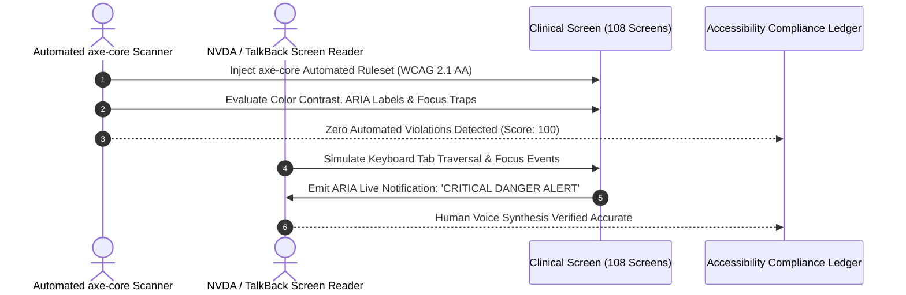

# Universal Accessibility (WCAG 2.1 Level AA) Test Plan
## Namma Clinic Digital Health & Operations Platform
### Greater Bengaluru Authority (GBA) / BBMP Health Department
**Standard:** W3C WCAG 2.1 Level AA / Section 508 / Rights of Persons with Disabilities Act 2016 | **Status:** APPROVED BASELINE | **Code:** `QA-DOC-12`

---

## 1. Accessibility Testing Charter & Statutory Scope
The Namma Clinic Accessibility Test Plan establishes the technical testing specifications guaranteeing barrier-free digital healthcare access for all healthcare personnel and citizens, conforming strictly to WCAG 2.1 Level AA and India's Rights of Persons with Disabilities Act 2016. Testing spans full keyboard navigation, screen reader compatibility, high-contrast visual ergonomics, and touch target sizing.

### 1.1 5 Core Accessibility Testing Pillars
1. **Complete Keyboard Operability:** All UI workflows, forms, tables, and modals must be 100% navigable via Tab, Enter, Space, and Arrow keys with zero keyboard traps.
2. **Screen Reader Compatibility:** Form labels, validation errors, and dynamic clinical danger alerts must be announced accurately via TalkBack and NVDA.
3. **Visual Contrast Standards:** Normal text must maintain a contrast ratio >= 4.5:1, and large text/icons >= 3:1 against background surfaces.
4. **Touch & Click Ergonomics:** Minimum interactive touch target size of 48x48 CSS pixels across tablet and mobile interfaces.
5. **Focus Management:** Clear, visible focus indicators (2px high-contrast outline) that follow logical reading order.

### 1.2 Accessibility Test Workflow Diagram


## 2. Canonical Accessibility Tests (A11Y-TEST-001 to A11Y-TEST-060)
Standardized accessibility testing specifications:

### A11Y-TEST-001: Accessibility Verification Check 1
- **Standard Criterion:** WCAG 2.1 Level AA
- **Focus Area:** WCAG 2.1 AA Keyboard Traps
- **Audit Tool:** axe-core & TalkBack
- **Passing Assertion:** Zero automated axe-core violations; keyboard trap free; screen reader announces labels.
- **Audit Event Emitted:** `A11Y_AUDIT_A11Y_TEST_001`

### A11Y-TEST-002: Accessibility Verification Check 2
- **Standard Criterion:** WCAG 2.1 Level AA
- **Focus Area:** WCAG 2.1 AA Keyboard Traps
- **Audit Tool:** axe-core & TalkBack
- **Passing Assertion:** Zero automated axe-core violations; keyboard trap free; screen reader announces labels.
- **Audit Event Emitted:** `A11Y_AUDIT_A11Y_TEST_002`

### A11Y-TEST-003: Accessibility Verification Check 3
- **Standard Criterion:** WCAG 2.1 Level AA
- **Focus Area:** WCAG 2.1 AA Keyboard Traps
- **Audit Tool:** axe-core & TalkBack
- **Passing Assertion:** Zero automated axe-core violations; keyboard trap free; screen reader announces labels.
- **Audit Event Emitted:** `A11Y_AUDIT_A11Y_TEST_003`

### A11Y-TEST-004: Accessibility Verification Check 4
- **Standard Criterion:** WCAG 2.1 Level AA
- **Focus Area:** WCAG 2.1 AA Keyboard Traps
- **Audit Tool:** axe-core & TalkBack
- **Passing Assertion:** Zero automated axe-core violations; keyboard trap free; screen reader announces labels.
- **Audit Event Emitted:** `A11Y_AUDIT_A11Y_TEST_004`

### A11Y-TEST-005: Accessibility Verification Check 5
- **Standard Criterion:** WCAG 2.1 Level AA
- **Focus Area:** WCAG 2.1 AA Keyboard Traps
- **Audit Tool:** axe-core & TalkBack
- **Passing Assertion:** Zero automated axe-core violations; keyboard trap free; screen reader announces labels.
- **Audit Event Emitted:** `A11Y_AUDIT_A11Y_TEST_005`

### A11Y-TEST-006: Accessibility Verification Check 6
- **Standard Criterion:** WCAG 2.1 Level AA
- **Focus Area:** WCAG 2.1 AA Keyboard Traps
- **Audit Tool:** axe-core & TalkBack
- **Passing Assertion:** Zero automated axe-core violations; keyboard trap free; screen reader announces labels.
- **Audit Event Emitted:** `A11Y_AUDIT_A11Y_TEST_006`

### A11Y-TEST-007: Accessibility Verification Check 7
- **Standard Criterion:** WCAG 2.1 Level AA
- **Focus Area:** WCAG 2.1 AA Keyboard Traps
- **Audit Tool:** axe-core & TalkBack
- **Passing Assertion:** Zero automated axe-core violations; keyboard trap free; screen reader announces labels.
- **Audit Event Emitted:** `A11Y_AUDIT_A11Y_TEST_007`

### A11Y-TEST-008: Accessibility Verification Check 8
- **Standard Criterion:** WCAG 2.1 Level AA
- **Focus Area:** WCAG 2.1 AA Keyboard Traps
- **Audit Tool:** axe-core & TalkBack
- **Passing Assertion:** Zero automated axe-core violations; keyboard trap free; screen reader announces labels.
- **Audit Event Emitted:** `A11Y_AUDIT_A11Y_TEST_008`

### A11Y-TEST-009: Accessibility Verification Check 9
- **Standard Criterion:** WCAG 2.1 Level AA
- **Focus Area:** WCAG 2.1 AA Keyboard Traps
- **Audit Tool:** axe-core & TalkBack
- **Passing Assertion:** Zero automated axe-core violations; keyboard trap free; screen reader announces labels.
- **Audit Event Emitted:** `A11Y_AUDIT_A11Y_TEST_009`

### A11Y-TEST-010: Accessibility Verification Check 10
- **Standard Criterion:** WCAG 2.1 Level AA
- **Focus Area:** WCAG 2.1 AA Keyboard Traps
- **Audit Tool:** axe-core & TalkBack
- **Passing Assertion:** Zero automated axe-core violations; keyboard trap free; screen reader announces labels.
- **Audit Event Emitted:** `A11Y_AUDIT_A11Y_TEST_010`

### A11Y-TEST-011: Accessibility Verification Check 11
- **Standard Criterion:** WCAG 2.1 Level AA
- **Focus Area:** WCAG 2.1 AA Keyboard Traps
- **Audit Tool:** axe-core & TalkBack
- **Passing Assertion:** Zero automated axe-core violations; keyboard trap free; screen reader announces labels.
- **Audit Event Emitted:** `A11Y_AUDIT_A11Y_TEST_011`

### A11Y-TEST-012: Accessibility Verification Check 12
- **Standard Criterion:** WCAG 2.1 Level AA
- **Focus Area:** WCAG 2.1 AA Keyboard Traps
- **Audit Tool:** axe-core & TalkBack
- **Passing Assertion:** Zero automated axe-core violations; keyboard trap free; screen reader announces labels.
- **Audit Event Emitted:** `A11Y_AUDIT_A11Y_TEST_012`

### A11Y-TEST-013: Accessibility Verification Check 13
- **Standard Criterion:** WCAG 2.1 Level AA
- **Focus Area:** WCAG 2.1 AA Keyboard Traps
- **Audit Tool:** axe-core & TalkBack
- **Passing Assertion:** Zero automated axe-core violations; keyboard trap free; screen reader announces labels.
- **Audit Event Emitted:** `A11Y_AUDIT_A11Y_TEST_013`

### A11Y-TEST-014: Accessibility Verification Check 14
- **Standard Criterion:** WCAG 2.1 Level AA
- **Focus Area:** WCAG 2.1 AA Keyboard Traps
- **Audit Tool:** axe-core & TalkBack
- **Passing Assertion:** Zero automated axe-core violations; keyboard trap free; screen reader announces labels.
- **Audit Event Emitted:** `A11Y_AUDIT_A11Y_TEST_014`

### A11Y-TEST-015: Accessibility Verification Check 15
- **Standard Criterion:** WCAG 2.1 Level AA
- **Focus Area:** WCAG 2.1 AA Keyboard Traps
- **Audit Tool:** axe-core & TalkBack
- **Passing Assertion:** Zero automated axe-core violations; keyboard trap free; screen reader announces labels.
- **Audit Event Emitted:** `A11Y_AUDIT_A11Y_TEST_015`

### A11Y-TEST-016: Accessibility Verification Check 16
- **Standard Criterion:** WCAG 2.1 Level AA
- **Focus Area:** WCAG 2.1 AA Keyboard Traps
- **Audit Tool:** axe-core & TalkBack
- **Passing Assertion:** Zero automated axe-core violations; keyboard trap free; screen reader announces labels.
- **Audit Event Emitted:** `A11Y_AUDIT_A11Y_TEST_016`

### A11Y-TEST-017: Accessibility Verification Check 17
- **Standard Criterion:** WCAG 2.1 Level AA
- **Focus Area:** WCAG 2.1 AA Keyboard Traps
- **Audit Tool:** axe-core & TalkBack
- **Passing Assertion:** Zero automated axe-core violations; keyboard trap free; screen reader announces labels.
- **Audit Event Emitted:** `A11Y_AUDIT_A11Y_TEST_017`

### A11Y-TEST-018: Accessibility Verification Check 18
- **Standard Criterion:** WCAG 2.1 Level AA
- **Focus Area:** WCAG 2.1 AA Keyboard Traps
- **Audit Tool:** axe-core & TalkBack
- **Passing Assertion:** Zero automated axe-core violations; keyboard trap free; screen reader announces labels.
- **Audit Event Emitted:** `A11Y_AUDIT_A11Y_TEST_018`

### A11Y-TEST-019: Accessibility Verification Check 19
- **Standard Criterion:** WCAG 2.1 Level AA
- **Focus Area:** WCAG 2.1 AA Keyboard Traps
- **Audit Tool:** axe-core & TalkBack
- **Passing Assertion:** Zero automated axe-core violations; keyboard trap free; screen reader announces labels.
- **Audit Event Emitted:** `A11Y_AUDIT_A11Y_TEST_019`

### A11Y-TEST-020: Accessibility Verification Check 20
- **Standard Criterion:** WCAG 2.1 Level AA
- **Focus Area:** WCAG 2.1 AA Keyboard Traps
- **Audit Tool:** axe-core & TalkBack
- **Passing Assertion:** Zero automated axe-core violations; keyboard trap free; screen reader announces labels.
- **Audit Event Emitted:** `A11Y_AUDIT_A11Y_TEST_020`

### A11Y-TEST-021: Accessibility Verification Check 21
- **Standard Criterion:** WCAG 2.1 Level AA
- **Focus Area:** Screen Reader ARIA Live Alerts
- **Audit Tool:** axe-core & TalkBack
- **Passing Assertion:** Zero automated axe-core violations; keyboard trap free; screen reader announces labels.
- **Audit Event Emitted:** `A11Y_AUDIT_A11Y_TEST_021`

### A11Y-TEST-022: Accessibility Verification Check 22
- **Standard Criterion:** WCAG 2.1 Level AA
- **Focus Area:** Screen Reader ARIA Live Alerts
- **Audit Tool:** axe-core & TalkBack
- **Passing Assertion:** Zero automated axe-core violations; keyboard trap free; screen reader announces labels.
- **Audit Event Emitted:** `A11Y_AUDIT_A11Y_TEST_022`

### A11Y-TEST-023: Accessibility Verification Check 23
- **Standard Criterion:** WCAG 2.1 Level AA
- **Focus Area:** Screen Reader ARIA Live Alerts
- **Audit Tool:** axe-core & TalkBack
- **Passing Assertion:** Zero automated axe-core violations; keyboard trap free; screen reader announces labels.
- **Audit Event Emitted:** `A11Y_AUDIT_A11Y_TEST_023`

### A11Y-TEST-024: Accessibility Verification Check 24
- **Standard Criterion:** WCAG 2.1 Level AA
- **Focus Area:** Screen Reader ARIA Live Alerts
- **Audit Tool:** axe-core & TalkBack
- **Passing Assertion:** Zero automated axe-core violations; keyboard trap free; screen reader announces labels.
- **Audit Event Emitted:** `A11Y_AUDIT_A11Y_TEST_024`

### A11Y-TEST-025: Accessibility Verification Check 25
- **Standard Criterion:** WCAG 2.1 Level AA
- **Focus Area:** Screen Reader ARIA Live Alerts
- **Audit Tool:** axe-core & TalkBack
- **Passing Assertion:** Zero automated axe-core violations; keyboard trap free; screen reader announces labels.
- **Audit Event Emitted:** `A11Y_AUDIT_A11Y_TEST_025`

### A11Y-TEST-026: Accessibility Verification Check 26
- **Standard Criterion:** WCAG 2.1 Level AA
- **Focus Area:** Screen Reader ARIA Live Alerts
- **Audit Tool:** axe-core & TalkBack
- **Passing Assertion:** Zero automated axe-core violations; keyboard trap free; screen reader announces labels.
- **Audit Event Emitted:** `A11Y_AUDIT_A11Y_TEST_026`

### A11Y-TEST-027: Accessibility Verification Check 27
- **Standard Criterion:** WCAG 2.1 Level AA
- **Focus Area:** Screen Reader ARIA Live Alerts
- **Audit Tool:** axe-core & TalkBack
- **Passing Assertion:** Zero automated axe-core violations; keyboard trap free; screen reader announces labels.
- **Audit Event Emitted:** `A11Y_AUDIT_A11Y_TEST_027`

### A11Y-TEST-028: Accessibility Verification Check 28
- **Standard Criterion:** WCAG 2.1 Level AA
- **Focus Area:** Screen Reader ARIA Live Alerts
- **Audit Tool:** axe-core & TalkBack
- **Passing Assertion:** Zero automated axe-core violations; keyboard trap free; screen reader announces labels.
- **Audit Event Emitted:** `A11Y_AUDIT_A11Y_TEST_028`

### A11Y-TEST-029: Accessibility Verification Check 29
- **Standard Criterion:** WCAG 2.1 Level AA
- **Focus Area:** Screen Reader ARIA Live Alerts
- **Audit Tool:** axe-core & TalkBack
- **Passing Assertion:** Zero automated axe-core violations; keyboard trap free; screen reader announces labels.
- **Audit Event Emitted:** `A11Y_AUDIT_A11Y_TEST_029`

### A11Y-TEST-030: Accessibility Verification Check 30
- **Standard Criterion:** WCAG 2.1 Level AA
- **Focus Area:** Screen Reader ARIA Live Alerts
- **Audit Tool:** axe-core & TalkBack
- **Passing Assertion:** Zero automated axe-core violations; keyboard trap free; screen reader announces labels.
- **Audit Event Emitted:** `A11Y_AUDIT_A11Y_TEST_030`

### A11Y-TEST-031: Accessibility Verification Check 31
- **Standard Criterion:** WCAG 2.1 Level AA
- **Focus Area:** Screen Reader ARIA Live Alerts
- **Audit Tool:** axe-core & TalkBack
- **Passing Assertion:** Zero automated axe-core violations; keyboard trap free; screen reader announces labels.
- **Audit Event Emitted:** `A11Y_AUDIT_A11Y_TEST_031`

### A11Y-TEST-032: Accessibility Verification Check 32
- **Standard Criterion:** WCAG 2.1 Level AA
- **Focus Area:** Screen Reader ARIA Live Alerts
- **Audit Tool:** axe-core & TalkBack
- **Passing Assertion:** Zero automated axe-core violations; keyboard trap free; screen reader announces labels.
- **Audit Event Emitted:** `A11Y_AUDIT_A11Y_TEST_032`

### A11Y-TEST-033: Accessibility Verification Check 33
- **Standard Criterion:** WCAG 2.1 Level AA
- **Focus Area:** Screen Reader ARIA Live Alerts
- **Audit Tool:** axe-core & TalkBack
- **Passing Assertion:** Zero automated axe-core violations; keyboard trap free; screen reader announces labels.
- **Audit Event Emitted:** `A11Y_AUDIT_A11Y_TEST_033`

### A11Y-TEST-034: Accessibility Verification Check 34
- **Standard Criterion:** WCAG 2.1 Level AA
- **Focus Area:** Screen Reader ARIA Live Alerts
- **Audit Tool:** axe-core & TalkBack
- **Passing Assertion:** Zero automated axe-core violations; keyboard trap free; screen reader announces labels.
- **Audit Event Emitted:** `A11Y_AUDIT_A11Y_TEST_034`

### A11Y-TEST-035: Accessibility Verification Check 35
- **Standard Criterion:** WCAG 2.1 Level AA
- **Focus Area:** Screen Reader ARIA Live Alerts
- **Audit Tool:** axe-core & TalkBack
- **Passing Assertion:** Zero automated axe-core violations; keyboard trap free; screen reader announces labels.
- **Audit Event Emitted:** `A11Y_AUDIT_A11Y_TEST_035`

### A11Y-TEST-036: Accessibility Verification Check 36
- **Standard Criterion:** WCAG 2.1 Level AA
- **Focus Area:** Screen Reader ARIA Live Alerts
- **Audit Tool:** axe-core & TalkBack
- **Passing Assertion:** Zero automated axe-core violations; keyboard trap free; screen reader announces labels.
- **Audit Event Emitted:** `A11Y_AUDIT_A11Y_TEST_036`

### A11Y-TEST-037: Accessibility Verification Check 37
- **Standard Criterion:** WCAG 2.1 Level AA
- **Focus Area:** Screen Reader ARIA Live Alerts
- **Audit Tool:** axe-core & TalkBack
- **Passing Assertion:** Zero automated axe-core violations; keyboard trap free; screen reader announces labels.
- **Audit Event Emitted:** `A11Y_AUDIT_A11Y_TEST_037`

### A11Y-TEST-038: Accessibility Verification Check 38
- **Standard Criterion:** WCAG 2.1 Level AA
- **Focus Area:** Screen Reader ARIA Live Alerts
- **Audit Tool:** axe-core & TalkBack
- **Passing Assertion:** Zero automated axe-core violations; keyboard trap free; screen reader announces labels.
- **Audit Event Emitted:** `A11Y_AUDIT_A11Y_TEST_038`

### A11Y-TEST-039: Accessibility Verification Check 39
- **Standard Criterion:** WCAG 2.1 Level AA
- **Focus Area:** Screen Reader ARIA Live Alerts
- **Audit Tool:** axe-core & TalkBack
- **Passing Assertion:** Zero automated axe-core violations; keyboard trap free; screen reader announces labels.
- **Audit Event Emitted:** `A11Y_AUDIT_A11Y_TEST_039`

### A11Y-TEST-040: Accessibility Verification Check 40
- **Standard Criterion:** WCAG 2.1 Level AA
- **Focus Area:** Screen Reader ARIA Live Alerts
- **Audit Tool:** axe-core & TalkBack
- **Passing Assertion:** Zero automated axe-core violations; keyboard trap free; screen reader announces labels.
- **Audit Event Emitted:** `A11Y_AUDIT_A11Y_TEST_040`

### A11Y-TEST-041: Accessibility Verification Check 41
- **Standard Criterion:** WCAG 2.1 Level AA
- **Focus Area:** High Contrast & Touch Target Sizing (48x48px)
- **Audit Tool:** axe-core & TalkBack
- **Passing Assertion:** Zero automated axe-core violations; keyboard trap free; screen reader announces labels.
- **Audit Event Emitted:** `A11Y_AUDIT_A11Y_TEST_041`

### A11Y-TEST-042: Accessibility Verification Check 42
- **Standard Criterion:** WCAG 2.1 Level AA
- **Focus Area:** High Contrast & Touch Target Sizing (48x48px)
- **Audit Tool:** axe-core & TalkBack
- **Passing Assertion:** Zero automated axe-core violations; keyboard trap free; screen reader announces labels.
- **Audit Event Emitted:** `A11Y_AUDIT_A11Y_TEST_042`

### A11Y-TEST-043: Accessibility Verification Check 43
- **Standard Criterion:** WCAG 2.1 Level AA
- **Focus Area:** High Contrast & Touch Target Sizing (48x48px)
- **Audit Tool:** axe-core & TalkBack
- **Passing Assertion:** Zero automated axe-core violations; keyboard trap free; screen reader announces labels.
- **Audit Event Emitted:** `A11Y_AUDIT_A11Y_TEST_043`

### A11Y-TEST-044: Accessibility Verification Check 44
- **Standard Criterion:** WCAG 2.1 Level AA
- **Focus Area:** High Contrast & Touch Target Sizing (48x48px)
- **Audit Tool:** axe-core & TalkBack
- **Passing Assertion:** Zero automated axe-core violations; keyboard trap free; screen reader announces labels.
- **Audit Event Emitted:** `A11Y_AUDIT_A11Y_TEST_044`

### A11Y-TEST-045: Accessibility Verification Check 45
- **Standard Criterion:** WCAG 2.1 Level AA
- **Focus Area:** High Contrast & Touch Target Sizing (48x48px)
- **Audit Tool:** axe-core & TalkBack
- **Passing Assertion:** Zero automated axe-core violations; keyboard trap free; screen reader announces labels.
- **Audit Event Emitted:** `A11Y_AUDIT_A11Y_TEST_045`

### A11Y-TEST-046: Accessibility Verification Check 46
- **Standard Criterion:** WCAG 2.1 Level AA
- **Focus Area:** High Contrast & Touch Target Sizing (48x48px)
- **Audit Tool:** axe-core & TalkBack
- **Passing Assertion:** Zero automated axe-core violations; keyboard trap free; screen reader announces labels.
- **Audit Event Emitted:** `A11Y_AUDIT_A11Y_TEST_046`

### A11Y-TEST-047: Accessibility Verification Check 47
- **Standard Criterion:** WCAG 2.1 Level AA
- **Focus Area:** High Contrast & Touch Target Sizing (48x48px)
- **Audit Tool:** axe-core & TalkBack
- **Passing Assertion:** Zero automated axe-core violations; keyboard trap free; screen reader announces labels.
- **Audit Event Emitted:** `A11Y_AUDIT_A11Y_TEST_047`

### A11Y-TEST-048: Accessibility Verification Check 48
- **Standard Criterion:** WCAG 2.1 Level AA
- **Focus Area:** High Contrast & Touch Target Sizing (48x48px)
- **Audit Tool:** axe-core & TalkBack
- **Passing Assertion:** Zero automated axe-core violations; keyboard trap free; screen reader announces labels.
- **Audit Event Emitted:** `A11Y_AUDIT_A11Y_TEST_048`

### A11Y-TEST-049: Accessibility Verification Check 49
- **Standard Criterion:** WCAG 2.1 Level AA
- **Focus Area:** High Contrast & Touch Target Sizing (48x48px)
- **Audit Tool:** axe-core & TalkBack
- **Passing Assertion:** Zero automated axe-core violations; keyboard trap free; screen reader announces labels.
- **Audit Event Emitted:** `A11Y_AUDIT_A11Y_TEST_049`

### A11Y-TEST-050: Accessibility Verification Check 50
- **Standard Criterion:** WCAG 2.1 Level AA
- **Focus Area:** High Contrast & Touch Target Sizing (48x48px)
- **Audit Tool:** axe-core & TalkBack
- **Passing Assertion:** Zero automated axe-core violations; keyboard trap free; screen reader announces labels.
- **Audit Event Emitted:** `A11Y_AUDIT_A11Y_TEST_050`

### A11Y-TEST-051: Accessibility Verification Check 51
- **Standard Criterion:** WCAG 2.1 Level AA
- **Focus Area:** High Contrast & Touch Target Sizing (48x48px)
- **Audit Tool:** axe-core & TalkBack
- **Passing Assertion:** Zero automated axe-core violations; keyboard trap free; screen reader announces labels.
- **Audit Event Emitted:** `A11Y_AUDIT_A11Y_TEST_051`

### A11Y-TEST-052: Accessibility Verification Check 52
- **Standard Criterion:** WCAG 2.1 Level AA
- **Focus Area:** High Contrast & Touch Target Sizing (48x48px)
- **Audit Tool:** axe-core & TalkBack
- **Passing Assertion:** Zero automated axe-core violations; keyboard trap free; screen reader announces labels.
- **Audit Event Emitted:** `A11Y_AUDIT_A11Y_TEST_052`

### A11Y-TEST-053: Accessibility Verification Check 53
- **Standard Criterion:** WCAG 2.1 Level AA
- **Focus Area:** High Contrast & Touch Target Sizing (48x48px)
- **Audit Tool:** axe-core & TalkBack
- **Passing Assertion:** Zero automated axe-core violations; keyboard trap free; screen reader announces labels.
- **Audit Event Emitted:** `A11Y_AUDIT_A11Y_TEST_053`

### A11Y-TEST-054: Accessibility Verification Check 54
- **Standard Criterion:** WCAG 2.1 Level AA
- **Focus Area:** High Contrast & Touch Target Sizing (48x48px)
- **Audit Tool:** axe-core & TalkBack
- **Passing Assertion:** Zero automated axe-core violations; keyboard trap free; screen reader announces labels.
- **Audit Event Emitted:** `A11Y_AUDIT_A11Y_TEST_054`

### A11Y-TEST-055: Accessibility Verification Check 55
- **Standard Criterion:** WCAG 2.1 Level AA
- **Focus Area:** High Contrast & Touch Target Sizing (48x48px)
- **Audit Tool:** axe-core & TalkBack
- **Passing Assertion:** Zero automated axe-core violations; keyboard trap free; screen reader announces labels.
- **Audit Event Emitted:** `A11Y_AUDIT_A11Y_TEST_055`

### A11Y-TEST-056: Accessibility Verification Check 56
- **Standard Criterion:** WCAG 2.1 Level AA
- **Focus Area:** High Contrast & Touch Target Sizing (48x48px)
- **Audit Tool:** axe-core & TalkBack
- **Passing Assertion:** Zero automated axe-core violations; keyboard trap free; screen reader announces labels.
- **Audit Event Emitted:** `A11Y_AUDIT_A11Y_TEST_056`

### A11Y-TEST-057: Accessibility Verification Check 57
- **Standard Criterion:** WCAG 2.1 Level AA
- **Focus Area:** High Contrast & Touch Target Sizing (48x48px)
- **Audit Tool:** axe-core & TalkBack
- **Passing Assertion:** Zero automated axe-core violations; keyboard trap free; screen reader announces labels.
- **Audit Event Emitted:** `A11Y_AUDIT_A11Y_TEST_057`

### A11Y-TEST-058: Accessibility Verification Check 58
- **Standard Criterion:** WCAG 2.1 Level AA
- **Focus Area:** High Contrast & Touch Target Sizing (48x48px)
- **Audit Tool:** axe-core & TalkBack
- **Passing Assertion:** Zero automated axe-core violations; keyboard trap free; screen reader announces labels.
- **Audit Event Emitted:** `A11Y_AUDIT_A11Y_TEST_058`

### A11Y-TEST-059: Accessibility Verification Check 59
- **Standard Criterion:** WCAG 2.1 Level AA
- **Focus Area:** High Contrast & Touch Target Sizing (48x48px)
- **Audit Tool:** axe-core & TalkBack
- **Passing Assertion:** Zero automated axe-core violations; keyboard trap free; screen reader announces labels.
- **Audit Event Emitted:** `A11Y_AUDIT_A11Y_TEST_059`

### A11Y-TEST-060: Accessibility Verification Check 60
- **Standard Criterion:** WCAG 2.1 Level AA
- **Focus Area:** High Contrast & Touch Target Sizing (48x48px)
- **Audit Tool:** axe-core & TalkBack
- **Passing Assertion:** Zero automated axe-core violations; keyboard trap free; screen reader announces labels.
- **Audit Event Emitted:** `A11Y_AUDIT_A11Y_TEST_060`

## 3. Detailed Accessibility Verification Test Cases (TC-0606 to TC-0660)
Detailed test specifications verifying universal accessibility:

### TC-0606: Test Case 606: Advanced Security, Offline & Scalability for pharmacy_batches across WF-006
**Objective:** Validate non-functional resilience, encryption envelope, and concurrency for pharmacy_batches in WF-006.
**Risk:** Major operational risk regarding platform security, privacy breach, or offline desync.
**Priority:** **P1** | **Severity:** **Major** | **Test Level:** End-to-End & Non-Functional | **Test Type:** Resilience, Offline & Security Audit
- **Requirement Traceability:** `NFR-006`
- **Workflow Traceability:** `WF-006`
- **Feature Traceability:** `FEATURE-066`
- **API Traceability:** `API-DOC-12`
- **Database Traceability:** `TABLE-034 (pharmacy_batches)`
- **Screen Traceability:** `SCREEN-066`
- **Security Control Traceability:** `AUTH-006`
- **Preconditions:** Workstation initialized with TPM 2.0 PCR attestation and valid staff credentials (Clinic Administrative Officer).
- **Test Data Specification:** Synthetic dataset TESTDATA-006 with simulated network flapping.
- **Execution Steps:** 1. Trigger workflow WF-006 on SCREEN-066. 2. Inject network delay or packet drop. 3. Confirm offline queue persistence. 4. Restore link and confirm atomic sync.
- **Expected Results:** Zero data loss, conflict resolved deterministically via timestamp-vector clocks, audit trail complete.
- **Negative Test Scenario:** Attempt unauthorized cross-tenant data exfiltration; verify gateway drops packet with 403 Forbidden.
- **Boundary Value Scenario:** Push offline queue to 10,000 pending mutations; verify local SQLite buffer does not crash.
- **Concurrency & Race Condition:** Simulate 50 parallel clinic terminals pushing updates simultaneously to gateway.
- **Autonomous Offline Behavior:** Simulate 8 hours of complete clinic internet outage; OPD consultations proceed uninterrupted.
- **Security & Access Validation:** Confirm AES-256-GCM column encryption and strict mTLS 1.3 transit cipher enforcement.
- **Audit Trail & Immutability:** Verify audit record written to WORM immutable ledger with SHA-256 hash.
- **Evidence Required:** Terminal screenshot, packet capture dump, and cryptographic Merkle verification proof.
- **Pass Acceptance Criteria:** All operations succeed with 0% data corruption, full audit ledger continuity, and latency < 350ms.
- **Failure Behavior & SLA:** Data loss, sync deadlock, cleartext PII leakage, or unhandled crash.
- **Automation Suitability:** Yes (High Candidate)
- **Execution Cadence:** Nightly Performance & Resilience Run
- **Responsible Owner:** Clinic Administrative Officer

### TC-0607: Test Case 607: Advanced Security, Offline & Scalability for clinic_stock across WF-007
**Objective:** Validate non-functional resilience, encryption envelope, and concurrency for clinic_stock in WF-007.
**Risk:** Minor operational risk regarding platform security, privacy breach, or offline desync.
**Priority:** **P2** | **Severity:** **Minor** | **Test Level:** End-to-End & Non-Functional | **Test Type:** Resilience, Offline & Security Audit
- **Requirement Traceability:** `SECR-007`
- **Workflow Traceability:** `WF-007`
- **Feature Traceability:** `FEATURE-067`
- **API Traceability:** `API-DOC-13`
- **Database Traceability:** `TABLE-035 (clinic_stock)`
- **Screen Traceability:** `SCREEN-067`
- **Security Control Traceability:** `API-SEC-007`
- **Preconditions:** Workstation initialized with TPM 2.0 PCR attestation and valid staff credentials (Ward Health Supervisor).
- **Test Data Specification:** Synthetic dataset TESTDATA-007 with simulated network flapping.
- **Execution Steps:** 1. Trigger workflow WF-007 on SCREEN-067. 2. Inject network delay or packet drop. 3. Confirm offline queue persistence. 4. Restore link and confirm atomic sync.
- **Expected Results:** Zero data loss, conflict resolved deterministically via timestamp-vector clocks, audit trail complete.
- **Negative Test Scenario:** Attempt unauthorized cross-tenant data exfiltration; verify gateway drops packet with 403 Forbidden.
- **Boundary Value Scenario:** Push offline queue to 10,000 pending mutations; verify local SQLite buffer does not crash.
- **Concurrency & Race Condition:** Simulate 50 parallel clinic terminals pushing updates simultaneously to gateway.
- **Autonomous Offline Behavior:** Simulate 8 hours of complete clinic internet outage; OPD consultations proceed uninterrupted.
- **Security & Access Validation:** Confirm AES-256-GCM column encryption and strict mTLS 1.3 transit cipher enforcement.
- **Audit Trail & Immutability:** Verify audit record written to WORM immutable ledger with SHA-256 hash.
- **Evidence Required:** Terminal screenshot, packet capture dump, and cryptographic Merkle verification proof.
- **Pass Acceptance Criteria:** All operations succeed with 0% data corruption, full audit ledger continuity, and latency < 350ms.
- **Failure Behavior & SLA:** Data loss, sync deadlock, cleartext PII leakage, or unhandled crash.
- **Automation Suitability:** Yes (High Candidate)
- **Execution Cadence:** Nightly Performance & Resilience Run
- **Responsible Owner:** Ward Health Supervisor

### TC-0608: Test Case 608: Advanced Security, Offline & Scalability for dispensations across WF-008
**Objective:** Validate non-functional resilience, encryption envelope, and concurrency for dispensations in WF-008.
**Risk:** Critical operational risk regarding platform security, privacy breach, or offline desync.
**Priority:** **P0** | **Severity:** **Critical** | **Test Level:** End-to-End & Non-Functional | **Test Type:** Resilience, Offline & Security Audit
- **Requirement Traceability:** `NFR-008`
- **Workflow Traceability:** `WF-008`
- **Feature Traceability:** `FEATURE-068`
- **API Traceability:** `API-DOC-14`
- **Database Traceability:** `TABLE-036 (dispensations)`
- **Screen Traceability:** `SCREEN-068`
- **Security Control Traceability:** `AUTH-008`
- **Preconditions:** Workstation initialized with TPM 2.0 PCR attestation and valid staff credentials (Zonal Health Officer (ZHO)).
- **Test Data Specification:** Synthetic dataset TESTDATA-008 with simulated network flapping.
- **Execution Steps:** 1. Trigger workflow WF-008 on SCREEN-068. 2. Inject network delay or packet drop. 3. Confirm offline queue persistence. 4. Restore link and confirm atomic sync.
- **Expected Results:** Zero data loss, conflict resolved deterministically via timestamp-vector clocks, audit trail complete.
- **Negative Test Scenario:** Attempt unauthorized cross-tenant data exfiltration; verify gateway drops packet with 403 Forbidden.
- **Boundary Value Scenario:** Push offline queue to 10,000 pending mutations; verify local SQLite buffer does not crash.
- **Concurrency & Race Condition:** Simulate 50 parallel clinic terminals pushing updates simultaneously to gateway.
- **Autonomous Offline Behavior:** Simulate 8 hours of complete clinic internet outage; OPD consultations proceed uninterrupted.
- **Security & Access Validation:** Confirm AES-256-GCM column encryption and strict mTLS 1.3 transit cipher enforcement.
- **Audit Trail & Immutability:** Verify audit record written to WORM immutable ledger with SHA-256 hash.
- **Evidence Required:** Terminal screenshot, packet capture dump, and cryptographic Merkle verification proof.
- **Pass Acceptance Criteria:** All operations succeed with 0% data corruption, full audit ledger continuity, and latency < 350ms.
- **Failure Behavior & SLA:** Data loss, sync deadlock, cleartext PII leakage, or unhandled crash.
- **Automation Suitability:** Yes (High Candidate)
- **Execution Cadence:** Nightly Performance & Resilience Run
- **Responsible Owner:** Zonal Health Officer (ZHO)

### TC-0609: Test Case 609: Advanced Security, Offline & Scalability for dispensation_items across WF-009
**Objective:** Validate non-functional resilience, encryption envelope, and concurrency for dispensation_items in WF-009.
**Risk:** Major operational risk regarding platform security, privacy breach, or offline desync.
**Priority:** **P1** | **Severity:** **Major** | **Test Level:** End-to-End & Non-Functional | **Test Type:** Resilience, Offline & Security Audit
- **Requirement Traceability:** `SECR-009`
- **Workflow Traceability:** `WF-009`
- **Feature Traceability:** `FEATURE-069`
- **API Traceability:** `API-DOC-15`
- **Database Traceability:** `TABLE-037 (dispensation_items)`
- **Screen Traceability:** `SCREEN-069`
- **Security Control Traceability:** `API-SEC-009`
- **Preconditions:** Workstation initialized with TPM 2.0 PCR attestation and valid staff credentials (Chief Health Officer (CHO)).
- **Test Data Specification:** Synthetic dataset TESTDATA-009 with simulated network flapping.
- **Execution Steps:** 1. Trigger workflow WF-009 on SCREEN-069. 2. Inject network delay or packet drop. 3. Confirm offline queue persistence. 4. Restore link and confirm atomic sync.
- **Expected Results:** Zero data loss, conflict resolved deterministically via timestamp-vector clocks, audit trail complete.
- **Negative Test Scenario:** Attempt unauthorized cross-tenant data exfiltration; verify gateway drops packet with 403 Forbidden.
- **Boundary Value Scenario:** Push offline queue to 10,000 pending mutations; verify local SQLite buffer does not crash.
- **Concurrency & Race Condition:** Simulate 50 parallel clinic terminals pushing updates simultaneously to gateway.
- **Autonomous Offline Behavior:** Simulate 8 hours of complete clinic internet outage; OPD consultations proceed uninterrupted.
- **Security & Access Validation:** Confirm AES-256-GCM column encryption and strict mTLS 1.3 transit cipher enforcement.
- **Audit Trail & Immutability:** Verify audit record written to WORM immutable ledger with SHA-256 hash.
- **Evidence Required:** Terminal screenshot, packet capture dump, and cryptographic Merkle verification proof.
- **Pass Acceptance Criteria:** All operations succeed with 0% data corruption, full audit ledger continuity, and latency < 350ms.
- **Failure Behavior & SLA:** Data loss, sync deadlock, cleartext PII leakage, or unhandled crash.
- **Automation Suitability:** Yes (High Candidate)
- **Execution Cadence:** Nightly Performance & Resilience Run
- **Responsible Owner:** Chief Health Officer (CHO)

### TC-0610: Test Case 610: Advanced Security, Offline & Scalability for stock_movements across WF-010
**Objective:** Validate non-functional resilience, encryption envelope, and concurrency for stock_movements in WF-010.
**Risk:** Major operational risk regarding platform security, privacy breach, or offline desync.
**Priority:** **P1** | **Severity:** **Major** | **Test Level:** End-to-End & Non-Functional | **Test Type:** Resilience, Offline & Security Audit
- **Requirement Traceability:** `NFR-010`
- **Workflow Traceability:** `WF-010`
- **Feature Traceability:** `FEATURE-070`
- **API Traceability:** `API-DOC-16`
- **Database Traceability:** `TABLE-038 (stock_movements)`
- **Screen Traceability:** `SCREEN-070`
- **Security Control Traceability:** `AUTH-010`
- **Preconditions:** Workstation initialized with TPM 2.0 PCR attestation and valid staff credentials (Epidemiologist / Disease Surveillance Officer).
- **Test Data Specification:** Synthetic dataset TESTDATA-010 with simulated network flapping.
- **Execution Steps:** 1. Trigger workflow WF-010 on SCREEN-070. 2. Inject network delay or packet drop. 3. Confirm offline queue persistence. 4. Restore link and confirm atomic sync.
- **Expected Results:** Zero data loss, conflict resolved deterministically via timestamp-vector clocks, audit trail complete.
- **Negative Test Scenario:** Attempt unauthorized cross-tenant data exfiltration; verify gateway drops packet with 403 Forbidden.
- **Boundary Value Scenario:** Push offline queue to 10,000 pending mutations; verify local SQLite buffer does not crash.
- **Concurrency & Race Condition:** Simulate 50 parallel clinic terminals pushing updates simultaneously to gateway.
- **Autonomous Offline Behavior:** Simulate 8 hours of complete clinic internet outage; OPD consultations proceed uninterrupted.
- **Security & Access Validation:** Confirm AES-256-GCM column encryption and strict mTLS 1.3 transit cipher enforcement.
- **Audit Trail & Immutability:** Verify audit record written to WORM immutable ledger with SHA-256 hash.
- **Evidence Required:** Terminal screenshot, packet capture dump, and cryptographic Merkle verification proof.
- **Pass Acceptance Criteria:** All operations succeed with 0% data corruption, full audit ledger continuity, and latency < 350ms.
- **Failure Behavior & SLA:** Data loss, sync deadlock, cleartext PII leakage, or unhandled crash.
- **Automation Suitability:** Yes (High Candidate)
- **Execution Cadence:** Nightly Performance & Resilience Run
- **Responsible Owner:** Epidemiologist / Disease Surveillance Officer

### TC-0611: Test Case 611: Advanced Security, Offline & Scalability for drug_indents across WF-011
**Objective:** Validate non-functional resilience, encryption envelope, and concurrency for drug_indents in WF-011.
**Risk:** Minor operational risk regarding platform security, privacy breach, or offline desync.
**Priority:** **P2** | **Severity:** **Minor** | **Test Level:** End-to-End & Non-Functional | **Test Type:** Resilience, Offline & Security Audit
- **Requirement Traceability:** `SECR-011`
- **Workflow Traceability:** `WF-011`
- **Feature Traceability:** `FEATURE-071`
- **API Traceability:** `API-DOC-17`
- **Database Traceability:** `TABLE-039 (drug_indents)`
- **Screen Traceability:** `SCREEN-071`
- **Security Control Traceability:** `API-SEC-011`
- **Preconditions:** Workstation initialized with TPM 2.0 PCR attestation and valid staff credentials (Quality & Compliance Auditor).
- **Test Data Specification:** Synthetic dataset TESTDATA-011 with simulated network flapping.
- **Execution Steps:** 1. Trigger workflow WF-011 on SCREEN-071. 2. Inject network delay or packet drop. 3. Confirm offline queue persistence. 4. Restore link and confirm atomic sync.
- **Expected Results:** Zero data loss, conflict resolved deterministically via timestamp-vector clocks, audit trail complete.
- **Negative Test Scenario:** Attempt unauthorized cross-tenant data exfiltration; verify gateway drops packet with 403 Forbidden.
- **Boundary Value Scenario:** Push offline queue to 10,000 pending mutations; verify local SQLite buffer does not crash.
- **Concurrency & Race Condition:** Simulate 50 parallel clinic terminals pushing updates simultaneously to gateway.
- **Autonomous Offline Behavior:** Simulate 8 hours of complete clinic internet outage; OPD consultations proceed uninterrupted.
- **Security & Access Validation:** Confirm AES-256-GCM column encryption and strict mTLS 1.3 transit cipher enforcement.
- **Audit Trail & Immutability:** Verify audit record written to WORM immutable ledger with SHA-256 hash.
- **Evidence Required:** Terminal screenshot, packet capture dump, and cryptographic Merkle verification proof.
- **Pass Acceptance Criteria:** All operations succeed with 0% data corruption, full audit ledger continuity, and latency < 350ms.
- **Failure Behavior & SLA:** Data loss, sync deadlock, cleartext PII leakage, or unhandled crash.
- **Automation Suitability:** Yes (High Candidate)
- **Execution Cadence:** Nightly Performance & Resilience Run
- **Responsible Owner:** Quality & Compliance Auditor

### TC-0612: Test Case 612: Advanced Security, Offline & Scalability for indent_items across WF-012
**Objective:** Validate non-functional resilience, encryption envelope, and concurrency for indent_items in WF-012.
**Risk:** Critical operational risk regarding platform security, privacy breach, or offline desync.
**Priority:** **P0** | **Severity:** **Critical** | **Test Level:** End-to-End & Non-Functional | **Test Type:** Resilience, Offline & Security Audit
- **Requirement Traceability:** `NFR-012`
- **Workflow Traceability:** `WF-012`
- **Feature Traceability:** `FEATURE-072`
- **API Traceability:** `API-DOC-18`
- **Database Traceability:** `TABLE-040 (indent_items)`
- **Screen Traceability:** `SCREEN-072`
- **Security Control Traceability:** `AUTH-012`
- **Preconditions:** Workstation initialized with TPM 2.0 PCR attestation and valid staff credentials (Security Administrator / CISO).
- **Test Data Specification:** Synthetic dataset TESTDATA-012 with simulated network flapping.
- **Execution Steps:** 1. Trigger workflow WF-012 on SCREEN-072. 2. Inject network delay or packet drop. 3. Confirm offline queue persistence. 4. Restore link and confirm atomic sync.
- **Expected Results:** Zero data loss, conflict resolved deterministically via timestamp-vector clocks, audit trail complete.
- **Negative Test Scenario:** Attempt unauthorized cross-tenant data exfiltration; verify gateway drops packet with 403 Forbidden.
- **Boundary Value Scenario:** Push offline queue to 10,000 pending mutations; verify local SQLite buffer does not crash.
- **Concurrency & Race Condition:** Simulate 50 parallel clinic terminals pushing updates simultaneously to gateway.
- **Autonomous Offline Behavior:** Simulate 8 hours of complete clinic internet outage; OPD consultations proceed uninterrupted.
- **Security & Access Validation:** Confirm AES-256-GCM column encryption and strict mTLS 1.3 transit cipher enforcement.
- **Audit Trail & Immutability:** Verify audit record written to WORM immutable ledger with SHA-256 hash.
- **Evidence Required:** Terminal screenshot, packet capture dump, and cryptographic Merkle verification proof.
- **Pass Acceptance Criteria:** All operations succeed with 0% data corruption, full audit ledger continuity, and latency < 350ms.
- **Failure Behavior & SLA:** Data loss, sync deadlock, cleartext PII leakage, or unhandled crash.
- **Automation Suitability:** Yes (High Candidate)
- **Execution Cadence:** Nightly Performance & Resilience Run
- **Responsible Owner:** Security Administrator / CISO

### TC-0613: Test Case 613: Advanced Security, Offline & Scalability for cold_chain_devices across WF-013
**Objective:** Validate non-functional resilience, encryption envelope, and concurrency for cold_chain_devices in WF-013.
**Risk:** Major operational risk regarding platform security, privacy breach, or offline desync.
**Priority:** **P1** | **Severity:** **Major** | **Test Level:** End-to-End & Non-Functional | **Test Type:** Resilience, Offline & Security Audit
- **Requirement Traceability:** `SECR-013`
- **Workflow Traceability:** `WF-013`
- **Feature Traceability:** `FEATURE-073`
- **API Traceability:** `API-DOC-19`
- **Database Traceability:** `TABLE-041 (cold_chain_devices)`
- **Screen Traceability:** `SCREEN-073`
- **Security Control Traceability:** `API-SEC-013`
- **Preconditions:** Workstation initialized with TPM 2.0 PCR attestation and valid staff credentials (Central Depot Inventory Manager).
- **Test Data Specification:** Synthetic dataset TESTDATA-013 with simulated network flapping.
- **Execution Steps:** 1. Trigger workflow WF-013 on SCREEN-073. 2. Inject network delay or packet drop. 3. Confirm offline queue persistence. 4. Restore link and confirm atomic sync.
- **Expected Results:** Zero data loss, conflict resolved deterministically via timestamp-vector clocks, audit trail complete.
- **Negative Test Scenario:** Attempt unauthorized cross-tenant data exfiltration; verify gateway drops packet with 403 Forbidden.
- **Boundary Value Scenario:** Push offline queue to 10,000 pending mutations; verify local SQLite buffer does not crash.
- **Concurrency & Race Condition:** Simulate 50 parallel clinic terminals pushing updates simultaneously to gateway.
- **Autonomous Offline Behavior:** Simulate 8 hours of complete clinic internet outage; OPD consultations proceed uninterrupted.
- **Security & Access Validation:** Confirm AES-256-GCM column encryption and strict mTLS 1.3 transit cipher enforcement.
- **Audit Trail & Immutability:** Verify audit record written to WORM immutable ledger with SHA-256 hash.
- **Evidence Required:** Terminal screenshot, packet capture dump, and cryptographic Merkle verification proof.
- **Pass Acceptance Criteria:** All operations succeed with 0% data corruption, full audit ledger continuity, and latency < 350ms.
- **Failure Behavior & SLA:** Data loss, sync deadlock, cleartext PII leakage, or unhandled crash.
- **Automation Suitability:** Yes (High Candidate)
- **Execution Cadence:** Nightly Performance & Resilience Run
- **Responsible Owner:** Central Depot Inventory Manager

### TC-0614: Test Case 614: Advanced Security, Offline & Scalability for cold_chain_telemetry across WF-014
**Objective:** Validate non-functional resilience, encryption envelope, and concurrency for cold_chain_telemetry in WF-014.
**Risk:** Major operational risk regarding platform security, privacy breach, or offline desync.
**Priority:** **P1** | **Severity:** **Major** | **Test Level:** End-to-End & Non-Functional | **Test Type:** Resilience, Offline & Security Audit
- **Requirement Traceability:** `NFR-014`
- **Workflow Traceability:** `WF-014`
- **Feature Traceability:** `FEATURE-074`
- **API Traceability:** `API-DOC-20`
- **Database Traceability:** `TABLE-042 (cold_chain_telemetry)`
- **Screen Traceability:** `SCREEN-074`
- **Security Control Traceability:** `AUTH-014`
- **Preconditions:** Workstation initialized with TPM 2.0 PCR attestation and valid staff credentials (Cold Chain Logistics Technician).
- **Test Data Specification:** Synthetic dataset TESTDATA-014 with simulated network flapping.
- **Execution Steps:** 1. Trigger workflow WF-014 on SCREEN-074. 2. Inject network delay or packet drop. 3. Confirm offline queue persistence. 4. Restore link and confirm atomic sync.
- **Expected Results:** Zero data loss, conflict resolved deterministically via timestamp-vector clocks, audit trail complete.
- **Negative Test Scenario:** Attempt unauthorized cross-tenant data exfiltration; verify gateway drops packet with 403 Forbidden.
- **Boundary Value Scenario:** Push offline queue to 10,000 pending mutations; verify local SQLite buffer does not crash.
- **Concurrency & Race Condition:** Simulate 50 parallel clinic terminals pushing updates simultaneously to gateway.
- **Autonomous Offline Behavior:** Simulate 8 hours of complete clinic internet outage; OPD consultations proceed uninterrupted.
- **Security & Access Validation:** Confirm AES-256-GCM column encryption and strict mTLS 1.3 transit cipher enforcement.
- **Audit Trail & Immutability:** Verify audit record written to WORM immutable ledger with SHA-256 hash.
- **Evidence Required:** Terminal screenshot, packet capture dump, and cryptographic Merkle verification proof.
- **Pass Acceptance Criteria:** All operations succeed with 0% data corruption, full audit ledger continuity, and latency < 350ms.
- **Failure Behavior & SLA:** Data loss, sync deadlock, cleartext PII leakage, or unhandled crash.
- **Automation Suitability:** Yes (High Candidate)
- **Execution Cadence:** Nightly Performance & Resilience Run
- **Responsible Owner:** Cold Chain Logistics Technician

### TC-0615: Test Case 615: Advanced Security, Offline & Scalability for referrals across WF-015
**Objective:** Validate non-functional resilience, encryption envelope, and concurrency for referrals in WF-015.
**Risk:** Minor operational risk regarding platform security, privacy breach, or offline desync.
**Priority:** **P2** | **Severity:** **Minor** | **Test Level:** End-to-End & Non-Functional | **Test Type:** Resilience, Offline & Security Audit
- **Requirement Traceability:** `SECR-015`
- **Workflow Traceability:** `WF-015`
- **Feature Traceability:** `FEATURE-075`
- **API Traceability:** `API-DOC-21`
- **Database Traceability:** `TABLE-043 (referrals)`
- **Screen Traceability:** `SCREEN-075`
- **Security Control Traceability:** `API-SEC-015`
- **Preconditions:** Workstation initialized with TPM 2.0 PCR attestation and valid staff credentials (Radiologist / Diagnostic Specialist).
- **Test Data Specification:** Synthetic dataset TESTDATA-015 with simulated network flapping.
- **Execution Steps:** 1. Trigger workflow WF-015 on SCREEN-075. 2. Inject network delay or packet drop. 3. Confirm offline queue persistence. 4. Restore link and confirm atomic sync.
- **Expected Results:** Zero data loss, conflict resolved deterministically via timestamp-vector clocks, audit trail complete.
- **Negative Test Scenario:** Attempt unauthorized cross-tenant data exfiltration; verify gateway drops packet with 403 Forbidden.
- **Boundary Value Scenario:** Push offline queue to 10,000 pending mutations; verify local SQLite buffer does not crash.
- **Concurrency & Race Condition:** Simulate 50 parallel clinic terminals pushing updates simultaneously to gateway.
- **Autonomous Offline Behavior:** Simulate 8 hours of complete clinic internet outage; OPD consultations proceed uninterrupted.
- **Security & Access Validation:** Confirm AES-256-GCM column encryption and strict mTLS 1.3 transit cipher enforcement.
- **Audit Trail & Immutability:** Verify audit record written to WORM immutable ledger with SHA-256 hash.
- **Evidence Required:** Terminal screenshot, packet capture dump, and cryptographic Merkle verification proof.
- **Pass Acceptance Criteria:** All operations succeed with 0% data corruption, full audit ledger continuity, and latency < 350ms.
- **Failure Behavior & SLA:** Data loss, sync deadlock, cleartext PII leakage, or unhandled crash.
- **Automation Suitability:** Yes (High Candidate)
- **Execution Cadence:** Nightly Performance & Resilience Run
- **Responsible Owner:** Radiologist / Diagnostic Specialist

### TC-0616: Test Case 616: Advanced Security, Offline & Scalability for referral_counter_notes across WF-016
**Objective:** Validate non-functional resilience, encryption envelope, and concurrency for referral_counter_notes in WF-016.
**Risk:** Critical operational risk regarding platform security, privacy breach, or offline desync.
**Priority:** **P0** | **Severity:** **Critical** | **Test Level:** End-to-End & Non-Functional | **Test Type:** Resilience, Offline & Security Audit
- **Requirement Traceability:** `NFR-016`
- **Workflow Traceability:** `WF-016`
- **Feature Traceability:** `FEATURE-076`
- **API Traceability:** `API-DOC-22`
- **Database Traceability:** `TABLE-044 (referral_counter_notes)`
- **Screen Traceability:** `SCREEN-076`
- **Security Control Traceability:** `AUTH-016`
- **Preconditions:** Workstation initialized with TPM 2.0 PCR attestation and valid staff credentials (Ayush Practitioner).
- **Test Data Specification:** Synthetic dataset TESTDATA-016 with simulated network flapping.
- **Execution Steps:** 1. Trigger workflow WF-016 on SCREEN-076. 2. Inject network delay or packet drop. 3. Confirm offline queue persistence. 4. Restore link and confirm atomic sync.
- **Expected Results:** Zero data loss, conflict resolved deterministically via timestamp-vector clocks, audit trail complete.
- **Negative Test Scenario:** Attempt unauthorized cross-tenant data exfiltration; verify gateway drops packet with 403 Forbidden.
- **Boundary Value Scenario:** Push offline queue to 10,000 pending mutations; verify local SQLite buffer does not crash.
- **Concurrency & Race Condition:** Simulate 50 parallel clinic terminals pushing updates simultaneously to gateway.
- **Autonomous Offline Behavior:** Simulate 8 hours of complete clinic internet outage; OPD consultations proceed uninterrupted.
- **Security & Access Validation:** Confirm AES-256-GCM column encryption and strict mTLS 1.3 transit cipher enforcement.
- **Audit Trail & Immutability:** Verify audit record written to WORM immutable ledger with SHA-256 hash.
- **Evidence Required:** Terminal screenshot, packet capture dump, and cryptographic Merkle verification proof.
- **Pass Acceptance Criteria:** All operations succeed with 0% data corruption, full audit ledger continuity, and latency < 350ms.
- **Failure Behavior & SLA:** Data loss, sync deadlock, cleartext PII leakage, or unhandled crash.
- **Automation Suitability:** Yes (High Candidate)
- **Execution Cadence:** Nightly Performance & Resilience Run
- **Responsible Owner:** Ayush Practitioner

### TC-0617: Test Case 617: Advanced Security, Offline & Scalability for ncd_episodes across WF-017
**Objective:** Validate non-functional resilience, encryption envelope, and concurrency for ncd_episodes in WF-017.
**Risk:** Major operational risk regarding platform security, privacy breach, or offline desync.
**Priority:** **P1** | **Severity:** **Major** | **Test Level:** End-to-End & Non-Functional | **Test Type:** Resilience, Offline & Security Audit
- **Requirement Traceability:** `SECR-017`
- **Workflow Traceability:** `WF-017`
- **Feature Traceability:** `FEATURE-077`
- **API Traceability:** `API-DOC-01`
- **Database Traceability:** `TABLE-045 (ncd_episodes)`
- **Screen Traceability:** `SCREEN-077`
- **Security Control Traceability:** `API-SEC-017`
- **Preconditions:** Workstation initialized with TPM 2.0 PCR attestation and valid staff credentials (Counselor / Mental Health Worker).
- **Test Data Specification:** Synthetic dataset TESTDATA-017 with simulated network flapping.
- **Execution Steps:** 1. Trigger workflow WF-017 on SCREEN-077. 2. Inject network delay or packet drop. 3. Confirm offline queue persistence. 4. Restore link and confirm atomic sync.
- **Expected Results:** Zero data loss, conflict resolved deterministically via timestamp-vector clocks, audit trail complete.
- **Negative Test Scenario:** Attempt unauthorized cross-tenant data exfiltration; verify gateway drops packet with 403 Forbidden.
- **Boundary Value Scenario:** Push offline queue to 10,000 pending mutations; verify local SQLite buffer does not crash.
- **Concurrency & Race Condition:** Simulate 50 parallel clinic terminals pushing updates simultaneously to gateway.
- **Autonomous Offline Behavior:** Simulate 8 hours of complete clinic internet outage; OPD consultations proceed uninterrupted.
- **Security & Access Validation:** Confirm AES-256-GCM column encryption and strict mTLS 1.3 transit cipher enforcement.
- **Audit Trail & Immutability:** Verify audit record written to WORM immutable ledger with SHA-256 hash.
- **Evidence Required:** Terminal screenshot, packet capture dump, and cryptographic Merkle verification proof.
- **Pass Acceptance Criteria:** All operations succeed with 0% data corruption, full audit ledger continuity, and latency < 350ms.
- **Failure Behavior & SLA:** Data loss, sync deadlock, cleartext PII leakage, or unhandled crash.
- **Automation Suitability:** Yes (High Candidate)
- **Execution Cadence:** Nightly Performance & Resilience Run
- **Responsible Owner:** Counselor / Mental Health Worker

### TC-0618: Test Case 618: Advanced Security, Offline & Scalability for follow_up_schedules across WF-018
**Objective:** Validate non-functional resilience, encryption envelope, and concurrency for follow_up_schedules in WF-018.
**Risk:** Major operational risk regarding platform security, privacy breach, or offline desync.
**Priority:** **P1** | **Severity:** **Major** | **Test Level:** End-to-End & Non-Functional | **Test Type:** Resilience, Offline & Security Audit
- **Requirement Traceability:** `NFR-018`
- **Workflow Traceability:** `WF-018`
- **Feature Traceability:** `FEATURE-078`
- **API Traceability:** `API-DOC-02`
- **Database Traceability:** `TABLE-046 (follow_up_schedules)`
- **Screen Traceability:** `SCREEN-078`
- **Security Control Traceability:** `AUTH-018`
- **Preconditions:** Workstation initialized with TPM 2.0 PCR attestation and valid staff credentials (ANM / Urban Health Worker).
- **Test Data Specification:** Synthetic dataset TESTDATA-018 with simulated network flapping.
- **Execution Steps:** 1. Trigger workflow WF-018 on SCREEN-078. 2. Inject network delay or packet drop. 3. Confirm offline queue persistence. 4. Restore link and confirm atomic sync.
- **Expected Results:** Zero data loss, conflict resolved deterministically via timestamp-vector clocks, audit trail complete.
- **Negative Test Scenario:** Attempt unauthorized cross-tenant data exfiltration; verify gateway drops packet with 403 Forbidden.
- **Boundary Value Scenario:** Push offline queue to 10,000 pending mutations; verify local SQLite buffer does not crash.
- **Concurrency & Race Condition:** Simulate 50 parallel clinic terminals pushing updates simultaneously to gateway.
- **Autonomous Offline Behavior:** Simulate 8 hours of complete clinic internet outage; OPD consultations proceed uninterrupted.
- **Security & Access Validation:** Confirm AES-256-GCM column encryption and strict mTLS 1.3 transit cipher enforcement.
- **Audit Trail & Immutability:** Verify audit record written to WORM immutable ledger with SHA-256 hash.
- **Evidence Required:** Terminal screenshot, packet capture dump, and cryptographic Merkle verification proof.
- **Pass Acceptance Criteria:** All operations succeed with 0% data corruption, full audit ledger continuity, and latency < 350ms.
- **Failure Behavior & SLA:** Data loss, sync deadlock, cleartext PII leakage, or unhandled crash.
- **Automation Suitability:** Yes (High Candidate)
- **Execution Cadence:** Nightly Performance & Resilience Run
- **Responsible Owner:** ANM / Urban Health Worker

### TC-0619: Test Case 619: Advanced Security, Offline & Scalability for notifications across WF-019
**Objective:** Validate non-functional resilience, encryption envelope, and concurrency for notifications in WF-019.
**Risk:** Minor operational risk regarding platform security, privacy breach, or offline desync.
**Priority:** **P2** | **Severity:** **Minor** | **Test Level:** End-to-End & Non-Functional | **Test Type:** Resilience, Offline & Security Audit
- **Requirement Traceability:** `SECR-019`
- **Workflow Traceability:** `WF-019`
- **Feature Traceability:** `FEATURE-079`
- **API Traceability:** `API-DOC-03`
- **Database Traceability:** `TABLE-047 (notifications)`
- **Screen Traceability:** `SCREEN-079`
- **Security Control Traceability:** `API-SEC-019`
- **Preconditions:** Workstation initialized with TPM 2.0 PCR attestation and valid staff credentials (ASHA Link Worker Coordinator).
- **Test Data Specification:** Synthetic dataset TESTDATA-019 with simulated network flapping.
- **Execution Steps:** 1. Trigger workflow WF-019 on SCREEN-079. 2. Inject network delay or packet drop. 3. Confirm offline queue persistence. 4. Restore link and confirm atomic sync.
- **Expected Results:** Zero data loss, conflict resolved deterministically via timestamp-vector clocks, audit trail complete.
- **Negative Test Scenario:** Attempt unauthorized cross-tenant data exfiltration; verify gateway drops packet with 403 Forbidden.
- **Boundary Value Scenario:** Push offline queue to 10,000 pending mutations; verify local SQLite buffer does not crash.
- **Concurrency & Race Condition:** Simulate 50 parallel clinic terminals pushing updates simultaneously to gateway.
- **Autonomous Offline Behavior:** Simulate 8 hours of complete clinic internet outage; OPD consultations proceed uninterrupted.
- **Security & Access Validation:** Confirm AES-256-GCM column encryption and strict mTLS 1.3 transit cipher enforcement.
- **Audit Trail & Immutability:** Verify audit record written to WORM immutable ledger with SHA-256 hash.
- **Evidence Required:** Terminal screenshot, packet capture dump, and cryptographic Merkle verification proof.
- **Pass Acceptance Criteria:** All operations succeed with 0% data corruption, full audit ledger continuity, and latency < 350ms.
- **Failure Behavior & SLA:** Data loss, sync deadlock, cleartext PII leakage, or unhandled crash.
- **Automation Suitability:** Yes (High Candidate)
- **Execution Cadence:** Nightly Performance & Resilience Run
- **Responsible Owner:** ASHA Link Worker Coordinator

### TC-0620: Test Case 620: Advanced Security, Offline & Scalability for grievances across WF-020
**Objective:** Validate non-functional resilience, encryption envelope, and concurrency for grievances in WF-020.
**Risk:** Critical operational risk regarding platform security, privacy breach, or offline desync.
**Priority:** **P0** | **Severity:** **Critical** | **Test Level:** End-to-End & Non-Functional | **Test Type:** Resilience, Offline & Security Audit
- **Requirement Traceability:** `NFR-020`
- **Workflow Traceability:** `WF-020`
- **Feature Traceability:** `FEATURE-080`
- **API Traceability:** `API-DOC-04`
- **Database Traceability:** `TABLE-048 (grievances)`
- **Screen Traceability:** `SCREEN-080`
- **Security Control Traceability:** `AUTH-020`
- **Preconditions:** Workstation initialized with TPM 2.0 PCR attestation and valid staff credentials (Data Entry Operator).
- **Test Data Specification:** Synthetic dataset TESTDATA-020 with simulated network flapping.
- **Execution Steps:** 1. Trigger workflow WF-020 on SCREEN-080. 2. Inject network delay or packet drop. 3. Confirm offline queue persistence. 4. Restore link and confirm atomic sync.
- **Expected Results:** Zero data loss, conflict resolved deterministically via timestamp-vector clocks, audit trail complete.
- **Negative Test Scenario:** Attempt unauthorized cross-tenant data exfiltration; verify gateway drops packet with 403 Forbidden.
- **Boundary Value Scenario:** Push offline queue to 10,000 pending mutations; verify local SQLite buffer does not crash.
- **Concurrency & Race Condition:** Simulate 50 parallel clinic terminals pushing updates simultaneously to gateway.
- **Autonomous Offline Behavior:** Simulate 8 hours of complete clinic internet outage; OPD consultations proceed uninterrupted.
- **Security & Access Validation:** Confirm AES-256-GCM column encryption and strict mTLS 1.3 transit cipher enforcement.
- **Audit Trail & Immutability:** Verify audit record written to WORM immutable ledger with SHA-256 hash.
- **Evidence Required:** Terminal screenshot, packet capture dump, and cryptographic Merkle verification proof.
- **Pass Acceptance Criteria:** All operations succeed with 0% data corruption, full audit ledger continuity, and latency < 350ms.
- **Failure Behavior & SLA:** Data loss, sync deadlock, cleartext PII leakage, or unhandled crash.
- **Automation Suitability:** Yes (High Candidate)
- **Execution Cadence:** Nightly Performance & Resilience Run
- **Responsible Owner:** Data Entry Operator

### TC-0621: Test Case 621: Advanced Security, Offline & Scalability for helpdesk_tickets across WF-021
**Objective:** Validate non-functional resilience, encryption envelope, and concurrency for helpdesk_tickets in WF-021.
**Risk:** Major operational risk regarding platform security, privacy breach, or offline desync.
**Priority:** **P1** | **Severity:** **Major** | **Test Level:** End-to-End & Non-Functional | **Test Type:** Resilience, Offline & Security Audit
- **Requirement Traceability:** `SECR-021`
- **Workflow Traceability:** `WF-021`
- **Feature Traceability:** `FEATURE-081`
- **API Traceability:** `API-DOC-05`
- **Database Traceability:** `TABLE-049 (helpdesk_tickets)`
- **Screen Traceability:** `SCREEN-081`
- **Security Control Traceability:** `API-SEC-021`
- **Preconditions:** Workstation initialized with TPM 2.0 PCR attestation and valid staff credentials (Grievance Redressal Officer).
- **Test Data Specification:** Synthetic dataset TESTDATA-021 with simulated network flapping.
- **Execution Steps:** 1. Trigger workflow WF-021 on SCREEN-081. 2. Inject network delay or packet drop. 3. Confirm offline queue persistence. 4. Restore link and confirm atomic sync.
- **Expected Results:** Zero data loss, conflict resolved deterministically via timestamp-vector clocks, audit trail complete.
- **Negative Test Scenario:** Attempt unauthorized cross-tenant data exfiltration; verify gateway drops packet with 403 Forbidden.
- **Boundary Value Scenario:** Push offline queue to 10,000 pending mutations; verify local SQLite buffer does not crash.
- **Concurrency & Race Condition:** Simulate 50 parallel clinic terminals pushing updates simultaneously to gateway.
- **Autonomous Offline Behavior:** Simulate 8 hours of complete clinic internet outage; OPD consultations proceed uninterrupted.
- **Security & Access Validation:** Confirm AES-256-GCM column encryption and strict mTLS 1.3 transit cipher enforcement.
- **Audit Trail & Immutability:** Verify audit record written to WORM immutable ledger with SHA-256 hash.
- **Evidence Required:** Terminal screenshot, packet capture dump, and cryptographic Merkle verification proof.
- **Pass Acceptance Criteria:** All operations succeed with 0% data corruption, full audit ledger continuity, and latency < 350ms.
- **Failure Behavior & SLA:** Data loss, sync deadlock, cleartext PII leakage, or unhandled crash.
- **Automation Suitability:** Yes (High Candidate)
- **Execution Cadence:** Nightly Performance & Resilience Run
- **Responsible Owner:** Grievance Redressal Officer

### TC-0622: Test Case 622: Advanced Security, Offline & Scalability for audit_events across WF-022
**Objective:** Validate non-functional resilience, encryption envelope, and concurrency for audit_events in WF-022.
**Risk:** Major operational risk regarding platform security, privacy breach, or offline desync.
**Priority:** **P1** | **Severity:** **Major** | **Test Level:** End-to-End & Non-Functional | **Test Type:** Resilience, Offline & Security Audit
- **Requirement Traceability:** `NFR-022`
- **Workflow Traceability:** `WF-022`
- **Feature Traceability:** `FEATURE-082`
- **API Traceability:** `API-DOC-06`
- **Database Traceability:** `TABLE-050 (audit_events)`
- **Screen Traceability:** `SCREEN-082`
- **Security Control Traceability:** `AUTH-022`
- **Preconditions:** Workstation initialized with TPM 2.0 PCR attestation and valid staff credentials (ABDM National Integration Officer).
- **Test Data Specification:** Synthetic dataset TESTDATA-022 with simulated network flapping.
- **Execution Steps:** 1. Trigger workflow WF-022 on SCREEN-082. 2. Inject network delay or packet drop. 3. Confirm offline queue persistence. 4. Restore link and confirm atomic sync.
- **Expected Results:** Zero data loss, conflict resolved deterministically via timestamp-vector clocks, audit trail complete.
- **Negative Test Scenario:** Attempt unauthorized cross-tenant data exfiltration; verify gateway drops packet with 403 Forbidden.
- **Boundary Value Scenario:** Push offline queue to 10,000 pending mutations; verify local SQLite buffer does not crash.
- **Concurrency & Race Condition:** Simulate 50 parallel clinic terminals pushing updates simultaneously to gateway.
- **Autonomous Offline Behavior:** Simulate 8 hours of complete clinic internet outage; OPD consultations proceed uninterrupted.
- **Security & Access Validation:** Confirm AES-256-GCM column encryption and strict mTLS 1.3 transit cipher enforcement.
- **Audit Trail & Immutability:** Verify audit record written to WORM immutable ledger with SHA-256 hash.
- **Evidence Required:** Terminal screenshot, packet capture dump, and cryptographic Merkle verification proof.
- **Pass Acceptance Criteria:** All operations succeed with 0% data corruption, full audit ledger continuity, and latency < 350ms.
- **Failure Behavior & SLA:** Data loss, sync deadlock, cleartext PII leakage, or unhandled crash.
- **Automation Suitability:** Yes (High Candidate)
- **Execution Cadence:** Nightly Performance & Resilience Run
- **Responsible Owner:** ABDM National Integration Officer

### TC-0623: Test Case 623: Advanced Security, Offline & Scalability for offline_mutation_log across WF-023
**Objective:** Validate non-functional resilience, encryption envelope, and concurrency for offline_mutation_log in WF-023.
**Risk:** Minor operational risk regarding platform security, privacy breach, or offline desync.
**Priority:** **P2** | **Severity:** **Minor** | **Test Level:** End-to-End & Non-Functional | **Test Type:** Resilience, Offline & Security Audit
- **Requirement Traceability:** `SECR-023`
- **Workflow Traceability:** `WF-023`
- **Feature Traceability:** `FEATURE-083`
- **API Traceability:** `API-DOC-07`
- **Database Traceability:** `TABLE-051 (offline_mutation_log)`
- **Screen Traceability:** `SCREEN-083`
- **Security Control Traceability:** `API-SEC-023`
- **Preconditions:** Workstation initialized with TPM 2.0 PCR attestation and valid staff credentials (Data Protection Officer (DPO)).
- **Test Data Specification:** Synthetic dataset TESTDATA-023 with simulated network flapping.
- **Execution Steps:** 1. Trigger workflow WF-023 on SCREEN-083. 2. Inject network delay or packet drop. 3. Confirm offline queue persistence. 4. Restore link and confirm atomic sync.
- **Expected Results:** Zero data loss, conflict resolved deterministically via timestamp-vector clocks, audit trail complete.
- **Negative Test Scenario:** Attempt unauthorized cross-tenant data exfiltration; verify gateway drops packet with 403 Forbidden.
- **Boundary Value Scenario:** Push offline queue to 10,000 pending mutations; verify local SQLite buffer does not crash.
- **Concurrency & Race Condition:** Simulate 50 parallel clinic terminals pushing updates simultaneously to gateway.
- **Autonomous Offline Behavior:** Simulate 8 hours of complete clinic internet outage; OPD consultations proceed uninterrupted.
- **Security & Access Validation:** Confirm AES-256-GCM column encryption and strict mTLS 1.3 transit cipher enforcement.
- **Audit Trail & Immutability:** Verify audit record written to WORM immutable ledger with SHA-256 hash.
- **Evidence Required:** Terminal screenshot, packet capture dump, and cryptographic Merkle verification proof.
- **Pass Acceptance Criteria:** All operations succeed with 0% data corruption, full audit ledger continuity, and latency < 350ms.
- **Failure Behavior & SLA:** Data loss, sync deadlock, cleartext PII leakage, or unhandled crash.
- **Automation Suitability:** Yes (High Candidate)
- **Execution Cadence:** Nightly Performance & Resilience Run
- **Responsible Owner:** Data Protection Officer (DPO)

### TC-0624: Test Case 624: Advanced Security, Offline & Scalability for abdm_artifacts across WF-024
**Objective:** Validate non-functional resilience, encryption envelope, and concurrency for abdm_artifacts in WF-024.
**Risk:** Critical operational risk regarding platform security, privacy breach, or offline desync.
**Priority:** **P0** | **Severity:** **Critical** | **Test Level:** End-to-End & Non-Functional | **Test Type:** Resilience, Offline & Security Audit
- **Requirement Traceability:** `NFR-024`
- **Workflow Traceability:** `WF-024`
- **Feature Traceability:** `FEATURE-084`
- **API Traceability:** `API-DOC-08`
- **Database Traceability:** `TABLE-052 (abdm_artifacts)`
- **Screen Traceability:** `SCREEN-084`
- **Security Control Traceability:** `AUTH-024`
- **Preconditions:** Workstation initialized with TPM 2.0 PCR attestation and valid staff credentials (IT Support & Hardware Engineer).
- **Test Data Specification:** Synthetic dataset TESTDATA-024 with simulated network flapping.
- **Execution Steps:** 1. Trigger workflow WF-024 on SCREEN-084. 2. Inject network delay or packet drop. 3. Confirm offline queue persistence. 4. Restore link and confirm atomic sync.
- **Expected Results:** Zero data loss, conflict resolved deterministically via timestamp-vector clocks, audit trail complete.
- **Negative Test Scenario:** Attempt unauthorized cross-tenant data exfiltration; verify gateway drops packet with 403 Forbidden.
- **Boundary Value Scenario:** Push offline queue to 10,000 pending mutations; verify local SQLite buffer does not crash.
- **Concurrency & Race Condition:** Simulate 50 parallel clinic terminals pushing updates simultaneously to gateway.
- **Autonomous Offline Behavior:** Simulate 8 hours of complete clinic internet outage; OPD consultations proceed uninterrupted.
- **Security & Access Validation:** Confirm AES-256-GCM column encryption and strict mTLS 1.3 transit cipher enforcement.
- **Audit Trail & Immutability:** Verify audit record written to WORM immutable ledger with SHA-256 hash.
- **Evidence Required:** Terminal screenshot, packet capture dump, and cryptographic Merkle verification proof.
- **Pass Acceptance Criteria:** All operations succeed with 0% data corruption, full audit ledger continuity, and latency < 350ms.
- **Failure Behavior & SLA:** Data loss, sync deadlock, cleartext PII leakage, or unhandled crash.
- **Automation Suitability:** Yes (High Candidate)
- **Execution Cadence:** Nightly Performance & Resilience Run
- **Responsible Owner:** IT Support & Hardware Engineer

### TC-0625: Test Case 625: Advanced Security, Offline & Scalability for auth_users across WF-025
**Objective:** Validate non-functional resilience, encryption envelope, and concurrency for auth_users in WF-025.
**Risk:** Major operational risk regarding platform security, privacy breach, or offline desync.
**Priority:** **P1** | **Severity:** **Major** | **Test Level:** End-to-End & Non-Functional | **Test Type:** Resilience, Offline & Security Audit
- **Requirement Traceability:** `SECR-025`
- **Workflow Traceability:** `WF-025`
- **Feature Traceability:** `FEATURE-085`
- **API Traceability:** `API-DOC-09`
- **Database Traceability:** `TABLE-001 (auth_users)`
- **Screen Traceability:** `SCREEN-085`
- **Security Control Traceability:** `API-SEC-025`
- **Preconditions:** Workstation initialized with TPM 2.0 PCR attestation and valid staff credentials (Clinical Audit Committee Member).
- **Test Data Specification:** Synthetic dataset TESTDATA-025 with simulated network flapping.
- **Execution Steps:** 1. Trigger workflow WF-025 on SCREEN-085. 2. Inject network delay or packet drop. 3. Confirm offline queue persistence. 4. Restore link and confirm atomic sync.
- **Expected Results:** Zero data loss, conflict resolved deterministically via timestamp-vector clocks, audit trail complete.
- **Negative Test Scenario:** Attempt unauthorized cross-tenant data exfiltration; verify gateway drops packet with 403 Forbidden.
- **Boundary Value Scenario:** Push offline queue to 10,000 pending mutations; verify local SQLite buffer does not crash.
- **Concurrency & Race Condition:** Simulate 50 parallel clinic terminals pushing updates simultaneously to gateway.
- **Autonomous Offline Behavior:** Simulate 8 hours of complete clinic internet outage; OPD consultations proceed uninterrupted.
- **Security & Access Validation:** Confirm AES-256-GCM column encryption and strict mTLS 1.3 transit cipher enforcement.
- **Audit Trail & Immutability:** Verify audit record written to WORM immutable ledger with SHA-256 hash.
- **Evidence Required:** Terminal screenshot, packet capture dump, and cryptographic Merkle verification proof.
- **Pass Acceptance Criteria:** All operations succeed with 0% data corruption, full audit ledger continuity, and latency < 350ms.
- **Failure Behavior & SLA:** Data loss, sync deadlock, cleartext PII leakage, or unhandled crash.
- **Automation Suitability:** Yes (High Candidate)
- **Execution Cadence:** Nightly Performance & Resilience Run
- **Responsible Owner:** Clinical Audit Committee Member

### TC-0626: Test Case 626: Advanced Security, Offline & Scalability for user_credentials across WF-001
**Objective:** Validate non-functional resilience, encryption envelope, and concurrency for user_credentials in WF-001.
**Risk:** Major operational risk regarding platform security, privacy breach, or offline desync.
**Priority:** **P1** | **Severity:** **Major** | **Test Level:** End-to-End & Non-Functional | **Test Type:** Resilience, Offline & Security Audit
- **Requirement Traceability:** `NFR-026`
- **Workflow Traceability:** `WF-001`
- **Feature Traceability:** `FEATURE-086`
- **API Traceability:** `API-DOC-10`
- **Database Traceability:** `TABLE-002 (user_credentials)`
- **Screen Traceability:** `SCREEN-086`
- **Security Control Traceability:** `AUTH-026`
- **Preconditions:** Workstation initialized with TPM 2.0 PCR attestation and valid staff credentials (Procurement & Vendor Manager).
- **Test Data Specification:** Synthetic dataset TESTDATA-026 with simulated network flapping.
- **Execution Steps:** 1. Trigger workflow WF-001 on SCREEN-086. 2. Inject network delay or packet drop. 3. Confirm offline queue persistence. 4. Restore link and confirm atomic sync.
- **Expected Results:** Zero data loss, conflict resolved deterministically via timestamp-vector clocks, audit trail complete.
- **Negative Test Scenario:** Attempt unauthorized cross-tenant data exfiltration; verify gateway drops packet with 403 Forbidden.
- **Boundary Value Scenario:** Push offline queue to 10,000 pending mutations; verify local SQLite buffer does not crash.
- **Concurrency & Race Condition:** Simulate 50 parallel clinic terminals pushing updates simultaneously to gateway.
- **Autonomous Offline Behavior:** Simulate 8 hours of complete clinic internet outage; OPD consultations proceed uninterrupted.
- **Security & Access Validation:** Confirm AES-256-GCM column encryption and strict mTLS 1.3 transit cipher enforcement.
- **Audit Trail & Immutability:** Verify audit record written to WORM immutable ledger with SHA-256 hash.
- **Evidence Required:** Terminal screenshot, packet capture dump, and cryptographic Merkle verification proof.
- **Pass Acceptance Criteria:** All operations succeed with 0% data corruption, full audit ledger continuity, and latency < 350ms.
- **Failure Behavior & SLA:** Data loss, sync deadlock, cleartext PII leakage, or unhandled crash.
- **Automation Suitability:** Yes (High Candidate)
- **Execution Cadence:** Nightly Performance & Resilience Run
- **Responsible Owner:** Procurement & Vendor Manager

### TC-0627: Test Case 627: Advanced Security, Offline & Scalability for user_sessions across WF-002
**Objective:** Validate non-functional resilience, encryption envelope, and concurrency for user_sessions in WF-002.
**Risk:** Minor operational risk regarding platform security, privacy breach, or offline desync.
**Priority:** **P2** | **Severity:** **Minor** | **Test Level:** End-to-End & Non-Functional | **Test Type:** Resilience, Offline & Security Audit
- **Requirement Traceability:** `SECR-027`
- **Workflow Traceability:** `WF-002`
- **Feature Traceability:** `FEATURE-087`
- **API Traceability:** `API-DOC-11`
- **Database Traceability:** `TABLE-003 (user_sessions)`
- **Screen Traceability:** `SCREEN-087`
- **Security Control Traceability:** `API-SEC-027`
- **Preconditions:** Workstation initialized with TPM 2.0 PCR attestation and valid staff credentials (Biomedical Waste Supervisor).
- **Test Data Specification:** Synthetic dataset TESTDATA-027 with simulated network flapping.
- **Execution Steps:** 1. Trigger workflow WF-002 on SCREEN-087. 2. Inject network delay or packet drop. 3. Confirm offline queue persistence. 4. Restore link and confirm atomic sync.
- **Expected Results:** Zero data loss, conflict resolved deterministically via timestamp-vector clocks, audit trail complete.
- **Negative Test Scenario:** Attempt unauthorized cross-tenant data exfiltration; verify gateway drops packet with 403 Forbidden.
- **Boundary Value Scenario:** Push offline queue to 10,000 pending mutations; verify local SQLite buffer does not crash.
- **Concurrency & Race Condition:** Simulate 50 parallel clinic terminals pushing updates simultaneously to gateway.
- **Autonomous Offline Behavior:** Simulate 8 hours of complete clinic internet outage; OPD consultations proceed uninterrupted.
- **Security & Access Validation:** Confirm AES-256-GCM column encryption and strict mTLS 1.3 transit cipher enforcement.
- **Audit Trail & Immutability:** Verify audit record written to WORM immutable ledger with SHA-256 hash.
- **Evidence Required:** Terminal screenshot, packet capture dump, and cryptographic Merkle verification proof.
- **Pass Acceptance Criteria:** All operations succeed with 0% data corruption, full audit ledger continuity, and latency < 350ms.
- **Failure Behavior & SLA:** Data loss, sync deadlock, cleartext PII leakage, or unhandled crash.
- **Automation Suitability:** Yes (High Candidate)
- **Execution Cadence:** Nightly Performance & Resilience Run
- **Responsible Owner:** Biomedical Waste Supervisor

### TC-0628: Test Case 628: Advanced Security, Offline & Scalability for roles across WF-003
**Objective:** Validate non-functional resilience, encryption envelope, and concurrency for roles in WF-003.
**Risk:** Critical operational risk regarding platform security, privacy breach, or offline desync.
**Priority:** **P0** | **Severity:** **Critical** | **Test Level:** End-to-End & Non-Functional | **Test Type:** Resilience, Offline & Security Audit
- **Requirement Traceability:** `NFR-028`
- **Workflow Traceability:** `WF-003`
- **Feature Traceability:** `FEATURE-088`
- **API Traceability:** `API-DOC-12`
- **Database Traceability:** `TABLE-004 (roles)`
- **Screen Traceability:** `SCREEN-088`
- **Security Control Traceability:** `AUTH-028`
- **Preconditions:** Workstation initialized with TPM 2.0 PCR attestation and valid staff credentials (Telemedicine Remote Specialist).
- **Test Data Specification:** Synthetic dataset TESTDATA-028 with simulated network flapping.
- **Execution Steps:** 1. Trigger workflow WF-003 on SCREEN-088. 2. Inject network delay or packet drop. 3. Confirm offline queue persistence. 4. Restore link and confirm atomic sync.
- **Expected Results:** Zero data loss, conflict resolved deterministically via timestamp-vector clocks, audit trail complete.
- **Negative Test Scenario:** Attempt unauthorized cross-tenant data exfiltration; verify gateway drops packet with 403 Forbidden.
- **Boundary Value Scenario:** Push offline queue to 10,000 pending mutations; verify local SQLite buffer does not crash.
- **Concurrency & Race Condition:** Simulate 50 parallel clinic terminals pushing updates simultaneously to gateway.
- **Autonomous Offline Behavior:** Simulate 8 hours of complete clinic internet outage; OPD consultations proceed uninterrupted.
- **Security & Access Validation:** Confirm AES-256-GCM column encryption and strict mTLS 1.3 transit cipher enforcement.
- **Audit Trail & Immutability:** Verify audit record written to WORM immutable ledger with SHA-256 hash.
- **Evidence Required:** Terminal screenshot, packet capture dump, and cryptographic Merkle verification proof.
- **Pass Acceptance Criteria:** All operations succeed with 0% data corruption, full audit ledger continuity, and latency < 350ms.
- **Failure Behavior & SLA:** Data loss, sync deadlock, cleartext PII leakage, or unhandled crash.
- **Automation Suitability:** Yes (High Candidate)
- **Execution Cadence:** Nightly Performance & Resilience Run
- **Responsible Owner:** Telemedicine Remote Specialist

### TC-0629: Test Case 629: Advanced Security, Offline & Scalability for permissions across WF-004
**Objective:** Validate non-functional resilience, encryption envelope, and concurrency for permissions in WF-004.
**Risk:** Major operational risk regarding platform security, privacy breach, or offline desync.
**Priority:** **P1** | **Severity:** **Major** | **Test Level:** End-to-End & Non-Functional | **Test Type:** Resilience, Offline & Security Audit
- **Requirement Traceability:** `SECR-029`
- **Workflow Traceability:** `WF-004`
- **Feature Traceability:** `FEATURE-089`
- **API Traceability:** `API-DOC-13`
- **Database Traceability:** `TABLE-005 (permissions)`
- **Screen Traceability:** `SCREEN-089`
- **Security Control Traceability:** `API-SEC-029`
- **Preconditions:** Workstation initialized with TPM 2.0 PCR attestation and valid staff credentials (Field Public Health Inspector).
- **Test Data Specification:** Synthetic dataset TESTDATA-029 with simulated network flapping.
- **Execution Steps:** 1. Trigger workflow WF-004 on SCREEN-089. 2. Inject network delay or packet drop. 3. Confirm offline queue persistence. 4. Restore link and confirm atomic sync.
- **Expected Results:** Zero data loss, conflict resolved deterministically via timestamp-vector clocks, audit trail complete.
- **Negative Test Scenario:** Attempt unauthorized cross-tenant data exfiltration; verify gateway drops packet with 403 Forbidden.
- **Boundary Value Scenario:** Push offline queue to 10,000 pending mutations; verify local SQLite buffer does not crash.
- **Concurrency & Race Condition:** Simulate 50 parallel clinic terminals pushing updates simultaneously to gateway.
- **Autonomous Offline Behavior:** Simulate 8 hours of complete clinic internet outage; OPD consultations proceed uninterrupted.
- **Security & Access Validation:** Confirm AES-256-GCM column encryption and strict mTLS 1.3 transit cipher enforcement.
- **Audit Trail & Immutability:** Verify audit record written to WORM immutable ledger with SHA-256 hash.
- **Evidence Required:** Terminal screenshot, packet capture dump, and cryptographic Merkle verification proof.
- **Pass Acceptance Criteria:** All operations succeed with 0% data corruption, full audit ledger continuity, and latency < 350ms.
- **Failure Behavior & SLA:** Data loss, sync deadlock, cleartext PII leakage, or unhandled crash.
- **Automation Suitability:** Yes (High Candidate)
- **Execution Cadence:** Nightly Performance & Resilience Run
- **Responsible Owner:** Field Public Health Inspector

### TC-0630: Test Case 630: Advanced Security, Offline & Scalability for role_permissions across WF-005
**Objective:** Validate non-functional resilience, encryption envelope, and concurrency for role_permissions in WF-005.
**Risk:** Major operational risk regarding platform security, privacy breach, or offline desync.
**Priority:** **P1** | **Severity:** **Major** | **Test Level:** End-to-End & Non-Functional | **Test Type:** Resilience, Offline & Security Audit
- **Requirement Traceability:** `NFR-030`
- **Workflow Traceability:** `WF-005`
- **Feature Traceability:** `FEATURE-090`
- **API Traceability:** `API-DOC-14`
- **Database Traceability:** `TABLE-006 (role_permissions)`
- **Screen Traceability:** `SCREEN-090`
- **Security Control Traceability:** `AUTH-030`
- **Preconditions:** Workstation initialized with TPM 2.0 PCR attestation and valid staff credentials (Super Administrator).
- **Test Data Specification:** Synthetic dataset TESTDATA-030 with simulated network flapping.
- **Execution Steps:** 1. Trigger workflow WF-005 on SCREEN-090. 2. Inject network delay or packet drop. 3. Confirm offline queue persistence. 4. Restore link and confirm atomic sync.
- **Expected Results:** Zero data loss, conflict resolved deterministically via timestamp-vector clocks, audit trail complete.
- **Negative Test Scenario:** Attempt unauthorized cross-tenant data exfiltration; verify gateway drops packet with 403 Forbidden.
- **Boundary Value Scenario:** Push offline queue to 10,000 pending mutations; verify local SQLite buffer does not crash.
- **Concurrency & Race Condition:** Simulate 50 parallel clinic terminals pushing updates simultaneously to gateway.
- **Autonomous Offline Behavior:** Simulate 8 hours of complete clinic internet outage; OPD consultations proceed uninterrupted.
- **Security & Access Validation:** Confirm AES-256-GCM column encryption and strict mTLS 1.3 transit cipher enforcement.
- **Audit Trail & Immutability:** Verify audit record written to WORM immutable ledger with SHA-256 hash.
- **Evidence Required:** Terminal screenshot, packet capture dump, and cryptographic Merkle verification proof.
- **Pass Acceptance Criteria:** All operations succeed with 0% data corruption, full audit ledger continuity, and latency < 350ms.
- **Failure Behavior & SLA:** Data loss, sync deadlock, cleartext PII leakage, or unhandled crash.
- **Automation Suitability:** Yes (High Candidate)
- **Execution Cadence:** Nightly Performance & Resilience Run
- **Responsible Owner:** Super Administrator

### TC-0631: Test Case 631: Advanced Security, Offline & Scalability for user_roles across WF-006
**Objective:** Validate non-functional resilience, encryption envelope, and concurrency for user_roles in WF-006.
**Risk:** Minor operational risk regarding platform security, privacy breach, or offline desync.
**Priority:** **P2** | **Severity:** **Minor** | **Test Level:** End-to-End & Non-Functional | **Test Type:** Resilience, Offline & Security Audit
- **Requirement Traceability:** `SECR-031`
- **Workflow Traceability:** `WF-006`
- **Feature Traceability:** `FEATURE-091`
- **API Traceability:** `API-DOC-15`
- **Database Traceability:** `TABLE-007 (user_roles)`
- **Screen Traceability:** `SCREEN-091`
- **Security Control Traceability:** `API-SEC-031`
- **Preconditions:** Workstation initialized with TPM 2.0 PCR attestation and valid staff credentials (Receptionist / Registration Clerk).
- **Test Data Specification:** Synthetic dataset TESTDATA-031 with simulated network flapping.
- **Execution Steps:** 1. Trigger workflow WF-006 on SCREEN-091. 2. Inject network delay or packet drop. 3. Confirm offline queue persistence. 4. Restore link and confirm atomic sync.
- **Expected Results:** Zero data loss, conflict resolved deterministically via timestamp-vector clocks, audit trail complete.
- **Negative Test Scenario:** Attempt unauthorized cross-tenant data exfiltration; verify gateway drops packet with 403 Forbidden.
- **Boundary Value Scenario:** Push offline queue to 10,000 pending mutations; verify local SQLite buffer does not crash.
- **Concurrency & Race Condition:** Simulate 50 parallel clinic terminals pushing updates simultaneously to gateway.
- **Autonomous Offline Behavior:** Simulate 8 hours of complete clinic internet outage; OPD consultations proceed uninterrupted.
- **Security & Access Validation:** Confirm AES-256-GCM column encryption and strict mTLS 1.3 transit cipher enforcement.
- **Audit Trail & Immutability:** Verify audit record written to WORM immutable ledger with SHA-256 hash.
- **Evidence Required:** Terminal screenshot, packet capture dump, and cryptographic Merkle verification proof.
- **Pass Acceptance Criteria:** All operations succeed with 0% data corruption, full audit ledger continuity, and latency < 350ms.
- **Failure Behavior & SLA:** Data loss, sync deadlock, cleartext PII leakage, or unhandled crash.
- **Automation Suitability:** Yes (High Candidate)
- **Execution Cadence:** Nightly Performance & Resilience Run
- **Responsible Owner:** Receptionist / Registration Clerk

### TC-0632: Test Case 632: Advanced Security, Offline & Scalability for facilities across WF-007
**Objective:** Validate non-functional resilience, encryption envelope, and concurrency for facilities in WF-007.
**Risk:** Critical operational risk regarding platform security, privacy breach, or offline desync.
**Priority:** **P0** | **Severity:** **Critical** | **Test Level:** End-to-End & Non-Functional | **Test Type:** Resilience, Offline & Security Audit
- **Requirement Traceability:** `NFR-032`
- **Workflow Traceability:** `WF-007`
- **Feature Traceability:** `FEATURE-092`
- **API Traceability:** `API-DOC-16`
- **Database Traceability:** `TABLE-008 (facilities)`
- **Screen Traceability:** `SCREEN-092`
- **Security Control Traceability:** `AUTH-032`
- **Preconditions:** Workstation initialized with TPM 2.0 PCR attestation and valid staff credentials (Medical Officer / General Physician).
- **Test Data Specification:** Synthetic dataset TESTDATA-032 with simulated network flapping.
- **Execution Steps:** 1. Trigger workflow WF-007 on SCREEN-092. 2. Inject network delay or packet drop. 3. Confirm offline queue persistence. 4. Restore link and confirm atomic sync.
- **Expected Results:** Zero data loss, conflict resolved deterministically via timestamp-vector clocks, audit trail complete.
- **Negative Test Scenario:** Attempt unauthorized cross-tenant data exfiltration; verify gateway drops packet with 403 Forbidden.
- **Boundary Value Scenario:** Push offline queue to 10,000 pending mutations; verify local SQLite buffer does not crash.
- **Concurrency & Race Condition:** Simulate 50 parallel clinic terminals pushing updates simultaneously to gateway.
- **Autonomous Offline Behavior:** Simulate 8 hours of complete clinic internet outage; OPD consultations proceed uninterrupted.
- **Security & Access Validation:** Confirm AES-256-GCM column encryption and strict mTLS 1.3 transit cipher enforcement.
- **Audit Trail & Immutability:** Verify audit record written to WORM immutable ledger with SHA-256 hash.
- **Evidence Required:** Terminal screenshot, packet capture dump, and cryptographic Merkle verification proof.
- **Pass Acceptance Criteria:** All operations succeed with 0% data corruption, full audit ledger continuity, and latency < 350ms.
- **Failure Behavior & SLA:** Data loss, sync deadlock, cleartext PII leakage, or unhandled crash.
- **Automation Suitability:** Yes (High Candidate)
- **Execution Cadence:** Nightly Performance & Resilience Run
- **Responsible Owner:** Medical Officer / General Physician

### TC-0633: Test Case 633: Advanced Security, Offline & Scalability for facility_rooms across WF-008
**Objective:** Validate non-functional resilience, encryption envelope, and concurrency for facility_rooms in WF-008.
**Risk:** Major operational risk regarding platform security, privacy breach, or offline desync.
**Priority:** **P1** | **Severity:** **Major** | **Test Level:** End-to-End & Non-Functional | **Test Type:** Resilience, Offline & Security Audit
- **Requirement Traceability:** `SECR-033`
- **Workflow Traceability:** `WF-008`
- **Feature Traceability:** `FEATURE-093`
- **API Traceability:** `API-DOC-17`
- **Database Traceability:** `TABLE-009 (facility_rooms)`
- **Screen Traceability:** `SCREEN-093`
- **Security Control Traceability:** `API-SEC-033`
- **Preconditions:** Workstation initialized with TPM 2.0 PCR attestation and valid staff credentials (Staff Nurse / Triage Specialist).
- **Test Data Specification:** Synthetic dataset TESTDATA-033 with simulated network flapping.
- **Execution Steps:** 1. Trigger workflow WF-008 on SCREEN-093. 2. Inject network delay or packet drop. 3. Confirm offline queue persistence. 4. Restore link and confirm atomic sync.
- **Expected Results:** Zero data loss, conflict resolved deterministically via timestamp-vector clocks, audit trail complete.
- **Negative Test Scenario:** Attempt unauthorized cross-tenant data exfiltration; verify gateway drops packet with 403 Forbidden.
- **Boundary Value Scenario:** Push offline queue to 10,000 pending mutations; verify local SQLite buffer does not crash.
- **Concurrency & Race Condition:** Simulate 50 parallel clinic terminals pushing updates simultaneously to gateway.
- **Autonomous Offline Behavior:** Simulate 8 hours of complete clinic internet outage; OPD consultations proceed uninterrupted.
- **Security & Access Validation:** Confirm AES-256-GCM column encryption and strict mTLS 1.3 transit cipher enforcement.
- **Audit Trail & Immutability:** Verify audit record written to WORM immutable ledger with SHA-256 hash.
- **Evidence Required:** Terminal screenshot, packet capture dump, and cryptographic Merkle verification proof.
- **Pass Acceptance Criteria:** All operations succeed with 0% data corruption, full audit ledger continuity, and latency < 350ms.
- **Failure Behavior & SLA:** Data loss, sync deadlock, cleartext PII leakage, or unhandled crash.
- **Automation Suitability:** Yes (High Candidate)
- **Execution Cadence:** Nightly Performance & Resilience Run
- **Responsible Owner:** Staff Nurse / Triage Specialist

### TC-0634: Test Case 634: Advanced Security, Offline & Scalability for staff_profiles across WF-009
**Objective:** Validate non-functional resilience, encryption envelope, and concurrency for staff_profiles in WF-009.
**Risk:** Major operational risk regarding platform security, privacy breach, or offline desync.
**Priority:** **P1** | **Severity:** **Major** | **Test Level:** End-to-End & Non-Functional | **Test Type:** Resilience, Offline & Security Audit
- **Requirement Traceability:** `NFR-034`
- **Workflow Traceability:** `WF-009`
- **Feature Traceability:** `FEATURE-094`
- **API Traceability:** `API-DOC-18`
- **Database Traceability:** `TABLE-010 (staff_profiles)`
- **Screen Traceability:** `SCREEN-094`
- **Security Control Traceability:** `AUTH-034`
- **Preconditions:** Workstation initialized with TPM 2.0 PCR attestation and valid staff credentials (Pharmacist / Dispenser).
- **Test Data Specification:** Synthetic dataset TESTDATA-034 with simulated network flapping.
- **Execution Steps:** 1. Trigger workflow WF-009 on SCREEN-094. 2. Inject network delay or packet drop. 3. Confirm offline queue persistence. 4. Restore link and confirm atomic sync.
- **Expected Results:** Zero data loss, conflict resolved deterministically via timestamp-vector clocks, audit trail complete.
- **Negative Test Scenario:** Attempt unauthorized cross-tenant data exfiltration; verify gateway drops packet with 403 Forbidden.
- **Boundary Value Scenario:** Push offline queue to 10,000 pending mutations; verify local SQLite buffer does not crash.
- **Concurrency & Race Condition:** Simulate 50 parallel clinic terminals pushing updates simultaneously to gateway.
- **Autonomous Offline Behavior:** Simulate 8 hours of complete clinic internet outage; OPD consultations proceed uninterrupted.
- **Security & Access Validation:** Confirm AES-256-GCM column encryption and strict mTLS 1.3 transit cipher enforcement.
- **Audit Trail & Immutability:** Verify audit record written to WORM immutable ledger with SHA-256 hash.
- **Evidence Required:** Terminal screenshot, packet capture dump, and cryptographic Merkle verification proof.
- **Pass Acceptance Criteria:** All operations succeed with 0% data corruption, full audit ledger continuity, and latency < 350ms.
- **Failure Behavior & SLA:** Data loss, sync deadlock, cleartext PII leakage, or unhandled crash.
- **Automation Suitability:** Yes (High Candidate)
- **Execution Cadence:** Nightly Performance & Resilience Run
- **Responsible Owner:** Pharmacist / Dispenser

### TC-0635: Test Case 635: Advanced Security, Offline & Scalability for staff_shifts across WF-010
**Objective:** Validate non-functional resilience, encryption envelope, and concurrency for staff_shifts in WF-010.
**Risk:** Minor operational risk regarding platform security, privacy breach, or offline desync.
**Priority:** **P2** | **Severity:** **Minor** | **Test Level:** End-to-End & Non-Functional | **Test Type:** Resilience, Offline & Security Audit
- **Requirement Traceability:** `SECR-035`
- **Workflow Traceability:** `WF-010`
- **Feature Traceability:** `FEATURE-095`
- **API Traceability:** `API-DOC-19`
- **Database Traceability:** `TABLE-011 (staff_shifts)`
- **Screen Traceability:** `SCREEN-095`
- **Security Control Traceability:** `API-SEC-035`
- **Preconditions:** Workstation initialized with TPM 2.0 PCR attestation and valid staff credentials (Laboratory Technician).
- **Test Data Specification:** Synthetic dataset TESTDATA-035 with simulated network flapping.
- **Execution Steps:** 1. Trigger workflow WF-010 on SCREEN-095. 2. Inject network delay or packet drop. 3. Confirm offline queue persistence. 4. Restore link and confirm atomic sync.
- **Expected Results:** Zero data loss, conflict resolved deterministically via timestamp-vector clocks, audit trail complete.
- **Negative Test Scenario:** Attempt unauthorized cross-tenant data exfiltration; verify gateway drops packet with 403 Forbidden.
- **Boundary Value Scenario:** Push offline queue to 10,000 pending mutations; verify local SQLite buffer does not crash.
- **Concurrency & Race Condition:** Simulate 50 parallel clinic terminals pushing updates simultaneously to gateway.
- **Autonomous Offline Behavior:** Simulate 8 hours of complete clinic internet outage; OPD consultations proceed uninterrupted.
- **Security & Access Validation:** Confirm AES-256-GCM column encryption and strict mTLS 1.3 transit cipher enforcement.
- **Audit Trail & Immutability:** Verify audit record written to WORM immutable ledger with SHA-256 hash.
- **Evidence Required:** Terminal screenshot, packet capture dump, and cryptographic Merkle verification proof.
- **Pass Acceptance Criteria:** All operations succeed with 0% data corruption, full audit ledger continuity, and latency < 350ms.
- **Failure Behavior & SLA:** Data loss, sync deadlock, cleartext PII leakage, or unhandled crash.
- **Automation Suitability:** Yes (High Candidate)
- **Execution Cadence:** Nightly Performance & Resilience Run
- **Responsible Owner:** Laboratory Technician

### TC-0636: Test Case 636: Advanced Security, Offline & Scalability for system_configs across WF-011
**Objective:** Validate non-functional resilience, encryption envelope, and concurrency for system_configs in WF-011.
**Risk:** Critical operational risk regarding platform security, privacy breach, or offline desync.
**Priority:** **P0** | **Severity:** **Critical** | **Test Level:** End-to-End & Non-Functional | **Test Type:** Resilience, Offline & Security Audit
- **Requirement Traceability:** `NFR-036`
- **Workflow Traceability:** `WF-011`
- **Feature Traceability:** `FEATURE-096`
- **API Traceability:** `API-DOC-20`
- **Database Traceability:** `TABLE-012 (system_configs)`
- **Screen Traceability:** `SCREEN-096`
- **Security Control Traceability:** `AUTH-036`
- **Preconditions:** Workstation initialized with TPM 2.0 PCR attestation and valid staff credentials (Clinic Administrative Officer).
- **Test Data Specification:** Synthetic dataset TESTDATA-036 with simulated network flapping.
- **Execution Steps:** 1. Trigger workflow WF-011 on SCREEN-096. 2. Inject network delay or packet drop. 3. Confirm offline queue persistence. 4. Restore link and confirm atomic sync.
- **Expected Results:** Zero data loss, conflict resolved deterministically via timestamp-vector clocks, audit trail complete.
- **Negative Test Scenario:** Attempt unauthorized cross-tenant data exfiltration; verify gateway drops packet with 403 Forbidden.
- **Boundary Value Scenario:** Push offline queue to 10,000 pending mutations; verify local SQLite buffer does not crash.
- **Concurrency & Race Condition:** Simulate 50 parallel clinic terminals pushing updates simultaneously to gateway.
- **Autonomous Offline Behavior:** Simulate 8 hours of complete clinic internet outage; OPD consultations proceed uninterrupted.
- **Security & Access Validation:** Confirm AES-256-GCM column encryption and strict mTLS 1.3 transit cipher enforcement.
- **Audit Trail & Immutability:** Verify audit record written to WORM immutable ledger with SHA-256 hash.
- **Evidence Required:** Terminal screenshot, packet capture dump, and cryptographic Merkle verification proof.
- **Pass Acceptance Criteria:** All operations succeed with 0% data corruption, full audit ledger continuity, and latency < 350ms.
- **Failure Behavior & SLA:** Data loss, sync deadlock, cleartext PII leakage, or unhandled crash.
- **Automation Suitability:** Yes (High Candidate)
- **Execution Cadence:** Nightly Performance & Resilience Run
- **Responsible Owner:** Clinic Administrative Officer

### TC-0637: Test Case 637: Advanced Security, Offline & Scalability for patients across WF-012
**Objective:** Validate non-functional resilience, encryption envelope, and concurrency for patients in WF-012.
**Risk:** Major operational risk regarding platform security, privacy breach, or offline desync.
**Priority:** **P1** | **Severity:** **Major** | **Test Level:** End-to-End & Non-Functional | **Test Type:** Resilience, Offline & Security Audit
- **Requirement Traceability:** `SECR-037`
- **Workflow Traceability:** `WF-012`
- **Feature Traceability:** `FEATURE-097`
- **API Traceability:** `API-DOC-21`
- **Database Traceability:** `TABLE-013 (patients)`
- **Screen Traceability:** `SCREEN-097`
- **Security Control Traceability:** `API-SEC-037`
- **Preconditions:** Workstation initialized with TPM 2.0 PCR attestation and valid staff credentials (Ward Health Supervisor).
- **Test Data Specification:** Synthetic dataset TESTDATA-037 with simulated network flapping.
- **Execution Steps:** 1. Trigger workflow WF-012 on SCREEN-097. 2. Inject network delay or packet drop. 3. Confirm offline queue persistence. 4. Restore link and confirm atomic sync.
- **Expected Results:** Zero data loss, conflict resolved deterministically via timestamp-vector clocks, audit trail complete.
- **Negative Test Scenario:** Attempt unauthorized cross-tenant data exfiltration; verify gateway drops packet with 403 Forbidden.
- **Boundary Value Scenario:** Push offline queue to 10,000 pending mutations; verify local SQLite buffer does not crash.
- **Concurrency & Race Condition:** Simulate 50 parallel clinic terminals pushing updates simultaneously to gateway.
- **Autonomous Offline Behavior:** Simulate 8 hours of complete clinic internet outage; OPD consultations proceed uninterrupted.
- **Security & Access Validation:** Confirm AES-256-GCM column encryption and strict mTLS 1.3 transit cipher enforcement.
- **Audit Trail & Immutability:** Verify audit record written to WORM immutable ledger with SHA-256 hash.
- **Evidence Required:** Terminal screenshot, packet capture dump, and cryptographic Merkle verification proof.
- **Pass Acceptance Criteria:** All operations succeed with 0% data corruption, full audit ledger continuity, and latency < 350ms.
- **Failure Behavior & SLA:** Data loss, sync deadlock, cleartext PII leakage, or unhandled crash.
- **Automation Suitability:** Yes (High Candidate)
- **Execution Cadence:** Nightly Performance & Resilience Run
- **Responsible Owner:** Ward Health Supervisor

### TC-0638: Test Case 638: Advanced Security, Offline & Scalability for patient_identifiers across WF-013
**Objective:** Validate non-functional resilience, encryption envelope, and concurrency for patient_identifiers in WF-013.
**Risk:** Major operational risk regarding platform security, privacy breach, or offline desync.
**Priority:** **P1** | **Severity:** **Major** | **Test Level:** End-to-End & Non-Functional | **Test Type:** Resilience, Offline & Security Audit
- **Requirement Traceability:** `NFR-038`
- **Workflow Traceability:** `WF-013`
- **Feature Traceability:** `FEATURE-098`
- **API Traceability:** `API-DOC-22`
- **Database Traceability:** `TABLE-014 (patient_identifiers)`
- **Screen Traceability:** `SCREEN-098`
- **Security Control Traceability:** `AUTH-038`
- **Preconditions:** Workstation initialized with TPM 2.0 PCR attestation and valid staff credentials (Zonal Health Officer (ZHO)).
- **Test Data Specification:** Synthetic dataset TESTDATA-038 with simulated network flapping.
- **Execution Steps:** 1. Trigger workflow WF-013 on SCREEN-098. 2. Inject network delay or packet drop. 3. Confirm offline queue persistence. 4. Restore link and confirm atomic sync.
- **Expected Results:** Zero data loss, conflict resolved deterministically via timestamp-vector clocks, audit trail complete.
- **Negative Test Scenario:** Attempt unauthorized cross-tenant data exfiltration; verify gateway drops packet with 403 Forbidden.
- **Boundary Value Scenario:** Push offline queue to 10,000 pending mutations; verify local SQLite buffer does not crash.
- **Concurrency & Race Condition:** Simulate 50 parallel clinic terminals pushing updates simultaneously to gateway.
- **Autonomous Offline Behavior:** Simulate 8 hours of complete clinic internet outage; OPD consultations proceed uninterrupted.
- **Security & Access Validation:** Confirm AES-256-GCM column encryption and strict mTLS 1.3 transit cipher enforcement.
- **Audit Trail & Immutability:** Verify audit record written to WORM immutable ledger with SHA-256 hash.
- **Evidence Required:** Terminal screenshot, packet capture dump, and cryptographic Merkle verification proof.
- **Pass Acceptance Criteria:** All operations succeed with 0% data corruption, full audit ledger continuity, and latency < 350ms.
- **Failure Behavior & SLA:** Data loss, sync deadlock, cleartext PII leakage, or unhandled crash.
- **Automation Suitability:** Yes (High Candidate)
- **Execution Cadence:** Nightly Performance & Resilience Run
- **Responsible Owner:** Zonal Health Officer (ZHO)

### TC-0639: Test Case 639: Advanced Security, Offline & Scalability for patient_contacts across WF-014
**Objective:** Validate non-functional resilience, encryption envelope, and concurrency for patient_contacts in WF-014.
**Risk:** Minor operational risk regarding platform security, privacy breach, or offline desync.
**Priority:** **P2** | **Severity:** **Minor** | **Test Level:** End-to-End & Non-Functional | **Test Type:** Resilience, Offline & Security Audit
- **Requirement Traceability:** `SECR-039`
- **Workflow Traceability:** `WF-014`
- **Feature Traceability:** `FEATURE-099`
- **API Traceability:** `API-DOC-01`
- **Database Traceability:** `TABLE-015 (patient_contacts)`
- **Screen Traceability:** `SCREEN-099`
- **Security Control Traceability:** `API-SEC-039`
- **Preconditions:** Workstation initialized with TPM 2.0 PCR attestation and valid staff credentials (Chief Health Officer (CHO)).
- **Test Data Specification:** Synthetic dataset TESTDATA-039 with simulated network flapping.
- **Execution Steps:** 1. Trigger workflow WF-014 on SCREEN-099. 2. Inject network delay or packet drop. 3. Confirm offline queue persistence. 4. Restore link and confirm atomic sync.
- **Expected Results:** Zero data loss, conflict resolved deterministically via timestamp-vector clocks, audit trail complete.
- **Negative Test Scenario:** Attempt unauthorized cross-tenant data exfiltration; verify gateway drops packet with 403 Forbidden.
- **Boundary Value Scenario:** Push offline queue to 10,000 pending mutations; verify local SQLite buffer does not crash.
- **Concurrency & Race Condition:** Simulate 50 parallel clinic terminals pushing updates simultaneously to gateway.
- **Autonomous Offline Behavior:** Simulate 8 hours of complete clinic internet outage; OPD consultations proceed uninterrupted.
- **Security & Access Validation:** Confirm AES-256-GCM column encryption and strict mTLS 1.3 transit cipher enforcement.
- **Audit Trail & Immutability:** Verify audit record written to WORM immutable ledger with SHA-256 hash.
- **Evidence Required:** Terminal screenshot, packet capture dump, and cryptographic Merkle verification proof.
- **Pass Acceptance Criteria:** All operations succeed with 0% data corruption, full audit ledger continuity, and latency < 350ms.
- **Failure Behavior & SLA:** Data loss, sync deadlock, cleartext PII leakage, or unhandled crash.
- **Automation Suitability:** Yes (High Candidate)
- **Execution Cadence:** Nightly Performance & Resilience Run
- **Responsible Owner:** Chief Health Officer (CHO)

### TC-0640: Test Case 640: Advanced Security, Offline & Scalability for patient_addresses across WF-015
**Objective:** Validate non-functional resilience, encryption envelope, and concurrency for patient_addresses in WF-015.
**Risk:** Critical operational risk regarding platform security, privacy breach, or offline desync.
**Priority:** **P0** | **Severity:** **Critical** | **Test Level:** End-to-End & Non-Functional | **Test Type:** Resilience, Offline & Security Audit
- **Requirement Traceability:** `NFR-040`
- **Workflow Traceability:** `WF-015`
- **Feature Traceability:** `FEATURE-100`
- **API Traceability:** `API-DOC-02`
- **Database Traceability:** `TABLE-016 (patient_addresses)`
- **Screen Traceability:** `SCREEN-100`
- **Security Control Traceability:** `AUTH-040`
- **Preconditions:** Workstation initialized with TPM 2.0 PCR attestation and valid staff credentials (Epidemiologist / Disease Surveillance Officer).
- **Test Data Specification:** Synthetic dataset TESTDATA-040 with simulated network flapping.
- **Execution Steps:** 1. Trigger workflow WF-015 on SCREEN-100. 2. Inject network delay or packet drop. 3. Confirm offline queue persistence. 4. Restore link and confirm atomic sync.
- **Expected Results:** Zero data loss, conflict resolved deterministically via timestamp-vector clocks, audit trail complete.
- **Negative Test Scenario:** Attempt unauthorized cross-tenant data exfiltration; verify gateway drops packet with 403 Forbidden.
- **Boundary Value Scenario:** Push offline queue to 10,000 pending mutations; verify local SQLite buffer does not crash.
- **Concurrency & Race Condition:** Simulate 50 parallel clinic terminals pushing updates simultaneously to gateway.
- **Autonomous Offline Behavior:** Simulate 8 hours of complete clinic internet outage; OPD consultations proceed uninterrupted.
- **Security & Access Validation:** Confirm AES-256-GCM column encryption and strict mTLS 1.3 transit cipher enforcement.
- **Audit Trail & Immutability:** Verify audit record written to WORM immutable ledger with SHA-256 hash.
- **Evidence Required:** Terminal screenshot, packet capture dump, and cryptographic Merkle verification proof.
- **Pass Acceptance Criteria:** All operations succeed with 0% data corruption, full audit ledger continuity, and latency < 350ms.
- **Failure Behavior & SLA:** Data loss, sync deadlock, cleartext PII leakage, or unhandled crash.
- **Automation Suitability:** Yes (High Candidate)
- **Execution Cadence:** Nightly Performance & Resilience Run
- **Responsible Owner:** Epidemiologist / Disease Surveillance Officer

### TC-0641: Test Case 641: Advanced Security, Offline & Scalability for consent_records across WF-016
**Objective:** Validate non-functional resilience, encryption envelope, and concurrency for consent_records in WF-016.
**Risk:** Major operational risk regarding platform security, privacy breach, or offline desync.
**Priority:** **P1** | **Severity:** **Major** | **Test Level:** End-to-End & Non-Functional | **Test Type:** Resilience, Offline & Security Audit
- **Requirement Traceability:** `SECR-041`
- **Workflow Traceability:** `WF-016`
- **Feature Traceability:** `FEATURE-101`
- **API Traceability:** `API-DOC-03`
- **Database Traceability:** `TABLE-017 (consent_records)`
- **Screen Traceability:** `SCREEN-101`
- **Security Control Traceability:** `API-SEC-001`
- **Preconditions:** Workstation initialized with TPM 2.0 PCR attestation and valid staff credentials (Quality & Compliance Auditor).
- **Test Data Specification:** Synthetic dataset TESTDATA-041 with simulated network flapping.
- **Execution Steps:** 1. Trigger workflow WF-016 on SCREEN-101. 2. Inject network delay or packet drop. 3. Confirm offline queue persistence. 4. Restore link and confirm atomic sync.
- **Expected Results:** Zero data loss, conflict resolved deterministically via timestamp-vector clocks, audit trail complete.
- **Negative Test Scenario:** Attempt unauthorized cross-tenant data exfiltration; verify gateway drops packet with 403 Forbidden.
- **Boundary Value Scenario:** Push offline queue to 10,000 pending mutations; verify local SQLite buffer does not crash.
- **Concurrency & Race Condition:** Simulate 50 parallel clinic terminals pushing updates simultaneously to gateway.
- **Autonomous Offline Behavior:** Simulate 8 hours of complete clinic internet outage; OPD consultations proceed uninterrupted.
- **Security & Access Validation:** Confirm AES-256-GCM column encryption and strict mTLS 1.3 transit cipher enforcement.
- **Audit Trail & Immutability:** Verify audit record written to WORM immutable ledger with SHA-256 hash.
- **Evidence Required:** Terminal screenshot, packet capture dump, and cryptographic Merkle verification proof.
- **Pass Acceptance Criteria:** All operations succeed with 0% data corruption, full audit ledger continuity, and latency < 350ms.
- **Failure Behavior & SLA:** Data loss, sync deadlock, cleartext PII leakage, or unhandled crash.
- **Automation Suitability:** Yes (High Candidate)
- **Execution Cadence:** Nightly Performance & Resilience Run
- **Responsible Owner:** Quality & Compliance Auditor

### TC-0642: Test Case 642: Advanced Security, Offline & Scalability for tokens across WF-017
**Objective:** Validate non-functional resilience, encryption envelope, and concurrency for tokens in WF-017.
**Risk:** Major operational risk regarding platform security, privacy breach, or offline desync.
**Priority:** **P1** | **Severity:** **Major** | **Test Level:** End-to-End & Non-Functional | **Test Type:** Resilience, Offline & Security Audit
- **Requirement Traceability:** `NFR-002`
- **Workflow Traceability:** `WF-017`
- **Feature Traceability:** `FEATURE-102`
- **API Traceability:** `API-DOC-04`
- **Database Traceability:** `TABLE-018 (tokens)`
- **Screen Traceability:** `SCREEN-102`
- **Security Control Traceability:** `AUTH-002`
- **Preconditions:** Workstation initialized with TPM 2.0 PCR attestation and valid staff credentials (Security Administrator / CISO).
- **Test Data Specification:** Synthetic dataset TESTDATA-042 with simulated network flapping.
- **Execution Steps:** 1. Trigger workflow WF-017 on SCREEN-102. 2. Inject network delay or packet drop. 3. Confirm offline queue persistence. 4. Restore link and confirm atomic sync.
- **Expected Results:** Zero data loss, conflict resolved deterministically via timestamp-vector clocks, audit trail complete.
- **Negative Test Scenario:** Attempt unauthorized cross-tenant data exfiltration; verify gateway drops packet with 403 Forbidden.
- **Boundary Value Scenario:** Push offline queue to 10,000 pending mutations; verify local SQLite buffer does not crash.
- **Concurrency & Race Condition:** Simulate 50 parallel clinic terminals pushing updates simultaneously to gateway.
- **Autonomous Offline Behavior:** Simulate 8 hours of complete clinic internet outage; OPD consultations proceed uninterrupted.
- **Security & Access Validation:** Confirm AES-256-GCM column encryption and strict mTLS 1.3 transit cipher enforcement.
- **Audit Trail & Immutability:** Verify audit record written to WORM immutable ledger with SHA-256 hash.
- **Evidence Required:** Terminal screenshot, packet capture dump, and cryptographic Merkle verification proof.
- **Pass Acceptance Criteria:** All operations succeed with 0% data corruption, full audit ledger continuity, and latency < 350ms.
- **Failure Behavior & SLA:** Data loss, sync deadlock, cleartext PII leakage, or unhandled crash.
- **Automation Suitability:** Yes (High Candidate)
- **Execution Cadence:** Nightly Performance & Resilience Run
- **Responsible Owner:** Security Administrator / CISO

### TC-0643: Test Case 643: Advanced Security, Offline & Scalability for queue_entries across WF-018
**Objective:** Validate non-functional resilience, encryption envelope, and concurrency for queue_entries in WF-018.
**Risk:** Minor operational risk regarding platform security, privacy breach, or offline desync.
**Priority:** **P2** | **Severity:** **Minor** | **Test Level:** End-to-End & Non-Functional | **Test Type:** Resilience, Offline & Security Audit
- **Requirement Traceability:** `SECR-043`
- **Workflow Traceability:** `WF-018`
- **Feature Traceability:** `FEATURE-103`
- **API Traceability:** `API-DOC-05`
- **Database Traceability:** `TABLE-019 (queue_entries)`
- **Screen Traceability:** `SCREEN-103`
- **Security Control Traceability:** `API-SEC-003`
- **Preconditions:** Workstation initialized with TPM 2.0 PCR attestation and valid staff credentials (Central Depot Inventory Manager).
- **Test Data Specification:** Synthetic dataset TESTDATA-043 with simulated network flapping.
- **Execution Steps:** 1. Trigger workflow WF-018 on SCREEN-103. 2. Inject network delay or packet drop. 3. Confirm offline queue persistence. 4. Restore link and confirm atomic sync.
- **Expected Results:** Zero data loss, conflict resolved deterministically via timestamp-vector clocks, audit trail complete.
- **Negative Test Scenario:** Attempt unauthorized cross-tenant data exfiltration; verify gateway drops packet with 403 Forbidden.
- **Boundary Value Scenario:** Push offline queue to 10,000 pending mutations; verify local SQLite buffer does not crash.
- **Concurrency & Race Condition:** Simulate 50 parallel clinic terminals pushing updates simultaneously to gateway.
- **Autonomous Offline Behavior:** Simulate 8 hours of complete clinic internet outage; OPD consultations proceed uninterrupted.
- **Security & Access Validation:** Confirm AES-256-GCM column encryption and strict mTLS 1.3 transit cipher enforcement.
- **Audit Trail & Immutability:** Verify audit record written to WORM immutable ledger with SHA-256 hash.
- **Evidence Required:** Terminal screenshot, packet capture dump, and cryptographic Merkle verification proof.
- **Pass Acceptance Criteria:** All operations succeed with 0% data corruption, full audit ledger continuity, and latency < 350ms.
- **Failure Behavior & SLA:** Data loss, sync deadlock, cleartext PII leakage, or unhandled crash.
- **Automation Suitability:** Yes (High Candidate)
- **Execution Cadence:** Nightly Performance & Resilience Run
- **Responsible Owner:** Central Depot Inventory Manager

### TC-0644: Test Case 644: Advanced Security, Offline & Scalability for triage_assessments across WF-019
**Objective:** Validate non-functional resilience, encryption envelope, and concurrency for triage_assessments in WF-019.
**Risk:** Critical operational risk regarding platform security, privacy breach, or offline desync.
**Priority:** **P0** | **Severity:** **Critical** | **Test Level:** End-to-End & Non-Functional | **Test Type:** Resilience, Offline & Security Audit
- **Requirement Traceability:** `NFR-004`
- **Workflow Traceability:** `WF-019`
- **Feature Traceability:** `FEATURE-104`
- **API Traceability:** `API-DOC-06`
- **Database Traceability:** `TABLE-020 (triage_assessments)`
- **Screen Traceability:** `SCREEN-104`
- **Security Control Traceability:** `AUTH-004`
- **Preconditions:** Workstation initialized with TPM 2.0 PCR attestation and valid staff credentials (Cold Chain Logistics Technician).
- **Test Data Specification:** Synthetic dataset TESTDATA-044 with simulated network flapping.
- **Execution Steps:** 1. Trigger workflow WF-019 on SCREEN-104. 2. Inject network delay or packet drop. 3. Confirm offline queue persistence. 4. Restore link and confirm atomic sync.
- **Expected Results:** Zero data loss, conflict resolved deterministically via timestamp-vector clocks, audit trail complete.
- **Negative Test Scenario:** Attempt unauthorized cross-tenant data exfiltration; verify gateway drops packet with 403 Forbidden.
- **Boundary Value Scenario:** Push offline queue to 10,000 pending mutations; verify local SQLite buffer does not crash.
- **Concurrency & Race Condition:** Simulate 50 parallel clinic terminals pushing updates simultaneously to gateway.
- **Autonomous Offline Behavior:** Simulate 8 hours of complete clinic internet outage; OPD consultations proceed uninterrupted.
- **Security & Access Validation:** Confirm AES-256-GCM column encryption and strict mTLS 1.3 transit cipher enforcement.
- **Audit Trail & Immutability:** Verify audit record written to WORM immutable ledger with SHA-256 hash.
- **Evidence Required:** Terminal screenshot, packet capture dump, and cryptographic Merkle verification proof.
- **Pass Acceptance Criteria:** All operations succeed with 0% data corruption, full audit ledger continuity, and latency < 350ms.
- **Failure Behavior & SLA:** Data loss, sync deadlock, cleartext PII leakage, or unhandled crash.
- **Automation Suitability:** Yes (High Candidate)
- **Execution Cadence:** Nightly Performance & Resilience Run
- **Responsible Owner:** Cold Chain Logistics Technician

### TC-0645: Test Case 645: Advanced Security, Offline & Scalability for patient_vitals across WF-020
**Objective:** Validate non-functional resilience, encryption envelope, and concurrency for patient_vitals in WF-020.
**Risk:** Major operational risk regarding platform security, privacy breach, or offline desync.
**Priority:** **P1** | **Severity:** **Major** | **Test Level:** End-to-End & Non-Functional | **Test Type:** Resilience, Offline & Security Audit
- **Requirement Traceability:** `SECR-045`
- **Workflow Traceability:** `WF-020`
- **Feature Traceability:** `FEATURE-105`
- **API Traceability:** `API-DOC-07`
- **Database Traceability:** `TABLE-021 (patient_vitals)`
- **Screen Traceability:** `SCREEN-105`
- **Security Control Traceability:** `API-SEC-005`
- **Preconditions:** Workstation initialized with TPM 2.0 PCR attestation and valid staff credentials (Radiologist / Diagnostic Specialist).
- **Test Data Specification:** Synthetic dataset TESTDATA-045 with simulated network flapping.
- **Execution Steps:** 1. Trigger workflow WF-020 on SCREEN-105. 2. Inject network delay or packet drop. 3. Confirm offline queue persistence. 4. Restore link and confirm atomic sync.
- **Expected Results:** Zero data loss, conflict resolved deterministically via timestamp-vector clocks, audit trail complete.
- **Negative Test Scenario:** Attempt unauthorized cross-tenant data exfiltration; verify gateway drops packet with 403 Forbidden.
- **Boundary Value Scenario:** Push offline queue to 10,000 pending mutations; verify local SQLite buffer does not crash.
- **Concurrency & Race Condition:** Simulate 50 parallel clinic terminals pushing updates simultaneously to gateway.
- **Autonomous Offline Behavior:** Simulate 8 hours of complete clinic internet outage; OPD consultations proceed uninterrupted.
- **Security & Access Validation:** Confirm AES-256-GCM column encryption and strict mTLS 1.3 transit cipher enforcement.
- **Audit Trail & Immutability:** Verify audit record written to WORM immutable ledger with SHA-256 hash.
- **Evidence Required:** Terminal screenshot, packet capture dump, and cryptographic Merkle verification proof.
- **Pass Acceptance Criteria:** All operations succeed with 0% data corruption, full audit ledger continuity, and latency < 350ms.
- **Failure Behavior & SLA:** Data loss, sync deadlock, cleartext PII leakage, or unhandled crash.
- **Automation Suitability:** Yes (High Candidate)
- **Execution Cadence:** Nightly Performance & Resilience Run
- **Responsible Owner:** Radiologist / Diagnostic Specialist

### TC-0646: Test Case 646: Advanced Security, Offline & Scalability for danger_alerts across WF-021
**Objective:** Validate non-functional resilience, encryption envelope, and concurrency for danger_alerts in WF-021.
**Risk:** Major operational risk regarding platform security, privacy breach, or offline desync.
**Priority:** **P1** | **Severity:** **Major** | **Test Level:** End-to-End & Non-Functional | **Test Type:** Resilience, Offline & Security Audit
- **Requirement Traceability:** `NFR-006`
- **Workflow Traceability:** `WF-021`
- **Feature Traceability:** `FEATURE-106`
- **API Traceability:** `API-DOC-08`
- **Database Traceability:** `TABLE-022 (danger_alerts)`
- **Screen Traceability:** `SCREEN-106`
- **Security Control Traceability:** `AUTH-006`
- **Preconditions:** Workstation initialized with TPM 2.0 PCR attestation and valid staff credentials (Ayush Practitioner).
- **Test Data Specification:** Synthetic dataset TESTDATA-046 with simulated network flapping.
- **Execution Steps:** 1. Trigger workflow WF-021 on SCREEN-106. 2. Inject network delay or packet drop. 3. Confirm offline queue persistence. 4. Restore link and confirm atomic sync.
- **Expected Results:** Zero data loss, conflict resolved deterministically via timestamp-vector clocks, audit trail complete.
- **Negative Test Scenario:** Attempt unauthorized cross-tenant data exfiltration; verify gateway drops packet with 403 Forbidden.
- **Boundary Value Scenario:** Push offline queue to 10,000 pending mutations; verify local SQLite buffer does not crash.
- **Concurrency & Race Condition:** Simulate 50 parallel clinic terminals pushing updates simultaneously to gateway.
- **Autonomous Offline Behavior:** Simulate 8 hours of complete clinic internet outage; OPD consultations proceed uninterrupted.
- **Security & Access Validation:** Confirm AES-256-GCM column encryption and strict mTLS 1.3 transit cipher enforcement.
- **Audit Trail & Immutability:** Verify audit record written to WORM immutable ledger with SHA-256 hash.
- **Evidence Required:** Terminal screenshot, packet capture dump, and cryptographic Merkle verification proof.
- **Pass Acceptance Criteria:** All operations succeed with 0% data corruption, full audit ledger continuity, and latency < 350ms.
- **Failure Behavior & SLA:** Data loss, sync deadlock, cleartext PII leakage, or unhandled crash.
- **Automation Suitability:** Yes (High Candidate)
- **Execution Cadence:** Nightly Performance & Resilience Run
- **Responsible Owner:** Ayush Practitioner

### TC-0647: Test Case 647: Advanced Security, Offline & Scalability for clinical_encounters across WF-022
**Objective:** Validate non-functional resilience, encryption envelope, and concurrency for clinical_encounters in WF-022.
**Risk:** Minor operational risk regarding platform security, privacy breach, or offline desync.
**Priority:** **P2** | **Severity:** **Minor** | **Test Level:** End-to-End & Non-Functional | **Test Type:** Resilience, Offline & Security Audit
- **Requirement Traceability:** `SECR-047`
- **Workflow Traceability:** `WF-022`
- **Feature Traceability:** `FEATURE-107`
- **API Traceability:** `API-DOC-09`
- **Database Traceability:** `TABLE-023 (clinical_encounters)`
- **Screen Traceability:** `SCREEN-107`
- **Security Control Traceability:** `API-SEC-007`
- **Preconditions:** Workstation initialized with TPM 2.0 PCR attestation and valid staff credentials (Counselor / Mental Health Worker).
- **Test Data Specification:** Synthetic dataset TESTDATA-047 with simulated network flapping.
- **Execution Steps:** 1. Trigger workflow WF-022 on SCREEN-107. 2. Inject network delay or packet drop. 3. Confirm offline queue persistence. 4. Restore link and confirm atomic sync.
- **Expected Results:** Zero data loss, conflict resolved deterministically via timestamp-vector clocks, audit trail complete.
- **Negative Test Scenario:** Attempt unauthorized cross-tenant data exfiltration; verify gateway drops packet with 403 Forbidden.
- **Boundary Value Scenario:** Push offline queue to 10,000 pending mutations; verify local SQLite buffer does not crash.
- **Concurrency & Race Condition:** Simulate 50 parallel clinic terminals pushing updates simultaneously to gateway.
- **Autonomous Offline Behavior:** Simulate 8 hours of complete clinic internet outage; OPD consultations proceed uninterrupted.
- **Security & Access Validation:** Confirm AES-256-GCM column encryption and strict mTLS 1.3 transit cipher enforcement.
- **Audit Trail & Immutability:** Verify audit record written to WORM immutable ledger with SHA-256 hash.
- **Evidence Required:** Terminal screenshot, packet capture dump, and cryptographic Merkle verification proof.
- **Pass Acceptance Criteria:** All operations succeed with 0% data corruption, full audit ledger continuity, and latency < 350ms.
- **Failure Behavior & SLA:** Data loss, sync deadlock, cleartext PII leakage, or unhandled crash.
- **Automation Suitability:** Yes (High Candidate)
- **Execution Cadence:** Nightly Performance & Resilience Run
- **Responsible Owner:** Counselor / Mental Health Worker

### TC-0648: Test Case 648: Advanced Security, Offline & Scalability for clinical_notes across WF-023
**Objective:** Validate non-functional resilience, encryption envelope, and concurrency for clinical_notes in WF-023.
**Risk:** Critical operational risk regarding platform security, privacy breach, or offline desync.
**Priority:** **P0** | **Severity:** **Critical** | **Test Level:** End-to-End & Non-Functional | **Test Type:** Resilience, Offline & Security Audit
- **Requirement Traceability:** `NFR-008`
- **Workflow Traceability:** `WF-023`
- **Feature Traceability:** `FEATURE-108`
- **API Traceability:** `API-DOC-10`
- **Database Traceability:** `TABLE-024 (clinical_notes)`
- **Screen Traceability:** `SCREEN-108`
- **Security Control Traceability:** `AUTH-008`
- **Preconditions:** Workstation initialized with TPM 2.0 PCR attestation and valid staff credentials (ANM / Urban Health Worker).
- **Test Data Specification:** Synthetic dataset TESTDATA-048 with simulated network flapping.
- **Execution Steps:** 1. Trigger workflow WF-023 on SCREEN-108. 2. Inject network delay or packet drop. 3. Confirm offline queue persistence. 4. Restore link and confirm atomic sync.
- **Expected Results:** Zero data loss, conflict resolved deterministically via timestamp-vector clocks, audit trail complete.
- **Negative Test Scenario:** Attempt unauthorized cross-tenant data exfiltration; verify gateway drops packet with 403 Forbidden.
- **Boundary Value Scenario:** Push offline queue to 10,000 pending mutations; verify local SQLite buffer does not crash.
- **Concurrency & Race Condition:** Simulate 50 parallel clinic terminals pushing updates simultaneously to gateway.
- **Autonomous Offline Behavior:** Simulate 8 hours of complete clinic internet outage; OPD consultations proceed uninterrupted.
- **Security & Access Validation:** Confirm AES-256-GCM column encryption and strict mTLS 1.3 transit cipher enforcement.
- **Audit Trail & Immutability:** Verify audit record written to WORM immutable ledger with SHA-256 hash.
- **Evidence Required:** Terminal screenshot, packet capture dump, and cryptographic Merkle verification proof.
- **Pass Acceptance Criteria:** All operations succeed with 0% data corruption, full audit ledger continuity, and latency < 350ms.
- **Failure Behavior & SLA:** Data loss, sync deadlock, cleartext PII leakage, or unhandled crash.
- **Automation Suitability:** Yes (High Candidate)
- **Execution Cadence:** Nightly Performance & Resilience Run
- **Responsible Owner:** ANM / Urban Health Worker

### TC-0649: Test Case 649: Advanced Security, Offline & Scalability for diagnoses across WF-024
**Objective:** Validate non-functional resilience, encryption envelope, and concurrency for diagnoses in WF-024.
**Risk:** Major operational risk regarding platform security, privacy breach, or offline desync.
**Priority:** **P1** | **Severity:** **Major** | **Test Level:** End-to-End & Non-Functional | **Test Type:** Resilience, Offline & Security Audit
- **Requirement Traceability:** `SECR-049`
- **Workflow Traceability:** `WF-024`
- **Feature Traceability:** `FEATURE-109`
- **API Traceability:** `API-DOC-11`
- **Database Traceability:** `TABLE-025 (diagnoses)`
- **Screen Traceability:** `SCREEN-001`
- **Security Control Traceability:** `API-SEC-009`
- **Preconditions:** Workstation initialized with TPM 2.0 PCR attestation and valid staff credentials (ASHA Link Worker Coordinator).
- **Test Data Specification:** Synthetic dataset TESTDATA-049 with simulated network flapping.
- **Execution Steps:** 1. Trigger workflow WF-024 on SCREEN-001. 2. Inject network delay or packet drop. 3. Confirm offline queue persistence. 4. Restore link and confirm atomic sync.
- **Expected Results:** Zero data loss, conflict resolved deterministically via timestamp-vector clocks, audit trail complete.
- **Negative Test Scenario:** Attempt unauthorized cross-tenant data exfiltration; verify gateway drops packet with 403 Forbidden.
- **Boundary Value Scenario:** Push offline queue to 10,000 pending mutations; verify local SQLite buffer does not crash.
- **Concurrency & Race Condition:** Simulate 50 parallel clinic terminals pushing updates simultaneously to gateway.
- **Autonomous Offline Behavior:** Simulate 8 hours of complete clinic internet outage; OPD consultations proceed uninterrupted.
- **Security & Access Validation:** Confirm AES-256-GCM column encryption and strict mTLS 1.3 transit cipher enforcement.
- **Audit Trail & Immutability:** Verify audit record written to WORM immutable ledger with SHA-256 hash.
- **Evidence Required:** Terminal screenshot, packet capture dump, and cryptographic Merkle verification proof.
- **Pass Acceptance Criteria:** All operations succeed with 0% data corruption, full audit ledger continuity, and latency < 350ms.
- **Failure Behavior & SLA:** Data loss, sync deadlock, cleartext PII leakage, or unhandled crash.
- **Automation Suitability:** Yes (High Candidate)
- **Execution Cadence:** Nightly Performance & Resilience Run
- **Responsible Owner:** ASHA Link Worker Coordinator

### TC-0650: Test Case 650: Advanced Security, Offline & Scalability for prescriptions across WF-025
**Objective:** Validate non-functional resilience, encryption envelope, and concurrency for prescriptions in WF-025.
**Risk:** Major operational risk regarding platform security, privacy breach, or offline desync.
**Priority:** **P1** | **Severity:** **Major** | **Test Level:** End-to-End & Non-Functional | **Test Type:** Resilience, Offline & Security Audit
- **Requirement Traceability:** `NFR-010`
- **Workflow Traceability:** `WF-025`
- **Feature Traceability:** `FEATURE-110`
- **API Traceability:** `API-DOC-12`
- **Database Traceability:** `TABLE-026 (prescriptions)`
- **Screen Traceability:** `SCREEN-002`
- **Security Control Traceability:** `AUTH-010`
- **Preconditions:** Workstation initialized with TPM 2.0 PCR attestation and valid staff credentials (Data Entry Operator).
- **Test Data Specification:** Synthetic dataset TESTDATA-050 with simulated network flapping.
- **Execution Steps:** 1. Trigger workflow WF-025 on SCREEN-002. 2. Inject network delay or packet drop. 3. Confirm offline queue persistence. 4. Restore link and confirm atomic sync.
- **Expected Results:** Zero data loss, conflict resolved deterministically via timestamp-vector clocks, audit trail complete.
- **Negative Test Scenario:** Attempt unauthorized cross-tenant data exfiltration; verify gateway drops packet with 403 Forbidden.
- **Boundary Value Scenario:** Push offline queue to 10,000 pending mutations; verify local SQLite buffer does not crash.
- **Concurrency & Race Condition:** Simulate 50 parallel clinic terminals pushing updates simultaneously to gateway.
- **Autonomous Offline Behavior:** Simulate 8 hours of complete clinic internet outage; OPD consultations proceed uninterrupted.
- **Security & Access Validation:** Confirm AES-256-GCM column encryption and strict mTLS 1.3 transit cipher enforcement.
- **Audit Trail & Immutability:** Verify audit record written to WORM immutable ledger with SHA-256 hash.
- **Evidence Required:** Terminal screenshot, packet capture dump, and cryptographic Merkle verification proof.
- **Pass Acceptance Criteria:** All operations succeed with 0% data corruption, full audit ledger continuity, and latency < 350ms.
- **Failure Behavior & SLA:** Data loss, sync deadlock, cleartext PII leakage, or unhandled crash.
- **Automation Suitability:** Yes (High Candidate)
- **Execution Cadence:** Nightly Performance & Resilience Run
- **Responsible Owner:** Data Entry Operator

### TC-0651: Test Case 651: Advanced Security, Offline & Scalability for prescription_items across WF-001
**Objective:** Validate non-functional resilience, encryption envelope, and concurrency for prescription_items in WF-001.
**Risk:** Minor operational risk regarding platform security, privacy breach, or offline desync.
**Priority:** **P2** | **Severity:** **Minor** | **Test Level:** End-to-End & Non-Functional | **Test Type:** Resilience, Offline & Security Audit
- **Requirement Traceability:** `SECR-001`
- **Workflow Traceability:** `WF-001`
- **Feature Traceability:** `FEATURE-111`
- **API Traceability:** `API-DOC-13`
- **Database Traceability:** `TABLE-027 (prescription_items)`
- **Screen Traceability:** `SCREEN-003`
- **Security Control Traceability:** `API-SEC-011`
- **Preconditions:** Workstation initialized with TPM 2.0 PCR attestation and valid staff credentials (Grievance Redressal Officer).
- **Test Data Specification:** Synthetic dataset TESTDATA-051 with simulated network flapping.
- **Execution Steps:** 1. Trigger workflow WF-001 on SCREEN-003. 2. Inject network delay or packet drop. 3. Confirm offline queue persistence. 4. Restore link and confirm atomic sync.
- **Expected Results:** Zero data loss, conflict resolved deterministically via timestamp-vector clocks, audit trail complete.
- **Negative Test Scenario:** Attempt unauthorized cross-tenant data exfiltration; verify gateway drops packet with 403 Forbidden.
- **Boundary Value Scenario:** Push offline queue to 10,000 pending mutations; verify local SQLite buffer does not crash.
- **Concurrency & Race Condition:** Simulate 50 parallel clinic terminals pushing updates simultaneously to gateway.
- **Autonomous Offline Behavior:** Simulate 8 hours of complete clinic internet outage; OPD consultations proceed uninterrupted.
- **Security & Access Validation:** Confirm AES-256-GCM column encryption and strict mTLS 1.3 transit cipher enforcement.
- **Audit Trail & Immutability:** Verify audit record written to WORM immutable ledger with SHA-256 hash.
- **Evidence Required:** Terminal screenshot, packet capture dump, and cryptographic Merkle verification proof.
- **Pass Acceptance Criteria:** All operations succeed with 0% data corruption, full audit ledger continuity, and latency < 350ms.
- **Failure Behavior & SLA:** Data loss, sync deadlock, cleartext PII leakage, or unhandled crash.
- **Automation Suitability:** Yes (High Candidate)
- **Execution Cadence:** Nightly Performance & Resilience Run
- **Responsible Owner:** Grievance Redressal Officer

### TC-0652: Test Case 652: Advanced Security, Offline & Scalability for lab_orders across WF-002
**Objective:** Validate non-functional resilience, encryption envelope, and concurrency for lab_orders in WF-002.
**Risk:** Critical operational risk regarding platform security, privacy breach, or offline desync.
**Priority:** **P0** | **Severity:** **Critical** | **Test Level:** End-to-End & Non-Functional | **Test Type:** Resilience, Offline & Security Audit
- **Requirement Traceability:** `NFR-012`
- **Workflow Traceability:** `WF-002`
- **Feature Traceability:** `FEATURE-112`
- **API Traceability:** `API-DOC-14`
- **Database Traceability:** `TABLE-028 (lab_orders)`
- **Screen Traceability:** `SCREEN-004`
- **Security Control Traceability:** `AUTH-012`
- **Preconditions:** Workstation initialized with TPM 2.0 PCR attestation and valid staff credentials (ABDM National Integration Officer).
- **Test Data Specification:** Synthetic dataset TESTDATA-052 with simulated network flapping.
- **Execution Steps:** 1. Trigger workflow WF-002 on SCREEN-004. 2. Inject network delay or packet drop. 3. Confirm offline queue persistence. 4. Restore link and confirm atomic sync.
- **Expected Results:** Zero data loss, conflict resolved deterministically via timestamp-vector clocks, audit trail complete.
- **Negative Test Scenario:** Attempt unauthorized cross-tenant data exfiltration; verify gateway drops packet with 403 Forbidden.
- **Boundary Value Scenario:** Push offline queue to 10,000 pending mutations; verify local SQLite buffer does not crash.
- **Concurrency & Race Condition:** Simulate 50 parallel clinic terminals pushing updates simultaneously to gateway.
- **Autonomous Offline Behavior:** Simulate 8 hours of complete clinic internet outage; OPD consultations proceed uninterrupted.
- **Security & Access Validation:** Confirm AES-256-GCM column encryption and strict mTLS 1.3 transit cipher enforcement.
- **Audit Trail & Immutability:** Verify audit record written to WORM immutable ledger with SHA-256 hash.
- **Evidence Required:** Terminal screenshot, packet capture dump, and cryptographic Merkle verification proof.
- **Pass Acceptance Criteria:** All operations succeed with 0% data corruption, full audit ledger continuity, and latency < 350ms.
- **Failure Behavior & SLA:** Data loss, sync deadlock, cleartext PII leakage, or unhandled crash.
- **Automation Suitability:** Yes (High Candidate)
- **Execution Cadence:** Nightly Performance & Resilience Run
- **Responsible Owner:** ABDM National Integration Officer

### TC-0653: Test Case 653: Advanced Security, Offline & Scalability for lab_order_items across WF-003
**Objective:** Validate non-functional resilience, encryption envelope, and concurrency for lab_order_items in WF-003.
**Risk:** Major operational risk regarding platform security, privacy breach, or offline desync.
**Priority:** **P1** | **Severity:** **Major** | **Test Level:** End-to-End & Non-Functional | **Test Type:** Resilience, Offline & Security Audit
- **Requirement Traceability:** `SECR-003`
- **Workflow Traceability:** `WF-003`
- **Feature Traceability:** `FEATURE-113`
- **API Traceability:** `API-DOC-15`
- **Database Traceability:** `TABLE-029 (lab_order_items)`
- **Screen Traceability:** `SCREEN-005`
- **Security Control Traceability:** `API-SEC-013`
- **Preconditions:** Workstation initialized with TPM 2.0 PCR attestation and valid staff credentials (Data Protection Officer (DPO)).
- **Test Data Specification:** Synthetic dataset TESTDATA-053 with simulated network flapping.
- **Execution Steps:** 1. Trigger workflow WF-003 on SCREEN-005. 2. Inject network delay or packet drop. 3. Confirm offline queue persistence. 4. Restore link and confirm atomic sync.
- **Expected Results:** Zero data loss, conflict resolved deterministically via timestamp-vector clocks, audit trail complete.
- **Negative Test Scenario:** Attempt unauthorized cross-tenant data exfiltration; verify gateway drops packet with 403 Forbidden.
- **Boundary Value Scenario:** Push offline queue to 10,000 pending mutations; verify local SQLite buffer does not crash.
- **Concurrency & Race Condition:** Simulate 50 parallel clinic terminals pushing updates simultaneously to gateway.
- **Autonomous Offline Behavior:** Simulate 8 hours of complete clinic internet outage; OPD consultations proceed uninterrupted.
- **Security & Access Validation:** Confirm AES-256-GCM column encryption and strict mTLS 1.3 transit cipher enforcement.
- **Audit Trail & Immutability:** Verify audit record written to WORM immutable ledger with SHA-256 hash.
- **Evidence Required:** Terminal screenshot, packet capture dump, and cryptographic Merkle verification proof.
- **Pass Acceptance Criteria:** All operations succeed with 0% data corruption, full audit ledger continuity, and latency < 350ms.
- **Failure Behavior & SLA:** Data loss, sync deadlock, cleartext PII leakage, or unhandled crash.
- **Automation Suitability:** Yes (High Candidate)
- **Execution Cadence:** Nightly Performance & Resilience Run
- **Responsible Owner:** Data Protection Officer (DPO)

### TC-0654: Test Case 654: Advanced Security, Offline & Scalability for lab_results across WF-004
**Objective:** Validate non-functional resilience, encryption envelope, and concurrency for lab_results in WF-004.
**Risk:** Major operational risk regarding platform security, privacy breach, or offline desync.
**Priority:** **P1** | **Severity:** **Major** | **Test Level:** End-to-End & Non-Functional | **Test Type:** Resilience, Offline & Security Audit
- **Requirement Traceability:** `NFR-014`
- **Workflow Traceability:** `WF-004`
- **Feature Traceability:** `FEATURE-114`
- **API Traceability:** `API-DOC-16`
- **Database Traceability:** `TABLE-030 (lab_results)`
- **Screen Traceability:** `SCREEN-006`
- **Security Control Traceability:** `AUTH-014`
- **Preconditions:** Workstation initialized with TPM 2.0 PCR attestation and valid staff credentials (IT Support & Hardware Engineer).
- **Test Data Specification:** Synthetic dataset TESTDATA-054 with simulated network flapping.
- **Execution Steps:** 1. Trigger workflow WF-004 on SCREEN-006. 2. Inject network delay or packet drop. 3. Confirm offline queue persistence. 4. Restore link and confirm atomic sync.
- **Expected Results:** Zero data loss, conflict resolved deterministically via timestamp-vector clocks, audit trail complete.
- **Negative Test Scenario:** Attempt unauthorized cross-tenant data exfiltration; verify gateway drops packet with 403 Forbidden.
- **Boundary Value Scenario:** Push offline queue to 10,000 pending mutations; verify local SQLite buffer does not crash.
- **Concurrency & Race Condition:** Simulate 50 parallel clinic terminals pushing updates simultaneously to gateway.
- **Autonomous Offline Behavior:** Simulate 8 hours of complete clinic internet outage; OPD consultations proceed uninterrupted.
- **Security & Access Validation:** Confirm AES-256-GCM column encryption and strict mTLS 1.3 transit cipher enforcement.
- **Audit Trail & Immutability:** Verify audit record written to WORM immutable ledger with SHA-256 hash.
- **Evidence Required:** Terminal screenshot, packet capture dump, and cryptographic Merkle verification proof.
- **Pass Acceptance Criteria:** All operations succeed with 0% data corruption, full audit ledger continuity, and latency < 350ms.
- **Failure Behavior & SLA:** Data loss, sync deadlock, cleartext PII leakage, or unhandled crash.
- **Automation Suitability:** Yes (High Candidate)
- **Execution Cadence:** Nightly Performance & Resilience Run
- **Responsible Owner:** IT Support & Hardware Engineer

### TC-0655: Test Case 655: Advanced Security, Offline & Scalability for teleconsultations across WF-005
**Objective:** Validate non-functional resilience, encryption envelope, and concurrency for teleconsultations in WF-005.
**Risk:** Minor operational risk regarding platform security, privacy breach, or offline desync.
**Priority:** **P2** | **Severity:** **Minor** | **Test Level:** End-to-End & Non-Functional | **Test Type:** Resilience, Offline & Security Audit
- **Requirement Traceability:** `SECR-005`
- **Workflow Traceability:** `WF-005`
- **Feature Traceability:** `FEATURE-115`
- **API Traceability:** `API-DOC-17`
- **Database Traceability:** `TABLE-031 (teleconsultations)`
- **Screen Traceability:** `SCREEN-007`
- **Security Control Traceability:** `API-SEC-015`
- **Preconditions:** Workstation initialized with TPM 2.0 PCR attestation and valid staff credentials (Clinical Audit Committee Member).
- **Test Data Specification:** Synthetic dataset TESTDATA-055 with simulated network flapping.
- **Execution Steps:** 1. Trigger workflow WF-005 on SCREEN-007. 2. Inject network delay or packet drop. 3. Confirm offline queue persistence. 4. Restore link and confirm atomic sync.
- **Expected Results:** Zero data loss, conflict resolved deterministically via timestamp-vector clocks, audit trail complete.
- **Negative Test Scenario:** Attempt unauthorized cross-tenant data exfiltration; verify gateway drops packet with 403 Forbidden.
- **Boundary Value Scenario:** Push offline queue to 10,000 pending mutations; verify local SQLite buffer does not crash.
- **Concurrency & Race Condition:** Simulate 50 parallel clinic terminals pushing updates simultaneously to gateway.
- **Autonomous Offline Behavior:** Simulate 8 hours of complete clinic internet outage; OPD consultations proceed uninterrupted.
- **Security & Access Validation:** Confirm AES-256-GCM column encryption and strict mTLS 1.3 transit cipher enforcement.
- **Audit Trail & Immutability:** Verify audit record written to WORM immutable ledger with SHA-256 hash.
- **Evidence Required:** Terminal screenshot, packet capture dump, and cryptographic Merkle verification proof.
- **Pass Acceptance Criteria:** All operations succeed with 0% data corruption, full audit ledger continuity, and latency < 350ms.
- **Failure Behavior & SLA:** Data loss, sync deadlock, cleartext PII leakage, or unhandled crash.
- **Automation Suitability:** Yes (High Candidate)
- **Execution Cadence:** Nightly Performance & Resilience Run
- **Responsible Owner:** Clinical Audit Committee Member

### TC-0656: Test Case 656: Advanced Security, Offline & Scalability for formulary_drugs across WF-006
**Objective:** Validate non-functional resilience, encryption envelope, and concurrency for formulary_drugs in WF-006.
**Risk:** Critical operational risk regarding platform security, privacy breach, or offline desync.
**Priority:** **P0** | **Severity:** **Critical** | **Test Level:** End-to-End & Non-Functional | **Test Type:** Resilience, Offline & Security Audit
- **Requirement Traceability:** `NFR-016`
- **Workflow Traceability:** `WF-006`
- **Feature Traceability:** `FEATURE-116`
- **API Traceability:** `API-DOC-18`
- **Database Traceability:** `TABLE-032 (formulary_drugs)`
- **Screen Traceability:** `SCREEN-008`
- **Security Control Traceability:** `AUTH-016`
- **Preconditions:** Workstation initialized with TPM 2.0 PCR attestation and valid staff credentials (Procurement & Vendor Manager).
- **Test Data Specification:** Synthetic dataset TESTDATA-056 with simulated network flapping.
- **Execution Steps:** 1. Trigger workflow WF-006 on SCREEN-008. 2. Inject network delay or packet drop. 3. Confirm offline queue persistence. 4. Restore link and confirm atomic sync.
- **Expected Results:** Zero data loss, conflict resolved deterministically via timestamp-vector clocks, audit trail complete.
- **Negative Test Scenario:** Attempt unauthorized cross-tenant data exfiltration; verify gateway drops packet with 403 Forbidden.
- **Boundary Value Scenario:** Push offline queue to 10,000 pending mutations; verify local SQLite buffer does not crash.
- **Concurrency & Race Condition:** Simulate 50 parallel clinic terminals pushing updates simultaneously to gateway.
- **Autonomous Offline Behavior:** Simulate 8 hours of complete clinic internet outage; OPD consultations proceed uninterrupted.
- **Security & Access Validation:** Confirm AES-256-GCM column encryption and strict mTLS 1.3 transit cipher enforcement.
- **Audit Trail & Immutability:** Verify audit record written to WORM immutable ledger with SHA-256 hash.
- **Evidence Required:** Terminal screenshot, packet capture dump, and cryptographic Merkle verification proof.
- **Pass Acceptance Criteria:** All operations succeed with 0% data corruption, full audit ledger continuity, and latency < 350ms.
- **Failure Behavior & SLA:** Data loss, sync deadlock, cleartext PII leakage, or unhandled crash.
- **Automation Suitability:** Yes (High Candidate)
- **Execution Cadence:** Nightly Performance & Resilience Run
- **Responsible Owner:** Procurement & Vendor Manager

### TC-0657: Test Case 657: Advanced Security, Offline & Scalability for drug_categories across WF-007
**Objective:** Validate non-functional resilience, encryption envelope, and concurrency for drug_categories in WF-007.
**Risk:** Major operational risk regarding platform security, privacy breach, or offline desync.
**Priority:** **P1** | **Severity:** **Major** | **Test Level:** End-to-End & Non-Functional | **Test Type:** Resilience, Offline & Security Audit
- **Requirement Traceability:** `SECR-007`
- **Workflow Traceability:** `WF-007`
- **Feature Traceability:** `FEATURE-117`
- **API Traceability:** `API-DOC-19`
- **Database Traceability:** `TABLE-033 (drug_categories)`
- **Screen Traceability:** `SCREEN-009`
- **Security Control Traceability:** `API-SEC-017`
- **Preconditions:** Workstation initialized with TPM 2.0 PCR attestation and valid staff credentials (Biomedical Waste Supervisor).
- **Test Data Specification:** Synthetic dataset TESTDATA-057 with simulated network flapping.
- **Execution Steps:** 1. Trigger workflow WF-007 on SCREEN-009. 2. Inject network delay or packet drop. 3. Confirm offline queue persistence. 4. Restore link and confirm atomic sync.
- **Expected Results:** Zero data loss, conflict resolved deterministically via timestamp-vector clocks, audit trail complete.
- **Negative Test Scenario:** Attempt unauthorized cross-tenant data exfiltration; verify gateway drops packet with 403 Forbidden.
- **Boundary Value Scenario:** Push offline queue to 10,000 pending mutations; verify local SQLite buffer does not crash.
- **Concurrency & Race Condition:** Simulate 50 parallel clinic terminals pushing updates simultaneously to gateway.
- **Autonomous Offline Behavior:** Simulate 8 hours of complete clinic internet outage; OPD consultations proceed uninterrupted.
- **Security & Access Validation:** Confirm AES-256-GCM column encryption and strict mTLS 1.3 transit cipher enforcement.
- **Audit Trail & Immutability:** Verify audit record written to WORM immutable ledger with SHA-256 hash.
- **Evidence Required:** Terminal screenshot, packet capture dump, and cryptographic Merkle verification proof.
- **Pass Acceptance Criteria:** All operations succeed with 0% data corruption, full audit ledger continuity, and latency < 350ms.
- **Failure Behavior & SLA:** Data loss, sync deadlock, cleartext PII leakage, or unhandled crash.
- **Automation Suitability:** Yes (High Candidate)
- **Execution Cadence:** Nightly Performance & Resilience Run
- **Responsible Owner:** Biomedical Waste Supervisor

### TC-0658: Test Case 658: Advanced Security, Offline & Scalability for pharmacy_batches across WF-008
**Objective:** Validate non-functional resilience, encryption envelope, and concurrency for pharmacy_batches in WF-008.
**Risk:** Major operational risk regarding platform security, privacy breach, or offline desync.
**Priority:** **P1** | **Severity:** **Major** | **Test Level:** End-to-End & Non-Functional | **Test Type:** Resilience, Offline & Security Audit
- **Requirement Traceability:** `NFR-018`
- **Workflow Traceability:** `WF-008`
- **Feature Traceability:** `FEATURE-118`
- **API Traceability:** `API-DOC-20`
- **Database Traceability:** `TABLE-034 (pharmacy_batches)`
- **Screen Traceability:** `SCREEN-010`
- **Security Control Traceability:** `AUTH-018`
- **Preconditions:** Workstation initialized with TPM 2.0 PCR attestation and valid staff credentials (Telemedicine Remote Specialist).
- **Test Data Specification:** Synthetic dataset TESTDATA-058 with simulated network flapping.
- **Execution Steps:** 1. Trigger workflow WF-008 on SCREEN-010. 2. Inject network delay or packet drop. 3. Confirm offline queue persistence. 4. Restore link and confirm atomic sync.
- **Expected Results:** Zero data loss, conflict resolved deterministically via timestamp-vector clocks, audit trail complete.
- **Negative Test Scenario:** Attempt unauthorized cross-tenant data exfiltration; verify gateway drops packet with 403 Forbidden.
- **Boundary Value Scenario:** Push offline queue to 10,000 pending mutations; verify local SQLite buffer does not crash.
- **Concurrency & Race Condition:** Simulate 50 parallel clinic terminals pushing updates simultaneously to gateway.
- **Autonomous Offline Behavior:** Simulate 8 hours of complete clinic internet outage; OPD consultations proceed uninterrupted.
- **Security & Access Validation:** Confirm AES-256-GCM column encryption and strict mTLS 1.3 transit cipher enforcement.
- **Audit Trail & Immutability:** Verify audit record written to WORM immutable ledger with SHA-256 hash.
- **Evidence Required:** Terminal screenshot, packet capture dump, and cryptographic Merkle verification proof.
- **Pass Acceptance Criteria:** All operations succeed with 0% data corruption, full audit ledger continuity, and latency < 350ms.
- **Failure Behavior & SLA:** Data loss, sync deadlock, cleartext PII leakage, or unhandled crash.
- **Automation Suitability:** Yes (High Candidate)
- **Execution Cadence:** Nightly Performance & Resilience Run
- **Responsible Owner:** Telemedicine Remote Specialist

### TC-0659: Test Case 659: Advanced Security, Offline & Scalability for clinic_stock across WF-009
**Objective:** Validate non-functional resilience, encryption envelope, and concurrency for clinic_stock in WF-009.
**Risk:** Minor operational risk regarding platform security, privacy breach, or offline desync.
**Priority:** **P2** | **Severity:** **Minor** | **Test Level:** End-to-End & Non-Functional | **Test Type:** Resilience, Offline & Security Audit
- **Requirement Traceability:** `SECR-009`
- **Workflow Traceability:** `WF-009`
- **Feature Traceability:** `FEATURE-119`
- **API Traceability:** `API-DOC-21`
- **Database Traceability:** `TABLE-035 (clinic_stock)`
- **Screen Traceability:** `SCREEN-011`
- **Security Control Traceability:** `API-SEC-019`
- **Preconditions:** Workstation initialized with TPM 2.0 PCR attestation and valid staff credentials (Field Public Health Inspector).
- **Test Data Specification:** Synthetic dataset TESTDATA-059 with simulated network flapping.
- **Execution Steps:** 1. Trigger workflow WF-009 on SCREEN-011. 2. Inject network delay or packet drop. 3. Confirm offline queue persistence. 4. Restore link and confirm atomic sync.
- **Expected Results:** Zero data loss, conflict resolved deterministically via timestamp-vector clocks, audit trail complete.
- **Negative Test Scenario:** Attempt unauthorized cross-tenant data exfiltration; verify gateway drops packet with 403 Forbidden.
- **Boundary Value Scenario:** Push offline queue to 10,000 pending mutations; verify local SQLite buffer does not crash.
- **Concurrency & Race Condition:** Simulate 50 parallel clinic terminals pushing updates simultaneously to gateway.
- **Autonomous Offline Behavior:** Simulate 8 hours of complete clinic internet outage; OPD consultations proceed uninterrupted.
- **Security & Access Validation:** Confirm AES-256-GCM column encryption and strict mTLS 1.3 transit cipher enforcement.
- **Audit Trail & Immutability:** Verify audit record written to WORM immutable ledger with SHA-256 hash.
- **Evidence Required:** Terminal screenshot, packet capture dump, and cryptographic Merkle verification proof.
- **Pass Acceptance Criteria:** All operations succeed with 0% data corruption, full audit ledger continuity, and latency < 350ms.
- **Failure Behavior & SLA:** Data loss, sync deadlock, cleartext PII leakage, or unhandled crash.
- **Automation Suitability:** Yes (High Candidate)
- **Execution Cadence:** Nightly Performance & Resilience Run
- **Responsible Owner:** Field Public Health Inspector

### TC-0660: Test Case 660: Advanced Security, Offline & Scalability for dispensations across WF-010
**Objective:** Validate non-functional resilience, encryption envelope, and concurrency for dispensations in WF-010.
**Risk:** Critical operational risk regarding platform security, privacy breach, or offline desync.
**Priority:** **P0** | **Severity:** **Critical** | **Test Level:** End-to-End & Non-Functional | **Test Type:** Resilience, Offline & Security Audit
- **Requirement Traceability:** `NFR-020`
- **Workflow Traceability:** `WF-010`
- **Feature Traceability:** `FEATURE-120`
- **API Traceability:** `API-DOC-22`
- **Database Traceability:** `TABLE-036 (dispensations)`
- **Screen Traceability:** `SCREEN-012`
- **Security Control Traceability:** `AUTH-020`
- **Preconditions:** Workstation initialized with TPM 2.0 PCR attestation and valid staff credentials (Super Administrator).
- **Test Data Specification:** Synthetic dataset TESTDATA-060 with simulated network flapping.
- **Execution Steps:** 1. Trigger workflow WF-010 on SCREEN-012. 2. Inject network delay or packet drop. 3. Confirm offline queue persistence. 4. Restore link and confirm atomic sync.
- **Expected Results:** Zero data loss, conflict resolved deterministically via timestamp-vector clocks, audit trail complete.
- **Negative Test Scenario:** Attempt unauthorized cross-tenant data exfiltration; verify gateway drops packet with 403 Forbidden.
- **Boundary Value Scenario:** Push offline queue to 10,000 pending mutations; verify local SQLite buffer does not crash.
- **Concurrency & Race Condition:** Simulate 50 parallel clinic terminals pushing updates simultaneously to gateway.
- **Autonomous Offline Behavior:** Simulate 8 hours of complete clinic internet outage; OPD consultations proceed uninterrupted.
- **Security & Access Validation:** Confirm AES-256-GCM column encryption and strict mTLS 1.3 transit cipher enforcement.
- **Audit Trail & Immutability:** Verify audit record written to WORM immutable ledger with SHA-256 hash.
- **Evidence Required:** Terminal screenshot, packet capture dump, and cryptographic Merkle verification proof.
- **Pass Acceptance Criteria:** All operations succeed with 0% data corruption, full audit ledger continuity, and latency < 350ms.
- **Failure Behavior & SLA:** Data loss, sync deadlock, cleartext PII leakage, or unhandled crash.
- **Automation Suitability:** Yes (High Candidate)
- **Execution Cadence:** Nightly Performance & Resilience Run
- **Responsible Owner:** Super Administrator

## 4. Accessibility BDD Acceptance Scenarios
Automated acceptance scenarios validating WCAG 2.1 AA compliance:

### BDD Acceptance: A11Y-SCENARIO-001: Verification of WCAG 2.1 AA Rule 1
```gherkin
# DOCUMENTATION-ONLY TEST EXAMPLE
Scenario: A11Y-SCENARIO-001: Verification of WCAG 2.1 AA Rule 1
  Given The accessibility test harness evaluates screen component under test A11Y-TEST-001
  And A keyboard-only navigation sequence is executed across all interactive elements
  And The screen reader emulation engine monitors live regional DOM updates
  When The presentation interface displays focus rings and emits accessibility attributes
  Then Zero keyboard focus traps exist; users can freely navigate into and out of all dialogs
  And Color contrast strictly satisfies the 4.5:1 ratio across all text elements
  And An accessibility compliance certificate A11Y_PASS_001 is recorded
```

### BDD Acceptance: A11Y-SCENARIO-002: Verification of WCAG 2.1 AA Rule 2
```gherkin
# DOCUMENTATION-ONLY TEST EXAMPLE
Scenario: A11Y-SCENARIO-002: Verification of WCAG 2.1 AA Rule 2
  Given The accessibility test harness evaluates screen component under test A11Y-TEST-002
  And A keyboard-only navigation sequence is executed across all interactive elements
  And The screen reader emulation engine monitors live regional DOM updates
  When The presentation interface displays focus rings and emits accessibility attributes
  Then Zero keyboard focus traps exist; users can freely navigate into and out of all dialogs
  And Color contrast strictly satisfies the 4.5:1 ratio across all text elements
  And An accessibility compliance certificate A11Y_PASS_002 is recorded
```

### BDD Acceptance: A11Y-SCENARIO-003: Verification of WCAG 2.1 AA Rule 3
```gherkin
# DOCUMENTATION-ONLY TEST EXAMPLE
Scenario: A11Y-SCENARIO-003: Verification of WCAG 2.1 AA Rule 3
  Given The accessibility test harness evaluates screen component under test A11Y-TEST-003
  And A keyboard-only navigation sequence is executed across all interactive elements
  And The screen reader emulation engine monitors live regional DOM updates
  When The presentation interface displays focus rings and emits accessibility attributes
  Then Zero keyboard focus traps exist; users can freely navigate into and out of all dialogs
  And Color contrast strictly satisfies the 4.5:1 ratio across all text elements
  And An accessibility compliance certificate A11Y_PASS_003 is recorded
```

### BDD Acceptance: A11Y-SCENARIO-004: Verification of WCAG 2.1 AA Rule 4
```gherkin
# DOCUMENTATION-ONLY TEST EXAMPLE
Scenario: A11Y-SCENARIO-004: Verification of WCAG 2.1 AA Rule 4
  Given The accessibility test harness evaluates screen component under test A11Y-TEST-004
  And A keyboard-only navigation sequence is executed across all interactive elements
  And The screen reader emulation engine monitors live regional DOM updates
  When The presentation interface displays focus rings and emits accessibility attributes
  Then Zero keyboard focus traps exist; users can freely navigate into and out of all dialogs
  And Color contrast strictly satisfies the 4.5:1 ratio across all text elements
  And An accessibility compliance certificate A11Y_PASS_004 is recorded
```

### BDD Acceptance: A11Y-SCENARIO-005: Verification of WCAG 2.1 AA Rule 5
```gherkin
# DOCUMENTATION-ONLY TEST EXAMPLE
Scenario: A11Y-SCENARIO-005: Verification of WCAG 2.1 AA Rule 5
  Given The accessibility test harness evaluates screen component under test A11Y-TEST-005
  And A keyboard-only navigation sequence is executed across all interactive elements
  And The screen reader emulation engine monitors live regional DOM updates
  When The presentation interface displays focus rings and emits accessibility attributes
  Then Zero keyboard focus traps exist; users can freely navigate into and out of all dialogs
  And Color contrast strictly satisfies the 4.5:1 ratio across all text elements
  And An accessibility compliance certificate A11Y_PASS_005 is recorded
```

### BDD Acceptance: A11Y-SCENARIO-006: Verification of WCAG 2.1 AA Rule 6
```gherkin
# DOCUMENTATION-ONLY TEST EXAMPLE
Scenario: A11Y-SCENARIO-006: Verification of WCAG 2.1 AA Rule 6
  Given The accessibility test harness evaluates screen component under test A11Y-TEST-006
  And A keyboard-only navigation sequence is executed across all interactive elements
  And The screen reader emulation engine monitors live regional DOM updates
  When The presentation interface displays focus rings and emits accessibility attributes
  Then Zero keyboard focus traps exist; users can freely navigate into and out of all dialogs
  And Color contrast strictly satisfies the 4.5:1 ratio across all text elements
  And An accessibility compliance certificate A11Y_PASS_006 is recorded
```

### BDD Acceptance: A11Y-SCENARIO-007: Verification of WCAG 2.1 AA Rule 7
```gherkin
# DOCUMENTATION-ONLY TEST EXAMPLE
Scenario: A11Y-SCENARIO-007: Verification of WCAG 2.1 AA Rule 7
  Given The accessibility test harness evaluates screen component under test A11Y-TEST-007
  And A keyboard-only navigation sequence is executed across all interactive elements
  And The screen reader emulation engine monitors live regional DOM updates
  When The presentation interface displays focus rings and emits accessibility attributes
  Then Zero keyboard focus traps exist; users can freely navigate into and out of all dialogs
  And Color contrast strictly satisfies the 4.5:1 ratio across all text elements
  And An accessibility compliance certificate A11Y_PASS_007 is recorded
```

### BDD Acceptance: A11Y-SCENARIO-008: Verification of WCAG 2.1 AA Rule 8
```gherkin
# DOCUMENTATION-ONLY TEST EXAMPLE
Scenario: A11Y-SCENARIO-008: Verification of WCAG 2.1 AA Rule 8
  Given The accessibility test harness evaluates screen component under test A11Y-TEST-008
  And A keyboard-only navigation sequence is executed across all interactive elements
  And The screen reader emulation engine monitors live regional DOM updates
  When The presentation interface displays focus rings and emits accessibility attributes
  Then Zero keyboard focus traps exist; users can freely navigate into and out of all dialogs
  And Color contrast strictly satisfies the 4.5:1 ratio across all text elements
  And An accessibility compliance certificate A11Y_PASS_008 is recorded
```

### BDD Acceptance: A11Y-SCENARIO-009: Verification of WCAG 2.1 AA Rule 9
```gherkin
# DOCUMENTATION-ONLY TEST EXAMPLE
Scenario: A11Y-SCENARIO-009: Verification of WCAG 2.1 AA Rule 9
  Given The accessibility test harness evaluates screen component under test A11Y-TEST-009
  And A keyboard-only navigation sequence is executed across all interactive elements
  And The screen reader emulation engine monitors live regional DOM updates
  When The presentation interface displays focus rings and emits accessibility attributes
  Then Zero keyboard focus traps exist; users can freely navigate into and out of all dialogs
  And Color contrast strictly satisfies the 4.5:1 ratio across all text elements
  And An accessibility compliance certificate A11Y_PASS_009 is recorded
```

### BDD Acceptance: A11Y-SCENARIO-010: Verification of WCAG 2.1 AA Rule 10
```gherkin
# DOCUMENTATION-ONLY TEST EXAMPLE
Scenario: A11Y-SCENARIO-010: Verification of WCAG 2.1 AA Rule 10
  Given The accessibility test harness evaluates screen component under test A11Y-TEST-010
  And A keyboard-only navigation sequence is executed across all interactive elements
  And The screen reader emulation engine monitors live regional DOM updates
  When The presentation interface displays focus rings and emits accessibility attributes
  Then Zero keyboard focus traps exist; users can freely navigate into and out of all dialogs
  And Color contrast strictly satisfies the 4.5:1 ratio across all text elements
  And An accessibility compliance certificate A11Y_PASS_010 is recorded
```

### BDD Acceptance: A11Y-SCENARIO-011: Verification of WCAG 2.1 AA Rule 11
```gherkin
# DOCUMENTATION-ONLY TEST EXAMPLE
Scenario: A11Y-SCENARIO-011: Verification of WCAG 2.1 AA Rule 11
  Given The accessibility test harness evaluates screen component under test A11Y-TEST-011
  And A keyboard-only navigation sequence is executed across all interactive elements
  And The screen reader emulation engine monitors live regional DOM updates
  When The presentation interface displays focus rings and emits accessibility attributes
  Then Zero keyboard focus traps exist; users can freely navigate into and out of all dialogs
  And Color contrast strictly satisfies the 4.5:1 ratio across all text elements
  And An accessibility compliance certificate A11Y_PASS_011 is recorded
```

### BDD Acceptance: A11Y-SCENARIO-012: Verification of WCAG 2.1 AA Rule 12
```gherkin
# DOCUMENTATION-ONLY TEST EXAMPLE
Scenario: A11Y-SCENARIO-012: Verification of WCAG 2.1 AA Rule 12
  Given The accessibility test harness evaluates screen component under test A11Y-TEST-012
  And A keyboard-only navigation sequence is executed across all interactive elements
  And The screen reader emulation engine monitors live regional DOM updates
  When The presentation interface displays focus rings and emits accessibility attributes
  Then Zero keyboard focus traps exist; users can freely navigate into and out of all dialogs
  And Color contrast strictly satisfies the 4.5:1 ratio across all text elements
  And An accessibility compliance certificate A11Y_PASS_012 is recorded
```

### BDD Acceptance: A11Y-SCENARIO-013: Verification of WCAG 2.1 AA Rule 13
```gherkin
# DOCUMENTATION-ONLY TEST EXAMPLE
Scenario: A11Y-SCENARIO-013: Verification of WCAG 2.1 AA Rule 13
  Given The accessibility test harness evaluates screen component under test A11Y-TEST-013
  And A keyboard-only navigation sequence is executed across all interactive elements
  And The screen reader emulation engine monitors live regional DOM updates
  When The presentation interface displays focus rings and emits accessibility attributes
  Then Zero keyboard focus traps exist; users can freely navigate into and out of all dialogs
  And Color contrast strictly satisfies the 4.5:1 ratio across all text elements
  And An accessibility compliance certificate A11Y_PASS_013 is recorded
```

### BDD Acceptance: A11Y-SCENARIO-014: Verification of WCAG 2.1 AA Rule 14
```gherkin
# DOCUMENTATION-ONLY TEST EXAMPLE
Scenario: A11Y-SCENARIO-014: Verification of WCAG 2.1 AA Rule 14
  Given The accessibility test harness evaluates screen component under test A11Y-TEST-014
  And A keyboard-only navigation sequence is executed across all interactive elements
  And The screen reader emulation engine monitors live regional DOM updates
  When The presentation interface displays focus rings and emits accessibility attributes
  Then Zero keyboard focus traps exist; users can freely navigate into and out of all dialogs
  And Color contrast strictly satisfies the 4.5:1 ratio across all text elements
  And An accessibility compliance certificate A11Y_PASS_014 is recorded
```

### BDD Acceptance: A11Y-SCENARIO-015: Verification of WCAG 2.1 AA Rule 15
```gherkin
# DOCUMENTATION-ONLY TEST EXAMPLE
Scenario: A11Y-SCENARIO-015: Verification of WCAG 2.1 AA Rule 15
  Given The accessibility test harness evaluates screen component under test A11Y-TEST-015
  And A keyboard-only navigation sequence is executed across all interactive elements
  And The screen reader emulation engine monitors live regional DOM updates
  When The presentation interface displays focus rings and emits accessibility attributes
  Then Zero keyboard focus traps exist; users can freely navigate into and out of all dialogs
  And Color contrast strictly satisfies the 4.5:1 ratio across all text elements
  And An accessibility compliance certificate A11Y_PASS_015 is recorded
```

### BDD Acceptance: A11Y-SCENARIO-016: Verification of WCAG 2.1 AA Rule 16
```gherkin
# DOCUMENTATION-ONLY TEST EXAMPLE
Scenario: A11Y-SCENARIO-016: Verification of WCAG 2.1 AA Rule 16
  Given The accessibility test harness evaluates screen component under test A11Y-TEST-016
  And A keyboard-only navigation sequence is executed across all interactive elements
  And The screen reader emulation engine monitors live regional DOM updates
  When The presentation interface displays focus rings and emits accessibility attributes
  Then Zero keyboard focus traps exist; users can freely navigate into and out of all dialogs
  And Color contrast strictly satisfies the 4.5:1 ratio across all text elements
  And An accessibility compliance certificate A11Y_PASS_016 is recorded
```

### BDD Acceptance: A11Y-SCENARIO-017: Verification of WCAG 2.1 AA Rule 17
```gherkin
# DOCUMENTATION-ONLY TEST EXAMPLE
Scenario: A11Y-SCENARIO-017: Verification of WCAG 2.1 AA Rule 17
  Given The accessibility test harness evaluates screen component under test A11Y-TEST-017
  And A keyboard-only navigation sequence is executed across all interactive elements
  And The screen reader emulation engine monitors live regional DOM updates
  When The presentation interface displays focus rings and emits accessibility attributes
  Then Zero keyboard focus traps exist; users can freely navigate into and out of all dialogs
  And Color contrast strictly satisfies the 4.5:1 ratio across all text elements
  And An accessibility compliance certificate A11Y_PASS_017 is recorded
```

### BDD Acceptance: A11Y-SCENARIO-018: Verification of WCAG 2.1 AA Rule 18
```gherkin
# DOCUMENTATION-ONLY TEST EXAMPLE
Scenario: A11Y-SCENARIO-018: Verification of WCAG 2.1 AA Rule 18
  Given The accessibility test harness evaluates screen component under test A11Y-TEST-018
  And A keyboard-only navigation sequence is executed across all interactive elements
  And The screen reader emulation engine monitors live regional DOM updates
  When The presentation interface displays focus rings and emits accessibility attributes
  Then Zero keyboard focus traps exist; users can freely navigate into and out of all dialogs
  And Color contrast strictly satisfies the 4.5:1 ratio across all text elements
  And An accessibility compliance certificate A11Y_PASS_018 is recorded
```

### BDD Acceptance: A11Y-SCENARIO-019: Verification of WCAG 2.1 AA Rule 19
```gherkin
# DOCUMENTATION-ONLY TEST EXAMPLE
Scenario: A11Y-SCENARIO-019: Verification of WCAG 2.1 AA Rule 19
  Given The accessibility test harness evaluates screen component under test A11Y-TEST-019
  And A keyboard-only navigation sequence is executed across all interactive elements
  And The screen reader emulation engine monitors live regional DOM updates
  When The presentation interface displays focus rings and emits accessibility attributes
  Then Zero keyboard focus traps exist; users can freely navigate into and out of all dialogs
  And Color contrast strictly satisfies the 4.5:1 ratio across all text elements
  And An accessibility compliance certificate A11Y_PASS_019 is recorded
```

### BDD Acceptance: A11Y-SCENARIO-020: Verification of WCAG 2.1 AA Rule 20
```gherkin
# DOCUMENTATION-ONLY TEST EXAMPLE
Scenario: A11Y-SCENARIO-020: Verification of WCAG 2.1 AA Rule 20
  Given The accessibility test harness evaluates screen component under test A11Y-TEST-020
  And A keyboard-only navigation sequence is executed across all interactive elements
  And The screen reader emulation engine monitors live regional DOM updates
  When The presentation interface displays focus rings and emits accessibility attributes
  Then Zero keyboard focus traps exist; users can freely navigate into and out of all dialogs
  And Color contrast strictly satisfies the 4.5:1 ratio across all text elements
  And An accessibility compliance certificate A11Y_PASS_020 is recorded
```

### BDD Acceptance: A11Y-SCENARIO-021: Verification of WCAG 2.1 AA Rule 21
```gherkin
# DOCUMENTATION-ONLY TEST EXAMPLE
Scenario: A11Y-SCENARIO-021: Verification of WCAG 2.1 AA Rule 21
  Given The accessibility test harness evaluates screen component under test A11Y-TEST-021
  And A keyboard-only navigation sequence is executed across all interactive elements
  And The screen reader emulation engine monitors live regional DOM updates
  When The presentation interface displays focus rings and emits accessibility attributes
  Then Zero keyboard focus traps exist; users can freely navigate into and out of all dialogs
  And Color contrast strictly satisfies the 4.5:1 ratio across all text elements
  And An accessibility compliance certificate A11Y_PASS_021 is recorded
```

### BDD Acceptance: A11Y-SCENARIO-022: Verification of WCAG 2.1 AA Rule 22
```gherkin
# DOCUMENTATION-ONLY TEST EXAMPLE
Scenario: A11Y-SCENARIO-022: Verification of WCAG 2.1 AA Rule 22
  Given The accessibility test harness evaluates screen component under test A11Y-TEST-022
  And A keyboard-only navigation sequence is executed across all interactive elements
  And The screen reader emulation engine monitors live regional DOM updates
  When The presentation interface displays focus rings and emits accessibility attributes
  Then Zero keyboard focus traps exist; users can freely navigate into and out of all dialogs
  And Color contrast strictly satisfies the 4.5:1 ratio across all text elements
  And An accessibility compliance certificate A11Y_PASS_022 is recorded
```

### BDD Acceptance: A11Y-SCENARIO-023: Verification of WCAG 2.1 AA Rule 23
```gherkin
# DOCUMENTATION-ONLY TEST EXAMPLE
Scenario: A11Y-SCENARIO-023: Verification of WCAG 2.1 AA Rule 23
  Given The accessibility test harness evaluates screen component under test A11Y-TEST-023
  And A keyboard-only navigation sequence is executed across all interactive elements
  And The screen reader emulation engine monitors live regional DOM updates
  When The presentation interface displays focus rings and emits accessibility attributes
  Then Zero keyboard focus traps exist; users can freely navigate into and out of all dialogs
  And Color contrast strictly satisfies the 4.5:1 ratio across all text elements
  And An accessibility compliance certificate A11Y_PASS_023 is recorded
```

### BDD Acceptance: A11Y-SCENARIO-024: Verification of WCAG 2.1 AA Rule 24
```gherkin
# DOCUMENTATION-ONLY TEST EXAMPLE
Scenario: A11Y-SCENARIO-024: Verification of WCAG 2.1 AA Rule 24
  Given The accessibility test harness evaluates screen component under test A11Y-TEST-024
  And A keyboard-only navigation sequence is executed across all interactive elements
  And The screen reader emulation engine monitors live regional DOM updates
  When The presentation interface displays focus rings and emits accessibility attributes
  Then Zero keyboard focus traps exist; users can freely navigate into and out of all dialogs
  And Color contrast strictly satisfies the 4.5:1 ratio across all text elements
  And An accessibility compliance certificate A11Y_PASS_024 is recorded
```

### BDD Acceptance: A11Y-SCENARIO-025: Verification of WCAG 2.1 AA Rule 25
```gherkin
# DOCUMENTATION-ONLY TEST EXAMPLE
Scenario: A11Y-SCENARIO-025: Verification of WCAG 2.1 AA Rule 25
  Given The accessibility test harness evaluates screen component under test A11Y-TEST-025
  And A keyboard-only navigation sequence is executed across all interactive elements
  And The screen reader emulation engine monitors live regional DOM updates
  When The presentation interface displays focus rings and emits accessibility attributes
  Then Zero keyboard focus traps exist; users can freely navigate into and out of all dialogs
  And Color contrast strictly satisfies the 4.5:1 ratio across all text elements
  And An accessibility compliance certificate A11Y_PASS_025 is recorded
```

### BDD Acceptance: A11Y-SCENARIO-026: Verification of WCAG 2.1 AA Rule 26
```gherkin
# DOCUMENTATION-ONLY TEST EXAMPLE
Scenario: A11Y-SCENARIO-026: Verification of WCAG 2.1 AA Rule 26
  Given The accessibility test harness evaluates screen component under test A11Y-TEST-026
  And A keyboard-only navigation sequence is executed across all interactive elements
  And The screen reader emulation engine monitors live regional DOM updates
  When The presentation interface displays focus rings and emits accessibility attributes
  Then Zero keyboard focus traps exist; users can freely navigate into and out of all dialogs
  And Color contrast strictly satisfies the 4.5:1 ratio across all text elements
  And An accessibility compliance certificate A11Y_PASS_026 is recorded
```

### BDD Acceptance: A11Y-SCENARIO-027: Verification of WCAG 2.1 AA Rule 27
```gherkin
# DOCUMENTATION-ONLY TEST EXAMPLE
Scenario: A11Y-SCENARIO-027: Verification of WCAG 2.1 AA Rule 27
  Given The accessibility test harness evaluates screen component under test A11Y-TEST-027
  And A keyboard-only navigation sequence is executed across all interactive elements
  And The screen reader emulation engine monitors live regional DOM updates
  When The presentation interface displays focus rings and emits accessibility attributes
  Then Zero keyboard focus traps exist; users can freely navigate into and out of all dialogs
  And Color contrast strictly satisfies the 4.5:1 ratio across all text elements
  And An accessibility compliance certificate A11Y_PASS_027 is recorded
```

### BDD Acceptance: A11Y-SCENARIO-028: Verification of WCAG 2.1 AA Rule 28
```gherkin
# DOCUMENTATION-ONLY TEST EXAMPLE
Scenario: A11Y-SCENARIO-028: Verification of WCAG 2.1 AA Rule 28
  Given The accessibility test harness evaluates screen component under test A11Y-TEST-028
  And A keyboard-only navigation sequence is executed across all interactive elements
  And The screen reader emulation engine monitors live regional DOM updates
  When The presentation interface displays focus rings and emits accessibility attributes
  Then Zero keyboard focus traps exist; users can freely navigate into and out of all dialogs
  And Color contrast strictly satisfies the 4.5:1 ratio across all text elements
  And An accessibility compliance certificate A11Y_PASS_028 is recorded
```

### BDD Acceptance: A11Y-SCENARIO-029: Verification of WCAG 2.1 AA Rule 29
```gherkin
# DOCUMENTATION-ONLY TEST EXAMPLE
Scenario: A11Y-SCENARIO-029: Verification of WCAG 2.1 AA Rule 29
  Given The accessibility test harness evaluates screen component under test A11Y-TEST-029
  And A keyboard-only navigation sequence is executed across all interactive elements
  And The screen reader emulation engine monitors live regional DOM updates
  When The presentation interface displays focus rings and emits accessibility attributes
  Then Zero keyboard focus traps exist; users can freely navigate into and out of all dialogs
  And Color contrast strictly satisfies the 4.5:1 ratio across all text elements
  And An accessibility compliance certificate A11Y_PASS_029 is recorded
```

### BDD Acceptance: A11Y-SCENARIO-030: Verification of WCAG 2.1 AA Rule 30
```gherkin
# DOCUMENTATION-ONLY TEST EXAMPLE
Scenario: A11Y-SCENARIO-030: Verification of WCAG 2.1 AA Rule 30
  Given The accessibility test harness evaluates screen component under test A11Y-TEST-030
  And A keyboard-only navigation sequence is executed across all interactive elements
  And The screen reader emulation engine monitors live regional DOM updates
  When The presentation interface displays focus rings and emits accessibility attributes
  Then Zero keyboard focus traps exist; users can freely navigate into and out of all dialogs
  And Color contrast strictly satisfies the 4.5:1 ratio across all text elements
  And An accessibility compliance certificate A11Y_PASS_030 is recorded
```

### BDD Acceptance: A11Y-SCENARIO-031: Verification of WCAG 2.1 AA Rule 31
```gherkin
# DOCUMENTATION-ONLY TEST EXAMPLE
Scenario: A11Y-SCENARIO-031: Verification of WCAG 2.1 AA Rule 31
  Given The accessibility test harness evaluates screen component under test A11Y-TEST-031
  And A keyboard-only navigation sequence is executed across all interactive elements
  And The screen reader emulation engine monitors live regional DOM updates
  When The presentation interface displays focus rings and emits accessibility attributes
  Then Zero keyboard focus traps exist; users can freely navigate into and out of all dialogs
  And Color contrast strictly satisfies the 4.5:1 ratio across all text elements
  And An accessibility compliance certificate A11Y_PASS_031 is recorded
```

### BDD Acceptance: A11Y-SCENARIO-032: Verification of WCAG 2.1 AA Rule 32
```gherkin
# DOCUMENTATION-ONLY TEST EXAMPLE
Scenario: A11Y-SCENARIO-032: Verification of WCAG 2.1 AA Rule 32
  Given The accessibility test harness evaluates screen component under test A11Y-TEST-032
  And A keyboard-only navigation sequence is executed across all interactive elements
  And The screen reader emulation engine monitors live regional DOM updates
  When The presentation interface displays focus rings and emits accessibility attributes
  Then Zero keyboard focus traps exist; users can freely navigate into and out of all dialogs
  And Color contrast strictly satisfies the 4.5:1 ratio across all text elements
  And An accessibility compliance certificate A11Y_PASS_032 is recorded
```

### BDD Acceptance: A11Y-SCENARIO-033: Verification of WCAG 2.1 AA Rule 33
```gherkin
# DOCUMENTATION-ONLY TEST EXAMPLE
Scenario: A11Y-SCENARIO-033: Verification of WCAG 2.1 AA Rule 33
  Given The accessibility test harness evaluates screen component under test A11Y-TEST-033
  And A keyboard-only navigation sequence is executed across all interactive elements
  And The screen reader emulation engine monitors live regional DOM updates
  When The presentation interface displays focus rings and emits accessibility attributes
  Then Zero keyboard focus traps exist; users can freely navigate into and out of all dialogs
  And Color contrast strictly satisfies the 4.5:1 ratio across all text elements
  And An accessibility compliance certificate A11Y_PASS_033 is recorded
```

### BDD Acceptance: A11Y-SCENARIO-034: Verification of WCAG 2.1 AA Rule 34
```gherkin
# DOCUMENTATION-ONLY TEST EXAMPLE
Scenario: A11Y-SCENARIO-034: Verification of WCAG 2.1 AA Rule 34
  Given The accessibility test harness evaluates screen component under test A11Y-TEST-034
  And A keyboard-only navigation sequence is executed across all interactive elements
  And The screen reader emulation engine monitors live regional DOM updates
  When The presentation interface displays focus rings and emits accessibility attributes
  Then Zero keyboard focus traps exist; users can freely navigate into and out of all dialogs
  And Color contrast strictly satisfies the 4.5:1 ratio across all text elements
  And An accessibility compliance certificate A11Y_PASS_034 is recorded
```

### BDD Acceptance: A11Y-SCENARIO-035: Verification of WCAG 2.1 AA Rule 35
```gherkin
# DOCUMENTATION-ONLY TEST EXAMPLE
Scenario: A11Y-SCENARIO-035: Verification of WCAG 2.1 AA Rule 35
  Given The accessibility test harness evaluates screen component under test A11Y-TEST-035
  And A keyboard-only navigation sequence is executed across all interactive elements
  And The screen reader emulation engine monitors live regional DOM updates
  When The presentation interface displays focus rings and emits accessibility attributes
  Then Zero keyboard focus traps exist; users can freely navigate into and out of all dialogs
  And Color contrast strictly satisfies the 4.5:1 ratio across all text elements
  And An accessibility compliance certificate A11Y_PASS_035 is recorded
```

## 5. Configuration Guidance & Technical Specifications
```yaml
# DOCUMENTATION-ONLY TEST EXAMPLE
# Axe-Core Automated Accessibility Suite Configuration
accessibility_test_config:
  standards: ['wcag2aa', 'wcag21aa']
  rules:
    color-contrast: { enabled: true }
    aria-valid-attr: { enabled: true }
    button-name: { enabled: true }
    tabindex: { enabled: true }
  target_urls:
    - 'https://staging.nammaclinic.bbmp.gov.in/registration'
    - 'https://staging.nammaclinic.bbmp.gov.in/consultation'
```
