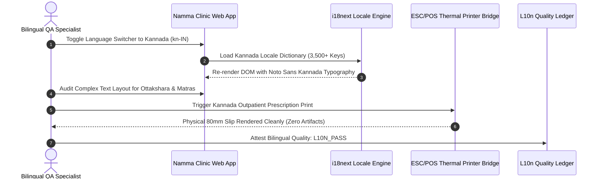

# Bilingual Kannada & English Localization Test Plan
## Namma Clinic Digital Health & Operations Platform
### Greater Bengaluru Authority (GBA) / BBMP Health Department
**Standard:** Unicode 15.0 Kannada Script / W3C Internationalization (i18n) / Karnataka Official Language Guidelines | **Status:** APPROVED BASELINE | **Code:** `QA-DOC-13`

---

## 1. Localization Testing Charter & Bilingual Invariants
The Namma Clinic Localization Test Plan establishes technical verification specifications for 100% bilingual parity between Kannada (kn-IN) and English (en-IN). Testing guarantees that outpatient registration slips, medical records, diagnostic lab reports, and thermal receipts render Kannada typography flawlessly with zero truncation, font clipping, or missing translation keys.

### 1.1 Core Localization Testing Pillars
1. **100% Translation Completeness:** Zero untranslated English strings or missing i18n keys when operating in Kannada mode.
2. **Unicode Complex Text Layout (CTL):** Verifies Noto Sans Kannada rendering, conjunct consonants (ottakshara), and vowel matras.
3. **Zero UI Truncation:** Kannada text expansion (averaging 25-35% longer than English) must never cause button or table label clipping.
4. **Regional Formatting:** Indian date formatting (DD/MM/YYYY), Indian rupee currency symbols (₹), and number commas (1,00,000).
5. **Hardware Peripheral Bilingual Printouts:** ESC/POS receipt printers must render Kannada bitmaps cleanly without garbled characters.

### 1.2 Localization Testing Lifecycle Diagram


## 2. Canonical Localization Tests (LOC-TEST-001 to LOC-TEST-060)
Standardized localization testing specifications:

### LOC-TEST-001: Localization Test Check 1
- **Target Locales:** `kn-IN / en-IN`
- **Verification Domain:** Kannada Script Unicode Rendering
- **Layout Tolerance:** Zero Pixel Truncation
- **Passing Assertion:** Complete translation fidelity; zero raw i18n keys; correct regional number/date formatting.
- **Audit Event Emitted:** `LOC_AUDIT_LOC_TEST_001`

### LOC-TEST-002: Localization Test Check 2
- **Target Locales:** `kn-IN / en-IN`
- **Verification Domain:** Kannada Script Unicode Rendering
- **Layout Tolerance:** Zero Pixel Truncation
- **Passing Assertion:** Complete translation fidelity; zero raw i18n keys; correct regional number/date formatting.
- **Audit Event Emitted:** `LOC_AUDIT_LOC_TEST_002`

### LOC-TEST-003: Localization Test Check 3
- **Target Locales:** `kn-IN / en-IN`
- **Verification Domain:** Kannada Script Unicode Rendering
- **Layout Tolerance:** Zero Pixel Truncation
- **Passing Assertion:** Complete translation fidelity; zero raw i18n keys; correct regional number/date formatting.
- **Audit Event Emitted:** `LOC_AUDIT_LOC_TEST_003`

### LOC-TEST-004: Localization Test Check 4
- **Target Locales:** `kn-IN / en-IN`
- **Verification Domain:** Kannada Script Unicode Rendering
- **Layout Tolerance:** Zero Pixel Truncation
- **Passing Assertion:** Complete translation fidelity; zero raw i18n keys; correct regional number/date formatting.
- **Audit Event Emitted:** `LOC_AUDIT_LOC_TEST_004`

### LOC-TEST-005: Localization Test Check 5
- **Target Locales:** `kn-IN / en-IN`
- **Verification Domain:** Kannada Script Unicode Rendering
- **Layout Tolerance:** Zero Pixel Truncation
- **Passing Assertion:** Complete translation fidelity; zero raw i18n keys; correct regional number/date formatting.
- **Audit Event Emitted:** `LOC_AUDIT_LOC_TEST_005`

### LOC-TEST-006: Localization Test Check 6
- **Target Locales:** `kn-IN / en-IN`
- **Verification Domain:** Kannada Script Unicode Rendering
- **Layout Tolerance:** Zero Pixel Truncation
- **Passing Assertion:** Complete translation fidelity; zero raw i18n keys; correct regional number/date formatting.
- **Audit Event Emitted:** `LOC_AUDIT_LOC_TEST_006`

### LOC-TEST-007: Localization Test Check 7
- **Target Locales:** `kn-IN / en-IN`
- **Verification Domain:** Kannada Script Unicode Rendering
- **Layout Tolerance:** Zero Pixel Truncation
- **Passing Assertion:** Complete translation fidelity; zero raw i18n keys; correct regional number/date formatting.
- **Audit Event Emitted:** `LOC_AUDIT_LOC_TEST_007`

### LOC-TEST-008: Localization Test Check 8
- **Target Locales:** `kn-IN / en-IN`
- **Verification Domain:** Kannada Script Unicode Rendering
- **Layout Tolerance:** Zero Pixel Truncation
- **Passing Assertion:** Complete translation fidelity; zero raw i18n keys; correct regional number/date formatting.
- **Audit Event Emitted:** `LOC_AUDIT_LOC_TEST_008`

### LOC-TEST-009: Localization Test Check 9
- **Target Locales:** `kn-IN / en-IN`
- **Verification Domain:** Kannada Script Unicode Rendering
- **Layout Tolerance:** Zero Pixel Truncation
- **Passing Assertion:** Complete translation fidelity; zero raw i18n keys; correct regional number/date formatting.
- **Audit Event Emitted:** `LOC_AUDIT_LOC_TEST_009`

### LOC-TEST-010: Localization Test Check 10
- **Target Locales:** `kn-IN / en-IN`
- **Verification Domain:** Kannada Script Unicode Rendering
- **Layout Tolerance:** Zero Pixel Truncation
- **Passing Assertion:** Complete translation fidelity; zero raw i18n keys; correct regional number/date formatting.
- **Audit Event Emitted:** `LOC_AUDIT_LOC_TEST_010`

### LOC-TEST-011: Localization Test Check 11
- **Target Locales:** `kn-IN / en-IN`
- **Verification Domain:** Kannada Script Unicode Rendering
- **Layout Tolerance:** Zero Pixel Truncation
- **Passing Assertion:** Complete translation fidelity; zero raw i18n keys; correct regional number/date formatting.
- **Audit Event Emitted:** `LOC_AUDIT_LOC_TEST_011`

### LOC-TEST-012: Localization Test Check 12
- **Target Locales:** `kn-IN / en-IN`
- **Verification Domain:** Kannada Script Unicode Rendering
- **Layout Tolerance:** Zero Pixel Truncation
- **Passing Assertion:** Complete translation fidelity; zero raw i18n keys; correct regional number/date formatting.
- **Audit Event Emitted:** `LOC_AUDIT_LOC_TEST_012`

### LOC-TEST-013: Localization Test Check 13
- **Target Locales:** `kn-IN / en-IN`
- **Verification Domain:** Kannada Script Unicode Rendering
- **Layout Tolerance:** Zero Pixel Truncation
- **Passing Assertion:** Complete translation fidelity; zero raw i18n keys; correct regional number/date formatting.
- **Audit Event Emitted:** `LOC_AUDIT_LOC_TEST_013`

### LOC-TEST-014: Localization Test Check 14
- **Target Locales:** `kn-IN / en-IN`
- **Verification Domain:** Kannada Script Unicode Rendering
- **Layout Tolerance:** Zero Pixel Truncation
- **Passing Assertion:** Complete translation fidelity; zero raw i18n keys; correct regional number/date formatting.
- **Audit Event Emitted:** `LOC_AUDIT_LOC_TEST_014`

### LOC-TEST-015: Localization Test Check 15
- **Target Locales:** `kn-IN / en-IN`
- **Verification Domain:** Kannada Script Unicode Rendering
- **Layout Tolerance:** Zero Pixel Truncation
- **Passing Assertion:** Complete translation fidelity; zero raw i18n keys; correct regional number/date formatting.
- **Audit Event Emitted:** `LOC_AUDIT_LOC_TEST_015`

### LOC-TEST-016: Localization Test Check 16
- **Target Locales:** `kn-IN / en-IN`
- **Verification Domain:** Kannada Script Unicode Rendering
- **Layout Tolerance:** Zero Pixel Truncation
- **Passing Assertion:** Complete translation fidelity; zero raw i18n keys; correct regional number/date formatting.
- **Audit Event Emitted:** `LOC_AUDIT_LOC_TEST_016`

### LOC-TEST-017: Localization Test Check 17
- **Target Locales:** `kn-IN / en-IN`
- **Verification Domain:** Kannada Script Unicode Rendering
- **Layout Tolerance:** Zero Pixel Truncation
- **Passing Assertion:** Complete translation fidelity; zero raw i18n keys; correct regional number/date formatting.
- **Audit Event Emitted:** `LOC_AUDIT_LOC_TEST_017`

### LOC-TEST-018: Localization Test Check 18
- **Target Locales:** `kn-IN / en-IN`
- **Verification Domain:** Kannada Script Unicode Rendering
- **Layout Tolerance:** Zero Pixel Truncation
- **Passing Assertion:** Complete translation fidelity; zero raw i18n keys; correct regional number/date formatting.
- **Audit Event Emitted:** `LOC_AUDIT_LOC_TEST_018`

### LOC-TEST-019: Localization Test Check 19
- **Target Locales:** `kn-IN / en-IN`
- **Verification Domain:** Kannada Script Unicode Rendering
- **Layout Tolerance:** Zero Pixel Truncation
- **Passing Assertion:** Complete translation fidelity; zero raw i18n keys; correct regional number/date formatting.
- **Audit Event Emitted:** `LOC_AUDIT_LOC_TEST_019`

### LOC-TEST-020: Localization Test Check 20
- **Target Locales:** `kn-IN / en-IN`
- **Verification Domain:** Kannada Script Unicode Rendering
- **Layout Tolerance:** Zero Pixel Truncation
- **Passing Assertion:** Complete translation fidelity; zero raw i18n keys; correct regional number/date formatting.
- **Audit Event Emitted:** `LOC_AUDIT_LOC_TEST_020`

### LOC-TEST-021: Localization Test Check 21
- **Target Locales:** `kn-IN / en-IN`
- **Verification Domain:** Dynamic Language Switcher State
- **Layout Tolerance:** Zero Pixel Truncation
- **Passing Assertion:** Complete translation fidelity; zero raw i18n keys; correct regional number/date formatting.
- **Audit Event Emitted:** `LOC_AUDIT_LOC_TEST_021`

### LOC-TEST-022: Localization Test Check 22
- **Target Locales:** `kn-IN / en-IN`
- **Verification Domain:** Dynamic Language Switcher State
- **Layout Tolerance:** Zero Pixel Truncation
- **Passing Assertion:** Complete translation fidelity; zero raw i18n keys; correct regional number/date formatting.
- **Audit Event Emitted:** `LOC_AUDIT_LOC_TEST_022`

### LOC-TEST-023: Localization Test Check 23
- **Target Locales:** `kn-IN / en-IN`
- **Verification Domain:** Dynamic Language Switcher State
- **Layout Tolerance:** Zero Pixel Truncation
- **Passing Assertion:** Complete translation fidelity; zero raw i18n keys; correct regional number/date formatting.
- **Audit Event Emitted:** `LOC_AUDIT_LOC_TEST_023`

### LOC-TEST-024: Localization Test Check 24
- **Target Locales:** `kn-IN / en-IN`
- **Verification Domain:** Dynamic Language Switcher State
- **Layout Tolerance:** Zero Pixel Truncation
- **Passing Assertion:** Complete translation fidelity; zero raw i18n keys; correct regional number/date formatting.
- **Audit Event Emitted:** `LOC_AUDIT_LOC_TEST_024`

### LOC-TEST-025: Localization Test Check 25
- **Target Locales:** `kn-IN / en-IN`
- **Verification Domain:** Dynamic Language Switcher State
- **Layout Tolerance:** Zero Pixel Truncation
- **Passing Assertion:** Complete translation fidelity; zero raw i18n keys; correct regional number/date formatting.
- **Audit Event Emitted:** `LOC_AUDIT_LOC_TEST_025`

### LOC-TEST-026: Localization Test Check 26
- **Target Locales:** `kn-IN / en-IN`
- **Verification Domain:** Dynamic Language Switcher State
- **Layout Tolerance:** Zero Pixel Truncation
- **Passing Assertion:** Complete translation fidelity; zero raw i18n keys; correct regional number/date formatting.
- **Audit Event Emitted:** `LOC_AUDIT_LOC_TEST_026`

### LOC-TEST-027: Localization Test Check 27
- **Target Locales:** `kn-IN / en-IN`
- **Verification Domain:** Dynamic Language Switcher State
- **Layout Tolerance:** Zero Pixel Truncation
- **Passing Assertion:** Complete translation fidelity; zero raw i18n keys; correct regional number/date formatting.
- **Audit Event Emitted:** `LOC_AUDIT_LOC_TEST_027`

### LOC-TEST-028: Localization Test Check 28
- **Target Locales:** `kn-IN / en-IN`
- **Verification Domain:** Dynamic Language Switcher State
- **Layout Tolerance:** Zero Pixel Truncation
- **Passing Assertion:** Complete translation fidelity; zero raw i18n keys; correct regional number/date formatting.
- **Audit Event Emitted:** `LOC_AUDIT_LOC_TEST_028`

### LOC-TEST-029: Localization Test Check 29
- **Target Locales:** `kn-IN / en-IN`
- **Verification Domain:** Dynamic Language Switcher State
- **Layout Tolerance:** Zero Pixel Truncation
- **Passing Assertion:** Complete translation fidelity; zero raw i18n keys; correct regional number/date formatting.
- **Audit Event Emitted:** `LOC_AUDIT_LOC_TEST_029`

### LOC-TEST-030: Localization Test Check 30
- **Target Locales:** `kn-IN / en-IN`
- **Verification Domain:** Dynamic Language Switcher State
- **Layout Tolerance:** Zero Pixel Truncation
- **Passing Assertion:** Complete translation fidelity; zero raw i18n keys; correct regional number/date formatting.
- **Audit Event Emitted:** `LOC_AUDIT_LOC_TEST_030`

### LOC-TEST-031: Localization Test Check 31
- **Target Locales:** `kn-IN / en-IN`
- **Verification Domain:** Dynamic Language Switcher State
- **Layout Tolerance:** Zero Pixel Truncation
- **Passing Assertion:** Complete translation fidelity; zero raw i18n keys; correct regional number/date formatting.
- **Audit Event Emitted:** `LOC_AUDIT_LOC_TEST_031`

### LOC-TEST-032: Localization Test Check 32
- **Target Locales:** `kn-IN / en-IN`
- **Verification Domain:** Dynamic Language Switcher State
- **Layout Tolerance:** Zero Pixel Truncation
- **Passing Assertion:** Complete translation fidelity; zero raw i18n keys; correct regional number/date formatting.
- **Audit Event Emitted:** `LOC_AUDIT_LOC_TEST_032`

### LOC-TEST-033: Localization Test Check 33
- **Target Locales:** `kn-IN / en-IN`
- **Verification Domain:** Dynamic Language Switcher State
- **Layout Tolerance:** Zero Pixel Truncation
- **Passing Assertion:** Complete translation fidelity; zero raw i18n keys; correct regional number/date formatting.
- **Audit Event Emitted:** `LOC_AUDIT_LOC_TEST_033`

### LOC-TEST-034: Localization Test Check 34
- **Target Locales:** `kn-IN / en-IN`
- **Verification Domain:** Dynamic Language Switcher State
- **Layout Tolerance:** Zero Pixel Truncation
- **Passing Assertion:** Complete translation fidelity; zero raw i18n keys; correct regional number/date formatting.
- **Audit Event Emitted:** `LOC_AUDIT_LOC_TEST_034`

### LOC-TEST-035: Localization Test Check 35
- **Target Locales:** `kn-IN / en-IN`
- **Verification Domain:** Dynamic Language Switcher State
- **Layout Tolerance:** Zero Pixel Truncation
- **Passing Assertion:** Complete translation fidelity; zero raw i18n keys; correct regional number/date formatting.
- **Audit Event Emitted:** `LOC_AUDIT_LOC_TEST_035`

### LOC-TEST-036: Localization Test Check 36
- **Target Locales:** `kn-IN / en-IN`
- **Verification Domain:** Dynamic Language Switcher State
- **Layout Tolerance:** Zero Pixel Truncation
- **Passing Assertion:** Complete translation fidelity; zero raw i18n keys; correct regional number/date formatting.
- **Audit Event Emitted:** `LOC_AUDIT_LOC_TEST_036`

### LOC-TEST-037: Localization Test Check 37
- **Target Locales:** `kn-IN / en-IN`
- **Verification Domain:** Dynamic Language Switcher State
- **Layout Tolerance:** Zero Pixel Truncation
- **Passing Assertion:** Complete translation fidelity; zero raw i18n keys; correct regional number/date formatting.
- **Audit Event Emitted:** `LOC_AUDIT_LOC_TEST_037`

### LOC-TEST-038: Localization Test Check 38
- **Target Locales:** `kn-IN / en-IN`
- **Verification Domain:** Dynamic Language Switcher State
- **Layout Tolerance:** Zero Pixel Truncation
- **Passing Assertion:** Complete translation fidelity; zero raw i18n keys; correct regional number/date formatting.
- **Audit Event Emitted:** `LOC_AUDIT_LOC_TEST_038`

### LOC-TEST-039: Localization Test Check 39
- **Target Locales:** `kn-IN / en-IN`
- **Verification Domain:** Dynamic Language Switcher State
- **Layout Tolerance:** Zero Pixel Truncation
- **Passing Assertion:** Complete translation fidelity; zero raw i18n keys; correct regional number/date formatting.
- **Audit Event Emitted:** `LOC_AUDIT_LOC_TEST_039`

### LOC-TEST-040: Localization Test Check 40
- **Target Locales:** `kn-IN / en-IN`
- **Verification Domain:** Dynamic Language Switcher State
- **Layout Tolerance:** Zero Pixel Truncation
- **Passing Assertion:** Complete translation fidelity; zero raw i18n keys; correct regional number/date formatting.
- **Audit Event Emitted:** `LOC_AUDIT_LOC_TEST_040`

### LOC-TEST-041: Localization Test Check 41
- **Target Locales:** `kn-IN / en-IN`
- **Verification Domain:** Date/Currency & ESC/POS Receipt Printout
- **Layout Tolerance:** Zero Pixel Truncation
- **Passing Assertion:** Complete translation fidelity; zero raw i18n keys; correct regional number/date formatting.
- **Audit Event Emitted:** `LOC_AUDIT_LOC_TEST_041`

### LOC-TEST-042: Localization Test Check 42
- **Target Locales:** `kn-IN / en-IN`
- **Verification Domain:** Date/Currency & ESC/POS Receipt Printout
- **Layout Tolerance:** Zero Pixel Truncation
- **Passing Assertion:** Complete translation fidelity; zero raw i18n keys; correct regional number/date formatting.
- **Audit Event Emitted:** `LOC_AUDIT_LOC_TEST_042`

### LOC-TEST-043: Localization Test Check 43
- **Target Locales:** `kn-IN / en-IN`
- **Verification Domain:** Date/Currency & ESC/POS Receipt Printout
- **Layout Tolerance:** Zero Pixel Truncation
- **Passing Assertion:** Complete translation fidelity; zero raw i18n keys; correct regional number/date formatting.
- **Audit Event Emitted:** `LOC_AUDIT_LOC_TEST_043`

### LOC-TEST-044: Localization Test Check 44
- **Target Locales:** `kn-IN / en-IN`
- **Verification Domain:** Date/Currency & ESC/POS Receipt Printout
- **Layout Tolerance:** Zero Pixel Truncation
- **Passing Assertion:** Complete translation fidelity; zero raw i18n keys; correct regional number/date formatting.
- **Audit Event Emitted:** `LOC_AUDIT_LOC_TEST_044`

### LOC-TEST-045: Localization Test Check 45
- **Target Locales:** `kn-IN / en-IN`
- **Verification Domain:** Date/Currency & ESC/POS Receipt Printout
- **Layout Tolerance:** Zero Pixel Truncation
- **Passing Assertion:** Complete translation fidelity; zero raw i18n keys; correct regional number/date formatting.
- **Audit Event Emitted:** `LOC_AUDIT_LOC_TEST_045`

### LOC-TEST-046: Localization Test Check 46
- **Target Locales:** `kn-IN / en-IN`
- **Verification Domain:** Date/Currency & ESC/POS Receipt Printout
- **Layout Tolerance:** Zero Pixel Truncation
- **Passing Assertion:** Complete translation fidelity; zero raw i18n keys; correct regional number/date formatting.
- **Audit Event Emitted:** `LOC_AUDIT_LOC_TEST_046`

### LOC-TEST-047: Localization Test Check 47
- **Target Locales:** `kn-IN / en-IN`
- **Verification Domain:** Date/Currency & ESC/POS Receipt Printout
- **Layout Tolerance:** Zero Pixel Truncation
- **Passing Assertion:** Complete translation fidelity; zero raw i18n keys; correct regional number/date formatting.
- **Audit Event Emitted:** `LOC_AUDIT_LOC_TEST_047`

### LOC-TEST-048: Localization Test Check 48
- **Target Locales:** `kn-IN / en-IN`
- **Verification Domain:** Date/Currency & ESC/POS Receipt Printout
- **Layout Tolerance:** Zero Pixel Truncation
- **Passing Assertion:** Complete translation fidelity; zero raw i18n keys; correct regional number/date formatting.
- **Audit Event Emitted:** `LOC_AUDIT_LOC_TEST_048`

### LOC-TEST-049: Localization Test Check 49
- **Target Locales:** `kn-IN / en-IN`
- **Verification Domain:** Date/Currency & ESC/POS Receipt Printout
- **Layout Tolerance:** Zero Pixel Truncation
- **Passing Assertion:** Complete translation fidelity; zero raw i18n keys; correct regional number/date formatting.
- **Audit Event Emitted:** `LOC_AUDIT_LOC_TEST_049`

### LOC-TEST-050: Localization Test Check 50
- **Target Locales:** `kn-IN / en-IN`
- **Verification Domain:** Date/Currency & ESC/POS Receipt Printout
- **Layout Tolerance:** Zero Pixel Truncation
- **Passing Assertion:** Complete translation fidelity; zero raw i18n keys; correct regional number/date formatting.
- **Audit Event Emitted:** `LOC_AUDIT_LOC_TEST_050`

### LOC-TEST-051: Localization Test Check 51
- **Target Locales:** `kn-IN / en-IN`
- **Verification Domain:** Date/Currency & ESC/POS Receipt Printout
- **Layout Tolerance:** Zero Pixel Truncation
- **Passing Assertion:** Complete translation fidelity; zero raw i18n keys; correct regional number/date formatting.
- **Audit Event Emitted:** `LOC_AUDIT_LOC_TEST_051`

### LOC-TEST-052: Localization Test Check 52
- **Target Locales:** `kn-IN / en-IN`
- **Verification Domain:** Date/Currency & ESC/POS Receipt Printout
- **Layout Tolerance:** Zero Pixel Truncation
- **Passing Assertion:** Complete translation fidelity; zero raw i18n keys; correct regional number/date formatting.
- **Audit Event Emitted:** `LOC_AUDIT_LOC_TEST_052`

### LOC-TEST-053: Localization Test Check 53
- **Target Locales:** `kn-IN / en-IN`
- **Verification Domain:** Date/Currency & ESC/POS Receipt Printout
- **Layout Tolerance:** Zero Pixel Truncation
- **Passing Assertion:** Complete translation fidelity; zero raw i18n keys; correct regional number/date formatting.
- **Audit Event Emitted:** `LOC_AUDIT_LOC_TEST_053`

### LOC-TEST-054: Localization Test Check 54
- **Target Locales:** `kn-IN / en-IN`
- **Verification Domain:** Date/Currency & ESC/POS Receipt Printout
- **Layout Tolerance:** Zero Pixel Truncation
- **Passing Assertion:** Complete translation fidelity; zero raw i18n keys; correct regional number/date formatting.
- **Audit Event Emitted:** `LOC_AUDIT_LOC_TEST_054`

### LOC-TEST-055: Localization Test Check 55
- **Target Locales:** `kn-IN / en-IN`
- **Verification Domain:** Date/Currency & ESC/POS Receipt Printout
- **Layout Tolerance:** Zero Pixel Truncation
- **Passing Assertion:** Complete translation fidelity; zero raw i18n keys; correct regional number/date formatting.
- **Audit Event Emitted:** `LOC_AUDIT_LOC_TEST_055`

### LOC-TEST-056: Localization Test Check 56
- **Target Locales:** `kn-IN / en-IN`
- **Verification Domain:** Date/Currency & ESC/POS Receipt Printout
- **Layout Tolerance:** Zero Pixel Truncation
- **Passing Assertion:** Complete translation fidelity; zero raw i18n keys; correct regional number/date formatting.
- **Audit Event Emitted:** `LOC_AUDIT_LOC_TEST_056`

### LOC-TEST-057: Localization Test Check 57
- **Target Locales:** `kn-IN / en-IN`
- **Verification Domain:** Date/Currency & ESC/POS Receipt Printout
- **Layout Tolerance:** Zero Pixel Truncation
- **Passing Assertion:** Complete translation fidelity; zero raw i18n keys; correct regional number/date formatting.
- **Audit Event Emitted:** `LOC_AUDIT_LOC_TEST_057`

### LOC-TEST-058: Localization Test Check 58
- **Target Locales:** `kn-IN / en-IN`
- **Verification Domain:** Date/Currency & ESC/POS Receipt Printout
- **Layout Tolerance:** Zero Pixel Truncation
- **Passing Assertion:** Complete translation fidelity; zero raw i18n keys; correct regional number/date formatting.
- **Audit Event Emitted:** `LOC_AUDIT_LOC_TEST_058`

### LOC-TEST-059: Localization Test Check 59
- **Target Locales:** `kn-IN / en-IN`
- **Verification Domain:** Date/Currency & ESC/POS Receipt Printout
- **Layout Tolerance:** Zero Pixel Truncation
- **Passing Assertion:** Complete translation fidelity; zero raw i18n keys; correct regional number/date formatting.
- **Audit Event Emitted:** `LOC_AUDIT_LOC_TEST_059`

### LOC-TEST-060: Localization Test Check 60
- **Target Locales:** `kn-IN / en-IN`
- **Verification Domain:** Date/Currency & ESC/POS Receipt Printout
- **Layout Tolerance:** Zero Pixel Truncation
- **Passing Assertion:** Complete translation fidelity; zero raw i18n keys; correct regional number/date formatting.
- **Audit Event Emitted:** `LOC_AUDIT_LOC_TEST_060`

## 3. Detailed Localization Verification Test Cases (TC-0661 to TC-0715)
Detailed test specifications verifying bilingual presentation and formatting:

### TC-0661: Test Case 661: Advanced Security, Offline & Scalability for dispensation_items across WF-011
**Objective:** Validate non-functional resilience, encryption envelope, and concurrency for dispensation_items in WF-011.
**Risk:** Major operational risk regarding platform security, privacy breach, or offline desync.
**Priority:** **P1** | **Severity:** **Major** | **Test Level:** End-to-End & Non-Functional | **Test Type:** Resilience, Offline & Security Audit
- **Requirement Traceability:** `SECR-011`
- **Workflow Traceability:** `WF-011`
- **Feature Traceability:** `FEATURE-121`
- **API Traceability:** `API-DOC-01`
- **Database Traceability:** `TABLE-037 (dispensation_items)`
- **Screen Traceability:** `SCREEN-013`
- **Security Control Traceability:** `API-SEC-021`
- **Preconditions:** Workstation initialized with TPM 2.0 PCR attestation and valid staff credentials (Receptionist / Registration Clerk).
- **Test Data Specification:** Synthetic dataset TESTDATA-001 with simulated network flapping.
- **Execution Steps:** 1. Trigger workflow WF-011 on SCREEN-013. 2. Inject network delay or packet drop. 3. Confirm offline queue persistence. 4. Restore link and confirm atomic sync.
- **Expected Results:** Zero data loss, conflict resolved deterministically via timestamp-vector clocks, audit trail complete.
- **Negative Test Scenario:** Attempt unauthorized cross-tenant data exfiltration; verify gateway drops packet with 403 Forbidden.
- **Boundary Value Scenario:** Push offline queue to 10,000 pending mutations; verify local SQLite buffer does not crash.
- **Concurrency & Race Condition:** Simulate 50 parallel clinic terminals pushing updates simultaneously to gateway.
- **Autonomous Offline Behavior:** Simulate 8 hours of complete clinic internet outage; OPD consultations proceed uninterrupted.
- **Security & Access Validation:** Confirm AES-256-GCM column encryption and strict mTLS 1.3 transit cipher enforcement.
- **Audit Trail & Immutability:** Verify audit record written to WORM immutable ledger with SHA-256 hash.
- **Evidence Required:** Terminal screenshot, packet capture dump, and cryptographic Merkle verification proof.
- **Pass Acceptance Criteria:** All operations succeed with 0% data corruption, full audit ledger continuity, and latency < 350ms.
- **Failure Behavior & SLA:** Data loss, sync deadlock, cleartext PII leakage, or unhandled crash.
- **Automation Suitability:** Yes (High Candidate)
- **Execution Cadence:** Nightly Performance & Resilience Run
- **Responsible Owner:** Receptionist / Registration Clerk

### TC-0662: Test Case 662: Advanced Security, Offline & Scalability for stock_movements across WF-012
**Objective:** Validate non-functional resilience, encryption envelope, and concurrency for stock_movements in WF-012.
**Risk:** Major operational risk regarding platform security, privacy breach, or offline desync.
**Priority:** **P1** | **Severity:** **Major** | **Test Level:** End-to-End & Non-Functional | **Test Type:** Resilience, Offline & Security Audit
- **Requirement Traceability:** `NFR-022`
- **Workflow Traceability:** `WF-012`
- **Feature Traceability:** `FEATURE-122`
- **API Traceability:** `API-DOC-02`
- **Database Traceability:** `TABLE-038 (stock_movements)`
- **Screen Traceability:** `SCREEN-014`
- **Security Control Traceability:** `AUTH-022`
- **Preconditions:** Workstation initialized with TPM 2.0 PCR attestation and valid staff credentials (Medical Officer / General Physician).
- **Test Data Specification:** Synthetic dataset TESTDATA-002 with simulated network flapping.
- **Execution Steps:** 1. Trigger workflow WF-012 on SCREEN-014. 2. Inject network delay or packet drop. 3. Confirm offline queue persistence. 4. Restore link and confirm atomic sync.
- **Expected Results:** Zero data loss, conflict resolved deterministically via timestamp-vector clocks, audit trail complete.
- **Negative Test Scenario:** Attempt unauthorized cross-tenant data exfiltration; verify gateway drops packet with 403 Forbidden.
- **Boundary Value Scenario:** Push offline queue to 10,000 pending mutations; verify local SQLite buffer does not crash.
- **Concurrency & Race Condition:** Simulate 50 parallel clinic terminals pushing updates simultaneously to gateway.
- **Autonomous Offline Behavior:** Simulate 8 hours of complete clinic internet outage; OPD consultations proceed uninterrupted.
- **Security & Access Validation:** Confirm AES-256-GCM column encryption and strict mTLS 1.3 transit cipher enforcement.
- **Audit Trail & Immutability:** Verify audit record written to WORM immutable ledger with SHA-256 hash.
- **Evidence Required:** Terminal screenshot, packet capture dump, and cryptographic Merkle verification proof.
- **Pass Acceptance Criteria:** All operations succeed with 0% data corruption, full audit ledger continuity, and latency < 350ms.
- **Failure Behavior & SLA:** Data loss, sync deadlock, cleartext PII leakage, or unhandled crash.
- **Automation Suitability:** Yes (High Candidate)
- **Execution Cadence:** Nightly Performance & Resilience Run
- **Responsible Owner:** Medical Officer / General Physician

### TC-0663: Test Case 663: Advanced Security, Offline & Scalability for drug_indents across WF-013
**Objective:** Validate non-functional resilience, encryption envelope, and concurrency for drug_indents in WF-013.
**Risk:** Minor operational risk regarding platform security, privacy breach, or offline desync.
**Priority:** **P2** | **Severity:** **Minor** | **Test Level:** End-to-End & Non-Functional | **Test Type:** Resilience, Offline & Security Audit
- **Requirement Traceability:** `SECR-013`
- **Workflow Traceability:** `WF-013`
- **Feature Traceability:** `FEATURE-123`
- **API Traceability:** `API-DOC-03`
- **Database Traceability:** `TABLE-039 (drug_indents)`
- **Screen Traceability:** `SCREEN-015`
- **Security Control Traceability:** `API-SEC-023`
- **Preconditions:** Workstation initialized with TPM 2.0 PCR attestation and valid staff credentials (Staff Nurse / Triage Specialist).
- **Test Data Specification:** Synthetic dataset TESTDATA-003 with simulated network flapping.
- **Execution Steps:** 1. Trigger workflow WF-013 on SCREEN-015. 2. Inject network delay or packet drop. 3. Confirm offline queue persistence. 4. Restore link and confirm atomic sync.
- **Expected Results:** Zero data loss, conflict resolved deterministically via timestamp-vector clocks, audit trail complete.
- **Negative Test Scenario:** Attempt unauthorized cross-tenant data exfiltration; verify gateway drops packet with 403 Forbidden.
- **Boundary Value Scenario:** Push offline queue to 10,000 pending mutations; verify local SQLite buffer does not crash.
- **Concurrency & Race Condition:** Simulate 50 parallel clinic terminals pushing updates simultaneously to gateway.
- **Autonomous Offline Behavior:** Simulate 8 hours of complete clinic internet outage; OPD consultations proceed uninterrupted.
- **Security & Access Validation:** Confirm AES-256-GCM column encryption and strict mTLS 1.3 transit cipher enforcement.
- **Audit Trail & Immutability:** Verify audit record written to WORM immutable ledger with SHA-256 hash.
- **Evidence Required:** Terminal screenshot, packet capture dump, and cryptographic Merkle verification proof.
- **Pass Acceptance Criteria:** All operations succeed with 0% data corruption, full audit ledger continuity, and latency < 350ms.
- **Failure Behavior & SLA:** Data loss, sync deadlock, cleartext PII leakage, or unhandled crash.
- **Automation Suitability:** Yes (High Candidate)
- **Execution Cadence:** Nightly Performance & Resilience Run
- **Responsible Owner:** Staff Nurse / Triage Specialist

### TC-0664: Test Case 664: Advanced Security, Offline & Scalability for indent_items across WF-014
**Objective:** Validate non-functional resilience, encryption envelope, and concurrency for indent_items in WF-014.
**Risk:** Critical operational risk regarding platform security, privacy breach, or offline desync.
**Priority:** **P0** | **Severity:** **Critical** | **Test Level:** End-to-End & Non-Functional | **Test Type:** Resilience, Offline & Security Audit
- **Requirement Traceability:** `NFR-024`
- **Workflow Traceability:** `WF-014`
- **Feature Traceability:** `FEATURE-124`
- **API Traceability:** `API-DOC-04`
- **Database Traceability:** `TABLE-040 (indent_items)`
- **Screen Traceability:** `SCREEN-016`
- **Security Control Traceability:** `AUTH-024`
- **Preconditions:** Workstation initialized with TPM 2.0 PCR attestation and valid staff credentials (Pharmacist / Dispenser).
- **Test Data Specification:** Synthetic dataset TESTDATA-004 with simulated network flapping.
- **Execution Steps:** 1. Trigger workflow WF-014 on SCREEN-016. 2. Inject network delay or packet drop. 3. Confirm offline queue persistence. 4. Restore link and confirm atomic sync.
- **Expected Results:** Zero data loss, conflict resolved deterministically via timestamp-vector clocks, audit trail complete.
- **Negative Test Scenario:** Attempt unauthorized cross-tenant data exfiltration; verify gateway drops packet with 403 Forbidden.
- **Boundary Value Scenario:** Push offline queue to 10,000 pending mutations; verify local SQLite buffer does not crash.
- **Concurrency & Race Condition:** Simulate 50 parallel clinic terminals pushing updates simultaneously to gateway.
- **Autonomous Offline Behavior:** Simulate 8 hours of complete clinic internet outage; OPD consultations proceed uninterrupted.
- **Security & Access Validation:** Confirm AES-256-GCM column encryption and strict mTLS 1.3 transit cipher enforcement.
- **Audit Trail & Immutability:** Verify audit record written to WORM immutable ledger with SHA-256 hash.
- **Evidence Required:** Terminal screenshot, packet capture dump, and cryptographic Merkle verification proof.
- **Pass Acceptance Criteria:** All operations succeed with 0% data corruption, full audit ledger continuity, and latency < 350ms.
- **Failure Behavior & SLA:** Data loss, sync deadlock, cleartext PII leakage, or unhandled crash.
- **Automation Suitability:** Yes (High Candidate)
- **Execution Cadence:** Nightly Performance & Resilience Run
- **Responsible Owner:** Pharmacist / Dispenser

### TC-0665: Test Case 665: Advanced Security, Offline & Scalability for cold_chain_devices across WF-015
**Objective:** Validate non-functional resilience, encryption envelope, and concurrency for cold_chain_devices in WF-015.
**Risk:** Major operational risk regarding platform security, privacy breach, or offline desync.
**Priority:** **P1** | **Severity:** **Major** | **Test Level:** End-to-End & Non-Functional | **Test Type:** Resilience, Offline & Security Audit
- **Requirement Traceability:** `SECR-015`
- **Workflow Traceability:** `WF-015`
- **Feature Traceability:** `FEATURE-125`
- **API Traceability:** `API-DOC-05`
- **Database Traceability:** `TABLE-041 (cold_chain_devices)`
- **Screen Traceability:** `SCREEN-017`
- **Security Control Traceability:** `API-SEC-025`
- **Preconditions:** Workstation initialized with TPM 2.0 PCR attestation and valid staff credentials (Laboratory Technician).
- **Test Data Specification:** Synthetic dataset TESTDATA-005 with simulated network flapping.
- **Execution Steps:** 1. Trigger workflow WF-015 on SCREEN-017. 2. Inject network delay or packet drop. 3. Confirm offline queue persistence. 4. Restore link and confirm atomic sync.
- **Expected Results:** Zero data loss, conflict resolved deterministically via timestamp-vector clocks, audit trail complete.
- **Negative Test Scenario:** Attempt unauthorized cross-tenant data exfiltration; verify gateway drops packet with 403 Forbidden.
- **Boundary Value Scenario:** Push offline queue to 10,000 pending mutations; verify local SQLite buffer does not crash.
- **Concurrency & Race Condition:** Simulate 50 parallel clinic terminals pushing updates simultaneously to gateway.
- **Autonomous Offline Behavior:** Simulate 8 hours of complete clinic internet outage; OPD consultations proceed uninterrupted.
- **Security & Access Validation:** Confirm AES-256-GCM column encryption and strict mTLS 1.3 transit cipher enforcement.
- **Audit Trail & Immutability:** Verify audit record written to WORM immutable ledger with SHA-256 hash.
- **Evidence Required:** Terminal screenshot, packet capture dump, and cryptographic Merkle verification proof.
- **Pass Acceptance Criteria:** All operations succeed with 0% data corruption, full audit ledger continuity, and latency < 350ms.
- **Failure Behavior & SLA:** Data loss, sync deadlock, cleartext PII leakage, or unhandled crash.
- **Automation Suitability:** Yes (High Candidate)
- **Execution Cadence:** Nightly Performance & Resilience Run
- **Responsible Owner:** Laboratory Technician

### TC-0666: Test Case 666: Advanced Security, Offline & Scalability for cold_chain_telemetry across WF-016
**Objective:** Validate non-functional resilience, encryption envelope, and concurrency for cold_chain_telemetry in WF-016.
**Risk:** Major operational risk regarding platform security, privacy breach, or offline desync.
**Priority:** **P1** | **Severity:** **Major** | **Test Level:** End-to-End & Non-Functional | **Test Type:** Resilience, Offline & Security Audit
- **Requirement Traceability:** `NFR-026`
- **Workflow Traceability:** `WF-016`
- **Feature Traceability:** `FEATURE-126`
- **API Traceability:** `API-DOC-06`
- **Database Traceability:** `TABLE-042 (cold_chain_telemetry)`
- **Screen Traceability:** `SCREEN-018`
- **Security Control Traceability:** `AUTH-026`
- **Preconditions:** Workstation initialized with TPM 2.0 PCR attestation and valid staff credentials (Clinic Administrative Officer).
- **Test Data Specification:** Synthetic dataset TESTDATA-006 with simulated network flapping.
- **Execution Steps:** 1. Trigger workflow WF-016 on SCREEN-018. 2. Inject network delay or packet drop. 3. Confirm offline queue persistence. 4. Restore link and confirm atomic sync.
- **Expected Results:** Zero data loss, conflict resolved deterministically via timestamp-vector clocks, audit trail complete.
- **Negative Test Scenario:** Attempt unauthorized cross-tenant data exfiltration; verify gateway drops packet with 403 Forbidden.
- **Boundary Value Scenario:** Push offline queue to 10,000 pending mutations; verify local SQLite buffer does not crash.
- **Concurrency & Race Condition:** Simulate 50 parallel clinic terminals pushing updates simultaneously to gateway.
- **Autonomous Offline Behavior:** Simulate 8 hours of complete clinic internet outage; OPD consultations proceed uninterrupted.
- **Security & Access Validation:** Confirm AES-256-GCM column encryption and strict mTLS 1.3 transit cipher enforcement.
- **Audit Trail & Immutability:** Verify audit record written to WORM immutable ledger with SHA-256 hash.
- **Evidence Required:** Terminal screenshot, packet capture dump, and cryptographic Merkle verification proof.
- **Pass Acceptance Criteria:** All operations succeed with 0% data corruption, full audit ledger continuity, and latency < 350ms.
- **Failure Behavior & SLA:** Data loss, sync deadlock, cleartext PII leakage, or unhandled crash.
- **Automation Suitability:** Yes (High Candidate)
- **Execution Cadence:** Nightly Performance & Resilience Run
- **Responsible Owner:** Clinic Administrative Officer

### TC-0667: Test Case 667: Advanced Security, Offline & Scalability for referrals across WF-017
**Objective:** Validate non-functional resilience, encryption envelope, and concurrency for referrals in WF-017.
**Risk:** Minor operational risk regarding platform security, privacy breach, or offline desync.
**Priority:** **P2** | **Severity:** **Minor** | **Test Level:** End-to-End & Non-Functional | **Test Type:** Resilience, Offline & Security Audit
- **Requirement Traceability:** `SECR-017`
- **Workflow Traceability:** `WF-017`
- **Feature Traceability:** `FEATURE-127`
- **API Traceability:** `API-DOC-07`
- **Database Traceability:** `TABLE-043 (referrals)`
- **Screen Traceability:** `SCREEN-019`
- **Security Control Traceability:** `API-SEC-027`
- **Preconditions:** Workstation initialized with TPM 2.0 PCR attestation and valid staff credentials (Ward Health Supervisor).
- **Test Data Specification:** Synthetic dataset TESTDATA-007 with simulated network flapping.
- **Execution Steps:** 1. Trigger workflow WF-017 on SCREEN-019. 2. Inject network delay or packet drop. 3. Confirm offline queue persistence. 4. Restore link and confirm atomic sync.
- **Expected Results:** Zero data loss, conflict resolved deterministically via timestamp-vector clocks, audit trail complete.
- **Negative Test Scenario:** Attempt unauthorized cross-tenant data exfiltration; verify gateway drops packet with 403 Forbidden.
- **Boundary Value Scenario:** Push offline queue to 10,000 pending mutations; verify local SQLite buffer does not crash.
- **Concurrency & Race Condition:** Simulate 50 parallel clinic terminals pushing updates simultaneously to gateway.
- **Autonomous Offline Behavior:** Simulate 8 hours of complete clinic internet outage; OPD consultations proceed uninterrupted.
- **Security & Access Validation:** Confirm AES-256-GCM column encryption and strict mTLS 1.3 transit cipher enforcement.
- **Audit Trail & Immutability:** Verify audit record written to WORM immutable ledger with SHA-256 hash.
- **Evidence Required:** Terminal screenshot, packet capture dump, and cryptographic Merkle verification proof.
- **Pass Acceptance Criteria:** All operations succeed with 0% data corruption, full audit ledger continuity, and latency < 350ms.
- **Failure Behavior & SLA:** Data loss, sync deadlock, cleartext PII leakage, or unhandled crash.
- **Automation Suitability:** Yes (High Candidate)
- **Execution Cadence:** Nightly Performance & Resilience Run
- **Responsible Owner:** Ward Health Supervisor

### TC-0668: Test Case 668: Advanced Security, Offline & Scalability for referral_counter_notes across WF-018
**Objective:** Validate non-functional resilience, encryption envelope, and concurrency for referral_counter_notes in WF-018.
**Risk:** Critical operational risk regarding platform security, privacy breach, or offline desync.
**Priority:** **P0** | **Severity:** **Critical** | **Test Level:** End-to-End & Non-Functional | **Test Type:** Resilience, Offline & Security Audit
- **Requirement Traceability:** `NFR-028`
- **Workflow Traceability:** `WF-018`
- **Feature Traceability:** `FEATURE-128`
- **API Traceability:** `API-DOC-08`
- **Database Traceability:** `TABLE-044 (referral_counter_notes)`
- **Screen Traceability:** `SCREEN-020`
- **Security Control Traceability:** `AUTH-028`
- **Preconditions:** Workstation initialized with TPM 2.0 PCR attestation and valid staff credentials (Zonal Health Officer (ZHO)).
- **Test Data Specification:** Synthetic dataset TESTDATA-008 with simulated network flapping.
- **Execution Steps:** 1. Trigger workflow WF-018 on SCREEN-020. 2. Inject network delay or packet drop. 3. Confirm offline queue persistence. 4. Restore link and confirm atomic sync.
- **Expected Results:** Zero data loss, conflict resolved deterministically via timestamp-vector clocks, audit trail complete.
- **Negative Test Scenario:** Attempt unauthorized cross-tenant data exfiltration; verify gateway drops packet with 403 Forbidden.
- **Boundary Value Scenario:** Push offline queue to 10,000 pending mutations; verify local SQLite buffer does not crash.
- **Concurrency & Race Condition:** Simulate 50 parallel clinic terminals pushing updates simultaneously to gateway.
- **Autonomous Offline Behavior:** Simulate 8 hours of complete clinic internet outage; OPD consultations proceed uninterrupted.
- **Security & Access Validation:** Confirm AES-256-GCM column encryption and strict mTLS 1.3 transit cipher enforcement.
- **Audit Trail & Immutability:** Verify audit record written to WORM immutable ledger with SHA-256 hash.
- **Evidence Required:** Terminal screenshot, packet capture dump, and cryptographic Merkle verification proof.
- **Pass Acceptance Criteria:** All operations succeed with 0% data corruption, full audit ledger continuity, and latency < 350ms.
- **Failure Behavior & SLA:** Data loss, sync deadlock, cleartext PII leakage, or unhandled crash.
- **Automation Suitability:** Yes (High Candidate)
- **Execution Cadence:** Nightly Performance & Resilience Run
- **Responsible Owner:** Zonal Health Officer (ZHO)

### TC-0669: Test Case 669: Advanced Security, Offline & Scalability for ncd_episodes across WF-019
**Objective:** Validate non-functional resilience, encryption envelope, and concurrency for ncd_episodes in WF-019.
**Risk:** Major operational risk regarding platform security, privacy breach, or offline desync.
**Priority:** **P1** | **Severity:** **Major** | **Test Level:** End-to-End & Non-Functional | **Test Type:** Resilience, Offline & Security Audit
- **Requirement Traceability:** `SECR-019`
- **Workflow Traceability:** `WF-019`
- **Feature Traceability:** `FEATURE-129`
- **API Traceability:** `API-DOC-09`
- **Database Traceability:** `TABLE-045 (ncd_episodes)`
- **Screen Traceability:** `SCREEN-021`
- **Security Control Traceability:** `API-SEC-029`
- **Preconditions:** Workstation initialized with TPM 2.0 PCR attestation and valid staff credentials (Chief Health Officer (CHO)).
- **Test Data Specification:** Synthetic dataset TESTDATA-009 with simulated network flapping.
- **Execution Steps:** 1. Trigger workflow WF-019 on SCREEN-021. 2. Inject network delay or packet drop. 3. Confirm offline queue persistence. 4. Restore link and confirm atomic sync.
- **Expected Results:** Zero data loss, conflict resolved deterministically via timestamp-vector clocks, audit trail complete.
- **Negative Test Scenario:** Attempt unauthorized cross-tenant data exfiltration; verify gateway drops packet with 403 Forbidden.
- **Boundary Value Scenario:** Push offline queue to 10,000 pending mutations; verify local SQLite buffer does not crash.
- **Concurrency & Race Condition:** Simulate 50 parallel clinic terminals pushing updates simultaneously to gateway.
- **Autonomous Offline Behavior:** Simulate 8 hours of complete clinic internet outage; OPD consultations proceed uninterrupted.
- **Security & Access Validation:** Confirm AES-256-GCM column encryption and strict mTLS 1.3 transit cipher enforcement.
- **Audit Trail & Immutability:** Verify audit record written to WORM immutable ledger with SHA-256 hash.
- **Evidence Required:** Terminal screenshot, packet capture dump, and cryptographic Merkle verification proof.
- **Pass Acceptance Criteria:** All operations succeed with 0% data corruption, full audit ledger continuity, and latency < 350ms.
- **Failure Behavior & SLA:** Data loss, sync deadlock, cleartext PII leakage, or unhandled crash.
- **Automation Suitability:** Yes (High Candidate)
- **Execution Cadence:** Nightly Performance & Resilience Run
- **Responsible Owner:** Chief Health Officer (CHO)

### TC-0670: Test Case 670: Advanced Security, Offline & Scalability for follow_up_schedules across WF-020
**Objective:** Validate non-functional resilience, encryption envelope, and concurrency for follow_up_schedules in WF-020.
**Risk:** Major operational risk regarding platform security, privacy breach, or offline desync.
**Priority:** **P1** | **Severity:** **Major** | **Test Level:** End-to-End & Non-Functional | **Test Type:** Resilience, Offline & Security Audit
- **Requirement Traceability:** `NFR-030`
- **Workflow Traceability:** `WF-020`
- **Feature Traceability:** `FEATURE-130`
- **API Traceability:** `API-DOC-10`
- **Database Traceability:** `TABLE-046 (follow_up_schedules)`
- **Screen Traceability:** `SCREEN-022`
- **Security Control Traceability:** `AUTH-030`
- **Preconditions:** Workstation initialized with TPM 2.0 PCR attestation and valid staff credentials (Epidemiologist / Disease Surveillance Officer).
- **Test Data Specification:** Synthetic dataset TESTDATA-010 with simulated network flapping.
- **Execution Steps:** 1. Trigger workflow WF-020 on SCREEN-022. 2. Inject network delay or packet drop. 3. Confirm offline queue persistence. 4. Restore link and confirm atomic sync.
- **Expected Results:** Zero data loss, conflict resolved deterministically via timestamp-vector clocks, audit trail complete.
- **Negative Test Scenario:** Attempt unauthorized cross-tenant data exfiltration; verify gateway drops packet with 403 Forbidden.
- **Boundary Value Scenario:** Push offline queue to 10,000 pending mutations; verify local SQLite buffer does not crash.
- **Concurrency & Race Condition:** Simulate 50 parallel clinic terminals pushing updates simultaneously to gateway.
- **Autonomous Offline Behavior:** Simulate 8 hours of complete clinic internet outage; OPD consultations proceed uninterrupted.
- **Security & Access Validation:** Confirm AES-256-GCM column encryption and strict mTLS 1.3 transit cipher enforcement.
- **Audit Trail & Immutability:** Verify audit record written to WORM immutable ledger with SHA-256 hash.
- **Evidence Required:** Terminal screenshot, packet capture dump, and cryptographic Merkle verification proof.
- **Pass Acceptance Criteria:** All operations succeed with 0% data corruption, full audit ledger continuity, and latency < 350ms.
- **Failure Behavior & SLA:** Data loss, sync deadlock, cleartext PII leakage, or unhandled crash.
- **Automation Suitability:** Yes (High Candidate)
- **Execution Cadence:** Nightly Performance & Resilience Run
- **Responsible Owner:** Epidemiologist / Disease Surveillance Officer

### TC-0671: Test Case 671: Advanced Security, Offline & Scalability for notifications across WF-021
**Objective:** Validate non-functional resilience, encryption envelope, and concurrency for notifications in WF-021.
**Risk:** Minor operational risk regarding platform security, privacy breach, or offline desync.
**Priority:** **P2** | **Severity:** **Minor** | **Test Level:** End-to-End & Non-Functional | **Test Type:** Resilience, Offline & Security Audit
- **Requirement Traceability:** `SECR-021`
- **Workflow Traceability:** `WF-021`
- **Feature Traceability:** `FEATURE-131`
- **API Traceability:** `API-DOC-11`
- **Database Traceability:** `TABLE-047 (notifications)`
- **Screen Traceability:** `SCREEN-023`
- **Security Control Traceability:** `API-SEC-031`
- **Preconditions:** Workstation initialized with TPM 2.0 PCR attestation and valid staff credentials (Quality & Compliance Auditor).
- **Test Data Specification:** Synthetic dataset TESTDATA-011 with simulated network flapping.
- **Execution Steps:** 1. Trigger workflow WF-021 on SCREEN-023. 2. Inject network delay or packet drop. 3. Confirm offline queue persistence. 4. Restore link and confirm atomic sync.
- **Expected Results:** Zero data loss, conflict resolved deterministically via timestamp-vector clocks, audit trail complete.
- **Negative Test Scenario:** Attempt unauthorized cross-tenant data exfiltration; verify gateway drops packet with 403 Forbidden.
- **Boundary Value Scenario:** Push offline queue to 10,000 pending mutations; verify local SQLite buffer does not crash.
- **Concurrency & Race Condition:** Simulate 50 parallel clinic terminals pushing updates simultaneously to gateway.
- **Autonomous Offline Behavior:** Simulate 8 hours of complete clinic internet outage; OPD consultations proceed uninterrupted.
- **Security & Access Validation:** Confirm AES-256-GCM column encryption and strict mTLS 1.3 transit cipher enforcement.
- **Audit Trail & Immutability:** Verify audit record written to WORM immutable ledger with SHA-256 hash.
- **Evidence Required:** Terminal screenshot, packet capture dump, and cryptographic Merkle verification proof.
- **Pass Acceptance Criteria:** All operations succeed with 0% data corruption, full audit ledger continuity, and latency < 350ms.
- **Failure Behavior & SLA:** Data loss, sync deadlock, cleartext PII leakage, or unhandled crash.
- **Automation Suitability:** Yes (High Candidate)
- **Execution Cadence:** Nightly Performance & Resilience Run
- **Responsible Owner:** Quality & Compliance Auditor

### TC-0672: Test Case 672: Advanced Security, Offline & Scalability for grievances across WF-022
**Objective:** Validate non-functional resilience, encryption envelope, and concurrency for grievances in WF-022.
**Risk:** Critical operational risk regarding platform security, privacy breach, or offline desync.
**Priority:** **P0** | **Severity:** **Critical** | **Test Level:** End-to-End & Non-Functional | **Test Type:** Resilience, Offline & Security Audit
- **Requirement Traceability:** `NFR-032`
- **Workflow Traceability:** `WF-022`
- **Feature Traceability:** `FEATURE-132`
- **API Traceability:** `API-DOC-12`
- **Database Traceability:** `TABLE-048 (grievances)`
- **Screen Traceability:** `SCREEN-024`
- **Security Control Traceability:** `AUTH-032`
- **Preconditions:** Workstation initialized with TPM 2.0 PCR attestation and valid staff credentials (Security Administrator / CISO).
- **Test Data Specification:** Synthetic dataset TESTDATA-012 with simulated network flapping.
- **Execution Steps:** 1. Trigger workflow WF-022 on SCREEN-024. 2. Inject network delay or packet drop. 3. Confirm offline queue persistence. 4. Restore link and confirm atomic sync.
- **Expected Results:** Zero data loss, conflict resolved deterministically via timestamp-vector clocks, audit trail complete.
- **Negative Test Scenario:** Attempt unauthorized cross-tenant data exfiltration; verify gateway drops packet with 403 Forbidden.
- **Boundary Value Scenario:** Push offline queue to 10,000 pending mutations; verify local SQLite buffer does not crash.
- **Concurrency & Race Condition:** Simulate 50 parallel clinic terminals pushing updates simultaneously to gateway.
- **Autonomous Offline Behavior:** Simulate 8 hours of complete clinic internet outage; OPD consultations proceed uninterrupted.
- **Security & Access Validation:** Confirm AES-256-GCM column encryption and strict mTLS 1.3 transit cipher enforcement.
- **Audit Trail & Immutability:** Verify audit record written to WORM immutable ledger with SHA-256 hash.
- **Evidence Required:** Terminal screenshot, packet capture dump, and cryptographic Merkle verification proof.
- **Pass Acceptance Criteria:** All operations succeed with 0% data corruption, full audit ledger continuity, and latency < 350ms.
- **Failure Behavior & SLA:** Data loss, sync deadlock, cleartext PII leakage, or unhandled crash.
- **Automation Suitability:** Yes (High Candidate)
- **Execution Cadence:** Nightly Performance & Resilience Run
- **Responsible Owner:** Security Administrator / CISO

### TC-0673: Test Case 673: Advanced Security, Offline & Scalability for helpdesk_tickets across WF-023
**Objective:** Validate non-functional resilience, encryption envelope, and concurrency for helpdesk_tickets in WF-023.
**Risk:** Major operational risk regarding platform security, privacy breach, or offline desync.
**Priority:** **P1** | **Severity:** **Major** | **Test Level:** End-to-End & Non-Functional | **Test Type:** Resilience, Offline & Security Audit
- **Requirement Traceability:** `SECR-023`
- **Workflow Traceability:** `WF-023`
- **Feature Traceability:** `FEATURE-133`
- **API Traceability:** `API-DOC-13`
- **Database Traceability:** `TABLE-049 (helpdesk_tickets)`
- **Screen Traceability:** `SCREEN-025`
- **Security Control Traceability:** `API-SEC-033`
- **Preconditions:** Workstation initialized with TPM 2.0 PCR attestation and valid staff credentials (Central Depot Inventory Manager).
- **Test Data Specification:** Synthetic dataset TESTDATA-013 with simulated network flapping.
- **Execution Steps:** 1. Trigger workflow WF-023 on SCREEN-025. 2. Inject network delay or packet drop. 3. Confirm offline queue persistence. 4. Restore link and confirm atomic sync.
- **Expected Results:** Zero data loss, conflict resolved deterministically via timestamp-vector clocks, audit trail complete.
- **Negative Test Scenario:** Attempt unauthorized cross-tenant data exfiltration; verify gateway drops packet with 403 Forbidden.
- **Boundary Value Scenario:** Push offline queue to 10,000 pending mutations; verify local SQLite buffer does not crash.
- **Concurrency & Race Condition:** Simulate 50 parallel clinic terminals pushing updates simultaneously to gateway.
- **Autonomous Offline Behavior:** Simulate 8 hours of complete clinic internet outage; OPD consultations proceed uninterrupted.
- **Security & Access Validation:** Confirm AES-256-GCM column encryption and strict mTLS 1.3 transit cipher enforcement.
- **Audit Trail & Immutability:** Verify audit record written to WORM immutable ledger with SHA-256 hash.
- **Evidence Required:** Terminal screenshot, packet capture dump, and cryptographic Merkle verification proof.
- **Pass Acceptance Criteria:** All operations succeed with 0% data corruption, full audit ledger continuity, and latency < 350ms.
- **Failure Behavior & SLA:** Data loss, sync deadlock, cleartext PII leakage, or unhandled crash.
- **Automation Suitability:** Yes (High Candidate)
- **Execution Cadence:** Nightly Performance & Resilience Run
- **Responsible Owner:** Central Depot Inventory Manager

### TC-0674: Test Case 674: Advanced Security, Offline & Scalability for audit_events across WF-024
**Objective:** Validate non-functional resilience, encryption envelope, and concurrency for audit_events in WF-024.
**Risk:** Major operational risk regarding platform security, privacy breach, or offline desync.
**Priority:** **P1** | **Severity:** **Major** | **Test Level:** End-to-End & Non-Functional | **Test Type:** Resilience, Offline & Security Audit
- **Requirement Traceability:** `NFR-034`
- **Workflow Traceability:** `WF-024`
- **Feature Traceability:** `FEATURE-134`
- **API Traceability:** `API-DOC-14`
- **Database Traceability:** `TABLE-050 (audit_events)`
- **Screen Traceability:** `SCREEN-026`
- **Security Control Traceability:** `AUTH-034`
- **Preconditions:** Workstation initialized with TPM 2.0 PCR attestation and valid staff credentials (Cold Chain Logistics Technician).
- **Test Data Specification:** Synthetic dataset TESTDATA-014 with simulated network flapping.
- **Execution Steps:** 1. Trigger workflow WF-024 on SCREEN-026. 2. Inject network delay or packet drop. 3. Confirm offline queue persistence. 4. Restore link and confirm atomic sync.
- **Expected Results:** Zero data loss, conflict resolved deterministically via timestamp-vector clocks, audit trail complete.
- **Negative Test Scenario:** Attempt unauthorized cross-tenant data exfiltration; verify gateway drops packet with 403 Forbidden.
- **Boundary Value Scenario:** Push offline queue to 10,000 pending mutations; verify local SQLite buffer does not crash.
- **Concurrency & Race Condition:** Simulate 50 parallel clinic terminals pushing updates simultaneously to gateway.
- **Autonomous Offline Behavior:** Simulate 8 hours of complete clinic internet outage; OPD consultations proceed uninterrupted.
- **Security & Access Validation:** Confirm AES-256-GCM column encryption and strict mTLS 1.3 transit cipher enforcement.
- **Audit Trail & Immutability:** Verify audit record written to WORM immutable ledger with SHA-256 hash.
- **Evidence Required:** Terminal screenshot, packet capture dump, and cryptographic Merkle verification proof.
- **Pass Acceptance Criteria:** All operations succeed with 0% data corruption, full audit ledger continuity, and latency < 350ms.
- **Failure Behavior & SLA:** Data loss, sync deadlock, cleartext PII leakage, or unhandled crash.
- **Automation Suitability:** Yes (High Candidate)
- **Execution Cadence:** Nightly Performance & Resilience Run
- **Responsible Owner:** Cold Chain Logistics Technician

### TC-0675: Test Case 675: Advanced Security, Offline & Scalability for offline_mutation_log across WF-025
**Objective:** Validate non-functional resilience, encryption envelope, and concurrency for offline_mutation_log in WF-025.
**Risk:** Minor operational risk regarding platform security, privacy breach, or offline desync.
**Priority:** **P2** | **Severity:** **Minor** | **Test Level:** End-to-End & Non-Functional | **Test Type:** Resilience, Offline & Security Audit
- **Requirement Traceability:** `SECR-025`
- **Workflow Traceability:** `WF-025`
- **Feature Traceability:** `FEATURE-135`
- **API Traceability:** `API-DOC-15`
- **Database Traceability:** `TABLE-051 (offline_mutation_log)`
- **Screen Traceability:** `SCREEN-027`
- **Security Control Traceability:** `API-SEC-035`
- **Preconditions:** Workstation initialized with TPM 2.0 PCR attestation and valid staff credentials (Radiologist / Diagnostic Specialist).
- **Test Data Specification:** Synthetic dataset TESTDATA-015 with simulated network flapping.
- **Execution Steps:** 1. Trigger workflow WF-025 on SCREEN-027. 2. Inject network delay or packet drop. 3. Confirm offline queue persistence. 4. Restore link and confirm atomic sync.
- **Expected Results:** Zero data loss, conflict resolved deterministically via timestamp-vector clocks, audit trail complete.
- **Negative Test Scenario:** Attempt unauthorized cross-tenant data exfiltration; verify gateway drops packet with 403 Forbidden.
- **Boundary Value Scenario:** Push offline queue to 10,000 pending mutations; verify local SQLite buffer does not crash.
- **Concurrency & Race Condition:** Simulate 50 parallel clinic terminals pushing updates simultaneously to gateway.
- **Autonomous Offline Behavior:** Simulate 8 hours of complete clinic internet outage; OPD consultations proceed uninterrupted.
- **Security & Access Validation:** Confirm AES-256-GCM column encryption and strict mTLS 1.3 transit cipher enforcement.
- **Audit Trail & Immutability:** Verify audit record written to WORM immutable ledger with SHA-256 hash.
- **Evidence Required:** Terminal screenshot, packet capture dump, and cryptographic Merkle verification proof.
- **Pass Acceptance Criteria:** All operations succeed with 0% data corruption, full audit ledger continuity, and latency < 350ms.
- **Failure Behavior & SLA:** Data loss, sync deadlock, cleartext PII leakage, or unhandled crash.
- **Automation Suitability:** Yes (High Candidate)
- **Execution Cadence:** Nightly Performance & Resilience Run
- **Responsible Owner:** Radiologist / Diagnostic Specialist

### TC-0676: Test Case 676: Advanced Security, Offline & Scalability for abdm_artifacts across WF-001
**Objective:** Validate non-functional resilience, encryption envelope, and concurrency for abdm_artifacts in WF-001.
**Risk:** Critical operational risk regarding platform security, privacy breach, or offline desync.
**Priority:** **P0** | **Severity:** **Critical** | **Test Level:** End-to-End & Non-Functional | **Test Type:** Resilience, Offline & Security Audit
- **Requirement Traceability:** `NFR-036`
- **Workflow Traceability:** `WF-001`
- **Feature Traceability:** `FEATURE-136`
- **API Traceability:** `API-DOC-16`
- **Database Traceability:** `TABLE-052 (abdm_artifacts)`
- **Screen Traceability:** `SCREEN-028`
- **Security Control Traceability:** `AUTH-036`
- **Preconditions:** Workstation initialized with TPM 2.0 PCR attestation and valid staff credentials (Ayush Practitioner).
- **Test Data Specification:** Synthetic dataset TESTDATA-016 with simulated network flapping.
- **Execution Steps:** 1. Trigger workflow WF-001 on SCREEN-028. 2. Inject network delay or packet drop. 3. Confirm offline queue persistence. 4. Restore link and confirm atomic sync.
- **Expected Results:** Zero data loss, conflict resolved deterministically via timestamp-vector clocks, audit trail complete.
- **Negative Test Scenario:** Attempt unauthorized cross-tenant data exfiltration; verify gateway drops packet with 403 Forbidden.
- **Boundary Value Scenario:** Push offline queue to 10,000 pending mutations; verify local SQLite buffer does not crash.
- **Concurrency & Race Condition:** Simulate 50 parallel clinic terminals pushing updates simultaneously to gateway.
- **Autonomous Offline Behavior:** Simulate 8 hours of complete clinic internet outage; OPD consultations proceed uninterrupted.
- **Security & Access Validation:** Confirm AES-256-GCM column encryption and strict mTLS 1.3 transit cipher enforcement.
- **Audit Trail & Immutability:** Verify audit record written to WORM immutable ledger with SHA-256 hash.
- **Evidence Required:** Terminal screenshot, packet capture dump, and cryptographic Merkle verification proof.
- **Pass Acceptance Criteria:** All operations succeed with 0% data corruption, full audit ledger continuity, and latency < 350ms.
- **Failure Behavior & SLA:** Data loss, sync deadlock, cleartext PII leakage, or unhandled crash.
- **Automation Suitability:** Yes (High Candidate)
- **Execution Cadence:** Nightly Performance & Resilience Run
- **Responsible Owner:** Ayush Practitioner

### TC-0677: Test Case 677: Advanced Security, Offline & Scalability for auth_users across WF-002
**Objective:** Validate non-functional resilience, encryption envelope, and concurrency for auth_users in WF-002.
**Risk:** Major operational risk regarding platform security, privacy breach, or offline desync.
**Priority:** **P1** | **Severity:** **Major** | **Test Level:** End-to-End & Non-Functional | **Test Type:** Resilience, Offline & Security Audit
- **Requirement Traceability:** `SECR-027`
- **Workflow Traceability:** `WF-002`
- **Feature Traceability:** `FEATURE-137`
- **API Traceability:** `API-DOC-17`
- **Database Traceability:** `TABLE-001 (auth_users)`
- **Screen Traceability:** `SCREEN-029`
- **Security Control Traceability:** `API-SEC-037`
- **Preconditions:** Workstation initialized with TPM 2.0 PCR attestation and valid staff credentials (Counselor / Mental Health Worker).
- **Test Data Specification:** Synthetic dataset TESTDATA-017 with simulated network flapping.
- **Execution Steps:** 1. Trigger workflow WF-002 on SCREEN-029. 2. Inject network delay or packet drop. 3. Confirm offline queue persistence. 4. Restore link and confirm atomic sync.
- **Expected Results:** Zero data loss, conflict resolved deterministically via timestamp-vector clocks, audit trail complete.
- **Negative Test Scenario:** Attempt unauthorized cross-tenant data exfiltration; verify gateway drops packet with 403 Forbidden.
- **Boundary Value Scenario:** Push offline queue to 10,000 pending mutations; verify local SQLite buffer does not crash.
- **Concurrency & Race Condition:** Simulate 50 parallel clinic terminals pushing updates simultaneously to gateway.
- **Autonomous Offline Behavior:** Simulate 8 hours of complete clinic internet outage; OPD consultations proceed uninterrupted.
- **Security & Access Validation:** Confirm AES-256-GCM column encryption and strict mTLS 1.3 transit cipher enforcement.
- **Audit Trail & Immutability:** Verify audit record written to WORM immutable ledger with SHA-256 hash.
- **Evidence Required:** Terminal screenshot, packet capture dump, and cryptographic Merkle verification proof.
- **Pass Acceptance Criteria:** All operations succeed with 0% data corruption, full audit ledger continuity, and latency < 350ms.
- **Failure Behavior & SLA:** Data loss, sync deadlock, cleartext PII leakage, or unhandled crash.
- **Automation Suitability:** Yes (High Candidate)
- **Execution Cadence:** Nightly Performance & Resilience Run
- **Responsible Owner:** Counselor / Mental Health Worker

### TC-0678: Test Case 678: Advanced Security, Offline & Scalability for user_credentials across WF-003
**Objective:** Validate non-functional resilience, encryption envelope, and concurrency for user_credentials in WF-003.
**Risk:** Major operational risk regarding platform security, privacy breach, or offline desync.
**Priority:** **P1** | **Severity:** **Major** | **Test Level:** End-to-End & Non-Functional | **Test Type:** Resilience, Offline & Security Audit
- **Requirement Traceability:** `NFR-038`
- **Workflow Traceability:** `WF-003`
- **Feature Traceability:** `FEATURE-138`
- **API Traceability:** `API-DOC-18`
- **Database Traceability:** `TABLE-002 (user_credentials)`
- **Screen Traceability:** `SCREEN-030`
- **Security Control Traceability:** `AUTH-038`
- **Preconditions:** Workstation initialized with TPM 2.0 PCR attestation and valid staff credentials (ANM / Urban Health Worker).
- **Test Data Specification:** Synthetic dataset TESTDATA-018 with simulated network flapping.
- **Execution Steps:** 1. Trigger workflow WF-003 on SCREEN-030. 2. Inject network delay or packet drop. 3. Confirm offline queue persistence. 4. Restore link and confirm atomic sync.
- **Expected Results:** Zero data loss, conflict resolved deterministically via timestamp-vector clocks, audit trail complete.
- **Negative Test Scenario:** Attempt unauthorized cross-tenant data exfiltration; verify gateway drops packet with 403 Forbidden.
- **Boundary Value Scenario:** Push offline queue to 10,000 pending mutations; verify local SQLite buffer does not crash.
- **Concurrency & Race Condition:** Simulate 50 parallel clinic terminals pushing updates simultaneously to gateway.
- **Autonomous Offline Behavior:** Simulate 8 hours of complete clinic internet outage; OPD consultations proceed uninterrupted.
- **Security & Access Validation:** Confirm AES-256-GCM column encryption and strict mTLS 1.3 transit cipher enforcement.
- **Audit Trail & Immutability:** Verify audit record written to WORM immutable ledger with SHA-256 hash.
- **Evidence Required:** Terminal screenshot, packet capture dump, and cryptographic Merkle verification proof.
- **Pass Acceptance Criteria:** All operations succeed with 0% data corruption, full audit ledger continuity, and latency < 350ms.
- **Failure Behavior & SLA:** Data loss, sync deadlock, cleartext PII leakage, or unhandled crash.
- **Automation Suitability:** Yes (High Candidate)
- **Execution Cadence:** Nightly Performance & Resilience Run
- **Responsible Owner:** ANM / Urban Health Worker

### TC-0679: Test Case 679: Advanced Security, Offline & Scalability for user_sessions across WF-004
**Objective:** Validate non-functional resilience, encryption envelope, and concurrency for user_sessions in WF-004.
**Risk:** Minor operational risk regarding platform security, privacy breach, or offline desync.
**Priority:** **P2** | **Severity:** **Minor** | **Test Level:** End-to-End & Non-Functional | **Test Type:** Resilience, Offline & Security Audit
- **Requirement Traceability:** `SECR-029`
- **Workflow Traceability:** `WF-004`
- **Feature Traceability:** `FEATURE-139`
- **API Traceability:** `API-DOC-19`
- **Database Traceability:** `TABLE-003 (user_sessions)`
- **Screen Traceability:** `SCREEN-031`
- **Security Control Traceability:** `API-SEC-039`
- **Preconditions:** Workstation initialized with TPM 2.0 PCR attestation and valid staff credentials (ASHA Link Worker Coordinator).
- **Test Data Specification:** Synthetic dataset TESTDATA-019 with simulated network flapping.
- **Execution Steps:** 1. Trigger workflow WF-004 on SCREEN-031. 2. Inject network delay or packet drop. 3. Confirm offline queue persistence. 4. Restore link and confirm atomic sync.
- **Expected Results:** Zero data loss, conflict resolved deterministically via timestamp-vector clocks, audit trail complete.
- **Negative Test Scenario:** Attempt unauthorized cross-tenant data exfiltration; verify gateway drops packet with 403 Forbidden.
- **Boundary Value Scenario:** Push offline queue to 10,000 pending mutations; verify local SQLite buffer does not crash.
- **Concurrency & Race Condition:** Simulate 50 parallel clinic terminals pushing updates simultaneously to gateway.
- **Autonomous Offline Behavior:** Simulate 8 hours of complete clinic internet outage; OPD consultations proceed uninterrupted.
- **Security & Access Validation:** Confirm AES-256-GCM column encryption and strict mTLS 1.3 transit cipher enforcement.
- **Audit Trail & Immutability:** Verify audit record written to WORM immutable ledger with SHA-256 hash.
- **Evidence Required:** Terminal screenshot, packet capture dump, and cryptographic Merkle verification proof.
- **Pass Acceptance Criteria:** All operations succeed with 0% data corruption, full audit ledger continuity, and latency < 350ms.
- **Failure Behavior & SLA:** Data loss, sync deadlock, cleartext PII leakage, or unhandled crash.
- **Automation Suitability:** Yes (High Candidate)
- **Execution Cadence:** Nightly Performance & Resilience Run
- **Responsible Owner:** ASHA Link Worker Coordinator

### TC-0680: Test Case 680: Advanced Security, Offline & Scalability for roles across WF-005
**Objective:** Validate non-functional resilience, encryption envelope, and concurrency for roles in WF-005.
**Risk:** Critical operational risk regarding platform security, privacy breach, or offline desync.
**Priority:** **P0** | **Severity:** **Critical** | **Test Level:** End-to-End & Non-Functional | **Test Type:** Resilience, Offline & Security Audit
- **Requirement Traceability:** `NFR-040`
- **Workflow Traceability:** `WF-005`
- **Feature Traceability:** `FEATURE-140`
- **API Traceability:** `API-DOC-20`
- **Database Traceability:** `TABLE-004 (roles)`
- **Screen Traceability:** `SCREEN-032`
- **Security Control Traceability:** `AUTH-040`
- **Preconditions:** Workstation initialized with TPM 2.0 PCR attestation and valid staff credentials (Data Entry Operator).
- **Test Data Specification:** Synthetic dataset TESTDATA-020 with simulated network flapping.
- **Execution Steps:** 1. Trigger workflow WF-005 on SCREEN-032. 2. Inject network delay or packet drop. 3. Confirm offline queue persistence. 4. Restore link and confirm atomic sync.
- **Expected Results:** Zero data loss, conflict resolved deterministically via timestamp-vector clocks, audit trail complete.
- **Negative Test Scenario:** Attempt unauthorized cross-tenant data exfiltration; verify gateway drops packet with 403 Forbidden.
- **Boundary Value Scenario:** Push offline queue to 10,000 pending mutations; verify local SQLite buffer does not crash.
- **Concurrency & Race Condition:** Simulate 50 parallel clinic terminals pushing updates simultaneously to gateway.
- **Autonomous Offline Behavior:** Simulate 8 hours of complete clinic internet outage; OPD consultations proceed uninterrupted.
- **Security & Access Validation:** Confirm AES-256-GCM column encryption and strict mTLS 1.3 transit cipher enforcement.
- **Audit Trail & Immutability:** Verify audit record written to WORM immutable ledger with SHA-256 hash.
- **Evidence Required:** Terminal screenshot, packet capture dump, and cryptographic Merkle verification proof.
- **Pass Acceptance Criteria:** All operations succeed with 0% data corruption, full audit ledger continuity, and latency < 350ms.
- **Failure Behavior & SLA:** Data loss, sync deadlock, cleartext PII leakage, or unhandled crash.
- **Automation Suitability:** Yes (High Candidate)
- **Execution Cadence:** Nightly Performance & Resilience Run
- **Responsible Owner:** Data Entry Operator

### TC-0681: Test Case 681: Advanced Security, Offline & Scalability for permissions across WF-006
**Objective:** Validate non-functional resilience, encryption envelope, and concurrency for permissions in WF-006.
**Risk:** Major operational risk regarding platform security, privacy breach, or offline desync.
**Priority:** **P1** | **Severity:** **Major** | **Test Level:** End-to-End & Non-Functional | **Test Type:** Resilience, Offline & Security Audit
- **Requirement Traceability:** `SECR-031`
- **Workflow Traceability:** `WF-006`
- **Feature Traceability:** `FEATURE-141`
- **API Traceability:** `API-DOC-21`
- **Database Traceability:** `TABLE-005 (permissions)`
- **Screen Traceability:** `SCREEN-033`
- **Security Control Traceability:** `API-SEC-001`
- **Preconditions:** Workstation initialized with TPM 2.0 PCR attestation and valid staff credentials (Grievance Redressal Officer).
- **Test Data Specification:** Synthetic dataset TESTDATA-021 with simulated network flapping.
- **Execution Steps:** 1. Trigger workflow WF-006 on SCREEN-033. 2. Inject network delay or packet drop. 3. Confirm offline queue persistence. 4. Restore link and confirm atomic sync.
- **Expected Results:** Zero data loss, conflict resolved deterministically via timestamp-vector clocks, audit trail complete.
- **Negative Test Scenario:** Attempt unauthorized cross-tenant data exfiltration; verify gateway drops packet with 403 Forbidden.
- **Boundary Value Scenario:** Push offline queue to 10,000 pending mutations; verify local SQLite buffer does not crash.
- **Concurrency & Race Condition:** Simulate 50 parallel clinic terminals pushing updates simultaneously to gateway.
- **Autonomous Offline Behavior:** Simulate 8 hours of complete clinic internet outage; OPD consultations proceed uninterrupted.
- **Security & Access Validation:** Confirm AES-256-GCM column encryption and strict mTLS 1.3 transit cipher enforcement.
- **Audit Trail & Immutability:** Verify audit record written to WORM immutable ledger with SHA-256 hash.
- **Evidence Required:** Terminal screenshot, packet capture dump, and cryptographic Merkle verification proof.
- **Pass Acceptance Criteria:** All operations succeed with 0% data corruption, full audit ledger continuity, and latency < 350ms.
- **Failure Behavior & SLA:** Data loss, sync deadlock, cleartext PII leakage, or unhandled crash.
- **Automation Suitability:** Yes (High Candidate)
- **Execution Cadence:** Nightly Performance & Resilience Run
- **Responsible Owner:** Grievance Redressal Officer

### TC-0682: Test Case 682: Advanced Security, Offline & Scalability for role_permissions across WF-007
**Objective:** Validate non-functional resilience, encryption envelope, and concurrency for role_permissions in WF-007.
**Risk:** Major operational risk regarding platform security, privacy breach, or offline desync.
**Priority:** **P1** | **Severity:** **Major** | **Test Level:** End-to-End & Non-Functional | **Test Type:** Resilience, Offline & Security Audit
- **Requirement Traceability:** `NFR-002`
- **Workflow Traceability:** `WF-007`
- **Feature Traceability:** `FEATURE-142`
- **API Traceability:** `API-DOC-22`
- **Database Traceability:** `TABLE-006 (role_permissions)`
- **Screen Traceability:** `SCREEN-034`
- **Security Control Traceability:** `AUTH-002`
- **Preconditions:** Workstation initialized with TPM 2.0 PCR attestation and valid staff credentials (ABDM National Integration Officer).
- **Test Data Specification:** Synthetic dataset TESTDATA-022 with simulated network flapping.
- **Execution Steps:** 1. Trigger workflow WF-007 on SCREEN-034. 2. Inject network delay or packet drop. 3. Confirm offline queue persistence. 4. Restore link and confirm atomic sync.
- **Expected Results:** Zero data loss, conflict resolved deterministically via timestamp-vector clocks, audit trail complete.
- **Negative Test Scenario:** Attempt unauthorized cross-tenant data exfiltration; verify gateway drops packet with 403 Forbidden.
- **Boundary Value Scenario:** Push offline queue to 10,000 pending mutations; verify local SQLite buffer does not crash.
- **Concurrency & Race Condition:** Simulate 50 parallel clinic terminals pushing updates simultaneously to gateway.
- **Autonomous Offline Behavior:** Simulate 8 hours of complete clinic internet outage; OPD consultations proceed uninterrupted.
- **Security & Access Validation:** Confirm AES-256-GCM column encryption and strict mTLS 1.3 transit cipher enforcement.
- **Audit Trail & Immutability:** Verify audit record written to WORM immutable ledger with SHA-256 hash.
- **Evidence Required:** Terminal screenshot, packet capture dump, and cryptographic Merkle verification proof.
- **Pass Acceptance Criteria:** All operations succeed with 0% data corruption, full audit ledger continuity, and latency < 350ms.
- **Failure Behavior & SLA:** Data loss, sync deadlock, cleartext PII leakage, or unhandled crash.
- **Automation Suitability:** Yes (High Candidate)
- **Execution Cadence:** Nightly Performance & Resilience Run
- **Responsible Owner:** ABDM National Integration Officer

### TC-0683: Test Case 683: Advanced Security, Offline & Scalability for user_roles across WF-008
**Objective:** Validate non-functional resilience, encryption envelope, and concurrency for user_roles in WF-008.
**Risk:** Minor operational risk regarding platform security, privacy breach, or offline desync.
**Priority:** **P2** | **Severity:** **Minor** | **Test Level:** End-to-End & Non-Functional | **Test Type:** Resilience, Offline & Security Audit
- **Requirement Traceability:** `SECR-033`
- **Workflow Traceability:** `WF-008`
- **Feature Traceability:** `FEATURE-143`
- **API Traceability:** `API-DOC-01`
- **Database Traceability:** `TABLE-007 (user_roles)`
- **Screen Traceability:** `SCREEN-035`
- **Security Control Traceability:** `API-SEC-003`
- **Preconditions:** Workstation initialized with TPM 2.0 PCR attestation and valid staff credentials (Data Protection Officer (DPO)).
- **Test Data Specification:** Synthetic dataset TESTDATA-023 with simulated network flapping.
- **Execution Steps:** 1. Trigger workflow WF-008 on SCREEN-035. 2. Inject network delay or packet drop. 3. Confirm offline queue persistence. 4. Restore link and confirm atomic sync.
- **Expected Results:** Zero data loss, conflict resolved deterministically via timestamp-vector clocks, audit trail complete.
- **Negative Test Scenario:** Attempt unauthorized cross-tenant data exfiltration; verify gateway drops packet with 403 Forbidden.
- **Boundary Value Scenario:** Push offline queue to 10,000 pending mutations; verify local SQLite buffer does not crash.
- **Concurrency & Race Condition:** Simulate 50 parallel clinic terminals pushing updates simultaneously to gateway.
- **Autonomous Offline Behavior:** Simulate 8 hours of complete clinic internet outage; OPD consultations proceed uninterrupted.
- **Security & Access Validation:** Confirm AES-256-GCM column encryption and strict mTLS 1.3 transit cipher enforcement.
- **Audit Trail & Immutability:** Verify audit record written to WORM immutable ledger with SHA-256 hash.
- **Evidence Required:** Terminal screenshot, packet capture dump, and cryptographic Merkle verification proof.
- **Pass Acceptance Criteria:** All operations succeed with 0% data corruption, full audit ledger continuity, and latency < 350ms.
- **Failure Behavior & SLA:** Data loss, sync deadlock, cleartext PII leakage, or unhandled crash.
- **Automation Suitability:** Yes (High Candidate)
- **Execution Cadence:** Nightly Performance & Resilience Run
- **Responsible Owner:** Data Protection Officer (DPO)

### TC-0684: Test Case 684: Advanced Security, Offline & Scalability for facilities across WF-009
**Objective:** Validate non-functional resilience, encryption envelope, and concurrency for facilities in WF-009.
**Risk:** Critical operational risk regarding platform security, privacy breach, or offline desync.
**Priority:** **P0** | **Severity:** **Critical** | **Test Level:** End-to-End & Non-Functional | **Test Type:** Resilience, Offline & Security Audit
- **Requirement Traceability:** `NFR-004`
- **Workflow Traceability:** `WF-009`
- **Feature Traceability:** `FEATURE-144`
- **API Traceability:** `API-DOC-02`
- **Database Traceability:** `TABLE-008 (facilities)`
- **Screen Traceability:** `SCREEN-036`
- **Security Control Traceability:** `AUTH-004`
- **Preconditions:** Workstation initialized with TPM 2.0 PCR attestation and valid staff credentials (IT Support & Hardware Engineer).
- **Test Data Specification:** Synthetic dataset TESTDATA-024 with simulated network flapping.
- **Execution Steps:** 1. Trigger workflow WF-009 on SCREEN-036. 2. Inject network delay or packet drop. 3. Confirm offline queue persistence. 4. Restore link and confirm atomic sync.
- **Expected Results:** Zero data loss, conflict resolved deterministically via timestamp-vector clocks, audit trail complete.
- **Negative Test Scenario:** Attempt unauthorized cross-tenant data exfiltration; verify gateway drops packet with 403 Forbidden.
- **Boundary Value Scenario:** Push offline queue to 10,000 pending mutations; verify local SQLite buffer does not crash.
- **Concurrency & Race Condition:** Simulate 50 parallel clinic terminals pushing updates simultaneously to gateway.
- **Autonomous Offline Behavior:** Simulate 8 hours of complete clinic internet outage; OPD consultations proceed uninterrupted.
- **Security & Access Validation:** Confirm AES-256-GCM column encryption and strict mTLS 1.3 transit cipher enforcement.
- **Audit Trail & Immutability:** Verify audit record written to WORM immutable ledger with SHA-256 hash.
- **Evidence Required:** Terminal screenshot, packet capture dump, and cryptographic Merkle verification proof.
- **Pass Acceptance Criteria:** All operations succeed with 0% data corruption, full audit ledger continuity, and latency < 350ms.
- **Failure Behavior & SLA:** Data loss, sync deadlock, cleartext PII leakage, or unhandled crash.
- **Automation Suitability:** Yes (High Candidate)
- **Execution Cadence:** Nightly Performance & Resilience Run
- **Responsible Owner:** IT Support & Hardware Engineer

### TC-0685: Test Case 685: Advanced Security, Offline & Scalability for facility_rooms across WF-010
**Objective:** Validate non-functional resilience, encryption envelope, and concurrency for facility_rooms in WF-010.
**Risk:** Major operational risk regarding platform security, privacy breach, or offline desync.
**Priority:** **P1** | **Severity:** **Major** | **Test Level:** End-to-End & Non-Functional | **Test Type:** Resilience, Offline & Security Audit
- **Requirement Traceability:** `SECR-035`
- **Workflow Traceability:** `WF-010`
- **Feature Traceability:** `FEATURE-145`
- **API Traceability:** `API-DOC-03`
- **Database Traceability:** `TABLE-009 (facility_rooms)`
- **Screen Traceability:** `SCREEN-037`
- **Security Control Traceability:** `API-SEC-005`
- **Preconditions:** Workstation initialized with TPM 2.0 PCR attestation and valid staff credentials (Clinical Audit Committee Member).
- **Test Data Specification:** Synthetic dataset TESTDATA-025 with simulated network flapping.
- **Execution Steps:** 1. Trigger workflow WF-010 on SCREEN-037. 2. Inject network delay or packet drop. 3. Confirm offline queue persistence. 4. Restore link and confirm atomic sync.
- **Expected Results:** Zero data loss, conflict resolved deterministically via timestamp-vector clocks, audit trail complete.
- **Negative Test Scenario:** Attempt unauthorized cross-tenant data exfiltration; verify gateway drops packet with 403 Forbidden.
- **Boundary Value Scenario:** Push offline queue to 10,000 pending mutations; verify local SQLite buffer does not crash.
- **Concurrency & Race Condition:** Simulate 50 parallel clinic terminals pushing updates simultaneously to gateway.
- **Autonomous Offline Behavior:** Simulate 8 hours of complete clinic internet outage; OPD consultations proceed uninterrupted.
- **Security & Access Validation:** Confirm AES-256-GCM column encryption and strict mTLS 1.3 transit cipher enforcement.
- **Audit Trail & Immutability:** Verify audit record written to WORM immutable ledger with SHA-256 hash.
- **Evidence Required:** Terminal screenshot, packet capture dump, and cryptographic Merkle verification proof.
- **Pass Acceptance Criteria:** All operations succeed with 0% data corruption, full audit ledger continuity, and latency < 350ms.
- **Failure Behavior & SLA:** Data loss, sync deadlock, cleartext PII leakage, or unhandled crash.
- **Automation Suitability:** Yes (High Candidate)
- **Execution Cadence:** Nightly Performance & Resilience Run
- **Responsible Owner:** Clinical Audit Committee Member

### TC-0686: Test Case 686: Advanced Security, Offline & Scalability for staff_profiles across WF-011
**Objective:** Validate non-functional resilience, encryption envelope, and concurrency for staff_profiles in WF-011.
**Risk:** Major operational risk regarding platform security, privacy breach, or offline desync.
**Priority:** **P1** | **Severity:** **Major** | **Test Level:** End-to-End & Non-Functional | **Test Type:** Resilience, Offline & Security Audit
- **Requirement Traceability:** `NFR-006`
- **Workflow Traceability:** `WF-011`
- **Feature Traceability:** `FEATURE-146`
- **API Traceability:** `API-DOC-04`
- **Database Traceability:** `TABLE-010 (staff_profiles)`
- **Screen Traceability:** `SCREEN-038`
- **Security Control Traceability:** `AUTH-006`
- **Preconditions:** Workstation initialized with TPM 2.0 PCR attestation and valid staff credentials (Procurement & Vendor Manager).
- **Test Data Specification:** Synthetic dataset TESTDATA-026 with simulated network flapping.
- **Execution Steps:** 1. Trigger workflow WF-011 on SCREEN-038. 2. Inject network delay or packet drop. 3. Confirm offline queue persistence. 4. Restore link and confirm atomic sync.
- **Expected Results:** Zero data loss, conflict resolved deterministically via timestamp-vector clocks, audit trail complete.
- **Negative Test Scenario:** Attempt unauthorized cross-tenant data exfiltration; verify gateway drops packet with 403 Forbidden.
- **Boundary Value Scenario:** Push offline queue to 10,000 pending mutations; verify local SQLite buffer does not crash.
- **Concurrency & Race Condition:** Simulate 50 parallel clinic terminals pushing updates simultaneously to gateway.
- **Autonomous Offline Behavior:** Simulate 8 hours of complete clinic internet outage; OPD consultations proceed uninterrupted.
- **Security & Access Validation:** Confirm AES-256-GCM column encryption and strict mTLS 1.3 transit cipher enforcement.
- **Audit Trail & Immutability:** Verify audit record written to WORM immutable ledger with SHA-256 hash.
- **Evidence Required:** Terminal screenshot, packet capture dump, and cryptographic Merkle verification proof.
- **Pass Acceptance Criteria:** All operations succeed with 0% data corruption, full audit ledger continuity, and latency < 350ms.
- **Failure Behavior & SLA:** Data loss, sync deadlock, cleartext PII leakage, or unhandled crash.
- **Automation Suitability:** Yes (High Candidate)
- **Execution Cadence:** Nightly Performance & Resilience Run
- **Responsible Owner:** Procurement & Vendor Manager

### TC-0687: Test Case 687: Advanced Security, Offline & Scalability for staff_shifts across WF-012
**Objective:** Validate non-functional resilience, encryption envelope, and concurrency for staff_shifts in WF-012.
**Risk:** Minor operational risk regarding platform security, privacy breach, or offline desync.
**Priority:** **P2** | **Severity:** **Minor** | **Test Level:** End-to-End & Non-Functional | **Test Type:** Resilience, Offline & Security Audit
- **Requirement Traceability:** `SECR-037`
- **Workflow Traceability:** `WF-012`
- **Feature Traceability:** `FEATURE-147`
- **API Traceability:** `API-DOC-05`
- **Database Traceability:** `TABLE-011 (staff_shifts)`
- **Screen Traceability:** `SCREEN-039`
- **Security Control Traceability:** `API-SEC-007`
- **Preconditions:** Workstation initialized with TPM 2.0 PCR attestation and valid staff credentials (Biomedical Waste Supervisor).
- **Test Data Specification:** Synthetic dataset TESTDATA-027 with simulated network flapping.
- **Execution Steps:** 1. Trigger workflow WF-012 on SCREEN-039. 2. Inject network delay or packet drop. 3. Confirm offline queue persistence. 4. Restore link and confirm atomic sync.
- **Expected Results:** Zero data loss, conflict resolved deterministically via timestamp-vector clocks, audit trail complete.
- **Negative Test Scenario:** Attempt unauthorized cross-tenant data exfiltration; verify gateway drops packet with 403 Forbidden.
- **Boundary Value Scenario:** Push offline queue to 10,000 pending mutations; verify local SQLite buffer does not crash.
- **Concurrency & Race Condition:** Simulate 50 parallel clinic terminals pushing updates simultaneously to gateway.
- **Autonomous Offline Behavior:** Simulate 8 hours of complete clinic internet outage; OPD consultations proceed uninterrupted.
- **Security & Access Validation:** Confirm AES-256-GCM column encryption and strict mTLS 1.3 transit cipher enforcement.
- **Audit Trail & Immutability:** Verify audit record written to WORM immutable ledger with SHA-256 hash.
- **Evidence Required:** Terminal screenshot, packet capture dump, and cryptographic Merkle verification proof.
- **Pass Acceptance Criteria:** All operations succeed with 0% data corruption, full audit ledger continuity, and latency < 350ms.
- **Failure Behavior & SLA:** Data loss, sync deadlock, cleartext PII leakage, or unhandled crash.
- **Automation Suitability:** Yes (High Candidate)
- **Execution Cadence:** Nightly Performance & Resilience Run
- **Responsible Owner:** Biomedical Waste Supervisor

### TC-0688: Test Case 688: Advanced Security, Offline & Scalability for system_configs across WF-013
**Objective:** Validate non-functional resilience, encryption envelope, and concurrency for system_configs in WF-013.
**Risk:** Critical operational risk regarding platform security, privacy breach, or offline desync.
**Priority:** **P0** | **Severity:** **Critical** | **Test Level:** End-to-End & Non-Functional | **Test Type:** Resilience, Offline & Security Audit
- **Requirement Traceability:** `NFR-008`
- **Workflow Traceability:** `WF-013`
- **Feature Traceability:** `FEATURE-148`
- **API Traceability:** `API-DOC-06`
- **Database Traceability:** `TABLE-012 (system_configs)`
- **Screen Traceability:** `SCREEN-040`
- **Security Control Traceability:** `AUTH-008`
- **Preconditions:** Workstation initialized with TPM 2.0 PCR attestation and valid staff credentials (Telemedicine Remote Specialist).
- **Test Data Specification:** Synthetic dataset TESTDATA-028 with simulated network flapping.
- **Execution Steps:** 1. Trigger workflow WF-013 on SCREEN-040. 2. Inject network delay or packet drop. 3. Confirm offline queue persistence. 4. Restore link and confirm atomic sync.
- **Expected Results:** Zero data loss, conflict resolved deterministically via timestamp-vector clocks, audit trail complete.
- **Negative Test Scenario:** Attempt unauthorized cross-tenant data exfiltration; verify gateway drops packet with 403 Forbidden.
- **Boundary Value Scenario:** Push offline queue to 10,000 pending mutations; verify local SQLite buffer does not crash.
- **Concurrency & Race Condition:** Simulate 50 parallel clinic terminals pushing updates simultaneously to gateway.
- **Autonomous Offline Behavior:** Simulate 8 hours of complete clinic internet outage; OPD consultations proceed uninterrupted.
- **Security & Access Validation:** Confirm AES-256-GCM column encryption and strict mTLS 1.3 transit cipher enforcement.
- **Audit Trail & Immutability:** Verify audit record written to WORM immutable ledger with SHA-256 hash.
- **Evidence Required:** Terminal screenshot, packet capture dump, and cryptographic Merkle verification proof.
- **Pass Acceptance Criteria:** All operations succeed with 0% data corruption, full audit ledger continuity, and latency < 350ms.
- **Failure Behavior & SLA:** Data loss, sync deadlock, cleartext PII leakage, or unhandled crash.
- **Automation Suitability:** Yes (High Candidate)
- **Execution Cadence:** Nightly Performance & Resilience Run
- **Responsible Owner:** Telemedicine Remote Specialist

### TC-0689: Test Case 689: Advanced Security, Offline & Scalability for patients across WF-014
**Objective:** Validate non-functional resilience, encryption envelope, and concurrency for patients in WF-014.
**Risk:** Major operational risk regarding platform security, privacy breach, or offline desync.
**Priority:** **P1** | **Severity:** **Major** | **Test Level:** End-to-End & Non-Functional | **Test Type:** Resilience, Offline & Security Audit
- **Requirement Traceability:** `SECR-039`
- **Workflow Traceability:** `WF-014`
- **Feature Traceability:** `FEATURE-149`
- **API Traceability:** `API-DOC-07`
- **Database Traceability:** `TABLE-013 (patients)`
- **Screen Traceability:** `SCREEN-041`
- **Security Control Traceability:** `API-SEC-009`
- **Preconditions:** Workstation initialized with TPM 2.0 PCR attestation and valid staff credentials (Field Public Health Inspector).
- **Test Data Specification:** Synthetic dataset TESTDATA-029 with simulated network flapping.
- **Execution Steps:** 1. Trigger workflow WF-014 on SCREEN-041. 2. Inject network delay or packet drop. 3. Confirm offline queue persistence. 4. Restore link and confirm atomic sync.
- **Expected Results:** Zero data loss, conflict resolved deterministically via timestamp-vector clocks, audit trail complete.
- **Negative Test Scenario:** Attempt unauthorized cross-tenant data exfiltration; verify gateway drops packet with 403 Forbidden.
- **Boundary Value Scenario:** Push offline queue to 10,000 pending mutations; verify local SQLite buffer does not crash.
- **Concurrency & Race Condition:** Simulate 50 parallel clinic terminals pushing updates simultaneously to gateway.
- **Autonomous Offline Behavior:** Simulate 8 hours of complete clinic internet outage; OPD consultations proceed uninterrupted.
- **Security & Access Validation:** Confirm AES-256-GCM column encryption and strict mTLS 1.3 transit cipher enforcement.
- **Audit Trail & Immutability:** Verify audit record written to WORM immutable ledger with SHA-256 hash.
- **Evidence Required:** Terminal screenshot, packet capture dump, and cryptographic Merkle verification proof.
- **Pass Acceptance Criteria:** All operations succeed with 0% data corruption, full audit ledger continuity, and latency < 350ms.
- **Failure Behavior & SLA:** Data loss, sync deadlock, cleartext PII leakage, or unhandled crash.
- **Automation Suitability:** Yes (High Candidate)
- **Execution Cadence:** Nightly Performance & Resilience Run
- **Responsible Owner:** Field Public Health Inspector

### TC-0690: Test Case 690: Advanced Security, Offline & Scalability for patient_identifiers across WF-015
**Objective:** Validate non-functional resilience, encryption envelope, and concurrency for patient_identifiers in WF-015.
**Risk:** Major operational risk regarding platform security, privacy breach, or offline desync.
**Priority:** **P1** | **Severity:** **Major** | **Test Level:** End-to-End & Non-Functional | **Test Type:** Resilience, Offline & Security Audit
- **Requirement Traceability:** `NFR-010`
- **Workflow Traceability:** `WF-015`
- **Feature Traceability:** `FEATURE-150`
- **API Traceability:** `API-DOC-08`
- **Database Traceability:** `TABLE-014 (patient_identifiers)`
- **Screen Traceability:** `SCREEN-042`
- **Security Control Traceability:** `AUTH-010`
- **Preconditions:** Workstation initialized with TPM 2.0 PCR attestation and valid staff credentials (Super Administrator).
- **Test Data Specification:** Synthetic dataset TESTDATA-030 with simulated network flapping.
- **Execution Steps:** 1. Trigger workflow WF-015 on SCREEN-042. 2. Inject network delay or packet drop. 3. Confirm offline queue persistence. 4. Restore link and confirm atomic sync.
- **Expected Results:** Zero data loss, conflict resolved deterministically via timestamp-vector clocks, audit trail complete.
- **Negative Test Scenario:** Attempt unauthorized cross-tenant data exfiltration; verify gateway drops packet with 403 Forbidden.
- **Boundary Value Scenario:** Push offline queue to 10,000 pending mutations; verify local SQLite buffer does not crash.
- **Concurrency & Race Condition:** Simulate 50 parallel clinic terminals pushing updates simultaneously to gateway.
- **Autonomous Offline Behavior:** Simulate 8 hours of complete clinic internet outage; OPD consultations proceed uninterrupted.
- **Security & Access Validation:** Confirm AES-256-GCM column encryption and strict mTLS 1.3 transit cipher enforcement.
- **Audit Trail & Immutability:** Verify audit record written to WORM immutable ledger with SHA-256 hash.
- **Evidence Required:** Terminal screenshot, packet capture dump, and cryptographic Merkle verification proof.
- **Pass Acceptance Criteria:** All operations succeed with 0% data corruption, full audit ledger continuity, and latency < 350ms.
- **Failure Behavior & SLA:** Data loss, sync deadlock, cleartext PII leakage, or unhandled crash.
- **Automation Suitability:** Yes (High Candidate)
- **Execution Cadence:** Nightly Performance & Resilience Run
- **Responsible Owner:** Super Administrator

### TC-0691: Test Case 691: Advanced Security, Offline & Scalability for patient_contacts across WF-016
**Objective:** Validate non-functional resilience, encryption envelope, and concurrency for patient_contacts in WF-016.
**Risk:** Minor operational risk regarding platform security, privacy breach, or offline desync.
**Priority:** **P2** | **Severity:** **Minor** | **Test Level:** End-to-End & Non-Functional | **Test Type:** Resilience, Offline & Security Audit
- **Requirement Traceability:** `SECR-041`
- **Workflow Traceability:** `WF-016`
- **Feature Traceability:** `FEATURE-151`
- **API Traceability:** `API-DOC-09`
- **Database Traceability:** `TABLE-015 (patient_contacts)`
- **Screen Traceability:** `SCREEN-043`
- **Security Control Traceability:** `API-SEC-011`
- **Preconditions:** Workstation initialized with TPM 2.0 PCR attestation and valid staff credentials (Receptionist / Registration Clerk).
- **Test Data Specification:** Synthetic dataset TESTDATA-031 with simulated network flapping.
- **Execution Steps:** 1. Trigger workflow WF-016 on SCREEN-043. 2. Inject network delay or packet drop. 3. Confirm offline queue persistence. 4. Restore link and confirm atomic sync.
- **Expected Results:** Zero data loss, conflict resolved deterministically via timestamp-vector clocks, audit trail complete.
- **Negative Test Scenario:** Attempt unauthorized cross-tenant data exfiltration; verify gateway drops packet with 403 Forbidden.
- **Boundary Value Scenario:** Push offline queue to 10,000 pending mutations; verify local SQLite buffer does not crash.
- **Concurrency & Race Condition:** Simulate 50 parallel clinic terminals pushing updates simultaneously to gateway.
- **Autonomous Offline Behavior:** Simulate 8 hours of complete clinic internet outage; OPD consultations proceed uninterrupted.
- **Security & Access Validation:** Confirm AES-256-GCM column encryption and strict mTLS 1.3 transit cipher enforcement.
- **Audit Trail & Immutability:** Verify audit record written to WORM immutable ledger with SHA-256 hash.
- **Evidence Required:** Terminal screenshot, packet capture dump, and cryptographic Merkle verification proof.
- **Pass Acceptance Criteria:** All operations succeed with 0% data corruption, full audit ledger continuity, and latency < 350ms.
- **Failure Behavior & SLA:** Data loss, sync deadlock, cleartext PII leakage, or unhandled crash.
- **Automation Suitability:** Yes (High Candidate)
- **Execution Cadence:** Nightly Performance & Resilience Run
- **Responsible Owner:** Receptionist / Registration Clerk

### TC-0692: Test Case 692: Advanced Security, Offline & Scalability for patient_addresses across WF-017
**Objective:** Validate non-functional resilience, encryption envelope, and concurrency for patient_addresses in WF-017.
**Risk:** Critical operational risk regarding platform security, privacy breach, or offline desync.
**Priority:** **P0** | **Severity:** **Critical** | **Test Level:** End-to-End & Non-Functional | **Test Type:** Resilience, Offline & Security Audit
- **Requirement Traceability:** `NFR-012`
- **Workflow Traceability:** `WF-017`
- **Feature Traceability:** `FEATURE-152`
- **API Traceability:** `API-DOC-10`
- **Database Traceability:** `TABLE-016 (patient_addresses)`
- **Screen Traceability:** `SCREEN-044`
- **Security Control Traceability:** `AUTH-012`
- **Preconditions:** Workstation initialized with TPM 2.0 PCR attestation and valid staff credentials (Medical Officer / General Physician).
- **Test Data Specification:** Synthetic dataset TESTDATA-032 with simulated network flapping.
- **Execution Steps:** 1. Trigger workflow WF-017 on SCREEN-044. 2. Inject network delay or packet drop. 3. Confirm offline queue persistence. 4. Restore link and confirm atomic sync.
- **Expected Results:** Zero data loss, conflict resolved deterministically via timestamp-vector clocks, audit trail complete.
- **Negative Test Scenario:** Attempt unauthorized cross-tenant data exfiltration; verify gateway drops packet with 403 Forbidden.
- **Boundary Value Scenario:** Push offline queue to 10,000 pending mutations; verify local SQLite buffer does not crash.
- **Concurrency & Race Condition:** Simulate 50 parallel clinic terminals pushing updates simultaneously to gateway.
- **Autonomous Offline Behavior:** Simulate 8 hours of complete clinic internet outage; OPD consultations proceed uninterrupted.
- **Security & Access Validation:** Confirm AES-256-GCM column encryption and strict mTLS 1.3 transit cipher enforcement.
- **Audit Trail & Immutability:** Verify audit record written to WORM immutable ledger with SHA-256 hash.
- **Evidence Required:** Terminal screenshot, packet capture dump, and cryptographic Merkle verification proof.
- **Pass Acceptance Criteria:** All operations succeed with 0% data corruption, full audit ledger continuity, and latency < 350ms.
- **Failure Behavior & SLA:** Data loss, sync deadlock, cleartext PII leakage, or unhandled crash.
- **Automation Suitability:** Yes (High Candidate)
- **Execution Cadence:** Nightly Performance & Resilience Run
- **Responsible Owner:** Medical Officer / General Physician

### TC-0693: Test Case 693: Advanced Security, Offline & Scalability for consent_records across WF-018
**Objective:** Validate non-functional resilience, encryption envelope, and concurrency for consent_records in WF-018.
**Risk:** Major operational risk regarding platform security, privacy breach, or offline desync.
**Priority:** **P1** | **Severity:** **Major** | **Test Level:** End-to-End & Non-Functional | **Test Type:** Resilience, Offline & Security Audit
- **Requirement Traceability:** `SECR-043`
- **Workflow Traceability:** `WF-018`
- **Feature Traceability:** `FEATURE-153`
- **API Traceability:** `API-DOC-11`
- **Database Traceability:** `TABLE-017 (consent_records)`
- **Screen Traceability:** `SCREEN-045`
- **Security Control Traceability:** `API-SEC-013`
- **Preconditions:** Workstation initialized with TPM 2.0 PCR attestation and valid staff credentials (Staff Nurse / Triage Specialist).
- **Test Data Specification:** Synthetic dataset TESTDATA-033 with simulated network flapping.
- **Execution Steps:** 1. Trigger workflow WF-018 on SCREEN-045. 2. Inject network delay or packet drop. 3. Confirm offline queue persistence. 4. Restore link and confirm atomic sync.
- **Expected Results:** Zero data loss, conflict resolved deterministically via timestamp-vector clocks, audit trail complete.
- **Negative Test Scenario:** Attempt unauthorized cross-tenant data exfiltration; verify gateway drops packet with 403 Forbidden.
- **Boundary Value Scenario:** Push offline queue to 10,000 pending mutations; verify local SQLite buffer does not crash.
- **Concurrency & Race Condition:** Simulate 50 parallel clinic terminals pushing updates simultaneously to gateway.
- **Autonomous Offline Behavior:** Simulate 8 hours of complete clinic internet outage; OPD consultations proceed uninterrupted.
- **Security & Access Validation:** Confirm AES-256-GCM column encryption and strict mTLS 1.3 transit cipher enforcement.
- **Audit Trail & Immutability:** Verify audit record written to WORM immutable ledger with SHA-256 hash.
- **Evidence Required:** Terminal screenshot, packet capture dump, and cryptographic Merkle verification proof.
- **Pass Acceptance Criteria:** All operations succeed with 0% data corruption, full audit ledger continuity, and latency < 350ms.
- **Failure Behavior & SLA:** Data loss, sync deadlock, cleartext PII leakage, or unhandled crash.
- **Automation Suitability:** Yes (High Candidate)
- **Execution Cadence:** Nightly Performance & Resilience Run
- **Responsible Owner:** Staff Nurse / Triage Specialist

### TC-0694: Test Case 694: Advanced Security, Offline & Scalability for tokens across WF-019
**Objective:** Validate non-functional resilience, encryption envelope, and concurrency for tokens in WF-019.
**Risk:** Major operational risk regarding platform security, privacy breach, or offline desync.
**Priority:** **P1** | **Severity:** **Major** | **Test Level:** End-to-End & Non-Functional | **Test Type:** Resilience, Offline & Security Audit
- **Requirement Traceability:** `NFR-014`
- **Workflow Traceability:** `WF-019`
- **Feature Traceability:** `FEATURE-154`
- **API Traceability:** `API-DOC-12`
- **Database Traceability:** `TABLE-018 (tokens)`
- **Screen Traceability:** `SCREEN-046`
- **Security Control Traceability:** `AUTH-014`
- **Preconditions:** Workstation initialized with TPM 2.0 PCR attestation and valid staff credentials (Pharmacist / Dispenser).
- **Test Data Specification:** Synthetic dataset TESTDATA-034 with simulated network flapping.
- **Execution Steps:** 1. Trigger workflow WF-019 on SCREEN-046. 2. Inject network delay or packet drop. 3. Confirm offline queue persistence. 4. Restore link and confirm atomic sync.
- **Expected Results:** Zero data loss, conflict resolved deterministically via timestamp-vector clocks, audit trail complete.
- **Negative Test Scenario:** Attempt unauthorized cross-tenant data exfiltration; verify gateway drops packet with 403 Forbidden.
- **Boundary Value Scenario:** Push offline queue to 10,000 pending mutations; verify local SQLite buffer does not crash.
- **Concurrency & Race Condition:** Simulate 50 parallel clinic terminals pushing updates simultaneously to gateway.
- **Autonomous Offline Behavior:** Simulate 8 hours of complete clinic internet outage; OPD consultations proceed uninterrupted.
- **Security & Access Validation:** Confirm AES-256-GCM column encryption and strict mTLS 1.3 transit cipher enforcement.
- **Audit Trail & Immutability:** Verify audit record written to WORM immutable ledger with SHA-256 hash.
- **Evidence Required:** Terminal screenshot, packet capture dump, and cryptographic Merkle verification proof.
- **Pass Acceptance Criteria:** All operations succeed with 0% data corruption, full audit ledger continuity, and latency < 350ms.
- **Failure Behavior & SLA:** Data loss, sync deadlock, cleartext PII leakage, or unhandled crash.
- **Automation Suitability:** Yes (High Candidate)
- **Execution Cadence:** Nightly Performance & Resilience Run
- **Responsible Owner:** Pharmacist / Dispenser

### TC-0695: Test Case 695: Advanced Security, Offline & Scalability for queue_entries across WF-020
**Objective:** Validate non-functional resilience, encryption envelope, and concurrency for queue_entries in WF-020.
**Risk:** Minor operational risk regarding platform security, privacy breach, or offline desync.
**Priority:** **P2** | **Severity:** **Minor** | **Test Level:** End-to-End & Non-Functional | **Test Type:** Resilience, Offline & Security Audit
- **Requirement Traceability:** `SECR-045`
- **Workflow Traceability:** `WF-020`
- **Feature Traceability:** `FEATURE-155`
- **API Traceability:** `API-DOC-13`
- **Database Traceability:** `TABLE-019 (queue_entries)`
- **Screen Traceability:** `SCREEN-047`
- **Security Control Traceability:** `API-SEC-015`
- **Preconditions:** Workstation initialized with TPM 2.0 PCR attestation and valid staff credentials (Laboratory Technician).
- **Test Data Specification:** Synthetic dataset TESTDATA-035 with simulated network flapping.
- **Execution Steps:** 1. Trigger workflow WF-020 on SCREEN-047. 2. Inject network delay or packet drop. 3. Confirm offline queue persistence. 4. Restore link and confirm atomic sync.
- **Expected Results:** Zero data loss, conflict resolved deterministically via timestamp-vector clocks, audit trail complete.
- **Negative Test Scenario:** Attempt unauthorized cross-tenant data exfiltration; verify gateway drops packet with 403 Forbidden.
- **Boundary Value Scenario:** Push offline queue to 10,000 pending mutations; verify local SQLite buffer does not crash.
- **Concurrency & Race Condition:** Simulate 50 parallel clinic terminals pushing updates simultaneously to gateway.
- **Autonomous Offline Behavior:** Simulate 8 hours of complete clinic internet outage; OPD consultations proceed uninterrupted.
- **Security & Access Validation:** Confirm AES-256-GCM column encryption and strict mTLS 1.3 transit cipher enforcement.
- **Audit Trail & Immutability:** Verify audit record written to WORM immutable ledger with SHA-256 hash.
- **Evidence Required:** Terminal screenshot, packet capture dump, and cryptographic Merkle verification proof.
- **Pass Acceptance Criteria:** All operations succeed with 0% data corruption, full audit ledger continuity, and latency < 350ms.
- **Failure Behavior & SLA:** Data loss, sync deadlock, cleartext PII leakage, or unhandled crash.
- **Automation Suitability:** Yes (High Candidate)
- **Execution Cadence:** Nightly Performance & Resilience Run
- **Responsible Owner:** Laboratory Technician

### TC-0696: Test Case 696: Advanced Security, Offline & Scalability for triage_assessments across WF-021
**Objective:** Validate non-functional resilience, encryption envelope, and concurrency for triage_assessments in WF-021.
**Risk:** Critical operational risk regarding platform security, privacy breach, or offline desync.
**Priority:** **P0** | **Severity:** **Critical** | **Test Level:** End-to-End & Non-Functional | **Test Type:** Resilience, Offline & Security Audit
- **Requirement Traceability:** `NFR-016`
- **Workflow Traceability:** `WF-021`
- **Feature Traceability:** `FEATURE-156`
- **API Traceability:** `API-DOC-14`
- **Database Traceability:** `TABLE-020 (triage_assessments)`
- **Screen Traceability:** `SCREEN-048`
- **Security Control Traceability:** `AUTH-016`
- **Preconditions:** Workstation initialized with TPM 2.0 PCR attestation and valid staff credentials (Clinic Administrative Officer).
- **Test Data Specification:** Synthetic dataset TESTDATA-036 with simulated network flapping.
- **Execution Steps:** 1. Trigger workflow WF-021 on SCREEN-048. 2. Inject network delay or packet drop. 3. Confirm offline queue persistence. 4. Restore link and confirm atomic sync.
- **Expected Results:** Zero data loss, conflict resolved deterministically via timestamp-vector clocks, audit trail complete.
- **Negative Test Scenario:** Attempt unauthorized cross-tenant data exfiltration; verify gateway drops packet with 403 Forbidden.
- **Boundary Value Scenario:** Push offline queue to 10,000 pending mutations; verify local SQLite buffer does not crash.
- **Concurrency & Race Condition:** Simulate 50 parallel clinic terminals pushing updates simultaneously to gateway.
- **Autonomous Offline Behavior:** Simulate 8 hours of complete clinic internet outage; OPD consultations proceed uninterrupted.
- **Security & Access Validation:** Confirm AES-256-GCM column encryption and strict mTLS 1.3 transit cipher enforcement.
- **Audit Trail & Immutability:** Verify audit record written to WORM immutable ledger with SHA-256 hash.
- **Evidence Required:** Terminal screenshot, packet capture dump, and cryptographic Merkle verification proof.
- **Pass Acceptance Criteria:** All operations succeed with 0% data corruption, full audit ledger continuity, and latency < 350ms.
- **Failure Behavior & SLA:** Data loss, sync deadlock, cleartext PII leakage, or unhandled crash.
- **Automation Suitability:** Yes (High Candidate)
- **Execution Cadence:** Nightly Performance & Resilience Run
- **Responsible Owner:** Clinic Administrative Officer

### TC-0697: Test Case 697: Advanced Security, Offline & Scalability for patient_vitals across WF-022
**Objective:** Validate non-functional resilience, encryption envelope, and concurrency for patient_vitals in WF-022.
**Risk:** Major operational risk regarding platform security, privacy breach, or offline desync.
**Priority:** **P1** | **Severity:** **Major** | **Test Level:** End-to-End & Non-Functional | **Test Type:** Resilience, Offline & Security Audit
- **Requirement Traceability:** `SECR-047`
- **Workflow Traceability:** `WF-022`
- **Feature Traceability:** `FEATURE-157`
- **API Traceability:** `API-DOC-15`
- **Database Traceability:** `TABLE-021 (patient_vitals)`
- **Screen Traceability:** `SCREEN-049`
- **Security Control Traceability:** `API-SEC-017`
- **Preconditions:** Workstation initialized with TPM 2.0 PCR attestation and valid staff credentials (Ward Health Supervisor).
- **Test Data Specification:** Synthetic dataset TESTDATA-037 with simulated network flapping.
- **Execution Steps:** 1. Trigger workflow WF-022 on SCREEN-049. 2. Inject network delay or packet drop. 3. Confirm offline queue persistence. 4. Restore link and confirm atomic sync.
- **Expected Results:** Zero data loss, conflict resolved deterministically via timestamp-vector clocks, audit trail complete.
- **Negative Test Scenario:** Attempt unauthorized cross-tenant data exfiltration; verify gateway drops packet with 403 Forbidden.
- **Boundary Value Scenario:** Push offline queue to 10,000 pending mutations; verify local SQLite buffer does not crash.
- **Concurrency & Race Condition:** Simulate 50 parallel clinic terminals pushing updates simultaneously to gateway.
- **Autonomous Offline Behavior:** Simulate 8 hours of complete clinic internet outage; OPD consultations proceed uninterrupted.
- **Security & Access Validation:** Confirm AES-256-GCM column encryption and strict mTLS 1.3 transit cipher enforcement.
- **Audit Trail & Immutability:** Verify audit record written to WORM immutable ledger with SHA-256 hash.
- **Evidence Required:** Terminal screenshot, packet capture dump, and cryptographic Merkle verification proof.
- **Pass Acceptance Criteria:** All operations succeed with 0% data corruption, full audit ledger continuity, and latency < 350ms.
- **Failure Behavior & SLA:** Data loss, sync deadlock, cleartext PII leakage, or unhandled crash.
- **Automation Suitability:** Yes (High Candidate)
- **Execution Cadence:** Nightly Performance & Resilience Run
- **Responsible Owner:** Ward Health Supervisor

### TC-0698: Test Case 698: Advanced Security, Offline & Scalability for danger_alerts across WF-023
**Objective:** Validate non-functional resilience, encryption envelope, and concurrency for danger_alerts in WF-023.
**Risk:** Major operational risk regarding platform security, privacy breach, or offline desync.
**Priority:** **P1** | **Severity:** **Major** | **Test Level:** End-to-End & Non-Functional | **Test Type:** Resilience, Offline & Security Audit
- **Requirement Traceability:** `NFR-018`
- **Workflow Traceability:** `WF-023`
- **Feature Traceability:** `FEATURE-158`
- **API Traceability:** `API-DOC-16`
- **Database Traceability:** `TABLE-022 (danger_alerts)`
- **Screen Traceability:** `SCREEN-050`
- **Security Control Traceability:** `AUTH-018`
- **Preconditions:** Workstation initialized with TPM 2.0 PCR attestation and valid staff credentials (Zonal Health Officer (ZHO)).
- **Test Data Specification:** Synthetic dataset TESTDATA-038 with simulated network flapping.
- **Execution Steps:** 1. Trigger workflow WF-023 on SCREEN-050. 2. Inject network delay or packet drop. 3. Confirm offline queue persistence. 4. Restore link and confirm atomic sync.
- **Expected Results:** Zero data loss, conflict resolved deterministically via timestamp-vector clocks, audit trail complete.
- **Negative Test Scenario:** Attempt unauthorized cross-tenant data exfiltration; verify gateway drops packet with 403 Forbidden.
- **Boundary Value Scenario:** Push offline queue to 10,000 pending mutations; verify local SQLite buffer does not crash.
- **Concurrency & Race Condition:** Simulate 50 parallel clinic terminals pushing updates simultaneously to gateway.
- **Autonomous Offline Behavior:** Simulate 8 hours of complete clinic internet outage; OPD consultations proceed uninterrupted.
- **Security & Access Validation:** Confirm AES-256-GCM column encryption and strict mTLS 1.3 transit cipher enforcement.
- **Audit Trail & Immutability:** Verify audit record written to WORM immutable ledger with SHA-256 hash.
- **Evidence Required:** Terminal screenshot, packet capture dump, and cryptographic Merkle verification proof.
- **Pass Acceptance Criteria:** All operations succeed with 0% data corruption, full audit ledger continuity, and latency < 350ms.
- **Failure Behavior & SLA:** Data loss, sync deadlock, cleartext PII leakage, or unhandled crash.
- **Automation Suitability:** Yes (High Candidate)
- **Execution Cadence:** Nightly Performance & Resilience Run
- **Responsible Owner:** Zonal Health Officer (ZHO)

### TC-0699: Test Case 699: Advanced Security, Offline & Scalability for clinical_encounters across WF-024
**Objective:** Validate non-functional resilience, encryption envelope, and concurrency for clinical_encounters in WF-024.
**Risk:** Minor operational risk regarding platform security, privacy breach, or offline desync.
**Priority:** **P2** | **Severity:** **Minor** | **Test Level:** End-to-End & Non-Functional | **Test Type:** Resilience, Offline & Security Audit
- **Requirement Traceability:** `SECR-049`
- **Workflow Traceability:** `WF-024`
- **Feature Traceability:** `FEATURE-159`
- **API Traceability:** `API-DOC-17`
- **Database Traceability:** `TABLE-023 (clinical_encounters)`
- **Screen Traceability:** `SCREEN-051`
- **Security Control Traceability:** `API-SEC-019`
- **Preconditions:** Workstation initialized with TPM 2.0 PCR attestation and valid staff credentials (Chief Health Officer (CHO)).
- **Test Data Specification:** Synthetic dataset TESTDATA-039 with simulated network flapping.
- **Execution Steps:** 1. Trigger workflow WF-024 on SCREEN-051. 2. Inject network delay or packet drop. 3. Confirm offline queue persistence. 4. Restore link and confirm atomic sync.
- **Expected Results:** Zero data loss, conflict resolved deterministically via timestamp-vector clocks, audit trail complete.
- **Negative Test Scenario:** Attempt unauthorized cross-tenant data exfiltration; verify gateway drops packet with 403 Forbidden.
- **Boundary Value Scenario:** Push offline queue to 10,000 pending mutations; verify local SQLite buffer does not crash.
- **Concurrency & Race Condition:** Simulate 50 parallel clinic terminals pushing updates simultaneously to gateway.
- **Autonomous Offline Behavior:** Simulate 8 hours of complete clinic internet outage; OPD consultations proceed uninterrupted.
- **Security & Access Validation:** Confirm AES-256-GCM column encryption and strict mTLS 1.3 transit cipher enforcement.
- **Audit Trail & Immutability:** Verify audit record written to WORM immutable ledger with SHA-256 hash.
- **Evidence Required:** Terminal screenshot, packet capture dump, and cryptographic Merkle verification proof.
- **Pass Acceptance Criteria:** All operations succeed with 0% data corruption, full audit ledger continuity, and latency < 350ms.
- **Failure Behavior & SLA:** Data loss, sync deadlock, cleartext PII leakage, or unhandled crash.
- **Automation Suitability:** Yes (High Candidate)
- **Execution Cadence:** Nightly Performance & Resilience Run
- **Responsible Owner:** Chief Health Officer (CHO)

### TC-0700: Test Case 700: Advanced Security, Offline & Scalability for clinical_notes across WF-025
**Objective:** Validate non-functional resilience, encryption envelope, and concurrency for clinical_notes in WF-025.
**Risk:** Critical operational risk regarding platform security, privacy breach, or offline desync.
**Priority:** **P0** | **Severity:** **Critical** | **Test Level:** End-to-End & Non-Functional | **Test Type:** Resilience, Offline & Security Audit
- **Requirement Traceability:** `NFR-020`
- **Workflow Traceability:** `WF-025`
- **Feature Traceability:** `FEATURE-160`
- **API Traceability:** `API-DOC-18`
- **Database Traceability:** `TABLE-024 (clinical_notes)`
- **Screen Traceability:** `SCREEN-052`
- **Security Control Traceability:** `AUTH-020`
- **Preconditions:** Workstation initialized with TPM 2.0 PCR attestation and valid staff credentials (Epidemiologist / Disease Surveillance Officer).
- **Test Data Specification:** Synthetic dataset TESTDATA-040 with simulated network flapping.
- **Execution Steps:** 1. Trigger workflow WF-025 on SCREEN-052. 2. Inject network delay or packet drop. 3. Confirm offline queue persistence. 4. Restore link and confirm atomic sync.
- **Expected Results:** Zero data loss, conflict resolved deterministically via timestamp-vector clocks, audit trail complete.
- **Negative Test Scenario:** Attempt unauthorized cross-tenant data exfiltration; verify gateway drops packet with 403 Forbidden.
- **Boundary Value Scenario:** Push offline queue to 10,000 pending mutations; verify local SQLite buffer does not crash.
- **Concurrency & Race Condition:** Simulate 50 parallel clinic terminals pushing updates simultaneously to gateway.
- **Autonomous Offline Behavior:** Simulate 8 hours of complete clinic internet outage; OPD consultations proceed uninterrupted.
- **Security & Access Validation:** Confirm AES-256-GCM column encryption and strict mTLS 1.3 transit cipher enforcement.
- **Audit Trail & Immutability:** Verify audit record written to WORM immutable ledger with SHA-256 hash.
- **Evidence Required:** Terminal screenshot, packet capture dump, and cryptographic Merkle verification proof.
- **Pass Acceptance Criteria:** All operations succeed with 0% data corruption, full audit ledger continuity, and latency < 350ms.
- **Failure Behavior & SLA:** Data loss, sync deadlock, cleartext PII leakage, or unhandled crash.
- **Automation Suitability:** Yes (High Candidate)
- **Execution Cadence:** Nightly Performance & Resilience Run
- **Responsible Owner:** Epidemiologist / Disease Surveillance Officer

### TC-0701: Test Case 701: Advanced Security, Offline & Scalability for diagnoses across WF-001
**Objective:** Validate non-functional resilience, encryption envelope, and concurrency for diagnoses in WF-001.
**Risk:** Major operational risk regarding platform security, privacy breach, or offline desync.
**Priority:** **P1** | **Severity:** **Major** | **Test Level:** End-to-End & Non-Functional | **Test Type:** Resilience, Offline & Security Audit
- **Requirement Traceability:** `SECR-001`
- **Workflow Traceability:** `WF-001`
- **Feature Traceability:** `FEATURE-161`
- **API Traceability:** `API-DOC-19`
- **Database Traceability:** `TABLE-025 (diagnoses)`
- **Screen Traceability:** `SCREEN-053`
- **Security Control Traceability:** `API-SEC-021`
- **Preconditions:** Workstation initialized with TPM 2.0 PCR attestation and valid staff credentials (Quality & Compliance Auditor).
- **Test Data Specification:** Synthetic dataset TESTDATA-041 with simulated network flapping.
- **Execution Steps:** 1. Trigger workflow WF-001 on SCREEN-053. 2. Inject network delay or packet drop. 3. Confirm offline queue persistence. 4. Restore link and confirm atomic sync.
- **Expected Results:** Zero data loss, conflict resolved deterministically via timestamp-vector clocks, audit trail complete.
- **Negative Test Scenario:** Attempt unauthorized cross-tenant data exfiltration; verify gateway drops packet with 403 Forbidden.
- **Boundary Value Scenario:** Push offline queue to 10,000 pending mutations; verify local SQLite buffer does not crash.
- **Concurrency & Race Condition:** Simulate 50 parallel clinic terminals pushing updates simultaneously to gateway.
- **Autonomous Offline Behavior:** Simulate 8 hours of complete clinic internet outage; OPD consultations proceed uninterrupted.
- **Security & Access Validation:** Confirm AES-256-GCM column encryption and strict mTLS 1.3 transit cipher enforcement.
- **Audit Trail & Immutability:** Verify audit record written to WORM immutable ledger with SHA-256 hash.
- **Evidence Required:** Terminal screenshot, packet capture dump, and cryptographic Merkle verification proof.
- **Pass Acceptance Criteria:** All operations succeed with 0% data corruption, full audit ledger continuity, and latency < 350ms.
- **Failure Behavior & SLA:** Data loss, sync deadlock, cleartext PII leakage, or unhandled crash.
- **Automation Suitability:** Yes (High Candidate)
- **Execution Cadence:** Nightly Performance & Resilience Run
- **Responsible Owner:** Quality & Compliance Auditor

### TC-0702: Test Case 702: Advanced Security, Offline & Scalability for prescriptions across WF-002
**Objective:** Validate non-functional resilience, encryption envelope, and concurrency for prescriptions in WF-002.
**Risk:** Major operational risk regarding platform security, privacy breach, or offline desync.
**Priority:** **P1** | **Severity:** **Major** | **Test Level:** End-to-End & Non-Functional | **Test Type:** Resilience, Offline & Security Audit
- **Requirement Traceability:** `NFR-022`
- **Workflow Traceability:** `WF-002`
- **Feature Traceability:** `FEATURE-162`
- **API Traceability:** `API-DOC-20`
- **Database Traceability:** `TABLE-026 (prescriptions)`
- **Screen Traceability:** `SCREEN-054`
- **Security Control Traceability:** `AUTH-022`
- **Preconditions:** Workstation initialized with TPM 2.0 PCR attestation and valid staff credentials (Security Administrator / CISO).
- **Test Data Specification:** Synthetic dataset TESTDATA-042 with simulated network flapping.
- **Execution Steps:** 1. Trigger workflow WF-002 on SCREEN-054. 2. Inject network delay or packet drop. 3. Confirm offline queue persistence. 4. Restore link and confirm atomic sync.
- **Expected Results:** Zero data loss, conflict resolved deterministically via timestamp-vector clocks, audit trail complete.
- **Negative Test Scenario:** Attempt unauthorized cross-tenant data exfiltration; verify gateway drops packet with 403 Forbidden.
- **Boundary Value Scenario:** Push offline queue to 10,000 pending mutations; verify local SQLite buffer does not crash.
- **Concurrency & Race Condition:** Simulate 50 parallel clinic terminals pushing updates simultaneously to gateway.
- **Autonomous Offline Behavior:** Simulate 8 hours of complete clinic internet outage; OPD consultations proceed uninterrupted.
- **Security & Access Validation:** Confirm AES-256-GCM column encryption and strict mTLS 1.3 transit cipher enforcement.
- **Audit Trail & Immutability:** Verify audit record written to WORM immutable ledger with SHA-256 hash.
- **Evidence Required:** Terminal screenshot, packet capture dump, and cryptographic Merkle verification proof.
- **Pass Acceptance Criteria:** All operations succeed with 0% data corruption, full audit ledger continuity, and latency < 350ms.
- **Failure Behavior & SLA:** Data loss, sync deadlock, cleartext PII leakage, or unhandled crash.
- **Automation Suitability:** Yes (High Candidate)
- **Execution Cadence:** Nightly Performance & Resilience Run
- **Responsible Owner:** Security Administrator / CISO

### TC-0703: Test Case 703: Advanced Security, Offline & Scalability for prescription_items across WF-003
**Objective:** Validate non-functional resilience, encryption envelope, and concurrency for prescription_items in WF-003.
**Risk:** Minor operational risk regarding platform security, privacy breach, or offline desync.
**Priority:** **P2** | **Severity:** **Minor** | **Test Level:** End-to-End & Non-Functional | **Test Type:** Resilience, Offline & Security Audit
- **Requirement Traceability:** `SECR-003`
- **Workflow Traceability:** `WF-003`
- **Feature Traceability:** `FEATURE-163`
- **API Traceability:** `API-DOC-21`
- **Database Traceability:** `TABLE-027 (prescription_items)`
- **Screen Traceability:** `SCREEN-055`
- **Security Control Traceability:** `API-SEC-023`
- **Preconditions:** Workstation initialized with TPM 2.0 PCR attestation and valid staff credentials (Central Depot Inventory Manager).
- **Test Data Specification:** Synthetic dataset TESTDATA-043 with simulated network flapping.
- **Execution Steps:** 1. Trigger workflow WF-003 on SCREEN-055. 2. Inject network delay or packet drop. 3. Confirm offline queue persistence. 4. Restore link and confirm atomic sync.
- **Expected Results:** Zero data loss, conflict resolved deterministically via timestamp-vector clocks, audit trail complete.
- **Negative Test Scenario:** Attempt unauthorized cross-tenant data exfiltration; verify gateway drops packet with 403 Forbidden.
- **Boundary Value Scenario:** Push offline queue to 10,000 pending mutations; verify local SQLite buffer does not crash.
- **Concurrency & Race Condition:** Simulate 50 parallel clinic terminals pushing updates simultaneously to gateway.
- **Autonomous Offline Behavior:** Simulate 8 hours of complete clinic internet outage; OPD consultations proceed uninterrupted.
- **Security & Access Validation:** Confirm AES-256-GCM column encryption and strict mTLS 1.3 transit cipher enforcement.
- **Audit Trail & Immutability:** Verify audit record written to WORM immutable ledger with SHA-256 hash.
- **Evidence Required:** Terminal screenshot, packet capture dump, and cryptographic Merkle verification proof.
- **Pass Acceptance Criteria:** All operations succeed with 0% data corruption, full audit ledger continuity, and latency < 350ms.
- **Failure Behavior & SLA:** Data loss, sync deadlock, cleartext PII leakage, or unhandled crash.
- **Automation Suitability:** Yes (High Candidate)
- **Execution Cadence:** Nightly Performance & Resilience Run
- **Responsible Owner:** Central Depot Inventory Manager

### TC-0704: Test Case 704: Advanced Security, Offline & Scalability for lab_orders across WF-004
**Objective:** Validate non-functional resilience, encryption envelope, and concurrency for lab_orders in WF-004.
**Risk:** Critical operational risk regarding platform security, privacy breach, or offline desync.
**Priority:** **P0** | **Severity:** **Critical** | **Test Level:** End-to-End & Non-Functional | **Test Type:** Resilience, Offline & Security Audit
- **Requirement Traceability:** `NFR-024`
- **Workflow Traceability:** `WF-004`
- **Feature Traceability:** `FEATURE-164`
- **API Traceability:** `API-DOC-22`
- **Database Traceability:** `TABLE-028 (lab_orders)`
- **Screen Traceability:** `SCREEN-056`
- **Security Control Traceability:** `AUTH-024`
- **Preconditions:** Workstation initialized with TPM 2.0 PCR attestation and valid staff credentials (Cold Chain Logistics Technician).
- **Test Data Specification:** Synthetic dataset TESTDATA-044 with simulated network flapping.
- **Execution Steps:** 1. Trigger workflow WF-004 on SCREEN-056. 2. Inject network delay or packet drop. 3. Confirm offline queue persistence. 4. Restore link and confirm atomic sync.
- **Expected Results:** Zero data loss, conflict resolved deterministically via timestamp-vector clocks, audit trail complete.
- **Negative Test Scenario:** Attempt unauthorized cross-tenant data exfiltration; verify gateway drops packet with 403 Forbidden.
- **Boundary Value Scenario:** Push offline queue to 10,000 pending mutations; verify local SQLite buffer does not crash.
- **Concurrency & Race Condition:** Simulate 50 parallel clinic terminals pushing updates simultaneously to gateway.
- **Autonomous Offline Behavior:** Simulate 8 hours of complete clinic internet outage; OPD consultations proceed uninterrupted.
- **Security & Access Validation:** Confirm AES-256-GCM column encryption and strict mTLS 1.3 transit cipher enforcement.
- **Audit Trail & Immutability:** Verify audit record written to WORM immutable ledger with SHA-256 hash.
- **Evidence Required:** Terminal screenshot, packet capture dump, and cryptographic Merkle verification proof.
- **Pass Acceptance Criteria:** All operations succeed with 0% data corruption, full audit ledger continuity, and latency < 350ms.
- **Failure Behavior & SLA:** Data loss, sync deadlock, cleartext PII leakage, or unhandled crash.
- **Automation Suitability:** Yes (High Candidate)
- **Execution Cadence:** Nightly Performance & Resilience Run
- **Responsible Owner:** Cold Chain Logistics Technician

### TC-0705: Test Case 705: Advanced Security, Offline & Scalability for lab_order_items across WF-005
**Objective:** Validate non-functional resilience, encryption envelope, and concurrency for lab_order_items in WF-005.
**Risk:** Major operational risk regarding platform security, privacy breach, or offline desync.
**Priority:** **P1** | **Severity:** **Major** | **Test Level:** End-to-End & Non-Functional | **Test Type:** Resilience, Offline & Security Audit
- **Requirement Traceability:** `SECR-005`
- **Workflow Traceability:** `WF-005`
- **Feature Traceability:** `FEATURE-165`
- **API Traceability:** `API-DOC-01`
- **Database Traceability:** `TABLE-029 (lab_order_items)`
- **Screen Traceability:** `SCREEN-057`
- **Security Control Traceability:** `API-SEC-025`
- **Preconditions:** Workstation initialized with TPM 2.0 PCR attestation and valid staff credentials (Radiologist / Diagnostic Specialist).
- **Test Data Specification:** Synthetic dataset TESTDATA-045 with simulated network flapping.
- **Execution Steps:** 1. Trigger workflow WF-005 on SCREEN-057. 2. Inject network delay or packet drop. 3. Confirm offline queue persistence. 4. Restore link and confirm atomic sync.
- **Expected Results:** Zero data loss, conflict resolved deterministically via timestamp-vector clocks, audit trail complete.
- **Negative Test Scenario:** Attempt unauthorized cross-tenant data exfiltration; verify gateway drops packet with 403 Forbidden.
- **Boundary Value Scenario:** Push offline queue to 10,000 pending mutations; verify local SQLite buffer does not crash.
- **Concurrency & Race Condition:** Simulate 50 parallel clinic terminals pushing updates simultaneously to gateway.
- **Autonomous Offline Behavior:** Simulate 8 hours of complete clinic internet outage; OPD consultations proceed uninterrupted.
- **Security & Access Validation:** Confirm AES-256-GCM column encryption and strict mTLS 1.3 transit cipher enforcement.
- **Audit Trail & Immutability:** Verify audit record written to WORM immutable ledger with SHA-256 hash.
- **Evidence Required:** Terminal screenshot, packet capture dump, and cryptographic Merkle verification proof.
- **Pass Acceptance Criteria:** All operations succeed with 0% data corruption, full audit ledger continuity, and latency < 350ms.
- **Failure Behavior & SLA:** Data loss, sync deadlock, cleartext PII leakage, or unhandled crash.
- **Automation Suitability:** Yes (High Candidate)
- **Execution Cadence:** Nightly Performance & Resilience Run
- **Responsible Owner:** Radiologist / Diagnostic Specialist

### TC-0706: Test Case 706: Advanced Security, Offline & Scalability for lab_results across WF-006
**Objective:** Validate non-functional resilience, encryption envelope, and concurrency for lab_results in WF-006.
**Risk:** Major operational risk regarding platform security, privacy breach, or offline desync.
**Priority:** **P1** | **Severity:** **Major** | **Test Level:** End-to-End & Non-Functional | **Test Type:** Resilience, Offline & Security Audit
- **Requirement Traceability:** `NFR-026`
- **Workflow Traceability:** `WF-006`
- **Feature Traceability:** `FEATURE-166`
- **API Traceability:** `API-DOC-02`
- **Database Traceability:** `TABLE-030 (lab_results)`
- **Screen Traceability:** `SCREEN-058`
- **Security Control Traceability:** `AUTH-026`
- **Preconditions:** Workstation initialized with TPM 2.0 PCR attestation and valid staff credentials (Ayush Practitioner).
- **Test Data Specification:** Synthetic dataset TESTDATA-046 with simulated network flapping.
- **Execution Steps:** 1. Trigger workflow WF-006 on SCREEN-058. 2. Inject network delay or packet drop. 3. Confirm offline queue persistence. 4. Restore link and confirm atomic sync.
- **Expected Results:** Zero data loss, conflict resolved deterministically via timestamp-vector clocks, audit trail complete.
- **Negative Test Scenario:** Attempt unauthorized cross-tenant data exfiltration; verify gateway drops packet with 403 Forbidden.
- **Boundary Value Scenario:** Push offline queue to 10,000 pending mutations; verify local SQLite buffer does not crash.
- **Concurrency & Race Condition:** Simulate 50 parallel clinic terminals pushing updates simultaneously to gateway.
- **Autonomous Offline Behavior:** Simulate 8 hours of complete clinic internet outage; OPD consultations proceed uninterrupted.
- **Security & Access Validation:** Confirm AES-256-GCM column encryption and strict mTLS 1.3 transit cipher enforcement.
- **Audit Trail & Immutability:** Verify audit record written to WORM immutable ledger with SHA-256 hash.
- **Evidence Required:** Terminal screenshot, packet capture dump, and cryptographic Merkle verification proof.
- **Pass Acceptance Criteria:** All operations succeed with 0% data corruption, full audit ledger continuity, and latency < 350ms.
- **Failure Behavior & SLA:** Data loss, sync deadlock, cleartext PII leakage, or unhandled crash.
- **Automation Suitability:** Yes (High Candidate)
- **Execution Cadence:** Nightly Performance & Resilience Run
- **Responsible Owner:** Ayush Practitioner

### TC-0707: Test Case 707: Advanced Security, Offline & Scalability for teleconsultations across WF-007
**Objective:** Validate non-functional resilience, encryption envelope, and concurrency for teleconsultations in WF-007.
**Risk:** Minor operational risk regarding platform security, privacy breach, or offline desync.
**Priority:** **P2** | **Severity:** **Minor** | **Test Level:** End-to-End & Non-Functional | **Test Type:** Resilience, Offline & Security Audit
- **Requirement Traceability:** `SECR-007`
- **Workflow Traceability:** `WF-007`
- **Feature Traceability:** `FEATURE-167`
- **API Traceability:** `API-DOC-03`
- **Database Traceability:** `TABLE-031 (teleconsultations)`
- **Screen Traceability:** `SCREEN-059`
- **Security Control Traceability:** `API-SEC-027`
- **Preconditions:** Workstation initialized with TPM 2.0 PCR attestation and valid staff credentials (Counselor / Mental Health Worker).
- **Test Data Specification:** Synthetic dataset TESTDATA-047 with simulated network flapping.
- **Execution Steps:** 1. Trigger workflow WF-007 on SCREEN-059. 2. Inject network delay or packet drop. 3. Confirm offline queue persistence. 4. Restore link and confirm atomic sync.
- **Expected Results:** Zero data loss, conflict resolved deterministically via timestamp-vector clocks, audit trail complete.
- **Negative Test Scenario:** Attempt unauthorized cross-tenant data exfiltration; verify gateway drops packet with 403 Forbidden.
- **Boundary Value Scenario:** Push offline queue to 10,000 pending mutations; verify local SQLite buffer does not crash.
- **Concurrency & Race Condition:** Simulate 50 parallel clinic terminals pushing updates simultaneously to gateway.
- **Autonomous Offline Behavior:** Simulate 8 hours of complete clinic internet outage; OPD consultations proceed uninterrupted.
- **Security & Access Validation:** Confirm AES-256-GCM column encryption and strict mTLS 1.3 transit cipher enforcement.
- **Audit Trail & Immutability:** Verify audit record written to WORM immutable ledger with SHA-256 hash.
- **Evidence Required:** Terminal screenshot, packet capture dump, and cryptographic Merkle verification proof.
- **Pass Acceptance Criteria:** All operations succeed with 0% data corruption, full audit ledger continuity, and latency < 350ms.
- **Failure Behavior & SLA:** Data loss, sync deadlock, cleartext PII leakage, or unhandled crash.
- **Automation Suitability:** Yes (High Candidate)
- **Execution Cadence:** Nightly Performance & Resilience Run
- **Responsible Owner:** Counselor / Mental Health Worker

### TC-0708: Test Case 708: Advanced Security, Offline & Scalability for formulary_drugs across WF-008
**Objective:** Validate non-functional resilience, encryption envelope, and concurrency for formulary_drugs in WF-008.
**Risk:** Critical operational risk regarding platform security, privacy breach, or offline desync.
**Priority:** **P0** | **Severity:** **Critical** | **Test Level:** End-to-End & Non-Functional | **Test Type:** Resilience, Offline & Security Audit
- **Requirement Traceability:** `NFR-028`
- **Workflow Traceability:** `WF-008`
- **Feature Traceability:** `FEATURE-168`
- **API Traceability:** `API-DOC-04`
- **Database Traceability:** `TABLE-032 (formulary_drugs)`
- **Screen Traceability:** `SCREEN-060`
- **Security Control Traceability:** `AUTH-028`
- **Preconditions:** Workstation initialized with TPM 2.0 PCR attestation and valid staff credentials (ANM / Urban Health Worker).
- **Test Data Specification:** Synthetic dataset TESTDATA-048 with simulated network flapping.
- **Execution Steps:** 1. Trigger workflow WF-008 on SCREEN-060. 2. Inject network delay or packet drop. 3. Confirm offline queue persistence. 4. Restore link and confirm atomic sync.
- **Expected Results:** Zero data loss, conflict resolved deterministically via timestamp-vector clocks, audit trail complete.
- **Negative Test Scenario:** Attempt unauthorized cross-tenant data exfiltration; verify gateway drops packet with 403 Forbidden.
- **Boundary Value Scenario:** Push offline queue to 10,000 pending mutations; verify local SQLite buffer does not crash.
- **Concurrency & Race Condition:** Simulate 50 parallel clinic terminals pushing updates simultaneously to gateway.
- **Autonomous Offline Behavior:** Simulate 8 hours of complete clinic internet outage; OPD consultations proceed uninterrupted.
- **Security & Access Validation:** Confirm AES-256-GCM column encryption and strict mTLS 1.3 transit cipher enforcement.
- **Audit Trail & Immutability:** Verify audit record written to WORM immutable ledger with SHA-256 hash.
- **Evidence Required:** Terminal screenshot, packet capture dump, and cryptographic Merkle verification proof.
- **Pass Acceptance Criteria:** All operations succeed with 0% data corruption, full audit ledger continuity, and latency < 350ms.
- **Failure Behavior & SLA:** Data loss, sync deadlock, cleartext PII leakage, or unhandled crash.
- **Automation Suitability:** Yes (High Candidate)
- **Execution Cadence:** Nightly Performance & Resilience Run
- **Responsible Owner:** ANM / Urban Health Worker

### TC-0709: Test Case 709: Advanced Security, Offline & Scalability for drug_categories across WF-009
**Objective:** Validate non-functional resilience, encryption envelope, and concurrency for drug_categories in WF-009.
**Risk:** Major operational risk regarding platform security, privacy breach, or offline desync.
**Priority:** **P1** | **Severity:** **Major** | **Test Level:** End-to-End & Non-Functional | **Test Type:** Resilience, Offline & Security Audit
- **Requirement Traceability:** `SECR-009`
- **Workflow Traceability:** `WF-009`
- **Feature Traceability:** `FEATURE-169`
- **API Traceability:** `API-DOC-05`
- **Database Traceability:** `TABLE-033 (drug_categories)`
- **Screen Traceability:** `SCREEN-061`
- **Security Control Traceability:** `API-SEC-029`
- **Preconditions:** Workstation initialized with TPM 2.0 PCR attestation and valid staff credentials (ASHA Link Worker Coordinator).
- **Test Data Specification:** Synthetic dataset TESTDATA-049 with simulated network flapping.
- **Execution Steps:** 1. Trigger workflow WF-009 on SCREEN-061. 2. Inject network delay or packet drop. 3. Confirm offline queue persistence. 4. Restore link and confirm atomic sync.
- **Expected Results:** Zero data loss, conflict resolved deterministically via timestamp-vector clocks, audit trail complete.
- **Negative Test Scenario:** Attempt unauthorized cross-tenant data exfiltration; verify gateway drops packet with 403 Forbidden.
- **Boundary Value Scenario:** Push offline queue to 10,000 pending mutations; verify local SQLite buffer does not crash.
- **Concurrency & Race Condition:** Simulate 50 parallel clinic terminals pushing updates simultaneously to gateway.
- **Autonomous Offline Behavior:** Simulate 8 hours of complete clinic internet outage; OPD consultations proceed uninterrupted.
- **Security & Access Validation:** Confirm AES-256-GCM column encryption and strict mTLS 1.3 transit cipher enforcement.
- **Audit Trail & Immutability:** Verify audit record written to WORM immutable ledger with SHA-256 hash.
- **Evidence Required:** Terminal screenshot, packet capture dump, and cryptographic Merkle verification proof.
- **Pass Acceptance Criteria:** All operations succeed with 0% data corruption, full audit ledger continuity, and latency < 350ms.
- **Failure Behavior & SLA:** Data loss, sync deadlock, cleartext PII leakage, or unhandled crash.
- **Automation Suitability:** Yes (High Candidate)
- **Execution Cadence:** Nightly Performance & Resilience Run
- **Responsible Owner:** ASHA Link Worker Coordinator

### TC-0710: Test Case 710: Advanced Security, Offline & Scalability for pharmacy_batches across WF-010
**Objective:** Validate non-functional resilience, encryption envelope, and concurrency for pharmacy_batches in WF-010.
**Risk:** Major operational risk regarding platform security, privacy breach, or offline desync.
**Priority:** **P1** | **Severity:** **Major** | **Test Level:** End-to-End & Non-Functional | **Test Type:** Resilience, Offline & Security Audit
- **Requirement Traceability:** `NFR-030`
- **Workflow Traceability:** `WF-010`
- **Feature Traceability:** `FEATURE-170`
- **API Traceability:** `API-DOC-06`
- **Database Traceability:** `TABLE-034 (pharmacy_batches)`
- **Screen Traceability:** `SCREEN-062`
- **Security Control Traceability:** `AUTH-030`
- **Preconditions:** Workstation initialized with TPM 2.0 PCR attestation and valid staff credentials (Data Entry Operator).
- **Test Data Specification:** Synthetic dataset TESTDATA-050 with simulated network flapping.
- **Execution Steps:** 1. Trigger workflow WF-010 on SCREEN-062. 2. Inject network delay or packet drop. 3. Confirm offline queue persistence. 4. Restore link and confirm atomic sync.
- **Expected Results:** Zero data loss, conflict resolved deterministically via timestamp-vector clocks, audit trail complete.
- **Negative Test Scenario:** Attempt unauthorized cross-tenant data exfiltration; verify gateway drops packet with 403 Forbidden.
- **Boundary Value Scenario:** Push offline queue to 10,000 pending mutations; verify local SQLite buffer does not crash.
- **Concurrency & Race Condition:** Simulate 50 parallel clinic terminals pushing updates simultaneously to gateway.
- **Autonomous Offline Behavior:** Simulate 8 hours of complete clinic internet outage; OPD consultations proceed uninterrupted.
- **Security & Access Validation:** Confirm AES-256-GCM column encryption and strict mTLS 1.3 transit cipher enforcement.
- **Audit Trail & Immutability:** Verify audit record written to WORM immutable ledger with SHA-256 hash.
- **Evidence Required:** Terminal screenshot, packet capture dump, and cryptographic Merkle verification proof.
- **Pass Acceptance Criteria:** All operations succeed with 0% data corruption, full audit ledger continuity, and latency < 350ms.
- **Failure Behavior & SLA:** Data loss, sync deadlock, cleartext PII leakage, or unhandled crash.
- **Automation Suitability:** Yes (High Candidate)
- **Execution Cadence:** Nightly Performance & Resilience Run
- **Responsible Owner:** Data Entry Operator

### TC-0711: Test Case 711: Advanced Security, Offline & Scalability for clinic_stock across WF-011
**Objective:** Validate non-functional resilience, encryption envelope, and concurrency for clinic_stock in WF-011.
**Risk:** Minor operational risk regarding platform security, privacy breach, or offline desync.
**Priority:** **P2** | **Severity:** **Minor** | **Test Level:** End-to-End & Non-Functional | **Test Type:** Resilience, Offline & Security Audit
- **Requirement Traceability:** `SECR-011`
- **Workflow Traceability:** `WF-011`
- **Feature Traceability:** `FEATURE-171`
- **API Traceability:** `API-DOC-07`
- **Database Traceability:** `TABLE-035 (clinic_stock)`
- **Screen Traceability:** `SCREEN-063`
- **Security Control Traceability:** `API-SEC-031`
- **Preconditions:** Workstation initialized with TPM 2.0 PCR attestation and valid staff credentials (Grievance Redressal Officer).
- **Test Data Specification:** Synthetic dataset TESTDATA-051 with simulated network flapping.
- **Execution Steps:** 1. Trigger workflow WF-011 on SCREEN-063. 2. Inject network delay or packet drop. 3. Confirm offline queue persistence. 4. Restore link and confirm atomic sync.
- **Expected Results:** Zero data loss, conflict resolved deterministically via timestamp-vector clocks, audit trail complete.
- **Negative Test Scenario:** Attempt unauthorized cross-tenant data exfiltration; verify gateway drops packet with 403 Forbidden.
- **Boundary Value Scenario:** Push offline queue to 10,000 pending mutations; verify local SQLite buffer does not crash.
- **Concurrency & Race Condition:** Simulate 50 parallel clinic terminals pushing updates simultaneously to gateway.
- **Autonomous Offline Behavior:** Simulate 8 hours of complete clinic internet outage; OPD consultations proceed uninterrupted.
- **Security & Access Validation:** Confirm AES-256-GCM column encryption and strict mTLS 1.3 transit cipher enforcement.
- **Audit Trail & Immutability:** Verify audit record written to WORM immutable ledger with SHA-256 hash.
- **Evidence Required:** Terminal screenshot, packet capture dump, and cryptographic Merkle verification proof.
- **Pass Acceptance Criteria:** All operations succeed with 0% data corruption, full audit ledger continuity, and latency < 350ms.
- **Failure Behavior & SLA:** Data loss, sync deadlock, cleartext PII leakage, or unhandled crash.
- **Automation Suitability:** Yes (High Candidate)
- **Execution Cadence:** Nightly Performance & Resilience Run
- **Responsible Owner:** Grievance Redressal Officer

### TC-0712: Test Case 712: Advanced Security, Offline & Scalability for dispensations across WF-012
**Objective:** Validate non-functional resilience, encryption envelope, and concurrency for dispensations in WF-012.
**Risk:** Critical operational risk regarding platform security, privacy breach, or offline desync.
**Priority:** **P0** | **Severity:** **Critical** | **Test Level:** End-to-End & Non-Functional | **Test Type:** Resilience, Offline & Security Audit
- **Requirement Traceability:** `NFR-032`
- **Workflow Traceability:** `WF-012`
- **Feature Traceability:** `FEATURE-172`
- **API Traceability:** `API-DOC-08`
- **Database Traceability:** `TABLE-036 (dispensations)`
- **Screen Traceability:** `SCREEN-064`
- **Security Control Traceability:** `AUTH-032`
- **Preconditions:** Workstation initialized with TPM 2.0 PCR attestation and valid staff credentials (ABDM National Integration Officer).
- **Test Data Specification:** Synthetic dataset TESTDATA-052 with simulated network flapping.
- **Execution Steps:** 1. Trigger workflow WF-012 on SCREEN-064. 2. Inject network delay or packet drop. 3. Confirm offline queue persistence. 4. Restore link and confirm atomic sync.
- **Expected Results:** Zero data loss, conflict resolved deterministically via timestamp-vector clocks, audit trail complete.
- **Negative Test Scenario:** Attempt unauthorized cross-tenant data exfiltration; verify gateway drops packet with 403 Forbidden.
- **Boundary Value Scenario:** Push offline queue to 10,000 pending mutations; verify local SQLite buffer does not crash.
- **Concurrency & Race Condition:** Simulate 50 parallel clinic terminals pushing updates simultaneously to gateway.
- **Autonomous Offline Behavior:** Simulate 8 hours of complete clinic internet outage; OPD consultations proceed uninterrupted.
- **Security & Access Validation:** Confirm AES-256-GCM column encryption and strict mTLS 1.3 transit cipher enforcement.
- **Audit Trail & Immutability:** Verify audit record written to WORM immutable ledger with SHA-256 hash.
- **Evidence Required:** Terminal screenshot, packet capture dump, and cryptographic Merkle verification proof.
- **Pass Acceptance Criteria:** All operations succeed with 0% data corruption, full audit ledger continuity, and latency < 350ms.
- **Failure Behavior & SLA:** Data loss, sync deadlock, cleartext PII leakage, or unhandled crash.
- **Automation Suitability:** Yes (High Candidate)
- **Execution Cadence:** Nightly Performance & Resilience Run
- **Responsible Owner:** ABDM National Integration Officer

### TC-0713: Test Case 713: Advanced Security, Offline & Scalability for dispensation_items across WF-013
**Objective:** Validate non-functional resilience, encryption envelope, and concurrency for dispensation_items in WF-013.
**Risk:** Major operational risk regarding platform security, privacy breach, or offline desync.
**Priority:** **P1** | **Severity:** **Major** | **Test Level:** End-to-End & Non-Functional | **Test Type:** Resilience, Offline & Security Audit
- **Requirement Traceability:** `SECR-013`
- **Workflow Traceability:** `WF-013`
- **Feature Traceability:** `FEATURE-173`
- **API Traceability:** `API-DOC-09`
- **Database Traceability:** `TABLE-037 (dispensation_items)`
- **Screen Traceability:** `SCREEN-065`
- **Security Control Traceability:** `API-SEC-033`
- **Preconditions:** Workstation initialized with TPM 2.0 PCR attestation and valid staff credentials (Data Protection Officer (DPO)).
- **Test Data Specification:** Synthetic dataset TESTDATA-053 with simulated network flapping.
- **Execution Steps:** 1. Trigger workflow WF-013 on SCREEN-065. 2. Inject network delay or packet drop. 3. Confirm offline queue persistence. 4. Restore link and confirm atomic sync.
- **Expected Results:** Zero data loss, conflict resolved deterministically via timestamp-vector clocks, audit trail complete.
- **Negative Test Scenario:** Attempt unauthorized cross-tenant data exfiltration; verify gateway drops packet with 403 Forbidden.
- **Boundary Value Scenario:** Push offline queue to 10,000 pending mutations; verify local SQLite buffer does not crash.
- **Concurrency & Race Condition:** Simulate 50 parallel clinic terminals pushing updates simultaneously to gateway.
- **Autonomous Offline Behavior:** Simulate 8 hours of complete clinic internet outage; OPD consultations proceed uninterrupted.
- **Security & Access Validation:** Confirm AES-256-GCM column encryption and strict mTLS 1.3 transit cipher enforcement.
- **Audit Trail & Immutability:** Verify audit record written to WORM immutable ledger with SHA-256 hash.
- **Evidence Required:** Terminal screenshot, packet capture dump, and cryptographic Merkle verification proof.
- **Pass Acceptance Criteria:** All operations succeed with 0% data corruption, full audit ledger continuity, and latency < 350ms.
- **Failure Behavior & SLA:** Data loss, sync deadlock, cleartext PII leakage, or unhandled crash.
- **Automation Suitability:** Yes (High Candidate)
- **Execution Cadence:** Nightly Performance & Resilience Run
- **Responsible Owner:** Data Protection Officer (DPO)

### TC-0714: Test Case 714: Advanced Security, Offline & Scalability for stock_movements across WF-014
**Objective:** Validate non-functional resilience, encryption envelope, and concurrency for stock_movements in WF-014.
**Risk:** Major operational risk regarding platform security, privacy breach, or offline desync.
**Priority:** **P1** | **Severity:** **Major** | **Test Level:** End-to-End & Non-Functional | **Test Type:** Resilience, Offline & Security Audit
- **Requirement Traceability:** `NFR-034`
- **Workflow Traceability:** `WF-014`
- **Feature Traceability:** `FEATURE-174`
- **API Traceability:** `API-DOC-10`
- **Database Traceability:** `TABLE-038 (stock_movements)`
- **Screen Traceability:** `SCREEN-066`
- **Security Control Traceability:** `AUTH-034`
- **Preconditions:** Workstation initialized with TPM 2.0 PCR attestation and valid staff credentials (IT Support & Hardware Engineer).
- **Test Data Specification:** Synthetic dataset TESTDATA-054 with simulated network flapping.
- **Execution Steps:** 1. Trigger workflow WF-014 on SCREEN-066. 2. Inject network delay or packet drop. 3. Confirm offline queue persistence. 4. Restore link and confirm atomic sync.
- **Expected Results:** Zero data loss, conflict resolved deterministically via timestamp-vector clocks, audit trail complete.
- **Negative Test Scenario:** Attempt unauthorized cross-tenant data exfiltration; verify gateway drops packet with 403 Forbidden.
- **Boundary Value Scenario:** Push offline queue to 10,000 pending mutations; verify local SQLite buffer does not crash.
- **Concurrency & Race Condition:** Simulate 50 parallel clinic terminals pushing updates simultaneously to gateway.
- **Autonomous Offline Behavior:** Simulate 8 hours of complete clinic internet outage; OPD consultations proceed uninterrupted.
- **Security & Access Validation:** Confirm AES-256-GCM column encryption and strict mTLS 1.3 transit cipher enforcement.
- **Audit Trail & Immutability:** Verify audit record written to WORM immutable ledger with SHA-256 hash.
- **Evidence Required:** Terminal screenshot, packet capture dump, and cryptographic Merkle verification proof.
- **Pass Acceptance Criteria:** All operations succeed with 0% data corruption, full audit ledger continuity, and latency < 350ms.
- **Failure Behavior & SLA:** Data loss, sync deadlock, cleartext PII leakage, or unhandled crash.
- **Automation Suitability:** Yes (High Candidate)
- **Execution Cadence:** Nightly Performance & Resilience Run
- **Responsible Owner:** IT Support & Hardware Engineer

### TC-0715: Test Case 715: Advanced Security, Offline & Scalability for drug_indents across WF-015
**Objective:** Validate non-functional resilience, encryption envelope, and concurrency for drug_indents in WF-015.
**Risk:** Minor operational risk regarding platform security, privacy breach, or offline desync.
**Priority:** **P2** | **Severity:** **Minor** | **Test Level:** End-to-End & Non-Functional | **Test Type:** Resilience, Offline & Security Audit
- **Requirement Traceability:** `SECR-015`
- **Workflow Traceability:** `WF-015`
- **Feature Traceability:** `FEATURE-175`
- **API Traceability:** `API-DOC-11`
- **Database Traceability:** `TABLE-039 (drug_indents)`
- **Screen Traceability:** `SCREEN-067`
- **Security Control Traceability:** `API-SEC-035`
- **Preconditions:** Workstation initialized with TPM 2.0 PCR attestation and valid staff credentials (Clinical Audit Committee Member).
- **Test Data Specification:** Synthetic dataset TESTDATA-055 with simulated network flapping.
- **Execution Steps:** 1. Trigger workflow WF-015 on SCREEN-067. 2. Inject network delay or packet drop. 3. Confirm offline queue persistence. 4. Restore link and confirm atomic sync.
- **Expected Results:** Zero data loss, conflict resolved deterministically via timestamp-vector clocks, audit trail complete.
- **Negative Test Scenario:** Attempt unauthorized cross-tenant data exfiltration; verify gateway drops packet with 403 Forbidden.
- **Boundary Value Scenario:** Push offline queue to 10,000 pending mutations; verify local SQLite buffer does not crash.
- **Concurrency & Race Condition:** Simulate 50 parallel clinic terminals pushing updates simultaneously to gateway.
- **Autonomous Offline Behavior:** Simulate 8 hours of complete clinic internet outage; OPD consultations proceed uninterrupted.
- **Security & Access Validation:** Confirm AES-256-GCM column encryption and strict mTLS 1.3 transit cipher enforcement.
- **Audit Trail & Immutability:** Verify audit record written to WORM immutable ledger with SHA-256 hash.
- **Evidence Required:** Terminal screenshot, packet capture dump, and cryptographic Merkle verification proof.
- **Pass Acceptance Criteria:** All operations succeed with 0% data corruption, full audit ledger continuity, and latency < 350ms.
- **Failure Behavior & SLA:** Data loss, sync deadlock, cleartext PII leakage, or unhandled crash.
- **Automation Suitability:** Yes (High Candidate)
- **Execution Cadence:** Nightly Performance & Resilience Run
- **Responsible Owner:** Clinical Audit Committee Member

## 4. Localization BDD Acceptance Scenarios
Automated acceptance scenarios validating bilingual Kannada/English presentation:

### BDD Acceptance: LOC-SCENARIO-001: Verification of Bilingual Localization 1
```gherkin
# DOCUMENTATION-ONLY TEST EXAMPLE
Scenario: LOC-SCENARIO-001: Verification of Bilingual Localization 1
  Given The clinical UI application evaluates bilingual test check LOC-TEST-001
  And The active locale is toggled to Kannada (kn-IN) on clinic reception terminal
  And The screen renders patient demographic, triage, and prescription fields
  When The internationalization engine hydrates text nodes with Kannada Unicode strings
  Then All UI strings render in grammatically correct Kannada with zero missing key placeholders
  And Text elements fit comfortably within design system boundaries without pixel truncation
  And A bilingual attestation record LOC_PASS_001 is registered
```

### BDD Acceptance: LOC-SCENARIO-002: Verification of Bilingual Localization 2
```gherkin
# DOCUMENTATION-ONLY TEST EXAMPLE
Scenario: LOC-SCENARIO-002: Verification of Bilingual Localization 2
  Given The clinical UI application evaluates bilingual test check LOC-TEST-002
  And The active locale is toggled to Kannada (kn-IN) on clinic reception terminal
  And The screen renders patient demographic, triage, and prescription fields
  When The internationalization engine hydrates text nodes with Kannada Unicode strings
  Then All UI strings render in grammatically correct Kannada with zero missing key placeholders
  And Text elements fit comfortably within design system boundaries without pixel truncation
  And A bilingual attestation record LOC_PASS_002 is registered
```

### BDD Acceptance: LOC-SCENARIO-003: Verification of Bilingual Localization 3
```gherkin
# DOCUMENTATION-ONLY TEST EXAMPLE
Scenario: LOC-SCENARIO-003: Verification of Bilingual Localization 3
  Given The clinical UI application evaluates bilingual test check LOC-TEST-003
  And The active locale is toggled to Kannada (kn-IN) on clinic reception terminal
  And The screen renders patient demographic, triage, and prescription fields
  When The internationalization engine hydrates text nodes with Kannada Unicode strings
  Then All UI strings render in grammatically correct Kannada with zero missing key placeholders
  And Text elements fit comfortably within design system boundaries without pixel truncation
  And A bilingual attestation record LOC_PASS_003 is registered
```

### BDD Acceptance: LOC-SCENARIO-004: Verification of Bilingual Localization 4
```gherkin
# DOCUMENTATION-ONLY TEST EXAMPLE
Scenario: LOC-SCENARIO-004: Verification of Bilingual Localization 4
  Given The clinical UI application evaluates bilingual test check LOC-TEST-004
  And The active locale is toggled to Kannada (kn-IN) on clinic reception terminal
  And The screen renders patient demographic, triage, and prescription fields
  When The internationalization engine hydrates text nodes with Kannada Unicode strings
  Then All UI strings render in grammatically correct Kannada with zero missing key placeholders
  And Text elements fit comfortably within design system boundaries without pixel truncation
  And A bilingual attestation record LOC_PASS_004 is registered
```

### BDD Acceptance: LOC-SCENARIO-005: Verification of Bilingual Localization 5
```gherkin
# DOCUMENTATION-ONLY TEST EXAMPLE
Scenario: LOC-SCENARIO-005: Verification of Bilingual Localization 5
  Given The clinical UI application evaluates bilingual test check LOC-TEST-005
  And The active locale is toggled to Kannada (kn-IN) on clinic reception terminal
  And The screen renders patient demographic, triage, and prescription fields
  When The internationalization engine hydrates text nodes with Kannada Unicode strings
  Then All UI strings render in grammatically correct Kannada with zero missing key placeholders
  And Text elements fit comfortably within design system boundaries without pixel truncation
  And A bilingual attestation record LOC_PASS_005 is registered
```

### BDD Acceptance: LOC-SCENARIO-006: Verification of Bilingual Localization 6
```gherkin
# DOCUMENTATION-ONLY TEST EXAMPLE
Scenario: LOC-SCENARIO-006: Verification of Bilingual Localization 6
  Given The clinical UI application evaluates bilingual test check LOC-TEST-006
  And The active locale is toggled to Kannada (kn-IN) on clinic reception terminal
  And The screen renders patient demographic, triage, and prescription fields
  When The internationalization engine hydrates text nodes with Kannada Unicode strings
  Then All UI strings render in grammatically correct Kannada with zero missing key placeholders
  And Text elements fit comfortably within design system boundaries without pixel truncation
  And A bilingual attestation record LOC_PASS_006 is registered
```

### BDD Acceptance: LOC-SCENARIO-007: Verification of Bilingual Localization 7
```gherkin
# DOCUMENTATION-ONLY TEST EXAMPLE
Scenario: LOC-SCENARIO-007: Verification of Bilingual Localization 7
  Given The clinical UI application evaluates bilingual test check LOC-TEST-007
  And The active locale is toggled to Kannada (kn-IN) on clinic reception terminal
  And The screen renders patient demographic, triage, and prescription fields
  When The internationalization engine hydrates text nodes with Kannada Unicode strings
  Then All UI strings render in grammatically correct Kannada with zero missing key placeholders
  And Text elements fit comfortably within design system boundaries without pixel truncation
  And A bilingual attestation record LOC_PASS_007 is registered
```

### BDD Acceptance: LOC-SCENARIO-008: Verification of Bilingual Localization 8
```gherkin
# DOCUMENTATION-ONLY TEST EXAMPLE
Scenario: LOC-SCENARIO-008: Verification of Bilingual Localization 8
  Given The clinical UI application evaluates bilingual test check LOC-TEST-008
  And The active locale is toggled to Kannada (kn-IN) on clinic reception terminal
  And The screen renders patient demographic, triage, and prescription fields
  When The internationalization engine hydrates text nodes with Kannada Unicode strings
  Then All UI strings render in grammatically correct Kannada with zero missing key placeholders
  And Text elements fit comfortably within design system boundaries without pixel truncation
  And A bilingual attestation record LOC_PASS_008 is registered
```

### BDD Acceptance: LOC-SCENARIO-009: Verification of Bilingual Localization 9
```gherkin
# DOCUMENTATION-ONLY TEST EXAMPLE
Scenario: LOC-SCENARIO-009: Verification of Bilingual Localization 9
  Given The clinical UI application evaluates bilingual test check LOC-TEST-009
  And The active locale is toggled to Kannada (kn-IN) on clinic reception terminal
  And The screen renders patient demographic, triage, and prescription fields
  When The internationalization engine hydrates text nodes with Kannada Unicode strings
  Then All UI strings render in grammatically correct Kannada with zero missing key placeholders
  And Text elements fit comfortably within design system boundaries without pixel truncation
  And A bilingual attestation record LOC_PASS_009 is registered
```

### BDD Acceptance: LOC-SCENARIO-010: Verification of Bilingual Localization 10
```gherkin
# DOCUMENTATION-ONLY TEST EXAMPLE
Scenario: LOC-SCENARIO-010: Verification of Bilingual Localization 10
  Given The clinical UI application evaluates bilingual test check LOC-TEST-010
  And The active locale is toggled to Kannada (kn-IN) on clinic reception terminal
  And The screen renders patient demographic, triage, and prescription fields
  When The internationalization engine hydrates text nodes with Kannada Unicode strings
  Then All UI strings render in grammatically correct Kannada with zero missing key placeholders
  And Text elements fit comfortably within design system boundaries without pixel truncation
  And A bilingual attestation record LOC_PASS_010 is registered
```

### BDD Acceptance: LOC-SCENARIO-011: Verification of Bilingual Localization 11
```gherkin
# DOCUMENTATION-ONLY TEST EXAMPLE
Scenario: LOC-SCENARIO-011: Verification of Bilingual Localization 11
  Given The clinical UI application evaluates bilingual test check LOC-TEST-011
  And The active locale is toggled to Kannada (kn-IN) on clinic reception terminal
  And The screen renders patient demographic, triage, and prescription fields
  When The internationalization engine hydrates text nodes with Kannada Unicode strings
  Then All UI strings render in grammatically correct Kannada with zero missing key placeholders
  And Text elements fit comfortably within design system boundaries without pixel truncation
  And A bilingual attestation record LOC_PASS_011 is registered
```

### BDD Acceptance: LOC-SCENARIO-012: Verification of Bilingual Localization 12
```gherkin
# DOCUMENTATION-ONLY TEST EXAMPLE
Scenario: LOC-SCENARIO-012: Verification of Bilingual Localization 12
  Given The clinical UI application evaluates bilingual test check LOC-TEST-012
  And The active locale is toggled to Kannada (kn-IN) on clinic reception terminal
  And The screen renders patient demographic, triage, and prescription fields
  When The internationalization engine hydrates text nodes with Kannada Unicode strings
  Then All UI strings render in grammatically correct Kannada with zero missing key placeholders
  And Text elements fit comfortably within design system boundaries without pixel truncation
  And A bilingual attestation record LOC_PASS_012 is registered
```

### BDD Acceptance: LOC-SCENARIO-013: Verification of Bilingual Localization 13
```gherkin
# DOCUMENTATION-ONLY TEST EXAMPLE
Scenario: LOC-SCENARIO-013: Verification of Bilingual Localization 13
  Given The clinical UI application evaluates bilingual test check LOC-TEST-013
  And The active locale is toggled to Kannada (kn-IN) on clinic reception terminal
  And The screen renders patient demographic, triage, and prescription fields
  When The internationalization engine hydrates text nodes with Kannada Unicode strings
  Then All UI strings render in grammatically correct Kannada with zero missing key placeholders
  And Text elements fit comfortably within design system boundaries without pixel truncation
  And A bilingual attestation record LOC_PASS_013 is registered
```

### BDD Acceptance: LOC-SCENARIO-014: Verification of Bilingual Localization 14
```gherkin
# DOCUMENTATION-ONLY TEST EXAMPLE
Scenario: LOC-SCENARIO-014: Verification of Bilingual Localization 14
  Given The clinical UI application evaluates bilingual test check LOC-TEST-014
  And The active locale is toggled to Kannada (kn-IN) on clinic reception terminal
  And The screen renders patient demographic, triage, and prescription fields
  When The internationalization engine hydrates text nodes with Kannada Unicode strings
  Then All UI strings render in grammatically correct Kannada with zero missing key placeholders
  And Text elements fit comfortably within design system boundaries without pixel truncation
  And A bilingual attestation record LOC_PASS_014 is registered
```

### BDD Acceptance: LOC-SCENARIO-015: Verification of Bilingual Localization 15
```gherkin
# DOCUMENTATION-ONLY TEST EXAMPLE
Scenario: LOC-SCENARIO-015: Verification of Bilingual Localization 15
  Given The clinical UI application evaluates bilingual test check LOC-TEST-015
  And The active locale is toggled to Kannada (kn-IN) on clinic reception terminal
  And The screen renders patient demographic, triage, and prescription fields
  When The internationalization engine hydrates text nodes with Kannada Unicode strings
  Then All UI strings render in grammatically correct Kannada with zero missing key placeholders
  And Text elements fit comfortably within design system boundaries without pixel truncation
  And A bilingual attestation record LOC_PASS_015 is registered
```

### BDD Acceptance: LOC-SCENARIO-016: Verification of Bilingual Localization 16
```gherkin
# DOCUMENTATION-ONLY TEST EXAMPLE
Scenario: LOC-SCENARIO-016: Verification of Bilingual Localization 16
  Given The clinical UI application evaluates bilingual test check LOC-TEST-016
  And The active locale is toggled to Kannada (kn-IN) on clinic reception terminal
  And The screen renders patient demographic, triage, and prescription fields
  When The internationalization engine hydrates text nodes with Kannada Unicode strings
  Then All UI strings render in grammatically correct Kannada with zero missing key placeholders
  And Text elements fit comfortably within design system boundaries without pixel truncation
  And A bilingual attestation record LOC_PASS_016 is registered
```

### BDD Acceptance: LOC-SCENARIO-017: Verification of Bilingual Localization 17
```gherkin
# DOCUMENTATION-ONLY TEST EXAMPLE
Scenario: LOC-SCENARIO-017: Verification of Bilingual Localization 17
  Given The clinical UI application evaluates bilingual test check LOC-TEST-017
  And The active locale is toggled to Kannada (kn-IN) on clinic reception terminal
  And The screen renders patient demographic, triage, and prescription fields
  When The internationalization engine hydrates text nodes with Kannada Unicode strings
  Then All UI strings render in grammatically correct Kannada with zero missing key placeholders
  And Text elements fit comfortably within design system boundaries without pixel truncation
  And A bilingual attestation record LOC_PASS_017 is registered
```

### BDD Acceptance: LOC-SCENARIO-018: Verification of Bilingual Localization 18
```gherkin
# DOCUMENTATION-ONLY TEST EXAMPLE
Scenario: LOC-SCENARIO-018: Verification of Bilingual Localization 18
  Given The clinical UI application evaluates bilingual test check LOC-TEST-018
  And The active locale is toggled to Kannada (kn-IN) on clinic reception terminal
  And The screen renders patient demographic, triage, and prescription fields
  When The internationalization engine hydrates text nodes with Kannada Unicode strings
  Then All UI strings render in grammatically correct Kannada with zero missing key placeholders
  And Text elements fit comfortably within design system boundaries without pixel truncation
  And A bilingual attestation record LOC_PASS_018 is registered
```

### BDD Acceptance: LOC-SCENARIO-019: Verification of Bilingual Localization 19
```gherkin
# DOCUMENTATION-ONLY TEST EXAMPLE
Scenario: LOC-SCENARIO-019: Verification of Bilingual Localization 19
  Given The clinical UI application evaluates bilingual test check LOC-TEST-019
  And The active locale is toggled to Kannada (kn-IN) on clinic reception terminal
  And The screen renders patient demographic, triage, and prescription fields
  When The internationalization engine hydrates text nodes with Kannada Unicode strings
  Then All UI strings render in grammatically correct Kannada with zero missing key placeholders
  And Text elements fit comfortably within design system boundaries without pixel truncation
  And A bilingual attestation record LOC_PASS_019 is registered
```

### BDD Acceptance: LOC-SCENARIO-020: Verification of Bilingual Localization 20
```gherkin
# DOCUMENTATION-ONLY TEST EXAMPLE
Scenario: LOC-SCENARIO-020: Verification of Bilingual Localization 20
  Given The clinical UI application evaluates bilingual test check LOC-TEST-020
  And The active locale is toggled to Kannada (kn-IN) on clinic reception terminal
  And The screen renders patient demographic, triage, and prescription fields
  When The internationalization engine hydrates text nodes with Kannada Unicode strings
  Then All UI strings render in grammatically correct Kannada with zero missing key placeholders
  And Text elements fit comfortably within design system boundaries without pixel truncation
  And A bilingual attestation record LOC_PASS_020 is registered
```

### BDD Acceptance: LOC-SCENARIO-021: Verification of Bilingual Localization 21
```gherkin
# DOCUMENTATION-ONLY TEST EXAMPLE
Scenario: LOC-SCENARIO-021: Verification of Bilingual Localization 21
  Given The clinical UI application evaluates bilingual test check LOC-TEST-021
  And The active locale is toggled to Kannada (kn-IN) on clinic reception terminal
  And The screen renders patient demographic, triage, and prescription fields
  When The internationalization engine hydrates text nodes with Kannada Unicode strings
  Then All UI strings render in grammatically correct Kannada with zero missing key placeholders
  And Text elements fit comfortably within design system boundaries without pixel truncation
  And A bilingual attestation record LOC_PASS_021 is registered
```

### BDD Acceptance: LOC-SCENARIO-022: Verification of Bilingual Localization 22
```gherkin
# DOCUMENTATION-ONLY TEST EXAMPLE
Scenario: LOC-SCENARIO-022: Verification of Bilingual Localization 22
  Given The clinical UI application evaluates bilingual test check LOC-TEST-022
  And The active locale is toggled to Kannada (kn-IN) on clinic reception terminal
  And The screen renders patient demographic, triage, and prescription fields
  When The internationalization engine hydrates text nodes with Kannada Unicode strings
  Then All UI strings render in grammatically correct Kannada with zero missing key placeholders
  And Text elements fit comfortably within design system boundaries without pixel truncation
  And A bilingual attestation record LOC_PASS_022 is registered
```

### BDD Acceptance: LOC-SCENARIO-023: Verification of Bilingual Localization 23
```gherkin
# DOCUMENTATION-ONLY TEST EXAMPLE
Scenario: LOC-SCENARIO-023: Verification of Bilingual Localization 23
  Given The clinical UI application evaluates bilingual test check LOC-TEST-023
  And The active locale is toggled to Kannada (kn-IN) on clinic reception terminal
  And The screen renders patient demographic, triage, and prescription fields
  When The internationalization engine hydrates text nodes with Kannada Unicode strings
  Then All UI strings render in grammatically correct Kannada with zero missing key placeholders
  And Text elements fit comfortably within design system boundaries without pixel truncation
  And A bilingual attestation record LOC_PASS_023 is registered
```

### BDD Acceptance: LOC-SCENARIO-024: Verification of Bilingual Localization 24
```gherkin
# DOCUMENTATION-ONLY TEST EXAMPLE
Scenario: LOC-SCENARIO-024: Verification of Bilingual Localization 24
  Given The clinical UI application evaluates bilingual test check LOC-TEST-024
  And The active locale is toggled to Kannada (kn-IN) on clinic reception terminal
  And The screen renders patient demographic, triage, and prescription fields
  When The internationalization engine hydrates text nodes with Kannada Unicode strings
  Then All UI strings render in grammatically correct Kannada with zero missing key placeholders
  And Text elements fit comfortably within design system boundaries without pixel truncation
  And A bilingual attestation record LOC_PASS_024 is registered
```

### BDD Acceptance: LOC-SCENARIO-025: Verification of Bilingual Localization 25
```gherkin
# DOCUMENTATION-ONLY TEST EXAMPLE
Scenario: LOC-SCENARIO-025: Verification of Bilingual Localization 25
  Given The clinical UI application evaluates bilingual test check LOC-TEST-025
  And The active locale is toggled to Kannada (kn-IN) on clinic reception terminal
  And The screen renders patient demographic, triage, and prescription fields
  When The internationalization engine hydrates text nodes with Kannada Unicode strings
  Then All UI strings render in grammatically correct Kannada with zero missing key placeholders
  And Text elements fit comfortably within design system boundaries without pixel truncation
  And A bilingual attestation record LOC_PASS_025 is registered
```

### BDD Acceptance: LOC-SCENARIO-026: Verification of Bilingual Localization 26
```gherkin
# DOCUMENTATION-ONLY TEST EXAMPLE
Scenario: LOC-SCENARIO-026: Verification of Bilingual Localization 26
  Given The clinical UI application evaluates bilingual test check LOC-TEST-026
  And The active locale is toggled to Kannada (kn-IN) on clinic reception terminal
  And The screen renders patient demographic, triage, and prescription fields
  When The internationalization engine hydrates text nodes with Kannada Unicode strings
  Then All UI strings render in grammatically correct Kannada with zero missing key placeholders
  And Text elements fit comfortably within design system boundaries without pixel truncation
  And A bilingual attestation record LOC_PASS_026 is registered
```

### BDD Acceptance: LOC-SCENARIO-027: Verification of Bilingual Localization 27
```gherkin
# DOCUMENTATION-ONLY TEST EXAMPLE
Scenario: LOC-SCENARIO-027: Verification of Bilingual Localization 27
  Given The clinical UI application evaluates bilingual test check LOC-TEST-027
  And The active locale is toggled to Kannada (kn-IN) on clinic reception terminal
  And The screen renders patient demographic, triage, and prescription fields
  When The internationalization engine hydrates text nodes with Kannada Unicode strings
  Then All UI strings render in grammatically correct Kannada with zero missing key placeholders
  And Text elements fit comfortably within design system boundaries without pixel truncation
  And A bilingual attestation record LOC_PASS_027 is registered
```

### BDD Acceptance: LOC-SCENARIO-028: Verification of Bilingual Localization 28
```gherkin
# DOCUMENTATION-ONLY TEST EXAMPLE
Scenario: LOC-SCENARIO-028: Verification of Bilingual Localization 28
  Given The clinical UI application evaluates bilingual test check LOC-TEST-028
  And The active locale is toggled to Kannada (kn-IN) on clinic reception terminal
  And The screen renders patient demographic, triage, and prescription fields
  When The internationalization engine hydrates text nodes with Kannada Unicode strings
  Then All UI strings render in grammatically correct Kannada with zero missing key placeholders
  And Text elements fit comfortably within design system boundaries without pixel truncation
  And A bilingual attestation record LOC_PASS_028 is registered
```

### BDD Acceptance: LOC-SCENARIO-029: Verification of Bilingual Localization 29
```gherkin
# DOCUMENTATION-ONLY TEST EXAMPLE
Scenario: LOC-SCENARIO-029: Verification of Bilingual Localization 29
  Given The clinical UI application evaluates bilingual test check LOC-TEST-029
  And The active locale is toggled to Kannada (kn-IN) on clinic reception terminal
  And The screen renders patient demographic, triage, and prescription fields
  When The internationalization engine hydrates text nodes with Kannada Unicode strings
  Then All UI strings render in grammatically correct Kannada with zero missing key placeholders
  And Text elements fit comfortably within design system boundaries without pixel truncation
  And A bilingual attestation record LOC_PASS_029 is registered
```

### BDD Acceptance: LOC-SCENARIO-030: Verification of Bilingual Localization 30
```gherkin
# DOCUMENTATION-ONLY TEST EXAMPLE
Scenario: LOC-SCENARIO-030: Verification of Bilingual Localization 30
  Given The clinical UI application evaluates bilingual test check LOC-TEST-030
  And The active locale is toggled to Kannada (kn-IN) on clinic reception terminal
  And The screen renders patient demographic, triage, and prescription fields
  When The internationalization engine hydrates text nodes with Kannada Unicode strings
  Then All UI strings render in grammatically correct Kannada with zero missing key placeholders
  And Text elements fit comfortably within design system boundaries without pixel truncation
  And A bilingual attestation record LOC_PASS_030 is registered
```

### BDD Acceptance: LOC-SCENARIO-031: Verification of Bilingual Localization 31
```gherkin
# DOCUMENTATION-ONLY TEST EXAMPLE
Scenario: LOC-SCENARIO-031: Verification of Bilingual Localization 31
  Given The clinical UI application evaluates bilingual test check LOC-TEST-031
  And The active locale is toggled to Kannada (kn-IN) on clinic reception terminal
  And The screen renders patient demographic, triage, and prescription fields
  When The internationalization engine hydrates text nodes with Kannada Unicode strings
  Then All UI strings render in grammatically correct Kannada with zero missing key placeholders
  And Text elements fit comfortably within design system boundaries without pixel truncation
  And A bilingual attestation record LOC_PASS_031 is registered
```

### BDD Acceptance: LOC-SCENARIO-032: Verification of Bilingual Localization 32
```gherkin
# DOCUMENTATION-ONLY TEST EXAMPLE
Scenario: LOC-SCENARIO-032: Verification of Bilingual Localization 32
  Given The clinical UI application evaluates bilingual test check LOC-TEST-032
  And The active locale is toggled to Kannada (kn-IN) on clinic reception terminal
  And The screen renders patient demographic, triage, and prescription fields
  When The internationalization engine hydrates text nodes with Kannada Unicode strings
  Then All UI strings render in grammatically correct Kannada with zero missing key placeholders
  And Text elements fit comfortably within design system boundaries without pixel truncation
  And A bilingual attestation record LOC_PASS_032 is registered
```

### BDD Acceptance: LOC-SCENARIO-033: Verification of Bilingual Localization 33
```gherkin
# DOCUMENTATION-ONLY TEST EXAMPLE
Scenario: LOC-SCENARIO-033: Verification of Bilingual Localization 33
  Given The clinical UI application evaluates bilingual test check LOC-TEST-033
  And The active locale is toggled to Kannada (kn-IN) on clinic reception terminal
  And The screen renders patient demographic, triage, and prescription fields
  When The internationalization engine hydrates text nodes with Kannada Unicode strings
  Then All UI strings render in grammatically correct Kannada with zero missing key placeholders
  And Text elements fit comfortably within design system boundaries without pixel truncation
  And A bilingual attestation record LOC_PASS_033 is registered
```

### BDD Acceptance: LOC-SCENARIO-034: Verification of Bilingual Localization 34
```gherkin
# DOCUMENTATION-ONLY TEST EXAMPLE
Scenario: LOC-SCENARIO-034: Verification of Bilingual Localization 34
  Given The clinical UI application evaluates bilingual test check LOC-TEST-034
  And The active locale is toggled to Kannada (kn-IN) on clinic reception terminal
  And The screen renders patient demographic, triage, and prescription fields
  When The internationalization engine hydrates text nodes with Kannada Unicode strings
  Then All UI strings render in grammatically correct Kannada with zero missing key placeholders
  And Text elements fit comfortably within design system boundaries without pixel truncation
  And A bilingual attestation record LOC_PASS_034 is registered
```

### BDD Acceptance: LOC-SCENARIO-035: Verification of Bilingual Localization 35
```gherkin
# DOCUMENTATION-ONLY TEST EXAMPLE
Scenario: LOC-SCENARIO-035: Verification of Bilingual Localization 35
  Given The clinical UI application evaluates bilingual test check LOC-TEST-035
  And The active locale is toggled to Kannada (kn-IN) on clinic reception terminal
  And The screen renders patient demographic, triage, and prescription fields
  When The internationalization engine hydrates text nodes with Kannada Unicode strings
  Then All UI strings render in grammatically correct Kannada with zero missing key placeholders
  And Text elements fit comfortably within design system boundaries without pixel truncation
  And A bilingual attestation record LOC_PASS_035 is registered
```

## 5. Configuration Guidance & Technical Specifications
```yaml
# DOCUMENTATION-ONLY TEST EXAMPLE
# Localization Test Suite Configuration
localization_test_config:
  locales: ['en-IN', 'kn-IN']
  default_locale: 'kn-IN'
  strict_missing_key_check: true
  text_expansion_tolerance_pct: 40
  thermal_printer:
    kannada_bitmap_dpi: 203
    font_family: 'Noto Sans Kannada'
```
