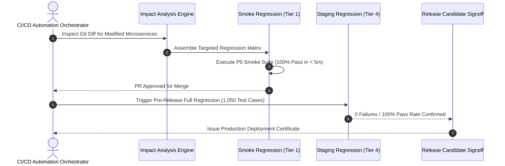

# Continuous & Release Candidate Regression Strategy
## Namma Clinic Digital Health & Operations Platform
### Greater Bengaluru Authority (GBA) / BBMP Health Department
**Standard:** ISO/IEC/IEEE 29119-2 / Selective Regression Testing Protocols / Risk-Weighted CI Gates | **Status:** APPROVED BASELINE | **Code:** `QA-DOC-14`

---

## 1. Regression Strategy Charter & Selection Governance
The Namma Clinic Regression Strategy defines the selection rules, execution cadences, and automation frameworks guaranteeing that new feature additions, security patches, or bug fixes introduce zero functional regressions into active clinical operations across 183 primary clinics.

### 1.1 5 Regression Testing Tiers
1. **Tier 1 (Commit Smoke Suite):** Fast-feedback regression (< 5m) running on every pull request; blocks PR merge on any failure.
2. **Tier 2 (Nightly Sanity Suite):** Automated API contract and component regression (< 30m) running across staging enclaves.
3. **Tier 3 (Clinical Journey Regression):** 25 end-to-end clinical workflows executed in headless Playwright browsers twice weekly.
4. **Tier 4 (Full Release Candidate Regression):** Complete execution of all 1,050+ test cases before scheduled production rollout.
5. **Tier 5 (Emergency Hotfix Regression):** Targeted, risk-weighted impact radius regression suite executed within 60 minutes.

### 1.2 Regression Execution Sequence Diagram


## 2. Canonical Regression Suites Catalog (REG-001 to REG-030)
Standardized regression suite configurations governing release gating:

### REG-001: P0 Smoke Test Suite
- **Execution Cadence:** Daily CI / Nightly
- **Automation Ratio:** 95% Automated
- **Blocker Policy:** Zero Failures Allowed
- **Audit Event Emitted:** `REG_AUDIT_REG_001`

### REG-002: P1 Core Clinical Sanity
- **Execution Cadence:** Daily CI / Nightly
- **Automation Ratio:** 95% Automated
- **Blocker Policy:** Zero Failures Allowed
- **Audit Event Emitted:** `REG_AUDIT_REG_002`

### REG-003: Patient Registration & ABHA Reg
- **Execution Cadence:** Daily CI / Nightly
- **Automation Ratio:** 95% Automated
- **Blocker Policy:** Zero Failures Allowed
- **Audit Event Emitted:** `REG_AUDIT_REG_003`

### REG-004: Triage & Vitals Regression
- **Execution Cadence:** Daily CI / Nightly
- **Automation Ratio:** 95% Automated
- **Blocker Policy:** Zero Failures Allowed
- **Audit Event Emitted:** `REG_AUDIT_REG_004`

### REG-005: Doctor Consultation & Clinical Notes
- **Execution Cadence:** Daily CI / Nightly
- **Automation Ratio:** 95% Automated
- **Blocker Policy:** Zero Failures Allowed
- **Audit Event Emitted:** `REG_AUDIT_REG_005`

### REG-006: Prescription & Allergy Contraindications
- **Execution Cadence:** Daily CI / Nightly
- **Automation Ratio:** 95% Automated
- **Blocker Policy:** Zero Failures Allowed
- **Audit Event Emitted:** `REG_AUDIT_REG_006`

### REG-007: Pharmacy Dispensing & Inventory
- **Execution Cadence:** Daily CI / Nightly
- **Automation Ratio:** 95% Automated
- **Blocker Policy:** Zero Failures Allowed
- **Audit Event Emitted:** `REG_AUDIT_REG_007`

### REG-008: Lab Orders & PACS DICOM Bridge
- **Execution Cadence:** Daily CI / Nightly
- **Automation Ratio:** 95% Automated
- **Blocker Policy:** Zero Failures Allowed
- **Audit Event Emitted:** `REG_AUDIT_REG_008`

### REG-009: Referral Management Regression
- **Execution Cadence:** Daily CI / Nightly
- **Automation Ratio:** 95% Automated
- **Blocker Policy:** Zero Failures Allowed
- **Audit Event Emitted:** `REG_AUDIT_REG_009`

### REG-010: Offline Local Persistence Suite
- **Execution Cadence:** Daily CI / Nightly
- **Automation Ratio:** 95% Automated
- **Blocker Policy:** Zero Failures Allowed
- **Audit Event Emitted:** `REG_AUDIT_REG_010`

### REG-011: Sync Queue & Conflict Resolution
- **Execution Cadence:** Daily CI / Nightly
- **Automation Ratio:** 95% Automated
- **Blocker Policy:** Zero Failures Allowed
- **Audit Event Emitted:** `REG_AUDIT_REG_011`

### REG-012: ABDM M1/M2/M3 Federated Bridge
- **Execution Cadence:** Daily CI / Nightly
- **Automation Ratio:** 95% Automated
- **Blocker Policy:** Zero Failures Allowed
- **Audit Event Emitted:** `REG_AUDIT_REG_012`

### REG-013: RBAC & Role Transition Matrix
- **Execution Cadence:** Daily CI / Nightly
- **Automation Ratio:** 95% Automated
- **Blocker Policy:** Zero Failures Allowed
- **Audit Event Emitted:** `REG_AUDIT_REG_013`

### REG-014: Emergency Break-Glass Audit Suite
- **Execution Cadence:** Daily CI / Nightly
- **Automation Ratio:** 95% Automated
- **Blocker Policy:** Zero Failures Allowed
- **Audit Event Emitted:** `REG_AUDIT_REG_014`

### REG-015: Password & MFA Authentication
- **Execution Cadence:** Daily CI / Nightly
- **Automation Ratio:** 95% Automated
- **Blocker Policy:** Zero Failures Allowed
- **Audit Event Emitted:** `REG_AUDIT_REG_015`

### REG-016: API Contract Regression (OpenAPI)
- **Execution Cadence:** Daily CI / Nightly
- **Automation Ratio:** 95% Automated
- **Blocker Policy:** Zero Failures Allowed
- **Audit Event Emitted:** `REG_AUDIT_REG_016`

### REG-017: Database Schema Migration Integrity
- **Execution Cadence:** Daily CI / Nightly
- **Automation Ratio:** 95% Automated
- **Blocker Policy:** Zero Failures Allowed
- **Audit Event Emitted:** `REG_AUDIT_REG_017`

### REG-018: Thermal Receipt ESC/POS Spooling
- **Execution Cadence:** Daily CI / Nightly
- **Automation Ratio:** 95% Automated
- **Blocker Policy:** Zero Failures Allowed
- **Audit Event Emitted:** `REG_AUDIT_REG_018`

### REG-019: Barcode Scanner HID Input Suite
- **Execution Cadence:** Daily CI / Nightly
- **Automation Ratio:** 95% Automated
- **Blocker Policy:** Zero Failures Allowed
- **Audit Event Emitted:** `REG_AUDIT_REG_019`

### REG-020: WCAG 2.1 AA Accessibility Smoke
- **Execution Cadence:** Daily CI / Nightly
- **Automation Ratio:** 95% Automated
- **Blocker Policy:** Zero Failures Allowed
- **Audit Event Emitted:** `REG_AUDIT_REG_020`

### REG-021: Kannada Localization UI Regression
- **Execution Cadence:** Daily CI / Nightly
- **Automation Ratio:** 95% Automated
- **Blocker Policy:** Zero Failures Allowed
- **Audit Event Emitted:** `REG_AUDIT_REG_021`

### REG-022: Cold-Chain IoT Telemetry Guardrails
- **Execution Cadence:** Daily CI / Nightly
- **Automation Ratio:** 95% Automated
- **Blocker Policy:** Zero Failures Allowed
- **Audit Event Emitted:** `REG_AUDIT_REG_022`

### REG-023: High Concurrency OPD Spike Suite
- **Execution Cadence:** Daily CI / Nightly
- **Automation Ratio:** 95% Automated
- **Blocker Policy:** Zero Failures Allowed
- **Audit Event Emitted:** `REG_AUDIT_REG_023`

### REG-024: Soak & Memory Leak 24h Regression
- **Execution Cadence:** Daily CI / Nightly
- **Automation Ratio:** 95% Automated
- **Blocker Policy:** Zero Failures Allowed
- **Audit Event Emitted:** `REG_AUDIT_REG_024`

### REG-025: WORM Immutable Log Merkle Proofs
- **Execution Cadence:** Daily CI / Nightly
- **Automation Ratio:** 95% Automated
- **Blocker Policy:** Zero Failures Allowed
- **Audit Event Emitted:** `REG_AUDIT_REG_025`

### REG-026: Field Nurse Android Tablet MDM
- **Execution Cadence:** Daily CI / Nightly
- **Automation Ratio:** 95% Automated
- **Blocker Policy:** Zero Failures Allowed
- **Audit Event Emitted:** `REG_AUDIT_REG_026`

### REG-027: Cross-Clinic Transfer & Continuity
- **Execution Cadence:** Daily CI / Nightly
- **Automation Ratio:** 95% Automated
- **Blocker Policy:** Zero Failures Allowed
- **Audit Event Emitted:** `REG_AUDIT_REG_027`

### REG-028: Public Health Analytics Aggregations
- **Execution Cadence:** Daily CI / Nightly
- **Automation Ratio:** 95% Automated
- **Blocker Policy:** Zero Failures Allowed
- **Audit Event Emitted:** `REG_AUDIT_REG_028`

### REG-029: Citizen Portal Self-Service Reg
- **Execution Cadence:** Daily CI / Nightly
- **Automation Ratio:** 95% Automated
- **Blocker Policy:** Zero Failures Allowed
- **Audit Event Emitted:** `REG_AUDIT_REG_029`

### REG-030: Pre-Release Master Candidate Gate
- **Execution Cadence:** Daily CI / Nightly
- **Automation Ratio:** 95% Automated
- **Blocker Policy:** Zero Failures Allowed
- **Audit Event Emitted:** `REG_AUDIT_REG_030`

## 3. Detailed Regression Verification Test Cases (TC-0716 to TC-0770)
Detailed test specifications verifying regression selection and execution:

### TC-0716: Test Case 716: Advanced Security, Offline & Scalability for indent_items across WF-016
**Objective:** Validate non-functional resilience, encryption envelope, and concurrency for indent_items in WF-016.
**Risk:** Critical operational risk regarding platform security, privacy breach, or offline desync.
**Priority:** **P0** | **Severity:** **Critical** | **Test Level:** End-to-End & Non-Functional | **Test Type:** Resilience, Offline & Security Audit
- **Requirement Traceability:** `NFR-036`
- **Workflow Traceability:** `WF-016`
- **Feature Traceability:** `FEATURE-176`
- **API Traceability:** `API-DOC-12`
- **Database Traceability:** `TABLE-040 (indent_items)`
- **Screen Traceability:** `SCREEN-068`
- **Security Control Traceability:** `AUTH-036`
- **Preconditions:** Workstation initialized with TPM 2.0 PCR attestation and valid staff credentials (Procurement & Vendor Manager).
- **Test Data Specification:** Synthetic dataset TESTDATA-056 with simulated network flapping.
- **Execution Steps:** 1. Trigger workflow WF-016 on SCREEN-068. 2. Inject network delay or packet drop. 3. Confirm offline queue persistence. 4. Restore link and confirm atomic sync.
- **Expected Results:** Zero data loss, conflict resolved deterministically via timestamp-vector clocks, audit trail complete.
- **Negative Test Scenario:** Attempt unauthorized cross-tenant data exfiltration; verify gateway drops packet with 403 Forbidden.
- **Boundary Value Scenario:** Push offline queue to 10,000 pending mutations; verify local SQLite buffer does not crash.
- **Concurrency & Race Condition:** Simulate 50 parallel clinic terminals pushing updates simultaneously to gateway.
- **Autonomous Offline Behavior:** Simulate 8 hours of complete clinic internet outage; OPD consultations proceed uninterrupted.
- **Security & Access Validation:** Confirm AES-256-GCM column encryption and strict mTLS 1.3 transit cipher enforcement.
- **Audit Trail & Immutability:** Verify audit record written to WORM immutable ledger with SHA-256 hash.
- **Evidence Required:** Terminal screenshot, packet capture dump, and cryptographic Merkle verification proof.
- **Pass Acceptance Criteria:** All operations succeed with 0% data corruption, full audit ledger continuity, and latency < 350ms.
- **Failure Behavior & SLA:** Data loss, sync deadlock, cleartext PII leakage, or unhandled crash.
- **Automation Suitability:** Yes (High Candidate)
- **Execution Cadence:** Nightly Performance & Resilience Run
- **Responsible Owner:** Procurement & Vendor Manager

### TC-0717: Test Case 717: Advanced Security, Offline & Scalability for cold_chain_devices across WF-017
**Objective:** Validate non-functional resilience, encryption envelope, and concurrency for cold_chain_devices in WF-017.
**Risk:** Major operational risk regarding platform security, privacy breach, or offline desync.
**Priority:** **P1** | **Severity:** **Major** | **Test Level:** End-to-End & Non-Functional | **Test Type:** Resilience, Offline & Security Audit
- **Requirement Traceability:** `SECR-017`
- **Workflow Traceability:** `WF-017`
- **Feature Traceability:** `FEATURE-177`
- **API Traceability:** `API-DOC-13`
- **Database Traceability:** `TABLE-041 (cold_chain_devices)`
- **Screen Traceability:** `SCREEN-069`
- **Security Control Traceability:** `API-SEC-037`
- **Preconditions:** Workstation initialized with TPM 2.0 PCR attestation and valid staff credentials (Biomedical Waste Supervisor).
- **Test Data Specification:** Synthetic dataset TESTDATA-057 with simulated network flapping.
- **Execution Steps:** 1. Trigger workflow WF-017 on SCREEN-069. 2. Inject network delay or packet drop. 3. Confirm offline queue persistence. 4. Restore link and confirm atomic sync.
- **Expected Results:** Zero data loss, conflict resolved deterministically via timestamp-vector clocks, audit trail complete.
- **Negative Test Scenario:** Attempt unauthorized cross-tenant data exfiltration; verify gateway drops packet with 403 Forbidden.
- **Boundary Value Scenario:** Push offline queue to 10,000 pending mutations; verify local SQLite buffer does not crash.
- **Concurrency & Race Condition:** Simulate 50 parallel clinic terminals pushing updates simultaneously to gateway.
- **Autonomous Offline Behavior:** Simulate 8 hours of complete clinic internet outage; OPD consultations proceed uninterrupted.
- **Security & Access Validation:** Confirm AES-256-GCM column encryption and strict mTLS 1.3 transit cipher enforcement.
- **Audit Trail & Immutability:** Verify audit record written to WORM immutable ledger with SHA-256 hash.
- **Evidence Required:** Terminal screenshot, packet capture dump, and cryptographic Merkle verification proof.
- **Pass Acceptance Criteria:** All operations succeed with 0% data corruption, full audit ledger continuity, and latency < 350ms.
- **Failure Behavior & SLA:** Data loss, sync deadlock, cleartext PII leakage, or unhandled crash.
- **Automation Suitability:** Yes (High Candidate)
- **Execution Cadence:** Nightly Performance & Resilience Run
- **Responsible Owner:** Biomedical Waste Supervisor

### TC-0718: Test Case 718: Advanced Security, Offline & Scalability for cold_chain_telemetry across WF-018
**Objective:** Validate non-functional resilience, encryption envelope, and concurrency for cold_chain_telemetry in WF-018.
**Risk:** Major operational risk regarding platform security, privacy breach, or offline desync.
**Priority:** **P1** | **Severity:** **Major** | **Test Level:** End-to-End & Non-Functional | **Test Type:** Resilience, Offline & Security Audit
- **Requirement Traceability:** `NFR-038`
- **Workflow Traceability:** `WF-018`
- **Feature Traceability:** `FEATURE-178`
- **API Traceability:** `API-DOC-14`
- **Database Traceability:** `TABLE-042 (cold_chain_telemetry)`
- **Screen Traceability:** `SCREEN-070`
- **Security Control Traceability:** `AUTH-038`
- **Preconditions:** Workstation initialized with TPM 2.0 PCR attestation and valid staff credentials (Telemedicine Remote Specialist).
- **Test Data Specification:** Synthetic dataset TESTDATA-058 with simulated network flapping.
- **Execution Steps:** 1. Trigger workflow WF-018 on SCREEN-070. 2. Inject network delay or packet drop. 3. Confirm offline queue persistence. 4. Restore link and confirm atomic sync.
- **Expected Results:** Zero data loss, conflict resolved deterministically via timestamp-vector clocks, audit trail complete.
- **Negative Test Scenario:** Attempt unauthorized cross-tenant data exfiltration; verify gateway drops packet with 403 Forbidden.
- **Boundary Value Scenario:** Push offline queue to 10,000 pending mutations; verify local SQLite buffer does not crash.
- **Concurrency & Race Condition:** Simulate 50 parallel clinic terminals pushing updates simultaneously to gateway.
- **Autonomous Offline Behavior:** Simulate 8 hours of complete clinic internet outage; OPD consultations proceed uninterrupted.
- **Security & Access Validation:** Confirm AES-256-GCM column encryption and strict mTLS 1.3 transit cipher enforcement.
- **Audit Trail & Immutability:** Verify audit record written to WORM immutable ledger with SHA-256 hash.
- **Evidence Required:** Terminal screenshot, packet capture dump, and cryptographic Merkle verification proof.
- **Pass Acceptance Criteria:** All operations succeed with 0% data corruption, full audit ledger continuity, and latency < 350ms.
- **Failure Behavior & SLA:** Data loss, sync deadlock, cleartext PII leakage, or unhandled crash.
- **Automation Suitability:** Yes (High Candidate)
- **Execution Cadence:** Nightly Performance & Resilience Run
- **Responsible Owner:** Telemedicine Remote Specialist

### TC-0719: Test Case 719: Advanced Security, Offline & Scalability for referrals across WF-019
**Objective:** Validate non-functional resilience, encryption envelope, and concurrency for referrals in WF-019.
**Risk:** Minor operational risk regarding platform security, privacy breach, or offline desync.
**Priority:** **P2** | **Severity:** **Minor** | **Test Level:** End-to-End & Non-Functional | **Test Type:** Resilience, Offline & Security Audit
- **Requirement Traceability:** `SECR-019`
- **Workflow Traceability:** `WF-019`
- **Feature Traceability:** `FEATURE-179`
- **API Traceability:** `API-DOC-15`
- **Database Traceability:** `TABLE-043 (referrals)`
- **Screen Traceability:** `SCREEN-071`
- **Security Control Traceability:** `API-SEC-039`
- **Preconditions:** Workstation initialized with TPM 2.0 PCR attestation and valid staff credentials (Field Public Health Inspector).
- **Test Data Specification:** Synthetic dataset TESTDATA-059 with simulated network flapping.
- **Execution Steps:** 1. Trigger workflow WF-019 on SCREEN-071. 2. Inject network delay or packet drop. 3. Confirm offline queue persistence. 4. Restore link and confirm atomic sync.
- **Expected Results:** Zero data loss, conflict resolved deterministically via timestamp-vector clocks, audit trail complete.
- **Negative Test Scenario:** Attempt unauthorized cross-tenant data exfiltration; verify gateway drops packet with 403 Forbidden.
- **Boundary Value Scenario:** Push offline queue to 10,000 pending mutations; verify local SQLite buffer does not crash.
- **Concurrency & Race Condition:** Simulate 50 parallel clinic terminals pushing updates simultaneously to gateway.
- **Autonomous Offline Behavior:** Simulate 8 hours of complete clinic internet outage; OPD consultations proceed uninterrupted.
- **Security & Access Validation:** Confirm AES-256-GCM column encryption and strict mTLS 1.3 transit cipher enforcement.
- **Audit Trail & Immutability:** Verify audit record written to WORM immutable ledger with SHA-256 hash.
- **Evidence Required:** Terminal screenshot, packet capture dump, and cryptographic Merkle verification proof.
- **Pass Acceptance Criteria:** All operations succeed with 0% data corruption, full audit ledger continuity, and latency < 350ms.
- **Failure Behavior & SLA:** Data loss, sync deadlock, cleartext PII leakage, or unhandled crash.
- **Automation Suitability:** Yes (High Candidate)
- **Execution Cadence:** Nightly Performance & Resilience Run
- **Responsible Owner:** Field Public Health Inspector

### TC-0720: Test Case 720: Advanced Security, Offline & Scalability for referral_counter_notes across WF-020
**Objective:** Validate non-functional resilience, encryption envelope, and concurrency for referral_counter_notes in WF-020.
**Risk:** Critical operational risk regarding platform security, privacy breach, or offline desync.
**Priority:** **P0** | **Severity:** **Critical** | **Test Level:** End-to-End & Non-Functional | **Test Type:** Resilience, Offline & Security Audit
- **Requirement Traceability:** `NFR-040`
- **Workflow Traceability:** `WF-020`
- **Feature Traceability:** `FEATURE-180`
- **API Traceability:** `API-DOC-16`
- **Database Traceability:** `TABLE-044 (referral_counter_notes)`
- **Screen Traceability:** `SCREEN-072`
- **Security Control Traceability:** `AUTH-040`
- **Preconditions:** Workstation initialized with TPM 2.0 PCR attestation and valid staff credentials (Super Administrator).
- **Test Data Specification:** Synthetic dataset TESTDATA-060 with simulated network flapping.
- **Execution Steps:** 1. Trigger workflow WF-020 on SCREEN-072. 2. Inject network delay or packet drop. 3. Confirm offline queue persistence. 4. Restore link and confirm atomic sync.
- **Expected Results:** Zero data loss, conflict resolved deterministically via timestamp-vector clocks, audit trail complete.
- **Negative Test Scenario:** Attempt unauthorized cross-tenant data exfiltration; verify gateway drops packet with 403 Forbidden.
- **Boundary Value Scenario:** Push offline queue to 10,000 pending mutations; verify local SQLite buffer does not crash.
- **Concurrency & Race Condition:** Simulate 50 parallel clinic terminals pushing updates simultaneously to gateway.
- **Autonomous Offline Behavior:** Simulate 8 hours of complete clinic internet outage; OPD consultations proceed uninterrupted.
- **Security & Access Validation:** Confirm AES-256-GCM column encryption and strict mTLS 1.3 transit cipher enforcement.
- **Audit Trail & Immutability:** Verify audit record written to WORM immutable ledger with SHA-256 hash.
- **Evidence Required:** Terminal screenshot, packet capture dump, and cryptographic Merkle verification proof.
- **Pass Acceptance Criteria:** All operations succeed with 0% data corruption, full audit ledger continuity, and latency < 350ms.
- **Failure Behavior & SLA:** Data loss, sync deadlock, cleartext PII leakage, or unhandled crash.
- **Automation Suitability:** Yes (High Candidate)
- **Execution Cadence:** Nightly Performance & Resilience Run
- **Responsible Owner:** Super Administrator

### TC-0721: Test Case 721: Advanced Security, Offline & Scalability for ncd_episodes across WF-021
**Objective:** Validate non-functional resilience, encryption envelope, and concurrency for ncd_episodes in WF-021.
**Risk:** Major operational risk regarding platform security, privacy breach, or offline desync.
**Priority:** **P1** | **Severity:** **Major** | **Test Level:** End-to-End & Non-Functional | **Test Type:** Resilience, Offline & Security Audit
- **Requirement Traceability:** `SECR-021`
- **Workflow Traceability:** `WF-021`
- **Feature Traceability:** `FEATURE-001`
- **API Traceability:** `API-DOC-17`
- **Database Traceability:** `TABLE-045 (ncd_episodes)`
- **Screen Traceability:** `SCREEN-073`
- **Security Control Traceability:** `API-SEC-001`
- **Preconditions:** Workstation initialized with TPM 2.0 PCR attestation and valid staff credentials (Receptionist / Registration Clerk).
- **Test Data Specification:** Synthetic dataset TESTDATA-001 with simulated network flapping.
- **Execution Steps:** 1. Trigger workflow WF-021 on SCREEN-073. 2. Inject network delay or packet drop. 3. Confirm offline queue persistence. 4. Restore link and confirm atomic sync.
- **Expected Results:** Zero data loss, conflict resolved deterministically via timestamp-vector clocks, audit trail complete.
- **Negative Test Scenario:** Attempt unauthorized cross-tenant data exfiltration; verify gateway drops packet with 403 Forbidden.
- **Boundary Value Scenario:** Push offline queue to 10,000 pending mutations; verify local SQLite buffer does not crash.
- **Concurrency & Race Condition:** Simulate 50 parallel clinic terminals pushing updates simultaneously to gateway.
- **Autonomous Offline Behavior:** Simulate 8 hours of complete clinic internet outage; OPD consultations proceed uninterrupted.
- **Security & Access Validation:** Confirm AES-256-GCM column encryption and strict mTLS 1.3 transit cipher enforcement.
- **Audit Trail & Immutability:** Verify audit record written to WORM immutable ledger with SHA-256 hash.
- **Evidence Required:** Terminal screenshot, packet capture dump, and cryptographic Merkle verification proof.
- **Pass Acceptance Criteria:** All operations succeed with 0% data corruption, full audit ledger continuity, and latency < 350ms.
- **Failure Behavior & SLA:** Data loss, sync deadlock, cleartext PII leakage, or unhandled crash.
- **Automation Suitability:** Yes (High Candidate)
- **Execution Cadence:** Nightly Performance & Resilience Run
- **Responsible Owner:** Receptionist / Registration Clerk

### TC-0722: Test Case 722: Advanced Security, Offline & Scalability for follow_up_schedules across WF-022
**Objective:** Validate non-functional resilience, encryption envelope, and concurrency for follow_up_schedules in WF-022.
**Risk:** Major operational risk regarding platform security, privacy breach, or offline desync.
**Priority:** **P1** | **Severity:** **Major** | **Test Level:** End-to-End & Non-Functional | **Test Type:** Resilience, Offline & Security Audit
- **Requirement Traceability:** `NFR-002`
- **Workflow Traceability:** `WF-022`
- **Feature Traceability:** `FEATURE-002`
- **API Traceability:** `API-DOC-18`
- **Database Traceability:** `TABLE-046 (follow_up_schedules)`
- **Screen Traceability:** `SCREEN-074`
- **Security Control Traceability:** `AUTH-002`
- **Preconditions:** Workstation initialized with TPM 2.0 PCR attestation and valid staff credentials (Medical Officer / General Physician).
- **Test Data Specification:** Synthetic dataset TESTDATA-002 with simulated network flapping.
- **Execution Steps:** 1. Trigger workflow WF-022 on SCREEN-074. 2. Inject network delay or packet drop. 3. Confirm offline queue persistence. 4. Restore link and confirm atomic sync.
- **Expected Results:** Zero data loss, conflict resolved deterministically via timestamp-vector clocks, audit trail complete.
- **Negative Test Scenario:** Attempt unauthorized cross-tenant data exfiltration; verify gateway drops packet with 403 Forbidden.
- **Boundary Value Scenario:** Push offline queue to 10,000 pending mutations; verify local SQLite buffer does not crash.
- **Concurrency & Race Condition:** Simulate 50 parallel clinic terminals pushing updates simultaneously to gateway.
- **Autonomous Offline Behavior:** Simulate 8 hours of complete clinic internet outage; OPD consultations proceed uninterrupted.
- **Security & Access Validation:** Confirm AES-256-GCM column encryption and strict mTLS 1.3 transit cipher enforcement.
- **Audit Trail & Immutability:** Verify audit record written to WORM immutable ledger with SHA-256 hash.
- **Evidence Required:** Terminal screenshot, packet capture dump, and cryptographic Merkle verification proof.
- **Pass Acceptance Criteria:** All operations succeed with 0% data corruption, full audit ledger continuity, and latency < 350ms.
- **Failure Behavior & SLA:** Data loss, sync deadlock, cleartext PII leakage, or unhandled crash.
- **Automation Suitability:** Yes (High Candidate)
- **Execution Cadence:** Nightly Performance & Resilience Run
- **Responsible Owner:** Medical Officer / General Physician

### TC-0723: Test Case 723: Advanced Security, Offline & Scalability for notifications across WF-023
**Objective:** Validate non-functional resilience, encryption envelope, and concurrency for notifications in WF-023.
**Risk:** Minor operational risk regarding platform security, privacy breach, or offline desync.
**Priority:** **P2** | **Severity:** **Minor** | **Test Level:** End-to-End & Non-Functional | **Test Type:** Resilience, Offline & Security Audit
- **Requirement Traceability:** `SECR-023`
- **Workflow Traceability:** `WF-023`
- **Feature Traceability:** `FEATURE-003`
- **API Traceability:** `API-DOC-19`
- **Database Traceability:** `TABLE-047 (notifications)`
- **Screen Traceability:** `SCREEN-075`
- **Security Control Traceability:** `API-SEC-003`
- **Preconditions:** Workstation initialized with TPM 2.0 PCR attestation and valid staff credentials (Staff Nurse / Triage Specialist).
- **Test Data Specification:** Synthetic dataset TESTDATA-003 with simulated network flapping.
- **Execution Steps:** 1. Trigger workflow WF-023 on SCREEN-075. 2. Inject network delay or packet drop. 3. Confirm offline queue persistence. 4. Restore link and confirm atomic sync.
- **Expected Results:** Zero data loss, conflict resolved deterministically via timestamp-vector clocks, audit trail complete.
- **Negative Test Scenario:** Attempt unauthorized cross-tenant data exfiltration; verify gateway drops packet with 403 Forbidden.
- **Boundary Value Scenario:** Push offline queue to 10,000 pending mutations; verify local SQLite buffer does not crash.
- **Concurrency & Race Condition:** Simulate 50 parallel clinic terminals pushing updates simultaneously to gateway.
- **Autonomous Offline Behavior:** Simulate 8 hours of complete clinic internet outage; OPD consultations proceed uninterrupted.
- **Security & Access Validation:** Confirm AES-256-GCM column encryption and strict mTLS 1.3 transit cipher enforcement.
- **Audit Trail & Immutability:** Verify audit record written to WORM immutable ledger with SHA-256 hash.
- **Evidence Required:** Terminal screenshot, packet capture dump, and cryptographic Merkle verification proof.
- **Pass Acceptance Criteria:** All operations succeed with 0% data corruption, full audit ledger continuity, and latency < 350ms.
- **Failure Behavior & SLA:** Data loss, sync deadlock, cleartext PII leakage, or unhandled crash.
- **Automation Suitability:** Yes (High Candidate)
- **Execution Cadence:** Nightly Performance & Resilience Run
- **Responsible Owner:** Staff Nurse / Triage Specialist

### TC-0724: Test Case 724: Advanced Security, Offline & Scalability for grievances across WF-024
**Objective:** Validate non-functional resilience, encryption envelope, and concurrency for grievances in WF-024.
**Risk:** Critical operational risk regarding platform security, privacy breach, or offline desync.
**Priority:** **P0** | **Severity:** **Critical** | **Test Level:** End-to-End & Non-Functional | **Test Type:** Resilience, Offline & Security Audit
- **Requirement Traceability:** `NFR-004`
- **Workflow Traceability:** `WF-024`
- **Feature Traceability:** `FEATURE-004`
- **API Traceability:** `API-DOC-20`
- **Database Traceability:** `TABLE-048 (grievances)`
- **Screen Traceability:** `SCREEN-076`
- **Security Control Traceability:** `AUTH-004`
- **Preconditions:** Workstation initialized with TPM 2.0 PCR attestation and valid staff credentials (Pharmacist / Dispenser).
- **Test Data Specification:** Synthetic dataset TESTDATA-004 with simulated network flapping.
- **Execution Steps:** 1. Trigger workflow WF-024 on SCREEN-076. 2. Inject network delay or packet drop. 3. Confirm offline queue persistence. 4. Restore link and confirm atomic sync.
- **Expected Results:** Zero data loss, conflict resolved deterministically via timestamp-vector clocks, audit trail complete.
- **Negative Test Scenario:** Attempt unauthorized cross-tenant data exfiltration; verify gateway drops packet with 403 Forbidden.
- **Boundary Value Scenario:** Push offline queue to 10,000 pending mutations; verify local SQLite buffer does not crash.
- **Concurrency & Race Condition:** Simulate 50 parallel clinic terminals pushing updates simultaneously to gateway.
- **Autonomous Offline Behavior:** Simulate 8 hours of complete clinic internet outage; OPD consultations proceed uninterrupted.
- **Security & Access Validation:** Confirm AES-256-GCM column encryption and strict mTLS 1.3 transit cipher enforcement.
- **Audit Trail & Immutability:** Verify audit record written to WORM immutable ledger with SHA-256 hash.
- **Evidence Required:** Terminal screenshot, packet capture dump, and cryptographic Merkle verification proof.
- **Pass Acceptance Criteria:** All operations succeed with 0% data corruption, full audit ledger continuity, and latency < 350ms.
- **Failure Behavior & SLA:** Data loss, sync deadlock, cleartext PII leakage, or unhandled crash.
- **Automation Suitability:** Yes (High Candidate)
- **Execution Cadence:** Nightly Performance & Resilience Run
- **Responsible Owner:** Pharmacist / Dispenser

### TC-0725: Test Case 725: Advanced Security, Offline & Scalability for helpdesk_tickets across WF-025
**Objective:** Validate non-functional resilience, encryption envelope, and concurrency for helpdesk_tickets in WF-025.
**Risk:** Major operational risk regarding platform security, privacy breach, or offline desync.
**Priority:** **P1** | **Severity:** **Major** | **Test Level:** End-to-End & Non-Functional | **Test Type:** Resilience, Offline & Security Audit
- **Requirement Traceability:** `SECR-025`
- **Workflow Traceability:** `WF-025`
- **Feature Traceability:** `FEATURE-005`
- **API Traceability:** `API-DOC-21`
- **Database Traceability:** `TABLE-049 (helpdesk_tickets)`
- **Screen Traceability:** `SCREEN-077`
- **Security Control Traceability:** `API-SEC-005`
- **Preconditions:** Workstation initialized with TPM 2.0 PCR attestation and valid staff credentials (Laboratory Technician).
- **Test Data Specification:** Synthetic dataset TESTDATA-005 with simulated network flapping.
- **Execution Steps:** 1. Trigger workflow WF-025 on SCREEN-077. 2. Inject network delay or packet drop. 3. Confirm offline queue persistence. 4. Restore link and confirm atomic sync.
- **Expected Results:** Zero data loss, conflict resolved deterministically via timestamp-vector clocks, audit trail complete.
- **Negative Test Scenario:** Attempt unauthorized cross-tenant data exfiltration; verify gateway drops packet with 403 Forbidden.
- **Boundary Value Scenario:** Push offline queue to 10,000 pending mutations; verify local SQLite buffer does not crash.
- **Concurrency & Race Condition:** Simulate 50 parallel clinic terminals pushing updates simultaneously to gateway.
- **Autonomous Offline Behavior:** Simulate 8 hours of complete clinic internet outage; OPD consultations proceed uninterrupted.
- **Security & Access Validation:** Confirm AES-256-GCM column encryption and strict mTLS 1.3 transit cipher enforcement.
- **Audit Trail & Immutability:** Verify audit record written to WORM immutable ledger with SHA-256 hash.
- **Evidence Required:** Terminal screenshot, packet capture dump, and cryptographic Merkle verification proof.
- **Pass Acceptance Criteria:** All operations succeed with 0% data corruption, full audit ledger continuity, and latency < 350ms.
- **Failure Behavior & SLA:** Data loss, sync deadlock, cleartext PII leakage, or unhandled crash.
- **Automation Suitability:** Yes (High Candidate)
- **Execution Cadence:** Nightly Performance & Resilience Run
- **Responsible Owner:** Laboratory Technician

### TC-0726: Test Case 726: Advanced Security, Offline & Scalability for audit_events across WF-001
**Objective:** Validate non-functional resilience, encryption envelope, and concurrency for audit_events in WF-001.
**Risk:** Major operational risk regarding platform security, privacy breach, or offline desync.
**Priority:** **P1** | **Severity:** **Major** | **Test Level:** End-to-End & Non-Functional | **Test Type:** Resilience, Offline & Security Audit
- **Requirement Traceability:** `NFR-006`
- **Workflow Traceability:** `WF-001`
- **Feature Traceability:** `FEATURE-006`
- **API Traceability:** `API-DOC-22`
- **Database Traceability:** `TABLE-050 (audit_events)`
- **Screen Traceability:** `SCREEN-078`
- **Security Control Traceability:** `AUTH-006`
- **Preconditions:** Workstation initialized with TPM 2.0 PCR attestation and valid staff credentials (Clinic Administrative Officer).
- **Test Data Specification:** Synthetic dataset TESTDATA-006 with simulated network flapping.
- **Execution Steps:** 1. Trigger workflow WF-001 on SCREEN-078. 2. Inject network delay or packet drop. 3. Confirm offline queue persistence. 4. Restore link and confirm atomic sync.
- **Expected Results:** Zero data loss, conflict resolved deterministically via timestamp-vector clocks, audit trail complete.
- **Negative Test Scenario:** Attempt unauthorized cross-tenant data exfiltration; verify gateway drops packet with 403 Forbidden.
- **Boundary Value Scenario:** Push offline queue to 10,000 pending mutations; verify local SQLite buffer does not crash.
- **Concurrency & Race Condition:** Simulate 50 parallel clinic terminals pushing updates simultaneously to gateway.
- **Autonomous Offline Behavior:** Simulate 8 hours of complete clinic internet outage; OPD consultations proceed uninterrupted.
- **Security & Access Validation:** Confirm AES-256-GCM column encryption and strict mTLS 1.3 transit cipher enforcement.
- **Audit Trail & Immutability:** Verify audit record written to WORM immutable ledger with SHA-256 hash.
- **Evidence Required:** Terminal screenshot, packet capture dump, and cryptographic Merkle verification proof.
- **Pass Acceptance Criteria:** All operations succeed with 0% data corruption, full audit ledger continuity, and latency < 350ms.
- **Failure Behavior & SLA:** Data loss, sync deadlock, cleartext PII leakage, or unhandled crash.
- **Automation Suitability:** Yes (High Candidate)
- **Execution Cadence:** Nightly Performance & Resilience Run
- **Responsible Owner:** Clinic Administrative Officer

### TC-0727: Test Case 727: Advanced Security, Offline & Scalability for offline_mutation_log across WF-002
**Objective:** Validate non-functional resilience, encryption envelope, and concurrency for offline_mutation_log in WF-002.
**Risk:** Minor operational risk regarding platform security, privacy breach, or offline desync.
**Priority:** **P2** | **Severity:** **Minor** | **Test Level:** End-to-End & Non-Functional | **Test Type:** Resilience, Offline & Security Audit
- **Requirement Traceability:** `SECR-027`
- **Workflow Traceability:** `WF-002`
- **Feature Traceability:** `FEATURE-007`
- **API Traceability:** `API-DOC-01`
- **Database Traceability:** `TABLE-051 (offline_mutation_log)`
- **Screen Traceability:** `SCREEN-079`
- **Security Control Traceability:** `API-SEC-007`
- **Preconditions:** Workstation initialized with TPM 2.0 PCR attestation and valid staff credentials (Ward Health Supervisor).
- **Test Data Specification:** Synthetic dataset TESTDATA-007 with simulated network flapping.
- **Execution Steps:** 1. Trigger workflow WF-002 on SCREEN-079. 2. Inject network delay or packet drop. 3. Confirm offline queue persistence. 4. Restore link and confirm atomic sync.
- **Expected Results:** Zero data loss, conflict resolved deterministically via timestamp-vector clocks, audit trail complete.
- **Negative Test Scenario:** Attempt unauthorized cross-tenant data exfiltration; verify gateway drops packet with 403 Forbidden.
- **Boundary Value Scenario:** Push offline queue to 10,000 pending mutations; verify local SQLite buffer does not crash.
- **Concurrency & Race Condition:** Simulate 50 parallel clinic terminals pushing updates simultaneously to gateway.
- **Autonomous Offline Behavior:** Simulate 8 hours of complete clinic internet outage; OPD consultations proceed uninterrupted.
- **Security & Access Validation:** Confirm AES-256-GCM column encryption and strict mTLS 1.3 transit cipher enforcement.
- **Audit Trail & Immutability:** Verify audit record written to WORM immutable ledger with SHA-256 hash.
- **Evidence Required:** Terminal screenshot, packet capture dump, and cryptographic Merkle verification proof.
- **Pass Acceptance Criteria:** All operations succeed with 0% data corruption, full audit ledger continuity, and latency < 350ms.
- **Failure Behavior & SLA:** Data loss, sync deadlock, cleartext PII leakage, or unhandled crash.
- **Automation Suitability:** Yes (High Candidate)
- **Execution Cadence:** Nightly Performance & Resilience Run
- **Responsible Owner:** Ward Health Supervisor

### TC-0728: Test Case 728: Advanced Security, Offline & Scalability for abdm_artifacts across WF-003
**Objective:** Validate non-functional resilience, encryption envelope, and concurrency for abdm_artifacts in WF-003.
**Risk:** Critical operational risk regarding platform security, privacy breach, or offline desync.
**Priority:** **P0** | **Severity:** **Critical** | **Test Level:** End-to-End & Non-Functional | **Test Type:** Resilience, Offline & Security Audit
- **Requirement Traceability:** `NFR-008`
- **Workflow Traceability:** `WF-003`
- **Feature Traceability:** `FEATURE-008`
- **API Traceability:** `API-DOC-02`
- **Database Traceability:** `TABLE-052 (abdm_artifacts)`
- **Screen Traceability:** `SCREEN-080`
- **Security Control Traceability:** `AUTH-008`
- **Preconditions:** Workstation initialized with TPM 2.0 PCR attestation and valid staff credentials (Zonal Health Officer (ZHO)).
- **Test Data Specification:** Synthetic dataset TESTDATA-008 with simulated network flapping.
- **Execution Steps:** 1. Trigger workflow WF-003 on SCREEN-080. 2. Inject network delay or packet drop. 3. Confirm offline queue persistence. 4. Restore link and confirm atomic sync.
- **Expected Results:** Zero data loss, conflict resolved deterministically via timestamp-vector clocks, audit trail complete.
- **Negative Test Scenario:** Attempt unauthorized cross-tenant data exfiltration; verify gateway drops packet with 403 Forbidden.
- **Boundary Value Scenario:** Push offline queue to 10,000 pending mutations; verify local SQLite buffer does not crash.
- **Concurrency & Race Condition:** Simulate 50 parallel clinic terminals pushing updates simultaneously to gateway.
- **Autonomous Offline Behavior:** Simulate 8 hours of complete clinic internet outage; OPD consultations proceed uninterrupted.
- **Security & Access Validation:** Confirm AES-256-GCM column encryption and strict mTLS 1.3 transit cipher enforcement.
- **Audit Trail & Immutability:** Verify audit record written to WORM immutable ledger with SHA-256 hash.
- **Evidence Required:** Terminal screenshot, packet capture dump, and cryptographic Merkle verification proof.
- **Pass Acceptance Criteria:** All operations succeed with 0% data corruption, full audit ledger continuity, and latency < 350ms.
- **Failure Behavior & SLA:** Data loss, sync deadlock, cleartext PII leakage, or unhandled crash.
- **Automation Suitability:** Yes (High Candidate)
- **Execution Cadence:** Nightly Performance & Resilience Run
- **Responsible Owner:** Zonal Health Officer (ZHO)

### TC-0729: Test Case 729: Advanced Security, Offline & Scalability for auth_users across WF-004
**Objective:** Validate non-functional resilience, encryption envelope, and concurrency for auth_users in WF-004.
**Risk:** Major operational risk regarding platform security, privacy breach, or offline desync.
**Priority:** **P1** | **Severity:** **Major** | **Test Level:** End-to-End & Non-Functional | **Test Type:** Resilience, Offline & Security Audit
- **Requirement Traceability:** `SECR-029`
- **Workflow Traceability:** `WF-004`
- **Feature Traceability:** `FEATURE-009`
- **API Traceability:** `API-DOC-03`
- **Database Traceability:** `TABLE-001 (auth_users)`
- **Screen Traceability:** `SCREEN-081`
- **Security Control Traceability:** `API-SEC-009`
- **Preconditions:** Workstation initialized with TPM 2.0 PCR attestation and valid staff credentials (Chief Health Officer (CHO)).
- **Test Data Specification:** Synthetic dataset TESTDATA-009 with simulated network flapping.
- **Execution Steps:** 1. Trigger workflow WF-004 on SCREEN-081. 2. Inject network delay or packet drop. 3. Confirm offline queue persistence. 4. Restore link and confirm atomic sync.
- **Expected Results:** Zero data loss, conflict resolved deterministically via timestamp-vector clocks, audit trail complete.
- **Negative Test Scenario:** Attempt unauthorized cross-tenant data exfiltration; verify gateway drops packet with 403 Forbidden.
- **Boundary Value Scenario:** Push offline queue to 10,000 pending mutations; verify local SQLite buffer does not crash.
- **Concurrency & Race Condition:** Simulate 50 parallel clinic terminals pushing updates simultaneously to gateway.
- **Autonomous Offline Behavior:** Simulate 8 hours of complete clinic internet outage; OPD consultations proceed uninterrupted.
- **Security & Access Validation:** Confirm AES-256-GCM column encryption and strict mTLS 1.3 transit cipher enforcement.
- **Audit Trail & Immutability:** Verify audit record written to WORM immutable ledger with SHA-256 hash.
- **Evidence Required:** Terminal screenshot, packet capture dump, and cryptographic Merkle verification proof.
- **Pass Acceptance Criteria:** All operations succeed with 0% data corruption, full audit ledger continuity, and latency < 350ms.
- **Failure Behavior & SLA:** Data loss, sync deadlock, cleartext PII leakage, or unhandled crash.
- **Automation Suitability:** Yes (High Candidate)
- **Execution Cadence:** Nightly Performance & Resilience Run
- **Responsible Owner:** Chief Health Officer (CHO)

### TC-0730: Test Case 730: Advanced Security, Offline & Scalability for user_credentials across WF-005
**Objective:** Validate non-functional resilience, encryption envelope, and concurrency for user_credentials in WF-005.
**Risk:** Major operational risk regarding platform security, privacy breach, or offline desync.
**Priority:** **P1** | **Severity:** **Major** | **Test Level:** End-to-End & Non-Functional | **Test Type:** Resilience, Offline & Security Audit
- **Requirement Traceability:** `NFR-010`
- **Workflow Traceability:** `WF-005`
- **Feature Traceability:** `FEATURE-010`
- **API Traceability:** `API-DOC-04`
- **Database Traceability:** `TABLE-002 (user_credentials)`
- **Screen Traceability:** `SCREEN-082`
- **Security Control Traceability:** `AUTH-010`
- **Preconditions:** Workstation initialized with TPM 2.0 PCR attestation and valid staff credentials (Epidemiologist / Disease Surveillance Officer).
- **Test Data Specification:** Synthetic dataset TESTDATA-010 with simulated network flapping.
- **Execution Steps:** 1. Trigger workflow WF-005 on SCREEN-082. 2. Inject network delay or packet drop. 3. Confirm offline queue persistence. 4. Restore link and confirm atomic sync.
- **Expected Results:** Zero data loss, conflict resolved deterministically via timestamp-vector clocks, audit trail complete.
- **Negative Test Scenario:** Attempt unauthorized cross-tenant data exfiltration; verify gateway drops packet with 403 Forbidden.
- **Boundary Value Scenario:** Push offline queue to 10,000 pending mutations; verify local SQLite buffer does not crash.
- **Concurrency & Race Condition:** Simulate 50 parallel clinic terminals pushing updates simultaneously to gateway.
- **Autonomous Offline Behavior:** Simulate 8 hours of complete clinic internet outage; OPD consultations proceed uninterrupted.
- **Security & Access Validation:** Confirm AES-256-GCM column encryption and strict mTLS 1.3 transit cipher enforcement.
- **Audit Trail & Immutability:** Verify audit record written to WORM immutable ledger with SHA-256 hash.
- **Evidence Required:** Terminal screenshot, packet capture dump, and cryptographic Merkle verification proof.
- **Pass Acceptance Criteria:** All operations succeed with 0% data corruption, full audit ledger continuity, and latency < 350ms.
- **Failure Behavior & SLA:** Data loss, sync deadlock, cleartext PII leakage, or unhandled crash.
- **Automation Suitability:** Yes (High Candidate)
- **Execution Cadence:** Nightly Performance & Resilience Run
- **Responsible Owner:** Epidemiologist / Disease Surveillance Officer

### TC-0731: Test Case 731: Advanced Security, Offline & Scalability for user_sessions across WF-006
**Objective:** Validate non-functional resilience, encryption envelope, and concurrency for user_sessions in WF-006.
**Risk:** Minor operational risk regarding platform security, privacy breach, or offline desync.
**Priority:** **P2** | **Severity:** **Minor** | **Test Level:** End-to-End & Non-Functional | **Test Type:** Resilience, Offline & Security Audit
- **Requirement Traceability:** `SECR-031`
- **Workflow Traceability:** `WF-006`
- **Feature Traceability:** `FEATURE-011`
- **API Traceability:** `API-DOC-05`
- **Database Traceability:** `TABLE-003 (user_sessions)`
- **Screen Traceability:** `SCREEN-083`
- **Security Control Traceability:** `API-SEC-011`
- **Preconditions:** Workstation initialized with TPM 2.0 PCR attestation and valid staff credentials (Quality & Compliance Auditor).
- **Test Data Specification:** Synthetic dataset TESTDATA-011 with simulated network flapping.
- **Execution Steps:** 1. Trigger workflow WF-006 on SCREEN-083. 2. Inject network delay or packet drop. 3. Confirm offline queue persistence. 4. Restore link and confirm atomic sync.
- **Expected Results:** Zero data loss, conflict resolved deterministically via timestamp-vector clocks, audit trail complete.
- **Negative Test Scenario:** Attempt unauthorized cross-tenant data exfiltration; verify gateway drops packet with 403 Forbidden.
- **Boundary Value Scenario:** Push offline queue to 10,000 pending mutations; verify local SQLite buffer does not crash.
- **Concurrency & Race Condition:** Simulate 50 parallel clinic terminals pushing updates simultaneously to gateway.
- **Autonomous Offline Behavior:** Simulate 8 hours of complete clinic internet outage; OPD consultations proceed uninterrupted.
- **Security & Access Validation:** Confirm AES-256-GCM column encryption and strict mTLS 1.3 transit cipher enforcement.
- **Audit Trail & Immutability:** Verify audit record written to WORM immutable ledger with SHA-256 hash.
- **Evidence Required:** Terminal screenshot, packet capture dump, and cryptographic Merkle verification proof.
- **Pass Acceptance Criteria:** All operations succeed with 0% data corruption, full audit ledger continuity, and latency < 350ms.
- **Failure Behavior & SLA:** Data loss, sync deadlock, cleartext PII leakage, or unhandled crash.
- **Automation Suitability:** Yes (High Candidate)
- **Execution Cadence:** Nightly Performance & Resilience Run
- **Responsible Owner:** Quality & Compliance Auditor

### TC-0732: Test Case 732: Advanced Security, Offline & Scalability for roles across WF-007
**Objective:** Validate non-functional resilience, encryption envelope, and concurrency for roles in WF-007.
**Risk:** Critical operational risk regarding platform security, privacy breach, or offline desync.
**Priority:** **P0** | **Severity:** **Critical** | **Test Level:** End-to-End & Non-Functional | **Test Type:** Resilience, Offline & Security Audit
- **Requirement Traceability:** `NFR-012`
- **Workflow Traceability:** `WF-007`
- **Feature Traceability:** `FEATURE-012`
- **API Traceability:** `API-DOC-06`
- **Database Traceability:** `TABLE-004 (roles)`
- **Screen Traceability:** `SCREEN-084`
- **Security Control Traceability:** `AUTH-012`
- **Preconditions:** Workstation initialized with TPM 2.0 PCR attestation and valid staff credentials (Security Administrator / CISO).
- **Test Data Specification:** Synthetic dataset TESTDATA-012 with simulated network flapping.
- **Execution Steps:** 1. Trigger workflow WF-007 on SCREEN-084. 2. Inject network delay or packet drop. 3. Confirm offline queue persistence. 4. Restore link and confirm atomic sync.
- **Expected Results:** Zero data loss, conflict resolved deterministically via timestamp-vector clocks, audit trail complete.
- **Negative Test Scenario:** Attempt unauthorized cross-tenant data exfiltration; verify gateway drops packet with 403 Forbidden.
- **Boundary Value Scenario:** Push offline queue to 10,000 pending mutations; verify local SQLite buffer does not crash.
- **Concurrency & Race Condition:** Simulate 50 parallel clinic terminals pushing updates simultaneously to gateway.
- **Autonomous Offline Behavior:** Simulate 8 hours of complete clinic internet outage; OPD consultations proceed uninterrupted.
- **Security & Access Validation:** Confirm AES-256-GCM column encryption and strict mTLS 1.3 transit cipher enforcement.
- **Audit Trail & Immutability:** Verify audit record written to WORM immutable ledger with SHA-256 hash.
- **Evidence Required:** Terminal screenshot, packet capture dump, and cryptographic Merkle verification proof.
- **Pass Acceptance Criteria:** All operations succeed with 0% data corruption, full audit ledger continuity, and latency < 350ms.
- **Failure Behavior & SLA:** Data loss, sync deadlock, cleartext PII leakage, or unhandled crash.
- **Automation Suitability:** Yes (High Candidate)
- **Execution Cadence:** Nightly Performance & Resilience Run
- **Responsible Owner:** Security Administrator / CISO

### TC-0733: Test Case 733: Advanced Security, Offline & Scalability for permissions across WF-008
**Objective:** Validate non-functional resilience, encryption envelope, and concurrency for permissions in WF-008.
**Risk:** Major operational risk regarding platform security, privacy breach, or offline desync.
**Priority:** **P1** | **Severity:** **Major** | **Test Level:** End-to-End & Non-Functional | **Test Type:** Resilience, Offline & Security Audit
- **Requirement Traceability:** `SECR-033`
- **Workflow Traceability:** `WF-008`
- **Feature Traceability:** `FEATURE-013`
- **API Traceability:** `API-DOC-07`
- **Database Traceability:** `TABLE-005 (permissions)`
- **Screen Traceability:** `SCREEN-085`
- **Security Control Traceability:** `API-SEC-013`
- **Preconditions:** Workstation initialized with TPM 2.0 PCR attestation and valid staff credentials (Central Depot Inventory Manager).
- **Test Data Specification:** Synthetic dataset TESTDATA-013 with simulated network flapping.
- **Execution Steps:** 1. Trigger workflow WF-008 on SCREEN-085. 2. Inject network delay or packet drop. 3. Confirm offline queue persistence. 4. Restore link and confirm atomic sync.
- **Expected Results:** Zero data loss, conflict resolved deterministically via timestamp-vector clocks, audit trail complete.
- **Negative Test Scenario:** Attempt unauthorized cross-tenant data exfiltration; verify gateway drops packet with 403 Forbidden.
- **Boundary Value Scenario:** Push offline queue to 10,000 pending mutations; verify local SQLite buffer does not crash.
- **Concurrency & Race Condition:** Simulate 50 parallel clinic terminals pushing updates simultaneously to gateway.
- **Autonomous Offline Behavior:** Simulate 8 hours of complete clinic internet outage; OPD consultations proceed uninterrupted.
- **Security & Access Validation:** Confirm AES-256-GCM column encryption and strict mTLS 1.3 transit cipher enforcement.
- **Audit Trail & Immutability:** Verify audit record written to WORM immutable ledger with SHA-256 hash.
- **Evidence Required:** Terminal screenshot, packet capture dump, and cryptographic Merkle verification proof.
- **Pass Acceptance Criteria:** All operations succeed with 0% data corruption, full audit ledger continuity, and latency < 350ms.
- **Failure Behavior & SLA:** Data loss, sync deadlock, cleartext PII leakage, or unhandled crash.
- **Automation Suitability:** Yes (High Candidate)
- **Execution Cadence:** Nightly Performance & Resilience Run
- **Responsible Owner:** Central Depot Inventory Manager

### TC-0734: Test Case 734: Advanced Security, Offline & Scalability for role_permissions across WF-009
**Objective:** Validate non-functional resilience, encryption envelope, and concurrency for role_permissions in WF-009.
**Risk:** Major operational risk regarding platform security, privacy breach, or offline desync.
**Priority:** **P1** | **Severity:** **Major** | **Test Level:** End-to-End & Non-Functional | **Test Type:** Resilience, Offline & Security Audit
- **Requirement Traceability:** `NFR-014`
- **Workflow Traceability:** `WF-009`
- **Feature Traceability:** `FEATURE-014`
- **API Traceability:** `API-DOC-08`
- **Database Traceability:** `TABLE-006 (role_permissions)`
- **Screen Traceability:** `SCREEN-086`
- **Security Control Traceability:** `AUTH-014`
- **Preconditions:** Workstation initialized with TPM 2.0 PCR attestation and valid staff credentials (Cold Chain Logistics Technician).
- **Test Data Specification:** Synthetic dataset TESTDATA-014 with simulated network flapping.
- **Execution Steps:** 1. Trigger workflow WF-009 on SCREEN-086. 2. Inject network delay or packet drop. 3. Confirm offline queue persistence. 4. Restore link and confirm atomic sync.
- **Expected Results:** Zero data loss, conflict resolved deterministically via timestamp-vector clocks, audit trail complete.
- **Negative Test Scenario:** Attempt unauthorized cross-tenant data exfiltration; verify gateway drops packet with 403 Forbidden.
- **Boundary Value Scenario:** Push offline queue to 10,000 pending mutations; verify local SQLite buffer does not crash.
- **Concurrency & Race Condition:** Simulate 50 parallel clinic terminals pushing updates simultaneously to gateway.
- **Autonomous Offline Behavior:** Simulate 8 hours of complete clinic internet outage; OPD consultations proceed uninterrupted.
- **Security & Access Validation:** Confirm AES-256-GCM column encryption and strict mTLS 1.3 transit cipher enforcement.
- **Audit Trail & Immutability:** Verify audit record written to WORM immutable ledger with SHA-256 hash.
- **Evidence Required:** Terminal screenshot, packet capture dump, and cryptographic Merkle verification proof.
- **Pass Acceptance Criteria:** All operations succeed with 0% data corruption, full audit ledger continuity, and latency < 350ms.
- **Failure Behavior & SLA:** Data loss, sync deadlock, cleartext PII leakage, or unhandled crash.
- **Automation Suitability:** Yes (High Candidate)
- **Execution Cadence:** Nightly Performance & Resilience Run
- **Responsible Owner:** Cold Chain Logistics Technician

### TC-0735: Test Case 735: Advanced Security, Offline & Scalability for user_roles across WF-010
**Objective:** Validate non-functional resilience, encryption envelope, and concurrency for user_roles in WF-010.
**Risk:** Minor operational risk regarding platform security, privacy breach, or offline desync.
**Priority:** **P2** | **Severity:** **Minor** | **Test Level:** End-to-End & Non-Functional | **Test Type:** Resilience, Offline & Security Audit
- **Requirement Traceability:** `SECR-035`
- **Workflow Traceability:** `WF-010`
- **Feature Traceability:** `FEATURE-015`
- **API Traceability:** `API-DOC-09`
- **Database Traceability:** `TABLE-007 (user_roles)`
- **Screen Traceability:** `SCREEN-087`
- **Security Control Traceability:** `API-SEC-015`
- **Preconditions:** Workstation initialized with TPM 2.0 PCR attestation and valid staff credentials (Radiologist / Diagnostic Specialist).
- **Test Data Specification:** Synthetic dataset TESTDATA-015 with simulated network flapping.
- **Execution Steps:** 1. Trigger workflow WF-010 on SCREEN-087. 2. Inject network delay or packet drop. 3. Confirm offline queue persistence. 4. Restore link and confirm atomic sync.
- **Expected Results:** Zero data loss, conflict resolved deterministically via timestamp-vector clocks, audit trail complete.
- **Negative Test Scenario:** Attempt unauthorized cross-tenant data exfiltration; verify gateway drops packet with 403 Forbidden.
- **Boundary Value Scenario:** Push offline queue to 10,000 pending mutations; verify local SQLite buffer does not crash.
- **Concurrency & Race Condition:** Simulate 50 parallel clinic terminals pushing updates simultaneously to gateway.
- **Autonomous Offline Behavior:** Simulate 8 hours of complete clinic internet outage; OPD consultations proceed uninterrupted.
- **Security & Access Validation:** Confirm AES-256-GCM column encryption and strict mTLS 1.3 transit cipher enforcement.
- **Audit Trail & Immutability:** Verify audit record written to WORM immutable ledger with SHA-256 hash.
- **Evidence Required:** Terminal screenshot, packet capture dump, and cryptographic Merkle verification proof.
- **Pass Acceptance Criteria:** All operations succeed with 0% data corruption, full audit ledger continuity, and latency < 350ms.
- **Failure Behavior & SLA:** Data loss, sync deadlock, cleartext PII leakage, or unhandled crash.
- **Automation Suitability:** Yes (High Candidate)
- **Execution Cadence:** Nightly Performance & Resilience Run
- **Responsible Owner:** Radiologist / Diagnostic Specialist

### TC-0736: Test Case 736: Advanced Security, Offline & Scalability for facilities across WF-011
**Objective:** Validate non-functional resilience, encryption envelope, and concurrency for facilities in WF-011.
**Risk:** Critical operational risk regarding platform security, privacy breach, or offline desync.
**Priority:** **P0** | **Severity:** **Critical** | **Test Level:** End-to-End & Non-Functional | **Test Type:** Resilience, Offline & Security Audit
- **Requirement Traceability:** `NFR-016`
- **Workflow Traceability:** `WF-011`
- **Feature Traceability:** `FEATURE-016`
- **API Traceability:** `API-DOC-10`
- **Database Traceability:** `TABLE-008 (facilities)`
- **Screen Traceability:** `SCREEN-088`
- **Security Control Traceability:** `AUTH-016`
- **Preconditions:** Workstation initialized with TPM 2.0 PCR attestation and valid staff credentials (Ayush Practitioner).
- **Test Data Specification:** Synthetic dataset TESTDATA-016 with simulated network flapping.
- **Execution Steps:** 1. Trigger workflow WF-011 on SCREEN-088. 2. Inject network delay or packet drop. 3. Confirm offline queue persistence. 4. Restore link and confirm atomic sync.
- **Expected Results:** Zero data loss, conflict resolved deterministically via timestamp-vector clocks, audit trail complete.
- **Negative Test Scenario:** Attempt unauthorized cross-tenant data exfiltration; verify gateway drops packet with 403 Forbidden.
- **Boundary Value Scenario:** Push offline queue to 10,000 pending mutations; verify local SQLite buffer does not crash.
- **Concurrency & Race Condition:** Simulate 50 parallel clinic terminals pushing updates simultaneously to gateway.
- **Autonomous Offline Behavior:** Simulate 8 hours of complete clinic internet outage; OPD consultations proceed uninterrupted.
- **Security & Access Validation:** Confirm AES-256-GCM column encryption and strict mTLS 1.3 transit cipher enforcement.
- **Audit Trail & Immutability:** Verify audit record written to WORM immutable ledger with SHA-256 hash.
- **Evidence Required:** Terminal screenshot, packet capture dump, and cryptographic Merkle verification proof.
- **Pass Acceptance Criteria:** All operations succeed with 0% data corruption, full audit ledger continuity, and latency < 350ms.
- **Failure Behavior & SLA:** Data loss, sync deadlock, cleartext PII leakage, or unhandled crash.
- **Automation Suitability:** Yes (High Candidate)
- **Execution Cadence:** Nightly Performance & Resilience Run
- **Responsible Owner:** Ayush Practitioner

### TC-0737: Test Case 737: Advanced Security, Offline & Scalability for facility_rooms across WF-012
**Objective:** Validate non-functional resilience, encryption envelope, and concurrency for facility_rooms in WF-012.
**Risk:** Major operational risk regarding platform security, privacy breach, or offline desync.
**Priority:** **P1** | **Severity:** **Major** | **Test Level:** End-to-End & Non-Functional | **Test Type:** Resilience, Offline & Security Audit
- **Requirement Traceability:** `SECR-037`
- **Workflow Traceability:** `WF-012`
- **Feature Traceability:** `FEATURE-017`
- **API Traceability:** `API-DOC-11`
- **Database Traceability:** `TABLE-009 (facility_rooms)`
- **Screen Traceability:** `SCREEN-089`
- **Security Control Traceability:** `API-SEC-017`
- **Preconditions:** Workstation initialized with TPM 2.0 PCR attestation and valid staff credentials (Counselor / Mental Health Worker).
- **Test Data Specification:** Synthetic dataset TESTDATA-017 with simulated network flapping.
- **Execution Steps:** 1. Trigger workflow WF-012 on SCREEN-089. 2. Inject network delay or packet drop. 3. Confirm offline queue persistence. 4. Restore link and confirm atomic sync.
- **Expected Results:** Zero data loss, conflict resolved deterministically via timestamp-vector clocks, audit trail complete.
- **Negative Test Scenario:** Attempt unauthorized cross-tenant data exfiltration; verify gateway drops packet with 403 Forbidden.
- **Boundary Value Scenario:** Push offline queue to 10,000 pending mutations; verify local SQLite buffer does not crash.
- **Concurrency & Race Condition:** Simulate 50 parallel clinic terminals pushing updates simultaneously to gateway.
- **Autonomous Offline Behavior:** Simulate 8 hours of complete clinic internet outage; OPD consultations proceed uninterrupted.
- **Security & Access Validation:** Confirm AES-256-GCM column encryption and strict mTLS 1.3 transit cipher enforcement.
- **Audit Trail & Immutability:** Verify audit record written to WORM immutable ledger with SHA-256 hash.
- **Evidence Required:** Terminal screenshot, packet capture dump, and cryptographic Merkle verification proof.
- **Pass Acceptance Criteria:** All operations succeed with 0% data corruption, full audit ledger continuity, and latency < 350ms.
- **Failure Behavior & SLA:** Data loss, sync deadlock, cleartext PII leakage, or unhandled crash.
- **Automation Suitability:** Yes (High Candidate)
- **Execution Cadence:** Nightly Performance & Resilience Run
- **Responsible Owner:** Counselor / Mental Health Worker

### TC-0738: Test Case 738: Advanced Security, Offline & Scalability for staff_profiles across WF-013
**Objective:** Validate non-functional resilience, encryption envelope, and concurrency for staff_profiles in WF-013.
**Risk:** Major operational risk regarding platform security, privacy breach, or offline desync.
**Priority:** **P1** | **Severity:** **Major** | **Test Level:** End-to-End & Non-Functional | **Test Type:** Resilience, Offline & Security Audit
- **Requirement Traceability:** `NFR-018`
- **Workflow Traceability:** `WF-013`
- **Feature Traceability:** `FEATURE-018`
- **API Traceability:** `API-DOC-12`
- **Database Traceability:** `TABLE-010 (staff_profiles)`
- **Screen Traceability:** `SCREEN-090`
- **Security Control Traceability:** `AUTH-018`
- **Preconditions:** Workstation initialized with TPM 2.0 PCR attestation and valid staff credentials (ANM / Urban Health Worker).
- **Test Data Specification:** Synthetic dataset TESTDATA-018 with simulated network flapping.
- **Execution Steps:** 1. Trigger workflow WF-013 on SCREEN-090. 2. Inject network delay or packet drop. 3. Confirm offline queue persistence. 4. Restore link and confirm atomic sync.
- **Expected Results:** Zero data loss, conflict resolved deterministically via timestamp-vector clocks, audit trail complete.
- **Negative Test Scenario:** Attempt unauthorized cross-tenant data exfiltration; verify gateway drops packet with 403 Forbidden.
- **Boundary Value Scenario:** Push offline queue to 10,000 pending mutations; verify local SQLite buffer does not crash.
- **Concurrency & Race Condition:** Simulate 50 parallel clinic terminals pushing updates simultaneously to gateway.
- **Autonomous Offline Behavior:** Simulate 8 hours of complete clinic internet outage; OPD consultations proceed uninterrupted.
- **Security & Access Validation:** Confirm AES-256-GCM column encryption and strict mTLS 1.3 transit cipher enforcement.
- **Audit Trail & Immutability:** Verify audit record written to WORM immutable ledger with SHA-256 hash.
- **Evidence Required:** Terminal screenshot, packet capture dump, and cryptographic Merkle verification proof.
- **Pass Acceptance Criteria:** All operations succeed with 0% data corruption, full audit ledger continuity, and latency < 350ms.
- **Failure Behavior & SLA:** Data loss, sync deadlock, cleartext PII leakage, or unhandled crash.
- **Automation Suitability:** Yes (High Candidate)
- **Execution Cadence:** Nightly Performance & Resilience Run
- **Responsible Owner:** ANM / Urban Health Worker

### TC-0739: Test Case 739: Advanced Security, Offline & Scalability for staff_shifts across WF-014
**Objective:** Validate non-functional resilience, encryption envelope, and concurrency for staff_shifts in WF-014.
**Risk:** Minor operational risk regarding platform security, privacy breach, or offline desync.
**Priority:** **P2** | **Severity:** **Minor** | **Test Level:** End-to-End & Non-Functional | **Test Type:** Resilience, Offline & Security Audit
- **Requirement Traceability:** `SECR-039`
- **Workflow Traceability:** `WF-014`
- **Feature Traceability:** `FEATURE-019`
- **API Traceability:** `API-DOC-13`
- **Database Traceability:** `TABLE-011 (staff_shifts)`
- **Screen Traceability:** `SCREEN-091`
- **Security Control Traceability:** `API-SEC-019`
- **Preconditions:** Workstation initialized with TPM 2.0 PCR attestation and valid staff credentials (ASHA Link Worker Coordinator).
- **Test Data Specification:** Synthetic dataset TESTDATA-019 with simulated network flapping.
- **Execution Steps:** 1. Trigger workflow WF-014 on SCREEN-091. 2. Inject network delay or packet drop. 3. Confirm offline queue persistence. 4. Restore link and confirm atomic sync.
- **Expected Results:** Zero data loss, conflict resolved deterministically via timestamp-vector clocks, audit trail complete.
- **Negative Test Scenario:** Attempt unauthorized cross-tenant data exfiltration; verify gateway drops packet with 403 Forbidden.
- **Boundary Value Scenario:** Push offline queue to 10,000 pending mutations; verify local SQLite buffer does not crash.
- **Concurrency & Race Condition:** Simulate 50 parallel clinic terminals pushing updates simultaneously to gateway.
- **Autonomous Offline Behavior:** Simulate 8 hours of complete clinic internet outage; OPD consultations proceed uninterrupted.
- **Security & Access Validation:** Confirm AES-256-GCM column encryption and strict mTLS 1.3 transit cipher enforcement.
- **Audit Trail & Immutability:** Verify audit record written to WORM immutable ledger with SHA-256 hash.
- **Evidence Required:** Terminal screenshot, packet capture dump, and cryptographic Merkle verification proof.
- **Pass Acceptance Criteria:** All operations succeed with 0% data corruption, full audit ledger continuity, and latency < 350ms.
- **Failure Behavior & SLA:** Data loss, sync deadlock, cleartext PII leakage, or unhandled crash.
- **Automation Suitability:** Yes (High Candidate)
- **Execution Cadence:** Nightly Performance & Resilience Run
- **Responsible Owner:** ASHA Link Worker Coordinator

### TC-0740: Test Case 740: Advanced Security, Offline & Scalability for system_configs across WF-015
**Objective:** Validate non-functional resilience, encryption envelope, and concurrency for system_configs in WF-015.
**Risk:** Critical operational risk regarding platform security, privacy breach, or offline desync.
**Priority:** **P0** | **Severity:** **Critical** | **Test Level:** End-to-End & Non-Functional | **Test Type:** Resilience, Offline & Security Audit
- **Requirement Traceability:** `NFR-020`
- **Workflow Traceability:** `WF-015`
- **Feature Traceability:** `FEATURE-020`
- **API Traceability:** `API-DOC-14`
- **Database Traceability:** `TABLE-012 (system_configs)`
- **Screen Traceability:** `SCREEN-092`
- **Security Control Traceability:** `AUTH-020`
- **Preconditions:** Workstation initialized with TPM 2.0 PCR attestation and valid staff credentials (Data Entry Operator).
- **Test Data Specification:** Synthetic dataset TESTDATA-020 with simulated network flapping.
- **Execution Steps:** 1. Trigger workflow WF-015 on SCREEN-092. 2. Inject network delay or packet drop. 3. Confirm offline queue persistence. 4. Restore link and confirm atomic sync.
- **Expected Results:** Zero data loss, conflict resolved deterministically via timestamp-vector clocks, audit trail complete.
- **Negative Test Scenario:** Attempt unauthorized cross-tenant data exfiltration; verify gateway drops packet with 403 Forbidden.
- **Boundary Value Scenario:** Push offline queue to 10,000 pending mutations; verify local SQLite buffer does not crash.
- **Concurrency & Race Condition:** Simulate 50 parallel clinic terminals pushing updates simultaneously to gateway.
- **Autonomous Offline Behavior:** Simulate 8 hours of complete clinic internet outage; OPD consultations proceed uninterrupted.
- **Security & Access Validation:** Confirm AES-256-GCM column encryption and strict mTLS 1.3 transit cipher enforcement.
- **Audit Trail & Immutability:** Verify audit record written to WORM immutable ledger with SHA-256 hash.
- **Evidence Required:** Terminal screenshot, packet capture dump, and cryptographic Merkle verification proof.
- **Pass Acceptance Criteria:** All operations succeed with 0% data corruption, full audit ledger continuity, and latency < 350ms.
- **Failure Behavior & SLA:** Data loss, sync deadlock, cleartext PII leakage, or unhandled crash.
- **Automation Suitability:** Yes (High Candidate)
- **Execution Cadence:** Nightly Performance & Resilience Run
- **Responsible Owner:** Data Entry Operator

### TC-0741: Test Case 741: Advanced Security, Offline & Scalability for patients across WF-016
**Objective:** Validate non-functional resilience, encryption envelope, and concurrency for patients in WF-016.
**Risk:** Major operational risk regarding platform security, privacy breach, or offline desync.
**Priority:** **P1** | **Severity:** **Major** | **Test Level:** End-to-End & Non-Functional | **Test Type:** Resilience, Offline & Security Audit
- **Requirement Traceability:** `SECR-041`
- **Workflow Traceability:** `WF-016`
- **Feature Traceability:** `FEATURE-021`
- **API Traceability:** `API-DOC-15`
- **Database Traceability:** `TABLE-013 (patients)`
- **Screen Traceability:** `SCREEN-093`
- **Security Control Traceability:** `API-SEC-021`
- **Preconditions:** Workstation initialized with TPM 2.0 PCR attestation and valid staff credentials (Grievance Redressal Officer).
- **Test Data Specification:** Synthetic dataset TESTDATA-021 with simulated network flapping.
- **Execution Steps:** 1. Trigger workflow WF-016 on SCREEN-093. 2. Inject network delay or packet drop. 3. Confirm offline queue persistence. 4. Restore link and confirm atomic sync.
- **Expected Results:** Zero data loss, conflict resolved deterministically via timestamp-vector clocks, audit trail complete.
- **Negative Test Scenario:** Attempt unauthorized cross-tenant data exfiltration; verify gateway drops packet with 403 Forbidden.
- **Boundary Value Scenario:** Push offline queue to 10,000 pending mutations; verify local SQLite buffer does not crash.
- **Concurrency & Race Condition:** Simulate 50 parallel clinic terminals pushing updates simultaneously to gateway.
- **Autonomous Offline Behavior:** Simulate 8 hours of complete clinic internet outage; OPD consultations proceed uninterrupted.
- **Security & Access Validation:** Confirm AES-256-GCM column encryption and strict mTLS 1.3 transit cipher enforcement.
- **Audit Trail & Immutability:** Verify audit record written to WORM immutable ledger with SHA-256 hash.
- **Evidence Required:** Terminal screenshot, packet capture dump, and cryptographic Merkle verification proof.
- **Pass Acceptance Criteria:** All operations succeed with 0% data corruption, full audit ledger continuity, and latency < 350ms.
- **Failure Behavior & SLA:** Data loss, sync deadlock, cleartext PII leakage, or unhandled crash.
- **Automation Suitability:** Yes (High Candidate)
- **Execution Cadence:** Nightly Performance & Resilience Run
- **Responsible Owner:** Grievance Redressal Officer

### TC-0742: Test Case 742: Advanced Security, Offline & Scalability for patient_identifiers across WF-017
**Objective:** Validate non-functional resilience, encryption envelope, and concurrency for patient_identifiers in WF-017.
**Risk:** Major operational risk regarding platform security, privacy breach, or offline desync.
**Priority:** **P1** | **Severity:** **Major** | **Test Level:** End-to-End & Non-Functional | **Test Type:** Resilience, Offline & Security Audit
- **Requirement Traceability:** `NFR-022`
- **Workflow Traceability:** `WF-017`
- **Feature Traceability:** `FEATURE-022`
- **API Traceability:** `API-DOC-16`
- **Database Traceability:** `TABLE-014 (patient_identifiers)`
- **Screen Traceability:** `SCREEN-094`
- **Security Control Traceability:** `AUTH-022`
- **Preconditions:** Workstation initialized with TPM 2.0 PCR attestation and valid staff credentials (ABDM National Integration Officer).
- **Test Data Specification:** Synthetic dataset TESTDATA-022 with simulated network flapping.
- **Execution Steps:** 1. Trigger workflow WF-017 on SCREEN-094. 2. Inject network delay or packet drop. 3. Confirm offline queue persistence. 4. Restore link and confirm atomic sync.
- **Expected Results:** Zero data loss, conflict resolved deterministically via timestamp-vector clocks, audit trail complete.
- **Negative Test Scenario:** Attempt unauthorized cross-tenant data exfiltration; verify gateway drops packet with 403 Forbidden.
- **Boundary Value Scenario:** Push offline queue to 10,000 pending mutations; verify local SQLite buffer does not crash.
- **Concurrency & Race Condition:** Simulate 50 parallel clinic terminals pushing updates simultaneously to gateway.
- **Autonomous Offline Behavior:** Simulate 8 hours of complete clinic internet outage; OPD consultations proceed uninterrupted.
- **Security & Access Validation:** Confirm AES-256-GCM column encryption and strict mTLS 1.3 transit cipher enforcement.
- **Audit Trail & Immutability:** Verify audit record written to WORM immutable ledger with SHA-256 hash.
- **Evidence Required:** Terminal screenshot, packet capture dump, and cryptographic Merkle verification proof.
- **Pass Acceptance Criteria:** All operations succeed with 0% data corruption, full audit ledger continuity, and latency < 350ms.
- **Failure Behavior & SLA:** Data loss, sync deadlock, cleartext PII leakage, or unhandled crash.
- **Automation Suitability:** Yes (High Candidate)
- **Execution Cadence:** Nightly Performance & Resilience Run
- **Responsible Owner:** ABDM National Integration Officer

### TC-0743: Test Case 743: Advanced Security, Offline & Scalability for patient_contacts across WF-018
**Objective:** Validate non-functional resilience, encryption envelope, and concurrency for patient_contacts in WF-018.
**Risk:** Minor operational risk regarding platform security, privacy breach, or offline desync.
**Priority:** **P2** | **Severity:** **Minor** | **Test Level:** End-to-End & Non-Functional | **Test Type:** Resilience, Offline & Security Audit
- **Requirement Traceability:** `SECR-043`
- **Workflow Traceability:** `WF-018`
- **Feature Traceability:** `FEATURE-023`
- **API Traceability:** `API-DOC-17`
- **Database Traceability:** `TABLE-015 (patient_contacts)`
- **Screen Traceability:** `SCREEN-095`
- **Security Control Traceability:** `API-SEC-023`
- **Preconditions:** Workstation initialized with TPM 2.0 PCR attestation and valid staff credentials (Data Protection Officer (DPO)).
- **Test Data Specification:** Synthetic dataset TESTDATA-023 with simulated network flapping.
- **Execution Steps:** 1. Trigger workflow WF-018 on SCREEN-095. 2. Inject network delay or packet drop. 3. Confirm offline queue persistence. 4. Restore link and confirm atomic sync.
- **Expected Results:** Zero data loss, conflict resolved deterministically via timestamp-vector clocks, audit trail complete.
- **Negative Test Scenario:** Attempt unauthorized cross-tenant data exfiltration; verify gateway drops packet with 403 Forbidden.
- **Boundary Value Scenario:** Push offline queue to 10,000 pending mutations; verify local SQLite buffer does not crash.
- **Concurrency & Race Condition:** Simulate 50 parallel clinic terminals pushing updates simultaneously to gateway.
- **Autonomous Offline Behavior:** Simulate 8 hours of complete clinic internet outage; OPD consultations proceed uninterrupted.
- **Security & Access Validation:** Confirm AES-256-GCM column encryption and strict mTLS 1.3 transit cipher enforcement.
- **Audit Trail & Immutability:** Verify audit record written to WORM immutable ledger with SHA-256 hash.
- **Evidence Required:** Terminal screenshot, packet capture dump, and cryptographic Merkle verification proof.
- **Pass Acceptance Criteria:** All operations succeed with 0% data corruption, full audit ledger continuity, and latency < 350ms.
- **Failure Behavior & SLA:** Data loss, sync deadlock, cleartext PII leakage, or unhandled crash.
- **Automation Suitability:** Yes (High Candidate)
- **Execution Cadence:** Nightly Performance & Resilience Run
- **Responsible Owner:** Data Protection Officer (DPO)

### TC-0744: Test Case 744: Advanced Security, Offline & Scalability for patient_addresses across WF-019
**Objective:** Validate non-functional resilience, encryption envelope, and concurrency for patient_addresses in WF-019.
**Risk:** Critical operational risk regarding platform security, privacy breach, or offline desync.
**Priority:** **P0** | **Severity:** **Critical** | **Test Level:** End-to-End & Non-Functional | **Test Type:** Resilience, Offline & Security Audit
- **Requirement Traceability:** `NFR-024`
- **Workflow Traceability:** `WF-019`
- **Feature Traceability:** `FEATURE-024`
- **API Traceability:** `API-DOC-18`
- **Database Traceability:** `TABLE-016 (patient_addresses)`
- **Screen Traceability:** `SCREEN-096`
- **Security Control Traceability:** `AUTH-024`
- **Preconditions:** Workstation initialized with TPM 2.0 PCR attestation and valid staff credentials (IT Support & Hardware Engineer).
- **Test Data Specification:** Synthetic dataset TESTDATA-024 with simulated network flapping.
- **Execution Steps:** 1. Trigger workflow WF-019 on SCREEN-096. 2. Inject network delay or packet drop. 3. Confirm offline queue persistence. 4. Restore link and confirm atomic sync.
- **Expected Results:** Zero data loss, conflict resolved deterministically via timestamp-vector clocks, audit trail complete.
- **Negative Test Scenario:** Attempt unauthorized cross-tenant data exfiltration; verify gateway drops packet with 403 Forbidden.
- **Boundary Value Scenario:** Push offline queue to 10,000 pending mutations; verify local SQLite buffer does not crash.
- **Concurrency & Race Condition:** Simulate 50 parallel clinic terminals pushing updates simultaneously to gateway.
- **Autonomous Offline Behavior:** Simulate 8 hours of complete clinic internet outage; OPD consultations proceed uninterrupted.
- **Security & Access Validation:** Confirm AES-256-GCM column encryption and strict mTLS 1.3 transit cipher enforcement.
- **Audit Trail & Immutability:** Verify audit record written to WORM immutable ledger with SHA-256 hash.
- **Evidence Required:** Terminal screenshot, packet capture dump, and cryptographic Merkle verification proof.
- **Pass Acceptance Criteria:** All operations succeed with 0% data corruption, full audit ledger continuity, and latency < 350ms.
- **Failure Behavior & SLA:** Data loss, sync deadlock, cleartext PII leakage, or unhandled crash.
- **Automation Suitability:** Yes (High Candidate)
- **Execution Cadence:** Nightly Performance & Resilience Run
- **Responsible Owner:** IT Support & Hardware Engineer

### TC-0745: Test Case 745: Advanced Security, Offline & Scalability for consent_records across WF-020
**Objective:** Validate non-functional resilience, encryption envelope, and concurrency for consent_records in WF-020.
**Risk:** Major operational risk regarding platform security, privacy breach, or offline desync.
**Priority:** **P1** | **Severity:** **Major** | **Test Level:** End-to-End & Non-Functional | **Test Type:** Resilience, Offline & Security Audit
- **Requirement Traceability:** `SECR-045`
- **Workflow Traceability:** `WF-020`
- **Feature Traceability:** `FEATURE-025`
- **API Traceability:** `API-DOC-19`
- **Database Traceability:** `TABLE-017 (consent_records)`
- **Screen Traceability:** `SCREEN-097`
- **Security Control Traceability:** `API-SEC-025`
- **Preconditions:** Workstation initialized with TPM 2.0 PCR attestation and valid staff credentials (Clinical Audit Committee Member).
- **Test Data Specification:** Synthetic dataset TESTDATA-025 with simulated network flapping.
- **Execution Steps:** 1. Trigger workflow WF-020 on SCREEN-097. 2. Inject network delay or packet drop. 3. Confirm offline queue persistence. 4. Restore link and confirm atomic sync.
- **Expected Results:** Zero data loss, conflict resolved deterministically via timestamp-vector clocks, audit trail complete.
- **Negative Test Scenario:** Attempt unauthorized cross-tenant data exfiltration; verify gateway drops packet with 403 Forbidden.
- **Boundary Value Scenario:** Push offline queue to 10,000 pending mutations; verify local SQLite buffer does not crash.
- **Concurrency & Race Condition:** Simulate 50 parallel clinic terminals pushing updates simultaneously to gateway.
- **Autonomous Offline Behavior:** Simulate 8 hours of complete clinic internet outage; OPD consultations proceed uninterrupted.
- **Security & Access Validation:** Confirm AES-256-GCM column encryption and strict mTLS 1.3 transit cipher enforcement.
- **Audit Trail & Immutability:** Verify audit record written to WORM immutable ledger with SHA-256 hash.
- **Evidence Required:** Terminal screenshot, packet capture dump, and cryptographic Merkle verification proof.
- **Pass Acceptance Criteria:** All operations succeed with 0% data corruption, full audit ledger continuity, and latency < 350ms.
- **Failure Behavior & SLA:** Data loss, sync deadlock, cleartext PII leakage, or unhandled crash.
- **Automation Suitability:** Yes (High Candidate)
- **Execution Cadence:** Nightly Performance & Resilience Run
- **Responsible Owner:** Clinical Audit Committee Member

### TC-0746: Test Case 746: Advanced Security, Offline & Scalability for tokens across WF-021
**Objective:** Validate non-functional resilience, encryption envelope, and concurrency for tokens in WF-021.
**Risk:** Major operational risk regarding platform security, privacy breach, or offline desync.
**Priority:** **P1** | **Severity:** **Major** | **Test Level:** End-to-End & Non-Functional | **Test Type:** Resilience, Offline & Security Audit
- **Requirement Traceability:** `NFR-026`
- **Workflow Traceability:** `WF-021`
- **Feature Traceability:** `FEATURE-026`
- **API Traceability:** `API-DOC-20`
- **Database Traceability:** `TABLE-018 (tokens)`
- **Screen Traceability:** `SCREEN-098`
- **Security Control Traceability:** `AUTH-026`
- **Preconditions:** Workstation initialized with TPM 2.0 PCR attestation and valid staff credentials (Procurement & Vendor Manager).
- **Test Data Specification:** Synthetic dataset TESTDATA-026 with simulated network flapping.
- **Execution Steps:** 1. Trigger workflow WF-021 on SCREEN-098. 2. Inject network delay or packet drop. 3. Confirm offline queue persistence. 4. Restore link and confirm atomic sync.
- **Expected Results:** Zero data loss, conflict resolved deterministically via timestamp-vector clocks, audit trail complete.
- **Negative Test Scenario:** Attempt unauthorized cross-tenant data exfiltration; verify gateway drops packet with 403 Forbidden.
- **Boundary Value Scenario:** Push offline queue to 10,000 pending mutations; verify local SQLite buffer does not crash.
- **Concurrency & Race Condition:** Simulate 50 parallel clinic terminals pushing updates simultaneously to gateway.
- **Autonomous Offline Behavior:** Simulate 8 hours of complete clinic internet outage; OPD consultations proceed uninterrupted.
- **Security & Access Validation:** Confirm AES-256-GCM column encryption and strict mTLS 1.3 transit cipher enforcement.
- **Audit Trail & Immutability:** Verify audit record written to WORM immutable ledger with SHA-256 hash.
- **Evidence Required:** Terminal screenshot, packet capture dump, and cryptographic Merkle verification proof.
- **Pass Acceptance Criteria:** All operations succeed with 0% data corruption, full audit ledger continuity, and latency < 350ms.
- **Failure Behavior & SLA:** Data loss, sync deadlock, cleartext PII leakage, or unhandled crash.
- **Automation Suitability:** Yes (High Candidate)
- **Execution Cadence:** Nightly Performance & Resilience Run
- **Responsible Owner:** Procurement & Vendor Manager

### TC-0747: Test Case 747: Advanced Security, Offline & Scalability for queue_entries across WF-022
**Objective:** Validate non-functional resilience, encryption envelope, and concurrency for queue_entries in WF-022.
**Risk:** Minor operational risk regarding platform security, privacy breach, or offline desync.
**Priority:** **P2** | **Severity:** **Minor** | **Test Level:** End-to-End & Non-Functional | **Test Type:** Resilience, Offline & Security Audit
- **Requirement Traceability:** `SECR-047`
- **Workflow Traceability:** `WF-022`
- **Feature Traceability:** `FEATURE-027`
- **API Traceability:** `API-DOC-21`
- **Database Traceability:** `TABLE-019 (queue_entries)`
- **Screen Traceability:** `SCREEN-099`
- **Security Control Traceability:** `API-SEC-027`
- **Preconditions:** Workstation initialized with TPM 2.0 PCR attestation and valid staff credentials (Biomedical Waste Supervisor).
- **Test Data Specification:** Synthetic dataset TESTDATA-027 with simulated network flapping.
- **Execution Steps:** 1. Trigger workflow WF-022 on SCREEN-099. 2. Inject network delay or packet drop. 3. Confirm offline queue persistence. 4. Restore link and confirm atomic sync.
- **Expected Results:** Zero data loss, conflict resolved deterministically via timestamp-vector clocks, audit trail complete.
- **Negative Test Scenario:** Attempt unauthorized cross-tenant data exfiltration; verify gateway drops packet with 403 Forbidden.
- **Boundary Value Scenario:** Push offline queue to 10,000 pending mutations; verify local SQLite buffer does not crash.
- **Concurrency & Race Condition:** Simulate 50 parallel clinic terminals pushing updates simultaneously to gateway.
- **Autonomous Offline Behavior:** Simulate 8 hours of complete clinic internet outage; OPD consultations proceed uninterrupted.
- **Security & Access Validation:** Confirm AES-256-GCM column encryption and strict mTLS 1.3 transit cipher enforcement.
- **Audit Trail & Immutability:** Verify audit record written to WORM immutable ledger with SHA-256 hash.
- **Evidence Required:** Terminal screenshot, packet capture dump, and cryptographic Merkle verification proof.
- **Pass Acceptance Criteria:** All operations succeed with 0% data corruption, full audit ledger continuity, and latency < 350ms.
- **Failure Behavior & SLA:** Data loss, sync deadlock, cleartext PII leakage, or unhandled crash.
- **Automation Suitability:** Yes (High Candidate)
- **Execution Cadence:** Nightly Performance & Resilience Run
- **Responsible Owner:** Biomedical Waste Supervisor

### TC-0748: Test Case 748: Advanced Security, Offline & Scalability for triage_assessments across WF-023
**Objective:** Validate non-functional resilience, encryption envelope, and concurrency for triage_assessments in WF-023.
**Risk:** Critical operational risk regarding platform security, privacy breach, or offline desync.
**Priority:** **P0** | **Severity:** **Critical** | **Test Level:** End-to-End & Non-Functional | **Test Type:** Resilience, Offline & Security Audit
- **Requirement Traceability:** `NFR-028`
- **Workflow Traceability:** `WF-023`
- **Feature Traceability:** `FEATURE-028`
- **API Traceability:** `API-DOC-22`
- **Database Traceability:** `TABLE-020 (triage_assessments)`
- **Screen Traceability:** `SCREEN-100`
- **Security Control Traceability:** `AUTH-028`
- **Preconditions:** Workstation initialized with TPM 2.0 PCR attestation and valid staff credentials (Telemedicine Remote Specialist).
- **Test Data Specification:** Synthetic dataset TESTDATA-028 with simulated network flapping.
- **Execution Steps:** 1. Trigger workflow WF-023 on SCREEN-100. 2. Inject network delay or packet drop. 3. Confirm offline queue persistence. 4. Restore link and confirm atomic sync.
- **Expected Results:** Zero data loss, conflict resolved deterministically via timestamp-vector clocks, audit trail complete.
- **Negative Test Scenario:** Attempt unauthorized cross-tenant data exfiltration; verify gateway drops packet with 403 Forbidden.
- **Boundary Value Scenario:** Push offline queue to 10,000 pending mutations; verify local SQLite buffer does not crash.
- **Concurrency & Race Condition:** Simulate 50 parallel clinic terminals pushing updates simultaneously to gateway.
- **Autonomous Offline Behavior:** Simulate 8 hours of complete clinic internet outage; OPD consultations proceed uninterrupted.
- **Security & Access Validation:** Confirm AES-256-GCM column encryption and strict mTLS 1.3 transit cipher enforcement.
- **Audit Trail & Immutability:** Verify audit record written to WORM immutable ledger with SHA-256 hash.
- **Evidence Required:** Terminal screenshot, packet capture dump, and cryptographic Merkle verification proof.
- **Pass Acceptance Criteria:** All operations succeed with 0% data corruption, full audit ledger continuity, and latency < 350ms.
- **Failure Behavior & SLA:** Data loss, sync deadlock, cleartext PII leakage, or unhandled crash.
- **Automation Suitability:** Yes (High Candidate)
- **Execution Cadence:** Nightly Performance & Resilience Run
- **Responsible Owner:** Telemedicine Remote Specialist

### TC-0749: Test Case 749: Advanced Security, Offline & Scalability for patient_vitals across WF-024
**Objective:** Validate non-functional resilience, encryption envelope, and concurrency for patient_vitals in WF-024.
**Risk:** Major operational risk regarding platform security, privacy breach, or offline desync.
**Priority:** **P1** | **Severity:** **Major** | **Test Level:** End-to-End & Non-Functional | **Test Type:** Resilience, Offline & Security Audit
- **Requirement Traceability:** `SECR-049`
- **Workflow Traceability:** `WF-024`
- **Feature Traceability:** `FEATURE-029`
- **API Traceability:** `API-DOC-01`
- **Database Traceability:** `TABLE-021 (patient_vitals)`
- **Screen Traceability:** `SCREEN-101`
- **Security Control Traceability:** `API-SEC-029`
- **Preconditions:** Workstation initialized with TPM 2.0 PCR attestation and valid staff credentials (Field Public Health Inspector).
- **Test Data Specification:** Synthetic dataset TESTDATA-029 with simulated network flapping.
- **Execution Steps:** 1. Trigger workflow WF-024 on SCREEN-101. 2. Inject network delay or packet drop. 3. Confirm offline queue persistence. 4. Restore link and confirm atomic sync.
- **Expected Results:** Zero data loss, conflict resolved deterministically via timestamp-vector clocks, audit trail complete.
- **Negative Test Scenario:** Attempt unauthorized cross-tenant data exfiltration; verify gateway drops packet with 403 Forbidden.
- **Boundary Value Scenario:** Push offline queue to 10,000 pending mutations; verify local SQLite buffer does not crash.
- **Concurrency & Race Condition:** Simulate 50 parallel clinic terminals pushing updates simultaneously to gateway.
- **Autonomous Offline Behavior:** Simulate 8 hours of complete clinic internet outage; OPD consultations proceed uninterrupted.
- **Security & Access Validation:** Confirm AES-256-GCM column encryption and strict mTLS 1.3 transit cipher enforcement.
- **Audit Trail & Immutability:** Verify audit record written to WORM immutable ledger with SHA-256 hash.
- **Evidence Required:** Terminal screenshot, packet capture dump, and cryptographic Merkle verification proof.
- **Pass Acceptance Criteria:** All operations succeed with 0% data corruption, full audit ledger continuity, and latency < 350ms.
- **Failure Behavior & SLA:** Data loss, sync deadlock, cleartext PII leakage, or unhandled crash.
- **Automation Suitability:** Yes (High Candidate)
- **Execution Cadence:** Nightly Performance & Resilience Run
- **Responsible Owner:** Field Public Health Inspector

### TC-0750: Test Case 750: Advanced Security, Offline & Scalability for danger_alerts across WF-025
**Objective:** Validate non-functional resilience, encryption envelope, and concurrency for danger_alerts in WF-025.
**Risk:** Major operational risk regarding platform security, privacy breach, or offline desync.
**Priority:** **P1** | **Severity:** **Major** | **Test Level:** End-to-End & Non-Functional | **Test Type:** Resilience, Offline & Security Audit
- **Requirement Traceability:** `NFR-030`
- **Workflow Traceability:** `WF-025`
- **Feature Traceability:** `FEATURE-030`
- **API Traceability:** `API-DOC-02`
- **Database Traceability:** `TABLE-022 (danger_alerts)`
- **Screen Traceability:** `SCREEN-102`
- **Security Control Traceability:** `AUTH-030`
- **Preconditions:** Workstation initialized with TPM 2.0 PCR attestation and valid staff credentials (Super Administrator).
- **Test Data Specification:** Synthetic dataset TESTDATA-030 with simulated network flapping.
- **Execution Steps:** 1. Trigger workflow WF-025 on SCREEN-102. 2. Inject network delay or packet drop. 3. Confirm offline queue persistence. 4. Restore link and confirm atomic sync.
- **Expected Results:** Zero data loss, conflict resolved deterministically via timestamp-vector clocks, audit trail complete.
- **Negative Test Scenario:** Attempt unauthorized cross-tenant data exfiltration; verify gateway drops packet with 403 Forbidden.
- **Boundary Value Scenario:** Push offline queue to 10,000 pending mutations; verify local SQLite buffer does not crash.
- **Concurrency & Race Condition:** Simulate 50 parallel clinic terminals pushing updates simultaneously to gateway.
- **Autonomous Offline Behavior:** Simulate 8 hours of complete clinic internet outage; OPD consultations proceed uninterrupted.
- **Security & Access Validation:** Confirm AES-256-GCM column encryption and strict mTLS 1.3 transit cipher enforcement.
- **Audit Trail & Immutability:** Verify audit record written to WORM immutable ledger with SHA-256 hash.
- **Evidence Required:** Terminal screenshot, packet capture dump, and cryptographic Merkle verification proof.
- **Pass Acceptance Criteria:** All operations succeed with 0% data corruption, full audit ledger continuity, and latency < 350ms.
- **Failure Behavior & SLA:** Data loss, sync deadlock, cleartext PII leakage, or unhandled crash.
- **Automation Suitability:** Yes (High Candidate)
- **Execution Cadence:** Nightly Performance & Resilience Run
- **Responsible Owner:** Super Administrator

### TC-0751: Test Case 751: Advanced Security, Offline & Scalability for clinical_encounters across WF-001
**Objective:** Validate non-functional resilience, encryption envelope, and concurrency for clinical_encounters in WF-001.
**Risk:** Minor operational risk regarding platform security, privacy breach, or offline desync.
**Priority:** **P2** | **Severity:** **Minor** | **Test Level:** End-to-End & Non-Functional | **Test Type:** Resilience, Offline & Security Audit
- **Requirement Traceability:** `SECR-001`
- **Workflow Traceability:** `WF-001`
- **Feature Traceability:** `FEATURE-031`
- **API Traceability:** `API-DOC-03`
- **Database Traceability:** `TABLE-023 (clinical_encounters)`
- **Screen Traceability:** `SCREEN-103`
- **Security Control Traceability:** `API-SEC-031`
- **Preconditions:** Workstation initialized with TPM 2.0 PCR attestation and valid staff credentials (Receptionist / Registration Clerk).
- **Test Data Specification:** Synthetic dataset TESTDATA-031 with simulated network flapping.
- **Execution Steps:** 1. Trigger workflow WF-001 on SCREEN-103. 2. Inject network delay or packet drop. 3. Confirm offline queue persistence. 4. Restore link and confirm atomic sync.
- **Expected Results:** Zero data loss, conflict resolved deterministically via timestamp-vector clocks, audit trail complete.
- **Negative Test Scenario:** Attempt unauthorized cross-tenant data exfiltration; verify gateway drops packet with 403 Forbidden.
- **Boundary Value Scenario:** Push offline queue to 10,000 pending mutations; verify local SQLite buffer does not crash.
- **Concurrency & Race Condition:** Simulate 50 parallel clinic terminals pushing updates simultaneously to gateway.
- **Autonomous Offline Behavior:** Simulate 8 hours of complete clinic internet outage; OPD consultations proceed uninterrupted.
- **Security & Access Validation:** Confirm AES-256-GCM column encryption and strict mTLS 1.3 transit cipher enforcement.
- **Audit Trail & Immutability:** Verify audit record written to WORM immutable ledger with SHA-256 hash.
- **Evidence Required:** Terminal screenshot, packet capture dump, and cryptographic Merkle verification proof.
- **Pass Acceptance Criteria:** All operations succeed with 0% data corruption, full audit ledger continuity, and latency < 350ms.
- **Failure Behavior & SLA:** Data loss, sync deadlock, cleartext PII leakage, or unhandled crash.
- **Automation Suitability:** Yes (High Candidate)
- **Execution Cadence:** Nightly Performance & Resilience Run
- **Responsible Owner:** Receptionist / Registration Clerk

### TC-0752: Test Case 752: Advanced Security, Offline & Scalability for clinical_notes across WF-002
**Objective:** Validate non-functional resilience, encryption envelope, and concurrency for clinical_notes in WF-002.
**Risk:** Critical operational risk regarding platform security, privacy breach, or offline desync.
**Priority:** **P0** | **Severity:** **Critical** | **Test Level:** End-to-End & Non-Functional | **Test Type:** Resilience, Offline & Security Audit
- **Requirement Traceability:** `NFR-032`
- **Workflow Traceability:** `WF-002`
- **Feature Traceability:** `FEATURE-032`
- **API Traceability:** `API-DOC-04`
- **Database Traceability:** `TABLE-024 (clinical_notes)`
- **Screen Traceability:** `SCREEN-104`
- **Security Control Traceability:** `AUTH-032`
- **Preconditions:** Workstation initialized with TPM 2.0 PCR attestation and valid staff credentials (Medical Officer / General Physician).
- **Test Data Specification:** Synthetic dataset TESTDATA-032 with simulated network flapping.
- **Execution Steps:** 1. Trigger workflow WF-002 on SCREEN-104. 2. Inject network delay or packet drop. 3. Confirm offline queue persistence. 4. Restore link and confirm atomic sync.
- **Expected Results:** Zero data loss, conflict resolved deterministically via timestamp-vector clocks, audit trail complete.
- **Negative Test Scenario:** Attempt unauthorized cross-tenant data exfiltration; verify gateway drops packet with 403 Forbidden.
- **Boundary Value Scenario:** Push offline queue to 10,000 pending mutations; verify local SQLite buffer does not crash.
- **Concurrency & Race Condition:** Simulate 50 parallel clinic terminals pushing updates simultaneously to gateway.
- **Autonomous Offline Behavior:** Simulate 8 hours of complete clinic internet outage; OPD consultations proceed uninterrupted.
- **Security & Access Validation:** Confirm AES-256-GCM column encryption and strict mTLS 1.3 transit cipher enforcement.
- **Audit Trail & Immutability:** Verify audit record written to WORM immutable ledger with SHA-256 hash.
- **Evidence Required:** Terminal screenshot, packet capture dump, and cryptographic Merkle verification proof.
- **Pass Acceptance Criteria:** All operations succeed with 0% data corruption, full audit ledger continuity, and latency < 350ms.
- **Failure Behavior & SLA:** Data loss, sync deadlock, cleartext PII leakage, or unhandled crash.
- **Automation Suitability:** Yes (High Candidate)
- **Execution Cadence:** Nightly Performance & Resilience Run
- **Responsible Owner:** Medical Officer / General Physician

### TC-0753: Test Case 753: Advanced Security, Offline & Scalability for diagnoses across WF-003
**Objective:** Validate non-functional resilience, encryption envelope, and concurrency for diagnoses in WF-003.
**Risk:** Major operational risk regarding platform security, privacy breach, or offline desync.
**Priority:** **P1** | **Severity:** **Major** | **Test Level:** End-to-End & Non-Functional | **Test Type:** Resilience, Offline & Security Audit
- **Requirement Traceability:** `SECR-003`
- **Workflow Traceability:** `WF-003`
- **Feature Traceability:** `FEATURE-033`
- **API Traceability:** `API-DOC-05`
- **Database Traceability:** `TABLE-025 (diagnoses)`
- **Screen Traceability:** `SCREEN-105`
- **Security Control Traceability:** `API-SEC-033`
- **Preconditions:** Workstation initialized with TPM 2.0 PCR attestation and valid staff credentials (Staff Nurse / Triage Specialist).
- **Test Data Specification:** Synthetic dataset TESTDATA-033 with simulated network flapping.
- **Execution Steps:** 1. Trigger workflow WF-003 on SCREEN-105. 2. Inject network delay or packet drop. 3. Confirm offline queue persistence. 4. Restore link and confirm atomic sync.
- **Expected Results:** Zero data loss, conflict resolved deterministically via timestamp-vector clocks, audit trail complete.
- **Negative Test Scenario:** Attempt unauthorized cross-tenant data exfiltration; verify gateway drops packet with 403 Forbidden.
- **Boundary Value Scenario:** Push offline queue to 10,000 pending mutations; verify local SQLite buffer does not crash.
- **Concurrency & Race Condition:** Simulate 50 parallel clinic terminals pushing updates simultaneously to gateway.
- **Autonomous Offline Behavior:** Simulate 8 hours of complete clinic internet outage; OPD consultations proceed uninterrupted.
- **Security & Access Validation:** Confirm AES-256-GCM column encryption and strict mTLS 1.3 transit cipher enforcement.
- **Audit Trail & Immutability:** Verify audit record written to WORM immutable ledger with SHA-256 hash.
- **Evidence Required:** Terminal screenshot, packet capture dump, and cryptographic Merkle verification proof.
- **Pass Acceptance Criteria:** All operations succeed with 0% data corruption, full audit ledger continuity, and latency < 350ms.
- **Failure Behavior & SLA:** Data loss, sync deadlock, cleartext PII leakage, or unhandled crash.
- **Automation Suitability:** Yes (High Candidate)
- **Execution Cadence:** Nightly Performance & Resilience Run
- **Responsible Owner:** Staff Nurse / Triage Specialist

### TC-0754: Test Case 754: Advanced Security, Offline & Scalability for prescriptions across WF-004
**Objective:** Validate non-functional resilience, encryption envelope, and concurrency for prescriptions in WF-004.
**Risk:** Major operational risk regarding platform security, privacy breach, or offline desync.
**Priority:** **P1** | **Severity:** **Major** | **Test Level:** End-to-End & Non-Functional | **Test Type:** Resilience, Offline & Security Audit
- **Requirement Traceability:** `NFR-034`
- **Workflow Traceability:** `WF-004`
- **Feature Traceability:** `FEATURE-034`
- **API Traceability:** `API-DOC-06`
- **Database Traceability:** `TABLE-026 (prescriptions)`
- **Screen Traceability:** `SCREEN-106`
- **Security Control Traceability:** `AUTH-034`
- **Preconditions:** Workstation initialized with TPM 2.0 PCR attestation and valid staff credentials (Pharmacist / Dispenser).
- **Test Data Specification:** Synthetic dataset TESTDATA-034 with simulated network flapping.
- **Execution Steps:** 1. Trigger workflow WF-004 on SCREEN-106. 2. Inject network delay or packet drop. 3. Confirm offline queue persistence. 4. Restore link and confirm atomic sync.
- **Expected Results:** Zero data loss, conflict resolved deterministically via timestamp-vector clocks, audit trail complete.
- **Negative Test Scenario:** Attempt unauthorized cross-tenant data exfiltration; verify gateway drops packet with 403 Forbidden.
- **Boundary Value Scenario:** Push offline queue to 10,000 pending mutations; verify local SQLite buffer does not crash.
- **Concurrency & Race Condition:** Simulate 50 parallel clinic terminals pushing updates simultaneously to gateway.
- **Autonomous Offline Behavior:** Simulate 8 hours of complete clinic internet outage; OPD consultations proceed uninterrupted.
- **Security & Access Validation:** Confirm AES-256-GCM column encryption and strict mTLS 1.3 transit cipher enforcement.
- **Audit Trail & Immutability:** Verify audit record written to WORM immutable ledger with SHA-256 hash.
- **Evidence Required:** Terminal screenshot, packet capture dump, and cryptographic Merkle verification proof.
- **Pass Acceptance Criteria:** All operations succeed with 0% data corruption, full audit ledger continuity, and latency < 350ms.
- **Failure Behavior & SLA:** Data loss, sync deadlock, cleartext PII leakage, or unhandled crash.
- **Automation Suitability:** Yes (High Candidate)
- **Execution Cadence:** Nightly Performance & Resilience Run
- **Responsible Owner:** Pharmacist / Dispenser

### TC-0755: Test Case 755: Advanced Security, Offline & Scalability for prescription_items across WF-005
**Objective:** Validate non-functional resilience, encryption envelope, and concurrency for prescription_items in WF-005.
**Risk:** Minor operational risk regarding platform security, privacy breach, or offline desync.
**Priority:** **P2** | **Severity:** **Minor** | **Test Level:** End-to-End & Non-Functional | **Test Type:** Resilience, Offline & Security Audit
- **Requirement Traceability:** `SECR-005`
- **Workflow Traceability:** `WF-005`
- **Feature Traceability:** `FEATURE-035`
- **API Traceability:** `API-DOC-07`
- **Database Traceability:** `TABLE-027 (prescription_items)`
- **Screen Traceability:** `SCREEN-107`
- **Security Control Traceability:** `API-SEC-035`
- **Preconditions:** Workstation initialized with TPM 2.0 PCR attestation and valid staff credentials (Laboratory Technician).
- **Test Data Specification:** Synthetic dataset TESTDATA-035 with simulated network flapping.
- **Execution Steps:** 1. Trigger workflow WF-005 on SCREEN-107. 2. Inject network delay or packet drop. 3. Confirm offline queue persistence. 4. Restore link and confirm atomic sync.
- **Expected Results:** Zero data loss, conflict resolved deterministically via timestamp-vector clocks, audit trail complete.
- **Negative Test Scenario:** Attempt unauthorized cross-tenant data exfiltration; verify gateway drops packet with 403 Forbidden.
- **Boundary Value Scenario:** Push offline queue to 10,000 pending mutations; verify local SQLite buffer does not crash.
- **Concurrency & Race Condition:** Simulate 50 parallel clinic terminals pushing updates simultaneously to gateway.
- **Autonomous Offline Behavior:** Simulate 8 hours of complete clinic internet outage; OPD consultations proceed uninterrupted.
- **Security & Access Validation:** Confirm AES-256-GCM column encryption and strict mTLS 1.3 transit cipher enforcement.
- **Audit Trail & Immutability:** Verify audit record written to WORM immutable ledger with SHA-256 hash.
- **Evidence Required:** Terminal screenshot, packet capture dump, and cryptographic Merkle verification proof.
- **Pass Acceptance Criteria:** All operations succeed with 0% data corruption, full audit ledger continuity, and latency < 350ms.
- **Failure Behavior & SLA:** Data loss, sync deadlock, cleartext PII leakage, or unhandled crash.
- **Automation Suitability:** Yes (High Candidate)
- **Execution Cadence:** Nightly Performance & Resilience Run
- **Responsible Owner:** Laboratory Technician

### TC-0756: Test Case 756: Advanced Security, Offline & Scalability for lab_orders across WF-006
**Objective:** Validate non-functional resilience, encryption envelope, and concurrency for lab_orders in WF-006.
**Risk:** Critical operational risk regarding platform security, privacy breach, or offline desync.
**Priority:** **P0** | **Severity:** **Critical** | **Test Level:** End-to-End & Non-Functional | **Test Type:** Resilience, Offline & Security Audit
- **Requirement Traceability:** `NFR-036`
- **Workflow Traceability:** `WF-006`
- **Feature Traceability:** `FEATURE-036`
- **API Traceability:** `API-DOC-08`
- **Database Traceability:** `TABLE-028 (lab_orders)`
- **Screen Traceability:** `SCREEN-108`
- **Security Control Traceability:** `AUTH-036`
- **Preconditions:** Workstation initialized with TPM 2.0 PCR attestation and valid staff credentials (Clinic Administrative Officer).
- **Test Data Specification:** Synthetic dataset TESTDATA-036 with simulated network flapping.
- **Execution Steps:** 1. Trigger workflow WF-006 on SCREEN-108. 2. Inject network delay or packet drop. 3. Confirm offline queue persistence. 4. Restore link and confirm atomic sync.
- **Expected Results:** Zero data loss, conflict resolved deterministically via timestamp-vector clocks, audit trail complete.
- **Negative Test Scenario:** Attempt unauthorized cross-tenant data exfiltration; verify gateway drops packet with 403 Forbidden.
- **Boundary Value Scenario:** Push offline queue to 10,000 pending mutations; verify local SQLite buffer does not crash.
- **Concurrency & Race Condition:** Simulate 50 parallel clinic terminals pushing updates simultaneously to gateway.
- **Autonomous Offline Behavior:** Simulate 8 hours of complete clinic internet outage; OPD consultations proceed uninterrupted.
- **Security & Access Validation:** Confirm AES-256-GCM column encryption and strict mTLS 1.3 transit cipher enforcement.
- **Audit Trail & Immutability:** Verify audit record written to WORM immutable ledger with SHA-256 hash.
- **Evidence Required:** Terminal screenshot, packet capture dump, and cryptographic Merkle verification proof.
- **Pass Acceptance Criteria:** All operations succeed with 0% data corruption, full audit ledger continuity, and latency < 350ms.
- **Failure Behavior & SLA:** Data loss, sync deadlock, cleartext PII leakage, or unhandled crash.
- **Automation Suitability:** Yes (High Candidate)
- **Execution Cadence:** Nightly Performance & Resilience Run
- **Responsible Owner:** Clinic Administrative Officer

### TC-0757: Test Case 757: Advanced Security, Offline & Scalability for lab_order_items across WF-007
**Objective:** Validate non-functional resilience, encryption envelope, and concurrency for lab_order_items in WF-007.
**Risk:** Major operational risk regarding platform security, privacy breach, or offline desync.
**Priority:** **P1** | **Severity:** **Major** | **Test Level:** End-to-End & Non-Functional | **Test Type:** Resilience, Offline & Security Audit
- **Requirement Traceability:** `SECR-007`
- **Workflow Traceability:** `WF-007`
- **Feature Traceability:** `FEATURE-037`
- **API Traceability:** `API-DOC-09`
- **Database Traceability:** `TABLE-029 (lab_order_items)`
- **Screen Traceability:** `SCREEN-001`
- **Security Control Traceability:** `API-SEC-037`
- **Preconditions:** Workstation initialized with TPM 2.0 PCR attestation and valid staff credentials (Ward Health Supervisor).
- **Test Data Specification:** Synthetic dataset TESTDATA-037 with simulated network flapping.
- **Execution Steps:** 1. Trigger workflow WF-007 on SCREEN-001. 2. Inject network delay or packet drop. 3. Confirm offline queue persistence. 4. Restore link and confirm atomic sync.
- **Expected Results:** Zero data loss, conflict resolved deterministically via timestamp-vector clocks, audit trail complete.
- **Negative Test Scenario:** Attempt unauthorized cross-tenant data exfiltration; verify gateway drops packet with 403 Forbidden.
- **Boundary Value Scenario:** Push offline queue to 10,000 pending mutations; verify local SQLite buffer does not crash.
- **Concurrency & Race Condition:** Simulate 50 parallel clinic terminals pushing updates simultaneously to gateway.
- **Autonomous Offline Behavior:** Simulate 8 hours of complete clinic internet outage; OPD consultations proceed uninterrupted.
- **Security & Access Validation:** Confirm AES-256-GCM column encryption and strict mTLS 1.3 transit cipher enforcement.
- **Audit Trail & Immutability:** Verify audit record written to WORM immutable ledger with SHA-256 hash.
- **Evidence Required:** Terminal screenshot, packet capture dump, and cryptographic Merkle verification proof.
- **Pass Acceptance Criteria:** All operations succeed with 0% data corruption, full audit ledger continuity, and latency < 350ms.
- **Failure Behavior & SLA:** Data loss, sync deadlock, cleartext PII leakage, or unhandled crash.
- **Automation Suitability:** Yes (High Candidate)
- **Execution Cadence:** Nightly Performance & Resilience Run
- **Responsible Owner:** Ward Health Supervisor

### TC-0758: Test Case 758: Advanced Security, Offline & Scalability for lab_results across WF-008
**Objective:** Validate non-functional resilience, encryption envelope, and concurrency for lab_results in WF-008.
**Risk:** Major operational risk regarding platform security, privacy breach, or offline desync.
**Priority:** **P1** | **Severity:** **Major** | **Test Level:** End-to-End & Non-Functional | **Test Type:** Resilience, Offline & Security Audit
- **Requirement Traceability:** `NFR-038`
- **Workflow Traceability:** `WF-008`
- **Feature Traceability:** `FEATURE-038`
- **API Traceability:** `API-DOC-10`
- **Database Traceability:** `TABLE-030 (lab_results)`
- **Screen Traceability:** `SCREEN-002`
- **Security Control Traceability:** `AUTH-038`
- **Preconditions:** Workstation initialized with TPM 2.0 PCR attestation and valid staff credentials (Zonal Health Officer (ZHO)).
- **Test Data Specification:** Synthetic dataset TESTDATA-038 with simulated network flapping.
- **Execution Steps:** 1. Trigger workflow WF-008 on SCREEN-002. 2. Inject network delay or packet drop. 3. Confirm offline queue persistence. 4. Restore link and confirm atomic sync.
- **Expected Results:** Zero data loss, conflict resolved deterministically via timestamp-vector clocks, audit trail complete.
- **Negative Test Scenario:** Attempt unauthorized cross-tenant data exfiltration; verify gateway drops packet with 403 Forbidden.
- **Boundary Value Scenario:** Push offline queue to 10,000 pending mutations; verify local SQLite buffer does not crash.
- **Concurrency & Race Condition:** Simulate 50 parallel clinic terminals pushing updates simultaneously to gateway.
- **Autonomous Offline Behavior:** Simulate 8 hours of complete clinic internet outage; OPD consultations proceed uninterrupted.
- **Security & Access Validation:** Confirm AES-256-GCM column encryption and strict mTLS 1.3 transit cipher enforcement.
- **Audit Trail & Immutability:** Verify audit record written to WORM immutable ledger with SHA-256 hash.
- **Evidence Required:** Terminal screenshot, packet capture dump, and cryptographic Merkle verification proof.
- **Pass Acceptance Criteria:** All operations succeed with 0% data corruption, full audit ledger continuity, and latency < 350ms.
- **Failure Behavior & SLA:** Data loss, sync deadlock, cleartext PII leakage, or unhandled crash.
- **Automation Suitability:** Yes (High Candidate)
- **Execution Cadence:** Nightly Performance & Resilience Run
- **Responsible Owner:** Zonal Health Officer (ZHO)

### TC-0759: Test Case 759: Advanced Security, Offline & Scalability for teleconsultations across WF-009
**Objective:** Validate non-functional resilience, encryption envelope, and concurrency for teleconsultations in WF-009.
**Risk:** Minor operational risk regarding platform security, privacy breach, or offline desync.
**Priority:** **P2** | **Severity:** **Minor** | **Test Level:** End-to-End & Non-Functional | **Test Type:** Resilience, Offline & Security Audit
- **Requirement Traceability:** `SECR-009`
- **Workflow Traceability:** `WF-009`
- **Feature Traceability:** `FEATURE-039`
- **API Traceability:** `API-DOC-11`
- **Database Traceability:** `TABLE-031 (teleconsultations)`
- **Screen Traceability:** `SCREEN-003`
- **Security Control Traceability:** `API-SEC-039`
- **Preconditions:** Workstation initialized with TPM 2.0 PCR attestation and valid staff credentials (Chief Health Officer (CHO)).
- **Test Data Specification:** Synthetic dataset TESTDATA-039 with simulated network flapping.
- **Execution Steps:** 1. Trigger workflow WF-009 on SCREEN-003. 2. Inject network delay or packet drop. 3. Confirm offline queue persistence. 4. Restore link and confirm atomic sync.
- **Expected Results:** Zero data loss, conflict resolved deterministically via timestamp-vector clocks, audit trail complete.
- **Negative Test Scenario:** Attempt unauthorized cross-tenant data exfiltration; verify gateway drops packet with 403 Forbidden.
- **Boundary Value Scenario:** Push offline queue to 10,000 pending mutations; verify local SQLite buffer does not crash.
- **Concurrency & Race Condition:** Simulate 50 parallel clinic terminals pushing updates simultaneously to gateway.
- **Autonomous Offline Behavior:** Simulate 8 hours of complete clinic internet outage; OPD consultations proceed uninterrupted.
- **Security & Access Validation:** Confirm AES-256-GCM column encryption and strict mTLS 1.3 transit cipher enforcement.
- **Audit Trail & Immutability:** Verify audit record written to WORM immutable ledger with SHA-256 hash.
- **Evidence Required:** Terminal screenshot, packet capture dump, and cryptographic Merkle verification proof.
- **Pass Acceptance Criteria:** All operations succeed with 0% data corruption, full audit ledger continuity, and latency < 350ms.
- **Failure Behavior & SLA:** Data loss, sync deadlock, cleartext PII leakage, or unhandled crash.
- **Automation Suitability:** Yes (High Candidate)
- **Execution Cadence:** Nightly Performance & Resilience Run
- **Responsible Owner:** Chief Health Officer (CHO)

### TC-0760: Test Case 760: Advanced Security, Offline & Scalability for formulary_drugs across WF-010
**Objective:** Validate non-functional resilience, encryption envelope, and concurrency for formulary_drugs in WF-010.
**Risk:** Critical operational risk regarding platform security, privacy breach, or offline desync.
**Priority:** **P0** | **Severity:** **Critical** | **Test Level:** End-to-End & Non-Functional | **Test Type:** Resilience, Offline & Security Audit
- **Requirement Traceability:** `NFR-040`
- **Workflow Traceability:** `WF-010`
- **Feature Traceability:** `FEATURE-040`
- **API Traceability:** `API-DOC-12`
- **Database Traceability:** `TABLE-032 (formulary_drugs)`
- **Screen Traceability:** `SCREEN-004`
- **Security Control Traceability:** `AUTH-040`
- **Preconditions:** Workstation initialized with TPM 2.0 PCR attestation and valid staff credentials (Epidemiologist / Disease Surveillance Officer).
- **Test Data Specification:** Synthetic dataset TESTDATA-040 with simulated network flapping.
- **Execution Steps:** 1. Trigger workflow WF-010 on SCREEN-004. 2. Inject network delay or packet drop. 3. Confirm offline queue persistence. 4. Restore link and confirm atomic sync.
- **Expected Results:** Zero data loss, conflict resolved deterministically via timestamp-vector clocks, audit trail complete.
- **Negative Test Scenario:** Attempt unauthorized cross-tenant data exfiltration; verify gateway drops packet with 403 Forbidden.
- **Boundary Value Scenario:** Push offline queue to 10,000 pending mutations; verify local SQLite buffer does not crash.
- **Concurrency & Race Condition:** Simulate 50 parallel clinic terminals pushing updates simultaneously to gateway.
- **Autonomous Offline Behavior:** Simulate 8 hours of complete clinic internet outage; OPD consultations proceed uninterrupted.
- **Security & Access Validation:** Confirm AES-256-GCM column encryption and strict mTLS 1.3 transit cipher enforcement.
- **Audit Trail & Immutability:** Verify audit record written to WORM immutable ledger with SHA-256 hash.
- **Evidence Required:** Terminal screenshot, packet capture dump, and cryptographic Merkle verification proof.
- **Pass Acceptance Criteria:** All operations succeed with 0% data corruption, full audit ledger continuity, and latency < 350ms.
- **Failure Behavior & SLA:** Data loss, sync deadlock, cleartext PII leakage, or unhandled crash.
- **Automation Suitability:** Yes (High Candidate)
- **Execution Cadence:** Nightly Performance & Resilience Run
- **Responsible Owner:** Epidemiologist / Disease Surveillance Officer

### TC-0761: Test Case 761: Advanced Security, Offline & Scalability for drug_categories across WF-011
**Objective:** Validate non-functional resilience, encryption envelope, and concurrency for drug_categories in WF-011.
**Risk:** Major operational risk regarding platform security, privacy breach, or offline desync.
**Priority:** **P1** | **Severity:** **Major** | **Test Level:** End-to-End & Non-Functional | **Test Type:** Resilience, Offline & Security Audit
- **Requirement Traceability:** `SECR-011`
- **Workflow Traceability:** `WF-011`
- **Feature Traceability:** `FEATURE-041`
- **API Traceability:** `API-DOC-13`
- **Database Traceability:** `TABLE-033 (drug_categories)`
- **Screen Traceability:** `SCREEN-005`
- **Security Control Traceability:** `API-SEC-001`
- **Preconditions:** Workstation initialized with TPM 2.0 PCR attestation and valid staff credentials (Quality & Compliance Auditor).
- **Test Data Specification:** Synthetic dataset TESTDATA-041 with simulated network flapping.
- **Execution Steps:** 1. Trigger workflow WF-011 on SCREEN-005. 2. Inject network delay or packet drop. 3. Confirm offline queue persistence. 4. Restore link and confirm atomic sync.
- **Expected Results:** Zero data loss, conflict resolved deterministically via timestamp-vector clocks, audit trail complete.
- **Negative Test Scenario:** Attempt unauthorized cross-tenant data exfiltration; verify gateway drops packet with 403 Forbidden.
- **Boundary Value Scenario:** Push offline queue to 10,000 pending mutations; verify local SQLite buffer does not crash.
- **Concurrency & Race Condition:** Simulate 50 parallel clinic terminals pushing updates simultaneously to gateway.
- **Autonomous Offline Behavior:** Simulate 8 hours of complete clinic internet outage; OPD consultations proceed uninterrupted.
- **Security & Access Validation:** Confirm AES-256-GCM column encryption and strict mTLS 1.3 transit cipher enforcement.
- **Audit Trail & Immutability:** Verify audit record written to WORM immutable ledger with SHA-256 hash.
- **Evidence Required:** Terminal screenshot, packet capture dump, and cryptographic Merkle verification proof.
- **Pass Acceptance Criteria:** All operations succeed with 0% data corruption, full audit ledger continuity, and latency < 350ms.
- **Failure Behavior & SLA:** Data loss, sync deadlock, cleartext PII leakage, or unhandled crash.
- **Automation Suitability:** Yes (High Candidate)
- **Execution Cadence:** Nightly Performance & Resilience Run
- **Responsible Owner:** Quality & Compliance Auditor

### TC-0762: Test Case 762: Advanced Security, Offline & Scalability for pharmacy_batches across WF-012
**Objective:** Validate non-functional resilience, encryption envelope, and concurrency for pharmacy_batches in WF-012.
**Risk:** Major operational risk regarding platform security, privacy breach, or offline desync.
**Priority:** **P1** | **Severity:** **Major** | **Test Level:** End-to-End & Non-Functional | **Test Type:** Resilience, Offline & Security Audit
- **Requirement Traceability:** `NFR-002`
- **Workflow Traceability:** `WF-012`
- **Feature Traceability:** `FEATURE-042`
- **API Traceability:** `API-DOC-14`
- **Database Traceability:** `TABLE-034 (pharmacy_batches)`
- **Screen Traceability:** `SCREEN-006`
- **Security Control Traceability:** `AUTH-002`
- **Preconditions:** Workstation initialized with TPM 2.0 PCR attestation and valid staff credentials (Security Administrator / CISO).
- **Test Data Specification:** Synthetic dataset TESTDATA-042 with simulated network flapping.
- **Execution Steps:** 1. Trigger workflow WF-012 on SCREEN-006. 2. Inject network delay or packet drop. 3. Confirm offline queue persistence. 4. Restore link and confirm atomic sync.
- **Expected Results:** Zero data loss, conflict resolved deterministically via timestamp-vector clocks, audit trail complete.
- **Negative Test Scenario:** Attempt unauthorized cross-tenant data exfiltration; verify gateway drops packet with 403 Forbidden.
- **Boundary Value Scenario:** Push offline queue to 10,000 pending mutations; verify local SQLite buffer does not crash.
- **Concurrency & Race Condition:** Simulate 50 parallel clinic terminals pushing updates simultaneously to gateway.
- **Autonomous Offline Behavior:** Simulate 8 hours of complete clinic internet outage; OPD consultations proceed uninterrupted.
- **Security & Access Validation:** Confirm AES-256-GCM column encryption and strict mTLS 1.3 transit cipher enforcement.
- **Audit Trail & Immutability:** Verify audit record written to WORM immutable ledger with SHA-256 hash.
- **Evidence Required:** Terminal screenshot, packet capture dump, and cryptographic Merkle verification proof.
- **Pass Acceptance Criteria:** All operations succeed with 0% data corruption, full audit ledger continuity, and latency < 350ms.
- **Failure Behavior & SLA:** Data loss, sync deadlock, cleartext PII leakage, or unhandled crash.
- **Automation Suitability:** Yes (High Candidate)
- **Execution Cadence:** Nightly Performance & Resilience Run
- **Responsible Owner:** Security Administrator / CISO

### TC-0763: Test Case 763: Advanced Security, Offline & Scalability for clinic_stock across WF-013
**Objective:** Validate non-functional resilience, encryption envelope, and concurrency for clinic_stock in WF-013.
**Risk:** Minor operational risk regarding platform security, privacy breach, or offline desync.
**Priority:** **P2** | **Severity:** **Minor** | **Test Level:** End-to-End & Non-Functional | **Test Type:** Resilience, Offline & Security Audit
- **Requirement Traceability:** `SECR-013`
- **Workflow Traceability:** `WF-013`
- **Feature Traceability:** `FEATURE-043`
- **API Traceability:** `API-DOC-15`
- **Database Traceability:** `TABLE-035 (clinic_stock)`
- **Screen Traceability:** `SCREEN-007`
- **Security Control Traceability:** `API-SEC-003`
- **Preconditions:** Workstation initialized with TPM 2.0 PCR attestation and valid staff credentials (Central Depot Inventory Manager).
- **Test Data Specification:** Synthetic dataset TESTDATA-043 with simulated network flapping.
- **Execution Steps:** 1. Trigger workflow WF-013 on SCREEN-007. 2. Inject network delay or packet drop. 3. Confirm offline queue persistence. 4. Restore link and confirm atomic sync.
- **Expected Results:** Zero data loss, conflict resolved deterministically via timestamp-vector clocks, audit trail complete.
- **Negative Test Scenario:** Attempt unauthorized cross-tenant data exfiltration; verify gateway drops packet with 403 Forbidden.
- **Boundary Value Scenario:** Push offline queue to 10,000 pending mutations; verify local SQLite buffer does not crash.
- **Concurrency & Race Condition:** Simulate 50 parallel clinic terminals pushing updates simultaneously to gateway.
- **Autonomous Offline Behavior:** Simulate 8 hours of complete clinic internet outage; OPD consultations proceed uninterrupted.
- **Security & Access Validation:** Confirm AES-256-GCM column encryption and strict mTLS 1.3 transit cipher enforcement.
- **Audit Trail & Immutability:** Verify audit record written to WORM immutable ledger with SHA-256 hash.
- **Evidence Required:** Terminal screenshot, packet capture dump, and cryptographic Merkle verification proof.
- **Pass Acceptance Criteria:** All operations succeed with 0% data corruption, full audit ledger continuity, and latency < 350ms.
- **Failure Behavior & SLA:** Data loss, sync deadlock, cleartext PII leakage, or unhandled crash.
- **Automation Suitability:** Yes (High Candidate)
- **Execution Cadence:** Nightly Performance & Resilience Run
- **Responsible Owner:** Central Depot Inventory Manager

### TC-0764: Test Case 764: Advanced Security, Offline & Scalability for dispensations across WF-014
**Objective:** Validate non-functional resilience, encryption envelope, and concurrency for dispensations in WF-014.
**Risk:** Critical operational risk regarding platform security, privacy breach, or offline desync.
**Priority:** **P0** | **Severity:** **Critical** | **Test Level:** End-to-End & Non-Functional | **Test Type:** Resilience, Offline & Security Audit
- **Requirement Traceability:** `NFR-004`
- **Workflow Traceability:** `WF-014`
- **Feature Traceability:** `FEATURE-044`
- **API Traceability:** `API-DOC-16`
- **Database Traceability:** `TABLE-036 (dispensations)`
- **Screen Traceability:** `SCREEN-008`
- **Security Control Traceability:** `AUTH-004`
- **Preconditions:** Workstation initialized with TPM 2.0 PCR attestation and valid staff credentials (Cold Chain Logistics Technician).
- **Test Data Specification:** Synthetic dataset TESTDATA-044 with simulated network flapping.
- **Execution Steps:** 1. Trigger workflow WF-014 on SCREEN-008. 2. Inject network delay or packet drop. 3. Confirm offline queue persistence. 4. Restore link and confirm atomic sync.
- **Expected Results:** Zero data loss, conflict resolved deterministically via timestamp-vector clocks, audit trail complete.
- **Negative Test Scenario:** Attempt unauthorized cross-tenant data exfiltration; verify gateway drops packet with 403 Forbidden.
- **Boundary Value Scenario:** Push offline queue to 10,000 pending mutations; verify local SQLite buffer does not crash.
- **Concurrency & Race Condition:** Simulate 50 parallel clinic terminals pushing updates simultaneously to gateway.
- **Autonomous Offline Behavior:** Simulate 8 hours of complete clinic internet outage; OPD consultations proceed uninterrupted.
- **Security & Access Validation:** Confirm AES-256-GCM column encryption and strict mTLS 1.3 transit cipher enforcement.
- **Audit Trail & Immutability:** Verify audit record written to WORM immutable ledger with SHA-256 hash.
- **Evidence Required:** Terminal screenshot, packet capture dump, and cryptographic Merkle verification proof.
- **Pass Acceptance Criteria:** All operations succeed with 0% data corruption, full audit ledger continuity, and latency < 350ms.
- **Failure Behavior & SLA:** Data loss, sync deadlock, cleartext PII leakage, or unhandled crash.
- **Automation Suitability:** Yes (High Candidate)
- **Execution Cadence:** Nightly Performance & Resilience Run
- **Responsible Owner:** Cold Chain Logistics Technician

### TC-0765: Test Case 765: Advanced Security, Offline & Scalability for dispensation_items across WF-015
**Objective:** Validate non-functional resilience, encryption envelope, and concurrency for dispensation_items in WF-015.
**Risk:** Major operational risk regarding platform security, privacy breach, or offline desync.
**Priority:** **P1** | **Severity:** **Major** | **Test Level:** End-to-End & Non-Functional | **Test Type:** Resilience, Offline & Security Audit
- **Requirement Traceability:** `SECR-015`
- **Workflow Traceability:** `WF-015`
- **Feature Traceability:** `FEATURE-045`
- **API Traceability:** `API-DOC-17`
- **Database Traceability:** `TABLE-037 (dispensation_items)`
- **Screen Traceability:** `SCREEN-009`
- **Security Control Traceability:** `API-SEC-005`
- **Preconditions:** Workstation initialized with TPM 2.0 PCR attestation and valid staff credentials (Radiologist / Diagnostic Specialist).
- **Test Data Specification:** Synthetic dataset TESTDATA-045 with simulated network flapping.
- **Execution Steps:** 1. Trigger workflow WF-015 on SCREEN-009. 2. Inject network delay or packet drop. 3. Confirm offline queue persistence. 4. Restore link and confirm atomic sync.
- **Expected Results:** Zero data loss, conflict resolved deterministically via timestamp-vector clocks, audit trail complete.
- **Negative Test Scenario:** Attempt unauthorized cross-tenant data exfiltration; verify gateway drops packet with 403 Forbidden.
- **Boundary Value Scenario:** Push offline queue to 10,000 pending mutations; verify local SQLite buffer does not crash.
- **Concurrency & Race Condition:** Simulate 50 parallel clinic terminals pushing updates simultaneously to gateway.
- **Autonomous Offline Behavior:** Simulate 8 hours of complete clinic internet outage; OPD consultations proceed uninterrupted.
- **Security & Access Validation:** Confirm AES-256-GCM column encryption and strict mTLS 1.3 transit cipher enforcement.
- **Audit Trail & Immutability:** Verify audit record written to WORM immutable ledger with SHA-256 hash.
- **Evidence Required:** Terminal screenshot, packet capture dump, and cryptographic Merkle verification proof.
- **Pass Acceptance Criteria:** All operations succeed with 0% data corruption, full audit ledger continuity, and latency < 350ms.
- **Failure Behavior & SLA:** Data loss, sync deadlock, cleartext PII leakage, or unhandled crash.
- **Automation Suitability:** Yes (High Candidate)
- **Execution Cadence:** Nightly Performance & Resilience Run
- **Responsible Owner:** Radiologist / Diagnostic Specialist

### TC-0766: Test Case 766: Advanced Security, Offline & Scalability for stock_movements across WF-016
**Objective:** Validate non-functional resilience, encryption envelope, and concurrency for stock_movements in WF-016.
**Risk:** Major operational risk regarding platform security, privacy breach, or offline desync.
**Priority:** **P1** | **Severity:** **Major** | **Test Level:** End-to-End & Non-Functional | **Test Type:** Resilience, Offline & Security Audit
- **Requirement Traceability:** `NFR-006`
- **Workflow Traceability:** `WF-016`
- **Feature Traceability:** `FEATURE-046`
- **API Traceability:** `API-DOC-18`
- **Database Traceability:** `TABLE-038 (stock_movements)`
- **Screen Traceability:** `SCREEN-010`
- **Security Control Traceability:** `AUTH-006`
- **Preconditions:** Workstation initialized with TPM 2.0 PCR attestation and valid staff credentials (Ayush Practitioner).
- **Test Data Specification:** Synthetic dataset TESTDATA-046 with simulated network flapping.
- **Execution Steps:** 1. Trigger workflow WF-016 on SCREEN-010. 2. Inject network delay or packet drop. 3. Confirm offline queue persistence. 4. Restore link and confirm atomic sync.
- **Expected Results:** Zero data loss, conflict resolved deterministically via timestamp-vector clocks, audit trail complete.
- **Negative Test Scenario:** Attempt unauthorized cross-tenant data exfiltration; verify gateway drops packet with 403 Forbidden.
- **Boundary Value Scenario:** Push offline queue to 10,000 pending mutations; verify local SQLite buffer does not crash.
- **Concurrency & Race Condition:** Simulate 50 parallel clinic terminals pushing updates simultaneously to gateway.
- **Autonomous Offline Behavior:** Simulate 8 hours of complete clinic internet outage; OPD consultations proceed uninterrupted.
- **Security & Access Validation:** Confirm AES-256-GCM column encryption and strict mTLS 1.3 transit cipher enforcement.
- **Audit Trail & Immutability:** Verify audit record written to WORM immutable ledger with SHA-256 hash.
- **Evidence Required:** Terminal screenshot, packet capture dump, and cryptographic Merkle verification proof.
- **Pass Acceptance Criteria:** All operations succeed with 0% data corruption, full audit ledger continuity, and latency < 350ms.
- **Failure Behavior & SLA:** Data loss, sync deadlock, cleartext PII leakage, or unhandled crash.
- **Automation Suitability:** Yes (High Candidate)
- **Execution Cadence:** Nightly Performance & Resilience Run
- **Responsible Owner:** Ayush Practitioner

### TC-0767: Test Case 767: Advanced Security, Offline & Scalability for drug_indents across WF-017
**Objective:** Validate non-functional resilience, encryption envelope, and concurrency for drug_indents in WF-017.
**Risk:** Minor operational risk regarding platform security, privacy breach, or offline desync.
**Priority:** **P2** | **Severity:** **Minor** | **Test Level:** End-to-End & Non-Functional | **Test Type:** Resilience, Offline & Security Audit
- **Requirement Traceability:** `SECR-017`
- **Workflow Traceability:** `WF-017`
- **Feature Traceability:** `FEATURE-047`
- **API Traceability:** `API-DOC-19`
- **Database Traceability:** `TABLE-039 (drug_indents)`
- **Screen Traceability:** `SCREEN-011`
- **Security Control Traceability:** `API-SEC-007`
- **Preconditions:** Workstation initialized with TPM 2.0 PCR attestation and valid staff credentials (Counselor / Mental Health Worker).
- **Test Data Specification:** Synthetic dataset TESTDATA-047 with simulated network flapping.
- **Execution Steps:** 1. Trigger workflow WF-017 on SCREEN-011. 2. Inject network delay or packet drop. 3. Confirm offline queue persistence. 4. Restore link and confirm atomic sync.
- **Expected Results:** Zero data loss, conflict resolved deterministically via timestamp-vector clocks, audit trail complete.
- **Negative Test Scenario:** Attempt unauthorized cross-tenant data exfiltration; verify gateway drops packet with 403 Forbidden.
- **Boundary Value Scenario:** Push offline queue to 10,000 pending mutations; verify local SQLite buffer does not crash.
- **Concurrency & Race Condition:** Simulate 50 parallel clinic terminals pushing updates simultaneously to gateway.
- **Autonomous Offline Behavior:** Simulate 8 hours of complete clinic internet outage; OPD consultations proceed uninterrupted.
- **Security & Access Validation:** Confirm AES-256-GCM column encryption and strict mTLS 1.3 transit cipher enforcement.
- **Audit Trail & Immutability:** Verify audit record written to WORM immutable ledger with SHA-256 hash.
- **Evidence Required:** Terminal screenshot, packet capture dump, and cryptographic Merkle verification proof.
- **Pass Acceptance Criteria:** All operations succeed with 0% data corruption, full audit ledger continuity, and latency < 350ms.
- **Failure Behavior & SLA:** Data loss, sync deadlock, cleartext PII leakage, or unhandled crash.
- **Automation Suitability:** Yes (High Candidate)
- **Execution Cadence:** Nightly Performance & Resilience Run
- **Responsible Owner:** Counselor / Mental Health Worker

### TC-0768: Test Case 768: Advanced Security, Offline & Scalability for indent_items across WF-018
**Objective:** Validate non-functional resilience, encryption envelope, and concurrency for indent_items in WF-018.
**Risk:** Critical operational risk regarding platform security, privacy breach, or offline desync.
**Priority:** **P0** | **Severity:** **Critical** | **Test Level:** End-to-End & Non-Functional | **Test Type:** Resilience, Offline & Security Audit
- **Requirement Traceability:** `NFR-008`
- **Workflow Traceability:** `WF-018`
- **Feature Traceability:** `FEATURE-048`
- **API Traceability:** `API-DOC-20`
- **Database Traceability:** `TABLE-040 (indent_items)`
- **Screen Traceability:** `SCREEN-012`
- **Security Control Traceability:** `AUTH-008`
- **Preconditions:** Workstation initialized with TPM 2.0 PCR attestation and valid staff credentials (ANM / Urban Health Worker).
- **Test Data Specification:** Synthetic dataset TESTDATA-048 with simulated network flapping.
- **Execution Steps:** 1. Trigger workflow WF-018 on SCREEN-012. 2. Inject network delay or packet drop. 3. Confirm offline queue persistence. 4. Restore link and confirm atomic sync.
- **Expected Results:** Zero data loss, conflict resolved deterministically via timestamp-vector clocks, audit trail complete.
- **Negative Test Scenario:** Attempt unauthorized cross-tenant data exfiltration; verify gateway drops packet with 403 Forbidden.
- **Boundary Value Scenario:** Push offline queue to 10,000 pending mutations; verify local SQLite buffer does not crash.
- **Concurrency & Race Condition:** Simulate 50 parallel clinic terminals pushing updates simultaneously to gateway.
- **Autonomous Offline Behavior:** Simulate 8 hours of complete clinic internet outage; OPD consultations proceed uninterrupted.
- **Security & Access Validation:** Confirm AES-256-GCM column encryption and strict mTLS 1.3 transit cipher enforcement.
- **Audit Trail & Immutability:** Verify audit record written to WORM immutable ledger with SHA-256 hash.
- **Evidence Required:** Terminal screenshot, packet capture dump, and cryptographic Merkle verification proof.
- **Pass Acceptance Criteria:** All operations succeed with 0% data corruption, full audit ledger continuity, and latency < 350ms.
- **Failure Behavior & SLA:** Data loss, sync deadlock, cleartext PII leakage, or unhandled crash.
- **Automation Suitability:** Yes (High Candidate)
- **Execution Cadence:** Nightly Performance & Resilience Run
- **Responsible Owner:** ANM / Urban Health Worker

### TC-0769: Test Case 769: Advanced Security, Offline & Scalability for cold_chain_devices across WF-019
**Objective:** Validate non-functional resilience, encryption envelope, and concurrency for cold_chain_devices in WF-019.
**Risk:** Major operational risk regarding platform security, privacy breach, or offline desync.
**Priority:** **P1** | **Severity:** **Major** | **Test Level:** End-to-End & Non-Functional | **Test Type:** Resilience, Offline & Security Audit
- **Requirement Traceability:** `SECR-019`
- **Workflow Traceability:** `WF-019`
- **Feature Traceability:** `FEATURE-049`
- **API Traceability:** `API-DOC-21`
- **Database Traceability:** `TABLE-041 (cold_chain_devices)`
- **Screen Traceability:** `SCREEN-013`
- **Security Control Traceability:** `API-SEC-009`
- **Preconditions:** Workstation initialized with TPM 2.0 PCR attestation and valid staff credentials (ASHA Link Worker Coordinator).
- **Test Data Specification:** Synthetic dataset TESTDATA-049 with simulated network flapping.
- **Execution Steps:** 1. Trigger workflow WF-019 on SCREEN-013. 2. Inject network delay or packet drop. 3. Confirm offline queue persistence. 4. Restore link and confirm atomic sync.
- **Expected Results:** Zero data loss, conflict resolved deterministically via timestamp-vector clocks, audit trail complete.
- **Negative Test Scenario:** Attempt unauthorized cross-tenant data exfiltration; verify gateway drops packet with 403 Forbidden.
- **Boundary Value Scenario:** Push offline queue to 10,000 pending mutations; verify local SQLite buffer does not crash.
- **Concurrency & Race Condition:** Simulate 50 parallel clinic terminals pushing updates simultaneously to gateway.
- **Autonomous Offline Behavior:** Simulate 8 hours of complete clinic internet outage; OPD consultations proceed uninterrupted.
- **Security & Access Validation:** Confirm AES-256-GCM column encryption and strict mTLS 1.3 transit cipher enforcement.
- **Audit Trail & Immutability:** Verify audit record written to WORM immutable ledger with SHA-256 hash.
- **Evidence Required:** Terminal screenshot, packet capture dump, and cryptographic Merkle verification proof.
- **Pass Acceptance Criteria:** All operations succeed with 0% data corruption, full audit ledger continuity, and latency < 350ms.
- **Failure Behavior & SLA:** Data loss, sync deadlock, cleartext PII leakage, or unhandled crash.
- **Automation Suitability:** Yes (High Candidate)
- **Execution Cadence:** Nightly Performance & Resilience Run
- **Responsible Owner:** ASHA Link Worker Coordinator

### TC-0770: Test Case 770: Advanced Security, Offline & Scalability for cold_chain_telemetry across WF-020
**Objective:** Validate non-functional resilience, encryption envelope, and concurrency for cold_chain_telemetry in WF-020.
**Risk:** Major operational risk regarding platform security, privacy breach, or offline desync.
**Priority:** **P1** | **Severity:** **Major** | **Test Level:** End-to-End & Non-Functional | **Test Type:** Resilience, Offline & Security Audit
- **Requirement Traceability:** `NFR-010`
- **Workflow Traceability:** `WF-020`
- **Feature Traceability:** `FEATURE-050`
- **API Traceability:** `API-DOC-22`
- **Database Traceability:** `TABLE-042 (cold_chain_telemetry)`
- **Screen Traceability:** `SCREEN-014`
- **Security Control Traceability:** `AUTH-010`
- **Preconditions:** Workstation initialized with TPM 2.0 PCR attestation and valid staff credentials (Data Entry Operator).
- **Test Data Specification:** Synthetic dataset TESTDATA-050 with simulated network flapping.
- **Execution Steps:** 1. Trigger workflow WF-020 on SCREEN-014. 2. Inject network delay or packet drop. 3. Confirm offline queue persistence. 4. Restore link and confirm atomic sync.
- **Expected Results:** Zero data loss, conflict resolved deterministically via timestamp-vector clocks, audit trail complete.
- **Negative Test Scenario:** Attempt unauthorized cross-tenant data exfiltration; verify gateway drops packet with 403 Forbidden.
- **Boundary Value Scenario:** Push offline queue to 10,000 pending mutations; verify local SQLite buffer does not crash.
- **Concurrency & Race Condition:** Simulate 50 parallel clinic terminals pushing updates simultaneously to gateway.
- **Autonomous Offline Behavior:** Simulate 8 hours of complete clinic internet outage; OPD consultations proceed uninterrupted.
- **Security & Access Validation:** Confirm AES-256-GCM column encryption and strict mTLS 1.3 transit cipher enforcement.
- **Audit Trail & Immutability:** Verify audit record written to WORM immutable ledger with SHA-256 hash.
- **Evidence Required:** Terminal screenshot, packet capture dump, and cryptographic Merkle verification proof.
- **Pass Acceptance Criteria:** All operations succeed with 0% data corruption, full audit ledger continuity, and latency < 350ms.
- **Failure Behavior & SLA:** Data loss, sync deadlock, cleartext PII leakage, or unhandled crash.
- **Automation Suitability:** Yes (High Candidate)
- **Execution Cadence:** Nightly Performance & Resilience Run
- **Responsible Owner:** Data Entry Operator

## 4. Regression BDD Acceptance Scenarios
Automated acceptance scenarios validating regression selection algorithms:

### BDD Acceptance: REG-SCENARIO-001: Verification of Regression Gate 1
```gherkin
# DOCUMENTATION-ONLY TEST EXAMPLE
Scenario: REG-SCENARIO-001: Verification of Regression Gate 1
  Given A release candidate build triggers regression suite REG-001
  And Impact analysis identifies modified source components and dependent database tables
  And The test runner selects risk-weighted test cases covering clinical critical paths
  When The regression test suite executes against dedicated staging enclaves
  Then Zero functional regressions or broken contracts are detected across clinical workflows
  And Execution metrics strictly satisfy the zero-failure threshold for release gating
  And A cryptographically verified regression certificate REG_PASS_001 is issued
```

### BDD Acceptance: REG-SCENARIO-002: Verification of Regression Gate 2
```gherkin
# DOCUMENTATION-ONLY TEST EXAMPLE
Scenario: REG-SCENARIO-002: Verification of Regression Gate 2
  Given A release candidate build triggers regression suite REG-002
  And Impact analysis identifies modified source components and dependent database tables
  And The test runner selects risk-weighted test cases covering clinical critical paths
  When The regression test suite executes against dedicated staging enclaves
  Then Zero functional regressions or broken contracts are detected across clinical workflows
  And Execution metrics strictly satisfy the zero-failure threshold for release gating
  And A cryptographically verified regression certificate REG_PASS_002 is issued
```

### BDD Acceptance: REG-SCENARIO-003: Verification of Regression Gate 3
```gherkin
# DOCUMENTATION-ONLY TEST EXAMPLE
Scenario: REG-SCENARIO-003: Verification of Regression Gate 3
  Given A release candidate build triggers regression suite REG-003
  And Impact analysis identifies modified source components and dependent database tables
  And The test runner selects risk-weighted test cases covering clinical critical paths
  When The regression test suite executes against dedicated staging enclaves
  Then Zero functional regressions or broken contracts are detected across clinical workflows
  And Execution metrics strictly satisfy the zero-failure threshold for release gating
  And A cryptographically verified regression certificate REG_PASS_003 is issued
```

### BDD Acceptance: REG-SCENARIO-004: Verification of Regression Gate 4
```gherkin
# DOCUMENTATION-ONLY TEST EXAMPLE
Scenario: REG-SCENARIO-004: Verification of Regression Gate 4
  Given A release candidate build triggers regression suite REG-004
  And Impact analysis identifies modified source components and dependent database tables
  And The test runner selects risk-weighted test cases covering clinical critical paths
  When The regression test suite executes against dedicated staging enclaves
  Then Zero functional regressions or broken contracts are detected across clinical workflows
  And Execution metrics strictly satisfy the zero-failure threshold for release gating
  And A cryptographically verified regression certificate REG_PASS_004 is issued
```

### BDD Acceptance: REG-SCENARIO-005: Verification of Regression Gate 5
```gherkin
# DOCUMENTATION-ONLY TEST EXAMPLE
Scenario: REG-SCENARIO-005: Verification of Regression Gate 5
  Given A release candidate build triggers regression suite REG-005
  And Impact analysis identifies modified source components and dependent database tables
  And The test runner selects risk-weighted test cases covering clinical critical paths
  When The regression test suite executes against dedicated staging enclaves
  Then Zero functional regressions or broken contracts are detected across clinical workflows
  And Execution metrics strictly satisfy the zero-failure threshold for release gating
  And A cryptographically verified regression certificate REG_PASS_005 is issued
```

### BDD Acceptance: REG-SCENARIO-006: Verification of Regression Gate 6
```gherkin
# DOCUMENTATION-ONLY TEST EXAMPLE
Scenario: REG-SCENARIO-006: Verification of Regression Gate 6
  Given A release candidate build triggers regression suite REG-006
  And Impact analysis identifies modified source components and dependent database tables
  And The test runner selects risk-weighted test cases covering clinical critical paths
  When The regression test suite executes against dedicated staging enclaves
  Then Zero functional regressions or broken contracts are detected across clinical workflows
  And Execution metrics strictly satisfy the zero-failure threshold for release gating
  And A cryptographically verified regression certificate REG_PASS_006 is issued
```

### BDD Acceptance: REG-SCENARIO-007: Verification of Regression Gate 7
```gherkin
# DOCUMENTATION-ONLY TEST EXAMPLE
Scenario: REG-SCENARIO-007: Verification of Regression Gate 7
  Given A release candidate build triggers regression suite REG-007
  And Impact analysis identifies modified source components and dependent database tables
  And The test runner selects risk-weighted test cases covering clinical critical paths
  When The regression test suite executes against dedicated staging enclaves
  Then Zero functional regressions or broken contracts are detected across clinical workflows
  And Execution metrics strictly satisfy the zero-failure threshold for release gating
  And A cryptographically verified regression certificate REG_PASS_007 is issued
```

### BDD Acceptance: REG-SCENARIO-008: Verification of Regression Gate 8
```gherkin
# DOCUMENTATION-ONLY TEST EXAMPLE
Scenario: REG-SCENARIO-008: Verification of Regression Gate 8
  Given A release candidate build triggers regression suite REG-008
  And Impact analysis identifies modified source components and dependent database tables
  And The test runner selects risk-weighted test cases covering clinical critical paths
  When The regression test suite executes against dedicated staging enclaves
  Then Zero functional regressions or broken contracts are detected across clinical workflows
  And Execution metrics strictly satisfy the zero-failure threshold for release gating
  And A cryptographically verified regression certificate REG_PASS_008 is issued
```

### BDD Acceptance: REG-SCENARIO-009: Verification of Regression Gate 9
```gherkin
# DOCUMENTATION-ONLY TEST EXAMPLE
Scenario: REG-SCENARIO-009: Verification of Regression Gate 9
  Given A release candidate build triggers regression suite REG-009
  And Impact analysis identifies modified source components and dependent database tables
  And The test runner selects risk-weighted test cases covering clinical critical paths
  When The regression test suite executes against dedicated staging enclaves
  Then Zero functional regressions or broken contracts are detected across clinical workflows
  And Execution metrics strictly satisfy the zero-failure threshold for release gating
  And A cryptographically verified regression certificate REG_PASS_009 is issued
```

### BDD Acceptance: REG-SCENARIO-010: Verification of Regression Gate 10
```gherkin
# DOCUMENTATION-ONLY TEST EXAMPLE
Scenario: REG-SCENARIO-010: Verification of Regression Gate 10
  Given A release candidate build triggers regression suite REG-010
  And Impact analysis identifies modified source components and dependent database tables
  And The test runner selects risk-weighted test cases covering clinical critical paths
  When The regression test suite executes against dedicated staging enclaves
  Then Zero functional regressions or broken contracts are detected across clinical workflows
  And Execution metrics strictly satisfy the zero-failure threshold for release gating
  And A cryptographically verified regression certificate REG_PASS_010 is issued
```

### BDD Acceptance: REG-SCENARIO-011: Verification of Regression Gate 11
```gherkin
# DOCUMENTATION-ONLY TEST EXAMPLE
Scenario: REG-SCENARIO-011: Verification of Regression Gate 11
  Given A release candidate build triggers regression suite REG-011
  And Impact analysis identifies modified source components and dependent database tables
  And The test runner selects risk-weighted test cases covering clinical critical paths
  When The regression test suite executes against dedicated staging enclaves
  Then Zero functional regressions or broken contracts are detected across clinical workflows
  And Execution metrics strictly satisfy the zero-failure threshold for release gating
  And A cryptographically verified regression certificate REG_PASS_011 is issued
```

### BDD Acceptance: REG-SCENARIO-012: Verification of Regression Gate 12
```gherkin
# DOCUMENTATION-ONLY TEST EXAMPLE
Scenario: REG-SCENARIO-012: Verification of Regression Gate 12
  Given A release candidate build triggers regression suite REG-012
  And Impact analysis identifies modified source components and dependent database tables
  And The test runner selects risk-weighted test cases covering clinical critical paths
  When The regression test suite executes against dedicated staging enclaves
  Then Zero functional regressions or broken contracts are detected across clinical workflows
  And Execution metrics strictly satisfy the zero-failure threshold for release gating
  And A cryptographically verified regression certificate REG_PASS_012 is issued
```

### BDD Acceptance: REG-SCENARIO-013: Verification of Regression Gate 13
```gherkin
# DOCUMENTATION-ONLY TEST EXAMPLE
Scenario: REG-SCENARIO-013: Verification of Regression Gate 13
  Given A release candidate build triggers regression suite REG-013
  And Impact analysis identifies modified source components and dependent database tables
  And The test runner selects risk-weighted test cases covering clinical critical paths
  When The regression test suite executes against dedicated staging enclaves
  Then Zero functional regressions or broken contracts are detected across clinical workflows
  And Execution metrics strictly satisfy the zero-failure threshold for release gating
  And A cryptographically verified regression certificate REG_PASS_013 is issued
```

### BDD Acceptance: REG-SCENARIO-014: Verification of Regression Gate 14
```gherkin
# DOCUMENTATION-ONLY TEST EXAMPLE
Scenario: REG-SCENARIO-014: Verification of Regression Gate 14
  Given A release candidate build triggers regression suite REG-014
  And Impact analysis identifies modified source components and dependent database tables
  And The test runner selects risk-weighted test cases covering clinical critical paths
  When The regression test suite executes against dedicated staging enclaves
  Then Zero functional regressions or broken contracts are detected across clinical workflows
  And Execution metrics strictly satisfy the zero-failure threshold for release gating
  And A cryptographically verified regression certificate REG_PASS_014 is issued
```

### BDD Acceptance: REG-SCENARIO-015: Verification of Regression Gate 15
```gherkin
# DOCUMENTATION-ONLY TEST EXAMPLE
Scenario: REG-SCENARIO-015: Verification of Regression Gate 15
  Given A release candidate build triggers regression suite REG-015
  And Impact analysis identifies modified source components and dependent database tables
  And The test runner selects risk-weighted test cases covering clinical critical paths
  When The regression test suite executes against dedicated staging enclaves
  Then Zero functional regressions or broken contracts are detected across clinical workflows
  And Execution metrics strictly satisfy the zero-failure threshold for release gating
  And A cryptographically verified regression certificate REG_PASS_015 is issued
```

### BDD Acceptance: REG-SCENARIO-016: Verification of Regression Gate 16
```gherkin
# DOCUMENTATION-ONLY TEST EXAMPLE
Scenario: REG-SCENARIO-016: Verification of Regression Gate 16
  Given A release candidate build triggers regression suite REG-016
  And Impact analysis identifies modified source components and dependent database tables
  And The test runner selects risk-weighted test cases covering clinical critical paths
  When The regression test suite executes against dedicated staging enclaves
  Then Zero functional regressions or broken contracts are detected across clinical workflows
  And Execution metrics strictly satisfy the zero-failure threshold for release gating
  And A cryptographically verified regression certificate REG_PASS_016 is issued
```

### BDD Acceptance: REG-SCENARIO-017: Verification of Regression Gate 17
```gherkin
# DOCUMENTATION-ONLY TEST EXAMPLE
Scenario: REG-SCENARIO-017: Verification of Regression Gate 17
  Given A release candidate build triggers regression suite REG-017
  And Impact analysis identifies modified source components and dependent database tables
  And The test runner selects risk-weighted test cases covering clinical critical paths
  When The regression test suite executes against dedicated staging enclaves
  Then Zero functional regressions or broken contracts are detected across clinical workflows
  And Execution metrics strictly satisfy the zero-failure threshold for release gating
  And A cryptographically verified regression certificate REG_PASS_017 is issued
```

### BDD Acceptance: REG-SCENARIO-018: Verification of Regression Gate 18
```gherkin
# DOCUMENTATION-ONLY TEST EXAMPLE
Scenario: REG-SCENARIO-018: Verification of Regression Gate 18
  Given A release candidate build triggers regression suite REG-018
  And Impact analysis identifies modified source components and dependent database tables
  And The test runner selects risk-weighted test cases covering clinical critical paths
  When The regression test suite executes against dedicated staging enclaves
  Then Zero functional regressions or broken contracts are detected across clinical workflows
  And Execution metrics strictly satisfy the zero-failure threshold for release gating
  And A cryptographically verified regression certificate REG_PASS_018 is issued
```

### BDD Acceptance: REG-SCENARIO-019: Verification of Regression Gate 19
```gherkin
# DOCUMENTATION-ONLY TEST EXAMPLE
Scenario: REG-SCENARIO-019: Verification of Regression Gate 19
  Given A release candidate build triggers regression suite REG-019
  And Impact analysis identifies modified source components and dependent database tables
  And The test runner selects risk-weighted test cases covering clinical critical paths
  When The regression test suite executes against dedicated staging enclaves
  Then Zero functional regressions or broken contracts are detected across clinical workflows
  And Execution metrics strictly satisfy the zero-failure threshold for release gating
  And A cryptographically verified regression certificate REG_PASS_019 is issued
```

### BDD Acceptance: REG-SCENARIO-020: Verification of Regression Gate 20
```gherkin
# DOCUMENTATION-ONLY TEST EXAMPLE
Scenario: REG-SCENARIO-020: Verification of Regression Gate 20
  Given A release candidate build triggers regression suite REG-020
  And Impact analysis identifies modified source components and dependent database tables
  And The test runner selects risk-weighted test cases covering clinical critical paths
  When The regression test suite executes against dedicated staging enclaves
  Then Zero functional regressions or broken contracts are detected across clinical workflows
  And Execution metrics strictly satisfy the zero-failure threshold for release gating
  And A cryptographically verified regression certificate REG_PASS_020 is issued
```

### BDD Acceptance: REG-SCENARIO-021: Verification of Regression Gate 21
```gherkin
# DOCUMENTATION-ONLY TEST EXAMPLE
Scenario: REG-SCENARIO-021: Verification of Regression Gate 21
  Given A release candidate build triggers regression suite REG-021
  And Impact analysis identifies modified source components and dependent database tables
  And The test runner selects risk-weighted test cases covering clinical critical paths
  When The regression test suite executes against dedicated staging enclaves
  Then Zero functional regressions or broken contracts are detected across clinical workflows
  And Execution metrics strictly satisfy the zero-failure threshold for release gating
  And A cryptographically verified regression certificate REG_PASS_021 is issued
```

### BDD Acceptance: REG-SCENARIO-022: Verification of Regression Gate 22
```gherkin
# DOCUMENTATION-ONLY TEST EXAMPLE
Scenario: REG-SCENARIO-022: Verification of Regression Gate 22
  Given A release candidate build triggers regression suite REG-022
  And Impact analysis identifies modified source components and dependent database tables
  And The test runner selects risk-weighted test cases covering clinical critical paths
  When The regression test suite executes against dedicated staging enclaves
  Then Zero functional regressions or broken contracts are detected across clinical workflows
  And Execution metrics strictly satisfy the zero-failure threshold for release gating
  And A cryptographically verified regression certificate REG_PASS_022 is issued
```

### BDD Acceptance: REG-SCENARIO-023: Verification of Regression Gate 23
```gherkin
# DOCUMENTATION-ONLY TEST EXAMPLE
Scenario: REG-SCENARIO-023: Verification of Regression Gate 23
  Given A release candidate build triggers regression suite REG-023
  And Impact analysis identifies modified source components and dependent database tables
  And The test runner selects risk-weighted test cases covering clinical critical paths
  When The regression test suite executes against dedicated staging enclaves
  Then Zero functional regressions or broken contracts are detected across clinical workflows
  And Execution metrics strictly satisfy the zero-failure threshold for release gating
  And A cryptographically verified regression certificate REG_PASS_023 is issued
```

### BDD Acceptance: REG-SCENARIO-024: Verification of Regression Gate 24
```gherkin
# DOCUMENTATION-ONLY TEST EXAMPLE
Scenario: REG-SCENARIO-024: Verification of Regression Gate 24
  Given A release candidate build triggers regression suite REG-024
  And Impact analysis identifies modified source components and dependent database tables
  And The test runner selects risk-weighted test cases covering clinical critical paths
  When The regression test suite executes against dedicated staging enclaves
  Then Zero functional regressions or broken contracts are detected across clinical workflows
  And Execution metrics strictly satisfy the zero-failure threshold for release gating
  And A cryptographically verified regression certificate REG_PASS_024 is issued
```

### BDD Acceptance: REG-SCENARIO-025: Verification of Regression Gate 25
```gherkin
# DOCUMENTATION-ONLY TEST EXAMPLE
Scenario: REG-SCENARIO-025: Verification of Regression Gate 25
  Given A release candidate build triggers regression suite REG-025
  And Impact analysis identifies modified source components and dependent database tables
  And The test runner selects risk-weighted test cases covering clinical critical paths
  When The regression test suite executes against dedicated staging enclaves
  Then Zero functional regressions or broken contracts are detected across clinical workflows
  And Execution metrics strictly satisfy the zero-failure threshold for release gating
  And A cryptographically verified regression certificate REG_PASS_025 is issued
```

### BDD Acceptance: REG-SCENARIO-026: Verification of Regression Gate 26
```gherkin
# DOCUMENTATION-ONLY TEST EXAMPLE
Scenario: REG-SCENARIO-026: Verification of Regression Gate 26
  Given A release candidate build triggers regression suite REG-026
  And Impact analysis identifies modified source components and dependent database tables
  And The test runner selects risk-weighted test cases covering clinical critical paths
  When The regression test suite executes against dedicated staging enclaves
  Then Zero functional regressions or broken contracts are detected across clinical workflows
  And Execution metrics strictly satisfy the zero-failure threshold for release gating
  And A cryptographically verified regression certificate REG_PASS_026 is issued
```

### BDD Acceptance: REG-SCENARIO-027: Verification of Regression Gate 27
```gherkin
# DOCUMENTATION-ONLY TEST EXAMPLE
Scenario: REG-SCENARIO-027: Verification of Regression Gate 27
  Given A release candidate build triggers regression suite REG-027
  And Impact analysis identifies modified source components and dependent database tables
  And The test runner selects risk-weighted test cases covering clinical critical paths
  When The regression test suite executes against dedicated staging enclaves
  Then Zero functional regressions or broken contracts are detected across clinical workflows
  And Execution metrics strictly satisfy the zero-failure threshold for release gating
  And A cryptographically verified regression certificate REG_PASS_027 is issued
```

### BDD Acceptance: REG-SCENARIO-028: Verification of Regression Gate 28
```gherkin
# DOCUMENTATION-ONLY TEST EXAMPLE
Scenario: REG-SCENARIO-028: Verification of Regression Gate 28
  Given A release candidate build triggers regression suite REG-028
  And Impact analysis identifies modified source components and dependent database tables
  And The test runner selects risk-weighted test cases covering clinical critical paths
  When The regression test suite executes against dedicated staging enclaves
  Then Zero functional regressions or broken contracts are detected across clinical workflows
  And Execution metrics strictly satisfy the zero-failure threshold for release gating
  And A cryptographically verified regression certificate REG_PASS_028 is issued
```

### BDD Acceptance: REG-SCENARIO-029: Verification of Regression Gate 29
```gherkin
# DOCUMENTATION-ONLY TEST EXAMPLE
Scenario: REG-SCENARIO-029: Verification of Regression Gate 29
  Given A release candidate build triggers regression suite REG-029
  And Impact analysis identifies modified source components and dependent database tables
  And The test runner selects risk-weighted test cases covering clinical critical paths
  When The regression test suite executes against dedicated staging enclaves
  Then Zero functional regressions or broken contracts are detected across clinical workflows
  And Execution metrics strictly satisfy the zero-failure threshold for release gating
  And A cryptographically verified regression certificate REG_PASS_029 is issued
```

### BDD Acceptance: REG-SCENARIO-030: Verification of Regression Gate 30
```gherkin
# DOCUMENTATION-ONLY TEST EXAMPLE
Scenario: REG-SCENARIO-030: Verification of Regression Gate 30
  Given A release candidate build triggers regression suite REG-030
  And Impact analysis identifies modified source components and dependent database tables
  And The test runner selects risk-weighted test cases covering clinical critical paths
  When The regression test suite executes against dedicated staging enclaves
  Then Zero functional regressions or broken contracts are detected across clinical workflows
  And Execution metrics strictly satisfy the zero-failure threshold for release gating
  And A cryptographically verified regression certificate REG_PASS_030 is issued
```

### BDD Acceptance: REG-SCENARIO-031: Verification of Regression Gate 31
```gherkin
# DOCUMENTATION-ONLY TEST EXAMPLE
Scenario: REG-SCENARIO-031: Verification of Regression Gate 31
  Given A release candidate build triggers regression suite REG-001
  And Impact analysis identifies modified source components and dependent database tables
  And The test runner selects risk-weighted test cases covering clinical critical paths
  When The regression test suite executes against dedicated staging enclaves
  Then Zero functional regressions or broken contracts are detected across clinical workflows
  And Execution metrics strictly satisfy the zero-failure threshold for release gating
  And A cryptographically verified regression certificate REG_PASS_031 is issued
```

### BDD Acceptance: REG-SCENARIO-032: Verification of Regression Gate 32
```gherkin
# DOCUMENTATION-ONLY TEST EXAMPLE
Scenario: REG-SCENARIO-032: Verification of Regression Gate 32
  Given A release candidate build triggers regression suite REG-002
  And Impact analysis identifies modified source components and dependent database tables
  And The test runner selects risk-weighted test cases covering clinical critical paths
  When The regression test suite executes against dedicated staging enclaves
  Then Zero functional regressions or broken contracts are detected across clinical workflows
  And Execution metrics strictly satisfy the zero-failure threshold for release gating
  And A cryptographically verified regression certificate REG_PASS_032 is issued
```

### BDD Acceptance: REG-SCENARIO-033: Verification of Regression Gate 33
```gherkin
# DOCUMENTATION-ONLY TEST EXAMPLE
Scenario: REG-SCENARIO-033: Verification of Regression Gate 33
  Given A release candidate build triggers regression suite REG-003
  And Impact analysis identifies modified source components and dependent database tables
  And The test runner selects risk-weighted test cases covering clinical critical paths
  When The regression test suite executes against dedicated staging enclaves
  Then Zero functional regressions or broken contracts are detected across clinical workflows
  And Execution metrics strictly satisfy the zero-failure threshold for release gating
  And A cryptographically verified regression certificate REG_PASS_033 is issued
```

### BDD Acceptance: REG-SCENARIO-034: Verification of Regression Gate 34
```gherkin
# DOCUMENTATION-ONLY TEST EXAMPLE
Scenario: REG-SCENARIO-034: Verification of Regression Gate 34
  Given A release candidate build triggers regression suite REG-004
  And Impact analysis identifies modified source components and dependent database tables
  And The test runner selects risk-weighted test cases covering clinical critical paths
  When The regression test suite executes against dedicated staging enclaves
  Then Zero functional regressions or broken contracts are detected across clinical workflows
  And Execution metrics strictly satisfy the zero-failure threshold for release gating
  And A cryptographically verified regression certificate REG_PASS_034 is issued
```

### BDD Acceptance: REG-SCENARIO-035: Verification of Regression Gate 35
```gherkin
# DOCUMENTATION-ONLY TEST EXAMPLE
Scenario: REG-SCENARIO-035: Verification of Regression Gate 35
  Given A release candidate build triggers regression suite REG-005
  And Impact analysis identifies modified source components and dependent database tables
  And The test runner selects risk-weighted test cases covering clinical critical paths
  When The regression test suite executes against dedicated staging enclaves
  Then Zero functional regressions or broken contracts are detected across clinical workflows
  And Execution metrics strictly satisfy the zero-failure threshold for release gating
  And A cryptographically verified regression certificate REG_PASS_035 is issued
```

## 5. Configuration Guidance & Technical Specifications
```yaml
# DOCUMENTATION-ONLY TEST EXAMPLE
# Automated Regression Suite Orchestrator
regression_orchestration:
  smoke_suite:
    tags: ['@smoke', '@p0']
    max_duration_seconds: 300
  full_regression:
    tags: ['@regression']
    parallel_nodes: 8
  sla_blocker:
    zero_tolerance_on_sev1: true
```
