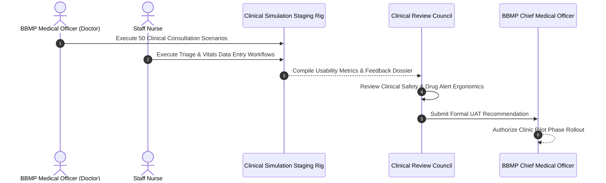

# Clinician User Acceptance Testing (UAT) Plan & Governance
## Namma Clinic Digital Health & Operations Platform
### Greater Bengaluru Authority (GBA) / BBMP Health Department
**Standard:** WHO Health Informatics Evaluation / ISO 9241-11 Usability / Clinical Council Signoff | **Status:** APPROVED BASELINE | **Code:** `QA-DOC-15`

---

## 1. UAT Charter & Clinical Council Governance
The Namma Clinic User Acceptance Testing (UAT) Plan defines the formal acceptance procedures, business validation criteria, and clinical sign-off protocols governing platform adoption by frontline BBMP healthcare workers. UAT is directed by the Clinical Review Council composed of practicing Medical Officers, Staff Nurses, Pharmacists, Laboratory Technicians, and Public Health Administrators.

### 1.1 Clinical Usability & Ergonomic Standards
1. **Consultation Speed:** Routine follow-up consultation recording must take < 90 seconds for an experienced doctor.
2. **Clinical Safety Signoff:** Zero unverified clinical logic or ambiguity in drug contraindication alerts.
3. **Language Fluency:** Frontline staff must operate comfortably in Kannada without requiring technical translation assistance.
4. **Task Success Rate:** Minimum 98% unassisted task completion rate across all clinical test scenarios.
5. **Hardware Ergonomics:** Barcode scanning and thermal receipt printing must operate with single-touch simplicity.

### 1.2 UAT Clinical Council Review Diagram


## 2. Canonical UAT Test Specifications (UAT-001 to UAT-050)
Standardized clinician acceptance testing specifications:

### UAT-001: Clinician User Acceptance Scenario 1
- **Evaluating Clinician Role:** Receptionist / Registration Clerk
- **Acceptance Quality Gate:** Clinical Ergonomics & Patient Safety Signoff
- **Passing Standard:** 100% Task Completion without Assister Intervention
- **Audit Event Emitted:** `UAT_AUDIT_UAT_001`

### UAT-002: Clinician User Acceptance Scenario 2
- **Evaluating Clinician Role:** Medical Officer / General Physician
- **Acceptance Quality Gate:** Clinical Ergonomics & Patient Safety Signoff
- **Passing Standard:** 100% Task Completion without Assister Intervention
- **Audit Event Emitted:** `UAT_AUDIT_UAT_002`

### UAT-003: Clinician User Acceptance Scenario 3
- **Evaluating Clinician Role:** Staff Nurse / Triage Specialist
- **Acceptance Quality Gate:** Clinical Ergonomics & Patient Safety Signoff
- **Passing Standard:** 100% Task Completion without Assister Intervention
- **Audit Event Emitted:** `UAT_AUDIT_UAT_003`

### UAT-004: Clinician User Acceptance Scenario 4
- **Evaluating Clinician Role:** Pharmacist / Dispenser
- **Acceptance Quality Gate:** Clinical Ergonomics & Patient Safety Signoff
- **Passing Standard:** 100% Task Completion without Assister Intervention
- **Audit Event Emitted:** `UAT_AUDIT_UAT_004`

### UAT-005: Clinician User Acceptance Scenario 5
- **Evaluating Clinician Role:** Laboratory Technician
- **Acceptance Quality Gate:** Clinical Ergonomics & Patient Safety Signoff
- **Passing Standard:** 100% Task Completion without Assister Intervention
- **Audit Event Emitted:** `UAT_AUDIT_UAT_005`

### UAT-006: Clinician User Acceptance Scenario 6
- **Evaluating Clinician Role:** Clinic Administrative Officer
- **Acceptance Quality Gate:** Clinical Ergonomics & Patient Safety Signoff
- **Passing Standard:** 100% Task Completion without Assister Intervention
- **Audit Event Emitted:** `UAT_AUDIT_UAT_006`

### UAT-007: Clinician User Acceptance Scenario 7
- **Evaluating Clinician Role:** Ward Health Supervisor
- **Acceptance Quality Gate:** Clinical Ergonomics & Patient Safety Signoff
- **Passing Standard:** 100% Task Completion without Assister Intervention
- **Audit Event Emitted:** `UAT_AUDIT_UAT_007`

### UAT-008: Clinician User Acceptance Scenario 8
- **Evaluating Clinician Role:** Zonal Health Officer (ZHO)
- **Acceptance Quality Gate:** Clinical Ergonomics & Patient Safety Signoff
- **Passing Standard:** 100% Task Completion without Assister Intervention
- **Audit Event Emitted:** `UAT_AUDIT_UAT_008`

### UAT-009: Clinician User Acceptance Scenario 9
- **Evaluating Clinician Role:** Chief Health Officer (CHO)
- **Acceptance Quality Gate:** Clinical Ergonomics & Patient Safety Signoff
- **Passing Standard:** 100% Task Completion without Assister Intervention
- **Audit Event Emitted:** `UAT_AUDIT_UAT_009`

### UAT-010: Clinician User Acceptance Scenario 10
- **Evaluating Clinician Role:** Epidemiologist / Disease Surveillance Officer
- **Acceptance Quality Gate:** Clinical Ergonomics & Patient Safety Signoff
- **Passing Standard:** 100% Task Completion without Assister Intervention
- **Audit Event Emitted:** `UAT_AUDIT_UAT_010`

### UAT-011: Clinician User Acceptance Scenario 11
- **Evaluating Clinician Role:** Quality & Compliance Auditor
- **Acceptance Quality Gate:** Clinical Ergonomics & Patient Safety Signoff
- **Passing Standard:** 100% Task Completion without Assister Intervention
- **Audit Event Emitted:** `UAT_AUDIT_UAT_011`

### UAT-012: Clinician User Acceptance Scenario 12
- **Evaluating Clinician Role:** Security Administrator / CISO
- **Acceptance Quality Gate:** Clinical Ergonomics & Patient Safety Signoff
- **Passing Standard:** 100% Task Completion without Assister Intervention
- **Audit Event Emitted:** `UAT_AUDIT_UAT_012`

### UAT-013: Clinician User Acceptance Scenario 13
- **Evaluating Clinician Role:** Central Depot Inventory Manager
- **Acceptance Quality Gate:** Clinical Ergonomics & Patient Safety Signoff
- **Passing Standard:** 100% Task Completion without Assister Intervention
- **Audit Event Emitted:** `UAT_AUDIT_UAT_013`

### UAT-014: Clinician User Acceptance Scenario 14
- **Evaluating Clinician Role:** Cold Chain Logistics Technician
- **Acceptance Quality Gate:** Clinical Ergonomics & Patient Safety Signoff
- **Passing Standard:** 100% Task Completion without Assister Intervention
- **Audit Event Emitted:** `UAT_AUDIT_UAT_014`

### UAT-015: Clinician User Acceptance Scenario 15
- **Evaluating Clinician Role:** Radiologist / Diagnostic Specialist
- **Acceptance Quality Gate:** Clinical Ergonomics & Patient Safety Signoff
- **Passing Standard:** 100% Task Completion without Assister Intervention
- **Audit Event Emitted:** `UAT_AUDIT_UAT_015`

### UAT-016: Clinician User Acceptance Scenario 16
- **Evaluating Clinician Role:** Ayush Practitioner
- **Acceptance Quality Gate:** Clinical Ergonomics & Patient Safety Signoff
- **Passing Standard:** 100% Task Completion without Assister Intervention
- **Audit Event Emitted:** `UAT_AUDIT_UAT_016`

### UAT-017: Clinician User Acceptance Scenario 17
- **Evaluating Clinician Role:** Counselor / Mental Health Worker
- **Acceptance Quality Gate:** Clinical Ergonomics & Patient Safety Signoff
- **Passing Standard:** 100% Task Completion without Assister Intervention
- **Audit Event Emitted:** `UAT_AUDIT_UAT_017`

### UAT-018: Clinician User Acceptance Scenario 18
- **Evaluating Clinician Role:** ANM / Urban Health Worker
- **Acceptance Quality Gate:** Clinical Ergonomics & Patient Safety Signoff
- **Passing Standard:** 100% Task Completion without Assister Intervention
- **Audit Event Emitted:** `UAT_AUDIT_UAT_018`

### UAT-019: Clinician User Acceptance Scenario 19
- **Evaluating Clinician Role:** ASHA Link Worker Coordinator
- **Acceptance Quality Gate:** Clinical Ergonomics & Patient Safety Signoff
- **Passing Standard:** 100% Task Completion without Assister Intervention
- **Audit Event Emitted:** `UAT_AUDIT_UAT_019`

### UAT-020: Clinician User Acceptance Scenario 20
- **Evaluating Clinician Role:** Data Entry Operator
- **Acceptance Quality Gate:** Clinical Ergonomics & Patient Safety Signoff
- **Passing Standard:** 100% Task Completion without Assister Intervention
- **Audit Event Emitted:** `UAT_AUDIT_UAT_020`

### UAT-021: Clinician User Acceptance Scenario 21
- **Evaluating Clinician Role:** Grievance Redressal Officer
- **Acceptance Quality Gate:** Clinical Ergonomics & Patient Safety Signoff
- **Passing Standard:** 100% Task Completion without Assister Intervention
- **Audit Event Emitted:** `UAT_AUDIT_UAT_021`

### UAT-022: Clinician User Acceptance Scenario 22
- **Evaluating Clinician Role:** ABDM National Integration Officer
- **Acceptance Quality Gate:** Clinical Ergonomics & Patient Safety Signoff
- **Passing Standard:** 100% Task Completion without Assister Intervention
- **Audit Event Emitted:** `UAT_AUDIT_UAT_022`

### UAT-023: Clinician User Acceptance Scenario 23
- **Evaluating Clinician Role:** Data Protection Officer (DPO)
- **Acceptance Quality Gate:** Clinical Ergonomics & Patient Safety Signoff
- **Passing Standard:** 100% Task Completion without Assister Intervention
- **Audit Event Emitted:** `UAT_AUDIT_UAT_023`

### UAT-024: Clinician User Acceptance Scenario 24
- **Evaluating Clinician Role:** IT Support & Hardware Engineer
- **Acceptance Quality Gate:** Clinical Ergonomics & Patient Safety Signoff
- **Passing Standard:** 100% Task Completion without Assister Intervention
- **Audit Event Emitted:** `UAT_AUDIT_UAT_024`

### UAT-025: Clinician User Acceptance Scenario 25
- **Evaluating Clinician Role:** Clinical Audit Committee Member
- **Acceptance Quality Gate:** Clinical Ergonomics & Patient Safety Signoff
- **Passing Standard:** 100% Task Completion without Assister Intervention
- **Audit Event Emitted:** `UAT_AUDIT_UAT_025`

### UAT-026: Clinician User Acceptance Scenario 26
- **Evaluating Clinician Role:** Procurement & Vendor Manager
- **Acceptance Quality Gate:** Clinical Ergonomics & Patient Safety Signoff
- **Passing Standard:** 100% Task Completion without Assister Intervention
- **Audit Event Emitted:** `UAT_AUDIT_UAT_026`

### UAT-027: Clinician User Acceptance Scenario 27
- **Evaluating Clinician Role:** Biomedical Waste Supervisor
- **Acceptance Quality Gate:** Clinical Ergonomics & Patient Safety Signoff
- **Passing Standard:** 100% Task Completion without Assister Intervention
- **Audit Event Emitted:** `UAT_AUDIT_UAT_027`

### UAT-028: Clinician User Acceptance Scenario 28
- **Evaluating Clinician Role:** Telemedicine Remote Specialist
- **Acceptance Quality Gate:** Clinical Ergonomics & Patient Safety Signoff
- **Passing Standard:** 100% Task Completion without Assister Intervention
- **Audit Event Emitted:** `UAT_AUDIT_UAT_028`

### UAT-029: Clinician User Acceptance Scenario 29
- **Evaluating Clinician Role:** Field Public Health Inspector
- **Acceptance Quality Gate:** Clinical Ergonomics & Patient Safety Signoff
- **Passing Standard:** 100% Task Completion without Assister Intervention
- **Audit Event Emitted:** `UAT_AUDIT_UAT_029`

### UAT-030: Clinician User Acceptance Scenario 30
- **Evaluating Clinician Role:** Super Administrator
- **Acceptance Quality Gate:** Clinical Ergonomics & Patient Safety Signoff
- **Passing Standard:** 100% Task Completion without Assister Intervention
- **Audit Event Emitted:** `UAT_AUDIT_UAT_030`

### UAT-031: Clinician User Acceptance Scenario 31
- **Evaluating Clinician Role:** Receptionist / Registration Clerk
- **Acceptance Quality Gate:** Clinical Ergonomics & Patient Safety Signoff
- **Passing Standard:** 100% Task Completion without Assister Intervention
- **Audit Event Emitted:** `UAT_AUDIT_UAT_031`

### UAT-032: Clinician User Acceptance Scenario 32
- **Evaluating Clinician Role:** Medical Officer / General Physician
- **Acceptance Quality Gate:** Clinical Ergonomics & Patient Safety Signoff
- **Passing Standard:** 100% Task Completion without Assister Intervention
- **Audit Event Emitted:** `UAT_AUDIT_UAT_032`

### UAT-033: Clinician User Acceptance Scenario 33
- **Evaluating Clinician Role:** Staff Nurse / Triage Specialist
- **Acceptance Quality Gate:** Clinical Ergonomics & Patient Safety Signoff
- **Passing Standard:** 100% Task Completion without Assister Intervention
- **Audit Event Emitted:** `UAT_AUDIT_UAT_033`

### UAT-034: Clinician User Acceptance Scenario 34
- **Evaluating Clinician Role:** Pharmacist / Dispenser
- **Acceptance Quality Gate:** Clinical Ergonomics & Patient Safety Signoff
- **Passing Standard:** 100% Task Completion without Assister Intervention
- **Audit Event Emitted:** `UAT_AUDIT_UAT_034`

### UAT-035: Clinician User Acceptance Scenario 35
- **Evaluating Clinician Role:** Laboratory Technician
- **Acceptance Quality Gate:** Clinical Ergonomics & Patient Safety Signoff
- **Passing Standard:** 100% Task Completion without Assister Intervention
- **Audit Event Emitted:** `UAT_AUDIT_UAT_035`

### UAT-036: Clinician User Acceptance Scenario 36
- **Evaluating Clinician Role:** Clinic Administrative Officer
- **Acceptance Quality Gate:** Clinical Ergonomics & Patient Safety Signoff
- **Passing Standard:** 100% Task Completion without Assister Intervention
- **Audit Event Emitted:** `UAT_AUDIT_UAT_036`

### UAT-037: Clinician User Acceptance Scenario 37
- **Evaluating Clinician Role:** Ward Health Supervisor
- **Acceptance Quality Gate:** Clinical Ergonomics & Patient Safety Signoff
- **Passing Standard:** 100% Task Completion without Assister Intervention
- **Audit Event Emitted:** `UAT_AUDIT_UAT_037`

### UAT-038: Clinician User Acceptance Scenario 38
- **Evaluating Clinician Role:** Zonal Health Officer (ZHO)
- **Acceptance Quality Gate:** Clinical Ergonomics & Patient Safety Signoff
- **Passing Standard:** 100% Task Completion without Assister Intervention
- **Audit Event Emitted:** `UAT_AUDIT_UAT_038`

### UAT-039: Clinician User Acceptance Scenario 39
- **Evaluating Clinician Role:** Chief Health Officer (CHO)
- **Acceptance Quality Gate:** Clinical Ergonomics & Patient Safety Signoff
- **Passing Standard:** 100% Task Completion without Assister Intervention
- **Audit Event Emitted:** `UAT_AUDIT_UAT_039`

### UAT-040: Clinician User Acceptance Scenario 40
- **Evaluating Clinician Role:** Epidemiologist / Disease Surveillance Officer
- **Acceptance Quality Gate:** Clinical Ergonomics & Patient Safety Signoff
- **Passing Standard:** 100% Task Completion without Assister Intervention
- **Audit Event Emitted:** `UAT_AUDIT_UAT_040`

### UAT-041: Clinician User Acceptance Scenario 41
- **Evaluating Clinician Role:** Quality & Compliance Auditor
- **Acceptance Quality Gate:** Clinical Ergonomics & Patient Safety Signoff
- **Passing Standard:** 100% Task Completion without Assister Intervention
- **Audit Event Emitted:** `UAT_AUDIT_UAT_041`

### UAT-042: Clinician User Acceptance Scenario 42
- **Evaluating Clinician Role:** Security Administrator / CISO
- **Acceptance Quality Gate:** Clinical Ergonomics & Patient Safety Signoff
- **Passing Standard:** 100% Task Completion without Assister Intervention
- **Audit Event Emitted:** `UAT_AUDIT_UAT_042`

### UAT-043: Clinician User Acceptance Scenario 43
- **Evaluating Clinician Role:** Central Depot Inventory Manager
- **Acceptance Quality Gate:** Clinical Ergonomics & Patient Safety Signoff
- **Passing Standard:** 100% Task Completion without Assister Intervention
- **Audit Event Emitted:** `UAT_AUDIT_UAT_043`

### UAT-044: Clinician User Acceptance Scenario 44
- **Evaluating Clinician Role:** Cold Chain Logistics Technician
- **Acceptance Quality Gate:** Clinical Ergonomics & Patient Safety Signoff
- **Passing Standard:** 100% Task Completion without Assister Intervention
- **Audit Event Emitted:** `UAT_AUDIT_UAT_044`

### UAT-045: Clinician User Acceptance Scenario 45
- **Evaluating Clinician Role:** Radiologist / Diagnostic Specialist
- **Acceptance Quality Gate:** Clinical Ergonomics & Patient Safety Signoff
- **Passing Standard:** 100% Task Completion without Assister Intervention
- **Audit Event Emitted:** `UAT_AUDIT_UAT_045`

### UAT-046: Clinician User Acceptance Scenario 46
- **Evaluating Clinician Role:** Ayush Practitioner
- **Acceptance Quality Gate:** Clinical Ergonomics & Patient Safety Signoff
- **Passing Standard:** 100% Task Completion without Assister Intervention
- **Audit Event Emitted:** `UAT_AUDIT_UAT_046`

### UAT-047: Clinician User Acceptance Scenario 47
- **Evaluating Clinician Role:** Counselor / Mental Health Worker
- **Acceptance Quality Gate:** Clinical Ergonomics & Patient Safety Signoff
- **Passing Standard:** 100% Task Completion without Assister Intervention
- **Audit Event Emitted:** `UAT_AUDIT_UAT_047`

### UAT-048: Clinician User Acceptance Scenario 48
- **Evaluating Clinician Role:** ANM / Urban Health Worker
- **Acceptance Quality Gate:** Clinical Ergonomics & Patient Safety Signoff
- **Passing Standard:** 100% Task Completion without Assister Intervention
- **Audit Event Emitted:** `UAT_AUDIT_UAT_048`

### UAT-049: Clinician User Acceptance Scenario 49
- **Evaluating Clinician Role:** ASHA Link Worker Coordinator
- **Acceptance Quality Gate:** Clinical Ergonomics & Patient Safety Signoff
- **Passing Standard:** 100% Task Completion without Assister Intervention
- **Audit Event Emitted:** `UAT_AUDIT_UAT_049`

### UAT-050: Clinician User Acceptance Scenario 50
- **Evaluating Clinician Role:** Data Entry Operator
- **Acceptance Quality Gate:** Clinical Ergonomics & Patient Safety Signoff
- **Passing Standard:** 100% Task Completion without Assister Intervention
- **Audit Event Emitted:** `UAT_AUDIT_UAT_050`

## 3. Detailed UAT Verification Test Cases (TC-0771 to TC-0825)
Detailed test specifications verifying end-user acceptance criteria:

### TC-0771: Test Case 771: Advanced Security, Offline & Scalability for referrals across WF-021
**Objective:** Validate non-functional resilience, encryption envelope, and concurrency for referrals in WF-021.
**Risk:** Minor operational risk regarding platform security, privacy breach, or offline desync.
**Priority:** **P2** | **Severity:** **Minor** | **Test Level:** End-to-End & Non-Functional | **Test Type:** Resilience, Offline & Security Audit
- **Requirement Traceability:** `SECR-021`
- **Workflow Traceability:** `WF-021`
- **Feature Traceability:** `FEATURE-051`
- **API Traceability:** `API-DOC-01`
- **Database Traceability:** `TABLE-043 (referrals)`
- **Screen Traceability:** `SCREEN-015`
- **Security Control Traceability:** `API-SEC-011`
- **Preconditions:** Workstation initialized with TPM 2.0 PCR attestation and valid staff credentials (Grievance Redressal Officer).
- **Test Data Specification:** Synthetic dataset TESTDATA-051 with simulated network flapping.
- **Execution Steps:** 1. Trigger workflow WF-021 on SCREEN-015. 2. Inject network delay or packet drop. 3. Confirm offline queue persistence. 4. Restore link and confirm atomic sync.
- **Expected Results:** Zero data loss, conflict resolved deterministically via timestamp-vector clocks, audit trail complete.
- **Negative Test Scenario:** Attempt unauthorized cross-tenant data exfiltration; verify gateway drops packet with 403 Forbidden.
- **Boundary Value Scenario:** Push offline queue to 10,000 pending mutations; verify local SQLite buffer does not crash.
- **Concurrency & Race Condition:** Simulate 50 parallel clinic terminals pushing updates simultaneously to gateway.
- **Autonomous Offline Behavior:** Simulate 8 hours of complete clinic internet outage; OPD consultations proceed uninterrupted.
- **Security & Access Validation:** Confirm AES-256-GCM column encryption and strict mTLS 1.3 transit cipher enforcement.
- **Audit Trail & Immutability:** Verify audit record written to WORM immutable ledger with SHA-256 hash.
- **Evidence Required:** Terminal screenshot, packet capture dump, and cryptographic Merkle verification proof.
- **Pass Acceptance Criteria:** All operations succeed with 0% data corruption, full audit ledger continuity, and latency < 350ms.
- **Failure Behavior & SLA:** Data loss, sync deadlock, cleartext PII leakage, or unhandled crash.
- **Automation Suitability:** Yes (High Candidate)
- **Execution Cadence:** Nightly Performance & Resilience Run
- **Responsible Owner:** Grievance Redressal Officer

### TC-0772: Test Case 772: Advanced Security, Offline & Scalability for referral_counter_notes across WF-022
**Objective:** Validate non-functional resilience, encryption envelope, and concurrency for referral_counter_notes in WF-022.
**Risk:** Critical operational risk regarding platform security, privacy breach, or offline desync.
**Priority:** **P0** | **Severity:** **Critical** | **Test Level:** End-to-End & Non-Functional | **Test Type:** Resilience, Offline & Security Audit
- **Requirement Traceability:** `NFR-012`
- **Workflow Traceability:** `WF-022`
- **Feature Traceability:** `FEATURE-052`
- **API Traceability:** `API-DOC-02`
- **Database Traceability:** `TABLE-044 (referral_counter_notes)`
- **Screen Traceability:** `SCREEN-016`
- **Security Control Traceability:** `AUTH-012`
- **Preconditions:** Workstation initialized with TPM 2.0 PCR attestation and valid staff credentials (ABDM National Integration Officer).
- **Test Data Specification:** Synthetic dataset TESTDATA-052 with simulated network flapping.
- **Execution Steps:** 1. Trigger workflow WF-022 on SCREEN-016. 2. Inject network delay or packet drop. 3. Confirm offline queue persistence. 4. Restore link and confirm atomic sync.
- **Expected Results:** Zero data loss, conflict resolved deterministically via timestamp-vector clocks, audit trail complete.
- **Negative Test Scenario:** Attempt unauthorized cross-tenant data exfiltration; verify gateway drops packet with 403 Forbidden.
- **Boundary Value Scenario:** Push offline queue to 10,000 pending mutations; verify local SQLite buffer does not crash.
- **Concurrency & Race Condition:** Simulate 50 parallel clinic terminals pushing updates simultaneously to gateway.
- **Autonomous Offline Behavior:** Simulate 8 hours of complete clinic internet outage; OPD consultations proceed uninterrupted.
- **Security & Access Validation:** Confirm AES-256-GCM column encryption and strict mTLS 1.3 transit cipher enforcement.
- **Audit Trail & Immutability:** Verify audit record written to WORM immutable ledger with SHA-256 hash.
- **Evidence Required:** Terminal screenshot, packet capture dump, and cryptographic Merkle verification proof.
- **Pass Acceptance Criteria:** All operations succeed with 0% data corruption, full audit ledger continuity, and latency < 350ms.
- **Failure Behavior & SLA:** Data loss, sync deadlock, cleartext PII leakage, or unhandled crash.
- **Automation Suitability:** Yes (High Candidate)
- **Execution Cadence:** Nightly Performance & Resilience Run
- **Responsible Owner:** ABDM National Integration Officer

### TC-0773: Test Case 773: Advanced Security, Offline & Scalability for ncd_episodes across WF-023
**Objective:** Validate non-functional resilience, encryption envelope, and concurrency for ncd_episodes in WF-023.
**Risk:** Major operational risk regarding platform security, privacy breach, or offline desync.
**Priority:** **P1** | **Severity:** **Major** | **Test Level:** End-to-End & Non-Functional | **Test Type:** Resilience, Offline & Security Audit
- **Requirement Traceability:** `SECR-023`
- **Workflow Traceability:** `WF-023`
- **Feature Traceability:** `FEATURE-053`
- **API Traceability:** `API-DOC-03`
- **Database Traceability:** `TABLE-045 (ncd_episodes)`
- **Screen Traceability:** `SCREEN-017`
- **Security Control Traceability:** `API-SEC-013`
- **Preconditions:** Workstation initialized with TPM 2.0 PCR attestation and valid staff credentials (Data Protection Officer (DPO)).
- **Test Data Specification:** Synthetic dataset TESTDATA-053 with simulated network flapping.
- **Execution Steps:** 1. Trigger workflow WF-023 on SCREEN-017. 2. Inject network delay or packet drop. 3. Confirm offline queue persistence. 4. Restore link and confirm atomic sync.
- **Expected Results:** Zero data loss, conflict resolved deterministically via timestamp-vector clocks, audit trail complete.
- **Negative Test Scenario:** Attempt unauthorized cross-tenant data exfiltration; verify gateway drops packet with 403 Forbidden.
- **Boundary Value Scenario:** Push offline queue to 10,000 pending mutations; verify local SQLite buffer does not crash.
- **Concurrency & Race Condition:** Simulate 50 parallel clinic terminals pushing updates simultaneously to gateway.
- **Autonomous Offline Behavior:** Simulate 8 hours of complete clinic internet outage; OPD consultations proceed uninterrupted.
- **Security & Access Validation:** Confirm AES-256-GCM column encryption and strict mTLS 1.3 transit cipher enforcement.
- **Audit Trail & Immutability:** Verify audit record written to WORM immutable ledger with SHA-256 hash.
- **Evidence Required:** Terminal screenshot, packet capture dump, and cryptographic Merkle verification proof.
- **Pass Acceptance Criteria:** All operations succeed with 0% data corruption, full audit ledger continuity, and latency < 350ms.
- **Failure Behavior & SLA:** Data loss, sync deadlock, cleartext PII leakage, or unhandled crash.
- **Automation Suitability:** Yes (High Candidate)
- **Execution Cadence:** Nightly Performance & Resilience Run
- **Responsible Owner:** Data Protection Officer (DPO)

### TC-0774: Test Case 774: Advanced Security, Offline & Scalability for follow_up_schedules across WF-024
**Objective:** Validate non-functional resilience, encryption envelope, and concurrency for follow_up_schedules in WF-024.
**Risk:** Major operational risk regarding platform security, privacy breach, or offline desync.
**Priority:** **P1** | **Severity:** **Major** | **Test Level:** End-to-End & Non-Functional | **Test Type:** Resilience, Offline & Security Audit
- **Requirement Traceability:** `NFR-014`
- **Workflow Traceability:** `WF-024`
- **Feature Traceability:** `FEATURE-054`
- **API Traceability:** `API-DOC-04`
- **Database Traceability:** `TABLE-046 (follow_up_schedules)`
- **Screen Traceability:** `SCREEN-018`
- **Security Control Traceability:** `AUTH-014`
- **Preconditions:** Workstation initialized with TPM 2.0 PCR attestation and valid staff credentials (IT Support & Hardware Engineer).
- **Test Data Specification:** Synthetic dataset TESTDATA-054 with simulated network flapping.
- **Execution Steps:** 1. Trigger workflow WF-024 on SCREEN-018. 2. Inject network delay or packet drop. 3. Confirm offline queue persistence. 4. Restore link and confirm atomic sync.
- **Expected Results:** Zero data loss, conflict resolved deterministically via timestamp-vector clocks, audit trail complete.
- **Negative Test Scenario:** Attempt unauthorized cross-tenant data exfiltration; verify gateway drops packet with 403 Forbidden.
- **Boundary Value Scenario:** Push offline queue to 10,000 pending mutations; verify local SQLite buffer does not crash.
- **Concurrency & Race Condition:** Simulate 50 parallel clinic terminals pushing updates simultaneously to gateway.
- **Autonomous Offline Behavior:** Simulate 8 hours of complete clinic internet outage; OPD consultations proceed uninterrupted.
- **Security & Access Validation:** Confirm AES-256-GCM column encryption and strict mTLS 1.3 transit cipher enforcement.
- **Audit Trail & Immutability:** Verify audit record written to WORM immutable ledger with SHA-256 hash.
- **Evidence Required:** Terminal screenshot, packet capture dump, and cryptographic Merkle verification proof.
- **Pass Acceptance Criteria:** All operations succeed with 0% data corruption, full audit ledger continuity, and latency < 350ms.
- **Failure Behavior & SLA:** Data loss, sync deadlock, cleartext PII leakage, or unhandled crash.
- **Automation Suitability:** Yes (High Candidate)
- **Execution Cadence:** Nightly Performance & Resilience Run
- **Responsible Owner:** IT Support & Hardware Engineer

### TC-0775: Test Case 775: Advanced Security, Offline & Scalability for notifications across WF-025
**Objective:** Validate non-functional resilience, encryption envelope, and concurrency for notifications in WF-025.
**Risk:** Minor operational risk regarding platform security, privacy breach, or offline desync.
**Priority:** **P2** | **Severity:** **Minor** | **Test Level:** End-to-End & Non-Functional | **Test Type:** Resilience, Offline & Security Audit
- **Requirement Traceability:** `SECR-025`
- **Workflow Traceability:** `WF-025`
- **Feature Traceability:** `FEATURE-055`
- **API Traceability:** `API-DOC-05`
- **Database Traceability:** `TABLE-047 (notifications)`
- **Screen Traceability:** `SCREEN-019`
- **Security Control Traceability:** `API-SEC-015`
- **Preconditions:** Workstation initialized with TPM 2.0 PCR attestation and valid staff credentials (Clinical Audit Committee Member).
- **Test Data Specification:** Synthetic dataset TESTDATA-055 with simulated network flapping.
- **Execution Steps:** 1. Trigger workflow WF-025 on SCREEN-019. 2. Inject network delay or packet drop. 3. Confirm offline queue persistence. 4. Restore link and confirm atomic sync.
- **Expected Results:** Zero data loss, conflict resolved deterministically via timestamp-vector clocks, audit trail complete.
- **Negative Test Scenario:** Attempt unauthorized cross-tenant data exfiltration; verify gateway drops packet with 403 Forbidden.
- **Boundary Value Scenario:** Push offline queue to 10,000 pending mutations; verify local SQLite buffer does not crash.
- **Concurrency & Race Condition:** Simulate 50 parallel clinic terminals pushing updates simultaneously to gateway.
- **Autonomous Offline Behavior:** Simulate 8 hours of complete clinic internet outage; OPD consultations proceed uninterrupted.
- **Security & Access Validation:** Confirm AES-256-GCM column encryption and strict mTLS 1.3 transit cipher enforcement.
- **Audit Trail & Immutability:** Verify audit record written to WORM immutable ledger with SHA-256 hash.
- **Evidence Required:** Terminal screenshot, packet capture dump, and cryptographic Merkle verification proof.
- **Pass Acceptance Criteria:** All operations succeed with 0% data corruption, full audit ledger continuity, and latency < 350ms.
- **Failure Behavior & SLA:** Data loss, sync deadlock, cleartext PII leakage, or unhandled crash.
- **Automation Suitability:** Yes (High Candidate)
- **Execution Cadence:** Nightly Performance & Resilience Run
- **Responsible Owner:** Clinical Audit Committee Member

### TC-0776: Test Case 776: Advanced Security, Offline & Scalability for grievances across WF-001
**Objective:** Validate non-functional resilience, encryption envelope, and concurrency for grievances in WF-001.
**Risk:** Critical operational risk regarding platform security, privacy breach, or offline desync.
**Priority:** **P0** | **Severity:** **Critical** | **Test Level:** End-to-End & Non-Functional | **Test Type:** Resilience, Offline & Security Audit
- **Requirement Traceability:** `NFR-016`
- **Workflow Traceability:** `WF-001`
- **Feature Traceability:** `FEATURE-056`
- **API Traceability:** `API-DOC-06`
- **Database Traceability:** `TABLE-048 (grievances)`
- **Screen Traceability:** `SCREEN-020`
- **Security Control Traceability:** `AUTH-016`
- **Preconditions:** Workstation initialized with TPM 2.0 PCR attestation and valid staff credentials (Procurement & Vendor Manager).
- **Test Data Specification:** Synthetic dataset TESTDATA-056 with simulated network flapping.
- **Execution Steps:** 1. Trigger workflow WF-001 on SCREEN-020. 2. Inject network delay or packet drop. 3. Confirm offline queue persistence. 4. Restore link and confirm atomic sync.
- **Expected Results:** Zero data loss, conflict resolved deterministically via timestamp-vector clocks, audit trail complete.
- **Negative Test Scenario:** Attempt unauthorized cross-tenant data exfiltration; verify gateway drops packet with 403 Forbidden.
- **Boundary Value Scenario:** Push offline queue to 10,000 pending mutations; verify local SQLite buffer does not crash.
- **Concurrency & Race Condition:** Simulate 50 parallel clinic terminals pushing updates simultaneously to gateway.
- **Autonomous Offline Behavior:** Simulate 8 hours of complete clinic internet outage; OPD consultations proceed uninterrupted.
- **Security & Access Validation:** Confirm AES-256-GCM column encryption and strict mTLS 1.3 transit cipher enforcement.
- **Audit Trail & Immutability:** Verify audit record written to WORM immutable ledger with SHA-256 hash.
- **Evidence Required:** Terminal screenshot, packet capture dump, and cryptographic Merkle verification proof.
- **Pass Acceptance Criteria:** All operations succeed with 0% data corruption, full audit ledger continuity, and latency < 350ms.
- **Failure Behavior & SLA:** Data loss, sync deadlock, cleartext PII leakage, or unhandled crash.
- **Automation Suitability:** Yes (High Candidate)
- **Execution Cadence:** Nightly Performance & Resilience Run
- **Responsible Owner:** Procurement & Vendor Manager

### TC-0777: Test Case 777: Advanced Security, Offline & Scalability for helpdesk_tickets across WF-002
**Objective:** Validate non-functional resilience, encryption envelope, and concurrency for helpdesk_tickets in WF-002.
**Risk:** Major operational risk regarding platform security, privacy breach, or offline desync.
**Priority:** **P1** | **Severity:** **Major** | **Test Level:** End-to-End & Non-Functional | **Test Type:** Resilience, Offline & Security Audit
- **Requirement Traceability:** `SECR-027`
- **Workflow Traceability:** `WF-002`
- **Feature Traceability:** `FEATURE-057`
- **API Traceability:** `API-DOC-07`
- **Database Traceability:** `TABLE-049 (helpdesk_tickets)`
- **Screen Traceability:** `SCREEN-021`
- **Security Control Traceability:** `API-SEC-017`
- **Preconditions:** Workstation initialized with TPM 2.0 PCR attestation and valid staff credentials (Biomedical Waste Supervisor).
- **Test Data Specification:** Synthetic dataset TESTDATA-057 with simulated network flapping.
- **Execution Steps:** 1. Trigger workflow WF-002 on SCREEN-021. 2. Inject network delay or packet drop. 3. Confirm offline queue persistence. 4. Restore link and confirm atomic sync.
- **Expected Results:** Zero data loss, conflict resolved deterministically via timestamp-vector clocks, audit trail complete.
- **Negative Test Scenario:** Attempt unauthorized cross-tenant data exfiltration; verify gateway drops packet with 403 Forbidden.
- **Boundary Value Scenario:** Push offline queue to 10,000 pending mutations; verify local SQLite buffer does not crash.
- **Concurrency & Race Condition:** Simulate 50 parallel clinic terminals pushing updates simultaneously to gateway.
- **Autonomous Offline Behavior:** Simulate 8 hours of complete clinic internet outage; OPD consultations proceed uninterrupted.
- **Security & Access Validation:** Confirm AES-256-GCM column encryption and strict mTLS 1.3 transit cipher enforcement.
- **Audit Trail & Immutability:** Verify audit record written to WORM immutable ledger with SHA-256 hash.
- **Evidence Required:** Terminal screenshot, packet capture dump, and cryptographic Merkle verification proof.
- **Pass Acceptance Criteria:** All operations succeed with 0% data corruption, full audit ledger continuity, and latency < 350ms.
- **Failure Behavior & SLA:** Data loss, sync deadlock, cleartext PII leakage, or unhandled crash.
- **Automation Suitability:** Yes (High Candidate)
- **Execution Cadence:** Nightly Performance & Resilience Run
- **Responsible Owner:** Biomedical Waste Supervisor

### TC-0778: Test Case 778: Advanced Security, Offline & Scalability for audit_events across WF-003
**Objective:** Validate non-functional resilience, encryption envelope, and concurrency for audit_events in WF-003.
**Risk:** Major operational risk regarding platform security, privacy breach, or offline desync.
**Priority:** **P1** | **Severity:** **Major** | **Test Level:** End-to-End & Non-Functional | **Test Type:** Resilience, Offline & Security Audit
- **Requirement Traceability:** `NFR-018`
- **Workflow Traceability:** `WF-003`
- **Feature Traceability:** `FEATURE-058`
- **API Traceability:** `API-DOC-08`
- **Database Traceability:** `TABLE-050 (audit_events)`
- **Screen Traceability:** `SCREEN-022`
- **Security Control Traceability:** `AUTH-018`
- **Preconditions:** Workstation initialized with TPM 2.0 PCR attestation and valid staff credentials (Telemedicine Remote Specialist).
- **Test Data Specification:** Synthetic dataset TESTDATA-058 with simulated network flapping.
- **Execution Steps:** 1. Trigger workflow WF-003 on SCREEN-022. 2. Inject network delay or packet drop. 3. Confirm offline queue persistence. 4. Restore link and confirm atomic sync.
- **Expected Results:** Zero data loss, conflict resolved deterministically via timestamp-vector clocks, audit trail complete.
- **Negative Test Scenario:** Attempt unauthorized cross-tenant data exfiltration; verify gateway drops packet with 403 Forbidden.
- **Boundary Value Scenario:** Push offline queue to 10,000 pending mutations; verify local SQLite buffer does not crash.
- **Concurrency & Race Condition:** Simulate 50 parallel clinic terminals pushing updates simultaneously to gateway.
- **Autonomous Offline Behavior:** Simulate 8 hours of complete clinic internet outage; OPD consultations proceed uninterrupted.
- **Security & Access Validation:** Confirm AES-256-GCM column encryption and strict mTLS 1.3 transit cipher enforcement.
- **Audit Trail & Immutability:** Verify audit record written to WORM immutable ledger with SHA-256 hash.
- **Evidence Required:** Terminal screenshot, packet capture dump, and cryptographic Merkle verification proof.
- **Pass Acceptance Criteria:** All operations succeed with 0% data corruption, full audit ledger continuity, and latency < 350ms.
- **Failure Behavior & SLA:** Data loss, sync deadlock, cleartext PII leakage, or unhandled crash.
- **Automation Suitability:** Yes (High Candidate)
- **Execution Cadence:** Nightly Performance & Resilience Run
- **Responsible Owner:** Telemedicine Remote Specialist

### TC-0779: Test Case 779: Advanced Security, Offline & Scalability for offline_mutation_log across WF-004
**Objective:** Validate non-functional resilience, encryption envelope, and concurrency for offline_mutation_log in WF-004.
**Risk:** Minor operational risk regarding platform security, privacy breach, or offline desync.
**Priority:** **P2** | **Severity:** **Minor** | **Test Level:** End-to-End & Non-Functional | **Test Type:** Resilience, Offline & Security Audit
- **Requirement Traceability:** `SECR-029`
- **Workflow Traceability:** `WF-004`
- **Feature Traceability:** `FEATURE-059`
- **API Traceability:** `API-DOC-09`
- **Database Traceability:** `TABLE-051 (offline_mutation_log)`
- **Screen Traceability:** `SCREEN-023`
- **Security Control Traceability:** `API-SEC-019`
- **Preconditions:** Workstation initialized with TPM 2.0 PCR attestation and valid staff credentials (Field Public Health Inspector).
- **Test Data Specification:** Synthetic dataset TESTDATA-059 with simulated network flapping.
- **Execution Steps:** 1. Trigger workflow WF-004 on SCREEN-023. 2. Inject network delay or packet drop. 3. Confirm offline queue persistence. 4. Restore link and confirm atomic sync.
- **Expected Results:** Zero data loss, conflict resolved deterministically via timestamp-vector clocks, audit trail complete.
- **Negative Test Scenario:** Attempt unauthorized cross-tenant data exfiltration; verify gateway drops packet with 403 Forbidden.
- **Boundary Value Scenario:** Push offline queue to 10,000 pending mutations; verify local SQLite buffer does not crash.
- **Concurrency & Race Condition:** Simulate 50 parallel clinic terminals pushing updates simultaneously to gateway.
- **Autonomous Offline Behavior:** Simulate 8 hours of complete clinic internet outage; OPD consultations proceed uninterrupted.
- **Security & Access Validation:** Confirm AES-256-GCM column encryption and strict mTLS 1.3 transit cipher enforcement.
- **Audit Trail & Immutability:** Verify audit record written to WORM immutable ledger with SHA-256 hash.
- **Evidence Required:** Terminal screenshot, packet capture dump, and cryptographic Merkle verification proof.
- **Pass Acceptance Criteria:** All operations succeed with 0% data corruption, full audit ledger continuity, and latency < 350ms.
- **Failure Behavior & SLA:** Data loss, sync deadlock, cleartext PII leakage, or unhandled crash.
- **Automation Suitability:** Yes (High Candidate)
- **Execution Cadence:** Nightly Performance & Resilience Run
- **Responsible Owner:** Field Public Health Inspector

### TC-0780: Test Case 780: Advanced Security, Offline & Scalability for abdm_artifacts across WF-005
**Objective:** Validate non-functional resilience, encryption envelope, and concurrency for abdm_artifacts in WF-005.
**Risk:** Critical operational risk regarding platform security, privacy breach, or offline desync.
**Priority:** **P0** | **Severity:** **Critical** | **Test Level:** End-to-End & Non-Functional | **Test Type:** Resilience, Offline & Security Audit
- **Requirement Traceability:** `NFR-020`
- **Workflow Traceability:** `WF-005`
- **Feature Traceability:** `FEATURE-060`
- **API Traceability:** `API-DOC-10`
- **Database Traceability:** `TABLE-052 (abdm_artifacts)`
- **Screen Traceability:** `SCREEN-024`
- **Security Control Traceability:** `AUTH-020`
- **Preconditions:** Workstation initialized with TPM 2.0 PCR attestation and valid staff credentials (Super Administrator).
- **Test Data Specification:** Synthetic dataset TESTDATA-060 with simulated network flapping.
- **Execution Steps:** 1. Trigger workflow WF-005 on SCREEN-024. 2. Inject network delay or packet drop. 3. Confirm offline queue persistence. 4. Restore link and confirm atomic sync.
- **Expected Results:** Zero data loss, conflict resolved deterministically via timestamp-vector clocks, audit trail complete.
- **Negative Test Scenario:** Attempt unauthorized cross-tenant data exfiltration; verify gateway drops packet with 403 Forbidden.
- **Boundary Value Scenario:** Push offline queue to 10,000 pending mutations; verify local SQLite buffer does not crash.
- **Concurrency & Race Condition:** Simulate 50 parallel clinic terminals pushing updates simultaneously to gateway.
- **Autonomous Offline Behavior:** Simulate 8 hours of complete clinic internet outage; OPD consultations proceed uninterrupted.
- **Security & Access Validation:** Confirm AES-256-GCM column encryption and strict mTLS 1.3 transit cipher enforcement.
- **Audit Trail & Immutability:** Verify audit record written to WORM immutable ledger with SHA-256 hash.
- **Evidence Required:** Terminal screenshot, packet capture dump, and cryptographic Merkle verification proof.
- **Pass Acceptance Criteria:** All operations succeed with 0% data corruption, full audit ledger continuity, and latency < 350ms.
- **Failure Behavior & SLA:** Data loss, sync deadlock, cleartext PII leakage, or unhandled crash.
- **Automation Suitability:** Yes (High Candidate)
- **Execution Cadence:** Nightly Performance & Resilience Run
- **Responsible Owner:** Super Administrator

### TC-0781: Test Case 781: Advanced Security, Offline & Scalability for auth_users across WF-006
**Objective:** Validate non-functional resilience, encryption envelope, and concurrency for auth_users in WF-006.
**Risk:** Major operational risk regarding platform security, privacy breach, or offline desync.
**Priority:** **P1** | **Severity:** **Major** | **Test Level:** End-to-End & Non-Functional | **Test Type:** Resilience, Offline & Security Audit
- **Requirement Traceability:** `SECR-031`
- **Workflow Traceability:** `WF-006`
- **Feature Traceability:** `FEATURE-061`
- **API Traceability:** `API-DOC-11`
- **Database Traceability:** `TABLE-001 (auth_users)`
- **Screen Traceability:** `SCREEN-025`
- **Security Control Traceability:** `API-SEC-021`
- **Preconditions:** Workstation initialized with TPM 2.0 PCR attestation and valid staff credentials (Receptionist / Registration Clerk).
- **Test Data Specification:** Synthetic dataset TESTDATA-001 with simulated network flapping.
- **Execution Steps:** 1. Trigger workflow WF-006 on SCREEN-025. 2. Inject network delay or packet drop. 3. Confirm offline queue persistence. 4. Restore link and confirm atomic sync.
- **Expected Results:** Zero data loss, conflict resolved deterministically via timestamp-vector clocks, audit trail complete.
- **Negative Test Scenario:** Attempt unauthorized cross-tenant data exfiltration; verify gateway drops packet with 403 Forbidden.
- **Boundary Value Scenario:** Push offline queue to 10,000 pending mutations; verify local SQLite buffer does not crash.
- **Concurrency & Race Condition:** Simulate 50 parallel clinic terminals pushing updates simultaneously to gateway.
- **Autonomous Offline Behavior:** Simulate 8 hours of complete clinic internet outage; OPD consultations proceed uninterrupted.
- **Security & Access Validation:** Confirm AES-256-GCM column encryption and strict mTLS 1.3 transit cipher enforcement.
- **Audit Trail & Immutability:** Verify audit record written to WORM immutable ledger with SHA-256 hash.
- **Evidence Required:** Terminal screenshot, packet capture dump, and cryptographic Merkle verification proof.
- **Pass Acceptance Criteria:** All operations succeed with 0% data corruption, full audit ledger continuity, and latency < 350ms.
- **Failure Behavior & SLA:** Data loss, sync deadlock, cleartext PII leakage, or unhandled crash.
- **Automation Suitability:** Yes (High Candidate)
- **Execution Cadence:** Nightly Performance & Resilience Run
- **Responsible Owner:** Receptionist / Registration Clerk

### TC-0782: Test Case 782: Advanced Security, Offline & Scalability for user_credentials across WF-007
**Objective:** Validate non-functional resilience, encryption envelope, and concurrency for user_credentials in WF-007.
**Risk:** Major operational risk regarding platform security, privacy breach, or offline desync.
**Priority:** **P1** | **Severity:** **Major** | **Test Level:** End-to-End & Non-Functional | **Test Type:** Resilience, Offline & Security Audit
- **Requirement Traceability:** `NFR-022`
- **Workflow Traceability:** `WF-007`
- **Feature Traceability:** `FEATURE-062`
- **API Traceability:** `API-DOC-12`
- **Database Traceability:** `TABLE-002 (user_credentials)`
- **Screen Traceability:** `SCREEN-026`
- **Security Control Traceability:** `AUTH-022`
- **Preconditions:** Workstation initialized with TPM 2.0 PCR attestation and valid staff credentials (Medical Officer / General Physician).
- **Test Data Specification:** Synthetic dataset TESTDATA-002 with simulated network flapping.
- **Execution Steps:** 1. Trigger workflow WF-007 on SCREEN-026. 2. Inject network delay or packet drop. 3. Confirm offline queue persistence. 4. Restore link and confirm atomic sync.
- **Expected Results:** Zero data loss, conflict resolved deterministically via timestamp-vector clocks, audit trail complete.
- **Negative Test Scenario:** Attempt unauthorized cross-tenant data exfiltration; verify gateway drops packet with 403 Forbidden.
- **Boundary Value Scenario:** Push offline queue to 10,000 pending mutations; verify local SQLite buffer does not crash.
- **Concurrency & Race Condition:** Simulate 50 parallel clinic terminals pushing updates simultaneously to gateway.
- **Autonomous Offline Behavior:** Simulate 8 hours of complete clinic internet outage; OPD consultations proceed uninterrupted.
- **Security & Access Validation:** Confirm AES-256-GCM column encryption and strict mTLS 1.3 transit cipher enforcement.
- **Audit Trail & Immutability:** Verify audit record written to WORM immutable ledger with SHA-256 hash.
- **Evidence Required:** Terminal screenshot, packet capture dump, and cryptographic Merkle verification proof.
- **Pass Acceptance Criteria:** All operations succeed with 0% data corruption, full audit ledger continuity, and latency < 350ms.
- **Failure Behavior & SLA:** Data loss, sync deadlock, cleartext PII leakage, or unhandled crash.
- **Automation Suitability:** Yes (High Candidate)
- **Execution Cadence:** Nightly Performance & Resilience Run
- **Responsible Owner:** Medical Officer / General Physician

### TC-0783: Test Case 783: Advanced Security, Offline & Scalability for user_sessions across WF-008
**Objective:** Validate non-functional resilience, encryption envelope, and concurrency for user_sessions in WF-008.
**Risk:** Minor operational risk regarding platform security, privacy breach, or offline desync.
**Priority:** **P2** | **Severity:** **Minor** | **Test Level:** End-to-End & Non-Functional | **Test Type:** Resilience, Offline & Security Audit
- **Requirement Traceability:** `SECR-033`
- **Workflow Traceability:** `WF-008`
- **Feature Traceability:** `FEATURE-063`
- **API Traceability:** `API-DOC-13`
- **Database Traceability:** `TABLE-003 (user_sessions)`
- **Screen Traceability:** `SCREEN-027`
- **Security Control Traceability:** `API-SEC-023`
- **Preconditions:** Workstation initialized with TPM 2.0 PCR attestation and valid staff credentials (Staff Nurse / Triage Specialist).
- **Test Data Specification:** Synthetic dataset TESTDATA-003 with simulated network flapping.
- **Execution Steps:** 1. Trigger workflow WF-008 on SCREEN-027. 2. Inject network delay or packet drop. 3. Confirm offline queue persistence. 4. Restore link and confirm atomic sync.
- **Expected Results:** Zero data loss, conflict resolved deterministically via timestamp-vector clocks, audit trail complete.
- **Negative Test Scenario:** Attempt unauthorized cross-tenant data exfiltration; verify gateway drops packet with 403 Forbidden.
- **Boundary Value Scenario:** Push offline queue to 10,000 pending mutations; verify local SQLite buffer does not crash.
- **Concurrency & Race Condition:** Simulate 50 parallel clinic terminals pushing updates simultaneously to gateway.
- **Autonomous Offline Behavior:** Simulate 8 hours of complete clinic internet outage; OPD consultations proceed uninterrupted.
- **Security & Access Validation:** Confirm AES-256-GCM column encryption and strict mTLS 1.3 transit cipher enforcement.
- **Audit Trail & Immutability:** Verify audit record written to WORM immutable ledger with SHA-256 hash.
- **Evidence Required:** Terminal screenshot, packet capture dump, and cryptographic Merkle verification proof.
- **Pass Acceptance Criteria:** All operations succeed with 0% data corruption, full audit ledger continuity, and latency < 350ms.
- **Failure Behavior & SLA:** Data loss, sync deadlock, cleartext PII leakage, or unhandled crash.
- **Automation Suitability:** Yes (High Candidate)
- **Execution Cadence:** Nightly Performance & Resilience Run
- **Responsible Owner:** Staff Nurse / Triage Specialist

### TC-0784: Test Case 784: Advanced Security, Offline & Scalability for roles across WF-009
**Objective:** Validate non-functional resilience, encryption envelope, and concurrency for roles in WF-009.
**Risk:** Critical operational risk regarding platform security, privacy breach, or offline desync.
**Priority:** **P0** | **Severity:** **Critical** | **Test Level:** End-to-End & Non-Functional | **Test Type:** Resilience, Offline & Security Audit
- **Requirement Traceability:** `NFR-024`
- **Workflow Traceability:** `WF-009`
- **Feature Traceability:** `FEATURE-064`
- **API Traceability:** `API-DOC-14`
- **Database Traceability:** `TABLE-004 (roles)`
- **Screen Traceability:** `SCREEN-028`
- **Security Control Traceability:** `AUTH-024`
- **Preconditions:** Workstation initialized with TPM 2.0 PCR attestation and valid staff credentials (Pharmacist / Dispenser).
- **Test Data Specification:** Synthetic dataset TESTDATA-004 with simulated network flapping.
- **Execution Steps:** 1. Trigger workflow WF-009 on SCREEN-028. 2. Inject network delay or packet drop. 3. Confirm offline queue persistence. 4. Restore link and confirm atomic sync.
- **Expected Results:** Zero data loss, conflict resolved deterministically via timestamp-vector clocks, audit trail complete.
- **Negative Test Scenario:** Attempt unauthorized cross-tenant data exfiltration; verify gateway drops packet with 403 Forbidden.
- **Boundary Value Scenario:** Push offline queue to 10,000 pending mutations; verify local SQLite buffer does not crash.
- **Concurrency & Race Condition:** Simulate 50 parallel clinic terminals pushing updates simultaneously to gateway.
- **Autonomous Offline Behavior:** Simulate 8 hours of complete clinic internet outage; OPD consultations proceed uninterrupted.
- **Security & Access Validation:** Confirm AES-256-GCM column encryption and strict mTLS 1.3 transit cipher enforcement.
- **Audit Trail & Immutability:** Verify audit record written to WORM immutable ledger with SHA-256 hash.
- **Evidence Required:** Terminal screenshot, packet capture dump, and cryptographic Merkle verification proof.
- **Pass Acceptance Criteria:** All operations succeed with 0% data corruption, full audit ledger continuity, and latency < 350ms.
- **Failure Behavior & SLA:** Data loss, sync deadlock, cleartext PII leakage, or unhandled crash.
- **Automation Suitability:** Yes (High Candidate)
- **Execution Cadence:** Nightly Performance & Resilience Run
- **Responsible Owner:** Pharmacist / Dispenser

### TC-0785: Test Case 785: Advanced Security, Offline & Scalability for permissions across WF-010
**Objective:** Validate non-functional resilience, encryption envelope, and concurrency for permissions in WF-010.
**Risk:** Major operational risk regarding platform security, privacy breach, or offline desync.
**Priority:** **P1** | **Severity:** **Major** | **Test Level:** End-to-End & Non-Functional | **Test Type:** Resilience, Offline & Security Audit
- **Requirement Traceability:** `SECR-035`
- **Workflow Traceability:** `WF-010`
- **Feature Traceability:** `FEATURE-065`
- **API Traceability:** `API-DOC-15`
- **Database Traceability:** `TABLE-005 (permissions)`
- **Screen Traceability:** `SCREEN-029`
- **Security Control Traceability:** `API-SEC-025`
- **Preconditions:** Workstation initialized with TPM 2.0 PCR attestation and valid staff credentials (Laboratory Technician).
- **Test Data Specification:** Synthetic dataset TESTDATA-005 with simulated network flapping.
- **Execution Steps:** 1. Trigger workflow WF-010 on SCREEN-029. 2. Inject network delay or packet drop. 3. Confirm offline queue persistence. 4. Restore link and confirm atomic sync.
- **Expected Results:** Zero data loss, conflict resolved deterministically via timestamp-vector clocks, audit trail complete.
- **Negative Test Scenario:** Attempt unauthorized cross-tenant data exfiltration; verify gateway drops packet with 403 Forbidden.
- **Boundary Value Scenario:** Push offline queue to 10,000 pending mutations; verify local SQLite buffer does not crash.
- **Concurrency & Race Condition:** Simulate 50 parallel clinic terminals pushing updates simultaneously to gateway.
- **Autonomous Offline Behavior:** Simulate 8 hours of complete clinic internet outage; OPD consultations proceed uninterrupted.
- **Security & Access Validation:** Confirm AES-256-GCM column encryption and strict mTLS 1.3 transit cipher enforcement.
- **Audit Trail & Immutability:** Verify audit record written to WORM immutable ledger with SHA-256 hash.
- **Evidence Required:** Terminal screenshot, packet capture dump, and cryptographic Merkle verification proof.
- **Pass Acceptance Criteria:** All operations succeed with 0% data corruption, full audit ledger continuity, and latency < 350ms.
- **Failure Behavior & SLA:** Data loss, sync deadlock, cleartext PII leakage, or unhandled crash.
- **Automation Suitability:** Yes (High Candidate)
- **Execution Cadence:** Nightly Performance & Resilience Run
- **Responsible Owner:** Laboratory Technician

### TC-0786: Test Case 786: Advanced Security, Offline & Scalability for role_permissions across WF-011
**Objective:** Validate non-functional resilience, encryption envelope, and concurrency for role_permissions in WF-011.
**Risk:** Major operational risk regarding platform security, privacy breach, or offline desync.
**Priority:** **P1** | **Severity:** **Major** | **Test Level:** End-to-End & Non-Functional | **Test Type:** Resilience, Offline & Security Audit
- **Requirement Traceability:** `NFR-026`
- **Workflow Traceability:** `WF-011`
- **Feature Traceability:** `FEATURE-066`
- **API Traceability:** `API-DOC-16`
- **Database Traceability:** `TABLE-006 (role_permissions)`
- **Screen Traceability:** `SCREEN-030`
- **Security Control Traceability:** `AUTH-026`
- **Preconditions:** Workstation initialized with TPM 2.0 PCR attestation and valid staff credentials (Clinic Administrative Officer).
- **Test Data Specification:** Synthetic dataset TESTDATA-006 with simulated network flapping.
- **Execution Steps:** 1. Trigger workflow WF-011 on SCREEN-030. 2. Inject network delay or packet drop. 3. Confirm offline queue persistence. 4. Restore link and confirm atomic sync.
- **Expected Results:** Zero data loss, conflict resolved deterministically via timestamp-vector clocks, audit trail complete.
- **Negative Test Scenario:** Attempt unauthorized cross-tenant data exfiltration; verify gateway drops packet with 403 Forbidden.
- **Boundary Value Scenario:** Push offline queue to 10,000 pending mutations; verify local SQLite buffer does not crash.
- **Concurrency & Race Condition:** Simulate 50 parallel clinic terminals pushing updates simultaneously to gateway.
- **Autonomous Offline Behavior:** Simulate 8 hours of complete clinic internet outage; OPD consultations proceed uninterrupted.
- **Security & Access Validation:** Confirm AES-256-GCM column encryption and strict mTLS 1.3 transit cipher enforcement.
- **Audit Trail & Immutability:** Verify audit record written to WORM immutable ledger with SHA-256 hash.
- **Evidence Required:** Terminal screenshot, packet capture dump, and cryptographic Merkle verification proof.
- **Pass Acceptance Criteria:** All operations succeed with 0% data corruption, full audit ledger continuity, and latency < 350ms.
- **Failure Behavior & SLA:** Data loss, sync deadlock, cleartext PII leakage, or unhandled crash.
- **Automation Suitability:** Yes (High Candidate)
- **Execution Cadence:** Nightly Performance & Resilience Run
- **Responsible Owner:** Clinic Administrative Officer

### TC-0787: Test Case 787: Advanced Security, Offline & Scalability for user_roles across WF-012
**Objective:** Validate non-functional resilience, encryption envelope, and concurrency for user_roles in WF-012.
**Risk:** Minor operational risk regarding platform security, privacy breach, or offline desync.
**Priority:** **P2** | **Severity:** **Minor** | **Test Level:** End-to-End & Non-Functional | **Test Type:** Resilience, Offline & Security Audit
- **Requirement Traceability:** `SECR-037`
- **Workflow Traceability:** `WF-012`
- **Feature Traceability:** `FEATURE-067`
- **API Traceability:** `API-DOC-17`
- **Database Traceability:** `TABLE-007 (user_roles)`
- **Screen Traceability:** `SCREEN-031`
- **Security Control Traceability:** `API-SEC-027`
- **Preconditions:** Workstation initialized with TPM 2.0 PCR attestation and valid staff credentials (Ward Health Supervisor).
- **Test Data Specification:** Synthetic dataset TESTDATA-007 with simulated network flapping.
- **Execution Steps:** 1. Trigger workflow WF-012 on SCREEN-031. 2. Inject network delay or packet drop. 3. Confirm offline queue persistence. 4. Restore link and confirm atomic sync.
- **Expected Results:** Zero data loss, conflict resolved deterministically via timestamp-vector clocks, audit trail complete.
- **Negative Test Scenario:** Attempt unauthorized cross-tenant data exfiltration; verify gateway drops packet with 403 Forbidden.
- **Boundary Value Scenario:** Push offline queue to 10,000 pending mutations; verify local SQLite buffer does not crash.
- **Concurrency & Race Condition:** Simulate 50 parallel clinic terminals pushing updates simultaneously to gateway.
- **Autonomous Offline Behavior:** Simulate 8 hours of complete clinic internet outage; OPD consultations proceed uninterrupted.
- **Security & Access Validation:** Confirm AES-256-GCM column encryption and strict mTLS 1.3 transit cipher enforcement.
- **Audit Trail & Immutability:** Verify audit record written to WORM immutable ledger with SHA-256 hash.
- **Evidence Required:** Terminal screenshot, packet capture dump, and cryptographic Merkle verification proof.
- **Pass Acceptance Criteria:** All operations succeed with 0% data corruption, full audit ledger continuity, and latency < 350ms.
- **Failure Behavior & SLA:** Data loss, sync deadlock, cleartext PII leakage, or unhandled crash.
- **Automation Suitability:** Yes (High Candidate)
- **Execution Cadence:** Nightly Performance & Resilience Run
- **Responsible Owner:** Ward Health Supervisor

### TC-0788: Test Case 788: Advanced Security, Offline & Scalability for facilities across WF-013
**Objective:** Validate non-functional resilience, encryption envelope, and concurrency for facilities in WF-013.
**Risk:** Critical operational risk regarding platform security, privacy breach, or offline desync.
**Priority:** **P0** | **Severity:** **Critical** | **Test Level:** End-to-End & Non-Functional | **Test Type:** Resilience, Offline & Security Audit
- **Requirement Traceability:** `NFR-028`
- **Workflow Traceability:** `WF-013`
- **Feature Traceability:** `FEATURE-068`
- **API Traceability:** `API-DOC-18`
- **Database Traceability:** `TABLE-008 (facilities)`
- **Screen Traceability:** `SCREEN-032`
- **Security Control Traceability:** `AUTH-028`
- **Preconditions:** Workstation initialized with TPM 2.0 PCR attestation and valid staff credentials (Zonal Health Officer (ZHO)).
- **Test Data Specification:** Synthetic dataset TESTDATA-008 with simulated network flapping.
- **Execution Steps:** 1. Trigger workflow WF-013 on SCREEN-032. 2. Inject network delay or packet drop. 3. Confirm offline queue persistence. 4. Restore link and confirm atomic sync.
- **Expected Results:** Zero data loss, conflict resolved deterministically via timestamp-vector clocks, audit trail complete.
- **Negative Test Scenario:** Attempt unauthorized cross-tenant data exfiltration; verify gateway drops packet with 403 Forbidden.
- **Boundary Value Scenario:** Push offline queue to 10,000 pending mutations; verify local SQLite buffer does not crash.
- **Concurrency & Race Condition:** Simulate 50 parallel clinic terminals pushing updates simultaneously to gateway.
- **Autonomous Offline Behavior:** Simulate 8 hours of complete clinic internet outage; OPD consultations proceed uninterrupted.
- **Security & Access Validation:** Confirm AES-256-GCM column encryption and strict mTLS 1.3 transit cipher enforcement.
- **Audit Trail & Immutability:** Verify audit record written to WORM immutable ledger with SHA-256 hash.
- **Evidence Required:** Terminal screenshot, packet capture dump, and cryptographic Merkle verification proof.
- **Pass Acceptance Criteria:** All operations succeed with 0% data corruption, full audit ledger continuity, and latency < 350ms.
- **Failure Behavior & SLA:** Data loss, sync deadlock, cleartext PII leakage, or unhandled crash.
- **Automation Suitability:** Yes (High Candidate)
- **Execution Cadence:** Nightly Performance & Resilience Run
- **Responsible Owner:** Zonal Health Officer (ZHO)

### TC-0789: Test Case 789: Advanced Security, Offline & Scalability for facility_rooms across WF-014
**Objective:** Validate non-functional resilience, encryption envelope, and concurrency for facility_rooms in WF-014.
**Risk:** Major operational risk regarding platform security, privacy breach, or offline desync.
**Priority:** **P1** | **Severity:** **Major** | **Test Level:** End-to-End & Non-Functional | **Test Type:** Resilience, Offline & Security Audit
- **Requirement Traceability:** `SECR-039`
- **Workflow Traceability:** `WF-014`
- **Feature Traceability:** `FEATURE-069`
- **API Traceability:** `API-DOC-19`
- **Database Traceability:** `TABLE-009 (facility_rooms)`
- **Screen Traceability:** `SCREEN-033`
- **Security Control Traceability:** `API-SEC-029`
- **Preconditions:** Workstation initialized with TPM 2.0 PCR attestation and valid staff credentials (Chief Health Officer (CHO)).
- **Test Data Specification:** Synthetic dataset TESTDATA-009 with simulated network flapping.
- **Execution Steps:** 1. Trigger workflow WF-014 on SCREEN-033. 2. Inject network delay or packet drop. 3. Confirm offline queue persistence. 4. Restore link and confirm atomic sync.
- **Expected Results:** Zero data loss, conflict resolved deterministically via timestamp-vector clocks, audit trail complete.
- **Negative Test Scenario:** Attempt unauthorized cross-tenant data exfiltration; verify gateway drops packet with 403 Forbidden.
- **Boundary Value Scenario:** Push offline queue to 10,000 pending mutations; verify local SQLite buffer does not crash.
- **Concurrency & Race Condition:** Simulate 50 parallel clinic terminals pushing updates simultaneously to gateway.
- **Autonomous Offline Behavior:** Simulate 8 hours of complete clinic internet outage; OPD consultations proceed uninterrupted.
- **Security & Access Validation:** Confirm AES-256-GCM column encryption and strict mTLS 1.3 transit cipher enforcement.
- **Audit Trail & Immutability:** Verify audit record written to WORM immutable ledger with SHA-256 hash.
- **Evidence Required:** Terminal screenshot, packet capture dump, and cryptographic Merkle verification proof.
- **Pass Acceptance Criteria:** All operations succeed with 0% data corruption, full audit ledger continuity, and latency < 350ms.
- **Failure Behavior & SLA:** Data loss, sync deadlock, cleartext PII leakage, or unhandled crash.
- **Automation Suitability:** Yes (High Candidate)
- **Execution Cadence:** Nightly Performance & Resilience Run
- **Responsible Owner:** Chief Health Officer (CHO)

### TC-0790: Test Case 790: Advanced Security, Offline & Scalability for staff_profiles across WF-015
**Objective:** Validate non-functional resilience, encryption envelope, and concurrency for staff_profiles in WF-015.
**Risk:** Major operational risk regarding platform security, privacy breach, or offline desync.
**Priority:** **P1** | **Severity:** **Major** | **Test Level:** End-to-End & Non-Functional | **Test Type:** Resilience, Offline & Security Audit
- **Requirement Traceability:** `NFR-030`
- **Workflow Traceability:** `WF-015`
- **Feature Traceability:** `FEATURE-070`
- **API Traceability:** `API-DOC-20`
- **Database Traceability:** `TABLE-010 (staff_profiles)`
- **Screen Traceability:** `SCREEN-034`
- **Security Control Traceability:** `AUTH-030`
- **Preconditions:** Workstation initialized with TPM 2.0 PCR attestation and valid staff credentials (Epidemiologist / Disease Surveillance Officer).
- **Test Data Specification:** Synthetic dataset TESTDATA-010 with simulated network flapping.
- **Execution Steps:** 1. Trigger workflow WF-015 on SCREEN-034. 2. Inject network delay or packet drop. 3. Confirm offline queue persistence. 4. Restore link and confirm atomic sync.
- **Expected Results:** Zero data loss, conflict resolved deterministically via timestamp-vector clocks, audit trail complete.
- **Negative Test Scenario:** Attempt unauthorized cross-tenant data exfiltration; verify gateway drops packet with 403 Forbidden.
- **Boundary Value Scenario:** Push offline queue to 10,000 pending mutations; verify local SQLite buffer does not crash.
- **Concurrency & Race Condition:** Simulate 50 parallel clinic terminals pushing updates simultaneously to gateway.
- **Autonomous Offline Behavior:** Simulate 8 hours of complete clinic internet outage; OPD consultations proceed uninterrupted.
- **Security & Access Validation:** Confirm AES-256-GCM column encryption and strict mTLS 1.3 transit cipher enforcement.
- **Audit Trail & Immutability:** Verify audit record written to WORM immutable ledger with SHA-256 hash.
- **Evidence Required:** Terminal screenshot, packet capture dump, and cryptographic Merkle verification proof.
- **Pass Acceptance Criteria:** All operations succeed with 0% data corruption, full audit ledger continuity, and latency < 350ms.
- **Failure Behavior & SLA:** Data loss, sync deadlock, cleartext PII leakage, or unhandled crash.
- **Automation Suitability:** Yes (High Candidate)
- **Execution Cadence:** Nightly Performance & Resilience Run
- **Responsible Owner:** Epidemiologist / Disease Surveillance Officer

### TC-0791: Test Case 791: Advanced Security, Offline & Scalability for staff_shifts across WF-016
**Objective:** Validate non-functional resilience, encryption envelope, and concurrency for staff_shifts in WF-016.
**Risk:** Minor operational risk regarding platform security, privacy breach, or offline desync.
**Priority:** **P2** | **Severity:** **Minor** | **Test Level:** End-to-End & Non-Functional | **Test Type:** Resilience, Offline & Security Audit
- **Requirement Traceability:** `SECR-041`
- **Workflow Traceability:** `WF-016`
- **Feature Traceability:** `FEATURE-071`
- **API Traceability:** `API-DOC-21`
- **Database Traceability:** `TABLE-011 (staff_shifts)`
- **Screen Traceability:** `SCREEN-035`
- **Security Control Traceability:** `API-SEC-031`
- **Preconditions:** Workstation initialized with TPM 2.0 PCR attestation and valid staff credentials (Quality & Compliance Auditor).
- **Test Data Specification:** Synthetic dataset TESTDATA-011 with simulated network flapping.
- **Execution Steps:** 1. Trigger workflow WF-016 on SCREEN-035. 2. Inject network delay or packet drop. 3. Confirm offline queue persistence. 4. Restore link and confirm atomic sync.
- **Expected Results:** Zero data loss, conflict resolved deterministically via timestamp-vector clocks, audit trail complete.
- **Negative Test Scenario:** Attempt unauthorized cross-tenant data exfiltration; verify gateway drops packet with 403 Forbidden.
- **Boundary Value Scenario:** Push offline queue to 10,000 pending mutations; verify local SQLite buffer does not crash.
- **Concurrency & Race Condition:** Simulate 50 parallel clinic terminals pushing updates simultaneously to gateway.
- **Autonomous Offline Behavior:** Simulate 8 hours of complete clinic internet outage; OPD consultations proceed uninterrupted.
- **Security & Access Validation:** Confirm AES-256-GCM column encryption and strict mTLS 1.3 transit cipher enforcement.
- **Audit Trail & Immutability:** Verify audit record written to WORM immutable ledger with SHA-256 hash.
- **Evidence Required:** Terminal screenshot, packet capture dump, and cryptographic Merkle verification proof.
- **Pass Acceptance Criteria:** All operations succeed with 0% data corruption, full audit ledger continuity, and latency < 350ms.
- **Failure Behavior & SLA:** Data loss, sync deadlock, cleartext PII leakage, or unhandled crash.
- **Automation Suitability:** Yes (High Candidate)
- **Execution Cadence:** Nightly Performance & Resilience Run
- **Responsible Owner:** Quality & Compliance Auditor

### TC-0792: Test Case 792: Advanced Security, Offline & Scalability for system_configs across WF-017
**Objective:** Validate non-functional resilience, encryption envelope, and concurrency for system_configs in WF-017.
**Risk:** Critical operational risk regarding platform security, privacy breach, or offline desync.
**Priority:** **P0** | **Severity:** **Critical** | **Test Level:** End-to-End & Non-Functional | **Test Type:** Resilience, Offline & Security Audit
- **Requirement Traceability:** `NFR-032`
- **Workflow Traceability:** `WF-017`
- **Feature Traceability:** `FEATURE-072`
- **API Traceability:** `API-DOC-22`
- **Database Traceability:** `TABLE-012 (system_configs)`
- **Screen Traceability:** `SCREEN-036`
- **Security Control Traceability:** `AUTH-032`
- **Preconditions:** Workstation initialized with TPM 2.0 PCR attestation and valid staff credentials (Security Administrator / CISO).
- **Test Data Specification:** Synthetic dataset TESTDATA-012 with simulated network flapping.
- **Execution Steps:** 1. Trigger workflow WF-017 on SCREEN-036. 2. Inject network delay or packet drop. 3. Confirm offline queue persistence. 4. Restore link and confirm atomic sync.
- **Expected Results:** Zero data loss, conflict resolved deterministically via timestamp-vector clocks, audit trail complete.
- **Negative Test Scenario:** Attempt unauthorized cross-tenant data exfiltration; verify gateway drops packet with 403 Forbidden.
- **Boundary Value Scenario:** Push offline queue to 10,000 pending mutations; verify local SQLite buffer does not crash.
- **Concurrency & Race Condition:** Simulate 50 parallel clinic terminals pushing updates simultaneously to gateway.
- **Autonomous Offline Behavior:** Simulate 8 hours of complete clinic internet outage; OPD consultations proceed uninterrupted.
- **Security & Access Validation:** Confirm AES-256-GCM column encryption and strict mTLS 1.3 transit cipher enforcement.
- **Audit Trail & Immutability:** Verify audit record written to WORM immutable ledger with SHA-256 hash.
- **Evidence Required:** Terminal screenshot, packet capture dump, and cryptographic Merkle verification proof.
- **Pass Acceptance Criteria:** All operations succeed with 0% data corruption, full audit ledger continuity, and latency < 350ms.
- **Failure Behavior & SLA:** Data loss, sync deadlock, cleartext PII leakage, or unhandled crash.
- **Automation Suitability:** Yes (High Candidate)
- **Execution Cadence:** Nightly Performance & Resilience Run
- **Responsible Owner:** Security Administrator / CISO

### TC-0793: Test Case 793: Advanced Security, Offline & Scalability for patients across WF-018
**Objective:** Validate non-functional resilience, encryption envelope, and concurrency for patients in WF-018.
**Risk:** Major operational risk regarding platform security, privacy breach, or offline desync.
**Priority:** **P1** | **Severity:** **Major** | **Test Level:** End-to-End & Non-Functional | **Test Type:** Resilience, Offline & Security Audit
- **Requirement Traceability:** `SECR-043`
- **Workflow Traceability:** `WF-018`
- **Feature Traceability:** `FEATURE-073`
- **API Traceability:** `API-DOC-01`
- **Database Traceability:** `TABLE-013 (patients)`
- **Screen Traceability:** `SCREEN-037`
- **Security Control Traceability:** `API-SEC-033`
- **Preconditions:** Workstation initialized with TPM 2.0 PCR attestation and valid staff credentials (Central Depot Inventory Manager).
- **Test Data Specification:** Synthetic dataset TESTDATA-013 with simulated network flapping.
- **Execution Steps:** 1. Trigger workflow WF-018 on SCREEN-037. 2. Inject network delay or packet drop. 3. Confirm offline queue persistence. 4. Restore link and confirm atomic sync.
- **Expected Results:** Zero data loss, conflict resolved deterministically via timestamp-vector clocks, audit trail complete.
- **Negative Test Scenario:** Attempt unauthorized cross-tenant data exfiltration; verify gateway drops packet with 403 Forbidden.
- **Boundary Value Scenario:** Push offline queue to 10,000 pending mutations; verify local SQLite buffer does not crash.
- **Concurrency & Race Condition:** Simulate 50 parallel clinic terminals pushing updates simultaneously to gateway.
- **Autonomous Offline Behavior:** Simulate 8 hours of complete clinic internet outage; OPD consultations proceed uninterrupted.
- **Security & Access Validation:** Confirm AES-256-GCM column encryption and strict mTLS 1.3 transit cipher enforcement.
- **Audit Trail & Immutability:** Verify audit record written to WORM immutable ledger with SHA-256 hash.
- **Evidence Required:** Terminal screenshot, packet capture dump, and cryptographic Merkle verification proof.
- **Pass Acceptance Criteria:** All operations succeed with 0% data corruption, full audit ledger continuity, and latency < 350ms.
- **Failure Behavior & SLA:** Data loss, sync deadlock, cleartext PII leakage, or unhandled crash.
- **Automation Suitability:** Yes (High Candidate)
- **Execution Cadence:** Nightly Performance & Resilience Run
- **Responsible Owner:** Central Depot Inventory Manager

### TC-0794: Test Case 794: Advanced Security, Offline & Scalability for patient_identifiers across WF-019
**Objective:** Validate non-functional resilience, encryption envelope, and concurrency for patient_identifiers in WF-019.
**Risk:** Major operational risk regarding platform security, privacy breach, or offline desync.
**Priority:** **P1** | **Severity:** **Major** | **Test Level:** End-to-End & Non-Functional | **Test Type:** Resilience, Offline & Security Audit
- **Requirement Traceability:** `NFR-034`
- **Workflow Traceability:** `WF-019`
- **Feature Traceability:** `FEATURE-074`
- **API Traceability:** `API-DOC-02`
- **Database Traceability:** `TABLE-014 (patient_identifiers)`
- **Screen Traceability:** `SCREEN-038`
- **Security Control Traceability:** `AUTH-034`
- **Preconditions:** Workstation initialized with TPM 2.0 PCR attestation and valid staff credentials (Cold Chain Logistics Technician).
- **Test Data Specification:** Synthetic dataset TESTDATA-014 with simulated network flapping.
- **Execution Steps:** 1. Trigger workflow WF-019 on SCREEN-038. 2. Inject network delay or packet drop. 3. Confirm offline queue persistence. 4. Restore link and confirm atomic sync.
- **Expected Results:** Zero data loss, conflict resolved deterministically via timestamp-vector clocks, audit trail complete.
- **Negative Test Scenario:** Attempt unauthorized cross-tenant data exfiltration; verify gateway drops packet with 403 Forbidden.
- **Boundary Value Scenario:** Push offline queue to 10,000 pending mutations; verify local SQLite buffer does not crash.
- **Concurrency & Race Condition:** Simulate 50 parallel clinic terminals pushing updates simultaneously to gateway.
- **Autonomous Offline Behavior:** Simulate 8 hours of complete clinic internet outage; OPD consultations proceed uninterrupted.
- **Security & Access Validation:** Confirm AES-256-GCM column encryption and strict mTLS 1.3 transit cipher enforcement.
- **Audit Trail & Immutability:** Verify audit record written to WORM immutable ledger with SHA-256 hash.
- **Evidence Required:** Terminal screenshot, packet capture dump, and cryptographic Merkle verification proof.
- **Pass Acceptance Criteria:** All operations succeed with 0% data corruption, full audit ledger continuity, and latency < 350ms.
- **Failure Behavior & SLA:** Data loss, sync deadlock, cleartext PII leakage, or unhandled crash.
- **Automation Suitability:** Yes (High Candidate)
- **Execution Cadence:** Nightly Performance & Resilience Run
- **Responsible Owner:** Cold Chain Logistics Technician

### TC-0795: Test Case 795: Advanced Security, Offline & Scalability for patient_contacts across WF-020
**Objective:** Validate non-functional resilience, encryption envelope, and concurrency for patient_contacts in WF-020.
**Risk:** Minor operational risk regarding platform security, privacy breach, or offline desync.
**Priority:** **P2** | **Severity:** **Minor** | **Test Level:** End-to-End & Non-Functional | **Test Type:** Resilience, Offline & Security Audit
- **Requirement Traceability:** `SECR-045`
- **Workflow Traceability:** `WF-020`
- **Feature Traceability:** `FEATURE-075`
- **API Traceability:** `API-DOC-03`
- **Database Traceability:** `TABLE-015 (patient_contacts)`
- **Screen Traceability:** `SCREEN-039`
- **Security Control Traceability:** `API-SEC-035`
- **Preconditions:** Workstation initialized with TPM 2.0 PCR attestation and valid staff credentials (Radiologist / Diagnostic Specialist).
- **Test Data Specification:** Synthetic dataset TESTDATA-015 with simulated network flapping.
- **Execution Steps:** 1. Trigger workflow WF-020 on SCREEN-039. 2. Inject network delay or packet drop. 3. Confirm offline queue persistence. 4. Restore link and confirm atomic sync.
- **Expected Results:** Zero data loss, conflict resolved deterministically via timestamp-vector clocks, audit trail complete.
- **Negative Test Scenario:** Attempt unauthorized cross-tenant data exfiltration; verify gateway drops packet with 403 Forbidden.
- **Boundary Value Scenario:** Push offline queue to 10,000 pending mutations; verify local SQLite buffer does not crash.
- **Concurrency & Race Condition:** Simulate 50 parallel clinic terminals pushing updates simultaneously to gateway.
- **Autonomous Offline Behavior:** Simulate 8 hours of complete clinic internet outage; OPD consultations proceed uninterrupted.
- **Security & Access Validation:** Confirm AES-256-GCM column encryption and strict mTLS 1.3 transit cipher enforcement.
- **Audit Trail & Immutability:** Verify audit record written to WORM immutable ledger with SHA-256 hash.
- **Evidence Required:** Terminal screenshot, packet capture dump, and cryptographic Merkle verification proof.
- **Pass Acceptance Criteria:** All operations succeed with 0% data corruption, full audit ledger continuity, and latency < 350ms.
- **Failure Behavior & SLA:** Data loss, sync deadlock, cleartext PII leakage, or unhandled crash.
- **Automation Suitability:** Yes (High Candidate)
- **Execution Cadence:** Nightly Performance & Resilience Run
- **Responsible Owner:** Radiologist / Diagnostic Specialist

### TC-0796: Test Case 796: Advanced Security, Offline & Scalability for patient_addresses across WF-021
**Objective:** Validate non-functional resilience, encryption envelope, and concurrency for patient_addresses in WF-021.
**Risk:** Critical operational risk regarding platform security, privacy breach, or offline desync.
**Priority:** **P0** | **Severity:** **Critical** | **Test Level:** End-to-End & Non-Functional | **Test Type:** Resilience, Offline & Security Audit
- **Requirement Traceability:** `NFR-036`
- **Workflow Traceability:** `WF-021`
- **Feature Traceability:** `FEATURE-076`
- **API Traceability:** `API-DOC-04`
- **Database Traceability:** `TABLE-016 (patient_addresses)`
- **Screen Traceability:** `SCREEN-040`
- **Security Control Traceability:** `AUTH-036`
- **Preconditions:** Workstation initialized with TPM 2.0 PCR attestation and valid staff credentials (Ayush Practitioner).
- **Test Data Specification:** Synthetic dataset TESTDATA-016 with simulated network flapping.
- **Execution Steps:** 1. Trigger workflow WF-021 on SCREEN-040. 2. Inject network delay or packet drop. 3. Confirm offline queue persistence. 4. Restore link and confirm atomic sync.
- **Expected Results:** Zero data loss, conflict resolved deterministically via timestamp-vector clocks, audit trail complete.
- **Negative Test Scenario:** Attempt unauthorized cross-tenant data exfiltration; verify gateway drops packet with 403 Forbidden.
- **Boundary Value Scenario:** Push offline queue to 10,000 pending mutations; verify local SQLite buffer does not crash.
- **Concurrency & Race Condition:** Simulate 50 parallel clinic terminals pushing updates simultaneously to gateway.
- **Autonomous Offline Behavior:** Simulate 8 hours of complete clinic internet outage; OPD consultations proceed uninterrupted.
- **Security & Access Validation:** Confirm AES-256-GCM column encryption and strict mTLS 1.3 transit cipher enforcement.
- **Audit Trail & Immutability:** Verify audit record written to WORM immutable ledger with SHA-256 hash.
- **Evidence Required:** Terminal screenshot, packet capture dump, and cryptographic Merkle verification proof.
- **Pass Acceptance Criteria:** All operations succeed with 0% data corruption, full audit ledger continuity, and latency < 350ms.
- **Failure Behavior & SLA:** Data loss, sync deadlock, cleartext PII leakage, or unhandled crash.
- **Automation Suitability:** Yes (High Candidate)
- **Execution Cadence:** Nightly Performance & Resilience Run
- **Responsible Owner:** Ayush Practitioner

### TC-0797: Test Case 797: Advanced Security, Offline & Scalability for consent_records across WF-022
**Objective:** Validate non-functional resilience, encryption envelope, and concurrency for consent_records in WF-022.
**Risk:** Major operational risk regarding platform security, privacy breach, or offline desync.
**Priority:** **P1** | **Severity:** **Major** | **Test Level:** End-to-End & Non-Functional | **Test Type:** Resilience, Offline & Security Audit
- **Requirement Traceability:** `SECR-047`
- **Workflow Traceability:** `WF-022`
- **Feature Traceability:** `FEATURE-077`
- **API Traceability:** `API-DOC-05`
- **Database Traceability:** `TABLE-017 (consent_records)`
- **Screen Traceability:** `SCREEN-041`
- **Security Control Traceability:** `API-SEC-037`
- **Preconditions:** Workstation initialized with TPM 2.0 PCR attestation and valid staff credentials (Counselor / Mental Health Worker).
- **Test Data Specification:** Synthetic dataset TESTDATA-017 with simulated network flapping.
- **Execution Steps:** 1. Trigger workflow WF-022 on SCREEN-041. 2. Inject network delay or packet drop. 3. Confirm offline queue persistence. 4. Restore link and confirm atomic sync.
- **Expected Results:** Zero data loss, conflict resolved deterministically via timestamp-vector clocks, audit trail complete.
- **Negative Test Scenario:** Attempt unauthorized cross-tenant data exfiltration; verify gateway drops packet with 403 Forbidden.
- **Boundary Value Scenario:** Push offline queue to 10,000 pending mutations; verify local SQLite buffer does not crash.
- **Concurrency & Race Condition:** Simulate 50 parallel clinic terminals pushing updates simultaneously to gateway.
- **Autonomous Offline Behavior:** Simulate 8 hours of complete clinic internet outage; OPD consultations proceed uninterrupted.
- **Security & Access Validation:** Confirm AES-256-GCM column encryption and strict mTLS 1.3 transit cipher enforcement.
- **Audit Trail & Immutability:** Verify audit record written to WORM immutable ledger with SHA-256 hash.
- **Evidence Required:** Terminal screenshot, packet capture dump, and cryptographic Merkle verification proof.
- **Pass Acceptance Criteria:** All operations succeed with 0% data corruption, full audit ledger continuity, and latency < 350ms.
- **Failure Behavior & SLA:** Data loss, sync deadlock, cleartext PII leakage, or unhandled crash.
- **Automation Suitability:** Yes (High Candidate)
- **Execution Cadence:** Nightly Performance & Resilience Run
- **Responsible Owner:** Counselor / Mental Health Worker

### TC-0798: Test Case 798: Advanced Security, Offline & Scalability for tokens across WF-023
**Objective:** Validate non-functional resilience, encryption envelope, and concurrency for tokens in WF-023.
**Risk:** Major operational risk regarding platform security, privacy breach, or offline desync.
**Priority:** **P1** | **Severity:** **Major** | **Test Level:** End-to-End & Non-Functional | **Test Type:** Resilience, Offline & Security Audit
- **Requirement Traceability:** `NFR-038`
- **Workflow Traceability:** `WF-023`
- **Feature Traceability:** `FEATURE-078`
- **API Traceability:** `API-DOC-06`
- **Database Traceability:** `TABLE-018 (tokens)`
- **Screen Traceability:** `SCREEN-042`
- **Security Control Traceability:** `AUTH-038`
- **Preconditions:** Workstation initialized with TPM 2.0 PCR attestation and valid staff credentials (ANM / Urban Health Worker).
- **Test Data Specification:** Synthetic dataset TESTDATA-018 with simulated network flapping.
- **Execution Steps:** 1. Trigger workflow WF-023 on SCREEN-042. 2. Inject network delay or packet drop. 3. Confirm offline queue persistence. 4. Restore link and confirm atomic sync.
- **Expected Results:** Zero data loss, conflict resolved deterministically via timestamp-vector clocks, audit trail complete.
- **Negative Test Scenario:** Attempt unauthorized cross-tenant data exfiltration; verify gateway drops packet with 403 Forbidden.
- **Boundary Value Scenario:** Push offline queue to 10,000 pending mutations; verify local SQLite buffer does not crash.
- **Concurrency & Race Condition:** Simulate 50 parallel clinic terminals pushing updates simultaneously to gateway.
- **Autonomous Offline Behavior:** Simulate 8 hours of complete clinic internet outage; OPD consultations proceed uninterrupted.
- **Security & Access Validation:** Confirm AES-256-GCM column encryption and strict mTLS 1.3 transit cipher enforcement.
- **Audit Trail & Immutability:** Verify audit record written to WORM immutable ledger with SHA-256 hash.
- **Evidence Required:** Terminal screenshot, packet capture dump, and cryptographic Merkle verification proof.
- **Pass Acceptance Criteria:** All operations succeed with 0% data corruption, full audit ledger continuity, and latency < 350ms.
- **Failure Behavior & SLA:** Data loss, sync deadlock, cleartext PII leakage, or unhandled crash.
- **Automation Suitability:** Yes (High Candidate)
- **Execution Cadence:** Nightly Performance & Resilience Run
- **Responsible Owner:** ANM / Urban Health Worker

### TC-0799: Test Case 799: Advanced Security, Offline & Scalability for queue_entries across WF-024
**Objective:** Validate non-functional resilience, encryption envelope, and concurrency for queue_entries in WF-024.
**Risk:** Minor operational risk regarding platform security, privacy breach, or offline desync.
**Priority:** **P2** | **Severity:** **Minor** | **Test Level:** End-to-End & Non-Functional | **Test Type:** Resilience, Offline & Security Audit
- **Requirement Traceability:** `SECR-049`
- **Workflow Traceability:** `WF-024`
- **Feature Traceability:** `FEATURE-079`
- **API Traceability:** `API-DOC-07`
- **Database Traceability:** `TABLE-019 (queue_entries)`
- **Screen Traceability:** `SCREEN-043`
- **Security Control Traceability:** `API-SEC-039`
- **Preconditions:** Workstation initialized with TPM 2.0 PCR attestation and valid staff credentials (ASHA Link Worker Coordinator).
- **Test Data Specification:** Synthetic dataset TESTDATA-019 with simulated network flapping.
- **Execution Steps:** 1. Trigger workflow WF-024 on SCREEN-043. 2. Inject network delay or packet drop. 3. Confirm offline queue persistence. 4. Restore link and confirm atomic sync.
- **Expected Results:** Zero data loss, conflict resolved deterministically via timestamp-vector clocks, audit trail complete.
- **Negative Test Scenario:** Attempt unauthorized cross-tenant data exfiltration; verify gateway drops packet with 403 Forbidden.
- **Boundary Value Scenario:** Push offline queue to 10,000 pending mutations; verify local SQLite buffer does not crash.
- **Concurrency & Race Condition:** Simulate 50 parallel clinic terminals pushing updates simultaneously to gateway.
- **Autonomous Offline Behavior:** Simulate 8 hours of complete clinic internet outage; OPD consultations proceed uninterrupted.
- **Security & Access Validation:** Confirm AES-256-GCM column encryption and strict mTLS 1.3 transit cipher enforcement.
- **Audit Trail & Immutability:** Verify audit record written to WORM immutable ledger with SHA-256 hash.
- **Evidence Required:** Terminal screenshot, packet capture dump, and cryptographic Merkle verification proof.
- **Pass Acceptance Criteria:** All operations succeed with 0% data corruption, full audit ledger continuity, and latency < 350ms.
- **Failure Behavior & SLA:** Data loss, sync deadlock, cleartext PII leakage, or unhandled crash.
- **Automation Suitability:** Yes (High Candidate)
- **Execution Cadence:** Nightly Performance & Resilience Run
- **Responsible Owner:** ASHA Link Worker Coordinator

### TC-0800: Test Case 800: Advanced Security, Offline & Scalability for triage_assessments across WF-025
**Objective:** Validate non-functional resilience, encryption envelope, and concurrency for triage_assessments in WF-025.
**Risk:** Critical operational risk regarding platform security, privacy breach, or offline desync.
**Priority:** **P0** | **Severity:** **Critical** | **Test Level:** End-to-End & Non-Functional | **Test Type:** Resilience, Offline & Security Audit
- **Requirement Traceability:** `NFR-040`
- **Workflow Traceability:** `WF-025`
- **Feature Traceability:** `FEATURE-080`
- **API Traceability:** `API-DOC-08`
- **Database Traceability:** `TABLE-020 (triage_assessments)`
- **Screen Traceability:** `SCREEN-044`
- **Security Control Traceability:** `AUTH-040`
- **Preconditions:** Workstation initialized with TPM 2.0 PCR attestation and valid staff credentials (Data Entry Operator).
- **Test Data Specification:** Synthetic dataset TESTDATA-020 with simulated network flapping.
- **Execution Steps:** 1. Trigger workflow WF-025 on SCREEN-044. 2. Inject network delay or packet drop. 3. Confirm offline queue persistence. 4. Restore link and confirm atomic sync.
- **Expected Results:** Zero data loss, conflict resolved deterministically via timestamp-vector clocks, audit trail complete.
- **Negative Test Scenario:** Attempt unauthorized cross-tenant data exfiltration; verify gateway drops packet with 403 Forbidden.
- **Boundary Value Scenario:** Push offline queue to 10,000 pending mutations; verify local SQLite buffer does not crash.
- **Concurrency & Race Condition:** Simulate 50 parallel clinic terminals pushing updates simultaneously to gateway.
- **Autonomous Offline Behavior:** Simulate 8 hours of complete clinic internet outage; OPD consultations proceed uninterrupted.
- **Security & Access Validation:** Confirm AES-256-GCM column encryption and strict mTLS 1.3 transit cipher enforcement.
- **Audit Trail & Immutability:** Verify audit record written to WORM immutable ledger with SHA-256 hash.
- **Evidence Required:** Terminal screenshot, packet capture dump, and cryptographic Merkle verification proof.
- **Pass Acceptance Criteria:** All operations succeed with 0% data corruption, full audit ledger continuity, and latency < 350ms.
- **Failure Behavior & SLA:** Data loss, sync deadlock, cleartext PII leakage, or unhandled crash.
- **Automation Suitability:** Yes (High Candidate)
- **Execution Cadence:** Nightly Performance & Resilience Run
- **Responsible Owner:** Data Entry Operator

### TC-0801: Test Case 801: Advanced Security, Offline & Scalability for patient_vitals across WF-001
**Objective:** Validate non-functional resilience, encryption envelope, and concurrency for patient_vitals in WF-001.
**Risk:** Major operational risk regarding platform security, privacy breach, or offline desync.
**Priority:** **P1** | **Severity:** **Major** | **Test Level:** End-to-End & Non-Functional | **Test Type:** Resilience, Offline & Security Audit
- **Requirement Traceability:** `SECR-001`
- **Workflow Traceability:** `WF-001`
- **Feature Traceability:** `FEATURE-081`
- **API Traceability:** `API-DOC-09`
- **Database Traceability:** `TABLE-021 (patient_vitals)`
- **Screen Traceability:** `SCREEN-045`
- **Security Control Traceability:** `API-SEC-001`
- **Preconditions:** Workstation initialized with TPM 2.0 PCR attestation and valid staff credentials (Grievance Redressal Officer).
- **Test Data Specification:** Synthetic dataset TESTDATA-021 with simulated network flapping.
- **Execution Steps:** 1. Trigger workflow WF-001 on SCREEN-045. 2. Inject network delay or packet drop. 3. Confirm offline queue persistence. 4. Restore link and confirm atomic sync.
- **Expected Results:** Zero data loss, conflict resolved deterministically via timestamp-vector clocks, audit trail complete.
- **Negative Test Scenario:** Attempt unauthorized cross-tenant data exfiltration; verify gateway drops packet with 403 Forbidden.
- **Boundary Value Scenario:** Push offline queue to 10,000 pending mutations; verify local SQLite buffer does not crash.
- **Concurrency & Race Condition:** Simulate 50 parallel clinic terminals pushing updates simultaneously to gateway.
- **Autonomous Offline Behavior:** Simulate 8 hours of complete clinic internet outage; OPD consultations proceed uninterrupted.
- **Security & Access Validation:** Confirm AES-256-GCM column encryption and strict mTLS 1.3 transit cipher enforcement.
- **Audit Trail & Immutability:** Verify audit record written to WORM immutable ledger with SHA-256 hash.
- **Evidence Required:** Terminal screenshot, packet capture dump, and cryptographic Merkle verification proof.
- **Pass Acceptance Criteria:** All operations succeed with 0% data corruption, full audit ledger continuity, and latency < 350ms.
- **Failure Behavior & SLA:** Data loss, sync deadlock, cleartext PII leakage, or unhandled crash.
- **Automation Suitability:** Yes (High Candidate)
- **Execution Cadence:** Nightly Performance & Resilience Run
- **Responsible Owner:** Grievance Redressal Officer

### TC-0802: Test Case 802: Advanced Security, Offline & Scalability for danger_alerts across WF-002
**Objective:** Validate non-functional resilience, encryption envelope, and concurrency for danger_alerts in WF-002.
**Risk:** Major operational risk regarding platform security, privacy breach, or offline desync.
**Priority:** **P1** | **Severity:** **Major** | **Test Level:** End-to-End & Non-Functional | **Test Type:** Resilience, Offline & Security Audit
- **Requirement Traceability:** `NFR-002`
- **Workflow Traceability:** `WF-002`
- **Feature Traceability:** `FEATURE-082`
- **API Traceability:** `API-DOC-10`
- **Database Traceability:** `TABLE-022 (danger_alerts)`
- **Screen Traceability:** `SCREEN-046`
- **Security Control Traceability:** `AUTH-002`
- **Preconditions:** Workstation initialized with TPM 2.0 PCR attestation and valid staff credentials (ABDM National Integration Officer).
- **Test Data Specification:** Synthetic dataset TESTDATA-022 with simulated network flapping.
- **Execution Steps:** 1. Trigger workflow WF-002 on SCREEN-046. 2. Inject network delay or packet drop. 3. Confirm offline queue persistence. 4. Restore link and confirm atomic sync.
- **Expected Results:** Zero data loss, conflict resolved deterministically via timestamp-vector clocks, audit trail complete.
- **Negative Test Scenario:** Attempt unauthorized cross-tenant data exfiltration; verify gateway drops packet with 403 Forbidden.
- **Boundary Value Scenario:** Push offline queue to 10,000 pending mutations; verify local SQLite buffer does not crash.
- **Concurrency & Race Condition:** Simulate 50 parallel clinic terminals pushing updates simultaneously to gateway.
- **Autonomous Offline Behavior:** Simulate 8 hours of complete clinic internet outage; OPD consultations proceed uninterrupted.
- **Security & Access Validation:** Confirm AES-256-GCM column encryption and strict mTLS 1.3 transit cipher enforcement.
- **Audit Trail & Immutability:** Verify audit record written to WORM immutable ledger with SHA-256 hash.
- **Evidence Required:** Terminal screenshot, packet capture dump, and cryptographic Merkle verification proof.
- **Pass Acceptance Criteria:** All operations succeed with 0% data corruption, full audit ledger continuity, and latency < 350ms.
- **Failure Behavior & SLA:** Data loss, sync deadlock, cleartext PII leakage, or unhandled crash.
- **Automation Suitability:** Yes (High Candidate)
- **Execution Cadence:** Nightly Performance & Resilience Run
- **Responsible Owner:** ABDM National Integration Officer

### TC-0803: Test Case 803: Advanced Security, Offline & Scalability for clinical_encounters across WF-003
**Objective:** Validate non-functional resilience, encryption envelope, and concurrency for clinical_encounters in WF-003.
**Risk:** Minor operational risk regarding platform security, privacy breach, or offline desync.
**Priority:** **P2** | **Severity:** **Minor** | **Test Level:** End-to-End & Non-Functional | **Test Type:** Resilience, Offline & Security Audit
- **Requirement Traceability:** `SECR-003`
- **Workflow Traceability:** `WF-003`
- **Feature Traceability:** `FEATURE-083`
- **API Traceability:** `API-DOC-11`
- **Database Traceability:** `TABLE-023 (clinical_encounters)`
- **Screen Traceability:** `SCREEN-047`
- **Security Control Traceability:** `API-SEC-003`
- **Preconditions:** Workstation initialized with TPM 2.0 PCR attestation and valid staff credentials (Data Protection Officer (DPO)).
- **Test Data Specification:** Synthetic dataset TESTDATA-023 with simulated network flapping.
- **Execution Steps:** 1. Trigger workflow WF-003 on SCREEN-047. 2. Inject network delay or packet drop. 3. Confirm offline queue persistence. 4. Restore link and confirm atomic sync.
- **Expected Results:** Zero data loss, conflict resolved deterministically via timestamp-vector clocks, audit trail complete.
- **Negative Test Scenario:** Attempt unauthorized cross-tenant data exfiltration; verify gateway drops packet with 403 Forbidden.
- **Boundary Value Scenario:** Push offline queue to 10,000 pending mutations; verify local SQLite buffer does not crash.
- **Concurrency & Race Condition:** Simulate 50 parallel clinic terminals pushing updates simultaneously to gateway.
- **Autonomous Offline Behavior:** Simulate 8 hours of complete clinic internet outage; OPD consultations proceed uninterrupted.
- **Security & Access Validation:** Confirm AES-256-GCM column encryption and strict mTLS 1.3 transit cipher enforcement.
- **Audit Trail & Immutability:** Verify audit record written to WORM immutable ledger with SHA-256 hash.
- **Evidence Required:** Terminal screenshot, packet capture dump, and cryptographic Merkle verification proof.
- **Pass Acceptance Criteria:** All operations succeed with 0% data corruption, full audit ledger continuity, and latency < 350ms.
- **Failure Behavior & SLA:** Data loss, sync deadlock, cleartext PII leakage, or unhandled crash.
- **Automation Suitability:** Yes (High Candidate)
- **Execution Cadence:** Nightly Performance & Resilience Run
- **Responsible Owner:** Data Protection Officer (DPO)

### TC-0804: Test Case 804: Advanced Security, Offline & Scalability for clinical_notes across WF-004
**Objective:** Validate non-functional resilience, encryption envelope, and concurrency for clinical_notes in WF-004.
**Risk:** Critical operational risk regarding platform security, privacy breach, or offline desync.
**Priority:** **P0** | **Severity:** **Critical** | **Test Level:** End-to-End & Non-Functional | **Test Type:** Resilience, Offline & Security Audit
- **Requirement Traceability:** `NFR-004`
- **Workflow Traceability:** `WF-004`
- **Feature Traceability:** `FEATURE-084`
- **API Traceability:** `API-DOC-12`
- **Database Traceability:** `TABLE-024 (clinical_notes)`
- **Screen Traceability:** `SCREEN-048`
- **Security Control Traceability:** `AUTH-004`
- **Preconditions:** Workstation initialized with TPM 2.0 PCR attestation and valid staff credentials (IT Support & Hardware Engineer).
- **Test Data Specification:** Synthetic dataset TESTDATA-024 with simulated network flapping.
- **Execution Steps:** 1. Trigger workflow WF-004 on SCREEN-048. 2. Inject network delay or packet drop. 3. Confirm offline queue persistence. 4. Restore link and confirm atomic sync.
- **Expected Results:** Zero data loss, conflict resolved deterministically via timestamp-vector clocks, audit trail complete.
- **Negative Test Scenario:** Attempt unauthorized cross-tenant data exfiltration; verify gateway drops packet with 403 Forbidden.
- **Boundary Value Scenario:** Push offline queue to 10,000 pending mutations; verify local SQLite buffer does not crash.
- **Concurrency & Race Condition:** Simulate 50 parallel clinic terminals pushing updates simultaneously to gateway.
- **Autonomous Offline Behavior:** Simulate 8 hours of complete clinic internet outage; OPD consultations proceed uninterrupted.
- **Security & Access Validation:** Confirm AES-256-GCM column encryption and strict mTLS 1.3 transit cipher enforcement.
- **Audit Trail & Immutability:** Verify audit record written to WORM immutable ledger with SHA-256 hash.
- **Evidence Required:** Terminal screenshot, packet capture dump, and cryptographic Merkle verification proof.
- **Pass Acceptance Criteria:** All operations succeed with 0% data corruption, full audit ledger continuity, and latency < 350ms.
- **Failure Behavior & SLA:** Data loss, sync deadlock, cleartext PII leakage, or unhandled crash.
- **Automation Suitability:** Yes (High Candidate)
- **Execution Cadence:** Nightly Performance & Resilience Run
- **Responsible Owner:** IT Support & Hardware Engineer

### TC-0805: Test Case 805: Advanced Security, Offline & Scalability for diagnoses across WF-005
**Objective:** Validate non-functional resilience, encryption envelope, and concurrency for diagnoses in WF-005.
**Risk:** Major operational risk regarding platform security, privacy breach, or offline desync.
**Priority:** **P1** | **Severity:** **Major** | **Test Level:** End-to-End & Non-Functional | **Test Type:** Resilience, Offline & Security Audit
- **Requirement Traceability:** `SECR-005`
- **Workflow Traceability:** `WF-005`
- **Feature Traceability:** `FEATURE-085`
- **API Traceability:** `API-DOC-13`
- **Database Traceability:** `TABLE-025 (diagnoses)`
- **Screen Traceability:** `SCREEN-049`
- **Security Control Traceability:** `API-SEC-005`
- **Preconditions:** Workstation initialized with TPM 2.0 PCR attestation and valid staff credentials (Clinical Audit Committee Member).
- **Test Data Specification:** Synthetic dataset TESTDATA-025 with simulated network flapping.
- **Execution Steps:** 1. Trigger workflow WF-005 on SCREEN-049. 2. Inject network delay or packet drop. 3. Confirm offline queue persistence. 4. Restore link and confirm atomic sync.
- **Expected Results:** Zero data loss, conflict resolved deterministically via timestamp-vector clocks, audit trail complete.
- **Negative Test Scenario:** Attempt unauthorized cross-tenant data exfiltration; verify gateway drops packet with 403 Forbidden.
- **Boundary Value Scenario:** Push offline queue to 10,000 pending mutations; verify local SQLite buffer does not crash.
- **Concurrency & Race Condition:** Simulate 50 parallel clinic terminals pushing updates simultaneously to gateway.
- **Autonomous Offline Behavior:** Simulate 8 hours of complete clinic internet outage; OPD consultations proceed uninterrupted.
- **Security & Access Validation:** Confirm AES-256-GCM column encryption and strict mTLS 1.3 transit cipher enforcement.
- **Audit Trail & Immutability:** Verify audit record written to WORM immutable ledger with SHA-256 hash.
- **Evidence Required:** Terminal screenshot, packet capture dump, and cryptographic Merkle verification proof.
- **Pass Acceptance Criteria:** All operations succeed with 0% data corruption, full audit ledger continuity, and latency < 350ms.
- **Failure Behavior & SLA:** Data loss, sync deadlock, cleartext PII leakage, or unhandled crash.
- **Automation Suitability:** Yes (High Candidate)
- **Execution Cadence:** Nightly Performance & Resilience Run
- **Responsible Owner:** Clinical Audit Committee Member

### TC-0806: Test Case 806: Advanced Security, Offline & Scalability for prescriptions across WF-006
**Objective:** Validate non-functional resilience, encryption envelope, and concurrency for prescriptions in WF-006.
**Risk:** Major operational risk regarding platform security, privacy breach, or offline desync.
**Priority:** **P1** | **Severity:** **Major** | **Test Level:** End-to-End & Non-Functional | **Test Type:** Resilience, Offline & Security Audit
- **Requirement Traceability:** `NFR-006`
- **Workflow Traceability:** `WF-006`
- **Feature Traceability:** `FEATURE-086`
- **API Traceability:** `API-DOC-14`
- **Database Traceability:** `TABLE-026 (prescriptions)`
- **Screen Traceability:** `SCREEN-050`
- **Security Control Traceability:** `AUTH-006`
- **Preconditions:** Workstation initialized with TPM 2.0 PCR attestation and valid staff credentials (Procurement & Vendor Manager).
- **Test Data Specification:** Synthetic dataset TESTDATA-026 with simulated network flapping.
- **Execution Steps:** 1. Trigger workflow WF-006 on SCREEN-050. 2. Inject network delay or packet drop. 3. Confirm offline queue persistence. 4. Restore link and confirm atomic sync.
- **Expected Results:** Zero data loss, conflict resolved deterministically via timestamp-vector clocks, audit trail complete.
- **Negative Test Scenario:** Attempt unauthorized cross-tenant data exfiltration; verify gateway drops packet with 403 Forbidden.
- **Boundary Value Scenario:** Push offline queue to 10,000 pending mutations; verify local SQLite buffer does not crash.
- **Concurrency & Race Condition:** Simulate 50 parallel clinic terminals pushing updates simultaneously to gateway.
- **Autonomous Offline Behavior:** Simulate 8 hours of complete clinic internet outage; OPD consultations proceed uninterrupted.
- **Security & Access Validation:** Confirm AES-256-GCM column encryption and strict mTLS 1.3 transit cipher enforcement.
- **Audit Trail & Immutability:** Verify audit record written to WORM immutable ledger with SHA-256 hash.
- **Evidence Required:** Terminal screenshot, packet capture dump, and cryptographic Merkle verification proof.
- **Pass Acceptance Criteria:** All operations succeed with 0% data corruption, full audit ledger continuity, and latency < 350ms.
- **Failure Behavior & SLA:** Data loss, sync deadlock, cleartext PII leakage, or unhandled crash.
- **Automation Suitability:** Yes (High Candidate)
- **Execution Cadence:** Nightly Performance & Resilience Run
- **Responsible Owner:** Procurement & Vendor Manager

### TC-0807: Test Case 807: Advanced Security, Offline & Scalability for prescription_items across WF-007
**Objective:** Validate non-functional resilience, encryption envelope, and concurrency for prescription_items in WF-007.
**Risk:** Minor operational risk regarding platform security, privacy breach, or offline desync.
**Priority:** **P2** | **Severity:** **Minor** | **Test Level:** End-to-End & Non-Functional | **Test Type:** Resilience, Offline & Security Audit
- **Requirement Traceability:** `SECR-007`
- **Workflow Traceability:** `WF-007`
- **Feature Traceability:** `FEATURE-087`
- **API Traceability:** `API-DOC-15`
- **Database Traceability:** `TABLE-027 (prescription_items)`
- **Screen Traceability:** `SCREEN-051`
- **Security Control Traceability:** `API-SEC-007`
- **Preconditions:** Workstation initialized with TPM 2.0 PCR attestation and valid staff credentials (Biomedical Waste Supervisor).
- **Test Data Specification:** Synthetic dataset TESTDATA-027 with simulated network flapping.
- **Execution Steps:** 1. Trigger workflow WF-007 on SCREEN-051. 2. Inject network delay or packet drop. 3. Confirm offline queue persistence. 4. Restore link and confirm atomic sync.
- **Expected Results:** Zero data loss, conflict resolved deterministically via timestamp-vector clocks, audit trail complete.
- **Negative Test Scenario:** Attempt unauthorized cross-tenant data exfiltration; verify gateway drops packet with 403 Forbidden.
- **Boundary Value Scenario:** Push offline queue to 10,000 pending mutations; verify local SQLite buffer does not crash.
- **Concurrency & Race Condition:** Simulate 50 parallel clinic terminals pushing updates simultaneously to gateway.
- **Autonomous Offline Behavior:** Simulate 8 hours of complete clinic internet outage; OPD consultations proceed uninterrupted.
- **Security & Access Validation:** Confirm AES-256-GCM column encryption and strict mTLS 1.3 transit cipher enforcement.
- **Audit Trail & Immutability:** Verify audit record written to WORM immutable ledger with SHA-256 hash.
- **Evidence Required:** Terminal screenshot, packet capture dump, and cryptographic Merkle verification proof.
- **Pass Acceptance Criteria:** All operations succeed with 0% data corruption, full audit ledger continuity, and latency < 350ms.
- **Failure Behavior & SLA:** Data loss, sync deadlock, cleartext PII leakage, or unhandled crash.
- **Automation Suitability:** Yes (High Candidate)
- **Execution Cadence:** Nightly Performance & Resilience Run
- **Responsible Owner:** Biomedical Waste Supervisor

### TC-0808: Test Case 808: Advanced Security, Offline & Scalability for lab_orders across WF-008
**Objective:** Validate non-functional resilience, encryption envelope, and concurrency for lab_orders in WF-008.
**Risk:** Critical operational risk regarding platform security, privacy breach, or offline desync.
**Priority:** **P0** | **Severity:** **Critical** | **Test Level:** End-to-End & Non-Functional | **Test Type:** Resilience, Offline & Security Audit
- **Requirement Traceability:** `NFR-008`
- **Workflow Traceability:** `WF-008`
- **Feature Traceability:** `FEATURE-088`
- **API Traceability:** `API-DOC-16`
- **Database Traceability:** `TABLE-028 (lab_orders)`
- **Screen Traceability:** `SCREEN-052`
- **Security Control Traceability:** `AUTH-008`
- **Preconditions:** Workstation initialized with TPM 2.0 PCR attestation and valid staff credentials (Telemedicine Remote Specialist).
- **Test Data Specification:** Synthetic dataset TESTDATA-028 with simulated network flapping.
- **Execution Steps:** 1. Trigger workflow WF-008 on SCREEN-052. 2. Inject network delay or packet drop. 3. Confirm offline queue persistence. 4. Restore link and confirm atomic sync.
- **Expected Results:** Zero data loss, conflict resolved deterministically via timestamp-vector clocks, audit trail complete.
- **Negative Test Scenario:** Attempt unauthorized cross-tenant data exfiltration; verify gateway drops packet with 403 Forbidden.
- **Boundary Value Scenario:** Push offline queue to 10,000 pending mutations; verify local SQLite buffer does not crash.
- **Concurrency & Race Condition:** Simulate 50 parallel clinic terminals pushing updates simultaneously to gateway.
- **Autonomous Offline Behavior:** Simulate 8 hours of complete clinic internet outage; OPD consultations proceed uninterrupted.
- **Security & Access Validation:** Confirm AES-256-GCM column encryption and strict mTLS 1.3 transit cipher enforcement.
- **Audit Trail & Immutability:** Verify audit record written to WORM immutable ledger with SHA-256 hash.
- **Evidence Required:** Terminal screenshot, packet capture dump, and cryptographic Merkle verification proof.
- **Pass Acceptance Criteria:** All operations succeed with 0% data corruption, full audit ledger continuity, and latency < 350ms.
- **Failure Behavior & SLA:** Data loss, sync deadlock, cleartext PII leakage, or unhandled crash.
- **Automation Suitability:** Yes (High Candidate)
- **Execution Cadence:** Nightly Performance & Resilience Run
- **Responsible Owner:** Telemedicine Remote Specialist

### TC-0809: Test Case 809: Advanced Security, Offline & Scalability for lab_order_items across WF-009
**Objective:** Validate non-functional resilience, encryption envelope, and concurrency for lab_order_items in WF-009.
**Risk:** Major operational risk regarding platform security, privacy breach, or offline desync.
**Priority:** **P1** | **Severity:** **Major** | **Test Level:** End-to-End & Non-Functional | **Test Type:** Resilience, Offline & Security Audit
- **Requirement Traceability:** `SECR-009`
- **Workflow Traceability:** `WF-009`
- **Feature Traceability:** `FEATURE-089`
- **API Traceability:** `API-DOC-17`
- **Database Traceability:** `TABLE-029 (lab_order_items)`
- **Screen Traceability:** `SCREEN-053`
- **Security Control Traceability:** `API-SEC-009`
- **Preconditions:** Workstation initialized with TPM 2.0 PCR attestation and valid staff credentials (Field Public Health Inspector).
- **Test Data Specification:** Synthetic dataset TESTDATA-029 with simulated network flapping.
- **Execution Steps:** 1. Trigger workflow WF-009 on SCREEN-053. 2. Inject network delay or packet drop. 3. Confirm offline queue persistence. 4. Restore link and confirm atomic sync.
- **Expected Results:** Zero data loss, conflict resolved deterministically via timestamp-vector clocks, audit trail complete.
- **Negative Test Scenario:** Attempt unauthorized cross-tenant data exfiltration; verify gateway drops packet with 403 Forbidden.
- **Boundary Value Scenario:** Push offline queue to 10,000 pending mutations; verify local SQLite buffer does not crash.
- **Concurrency & Race Condition:** Simulate 50 parallel clinic terminals pushing updates simultaneously to gateway.
- **Autonomous Offline Behavior:** Simulate 8 hours of complete clinic internet outage; OPD consultations proceed uninterrupted.
- **Security & Access Validation:** Confirm AES-256-GCM column encryption and strict mTLS 1.3 transit cipher enforcement.
- **Audit Trail & Immutability:** Verify audit record written to WORM immutable ledger with SHA-256 hash.
- **Evidence Required:** Terminal screenshot, packet capture dump, and cryptographic Merkle verification proof.
- **Pass Acceptance Criteria:** All operations succeed with 0% data corruption, full audit ledger continuity, and latency < 350ms.
- **Failure Behavior & SLA:** Data loss, sync deadlock, cleartext PII leakage, or unhandled crash.
- **Automation Suitability:** Yes (High Candidate)
- **Execution Cadence:** Nightly Performance & Resilience Run
- **Responsible Owner:** Field Public Health Inspector

### TC-0810: Test Case 810: Advanced Security, Offline & Scalability for lab_results across WF-010
**Objective:** Validate non-functional resilience, encryption envelope, and concurrency for lab_results in WF-010.
**Risk:** Major operational risk regarding platform security, privacy breach, or offline desync.
**Priority:** **P1** | **Severity:** **Major** | **Test Level:** End-to-End & Non-Functional | **Test Type:** Resilience, Offline & Security Audit
- **Requirement Traceability:** `NFR-010`
- **Workflow Traceability:** `WF-010`
- **Feature Traceability:** `FEATURE-090`
- **API Traceability:** `API-DOC-18`
- **Database Traceability:** `TABLE-030 (lab_results)`
- **Screen Traceability:** `SCREEN-054`
- **Security Control Traceability:** `AUTH-010`
- **Preconditions:** Workstation initialized with TPM 2.0 PCR attestation and valid staff credentials (Super Administrator).
- **Test Data Specification:** Synthetic dataset TESTDATA-030 with simulated network flapping.
- **Execution Steps:** 1. Trigger workflow WF-010 on SCREEN-054. 2. Inject network delay or packet drop. 3. Confirm offline queue persistence. 4. Restore link and confirm atomic sync.
- **Expected Results:** Zero data loss, conflict resolved deterministically via timestamp-vector clocks, audit trail complete.
- **Negative Test Scenario:** Attempt unauthorized cross-tenant data exfiltration; verify gateway drops packet with 403 Forbidden.
- **Boundary Value Scenario:** Push offline queue to 10,000 pending mutations; verify local SQLite buffer does not crash.
- **Concurrency & Race Condition:** Simulate 50 parallel clinic terminals pushing updates simultaneously to gateway.
- **Autonomous Offline Behavior:** Simulate 8 hours of complete clinic internet outage; OPD consultations proceed uninterrupted.
- **Security & Access Validation:** Confirm AES-256-GCM column encryption and strict mTLS 1.3 transit cipher enforcement.
- **Audit Trail & Immutability:** Verify audit record written to WORM immutable ledger with SHA-256 hash.
- **Evidence Required:** Terminal screenshot, packet capture dump, and cryptographic Merkle verification proof.
- **Pass Acceptance Criteria:** All operations succeed with 0% data corruption, full audit ledger continuity, and latency < 350ms.
- **Failure Behavior & SLA:** Data loss, sync deadlock, cleartext PII leakage, or unhandled crash.
- **Automation Suitability:** Yes (High Candidate)
- **Execution Cadence:** Nightly Performance & Resilience Run
- **Responsible Owner:** Super Administrator

### TC-0811: Test Case 811: Advanced Security, Offline & Scalability for teleconsultations across WF-011
**Objective:** Validate non-functional resilience, encryption envelope, and concurrency for teleconsultations in WF-011.
**Risk:** Minor operational risk regarding platform security, privacy breach, or offline desync.
**Priority:** **P2** | **Severity:** **Minor** | **Test Level:** End-to-End & Non-Functional | **Test Type:** Resilience, Offline & Security Audit
- **Requirement Traceability:** `SECR-011`
- **Workflow Traceability:** `WF-011`
- **Feature Traceability:** `FEATURE-091`
- **API Traceability:** `API-DOC-19`
- **Database Traceability:** `TABLE-031 (teleconsultations)`
- **Screen Traceability:** `SCREEN-055`
- **Security Control Traceability:** `API-SEC-011`
- **Preconditions:** Workstation initialized with TPM 2.0 PCR attestation and valid staff credentials (Receptionist / Registration Clerk).
- **Test Data Specification:** Synthetic dataset TESTDATA-031 with simulated network flapping.
- **Execution Steps:** 1. Trigger workflow WF-011 on SCREEN-055. 2. Inject network delay or packet drop. 3. Confirm offline queue persistence. 4. Restore link and confirm atomic sync.
- **Expected Results:** Zero data loss, conflict resolved deterministically via timestamp-vector clocks, audit trail complete.
- **Negative Test Scenario:** Attempt unauthorized cross-tenant data exfiltration; verify gateway drops packet with 403 Forbidden.
- **Boundary Value Scenario:** Push offline queue to 10,000 pending mutations; verify local SQLite buffer does not crash.
- **Concurrency & Race Condition:** Simulate 50 parallel clinic terminals pushing updates simultaneously to gateway.
- **Autonomous Offline Behavior:** Simulate 8 hours of complete clinic internet outage; OPD consultations proceed uninterrupted.
- **Security & Access Validation:** Confirm AES-256-GCM column encryption and strict mTLS 1.3 transit cipher enforcement.
- **Audit Trail & Immutability:** Verify audit record written to WORM immutable ledger with SHA-256 hash.
- **Evidence Required:** Terminal screenshot, packet capture dump, and cryptographic Merkle verification proof.
- **Pass Acceptance Criteria:** All operations succeed with 0% data corruption, full audit ledger continuity, and latency < 350ms.
- **Failure Behavior & SLA:** Data loss, sync deadlock, cleartext PII leakage, or unhandled crash.
- **Automation Suitability:** Yes (High Candidate)
- **Execution Cadence:** Nightly Performance & Resilience Run
- **Responsible Owner:** Receptionist / Registration Clerk

### TC-0812: Test Case 812: Advanced Security, Offline & Scalability for formulary_drugs across WF-012
**Objective:** Validate non-functional resilience, encryption envelope, and concurrency for formulary_drugs in WF-012.
**Risk:** Critical operational risk regarding platform security, privacy breach, or offline desync.
**Priority:** **P0** | **Severity:** **Critical** | **Test Level:** End-to-End & Non-Functional | **Test Type:** Resilience, Offline & Security Audit
- **Requirement Traceability:** `NFR-012`
- **Workflow Traceability:** `WF-012`
- **Feature Traceability:** `FEATURE-092`
- **API Traceability:** `API-DOC-20`
- **Database Traceability:** `TABLE-032 (formulary_drugs)`
- **Screen Traceability:** `SCREEN-056`
- **Security Control Traceability:** `AUTH-012`
- **Preconditions:** Workstation initialized with TPM 2.0 PCR attestation and valid staff credentials (Medical Officer / General Physician).
- **Test Data Specification:** Synthetic dataset TESTDATA-032 with simulated network flapping.
- **Execution Steps:** 1. Trigger workflow WF-012 on SCREEN-056. 2. Inject network delay or packet drop. 3. Confirm offline queue persistence. 4. Restore link and confirm atomic sync.
- **Expected Results:** Zero data loss, conflict resolved deterministically via timestamp-vector clocks, audit trail complete.
- **Negative Test Scenario:** Attempt unauthorized cross-tenant data exfiltration; verify gateway drops packet with 403 Forbidden.
- **Boundary Value Scenario:** Push offline queue to 10,000 pending mutations; verify local SQLite buffer does not crash.
- **Concurrency & Race Condition:** Simulate 50 parallel clinic terminals pushing updates simultaneously to gateway.
- **Autonomous Offline Behavior:** Simulate 8 hours of complete clinic internet outage; OPD consultations proceed uninterrupted.
- **Security & Access Validation:** Confirm AES-256-GCM column encryption and strict mTLS 1.3 transit cipher enforcement.
- **Audit Trail & Immutability:** Verify audit record written to WORM immutable ledger with SHA-256 hash.
- **Evidence Required:** Terminal screenshot, packet capture dump, and cryptographic Merkle verification proof.
- **Pass Acceptance Criteria:** All operations succeed with 0% data corruption, full audit ledger continuity, and latency < 350ms.
- **Failure Behavior & SLA:** Data loss, sync deadlock, cleartext PII leakage, or unhandled crash.
- **Automation Suitability:** Yes (High Candidate)
- **Execution Cadence:** Nightly Performance & Resilience Run
- **Responsible Owner:** Medical Officer / General Physician

### TC-0813: Test Case 813: Advanced Security, Offline & Scalability for drug_categories across WF-013
**Objective:** Validate non-functional resilience, encryption envelope, and concurrency for drug_categories in WF-013.
**Risk:** Major operational risk regarding platform security, privacy breach, or offline desync.
**Priority:** **P1** | **Severity:** **Major** | **Test Level:** End-to-End & Non-Functional | **Test Type:** Resilience, Offline & Security Audit
- **Requirement Traceability:** `SECR-013`
- **Workflow Traceability:** `WF-013`
- **Feature Traceability:** `FEATURE-093`
- **API Traceability:** `API-DOC-21`
- **Database Traceability:** `TABLE-033 (drug_categories)`
- **Screen Traceability:** `SCREEN-057`
- **Security Control Traceability:** `API-SEC-013`
- **Preconditions:** Workstation initialized with TPM 2.0 PCR attestation and valid staff credentials (Staff Nurse / Triage Specialist).
- **Test Data Specification:** Synthetic dataset TESTDATA-033 with simulated network flapping.
- **Execution Steps:** 1. Trigger workflow WF-013 on SCREEN-057. 2. Inject network delay or packet drop. 3. Confirm offline queue persistence. 4. Restore link and confirm atomic sync.
- **Expected Results:** Zero data loss, conflict resolved deterministically via timestamp-vector clocks, audit trail complete.
- **Negative Test Scenario:** Attempt unauthorized cross-tenant data exfiltration; verify gateway drops packet with 403 Forbidden.
- **Boundary Value Scenario:** Push offline queue to 10,000 pending mutations; verify local SQLite buffer does not crash.
- **Concurrency & Race Condition:** Simulate 50 parallel clinic terminals pushing updates simultaneously to gateway.
- **Autonomous Offline Behavior:** Simulate 8 hours of complete clinic internet outage; OPD consultations proceed uninterrupted.
- **Security & Access Validation:** Confirm AES-256-GCM column encryption and strict mTLS 1.3 transit cipher enforcement.
- **Audit Trail & Immutability:** Verify audit record written to WORM immutable ledger with SHA-256 hash.
- **Evidence Required:** Terminal screenshot, packet capture dump, and cryptographic Merkle verification proof.
- **Pass Acceptance Criteria:** All operations succeed with 0% data corruption, full audit ledger continuity, and latency < 350ms.
- **Failure Behavior & SLA:** Data loss, sync deadlock, cleartext PII leakage, or unhandled crash.
- **Automation Suitability:** Yes (High Candidate)
- **Execution Cadence:** Nightly Performance & Resilience Run
- **Responsible Owner:** Staff Nurse / Triage Specialist

### TC-0814: Test Case 814: Advanced Security, Offline & Scalability for pharmacy_batches across WF-014
**Objective:** Validate non-functional resilience, encryption envelope, and concurrency for pharmacy_batches in WF-014.
**Risk:** Major operational risk regarding platform security, privacy breach, or offline desync.
**Priority:** **P1** | **Severity:** **Major** | **Test Level:** End-to-End & Non-Functional | **Test Type:** Resilience, Offline & Security Audit
- **Requirement Traceability:** `NFR-014`
- **Workflow Traceability:** `WF-014`
- **Feature Traceability:** `FEATURE-094`
- **API Traceability:** `API-DOC-22`
- **Database Traceability:** `TABLE-034 (pharmacy_batches)`
- **Screen Traceability:** `SCREEN-058`
- **Security Control Traceability:** `AUTH-014`
- **Preconditions:** Workstation initialized with TPM 2.0 PCR attestation and valid staff credentials (Pharmacist / Dispenser).
- **Test Data Specification:** Synthetic dataset TESTDATA-034 with simulated network flapping.
- **Execution Steps:** 1. Trigger workflow WF-014 on SCREEN-058. 2. Inject network delay or packet drop. 3. Confirm offline queue persistence. 4. Restore link and confirm atomic sync.
- **Expected Results:** Zero data loss, conflict resolved deterministically via timestamp-vector clocks, audit trail complete.
- **Negative Test Scenario:** Attempt unauthorized cross-tenant data exfiltration; verify gateway drops packet with 403 Forbidden.
- **Boundary Value Scenario:** Push offline queue to 10,000 pending mutations; verify local SQLite buffer does not crash.
- **Concurrency & Race Condition:** Simulate 50 parallel clinic terminals pushing updates simultaneously to gateway.
- **Autonomous Offline Behavior:** Simulate 8 hours of complete clinic internet outage; OPD consultations proceed uninterrupted.
- **Security & Access Validation:** Confirm AES-256-GCM column encryption and strict mTLS 1.3 transit cipher enforcement.
- **Audit Trail & Immutability:** Verify audit record written to WORM immutable ledger with SHA-256 hash.
- **Evidence Required:** Terminal screenshot, packet capture dump, and cryptographic Merkle verification proof.
- **Pass Acceptance Criteria:** All operations succeed with 0% data corruption, full audit ledger continuity, and latency < 350ms.
- **Failure Behavior & SLA:** Data loss, sync deadlock, cleartext PII leakage, or unhandled crash.
- **Automation Suitability:** Yes (High Candidate)
- **Execution Cadence:** Nightly Performance & Resilience Run
- **Responsible Owner:** Pharmacist / Dispenser

### TC-0815: Test Case 815: Advanced Security, Offline & Scalability for clinic_stock across WF-015
**Objective:** Validate non-functional resilience, encryption envelope, and concurrency for clinic_stock in WF-015.
**Risk:** Minor operational risk regarding platform security, privacy breach, or offline desync.
**Priority:** **P2** | **Severity:** **Minor** | **Test Level:** End-to-End & Non-Functional | **Test Type:** Resilience, Offline & Security Audit
- **Requirement Traceability:** `SECR-015`
- **Workflow Traceability:** `WF-015`
- **Feature Traceability:** `FEATURE-095`
- **API Traceability:** `API-DOC-01`
- **Database Traceability:** `TABLE-035 (clinic_stock)`
- **Screen Traceability:** `SCREEN-059`
- **Security Control Traceability:** `API-SEC-015`
- **Preconditions:** Workstation initialized with TPM 2.0 PCR attestation and valid staff credentials (Laboratory Technician).
- **Test Data Specification:** Synthetic dataset TESTDATA-035 with simulated network flapping.
- **Execution Steps:** 1. Trigger workflow WF-015 on SCREEN-059. 2. Inject network delay or packet drop. 3. Confirm offline queue persistence. 4. Restore link and confirm atomic sync.
- **Expected Results:** Zero data loss, conflict resolved deterministically via timestamp-vector clocks, audit trail complete.
- **Negative Test Scenario:** Attempt unauthorized cross-tenant data exfiltration; verify gateway drops packet with 403 Forbidden.
- **Boundary Value Scenario:** Push offline queue to 10,000 pending mutations; verify local SQLite buffer does not crash.
- **Concurrency & Race Condition:** Simulate 50 parallel clinic terminals pushing updates simultaneously to gateway.
- **Autonomous Offline Behavior:** Simulate 8 hours of complete clinic internet outage; OPD consultations proceed uninterrupted.
- **Security & Access Validation:** Confirm AES-256-GCM column encryption and strict mTLS 1.3 transit cipher enforcement.
- **Audit Trail & Immutability:** Verify audit record written to WORM immutable ledger with SHA-256 hash.
- **Evidence Required:** Terminal screenshot, packet capture dump, and cryptographic Merkle verification proof.
- **Pass Acceptance Criteria:** All operations succeed with 0% data corruption, full audit ledger continuity, and latency < 350ms.
- **Failure Behavior & SLA:** Data loss, sync deadlock, cleartext PII leakage, or unhandled crash.
- **Automation Suitability:** Yes (High Candidate)
- **Execution Cadence:** Nightly Performance & Resilience Run
- **Responsible Owner:** Laboratory Technician

### TC-0816: Test Case 816: Advanced Security, Offline & Scalability for dispensations across WF-016
**Objective:** Validate non-functional resilience, encryption envelope, and concurrency for dispensations in WF-016.
**Risk:** Critical operational risk regarding platform security, privacy breach, or offline desync.
**Priority:** **P0** | **Severity:** **Critical** | **Test Level:** End-to-End & Non-Functional | **Test Type:** Resilience, Offline & Security Audit
- **Requirement Traceability:** `NFR-016`
- **Workflow Traceability:** `WF-016`
- **Feature Traceability:** `FEATURE-096`
- **API Traceability:** `API-DOC-02`
- **Database Traceability:** `TABLE-036 (dispensations)`
- **Screen Traceability:** `SCREEN-060`
- **Security Control Traceability:** `AUTH-016`
- **Preconditions:** Workstation initialized with TPM 2.0 PCR attestation and valid staff credentials (Clinic Administrative Officer).
- **Test Data Specification:** Synthetic dataset TESTDATA-036 with simulated network flapping.
- **Execution Steps:** 1. Trigger workflow WF-016 on SCREEN-060. 2. Inject network delay or packet drop. 3. Confirm offline queue persistence. 4. Restore link and confirm atomic sync.
- **Expected Results:** Zero data loss, conflict resolved deterministically via timestamp-vector clocks, audit trail complete.
- **Negative Test Scenario:** Attempt unauthorized cross-tenant data exfiltration; verify gateway drops packet with 403 Forbidden.
- **Boundary Value Scenario:** Push offline queue to 10,000 pending mutations; verify local SQLite buffer does not crash.
- **Concurrency & Race Condition:** Simulate 50 parallel clinic terminals pushing updates simultaneously to gateway.
- **Autonomous Offline Behavior:** Simulate 8 hours of complete clinic internet outage; OPD consultations proceed uninterrupted.
- **Security & Access Validation:** Confirm AES-256-GCM column encryption and strict mTLS 1.3 transit cipher enforcement.
- **Audit Trail & Immutability:** Verify audit record written to WORM immutable ledger with SHA-256 hash.
- **Evidence Required:** Terminal screenshot, packet capture dump, and cryptographic Merkle verification proof.
- **Pass Acceptance Criteria:** All operations succeed with 0% data corruption, full audit ledger continuity, and latency < 350ms.
- **Failure Behavior & SLA:** Data loss, sync deadlock, cleartext PII leakage, or unhandled crash.
- **Automation Suitability:** Yes (High Candidate)
- **Execution Cadence:** Nightly Performance & Resilience Run
- **Responsible Owner:** Clinic Administrative Officer

### TC-0817: Test Case 817: Advanced Security, Offline & Scalability for dispensation_items across WF-017
**Objective:** Validate non-functional resilience, encryption envelope, and concurrency for dispensation_items in WF-017.
**Risk:** Major operational risk regarding platform security, privacy breach, or offline desync.
**Priority:** **P1** | **Severity:** **Major** | **Test Level:** End-to-End & Non-Functional | **Test Type:** Resilience, Offline & Security Audit
- **Requirement Traceability:** `SECR-017`
- **Workflow Traceability:** `WF-017`
- **Feature Traceability:** `FEATURE-097`
- **API Traceability:** `API-DOC-03`
- **Database Traceability:** `TABLE-037 (dispensation_items)`
- **Screen Traceability:** `SCREEN-061`
- **Security Control Traceability:** `API-SEC-017`
- **Preconditions:** Workstation initialized with TPM 2.0 PCR attestation and valid staff credentials (Ward Health Supervisor).
- **Test Data Specification:** Synthetic dataset TESTDATA-037 with simulated network flapping.
- **Execution Steps:** 1. Trigger workflow WF-017 on SCREEN-061. 2. Inject network delay or packet drop. 3. Confirm offline queue persistence. 4. Restore link and confirm atomic sync.
- **Expected Results:** Zero data loss, conflict resolved deterministically via timestamp-vector clocks, audit trail complete.
- **Negative Test Scenario:** Attempt unauthorized cross-tenant data exfiltration; verify gateway drops packet with 403 Forbidden.
- **Boundary Value Scenario:** Push offline queue to 10,000 pending mutations; verify local SQLite buffer does not crash.
- **Concurrency & Race Condition:** Simulate 50 parallel clinic terminals pushing updates simultaneously to gateway.
- **Autonomous Offline Behavior:** Simulate 8 hours of complete clinic internet outage; OPD consultations proceed uninterrupted.
- **Security & Access Validation:** Confirm AES-256-GCM column encryption and strict mTLS 1.3 transit cipher enforcement.
- **Audit Trail & Immutability:** Verify audit record written to WORM immutable ledger with SHA-256 hash.
- **Evidence Required:** Terminal screenshot, packet capture dump, and cryptographic Merkle verification proof.
- **Pass Acceptance Criteria:** All operations succeed with 0% data corruption, full audit ledger continuity, and latency < 350ms.
- **Failure Behavior & SLA:** Data loss, sync deadlock, cleartext PII leakage, or unhandled crash.
- **Automation Suitability:** Yes (High Candidate)
- **Execution Cadence:** Nightly Performance & Resilience Run
- **Responsible Owner:** Ward Health Supervisor

### TC-0818: Test Case 818: Advanced Security, Offline & Scalability for stock_movements across WF-018
**Objective:** Validate non-functional resilience, encryption envelope, and concurrency for stock_movements in WF-018.
**Risk:** Major operational risk regarding platform security, privacy breach, or offline desync.
**Priority:** **P1** | **Severity:** **Major** | **Test Level:** End-to-End & Non-Functional | **Test Type:** Resilience, Offline & Security Audit
- **Requirement Traceability:** `NFR-018`
- **Workflow Traceability:** `WF-018`
- **Feature Traceability:** `FEATURE-098`
- **API Traceability:** `API-DOC-04`
- **Database Traceability:** `TABLE-038 (stock_movements)`
- **Screen Traceability:** `SCREEN-062`
- **Security Control Traceability:** `AUTH-018`
- **Preconditions:** Workstation initialized with TPM 2.0 PCR attestation and valid staff credentials (Zonal Health Officer (ZHO)).
- **Test Data Specification:** Synthetic dataset TESTDATA-038 with simulated network flapping.
- **Execution Steps:** 1. Trigger workflow WF-018 on SCREEN-062. 2. Inject network delay or packet drop. 3. Confirm offline queue persistence. 4. Restore link and confirm atomic sync.
- **Expected Results:** Zero data loss, conflict resolved deterministically via timestamp-vector clocks, audit trail complete.
- **Negative Test Scenario:** Attempt unauthorized cross-tenant data exfiltration; verify gateway drops packet with 403 Forbidden.
- **Boundary Value Scenario:** Push offline queue to 10,000 pending mutations; verify local SQLite buffer does not crash.
- **Concurrency & Race Condition:** Simulate 50 parallel clinic terminals pushing updates simultaneously to gateway.
- **Autonomous Offline Behavior:** Simulate 8 hours of complete clinic internet outage; OPD consultations proceed uninterrupted.
- **Security & Access Validation:** Confirm AES-256-GCM column encryption and strict mTLS 1.3 transit cipher enforcement.
- **Audit Trail & Immutability:** Verify audit record written to WORM immutable ledger with SHA-256 hash.
- **Evidence Required:** Terminal screenshot, packet capture dump, and cryptographic Merkle verification proof.
- **Pass Acceptance Criteria:** All operations succeed with 0% data corruption, full audit ledger continuity, and latency < 350ms.
- **Failure Behavior & SLA:** Data loss, sync deadlock, cleartext PII leakage, or unhandled crash.
- **Automation Suitability:** Yes (High Candidate)
- **Execution Cadence:** Nightly Performance & Resilience Run
- **Responsible Owner:** Zonal Health Officer (ZHO)

### TC-0819: Test Case 819: Advanced Security, Offline & Scalability for drug_indents across WF-019
**Objective:** Validate non-functional resilience, encryption envelope, and concurrency for drug_indents in WF-019.
**Risk:** Minor operational risk regarding platform security, privacy breach, or offline desync.
**Priority:** **P2** | **Severity:** **Minor** | **Test Level:** End-to-End & Non-Functional | **Test Type:** Resilience, Offline & Security Audit
- **Requirement Traceability:** `SECR-019`
- **Workflow Traceability:** `WF-019`
- **Feature Traceability:** `FEATURE-099`
- **API Traceability:** `API-DOC-05`
- **Database Traceability:** `TABLE-039 (drug_indents)`
- **Screen Traceability:** `SCREEN-063`
- **Security Control Traceability:** `API-SEC-019`
- **Preconditions:** Workstation initialized with TPM 2.0 PCR attestation and valid staff credentials (Chief Health Officer (CHO)).
- **Test Data Specification:** Synthetic dataset TESTDATA-039 with simulated network flapping.
- **Execution Steps:** 1. Trigger workflow WF-019 on SCREEN-063. 2. Inject network delay or packet drop. 3. Confirm offline queue persistence. 4. Restore link and confirm atomic sync.
- **Expected Results:** Zero data loss, conflict resolved deterministically via timestamp-vector clocks, audit trail complete.
- **Negative Test Scenario:** Attempt unauthorized cross-tenant data exfiltration; verify gateway drops packet with 403 Forbidden.
- **Boundary Value Scenario:** Push offline queue to 10,000 pending mutations; verify local SQLite buffer does not crash.
- **Concurrency & Race Condition:** Simulate 50 parallel clinic terminals pushing updates simultaneously to gateway.
- **Autonomous Offline Behavior:** Simulate 8 hours of complete clinic internet outage; OPD consultations proceed uninterrupted.
- **Security & Access Validation:** Confirm AES-256-GCM column encryption and strict mTLS 1.3 transit cipher enforcement.
- **Audit Trail & Immutability:** Verify audit record written to WORM immutable ledger with SHA-256 hash.
- **Evidence Required:** Terminal screenshot, packet capture dump, and cryptographic Merkle verification proof.
- **Pass Acceptance Criteria:** All operations succeed with 0% data corruption, full audit ledger continuity, and latency < 350ms.
- **Failure Behavior & SLA:** Data loss, sync deadlock, cleartext PII leakage, or unhandled crash.
- **Automation Suitability:** Yes (High Candidate)
- **Execution Cadence:** Nightly Performance & Resilience Run
- **Responsible Owner:** Chief Health Officer (CHO)

### TC-0820: Test Case 820: Advanced Security, Offline & Scalability for indent_items across WF-020
**Objective:** Validate non-functional resilience, encryption envelope, and concurrency for indent_items in WF-020.
**Risk:** Critical operational risk regarding platform security, privacy breach, or offline desync.
**Priority:** **P0** | **Severity:** **Critical** | **Test Level:** End-to-End & Non-Functional | **Test Type:** Resilience, Offline & Security Audit
- **Requirement Traceability:** `NFR-020`
- **Workflow Traceability:** `WF-020`
- **Feature Traceability:** `FEATURE-100`
- **API Traceability:** `API-DOC-06`
- **Database Traceability:** `TABLE-040 (indent_items)`
- **Screen Traceability:** `SCREEN-064`
- **Security Control Traceability:** `AUTH-020`
- **Preconditions:** Workstation initialized with TPM 2.0 PCR attestation and valid staff credentials (Epidemiologist / Disease Surveillance Officer).
- **Test Data Specification:** Synthetic dataset TESTDATA-040 with simulated network flapping.
- **Execution Steps:** 1. Trigger workflow WF-020 on SCREEN-064. 2. Inject network delay or packet drop. 3. Confirm offline queue persistence. 4. Restore link and confirm atomic sync.
- **Expected Results:** Zero data loss, conflict resolved deterministically via timestamp-vector clocks, audit trail complete.
- **Negative Test Scenario:** Attempt unauthorized cross-tenant data exfiltration; verify gateway drops packet with 403 Forbidden.
- **Boundary Value Scenario:** Push offline queue to 10,000 pending mutations; verify local SQLite buffer does not crash.
- **Concurrency & Race Condition:** Simulate 50 parallel clinic terminals pushing updates simultaneously to gateway.
- **Autonomous Offline Behavior:** Simulate 8 hours of complete clinic internet outage; OPD consultations proceed uninterrupted.
- **Security & Access Validation:** Confirm AES-256-GCM column encryption and strict mTLS 1.3 transit cipher enforcement.
- **Audit Trail & Immutability:** Verify audit record written to WORM immutable ledger with SHA-256 hash.
- **Evidence Required:** Terminal screenshot, packet capture dump, and cryptographic Merkle verification proof.
- **Pass Acceptance Criteria:** All operations succeed with 0% data corruption, full audit ledger continuity, and latency < 350ms.
- **Failure Behavior & SLA:** Data loss, sync deadlock, cleartext PII leakage, or unhandled crash.
- **Automation Suitability:** Yes (High Candidate)
- **Execution Cadence:** Nightly Performance & Resilience Run
- **Responsible Owner:** Epidemiologist / Disease Surveillance Officer

### TC-0821: Test Case 821: Advanced Security, Offline & Scalability for cold_chain_devices across WF-021
**Objective:** Validate non-functional resilience, encryption envelope, and concurrency for cold_chain_devices in WF-021.
**Risk:** Major operational risk regarding platform security, privacy breach, or offline desync.
**Priority:** **P1** | **Severity:** **Major** | **Test Level:** End-to-End & Non-Functional | **Test Type:** Resilience, Offline & Security Audit
- **Requirement Traceability:** `SECR-021`
- **Workflow Traceability:** `WF-021`
- **Feature Traceability:** `FEATURE-101`
- **API Traceability:** `API-DOC-07`
- **Database Traceability:** `TABLE-041 (cold_chain_devices)`
- **Screen Traceability:** `SCREEN-065`
- **Security Control Traceability:** `API-SEC-021`
- **Preconditions:** Workstation initialized with TPM 2.0 PCR attestation and valid staff credentials (Quality & Compliance Auditor).
- **Test Data Specification:** Synthetic dataset TESTDATA-041 with simulated network flapping.
- **Execution Steps:** 1. Trigger workflow WF-021 on SCREEN-065. 2. Inject network delay or packet drop. 3. Confirm offline queue persistence. 4. Restore link and confirm atomic sync.
- **Expected Results:** Zero data loss, conflict resolved deterministically via timestamp-vector clocks, audit trail complete.
- **Negative Test Scenario:** Attempt unauthorized cross-tenant data exfiltration; verify gateway drops packet with 403 Forbidden.
- **Boundary Value Scenario:** Push offline queue to 10,000 pending mutations; verify local SQLite buffer does not crash.
- **Concurrency & Race Condition:** Simulate 50 parallel clinic terminals pushing updates simultaneously to gateway.
- **Autonomous Offline Behavior:** Simulate 8 hours of complete clinic internet outage; OPD consultations proceed uninterrupted.
- **Security & Access Validation:** Confirm AES-256-GCM column encryption and strict mTLS 1.3 transit cipher enforcement.
- **Audit Trail & Immutability:** Verify audit record written to WORM immutable ledger with SHA-256 hash.
- **Evidence Required:** Terminal screenshot, packet capture dump, and cryptographic Merkle verification proof.
- **Pass Acceptance Criteria:** All operations succeed with 0% data corruption, full audit ledger continuity, and latency < 350ms.
- **Failure Behavior & SLA:** Data loss, sync deadlock, cleartext PII leakage, or unhandled crash.
- **Automation Suitability:** Yes (High Candidate)
- **Execution Cadence:** Nightly Performance & Resilience Run
- **Responsible Owner:** Quality & Compliance Auditor

### TC-0822: Test Case 822: Advanced Security, Offline & Scalability for cold_chain_telemetry across WF-022
**Objective:** Validate non-functional resilience, encryption envelope, and concurrency for cold_chain_telemetry in WF-022.
**Risk:** Major operational risk regarding platform security, privacy breach, or offline desync.
**Priority:** **P1** | **Severity:** **Major** | **Test Level:** End-to-End & Non-Functional | **Test Type:** Resilience, Offline & Security Audit
- **Requirement Traceability:** `NFR-022`
- **Workflow Traceability:** `WF-022`
- **Feature Traceability:** `FEATURE-102`
- **API Traceability:** `API-DOC-08`
- **Database Traceability:** `TABLE-042 (cold_chain_telemetry)`
- **Screen Traceability:** `SCREEN-066`
- **Security Control Traceability:** `AUTH-022`
- **Preconditions:** Workstation initialized with TPM 2.0 PCR attestation and valid staff credentials (Security Administrator / CISO).
- **Test Data Specification:** Synthetic dataset TESTDATA-042 with simulated network flapping.
- **Execution Steps:** 1. Trigger workflow WF-022 on SCREEN-066. 2. Inject network delay or packet drop. 3. Confirm offline queue persistence. 4. Restore link and confirm atomic sync.
- **Expected Results:** Zero data loss, conflict resolved deterministically via timestamp-vector clocks, audit trail complete.
- **Negative Test Scenario:** Attempt unauthorized cross-tenant data exfiltration; verify gateway drops packet with 403 Forbidden.
- **Boundary Value Scenario:** Push offline queue to 10,000 pending mutations; verify local SQLite buffer does not crash.
- **Concurrency & Race Condition:** Simulate 50 parallel clinic terminals pushing updates simultaneously to gateway.
- **Autonomous Offline Behavior:** Simulate 8 hours of complete clinic internet outage; OPD consultations proceed uninterrupted.
- **Security & Access Validation:** Confirm AES-256-GCM column encryption and strict mTLS 1.3 transit cipher enforcement.
- **Audit Trail & Immutability:** Verify audit record written to WORM immutable ledger with SHA-256 hash.
- **Evidence Required:** Terminal screenshot, packet capture dump, and cryptographic Merkle verification proof.
- **Pass Acceptance Criteria:** All operations succeed with 0% data corruption, full audit ledger continuity, and latency < 350ms.
- **Failure Behavior & SLA:** Data loss, sync deadlock, cleartext PII leakage, or unhandled crash.
- **Automation Suitability:** Yes (High Candidate)
- **Execution Cadence:** Nightly Performance & Resilience Run
- **Responsible Owner:** Security Administrator / CISO

### TC-0823: Test Case 823: Advanced Security, Offline & Scalability for referrals across WF-023
**Objective:** Validate non-functional resilience, encryption envelope, and concurrency for referrals in WF-023.
**Risk:** Minor operational risk regarding platform security, privacy breach, or offline desync.
**Priority:** **P2** | **Severity:** **Minor** | **Test Level:** End-to-End & Non-Functional | **Test Type:** Resilience, Offline & Security Audit
- **Requirement Traceability:** `SECR-023`
- **Workflow Traceability:** `WF-023`
- **Feature Traceability:** `FEATURE-103`
- **API Traceability:** `API-DOC-09`
- **Database Traceability:** `TABLE-043 (referrals)`
- **Screen Traceability:** `SCREEN-067`
- **Security Control Traceability:** `API-SEC-023`
- **Preconditions:** Workstation initialized with TPM 2.0 PCR attestation and valid staff credentials (Central Depot Inventory Manager).
- **Test Data Specification:** Synthetic dataset TESTDATA-043 with simulated network flapping.
- **Execution Steps:** 1. Trigger workflow WF-023 on SCREEN-067. 2. Inject network delay or packet drop. 3. Confirm offline queue persistence. 4. Restore link and confirm atomic sync.
- **Expected Results:** Zero data loss, conflict resolved deterministically via timestamp-vector clocks, audit trail complete.
- **Negative Test Scenario:** Attempt unauthorized cross-tenant data exfiltration; verify gateway drops packet with 403 Forbidden.
- **Boundary Value Scenario:** Push offline queue to 10,000 pending mutations; verify local SQLite buffer does not crash.
- **Concurrency & Race Condition:** Simulate 50 parallel clinic terminals pushing updates simultaneously to gateway.
- **Autonomous Offline Behavior:** Simulate 8 hours of complete clinic internet outage; OPD consultations proceed uninterrupted.
- **Security & Access Validation:** Confirm AES-256-GCM column encryption and strict mTLS 1.3 transit cipher enforcement.
- **Audit Trail & Immutability:** Verify audit record written to WORM immutable ledger with SHA-256 hash.
- **Evidence Required:** Terminal screenshot, packet capture dump, and cryptographic Merkle verification proof.
- **Pass Acceptance Criteria:** All operations succeed with 0% data corruption, full audit ledger continuity, and latency < 350ms.
- **Failure Behavior & SLA:** Data loss, sync deadlock, cleartext PII leakage, or unhandled crash.
- **Automation Suitability:** Yes (High Candidate)
- **Execution Cadence:** Nightly Performance & Resilience Run
- **Responsible Owner:** Central Depot Inventory Manager

### TC-0824: Test Case 824: Advanced Security, Offline & Scalability for referral_counter_notes across WF-024
**Objective:** Validate non-functional resilience, encryption envelope, and concurrency for referral_counter_notes in WF-024.
**Risk:** Critical operational risk regarding platform security, privacy breach, or offline desync.
**Priority:** **P0** | **Severity:** **Critical** | **Test Level:** End-to-End & Non-Functional | **Test Type:** Resilience, Offline & Security Audit
- **Requirement Traceability:** `NFR-024`
- **Workflow Traceability:** `WF-024`
- **Feature Traceability:** `FEATURE-104`
- **API Traceability:** `API-DOC-10`
- **Database Traceability:** `TABLE-044 (referral_counter_notes)`
- **Screen Traceability:** `SCREEN-068`
- **Security Control Traceability:** `AUTH-024`
- **Preconditions:** Workstation initialized with TPM 2.0 PCR attestation and valid staff credentials (Cold Chain Logistics Technician).
- **Test Data Specification:** Synthetic dataset TESTDATA-044 with simulated network flapping.
- **Execution Steps:** 1. Trigger workflow WF-024 on SCREEN-068. 2. Inject network delay or packet drop. 3. Confirm offline queue persistence. 4. Restore link and confirm atomic sync.
- **Expected Results:** Zero data loss, conflict resolved deterministically via timestamp-vector clocks, audit trail complete.
- **Negative Test Scenario:** Attempt unauthorized cross-tenant data exfiltration; verify gateway drops packet with 403 Forbidden.
- **Boundary Value Scenario:** Push offline queue to 10,000 pending mutations; verify local SQLite buffer does not crash.
- **Concurrency & Race Condition:** Simulate 50 parallel clinic terminals pushing updates simultaneously to gateway.
- **Autonomous Offline Behavior:** Simulate 8 hours of complete clinic internet outage; OPD consultations proceed uninterrupted.
- **Security & Access Validation:** Confirm AES-256-GCM column encryption and strict mTLS 1.3 transit cipher enforcement.
- **Audit Trail & Immutability:** Verify audit record written to WORM immutable ledger with SHA-256 hash.
- **Evidence Required:** Terminal screenshot, packet capture dump, and cryptographic Merkle verification proof.
- **Pass Acceptance Criteria:** All operations succeed with 0% data corruption, full audit ledger continuity, and latency < 350ms.
- **Failure Behavior & SLA:** Data loss, sync deadlock, cleartext PII leakage, or unhandled crash.
- **Automation Suitability:** Yes (High Candidate)
- **Execution Cadence:** Nightly Performance & Resilience Run
- **Responsible Owner:** Cold Chain Logistics Technician

### TC-0825: Test Case 825: Advanced Security, Offline & Scalability for ncd_episodes across WF-025
**Objective:** Validate non-functional resilience, encryption envelope, and concurrency for ncd_episodes in WF-025.
**Risk:** Major operational risk regarding platform security, privacy breach, or offline desync.
**Priority:** **P1** | **Severity:** **Major** | **Test Level:** End-to-End & Non-Functional | **Test Type:** Resilience, Offline & Security Audit
- **Requirement Traceability:** `SECR-025`
- **Workflow Traceability:** `WF-025`
- **Feature Traceability:** `FEATURE-105`
- **API Traceability:** `API-DOC-11`
- **Database Traceability:** `TABLE-045 (ncd_episodes)`
- **Screen Traceability:** `SCREEN-069`
- **Security Control Traceability:** `API-SEC-025`
- **Preconditions:** Workstation initialized with TPM 2.0 PCR attestation and valid staff credentials (Radiologist / Diagnostic Specialist).
- **Test Data Specification:** Synthetic dataset TESTDATA-045 with simulated network flapping.
- **Execution Steps:** 1. Trigger workflow WF-025 on SCREEN-069. 2. Inject network delay or packet drop. 3. Confirm offline queue persistence. 4. Restore link and confirm atomic sync.
- **Expected Results:** Zero data loss, conflict resolved deterministically via timestamp-vector clocks, audit trail complete.
- **Negative Test Scenario:** Attempt unauthorized cross-tenant data exfiltration; verify gateway drops packet with 403 Forbidden.
- **Boundary Value Scenario:** Push offline queue to 10,000 pending mutations; verify local SQLite buffer does not crash.
- **Concurrency & Race Condition:** Simulate 50 parallel clinic terminals pushing updates simultaneously to gateway.
- **Autonomous Offline Behavior:** Simulate 8 hours of complete clinic internet outage; OPD consultations proceed uninterrupted.
- **Security & Access Validation:** Confirm AES-256-GCM column encryption and strict mTLS 1.3 transit cipher enforcement.
- **Audit Trail & Immutability:** Verify audit record written to WORM immutable ledger with SHA-256 hash.
- **Evidence Required:** Terminal screenshot, packet capture dump, and cryptographic Merkle verification proof.
- **Pass Acceptance Criteria:** All operations succeed with 0% data corruption, full audit ledger continuity, and latency < 350ms.
- **Failure Behavior & SLA:** Data loss, sync deadlock, cleartext PII leakage, or unhandled crash.
- **Automation Suitability:** Yes (High Candidate)
- **Execution Cadence:** Nightly Performance & Resilience Run
- **Responsible Owner:** Radiologist / Diagnostic Specialist

## 4. UAT BDD Acceptance Scenarios
Automated acceptance scenarios validating clinical user acceptance protocols:

### BDD Acceptance: UAT-SCENARIO-001: Verification of Clinical Acceptance 1
```gherkin
# DOCUMENTATION-ONLY TEST EXAMPLE
Scenario: UAT-SCENARIO-001: Verification of Clinical Acceptance 1
  Given A practicing BBMP healthcare worker executes acceptance scenario UAT-001
  And The clinical test environment is configured with production-identical workstation hardware
  And The clinician completes patient intake, vital signs review, and prescription generation
  When The clinician evaluates system responsiveness, alert clarity, and Kannada language terms
  Then The clinician completes all clinical workflows without confusion or blocking defects
  And The task completion rate strictly meets or exceeds the 98% usability threshold
  And A formal clinician UAT sign-off attestation UAT_PASS_001 is recorded in the register
```

### BDD Acceptance: UAT-SCENARIO-002: Verification of Clinical Acceptance 2
```gherkin
# DOCUMENTATION-ONLY TEST EXAMPLE
Scenario: UAT-SCENARIO-002: Verification of Clinical Acceptance 2
  Given A practicing BBMP healthcare worker executes acceptance scenario UAT-002
  And The clinical test environment is configured with production-identical workstation hardware
  And The clinician completes patient intake, vital signs review, and prescription generation
  When The clinician evaluates system responsiveness, alert clarity, and Kannada language terms
  Then The clinician completes all clinical workflows without confusion or blocking defects
  And The task completion rate strictly meets or exceeds the 98% usability threshold
  And A formal clinician UAT sign-off attestation UAT_PASS_002 is recorded in the register
```

### BDD Acceptance: UAT-SCENARIO-003: Verification of Clinical Acceptance 3
```gherkin
# DOCUMENTATION-ONLY TEST EXAMPLE
Scenario: UAT-SCENARIO-003: Verification of Clinical Acceptance 3
  Given A practicing BBMP healthcare worker executes acceptance scenario UAT-003
  And The clinical test environment is configured with production-identical workstation hardware
  And The clinician completes patient intake, vital signs review, and prescription generation
  When The clinician evaluates system responsiveness, alert clarity, and Kannada language terms
  Then The clinician completes all clinical workflows without confusion or blocking defects
  And The task completion rate strictly meets or exceeds the 98% usability threshold
  And A formal clinician UAT sign-off attestation UAT_PASS_003 is recorded in the register
```

### BDD Acceptance: UAT-SCENARIO-004: Verification of Clinical Acceptance 4
```gherkin
# DOCUMENTATION-ONLY TEST EXAMPLE
Scenario: UAT-SCENARIO-004: Verification of Clinical Acceptance 4
  Given A practicing BBMP healthcare worker executes acceptance scenario UAT-004
  And The clinical test environment is configured with production-identical workstation hardware
  And The clinician completes patient intake, vital signs review, and prescription generation
  When The clinician evaluates system responsiveness, alert clarity, and Kannada language terms
  Then The clinician completes all clinical workflows without confusion or blocking defects
  And The task completion rate strictly meets or exceeds the 98% usability threshold
  And A formal clinician UAT sign-off attestation UAT_PASS_004 is recorded in the register
```

### BDD Acceptance: UAT-SCENARIO-005: Verification of Clinical Acceptance 5
```gherkin
# DOCUMENTATION-ONLY TEST EXAMPLE
Scenario: UAT-SCENARIO-005: Verification of Clinical Acceptance 5
  Given A practicing BBMP healthcare worker executes acceptance scenario UAT-005
  And The clinical test environment is configured with production-identical workstation hardware
  And The clinician completes patient intake, vital signs review, and prescription generation
  When The clinician evaluates system responsiveness, alert clarity, and Kannada language terms
  Then The clinician completes all clinical workflows without confusion or blocking defects
  And The task completion rate strictly meets or exceeds the 98% usability threshold
  And A formal clinician UAT sign-off attestation UAT_PASS_005 is recorded in the register
```

### BDD Acceptance: UAT-SCENARIO-006: Verification of Clinical Acceptance 6
```gherkin
# DOCUMENTATION-ONLY TEST EXAMPLE
Scenario: UAT-SCENARIO-006: Verification of Clinical Acceptance 6
  Given A practicing BBMP healthcare worker executes acceptance scenario UAT-006
  And The clinical test environment is configured with production-identical workstation hardware
  And The clinician completes patient intake, vital signs review, and prescription generation
  When The clinician evaluates system responsiveness, alert clarity, and Kannada language terms
  Then The clinician completes all clinical workflows without confusion or blocking defects
  And The task completion rate strictly meets or exceeds the 98% usability threshold
  And A formal clinician UAT sign-off attestation UAT_PASS_006 is recorded in the register
```

### BDD Acceptance: UAT-SCENARIO-007: Verification of Clinical Acceptance 7
```gherkin
# DOCUMENTATION-ONLY TEST EXAMPLE
Scenario: UAT-SCENARIO-007: Verification of Clinical Acceptance 7
  Given A practicing BBMP healthcare worker executes acceptance scenario UAT-007
  And The clinical test environment is configured with production-identical workstation hardware
  And The clinician completes patient intake, vital signs review, and prescription generation
  When The clinician evaluates system responsiveness, alert clarity, and Kannada language terms
  Then The clinician completes all clinical workflows without confusion or blocking defects
  And The task completion rate strictly meets or exceeds the 98% usability threshold
  And A formal clinician UAT sign-off attestation UAT_PASS_007 is recorded in the register
```

### BDD Acceptance: UAT-SCENARIO-008: Verification of Clinical Acceptance 8
```gherkin
# DOCUMENTATION-ONLY TEST EXAMPLE
Scenario: UAT-SCENARIO-008: Verification of Clinical Acceptance 8
  Given A practicing BBMP healthcare worker executes acceptance scenario UAT-008
  And The clinical test environment is configured with production-identical workstation hardware
  And The clinician completes patient intake, vital signs review, and prescription generation
  When The clinician evaluates system responsiveness, alert clarity, and Kannada language terms
  Then The clinician completes all clinical workflows without confusion or blocking defects
  And The task completion rate strictly meets or exceeds the 98% usability threshold
  And A formal clinician UAT sign-off attestation UAT_PASS_008 is recorded in the register
```

### BDD Acceptance: UAT-SCENARIO-009: Verification of Clinical Acceptance 9
```gherkin
# DOCUMENTATION-ONLY TEST EXAMPLE
Scenario: UAT-SCENARIO-009: Verification of Clinical Acceptance 9
  Given A practicing BBMP healthcare worker executes acceptance scenario UAT-009
  And The clinical test environment is configured with production-identical workstation hardware
  And The clinician completes patient intake, vital signs review, and prescription generation
  When The clinician evaluates system responsiveness, alert clarity, and Kannada language terms
  Then The clinician completes all clinical workflows without confusion or blocking defects
  And The task completion rate strictly meets or exceeds the 98% usability threshold
  And A formal clinician UAT sign-off attestation UAT_PASS_009 is recorded in the register
```

### BDD Acceptance: UAT-SCENARIO-010: Verification of Clinical Acceptance 10
```gherkin
# DOCUMENTATION-ONLY TEST EXAMPLE
Scenario: UAT-SCENARIO-010: Verification of Clinical Acceptance 10
  Given A practicing BBMP healthcare worker executes acceptance scenario UAT-010
  And The clinical test environment is configured with production-identical workstation hardware
  And The clinician completes patient intake, vital signs review, and prescription generation
  When The clinician evaluates system responsiveness, alert clarity, and Kannada language terms
  Then The clinician completes all clinical workflows without confusion or blocking defects
  And The task completion rate strictly meets or exceeds the 98% usability threshold
  And A formal clinician UAT sign-off attestation UAT_PASS_010 is recorded in the register
```

### BDD Acceptance: UAT-SCENARIO-011: Verification of Clinical Acceptance 11
```gherkin
# DOCUMENTATION-ONLY TEST EXAMPLE
Scenario: UAT-SCENARIO-011: Verification of Clinical Acceptance 11
  Given A practicing BBMP healthcare worker executes acceptance scenario UAT-011
  And The clinical test environment is configured with production-identical workstation hardware
  And The clinician completes patient intake, vital signs review, and prescription generation
  When The clinician evaluates system responsiveness, alert clarity, and Kannada language terms
  Then The clinician completes all clinical workflows without confusion or blocking defects
  And The task completion rate strictly meets or exceeds the 98% usability threshold
  And A formal clinician UAT sign-off attestation UAT_PASS_011 is recorded in the register
```

### BDD Acceptance: UAT-SCENARIO-012: Verification of Clinical Acceptance 12
```gherkin
# DOCUMENTATION-ONLY TEST EXAMPLE
Scenario: UAT-SCENARIO-012: Verification of Clinical Acceptance 12
  Given A practicing BBMP healthcare worker executes acceptance scenario UAT-012
  And The clinical test environment is configured with production-identical workstation hardware
  And The clinician completes patient intake, vital signs review, and prescription generation
  When The clinician evaluates system responsiveness, alert clarity, and Kannada language terms
  Then The clinician completes all clinical workflows without confusion or blocking defects
  And The task completion rate strictly meets or exceeds the 98% usability threshold
  And A formal clinician UAT sign-off attestation UAT_PASS_012 is recorded in the register
```

### BDD Acceptance: UAT-SCENARIO-013: Verification of Clinical Acceptance 13
```gherkin
# DOCUMENTATION-ONLY TEST EXAMPLE
Scenario: UAT-SCENARIO-013: Verification of Clinical Acceptance 13
  Given A practicing BBMP healthcare worker executes acceptance scenario UAT-013
  And The clinical test environment is configured with production-identical workstation hardware
  And The clinician completes patient intake, vital signs review, and prescription generation
  When The clinician evaluates system responsiveness, alert clarity, and Kannada language terms
  Then The clinician completes all clinical workflows without confusion or blocking defects
  And The task completion rate strictly meets or exceeds the 98% usability threshold
  And A formal clinician UAT sign-off attestation UAT_PASS_013 is recorded in the register
```

### BDD Acceptance: UAT-SCENARIO-014: Verification of Clinical Acceptance 14
```gherkin
# DOCUMENTATION-ONLY TEST EXAMPLE
Scenario: UAT-SCENARIO-014: Verification of Clinical Acceptance 14
  Given A practicing BBMP healthcare worker executes acceptance scenario UAT-014
  And The clinical test environment is configured with production-identical workstation hardware
  And The clinician completes patient intake, vital signs review, and prescription generation
  When The clinician evaluates system responsiveness, alert clarity, and Kannada language terms
  Then The clinician completes all clinical workflows without confusion or blocking defects
  And The task completion rate strictly meets or exceeds the 98% usability threshold
  And A formal clinician UAT sign-off attestation UAT_PASS_014 is recorded in the register
```

### BDD Acceptance: UAT-SCENARIO-015: Verification of Clinical Acceptance 15
```gherkin
# DOCUMENTATION-ONLY TEST EXAMPLE
Scenario: UAT-SCENARIO-015: Verification of Clinical Acceptance 15
  Given A practicing BBMP healthcare worker executes acceptance scenario UAT-015
  And The clinical test environment is configured with production-identical workstation hardware
  And The clinician completes patient intake, vital signs review, and prescription generation
  When The clinician evaluates system responsiveness, alert clarity, and Kannada language terms
  Then The clinician completes all clinical workflows without confusion or blocking defects
  And The task completion rate strictly meets or exceeds the 98% usability threshold
  And A formal clinician UAT sign-off attestation UAT_PASS_015 is recorded in the register
```

### BDD Acceptance: UAT-SCENARIO-016: Verification of Clinical Acceptance 16
```gherkin
# DOCUMENTATION-ONLY TEST EXAMPLE
Scenario: UAT-SCENARIO-016: Verification of Clinical Acceptance 16
  Given A practicing BBMP healthcare worker executes acceptance scenario UAT-016
  And The clinical test environment is configured with production-identical workstation hardware
  And The clinician completes patient intake, vital signs review, and prescription generation
  When The clinician evaluates system responsiveness, alert clarity, and Kannada language terms
  Then The clinician completes all clinical workflows without confusion or blocking defects
  And The task completion rate strictly meets or exceeds the 98% usability threshold
  And A formal clinician UAT sign-off attestation UAT_PASS_016 is recorded in the register
```

### BDD Acceptance: UAT-SCENARIO-017: Verification of Clinical Acceptance 17
```gherkin
# DOCUMENTATION-ONLY TEST EXAMPLE
Scenario: UAT-SCENARIO-017: Verification of Clinical Acceptance 17
  Given A practicing BBMP healthcare worker executes acceptance scenario UAT-017
  And The clinical test environment is configured with production-identical workstation hardware
  And The clinician completes patient intake, vital signs review, and prescription generation
  When The clinician evaluates system responsiveness, alert clarity, and Kannada language terms
  Then The clinician completes all clinical workflows without confusion or blocking defects
  And The task completion rate strictly meets or exceeds the 98% usability threshold
  And A formal clinician UAT sign-off attestation UAT_PASS_017 is recorded in the register
```

### BDD Acceptance: UAT-SCENARIO-018: Verification of Clinical Acceptance 18
```gherkin
# DOCUMENTATION-ONLY TEST EXAMPLE
Scenario: UAT-SCENARIO-018: Verification of Clinical Acceptance 18
  Given A practicing BBMP healthcare worker executes acceptance scenario UAT-018
  And The clinical test environment is configured with production-identical workstation hardware
  And The clinician completes patient intake, vital signs review, and prescription generation
  When The clinician evaluates system responsiveness, alert clarity, and Kannada language terms
  Then The clinician completes all clinical workflows without confusion or blocking defects
  And The task completion rate strictly meets or exceeds the 98% usability threshold
  And A formal clinician UAT sign-off attestation UAT_PASS_018 is recorded in the register
```

### BDD Acceptance: UAT-SCENARIO-019: Verification of Clinical Acceptance 19
```gherkin
# DOCUMENTATION-ONLY TEST EXAMPLE
Scenario: UAT-SCENARIO-019: Verification of Clinical Acceptance 19
  Given A practicing BBMP healthcare worker executes acceptance scenario UAT-019
  And The clinical test environment is configured with production-identical workstation hardware
  And The clinician completes patient intake, vital signs review, and prescription generation
  When The clinician evaluates system responsiveness, alert clarity, and Kannada language terms
  Then The clinician completes all clinical workflows without confusion or blocking defects
  And The task completion rate strictly meets or exceeds the 98% usability threshold
  And A formal clinician UAT sign-off attestation UAT_PASS_019 is recorded in the register
```

### BDD Acceptance: UAT-SCENARIO-020: Verification of Clinical Acceptance 20
```gherkin
# DOCUMENTATION-ONLY TEST EXAMPLE
Scenario: UAT-SCENARIO-020: Verification of Clinical Acceptance 20
  Given A practicing BBMP healthcare worker executes acceptance scenario UAT-020
  And The clinical test environment is configured with production-identical workstation hardware
  And The clinician completes patient intake, vital signs review, and prescription generation
  When The clinician evaluates system responsiveness, alert clarity, and Kannada language terms
  Then The clinician completes all clinical workflows without confusion or blocking defects
  And The task completion rate strictly meets or exceeds the 98% usability threshold
  And A formal clinician UAT sign-off attestation UAT_PASS_020 is recorded in the register
```

### BDD Acceptance: UAT-SCENARIO-021: Verification of Clinical Acceptance 21
```gherkin
# DOCUMENTATION-ONLY TEST EXAMPLE
Scenario: UAT-SCENARIO-021: Verification of Clinical Acceptance 21
  Given A practicing BBMP healthcare worker executes acceptance scenario UAT-021
  And The clinical test environment is configured with production-identical workstation hardware
  And The clinician completes patient intake, vital signs review, and prescription generation
  When The clinician evaluates system responsiveness, alert clarity, and Kannada language terms
  Then The clinician completes all clinical workflows without confusion or blocking defects
  And The task completion rate strictly meets or exceeds the 98% usability threshold
  And A formal clinician UAT sign-off attestation UAT_PASS_021 is recorded in the register
```

### BDD Acceptance: UAT-SCENARIO-022: Verification of Clinical Acceptance 22
```gherkin
# DOCUMENTATION-ONLY TEST EXAMPLE
Scenario: UAT-SCENARIO-022: Verification of Clinical Acceptance 22
  Given A practicing BBMP healthcare worker executes acceptance scenario UAT-022
  And The clinical test environment is configured with production-identical workstation hardware
  And The clinician completes patient intake, vital signs review, and prescription generation
  When The clinician evaluates system responsiveness, alert clarity, and Kannada language terms
  Then The clinician completes all clinical workflows without confusion or blocking defects
  And The task completion rate strictly meets or exceeds the 98% usability threshold
  And A formal clinician UAT sign-off attestation UAT_PASS_022 is recorded in the register
```

### BDD Acceptance: UAT-SCENARIO-023: Verification of Clinical Acceptance 23
```gherkin
# DOCUMENTATION-ONLY TEST EXAMPLE
Scenario: UAT-SCENARIO-023: Verification of Clinical Acceptance 23
  Given A practicing BBMP healthcare worker executes acceptance scenario UAT-023
  And The clinical test environment is configured with production-identical workstation hardware
  And The clinician completes patient intake, vital signs review, and prescription generation
  When The clinician evaluates system responsiveness, alert clarity, and Kannada language terms
  Then The clinician completes all clinical workflows without confusion or blocking defects
  And The task completion rate strictly meets or exceeds the 98% usability threshold
  And A formal clinician UAT sign-off attestation UAT_PASS_023 is recorded in the register
```

### BDD Acceptance: UAT-SCENARIO-024: Verification of Clinical Acceptance 24
```gherkin
# DOCUMENTATION-ONLY TEST EXAMPLE
Scenario: UAT-SCENARIO-024: Verification of Clinical Acceptance 24
  Given A practicing BBMP healthcare worker executes acceptance scenario UAT-024
  And The clinical test environment is configured with production-identical workstation hardware
  And The clinician completes patient intake, vital signs review, and prescription generation
  When The clinician evaluates system responsiveness, alert clarity, and Kannada language terms
  Then The clinician completes all clinical workflows without confusion or blocking defects
  And The task completion rate strictly meets or exceeds the 98% usability threshold
  And A formal clinician UAT sign-off attestation UAT_PASS_024 is recorded in the register
```

### BDD Acceptance: UAT-SCENARIO-025: Verification of Clinical Acceptance 25
```gherkin
# DOCUMENTATION-ONLY TEST EXAMPLE
Scenario: UAT-SCENARIO-025: Verification of Clinical Acceptance 25
  Given A practicing BBMP healthcare worker executes acceptance scenario UAT-025
  And The clinical test environment is configured with production-identical workstation hardware
  And The clinician completes patient intake, vital signs review, and prescription generation
  When The clinician evaluates system responsiveness, alert clarity, and Kannada language terms
  Then The clinician completes all clinical workflows without confusion or blocking defects
  And The task completion rate strictly meets or exceeds the 98% usability threshold
  And A formal clinician UAT sign-off attestation UAT_PASS_025 is recorded in the register
```

### BDD Acceptance: UAT-SCENARIO-026: Verification of Clinical Acceptance 26
```gherkin
# DOCUMENTATION-ONLY TEST EXAMPLE
Scenario: UAT-SCENARIO-026: Verification of Clinical Acceptance 26
  Given A practicing BBMP healthcare worker executes acceptance scenario UAT-026
  And The clinical test environment is configured with production-identical workstation hardware
  And The clinician completes patient intake, vital signs review, and prescription generation
  When The clinician evaluates system responsiveness, alert clarity, and Kannada language terms
  Then The clinician completes all clinical workflows without confusion or blocking defects
  And The task completion rate strictly meets or exceeds the 98% usability threshold
  And A formal clinician UAT sign-off attestation UAT_PASS_026 is recorded in the register
```

### BDD Acceptance: UAT-SCENARIO-027: Verification of Clinical Acceptance 27
```gherkin
# DOCUMENTATION-ONLY TEST EXAMPLE
Scenario: UAT-SCENARIO-027: Verification of Clinical Acceptance 27
  Given A practicing BBMP healthcare worker executes acceptance scenario UAT-027
  And The clinical test environment is configured with production-identical workstation hardware
  And The clinician completes patient intake, vital signs review, and prescription generation
  When The clinician evaluates system responsiveness, alert clarity, and Kannada language terms
  Then The clinician completes all clinical workflows without confusion or blocking defects
  And The task completion rate strictly meets or exceeds the 98% usability threshold
  And A formal clinician UAT sign-off attestation UAT_PASS_027 is recorded in the register
```

### BDD Acceptance: UAT-SCENARIO-028: Verification of Clinical Acceptance 28
```gherkin
# DOCUMENTATION-ONLY TEST EXAMPLE
Scenario: UAT-SCENARIO-028: Verification of Clinical Acceptance 28
  Given A practicing BBMP healthcare worker executes acceptance scenario UAT-028
  And The clinical test environment is configured with production-identical workstation hardware
  And The clinician completes patient intake, vital signs review, and prescription generation
  When The clinician evaluates system responsiveness, alert clarity, and Kannada language terms
  Then The clinician completes all clinical workflows without confusion or blocking defects
  And The task completion rate strictly meets or exceeds the 98% usability threshold
  And A formal clinician UAT sign-off attestation UAT_PASS_028 is recorded in the register
```

### BDD Acceptance: UAT-SCENARIO-029: Verification of Clinical Acceptance 29
```gherkin
# DOCUMENTATION-ONLY TEST EXAMPLE
Scenario: UAT-SCENARIO-029: Verification of Clinical Acceptance 29
  Given A practicing BBMP healthcare worker executes acceptance scenario UAT-029
  And The clinical test environment is configured with production-identical workstation hardware
  And The clinician completes patient intake, vital signs review, and prescription generation
  When The clinician evaluates system responsiveness, alert clarity, and Kannada language terms
  Then The clinician completes all clinical workflows without confusion or blocking defects
  And The task completion rate strictly meets or exceeds the 98% usability threshold
  And A formal clinician UAT sign-off attestation UAT_PASS_029 is recorded in the register
```

### BDD Acceptance: UAT-SCENARIO-030: Verification of Clinical Acceptance 30
```gherkin
# DOCUMENTATION-ONLY TEST EXAMPLE
Scenario: UAT-SCENARIO-030: Verification of Clinical Acceptance 30
  Given A practicing BBMP healthcare worker executes acceptance scenario UAT-030
  And The clinical test environment is configured with production-identical workstation hardware
  And The clinician completes patient intake, vital signs review, and prescription generation
  When The clinician evaluates system responsiveness, alert clarity, and Kannada language terms
  Then The clinician completes all clinical workflows without confusion or blocking defects
  And The task completion rate strictly meets or exceeds the 98% usability threshold
  And A formal clinician UAT sign-off attestation UAT_PASS_030 is recorded in the register
```

### BDD Acceptance: UAT-SCENARIO-031: Verification of Clinical Acceptance 31
```gherkin
# DOCUMENTATION-ONLY TEST EXAMPLE
Scenario: UAT-SCENARIO-031: Verification of Clinical Acceptance 31
  Given A practicing BBMP healthcare worker executes acceptance scenario UAT-031
  And The clinical test environment is configured with production-identical workstation hardware
  And The clinician completes patient intake, vital signs review, and prescription generation
  When The clinician evaluates system responsiveness, alert clarity, and Kannada language terms
  Then The clinician completes all clinical workflows without confusion or blocking defects
  And The task completion rate strictly meets or exceeds the 98% usability threshold
  And A formal clinician UAT sign-off attestation UAT_PASS_031 is recorded in the register
```

### BDD Acceptance: UAT-SCENARIO-032: Verification of Clinical Acceptance 32
```gherkin
# DOCUMENTATION-ONLY TEST EXAMPLE
Scenario: UAT-SCENARIO-032: Verification of Clinical Acceptance 32
  Given A practicing BBMP healthcare worker executes acceptance scenario UAT-032
  And The clinical test environment is configured with production-identical workstation hardware
  And The clinician completes patient intake, vital signs review, and prescription generation
  When The clinician evaluates system responsiveness, alert clarity, and Kannada language terms
  Then The clinician completes all clinical workflows without confusion or blocking defects
  And The task completion rate strictly meets or exceeds the 98% usability threshold
  And A formal clinician UAT sign-off attestation UAT_PASS_032 is recorded in the register
```

### BDD Acceptance: UAT-SCENARIO-033: Verification of Clinical Acceptance 33
```gherkin
# DOCUMENTATION-ONLY TEST EXAMPLE
Scenario: UAT-SCENARIO-033: Verification of Clinical Acceptance 33
  Given A practicing BBMP healthcare worker executes acceptance scenario UAT-033
  And The clinical test environment is configured with production-identical workstation hardware
  And The clinician completes patient intake, vital signs review, and prescription generation
  When The clinician evaluates system responsiveness, alert clarity, and Kannada language terms
  Then The clinician completes all clinical workflows without confusion or blocking defects
  And The task completion rate strictly meets or exceeds the 98% usability threshold
  And A formal clinician UAT sign-off attestation UAT_PASS_033 is recorded in the register
```

### BDD Acceptance: UAT-SCENARIO-034: Verification of Clinical Acceptance 34
```gherkin
# DOCUMENTATION-ONLY TEST EXAMPLE
Scenario: UAT-SCENARIO-034: Verification of Clinical Acceptance 34
  Given A practicing BBMP healthcare worker executes acceptance scenario UAT-034
  And The clinical test environment is configured with production-identical workstation hardware
  And The clinician completes patient intake, vital signs review, and prescription generation
  When The clinician evaluates system responsiveness, alert clarity, and Kannada language terms
  Then The clinician completes all clinical workflows without confusion or blocking defects
  And The task completion rate strictly meets or exceeds the 98% usability threshold
  And A formal clinician UAT sign-off attestation UAT_PASS_034 is recorded in the register
```

### BDD Acceptance: UAT-SCENARIO-035: Verification of Clinical Acceptance 35
```gherkin
# DOCUMENTATION-ONLY TEST EXAMPLE
Scenario: UAT-SCENARIO-035: Verification of Clinical Acceptance 35
  Given A practicing BBMP healthcare worker executes acceptance scenario UAT-035
  And The clinical test environment is configured with production-identical workstation hardware
  And The clinician completes patient intake, vital signs review, and prescription generation
  When The clinician evaluates system responsiveness, alert clarity, and Kannada language terms
  Then The clinician completes all clinical workflows without confusion or blocking defects
  And The task completion rate strictly meets or exceeds the 98% usability threshold
  And A formal clinician UAT sign-off attestation UAT_PASS_035 is recorded in the register
```

## 5. Configuration Guidance & Technical Specifications
```yaml
# DOCUMENTATION-ONLY TEST EXAMPLE
# User Acceptance Testing Protocol Configuration
uat_governance_config:
  council: 'BBMP Clinical Review Council'
  signoff_roles:
    - 'Chief Medical Officer'
    - 'Senior Medical Officer'
    - 'Lead Staff Nurse'
    - 'Chief Pharmacist'
  passing_threshold_task_completion_pct: 98
  max_allowable_clinical_safety_findings: 0
```
