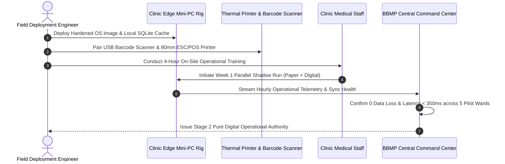

# Controlled Clinic Pilot Validation & Hypercare Test Plan
## Namma Clinic Digital Health & Operations Platform
### Greater Bengaluru Authority (GBA) / BBMP Health Department
**Standard:** WHO Operational Field Testing / Shadow-Mode Clinical Validation / ITIL Hypercare SLA | **Status:** APPROVED BASELINE | **Code:** `QA-DOC-16`

---

## 1. Pilot Validation Charter & Facility Scope
The Namma Clinic Pilot Test Plan governs the live field validation across 5 representative primary clinics in Bengaluru (Wards 12, 45, 88, 112, and 150). It establishes shadow-mode parallel running with physical paper charts, peripheral hardware verification, field nurse tablet operations, and hypercare technical dispatch procedures prior to city-wide rollout across all 183 clinics.

### 1.1 Pilot Facility Characteristics
1. **Ward 12 (Shettihalli):** High-volume peri-urban clinic evaluating morning OPD surges and intermittent power continuity.
2. **Ward 45 (Malleshwaram):** Dense urban center clinic validating fast consultation throughput and ABDM ABHA linking.
3. **Ward 88 (Shanthinagar):** Central commercial clinic evaluating multi-lingual Kannada/English patient intake.
4. **Ward 112 (Domlur):** Tech-corridor clinic validating citizen portal appointment check-in and digital lab receipting.
5. **Ward 150 (Bellandur):** High migrant population clinic validating offline replication and rapid demographic search.

### 1.2 Pilot Rollout & Shadow-Mode Lifecycle


## 2. Canonical Pilot Operational Tests (PILOT-001 to PILOT-040)
Standardized field operational test specifications:

### PILOT-001: Clinic Pilot Operational Verification 1
- **Target Pilot Site:** Ward 12 Primary Health Clinic
- **Deployment Phase:** Shadow Mode Parallel Run
- **Hypercare Support SLA:** 15m Emergency Tech Dispatch
- **Verification Protocol:** Field technician physical inspection, staff interview, telemetry analysis.
- **Audit Event Emitted:** `PILOT_AUDIT_PILOT_001`

### PILOT-002: Clinic Pilot Operational Verification 2
- **Target Pilot Site:** Ward 12 Primary Health Clinic
- **Deployment Phase:** Shadow Mode Parallel Run
- **Hypercare Support SLA:** 15m Emergency Tech Dispatch
- **Verification Protocol:** Field technician physical inspection, staff interview, telemetry analysis.
- **Audit Event Emitted:** `PILOT_AUDIT_PILOT_002`

### PILOT-003: Clinic Pilot Operational Verification 3
- **Target Pilot Site:** Ward 12 Primary Health Clinic
- **Deployment Phase:** Shadow Mode Parallel Run
- **Hypercare Support SLA:** 15m Emergency Tech Dispatch
- **Verification Protocol:** Field technician physical inspection, staff interview, telemetry analysis.
- **Audit Event Emitted:** `PILOT_AUDIT_PILOT_003`

### PILOT-004: Clinic Pilot Operational Verification 4
- **Target Pilot Site:** Ward 12 Primary Health Clinic
- **Deployment Phase:** Shadow Mode Parallel Run
- **Hypercare Support SLA:** 15m Emergency Tech Dispatch
- **Verification Protocol:** Field technician physical inspection, staff interview, telemetry analysis.
- **Audit Event Emitted:** `PILOT_AUDIT_PILOT_004`

### PILOT-005: Clinic Pilot Operational Verification 5
- **Target Pilot Site:** Ward 12 Primary Health Clinic
- **Deployment Phase:** Shadow Mode Parallel Run
- **Hypercare Support SLA:** 15m Emergency Tech Dispatch
- **Verification Protocol:** Field technician physical inspection, staff interview, telemetry analysis.
- **Audit Event Emitted:** `PILOT_AUDIT_PILOT_005`

### PILOT-006: Clinic Pilot Operational Verification 6
- **Target Pilot Site:** Ward 12 Primary Health Clinic
- **Deployment Phase:** Shadow Mode Parallel Run
- **Hypercare Support SLA:** 15m Emergency Tech Dispatch
- **Verification Protocol:** Field technician physical inspection, staff interview, telemetry analysis.
- **Audit Event Emitted:** `PILOT_AUDIT_PILOT_006`

### PILOT-007: Clinic Pilot Operational Verification 7
- **Target Pilot Site:** Ward 12 Primary Health Clinic
- **Deployment Phase:** Shadow Mode Parallel Run
- **Hypercare Support SLA:** 15m Emergency Tech Dispatch
- **Verification Protocol:** Field technician physical inspection, staff interview, telemetry analysis.
- **Audit Event Emitted:** `PILOT_AUDIT_PILOT_007`

### PILOT-008: Clinic Pilot Operational Verification 8
- **Target Pilot Site:** Ward 12 Primary Health Clinic
- **Deployment Phase:** Shadow Mode Parallel Run
- **Hypercare Support SLA:** 15m Emergency Tech Dispatch
- **Verification Protocol:** Field technician physical inspection, staff interview, telemetry analysis.
- **Audit Event Emitted:** `PILOT_AUDIT_PILOT_008`

### PILOT-009: Clinic Pilot Operational Verification 9
- **Target Pilot Site:** Ward 45 Clinic
- **Deployment Phase:** Shadow Mode Parallel Run
- **Hypercare Support SLA:** 15m Emergency Tech Dispatch
- **Verification Protocol:** Field technician physical inspection, staff interview, telemetry analysis.
- **Audit Event Emitted:** `PILOT_AUDIT_PILOT_009`

### PILOT-010: Clinic Pilot Operational Verification 10
- **Target Pilot Site:** Ward 45 Clinic
- **Deployment Phase:** Shadow Mode Parallel Run
- **Hypercare Support SLA:** 15m Emergency Tech Dispatch
- **Verification Protocol:** Field technician physical inspection, staff interview, telemetry analysis.
- **Audit Event Emitted:** `PILOT_AUDIT_PILOT_010`

### PILOT-011: Clinic Pilot Operational Verification 11
- **Target Pilot Site:** Ward 45 Clinic
- **Deployment Phase:** Shadow Mode Parallel Run
- **Hypercare Support SLA:** 15m Emergency Tech Dispatch
- **Verification Protocol:** Field technician physical inspection, staff interview, telemetry analysis.
- **Audit Event Emitted:** `PILOT_AUDIT_PILOT_011`

### PILOT-012: Clinic Pilot Operational Verification 12
- **Target Pilot Site:** Ward 45 Clinic
- **Deployment Phase:** Shadow Mode Parallel Run
- **Hypercare Support SLA:** 15m Emergency Tech Dispatch
- **Verification Protocol:** Field technician physical inspection, staff interview, telemetry analysis.
- **Audit Event Emitted:** `PILOT_AUDIT_PILOT_012`

### PILOT-013: Clinic Pilot Operational Verification 13
- **Target Pilot Site:** Ward 45 Clinic
- **Deployment Phase:** Shadow Mode Parallel Run
- **Hypercare Support SLA:** 15m Emergency Tech Dispatch
- **Verification Protocol:** Field technician physical inspection, staff interview, telemetry analysis.
- **Audit Event Emitted:** `PILOT_AUDIT_PILOT_013`

### PILOT-014: Clinic Pilot Operational Verification 14
- **Target Pilot Site:** Ward 45 Clinic
- **Deployment Phase:** Shadow Mode Parallel Run
- **Hypercare Support SLA:** 15m Emergency Tech Dispatch
- **Verification Protocol:** Field technician physical inspection, staff interview, telemetry analysis.
- **Audit Event Emitted:** `PILOT_AUDIT_PILOT_014`

### PILOT-015: Clinic Pilot Operational Verification 15
- **Target Pilot Site:** Ward 45 Clinic
- **Deployment Phase:** Shadow Mode Parallel Run
- **Hypercare Support SLA:** 15m Emergency Tech Dispatch
- **Verification Protocol:** Field technician physical inspection, staff interview, telemetry analysis.
- **Audit Event Emitted:** `PILOT_AUDIT_PILOT_015`

### PILOT-016: Clinic Pilot Operational Verification 16
- **Target Pilot Site:** Ward 45 Clinic
- **Deployment Phase:** Shadow Mode Parallel Run
- **Hypercare Support SLA:** 15m Emergency Tech Dispatch
- **Verification Protocol:** Field technician physical inspection, staff interview, telemetry analysis.
- **Audit Event Emitted:** `PILOT_AUDIT_PILOT_016`

### PILOT-017: Clinic Pilot Operational Verification 17
- **Target Pilot Site:** Ward 88 Clinic
- **Deployment Phase:** Shadow Mode Parallel Run
- **Hypercare Support SLA:** 15m Emergency Tech Dispatch
- **Verification Protocol:** Field technician physical inspection, staff interview, telemetry analysis.
- **Audit Event Emitted:** `PILOT_AUDIT_PILOT_017`

### PILOT-018: Clinic Pilot Operational Verification 18
- **Target Pilot Site:** Ward 88 Clinic
- **Deployment Phase:** Shadow Mode Parallel Run
- **Hypercare Support SLA:** 15m Emergency Tech Dispatch
- **Verification Protocol:** Field technician physical inspection, staff interview, telemetry analysis.
- **Audit Event Emitted:** `PILOT_AUDIT_PILOT_018`

### PILOT-019: Clinic Pilot Operational Verification 19
- **Target Pilot Site:** Ward 88 Clinic
- **Deployment Phase:** Shadow Mode Parallel Run
- **Hypercare Support SLA:** 15m Emergency Tech Dispatch
- **Verification Protocol:** Field technician physical inspection, staff interview, telemetry analysis.
- **Audit Event Emitted:** `PILOT_AUDIT_PILOT_019`

### PILOT-020: Clinic Pilot Operational Verification 20
- **Target Pilot Site:** Ward 88 Clinic
- **Deployment Phase:** Shadow Mode Parallel Run
- **Hypercare Support SLA:** 15m Emergency Tech Dispatch
- **Verification Protocol:** Field technician physical inspection, staff interview, telemetry analysis.
- **Audit Event Emitted:** `PILOT_AUDIT_PILOT_020`

### PILOT-021: Clinic Pilot Operational Verification 21
- **Target Pilot Site:** Ward 88 Clinic
- **Deployment Phase:** Shadow Mode Parallel Run
- **Hypercare Support SLA:** 15m Emergency Tech Dispatch
- **Verification Protocol:** Field technician physical inspection, staff interview, telemetry analysis.
- **Audit Event Emitted:** `PILOT_AUDIT_PILOT_021`

### PILOT-022: Clinic Pilot Operational Verification 22
- **Target Pilot Site:** Ward 88 Clinic
- **Deployment Phase:** Shadow Mode Parallel Run
- **Hypercare Support SLA:** 15m Emergency Tech Dispatch
- **Verification Protocol:** Field technician physical inspection, staff interview, telemetry analysis.
- **Audit Event Emitted:** `PILOT_AUDIT_PILOT_022`

### PILOT-023: Clinic Pilot Operational Verification 23
- **Target Pilot Site:** Ward 88 Clinic
- **Deployment Phase:** Shadow Mode Parallel Run
- **Hypercare Support SLA:** 15m Emergency Tech Dispatch
- **Verification Protocol:** Field technician physical inspection, staff interview, telemetry analysis.
- **Audit Event Emitted:** `PILOT_AUDIT_PILOT_023`

### PILOT-024: Clinic Pilot Operational Verification 24
- **Target Pilot Site:** Ward 88 Clinic
- **Deployment Phase:** Shadow Mode Parallel Run
- **Hypercare Support SLA:** 15m Emergency Tech Dispatch
- **Verification Protocol:** Field technician physical inspection, staff interview, telemetry analysis.
- **Audit Event Emitted:** `PILOT_AUDIT_PILOT_024`

### PILOT-025: Clinic Pilot Operational Verification 25
- **Target Pilot Site:** Ward 112 Clinic
- **Deployment Phase:** Shadow Mode Parallel Run
- **Hypercare Support SLA:** 15m Emergency Tech Dispatch
- **Verification Protocol:** Field technician physical inspection, staff interview, telemetry analysis.
- **Audit Event Emitted:** `PILOT_AUDIT_PILOT_025`

### PILOT-026: Clinic Pilot Operational Verification 26
- **Target Pilot Site:** Ward 112 Clinic
- **Deployment Phase:** Shadow Mode Parallel Run
- **Hypercare Support SLA:** 15m Emergency Tech Dispatch
- **Verification Protocol:** Field technician physical inspection, staff interview, telemetry analysis.
- **Audit Event Emitted:** `PILOT_AUDIT_PILOT_026`

### PILOT-027: Clinic Pilot Operational Verification 27
- **Target Pilot Site:** Ward 112 Clinic
- **Deployment Phase:** Shadow Mode Parallel Run
- **Hypercare Support SLA:** 15m Emergency Tech Dispatch
- **Verification Protocol:** Field technician physical inspection, staff interview, telemetry analysis.
- **Audit Event Emitted:** `PILOT_AUDIT_PILOT_027`

### PILOT-028: Clinic Pilot Operational Verification 28
- **Target Pilot Site:** Ward 112 Clinic
- **Deployment Phase:** Shadow Mode Parallel Run
- **Hypercare Support SLA:** 15m Emergency Tech Dispatch
- **Verification Protocol:** Field technician physical inspection, staff interview, telemetry analysis.
- **Audit Event Emitted:** `PILOT_AUDIT_PILOT_028`

### PILOT-029: Clinic Pilot Operational Verification 29
- **Target Pilot Site:** Ward 112 Clinic
- **Deployment Phase:** Shadow Mode Parallel Run
- **Hypercare Support SLA:** 15m Emergency Tech Dispatch
- **Verification Protocol:** Field technician physical inspection, staff interview, telemetry analysis.
- **Audit Event Emitted:** `PILOT_AUDIT_PILOT_029`

### PILOT-030: Clinic Pilot Operational Verification 30
- **Target Pilot Site:** Ward 112 Clinic
- **Deployment Phase:** Shadow Mode Parallel Run
- **Hypercare Support SLA:** 15m Emergency Tech Dispatch
- **Verification Protocol:** Field technician physical inspection, staff interview, telemetry analysis.
- **Audit Event Emitted:** `PILOT_AUDIT_PILOT_030`

### PILOT-031: Clinic Pilot Operational Verification 31
- **Target Pilot Site:** Ward 112 Clinic
- **Deployment Phase:** Shadow Mode Parallel Run
- **Hypercare Support SLA:** 15m Emergency Tech Dispatch
- **Verification Protocol:** Field technician physical inspection, staff interview, telemetry analysis.
- **Audit Event Emitted:** `PILOT_AUDIT_PILOT_031`

### PILOT-032: Clinic Pilot Operational Verification 32
- **Target Pilot Site:** Ward 112 Clinic
- **Deployment Phase:** Shadow Mode Parallel Run
- **Hypercare Support SLA:** 15m Emergency Tech Dispatch
- **Verification Protocol:** Field technician physical inspection, staff interview, telemetry analysis.
- **Audit Event Emitted:** `PILOT_AUDIT_PILOT_032`

### PILOT-033: Clinic Pilot Operational Verification 33
- **Target Pilot Site:** Ward 150 Clinic
- **Deployment Phase:** Shadow Mode Parallel Run
- **Hypercare Support SLA:** 15m Emergency Tech Dispatch
- **Verification Protocol:** Field technician physical inspection, staff interview, telemetry analysis.
- **Audit Event Emitted:** `PILOT_AUDIT_PILOT_033`

### PILOT-034: Clinic Pilot Operational Verification 34
- **Target Pilot Site:** Ward 150 Clinic
- **Deployment Phase:** Shadow Mode Parallel Run
- **Hypercare Support SLA:** 15m Emergency Tech Dispatch
- **Verification Protocol:** Field technician physical inspection, staff interview, telemetry analysis.
- **Audit Event Emitted:** `PILOT_AUDIT_PILOT_034`

### PILOT-035: Clinic Pilot Operational Verification 35
- **Target Pilot Site:** Ward 150 Clinic
- **Deployment Phase:** Shadow Mode Parallel Run
- **Hypercare Support SLA:** 15m Emergency Tech Dispatch
- **Verification Protocol:** Field technician physical inspection, staff interview, telemetry analysis.
- **Audit Event Emitted:** `PILOT_AUDIT_PILOT_035`

### PILOT-036: Clinic Pilot Operational Verification 36
- **Target Pilot Site:** Ward 150 Clinic
- **Deployment Phase:** Shadow Mode Parallel Run
- **Hypercare Support SLA:** 15m Emergency Tech Dispatch
- **Verification Protocol:** Field technician physical inspection, staff interview, telemetry analysis.
- **Audit Event Emitted:** `PILOT_AUDIT_PILOT_036`

### PILOT-037: Clinic Pilot Operational Verification 37
- **Target Pilot Site:** Ward 150 Clinic
- **Deployment Phase:** Shadow Mode Parallel Run
- **Hypercare Support SLA:** 15m Emergency Tech Dispatch
- **Verification Protocol:** Field technician physical inspection, staff interview, telemetry analysis.
- **Audit Event Emitted:** `PILOT_AUDIT_PILOT_037`

### PILOT-038: Clinic Pilot Operational Verification 38
- **Target Pilot Site:** Ward 150 Clinic
- **Deployment Phase:** Shadow Mode Parallel Run
- **Hypercare Support SLA:** 15m Emergency Tech Dispatch
- **Verification Protocol:** Field technician physical inspection, staff interview, telemetry analysis.
- **Audit Event Emitted:** `PILOT_AUDIT_PILOT_038`

### PILOT-039: Clinic Pilot Operational Verification 39
- **Target Pilot Site:** Ward 150 Clinic
- **Deployment Phase:** Shadow Mode Parallel Run
- **Hypercare Support SLA:** 15m Emergency Tech Dispatch
- **Verification Protocol:** Field technician physical inspection, staff interview, telemetry analysis.
- **Audit Event Emitted:** `PILOT_AUDIT_PILOT_039`

### PILOT-040: Clinic Pilot Operational Verification 40
- **Target Pilot Site:** Ward 150 Clinic
- **Deployment Phase:** Shadow Mode Parallel Run
- **Hypercare Support SLA:** 15m Emergency Tech Dispatch
- **Verification Protocol:** Field technician physical inspection, staff interview, telemetry analysis.
- **Audit Event Emitted:** `PILOT_AUDIT_PILOT_040`

## 3. Detailed Pilot Verification Test Cases (TC-0826 to TC-0880)
Detailed test specifications verifying real-world clinic pilot operations:

### TC-0826: Test Case 826: Advanced Security, Offline & Scalability for follow_up_schedules across WF-001
**Objective:** Validate non-functional resilience, encryption envelope, and concurrency for follow_up_schedules in WF-001.
**Risk:** Major operational risk regarding platform security, privacy breach, or offline desync.
**Priority:** **P1** | **Severity:** **Major** | **Test Level:** End-to-End & Non-Functional | **Test Type:** Resilience, Offline & Security Audit
- **Requirement Traceability:** `NFR-026`
- **Workflow Traceability:** `WF-001`
- **Feature Traceability:** `FEATURE-106`
- **API Traceability:** `API-DOC-12`
- **Database Traceability:** `TABLE-046 (follow_up_schedules)`
- **Screen Traceability:** `SCREEN-070`
- **Security Control Traceability:** `AUTH-026`
- **Preconditions:** Workstation initialized with TPM 2.0 PCR attestation and valid staff credentials (Ayush Practitioner).
- **Test Data Specification:** Synthetic dataset TESTDATA-046 with simulated network flapping.
- **Execution Steps:** 1. Trigger workflow WF-001 on SCREEN-070. 2. Inject network delay or packet drop. 3. Confirm offline queue persistence. 4. Restore link and confirm atomic sync.
- **Expected Results:** Zero data loss, conflict resolved deterministically via timestamp-vector clocks, audit trail complete.
- **Negative Test Scenario:** Attempt unauthorized cross-tenant data exfiltration; verify gateway drops packet with 403 Forbidden.
- **Boundary Value Scenario:** Push offline queue to 10,000 pending mutations; verify local SQLite buffer does not crash.
- **Concurrency & Race Condition:** Simulate 50 parallel clinic terminals pushing updates simultaneously to gateway.
- **Autonomous Offline Behavior:** Simulate 8 hours of complete clinic internet outage; OPD consultations proceed uninterrupted.
- **Security & Access Validation:** Confirm AES-256-GCM column encryption and strict mTLS 1.3 transit cipher enforcement.
- **Audit Trail & Immutability:** Verify audit record written to WORM immutable ledger with SHA-256 hash.
- **Evidence Required:** Terminal screenshot, packet capture dump, and cryptographic Merkle verification proof.
- **Pass Acceptance Criteria:** All operations succeed with 0% data corruption, full audit ledger continuity, and latency < 350ms.
- **Failure Behavior & SLA:** Data loss, sync deadlock, cleartext PII leakage, or unhandled crash.
- **Automation Suitability:** Yes (High Candidate)
- **Execution Cadence:** Nightly Performance & Resilience Run
- **Responsible Owner:** Ayush Practitioner

### TC-0827: Test Case 827: Advanced Security, Offline & Scalability for notifications across WF-002
**Objective:** Validate non-functional resilience, encryption envelope, and concurrency for notifications in WF-002.
**Risk:** Minor operational risk regarding platform security, privacy breach, or offline desync.
**Priority:** **P2** | **Severity:** **Minor** | **Test Level:** End-to-End & Non-Functional | **Test Type:** Resilience, Offline & Security Audit
- **Requirement Traceability:** `SECR-027`
- **Workflow Traceability:** `WF-002`
- **Feature Traceability:** `FEATURE-107`
- **API Traceability:** `API-DOC-13`
- **Database Traceability:** `TABLE-047 (notifications)`
- **Screen Traceability:** `SCREEN-071`
- **Security Control Traceability:** `API-SEC-027`
- **Preconditions:** Workstation initialized with TPM 2.0 PCR attestation and valid staff credentials (Counselor / Mental Health Worker).
- **Test Data Specification:** Synthetic dataset TESTDATA-047 with simulated network flapping.
- **Execution Steps:** 1. Trigger workflow WF-002 on SCREEN-071. 2. Inject network delay or packet drop. 3. Confirm offline queue persistence. 4. Restore link and confirm atomic sync.
- **Expected Results:** Zero data loss, conflict resolved deterministically via timestamp-vector clocks, audit trail complete.
- **Negative Test Scenario:** Attempt unauthorized cross-tenant data exfiltration; verify gateway drops packet with 403 Forbidden.
- **Boundary Value Scenario:** Push offline queue to 10,000 pending mutations; verify local SQLite buffer does not crash.
- **Concurrency & Race Condition:** Simulate 50 parallel clinic terminals pushing updates simultaneously to gateway.
- **Autonomous Offline Behavior:** Simulate 8 hours of complete clinic internet outage; OPD consultations proceed uninterrupted.
- **Security & Access Validation:** Confirm AES-256-GCM column encryption and strict mTLS 1.3 transit cipher enforcement.
- **Audit Trail & Immutability:** Verify audit record written to WORM immutable ledger with SHA-256 hash.
- **Evidence Required:** Terminal screenshot, packet capture dump, and cryptographic Merkle verification proof.
- **Pass Acceptance Criteria:** All operations succeed with 0% data corruption, full audit ledger continuity, and latency < 350ms.
- **Failure Behavior & SLA:** Data loss, sync deadlock, cleartext PII leakage, or unhandled crash.
- **Automation Suitability:** Yes (High Candidate)
- **Execution Cadence:** Nightly Performance & Resilience Run
- **Responsible Owner:** Counselor / Mental Health Worker

### TC-0828: Test Case 828: Advanced Security, Offline & Scalability for grievances across WF-003
**Objective:** Validate non-functional resilience, encryption envelope, and concurrency for grievances in WF-003.
**Risk:** Critical operational risk regarding platform security, privacy breach, or offline desync.
**Priority:** **P0** | **Severity:** **Critical** | **Test Level:** End-to-End & Non-Functional | **Test Type:** Resilience, Offline & Security Audit
- **Requirement Traceability:** `NFR-028`
- **Workflow Traceability:** `WF-003`
- **Feature Traceability:** `FEATURE-108`
- **API Traceability:** `API-DOC-14`
- **Database Traceability:** `TABLE-048 (grievances)`
- **Screen Traceability:** `SCREEN-072`
- **Security Control Traceability:** `AUTH-028`
- **Preconditions:** Workstation initialized with TPM 2.0 PCR attestation and valid staff credentials (ANM / Urban Health Worker).
- **Test Data Specification:** Synthetic dataset TESTDATA-048 with simulated network flapping.
- **Execution Steps:** 1. Trigger workflow WF-003 on SCREEN-072. 2. Inject network delay or packet drop. 3. Confirm offline queue persistence. 4. Restore link and confirm atomic sync.
- **Expected Results:** Zero data loss, conflict resolved deterministically via timestamp-vector clocks, audit trail complete.
- **Negative Test Scenario:** Attempt unauthorized cross-tenant data exfiltration; verify gateway drops packet with 403 Forbidden.
- **Boundary Value Scenario:** Push offline queue to 10,000 pending mutations; verify local SQLite buffer does not crash.
- **Concurrency & Race Condition:** Simulate 50 parallel clinic terminals pushing updates simultaneously to gateway.
- **Autonomous Offline Behavior:** Simulate 8 hours of complete clinic internet outage; OPD consultations proceed uninterrupted.
- **Security & Access Validation:** Confirm AES-256-GCM column encryption and strict mTLS 1.3 transit cipher enforcement.
- **Audit Trail & Immutability:** Verify audit record written to WORM immutable ledger with SHA-256 hash.
- **Evidence Required:** Terminal screenshot, packet capture dump, and cryptographic Merkle verification proof.
- **Pass Acceptance Criteria:** All operations succeed with 0% data corruption, full audit ledger continuity, and latency < 350ms.
- **Failure Behavior & SLA:** Data loss, sync deadlock, cleartext PII leakage, or unhandled crash.
- **Automation Suitability:** Yes (High Candidate)
- **Execution Cadence:** Nightly Performance & Resilience Run
- **Responsible Owner:** ANM / Urban Health Worker

### TC-0829: Test Case 829: Advanced Security, Offline & Scalability for helpdesk_tickets across WF-004
**Objective:** Validate non-functional resilience, encryption envelope, and concurrency for helpdesk_tickets in WF-004.
**Risk:** Major operational risk regarding platform security, privacy breach, or offline desync.
**Priority:** **P1** | **Severity:** **Major** | **Test Level:** End-to-End & Non-Functional | **Test Type:** Resilience, Offline & Security Audit
- **Requirement Traceability:** `SECR-029`
- **Workflow Traceability:** `WF-004`
- **Feature Traceability:** `FEATURE-109`
- **API Traceability:** `API-DOC-15`
- **Database Traceability:** `TABLE-049 (helpdesk_tickets)`
- **Screen Traceability:** `SCREEN-073`
- **Security Control Traceability:** `API-SEC-029`
- **Preconditions:** Workstation initialized with TPM 2.0 PCR attestation and valid staff credentials (ASHA Link Worker Coordinator).
- **Test Data Specification:** Synthetic dataset TESTDATA-049 with simulated network flapping.
- **Execution Steps:** 1. Trigger workflow WF-004 on SCREEN-073. 2. Inject network delay or packet drop. 3. Confirm offline queue persistence. 4. Restore link and confirm atomic sync.
- **Expected Results:** Zero data loss, conflict resolved deterministically via timestamp-vector clocks, audit trail complete.
- **Negative Test Scenario:** Attempt unauthorized cross-tenant data exfiltration; verify gateway drops packet with 403 Forbidden.
- **Boundary Value Scenario:** Push offline queue to 10,000 pending mutations; verify local SQLite buffer does not crash.
- **Concurrency & Race Condition:** Simulate 50 parallel clinic terminals pushing updates simultaneously to gateway.
- **Autonomous Offline Behavior:** Simulate 8 hours of complete clinic internet outage; OPD consultations proceed uninterrupted.
- **Security & Access Validation:** Confirm AES-256-GCM column encryption and strict mTLS 1.3 transit cipher enforcement.
- **Audit Trail & Immutability:** Verify audit record written to WORM immutable ledger with SHA-256 hash.
- **Evidence Required:** Terminal screenshot, packet capture dump, and cryptographic Merkle verification proof.
- **Pass Acceptance Criteria:** All operations succeed with 0% data corruption, full audit ledger continuity, and latency < 350ms.
- **Failure Behavior & SLA:** Data loss, sync deadlock, cleartext PII leakage, or unhandled crash.
- **Automation Suitability:** Yes (High Candidate)
- **Execution Cadence:** Nightly Performance & Resilience Run
- **Responsible Owner:** ASHA Link Worker Coordinator

### TC-0830: Test Case 830: Advanced Security, Offline & Scalability for audit_events across WF-005
**Objective:** Validate non-functional resilience, encryption envelope, and concurrency for audit_events in WF-005.
**Risk:** Major operational risk regarding platform security, privacy breach, or offline desync.
**Priority:** **P1** | **Severity:** **Major** | **Test Level:** End-to-End & Non-Functional | **Test Type:** Resilience, Offline & Security Audit
- **Requirement Traceability:** `NFR-030`
- **Workflow Traceability:** `WF-005`
- **Feature Traceability:** `FEATURE-110`
- **API Traceability:** `API-DOC-16`
- **Database Traceability:** `TABLE-050 (audit_events)`
- **Screen Traceability:** `SCREEN-074`
- **Security Control Traceability:** `AUTH-030`
- **Preconditions:** Workstation initialized with TPM 2.0 PCR attestation and valid staff credentials (Data Entry Operator).
- **Test Data Specification:** Synthetic dataset TESTDATA-050 with simulated network flapping.
- **Execution Steps:** 1. Trigger workflow WF-005 on SCREEN-074. 2. Inject network delay or packet drop. 3. Confirm offline queue persistence. 4. Restore link and confirm atomic sync.
- **Expected Results:** Zero data loss, conflict resolved deterministically via timestamp-vector clocks, audit trail complete.
- **Negative Test Scenario:** Attempt unauthorized cross-tenant data exfiltration; verify gateway drops packet with 403 Forbidden.
- **Boundary Value Scenario:** Push offline queue to 10,000 pending mutations; verify local SQLite buffer does not crash.
- **Concurrency & Race Condition:** Simulate 50 parallel clinic terminals pushing updates simultaneously to gateway.
- **Autonomous Offline Behavior:** Simulate 8 hours of complete clinic internet outage; OPD consultations proceed uninterrupted.
- **Security & Access Validation:** Confirm AES-256-GCM column encryption and strict mTLS 1.3 transit cipher enforcement.
- **Audit Trail & Immutability:** Verify audit record written to WORM immutable ledger with SHA-256 hash.
- **Evidence Required:** Terminal screenshot, packet capture dump, and cryptographic Merkle verification proof.
- **Pass Acceptance Criteria:** All operations succeed with 0% data corruption, full audit ledger continuity, and latency < 350ms.
- **Failure Behavior & SLA:** Data loss, sync deadlock, cleartext PII leakage, or unhandled crash.
- **Automation Suitability:** Yes (High Candidate)
- **Execution Cadence:** Nightly Performance & Resilience Run
- **Responsible Owner:** Data Entry Operator

### TC-0831: Test Case 831: Advanced Security, Offline & Scalability for offline_mutation_log across WF-006
**Objective:** Validate non-functional resilience, encryption envelope, and concurrency for offline_mutation_log in WF-006.
**Risk:** Minor operational risk regarding platform security, privacy breach, or offline desync.
**Priority:** **P2** | **Severity:** **Minor** | **Test Level:** End-to-End & Non-Functional | **Test Type:** Resilience, Offline & Security Audit
- **Requirement Traceability:** `SECR-031`
- **Workflow Traceability:** `WF-006`
- **Feature Traceability:** `FEATURE-111`
- **API Traceability:** `API-DOC-17`
- **Database Traceability:** `TABLE-051 (offline_mutation_log)`
- **Screen Traceability:** `SCREEN-075`
- **Security Control Traceability:** `API-SEC-031`
- **Preconditions:** Workstation initialized with TPM 2.0 PCR attestation and valid staff credentials (Grievance Redressal Officer).
- **Test Data Specification:** Synthetic dataset TESTDATA-051 with simulated network flapping.
- **Execution Steps:** 1. Trigger workflow WF-006 on SCREEN-075. 2. Inject network delay or packet drop. 3. Confirm offline queue persistence. 4. Restore link and confirm atomic sync.
- **Expected Results:** Zero data loss, conflict resolved deterministically via timestamp-vector clocks, audit trail complete.
- **Negative Test Scenario:** Attempt unauthorized cross-tenant data exfiltration; verify gateway drops packet with 403 Forbidden.
- **Boundary Value Scenario:** Push offline queue to 10,000 pending mutations; verify local SQLite buffer does not crash.
- **Concurrency & Race Condition:** Simulate 50 parallel clinic terminals pushing updates simultaneously to gateway.
- **Autonomous Offline Behavior:** Simulate 8 hours of complete clinic internet outage; OPD consultations proceed uninterrupted.
- **Security & Access Validation:** Confirm AES-256-GCM column encryption and strict mTLS 1.3 transit cipher enforcement.
- **Audit Trail & Immutability:** Verify audit record written to WORM immutable ledger with SHA-256 hash.
- **Evidence Required:** Terminal screenshot, packet capture dump, and cryptographic Merkle verification proof.
- **Pass Acceptance Criteria:** All operations succeed with 0% data corruption, full audit ledger continuity, and latency < 350ms.
- **Failure Behavior & SLA:** Data loss, sync deadlock, cleartext PII leakage, or unhandled crash.
- **Automation Suitability:** Yes (High Candidate)
- **Execution Cadence:** Nightly Performance & Resilience Run
- **Responsible Owner:** Grievance Redressal Officer

### TC-0832: Test Case 832: Advanced Security, Offline & Scalability for abdm_artifacts across WF-007
**Objective:** Validate non-functional resilience, encryption envelope, and concurrency for abdm_artifacts in WF-007.
**Risk:** Critical operational risk regarding platform security, privacy breach, or offline desync.
**Priority:** **P0** | **Severity:** **Critical** | **Test Level:** End-to-End & Non-Functional | **Test Type:** Resilience, Offline & Security Audit
- **Requirement Traceability:** `NFR-032`
- **Workflow Traceability:** `WF-007`
- **Feature Traceability:** `FEATURE-112`
- **API Traceability:** `API-DOC-18`
- **Database Traceability:** `TABLE-052 (abdm_artifacts)`
- **Screen Traceability:** `SCREEN-076`
- **Security Control Traceability:** `AUTH-032`
- **Preconditions:** Workstation initialized with TPM 2.0 PCR attestation and valid staff credentials (ABDM National Integration Officer).
- **Test Data Specification:** Synthetic dataset TESTDATA-052 with simulated network flapping.
- **Execution Steps:** 1. Trigger workflow WF-007 on SCREEN-076. 2. Inject network delay or packet drop. 3. Confirm offline queue persistence. 4. Restore link and confirm atomic sync.
- **Expected Results:** Zero data loss, conflict resolved deterministically via timestamp-vector clocks, audit trail complete.
- **Negative Test Scenario:** Attempt unauthorized cross-tenant data exfiltration; verify gateway drops packet with 403 Forbidden.
- **Boundary Value Scenario:** Push offline queue to 10,000 pending mutations; verify local SQLite buffer does not crash.
- **Concurrency & Race Condition:** Simulate 50 parallel clinic terminals pushing updates simultaneously to gateway.
- **Autonomous Offline Behavior:** Simulate 8 hours of complete clinic internet outage; OPD consultations proceed uninterrupted.
- **Security & Access Validation:** Confirm AES-256-GCM column encryption and strict mTLS 1.3 transit cipher enforcement.
- **Audit Trail & Immutability:** Verify audit record written to WORM immutable ledger with SHA-256 hash.
- **Evidence Required:** Terminal screenshot, packet capture dump, and cryptographic Merkle verification proof.
- **Pass Acceptance Criteria:** All operations succeed with 0% data corruption, full audit ledger continuity, and latency < 350ms.
- **Failure Behavior & SLA:** Data loss, sync deadlock, cleartext PII leakage, or unhandled crash.
- **Automation Suitability:** Yes (High Candidate)
- **Execution Cadence:** Nightly Performance & Resilience Run
- **Responsible Owner:** ABDM National Integration Officer

### TC-0833: Test Case 833: Advanced Security, Offline & Scalability for auth_users across WF-008
**Objective:** Validate non-functional resilience, encryption envelope, and concurrency for auth_users in WF-008.
**Risk:** Major operational risk regarding platform security, privacy breach, or offline desync.
**Priority:** **P1** | **Severity:** **Major** | **Test Level:** End-to-End & Non-Functional | **Test Type:** Resilience, Offline & Security Audit
- **Requirement Traceability:** `SECR-033`
- **Workflow Traceability:** `WF-008`
- **Feature Traceability:** `FEATURE-113`
- **API Traceability:** `API-DOC-19`
- **Database Traceability:** `TABLE-001 (auth_users)`
- **Screen Traceability:** `SCREEN-077`
- **Security Control Traceability:** `API-SEC-033`
- **Preconditions:** Workstation initialized with TPM 2.0 PCR attestation and valid staff credentials (Data Protection Officer (DPO)).
- **Test Data Specification:** Synthetic dataset TESTDATA-053 with simulated network flapping.
- **Execution Steps:** 1. Trigger workflow WF-008 on SCREEN-077. 2. Inject network delay or packet drop. 3. Confirm offline queue persistence. 4. Restore link and confirm atomic sync.
- **Expected Results:** Zero data loss, conflict resolved deterministically via timestamp-vector clocks, audit trail complete.
- **Negative Test Scenario:** Attempt unauthorized cross-tenant data exfiltration; verify gateway drops packet with 403 Forbidden.
- **Boundary Value Scenario:** Push offline queue to 10,000 pending mutations; verify local SQLite buffer does not crash.
- **Concurrency & Race Condition:** Simulate 50 parallel clinic terminals pushing updates simultaneously to gateway.
- **Autonomous Offline Behavior:** Simulate 8 hours of complete clinic internet outage; OPD consultations proceed uninterrupted.
- **Security & Access Validation:** Confirm AES-256-GCM column encryption and strict mTLS 1.3 transit cipher enforcement.
- **Audit Trail & Immutability:** Verify audit record written to WORM immutable ledger with SHA-256 hash.
- **Evidence Required:** Terminal screenshot, packet capture dump, and cryptographic Merkle verification proof.
- **Pass Acceptance Criteria:** All operations succeed with 0% data corruption, full audit ledger continuity, and latency < 350ms.
- **Failure Behavior & SLA:** Data loss, sync deadlock, cleartext PII leakage, or unhandled crash.
- **Automation Suitability:** Yes (High Candidate)
- **Execution Cadence:** Nightly Performance & Resilience Run
- **Responsible Owner:** Data Protection Officer (DPO)

### TC-0834: Test Case 834: Advanced Security, Offline & Scalability for user_credentials across WF-009
**Objective:** Validate non-functional resilience, encryption envelope, and concurrency for user_credentials in WF-009.
**Risk:** Major operational risk regarding platform security, privacy breach, or offline desync.
**Priority:** **P1** | **Severity:** **Major** | **Test Level:** End-to-End & Non-Functional | **Test Type:** Resilience, Offline & Security Audit
- **Requirement Traceability:** `NFR-034`
- **Workflow Traceability:** `WF-009`
- **Feature Traceability:** `FEATURE-114`
- **API Traceability:** `API-DOC-20`
- **Database Traceability:** `TABLE-002 (user_credentials)`
- **Screen Traceability:** `SCREEN-078`
- **Security Control Traceability:** `AUTH-034`
- **Preconditions:** Workstation initialized with TPM 2.0 PCR attestation and valid staff credentials (IT Support & Hardware Engineer).
- **Test Data Specification:** Synthetic dataset TESTDATA-054 with simulated network flapping.
- **Execution Steps:** 1. Trigger workflow WF-009 on SCREEN-078. 2. Inject network delay or packet drop. 3. Confirm offline queue persistence. 4. Restore link and confirm atomic sync.
- **Expected Results:** Zero data loss, conflict resolved deterministically via timestamp-vector clocks, audit trail complete.
- **Negative Test Scenario:** Attempt unauthorized cross-tenant data exfiltration; verify gateway drops packet with 403 Forbidden.
- **Boundary Value Scenario:** Push offline queue to 10,000 pending mutations; verify local SQLite buffer does not crash.
- **Concurrency & Race Condition:** Simulate 50 parallel clinic terminals pushing updates simultaneously to gateway.
- **Autonomous Offline Behavior:** Simulate 8 hours of complete clinic internet outage; OPD consultations proceed uninterrupted.
- **Security & Access Validation:** Confirm AES-256-GCM column encryption and strict mTLS 1.3 transit cipher enforcement.
- **Audit Trail & Immutability:** Verify audit record written to WORM immutable ledger with SHA-256 hash.
- **Evidence Required:** Terminal screenshot, packet capture dump, and cryptographic Merkle verification proof.
- **Pass Acceptance Criteria:** All operations succeed with 0% data corruption, full audit ledger continuity, and latency < 350ms.
- **Failure Behavior & SLA:** Data loss, sync deadlock, cleartext PII leakage, or unhandled crash.
- **Automation Suitability:** Yes (High Candidate)
- **Execution Cadence:** Nightly Performance & Resilience Run
- **Responsible Owner:** IT Support & Hardware Engineer

### TC-0835: Test Case 835: Advanced Security, Offline & Scalability for user_sessions across WF-010
**Objective:** Validate non-functional resilience, encryption envelope, and concurrency for user_sessions in WF-010.
**Risk:** Minor operational risk regarding platform security, privacy breach, or offline desync.
**Priority:** **P2** | **Severity:** **Minor** | **Test Level:** End-to-End & Non-Functional | **Test Type:** Resilience, Offline & Security Audit
- **Requirement Traceability:** `SECR-035`
- **Workflow Traceability:** `WF-010`
- **Feature Traceability:** `FEATURE-115`
- **API Traceability:** `API-DOC-21`
- **Database Traceability:** `TABLE-003 (user_sessions)`
- **Screen Traceability:** `SCREEN-079`
- **Security Control Traceability:** `API-SEC-035`
- **Preconditions:** Workstation initialized with TPM 2.0 PCR attestation and valid staff credentials (Clinical Audit Committee Member).
- **Test Data Specification:** Synthetic dataset TESTDATA-055 with simulated network flapping.
- **Execution Steps:** 1. Trigger workflow WF-010 on SCREEN-079. 2. Inject network delay or packet drop. 3. Confirm offline queue persistence. 4. Restore link and confirm atomic sync.
- **Expected Results:** Zero data loss, conflict resolved deterministically via timestamp-vector clocks, audit trail complete.
- **Negative Test Scenario:** Attempt unauthorized cross-tenant data exfiltration; verify gateway drops packet with 403 Forbidden.
- **Boundary Value Scenario:** Push offline queue to 10,000 pending mutations; verify local SQLite buffer does not crash.
- **Concurrency & Race Condition:** Simulate 50 parallel clinic terminals pushing updates simultaneously to gateway.
- **Autonomous Offline Behavior:** Simulate 8 hours of complete clinic internet outage; OPD consultations proceed uninterrupted.
- **Security & Access Validation:** Confirm AES-256-GCM column encryption and strict mTLS 1.3 transit cipher enforcement.
- **Audit Trail & Immutability:** Verify audit record written to WORM immutable ledger with SHA-256 hash.
- **Evidence Required:** Terminal screenshot, packet capture dump, and cryptographic Merkle verification proof.
- **Pass Acceptance Criteria:** All operations succeed with 0% data corruption, full audit ledger continuity, and latency < 350ms.
- **Failure Behavior & SLA:** Data loss, sync deadlock, cleartext PII leakage, or unhandled crash.
- **Automation Suitability:** Yes (High Candidate)
- **Execution Cadence:** Nightly Performance & Resilience Run
- **Responsible Owner:** Clinical Audit Committee Member

### TC-0836: Test Case 836: Advanced Security, Offline & Scalability for roles across WF-011
**Objective:** Validate non-functional resilience, encryption envelope, and concurrency for roles in WF-011.
**Risk:** Critical operational risk regarding platform security, privacy breach, or offline desync.
**Priority:** **P0** | **Severity:** **Critical** | **Test Level:** End-to-End & Non-Functional | **Test Type:** Resilience, Offline & Security Audit
- **Requirement Traceability:** `NFR-036`
- **Workflow Traceability:** `WF-011`
- **Feature Traceability:** `FEATURE-116`
- **API Traceability:** `API-DOC-22`
- **Database Traceability:** `TABLE-004 (roles)`
- **Screen Traceability:** `SCREEN-080`
- **Security Control Traceability:** `AUTH-036`
- **Preconditions:** Workstation initialized with TPM 2.0 PCR attestation and valid staff credentials (Procurement & Vendor Manager).
- **Test Data Specification:** Synthetic dataset TESTDATA-056 with simulated network flapping.
- **Execution Steps:** 1. Trigger workflow WF-011 on SCREEN-080. 2. Inject network delay or packet drop. 3. Confirm offline queue persistence. 4. Restore link and confirm atomic sync.
- **Expected Results:** Zero data loss, conflict resolved deterministically via timestamp-vector clocks, audit trail complete.
- **Negative Test Scenario:** Attempt unauthorized cross-tenant data exfiltration; verify gateway drops packet with 403 Forbidden.
- **Boundary Value Scenario:** Push offline queue to 10,000 pending mutations; verify local SQLite buffer does not crash.
- **Concurrency & Race Condition:** Simulate 50 parallel clinic terminals pushing updates simultaneously to gateway.
- **Autonomous Offline Behavior:** Simulate 8 hours of complete clinic internet outage; OPD consultations proceed uninterrupted.
- **Security & Access Validation:** Confirm AES-256-GCM column encryption and strict mTLS 1.3 transit cipher enforcement.
- **Audit Trail & Immutability:** Verify audit record written to WORM immutable ledger with SHA-256 hash.
- **Evidence Required:** Terminal screenshot, packet capture dump, and cryptographic Merkle verification proof.
- **Pass Acceptance Criteria:** All operations succeed with 0% data corruption, full audit ledger continuity, and latency < 350ms.
- **Failure Behavior & SLA:** Data loss, sync deadlock, cleartext PII leakage, or unhandled crash.
- **Automation Suitability:** Yes (High Candidate)
- **Execution Cadence:** Nightly Performance & Resilience Run
- **Responsible Owner:** Procurement & Vendor Manager

### TC-0837: Test Case 837: Advanced Security, Offline & Scalability for permissions across WF-012
**Objective:** Validate non-functional resilience, encryption envelope, and concurrency for permissions in WF-012.
**Risk:** Major operational risk regarding platform security, privacy breach, or offline desync.
**Priority:** **P1** | **Severity:** **Major** | **Test Level:** End-to-End & Non-Functional | **Test Type:** Resilience, Offline & Security Audit
- **Requirement Traceability:** `SECR-037`
- **Workflow Traceability:** `WF-012`
- **Feature Traceability:** `FEATURE-117`
- **API Traceability:** `API-DOC-01`
- **Database Traceability:** `TABLE-005 (permissions)`
- **Screen Traceability:** `SCREEN-081`
- **Security Control Traceability:** `API-SEC-037`
- **Preconditions:** Workstation initialized with TPM 2.0 PCR attestation and valid staff credentials (Biomedical Waste Supervisor).
- **Test Data Specification:** Synthetic dataset TESTDATA-057 with simulated network flapping.
- **Execution Steps:** 1. Trigger workflow WF-012 on SCREEN-081. 2. Inject network delay or packet drop. 3. Confirm offline queue persistence. 4. Restore link and confirm atomic sync.
- **Expected Results:** Zero data loss, conflict resolved deterministically via timestamp-vector clocks, audit trail complete.
- **Negative Test Scenario:** Attempt unauthorized cross-tenant data exfiltration; verify gateway drops packet with 403 Forbidden.
- **Boundary Value Scenario:** Push offline queue to 10,000 pending mutations; verify local SQLite buffer does not crash.
- **Concurrency & Race Condition:** Simulate 50 parallel clinic terminals pushing updates simultaneously to gateway.
- **Autonomous Offline Behavior:** Simulate 8 hours of complete clinic internet outage; OPD consultations proceed uninterrupted.
- **Security & Access Validation:** Confirm AES-256-GCM column encryption and strict mTLS 1.3 transit cipher enforcement.
- **Audit Trail & Immutability:** Verify audit record written to WORM immutable ledger with SHA-256 hash.
- **Evidence Required:** Terminal screenshot, packet capture dump, and cryptographic Merkle verification proof.
- **Pass Acceptance Criteria:** All operations succeed with 0% data corruption, full audit ledger continuity, and latency < 350ms.
- **Failure Behavior & SLA:** Data loss, sync deadlock, cleartext PII leakage, or unhandled crash.
- **Automation Suitability:** Yes (High Candidate)
- **Execution Cadence:** Nightly Performance & Resilience Run
- **Responsible Owner:** Biomedical Waste Supervisor

### TC-0838: Test Case 838: Advanced Security, Offline & Scalability for role_permissions across WF-013
**Objective:** Validate non-functional resilience, encryption envelope, and concurrency for role_permissions in WF-013.
**Risk:** Major operational risk regarding platform security, privacy breach, or offline desync.
**Priority:** **P1** | **Severity:** **Major** | **Test Level:** End-to-End & Non-Functional | **Test Type:** Resilience, Offline & Security Audit
- **Requirement Traceability:** `NFR-038`
- **Workflow Traceability:** `WF-013`
- **Feature Traceability:** `FEATURE-118`
- **API Traceability:** `API-DOC-02`
- **Database Traceability:** `TABLE-006 (role_permissions)`
- **Screen Traceability:** `SCREEN-082`
- **Security Control Traceability:** `AUTH-038`
- **Preconditions:** Workstation initialized with TPM 2.0 PCR attestation and valid staff credentials (Telemedicine Remote Specialist).
- **Test Data Specification:** Synthetic dataset TESTDATA-058 with simulated network flapping.
- **Execution Steps:** 1. Trigger workflow WF-013 on SCREEN-082. 2. Inject network delay or packet drop. 3. Confirm offline queue persistence. 4. Restore link and confirm atomic sync.
- **Expected Results:** Zero data loss, conflict resolved deterministically via timestamp-vector clocks, audit trail complete.
- **Negative Test Scenario:** Attempt unauthorized cross-tenant data exfiltration; verify gateway drops packet with 403 Forbidden.
- **Boundary Value Scenario:** Push offline queue to 10,000 pending mutations; verify local SQLite buffer does not crash.
- **Concurrency & Race Condition:** Simulate 50 parallel clinic terminals pushing updates simultaneously to gateway.
- **Autonomous Offline Behavior:** Simulate 8 hours of complete clinic internet outage; OPD consultations proceed uninterrupted.
- **Security & Access Validation:** Confirm AES-256-GCM column encryption and strict mTLS 1.3 transit cipher enforcement.
- **Audit Trail & Immutability:** Verify audit record written to WORM immutable ledger with SHA-256 hash.
- **Evidence Required:** Terminal screenshot, packet capture dump, and cryptographic Merkle verification proof.
- **Pass Acceptance Criteria:** All operations succeed with 0% data corruption, full audit ledger continuity, and latency < 350ms.
- **Failure Behavior & SLA:** Data loss, sync deadlock, cleartext PII leakage, or unhandled crash.
- **Automation Suitability:** Yes (High Candidate)
- **Execution Cadence:** Nightly Performance & Resilience Run
- **Responsible Owner:** Telemedicine Remote Specialist

### TC-0839: Test Case 839: Advanced Security, Offline & Scalability for user_roles across WF-014
**Objective:** Validate non-functional resilience, encryption envelope, and concurrency for user_roles in WF-014.
**Risk:** Minor operational risk regarding platform security, privacy breach, or offline desync.
**Priority:** **P2** | **Severity:** **Minor** | **Test Level:** End-to-End & Non-Functional | **Test Type:** Resilience, Offline & Security Audit
- **Requirement Traceability:** `SECR-039`
- **Workflow Traceability:** `WF-014`
- **Feature Traceability:** `FEATURE-119`
- **API Traceability:** `API-DOC-03`
- **Database Traceability:** `TABLE-007 (user_roles)`
- **Screen Traceability:** `SCREEN-083`
- **Security Control Traceability:** `API-SEC-039`
- **Preconditions:** Workstation initialized with TPM 2.0 PCR attestation and valid staff credentials (Field Public Health Inspector).
- **Test Data Specification:** Synthetic dataset TESTDATA-059 with simulated network flapping.
- **Execution Steps:** 1. Trigger workflow WF-014 on SCREEN-083. 2. Inject network delay or packet drop. 3. Confirm offline queue persistence. 4. Restore link and confirm atomic sync.
- **Expected Results:** Zero data loss, conflict resolved deterministically via timestamp-vector clocks, audit trail complete.
- **Negative Test Scenario:** Attempt unauthorized cross-tenant data exfiltration; verify gateway drops packet with 403 Forbidden.
- **Boundary Value Scenario:** Push offline queue to 10,000 pending mutations; verify local SQLite buffer does not crash.
- **Concurrency & Race Condition:** Simulate 50 parallel clinic terminals pushing updates simultaneously to gateway.
- **Autonomous Offline Behavior:** Simulate 8 hours of complete clinic internet outage; OPD consultations proceed uninterrupted.
- **Security & Access Validation:** Confirm AES-256-GCM column encryption and strict mTLS 1.3 transit cipher enforcement.
- **Audit Trail & Immutability:** Verify audit record written to WORM immutable ledger with SHA-256 hash.
- **Evidence Required:** Terminal screenshot, packet capture dump, and cryptographic Merkle verification proof.
- **Pass Acceptance Criteria:** All operations succeed with 0% data corruption, full audit ledger continuity, and latency < 350ms.
- **Failure Behavior & SLA:** Data loss, sync deadlock, cleartext PII leakage, or unhandled crash.
- **Automation Suitability:** Yes (High Candidate)
- **Execution Cadence:** Nightly Performance & Resilience Run
- **Responsible Owner:** Field Public Health Inspector

### TC-0840: Test Case 840: Advanced Security, Offline & Scalability for facilities across WF-015
**Objective:** Validate non-functional resilience, encryption envelope, and concurrency for facilities in WF-015.
**Risk:** Critical operational risk regarding platform security, privacy breach, or offline desync.
**Priority:** **P0** | **Severity:** **Critical** | **Test Level:** End-to-End & Non-Functional | **Test Type:** Resilience, Offline & Security Audit
- **Requirement Traceability:** `NFR-040`
- **Workflow Traceability:** `WF-015`
- **Feature Traceability:** `FEATURE-120`
- **API Traceability:** `API-DOC-04`
- **Database Traceability:** `TABLE-008 (facilities)`
- **Screen Traceability:** `SCREEN-084`
- **Security Control Traceability:** `AUTH-040`
- **Preconditions:** Workstation initialized with TPM 2.0 PCR attestation and valid staff credentials (Super Administrator).
- **Test Data Specification:** Synthetic dataset TESTDATA-060 with simulated network flapping.
- **Execution Steps:** 1. Trigger workflow WF-015 on SCREEN-084. 2. Inject network delay or packet drop. 3. Confirm offline queue persistence. 4. Restore link and confirm atomic sync.
- **Expected Results:** Zero data loss, conflict resolved deterministically via timestamp-vector clocks, audit trail complete.
- **Negative Test Scenario:** Attempt unauthorized cross-tenant data exfiltration; verify gateway drops packet with 403 Forbidden.
- **Boundary Value Scenario:** Push offline queue to 10,000 pending mutations; verify local SQLite buffer does not crash.
- **Concurrency & Race Condition:** Simulate 50 parallel clinic terminals pushing updates simultaneously to gateway.
- **Autonomous Offline Behavior:** Simulate 8 hours of complete clinic internet outage; OPD consultations proceed uninterrupted.
- **Security & Access Validation:** Confirm AES-256-GCM column encryption and strict mTLS 1.3 transit cipher enforcement.
- **Audit Trail & Immutability:** Verify audit record written to WORM immutable ledger with SHA-256 hash.
- **Evidence Required:** Terminal screenshot, packet capture dump, and cryptographic Merkle verification proof.
- **Pass Acceptance Criteria:** All operations succeed with 0% data corruption, full audit ledger continuity, and latency < 350ms.
- **Failure Behavior & SLA:** Data loss, sync deadlock, cleartext PII leakage, or unhandled crash.
- **Automation Suitability:** Yes (High Candidate)
- **Execution Cadence:** Nightly Performance & Resilience Run
- **Responsible Owner:** Super Administrator

### TC-0841: Test Case 841: Advanced Security, Offline & Scalability for facility_rooms across WF-016
**Objective:** Validate non-functional resilience, encryption envelope, and concurrency for facility_rooms in WF-016.
**Risk:** Major operational risk regarding platform security, privacy breach, or offline desync.
**Priority:** **P1** | **Severity:** **Major** | **Test Level:** End-to-End & Non-Functional | **Test Type:** Resilience, Offline & Security Audit
- **Requirement Traceability:** `SECR-041`
- **Workflow Traceability:** `WF-016`
- **Feature Traceability:** `FEATURE-121`
- **API Traceability:** `API-DOC-05`
- **Database Traceability:** `TABLE-009 (facility_rooms)`
- **Screen Traceability:** `SCREEN-085`
- **Security Control Traceability:** `API-SEC-001`
- **Preconditions:** Workstation initialized with TPM 2.0 PCR attestation and valid staff credentials (Receptionist / Registration Clerk).
- **Test Data Specification:** Synthetic dataset TESTDATA-001 with simulated network flapping.
- **Execution Steps:** 1. Trigger workflow WF-016 on SCREEN-085. 2. Inject network delay or packet drop. 3. Confirm offline queue persistence. 4. Restore link and confirm atomic sync.
- **Expected Results:** Zero data loss, conflict resolved deterministically via timestamp-vector clocks, audit trail complete.
- **Negative Test Scenario:** Attempt unauthorized cross-tenant data exfiltration; verify gateway drops packet with 403 Forbidden.
- **Boundary Value Scenario:** Push offline queue to 10,000 pending mutations; verify local SQLite buffer does not crash.
- **Concurrency & Race Condition:** Simulate 50 parallel clinic terminals pushing updates simultaneously to gateway.
- **Autonomous Offline Behavior:** Simulate 8 hours of complete clinic internet outage; OPD consultations proceed uninterrupted.
- **Security & Access Validation:** Confirm AES-256-GCM column encryption and strict mTLS 1.3 transit cipher enforcement.
- **Audit Trail & Immutability:** Verify audit record written to WORM immutable ledger with SHA-256 hash.
- **Evidence Required:** Terminal screenshot, packet capture dump, and cryptographic Merkle verification proof.
- **Pass Acceptance Criteria:** All operations succeed with 0% data corruption, full audit ledger continuity, and latency < 350ms.
- **Failure Behavior & SLA:** Data loss, sync deadlock, cleartext PII leakage, or unhandled crash.
- **Automation Suitability:** Yes (High Candidate)
- **Execution Cadence:** Nightly Performance & Resilience Run
- **Responsible Owner:** Receptionist / Registration Clerk

### TC-0842: Test Case 842: Advanced Security, Offline & Scalability for staff_profiles across WF-017
**Objective:** Validate non-functional resilience, encryption envelope, and concurrency for staff_profiles in WF-017.
**Risk:** Major operational risk regarding platform security, privacy breach, or offline desync.
**Priority:** **P1** | **Severity:** **Major** | **Test Level:** End-to-End & Non-Functional | **Test Type:** Resilience, Offline & Security Audit
- **Requirement Traceability:** `NFR-002`
- **Workflow Traceability:** `WF-017`
- **Feature Traceability:** `FEATURE-122`
- **API Traceability:** `API-DOC-06`
- **Database Traceability:** `TABLE-010 (staff_profiles)`
- **Screen Traceability:** `SCREEN-086`
- **Security Control Traceability:** `AUTH-002`
- **Preconditions:** Workstation initialized with TPM 2.0 PCR attestation and valid staff credentials (Medical Officer / General Physician).
- **Test Data Specification:** Synthetic dataset TESTDATA-002 with simulated network flapping.
- **Execution Steps:** 1. Trigger workflow WF-017 on SCREEN-086. 2. Inject network delay or packet drop. 3. Confirm offline queue persistence. 4. Restore link and confirm atomic sync.
- **Expected Results:** Zero data loss, conflict resolved deterministically via timestamp-vector clocks, audit trail complete.
- **Negative Test Scenario:** Attempt unauthorized cross-tenant data exfiltration; verify gateway drops packet with 403 Forbidden.
- **Boundary Value Scenario:** Push offline queue to 10,000 pending mutations; verify local SQLite buffer does not crash.
- **Concurrency & Race Condition:** Simulate 50 parallel clinic terminals pushing updates simultaneously to gateway.
- **Autonomous Offline Behavior:** Simulate 8 hours of complete clinic internet outage; OPD consultations proceed uninterrupted.
- **Security & Access Validation:** Confirm AES-256-GCM column encryption and strict mTLS 1.3 transit cipher enforcement.
- **Audit Trail & Immutability:** Verify audit record written to WORM immutable ledger with SHA-256 hash.
- **Evidence Required:** Terminal screenshot, packet capture dump, and cryptographic Merkle verification proof.
- **Pass Acceptance Criteria:** All operations succeed with 0% data corruption, full audit ledger continuity, and latency < 350ms.
- **Failure Behavior & SLA:** Data loss, sync deadlock, cleartext PII leakage, or unhandled crash.
- **Automation Suitability:** Yes (High Candidate)
- **Execution Cadence:** Nightly Performance & Resilience Run
- **Responsible Owner:** Medical Officer / General Physician

### TC-0843: Test Case 843: Advanced Security, Offline & Scalability for staff_shifts across WF-018
**Objective:** Validate non-functional resilience, encryption envelope, and concurrency for staff_shifts in WF-018.
**Risk:** Minor operational risk regarding platform security, privacy breach, or offline desync.
**Priority:** **P2** | **Severity:** **Minor** | **Test Level:** End-to-End & Non-Functional | **Test Type:** Resilience, Offline & Security Audit
- **Requirement Traceability:** `SECR-043`
- **Workflow Traceability:** `WF-018`
- **Feature Traceability:** `FEATURE-123`
- **API Traceability:** `API-DOC-07`
- **Database Traceability:** `TABLE-011 (staff_shifts)`
- **Screen Traceability:** `SCREEN-087`
- **Security Control Traceability:** `API-SEC-003`
- **Preconditions:** Workstation initialized with TPM 2.0 PCR attestation and valid staff credentials (Staff Nurse / Triage Specialist).
- **Test Data Specification:** Synthetic dataset TESTDATA-003 with simulated network flapping.
- **Execution Steps:** 1. Trigger workflow WF-018 on SCREEN-087. 2. Inject network delay or packet drop. 3. Confirm offline queue persistence. 4. Restore link and confirm atomic sync.
- **Expected Results:** Zero data loss, conflict resolved deterministically via timestamp-vector clocks, audit trail complete.
- **Negative Test Scenario:** Attempt unauthorized cross-tenant data exfiltration; verify gateway drops packet with 403 Forbidden.
- **Boundary Value Scenario:** Push offline queue to 10,000 pending mutations; verify local SQLite buffer does not crash.
- **Concurrency & Race Condition:** Simulate 50 parallel clinic terminals pushing updates simultaneously to gateway.
- **Autonomous Offline Behavior:** Simulate 8 hours of complete clinic internet outage; OPD consultations proceed uninterrupted.
- **Security & Access Validation:** Confirm AES-256-GCM column encryption and strict mTLS 1.3 transit cipher enforcement.
- **Audit Trail & Immutability:** Verify audit record written to WORM immutable ledger with SHA-256 hash.
- **Evidence Required:** Terminal screenshot, packet capture dump, and cryptographic Merkle verification proof.
- **Pass Acceptance Criteria:** All operations succeed with 0% data corruption, full audit ledger continuity, and latency < 350ms.
- **Failure Behavior & SLA:** Data loss, sync deadlock, cleartext PII leakage, or unhandled crash.
- **Automation Suitability:** Yes (High Candidate)
- **Execution Cadence:** Nightly Performance & Resilience Run
- **Responsible Owner:** Staff Nurse / Triage Specialist

### TC-0844: Test Case 844: Advanced Security, Offline & Scalability for system_configs across WF-019
**Objective:** Validate non-functional resilience, encryption envelope, and concurrency for system_configs in WF-019.
**Risk:** Critical operational risk regarding platform security, privacy breach, or offline desync.
**Priority:** **P0** | **Severity:** **Critical** | **Test Level:** End-to-End & Non-Functional | **Test Type:** Resilience, Offline & Security Audit
- **Requirement Traceability:** `NFR-004`
- **Workflow Traceability:** `WF-019`
- **Feature Traceability:** `FEATURE-124`
- **API Traceability:** `API-DOC-08`
- **Database Traceability:** `TABLE-012 (system_configs)`
- **Screen Traceability:** `SCREEN-088`
- **Security Control Traceability:** `AUTH-004`
- **Preconditions:** Workstation initialized with TPM 2.0 PCR attestation and valid staff credentials (Pharmacist / Dispenser).
- **Test Data Specification:** Synthetic dataset TESTDATA-004 with simulated network flapping.
- **Execution Steps:** 1. Trigger workflow WF-019 on SCREEN-088. 2. Inject network delay or packet drop. 3. Confirm offline queue persistence. 4. Restore link and confirm atomic sync.
- **Expected Results:** Zero data loss, conflict resolved deterministically via timestamp-vector clocks, audit trail complete.
- **Negative Test Scenario:** Attempt unauthorized cross-tenant data exfiltration; verify gateway drops packet with 403 Forbidden.
- **Boundary Value Scenario:** Push offline queue to 10,000 pending mutations; verify local SQLite buffer does not crash.
- **Concurrency & Race Condition:** Simulate 50 parallel clinic terminals pushing updates simultaneously to gateway.
- **Autonomous Offline Behavior:** Simulate 8 hours of complete clinic internet outage; OPD consultations proceed uninterrupted.
- **Security & Access Validation:** Confirm AES-256-GCM column encryption and strict mTLS 1.3 transit cipher enforcement.
- **Audit Trail & Immutability:** Verify audit record written to WORM immutable ledger with SHA-256 hash.
- **Evidence Required:** Terminal screenshot, packet capture dump, and cryptographic Merkle verification proof.
- **Pass Acceptance Criteria:** All operations succeed with 0% data corruption, full audit ledger continuity, and latency < 350ms.
- **Failure Behavior & SLA:** Data loss, sync deadlock, cleartext PII leakage, or unhandled crash.
- **Automation Suitability:** Yes (High Candidate)
- **Execution Cadence:** Nightly Performance & Resilience Run
- **Responsible Owner:** Pharmacist / Dispenser

### TC-0845: Test Case 845: Advanced Security, Offline & Scalability for patients across WF-020
**Objective:** Validate non-functional resilience, encryption envelope, and concurrency for patients in WF-020.
**Risk:** Major operational risk regarding platform security, privacy breach, or offline desync.
**Priority:** **P1** | **Severity:** **Major** | **Test Level:** End-to-End & Non-Functional | **Test Type:** Resilience, Offline & Security Audit
- **Requirement Traceability:** `SECR-045`
- **Workflow Traceability:** `WF-020`
- **Feature Traceability:** `FEATURE-125`
- **API Traceability:** `API-DOC-09`
- **Database Traceability:** `TABLE-013 (patients)`
- **Screen Traceability:** `SCREEN-089`
- **Security Control Traceability:** `API-SEC-005`
- **Preconditions:** Workstation initialized with TPM 2.0 PCR attestation and valid staff credentials (Laboratory Technician).
- **Test Data Specification:** Synthetic dataset TESTDATA-005 with simulated network flapping.
- **Execution Steps:** 1. Trigger workflow WF-020 on SCREEN-089. 2. Inject network delay or packet drop. 3. Confirm offline queue persistence. 4. Restore link and confirm atomic sync.
- **Expected Results:** Zero data loss, conflict resolved deterministically via timestamp-vector clocks, audit trail complete.
- **Negative Test Scenario:** Attempt unauthorized cross-tenant data exfiltration; verify gateway drops packet with 403 Forbidden.
- **Boundary Value Scenario:** Push offline queue to 10,000 pending mutations; verify local SQLite buffer does not crash.
- **Concurrency & Race Condition:** Simulate 50 parallel clinic terminals pushing updates simultaneously to gateway.
- **Autonomous Offline Behavior:** Simulate 8 hours of complete clinic internet outage; OPD consultations proceed uninterrupted.
- **Security & Access Validation:** Confirm AES-256-GCM column encryption and strict mTLS 1.3 transit cipher enforcement.
- **Audit Trail & Immutability:** Verify audit record written to WORM immutable ledger with SHA-256 hash.
- **Evidence Required:** Terminal screenshot, packet capture dump, and cryptographic Merkle verification proof.
- **Pass Acceptance Criteria:** All operations succeed with 0% data corruption, full audit ledger continuity, and latency < 350ms.
- **Failure Behavior & SLA:** Data loss, sync deadlock, cleartext PII leakage, or unhandled crash.
- **Automation Suitability:** Yes (High Candidate)
- **Execution Cadence:** Nightly Performance & Resilience Run
- **Responsible Owner:** Laboratory Technician

### TC-0846: Test Case 846: Advanced Security, Offline & Scalability for patient_identifiers across WF-021
**Objective:** Validate non-functional resilience, encryption envelope, and concurrency for patient_identifiers in WF-021.
**Risk:** Major operational risk regarding platform security, privacy breach, or offline desync.
**Priority:** **P1** | **Severity:** **Major** | **Test Level:** End-to-End & Non-Functional | **Test Type:** Resilience, Offline & Security Audit
- **Requirement Traceability:** `NFR-006`
- **Workflow Traceability:** `WF-021`
- **Feature Traceability:** `FEATURE-126`
- **API Traceability:** `API-DOC-10`
- **Database Traceability:** `TABLE-014 (patient_identifiers)`
- **Screen Traceability:** `SCREEN-090`
- **Security Control Traceability:** `AUTH-006`
- **Preconditions:** Workstation initialized with TPM 2.0 PCR attestation and valid staff credentials (Clinic Administrative Officer).
- **Test Data Specification:** Synthetic dataset TESTDATA-006 with simulated network flapping.
- **Execution Steps:** 1. Trigger workflow WF-021 on SCREEN-090. 2. Inject network delay or packet drop. 3. Confirm offline queue persistence. 4. Restore link and confirm atomic sync.
- **Expected Results:** Zero data loss, conflict resolved deterministically via timestamp-vector clocks, audit trail complete.
- **Negative Test Scenario:** Attempt unauthorized cross-tenant data exfiltration; verify gateway drops packet with 403 Forbidden.
- **Boundary Value Scenario:** Push offline queue to 10,000 pending mutations; verify local SQLite buffer does not crash.
- **Concurrency & Race Condition:** Simulate 50 parallel clinic terminals pushing updates simultaneously to gateway.
- **Autonomous Offline Behavior:** Simulate 8 hours of complete clinic internet outage; OPD consultations proceed uninterrupted.
- **Security & Access Validation:** Confirm AES-256-GCM column encryption and strict mTLS 1.3 transit cipher enforcement.
- **Audit Trail & Immutability:** Verify audit record written to WORM immutable ledger with SHA-256 hash.
- **Evidence Required:** Terminal screenshot, packet capture dump, and cryptographic Merkle verification proof.
- **Pass Acceptance Criteria:** All operations succeed with 0% data corruption, full audit ledger continuity, and latency < 350ms.
- **Failure Behavior & SLA:** Data loss, sync deadlock, cleartext PII leakage, or unhandled crash.
- **Automation Suitability:** Yes (High Candidate)
- **Execution Cadence:** Nightly Performance & Resilience Run
- **Responsible Owner:** Clinic Administrative Officer

### TC-0847: Test Case 847: Advanced Security, Offline & Scalability for patient_contacts across WF-022
**Objective:** Validate non-functional resilience, encryption envelope, and concurrency for patient_contacts in WF-022.
**Risk:** Minor operational risk regarding platform security, privacy breach, or offline desync.
**Priority:** **P2** | **Severity:** **Minor** | **Test Level:** End-to-End & Non-Functional | **Test Type:** Resilience, Offline & Security Audit
- **Requirement Traceability:** `SECR-047`
- **Workflow Traceability:** `WF-022`
- **Feature Traceability:** `FEATURE-127`
- **API Traceability:** `API-DOC-11`
- **Database Traceability:** `TABLE-015 (patient_contacts)`
- **Screen Traceability:** `SCREEN-091`
- **Security Control Traceability:** `API-SEC-007`
- **Preconditions:** Workstation initialized with TPM 2.0 PCR attestation and valid staff credentials (Ward Health Supervisor).
- **Test Data Specification:** Synthetic dataset TESTDATA-007 with simulated network flapping.
- **Execution Steps:** 1. Trigger workflow WF-022 on SCREEN-091. 2. Inject network delay or packet drop. 3. Confirm offline queue persistence. 4. Restore link and confirm atomic sync.
- **Expected Results:** Zero data loss, conflict resolved deterministically via timestamp-vector clocks, audit trail complete.
- **Negative Test Scenario:** Attempt unauthorized cross-tenant data exfiltration; verify gateway drops packet with 403 Forbidden.
- **Boundary Value Scenario:** Push offline queue to 10,000 pending mutations; verify local SQLite buffer does not crash.
- **Concurrency & Race Condition:** Simulate 50 parallel clinic terminals pushing updates simultaneously to gateway.
- **Autonomous Offline Behavior:** Simulate 8 hours of complete clinic internet outage; OPD consultations proceed uninterrupted.
- **Security & Access Validation:** Confirm AES-256-GCM column encryption and strict mTLS 1.3 transit cipher enforcement.
- **Audit Trail & Immutability:** Verify audit record written to WORM immutable ledger with SHA-256 hash.
- **Evidence Required:** Terminal screenshot, packet capture dump, and cryptographic Merkle verification proof.
- **Pass Acceptance Criteria:** All operations succeed with 0% data corruption, full audit ledger continuity, and latency < 350ms.
- **Failure Behavior & SLA:** Data loss, sync deadlock, cleartext PII leakage, or unhandled crash.
- **Automation Suitability:** Yes (High Candidate)
- **Execution Cadence:** Nightly Performance & Resilience Run
- **Responsible Owner:** Ward Health Supervisor

### TC-0848: Test Case 848: Advanced Security, Offline & Scalability for patient_addresses across WF-023
**Objective:** Validate non-functional resilience, encryption envelope, and concurrency for patient_addresses in WF-023.
**Risk:** Critical operational risk regarding platform security, privacy breach, or offline desync.
**Priority:** **P0** | **Severity:** **Critical** | **Test Level:** End-to-End & Non-Functional | **Test Type:** Resilience, Offline & Security Audit
- **Requirement Traceability:** `NFR-008`
- **Workflow Traceability:** `WF-023`
- **Feature Traceability:** `FEATURE-128`
- **API Traceability:** `API-DOC-12`
- **Database Traceability:** `TABLE-016 (patient_addresses)`
- **Screen Traceability:** `SCREEN-092`
- **Security Control Traceability:** `AUTH-008`
- **Preconditions:** Workstation initialized with TPM 2.0 PCR attestation and valid staff credentials (Zonal Health Officer (ZHO)).
- **Test Data Specification:** Synthetic dataset TESTDATA-008 with simulated network flapping.
- **Execution Steps:** 1. Trigger workflow WF-023 on SCREEN-092. 2. Inject network delay or packet drop. 3. Confirm offline queue persistence. 4. Restore link and confirm atomic sync.
- **Expected Results:** Zero data loss, conflict resolved deterministically via timestamp-vector clocks, audit trail complete.
- **Negative Test Scenario:** Attempt unauthorized cross-tenant data exfiltration; verify gateway drops packet with 403 Forbidden.
- **Boundary Value Scenario:** Push offline queue to 10,000 pending mutations; verify local SQLite buffer does not crash.
- **Concurrency & Race Condition:** Simulate 50 parallel clinic terminals pushing updates simultaneously to gateway.
- **Autonomous Offline Behavior:** Simulate 8 hours of complete clinic internet outage; OPD consultations proceed uninterrupted.
- **Security & Access Validation:** Confirm AES-256-GCM column encryption and strict mTLS 1.3 transit cipher enforcement.
- **Audit Trail & Immutability:** Verify audit record written to WORM immutable ledger with SHA-256 hash.
- **Evidence Required:** Terminal screenshot, packet capture dump, and cryptographic Merkle verification proof.
- **Pass Acceptance Criteria:** All operations succeed with 0% data corruption, full audit ledger continuity, and latency < 350ms.
- **Failure Behavior & SLA:** Data loss, sync deadlock, cleartext PII leakage, or unhandled crash.
- **Automation Suitability:** Yes (High Candidate)
- **Execution Cadence:** Nightly Performance & Resilience Run
- **Responsible Owner:** Zonal Health Officer (ZHO)

### TC-0849: Test Case 849: Advanced Security, Offline & Scalability for consent_records across WF-024
**Objective:** Validate non-functional resilience, encryption envelope, and concurrency for consent_records in WF-024.
**Risk:** Major operational risk regarding platform security, privacy breach, or offline desync.
**Priority:** **P1** | **Severity:** **Major** | **Test Level:** End-to-End & Non-Functional | **Test Type:** Resilience, Offline & Security Audit
- **Requirement Traceability:** `SECR-049`
- **Workflow Traceability:** `WF-024`
- **Feature Traceability:** `FEATURE-129`
- **API Traceability:** `API-DOC-13`
- **Database Traceability:** `TABLE-017 (consent_records)`
- **Screen Traceability:** `SCREEN-093`
- **Security Control Traceability:** `API-SEC-009`
- **Preconditions:** Workstation initialized with TPM 2.0 PCR attestation and valid staff credentials (Chief Health Officer (CHO)).
- **Test Data Specification:** Synthetic dataset TESTDATA-009 with simulated network flapping.
- **Execution Steps:** 1. Trigger workflow WF-024 on SCREEN-093. 2. Inject network delay or packet drop. 3. Confirm offline queue persistence. 4. Restore link and confirm atomic sync.
- **Expected Results:** Zero data loss, conflict resolved deterministically via timestamp-vector clocks, audit trail complete.
- **Negative Test Scenario:** Attempt unauthorized cross-tenant data exfiltration; verify gateway drops packet with 403 Forbidden.
- **Boundary Value Scenario:** Push offline queue to 10,000 pending mutations; verify local SQLite buffer does not crash.
- **Concurrency & Race Condition:** Simulate 50 parallel clinic terminals pushing updates simultaneously to gateway.
- **Autonomous Offline Behavior:** Simulate 8 hours of complete clinic internet outage; OPD consultations proceed uninterrupted.
- **Security & Access Validation:** Confirm AES-256-GCM column encryption and strict mTLS 1.3 transit cipher enforcement.
- **Audit Trail & Immutability:** Verify audit record written to WORM immutable ledger with SHA-256 hash.
- **Evidence Required:** Terminal screenshot, packet capture dump, and cryptographic Merkle verification proof.
- **Pass Acceptance Criteria:** All operations succeed with 0% data corruption, full audit ledger continuity, and latency < 350ms.
- **Failure Behavior & SLA:** Data loss, sync deadlock, cleartext PII leakage, or unhandled crash.
- **Automation Suitability:** Yes (High Candidate)
- **Execution Cadence:** Nightly Performance & Resilience Run
- **Responsible Owner:** Chief Health Officer (CHO)

### TC-0850: Test Case 850: Advanced Security, Offline & Scalability for tokens across WF-025
**Objective:** Validate non-functional resilience, encryption envelope, and concurrency for tokens in WF-025.
**Risk:** Major operational risk regarding platform security, privacy breach, or offline desync.
**Priority:** **P1** | **Severity:** **Major** | **Test Level:** End-to-End & Non-Functional | **Test Type:** Resilience, Offline & Security Audit
- **Requirement Traceability:** `NFR-010`
- **Workflow Traceability:** `WF-025`
- **Feature Traceability:** `FEATURE-130`
- **API Traceability:** `API-DOC-14`
- **Database Traceability:** `TABLE-018 (tokens)`
- **Screen Traceability:** `SCREEN-094`
- **Security Control Traceability:** `AUTH-010`
- **Preconditions:** Workstation initialized with TPM 2.0 PCR attestation and valid staff credentials (Epidemiologist / Disease Surveillance Officer).
- **Test Data Specification:** Synthetic dataset TESTDATA-010 with simulated network flapping.
- **Execution Steps:** 1. Trigger workflow WF-025 on SCREEN-094. 2. Inject network delay or packet drop. 3. Confirm offline queue persistence. 4. Restore link and confirm atomic sync.
- **Expected Results:** Zero data loss, conflict resolved deterministically via timestamp-vector clocks, audit trail complete.
- **Negative Test Scenario:** Attempt unauthorized cross-tenant data exfiltration; verify gateway drops packet with 403 Forbidden.
- **Boundary Value Scenario:** Push offline queue to 10,000 pending mutations; verify local SQLite buffer does not crash.
- **Concurrency & Race Condition:** Simulate 50 parallel clinic terminals pushing updates simultaneously to gateway.
- **Autonomous Offline Behavior:** Simulate 8 hours of complete clinic internet outage; OPD consultations proceed uninterrupted.
- **Security & Access Validation:** Confirm AES-256-GCM column encryption and strict mTLS 1.3 transit cipher enforcement.
- **Audit Trail & Immutability:** Verify audit record written to WORM immutable ledger with SHA-256 hash.
- **Evidence Required:** Terminal screenshot, packet capture dump, and cryptographic Merkle verification proof.
- **Pass Acceptance Criteria:** All operations succeed with 0% data corruption, full audit ledger continuity, and latency < 350ms.
- **Failure Behavior & SLA:** Data loss, sync deadlock, cleartext PII leakage, or unhandled crash.
- **Automation Suitability:** Yes (High Candidate)
- **Execution Cadence:** Nightly Performance & Resilience Run
- **Responsible Owner:** Epidemiologist / Disease Surveillance Officer

### TC-0851: Test Case 851: Advanced Security, Offline & Scalability for queue_entries across WF-001
**Objective:** Validate non-functional resilience, encryption envelope, and concurrency for queue_entries in WF-001.
**Risk:** Minor operational risk regarding platform security, privacy breach, or offline desync.
**Priority:** **P2** | **Severity:** **Minor** | **Test Level:** End-to-End & Non-Functional | **Test Type:** Resilience, Offline & Security Audit
- **Requirement Traceability:** `SECR-001`
- **Workflow Traceability:** `WF-001`
- **Feature Traceability:** `FEATURE-131`
- **API Traceability:** `API-DOC-15`
- **Database Traceability:** `TABLE-019 (queue_entries)`
- **Screen Traceability:** `SCREEN-095`
- **Security Control Traceability:** `API-SEC-011`
- **Preconditions:** Workstation initialized with TPM 2.0 PCR attestation and valid staff credentials (Quality & Compliance Auditor).
- **Test Data Specification:** Synthetic dataset TESTDATA-011 with simulated network flapping.
- **Execution Steps:** 1. Trigger workflow WF-001 on SCREEN-095. 2. Inject network delay or packet drop. 3. Confirm offline queue persistence. 4. Restore link and confirm atomic sync.
- **Expected Results:** Zero data loss, conflict resolved deterministically via timestamp-vector clocks, audit trail complete.
- **Negative Test Scenario:** Attempt unauthorized cross-tenant data exfiltration; verify gateway drops packet with 403 Forbidden.
- **Boundary Value Scenario:** Push offline queue to 10,000 pending mutations; verify local SQLite buffer does not crash.
- **Concurrency & Race Condition:** Simulate 50 parallel clinic terminals pushing updates simultaneously to gateway.
- **Autonomous Offline Behavior:** Simulate 8 hours of complete clinic internet outage; OPD consultations proceed uninterrupted.
- **Security & Access Validation:** Confirm AES-256-GCM column encryption and strict mTLS 1.3 transit cipher enforcement.
- **Audit Trail & Immutability:** Verify audit record written to WORM immutable ledger with SHA-256 hash.
- **Evidence Required:** Terminal screenshot, packet capture dump, and cryptographic Merkle verification proof.
- **Pass Acceptance Criteria:** All operations succeed with 0% data corruption, full audit ledger continuity, and latency < 350ms.
- **Failure Behavior & SLA:** Data loss, sync deadlock, cleartext PII leakage, or unhandled crash.
- **Automation Suitability:** Yes (High Candidate)
- **Execution Cadence:** Nightly Performance & Resilience Run
- **Responsible Owner:** Quality & Compliance Auditor

### TC-0852: Test Case 852: Advanced Security, Offline & Scalability for triage_assessments across WF-002
**Objective:** Validate non-functional resilience, encryption envelope, and concurrency for triage_assessments in WF-002.
**Risk:** Critical operational risk regarding platform security, privacy breach, or offline desync.
**Priority:** **P0** | **Severity:** **Critical** | **Test Level:** End-to-End & Non-Functional | **Test Type:** Resilience, Offline & Security Audit
- **Requirement Traceability:** `NFR-012`
- **Workflow Traceability:** `WF-002`
- **Feature Traceability:** `FEATURE-132`
- **API Traceability:** `API-DOC-16`
- **Database Traceability:** `TABLE-020 (triage_assessments)`
- **Screen Traceability:** `SCREEN-096`
- **Security Control Traceability:** `AUTH-012`
- **Preconditions:** Workstation initialized with TPM 2.0 PCR attestation and valid staff credentials (Security Administrator / CISO).
- **Test Data Specification:** Synthetic dataset TESTDATA-012 with simulated network flapping.
- **Execution Steps:** 1. Trigger workflow WF-002 on SCREEN-096. 2. Inject network delay or packet drop. 3. Confirm offline queue persistence. 4. Restore link and confirm atomic sync.
- **Expected Results:** Zero data loss, conflict resolved deterministically via timestamp-vector clocks, audit trail complete.
- **Negative Test Scenario:** Attempt unauthorized cross-tenant data exfiltration; verify gateway drops packet with 403 Forbidden.
- **Boundary Value Scenario:** Push offline queue to 10,000 pending mutations; verify local SQLite buffer does not crash.
- **Concurrency & Race Condition:** Simulate 50 parallel clinic terminals pushing updates simultaneously to gateway.
- **Autonomous Offline Behavior:** Simulate 8 hours of complete clinic internet outage; OPD consultations proceed uninterrupted.
- **Security & Access Validation:** Confirm AES-256-GCM column encryption and strict mTLS 1.3 transit cipher enforcement.
- **Audit Trail & Immutability:** Verify audit record written to WORM immutable ledger with SHA-256 hash.
- **Evidence Required:** Terminal screenshot, packet capture dump, and cryptographic Merkle verification proof.
- **Pass Acceptance Criteria:** All operations succeed with 0% data corruption, full audit ledger continuity, and latency < 350ms.
- **Failure Behavior & SLA:** Data loss, sync deadlock, cleartext PII leakage, or unhandled crash.
- **Automation Suitability:** Yes (High Candidate)
- **Execution Cadence:** Nightly Performance & Resilience Run
- **Responsible Owner:** Security Administrator / CISO

### TC-0853: Test Case 853: Advanced Security, Offline & Scalability for patient_vitals across WF-003
**Objective:** Validate non-functional resilience, encryption envelope, and concurrency for patient_vitals in WF-003.
**Risk:** Major operational risk regarding platform security, privacy breach, or offline desync.
**Priority:** **P1** | **Severity:** **Major** | **Test Level:** End-to-End & Non-Functional | **Test Type:** Resilience, Offline & Security Audit
- **Requirement Traceability:** `SECR-003`
- **Workflow Traceability:** `WF-003`
- **Feature Traceability:** `FEATURE-133`
- **API Traceability:** `API-DOC-17`
- **Database Traceability:** `TABLE-021 (patient_vitals)`
- **Screen Traceability:** `SCREEN-097`
- **Security Control Traceability:** `API-SEC-013`
- **Preconditions:** Workstation initialized with TPM 2.0 PCR attestation and valid staff credentials (Central Depot Inventory Manager).
- **Test Data Specification:** Synthetic dataset TESTDATA-013 with simulated network flapping.
- **Execution Steps:** 1. Trigger workflow WF-003 on SCREEN-097. 2. Inject network delay or packet drop. 3. Confirm offline queue persistence. 4. Restore link and confirm atomic sync.
- **Expected Results:** Zero data loss, conflict resolved deterministically via timestamp-vector clocks, audit trail complete.
- **Negative Test Scenario:** Attempt unauthorized cross-tenant data exfiltration; verify gateway drops packet with 403 Forbidden.
- **Boundary Value Scenario:** Push offline queue to 10,000 pending mutations; verify local SQLite buffer does not crash.
- **Concurrency & Race Condition:** Simulate 50 parallel clinic terminals pushing updates simultaneously to gateway.
- **Autonomous Offline Behavior:** Simulate 8 hours of complete clinic internet outage; OPD consultations proceed uninterrupted.
- **Security & Access Validation:** Confirm AES-256-GCM column encryption and strict mTLS 1.3 transit cipher enforcement.
- **Audit Trail & Immutability:** Verify audit record written to WORM immutable ledger with SHA-256 hash.
- **Evidence Required:** Terminal screenshot, packet capture dump, and cryptographic Merkle verification proof.
- **Pass Acceptance Criteria:** All operations succeed with 0% data corruption, full audit ledger continuity, and latency < 350ms.
- **Failure Behavior & SLA:** Data loss, sync deadlock, cleartext PII leakage, or unhandled crash.
- **Automation Suitability:** Yes (High Candidate)
- **Execution Cadence:** Nightly Performance & Resilience Run
- **Responsible Owner:** Central Depot Inventory Manager

### TC-0854: Test Case 854: Advanced Security, Offline & Scalability for danger_alerts across WF-004
**Objective:** Validate non-functional resilience, encryption envelope, and concurrency for danger_alerts in WF-004.
**Risk:** Major operational risk regarding platform security, privacy breach, or offline desync.
**Priority:** **P1** | **Severity:** **Major** | **Test Level:** End-to-End & Non-Functional | **Test Type:** Resilience, Offline & Security Audit
- **Requirement Traceability:** `NFR-014`
- **Workflow Traceability:** `WF-004`
- **Feature Traceability:** `FEATURE-134`
- **API Traceability:** `API-DOC-18`
- **Database Traceability:** `TABLE-022 (danger_alerts)`
- **Screen Traceability:** `SCREEN-098`
- **Security Control Traceability:** `AUTH-014`
- **Preconditions:** Workstation initialized with TPM 2.0 PCR attestation and valid staff credentials (Cold Chain Logistics Technician).
- **Test Data Specification:** Synthetic dataset TESTDATA-014 with simulated network flapping.
- **Execution Steps:** 1. Trigger workflow WF-004 on SCREEN-098. 2. Inject network delay or packet drop. 3. Confirm offline queue persistence. 4. Restore link and confirm atomic sync.
- **Expected Results:** Zero data loss, conflict resolved deterministically via timestamp-vector clocks, audit trail complete.
- **Negative Test Scenario:** Attempt unauthorized cross-tenant data exfiltration; verify gateway drops packet with 403 Forbidden.
- **Boundary Value Scenario:** Push offline queue to 10,000 pending mutations; verify local SQLite buffer does not crash.
- **Concurrency & Race Condition:** Simulate 50 parallel clinic terminals pushing updates simultaneously to gateway.
- **Autonomous Offline Behavior:** Simulate 8 hours of complete clinic internet outage; OPD consultations proceed uninterrupted.
- **Security & Access Validation:** Confirm AES-256-GCM column encryption and strict mTLS 1.3 transit cipher enforcement.
- **Audit Trail & Immutability:** Verify audit record written to WORM immutable ledger with SHA-256 hash.
- **Evidence Required:** Terminal screenshot, packet capture dump, and cryptographic Merkle verification proof.
- **Pass Acceptance Criteria:** All operations succeed with 0% data corruption, full audit ledger continuity, and latency < 350ms.
- **Failure Behavior & SLA:** Data loss, sync deadlock, cleartext PII leakage, or unhandled crash.
- **Automation Suitability:** Yes (High Candidate)
- **Execution Cadence:** Nightly Performance & Resilience Run
- **Responsible Owner:** Cold Chain Logistics Technician

### TC-0855: Test Case 855: Advanced Security, Offline & Scalability for clinical_encounters across WF-005
**Objective:** Validate non-functional resilience, encryption envelope, and concurrency for clinical_encounters in WF-005.
**Risk:** Minor operational risk regarding platform security, privacy breach, or offline desync.
**Priority:** **P2** | **Severity:** **Minor** | **Test Level:** End-to-End & Non-Functional | **Test Type:** Resilience, Offline & Security Audit
- **Requirement Traceability:** `SECR-005`
- **Workflow Traceability:** `WF-005`
- **Feature Traceability:** `FEATURE-135`
- **API Traceability:** `API-DOC-19`
- **Database Traceability:** `TABLE-023 (clinical_encounters)`
- **Screen Traceability:** `SCREEN-099`
- **Security Control Traceability:** `API-SEC-015`
- **Preconditions:** Workstation initialized with TPM 2.0 PCR attestation and valid staff credentials (Radiologist / Diagnostic Specialist).
- **Test Data Specification:** Synthetic dataset TESTDATA-015 with simulated network flapping.
- **Execution Steps:** 1. Trigger workflow WF-005 on SCREEN-099. 2. Inject network delay or packet drop. 3. Confirm offline queue persistence. 4. Restore link and confirm atomic sync.
- **Expected Results:** Zero data loss, conflict resolved deterministically via timestamp-vector clocks, audit trail complete.
- **Negative Test Scenario:** Attempt unauthorized cross-tenant data exfiltration; verify gateway drops packet with 403 Forbidden.
- **Boundary Value Scenario:** Push offline queue to 10,000 pending mutations; verify local SQLite buffer does not crash.
- **Concurrency & Race Condition:** Simulate 50 parallel clinic terminals pushing updates simultaneously to gateway.
- **Autonomous Offline Behavior:** Simulate 8 hours of complete clinic internet outage; OPD consultations proceed uninterrupted.
- **Security & Access Validation:** Confirm AES-256-GCM column encryption and strict mTLS 1.3 transit cipher enforcement.
- **Audit Trail & Immutability:** Verify audit record written to WORM immutable ledger with SHA-256 hash.
- **Evidence Required:** Terminal screenshot, packet capture dump, and cryptographic Merkle verification proof.
- **Pass Acceptance Criteria:** All operations succeed with 0% data corruption, full audit ledger continuity, and latency < 350ms.
- **Failure Behavior & SLA:** Data loss, sync deadlock, cleartext PII leakage, or unhandled crash.
- **Automation Suitability:** Yes (High Candidate)
- **Execution Cadence:** Nightly Performance & Resilience Run
- **Responsible Owner:** Radiologist / Diagnostic Specialist

### TC-0856: Test Case 856: Advanced Security, Offline & Scalability for clinical_notes across WF-006
**Objective:** Validate non-functional resilience, encryption envelope, and concurrency for clinical_notes in WF-006.
**Risk:** Critical operational risk regarding platform security, privacy breach, or offline desync.
**Priority:** **P0** | **Severity:** **Critical** | **Test Level:** End-to-End & Non-Functional | **Test Type:** Resilience, Offline & Security Audit
- **Requirement Traceability:** `NFR-016`
- **Workflow Traceability:** `WF-006`
- **Feature Traceability:** `FEATURE-136`
- **API Traceability:** `API-DOC-20`
- **Database Traceability:** `TABLE-024 (clinical_notes)`
- **Screen Traceability:** `SCREEN-100`
- **Security Control Traceability:** `AUTH-016`
- **Preconditions:** Workstation initialized with TPM 2.0 PCR attestation and valid staff credentials (Ayush Practitioner).
- **Test Data Specification:** Synthetic dataset TESTDATA-016 with simulated network flapping.
- **Execution Steps:** 1. Trigger workflow WF-006 on SCREEN-100. 2. Inject network delay or packet drop. 3. Confirm offline queue persistence. 4. Restore link and confirm atomic sync.
- **Expected Results:** Zero data loss, conflict resolved deterministically via timestamp-vector clocks, audit trail complete.
- **Negative Test Scenario:** Attempt unauthorized cross-tenant data exfiltration; verify gateway drops packet with 403 Forbidden.
- **Boundary Value Scenario:** Push offline queue to 10,000 pending mutations; verify local SQLite buffer does not crash.
- **Concurrency & Race Condition:** Simulate 50 parallel clinic terminals pushing updates simultaneously to gateway.
- **Autonomous Offline Behavior:** Simulate 8 hours of complete clinic internet outage; OPD consultations proceed uninterrupted.
- **Security & Access Validation:** Confirm AES-256-GCM column encryption and strict mTLS 1.3 transit cipher enforcement.
- **Audit Trail & Immutability:** Verify audit record written to WORM immutable ledger with SHA-256 hash.
- **Evidence Required:** Terminal screenshot, packet capture dump, and cryptographic Merkle verification proof.
- **Pass Acceptance Criteria:** All operations succeed with 0% data corruption, full audit ledger continuity, and latency < 350ms.
- **Failure Behavior & SLA:** Data loss, sync deadlock, cleartext PII leakage, or unhandled crash.
- **Automation Suitability:** Yes (High Candidate)
- **Execution Cadence:** Nightly Performance & Resilience Run
- **Responsible Owner:** Ayush Practitioner

### TC-0857: Test Case 857: Advanced Security, Offline & Scalability for diagnoses across WF-007
**Objective:** Validate non-functional resilience, encryption envelope, and concurrency for diagnoses in WF-007.
**Risk:** Major operational risk regarding platform security, privacy breach, or offline desync.
**Priority:** **P1** | **Severity:** **Major** | **Test Level:** End-to-End & Non-Functional | **Test Type:** Resilience, Offline & Security Audit
- **Requirement Traceability:** `SECR-007`
- **Workflow Traceability:** `WF-007`
- **Feature Traceability:** `FEATURE-137`
- **API Traceability:** `API-DOC-21`
- **Database Traceability:** `TABLE-025 (diagnoses)`
- **Screen Traceability:** `SCREEN-101`
- **Security Control Traceability:** `API-SEC-017`
- **Preconditions:** Workstation initialized with TPM 2.0 PCR attestation and valid staff credentials (Counselor / Mental Health Worker).
- **Test Data Specification:** Synthetic dataset TESTDATA-017 with simulated network flapping.
- **Execution Steps:** 1. Trigger workflow WF-007 on SCREEN-101. 2. Inject network delay or packet drop. 3. Confirm offline queue persistence. 4. Restore link and confirm atomic sync.
- **Expected Results:** Zero data loss, conflict resolved deterministically via timestamp-vector clocks, audit trail complete.
- **Negative Test Scenario:** Attempt unauthorized cross-tenant data exfiltration; verify gateway drops packet with 403 Forbidden.
- **Boundary Value Scenario:** Push offline queue to 10,000 pending mutations; verify local SQLite buffer does not crash.
- **Concurrency & Race Condition:** Simulate 50 parallel clinic terminals pushing updates simultaneously to gateway.
- **Autonomous Offline Behavior:** Simulate 8 hours of complete clinic internet outage; OPD consultations proceed uninterrupted.
- **Security & Access Validation:** Confirm AES-256-GCM column encryption and strict mTLS 1.3 transit cipher enforcement.
- **Audit Trail & Immutability:** Verify audit record written to WORM immutable ledger with SHA-256 hash.
- **Evidence Required:** Terminal screenshot, packet capture dump, and cryptographic Merkle verification proof.
- **Pass Acceptance Criteria:** All operations succeed with 0% data corruption, full audit ledger continuity, and latency < 350ms.
- **Failure Behavior & SLA:** Data loss, sync deadlock, cleartext PII leakage, or unhandled crash.
- **Automation Suitability:** Yes (High Candidate)
- **Execution Cadence:** Nightly Performance & Resilience Run
- **Responsible Owner:** Counselor / Mental Health Worker

### TC-0858: Test Case 858: Advanced Security, Offline & Scalability for prescriptions across WF-008
**Objective:** Validate non-functional resilience, encryption envelope, and concurrency for prescriptions in WF-008.
**Risk:** Major operational risk regarding platform security, privacy breach, or offline desync.
**Priority:** **P1** | **Severity:** **Major** | **Test Level:** End-to-End & Non-Functional | **Test Type:** Resilience, Offline & Security Audit
- **Requirement Traceability:** `NFR-018`
- **Workflow Traceability:** `WF-008`
- **Feature Traceability:** `FEATURE-138`
- **API Traceability:** `API-DOC-22`
- **Database Traceability:** `TABLE-026 (prescriptions)`
- **Screen Traceability:** `SCREEN-102`
- **Security Control Traceability:** `AUTH-018`
- **Preconditions:** Workstation initialized with TPM 2.0 PCR attestation and valid staff credentials (ANM / Urban Health Worker).
- **Test Data Specification:** Synthetic dataset TESTDATA-018 with simulated network flapping.
- **Execution Steps:** 1. Trigger workflow WF-008 on SCREEN-102. 2. Inject network delay or packet drop. 3. Confirm offline queue persistence. 4. Restore link and confirm atomic sync.
- **Expected Results:** Zero data loss, conflict resolved deterministically via timestamp-vector clocks, audit trail complete.
- **Negative Test Scenario:** Attempt unauthorized cross-tenant data exfiltration; verify gateway drops packet with 403 Forbidden.
- **Boundary Value Scenario:** Push offline queue to 10,000 pending mutations; verify local SQLite buffer does not crash.
- **Concurrency & Race Condition:** Simulate 50 parallel clinic terminals pushing updates simultaneously to gateway.
- **Autonomous Offline Behavior:** Simulate 8 hours of complete clinic internet outage; OPD consultations proceed uninterrupted.
- **Security & Access Validation:** Confirm AES-256-GCM column encryption and strict mTLS 1.3 transit cipher enforcement.
- **Audit Trail & Immutability:** Verify audit record written to WORM immutable ledger with SHA-256 hash.
- **Evidence Required:** Terminal screenshot, packet capture dump, and cryptographic Merkle verification proof.
- **Pass Acceptance Criteria:** All operations succeed with 0% data corruption, full audit ledger continuity, and latency < 350ms.
- **Failure Behavior & SLA:** Data loss, sync deadlock, cleartext PII leakage, or unhandled crash.
- **Automation Suitability:** Yes (High Candidate)
- **Execution Cadence:** Nightly Performance & Resilience Run
- **Responsible Owner:** ANM / Urban Health Worker

### TC-0859: Test Case 859: Advanced Security, Offline & Scalability for prescription_items across WF-009
**Objective:** Validate non-functional resilience, encryption envelope, and concurrency for prescription_items in WF-009.
**Risk:** Minor operational risk regarding platform security, privacy breach, or offline desync.
**Priority:** **P2** | **Severity:** **Minor** | **Test Level:** End-to-End & Non-Functional | **Test Type:** Resilience, Offline & Security Audit
- **Requirement Traceability:** `SECR-009`
- **Workflow Traceability:** `WF-009`
- **Feature Traceability:** `FEATURE-139`
- **API Traceability:** `API-DOC-01`
- **Database Traceability:** `TABLE-027 (prescription_items)`
- **Screen Traceability:** `SCREEN-103`
- **Security Control Traceability:** `API-SEC-019`
- **Preconditions:** Workstation initialized with TPM 2.0 PCR attestation and valid staff credentials (ASHA Link Worker Coordinator).
- **Test Data Specification:** Synthetic dataset TESTDATA-019 with simulated network flapping.
- **Execution Steps:** 1. Trigger workflow WF-009 on SCREEN-103. 2. Inject network delay or packet drop. 3. Confirm offline queue persistence. 4. Restore link and confirm atomic sync.
- **Expected Results:** Zero data loss, conflict resolved deterministically via timestamp-vector clocks, audit trail complete.
- **Negative Test Scenario:** Attempt unauthorized cross-tenant data exfiltration; verify gateway drops packet with 403 Forbidden.
- **Boundary Value Scenario:** Push offline queue to 10,000 pending mutations; verify local SQLite buffer does not crash.
- **Concurrency & Race Condition:** Simulate 50 parallel clinic terminals pushing updates simultaneously to gateway.
- **Autonomous Offline Behavior:** Simulate 8 hours of complete clinic internet outage; OPD consultations proceed uninterrupted.
- **Security & Access Validation:** Confirm AES-256-GCM column encryption and strict mTLS 1.3 transit cipher enforcement.
- **Audit Trail & Immutability:** Verify audit record written to WORM immutable ledger with SHA-256 hash.
- **Evidence Required:** Terminal screenshot, packet capture dump, and cryptographic Merkle verification proof.
- **Pass Acceptance Criteria:** All operations succeed with 0% data corruption, full audit ledger continuity, and latency < 350ms.
- **Failure Behavior & SLA:** Data loss, sync deadlock, cleartext PII leakage, or unhandled crash.
- **Automation Suitability:** Yes (High Candidate)
- **Execution Cadence:** Nightly Performance & Resilience Run
- **Responsible Owner:** ASHA Link Worker Coordinator

### TC-0860: Test Case 860: Advanced Security, Offline & Scalability for lab_orders across WF-010
**Objective:** Validate non-functional resilience, encryption envelope, and concurrency for lab_orders in WF-010.
**Risk:** Critical operational risk regarding platform security, privacy breach, or offline desync.
**Priority:** **P0** | **Severity:** **Critical** | **Test Level:** End-to-End & Non-Functional | **Test Type:** Resilience, Offline & Security Audit
- **Requirement Traceability:** `NFR-020`
- **Workflow Traceability:** `WF-010`
- **Feature Traceability:** `FEATURE-140`
- **API Traceability:** `API-DOC-02`
- **Database Traceability:** `TABLE-028 (lab_orders)`
- **Screen Traceability:** `SCREEN-104`
- **Security Control Traceability:** `AUTH-020`
- **Preconditions:** Workstation initialized with TPM 2.0 PCR attestation and valid staff credentials (Data Entry Operator).
- **Test Data Specification:** Synthetic dataset TESTDATA-020 with simulated network flapping.
- **Execution Steps:** 1. Trigger workflow WF-010 on SCREEN-104. 2. Inject network delay or packet drop. 3. Confirm offline queue persistence. 4. Restore link and confirm atomic sync.
- **Expected Results:** Zero data loss, conflict resolved deterministically via timestamp-vector clocks, audit trail complete.
- **Negative Test Scenario:** Attempt unauthorized cross-tenant data exfiltration; verify gateway drops packet with 403 Forbidden.
- **Boundary Value Scenario:** Push offline queue to 10,000 pending mutations; verify local SQLite buffer does not crash.
- **Concurrency & Race Condition:** Simulate 50 parallel clinic terminals pushing updates simultaneously to gateway.
- **Autonomous Offline Behavior:** Simulate 8 hours of complete clinic internet outage; OPD consultations proceed uninterrupted.
- **Security & Access Validation:** Confirm AES-256-GCM column encryption and strict mTLS 1.3 transit cipher enforcement.
- **Audit Trail & Immutability:** Verify audit record written to WORM immutable ledger with SHA-256 hash.
- **Evidence Required:** Terminal screenshot, packet capture dump, and cryptographic Merkle verification proof.
- **Pass Acceptance Criteria:** All operations succeed with 0% data corruption, full audit ledger continuity, and latency < 350ms.
- **Failure Behavior & SLA:** Data loss, sync deadlock, cleartext PII leakage, or unhandled crash.
- **Automation Suitability:** Yes (High Candidate)
- **Execution Cadence:** Nightly Performance & Resilience Run
- **Responsible Owner:** Data Entry Operator

### TC-0861: Test Case 861: Advanced Security, Offline & Scalability for lab_order_items across WF-011
**Objective:** Validate non-functional resilience, encryption envelope, and concurrency for lab_order_items in WF-011.
**Risk:** Major operational risk regarding platform security, privacy breach, or offline desync.
**Priority:** **P1** | **Severity:** **Major** | **Test Level:** End-to-End & Non-Functional | **Test Type:** Resilience, Offline & Security Audit
- **Requirement Traceability:** `SECR-011`
- **Workflow Traceability:** `WF-011`
- **Feature Traceability:** `FEATURE-141`
- **API Traceability:** `API-DOC-03`
- **Database Traceability:** `TABLE-029 (lab_order_items)`
- **Screen Traceability:** `SCREEN-105`
- **Security Control Traceability:** `API-SEC-021`
- **Preconditions:** Workstation initialized with TPM 2.0 PCR attestation and valid staff credentials (Grievance Redressal Officer).
- **Test Data Specification:** Synthetic dataset TESTDATA-021 with simulated network flapping.
- **Execution Steps:** 1. Trigger workflow WF-011 on SCREEN-105. 2. Inject network delay or packet drop. 3. Confirm offline queue persistence. 4. Restore link and confirm atomic sync.
- **Expected Results:** Zero data loss, conflict resolved deterministically via timestamp-vector clocks, audit trail complete.
- **Negative Test Scenario:** Attempt unauthorized cross-tenant data exfiltration; verify gateway drops packet with 403 Forbidden.
- **Boundary Value Scenario:** Push offline queue to 10,000 pending mutations; verify local SQLite buffer does not crash.
- **Concurrency & Race Condition:** Simulate 50 parallel clinic terminals pushing updates simultaneously to gateway.
- **Autonomous Offline Behavior:** Simulate 8 hours of complete clinic internet outage; OPD consultations proceed uninterrupted.
- **Security & Access Validation:** Confirm AES-256-GCM column encryption and strict mTLS 1.3 transit cipher enforcement.
- **Audit Trail & Immutability:** Verify audit record written to WORM immutable ledger with SHA-256 hash.
- **Evidence Required:** Terminal screenshot, packet capture dump, and cryptographic Merkle verification proof.
- **Pass Acceptance Criteria:** All operations succeed with 0% data corruption, full audit ledger continuity, and latency < 350ms.
- **Failure Behavior & SLA:** Data loss, sync deadlock, cleartext PII leakage, or unhandled crash.
- **Automation Suitability:** Yes (High Candidate)
- **Execution Cadence:** Nightly Performance & Resilience Run
- **Responsible Owner:** Grievance Redressal Officer

### TC-0862: Test Case 862: Advanced Security, Offline & Scalability for lab_results across WF-012
**Objective:** Validate non-functional resilience, encryption envelope, and concurrency for lab_results in WF-012.
**Risk:** Major operational risk regarding platform security, privacy breach, or offline desync.
**Priority:** **P1** | **Severity:** **Major** | **Test Level:** End-to-End & Non-Functional | **Test Type:** Resilience, Offline & Security Audit
- **Requirement Traceability:** `NFR-022`
- **Workflow Traceability:** `WF-012`
- **Feature Traceability:** `FEATURE-142`
- **API Traceability:** `API-DOC-04`
- **Database Traceability:** `TABLE-030 (lab_results)`
- **Screen Traceability:** `SCREEN-106`
- **Security Control Traceability:** `AUTH-022`
- **Preconditions:** Workstation initialized with TPM 2.0 PCR attestation and valid staff credentials (ABDM National Integration Officer).
- **Test Data Specification:** Synthetic dataset TESTDATA-022 with simulated network flapping.
- **Execution Steps:** 1. Trigger workflow WF-012 on SCREEN-106. 2. Inject network delay or packet drop. 3. Confirm offline queue persistence. 4. Restore link and confirm atomic sync.
- **Expected Results:** Zero data loss, conflict resolved deterministically via timestamp-vector clocks, audit trail complete.
- **Negative Test Scenario:** Attempt unauthorized cross-tenant data exfiltration; verify gateway drops packet with 403 Forbidden.
- **Boundary Value Scenario:** Push offline queue to 10,000 pending mutations; verify local SQLite buffer does not crash.
- **Concurrency & Race Condition:** Simulate 50 parallel clinic terminals pushing updates simultaneously to gateway.
- **Autonomous Offline Behavior:** Simulate 8 hours of complete clinic internet outage; OPD consultations proceed uninterrupted.
- **Security & Access Validation:** Confirm AES-256-GCM column encryption and strict mTLS 1.3 transit cipher enforcement.
- **Audit Trail & Immutability:** Verify audit record written to WORM immutable ledger with SHA-256 hash.
- **Evidence Required:** Terminal screenshot, packet capture dump, and cryptographic Merkle verification proof.
- **Pass Acceptance Criteria:** All operations succeed with 0% data corruption, full audit ledger continuity, and latency < 350ms.
- **Failure Behavior & SLA:** Data loss, sync deadlock, cleartext PII leakage, or unhandled crash.
- **Automation Suitability:** Yes (High Candidate)
- **Execution Cadence:** Nightly Performance & Resilience Run
- **Responsible Owner:** ABDM National Integration Officer

### TC-0863: Test Case 863: Advanced Security, Offline & Scalability for teleconsultations across WF-013
**Objective:** Validate non-functional resilience, encryption envelope, and concurrency for teleconsultations in WF-013.
**Risk:** Minor operational risk regarding platform security, privacy breach, or offline desync.
**Priority:** **P2** | **Severity:** **Minor** | **Test Level:** End-to-End & Non-Functional | **Test Type:** Resilience, Offline & Security Audit
- **Requirement Traceability:** `SECR-013`
- **Workflow Traceability:** `WF-013`
- **Feature Traceability:** `FEATURE-143`
- **API Traceability:** `API-DOC-05`
- **Database Traceability:** `TABLE-031 (teleconsultations)`
- **Screen Traceability:** `SCREEN-107`
- **Security Control Traceability:** `API-SEC-023`
- **Preconditions:** Workstation initialized with TPM 2.0 PCR attestation and valid staff credentials (Data Protection Officer (DPO)).
- **Test Data Specification:** Synthetic dataset TESTDATA-023 with simulated network flapping.
- **Execution Steps:** 1. Trigger workflow WF-013 on SCREEN-107. 2. Inject network delay or packet drop. 3. Confirm offline queue persistence. 4. Restore link and confirm atomic sync.
- **Expected Results:** Zero data loss, conflict resolved deterministically via timestamp-vector clocks, audit trail complete.
- **Negative Test Scenario:** Attempt unauthorized cross-tenant data exfiltration; verify gateway drops packet with 403 Forbidden.
- **Boundary Value Scenario:** Push offline queue to 10,000 pending mutations; verify local SQLite buffer does not crash.
- **Concurrency & Race Condition:** Simulate 50 parallel clinic terminals pushing updates simultaneously to gateway.
- **Autonomous Offline Behavior:** Simulate 8 hours of complete clinic internet outage; OPD consultations proceed uninterrupted.
- **Security & Access Validation:** Confirm AES-256-GCM column encryption and strict mTLS 1.3 transit cipher enforcement.
- **Audit Trail & Immutability:** Verify audit record written to WORM immutable ledger with SHA-256 hash.
- **Evidence Required:** Terminal screenshot, packet capture dump, and cryptographic Merkle verification proof.
- **Pass Acceptance Criteria:** All operations succeed with 0% data corruption, full audit ledger continuity, and latency < 350ms.
- **Failure Behavior & SLA:** Data loss, sync deadlock, cleartext PII leakage, or unhandled crash.
- **Automation Suitability:** Yes (High Candidate)
- **Execution Cadence:** Nightly Performance & Resilience Run
- **Responsible Owner:** Data Protection Officer (DPO)

### TC-0864: Test Case 864: Advanced Security, Offline & Scalability for formulary_drugs across WF-014
**Objective:** Validate non-functional resilience, encryption envelope, and concurrency for formulary_drugs in WF-014.
**Risk:** Critical operational risk regarding platform security, privacy breach, or offline desync.
**Priority:** **P0** | **Severity:** **Critical** | **Test Level:** End-to-End & Non-Functional | **Test Type:** Resilience, Offline & Security Audit
- **Requirement Traceability:** `NFR-024`
- **Workflow Traceability:** `WF-014`
- **Feature Traceability:** `FEATURE-144`
- **API Traceability:** `API-DOC-06`
- **Database Traceability:** `TABLE-032 (formulary_drugs)`
- **Screen Traceability:** `SCREEN-108`
- **Security Control Traceability:** `AUTH-024`
- **Preconditions:** Workstation initialized with TPM 2.0 PCR attestation and valid staff credentials (IT Support & Hardware Engineer).
- **Test Data Specification:** Synthetic dataset TESTDATA-024 with simulated network flapping.
- **Execution Steps:** 1. Trigger workflow WF-014 on SCREEN-108. 2. Inject network delay or packet drop. 3. Confirm offline queue persistence. 4. Restore link and confirm atomic sync.
- **Expected Results:** Zero data loss, conflict resolved deterministically via timestamp-vector clocks, audit trail complete.
- **Negative Test Scenario:** Attempt unauthorized cross-tenant data exfiltration; verify gateway drops packet with 403 Forbidden.
- **Boundary Value Scenario:** Push offline queue to 10,000 pending mutations; verify local SQLite buffer does not crash.
- **Concurrency & Race Condition:** Simulate 50 parallel clinic terminals pushing updates simultaneously to gateway.
- **Autonomous Offline Behavior:** Simulate 8 hours of complete clinic internet outage; OPD consultations proceed uninterrupted.
- **Security & Access Validation:** Confirm AES-256-GCM column encryption and strict mTLS 1.3 transit cipher enforcement.
- **Audit Trail & Immutability:** Verify audit record written to WORM immutable ledger with SHA-256 hash.
- **Evidence Required:** Terminal screenshot, packet capture dump, and cryptographic Merkle verification proof.
- **Pass Acceptance Criteria:** All operations succeed with 0% data corruption, full audit ledger continuity, and latency < 350ms.
- **Failure Behavior & SLA:** Data loss, sync deadlock, cleartext PII leakage, or unhandled crash.
- **Automation Suitability:** Yes (High Candidate)
- **Execution Cadence:** Nightly Performance & Resilience Run
- **Responsible Owner:** IT Support & Hardware Engineer

### TC-0865: Test Case 865: Advanced Security, Offline & Scalability for drug_categories across WF-015
**Objective:** Validate non-functional resilience, encryption envelope, and concurrency for drug_categories in WF-015.
**Risk:** Major operational risk regarding platform security, privacy breach, or offline desync.
**Priority:** **P1** | **Severity:** **Major** | **Test Level:** End-to-End & Non-Functional | **Test Type:** Resilience, Offline & Security Audit
- **Requirement Traceability:** `SECR-015`
- **Workflow Traceability:** `WF-015`
- **Feature Traceability:** `FEATURE-145`
- **API Traceability:** `API-DOC-07`
- **Database Traceability:** `TABLE-033 (drug_categories)`
- **Screen Traceability:** `SCREEN-001`
- **Security Control Traceability:** `API-SEC-025`
- **Preconditions:** Workstation initialized with TPM 2.0 PCR attestation and valid staff credentials (Clinical Audit Committee Member).
- **Test Data Specification:** Synthetic dataset TESTDATA-025 with simulated network flapping.
- **Execution Steps:** 1. Trigger workflow WF-015 on SCREEN-001. 2. Inject network delay or packet drop. 3. Confirm offline queue persistence. 4. Restore link and confirm atomic sync.
- **Expected Results:** Zero data loss, conflict resolved deterministically via timestamp-vector clocks, audit trail complete.
- **Negative Test Scenario:** Attempt unauthorized cross-tenant data exfiltration; verify gateway drops packet with 403 Forbidden.
- **Boundary Value Scenario:** Push offline queue to 10,000 pending mutations; verify local SQLite buffer does not crash.
- **Concurrency & Race Condition:** Simulate 50 parallel clinic terminals pushing updates simultaneously to gateway.
- **Autonomous Offline Behavior:** Simulate 8 hours of complete clinic internet outage; OPD consultations proceed uninterrupted.
- **Security & Access Validation:** Confirm AES-256-GCM column encryption and strict mTLS 1.3 transit cipher enforcement.
- **Audit Trail & Immutability:** Verify audit record written to WORM immutable ledger with SHA-256 hash.
- **Evidence Required:** Terminal screenshot, packet capture dump, and cryptographic Merkle verification proof.
- **Pass Acceptance Criteria:** All operations succeed with 0% data corruption, full audit ledger continuity, and latency < 350ms.
- **Failure Behavior & SLA:** Data loss, sync deadlock, cleartext PII leakage, or unhandled crash.
- **Automation Suitability:** Yes (High Candidate)
- **Execution Cadence:** Nightly Performance & Resilience Run
- **Responsible Owner:** Clinical Audit Committee Member

### TC-0866: Test Case 866: Advanced Security, Offline & Scalability for pharmacy_batches across WF-016
**Objective:** Validate non-functional resilience, encryption envelope, and concurrency for pharmacy_batches in WF-016.
**Risk:** Major operational risk regarding platform security, privacy breach, or offline desync.
**Priority:** **P1** | **Severity:** **Major** | **Test Level:** End-to-End & Non-Functional | **Test Type:** Resilience, Offline & Security Audit
- **Requirement Traceability:** `NFR-026`
- **Workflow Traceability:** `WF-016`
- **Feature Traceability:** `FEATURE-146`
- **API Traceability:** `API-DOC-08`
- **Database Traceability:** `TABLE-034 (pharmacy_batches)`
- **Screen Traceability:** `SCREEN-002`
- **Security Control Traceability:** `AUTH-026`
- **Preconditions:** Workstation initialized with TPM 2.0 PCR attestation and valid staff credentials (Procurement & Vendor Manager).
- **Test Data Specification:** Synthetic dataset TESTDATA-026 with simulated network flapping.
- **Execution Steps:** 1. Trigger workflow WF-016 on SCREEN-002. 2. Inject network delay or packet drop. 3. Confirm offline queue persistence. 4. Restore link and confirm atomic sync.
- **Expected Results:** Zero data loss, conflict resolved deterministically via timestamp-vector clocks, audit trail complete.
- **Negative Test Scenario:** Attempt unauthorized cross-tenant data exfiltration; verify gateway drops packet with 403 Forbidden.
- **Boundary Value Scenario:** Push offline queue to 10,000 pending mutations; verify local SQLite buffer does not crash.
- **Concurrency & Race Condition:** Simulate 50 parallel clinic terminals pushing updates simultaneously to gateway.
- **Autonomous Offline Behavior:** Simulate 8 hours of complete clinic internet outage; OPD consultations proceed uninterrupted.
- **Security & Access Validation:** Confirm AES-256-GCM column encryption and strict mTLS 1.3 transit cipher enforcement.
- **Audit Trail & Immutability:** Verify audit record written to WORM immutable ledger with SHA-256 hash.
- **Evidence Required:** Terminal screenshot, packet capture dump, and cryptographic Merkle verification proof.
- **Pass Acceptance Criteria:** All operations succeed with 0% data corruption, full audit ledger continuity, and latency < 350ms.
- **Failure Behavior & SLA:** Data loss, sync deadlock, cleartext PII leakage, or unhandled crash.
- **Automation Suitability:** Yes (High Candidate)
- **Execution Cadence:** Nightly Performance & Resilience Run
- **Responsible Owner:** Procurement & Vendor Manager

### TC-0867: Test Case 867: Advanced Security, Offline & Scalability for clinic_stock across WF-017
**Objective:** Validate non-functional resilience, encryption envelope, and concurrency for clinic_stock in WF-017.
**Risk:** Minor operational risk regarding platform security, privacy breach, or offline desync.
**Priority:** **P2** | **Severity:** **Minor** | **Test Level:** End-to-End & Non-Functional | **Test Type:** Resilience, Offline & Security Audit
- **Requirement Traceability:** `SECR-017`
- **Workflow Traceability:** `WF-017`
- **Feature Traceability:** `FEATURE-147`
- **API Traceability:** `API-DOC-09`
- **Database Traceability:** `TABLE-035 (clinic_stock)`
- **Screen Traceability:** `SCREEN-003`
- **Security Control Traceability:** `API-SEC-027`
- **Preconditions:** Workstation initialized with TPM 2.0 PCR attestation and valid staff credentials (Biomedical Waste Supervisor).
- **Test Data Specification:** Synthetic dataset TESTDATA-027 with simulated network flapping.
- **Execution Steps:** 1. Trigger workflow WF-017 on SCREEN-003. 2. Inject network delay or packet drop. 3. Confirm offline queue persistence. 4. Restore link and confirm atomic sync.
- **Expected Results:** Zero data loss, conflict resolved deterministically via timestamp-vector clocks, audit trail complete.
- **Negative Test Scenario:** Attempt unauthorized cross-tenant data exfiltration; verify gateway drops packet with 403 Forbidden.
- **Boundary Value Scenario:** Push offline queue to 10,000 pending mutations; verify local SQLite buffer does not crash.
- **Concurrency & Race Condition:** Simulate 50 parallel clinic terminals pushing updates simultaneously to gateway.
- **Autonomous Offline Behavior:** Simulate 8 hours of complete clinic internet outage; OPD consultations proceed uninterrupted.
- **Security & Access Validation:** Confirm AES-256-GCM column encryption and strict mTLS 1.3 transit cipher enforcement.
- **Audit Trail & Immutability:** Verify audit record written to WORM immutable ledger with SHA-256 hash.
- **Evidence Required:** Terminal screenshot, packet capture dump, and cryptographic Merkle verification proof.
- **Pass Acceptance Criteria:** All operations succeed with 0% data corruption, full audit ledger continuity, and latency < 350ms.
- **Failure Behavior & SLA:** Data loss, sync deadlock, cleartext PII leakage, or unhandled crash.
- **Automation Suitability:** Yes (High Candidate)
- **Execution Cadence:** Nightly Performance & Resilience Run
- **Responsible Owner:** Biomedical Waste Supervisor

### TC-0868: Test Case 868: Advanced Security, Offline & Scalability for dispensations across WF-018
**Objective:** Validate non-functional resilience, encryption envelope, and concurrency for dispensations in WF-018.
**Risk:** Critical operational risk regarding platform security, privacy breach, or offline desync.
**Priority:** **P0** | **Severity:** **Critical** | **Test Level:** End-to-End & Non-Functional | **Test Type:** Resilience, Offline & Security Audit
- **Requirement Traceability:** `NFR-028`
- **Workflow Traceability:** `WF-018`
- **Feature Traceability:** `FEATURE-148`
- **API Traceability:** `API-DOC-10`
- **Database Traceability:** `TABLE-036 (dispensations)`
- **Screen Traceability:** `SCREEN-004`
- **Security Control Traceability:** `AUTH-028`
- **Preconditions:** Workstation initialized with TPM 2.0 PCR attestation and valid staff credentials (Telemedicine Remote Specialist).
- **Test Data Specification:** Synthetic dataset TESTDATA-028 with simulated network flapping.
- **Execution Steps:** 1. Trigger workflow WF-018 on SCREEN-004. 2. Inject network delay or packet drop. 3. Confirm offline queue persistence. 4. Restore link and confirm atomic sync.
- **Expected Results:** Zero data loss, conflict resolved deterministically via timestamp-vector clocks, audit trail complete.
- **Negative Test Scenario:** Attempt unauthorized cross-tenant data exfiltration; verify gateway drops packet with 403 Forbidden.
- **Boundary Value Scenario:** Push offline queue to 10,000 pending mutations; verify local SQLite buffer does not crash.
- **Concurrency & Race Condition:** Simulate 50 parallel clinic terminals pushing updates simultaneously to gateway.
- **Autonomous Offline Behavior:** Simulate 8 hours of complete clinic internet outage; OPD consultations proceed uninterrupted.
- **Security & Access Validation:** Confirm AES-256-GCM column encryption and strict mTLS 1.3 transit cipher enforcement.
- **Audit Trail & Immutability:** Verify audit record written to WORM immutable ledger with SHA-256 hash.
- **Evidence Required:** Terminal screenshot, packet capture dump, and cryptographic Merkle verification proof.
- **Pass Acceptance Criteria:** All operations succeed with 0% data corruption, full audit ledger continuity, and latency < 350ms.
- **Failure Behavior & SLA:** Data loss, sync deadlock, cleartext PII leakage, or unhandled crash.
- **Automation Suitability:** Yes (High Candidate)
- **Execution Cadence:** Nightly Performance & Resilience Run
- **Responsible Owner:** Telemedicine Remote Specialist

### TC-0869: Test Case 869: Advanced Security, Offline & Scalability for dispensation_items across WF-019
**Objective:** Validate non-functional resilience, encryption envelope, and concurrency for dispensation_items in WF-019.
**Risk:** Major operational risk regarding platform security, privacy breach, or offline desync.
**Priority:** **P1** | **Severity:** **Major** | **Test Level:** End-to-End & Non-Functional | **Test Type:** Resilience, Offline & Security Audit
- **Requirement Traceability:** `SECR-019`
- **Workflow Traceability:** `WF-019`
- **Feature Traceability:** `FEATURE-149`
- **API Traceability:** `API-DOC-11`
- **Database Traceability:** `TABLE-037 (dispensation_items)`
- **Screen Traceability:** `SCREEN-005`
- **Security Control Traceability:** `API-SEC-029`
- **Preconditions:** Workstation initialized with TPM 2.0 PCR attestation and valid staff credentials (Field Public Health Inspector).
- **Test Data Specification:** Synthetic dataset TESTDATA-029 with simulated network flapping.
- **Execution Steps:** 1. Trigger workflow WF-019 on SCREEN-005. 2. Inject network delay or packet drop. 3. Confirm offline queue persistence. 4. Restore link and confirm atomic sync.
- **Expected Results:** Zero data loss, conflict resolved deterministically via timestamp-vector clocks, audit trail complete.
- **Negative Test Scenario:** Attempt unauthorized cross-tenant data exfiltration; verify gateway drops packet with 403 Forbidden.
- **Boundary Value Scenario:** Push offline queue to 10,000 pending mutations; verify local SQLite buffer does not crash.
- **Concurrency & Race Condition:** Simulate 50 parallel clinic terminals pushing updates simultaneously to gateway.
- **Autonomous Offline Behavior:** Simulate 8 hours of complete clinic internet outage; OPD consultations proceed uninterrupted.
- **Security & Access Validation:** Confirm AES-256-GCM column encryption and strict mTLS 1.3 transit cipher enforcement.
- **Audit Trail & Immutability:** Verify audit record written to WORM immutable ledger with SHA-256 hash.
- **Evidence Required:** Terminal screenshot, packet capture dump, and cryptographic Merkle verification proof.
- **Pass Acceptance Criteria:** All operations succeed with 0% data corruption, full audit ledger continuity, and latency < 350ms.
- **Failure Behavior & SLA:** Data loss, sync deadlock, cleartext PII leakage, or unhandled crash.
- **Automation Suitability:** Yes (High Candidate)
- **Execution Cadence:** Nightly Performance & Resilience Run
- **Responsible Owner:** Field Public Health Inspector

### TC-0870: Test Case 870: Advanced Security, Offline & Scalability for stock_movements across WF-020
**Objective:** Validate non-functional resilience, encryption envelope, and concurrency for stock_movements in WF-020.
**Risk:** Major operational risk regarding platform security, privacy breach, or offline desync.
**Priority:** **P1** | **Severity:** **Major** | **Test Level:** End-to-End & Non-Functional | **Test Type:** Resilience, Offline & Security Audit
- **Requirement Traceability:** `NFR-030`
- **Workflow Traceability:** `WF-020`
- **Feature Traceability:** `FEATURE-150`
- **API Traceability:** `API-DOC-12`
- **Database Traceability:** `TABLE-038 (stock_movements)`
- **Screen Traceability:** `SCREEN-006`
- **Security Control Traceability:** `AUTH-030`
- **Preconditions:** Workstation initialized with TPM 2.0 PCR attestation and valid staff credentials (Super Administrator).
- **Test Data Specification:** Synthetic dataset TESTDATA-030 with simulated network flapping.
- **Execution Steps:** 1. Trigger workflow WF-020 on SCREEN-006. 2. Inject network delay or packet drop. 3. Confirm offline queue persistence. 4. Restore link and confirm atomic sync.
- **Expected Results:** Zero data loss, conflict resolved deterministically via timestamp-vector clocks, audit trail complete.
- **Negative Test Scenario:** Attempt unauthorized cross-tenant data exfiltration; verify gateway drops packet with 403 Forbidden.
- **Boundary Value Scenario:** Push offline queue to 10,000 pending mutations; verify local SQLite buffer does not crash.
- **Concurrency & Race Condition:** Simulate 50 parallel clinic terminals pushing updates simultaneously to gateway.
- **Autonomous Offline Behavior:** Simulate 8 hours of complete clinic internet outage; OPD consultations proceed uninterrupted.
- **Security & Access Validation:** Confirm AES-256-GCM column encryption and strict mTLS 1.3 transit cipher enforcement.
- **Audit Trail & Immutability:** Verify audit record written to WORM immutable ledger with SHA-256 hash.
- **Evidence Required:** Terminal screenshot, packet capture dump, and cryptographic Merkle verification proof.
- **Pass Acceptance Criteria:** All operations succeed with 0% data corruption, full audit ledger continuity, and latency < 350ms.
- **Failure Behavior & SLA:** Data loss, sync deadlock, cleartext PII leakage, or unhandled crash.
- **Automation Suitability:** Yes (High Candidate)
- **Execution Cadence:** Nightly Performance & Resilience Run
- **Responsible Owner:** Super Administrator

### TC-0871: Test Case 871: Advanced Security, Offline & Scalability for drug_indents across WF-021
**Objective:** Validate non-functional resilience, encryption envelope, and concurrency for drug_indents in WF-021.
**Risk:** Minor operational risk regarding platform security, privacy breach, or offline desync.
**Priority:** **P2** | **Severity:** **Minor** | **Test Level:** End-to-End & Non-Functional | **Test Type:** Resilience, Offline & Security Audit
- **Requirement Traceability:** `SECR-021`
- **Workflow Traceability:** `WF-021`
- **Feature Traceability:** `FEATURE-151`
- **API Traceability:** `API-DOC-13`
- **Database Traceability:** `TABLE-039 (drug_indents)`
- **Screen Traceability:** `SCREEN-007`
- **Security Control Traceability:** `API-SEC-031`
- **Preconditions:** Workstation initialized with TPM 2.0 PCR attestation and valid staff credentials (Receptionist / Registration Clerk).
- **Test Data Specification:** Synthetic dataset TESTDATA-031 with simulated network flapping.
- **Execution Steps:** 1. Trigger workflow WF-021 on SCREEN-007. 2. Inject network delay or packet drop. 3. Confirm offline queue persistence. 4. Restore link and confirm atomic sync.
- **Expected Results:** Zero data loss, conflict resolved deterministically via timestamp-vector clocks, audit trail complete.
- **Negative Test Scenario:** Attempt unauthorized cross-tenant data exfiltration; verify gateway drops packet with 403 Forbidden.
- **Boundary Value Scenario:** Push offline queue to 10,000 pending mutations; verify local SQLite buffer does not crash.
- **Concurrency & Race Condition:** Simulate 50 parallel clinic terminals pushing updates simultaneously to gateway.
- **Autonomous Offline Behavior:** Simulate 8 hours of complete clinic internet outage; OPD consultations proceed uninterrupted.
- **Security & Access Validation:** Confirm AES-256-GCM column encryption and strict mTLS 1.3 transit cipher enforcement.
- **Audit Trail & Immutability:** Verify audit record written to WORM immutable ledger with SHA-256 hash.
- **Evidence Required:** Terminal screenshot, packet capture dump, and cryptographic Merkle verification proof.
- **Pass Acceptance Criteria:** All operations succeed with 0% data corruption, full audit ledger continuity, and latency < 350ms.
- **Failure Behavior & SLA:** Data loss, sync deadlock, cleartext PII leakage, or unhandled crash.
- **Automation Suitability:** Yes (High Candidate)
- **Execution Cadence:** Nightly Performance & Resilience Run
- **Responsible Owner:** Receptionist / Registration Clerk

### TC-0872: Test Case 872: Advanced Security, Offline & Scalability for indent_items across WF-022
**Objective:** Validate non-functional resilience, encryption envelope, and concurrency for indent_items in WF-022.
**Risk:** Critical operational risk regarding platform security, privacy breach, or offline desync.
**Priority:** **P0** | **Severity:** **Critical** | **Test Level:** End-to-End & Non-Functional | **Test Type:** Resilience, Offline & Security Audit
- **Requirement Traceability:** `NFR-032`
- **Workflow Traceability:** `WF-022`
- **Feature Traceability:** `FEATURE-152`
- **API Traceability:** `API-DOC-14`
- **Database Traceability:** `TABLE-040 (indent_items)`
- **Screen Traceability:** `SCREEN-008`
- **Security Control Traceability:** `AUTH-032`
- **Preconditions:** Workstation initialized with TPM 2.0 PCR attestation and valid staff credentials (Medical Officer / General Physician).
- **Test Data Specification:** Synthetic dataset TESTDATA-032 with simulated network flapping.
- **Execution Steps:** 1. Trigger workflow WF-022 on SCREEN-008. 2. Inject network delay or packet drop. 3. Confirm offline queue persistence. 4. Restore link and confirm atomic sync.
- **Expected Results:** Zero data loss, conflict resolved deterministically via timestamp-vector clocks, audit trail complete.
- **Negative Test Scenario:** Attempt unauthorized cross-tenant data exfiltration; verify gateway drops packet with 403 Forbidden.
- **Boundary Value Scenario:** Push offline queue to 10,000 pending mutations; verify local SQLite buffer does not crash.
- **Concurrency & Race Condition:** Simulate 50 parallel clinic terminals pushing updates simultaneously to gateway.
- **Autonomous Offline Behavior:** Simulate 8 hours of complete clinic internet outage; OPD consultations proceed uninterrupted.
- **Security & Access Validation:** Confirm AES-256-GCM column encryption and strict mTLS 1.3 transit cipher enforcement.
- **Audit Trail & Immutability:** Verify audit record written to WORM immutable ledger with SHA-256 hash.
- **Evidence Required:** Terminal screenshot, packet capture dump, and cryptographic Merkle verification proof.
- **Pass Acceptance Criteria:** All operations succeed with 0% data corruption, full audit ledger continuity, and latency < 350ms.
- **Failure Behavior & SLA:** Data loss, sync deadlock, cleartext PII leakage, or unhandled crash.
- **Automation Suitability:** Yes (High Candidate)
- **Execution Cadence:** Nightly Performance & Resilience Run
- **Responsible Owner:** Medical Officer / General Physician

### TC-0873: Test Case 873: Advanced Security, Offline & Scalability for cold_chain_devices across WF-023
**Objective:** Validate non-functional resilience, encryption envelope, and concurrency for cold_chain_devices in WF-023.
**Risk:** Major operational risk regarding platform security, privacy breach, or offline desync.
**Priority:** **P1** | **Severity:** **Major** | **Test Level:** End-to-End & Non-Functional | **Test Type:** Resilience, Offline & Security Audit
- **Requirement Traceability:** `SECR-023`
- **Workflow Traceability:** `WF-023`
- **Feature Traceability:** `FEATURE-153`
- **API Traceability:** `API-DOC-15`
- **Database Traceability:** `TABLE-041 (cold_chain_devices)`
- **Screen Traceability:** `SCREEN-009`
- **Security Control Traceability:** `API-SEC-033`
- **Preconditions:** Workstation initialized with TPM 2.0 PCR attestation and valid staff credentials (Staff Nurse / Triage Specialist).
- **Test Data Specification:** Synthetic dataset TESTDATA-033 with simulated network flapping.
- **Execution Steps:** 1. Trigger workflow WF-023 on SCREEN-009. 2. Inject network delay or packet drop. 3. Confirm offline queue persistence. 4. Restore link and confirm atomic sync.
- **Expected Results:** Zero data loss, conflict resolved deterministically via timestamp-vector clocks, audit trail complete.
- **Negative Test Scenario:** Attempt unauthorized cross-tenant data exfiltration; verify gateway drops packet with 403 Forbidden.
- **Boundary Value Scenario:** Push offline queue to 10,000 pending mutations; verify local SQLite buffer does not crash.
- **Concurrency & Race Condition:** Simulate 50 parallel clinic terminals pushing updates simultaneously to gateway.
- **Autonomous Offline Behavior:** Simulate 8 hours of complete clinic internet outage; OPD consultations proceed uninterrupted.
- **Security & Access Validation:** Confirm AES-256-GCM column encryption and strict mTLS 1.3 transit cipher enforcement.
- **Audit Trail & Immutability:** Verify audit record written to WORM immutable ledger with SHA-256 hash.
- **Evidence Required:** Terminal screenshot, packet capture dump, and cryptographic Merkle verification proof.
- **Pass Acceptance Criteria:** All operations succeed with 0% data corruption, full audit ledger continuity, and latency < 350ms.
- **Failure Behavior & SLA:** Data loss, sync deadlock, cleartext PII leakage, or unhandled crash.
- **Automation Suitability:** Yes (High Candidate)
- **Execution Cadence:** Nightly Performance & Resilience Run
- **Responsible Owner:** Staff Nurse / Triage Specialist

### TC-0874: Test Case 874: Advanced Security, Offline & Scalability for cold_chain_telemetry across WF-024
**Objective:** Validate non-functional resilience, encryption envelope, and concurrency for cold_chain_telemetry in WF-024.
**Risk:** Major operational risk regarding platform security, privacy breach, or offline desync.
**Priority:** **P1** | **Severity:** **Major** | **Test Level:** End-to-End & Non-Functional | **Test Type:** Resilience, Offline & Security Audit
- **Requirement Traceability:** `NFR-034`
- **Workflow Traceability:** `WF-024`
- **Feature Traceability:** `FEATURE-154`
- **API Traceability:** `API-DOC-16`
- **Database Traceability:** `TABLE-042 (cold_chain_telemetry)`
- **Screen Traceability:** `SCREEN-010`
- **Security Control Traceability:** `AUTH-034`
- **Preconditions:** Workstation initialized with TPM 2.0 PCR attestation and valid staff credentials (Pharmacist / Dispenser).
- **Test Data Specification:** Synthetic dataset TESTDATA-034 with simulated network flapping.
- **Execution Steps:** 1. Trigger workflow WF-024 on SCREEN-010. 2. Inject network delay or packet drop. 3. Confirm offline queue persistence. 4. Restore link and confirm atomic sync.
- **Expected Results:** Zero data loss, conflict resolved deterministically via timestamp-vector clocks, audit trail complete.
- **Negative Test Scenario:** Attempt unauthorized cross-tenant data exfiltration; verify gateway drops packet with 403 Forbidden.
- **Boundary Value Scenario:** Push offline queue to 10,000 pending mutations; verify local SQLite buffer does not crash.
- **Concurrency & Race Condition:** Simulate 50 parallel clinic terminals pushing updates simultaneously to gateway.
- **Autonomous Offline Behavior:** Simulate 8 hours of complete clinic internet outage; OPD consultations proceed uninterrupted.
- **Security & Access Validation:** Confirm AES-256-GCM column encryption and strict mTLS 1.3 transit cipher enforcement.
- **Audit Trail & Immutability:** Verify audit record written to WORM immutable ledger with SHA-256 hash.
- **Evidence Required:** Terminal screenshot, packet capture dump, and cryptographic Merkle verification proof.
- **Pass Acceptance Criteria:** All operations succeed with 0% data corruption, full audit ledger continuity, and latency < 350ms.
- **Failure Behavior & SLA:** Data loss, sync deadlock, cleartext PII leakage, or unhandled crash.
- **Automation Suitability:** Yes (High Candidate)
- **Execution Cadence:** Nightly Performance & Resilience Run
- **Responsible Owner:** Pharmacist / Dispenser

### TC-0875: Test Case 875: Advanced Security, Offline & Scalability for referrals across WF-025
**Objective:** Validate non-functional resilience, encryption envelope, and concurrency for referrals in WF-025.
**Risk:** Minor operational risk regarding platform security, privacy breach, or offline desync.
**Priority:** **P2** | **Severity:** **Minor** | **Test Level:** End-to-End & Non-Functional | **Test Type:** Resilience, Offline & Security Audit
- **Requirement Traceability:** `SECR-025`
- **Workflow Traceability:** `WF-025`
- **Feature Traceability:** `FEATURE-155`
- **API Traceability:** `API-DOC-17`
- **Database Traceability:** `TABLE-043 (referrals)`
- **Screen Traceability:** `SCREEN-011`
- **Security Control Traceability:** `API-SEC-035`
- **Preconditions:** Workstation initialized with TPM 2.0 PCR attestation and valid staff credentials (Laboratory Technician).
- **Test Data Specification:** Synthetic dataset TESTDATA-035 with simulated network flapping.
- **Execution Steps:** 1. Trigger workflow WF-025 on SCREEN-011. 2. Inject network delay or packet drop. 3. Confirm offline queue persistence. 4. Restore link and confirm atomic sync.
- **Expected Results:** Zero data loss, conflict resolved deterministically via timestamp-vector clocks, audit trail complete.
- **Negative Test Scenario:** Attempt unauthorized cross-tenant data exfiltration; verify gateway drops packet with 403 Forbidden.
- **Boundary Value Scenario:** Push offline queue to 10,000 pending mutations; verify local SQLite buffer does not crash.
- **Concurrency & Race Condition:** Simulate 50 parallel clinic terminals pushing updates simultaneously to gateway.
- **Autonomous Offline Behavior:** Simulate 8 hours of complete clinic internet outage; OPD consultations proceed uninterrupted.
- **Security & Access Validation:** Confirm AES-256-GCM column encryption and strict mTLS 1.3 transit cipher enforcement.
- **Audit Trail & Immutability:** Verify audit record written to WORM immutable ledger with SHA-256 hash.
- **Evidence Required:** Terminal screenshot, packet capture dump, and cryptographic Merkle verification proof.
- **Pass Acceptance Criteria:** All operations succeed with 0% data corruption, full audit ledger continuity, and latency < 350ms.
- **Failure Behavior & SLA:** Data loss, sync deadlock, cleartext PII leakage, or unhandled crash.
- **Automation Suitability:** Yes (High Candidate)
- **Execution Cadence:** Nightly Performance & Resilience Run
- **Responsible Owner:** Laboratory Technician

### TC-0876: Test Case 876: Advanced Security, Offline & Scalability for referral_counter_notes across WF-001
**Objective:** Validate non-functional resilience, encryption envelope, and concurrency for referral_counter_notes in WF-001.
**Risk:** Critical operational risk regarding platform security, privacy breach, or offline desync.
**Priority:** **P0** | **Severity:** **Critical** | **Test Level:** End-to-End & Non-Functional | **Test Type:** Resilience, Offline & Security Audit
- **Requirement Traceability:** `NFR-036`
- **Workflow Traceability:** `WF-001`
- **Feature Traceability:** `FEATURE-156`
- **API Traceability:** `API-DOC-18`
- **Database Traceability:** `TABLE-044 (referral_counter_notes)`
- **Screen Traceability:** `SCREEN-012`
- **Security Control Traceability:** `AUTH-036`
- **Preconditions:** Workstation initialized with TPM 2.0 PCR attestation and valid staff credentials (Clinic Administrative Officer).
- **Test Data Specification:** Synthetic dataset TESTDATA-036 with simulated network flapping.
- **Execution Steps:** 1. Trigger workflow WF-001 on SCREEN-012. 2. Inject network delay or packet drop. 3. Confirm offline queue persistence. 4. Restore link and confirm atomic sync.
- **Expected Results:** Zero data loss, conflict resolved deterministically via timestamp-vector clocks, audit trail complete.
- **Negative Test Scenario:** Attempt unauthorized cross-tenant data exfiltration; verify gateway drops packet with 403 Forbidden.
- **Boundary Value Scenario:** Push offline queue to 10,000 pending mutations; verify local SQLite buffer does not crash.
- **Concurrency & Race Condition:** Simulate 50 parallel clinic terminals pushing updates simultaneously to gateway.
- **Autonomous Offline Behavior:** Simulate 8 hours of complete clinic internet outage; OPD consultations proceed uninterrupted.
- **Security & Access Validation:** Confirm AES-256-GCM column encryption and strict mTLS 1.3 transit cipher enforcement.
- **Audit Trail & Immutability:** Verify audit record written to WORM immutable ledger with SHA-256 hash.
- **Evidence Required:** Terminal screenshot, packet capture dump, and cryptographic Merkle verification proof.
- **Pass Acceptance Criteria:** All operations succeed with 0% data corruption, full audit ledger continuity, and latency < 350ms.
- **Failure Behavior & SLA:** Data loss, sync deadlock, cleartext PII leakage, or unhandled crash.
- **Automation Suitability:** Yes (High Candidate)
- **Execution Cadence:** Nightly Performance & Resilience Run
- **Responsible Owner:** Clinic Administrative Officer

### TC-0877: Test Case 877: Advanced Security, Offline & Scalability for ncd_episodes across WF-002
**Objective:** Validate non-functional resilience, encryption envelope, and concurrency for ncd_episodes in WF-002.
**Risk:** Major operational risk regarding platform security, privacy breach, or offline desync.
**Priority:** **P1** | **Severity:** **Major** | **Test Level:** End-to-End & Non-Functional | **Test Type:** Resilience, Offline & Security Audit
- **Requirement Traceability:** `SECR-027`
- **Workflow Traceability:** `WF-002`
- **Feature Traceability:** `FEATURE-157`
- **API Traceability:** `API-DOC-19`
- **Database Traceability:** `TABLE-045 (ncd_episodes)`
- **Screen Traceability:** `SCREEN-013`
- **Security Control Traceability:** `API-SEC-037`
- **Preconditions:** Workstation initialized with TPM 2.0 PCR attestation and valid staff credentials (Ward Health Supervisor).
- **Test Data Specification:** Synthetic dataset TESTDATA-037 with simulated network flapping.
- **Execution Steps:** 1. Trigger workflow WF-002 on SCREEN-013. 2. Inject network delay or packet drop. 3. Confirm offline queue persistence. 4. Restore link and confirm atomic sync.
- **Expected Results:** Zero data loss, conflict resolved deterministically via timestamp-vector clocks, audit trail complete.
- **Negative Test Scenario:** Attempt unauthorized cross-tenant data exfiltration; verify gateway drops packet with 403 Forbidden.
- **Boundary Value Scenario:** Push offline queue to 10,000 pending mutations; verify local SQLite buffer does not crash.
- **Concurrency & Race Condition:** Simulate 50 parallel clinic terminals pushing updates simultaneously to gateway.
- **Autonomous Offline Behavior:** Simulate 8 hours of complete clinic internet outage; OPD consultations proceed uninterrupted.
- **Security & Access Validation:** Confirm AES-256-GCM column encryption and strict mTLS 1.3 transit cipher enforcement.
- **Audit Trail & Immutability:** Verify audit record written to WORM immutable ledger with SHA-256 hash.
- **Evidence Required:** Terminal screenshot, packet capture dump, and cryptographic Merkle verification proof.
- **Pass Acceptance Criteria:** All operations succeed with 0% data corruption, full audit ledger continuity, and latency < 350ms.
- **Failure Behavior & SLA:** Data loss, sync deadlock, cleartext PII leakage, or unhandled crash.
- **Automation Suitability:** Yes (High Candidate)
- **Execution Cadence:** Nightly Performance & Resilience Run
- **Responsible Owner:** Ward Health Supervisor

### TC-0878: Test Case 878: Advanced Security, Offline & Scalability for follow_up_schedules across WF-003
**Objective:** Validate non-functional resilience, encryption envelope, and concurrency for follow_up_schedules in WF-003.
**Risk:** Major operational risk regarding platform security, privacy breach, or offline desync.
**Priority:** **P1** | **Severity:** **Major** | **Test Level:** End-to-End & Non-Functional | **Test Type:** Resilience, Offline & Security Audit
- **Requirement Traceability:** `NFR-038`
- **Workflow Traceability:** `WF-003`
- **Feature Traceability:** `FEATURE-158`
- **API Traceability:** `API-DOC-20`
- **Database Traceability:** `TABLE-046 (follow_up_schedules)`
- **Screen Traceability:** `SCREEN-014`
- **Security Control Traceability:** `AUTH-038`
- **Preconditions:** Workstation initialized with TPM 2.0 PCR attestation and valid staff credentials (Zonal Health Officer (ZHO)).
- **Test Data Specification:** Synthetic dataset TESTDATA-038 with simulated network flapping.
- **Execution Steps:** 1. Trigger workflow WF-003 on SCREEN-014. 2. Inject network delay or packet drop. 3. Confirm offline queue persistence. 4. Restore link and confirm atomic sync.
- **Expected Results:** Zero data loss, conflict resolved deterministically via timestamp-vector clocks, audit trail complete.
- **Negative Test Scenario:** Attempt unauthorized cross-tenant data exfiltration; verify gateway drops packet with 403 Forbidden.
- **Boundary Value Scenario:** Push offline queue to 10,000 pending mutations; verify local SQLite buffer does not crash.
- **Concurrency & Race Condition:** Simulate 50 parallel clinic terminals pushing updates simultaneously to gateway.
- **Autonomous Offline Behavior:** Simulate 8 hours of complete clinic internet outage; OPD consultations proceed uninterrupted.
- **Security & Access Validation:** Confirm AES-256-GCM column encryption and strict mTLS 1.3 transit cipher enforcement.
- **Audit Trail & Immutability:** Verify audit record written to WORM immutable ledger with SHA-256 hash.
- **Evidence Required:** Terminal screenshot, packet capture dump, and cryptographic Merkle verification proof.
- **Pass Acceptance Criteria:** All operations succeed with 0% data corruption, full audit ledger continuity, and latency < 350ms.
- **Failure Behavior & SLA:** Data loss, sync deadlock, cleartext PII leakage, or unhandled crash.
- **Automation Suitability:** Yes (High Candidate)
- **Execution Cadence:** Nightly Performance & Resilience Run
- **Responsible Owner:** Zonal Health Officer (ZHO)

### TC-0879: Test Case 879: Advanced Security, Offline & Scalability for notifications across WF-004
**Objective:** Validate non-functional resilience, encryption envelope, and concurrency for notifications in WF-004.
**Risk:** Minor operational risk regarding platform security, privacy breach, or offline desync.
**Priority:** **P2** | **Severity:** **Minor** | **Test Level:** End-to-End & Non-Functional | **Test Type:** Resilience, Offline & Security Audit
- **Requirement Traceability:** `SECR-029`
- **Workflow Traceability:** `WF-004`
- **Feature Traceability:** `FEATURE-159`
- **API Traceability:** `API-DOC-21`
- **Database Traceability:** `TABLE-047 (notifications)`
- **Screen Traceability:** `SCREEN-015`
- **Security Control Traceability:** `API-SEC-039`
- **Preconditions:** Workstation initialized with TPM 2.0 PCR attestation and valid staff credentials (Chief Health Officer (CHO)).
- **Test Data Specification:** Synthetic dataset TESTDATA-039 with simulated network flapping.
- **Execution Steps:** 1. Trigger workflow WF-004 on SCREEN-015. 2. Inject network delay or packet drop. 3. Confirm offline queue persistence. 4. Restore link and confirm atomic sync.
- **Expected Results:** Zero data loss, conflict resolved deterministically via timestamp-vector clocks, audit trail complete.
- **Negative Test Scenario:** Attempt unauthorized cross-tenant data exfiltration; verify gateway drops packet with 403 Forbidden.
- **Boundary Value Scenario:** Push offline queue to 10,000 pending mutations; verify local SQLite buffer does not crash.
- **Concurrency & Race Condition:** Simulate 50 parallel clinic terminals pushing updates simultaneously to gateway.
- **Autonomous Offline Behavior:** Simulate 8 hours of complete clinic internet outage; OPD consultations proceed uninterrupted.
- **Security & Access Validation:** Confirm AES-256-GCM column encryption and strict mTLS 1.3 transit cipher enforcement.
- **Audit Trail & Immutability:** Verify audit record written to WORM immutable ledger with SHA-256 hash.
- **Evidence Required:** Terminal screenshot, packet capture dump, and cryptographic Merkle verification proof.
- **Pass Acceptance Criteria:** All operations succeed with 0% data corruption, full audit ledger continuity, and latency < 350ms.
- **Failure Behavior & SLA:** Data loss, sync deadlock, cleartext PII leakage, or unhandled crash.
- **Automation Suitability:** Yes (High Candidate)
- **Execution Cadence:** Nightly Performance & Resilience Run
- **Responsible Owner:** Chief Health Officer (CHO)

### TC-0880: Test Case 880: Advanced Security, Offline & Scalability for grievances across WF-005
**Objective:** Validate non-functional resilience, encryption envelope, and concurrency for grievances in WF-005.
**Risk:** Critical operational risk regarding platform security, privacy breach, or offline desync.
**Priority:** **P0** | **Severity:** **Critical** | **Test Level:** End-to-End & Non-Functional | **Test Type:** Resilience, Offline & Security Audit
- **Requirement Traceability:** `NFR-040`
- **Workflow Traceability:** `WF-005`
- **Feature Traceability:** `FEATURE-160`
- **API Traceability:** `API-DOC-22`
- **Database Traceability:** `TABLE-048 (grievances)`
- **Screen Traceability:** `SCREEN-016`
- **Security Control Traceability:** `AUTH-040`
- **Preconditions:** Workstation initialized with TPM 2.0 PCR attestation and valid staff credentials (Epidemiologist / Disease Surveillance Officer).
- **Test Data Specification:** Synthetic dataset TESTDATA-040 with simulated network flapping.
- **Execution Steps:** 1. Trigger workflow WF-005 on SCREEN-016. 2. Inject network delay or packet drop. 3. Confirm offline queue persistence. 4. Restore link and confirm atomic sync.
- **Expected Results:** Zero data loss, conflict resolved deterministically via timestamp-vector clocks, audit trail complete.
- **Negative Test Scenario:** Attempt unauthorized cross-tenant data exfiltration; verify gateway drops packet with 403 Forbidden.
- **Boundary Value Scenario:** Push offline queue to 10,000 pending mutations; verify local SQLite buffer does not crash.
- **Concurrency & Race Condition:** Simulate 50 parallel clinic terminals pushing updates simultaneously to gateway.
- **Autonomous Offline Behavior:** Simulate 8 hours of complete clinic internet outage; OPD consultations proceed uninterrupted.
- **Security & Access Validation:** Confirm AES-256-GCM column encryption and strict mTLS 1.3 transit cipher enforcement.
- **Audit Trail & Immutability:** Verify audit record written to WORM immutable ledger with SHA-256 hash.
- **Evidence Required:** Terminal screenshot, packet capture dump, and cryptographic Merkle verification proof.
- **Pass Acceptance Criteria:** All operations succeed with 0% data corruption, full audit ledger continuity, and latency < 350ms.
- **Failure Behavior & SLA:** Data loss, sync deadlock, cleartext PII leakage, or unhandled crash.
- **Automation Suitability:** Yes (High Candidate)
- **Execution Cadence:** Nightly Performance & Resilience Run
- **Responsible Owner:** Epidemiologist / Disease Surveillance Officer

## 4. Pilot BDD Acceptance Scenarios
Automated acceptance scenarios validating clinic pilot operations:

### BDD Acceptance: PILOT-SCENARIO-001: Verification of Clinic Pilot Operational State 1
```gherkin
# DOCUMENTATION-ONLY TEST EXAMPLE
Scenario: PILOT-SCENARIO-001: Verification of Clinic Pilot Operational State 1
  Given The physical pilot facility executes operational check PILOT-001
  And Live patient outpatient consultations are transacted in parallel with physical paper records
  And Field engineering monitoring tracks hardware peripheral status and sync queue latency
  When The clinic team completes full day outpatient care delivery across all 5 pilot wards
  Then Zero clinic operational stoppages or patient consultation interruptions occur
  And Total daily patient records reconcile perfectly between digital store and physical logs
  And A certified clinic pilot operational attestation PILOT_PASS_001 is submitted to BBMP
```

### BDD Acceptance: PILOT-SCENARIO-002: Verification of Clinic Pilot Operational State 2
```gherkin
# DOCUMENTATION-ONLY TEST EXAMPLE
Scenario: PILOT-SCENARIO-002: Verification of Clinic Pilot Operational State 2
  Given The physical pilot facility executes operational check PILOT-002
  And Live patient outpatient consultations are transacted in parallel with physical paper records
  And Field engineering monitoring tracks hardware peripheral status and sync queue latency
  When The clinic team completes full day outpatient care delivery across all 5 pilot wards
  Then Zero clinic operational stoppages or patient consultation interruptions occur
  And Total daily patient records reconcile perfectly between digital store and physical logs
  And A certified clinic pilot operational attestation PILOT_PASS_002 is submitted to BBMP
```

### BDD Acceptance: PILOT-SCENARIO-003: Verification of Clinic Pilot Operational State 3
```gherkin
# DOCUMENTATION-ONLY TEST EXAMPLE
Scenario: PILOT-SCENARIO-003: Verification of Clinic Pilot Operational State 3
  Given The physical pilot facility executes operational check PILOT-003
  And Live patient outpatient consultations are transacted in parallel with physical paper records
  And Field engineering monitoring tracks hardware peripheral status and sync queue latency
  When The clinic team completes full day outpatient care delivery across all 5 pilot wards
  Then Zero clinic operational stoppages or patient consultation interruptions occur
  And Total daily patient records reconcile perfectly between digital store and physical logs
  And A certified clinic pilot operational attestation PILOT_PASS_003 is submitted to BBMP
```

### BDD Acceptance: PILOT-SCENARIO-004: Verification of Clinic Pilot Operational State 4
```gherkin
# DOCUMENTATION-ONLY TEST EXAMPLE
Scenario: PILOT-SCENARIO-004: Verification of Clinic Pilot Operational State 4
  Given The physical pilot facility executes operational check PILOT-004
  And Live patient outpatient consultations are transacted in parallel with physical paper records
  And Field engineering monitoring tracks hardware peripheral status and sync queue latency
  When The clinic team completes full day outpatient care delivery across all 5 pilot wards
  Then Zero clinic operational stoppages or patient consultation interruptions occur
  And Total daily patient records reconcile perfectly between digital store and physical logs
  And A certified clinic pilot operational attestation PILOT_PASS_004 is submitted to BBMP
```

### BDD Acceptance: PILOT-SCENARIO-005: Verification of Clinic Pilot Operational State 5
```gherkin
# DOCUMENTATION-ONLY TEST EXAMPLE
Scenario: PILOT-SCENARIO-005: Verification of Clinic Pilot Operational State 5
  Given The physical pilot facility executes operational check PILOT-005
  And Live patient outpatient consultations are transacted in parallel with physical paper records
  And Field engineering monitoring tracks hardware peripheral status and sync queue latency
  When The clinic team completes full day outpatient care delivery across all 5 pilot wards
  Then Zero clinic operational stoppages or patient consultation interruptions occur
  And Total daily patient records reconcile perfectly between digital store and physical logs
  And A certified clinic pilot operational attestation PILOT_PASS_005 is submitted to BBMP
```

### BDD Acceptance: PILOT-SCENARIO-006: Verification of Clinic Pilot Operational State 6
```gherkin
# DOCUMENTATION-ONLY TEST EXAMPLE
Scenario: PILOT-SCENARIO-006: Verification of Clinic Pilot Operational State 6
  Given The physical pilot facility executes operational check PILOT-006
  And Live patient outpatient consultations are transacted in parallel with physical paper records
  And Field engineering monitoring tracks hardware peripheral status and sync queue latency
  When The clinic team completes full day outpatient care delivery across all 5 pilot wards
  Then Zero clinic operational stoppages or patient consultation interruptions occur
  And Total daily patient records reconcile perfectly between digital store and physical logs
  And A certified clinic pilot operational attestation PILOT_PASS_006 is submitted to BBMP
```

### BDD Acceptance: PILOT-SCENARIO-007: Verification of Clinic Pilot Operational State 7
```gherkin
# DOCUMENTATION-ONLY TEST EXAMPLE
Scenario: PILOT-SCENARIO-007: Verification of Clinic Pilot Operational State 7
  Given The physical pilot facility executes operational check PILOT-007
  And Live patient outpatient consultations are transacted in parallel with physical paper records
  And Field engineering monitoring tracks hardware peripheral status and sync queue latency
  When The clinic team completes full day outpatient care delivery across all 5 pilot wards
  Then Zero clinic operational stoppages or patient consultation interruptions occur
  And Total daily patient records reconcile perfectly between digital store and physical logs
  And A certified clinic pilot operational attestation PILOT_PASS_007 is submitted to BBMP
```

### BDD Acceptance: PILOT-SCENARIO-008: Verification of Clinic Pilot Operational State 8
```gherkin
# DOCUMENTATION-ONLY TEST EXAMPLE
Scenario: PILOT-SCENARIO-008: Verification of Clinic Pilot Operational State 8
  Given The physical pilot facility executes operational check PILOT-008
  And Live patient outpatient consultations are transacted in parallel with physical paper records
  And Field engineering monitoring tracks hardware peripheral status and sync queue latency
  When The clinic team completes full day outpatient care delivery across all 5 pilot wards
  Then Zero clinic operational stoppages or patient consultation interruptions occur
  And Total daily patient records reconcile perfectly between digital store and physical logs
  And A certified clinic pilot operational attestation PILOT_PASS_008 is submitted to BBMP
```

### BDD Acceptance: PILOT-SCENARIO-009: Verification of Clinic Pilot Operational State 9
```gherkin
# DOCUMENTATION-ONLY TEST EXAMPLE
Scenario: PILOT-SCENARIO-009: Verification of Clinic Pilot Operational State 9
  Given The physical pilot facility executes operational check PILOT-009
  And Live patient outpatient consultations are transacted in parallel with physical paper records
  And Field engineering monitoring tracks hardware peripheral status and sync queue latency
  When The clinic team completes full day outpatient care delivery across all 5 pilot wards
  Then Zero clinic operational stoppages or patient consultation interruptions occur
  And Total daily patient records reconcile perfectly between digital store and physical logs
  And A certified clinic pilot operational attestation PILOT_PASS_009 is submitted to BBMP
```

### BDD Acceptance: PILOT-SCENARIO-010: Verification of Clinic Pilot Operational State 10
```gherkin
# DOCUMENTATION-ONLY TEST EXAMPLE
Scenario: PILOT-SCENARIO-010: Verification of Clinic Pilot Operational State 10
  Given The physical pilot facility executes operational check PILOT-010
  And Live patient outpatient consultations are transacted in parallel with physical paper records
  And Field engineering monitoring tracks hardware peripheral status and sync queue latency
  When The clinic team completes full day outpatient care delivery across all 5 pilot wards
  Then Zero clinic operational stoppages or patient consultation interruptions occur
  And Total daily patient records reconcile perfectly between digital store and physical logs
  And A certified clinic pilot operational attestation PILOT_PASS_010 is submitted to BBMP
```

### BDD Acceptance: PILOT-SCENARIO-011: Verification of Clinic Pilot Operational State 11
```gherkin
# DOCUMENTATION-ONLY TEST EXAMPLE
Scenario: PILOT-SCENARIO-011: Verification of Clinic Pilot Operational State 11
  Given The physical pilot facility executes operational check PILOT-011
  And Live patient outpatient consultations are transacted in parallel with physical paper records
  And Field engineering monitoring tracks hardware peripheral status and sync queue latency
  When The clinic team completes full day outpatient care delivery across all 5 pilot wards
  Then Zero clinic operational stoppages or patient consultation interruptions occur
  And Total daily patient records reconcile perfectly between digital store and physical logs
  And A certified clinic pilot operational attestation PILOT_PASS_011 is submitted to BBMP
```

### BDD Acceptance: PILOT-SCENARIO-012: Verification of Clinic Pilot Operational State 12
```gherkin
# DOCUMENTATION-ONLY TEST EXAMPLE
Scenario: PILOT-SCENARIO-012: Verification of Clinic Pilot Operational State 12
  Given The physical pilot facility executes operational check PILOT-012
  And Live patient outpatient consultations are transacted in parallel with physical paper records
  And Field engineering monitoring tracks hardware peripheral status and sync queue latency
  When The clinic team completes full day outpatient care delivery across all 5 pilot wards
  Then Zero clinic operational stoppages or patient consultation interruptions occur
  And Total daily patient records reconcile perfectly between digital store and physical logs
  And A certified clinic pilot operational attestation PILOT_PASS_012 is submitted to BBMP
```

### BDD Acceptance: PILOT-SCENARIO-013: Verification of Clinic Pilot Operational State 13
```gherkin
# DOCUMENTATION-ONLY TEST EXAMPLE
Scenario: PILOT-SCENARIO-013: Verification of Clinic Pilot Operational State 13
  Given The physical pilot facility executes operational check PILOT-013
  And Live patient outpatient consultations are transacted in parallel with physical paper records
  And Field engineering monitoring tracks hardware peripheral status and sync queue latency
  When The clinic team completes full day outpatient care delivery across all 5 pilot wards
  Then Zero clinic operational stoppages or patient consultation interruptions occur
  And Total daily patient records reconcile perfectly between digital store and physical logs
  And A certified clinic pilot operational attestation PILOT_PASS_013 is submitted to BBMP
```

### BDD Acceptance: PILOT-SCENARIO-014: Verification of Clinic Pilot Operational State 14
```gherkin
# DOCUMENTATION-ONLY TEST EXAMPLE
Scenario: PILOT-SCENARIO-014: Verification of Clinic Pilot Operational State 14
  Given The physical pilot facility executes operational check PILOT-014
  And Live patient outpatient consultations are transacted in parallel with physical paper records
  And Field engineering monitoring tracks hardware peripheral status and sync queue latency
  When The clinic team completes full day outpatient care delivery across all 5 pilot wards
  Then Zero clinic operational stoppages or patient consultation interruptions occur
  And Total daily patient records reconcile perfectly between digital store and physical logs
  And A certified clinic pilot operational attestation PILOT_PASS_014 is submitted to BBMP
```

### BDD Acceptance: PILOT-SCENARIO-015: Verification of Clinic Pilot Operational State 15
```gherkin
# DOCUMENTATION-ONLY TEST EXAMPLE
Scenario: PILOT-SCENARIO-015: Verification of Clinic Pilot Operational State 15
  Given The physical pilot facility executes operational check PILOT-015
  And Live patient outpatient consultations are transacted in parallel with physical paper records
  And Field engineering monitoring tracks hardware peripheral status and sync queue latency
  When The clinic team completes full day outpatient care delivery across all 5 pilot wards
  Then Zero clinic operational stoppages or patient consultation interruptions occur
  And Total daily patient records reconcile perfectly between digital store and physical logs
  And A certified clinic pilot operational attestation PILOT_PASS_015 is submitted to BBMP
```

### BDD Acceptance: PILOT-SCENARIO-016: Verification of Clinic Pilot Operational State 16
```gherkin
# DOCUMENTATION-ONLY TEST EXAMPLE
Scenario: PILOT-SCENARIO-016: Verification of Clinic Pilot Operational State 16
  Given The physical pilot facility executes operational check PILOT-016
  And Live patient outpatient consultations are transacted in parallel with physical paper records
  And Field engineering monitoring tracks hardware peripheral status and sync queue latency
  When The clinic team completes full day outpatient care delivery across all 5 pilot wards
  Then Zero clinic operational stoppages or patient consultation interruptions occur
  And Total daily patient records reconcile perfectly between digital store and physical logs
  And A certified clinic pilot operational attestation PILOT_PASS_016 is submitted to BBMP
```

### BDD Acceptance: PILOT-SCENARIO-017: Verification of Clinic Pilot Operational State 17
```gherkin
# DOCUMENTATION-ONLY TEST EXAMPLE
Scenario: PILOT-SCENARIO-017: Verification of Clinic Pilot Operational State 17
  Given The physical pilot facility executes operational check PILOT-017
  And Live patient outpatient consultations are transacted in parallel with physical paper records
  And Field engineering monitoring tracks hardware peripheral status and sync queue latency
  When The clinic team completes full day outpatient care delivery across all 5 pilot wards
  Then Zero clinic operational stoppages or patient consultation interruptions occur
  And Total daily patient records reconcile perfectly between digital store and physical logs
  And A certified clinic pilot operational attestation PILOT_PASS_017 is submitted to BBMP
```

### BDD Acceptance: PILOT-SCENARIO-018: Verification of Clinic Pilot Operational State 18
```gherkin
# DOCUMENTATION-ONLY TEST EXAMPLE
Scenario: PILOT-SCENARIO-018: Verification of Clinic Pilot Operational State 18
  Given The physical pilot facility executes operational check PILOT-018
  And Live patient outpatient consultations are transacted in parallel with physical paper records
  And Field engineering monitoring tracks hardware peripheral status and sync queue latency
  When The clinic team completes full day outpatient care delivery across all 5 pilot wards
  Then Zero clinic operational stoppages or patient consultation interruptions occur
  And Total daily patient records reconcile perfectly between digital store and physical logs
  And A certified clinic pilot operational attestation PILOT_PASS_018 is submitted to BBMP
```

### BDD Acceptance: PILOT-SCENARIO-019: Verification of Clinic Pilot Operational State 19
```gherkin
# DOCUMENTATION-ONLY TEST EXAMPLE
Scenario: PILOT-SCENARIO-019: Verification of Clinic Pilot Operational State 19
  Given The physical pilot facility executes operational check PILOT-019
  And Live patient outpatient consultations are transacted in parallel with physical paper records
  And Field engineering monitoring tracks hardware peripheral status and sync queue latency
  When The clinic team completes full day outpatient care delivery across all 5 pilot wards
  Then Zero clinic operational stoppages or patient consultation interruptions occur
  And Total daily patient records reconcile perfectly between digital store and physical logs
  And A certified clinic pilot operational attestation PILOT_PASS_019 is submitted to BBMP
```

### BDD Acceptance: PILOT-SCENARIO-020: Verification of Clinic Pilot Operational State 20
```gherkin
# DOCUMENTATION-ONLY TEST EXAMPLE
Scenario: PILOT-SCENARIO-020: Verification of Clinic Pilot Operational State 20
  Given The physical pilot facility executes operational check PILOT-020
  And Live patient outpatient consultations are transacted in parallel with physical paper records
  And Field engineering monitoring tracks hardware peripheral status and sync queue latency
  When The clinic team completes full day outpatient care delivery across all 5 pilot wards
  Then Zero clinic operational stoppages or patient consultation interruptions occur
  And Total daily patient records reconcile perfectly between digital store and physical logs
  And A certified clinic pilot operational attestation PILOT_PASS_020 is submitted to BBMP
```

### BDD Acceptance: PILOT-SCENARIO-021: Verification of Clinic Pilot Operational State 21
```gherkin
# DOCUMENTATION-ONLY TEST EXAMPLE
Scenario: PILOT-SCENARIO-021: Verification of Clinic Pilot Operational State 21
  Given The physical pilot facility executes operational check PILOT-021
  And Live patient outpatient consultations are transacted in parallel with physical paper records
  And Field engineering monitoring tracks hardware peripheral status and sync queue latency
  When The clinic team completes full day outpatient care delivery across all 5 pilot wards
  Then Zero clinic operational stoppages or patient consultation interruptions occur
  And Total daily patient records reconcile perfectly between digital store and physical logs
  And A certified clinic pilot operational attestation PILOT_PASS_021 is submitted to BBMP
```

### BDD Acceptance: PILOT-SCENARIO-022: Verification of Clinic Pilot Operational State 22
```gherkin
# DOCUMENTATION-ONLY TEST EXAMPLE
Scenario: PILOT-SCENARIO-022: Verification of Clinic Pilot Operational State 22
  Given The physical pilot facility executes operational check PILOT-022
  And Live patient outpatient consultations are transacted in parallel with physical paper records
  And Field engineering monitoring tracks hardware peripheral status and sync queue latency
  When The clinic team completes full day outpatient care delivery across all 5 pilot wards
  Then Zero clinic operational stoppages or patient consultation interruptions occur
  And Total daily patient records reconcile perfectly between digital store and physical logs
  And A certified clinic pilot operational attestation PILOT_PASS_022 is submitted to BBMP
```

### BDD Acceptance: PILOT-SCENARIO-023: Verification of Clinic Pilot Operational State 23
```gherkin
# DOCUMENTATION-ONLY TEST EXAMPLE
Scenario: PILOT-SCENARIO-023: Verification of Clinic Pilot Operational State 23
  Given The physical pilot facility executes operational check PILOT-023
  And Live patient outpatient consultations are transacted in parallel with physical paper records
  And Field engineering monitoring tracks hardware peripheral status and sync queue latency
  When The clinic team completes full day outpatient care delivery across all 5 pilot wards
  Then Zero clinic operational stoppages or patient consultation interruptions occur
  And Total daily patient records reconcile perfectly between digital store and physical logs
  And A certified clinic pilot operational attestation PILOT_PASS_023 is submitted to BBMP
```

### BDD Acceptance: PILOT-SCENARIO-024: Verification of Clinic Pilot Operational State 24
```gherkin
# DOCUMENTATION-ONLY TEST EXAMPLE
Scenario: PILOT-SCENARIO-024: Verification of Clinic Pilot Operational State 24
  Given The physical pilot facility executes operational check PILOT-024
  And Live patient outpatient consultations are transacted in parallel with physical paper records
  And Field engineering monitoring tracks hardware peripheral status and sync queue latency
  When The clinic team completes full day outpatient care delivery across all 5 pilot wards
  Then Zero clinic operational stoppages or patient consultation interruptions occur
  And Total daily patient records reconcile perfectly between digital store and physical logs
  And A certified clinic pilot operational attestation PILOT_PASS_024 is submitted to BBMP
```

### BDD Acceptance: PILOT-SCENARIO-025: Verification of Clinic Pilot Operational State 25
```gherkin
# DOCUMENTATION-ONLY TEST EXAMPLE
Scenario: PILOT-SCENARIO-025: Verification of Clinic Pilot Operational State 25
  Given The physical pilot facility executes operational check PILOT-025
  And Live patient outpatient consultations are transacted in parallel with physical paper records
  And Field engineering monitoring tracks hardware peripheral status and sync queue latency
  When The clinic team completes full day outpatient care delivery across all 5 pilot wards
  Then Zero clinic operational stoppages or patient consultation interruptions occur
  And Total daily patient records reconcile perfectly between digital store and physical logs
  And A certified clinic pilot operational attestation PILOT_PASS_025 is submitted to BBMP
```

### BDD Acceptance: PILOT-SCENARIO-026: Verification of Clinic Pilot Operational State 26
```gherkin
# DOCUMENTATION-ONLY TEST EXAMPLE
Scenario: PILOT-SCENARIO-026: Verification of Clinic Pilot Operational State 26
  Given The physical pilot facility executes operational check PILOT-026
  And Live patient outpatient consultations are transacted in parallel with physical paper records
  And Field engineering monitoring tracks hardware peripheral status and sync queue latency
  When The clinic team completes full day outpatient care delivery across all 5 pilot wards
  Then Zero clinic operational stoppages or patient consultation interruptions occur
  And Total daily patient records reconcile perfectly between digital store and physical logs
  And A certified clinic pilot operational attestation PILOT_PASS_026 is submitted to BBMP
```

### BDD Acceptance: PILOT-SCENARIO-027: Verification of Clinic Pilot Operational State 27
```gherkin
# DOCUMENTATION-ONLY TEST EXAMPLE
Scenario: PILOT-SCENARIO-027: Verification of Clinic Pilot Operational State 27
  Given The physical pilot facility executes operational check PILOT-027
  And Live patient outpatient consultations are transacted in parallel with physical paper records
  And Field engineering monitoring tracks hardware peripheral status and sync queue latency
  When The clinic team completes full day outpatient care delivery across all 5 pilot wards
  Then Zero clinic operational stoppages or patient consultation interruptions occur
  And Total daily patient records reconcile perfectly between digital store and physical logs
  And A certified clinic pilot operational attestation PILOT_PASS_027 is submitted to BBMP
```

### BDD Acceptance: PILOT-SCENARIO-028: Verification of Clinic Pilot Operational State 28
```gherkin
# DOCUMENTATION-ONLY TEST EXAMPLE
Scenario: PILOT-SCENARIO-028: Verification of Clinic Pilot Operational State 28
  Given The physical pilot facility executes operational check PILOT-028
  And Live patient outpatient consultations are transacted in parallel with physical paper records
  And Field engineering monitoring tracks hardware peripheral status and sync queue latency
  When The clinic team completes full day outpatient care delivery across all 5 pilot wards
  Then Zero clinic operational stoppages or patient consultation interruptions occur
  And Total daily patient records reconcile perfectly between digital store and physical logs
  And A certified clinic pilot operational attestation PILOT_PASS_028 is submitted to BBMP
```

### BDD Acceptance: PILOT-SCENARIO-029: Verification of Clinic Pilot Operational State 29
```gherkin
# DOCUMENTATION-ONLY TEST EXAMPLE
Scenario: PILOT-SCENARIO-029: Verification of Clinic Pilot Operational State 29
  Given The physical pilot facility executes operational check PILOT-029
  And Live patient outpatient consultations are transacted in parallel with physical paper records
  And Field engineering monitoring tracks hardware peripheral status and sync queue latency
  When The clinic team completes full day outpatient care delivery across all 5 pilot wards
  Then Zero clinic operational stoppages or patient consultation interruptions occur
  And Total daily patient records reconcile perfectly between digital store and physical logs
  And A certified clinic pilot operational attestation PILOT_PASS_029 is submitted to BBMP
```

### BDD Acceptance: PILOT-SCENARIO-030: Verification of Clinic Pilot Operational State 30
```gherkin
# DOCUMENTATION-ONLY TEST EXAMPLE
Scenario: PILOT-SCENARIO-030: Verification of Clinic Pilot Operational State 30
  Given The physical pilot facility executes operational check PILOT-030
  And Live patient outpatient consultations are transacted in parallel with physical paper records
  And Field engineering monitoring tracks hardware peripheral status and sync queue latency
  When The clinic team completes full day outpatient care delivery across all 5 pilot wards
  Then Zero clinic operational stoppages or patient consultation interruptions occur
  And Total daily patient records reconcile perfectly between digital store and physical logs
  And A certified clinic pilot operational attestation PILOT_PASS_030 is submitted to BBMP
```

### BDD Acceptance: PILOT-SCENARIO-031: Verification of Clinic Pilot Operational State 31
```gherkin
# DOCUMENTATION-ONLY TEST EXAMPLE
Scenario: PILOT-SCENARIO-031: Verification of Clinic Pilot Operational State 31
  Given The physical pilot facility executes operational check PILOT-031
  And Live patient outpatient consultations are transacted in parallel with physical paper records
  And Field engineering monitoring tracks hardware peripheral status and sync queue latency
  When The clinic team completes full day outpatient care delivery across all 5 pilot wards
  Then Zero clinic operational stoppages or patient consultation interruptions occur
  And Total daily patient records reconcile perfectly between digital store and physical logs
  And A certified clinic pilot operational attestation PILOT_PASS_031 is submitted to BBMP
```

### BDD Acceptance: PILOT-SCENARIO-032: Verification of Clinic Pilot Operational State 32
```gherkin
# DOCUMENTATION-ONLY TEST EXAMPLE
Scenario: PILOT-SCENARIO-032: Verification of Clinic Pilot Operational State 32
  Given The physical pilot facility executes operational check PILOT-032
  And Live patient outpatient consultations are transacted in parallel with physical paper records
  And Field engineering monitoring tracks hardware peripheral status and sync queue latency
  When The clinic team completes full day outpatient care delivery across all 5 pilot wards
  Then Zero clinic operational stoppages or patient consultation interruptions occur
  And Total daily patient records reconcile perfectly between digital store and physical logs
  And A certified clinic pilot operational attestation PILOT_PASS_032 is submitted to BBMP
```

### BDD Acceptance: PILOT-SCENARIO-033: Verification of Clinic Pilot Operational State 33
```gherkin
# DOCUMENTATION-ONLY TEST EXAMPLE
Scenario: PILOT-SCENARIO-033: Verification of Clinic Pilot Operational State 33
  Given The physical pilot facility executes operational check PILOT-033
  And Live patient outpatient consultations are transacted in parallel with physical paper records
  And Field engineering monitoring tracks hardware peripheral status and sync queue latency
  When The clinic team completes full day outpatient care delivery across all 5 pilot wards
  Then Zero clinic operational stoppages or patient consultation interruptions occur
  And Total daily patient records reconcile perfectly between digital store and physical logs
  And A certified clinic pilot operational attestation PILOT_PASS_033 is submitted to BBMP
```

### BDD Acceptance: PILOT-SCENARIO-034: Verification of Clinic Pilot Operational State 34
```gherkin
# DOCUMENTATION-ONLY TEST EXAMPLE
Scenario: PILOT-SCENARIO-034: Verification of Clinic Pilot Operational State 34
  Given The physical pilot facility executes operational check PILOT-034
  And Live patient outpatient consultations are transacted in parallel with physical paper records
  And Field engineering monitoring tracks hardware peripheral status and sync queue latency
  When The clinic team completes full day outpatient care delivery across all 5 pilot wards
  Then Zero clinic operational stoppages or patient consultation interruptions occur
  And Total daily patient records reconcile perfectly between digital store and physical logs
  And A certified clinic pilot operational attestation PILOT_PASS_034 is submitted to BBMP
```

### BDD Acceptance: PILOT-SCENARIO-035: Verification of Clinic Pilot Operational State 35
```gherkin
# DOCUMENTATION-ONLY TEST EXAMPLE
Scenario: PILOT-SCENARIO-035: Verification of Clinic Pilot Operational State 35
  Given The physical pilot facility executes operational check PILOT-035
  And Live patient outpatient consultations are transacted in parallel with physical paper records
  And Field engineering monitoring tracks hardware peripheral status and sync queue latency
  When The clinic team completes full day outpatient care delivery across all 5 pilot wards
  Then Zero clinic operational stoppages or patient consultation interruptions occur
  And Total daily patient records reconcile perfectly between digital store and physical logs
  And A certified clinic pilot operational attestation PILOT_PASS_035 is submitted to BBMP
```

## 5. Configuration Guidance & Technical Specifications
```yaml
# DOCUMENTATION-ONLY TEST EXAMPLE
# Pilot Facility Operational Monitoring Configuration
pilot_operations_config:
  facilities:
    - { ward: 12, name: 'Shettihalli Clinic', mode: 'shadow_run' }
    - { ward: 45, name: 'Malleshwaram Clinic', mode: 'shadow_run' }
    - { ward: 88, name: 'Shanthinagar Clinic', mode: 'shadow_run' }
    - { ward: 112, name: 'Domlur Clinic', mode: 'shadow_run' }
    - { ward: 150, name: 'Bellandur Clinic', mode: 'shadow_run' }
  hypercare_sla_minutes: 15
```
