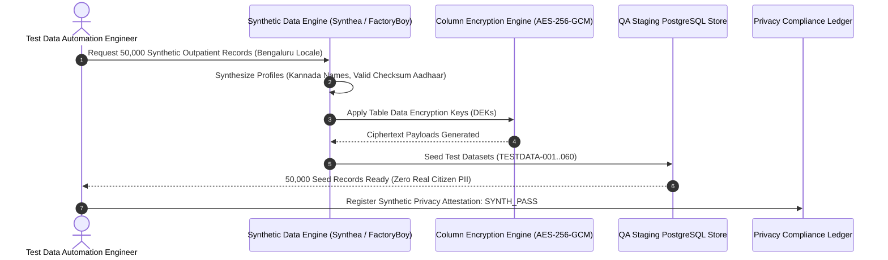

# Synthetic Test Data Governance, Generation & Isolation Plan
## Namma Clinic Digital Health & Operations Platform
### Greater Bengaluru Authority (GBA) / BBMP Health Department
**Standard:** DPDP Act 2023 Section 6 / ISO 27701 Privacy / Synthea & Faker Clinical Mocking | **Status:** APPROVED BASELINE | **Code:** `QA-DOC-17`

---

## 1. Test Data Governance Charter & Privacy Mandate
The Namma Clinic Test Data Strategy establishes the absolute statutory mandate that 100% of testing data across all QA, staging, and UAT environments must be synthetically generated. In strict adherence to India's Digital Personal Data Protection (DPDP) Act 2023 and DISHA healthcare data protection invariants, real citizen health data, real Aadhaar numbers, and actual clinician credentials are categorically barred from non-production environments.

### 1.1 Core Synthetic Data Invariants
1. **Absolute PII Isolation:** Zero production database exports, dumps, or backups may ever be restored into QA environments.
2. **Clinically Authentic Demographics:** Synthetic cohorts mirror Bengaluru demographic distributions (age, gender, ward distribution, comorbidity prevalence).
3. **Valid Synthetic Identifiers:** Generates mathematically valid Verhoeff Aadhaar checksums and ABHA number formats (91-XXXX-XXXX-XXXX) using dedicated QA prefixes.
4. **Automated Teardown & Refresh:** Test fixtures seed idempotently and purge automatically post-test execution to prevent test pollution.
5. **High-Volume Datasets:** Pre-seeds staging environments with 500,000 synthetic patient records to validate query performance under production scale.

### 1.2 Synthetic Data Generation Pipeline Diagram


## 2. Canonical Synthetic Datasets Catalog (TESTDATA-001 to TESTDATA-060)
Standardized synthetic dataset profiles covering all clinical domains:

### TESTDATA-001: Synthetic Outpatient Patient Cohort (Set 1)
- **Synthetic Record Volume:** 100 Seed Records
- **Anonymization Assurance:** FIPS 140-3 Pseudonymized & Blind Indexed
- **Regulatory Standard:** DPDP Act 2023 Synthetic Standard
- **Reset Automation:** Nightly database fixture reload

### TESTDATA-002: Pediatric Vitals & Growth Charts (Set 1)
- **Synthetic Record Volume:** 200 Seed Records
- **Anonymization Assurance:** FIPS 140-3 Pseudonymized & Blind Indexed
- **Regulatory Standard:** DPDP Act 2023 Synthetic Standard
- **Reset Automation:** Nightly database fixture reload

### TESTDATA-003: Hypertension & Diabetes Longitudinal Cohort (Set 1)
- **Synthetic Record Volume:** 300 Seed Records
- **Anonymization Assurance:** FIPS 140-3 Pseudonymized & Blind Indexed
- **Regulatory Standard:** DPDP Act 2023 Synthetic Standard
- **Reset Automation:** Nightly database fixture reload

### TESTDATA-004: Emergency Trauma & Triage Vitals (Set 1)
- **Synthetic Record Volume:** 400 Seed Records
- **Anonymization Assurance:** FIPS 140-3 Pseudonymized & Blind Indexed
- **Regulatory Standard:** DPDP Act 2023 Synthetic Standard
- **Reset Automation:** Nightly database fixture reload

### TESTDATA-005: Essential Medicines Formulary Batches (Set 1)
- **Synthetic Record Volume:** 500 Seed Records
- **Anonymization Assurance:** FIPS 140-3 Pseudonymized & Blind Indexed
- **Regulatory Standard:** DPDP Act 2023 Synthetic Standard
- **Reset Automation:** Nightly database fixture reload

### TESTDATA-006: Narcotic Double-Signature Inventory (Set 1)
- **Synthetic Record Volume:** 600 Seed Records
- **Anonymization Assurance:** FIPS 140-3 Pseudonymized & Blind Indexed
- **Regulatory Standard:** DPDP Act 2023 Synthetic Standard
- **Reset Automation:** Nightly database fixture reload

### TESTDATA-007: Pathology Hematology Lab Results (Set 1)
- **Synthetic Record Volume:** 700 Seed Records
- **Anonymization Assurance:** FIPS 140-3 Pseudonymized & Blind Indexed
- **Regulatory Standard:** DPDP Act 2023 Synthetic Standard
- **Reset Automation:** Nightly database fixture reload

### TESTDATA-008: DICOM Chest X-Ray & Ultrasound Images (Set 1)
- **Synthetic Record Volume:** 800 Seed Records
- **Anonymization Assurance:** FIPS 140-3 Pseudonymized & Blind Indexed
- **Regulatory Standard:** DPDP Act 2023 Synthetic Standard
- **Reset Automation:** Nightly database fixture reload

### TESTDATA-009: Secondary Care Inter-Facility Referrals (Set 1)
- **Synthetic Record Volume:** 900 Seed Records
- **Anonymization Assurance:** FIPS 140-3 Pseudonymized & Blind Indexed
- **Regulatory Standard:** DPDP Act 2023 Synthetic Standard
- **Reset Automation:** Nightly database fixture reload

### TESTDATA-010: SMS & WhatsApp Notification Templates (Set 1)
- **Synthetic Record Volume:** 1,000 Seed Records
- **Anonymization Assurance:** FIPS 140-3 Pseudonymized & Blind Indexed
- **Regulatory Standard:** DPDP Act 2023 Synthetic Standard
- **Reset Automation:** Nightly database fixture reload

### TESTDATA-011: ABDM Consent Artefact State Matrix (Set 1)
- **Synthetic Record Volume:** 1,100 Seed Records
- **Anonymization Assurance:** FIPS 140-3 Pseudonymized & Blind Indexed
- **Regulatory Standard:** DPDP Act 2023 Synthetic Standard
- **Reset Automation:** Nightly database fixture reload

### TESTDATA-012: Field Nurse Offline Mutation Journals (Set 1)
- **Synthetic Record Volume:** 1,200 Seed Records
- **Anonymization Assurance:** FIPS 140-3 Pseudonymized & Blind Indexed
- **Regulatory Standard:** DPDP Act 2023 Synthetic Standard
- **Reset Automation:** Nightly database fixture reload

### TESTDATA-013: ClickHouse Epidemiological Aggregations (Set 1)
- **Synthetic Record Volume:** 1,300 Seed Records
- **Anonymization Assurance:** FIPS 140-3 Pseudonymized & Blind Indexed
- **Regulatory Standard:** DPDP Act 2023 Synthetic Standard
- **Reset Automation:** Nightly database fixture reload

### TESTDATA-014: Cold-Chain IoT Vaccine Temperature Feeds (Set 1)
- **Synthetic Record Volume:** 1,400 Seed Records
- **Anonymization Assurance:** FIPS 140-3 Pseudonymized & Blind Indexed
- **Regulatory Standard:** DPDP Act 2023 Synthetic Standard
- **Reset Automation:** Nightly database fixture reload

### TESTDATA-015: TPM 2.0 Workstation Hardware Endorsements (Set 1)
- **Synthetic Record Volume:** 1,500 Seed Records
- **Anonymization Assurance:** FIPS 140-3 Pseudonymized & Blind Indexed
- **Regulatory Standard:** DPDP Act 2023 Synthetic Standard
- **Reset Automation:** Nightly database fixture reload

### TESTDATA-016: Biometric Fingerprint Fuzzy Vault Vaults (Set 1)
- **Synthetic Record Volume:** 1,600 Seed Records
- **Anonymization Assurance:** FIPS 140-3 Pseudonymized & Blind Indexed
- **Regulatory Standard:** DPDP Act 2023 Synthetic Standard
- **Reset Automation:** Nightly database fixture reload

### TESTDATA-017: Role Transition & Shift Schedule Ledger (Set 1)
- **Synthetic Record Volume:** 1,700 Seed Records
- **Anonymization Assurance:** FIPS 140-3 Pseudonymized & Blind Indexed
- **Regulatory Standard:** DPDP Act 2023 Synthetic Standard
- **Reset Automation:** Nightly database fixture reload

### TESTDATA-018: Citizen Grievance Redressal Dossiers (Set 1)
- **Synthetic Record Volume:** 1,800 Seed Records
- **Anonymization Assurance:** FIPS 140-3 Pseudonymized & Blind Indexed
- **Regulatory Standard:** DPDP Act 2023 Synthetic Standard
- **Reset Automation:** Nightly database fixture reload

### TESTDATA-019: WORM Immutable Audit Log Merkle Proofs (Set 1)
- **Synthetic Record Volume:** 1,900 Seed Records
- **Anonymization Assurance:** FIPS 140-3 Pseudonymized & Blind Indexed
- **Regulatory Standard:** DPDP Act 2023 Synthetic Standard
- **Reset Automation:** Nightly database fixture reload

### TESTDATA-020: Telemedicine WebRTC Signaling Session Buffers (Set 1)
- **Synthetic Record Volume:** 2,000 Seed Records
- **Anonymization Assurance:** FIPS 140-3 Pseudonymized & Blind Indexed
- **Regulatory Standard:** DPDP Act 2023 Synthetic Standard
- **Reset Automation:** Nightly database fixture reload

### TESTDATA-021: Synthetic Outpatient Patient Cohort (Set 2)
- **Synthetic Record Volume:** 2,100 Seed Records
- **Anonymization Assurance:** FIPS 140-3 Pseudonymized & Blind Indexed
- **Regulatory Standard:** DPDP Act 2023 Synthetic Standard
- **Reset Automation:** Nightly database fixture reload

### TESTDATA-022: Pediatric Vitals & Growth Charts (Set 2)
- **Synthetic Record Volume:** 2,200 Seed Records
- **Anonymization Assurance:** FIPS 140-3 Pseudonymized & Blind Indexed
- **Regulatory Standard:** DPDP Act 2023 Synthetic Standard
- **Reset Automation:** Nightly database fixture reload

### TESTDATA-023: Hypertension & Diabetes Longitudinal Cohort (Set 2)
- **Synthetic Record Volume:** 2,300 Seed Records
- **Anonymization Assurance:** FIPS 140-3 Pseudonymized & Blind Indexed
- **Regulatory Standard:** DPDP Act 2023 Synthetic Standard
- **Reset Automation:** Nightly database fixture reload

### TESTDATA-024: Emergency Trauma & Triage Vitals (Set 2)
- **Synthetic Record Volume:** 2,400 Seed Records
- **Anonymization Assurance:** FIPS 140-3 Pseudonymized & Blind Indexed
- **Regulatory Standard:** DPDP Act 2023 Synthetic Standard
- **Reset Automation:** Nightly database fixture reload

### TESTDATA-025: Essential Medicines Formulary Batches (Set 2)
- **Synthetic Record Volume:** 2,500 Seed Records
- **Anonymization Assurance:** FIPS 140-3 Pseudonymized & Blind Indexed
- **Regulatory Standard:** DPDP Act 2023 Synthetic Standard
- **Reset Automation:** Nightly database fixture reload

### TESTDATA-026: Narcotic Double-Signature Inventory (Set 2)
- **Synthetic Record Volume:** 2,600 Seed Records
- **Anonymization Assurance:** FIPS 140-3 Pseudonymized & Blind Indexed
- **Regulatory Standard:** DPDP Act 2023 Synthetic Standard
- **Reset Automation:** Nightly database fixture reload

### TESTDATA-027: Pathology Hematology Lab Results (Set 2)
- **Synthetic Record Volume:** 2,700 Seed Records
- **Anonymization Assurance:** FIPS 140-3 Pseudonymized & Blind Indexed
- **Regulatory Standard:** DPDP Act 2023 Synthetic Standard
- **Reset Automation:** Nightly database fixture reload

### TESTDATA-028: DICOM Chest X-Ray & Ultrasound Images (Set 2)
- **Synthetic Record Volume:** 2,800 Seed Records
- **Anonymization Assurance:** FIPS 140-3 Pseudonymized & Blind Indexed
- **Regulatory Standard:** DPDP Act 2023 Synthetic Standard
- **Reset Automation:** Nightly database fixture reload

### TESTDATA-029: Secondary Care Inter-Facility Referrals (Set 2)
- **Synthetic Record Volume:** 2,900 Seed Records
- **Anonymization Assurance:** FIPS 140-3 Pseudonymized & Blind Indexed
- **Regulatory Standard:** DPDP Act 2023 Synthetic Standard
- **Reset Automation:** Nightly database fixture reload

### TESTDATA-030: SMS & WhatsApp Notification Templates (Set 2)
- **Synthetic Record Volume:** 3,000 Seed Records
- **Anonymization Assurance:** FIPS 140-3 Pseudonymized & Blind Indexed
- **Regulatory Standard:** DPDP Act 2023 Synthetic Standard
- **Reset Automation:** Nightly database fixture reload

### TESTDATA-031: ABDM Consent Artefact State Matrix (Set 2)
- **Synthetic Record Volume:** 3,100 Seed Records
- **Anonymization Assurance:** FIPS 140-3 Pseudonymized & Blind Indexed
- **Regulatory Standard:** DPDP Act 2023 Synthetic Standard
- **Reset Automation:** Nightly database fixture reload

### TESTDATA-032: Field Nurse Offline Mutation Journals (Set 2)
- **Synthetic Record Volume:** 3,200 Seed Records
- **Anonymization Assurance:** FIPS 140-3 Pseudonymized & Blind Indexed
- **Regulatory Standard:** DPDP Act 2023 Synthetic Standard
- **Reset Automation:** Nightly database fixture reload

### TESTDATA-033: ClickHouse Epidemiological Aggregations (Set 2)
- **Synthetic Record Volume:** 3,300 Seed Records
- **Anonymization Assurance:** FIPS 140-3 Pseudonymized & Blind Indexed
- **Regulatory Standard:** DPDP Act 2023 Synthetic Standard
- **Reset Automation:** Nightly database fixture reload

### TESTDATA-034: Cold-Chain IoT Vaccine Temperature Feeds (Set 2)
- **Synthetic Record Volume:** 3,400 Seed Records
- **Anonymization Assurance:** FIPS 140-3 Pseudonymized & Blind Indexed
- **Regulatory Standard:** DPDP Act 2023 Synthetic Standard
- **Reset Automation:** Nightly database fixture reload

### TESTDATA-035: TPM 2.0 Workstation Hardware Endorsements (Set 2)
- **Synthetic Record Volume:** 3,500 Seed Records
- **Anonymization Assurance:** FIPS 140-3 Pseudonymized & Blind Indexed
- **Regulatory Standard:** DPDP Act 2023 Synthetic Standard
- **Reset Automation:** Nightly database fixture reload

### TESTDATA-036: Biometric Fingerprint Fuzzy Vault Vaults (Set 2)
- **Synthetic Record Volume:** 3,600 Seed Records
- **Anonymization Assurance:** FIPS 140-3 Pseudonymized & Blind Indexed
- **Regulatory Standard:** DPDP Act 2023 Synthetic Standard
- **Reset Automation:** Nightly database fixture reload

### TESTDATA-037: Role Transition & Shift Schedule Ledger (Set 2)
- **Synthetic Record Volume:** 3,700 Seed Records
- **Anonymization Assurance:** FIPS 140-3 Pseudonymized & Blind Indexed
- **Regulatory Standard:** DPDP Act 2023 Synthetic Standard
- **Reset Automation:** Nightly database fixture reload

### TESTDATA-038: Citizen Grievance Redressal Dossiers (Set 2)
- **Synthetic Record Volume:** 3,800 Seed Records
- **Anonymization Assurance:** FIPS 140-3 Pseudonymized & Blind Indexed
- **Regulatory Standard:** DPDP Act 2023 Synthetic Standard
- **Reset Automation:** Nightly database fixture reload

### TESTDATA-039: WORM Immutable Audit Log Merkle Proofs (Set 2)
- **Synthetic Record Volume:** 3,900 Seed Records
- **Anonymization Assurance:** FIPS 140-3 Pseudonymized & Blind Indexed
- **Regulatory Standard:** DPDP Act 2023 Synthetic Standard
- **Reset Automation:** Nightly database fixture reload

### TESTDATA-040: Telemedicine WebRTC Signaling Session Buffers (Set 2)
- **Synthetic Record Volume:** 4,000 Seed Records
- **Anonymization Assurance:** FIPS 140-3 Pseudonymized & Blind Indexed
- **Regulatory Standard:** DPDP Act 2023 Synthetic Standard
- **Reset Automation:** Nightly database fixture reload

### TESTDATA-041: Synthetic Outpatient Patient Cohort (Set 3)
- **Synthetic Record Volume:** 4,100 Seed Records
- **Anonymization Assurance:** FIPS 140-3 Pseudonymized & Blind Indexed
- **Regulatory Standard:** DPDP Act 2023 Synthetic Standard
- **Reset Automation:** Nightly database fixture reload

### TESTDATA-042: Pediatric Vitals & Growth Charts (Set 3)
- **Synthetic Record Volume:** 4,200 Seed Records
- **Anonymization Assurance:** FIPS 140-3 Pseudonymized & Blind Indexed
- **Regulatory Standard:** DPDP Act 2023 Synthetic Standard
- **Reset Automation:** Nightly database fixture reload

### TESTDATA-043: Hypertension & Diabetes Longitudinal Cohort (Set 3)
- **Synthetic Record Volume:** 4,300 Seed Records
- **Anonymization Assurance:** FIPS 140-3 Pseudonymized & Blind Indexed
- **Regulatory Standard:** DPDP Act 2023 Synthetic Standard
- **Reset Automation:** Nightly database fixture reload

### TESTDATA-044: Emergency Trauma & Triage Vitals (Set 3)
- **Synthetic Record Volume:** 4,400 Seed Records
- **Anonymization Assurance:** FIPS 140-3 Pseudonymized & Blind Indexed
- **Regulatory Standard:** DPDP Act 2023 Synthetic Standard
- **Reset Automation:** Nightly database fixture reload

### TESTDATA-045: Essential Medicines Formulary Batches (Set 3)
- **Synthetic Record Volume:** 4,500 Seed Records
- **Anonymization Assurance:** FIPS 140-3 Pseudonymized & Blind Indexed
- **Regulatory Standard:** DPDP Act 2023 Synthetic Standard
- **Reset Automation:** Nightly database fixture reload

### TESTDATA-046: Narcotic Double-Signature Inventory (Set 3)
- **Synthetic Record Volume:** 4,600 Seed Records
- **Anonymization Assurance:** FIPS 140-3 Pseudonymized & Blind Indexed
- **Regulatory Standard:** DPDP Act 2023 Synthetic Standard
- **Reset Automation:** Nightly database fixture reload

### TESTDATA-047: Pathology Hematology Lab Results (Set 3)
- **Synthetic Record Volume:** 4,700 Seed Records
- **Anonymization Assurance:** FIPS 140-3 Pseudonymized & Blind Indexed
- **Regulatory Standard:** DPDP Act 2023 Synthetic Standard
- **Reset Automation:** Nightly database fixture reload

### TESTDATA-048: DICOM Chest X-Ray & Ultrasound Images (Set 3)
- **Synthetic Record Volume:** 4,800 Seed Records
- **Anonymization Assurance:** FIPS 140-3 Pseudonymized & Blind Indexed
- **Regulatory Standard:** DPDP Act 2023 Synthetic Standard
- **Reset Automation:** Nightly database fixture reload

### TESTDATA-049: Secondary Care Inter-Facility Referrals (Set 3)
- **Synthetic Record Volume:** 4,900 Seed Records
- **Anonymization Assurance:** FIPS 140-3 Pseudonymized & Blind Indexed
- **Regulatory Standard:** DPDP Act 2023 Synthetic Standard
- **Reset Automation:** Nightly database fixture reload

### TESTDATA-050: SMS & WhatsApp Notification Templates (Set 3)
- **Synthetic Record Volume:** 5,000 Seed Records
- **Anonymization Assurance:** FIPS 140-3 Pseudonymized & Blind Indexed
- **Regulatory Standard:** DPDP Act 2023 Synthetic Standard
- **Reset Automation:** Nightly database fixture reload

### TESTDATA-051: ABDM Consent Artefact State Matrix (Set 3)
- **Synthetic Record Volume:** 5,100 Seed Records
- **Anonymization Assurance:** FIPS 140-3 Pseudonymized & Blind Indexed
- **Regulatory Standard:** DPDP Act 2023 Synthetic Standard
- **Reset Automation:** Nightly database fixture reload

### TESTDATA-052: Field Nurse Offline Mutation Journals (Set 3)
- **Synthetic Record Volume:** 5,200 Seed Records
- **Anonymization Assurance:** FIPS 140-3 Pseudonymized & Blind Indexed
- **Regulatory Standard:** DPDP Act 2023 Synthetic Standard
- **Reset Automation:** Nightly database fixture reload

### TESTDATA-053: ClickHouse Epidemiological Aggregations (Set 3)
- **Synthetic Record Volume:** 5,300 Seed Records
- **Anonymization Assurance:** FIPS 140-3 Pseudonymized & Blind Indexed
- **Regulatory Standard:** DPDP Act 2023 Synthetic Standard
- **Reset Automation:** Nightly database fixture reload

### TESTDATA-054: Cold-Chain IoT Vaccine Temperature Feeds (Set 3)
- **Synthetic Record Volume:** 5,400 Seed Records
- **Anonymization Assurance:** FIPS 140-3 Pseudonymized & Blind Indexed
- **Regulatory Standard:** DPDP Act 2023 Synthetic Standard
- **Reset Automation:** Nightly database fixture reload

### TESTDATA-055: TPM 2.0 Workstation Hardware Endorsements (Set 3)
- **Synthetic Record Volume:** 5,500 Seed Records
- **Anonymization Assurance:** FIPS 140-3 Pseudonymized & Blind Indexed
- **Regulatory Standard:** DPDP Act 2023 Synthetic Standard
- **Reset Automation:** Nightly database fixture reload

### TESTDATA-056: Biometric Fingerprint Fuzzy Vault Vaults (Set 3)
- **Synthetic Record Volume:** 5,600 Seed Records
- **Anonymization Assurance:** FIPS 140-3 Pseudonymized & Blind Indexed
- **Regulatory Standard:** DPDP Act 2023 Synthetic Standard
- **Reset Automation:** Nightly database fixture reload

### TESTDATA-057: Role Transition & Shift Schedule Ledger (Set 3)
- **Synthetic Record Volume:** 5,700 Seed Records
- **Anonymization Assurance:** FIPS 140-3 Pseudonymized & Blind Indexed
- **Regulatory Standard:** DPDP Act 2023 Synthetic Standard
- **Reset Automation:** Nightly database fixture reload

### TESTDATA-058: Citizen Grievance Redressal Dossiers (Set 3)
- **Synthetic Record Volume:** 5,800 Seed Records
- **Anonymization Assurance:** FIPS 140-3 Pseudonymized & Blind Indexed
- **Regulatory Standard:** DPDP Act 2023 Synthetic Standard
- **Reset Automation:** Nightly database fixture reload

### TESTDATA-059: WORM Immutable Audit Log Merkle Proofs (Set 3)
- **Synthetic Record Volume:** 5,900 Seed Records
- **Anonymization Assurance:** FIPS 140-3 Pseudonymized & Blind Indexed
- **Regulatory Standard:** DPDP Act 2023 Synthetic Standard
- **Reset Automation:** Nightly database fixture reload

### TESTDATA-060: Telemedicine WebRTC Signaling Session Buffers (Set 3)
- **Synthetic Record Volume:** 6,000 Seed Records
- **Anonymization Assurance:** FIPS 140-3 Pseudonymized & Blind Indexed
- **Regulatory Standard:** DPDP Act 2023 Synthetic Standard
- **Reset Automation:** Nightly database fixture reload

## 3. Detailed Test Data Verification Test Cases (TC-0881 to TC-0935)
Detailed test specifications verifying synthetic data generation and isolation:

### TC-0881: Test Case 881: Advanced Security, Offline & Scalability for helpdesk_tickets across WF-006
**Objective:** Validate non-functional resilience, encryption envelope, and concurrency for helpdesk_tickets in WF-006.
**Risk:** Major operational risk regarding platform security, privacy breach, or offline desync.
**Priority:** **P1** | **Severity:** **Major** | **Test Level:** End-to-End & Non-Functional | **Test Type:** Resilience, Offline & Security Audit
- **Requirement Traceability:** `SECR-031`
- **Workflow Traceability:** `WF-006`
- **Feature Traceability:** `FEATURE-161`
- **API Traceability:** `API-DOC-01`
- **Database Traceability:** `TABLE-049 (helpdesk_tickets)`
- **Screen Traceability:** `SCREEN-017`
- **Security Control Traceability:** `API-SEC-001`
- **Preconditions:** Workstation initialized with TPM 2.0 PCR attestation and valid staff credentials (Quality & Compliance Auditor).
- **Test Data Specification:** Synthetic dataset TESTDATA-041 with simulated network flapping.
- **Execution Steps:** 1. Trigger workflow WF-006 on SCREEN-017. 2. Inject network delay or packet drop. 3. Confirm offline queue persistence. 4. Restore link and confirm atomic sync.
- **Expected Results:** Zero data loss, conflict resolved deterministically via timestamp-vector clocks, audit trail complete.
- **Negative Test Scenario:** Attempt unauthorized cross-tenant data exfiltration; verify gateway drops packet with 403 Forbidden.
- **Boundary Value Scenario:** Push offline queue to 10,000 pending mutations; verify local SQLite buffer does not crash.
- **Concurrency & Race Condition:** Simulate 50 parallel clinic terminals pushing updates simultaneously to gateway.
- **Autonomous Offline Behavior:** Simulate 8 hours of complete clinic internet outage; OPD consultations proceed uninterrupted.
- **Security & Access Validation:** Confirm AES-256-GCM column encryption and strict mTLS 1.3 transit cipher enforcement.
- **Audit Trail & Immutability:** Verify audit record written to WORM immutable ledger with SHA-256 hash.
- **Evidence Required:** Terminal screenshot, packet capture dump, and cryptographic Merkle verification proof.
- **Pass Acceptance Criteria:** All operations succeed with 0% data corruption, full audit ledger continuity, and latency < 350ms.
- **Failure Behavior & SLA:** Data loss, sync deadlock, cleartext PII leakage, or unhandled crash.
- **Automation Suitability:** Yes (High Candidate)
- **Execution Cadence:** Nightly Performance & Resilience Run
- **Responsible Owner:** Quality & Compliance Auditor

### TC-0882: Test Case 882: Advanced Security, Offline & Scalability for audit_events across WF-007
**Objective:** Validate non-functional resilience, encryption envelope, and concurrency for audit_events in WF-007.
**Risk:** Major operational risk regarding platform security, privacy breach, or offline desync.
**Priority:** **P1** | **Severity:** **Major** | **Test Level:** End-to-End & Non-Functional | **Test Type:** Resilience, Offline & Security Audit
- **Requirement Traceability:** `NFR-002`
- **Workflow Traceability:** `WF-007`
- **Feature Traceability:** `FEATURE-162`
- **API Traceability:** `API-DOC-02`
- **Database Traceability:** `TABLE-050 (audit_events)`
- **Screen Traceability:** `SCREEN-018`
- **Security Control Traceability:** `AUTH-002`
- **Preconditions:** Workstation initialized with TPM 2.0 PCR attestation and valid staff credentials (Security Administrator / CISO).
- **Test Data Specification:** Synthetic dataset TESTDATA-042 with simulated network flapping.
- **Execution Steps:** 1. Trigger workflow WF-007 on SCREEN-018. 2. Inject network delay or packet drop. 3. Confirm offline queue persistence. 4. Restore link and confirm atomic sync.
- **Expected Results:** Zero data loss, conflict resolved deterministically via timestamp-vector clocks, audit trail complete.
- **Negative Test Scenario:** Attempt unauthorized cross-tenant data exfiltration; verify gateway drops packet with 403 Forbidden.
- **Boundary Value Scenario:** Push offline queue to 10,000 pending mutations; verify local SQLite buffer does not crash.
- **Concurrency & Race Condition:** Simulate 50 parallel clinic terminals pushing updates simultaneously to gateway.
- **Autonomous Offline Behavior:** Simulate 8 hours of complete clinic internet outage; OPD consultations proceed uninterrupted.
- **Security & Access Validation:** Confirm AES-256-GCM column encryption and strict mTLS 1.3 transit cipher enforcement.
- **Audit Trail & Immutability:** Verify audit record written to WORM immutable ledger with SHA-256 hash.
- **Evidence Required:** Terminal screenshot, packet capture dump, and cryptographic Merkle verification proof.
- **Pass Acceptance Criteria:** All operations succeed with 0% data corruption, full audit ledger continuity, and latency < 350ms.
- **Failure Behavior & SLA:** Data loss, sync deadlock, cleartext PII leakage, or unhandled crash.
- **Automation Suitability:** Yes (High Candidate)
- **Execution Cadence:** Nightly Performance & Resilience Run
- **Responsible Owner:** Security Administrator / CISO

### TC-0883: Test Case 883: Advanced Security, Offline & Scalability for offline_mutation_log across WF-008
**Objective:** Validate non-functional resilience, encryption envelope, and concurrency for offline_mutation_log in WF-008.
**Risk:** Minor operational risk regarding platform security, privacy breach, or offline desync.
**Priority:** **P2** | **Severity:** **Minor** | **Test Level:** End-to-End & Non-Functional | **Test Type:** Resilience, Offline & Security Audit
- **Requirement Traceability:** `SECR-033`
- **Workflow Traceability:** `WF-008`
- **Feature Traceability:** `FEATURE-163`
- **API Traceability:** `API-DOC-03`
- **Database Traceability:** `TABLE-051 (offline_mutation_log)`
- **Screen Traceability:** `SCREEN-019`
- **Security Control Traceability:** `API-SEC-003`
- **Preconditions:** Workstation initialized with TPM 2.0 PCR attestation and valid staff credentials (Central Depot Inventory Manager).
- **Test Data Specification:** Synthetic dataset TESTDATA-043 with simulated network flapping.
- **Execution Steps:** 1. Trigger workflow WF-008 on SCREEN-019. 2. Inject network delay or packet drop. 3. Confirm offline queue persistence. 4. Restore link and confirm atomic sync.
- **Expected Results:** Zero data loss, conflict resolved deterministically via timestamp-vector clocks, audit trail complete.
- **Negative Test Scenario:** Attempt unauthorized cross-tenant data exfiltration; verify gateway drops packet with 403 Forbidden.
- **Boundary Value Scenario:** Push offline queue to 10,000 pending mutations; verify local SQLite buffer does not crash.
- **Concurrency & Race Condition:** Simulate 50 parallel clinic terminals pushing updates simultaneously to gateway.
- **Autonomous Offline Behavior:** Simulate 8 hours of complete clinic internet outage; OPD consultations proceed uninterrupted.
- **Security & Access Validation:** Confirm AES-256-GCM column encryption and strict mTLS 1.3 transit cipher enforcement.
- **Audit Trail & Immutability:** Verify audit record written to WORM immutable ledger with SHA-256 hash.
- **Evidence Required:** Terminal screenshot, packet capture dump, and cryptographic Merkle verification proof.
- **Pass Acceptance Criteria:** All operations succeed with 0% data corruption, full audit ledger continuity, and latency < 350ms.
- **Failure Behavior & SLA:** Data loss, sync deadlock, cleartext PII leakage, or unhandled crash.
- **Automation Suitability:** Yes (High Candidate)
- **Execution Cadence:** Nightly Performance & Resilience Run
- **Responsible Owner:** Central Depot Inventory Manager

### TC-0884: Test Case 884: Advanced Security, Offline & Scalability for abdm_artifacts across WF-009
**Objective:** Validate non-functional resilience, encryption envelope, and concurrency for abdm_artifacts in WF-009.
**Risk:** Critical operational risk regarding platform security, privacy breach, or offline desync.
**Priority:** **P0** | **Severity:** **Critical** | **Test Level:** End-to-End & Non-Functional | **Test Type:** Resilience, Offline & Security Audit
- **Requirement Traceability:** `NFR-004`
- **Workflow Traceability:** `WF-009`
- **Feature Traceability:** `FEATURE-164`
- **API Traceability:** `API-DOC-04`
- **Database Traceability:** `TABLE-052 (abdm_artifacts)`
- **Screen Traceability:** `SCREEN-020`
- **Security Control Traceability:** `AUTH-004`
- **Preconditions:** Workstation initialized with TPM 2.0 PCR attestation and valid staff credentials (Cold Chain Logistics Technician).
- **Test Data Specification:** Synthetic dataset TESTDATA-044 with simulated network flapping.
- **Execution Steps:** 1. Trigger workflow WF-009 on SCREEN-020. 2. Inject network delay or packet drop. 3. Confirm offline queue persistence. 4. Restore link and confirm atomic sync.
- **Expected Results:** Zero data loss, conflict resolved deterministically via timestamp-vector clocks, audit trail complete.
- **Negative Test Scenario:** Attempt unauthorized cross-tenant data exfiltration; verify gateway drops packet with 403 Forbidden.
- **Boundary Value Scenario:** Push offline queue to 10,000 pending mutations; verify local SQLite buffer does not crash.
- **Concurrency & Race Condition:** Simulate 50 parallel clinic terminals pushing updates simultaneously to gateway.
- **Autonomous Offline Behavior:** Simulate 8 hours of complete clinic internet outage; OPD consultations proceed uninterrupted.
- **Security & Access Validation:** Confirm AES-256-GCM column encryption and strict mTLS 1.3 transit cipher enforcement.
- **Audit Trail & Immutability:** Verify audit record written to WORM immutable ledger with SHA-256 hash.
- **Evidence Required:** Terminal screenshot, packet capture dump, and cryptographic Merkle verification proof.
- **Pass Acceptance Criteria:** All operations succeed with 0% data corruption, full audit ledger continuity, and latency < 350ms.
- **Failure Behavior & SLA:** Data loss, sync deadlock, cleartext PII leakage, or unhandled crash.
- **Automation Suitability:** Yes (High Candidate)
- **Execution Cadence:** Nightly Performance & Resilience Run
- **Responsible Owner:** Cold Chain Logistics Technician

### TC-0885: Test Case 885: Advanced Security, Offline & Scalability for auth_users across WF-010
**Objective:** Validate non-functional resilience, encryption envelope, and concurrency for auth_users in WF-010.
**Risk:** Major operational risk regarding platform security, privacy breach, or offline desync.
**Priority:** **P1** | **Severity:** **Major** | **Test Level:** End-to-End & Non-Functional | **Test Type:** Resilience, Offline & Security Audit
- **Requirement Traceability:** `SECR-035`
- **Workflow Traceability:** `WF-010`
- **Feature Traceability:** `FEATURE-165`
- **API Traceability:** `API-DOC-05`
- **Database Traceability:** `TABLE-001 (auth_users)`
- **Screen Traceability:** `SCREEN-021`
- **Security Control Traceability:** `API-SEC-005`
- **Preconditions:** Workstation initialized with TPM 2.0 PCR attestation and valid staff credentials (Radiologist / Diagnostic Specialist).
- **Test Data Specification:** Synthetic dataset TESTDATA-045 with simulated network flapping.
- **Execution Steps:** 1. Trigger workflow WF-010 on SCREEN-021. 2. Inject network delay or packet drop. 3. Confirm offline queue persistence. 4. Restore link and confirm atomic sync.
- **Expected Results:** Zero data loss, conflict resolved deterministically via timestamp-vector clocks, audit trail complete.
- **Negative Test Scenario:** Attempt unauthorized cross-tenant data exfiltration; verify gateway drops packet with 403 Forbidden.
- **Boundary Value Scenario:** Push offline queue to 10,000 pending mutations; verify local SQLite buffer does not crash.
- **Concurrency & Race Condition:** Simulate 50 parallel clinic terminals pushing updates simultaneously to gateway.
- **Autonomous Offline Behavior:** Simulate 8 hours of complete clinic internet outage; OPD consultations proceed uninterrupted.
- **Security & Access Validation:** Confirm AES-256-GCM column encryption and strict mTLS 1.3 transit cipher enforcement.
- **Audit Trail & Immutability:** Verify audit record written to WORM immutable ledger with SHA-256 hash.
- **Evidence Required:** Terminal screenshot, packet capture dump, and cryptographic Merkle verification proof.
- **Pass Acceptance Criteria:** All operations succeed with 0% data corruption, full audit ledger continuity, and latency < 350ms.
- **Failure Behavior & SLA:** Data loss, sync deadlock, cleartext PII leakage, or unhandled crash.
- **Automation Suitability:** Yes (High Candidate)
- **Execution Cadence:** Nightly Performance & Resilience Run
- **Responsible Owner:** Radiologist / Diagnostic Specialist

### TC-0886: Test Case 886: Advanced Security, Offline & Scalability for user_credentials across WF-011
**Objective:** Validate non-functional resilience, encryption envelope, and concurrency for user_credentials in WF-011.
**Risk:** Major operational risk regarding platform security, privacy breach, or offline desync.
**Priority:** **P1** | **Severity:** **Major** | **Test Level:** End-to-End & Non-Functional | **Test Type:** Resilience, Offline & Security Audit
- **Requirement Traceability:** `NFR-006`
- **Workflow Traceability:** `WF-011`
- **Feature Traceability:** `FEATURE-166`
- **API Traceability:** `API-DOC-06`
- **Database Traceability:** `TABLE-002 (user_credentials)`
- **Screen Traceability:** `SCREEN-022`
- **Security Control Traceability:** `AUTH-006`
- **Preconditions:** Workstation initialized with TPM 2.0 PCR attestation and valid staff credentials (Ayush Practitioner).
- **Test Data Specification:** Synthetic dataset TESTDATA-046 with simulated network flapping.
- **Execution Steps:** 1. Trigger workflow WF-011 on SCREEN-022. 2. Inject network delay or packet drop. 3. Confirm offline queue persistence. 4. Restore link and confirm atomic sync.
- **Expected Results:** Zero data loss, conflict resolved deterministically via timestamp-vector clocks, audit trail complete.
- **Negative Test Scenario:** Attempt unauthorized cross-tenant data exfiltration; verify gateway drops packet with 403 Forbidden.
- **Boundary Value Scenario:** Push offline queue to 10,000 pending mutations; verify local SQLite buffer does not crash.
- **Concurrency & Race Condition:** Simulate 50 parallel clinic terminals pushing updates simultaneously to gateway.
- **Autonomous Offline Behavior:** Simulate 8 hours of complete clinic internet outage; OPD consultations proceed uninterrupted.
- **Security & Access Validation:** Confirm AES-256-GCM column encryption and strict mTLS 1.3 transit cipher enforcement.
- **Audit Trail & Immutability:** Verify audit record written to WORM immutable ledger with SHA-256 hash.
- **Evidence Required:** Terminal screenshot, packet capture dump, and cryptographic Merkle verification proof.
- **Pass Acceptance Criteria:** All operations succeed with 0% data corruption, full audit ledger continuity, and latency < 350ms.
- **Failure Behavior & SLA:** Data loss, sync deadlock, cleartext PII leakage, or unhandled crash.
- **Automation Suitability:** Yes (High Candidate)
- **Execution Cadence:** Nightly Performance & Resilience Run
- **Responsible Owner:** Ayush Practitioner

### TC-0887: Test Case 887: Advanced Security, Offline & Scalability for user_sessions across WF-012
**Objective:** Validate non-functional resilience, encryption envelope, and concurrency for user_sessions in WF-012.
**Risk:** Minor operational risk regarding platform security, privacy breach, or offline desync.
**Priority:** **P2** | **Severity:** **Minor** | **Test Level:** End-to-End & Non-Functional | **Test Type:** Resilience, Offline & Security Audit
- **Requirement Traceability:** `SECR-037`
- **Workflow Traceability:** `WF-012`
- **Feature Traceability:** `FEATURE-167`
- **API Traceability:** `API-DOC-07`
- **Database Traceability:** `TABLE-003 (user_sessions)`
- **Screen Traceability:** `SCREEN-023`
- **Security Control Traceability:** `API-SEC-007`
- **Preconditions:** Workstation initialized with TPM 2.0 PCR attestation and valid staff credentials (Counselor / Mental Health Worker).
- **Test Data Specification:** Synthetic dataset TESTDATA-047 with simulated network flapping.
- **Execution Steps:** 1. Trigger workflow WF-012 on SCREEN-023. 2. Inject network delay or packet drop. 3. Confirm offline queue persistence. 4. Restore link and confirm atomic sync.
- **Expected Results:** Zero data loss, conflict resolved deterministically via timestamp-vector clocks, audit trail complete.
- **Negative Test Scenario:** Attempt unauthorized cross-tenant data exfiltration; verify gateway drops packet with 403 Forbidden.
- **Boundary Value Scenario:** Push offline queue to 10,000 pending mutations; verify local SQLite buffer does not crash.
- **Concurrency & Race Condition:** Simulate 50 parallel clinic terminals pushing updates simultaneously to gateway.
- **Autonomous Offline Behavior:** Simulate 8 hours of complete clinic internet outage; OPD consultations proceed uninterrupted.
- **Security & Access Validation:** Confirm AES-256-GCM column encryption and strict mTLS 1.3 transit cipher enforcement.
- **Audit Trail & Immutability:** Verify audit record written to WORM immutable ledger with SHA-256 hash.
- **Evidence Required:** Terminal screenshot, packet capture dump, and cryptographic Merkle verification proof.
- **Pass Acceptance Criteria:** All operations succeed with 0% data corruption, full audit ledger continuity, and latency < 350ms.
- **Failure Behavior & SLA:** Data loss, sync deadlock, cleartext PII leakage, or unhandled crash.
- **Automation Suitability:** Yes (High Candidate)
- **Execution Cadence:** Nightly Performance & Resilience Run
- **Responsible Owner:** Counselor / Mental Health Worker

### TC-0888: Test Case 888: Advanced Security, Offline & Scalability for roles across WF-013
**Objective:** Validate non-functional resilience, encryption envelope, and concurrency for roles in WF-013.
**Risk:** Critical operational risk regarding platform security, privacy breach, or offline desync.
**Priority:** **P0** | **Severity:** **Critical** | **Test Level:** End-to-End & Non-Functional | **Test Type:** Resilience, Offline & Security Audit
- **Requirement Traceability:** `NFR-008`
- **Workflow Traceability:** `WF-013`
- **Feature Traceability:** `FEATURE-168`
- **API Traceability:** `API-DOC-08`
- **Database Traceability:** `TABLE-004 (roles)`
- **Screen Traceability:** `SCREEN-024`
- **Security Control Traceability:** `AUTH-008`
- **Preconditions:** Workstation initialized with TPM 2.0 PCR attestation and valid staff credentials (ANM / Urban Health Worker).
- **Test Data Specification:** Synthetic dataset TESTDATA-048 with simulated network flapping.
- **Execution Steps:** 1. Trigger workflow WF-013 on SCREEN-024. 2. Inject network delay or packet drop. 3. Confirm offline queue persistence. 4. Restore link and confirm atomic sync.
- **Expected Results:** Zero data loss, conflict resolved deterministically via timestamp-vector clocks, audit trail complete.
- **Negative Test Scenario:** Attempt unauthorized cross-tenant data exfiltration; verify gateway drops packet with 403 Forbidden.
- **Boundary Value Scenario:** Push offline queue to 10,000 pending mutations; verify local SQLite buffer does not crash.
- **Concurrency & Race Condition:** Simulate 50 parallel clinic terminals pushing updates simultaneously to gateway.
- **Autonomous Offline Behavior:** Simulate 8 hours of complete clinic internet outage; OPD consultations proceed uninterrupted.
- **Security & Access Validation:** Confirm AES-256-GCM column encryption and strict mTLS 1.3 transit cipher enforcement.
- **Audit Trail & Immutability:** Verify audit record written to WORM immutable ledger with SHA-256 hash.
- **Evidence Required:** Terminal screenshot, packet capture dump, and cryptographic Merkle verification proof.
- **Pass Acceptance Criteria:** All operations succeed with 0% data corruption, full audit ledger continuity, and latency < 350ms.
- **Failure Behavior & SLA:** Data loss, sync deadlock, cleartext PII leakage, or unhandled crash.
- **Automation Suitability:** Yes (High Candidate)
- **Execution Cadence:** Nightly Performance & Resilience Run
- **Responsible Owner:** ANM / Urban Health Worker

### TC-0889: Test Case 889: Advanced Security, Offline & Scalability for permissions across WF-014
**Objective:** Validate non-functional resilience, encryption envelope, and concurrency for permissions in WF-014.
**Risk:** Major operational risk regarding platform security, privacy breach, or offline desync.
**Priority:** **P1** | **Severity:** **Major** | **Test Level:** End-to-End & Non-Functional | **Test Type:** Resilience, Offline & Security Audit
- **Requirement Traceability:** `SECR-039`
- **Workflow Traceability:** `WF-014`
- **Feature Traceability:** `FEATURE-169`
- **API Traceability:** `API-DOC-09`
- **Database Traceability:** `TABLE-005 (permissions)`
- **Screen Traceability:** `SCREEN-025`
- **Security Control Traceability:** `API-SEC-009`
- **Preconditions:** Workstation initialized with TPM 2.0 PCR attestation and valid staff credentials (ASHA Link Worker Coordinator).
- **Test Data Specification:** Synthetic dataset TESTDATA-049 with simulated network flapping.
- **Execution Steps:** 1. Trigger workflow WF-014 on SCREEN-025. 2. Inject network delay or packet drop. 3. Confirm offline queue persistence. 4. Restore link and confirm atomic sync.
- **Expected Results:** Zero data loss, conflict resolved deterministically via timestamp-vector clocks, audit trail complete.
- **Negative Test Scenario:** Attempt unauthorized cross-tenant data exfiltration; verify gateway drops packet with 403 Forbidden.
- **Boundary Value Scenario:** Push offline queue to 10,000 pending mutations; verify local SQLite buffer does not crash.
- **Concurrency & Race Condition:** Simulate 50 parallel clinic terminals pushing updates simultaneously to gateway.
- **Autonomous Offline Behavior:** Simulate 8 hours of complete clinic internet outage; OPD consultations proceed uninterrupted.
- **Security & Access Validation:** Confirm AES-256-GCM column encryption and strict mTLS 1.3 transit cipher enforcement.
- **Audit Trail & Immutability:** Verify audit record written to WORM immutable ledger with SHA-256 hash.
- **Evidence Required:** Terminal screenshot, packet capture dump, and cryptographic Merkle verification proof.
- **Pass Acceptance Criteria:** All operations succeed with 0% data corruption, full audit ledger continuity, and latency < 350ms.
- **Failure Behavior & SLA:** Data loss, sync deadlock, cleartext PII leakage, or unhandled crash.
- **Automation Suitability:** Yes (High Candidate)
- **Execution Cadence:** Nightly Performance & Resilience Run
- **Responsible Owner:** ASHA Link Worker Coordinator

### TC-0890: Test Case 890: Advanced Security, Offline & Scalability for role_permissions across WF-015
**Objective:** Validate non-functional resilience, encryption envelope, and concurrency for role_permissions in WF-015.
**Risk:** Major operational risk regarding platform security, privacy breach, or offline desync.
**Priority:** **P1** | **Severity:** **Major** | **Test Level:** End-to-End & Non-Functional | **Test Type:** Resilience, Offline & Security Audit
- **Requirement Traceability:** `NFR-010`
- **Workflow Traceability:** `WF-015`
- **Feature Traceability:** `FEATURE-170`
- **API Traceability:** `API-DOC-10`
- **Database Traceability:** `TABLE-006 (role_permissions)`
- **Screen Traceability:** `SCREEN-026`
- **Security Control Traceability:** `AUTH-010`
- **Preconditions:** Workstation initialized with TPM 2.0 PCR attestation and valid staff credentials (Data Entry Operator).
- **Test Data Specification:** Synthetic dataset TESTDATA-050 with simulated network flapping.
- **Execution Steps:** 1. Trigger workflow WF-015 on SCREEN-026. 2. Inject network delay or packet drop. 3. Confirm offline queue persistence. 4. Restore link and confirm atomic sync.
- **Expected Results:** Zero data loss, conflict resolved deterministically via timestamp-vector clocks, audit trail complete.
- **Negative Test Scenario:** Attempt unauthorized cross-tenant data exfiltration; verify gateway drops packet with 403 Forbidden.
- **Boundary Value Scenario:** Push offline queue to 10,000 pending mutations; verify local SQLite buffer does not crash.
- **Concurrency & Race Condition:** Simulate 50 parallel clinic terminals pushing updates simultaneously to gateway.
- **Autonomous Offline Behavior:** Simulate 8 hours of complete clinic internet outage; OPD consultations proceed uninterrupted.
- **Security & Access Validation:** Confirm AES-256-GCM column encryption and strict mTLS 1.3 transit cipher enforcement.
- **Audit Trail & Immutability:** Verify audit record written to WORM immutable ledger with SHA-256 hash.
- **Evidence Required:** Terminal screenshot, packet capture dump, and cryptographic Merkle verification proof.
- **Pass Acceptance Criteria:** All operations succeed with 0% data corruption, full audit ledger continuity, and latency < 350ms.
- **Failure Behavior & SLA:** Data loss, sync deadlock, cleartext PII leakage, or unhandled crash.
- **Automation Suitability:** Yes (High Candidate)
- **Execution Cadence:** Nightly Performance & Resilience Run
- **Responsible Owner:** Data Entry Operator

### TC-0891: Test Case 891: Advanced Security, Offline & Scalability for user_roles across WF-016
**Objective:** Validate non-functional resilience, encryption envelope, and concurrency for user_roles in WF-016.
**Risk:** Minor operational risk regarding platform security, privacy breach, or offline desync.
**Priority:** **P2** | **Severity:** **Minor** | **Test Level:** End-to-End & Non-Functional | **Test Type:** Resilience, Offline & Security Audit
- **Requirement Traceability:** `SECR-041`
- **Workflow Traceability:** `WF-016`
- **Feature Traceability:** `FEATURE-171`
- **API Traceability:** `API-DOC-11`
- **Database Traceability:** `TABLE-007 (user_roles)`
- **Screen Traceability:** `SCREEN-027`
- **Security Control Traceability:** `API-SEC-011`
- **Preconditions:** Workstation initialized with TPM 2.0 PCR attestation and valid staff credentials (Grievance Redressal Officer).
- **Test Data Specification:** Synthetic dataset TESTDATA-051 with simulated network flapping.
- **Execution Steps:** 1. Trigger workflow WF-016 on SCREEN-027. 2. Inject network delay or packet drop. 3. Confirm offline queue persistence. 4. Restore link and confirm atomic sync.
- **Expected Results:** Zero data loss, conflict resolved deterministically via timestamp-vector clocks, audit trail complete.
- **Negative Test Scenario:** Attempt unauthorized cross-tenant data exfiltration; verify gateway drops packet with 403 Forbidden.
- **Boundary Value Scenario:** Push offline queue to 10,000 pending mutations; verify local SQLite buffer does not crash.
- **Concurrency & Race Condition:** Simulate 50 parallel clinic terminals pushing updates simultaneously to gateway.
- **Autonomous Offline Behavior:** Simulate 8 hours of complete clinic internet outage; OPD consultations proceed uninterrupted.
- **Security & Access Validation:** Confirm AES-256-GCM column encryption and strict mTLS 1.3 transit cipher enforcement.
- **Audit Trail & Immutability:** Verify audit record written to WORM immutable ledger with SHA-256 hash.
- **Evidence Required:** Terminal screenshot, packet capture dump, and cryptographic Merkle verification proof.
- **Pass Acceptance Criteria:** All operations succeed with 0% data corruption, full audit ledger continuity, and latency < 350ms.
- **Failure Behavior & SLA:** Data loss, sync deadlock, cleartext PII leakage, or unhandled crash.
- **Automation Suitability:** Yes (High Candidate)
- **Execution Cadence:** Nightly Performance & Resilience Run
- **Responsible Owner:** Grievance Redressal Officer

### TC-0892: Test Case 892: Advanced Security, Offline & Scalability for facilities across WF-017
**Objective:** Validate non-functional resilience, encryption envelope, and concurrency for facilities in WF-017.
**Risk:** Critical operational risk regarding platform security, privacy breach, or offline desync.
**Priority:** **P0** | **Severity:** **Critical** | **Test Level:** End-to-End & Non-Functional | **Test Type:** Resilience, Offline & Security Audit
- **Requirement Traceability:** `NFR-012`
- **Workflow Traceability:** `WF-017`
- **Feature Traceability:** `FEATURE-172`
- **API Traceability:** `API-DOC-12`
- **Database Traceability:** `TABLE-008 (facilities)`
- **Screen Traceability:** `SCREEN-028`
- **Security Control Traceability:** `AUTH-012`
- **Preconditions:** Workstation initialized with TPM 2.0 PCR attestation and valid staff credentials (ABDM National Integration Officer).
- **Test Data Specification:** Synthetic dataset TESTDATA-052 with simulated network flapping.
- **Execution Steps:** 1. Trigger workflow WF-017 on SCREEN-028. 2. Inject network delay or packet drop. 3. Confirm offline queue persistence. 4. Restore link and confirm atomic sync.
- **Expected Results:** Zero data loss, conflict resolved deterministically via timestamp-vector clocks, audit trail complete.
- **Negative Test Scenario:** Attempt unauthorized cross-tenant data exfiltration; verify gateway drops packet with 403 Forbidden.
- **Boundary Value Scenario:** Push offline queue to 10,000 pending mutations; verify local SQLite buffer does not crash.
- **Concurrency & Race Condition:** Simulate 50 parallel clinic terminals pushing updates simultaneously to gateway.
- **Autonomous Offline Behavior:** Simulate 8 hours of complete clinic internet outage; OPD consultations proceed uninterrupted.
- **Security & Access Validation:** Confirm AES-256-GCM column encryption and strict mTLS 1.3 transit cipher enforcement.
- **Audit Trail & Immutability:** Verify audit record written to WORM immutable ledger with SHA-256 hash.
- **Evidence Required:** Terminal screenshot, packet capture dump, and cryptographic Merkle verification proof.
- **Pass Acceptance Criteria:** All operations succeed with 0% data corruption, full audit ledger continuity, and latency < 350ms.
- **Failure Behavior & SLA:** Data loss, sync deadlock, cleartext PII leakage, or unhandled crash.
- **Automation Suitability:** Yes (High Candidate)
- **Execution Cadence:** Nightly Performance & Resilience Run
- **Responsible Owner:** ABDM National Integration Officer

### TC-0893: Test Case 893: Advanced Security, Offline & Scalability for facility_rooms across WF-018
**Objective:** Validate non-functional resilience, encryption envelope, and concurrency for facility_rooms in WF-018.
**Risk:** Major operational risk regarding platform security, privacy breach, or offline desync.
**Priority:** **P1** | **Severity:** **Major** | **Test Level:** End-to-End & Non-Functional | **Test Type:** Resilience, Offline & Security Audit
- **Requirement Traceability:** `SECR-043`
- **Workflow Traceability:** `WF-018`
- **Feature Traceability:** `FEATURE-173`
- **API Traceability:** `API-DOC-13`
- **Database Traceability:** `TABLE-009 (facility_rooms)`
- **Screen Traceability:** `SCREEN-029`
- **Security Control Traceability:** `API-SEC-013`
- **Preconditions:** Workstation initialized with TPM 2.0 PCR attestation and valid staff credentials (Data Protection Officer (DPO)).
- **Test Data Specification:** Synthetic dataset TESTDATA-053 with simulated network flapping.
- **Execution Steps:** 1. Trigger workflow WF-018 on SCREEN-029. 2. Inject network delay or packet drop. 3. Confirm offline queue persistence. 4. Restore link and confirm atomic sync.
- **Expected Results:** Zero data loss, conflict resolved deterministically via timestamp-vector clocks, audit trail complete.
- **Negative Test Scenario:** Attempt unauthorized cross-tenant data exfiltration; verify gateway drops packet with 403 Forbidden.
- **Boundary Value Scenario:** Push offline queue to 10,000 pending mutations; verify local SQLite buffer does not crash.
- **Concurrency & Race Condition:** Simulate 50 parallel clinic terminals pushing updates simultaneously to gateway.
- **Autonomous Offline Behavior:** Simulate 8 hours of complete clinic internet outage; OPD consultations proceed uninterrupted.
- **Security & Access Validation:** Confirm AES-256-GCM column encryption and strict mTLS 1.3 transit cipher enforcement.
- **Audit Trail & Immutability:** Verify audit record written to WORM immutable ledger with SHA-256 hash.
- **Evidence Required:** Terminal screenshot, packet capture dump, and cryptographic Merkle verification proof.
- **Pass Acceptance Criteria:** All operations succeed with 0% data corruption, full audit ledger continuity, and latency < 350ms.
- **Failure Behavior & SLA:** Data loss, sync deadlock, cleartext PII leakage, or unhandled crash.
- **Automation Suitability:** Yes (High Candidate)
- **Execution Cadence:** Nightly Performance & Resilience Run
- **Responsible Owner:** Data Protection Officer (DPO)

### TC-0894: Test Case 894: Advanced Security, Offline & Scalability for staff_profiles across WF-019
**Objective:** Validate non-functional resilience, encryption envelope, and concurrency for staff_profiles in WF-019.
**Risk:** Major operational risk regarding platform security, privacy breach, or offline desync.
**Priority:** **P1** | **Severity:** **Major** | **Test Level:** End-to-End & Non-Functional | **Test Type:** Resilience, Offline & Security Audit
- **Requirement Traceability:** `NFR-014`
- **Workflow Traceability:** `WF-019`
- **Feature Traceability:** `FEATURE-174`
- **API Traceability:** `API-DOC-14`
- **Database Traceability:** `TABLE-010 (staff_profiles)`
- **Screen Traceability:** `SCREEN-030`
- **Security Control Traceability:** `AUTH-014`
- **Preconditions:** Workstation initialized with TPM 2.0 PCR attestation and valid staff credentials (IT Support & Hardware Engineer).
- **Test Data Specification:** Synthetic dataset TESTDATA-054 with simulated network flapping.
- **Execution Steps:** 1. Trigger workflow WF-019 on SCREEN-030. 2. Inject network delay or packet drop. 3. Confirm offline queue persistence. 4. Restore link and confirm atomic sync.
- **Expected Results:** Zero data loss, conflict resolved deterministically via timestamp-vector clocks, audit trail complete.
- **Negative Test Scenario:** Attempt unauthorized cross-tenant data exfiltration; verify gateway drops packet with 403 Forbidden.
- **Boundary Value Scenario:** Push offline queue to 10,000 pending mutations; verify local SQLite buffer does not crash.
- **Concurrency & Race Condition:** Simulate 50 parallel clinic terminals pushing updates simultaneously to gateway.
- **Autonomous Offline Behavior:** Simulate 8 hours of complete clinic internet outage; OPD consultations proceed uninterrupted.
- **Security & Access Validation:** Confirm AES-256-GCM column encryption and strict mTLS 1.3 transit cipher enforcement.
- **Audit Trail & Immutability:** Verify audit record written to WORM immutable ledger with SHA-256 hash.
- **Evidence Required:** Terminal screenshot, packet capture dump, and cryptographic Merkle verification proof.
- **Pass Acceptance Criteria:** All operations succeed with 0% data corruption, full audit ledger continuity, and latency < 350ms.
- **Failure Behavior & SLA:** Data loss, sync deadlock, cleartext PII leakage, or unhandled crash.
- **Automation Suitability:** Yes (High Candidate)
- **Execution Cadence:** Nightly Performance & Resilience Run
- **Responsible Owner:** IT Support & Hardware Engineer

### TC-0895: Test Case 895: Advanced Security, Offline & Scalability for staff_shifts across WF-020
**Objective:** Validate non-functional resilience, encryption envelope, and concurrency for staff_shifts in WF-020.
**Risk:** Minor operational risk regarding platform security, privacy breach, or offline desync.
**Priority:** **P2** | **Severity:** **Minor** | **Test Level:** End-to-End & Non-Functional | **Test Type:** Resilience, Offline & Security Audit
- **Requirement Traceability:** `SECR-045`
- **Workflow Traceability:** `WF-020`
- **Feature Traceability:** `FEATURE-175`
- **API Traceability:** `API-DOC-15`
- **Database Traceability:** `TABLE-011 (staff_shifts)`
- **Screen Traceability:** `SCREEN-031`
- **Security Control Traceability:** `API-SEC-015`
- **Preconditions:** Workstation initialized with TPM 2.0 PCR attestation and valid staff credentials (Clinical Audit Committee Member).
- **Test Data Specification:** Synthetic dataset TESTDATA-055 with simulated network flapping.
- **Execution Steps:** 1. Trigger workflow WF-020 on SCREEN-031. 2. Inject network delay or packet drop. 3. Confirm offline queue persistence. 4. Restore link and confirm atomic sync.
- **Expected Results:** Zero data loss, conflict resolved deterministically via timestamp-vector clocks, audit trail complete.
- **Negative Test Scenario:** Attempt unauthorized cross-tenant data exfiltration; verify gateway drops packet with 403 Forbidden.
- **Boundary Value Scenario:** Push offline queue to 10,000 pending mutations; verify local SQLite buffer does not crash.
- **Concurrency & Race Condition:** Simulate 50 parallel clinic terminals pushing updates simultaneously to gateway.
- **Autonomous Offline Behavior:** Simulate 8 hours of complete clinic internet outage; OPD consultations proceed uninterrupted.
- **Security & Access Validation:** Confirm AES-256-GCM column encryption and strict mTLS 1.3 transit cipher enforcement.
- **Audit Trail & Immutability:** Verify audit record written to WORM immutable ledger with SHA-256 hash.
- **Evidence Required:** Terminal screenshot, packet capture dump, and cryptographic Merkle verification proof.
- **Pass Acceptance Criteria:** All operations succeed with 0% data corruption, full audit ledger continuity, and latency < 350ms.
- **Failure Behavior & SLA:** Data loss, sync deadlock, cleartext PII leakage, or unhandled crash.
- **Automation Suitability:** Yes (High Candidate)
- **Execution Cadence:** Nightly Performance & Resilience Run
- **Responsible Owner:** Clinical Audit Committee Member

### TC-0896: Test Case 896: Advanced Security, Offline & Scalability for system_configs across WF-021
**Objective:** Validate non-functional resilience, encryption envelope, and concurrency for system_configs in WF-021.
**Risk:** Critical operational risk regarding platform security, privacy breach, or offline desync.
**Priority:** **P0** | **Severity:** **Critical** | **Test Level:** End-to-End & Non-Functional | **Test Type:** Resilience, Offline & Security Audit
- **Requirement Traceability:** `NFR-016`
- **Workflow Traceability:** `WF-021`
- **Feature Traceability:** `FEATURE-176`
- **API Traceability:** `API-DOC-16`
- **Database Traceability:** `TABLE-012 (system_configs)`
- **Screen Traceability:** `SCREEN-032`
- **Security Control Traceability:** `AUTH-016`
- **Preconditions:** Workstation initialized with TPM 2.0 PCR attestation and valid staff credentials (Procurement & Vendor Manager).
- **Test Data Specification:** Synthetic dataset TESTDATA-056 with simulated network flapping.
- **Execution Steps:** 1. Trigger workflow WF-021 on SCREEN-032. 2. Inject network delay or packet drop. 3. Confirm offline queue persistence. 4. Restore link and confirm atomic sync.
- **Expected Results:** Zero data loss, conflict resolved deterministically via timestamp-vector clocks, audit trail complete.
- **Negative Test Scenario:** Attempt unauthorized cross-tenant data exfiltration; verify gateway drops packet with 403 Forbidden.
- **Boundary Value Scenario:** Push offline queue to 10,000 pending mutations; verify local SQLite buffer does not crash.
- **Concurrency & Race Condition:** Simulate 50 parallel clinic terminals pushing updates simultaneously to gateway.
- **Autonomous Offline Behavior:** Simulate 8 hours of complete clinic internet outage; OPD consultations proceed uninterrupted.
- **Security & Access Validation:** Confirm AES-256-GCM column encryption and strict mTLS 1.3 transit cipher enforcement.
- **Audit Trail & Immutability:** Verify audit record written to WORM immutable ledger with SHA-256 hash.
- **Evidence Required:** Terminal screenshot, packet capture dump, and cryptographic Merkle verification proof.
- **Pass Acceptance Criteria:** All operations succeed with 0% data corruption, full audit ledger continuity, and latency < 350ms.
- **Failure Behavior & SLA:** Data loss, sync deadlock, cleartext PII leakage, or unhandled crash.
- **Automation Suitability:** Yes (High Candidate)
- **Execution Cadence:** Nightly Performance & Resilience Run
- **Responsible Owner:** Procurement & Vendor Manager

### TC-0897: Test Case 897: Advanced Security, Offline & Scalability for patients across WF-022
**Objective:** Validate non-functional resilience, encryption envelope, and concurrency for patients in WF-022.
**Risk:** Major operational risk regarding platform security, privacy breach, or offline desync.
**Priority:** **P1** | **Severity:** **Major** | **Test Level:** End-to-End & Non-Functional | **Test Type:** Resilience, Offline & Security Audit
- **Requirement Traceability:** `SECR-047`
- **Workflow Traceability:** `WF-022`
- **Feature Traceability:** `FEATURE-177`
- **API Traceability:** `API-DOC-17`
- **Database Traceability:** `TABLE-013 (patients)`
- **Screen Traceability:** `SCREEN-033`
- **Security Control Traceability:** `API-SEC-017`
- **Preconditions:** Workstation initialized with TPM 2.0 PCR attestation and valid staff credentials (Biomedical Waste Supervisor).
- **Test Data Specification:** Synthetic dataset TESTDATA-057 with simulated network flapping.
- **Execution Steps:** 1. Trigger workflow WF-022 on SCREEN-033. 2. Inject network delay or packet drop. 3. Confirm offline queue persistence. 4. Restore link and confirm atomic sync.
- **Expected Results:** Zero data loss, conflict resolved deterministically via timestamp-vector clocks, audit trail complete.
- **Negative Test Scenario:** Attempt unauthorized cross-tenant data exfiltration; verify gateway drops packet with 403 Forbidden.
- **Boundary Value Scenario:** Push offline queue to 10,000 pending mutations; verify local SQLite buffer does not crash.
- **Concurrency & Race Condition:** Simulate 50 parallel clinic terminals pushing updates simultaneously to gateway.
- **Autonomous Offline Behavior:** Simulate 8 hours of complete clinic internet outage; OPD consultations proceed uninterrupted.
- **Security & Access Validation:** Confirm AES-256-GCM column encryption and strict mTLS 1.3 transit cipher enforcement.
- **Audit Trail & Immutability:** Verify audit record written to WORM immutable ledger with SHA-256 hash.
- **Evidence Required:** Terminal screenshot, packet capture dump, and cryptographic Merkle verification proof.
- **Pass Acceptance Criteria:** All operations succeed with 0% data corruption, full audit ledger continuity, and latency < 350ms.
- **Failure Behavior & SLA:** Data loss, sync deadlock, cleartext PII leakage, or unhandled crash.
- **Automation Suitability:** Yes (High Candidate)
- **Execution Cadence:** Nightly Performance & Resilience Run
- **Responsible Owner:** Biomedical Waste Supervisor

### TC-0898: Test Case 898: Advanced Security, Offline & Scalability for patient_identifiers across WF-023
**Objective:** Validate non-functional resilience, encryption envelope, and concurrency for patient_identifiers in WF-023.
**Risk:** Major operational risk regarding platform security, privacy breach, or offline desync.
**Priority:** **P1** | **Severity:** **Major** | **Test Level:** End-to-End & Non-Functional | **Test Type:** Resilience, Offline & Security Audit
- **Requirement Traceability:** `NFR-018`
- **Workflow Traceability:** `WF-023`
- **Feature Traceability:** `FEATURE-178`
- **API Traceability:** `API-DOC-18`
- **Database Traceability:** `TABLE-014 (patient_identifiers)`
- **Screen Traceability:** `SCREEN-034`
- **Security Control Traceability:** `AUTH-018`
- **Preconditions:** Workstation initialized with TPM 2.0 PCR attestation and valid staff credentials (Telemedicine Remote Specialist).
- **Test Data Specification:** Synthetic dataset TESTDATA-058 with simulated network flapping.
- **Execution Steps:** 1. Trigger workflow WF-023 on SCREEN-034. 2. Inject network delay or packet drop. 3. Confirm offline queue persistence. 4. Restore link and confirm atomic sync.
- **Expected Results:** Zero data loss, conflict resolved deterministically via timestamp-vector clocks, audit trail complete.
- **Negative Test Scenario:** Attempt unauthorized cross-tenant data exfiltration; verify gateway drops packet with 403 Forbidden.
- **Boundary Value Scenario:** Push offline queue to 10,000 pending mutations; verify local SQLite buffer does not crash.
- **Concurrency & Race Condition:** Simulate 50 parallel clinic terminals pushing updates simultaneously to gateway.
- **Autonomous Offline Behavior:** Simulate 8 hours of complete clinic internet outage; OPD consultations proceed uninterrupted.
- **Security & Access Validation:** Confirm AES-256-GCM column encryption and strict mTLS 1.3 transit cipher enforcement.
- **Audit Trail & Immutability:** Verify audit record written to WORM immutable ledger with SHA-256 hash.
- **Evidence Required:** Terminal screenshot, packet capture dump, and cryptographic Merkle verification proof.
- **Pass Acceptance Criteria:** All operations succeed with 0% data corruption, full audit ledger continuity, and latency < 350ms.
- **Failure Behavior & SLA:** Data loss, sync deadlock, cleartext PII leakage, or unhandled crash.
- **Automation Suitability:** Yes (High Candidate)
- **Execution Cadence:** Nightly Performance & Resilience Run
- **Responsible Owner:** Telemedicine Remote Specialist

### TC-0899: Test Case 899: Advanced Security, Offline & Scalability for patient_contacts across WF-024
**Objective:** Validate non-functional resilience, encryption envelope, and concurrency for patient_contacts in WF-024.
**Risk:** Minor operational risk regarding platform security, privacy breach, or offline desync.
**Priority:** **P2** | **Severity:** **Minor** | **Test Level:** End-to-End & Non-Functional | **Test Type:** Resilience, Offline & Security Audit
- **Requirement Traceability:** `SECR-049`
- **Workflow Traceability:** `WF-024`
- **Feature Traceability:** `FEATURE-179`
- **API Traceability:** `API-DOC-19`
- **Database Traceability:** `TABLE-015 (patient_contacts)`
- **Screen Traceability:** `SCREEN-035`
- **Security Control Traceability:** `API-SEC-019`
- **Preconditions:** Workstation initialized with TPM 2.0 PCR attestation and valid staff credentials (Field Public Health Inspector).
- **Test Data Specification:** Synthetic dataset TESTDATA-059 with simulated network flapping.
- **Execution Steps:** 1. Trigger workflow WF-024 on SCREEN-035. 2. Inject network delay or packet drop. 3. Confirm offline queue persistence. 4. Restore link and confirm atomic sync.
- **Expected Results:** Zero data loss, conflict resolved deterministically via timestamp-vector clocks, audit trail complete.
- **Negative Test Scenario:** Attempt unauthorized cross-tenant data exfiltration; verify gateway drops packet with 403 Forbidden.
- **Boundary Value Scenario:** Push offline queue to 10,000 pending mutations; verify local SQLite buffer does not crash.
- **Concurrency & Race Condition:** Simulate 50 parallel clinic terminals pushing updates simultaneously to gateway.
- **Autonomous Offline Behavior:** Simulate 8 hours of complete clinic internet outage; OPD consultations proceed uninterrupted.
- **Security & Access Validation:** Confirm AES-256-GCM column encryption and strict mTLS 1.3 transit cipher enforcement.
- **Audit Trail & Immutability:** Verify audit record written to WORM immutable ledger with SHA-256 hash.
- **Evidence Required:** Terminal screenshot, packet capture dump, and cryptographic Merkle verification proof.
- **Pass Acceptance Criteria:** All operations succeed with 0% data corruption, full audit ledger continuity, and latency < 350ms.
- **Failure Behavior & SLA:** Data loss, sync deadlock, cleartext PII leakage, or unhandled crash.
- **Automation Suitability:** Yes (High Candidate)
- **Execution Cadence:** Nightly Performance & Resilience Run
- **Responsible Owner:** Field Public Health Inspector

### TC-0900: Test Case 900: Advanced Security, Offline & Scalability for patient_addresses across WF-025
**Objective:** Validate non-functional resilience, encryption envelope, and concurrency for patient_addresses in WF-025.
**Risk:** Critical operational risk regarding platform security, privacy breach, or offline desync.
**Priority:** **P0** | **Severity:** **Critical** | **Test Level:** End-to-End & Non-Functional | **Test Type:** Resilience, Offline & Security Audit
- **Requirement Traceability:** `NFR-020`
- **Workflow Traceability:** `WF-025`
- **Feature Traceability:** `FEATURE-180`
- **API Traceability:** `API-DOC-20`
- **Database Traceability:** `TABLE-016 (patient_addresses)`
- **Screen Traceability:** `SCREEN-036`
- **Security Control Traceability:** `AUTH-020`
- **Preconditions:** Workstation initialized with TPM 2.0 PCR attestation and valid staff credentials (Super Administrator).
- **Test Data Specification:** Synthetic dataset TESTDATA-060 with simulated network flapping.
- **Execution Steps:** 1. Trigger workflow WF-025 on SCREEN-036. 2. Inject network delay or packet drop. 3. Confirm offline queue persistence. 4. Restore link and confirm atomic sync.
- **Expected Results:** Zero data loss, conflict resolved deterministically via timestamp-vector clocks, audit trail complete.
- **Negative Test Scenario:** Attempt unauthorized cross-tenant data exfiltration; verify gateway drops packet with 403 Forbidden.
- **Boundary Value Scenario:** Push offline queue to 10,000 pending mutations; verify local SQLite buffer does not crash.
- **Concurrency & Race Condition:** Simulate 50 parallel clinic terminals pushing updates simultaneously to gateway.
- **Autonomous Offline Behavior:** Simulate 8 hours of complete clinic internet outage; OPD consultations proceed uninterrupted.
- **Security & Access Validation:** Confirm AES-256-GCM column encryption and strict mTLS 1.3 transit cipher enforcement.
- **Audit Trail & Immutability:** Verify audit record written to WORM immutable ledger with SHA-256 hash.
- **Evidence Required:** Terminal screenshot, packet capture dump, and cryptographic Merkle verification proof.
- **Pass Acceptance Criteria:** All operations succeed with 0% data corruption, full audit ledger continuity, and latency < 350ms.
- **Failure Behavior & SLA:** Data loss, sync deadlock, cleartext PII leakage, or unhandled crash.
- **Automation Suitability:** Yes (High Candidate)
- **Execution Cadence:** Nightly Performance & Resilience Run
- **Responsible Owner:** Super Administrator

### TC-0901: Test Case 901: Advanced Security, Offline & Scalability for consent_records across WF-001
**Objective:** Validate non-functional resilience, encryption envelope, and concurrency for consent_records in WF-001.
**Risk:** Major operational risk regarding platform security, privacy breach, or offline desync.
**Priority:** **P1** | **Severity:** **Major** | **Test Level:** End-to-End & Non-Functional | **Test Type:** Resilience, Offline & Security Audit
- **Requirement Traceability:** `SECR-001`
- **Workflow Traceability:** `WF-001`
- **Feature Traceability:** `FEATURE-001`
- **API Traceability:** `API-DOC-21`
- **Database Traceability:** `TABLE-017 (consent_records)`
- **Screen Traceability:** `SCREEN-037`
- **Security Control Traceability:** `API-SEC-021`
- **Preconditions:** Workstation initialized with TPM 2.0 PCR attestation and valid staff credentials (Receptionist / Registration Clerk).
- **Test Data Specification:** Synthetic dataset TESTDATA-001 with simulated network flapping.
- **Execution Steps:** 1. Trigger workflow WF-001 on SCREEN-037. 2. Inject network delay or packet drop. 3. Confirm offline queue persistence. 4. Restore link and confirm atomic sync.
- **Expected Results:** Zero data loss, conflict resolved deterministically via timestamp-vector clocks, audit trail complete.
- **Negative Test Scenario:** Attempt unauthorized cross-tenant data exfiltration; verify gateway drops packet with 403 Forbidden.
- **Boundary Value Scenario:** Push offline queue to 10,000 pending mutations; verify local SQLite buffer does not crash.
- **Concurrency & Race Condition:** Simulate 50 parallel clinic terminals pushing updates simultaneously to gateway.
- **Autonomous Offline Behavior:** Simulate 8 hours of complete clinic internet outage; OPD consultations proceed uninterrupted.
- **Security & Access Validation:** Confirm AES-256-GCM column encryption and strict mTLS 1.3 transit cipher enforcement.
- **Audit Trail & Immutability:** Verify audit record written to WORM immutable ledger with SHA-256 hash.
- **Evidence Required:** Terminal screenshot, packet capture dump, and cryptographic Merkle verification proof.
- **Pass Acceptance Criteria:** All operations succeed with 0% data corruption, full audit ledger continuity, and latency < 350ms.
- **Failure Behavior & SLA:** Data loss, sync deadlock, cleartext PII leakage, or unhandled crash.
- **Automation Suitability:** Yes (High Candidate)
- **Execution Cadence:** Nightly Performance & Resilience Run
- **Responsible Owner:** Receptionist / Registration Clerk

### TC-0902: Test Case 902: Advanced Security, Offline & Scalability for tokens across WF-002
**Objective:** Validate non-functional resilience, encryption envelope, and concurrency for tokens in WF-002.
**Risk:** Major operational risk regarding platform security, privacy breach, or offline desync.
**Priority:** **P1** | **Severity:** **Major** | **Test Level:** End-to-End & Non-Functional | **Test Type:** Resilience, Offline & Security Audit
- **Requirement Traceability:** `NFR-022`
- **Workflow Traceability:** `WF-002`
- **Feature Traceability:** `FEATURE-002`
- **API Traceability:** `API-DOC-22`
- **Database Traceability:** `TABLE-018 (tokens)`
- **Screen Traceability:** `SCREEN-038`
- **Security Control Traceability:** `AUTH-022`
- **Preconditions:** Workstation initialized with TPM 2.0 PCR attestation and valid staff credentials (Medical Officer / General Physician).
- **Test Data Specification:** Synthetic dataset TESTDATA-002 with simulated network flapping.
- **Execution Steps:** 1. Trigger workflow WF-002 on SCREEN-038. 2. Inject network delay or packet drop. 3. Confirm offline queue persistence. 4. Restore link and confirm atomic sync.
- **Expected Results:** Zero data loss, conflict resolved deterministically via timestamp-vector clocks, audit trail complete.
- **Negative Test Scenario:** Attempt unauthorized cross-tenant data exfiltration; verify gateway drops packet with 403 Forbidden.
- **Boundary Value Scenario:** Push offline queue to 10,000 pending mutations; verify local SQLite buffer does not crash.
- **Concurrency & Race Condition:** Simulate 50 parallel clinic terminals pushing updates simultaneously to gateway.
- **Autonomous Offline Behavior:** Simulate 8 hours of complete clinic internet outage; OPD consultations proceed uninterrupted.
- **Security & Access Validation:** Confirm AES-256-GCM column encryption and strict mTLS 1.3 transit cipher enforcement.
- **Audit Trail & Immutability:** Verify audit record written to WORM immutable ledger with SHA-256 hash.
- **Evidence Required:** Terminal screenshot, packet capture dump, and cryptographic Merkle verification proof.
- **Pass Acceptance Criteria:** All operations succeed with 0% data corruption, full audit ledger continuity, and latency < 350ms.
- **Failure Behavior & SLA:** Data loss, sync deadlock, cleartext PII leakage, or unhandled crash.
- **Automation Suitability:** Yes (High Candidate)
- **Execution Cadence:** Nightly Performance & Resilience Run
- **Responsible Owner:** Medical Officer / General Physician

### TC-0903: Test Case 903: Advanced Security, Offline & Scalability for queue_entries across WF-003
**Objective:** Validate non-functional resilience, encryption envelope, and concurrency for queue_entries in WF-003.
**Risk:** Minor operational risk regarding platform security, privacy breach, or offline desync.
**Priority:** **P2** | **Severity:** **Minor** | **Test Level:** End-to-End & Non-Functional | **Test Type:** Resilience, Offline & Security Audit
- **Requirement Traceability:** `SECR-003`
- **Workflow Traceability:** `WF-003`
- **Feature Traceability:** `FEATURE-003`
- **API Traceability:** `API-DOC-01`
- **Database Traceability:** `TABLE-019 (queue_entries)`
- **Screen Traceability:** `SCREEN-039`
- **Security Control Traceability:** `API-SEC-023`
- **Preconditions:** Workstation initialized with TPM 2.0 PCR attestation and valid staff credentials (Staff Nurse / Triage Specialist).
- **Test Data Specification:** Synthetic dataset TESTDATA-003 with simulated network flapping.
- **Execution Steps:** 1. Trigger workflow WF-003 on SCREEN-039. 2. Inject network delay or packet drop. 3. Confirm offline queue persistence. 4. Restore link and confirm atomic sync.
- **Expected Results:** Zero data loss, conflict resolved deterministically via timestamp-vector clocks, audit trail complete.
- **Negative Test Scenario:** Attempt unauthorized cross-tenant data exfiltration; verify gateway drops packet with 403 Forbidden.
- **Boundary Value Scenario:** Push offline queue to 10,000 pending mutations; verify local SQLite buffer does not crash.
- **Concurrency & Race Condition:** Simulate 50 parallel clinic terminals pushing updates simultaneously to gateway.
- **Autonomous Offline Behavior:** Simulate 8 hours of complete clinic internet outage; OPD consultations proceed uninterrupted.
- **Security & Access Validation:** Confirm AES-256-GCM column encryption and strict mTLS 1.3 transit cipher enforcement.
- **Audit Trail & Immutability:** Verify audit record written to WORM immutable ledger with SHA-256 hash.
- **Evidence Required:** Terminal screenshot, packet capture dump, and cryptographic Merkle verification proof.
- **Pass Acceptance Criteria:** All operations succeed with 0% data corruption, full audit ledger continuity, and latency < 350ms.
- **Failure Behavior & SLA:** Data loss, sync deadlock, cleartext PII leakage, or unhandled crash.
- **Automation Suitability:** Yes (High Candidate)
- **Execution Cadence:** Nightly Performance & Resilience Run
- **Responsible Owner:** Staff Nurse / Triage Specialist

### TC-0904: Test Case 904: Advanced Security, Offline & Scalability for triage_assessments across WF-004
**Objective:** Validate non-functional resilience, encryption envelope, and concurrency for triage_assessments in WF-004.
**Risk:** Critical operational risk regarding platform security, privacy breach, or offline desync.
**Priority:** **P0** | **Severity:** **Critical** | **Test Level:** End-to-End & Non-Functional | **Test Type:** Resilience, Offline & Security Audit
- **Requirement Traceability:** `NFR-024`
- **Workflow Traceability:** `WF-004`
- **Feature Traceability:** `FEATURE-004`
- **API Traceability:** `API-DOC-02`
- **Database Traceability:** `TABLE-020 (triage_assessments)`
- **Screen Traceability:** `SCREEN-040`
- **Security Control Traceability:** `AUTH-024`
- **Preconditions:** Workstation initialized with TPM 2.0 PCR attestation and valid staff credentials (Pharmacist / Dispenser).
- **Test Data Specification:** Synthetic dataset TESTDATA-004 with simulated network flapping.
- **Execution Steps:** 1. Trigger workflow WF-004 on SCREEN-040. 2. Inject network delay or packet drop. 3. Confirm offline queue persistence. 4. Restore link and confirm atomic sync.
- **Expected Results:** Zero data loss, conflict resolved deterministically via timestamp-vector clocks, audit trail complete.
- **Negative Test Scenario:** Attempt unauthorized cross-tenant data exfiltration; verify gateway drops packet with 403 Forbidden.
- **Boundary Value Scenario:** Push offline queue to 10,000 pending mutations; verify local SQLite buffer does not crash.
- **Concurrency & Race Condition:** Simulate 50 parallel clinic terminals pushing updates simultaneously to gateway.
- **Autonomous Offline Behavior:** Simulate 8 hours of complete clinic internet outage; OPD consultations proceed uninterrupted.
- **Security & Access Validation:** Confirm AES-256-GCM column encryption and strict mTLS 1.3 transit cipher enforcement.
- **Audit Trail & Immutability:** Verify audit record written to WORM immutable ledger with SHA-256 hash.
- **Evidence Required:** Terminal screenshot, packet capture dump, and cryptographic Merkle verification proof.
- **Pass Acceptance Criteria:** All operations succeed with 0% data corruption, full audit ledger continuity, and latency < 350ms.
- **Failure Behavior & SLA:** Data loss, sync deadlock, cleartext PII leakage, or unhandled crash.
- **Automation Suitability:** Yes (High Candidate)
- **Execution Cadence:** Nightly Performance & Resilience Run
- **Responsible Owner:** Pharmacist / Dispenser

### TC-0905: Test Case 905: Advanced Security, Offline & Scalability for patient_vitals across WF-005
**Objective:** Validate non-functional resilience, encryption envelope, and concurrency for patient_vitals in WF-005.
**Risk:** Major operational risk regarding platform security, privacy breach, or offline desync.
**Priority:** **P1** | **Severity:** **Major** | **Test Level:** End-to-End & Non-Functional | **Test Type:** Resilience, Offline & Security Audit
- **Requirement Traceability:** `SECR-005`
- **Workflow Traceability:** `WF-005`
- **Feature Traceability:** `FEATURE-005`
- **API Traceability:** `API-DOC-03`
- **Database Traceability:** `TABLE-021 (patient_vitals)`
- **Screen Traceability:** `SCREEN-041`
- **Security Control Traceability:** `API-SEC-025`
- **Preconditions:** Workstation initialized with TPM 2.0 PCR attestation and valid staff credentials (Laboratory Technician).
- **Test Data Specification:** Synthetic dataset TESTDATA-005 with simulated network flapping.
- **Execution Steps:** 1. Trigger workflow WF-005 on SCREEN-041. 2. Inject network delay or packet drop. 3. Confirm offline queue persistence. 4. Restore link and confirm atomic sync.
- **Expected Results:** Zero data loss, conflict resolved deterministically via timestamp-vector clocks, audit trail complete.
- **Negative Test Scenario:** Attempt unauthorized cross-tenant data exfiltration; verify gateway drops packet with 403 Forbidden.
- **Boundary Value Scenario:** Push offline queue to 10,000 pending mutations; verify local SQLite buffer does not crash.
- **Concurrency & Race Condition:** Simulate 50 parallel clinic terminals pushing updates simultaneously to gateway.
- **Autonomous Offline Behavior:** Simulate 8 hours of complete clinic internet outage; OPD consultations proceed uninterrupted.
- **Security & Access Validation:** Confirm AES-256-GCM column encryption and strict mTLS 1.3 transit cipher enforcement.
- **Audit Trail & Immutability:** Verify audit record written to WORM immutable ledger with SHA-256 hash.
- **Evidence Required:** Terminal screenshot, packet capture dump, and cryptographic Merkle verification proof.
- **Pass Acceptance Criteria:** All operations succeed with 0% data corruption, full audit ledger continuity, and latency < 350ms.
- **Failure Behavior & SLA:** Data loss, sync deadlock, cleartext PII leakage, or unhandled crash.
- **Automation Suitability:** Yes (High Candidate)
- **Execution Cadence:** Nightly Performance & Resilience Run
- **Responsible Owner:** Laboratory Technician

### TC-0906: Test Case 906: Advanced Security, Offline & Scalability for danger_alerts across WF-006
**Objective:** Validate non-functional resilience, encryption envelope, and concurrency for danger_alerts in WF-006.
**Risk:** Major operational risk regarding platform security, privacy breach, or offline desync.
**Priority:** **P1** | **Severity:** **Major** | **Test Level:** End-to-End & Non-Functional | **Test Type:** Resilience, Offline & Security Audit
- **Requirement Traceability:** `NFR-026`
- **Workflow Traceability:** `WF-006`
- **Feature Traceability:** `FEATURE-006`
- **API Traceability:** `API-DOC-04`
- **Database Traceability:** `TABLE-022 (danger_alerts)`
- **Screen Traceability:** `SCREEN-042`
- **Security Control Traceability:** `AUTH-026`
- **Preconditions:** Workstation initialized with TPM 2.0 PCR attestation and valid staff credentials (Clinic Administrative Officer).
- **Test Data Specification:** Synthetic dataset TESTDATA-006 with simulated network flapping.
- **Execution Steps:** 1. Trigger workflow WF-006 on SCREEN-042. 2. Inject network delay or packet drop. 3. Confirm offline queue persistence. 4. Restore link and confirm atomic sync.
- **Expected Results:** Zero data loss, conflict resolved deterministically via timestamp-vector clocks, audit trail complete.
- **Negative Test Scenario:** Attempt unauthorized cross-tenant data exfiltration; verify gateway drops packet with 403 Forbidden.
- **Boundary Value Scenario:** Push offline queue to 10,000 pending mutations; verify local SQLite buffer does not crash.
- **Concurrency & Race Condition:** Simulate 50 parallel clinic terminals pushing updates simultaneously to gateway.
- **Autonomous Offline Behavior:** Simulate 8 hours of complete clinic internet outage; OPD consultations proceed uninterrupted.
- **Security & Access Validation:** Confirm AES-256-GCM column encryption and strict mTLS 1.3 transit cipher enforcement.
- **Audit Trail & Immutability:** Verify audit record written to WORM immutable ledger with SHA-256 hash.
- **Evidence Required:** Terminal screenshot, packet capture dump, and cryptographic Merkle verification proof.
- **Pass Acceptance Criteria:** All operations succeed with 0% data corruption, full audit ledger continuity, and latency < 350ms.
- **Failure Behavior & SLA:** Data loss, sync deadlock, cleartext PII leakage, or unhandled crash.
- **Automation Suitability:** Yes (High Candidate)
- **Execution Cadence:** Nightly Performance & Resilience Run
- **Responsible Owner:** Clinic Administrative Officer

### TC-0907: Test Case 907: Advanced Security, Offline & Scalability for clinical_encounters across WF-007
**Objective:** Validate non-functional resilience, encryption envelope, and concurrency for clinical_encounters in WF-007.
**Risk:** Minor operational risk regarding platform security, privacy breach, or offline desync.
**Priority:** **P2** | **Severity:** **Minor** | **Test Level:** End-to-End & Non-Functional | **Test Type:** Resilience, Offline & Security Audit
- **Requirement Traceability:** `SECR-007`
- **Workflow Traceability:** `WF-007`
- **Feature Traceability:** `FEATURE-007`
- **API Traceability:** `API-DOC-05`
- **Database Traceability:** `TABLE-023 (clinical_encounters)`
- **Screen Traceability:** `SCREEN-043`
- **Security Control Traceability:** `API-SEC-027`
- **Preconditions:** Workstation initialized with TPM 2.0 PCR attestation and valid staff credentials (Ward Health Supervisor).
- **Test Data Specification:** Synthetic dataset TESTDATA-007 with simulated network flapping.
- **Execution Steps:** 1. Trigger workflow WF-007 on SCREEN-043. 2. Inject network delay or packet drop. 3. Confirm offline queue persistence. 4. Restore link and confirm atomic sync.
- **Expected Results:** Zero data loss, conflict resolved deterministically via timestamp-vector clocks, audit trail complete.
- **Negative Test Scenario:** Attempt unauthorized cross-tenant data exfiltration; verify gateway drops packet with 403 Forbidden.
- **Boundary Value Scenario:** Push offline queue to 10,000 pending mutations; verify local SQLite buffer does not crash.
- **Concurrency & Race Condition:** Simulate 50 parallel clinic terminals pushing updates simultaneously to gateway.
- **Autonomous Offline Behavior:** Simulate 8 hours of complete clinic internet outage; OPD consultations proceed uninterrupted.
- **Security & Access Validation:** Confirm AES-256-GCM column encryption and strict mTLS 1.3 transit cipher enforcement.
- **Audit Trail & Immutability:** Verify audit record written to WORM immutable ledger with SHA-256 hash.
- **Evidence Required:** Terminal screenshot, packet capture dump, and cryptographic Merkle verification proof.
- **Pass Acceptance Criteria:** All operations succeed with 0% data corruption, full audit ledger continuity, and latency < 350ms.
- **Failure Behavior & SLA:** Data loss, sync deadlock, cleartext PII leakage, or unhandled crash.
- **Automation Suitability:** Yes (High Candidate)
- **Execution Cadence:** Nightly Performance & Resilience Run
- **Responsible Owner:** Ward Health Supervisor

### TC-0908: Test Case 908: Advanced Security, Offline & Scalability for clinical_notes across WF-008
**Objective:** Validate non-functional resilience, encryption envelope, and concurrency for clinical_notes in WF-008.
**Risk:** Critical operational risk regarding platform security, privacy breach, or offline desync.
**Priority:** **P0** | **Severity:** **Critical** | **Test Level:** End-to-End & Non-Functional | **Test Type:** Resilience, Offline & Security Audit
- **Requirement Traceability:** `NFR-028`
- **Workflow Traceability:** `WF-008`
- **Feature Traceability:** `FEATURE-008`
- **API Traceability:** `API-DOC-06`
- **Database Traceability:** `TABLE-024 (clinical_notes)`
- **Screen Traceability:** `SCREEN-044`
- **Security Control Traceability:** `AUTH-028`
- **Preconditions:** Workstation initialized with TPM 2.0 PCR attestation and valid staff credentials (Zonal Health Officer (ZHO)).
- **Test Data Specification:** Synthetic dataset TESTDATA-008 with simulated network flapping.
- **Execution Steps:** 1. Trigger workflow WF-008 on SCREEN-044. 2. Inject network delay or packet drop. 3. Confirm offline queue persistence. 4. Restore link and confirm atomic sync.
- **Expected Results:** Zero data loss, conflict resolved deterministically via timestamp-vector clocks, audit trail complete.
- **Negative Test Scenario:** Attempt unauthorized cross-tenant data exfiltration; verify gateway drops packet with 403 Forbidden.
- **Boundary Value Scenario:** Push offline queue to 10,000 pending mutations; verify local SQLite buffer does not crash.
- **Concurrency & Race Condition:** Simulate 50 parallel clinic terminals pushing updates simultaneously to gateway.
- **Autonomous Offline Behavior:** Simulate 8 hours of complete clinic internet outage; OPD consultations proceed uninterrupted.
- **Security & Access Validation:** Confirm AES-256-GCM column encryption and strict mTLS 1.3 transit cipher enforcement.
- **Audit Trail & Immutability:** Verify audit record written to WORM immutable ledger with SHA-256 hash.
- **Evidence Required:** Terminal screenshot, packet capture dump, and cryptographic Merkle verification proof.
- **Pass Acceptance Criteria:** All operations succeed with 0% data corruption, full audit ledger continuity, and latency < 350ms.
- **Failure Behavior & SLA:** Data loss, sync deadlock, cleartext PII leakage, or unhandled crash.
- **Automation Suitability:** Yes (High Candidate)
- **Execution Cadence:** Nightly Performance & Resilience Run
- **Responsible Owner:** Zonal Health Officer (ZHO)

### TC-0909: Test Case 909: Advanced Security, Offline & Scalability for diagnoses across WF-009
**Objective:** Validate non-functional resilience, encryption envelope, and concurrency for diagnoses in WF-009.
**Risk:** Major operational risk regarding platform security, privacy breach, or offline desync.
**Priority:** **P1** | **Severity:** **Major** | **Test Level:** End-to-End & Non-Functional | **Test Type:** Resilience, Offline & Security Audit
- **Requirement Traceability:** `SECR-009`
- **Workflow Traceability:** `WF-009`
- **Feature Traceability:** `FEATURE-009`
- **API Traceability:** `API-DOC-07`
- **Database Traceability:** `TABLE-025 (diagnoses)`
- **Screen Traceability:** `SCREEN-045`
- **Security Control Traceability:** `API-SEC-029`
- **Preconditions:** Workstation initialized with TPM 2.0 PCR attestation and valid staff credentials (Chief Health Officer (CHO)).
- **Test Data Specification:** Synthetic dataset TESTDATA-009 with simulated network flapping.
- **Execution Steps:** 1. Trigger workflow WF-009 on SCREEN-045. 2. Inject network delay or packet drop. 3. Confirm offline queue persistence. 4. Restore link and confirm atomic sync.
- **Expected Results:** Zero data loss, conflict resolved deterministically via timestamp-vector clocks, audit trail complete.
- **Negative Test Scenario:** Attempt unauthorized cross-tenant data exfiltration; verify gateway drops packet with 403 Forbidden.
- **Boundary Value Scenario:** Push offline queue to 10,000 pending mutations; verify local SQLite buffer does not crash.
- **Concurrency & Race Condition:** Simulate 50 parallel clinic terminals pushing updates simultaneously to gateway.
- **Autonomous Offline Behavior:** Simulate 8 hours of complete clinic internet outage; OPD consultations proceed uninterrupted.
- **Security & Access Validation:** Confirm AES-256-GCM column encryption and strict mTLS 1.3 transit cipher enforcement.
- **Audit Trail & Immutability:** Verify audit record written to WORM immutable ledger with SHA-256 hash.
- **Evidence Required:** Terminal screenshot, packet capture dump, and cryptographic Merkle verification proof.
- **Pass Acceptance Criteria:** All operations succeed with 0% data corruption, full audit ledger continuity, and latency < 350ms.
- **Failure Behavior & SLA:** Data loss, sync deadlock, cleartext PII leakage, or unhandled crash.
- **Automation Suitability:** Yes (High Candidate)
- **Execution Cadence:** Nightly Performance & Resilience Run
- **Responsible Owner:** Chief Health Officer (CHO)

### TC-0910: Test Case 910: Advanced Security, Offline & Scalability for prescriptions across WF-010
**Objective:** Validate non-functional resilience, encryption envelope, and concurrency for prescriptions in WF-010.
**Risk:** Major operational risk regarding platform security, privacy breach, or offline desync.
**Priority:** **P1** | **Severity:** **Major** | **Test Level:** End-to-End & Non-Functional | **Test Type:** Resilience, Offline & Security Audit
- **Requirement Traceability:** `NFR-030`
- **Workflow Traceability:** `WF-010`
- **Feature Traceability:** `FEATURE-010`
- **API Traceability:** `API-DOC-08`
- **Database Traceability:** `TABLE-026 (prescriptions)`
- **Screen Traceability:** `SCREEN-046`
- **Security Control Traceability:** `AUTH-030`
- **Preconditions:** Workstation initialized with TPM 2.0 PCR attestation and valid staff credentials (Epidemiologist / Disease Surveillance Officer).
- **Test Data Specification:** Synthetic dataset TESTDATA-010 with simulated network flapping.
- **Execution Steps:** 1. Trigger workflow WF-010 on SCREEN-046. 2. Inject network delay or packet drop. 3. Confirm offline queue persistence. 4. Restore link and confirm atomic sync.
- **Expected Results:** Zero data loss, conflict resolved deterministically via timestamp-vector clocks, audit trail complete.
- **Negative Test Scenario:** Attempt unauthorized cross-tenant data exfiltration; verify gateway drops packet with 403 Forbidden.
- **Boundary Value Scenario:** Push offline queue to 10,000 pending mutations; verify local SQLite buffer does not crash.
- **Concurrency & Race Condition:** Simulate 50 parallel clinic terminals pushing updates simultaneously to gateway.
- **Autonomous Offline Behavior:** Simulate 8 hours of complete clinic internet outage; OPD consultations proceed uninterrupted.
- **Security & Access Validation:** Confirm AES-256-GCM column encryption and strict mTLS 1.3 transit cipher enforcement.
- **Audit Trail & Immutability:** Verify audit record written to WORM immutable ledger with SHA-256 hash.
- **Evidence Required:** Terminal screenshot, packet capture dump, and cryptographic Merkle verification proof.
- **Pass Acceptance Criteria:** All operations succeed with 0% data corruption, full audit ledger continuity, and latency < 350ms.
- **Failure Behavior & SLA:** Data loss, sync deadlock, cleartext PII leakage, or unhandled crash.
- **Automation Suitability:** Yes (High Candidate)
- **Execution Cadence:** Nightly Performance & Resilience Run
- **Responsible Owner:** Epidemiologist / Disease Surveillance Officer

### TC-0911: Test Case 911: Advanced Security, Offline & Scalability for prescription_items across WF-011
**Objective:** Validate non-functional resilience, encryption envelope, and concurrency for prescription_items in WF-011.
**Risk:** Minor operational risk regarding platform security, privacy breach, or offline desync.
**Priority:** **P2** | **Severity:** **Minor** | **Test Level:** End-to-End & Non-Functional | **Test Type:** Resilience, Offline & Security Audit
- **Requirement Traceability:** `SECR-011`
- **Workflow Traceability:** `WF-011`
- **Feature Traceability:** `FEATURE-011`
- **API Traceability:** `API-DOC-09`
- **Database Traceability:** `TABLE-027 (prescription_items)`
- **Screen Traceability:** `SCREEN-047`
- **Security Control Traceability:** `API-SEC-031`
- **Preconditions:** Workstation initialized with TPM 2.0 PCR attestation and valid staff credentials (Quality & Compliance Auditor).
- **Test Data Specification:** Synthetic dataset TESTDATA-011 with simulated network flapping.
- **Execution Steps:** 1. Trigger workflow WF-011 on SCREEN-047. 2. Inject network delay or packet drop. 3. Confirm offline queue persistence. 4. Restore link and confirm atomic sync.
- **Expected Results:** Zero data loss, conflict resolved deterministically via timestamp-vector clocks, audit trail complete.
- **Negative Test Scenario:** Attempt unauthorized cross-tenant data exfiltration; verify gateway drops packet with 403 Forbidden.
- **Boundary Value Scenario:** Push offline queue to 10,000 pending mutations; verify local SQLite buffer does not crash.
- **Concurrency & Race Condition:** Simulate 50 parallel clinic terminals pushing updates simultaneously to gateway.
- **Autonomous Offline Behavior:** Simulate 8 hours of complete clinic internet outage; OPD consultations proceed uninterrupted.
- **Security & Access Validation:** Confirm AES-256-GCM column encryption and strict mTLS 1.3 transit cipher enforcement.
- **Audit Trail & Immutability:** Verify audit record written to WORM immutable ledger with SHA-256 hash.
- **Evidence Required:** Terminal screenshot, packet capture dump, and cryptographic Merkle verification proof.
- **Pass Acceptance Criteria:** All operations succeed with 0% data corruption, full audit ledger continuity, and latency < 350ms.
- **Failure Behavior & SLA:** Data loss, sync deadlock, cleartext PII leakage, or unhandled crash.
- **Automation Suitability:** Yes (High Candidate)
- **Execution Cadence:** Nightly Performance & Resilience Run
- **Responsible Owner:** Quality & Compliance Auditor

### TC-0912: Test Case 912: Advanced Security, Offline & Scalability for lab_orders across WF-012
**Objective:** Validate non-functional resilience, encryption envelope, and concurrency for lab_orders in WF-012.
**Risk:** Critical operational risk regarding platform security, privacy breach, or offline desync.
**Priority:** **P0** | **Severity:** **Critical** | **Test Level:** End-to-End & Non-Functional | **Test Type:** Resilience, Offline & Security Audit
- **Requirement Traceability:** `NFR-032`
- **Workflow Traceability:** `WF-012`
- **Feature Traceability:** `FEATURE-012`
- **API Traceability:** `API-DOC-10`
- **Database Traceability:** `TABLE-028 (lab_orders)`
- **Screen Traceability:** `SCREEN-048`
- **Security Control Traceability:** `AUTH-032`
- **Preconditions:** Workstation initialized with TPM 2.0 PCR attestation and valid staff credentials (Security Administrator / CISO).
- **Test Data Specification:** Synthetic dataset TESTDATA-012 with simulated network flapping.
- **Execution Steps:** 1. Trigger workflow WF-012 on SCREEN-048. 2. Inject network delay or packet drop. 3. Confirm offline queue persistence. 4. Restore link and confirm atomic sync.
- **Expected Results:** Zero data loss, conflict resolved deterministically via timestamp-vector clocks, audit trail complete.
- **Negative Test Scenario:** Attempt unauthorized cross-tenant data exfiltration; verify gateway drops packet with 403 Forbidden.
- **Boundary Value Scenario:** Push offline queue to 10,000 pending mutations; verify local SQLite buffer does not crash.
- **Concurrency & Race Condition:** Simulate 50 parallel clinic terminals pushing updates simultaneously to gateway.
- **Autonomous Offline Behavior:** Simulate 8 hours of complete clinic internet outage; OPD consultations proceed uninterrupted.
- **Security & Access Validation:** Confirm AES-256-GCM column encryption and strict mTLS 1.3 transit cipher enforcement.
- **Audit Trail & Immutability:** Verify audit record written to WORM immutable ledger with SHA-256 hash.
- **Evidence Required:** Terminal screenshot, packet capture dump, and cryptographic Merkle verification proof.
- **Pass Acceptance Criteria:** All operations succeed with 0% data corruption, full audit ledger continuity, and latency < 350ms.
- **Failure Behavior & SLA:** Data loss, sync deadlock, cleartext PII leakage, or unhandled crash.
- **Automation Suitability:** Yes (High Candidate)
- **Execution Cadence:** Nightly Performance & Resilience Run
- **Responsible Owner:** Security Administrator / CISO

### TC-0913: Test Case 913: Advanced Security, Offline & Scalability for lab_order_items across WF-013
**Objective:** Validate non-functional resilience, encryption envelope, and concurrency for lab_order_items in WF-013.
**Risk:** Major operational risk regarding platform security, privacy breach, or offline desync.
**Priority:** **P1** | **Severity:** **Major** | **Test Level:** End-to-End & Non-Functional | **Test Type:** Resilience, Offline & Security Audit
- **Requirement Traceability:** `SECR-013`
- **Workflow Traceability:** `WF-013`
- **Feature Traceability:** `FEATURE-013`
- **API Traceability:** `API-DOC-11`
- **Database Traceability:** `TABLE-029 (lab_order_items)`
- **Screen Traceability:** `SCREEN-049`
- **Security Control Traceability:** `API-SEC-033`
- **Preconditions:** Workstation initialized with TPM 2.0 PCR attestation and valid staff credentials (Central Depot Inventory Manager).
- **Test Data Specification:** Synthetic dataset TESTDATA-013 with simulated network flapping.
- **Execution Steps:** 1. Trigger workflow WF-013 on SCREEN-049. 2. Inject network delay or packet drop. 3. Confirm offline queue persistence. 4. Restore link and confirm atomic sync.
- **Expected Results:** Zero data loss, conflict resolved deterministically via timestamp-vector clocks, audit trail complete.
- **Negative Test Scenario:** Attempt unauthorized cross-tenant data exfiltration; verify gateway drops packet with 403 Forbidden.
- **Boundary Value Scenario:** Push offline queue to 10,000 pending mutations; verify local SQLite buffer does not crash.
- **Concurrency & Race Condition:** Simulate 50 parallel clinic terminals pushing updates simultaneously to gateway.
- **Autonomous Offline Behavior:** Simulate 8 hours of complete clinic internet outage; OPD consultations proceed uninterrupted.
- **Security & Access Validation:** Confirm AES-256-GCM column encryption and strict mTLS 1.3 transit cipher enforcement.
- **Audit Trail & Immutability:** Verify audit record written to WORM immutable ledger with SHA-256 hash.
- **Evidence Required:** Terminal screenshot, packet capture dump, and cryptographic Merkle verification proof.
- **Pass Acceptance Criteria:** All operations succeed with 0% data corruption, full audit ledger continuity, and latency < 350ms.
- **Failure Behavior & SLA:** Data loss, sync deadlock, cleartext PII leakage, or unhandled crash.
- **Automation Suitability:** Yes (High Candidate)
- **Execution Cadence:** Nightly Performance & Resilience Run
- **Responsible Owner:** Central Depot Inventory Manager

### TC-0914: Test Case 914: Advanced Security, Offline & Scalability for lab_results across WF-014
**Objective:** Validate non-functional resilience, encryption envelope, and concurrency for lab_results in WF-014.
**Risk:** Major operational risk regarding platform security, privacy breach, or offline desync.
**Priority:** **P1** | **Severity:** **Major** | **Test Level:** End-to-End & Non-Functional | **Test Type:** Resilience, Offline & Security Audit
- **Requirement Traceability:** `NFR-034`
- **Workflow Traceability:** `WF-014`
- **Feature Traceability:** `FEATURE-014`
- **API Traceability:** `API-DOC-12`
- **Database Traceability:** `TABLE-030 (lab_results)`
- **Screen Traceability:** `SCREEN-050`
- **Security Control Traceability:** `AUTH-034`
- **Preconditions:** Workstation initialized with TPM 2.0 PCR attestation and valid staff credentials (Cold Chain Logistics Technician).
- **Test Data Specification:** Synthetic dataset TESTDATA-014 with simulated network flapping.
- **Execution Steps:** 1. Trigger workflow WF-014 on SCREEN-050. 2. Inject network delay or packet drop. 3. Confirm offline queue persistence. 4. Restore link and confirm atomic sync.
- **Expected Results:** Zero data loss, conflict resolved deterministically via timestamp-vector clocks, audit trail complete.
- **Negative Test Scenario:** Attempt unauthorized cross-tenant data exfiltration; verify gateway drops packet with 403 Forbidden.
- **Boundary Value Scenario:** Push offline queue to 10,000 pending mutations; verify local SQLite buffer does not crash.
- **Concurrency & Race Condition:** Simulate 50 parallel clinic terminals pushing updates simultaneously to gateway.
- **Autonomous Offline Behavior:** Simulate 8 hours of complete clinic internet outage; OPD consultations proceed uninterrupted.
- **Security & Access Validation:** Confirm AES-256-GCM column encryption and strict mTLS 1.3 transit cipher enforcement.
- **Audit Trail & Immutability:** Verify audit record written to WORM immutable ledger with SHA-256 hash.
- **Evidence Required:** Terminal screenshot, packet capture dump, and cryptographic Merkle verification proof.
- **Pass Acceptance Criteria:** All operations succeed with 0% data corruption, full audit ledger continuity, and latency < 350ms.
- **Failure Behavior & SLA:** Data loss, sync deadlock, cleartext PII leakage, or unhandled crash.
- **Automation Suitability:** Yes (High Candidate)
- **Execution Cadence:** Nightly Performance & Resilience Run
- **Responsible Owner:** Cold Chain Logistics Technician

### TC-0915: Test Case 915: Advanced Security, Offline & Scalability for teleconsultations across WF-015
**Objective:** Validate non-functional resilience, encryption envelope, and concurrency for teleconsultations in WF-015.
**Risk:** Minor operational risk regarding platform security, privacy breach, or offline desync.
**Priority:** **P2** | **Severity:** **Minor** | **Test Level:** End-to-End & Non-Functional | **Test Type:** Resilience, Offline & Security Audit
- **Requirement Traceability:** `SECR-015`
- **Workflow Traceability:** `WF-015`
- **Feature Traceability:** `FEATURE-015`
- **API Traceability:** `API-DOC-13`
- **Database Traceability:** `TABLE-031 (teleconsultations)`
- **Screen Traceability:** `SCREEN-051`
- **Security Control Traceability:** `API-SEC-035`
- **Preconditions:** Workstation initialized with TPM 2.0 PCR attestation and valid staff credentials (Radiologist / Diagnostic Specialist).
- **Test Data Specification:** Synthetic dataset TESTDATA-015 with simulated network flapping.
- **Execution Steps:** 1. Trigger workflow WF-015 on SCREEN-051. 2. Inject network delay or packet drop. 3. Confirm offline queue persistence. 4. Restore link and confirm atomic sync.
- **Expected Results:** Zero data loss, conflict resolved deterministically via timestamp-vector clocks, audit trail complete.
- **Negative Test Scenario:** Attempt unauthorized cross-tenant data exfiltration; verify gateway drops packet with 403 Forbidden.
- **Boundary Value Scenario:** Push offline queue to 10,000 pending mutations; verify local SQLite buffer does not crash.
- **Concurrency & Race Condition:** Simulate 50 parallel clinic terminals pushing updates simultaneously to gateway.
- **Autonomous Offline Behavior:** Simulate 8 hours of complete clinic internet outage; OPD consultations proceed uninterrupted.
- **Security & Access Validation:** Confirm AES-256-GCM column encryption and strict mTLS 1.3 transit cipher enforcement.
- **Audit Trail & Immutability:** Verify audit record written to WORM immutable ledger with SHA-256 hash.
- **Evidence Required:** Terminal screenshot, packet capture dump, and cryptographic Merkle verification proof.
- **Pass Acceptance Criteria:** All operations succeed with 0% data corruption, full audit ledger continuity, and latency < 350ms.
- **Failure Behavior & SLA:** Data loss, sync deadlock, cleartext PII leakage, or unhandled crash.
- **Automation Suitability:** Yes (High Candidate)
- **Execution Cadence:** Nightly Performance & Resilience Run
- **Responsible Owner:** Radiologist / Diagnostic Specialist

### TC-0916: Test Case 916: Advanced Security, Offline & Scalability for formulary_drugs across WF-016
**Objective:** Validate non-functional resilience, encryption envelope, and concurrency for formulary_drugs in WF-016.
**Risk:** Critical operational risk regarding platform security, privacy breach, or offline desync.
**Priority:** **P0** | **Severity:** **Critical** | **Test Level:** End-to-End & Non-Functional | **Test Type:** Resilience, Offline & Security Audit
- **Requirement Traceability:** `NFR-036`
- **Workflow Traceability:** `WF-016`
- **Feature Traceability:** `FEATURE-016`
- **API Traceability:** `API-DOC-14`
- **Database Traceability:** `TABLE-032 (formulary_drugs)`
- **Screen Traceability:** `SCREEN-052`
- **Security Control Traceability:** `AUTH-036`
- **Preconditions:** Workstation initialized with TPM 2.0 PCR attestation and valid staff credentials (Ayush Practitioner).
- **Test Data Specification:** Synthetic dataset TESTDATA-016 with simulated network flapping.
- **Execution Steps:** 1. Trigger workflow WF-016 on SCREEN-052. 2. Inject network delay or packet drop. 3. Confirm offline queue persistence. 4. Restore link and confirm atomic sync.
- **Expected Results:** Zero data loss, conflict resolved deterministically via timestamp-vector clocks, audit trail complete.
- **Negative Test Scenario:** Attempt unauthorized cross-tenant data exfiltration; verify gateway drops packet with 403 Forbidden.
- **Boundary Value Scenario:** Push offline queue to 10,000 pending mutations; verify local SQLite buffer does not crash.
- **Concurrency & Race Condition:** Simulate 50 parallel clinic terminals pushing updates simultaneously to gateway.
- **Autonomous Offline Behavior:** Simulate 8 hours of complete clinic internet outage; OPD consultations proceed uninterrupted.
- **Security & Access Validation:** Confirm AES-256-GCM column encryption and strict mTLS 1.3 transit cipher enforcement.
- **Audit Trail & Immutability:** Verify audit record written to WORM immutable ledger with SHA-256 hash.
- **Evidence Required:** Terminal screenshot, packet capture dump, and cryptographic Merkle verification proof.
- **Pass Acceptance Criteria:** All operations succeed with 0% data corruption, full audit ledger continuity, and latency < 350ms.
- **Failure Behavior & SLA:** Data loss, sync deadlock, cleartext PII leakage, or unhandled crash.
- **Automation Suitability:** Yes (High Candidate)
- **Execution Cadence:** Nightly Performance & Resilience Run
- **Responsible Owner:** Ayush Practitioner

### TC-0917: Test Case 917: Advanced Security, Offline & Scalability for drug_categories across WF-017
**Objective:** Validate non-functional resilience, encryption envelope, and concurrency for drug_categories in WF-017.
**Risk:** Major operational risk regarding platform security, privacy breach, or offline desync.
**Priority:** **P1** | **Severity:** **Major** | **Test Level:** End-to-End & Non-Functional | **Test Type:** Resilience, Offline & Security Audit
- **Requirement Traceability:** `SECR-017`
- **Workflow Traceability:** `WF-017`
- **Feature Traceability:** `FEATURE-017`
- **API Traceability:** `API-DOC-15`
- **Database Traceability:** `TABLE-033 (drug_categories)`
- **Screen Traceability:** `SCREEN-053`
- **Security Control Traceability:** `API-SEC-037`
- **Preconditions:** Workstation initialized with TPM 2.0 PCR attestation and valid staff credentials (Counselor / Mental Health Worker).
- **Test Data Specification:** Synthetic dataset TESTDATA-017 with simulated network flapping.
- **Execution Steps:** 1. Trigger workflow WF-017 on SCREEN-053. 2. Inject network delay or packet drop. 3. Confirm offline queue persistence. 4. Restore link and confirm atomic sync.
- **Expected Results:** Zero data loss, conflict resolved deterministically via timestamp-vector clocks, audit trail complete.
- **Negative Test Scenario:** Attempt unauthorized cross-tenant data exfiltration; verify gateway drops packet with 403 Forbidden.
- **Boundary Value Scenario:** Push offline queue to 10,000 pending mutations; verify local SQLite buffer does not crash.
- **Concurrency & Race Condition:** Simulate 50 parallel clinic terminals pushing updates simultaneously to gateway.
- **Autonomous Offline Behavior:** Simulate 8 hours of complete clinic internet outage; OPD consultations proceed uninterrupted.
- **Security & Access Validation:** Confirm AES-256-GCM column encryption and strict mTLS 1.3 transit cipher enforcement.
- **Audit Trail & Immutability:** Verify audit record written to WORM immutable ledger with SHA-256 hash.
- **Evidence Required:** Terminal screenshot, packet capture dump, and cryptographic Merkle verification proof.
- **Pass Acceptance Criteria:** All operations succeed with 0% data corruption, full audit ledger continuity, and latency < 350ms.
- **Failure Behavior & SLA:** Data loss, sync deadlock, cleartext PII leakage, or unhandled crash.
- **Automation Suitability:** Yes (High Candidate)
- **Execution Cadence:** Nightly Performance & Resilience Run
- **Responsible Owner:** Counselor / Mental Health Worker

### TC-0918: Test Case 918: Advanced Security, Offline & Scalability for pharmacy_batches across WF-018
**Objective:** Validate non-functional resilience, encryption envelope, and concurrency for pharmacy_batches in WF-018.
**Risk:** Major operational risk regarding platform security, privacy breach, or offline desync.
**Priority:** **P1** | **Severity:** **Major** | **Test Level:** End-to-End & Non-Functional | **Test Type:** Resilience, Offline & Security Audit
- **Requirement Traceability:** `NFR-038`
- **Workflow Traceability:** `WF-018`
- **Feature Traceability:** `FEATURE-018`
- **API Traceability:** `API-DOC-16`
- **Database Traceability:** `TABLE-034 (pharmacy_batches)`
- **Screen Traceability:** `SCREEN-054`
- **Security Control Traceability:** `AUTH-038`
- **Preconditions:** Workstation initialized with TPM 2.0 PCR attestation and valid staff credentials (ANM / Urban Health Worker).
- **Test Data Specification:** Synthetic dataset TESTDATA-018 with simulated network flapping.
- **Execution Steps:** 1. Trigger workflow WF-018 on SCREEN-054. 2. Inject network delay or packet drop. 3. Confirm offline queue persistence. 4. Restore link and confirm atomic sync.
- **Expected Results:** Zero data loss, conflict resolved deterministically via timestamp-vector clocks, audit trail complete.
- **Negative Test Scenario:** Attempt unauthorized cross-tenant data exfiltration; verify gateway drops packet with 403 Forbidden.
- **Boundary Value Scenario:** Push offline queue to 10,000 pending mutations; verify local SQLite buffer does not crash.
- **Concurrency & Race Condition:** Simulate 50 parallel clinic terminals pushing updates simultaneously to gateway.
- **Autonomous Offline Behavior:** Simulate 8 hours of complete clinic internet outage; OPD consultations proceed uninterrupted.
- **Security & Access Validation:** Confirm AES-256-GCM column encryption and strict mTLS 1.3 transit cipher enforcement.
- **Audit Trail & Immutability:** Verify audit record written to WORM immutable ledger with SHA-256 hash.
- **Evidence Required:** Terminal screenshot, packet capture dump, and cryptographic Merkle verification proof.
- **Pass Acceptance Criteria:** All operations succeed with 0% data corruption, full audit ledger continuity, and latency < 350ms.
- **Failure Behavior & SLA:** Data loss, sync deadlock, cleartext PII leakage, or unhandled crash.
- **Automation Suitability:** Yes (High Candidate)
- **Execution Cadence:** Nightly Performance & Resilience Run
- **Responsible Owner:** ANM / Urban Health Worker

### TC-0919: Test Case 919: Advanced Security, Offline & Scalability for clinic_stock across WF-019
**Objective:** Validate non-functional resilience, encryption envelope, and concurrency for clinic_stock in WF-019.
**Risk:** Minor operational risk regarding platform security, privacy breach, or offline desync.
**Priority:** **P2** | **Severity:** **Minor** | **Test Level:** End-to-End & Non-Functional | **Test Type:** Resilience, Offline & Security Audit
- **Requirement Traceability:** `SECR-019`
- **Workflow Traceability:** `WF-019`
- **Feature Traceability:** `FEATURE-019`
- **API Traceability:** `API-DOC-17`
- **Database Traceability:** `TABLE-035 (clinic_stock)`
- **Screen Traceability:** `SCREEN-055`
- **Security Control Traceability:** `API-SEC-039`
- **Preconditions:** Workstation initialized with TPM 2.0 PCR attestation and valid staff credentials (ASHA Link Worker Coordinator).
- **Test Data Specification:** Synthetic dataset TESTDATA-019 with simulated network flapping.
- **Execution Steps:** 1. Trigger workflow WF-019 on SCREEN-055. 2. Inject network delay or packet drop. 3. Confirm offline queue persistence. 4. Restore link and confirm atomic sync.
- **Expected Results:** Zero data loss, conflict resolved deterministically via timestamp-vector clocks, audit trail complete.
- **Negative Test Scenario:** Attempt unauthorized cross-tenant data exfiltration; verify gateway drops packet with 403 Forbidden.
- **Boundary Value Scenario:** Push offline queue to 10,000 pending mutations; verify local SQLite buffer does not crash.
- **Concurrency & Race Condition:** Simulate 50 parallel clinic terminals pushing updates simultaneously to gateway.
- **Autonomous Offline Behavior:** Simulate 8 hours of complete clinic internet outage; OPD consultations proceed uninterrupted.
- **Security & Access Validation:** Confirm AES-256-GCM column encryption and strict mTLS 1.3 transit cipher enforcement.
- **Audit Trail & Immutability:** Verify audit record written to WORM immutable ledger with SHA-256 hash.
- **Evidence Required:** Terminal screenshot, packet capture dump, and cryptographic Merkle verification proof.
- **Pass Acceptance Criteria:** All operations succeed with 0% data corruption, full audit ledger continuity, and latency < 350ms.
- **Failure Behavior & SLA:** Data loss, sync deadlock, cleartext PII leakage, or unhandled crash.
- **Automation Suitability:** Yes (High Candidate)
- **Execution Cadence:** Nightly Performance & Resilience Run
- **Responsible Owner:** ASHA Link Worker Coordinator

### TC-0920: Test Case 920: Advanced Security, Offline & Scalability for dispensations across WF-020
**Objective:** Validate non-functional resilience, encryption envelope, and concurrency for dispensations in WF-020.
**Risk:** Critical operational risk regarding platform security, privacy breach, or offline desync.
**Priority:** **P0** | **Severity:** **Critical** | **Test Level:** End-to-End & Non-Functional | **Test Type:** Resilience, Offline & Security Audit
- **Requirement Traceability:** `NFR-040`
- **Workflow Traceability:** `WF-020`
- **Feature Traceability:** `FEATURE-020`
- **API Traceability:** `API-DOC-18`
- **Database Traceability:** `TABLE-036 (dispensations)`
- **Screen Traceability:** `SCREEN-056`
- **Security Control Traceability:** `AUTH-040`
- **Preconditions:** Workstation initialized with TPM 2.0 PCR attestation and valid staff credentials (Data Entry Operator).
- **Test Data Specification:** Synthetic dataset TESTDATA-020 with simulated network flapping.
- **Execution Steps:** 1. Trigger workflow WF-020 on SCREEN-056. 2. Inject network delay or packet drop. 3. Confirm offline queue persistence. 4. Restore link and confirm atomic sync.
- **Expected Results:** Zero data loss, conflict resolved deterministically via timestamp-vector clocks, audit trail complete.
- **Negative Test Scenario:** Attempt unauthorized cross-tenant data exfiltration; verify gateway drops packet with 403 Forbidden.
- **Boundary Value Scenario:** Push offline queue to 10,000 pending mutations; verify local SQLite buffer does not crash.
- **Concurrency & Race Condition:** Simulate 50 parallel clinic terminals pushing updates simultaneously to gateway.
- **Autonomous Offline Behavior:** Simulate 8 hours of complete clinic internet outage; OPD consultations proceed uninterrupted.
- **Security & Access Validation:** Confirm AES-256-GCM column encryption and strict mTLS 1.3 transit cipher enforcement.
- **Audit Trail & Immutability:** Verify audit record written to WORM immutable ledger with SHA-256 hash.
- **Evidence Required:** Terminal screenshot, packet capture dump, and cryptographic Merkle verification proof.
- **Pass Acceptance Criteria:** All operations succeed with 0% data corruption, full audit ledger continuity, and latency < 350ms.
- **Failure Behavior & SLA:** Data loss, sync deadlock, cleartext PII leakage, or unhandled crash.
- **Automation Suitability:** Yes (High Candidate)
- **Execution Cadence:** Nightly Performance & Resilience Run
- **Responsible Owner:** Data Entry Operator

### TC-0921: Test Case 921: Advanced Security, Offline & Scalability for dispensation_items across WF-021
**Objective:** Validate non-functional resilience, encryption envelope, and concurrency for dispensation_items in WF-021.
**Risk:** Major operational risk regarding platform security, privacy breach, or offline desync.
**Priority:** **P1** | **Severity:** **Major** | **Test Level:** End-to-End & Non-Functional | **Test Type:** Resilience, Offline & Security Audit
- **Requirement Traceability:** `SECR-021`
- **Workflow Traceability:** `WF-021`
- **Feature Traceability:** `FEATURE-021`
- **API Traceability:** `API-DOC-19`
- **Database Traceability:** `TABLE-037 (dispensation_items)`
- **Screen Traceability:** `SCREEN-057`
- **Security Control Traceability:** `API-SEC-001`
- **Preconditions:** Workstation initialized with TPM 2.0 PCR attestation and valid staff credentials (Grievance Redressal Officer).
- **Test Data Specification:** Synthetic dataset TESTDATA-021 with simulated network flapping.
- **Execution Steps:** 1. Trigger workflow WF-021 on SCREEN-057. 2. Inject network delay or packet drop. 3. Confirm offline queue persistence. 4. Restore link and confirm atomic sync.
- **Expected Results:** Zero data loss, conflict resolved deterministically via timestamp-vector clocks, audit trail complete.
- **Negative Test Scenario:** Attempt unauthorized cross-tenant data exfiltration; verify gateway drops packet with 403 Forbidden.
- **Boundary Value Scenario:** Push offline queue to 10,000 pending mutations; verify local SQLite buffer does not crash.
- **Concurrency & Race Condition:** Simulate 50 parallel clinic terminals pushing updates simultaneously to gateway.
- **Autonomous Offline Behavior:** Simulate 8 hours of complete clinic internet outage; OPD consultations proceed uninterrupted.
- **Security & Access Validation:** Confirm AES-256-GCM column encryption and strict mTLS 1.3 transit cipher enforcement.
- **Audit Trail & Immutability:** Verify audit record written to WORM immutable ledger with SHA-256 hash.
- **Evidence Required:** Terminal screenshot, packet capture dump, and cryptographic Merkle verification proof.
- **Pass Acceptance Criteria:** All operations succeed with 0% data corruption, full audit ledger continuity, and latency < 350ms.
- **Failure Behavior & SLA:** Data loss, sync deadlock, cleartext PII leakage, or unhandled crash.
- **Automation Suitability:** Yes (High Candidate)
- **Execution Cadence:** Nightly Performance & Resilience Run
- **Responsible Owner:** Grievance Redressal Officer

### TC-0922: Test Case 922: Advanced Security, Offline & Scalability for stock_movements across WF-022
**Objective:** Validate non-functional resilience, encryption envelope, and concurrency for stock_movements in WF-022.
**Risk:** Major operational risk regarding platform security, privacy breach, or offline desync.
**Priority:** **P1** | **Severity:** **Major** | **Test Level:** End-to-End & Non-Functional | **Test Type:** Resilience, Offline & Security Audit
- **Requirement Traceability:** `NFR-002`
- **Workflow Traceability:** `WF-022`
- **Feature Traceability:** `FEATURE-022`
- **API Traceability:** `API-DOC-20`
- **Database Traceability:** `TABLE-038 (stock_movements)`
- **Screen Traceability:** `SCREEN-058`
- **Security Control Traceability:** `AUTH-002`
- **Preconditions:** Workstation initialized with TPM 2.0 PCR attestation and valid staff credentials (ABDM National Integration Officer).
- **Test Data Specification:** Synthetic dataset TESTDATA-022 with simulated network flapping.
- **Execution Steps:** 1. Trigger workflow WF-022 on SCREEN-058. 2. Inject network delay or packet drop. 3. Confirm offline queue persistence. 4. Restore link and confirm atomic sync.
- **Expected Results:** Zero data loss, conflict resolved deterministically via timestamp-vector clocks, audit trail complete.
- **Negative Test Scenario:** Attempt unauthorized cross-tenant data exfiltration; verify gateway drops packet with 403 Forbidden.
- **Boundary Value Scenario:** Push offline queue to 10,000 pending mutations; verify local SQLite buffer does not crash.
- **Concurrency & Race Condition:** Simulate 50 parallel clinic terminals pushing updates simultaneously to gateway.
- **Autonomous Offline Behavior:** Simulate 8 hours of complete clinic internet outage; OPD consultations proceed uninterrupted.
- **Security & Access Validation:** Confirm AES-256-GCM column encryption and strict mTLS 1.3 transit cipher enforcement.
- **Audit Trail & Immutability:** Verify audit record written to WORM immutable ledger with SHA-256 hash.
- **Evidence Required:** Terminal screenshot, packet capture dump, and cryptographic Merkle verification proof.
- **Pass Acceptance Criteria:** All operations succeed with 0% data corruption, full audit ledger continuity, and latency < 350ms.
- **Failure Behavior & SLA:** Data loss, sync deadlock, cleartext PII leakage, or unhandled crash.
- **Automation Suitability:** Yes (High Candidate)
- **Execution Cadence:** Nightly Performance & Resilience Run
- **Responsible Owner:** ABDM National Integration Officer

### TC-0923: Test Case 923: Advanced Security, Offline & Scalability for drug_indents across WF-023
**Objective:** Validate non-functional resilience, encryption envelope, and concurrency for drug_indents in WF-023.
**Risk:** Minor operational risk regarding platform security, privacy breach, or offline desync.
**Priority:** **P2** | **Severity:** **Minor** | **Test Level:** End-to-End & Non-Functional | **Test Type:** Resilience, Offline & Security Audit
- **Requirement Traceability:** `SECR-023`
- **Workflow Traceability:** `WF-023`
- **Feature Traceability:** `FEATURE-023`
- **API Traceability:** `API-DOC-21`
- **Database Traceability:** `TABLE-039 (drug_indents)`
- **Screen Traceability:** `SCREEN-059`
- **Security Control Traceability:** `API-SEC-003`
- **Preconditions:** Workstation initialized with TPM 2.0 PCR attestation and valid staff credentials (Data Protection Officer (DPO)).
- **Test Data Specification:** Synthetic dataset TESTDATA-023 with simulated network flapping.
- **Execution Steps:** 1. Trigger workflow WF-023 on SCREEN-059. 2. Inject network delay or packet drop. 3. Confirm offline queue persistence. 4. Restore link and confirm atomic sync.
- **Expected Results:** Zero data loss, conflict resolved deterministically via timestamp-vector clocks, audit trail complete.
- **Negative Test Scenario:** Attempt unauthorized cross-tenant data exfiltration; verify gateway drops packet with 403 Forbidden.
- **Boundary Value Scenario:** Push offline queue to 10,000 pending mutations; verify local SQLite buffer does not crash.
- **Concurrency & Race Condition:** Simulate 50 parallel clinic terminals pushing updates simultaneously to gateway.
- **Autonomous Offline Behavior:** Simulate 8 hours of complete clinic internet outage; OPD consultations proceed uninterrupted.
- **Security & Access Validation:** Confirm AES-256-GCM column encryption and strict mTLS 1.3 transit cipher enforcement.
- **Audit Trail & Immutability:** Verify audit record written to WORM immutable ledger with SHA-256 hash.
- **Evidence Required:** Terminal screenshot, packet capture dump, and cryptographic Merkle verification proof.
- **Pass Acceptance Criteria:** All operations succeed with 0% data corruption, full audit ledger continuity, and latency < 350ms.
- **Failure Behavior & SLA:** Data loss, sync deadlock, cleartext PII leakage, or unhandled crash.
- **Automation Suitability:** Yes (High Candidate)
- **Execution Cadence:** Nightly Performance & Resilience Run
- **Responsible Owner:** Data Protection Officer (DPO)

### TC-0924: Test Case 924: Advanced Security, Offline & Scalability for indent_items across WF-024
**Objective:** Validate non-functional resilience, encryption envelope, and concurrency for indent_items in WF-024.
**Risk:** Critical operational risk regarding platform security, privacy breach, or offline desync.
**Priority:** **P0** | **Severity:** **Critical** | **Test Level:** End-to-End & Non-Functional | **Test Type:** Resilience, Offline & Security Audit
- **Requirement Traceability:** `NFR-004`
- **Workflow Traceability:** `WF-024`
- **Feature Traceability:** `FEATURE-024`
- **API Traceability:** `API-DOC-22`
- **Database Traceability:** `TABLE-040 (indent_items)`
- **Screen Traceability:** `SCREEN-060`
- **Security Control Traceability:** `AUTH-004`
- **Preconditions:** Workstation initialized with TPM 2.0 PCR attestation and valid staff credentials (IT Support & Hardware Engineer).
- **Test Data Specification:** Synthetic dataset TESTDATA-024 with simulated network flapping.
- **Execution Steps:** 1. Trigger workflow WF-024 on SCREEN-060. 2. Inject network delay or packet drop. 3. Confirm offline queue persistence. 4. Restore link and confirm atomic sync.
- **Expected Results:** Zero data loss, conflict resolved deterministically via timestamp-vector clocks, audit trail complete.
- **Negative Test Scenario:** Attempt unauthorized cross-tenant data exfiltration; verify gateway drops packet with 403 Forbidden.
- **Boundary Value Scenario:** Push offline queue to 10,000 pending mutations; verify local SQLite buffer does not crash.
- **Concurrency & Race Condition:** Simulate 50 parallel clinic terminals pushing updates simultaneously to gateway.
- **Autonomous Offline Behavior:** Simulate 8 hours of complete clinic internet outage; OPD consultations proceed uninterrupted.
- **Security & Access Validation:** Confirm AES-256-GCM column encryption and strict mTLS 1.3 transit cipher enforcement.
- **Audit Trail & Immutability:** Verify audit record written to WORM immutable ledger with SHA-256 hash.
- **Evidence Required:** Terminal screenshot, packet capture dump, and cryptographic Merkle verification proof.
- **Pass Acceptance Criteria:** All operations succeed with 0% data corruption, full audit ledger continuity, and latency < 350ms.
- **Failure Behavior & SLA:** Data loss, sync deadlock, cleartext PII leakage, or unhandled crash.
- **Automation Suitability:** Yes (High Candidate)
- **Execution Cadence:** Nightly Performance & Resilience Run
- **Responsible Owner:** IT Support & Hardware Engineer

### TC-0925: Test Case 925: Advanced Security, Offline & Scalability for cold_chain_devices across WF-025
**Objective:** Validate non-functional resilience, encryption envelope, and concurrency for cold_chain_devices in WF-025.
**Risk:** Major operational risk regarding platform security, privacy breach, or offline desync.
**Priority:** **P1** | **Severity:** **Major** | **Test Level:** End-to-End & Non-Functional | **Test Type:** Resilience, Offline & Security Audit
- **Requirement Traceability:** `SECR-025`
- **Workflow Traceability:** `WF-025`
- **Feature Traceability:** `FEATURE-025`
- **API Traceability:** `API-DOC-01`
- **Database Traceability:** `TABLE-041 (cold_chain_devices)`
- **Screen Traceability:** `SCREEN-061`
- **Security Control Traceability:** `API-SEC-005`
- **Preconditions:** Workstation initialized with TPM 2.0 PCR attestation and valid staff credentials (Clinical Audit Committee Member).
- **Test Data Specification:** Synthetic dataset TESTDATA-025 with simulated network flapping.
- **Execution Steps:** 1. Trigger workflow WF-025 on SCREEN-061. 2. Inject network delay or packet drop. 3. Confirm offline queue persistence. 4. Restore link and confirm atomic sync.
- **Expected Results:** Zero data loss, conflict resolved deterministically via timestamp-vector clocks, audit trail complete.
- **Negative Test Scenario:** Attempt unauthorized cross-tenant data exfiltration; verify gateway drops packet with 403 Forbidden.
- **Boundary Value Scenario:** Push offline queue to 10,000 pending mutations; verify local SQLite buffer does not crash.
- **Concurrency & Race Condition:** Simulate 50 parallel clinic terminals pushing updates simultaneously to gateway.
- **Autonomous Offline Behavior:** Simulate 8 hours of complete clinic internet outage; OPD consultations proceed uninterrupted.
- **Security & Access Validation:** Confirm AES-256-GCM column encryption and strict mTLS 1.3 transit cipher enforcement.
- **Audit Trail & Immutability:** Verify audit record written to WORM immutable ledger with SHA-256 hash.
- **Evidence Required:** Terminal screenshot, packet capture dump, and cryptographic Merkle verification proof.
- **Pass Acceptance Criteria:** All operations succeed with 0% data corruption, full audit ledger continuity, and latency < 350ms.
- **Failure Behavior & SLA:** Data loss, sync deadlock, cleartext PII leakage, or unhandled crash.
- **Automation Suitability:** Yes (High Candidate)
- **Execution Cadence:** Nightly Performance & Resilience Run
- **Responsible Owner:** Clinical Audit Committee Member

### TC-0926: Test Case 926: Advanced Security, Offline & Scalability for cold_chain_telemetry across WF-001
**Objective:** Validate non-functional resilience, encryption envelope, and concurrency for cold_chain_telemetry in WF-001.
**Risk:** Major operational risk regarding platform security, privacy breach, or offline desync.
**Priority:** **P1** | **Severity:** **Major** | **Test Level:** End-to-End & Non-Functional | **Test Type:** Resilience, Offline & Security Audit
- **Requirement Traceability:** `NFR-006`
- **Workflow Traceability:** `WF-001`
- **Feature Traceability:** `FEATURE-026`
- **API Traceability:** `API-DOC-02`
- **Database Traceability:** `TABLE-042 (cold_chain_telemetry)`
- **Screen Traceability:** `SCREEN-062`
- **Security Control Traceability:** `AUTH-006`
- **Preconditions:** Workstation initialized with TPM 2.0 PCR attestation and valid staff credentials (Procurement & Vendor Manager).
- **Test Data Specification:** Synthetic dataset TESTDATA-026 with simulated network flapping.
- **Execution Steps:** 1. Trigger workflow WF-001 on SCREEN-062. 2. Inject network delay or packet drop. 3. Confirm offline queue persistence. 4. Restore link and confirm atomic sync.
- **Expected Results:** Zero data loss, conflict resolved deterministically via timestamp-vector clocks, audit trail complete.
- **Negative Test Scenario:** Attempt unauthorized cross-tenant data exfiltration; verify gateway drops packet with 403 Forbidden.
- **Boundary Value Scenario:** Push offline queue to 10,000 pending mutations; verify local SQLite buffer does not crash.
- **Concurrency & Race Condition:** Simulate 50 parallel clinic terminals pushing updates simultaneously to gateway.
- **Autonomous Offline Behavior:** Simulate 8 hours of complete clinic internet outage; OPD consultations proceed uninterrupted.
- **Security & Access Validation:** Confirm AES-256-GCM column encryption and strict mTLS 1.3 transit cipher enforcement.
- **Audit Trail & Immutability:** Verify audit record written to WORM immutable ledger with SHA-256 hash.
- **Evidence Required:** Terminal screenshot, packet capture dump, and cryptographic Merkle verification proof.
- **Pass Acceptance Criteria:** All operations succeed with 0% data corruption, full audit ledger continuity, and latency < 350ms.
- **Failure Behavior & SLA:** Data loss, sync deadlock, cleartext PII leakage, or unhandled crash.
- **Automation Suitability:** Yes (High Candidate)
- **Execution Cadence:** Nightly Performance & Resilience Run
- **Responsible Owner:** Procurement & Vendor Manager

### TC-0927: Test Case 927: Advanced Security, Offline & Scalability for referrals across WF-002
**Objective:** Validate non-functional resilience, encryption envelope, and concurrency for referrals in WF-002.
**Risk:** Minor operational risk regarding platform security, privacy breach, or offline desync.
**Priority:** **P2** | **Severity:** **Minor** | **Test Level:** End-to-End & Non-Functional | **Test Type:** Resilience, Offline & Security Audit
- **Requirement Traceability:** `SECR-027`
- **Workflow Traceability:** `WF-002`
- **Feature Traceability:** `FEATURE-027`
- **API Traceability:** `API-DOC-03`
- **Database Traceability:** `TABLE-043 (referrals)`
- **Screen Traceability:** `SCREEN-063`
- **Security Control Traceability:** `API-SEC-007`
- **Preconditions:** Workstation initialized with TPM 2.0 PCR attestation and valid staff credentials (Biomedical Waste Supervisor).
- **Test Data Specification:** Synthetic dataset TESTDATA-027 with simulated network flapping.
- **Execution Steps:** 1. Trigger workflow WF-002 on SCREEN-063. 2. Inject network delay or packet drop. 3. Confirm offline queue persistence. 4. Restore link and confirm atomic sync.
- **Expected Results:** Zero data loss, conflict resolved deterministically via timestamp-vector clocks, audit trail complete.
- **Negative Test Scenario:** Attempt unauthorized cross-tenant data exfiltration; verify gateway drops packet with 403 Forbidden.
- **Boundary Value Scenario:** Push offline queue to 10,000 pending mutations; verify local SQLite buffer does not crash.
- **Concurrency & Race Condition:** Simulate 50 parallel clinic terminals pushing updates simultaneously to gateway.
- **Autonomous Offline Behavior:** Simulate 8 hours of complete clinic internet outage; OPD consultations proceed uninterrupted.
- **Security & Access Validation:** Confirm AES-256-GCM column encryption and strict mTLS 1.3 transit cipher enforcement.
- **Audit Trail & Immutability:** Verify audit record written to WORM immutable ledger with SHA-256 hash.
- **Evidence Required:** Terminal screenshot, packet capture dump, and cryptographic Merkle verification proof.
- **Pass Acceptance Criteria:** All operations succeed with 0% data corruption, full audit ledger continuity, and latency < 350ms.
- **Failure Behavior & SLA:** Data loss, sync deadlock, cleartext PII leakage, or unhandled crash.
- **Automation Suitability:** Yes (High Candidate)
- **Execution Cadence:** Nightly Performance & Resilience Run
- **Responsible Owner:** Biomedical Waste Supervisor

### TC-0928: Test Case 928: Advanced Security, Offline & Scalability for referral_counter_notes across WF-003
**Objective:** Validate non-functional resilience, encryption envelope, and concurrency for referral_counter_notes in WF-003.
**Risk:** Critical operational risk regarding platform security, privacy breach, or offline desync.
**Priority:** **P0** | **Severity:** **Critical** | **Test Level:** End-to-End & Non-Functional | **Test Type:** Resilience, Offline & Security Audit
- **Requirement Traceability:** `NFR-008`
- **Workflow Traceability:** `WF-003`
- **Feature Traceability:** `FEATURE-028`
- **API Traceability:** `API-DOC-04`
- **Database Traceability:** `TABLE-044 (referral_counter_notes)`
- **Screen Traceability:** `SCREEN-064`
- **Security Control Traceability:** `AUTH-008`
- **Preconditions:** Workstation initialized with TPM 2.0 PCR attestation and valid staff credentials (Telemedicine Remote Specialist).
- **Test Data Specification:** Synthetic dataset TESTDATA-028 with simulated network flapping.
- **Execution Steps:** 1. Trigger workflow WF-003 on SCREEN-064. 2. Inject network delay or packet drop. 3. Confirm offline queue persistence. 4. Restore link and confirm atomic sync.
- **Expected Results:** Zero data loss, conflict resolved deterministically via timestamp-vector clocks, audit trail complete.
- **Negative Test Scenario:** Attempt unauthorized cross-tenant data exfiltration; verify gateway drops packet with 403 Forbidden.
- **Boundary Value Scenario:** Push offline queue to 10,000 pending mutations; verify local SQLite buffer does not crash.
- **Concurrency & Race Condition:** Simulate 50 parallel clinic terminals pushing updates simultaneously to gateway.
- **Autonomous Offline Behavior:** Simulate 8 hours of complete clinic internet outage; OPD consultations proceed uninterrupted.
- **Security & Access Validation:** Confirm AES-256-GCM column encryption and strict mTLS 1.3 transit cipher enforcement.
- **Audit Trail & Immutability:** Verify audit record written to WORM immutable ledger with SHA-256 hash.
- **Evidence Required:** Terminal screenshot, packet capture dump, and cryptographic Merkle verification proof.
- **Pass Acceptance Criteria:** All operations succeed with 0% data corruption, full audit ledger continuity, and latency < 350ms.
- **Failure Behavior & SLA:** Data loss, sync deadlock, cleartext PII leakage, or unhandled crash.
- **Automation Suitability:** Yes (High Candidate)
- **Execution Cadence:** Nightly Performance & Resilience Run
- **Responsible Owner:** Telemedicine Remote Specialist

### TC-0929: Test Case 929: Advanced Security, Offline & Scalability for ncd_episodes across WF-004
**Objective:** Validate non-functional resilience, encryption envelope, and concurrency for ncd_episodes in WF-004.
**Risk:** Major operational risk regarding platform security, privacy breach, or offline desync.
**Priority:** **P1** | **Severity:** **Major** | **Test Level:** End-to-End & Non-Functional | **Test Type:** Resilience, Offline & Security Audit
- **Requirement Traceability:** `SECR-029`
- **Workflow Traceability:** `WF-004`
- **Feature Traceability:** `FEATURE-029`
- **API Traceability:** `API-DOC-05`
- **Database Traceability:** `TABLE-045 (ncd_episodes)`
- **Screen Traceability:** `SCREEN-065`
- **Security Control Traceability:** `API-SEC-009`
- **Preconditions:** Workstation initialized with TPM 2.0 PCR attestation and valid staff credentials (Field Public Health Inspector).
- **Test Data Specification:** Synthetic dataset TESTDATA-029 with simulated network flapping.
- **Execution Steps:** 1. Trigger workflow WF-004 on SCREEN-065. 2. Inject network delay or packet drop. 3. Confirm offline queue persistence. 4. Restore link and confirm atomic sync.
- **Expected Results:** Zero data loss, conflict resolved deterministically via timestamp-vector clocks, audit trail complete.
- **Negative Test Scenario:** Attempt unauthorized cross-tenant data exfiltration; verify gateway drops packet with 403 Forbidden.
- **Boundary Value Scenario:** Push offline queue to 10,000 pending mutations; verify local SQLite buffer does not crash.
- **Concurrency & Race Condition:** Simulate 50 parallel clinic terminals pushing updates simultaneously to gateway.
- **Autonomous Offline Behavior:** Simulate 8 hours of complete clinic internet outage; OPD consultations proceed uninterrupted.
- **Security & Access Validation:** Confirm AES-256-GCM column encryption and strict mTLS 1.3 transit cipher enforcement.
- **Audit Trail & Immutability:** Verify audit record written to WORM immutable ledger with SHA-256 hash.
- **Evidence Required:** Terminal screenshot, packet capture dump, and cryptographic Merkle verification proof.
- **Pass Acceptance Criteria:** All operations succeed with 0% data corruption, full audit ledger continuity, and latency < 350ms.
- **Failure Behavior & SLA:** Data loss, sync deadlock, cleartext PII leakage, or unhandled crash.
- **Automation Suitability:** Yes (High Candidate)
- **Execution Cadence:** Nightly Performance & Resilience Run
- **Responsible Owner:** Field Public Health Inspector

### TC-0930: Test Case 930: Advanced Security, Offline & Scalability for follow_up_schedules across WF-005
**Objective:** Validate non-functional resilience, encryption envelope, and concurrency for follow_up_schedules in WF-005.
**Risk:** Major operational risk regarding platform security, privacy breach, or offline desync.
**Priority:** **P1** | **Severity:** **Major** | **Test Level:** End-to-End & Non-Functional | **Test Type:** Resilience, Offline & Security Audit
- **Requirement Traceability:** `NFR-010`
- **Workflow Traceability:** `WF-005`
- **Feature Traceability:** `FEATURE-030`
- **API Traceability:** `API-DOC-06`
- **Database Traceability:** `TABLE-046 (follow_up_schedules)`
- **Screen Traceability:** `SCREEN-066`
- **Security Control Traceability:** `AUTH-010`
- **Preconditions:** Workstation initialized with TPM 2.0 PCR attestation and valid staff credentials (Super Administrator).
- **Test Data Specification:** Synthetic dataset TESTDATA-030 with simulated network flapping.
- **Execution Steps:** 1. Trigger workflow WF-005 on SCREEN-066. 2. Inject network delay or packet drop. 3. Confirm offline queue persistence. 4. Restore link and confirm atomic sync.
- **Expected Results:** Zero data loss, conflict resolved deterministically via timestamp-vector clocks, audit trail complete.
- **Negative Test Scenario:** Attempt unauthorized cross-tenant data exfiltration; verify gateway drops packet with 403 Forbidden.
- **Boundary Value Scenario:** Push offline queue to 10,000 pending mutations; verify local SQLite buffer does not crash.
- **Concurrency & Race Condition:** Simulate 50 parallel clinic terminals pushing updates simultaneously to gateway.
- **Autonomous Offline Behavior:** Simulate 8 hours of complete clinic internet outage; OPD consultations proceed uninterrupted.
- **Security & Access Validation:** Confirm AES-256-GCM column encryption and strict mTLS 1.3 transit cipher enforcement.
- **Audit Trail & Immutability:** Verify audit record written to WORM immutable ledger with SHA-256 hash.
- **Evidence Required:** Terminal screenshot, packet capture dump, and cryptographic Merkle verification proof.
- **Pass Acceptance Criteria:** All operations succeed with 0% data corruption, full audit ledger continuity, and latency < 350ms.
- **Failure Behavior & SLA:** Data loss, sync deadlock, cleartext PII leakage, or unhandled crash.
- **Automation Suitability:** Yes (High Candidate)
- **Execution Cadence:** Nightly Performance & Resilience Run
- **Responsible Owner:** Super Administrator

### TC-0931: Test Case 931: Advanced Security, Offline & Scalability for notifications across WF-006
**Objective:** Validate non-functional resilience, encryption envelope, and concurrency for notifications in WF-006.
**Risk:** Minor operational risk regarding platform security, privacy breach, or offline desync.
**Priority:** **P2** | **Severity:** **Minor** | **Test Level:** End-to-End & Non-Functional | **Test Type:** Resilience, Offline & Security Audit
- **Requirement Traceability:** `SECR-031`
- **Workflow Traceability:** `WF-006`
- **Feature Traceability:** `FEATURE-031`
- **API Traceability:** `API-DOC-07`
- **Database Traceability:** `TABLE-047 (notifications)`
- **Screen Traceability:** `SCREEN-067`
- **Security Control Traceability:** `API-SEC-011`
- **Preconditions:** Workstation initialized with TPM 2.0 PCR attestation and valid staff credentials (Receptionist / Registration Clerk).
- **Test Data Specification:** Synthetic dataset TESTDATA-031 with simulated network flapping.
- **Execution Steps:** 1. Trigger workflow WF-006 on SCREEN-067. 2. Inject network delay or packet drop. 3. Confirm offline queue persistence. 4. Restore link and confirm atomic sync.
- **Expected Results:** Zero data loss, conflict resolved deterministically via timestamp-vector clocks, audit trail complete.
- **Negative Test Scenario:** Attempt unauthorized cross-tenant data exfiltration; verify gateway drops packet with 403 Forbidden.
- **Boundary Value Scenario:** Push offline queue to 10,000 pending mutations; verify local SQLite buffer does not crash.
- **Concurrency & Race Condition:** Simulate 50 parallel clinic terminals pushing updates simultaneously to gateway.
- **Autonomous Offline Behavior:** Simulate 8 hours of complete clinic internet outage; OPD consultations proceed uninterrupted.
- **Security & Access Validation:** Confirm AES-256-GCM column encryption and strict mTLS 1.3 transit cipher enforcement.
- **Audit Trail & Immutability:** Verify audit record written to WORM immutable ledger with SHA-256 hash.
- **Evidence Required:** Terminal screenshot, packet capture dump, and cryptographic Merkle verification proof.
- **Pass Acceptance Criteria:** All operations succeed with 0% data corruption, full audit ledger continuity, and latency < 350ms.
- **Failure Behavior & SLA:** Data loss, sync deadlock, cleartext PII leakage, or unhandled crash.
- **Automation Suitability:** Yes (High Candidate)
- **Execution Cadence:** Nightly Performance & Resilience Run
- **Responsible Owner:** Receptionist / Registration Clerk

### TC-0932: Test Case 932: Advanced Security, Offline & Scalability for grievances across WF-007
**Objective:** Validate non-functional resilience, encryption envelope, and concurrency for grievances in WF-007.
**Risk:** Critical operational risk regarding platform security, privacy breach, or offline desync.
**Priority:** **P0** | **Severity:** **Critical** | **Test Level:** End-to-End & Non-Functional | **Test Type:** Resilience, Offline & Security Audit
- **Requirement Traceability:** `NFR-012`
- **Workflow Traceability:** `WF-007`
- **Feature Traceability:** `FEATURE-032`
- **API Traceability:** `API-DOC-08`
- **Database Traceability:** `TABLE-048 (grievances)`
- **Screen Traceability:** `SCREEN-068`
- **Security Control Traceability:** `AUTH-012`
- **Preconditions:** Workstation initialized with TPM 2.0 PCR attestation and valid staff credentials (Medical Officer / General Physician).
- **Test Data Specification:** Synthetic dataset TESTDATA-032 with simulated network flapping.
- **Execution Steps:** 1. Trigger workflow WF-007 on SCREEN-068. 2. Inject network delay or packet drop. 3. Confirm offline queue persistence. 4. Restore link and confirm atomic sync.
- **Expected Results:** Zero data loss, conflict resolved deterministically via timestamp-vector clocks, audit trail complete.
- **Negative Test Scenario:** Attempt unauthorized cross-tenant data exfiltration; verify gateway drops packet with 403 Forbidden.
- **Boundary Value Scenario:** Push offline queue to 10,000 pending mutations; verify local SQLite buffer does not crash.
- **Concurrency & Race Condition:** Simulate 50 parallel clinic terminals pushing updates simultaneously to gateway.
- **Autonomous Offline Behavior:** Simulate 8 hours of complete clinic internet outage; OPD consultations proceed uninterrupted.
- **Security & Access Validation:** Confirm AES-256-GCM column encryption and strict mTLS 1.3 transit cipher enforcement.
- **Audit Trail & Immutability:** Verify audit record written to WORM immutable ledger with SHA-256 hash.
- **Evidence Required:** Terminal screenshot, packet capture dump, and cryptographic Merkle verification proof.
- **Pass Acceptance Criteria:** All operations succeed with 0% data corruption, full audit ledger continuity, and latency < 350ms.
- **Failure Behavior & SLA:** Data loss, sync deadlock, cleartext PII leakage, or unhandled crash.
- **Automation Suitability:** Yes (High Candidate)
- **Execution Cadence:** Nightly Performance & Resilience Run
- **Responsible Owner:** Medical Officer / General Physician

### TC-0933: Test Case 933: Advanced Security, Offline & Scalability for helpdesk_tickets across WF-008
**Objective:** Validate non-functional resilience, encryption envelope, and concurrency for helpdesk_tickets in WF-008.
**Risk:** Major operational risk regarding platform security, privacy breach, or offline desync.
**Priority:** **P1** | **Severity:** **Major** | **Test Level:** End-to-End & Non-Functional | **Test Type:** Resilience, Offline & Security Audit
- **Requirement Traceability:** `SECR-033`
- **Workflow Traceability:** `WF-008`
- **Feature Traceability:** `FEATURE-033`
- **API Traceability:** `API-DOC-09`
- **Database Traceability:** `TABLE-049 (helpdesk_tickets)`
- **Screen Traceability:** `SCREEN-069`
- **Security Control Traceability:** `API-SEC-013`
- **Preconditions:** Workstation initialized with TPM 2.0 PCR attestation and valid staff credentials (Staff Nurse / Triage Specialist).
- **Test Data Specification:** Synthetic dataset TESTDATA-033 with simulated network flapping.
- **Execution Steps:** 1. Trigger workflow WF-008 on SCREEN-069. 2. Inject network delay or packet drop. 3. Confirm offline queue persistence. 4. Restore link and confirm atomic sync.
- **Expected Results:** Zero data loss, conflict resolved deterministically via timestamp-vector clocks, audit trail complete.
- **Negative Test Scenario:** Attempt unauthorized cross-tenant data exfiltration; verify gateway drops packet with 403 Forbidden.
- **Boundary Value Scenario:** Push offline queue to 10,000 pending mutations; verify local SQLite buffer does not crash.
- **Concurrency & Race Condition:** Simulate 50 parallel clinic terminals pushing updates simultaneously to gateway.
- **Autonomous Offline Behavior:** Simulate 8 hours of complete clinic internet outage; OPD consultations proceed uninterrupted.
- **Security & Access Validation:** Confirm AES-256-GCM column encryption and strict mTLS 1.3 transit cipher enforcement.
- **Audit Trail & Immutability:** Verify audit record written to WORM immutable ledger with SHA-256 hash.
- **Evidence Required:** Terminal screenshot, packet capture dump, and cryptographic Merkle verification proof.
- **Pass Acceptance Criteria:** All operations succeed with 0% data corruption, full audit ledger continuity, and latency < 350ms.
- **Failure Behavior & SLA:** Data loss, sync deadlock, cleartext PII leakage, or unhandled crash.
- **Automation Suitability:** Yes (High Candidate)
- **Execution Cadence:** Nightly Performance & Resilience Run
- **Responsible Owner:** Staff Nurse / Triage Specialist

### TC-0934: Test Case 934: Advanced Security, Offline & Scalability for audit_events across WF-009
**Objective:** Validate non-functional resilience, encryption envelope, and concurrency for audit_events in WF-009.
**Risk:** Major operational risk regarding platform security, privacy breach, or offline desync.
**Priority:** **P1** | **Severity:** **Major** | **Test Level:** End-to-End & Non-Functional | **Test Type:** Resilience, Offline & Security Audit
- **Requirement Traceability:** `NFR-014`
- **Workflow Traceability:** `WF-009`
- **Feature Traceability:** `FEATURE-034`
- **API Traceability:** `API-DOC-10`
- **Database Traceability:** `TABLE-050 (audit_events)`
- **Screen Traceability:** `SCREEN-070`
- **Security Control Traceability:** `AUTH-014`
- **Preconditions:** Workstation initialized with TPM 2.0 PCR attestation and valid staff credentials (Pharmacist / Dispenser).
- **Test Data Specification:** Synthetic dataset TESTDATA-034 with simulated network flapping.
- **Execution Steps:** 1. Trigger workflow WF-009 on SCREEN-070. 2. Inject network delay or packet drop. 3. Confirm offline queue persistence. 4. Restore link and confirm atomic sync.
- **Expected Results:** Zero data loss, conflict resolved deterministically via timestamp-vector clocks, audit trail complete.
- **Negative Test Scenario:** Attempt unauthorized cross-tenant data exfiltration; verify gateway drops packet with 403 Forbidden.
- **Boundary Value Scenario:** Push offline queue to 10,000 pending mutations; verify local SQLite buffer does not crash.
- **Concurrency & Race Condition:** Simulate 50 parallel clinic terminals pushing updates simultaneously to gateway.
- **Autonomous Offline Behavior:** Simulate 8 hours of complete clinic internet outage; OPD consultations proceed uninterrupted.
- **Security & Access Validation:** Confirm AES-256-GCM column encryption and strict mTLS 1.3 transit cipher enforcement.
- **Audit Trail & Immutability:** Verify audit record written to WORM immutable ledger with SHA-256 hash.
- **Evidence Required:** Terminal screenshot, packet capture dump, and cryptographic Merkle verification proof.
- **Pass Acceptance Criteria:** All operations succeed with 0% data corruption, full audit ledger continuity, and latency < 350ms.
- **Failure Behavior & SLA:** Data loss, sync deadlock, cleartext PII leakage, or unhandled crash.
- **Automation Suitability:** Yes (High Candidate)
- **Execution Cadence:** Nightly Performance & Resilience Run
- **Responsible Owner:** Pharmacist / Dispenser

### TC-0935: Test Case 935: Advanced Security, Offline & Scalability for offline_mutation_log across WF-010
**Objective:** Validate non-functional resilience, encryption envelope, and concurrency for offline_mutation_log in WF-010.
**Risk:** Minor operational risk regarding platform security, privacy breach, or offline desync.
**Priority:** **P2** | **Severity:** **Minor** | **Test Level:** End-to-End & Non-Functional | **Test Type:** Resilience, Offline & Security Audit
- **Requirement Traceability:** `SECR-035`
- **Workflow Traceability:** `WF-010`
- **Feature Traceability:** `FEATURE-035`
- **API Traceability:** `API-DOC-11`
- **Database Traceability:** `TABLE-051 (offline_mutation_log)`
- **Screen Traceability:** `SCREEN-071`
- **Security Control Traceability:** `API-SEC-015`
- **Preconditions:** Workstation initialized with TPM 2.0 PCR attestation and valid staff credentials (Laboratory Technician).
- **Test Data Specification:** Synthetic dataset TESTDATA-035 with simulated network flapping.
- **Execution Steps:** 1. Trigger workflow WF-010 on SCREEN-071. 2. Inject network delay or packet drop. 3. Confirm offline queue persistence. 4. Restore link and confirm atomic sync.
- **Expected Results:** Zero data loss, conflict resolved deterministically via timestamp-vector clocks, audit trail complete.
- **Negative Test Scenario:** Attempt unauthorized cross-tenant data exfiltration; verify gateway drops packet with 403 Forbidden.
- **Boundary Value Scenario:** Push offline queue to 10,000 pending mutations; verify local SQLite buffer does not crash.
- **Concurrency & Race Condition:** Simulate 50 parallel clinic terminals pushing updates simultaneously to gateway.
- **Autonomous Offline Behavior:** Simulate 8 hours of complete clinic internet outage; OPD consultations proceed uninterrupted.
- **Security & Access Validation:** Confirm AES-256-GCM column encryption and strict mTLS 1.3 transit cipher enforcement.
- **Audit Trail & Immutability:** Verify audit record written to WORM immutable ledger with SHA-256 hash.
- **Evidence Required:** Terminal screenshot, packet capture dump, and cryptographic Merkle verification proof.
- **Pass Acceptance Criteria:** All operations succeed with 0% data corruption, full audit ledger continuity, and latency < 350ms.
- **Failure Behavior & SLA:** Data loss, sync deadlock, cleartext PII leakage, or unhandled crash.
- **Automation Suitability:** Yes (High Candidate)
- **Execution Cadence:** Nightly Performance & Resilience Run
- **Responsible Owner:** Laboratory Technician

## 4. Test Data BDD Acceptance Scenarios
Automated acceptance scenarios validating synthetic test data generation:

### BDD Acceptance: DATA-SCENARIO-001: Verification of Synthetic Data Isolation 1
```gherkin
# DOCUMENTATION-ONLY TEST EXAMPLE
Scenario: DATA-SCENARIO-001: Verification of Synthetic Data Isolation 1
  Given The synthetic data factory initializes dataset TESTDATA-001
  And The dataset is hydrated with clinically authentic parameters for primary clinic testing
  And Privacy scanning audits all generated records against national identifier registries
  When The privacy verification engine inspects the generated dataset
  Then Zero real citizen personal data or identifiable clinical information exists in the dataset
  And All synthetic identifiers conform 100% to schema validation and mathematical check digits
  And A certified synthetic privacy attestation SYNTH_AUDIT_PASS_001 is recorded
```

### BDD Acceptance: DATA-SCENARIO-002: Verification of Synthetic Data Isolation 2
```gherkin
# DOCUMENTATION-ONLY TEST EXAMPLE
Scenario: DATA-SCENARIO-002: Verification of Synthetic Data Isolation 2
  Given The synthetic data factory initializes dataset TESTDATA-002
  And The dataset is hydrated with clinically authentic parameters for primary clinic testing
  And Privacy scanning audits all generated records against national identifier registries
  When The privacy verification engine inspects the generated dataset
  Then Zero real citizen personal data or identifiable clinical information exists in the dataset
  And All synthetic identifiers conform 100% to schema validation and mathematical check digits
  And A certified synthetic privacy attestation SYNTH_AUDIT_PASS_002 is recorded
```

### BDD Acceptance: DATA-SCENARIO-003: Verification of Synthetic Data Isolation 3
```gherkin
# DOCUMENTATION-ONLY TEST EXAMPLE
Scenario: DATA-SCENARIO-003: Verification of Synthetic Data Isolation 3
  Given The synthetic data factory initializes dataset TESTDATA-003
  And The dataset is hydrated with clinically authentic parameters for primary clinic testing
  And Privacy scanning audits all generated records against national identifier registries
  When The privacy verification engine inspects the generated dataset
  Then Zero real citizen personal data or identifiable clinical information exists in the dataset
  And All synthetic identifiers conform 100% to schema validation and mathematical check digits
  And A certified synthetic privacy attestation SYNTH_AUDIT_PASS_003 is recorded
```

### BDD Acceptance: DATA-SCENARIO-004: Verification of Synthetic Data Isolation 4
```gherkin
# DOCUMENTATION-ONLY TEST EXAMPLE
Scenario: DATA-SCENARIO-004: Verification of Synthetic Data Isolation 4
  Given The synthetic data factory initializes dataset TESTDATA-004
  And The dataset is hydrated with clinically authentic parameters for primary clinic testing
  And Privacy scanning audits all generated records against national identifier registries
  When The privacy verification engine inspects the generated dataset
  Then Zero real citizen personal data or identifiable clinical information exists in the dataset
  And All synthetic identifiers conform 100% to schema validation and mathematical check digits
  And A certified synthetic privacy attestation SYNTH_AUDIT_PASS_004 is recorded
```

### BDD Acceptance: DATA-SCENARIO-005: Verification of Synthetic Data Isolation 5
```gherkin
# DOCUMENTATION-ONLY TEST EXAMPLE
Scenario: DATA-SCENARIO-005: Verification of Synthetic Data Isolation 5
  Given The synthetic data factory initializes dataset TESTDATA-005
  And The dataset is hydrated with clinically authentic parameters for primary clinic testing
  And Privacy scanning audits all generated records against national identifier registries
  When The privacy verification engine inspects the generated dataset
  Then Zero real citizen personal data or identifiable clinical information exists in the dataset
  And All synthetic identifiers conform 100% to schema validation and mathematical check digits
  And A certified synthetic privacy attestation SYNTH_AUDIT_PASS_005 is recorded
```

### BDD Acceptance: DATA-SCENARIO-006: Verification of Synthetic Data Isolation 6
```gherkin
# DOCUMENTATION-ONLY TEST EXAMPLE
Scenario: DATA-SCENARIO-006: Verification of Synthetic Data Isolation 6
  Given The synthetic data factory initializes dataset TESTDATA-006
  And The dataset is hydrated with clinically authentic parameters for primary clinic testing
  And Privacy scanning audits all generated records against national identifier registries
  When The privacy verification engine inspects the generated dataset
  Then Zero real citizen personal data or identifiable clinical information exists in the dataset
  And All synthetic identifiers conform 100% to schema validation and mathematical check digits
  And A certified synthetic privacy attestation SYNTH_AUDIT_PASS_006 is recorded
```

### BDD Acceptance: DATA-SCENARIO-007: Verification of Synthetic Data Isolation 7
```gherkin
# DOCUMENTATION-ONLY TEST EXAMPLE
Scenario: DATA-SCENARIO-007: Verification of Synthetic Data Isolation 7
  Given The synthetic data factory initializes dataset TESTDATA-007
  And The dataset is hydrated with clinically authentic parameters for primary clinic testing
  And Privacy scanning audits all generated records against national identifier registries
  When The privacy verification engine inspects the generated dataset
  Then Zero real citizen personal data or identifiable clinical information exists in the dataset
  And All synthetic identifiers conform 100% to schema validation and mathematical check digits
  And A certified synthetic privacy attestation SYNTH_AUDIT_PASS_007 is recorded
```

### BDD Acceptance: DATA-SCENARIO-008: Verification of Synthetic Data Isolation 8
```gherkin
# DOCUMENTATION-ONLY TEST EXAMPLE
Scenario: DATA-SCENARIO-008: Verification of Synthetic Data Isolation 8
  Given The synthetic data factory initializes dataset TESTDATA-008
  And The dataset is hydrated with clinically authentic parameters for primary clinic testing
  And Privacy scanning audits all generated records against national identifier registries
  When The privacy verification engine inspects the generated dataset
  Then Zero real citizen personal data or identifiable clinical information exists in the dataset
  And All synthetic identifiers conform 100% to schema validation and mathematical check digits
  And A certified synthetic privacy attestation SYNTH_AUDIT_PASS_008 is recorded
```

### BDD Acceptance: DATA-SCENARIO-009: Verification of Synthetic Data Isolation 9
```gherkin
# DOCUMENTATION-ONLY TEST EXAMPLE
Scenario: DATA-SCENARIO-009: Verification of Synthetic Data Isolation 9
  Given The synthetic data factory initializes dataset TESTDATA-009
  And The dataset is hydrated with clinically authentic parameters for primary clinic testing
  And Privacy scanning audits all generated records against national identifier registries
  When The privacy verification engine inspects the generated dataset
  Then Zero real citizen personal data or identifiable clinical information exists in the dataset
  And All synthetic identifiers conform 100% to schema validation and mathematical check digits
  And A certified synthetic privacy attestation SYNTH_AUDIT_PASS_009 is recorded
```

### BDD Acceptance: DATA-SCENARIO-010: Verification of Synthetic Data Isolation 10
```gherkin
# DOCUMENTATION-ONLY TEST EXAMPLE
Scenario: DATA-SCENARIO-010: Verification of Synthetic Data Isolation 10
  Given The synthetic data factory initializes dataset TESTDATA-010
  And The dataset is hydrated with clinically authentic parameters for primary clinic testing
  And Privacy scanning audits all generated records against national identifier registries
  When The privacy verification engine inspects the generated dataset
  Then Zero real citizen personal data or identifiable clinical information exists in the dataset
  And All synthetic identifiers conform 100% to schema validation and mathematical check digits
  And A certified synthetic privacy attestation SYNTH_AUDIT_PASS_010 is recorded
```

### BDD Acceptance: DATA-SCENARIO-011: Verification of Synthetic Data Isolation 11
```gherkin
# DOCUMENTATION-ONLY TEST EXAMPLE
Scenario: DATA-SCENARIO-011: Verification of Synthetic Data Isolation 11
  Given The synthetic data factory initializes dataset TESTDATA-011
  And The dataset is hydrated with clinically authentic parameters for primary clinic testing
  And Privacy scanning audits all generated records against national identifier registries
  When The privacy verification engine inspects the generated dataset
  Then Zero real citizen personal data or identifiable clinical information exists in the dataset
  And All synthetic identifiers conform 100% to schema validation and mathematical check digits
  And A certified synthetic privacy attestation SYNTH_AUDIT_PASS_011 is recorded
```

### BDD Acceptance: DATA-SCENARIO-012: Verification of Synthetic Data Isolation 12
```gherkin
# DOCUMENTATION-ONLY TEST EXAMPLE
Scenario: DATA-SCENARIO-012: Verification of Synthetic Data Isolation 12
  Given The synthetic data factory initializes dataset TESTDATA-012
  And The dataset is hydrated with clinically authentic parameters for primary clinic testing
  And Privacy scanning audits all generated records against national identifier registries
  When The privacy verification engine inspects the generated dataset
  Then Zero real citizen personal data or identifiable clinical information exists in the dataset
  And All synthetic identifiers conform 100% to schema validation and mathematical check digits
  And A certified synthetic privacy attestation SYNTH_AUDIT_PASS_012 is recorded
```

### BDD Acceptance: DATA-SCENARIO-013: Verification of Synthetic Data Isolation 13
```gherkin
# DOCUMENTATION-ONLY TEST EXAMPLE
Scenario: DATA-SCENARIO-013: Verification of Synthetic Data Isolation 13
  Given The synthetic data factory initializes dataset TESTDATA-013
  And The dataset is hydrated with clinically authentic parameters for primary clinic testing
  And Privacy scanning audits all generated records against national identifier registries
  When The privacy verification engine inspects the generated dataset
  Then Zero real citizen personal data or identifiable clinical information exists in the dataset
  And All synthetic identifiers conform 100% to schema validation and mathematical check digits
  And A certified synthetic privacy attestation SYNTH_AUDIT_PASS_013 is recorded
```

### BDD Acceptance: DATA-SCENARIO-014: Verification of Synthetic Data Isolation 14
```gherkin
# DOCUMENTATION-ONLY TEST EXAMPLE
Scenario: DATA-SCENARIO-014: Verification of Synthetic Data Isolation 14
  Given The synthetic data factory initializes dataset TESTDATA-014
  And The dataset is hydrated with clinically authentic parameters for primary clinic testing
  And Privacy scanning audits all generated records against national identifier registries
  When The privacy verification engine inspects the generated dataset
  Then Zero real citizen personal data or identifiable clinical information exists in the dataset
  And All synthetic identifiers conform 100% to schema validation and mathematical check digits
  And A certified synthetic privacy attestation SYNTH_AUDIT_PASS_014 is recorded
```

### BDD Acceptance: DATA-SCENARIO-015: Verification of Synthetic Data Isolation 15
```gherkin
# DOCUMENTATION-ONLY TEST EXAMPLE
Scenario: DATA-SCENARIO-015: Verification of Synthetic Data Isolation 15
  Given The synthetic data factory initializes dataset TESTDATA-015
  And The dataset is hydrated with clinically authentic parameters for primary clinic testing
  And Privacy scanning audits all generated records against national identifier registries
  When The privacy verification engine inspects the generated dataset
  Then Zero real citizen personal data or identifiable clinical information exists in the dataset
  And All synthetic identifiers conform 100% to schema validation and mathematical check digits
  And A certified synthetic privacy attestation SYNTH_AUDIT_PASS_015 is recorded
```

### BDD Acceptance: DATA-SCENARIO-016: Verification of Synthetic Data Isolation 16
```gherkin
# DOCUMENTATION-ONLY TEST EXAMPLE
Scenario: DATA-SCENARIO-016: Verification of Synthetic Data Isolation 16
  Given The synthetic data factory initializes dataset TESTDATA-016
  And The dataset is hydrated with clinically authentic parameters for primary clinic testing
  And Privacy scanning audits all generated records against national identifier registries
  When The privacy verification engine inspects the generated dataset
  Then Zero real citizen personal data or identifiable clinical information exists in the dataset
  And All synthetic identifiers conform 100% to schema validation and mathematical check digits
  And A certified synthetic privacy attestation SYNTH_AUDIT_PASS_016 is recorded
```

### BDD Acceptance: DATA-SCENARIO-017: Verification of Synthetic Data Isolation 17
```gherkin
# DOCUMENTATION-ONLY TEST EXAMPLE
Scenario: DATA-SCENARIO-017: Verification of Synthetic Data Isolation 17
  Given The synthetic data factory initializes dataset TESTDATA-017
  And The dataset is hydrated with clinically authentic parameters for primary clinic testing
  And Privacy scanning audits all generated records against national identifier registries
  When The privacy verification engine inspects the generated dataset
  Then Zero real citizen personal data or identifiable clinical information exists in the dataset
  And All synthetic identifiers conform 100% to schema validation and mathematical check digits
  And A certified synthetic privacy attestation SYNTH_AUDIT_PASS_017 is recorded
```

### BDD Acceptance: DATA-SCENARIO-018: Verification of Synthetic Data Isolation 18
```gherkin
# DOCUMENTATION-ONLY TEST EXAMPLE
Scenario: DATA-SCENARIO-018: Verification of Synthetic Data Isolation 18
  Given The synthetic data factory initializes dataset TESTDATA-018
  And The dataset is hydrated with clinically authentic parameters for primary clinic testing
  And Privacy scanning audits all generated records against national identifier registries
  When The privacy verification engine inspects the generated dataset
  Then Zero real citizen personal data or identifiable clinical information exists in the dataset
  And All synthetic identifiers conform 100% to schema validation and mathematical check digits
  And A certified synthetic privacy attestation SYNTH_AUDIT_PASS_018 is recorded
```

### BDD Acceptance: DATA-SCENARIO-019: Verification of Synthetic Data Isolation 19
```gherkin
# DOCUMENTATION-ONLY TEST EXAMPLE
Scenario: DATA-SCENARIO-019: Verification of Synthetic Data Isolation 19
  Given The synthetic data factory initializes dataset TESTDATA-019
  And The dataset is hydrated with clinically authentic parameters for primary clinic testing
  And Privacy scanning audits all generated records against national identifier registries
  When The privacy verification engine inspects the generated dataset
  Then Zero real citizen personal data or identifiable clinical information exists in the dataset
  And All synthetic identifiers conform 100% to schema validation and mathematical check digits
  And A certified synthetic privacy attestation SYNTH_AUDIT_PASS_019 is recorded
```

### BDD Acceptance: DATA-SCENARIO-020: Verification of Synthetic Data Isolation 20
```gherkin
# DOCUMENTATION-ONLY TEST EXAMPLE
Scenario: DATA-SCENARIO-020: Verification of Synthetic Data Isolation 20
  Given The synthetic data factory initializes dataset TESTDATA-020
  And The dataset is hydrated with clinically authentic parameters for primary clinic testing
  And Privacy scanning audits all generated records against national identifier registries
  When The privacy verification engine inspects the generated dataset
  Then Zero real citizen personal data or identifiable clinical information exists in the dataset
  And All synthetic identifiers conform 100% to schema validation and mathematical check digits
  And A certified synthetic privacy attestation SYNTH_AUDIT_PASS_020 is recorded
```

### BDD Acceptance: DATA-SCENARIO-021: Verification of Synthetic Data Isolation 21
```gherkin
# DOCUMENTATION-ONLY TEST EXAMPLE
Scenario: DATA-SCENARIO-021: Verification of Synthetic Data Isolation 21
  Given The synthetic data factory initializes dataset TESTDATA-021
  And The dataset is hydrated with clinically authentic parameters for primary clinic testing
  And Privacy scanning audits all generated records against national identifier registries
  When The privacy verification engine inspects the generated dataset
  Then Zero real citizen personal data or identifiable clinical information exists in the dataset
  And All synthetic identifiers conform 100% to schema validation and mathematical check digits
  And A certified synthetic privacy attestation SYNTH_AUDIT_PASS_021 is recorded
```

### BDD Acceptance: DATA-SCENARIO-022: Verification of Synthetic Data Isolation 22
```gherkin
# DOCUMENTATION-ONLY TEST EXAMPLE
Scenario: DATA-SCENARIO-022: Verification of Synthetic Data Isolation 22
  Given The synthetic data factory initializes dataset TESTDATA-022
  And The dataset is hydrated with clinically authentic parameters for primary clinic testing
  And Privacy scanning audits all generated records against national identifier registries
  When The privacy verification engine inspects the generated dataset
  Then Zero real citizen personal data or identifiable clinical information exists in the dataset
  And All synthetic identifiers conform 100% to schema validation and mathematical check digits
  And A certified synthetic privacy attestation SYNTH_AUDIT_PASS_022 is recorded
```

### BDD Acceptance: DATA-SCENARIO-023: Verification of Synthetic Data Isolation 23
```gherkin
# DOCUMENTATION-ONLY TEST EXAMPLE
Scenario: DATA-SCENARIO-023: Verification of Synthetic Data Isolation 23
  Given The synthetic data factory initializes dataset TESTDATA-023
  And The dataset is hydrated with clinically authentic parameters for primary clinic testing
  And Privacy scanning audits all generated records against national identifier registries
  When The privacy verification engine inspects the generated dataset
  Then Zero real citizen personal data or identifiable clinical information exists in the dataset
  And All synthetic identifiers conform 100% to schema validation and mathematical check digits
  And A certified synthetic privacy attestation SYNTH_AUDIT_PASS_023 is recorded
```

### BDD Acceptance: DATA-SCENARIO-024: Verification of Synthetic Data Isolation 24
```gherkin
# DOCUMENTATION-ONLY TEST EXAMPLE
Scenario: DATA-SCENARIO-024: Verification of Synthetic Data Isolation 24
  Given The synthetic data factory initializes dataset TESTDATA-024
  And The dataset is hydrated with clinically authentic parameters for primary clinic testing
  And Privacy scanning audits all generated records against national identifier registries
  When The privacy verification engine inspects the generated dataset
  Then Zero real citizen personal data or identifiable clinical information exists in the dataset
  And All synthetic identifiers conform 100% to schema validation and mathematical check digits
  And A certified synthetic privacy attestation SYNTH_AUDIT_PASS_024 is recorded
```

### BDD Acceptance: DATA-SCENARIO-025: Verification of Synthetic Data Isolation 25
```gherkin
# DOCUMENTATION-ONLY TEST EXAMPLE
Scenario: DATA-SCENARIO-025: Verification of Synthetic Data Isolation 25
  Given The synthetic data factory initializes dataset TESTDATA-025
  And The dataset is hydrated with clinically authentic parameters for primary clinic testing
  And Privacy scanning audits all generated records against national identifier registries
  When The privacy verification engine inspects the generated dataset
  Then Zero real citizen personal data or identifiable clinical information exists in the dataset
  And All synthetic identifiers conform 100% to schema validation and mathematical check digits
  And A certified synthetic privacy attestation SYNTH_AUDIT_PASS_025 is recorded
```

### BDD Acceptance: DATA-SCENARIO-026: Verification of Synthetic Data Isolation 26
```gherkin
# DOCUMENTATION-ONLY TEST EXAMPLE
Scenario: DATA-SCENARIO-026: Verification of Synthetic Data Isolation 26
  Given The synthetic data factory initializes dataset TESTDATA-026
  And The dataset is hydrated with clinically authentic parameters for primary clinic testing
  And Privacy scanning audits all generated records against national identifier registries
  When The privacy verification engine inspects the generated dataset
  Then Zero real citizen personal data or identifiable clinical information exists in the dataset
  And All synthetic identifiers conform 100% to schema validation and mathematical check digits
  And A certified synthetic privacy attestation SYNTH_AUDIT_PASS_026 is recorded
```

### BDD Acceptance: DATA-SCENARIO-027: Verification of Synthetic Data Isolation 27
```gherkin
# DOCUMENTATION-ONLY TEST EXAMPLE
Scenario: DATA-SCENARIO-027: Verification of Synthetic Data Isolation 27
  Given The synthetic data factory initializes dataset TESTDATA-027
  And The dataset is hydrated with clinically authentic parameters for primary clinic testing
  And Privacy scanning audits all generated records against national identifier registries
  When The privacy verification engine inspects the generated dataset
  Then Zero real citizen personal data or identifiable clinical information exists in the dataset
  And All synthetic identifiers conform 100% to schema validation and mathematical check digits
  And A certified synthetic privacy attestation SYNTH_AUDIT_PASS_027 is recorded
```

### BDD Acceptance: DATA-SCENARIO-028: Verification of Synthetic Data Isolation 28
```gherkin
# DOCUMENTATION-ONLY TEST EXAMPLE
Scenario: DATA-SCENARIO-028: Verification of Synthetic Data Isolation 28
  Given The synthetic data factory initializes dataset TESTDATA-028
  And The dataset is hydrated with clinically authentic parameters for primary clinic testing
  And Privacy scanning audits all generated records against national identifier registries
  When The privacy verification engine inspects the generated dataset
  Then Zero real citizen personal data or identifiable clinical information exists in the dataset
  And All synthetic identifiers conform 100% to schema validation and mathematical check digits
  And A certified synthetic privacy attestation SYNTH_AUDIT_PASS_028 is recorded
```

### BDD Acceptance: DATA-SCENARIO-029: Verification of Synthetic Data Isolation 29
```gherkin
# DOCUMENTATION-ONLY TEST EXAMPLE
Scenario: DATA-SCENARIO-029: Verification of Synthetic Data Isolation 29
  Given The synthetic data factory initializes dataset TESTDATA-029
  And The dataset is hydrated with clinically authentic parameters for primary clinic testing
  And Privacy scanning audits all generated records against national identifier registries
  When The privacy verification engine inspects the generated dataset
  Then Zero real citizen personal data or identifiable clinical information exists in the dataset
  And All synthetic identifiers conform 100% to schema validation and mathematical check digits
  And A certified synthetic privacy attestation SYNTH_AUDIT_PASS_029 is recorded
```

### BDD Acceptance: DATA-SCENARIO-030: Verification of Synthetic Data Isolation 30
```gherkin
# DOCUMENTATION-ONLY TEST EXAMPLE
Scenario: DATA-SCENARIO-030: Verification of Synthetic Data Isolation 30
  Given The synthetic data factory initializes dataset TESTDATA-030
  And The dataset is hydrated with clinically authentic parameters for primary clinic testing
  And Privacy scanning audits all generated records against national identifier registries
  When The privacy verification engine inspects the generated dataset
  Then Zero real citizen personal data or identifiable clinical information exists in the dataset
  And All synthetic identifiers conform 100% to schema validation and mathematical check digits
  And A certified synthetic privacy attestation SYNTH_AUDIT_PASS_030 is recorded
```

### BDD Acceptance: DATA-SCENARIO-031: Verification of Synthetic Data Isolation 31
```gherkin
# DOCUMENTATION-ONLY TEST EXAMPLE
Scenario: DATA-SCENARIO-031: Verification of Synthetic Data Isolation 31
  Given The synthetic data factory initializes dataset TESTDATA-031
  And The dataset is hydrated with clinically authentic parameters for primary clinic testing
  And Privacy scanning audits all generated records against national identifier registries
  When The privacy verification engine inspects the generated dataset
  Then Zero real citizen personal data or identifiable clinical information exists in the dataset
  And All synthetic identifiers conform 100% to schema validation and mathematical check digits
  And A certified synthetic privacy attestation SYNTH_AUDIT_PASS_031 is recorded
```

### BDD Acceptance: DATA-SCENARIO-032: Verification of Synthetic Data Isolation 32
```gherkin
# DOCUMENTATION-ONLY TEST EXAMPLE
Scenario: DATA-SCENARIO-032: Verification of Synthetic Data Isolation 32
  Given The synthetic data factory initializes dataset TESTDATA-032
  And The dataset is hydrated with clinically authentic parameters for primary clinic testing
  And Privacy scanning audits all generated records against national identifier registries
  When The privacy verification engine inspects the generated dataset
  Then Zero real citizen personal data or identifiable clinical information exists in the dataset
  And All synthetic identifiers conform 100% to schema validation and mathematical check digits
  And A certified synthetic privacy attestation SYNTH_AUDIT_PASS_032 is recorded
```

### BDD Acceptance: DATA-SCENARIO-033: Verification of Synthetic Data Isolation 33
```gherkin
# DOCUMENTATION-ONLY TEST EXAMPLE
Scenario: DATA-SCENARIO-033: Verification of Synthetic Data Isolation 33
  Given The synthetic data factory initializes dataset TESTDATA-033
  And The dataset is hydrated with clinically authentic parameters for primary clinic testing
  And Privacy scanning audits all generated records against national identifier registries
  When The privacy verification engine inspects the generated dataset
  Then Zero real citizen personal data or identifiable clinical information exists in the dataset
  And All synthetic identifiers conform 100% to schema validation and mathematical check digits
  And A certified synthetic privacy attestation SYNTH_AUDIT_PASS_033 is recorded
```

### BDD Acceptance: DATA-SCENARIO-034: Verification of Synthetic Data Isolation 34
```gherkin
# DOCUMENTATION-ONLY TEST EXAMPLE
Scenario: DATA-SCENARIO-034: Verification of Synthetic Data Isolation 34
  Given The synthetic data factory initializes dataset TESTDATA-034
  And The dataset is hydrated with clinically authentic parameters for primary clinic testing
  And Privacy scanning audits all generated records against national identifier registries
  When The privacy verification engine inspects the generated dataset
  Then Zero real citizen personal data or identifiable clinical information exists in the dataset
  And All synthetic identifiers conform 100% to schema validation and mathematical check digits
  And A certified synthetic privacy attestation SYNTH_AUDIT_PASS_034 is recorded
```

### BDD Acceptance: DATA-SCENARIO-035: Verification of Synthetic Data Isolation 35
```gherkin
# DOCUMENTATION-ONLY TEST EXAMPLE
Scenario: DATA-SCENARIO-035: Verification of Synthetic Data Isolation 35
  Given The synthetic data factory initializes dataset TESTDATA-035
  And The dataset is hydrated with clinically authentic parameters for primary clinic testing
  And Privacy scanning audits all generated records against national identifier registries
  When The privacy verification engine inspects the generated dataset
  Then Zero real citizen personal data or identifiable clinical information exists in the dataset
  And All synthetic identifiers conform 100% to schema validation and mathematical check digits
  And A certified synthetic privacy attestation SYNTH_AUDIT_PASS_035 is recorded
```

## 5. Configuration Guidance & Technical Specifications
```yaml
# DOCUMENTATION-ONLY TEST EXAMPLE
# Synthetic Clinical Data Generator Configuration
synthetic_data_pipeline:
  locale: 'kn_IN / en_IN'
  anonymization_engine: 'Faker / Synthea'
  seed_cohorts:
    outpatient_adult: 25000
    pediatric_growth: 15000
    maternal_health: 10000
  privacy_invariants:
    enforce_zero_production_data: true
    validate_verhoeff_checksums: true
```
