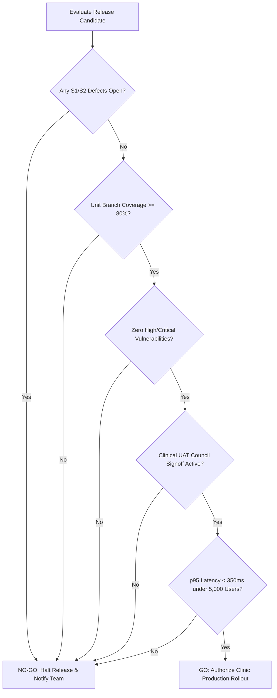

# Quantitative Quality Gates, Decision Rules & Defect Governance
## Namma Clinic Digital Health & Operations Platform
### Greater Bengaluru Authority (GBA) / BBMP Health Department
**Standard:** ISO/IEC 25010 Quality Models / Release Governance Gateways / Defect Severity SLAs | **Status:** APPROVED BASELINE | **Code:** `QA-DOC-19`

---

## 1. Quality Gate Charter & GO / NO-GO Governance
The Namma Clinic Quality Gate Specification establishes the objective, quantitative criteria governing release decisions across the software delivery lifecycle. Code promotions between development, staging, pilot clinics, and city-wide production are enforced strictly through automated quality gates with zero subjective bypass.

### 1.1 3 Formal Decision Outcomes
1. **GO (Unconditional Promotion):** 100% of automated gates pass, zero unresolved S1/S2 defects, code coverage >= 85%, clinical UAT signoff signed.
2. **CONDITIONAL GO (Guarded Pilot Promotion):** All clinical safety gates pass, zero S1 defects, maximum 2 minor S3 defects with approved 24h remediation plan.
3. **NO-GO (Immediate Release Block):** Any unresolved clinical safety violation, data corruption defect, security vulnerability, or latency SLA breach.

### 1.2 Release Gate Decision Tree Diagram


## 2. Canonical Quality Gate Specifications (QG-001 to QG-040)
Authoritative release gate specifications governing delivery stages:

### QG-001: Quality Gate Rule 1
- **Deployment Environment:** CI / Commit
- **Decision Protocol:** **GO / NO-GO**
- **Enforcement Standard:** Strict Zero Bypass
- **Passing Threshold:** 100% Pass Rate
- **Automated CI/CD Evaluator:** Fully Automated

### QG-002: Quality Gate Rule 2
- **Deployment Environment:** CI / Commit
- **Decision Protocol:** **GO / NO-GO**
- **Enforcement Standard:** Strict Zero Bypass
- **Passing Threshold:** 100% Pass Rate
- **Automated CI/CD Evaluator:** Fully Automated

### QG-003: Quality Gate Rule 3
- **Deployment Environment:** CI / Commit
- **Decision Protocol:** **GO / NO-GO**
- **Enforcement Standard:** Strict Zero Bypass
- **Passing Threshold:** 100% Pass Rate
- **Automated CI/CD Evaluator:** Fully Automated

### QG-004: Quality Gate Rule 4
- **Deployment Environment:** CI / Commit
- **Decision Protocol:** **GO / NO-GO**
- **Enforcement Standard:** Strict Zero Bypass
- **Passing Threshold:** 100% Pass Rate
- **Automated CI/CD Evaluator:** Fully Automated

### QG-005: Quality Gate Rule 5
- **Deployment Environment:** CI / Commit
- **Decision Protocol:** **GO / NO-GO**
- **Enforcement Standard:** Strict Zero Bypass
- **Passing Threshold:** 100% Pass Rate
- **Automated CI/CD Evaluator:** Fully Automated

### QG-006: Quality Gate Rule 6
- **Deployment Environment:** CI / Commit
- **Decision Protocol:** **GO / NO-GO**
- **Enforcement Standard:** Strict Zero Bypass
- **Passing Threshold:** 100% Pass Rate
- **Automated CI/CD Evaluator:** Fully Automated

### QG-007: Quality Gate Rule 7
- **Deployment Environment:** CI / Commit
- **Decision Protocol:** **GO / NO-GO**
- **Enforcement Standard:** Strict Zero Bypass
- **Passing Threshold:** 100% Pass Rate
- **Automated CI/CD Evaluator:** Fully Automated

### QG-008: Quality Gate Rule 8
- **Deployment Environment:** CI / Commit
- **Decision Protocol:** **GO / NO-GO**
- **Enforcement Standard:** Strict Zero Bypass
- **Passing Threshold:** 100% Pass Rate
- **Automated CI/CD Evaluator:** Fully Automated

### QG-009: Quality Gate Rule 9
- **Deployment Environment:** CI / Commit
- **Decision Protocol:** **GO / NO-GO**
- **Enforcement Standard:** Strict Zero Bypass
- **Passing Threshold:** 100% Pass Rate
- **Automated CI/CD Evaluator:** Fully Automated

### QG-010: Quality Gate Rule 10
- **Deployment Environment:** CI / Commit
- **Decision Protocol:** **GO / NO-GO**
- **Enforcement Standard:** Strict Zero Bypass
- **Passing Threshold:** 100% Pass Rate
- **Automated CI/CD Evaluator:** Fully Automated

### QG-011: Quality Gate Rule 11
- **Deployment Environment:** Nightly Build
- **Decision Protocol:** **GO / NO-GO**
- **Enforcement Standard:** Strict Zero Bypass
- **Passing Threshold:** 100% Pass Rate
- **Automated CI/CD Evaluator:** Fully Automated

### QG-012: Quality Gate Rule 12
- **Deployment Environment:** Nightly Build
- **Decision Protocol:** **GO / NO-GO**
- **Enforcement Standard:** Strict Zero Bypass
- **Passing Threshold:** 100% Pass Rate
- **Automated CI/CD Evaluator:** Fully Automated

### QG-013: Quality Gate Rule 13
- **Deployment Environment:** Nightly Build
- **Decision Protocol:** **GO / NO-GO**
- **Enforcement Standard:** Strict Zero Bypass
- **Passing Threshold:** 100% Pass Rate
- **Automated CI/CD Evaluator:** Fully Automated

### QG-014: Quality Gate Rule 14
- **Deployment Environment:** Nightly Build
- **Decision Protocol:** **GO / NO-GO**
- **Enforcement Standard:** Strict Zero Bypass
- **Passing Threshold:** 100% Pass Rate
- **Automated CI/CD Evaluator:** Fully Automated

### QG-015: Quality Gate Rule 15
- **Deployment Environment:** Nightly Build
- **Decision Protocol:** **GO / NO-GO**
- **Enforcement Standard:** Strict Zero Bypass
- **Passing Threshold:** 100% Pass Rate
- **Automated CI/CD Evaluator:** Fully Automated

### QG-016: Quality Gate Rule 16
- **Deployment Environment:** Nightly Build
- **Decision Protocol:** **GO / NO-GO**
- **Enforcement Standard:** Strict Zero Bypass
- **Passing Threshold:** 100% Pass Rate
- **Automated CI/CD Evaluator:** Fully Automated

### QG-017: Quality Gate Rule 17
- **Deployment Environment:** Nightly Build
- **Decision Protocol:** **GO / NO-GO**
- **Enforcement Standard:** Strict Zero Bypass
- **Passing Threshold:** 100% Pass Rate
- **Automated CI/CD Evaluator:** Fully Automated

### QG-018: Quality Gate Rule 18
- **Deployment Environment:** Nightly Build
- **Decision Protocol:** **GO / NO-GO**
- **Enforcement Standard:** Strict Zero Bypass
- **Passing Threshold:** 100% Pass Rate
- **Automated CI/CD Evaluator:** Fully Automated

### QG-019: Quality Gate Rule 19
- **Deployment Environment:** Nightly Build
- **Decision Protocol:** **GO / NO-GO**
- **Enforcement Standard:** Strict Zero Bypass
- **Passing Threshold:** 100% Pass Rate
- **Automated CI/CD Evaluator:** Fully Automated

### QG-020: Quality Gate Rule 20
- **Deployment Environment:** Nightly Build
- **Decision Protocol:** **GO / NO-GO**
- **Enforcement Standard:** Strict Zero Bypass
- **Passing Threshold:** 100% Pass Rate
- **Automated CI/CD Evaluator:** Fully Automated

### QG-021: Quality Gate Rule 21
- **Deployment Environment:** Staging Enclave
- **Decision Protocol:** **GO / NO-GO**
- **Enforcement Standard:** Mandatory CISO / CMO Dual Signoff
- **Passing Threshold:** 100% Pass Rate
- **Automated CI/CD Evaluator:** Fully Automated

### QG-022: Quality Gate Rule 22
- **Deployment Environment:** Staging Enclave
- **Decision Protocol:** **GO / NO-GO**
- **Enforcement Standard:** Mandatory CISO / CMO Dual Signoff
- **Passing Threshold:** 100% Pass Rate
- **Automated CI/CD Evaluator:** Fully Automated

### QG-023: Quality Gate Rule 23
- **Deployment Environment:** Staging Enclave
- **Decision Protocol:** **GO / NO-GO**
- **Enforcement Standard:** Mandatory CISO / CMO Dual Signoff
- **Passing Threshold:** 100% Pass Rate
- **Automated CI/CD Evaluator:** Fully Automated

### QG-024: Quality Gate Rule 24
- **Deployment Environment:** Staging Enclave
- **Decision Protocol:** **GO / NO-GO**
- **Enforcement Standard:** Mandatory CISO / CMO Dual Signoff
- **Passing Threshold:** 100% Pass Rate
- **Automated CI/CD Evaluator:** Fully Automated

### QG-025: Quality Gate Rule 25
- **Deployment Environment:** Staging Enclave
- **Decision Protocol:** **GO / NO-GO**
- **Enforcement Standard:** Mandatory CISO / CMO Dual Signoff
- **Passing Threshold:** 100% Pass Rate
- **Automated CI/CD Evaluator:** Fully Automated

### QG-026: Quality Gate Rule 26
- **Deployment Environment:** Staging Enclave
- **Decision Protocol:** **GO / NO-GO**
- **Enforcement Standard:** Mandatory CISO / CMO Dual Signoff
- **Passing Threshold:** 100% Pass Rate
- **Automated CI/CD Evaluator:** Fully Automated

### QG-027: Quality Gate Rule 27
- **Deployment Environment:** Staging Enclave
- **Decision Protocol:** **GO / NO-GO**
- **Enforcement Standard:** Mandatory CISO / CMO Dual Signoff
- **Passing Threshold:** 100% Pass Rate
- **Automated CI/CD Evaluator:** Fully Automated

### QG-028: Quality Gate Rule 28
- **Deployment Environment:** Staging Enclave
- **Decision Protocol:** **GO / NO-GO**
- **Enforcement Standard:** Mandatory CISO / CMO Dual Signoff
- **Passing Threshold:** 100% Pass Rate
- **Automated CI/CD Evaluator:** Fully Automated

### QG-029: Quality Gate Rule 29
- **Deployment Environment:** Staging Enclave
- **Decision Protocol:** **GO / NO-GO**
- **Enforcement Standard:** Mandatory CISO / CMO Dual Signoff
- **Passing Threshold:** 100% Pass Rate
- **Automated CI/CD Evaluator:** Fully Automated

### QG-030: Quality Gate Rule 30
- **Deployment Environment:** Staging Enclave
- **Decision Protocol:** **GO / NO-GO**
- **Enforcement Standard:** Mandatory CISO / CMO Dual Signoff
- **Passing Threshold:** 100% Pass Rate
- **Automated CI/CD Evaluator:** Fully Automated

### QG-031: Quality Gate Rule 31
- **Deployment Environment:** Release Candidate
- **Decision Protocol:** **GO / NO-GO**
- **Enforcement Standard:** Mandatory CISO / CMO Dual Signoff
- **Passing Threshold:** 100% Pass Rate
- **Automated CI/CD Evaluator:** Fully Automated

### QG-032: Quality Gate Rule 32
- **Deployment Environment:** Release Candidate
- **Decision Protocol:** **GO / NO-GO**
- **Enforcement Standard:** Mandatory CISO / CMO Dual Signoff
- **Passing Threshold:** 100% Pass Rate
- **Automated CI/CD Evaluator:** Fully Automated

### QG-033: Quality Gate Rule 33
- **Deployment Environment:** Release Candidate
- **Decision Protocol:** **GO / NO-GO**
- **Enforcement Standard:** Mandatory CISO / CMO Dual Signoff
- **Passing Threshold:** 100% Pass Rate
- **Automated CI/CD Evaluator:** Fully Automated

### QG-034: Quality Gate Rule 34
- **Deployment Environment:** Release Candidate
- **Decision Protocol:** **GO / NO-GO**
- **Enforcement Standard:** Mandatory CISO / CMO Dual Signoff
- **Passing Threshold:** 100% Pass Rate
- **Automated CI/CD Evaluator:** Fully Automated

### QG-035: Quality Gate Rule 35
- **Deployment Environment:** Release Candidate
- **Decision Protocol:** **GO / NO-GO**
- **Enforcement Standard:** Mandatory CISO / CMO Dual Signoff
- **Passing Threshold:** 100% Pass Rate
- **Automated CI/CD Evaluator:** Fully Automated

### QG-036: Quality Gate Rule 36
- **Deployment Environment:** Release Candidate
- **Decision Protocol:** **GO / NO-GO**
- **Enforcement Standard:** Mandatory CISO / CMO Dual Signoff
- **Passing Threshold:** 100% Pass Rate
- **Automated CI/CD Evaluator:** Fully Automated

### QG-037: Quality Gate Rule 37
- **Deployment Environment:** Release Candidate
- **Decision Protocol:** **GO / NO-GO**
- **Enforcement Standard:** Mandatory CISO / CMO Dual Signoff
- **Passing Threshold:** 100% Pass Rate
- **Automated CI/CD Evaluator:** Fully Automated

### QG-038: Quality Gate Rule 38
- **Deployment Environment:** Release Candidate
- **Decision Protocol:** **GO / NO-GO**
- **Enforcement Standard:** Mandatory CISO / CMO Dual Signoff
- **Passing Threshold:** 100% Pass Rate
- **Automated CI/CD Evaluator:** Fully Automated

### QG-039: Quality Gate Rule 39
- **Deployment Environment:** Release Candidate
- **Decision Protocol:** **GO / NO-GO**
- **Enforcement Standard:** Mandatory CISO / CMO Dual Signoff
- **Passing Threshold:** 100% Pass Rate
- **Automated CI/CD Evaluator:** Fully Automated

### QG-040: Quality Gate Rule 40
- **Deployment Environment:** Release Candidate
- **Decision Protocol:** **GO / NO-GO**
- **Enforcement Standard:** Mandatory CISO / CMO Dual Signoff
- **Passing Threshold:** 100% Pass Rate
- **Automated CI/CD Evaluator:** Fully Automated

## 3. Defect Taxonomy & Severity SLAs (DEFECT-001 to DEFECT-050)
Authoritative defect classification rules and resolution SLAs:

### DEFECT-001: Defect Taxonomy Classification 1
- **Severity Level:** **S1-Blocker**
- **Triage Priority:** **P0**
- **Resolution SLA Window:** **2 Hours**
- **Escape Phase Origin:** Staging Quality Gate
- **Root Cause Category:** Logic Defect / Race Condition / Schema Drift
- **Mandatory Retest Rule:** Enforced Before Closure

### DEFECT-002: Defect Taxonomy Classification 2
- **Severity Level:** **S1-Blocker**
- **Triage Priority:** **P0**
- **Resolution SLA Window:** **2 Hours**
- **Escape Phase Origin:** Staging Quality Gate
- **Root Cause Category:** Logic Defect / Race Condition / Schema Drift
- **Mandatory Retest Rule:** Enforced Before Closure

### DEFECT-003: Defect Taxonomy Classification 3
- **Severity Level:** **S1-Blocker**
- **Triage Priority:** **P0**
- **Resolution SLA Window:** **2 Hours**
- **Escape Phase Origin:** Staging Quality Gate
- **Root Cause Category:** Logic Defect / Race Condition / Schema Drift
- **Mandatory Retest Rule:** Enforced Before Closure

### DEFECT-004: Defect Taxonomy Classification 4
- **Severity Level:** **S1-Blocker**
- **Triage Priority:** **P0**
- **Resolution SLA Window:** **2 Hours**
- **Escape Phase Origin:** Staging Quality Gate
- **Root Cause Category:** Logic Defect / Race Condition / Schema Drift
- **Mandatory Retest Rule:** Enforced Before Closure

### DEFECT-005: Defect Taxonomy Classification 5
- **Severity Level:** **S1-Blocker**
- **Triage Priority:** **P0**
- **Resolution SLA Window:** **2 Hours**
- **Escape Phase Origin:** Staging Quality Gate
- **Root Cause Category:** Logic Defect / Race Condition / Schema Drift
- **Mandatory Retest Rule:** Enforced Before Closure

### DEFECT-006: Defect Taxonomy Classification 6
- **Severity Level:** **S1-Blocker**
- **Triage Priority:** **P0**
- **Resolution SLA Window:** **2 Hours**
- **Escape Phase Origin:** Staging Quality Gate
- **Root Cause Category:** Logic Defect / Race Condition / Schema Drift
- **Mandatory Retest Rule:** Enforced Before Closure

### DEFECT-007: Defect Taxonomy Classification 7
- **Severity Level:** **S1-Blocker**
- **Triage Priority:** **P0**
- **Resolution SLA Window:** **2 Hours**
- **Escape Phase Origin:** Staging Quality Gate
- **Root Cause Category:** Logic Defect / Race Condition / Schema Drift
- **Mandatory Retest Rule:** Enforced Before Closure

### DEFECT-008: Defect Taxonomy Classification 8
- **Severity Level:** **S1-Blocker**
- **Triage Priority:** **P0**
- **Resolution SLA Window:** **2 Hours**
- **Escape Phase Origin:** Staging Quality Gate
- **Root Cause Category:** Logic Defect / Race Condition / Schema Drift
- **Mandatory Retest Rule:** Enforced Before Closure

### DEFECT-009: Defect Taxonomy Classification 9
- **Severity Level:** **S1-Blocker**
- **Triage Priority:** **P0**
- **Resolution SLA Window:** **2 Hours**
- **Escape Phase Origin:** Staging Quality Gate
- **Root Cause Category:** Logic Defect / Race Condition / Schema Drift
- **Mandatory Retest Rule:** Enforced Before Closure

### DEFECT-010: Defect Taxonomy Classification 10
- **Severity Level:** **S1-Blocker**
- **Triage Priority:** **P0**
- **Resolution SLA Window:** **2 Hours**
- **Escape Phase Origin:** Staging Quality Gate
- **Root Cause Category:** Logic Defect / Race Condition / Schema Drift
- **Mandatory Retest Rule:** Enforced Before Closure

### DEFECT-011: Defect Taxonomy Classification 11
- **Severity Level:** **S2-Critical**
- **Triage Priority:** **P1**
- **Resolution SLA Window:** **8 Hours**
- **Escape Phase Origin:** Staging Quality Gate
- **Root Cause Category:** Logic Defect / Race Condition / Schema Drift
- **Mandatory Retest Rule:** Enforced Before Closure

### DEFECT-012: Defect Taxonomy Classification 12
- **Severity Level:** **S2-Critical**
- **Triage Priority:** **P1**
- **Resolution SLA Window:** **8 Hours**
- **Escape Phase Origin:** Staging Quality Gate
- **Root Cause Category:** Logic Defect / Race Condition / Schema Drift
- **Mandatory Retest Rule:** Enforced Before Closure

### DEFECT-013: Defect Taxonomy Classification 13
- **Severity Level:** **S2-Critical**
- **Triage Priority:** **P1**
- **Resolution SLA Window:** **8 Hours**
- **Escape Phase Origin:** Staging Quality Gate
- **Root Cause Category:** Logic Defect / Race Condition / Schema Drift
- **Mandatory Retest Rule:** Enforced Before Closure

### DEFECT-014: Defect Taxonomy Classification 14
- **Severity Level:** **S2-Critical**
- **Triage Priority:** **P1**
- **Resolution SLA Window:** **8 Hours**
- **Escape Phase Origin:** Staging Quality Gate
- **Root Cause Category:** Logic Defect / Race Condition / Schema Drift
- **Mandatory Retest Rule:** Enforced Before Closure

### DEFECT-015: Defect Taxonomy Classification 15
- **Severity Level:** **S2-Critical**
- **Triage Priority:** **P1**
- **Resolution SLA Window:** **8 Hours**
- **Escape Phase Origin:** Staging Quality Gate
- **Root Cause Category:** Logic Defect / Race Condition / Schema Drift
- **Mandatory Retest Rule:** Enforced Before Closure

### DEFECT-016: Defect Taxonomy Classification 16
- **Severity Level:** **S2-Critical**
- **Triage Priority:** **P1**
- **Resolution SLA Window:** **8 Hours**
- **Escape Phase Origin:** Staging Quality Gate
- **Root Cause Category:** Logic Defect / Race Condition / Schema Drift
- **Mandatory Retest Rule:** Enforced Before Closure

### DEFECT-017: Defect Taxonomy Classification 17
- **Severity Level:** **S2-Critical**
- **Triage Priority:** **P1**
- **Resolution SLA Window:** **8 Hours**
- **Escape Phase Origin:** Staging Quality Gate
- **Root Cause Category:** Logic Defect / Race Condition / Schema Drift
- **Mandatory Retest Rule:** Enforced Before Closure

### DEFECT-018: Defect Taxonomy Classification 18
- **Severity Level:** **S2-Critical**
- **Triage Priority:** **P1**
- **Resolution SLA Window:** **8 Hours**
- **Escape Phase Origin:** Staging Quality Gate
- **Root Cause Category:** Logic Defect / Race Condition / Schema Drift
- **Mandatory Retest Rule:** Enforced Before Closure

### DEFECT-019: Defect Taxonomy Classification 19
- **Severity Level:** **S2-Critical**
- **Triage Priority:** **P1**
- **Resolution SLA Window:** **8 Hours**
- **Escape Phase Origin:** Staging Quality Gate
- **Root Cause Category:** Logic Defect / Race Condition / Schema Drift
- **Mandatory Retest Rule:** Enforced Before Closure

### DEFECT-020: Defect Taxonomy Classification 20
- **Severity Level:** **S2-Critical**
- **Triage Priority:** **P1**
- **Resolution SLA Window:** **8 Hours**
- **Escape Phase Origin:** Staging Quality Gate
- **Root Cause Category:** Logic Defect / Race Condition / Schema Drift
- **Mandatory Retest Rule:** Enforced Before Closure

### DEFECT-021: Defect Taxonomy Classification 21
- **Severity Level:** **S2-Critical**
- **Triage Priority:** **P1**
- **Resolution SLA Window:** **8 Hours**
- **Escape Phase Origin:** Staging Quality Gate
- **Root Cause Category:** Logic Defect / Race Condition / Schema Drift
- **Mandatory Retest Rule:** Enforced Before Closure

### DEFECT-022: Defect Taxonomy Classification 22
- **Severity Level:** **S2-Critical**
- **Triage Priority:** **P1**
- **Resolution SLA Window:** **8 Hours**
- **Escape Phase Origin:** Staging Quality Gate
- **Root Cause Category:** Logic Defect / Race Condition / Schema Drift
- **Mandatory Retest Rule:** Enforced Before Closure

### DEFECT-023: Defect Taxonomy Classification 23
- **Severity Level:** **S2-Critical**
- **Triage Priority:** **P1**
- **Resolution SLA Window:** **8 Hours**
- **Escape Phase Origin:** Staging Quality Gate
- **Root Cause Category:** Logic Defect / Race Condition / Schema Drift
- **Mandatory Retest Rule:** Enforced Before Closure

### DEFECT-024: Defect Taxonomy Classification 24
- **Severity Level:** **S2-Critical**
- **Triage Priority:** **P1**
- **Resolution SLA Window:** **8 Hours**
- **Escape Phase Origin:** Staging Quality Gate
- **Root Cause Category:** Logic Defect / Race Condition / Schema Drift
- **Mandatory Retest Rule:** Enforced Before Closure

### DEFECT-025: Defect Taxonomy Classification 25
- **Severity Level:** **S2-Critical**
- **Triage Priority:** **P1**
- **Resolution SLA Window:** **8 Hours**
- **Escape Phase Origin:** Staging Quality Gate
- **Root Cause Category:** Logic Defect / Race Condition / Schema Drift
- **Mandatory Retest Rule:** Enforced Before Closure

### DEFECT-026: Defect Taxonomy Classification 26
- **Severity Level:** **S3-Major**
- **Triage Priority:** **P2**
- **Resolution SLA Window:** **48 Hours**
- **Escape Phase Origin:** Staging Quality Gate
- **Root Cause Category:** Logic Defect / Race Condition / Schema Drift
- **Mandatory Retest Rule:** Enforced Before Closure

### DEFECT-027: Defect Taxonomy Classification 27
- **Severity Level:** **S3-Major**
- **Triage Priority:** **P2**
- **Resolution SLA Window:** **48 Hours**
- **Escape Phase Origin:** Staging Quality Gate
- **Root Cause Category:** Logic Defect / Race Condition / Schema Drift
- **Mandatory Retest Rule:** Enforced Before Closure

### DEFECT-028: Defect Taxonomy Classification 28
- **Severity Level:** **S3-Major**
- **Triage Priority:** **P2**
- **Resolution SLA Window:** **48 Hours**
- **Escape Phase Origin:** Staging Quality Gate
- **Root Cause Category:** Logic Defect / Race Condition / Schema Drift
- **Mandatory Retest Rule:** Enforced Before Closure

### DEFECT-029: Defect Taxonomy Classification 29
- **Severity Level:** **S3-Major**
- **Triage Priority:** **P2**
- **Resolution SLA Window:** **48 Hours**
- **Escape Phase Origin:** Staging Quality Gate
- **Root Cause Category:** Logic Defect / Race Condition / Schema Drift
- **Mandatory Retest Rule:** Enforced Before Closure

### DEFECT-030: Defect Taxonomy Classification 30
- **Severity Level:** **S3-Major**
- **Triage Priority:** **P2**
- **Resolution SLA Window:** **48 Hours**
- **Escape Phase Origin:** Staging Quality Gate
- **Root Cause Category:** Logic Defect / Race Condition / Schema Drift
- **Mandatory Retest Rule:** Enforced Before Closure

### DEFECT-031: Defect Taxonomy Classification 31
- **Severity Level:** **S3-Major**
- **Triage Priority:** **P2**
- **Resolution SLA Window:** **48 Hours**
- **Escape Phase Origin:** Staging Quality Gate
- **Root Cause Category:** Logic Defect / Race Condition / Schema Drift
- **Mandatory Retest Rule:** Enforced Before Closure

### DEFECT-032: Defect Taxonomy Classification 32
- **Severity Level:** **S3-Major**
- **Triage Priority:** **P2**
- **Resolution SLA Window:** **48 Hours**
- **Escape Phase Origin:** Staging Quality Gate
- **Root Cause Category:** Logic Defect / Race Condition / Schema Drift
- **Mandatory Retest Rule:** Enforced Before Closure

### DEFECT-033: Defect Taxonomy Classification 33
- **Severity Level:** **S3-Major**
- **Triage Priority:** **P2**
- **Resolution SLA Window:** **48 Hours**
- **Escape Phase Origin:** Staging Quality Gate
- **Root Cause Category:** Logic Defect / Race Condition / Schema Drift
- **Mandatory Retest Rule:** Enforced Before Closure

### DEFECT-034: Defect Taxonomy Classification 34
- **Severity Level:** **S3-Major**
- **Triage Priority:** **P2**
- **Resolution SLA Window:** **48 Hours**
- **Escape Phase Origin:** Staging Quality Gate
- **Root Cause Category:** Logic Defect / Race Condition / Schema Drift
- **Mandatory Retest Rule:** Enforced Before Closure

### DEFECT-035: Defect Taxonomy Classification 35
- **Severity Level:** **S3-Major**
- **Triage Priority:** **P2**
- **Resolution SLA Window:** **48 Hours**
- **Escape Phase Origin:** Staging Quality Gate
- **Root Cause Category:** Logic Defect / Race Condition / Schema Drift
- **Mandatory Retest Rule:** Enforced Before Closure

### DEFECT-036: Defect Taxonomy Classification 36
- **Severity Level:** **S3-Major**
- **Triage Priority:** **P2**
- **Resolution SLA Window:** **48 Hours**
- **Escape Phase Origin:** Staging Quality Gate
- **Root Cause Category:** Logic Defect / Race Condition / Schema Drift
- **Mandatory Retest Rule:** Enforced Before Closure

### DEFECT-037: Defect Taxonomy Classification 37
- **Severity Level:** **S3-Major**
- **Triage Priority:** **P2**
- **Resolution SLA Window:** **48 Hours**
- **Escape Phase Origin:** Staging Quality Gate
- **Root Cause Category:** Logic Defect / Race Condition / Schema Drift
- **Mandatory Retest Rule:** Enforced Before Closure

### DEFECT-038: Defect Taxonomy Classification 38
- **Severity Level:** **S3-Major**
- **Triage Priority:** **P2**
- **Resolution SLA Window:** **48 Hours**
- **Escape Phase Origin:** Staging Quality Gate
- **Root Cause Category:** Logic Defect / Race Condition / Schema Drift
- **Mandatory Retest Rule:** Enforced Before Closure

### DEFECT-039: Defect Taxonomy Classification 39
- **Severity Level:** **S3-Major**
- **Triage Priority:** **P2**
- **Resolution SLA Window:** **48 Hours**
- **Escape Phase Origin:** Staging Quality Gate
- **Root Cause Category:** Logic Defect / Race Condition / Schema Drift
- **Mandatory Retest Rule:** Enforced Before Closure

### DEFECT-040: Defect Taxonomy Classification 40
- **Severity Level:** **S3-Major**
- **Triage Priority:** **P2**
- **Resolution SLA Window:** **48 Hours**
- **Escape Phase Origin:** Staging Quality Gate
- **Root Cause Category:** Logic Defect / Race Condition / Schema Drift
- **Mandatory Retest Rule:** Enforced Before Closure

### DEFECT-041: Defect Taxonomy Classification 41
- **Severity Level:** **S4-Minor**
- **Triage Priority:** **P3**
- **Resolution SLA Window:** **5 Days**
- **Escape Phase Origin:** Staging Quality Gate
- **Root Cause Category:** Logic Defect / Race Condition / Schema Drift
- **Mandatory Retest Rule:** Enforced Before Closure

### DEFECT-042: Defect Taxonomy Classification 42
- **Severity Level:** **S4-Minor**
- **Triage Priority:** **P3**
- **Resolution SLA Window:** **5 Days**
- **Escape Phase Origin:** Staging Quality Gate
- **Root Cause Category:** Logic Defect / Race Condition / Schema Drift
- **Mandatory Retest Rule:** Enforced Before Closure

### DEFECT-043: Defect Taxonomy Classification 43
- **Severity Level:** **S4-Minor**
- **Triage Priority:** **P3**
- **Resolution SLA Window:** **5 Days**
- **Escape Phase Origin:** Staging Quality Gate
- **Root Cause Category:** Logic Defect / Race Condition / Schema Drift
- **Mandatory Retest Rule:** Enforced Before Closure

### DEFECT-044: Defect Taxonomy Classification 44
- **Severity Level:** **S4-Minor**
- **Triage Priority:** **P3**
- **Resolution SLA Window:** **5 Days**
- **Escape Phase Origin:** Staging Quality Gate
- **Root Cause Category:** Logic Defect / Race Condition / Schema Drift
- **Mandatory Retest Rule:** Enforced Before Closure

### DEFECT-045: Defect Taxonomy Classification 45
- **Severity Level:** **S4-Minor**
- **Triage Priority:** **P3**
- **Resolution SLA Window:** **5 Days**
- **Escape Phase Origin:** Staging Quality Gate
- **Root Cause Category:** Logic Defect / Race Condition / Schema Drift
- **Mandatory Retest Rule:** Enforced Before Closure

### DEFECT-046: Defect Taxonomy Classification 46
- **Severity Level:** **S4-Minor**
- **Triage Priority:** **P3**
- **Resolution SLA Window:** **5 Days**
- **Escape Phase Origin:** Staging Quality Gate
- **Root Cause Category:** Logic Defect / Race Condition / Schema Drift
- **Mandatory Retest Rule:** Enforced Before Closure

### DEFECT-047: Defect Taxonomy Classification 47
- **Severity Level:** **S4-Minor**
- **Triage Priority:** **P3**
- **Resolution SLA Window:** **5 Days**
- **Escape Phase Origin:** Staging Quality Gate
- **Root Cause Category:** Logic Defect / Race Condition / Schema Drift
- **Mandatory Retest Rule:** Enforced Before Closure

### DEFECT-048: Defect Taxonomy Classification 48
- **Severity Level:** **S4-Minor**
- **Triage Priority:** **P3**
- **Resolution SLA Window:** **5 Days**
- **Escape Phase Origin:** Staging Quality Gate
- **Root Cause Category:** Logic Defect / Race Condition / Schema Drift
- **Mandatory Retest Rule:** Enforced Before Closure

### DEFECT-049: Defect Taxonomy Classification 49
- **Severity Level:** **S4-Minor**
- **Triage Priority:** **P3**
- **Resolution SLA Window:** **5 Days**
- **Escape Phase Origin:** Staging Quality Gate
- **Root Cause Category:** Logic Defect / Race Condition / Schema Drift
- **Mandatory Retest Rule:** Enforced Before Closure

### DEFECT-050: Defect Taxonomy Classification 50
- **Severity Level:** **S4-Minor**
- **Triage Priority:** **P3**
- **Resolution SLA Window:** **5 Days**
- **Escape Phase Origin:** Staging Quality Gate
- **Root Cause Category:** Logic Defect / Race Condition / Schema Drift
- **Mandatory Retest Rule:** Enforced Before Closure

## 4. Detailed Quality Gate Verification Test Cases (TC-0991 to TC-1045)
Detailed test specifications verifying release gate evaluation engines:

### TC-0991: Test Case 991: Advanced Security, Offline & Scalability for user_sessions across WF-016
**Objective:** Validate non-functional resilience, encryption envelope, and concurrency for user_sessions in WF-016.
**Risk:** Minor operational risk regarding platform security, privacy breach, or offline desync.
**Priority:** **P2** | **Severity:** **Minor** | **Test Level:** End-to-End & Non-Functional | **Test Type:** Resilience, Offline & Security Audit
- **Requirement Traceability:** `SECR-041`
- **Workflow Traceability:** `WF-016`
- **Feature Traceability:** `FEATURE-091`
- **API Traceability:** `API-DOC-01`
- **Database Traceability:** `TABLE-003 (user_sessions)`
- **Screen Traceability:** `SCREEN-019`
- **Security Control Traceability:** `API-SEC-031`
- **Preconditions:** Workstation initialized with TPM 2.0 PCR attestation and valid staff credentials (Receptionist / Registration Clerk).
- **Test Data Specification:** Synthetic dataset TESTDATA-031 with simulated network flapping.
- **Execution Steps:** 1. Trigger workflow WF-016 on SCREEN-019. 2. Inject network delay or packet drop. 3. Confirm offline queue persistence. 4. Restore link and confirm atomic sync.
- **Expected Results:** Zero data loss, conflict resolved deterministically via timestamp-vector clocks, audit trail complete.
- **Negative Test Scenario:** Attempt unauthorized cross-tenant data exfiltration; verify gateway drops packet with 403 Forbidden.
- **Boundary Value Scenario:** Push offline queue to 10,000 pending mutations; verify local SQLite buffer does not crash.
- **Concurrency & Race Condition:** Simulate 50 parallel clinic terminals pushing updates simultaneously to gateway.
- **Autonomous Offline Behavior:** Simulate 8 hours of complete clinic internet outage; OPD consultations proceed uninterrupted.
- **Security & Access Validation:** Confirm AES-256-GCM column encryption and strict mTLS 1.3 transit cipher enforcement.
- **Audit Trail & Immutability:** Verify audit record written to WORM immutable ledger with SHA-256 hash.
- **Evidence Required:** Terminal screenshot, packet capture dump, and cryptographic Merkle verification proof.
- **Pass Acceptance Criteria:** All operations succeed with 0% data corruption, full audit ledger continuity, and latency < 350ms.
- **Failure Behavior & SLA:** Data loss, sync deadlock, cleartext PII leakage, or unhandled crash.
- **Automation Suitability:** Yes (High Candidate)
- **Execution Cadence:** Nightly Performance & Resilience Run
- **Responsible Owner:** Receptionist / Registration Clerk

### TC-0992: Test Case 992: Advanced Security, Offline & Scalability for roles across WF-017
**Objective:** Validate non-functional resilience, encryption envelope, and concurrency for roles in WF-017.
**Risk:** Critical operational risk regarding platform security, privacy breach, or offline desync.
**Priority:** **P0** | **Severity:** **Critical** | **Test Level:** End-to-End & Non-Functional | **Test Type:** Resilience, Offline & Security Audit
- **Requirement Traceability:** `NFR-032`
- **Workflow Traceability:** `WF-017`
- **Feature Traceability:** `FEATURE-092`
- **API Traceability:** `API-DOC-02`
- **Database Traceability:** `TABLE-004 (roles)`
- **Screen Traceability:** `SCREEN-020`
- **Security Control Traceability:** `AUTH-032`
- **Preconditions:** Workstation initialized with TPM 2.0 PCR attestation and valid staff credentials (Medical Officer / General Physician).
- **Test Data Specification:** Synthetic dataset TESTDATA-032 with simulated network flapping.
- **Execution Steps:** 1. Trigger workflow WF-017 on SCREEN-020. 2. Inject network delay or packet drop. 3. Confirm offline queue persistence. 4. Restore link and confirm atomic sync.
- **Expected Results:** Zero data loss, conflict resolved deterministically via timestamp-vector clocks, audit trail complete.
- **Negative Test Scenario:** Attempt unauthorized cross-tenant data exfiltration; verify gateway drops packet with 403 Forbidden.
- **Boundary Value Scenario:** Push offline queue to 10,000 pending mutations; verify local SQLite buffer does not crash.
- **Concurrency & Race Condition:** Simulate 50 parallel clinic terminals pushing updates simultaneously to gateway.
- **Autonomous Offline Behavior:** Simulate 8 hours of complete clinic internet outage; OPD consultations proceed uninterrupted.
- **Security & Access Validation:** Confirm AES-256-GCM column encryption and strict mTLS 1.3 transit cipher enforcement.
- **Audit Trail & Immutability:** Verify audit record written to WORM immutable ledger with SHA-256 hash.
- **Evidence Required:** Terminal screenshot, packet capture dump, and cryptographic Merkle verification proof.
- **Pass Acceptance Criteria:** All operations succeed with 0% data corruption, full audit ledger continuity, and latency < 350ms.
- **Failure Behavior & SLA:** Data loss, sync deadlock, cleartext PII leakage, or unhandled crash.
- **Automation Suitability:** Yes (High Candidate)
- **Execution Cadence:** Nightly Performance & Resilience Run
- **Responsible Owner:** Medical Officer / General Physician

### TC-0993: Test Case 993: Advanced Security, Offline & Scalability for permissions across WF-018
**Objective:** Validate non-functional resilience, encryption envelope, and concurrency for permissions in WF-018.
**Risk:** Major operational risk regarding platform security, privacy breach, or offline desync.
**Priority:** **P1** | **Severity:** **Major** | **Test Level:** End-to-End & Non-Functional | **Test Type:** Resilience, Offline & Security Audit
- **Requirement Traceability:** `SECR-043`
- **Workflow Traceability:** `WF-018`
- **Feature Traceability:** `FEATURE-093`
- **API Traceability:** `API-DOC-03`
- **Database Traceability:** `TABLE-005 (permissions)`
- **Screen Traceability:** `SCREEN-021`
- **Security Control Traceability:** `API-SEC-033`
- **Preconditions:** Workstation initialized with TPM 2.0 PCR attestation and valid staff credentials (Staff Nurse / Triage Specialist).
- **Test Data Specification:** Synthetic dataset TESTDATA-033 with simulated network flapping.
- **Execution Steps:** 1. Trigger workflow WF-018 on SCREEN-021. 2. Inject network delay or packet drop. 3. Confirm offline queue persistence. 4. Restore link and confirm atomic sync.
- **Expected Results:** Zero data loss, conflict resolved deterministically via timestamp-vector clocks, audit trail complete.
- **Negative Test Scenario:** Attempt unauthorized cross-tenant data exfiltration; verify gateway drops packet with 403 Forbidden.
- **Boundary Value Scenario:** Push offline queue to 10,000 pending mutations; verify local SQLite buffer does not crash.
- **Concurrency & Race Condition:** Simulate 50 parallel clinic terminals pushing updates simultaneously to gateway.
- **Autonomous Offline Behavior:** Simulate 8 hours of complete clinic internet outage; OPD consultations proceed uninterrupted.
- **Security & Access Validation:** Confirm AES-256-GCM column encryption and strict mTLS 1.3 transit cipher enforcement.
- **Audit Trail & Immutability:** Verify audit record written to WORM immutable ledger with SHA-256 hash.
- **Evidence Required:** Terminal screenshot, packet capture dump, and cryptographic Merkle verification proof.
- **Pass Acceptance Criteria:** All operations succeed with 0% data corruption, full audit ledger continuity, and latency < 350ms.
- **Failure Behavior & SLA:** Data loss, sync deadlock, cleartext PII leakage, or unhandled crash.
- **Automation Suitability:** Yes (High Candidate)
- **Execution Cadence:** Nightly Performance & Resilience Run
- **Responsible Owner:** Staff Nurse / Triage Specialist

### TC-0994: Test Case 994: Advanced Security, Offline & Scalability for role_permissions across WF-019
**Objective:** Validate non-functional resilience, encryption envelope, and concurrency for role_permissions in WF-019.
**Risk:** Major operational risk regarding platform security, privacy breach, or offline desync.
**Priority:** **P1** | **Severity:** **Major** | **Test Level:** End-to-End & Non-Functional | **Test Type:** Resilience, Offline & Security Audit
- **Requirement Traceability:** `NFR-034`
- **Workflow Traceability:** `WF-019`
- **Feature Traceability:** `FEATURE-094`
- **API Traceability:** `API-DOC-04`
- **Database Traceability:** `TABLE-006 (role_permissions)`
- **Screen Traceability:** `SCREEN-022`
- **Security Control Traceability:** `AUTH-034`
- **Preconditions:** Workstation initialized with TPM 2.0 PCR attestation and valid staff credentials (Pharmacist / Dispenser).
- **Test Data Specification:** Synthetic dataset TESTDATA-034 with simulated network flapping.
- **Execution Steps:** 1. Trigger workflow WF-019 on SCREEN-022. 2. Inject network delay or packet drop. 3. Confirm offline queue persistence. 4. Restore link and confirm atomic sync.
- **Expected Results:** Zero data loss, conflict resolved deterministically via timestamp-vector clocks, audit trail complete.
- **Negative Test Scenario:** Attempt unauthorized cross-tenant data exfiltration; verify gateway drops packet with 403 Forbidden.
- **Boundary Value Scenario:** Push offline queue to 10,000 pending mutations; verify local SQLite buffer does not crash.
- **Concurrency & Race Condition:** Simulate 50 parallel clinic terminals pushing updates simultaneously to gateway.
- **Autonomous Offline Behavior:** Simulate 8 hours of complete clinic internet outage; OPD consultations proceed uninterrupted.
- **Security & Access Validation:** Confirm AES-256-GCM column encryption and strict mTLS 1.3 transit cipher enforcement.
- **Audit Trail & Immutability:** Verify audit record written to WORM immutable ledger with SHA-256 hash.
- **Evidence Required:** Terminal screenshot, packet capture dump, and cryptographic Merkle verification proof.
- **Pass Acceptance Criteria:** All operations succeed with 0% data corruption, full audit ledger continuity, and latency < 350ms.
- **Failure Behavior & SLA:** Data loss, sync deadlock, cleartext PII leakage, or unhandled crash.
- **Automation Suitability:** Yes (High Candidate)
- **Execution Cadence:** Nightly Performance & Resilience Run
- **Responsible Owner:** Pharmacist / Dispenser

### TC-0995: Test Case 995: Advanced Security, Offline & Scalability for user_roles across WF-020
**Objective:** Validate non-functional resilience, encryption envelope, and concurrency for user_roles in WF-020.
**Risk:** Minor operational risk regarding platform security, privacy breach, or offline desync.
**Priority:** **P2** | **Severity:** **Minor** | **Test Level:** End-to-End & Non-Functional | **Test Type:** Resilience, Offline & Security Audit
- **Requirement Traceability:** `SECR-045`
- **Workflow Traceability:** `WF-020`
- **Feature Traceability:** `FEATURE-095`
- **API Traceability:** `API-DOC-05`
- **Database Traceability:** `TABLE-007 (user_roles)`
- **Screen Traceability:** `SCREEN-023`
- **Security Control Traceability:** `API-SEC-035`
- **Preconditions:** Workstation initialized with TPM 2.0 PCR attestation and valid staff credentials (Laboratory Technician).
- **Test Data Specification:** Synthetic dataset TESTDATA-035 with simulated network flapping.
- **Execution Steps:** 1. Trigger workflow WF-020 on SCREEN-023. 2. Inject network delay or packet drop. 3. Confirm offline queue persistence. 4. Restore link and confirm atomic sync.
- **Expected Results:** Zero data loss, conflict resolved deterministically via timestamp-vector clocks, audit trail complete.
- **Negative Test Scenario:** Attempt unauthorized cross-tenant data exfiltration; verify gateway drops packet with 403 Forbidden.
- **Boundary Value Scenario:** Push offline queue to 10,000 pending mutations; verify local SQLite buffer does not crash.
- **Concurrency & Race Condition:** Simulate 50 parallel clinic terminals pushing updates simultaneously to gateway.
- **Autonomous Offline Behavior:** Simulate 8 hours of complete clinic internet outage; OPD consultations proceed uninterrupted.
- **Security & Access Validation:** Confirm AES-256-GCM column encryption and strict mTLS 1.3 transit cipher enforcement.
- **Audit Trail & Immutability:** Verify audit record written to WORM immutable ledger with SHA-256 hash.
- **Evidence Required:** Terminal screenshot, packet capture dump, and cryptographic Merkle verification proof.
- **Pass Acceptance Criteria:** All operations succeed with 0% data corruption, full audit ledger continuity, and latency < 350ms.
- **Failure Behavior & SLA:** Data loss, sync deadlock, cleartext PII leakage, or unhandled crash.
- **Automation Suitability:** Yes (High Candidate)
- **Execution Cadence:** Nightly Performance & Resilience Run
- **Responsible Owner:** Laboratory Technician

### TC-0996: Test Case 996: Advanced Security, Offline & Scalability for facilities across WF-021
**Objective:** Validate non-functional resilience, encryption envelope, and concurrency for facilities in WF-021.
**Risk:** Critical operational risk regarding platform security, privacy breach, or offline desync.
**Priority:** **P0** | **Severity:** **Critical** | **Test Level:** End-to-End & Non-Functional | **Test Type:** Resilience, Offline & Security Audit
- **Requirement Traceability:** `NFR-036`
- **Workflow Traceability:** `WF-021`
- **Feature Traceability:** `FEATURE-096`
- **API Traceability:** `API-DOC-06`
- **Database Traceability:** `TABLE-008 (facilities)`
- **Screen Traceability:** `SCREEN-024`
- **Security Control Traceability:** `AUTH-036`
- **Preconditions:** Workstation initialized with TPM 2.0 PCR attestation and valid staff credentials (Clinic Administrative Officer).
- **Test Data Specification:** Synthetic dataset TESTDATA-036 with simulated network flapping.
- **Execution Steps:** 1. Trigger workflow WF-021 on SCREEN-024. 2. Inject network delay or packet drop. 3. Confirm offline queue persistence. 4. Restore link and confirm atomic sync.
- **Expected Results:** Zero data loss, conflict resolved deterministically via timestamp-vector clocks, audit trail complete.
- **Negative Test Scenario:** Attempt unauthorized cross-tenant data exfiltration; verify gateway drops packet with 403 Forbidden.
- **Boundary Value Scenario:** Push offline queue to 10,000 pending mutations; verify local SQLite buffer does not crash.
- **Concurrency & Race Condition:** Simulate 50 parallel clinic terminals pushing updates simultaneously to gateway.
- **Autonomous Offline Behavior:** Simulate 8 hours of complete clinic internet outage; OPD consultations proceed uninterrupted.
- **Security & Access Validation:** Confirm AES-256-GCM column encryption and strict mTLS 1.3 transit cipher enforcement.
- **Audit Trail & Immutability:** Verify audit record written to WORM immutable ledger with SHA-256 hash.
- **Evidence Required:** Terminal screenshot, packet capture dump, and cryptographic Merkle verification proof.
- **Pass Acceptance Criteria:** All operations succeed with 0% data corruption, full audit ledger continuity, and latency < 350ms.
- **Failure Behavior & SLA:** Data loss, sync deadlock, cleartext PII leakage, or unhandled crash.
- **Automation Suitability:** Yes (High Candidate)
- **Execution Cadence:** Nightly Performance & Resilience Run
- **Responsible Owner:** Clinic Administrative Officer

### TC-0997: Test Case 997: Advanced Security, Offline & Scalability for facility_rooms across WF-022
**Objective:** Validate non-functional resilience, encryption envelope, and concurrency for facility_rooms in WF-022.
**Risk:** Major operational risk regarding platform security, privacy breach, or offline desync.
**Priority:** **P1** | **Severity:** **Major** | **Test Level:** End-to-End & Non-Functional | **Test Type:** Resilience, Offline & Security Audit
- **Requirement Traceability:** `SECR-047`
- **Workflow Traceability:** `WF-022`
- **Feature Traceability:** `FEATURE-097`
- **API Traceability:** `API-DOC-07`
- **Database Traceability:** `TABLE-009 (facility_rooms)`
- **Screen Traceability:** `SCREEN-025`
- **Security Control Traceability:** `API-SEC-037`
- **Preconditions:** Workstation initialized with TPM 2.0 PCR attestation and valid staff credentials (Ward Health Supervisor).
- **Test Data Specification:** Synthetic dataset TESTDATA-037 with simulated network flapping.
- **Execution Steps:** 1. Trigger workflow WF-022 on SCREEN-025. 2. Inject network delay or packet drop. 3. Confirm offline queue persistence. 4. Restore link and confirm atomic sync.
- **Expected Results:** Zero data loss, conflict resolved deterministically via timestamp-vector clocks, audit trail complete.
- **Negative Test Scenario:** Attempt unauthorized cross-tenant data exfiltration; verify gateway drops packet with 403 Forbidden.
- **Boundary Value Scenario:** Push offline queue to 10,000 pending mutations; verify local SQLite buffer does not crash.
- **Concurrency & Race Condition:** Simulate 50 parallel clinic terminals pushing updates simultaneously to gateway.
- **Autonomous Offline Behavior:** Simulate 8 hours of complete clinic internet outage; OPD consultations proceed uninterrupted.
- **Security & Access Validation:** Confirm AES-256-GCM column encryption and strict mTLS 1.3 transit cipher enforcement.
- **Audit Trail & Immutability:** Verify audit record written to WORM immutable ledger with SHA-256 hash.
- **Evidence Required:** Terminal screenshot, packet capture dump, and cryptographic Merkle verification proof.
- **Pass Acceptance Criteria:** All operations succeed with 0% data corruption, full audit ledger continuity, and latency < 350ms.
- **Failure Behavior & SLA:** Data loss, sync deadlock, cleartext PII leakage, or unhandled crash.
- **Automation Suitability:** Yes (High Candidate)
- **Execution Cadence:** Nightly Performance & Resilience Run
- **Responsible Owner:** Ward Health Supervisor

### TC-0998: Test Case 998: Advanced Security, Offline & Scalability for staff_profiles across WF-023
**Objective:** Validate non-functional resilience, encryption envelope, and concurrency for staff_profiles in WF-023.
**Risk:** Major operational risk regarding platform security, privacy breach, or offline desync.
**Priority:** **P1** | **Severity:** **Major** | **Test Level:** End-to-End & Non-Functional | **Test Type:** Resilience, Offline & Security Audit
- **Requirement Traceability:** `NFR-038`
- **Workflow Traceability:** `WF-023`
- **Feature Traceability:** `FEATURE-098`
- **API Traceability:** `API-DOC-08`
- **Database Traceability:** `TABLE-010 (staff_profiles)`
- **Screen Traceability:** `SCREEN-026`
- **Security Control Traceability:** `AUTH-038`
- **Preconditions:** Workstation initialized with TPM 2.0 PCR attestation and valid staff credentials (Zonal Health Officer (ZHO)).
- **Test Data Specification:** Synthetic dataset TESTDATA-038 with simulated network flapping.
- **Execution Steps:** 1. Trigger workflow WF-023 on SCREEN-026. 2. Inject network delay or packet drop. 3. Confirm offline queue persistence. 4. Restore link and confirm atomic sync.
- **Expected Results:** Zero data loss, conflict resolved deterministically via timestamp-vector clocks, audit trail complete.
- **Negative Test Scenario:** Attempt unauthorized cross-tenant data exfiltration; verify gateway drops packet with 403 Forbidden.
- **Boundary Value Scenario:** Push offline queue to 10,000 pending mutations; verify local SQLite buffer does not crash.
- **Concurrency & Race Condition:** Simulate 50 parallel clinic terminals pushing updates simultaneously to gateway.
- **Autonomous Offline Behavior:** Simulate 8 hours of complete clinic internet outage; OPD consultations proceed uninterrupted.
- **Security & Access Validation:** Confirm AES-256-GCM column encryption and strict mTLS 1.3 transit cipher enforcement.
- **Audit Trail & Immutability:** Verify audit record written to WORM immutable ledger with SHA-256 hash.
- **Evidence Required:** Terminal screenshot, packet capture dump, and cryptographic Merkle verification proof.
- **Pass Acceptance Criteria:** All operations succeed with 0% data corruption, full audit ledger continuity, and latency < 350ms.
- **Failure Behavior & SLA:** Data loss, sync deadlock, cleartext PII leakage, or unhandled crash.
- **Automation Suitability:** Yes (High Candidate)
- **Execution Cadence:** Nightly Performance & Resilience Run
- **Responsible Owner:** Zonal Health Officer (ZHO)

### TC-0999: Test Case 999: Advanced Security, Offline & Scalability for staff_shifts across WF-024
**Objective:** Validate non-functional resilience, encryption envelope, and concurrency for staff_shifts in WF-024.
**Risk:** Minor operational risk regarding platform security, privacy breach, or offline desync.
**Priority:** **P2** | **Severity:** **Minor** | **Test Level:** End-to-End & Non-Functional | **Test Type:** Resilience, Offline & Security Audit
- **Requirement Traceability:** `SECR-049`
- **Workflow Traceability:** `WF-024`
- **Feature Traceability:** `FEATURE-099`
- **API Traceability:** `API-DOC-09`
- **Database Traceability:** `TABLE-011 (staff_shifts)`
- **Screen Traceability:** `SCREEN-027`
- **Security Control Traceability:** `API-SEC-039`
- **Preconditions:** Workstation initialized with TPM 2.0 PCR attestation and valid staff credentials (Chief Health Officer (CHO)).
- **Test Data Specification:** Synthetic dataset TESTDATA-039 with simulated network flapping.
- **Execution Steps:** 1. Trigger workflow WF-024 on SCREEN-027. 2. Inject network delay or packet drop. 3. Confirm offline queue persistence. 4. Restore link and confirm atomic sync.
- **Expected Results:** Zero data loss, conflict resolved deterministically via timestamp-vector clocks, audit trail complete.
- **Negative Test Scenario:** Attempt unauthorized cross-tenant data exfiltration; verify gateway drops packet with 403 Forbidden.
- **Boundary Value Scenario:** Push offline queue to 10,000 pending mutations; verify local SQLite buffer does not crash.
- **Concurrency & Race Condition:** Simulate 50 parallel clinic terminals pushing updates simultaneously to gateway.
- **Autonomous Offline Behavior:** Simulate 8 hours of complete clinic internet outage; OPD consultations proceed uninterrupted.
- **Security & Access Validation:** Confirm AES-256-GCM column encryption and strict mTLS 1.3 transit cipher enforcement.
- **Audit Trail & Immutability:** Verify audit record written to WORM immutable ledger with SHA-256 hash.
- **Evidence Required:** Terminal screenshot, packet capture dump, and cryptographic Merkle verification proof.
- **Pass Acceptance Criteria:** All operations succeed with 0% data corruption, full audit ledger continuity, and latency < 350ms.
- **Failure Behavior & SLA:** Data loss, sync deadlock, cleartext PII leakage, or unhandled crash.
- **Automation Suitability:** Yes (High Candidate)
- **Execution Cadence:** Nightly Performance & Resilience Run
- **Responsible Owner:** Chief Health Officer (CHO)

### TC-1000: Test Case 1000: Advanced Security, Offline & Scalability for system_configs across WF-025
**Objective:** Validate non-functional resilience, encryption envelope, and concurrency for system_configs in WF-025.
**Risk:** Critical operational risk regarding platform security, privacy breach, or offline desync.
**Priority:** **P0** | **Severity:** **Critical** | **Test Level:** End-to-End & Non-Functional | **Test Type:** Resilience, Offline & Security Audit
- **Requirement Traceability:** `NFR-040`
- **Workflow Traceability:** `WF-025`
- **Feature Traceability:** `FEATURE-100`
- **API Traceability:** `API-DOC-10`
- **Database Traceability:** `TABLE-012 (system_configs)`
- **Screen Traceability:** `SCREEN-028`
- **Security Control Traceability:** `AUTH-040`
- **Preconditions:** Workstation initialized with TPM 2.0 PCR attestation and valid staff credentials (Epidemiologist / Disease Surveillance Officer).
- **Test Data Specification:** Synthetic dataset TESTDATA-040 with simulated network flapping.
- **Execution Steps:** 1. Trigger workflow WF-025 on SCREEN-028. 2. Inject network delay or packet drop. 3. Confirm offline queue persistence. 4. Restore link and confirm atomic sync.
- **Expected Results:** Zero data loss, conflict resolved deterministically via timestamp-vector clocks, audit trail complete.
- **Negative Test Scenario:** Attempt unauthorized cross-tenant data exfiltration; verify gateway drops packet with 403 Forbidden.
- **Boundary Value Scenario:** Push offline queue to 10,000 pending mutations; verify local SQLite buffer does not crash.
- **Concurrency & Race Condition:** Simulate 50 parallel clinic terminals pushing updates simultaneously to gateway.
- **Autonomous Offline Behavior:** Simulate 8 hours of complete clinic internet outage; OPD consultations proceed uninterrupted.
- **Security & Access Validation:** Confirm AES-256-GCM column encryption and strict mTLS 1.3 transit cipher enforcement.
- **Audit Trail & Immutability:** Verify audit record written to WORM immutable ledger with SHA-256 hash.
- **Evidence Required:** Terminal screenshot, packet capture dump, and cryptographic Merkle verification proof.
- **Pass Acceptance Criteria:** All operations succeed with 0% data corruption, full audit ledger continuity, and latency < 350ms.
- **Failure Behavior & SLA:** Data loss, sync deadlock, cleartext PII leakage, or unhandled crash.
- **Automation Suitability:** Yes (High Candidate)
- **Execution Cadence:** Nightly Performance & Resilience Run
- **Responsible Owner:** Epidemiologist / Disease Surveillance Officer

### TC-1001: Test Case 1001: Advanced Security, Offline & Scalability for patients across WF-001
**Objective:** Validate non-functional resilience, encryption envelope, and concurrency for patients in WF-001.
**Risk:** Major operational risk regarding platform security, privacy breach, or offline desync.
**Priority:** **P1** | **Severity:** **Major** | **Test Level:** End-to-End & Non-Functional | **Test Type:** Resilience, Offline & Security Audit
- **Requirement Traceability:** `SECR-001`
- **Workflow Traceability:** `WF-001`
- **Feature Traceability:** `FEATURE-101`
- **API Traceability:** `API-DOC-11`
- **Database Traceability:** `TABLE-013 (patients)`
- **Screen Traceability:** `SCREEN-029`
- **Security Control Traceability:** `API-SEC-001`
- **Preconditions:** Workstation initialized with TPM 2.0 PCR attestation and valid staff credentials (Quality & Compliance Auditor).
- **Test Data Specification:** Synthetic dataset TESTDATA-041 with simulated network flapping.
- **Execution Steps:** 1. Trigger workflow WF-001 on SCREEN-029. 2. Inject network delay or packet drop. 3. Confirm offline queue persistence. 4. Restore link and confirm atomic sync.
- **Expected Results:** Zero data loss, conflict resolved deterministically via timestamp-vector clocks, audit trail complete.
- **Negative Test Scenario:** Attempt unauthorized cross-tenant data exfiltration; verify gateway drops packet with 403 Forbidden.
- **Boundary Value Scenario:** Push offline queue to 10,000 pending mutations; verify local SQLite buffer does not crash.
- **Concurrency & Race Condition:** Simulate 50 parallel clinic terminals pushing updates simultaneously to gateway.
- **Autonomous Offline Behavior:** Simulate 8 hours of complete clinic internet outage; OPD consultations proceed uninterrupted.
- **Security & Access Validation:** Confirm AES-256-GCM column encryption and strict mTLS 1.3 transit cipher enforcement.
- **Audit Trail & Immutability:** Verify audit record written to WORM immutable ledger with SHA-256 hash.
- **Evidence Required:** Terminal screenshot, packet capture dump, and cryptographic Merkle verification proof.
- **Pass Acceptance Criteria:** All operations succeed with 0% data corruption, full audit ledger continuity, and latency < 350ms.
- **Failure Behavior & SLA:** Data loss, sync deadlock, cleartext PII leakage, or unhandled crash.
- **Automation Suitability:** Yes (High Candidate)
- **Execution Cadence:** Nightly Performance & Resilience Run
- **Responsible Owner:** Quality & Compliance Auditor

### TC-1002: Test Case 1002: Advanced Security, Offline & Scalability for patient_identifiers across WF-002
**Objective:** Validate non-functional resilience, encryption envelope, and concurrency for patient_identifiers in WF-002.
**Risk:** Major operational risk regarding platform security, privacy breach, or offline desync.
**Priority:** **P1** | **Severity:** **Major** | **Test Level:** End-to-End & Non-Functional | **Test Type:** Resilience, Offline & Security Audit
- **Requirement Traceability:** `NFR-002`
- **Workflow Traceability:** `WF-002`
- **Feature Traceability:** `FEATURE-102`
- **API Traceability:** `API-DOC-12`
- **Database Traceability:** `TABLE-014 (patient_identifiers)`
- **Screen Traceability:** `SCREEN-030`
- **Security Control Traceability:** `AUTH-002`
- **Preconditions:** Workstation initialized with TPM 2.0 PCR attestation and valid staff credentials (Security Administrator / CISO).
- **Test Data Specification:** Synthetic dataset TESTDATA-042 with simulated network flapping.
- **Execution Steps:** 1. Trigger workflow WF-002 on SCREEN-030. 2. Inject network delay or packet drop. 3. Confirm offline queue persistence. 4. Restore link and confirm atomic sync.
- **Expected Results:** Zero data loss, conflict resolved deterministically via timestamp-vector clocks, audit trail complete.
- **Negative Test Scenario:** Attempt unauthorized cross-tenant data exfiltration; verify gateway drops packet with 403 Forbidden.
- **Boundary Value Scenario:** Push offline queue to 10,000 pending mutations; verify local SQLite buffer does not crash.
- **Concurrency & Race Condition:** Simulate 50 parallel clinic terminals pushing updates simultaneously to gateway.
- **Autonomous Offline Behavior:** Simulate 8 hours of complete clinic internet outage; OPD consultations proceed uninterrupted.
- **Security & Access Validation:** Confirm AES-256-GCM column encryption and strict mTLS 1.3 transit cipher enforcement.
- **Audit Trail & Immutability:** Verify audit record written to WORM immutable ledger with SHA-256 hash.
- **Evidence Required:** Terminal screenshot, packet capture dump, and cryptographic Merkle verification proof.
- **Pass Acceptance Criteria:** All operations succeed with 0% data corruption, full audit ledger continuity, and latency < 350ms.
- **Failure Behavior & SLA:** Data loss, sync deadlock, cleartext PII leakage, or unhandled crash.
- **Automation Suitability:** Yes (High Candidate)
- **Execution Cadence:** Nightly Performance & Resilience Run
- **Responsible Owner:** Security Administrator / CISO

### TC-1003: Test Case 1003: Advanced Security, Offline & Scalability for patient_contacts across WF-003
**Objective:** Validate non-functional resilience, encryption envelope, and concurrency for patient_contacts in WF-003.
**Risk:** Minor operational risk regarding platform security, privacy breach, or offline desync.
**Priority:** **P2** | **Severity:** **Minor** | **Test Level:** End-to-End & Non-Functional | **Test Type:** Resilience, Offline & Security Audit
- **Requirement Traceability:** `SECR-003`
- **Workflow Traceability:** `WF-003`
- **Feature Traceability:** `FEATURE-103`
- **API Traceability:** `API-DOC-13`
- **Database Traceability:** `TABLE-015 (patient_contacts)`
- **Screen Traceability:** `SCREEN-031`
- **Security Control Traceability:** `API-SEC-003`
- **Preconditions:** Workstation initialized with TPM 2.0 PCR attestation and valid staff credentials (Central Depot Inventory Manager).
- **Test Data Specification:** Synthetic dataset TESTDATA-043 with simulated network flapping.
- **Execution Steps:** 1. Trigger workflow WF-003 on SCREEN-031. 2. Inject network delay or packet drop. 3. Confirm offline queue persistence. 4. Restore link and confirm atomic sync.
- **Expected Results:** Zero data loss, conflict resolved deterministically via timestamp-vector clocks, audit trail complete.
- **Negative Test Scenario:** Attempt unauthorized cross-tenant data exfiltration; verify gateway drops packet with 403 Forbidden.
- **Boundary Value Scenario:** Push offline queue to 10,000 pending mutations; verify local SQLite buffer does not crash.
- **Concurrency & Race Condition:** Simulate 50 parallel clinic terminals pushing updates simultaneously to gateway.
- **Autonomous Offline Behavior:** Simulate 8 hours of complete clinic internet outage; OPD consultations proceed uninterrupted.
- **Security & Access Validation:** Confirm AES-256-GCM column encryption and strict mTLS 1.3 transit cipher enforcement.
- **Audit Trail & Immutability:** Verify audit record written to WORM immutable ledger with SHA-256 hash.
- **Evidence Required:** Terminal screenshot, packet capture dump, and cryptographic Merkle verification proof.
- **Pass Acceptance Criteria:** All operations succeed with 0% data corruption, full audit ledger continuity, and latency < 350ms.
- **Failure Behavior & SLA:** Data loss, sync deadlock, cleartext PII leakage, or unhandled crash.
- **Automation Suitability:** Yes (High Candidate)
- **Execution Cadence:** Nightly Performance & Resilience Run
- **Responsible Owner:** Central Depot Inventory Manager

### TC-1004: Test Case 1004: Advanced Security, Offline & Scalability for patient_addresses across WF-004
**Objective:** Validate non-functional resilience, encryption envelope, and concurrency for patient_addresses in WF-004.
**Risk:** Critical operational risk regarding platform security, privacy breach, or offline desync.
**Priority:** **P0** | **Severity:** **Critical** | **Test Level:** End-to-End & Non-Functional | **Test Type:** Resilience, Offline & Security Audit
- **Requirement Traceability:** `NFR-004`
- **Workflow Traceability:** `WF-004`
- **Feature Traceability:** `FEATURE-104`
- **API Traceability:** `API-DOC-14`
- **Database Traceability:** `TABLE-016 (patient_addresses)`
- **Screen Traceability:** `SCREEN-032`
- **Security Control Traceability:** `AUTH-004`
- **Preconditions:** Workstation initialized with TPM 2.0 PCR attestation and valid staff credentials (Cold Chain Logistics Technician).
- **Test Data Specification:** Synthetic dataset TESTDATA-044 with simulated network flapping.
- **Execution Steps:** 1. Trigger workflow WF-004 on SCREEN-032. 2. Inject network delay or packet drop. 3. Confirm offline queue persistence. 4. Restore link and confirm atomic sync.
- **Expected Results:** Zero data loss, conflict resolved deterministically via timestamp-vector clocks, audit trail complete.
- **Negative Test Scenario:** Attempt unauthorized cross-tenant data exfiltration; verify gateway drops packet with 403 Forbidden.
- **Boundary Value Scenario:** Push offline queue to 10,000 pending mutations; verify local SQLite buffer does not crash.
- **Concurrency & Race Condition:** Simulate 50 parallel clinic terminals pushing updates simultaneously to gateway.
- **Autonomous Offline Behavior:** Simulate 8 hours of complete clinic internet outage; OPD consultations proceed uninterrupted.
- **Security & Access Validation:** Confirm AES-256-GCM column encryption and strict mTLS 1.3 transit cipher enforcement.
- **Audit Trail & Immutability:** Verify audit record written to WORM immutable ledger with SHA-256 hash.
- **Evidence Required:** Terminal screenshot, packet capture dump, and cryptographic Merkle verification proof.
- **Pass Acceptance Criteria:** All operations succeed with 0% data corruption, full audit ledger continuity, and latency < 350ms.
- **Failure Behavior & SLA:** Data loss, sync deadlock, cleartext PII leakage, or unhandled crash.
- **Automation Suitability:** Yes (High Candidate)
- **Execution Cadence:** Nightly Performance & Resilience Run
- **Responsible Owner:** Cold Chain Logistics Technician

### TC-1005: Test Case 1005: Advanced Security, Offline & Scalability for consent_records across WF-005
**Objective:** Validate non-functional resilience, encryption envelope, and concurrency for consent_records in WF-005.
**Risk:** Major operational risk regarding platform security, privacy breach, or offline desync.
**Priority:** **P1** | **Severity:** **Major** | **Test Level:** End-to-End & Non-Functional | **Test Type:** Resilience, Offline & Security Audit
- **Requirement Traceability:** `SECR-005`
- **Workflow Traceability:** `WF-005`
- **Feature Traceability:** `FEATURE-105`
- **API Traceability:** `API-DOC-15`
- **Database Traceability:** `TABLE-017 (consent_records)`
- **Screen Traceability:** `SCREEN-033`
- **Security Control Traceability:** `API-SEC-005`
- **Preconditions:** Workstation initialized with TPM 2.0 PCR attestation and valid staff credentials (Radiologist / Diagnostic Specialist).
- **Test Data Specification:** Synthetic dataset TESTDATA-045 with simulated network flapping.
- **Execution Steps:** 1. Trigger workflow WF-005 on SCREEN-033. 2. Inject network delay or packet drop. 3. Confirm offline queue persistence. 4. Restore link and confirm atomic sync.
- **Expected Results:** Zero data loss, conflict resolved deterministically via timestamp-vector clocks, audit trail complete.
- **Negative Test Scenario:** Attempt unauthorized cross-tenant data exfiltration; verify gateway drops packet with 403 Forbidden.
- **Boundary Value Scenario:** Push offline queue to 10,000 pending mutations; verify local SQLite buffer does not crash.
- **Concurrency & Race Condition:** Simulate 50 parallel clinic terminals pushing updates simultaneously to gateway.
- **Autonomous Offline Behavior:** Simulate 8 hours of complete clinic internet outage; OPD consultations proceed uninterrupted.
- **Security & Access Validation:** Confirm AES-256-GCM column encryption and strict mTLS 1.3 transit cipher enforcement.
- **Audit Trail & Immutability:** Verify audit record written to WORM immutable ledger with SHA-256 hash.
- **Evidence Required:** Terminal screenshot, packet capture dump, and cryptographic Merkle verification proof.
- **Pass Acceptance Criteria:** All operations succeed with 0% data corruption, full audit ledger continuity, and latency < 350ms.
- **Failure Behavior & SLA:** Data loss, sync deadlock, cleartext PII leakage, or unhandled crash.
- **Automation Suitability:** Yes (High Candidate)
- **Execution Cadence:** Nightly Performance & Resilience Run
- **Responsible Owner:** Radiologist / Diagnostic Specialist

### TC-1006: Test Case 1006: Advanced Security, Offline & Scalability for tokens across WF-006
**Objective:** Validate non-functional resilience, encryption envelope, and concurrency for tokens in WF-006.
**Risk:** Major operational risk regarding platform security, privacy breach, or offline desync.
**Priority:** **P1** | **Severity:** **Major** | **Test Level:** End-to-End & Non-Functional | **Test Type:** Resilience, Offline & Security Audit
- **Requirement Traceability:** `NFR-006`
- **Workflow Traceability:** `WF-006`
- **Feature Traceability:** `FEATURE-106`
- **API Traceability:** `API-DOC-16`
- **Database Traceability:** `TABLE-018 (tokens)`
- **Screen Traceability:** `SCREEN-034`
- **Security Control Traceability:** `AUTH-006`
- **Preconditions:** Workstation initialized with TPM 2.0 PCR attestation and valid staff credentials (Ayush Practitioner).
- **Test Data Specification:** Synthetic dataset TESTDATA-046 with simulated network flapping.
- **Execution Steps:** 1. Trigger workflow WF-006 on SCREEN-034. 2. Inject network delay or packet drop. 3. Confirm offline queue persistence. 4. Restore link and confirm atomic sync.
- **Expected Results:** Zero data loss, conflict resolved deterministically via timestamp-vector clocks, audit trail complete.
- **Negative Test Scenario:** Attempt unauthorized cross-tenant data exfiltration; verify gateway drops packet with 403 Forbidden.
- **Boundary Value Scenario:** Push offline queue to 10,000 pending mutations; verify local SQLite buffer does not crash.
- **Concurrency & Race Condition:** Simulate 50 parallel clinic terminals pushing updates simultaneously to gateway.
- **Autonomous Offline Behavior:** Simulate 8 hours of complete clinic internet outage; OPD consultations proceed uninterrupted.
- **Security & Access Validation:** Confirm AES-256-GCM column encryption and strict mTLS 1.3 transit cipher enforcement.
- **Audit Trail & Immutability:** Verify audit record written to WORM immutable ledger with SHA-256 hash.
- **Evidence Required:** Terminal screenshot, packet capture dump, and cryptographic Merkle verification proof.
- **Pass Acceptance Criteria:** All operations succeed with 0% data corruption, full audit ledger continuity, and latency < 350ms.
- **Failure Behavior & SLA:** Data loss, sync deadlock, cleartext PII leakage, or unhandled crash.
- **Automation Suitability:** Yes (High Candidate)
- **Execution Cadence:** Nightly Performance & Resilience Run
- **Responsible Owner:** Ayush Practitioner

### TC-1007: Test Case 1007: Advanced Security, Offline & Scalability for queue_entries across WF-007
**Objective:** Validate non-functional resilience, encryption envelope, and concurrency for queue_entries in WF-007.
**Risk:** Minor operational risk regarding platform security, privacy breach, or offline desync.
**Priority:** **P2** | **Severity:** **Minor** | **Test Level:** End-to-End & Non-Functional | **Test Type:** Resilience, Offline & Security Audit
- **Requirement Traceability:** `SECR-007`
- **Workflow Traceability:** `WF-007`
- **Feature Traceability:** `FEATURE-107`
- **API Traceability:** `API-DOC-17`
- **Database Traceability:** `TABLE-019 (queue_entries)`
- **Screen Traceability:** `SCREEN-035`
- **Security Control Traceability:** `API-SEC-007`
- **Preconditions:** Workstation initialized with TPM 2.0 PCR attestation and valid staff credentials (Counselor / Mental Health Worker).
- **Test Data Specification:** Synthetic dataset TESTDATA-047 with simulated network flapping.
- **Execution Steps:** 1. Trigger workflow WF-007 on SCREEN-035. 2. Inject network delay or packet drop. 3. Confirm offline queue persistence. 4. Restore link and confirm atomic sync.
- **Expected Results:** Zero data loss, conflict resolved deterministically via timestamp-vector clocks, audit trail complete.
- **Negative Test Scenario:** Attempt unauthorized cross-tenant data exfiltration; verify gateway drops packet with 403 Forbidden.
- **Boundary Value Scenario:** Push offline queue to 10,000 pending mutations; verify local SQLite buffer does not crash.
- **Concurrency & Race Condition:** Simulate 50 parallel clinic terminals pushing updates simultaneously to gateway.
- **Autonomous Offline Behavior:** Simulate 8 hours of complete clinic internet outage; OPD consultations proceed uninterrupted.
- **Security & Access Validation:** Confirm AES-256-GCM column encryption and strict mTLS 1.3 transit cipher enforcement.
- **Audit Trail & Immutability:** Verify audit record written to WORM immutable ledger with SHA-256 hash.
- **Evidence Required:** Terminal screenshot, packet capture dump, and cryptographic Merkle verification proof.
- **Pass Acceptance Criteria:** All operations succeed with 0% data corruption, full audit ledger continuity, and latency < 350ms.
- **Failure Behavior & SLA:** Data loss, sync deadlock, cleartext PII leakage, or unhandled crash.
- **Automation Suitability:** Yes (High Candidate)
- **Execution Cadence:** Nightly Performance & Resilience Run
- **Responsible Owner:** Counselor / Mental Health Worker

### TC-1008: Test Case 1008: Advanced Security, Offline & Scalability for triage_assessments across WF-008
**Objective:** Validate non-functional resilience, encryption envelope, and concurrency for triage_assessments in WF-008.
**Risk:** Critical operational risk regarding platform security, privacy breach, or offline desync.
**Priority:** **P0** | **Severity:** **Critical** | **Test Level:** End-to-End & Non-Functional | **Test Type:** Resilience, Offline & Security Audit
- **Requirement Traceability:** `NFR-008`
- **Workflow Traceability:** `WF-008`
- **Feature Traceability:** `FEATURE-108`
- **API Traceability:** `API-DOC-18`
- **Database Traceability:** `TABLE-020 (triage_assessments)`
- **Screen Traceability:** `SCREEN-036`
- **Security Control Traceability:** `AUTH-008`
- **Preconditions:** Workstation initialized with TPM 2.0 PCR attestation and valid staff credentials (ANM / Urban Health Worker).
- **Test Data Specification:** Synthetic dataset TESTDATA-048 with simulated network flapping.
- **Execution Steps:** 1. Trigger workflow WF-008 on SCREEN-036. 2. Inject network delay or packet drop. 3. Confirm offline queue persistence. 4. Restore link and confirm atomic sync.
- **Expected Results:** Zero data loss, conflict resolved deterministically via timestamp-vector clocks, audit trail complete.
- **Negative Test Scenario:** Attempt unauthorized cross-tenant data exfiltration; verify gateway drops packet with 403 Forbidden.
- **Boundary Value Scenario:** Push offline queue to 10,000 pending mutations; verify local SQLite buffer does not crash.
- **Concurrency & Race Condition:** Simulate 50 parallel clinic terminals pushing updates simultaneously to gateway.
- **Autonomous Offline Behavior:** Simulate 8 hours of complete clinic internet outage; OPD consultations proceed uninterrupted.
- **Security & Access Validation:** Confirm AES-256-GCM column encryption and strict mTLS 1.3 transit cipher enforcement.
- **Audit Trail & Immutability:** Verify audit record written to WORM immutable ledger with SHA-256 hash.
- **Evidence Required:** Terminal screenshot, packet capture dump, and cryptographic Merkle verification proof.
- **Pass Acceptance Criteria:** All operations succeed with 0% data corruption, full audit ledger continuity, and latency < 350ms.
- **Failure Behavior & SLA:** Data loss, sync deadlock, cleartext PII leakage, or unhandled crash.
- **Automation Suitability:** Yes (High Candidate)
- **Execution Cadence:** Nightly Performance & Resilience Run
- **Responsible Owner:** ANM / Urban Health Worker

### TC-1009: Test Case 1009: Advanced Security, Offline & Scalability for patient_vitals across WF-009
**Objective:** Validate non-functional resilience, encryption envelope, and concurrency for patient_vitals in WF-009.
**Risk:** Major operational risk regarding platform security, privacy breach, or offline desync.
**Priority:** **P1** | **Severity:** **Major** | **Test Level:** End-to-End & Non-Functional | **Test Type:** Resilience, Offline & Security Audit
- **Requirement Traceability:** `SECR-009`
- **Workflow Traceability:** `WF-009`
- **Feature Traceability:** `FEATURE-109`
- **API Traceability:** `API-DOC-19`
- **Database Traceability:** `TABLE-021 (patient_vitals)`
- **Screen Traceability:** `SCREEN-037`
- **Security Control Traceability:** `API-SEC-009`
- **Preconditions:** Workstation initialized with TPM 2.0 PCR attestation and valid staff credentials (ASHA Link Worker Coordinator).
- **Test Data Specification:** Synthetic dataset TESTDATA-049 with simulated network flapping.
- **Execution Steps:** 1. Trigger workflow WF-009 on SCREEN-037. 2. Inject network delay or packet drop. 3. Confirm offline queue persistence. 4. Restore link and confirm atomic sync.
- **Expected Results:** Zero data loss, conflict resolved deterministically via timestamp-vector clocks, audit trail complete.
- **Negative Test Scenario:** Attempt unauthorized cross-tenant data exfiltration; verify gateway drops packet with 403 Forbidden.
- **Boundary Value Scenario:** Push offline queue to 10,000 pending mutations; verify local SQLite buffer does not crash.
- **Concurrency & Race Condition:** Simulate 50 parallel clinic terminals pushing updates simultaneously to gateway.
- **Autonomous Offline Behavior:** Simulate 8 hours of complete clinic internet outage; OPD consultations proceed uninterrupted.
- **Security & Access Validation:** Confirm AES-256-GCM column encryption and strict mTLS 1.3 transit cipher enforcement.
- **Audit Trail & Immutability:** Verify audit record written to WORM immutable ledger with SHA-256 hash.
- **Evidence Required:** Terminal screenshot, packet capture dump, and cryptographic Merkle verification proof.
- **Pass Acceptance Criteria:** All operations succeed with 0% data corruption, full audit ledger continuity, and latency < 350ms.
- **Failure Behavior & SLA:** Data loss, sync deadlock, cleartext PII leakage, or unhandled crash.
- **Automation Suitability:** Yes (High Candidate)
- **Execution Cadence:** Nightly Performance & Resilience Run
- **Responsible Owner:** ASHA Link Worker Coordinator

### TC-1010: Test Case 1010: Advanced Security, Offline & Scalability for danger_alerts across WF-010
**Objective:** Validate non-functional resilience, encryption envelope, and concurrency for danger_alerts in WF-010.
**Risk:** Major operational risk regarding platform security, privacy breach, or offline desync.
**Priority:** **P1** | **Severity:** **Major** | **Test Level:** End-to-End & Non-Functional | **Test Type:** Resilience, Offline & Security Audit
- **Requirement Traceability:** `NFR-010`
- **Workflow Traceability:** `WF-010`
- **Feature Traceability:** `FEATURE-110`
- **API Traceability:** `API-DOC-20`
- **Database Traceability:** `TABLE-022 (danger_alerts)`
- **Screen Traceability:** `SCREEN-038`
- **Security Control Traceability:** `AUTH-010`
- **Preconditions:** Workstation initialized with TPM 2.0 PCR attestation and valid staff credentials (Data Entry Operator).
- **Test Data Specification:** Synthetic dataset TESTDATA-050 with simulated network flapping.
- **Execution Steps:** 1. Trigger workflow WF-010 on SCREEN-038. 2. Inject network delay or packet drop. 3. Confirm offline queue persistence. 4. Restore link and confirm atomic sync.
- **Expected Results:** Zero data loss, conflict resolved deterministically via timestamp-vector clocks, audit trail complete.
- **Negative Test Scenario:** Attempt unauthorized cross-tenant data exfiltration; verify gateway drops packet with 403 Forbidden.
- **Boundary Value Scenario:** Push offline queue to 10,000 pending mutations; verify local SQLite buffer does not crash.
- **Concurrency & Race Condition:** Simulate 50 parallel clinic terminals pushing updates simultaneously to gateway.
- **Autonomous Offline Behavior:** Simulate 8 hours of complete clinic internet outage; OPD consultations proceed uninterrupted.
- **Security & Access Validation:** Confirm AES-256-GCM column encryption and strict mTLS 1.3 transit cipher enforcement.
- **Audit Trail & Immutability:** Verify audit record written to WORM immutable ledger with SHA-256 hash.
- **Evidence Required:** Terminal screenshot, packet capture dump, and cryptographic Merkle verification proof.
- **Pass Acceptance Criteria:** All operations succeed with 0% data corruption, full audit ledger continuity, and latency < 350ms.
- **Failure Behavior & SLA:** Data loss, sync deadlock, cleartext PII leakage, or unhandled crash.
- **Automation Suitability:** Yes (High Candidate)
- **Execution Cadence:** Nightly Performance & Resilience Run
- **Responsible Owner:** Data Entry Operator

### TC-1011: Test Case 1011: Advanced Security, Offline & Scalability for clinical_encounters across WF-011
**Objective:** Validate non-functional resilience, encryption envelope, and concurrency for clinical_encounters in WF-011.
**Risk:** Minor operational risk regarding platform security, privacy breach, or offline desync.
**Priority:** **P2** | **Severity:** **Minor** | **Test Level:** End-to-End & Non-Functional | **Test Type:** Resilience, Offline & Security Audit
- **Requirement Traceability:** `SECR-011`
- **Workflow Traceability:** `WF-011`
- **Feature Traceability:** `FEATURE-111`
- **API Traceability:** `API-DOC-21`
- **Database Traceability:** `TABLE-023 (clinical_encounters)`
- **Screen Traceability:** `SCREEN-039`
- **Security Control Traceability:** `API-SEC-011`
- **Preconditions:** Workstation initialized with TPM 2.0 PCR attestation and valid staff credentials (Grievance Redressal Officer).
- **Test Data Specification:** Synthetic dataset TESTDATA-051 with simulated network flapping.
- **Execution Steps:** 1. Trigger workflow WF-011 on SCREEN-039. 2. Inject network delay or packet drop. 3. Confirm offline queue persistence. 4. Restore link and confirm atomic sync.
- **Expected Results:** Zero data loss, conflict resolved deterministically via timestamp-vector clocks, audit trail complete.
- **Negative Test Scenario:** Attempt unauthorized cross-tenant data exfiltration; verify gateway drops packet with 403 Forbidden.
- **Boundary Value Scenario:** Push offline queue to 10,000 pending mutations; verify local SQLite buffer does not crash.
- **Concurrency & Race Condition:** Simulate 50 parallel clinic terminals pushing updates simultaneously to gateway.
- **Autonomous Offline Behavior:** Simulate 8 hours of complete clinic internet outage; OPD consultations proceed uninterrupted.
- **Security & Access Validation:** Confirm AES-256-GCM column encryption and strict mTLS 1.3 transit cipher enforcement.
- **Audit Trail & Immutability:** Verify audit record written to WORM immutable ledger with SHA-256 hash.
- **Evidence Required:** Terminal screenshot, packet capture dump, and cryptographic Merkle verification proof.
- **Pass Acceptance Criteria:** All operations succeed with 0% data corruption, full audit ledger continuity, and latency < 350ms.
- **Failure Behavior & SLA:** Data loss, sync deadlock, cleartext PII leakage, or unhandled crash.
- **Automation Suitability:** Yes (High Candidate)
- **Execution Cadence:** Nightly Performance & Resilience Run
- **Responsible Owner:** Grievance Redressal Officer

### TC-1012: Test Case 1012: Advanced Security, Offline & Scalability for clinical_notes across WF-012
**Objective:** Validate non-functional resilience, encryption envelope, and concurrency for clinical_notes in WF-012.
**Risk:** Critical operational risk regarding platform security, privacy breach, or offline desync.
**Priority:** **P0** | **Severity:** **Critical** | **Test Level:** End-to-End & Non-Functional | **Test Type:** Resilience, Offline & Security Audit
- **Requirement Traceability:** `NFR-012`
- **Workflow Traceability:** `WF-012`
- **Feature Traceability:** `FEATURE-112`
- **API Traceability:** `API-DOC-22`
- **Database Traceability:** `TABLE-024 (clinical_notes)`
- **Screen Traceability:** `SCREEN-040`
- **Security Control Traceability:** `AUTH-012`
- **Preconditions:** Workstation initialized with TPM 2.0 PCR attestation and valid staff credentials (ABDM National Integration Officer).
- **Test Data Specification:** Synthetic dataset TESTDATA-052 with simulated network flapping.
- **Execution Steps:** 1. Trigger workflow WF-012 on SCREEN-040. 2. Inject network delay or packet drop. 3. Confirm offline queue persistence. 4. Restore link and confirm atomic sync.
- **Expected Results:** Zero data loss, conflict resolved deterministically via timestamp-vector clocks, audit trail complete.
- **Negative Test Scenario:** Attempt unauthorized cross-tenant data exfiltration; verify gateway drops packet with 403 Forbidden.
- **Boundary Value Scenario:** Push offline queue to 10,000 pending mutations; verify local SQLite buffer does not crash.
- **Concurrency & Race Condition:** Simulate 50 parallel clinic terminals pushing updates simultaneously to gateway.
- **Autonomous Offline Behavior:** Simulate 8 hours of complete clinic internet outage; OPD consultations proceed uninterrupted.
- **Security & Access Validation:** Confirm AES-256-GCM column encryption and strict mTLS 1.3 transit cipher enforcement.
- **Audit Trail & Immutability:** Verify audit record written to WORM immutable ledger with SHA-256 hash.
- **Evidence Required:** Terminal screenshot, packet capture dump, and cryptographic Merkle verification proof.
- **Pass Acceptance Criteria:** All operations succeed with 0% data corruption, full audit ledger continuity, and latency < 350ms.
- **Failure Behavior & SLA:** Data loss, sync deadlock, cleartext PII leakage, or unhandled crash.
- **Automation Suitability:** Yes (High Candidate)
- **Execution Cadence:** Nightly Performance & Resilience Run
- **Responsible Owner:** ABDM National Integration Officer

### TC-1013: Test Case 1013: Advanced Security, Offline & Scalability for diagnoses across WF-013
**Objective:** Validate non-functional resilience, encryption envelope, and concurrency for diagnoses in WF-013.
**Risk:** Major operational risk regarding platform security, privacy breach, or offline desync.
**Priority:** **P1** | **Severity:** **Major** | **Test Level:** End-to-End & Non-Functional | **Test Type:** Resilience, Offline & Security Audit
- **Requirement Traceability:** `SECR-013`
- **Workflow Traceability:** `WF-013`
- **Feature Traceability:** `FEATURE-113`
- **API Traceability:** `API-DOC-01`
- **Database Traceability:** `TABLE-025 (diagnoses)`
- **Screen Traceability:** `SCREEN-041`
- **Security Control Traceability:** `API-SEC-013`
- **Preconditions:** Workstation initialized with TPM 2.0 PCR attestation and valid staff credentials (Data Protection Officer (DPO)).
- **Test Data Specification:** Synthetic dataset TESTDATA-053 with simulated network flapping.
- **Execution Steps:** 1. Trigger workflow WF-013 on SCREEN-041. 2. Inject network delay or packet drop. 3. Confirm offline queue persistence. 4. Restore link and confirm atomic sync.
- **Expected Results:** Zero data loss, conflict resolved deterministically via timestamp-vector clocks, audit trail complete.
- **Negative Test Scenario:** Attempt unauthorized cross-tenant data exfiltration; verify gateway drops packet with 403 Forbidden.
- **Boundary Value Scenario:** Push offline queue to 10,000 pending mutations; verify local SQLite buffer does not crash.
- **Concurrency & Race Condition:** Simulate 50 parallel clinic terminals pushing updates simultaneously to gateway.
- **Autonomous Offline Behavior:** Simulate 8 hours of complete clinic internet outage; OPD consultations proceed uninterrupted.
- **Security & Access Validation:** Confirm AES-256-GCM column encryption and strict mTLS 1.3 transit cipher enforcement.
- **Audit Trail & Immutability:** Verify audit record written to WORM immutable ledger with SHA-256 hash.
- **Evidence Required:** Terminal screenshot, packet capture dump, and cryptographic Merkle verification proof.
- **Pass Acceptance Criteria:** All operations succeed with 0% data corruption, full audit ledger continuity, and latency < 350ms.
- **Failure Behavior & SLA:** Data loss, sync deadlock, cleartext PII leakage, or unhandled crash.
- **Automation Suitability:** Yes (High Candidate)
- **Execution Cadence:** Nightly Performance & Resilience Run
- **Responsible Owner:** Data Protection Officer (DPO)

### TC-1014: Test Case 1014: Advanced Security, Offline & Scalability for prescriptions across WF-014
**Objective:** Validate non-functional resilience, encryption envelope, and concurrency for prescriptions in WF-014.
**Risk:** Major operational risk regarding platform security, privacy breach, or offline desync.
**Priority:** **P1** | **Severity:** **Major** | **Test Level:** End-to-End & Non-Functional | **Test Type:** Resilience, Offline & Security Audit
- **Requirement Traceability:** `NFR-014`
- **Workflow Traceability:** `WF-014`
- **Feature Traceability:** `FEATURE-114`
- **API Traceability:** `API-DOC-02`
- **Database Traceability:** `TABLE-026 (prescriptions)`
- **Screen Traceability:** `SCREEN-042`
- **Security Control Traceability:** `AUTH-014`
- **Preconditions:** Workstation initialized with TPM 2.0 PCR attestation and valid staff credentials (IT Support & Hardware Engineer).
- **Test Data Specification:** Synthetic dataset TESTDATA-054 with simulated network flapping.
- **Execution Steps:** 1. Trigger workflow WF-014 on SCREEN-042. 2. Inject network delay or packet drop. 3. Confirm offline queue persistence. 4. Restore link and confirm atomic sync.
- **Expected Results:** Zero data loss, conflict resolved deterministically via timestamp-vector clocks, audit trail complete.
- **Negative Test Scenario:** Attempt unauthorized cross-tenant data exfiltration; verify gateway drops packet with 403 Forbidden.
- **Boundary Value Scenario:** Push offline queue to 10,000 pending mutations; verify local SQLite buffer does not crash.
- **Concurrency & Race Condition:** Simulate 50 parallel clinic terminals pushing updates simultaneously to gateway.
- **Autonomous Offline Behavior:** Simulate 8 hours of complete clinic internet outage; OPD consultations proceed uninterrupted.
- **Security & Access Validation:** Confirm AES-256-GCM column encryption and strict mTLS 1.3 transit cipher enforcement.
- **Audit Trail & Immutability:** Verify audit record written to WORM immutable ledger with SHA-256 hash.
- **Evidence Required:** Terminal screenshot, packet capture dump, and cryptographic Merkle verification proof.
- **Pass Acceptance Criteria:** All operations succeed with 0% data corruption, full audit ledger continuity, and latency < 350ms.
- **Failure Behavior & SLA:** Data loss, sync deadlock, cleartext PII leakage, or unhandled crash.
- **Automation Suitability:** Yes (High Candidate)
- **Execution Cadence:** Nightly Performance & Resilience Run
- **Responsible Owner:** IT Support & Hardware Engineer

### TC-1015: Test Case 1015: Advanced Security, Offline & Scalability for prescription_items across WF-015
**Objective:** Validate non-functional resilience, encryption envelope, and concurrency for prescription_items in WF-015.
**Risk:** Minor operational risk regarding platform security, privacy breach, or offline desync.
**Priority:** **P2** | **Severity:** **Minor** | **Test Level:** End-to-End & Non-Functional | **Test Type:** Resilience, Offline & Security Audit
- **Requirement Traceability:** `SECR-015`
- **Workflow Traceability:** `WF-015`
- **Feature Traceability:** `FEATURE-115`
- **API Traceability:** `API-DOC-03`
- **Database Traceability:** `TABLE-027 (prescription_items)`
- **Screen Traceability:** `SCREEN-043`
- **Security Control Traceability:** `API-SEC-015`
- **Preconditions:** Workstation initialized with TPM 2.0 PCR attestation and valid staff credentials (Clinical Audit Committee Member).
- **Test Data Specification:** Synthetic dataset TESTDATA-055 with simulated network flapping.
- **Execution Steps:** 1. Trigger workflow WF-015 on SCREEN-043. 2. Inject network delay or packet drop. 3. Confirm offline queue persistence. 4. Restore link and confirm atomic sync.
- **Expected Results:** Zero data loss, conflict resolved deterministically via timestamp-vector clocks, audit trail complete.
- **Negative Test Scenario:** Attempt unauthorized cross-tenant data exfiltration; verify gateway drops packet with 403 Forbidden.
- **Boundary Value Scenario:** Push offline queue to 10,000 pending mutations; verify local SQLite buffer does not crash.
- **Concurrency & Race Condition:** Simulate 50 parallel clinic terminals pushing updates simultaneously to gateway.
- **Autonomous Offline Behavior:** Simulate 8 hours of complete clinic internet outage; OPD consultations proceed uninterrupted.
- **Security & Access Validation:** Confirm AES-256-GCM column encryption and strict mTLS 1.3 transit cipher enforcement.
- **Audit Trail & Immutability:** Verify audit record written to WORM immutable ledger with SHA-256 hash.
- **Evidence Required:** Terminal screenshot, packet capture dump, and cryptographic Merkle verification proof.
- **Pass Acceptance Criteria:** All operations succeed with 0% data corruption, full audit ledger continuity, and latency < 350ms.
- **Failure Behavior & SLA:** Data loss, sync deadlock, cleartext PII leakage, or unhandled crash.
- **Automation Suitability:** Yes (High Candidate)
- **Execution Cadence:** Nightly Performance & Resilience Run
- **Responsible Owner:** Clinical Audit Committee Member

### TC-1016: Test Case 1016: Advanced Security, Offline & Scalability for lab_orders across WF-016
**Objective:** Validate non-functional resilience, encryption envelope, and concurrency for lab_orders in WF-016.
**Risk:** Critical operational risk regarding platform security, privacy breach, or offline desync.
**Priority:** **P0** | **Severity:** **Critical** | **Test Level:** End-to-End & Non-Functional | **Test Type:** Resilience, Offline & Security Audit
- **Requirement Traceability:** `NFR-016`
- **Workflow Traceability:** `WF-016`
- **Feature Traceability:** `FEATURE-116`
- **API Traceability:** `API-DOC-04`
- **Database Traceability:** `TABLE-028 (lab_orders)`
- **Screen Traceability:** `SCREEN-044`
- **Security Control Traceability:** `AUTH-016`
- **Preconditions:** Workstation initialized with TPM 2.0 PCR attestation and valid staff credentials (Procurement & Vendor Manager).
- **Test Data Specification:** Synthetic dataset TESTDATA-056 with simulated network flapping.
- **Execution Steps:** 1. Trigger workflow WF-016 on SCREEN-044. 2. Inject network delay or packet drop. 3. Confirm offline queue persistence. 4. Restore link and confirm atomic sync.
- **Expected Results:** Zero data loss, conflict resolved deterministically via timestamp-vector clocks, audit trail complete.
- **Negative Test Scenario:** Attempt unauthorized cross-tenant data exfiltration; verify gateway drops packet with 403 Forbidden.
- **Boundary Value Scenario:** Push offline queue to 10,000 pending mutations; verify local SQLite buffer does not crash.
- **Concurrency & Race Condition:** Simulate 50 parallel clinic terminals pushing updates simultaneously to gateway.
- **Autonomous Offline Behavior:** Simulate 8 hours of complete clinic internet outage; OPD consultations proceed uninterrupted.
- **Security & Access Validation:** Confirm AES-256-GCM column encryption and strict mTLS 1.3 transit cipher enforcement.
- **Audit Trail & Immutability:** Verify audit record written to WORM immutable ledger with SHA-256 hash.
- **Evidence Required:** Terminal screenshot, packet capture dump, and cryptographic Merkle verification proof.
- **Pass Acceptance Criteria:** All operations succeed with 0% data corruption, full audit ledger continuity, and latency < 350ms.
- **Failure Behavior & SLA:** Data loss, sync deadlock, cleartext PII leakage, or unhandled crash.
- **Automation Suitability:** Yes (High Candidate)
- **Execution Cadence:** Nightly Performance & Resilience Run
- **Responsible Owner:** Procurement & Vendor Manager

### TC-1017: Test Case 1017: Advanced Security, Offline & Scalability for lab_order_items across WF-017
**Objective:** Validate non-functional resilience, encryption envelope, and concurrency for lab_order_items in WF-017.
**Risk:** Major operational risk regarding platform security, privacy breach, or offline desync.
**Priority:** **P1** | **Severity:** **Major** | **Test Level:** End-to-End & Non-Functional | **Test Type:** Resilience, Offline & Security Audit
- **Requirement Traceability:** `SECR-017`
- **Workflow Traceability:** `WF-017`
- **Feature Traceability:** `FEATURE-117`
- **API Traceability:** `API-DOC-05`
- **Database Traceability:** `TABLE-029 (lab_order_items)`
- **Screen Traceability:** `SCREEN-045`
- **Security Control Traceability:** `API-SEC-017`
- **Preconditions:** Workstation initialized with TPM 2.0 PCR attestation and valid staff credentials (Biomedical Waste Supervisor).
- **Test Data Specification:** Synthetic dataset TESTDATA-057 with simulated network flapping.
- **Execution Steps:** 1. Trigger workflow WF-017 on SCREEN-045. 2. Inject network delay or packet drop. 3. Confirm offline queue persistence. 4. Restore link and confirm atomic sync.
- **Expected Results:** Zero data loss, conflict resolved deterministically via timestamp-vector clocks, audit trail complete.
- **Negative Test Scenario:** Attempt unauthorized cross-tenant data exfiltration; verify gateway drops packet with 403 Forbidden.
- **Boundary Value Scenario:** Push offline queue to 10,000 pending mutations; verify local SQLite buffer does not crash.
- **Concurrency & Race Condition:** Simulate 50 parallel clinic terminals pushing updates simultaneously to gateway.
- **Autonomous Offline Behavior:** Simulate 8 hours of complete clinic internet outage; OPD consultations proceed uninterrupted.
- **Security & Access Validation:** Confirm AES-256-GCM column encryption and strict mTLS 1.3 transit cipher enforcement.
- **Audit Trail & Immutability:** Verify audit record written to WORM immutable ledger with SHA-256 hash.
- **Evidence Required:** Terminal screenshot, packet capture dump, and cryptographic Merkle verification proof.
- **Pass Acceptance Criteria:** All operations succeed with 0% data corruption, full audit ledger continuity, and latency < 350ms.
- **Failure Behavior & SLA:** Data loss, sync deadlock, cleartext PII leakage, or unhandled crash.
- **Automation Suitability:** Yes (High Candidate)
- **Execution Cadence:** Nightly Performance & Resilience Run
- **Responsible Owner:** Biomedical Waste Supervisor

### TC-1018: Test Case 1018: Advanced Security, Offline & Scalability for lab_results across WF-018
**Objective:** Validate non-functional resilience, encryption envelope, and concurrency for lab_results in WF-018.
**Risk:** Major operational risk regarding platform security, privacy breach, or offline desync.
**Priority:** **P1** | **Severity:** **Major** | **Test Level:** End-to-End & Non-Functional | **Test Type:** Resilience, Offline & Security Audit
- **Requirement Traceability:** `NFR-018`
- **Workflow Traceability:** `WF-018`
- **Feature Traceability:** `FEATURE-118`
- **API Traceability:** `API-DOC-06`
- **Database Traceability:** `TABLE-030 (lab_results)`
- **Screen Traceability:** `SCREEN-046`
- **Security Control Traceability:** `AUTH-018`
- **Preconditions:** Workstation initialized with TPM 2.0 PCR attestation and valid staff credentials (Telemedicine Remote Specialist).
- **Test Data Specification:** Synthetic dataset TESTDATA-058 with simulated network flapping.
- **Execution Steps:** 1. Trigger workflow WF-018 on SCREEN-046. 2. Inject network delay or packet drop. 3. Confirm offline queue persistence. 4. Restore link and confirm atomic sync.
- **Expected Results:** Zero data loss, conflict resolved deterministically via timestamp-vector clocks, audit trail complete.
- **Negative Test Scenario:** Attempt unauthorized cross-tenant data exfiltration; verify gateway drops packet with 403 Forbidden.
- **Boundary Value Scenario:** Push offline queue to 10,000 pending mutations; verify local SQLite buffer does not crash.
- **Concurrency & Race Condition:** Simulate 50 parallel clinic terminals pushing updates simultaneously to gateway.
- **Autonomous Offline Behavior:** Simulate 8 hours of complete clinic internet outage; OPD consultations proceed uninterrupted.
- **Security & Access Validation:** Confirm AES-256-GCM column encryption and strict mTLS 1.3 transit cipher enforcement.
- **Audit Trail & Immutability:** Verify audit record written to WORM immutable ledger with SHA-256 hash.
- **Evidence Required:** Terminal screenshot, packet capture dump, and cryptographic Merkle verification proof.
- **Pass Acceptance Criteria:** All operations succeed with 0% data corruption, full audit ledger continuity, and latency < 350ms.
- **Failure Behavior & SLA:** Data loss, sync deadlock, cleartext PII leakage, or unhandled crash.
- **Automation Suitability:** Yes (High Candidate)
- **Execution Cadence:** Nightly Performance & Resilience Run
- **Responsible Owner:** Telemedicine Remote Specialist

### TC-1019: Test Case 1019: Advanced Security, Offline & Scalability for teleconsultations across WF-019
**Objective:** Validate non-functional resilience, encryption envelope, and concurrency for teleconsultations in WF-019.
**Risk:** Minor operational risk regarding platform security, privacy breach, or offline desync.
**Priority:** **P2** | **Severity:** **Minor** | **Test Level:** End-to-End & Non-Functional | **Test Type:** Resilience, Offline & Security Audit
- **Requirement Traceability:** `SECR-019`
- **Workflow Traceability:** `WF-019`
- **Feature Traceability:** `FEATURE-119`
- **API Traceability:** `API-DOC-07`
- **Database Traceability:** `TABLE-031 (teleconsultations)`
- **Screen Traceability:** `SCREEN-047`
- **Security Control Traceability:** `API-SEC-019`
- **Preconditions:** Workstation initialized with TPM 2.0 PCR attestation and valid staff credentials (Field Public Health Inspector).
- **Test Data Specification:** Synthetic dataset TESTDATA-059 with simulated network flapping.
- **Execution Steps:** 1. Trigger workflow WF-019 on SCREEN-047. 2. Inject network delay or packet drop. 3. Confirm offline queue persistence. 4. Restore link and confirm atomic sync.
- **Expected Results:** Zero data loss, conflict resolved deterministically via timestamp-vector clocks, audit trail complete.
- **Negative Test Scenario:** Attempt unauthorized cross-tenant data exfiltration; verify gateway drops packet with 403 Forbidden.
- **Boundary Value Scenario:** Push offline queue to 10,000 pending mutations; verify local SQLite buffer does not crash.
- **Concurrency & Race Condition:** Simulate 50 parallel clinic terminals pushing updates simultaneously to gateway.
- **Autonomous Offline Behavior:** Simulate 8 hours of complete clinic internet outage; OPD consultations proceed uninterrupted.
- **Security & Access Validation:** Confirm AES-256-GCM column encryption and strict mTLS 1.3 transit cipher enforcement.
- **Audit Trail & Immutability:** Verify audit record written to WORM immutable ledger with SHA-256 hash.
- **Evidence Required:** Terminal screenshot, packet capture dump, and cryptographic Merkle verification proof.
- **Pass Acceptance Criteria:** All operations succeed with 0% data corruption, full audit ledger continuity, and latency < 350ms.
- **Failure Behavior & SLA:** Data loss, sync deadlock, cleartext PII leakage, or unhandled crash.
- **Automation Suitability:** Yes (High Candidate)
- **Execution Cadence:** Nightly Performance & Resilience Run
- **Responsible Owner:** Field Public Health Inspector

### TC-1020: Test Case 1020: Advanced Security, Offline & Scalability for formulary_drugs across WF-020
**Objective:** Validate non-functional resilience, encryption envelope, and concurrency for formulary_drugs in WF-020.
**Risk:** Critical operational risk regarding platform security, privacy breach, or offline desync.
**Priority:** **P0** | **Severity:** **Critical** | **Test Level:** End-to-End & Non-Functional | **Test Type:** Resilience, Offline & Security Audit
- **Requirement Traceability:** `NFR-020`
- **Workflow Traceability:** `WF-020`
- **Feature Traceability:** `FEATURE-120`
- **API Traceability:** `API-DOC-08`
- **Database Traceability:** `TABLE-032 (formulary_drugs)`
- **Screen Traceability:** `SCREEN-048`
- **Security Control Traceability:** `AUTH-020`
- **Preconditions:** Workstation initialized with TPM 2.0 PCR attestation and valid staff credentials (Super Administrator).
- **Test Data Specification:** Synthetic dataset TESTDATA-060 with simulated network flapping.
- **Execution Steps:** 1. Trigger workflow WF-020 on SCREEN-048. 2. Inject network delay or packet drop. 3. Confirm offline queue persistence. 4. Restore link and confirm atomic sync.
- **Expected Results:** Zero data loss, conflict resolved deterministically via timestamp-vector clocks, audit trail complete.
- **Negative Test Scenario:** Attempt unauthorized cross-tenant data exfiltration; verify gateway drops packet with 403 Forbidden.
- **Boundary Value Scenario:** Push offline queue to 10,000 pending mutations; verify local SQLite buffer does not crash.
- **Concurrency & Race Condition:** Simulate 50 parallel clinic terminals pushing updates simultaneously to gateway.
- **Autonomous Offline Behavior:** Simulate 8 hours of complete clinic internet outage; OPD consultations proceed uninterrupted.
- **Security & Access Validation:** Confirm AES-256-GCM column encryption and strict mTLS 1.3 transit cipher enforcement.
- **Audit Trail & Immutability:** Verify audit record written to WORM immutable ledger with SHA-256 hash.
- **Evidence Required:** Terminal screenshot, packet capture dump, and cryptographic Merkle verification proof.
- **Pass Acceptance Criteria:** All operations succeed with 0% data corruption, full audit ledger continuity, and latency < 350ms.
- **Failure Behavior & SLA:** Data loss, sync deadlock, cleartext PII leakage, or unhandled crash.
- **Automation Suitability:** Yes (High Candidate)
- **Execution Cadence:** Nightly Performance & Resilience Run
- **Responsible Owner:** Super Administrator

### TC-1021: Test Case 1021: Advanced Security, Offline & Scalability for drug_categories across WF-021
**Objective:** Validate non-functional resilience, encryption envelope, and concurrency for drug_categories in WF-021.
**Risk:** Major operational risk regarding platform security, privacy breach, or offline desync.
**Priority:** **P1** | **Severity:** **Major** | **Test Level:** End-to-End & Non-Functional | **Test Type:** Resilience, Offline & Security Audit
- **Requirement Traceability:** `SECR-021`
- **Workflow Traceability:** `WF-021`
- **Feature Traceability:** `FEATURE-121`
- **API Traceability:** `API-DOC-09`
- **Database Traceability:** `TABLE-033 (drug_categories)`
- **Screen Traceability:** `SCREEN-049`
- **Security Control Traceability:** `API-SEC-021`
- **Preconditions:** Workstation initialized with TPM 2.0 PCR attestation and valid staff credentials (Receptionist / Registration Clerk).
- **Test Data Specification:** Synthetic dataset TESTDATA-001 with simulated network flapping.
- **Execution Steps:** 1. Trigger workflow WF-021 on SCREEN-049. 2. Inject network delay or packet drop. 3. Confirm offline queue persistence. 4. Restore link and confirm atomic sync.
- **Expected Results:** Zero data loss, conflict resolved deterministically via timestamp-vector clocks, audit trail complete.
- **Negative Test Scenario:** Attempt unauthorized cross-tenant data exfiltration; verify gateway drops packet with 403 Forbidden.
- **Boundary Value Scenario:** Push offline queue to 10,000 pending mutations; verify local SQLite buffer does not crash.
- **Concurrency & Race Condition:** Simulate 50 parallel clinic terminals pushing updates simultaneously to gateway.
- **Autonomous Offline Behavior:** Simulate 8 hours of complete clinic internet outage; OPD consultations proceed uninterrupted.
- **Security & Access Validation:** Confirm AES-256-GCM column encryption and strict mTLS 1.3 transit cipher enforcement.
- **Audit Trail & Immutability:** Verify audit record written to WORM immutable ledger with SHA-256 hash.
- **Evidence Required:** Terminal screenshot, packet capture dump, and cryptographic Merkle verification proof.
- **Pass Acceptance Criteria:** All operations succeed with 0% data corruption, full audit ledger continuity, and latency < 350ms.
- **Failure Behavior & SLA:** Data loss, sync deadlock, cleartext PII leakage, or unhandled crash.
- **Automation Suitability:** Yes (High Candidate)
- **Execution Cadence:** Nightly Performance & Resilience Run
- **Responsible Owner:** Receptionist / Registration Clerk

### TC-1022: Test Case 1022: Advanced Security, Offline & Scalability for pharmacy_batches across WF-022
**Objective:** Validate non-functional resilience, encryption envelope, and concurrency for pharmacy_batches in WF-022.
**Risk:** Major operational risk regarding platform security, privacy breach, or offline desync.
**Priority:** **P1** | **Severity:** **Major** | **Test Level:** End-to-End & Non-Functional | **Test Type:** Resilience, Offline & Security Audit
- **Requirement Traceability:** `NFR-022`
- **Workflow Traceability:** `WF-022`
- **Feature Traceability:** `FEATURE-122`
- **API Traceability:** `API-DOC-10`
- **Database Traceability:** `TABLE-034 (pharmacy_batches)`
- **Screen Traceability:** `SCREEN-050`
- **Security Control Traceability:** `AUTH-022`
- **Preconditions:** Workstation initialized with TPM 2.0 PCR attestation and valid staff credentials (Medical Officer / General Physician).
- **Test Data Specification:** Synthetic dataset TESTDATA-002 with simulated network flapping.
- **Execution Steps:** 1. Trigger workflow WF-022 on SCREEN-050. 2. Inject network delay or packet drop. 3. Confirm offline queue persistence. 4. Restore link and confirm atomic sync.
- **Expected Results:** Zero data loss, conflict resolved deterministically via timestamp-vector clocks, audit trail complete.
- **Negative Test Scenario:** Attempt unauthorized cross-tenant data exfiltration; verify gateway drops packet with 403 Forbidden.
- **Boundary Value Scenario:** Push offline queue to 10,000 pending mutations; verify local SQLite buffer does not crash.
- **Concurrency & Race Condition:** Simulate 50 parallel clinic terminals pushing updates simultaneously to gateway.
- **Autonomous Offline Behavior:** Simulate 8 hours of complete clinic internet outage; OPD consultations proceed uninterrupted.
- **Security & Access Validation:** Confirm AES-256-GCM column encryption and strict mTLS 1.3 transit cipher enforcement.
- **Audit Trail & Immutability:** Verify audit record written to WORM immutable ledger with SHA-256 hash.
- **Evidence Required:** Terminal screenshot, packet capture dump, and cryptographic Merkle verification proof.
- **Pass Acceptance Criteria:** All operations succeed with 0% data corruption, full audit ledger continuity, and latency < 350ms.
- **Failure Behavior & SLA:** Data loss, sync deadlock, cleartext PII leakage, or unhandled crash.
- **Automation Suitability:** Yes (High Candidate)
- **Execution Cadence:** Nightly Performance & Resilience Run
- **Responsible Owner:** Medical Officer / General Physician

### TC-1023: Test Case 1023: Advanced Security, Offline & Scalability for clinic_stock across WF-023
**Objective:** Validate non-functional resilience, encryption envelope, and concurrency for clinic_stock in WF-023.
**Risk:** Minor operational risk regarding platform security, privacy breach, or offline desync.
**Priority:** **P2** | **Severity:** **Minor** | **Test Level:** End-to-End & Non-Functional | **Test Type:** Resilience, Offline & Security Audit
- **Requirement Traceability:** `SECR-023`
- **Workflow Traceability:** `WF-023`
- **Feature Traceability:** `FEATURE-123`
- **API Traceability:** `API-DOC-11`
- **Database Traceability:** `TABLE-035 (clinic_stock)`
- **Screen Traceability:** `SCREEN-051`
- **Security Control Traceability:** `API-SEC-023`
- **Preconditions:** Workstation initialized with TPM 2.0 PCR attestation and valid staff credentials (Staff Nurse / Triage Specialist).
- **Test Data Specification:** Synthetic dataset TESTDATA-003 with simulated network flapping.
- **Execution Steps:** 1. Trigger workflow WF-023 on SCREEN-051. 2. Inject network delay or packet drop. 3. Confirm offline queue persistence. 4. Restore link and confirm atomic sync.
- **Expected Results:** Zero data loss, conflict resolved deterministically via timestamp-vector clocks, audit trail complete.
- **Negative Test Scenario:** Attempt unauthorized cross-tenant data exfiltration; verify gateway drops packet with 403 Forbidden.
- **Boundary Value Scenario:** Push offline queue to 10,000 pending mutations; verify local SQLite buffer does not crash.
- **Concurrency & Race Condition:** Simulate 50 parallel clinic terminals pushing updates simultaneously to gateway.
- **Autonomous Offline Behavior:** Simulate 8 hours of complete clinic internet outage; OPD consultations proceed uninterrupted.
- **Security & Access Validation:** Confirm AES-256-GCM column encryption and strict mTLS 1.3 transit cipher enforcement.
- **Audit Trail & Immutability:** Verify audit record written to WORM immutable ledger with SHA-256 hash.
- **Evidence Required:** Terminal screenshot, packet capture dump, and cryptographic Merkle verification proof.
- **Pass Acceptance Criteria:** All operations succeed with 0% data corruption, full audit ledger continuity, and latency < 350ms.
- **Failure Behavior & SLA:** Data loss, sync deadlock, cleartext PII leakage, or unhandled crash.
- **Automation Suitability:** Yes (High Candidate)
- **Execution Cadence:** Nightly Performance & Resilience Run
- **Responsible Owner:** Staff Nurse / Triage Specialist

### TC-1024: Test Case 1024: Advanced Security, Offline & Scalability for dispensations across WF-024
**Objective:** Validate non-functional resilience, encryption envelope, and concurrency for dispensations in WF-024.
**Risk:** Critical operational risk regarding platform security, privacy breach, or offline desync.
**Priority:** **P0** | **Severity:** **Critical** | **Test Level:** End-to-End & Non-Functional | **Test Type:** Resilience, Offline & Security Audit
- **Requirement Traceability:** `NFR-024`
- **Workflow Traceability:** `WF-024`
- **Feature Traceability:** `FEATURE-124`
- **API Traceability:** `API-DOC-12`
- **Database Traceability:** `TABLE-036 (dispensations)`
- **Screen Traceability:** `SCREEN-052`
- **Security Control Traceability:** `AUTH-024`
- **Preconditions:** Workstation initialized with TPM 2.0 PCR attestation and valid staff credentials (Pharmacist / Dispenser).
- **Test Data Specification:** Synthetic dataset TESTDATA-004 with simulated network flapping.
- **Execution Steps:** 1. Trigger workflow WF-024 on SCREEN-052. 2. Inject network delay or packet drop. 3. Confirm offline queue persistence. 4. Restore link and confirm atomic sync.
- **Expected Results:** Zero data loss, conflict resolved deterministically via timestamp-vector clocks, audit trail complete.
- **Negative Test Scenario:** Attempt unauthorized cross-tenant data exfiltration; verify gateway drops packet with 403 Forbidden.
- **Boundary Value Scenario:** Push offline queue to 10,000 pending mutations; verify local SQLite buffer does not crash.
- **Concurrency & Race Condition:** Simulate 50 parallel clinic terminals pushing updates simultaneously to gateway.
- **Autonomous Offline Behavior:** Simulate 8 hours of complete clinic internet outage; OPD consultations proceed uninterrupted.
- **Security & Access Validation:** Confirm AES-256-GCM column encryption and strict mTLS 1.3 transit cipher enforcement.
- **Audit Trail & Immutability:** Verify audit record written to WORM immutable ledger with SHA-256 hash.
- **Evidence Required:** Terminal screenshot, packet capture dump, and cryptographic Merkle verification proof.
- **Pass Acceptance Criteria:** All operations succeed with 0% data corruption, full audit ledger continuity, and latency < 350ms.
- **Failure Behavior & SLA:** Data loss, sync deadlock, cleartext PII leakage, or unhandled crash.
- **Automation Suitability:** Yes (High Candidate)
- **Execution Cadence:** Nightly Performance & Resilience Run
- **Responsible Owner:** Pharmacist / Dispenser

### TC-1025: Test Case 1025: Advanced Security, Offline & Scalability for dispensation_items across WF-025
**Objective:** Validate non-functional resilience, encryption envelope, and concurrency for dispensation_items in WF-025.
**Risk:** Major operational risk regarding platform security, privacy breach, or offline desync.
**Priority:** **P1** | **Severity:** **Major** | **Test Level:** End-to-End & Non-Functional | **Test Type:** Resilience, Offline & Security Audit
- **Requirement Traceability:** `SECR-025`
- **Workflow Traceability:** `WF-025`
- **Feature Traceability:** `FEATURE-125`
- **API Traceability:** `API-DOC-13`
- **Database Traceability:** `TABLE-037 (dispensation_items)`
- **Screen Traceability:** `SCREEN-053`
- **Security Control Traceability:** `API-SEC-025`
- **Preconditions:** Workstation initialized with TPM 2.0 PCR attestation and valid staff credentials (Laboratory Technician).
- **Test Data Specification:** Synthetic dataset TESTDATA-005 with simulated network flapping.
- **Execution Steps:** 1. Trigger workflow WF-025 on SCREEN-053. 2. Inject network delay or packet drop. 3. Confirm offline queue persistence. 4. Restore link and confirm atomic sync.
- **Expected Results:** Zero data loss, conflict resolved deterministically via timestamp-vector clocks, audit trail complete.
- **Negative Test Scenario:** Attempt unauthorized cross-tenant data exfiltration; verify gateway drops packet with 403 Forbidden.
- **Boundary Value Scenario:** Push offline queue to 10,000 pending mutations; verify local SQLite buffer does not crash.
- **Concurrency & Race Condition:** Simulate 50 parallel clinic terminals pushing updates simultaneously to gateway.
- **Autonomous Offline Behavior:** Simulate 8 hours of complete clinic internet outage; OPD consultations proceed uninterrupted.
- **Security & Access Validation:** Confirm AES-256-GCM column encryption and strict mTLS 1.3 transit cipher enforcement.
- **Audit Trail & Immutability:** Verify audit record written to WORM immutable ledger with SHA-256 hash.
- **Evidence Required:** Terminal screenshot, packet capture dump, and cryptographic Merkle verification proof.
- **Pass Acceptance Criteria:** All operations succeed with 0% data corruption, full audit ledger continuity, and latency < 350ms.
- **Failure Behavior & SLA:** Data loss, sync deadlock, cleartext PII leakage, or unhandled crash.
- **Automation Suitability:** Yes (High Candidate)
- **Execution Cadence:** Nightly Performance & Resilience Run
- **Responsible Owner:** Laboratory Technician

### TC-1026: Test Case 1026: Advanced Security, Offline & Scalability for stock_movements across WF-001
**Objective:** Validate non-functional resilience, encryption envelope, and concurrency for stock_movements in WF-001.
**Risk:** Major operational risk regarding platform security, privacy breach, or offline desync.
**Priority:** **P1** | **Severity:** **Major** | **Test Level:** End-to-End & Non-Functional | **Test Type:** Resilience, Offline & Security Audit
- **Requirement Traceability:** `NFR-026`
- **Workflow Traceability:** `WF-001`
- **Feature Traceability:** `FEATURE-126`
- **API Traceability:** `API-DOC-14`
- **Database Traceability:** `TABLE-038 (stock_movements)`
- **Screen Traceability:** `SCREEN-054`
- **Security Control Traceability:** `AUTH-026`
- **Preconditions:** Workstation initialized with TPM 2.0 PCR attestation and valid staff credentials (Clinic Administrative Officer).
- **Test Data Specification:** Synthetic dataset TESTDATA-006 with simulated network flapping.
- **Execution Steps:** 1. Trigger workflow WF-001 on SCREEN-054. 2. Inject network delay or packet drop. 3. Confirm offline queue persistence. 4. Restore link and confirm atomic sync.
- **Expected Results:** Zero data loss, conflict resolved deterministically via timestamp-vector clocks, audit trail complete.
- **Negative Test Scenario:** Attempt unauthorized cross-tenant data exfiltration; verify gateway drops packet with 403 Forbidden.
- **Boundary Value Scenario:** Push offline queue to 10,000 pending mutations; verify local SQLite buffer does not crash.
- **Concurrency & Race Condition:** Simulate 50 parallel clinic terminals pushing updates simultaneously to gateway.
- **Autonomous Offline Behavior:** Simulate 8 hours of complete clinic internet outage; OPD consultations proceed uninterrupted.
- **Security & Access Validation:** Confirm AES-256-GCM column encryption and strict mTLS 1.3 transit cipher enforcement.
- **Audit Trail & Immutability:** Verify audit record written to WORM immutable ledger with SHA-256 hash.
- **Evidence Required:** Terminal screenshot, packet capture dump, and cryptographic Merkle verification proof.
- **Pass Acceptance Criteria:** All operations succeed with 0% data corruption, full audit ledger continuity, and latency < 350ms.
- **Failure Behavior & SLA:** Data loss, sync deadlock, cleartext PII leakage, or unhandled crash.
- **Automation Suitability:** Yes (High Candidate)
- **Execution Cadence:** Nightly Performance & Resilience Run
- **Responsible Owner:** Clinic Administrative Officer

### TC-1027: Test Case 1027: Advanced Security, Offline & Scalability for drug_indents across WF-002
**Objective:** Validate non-functional resilience, encryption envelope, and concurrency for drug_indents in WF-002.
**Risk:** Minor operational risk regarding platform security, privacy breach, or offline desync.
**Priority:** **P2** | **Severity:** **Minor** | **Test Level:** End-to-End & Non-Functional | **Test Type:** Resilience, Offline & Security Audit
- **Requirement Traceability:** `SECR-027`
- **Workflow Traceability:** `WF-002`
- **Feature Traceability:** `FEATURE-127`
- **API Traceability:** `API-DOC-15`
- **Database Traceability:** `TABLE-039 (drug_indents)`
- **Screen Traceability:** `SCREEN-055`
- **Security Control Traceability:** `API-SEC-027`
- **Preconditions:** Workstation initialized with TPM 2.0 PCR attestation and valid staff credentials (Ward Health Supervisor).
- **Test Data Specification:** Synthetic dataset TESTDATA-007 with simulated network flapping.
- **Execution Steps:** 1. Trigger workflow WF-002 on SCREEN-055. 2. Inject network delay or packet drop. 3. Confirm offline queue persistence. 4. Restore link and confirm atomic sync.
- **Expected Results:** Zero data loss, conflict resolved deterministically via timestamp-vector clocks, audit trail complete.
- **Negative Test Scenario:** Attempt unauthorized cross-tenant data exfiltration; verify gateway drops packet with 403 Forbidden.
- **Boundary Value Scenario:** Push offline queue to 10,000 pending mutations; verify local SQLite buffer does not crash.
- **Concurrency & Race Condition:** Simulate 50 parallel clinic terminals pushing updates simultaneously to gateway.
- **Autonomous Offline Behavior:** Simulate 8 hours of complete clinic internet outage; OPD consultations proceed uninterrupted.
- **Security & Access Validation:** Confirm AES-256-GCM column encryption and strict mTLS 1.3 transit cipher enforcement.
- **Audit Trail & Immutability:** Verify audit record written to WORM immutable ledger with SHA-256 hash.
- **Evidence Required:** Terminal screenshot, packet capture dump, and cryptographic Merkle verification proof.
- **Pass Acceptance Criteria:** All operations succeed with 0% data corruption, full audit ledger continuity, and latency < 350ms.
- **Failure Behavior & SLA:** Data loss, sync deadlock, cleartext PII leakage, or unhandled crash.
- **Automation Suitability:** Yes (High Candidate)
- **Execution Cadence:** Nightly Performance & Resilience Run
- **Responsible Owner:** Ward Health Supervisor

### TC-1028: Test Case 1028: Advanced Security, Offline & Scalability for indent_items across WF-003
**Objective:** Validate non-functional resilience, encryption envelope, and concurrency for indent_items in WF-003.
**Risk:** Critical operational risk regarding platform security, privacy breach, or offline desync.
**Priority:** **P0** | **Severity:** **Critical** | **Test Level:** End-to-End & Non-Functional | **Test Type:** Resilience, Offline & Security Audit
- **Requirement Traceability:** `NFR-028`
- **Workflow Traceability:** `WF-003`
- **Feature Traceability:** `FEATURE-128`
- **API Traceability:** `API-DOC-16`
- **Database Traceability:** `TABLE-040 (indent_items)`
- **Screen Traceability:** `SCREEN-056`
- **Security Control Traceability:** `AUTH-028`
- **Preconditions:** Workstation initialized with TPM 2.0 PCR attestation and valid staff credentials (Zonal Health Officer (ZHO)).
- **Test Data Specification:** Synthetic dataset TESTDATA-008 with simulated network flapping.
- **Execution Steps:** 1. Trigger workflow WF-003 on SCREEN-056. 2. Inject network delay or packet drop. 3. Confirm offline queue persistence. 4. Restore link and confirm atomic sync.
- **Expected Results:** Zero data loss, conflict resolved deterministically via timestamp-vector clocks, audit trail complete.
- **Negative Test Scenario:** Attempt unauthorized cross-tenant data exfiltration; verify gateway drops packet with 403 Forbidden.
- **Boundary Value Scenario:** Push offline queue to 10,000 pending mutations; verify local SQLite buffer does not crash.
- **Concurrency & Race Condition:** Simulate 50 parallel clinic terminals pushing updates simultaneously to gateway.
- **Autonomous Offline Behavior:** Simulate 8 hours of complete clinic internet outage; OPD consultations proceed uninterrupted.
- **Security & Access Validation:** Confirm AES-256-GCM column encryption and strict mTLS 1.3 transit cipher enforcement.
- **Audit Trail & Immutability:** Verify audit record written to WORM immutable ledger with SHA-256 hash.
- **Evidence Required:** Terminal screenshot, packet capture dump, and cryptographic Merkle verification proof.
- **Pass Acceptance Criteria:** All operations succeed with 0% data corruption, full audit ledger continuity, and latency < 350ms.
- **Failure Behavior & SLA:** Data loss, sync deadlock, cleartext PII leakage, or unhandled crash.
- **Automation Suitability:** Yes (High Candidate)
- **Execution Cadence:** Nightly Performance & Resilience Run
- **Responsible Owner:** Zonal Health Officer (ZHO)

### TC-1029: Test Case 1029: Advanced Security, Offline & Scalability for cold_chain_devices across WF-004
**Objective:** Validate non-functional resilience, encryption envelope, and concurrency for cold_chain_devices in WF-004.
**Risk:** Major operational risk regarding platform security, privacy breach, or offline desync.
**Priority:** **P1** | **Severity:** **Major** | **Test Level:** End-to-End & Non-Functional | **Test Type:** Resilience, Offline & Security Audit
- **Requirement Traceability:** `SECR-029`
- **Workflow Traceability:** `WF-004`
- **Feature Traceability:** `FEATURE-129`
- **API Traceability:** `API-DOC-17`
- **Database Traceability:** `TABLE-041 (cold_chain_devices)`
- **Screen Traceability:** `SCREEN-057`
- **Security Control Traceability:** `API-SEC-029`
- **Preconditions:** Workstation initialized with TPM 2.0 PCR attestation and valid staff credentials (Chief Health Officer (CHO)).
- **Test Data Specification:** Synthetic dataset TESTDATA-009 with simulated network flapping.
- **Execution Steps:** 1. Trigger workflow WF-004 on SCREEN-057. 2. Inject network delay or packet drop. 3. Confirm offline queue persistence. 4. Restore link and confirm atomic sync.
- **Expected Results:** Zero data loss, conflict resolved deterministically via timestamp-vector clocks, audit trail complete.
- **Negative Test Scenario:** Attempt unauthorized cross-tenant data exfiltration; verify gateway drops packet with 403 Forbidden.
- **Boundary Value Scenario:** Push offline queue to 10,000 pending mutations; verify local SQLite buffer does not crash.
- **Concurrency & Race Condition:** Simulate 50 parallel clinic terminals pushing updates simultaneously to gateway.
- **Autonomous Offline Behavior:** Simulate 8 hours of complete clinic internet outage; OPD consultations proceed uninterrupted.
- **Security & Access Validation:** Confirm AES-256-GCM column encryption and strict mTLS 1.3 transit cipher enforcement.
- **Audit Trail & Immutability:** Verify audit record written to WORM immutable ledger with SHA-256 hash.
- **Evidence Required:** Terminal screenshot, packet capture dump, and cryptographic Merkle verification proof.
- **Pass Acceptance Criteria:** All operations succeed with 0% data corruption, full audit ledger continuity, and latency < 350ms.
- **Failure Behavior & SLA:** Data loss, sync deadlock, cleartext PII leakage, or unhandled crash.
- **Automation Suitability:** Yes (High Candidate)
- **Execution Cadence:** Nightly Performance & Resilience Run
- **Responsible Owner:** Chief Health Officer (CHO)

### TC-1030: Test Case 1030: Advanced Security, Offline & Scalability for cold_chain_telemetry across WF-005
**Objective:** Validate non-functional resilience, encryption envelope, and concurrency for cold_chain_telemetry in WF-005.
**Risk:** Major operational risk regarding platform security, privacy breach, or offline desync.
**Priority:** **P1** | **Severity:** **Major** | **Test Level:** End-to-End & Non-Functional | **Test Type:** Resilience, Offline & Security Audit
- **Requirement Traceability:** `NFR-030`
- **Workflow Traceability:** `WF-005`
- **Feature Traceability:** `FEATURE-130`
- **API Traceability:** `API-DOC-18`
- **Database Traceability:** `TABLE-042 (cold_chain_telemetry)`
- **Screen Traceability:** `SCREEN-058`
- **Security Control Traceability:** `AUTH-030`
- **Preconditions:** Workstation initialized with TPM 2.0 PCR attestation and valid staff credentials (Epidemiologist / Disease Surveillance Officer).
- **Test Data Specification:** Synthetic dataset TESTDATA-010 with simulated network flapping.
- **Execution Steps:** 1. Trigger workflow WF-005 on SCREEN-058. 2. Inject network delay or packet drop. 3. Confirm offline queue persistence. 4. Restore link and confirm atomic sync.
- **Expected Results:** Zero data loss, conflict resolved deterministically via timestamp-vector clocks, audit trail complete.
- **Negative Test Scenario:** Attempt unauthorized cross-tenant data exfiltration; verify gateway drops packet with 403 Forbidden.
- **Boundary Value Scenario:** Push offline queue to 10,000 pending mutations; verify local SQLite buffer does not crash.
- **Concurrency & Race Condition:** Simulate 50 parallel clinic terminals pushing updates simultaneously to gateway.
- **Autonomous Offline Behavior:** Simulate 8 hours of complete clinic internet outage; OPD consultations proceed uninterrupted.
- **Security & Access Validation:** Confirm AES-256-GCM column encryption and strict mTLS 1.3 transit cipher enforcement.
- **Audit Trail & Immutability:** Verify audit record written to WORM immutable ledger with SHA-256 hash.
- **Evidence Required:** Terminal screenshot, packet capture dump, and cryptographic Merkle verification proof.
- **Pass Acceptance Criteria:** All operations succeed with 0% data corruption, full audit ledger continuity, and latency < 350ms.
- **Failure Behavior & SLA:** Data loss, sync deadlock, cleartext PII leakage, or unhandled crash.
- **Automation Suitability:** Yes (High Candidate)
- **Execution Cadence:** Nightly Performance & Resilience Run
- **Responsible Owner:** Epidemiologist / Disease Surveillance Officer

### TC-1031: Test Case 1031: Advanced Security, Offline & Scalability for referrals across WF-006
**Objective:** Validate non-functional resilience, encryption envelope, and concurrency for referrals in WF-006.
**Risk:** Minor operational risk regarding platform security, privacy breach, or offline desync.
**Priority:** **P2** | **Severity:** **Minor** | **Test Level:** End-to-End & Non-Functional | **Test Type:** Resilience, Offline & Security Audit
- **Requirement Traceability:** `SECR-031`
- **Workflow Traceability:** `WF-006`
- **Feature Traceability:** `FEATURE-131`
- **API Traceability:** `API-DOC-19`
- **Database Traceability:** `TABLE-043 (referrals)`
- **Screen Traceability:** `SCREEN-059`
- **Security Control Traceability:** `API-SEC-031`
- **Preconditions:** Workstation initialized with TPM 2.0 PCR attestation and valid staff credentials (Quality & Compliance Auditor).
- **Test Data Specification:** Synthetic dataset TESTDATA-011 with simulated network flapping.
- **Execution Steps:** 1. Trigger workflow WF-006 on SCREEN-059. 2. Inject network delay or packet drop. 3. Confirm offline queue persistence. 4. Restore link and confirm atomic sync.
- **Expected Results:** Zero data loss, conflict resolved deterministically via timestamp-vector clocks, audit trail complete.
- **Negative Test Scenario:** Attempt unauthorized cross-tenant data exfiltration; verify gateway drops packet with 403 Forbidden.
- **Boundary Value Scenario:** Push offline queue to 10,000 pending mutations; verify local SQLite buffer does not crash.
- **Concurrency & Race Condition:** Simulate 50 parallel clinic terminals pushing updates simultaneously to gateway.
- **Autonomous Offline Behavior:** Simulate 8 hours of complete clinic internet outage; OPD consultations proceed uninterrupted.
- **Security & Access Validation:** Confirm AES-256-GCM column encryption and strict mTLS 1.3 transit cipher enforcement.
- **Audit Trail & Immutability:** Verify audit record written to WORM immutable ledger with SHA-256 hash.
- **Evidence Required:** Terminal screenshot, packet capture dump, and cryptographic Merkle verification proof.
- **Pass Acceptance Criteria:** All operations succeed with 0% data corruption, full audit ledger continuity, and latency < 350ms.
- **Failure Behavior & SLA:** Data loss, sync deadlock, cleartext PII leakage, or unhandled crash.
- **Automation Suitability:** Yes (High Candidate)
- **Execution Cadence:** Nightly Performance & Resilience Run
- **Responsible Owner:** Quality & Compliance Auditor

### TC-1032: Test Case 1032: Advanced Security, Offline & Scalability for referral_counter_notes across WF-007
**Objective:** Validate non-functional resilience, encryption envelope, and concurrency for referral_counter_notes in WF-007.
**Risk:** Critical operational risk regarding platform security, privacy breach, or offline desync.
**Priority:** **P0** | **Severity:** **Critical** | **Test Level:** End-to-End & Non-Functional | **Test Type:** Resilience, Offline & Security Audit
- **Requirement Traceability:** `NFR-032`
- **Workflow Traceability:** `WF-007`
- **Feature Traceability:** `FEATURE-132`
- **API Traceability:** `API-DOC-20`
- **Database Traceability:** `TABLE-044 (referral_counter_notes)`
- **Screen Traceability:** `SCREEN-060`
- **Security Control Traceability:** `AUTH-032`
- **Preconditions:** Workstation initialized with TPM 2.0 PCR attestation and valid staff credentials (Security Administrator / CISO).
- **Test Data Specification:** Synthetic dataset TESTDATA-012 with simulated network flapping.
- **Execution Steps:** 1. Trigger workflow WF-007 on SCREEN-060. 2. Inject network delay or packet drop. 3. Confirm offline queue persistence. 4. Restore link and confirm atomic sync.
- **Expected Results:** Zero data loss, conflict resolved deterministically via timestamp-vector clocks, audit trail complete.
- **Negative Test Scenario:** Attempt unauthorized cross-tenant data exfiltration; verify gateway drops packet with 403 Forbidden.
- **Boundary Value Scenario:** Push offline queue to 10,000 pending mutations; verify local SQLite buffer does not crash.
- **Concurrency & Race Condition:** Simulate 50 parallel clinic terminals pushing updates simultaneously to gateway.
- **Autonomous Offline Behavior:** Simulate 8 hours of complete clinic internet outage; OPD consultations proceed uninterrupted.
- **Security & Access Validation:** Confirm AES-256-GCM column encryption and strict mTLS 1.3 transit cipher enforcement.
- **Audit Trail & Immutability:** Verify audit record written to WORM immutable ledger with SHA-256 hash.
- **Evidence Required:** Terminal screenshot, packet capture dump, and cryptographic Merkle verification proof.
- **Pass Acceptance Criteria:** All operations succeed with 0% data corruption, full audit ledger continuity, and latency < 350ms.
- **Failure Behavior & SLA:** Data loss, sync deadlock, cleartext PII leakage, or unhandled crash.
- **Automation Suitability:** Yes (High Candidate)
- **Execution Cadence:** Nightly Performance & Resilience Run
- **Responsible Owner:** Security Administrator / CISO

### TC-1033: Test Case 1033: Advanced Security, Offline & Scalability for ncd_episodes across WF-008
**Objective:** Validate non-functional resilience, encryption envelope, and concurrency for ncd_episodes in WF-008.
**Risk:** Major operational risk regarding platform security, privacy breach, or offline desync.
**Priority:** **P1** | **Severity:** **Major** | **Test Level:** End-to-End & Non-Functional | **Test Type:** Resilience, Offline & Security Audit
- **Requirement Traceability:** `SECR-033`
- **Workflow Traceability:** `WF-008`
- **Feature Traceability:** `FEATURE-133`
- **API Traceability:** `API-DOC-21`
- **Database Traceability:** `TABLE-045 (ncd_episodes)`
- **Screen Traceability:** `SCREEN-061`
- **Security Control Traceability:** `API-SEC-033`
- **Preconditions:** Workstation initialized with TPM 2.0 PCR attestation and valid staff credentials (Central Depot Inventory Manager).
- **Test Data Specification:** Synthetic dataset TESTDATA-013 with simulated network flapping.
- **Execution Steps:** 1. Trigger workflow WF-008 on SCREEN-061. 2. Inject network delay or packet drop. 3. Confirm offline queue persistence. 4. Restore link and confirm atomic sync.
- **Expected Results:** Zero data loss, conflict resolved deterministically via timestamp-vector clocks, audit trail complete.
- **Negative Test Scenario:** Attempt unauthorized cross-tenant data exfiltration; verify gateway drops packet with 403 Forbidden.
- **Boundary Value Scenario:** Push offline queue to 10,000 pending mutations; verify local SQLite buffer does not crash.
- **Concurrency & Race Condition:** Simulate 50 parallel clinic terminals pushing updates simultaneously to gateway.
- **Autonomous Offline Behavior:** Simulate 8 hours of complete clinic internet outage; OPD consultations proceed uninterrupted.
- **Security & Access Validation:** Confirm AES-256-GCM column encryption and strict mTLS 1.3 transit cipher enforcement.
- **Audit Trail & Immutability:** Verify audit record written to WORM immutable ledger with SHA-256 hash.
- **Evidence Required:** Terminal screenshot, packet capture dump, and cryptographic Merkle verification proof.
- **Pass Acceptance Criteria:** All operations succeed with 0% data corruption, full audit ledger continuity, and latency < 350ms.
- **Failure Behavior & SLA:** Data loss, sync deadlock, cleartext PII leakage, or unhandled crash.
- **Automation Suitability:** Yes (High Candidate)
- **Execution Cadence:** Nightly Performance & Resilience Run
- **Responsible Owner:** Central Depot Inventory Manager

### TC-1034: Test Case 1034: Advanced Security, Offline & Scalability for follow_up_schedules across WF-009
**Objective:** Validate non-functional resilience, encryption envelope, and concurrency for follow_up_schedules in WF-009.
**Risk:** Major operational risk regarding platform security, privacy breach, or offline desync.
**Priority:** **P1** | **Severity:** **Major** | **Test Level:** End-to-End & Non-Functional | **Test Type:** Resilience, Offline & Security Audit
- **Requirement Traceability:** `NFR-034`
- **Workflow Traceability:** `WF-009`
- **Feature Traceability:** `FEATURE-134`
- **API Traceability:** `API-DOC-22`
- **Database Traceability:** `TABLE-046 (follow_up_schedules)`
- **Screen Traceability:** `SCREEN-062`
- **Security Control Traceability:** `AUTH-034`
- **Preconditions:** Workstation initialized with TPM 2.0 PCR attestation and valid staff credentials (Cold Chain Logistics Technician).
- **Test Data Specification:** Synthetic dataset TESTDATA-014 with simulated network flapping.
- **Execution Steps:** 1. Trigger workflow WF-009 on SCREEN-062. 2. Inject network delay or packet drop. 3. Confirm offline queue persistence. 4. Restore link and confirm atomic sync.
- **Expected Results:** Zero data loss, conflict resolved deterministically via timestamp-vector clocks, audit trail complete.
- **Negative Test Scenario:** Attempt unauthorized cross-tenant data exfiltration; verify gateway drops packet with 403 Forbidden.
- **Boundary Value Scenario:** Push offline queue to 10,000 pending mutations; verify local SQLite buffer does not crash.
- **Concurrency & Race Condition:** Simulate 50 parallel clinic terminals pushing updates simultaneously to gateway.
- **Autonomous Offline Behavior:** Simulate 8 hours of complete clinic internet outage; OPD consultations proceed uninterrupted.
- **Security & Access Validation:** Confirm AES-256-GCM column encryption and strict mTLS 1.3 transit cipher enforcement.
- **Audit Trail & Immutability:** Verify audit record written to WORM immutable ledger with SHA-256 hash.
- **Evidence Required:** Terminal screenshot, packet capture dump, and cryptographic Merkle verification proof.
- **Pass Acceptance Criteria:** All operations succeed with 0% data corruption, full audit ledger continuity, and latency < 350ms.
- **Failure Behavior & SLA:** Data loss, sync deadlock, cleartext PII leakage, or unhandled crash.
- **Automation Suitability:** Yes (High Candidate)
- **Execution Cadence:** Nightly Performance & Resilience Run
- **Responsible Owner:** Cold Chain Logistics Technician

### TC-1035: Test Case 1035: Advanced Security, Offline & Scalability for notifications across WF-010
**Objective:** Validate non-functional resilience, encryption envelope, and concurrency for notifications in WF-010.
**Risk:** Minor operational risk regarding platform security, privacy breach, or offline desync.
**Priority:** **P2** | **Severity:** **Minor** | **Test Level:** End-to-End & Non-Functional | **Test Type:** Resilience, Offline & Security Audit
- **Requirement Traceability:** `SECR-035`
- **Workflow Traceability:** `WF-010`
- **Feature Traceability:** `FEATURE-135`
- **API Traceability:** `API-DOC-01`
- **Database Traceability:** `TABLE-047 (notifications)`
- **Screen Traceability:** `SCREEN-063`
- **Security Control Traceability:** `API-SEC-035`
- **Preconditions:** Workstation initialized with TPM 2.0 PCR attestation and valid staff credentials (Radiologist / Diagnostic Specialist).
- **Test Data Specification:** Synthetic dataset TESTDATA-015 with simulated network flapping.
- **Execution Steps:** 1. Trigger workflow WF-010 on SCREEN-063. 2. Inject network delay or packet drop. 3. Confirm offline queue persistence. 4. Restore link and confirm atomic sync.
- **Expected Results:** Zero data loss, conflict resolved deterministically via timestamp-vector clocks, audit trail complete.
- **Negative Test Scenario:** Attempt unauthorized cross-tenant data exfiltration; verify gateway drops packet with 403 Forbidden.
- **Boundary Value Scenario:** Push offline queue to 10,000 pending mutations; verify local SQLite buffer does not crash.
- **Concurrency & Race Condition:** Simulate 50 parallel clinic terminals pushing updates simultaneously to gateway.
- **Autonomous Offline Behavior:** Simulate 8 hours of complete clinic internet outage; OPD consultations proceed uninterrupted.
- **Security & Access Validation:** Confirm AES-256-GCM column encryption and strict mTLS 1.3 transit cipher enforcement.
- **Audit Trail & Immutability:** Verify audit record written to WORM immutable ledger with SHA-256 hash.
- **Evidence Required:** Terminal screenshot, packet capture dump, and cryptographic Merkle verification proof.
- **Pass Acceptance Criteria:** All operations succeed with 0% data corruption, full audit ledger continuity, and latency < 350ms.
- **Failure Behavior & SLA:** Data loss, sync deadlock, cleartext PII leakage, or unhandled crash.
- **Automation Suitability:** Yes (High Candidate)
- **Execution Cadence:** Nightly Performance & Resilience Run
- **Responsible Owner:** Radiologist / Diagnostic Specialist

### TC-1036: Test Case 1036: Advanced Security, Offline & Scalability for grievances across WF-011
**Objective:** Validate non-functional resilience, encryption envelope, and concurrency for grievances in WF-011.
**Risk:** Critical operational risk regarding platform security, privacy breach, or offline desync.
**Priority:** **P0** | **Severity:** **Critical** | **Test Level:** End-to-End & Non-Functional | **Test Type:** Resilience, Offline & Security Audit
- **Requirement Traceability:** `NFR-036`
- **Workflow Traceability:** `WF-011`
- **Feature Traceability:** `FEATURE-136`
- **API Traceability:** `API-DOC-02`
- **Database Traceability:** `TABLE-048 (grievances)`
- **Screen Traceability:** `SCREEN-064`
- **Security Control Traceability:** `AUTH-036`
- **Preconditions:** Workstation initialized with TPM 2.0 PCR attestation and valid staff credentials (Ayush Practitioner).
- **Test Data Specification:** Synthetic dataset TESTDATA-016 with simulated network flapping.
- **Execution Steps:** 1. Trigger workflow WF-011 on SCREEN-064. 2. Inject network delay or packet drop. 3. Confirm offline queue persistence. 4. Restore link and confirm atomic sync.
- **Expected Results:** Zero data loss, conflict resolved deterministically via timestamp-vector clocks, audit trail complete.
- **Negative Test Scenario:** Attempt unauthorized cross-tenant data exfiltration; verify gateway drops packet with 403 Forbidden.
- **Boundary Value Scenario:** Push offline queue to 10,000 pending mutations; verify local SQLite buffer does not crash.
- **Concurrency & Race Condition:** Simulate 50 parallel clinic terminals pushing updates simultaneously to gateway.
- **Autonomous Offline Behavior:** Simulate 8 hours of complete clinic internet outage; OPD consultations proceed uninterrupted.
- **Security & Access Validation:** Confirm AES-256-GCM column encryption and strict mTLS 1.3 transit cipher enforcement.
- **Audit Trail & Immutability:** Verify audit record written to WORM immutable ledger with SHA-256 hash.
- **Evidence Required:** Terminal screenshot, packet capture dump, and cryptographic Merkle verification proof.
- **Pass Acceptance Criteria:** All operations succeed with 0% data corruption, full audit ledger continuity, and latency < 350ms.
- **Failure Behavior & SLA:** Data loss, sync deadlock, cleartext PII leakage, or unhandled crash.
- **Automation Suitability:** Yes (High Candidate)
- **Execution Cadence:** Nightly Performance & Resilience Run
- **Responsible Owner:** Ayush Practitioner

### TC-1037: Test Case 1037: Advanced Security, Offline & Scalability for helpdesk_tickets across WF-012
**Objective:** Validate non-functional resilience, encryption envelope, and concurrency for helpdesk_tickets in WF-012.
**Risk:** Major operational risk regarding platform security, privacy breach, or offline desync.
**Priority:** **P1** | **Severity:** **Major** | **Test Level:** End-to-End & Non-Functional | **Test Type:** Resilience, Offline & Security Audit
- **Requirement Traceability:** `SECR-037`
- **Workflow Traceability:** `WF-012`
- **Feature Traceability:** `FEATURE-137`
- **API Traceability:** `API-DOC-03`
- **Database Traceability:** `TABLE-049 (helpdesk_tickets)`
- **Screen Traceability:** `SCREEN-065`
- **Security Control Traceability:** `API-SEC-037`
- **Preconditions:** Workstation initialized with TPM 2.0 PCR attestation and valid staff credentials (Counselor / Mental Health Worker).
- **Test Data Specification:** Synthetic dataset TESTDATA-017 with simulated network flapping.
- **Execution Steps:** 1. Trigger workflow WF-012 on SCREEN-065. 2. Inject network delay or packet drop. 3. Confirm offline queue persistence. 4. Restore link and confirm atomic sync.
- **Expected Results:** Zero data loss, conflict resolved deterministically via timestamp-vector clocks, audit trail complete.
- **Negative Test Scenario:** Attempt unauthorized cross-tenant data exfiltration; verify gateway drops packet with 403 Forbidden.
- **Boundary Value Scenario:** Push offline queue to 10,000 pending mutations; verify local SQLite buffer does not crash.
- **Concurrency & Race Condition:** Simulate 50 parallel clinic terminals pushing updates simultaneously to gateway.
- **Autonomous Offline Behavior:** Simulate 8 hours of complete clinic internet outage; OPD consultations proceed uninterrupted.
- **Security & Access Validation:** Confirm AES-256-GCM column encryption and strict mTLS 1.3 transit cipher enforcement.
- **Audit Trail & Immutability:** Verify audit record written to WORM immutable ledger with SHA-256 hash.
- **Evidence Required:** Terminal screenshot, packet capture dump, and cryptographic Merkle verification proof.
- **Pass Acceptance Criteria:** All operations succeed with 0% data corruption, full audit ledger continuity, and latency < 350ms.
- **Failure Behavior & SLA:** Data loss, sync deadlock, cleartext PII leakage, or unhandled crash.
- **Automation Suitability:** Yes (High Candidate)
- **Execution Cadence:** Nightly Performance & Resilience Run
- **Responsible Owner:** Counselor / Mental Health Worker

### TC-1038: Test Case 1038: Advanced Security, Offline & Scalability for audit_events across WF-013
**Objective:** Validate non-functional resilience, encryption envelope, and concurrency for audit_events in WF-013.
**Risk:** Major operational risk regarding platform security, privacy breach, or offline desync.
**Priority:** **P1** | **Severity:** **Major** | **Test Level:** End-to-End & Non-Functional | **Test Type:** Resilience, Offline & Security Audit
- **Requirement Traceability:** `NFR-038`
- **Workflow Traceability:** `WF-013`
- **Feature Traceability:** `FEATURE-138`
- **API Traceability:** `API-DOC-04`
- **Database Traceability:** `TABLE-050 (audit_events)`
- **Screen Traceability:** `SCREEN-066`
- **Security Control Traceability:** `AUTH-038`
- **Preconditions:** Workstation initialized with TPM 2.0 PCR attestation and valid staff credentials (ANM / Urban Health Worker).
- **Test Data Specification:** Synthetic dataset TESTDATA-018 with simulated network flapping.
- **Execution Steps:** 1. Trigger workflow WF-013 on SCREEN-066. 2. Inject network delay or packet drop. 3. Confirm offline queue persistence. 4. Restore link and confirm atomic sync.
- **Expected Results:** Zero data loss, conflict resolved deterministically via timestamp-vector clocks, audit trail complete.
- **Negative Test Scenario:** Attempt unauthorized cross-tenant data exfiltration; verify gateway drops packet with 403 Forbidden.
- **Boundary Value Scenario:** Push offline queue to 10,000 pending mutations; verify local SQLite buffer does not crash.
- **Concurrency & Race Condition:** Simulate 50 parallel clinic terminals pushing updates simultaneously to gateway.
- **Autonomous Offline Behavior:** Simulate 8 hours of complete clinic internet outage; OPD consultations proceed uninterrupted.
- **Security & Access Validation:** Confirm AES-256-GCM column encryption and strict mTLS 1.3 transit cipher enforcement.
- **Audit Trail & Immutability:** Verify audit record written to WORM immutable ledger with SHA-256 hash.
- **Evidence Required:** Terminal screenshot, packet capture dump, and cryptographic Merkle verification proof.
- **Pass Acceptance Criteria:** All operations succeed with 0% data corruption, full audit ledger continuity, and latency < 350ms.
- **Failure Behavior & SLA:** Data loss, sync deadlock, cleartext PII leakage, or unhandled crash.
- **Automation Suitability:** Yes (High Candidate)
- **Execution Cadence:** Nightly Performance & Resilience Run
- **Responsible Owner:** ANM / Urban Health Worker

### TC-1039: Test Case 1039: Advanced Security, Offline & Scalability for offline_mutation_log across WF-014
**Objective:** Validate non-functional resilience, encryption envelope, and concurrency for offline_mutation_log in WF-014.
**Risk:** Minor operational risk regarding platform security, privacy breach, or offline desync.
**Priority:** **P2** | **Severity:** **Minor** | **Test Level:** End-to-End & Non-Functional | **Test Type:** Resilience, Offline & Security Audit
- **Requirement Traceability:** `SECR-039`
- **Workflow Traceability:** `WF-014`
- **Feature Traceability:** `FEATURE-139`
- **API Traceability:** `API-DOC-05`
- **Database Traceability:** `TABLE-051 (offline_mutation_log)`
- **Screen Traceability:** `SCREEN-067`
- **Security Control Traceability:** `API-SEC-039`
- **Preconditions:** Workstation initialized with TPM 2.0 PCR attestation and valid staff credentials (ASHA Link Worker Coordinator).
- **Test Data Specification:** Synthetic dataset TESTDATA-019 with simulated network flapping.
- **Execution Steps:** 1. Trigger workflow WF-014 on SCREEN-067. 2. Inject network delay or packet drop. 3. Confirm offline queue persistence. 4. Restore link and confirm atomic sync.
- **Expected Results:** Zero data loss, conflict resolved deterministically via timestamp-vector clocks, audit trail complete.
- **Negative Test Scenario:** Attempt unauthorized cross-tenant data exfiltration; verify gateway drops packet with 403 Forbidden.
- **Boundary Value Scenario:** Push offline queue to 10,000 pending mutations; verify local SQLite buffer does not crash.
- **Concurrency & Race Condition:** Simulate 50 parallel clinic terminals pushing updates simultaneously to gateway.
- **Autonomous Offline Behavior:** Simulate 8 hours of complete clinic internet outage; OPD consultations proceed uninterrupted.
- **Security & Access Validation:** Confirm AES-256-GCM column encryption and strict mTLS 1.3 transit cipher enforcement.
- **Audit Trail & Immutability:** Verify audit record written to WORM immutable ledger with SHA-256 hash.
- **Evidence Required:** Terminal screenshot, packet capture dump, and cryptographic Merkle verification proof.
- **Pass Acceptance Criteria:** All operations succeed with 0% data corruption, full audit ledger continuity, and latency < 350ms.
- **Failure Behavior & SLA:** Data loss, sync deadlock, cleartext PII leakage, or unhandled crash.
- **Automation Suitability:** Yes (High Candidate)
- **Execution Cadence:** Nightly Performance & Resilience Run
- **Responsible Owner:** ASHA Link Worker Coordinator

### TC-1040: Test Case 1040: Advanced Security, Offline & Scalability for abdm_artifacts across WF-015
**Objective:** Validate non-functional resilience, encryption envelope, and concurrency for abdm_artifacts in WF-015.
**Risk:** Critical operational risk regarding platform security, privacy breach, or offline desync.
**Priority:** **P0** | **Severity:** **Critical** | **Test Level:** End-to-End & Non-Functional | **Test Type:** Resilience, Offline & Security Audit
- **Requirement Traceability:** `NFR-040`
- **Workflow Traceability:** `WF-015`
- **Feature Traceability:** `FEATURE-140`
- **API Traceability:** `API-DOC-06`
- **Database Traceability:** `TABLE-052 (abdm_artifacts)`
- **Screen Traceability:** `SCREEN-068`
- **Security Control Traceability:** `AUTH-040`
- **Preconditions:** Workstation initialized with TPM 2.0 PCR attestation and valid staff credentials (Data Entry Operator).
- **Test Data Specification:** Synthetic dataset TESTDATA-020 with simulated network flapping.
- **Execution Steps:** 1. Trigger workflow WF-015 on SCREEN-068. 2. Inject network delay or packet drop. 3. Confirm offline queue persistence. 4. Restore link and confirm atomic sync.
- **Expected Results:** Zero data loss, conflict resolved deterministically via timestamp-vector clocks, audit trail complete.
- **Negative Test Scenario:** Attempt unauthorized cross-tenant data exfiltration; verify gateway drops packet with 403 Forbidden.
- **Boundary Value Scenario:** Push offline queue to 10,000 pending mutations; verify local SQLite buffer does not crash.
- **Concurrency & Race Condition:** Simulate 50 parallel clinic terminals pushing updates simultaneously to gateway.
- **Autonomous Offline Behavior:** Simulate 8 hours of complete clinic internet outage; OPD consultations proceed uninterrupted.
- **Security & Access Validation:** Confirm AES-256-GCM column encryption and strict mTLS 1.3 transit cipher enforcement.
- **Audit Trail & Immutability:** Verify audit record written to WORM immutable ledger with SHA-256 hash.
- **Evidence Required:** Terminal screenshot, packet capture dump, and cryptographic Merkle verification proof.
- **Pass Acceptance Criteria:** All operations succeed with 0% data corruption, full audit ledger continuity, and latency < 350ms.
- **Failure Behavior & SLA:** Data loss, sync deadlock, cleartext PII leakage, or unhandled crash.
- **Automation Suitability:** Yes (High Candidate)
- **Execution Cadence:** Nightly Performance & Resilience Run
- **Responsible Owner:** Data Entry Operator

### TC-1041: Test Case 1041: Advanced Security, Offline & Scalability for auth_users across WF-016
**Objective:** Validate non-functional resilience, encryption envelope, and concurrency for auth_users in WF-016.
**Risk:** Major operational risk regarding platform security, privacy breach, or offline desync.
**Priority:** **P1** | **Severity:** **Major** | **Test Level:** End-to-End & Non-Functional | **Test Type:** Resilience, Offline & Security Audit
- **Requirement Traceability:** `SECR-041`
- **Workflow Traceability:** `WF-016`
- **Feature Traceability:** `FEATURE-141`
- **API Traceability:** `API-DOC-07`
- **Database Traceability:** `TABLE-001 (auth_users)`
- **Screen Traceability:** `SCREEN-069`
- **Security Control Traceability:** `API-SEC-001`
- **Preconditions:** Workstation initialized with TPM 2.0 PCR attestation and valid staff credentials (Grievance Redressal Officer).
- **Test Data Specification:** Synthetic dataset TESTDATA-021 with simulated network flapping.
- **Execution Steps:** 1. Trigger workflow WF-016 on SCREEN-069. 2. Inject network delay or packet drop. 3. Confirm offline queue persistence. 4. Restore link and confirm atomic sync.
- **Expected Results:** Zero data loss, conflict resolved deterministically via timestamp-vector clocks, audit trail complete.
- **Negative Test Scenario:** Attempt unauthorized cross-tenant data exfiltration; verify gateway drops packet with 403 Forbidden.
- **Boundary Value Scenario:** Push offline queue to 10,000 pending mutations; verify local SQLite buffer does not crash.
- **Concurrency & Race Condition:** Simulate 50 parallel clinic terminals pushing updates simultaneously to gateway.
- **Autonomous Offline Behavior:** Simulate 8 hours of complete clinic internet outage; OPD consultations proceed uninterrupted.
- **Security & Access Validation:** Confirm AES-256-GCM column encryption and strict mTLS 1.3 transit cipher enforcement.
- **Audit Trail & Immutability:** Verify audit record written to WORM immutable ledger with SHA-256 hash.
- **Evidence Required:** Terminal screenshot, packet capture dump, and cryptographic Merkle verification proof.
- **Pass Acceptance Criteria:** All operations succeed with 0% data corruption, full audit ledger continuity, and latency < 350ms.
- **Failure Behavior & SLA:** Data loss, sync deadlock, cleartext PII leakage, or unhandled crash.
- **Automation Suitability:** Yes (High Candidate)
- **Execution Cadence:** Nightly Performance & Resilience Run
- **Responsible Owner:** Grievance Redressal Officer

### TC-1042: Test Case 1042: Advanced Security, Offline & Scalability for user_credentials across WF-017
**Objective:** Validate non-functional resilience, encryption envelope, and concurrency for user_credentials in WF-017.
**Risk:** Major operational risk regarding platform security, privacy breach, or offline desync.
**Priority:** **P1** | **Severity:** **Major** | **Test Level:** End-to-End & Non-Functional | **Test Type:** Resilience, Offline & Security Audit
- **Requirement Traceability:** `NFR-002`
- **Workflow Traceability:** `WF-017`
- **Feature Traceability:** `FEATURE-142`
- **API Traceability:** `API-DOC-08`
- **Database Traceability:** `TABLE-002 (user_credentials)`
- **Screen Traceability:** `SCREEN-070`
- **Security Control Traceability:** `AUTH-002`
- **Preconditions:** Workstation initialized with TPM 2.0 PCR attestation and valid staff credentials (ABDM National Integration Officer).
- **Test Data Specification:** Synthetic dataset TESTDATA-022 with simulated network flapping.
- **Execution Steps:** 1. Trigger workflow WF-017 on SCREEN-070. 2. Inject network delay or packet drop. 3. Confirm offline queue persistence. 4. Restore link and confirm atomic sync.
- **Expected Results:** Zero data loss, conflict resolved deterministically via timestamp-vector clocks, audit trail complete.
- **Negative Test Scenario:** Attempt unauthorized cross-tenant data exfiltration; verify gateway drops packet with 403 Forbidden.
- **Boundary Value Scenario:** Push offline queue to 10,000 pending mutations; verify local SQLite buffer does not crash.
- **Concurrency & Race Condition:** Simulate 50 parallel clinic terminals pushing updates simultaneously to gateway.
- **Autonomous Offline Behavior:** Simulate 8 hours of complete clinic internet outage; OPD consultations proceed uninterrupted.
- **Security & Access Validation:** Confirm AES-256-GCM column encryption and strict mTLS 1.3 transit cipher enforcement.
- **Audit Trail & Immutability:** Verify audit record written to WORM immutable ledger with SHA-256 hash.
- **Evidence Required:** Terminal screenshot, packet capture dump, and cryptographic Merkle verification proof.
- **Pass Acceptance Criteria:** All operations succeed with 0% data corruption, full audit ledger continuity, and latency < 350ms.
- **Failure Behavior & SLA:** Data loss, sync deadlock, cleartext PII leakage, or unhandled crash.
- **Automation Suitability:** Yes (High Candidate)
- **Execution Cadence:** Nightly Performance & Resilience Run
- **Responsible Owner:** ABDM National Integration Officer

### TC-1043: Test Case 1043: Advanced Security, Offline & Scalability for user_sessions across WF-018
**Objective:** Validate non-functional resilience, encryption envelope, and concurrency for user_sessions in WF-018.
**Risk:** Minor operational risk regarding platform security, privacy breach, or offline desync.
**Priority:** **P2** | **Severity:** **Minor** | **Test Level:** End-to-End & Non-Functional | **Test Type:** Resilience, Offline & Security Audit
- **Requirement Traceability:** `SECR-043`
- **Workflow Traceability:** `WF-018`
- **Feature Traceability:** `FEATURE-143`
- **API Traceability:** `API-DOC-09`
- **Database Traceability:** `TABLE-003 (user_sessions)`
- **Screen Traceability:** `SCREEN-071`
- **Security Control Traceability:** `API-SEC-003`
- **Preconditions:** Workstation initialized with TPM 2.0 PCR attestation and valid staff credentials (Data Protection Officer (DPO)).
- **Test Data Specification:** Synthetic dataset TESTDATA-023 with simulated network flapping.
- **Execution Steps:** 1. Trigger workflow WF-018 on SCREEN-071. 2. Inject network delay or packet drop. 3. Confirm offline queue persistence. 4. Restore link and confirm atomic sync.
- **Expected Results:** Zero data loss, conflict resolved deterministically via timestamp-vector clocks, audit trail complete.
- **Negative Test Scenario:** Attempt unauthorized cross-tenant data exfiltration; verify gateway drops packet with 403 Forbidden.
- **Boundary Value Scenario:** Push offline queue to 10,000 pending mutations; verify local SQLite buffer does not crash.
- **Concurrency & Race Condition:** Simulate 50 parallel clinic terminals pushing updates simultaneously to gateway.
- **Autonomous Offline Behavior:** Simulate 8 hours of complete clinic internet outage; OPD consultations proceed uninterrupted.
- **Security & Access Validation:** Confirm AES-256-GCM column encryption and strict mTLS 1.3 transit cipher enforcement.
- **Audit Trail & Immutability:** Verify audit record written to WORM immutable ledger with SHA-256 hash.
- **Evidence Required:** Terminal screenshot, packet capture dump, and cryptographic Merkle verification proof.
- **Pass Acceptance Criteria:** All operations succeed with 0% data corruption, full audit ledger continuity, and latency < 350ms.
- **Failure Behavior & SLA:** Data loss, sync deadlock, cleartext PII leakage, or unhandled crash.
- **Automation Suitability:** Yes (High Candidate)
- **Execution Cadence:** Nightly Performance & Resilience Run
- **Responsible Owner:** Data Protection Officer (DPO)

### TC-1044: Test Case 1044: Advanced Security, Offline & Scalability for roles across WF-019
**Objective:** Validate non-functional resilience, encryption envelope, and concurrency for roles in WF-019.
**Risk:** Critical operational risk regarding platform security, privacy breach, or offline desync.
**Priority:** **P0** | **Severity:** **Critical** | **Test Level:** End-to-End & Non-Functional | **Test Type:** Resilience, Offline & Security Audit
- **Requirement Traceability:** `NFR-004`
- **Workflow Traceability:** `WF-019`
- **Feature Traceability:** `FEATURE-144`
- **API Traceability:** `API-DOC-10`
- **Database Traceability:** `TABLE-004 (roles)`
- **Screen Traceability:** `SCREEN-072`
- **Security Control Traceability:** `AUTH-004`
- **Preconditions:** Workstation initialized with TPM 2.0 PCR attestation and valid staff credentials (IT Support & Hardware Engineer).
- **Test Data Specification:** Synthetic dataset TESTDATA-024 with simulated network flapping.
- **Execution Steps:** 1. Trigger workflow WF-019 on SCREEN-072. 2. Inject network delay or packet drop. 3. Confirm offline queue persistence. 4. Restore link and confirm atomic sync.
- **Expected Results:** Zero data loss, conflict resolved deterministically via timestamp-vector clocks, audit trail complete.
- **Negative Test Scenario:** Attempt unauthorized cross-tenant data exfiltration; verify gateway drops packet with 403 Forbidden.
- **Boundary Value Scenario:** Push offline queue to 10,000 pending mutations; verify local SQLite buffer does not crash.
- **Concurrency & Race Condition:** Simulate 50 parallel clinic terminals pushing updates simultaneously to gateway.
- **Autonomous Offline Behavior:** Simulate 8 hours of complete clinic internet outage; OPD consultations proceed uninterrupted.
- **Security & Access Validation:** Confirm AES-256-GCM column encryption and strict mTLS 1.3 transit cipher enforcement.
- **Audit Trail & Immutability:** Verify audit record written to WORM immutable ledger with SHA-256 hash.
- **Evidence Required:** Terminal screenshot, packet capture dump, and cryptographic Merkle verification proof.
- **Pass Acceptance Criteria:** All operations succeed with 0% data corruption, full audit ledger continuity, and latency < 350ms.
- **Failure Behavior & SLA:** Data loss, sync deadlock, cleartext PII leakage, or unhandled crash.
- **Automation Suitability:** Yes (High Candidate)
- **Execution Cadence:** Nightly Performance & Resilience Run
- **Responsible Owner:** IT Support & Hardware Engineer

### TC-1045: Test Case 1045: Advanced Security, Offline & Scalability for permissions across WF-020
**Objective:** Validate non-functional resilience, encryption envelope, and concurrency for permissions in WF-020.
**Risk:** Major operational risk regarding platform security, privacy breach, or offline desync.
**Priority:** **P1** | **Severity:** **Major** | **Test Level:** End-to-End & Non-Functional | **Test Type:** Resilience, Offline & Security Audit
- **Requirement Traceability:** `SECR-045`
- **Workflow Traceability:** `WF-020`
- **Feature Traceability:** `FEATURE-145`
- **API Traceability:** `API-DOC-11`
- **Database Traceability:** `TABLE-005 (permissions)`
- **Screen Traceability:** `SCREEN-073`
- **Security Control Traceability:** `API-SEC-005`
- **Preconditions:** Workstation initialized with TPM 2.0 PCR attestation and valid staff credentials (Clinical Audit Committee Member).
- **Test Data Specification:** Synthetic dataset TESTDATA-025 with simulated network flapping.
- **Execution Steps:** 1. Trigger workflow WF-020 on SCREEN-073. 2. Inject network delay or packet drop. 3. Confirm offline queue persistence. 4. Restore link and confirm atomic sync.
- **Expected Results:** Zero data loss, conflict resolved deterministically via timestamp-vector clocks, audit trail complete.
- **Negative Test Scenario:** Attempt unauthorized cross-tenant data exfiltration; verify gateway drops packet with 403 Forbidden.
- **Boundary Value Scenario:** Push offline queue to 10,000 pending mutations; verify local SQLite buffer does not crash.
- **Concurrency & Race Condition:** Simulate 50 parallel clinic terminals pushing updates simultaneously to gateway.
- **Autonomous Offline Behavior:** Simulate 8 hours of complete clinic internet outage; OPD consultations proceed uninterrupted.
- **Security & Access Validation:** Confirm AES-256-GCM column encryption and strict mTLS 1.3 transit cipher enforcement.
- **Audit Trail & Immutability:** Verify audit record written to WORM immutable ledger with SHA-256 hash.
- **Evidence Required:** Terminal screenshot, packet capture dump, and cryptographic Merkle verification proof.
- **Pass Acceptance Criteria:** All operations succeed with 0% data corruption, full audit ledger continuity, and latency < 350ms.
- **Failure Behavior & SLA:** Data loss, sync deadlock, cleartext PII leakage, or unhandled crash.
- **Automation Suitability:** Yes (High Candidate)
- **Execution Cadence:** Nightly Performance & Resilience Run
- **Responsible Owner:** Clinical Audit Committee Member

## 5. Quality Gate BDD Acceptance Scenarios
Automated acceptance scenarios validating release gate decision engines:

### BDD Acceptance: GATE-SCENARIO-001: Verification of Release Quality Gate 1
```gherkin
# DOCUMENTATION-ONLY TEST EXAMPLE
Scenario: GATE-SCENARIO-001: Verification of Release Quality Gate 1
  Given A release candidate build is evaluated against quality gate QG-001
  And All testing streams (unit, integration, e2e, security, performance) submit verifiable test metrics
  And The automated release gate evaluator aggregates test logs and defect registers
  When The release decision engine evaluates quantitative pass/fail thresholds
  Then The gate executes deterministic GO / NO-GO evaluation without human bias
  And Release blocking conditions trigger immediate notification and deployment rollback
  And An immutable release governance record GATE_AUDIT_PASS_001 is written to the ledger
```

### BDD Acceptance: GATE-SCENARIO-002: Verification of Release Quality Gate 2
```gherkin
# DOCUMENTATION-ONLY TEST EXAMPLE
Scenario: GATE-SCENARIO-002: Verification of Release Quality Gate 2
  Given A release candidate build is evaluated against quality gate QG-002
  And All testing streams (unit, integration, e2e, security, performance) submit verifiable test metrics
  And The automated release gate evaluator aggregates test logs and defect registers
  When The release decision engine evaluates quantitative pass/fail thresholds
  Then The gate executes deterministic GO / NO-GO evaluation without human bias
  And Release blocking conditions trigger immediate notification and deployment rollback
  And An immutable release governance record GATE_AUDIT_PASS_002 is written to the ledger
```

### BDD Acceptance: GATE-SCENARIO-003: Verification of Release Quality Gate 3
```gherkin
# DOCUMENTATION-ONLY TEST EXAMPLE
Scenario: GATE-SCENARIO-003: Verification of Release Quality Gate 3
  Given A release candidate build is evaluated against quality gate QG-003
  And All testing streams (unit, integration, e2e, security, performance) submit verifiable test metrics
  And The automated release gate evaluator aggregates test logs and defect registers
  When The release decision engine evaluates quantitative pass/fail thresholds
  Then The gate executes deterministic GO / NO-GO evaluation without human bias
  And Release blocking conditions trigger immediate notification and deployment rollback
  And An immutable release governance record GATE_AUDIT_PASS_003 is written to the ledger
```

### BDD Acceptance: GATE-SCENARIO-004: Verification of Release Quality Gate 4
```gherkin
# DOCUMENTATION-ONLY TEST EXAMPLE
Scenario: GATE-SCENARIO-004: Verification of Release Quality Gate 4
  Given A release candidate build is evaluated against quality gate QG-004
  And All testing streams (unit, integration, e2e, security, performance) submit verifiable test metrics
  And The automated release gate evaluator aggregates test logs and defect registers
  When The release decision engine evaluates quantitative pass/fail thresholds
  Then The gate executes deterministic GO / NO-GO evaluation without human bias
  And Release blocking conditions trigger immediate notification and deployment rollback
  And An immutable release governance record GATE_AUDIT_PASS_004 is written to the ledger
```

### BDD Acceptance: GATE-SCENARIO-005: Verification of Release Quality Gate 5
```gherkin
# DOCUMENTATION-ONLY TEST EXAMPLE
Scenario: GATE-SCENARIO-005: Verification of Release Quality Gate 5
  Given A release candidate build is evaluated against quality gate QG-005
  And All testing streams (unit, integration, e2e, security, performance) submit verifiable test metrics
  And The automated release gate evaluator aggregates test logs and defect registers
  When The release decision engine evaluates quantitative pass/fail thresholds
  Then The gate executes deterministic GO / NO-GO evaluation without human bias
  And Release blocking conditions trigger immediate notification and deployment rollback
  And An immutable release governance record GATE_AUDIT_PASS_005 is written to the ledger
```

### BDD Acceptance: GATE-SCENARIO-006: Verification of Release Quality Gate 6
```gherkin
# DOCUMENTATION-ONLY TEST EXAMPLE
Scenario: GATE-SCENARIO-006: Verification of Release Quality Gate 6
  Given A release candidate build is evaluated against quality gate QG-006
  And All testing streams (unit, integration, e2e, security, performance) submit verifiable test metrics
  And The automated release gate evaluator aggregates test logs and defect registers
  When The release decision engine evaluates quantitative pass/fail thresholds
  Then The gate executes deterministic GO / NO-GO evaluation without human bias
  And Release blocking conditions trigger immediate notification and deployment rollback
  And An immutable release governance record GATE_AUDIT_PASS_006 is written to the ledger
```

### BDD Acceptance: GATE-SCENARIO-007: Verification of Release Quality Gate 7
```gherkin
# DOCUMENTATION-ONLY TEST EXAMPLE
Scenario: GATE-SCENARIO-007: Verification of Release Quality Gate 7
  Given A release candidate build is evaluated against quality gate QG-007
  And All testing streams (unit, integration, e2e, security, performance) submit verifiable test metrics
  And The automated release gate evaluator aggregates test logs and defect registers
  When The release decision engine evaluates quantitative pass/fail thresholds
  Then The gate executes deterministic GO / NO-GO evaluation without human bias
  And Release blocking conditions trigger immediate notification and deployment rollback
  And An immutable release governance record GATE_AUDIT_PASS_007 is written to the ledger
```

### BDD Acceptance: GATE-SCENARIO-008: Verification of Release Quality Gate 8
```gherkin
# DOCUMENTATION-ONLY TEST EXAMPLE
Scenario: GATE-SCENARIO-008: Verification of Release Quality Gate 8
  Given A release candidate build is evaluated against quality gate QG-008
  And All testing streams (unit, integration, e2e, security, performance) submit verifiable test metrics
  And The automated release gate evaluator aggregates test logs and defect registers
  When The release decision engine evaluates quantitative pass/fail thresholds
  Then The gate executes deterministic GO / NO-GO evaluation without human bias
  And Release blocking conditions trigger immediate notification and deployment rollback
  And An immutable release governance record GATE_AUDIT_PASS_008 is written to the ledger
```

### BDD Acceptance: GATE-SCENARIO-009: Verification of Release Quality Gate 9
```gherkin
# DOCUMENTATION-ONLY TEST EXAMPLE
Scenario: GATE-SCENARIO-009: Verification of Release Quality Gate 9
  Given A release candidate build is evaluated against quality gate QG-009
  And All testing streams (unit, integration, e2e, security, performance) submit verifiable test metrics
  And The automated release gate evaluator aggregates test logs and defect registers
  When The release decision engine evaluates quantitative pass/fail thresholds
  Then The gate executes deterministic GO / NO-GO evaluation without human bias
  And Release blocking conditions trigger immediate notification and deployment rollback
  And An immutable release governance record GATE_AUDIT_PASS_009 is written to the ledger
```

### BDD Acceptance: GATE-SCENARIO-010: Verification of Release Quality Gate 10
```gherkin
# DOCUMENTATION-ONLY TEST EXAMPLE
Scenario: GATE-SCENARIO-010: Verification of Release Quality Gate 10
  Given A release candidate build is evaluated against quality gate QG-010
  And All testing streams (unit, integration, e2e, security, performance) submit verifiable test metrics
  And The automated release gate evaluator aggregates test logs and defect registers
  When The release decision engine evaluates quantitative pass/fail thresholds
  Then The gate executes deterministic GO / NO-GO evaluation without human bias
  And Release blocking conditions trigger immediate notification and deployment rollback
  And An immutable release governance record GATE_AUDIT_PASS_010 is written to the ledger
```

### BDD Acceptance: GATE-SCENARIO-011: Verification of Release Quality Gate 11
```gherkin
# DOCUMENTATION-ONLY TEST EXAMPLE
Scenario: GATE-SCENARIO-011: Verification of Release Quality Gate 11
  Given A release candidate build is evaluated against quality gate QG-011
  And All testing streams (unit, integration, e2e, security, performance) submit verifiable test metrics
  And The automated release gate evaluator aggregates test logs and defect registers
  When The release decision engine evaluates quantitative pass/fail thresholds
  Then The gate executes deterministic GO / NO-GO evaluation without human bias
  And Release blocking conditions trigger immediate notification and deployment rollback
  And An immutable release governance record GATE_AUDIT_PASS_011 is written to the ledger
```

### BDD Acceptance: GATE-SCENARIO-012: Verification of Release Quality Gate 12
```gherkin
# DOCUMENTATION-ONLY TEST EXAMPLE
Scenario: GATE-SCENARIO-012: Verification of Release Quality Gate 12
  Given A release candidate build is evaluated against quality gate QG-012
  And All testing streams (unit, integration, e2e, security, performance) submit verifiable test metrics
  And The automated release gate evaluator aggregates test logs and defect registers
  When The release decision engine evaluates quantitative pass/fail thresholds
  Then The gate executes deterministic GO / NO-GO evaluation without human bias
  And Release blocking conditions trigger immediate notification and deployment rollback
  And An immutable release governance record GATE_AUDIT_PASS_012 is written to the ledger
```

### BDD Acceptance: GATE-SCENARIO-013: Verification of Release Quality Gate 13
```gherkin
# DOCUMENTATION-ONLY TEST EXAMPLE
Scenario: GATE-SCENARIO-013: Verification of Release Quality Gate 13
  Given A release candidate build is evaluated against quality gate QG-013
  And All testing streams (unit, integration, e2e, security, performance) submit verifiable test metrics
  And The automated release gate evaluator aggregates test logs and defect registers
  When The release decision engine evaluates quantitative pass/fail thresholds
  Then The gate executes deterministic GO / NO-GO evaluation without human bias
  And Release blocking conditions trigger immediate notification and deployment rollback
  And An immutable release governance record GATE_AUDIT_PASS_013 is written to the ledger
```

### BDD Acceptance: GATE-SCENARIO-014: Verification of Release Quality Gate 14
```gherkin
# DOCUMENTATION-ONLY TEST EXAMPLE
Scenario: GATE-SCENARIO-014: Verification of Release Quality Gate 14
  Given A release candidate build is evaluated against quality gate QG-014
  And All testing streams (unit, integration, e2e, security, performance) submit verifiable test metrics
  And The automated release gate evaluator aggregates test logs and defect registers
  When The release decision engine evaluates quantitative pass/fail thresholds
  Then The gate executes deterministic GO / NO-GO evaluation without human bias
  And Release blocking conditions trigger immediate notification and deployment rollback
  And An immutable release governance record GATE_AUDIT_PASS_014 is written to the ledger
```

### BDD Acceptance: GATE-SCENARIO-015: Verification of Release Quality Gate 15
```gherkin
# DOCUMENTATION-ONLY TEST EXAMPLE
Scenario: GATE-SCENARIO-015: Verification of Release Quality Gate 15
  Given A release candidate build is evaluated against quality gate QG-015
  And All testing streams (unit, integration, e2e, security, performance) submit verifiable test metrics
  And The automated release gate evaluator aggregates test logs and defect registers
  When The release decision engine evaluates quantitative pass/fail thresholds
  Then The gate executes deterministic GO / NO-GO evaluation without human bias
  And Release blocking conditions trigger immediate notification and deployment rollback
  And An immutable release governance record GATE_AUDIT_PASS_015 is written to the ledger
```

### BDD Acceptance: GATE-SCENARIO-016: Verification of Release Quality Gate 16
```gherkin
# DOCUMENTATION-ONLY TEST EXAMPLE
Scenario: GATE-SCENARIO-016: Verification of Release Quality Gate 16
  Given A release candidate build is evaluated against quality gate QG-016
  And All testing streams (unit, integration, e2e, security, performance) submit verifiable test metrics
  And The automated release gate evaluator aggregates test logs and defect registers
  When The release decision engine evaluates quantitative pass/fail thresholds
  Then The gate executes deterministic GO / NO-GO evaluation without human bias
  And Release blocking conditions trigger immediate notification and deployment rollback
  And An immutable release governance record GATE_AUDIT_PASS_016 is written to the ledger
```

### BDD Acceptance: GATE-SCENARIO-017: Verification of Release Quality Gate 17
```gherkin
# DOCUMENTATION-ONLY TEST EXAMPLE
Scenario: GATE-SCENARIO-017: Verification of Release Quality Gate 17
  Given A release candidate build is evaluated against quality gate QG-017
  And All testing streams (unit, integration, e2e, security, performance) submit verifiable test metrics
  And The automated release gate evaluator aggregates test logs and defect registers
  When The release decision engine evaluates quantitative pass/fail thresholds
  Then The gate executes deterministic GO / NO-GO evaluation without human bias
  And Release blocking conditions trigger immediate notification and deployment rollback
  And An immutable release governance record GATE_AUDIT_PASS_017 is written to the ledger
```

### BDD Acceptance: GATE-SCENARIO-018: Verification of Release Quality Gate 18
```gherkin
# DOCUMENTATION-ONLY TEST EXAMPLE
Scenario: GATE-SCENARIO-018: Verification of Release Quality Gate 18
  Given A release candidate build is evaluated against quality gate QG-018
  And All testing streams (unit, integration, e2e, security, performance) submit verifiable test metrics
  And The automated release gate evaluator aggregates test logs and defect registers
  When The release decision engine evaluates quantitative pass/fail thresholds
  Then The gate executes deterministic GO / NO-GO evaluation without human bias
  And Release blocking conditions trigger immediate notification and deployment rollback
  And An immutable release governance record GATE_AUDIT_PASS_018 is written to the ledger
```

### BDD Acceptance: GATE-SCENARIO-019: Verification of Release Quality Gate 19
```gherkin
# DOCUMENTATION-ONLY TEST EXAMPLE
Scenario: GATE-SCENARIO-019: Verification of Release Quality Gate 19
  Given A release candidate build is evaluated against quality gate QG-019
  And All testing streams (unit, integration, e2e, security, performance) submit verifiable test metrics
  And The automated release gate evaluator aggregates test logs and defect registers
  When The release decision engine evaluates quantitative pass/fail thresholds
  Then The gate executes deterministic GO / NO-GO evaluation without human bias
  And Release blocking conditions trigger immediate notification and deployment rollback
  And An immutable release governance record GATE_AUDIT_PASS_019 is written to the ledger
```

### BDD Acceptance: GATE-SCENARIO-020: Verification of Release Quality Gate 20
```gherkin
# DOCUMENTATION-ONLY TEST EXAMPLE
Scenario: GATE-SCENARIO-020: Verification of Release Quality Gate 20
  Given A release candidate build is evaluated against quality gate QG-020
  And All testing streams (unit, integration, e2e, security, performance) submit verifiable test metrics
  And The automated release gate evaluator aggregates test logs and defect registers
  When The release decision engine evaluates quantitative pass/fail thresholds
  Then The gate executes deterministic GO / NO-GO evaluation without human bias
  And Release blocking conditions trigger immediate notification and deployment rollback
  And An immutable release governance record GATE_AUDIT_PASS_020 is written to the ledger
```

### BDD Acceptance: GATE-SCENARIO-021: Verification of Release Quality Gate 21
```gherkin
# DOCUMENTATION-ONLY TEST EXAMPLE
Scenario: GATE-SCENARIO-021: Verification of Release Quality Gate 21
  Given A release candidate build is evaluated against quality gate QG-021
  And All testing streams (unit, integration, e2e, security, performance) submit verifiable test metrics
  And The automated release gate evaluator aggregates test logs and defect registers
  When The release decision engine evaluates quantitative pass/fail thresholds
  Then The gate executes deterministic GO / NO-GO evaluation without human bias
  And Release blocking conditions trigger immediate notification and deployment rollback
  And An immutable release governance record GATE_AUDIT_PASS_021 is written to the ledger
```

### BDD Acceptance: GATE-SCENARIO-022: Verification of Release Quality Gate 22
```gherkin
# DOCUMENTATION-ONLY TEST EXAMPLE
Scenario: GATE-SCENARIO-022: Verification of Release Quality Gate 22
  Given A release candidate build is evaluated against quality gate QG-022
  And All testing streams (unit, integration, e2e, security, performance) submit verifiable test metrics
  And The automated release gate evaluator aggregates test logs and defect registers
  When The release decision engine evaluates quantitative pass/fail thresholds
  Then The gate executes deterministic GO / NO-GO evaluation without human bias
  And Release blocking conditions trigger immediate notification and deployment rollback
  And An immutable release governance record GATE_AUDIT_PASS_022 is written to the ledger
```

### BDD Acceptance: GATE-SCENARIO-023: Verification of Release Quality Gate 23
```gherkin
# DOCUMENTATION-ONLY TEST EXAMPLE
Scenario: GATE-SCENARIO-023: Verification of Release Quality Gate 23
  Given A release candidate build is evaluated against quality gate QG-023
  And All testing streams (unit, integration, e2e, security, performance) submit verifiable test metrics
  And The automated release gate evaluator aggregates test logs and defect registers
  When The release decision engine evaluates quantitative pass/fail thresholds
  Then The gate executes deterministic GO / NO-GO evaluation without human bias
  And Release blocking conditions trigger immediate notification and deployment rollback
  And An immutable release governance record GATE_AUDIT_PASS_023 is written to the ledger
```

### BDD Acceptance: GATE-SCENARIO-024: Verification of Release Quality Gate 24
```gherkin
# DOCUMENTATION-ONLY TEST EXAMPLE
Scenario: GATE-SCENARIO-024: Verification of Release Quality Gate 24
  Given A release candidate build is evaluated against quality gate QG-024
  And All testing streams (unit, integration, e2e, security, performance) submit verifiable test metrics
  And The automated release gate evaluator aggregates test logs and defect registers
  When The release decision engine evaluates quantitative pass/fail thresholds
  Then The gate executes deterministic GO / NO-GO evaluation without human bias
  And Release blocking conditions trigger immediate notification and deployment rollback
  And An immutable release governance record GATE_AUDIT_PASS_024 is written to the ledger
```

### BDD Acceptance: GATE-SCENARIO-025: Verification of Release Quality Gate 25
```gherkin
# DOCUMENTATION-ONLY TEST EXAMPLE
Scenario: GATE-SCENARIO-025: Verification of Release Quality Gate 25
  Given A release candidate build is evaluated against quality gate QG-025
  And All testing streams (unit, integration, e2e, security, performance) submit verifiable test metrics
  And The automated release gate evaluator aggregates test logs and defect registers
  When The release decision engine evaluates quantitative pass/fail thresholds
  Then The gate executes deterministic GO / NO-GO evaluation without human bias
  And Release blocking conditions trigger immediate notification and deployment rollback
  And An immutable release governance record GATE_AUDIT_PASS_025 is written to the ledger
```

### BDD Acceptance: GATE-SCENARIO-026: Verification of Release Quality Gate 26
```gherkin
# DOCUMENTATION-ONLY TEST EXAMPLE
Scenario: GATE-SCENARIO-026: Verification of Release Quality Gate 26
  Given A release candidate build is evaluated against quality gate QG-026
  And All testing streams (unit, integration, e2e, security, performance) submit verifiable test metrics
  And The automated release gate evaluator aggregates test logs and defect registers
  When The release decision engine evaluates quantitative pass/fail thresholds
  Then The gate executes deterministic GO / NO-GO evaluation without human bias
  And Release blocking conditions trigger immediate notification and deployment rollback
  And An immutable release governance record GATE_AUDIT_PASS_026 is written to the ledger
```

### BDD Acceptance: GATE-SCENARIO-027: Verification of Release Quality Gate 27
```gherkin
# DOCUMENTATION-ONLY TEST EXAMPLE
Scenario: GATE-SCENARIO-027: Verification of Release Quality Gate 27
  Given A release candidate build is evaluated against quality gate QG-027
  And All testing streams (unit, integration, e2e, security, performance) submit verifiable test metrics
  And The automated release gate evaluator aggregates test logs and defect registers
  When The release decision engine evaluates quantitative pass/fail thresholds
  Then The gate executes deterministic GO / NO-GO evaluation without human bias
  And Release blocking conditions trigger immediate notification and deployment rollback
  And An immutable release governance record GATE_AUDIT_PASS_027 is written to the ledger
```

### BDD Acceptance: GATE-SCENARIO-028: Verification of Release Quality Gate 28
```gherkin
# DOCUMENTATION-ONLY TEST EXAMPLE
Scenario: GATE-SCENARIO-028: Verification of Release Quality Gate 28
  Given A release candidate build is evaluated against quality gate QG-028
  And All testing streams (unit, integration, e2e, security, performance) submit verifiable test metrics
  And The automated release gate evaluator aggregates test logs and defect registers
  When The release decision engine evaluates quantitative pass/fail thresholds
  Then The gate executes deterministic GO / NO-GO evaluation without human bias
  And Release blocking conditions trigger immediate notification and deployment rollback
  And An immutable release governance record GATE_AUDIT_PASS_028 is written to the ledger
```

### BDD Acceptance: GATE-SCENARIO-029: Verification of Release Quality Gate 29
```gherkin
# DOCUMENTATION-ONLY TEST EXAMPLE
Scenario: GATE-SCENARIO-029: Verification of Release Quality Gate 29
  Given A release candidate build is evaluated against quality gate QG-029
  And All testing streams (unit, integration, e2e, security, performance) submit verifiable test metrics
  And The automated release gate evaluator aggregates test logs and defect registers
  When The release decision engine evaluates quantitative pass/fail thresholds
  Then The gate executes deterministic GO / NO-GO evaluation without human bias
  And Release blocking conditions trigger immediate notification and deployment rollback
  And An immutable release governance record GATE_AUDIT_PASS_029 is written to the ledger
```

### BDD Acceptance: GATE-SCENARIO-030: Verification of Release Quality Gate 30
```gherkin
# DOCUMENTATION-ONLY TEST EXAMPLE
Scenario: GATE-SCENARIO-030: Verification of Release Quality Gate 30
  Given A release candidate build is evaluated against quality gate QG-030
  And All testing streams (unit, integration, e2e, security, performance) submit verifiable test metrics
  And The automated release gate evaluator aggregates test logs and defect registers
  When The release decision engine evaluates quantitative pass/fail thresholds
  Then The gate executes deterministic GO / NO-GO evaluation without human bias
  And Release blocking conditions trigger immediate notification and deployment rollback
  And An immutable release governance record GATE_AUDIT_PASS_030 is written to the ledger
```

### BDD Acceptance: GATE-SCENARIO-031: Verification of Release Quality Gate 31
```gherkin
# DOCUMENTATION-ONLY TEST EXAMPLE
Scenario: GATE-SCENARIO-031: Verification of Release Quality Gate 31
  Given A release candidate build is evaluated against quality gate QG-031
  And All testing streams (unit, integration, e2e, security, performance) submit verifiable test metrics
  And The automated release gate evaluator aggregates test logs and defect registers
  When The release decision engine evaluates quantitative pass/fail thresholds
  Then The gate executes deterministic GO / NO-GO evaluation without human bias
  And Release blocking conditions trigger immediate notification and deployment rollback
  And An immutable release governance record GATE_AUDIT_PASS_031 is written to the ledger
```

### BDD Acceptance: GATE-SCENARIO-032: Verification of Release Quality Gate 32
```gherkin
# DOCUMENTATION-ONLY TEST EXAMPLE
Scenario: GATE-SCENARIO-032: Verification of Release Quality Gate 32
  Given A release candidate build is evaluated against quality gate QG-032
  And All testing streams (unit, integration, e2e, security, performance) submit verifiable test metrics
  And The automated release gate evaluator aggregates test logs and defect registers
  When The release decision engine evaluates quantitative pass/fail thresholds
  Then The gate executes deterministic GO / NO-GO evaluation without human bias
  And Release blocking conditions trigger immediate notification and deployment rollback
  And An immutable release governance record GATE_AUDIT_PASS_032 is written to the ledger
```

### BDD Acceptance: GATE-SCENARIO-033: Verification of Release Quality Gate 33
```gherkin
# DOCUMENTATION-ONLY TEST EXAMPLE
Scenario: GATE-SCENARIO-033: Verification of Release Quality Gate 33
  Given A release candidate build is evaluated against quality gate QG-033
  And All testing streams (unit, integration, e2e, security, performance) submit verifiable test metrics
  And The automated release gate evaluator aggregates test logs and defect registers
  When The release decision engine evaluates quantitative pass/fail thresholds
  Then The gate executes deterministic GO / NO-GO evaluation without human bias
  And Release blocking conditions trigger immediate notification and deployment rollback
  And An immutable release governance record GATE_AUDIT_PASS_033 is written to the ledger
```

### BDD Acceptance: GATE-SCENARIO-034: Verification of Release Quality Gate 34
```gherkin
# DOCUMENTATION-ONLY TEST EXAMPLE
Scenario: GATE-SCENARIO-034: Verification of Release Quality Gate 34
  Given A release candidate build is evaluated against quality gate QG-034
  And All testing streams (unit, integration, e2e, security, performance) submit verifiable test metrics
  And The automated release gate evaluator aggregates test logs and defect registers
  When The release decision engine evaluates quantitative pass/fail thresholds
  Then The gate executes deterministic GO / NO-GO evaluation without human bias
  And Release blocking conditions trigger immediate notification and deployment rollback
  And An immutable release governance record GATE_AUDIT_PASS_034 is written to the ledger
```

### BDD Acceptance: GATE-SCENARIO-035: Verification of Release Quality Gate 35
```gherkin
# DOCUMENTATION-ONLY TEST EXAMPLE
Scenario: GATE-SCENARIO-035: Verification of Release Quality Gate 35
  Given A release candidate build is evaluated against quality gate QG-035
  And All testing streams (unit, integration, e2e, security, performance) submit verifiable test metrics
  And The automated release gate evaluator aggregates test logs and defect registers
  When The release decision engine evaluates quantitative pass/fail thresholds
  Then The gate executes deterministic GO / NO-GO evaluation without human bias
  And Release blocking conditions trigger immediate notification and deployment rollback
  And An immutable release governance record GATE_AUDIT_PASS_035 is written to the ledger
```

## 6. Configuration Guidance & Technical Specifications
```yaml
# DOCUMENTATION-ONLY TEST EXAMPLE
# Automated Release Quality Gate Engine Configuration
quality_gate_engine:
  enforce_strict_pass: true
  gates:
    commit_gate: { min_coverage: 80, block_on_lint: true }
    nightly_gate: { min_coverage: 85, max_failed_tests: 0 }
    release_gate: { min_coverage: 90, require_cmo_signoff: true }
  defect_sla_enforcement:
    block_on_s1_hours: 2
    block_on_s2_hours: 8
```
