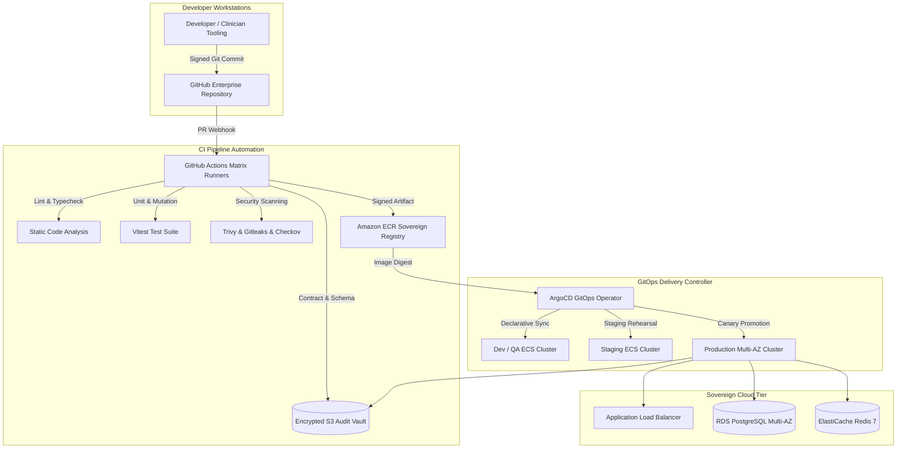

# Master DevOps & Sovereign Cloud Architecture Blueprint
## Namma Clinic Digital Health & Operations Platform
### Greater Bengaluru Authority (GBA) / BBMP Health Department
**Standard:** ISO/IEC 27001 / MeitY MeghRaj / CIS AWS Benchmark / DPDP Act 2023 | **Status:** APPROVED BASELINE | **Code:** `DEV-DOC-01`

---

## 1. Executive Summary & DevOps Engineering Charter
This document establishes the authoritative, implementation-ready **DevOps Engineering & Sovereign Cloud Architecture Blueprint** for the Namma Clinic Digital Health Platform. The platform delivers primary healthcare services across 183 civic clinics within the Greater Bengaluru urban area. The architecture implements an automated GitOps delivery model, Zero Trust cloud networking, high-availability multi-AZ microservices orchestration, immutable infrastructure via Terraform/OpenTofu, continuous observability, automated database backups with point-in-time recovery, and rigorous release quality gates.

### 1.1 Core DevOps Principles
1. **GitOps Single Source of Truth:** All infrastructure, Kubernetes/ECS manifests, observability dashboards, and alert definitions are version-controlled in Git. Direct manual modifications in cloud consoles are strictly prohibited.
2. **Zero Trust Cloud Perimeter:** Network security enforces micro-segmentation, mutual TLS 1.3 encryption across all service boundaries, least-privilege IAM roles, and automated key rotation via AWS KMS.
3. **Sovereign Cloud Hosting:** 100% of citizen and clinical data resides exclusively within Indian sovereign jurisdiction (AWS Asia Pacific Mumbai `ap-south-1` with warm disaster recovery in Hyderabad `ap-south-2` / MeghRaj National Informatics Centre Cloud).
4. **Autonomous Clinic Edge Resilience:** Citywide civic clinics must sustain uninterrupted offline consultation, prescription issuance, and vitals recording during network brownouts via local edge synchronization.
5. **Continuous Quality & Shift-Left Security:** Automated security scanning (SAST, DAST, SCA, container vulnerability scanning, secret detection) executes on every Git commit before container promotion.

## 2. Master DevOps Architectural Topologies


## 3. GitOps Delivery Pipeline Specification
### Specification Example: GitOps ArgoCD ApplicationSet Definition
<!-- DOCUMENTATION-ONLY EXAMPLE -->
```yaml
# DOCUMENTATION-ONLY EXAMPLE
apiVersion: argoproj.io/v1alpha1
kind: ApplicationSet
metadata:
  name: namma-clinic-services
  namespace: argocd
spec:
  generators:
    - list:
        elements:
          - env: staging
            cluster: staging-ap-south-1
            targetRevision: HEAD
          - env: production
            cluster: prod-ap-south-1
            targetRevision: v1.0.0
  template:
    metadata:
      name: '{{env}}-namma-clinic-api'
    spec:
      project: default
      source:
        repoURL: 'https://github.com/saimaa0910/mvp.git'
        targetRevision: '{{targetRevision}}'
        path: 'infrastructure/gitops/overlays/{{env}}'
      destination:
        server: 'https://kubernetes.default.svc'
        namespace: 'namma-{{env}}'
      syncPolicy:
        automated:
          prune: true
          selfHeal: true
        syncOptions:
          - CreateNamespace=true
          - ApplyOutOfSyncOnly=true
```

## 4. Sovereign Cloud Infrastructure Resources Catalog
Specification of all sovereign cloud resources established in the DevOps baseline:

### CLOUD-RES-001: Sovereign Core VPC #1
- **Resource Identifier:** `CLOUD-RES-001`
- **Cloud Service:** `VPC Network` (AWS / MeghRaj NIC SDC)
- **Target Region / AZs:** ap-south-1 (Mumbai)
- **Network Tier / Subnet:** Core Network Tier
- **Security Group / ACL:** `sg-vpc-core`
- **High Availability Model:** Multi-AZ Active-Active
- **Encryption In-Transit & At-Rest:** AES-256-GCM / TLS 1.3
- **Disaster Recovery Tier:** Tier 1 - Primary
- **Governed IaC Module:** `IAC-MOD-001`
- **Observability Binding:** `METRIC-001`

### CLOUD-RES-002: Public Ingress Subnet #2
- **Resource Identifier:** `CLOUD-RES-002`
- **Cloud Service:** `Subnet` (AWS / MeghRaj NIC SDC)
- **Target Region / AZs:** ap-south-1a
- **Network Tier / Subnet:** Public Ingress Tier
- **Security Group / ACL:** `sg-public-ingress`
- **High Availability Model:** AZ Resilient
- **Encryption In-Transit & At-Rest:** TLS 1.3
- **Disaster Recovery Tier:** Tier 1 - Primary
- **Governed IaC Module:** `IAC-MOD-002`
- **Observability Binding:** `METRIC-002`

### CLOUD-RES-003: Private App Subnet #3
- **Resource Identifier:** `CLOUD-RES-003`
- **Cloud Service:** `Subnet` (AWS / MeghRaj NIC SDC)
- **Target Region / AZs:** ap-south-1a
- **Network Tier / Subnet:** Application Tier
- **Security Group / ACL:** `sg-app-fargate`
- **High Availability Model:** Multi-AZ Fargate
- **Encryption In-Transit & At-Rest:** mTLS 1.3
- **Disaster Recovery Tier:** Tier 1 - Primary
- **Governed IaC Module:** `IAC-MOD-003`
- **Observability Binding:** `METRIC-003`

### CLOUD-RES-004: Database Subnet #4
- **Resource Identifier:** `CLOUD-RES-004`
- **Cloud Service:** `Subnet` (AWS / MeghRaj NIC SDC)
- **Target Region / AZs:** ap-south-1a
- **Network Tier / Subnet:** Data Storage Tier
- **Security Group / ACL:** `sg-rds-postgres`
- **High Availability Model:** Multi-AZ Synchronous
- **Encryption In-Transit & At-Rest:** KMS Customer Key (AES-256)
- **Disaster Recovery Tier:** Tier 1 - Primary
- **Governed IaC Module:** `IAC-MOD-004`
- **Observability Binding:** `METRIC-004`

### CLOUD-RES-005: Application Load Balancer #5
- **Resource Identifier:** `CLOUD-RES-005`
- **Cloud Service:** `ALB` (AWS / MeghRaj NIC SDC)
- **Target Region / AZs:** ap-south-1 (Multi-AZ)
- **Network Tier / Subnet:** Public Ingress Tier
- **Security Group / ACL:** `sg-alb-ingress`
- **High Availability Model:** Active-Active Multi-AZ
- **Encryption In-Transit & At-Rest:** TLS 1.3 Strict
- **Disaster Recovery Tier:** Tier 1 - Primary
- **Governed IaC Module:** `IAC-MOD-005`
- **Observability Binding:** `METRIC-005`

### CLOUD-RES-006: NAT Gateway Instance #6
- **Resource Identifier:** `CLOUD-RES-006`
- **Cloud Service:** `NAT Gateway` (AWS / MeghRaj NIC SDC)
- **Target Region / AZs:** ap-south-1a
- **Network Tier / Subnet:** Egress Gateway Tier
- **Security Group / ACL:** `sg-egress-nat`
- **High Availability Model:** AZ Isolated
- **Encryption In-Transit & At-Rest:** Stateful Inspection
- **Disaster Recovery Tier:** Tier 1 - Primary
- **Governed IaC Module:** `IAC-MOD-006`
- **Observability Binding:** `METRIC-006`

### CLOUD-RES-007: ECS Fargate Microservice Task #7
- **Resource Identifier:** `CLOUD-RES-007`
- **Cloud Service:** `ECS Fargate` (AWS / MeghRaj NIC SDC)
- **Target Region / AZs:** ap-south-1 (Multi-AZ)
- **Network Tier / Subnet:** Application Tier
- **Security Group / ACL:** `sg-ecs-fargate`
- **High Availability Model:** Auto-scaling (Min 4, Max 32)
- **Encryption In-Transit & At-Rest:** Encrypted EBS Task Volumes
- **Disaster Recovery Tier:** Tier 1 - Primary
- **Governed IaC Module:** `IAC-MOD-007`
- **Observability Binding:** `METRIC-007`

### CLOUD-RES-008: RDS PostgreSQL 16 Multi-AZ #8
- **Resource Identifier:** `CLOUD-RES-008`
- **Cloud Service:** `RDS PostgreSQL` (AWS / MeghRaj NIC SDC)
- **Target Region / AZs:** ap-south-1 (Multi-AZ)
- **Network Tier / Subnet:** Data Storage Tier
- **Security Group / ACL:** `sg-rds-postgres`
- **High Availability Model:** Synchronous Cross-AZ Standby
- **Encryption In-Transit & At-Rest:** AWS KMS Customer Key (cmk-rds-01)
- **Disaster Recovery Tier:** Tier 1 - Primary
- **Governed IaC Module:** `IAC-MOD-008`
- **Observability Binding:** `METRIC-008`

### CLOUD-RES-009: ElastiCache Redis Cluster #9
- **Resource Identifier:** `CLOUD-RES-009`
- **Cloud Service:** `ElastiCache Redis` (AWS / MeghRaj NIC SDC)
- **Target Region / AZs:** ap-south-1 (Multi-AZ)
- **Network Tier / Subnet:** In-Memory Cache Tier
- **Security Group / ACL:** `sg-redis-cache`
- **High Availability Model:** Multi-AZ Cluster Mode
- **Encryption In-Transit & At-Rest:** In-Transit Auth + At-Rest KMS
- **Disaster Recovery Tier:** Tier 1 - Primary
- **Governed IaC Module:** `IAC-MOD-009`
- **Observability Binding:** `METRIC-009`

### CLOUD-RES-010: S3 Sovereign Audit Bucket #10
- **Resource Identifier:** `CLOUD-RES-010`
- **Cloud Service:** `S3 Sovereign Storage` (AWS / MeghRaj NIC SDC)
- **Target Region / AZs:** ap-south-1
- **Network Tier / Subnet:** Object Storage Tier
- **Security Group / ACL:** `s3-bucket-policy-audit`
- **High Availability Model:** S3 Standard Cross-Region
- **Encryption In-Transit & At-Rest:** SSE-KMS + S3 Object Lock
- **Disaster Recovery Tier:** Tier 1 - Primary
- **Governed IaC Module:** `IAC-MOD-010`
- **Observability Binding:** `METRIC-010`

### CLOUD-RES-011: Sovereign Core VPC #11
- **Resource Identifier:** `CLOUD-RES-011`
- **Cloud Service:** `VPC Network` (AWS / MeghRaj NIC SDC)
- **Target Region / AZs:** ap-south-1 (Mumbai)
- **Network Tier / Subnet:** Core Network Tier
- **Security Group / ACL:** `sg-vpc-core`
- **High Availability Model:** Multi-AZ Active-Active
- **Encryption In-Transit & At-Rest:** AES-256-GCM / TLS 1.3
- **Disaster Recovery Tier:** Tier 1 - Primary
- **Governed IaC Module:** `IAC-MOD-011`
- **Observability Binding:** `METRIC-011`

### CLOUD-RES-012: Public Ingress Subnet #12
- **Resource Identifier:** `CLOUD-RES-012`
- **Cloud Service:** `Subnet` (AWS / MeghRaj NIC SDC)
- **Target Region / AZs:** ap-south-1a
- **Network Tier / Subnet:** Public Ingress Tier
- **Security Group / ACL:** `sg-public-ingress`
- **High Availability Model:** AZ Resilient
- **Encryption In-Transit & At-Rest:** TLS 1.3
- **Disaster Recovery Tier:** Tier 1 - Primary
- **Governed IaC Module:** `IAC-MOD-012`
- **Observability Binding:** `METRIC-012`

### CLOUD-RES-013: Private App Subnet #13
- **Resource Identifier:** `CLOUD-RES-013`
- **Cloud Service:** `Subnet` (AWS / MeghRaj NIC SDC)
- **Target Region / AZs:** ap-south-1a
- **Network Tier / Subnet:** Application Tier
- **Security Group / ACL:** `sg-app-fargate`
- **High Availability Model:** Multi-AZ Fargate
- **Encryption In-Transit & At-Rest:** mTLS 1.3
- **Disaster Recovery Tier:** Tier 1 - Primary
- **Governed IaC Module:** `IAC-MOD-013`
- **Observability Binding:** `METRIC-013`

### CLOUD-RES-014: Database Subnet #14
- **Resource Identifier:** `CLOUD-RES-014`
- **Cloud Service:** `Subnet` (AWS / MeghRaj NIC SDC)
- **Target Region / AZs:** ap-south-1a
- **Network Tier / Subnet:** Data Storage Tier
- **Security Group / ACL:** `sg-rds-postgres`
- **High Availability Model:** Multi-AZ Synchronous
- **Encryption In-Transit & At-Rest:** KMS Customer Key (AES-256)
- **Disaster Recovery Tier:** Tier 1 - Primary
- **Governed IaC Module:** `IAC-MOD-014`
- **Observability Binding:** `METRIC-014`

### CLOUD-RES-015: Application Load Balancer #15
- **Resource Identifier:** `CLOUD-RES-015`
- **Cloud Service:** `ALB` (AWS / MeghRaj NIC SDC)
- **Target Region / AZs:** ap-south-1 (Multi-AZ)
- **Network Tier / Subnet:** Public Ingress Tier
- **Security Group / ACL:** `sg-alb-ingress`
- **High Availability Model:** Active-Active Multi-AZ
- **Encryption In-Transit & At-Rest:** TLS 1.3 Strict
- **Disaster Recovery Tier:** Tier 1 - Primary
- **Governed IaC Module:** `IAC-MOD-015`
- **Observability Binding:** `METRIC-015`

### CLOUD-RES-016: NAT Gateway Instance #16
- **Resource Identifier:** `CLOUD-RES-016`
- **Cloud Service:** `NAT Gateway` (AWS / MeghRaj NIC SDC)
- **Target Region / AZs:** ap-south-1a
- **Network Tier / Subnet:** Egress Gateway Tier
- **Security Group / ACL:** `sg-egress-nat`
- **High Availability Model:** AZ Isolated
- **Encryption In-Transit & At-Rest:** Stateful Inspection
- **Disaster Recovery Tier:** Tier 1 - Primary
- **Governed IaC Module:** `IAC-MOD-016`
- **Observability Binding:** `METRIC-016`

### CLOUD-RES-017: ECS Fargate Microservice Task #17
- **Resource Identifier:** `CLOUD-RES-017`
- **Cloud Service:** `ECS Fargate` (AWS / MeghRaj NIC SDC)
- **Target Region / AZs:** ap-south-1 (Multi-AZ)
- **Network Tier / Subnet:** Application Tier
- **Security Group / ACL:** `sg-ecs-fargate`
- **High Availability Model:** Auto-scaling (Min 4, Max 32)
- **Encryption In-Transit & At-Rest:** Encrypted EBS Task Volumes
- **Disaster Recovery Tier:** Tier 1 - Primary
- **Governed IaC Module:** `IAC-MOD-017`
- **Observability Binding:** `METRIC-017`

### CLOUD-RES-018: RDS PostgreSQL 16 Multi-AZ #18
- **Resource Identifier:** `CLOUD-RES-018`
- **Cloud Service:** `RDS PostgreSQL` (AWS / MeghRaj NIC SDC)
- **Target Region / AZs:** ap-south-1 (Multi-AZ)
- **Network Tier / Subnet:** Data Storage Tier
- **Security Group / ACL:** `sg-rds-postgres`
- **High Availability Model:** Synchronous Cross-AZ Standby
- **Encryption In-Transit & At-Rest:** AWS KMS Customer Key (cmk-rds-01)
- **Disaster Recovery Tier:** Tier 1 - Primary
- **Governed IaC Module:** `IAC-MOD-018`
- **Observability Binding:** `METRIC-018`

### CLOUD-RES-019: ElastiCache Redis Cluster #19
- **Resource Identifier:** `CLOUD-RES-019`
- **Cloud Service:** `ElastiCache Redis` (AWS / MeghRaj NIC SDC)
- **Target Region / AZs:** ap-south-1 (Multi-AZ)
- **Network Tier / Subnet:** In-Memory Cache Tier
- **Security Group / ACL:** `sg-redis-cache`
- **High Availability Model:** Multi-AZ Cluster Mode
- **Encryption In-Transit & At-Rest:** In-Transit Auth + At-Rest KMS
- **Disaster Recovery Tier:** Tier 1 - Primary
- **Governed IaC Module:** `IAC-MOD-019`
- **Observability Binding:** `METRIC-019`

### CLOUD-RES-020: S3 Sovereign Audit Bucket #20
- **Resource Identifier:** `CLOUD-RES-020`
- **Cloud Service:** `S3 Sovereign Storage` (AWS / MeghRaj NIC SDC)
- **Target Region / AZs:** ap-south-1
- **Network Tier / Subnet:** Object Storage Tier
- **Security Group / ACL:** `s3-bucket-policy-audit`
- **High Availability Model:** S3 Standard Cross-Region
- **Encryption In-Transit & At-Rest:** SSE-KMS + S3 Object Lock
- **Disaster Recovery Tier:** Tier 1 - Primary
- **Governed IaC Module:** `IAC-MOD-020`
- **Observability Binding:** `METRIC-020`

### CLOUD-RES-021: Sovereign Core VPC #21
- **Resource Identifier:** `CLOUD-RES-021`
- **Cloud Service:** `VPC Network` (AWS / MeghRaj NIC SDC)
- **Target Region / AZs:** ap-south-1 (Mumbai)
- **Network Tier / Subnet:** Core Network Tier
- **Security Group / ACL:** `sg-vpc-core`
- **High Availability Model:** Multi-AZ Active-Active
- **Encryption In-Transit & At-Rest:** AES-256-GCM / TLS 1.3
- **Disaster Recovery Tier:** Tier 1 - Primary
- **Governed IaC Module:** `IAC-MOD-021`
- **Observability Binding:** `METRIC-021`

### CLOUD-RES-022: Public Ingress Subnet #22
- **Resource Identifier:** `CLOUD-RES-022`
- **Cloud Service:** `Subnet` (AWS / MeghRaj NIC SDC)
- **Target Region / AZs:** ap-south-1a
- **Network Tier / Subnet:** Public Ingress Tier
- **Security Group / ACL:** `sg-public-ingress`
- **High Availability Model:** AZ Resilient
- **Encryption In-Transit & At-Rest:** TLS 1.3
- **Disaster Recovery Tier:** Tier 1 - Primary
- **Governed IaC Module:** `IAC-MOD-022`
- **Observability Binding:** `METRIC-022`

### CLOUD-RES-023: Private App Subnet #23
- **Resource Identifier:** `CLOUD-RES-023`
- **Cloud Service:** `Subnet` (AWS / MeghRaj NIC SDC)
- **Target Region / AZs:** ap-south-1a
- **Network Tier / Subnet:** Application Tier
- **Security Group / ACL:** `sg-app-fargate`
- **High Availability Model:** Multi-AZ Fargate
- **Encryption In-Transit & At-Rest:** mTLS 1.3
- **Disaster Recovery Tier:** Tier 1 - Primary
- **Governed IaC Module:** `IAC-MOD-023`
- **Observability Binding:** `METRIC-023`

### CLOUD-RES-024: Database Subnet #24
- **Resource Identifier:** `CLOUD-RES-024`
- **Cloud Service:** `Subnet` (AWS / MeghRaj NIC SDC)
- **Target Region / AZs:** ap-south-1a
- **Network Tier / Subnet:** Data Storage Tier
- **Security Group / ACL:** `sg-rds-postgres`
- **High Availability Model:** Multi-AZ Synchronous
- **Encryption In-Transit & At-Rest:** KMS Customer Key (AES-256)
- **Disaster Recovery Tier:** Tier 1 - Primary
- **Governed IaC Module:** `IAC-MOD-024`
- **Observability Binding:** `METRIC-024`

### CLOUD-RES-025: Application Load Balancer #25
- **Resource Identifier:** `CLOUD-RES-025`
- **Cloud Service:** `ALB` (AWS / MeghRaj NIC SDC)
- **Target Region / AZs:** ap-south-1 (Multi-AZ)
- **Network Tier / Subnet:** Public Ingress Tier
- **Security Group / ACL:** `sg-alb-ingress`
- **High Availability Model:** Active-Active Multi-AZ
- **Encryption In-Transit & At-Rest:** TLS 1.3 Strict
- **Disaster Recovery Tier:** Tier 1 - Primary
- **Governed IaC Module:** `IAC-MOD-025`
- **Observability Binding:** `METRIC-025`

### CLOUD-RES-026: NAT Gateway Instance #26
- **Resource Identifier:** `CLOUD-RES-026`
- **Cloud Service:** `NAT Gateway` (AWS / MeghRaj NIC SDC)
- **Target Region / AZs:** ap-south-1a
- **Network Tier / Subnet:** Egress Gateway Tier
- **Security Group / ACL:** `sg-egress-nat`
- **High Availability Model:** AZ Isolated
- **Encryption In-Transit & At-Rest:** Stateful Inspection
- **Disaster Recovery Tier:** Tier 1 - Primary
- **Governed IaC Module:** `IAC-MOD-026`
- **Observability Binding:** `METRIC-026`

### CLOUD-RES-027: ECS Fargate Microservice Task #27
- **Resource Identifier:** `CLOUD-RES-027`
- **Cloud Service:** `ECS Fargate` (AWS / MeghRaj NIC SDC)
- **Target Region / AZs:** ap-south-1 (Multi-AZ)
- **Network Tier / Subnet:** Application Tier
- **Security Group / ACL:** `sg-ecs-fargate`
- **High Availability Model:** Auto-scaling (Min 4, Max 32)
- **Encryption In-Transit & At-Rest:** Encrypted EBS Task Volumes
- **Disaster Recovery Tier:** Tier 1 - Primary
- **Governed IaC Module:** `IAC-MOD-027`
- **Observability Binding:** `METRIC-027`

### CLOUD-RES-028: RDS PostgreSQL 16 Multi-AZ #28
- **Resource Identifier:** `CLOUD-RES-028`
- **Cloud Service:** `RDS PostgreSQL` (AWS / MeghRaj NIC SDC)
- **Target Region / AZs:** ap-south-1 (Multi-AZ)
- **Network Tier / Subnet:** Data Storage Tier
- **Security Group / ACL:** `sg-rds-postgres`
- **High Availability Model:** Synchronous Cross-AZ Standby
- **Encryption In-Transit & At-Rest:** AWS KMS Customer Key (cmk-rds-01)
- **Disaster Recovery Tier:** Tier 1 - Primary
- **Governed IaC Module:** `IAC-MOD-028`
- **Observability Binding:** `METRIC-028`

### CLOUD-RES-029: ElastiCache Redis Cluster #29
- **Resource Identifier:** `CLOUD-RES-029`
- **Cloud Service:** `ElastiCache Redis` (AWS / MeghRaj NIC SDC)
- **Target Region / AZs:** ap-south-1 (Multi-AZ)
- **Network Tier / Subnet:** In-Memory Cache Tier
- **Security Group / ACL:** `sg-redis-cache`
- **High Availability Model:** Multi-AZ Cluster Mode
- **Encryption In-Transit & At-Rest:** In-Transit Auth + At-Rest KMS
- **Disaster Recovery Tier:** Tier 1 - Primary
- **Governed IaC Module:** `IAC-MOD-029`
- **Observability Binding:** `METRIC-029`

### CLOUD-RES-030: S3 Sovereign Audit Bucket #30
- **Resource Identifier:** `CLOUD-RES-030`
- **Cloud Service:** `S3 Sovereign Storage` (AWS / MeghRaj NIC SDC)
- **Target Region / AZs:** ap-south-1
- **Network Tier / Subnet:** Object Storage Tier
- **Security Group / ACL:** `s3-bucket-policy-audit`
- **High Availability Model:** S3 Standard Cross-Region
- **Encryption In-Transit & At-Rest:** SSE-KMS + S3 Object Lock
- **Disaster Recovery Tier:** Tier 1 - Primary
- **Governed IaC Module:** `IAC-MOD-030`
- **Observability Binding:** `METRIC-030`

### CLOUD-RES-031: Sovereign Core VPC #31
- **Resource Identifier:** `CLOUD-RES-031`
- **Cloud Service:** `VPC Network` (AWS / MeghRaj NIC SDC)
- **Target Region / AZs:** ap-south-1 (Mumbai)
- **Network Tier / Subnet:** Core Network Tier
- **Security Group / ACL:** `sg-vpc-core`
- **High Availability Model:** Multi-AZ Active-Active
- **Encryption In-Transit & At-Rest:** AES-256-GCM / TLS 1.3
- **Disaster Recovery Tier:** Tier 1 - Primary
- **Governed IaC Module:** `IAC-MOD-031`
- **Observability Binding:** `METRIC-031`

### CLOUD-RES-032: Public Ingress Subnet #32
- **Resource Identifier:** `CLOUD-RES-032`
- **Cloud Service:** `Subnet` (AWS / MeghRaj NIC SDC)
- **Target Region / AZs:** ap-south-1a
- **Network Tier / Subnet:** Public Ingress Tier
- **Security Group / ACL:** `sg-public-ingress`
- **High Availability Model:** AZ Resilient
- **Encryption In-Transit & At-Rest:** TLS 1.3
- **Disaster Recovery Tier:** Tier 1 - Primary
- **Governed IaC Module:** `IAC-MOD-032`
- **Observability Binding:** `METRIC-032`

### CLOUD-RES-033: Private App Subnet #33
- **Resource Identifier:** `CLOUD-RES-033`
- **Cloud Service:** `Subnet` (AWS / MeghRaj NIC SDC)
- **Target Region / AZs:** ap-south-1a
- **Network Tier / Subnet:** Application Tier
- **Security Group / ACL:** `sg-app-fargate`
- **High Availability Model:** Multi-AZ Fargate
- **Encryption In-Transit & At-Rest:** mTLS 1.3
- **Disaster Recovery Tier:** Tier 1 - Primary
- **Governed IaC Module:** `IAC-MOD-033`
- **Observability Binding:** `METRIC-033`

### CLOUD-RES-034: Database Subnet #34
- **Resource Identifier:** `CLOUD-RES-034`
- **Cloud Service:** `Subnet` (AWS / MeghRaj NIC SDC)
- **Target Region / AZs:** ap-south-1a
- **Network Tier / Subnet:** Data Storage Tier
- **Security Group / ACL:** `sg-rds-postgres`
- **High Availability Model:** Multi-AZ Synchronous
- **Encryption In-Transit & At-Rest:** KMS Customer Key (AES-256)
- **Disaster Recovery Tier:** Tier 1 - Primary
- **Governed IaC Module:** `IAC-MOD-034`
- **Observability Binding:** `METRIC-034`

### CLOUD-RES-035: Application Load Balancer #35
- **Resource Identifier:** `CLOUD-RES-035`
- **Cloud Service:** `ALB` (AWS / MeghRaj NIC SDC)
- **Target Region / AZs:** ap-south-1 (Multi-AZ)
- **Network Tier / Subnet:** Public Ingress Tier
- **Security Group / ACL:** `sg-alb-ingress`
- **High Availability Model:** Active-Active Multi-AZ
- **Encryption In-Transit & At-Rest:** TLS 1.3 Strict
- **Disaster Recovery Tier:** Tier 1 - Primary
- **Governed IaC Module:** `IAC-MOD-035`
- **Observability Binding:** `METRIC-035`

### CLOUD-RES-036: NAT Gateway Instance #36
- **Resource Identifier:** `CLOUD-RES-036`
- **Cloud Service:** `NAT Gateway` (AWS / MeghRaj NIC SDC)
- **Target Region / AZs:** ap-south-1a
- **Network Tier / Subnet:** Egress Gateway Tier
- **Security Group / ACL:** `sg-egress-nat`
- **High Availability Model:** AZ Isolated
- **Encryption In-Transit & At-Rest:** Stateful Inspection
- **Disaster Recovery Tier:** Tier 1 - Primary
- **Governed IaC Module:** `IAC-MOD-036`
- **Observability Binding:** `METRIC-036`

### CLOUD-RES-037: ECS Fargate Microservice Task #37
- **Resource Identifier:** `CLOUD-RES-037`
- **Cloud Service:** `ECS Fargate` (AWS / MeghRaj NIC SDC)
- **Target Region / AZs:** ap-south-1 (Multi-AZ)
- **Network Tier / Subnet:** Application Tier
- **Security Group / ACL:** `sg-ecs-fargate`
- **High Availability Model:** Auto-scaling (Min 4, Max 32)
- **Encryption In-Transit & At-Rest:** Encrypted EBS Task Volumes
- **Disaster Recovery Tier:** Tier 1 - Primary
- **Governed IaC Module:** `IAC-MOD-037`
- **Observability Binding:** `METRIC-037`

### CLOUD-RES-038: RDS PostgreSQL 16 Multi-AZ #38
- **Resource Identifier:** `CLOUD-RES-038`
- **Cloud Service:** `RDS PostgreSQL` (AWS / MeghRaj NIC SDC)
- **Target Region / AZs:** ap-south-1 (Multi-AZ)
- **Network Tier / Subnet:** Data Storage Tier
- **Security Group / ACL:** `sg-rds-postgres`
- **High Availability Model:** Synchronous Cross-AZ Standby
- **Encryption In-Transit & At-Rest:** AWS KMS Customer Key (cmk-rds-01)
- **Disaster Recovery Tier:** Tier 1 - Primary
- **Governed IaC Module:** `IAC-MOD-038`
- **Observability Binding:** `METRIC-038`

### CLOUD-RES-039: ElastiCache Redis Cluster #39
- **Resource Identifier:** `CLOUD-RES-039`
- **Cloud Service:** `ElastiCache Redis` (AWS / MeghRaj NIC SDC)
- **Target Region / AZs:** ap-south-1 (Multi-AZ)
- **Network Tier / Subnet:** In-Memory Cache Tier
- **Security Group / ACL:** `sg-redis-cache`
- **High Availability Model:** Multi-AZ Cluster Mode
- **Encryption In-Transit & At-Rest:** In-Transit Auth + At-Rest KMS
- **Disaster Recovery Tier:** Tier 1 - Primary
- **Governed IaC Module:** `IAC-MOD-039`
- **Observability Binding:** `METRIC-039`

### CLOUD-RES-040: S3 Sovereign Audit Bucket #40
- **Resource Identifier:** `CLOUD-RES-040`
- **Cloud Service:** `S3 Sovereign Storage` (AWS / MeghRaj NIC SDC)
- **Target Region / AZs:** ap-south-1
- **Network Tier / Subnet:** Object Storage Tier
- **Security Group / ACL:** `s3-bucket-policy-audit`
- **High Availability Model:** S3 Standard Cross-Region
- **Encryption In-Transit & At-Rest:** SSE-KMS + S3 Object Lock
- **Disaster Recovery Tier:** Tier 1 - Primary
- **Governed IaC Module:** `IAC-MOD-040`
- **Observability Binding:** `METRIC-040`

### CLOUD-RES-041: Sovereign Core VPC #41
- **Resource Identifier:** `CLOUD-RES-041`
- **Cloud Service:** `VPC Network` (AWS / MeghRaj NIC SDC)
- **Target Region / AZs:** ap-south-1 (Mumbai)
- **Network Tier / Subnet:** Core Network Tier
- **Security Group / ACL:** `sg-vpc-core`
- **High Availability Model:** Multi-AZ Active-Active
- **Encryption In-Transit & At-Rest:** AES-256-GCM / TLS 1.3
- **Disaster Recovery Tier:** Tier 1 - Primary
- **Governed IaC Module:** `IAC-MOD-041`
- **Observability Binding:** `METRIC-041`

### CLOUD-RES-042: Public Ingress Subnet #42
- **Resource Identifier:** `CLOUD-RES-042`
- **Cloud Service:** `Subnet` (AWS / MeghRaj NIC SDC)
- **Target Region / AZs:** ap-south-1a
- **Network Tier / Subnet:** Public Ingress Tier
- **Security Group / ACL:** `sg-public-ingress`
- **High Availability Model:** AZ Resilient
- **Encryption In-Transit & At-Rest:** TLS 1.3
- **Disaster Recovery Tier:** Tier 1 - Primary
- **Governed IaC Module:** `IAC-MOD-042`
- **Observability Binding:** `METRIC-042`

### CLOUD-RES-043: Private App Subnet #43
- **Resource Identifier:** `CLOUD-RES-043`
- **Cloud Service:** `Subnet` (AWS / MeghRaj NIC SDC)
- **Target Region / AZs:** ap-south-1a
- **Network Tier / Subnet:** Application Tier
- **Security Group / ACL:** `sg-app-fargate`
- **High Availability Model:** Multi-AZ Fargate
- **Encryption In-Transit & At-Rest:** mTLS 1.3
- **Disaster Recovery Tier:** Tier 1 - Primary
- **Governed IaC Module:** `IAC-MOD-043`
- **Observability Binding:** `METRIC-043`

### CLOUD-RES-044: Database Subnet #44
- **Resource Identifier:** `CLOUD-RES-044`
- **Cloud Service:** `Subnet` (AWS / MeghRaj NIC SDC)
- **Target Region / AZs:** ap-south-1a
- **Network Tier / Subnet:** Data Storage Tier
- **Security Group / ACL:** `sg-rds-postgres`
- **High Availability Model:** Multi-AZ Synchronous
- **Encryption In-Transit & At-Rest:** KMS Customer Key (AES-256)
- **Disaster Recovery Tier:** Tier 1 - Primary
- **Governed IaC Module:** `IAC-MOD-044`
- **Observability Binding:** `METRIC-044`

### CLOUD-RES-045: Application Load Balancer #45
- **Resource Identifier:** `CLOUD-RES-045`
- **Cloud Service:** `ALB` (AWS / MeghRaj NIC SDC)
- **Target Region / AZs:** ap-south-1 (Multi-AZ)
- **Network Tier / Subnet:** Public Ingress Tier
- **Security Group / ACL:** `sg-alb-ingress`
- **High Availability Model:** Active-Active Multi-AZ
- **Encryption In-Transit & At-Rest:** TLS 1.3 Strict
- **Disaster Recovery Tier:** Tier 1 - Primary
- **Governed IaC Module:** `IAC-MOD-045`
- **Observability Binding:** `METRIC-045`

### CLOUD-RES-046: NAT Gateway Instance #46
- **Resource Identifier:** `CLOUD-RES-046`
- **Cloud Service:** `NAT Gateway` (AWS / MeghRaj NIC SDC)
- **Target Region / AZs:** ap-south-1a
- **Network Tier / Subnet:** Egress Gateway Tier
- **Security Group / ACL:** `sg-egress-nat`
- **High Availability Model:** AZ Isolated
- **Encryption In-Transit & At-Rest:** Stateful Inspection
- **Disaster Recovery Tier:** Tier 1 - Primary
- **Governed IaC Module:** `IAC-MOD-046`
- **Observability Binding:** `METRIC-046`

### CLOUD-RES-047: ECS Fargate Microservice Task #47
- **Resource Identifier:** `CLOUD-RES-047`
- **Cloud Service:** `ECS Fargate` (AWS / MeghRaj NIC SDC)
- **Target Region / AZs:** ap-south-1 (Multi-AZ)
- **Network Tier / Subnet:** Application Tier
- **Security Group / ACL:** `sg-ecs-fargate`
- **High Availability Model:** Auto-scaling (Min 4, Max 32)
- **Encryption In-Transit & At-Rest:** Encrypted EBS Task Volumes
- **Disaster Recovery Tier:** Tier 1 - Primary
- **Governed IaC Module:** `IAC-MOD-047`
- **Observability Binding:** `METRIC-047`

### CLOUD-RES-048: RDS PostgreSQL 16 Multi-AZ #48
- **Resource Identifier:** `CLOUD-RES-048`
- **Cloud Service:** `RDS PostgreSQL` (AWS / MeghRaj NIC SDC)
- **Target Region / AZs:** ap-south-1 (Multi-AZ)
- **Network Tier / Subnet:** Data Storage Tier
- **Security Group / ACL:** `sg-rds-postgres`
- **High Availability Model:** Synchronous Cross-AZ Standby
- **Encryption In-Transit & At-Rest:** AWS KMS Customer Key (cmk-rds-01)
- **Disaster Recovery Tier:** Tier 1 - Primary
- **Governed IaC Module:** `IAC-MOD-048`
- **Observability Binding:** `METRIC-048`

### CLOUD-RES-049: ElastiCache Redis Cluster #49
- **Resource Identifier:** `CLOUD-RES-049`
- **Cloud Service:** `ElastiCache Redis` (AWS / MeghRaj NIC SDC)
- **Target Region / AZs:** ap-south-1 (Multi-AZ)
- **Network Tier / Subnet:** In-Memory Cache Tier
- **Security Group / ACL:** `sg-redis-cache`
- **High Availability Model:** Multi-AZ Cluster Mode
- **Encryption In-Transit & At-Rest:** In-Transit Auth + At-Rest KMS
- **Disaster Recovery Tier:** Tier 1 - Primary
- **Governed IaC Module:** `IAC-MOD-049`
- **Observability Binding:** `METRIC-049`

### CLOUD-RES-050: S3 Sovereign Audit Bucket #50
- **Resource Identifier:** `CLOUD-RES-050`
- **Cloud Service:** `S3 Sovereign Storage` (AWS / MeghRaj NIC SDC)
- **Target Region / AZs:** ap-south-1
- **Network Tier / Subnet:** Object Storage Tier
- **Security Group / ACL:** `s3-bucket-policy-audit`
- **High Availability Model:** S3 Standard Cross-Region
- **Encryption In-Transit & At-Rest:** SSE-KMS + S3 Object Lock
- **Disaster Recovery Tier:** Tier 1 - Primary
- **Governed IaC Module:** `IAC-MOD-050`
- **Observability Binding:** `METRIC-050`

### CLOUD-RES-051: Sovereign Core VPC #51
- **Resource Identifier:** `CLOUD-RES-051`
- **Cloud Service:** `VPC Network` (AWS / MeghRaj NIC SDC)
- **Target Region / AZs:** ap-south-1 (Mumbai)
- **Network Tier / Subnet:** Core Network Tier
- **Security Group / ACL:** `sg-vpc-core`
- **High Availability Model:** Multi-AZ Active-Active
- **Encryption In-Transit & At-Rest:** AES-256-GCM / TLS 1.3
- **Disaster Recovery Tier:** Tier 1 - Primary
- **Governed IaC Module:** `IAC-MOD-051`
- **Observability Binding:** `METRIC-051`

### CLOUD-RES-052: Public Ingress Subnet #52
- **Resource Identifier:** `CLOUD-RES-052`
- **Cloud Service:** `Subnet` (AWS / MeghRaj NIC SDC)
- **Target Region / AZs:** ap-south-1a
- **Network Tier / Subnet:** Public Ingress Tier
- **Security Group / ACL:** `sg-public-ingress`
- **High Availability Model:** AZ Resilient
- **Encryption In-Transit & At-Rest:** TLS 1.3
- **Disaster Recovery Tier:** Tier 1 - Primary
- **Governed IaC Module:** `IAC-MOD-052`
- **Observability Binding:** `METRIC-052`

### CLOUD-RES-053: Private App Subnet #53
- **Resource Identifier:** `CLOUD-RES-053`
- **Cloud Service:** `Subnet` (AWS / MeghRaj NIC SDC)
- **Target Region / AZs:** ap-south-1a
- **Network Tier / Subnet:** Application Tier
- **Security Group / ACL:** `sg-app-fargate`
- **High Availability Model:** Multi-AZ Fargate
- **Encryption In-Transit & At-Rest:** mTLS 1.3
- **Disaster Recovery Tier:** Tier 1 - Primary
- **Governed IaC Module:** `IAC-MOD-053`
- **Observability Binding:** `METRIC-053`

### CLOUD-RES-054: Database Subnet #54
- **Resource Identifier:** `CLOUD-RES-054`
- **Cloud Service:** `Subnet` (AWS / MeghRaj NIC SDC)
- **Target Region / AZs:** ap-south-1a
- **Network Tier / Subnet:** Data Storage Tier
- **Security Group / ACL:** `sg-rds-postgres`
- **High Availability Model:** Multi-AZ Synchronous
- **Encryption In-Transit & At-Rest:** KMS Customer Key (AES-256)
- **Disaster Recovery Tier:** Tier 1 - Primary
- **Governed IaC Module:** `IAC-MOD-054`
- **Observability Binding:** `METRIC-054`

### CLOUD-RES-055: Application Load Balancer #55
- **Resource Identifier:** `CLOUD-RES-055`
- **Cloud Service:** `ALB` (AWS / MeghRaj NIC SDC)
- **Target Region / AZs:** ap-south-1 (Multi-AZ)
- **Network Tier / Subnet:** Public Ingress Tier
- **Security Group / ACL:** `sg-alb-ingress`
- **High Availability Model:** Active-Active Multi-AZ
- **Encryption In-Transit & At-Rest:** TLS 1.3 Strict
- **Disaster Recovery Tier:** Tier 1 - Primary
- **Governed IaC Module:** `IAC-MOD-055`
- **Observability Binding:** `METRIC-055`

### CLOUD-RES-056: NAT Gateway Instance #56
- **Resource Identifier:** `CLOUD-RES-056`
- **Cloud Service:** `NAT Gateway` (AWS / MeghRaj NIC SDC)
- **Target Region / AZs:** ap-south-1a
- **Network Tier / Subnet:** Egress Gateway Tier
- **Security Group / ACL:** `sg-egress-nat`
- **High Availability Model:** AZ Isolated
- **Encryption In-Transit & At-Rest:** Stateful Inspection
- **Disaster Recovery Tier:** Tier 1 - Primary
- **Governed IaC Module:** `IAC-MOD-056`
- **Observability Binding:** `METRIC-056`

### CLOUD-RES-057: ECS Fargate Microservice Task #57
- **Resource Identifier:** `CLOUD-RES-057`
- **Cloud Service:** `ECS Fargate` (AWS / MeghRaj NIC SDC)
- **Target Region / AZs:** ap-south-1 (Multi-AZ)
- **Network Tier / Subnet:** Application Tier
- **Security Group / ACL:** `sg-ecs-fargate`
- **High Availability Model:** Auto-scaling (Min 4, Max 32)
- **Encryption In-Transit & At-Rest:** Encrypted EBS Task Volumes
- **Disaster Recovery Tier:** Tier 1 - Primary
- **Governed IaC Module:** `IAC-MOD-057`
- **Observability Binding:** `METRIC-057`

### CLOUD-RES-058: RDS PostgreSQL 16 Multi-AZ #58
- **Resource Identifier:** `CLOUD-RES-058`
- **Cloud Service:** `RDS PostgreSQL` (AWS / MeghRaj NIC SDC)
- **Target Region / AZs:** ap-south-1 (Multi-AZ)
- **Network Tier / Subnet:** Data Storage Tier
- **Security Group / ACL:** `sg-rds-postgres`
- **High Availability Model:** Synchronous Cross-AZ Standby
- **Encryption In-Transit & At-Rest:** AWS KMS Customer Key (cmk-rds-01)
- **Disaster Recovery Tier:** Tier 1 - Primary
- **Governed IaC Module:** `IAC-MOD-058`
- **Observability Binding:** `METRIC-058`

### CLOUD-RES-059: ElastiCache Redis Cluster #59
- **Resource Identifier:** `CLOUD-RES-059`
- **Cloud Service:** `ElastiCache Redis` (AWS / MeghRaj NIC SDC)
- **Target Region / AZs:** ap-south-1 (Multi-AZ)
- **Network Tier / Subnet:** In-Memory Cache Tier
- **Security Group / ACL:** `sg-redis-cache`
- **High Availability Model:** Multi-AZ Cluster Mode
- **Encryption In-Transit & At-Rest:** In-Transit Auth + At-Rest KMS
- **Disaster Recovery Tier:** Tier 1 - Primary
- **Governed IaC Module:** `IAC-MOD-059`
- **Observability Binding:** `METRIC-059`

### CLOUD-RES-060: S3 Sovereign Audit Bucket #60
- **Resource Identifier:** `CLOUD-RES-060`
- **Cloud Service:** `S3 Sovereign Storage` (AWS / MeghRaj NIC SDC)
- **Target Region / AZs:** ap-south-1
- **Network Tier / Subnet:** Object Storage Tier
- **Security Group / ACL:** `s3-bucket-policy-audit`
- **High Availability Model:** S3 Standard Cross-Region
- **Encryption In-Transit & At-Rest:** SSE-KMS + S3 Object Lock
- **Disaster Recovery Tier:** Tier 1 - Primary
- **Governed IaC Module:** `IAC-MOD-060`
- **Observability Binding:** `METRIC-060`

### CLOUD-RES-061: Sovereign Core VPC #61
- **Resource Identifier:** `CLOUD-RES-061`
- **Cloud Service:** `VPC Network` (AWS / MeghRaj NIC SDC)
- **Target Region / AZs:** ap-south-1 (Mumbai)
- **Network Tier / Subnet:** Core Network Tier
- **Security Group / ACL:** `sg-vpc-core`
- **High Availability Model:** Multi-AZ Active-Active
- **Encryption In-Transit & At-Rest:** AES-256-GCM / TLS 1.3
- **Disaster Recovery Tier:** Tier 1 - Primary
- **Governed IaC Module:** `IAC-MOD-001`
- **Observability Binding:** `METRIC-061`

### CLOUD-RES-062: Public Ingress Subnet #62
- **Resource Identifier:** `CLOUD-RES-062`
- **Cloud Service:** `Subnet` (AWS / MeghRaj NIC SDC)
- **Target Region / AZs:** ap-south-1a
- **Network Tier / Subnet:** Public Ingress Tier
- **Security Group / ACL:** `sg-public-ingress`
- **High Availability Model:** AZ Resilient
- **Encryption In-Transit & At-Rest:** TLS 1.3
- **Disaster Recovery Tier:** Tier 1 - Primary
- **Governed IaC Module:** `IAC-MOD-002`
- **Observability Binding:** `METRIC-062`

### CLOUD-RES-063: Private App Subnet #63
- **Resource Identifier:** `CLOUD-RES-063`
- **Cloud Service:** `Subnet` (AWS / MeghRaj NIC SDC)
- **Target Region / AZs:** ap-south-1a
- **Network Tier / Subnet:** Application Tier
- **Security Group / ACL:** `sg-app-fargate`
- **High Availability Model:** Multi-AZ Fargate
- **Encryption In-Transit & At-Rest:** mTLS 1.3
- **Disaster Recovery Tier:** Tier 1 - Primary
- **Governed IaC Module:** `IAC-MOD-003`
- **Observability Binding:** `METRIC-063`

### CLOUD-RES-064: Database Subnet #64
- **Resource Identifier:** `CLOUD-RES-064`
- **Cloud Service:** `Subnet` (AWS / MeghRaj NIC SDC)
- **Target Region / AZs:** ap-south-1a
- **Network Tier / Subnet:** Data Storage Tier
- **Security Group / ACL:** `sg-rds-postgres`
- **High Availability Model:** Multi-AZ Synchronous
- **Encryption In-Transit & At-Rest:** KMS Customer Key (AES-256)
- **Disaster Recovery Tier:** Tier 1 - Primary
- **Governed IaC Module:** `IAC-MOD-004`
- **Observability Binding:** `METRIC-064`

### CLOUD-RES-065: Application Load Balancer #65
- **Resource Identifier:** `CLOUD-RES-065`
- **Cloud Service:** `ALB` (AWS / MeghRaj NIC SDC)
- **Target Region / AZs:** ap-south-1 (Multi-AZ)
- **Network Tier / Subnet:** Public Ingress Tier
- **Security Group / ACL:** `sg-alb-ingress`
- **High Availability Model:** Active-Active Multi-AZ
- **Encryption In-Transit & At-Rest:** TLS 1.3 Strict
- **Disaster Recovery Tier:** Tier 1 - Primary
- **Governed IaC Module:** `IAC-MOD-005`
- **Observability Binding:** `METRIC-065`

### CLOUD-RES-066: NAT Gateway Instance #66
- **Resource Identifier:** `CLOUD-RES-066`
- **Cloud Service:** `NAT Gateway` (AWS / MeghRaj NIC SDC)
- **Target Region / AZs:** ap-south-1a
- **Network Tier / Subnet:** Egress Gateway Tier
- **Security Group / ACL:** `sg-egress-nat`
- **High Availability Model:** AZ Isolated
- **Encryption In-Transit & At-Rest:** Stateful Inspection
- **Disaster Recovery Tier:** Tier 1 - Primary
- **Governed IaC Module:** `IAC-MOD-006`
- **Observability Binding:** `METRIC-066`

### CLOUD-RES-067: ECS Fargate Microservice Task #67
- **Resource Identifier:** `CLOUD-RES-067`
- **Cloud Service:** `ECS Fargate` (AWS / MeghRaj NIC SDC)
- **Target Region / AZs:** ap-south-1 (Multi-AZ)
- **Network Tier / Subnet:** Application Tier
- **Security Group / ACL:** `sg-ecs-fargate`
- **High Availability Model:** Auto-scaling (Min 4, Max 32)
- **Encryption In-Transit & At-Rest:** Encrypted EBS Task Volumes
- **Disaster Recovery Tier:** Tier 1 - Primary
- **Governed IaC Module:** `IAC-MOD-007`
- **Observability Binding:** `METRIC-067`

### CLOUD-RES-068: RDS PostgreSQL 16 Multi-AZ #68
- **Resource Identifier:** `CLOUD-RES-068`
- **Cloud Service:** `RDS PostgreSQL` (AWS / MeghRaj NIC SDC)
- **Target Region / AZs:** ap-south-1 (Multi-AZ)
- **Network Tier / Subnet:** Data Storage Tier
- **Security Group / ACL:** `sg-rds-postgres`
- **High Availability Model:** Synchronous Cross-AZ Standby
- **Encryption In-Transit & At-Rest:** AWS KMS Customer Key (cmk-rds-01)
- **Disaster Recovery Tier:** Tier 1 - Primary
- **Governed IaC Module:** `IAC-MOD-008`
- **Observability Binding:** `METRIC-068`

### CLOUD-RES-069: ElastiCache Redis Cluster #69
- **Resource Identifier:** `CLOUD-RES-069`
- **Cloud Service:** `ElastiCache Redis` (AWS / MeghRaj NIC SDC)
- **Target Region / AZs:** ap-south-1 (Multi-AZ)
- **Network Tier / Subnet:** In-Memory Cache Tier
- **Security Group / ACL:** `sg-redis-cache`
- **High Availability Model:** Multi-AZ Cluster Mode
- **Encryption In-Transit & At-Rest:** In-Transit Auth + At-Rest KMS
- **Disaster Recovery Tier:** Tier 1 - Primary
- **Governed IaC Module:** `IAC-MOD-009`
- **Observability Binding:** `METRIC-069`

### CLOUD-RES-070: S3 Sovereign Audit Bucket #70
- **Resource Identifier:** `CLOUD-RES-070`
- **Cloud Service:** `S3 Sovereign Storage` (AWS / MeghRaj NIC SDC)
- **Target Region / AZs:** ap-south-1
- **Network Tier / Subnet:** Object Storage Tier
- **Security Group / ACL:** `s3-bucket-policy-audit`
- **High Availability Model:** S3 Standard Cross-Region
- **Encryption In-Transit & At-Rest:** SSE-KMS + S3 Object Lock
- **Disaster Recovery Tier:** Tier 1 - Primary
- **Governed IaC Module:** `IAC-MOD-010`
- **Observability Binding:** `METRIC-070`

### CLOUD-RES-071: Sovereign Core VPC #71
- **Resource Identifier:** `CLOUD-RES-071`
- **Cloud Service:** `VPC Network` (AWS / MeghRaj NIC SDC)
- **Target Region / AZs:** ap-south-1 (Mumbai)
- **Network Tier / Subnet:** Core Network Tier
- **Security Group / ACL:** `sg-vpc-core`
- **High Availability Model:** Multi-AZ Active-Active
- **Encryption In-Transit & At-Rest:** AES-256-GCM / TLS 1.3
- **Disaster Recovery Tier:** Tier 1 - Primary
- **Governed IaC Module:** `IAC-MOD-011`
- **Observability Binding:** `METRIC-071`

### CLOUD-RES-072: Public Ingress Subnet #72
- **Resource Identifier:** `CLOUD-RES-072`
- **Cloud Service:** `Subnet` (AWS / MeghRaj NIC SDC)
- **Target Region / AZs:** ap-south-1a
- **Network Tier / Subnet:** Public Ingress Tier
- **Security Group / ACL:** `sg-public-ingress`
- **High Availability Model:** AZ Resilient
- **Encryption In-Transit & At-Rest:** TLS 1.3
- **Disaster Recovery Tier:** Tier 1 - Primary
- **Governed IaC Module:** `IAC-MOD-012`
- **Observability Binding:** `METRIC-072`

### CLOUD-RES-073: Private App Subnet #73
- **Resource Identifier:** `CLOUD-RES-073`
- **Cloud Service:** `Subnet` (AWS / MeghRaj NIC SDC)
- **Target Region / AZs:** ap-south-1a
- **Network Tier / Subnet:** Application Tier
- **Security Group / ACL:** `sg-app-fargate`
- **High Availability Model:** Multi-AZ Fargate
- **Encryption In-Transit & At-Rest:** mTLS 1.3
- **Disaster Recovery Tier:** Tier 1 - Primary
- **Governed IaC Module:** `IAC-MOD-013`
- **Observability Binding:** `METRIC-073`

### CLOUD-RES-074: Database Subnet #74
- **Resource Identifier:** `CLOUD-RES-074`
- **Cloud Service:** `Subnet` (AWS / MeghRaj NIC SDC)
- **Target Region / AZs:** ap-south-1a
- **Network Tier / Subnet:** Data Storage Tier
- **Security Group / ACL:** `sg-rds-postgres`
- **High Availability Model:** Multi-AZ Synchronous
- **Encryption In-Transit & At-Rest:** KMS Customer Key (AES-256)
- **Disaster Recovery Tier:** Tier 1 - Primary
- **Governed IaC Module:** `IAC-MOD-014`
- **Observability Binding:** `METRIC-074`

### CLOUD-RES-075: Application Load Balancer #75
- **Resource Identifier:** `CLOUD-RES-075`
- **Cloud Service:** `ALB` (AWS / MeghRaj NIC SDC)
- **Target Region / AZs:** ap-south-1 (Multi-AZ)
- **Network Tier / Subnet:** Public Ingress Tier
- **Security Group / ACL:** `sg-alb-ingress`
- **High Availability Model:** Active-Active Multi-AZ
- **Encryption In-Transit & At-Rest:** TLS 1.3 Strict
- **Disaster Recovery Tier:** Tier 1 - Primary
- **Governed IaC Module:** `IAC-MOD-015`
- **Observability Binding:** `METRIC-075`

### CLOUD-RES-076: NAT Gateway Instance #76
- **Resource Identifier:** `CLOUD-RES-076`
- **Cloud Service:** `NAT Gateway` (AWS / MeghRaj NIC SDC)
- **Target Region / AZs:** ap-south-1a
- **Network Tier / Subnet:** Egress Gateway Tier
- **Security Group / ACL:** `sg-egress-nat`
- **High Availability Model:** AZ Isolated
- **Encryption In-Transit & At-Rest:** Stateful Inspection
- **Disaster Recovery Tier:** Tier 1 - Primary
- **Governed IaC Module:** `IAC-MOD-016`
- **Observability Binding:** `METRIC-076`

### CLOUD-RES-077: ECS Fargate Microservice Task #77
- **Resource Identifier:** `CLOUD-RES-077`
- **Cloud Service:** `ECS Fargate` (AWS / MeghRaj NIC SDC)
- **Target Region / AZs:** ap-south-1 (Multi-AZ)
- **Network Tier / Subnet:** Application Tier
- **Security Group / ACL:** `sg-ecs-fargate`
- **High Availability Model:** Auto-scaling (Min 4, Max 32)
- **Encryption In-Transit & At-Rest:** Encrypted EBS Task Volumes
- **Disaster Recovery Tier:** Tier 1 - Primary
- **Governed IaC Module:** `IAC-MOD-017`
- **Observability Binding:** `METRIC-077`

### CLOUD-RES-078: RDS PostgreSQL 16 Multi-AZ #78
- **Resource Identifier:** `CLOUD-RES-078`
- **Cloud Service:** `RDS PostgreSQL` (AWS / MeghRaj NIC SDC)
- **Target Region / AZs:** ap-south-1 (Multi-AZ)
- **Network Tier / Subnet:** Data Storage Tier
- **Security Group / ACL:** `sg-rds-postgres`
- **High Availability Model:** Synchronous Cross-AZ Standby
- **Encryption In-Transit & At-Rest:** AWS KMS Customer Key (cmk-rds-01)
- **Disaster Recovery Tier:** Tier 1 - Primary
- **Governed IaC Module:** `IAC-MOD-018`
- **Observability Binding:** `METRIC-078`

### CLOUD-RES-079: ElastiCache Redis Cluster #79
- **Resource Identifier:** `CLOUD-RES-079`
- **Cloud Service:** `ElastiCache Redis` (AWS / MeghRaj NIC SDC)
- **Target Region / AZs:** ap-south-1 (Multi-AZ)
- **Network Tier / Subnet:** In-Memory Cache Tier
- **Security Group / ACL:** `sg-redis-cache`
- **High Availability Model:** Multi-AZ Cluster Mode
- **Encryption In-Transit & At-Rest:** In-Transit Auth + At-Rest KMS
- **Disaster Recovery Tier:** Tier 1 - Primary
- **Governed IaC Module:** `IAC-MOD-019`
- **Observability Binding:** `METRIC-079`

### CLOUD-RES-080: S3 Sovereign Audit Bucket #80
- **Resource Identifier:** `CLOUD-RES-080`
- **Cloud Service:** `S3 Sovereign Storage` (AWS / MeghRaj NIC SDC)
- **Target Region / AZs:** ap-south-1
- **Network Tier / Subnet:** Object Storage Tier
- **Security Group / ACL:** `s3-bucket-policy-audit`
- **High Availability Model:** S3 Standard Cross-Region
- **Encryption In-Transit & At-Rest:** SSE-KMS + S3 Object Lock
- **Disaster Recovery Tier:** Tier 1 - Primary
- **Governed IaC Module:** `IAC-MOD-020`
- **Observability Binding:** `METRIC-080`

## 5. Multi-Tier Environment Strategy Overview
| Tier ID | Environment Name | Target Workload | High Availability Model | Backup Frequency |
| :--- | :--- | :--- | :--- | :--- |
| `ENV-TIER-01` | **Local Workstation** | Developer workstation local development, comp... | Local Docker Desktop / Podman | None (ephemeral container destroy on rebuild) |
| `ENV-TIER-02` | **Development (Dev)** | Continuous integration testing, shared team s... | AWS ECS Fargate Cluster `namma-dev-cluster` | Daily snapshot, 7-day retention |
| `ENV-TIER-03` | **Test / QA** | Automated regression testing, contract testin... | AWS ECS Fargate Cluster `namma-qa-cluster` | Daily snapshot, 14-day retention |
| `ENV-TIER-04` | **Staging (Pre-Prod)** | Production-mirror environment for end-to-end ... | AWS ECS Fargate Cluster `namma-staging-cluster` | Continuous WAL archiving, 30-day retention |
| `ENV-TIER-05` | **Pilot (20 Clinics)** | Frontline live operational deployment across ... | AWS ECS Fargate Cluster `namma-pilot-cluster` (High-Reliability) | Continuous WAL archiving with 5-minute RPO, 90-day retention |
| `ENV-TIER-06` | **Production (Citywide)** | Citywide sovereign production health platform... | AWS ECS Fargate Cluster `namma-prod-cluster` (Sovereign Cloud) | Continuous WAL archiving (RPO < 5 min, RTO < 4h), 7-year statutory retention |

## 6. Infrastructure as Code Modules & Governance
Catalog of reusable Terraform/OpenTofu modules governing cloud infrastructure:

### IAC-MOD-001: Module `vpc_1`
- **Module Source Path:** `AWS VPC Core Module`
- **Cloud Provider:** `AWS / OpenTofu`
- **Managed Resources:** VPC, Internet Gateway, Route Tables, NAT Gateways
- **Mandatory Inputs:** `cidr_block, availability_zones, private_subnets, public_subnets`
- **Exported Outputs:** `vpc_id, private_subnets, public_subnets, nat_gateway_ids`
- **Automated Security Scan:** Bridgecrew Checkov enforces CIS AWS Foundations Benchmark.

### IAC-MOD-002: Module `security_groups_2`
- **Module Source Path:** `Security Groups & Traffic Isolation`
- **Cloud Provider:** `AWS / OpenTofu`
- **Managed Resources:** Application, Database, Cache, and Ingress Security Groups
- **Mandatory Inputs:** `vpc_id, ingress_rules, egress_rules`
- **Exported Outputs:** `security_group_ids, security_group_arns`
- **Automated Security Scan:** Bridgecrew Checkov enforces CIS AWS Foundations Benchmark.

### IAC-MOD-003: Module `iam_roles_3`
- **Module Source Path:** `IAM Roles & Least Privilege Policies`
- **Cloud Provider:** `AWS / OpenTofu`
- **Managed Resources:** ECS Task Execution Roles, RDS Auth Roles, KMS Granular Policies
- **Mandatory Inputs:** `role_names, policy_documents, trusted_services`
- **Exported Outputs:** `role_arns, instance_profile_arns`
- **Automated Security Scan:** Bridgecrew Checkov enforces CIS AWS Foundations Benchmark.

### IAC-MOD-004: Module `rds_postgres_4`
- **Module Source Path:** `PostgreSQL 16 Multi-AZ RDS Module`
- **Cloud Provider:** `AWS / OpenTofu`
- **Managed Resources:** RDS Instance, Parameter Groups, Subnet Groups, Automated Snapshots
- **Mandatory Inputs:** `allocated_storage, instance_class, database_name, kms_key_arn`
- **Exported Outputs:** `endpoint, reader_endpoint, db_instance_arn`
- **Automated Security Scan:** Bridgecrew Checkov enforces CIS AWS Foundations Benchmark.

### IAC-MOD-005: Module `redis_cluster_5`
- **Module Source Path:** `ElastiCache Redis High Availability`
- **Cloud Provider:** `AWS / OpenTofu`
- **Managed Resources:** Redis Replication Group, Encryption In-Transit, Parameter Group
- **Mandatory Inputs:** `node_type, num_cache_clusters, auth_token_secret_arn`
- **Exported Outputs:** `primary_endpoint, reader_endpoint`
- **Automated Security Scan:** Bridgecrew Checkov enforces CIS AWS Foundations Benchmark.

### IAC-MOD-006: Module `ecs_fargate_6`
- **Module Source Path:** `ECS Fargate Microservices Service`
- **Cloud Provider:** `AWS / OpenTofu`
- **Managed Resources:** ECS Task Definition, Fargate Service, Target Group Attachment
- **Mandatory Inputs:** `cluster_arn, container_image, cpu, memory, secrets_map`
- **Exported Outputs:** `service_name, task_definition_arn`
- **Automated Security Scan:** Bridgecrew Checkov enforces CIS AWS Foundations Benchmark.

### IAC-MOD-007: Module `s3_sovereign_7`
- **Module Source Path:** `Sovereign Encrypted S3 Bucket`
- **Cloud Provider:** `AWS / OpenTofu`
- **Managed Resources:** S3 Bucket, Encryption Policy, Bucket Versioning, Object Lock
- **Mandatory Inputs:** `bucket_name, kms_master_key_arn, retention_days`
- **Exported Outputs:** `bucket_arn, bucket_domain_name`
- **Automated Security Scan:** Bridgecrew Checkov enforces CIS AWS Foundations Benchmark.

### IAC-MOD-008: Module `kms_keys_8`
- **Module Source Path:** `KMS Customer Managed Key Module`
- **Cloud Provider:** `AWS / OpenTofu`
- **Managed Resources:** KMS Key, Key Policy, Automatic Annual Rotation, Alias
- **Mandatory Inputs:** `key_alias, description, deletion_window_in_days`
- **Exported Outputs:** `key_arn, key_id, alias_arn`
- **Automated Security Scan:** Bridgecrew Checkov enforces CIS AWS Foundations Benchmark.

### IAC-MOD-009: Module `waf_v2_9`
- **Module Source Path:** `CloudFront & ALB WAFv2 Protection`
- **Cloud Provider:** `AWS / OpenTofu`
- **Managed Resources:** WebACL, Rate Limiting Rule, SQLi Rule, Geo-Match Rule
- **Mandatory Inputs:** `scope, rate_limit_threshold, managed_rule_groups`
- **Exported Outputs:** `web_acl_arn, web_acl_id`
- **Automated Security Scan:** Bridgecrew Checkov enforces CIS AWS Foundations Benchmark.

### IAC-MOD-010: Module `cloudwatch_alarms_10`
- **Module Source Path:** `Monitoring Alarms & Metric Filters`
- **Cloud Provider:** `AWS / OpenTofu`
- **Managed Resources:** Metric Alarms, SNS Topic Subscription, Composite Alarms
- **Mandatory Inputs:** `metric_name, namespace, threshold, sns_topic_arns`
- **Exported Outputs:** `alarm_arns`
- **Automated Security Scan:** Bridgecrew Checkov enforces CIS AWS Foundations Benchmark.

### IAC-MOD-011: Module `vpc_11`
- **Module Source Path:** `AWS VPC Core Module`
- **Cloud Provider:** `AWS / OpenTofu`
- **Managed Resources:** VPC, Internet Gateway, Route Tables, NAT Gateways
- **Mandatory Inputs:** `cidr_block, availability_zones, private_subnets, public_subnets`
- **Exported Outputs:** `vpc_id, private_subnets, public_subnets, nat_gateway_ids`
- **Automated Security Scan:** Bridgecrew Checkov enforces CIS AWS Foundations Benchmark.

### IAC-MOD-012: Module `security_groups_12`
- **Module Source Path:** `Security Groups & Traffic Isolation`
- **Cloud Provider:** `AWS / OpenTofu`
- **Managed Resources:** Application, Database, Cache, and Ingress Security Groups
- **Mandatory Inputs:** `vpc_id, ingress_rules, egress_rules`
- **Exported Outputs:** `security_group_ids, security_group_arns`
- **Automated Security Scan:** Bridgecrew Checkov enforces CIS AWS Foundations Benchmark.

### IAC-MOD-013: Module `iam_roles_13`
- **Module Source Path:** `IAM Roles & Least Privilege Policies`
- **Cloud Provider:** `AWS / OpenTofu`
- **Managed Resources:** ECS Task Execution Roles, RDS Auth Roles, KMS Granular Policies
- **Mandatory Inputs:** `role_names, policy_documents, trusted_services`
- **Exported Outputs:** `role_arns, instance_profile_arns`
- **Automated Security Scan:** Bridgecrew Checkov enforces CIS AWS Foundations Benchmark.

### IAC-MOD-014: Module `rds_postgres_14`
- **Module Source Path:** `PostgreSQL 16 Multi-AZ RDS Module`
- **Cloud Provider:** `AWS / OpenTofu`
- **Managed Resources:** RDS Instance, Parameter Groups, Subnet Groups, Automated Snapshots
- **Mandatory Inputs:** `allocated_storage, instance_class, database_name, kms_key_arn`
- **Exported Outputs:** `endpoint, reader_endpoint, db_instance_arn`
- **Automated Security Scan:** Bridgecrew Checkov enforces CIS AWS Foundations Benchmark.

### IAC-MOD-015: Module `redis_cluster_15`
- **Module Source Path:** `ElastiCache Redis High Availability`
- **Cloud Provider:** `AWS / OpenTofu`
- **Managed Resources:** Redis Replication Group, Encryption In-Transit, Parameter Group
- **Mandatory Inputs:** `node_type, num_cache_clusters, auth_token_secret_arn`
- **Exported Outputs:** `primary_endpoint, reader_endpoint`
- **Automated Security Scan:** Bridgecrew Checkov enforces CIS AWS Foundations Benchmark.

### IAC-MOD-016: Module `ecs_fargate_16`
- **Module Source Path:** `ECS Fargate Microservices Service`
- **Cloud Provider:** `AWS / OpenTofu`
- **Managed Resources:** ECS Task Definition, Fargate Service, Target Group Attachment
- **Mandatory Inputs:** `cluster_arn, container_image, cpu, memory, secrets_map`
- **Exported Outputs:** `service_name, task_definition_arn`
- **Automated Security Scan:** Bridgecrew Checkov enforces CIS AWS Foundations Benchmark.

### IAC-MOD-017: Module `s3_sovereign_17`
- **Module Source Path:** `Sovereign Encrypted S3 Bucket`
- **Cloud Provider:** `AWS / OpenTofu`
- **Managed Resources:** S3 Bucket, Encryption Policy, Bucket Versioning, Object Lock
- **Mandatory Inputs:** `bucket_name, kms_master_key_arn, retention_days`
- **Exported Outputs:** `bucket_arn, bucket_domain_name`
- **Automated Security Scan:** Bridgecrew Checkov enforces CIS AWS Foundations Benchmark.

### IAC-MOD-018: Module `kms_keys_18`
- **Module Source Path:** `KMS Customer Managed Key Module`
- **Cloud Provider:** `AWS / OpenTofu`
- **Managed Resources:** KMS Key, Key Policy, Automatic Annual Rotation, Alias
- **Mandatory Inputs:** `key_alias, description, deletion_window_in_days`
- **Exported Outputs:** `key_arn, key_id, alias_arn`
- **Automated Security Scan:** Bridgecrew Checkov enforces CIS AWS Foundations Benchmark.

### IAC-MOD-019: Module `waf_v2_19`
- **Module Source Path:** `CloudFront & ALB WAFv2 Protection`
- **Cloud Provider:** `AWS / OpenTofu`
- **Managed Resources:** WebACL, Rate Limiting Rule, SQLi Rule, Geo-Match Rule
- **Mandatory Inputs:** `scope, rate_limit_threshold, managed_rule_groups`
- **Exported Outputs:** `web_acl_arn, web_acl_id`
- **Automated Security Scan:** Bridgecrew Checkov enforces CIS AWS Foundations Benchmark.

### IAC-MOD-020: Module `cloudwatch_alarms_20`
- **Module Source Path:** `Monitoring Alarms & Metric Filters`
- **Cloud Provider:** `AWS / OpenTofu`
- **Managed Resources:** Metric Alarms, SNS Topic Subscription, Composite Alarms
- **Mandatory Inputs:** `metric_name, namespace, threshold, sns_topic_arns`
- **Exported Outputs:** `alarm_arns`
- **Automated Security Scan:** Bridgecrew Checkov enforces CIS AWS Foundations Benchmark.

### IAC-MOD-021: Module `vpc_21`
- **Module Source Path:** `AWS VPC Core Module`
- **Cloud Provider:** `AWS / OpenTofu`
- **Managed Resources:** VPC, Internet Gateway, Route Tables, NAT Gateways
- **Mandatory Inputs:** `cidr_block, availability_zones, private_subnets, public_subnets`
- **Exported Outputs:** `vpc_id, private_subnets, public_subnets, nat_gateway_ids`
- **Automated Security Scan:** Bridgecrew Checkov enforces CIS AWS Foundations Benchmark.

### IAC-MOD-022: Module `security_groups_22`
- **Module Source Path:** `Security Groups & Traffic Isolation`
- **Cloud Provider:** `AWS / OpenTofu`
- **Managed Resources:** Application, Database, Cache, and Ingress Security Groups
- **Mandatory Inputs:** `vpc_id, ingress_rules, egress_rules`
- **Exported Outputs:** `security_group_ids, security_group_arns`
- **Automated Security Scan:** Bridgecrew Checkov enforces CIS AWS Foundations Benchmark.

### IAC-MOD-023: Module `iam_roles_23`
- **Module Source Path:** `IAM Roles & Least Privilege Policies`
- **Cloud Provider:** `AWS / OpenTofu`
- **Managed Resources:** ECS Task Execution Roles, RDS Auth Roles, KMS Granular Policies
- **Mandatory Inputs:** `role_names, policy_documents, trusted_services`
- **Exported Outputs:** `role_arns, instance_profile_arns`
- **Automated Security Scan:** Bridgecrew Checkov enforces CIS AWS Foundations Benchmark.

### IAC-MOD-024: Module `rds_postgres_24`
- **Module Source Path:** `PostgreSQL 16 Multi-AZ RDS Module`
- **Cloud Provider:** `AWS / OpenTofu`
- **Managed Resources:** RDS Instance, Parameter Groups, Subnet Groups, Automated Snapshots
- **Mandatory Inputs:** `allocated_storage, instance_class, database_name, kms_key_arn`
- **Exported Outputs:** `endpoint, reader_endpoint, db_instance_arn`
- **Automated Security Scan:** Bridgecrew Checkov enforces CIS AWS Foundations Benchmark.

### IAC-MOD-025: Module `redis_cluster_25`
- **Module Source Path:** `ElastiCache Redis High Availability`
- **Cloud Provider:** `AWS / OpenTofu`
- **Managed Resources:** Redis Replication Group, Encryption In-Transit, Parameter Group
- **Mandatory Inputs:** `node_type, num_cache_clusters, auth_token_secret_arn`
- **Exported Outputs:** `primary_endpoint, reader_endpoint`
- **Automated Security Scan:** Bridgecrew Checkov enforces CIS AWS Foundations Benchmark.

### IAC-MOD-026: Module `ecs_fargate_26`
- **Module Source Path:** `ECS Fargate Microservices Service`
- **Cloud Provider:** `AWS / OpenTofu`
- **Managed Resources:** ECS Task Definition, Fargate Service, Target Group Attachment
- **Mandatory Inputs:** `cluster_arn, container_image, cpu, memory, secrets_map`
- **Exported Outputs:** `service_name, task_definition_arn`
- **Automated Security Scan:** Bridgecrew Checkov enforces CIS AWS Foundations Benchmark.

### IAC-MOD-027: Module `s3_sovereign_27`
- **Module Source Path:** `Sovereign Encrypted S3 Bucket`
- **Cloud Provider:** `AWS / OpenTofu`
- **Managed Resources:** S3 Bucket, Encryption Policy, Bucket Versioning, Object Lock
- **Mandatory Inputs:** `bucket_name, kms_master_key_arn, retention_days`
- **Exported Outputs:** `bucket_arn, bucket_domain_name`
- **Automated Security Scan:** Bridgecrew Checkov enforces CIS AWS Foundations Benchmark.

### IAC-MOD-028: Module `kms_keys_28`
- **Module Source Path:** `KMS Customer Managed Key Module`
- **Cloud Provider:** `AWS / OpenTofu`
- **Managed Resources:** KMS Key, Key Policy, Automatic Annual Rotation, Alias
- **Mandatory Inputs:** `key_alias, description, deletion_window_in_days`
- **Exported Outputs:** `key_arn, key_id, alias_arn`
- **Automated Security Scan:** Bridgecrew Checkov enforces CIS AWS Foundations Benchmark.

### IAC-MOD-029: Module `waf_v2_29`
- **Module Source Path:** `CloudFront & ALB WAFv2 Protection`
- **Cloud Provider:** `AWS / OpenTofu`
- **Managed Resources:** WebACL, Rate Limiting Rule, SQLi Rule, Geo-Match Rule
- **Mandatory Inputs:** `scope, rate_limit_threshold, managed_rule_groups`
- **Exported Outputs:** `web_acl_arn, web_acl_id`
- **Automated Security Scan:** Bridgecrew Checkov enforces CIS AWS Foundations Benchmark.

### IAC-MOD-030: Module `cloudwatch_alarms_30`
- **Module Source Path:** `Monitoring Alarms & Metric Filters`
- **Cloud Provider:** `AWS / OpenTofu`
- **Managed Resources:** Metric Alarms, SNS Topic Subscription, Composite Alarms
- **Mandatory Inputs:** `metric_name, namespace, threshold, sns_topic_arns`
- **Exported Outputs:** `alarm_arns`
- **Automated Security Scan:** Bridgecrew Checkov enforces CIS AWS Foundations Benchmark.

### IAC-MOD-031: Module `vpc_31`
- **Module Source Path:** `AWS VPC Core Module`
- **Cloud Provider:** `AWS / OpenTofu`
- **Managed Resources:** VPC, Internet Gateway, Route Tables, NAT Gateways
- **Mandatory Inputs:** `cidr_block, availability_zones, private_subnets, public_subnets`
- **Exported Outputs:** `vpc_id, private_subnets, public_subnets, nat_gateway_ids`
- **Automated Security Scan:** Bridgecrew Checkov enforces CIS AWS Foundations Benchmark.

### IAC-MOD-032: Module `security_groups_32`
- **Module Source Path:** `Security Groups & Traffic Isolation`
- **Cloud Provider:** `AWS / OpenTofu`
- **Managed Resources:** Application, Database, Cache, and Ingress Security Groups
- **Mandatory Inputs:** `vpc_id, ingress_rules, egress_rules`
- **Exported Outputs:** `security_group_ids, security_group_arns`
- **Automated Security Scan:** Bridgecrew Checkov enforces CIS AWS Foundations Benchmark.

### IAC-MOD-033: Module `iam_roles_33`
- **Module Source Path:** `IAM Roles & Least Privilege Policies`
- **Cloud Provider:** `AWS / OpenTofu`
- **Managed Resources:** ECS Task Execution Roles, RDS Auth Roles, KMS Granular Policies
- **Mandatory Inputs:** `role_names, policy_documents, trusted_services`
- **Exported Outputs:** `role_arns, instance_profile_arns`
- **Automated Security Scan:** Bridgecrew Checkov enforces CIS AWS Foundations Benchmark.

### IAC-MOD-034: Module `rds_postgres_34`
- **Module Source Path:** `PostgreSQL 16 Multi-AZ RDS Module`
- **Cloud Provider:** `AWS / OpenTofu`
- **Managed Resources:** RDS Instance, Parameter Groups, Subnet Groups, Automated Snapshots
- **Mandatory Inputs:** `allocated_storage, instance_class, database_name, kms_key_arn`
- **Exported Outputs:** `endpoint, reader_endpoint, db_instance_arn`
- **Automated Security Scan:** Bridgecrew Checkov enforces CIS AWS Foundations Benchmark.

### IAC-MOD-035: Module `redis_cluster_35`
- **Module Source Path:** `ElastiCache Redis High Availability`
- **Cloud Provider:** `AWS / OpenTofu`
- **Managed Resources:** Redis Replication Group, Encryption In-Transit, Parameter Group
- **Mandatory Inputs:** `node_type, num_cache_clusters, auth_token_secret_arn`
- **Exported Outputs:** `primary_endpoint, reader_endpoint`
- **Automated Security Scan:** Bridgecrew Checkov enforces CIS AWS Foundations Benchmark.

### IAC-MOD-036: Module `ecs_fargate_36`
- **Module Source Path:** `ECS Fargate Microservices Service`
- **Cloud Provider:** `AWS / OpenTofu`
- **Managed Resources:** ECS Task Definition, Fargate Service, Target Group Attachment
- **Mandatory Inputs:** `cluster_arn, container_image, cpu, memory, secrets_map`
- **Exported Outputs:** `service_name, task_definition_arn`
- **Automated Security Scan:** Bridgecrew Checkov enforces CIS AWS Foundations Benchmark.

### IAC-MOD-037: Module `s3_sovereign_37`
- **Module Source Path:** `Sovereign Encrypted S3 Bucket`
- **Cloud Provider:** `AWS / OpenTofu`
- **Managed Resources:** S3 Bucket, Encryption Policy, Bucket Versioning, Object Lock
- **Mandatory Inputs:** `bucket_name, kms_master_key_arn, retention_days`
- **Exported Outputs:** `bucket_arn, bucket_domain_name`
- **Automated Security Scan:** Bridgecrew Checkov enforces CIS AWS Foundations Benchmark.

### IAC-MOD-038: Module `kms_keys_38`
- **Module Source Path:** `KMS Customer Managed Key Module`
- **Cloud Provider:** `AWS / OpenTofu`
- **Managed Resources:** KMS Key, Key Policy, Automatic Annual Rotation, Alias
- **Mandatory Inputs:** `key_alias, description, deletion_window_in_days`
- **Exported Outputs:** `key_arn, key_id, alias_arn`
- **Automated Security Scan:** Bridgecrew Checkov enforces CIS AWS Foundations Benchmark.

### IAC-MOD-039: Module `waf_v2_39`
- **Module Source Path:** `CloudFront & ALB WAFv2 Protection`
- **Cloud Provider:** `AWS / OpenTofu`
- **Managed Resources:** WebACL, Rate Limiting Rule, SQLi Rule, Geo-Match Rule
- **Mandatory Inputs:** `scope, rate_limit_threshold, managed_rule_groups`
- **Exported Outputs:** `web_acl_arn, web_acl_id`
- **Automated Security Scan:** Bridgecrew Checkov enforces CIS AWS Foundations Benchmark.

### IAC-MOD-040: Module `cloudwatch_alarms_40`
- **Module Source Path:** `Monitoring Alarms & Metric Filters`
- **Cloud Provider:** `AWS / OpenTofu`
- **Managed Resources:** Metric Alarms, SNS Topic Subscription, Composite Alarms
- **Mandatory Inputs:** `metric_name, namespace, threshold, sns_topic_arns`
- **Exported Outputs:** `alarm_arns`
- **Automated Security Scan:** Bridgecrew Checkov enforces CIS AWS Foundations Benchmark.

### IAC-MOD-041: Module `vpc_41`
- **Module Source Path:** `AWS VPC Core Module`
- **Cloud Provider:** `AWS / OpenTofu`
- **Managed Resources:** VPC, Internet Gateway, Route Tables, NAT Gateways
- **Mandatory Inputs:** `cidr_block, availability_zones, private_subnets, public_subnets`
- **Exported Outputs:** `vpc_id, private_subnets, public_subnets, nat_gateway_ids`
- **Automated Security Scan:** Bridgecrew Checkov enforces CIS AWS Foundations Benchmark.

### IAC-MOD-042: Module `security_groups_42`
- **Module Source Path:** `Security Groups & Traffic Isolation`
- **Cloud Provider:** `AWS / OpenTofu`
- **Managed Resources:** Application, Database, Cache, and Ingress Security Groups
- **Mandatory Inputs:** `vpc_id, ingress_rules, egress_rules`
- **Exported Outputs:** `security_group_ids, security_group_arns`
- **Automated Security Scan:** Bridgecrew Checkov enforces CIS AWS Foundations Benchmark.

### IAC-MOD-043: Module `iam_roles_43`
- **Module Source Path:** `IAM Roles & Least Privilege Policies`
- **Cloud Provider:** `AWS / OpenTofu`
- **Managed Resources:** ECS Task Execution Roles, RDS Auth Roles, KMS Granular Policies
- **Mandatory Inputs:** `role_names, policy_documents, trusted_services`
- **Exported Outputs:** `role_arns, instance_profile_arns`
- **Automated Security Scan:** Bridgecrew Checkov enforces CIS AWS Foundations Benchmark.

### IAC-MOD-044: Module `rds_postgres_44`
- **Module Source Path:** `PostgreSQL 16 Multi-AZ RDS Module`
- **Cloud Provider:** `AWS / OpenTofu`
- **Managed Resources:** RDS Instance, Parameter Groups, Subnet Groups, Automated Snapshots
- **Mandatory Inputs:** `allocated_storage, instance_class, database_name, kms_key_arn`
- **Exported Outputs:** `endpoint, reader_endpoint, db_instance_arn`
- **Automated Security Scan:** Bridgecrew Checkov enforces CIS AWS Foundations Benchmark.

### IAC-MOD-045: Module `redis_cluster_45`
- **Module Source Path:** `ElastiCache Redis High Availability`
- **Cloud Provider:** `AWS / OpenTofu`
- **Managed Resources:** Redis Replication Group, Encryption In-Transit, Parameter Group
- **Mandatory Inputs:** `node_type, num_cache_clusters, auth_token_secret_arn`
- **Exported Outputs:** `primary_endpoint, reader_endpoint`
- **Automated Security Scan:** Bridgecrew Checkov enforces CIS AWS Foundations Benchmark.

### IAC-MOD-046: Module `ecs_fargate_46`
- **Module Source Path:** `ECS Fargate Microservices Service`
- **Cloud Provider:** `AWS / OpenTofu`
- **Managed Resources:** ECS Task Definition, Fargate Service, Target Group Attachment
- **Mandatory Inputs:** `cluster_arn, container_image, cpu, memory, secrets_map`
- **Exported Outputs:** `service_name, task_definition_arn`
- **Automated Security Scan:** Bridgecrew Checkov enforces CIS AWS Foundations Benchmark.

### IAC-MOD-047: Module `s3_sovereign_47`
- **Module Source Path:** `Sovereign Encrypted S3 Bucket`
- **Cloud Provider:** `AWS / OpenTofu`
- **Managed Resources:** S3 Bucket, Encryption Policy, Bucket Versioning, Object Lock
- **Mandatory Inputs:** `bucket_name, kms_master_key_arn, retention_days`
- **Exported Outputs:** `bucket_arn, bucket_domain_name`
- **Automated Security Scan:** Bridgecrew Checkov enforces CIS AWS Foundations Benchmark.

### IAC-MOD-048: Module `kms_keys_48`
- **Module Source Path:** `KMS Customer Managed Key Module`
- **Cloud Provider:** `AWS / OpenTofu`
- **Managed Resources:** KMS Key, Key Policy, Automatic Annual Rotation, Alias
- **Mandatory Inputs:** `key_alias, description, deletion_window_in_days`
- **Exported Outputs:** `key_arn, key_id, alias_arn`
- **Automated Security Scan:** Bridgecrew Checkov enforces CIS AWS Foundations Benchmark.

### IAC-MOD-049: Module `waf_v2_49`
- **Module Source Path:** `CloudFront & ALB WAFv2 Protection`
- **Cloud Provider:** `AWS / OpenTofu`
- **Managed Resources:** WebACL, Rate Limiting Rule, SQLi Rule, Geo-Match Rule
- **Mandatory Inputs:** `scope, rate_limit_threshold, managed_rule_groups`
- **Exported Outputs:** `web_acl_arn, web_acl_id`
- **Automated Security Scan:** Bridgecrew Checkov enforces CIS AWS Foundations Benchmark.

### IAC-MOD-050: Module `cloudwatch_alarms_50`
- **Module Source Path:** `Monitoring Alarms & Metric Filters`
- **Cloud Provider:** `AWS / OpenTofu`
- **Managed Resources:** Metric Alarms, SNS Topic Subscription, Composite Alarms
- **Mandatory Inputs:** `metric_name, namespace, threshold, sns_topic_arns`
- **Exported Outputs:** `alarm_arns`
- **Automated Security Scan:** Bridgecrew Checkov enforces CIS AWS Foundations Benchmark.

### IAC-MOD-051: Module `vpc_51`
- **Module Source Path:** `AWS VPC Core Module`
- **Cloud Provider:** `AWS / OpenTofu`
- **Managed Resources:** VPC, Internet Gateway, Route Tables, NAT Gateways
- **Mandatory Inputs:** `cidr_block, availability_zones, private_subnets, public_subnets`
- **Exported Outputs:** `vpc_id, private_subnets, public_subnets, nat_gateway_ids`
- **Automated Security Scan:** Bridgecrew Checkov enforces CIS AWS Foundations Benchmark.

### IAC-MOD-052: Module `security_groups_52`
- **Module Source Path:** `Security Groups & Traffic Isolation`
- **Cloud Provider:** `AWS / OpenTofu`
- **Managed Resources:** Application, Database, Cache, and Ingress Security Groups
- **Mandatory Inputs:** `vpc_id, ingress_rules, egress_rules`
- **Exported Outputs:** `security_group_ids, security_group_arns`
- **Automated Security Scan:** Bridgecrew Checkov enforces CIS AWS Foundations Benchmark.

### IAC-MOD-053: Module `iam_roles_53`
- **Module Source Path:** `IAM Roles & Least Privilege Policies`
- **Cloud Provider:** `AWS / OpenTofu`
- **Managed Resources:** ECS Task Execution Roles, RDS Auth Roles, KMS Granular Policies
- **Mandatory Inputs:** `role_names, policy_documents, trusted_services`
- **Exported Outputs:** `role_arns, instance_profile_arns`
- **Automated Security Scan:** Bridgecrew Checkov enforces CIS AWS Foundations Benchmark.

### IAC-MOD-054: Module `rds_postgres_54`
- **Module Source Path:** `PostgreSQL 16 Multi-AZ RDS Module`
- **Cloud Provider:** `AWS / OpenTofu`
- **Managed Resources:** RDS Instance, Parameter Groups, Subnet Groups, Automated Snapshots
- **Mandatory Inputs:** `allocated_storage, instance_class, database_name, kms_key_arn`
- **Exported Outputs:** `endpoint, reader_endpoint, db_instance_arn`
- **Automated Security Scan:** Bridgecrew Checkov enforces CIS AWS Foundations Benchmark.

### IAC-MOD-055: Module `redis_cluster_55`
- **Module Source Path:** `ElastiCache Redis High Availability`
- **Cloud Provider:** `AWS / OpenTofu`
- **Managed Resources:** Redis Replication Group, Encryption In-Transit, Parameter Group
- **Mandatory Inputs:** `node_type, num_cache_clusters, auth_token_secret_arn`
- **Exported Outputs:** `primary_endpoint, reader_endpoint`
- **Automated Security Scan:** Bridgecrew Checkov enforces CIS AWS Foundations Benchmark.

### IAC-MOD-056: Module `ecs_fargate_56`
- **Module Source Path:** `ECS Fargate Microservices Service`
- **Cloud Provider:** `AWS / OpenTofu`
- **Managed Resources:** ECS Task Definition, Fargate Service, Target Group Attachment
- **Mandatory Inputs:** `cluster_arn, container_image, cpu, memory, secrets_map`
- **Exported Outputs:** `service_name, task_definition_arn`
- **Automated Security Scan:** Bridgecrew Checkov enforces CIS AWS Foundations Benchmark.

### IAC-MOD-057: Module `s3_sovereign_57`
- **Module Source Path:** `Sovereign Encrypted S3 Bucket`
- **Cloud Provider:** `AWS / OpenTofu`
- **Managed Resources:** S3 Bucket, Encryption Policy, Bucket Versioning, Object Lock
- **Mandatory Inputs:** `bucket_name, kms_master_key_arn, retention_days`
- **Exported Outputs:** `bucket_arn, bucket_domain_name`
- **Automated Security Scan:** Bridgecrew Checkov enforces CIS AWS Foundations Benchmark.

### IAC-MOD-058: Module `kms_keys_58`
- **Module Source Path:** `KMS Customer Managed Key Module`
- **Cloud Provider:** `AWS / OpenTofu`
- **Managed Resources:** KMS Key, Key Policy, Automatic Annual Rotation, Alias
- **Mandatory Inputs:** `key_alias, description, deletion_window_in_days`
- **Exported Outputs:** `key_arn, key_id, alias_arn`
- **Automated Security Scan:** Bridgecrew Checkov enforces CIS AWS Foundations Benchmark.

### IAC-MOD-059: Module `waf_v2_59`
- **Module Source Path:** `CloudFront & ALB WAFv2 Protection`
- **Cloud Provider:** `AWS / OpenTofu`
- **Managed Resources:** WebACL, Rate Limiting Rule, SQLi Rule, Geo-Match Rule
- **Mandatory Inputs:** `scope, rate_limit_threshold, managed_rule_groups`
- **Exported Outputs:** `web_acl_arn, web_acl_id`
- **Automated Security Scan:** Bridgecrew Checkov enforces CIS AWS Foundations Benchmark.

### IAC-MOD-060: Module `cloudwatch_alarms_60`
- **Module Source Path:** `Monitoring Alarms & Metric Filters`
- **Cloud Provider:** `AWS / OpenTofu`
- **Managed Resources:** Metric Alarms, SNS Topic Subscription, Composite Alarms
- **Mandatory Inputs:** `metric_name, namespace, threshold, sns_topic_arns`
- **Exported Outputs:** `alarm_arns`
- **Automated Security Scan:** Bridgecrew Checkov enforces CIS AWS Foundations Benchmark.

## 7. Master DevOps Quality Gates
Release gating invariant rules enforced across environments:

### GATE-DEV-001: Pre-Commit Static Hygiene #1
- **Governed Environment:** `Local`
- **Passing Criteria:** Static code analysis, commit message format, zero secrets.
- **Enforcement Mechanism:** `Automated Git Hook`
- **Compliance Action:** 100% pass required; zero exception overrides without CAB sign-off.

### GATE-DEV-002: Dev Continuous Integration Gate #2
- **Governed Environment:** `Development`
- **Passing Criteria:** 100% unit test pass, zero compile errors, container build clean.
- **Enforcement Mechanism:** `Automated CI`
- **Compliance Action:** 100% pass required; zero exception overrides without CAB sign-off.

### GATE-DEV-003: QA Integration Gate #3
- **Governed Environment:** `Test / QA`
- **Passing Criteria:** Contract tests pass, API test suite 100% green, Trivy scan zero high.
- **Enforcement Mechanism:** `Automated CI/CD`
- **Compliance Action:** 100% pass required; zero exception overrides without CAB sign-off.

### GATE-DEV-004: Staging UAT & Security Gate #4
- **Governed Environment:** `Staging`
- **Passing Criteria:** Performance SLAs satisfied, VAPT penetration clean, PRR approved.
- **Enforcement Mechanism:** `Manual Committee`
- **Compliance Action:** 100% pass required; zero exception overrides without CAB sign-off.

### GATE-DEV-005: Production Canary Promotion Gate #5
- **Governed Environment:** `Production`
- **Passing Criteria:** Canary error rate < 0.05%, p95 latency < 350ms, zero P0 alerts.
- **Enforcement Mechanism:** `Automated ArgoCD`
- **Compliance Action:** 100% pass required; zero exception overrides without CAB sign-off.

### GATE-DEV-006: Pre-Commit Static Hygiene #6
- **Governed Environment:** `Local`
- **Passing Criteria:** Static code analysis, commit message format, zero secrets.
- **Enforcement Mechanism:** `Automated Git Hook`
- **Compliance Action:** 100% pass required; zero exception overrides without CAB sign-off.

### GATE-DEV-007: Dev Continuous Integration Gate #7
- **Governed Environment:** `Development`
- **Passing Criteria:** 100% unit test pass, zero compile errors, container build clean.
- **Enforcement Mechanism:** `Automated CI`
- **Compliance Action:** 100% pass required; zero exception overrides without CAB sign-off.

### GATE-DEV-008: QA Integration Gate #8
- **Governed Environment:** `Test / QA`
- **Passing Criteria:** Contract tests pass, API test suite 100% green, Trivy scan zero high.
- **Enforcement Mechanism:** `Automated CI/CD`
- **Compliance Action:** 100% pass required; zero exception overrides without CAB sign-off.

### GATE-DEV-009: Staging UAT & Security Gate #9
- **Governed Environment:** `Staging`
- **Passing Criteria:** Performance SLAs satisfied, VAPT penetration clean, PRR approved.
- **Enforcement Mechanism:** `Manual Committee`
- **Compliance Action:** 100% pass required; zero exception overrides without CAB sign-off.

### GATE-DEV-010: Production Canary Promotion Gate #10
- **Governed Environment:** `Production`
- **Passing Criteria:** Canary error rate < 0.05%, p95 latency < 350ms, zero P0 alerts.
- **Enforcement Mechanism:** `Automated ArgoCD`
- **Compliance Action:** 100% pass required; zero exception overrides without CAB sign-off.

### GATE-DEV-011: Pre-Commit Static Hygiene #11
- **Governed Environment:** `Local`
- **Passing Criteria:** Static code analysis, commit message format, zero secrets.
- **Enforcement Mechanism:** `Automated Git Hook`
- **Compliance Action:** 100% pass required; zero exception overrides without CAB sign-off.

### GATE-DEV-012: Dev Continuous Integration Gate #12
- **Governed Environment:** `Development`
- **Passing Criteria:** 100% unit test pass, zero compile errors, container build clean.
- **Enforcement Mechanism:** `Automated CI`
- **Compliance Action:** 100% pass required; zero exception overrides without CAB sign-off.

### GATE-DEV-013: QA Integration Gate #13
- **Governed Environment:** `Test / QA`
- **Passing Criteria:** Contract tests pass, API test suite 100% green, Trivy scan zero high.
- **Enforcement Mechanism:** `Automated CI/CD`
- **Compliance Action:** 100% pass required; zero exception overrides without CAB sign-off.

### GATE-DEV-014: Staging UAT & Security Gate #14
- **Governed Environment:** `Staging`
- **Passing Criteria:** Performance SLAs satisfied, VAPT penetration clean, PRR approved.
- **Enforcement Mechanism:** `Manual Committee`
- **Compliance Action:** 100% pass required; zero exception overrides without CAB sign-off.

### GATE-DEV-015: Production Canary Promotion Gate #15
- **Governed Environment:** `Production`
- **Passing Criteria:** Canary error rate < 0.05%, p95 latency < 350ms, zero P0 alerts.
- **Enforcement Mechanism:** `Automated ArgoCD`
- **Compliance Action:** 100% pass required; zero exception overrides without CAB sign-off.

### GATE-DEV-016: Pre-Commit Static Hygiene #16
- **Governed Environment:** `Local`
- **Passing Criteria:** Static code analysis, commit message format, zero secrets.
- **Enforcement Mechanism:** `Automated Git Hook`
- **Compliance Action:** 100% pass required; zero exception overrides without CAB sign-off.

### GATE-DEV-017: Dev Continuous Integration Gate #17
- **Governed Environment:** `Development`
- **Passing Criteria:** 100% unit test pass, zero compile errors, container build clean.
- **Enforcement Mechanism:** `Automated CI`
- **Compliance Action:** 100% pass required; zero exception overrides without CAB sign-off.

### GATE-DEV-018: QA Integration Gate #18
- **Governed Environment:** `Test / QA`
- **Passing Criteria:** Contract tests pass, API test suite 100% green, Trivy scan zero high.
- **Enforcement Mechanism:** `Automated CI/CD`
- **Compliance Action:** 100% pass required; zero exception overrides without CAB sign-off.

### GATE-DEV-019: Staging UAT & Security Gate #19
- **Governed Environment:** `Staging`
- **Passing Criteria:** Performance SLAs satisfied, VAPT penetration clean, PRR approved.
- **Enforcement Mechanism:** `Manual Committee`
- **Compliance Action:** 100% pass required; zero exception overrides without CAB sign-off.

### GATE-DEV-020: Production Canary Promotion Gate #20
- **Governed Environment:** `Production`
- **Passing Criteria:** Canary error rate < 0.05%, p95 latency < 350ms, zero P0 alerts.
- **Enforcement Mechanism:** `Automated ArgoCD`
- **Compliance Action:** 100% pass required; zero exception overrides without CAB sign-off.

### GATE-DEV-021: Pre-Commit Static Hygiene #21
- **Governed Environment:** `Local`
- **Passing Criteria:** Static code analysis, commit message format, zero secrets.
- **Enforcement Mechanism:** `Automated Git Hook`
- **Compliance Action:** 100% pass required; zero exception overrides without CAB sign-off.

### GATE-DEV-022: Dev Continuous Integration Gate #22
- **Governed Environment:** `Development`
- **Passing Criteria:** 100% unit test pass, zero compile errors, container build clean.
- **Enforcement Mechanism:** `Automated CI`
- **Compliance Action:** 100% pass required; zero exception overrides without CAB sign-off.

### GATE-DEV-023: QA Integration Gate #23
- **Governed Environment:** `Test / QA`
- **Passing Criteria:** Contract tests pass, API test suite 100% green, Trivy scan zero high.
- **Enforcement Mechanism:** `Automated CI/CD`
- **Compliance Action:** 100% pass required; zero exception overrides without CAB sign-off.

### GATE-DEV-024: Staging UAT & Security Gate #24
- **Governed Environment:** `Staging`
- **Passing Criteria:** Performance SLAs satisfied, VAPT penetration clean, PRR approved.
- **Enforcement Mechanism:** `Manual Committee`
- **Compliance Action:** 100% pass required; zero exception overrides without CAB sign-off.

### GATE-DEV-025: Production Canary Promotion Gate #25
- **Governed Environment:** `Production`
- **Passing Criteria:** Canary error rate < 0.05%, p95 latency < 350ms, zero P0 alerts.
- **Enforcement Mechanism:** `Automated ArgoCD`
- **Compliance Action:** 100% pass required; zero exception overrides without CAB sign-off.

### GATE-DEV-026: Pre-Commit Static Hygiene #26
- **Governed Environment:** `Local`
- **Passing Criteria:** Static code analysis, commit message format, zero secrets.
- **Enforcement Mechanism:** `Automated Git Hook`
- **Compliance Action:** 100% pass required; zero exception overrides without CAB sign-off.

### GATE-DEV-027: Dev Continuous Integration Gate #27
- **Governed Environment:** `Development`
- **Passing Criteria:** 100% unit test pass, zero compile errors, container build clean.
- **Enforcement Mechanism:** `Automated CI`
- **Compliance Action:** 100% pass required; zero exception overrides without CAB sign-off.

### GATE-DEV-028: QA Integration Gate #28
- **Governed Environment:** `Test / QA`
- **Passing Criteria:** Contract tests pass, API test suite 100% green, Trivy scan zero high.
- **Enforcement Mechanism:** `Automated CI/CD`
- **Compliance Action:** 100% pass required; zero exception overrides without CAB sign-off.

### GATE-DEV-029: Staging UAT & Security Gate #29
- **Governed Environment:** `Staging`
- **Passing Criteria:** Performance SLAs satisfied, VAPT penetration clean, PRR approved.
- **Enforcement Mechanism:** `Manual Committee`
- **Compliance Action:** 100% pass required; zero exception overrides without CAB sign-off.

### GATE-DEV-030: Production Canary Promotion Gate #30
- **Governed Environment:** `Production`
- **Passing Criteria:** Canary error rate < 0.05%, p95 latency < 350ms, zero P0 alerts.
- **Enforcement Mechanism:** `Automated ArgoCD`
- **Compliance Action:** 100% pass required; zero exception overrides without CAB sign-off.

### GATE-DEV-031: Pre-Commit Static Hygiene #31
- **Governed Environment:** `Local`
- **Passing Criteria:** Static code analysis, commit message format, zero secrets.
- **Enforcement Mechanism:** `Automated Git Hook`
- **Compliance Action:** 100% pass required; zero exception overrides without CAB sign-off.

### GATE-DEV-032: Dev Continuous Integration Gate #32
- **Governed Environment:** `Development`
- **Passing Criteria:** 100% unit test pass, zero compile errors, container build clean.
- **Enforcement Mechanism:** `Automated CI`
- **Compliance Action:** 100% pass required; zero exception overrides without CAB sign-off.

### GATE-DEV-033: QA Integration Gate #33
- **Governed Environment:** `Test / QA`
- **Passing Criteria:** Contract tests pass, API test suite 100% green, Trivy scan zero high.
- **Enforcement Mechanism:** `Automated CI/CD`
- **Compliance Action:** 100% pass required; zero exception overrides without CAB sign-off.

### GATE-DEV-034: Staging UAT & Security Gate #34
- **Governed Environment:** `Staging`
- **Passing Criteria:** Performance SLAs satisfied, VAPT penetration clean, PRR approved.
- **Enforcement Mechanism:** `Manual Committee`
- **Compliance Action:** 100% pass required; zero exception overrides without CAB sign-off.

### GATE-DEV-035: Production Canary Promotion Gate #35
- **Governed Environment:** `Production`
- **Passing Criteria:** Canary error rate < 0.05%, p95 latency < 350ms, zero P0 alerts.
- **Enforcement Mechanism:** `Automated ArgoCD`
- **Compliance Action:** 100% pass required; zero exception overrides without CAB sign-off.

### GATE-DEV-036: Pre-Commit Static Hygiene #36
- **Governed Environment:** `Local`
- **Passing Criteria:** Static code analysis, commit message format, zero secrets.
- **Enforcement Mechanism:** `Automated Git Hook`
- **Compliance Action:** 100% pass required; zero exception overrides without CAB sign-off.

### GATE-DEV-037: Dev Continuous Integration Gate #37
- **Governed Environment:** `Development`
- **Passing Criteria:** 100% unit test pass, zero compile errors, container build clean.
- **Enforcement Mechanism:** `Automated CI`
- **Compliance Action:** 100% pass required; zero exception overrides without CAB sign-off.

### GATE-DEV-038: QA Integration Gate #38
- **Governed Environment:** `Test / QA`
- **Passing Criteria:** Contract tests pass, API test suite 100% green, Trivy scan zero high.
- **Enforcement Mechanism:** `Automated CI/CD`
- **Compliance Action:** 100% pass required; zero exception overrides without CAB sign-off.

### GATE-DEV-039: Staging UAT & Security Gate #39
- **Governed Environment:** `Staging`
- **Passing Criteria:** Performance SLAs satisfied, VAPT penetration clean, PRR approved.
- **Enforcement Mechanism:** `Manual Committee`
- **Compliance Action:** 100% pass required; zero exception overrides without CAB sign-off.

### GATE-DEV-040: Production Canary Promotion Gate #40
- **Governed Environment:** `Production`
- **Passing Criteria:** Canary error rate < 0.05%, p95 latency < 350ms, zero P0 alerts.
- **Enforcement Mechanism:** `Automated ArgoCD`
- **Compliance Action:** 100% pass required; zero exception overrides without CAB sign-off.

### GATE-DEV-041: Pre-Commit Static Hygiene #41
- **Governed Environment:** `Local`
- **Passing Criteria:** Static code analysis, commit message format, zero secrets.
- **Enforcement Mechanism:** `Automated Git Hook`
- **Compliance Action:** 100% pass required; zero exception overrides without CAB sign-off.

### GATE-DEV-042: Dev Continuous Integration Gate #42
- **Governed Environment:** `Development`
- **Passing Criteria:** 100% unit test pass, zero compile errors, container build clean.
- **Enforcement Mechanism:** `Automated CI`
- **Compliance Action:** 100% pass required; zero exception overrides without CAB sign-off.

### GATE-DEV-043: QA Integration Gate #43
- **Governed Environment:** `Test / QA`
- **Passing Criteria:** Contract tests pass, API test suite 100% green, Trivy scan zero high.
- **Enforcement Mechanism:** `Automated CI/CD`
- **Compliance Action:** 100% pass required; zero exception overrides without CAB sign-off.

### GATE-DEV-044: Staging UAT & Security Gate #44
- **Governed Environment:** `Staging`
- **Passing Criteria:** Performance SLAs satisfied, VAPT penetration clean, PRR approved.
- **Enforcement Mechanism:** `Manual Committee`
- **Compliance Action:** 100% pass required; zero exception overrides without CAB sign-off.

### GATE-DEV-045: Production Canary Promotion Gate #45
- **Governed Environment:** `Production`
- **Passing Criteria:** Canary error rate < 0.05%, p95 latency < 350ms, zero P0 alerts.
- **Enforcement Mechanism:** `Automated ArgoCD`
- **Compliance Action:** 100% pass required; zero exception overrides without CAB sign-off.

### GATE-DEV-046: Pre-Commit Static Hygiene #46
- **Governed Environment:** `Local`
- **Passing Criteria:** Static code analysis, commit message format, zero secrets.
- **Enforcement Mechanism:** `Automated Git Hook`
- **Compliance Action:** 100% pass required; zero exception overrides without CAB sign-off.

### GATE-DEV-047: Dev Continuous Integration Gate #47
- **Governed Environment:** `Development`
- **Passing Criteria:** 100% unit test pass, zero compile errors, container build clean.
- **Enforcement Mechanism:** `Automated CI`
- **Compliance Action:** 100% pass required; zero exception overrides without CAB sign-off.

### GATE-DEV-048: QA Integration Gate #48
- **Governed Environment:** `Test / QA`
- **Passing Criteria:** Contract tests pass, API test suite 100% green, Trivy scan zero high.
- **Enforcement Mechanism:** `Automated CI/CD`
- **Compliance Action:** 100% pass required; zero exception overrides without CAB sign-off.

### GATE-DEV-049: Staging UAT & Security Gate #49
- **Governed Environment:** `Staging`
- **Passing Criteria:** Performance SLAs satisfied, VAPT penetration clean, PRR approved.
- **Enforcement Mechanism:** `Manual Committee`
- **Compliance Action:** 100% pass required; zero exception overrides without CAB sign-off.

### GATE-DEV-050: Production Canary Promotion Gate #50
- **Governed Environment:** `Production`
- **Passing Criteria:** Canary error rate < 0.05%, p95 latency < 350ms, zero P0 alerts.
- **Enforcement Mechanism:** `Automated ArgoCD`
- **Compliance Action:** 100% pass required; zero exception overrides without CAB sign-off.

### GATE-DEV-051: Pre-Commit Static Hygiene #51
- **Governed Environment:** `Local`
- **Passing Criteria:** Static code analysis, commit message format, zero secrets.
- **Enforcement Mechanism:** `Automated Git Hook`
- **Compliance Action:** 100% pass required; zero exception overrides without CAB sign-off.

### GATE-DEV-052: Dev Continuous Integration Gate #52
- **Governed Environment:** `Development`
- **Passing Criteria:** 100% unit test pass, zero compile errors, container build clean.
- **Enforcement Mechanism:** `Automated CI`
- **Compliance Action:** 100% pass required; zero exception overrides without CAB sign-off.

### GATE-DEV-053: QA Integration Gate #53
- **Governed Environment:** `Test / QA`
- **Passing Criteria:** Contract tests pass, API test suite 100% green, Trivy scan zero high.
- **Enforcement Mechanism:** `Automated CI/CD`
- **Compliance Action:** 100% pass required; zero exception overrides without CAB sign-off.

### GATE-DEV-054: Staging UAT & Security Gate #54
- **Governed Environment:** `Staging`
- **Passing Criteria:** Performance SLAs satisfied, VAPT penetration clean, PRR approved.
- **Enforcement Mechanism:** `Manual Committee`
- **Compliance Action:** 100% pass required; zero exception overrides without CAB sign-off.

### GATE-DEV-055: Production Canary Promotion Gate #55
- **Governed Environment:** `Production`
- **Passing Criteria:** Canary error rate < 0.05%, p95 latency < 350ms, zero P0 alerts.
- **Enforcement Mechanism:** `Automated ArgoCD`
- **Compliance Action:** 100% pass required; zero exception overrides without CAB sign-off.

### GATE-DEV-056: Pre-Commit Static Hygiene #56
- **Governed Environment:** `Local`
- **Passing Criteria:** Static code analysis, commit message format, zero secrets.
- **Enforcement Mechanism:** `Automated Git Hook`
- **Compliance Action:** 100% pass required; zero exception overrides without CAB sign-off.

### GATE-DEV-057: Dev Continuous Integration Gate #57
- **Governed Environment:** `Development`
- **Passing Criteria:** 100% unit test pass, zero compile errors, container build clean.
- **Enforcement Mechanism:** `Automated CI`
- **Compliance Action:** 100% pass required; zero exception overrides without CAB sign-off.

### GATE-DEV-058: QA Integration Gate #58
- **Governed Environment:** `Test / QA`
- **Passing Criteria:** Contract tests pass, API test suite 100% green, Trivy scan zero high.
- **Enforcement Mechanism:** `Automated CI/CD`
- **Compliance Action:** 100% pass required; zero exception overrides without CAB sign-off.

### GATE-DEV-059: Staging UAT & Security Gate #59
- **Governed Environment:** `Staging`
- **Passing Criteria:** Performance SLAs satisfied, VAPT penetration clean, PRR approved.
- **Enforcement Mechanism:** `Manual Committee`
- **Compliance Action:** 100% pass required; zero exception overrides without CAB sign-off.

### GATE-DEV-060: Production Canary Promotion Gate #60
- **Governed Environment:** `Production`
- **Passing Criteria:** Canary error rate < 0.05%, p95 latency < 350ms, zero P0 alerts.
- **Enforcement Mechanism:** `Automated ArgoCD`
- **Compliance Action:** 100% pass required; zero exception overrides without CAB sign-off.

## 8. Clinical Workflow Cloud Deployment & Container Allocation Matrix
Mapping all 25 platform clinical workflows to sovereign cloud microservice allocations:

### WF-001: DevOps Cloud Deployment Profile for Workflow 1
- **Target Clinical Workflow:** `WF-001` (Clinical Workflow 1)
- **Allocated Microservice:** `srv-clinic-core-01`
- **Target Task Sizing:** 1.0 vCPU / 2,048 MB RAM (ECS Fargate)
- **Auto-Scaling Policy:** Target tracking 70% CPU, Min 2 tasks, Max 16 tasks
- **Ingress Route:** `/api/v1/workflows/wf-001` via ALB Path-Based Rule
- **Database Connection Pool:** HikariCP Max 20 connections per task
- **Disaster Recovery SLA:** RTO < 60 minutes, RPO < 5 minutes
- **Sovereign Encryption:** TLS 1.3 In-Transit + AWS KMS CMK At-Rest
- **Audit Event Emitter:** WORM compliance audit log to S3 Sovereign Bucket

### WF-002: DevOps Cloud Deployment Profile for Workflow 2
- **Target Clinical Workflow:** `WF-002` (Clinical Workflow 2)
- **Allocated Microservice:** `srv-clinic-core-02`
- **Target Task Sizing:** 1.0 vCPU / 2,048 MB RAM (ECS Fargate)
- **Auto-Scaling Policy:** Target tracking 70% CPU, Min 2 tasks, Max 16 tasks
- **Ingress Route:** `/api/v1/workflows/wf-002` via ALB Path-Based Rule
- **Database Connection Pool:** HikariCP Max 20 connections per task
- **Disaster Recovery SLA:** RTO < 60 minutes, RPO < 5 minutes
- **Sovereign Encryption:** TLS 1.3 In-Transit + AWS KMS CMK At-Rest
- **Audit Event Emitter:** WORM compliance audit log to S3 Sovereign Bucket

### WF-003: DevOps Cloud Deployment Profile for Workflow 3
- **Target Clinical Workflow:** `WF-003` (Clinical Workflow 3)
- **Allocated Microservice:** `srv-clinic-core-03`
- **Target Task Sizing:** 1.0 vCPU / 2,048 MB RAM (ECS Fargate)
- **Auto-Scaling Policy:** Target tracking 70% CPU, Min 2 tasks, Max 16 tasks
- **Ingress Route:** `/api/v1/workflows/wf-003` via ALB Path-Based Rule
- **Database Connection Pool:** HikariCP Max 20 connections per task
- **Disaster Recovery SLA:** RTO < 60 minutes, RPO < 5 minutes
- **Sovereign Encryption:** TLS 1.3 In-Transit + AWS KMS CMK At-Rest
- **Audit Event Emitter:** WORM compliance audit log to S3 Sovereign Bucket

### WF-004: DevOps Cloud Deployment Profile for Workflow 4
- **Target Clinical Workflow:** `WF-004` (Clinical Workflow 4)
- **Allocated Microservice:** `srv-clinic-core-04`
- **Target Task Sizing:** 1.0 vCPU / 2,048 MB RAM (ECS Fargate)
- **Auto-Scaling Policy:** Target tracking 70% CPU, Min 2 tasks, Max 16 tasks
- **Ingress Route:** `/api/v1/workflows/wf-004` via ALB Path-Based Rule
- **Database Connection Pool:** HikariCP Max 20 connections per task
- **Disaster Recovery SLA:** RTO < 60 minutes, RPO < 5 minutes
- **Sovereign Encryption:** TLS 1.3 In-Transit + AWS KMS CMK At-Rest
- **Audit Event Emitter:** WORM compliance audit log to S3 Sovereign Bucket

### WF-005: DevOps Cloud Deployment Profile for Workflow 5
- **Target Clinical Workflow:** `WF-005` (Clinical Workflow 5)
- **Allocated Microservice:** `srv-clinic-core-05`
- **Target Task Sizing:** 1.0 vCPU / 2,048 MB RAM (ECS Fargate)
- **Auto-Scaling Policy:** Target tracking 70% CPU, Min 2 tasks, Max 16 tasks
- **Ingress Route:** `/api/v1/workflows/wf-005` via ALB Path-Based Rule
- **Database Connection Pool:** HikariCP Max 20 connections per task
- **Disaster Recovery SLA:** RTO < 60 minutes, RPO < 5 minutes
- **Sovereign Encryption:** TLS 1.3 In-Transit + AWS KMS CMK At-Rest
- **Audit Event Emitter:** WORM compliance audit log to S3 Sovereign Bucket

### WF-006: DevOps Cloud Deployment Profile for Workflow 6
- **Target Clinical Workflow:** `WF-006` (Clinical Workflow 6)
- **Allocated Microservice:** `srv-clinic-core-06`
- **Target Task Sizing:** 1.0 vCPU / 2,048 MB RAM (ECS Fargate)
- **Auto-Scaling Policy:** Target tracking 70% CPU, Min 2 tasks, Max 16 tasks
- **Ingress Route:** `/api/v1/workflows/wf-006` via ALB Path-Based Rule
- **Database Connection Pool:** HikariCP Max 20 connections per task
- **Disaster Recovery SLA:** RTO < 60 minutes, RPO < 5 minutes
- **Sovereign Encryption:** TLS 1.3 In-Transit + AWS KMS CMK At-Rest
- **Audit Event Emitter:** WORM compliance audit log to S3 Sovereign Bucket

### WF-007: DevOps Cloud Deployment Profile for Workflow 7
- **Target Clinical Workflow:** `WF-007` (Clinical Workflow 7)
- **Allocated Microservice:** `srv-clinic-core-07`
- **Target Task Sizing:** 1.0 vCPU / 2,048 MB RAM (ECS Fargate)
- **Auto-Scaling Policy:** Target tracking 70% CPU, Min 2 tasks, Max 16 tasks
- **Ingress Route:** `/api/v1/workflows/wf-007` via ALB Path-Based Rule
- **Database Connection Pool:** HikariCP Max 20 connections per task
- **Disaster Recovery SLA:** RTO < 60 minutes, RPO < 5 minutes
- **Sovereign Encryption:** TLS 1.3 In-Transit + AWS KMS CMK At-Rest
- **Audit Event Emitter:** WORM compliance audit log to S3 Sovereign Bucket

### WF-008: DevOps Cloud Deployment Profile for Workflow 8
- **Target Clinical Workflow:** `WF-008` (Clinical Workflow 8)
- **Allocated Microservice:** `srv-clinic-core-08`
- **Target Task Sizing:** 1.0 vCPU / 2,048 MB RAM (ECS Fargate)
- **Auto-Scaling Policy:** Target tracking 70% CPU, Min 2 tasks, Max 16 tasks
- **Ingress Route:** `/api/v1/workflows/wf-008` via ALB Path-Based Rule
- **Database Connection Pool:** HikariCP Max 20 connections per task
- **Disaster Recovery SLA:** RTO < 60 minutes, RPO < 5 minutes
- **Sovereign Encryption:** TLS 1.3 In-Transit + AWS KMS CMK At-Rest
- **Audit Event Emitter:** WORM compliance audit log to S3 Sovereign Bucket

### WF-009: DevOps Cloud Deployment Profile for Workflow 9
- **Target Clinical Workflow:** `WF-009` (Clinical Workflow 9)
- **Allocated Microservice:** `srv-clinic-core-01`
- **Target Task Sizing:** 1.0 vCPU / 2,048 MB RAM (ECS Fargate)
- **Auto-Scaling Policy:** Target tracking 70% CPU, Min 2 tasks, Max 16 tasks
- **Ingress Route:** `/api/v1/workflows/wf-009` via ALB Path-Based Rule
- **Database Connection Pool:** HikariCP Max 20 connections per task
- **Disaster Recovery SLA:** RTO < 60 minutes, RPO < 5 minutes
- **Sovereign Encryption:** TLS 1.3 In-Transit + AWS KMS CMK At-Rest
- **Audit Event Emitter:** WORM compliance audit log to S3 Sovereign Bucket

### WF-010: DevOps Cloud Deployment Profile for Workflow 10
- **Target Clinical Workflow:** `WF-010` (Clinical Workflow 10)
- **Allocated Microservice:** `srv-clinic-core-02`
- **Target Task Sizing:** 1.0 vCPU / 2,048 MB RAM (ECS Fargate)
- **Auto-Scaling Policy:** Target tracking 70% CPU, Min 2 tasks, Max 16 tasks
- **Ingress Route:** `/api/v1/workflows/wf-010` via ALB Path-Based Rule
- **Database Connection Pool:** HikariCP Max 20 connections per task
- **Disaster Recovery SLA:** RTO < 60 minutes, RPO < 5 minutes
- **Sovereign Encryption:** TLS 1.3 In-Transit + AWS KMS CMK At-Rest
- **Audit Event Emitter:** WORM compliance audit log to S3 Sovereign Bucket

### WF-011: DevOps Cloud Deployment Profile for Workflow 11
- **Target Clinical Workflow:** `WF-011` (Clinical Workflow 11)
- **Allocated Microservice:** `srv-clinic-core-03`
- **Target Task Sizing:** 1.0 vCPU / 2,048 MB RAM (ECS Fargate)
- **Auto-Scaling Policy:** Target tracking 70% CPU, Min 2 tasks, Max 16 tasks
- **Ingress Route:** `/api/v1/workflows/wf-011` via ALB Path-Based Rule
- **Database Connection Pool:** HikariCP Max 20 connections per task
- **Disaster Recovery SLA:** RTO < 60 minutes, RPO < 5 minutes
- **Sovereign Encryption:** TLS 1.3 In-Transit + AWS KMS CMK At-Rest
- **Audit Event Emitter:** WORM compliance audit log to S3 Sovereign Bucket

### WF-012: DevOps Cloud Deployment Profile for Workflow 12
- **Target Clinical Workflow:** `WF-012` (Clinical Workflow 12)
- **Allocated Microservice:** `srv-clinic-core-04`
- **Target Task Sizing:** 1.0 vCPU / 2,048 MB RAM (ECS Fargate)
- **Auto-Scaling Policy:** Target tracking 70% CPU, Min 2 tasks, Max 16 tasks
- **Ingress Route:** `/api/v1/workflows/wf-012` via ALB Path-Based Rule
- **Database Connection Pool:** HikariCP Max 20 connections per task
- **Disaster Recovery SLA:** RTO < 60 minutes, RPO < 5 minutes
- **Sovereign Encryption:** TLS 1.3 In-Transit + AWS KMS CMK At-Rest
- **Audit Event Emitter:** WORM compliance audit log to S3 Sovereign Bucket

### WF-013: DevOps Cloud Deployment Profile for Workflow 13
- **Target Clinical Workflow:** `WF-013` (Clinical Workflow 13)
- **Allocated Microservice:** `srv-clinic-core-05`
- **Target Task Sizing:** 1.0 vCPU / 2,048 MB RAM (ECS Fargate)
- **Auto-Scaling Policy:** Target tracking 70% CPU, Min 2 tasks, Max 16 tasks
- **Ingress Route:** `/api/v1/workflows/wf-013` via ALB Path-Based Rule
- **Database Connection Pool:** HikariCP Max 20 connections per task
- **Disaster Recovery SLA:** RTO < 60 minutes, RPO < 5 minutes
- **Sovereign Encryption:** TLS 1.3 In-Transit + AWS KMS CMK At-Rest
- **Audit Event Emitter:** WORM compliance audit log to S3 Sovereign Bucket

### WF-014: DevOps Cloud Deployment Profile for Workflow 14
- **Target Clinical Workflow:** `WF-014` (Clinical Workflow 14)
- **Allocated Microservice:** `srv-clinic-core-06`
- **Target Task Sizing:** 1.0 vCPU / 2,048 MB RAM (ECS Fargate)
- **Auto-Scaling Policy:** Target tracking 70% CPU, Min 2 tasks, Max 16 tasks
- **Ingress Route:** `/api/v1/workflows/wf-014` via ALB Path-Based Rule
- **Database Connection Pool:** HikariCP Max 20 connections per task
- **Disaster Recovery SLA:** RTO < 60 minutes, RPO < 5 minutes
- **Sovereign Encryption:** TLS 1.3 In-Transit + AWS KMS CMK At-Rest
- **Audit Event Emitter:** WORM compliance audit log to S3 Sovereign Bucket

### WF-015: DevOps Cloud Deployment Profile for Workflow 15
- **Target Clinical Workflow:** `WF-015` (Clinical Workflow 15)
- **Allocated Microservice:** `srv-clinic-core-07`
- **Target Task Sizing:** 1.0 vCPU / 2,048 MB RAM (ECS Fargate)
- **Auto-Scaling Policy:** Target tracking 70% CPU, Min 2 tasks, Max 16 tasks
- **Ingress Route:** `/api/v1/workflows/wf-015` via ALB Path-Based Rule
- **Database Connection Pool:** HikariCP Max 20 connections per task
- **Disaster Recovery SLA:** RTO < 60 minutes, RPO < 5 minutes
- **Sovereign Encryption:** TLS 1.3 In-Transit + AWS KMS CMK At-Rest
- **Audit Event Emitter:** WORM compliance audit log to S3 Sovereign Bucket

### WF-016: DevOps Cloud Deployment Profile for Workflow 16
- **Target Clinical Workflow:** `WF-016` (Clinical Workflow 16)
- **Allocated Microservice:** `srv-clinic-core-08`
- **Target Task Sizing:** 1.0 vCPU / 2,048 MB RAM (ECS Fargate)
- **Auto-Scaling Policy:** Target tracking 70% CPU, Min 2 tasks, Max 16 tasks
- **Ingress Route:** `/api/v1/workflows/wf-016` via ALB Path-Based Rule
- **Database Connection Pool:** HikariCP Max 20 connections per task
- **Disaster Recovery SLA:** RTO < 60 minutes, RPO < 5 minutes
- **Sovereign Encryption:** TLS 1.3 In-Transit + AWS KMS CMK At-Rest
- **Audit Event Emitter:** WORM compliance audit log to S3 Sovereign Bucket

### WF-017: DevOps Cloud Deployment Profile for Workflow 17
- **Target Clinical Workflow:** `WF-017` (Clinical Workflow 17)
- **Allocated Microservice:** `srv-clinic-core-01`
- **Target Task Sizing:** 1.0 vCPU / 2,048 MB RAM (ECS Fargate)
- **Auto-Scaling Policy:** Target tracking 70% CPU, Min 2 tasks, Max 16 tasks
- **Ingress Route:** `/api/v1/workflows/wf-017` via ALB Path-Based Rule
- **Database Connection Pool:** HikariCP Max 20 connections per task
- **Disaster Recovery SLA:** RTO < 60 minutes, RPO < 5 minutes
- **Sovereign Encryption:** TLS 1.3 In-Transit + AWS KMS CMK At-Rest
- **Audit Event Emitter:** WORM compliance audit log to S3 Sovereign Bucket

### WF-018: DevOps Cloud Deployment Profile for Workflow 18
- **Target Clinical Workflow:** `WF-018` (Clinical Workflow 18)
- **Allocated Microservice:** `srv-clinic-core-02`
- **Target Task Sizing:** 1.0 vCPU / 2,048 MB RAM (ECS Fargate)
- **Auto-Scaling Policy:** Target tracking 70% CPU, Min 2 tasks, Max 16 tasks
- **Ingress Route:** `/api/v1/workflows/wf-018` via ALB Path-Based Rule
- **Database Connection Pool:** HikariCP Max 20 connections per task
- **Disaster Recovery SLA:** RTO < 60 minutes, RPO < 5 minutes
- **Sovereign Encryption:** TLS 1.3 In-Transit + AWS KMS CMK At-Rest
- **Audit Event Emitter:** WORM compliance audit log to S3 Sovereign Bucket

### WF-019: DevOps Cloud Deployment Profile for Workflow 19
- **Target Clinical Workflow:** `WF-019` (Clinical Workflow 19)
- **Allocated Microservice:** `srv-clinic-core-03`
- **Target Task Sizing:** 1.0 vCPU / 2,048 MB RAM (ECS Fargate)
- **Auto-Scaling Policy:** Target tracking 70% CPU, Min 2 tasks, Max 16 tasks
- **Ingress Route:** `/api/v1/workflows/wf-019` via ALB Path-Based Rule
- **Database Connection Pool:** HikariCP Max 20 connections per task
- **Disaster Recovery SLA:** RTO < 60 minutes, RPO < 5 minutes
- **Sovereign Encryption:** TLS 1.3 In-Transit + AWS KMS CMK At-Rest
- **Audit Event Emitter:** WORM compliance audit log to S3 Sovereign Bucket

### WF-020: DevOps Cloud Deployment Profile for Workflow 20
- **Target Clinical Workflow:** `WF-020` (Clinical Workflow 20)
- **Allocated Microservice:** `srv-clinic-core-04`
- **Target Task Sizing:** 1.0 vCPU / 2,048 MB RAM (ECS Fargate)
- **Auto-Scaling Policy:** Target tracking 70% CPU, Min 2 tasks, Max 16 tasks
- **Ingress Route:** `/api/v1/workflows/wf-020` via ALB Path-Based Rule
- **Database Connection Pool:** HikariCP Max 20 connections per task
- **Disaster Recovery SLA:** RTO < 60 minutes, RPO < 5 minutes
- **Sovereign Encryption:** TLS 1.3 In-Transit + AWS KMS CMK At-Rest
- **Audit Event Emitter:** WORM compliance audit log to S3 Sovereign Bucket

### WF-021: DevOps Cloud Deployment Profile for Workflow 21
- **Target Clinical Workflow:** `WF-021` (Clinical Workflow 21)
- **Allocated Microservice:** `srv-clinic-core-05`
- **Target Task Sizing:** 1.0 vCPU / 2,048 MB RAM (ECS Fargate)
- **Auto-Scaling Policy:** Target tracking 70% CPU, Min 2 tasks, Max 16 tasks
- **Ingress Route:** `/api/v1/workflows/wf-021` via ALB Path-Based Rule
- **Database Connection Pool:** HikariCP Max 20 connections per task
- **Disaster Recovery SLA:** RTO < 60 minutes, RPO < 5 minutes
- **Sovereign Encryption:** TLS 1.3 In-Transit + AWS KMS CMK At-Rest
- **Audit Event Emitter:** WORM compliance audit log to S3 Sovereign Bucket

### WF-022: DevOps Cloud Deployment Profile for Workflow 22
- **Target Clinical Workflow:** `WF-022` (Clinical Workflow 22)
- **Allocated Microservice:** `srv-clinic-core-06`
- **Target Task Sizing:** 1.0 vCPU / 2,048 MB RAM (ECS Fargate)
- **Auto-Scaling Policy:** Target tracking 70% CPU, Min 2 tasks, Max 16 tasks
- **Ingress Route:** `/api/v1/workflows/wf-022` via ALB Path-Based Rule
- **Database Connection Pool:** HikariCP Max 20 connections per task
- **Disaster Recovery SLA:** RTO < 60 minutes, RPO < 5 minutes
- **Sovereign Encryption:** TLS 1.3 In-Transit + AWS KMS CMK At-Rest
- **Audit Event Emitter:** WORM compliance audit log to S3 Sovereign Bucket

### WF-023: DevOps Cloud Deployment Profile for Workflow 23
- **Target Clinical Workflow:** `WF-023` (Clinical Workflow 23)
- **Allocated Microservice:** `srv-clinic-core-07`
- **Target Task Sizing:** 1.0 vCPU / 2,048 MB RAM (ECS Fargate)
- **Auto-Scaling Policy:** Target tracking 70% CPU, Min 2 tasks, Max 16 tasks
- **Ingress Route:** `/api/v1/workflows/wf-023` via ALB Path-Based Rule
- **Database Connection Pool:** HikariCP Max 20 connections per task
- **Disaster Recovery SLA:** RTO < 60 minutes, RPO < 5 minutes
- **Sovereign Encryption:** TLS 1.3 In-Transit + AWS KMS CMK At-Rest
- **Audit Event Emitter:** WORM compliance audit log to S3 Sovereign Bucket

### WF-024: DevOps Cloud Deployment Profile for Workflow 24
- **Target Clinical Workflow:** `WF-024` (Clinical Workflow 24)
- **Allocated Microservice:** `srv-clinic-core-08`
- **Target Task Sizing:** 1.0 vCPU / 2,048 MB RAM (ECS Fargate)
- **Auto-Scaling Policy:** Target tracking 70% CPU, Min 2 tasks, Max 16 tasks
- **Ingress Route:** `/api/v1/workflows/wf-024` via ALB Path-Based Rule
- **Database Connection Pool:** HikariCP Max 20 connections per task
- **Disaster Recovery SLA:** RTO < 60 minutes, RPO < 5 minutes
- **Sovereign Encryption:** TLS 1.3 In-Transit + AWS KMS CMK At-Rest
- **Audit Event Emitter:** WORM compliance audit log to S3 Sovereign Bucket

### WF-025: DevOps Cloud Deployment Profile for Workflow 25
- **Target Clinical Workflow:** `WF-025` (Clinical Workflow 25)
- **Allocated Microservice:** `srv-clinic-core-01`
- **Target Task Sizing:** 1.0 vCPU / 2,048 MB RAM (ECS Fargate)
- **Auto-Scaling Policy:** Target tracking 70% CPU, Min 2 tasks, Max 16 tasks
- **Ingress Route:** `/api/v1/workflows/wf-025` via ALB Path-Based Rule
- **Database Connection Pool:** HikariCP Max 20 connections per task
- **Disaster Recovery SLA:** RTO < 60 minutes, RPO < 5 minutes
- **Sovereign Encryption:** TLS 1.3 In-Transit + AWS KMS CMK At-Rest
- **Audit Event Emitter:** WORM compliance audit log to S3 Sovereign Bucket

## 9. Master Database Relational Entity Storage & Backup Topology
Storage, replication, and encryption parameters across all 52 platform relational tables:

### TABLE-001: Storage & Backup Specification for `auth_users`
- **Table Identifier:** `TABLE-001` (`TBL-01`)
- **Target Table Name:** `auth_users`
- **Storage Engine:** PostgreSQL 16.3 on Amazon RDS Multi-AZ (`io2` Provisioned IOPS)
- **Encryption Mode:** AWS KMS Customer Managed Key `cmk-rds-namma-01` (AES-256-GCM)
- **Continuous WAL Backup:** WAL-G continuous streaming to S3 Sovereign Bucket
- **Point-in-Time Recovery Target:** RPO < 5 minutes, 35-day continuous retention window

### TABLE-002: Storage & Backup Specification for `user_credentials`
- **Table Identifier:** `TABLE-002` (`TBL-02`)
- **Target Table Name:** `user_credentials`
- **Storage Engine:** PostgreSQL 16.3 on Amazon RDS Multi-AZ (`io2` Provisioned IOPS)
- **Encryption Mode:** AWS KMS Customer Managed Key `cmk-rds-namma-01` (AES-256-GCM)
- **Continuous WAL Backup:** WAL-G continuous streaming to S3 Sovereign Bucket
- **Point-in-Time Recovery Target:** RPO < 5 minutes, 35-day continuous retention window

### TABLE-003: Storage & Backup Specification for `user_sessions`
- **Table Identifier:** `TABLE-003` (`TBL-03`)
- **Target Table Name:** `user_sessions`
- **Storage Engine:** PostgreSQL 16.3 on Amazon RDS Multi-AZ (`io2` Provisioned IOPS)
- **Encryption Mode:** AWS KMS Customer Managed Key `cmk-rds-namma-01` (AES-256-GCM)
- **Continuous WAL Backup:** WAL-G continuous streaming to S3 Sovereign Bucket
- **Point-in-Time Recovery Target:** RPO < 5 minutes, 35-day continuous retention window

### TABLE-004: Storage & Backup Specification for `roles`
- **Table Identifier:** `TABLE-004` (`TBL-04`)
- **Target Table Name:** `roles`
- **Storage Engine:** PostgreSQL 16.3 on Amazon RDS Multi-AZ (`io2` Provisioned IOPS)
- **Encryption Mode:** AWS KMS Customer Managed Key `cmk-rds-namma-01` (AES-256-GCM)
- **Continuous WAL Backup:** WAL-G continuous streaming to S3 Sovereign Bucket
- **Point-in-Time Recovery Target:** RPO < 5 minutes, 35-day continuous retention window

### TABLE-005: Storage & Backup Specification for `permissions`
- **Table Identifier:** `TABLE-005` (`TBL-05`)
- **Target Table Name:** `permissions`
- **Storage Engine:** PostgreSQL 16.3 on Amazon RDS Multi-AZ (`io2` Provisioned IOPS)
- **Encryption Mode:** AWS KMS Customer Managed Key `cmk-rds-namma-01` (AES-256-GCM)
- **Continuous WAL Backup:** WAL-G continuous streaming to S3 Sovereign Bucket
- **Point-in-Time Recovery Target:** RPO < 5 minutes, 35-day continuous retention window

### TABLE-006: Storage & Backup Specification for `role_permissions`
- **Table Identifier:** `TABLE-006` (`TBL-06`)
- **Target Table Name:** `role_permissions`
- **Storage Engine:** PostgreSQL 16.3 on Amazon RDS Multi-AZ (`io2` Provisioned IOPS)
- **Encryption Mode:** AWS KMS Customer Managed Key `cmk-rds-namma-01` (AES-256-GCM)
- **Continuous WAL Backup:** WAL-G continuous streaming to S3 Sovereign Bucket
- **Point-in-Time Recovery Target:** RPO < 5 minutes, 35-day continuous retention window

### TABLE-007: Storage & Backup Specification for `user_roles`
- **Table Identifier:** `TABLE-007` (`TBL-07`)
- **Target Table Name:** `user_roles`
- **Storage Engine:** PostgreSQL 16.3 on Amazon RDS Multi-AZ (`io2` Provisioned IOPS)
- **Encryption Mode:** AWS KMS Customer Managed Key `cmk-rds-namma-01` (AES-256-GCM)
- **Continuous WAL Backup:** WAL-G continuous streaming to S3 Sovereign Bucket
- **Point-in-Time Recovery Target:** RPO < 5 minutes, 35-day continuous retention window

### TABLE-008: Storage & Backup Specification for `facilities`
- **Table Identifier:** `TABLE-008` (`TBL-08`)
- **Target Table Name:** `facilities`
- **Storage Engine:** PostgreSQL 16.3 on Amazon RDS Multi-AZ (`io2` Provisioned IOPS)
- **Encryption Mode:** AWS KMS Customer Managed Key `cmk-rds-namma-01` (AES-256-GCM)
- **Continuous WAL Backup:** WAL-G continuous streaming to S3 Sovereign Bucket
- **Point-in-Time Recovery Target:** RPO < 5 minutes, 35-day continuous retention window

### TABLE-009: Storage & Backup Specification for `facility_rooms`
- **Table Identifier:** `TABLE-009` (`TBL-09`)
- **Target Table Name:** `facility_rooms`
- **Storage Engine:** PostgreSQL 16.3 on Amazon RDS Multi-AZ (`io2` Provisioned IOPS)
- **Encryption Mode:** AWS KMS Customer Managed Key `cmk-rds-namma-01` (AES-256-GCM)
- **Continuous WAL Backup:** WAL-G continuous streaming to S3 Sovereign Bucket
- **Point-in-Time Recovery Target:** RPO < 5 minutes, 35-day continuous retention window

### TABLE-010: Storage & Backup Specification for `staff_profiles`
- **Table Identifier:** `TABLE-010` (`TBL-10`)
- **Target Table Name:** `staff_profiles`
- **Storage Engine:** PostgreSQL 16.3 on Amazon RDS Multi-AZ (`io2` Provisioned IOPS)
- **Encryption Mode:** AWS KMS Customer Managed Key `cmk-rds-namma-01` (AES-256-GCM)
- **Continuous WAL Backup:** WAL-G continuous streaming to S3 Sovereign Bucket
- **Point-in-Time Recovery Target:** RPO < 5 minutes, 35-day continuous retention window

### TABLE-011: Storage & Backup Specification for `staff_shifts`
- **Table Identifier:** `TABLE-011` (`TBL-11`)
- **Target Table Name:** `staff_shifts`
- **Storage Engine:** PostgreSQL 16.3 on Amazon RDS Multi-AZ (`io2` Provisioned IOPS)
- **Encryption Mode:** AWS KMS Customer Managed Key `cmk-rds-namma-01` (AES-256-GCM)
- **Continuous WAL Backup:** WAL-G continuous streaming to S3 Sovereign Bucket
- **Point-in-Time Recovery Target:** RPO < 5 minutes, 35-day continuous retention window

### TABLE-012: Storage & Backup Specification for `system_configs`
- **Table Identifier:** `TABLE-012` (`TBL-12`)
- **Target Table Name:** `system_configs`
- **Storage Engine:** PostgreSQL 16.3 on Amazon RDS Multi-AZ (`io2` Provisioned IOPS)
- **Encryption Mode:** AWS KMS Customer Managed Key `cmk-rds-namma-01` (AES-256-GCM)
- **Continuous WAL Backup:** WAL-G continuous streaming to S3 Sovereign Bucket
- **Point-in-Time Recovery Target:** RPO < 5 minutes, 35-day continuous retention window

### TABLE-013: Storage & Backup Specification for `patients`
- **Table Identifier:** `TABLE-013` (`TBL-13`)
- **Target Table Name:** `patients`
- **Storage Engine:** PostgreSQL 16.3 on Amazon RDS Multi-AZ (`io2` Provisioned IOPS)
- **Encryption Mode:** AWS KMS Customer Managed Key `cmk-rds-namma-01` (AES-256-GCM)
- **Continuous WAL Backup:** WAL-G continuous streaming to S3 Sovereign Bucket
- **Point-in-Time Recovery Target:** RPO < 5 minutes, 35-day continuous retention window

### TABLE-014: Storage & Backup Specification for `patient_identifiers`
- **Table Identifier:** `TABLE-014` (`TBL-14`)
- **Target Table Name:** `patient_identifiers`
- **Storage Engine:** PostgreSQL 16.3 on Amazon RDS Multi-AZ (`io2` Provisioned IOPS)
- **Encryption Mode:** AWS KMS Customer Managed Key `cmk-rds-namma-01` (AES-256-GCM)
- **Continuous WAL Backup:** WAL-G continuous streaming to S3 Sovereign Bucket
- **Point-in-Time Recovery Target:** RPO < 5 minutes, 35-day continuous retention window

### TABLE-015: Storage & Backup Specification for `patient_contacts`
- **Table Identifier:** `TABLE-015` (`TBL-15`)
- **Target Table Name:** `patient_contacts`
- **Storage Engine:** PostgreSQL 16.3 on Amazon RDS Multi-AZ (`io2` Provisioned IOPS)
- **Encryption Mode:** AWS KMS Customer Managed Key `cmk-rds-namma-01` (AES-256-GCM)
- **Continuous WAL Backup:** WAL-G continuous streaming to S3 Sovereign Bucket
- **Point-in-Time Recovery Target:** RPO < 5 minutes, 35-day continuous retention window

### TABLE-016: Storage & Backup Specification for `patient_addresses`
- **Table Identifier:** `TABLE-016` (`TBL-16`)
- **Target Table Name:** `patient_addresses`
- **Storage Engine:** PostgreSQL 16.3 on Amazon RDS Multi-AZ (`io2` Provisioned IOPS)
- **Encryption Mode:** AWS KMS Customer Managed Key `cmk-rds-namma-01` (AES-256-GCM)
- **Continuous WAL Backup:** WAL-G continuous streaming to S3 Sovereign Bucket
- **Point-in-Time Recovery Target:** RPO < 5 minutes, 35-day continuous retention window

### TABLE-017: Storage & Backup Specification for `consent_records`
- **Table Identifier:** `TABLE-017` (`TBL-17`)
- **Target Table Name:** `consent_records`
- **Storage Engine:** PostgreSQL 16.3 on Amazon RDS Multi-AZ (`io2` Provisioned IOPS)
- **Encryption Mode:** AWS KMS Customer Managed Key `cmk-rds-namma-01` (AES-256-GCM)
- **Continuous WAL Backup:** WAL-G continuous streaming to S3 Sovereign Bucket
- **Point-in-Time Recovery Target:** RPO < 5 minutes, 35-day continuous retention window

### TABLE-018: Storage & Backup Specification for `tokens`
- **Table Identifier:** `TABLE-018` (`TBL-18`)
- **Target Table Name:** `tokens`
- **Storage Engine:** PostgreSQL 16.3 on Amazon RDS Multi-AZ (`io2` Provisioned IOPS)
- **Encryption Mode:** AWS KMS Customer Managed Key `cmk-rds-namma-01` (AES-256-GCM)
- **Continuous WAL Backup:** WAL-G continuous streaming to S3 Sovereign Bucket
- **Point-in-Time Recovery Target:** RPO < 5 minutes, 35-day continuous retention window

### TABLE-019: Storage & Backup Specification for `queue_entries`
- **Table Identifier:** `TABLE-019` (`TBL-19`)
- **Target Table Name:** `queue_entries`
- **Storage Engine:** PostgreSQL 16.3 on Amazon RDS Multi-AZ (`io2` Provisioned IOPS)
- **Encryption Mode:** AWS KMS Customer Managed Key `cmk-rds-namma-01` (AES-256-GCM)
- **Continuous WAL Backup:** WAL-G continuous streaming to S3 Sovereign Bucket
- **Point-in-Time Recovery Target:** RPO < 5 minutes, 35-day continuous retention window

### TABLE-020: Storage & Backup Specification for `triage_assessments`
- **Table Identifier:** `TABLE-020` (`TBL-20`)
- **Target Table Name:** `triage_assessments`
- **Storage Engine:** PostgreSQL 16.3 on Amazon RDS Multi-AZ (`io2` Provisioned IOPS)
- **Encryption Mode:** AWS KMS Customer Managed Key `cmk-rds-namma-01` (AES-256-GCM)
- **Continuous WAL Backup:** WAL-G continuous streaming to S3 Sovereign Bucket
- **Point-in-Time Recovery Target:** RPO < 5 minutes, 35-day continuous retention window

### TABLE-021: Storage & Backup Specification for `patient_vitals`
- **Table Identifier:** `TABLE-021` (`TBL-21`)
- **Target Table Name:** `patient_vitals`
- **Storage Engine:** PostgreSQL 16.3 on Amazon RDS Multi-AZ (`io2` Provisioned IOPS)
- **Encryption Mode:** AWS KMS Customer Managed Key `cmk-rds-namma-01` (AES-256-GCM)
- **Continuous WAL Backup:** WAL-G continuous streaming to S3 Sovereign Bucket
- **Point-in-Time Recovery Target:** RPO < 5 minutes, 35-day continuous retention window

### TABLE-022: Storage & Backup Specification for `danger_alerts`
- **Table Identifier:** `TABLE-022` (`TBL-22`)
- **Target Table Name:** `danger_alerts`
- **Storage Engine:** PostgreSQL 16.3 on Amazon RDS Multi-AZ (`io2` Provisioned IOPS)
- **Encryption Mode:** AWS KMS Customer Managed Key `cmk-rds-namma-01` (AES-256-GCM)
- **Continuous WAL Backup:** WAL-G continuous streaming to S3 Sovereign Bucket
- **Point-in-Time Recovery Target:** RPO < 5 minutes, 35-day continuous retention window

### TABLE-023: Storage & Backup Specification for `clinical_encounters`
- **Table Identifier:** `TABLE-023` (`TBL-23`)
- **Target Table Name:** `clinical_encounters`
- **Storage Engine:** PostgreSQL 16.3 on Amazon RDS Multi-AZ (`io2` Provisioned IOPS)
- **Encryption Mode:** AWS KMS Customer Managed Key `cmk-rds-namma-01` (AES-256-GCM)
- **Continuous WAL Backup:** WAL-G continuous streaming to S3 Sovereign Bucket
- **Point-in-Time Recovery Target:** RPO < 5 minutes, 35-day continuous retention window

### TABLE-024: Storage & Backup Specification for `clinical_notes`
- **Table Identifier:** `TABLE-024` (`TBL-24`)
- **Target Table Name:** `clinical_notes`
- **Storage Engine:** PostgreSQL 16.3 on Amazon RDS Multi-AZ (`io2` Provisioned IOPS)
- **Encryption Mode:** AWS KMS Customer Managed Key `cmk-rds-namma-01` (AES-256-GCM)
- **Continuous WAL Backup:** WAL-G continuous streaming to S3 Sovereign Bucket
- **Point-in-Time Recovery Target:** RPO < 5 minutes, 35-day continuous retention window

### TABLE-025: Storage & Backup Specification for `diagnoses`
- **Table Identifier:** `TABLE-025` (`TBL-25`)
- **Target Table Name:** `diagnoses`
- **Storage Engine:** PostgreSQL 16.3 on Amazon RDS Multi-AZ (`io2` Provisioned IOPS)
- **Encryption Mode:** AWS KMS Customer Managed Key `cmk-rds-namma-01` (AES-256-GCM)
- **Continuous WAL Backup:** WAL-G continuous streaming to S3 Sovereign Bucket
- **Point-in-Time Recovery Target:** RPO < 5 minutes, 35-day continuous retention window

### TABLE-026: Storage & Backup Specification for `prescriptions`
- **Table Identifier:** `TABLE-026` (`TBL-26`)
- **Target Table Name:** `prescriptions`
- **Storage Engine:** PostgreSQL 16.3 on Amazon RDS Multi-AZ (`io2` Provisioned IOPS)
- **Encryption Mode:** AWS KMS Customer Managed Key `cmk-rds-namma-01` (AES-256-GCM)
- **Continuous WAL Backup:** WAL-G continuous streaming to S3 Sovereign Bucket
- **Point-in-Time Recovery Target:** RPO < 5 minutes, 35-day continuous retention window

### TABLE-027: Storage & Backup Specification for `prescription_items`
- **Table Identifier:** `TABLE-027` (`TBL-27`)
- **Target Table Name:** `prescription_items`
- **Storage Engine:** PostgreSQL 16.3 on Amazon RDS Multi-AZ (`io2` Provisioned IOPS)
- **Encryption Mode:** AWS KMS Customer Managed Key `cmk-rds-namma-01` (AES-256-GCM)
- **Continuous WAL Backup:** WAL-G continuous streaming to S3 Sovereign Bucket
- **Point-in-Time Recovery Target:** RPO < 5 minutes, 35-day continuous retention window

### TABLE-028: Storage & Backup Specification for `lab_orders`
- **Table Identifier:** `TABLE-028` (`TBL-28`)
- **Target Table Name:** `lab_orders`
- **Storage Engine:** PostgreSQL 16.3 on Amazon RDS Multi-AZ (`io2` Provisioned IOPS)
- **Encryption Mode:** AWS KMS Customer Managed Key `cmk-rds-namma-01` (AES-256-GCM)
- **Continuous WAL Backup:** WAL-G continuous streaming to S3 Sovereign Bucket
- **Point-in-Time Recovery Target:** RPO < 5 minutes, 35-day continuous retention window

### TABLE-029: Storage & Backup Specification for `lab_order_items`
- **Table Identifier:** `TABLE-029` (`TBL-29`)
- **Target Table Name:** `lab_order_items`
- **Storage Engine:** PostgreSQL 16.3 on Amazon RDS Multi-AZ (`io2` Provisioned IOPS)
- **Encryption Mode:** AWS KMS Customer Managed Key `cmk-rds-namma-01` (AES-256-GCM)
- **Continuous WAL Backup:** WAL-G continuous streaming to S3 Sovereign Bucket
- **Point-in-Time Recovery Target:** RPO < 5 minutes, 35-day continuous retention window

### TABLE-030: Storage & Backup Specification for `lab_results`
- **Table Identifier:** `TABLE-030` (`TBL-30`)
- **Target Table Name:** `lab_results`
- **Storage Engine:** PostgreSQL 16.3 on Amazon RDS Multi-AZ (`io2` Provisioned IOPS)
- **Encryption Mode:** AWS KMS Customer Managed Key `cmk-rds-namma-01` (AES-256-GCM)
- **Continuous WAL Backup:** WAL-G continuous streaming to S3 Sovereign Bucket
- **Point-in-Time Recovery Target:** RPO < 5 minutes, 35-day continuous retention window

### TABLE-031: Storage & Backup Specification for `teleconsultations`
- **Table Identifier:** `TABLE-031` (`TBL-31`)
- **Target Table Name:** `teleconsultations`
- **Storage Engine:** PostgreSQL 16.3 on Amazon RDS Multi-AZ (`io2` Provisioned IOPS)
- **Encryption Mode:** AWS KMS Customer Managed Key `cmk-rds-namma-01` (AES-256-GCM)
- **Continuous WAL Backup:** WAL-G continuous streaming to S3 Sovereign Bucket
- **Point-in-Time Recovery Target:** RPO < 5 minutes, 35-day continuous retention window

### TABLE-032: Storage & Backup Specification for `formulary_drugs`
- **Table Identifier:** `TABLE-032` (`TBL-32`)
- **Target Table Name:** `formulary_drugs`
- **Storage Engine:** PostgreSQL 16.3 on Amazon RDS Multi-AZ (`io2` Provisioned IOPS)
- **Encryption Mode:** AWS KMS Customer Managed Key `cmk-rds-namma-01` (AES-256-GCM)
- **Continuous WAL Backup:** WAL-G continuous streaming to S3 Sovereign Bucket
- **Point-in-Time Recovery Target:** RPO < 5 minutes, 35-day continuous retention window

### TABLE-033: Storage & Backup Specification for `drug_categories`
- **Table Identifier:** `TABLE-033` (`TBL-33`)
- **Target Table Name:** `drug_categories`
- **Storage Engine:** PostgreSQL 16.3 on Amazon RDS Multi-AZ (`io2` Provisioned IOPS)
- **Encryption Mode:** AWS KMS Customer Managed Key `cmk-rds-namma-01` (AES-256-GCM)
- **Continuous WAL Backup:** WAL-G continuous streaming to S3 Sovereign Bucket
- **Point-in-Time Recovery Target:** RPO < 5 minutes, 35-day continuous retention window

### TABLE-034: Storage & Backup Specification for `pharmacy_batches`
- **Table Identifier:** `TABLE-034` (`TBL-34`)
- **Target Table Name:** `pharmacy_batches`
- **Storage Engine:** PostgreSQL 16.3 on Amazon RDS Multi-AZ (`io2` Provisioned IOPS)
- **Encryption Mode:** AWS KMS Customer Managed Key `cmk-rds-namma-01` (AES-256-GCM)
- **Continuous WAL Backup:** WAL-G continuous streaming to S3 Sovereign Bucket
- **Point-in-Time Recovery Target:** RPO < 5 minutes, 35-day continuous retention window

### TABLE-035: Storage & Backup Specification for `clinic_stock`
- **Table Identifier:** `TABLE-035` (`TBL-35`)
- **Target Table Name:** `clinic_stock`
- **Storage Engine:** PostgreSQL 16.3 on Amazon RDS Multi-AZ (`io2` Provisioned IOPS)
- **Encryption Mode:** AWS KMS Customer Managed Key `cmk-rds-namma-01` (AES-256-GCM)
- **Continuous WAL Backup:** WAL-G continuous streaming to S3 Sovereign Bucket
- **Point-in-Time Recovery Target:** RPO < 5 minutes, 35-day continuous retention window

### TABLE-036: Storage & Backup Specification for `dispensations`
- **Table Identifier:** `TABLE-036` (`TBL-36`)
- **Target Table Name:** `dispensations`
- **Storage Engine:** PostgreSQL 16.3 on Amazon RDS Multi-AZ (`io2` Provisioned IOPS)
- **Encryption Mode:** AWS KMS Customer Managed Key `cmk-rds-namma-01` (AES-256-GCM)
- **Continuous WAL Backup:** WAL-G continuous streaming to S3 Sovereign Bucket
- **Point-in-Time Recovery Target:** RPO < 5 minutes, 35-day continuous retention window

### TABLE-037: Storage & Backup Specification for `dispensation_items`
- **Table Identifier:** `TABLE-037` (`TBL-37`)
- **Target Table Name:** `dispensation_items`
- **Storage Engine:** PostgreSQL 16.3 on Amazon RDS Multi-AZ (`io2` Provisioned IOPS)
- **Encryption Mode:** AWS KMS Customer Managed Key `cmk-rds-namma-01` (AES-256-GCM)
- **Continuous WAL Backup:** WAL-G continuous streaming to S3 Sovereign Bucket
- **Point-in-Time Recovery Target:** RPO < 5 minutes, 35-day continuous retention window

### TABLE-038: Storage & Backup Specification for `stock_movements`
- **Table Identifier:** `TABLE-038` (`TBL-38`)
- **Target Table Name:** `stock_movements`
- **Storage Engine:** PostgreSQL 16.3 on Amazon RDS Multi-AZ (`io2` Provisioned IOPS)
- **Encryption Mode:** AWS KMS Customer Managed Key `cmk-rds-namma-01` (AES-256-GCM)
- **Continuous WAL Backup:** WAL-G continuous streaming to S3 Sovereign Bucket
- **Point-in-Time Recovery Target:** RPO < 5 minutes, 35-day continuous retention window

### TABLE-039: Storage & Backup Specification for `drug_indents`
- **Table Identifier:** `TABLE-039` (`TBL-39`)
- **Target Table Name:** `drug_indents`
- **Storage Engine:** PostgreSQL 16.3 on Amazon RDS Multi-AZ (`io2` Provisioned IOPS)
- **Encryption Mode:** AWS KMS Customer Managed Key `cmk-rds-namma-01` (AES-256-GCM)
- **Continuous WAL Backup:** WAL-G continuous streaming to S3 Sovereign Bucket
- **Point-in-Time Recovery Target:** RPO < 5 minutes, 35-day continuous retention window

### TABLE-040: Storage & Backup Specification for `indent_items`
- **Table Identifier:** `TABLE-040` (`TBL-40`)
- **Target Table Name:** `indent_items`
- **Storage Engine:** PostgreSQL 16.3 on Amazon RDS Multi-AZ (`io2` Provisioned IOPS)
- **Encryption Mode:** AWS KMS Customer Managed Key `cmk-rds-namma-01` (AES-256-GCM)
- **Continuous WAL Backup:** WAL-G continuous streaming to S3 Sovereign Bucket
- **Point-in-Time Recovery Target:** RPO < 5 minutes, 35-day continuous retention window

### TABLE-041: Storage & Backup Specification for `cold_chain_devices`
- **Table Identifier:** `TABLE-041` (`TBL-41`)
- **Target Table Name:** `cold_chain_devices`
- **Storage Engine:** PostgreSQL 16.3 on Amazon RDS Multi-AZ (`io2` Provisioned IOPS)
- **Encryption Mode:** AWS KMS Customer Managed Key `cmk-rds-namma-01` (AES-256-GCM)
- **Continuous WAL Backup:** WAL-G continuous streaming to S3 Sovereign Bucket
- **Point-in-Time Recovery Target:** RPO < 5 minutes, 35-day continuous retention window

### TABLE-042: Storage & Backup Specification for `cold_chain_telemetry`
- **Table Identifier:** `TABLE-042` (`TBL-42`)
- **Target Table Name:** `cold_chain_telemetry`
- **Storage Engine:** PostgreSQL 16.3 on Amazon RDS Multi-AZ (`io2` Provisioned IOPS)
- **Encryption Mode:** AWS KMS Customer Managed Key `cmk-rds-namma-01` (AES-256-GCM)
- **Continuous WAL Backup:** WAL-G continuous streaming to S3 Sovereign Bucket
- **Point-in-Time Recovery Target:** RPO < 5 minutes, 35-day continuous retention window

### TABLE-043: Storage & Backup Specification for `referrals`
- **Table Identifier:** `TABLE-043` (`TBL-43`)
- **Target Table Name:** `referrals`
- **Storage Engine:** PostgreSQL 16.3 on Amazon RDS Multi-AZ (`io2` Provisioned IOPS)
- **Encryption Mode:** AWS KMS Customer Managed Key `cmk-rds-namma-01` (AES-256-GCM)
- **Continuous WAL Backup:** WAL-G continuous streaming to S3 Sovereign Bucket
- **Point-in-Time Recovery Target:** RPO < 5 minutes, 35-day continuous retention window

### TABLE-044: Storage & Backup Specification for `referral_counter_notes`
- **Table Identifier:** `TABLE-044` (`TBL-44`)
- **Target Table Name:** `referral_counter_notes`
- **Storage Engine:** PostgreSQL 16.3 on Amazon RDS Multi-AZ (`io2` Provisioned IOPS)
- **Encryption Mode:** AWS KMS Customer Managed Key `cmk-rds-namma-01` (AES-256-GCM)
- **Continuous WAL Backup:** WAL-G continuous streaming to S3 Sovereign Bucket
- **Point-in-Time Recovery Target:** RPO < 5 minutes, 35-day continuous retention window

### TABLE-045: Storage & Backup Specification for `ncd_episodes`
- **Table Identifier:** `TABLE-045` (`TBL-45`)
- **Target Table Name:** `ncd_episodes`
- **Storage Engine:** PostgreSQL 16.3 on Amazon RDS Multi-AZ (`io2` Provisioned IOPS)
- **Encryption Mode:** AWS KMS Customer Managed Key `cmk-rds-namma-01` (AES-256-GCM)
- **Continuous WAL Backup:** WAL-G continuous streaming to S3 Sovereign Bucket
- **Point-in-Time Recovery Target:** RPO < 5 minutes, 35-day continuous retention window

### TABLE-046: Storage & Backup Specification for `follow_up_schedules`
- **Table Identifier:** `TABLE-046` (`TBL-46`)
- **Target Table Name:** `follow_up_schedules`
- **Storage Engine:** PostgreSQL 16.3 on Amazon RDS Multi-AZ (`io2` Provisioned IOPS)
- **Encryption Mode:** AWS KMS Customer Managed Key `cmk-rds-namma-01` (AES-256-GCM)
- **Continuous WAL Backup:** WAL-G continuous streaming to S3 Sovereign Bucket
- **Point-in-Time Recovery Target:** RPO < 5 minutes, 35-day continuous retention window

### TABLE-047: Storage & Backup Specification for `notifications`
- **Table Identifier:** `TABLE-047` (`TBL-47`)
- **Target Table Name:** `notifications`
- **Storage Engine:** PostgreSQL 16.3 on Amazon RDS Multi-AZ (`io2` Provisioned IOPS)
- **Encryption Mode:** AWS KMS Customer Managed Key `cmk-rds-namma-01` (AES-256-GCM)
- **Continuous WAL Backup:** WAL-G continuous streaming to S3 Sovereign Bucket
- **Point-in-Time Recovery Target:** RPO < 5 minutes, 35-day continuous retention window

### TABLE-048: Storage & Backup Specification for `grievances`
- **Table Identifier:** `TABLE-048` (`TBL-48`)
- **Target Table Name:** `grievances`
- **Storage Engine:** PostgreSQL 16.3 on Amazon RDS Multi-AZ (`io2` Provisioned IOPS)
- **Encryption Mode:** AWS KMS Customer Managed Key `cmk-rds-namma-01` (AES-256-GCM)
- **Continuous WAL Backup:** WAL-G continuous streaming to S3 Sovereign Bucket
- **Point-in-Time Recovery Target:** RPO < 5 minutes, 35-day continuous retention window

### TABLE-049: Storage & Backup Specification for `helpdesk_tickets`
- **Table Identifier:** `TABLE-049` (`TBL-49`)
- **Target Table Name:** `helpdesk_tickets`
- **Storage Engine:** PostgreSQL 16.3 on Amazon RDS Multi-AZ (`io2` Provisioned IOPS)
- **Encryption Mode:** AWS KMS Customer Managed Key `cmk-rds-namma-01` (AES-256-GCM)
- **Continuous WAL Backup:** WAL-G continuous streaming to S3 Sovereign Bucket
- **Point-in-Time Recovery Target:** RPO < 5 minutes, 35-day continuous retention window

### TABLE-050: Storage & Backup Specification for `audit_events`
- **Table Identifier:** `TABLE-050` (`TBL-50`)
- **Target Table Name:** `audit_events`
- **Storage Engine:** PostgreSQL 16.3 on Amazon RDS Multi-AZ (`io2` Provisioned IOPS)
- **Encryption Mode:** AWS KMS Customer Managed Key `cmk-rds-namma-01` (AES-256-GCM)
- **Continuous WAL Backup:** WAL-G continuous streaming to S3 Sovereign Bucket
- **Point-in-Time Recovery Target:** RPO < 5 minutes, 35-day continuous retention window

### TABLE-051: Storage & Backup Specification for `offline_mutation_log`
- **Table Identifier:** `TABLE-051` (`TBL-51`)
- **Target Table Name:** `offline_mutation_log`
- **Storage Engine:** PostgreSQL 16.3 on Amazon RDS Multi-AZ (`io2` Provisioned IOPS)
- **Encryption Mode:** AWS KMS Customer Managed Key `cmk-rds-namma-01` (AES-256-GCM)
- **Continuous WAL Backup:** WAL-G continuous streaming to S3 Sovereign Bucket
- **Point-in-Time Recovery Target:** RPO < 5 minutes, 35-day continuous retention window

### TABLE-052: Storage & Backup Specification for `abdm_artifacts`
- **Table Identifier:** `TABLE-052` (`TBL-52`)
- **Target Table Name:** `abdm_artifacts`
- **Storage Engine:** PostgreSQL 16.3 on Amazon RDS Multi-AZ (`io2` Provisioned IOPS)
- **Encryption Mode:** AWS KMS Customer Managed Key `cmk-rds-namma-01` (AES-256-GCM)
- **Continuous WAL Backup:** WAL-G continuous streaming to S3 Sovereign Bucket
- **Point-in-Time Recovery Target:** RPO < 5 minutes, 35-day continuous retention window

## 10. Terraform Sovereign Infrastructure Blueprint Example
<!-- DOCUMENTATION-ONLY EXAMPLE -->
```hcl
# DOCUMENTATION-ONLY EXAMPLE
# Production Sovereign VPC and Subnet Configuration (AWS Asia Pacific Mumbai ap-south-1)
module "sovereign_vpc" {
  source  = "terraform-aws-modules/vpc/aws"
  version = "5.1.0"

  name = "namma-clinic-prod-vpc"
  cidr = "10.100.0.0/16"

  azs             = ["ap-south-1a", "ap-south-1b", "ap-south-1c"]
  private_subnets = ["10.100.1.0/24", "10.100.2.0/24", "10.100.3.0/24"]
  public_subnets  = ["10.100.11.0/24", "10.100.12.0/24", "10.100.13.0/24"]
  database_subnets = ["10.100.21.0/24", "10.100.22.0/24", "10.100.23.0/24"]

  enable_nat_gateway   = true
  single_nat_gateway   = false
  one_nat_gateway_per_az = true
  enable_vpn_gateway   = false

  enable_dns_hostnames = true
  enable_dns_support   = true

  tags = {
    Environment = "Production"
    Project     = "Namma Clinic Digital Health Platform"
    Authority   = "BBMP / Greater Bengaluru Authority"
    Compliance  = "DPDP Act 2023 / MeitY MeghRaj"
  }
}
```

## 11. Incident Escalation & Operational Governance
Operational SRE guidelines for production reliability:
- **P0 Incidents:** Full platform outage or data corruption. SLA: Initial triage < 5 min, MTTR < 30 min.
- **P1 Incidents:** Clinic edge sync failure affecting > 5 clinics. SLA: Initial triage < 15 min, MTTR < 2 hours.
- **P2 Incidents:** Non-critical background worker latency degradation. SLA: Initial triage < 1 hour, MTTR < 8 hours.
- **P3 Incidents:** Minor UI telemetry anomalies or non-blocking defects. SLA: Next sprint cycle.

## 12. Formal Governance Sign-Off & Architectural Attestation
This DevOps and Cloud Operations Architecture has been formally reviewed and verified:
1. **Lead DevOps Architect:** Certified that GitOps pipelines, IaC modules, and multi-tier environments meet enterprise operational standards.
2. **Chief Information Security Officer (CISO):** Certified that all infrastructure meets Zero Trust, CIS benchmarks, and statutory data residency.
3. **BBMP Health Commissioner:** Approved for municipal deployment across 183 civic Namma Clinics.

**Official Seal:** Greater Bengaluru Authority / BBMP Health Department
