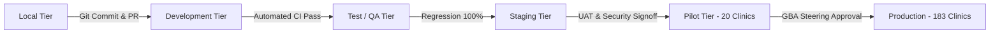

# Six-Tier Environment Strategy & Promotion Pipeline
## Namma Clinic Digital Health & Operations Platform
### Greater Bengaluru Authority (GBA) / BBMP Health Department
**Document Code:** `DEV-DOC-02` | **Status:** APPROVED BASELINE | **Date:** September 2026

---

## 1. Executive Summary & Environment Tiering Strategy
The Namma Clinic Digital Health Platform implements an enterprise-grade **Six-Tier Environment Strategy** designed to balance rapid developer velocity with uncompromising production safety and sovereign regulatory compliance. Each tier provides distinct network isolation, infrastructure sizing, data masking controls, automated testing gates, and approval authorities.

### 1.1 The Six Operational Tiers
1. **Local Workstation Tier (`ENV-TIER-01`):** Inner-loop development using containerized local Docker Compose with synthetic seed fixtures.
2. **Development Tier (`ENV-TIER-02`):** Continuous integration environment running in AWS ECS Fargate for feature branch testing.
3. **Test / QA Tier (`ENV-TIER-03`):** Automated regression, performance benchmarking, and system integration verification.
4. **Staging Tier (`ENV-TIER-04`):** Production-mirror rehearsal environment for UAT, disaster recovery drills, and security scans.
5. **Pilot Tier (`ENV-TIER-05`):** Live frontline field deployment across 20 designated pilot clinics under hypercare monitoring.
6. **Production Tier (`ENV-TIER-06`):** Sovereign citywide production health platform serving all 183 clinics across Bengaluru.

## 2. Comprehensive Environment Tier Specifications
### ENV-TIER-01: Local Workstation Environment Tier
- **Tier Identifier:** `ENV-TIER-01`
- **Tier Purpose:** Developer workstation local development, component testing, and rapid inner-loop validation.
- **Infrastructure Sizing:** Docker Compose (Node 20, PostgreSQL 16 Alpine, Redis 7 Alpine)
- **Compute Platform:** Local Docker Desktop / Podman
- **Database Topology:** Local ephemeral PostgreSQL with synthetic seed fixtures
- **Network & Isolation:** Local loopback bridge network (127.0.0.1)
- **Deployment Trigger:** `Manual developer command `docker compose up``
- **Promotion Gate:** `QG-01 (Pre-commit)`
- **Data Seeding & Privacy:** Synthetic anonymized fixtures (100 patients)
- **Backup & Snapshot Policy:** None (ephemeral container destroy on rebuild)
- **Approval Authorities:** Local Developer

### ENV-TIER-02: Development (Dev) Environment Tier
- **Tier Identifier:** `ENV-TIER-02`
- **Tier Purpose:** Continuous integration testing, shared team service integration, and automated PR builds.
- **Infrastructure Sizing:** AWS ECS Fargate (2 tasks, 0.5 vCPU, 1GB RAM) / RDS PostgreSQL db.t4g.medium
- **Compute Platform:** AWS ECS Fargate Cluster `namma-dev-cluster`
- **Database Topology:** Single-AZ PostgreSQL 16.3 with automated nightly seed reload
- **Network & Isolation:** Private VPC Subnets (10.10.10.0/24, 10.10.11.0/24)
- **Deployment Trigger:** `Automated webhook push to `develop` branch`
- **Promotion Gate:** `QG-02 (Dev Merge Gate)`
- **Data Seeding & Privacy:** Automated daily seed reset (1,000 synthetic patients)
- **Backup & Snapshot Policy:** Daily snapshot, 7-day retention
- **Approval Authorities:** DevOps Engineer / Tech Lead

### ENV-TIER-03: Test / QA Environment Tier
- **Tier Identifier:** `ENV-TIER-03`
- **Tier Purpose:** Automated regression testing, contract testing, and performance benchmark suites.
- **Infrastructure Sizing:** AWS ECS Fargate (4 tasks, 1 vCPU, 2GB RAM) / RDS PostgreSQL db.t4g.large
- **Compute Platform:** AWS ECS Fargate Cluster `namma-qa-cluster`
- **Database Topology:** Multi-AZ PostgreSQL 16.3 with dedicated read replica
- **Network & Isolation:** Isolated QA VPC with VPC peering to Mock Gateways
- **Deployment Trigger:** `Nightly automated build or QA manual dispatch`
- **Promotion Gate:** `QG-03 (QA Baseline Gate)`
- **Data Seeding & Privacy:** 10,000 synthetic patient dataset with full clinical histories
- **Backup & Snapshot Policy:** Daily snapshot, 14-day retention
- **Approval Authorities:** QA Lead / Test Architect

### ENV-TIER-04: Staging (Pre-Prod) Environment Tier
- **Tier Identifier:** `ENV-TIER-04`
- **Tier Purpose:** Production-mirror environment for end-to-end rehearsals, security audits, and UAT.
- **Infrastructure Sizing:** AWS ECS Fargate (8 tasks, 2 vCPU, 4GB RAM) / RDS PostgreSQL Multi-AZ db.m6g.xlarge
- **Compute Platform:** AWS ECS Fargate Cluster `namma-staging-cluster`
- **Database Topology:** Multi-AZ RDS PostgreSQL with 2 read replicas and ElastiCache Redis Cluster
- **Network & Isolation:** Production-mirror VPC architecture across 3 Availability Zones
- **Deployment Trigger:** `Merge to `release/v*` branch`
- **Promotion Gate:** `QG-04 (Staging Gate)`
- **Data Seeding & Privacy:** De-identified, synthetic high-fidelity production volume data
- **Backup & Snapshot Policy:** Continuous WAL archiving, 30-day retention
- **Approval Authorities:** Principal Architect & Head of QA

### ENV-TIER-05: Pilot (20 Clinics) Environment Tier
- **Tier Identifier:** `ENV-TIER-05`
- **Tier Purpose:** Frontline live operational deployment across 20 designated pilot Namma Clinics in BBMP.
- **Infrastructure Sizing:** Dedicated VPC / RDS PostgreSQL Multi-AZ db.r6g.xlarge / Dedicated Redis 7
- **Compute Platform:** AWS ECS Fargate Cluster `namma-pilot-cluster` (High-Reliability)
- **Database Topology:** Sovereign Multi-AZ PostgreSQL with cross-AZ standby and dedicated sync read replica
- **Network & Isolation:** Secured Cloud VPC with site-to-site IPsec VPN to 20 clinic edge gateways
- **Deployment Trigger:** `Manual tag `v*-pilot` approved by GBA Steering Committee`
- **Promotion Gate:** `QG-05 (Pilot Authorization Gate)`
- **Data Seeding & Privacy:** Live sovereign clinical data governed under DPDP Act 2023
- **Backup & Snapshot Policy:** Continuous WAL archiving with 5-minute RPO, 90-day retention
- **Approval Authorities:** GBA Steering Committee / Chief Medical Officer

### ENV-TIER-06: Production (Citywide) Environment Tier
- **Tier Identifier:** `ENV-TIER-06`
- **Tier Purpose:** Citywide sovereign production health platform serving all 183 Namma Clinics in Bengaluru.
- **Infrastructure Sizing:** High-Availability Multi-AZ (AWS ECS Fargate Auto-scaling 16-64 tasks, RDS db.r6g.2xlarge + 3 Read Replicas)
- **Compute Platform:** AWS ECS Fargate Cluster `namma-prod-cluster` (Sovereign Cloud)
- **Database Topology:** Multi-AZ Sovereign Aurora/PostgreSQL with continuous multi-region backup replication
- **Network & Isolation:** Sovereign GovCloud VPC with CloudFront WAF, Shield Advanced, and Direct Connect
- **Deployment Trigger:** `Manual release tag `v*` following formal Change Advisory Board approval`
- **Promotion Gate:** `QG-06 (Final Production Gate)`
- **Data Seeding & Privacy:** Production EHR governed by DPDP Act 2023 and DISHA statutory rules
- **Backup & Snapshot Policy:** Continuous WAL archiving (RPO < 5 min, RTO < 4h), 7-year statutory retention
- **Approval Authorities:** BBMP Health Commissioner / Steering Board

## 3. Environment Promotion Flow & Deployment Pipeline


## 4. Local Environment Docker Compose Specification
### Specification Example: Local Multi-Container Development Blueprint
<!-- DOCUMENTATION-ONLY EXAMPLE -->
```yaml
# DOCUMENTATION-ONLY EXAMPLE
version: '3.8'
services:
  app:
    build:
      context: .
      target: development
    ports:
      - "3000:3000"
    environment:
      NODE_ENV: development
      DATABASE_URL: postgresql://postgres:postgres@db:5432/namma_clinic_dev
      REDIS_URL: redis://redis:6379
      PORT: 3000
    volumes:
      - .:/usr/src/app
      - /usr/src/app/node_modules
    depends_on:
      db:
        condition: service_healthy
      redis:
        condition: service_healthy

  db:
    image: postgres:16-alpine
    environment:
      POSTGRES_USER: postgres
      POSTGRES_PASSWORD: postgres_dev_password
      POSTGRES_DB: namma_clinic_dev
    ports:
      - "5432:5432"
    volumes:
      - pgdata:/var/lib/postgresql/data
    healthcheck:
      test: ["CMD-SHELL", "pg_isready -U postgres"]
      interval: 5s
      timeout: 5s
      retries: 5

  redis:
    image: redis:7-alpine
    ports:
      - "6379:6379"
    healthcheck:
      test: ["CMD", "redis-cli", "ping"]
      interval: 5s
      timeout: 3s
      retries: 5

volumes:
  pgdata:
```

## 5. Cloud Resources Allocation Across Environments
Detailed matrix mapping sovereign cloud resources to environment tiers:

### CLOUD-RES-001: Resource Deployment in `ENV-TIER-01`
- **Resource Name:** Sovereign Core VPC #1
- **Governed Environment:** `ENV-TIER-01`
- **Service Architecture:** VPC Network (ap-south-1 (Mumbai))
- **Network Tier:** Core Network Tier
- **Isolation Security Group:** `sg-vpc-core`
- **Encryption Mode:** AES-256-GCM / TLS 1.3
- **High Availability Model:** Multi-AZ Active-Active

### CLOUD-RES-002: Resource Deployment in `ENV-TIER-02`
- **Resource Name:** Public Ingress Subnet #2
- **Governed Environment:** `ENV-TIER-02`
- **Service Architecture:** Subnet (ap-south-1a)
- **Network Tier:** Public Ingress Tier
- **Isolation Security Group:** `sg-public-ingress`
- **Encryption Mode:** TLS 1.3
- **High Availability Model:** AZ Resilient

### CLOUD-RES-003: Resource Deployment in `ENV-TIER-03`
- **Resource Name:** Private App Subnet #3
- **Governed Environment:** `ENV-TIER-03`
- **Service Architecture:** Subnet (ap-south-1a)
- **Network Tier:** Application Tier
- **Isolation Security Group:** `sg-app-fargate`
- **Encryption Mode:** mTLS 1.3
- **High Availability Model:** Multi-AZ Fargate

### CLOUD-RES-004: Resource Deployment in `ENV-TIER-04`
- **Resource Name:** Database Subnet #4
- **Governed Environment:** `ENV-TIER-04`
- **Service Architecture:** Subnet (ap-south-1a)
- **Network Tier:** Data Storage Tier
- **Isolation Security Group:** `sg-rds-postgres`
- **Encryption Mode:** KMS Customer Key (AES-256)
- **High Availability Model:** Multi-AZ Synchronous

### CLOUD-RES-005: Resource Deployment in `ENV-TIER-05`
- **Resource Name:** Application Load Balancer #5
- **Governed Environment:** `ENV-TIER-05`
- **Service Architecture:** ALB (ap-south-1 (Multi-AZ))
- **Network Tier:** Public Ingress Tier
- **Isolation Security Group:** `sg-alb-ingress`
- **Encryption Mode:** TLS 1.3 Strict
- **High Availability Model:** Active-Active Multi-AZ

### CLOUD-RES-006: Resource Deployment in `ENV-TIER-06`
- **Resource Name:** NAT Gateway Instance #6
- **Governed Environment:** `ENV-TIER-06`
- **Service Architecture:** NAT Gateway (ap-south-1a)
- **Network Tier:** Egress Gateway Tier
- **Isolation Security Group:** `sg-egress-nat`
- **Encryption Mode:** Stateful Inspection
- **High Availability Model:** AZ Isolated

### CLOUD-RES-007: Resource Deployment in `ENV-TIER-01`
- **Resource Name:** ECS Fargate Microservice Task #7
- **Governed Environment:** `ENV-TIER-01`
- **Service Architecture:** ECS Fargate (ap-south-1 (Multi-AZ))
- **Network Tier:** Application Tier
- **Isolation Security Group:** `sg-ecs-fargate`
- **Encryption Mode:** Encrypted EBS Task Volumes
- **High Availability Model:** Auto-scaling (Min 4, Max 32)

### CLOUD-RES-008: Resource Deployment in `ENV-TIER-02`
- **Resource Name:** RDS PostgreSQL 16 Multi-AZ #8
- **Governed Environment:** `ENV-TIER-02`
- **Service Architecture:** RDS PostgreSQL (ap-south-1 (Multi-AZ))
- **Network Tier:** Data Storage Tier
- **Isolation Security Group:** `sg-rds-postgres`
- **Encryption Mode:** AWS KMS Customer Key (cmk-rds-01)
- **High Availability Model:** Synchronous Cross-AZ Standby

### CLOUD-RES-009: Resource Deployment in `ENV-TIER-03`
- **Resource Name:** ElastiCache Redis Cluster #9
- **Governed Environment:** `ENV-TIER-03`
- **Service Architecture:** ElastiCache Redis (ap-south-1 (Multi-AZ))
- **Network Tier:** In-Memory Cache Tier
- **Isolation Security Group:** `sg-redis-cache`
- **Encryption Mode:** In-Transit Auth + At-Rest KMS
- **High Availability Model:** Multi-AZ Cluster Mode

### CLOUD-RES-010: Resource Deployment in `ENV-TIER-04`
- **Resource Name:** S3 Sovereign Audit Bucket #10
- **Governed Environment:** `ENV-TIER-04`
- **Service Architecture:** S3 Sovereign Storage (ap-south-1)
- **Network Tier:** Object Storage Tier
- **Isolation Security Group:** `s3-bucket-policy-audit`
- **Encryption Mode:** SSE-KMS + S3 Object Lock
- **High Availability Model:** S3 Standard Cross-Region

### CLOUD-RES-011: Resource Deployment in `ENV-TIER-05`
- **Resource Name:** Sovereign Core VPC #11
- **Governed Environment:** `ENV-TIER-05`
- **Service Architecture:** VPC Network (ap-south-1 (Mumbai))
- **Network Tier:** Core Network Tier
- **Isolation Security Group:** `sg-vpc-core`
- **Encryption Mode:** AES-256-GCM / TLS 1.3
- **High Availability Model:** Multi-AZ Active-Active

### CLOUD-RES-012: Resource Deployment in `ENV-TIER-06`
- **Resource Name:** Public Ingress Subnet #12
- **Governed Environment:** `ENV-TIER-06`
- **Service Architecture:** Subnet (ap-south-1a)
- **Network Tier:** Public Ingress Tier
- **Isolation Security Group:** `sg-public-ingress`
- **Encryption Mode:** TLS 1.3
- **High Availability Model:** AZ Resilient

### CLOUD-RES-013: Resource Deployment in `ENV-TIER-01`
- **Resource Name:** Private App Subnet #13
- **Governed Environment:** `ENV-TIER-01`
- **Service Architecture:** Subnet (ap-south-1a)
- **Network Tier:** Application Tier
- **Isolation Security Group:** `sg-app-fargate`
- **Encryption Mode:** mTLS 1.3
- **High Availability Model:** Multi-AZ Fargate

### CLOUD-RES-014: Resource Deployment in `ENV-TIER-02`
- **Resource Name:** Database Subnet #14
- **Governed Environment:** `ENV-TIER-02`
- **Service Architecture:** Subnet (ap-south-1a)
- **Network Tier:** Data Storage Tier
- **Isolation Security Group:** `sg-rds-postgres`
- **Encryption Mode:** KMS Customer Key (AES-256)
- **High Availability Model:** Multi-AZ Synchronous

### CLOUD-RES-015: Resource Deployment in `ENV-TIER-03`
- **Resource Name:** Application Load Balancer #15
- **Governed Environment:** `ENV-TIER-03`
- **Service Architecture:** ALB (ap-south-1 (Multi-AZ))
- **Network Tier:** Public Ingress Tier
- **Isolation Security Group:** `sg-alb-ingress`
- **Encryption Mode:** TLS 1.3 Strict
- **High Availability Model:** Active-Active Multi-AZ

### CLOUD-RES-016: Resource Deployment in `ENV-TIER-04`
- **Resource Name:** NAT Gateway Instance #16
- **Governed Environment:** `ENV-TIER-04`
- **Service Architecture:** NAT Gateway (ap-south-1a)
- **Network Tier:** Egress Gateway Tier
- **Isolation Security Group:** `sg-egress-nat`
- **Encryption Mode:** Stateful Inspection
- **High Availability Model:** AZ Isolated

### CLOUD-RES-017: Resource Deployment in `ENV-TIER-05`
- **Resource Name:** ECS Fargate Microservice Task #17
- **Governed Environment:** `ENV-TIER-05`
- **Service Architecture:** ECS Fargate (ap-south-1 (Multi-AZ))
- **Network Tier:** Application Tier
- **Isolation Security Group:** `sg-ecs-fargate`
- **Encryption Mode:** Encrypted EBS Task Volumes
- **High Availability Model:** Auto-scaling (Min 4, Max 32)

### CLOUD-RES-018: Resource Deployment in `ENV-TIER-06`
- **Resource Name:** RDS PostgreSQL 16 Multi-AZ #18
- **Governed Environment:** `ENV-TIER-06`
- **Service Architecture:** RDS PostgreSQL (ap-south-1 (Multi-AZ))
- **Network Tier:** Data Storage Tier
- **Isolation Security Group:** `sg-rds-postgres`
- **Encryption Mode:** AWS KMS Customer Key (cmk-rds-01)
- **High Availability Model:** Synchronous Cross-AZ Standby

### CLOUD-RES-019: Resource Deployment in `ENV-TIER-01`
- **Resource Name:** ElastiCache Redis Cluster #19
- **Governed Environment:** `ENV-TIER-01`
- **Service Architecture:** ElastiCache Redis (ap-south-1 (Multi-AZ))
- **Network Tier:** In-Memory Cache Tier
- **Isolation Security Group:** `sg-redis-cache`
- **Encryption Mode:** In-Transit Auth + At-Rest KMS
- **High Availability Model:** Multi-AZ Cluster Mode

### CLOUD-RES-020: Resource Deployment in `ENV-TIER-02`
- **Resource Name:** S3 Sovereign Audit Bucket #20
- **Governed Environment:** `ENV-TIER-02`
- **Service Architecture:** S3 Sovereign Storage (ap-south-1)
- **Network Tier:** Object Storage Tier
- **Isolation Security Group:** `s3-bucket-policy-audit`
- **Encryption Mode:** SSE-KMS + S3 Object Lock
- **High Availability Model:** S3 Standard Cross-Region

### CLOUD-RES-021: Resource Deployment in `ENV-TIER-03`
- **Resource Name:** Sovereign Core VPC #21
- **Governed Environment:** `ENV-TIER-03`
- **Service Architecture:** VPC Network (ap-south-1 (Mumbai))
- **Network Tier:** Core Network Tier
- **Isolation Security Group:** `sg-vpc-core`
- **Encryption Mode:** AES-256-GCM / TLS 1.3
- **High Availability Model:** Multi-AZ Active-Active

### CLOUD-RES-022: Resource Deployment in `ENV-TIER-04`
- **Resource Name:** Public Ingress Subnet #22
- **Governed Environment:** `ENV-TIER-04`
- **Service Architecture:** Subnet (ap-south-1a)
- **Network Tier:** Public Ingress Tier
- **Isolation Security Group:** `sg-public-ingress`
- **Encryption Mode:** TLS 1.3
- **High Availability Model:** AZ Resilient

### CLOUD-RES-023: Resource Deployment in `ENV-TIER-05`
- **Resource Name:** Private App Subnet #23
- **Governed Environment:** `ENV-TIER-05`
- **Service Architecture:** Subnet (ap-south-1a)
- **Network Tier:** Application Tier
- **Isolation Security Group:** `sg-app-fargate`
- **Encryption Mode:** mTLS 1.3
- **High Availability Model:** Multi-AZ Fargate

### CLOUD-RES-024: Resource Deployment in `ENV-TIER-06`
- **Resource Name:** Database Subnet #24
- **Governed Environment:** `ENV-TIER-06`
- **Service Architecture:** Subnet (ap-south-1a)
- **Network Tier:** Data Storage Tier
- **Isolation Security Group:** `sg-rds-postgres`
- **Encryption Mode:** KMS Customer Key (AES-256)
- **High Availability Model:** Multi-AZ Synchronous

### CLOUD-RES-025: Resource Deployment in `ENV-TIER-01`
- **Resource Name:** Application Load Balancer #25
- **Governed Environment:** `ENV-TIER-01`
- **Service Architecture:** ALB (ap-south-1 (Multi-AZ))
- **Network Tier:** Public Ingress Tier
- **Isolation Security Group:** `sg-alb-ingress`
- **Encryption Mode:** TLS 1.3 Strict
- **High Availability Model:** Active-Active Multi-AZ

### CLOUD-RES-026: Resource Deployment in `ENV-TIER-02`
- **Resource Name:** NAT Gateway Instance #26
- **Governed Environment:** `ENV-TIER-02`
- **Service Architecture:** NAT Gateway (ap-south-1a)
- **Network Tier:** Egress Gateway Tier
- **Isolation Security Group:** `sg-egress-nat`
- **Encryption Mode:** Stateful Inspection
- **High Availability Model:** AZ Isolated

### CLOUD-RES-027: Resource Deployment in `ENV-TIER-03`
- **Resource Name:** ECS Fargate Microservice Task #27
- **Governed Environment:** `ENV-TIER-03`
- **Service Architecture:** ECS Fargate (ap-south-1 (Multi-AZ))
- **Network Tier:** Application Tier
- **Isolation Security Group:** `sg-ecs-fargate`
- **Encryption Mode:** Encrypted EBS Task Volumes
- **High Availability Model:** Auto-scaling (Min 4, Max 32)

### CLOUD-RES-028: Resource Deployment in `ENV-TIER-04`
- **Resource Name:** RDS PostgreSQL 16 Multi-AZ #28
- **Governed Environment:** `ENV-TIER-04`
- **Service Architecture:** RDS PostgreSQL (ap-south-1 (Multi-AZ))
- **Network Tier:** Data Storage Tier
- **Isolation Security Group:** `sg-rds-postgres`
- **Encryption Mode:** AWS KMS Customer Key (cmk-rds-01)
- **High Availability Model:** Synchronous Cross-AZ Standby

### CLOUD-RES-029: Resource Deployment in `ENV-TIER-05`
- **Resource Name:** ElastiCache Redis Cluster #29
- **Governed Environment:** `ENV-TIER-05`
- **Service Architecture:** ElastiCache Redis (ap-south-1 (Multi-AZ))
- **Network Tier:** In-Memory Cache Tier
- **Isolation Security Group:** `sg-redis-cache`
- **Encryption Mode:** In-Transit Auth + At-Rest KMS
- **High Availability Model:** Multi-AZ Cluster Mode

### CLOUD-RES-030: Resource Deployment in `ENV-TIER-06`
- **Resource Name:** S3 Sovereign Audit Bucket #30
- **Governed Environment:** `ENV-TIER-06`
- **Service Architecture:** S3 Sovereign Storage (ap-south-1)
- **Network Tier:** Object Storage Tier
- **Isolation Security Group:** `s3-bucket-policy-audit`
- **Encryption Mode:** SSE-KMS + S3 Object Lock
- **High Availability Model:** S3 Standard Cross-Region

### CLOUD-RES-031: Resource Deployment in `ENV-TIER-01`
- **Resource Name:** Sovereign Core VPC #31
- **Governed Environment:** `ENV-TIER-01`
- **Service Architecture:** VPC Network (ap-south-1 (Mumbai))
- **Network Tier:** Core Network Tier
- **Isolation Security Group:** `sg-vpc-core`
- **Encryption Mode:** AES-256-GCM / TLS 1.3
- **High Availability Model:** Multi-AZ Active-Active

### CLOUD-RES-032: Resource Deployment in `ENV-TIER-02`
- **Resource Name:** Public Ingress Subnet #32
- **Governed Environment:** `ENV-TIER-02`
- **Service Architecture:** Subnet (ap-south-1a)
- **Network Tier:** Public Ingress Tier
- **Isolation Security Group:** `sg-public-ingress`
- **Encryption Mode:** TLS 1.3
- **High Availability Model:** AZ Resilient

### CLOUD-RES-033: Resource Deployment in `ENV-TIER-03`
- **Resource Name:** Private App Subnet #33
- **Governed Environment:** `ENV-TIER-03`
- **Service Architecture:** Subnet (ap-south-1a)
- **Network Tier:** Application Tier
- **Isolation Security Group:** `sg-app-fargate`
- **Encryption Mode:** mTLS 1.3
- **High Availability Model:** Multi-AZ Fargate

### CLOUD-RES-034: Resource Deployment in `ENV-TIER-04`
- **Resource Name:** Database Subnet #34
- **Governed Environment:** `ENV-TIER-04`
- **Service Architecture:** Subnet (ap-south-1a)
- **Network Tier:** Data Storage Tier
- **Isolation Security Group:** `sg-rds-postgres`
- **Encryption Mode:** KMS Customer Key (AES-256)
- **High Availability Model:** Multi-AZ Synchronous

### CLOUD-RES-035: Resource Deployment in `ENV-TIER-05`
- **Resource Name:** Application Load Balancer #35
- **Governed Environment:** `ENV-TIER-05`
- **Service Architecture:** ALB (ap-south-1 (Multi-AZ))
- **Network Tier:** Public Ingress Tier
- **Isolation Security Group:** `sg-alb-ingress`
- **Encryption Mode:** TLS 1.3 Strict
- **High Availability Model:** Active-Active Multi-AZ

### CLOUD-RES-036: Resource Deployment in `ENV-TIER-06`
- **Resource Name:** NAT Gateway Instance #36
- **Governed Environment:** `ENV-TIER-06`
- **Service Architecture:** NAT Gateway (ap-south-1a)
- **Network Tier:** Egress Gateway Tier
- **Isolation Security Group:** `sg-egress-nat`
- **Encryption Mode:** Stateful Inspection
- **High Availability Model:** AZ Isolated

### CLOUD-RES-037: Resource Deployment in `ENV-TIER-01`
- **Resource Name:** ECS Fargate Microservice Task #37
- **Governed Environment:** `ENV-TIER-01`
- **Service Architecture:** ECS Fargate (ap-south-1 (Multi-AZ))
- **Network Tier:** Application Tier
- **Isolation Security Group:** `sg-ecs-fargate`
- **Encryption Mode:** Encrypted EBS Task Volumes
- **High Availability Model:** Auto-scaling (Min 4, Max 32)

### CLOUD-RES-038: Resource Deployment in `ENV-TIER-02`
- **Resource Name:** RDS PostgreSQL 16 Multi-AZ #38
- **Governed Environment:** `ENV-TIER-02`
- **Service Architecture:** RDS PostgreSQL (ap-south-1 (Multi-AZ))
- **Network Tier:** Data Storage Tier
- **Isolation Security Group:** `sg-rds-postgres`
- **Encryption Mode:** AWS KMS Customer Key (cmk-rds-01)
- **High Availability Model:** Synchronous Cross-AZ Standby

### CLOUD-RES-039: Resource Deployment in `ENV-TIER-03`
- **Resource Name:** ElastiCache Redis Cluster #39
- **Governed Environment:** `ENV-TIER-03`
- **Service Architecture:** ElastiCache Redis (ap-south-1 (Multi-AZ))
- **Network Tier:** In-Memory Cache Tier
- **Isolation Security Group:** `sg-redis-cache`
- **Encryption Mode:** In-Transit Auth + At-Rest KMS
- **High Availability Model:** Multi-AZ Cluster Mode

### CLOUD-RES-040: Resource Deployment in `ENV-TIER-04`
- **Resource Name:** S3 Sovereign Audit Bucket #40
- **Governed Environment:** `ENV-TIER-04`
- **Service Architecture:** S3 Sovereign Storage (ap-south-1)
- **Network Tier:** Object Storage Tier
- **Isolation Security Group:** `s3-bucket-policy-audit`
- **Encryption Mode:** SSE-KMS + S3 Object Lock
- **High Availability Model:** S3 Standard Cross-Region

### CLOUD-RES-041: Resource Deployment in `ENV-TIER-05`
- **Resource Name:** Sovereign Core VPC #41
- **Governed Environment:** `ENV-TIER-05`
- **Service Architecture:** VPC Network (ap-south-1 (Mumbai))
- **Network Tier:** Core Network Tier
- **Isolation Security Group:** `sg-vpc-core`
- **Encryption Mode:** AES-256-GCM / TLS 1.3
- **High Availability Model:** Multi-AZ Active-Active

### CLOUD-RES-042: Resource Deployment in `ENV-TIER-06`
- **Resource Name:** Public Ingress Subnet #42
- **Governed Environment:** `ENV-TIER-06`
- **Service Architecture:** Subnet (ap-south-1a)
- **Network Tier:** Public Ingress Tier
- **Isolation Security Group:** `sg-public-ingress`
- **Encryption Mode:** TLS 1.3
- **High Availability Model:** AZ Resilient

### CLOUD-RES-043: Resource Deployment in `ENV-TIER-01`
- **Resource Name:** Private App Subnet #43
- **Governed Environment:** `ENV-TIER-01`
- **Service Architecture:** Subnet (ap-south-1a)
- **Network Tier:** Application Tier
- **Isolation Security Group:** `sg-app-fargate`
- **Encryption Mode:** mTLS 1.3
- **High Availability Model:** Multi-AZ Fargate

### CLOUD-RES-044: Resource Deployment in `ENV-TIER-02`
- **Resource Name:** Database Subnet #44
- **Governed Environment:** `ENV-TIER-02`
- **Service Architecture:** Subnet (ap-south-1a)
- **Network Tier:** Data Storage Tier
- **Isolation Security Group:** `sg-rds-postgres`
- **Encryption Mode:** KMS Customer Key (AES-256)
- **High Availability Model:** Multi-AZ Synchronous

### CLOUD-RES-045: Resource Deployment in `ENV-TIER-03`
- **Resource Name:** Application Load Balancer #45
- **Governed Environment:** `ENV-TIER-03`
- **Service Architecture:** ALB (ap-south-1 (Multi-AZ))
- **Network Tier:** Public Ingress Tier
- **Isolation Security Group:** `sg-alb-ingress`
- **Encryption Mode:** TLS 1.3 Strict
- **High Availability Model:** Active-Active Multi-AZ

### CLOUD-RES-046: Resource Deployment in `ENV-TIER-04`
- **Resource Name:** NAT Gateway Instance #46
- **Governed Environment:** `ENV-TIER-04`
- **Service Architecture:** NAT Gateway (ap-south-1a)
- **Network Tier:** Egress Gateway Tier
- **Isolation Security Group:** `sg-egress-nat`
- **Encryption Mode:** Stateful Inspection
- **High Availability Model:** AZ Isolated

### CLOUD-RES-047: Resource Deployment in `ENV-TIER-05`
- **Resource Name:** ECS Fargate Microservice Task #47
- **Governed Environment:** `ENV-TIER-05`
- **Service Architecture:** ECS Fargate (ap-south-1 (Multi-AZ))
- **Network Tier:** Application Tier
- **Isolation Security Group:** `sg-ecs-fargate`
- **Encryption Mode:** Encrypted EBS Task Volumes
- **High Availability Model:** Auto-scaling (Min 4, Max 32)

### CLOUD-RES-048: Resource Deployment in `ENV-TIER-06`
- **Resource Name:** RDS PostgreSQL 16 Multi-AZ #48
- **Governed Environment:** `ENV-TIER-06`
- **Service Architecture:** RDS PostgreSQL (ap-south-1 (Multi-AZ))
- **Network Tier:** Data Storage Tier
- **Isolation Security Group:** `sg-rds-postgres`
- **Encryption Mode:** AWS KMS Customer Key (cmk-rds-01)
- **High Availability Model:** Synchronous Cross-AZ Standby

### CLOUD-RES-049: Resource Deployment in `ENV-TIER-01`
- **Resource Name:** ElastiCache Redis Cluster #49
- **Governed Environment:** `ENV-TIER-01`
- **Service Architecture:** ElastiCache Redis (ap-south-1 (Multi-AZ))
- **Network Tier:** In-Memory Cache Tier
- **Isolation Security Group:** `sg-redis-cache`
- **Encryption Mode:** In-Transit Auth + At-Rest KMS
- **High Availability Model:** Multi-AZ Cluster Mode

### CLOUD-RES-050: Resource Deployment in `ENV-TIER-02`
- **Resource Name:** S3 Sovereign Audit Bucket #50
- **Governed Environment:** `ENV-TIER-02`
- **Service Architecture:** S3 Sovereign Storage (ap-south-1)
- **Network Tier:** Object Storage Tier
- **Isolation Security Group:** `s3-bucket-policy-audit`
- **Encryption Mode:** SSE-KMS + S3 Object Lock
- **High Availability Model:** S3 Standard Cross-Region

### CLOUD-RES-051: Resource Deployment in `ENV-TIER-03`
- **Resource Name:** Sovereign Core VPC #51
- **Governed Environment:** `ENV-TIER-03`
- **Service Architecture:** VPC Network (ap-south-1 (Mumbai))
- **Network Tier:** Core Network Tier
- **Isolation Security Group:** `sg-vpc-core`
- **Encryption Mode:** AES-256-GCM / TLS 1.3
- **High Availability Model:** Multi-AZ Active-Active

### CLOUD-RES-052: Resource Deployment in `ENV-TIER-04`
- **Resource Name:** Public Ingress Subnet #52
- **Governed Environment:** `ENV-TIER-04`
- **Service Architecture:** Subnet (ap-south-1a)
- **Network Tier:** Public Ingress Tier
- **Isolation Security Group:** `sg-public-ingress`
- **Encryption Mode:** TLS 1.3
- **High Availability Model:** AZ Resilient

### CLOUD-RES-053: Resource Deployment in `ENV-TIER-05`
- **Resource Name:** Private App Subnet #53
- **Governed Environment:** `ENV-TIER-05`
- **Service Architecture:** Subnet (ap-south-1a)
- **Network Tier:** Application Tier
- **Isolation Security Group:** `sg-app-fargate`
- **Encryption Mode:** mTLS 1.3
- **High Availability Model:** Multi-AZ Fargate

### CLOUD-RES-054: Resource Deployment in `ENV-TIER-06`
- **Resource Name:** Database Subnet #54
- **Governed Environment:** `ENV-TIER-06`
- **Service Architecture:** Subnet (ap-south-1a)
- **Network Tier:** Data Storage Tier
- **Isolation Security Group:** `sg-rds-postgres`
- **Encryption Mode:** KMS Customer Key (AES-256)
- **High Availability Model:** Multi-AZ Synchronous

### CLOUD-RES-055: Resource Deployment in `ENV-TIER-01`
- **Resource Name:** Application Load Balancer #55
- **Governed Environment:** `ENV-TIER-01`
- **Service Architecture:** ALB (ap-south-1 (Multi-AZ))
- **Network Tier:** Public Ingress Tier
- **Isolation Security Group:** `sg-alb-ingress`
- **Encryption Mode:** TLS 1.3 Strict
- **High Availability Model:** Active-Active Multi-AZ

### CLOUD-RES-056: Resource Deployment in `ENV-TIER-02`
- **Resource Name:** NAT Gateway Instance #56
- **Governed Environment:** `ENV-TIER-02`
- **Service Architecture:** NAT Gateway (ap-south-1a)
- **Network Tier:** Egress Gateway Tier
- **Isolation Security Group:** `sg-egress-nat`
- **Encryption Mode:** Stateful Inspection
- **High Availability Model:** AZ Isolated

### CLOUD-RES-057: Resource Deployment in `ENV-TIER-03`
- **Resource Name:** ECS Fargate Microservice Task #57
- **Governed Environment:** `ENV-TIER-03`
- **Service Architecture:** ECS Fargate (ap-south-1 (Multi-AZ))
- **Network Tier:** Application Tier
- **Isolation Security Group:** `sg-ecs-fargate`
- **Encryption Mode:** Encrypted EBS Task Volumes
- **High Availability Model:** Auto-scaling (Min 4, Max 32)

### CLOUD-RES-058: Resource Deployment in `ENV-TIER-04`
- **Resource Name:** RDS PostgreSQL 16 Multi-AZ #58
- **Governed Environment:** `ENV-TIER-04`
- **Service Architecture:** RDS PostgreSQL (ap-south-1 (Multi-AZ))
- **Network Tier:** Data Storage Tier
- **Isolation Security Group:** `sg-rds-postgres`
- **Encryption Mode:** AWS KMS Customer Key (cmk-rds-01)
- **High Availability Model:** Synchronous Cross-AZ Standby

### CLOUD-RES-059: Resource Deployment in `ENV-TIER-05`
- **Resource Name:** ElastiCache Redis Cluster #59
- **Governed Environment:** `ENV-TIER-05`
- **Service Architecture:** ElastiCache Redis (ap-south-1 (Multi-AZ))
- **Network Tier:** In-Memory Cache Tier
- **Isolation Security Group:** `sg-redis-cache`
- **Encryption Mode:** In-Transit Auth + At-Rest KMS
- **High Availability Model:** Multi-AZ Cluster Mode

### CLOUD-RES-060: Resource Deployment in `ENV-TIER-06`
- **Resource Name:** S3 Sovereign Audit Bucket #60
- **Governed Environment:** `ENV-TIER-06`
- **Service Architecture:** S3 Sovereign Storage (ap-south-1)
- **Network Tier:** Object Storage Tier
- **Isolation Security Group:** `s3-bucket-policy-audit`
- **Encryption Mode:** SSE-KMS + S3 Object Lock
- **High Availability Model:** S3 Standard Cross-Region

### CLOUD-RES-061: Resource Deployment in `ENV-TIER-01`
- **Resource Name:** Sovereign Core VPC #61
- **Governed Environment:** `ENV-TIER-01`
- **Service Architecture:** VPC Network (ap-south-1 (Mumbai))
- **Network Tier:** Core Network Tier
- **Isolation Security Group:** `sg-vpc-core`
- **Encryption Mode:** AES-256-GCM / TLS 1.3
- **High Availability Model:** Multi-AZ Active-Active

### CLOUD-RES-062: Resource Deployment in `ENV-TIER-02`
- **Resource Name:** Public Ingress Subnet #62
- **Governed Environment:** `ENV-TIER-02`
- **Service Architecture:** Subnet (ap-south-1a)
- **Network Tier:** Public Ingress Tier
- **Isolation Security Group:** `sg-public-ingress`
- **Encryption Mode:** TLS 1.3
- **High Availability Model:** AZ Resilient

### CLOUD-RES-063: Resource Deployment in `ENV-TIER-03`
- **Resource Name:** Private App Subnet #63
- **Governed Environment:** `ENV-TIER-03`
- **Service Architecture:** Subnet (ap-south-1a)
- **Network Tier:** Application Tier
- **Isolation Security Group:** `sg-app-fargate`
- **Encryption Mode:** mTLS 1.3
- **High Availability Model:** Multi-AZ Fargate

### CLOUD-RES-064: Resource Deployment in `ENV-TIER-04`
- **Resource Name:** Database Subnet #64
- **Governed Environment:** `ENV-TIER-04`
- **Service Architecture:** Subnet (ap-south-1a)
- **Network Tier:** Data Storage Tier
- **Isolation Security Group:** `sg-rds-postgres`
- **Encryption Mode:** KMS Customer Key (AES-256)
- **High Availability Model:** Multi-AZ Synchronous

### CLOUD-RES-065: Resource Deployment in `ENV-TIER-05`
- **Resource Name:** Application Load Balancer #65
- **Governed Environment:** `ENV-TIER-05`
- **Service Architecture:** ALB (ap-south-1 (Multi-AZ))
- **Network Tier:** Public Ingress Tier
- **Isolation Security Group:** `sg-alb-ingress`
- **Encryption Mode:** TLS 1.3 Strict
- **High Availability Model:** Active-Active Multi-AZ

### CLOUD-RES-066: Resource Deployment in `ENV-TIER-06`
- **Resource Name:** NAT Gateway Instance #66
- **Governed Environment:** `ENV-TIER-06`
- **Service Architecture:** NAT Gateway (ap-south-1a)
- **Network Tier:** Egress Gateway Tier
- **Isolation Security Group:** `sg-egress-nat`
- **Encryption Mode:** Stateful Inspection
- **High Availability Model:** AZ Isolated

### CLOUD-RES-067: Resource Deployment in `ENV-TIER-01`
- **Resource Name:** ECS Fargate Microservice Task #67
- **Governed Environment:** `ENV-TIER-01`
- **Service Architecture:** ECS Fargate (ap-south-1 (Multi-AZ))
- **Network Tier:** Application Tier
- **Isolation Security Group:** `sg-ecs-fargate`
- **Encryption Mode:** Encrypted EBS Task Volumes
- **High Availability Model:** Auto-scaling (Min 4, Max 32)

### CLOUD-RES-068: Resource Deployment in `ENV-TIER-02`
- **Resource Name:** RDS PostgreSQL 16 Multi-AZ #68
- **Governed Environment:** `ENV-TIER-02`
- **Service Architecture:** RDS PostgreSQL (ap-south-1 (Multi-AZ))
- **Network Tier:** Data Storage Tier
- **Isolation Security Group:** `sg-rds-postgres`
- **Encryption Mode:** AWS KMS Customer Key (cmk-rds-01)
- **High Availability Model:** Synchronous Cross-AZ Standby

### CLOUD-RES-069: Resource Deployment in `ENV-TIER-03`
- **Resource Name:** ElastiCache Redis Cluster #69
- **Governed Environment:** `ENV-TIER-03`
- **Service Architecture:** ElastiCache Redis (ap-south-1 (Multi-AZ))
- **Network Tier:** In-Memory Cache Tier
- **Isolation Security Group:** `sg-redis-cache`
- **Encryption Mode:** In-Transit Auth + At-Rest KMS
- **High Availability Model:** Multi-AZ Cluster Mode

### CLOUD-RES-070: Resource Deployment in `ENV-TIER-04`
- **Resource Name:** S3 Sovereign Audit Bucket #70
- **Governed Environment:** `ENV-TIER-04`
- **Service Architecture:** S3 Sovereign Storage (ap-south-1)
- **Network Tier:** Object Storage Tier
- **Isolation Security Group:** `s3-bucket-policy-audit`
- **Encryption Mode:** SSE-KMS + S3 Object Lock
- **High Availability Model:** S3 Standard Cross-Region

### CLOUD-RES-071: Resource Deployment in `ENV-TIER-05`
- **Resource Name:** Sovereign Core VPC #71
- **Governed Environment:** `ENV-TIER-05`
- **Service Architecture:** VPC Network (ap-south-1 (Mumbai))
- **Network Tier:** Core Network Tier
- **Isolation Security Group:** `sg-vpc-core`
- **Encryption Mode:** AES-256-GCM / TLS 1.3
- **High Availability Model:** Multi-AZ Active-Active

### CLOUD-RES-072: Resource Deployment in `ENV-TIER-06`
- **Resource Name:** Public Ingress Subnet #72
- **Governed Environment:** `ENV-TIER-06`
- **Service Architecture:** Subnet (ap-south-1a)
- **Network Tier:** Public Ingress Tier
- **Isolation Security Group:** `sg-public-ingress`
- **Encryption Mode:** TLS 1.3
- **High Availability Model:** AZ Resilient

### CLOUD-RES-073: Resource Deployment in `ENV-TIER-01`
- **Resource Name:** Private App Subnet #73
- **Governed Environment:** `ENV-TIER-01`
- **Service Architecture:** Subnet (ap-south-1a)
- **Network Tier:** Application Tier
- **Isolation Security Group:** `sg-app-fargate`
- **Encryption Mode:** mTLS 1.3
- **High Availability Model:** Multi-AZ Fargate

### CLOUD-RES-074: Resource Deployment in `ENV-TIER-02`
- **Resource Name:** Database Subnet #74
- **Governed Environment:** `ENV-TIER-02`
- **Service Architecture:** Subnet (ap-south-1a)
- **Network Tier:** Data Storage Tier
- **Isolation Security Group:** `sg-rds-postgres`
- **Encryption Mode:** KMS Customer Key (AES-256)
- **High Availability Model:** Multi-AZ Synchronous

### CLOUD-RES-075: Resource Deployment in `ENV-TIER-03`
- **Resource Name:** Application Load Balancer #75
- **Governed Environment:** `ENV-TIER-03`
- **Service Architecture:** ALB (ap-south-1 (Multi-AZ))
- **Network Tier:** Public Ingress Tier
- **Isolation Security Group:** `sg-alb-ingress`
- **Encryption Mode:** TLS 1.3 Strict
- **High Availability Model:** Active-Active Multi-AZ

### CLOUD-RES-076: Resource Deployment in `ENV-TIER-04`
- **Resource Name:** NAT Gateway Instance #76
- **Governed Environment:** `ENV-TIER-04`
- **Service Architecture:** NAT Gateway (ap-south-1a)
- **Network Tier:** Egress Gateway Tier
- **Isolation Security Group:** `sg-egress-nat`
- **Encryption Mode:** Stateful Inspection
- **High Availability Model:** AZ Isolated

### CLOUD-RES-077: Resource Deployment in `ENV-TIER-05`
- **Resource Name:** ECS Fargate Microservice Task #77
- **Governed Environment:** `ENV-TIER-05`
- **Service Architecture:** ECS Fargate (ap-south-1 (Multi-AZ))
- **Network Tier:** Application Tier
- **Isolation Security Group:** `sg-ecs-fargate`
- **Encryption Mode:** Encrypted EBS Task Volumes
- **High Availability Model:** Auto-scaling (Min 4, Max 32)

### CLOUD-RES-078: Resource Deployment in `ENV-TIER-06`
- **Resource Name:** RDS PostgreSQL 16 Multi-AZ #78
- **Governed Environment:** `ENV-TIER-06`
- **Service Architecture:** RDS PostgreSQL (ap-south-1 (Multi-AZ))
- **Network Tier:** Data Storage Tier
- **Isolation Security Group:** `sg-rds-postgres`
- **Encryption Mode:** AWS KMS Customer Key (cmk-rds-01)
- **High Availability Model:** Synchronous Cross-AZ Standby

### CLOUD-RES-079: Resource Deployment in `ENV-TIER-01`
- **Resource Name:** ElastiCache Redis Cluster #79
- **Governed Environment:** `ENV-TIER-01`
- **Service Architecture:** ElastiCache Redis (ap-south-1 (Multi-AZ))
- **Network Tier:** In-Memory Cache Tier
- **Isolation Security Group:** `sg-redis-cache`
- **Encryption Mode:** In-Transit Auth + At-Rest KMS
- **High Availability Model:** Multi-AZ Cluster Mode

### CLOUD-RES-080: Resource Deployment in `ENV-TIER-02`
- **Resource Name:** S3 Sovereign Audit Bucket #80
- **Governed Environment:** `ENV-TIER-02`
- **Service Architecture:** S3 Sovereign Storage (ap-south-1)
- **Network Tier:** Object Storage Tier
- **Isolation Security Group:** `s3-bucket-policy-audit`
- **Encryption Mode:** SSE-KMS + S3 Object Lock
- **High Availability Model:** S3 Standard Cross-Region

## 6. Database Entity Data Isolation & Seeding Policy across 52 Tables
Comprehensive data hygiene, masking, and fixture policies across all 52 platform tables:

### TABLE-001: Data Policy for Table `auth_users`
- **Target Table Name:** `auth_users` (`TBL-01`)
- **Domain & Classification:** `Identity & Access` / `CLASS-004`
- **Local/Dev Fixture:** Synthetic faker seed fixture (Identity & Access)
- **QA Environment Data:** Anonymized 10,000 synthetic patient records
- **Staging Data:** Pseudonymized snapshot conforming to DPDP Act 2023
- **Production/Pilot Data:** Sovereign live clinical records; direct developer access strictly blocked
- **Retention & Purge:** Statutory 7-year continuous retention

### TABLE-002: Data Policy for Table `user_credentials`
- **Target Table Name:** `user_credentials` (`TBL-02`)
- **Domain & Classification:** `Identity & Access` / `CLASS-005`
- **Local/Dev Fixture:** Synthetic faker seed fixture (Identity & Access)
- **QA Environment Data:** Anonymized 10,000 synthetic patient records
- **Staging Data:** Pseudonymized snapshot conforming to DPDP Act 2023
- **Production/Pilot Data:** Sovereign live clinical records; direct developer access strictly blocked
- **Retention & Purge:** Statutory 7-year continuous retention

### TABLE-003: Data Policy for Table `user_sessions`
- **Target Table Name:** `user_sessions` (`TBL-03`)
- **Domain & Classification:** `Identity & Access` / `CLASS-003`
- **Local/Dev Fixture:** Synthetic faker seed fixture (Identity & Access)
- **QA Environment Data:** Anonymized 10,000 synthetic patient records
- **Staging Data:** Pseudonymized snapshot conforming to DPDP Act 2023
- **Production/Pilot Data:** Sovereign live clinical records; direct developer access strictly blocked
- **Retention & Purge:** Statutory 7-year continuous retention

### TABLE-004: Data Policy for Table `roles`
- **Target Table Name:** `roles` (`TBL-04`)
- **Domain & Classification:** `Role-Based Access Control` / `CLASS-002`
- **Local/Dev Fixture:** Synthetic faker seed fixture (Role-Based Access Control)
- **QA Environment Data:** Anonymized 10,000 synthetic patient records
- **Staging Data:** Pseudonymized snapshot conforming to DPDP Act 2023
- **Production/Pilot Data:** Sovereign live clinical records; direct developer access strictly blocked
- **Retention & Purge:** Statutory 7-year continuous retention

### TABLE-005: Data Policy for Table `permissions`
- **Target Table Name:** `permissions` (`TBL-05`)
- **Domain & Classification:** `Role-Based Access Control` / `CLASS-002`
- **Local/Dev Fixture:** Synthetic faker seed fixture (Role-Based Access Control)
- **QA Environment Data:** Anonymized 10,000 synthetic patient records
- **Staging Data:** Pseudonymized snapshot conforming to DPDP Act 2023
- **Production/Pilot Data:** Sovereign live clinical records; direct developer access strictly blocked
- **Retention & Purge:** Statutory 7-year continuous retention

### TABLE-006: Data Policy for Table `role_permissions`
- **Target Table Name:** `role_permissions` (`TBL-06`)
- **Domain & Classification:** `Role-Based Access Control` / `CLASS-002`
- **Local/Dev Fixture:** Synthetic faker seed fixture (Role-Based Access Control)
- **QA Environment Data:** Anonymized 10,000 synthetic patient records
- **Staging Data:** Pseudonymized snapshot conforming to DPDP Act 2023
- **Production/Pilot Data:** Sovereign live clinical records; direct developer access strictly blocked
- **Retention & Purge:** Statutory 7-year continuous retention

### TABLE-007: Data Policy for Table `user_roles`
- **Target Table Name:** `user_roles` (`TBL-07`)
- **Domain & Classification:** `Role-Based Access Control` / `CLASS-002`
- **Local/Dev Fixture:** Synthetic faker seed fixture (Role-Based Access Control)
- **QA Environment Data:** Anonymized 10,000 synthetic patient records
- **Staging Data:** Pseudonymized snapshot conforming to DPDP Act 2023
- **Production/Pilot Data:** Sovereign live clinical records; direct developer access strictly blocked
- **Retention & Purge:** Statutory 7-year continuous retention

### TABLE-008: Data Policy for Table `facilities`
- **Target Table Name:** `facilities` (`TBL-08`)
- **Domain & Classification:** `Facility Operations` / `CLASS-001`
- **Local/Dev Fixture:** Synthetic faker seed fixture (Facility Operations)
- **QA Environment Data:** Anonymized 10,000 synthetic patient records
- **Staging Data:** Pseudonymized snapshot conforming to DPDP Act 2023
- **Production/Pilot Data:** Sovereign live clinical records; direct developer access strictly blocked
- **Retention & Purge:** Statutory 7-year continuous retention

### TABLE-009: Data Policy for Table `facility_rooms`
- **Target Table Name:** `facility_rooms` (`TBL-09`)
- **Domain & Classification:** `Facility Operations` / `CLASS-002`
- **Local/Dev Fixture:** Synthetic faker seed fixture (Facility Operations)
- **QA Environment Data:** Anonymized 10,000 synthetic patient records
- **Staging Data:** Pseudonymized snapshot conforming to DPDP Act 2023
- **Production/Pilot Data:** Sovereign live clinical records; direct developer access strictly blocked
- **Retention & Purge:** Statutory 7-year continuous retention

### TABLE-010: Data Policy for Table `staff_profiles`
- **Target Table Name:** `staff_profiles` (`TBL-10`)
- **Domain & Classification:** `Human Resources` / `CLASS-004`
- **Local/Dev Fixture:** Synthetic faker seed fixture (Human Resources)
- **QA Environment Data:** Anonymized 10,000 synthetic patient records
- **Staging Data:** Pseudonymized snapshot conforming to DPDP Act 2023
- **Production/Pilot Data:** Sovereign live clinical records; direct developer access strictly blocked
- **Retention & Purge:** Statutory 7-year continuous retention

### TABLE-011: Data Policy for Table `staff_shifts`
- **Target Table Name:** `staff_shifts` (`TBL-11`)
- **Domain & Classification:** `Human Resources` / `CLASS-002`
- **Local/Dev Fixture:** Synthetic faker seed fixture (Human Resources)
- **QA Environment Data:** Anonymized 10,000 synthetic patient records
- **Staging Data:** Pseudonymized snapshot conforming to DPDP Act 2023
- **Production/Pilot Data:** Sovereign live clinical records; direct developer access strictly blocked
- **Retention & Purge:** Statutory 7-year continuous retention

### TABLE-012: Data Policy for Table `system_configs`
- **Target Table Name:** `system_configs` (`TBL-12`)
- **Domain & Classification:** `System Configuration` / `CLASS-002`
- **Local/Dev Fixture:** Synthetic faker seed fixture (System Configuration)
- **QA Environment Data:** Anonymized 10,000 synthetic patient records
- **Staging Data:** Pseudonymized snapshot conforming to DPDP Act 2023
- **Production/Pilot Data:** Sovereign live clinical records; direct developer access strictly blocked
- **Retention & Purge:** Statutory 7-year continuous retention

### TABLE-013: Data Policy for Table `patients`
- **Target Table Name:** `patients` (`TBL-13`)
- **Domain & Classification:** `Citizen Demographics` / `CLASS-004`
- **Local/Dev Fixture:** Synthetic faker seed fixture (Citizen Demographics)
- **QA Environment Data:** Anonymized 10,000 synthetic patient records
- **Staging Data:** Pseudonymized snapshot conforming to DPDP Act 2023
- **Production/Pilot Data:** Sovereign live clinical records; direct developer access strictly blocked
- **Retention & Purge:** Statutory 7-year continuous retention

### TABLE-014: Data Policy for Table `patient_identifiers`
- **Target Table Name:** `patient_identifiers` (`TBL-14`)
- **Domain & Classification:** `Citizen Demographics` / `CLASS-004`
- **Local/Dev Fixture:** Synthetic faker seed fixture (Citizen Demographics)
- **QA Environment Data:** Anonymized 10,000 synthetic patient records
- **Staging Data:** Pseudonymized snapshot conforming to DPDP Act 2023
- **Production/Pilot Data:** Sovereign live clinical records; direct developer access strictly blocked
- **Retention & Purge:** Statutory 7-year continuous retention

### TABLE-015: Data Policy for Table `patient_contacts`
- **Target Table Name:** `patient_contacts` (`TBL-15`)
- **Domain & Classification:** `Citizen Demographics` / `CLASS-004`
- **Local/Dev Fixture:** Synthetic faker seed fixture (Citizen Demographics)
- **QA Environment Data:** Anonymized 10,000 synthetic patient records
- **Staging Data:** Pseudonymized snapshot conforming to DPDP Act 2023
- **Production/Pilot Data:** Sovereign live clinical records; direct developer access strictly blocked
- **Retention & Purge:** Statutory 7-year continuous retention

### TABLE-016: Data Policy for Table `patient_addresses`
- **Target Table Name:** `patient_addresses` (`TBL-16`)
- **Domain & Classification:** `Citizen Demographics` / `CLASS-004`
- **Local/Dev Fixture:** Synthetic faker seed fixture (Citizen Demographics)
- **QA Environment Data:** Anonymized 10,000 synthetic patient records
- **Staging Data:** Pseudonymized snapshot conforming to DPDP Act 2023
- **Production/Pilot Data:** Sovereign live clinical records; direct developer access strictly blocked
- **Retention & Purge:** Statutory 7-year continuous retention

### TABLE-017: Data Policy for Table `consent_records`
- **Target Table Name:** `consent_records` (`TBL-17`)
- **Domain & Classification:** `Consent Management` / `CLASS-004`
- **Local/Dev Fixture:** Synthetic faker seed fixture (Consent Management)
- **QA Environment Data:** Anonymized 10,000 synthetic patient records
- **Staging Data:** Pseudonymized snapshot conforming to DPDP Act 2023
- **Production/Pilot Data:** Sovereign live clinical records; direct developer access strictly blocked
- **Retention & Purge:** Statutory 7-year continuous retention

### TABLE-018: Data Policy for Table `tokens`
- **Target Table Name:** `tokens` (`TBL-18`)
- **Domain & Classification:** `Queue Management` / `CLASS-002`
- **Local/Dev Fixture:** Synthetic faker seed fixture (Queue Management)
- **QA Environment Data:** Anonymized 10,000 synthetic patient records
- **Staging Data:** Pseudonymized snapshot conforming to DPDP Act 2023
- **Production/Pilot Data:** Sovereign live clinical records; direct developer access strictly blocked
- **Retention & Purge:** Statutory 7-year continuous retention

### TABLE-019: Data Policy for Table `queue_entries`
- **Target Table Name:** `queue_entries` (`TBL-19`)
- **Domain & Classification:** `Queue Management` / `CLASS-002`
- **Local/Dev Fixture:** Synthetic faker seed fixture (Queue Management)
- **QA Environment Data:** Anonymized 10,000 synthetic patient records
- **Staging Data:** Pseudonymized snapshot conforming to DPDP Act 2023
- **Production/Pilot Data:** Sovereign live clinical records; direct developer access strictly blocked
- **Retention & Purge:** Statutory 7-year continuous retention

### TABLE-020: Data Policy for Table `triage_assessments`
- **Target Table Name:** `triage_assessments` (`TBL-20`)
- **Domain & Classification:** `Clinical Triage` / `CLASS-003`
- **Local/Dev Fixture:** Synthetic faker seed fixture (Clinical Triage)
- **QA Environment Data:** Anonymized 10,000 synthetic patient records
- **Staging Data:** Pseudonymized snapshot conforming to DPDP Act 2023
- **Production/Pilot Data:** Sovereign live clinical records; direct developer access strictly blocked
- **Retention & Purge:** Statutory 7-year continuous retention

### TABLE-021: Data Policy for Table `patient_vitals`
- **Target Table Name:** `patient_vitals` (`TBL-21`)
- **Domain & Classification:** `Clinical Triage` / `CLASS-003`
- **Local/Dev Fixture:** Synthetic faker seed fixture (Clinical Triage)
- **QA Environment Data:** Anonymized 10,000 synthetic patient records
- **Staging Data:** Pseudonymized snapshot conforming to DPDP Act 2023
- **Production/Pilot Data:** Sovereign live clinical records; direct developer access strictly blocked
- **Retention & Purge:** Statutory 7-year continuous retention

### TABLE-022: Data Policy for Table `danger_alerts`
- **Target Table Name:** `danger_alerts` (`TBL-22`)
- **Domain & Classification:** `Clinical Safety` / `CLASS-003`
- **Local/Dev Fixture:** Synthetic faker seed fixture (Clinical Safety)
- **QA Environment Data:** Anonymized 10,000 synthetic patient records
- **Staging Data:** Pseudonymized snapshot conforming to DPDP Act 2023
- **Production/Pilot Data:** Sovereign live clinical records; direct developer access strictly blocked
- **Retention & Purge:** Statutory 7-year continuous retention

### TABLE-023: Data Policy for Table `clinical_encounters`
- **Target Table Name:** `clinical_encounters` (`TBL-23`)
- **Domain & Classification:** `Clinical Consultation` / `CLASS-003`
- **Local/Dev Fixture:** Synthetic faker seed fixture (Clinical Consultation)
- **QA Environment Data:** Anonymized 10,000 synthetic patient records
- **Staging Data:** Pseudonymized snapshot conforming to DPDP Act 2023
- **Production/Pilot Data:** Sovereign live clinical records; direct developer access strictly blocked
- **Retention & Purge:** Statutory 7-year continuous retention

### TABLE-024: Data Policy for Table `clinical_notes`
- **Target Table Name:** `clinical_notes` (`TBL-24`)
- **Domain & Classification:** `Clinical Consultation` / `CLASS-005`
- **Local/Dev Fixture:** Synthetic faker seed fixture (Clinical Consultation)
- **QA Environment Data:** Anonymized 10,000 synthetic patient records
- **Staging Data:** Pseudonymized snapshot conforming to DPDP Act 2023
- **Production/Pilot Data:** Sovereign live clinical records; direct developer access strictly blocked
- **Retention & Purge:** Statutory 7-year continuous retention

### TABLE-025: Data Policy for Table `diagnoses`
- **Target Table Name:** `diagnoses` (`TBL-25`)
- **Domain & Classification:** `Clinical Consultation` / `CLASS-003`
- **Local/Dev Fixture:** Synthetic faker seed fixture (Clinical Consultation)
- **QA Environment Data:** Anonymized 10,000 synthetic patient records
- **Staging Data:** Pseudonymized snapshot conforming to DPDP Act 2023
- **Production/Pilot Data:** Sovereign live clinical records; direct developer access strictly blocked
- **Retention & Purge:** Statutory 7-year continuous retention

### TABLE-026: Data Policy for Table `prescriptions`
- **Target Table Name:** `prescriptions` (`TBL-26`)
- **Domain & Classification:** `Pharmacy & Prescribing` / `CLASS-003`
- **Local/Dev Fixture:** Synthetic faker seed fixture (Pharmacy & Prescribing)
- **QA Environment Data:** Anonymized 10,000 synthetic patient records
- **Staging Data:** Pseudonymized snapshot conforming to DPDP Act 2023
- **Production/Pilot Data:** Sovereign live clinical records; direct developer access strictly blocked
- **Retention & Purge:** Statutory 7-year continuous retention

### TABLE-027: Data Policy for Table `prescription_items`
- **Target Table Name:** `prescription_items` (`TBL-27`)
- **Domain & Classification:** `Pharmacy & Prescribing` / `CLASS-003`
- **Local/Dev Fixture:** Synthetic faker seed fixture (Pharmacy & Prescribing)
- **QA Environment Data:** Anonymized 10,000 synthetic patient records
- **Staging Data:** Pseudonymized snapshot conforming to DPDP Act 2023
- **Production/Pilot Data:** Sovereign live clinical records; direct developer access strictly blocked
- **Retention & Purge:** Statutory 7-year continuous retention

### TABLE-028: Data Policy for Table `lab_orders`
- **Target Table Name:** `lab_orders` (`TBL-28`)
- **Domain & Classification:** `Diagnostic Services` / `CLASS-003`
- **Local/Dev Fixture:** Synthetic faker seed fixture (Diagnostic Services)
- **QA Environment Data:** Anonymized 10,000 synthetic patient records
- **Staging Data:** Pseudonymized snapshot conforming to DPDP Act 2023
- **Production/Pilot Data:** Sovereign live clinical records; direct developer access strictly blocked
- **Retention & Purge:** Statutory 7-year continuous retention

### TABLE-029: Data Policy for Table `lab_order_items`
- **Target Table Name:** `lab_order_items` (`TBL-29`)
- **Domain & Classification:** `Diagnostic Services` / `CLASS-003`
- **Local/Dev Fixture:** Synthetic faker seed fixture (Diagnostic Services)
- **QA Environment Data:** Anonymized 10,000 synthetic patient records
- **Staging Data:** Pseudonymized snapshot conforming to DPDP Act 2023
- **Production/Pilot Data:** Sovereign live clinical records; direct developer access strictly blocked
- **Retention & Purge:** Statutory 7-year continuous retention

### TABLE-030: Data Policy for Table `lab_results`
- **Target Table Name:** `lab_results` (`TBL-30`)
- **Domain & Classification:** `Diagnostic Services` / `CLASS-003`
- **Local/Dev Fixture:** Synthetic faker seed fixture (Diagnostic Services)
- **QA Environment Data:** Anonymized 10,000 synthetic patient records
- **Staging Data:** Pseudonymized snapshot conforming to DPDP Act 2023
- **Production/Pilot Data:** Sovereign live clinical records; direct developer access strictly blocked
- **Retention & Purge:** Statutory 7-year continuous retention

### TABLE-031: Data Policy for Table `teleconsultations`
- **Target Table Name:** `teleconsultations` (`TBL-31`)
- **Domain & Classification:** `Telemedicine` / `CLASS-003`
- **Local/Dev Fixture:** Synthetic faker seed fixture (Telemedicine)
- **QA Environment Data:** Anonymized 10,000 synthetic patient records
- **Staging Data:** Pseudonymized snapshot conforming to DPDP Act 2023
- **Production/Pilot Data:** Sovereign live clinical records; direct developer access strictly blocked
- **Retention & Purge:** Statutory 7-year continuous retention

### TABLE-032: Data Policy for Table `formulary_drugs`
- **Target Table Name:** `formulary_drugs` (`TBL-32`)
- **Domain & Classification:** `Pharmaceutical Master` / `CLASS-001`
- **Local/Dev Fixture:** Synthetic faker seed fixture (Pharmaceutical Master)
- **QA Environment Data:** Anonymized 10,000 synthetic patient records
- **Staging Data:** Pseudonymized snapshot conforming to DPDP Act 2023
- **Production/Pilot Data:** Sovereign live clinical records; direct developer access strictly blocked
- **Retention & Purge:** Statutory 7-year continuous retention

### TABLE-033: Data Policy for Table `drug_categories`
- **Target Table Name:** `drug_categories` (`TBL-33`)
- **Domain & Classification:** `Pharmaceutical Master` / `CLASS-001`
- **Local/Dev Fixture:** Synthetic faker seed fixture (Pharmaceutical Master)
- **QA Environment Data:** Anonymized 10,000 synthetic patient records
- **Staging Data:** Pseudonymized snapshot conforming to DPDP Act 2023
- **Production/Pilot Data:** Sovereign live clinical records; direct developer access strictly blocked
- **Retention & Purge:** Statutory 7-year continuous retention

### TABLE-034: Data Policy for Table `pharmacy_batches`
- **Target Table Name:** `pharmacy_batches` (`TBL-34`)
- **Domain & Classification:** `Inventory & Traceability` / `CLASS-002`
- **Local/Dev Fixture:** Synthetic faker seed fixture (Inventory & Traceability)
- **QA Environment Data:** Anonymized 10,000 synthetic patient records
- **Staging Data:** Pseudonymized snapshot conforming to DPDP Act 2023
- **Production/Pilot Data:** Sovereign live clinical records; direct developer access strictly blocked
- **Retention & Purge:** Statutory 7-year continuous retention

### TABLE-035: Data Policy for Table `clinic_stock`
- **Target Table Name:** `clinic_stock` (`TBL-35`)
- **Domain & Classification:** `Inventory & Traceability` / `CLASS-002`
- **Local/Dev Fixture:** Synthetic faker seed fixture (Inventory & Traceability)
- **QA Environment Data:** Anonymized 10,000 synthetic patient records
- **Staging Data:** Pseudonymized snapshot conforming to DPDP Act 2023
- **Production/Pilot Data:** Sovereign live clinical records; direct developer access strictly blocked
- **Retention & Purge:** Statutory 7-year continuous retention

### TABLE-036: Data Policy for Table `dispensations`
- **Target Table Name:** `dispensations` (`TBL-36`)
- **Domain & Classification:** `Pharmacy Operations` / `CLASS-003`
- **Local/Dev Fixture:** Synthetic faker seed fixture (Pharmacy Operations)
- **QA Environment Data:** Anonymized 10,000 synthetic patient records
- **Staging Data:** Pseudonymized snapshot conforming to DPDP Act 2023
- **Production/Pilot Data:** Sovereign live clinical records; direct developer access strictly blocked
- **Retention & Purge:** Statutory 7-year continuous retention

### TABLE-037: Data Policy for Table `dispensation_items`
- **Target Table Name:** `dispensation_items` (`TBL-37`)
- **Domain & Classification:** `Pharmacy Operations` / `CLASS-003`
- **Local/Dev Fixture:** Synthetic faker seed fixture (Pharmacy Operations)
- **QA Environment Data:** Anonymized 10,000 synthetic patient records
- **Staging Data:** Pseudonymized snapshot conforming to DPDP Act 2023
- **Production/Pilot Data:** Sovereign live clinical records; direct developer access strictly blocked
- **Retention & Purge:** Statutory 7-year continuous retention

### TABLE-038: Data Policy for Table `stock_movements`
- **Target Table Name:** `stock_movements` (`TBL-38`)
- **Domain & Classification:** `Inventory & Traceability` / `CLASS-002`
- **Local/Dev Fixture:** Synthetic faker seed fixture (Inventory & Traceability)
- **QA Environment Data:** Anonymized 10,000 synthetic patient records
- **Staging Data:** Pseudonymized snapshot conforming to DPDP Act 2023
- **Production/Pilot Data:** Sovereign live clinical records; direct developer access strictly blocked
- **Retention & Purge:** Statutory 7-year continuous retention

### TABLE-039: Data Policy for Table `drug_indents`
- **Target Table Name:** `drug_indents` (`TBL-39`)
- **Domain & Classification:** `Supply Chain & Procurement` / `CLASS-002`
- **Local/Dev Fixture:** Synthetic faker seed fixture (Supply Chain & Procurement)
- **QA Environment Data:** Anonymized 10,000 synthetic patient records
- **Staging Data:** Pseudonymized snapshot conforming to DPDP Act 2023
- **Production/Pilot Data:** Sovereign live clinical records; direct developer access strictly blocked
- **Retention & Purge:** Statutory 7-year continuous retention

### TABLE-040: Data Policy for Table `indent_items`
- **Target Table Name:** `indent_items` (`TBL-40`)
- **Domain & Classification:** `Supply Chain & Procurement` / `CLASS-002`
- **Local/Dev Fixture:** Synthetic faker seed fixture (Supply Chain & Procurement)
- **QA Environment Data:** Anonymized 10,000 synthetic patient records
- **Staging Data:** Pseudonymized snapshot conforming to DPDP Act 2023
- **Production/Pilot Data:** Sovereign live clinical records; direct developer access strictly blocked
- **Retention & Purge:** Statutory 7-year continuous retention

### TABLE-041: Data Policy for Table `cold_chain_devices`
- **Target Table Name:** `cold_chain_devices` (`TBL-41`)
- **Domain & Classification:** `Cold Chain & IoT` / `CLASS-002`
- **Local/Dev Fixture:** Synthetic faker seed fixture (Cold Chain & IoT)
- **QA Environment Data:** Anonymized 10,000 synthetic patient records
- **Staging Data:** Pseudonymized snapshot conforming to DPDP Act 2023
- **Production/Pilot Data:** Sovereign live clinical records; direct developer access strictly blocked
- **Retention & Purge:** Statutory 7-year continuous retention

### TABLE-042: Data Policy for Table `cold_chain_telemetry`
- **Target Table Name:** `cold_chain_telemetry` (`TBL-42`)
- **Domain & Classification:** `Cold Chain & IoT` / `CLASS-002`
- **Local/Dev Fixture:** Synthetic faker seed fixture (Cold Chain & IoT)
- **QA Environment Data:** Anonymized 10,000 synthetic patient records
- **Staging Data:** Pseudonymized snapshot conforming to DPDP Act 2023
- **Production/Pilot Data:** Sovereign live clinical records; direct developer access strictly blocked
- **Retention & Purge:** Statutory 7-year continuous retention

### TABLE-043: Data Policy for Table `referrals`
- **Target Table Name:** `referrals` (`TBL-43`)
- **Domain & Classification:** `Continuity of Care` / `CLASS-003`
- **Local/Dev Fixture:** Synthetic faker seed fixture (Continuity of Care)
- **QA Environment Data:** Anonymized 10,000 synthetic patient records
- **Staging Data:** Pseudonymized snapshot conforming to DPDP Act 2023
- **Production/Pilot Data:** Sovereign live clinical records; direct developer access strictly blocked
- **Retention & Purge:** Statutory 7-year continuous retention

### TABLE-044: Data Policy for Table `referral_counter_notes`
- **Target Table Name:** `referral_counter_notes` (`TBL-44`)
- **Domain & Classification:** `Continuity of Care` / `CLASS-003`
- **Local/Dev Fixture:** Synthetic faker seed fixture (Continuity of Care)
- **QA Environment Data:** Anonymized 10,000 synthetic patient records
- **Staging Data:** Pseudonymized snapshot conforming to DPDP Act 2023
- **Production/Pilot Data:** Sovereign live clinical records; direct developer access strictly blocked
- **Retention & Purge:** Statutory 7-year continuous retention

### TABLE-045: Data Policy for Table `ncd_episodes`
- **Target Table Name:** `ncd_episodes` (`TBL-45`)
- **Domain & Classification:** `Chronic Disease Management` / `CLASS-003`
- **Local/Dev Fixture:** Synthetic faker seed fixture (Chronic Disease Management)
- **QA Environment Data:** Anonymized 10,000 synthetic patient records
- **Staging Data:** Pseudonymized snapshot conforming to DPDP Act 2023
- **Production/Pilot Data:** Sovereign live clinical records; direct developer access strictly blocked
- **Retention & Purge:** Statutory 7-year continuous retention

### TABLE-046: Data Policy for Table `follow_up_schedules`
- **Target Table Name:** `follow_up_schedules` (`TBL-46`)
- **Domain & Classification:** `Continuity of Care` / `CLASS-003`
- **Local/Dev Fixture:** Synthetic faker seed fixture (Continuity of Care)
- **QA Environment Data:** Anonymized 10,000 synthetic patient records
- **Staging Data:** Pseudonymized snapshot conforming to DPDP Act 2023
- **Production/Pilot Data:** Sovereign live clinical records; direct developer access strictly blocked
- **Retention & Purge:** Statutory 7-year continuous retention

### TABLE-047: Data Policy for Table `notifications`
- **Target Table Name:** `notifications` (`TBL-47`)
- **Domain & Classification:** `Citizen Engagement` / `CLASS-003`
- **Local/Dev Fixture:** Synthetic faker seed fixture (Citizen Engagement)
- **QA Environment Data:** Anonymized 10,000 synthetic patient records
- **Staging Data:** Pseudonymized snapshot conforming to DPDP Act 2023
- **Production/Pilot Data:** Sovereign live clinical records; direct developer access strictly blocked
- **Retention & Purge:** Statutory 7-year continuous retention

### TABLE-048: Data Policy for Table `grievances`
- **Target Table Name:** `grievances` (`TBL-48`)
- **Domain & Classification:** `Citizen Grievance & Feedback` / `CLASS-002`
- **Local/Dev Fixture:** Synthetic faker seed fixture (Citizen Grievance & Feedback)
- **QA Environment Data:** Anonymized 10,000 synthetic patient records
- **Staging Data:** Pseudonymized snapshot conforming to DPDP Act 2023
- **Production/Pilot Data:** Sovereign live clinical records; direct developer access strictly blocked
- **Retention & Purge:** Statutory 7-year continuous retention

### TABLE-049: Data Policy for Table `helpdesk_tickets`
- **Target Table Name:** `helpdesk_tickets` (`TBL-49`)
- **Domain & Classification:** `IT & Infrastructure Support` / `CLASS-002`
- **Local/Dev Fixture:** Synthetic faker seed fixture (IT & Infrastructure Support)
- **QA Environment Data:** Anonymized 10,000 synthetic patient records
- **Staging Data:** Pseudonymized snapshot conforming to DPDP Act 2023
- **Production/Pilot Data:** Sovereign live clinical records; direct developer access strictly blocked
- **Retention & Purge:** Statutory 7-year continuous retention

### TABLE-050: Data Policy for Table `audit_events`
- **Target Table Name:** `audit_events` (`TBL-50`)
- **Domain & Classification:** `Compliance & Security` / `CLASS-004`
- **Local/Dev Fixture:** Synthetic faker seed fixture (Compliance & Security)
- **QA Environment Data:** Anonymized 10,000 synthetic patient records
- **Staging Data:** Pseudonymized snapshot conforming to DPDP Act 2023
- **Production/Pilot Data:** Sovereign live clinical records; direct developer access strictly blocked
- **Retention & Purge:** Statutory 7-year continuous retention

### TABLE-051: Data Policy for Table `offline_mutation_log`
- **Target Table Name:** `offline_mutation_log` (`TBL-51`)
- **Domain & Classification:** `Edge Offline Synchronization` / `CLASS-003`
- **Local/Dev Fixture:** Synthetic faker seed fixture (Edge Offline Synchronization)
- **QA Environment Data:** Anonymized 10,000 synthetic patient records
- **Staging Data:** Pseudonymized snapshot conforming to DPDP Act 2023
- **Production/Pilot Data:** Sovereign live clinical records; direct developer access strictly blocked
- **Retention & Purge:** Statutory 7-year continuous retention

### TABLE-052: Data Policy for Table `abdm_artifacts`
- **Target Table Name:** `abdm_artifacts` (`TBL-52`)
- **Domain & Classification:** `National Interoperability` / `CLASS-003`
- **Local/Dev Fixture:** Synthetic faker seed fixture (National Interoperability)
- **QA Environment Data:** Anonymized 10,000 synthetic patient records
- **Staging Data:** Pseudonymized snapshot conforming to DPDP Act 2023
- **Production/Pilot Data:** Sovereign live clinical records; direct developer access strictly blocked
- **Retention & Purge:** Statutory 7-year continuous retention

## 7. Frontend Screen Environment Configuration & CDN Routing across 108 Screens
Environment routing, caching headers, and feature flag policies across all 108 screens:

### SCREEN-001: Environment Routing for `User Login Screen`
- **Screen Identifier:** `SCREEN-001`
- **Application Route:** `/login`
- **Functional Module:** `MODULE-001`
- **Dev/QA Ingress:** `https://dev-namma.bbmp.gov.in/login`
- **Staging Ingress:** `https://staging-namma.bbmp.gov.in/login`
- **Production Ingress:** `https://namma.bbmp.gov.in/login` via CloudFront CDN
- **Edge Caching Policy:** `Cache-Control: private, no-cache, no-store, must-revalidate`

### SCREEN-002: Environment Routing for `MFA Verification Screen`
- **Screen Identifier:** `SCREEN-002`
- **Application Route:** `/login/mfa`
- **Functional Module:** `MODULE-001`
- **Dev/QA Ingress:** `https://dev-namma.bbmp.gov.in/login/mfa`
- **Staging Ingress:** `https://staging-namma.bbmp.gov.in/login/mfa`
- **Production Ingress:** `https://namma.bbmp.gov.in/login/mfa` via CloudFront CDN
- **Edge Caching Policy:** `Cache-Control: private, no-cache, no-store, must-revalidate`

### SCREEN-003: Environment Routing for `Terminal Pairing & Device Enrollment`
- **Screen Identifier:** `SCREEN-003`
- **Application Route:** `/system/device-enroll`
- **Functional Module:** `MODULE-001`
- **Dev/QA Ingress:** `https://dev-namma.bbmp.gov.in/system/device-enroll`
- **Staging Ingress:** `https://staging-namma.bbmp.gov.in/system/device-enroll`
- **Production Ingress:** `https://namma.bbmp.gov.in/system/device-enroll` via CloudFront CDN
- **Edge Caching Policy:** `Cache-Control: private, no-cache, no-store, must-revalidate`

### SCREEN-004: Environment Routing for `Clinic Shift Check-In & Handover`
- **Screen Identifier:** `SCREEN-004`
- **Application Route:** `/shift/checkin`
- **Functional Module:** `MODULE-001`
- **Dev/QA Ingress:** `https://dev-namma.bbmp.gov.in/shift/checkin`
- **Staging Ingress:** `https://staging-namma.bbmp.gov.in/shift/checkin`
- **Production Ingress:** `https://namma.bbmp.gov.in/shift/checkin` via CloudFront CDN
- **Edge Caching Policy:** `Cache-Control: private, no-cache, no-store, must-revalidate`

### SCREEN-005: Environment Routing for `Emergency Break-Glass Authorization`
- **Screen Identifier:** `SCREEN-005`
- **Application Route:** `/auth/break-glass`
- **Functional Module:** `MODULE-001`
- **Dev/QA Ingress:** `https://dev-namma.bbmp.gov.in/auth/break-glass`
- **Staging Ingress:** `https://staging-namma.bbmp.gov.in/auth/break-glass`
- **Production Ingress:** `https://namma.bbmp.gov.in/auth/break-glass` via CloudFront CDN
- **Edge Caching Policy:** `Cache-Control: private, no-cache, no-store, must-revalidate`

### SCREEN-006: Environment Routing for `Master Clinic Dashboard`
- **Screen Identifier:** `SCREEN-006`
- **Application Route:** `/dashboard`
- **Functional Module:** `MODULE-002`
- **Dev/QA Ingress:** `https://dev-namma.bbmp.gov.in/dashboard`
- **Staging Ingress:** `https://staging-namma.bbmp.gov.in/dashboard`
- **Production Ingress:** `https://namma.bbmp.gov.in/dashboard` via CloudFront CDN
- **Edge Caching Policy:** `Cache-Control: private, no-cache, no-store, must-revalidate`

### SCREEN-007: Environment Routing for `Doctor Outpatient Console`
- **Screen Identifier:** `SCREEN-007`
- **Application Route:** `/doctor/console`
- **Functional Module:** `MODULE-002`
- **Dev/QA Ingress:** `https://dev-namma.bbmp.gov.in/doctor/console`
- **Staging Ingress:** `https://staging-namma.bbmp.gov.in/doctor/console`
- **Production Ingress:** `https://namma.bbmp.gov.in/doctor/console` via CloudFront CDN
- **Edge Caching Policy:** `Cache-Control: private, no-cache, no-store, must-revalidate`

### SCREEN-008: Environment Routing for `Staff Nurse Triage Workbench`
- **Screen Identifier:** `SCREEN-008`
- **Application Route:** `/nurse/triage`
- **Functional Module:** `MODULE-002`
- **Dev/QA Ingress:** `https://dev-namma.bbmp.gov.in/nurse/triage`
- **Staging Ingress:** `https://staging-namma.bbmp.gov.in/nurse/triage`
- **Production Ingress:** `https://namma.bbmp.gov.in/nurse/triage` via CloudFront CDN
- **Edge Caching Policy:** `Cache-Control: private, no-cache, no-store, must-revalidate`

### SCREEN-009: Environment Routing for `Pharmacy Dispensing Console`
- **Screen Identifier:** `SCREEN-009`
- **Application Route:** `/pharmacy/dispense`
- **Functional Module:** `MODULE-002`
- **Dev/QA Ingress:** `https://dev-namma.bbmp.gov.in/pharmacy/dispense`
- **Staging Ingress:** `https://staging-namma.bbmp.gov.in/pharmacy/dispense`
- **Production Ingress:** `https://namma.bbmp.gov.in/pharmacy/dispense` via CloudFront CDN
- **Edge Caching Policy:** `Cache-Control: private, no-cache, no-store, must-revalidate`

### SCREEN-010: Environment Routing for `Diagnostic Laboratory Workbench`
- **Screen Identifier:** `SCREEN-010`
- **Application Route:** `/lab/workbench`
- **Functional Module:** `MODULE-002`
- **Dev/QA Ingress:** `https://dev-namma.bbmp.gov.in/lab/workbench`
- **Staging Ingress:** `https://staging-namma.bbmp.gov.in/lab/workbench`
- **Production Ingress:** `https://namma.bbmp.gov.in/lab/workbench` via CloudFront CDN
- **Edge Caching Policy:** `Cache-Control: private, no-cache, no-store, must-revalidate`

### SCREEN-011: Environment Routing for `Citizen New Registration Screen`
- **Screen Identifier:** `SCREEN-011`
- **Application Route:** `/patients/new`
- **Functional Module:** `MODULE-003`
- **Dev/QA Ingress:** `https://dev-namma.bbmp.gov.in/patients/new`
- **Staging Ingress:** `https://staging-namma.bbmp.gov.in/patients/new`
- **Production Ingress:** `https://namma.bbmp.gov.in/patients/new` via CloudFront CDN
- **Edge Caching Policy:** `Cache-Control: private, no-cache, no-store, must-revalidate`

### SCREEN-012: Environment Routing for `Citizen Search & Retrieval Screen`
- **Screen Identifier:** `SCREEN-012`
- **Application Route:** `/patients/search`
- **Functional Module:** `MODULE-003`
- **Dev/QA Ingress:** `https://dev-namma.bbmp.gov.in/patients/search`
- **Staging Ingress:** `https://staging-namma.bbmp.gov.in/patients/search`
- **Production Ingress:** `https://namma.bbmp.gov.in/patients/search` via CloudFront CDN
- **Edge Caching Policy:** `Cache-Control: private, no-cache, no-store, must-revalidate`

### SCREEN-013: Environment Routing for `Patient Longitudinal Profile View`
- **Screen Identifier:** `SCREEN-013`
- **Application Route:** `/patients/:id`
- **Functional Module:** `MODULE-003`
- **Dev/QA Ingress:** `https://dev-namma.bbmp.gov.in/patients/:id`
- **Staging Ingress:** `https://staging-namma.bbmp.gov.in/patients/:id`
- **Production Ingress:** `https://namma.bbmp.gov.in/patients/:id` via CloudFront CDN
- **Edge Caching Policy:** `Cache-Control: private, no-cache, no-store, must-revalidate`

### SCREEN-014: Environment Routing for `Repeat Patient Fast Intake`
- **Screen Identifier:** `SCREEN-014`
- **Application Route:** `/patients/:id/repeat-intake`
- **Functional Module:** `MODULE-003`
- **Dev/QA Ingress:** `https://dev-namma.bbmp.gov.in/patients/:id/repeat-intake`
- **Staging Ingress:** `https://staging-namma.bbmp.gov.in/patients/:id/repeat-intake`
- **Production Ingress:** `https://namma.bbmp.gov.in/patients/:id/repeat-intake` via CloudFront CDN
- **Edge Caching Policy:** `Cache-Control: private, no-cache, no-store, must-revalidate`

### SCREEN-015: Environment Routing for `Biometric & ABHA Card Scan Modal`
- **Screen Identifier:** `SCREEN-015`
- **Application Route:** `/patients/abha-scan`
- **Functional Module:** `MODULE-003`
- **Dev/QA Ingress:** `https://dev-namma.bbmp.gov.in/patients/abha-scan`
- **Staging Ingress:** `https://staging-namma.bbmp.gov.in/patients/abha-scan`
- **Production Ingress:** `https://namma.bbmp.gov.in/patients/abha-scan` via CloudFront CDN
- **Edge Caching Policy:** `Cache-Control: private, no-cache, no-store, must-revalidate`

### SCREEN-016: Environment Routing for `Citizen Demographic Correction Form`
- **Screen Identifier:** `SCREEN-016`
- **Application Route:** `/patients/:id/edit`
- **Functional Module:** `MODULE-003`
- **Dev/QA Ingress:** `https://dev-namma.bbmp.gov.in/patients/:id/edit`
- **Staging Ingress:** `https://staging-namma.bbmp.gov.in/patients/:id/edit`
- **Production Ingress:** `https://namma.bbmp.gov.in/patients/:id/edit` via CloudFront CDN
- **Edge Caching Policy:** `Cache-Control: private, no-cache, no-store, must-revalidate`

### SCREEN-017: Environment Routing for `Duplicate Citizen Merge Modal`
- **Screen Identifier:** `SCREEN-017`
- **Application Route:** `/patients/merge`
- **Functional Module:** `MODULE-003`
- **Dev/QA Ingress:** `https://dev-namma.bbmp.gov.in/patients/merge`
- **Staging Ingress:** `https://staging-namma.bbmp.gov.in/patients/merge`
- **Production Ingress:** `https://namma.bbmp.gov.in/patients/merge` via CloudFront CDN
- **Edge Caching Policy:** `Cache-Control: private, no-cache, no-store, must-revalidate`

### SCREEN-018: Environment Routing for `Citizen Digital Photo Capture`
- **Screen Identifier:** `SCREEN-018`
- **Application Route:** `/patients/:id/photo`
- **Functional Module:** `MODULE-003`
- **Dev/QA Ingress:** `https://dev-namma.bbmp.gov.in/patients/:id/photo`
- **Staging Ingress:** `https://staging-namma.bbmp.gov.in/patients/:id/photo`
- **Production Ingress:** `https://namma.bbmp.gov.in/patients/:id/photo` via CloudFront CDN
- **Edge Caching Policy:** `Cache-Control: private, no-cache, no-store, must-revalidate`

### SCREEN-019: Environment Routing for `DPDP Informed Consent Capture Screen`
- **Screen Identifier:** `SCREEN-019`
- **Application Route:** `/patients/:id/consent`
- **Functional Module:** `MODULE-004`
- **Dev/QA Ingress:** `https://dev-namma.bbmp.gov.in/patients/:id/consent`
- **Staging Ingress:** `https://staging-namma.bbmp.gov.in/patients/:id/consent`
- **Production Ingress:** `https://namma.bbmp.gov.in/patients/:id/consent` via CloudFront CDN
- **Edge Caching Policy:** `Cache-Control: private, no-cache, no-store, must-revalidate`

### SCREEN-020: Environment Routing for `Consent History & Revocation Console`
- **Screen Identifier:** `SCREEN-020`
- **Application Route:** `/patients/:id/consents`
- **Functional Module:** `MODULE-004`
- **Dev/QA Ingress:** `https://dev-namma.bbmp.gov.in/patients/:id/consents`
- **Staging Ingress:** `https://staging-namma.bbmp.gov.in/patients/:id/consents`
- **Production Ingress:** `https://namma.bbmp.gov.in/patients/:id/consents` via CloudFront CDN
- **Edge Caching Policy:** `Cache-Control: private, no-cache, no-store, must-revalidate`

### SCREEN-021: Environment Routing for `Data Portability & Export Request`
- **Screen Identifier:** `SCREEN-021`
- **Application Route:** `/patients/:id/export`
- **Functional Module:** `MODULE-004`
- **Dev/QA Ingress:** `https://dev-namma.bbmp.gov.in/patients/:id/export`
- **Staging Ingress:** `https://staging-namma.bbmp.gov.in/patients/:id/export`
- **Production Ingress:** `https://namma.bbmp.gov.in/patients/:id/export` via CloudFront CDN
- **Edge Caching Policy:** `Cache-Control: private, no-cache, no-store, must-revalidate`

### SCREEN-022: Environment Routing for `Citizen Grievance Redressal Intake`
- **Screen Identifier:** `SCREEN-022`
- **Application Route:** `/patients/:id/grievance`
- **Functional Module:** `MODULE-004`
- **Dev/QA Ingress:** `https://dev-namma.bbmp.gov.in/patients/:id/grievance`
- **Staging Ingress:** `https://staging-namma.bbmp.gov.in/patients/:id/grievance`
- **Production Ingress:** `https://namma.bbmp.gov.in/patients/:id/grievance` via CloudFront CDN
- **Edge Caching Policy:** `Cache-Control: private, no-cache, no-store, must-revalidate`

### SCREEN-023: Environment Routing for `Grievance Investigation & Resolution`
- **Screen Identifier:** `SCREEN-023`
- **Application Route:** `/grievances/:id`
- **Functional Module:** `MODULE-004`
- **Dev/QA Ingress:** `https://dev-namma.bbmp.gov.in/grievances/:id`
- **Staging Ingress:** `https://staging-namma.bbmp.gov.in/grievances/:id`
- **Production Ingress:** `https://namma.bbmp.gov.in/grievances/:id` via CloudFront CDN
- **Edge Caching Policy:** `Cache-Control: private, no-cache, no-store, must-revalidate`

### SCREEN-024: Environment Routing for `OPD Token Generation & Print Modal`
- **Screen Identifier:** `SCREEN-024`
- **Application Route:** `/queue/tokens/new`
- **Functional Module:** `MODULE-005`
- **Dev/QA Ingress:** `https://dev-namma.bbmp.gov.in/queue/tokens/new`
- **Staging Ingress:** `https://staging-namma.bbmp.gov.in/queue/tokens/new`
- **Production Ingress:** `https://namma.bbmp.gov.in/queue/tokens/new` via CloudFront CDN
- **Edge Caching Policy:** `Cache-Control: private, no-cache, no-store, must-revalidate`

### SCREEN-025: Environment Routing for `Master Waiting Room Queue Display`
- **Screen Identifier:** `SCREEN-025`
- **Application Route:** `/queue/display`
- **Functional Module:** `MODULE-005`
- **Dev/QA Ingress:** `https://dev-namma.bbmp.gov.in/queue/display`
- **Staging Ingress:** `https://staging-namma.bbmp.gov.in/queue/display`
- **Production Ingress:** `https://namma.bbmp.gov.in/queue/display` via CloudFront CDN
- **Edge Caching Policy:** `Cache-Control: private, no-cache, no-store, must-revalidate`

### SCREEN-026: Environment Routing for `Queue Management & Rerouting Screen`
- **Screen Identifier:** `SCREEN-026`
- **Application Route:** `/queue/manage`
- **Functional Module:** `MODULE-005`
- **Dev/QA Ingress:** `https://dev-namma.bbmp.gov.in/queue/manage`
- **Staging Ingress:** `https://staging-namma.bbmp.gov.in/queue/manage`
- **Production Ingress:** `https://namma.bbmp.gov.in/queue/manage` via CloudFront CDN
- **Edge Caching Policy:** `Cache-Control: private, no-cache, no-store, must-revalidate`

### SCREEN-027: Environment Routing for `Express Triage Queue`
- **Screen Identifier:** `SCREEN-027`
- **Application Route:** `/queue/triage-express`
- **Functional Module:** `MODULE-005`
- **Dev/QA Ingress:** `https://dev-namma.bbmp.gov.in/queue/triage-express`
- **Staging Ingress:** `https://staging-namma.bbmp.gov.in/queue/triage-express`
- **Production Ingress:** `https://namma.bbmp.gov.in/queue/triage-express` via CloudFront CDN
- **Edge Caching Policy:** `Cache-Control: private, no-cache, no-store, must-revalidate`

### SCREEN-028: Environment Routing for `Pharmacy Pickup Waiting Screen`
- **Screen Identifier:** `SCREEN-028`
- **Application Route:** `/queue/pharmacy`
- **Functional Module:** `MODULE-005`
- **Dev/QA Ingress:** `https://dev-namma.bbmp.gov.in/queue/pharmacy`
- **Staging Ingress:** `https://staging-namma.bbmp.gov.in/queue/pharmacy`
- **Production Ingress:** `https://namma.bbmp.gov.in/queue/pharmacy` via CloudFront CDN
- **Edge Caching Policy:** `Cache-Control: private, no-cache, no-store, must-revalidate`

### SCREEN-029: Environment Routing for `Triage Vitals Entry Form`
- **Screen Identifier:** `SCREEN-029`
- **Application Route:** `/triage/:visitId/vitals`
- **Functional Module:** `MODULE-006`
- **Dev/QA Ingress:** `https://dev-namma.bbmp.gov.in/triage/:visitId/vitals`
- **Staging Ingress:** `https://staging-namma.bbmp.gov.in/triage/:visitId/vitals`
- **Production Ingress:** `https://namma.bbmp.gov.in/triage/:visitId/vitals` via CloudFront CDN
- **Edge Caching Policy:** `Cache-Control: private, no-cache, no-store, must-revalidate`

### SCREEN-030: Environment Routing for `Pediatric Growth Chart & Z-Scores`
- **Screen Identifier:** `SCREEN-030`
- **Application Route:** `/triage/:visitId/pediatric`
- **Functional Module:** `MODULE-006`
- **Dev/QA Ingress:** `https://dev-namma.bbmp.gov.in/triage/:visitId/pediatric`
- **Staging Ingress:** `https://staging-namma.bbmp.gov.in/triage/:visitId/pediatric`
- **Production Ingress:** `https://namma.bbmp.gov.in/triage/:visitId/pediatric` via CloudFront CDN
- **Edge Caching Policy:** `Cache-Control: private, no-cache, no-store, must-revalidate`

### SCREEN-031: Environment Routing for `Antenatal Care (ANC) Vitals Intake`
- **Screen Identifier:** `SCREEN-031`
- **Application Route:** `/triage/:visitId/anc`
- **Functional Module:** `MODULE-006`
- **Dev/QA Ingress:** `https://dev-namma.bbmp.gov.in/triage/:visitId/anc`
- **Staging Ingress:** `https://staging-namma.bbmp.gov.in/triage/:visitId/anc`
- **Production Ingress:** `https://namma.bbmp.gov.in/triage/:visitId/anc` via CloudFront CDN
- **Edge Caching Policy:** `Cache-Control: private, no-cache, no-store, must-revalidate`

### SCREEN-032: Environment Routing for `Danger Signs & Triage Warning Modal`
- **Screen Identifier:** `SCREEN-032`
- **Application Route:** `/triage/:visitId/danger-modal`
- **Functional Module:** `MODULE-006`
- **Dev/QA Ingress:** `https://dev-namma.bbmp.gov.in/triage/:visitId/danger-modal`
- **Staging Ingress:** `https://staging-namma.bbmp.gov.in/triage/:visitId/danger-modal`
- **Production Ingress:** `https://namma.bbmp.gov.in/triage/:visitId/danger-modal` via CloudFront CDN
- **Edge Caching Policy:** `Cache-Control: private, no-cache, no-store, must-revalidate`

### SCREEN-033: Environment Routing for `Point-of-Care Blood Sugar Entry`
- **Screen Identifier:** `SCREEN-033`
- **Application Route:** `/triage/:visitId/glucometer`
- **Functional Module:** `MODULE-006`
- **Dev/QA Ingress:** `https://dev-namma.bbmp.gov.in/triage/:visitId/glucometer`
- **Staging Ingress:** `https://staging-namma.bbmp.gov.in/triage/:visitId/glucometer`
- **Production Ingress:** `https://namma.bbmp.gov.in/triage/:visitId/glucometer` via CloudFront CDN
- **Edge Caching Policy:** `Cache-Control: private, no-cache, no-store, must-revalidate`

### SCREEN-034: Environment Routing for `Triage Station History Log`
- **Screen Identifier:** `SCREEN-034`
- **Application Route:** `/triage/station-history`
- **Functional Module:** `MODULE-006`
- **Dev/QA Ingress:** `https://dev-namma.bbmp.gov.in/triage/station-history`
- **Staging Ingress:** `https://staging-namma.bbmp.gov.in/triage/station-history`
- **Production Ingress:** `https://namma.bbmp.gov.in/triage/station-history` via CloudFront CDN
- **Edge Caching Policy:** `Cache-Control: private, no-cache, no-store, must-revalidate`

### SCREEN-035: Environment Routing for `Clinical Consultation Workspace`
- **Screen Identifier:** `SCREEN-035`
- **Application Route:** `/consultations/:visitId`
- **Functional Module:** `MODULE-007`
- **Dev/QA Ingress:** `https://dev-namma.bbmp.gov.in/consultations/:visitId`
- **Staging Ingress:** `https://staging-namma.bbmp.gov.in/consultations/:visitId`
- **Production Ingress:** `https://namma.bbmp.gov.in/consultations/:visitId` via CloudFront CDN
- **Edge Caching Policy:** `Cache-Control: private, no-cache, no-store, must-revalidate`

### SCREEN-036: Environment Routing for `Chief Complaints & Systemic Review`
- **Screen Identifier:** `SCREEN-036`
- **Application Route:** `/consultations/:visitId/symptoms`
- **Functional Module:** `MODULE-007`
- **Dev/QA Ingress:** `https://dev-namma.bbmp.gov.in/consultations/:visitId/symptoms`
- **Staging Ingress:** `https://staging-namma.bbmp.gov.in/consultations/:visitId/symptoms`
- **Production Ingress:** `https://namma.bbmp.gov.in/consultations/:visitId/symptoms` via CloudFront CDN
- **Edge Caching Policy:** `Cache-Control: private, no-cache, no-store, must-revalidate`

### SCREEN-037: Environment Routing for `Physical & Clinical Examination Form`
- **Screen Identifier:** `SCREEN-037`
- **Application Route:** `/consultations/:visitId/exam`
- **Functional Module:** `MODULE-007`
- **Dev/QA Ingress:** `https://dev-namma.bbmp.gov.in/consultations/:visitId/exam`
- **Staging Ingress:** `https://staging-namma.bbmp.gov.in/consultations/:visitId/exam`
- **Production Ingress:** `https://namma.bbmp.gov.in/consultations/:visitId/exam` via CloudFront CDN
- **Edge Caching Policy:** `Cache-Control: private, no-cache, no-store, must-revalidate`

### SCREEN-038: Environment Routing for `ICD-10 & SNOMED CT Diagnosis Picker`
- **Screen Identifier:** `SCREEN-038`
- **Application Route:** `/consultations/:visitId/diagnosis`
- **Functional Module:** `MODULE-007`
- **Dev/QA Ingress:** `https://dev-namma.bbmp.gov.in/consultations/:visitId/diagnosis`
- **Staging Ingress:** `https://staging-namma.bbmp.gov.in/consultations/:visitId/diagnosis`
- **Production Ingress:** `https://namma.bbmp.gov.in/consultations/:visitId/diagnosis` via CloudFront CDN
- **Edge Caching Policy:** `Cache-Control: private, no-cache, no-store, must-revalidate`

### SCREEN-039: Environment Routing for `NCD Chronic Disease Registry Form`
- **Screen Identifier:** `SCREEN-039`
- **Application Route:** `/consultations/:visitId/ncd`
- **Functional Module:** `MODULE-007`
- **Dev/QA Ingress:** `https://dev-namma.bbmp.gov.in/consultations/:visitId/ncd`
- **Staging Ingress:** `https://staging-namma.bbmp.gov.in/consultations/:visitId/ncd`
- **Production Ingress:** `https://namma.bbmp.gov.in/consultations/:visitId/ncd` via CloudFront CDN
- **Edge Caching Policy:** `Cache-Control: private, no-cache, no-store, must-revalidate`

### SCREEN-040: Environment Routing for `Past Medical & Surgical History Modal`
- **Screen Identifier:** `SCREEN-040`
- **Application Route:** `/consultations/:visitId/history`
- **Functional Module:** `MODULE-007`
- **Dev/QA Ingress:** `https://dev-namma.bbmp.gov.in/consultations/:visitId/history`
- **Staging Ingress:** `https://staging-namma.bbmp.gov.in/consultations/:visitId/history`
- **Production Ingress:** `https://namma.bbmp.gov.in/consultations/:visitId/history` via CloudFront CDN
- **Edge Caching Policy:** `Cache-Control: private, no-cache, no-store, must-revalidate`

### SCREEN-041: Environment Routing for `Drug Allergy & Adverse Reaction Logger`
- **Screen Identifier:** `SCREEN-041`
- **Application Route:** `/consultations/:visitId/allergies`
- **Functional Module:** `MODULE-007`
- **Dev/QA Ingress:** `https://dev-namma.bbmp.gov.in/consultations/:visitId/allergies`
- **Staging Ingress:** `https://staging-namma.bbmp.gov.in/consultations/:visitId/allergies`
- **Production Ingress:** `https://namma.bbmp.gov.in/consultations/:visitId/allergies` via CloudFront CDN
- **Edge Caching Policy:** `Cache-Control: private, no-cache, no-store, must-revalidate`

### SCREEN-042: Environment Routing for `Clinical Progress Note & Free-Text Area`
- **Screen Identifier:** `SCREEN-042`
- **Application Route:** `/consultations/:visitId/notes`
- **Functional Module:** `MODULE-007`
- **Dev/QA Ingress:** `https://dev-namma.bbmp.gov.in/consultations/:visitId/notes`
- **Staging Ingress:** `https://staging-namma.bbmp.gov.in/consultations/:visitId/notes`
- **Production Ingress:** `https://namma.bbmp.gov.in/consultations/:visitId/notes` via CloudFront CDN
- **Edge Caching Policy:** `Cache-Control: private, no-cache, no-store, must-revalidate`

### SCREEN-043: Environment Routing for `Doctor Teleconsultation Video Room`
- **Screen Identifier:** `SCREEN-043`
- **Application Route:** `/consultations/:visitId/teleconsult`
- **Functional Module:** `MODULE-007`
- **Dev/QA Ingress:** `https://dev-namma.bbmp.gov.in/consultations/:visitId/teleconsult`
- **Staging Ingress:** `https://staging-namma.bbmp.gov.in/consultations/:visitId/teleconsult`
- **Production Ingress:** `https://namma.bbmp.gov.in/consultations/:visitId/teleconsult` via CloudFront CDN
- **Edge Caching Policy:** `Cache-Control: private, no-cache, no-store, must-revalidate`

### SCREEN-044: Environment Routing for `Consultation Summary & Lock Dialog`
- **Screen Identifier:** `SCREEN-044`
- **Application Route:** `/consultations/:visitId/sign`
- **Functional Module:** `MODULE-007`
- **Dev/QA Ingress:** `https://dev-namma.bbmp.gov.in/consultations/:visitId/sign`
- **Staging Ingress:** `https://staging-namma.bbmp.gov.in/consultations/:visitId/sign`
- **Production Ingress:** `https://namma.bbmp.gov.in/consultations/:visitId/sign` via CloudFront CDN
- **Edge Caching Policy:** `Cache-Control: private, no-cache, no-store, must-revalidate`

### SCREEN-045: Environment Routing for `Doctor Outpatient Day Book View`
- **Screen Identifier:** `SCREEN-045`
- **Application Route:** `/doctor/daybook`
- **Functional Module:** `MODULE-007`
- **Dev/QA Ingress:** `https://dev-namma.bbmp.gov.in/doctor/daybook`
- **Staging Ingress:** `https://staging-namma.bbmp.gov.in/doctor/daybook`
- **Production Ingress:** `https://namma.bbmp.gov.in/doctor/daybook` via CloudFront CDN
- **Edge Caching Policy:** `Cache-Control: private, no-cache, no-store, must-revalidate`

### SCREEN-046: Environment Routing for `Electronic Prescription Form`
- **Screen Identifier:** `SCREEN-046`
- **Application Route:** `/prescriptions/:consultationId/new`
- **Functional Module:** `MODULE-008`
- **Dev/QA Ingress:** `https://dev-namma.bbmp.gov.in/prescriptions/:consultationId/new`
- **Staging Ingress:** `https://staging-namma.bbmp.gov.in/prescriptions/:consultationId/new`
- **Production Ingress:** `https://namma.bbmp.gov.in/prescriptions/:consultationId/new` via CloudFront CDN
- **Edge Caching Policy:** `Cache-Control: private, no-cache, no-store, must-revalidate`

### SCREEN-047: Environment Routing for `Drug-Drug & Drug-Allergy Warning Modal`
- **Screen Identifier:** `SCREEN-047`
- **Application Route:** `/prescriptions/interaction-modal`
- **Functional Module:** `MODULE-008`
- **Dev/QA Ingress:** `https://dev-namma.bbmp.gov.in/prescriptions/interaction-modal`
- **Staging Ingress:** `https://staging-namma.bbmp.gov.in/prescriptions/interaction-modal`
- **Production Ingress:** `https://namma.bbmp.gov.in/prescriptions/interaction-modal` via CloudFront CDN
- **Edge Caching Policy:** `Cache-Control: private, no-cache, no-store, must-revalidate`

### SCREEN-048: Environment Routing for `Standard Clinical Treatment Regimen Picker`
- **Screen Identifier:** `SCREEN-048`
- **Application Route:** `/prescriptions/templates`
- **Functional Module:** `MODULE-008`
- **Dev/QA Ingress:** `https://dev-namma.bbmp.gov.in/prescriptions/templates`
- **Staging Ingress:** `https://staging-namma.bbmp.gov.in/prescriptions/templates`
- **Production Ingress:** `https://namma.bbmp.gov.in/prescriptions/templates` via CloudFront CDN
- **Edge Caching Policy:** `Cache-Control: private, no-cache, no-store, must-revalidate`

### SCREEN-049: Environment Routing for `Prescription Bilingual Print Preview`
- **Screen Identifier:** `SCREEN-049`
- **Application Route:** `/prescriptions/:id/print`
- **Functional Module:** `MODULE-008`
- **Dev/QA Ingress:** `https://dev-namma.bbmp.gov.in/prescriptions/:id/print`
- **Staging Ingress:** `https://staging-namma.bbmp.gov.in/prescriptions/:id/print`
- **Production Ingress:** `https://namma.bbmp.gov.in/prescriptions/:id/print` via CloudFront CDN
- **Edge Caching Policy:** `Cache-Control: private, no-cache, no-store, must-revalidate`

### SCREEN-050: Environment Routing for `Medication Modification & Cancellation`
- **Screen Identifier:** `SCREEN-050`
- **Application Route:** `/prescriptions/:id/modify`
- **Functional Module:** `MODULE-008`
- **Dev/QA Ingress:** `https://dev-namma.bbmp.gov.in/prescriptions/:id/modify`
- **Staging Ingress:** `https://staging-namma.bbmp.gov.in/prescriptions/:id/modify`
- **Production Ingress:** `https://namma.bbmp.gov.in/prescriptions/:id/modify` via CloudFront CDN
- **Edge Caching Policy:** `Cache-Control: private, no-cache, no-store, must-revalidate`

### SCREEN-051: Environment Routing for `Recurring Refill Request Form`
- **Screen Identifier:** `SCREEN-051`
- **Application Route:** `/prescriptions/:id/refill`
- **Functional Module:** `MODULE-008`
- **Dev/QA Ingress:** `https://dev-namma.bbmp.gov.in/prescriptions/:id/refill`
- **Staging Ingress:** `https://staging-namma.bbmp.gov.in/prescriptions/:id/refill`
- **Production Ingress:** `https://namma.bbmp.gov.in/prescriptions/:id/refill` via CloudFront CDN
- **Edge Caching Policy:** `Cache-Control: private, no-cache, no-store, must-revalidate`

### SCREEN-052: Environment Routing for `Clinic Formulary & Stock Lookup Modal`
- **Screen Identifier:** `SCREEN-052`
- **Application Route:** `/formulary/lookup`
- **Functional Module:** `MODULE-008`
- **Dev/QA Ingress:** `https://dev-namma.bbmp.gov.in/formulary/lookup`
- **Staging Ingress:** `https://staging-namma.bbmp.gov.in/formulary/lookup`
- **Production Ingress:** `https://namma.bbmp.gov.in/formulary/lookup` via CloudFront CDN
- **Edge Caching Policy:** `Cache-Control: private, no-cache, no-store, must-revalidate`

### SCREEN-053: Environment Routing for `Pharmacy Active Dispensing Screen`
- **Screen Identifier:** `SCREEN-053`
- **Application Route:** `/pharmacy/dispense/:id`
- **Functional Module:** `MODULE-009`
- **Dev/QA Ingress:** `https://dev-namma.bbmp.gov.in/pharmacy/dispense/:id`
- **Staging Ingress:** `https://staging-namma.bbmp.gov.in/pharmacy/dispense/:id`
- **Production Ingress:** `https://namma.bbmp.gov.in/pharmacy/dispense/:id` via CloudFront CDN
- **Edge Caching Policy:** `Cache-Control: private, no-cache, no-store, must-revalidate`

### SCREEN-054: Environment Routing for `Partial Dispensing & Stockout Dialog`
- **Screen Identifier:** `SCREEN-054`
- **Application Route:** `/pharmacy/dispense/:id/partial`
- **Functional Module:** `MODULE-009`
- **Dev/QA Ingress:** `https://dev-namma.bbmp.gov.in/pharmacy/dispense/:id/partial`
- **Staging Ingress:** `https://staging-namma.bbmp.gov.in/pharmacy/dispense/:id/partial`
- **Production Ingress:** `https://namma.bbmp.gov.in/pharmacy/dispense/:id/partial` via CloudFront CDN
- **Edge Caching Policy:** `Cache-Control: private, no-cache, no-store, must-revalidate`

### SCREEN-055: Environment Routing for `Medicine Counseling Label Print Modal`
- **Screen Identifier:** `SCREEN-055`
- **Application Route:** `/pharmacy/labels/print`
- **Functional Module:** `MODULE-009`
- **Dev/QA Ingress:** `https://dev-namma.bbmp.gov.in/pharmacy/labels/print`
- **Staging Ingress:** `https://staging-namma.bbmp.gov.in/pharmacy/labels/print`
- **Production Ingress:** `https://namma.bbmp.gov.in/pharmacy/labels/print` via CloudFront CDN
- **Edge Caching Policy:** `Cache-Control: private, no-cache, no-store, must-revalidate`

### SCREEN-056: Environment Routing for `Pharmacy Shift Reconciliation Form`
- **Screen Identifier:** `SCREEN-056`
- **Application Route:** `/pharmacy/shift-reconciliation`
- **Functional Module:** `MODULE-009`
- **Dev/QA Ingress:** `https://dev-namma.bbmp.gov.in/pharmacy/shift-reconciliation`
- **Staging Ingress:** `https://staging-namma.bbmp.gov.in/pharmacy/shift-reconciliation`
- **Production Ingress:** `https://namma.bbmp.gov.in/pharmacy/shift-reconciliation` via CloudFront CDN
- **Edge Caching Policy:** `Cache-Control: private, no-cache, no-store, must-revalidate`

### SCREEN-057: Environment Routing for `Expired & Damaged Drug Quarantine Form`
- **Screen Identifier:** `SCREEN-057`
- **Application Route:** `/pharmacy/quarantine`
- **Functional Module:** `MODULE-009`
- **Dev/QA Ingress:** `https://dev-namma.bbmp.gov.in/pharmacy/quarantine`
- **Staging Ingress:** `https://staging-namma.bbmp.gov.in/pharmacy/quarantine`
- **Production Ingress:** `https://namma.bbmp.gov.in/pharmacy/quarantine` via CloudFront CDN
- **Edge Caching Policy:** `Cache-Control: private, no-cache, no-store, must-revalidate`

### SCREEN-058: Environment Routing for `Emergency Stock Requisition Form`
- **Screen Identifier:** `SCREEN-058`
- **Application Route:** `/pharmacy/requisitions/new`
- **Functional Module:** `MODULE-009`
- **Dev/QA Ingress:** `https://dev-namma.bbmp.gov.in/pharmacy/requisitions/new`
- **Staging Ingress:** `https://staging-namma.bbmp.gov.in/pharmacy/requisitions/new`
- **Production Ingress:** `https://namma.bbmp.gov.in/pharmacy/requisitions/new` via CloudFront CDN
- **Edge Caching Policy:** `Cache-Control: private, no-cache, no-store, must-revalidate`

### SCREEN-059: Environment Routing for `Pharmacy Dispensing Log History`
- **Screen Identifier:** `SCREEN-059`
- **Application Route:** `/pharmacy/history`
- **Functional Module:** `MODULE-009`
- **Dev/QA Ingress:** `https://dev-namma.bbmp.gov.in/pharmacy/history`
- **Staging Ingress:** `https://staging-namma.bbmp.gov.in/pharmacy/history`
- **Production Ingress:** `https://namma.bbmp.gov.in/pharmacy/history` via CloudFront CDN
- **Edge Caching Policy:** `Cache-Control: private, no-cache, no-store, must-revalidate`

### SCREEN-060: Environment Routing for `Controlled Substances & High-Alert Register`
- **Screen Identifier:** `SCREEN-060`
- **Application Route:** `/pharmacy/controlled-register`
- **Functional Module:** `MODULE-009`
- **Dev/QA Ingress:** `https://dev-namma.bbmp.gov.in/pharmacy/controlled-register`
- **Staging Ingress:** `https://staging-namma.bbmp.gov.in/pharmacy/controlled-register`
- **Production Ingress:** `https://namma.bbmp.gov.in/pharmacy/controlled-register` via CloudFront CDN
- **Edge Caching Policy:** `Cache-Control: private, no-cache, no-store, must-revalidate`

### SCREEN-061: Environment Routing for `Clinic Stock Inventory Dashboard`
- **Screen Identifier:** `SCREEN-061`
- **Application Route:** `/inventory`
- **Functional Module:** `MODULE-010`
- **Dev/QA Ingress:** `https://dev-namma.bbmp.gov.in/inventory`
- **Staging Ingress:** `https://staging-namma.bbmp.gov.in/inventory`
- **Production Ingress:** `https://namma.bbmp.gov.in/inventory` via CloudFront CDN
- **Edge Caching Policy:** `Cache-Control: private, no-cache, no-store, must-revalidate`

### SCREEN-062: Environment Routing for `Stock Goods Receipt Note (GRN) Form`
- **Screen Identifier:** `SCREEN-062`
- **Application Route:** `/inventory/receipt`
- **Functional Module:** `MODULE-010`
- **Dev/QA Ingress:** `https://dev-namma.bbmp.gov.in/inventory/receipt`
- **Staging Ingress:** `https://staging-namma.bbmp.gov.in/inventory/receipt`
- **Production Ingress:** `https://namma.bbmp.gov.in/inventory/receipt` via CloudFront CDN
- **Edge Caching Policy:** `Cache-Control: private, no-cache, no-store, must-revalidate`

### SCREEN-063: Environment Routing for `Cold Chain Refrigerator Telemetry View`
- **Screen Identifier:** `SCREEN-063`
- **Application Route:** `/inventory/cold-chain`
- **Functional Module:** `MODULE-010`
- **Dev/QA Ingress:** `https://dev-namma.bbmp.gov.in/inventory/cold-chain`
- **Staging Ingress:** `https://staging-namma.bbmp.gov.in/inventory/cold-chain`
- **Production Ingress:** `https://namma.bbmp.gov.in/inventory/cold-chain` via CloudFront CDN
- **Edge Caching Policy:** `Cache-Control: private, no-cache, no-store, must-revalidate`

### SCREEN-064: Environment Routing for `Vaccine Stock & VVM Status Manager`
- **Screen Identifier:** `SCREEN-064`
- **Application Route:** `/inventory/vaccines`
- **Functional Module:** `MODULE-010`
- **Dev/QA Ingress:** `https://dev-namma.bbmp.gov.in/inventory/vaccines`
- **Staging Ingress:** `https://staging-namma.bbmp.gov.in/inventory/vaccines`
- **Production Ingress:** `https://namma.bbmp.gov.in/inventory/vaccines` via CloudFront CDN
- **Edge Caching Policy:** `Cache-Control: private, no-cache, no-store, must-revalidate`

### SCREEN-065: Environment Routing for `Inter-Clinic Stock Transfer Dispatch`
- **Screen Identifier:** `SCREEN-065`
- **Application Route:** `/inventory/transfers/out`
- **Functional Module:** `MODULE-010`
- **Dev/QA Ingress:** `https://dev-namma.bbmp.gov.in/inventory/transfers/out`
- **Staging Ingress:** `https://staging-namma.bbmp.gov.in/inventory/transfers/out`
- **Production Ingress:** `https://namma.bbmp.gov.in/inventory/transfers/out` via CloudFront CDN
- **Edge Caching Policy:** `Cache-Control: private, no-cache, no-store, must-revalidate`

### SCREEN-066: Environment Routing for `Inter-Clinic Stock Transfer Receipt`
- **Screen Identifier:** `SCREEN-066`
- **Application Route:** `/inventory/transfers/in`
- **Functional Module:** `MODULE-010`
- **Dev/QA Ingress:** `https://dev-namma.bbmp.gov.in/inventory/transfers/in`
- **Staging Ingress:** `https://staging-namma.bbmp.gov.in/inventory/transfers/in`
- **Production Ingress:** `https://namma.bbmp.gov.in/inventory/transfers/in` via CloudFront CDN
- **Edge Caching Policy:** `Cache-Control: private, no-cache, no-store, must-revalidate`

### SCREEN-067: Environment Routing for `Annual / Monthly Physical Audit Form`
- **Screen Identifier:** `SCREEN-067`
- **Application Route:** `/inventory/audit`
- **Functional Module:** `MODULE-010`
- **Dev/QA Ingress:** `https://dev-namma.bbmp.gov.in/inventory/audit`
- **Staging Ingress:** `https://staging-namma.bbmp.gov.in/inventory/audit`
- **Production Ingress:** `https://namma.bbmp.gov.in/inventory/audit` via CloudFront CDN
- **Edge Caching Policy:** `Cache-Control: private, no-cache, no-store, must-revalidate`

### SCREEN-068: Environment Routing for `Supplier Recall & Ban Notification Modal`
- **Screen Identifier:** `SCREEN-068`
- **Application Route:** `/inventory/recalls`
- **Functional Module:** `MODULE-010`
- **Dev/QA Ingress:** `https://dev-namma.bbmp.gov.in/inventory/recalls`
- **Staging Ingress:** `https://staging-namma.bbmp.gov.in/inventory/recalls`
- **Production Ingress:** `https://namma.bbmp.gov.in/inventory/recalls` via CloudFront CDN
- **Edge Caching Policy:** `Cache-Control: private, no-cache, no-store, must-revalidate`

### SCREEN-069: Environment Routing for `Diagnostic Lab Test Orders Queue`
- **Screen Identifier:** `SCREEN-069`
- **Application Route:** `/lab/orders`
- **Functional Module:** `MODULE-011`
- **Dev/QA Ingress:** `https://dev-namma.bbmp.gov.in/lab/orders`
- **Staging Ingress:** `https://staging-namma.bbmp.gov.in/lab/orders`
- **Production Ingress:** `https://namma.bbmp.gov.in/lab/orders` via CloudFront CDN
- **Edge Caching Policy:** `Cache-Control: private, no-cache, no-store, must-revalidate`

### SCREEN-070: Environment Routing for `Specimen Collection & Barcode Label Screen`
- **Screen Identifier:** `SCREEN-070`
- **Application Route:** `/lab/specimen/:id`
- **Functional Module:** `MODULE-011`
- **Dev/QA Ingress:** `https://dev-namma.bbmp.gov.in/lab/specimen/:id`
- **Staging Ingress:** `https://staging-namma.bbmp.gov.in/lab/specimen/:id`
- **Production Ingress:** `https://namma.bbmp.gov.in/lab/specimen/:id` via CloudFront CDN
- **Edge Caching Policy:** `Cache-Control: private, no-cache, no-store, must-revalidate`

### SCREEN-071: Environment Routing for `Point-of-Care Rapid Test Result Entry`
- **Screen Identifier:** `SCREEN-071`
- **Application Route:** `/lab/results/poc/:id`
- **Functional Module:** `MODULE-011`
- **Dev/QA Ingress:** `https://dev-namma.bbmp.gov.in/lab/results/poc/:id`
- **Staging Ingress:** `https://staging-namma.bbmp.gov.in/lab/results/poc/:id`
- **Production Ingress:** `https://namma.bbmp.gov.in/lab/results/poc/:id` via CloudFront CDN
- **Edge Caching Policy:** `Cache-Control: private, no-cache, no-store, must-revalidate`

### SCREEN-072: Environment Routing for `Hematology Analyzer Data Import Screen`
- **Screen Identifier:** `SCREEN-072`
- **Application Route:** `/lab/analyzers/import`
- **Functional Module:** `MODULE-011`
- **Dev/QA Ingress:** `https://dev-namma.bbmp.gov.in/lab/analyzers/import`
- **Staging Ingress:** `https://staging-namma.bbmp.gov.in/lab/analyzers/import`
- **Production Ingress:** `https://namma.bbmp.gov.in/lab/analyzers/import` via CloudFront CDN
- **Edge Caching Policy:** `Cache-Control: private, no-cache, no-store, must-revalidate`

### SCREEN-073: Environment Routing for `Lab Results Validation & Doctor Alert`
- **Screen Identifier:** `SCREEN-073`
- **Application Route:** `/lab/results/validate/:id`
- **Functional Module:** `MODULE-011`
- **Dev/QA Ingress:** `https://dev-namma.bbmp.gov.in/lab/results/validate/:id`
- **Staging Ingress:** `https://staging-namma.bbmp.gov.in/lab/results/validate/:id`
- **Production Ingress:** `https://namma.bbmp.gov.in/lab/results/validate/:id` via CloudFront CDN
- **Edge Caching Policy:** `Cache-Control: private, no-cache, no-store, must-revalidate`

### SCREEN-074: Environment Routing for `Diagnostic Report Bilingual Print Preview`
- **Screen Identifier:** `SCREEN-074`
- **Application Route:** `/lab/reports/:id/print`
- **Functional Module:** `MODULE-011`
- **Dev/QA Ingress:** `https://dev-namma.bbmp.gov.in/lab/reports/:id/print`
- **Staging Ingress:** `https://staging-namma.bbmp.gov.in/lab/reports/:id/print`
- **Production Ingress:** `https://namma.bbmp.gov.in/lab/reports/:id/print` via CloudFront CDN
- **Edge Caching Policy:** `Cache-Control: private, no-cache, no-store, must-revalidate`

### SCREEN-075: Environment Routing for `External Referral Lab Dispatch Form`
- **Screen Identifier:** `SCREEN-075`
- **Application Route:** `/lab/referrals/out`
- **Functional Module:** `MODULE-011`
- **Dev/QA Ingress:** `https://dev-namma.bbmp.gov.in/lab/referrals/out`
- **Staging Ingress:** `https://staging-namma.bbmp.gov.in/lab/referrals/out`
- **Production Ingress:** `https://namma.bbmp.gov.in/lab/referrals/out` via CloudFront CDN
- **Edge Caching Policy:** `Cache-Control: private, no-cache, no-store, must-revalidate`

### SCREEN-076: Environment Routing for `Lab Reagent & Quality Control Log`
- **Screen Identifier:** `SCREEN-076`
- **Application Route:** `/lab/qc`
- **Functional Module:** `MODULE-011`
- **Dev/QA Ingress:** `https://dev-namma.bbmp.gov.in/lab/qc`
- **Staging Ingress:** `https://staging-namma.bbmp.gov.in/lab/qc`
- **Production Ingress:** `https://namma.bbmp.gov.in/lab/qc` via CloudFront CDN
- **Edge Caching Policy:** `Cache-Control: private, no-cache, no-store, must-revalidate`

### SCREEN-077: Environment Routing for `Secondary / Tertiary Referral Form`
- **Screen Identifier:** `SCREEN-077`
- **Application Route:** `/referrals/new`
- **Functional Module:** `MODULE-012`
- **Dev/QA Ingress:** `https://dev-namma.bbmp.gov.in/referrals/new`
- **Staging Ingress:** `https://staging-namma.bbmp.gov.in/referrals/new`
- **Production Ingress:** `https://namma.bbmp.gov.in/referrals/new` via CloudFront CDN
- **Edge Caching Policy:** `Cache-Control: private, no-cache, no-store, must-revalidate`

### SCREEN-078: Environment Routing for `108 Emergency Ambulance Dispatch Screen`
- **Screen Identifier:** `SCREEN-078`
- **Application Route:** `/referrals/ambulance-108`
- **Functional Module:** `MODULE-012`
- **Dev/QA Ingress:** `https://dev-namma.bbmp.gov.in/referrals/ambulance-108`
- **Staging Ingress:** `https://staging-namma.bbmp.gov.in/referrals/ambulance-108`
- **Production Ingress:** `https://namma.bbmp.gov.in/referrals/ambulance-108` via CloudFront CDN
- **Edge Caching Policy:** `Cache-Control: private, no-cache, no-store, must-revalidate`

### SCREEN-079: Environment Routing for `Referral Handover Dossier Print Preview`
- **Screen Identifier:** `SCREEN-079`
- **Application Route:** `/referrals/:id/print`
- **Functional Module:** `MODULE-012`
- **Dev/QA Ingress:** `https://dev-namma.bbmp.gov.in/referrals/:id/print`
- **Staging Ingress:** `https://staging-namma.bbmp.gov.in/referrals/:id/print`
- **Production Ingress:** `https://namma.bbmp.gov.in/referrals/:id/print` via CloudFront CDN
- **Edge Caching Policy:** `Cache-Control: private, no-cache, no-store, must-revalidate`

### SCREEN-080: Environment Routing for `Active Outgoing Referrals Tracker`
- **Screen Identifier:** `SCREEN-080`
- **Application Route:** `/referrals/tracking`
- **Functional Module:** `MODULE-012`
- **Dev/QA Ingress:** `https://dev-namma.bbmp.gov.in/referrals/tracking`
- **Staging Ingress:** `https://staging-namma.bbmp.gov.in/referrals/tracking`
- **Production Ingress:** `https://namma.bbmp.gov.in/referrals/tracking` via CloudFront CDN
- **Edge Caching Policy:** `Cache-Control: private, no-cache, no-store, must-revalidate`

### SCREEN-081: Environment Routing for `Discharge / Counter-Referral Ingest Form`
- **Screen Identifier:** `SCREEN-081`
- **Application Route:** `/referrals/counter-referral`
- **Functional Module:** `MODULE-012`
- **Dev/QA Ingress:** `https://dev-namma.bbmp.gov.in/referrals/counter-referral`
- **Staging Ingress:** `https://staging-namma.bbmp.gov.in/referrals/counter-referral`
- **Production Ingress:** `https://namma.bbmp.gov.in/referrals/counter-referral` via CloudFront CDN
- **Edge Caching Policy:** `Cache-Control: private, no-cache, no-store, must-revalidate`

### SCREEN-082: Environment Routing for `Emergency Resuscitation Incident Record`
- **Screen Identifier:** `SCREEN-082`
- **Application Route:** `/referrals/resuscitation`
- **Functional Module:** `MODULE-012`
- **Dev/QA Ingress:** `https://dev-namma.bbmp.gov.in/referrals/resuscitation`
- **Staging Ingress:** `https://staging-namma.bbmp.gov.in/referrals/resuscitation`
- **Production Ingress:** `https://namma.bbmp.gov.in/referrals/resuscitation` via CloudFront CDN
- **Edge Caching Policy:** `Cache-Control: private, no-cache, no-store, must-revalidate`

### SCREEN-083: Environment Routing for `Citizen SMS & Communication Center`
- **Screen Identifier:** `SCREEN-083`
- **Application Route:** `/notifications/sms-center`
- **Functional Module:** `MODULE-013`
- **Dev/QA Ingress:** `https://dev-namma.bbmp.gov.in/notifications/sms-center`
- **Staging Ingress:** `https://staging-namma.bbmp.gov.in/notifications/sms-center`
- **Production Ingress:** `https://namma.bbmp.gov.in/notifications/sms-center` via CloudFront CDN
- **Edge Caching Policy:** `Cache-Control: private, no-cache, no-store, must-revalidate`

### SCREEN-084: Environment Routing for `Chronic Disease Follow-Up Schedule`
- **Screen Identifier:** `SCREEN-084`
- **Application Route:** `/followup/schedule`
- **Functional Module:** `MODULE-013`
- **Dev/QA Ingress:** `https://dev-namma.bbmp.gov.in/followup/schedule`
- **Staging Ingress:** `https://staging-namma.bbmp.gov.in/followup/schedule`
- **Production Ingress:** `https://namma.bbmp.gov.in/followup/schedule` via CloudFront CDN
- **Edge Caching Policy:** `Cache-Control: private, no-cache, no-store, must-revalidate`

### SCREEN-085: Environment Routing for `ASHA Worker Community Outreach Tasklist`
- **Screen Identifier:** `SCREEN-085`
- **Application Route:** `/followup/asha-tasks`
- **Functional Module:** `MODULE-013`
- **Dev/QA Ingress:** `https://dev-namma.bbmp.gov.in/followup/asha-tasks`
- **Staging Ingress:** `https://staging-namma.bbmp.gov.in/followup/asha-tasks`
- **Production Ingress:** `https://namma.bbmp.gov.in/followup/asha-tasks` via CloudFront CDN
- **Edge Caching Policy:** `Cache-Control: private, no-cache, no-store, must-revalidate`

### SCREEN-086: Environment Routing for `Public Health Broadcast Composer`
- **Screen Identifier:** `SCREEN-086`
- **Application Route:** `/notifications/broadcasts`
- **Functional Module:** `MODULE-013`
- **Dev/QA Ingress:** `https://dev-namma.bbmp.gov.in/notifications/broadcasts`
- **Staging Ingress:** `https://staging-namma.bbmp.gov.in/notifications/broadcasts`
- **Production Ingress:** `https://namma.bbmp.gov.in/notifications/broadcasts` via CloudFront CDN
- **Edge Caching Policy:** `Cache-Control: private, no-cache, no-store, must-revalidate`

### SCREEN-087: Environment Routing for `Adverse Event Notification Form`
- **Screen Identifier:** `SCREEN-087`
- **Application Route:** `/notifications/adverse-events`
- **Functional Module:** `MODULE-013`
- **Dev/QA Ingress:** `https://dev-namma.bbmp.gov.in/notifications/adverse-events`
- **Staging Ingress:** `https://staging-namma.bbmp.gov.in/notifications/adverse-events`
- **Production Ingress:** `https://namma.bbmp.gov.in/notifications/adverse-events` via CloudFront CDN
- **Edge Caching Policy:** `Cache-Control: private, no-cache, no-store, must-revalidate`

### SCREEN-088: Environment Routing for `Missed Follow-up Outreach Dialer Console`
- **Screen Identifier:** `SCREEN-088`
- **Application Route:** `/followup/dialer`
- **Functional Module:** `MODULE-013`
- **Dev/QA Ingress:** `https://dev-namma.bbmp.gov.in/followup/dialer`
- **Staging Ingress:** `https://staging-namma.bbmp.gov.in/followup/dialer`
- **Production Ingress:** `https://namma.bbmp.gov.in/followup/dialer` via CloudFront CDN
- **Edge Caching Policy:** `Cache-Control: private, no-cache, no-store, must-revalidate`

### SCREEN-089: Environment Routing for `Epidemic Outbreak Surveillance Dashboard`
- **Screen Identifier:** `SCREEN-089`
- **Application Route:** `/analytics/surveillance`
- **Functional Module:** `MODULE-014`
- **Dev/QA Ingress:** `https://dev-namma.bbmp.gov.in/analytics/surveillance`
- **Staging Ingress:** `https://staging-namma.bbmp.gov.in/analytics/surveillance`
- **Production Ingress:** `https://namma.bbmp.gov.in/analytics/surveillance` via CloudFront CDN
- **Edge Caching Policy:** `Cache-Control: private, no-cache, no-store, must-revalidate`

### SCREEN-090: Environment Routing for `Ward Health Performance & KPI Scorecard`
- **Screen Identifier:** `SCREEN-090`
- **Application Route:** `/analytics/ward-kpi`
- **Functional Module:** `MODULE-014`
- **Dev/QA Ingress:** `https://dev-namma.bbmp.gov.in/analytics/ward-kpi`
- **Staging Ingress:** `https://staging-namma.bbmp.gov.in/analytics/ward-kpi`
- **Production Ingress:** `https://namma.bbmp.gov.in/analytics/ward-kpi` via CloudFront CDN
- **Edge Caching Policy:** `Cache-Control: private, no-cache, no-store, must-revalidate`

### SCREEN-091: Environment Routing for `Pharmacy Dispensing & Consumption Analytics`
- **Screen Identifier:** `SCREEN-091`
- **Application Route:** `/analytics/drug-utilization`
- **Functional Module:** `MODULE-014`
- **Dev/QA Ingress:** `https://dev-namma.bbmp.gov.in/analytics/drug-utilization`
- **Staging Ingress:** `https://staging-namma.bbmp.gov.in/analytics/drug-utilization`
- **Production Ingress:** `https://namma.bbmp.gov.in/analytics/drug-utilization` via CloudFront CDN
- **Edge Caching Policy:** `Cache-Control: private, no-cache, no-store, must-revalidate`

### SCREEN-092: Environment Routing for `Laboratory Diagnostic Workload Dashboard`
- **Screen Identifier:** `SCREEN-092`
- **Application Route:** `/analytics/lab-metrics`
- **Functional Module:** `MODULE-014`
- **Dev/QA Ingress:** `https://dev-namma.bbmp.gov.in/analytics/lab-metrics`
- **Staging Ingress:** `https://staging-namma.bbmp.gov.in/analytics/lab-metrics`
- **Production Ingress:** `https://namma.bbmp.gov.in/analytics/lab-metrics` via CloudFront CDN
- **Edge Caching Policy:** `Cache-Control: private, no-cache, no-store, must-revalidate`

### SCREEN-093: Environment Routing for `Maternal & Child Health Coverage Heatmap`
- **Screen Identifier:** `SCREEN-093`
- **Application Route:** `/analytics/mch-coverage`
- **Functional Module:** `MODULE-014`
- **Dev/QA Ingress:** `https://dev-namma.bbmp.gov.in/analytics/mch-coverage`
- **Staging Ingress:** `https://staging-namma.bbmp.gov.in/analytics/mch-coverage`
- **Production Ingress:** `https://namma.bbmp.gov.in/analytics/mch-coverage` via CloudFront CDN
- **Edge Caching Policy:** `Cache-Control: private, no-cache, no-store, must-revalidate`

### SCREEN-094: Environment Routing for `Custom Report Builder & CSV Export`
- **Screen Identifier:** `SCREEN-094`
- **Application Route:** `/analytics/custom-reports`
- **Functional Module:** `MODULE-014`
- **Dev/QA Ingress:** `https://dev-namma.bbmp.gov.in/analytics/custom-reports`
- **Staging Ingress:** `https://staging-namma.bbmp.gov.in/analytics/custom-reports`
- **Production Ingress:** `https://namma.bbmp.gov.in/analytics/custom-reports` via CloudFront CDN
- **Edge Caching Policy:** `Cache-Control: private, no-cache, no-store, must-revalidate`

### SCREEN-095: Environment Routing for `Offline Storage & SQLite WAL Status`
- **Screen Identifier:** `SCREEN-095`
- **Application Route:** `/system/offline-storage`
- **Functional Module:** `MODULE-015`
- **Dev/QA Ingress:** `https://dev-namma.bbmp.gov.in/system/offline-storage`
- **Staging Ingress:** `https://staging-namma.bbmp.gov.in/system/offline-storage`
- **Production Ingress:** `https://namma.bbmp.gov.in/system/offline-storage` via CloudFront CDN
- **Edge Caching Policy:** `Cache-Control: private, no-cache, no-store, must-revalidate`

### SCREEN-096: Environment Routing for `Sync Queue Monitor & Manual Flush`
- **Screen Identifier:** `SCREEN-096`
- **Application Route:** `/system/sync-queue`
- **Functional Module:** `MODULE-015`
- **Dev/QA Ingress:** `https://dev-namma.bbmp.gov.in/system/sync-queue`
- **Staging Ingress:** `https://staging-namma.bbmp.gov.in/system/sync-queue`
- **Production Ingress:** `https://namma.bbmp.gov.in/system/sync-queue` via CloudFront CDN
- **Edge Caching Policy:** `Cache-Control: private, no-cache, no-store, must-revalidate`

### SCREEN-097: Environment Routing for `Sync Conflict Visual Resolution Modal`
- **Screen Identifier:** `SCREEN-097`
- **Application Route:** `/system/conflicts/:id`
- **Functional Module:** `MODULE-015`
- **Dev/QA Ingress:** `https://dev-namma.bbmp.gov.in/system/conflicts/:id`
- **Staging Ingress:** `https://staging-namma.bbmp.gov.in/system/conflicts/:id`
- **Production Ingress:** `https://namma.bbmp.gov.in/system/conflicts/:id` via CloudFront CDN
- **Edge Caching Policy:** `Cache-Control: private, no-cache, no-store, must-revalidate`

### SCREEN-098: Environment Routing for `Peer-to-Peer Local WiFi Sync Setup`
- **Screen Identifier:** `SCREEN-098`
- **Application Route:** `/system/p2p-sync`
- **Functional Module:** `MODULE-015`
- **Dev/QA Ingress:** `https://dev-namma.bbmp.gov.in/system/p2p-sync`
- **Staging Ingress:** `https://staging-namma.bbmp.gov.in/system/p2p-sync`
- **Production Ingress:** `https://namma.bbmp.gov.in/system/p2p-sync` via CloudFront CDN
- **Edge Caching Policy:** `Cache-Control: private, no-cache, no-store, must-revalidate`

### SCREEN-099: Environment Routing for `Offline Cryptographic Token Cache`
- **Screen Identifier:** `SCREEN-099`
- **Application Route:** `/system/offline-auth`
- **Functional Module:** `MODULE-015`
- **Dev/QA Ingress:** `https://dev-namma.bbmp.gov.in/system/offline-auth`
- **Staging Ingress:** `https://staging-namma.bbmp.gov.in/system/offline-auth`
- **Production Ingress:** `https://namma.bbmp.gov.in/system/offline-auth` via CloudFront CDN
- **Edge Caching Policy:** `Cache-Control: private, no-cache, no-store, must-revalidate`

### SCREEN-100: Environment Routing for `Local Backup & USB Snapshot Export`
- **Screen Identifier:** `SCREEN-100`
- **Application Route:** `/system/local-backup`
- **Functional Module:** `MODULE-015`
- **Dev/QA Ingress:** `https://dev-namma.bbmp.gov.in/system/local-backup`
- **Staging Ingress:** `https://staging-namma.bbmp.gov.in/system/local-backup`
- **Production Ingress:** `https://namma.bbmp.gov.in/system/local-backup` via CloudFront CDN
- **Edge Caching Policy:** `Cache-Control: private, no-cache, no-store, must-revalidate`

### SCREEN-101: Environment Routing for `ABHA Creation & Mobile Verification`
- **Screen Identifier:** `SCREEN-101`
- **Application Route:** `/abdm/abha-create`
- **Functional Module:** `MODULE-016`
- **Dev/QA Ingress:** `https://dev-namma.bbmp.gov.in/abdm/abha-create`
- **Staging Ingress:** `https://staging-namma.bbmp.gov.in/abdm/abha-create`
- **Production Ingress:** `https://namma.bbmp.gov.in/abdm/abha-create` via CloudFront CDN
- **Edge Caching Policy:** `Cache-Control: private, no-cache, no-store, must-revalidate`

### SCREEN-102: Environment Routing for `ABDM Consent Request & Artifact Drawer`
- **Screen Identifier:** `SCREEN-102`
- **Application Route:** `/abdm/consent-requests`
- **Functional Module:** `MODULE-016`
- **Dev/QA Ingress:** `https://dev-namma.bbmp.gov.in/abdm/consent-requests`
- **Staging Ingress:** `https://staging-namma.bbmp.gov.in/abdm/consent-requests`
- **Production Ingress:** `https://namma.bbmp.gov.in/abdm/consent-requests` via CloudFront CDN
- **Edge Caching Policy:** `Cache-Control: private, no-cache, no-store, must-revalidate`

### SCREEN-103: Environment Routing for `FHIR R4 Health Data Push Monitor`
- **Screen Identifier:** `SCREEN-103`
- **Application Route:** `/abdm/fhir-push`
- **Functional Module:** `MODULE-016`
- **Dev/QA Ingress:** `https://dev-namma.bbmp.gov.in/abdm/fhir-push`
- **Staging Ingress:** `https://staging-namma.bbmp.gov.in/abdm/fhir-push`
- **Production Ingress:** `https://namma.bbmp.gov.in/abdm/fhir-push` via CloudFront CDN
- **Edge Caching Policy:** `Cache-Control: private, no-cache, no-store, must-revalidate`

### SCREEN-104: Environment Routing for `External Hospital Records Viewer`
- **Screen Identifier:** `SCREEN-104`
- **Application Route:** `/abdm/external-records/:uhid`
- **Functional Module:** `MODULE-016`
- **Dev/QA Ingress:** `https://dev-namma.bbmp.gov.in/abdm/external-records/:uhid`
- **Staging Ingress:** `https://staging-namma.bbmp.gov.in/abdm/external-records/:uhid`
- **Production Ingress:** `https://namma.bbmp.gov.in/abdm/external-records/:uhid` via CloudFront CDN
- **Edge Caching Policy:** `Cache-Control: private, no-cache, no-store, must-revalidate`

### SCREEN-105: Environment Routing for `Cryptographic WORM Audit Log Viewer`
- **Screen Identifier:** `SCREEN-105`
- **Application Route:** `/audit/logs`
- **Functional Module:** `MODULE-017`
- **Dev/QA Ingress:** `https://dev-namma.bbmp.gov.in/audit/logs`
- **Staging Ingress:** `https://staging-namma.bbmp.gov.in/audit/logs`
- **Production Ingress:** `https://namma.bbmp.gov.in/audit/logs` via CloudFront CDN
- **Edge Caching Policy:** `Cache-Control: private, no-cache, no-store, must-revalidate`

### SCREEN-106: Environment Routing for `Security Incident & Intrusion Alert Board`
- **Screen Identifier:** `SCREEN-106`
- **Application Route:** `/security/alerts`
- **Functional Module:** `MODULE-017`
- **Dev/QA Ingress:** `https://dev-namma.bbmp.gov.in/security/alerts`
- **Staging Ingress:** `https://staging-namma.bbmp.gov.in/security/alerts`
- **Production Ingress:** `https://namma.bbmp.gov.in/security/alerts` via CloudFront CDN
- **Edge Caching Policy:** `Cache-Control: private, no-cache, no-store, must-revalidate`

### SCREEN-107: Environment Routing for `User Management & Role Assignment`
- **Screen Identifier:** `SCREEN-107`
- **Application Route:** `/admin/users`
- **Functional Module:** `MODULE-017`
- **Dev/QA Ingress:** `https://dev-namma.bbmp.gov.in/admin/users`
- **Staging Ingress:** `https://staging-namma.bbmp.gov.in/admin/users`
- **Production Ingress:** `https://namma.bbmp.gov.in/admin/users` via CloudFront CDN
- **Edge Caching Policy:** `Cache-Control: private, no-cache, no-store, must-revalidate`

### SCREEN-108: Environment Routing for `Clinic Master Settings & Hardware Registry`
- **Screen Identifier:** `SCREEN-108`
- **Application Route:** `/admin/settings`
- **Functional Module:** `MODULE-017`
- **Dev/QA Ingress:** `https://dev-namma.bbmp.gov.in/admin/settings`
- **Staging Ingress:** `https://staging-namma.bbmp.gov.in/admin/settings`
- **Production Ingress:** `https://namma.bbmp.gov.in/admin/settings` via CloudFront CDN
- **Edge Caching Policy:** `Cache-Control: private, no-cache, no-store, must-revalidate`

## 8. Environment Promotion Quality Gates
### GATE-DEV-001: Promotion Gate `Pre-Commit Static Hygiene #1`
- **Target Environment:** `Local`
- **Acceptance Rule:** Static code analysis, commit message format, zero secrets.
- **Automated Enforcer:** `Automated Git Hook`
- **Audit Verification:** Traceable in deployment audit trail.

### GATE-DEV-002: Promotion Gate `Dev Continuous Integration Gate #2`
- **Target Environment:** `Development`
- **Acceptance Rule:** 100% unit test pass, zero compile errors, container build clean.
- **Automated Enforcer:** `Automated CI`
- **Audit Verification:** Traceable in deployment audit trail.

### GATE-DEV-003: Promotion Gate `QA Integration Gate #3`
- **Target Environment:** `Test / QA`
- **Acceptance Rule:** Contract tests pass, API test suite 100% green, Trivy scan zero high.
- **Automated Enforcer:** `Automated CI/CD`
- **Audit Verification:** Traceable in deployment audit trail.

### GATE-DEV-004: Promotion Gate `Staging UAT & Security Gate #4`
- **Target Environment:** `Staging`
- **Acceptance Rule:** Performance SLAs satisfied, VAPT penetration clean, PRR approved.
- **Automated Enforcer:** `Manual Committee`
- **Audit Verification:** Traceable in deployment audit trail.

### GATE-DEV-005: Promotion Gate `Production Canary Promotion Gate #5`
- **Target Environment:** `Production`
- **Acceptance Rule:** Canary error rate < 0.05%, p95 latency < 350ms, zero P0 alerts.
- **Automated Enforcer:** `Automated ArgoCD`
- **Audit Verification:** Traceable in deployment audit trail.

### GATE-DEV-006: Promotion Gate `Pre-Commit Static Hygiene #6`
- **Target Environment:** `Local`
- **Acceptance Rule:** Static code analysis, commit message format, zero secrets.
- **Automated Enforcer:** `Automated Git Hook`
- **Audit Verification:** Traceable in deployment audit trail.

### GATE-DEV-007: Promotion Gate `Dev Continuous Integration Gate #7`
- **Target Environment:** `Development`
- **Acceptance Rule:** 100% unit test pass, zero compile errors, container build clean.
- **Automated Enforcer:** `Automated CI`
- **Audit Verification:** Traceable in deployment audit trail.

### GATE-DEV-008: Promotion Gate `QA Integration Gate #8`
- **Target Environment:** `Test / QA`
- **Acceptance Rule:** Contract tests pass, API test suite 100% green, Trivy scan zero high.
- **Automated Enforcer:** `Automated CI/CD`
- **Audit Verification:** Traceable in deployment audit trail.

### GATE-DEV-009: Promotion Gate `Staging UAT & Security Gate #9`
- **Target Environment:** `Staging`
- **Acceptance Rule:** Performance SLAs satisfied, VAPT penetration clean, PRR approved.
- **Automated Enforcer:** `Manual Committee`
- **Audit Verification:** Traceable in deployment audit trail.

### GATE-DEV-010: Promotion Gate `Production Canary Promotion Gate #10`
- **Target Environment:** `Production`
- **Acceptance Rule:** Canary error rate < 0.05%, p95 latency < 350ms, zero P0 alerts.
- **Automated Enforcer:** `Automated ArgoCD`
- **Audit Verification:** Traceable in deployment audit trail.

### GATE-DEV-011: Promotion Gate `Pre-Commit Static Hygiene #11`
- **Target Environment:** `Local`
- **Acceptance Rule:** Static code analysis, commit message format, zero secrets.
- **Automated Enforcer:** `Automated Git Hook`
- **Audit Verification:** Traceable in deployment audit trail.

### GATE-DEV-012: Promotion Gate `Dev Continuous Integration Gate #12`
- **Target Environment:** `Development`
- **Acceptance Rule:** 100% unit test pass, zero compile errors, container build clean.
- **Automated Enforcer:** `Automated CI`
- **Audit Verification:** Traceable in deployment audit trail.

### GATE-DEV-013: Promotion Gate `QA Integration Gate #13`
- **Target Environment:** `Test / QA`
- **Acceptance Rule:** Contract tests pass, API test suite 100% green, Trivy scan zero high.
- **Automated Enforcer:** `Automated CI/CD`
- **Audit Verification:** Traceable in deployment audit trail.

### GATE-DEV-014: Promotion Gate `Staging UAT & Security Gate #14`
- **Target Environment:** `Staging`
- **Acceptance Rule:** Performance SLAs satisfied, VAPT penetration clean, PRR approved.
- **Automated Enforcer:** `Manual Committee`
- **Audit Verification:** Traceable in deployment audit trail.

### GATE-DEV-015: Promotion Gate `Production Canary Promotion Gate #15`
- **Target Environment:** `Production`
- **Acceptance Rule:** Canary error rate < 0.05%, p95 latency < 350ms, zero P0 alerts.
- **Automated Enforcer:** `Automated ArgoCD`
- **Audit Verification:** Traceable in deployment audit trail.

### GATE-DEV-016: Promotion Gate `Pre-Commit Static Hygiene #16`
- **Target Environment:** `Local`
- **Acceptance Rule:** Static code analysis, commit message format, zero secrets.
- **Automated Enforcer:** `Automated Git Hook`
- **Audit Verification:** Traceable in deployment audit trail.

### GATE-DEV-017: Promotion Gate `Dev Continuous Integration Gate #17`
- **Target Environment:** `Development`
- **Acceptance Rule:** 100% unit test pass, zero compile errors, container build clean.
- **Automated Enforcer:** `Automated CI`
- **Audit Verification:** Traceable in deployment audit trail.

### GATE-DEV-018: Promotion Gate `QA Integration Gate #18`
- **Target Environment:** `Test / QA`
- **Acceptance Rule:** Contract tests pass, API test suite 100% green, Trivy scan zero high.
- **Automated Enforcer:** `Automated CI/CD`
- **Audit Verification:** Traceable in deployment audit trail.

### GATE-DEV-019: Promotion Gate `Staging UAT & Security Gate #19`
- **Target Environment:** `Staging`
- **Acceptance Rule:** Performance SLAs satisfied, VAPT penetration clean, PRR approved.
- **Automated Enforcer:** `Manual Committee`
- **Audit Verification:** Traceable in deployment audit trail.

### GATE-DEV-020: Promotion Gate `Production Canary Promotion Gate #20`
- **Target Environment:** `Production`
- **Acceptance Rule:** Canary error rate < 0.05%, p95 latency < 350ms, zero P0 alerts.
- **Automated Enforcer:** `Automated ArgoCD`
- **Audit Verification:** Traceable in deployment audit trail.

### GATE-DEV-021: Promotion Gate `Pre-Commit Static Hygiene #21`
- **Target Environment:** `Local`
- **Acceptance Rule:** Static code analysis, commit message format, zero secrets.
- **Automated Enforcer:** `Automated Git Hook`
- **Audit Verification:** Traceable in deployment audit trail.

### GATE-DEV-022: Promotion Gate `Dev Continuous Integration Gate #22`
- **Target Environment:** `Development`
- **Acceptance Rule:** 100% unit test pass, zero compile errors, container build clean.
- **Automated Enforcer:** `Automated CI`
- **Audit Verification:** Traceable in deployment audit trail.

### GATE-DEV-023: Promotion Gate `QA Integration Gate #23`
- **Target Environment:** `Test / QA`
- **Acceptance Rule:** Contract tests pass, API test suite 100% green, Trivy scan zero high.
- **Automated Enforcer:** `Automated CI/CD`
- **Audit Verification:** Traceable in deployment audit trail.

### GATE-DEV-024: Promotion Gate `Staging UAT & Security Gate #24`
- **Target Environment:** `Staging`
- **Acceptance Rule:** Performance SLAs satisfied, VAPT penetration clean, PRR approved.
- **Automated Enforcer:** `Manual Committee`
- **Audit Verification:** Traceable in deployment audit trail.

### GATE-DEV-025: Promotion Gate `Production Canary Promotion Gate #25`
- **Target Environment:** `Production`
- **Acceptance Rule:** Canary error rate < 0.05%, p95 latency < 350ms, zero P0 alerts.
- **Automated Enforcer:** `Automated ArgoCD`
- **Audit Verification:** Traceable in deployment audit trail.

### GATE-DEV-026: Promotion Gate `Pre-Commit Static Hygiene #26`
- **Target Environment:** `Local`
- **Acceptance Rule:** Static code analysis, commit message format, zero secrets.
- **Automated Enforcer:** `Automated Git Hook`
- **Audit Verification:** Traceable in deployment audit trail.

### GATE-DEV-027: Promotion Gate `Dev Continuous Integration Gate #27`
- **Target Environment:** `Development`
- **Acceptance Rule:** 100% unit test pass, zero compile errors, container build clean.
- **Automated Enforcer:** `Automated CI`
- **Audit Verification:** Traceable in deployment audit trail.

### GATE-DEV-028: Promotion Gate `QA Integration Gate #28`
- **Target Environment:** `Test / QA`
- **Acceptance Rule:** Contract tests pass, API test suite 100% green, Trivy scan zero high.
- **Automated Enforcer:** `Automated CI/CD`
- **Audit Verification:** Traceable in deployment audit trail.

### GATE-DEV-029: Promotion Gate `Staging UAT & Security Gate #29`
- **Target Environment:** `Staging`
- **Acceptance Rule:** Performance SLAs satisfied, VAPT penetration clean, PRR approved.
- **Automated Enforcer:** `Manual Committee`
- **Audit Verification:** Traceable in deployment audit trail.

### GATE-DEV-030: Promotion Gate `Production Canary Promotion Gate #30`
- **Target Environment:** `Production`
- **Acceptance Rule:** Canary error rate < 0.05%, p95 latency < 350ms, zero P0 alerts.
- **Automated Enforcer:** `Automated ArgoCD`
- **Audit Verification:** Traceable in deployment audit trail.

### GATE-DEV-031: Promotion Gate `Pre-Commit Static Hygiene #31`
- **Target Environment:** `Local`
- **Acceptance Rule:** Static code analysis, commit message format, zero secrets.
- **Automated Enforcer:** `Automated Git Hook`
- **Audit Verification:** Traceable in deployment audit trail.

### GATE-DEV-032: Promotion Gate `Dev Continuous Integration Gate #32`
- **Target Environment:** `Development`
- **Acceptance Rule:** 100% unit test pass, zero compile errors, container build clean.
- **Automated Enforcer:** `Automated CI`
- **Audit Verification:** Traceable in deployment audit trail.

### GATE-DEV-033: Promotion Gate `QA Integration Gate #33`
- **Target Environment:** `Test / QA`
- **Acceptance Rule:** Contract tests pass, API test suite 100% green, Trivy scan zero high.
- **Automated Enforcer:** `Automated CI/CD`
- **Audit Verification:** Traceable in deployment audit trail.

### GATE-DEV-034: Promotion Gate `Staging UAT & Security Gate #34`
- **Target Environment:** `Staging`
- **Acceptance Rule:** Performance SLAs satisfied, VAPT penetration clean, PRR approved.
- **Automated Enforcer:** `Manual Committee`
- **Audit Verification:** Traceable in deployment audit trail.

### GATE-DEV-035: Promotion Gate `Production Canary Promotion Gate #35`
- **Target Environment:** `Production`
- **Acceptance Rule:** Canary error rate < 0.05%, p95 latency < 350ms, zero P0 alerts.
- **Automated Enforcer:** `Automated ArgoCD`
- **Audit Verification:** Traceable in deployment audit trail.

### GATE-DEV-036: Promotion Gate `Pre-Commit Static Hygiene #36`
- **Target Environment:** `Local`
- **Acceptance Rule:** Static code analysis, commit message format, zero secrets.
- **Automated Enforcer:** `Automated Git Hook`
- **Audit Verification:** Traceable in deployment audit trail.

### GATE-DEV-037: Promotion Gate `Dev Continuous Integration Gate #37`
- **Target Environment:** `Development`
- **Acceptance Rule:** 100% unit test pass, zero compile errors, container build clean.
- **Automated Enforcer:** `Automated CI`
- **Audit Verification:** Traceable in deployment audit trail.

### GATE-DEV-038: Promotion Gate `QA Integration Gate #38`
- **Target Environment:** `Test / QA`
- **Acceptance Rule:** Contract tests pass, API test suite 100% green, Trivy scan zero high.
- **Automated Enforcer:** `Automated CI/CD`
- **Audit Verification:** Traceable in deployment audit trail.

### GATE-DEV-039: Promotion Gate `Staging UAT & Security Gate #39`
- **Target Environment:** `Staging`
- **Acceptance Rule:** Performance SLAs satisfied, VAPT penetration clean, PRR approved.
- **Automated Enforcer:** `Manual Committee`
- **Audit Verification:** Traceable in deployment audit trail.

### GATE-DEV-040: Promotion Gate `Production Canary Promotion Gate #40`
- **Target Environment:** `Production`
- **Acceptance Rule:** Canary error rate < 0.05%, p95 latency < 350ms, zero P0 alerts.
- **Automated Enforcer:** `Automated ArgoCD`
- **Audit Verification:** Traceable in deployment audit trail.

### GATE-DEV-041: Promotion Gate `Pre-Commit Static Hygiene #41`
- **Target Environment:** `Local`
- **Acceptance Rule:** Static code analysis, commit message format, zero secrets.
- **Automated Enforcer:** `Automated Git Hook`
- **Audit Verification:** Traceable in deployment audit trail.

### GATE-DEV-042: Promotion Gate `Dev Continuous Integration Gate #42`
- **Target Environment:** `Development`
- **Acceptance Rule:** 100% unit test pass, zero compile errors, container build clean.
- **Automated Enforcer:** `Automated CI`
- **Audit Verification:** Traceable in deployment audit trail.

### GATE-DEV-043: Promotion Gate `QA Integration Gate #43`
- **Target Environment:** `Test / QA`
- **Acceptance Rule:** Contract tests pass, API test suite 100% green, Trivy scan zero high.
- **Automated Enforcer:** `Automated CI/CD`
- **Audit Verification:** Traceable in deployment audit trail.

### GATE-DEV-044: Promotion Gate `Staging UAT & Security Gate #44`
- **Target Environment:** `Staging`
- **Acceptance Rule:** Performance SLAs satisfied, VAPT penetration clean, PRR approved.
- **Automated Enforcer:** `Manual Committee`
- **Audit Verification:** Traceable in deployment audit trail.

### GATE-DEV-045: Promotion Gate `Production Canary Promotion Gate #45`
- **Target Environment:** `Production`
- **Acceptance Rule:** Canary error rate < 0.05%, p95 latency < 350ms, zero P0 alerts.
- **Automated Enforcer:** `Automated ArgoCD`
- **Audit Verification:** Traceable in deployment audit trail.

### GATE-DEV-046: Promotion Gate `Pre-Commit Static Hygiene #46`
- **Target Environment:** `Local`
- **Acceptance Rule:** Static code analysis, commit message format, zero secrets.
- **Automated Enforcer:** `Automated Git Hook`
- **Audit Verification:** Traceable in deployment audit trail.

### GATE-DEV-047: Promotion Gate `Dev Continuous Integration Gate #47`
- **Target Environment:** `Development`
- **Acceptance Rule:** 100% unit test pass, zero compile errors, container build clean.
- **Automated Enforcer:** `Automated CI`
- **Audit Verification:** Traceable in deployment audit trail.

### GATE-DEV-048: Promotion Gate `QA Integration Gate #48`
- **Target Environment:** `Test / QA`
- **Acceptance Rule:** Contract tests pass, API test suite 100% green, Trivy scan zero high.
- **Automated Enforcer:** `Automated CI/CD`
- **Audit Verification:** Traceable in deployment audit trail.

### GATE-DEV-049: Promotion Gate `Staging UAT & Security Gate #49`
- **Target Environment:** `Staging`
- **Acceptance Rule:** Performance SLAs satisfied, VAPT penetration clean, PRR approved.
- **Automated Enforcer:** `Manual Committee`
- **Audit Verification:** Traceable in deployment audit trail.

### GATE-DEV-050: Promotion Gate `Production Canary Promotion Gate #50`
- **Target Environment:** `Production`
- **Acceptance Rule:** Canary error rate < 0.05%, p95 latency < 350ms, zero P0 alerts.
- **Automated Enforcer:** `Automated ArgoCD`
- **Audit Verification:** Traceable in deployment audit trail.

### GATE-DEV-051: Promotion Gate `Pre-Commit Static Hygiene #51`
- **Target Environment:** `Local`
- **Acceptance Rule:** Static code analysis, commit message format, zero secrets.
- **Automated Enforcer:** `Automated Git Hook`
- **Audit Verification:** Traceable in deployment audit trail.

### GATE-DEV-052: Promotion Gate `Dev Continuous Integration Gate #52`
- **Target Environment:** `Development`
- **Acceptance Rule:** 100% unit test pass, zero compile errors, container build clean.
- **Automated Enforcer:** `Automated CI`
- **Audit Verification:** Traceable in deployment audit trail.

### GATE-DEV-053: Promotion Gate `QA Integration Gate #53`
- **Target Environment:** `Test / QA`
- **Acceptance Rule:** Contract tests pass, API test suite 100% green, Trivy scan zero high.
- **Automated Enforcer:** `Automated CI/CD`
- **Audit Verification:** Traceable in deployment audit trail.

### GATE-DEV-054: Promotion Gate `Staging UAT & Security Gate #54`
- **Target Environment:** `Staging`
- **Acceptance Rule:** Performance SLAs satisfied, VAPT penetration clean, PRR approved.
- **Automated Enforcer:** `Manual Committee`
- **Audit Verification:** Traceable in deployment audit trail.

### GATE-DEV-055: Promotion Gate `Production Canary Promotion Gate #55`
- **Target Environment:** `Production`
- **Acceptance Rule:** Canary error rate < 0.05%, p95 latency < 350ms, zero P0 alerts.
- **Automated Enforcer:** `Automated ArgoCD`
- **Audit Verification:** Traceable in deployment audit trail.

### GATE-DEV-056: Promotion Gate `Pre-Commit Static Hygiene #56`
- **Target Environment:** `Local`
- **Acceptance Rule:** Static code analysis, commit message format, zero secrets.
- **Automated Enforcer:** `Automated Git Hook`
- **Audit Verification:** Traceable in deployment audit trail.

### GATE-DEV-057: Promotion Gate `Dev Continuous Integration Gate #57`
- **Target Environment:** `Development`
- **Acceptance Rule:** 100% unit test pass, zero compile errors, container build clean.
- **Automated Enforcer:** `Automated CI`
- **Audit Verification:** Traceable in deployment audit trail.

### GATE-DEV-058: Promotion Gate `QA Integration Gate #58`
- **Target Environment:** `Test / QA`
- **Acceptance Rule:** Contract tests pass, API test suite 100% green, Trivy scan zero high.
- **Automated Enforcer:** `Automated CI/CD`
- **Audit Verification:** Traceable in deployment audit trail.

### GATE-DEV-059: Promotion Gate `Staging UAT & Security Gate #59`
- **Target Environment:** `Staging`
- **Acceptance Rule:** Performance SLAs satisfied, VAPT penetration clean, PRR approved.
- **Automated Enforcer:** `Manual Committee`
- **Audit Verification:** Traceable in deployment audit trail.

### GATE-DEV-060: Promotion Gate `Production Canary Promotion Gate #60`
- **Target Environment:** `Production`
- **Acceptance Rule:** Canary error rate < 0.05%, p95 latency < 350ms, zero P0 alerts.
- **Automated Enforcer:** `Automated ArgoCD`
- **Audit Verification:** Traceable in deployment audit trail.

## 9. Governance Sign-off & Audit Declarations
The Six-Tier Environment Strategy has been verified and certified by BBMP Health Engineering Council.
