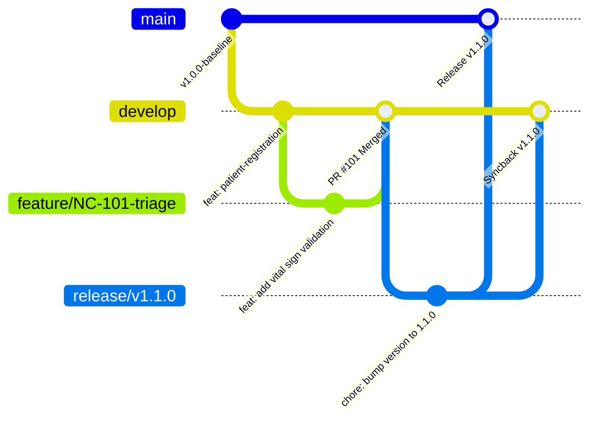

# Master Trunk-Based Branching Model & Release Flow
## Namma Clinic Digital Health & Operations Platform
### Greater Bengaluru Authority (GBA) / BBMP Health Department
**Document Code:** `DEV-DOC-04` | **Status:** APPROVED BASELINE | **Date:** September 2026

---

## 1. Executive Summary & Branching Philosophy
The Namma Clinic platform enforces a strict **Trunk-Based Development Model** supplemented by short-lived feature branches, release preparation branches, and emergency hotfix workflows. This model maximizes continuous integration velocity, eliminates protracted merge conflicts, and ensures that production-ready code is always deployable to municipal clinics.

### 1.1 Branch Taxonomy
- `main`: Production-state sovereign branch. Directly represents code deployed in citywide production.
- `develop`: Central integration trunk. Active development target where all short-lived feature PRs merge.
- `feature/<ticket>-<brief-slug>`: Short-lived feature branch (< 48 hours lifetime) branched from `develop`.
- `release/v<SemVer>`: Release stabilization branch branched from `develop` for final UAT and staging hardening.
- `hotfix/v<SemVer>`: Critical production emergency branch branched directly from `main`.

## 2. Branching Architecture & Promotion Lifecycle


## 3. Master Branching Rules Catalog
Catalog of all 30 branching rules governing engineering workflows:

### BRANCH-RULE-001: Short-Lived Feature Branches #1
- **Rule Identifier:** `BRANCH-RULE-001`
- **Operational Mandate:** Feature branches must originate from `develop` and live less than 48 hours.
- **Enforcement Mechanism:** `Branch lifecycle policy`
- **Breach Action:** Automated CI pipeline fails and branch deletion alert triggers.
- **Audit Code:** `BRANCH_AUDIT_BRANCH_RULE_001`

### BRANCH-RULE-002: Automated Stale Branch Reaper #2
- **Rule Identifier:** `BRANCH-RULE-002`
- **Operational Mandate:** Merged and inactive branches (>14 days) are automatically deleted via scheduled action.
- **Enforcement Mechanism:** `Stale branch bot`
- **Breach Action:** Automated CI pipeline fails and branch deletion alert triggers.
- **Audit Code:** `BRANCH_AUDIT_BRANCH_RULE_002`

### BRANCH-RULE-003: Release Candidate Branching #3
- **Rule Identifier:** `BRANCH-RULE-003`
- **Operational Mandate:** Release branches `release/vX.Y.Z` branched from develop for final staging freeze.
- **Enforcement Mechanism:** `Release governance`
- **Breach Action:** Automated CI pipeline fails and branch deletion alert triggers.
- **Audit Code:** `BRANCH_AUDIT_BRANCH_RULE_003`

### BRANCH-RULE-004: Emergency Hotfix Workflow #4
- **Rule Identifier:** `BRANCH-RULE-004`
- **Operational Mandate:** `hotfix/vX.Y.Z` branched directly from main tag, cherry-picked back to develop.
- **Enforcement Mechanism:** `Emergency change protocol`
- **Breach Action:** Automated CI pipeline fails and branch deletion alert triggers.
- **Audit Code:** `BRANCH_AUDIT_BRANCH_RULE_004`

### BRANCH-RULE-005: Tagging Immutability #5
- **Rule Identifier:** `BRANCH-RULE-005`
- **Operational Mandate:** Release tags `v*` are cryptographically signed and permanently locked from force update.
- **Enforcement Mechanism:** `Git ref protection`
- **Breach Action:** Automated CI pipeline fails and branch deletion alert triggers.
- **Audit Code:** `BRANCH_AUDIT_BRANCH_RULE_005`

### BRANCH-RULE-006: Short-Lived Feature Branches #6
- **Rule Identifier:** `BRANCH-RULE-006`
- **Operational Mandate:** Feature branches must originate from `develop` and live less than 48 hours.
- **Enforcement Mechanism:** `Branch lifecycle policy`
- **Breach Action:** Automated CI pipeline fails and branch deletion alert triggers.
- **Audit Code:** `BRANCH_AUDIT_BRANCH_RULE_006`

### BRANCH-RULE-007: Automated Stale Branch Reaper #7
- **Rule Identifier:** `BRANCH-RULE-007`
- **Operational Mandate:** Merged and inactive branches (>14 days) are automatically deleted via scheduled action.
- **Enforcement Mechanism:** `Stale branch bot`
- **Breach Action:** Automated CI pipeline fails and branch deletion alert triggers.
- **Audit Code:** `BRANCH_AUDIT_BRANCH_RULE_007`

### BRANCH-RULE-008: Release Candidate Branching #8
- **Rule Identifier:** `BRANCH-RULE-008`
- **Operational Mandate:** Release branches `release/vX.Y.Z` branched from develop for final staging freeze.
- **Enforcement Mechanism:** `Release governance`
- **Breach Action:** Automated CI pipeline fails and branch deletion alert triggers.
- **Audit Code:** `BRANCH_AUDIT_BRANCH_RULE_008`

### BRANCH-RULE-009: Emergency Hotfix Workflow #9
- **Rule Identifier:** `BRANCH-RULE-009`
- **Operational Mandate:** `hotfix/vX.Y.Z` branched directly from main tag, cherry-picked back to develop.
- **Enforcement Mechanism:** `Emergency change protocol`
- **Breach Action:** Automated CI pipeline fails and branch deletion alert triggers.
- **Audit Code:** `BRANCH_AUDIT_BRANCH_RULE_009`

### BRANCH-RULE-010: Tagging Immutability #10
- **Rule Identifier:** `BRANCH-RULE-010`
- **Operational Mandate:** Release tags `v*` are cryptographically signed and permanently locked from force update.
- **Enforcement Mechanism:** `Git ref protection`
- **Breach Action:** Automated CI pipeline fails and branch deletion alert triggers.
- **Audit Code:** `BRANCH_AUDIT_BRANCH_RULE_010`

### BRANCH-RULE-011: Short-Lived Feature Branches #11
- **Rule Identifier:** `BRANCH-RULE-011`
- **Operational Mandate:** Feature branches must originate from `develop` and live less than 48 hours.
- **Enforcement Mechanism:** `Branch lifecycle policy`
- **Breach Action:** Automated CI pipeline fails and branch deletion alert triggers.
- **Audit Code:** `BRANCH_AUDIT_BRANCH_RULE_011`

### BRANCH-RULE-012: Automated Stale Branch Reaper #12
- **Rule Identifier:** `BRANCH-RULE-012`
- **Operational Mandate:** Merged and inactive branches (>14 days) are automatically deleted via scheduled action.
- **Enforcement Mechanism:** `Stale branch bot`
- **Breach Action:** Automated CI pipeline fails and branch deletion alert triggers.
- **Audit Code:** `BRANCH_AUDIT_BRANCH_RULE_012`

### BRANCH-RULE-013: Release Candidate Branching #13
- **Rule Identifier:** `BRANCH-RULE-013`
- **Operational Mandate:** Release branches `release/vX.Y.Z` branched from develop for final staging freeze.
- **Enforcement Mechanism:** `Release governance`
- **Breach Action:** Automated CI pipeline fails and branch deletion alert triggers.
- **Audit Code:** `BRANCH_AUDIT_BRANCH_RULE_013`

### BRANCH-RULE-014: Emergency Hotfix Workflow #14
- **Rule Identifier:** `BRANCH-RULE-014`
- **Operational Mandate:** `hotfix/vX.Y.Z` branched directly from main tag, cherry-picked back to develop.
- **Enforcement Mechanism:** `Emergency change protocol`
- **Breach Action:** Automated CI pipeline fails and branch deletion alert triggers.
- **Audit Code:** `BRANCH_AUDIT_BRANCH_RULE_014`

### BRANCH-RULE-015: Tagging Immutability #15
- **Rule Identifier:** `BRANCH-RULE-015`
- **Operational Mandate:** Release tags `v*` are cryptographically signed and permanently locked from force update.
- **Enforcement Mechanism:** `Git ref protection`
- **Breach Action:** Automated CI pipeline fails and branch deletion alert triggers.
- **Audit Code:** `BRANCH_AUDIT_BRANCH_RULE_015`

### BRANCH-RULE-016: Short-Lived Feature Branches #16
- **Rule Identifier:** `BRANCH-RULE-016`
- **Operational Mandate:** Feature branches must originate from `develop` and live less than 48 hours.
- **Enforcement Mechanism:** `Branch lifecycle policy`
- **Breach Action:** Automated CI pipeline fails and branch deletion alert triggers.
- **Audit Code:** `BRANCH_AUDIT_BRANCH_RULE_016`

### BRANCH-RULE-017: Automated Stale Branch Reaper #17
- **Rule Identifier:** `BRANCH-RULE-017`
- **Operational Mandate:** Merged and inactive branches (>14 days) are automatically deleted via scheduled action.
- **Enforcement Mechanism:** `Stale branch bot`
- **Breach Action:** Automated CI pipeline fails and branch deletion alert triggers.
- **Audit Code:** `BRANCH_AUDIT_BRANCH_RULE_017`

### BRANCH-RULE-018: Release Candidate Branching #18
- **Rule Identifier:** `BRANCH-RULE-018`
- **Operational Mandate:** Release branches `release/vX.Y.Z` branched from develop for final staging freeze.
- **Enforcement Mechanism:** `Release governance`
- **Breach Action:** Automated CI pipeline fails and branch deletion alert triggers.
- **Audit Code:** `BRANCH_AUDIT_BRANCH_RULE_018`

### BRANCH-RULE-019: Emergency Hotfix Workflow #19
- **Rule Identifier:** `BRANCH-RULE-019`
- **Operational Mandate:** `hotfix/vX.Y.Z` branched directly from main tag, cherry-picked back to develop.
- **Enforcement Mechanism:** `Emergency change protocol`
- **Breach Action:** Automated CI pipeline fails and branch deletion alert triggers.
- **Audit Code:** `BRANCH_AUDIT_BRANCH_RULE_019`

### BRANCH-RULE-020: Tagging Immutability #20
- **Rule Identifier:** `BRANCH-RULE-020`
- **Operational Mandate:** Release tags `v*` are cryptographically signed and permanently locked from force update.
- **Enforcement Mechanism:** `Git ref protection`
- **Breach Action:** Automated CI pipeline fails and branch deletion alert triggers.
- **Audit Code:** `BRANCH_AUDIT_BRANCH_RULE_020`

### BRANCH-RULE-021: Short-Lived Feature Branches #21
- **Rule Identifier:** `BRANCH-RULE-021`
- **Operational Mandate:** Feature branches must originate from `develop` and live less than 48 hours.
- **Enforcement Mechanism:** `Branch lifecycle policy`
- **Breach Action:** Automated CI pipeline fails and branch deletion alert triggers.
- **Audit Code:** `BRANCH_AUDIT_BRANCH_RULE_021`

### BRANCH-RULE-022: Automated Stale Branch Reaper #22
- **Rule Identifier:** `BRANCH-RULE-022`
- **Operational Mandate:** Merged and inactive branches (>14 days) are automatically deleted via scheduled action.
- **Enforcement Mechanism:** `Stale branch bot`
- **Breach Action:** Automated CI pipeline fails and branch deletion alert triggers.
- **Audit Code:** `BRANCH_AUDIT_BRANCH_RULE_022`

### BRANCH-RULE-023: Release Candidate Branching #23
- **Rule Identifier:** `BRANCH-RULE-023`
- **Operational Mandate:** Release branches `release/vX.Y.Z` branched from develop for final staging freeze.
- **Enforcement Mechanism:** `Release governance`
- **Breach Action:** Automated CI pipeline fails and branch deletion alert triggers.
- **Audit Code:** `BRANCH_AUDIT_BRANCH_RULE_023`

### BRANCH-RULE-024: Emergency Hotfix Workflow #24
- **Rule Identifier:** `BRANCH-RULE-024`
- **Operational Mandate:** `hotfix/vX.Y.Z` branched directly from main tag, cherry-picked back to develop.
- **Enforcement Mechanism:** `Emergency change protocol`
- **Breach Action:** Automated CI pipeline fails and branch deletion alert triggers.
- **Audit Code:** `BRANCH_AUDIT_BRANCH_RULE_024`

### BRANCH-RULE-025: Tagging Immutability #25
- **Rule Identifier:** `BRANCH-RULE-025`
- **Operational Mandate:** Release tags `v*` are cryptographically signed and permanently locked from force update.
- **Enforcement Mechanism:** `Git ref protection`
- **Breach Action:** Automated CI pipeline fails and branch deletion alert triggers.
- **Audit Code:** `BRANCH_AUDIT_BRANCH_RULE_025`

### BRANCH-RULE-026: Short-Lived Feature Branches #26
- **Rule Identifier:** `BRANCH-RULE-026`
- **Operational Mandate:** Feature branches must originate from `develop` and live less than 48 hours.
- **Enforcement Mechanism:** `Branch lifecycle policy`
- **Breach Action:** Automated CI pipeline fails and branch deletion alert triggers.
- **Audit Code:** `BRANCH_AUDIT_BRANCH_RULE_026`

### BRANCH-RULE-027: Automated Stale Branch Reaper #27
- **Rule Identifier:** `BRANCH-RULE-027`
- **Operational Mandate:** Merged and inactive branches (>14 days) are automatically deleted via scheduled action.
- **Enforcement Mechanism:** `Stale branch bot`
- **Breach Action:** Automated CI pipeline fails and branch deletion alert triggers.
- **Audit Code:** `BRANCH_AUDIT_BRANCH_RULE_027`

### BRANCH-RULE-028: Release Candidate Branching #28
- **Rule Identifier:** `BRANCH-RULE-028`
- **Operational Mandate:** Release branches `release/vX.Y.Z` branched from develop for final staging freeze.
- **Enforcement Mechanism:** `Release governance`
- **Breach Action:** Automated CI pipeline fails and branch deletion alert triggers.
- **Audit Code:** `BRANCH_AUDIT_BRANCH_RULE_028`

### BRANCH-RULE-029: Emergency Hotfix Workflow #29
- **Rule Identifier:** `BRANCH-RULE-029`
- **Operational Mandate:** `hotfix/vX.Y.Z` branched directly from main tag, cherry-picked back to develop.
- **Enforcement Mechanism:** `Emergency change protocol`
- **Breach Action:** Automated CI pipeline fails and branch deletion alert triggers.
- **Audit Code:** `BRANCH_AUDIT_BRANCH_RULE_029`

### BRANCH-RULE-030: Tagging Immutability #30
- **Rule Identifier:** `BRANCH-RULE-030`
- **Operational Mandate:** Release tags `v*` are cryptographically signed and permanently locked from force update.
- **Enforcement Mechanism:** `Git ref protection`
- **Breach Action:** Automated CI pipeline fails and branch deletion alert triggers.
- **Audit Code:** `BRANCH_AUDIT_BRANCH_RULE_030`

## 4. Feature Branch Lifecycle & Rebase Strategy across 180 Features
Specifications governing short-lived branch isolation across all 180 platform features:

### FEATURE-001: Branching Lifecycle for Feature `Credential Verification`
- **Feature ID:** `FEATURE-001` (Feature #1)
- **Domain / Module:** `DOMAIN-001` / `MODULE-001`
- **Branch Name:** `feature/NC-0001-credential-verification`
- **Max Branch Age:** 48 Hours before automated stale warning
- **Rebase Cadence:** Daily rebase against `origin/develop` before merge
- **Merge Strategy:** Squash-and-Merge via approved Pull Request
- **Post-Merge Action:** Automated branch deletion enabled

### FEATURE-002: Branching Lifecycle for Feature `Session Token Minting`
- **Feature ID:** `FEATURE-002` (Feature #2)
- **Domain / Module:** `DOMAIN-001` / `MODULE-001`
- **Branch Name:** `feature/NC-0002-session-token-minting`
- **Max Branch Age:** 48 Hours before automated stale warning
- **Rebase Cadence:** Daily rebase against `origin/develop` before merge
- **Merge Strategy:** Squash-and-Merge via approved Pull Request
- **Post-Merge Action:** Automated branch deletion enabled

### FEATURE-003: Branching Lifecycle for Feature `MFA Challenge Dispatch`
- **Feature ID:** `FEATURE-003` (Feature #3)
- **Domain / Module:** `DOMAIN-001` / `MODULE-001`
- **Branch Name:** `feature/NC-0003-mfa-challenge-dispatch`
- **Max Branch Age:** 48 Hours before automated stale warning
- **Rebase Cadence:** Daily rebase against `origin/develop` before merge
- **Merge Strategy:** Squash-and-Merge via approved Pull Request
- **Post-Merge Action:** Automated branch deletion enabled

### FEATURE-004: Branching Lifecycle for Feature `Biometric Authentication Bridge`
- **Feature ID:** `FEATURE-004` (Feature #4)
- **Domain / Module:** `DOMAIN-001` / `MODULE-001`
- **Branch Name:** `feature/NC-0004-biometric-authentication-`
- **Max Branch Age:** 48 Hours before automated stale warning
- **Rebase Cadence:** Daily rebase against `origin/develop` before merge
- **Merge Strategy:** Squash-and-Merge via approved Pull Request
- **Post-Merge Action:** Automated branch deletion enabled

### FEATURE-005: Branching Lifecycle for Feature `Local PIN Verification`
- **Feature ID:** `FEATURE-005` (Feature #5)
- **Domain / Module:** `DOMAIN-001` / `MODULE-001`
- **Branch Name:** `feature/NC-0005-local-pin-verification`
- **Max Branch Age:** 48 Hours before automated stale warning
- **Rebase Cadence:** Daily rebase against `origin/develop` before merge
- **Merge Strategy:** Squash-and-Merge via approved Pull Request
- **Post-Merge Action:** Automated branch deletion enabled

### FEATURE-006: Branching Lifecycle for Feature `Session Inactivity Lockout`
- **Feature ID:** `FEATURE-006` (Feature #6)
- **Domain / Module:** `DOMAIN-001` / `MODULE-001`
- **Branch Name:** `feature/NC-0006-session-inactivity-lockou`
- **Max Branch Age:** 48 Hours before automated stale warning
- **Rebase Cadence:** Daily rebase against `origin/develop` before merge
- **Merge Strategy:** Squash-and-Merge via approved Pull Request
- **Post-Merge Action:** Automated branch deletion enabled

### FEATURE-007: Branching Lifecycle for Feature `Permission Evaluation`
- **Feature ID:** `FEATURE-007` (Feature #7)
- **Domain / Module:** `DOMAIN-001` / `MODULE-002`
- **Branch Name:** `feature/NC-0007-permission-evaluation`
- **Max Branch Age:** 48 Hours before automated stale warning
- **Rebase Cadence:** Daily rebase against `origin/develop` before merge
- **Merge Strategy:** Squash-and-Merge via approved Pull Request
- **Post-Merge Action:** Automated branch deletion enabled

### FEATURE-008: Branching Lifecycle for Feature `Dynamic Role Assignment`
- **Feature ID:** `FEATURE-008` (Feature #8)
- **Domain / Module:** `DOMAIN-001` / `MODULE-002`
- **Branch Name:** `feature/NC-0008-dynamic-role-assignment`
- **Max Branch Age:** 48 Hours before automated stale warning
- **Rebase Cadence:** Daily rebase against `origin/develop` before merge
- **Merge Strategy:** Squash-and-Merge via approved Pull Request
- **Post-Merge Action:** Automated branch deletion enabled

### FEATURE-009: Branching Lifecycle for Feature `Conflict-of-Interest Prevention`
- **Feature ID:** `FEATURE-009` (Feature #9)
- **Domain / Module:** `DOMAIN-001` / `MODULE-002`
- **Branch Name:** `feature/NC-0009-conflict-of-interest-prev`
- **Max Branch Age:** 48 Hours before automated stale warning
- **Rebase Cadence:** Daily rebase against `origin/develop` before merge
- **Merge Strategy:** Squash-and-Merge via approved Pull Request
- **Post-Merge Action:** Automated branch deletion enabled

### FEATURE-010: Branching Lifecycle for Feature `Maker-Checker Authorization`
- **Feature ID:** `FEATURE-010` (Feature #10)
- **Domain / Module:** `DOMAIN-001` / `MODULE-002`
- **Branch Name:** `feature/NC-0010-maker-checker-authorizati`
- **Max Branch Age:** 48 Hours before automated stale warning
- **Rebase Cadence:** Daily rebase against `origin/develop` before merge
- **Merge Strategy:** Squash-and-Merge via approved Pull Request
- **Post-Merge Action:** Automated branch deletion enabled

### FEATURE-011: Branching Lifecycle for Feature `Break-Glass Privilege Elevation`
- **Feature ID:** `FEATURE-011` (Feature #11)
- **Domain / Module:** `DOMAIN-001` / `MODULE-002`
- **Branch Name:** `feature/NC-0011-break-glass-privilege-ele`
- **Max Branch Age:** 48 Hours before automated stale warning
- **Rebase Cadence:** Daily rebase against `origin/develop` before merge
- **Merge Strategy:** Squash-and-Merge via approved Pull Request
- **Post-Merge Action:** Automated branch deletion enabled

### FEATURE-012: Branching Lifecycle for Feature `Privilege Elevation Audit`
- **Feature ID:** `FEATURE-012` (Feature #12)
- **Domain / Module:** `DOMAIN-001` / `MODULE-002`
- **Branch Name:** `feature/NC-0012-privilege-elevation-audit`
- **Max Branch Age:** 48 Hours before automated stale warning
- **Rebase Cadence:** Daily rebase against `origin/develop` before merge
- **Merge Strategy:** Squash-and-Merge via approved Pull Request
- **Post-Merge Action:** Automated branch deletion enabled

### FEATURE-013: Branching Lifecycle for Feature `Hierarchy Node Management`
- **Feature ID:** `FEATURE-013` (Feature #13)
- **Domain / Module:** `DOMAIN-001` / `MODULE-003`
- **Branch Name:** `feature/NC-0013-hierarchy-node-management`
- **Max Branch Age:** 48 Hours before automated stale warning
- **Rebase Cadence:** Daily rebase against `origin/develop` before merge
- **Merge Strategy:** Squash-and-Merge via approved Pull Request
- **Post-Merge Action:** Automated branch deletion enabled

### FEATURE-014: Branching Lifecycle for Feature `NIN / HFR Registry Linking`
- **Feature ID:** `FEATURE-014` (Feature #14)
- **Domain / Module:** `DOMAIN-001` / `MODULE-003`
- **Branch Name:** `feature/NC-0014-nin-/-hfr-registry-linkin`
- **Max Branch Age:** 48 Hours before automated stale warning
- **Rebase Cadence:** Daily rebase against `origin/develop` before merge
- **Merge Strategy:** Squash-and-Merge via approved Pull Request
- **Post-Merge Action:** Automated branch deletion enabled

### FEATURE-015: Branching Lifecycle for Feature `Station Terminal Mapping`
- **Feature ID:** `FEATURE-015` (Feature #15)
- **Domain / Module:** `DOMAIN-001` / `MODULE-003`
- **Branch Name:** `feature/NC-0015-station-terminal-mapping`
- **Max Branch Age:** 48 Hours before automated stale warning
- **Rebase Cadence:** Daily rebase against `origin/develop` before merge
- **Merge Strategy:** Squash-and-Merge via approved Pull Request
- **Post-Merge Action:** Automated branch deletion enabled

### FEATURE-016: Branching Lifecycle for Feature `Facility Capacity Configuration`
- **Feature ID:** `FEATURE-016` (Feature #16)
- **Domain / Module:** `DOMAIN-001` / `MODULE-003`
- **Branch Name:** `feature/NC-0016-facility-capacity-configu`
- **Max Branch Age:** 48 Hours before automated stale warning
- **Rebase Cadence:** Daily rebase against `origin/develop` before merge
- **Merge Strategy:** Squash-and-Merge via approved Pull Request
- **Post-Merge Action:** Automated branch deletion enabled

### FEATURE-017: Branching Lifecycle for Feature `Operating Hours Enforcement`
- **Feature ID:** `FEATURE-017` (Feature #17)
- **Domain / Module:** `DOMAIN-001` / `MODULE-003`
- **Branch Name:** `feature/NC-0017-operating-hours-enforceme`
- **Max Branch Age:** 48 Hours before automated stale warning
- **Rebase Cadence:** Daily rebase against `origin/develop` before merge
- **Merge Strategy:** Squash-and-Merge via approved Pull Request
- **Post-Merge Action:** Automated branch deletion enabled

### FEATURE-018: Branching Lifecycle for Feature `Special Camp Calendar`
- **Feature ID:** `FEATURE-018` (Feature #18)
- **Domain / Module:** `DOMAIN-001` / `MODULE-003`
- **Branch Name:** `feature/NC-0018-special-camp-calendar`
- **Max Branch Age:** 48 Hours before automated stale warning
- **Rebase Cadence:** Daily rebase against `origin/develop` before merge
- **Merge Strategy:** Squash-and-Merge via approved Pull Request
- **Post-Merge Action:** Automated branch deletion enabled

### FEATURE-019: Branching Lifecycle for Feature `Staff Onboarding & KYC`
- **Feature ID:** `FEATURE-019` (Feature #19)
- **Domain / Module:** `DOMAIN-001` / `MODULE-004`
- **Branch Name:** `feature/NC-0019-staff-onboarding-&-kyc`
- **Max Branch Age:** 48 Hours before automated stale warning
- **Rebase Cadence:** Daily rebase against `origin/develop` before merge
- **Merge Strategy:** Squash-and-Merge via approved Pull Request
- **Post-Merge Action:** Automated branch deletion enabled

### FEATURE-020: Branching Lifecycle for Feature `Professional License Verification`
- **Feature ID:** `FEATURE-020` (Feature #20)
- **Domain / Module:** `DOMAIN-001` / `MODULE-004`
- **Branch Name:** `feature/NC-0020-professional-license-veri`
- **Max Branch Age:** 48 Hours before automated stale warning
- **Rebase Cadence:** Daily rebase against `origin/develop` before merge
- **Merge Strategy:** Squash-and-Merge via approved Pull Request
- **Post-Merge Action:** Automated branch deletion enabled

### FEATURE-021: Branching Lifecycle for Feature `Duty Roster Generation`
- **Feature ID:** `FEATURE-021` (Feature #21)
- **Domain / Module:** `DOMAIN-001` / `MODULE-004`
- **Branch Name:** `feature/NC-0021-duty-roster-generation`
- **Max Branch Age:** 48 Hours before automated stale warning
- **Rebase Cadence:** Daily rebase against `origin/develop` before merge
- **Merge Strategy:** Squash-and-Merge via approved Pull Request
- **Post-Merge Action:** Automated branch deletion enabled

### FEATURE-022: Branching Lifecycle for Feature `Biometric Attendance Linking`
- **Feature ID:** `FEATURE-022` (Feature #22)
- **Domain / Module:** `DOMAIN-001` / `MODULE-004`
- **Branch Name:** `feature/NC-0022-biometric-attendance-link`
- **Max Branch Age:** 48 Hours before automated stale warning
- **Rebase Cadence:** Daily rebase against `origin/develop` before merge
- **Merge Strategy:** Squash-and-Merge via approved Pull Request
- **Post-Merge Action:** Automated branch deletion enabled

### FEATURE-023: Branching Lifecycle for Feature `Digital Signature Enrollment`
- **Feature ID:** `FEATURE-023` (Feature #23)
- **Domain / Module:** `DOMAIN-001` / `MODULE-004`
- **Branch Name:** `feature/NC-0023-digital-signature-enrollm`
- **Max Branch Age:** 48 Hours before automated stale warning
- **Rebase Cadence:** Daily rebase against `origin/develop` before merge
- **Merge Strategy:** Squash-and-Merge via approved Pull Request
- **Post-Merge Action:** Automated branch deletion enabled

### FEATURE-024: Branching Lifecycle for Feature `Signature Revocation`
- **Feature ID:** `FEATURE-024` (Feature #24)
- **Domain / Module:** `DOMAIN-001` / `MODULE-004`
- **Branch Name:** `feature/NC-0024-signature-revocation`
- **Max Branch Age:** 48 Hours before automated stale warning
- **Rebase Cadence:** Daily rebase against `origin/develop` before merge
- **Merge Strategy:** Squash-and-Merge via approved Pull Request
- **Post-Merge Action:** Automated branch deletion enabled

### FEATURE-025: Branching Lifecycle for Feature `Targeted Flag Activation`
- **Feature ID:** `FEATURE-025` (Feature #25)
- **Domain / Module:** `DOMAIN-001` / `MODULE-026`
- **Branch Name:** `feature/NC-0025-targeted-flag-activation`
- **Max Branch Age:** 48 Hours before automated stale warning
- **Rebase Cadence:** Daily rebase against `origin/develop` before merge
- **Merge Strategy:** Squash-and-Merge via approved Pull Request
- **Post-Merge Action:** Automated branch deletion enabled

### FEATURE-026: Branching Lifecycle for Feature `Emergency Feature Killswitch`
- **Feature ID:** `FEATURE-026` (Feature #26)
- **Domain / Module:** `DOMAIN-001` / `MODULE-026`
- **Branch Name:** `feature/NC-0026-emergency-feature-killswi`
- **Max Branch Age:** 48 Hours before automated stale warning
- **Rebase Cadence:** Daily rebase against `origin/develop` before merge
- **Merge Strategy:** Squash-and-Merge via approved Pull Request
- **Post-Merge Action:** Automated branch deletion enabled

### FEATURE-027: Branching Lifecycle for Feature `System Parameter Tuning`
- **Feature ID:** `FEATURE-027` (Feature #27)
- **Domain / Module:** `DOMAIN-001` / `MODULE-026`
- **Branch Name:** `feature/NC-0027-system-parameter-tuning`
- **Max Branch Age:** 48 Hours before automated stale warning
- **Rebase Cadence:** Daily rebase against `origin/develop` before merge
- **Merge Strategy:** Squash-and-Merge via approved Pull Request
- **Post-Merge Action:** Automated branch deletion enabled

### FEATURE-028: Branching Lifecycle for Feature `Edge Configuration Distribution`
- **Feature ID:** `FEATURE-028` (Feature #28)
- **Domain / Module:** `DOMAIN-001` / `MODULE-026`
- **Branch Name:** `feature/NC-0028-edge-configuration-distri`
- **Max Branch Age:** 48 Hours before automated stale warning
- **Rebase Cadence:** Daily rebase against `origin/develop` before merge
- **Merge Strategy:** Squash-and-Merge via approved Pull Request
- **Post-Merge Action:** Automated branch deletion enabled

### FEATURE-029: Branching Lifecycle for Feature `Edge Migration Orchestration`
- **Feature ID:** `FEATURE-029` (Feature #29)
- **Domain / Module:** `DOMAIN-001` / `MODULE-026`
- **Branch Name:** `feature/NC-0029-edge-migration-orchestrat`
- **Max Branch Age:** 48 Hours before automated stale warning
- **Rebase Cadence:** Daily rebase against `origin/develop` before merge
- **Merge Strategy:** Squash-and-Merge via approved Pull Request
- **Post-Merge Action:** Automated branch deletion enabled

### FEATURE-030: Branching Lifecycle for Feature `Health Probe Monitoring`
- **Feature ID:** `FEATURE-030` (Feature #30)
- **Domain / Module:** `DOMAIN-001` / `MODULE-026`
- **Branch Name:** `feature/NC-0030-health-probe-monitoring`
- **Max Branch Age:** 48 Hours before automated stale warning
- **Rebase Cadence:** Daily rebase against `origin/develop` before merge
- **Merge Strategy:** Squash-and-Merge via approved Pull Request
- **Post-Merge Action:** Automated branch deletion enabled

### FEATURE-031: Branching Lifecycle for Feature `Bilingual Intake UI`
- **Feature ID:** `FEATURE-031` (Feature #31)
- **Domain / Module:** `DOMAIN-002` / `MODULE-005`
- **Branch Name:** `feature/NC-0031-bilingual-intake-ui`
- **Max Branch Age:** 48 Hours before automated stale warning
- **Rebase Cadence:** Daily rebase against `origin/develop` before merge
- **Merge Strategy:** Squash-and-Merge via approved Pull Request
- **Post-Merge Action:** Automated branch deletion enabled

### FEATURE-032: Branching Lifecycle for Feature `Vulnerable Citizen Flagging`
- **Feature ID:** `FEATURE-032` (Feature #32)
- **Domain / Module:** `DOMAIN-002` / `MODULE-005`
- **Branch Name:** `feature/NC-0032-vulnerable-citizen-flaggi`
- **Max Branch Age:** 48 Hours before automated stale warning
- **Rebase Cadence:** Daily rebase against `origin/develop` before merge
- **Merge Strategy:** Squash-and-Merge via approved Pull Request
- **Post-Merge Action:** Automated branch deletion enabled

### FEATURE-033: Branching Lifecycle for Feature `Aadhaar OTP ABHA Bridge`
- **Feature ID:** `FEATURE-033` (Feature #33)
- **Domain / Module:** `DOMAIN-002` / `MODULE-005`
- **Branch Name:** `feature/NC-0033-aadhaar-otp-abha-bridge`
- **Max Branch Age:** 48 Hours before automated stale warning
- **Rebase Cadence:** Daily rebase against `origin/develop` before merge
- **Merge Strategy:** Squash-and-Merge via approved Pull Request
- **Post-Merge Action:** Automated branch deletion enabled

### FEATURE-034: Branching Lifecycle for Feature `Demographic ABHA Creation`
- **Feature ID:** `FEATURE-034` (Feature #34)
- **Domain / Module:** `DOMAIN-002` / `MODULE-005`
- **Branch Name:** `feature/NC-0034-demographic-abha-creation`
- **Max Branch Age:** 48 Hours before automated stale warning
- **Rebase Cadence:** Daily rebase against `origin/develop` before merge
- **Merge Strategy:** Squash-and-Merge via approved Pull Request
- **Post-Merge Action:** Automated branch deletion enabled

### FEATURE-035: Branching Lifecycle for Feature `Deterministic UHID Minting`
- **Feature ID:** `FEATURE-035` (Feature #35)
- **Domain / Module:** `DOMAIN-002` / `MODULE-005`
- **Branch Name:** `feature/NC-0035-deterministic-uhid-mintin`
- **Max Branch Age:** 48 Hours before automated stale warning
- **Rebase Cadence:** Daily rebase against `origin/develop` before merge
- **Merge Strategy:** Squash-and-Merge via approved Pull Request
- **Post-Merge Action:** Automated branch deletion enabled

### FEATURE-036: Branching Lifecycle for Feature `Soundex / Double-Metaphone Matching`
- **Feature ID:** `FEATURE-036` (Feature #36)
- **Domain / Module:** `DOMAIN-002` / `MODULE-005`
- **Branch Name:** `feature/NC-0036-soundex-/-double-metaphon`
- **Max Branch Age:** 48 Hours before automated stale warning
- **Rebase Cadence:** Daily rebase against `origin/develop` before merge
- **Merge Strategy:** Squash-and-Merge via approved Pull Request
- **Post-Merge Action:** Automated branch deletion enabled

### FEATURE-037: Branching Lifecycle for Feature `Bilingual Consent Presentation`
- **Feature ID:** `FEATURE-037` (Feature #37)
- **Domain / Module:** `DOMAIN-002` / `MODULE-006`
- **Branch Name:** `feature/NC-0037-bilingual-consent-present`
- **Max Branch Age:** 48 Hours before automated stale warning
- **Rebase Cadence:** Daily rebase against `origin/develop` before merge
- **Merge Strategy:** Squash-and-Merge via approved Pull Request
- **Post-Merge Action:** Automated branch deletion enabled

### FEATURE-038: Branching Lifecycle for Feature `Digital Signature / Thumbprint Capture`
- **Feature ID:** `FEATURE-038` (Feature #38)
- **Domain / Module:** `DOMAIN-002` / `MODULE-006`
- **Branch Name:** `feature/NC-0038-digital-signature-/-thumb`
- **Max Branch Age:** 48 Hours before automated stale warning
- **Rebase Cadence:** Daily rebase against `origin/develop` before merge
- **Merge Strategy:** Squash-and-Merge via approved Pull Request
- **Post-Merge Action:** Automated branch deletion enabled

### FEATURE-039: Branching Lifecycle for Feature `Granular Purpose-Based Consent`
- **Feature ID:** `FEATURE-039` (Feature #39)
- **Domain / Module:** `DOMAIN-002` / `MODULE-006`
- **Branch Name:** `feature/NC-0039-granular-purpose-based-co`
- **Max Branch Age:** 48 Hours before automated stale warning
- **Rebase Cadence:** Daily rebase against `origin/develop` before merge
- **Merge Strategy:** Squash-and-Merge via approved Pull Request
- **Post-Merge Action:** Automated branch deletion enabled

### FEATURE-040: Branching Lifecycle for Feature `Consent Revocation Workflow`
- **Feature ID:** `FEATURE-040` (Feature #40)
- **Domain / Module:** `DOMAIN-002` / `MODULE-006`
- **Branch Name:** `feature/NC-0040-consent-revocation-workfl`
- **Max Branch Age:** 48 Hours before automated stale warning
- **Rebase Cadence:** Daily rebase against `origin/develop` before merge
- **Merge Strategy:** Squash-and-Merge via approved Pull Request
- **Post-Merge Action:** Automated branch deletion enabled

### FEATURE-041: Branching Lifecycle for Feature `Guardian Relationship Verification`
- **Feature ID:** `FEATURE-041` (Feature #41)
- **Domain / Module:** `DOMAIN-002` / `MODULE-006`
- **Branch Name:** `feature/NC-0041-guardian-relationship-ver`
- **Max Branch Age:** 48 Hours before automated stale warning
- **Rebase Cadence:** Daily rebase against `origin/develop` before merge
- **Merge Strategy:** Squash-and-Merge via approved Pull Request
- **Post-Merge Action:** Automated branch deletion enabled

### FEATURE-042: Branching Lifecycle for Feature `Implied Emergency Consent`
- **Feature ID:** `FEATURE-042` (Feature #42)
- **Domain / Module:** `DOMAIN-002` / `MODULE-006`
- **Branch Name:** `feature/NC-0042-implied-emergency-consent`
- **Max Branch Age:** 48 Hours before automated stale warning
- **Rebase Cadence:** Daily rebase against `origin/develop` before merge
- **Merge Strategy:** Squash-and-Merge via approved Pull Request
- **Post-Merge Action:** Automated branch deletion enabled

### FEATURE-043: Branching Lifecycle for Feature `Daily Token Counter`
- **Feature ID:** `FEATURE-043` (Feature #43)
- **Domain / Module:** `DOMAIN-002` / `MODULE-007`
- **Branch Name:** `feature/NC-0043-daily-token-counter`
- **Max Branch Age:** 48 Hours before automated stale warning
- **Rebase Cadence:** Daily rebase against `origin/develop` before merge
- **Merge Strategy:** Squash-and-Merge via approved Pull Request
- **Post-Merge Action:** Automated branch deletion enabled

### FEATURE-044: Branching Lifecycle for Feature `Station Route Calculation`
- **Feature ID:** `FEATURE-044` (Feature #44)
- **Domain / Module:** `DOMAIN-002` / `MODULE-007`
- **Branch Name:** `feature/NC-0044-station-route-calculation`
- **Max Branch Age:** 48 Hours before automated stale warning
- **Rebase Cadence:** Daily rebase against `origin/develop` before merge
- **Merge Strategy:** Squash-and-Merge via approved Pull Request
- **Post-Merge Action:** Automated branch deletion enabled

### FEATURE-045: Branching Lifecycle for Feature `Acuity-Based Insertion`
- **Feature ID:** `FEATURE-045` (Feature #45)
- **Domain / Module:** `DOMAIN-002` / `MODULE-007`
- **Branch Name:** `feature/NC-0045-acuity-based-insertion`
- **Max Branch Age:** 48 Hours before automated stale warning
- **Rebase Cadence:** Daily rebase against `origin/develop` before merge
- **Merge Strategy:** Squash-and-Merge via approved Pull Request
- **Post-Merge Action:** Automated branch deletion enabled

### FEATURE-046: Branching Lifecycle for Feature `Vulnerable Citizen Interleaving`
- **Feature ID:** `FEATURE-046` (Feature #46)
- **Domain / Module:** `DOMAIN-002` / `MODULE-007`
- **Branch Name:** `feature/NC-0046-vulnerable-citizen-interl`
- **Max Branch Age:** 48 Hours before automated stale warning
- **Rebase Cadence:** Daily rebase against `origin/develop` before merge
- **Merge Strategy:** Squash-and-Merge via approved Pull Request
- **Post-Merge Action:** Automated branch deletion enabled

### FEATURE-047: Branching Lifecycle for Feature `ESC/POS Thermal Printing`
- **Feature ID:** `FEATURE-047` (Feature #47)
- **Domain / Module:** `DOMAIN-002` / `MODULE-007`
- **Branch Name:** `feature/NC-0047-esc/pos-thermal-printing`
- **Max Branch Age:** 48 Hours before automated stale warning
- **Rebase Cadence:** Daily rebase against `origin/develop` before merge
- **Merge Strategy:** Squash-and-Merge via approved Pull Request
- **Post-Merge Action:** Automated branch deletion enabled

### FEATURE-048: Branching Lifecycle for Feature `Virtual SMS Token Fallback`
- **Feature ID:** `FEATURE-048` (Feature #48)
- **Domain / Module:** `DOMAIN-002` / `MODULE-007`
- **Branch Name:** `feature/NC-0048-virtual-sms-token-fallbac`
- **Max Branch Age:** 48 Hours before automated stale warning
- **Rebase Cadence:** Daily rebase against `origin/develop` before merge
- **Merge Strategy:** Squash-and-Merge via approved Pull Request
- **Post-Merge Action:** Automated branch deletion enabled

### FEATURE-049: Branching Lifecycle for Feature `Next-Patient Call Action`
- **Feature ID:** `FEATURE-049` (Feature #49)
- **Domain / Module:** `DOMAIN-002` / `MODULE-008`
- **Branch Name:** `feature/NC-0049-next-patient-call-action`
- **Max Branch Age:** 48 Hours before automated stale warning
- **Rebase Cadence:** Daily rebase against `origin/develop` before merge
- **Merge Strategy:** Squash-and-Merge via approved Pull Request
- **Post-Merge Action:** Automated branch deletion enabled

### FEATURE-050: Branching Lifecycle for Feature `No-Show & Recall Management`
- **Feature ID:** `FEATURE-050` (Feature #50)
- **Domain / Module:** `DOMAIN-002` / `MODULE-008`
- **Branch Name:** `feature/NC-0050-no-show-&-recall-manageme`
- **Max Branch Age:** 48 Hours before automated stale warning
- **Rebase Cadence:** Daily rebase against `origin/develop` before merge
- **Merge Strategy:** Squash-and-Merge via approved Pull Request
- **Post-Merge Action:** Automated branch deletion enabled

### FEATURE-051: Branching Lifecycle for Feature `HDMI Waiting Hall Display`
- **Feature ID:** `FEATURE-051` (Feature #51)
- **Domain / Module:** `DOMAIN-002` / `MODULE-008`
- **Branch Name:** `feature/NC-0051-hdmi-waiting-hall-display`
- **Max Branch Age:** 48 Hours before automated stale warning
- **Rebase Cadence:** Daily rebase against `origin/develop` before merge
- **Merge Strategy:** Squash-and-Merge via approved Pull Request
- **Post-Merge Action:** Automated branch deletion enabled

### FEATURE-052: Branching Lifecycle for Feature `Text-to-Speech Audio Chime`
- **Feature ID:** `FEATURE-052` (Feature #52)
- **Domain / Module:** `DOMAIN-002` / `MODULE-008`
- **Branch Name:** `feature/NC-0052-text-to-speech-audio-chim`
- **Max Branch Age:** 48 Hours before automated stale warning
- **Rebase Cadence:** Daily rebase against `origin/develop` before merge
- **Merge Strategy:** Squash-and-Merge via approved Pull Request
- **Post-Merge Action:** Automated branch deletion enabled

### FEATURE-053: Branching Lifecycle for Feature `Dynamic Load Distribution`
- **Feature ID:** `FEATURE-053` (Feature #53)
- **Domain / Module:** `DOMAIN-002` / `MODULE-008`
- **Branch Name:** `feature/NC-0053-dynamic-load-distribution`
- **Max Branch Age:** 48 Hours before automated stale warning
- **Rebase Cadence:** Daily rebase against `origin/develop` before merge
- **Merge Strategy:** Squash-and-Merge via approved Pull Request
- **Post-Merge Action:** Automated branch deletion enabled

### FEATURE-054: Branching Lifecycle for Feature `Queue Pausing & Resumption`
- **Feature ID:** `FEATURE-054` (Feature #54)
- **Domain / Module:** `DOMAIN-002` / `MODULE-008`
- **Branch Name:** `feature/NC-0054-queue-pausing-&-resumptio`
- **Max Branch Age:** 48 Hours before automated stale warning
- **Rebase Cadence:** Daily rebase against `origin/develop` before merge
- **Merge Strategy:** Squash-and-Merge via approved Pull Request
- **Post-Merge Action:** Automated branch deletion enabled

### FEATURE-055: Branching Lifecycle for Feature `Kiosk Exit Rating`
- **Feature ID:** `FEATURE-055` (Feature #55)
- **Domain / Module:** `DOMAIN-002` / `MODULE-020`
- **Branch Name:** `feature/NC-0055-kiosk-exit-rating`
- **Max Branch Age:** 48 Hours before automated stale warning
- **Rebase Cadence:** Daily rebase against `origin/develop` before merge
- **Merge Strategy:** Squash-and-Merge via approved Pull Request
- **Post-Merge Action:** Automated branch deletion enabled

### FEATURE-056: Branching Lifecycle for Feature `Medicine Receipt Confirmation`
- **Feature ID:** `FEATURE-056` (Feature #56)
- **Domain / Module:** `DOMAIN-002` / `MODULE-020`
- **Branch Name:** `feature/NC-0056-medicine-receipt-confirma`
- **Max Branch Age:** 48 Hours before automated stale warning
- **Rebase Cadence:** Daily rebase against `origin/develop` before merge
- **Merge Strategy:** Squash-and-Merge via approved Pull Request
- **Post-Merge Action:** Automated branch deletion enabled

### FEATURE-057: Branching Lifecycle for Feature `Multilingual Ticket Intake`
- **Feature ID:** `FEATURE-057` (Feature #57)
- **Domain / Module:** `DOMAIN-002` / `MODULE-020`
- **Branch Name:** `feature/NC-0057-multilingual-ticket-intak`
- **Max Branch Age:** 48 Hours before automated stale warning
- **Rebase Cadence:** Daily rebase against `origin/develop` before merge
- **Merge Strategy:** Squash-and-Merge via approved Pull Request
- **Post-Merge Action:** Automated branch deletion enabled

### FEATURE-058: Branching Lifecycle for Feature `Automated SLA Timer`
- **Feature ID:** `FEATURE-058` (Feature #58)
- **Domain / Module:** `DOMAIN-002` / `MODULE-020`
- **Branch Name:** `feature/NC-0058-automated-sla-timer`
- **Max Branch Age:** 48 Hours before automated stale warning
- **Rebase Cadence:** Daily rebase against `origin/develop` before merge
- **Merge Strategy:** Squash-and-Merge via approved Pull Request
- **Post-Merge Action:** Automated branch deletion enabled

### FEATURE-059: Branching Lifecycle for Feature `Zonal Escalation Trigger`
- **Feature ID:** `FEATURE-059` (Feature #59)
- **Domain / Module:** `DOMAIN-002` / `MODULE-020`
- **Branch Name:** `feature/NC-0059-zonal-escalation-trigger`
- **Max Branch Age:** 48 Hours before automated stale warning
- **Rebase Cadence:** Daily rebase against `origin/develop` before merge
- **Merge Strategy:** Squash-and-Merge via approved Pull Request
- **Post-Merge Action:** Automated branch deletion enabled

### FEATURE-060: Branching Lifecycle for Feature `Citizen Resolution Feedback`
- **Feature ID:** `FEATURE-060` (Feature #60)
- **Domain / Module:** `DOMAIN-002` / `MODULE-020`
- **Branch Name:** `feature/NC-0060-citizen-resolution-feedba`
- **Max Branch Age:** 48 Hours before automated stale warning
- **Rebase Cadence:** Daily rebase against `origin/develop` before merge
- **Merge Strategy:** Squash-and-Merge via approved Pull Request
- **Post-Merge Action:** Automated branch deletion enabled

### FEATURE-061: Branching Lifecycle for Feature `Longitudinal History Viewer`
- **Feature ID:** `FEATURE-061` (Feature #61)
- **Domain / Module:** `DOMAIN-003` / `MODULE-009`
- **Branch Name:** `feature/NC-0061-longitudinal-history-view`
- **Max Branch Age:** 48 Hours before automated stale warning
- **Rebase Cadence:** Daily rebase against `origin/develop` before merge
- **Merge Strategy:** Squash-and-Merge via approved Pull Request
- **Post-Merge Action:** Automated branch deletion enabled

### FEATURE-062: Branching Lifecycle for Feature `Vitals Telemetry Banner`
- **Feature ID:** `FEATURE-062` (Feature #62)
- **Domain / Module:** `DOMAIN-003` / `MODULE-009`
- **Branch Name:** `feature/NC-0062-vitals-telemetry-banner`
- **Max Branch Age:** 48 Hours before automated stale warning
- **Rebase Cadence:** Daily rebase against `origin/develop` before merge
- **Merge Strategy:** Squash-and-Merge via approved Pull Request
- **Post-Merge Action:** Automated branch deletion enabled

### FEATURE-063: Branching Lifecycle for Feature `Rapid Clinical Templates`
- **Feature ID:** `FEATURE-063` (Feature #63)
- **Domain / Module:** `DOMAIN-003` / `MODULE-009`
- **Branch Name:** `feature/NC-0063-rapid-clinical-templates`
- **Max Branch Age:** 48 Hours before automated stale warning
- **Rebase Cadence:** Daily rebase against `origin/develop` before merge
- **Merge Strategy:** Squash-and-Merge via approved Pull Request
- **Post-Merge Action:** Automated branch deletion enabled

### FEATURE-064: Branching Lifecycle for Feature `Keyboard Shortcut Navigation`
- **Feature ID:** `FEATURE-064` (Feature #64)
- **Domain / Module:** `DOMAIN-003` / `MODULE-009`
- **Branch Name:** `feature/NC-0064-keyboard-shortcut-navigat`
- **Max Branch Age:** 48 Hours before automated stale warning
- **Rebase Cadence:** Daily rebase against `origin/develop` before merge
- **Merge Strategy:** Squash-and-Merge via approved Pull Request
- **Post-Merge Action:** Automated branch deletion enabled

### FEATURE-065: Branching Lifecycle for Feature `Cryptographic Note Locking`
- **Feature ID:** `FEATURE-065` (Feature #65)
- **Domain / Module:** `DOMAIN-003` / `MODULE-009`
- **Branch Name:** `feature/NC-0065-cryptographic-note-lockin`
- **Max Branch Age:** 48 Hours before automated stale warning
- **Rebase Cadence:** Daily rebase against `origin/develop` before merge
- **Merge Strategy:** Squash-and-Merge via approved Pull Request
- **Post-Merge Action:** Automated branch deletion enabled

### FEATURE-066: Branching Lifecycle for Feature `Clinical Addendum Workflow`
- **Feature ID:** `FEATURE-066` (Feature #66)
- **Domain / Module:** `DOMAIN-003` / `MODULE-009`
- **Branch Name:** `feature/NC-0066-clinical-addendum-workflo`
- **Max Branch Age:** 48 Hours before automated stale warning
- **Rebase Cadence:** Daily rebase against `origin/develop` before merge
- **Merge Strategy:** Squash-and-Merge via approved Pull Request
- **Post-Merge Action:** Automated branch deletion enabled

### FEATURE-067: Branching Lifecycle for Feature `Primary Care Curated Coding`
- **Feature ID:** `FEATURE-067` (Feature #67)
- **Domain / Module:** `DOMAIN-003` / `MODULE-010`
- **Branch Name:** `feature/NC-0067-primary-care-curated-codi`
- **Max Branch Age:** 48 Hours before automated stale warning
- **Rebase Cadence:** Daily rebase against `origin/develop` before merge
- **Merge Strategy:** Squash-and-Merge via approved Pull Request
- **Post-Merge Action:** Automated branch deletion enabled

### FEATURE-068: Branching Lifecycle for Feature `Synonym & Local Name Mapping`
- **Feature ID:** `FEATURE-068` (Feature #68)
- **Domain / Module:** `DOMAIN-003` / `MODULE-010`
- **Branch Name:** `feature/NC-0068-synonym-&-local-name-mapp`
- **Max Branch Age:** 48 Hours before automated stale warning
- **Rebase Cadence:** Daily rebase against `origin/develop` before merge
- **Merge Strategy:** Squash-and-Merge via approved Pull Request
- **Post-Merge Action:** Automated branch deletion enabled

### FEATURE-069: Branching Lifecycle for Feature `Chronic Condition Tagging`
- **Feature ID:** `FEATURE-069` (Feature #69)
- **Domain / Module:** `DOMAIN-003` / `MODULE-010`
- **Branch Name:** `feature/NC-0069-chronic-condition-tagging`
- **Max Branch Age:** 48 Hours before automated stale warning
- **Rebase Cadence:** Daily rebase against `origin/develop` before merge
- **Merge Strategy:** Squash-and-Merge via approved Pull Request
- **Post-Merge Action:** Automated branch deletion enabled

### FEATURE-070: Branching Lifecycle for Feature `Provisional vs. Confirmed Status`
- **Feature ID:** `FEATURE-070` (Feature #70)
- **Domain / Module:** `DOMAIN-003` / `MODULE-010`
- **Branch Name:** `feature/NC-0070-provisional-vs.-confirmed`
- **Max Branch Age:** 48 Hours before automated stale warning
- **Rebase Cadence:** Daily rebase against `origin/develop` before merge
- **Merge Strategy:** Squash-and-Merge via approved Pull Request
- **Post-Merge Action:** Automated branch deletion enabled

### FEATURE-071: Branching Lifecycle for Feature `IDSP Notifiable Flagging`
- **Feature ID:** `FEATURE-071` (Feature #71)
- **Domain / Module:** `DOMAIN-003` / `MODULE-010`
- **Branch Name:** `feature/NC-0071-idsp-notifiable-flagging`
- **Max Branch Age:** 48 Hours before automated stale warning
- **Rebase Cadence:** Daily rebase against `origin/develop` before merge
- **Merge Strategy:** Squash-and-Merge via approved Pull Request
- **Post-Merge Action:** Automated branch deletion enabled

### FEATURE-072: Branching Lifecycle for Feature `Outbreak Geographic Dispatch`
- **Feature ID:** `FEATURE-072` (Feature #72)
- **Domain / Module:** `DOMAIN-003` / `MODULE-010`
- **Branch Name:** `feature/NC-0072-outbreak-geographic-dispa`
- **Max Branch Age:** 48 Hours before automated stale warning
- **Rebase Cadence:** Daily rebase against `origin/develop` before merge
- **Merge Strategy:** Squash-and-Merge via approved Pull Request
- **Post-Merge Action:** Automated branch deletion enabled

### FEATURE-073: Branching Lifecycle for Feature `Generic Drug Selection`
- **Feature ID:** `FEATURE-073` (Feature #73)
- **Domain / Module:** `DOMAIN-003` / `MODULE-011`
- **Branch Name:** `feature/NC-0073-generic-drug-selection`
- **Max Branch Age:** 48 Hours before automated stale warning
- **Rebase Cadence:** Daily rebase against `origin/develop` before merge
- **Merge Strategy:** Squash-and-Merge via approved Pull Request
- **Post-Merge Action:** Automated branch deletion enabled

### FEATURE-074: Branching Lifecycle for Feature `Standard Sig Frequency Picker`
- **Feature ID:** `FEATURE-074` (Feature #74)
- **Domain / Module:** `DOMAIN-003` / `MODULE-011`
- **Branch Name:** `feature/NC-0074-standard-sig-frequency-pi`
- **Max Branch Age:** 48 Hours before automated stale warning
- **Rebase Cadence:** Daily rebase against `origin/develop` before merge
- **Merge Strategy:** Squash-and-Merge via approved Pull Request
- **Post-Merge Action:** Automated branch deletion enabled

### FEATURE-075: Branching Lifecycle for Feature `Drug-Drug Interaction Alert`
- **Feature ID:** `FEATURE-075` (Feature #75)
- **Domain / Module:** `DOMAIN-003` / `MODULE-011`
- **Branch Name:** `feature/NC-0075-drug-drug-interaction-ale`
- **Max Branch Age:** 48 Hours before automated stale warning
- **Rebase Cadence:** Daily rebase against `origin/develop` before merge
- **Merge Strategy:** Squash-and-Merge via approved Pull Request
- **Post-Merge Action:** Automated branch deletion enabled

### FEATURE-076: Branching Lifecycle for Feature `Allergy Cross-Check`
- **Feature ID:** `FEATURE-076` (Feature #76)
- **Domain / Module:** `DOMAIN-003` / `MODULE-011`
- **Branch Name:** `feature/NC-0076-allergy-cross-check`
- **Max Branch Age:** 48 Hours before automated stale warning
- **Rebase Cadence:** Daily rebase against `origin/develop` before merge
- **Merge Strategy:** Squash-and-Merge via approved Pull Request
- **Post-Merge Action:** Automated branch deletion enabled

### FEATURE-077: Branching Lifecycle for Feature `Weight-Based Pediatric Dosing`
- **Feature ID:** `FEATURE-077` (Feature #77)
- **Domain / Module:** `DOMAIN-003` / `MODULE-011`
- **Branch Name:** `feature/NC-0077-weight-based-pediatric-do`
- **Max Branch Age:** 48 Hours before automated stale warning
- **Rebase Cadence:** Daily rebase against `origin/develop` before merge
- **Merge Strategy:** Squash-and-Merge via approved Pull Request
- **Post-Merge Action:** Automated branch deletion enabled

### FEATURE-078: Branching Lifecycle for Feature `Electronic Prescription Sign & Dispatch`
- **Feature ID:** `FEATURE-078` (Feature #78)
- **Domain / Module:** `DOMAIN-003` / `MODULE-011`
- **Branch Name:** `feature/NC-0078-electronic-prescription-s`
- **Max Branch Age:** 48 Hours before automated stale warning
- **Rebase Cadence:** Daily rebase against `origin/develop` before merge
- **Merge Strategy:** Squash-and-Merge via approved Pull Request
- **Post-Merge Action:** Automated branch deletion enabled

### FEATURE-079: Branching Lifecycle for Feature `Electronic Order Queue`
- **Feature ID:** `FEATURE-079` (Feature #79)
- **Domain / Module:** `DOMAIN-003` / `MODULE-012`
- **Branch Name:** `feature/NC-0079-electronic-order-queue`
- **Max Branch Age:** 48 Hours before automated stale warning
- **Rebase Cadence:** Daily rebase against `origin/develop` before merge
- **Merge Strategy:** Squash-and-Merge via approved Pull Request
- **Post-Merge Action:** Automated branch deletion enabled

### FEATURE-080: Branching Lifecycle for Feature `Sample Barcode Labeling`
- **Feature ID:** `FEATURE-080` (Feature #80)
- **Domain / Module:** `DOMAIN-003` / `MODULE-012`
- **Branch Name:** `feature/NC-0080-sample-barcode-labeling`
- **Max Branch Age:** 48 Hours before automated stale warning
- **Rebase Cadence:** Daily rebase against `origin/develop` before merge
- **Merge Strategy:** Squash-and-Merge via approved Pull Request
- **Post-Merge Action:** Automated branch deletion enabled

### FEATURE-081: Branching Lifecycle for Feature `Rapid Diagnostic Result Entry`
- **Feature ID:** `FEATURE-081` (Feature #81)
- **Domain / Module:** `DOMAIN-003` / `MODULE-012`
- **Branch Name:** `feature/NC-0081-rapid-diagnostic-result-e`
- **Max Branch Age:** 48 Hours before automated stale warning
- **Rebase Cadence:** Daily rebase against `origin/develop` before merge
- **Merge Strategy:** Squash-and-Merge via approved Pull Request
- **Post-Merge Action:** Automated branch deletion enabled

### FEATURE-082: Branching Lifecycle for Feature `POC Analyzer Serial Bridge`
- **Feature ID:** `FEATURE-082` (Feature #82)
- **Domain / Module:** `DOMAIN-003` / `MODULE-012`
- **Branch Name:** `feature/NC-0082-poc-analyzer-serial-bridg`
- **Max Branch Age:** 48 Hours before automated stale warning
- **Rebase Cadence:** Daily rebase against `origin/develop` before merge
- **Merge Strategy:** Squash-and-Merge via approved Pull Request
- **Post-Merge Action:** Automated branch deletion enabled

### FEATURE-083: Branching Lifecycle for Feature `Panic Value Threshold Detector`
- **Feature ID:** `FEATURE-083` (Feature #83)
- **Domain / Module:** `DOMAIN-003` / `MODULE-012`
- **Branch Name:** `feature/NC-0083-panic-value-threshold-det`
- **Max Branch Age:** 48 Hours before automated stale warning
- **Rebase Cadence:** Daily rebase against `origin/develop` before merge
- **Merge Strategy:** Squash-and-Merge via approved Pull Request
- **Post-Merge Action:** Automated branch deletion enabled

### FEATURE-084: Branching Lifecycle for Feature `Urgent Doctor Notification Push`
- **Feature ID:** `FEATURE-084` (Feature #84)
- **Domain / Module:** `DOMAIN-003` / `MODULE-012`
- **Branch Name:** `feature/NC-0084-urgent-doctor-notificatio`
- **Max Branch Age:** 48 Hours before automated stale warning
- **Rebase Cadence:** Daily rebase against `origin/develop` before merge
- **Merge Strategy:** Squash-and-Merge via approved Pull Request
- **Post-Merge Action:** Automated branch deletion enabled

### FEATURE-085: Branching Lifecycle for Feature `Specialist Specialty Directory`
- **Feature ID:** `FEATURE-085` (Feature #85)
- **Domain / Module:** `DOMAIN-003` / `MODULE-029`
- **Branch Name:** `feature/NC-0085-specialist-specialty-dire`
- **Max Branch Age:** 48 Hours before automated stale warning
- **Rebase Cadence:** Daily rebase against `origin/develop` before merge
- **Merge Strategy:** Squash-and-Merge via approved Pull Request
- **Post-Merge Action:** Automated branch deletion enabled

### FEATURE-086: Branching Lifecycle for Feature `Store-and-Forward Tele-Dermatology`
- **Feature ID:** `FEATURE-086` (Feature #86)
- **Domain / Module:** `DOMAIN-003` / `MODULE-029`
- **Branch Name:** `feature/NC-0086-store-and-forward-tele-de`
- **Max Branch Age:** 48 Hours before automated stale warning
- **Rebase Cadence:** Daily rebase against `origin/develop` before merge
- **Merge Strategy:** Squash-and-Merge via approved Pull Request
- **Post-Merge Action:** Automated branch deletion enabled

### FEATURE-087: Branching Lifecycle for Feature `Low-Bandwidth Adaptive WebRTC`
- **Feature ID:** `FEATURE-087` (Feature #87)
- **Domain / Module:** `DOMAIN-003` / `MODULE-029`
- **Branch Name:** `feature/NC-0087-low-bandwidth-adaptive-we`
- **Max Branch Age:** 48 Hours before automated stale warning
- **Rebase Cadence:** Daily rebase against `origin/develop` before merge
- **Merge Strategy:** Squash-and-Merge via approved Pull Request
- **Post-Merge Action:** Automated branch deletion enabled

### FEATURE-088: Branching Lifecycle for Feature `Synchronized Clinical Note Viewer`
- **Feature ID:** `FEATURE-088` (Feature #88)
- **Domain / Module:** `DOMAIN-003` / `MODULE-029`
- **Branch Name:** `feature/NC-0088-synchronized-clinical-not`
- **Max Branch Age:** 48 Hours before automated stale warning
- **Rebase Cadence:** Daily rebase against `origin/develop` before merge
- **Merge Strategy:** Squash-and-Merge via approved Pull Request
- **Post-Merge Action:** Automated branch deletion enabled

### FEATURE-089: Branching Lifecycle for Feature `Specialist e-Sign Endorsement`
- **Feature ID:** `FEATURE-089` (Feature #89)
- **Domain / Module:** `DOMAIN-003` / `MODULE-029`
- **Branch Name:** `feature/NC-0089-specialist-e-sign-endorse`
- **Max Branch Age:** 48 Hours before automated stale warning
- **Rebase Cadence:** Daily rebase against `origin/develop` before merge
- **Merge Strategy:** Squash-and-Merge via approved Pull Request
- **Post-Merge Action:** Automated branch deletion enabled

### FEATURE-090: Branching Lifecycle for Feature `Tele-Consultation Compliance Audit`
- **Feature ID:** `FEATURE-090` (Feature #90)
- **Domain / Module:** `DOMAIN-003` / `MODULE-029`
- **Branch Name:** `feature/NC-0090-tele-consultation-complia`
- **Max Branch Age:** 48 Hours before automated stale warning
- **Rebase Cadence:** Daily rebase against `origin/develop` before merge
- **Merge Strategy:** Squash-and-Merge via approved Pull Request
- **Post-Merge Action:** Automated branch deletion enabled

### FEATURE-091: Branching Lifecycle for Feature `Pharmacy Electronic Worklist`
- **Feature ID:** `FEATURE-091` (Feature #91)
- **Domain / Module:** `DOMAIN-004` / `MODULE-013`
- **Branch Name:** `feature/NC-0091-pharmacy-electronic-workl`
- **Max Branch Age:** 48 Hours before automated stale warning
- **Rebase Cadence:** Daily rebase against `origin/develop` before merge
- **Merge Strategy:** Squash-and-Merge via approved Pull Request
- **Post-Merge Action:** Automated branch deletion enabled

### FEATURE-092: Branching Lifecycle for Feature `Partial Dispense & Substitute Handling`
- **Feature ID:** `FEATURE-092` (Feature #92)
- **Domain / Module:** `DOMAIN-004` / `MODULE-013`
- **Branch Name:** `feature/NC-0092-partial-dispense-&-substi`
- **Max Branch Age:** 48 Hours before automated stale warning
- **Rebase Cadence:** Daily rebase against `origin/develop` before merge
- **Merge Strategy:** Squash-and-Merge via approved Pull Request
- **Post-Merge Action:** Automated branch deletion enabled

### FEATURE-093: Branching Lifecycle for Feature `Barcode Scanner Hardware Interface`
- **Feature ID:** `FEATURE-093` (Feature #93)
- **Domain / Module:** `DOMAIN-004` / `MODULE-013`
- **Branch Name:** `feature/NC-0093-barcode-scanner-hardware-`
- **Max Branch Age:** 48 Hours before automated stale warning
- **Rebase Cadence:** Daily rebase against `origin/develop` before merge
- **Merge Strategy:** Squash-and-Merge via approved Pull Request
- **Post-Merge Action:** Automated branch deletion enabled

### FEATURE-094: Branching Lifecycle for Feature `FEFO Expiry Enforcement`
- **Feature ID:** `FEATURE-094` (Feature #94)
- **Domain / Module:** `DOMAIN-004` / `MODULE-013`
- **Branch Name:** `feature/NC-0094-fefo-expiry-enforcement`
- **Max Branch Age:** 48 Hours before automated stale warning
- **Rebase Cadence:** Daily rebase against `origin/develop` before merge
- **Merge Strategy:** Squash-and-Merge via approved Pull Request
- **Post-Merge Action:** Automated branch deletion enabled

### FEATURE-095: Branching Lifecycle for Feature `Bilingual Label Generator`
- **Feature ID:** `FEATURE-095` (Feature #95)
- **Domain / Module:** `DOMAIN-004` / `MODULE-013`
- **Branch Name:** `feature/NC-0095-bilingual-label-generator`
- **Max Branch Age:** 48 Hours before automated stale warning
- **Rebase Cadence:** Daily rebase against `origin/develop` before merge
- **Merge Strategy:** Squash-and-Merge via approved Pull Request
- **Post-Merge Action:** Automated branch deletion enabled

### FEATURE-096: Branching Lifecycle for Feature `Dispense Commit & Ledger Deduction`
- **Feature ID:** `FEATURE-096` (Feature #96)
- **Domain / Module:** `DOMAIN-004` / `MODULE-013`
- **Branch Name:** `feature/NC-0096-dispense-commit-&-ledger-`
- **Max Branch Age:** 48 Hours before automated stale warning
- **Rebase Cadence:** Daily rebase against `origin/develop` before merge
- **Merge Strategy:** Squash-and-Merge via approved Pull Request
- **Post-Merge Action:** Automated branch deletion enabled

### FEATURE-097: Branching Lifecycle for Feature `Perpetual Stock Balance Tracking`
- **Feature ID:** `FEATURE-097` (Feature #97)
- **Domain / Module:** `DOMAIN-004` / `MODULE-014`
- **Branch Name:** `feature/NC-0097-perpetual-stock-balance-t`
- **Max Branch Age:** 48 Hours before automated stale warning
- **Rebase Cadence:** Daily rebase against `origin/develop` before merge
- **Merge Strategy:** Squash-and-Merge via approved Pull Request
- **Post-Merge Action:** Automated branch deletion enabled

### FEATURE-098: Branching Lifecycle for Feature `Low Stock Threshold Alert`
- **Feature ID:** `FEATURE-098` (Feature #98)
- **Domain / Module:** `DOMAIN-004` / `MODULE-014`
- **Branch Name:** `feature/NC-0098-low-stock-threshold-alert`
- **Max Branch Age:** 48 Hours before automated stale warning
- **Rebase Cadence:** Daily rebase against `origin/develop` before merge
- **Merge Strategy:** Squash-and-Merge via approved Pull Request
- **Post-Merge Action:** Automated branch deletion enabled

### FEATURE-099: Branching Lifecycle for Feature `Automated FEFO Shelf Guidance`
- **Feature ID:** `FEATURE-099` (Feature #99)
- **Domain / Module:** `DOMAIN-004` / `MODULE-014`
- **Branch Name:** `feature/NC-0099-automated-fefo-shelf-guid`
- **Max Branch Age:** 48 Hours before automated stale warning
- **Rebase Cadence:** Daily rebase against `origin/develop` before merge
- **Merge Strategy:** Squash-and-Merge via approved Pull Request
- **Post-Merge Action:** Automated branch deletion enabled

### FEATURE-100: Branching Lifecycle for Feature `Expired Drug Quarantine Lock`
- **Feature ID:** `FEATURE-100` (Feature #100)
- **Domain / Module:** `DOMAIN-004` / `MODULE-014`
- **Branch Name:** `feature/NC-0100-expired-drug-quarantine-l`
- **Max Branch Age:** 48 Hours before automated stale warning
- **Rebase Cadence:** Daily rebase against `origin/develop` before merge
- **Merge Strategy:** Squash-and-Merge via approved Pull Request
- **Post-Merge Action:** Automated branch deletion enabled

### FEATURE-101: Branching Lifecycle for Feature `Physical Stock Count Sheet`
- **Feature ID:** `FEATURE-101` (Feature #101)
- **Domain / Module:** `DOMAIN-004` / `MODULE-014`
- **Branch Name:** `feature/NC-0101-physical-stock-count-shee`
- **Max Branch Age:** 48 Hours before automated stale warning
- **Rebase Cadence:** Daily rebase against `origin/develop` before merge
- **Merge Strategy:** Squash-and-Merge via approved Pull Request
- **Post-Merge Action:** Automated branch deletion enabled

### FEATURE-102: Branching Lifecycle for Feature `Variance Adjustment Signoff`
- **Feature ID:** `FEATURE-102` (Feature #102)
- **Domain / Module:** `DOMAIN-004` / `MODULE-014`
- **Branch Name:** `feature/NC-0102-variance-adjustment-signo`
- **Max Branch Age:** 48 Hours before automated stale warning
- **Rebase Cadence:** Daily rebase against `origin/develop` before merge
- **Merge Strategy:** Squash-and-Merge via approved Pull Request
- **Post-Merge Action:** Automated branch deletion enabled

### FEATURE-103: Branching Lifecycle for Feature `Automated Reorder Quantity Formula`
- **Feature ID:** `FEATURE-103` (Feature #103)
- **Domain / Module:** `DOMAIN-004` / `MODULE-015`
- **Branch Name:** `feature/NC-0103-automated-reorder-quantit`
- **Max Branch Age:** 48 Hours before automated stale warning
- **Rebase Cadence:** Daily rebase against `origin/develop` before merge
- **Merge Strategy:** Squash-and-Merge via approved Pull Request
- **Post-Merge Action:** Automated branch deletion enabled

### FEATURE-104: Branching Lifecycle for Feature `Emergency Indent Escalation`
- **Feature ID:** `FEATURE-104` (Feature #104)
- **Domain / Module:** `DOMAIN-004` / `MODULE-015`
- **Branch Name:** `feature/NC-0104-emergency-indent-escalati`
- **Max Branch Age:** 48 Hours before automated stale warning
- **Rebase Cadence:** Daily rebase against `origin/develop` before merge
- **Merge Strategy:** Squash-and-Merge via approved Pull Request
- **Post-Merge Action:** Automated branch deletion enabled

### FEATURE-105: Branching Lifecycle for Feature `Electronic Delivery Challan Inward`
- **Feature ID:** `FEATURE-105` (Feature #105)
- **Domain / Module:** `DOMAIN-004` / `MODULE-015`
- **Branch Name:** `feature/NC-0105-electronic-delivery-chall`
- **Max Branch Age:** 48 Hours before automated stale warning
- **Rebase Cadence:** Daily rebase against `origin/develop` before merge
- **Merge Strategy:** Squash-and-Merge via approved Pull Request
- **Post-Merge Action:** Automated branch deletion enabled

### FEATURE-106: Branching Lifecycle for Feature `Carton Barcode Verification`
- **Feature ID:** `FEATURE-106` (Feature #106)
- **Domain / Module:** `DOMAIN-004` / `MODULE-015`
- **Branch Name:** `feature/NC-0106-carton-barcode-verificati`
- **Max Branch Age:** 48 Hours before automated stale warning
- **Rebase Cadence:** Daily rebase against `origin/develop` before merge
- **Merge Strategy:** Squash-and-Merge via approved Pull Request
- **Post-Merge Action:** Automated branch deletion enabled

### FEATURE-107: Branching Lifecycle for Feature `IoT Temperature Sensor Bridge`
- **Feature ID:** `FEATURE-107` (Feature #107)
- **Domain / Module:** `DOMAIN-004` / `MODULE-015`
- **Branch Name:** `feature/NC-0107-iot-temperature-sensor-br`
- **Max Branch Age:** 48 Hours before automated stale warning
- **Rebase Cadence:** Daily rebase against `origin/develop` before merge
- **Merge Strategy:** Squash-and-Merge via approved Pull Request
- **Post-Merge Action:** Automated branch deletion enabled

### FEATURE-108: Branching Lifecycle for Feature `Thermal Breach SMS Alert`
- **Feature ID:** `FEATURE-108` (Feature #108)
- **Domain / Module:** `DOMAIN-004` / `MODULE-015`
- **Branch Name:** `feature/NC-0108-thermal-breach-sms-alert`
- **Max Branch Age:** 48 Hours before automated stale warning
- **Rebase Cadence:** Daily rebase against `origin/develop` before merge
- **Merge Strategy:** Squash-and-Merge via approved Pull Request
- **Post-Merge Action:** Automated branch deletion enabled

### FEATURE-109: Branching Lifecycle for Feature `Central Formulary Publishing`
- **Feature ID:** `FEATURE-109` (Feature #109)
- **Domain / Module:** `DOMAIN-004` / `MODULE-016`
- **Branch Name:** `feature/NC-0109-central-formulary-publish`
- **Max Branch Age:** 48 Hours before automated stale warning
- **Rebase Cadence:** Daily rebase against `origin/develop` before merge
- **Merge Strategy:** Squash-and-Merge via approved Pull Request
- **Post-Merge Action:** Automated branch deletion enabled

### FEATURE-110: Branching Lifecycle for Feature `Dosage Unit Standardization`
- **Feature ID:** `FEATURE-110` (Feature #110)
- **Domain / Module:** `DOMAIN-004` / `MODULE-016`
- **Branch Name:** `feature/NC-0110-dosage-unit-standardizati`
- **Max Branch Age:** 48 Hours before automated stale warning
- **Rebase Cadence:** Daily rebase against `origin/develop` before merge
- **Merge Strategy:** Squash-and-Merge via approved Pull Request
- **Post-Merge Action:** Automated branch deletion enabled

### FEATURE-111: Branching Lifecycle for Feature `Brand Cross-Reference Search`
- **Feature ID:** `FEATURE-111` (Feature #111)
- **Domain / Module:** `DOMAIN-004` / `MODULE-016`
- **Branch Name:** `feature/NC-0111-brand-cross-reference-sea`
- **Max Branch Age:** 48 Hours before automated stale warning
- **Rebase Cadence:** Daily rebase against `origin/develop` before merge
- **Merge Strategy:** Squash-and-Merge via approved Pull Request
- **Post-Merge Action:** Automated branch deletion enabled

### FEATURE-112: Branching Lifecycle for Feature `Controlled Drug Scheduling Flag`
- **Feature ID:** `FEATURE-112` (Feature #112)
- **Domain / Module:** `DOMAIN-004` / `MODULE-016`
- **Branch Name:** `feature/NC-0112-controlled-drug-schedulin`
- **Max Branch Age:** 48 Hours before automated stale warning
- **Rebase Cadence:** Daily rebase against `origin/develop` before merge
- **Merge Strategy:** Squash-and-Merge via approved Pull Request
- **Post-Merge Action:** Automated branch deletion enabled

### FEATURE-113: Branching Lifecycle for Feature `Approved Substitution Matrix`
- **Feature ID:** `FEATURE-113` (Feature #113)
- **Domain / Module:** `DOMAIN-004` / `MODULE-016`
- **Branch Name:** `feature/NC-0113-approved-substitution-mat`
- **Max Branch Age:** 48 Hours before automated stale warning
- **Rebase Cadence:** Daily rebase against `origin/develop` before merge
- **Merge Strategy:** Squash-and-Merge via approved Pull Request
- **Post-Merge Action:** Automated branch deletion enabled

### FEATURE-114: Branching Lifecycle for Feature `Formulary Restriction Enforcer`
- **Feature ID:** `FEATURE-114` (Feature #114)
- **Domain / Module:** `DOMAIN-004` / `MODULE-016`
- **Branch Name:** `feature/NC-0114-formulary-restriction-enf`
- **Max Branch Age:** 48 Hours before automated stale warning
- **Rebase Cadence:** Daily rebase against `origin/develop` before merge
- **Merge Strategy:** Squash-and-Merge via approved Pull Request
- **Post-Merge Action:** Automated branch deletion enabled

### FEATURE-115: Branching Lifecycle for Feature `SBAR Summary Generation`
- **Feature ID:** `FEATURE-115` (Feature #115)
- **Domain / Module:** `DOMAIN-005` / `MODULE-017`
- **Branch Name:** `feature/NC-0115-sbar-summary-generation`
- **Max Branch Age:** 48 Hours before automated stale warning
- **Rebase Cadence:** Daily rebase against `origin/develop` before merge
- **Merge Strategy:** Squash-and-Merge via approved Pull Request
- **Post-Merge Action:** Automated branch deletion enabled

### FEATURE-116: Branching Lifecycle for Feature `Receiving Hospital Capacity Check`
- **Feature ID:** `FEATURE-116` (Feature #116)
- **Domain / Module:** `DOMAIN-005` / `MODULE-017`
- **Branch Name:** `feature/NC-0116-receiving-hospital-capaci`
- **Max Branch Age:** 48 Hours before automated stale warning
- **Rebase Cadence:** Daily rebase against `origin/develop` before merge
- **Merge Strategy:** Squash-and-Merge via approved Pull Request
- **Post-Merge Action:** Automated branch deletion enabled

### FEATURE-117: Branching Lifecycle for Feature `108 Ambulance CAD Integration`
- **Feature ID:** `FEATURE-117` (Feature #117)
- **Domain / Module:** `DOMAIN-005` / `MODULE-017`
- **Branch Name:** `feature/NC-0117-108-ambulance-cad-integra`
- **Max Branch Age:** 48 Hours before automated stale warning
- **Rebase Cadence:** Daily rebase against `origin/develop` before merge
- **Merge Strategy:** Squash-and-Merge via approved Pull Request
- **Post-Merge Action:** Automated branch deletion enabled

### FEATURE-118: Branching Lifecycle for Feature `Ambulance ETA Telemetry`
- **Feature ID:** `FEATURE-118` (Feature #118)
- **Domain / Module:** `DOMAIN-005` / `MODULE-017`
- **Branch Name:** `feature/NC-0118-ambulance-eta-telemetry`
- **Max Branch Age:** 48 Hours before automated stale warning
- **Rebase Cadence:** Daily rebase against `origin/develop` before merge
- **Merge Strategy:** Squash-and-Merge via approved Pull Request
- **Post-Merge Action:** Automated branch deletion enabled

### FEATURE-119: Branching Lifecycle for Feature `Referral Handover Verification`
- **Feature ID:** `FEATURE-119` (Feature #119)
- **Domain / Module:** `DOMAIN-005` / `MODULE-017`
- **Branch Name:** `feature/NC-0119-referral-handover-verific`
- **Max Branch Age:** 48 Hours before automated stale warning
- **Rebase Cadence:** Daily rebase against `origin/develop` before merge
- **Merge Strategy:** Squash-and-Merge via approved Pull Request
- **Post-Merge Action:** Automated branch deletion enabled

### FEATURE-120: Branching Lifecycle for Feature `Post-Referral Counter-Referral Push`
- **Feature ID:** `FEATURE-120` (Feature #120)
- **Domain / Module:** `DOMAIN-005` / `MODULE-017`
- **Branch Name:** `feature/NC-0120-post-referral-counter-ref`
- **Max Branch Age:** 48 Hours before automated stale warning
- **Rebase Cadence:** Daily rebase against `origin/develop` before merge
- **Merge Strategy:** Squash-and-Merge via approved Pull Request
- **Post-Merge Action:** Automated branch deletion enabled

### FEATURE-121: Branching Lifecycle for Feature `NCD Target Protocol Tracking`
- **Feature ID:** `FEATURE-121` (Feature #121)
- **Domain / Module:** `DOMAIN-005` / `MODULE-018`
- **Branch Name:** `feature/NC-0121-ncd-target-protocol-track`
- **Max Branch Age:** 48 Hours before automated stale warning
- **Rebase Cadence:** Daily rebase against `origin/develop` before merge
- **Merge Strategy:** Squash-and-Merge via approved Pull Request
- **Post-Merge Action:** Automated branch deletion enabled

### FEATURE-122: Branching Lifecycle for Feature `Medication Possession Ratio (MPR)`
- **Feature ID:** `FEATURE-122` (Feature #122)
- **Domain / Module:** `DOMAIN-005` / `MODULE-018`
- **Branch Name:** `feature/NC-0122-medication-possession-rat`
- **Max Branch Age:** 48 Hours before automated stale warning
- **Rebase Cadence:** Daily rebase against `origin/develop` before merge
- **Merge Strategy:** Squash-and-Merge via approved Pull Request
- **Post-Merge Action:** Automated branch deletion enabled

### FEATURE-123: Branching Lifecycle for Feature `Automated 30-Day Refill Scheduling`
- **Feature ID:** `FEATURE-123` (Feature #123)
- **Domain / Module:** `DOMAIN-005` / `MODULE-018`
- **Branch Name:** `feature/NC-0123-automated-30-day-refill-s`
- **Max Branch Age:** 48 Hours before automated stale warning
- **Rebase Cadence:** Daily rebase against `origin/develop` before merge
- **Merge Strategy:** Squash-and-Merge via approved Pull Request
- **Post-Merge Action:** Automated branch deletion enabled

### FEATURE-124: Branching Lifecycle for Feature `Overdue Defaulter Detector`
- **Feature ID:** `FEATURE-124` (Feature #124)
- **Domain / Module:** `DOMAIN-005` / `MODULE-018`
- **Branch Name:** `feature/NC-0124-overdue-defaulter-detecto`
- **Max Branch Age:** 48 Hours before automated stale warning
- **Rebase Cadence:** Daily rebase against `origin/develop` before merge
- **Merge Strategy:** Squash-and-Merge via approved Pull Request
- **Post-Merge Action:** Automated branch deletion enabled

### FEATURE-125: Branching Lifecycle for Feature `ASHA Ward Tracing Export`
- **Feature ID:** `FEATURE-125` (Feature #125)
- **Domain / Module:** `DOMAIN-005` / `MODULE-018`
- **Branch Name:** `feature/NC-0125-asha-ward-tracing-export`
- **Max Branch Age:** 48 Hours before automated stale warning
- **Rebase Cadence:** Daily rebase against `origin/develop` before merge
- **Merge Strategy:** Squash-and-Merge via approved Pull Request
- **Post-Merge Action:** Automated branch deletion enabled

### FEATURE-126: Branching Lifecycle for Feature `Home Visit Adherence Verification`
- **Feature ID:** `FEATURE-126` (Feature #126)
- **Domain / Module:** `DOMAIN-005` / `MODULE-018`
- **Branch Name:** `feature/NC-0126-home-visit-adherence-veri`
- **Max Branch Age:** 48 Hours before automated stale warning
- **Rebase Cadence:** Daily rebase against `origin/develop` before merge
- **Merge Strategy:** Squash-and-Merge via approved Pull Request
- **Post-Merge Action:** Automated branch deletion enabled

### FEATURE-127: Branching Lifecycle for Feature `DLT-Compliant Bilingual SMS`
- **Feature ID:** `FEATURE-127` (Feature #127)
- **Domain / Module:** `DOMAIN-005` / `MODULE-019`
- **Branch Name:** `feature/NC-0127-dlt-compliant-bilingual-s`
- **Max Branch Age:** 48 Hours before automated stale warning
- **Rebase Cadence:** Daily rebase against `origin/develop` before merge
- **Merge Strategy:** Squash-and-Merge via approved Pull Request
- **Post-Merge Action:** Automated branch deletion enabled

### FEATURE-128: Branching Lifecycle for Feature `Queue Delay Alert`
- **Feature ID:** `FEATURE-128` (Feature #128)
- **Domain / Module:** `DOMAIN-005` / `MODULE-019`
- **Branch Name:** `feature/NC-0128-queue-delay-alert`
- **Max Branch Age:** 48 Hours before automated stale warning
- **Rebase Cadence:** Daily rebase against `origin/develop` before merge
- **Merge Strategy:** Squash-and-Merge via approved Pull Request
- **Post-Merge Action:** Automated branch deletion enabled

### FEATURE-129: Branching Lifecycle for Feature `Lab Report PDF Download via WhatsApp`
- **Feature ID:** `FEATURE-129` (Feature #129)
- **Domain / Module:** `DOMAIN-005` / `MODULE-019`
- **Branch Name:** `feature/NC-0129-lab-report-pdf-download-v`
- **Max Branch Age:** 48 Hours before automated stale warning
- **Rebase Cadence:** Daily rebase against `origin/develop` before merge
- **Merge Strategy:** Squash-and-Merge via approved Pull Request
- **Post-Merge Action:** Automated branch deletion enabled

### FEATURE-130: Branching Lifecycle for Feature `Queue Position Bot`
- **Feature ID:** `FEATURE-130` (Feature #130)
- **Domain / Module:** `DOMAIN-005` / `MODULE-019`
- **Branch Name:** `feature/NC-0130-queue-position-bot`
- **Max Branch Age:** 48 Hours before automated stale warning
- **Rebase Cadence:** Daily rebase against `origin/develop` before merge
- **Merge Strategy:** Squash-and-Merge via approved Pull Request
- **Post-Merge Action:** Automated branch deletion enabled

### FEATURE-131: Branching Lifecycle for Feature `Targeted Ward Health Advisory`
- **Feature ID:** `FEATURE-131` (Feature #131)
- **Domain / Module:** `DOMAIN-005` / `MODULE-019`
- **Branch Name:** `feature/NC-0131-targeted-ward-health-advi`
- **Max Branch Age:** 48 Hours before automated stale warning
- **Rebase Cadence:** Daily rebase against `origin/develop` before merge
- **Merge Strategy:** Squash-and-Merge via approved Pull Request
- **Post-Merge Action:** Automated branch deletion enabled

### FEATURE-132: Branching Lifecycle for Feature `Opt-Out Preference Management`
- **Feature ID:** `FEATURE-132` (Feature #132)
- **Domain / Module:** `DOMAIN-005` / `MODULE-019`
- **Branch Name:** `feature/NC-0132-opt-out-preference-manage`
- **Max Branch Age:** 48 Hours before automated stale warning
- **Rebase Cadence:** Daily rebase against `origin/develop` before merge
- **Merge Strategy:** Squash-and-Merge via approved Pull Request
- **Post-Merge Action:** Automated branch deletion enabled

### FEATURE-133: Branching Lifecycle for Feature `1-Click Diagnostic Dump`
- **Feature ID:** `FEATURE-133` (Feature #133)
- **Domain / Module:** `DOMAIN-005` / `MODULE-028`
- **Branch Name:** `feature/NC-0133-1-click-diagnostic-dump`
- **Max Branch Age:** 48 Hours before automated stale warning
- **Rebase Cadence:** Daily rebase against `origin/develop` before merge
- **Merge Strategy:** Squash-and-Merge via approved Pull Request
- **Post-Merge Action:** Automated branch deletion enabled

### FEATURE-134: Branching Lifecycle for Feature `Peripheral Self-Test Wizard`
- **Feature ID:** `FEATURE-134` (Feature #134)
- **Domain / Module:** `DOMAIN-005` / `MODULE-028`
- **Branch Name:** `feature/NC-0134-peripheral-self-test-wiza`
- **Max Branch Age:** 48 Hours before automated stale warning
- **Rebase Cadence:** Daily rebase against `origin/develop` before merge
- **Merge Strategy:** Squash-and-Merge via approved Pull Request
- **Post-Merge Action:** Automated branch deletion enabled

### FEATURE-135: Branching Lifecycle for Feature `Zonal Field Engineer Dispatch`
- **Feature ID:** `FEATURE-135` (Feature #135)
- **Domain / Module:** `DOMAIN-005` / `MODULE-028`
- **Branch Name:** `feature/NC-0135-zonal-field-engineer-disp`
- **Max Branch Age:** 48 Hours before automated stale warning
- **Rebase Cadence:** Daily rebase against `origin/develop` before merge
- **Merge Strategy:** Squash-and-Merge via approved Pull Request
- **Post-Merge Action:** Automated branch deletion enabled

### FEATURE-136: Branching Lifecycle for Feature `SLA Clock & Breach Escalation`
- **Feature ID:** `FEATURE-136` (Feature #136)
- **Domain / Module:** `DOMAIN-005` / `MODULE-028`
- **Branch Name:** `feature/NC-0136-sla-clock-&-breach-escala`
- **Max Branch Age:** 48 Hours before automated stale warning
- **Rebase Cadence:** Daily rebase against `origin/develop` before merge
- **Merge Strategy:** Squash-and-Merge via approved Pull Request
- **Post-Merge Action:** Automated branch deletion enabled

### FEATURE-137: Branching Lifecycle for Feature `Hardware Asset Lifecycle Tracking`
- **Feature ID:** `FEATURE-137` (Feature #137)
- **Domain / Module:** `DOMAIN-005` / `MODULE-028`
- **Branch Name:** `feature/NC-0137-hardware-asset-lifecycle-`
- **Max Branch Age:** 48 Hours before automated stale warning
- **Rebase Cadence:** Daily rebase against `origin/develop` before merge
- **Merge Strategy:** Squash-and-Merge via approved Pull Request
- **Post-Merge Action:** Automated branch deletion enabled

### FEATURE-138: Branching Lifecycle for Feature `Preventive Maintenance Scheduler`
- **Feature ID:** `FEATURE-138` (Feature #138)
- **Domain / Module:** `DOMAIN-005` / `MODULE-028`
- **Branch Name:** `feature/NC-0138-preventive-maintenance-sc`
- **Max Branch Age:** 48 Hours before automated stale warning
- **Rebase Cadence:** Daily rebase against `origin/develop` before merge
- **Merge Strategy:** Squash-and-Merge via approved Pull Request
- **Post-Merge Action:** Automated branch deletion enabled

### FEATURE-139: Branching Lifecycle for Feature `Sequential Hash Chaining`
- **Feature ID:** `FEATURE-139` (Feature #139)
- **Domain / Module:** `DOMAIN-006` / `MODULE-021`
- **Branch Name:** `feature/NC-0139-sequential-hash-chaining`
- **Max Branch Age:** 48 Hours before automated stale warning
- **Rebase Cadence:** Daily rebase against `origin/develop` before merge
- **Merge Strategy:** Squash-and-Merge via approved Pull Request
- **Post-Merge Action:** Automated branch deletion enabled

### FEATURE-140: Branching Lifecycle for Feature `Zero-Plaintext PHI Masking`
- **Feature ID:** `FEATURE-140` (Feature #140)
- **Domain / Module:** `DOMAIN-006` / `MODULE-021`
- **Branch Name:** `feature/NC-0140-zero-plaintext-phi-maskin`
- **Max Branch Age:** 48 Hours before automated stale warning
- **Rebase Cadence:** Daily rebase against `origin/develop` before merge
- **Merge Strategy:** Squash-and-Merge via approved Pull Request
- **Post-Merge Action:** Automated branch deletion enabled

### FEATURE-141: Branching Lifecycle for Feature `Ledger Integrity Verification`
- **Feature ID:** `FEATURE-141` (Feature #141)
- **Domain / Module:** `DOMAIN-006` / `MODULE-021`
- **Branch Name:** `feature/NC-0141-ledger-integrity-verifica`
- **Max Branch Age:** 48 Hours before automated stale warning
- **Rebase Cadence:** Daily rebase against `origin/develop` before merge
- **Merge Strategy:** Squash-and-Merge via approved Pull Request
- **Post-Merge Action:** Automated branch deletion enabled

### FEATURE-142: Branching Lifecycle for Feature `Forensic Actor Search`
- **Feature ID:** `FEATURE-142` (Feature #142)
- **Domain / Module:** `DOMAIN-006` / `MODULE-021`
- **Branch Name:** `feature/NC-0142-forensic-actor-search`
- **Max Branch Age:** 48 Hours before automated stale warning
- **Rebase Cadence:** Daily rebase against `origin/develop` before merge
- **Merge Strategy:** Squash-and-Merge via approved Pull Request
- **Post-Merge Action:** Automated branch deletion enabled

### FEATURE-143: Branching Lifecycle for Feature `Encrypted Glacier Export`
- **Feature ID:** `FEATURE-143` (Feature #143)
- **Domain / Module:** `DOMAIN-006` / `MODULE-021`
- **Branch Name:** `feature/NC-0143-encrypted-glacier-export`
- **Max Branch Age:** 48 Hours before automated stale warning
- **Rebase Cadence:** Daily rebase against `origin/develop` before merge
- **Merge Strategy:** Squash-and-Merge via approved Pull Request
- **Post-Merge Action:** Automated branch deletion enabled

### FEATURE-144: Branching Lifecycle for Feature `Statutory 7-Year Retention Enforcer`
- **Feature ID:** `FEATURE-144` (Feature #144)
- **Domain / Module:** `DOMAIN-006` / `MODULE-021`
- **Branch Name:** `feature/NC-0144-statutory-7-year-retentio`
- **Max Branch Age:** 48 Hours before automated stale warning
- **Rebase Cadence:** Daily rebase against `origin/develop` before merge
- **Merge Strategy:** Squash-and-Merge via approved Pull Request
- **Post-Merge Action:** Automated branch deletion enabled

### FEATURE-145: Branching Lifecycle for Feature `Citywide KPI Aggregate Stat Panels`
- **Feature ID:** `FEATURE-145` (Feature #145)
- **Domain / Module:** `DOMAIN-006` / `MODULE-022`
- **Branch Name:** `feature/NC-0145-citywide-kpi-aggregate-st`
- **Max Branch Age:** 48 Hours before automated stale warning
- **Rebase Cadence:** Daily rebase against `origin/develop` before merge
- **Merge Strategy:** Squash-and-Merge via approved Pull Request
- **Post-Merge Action:** Automated branch deletion enabled

### FEATURE-146: Branching Lifecycle for Feature `Code Red Emergency Monitor`
- **Feature ID:** `FEATURE-146` (Feature #146)
- **Domain / Module:** `DOMAIN-006` / `MODULE-022`
- **Branch Name:** `feature/NC-0146-code-red-emergency-monito`
- **Max Branch Age:** 48 Hours before automated stale warning
- **Rebase Cadence:** Daily rebase against `origin/develop` before merge
- **Merge Strategy:** Squash-and-Merge via approved Pull Request
- **Post-Merge Action:** Automated branch deletion enabled

### FEATURE-147: Branching Lifecycle for Feature `Zonal Performance Ranking`
- **Feature ID:** `FEATURE-147` (Feature #147)
- **Domain / Module:** `DOMAIN-006` / `MODULE-022`
- **Branch Name:** `feature/NC-0147-zonal-performance-ranking`
- **Max Branch Age:** 48 Hours before automated stale warning
- **Rebase Cadence:** Daily rebase against `origin/develop` before merge
- **Merge Strategy:** Squash-and-Merge via approved Pull Request
- **Post-Merge Action:** Automated branch deletion enabled

### FEATURE-148: Branching Lifecycle for Feature `Chronic Disease Control Tracker`
- **Feature ID:** `FEATURE-148` (Feature #148)
- **Domain / Module:** `DOMAIN-006` / `MODULE-022`
- **Branch Name:** `feature/NC-0148-chronic-disease-control-t`
- **Max Branch Age:** 48 Hours before automated stale warning
- **Rebase Cadence:** Daily rebase against `origin/develop` before merge
- **Merge Strategy:** Squash-and-Merge via approved Pull Request
- **Post-Merge Action:** Automated branch deletion enabled

### FEATURE-149: Branching Lifecycle for Feature `Clinic Bottleneck Heatmap`
- **Feature ID:** `FEATURE-149` (Feature #149)
- **Domain / Module:** `DOMAIN-006` / `MODULE-022`
- **Branch Name:** `feature/NC-0149-clinic-bottleneck-heatmap`
- **Max Branch Age:** 48 Hours before automated stale warning
- **Rebase Cadence:** Daily rebase against `origin/develop` before merge
- **Merge Strategy:** Squash-and-Merge via approved Pull Request
- **Post-Merge Action:** Automated branch deletion enabled

### FEATURE-150: Branching Lifecycle for Feature `Automated PDF Executive Briefing`
- **Feature ID:** `FEATURE-150` (Feature #150)
- **Domain / Module:** `DOMAIN-006` / `MODULE-022`
- **Branch Name:** `feature/NC-0150-automated-pdf-executive-b`
- **Max Branch Age:** 48 Hours before automated stale warning
- **Rebase Cadence:** Daily rebase against `origin/develop` before merge
- **Merge Strategy:** Squash-and-Merge via approved Pull Request
- **Post-Merge Action:** Automated branch deletion enabled

### FEATURE-151: Branching Lifecycle for Feature `Deterministic Rule Pre-Screening`
- **Feature ID:** `FEATURE-151` (Feature #151)
- **Domain / Module:** `DOMAIN-006` / `MODULE-023`
- **Branch Name:** `feature/NC-0151-deterministic-rule-pre-sc`
- **Max Branch Age:** 48 Hours before automated stale warning
- **Rebase Cadence:** Daily rebase against `origin/develop` before merge
- **Merge Strategy:** Squash-and-Merge via approved Pull Request
- **Post-Merge Action:** Automated branch deletion enabled

### FEATURE-152: Branching Lifecycle for Feature `Antibiotic Stewardship Nudge`
- **Feature ID:** `FEATURE-152` (Feature #152)
- **Domain / Module:** `DOMAIN-006` / `MODULE-023`
- **Branch Name:** `feature/NC-0152-antibiotic-stewardship-nu`
- **Max Branch Age:** 48 Hours before automated stale warning
- **Rebase Cadence:** Daily rebase against `origin/develop` before merge
- **Merge Strategy:** Squash-and-Merge via approved Pull Request
- **Post-Merge Action:** Automated branch deletion enabled

### FEATURE-153: Branching Lifecycle for Feature `Evidence Citation Display`
- **Feature ID:** `FEATURE-153` (Feature #153)
- **Domain / Module:** `DOMAIN-006` / `MODULE-023`
- **Branch Name:** `feature/NC-0153-evidence-citation-display`
- **Max Branch Age:** 48 Hours before automated stale warning
- **Rebase Cadence:** Daily rebase against `origin/develop` before merge
- **Merge Strategy:** Squash-and-Merge via approved Pull Request
- **Post-Merge Action:** Automated branch deletion enabled

### FEATURE-154: Branching Lifecycle for Feature `Clinician Autonomy Guarantee`
- **Feature ID:** `FEATURE-154` (Feature #154)
- **Domain / Module:** `DOMAIN-006` / `MODULE-023`
- **Branch Name:** `feature/NC-0154-clinician-autonomy-guaran`
- **Max Branch Age:** 48 Hours before automated stale warning
- **Rebase Cadence:** Daily rebase against `origin/develop` before merge
- **Merge Strategy:** Squash-and-Merge via approved Pull Request
- **Post-Merge Action:** Automated branch deletion enabled

### FEATURE-155: Branching Lifecycle for Feature `AI Override Logging`
- **Feature ID:** `FEATURE-155` (Feature #155)
- **Domain / Module:** `DOMAIN-006` / `MODULE-023`
- **Branch Name:** `feature/NC-0155-ai-override-logging`
- **Max Branch Age:** 48 Hours before automated stale warning
- **Rebase Cadence:** Daily rebase against `origin/develop` before merge
- **Merge Strategy:** Squash-and-Merge via approved Pull Request
- **Post-Merge Action:** Automated branch deletion enabled

### FEATURE-156: Branching Lifecycle for Feature `Demographic Parity Audit`
- **Feature ID:** `FEATURE-156` (Feature #156)
- **Domain / Module:** `DOMAIN-006` / `MODULE-023`
- **Branch Name:** `feature/NC-0156-demographic-parity-audit`
- **Max Branch Age:** 48 Hours before automated stale warning
- **Rebase Cadence:** Daily rebase against `origin/develop` before merge
- **Merge Strategy:** Squash-and-Merge via approved Pull Request
- **Post-Merge Action:** Automated branch deletion enabled

### FEATURE-157: Branching Lifecycle for Feature `ABHA Verification & Linking`
- **Feature ID:** `FEATURE-157` (Feature #157)
- **Domain / Module:** `DOMAIN-006` / `MODULE-024`
- **Branch Name:** `feature/NC-0157-abha-verification-&-linki`
- **Max Branch Age:** 48 Hours before automated stale warning
- **Rebase Cadence:** Daily rebase against `origin/develop` before merge
- **Merge Strategy:** Squash-and-Merge via approved Pull Request
- **Post-Merge Action:** Automated branch deletion enabled

### FEATURE-158: Branching Lifecycle for Feature `ABHA Scan-and-Share QR Intake`
- **Feature ID:** `FEATURE-158` (Feature #158)
- **Domain / Module:** `DOMAIN-006` / `MODULE-024`
- **Branch Name:** `feature/NC-0158-abha-scan-and-share-qr-in`
- **Max Branch Age:** 48 Hours before automated stale warning
- **Rebase Cadence:** Daily rebase against `origin/develop` before merge
- **Merge Strategy:** Squash-and-Merge via approved Pull Request
- **Post-Merge Action:** Automated branch deletion enabled

### FEATURE-159: Branching Lifecycle for Feature `FHIR Care Context Publishing`
- **Feature ID:** `FEATURE-159` (Feature #159)
- **Domain / Module:** `DOMAIN-006` / `MODULE-024`
- **Branch Name:** `feature/NC-0159-fhir-care-context-publish`
- **Max Branch Age:** 48 Hours before automated stale warning
- **Rebase Cadence:** Daily rebase against `origin/develop` before merge
- **Merge Strategy:** Squash-and-Merge via approved Pull Request
- **Post-Merge Action:** Automated branch deletion enabled

### FEATURE-160: Branching Lifecycle for Feature `HIP Data Transfer Encryption`
- **Feature ID:** `FEATURE-160` (Feature #160)
- **Domain / Module:** `DOMAIN-006` / `MODULE-024`
- **Branch Name:** `feature/NC-0160-hip-data-transfer-encrypt`
- **Max Branch Age:** 48 Hours before automated stale warning
- **Rebase Cadence:** Daily rebase against `origin/develop` before merge
- **Merge Strategy:** Squash-and-Merge via approved Pull Request
- **Post-Merge Action:** Automated branch deletion enabled

### FEATURE-161: Branching Lifecycle for Feature `Consent Artifact Request Dispatch`
- **Feature ID:** `FEATURE-161` (Feature #161)
- **Domain / Module:** `DOMAIN-006` / `MODULE-024`
- **Branch Name:** `feature/NC-0161-consent-artifact-request-`
- **Max Branch Age:** 48 Hours before automated stale warning
- **Rebase Cadence:** Daily rebase against `origin/develop` before merge
- **Merge Strategy:** Squash-and-Merge via approved Pull Request
- **Post-Merge Action:** Automated branch deletion enabled

### FEATURE-162: Branching Lifecycle for Feature `External FHIR Record Viewer`
- **Feature ID:** `FEATURE-162` (Feature #162)
- **Domain / Module:** `DOMAIN-006` / `MODULE-024`
- **Branch Name:** `feature/NC-0162-external-fhir-record-view`
- **Max Branch Age:** 48 Hours before automated stale warning
- **Rebase Cadence:** Daily rebase against `origin/develop` before merge
- **Merge Strategy:** Squash-and-Merge via approved Pull Request
- **Post-Merge Action:** Automated branch deletion enabled

### FEATURE-163: Branching Lifecycle for Feature `Autonomous Local Execution`
- **Feature ID:** `FEATURE-163` (Feature #163)
- **Domain / Module:** `DOMAIN-006` / `MODULE-025`
- **Branch Name:** `feature/NC-0163-autonomous-local-executio`
- **Max Branch Age:** 48 Hours before automated stale warning
- **Rebase Cadence:** Daily rebase against `origin/develop` before merge
- **Merge Strategy:** Squash-and-Merge via approved Pull Request
- **Post-Merge Action:** Automated branch deletion enabled

### FEATURE-164: Branching Lifecycle for Feature `Local Encryption-at-Rest`
- **Feature ID:** `FEATURE-164` (Feature #164)
- **Domain / Module:** `DOMAIN-006` / `MODULE-025`
- **Branch Name:** `feature/NC-0164-local-encryption-at-rest`
- **Max Branch Age:** 48 Hours before automated stale warning
- **Rebase Cadence:** Daily rebase against `origin/develop` before merge
- **Merge Strategy:** Squash-and-Merge via approved Pull Request
- **Post-Merge Action:** Automated branch deletion enabled

### FEATURE-165: Branching Lifecycle for Feature `Atomic Mutation Enqueue`
- **Feature ID:** `FEATURE-165` (Feature #165)
- **Domain / Module:** `DOMAIN-006` / `MODULE-025`
- **Branch Name:** `feature/NC-0165-atomic-mutation-enqueue`
- **Max Branch Age:** 48 Hours before automated stale warning
- **Rebase Cadence:** Daily rebase against `origin/develop` before merge
- **Merge Strategy:** Squash-and-Merge via approved Pull Request
- **Post-Merge Action:** Automated branch deletion enabled

### FEATURE-166: Branching Lifecycle for Feature `Background Network Probing & Replay`
- **Feature ID:** `FEATURE-166` (Feature #166)
- **Domain / Module:** `DOMAIN-006` / `MODULE-025`
- **Branch Name:** `feature/NC-0166-background-network-probin`
- **Max Branch Age:** 48 Hours before automated stale warning
- **Rebase Cadence:** Daily rebase against `origin/develop` before merge
- **Merge Strategy:** Squash-and-Merge via approved Pull Request
- **Post-Merge Action:** Automated branch deletion enabled

### FEATURE-167: Branching Lifecycle for Feature `Deterministic CRDT Merge`
- **Feature ID:** `FEATURE-167` (Feature #167)
- **Domain / Module:** `DOMAIN-006` / `MODULE-025`
- **Branch Name:** `feature/NC-0167-deterministic-crdt-merge`
- **Max Branch Age:** 48 Hours before automated stale warning
- **Rebase Cadence:** Daily rebase against `origin/develop` before merge
- **Merge Strategy:** Squash-and-Merge via approved Pull Request
- **Post-Merge Action:** Automated branch deletion enabled

### FEATURE-168: Branching Lifecycle for Feature `Inventory Discrepancy Quarantine`
- **Feature ID:** `FEATURE-168` (Feature #168)
- **Domain / Module:** `DOMAIN-006` / `MODULE-025`
- **Branch Name:** `feature/NC-0168-inventory-discrepancy-qua`
- **Max Branch Age:** 48 Hours before automated stale warning
- **Rebase Cadence:** Daily rebase against `origin/develop` before merge
- **Merge Strategy:** Squash-and-Merge via approved Pull Request
- **Post-Merge Action:** Automated branch deletion enabled

### FEATURE-169: Branching Lifecycle for Feature `Automated HMIS Metric Aggregator`
- **Feature ID:** `FEATURE-169` (Feature #169)
- **Domain / Module:** `DOMAIN-006` / `MODULE-027`
- **Branch Name:** `feature/NC-0169-automated-hmis-metric-agg`
- **Max Branch Age:** 48 Hours before automated stale warning
- **Rebase Cadence:** Daily rebase against `origin/develop` before merge
- **Merge Strategy:** Squash-and-Merge via approved Pull Request
- **Post-Merge Action:** Automated branch deletion enabled

### FEATURE-170: Branching Lifecycle for Feature `HMIS XML / Excel Export`
- **Feature ID:** `FEATURE-170` (Feature #170)
- **Domain / Module:** `DOMAIN-006` / `MODULE-027`
- **Branch Name:** `feature/NC-0170-hmis-xml-/-excel-export`
- **Max Branch Age:** 48 Hours before automated stale warning
- **Rebase Cadence:** Daily rebase against `origin/develop` before merge
- **Merge Strategy:** Squash-and-Merge via approved Pull Request
- **Post-Merge Action:** Automated branch deletion enabled

### FEATURE-171: Branching Lifecycle for Feature `ANC Trimester Registration Tracker`
- **Feature ID:** `FEATURE-171` (Feature #171)
- **Domain / Module:** `DOMAIN-006` / `MODULE-027`
- **Branch Name:** `feature/NC-0171-anc-trimester-registratio`
- **Max Branch Age:** 48 Hours before automated stale warning
- **Rebase Cadence:** Daily rebase against `origin/develop` before merge
- **Merge Strategy:** Squash-and-Merge via approved Pull Request
- **Post-Merge Action:** Automated branch deletion enabled

### FEATURE-172: Branching Lifecycle for Feature `Immunization Drop-Out Rate Calculator`
- **Feature ID:** `FEATURE-172` (Feature #172)
- **Domain / Module:** `DOMAIN-006` / `MODULE-027`
- **Branch Name:** `feature/NC-0172-immunization-drop-out-rat`
- **Max Branch Age:** 48 Hours before automated stale warning
- **Rebase Cadence:** Daily rebase against `origin/develop` before merge
- **Merge Strategy:** Squash-and-Merge via approved Pull Request
- **Post-Merge Action:** Automated branch deletion enabled

### FEATURE-173: Branching Lifecycle for Feature `IDSP Form S Syndromic Extraction`
- **Feature ID:** `FEATURE-173` (Feature #173)
- **Domain / Module:** `DOMAIN-006` / `MODULE-027`
- **Branch Name:** `feature/NC-0173-idsp-form-s-syndromic-ext`
- **Max Branch Age:** 48 Hours before automated stale warning
- **Rebase Cadence:** Daily rebase against `origin/develop` before merge
- **Merge Strategy:** Squash-and-Merge via approved Pull Request
- **Post-Merge Action:** Automated branch deletion enabled

### FEATURE-174: Branching Lifecycle for Feature `Medical Officer Report Signoff`
- **Feature ID:** `FEATURE-174` (Feature #174)
- **Domain / Module:** `DOMAIN-006` / `MODULE-027`
- **Branch Name:** `feature/NC-0174-medical-officer-report-si`
- **Max Branch Age:** 48 Hours before automated stale warning
- **Rebase Cadence:** Daily rebase against `origin/develop` before merge
- **Merge Strategy:** Squash-and-Merge via approved Pull Request
- **Post-Merge Action:** Automated branch deletion enabled

### FEATURE-175: Branching Lifecycle for Feature `Disaster Mode Protocol Activation`
- **Feature ID:** `FEATURE-175` (Feature #175)
- **Domain / Module:** `DOMAIN-006` / `MODULE-030`
- **Branch Name:** `feature/NC-0175-disaster-mode-protocol-ac`
- **Max Branch Age:** 48 Hours before automated stale warning
- **Rebase Cadence:** Daily rebase against `origin/develop` before merge
- **Merge Strategy:** Squash-and-Merge via approved Pull Request
- **Post-Merge Action:** Automated branch deletion enabled

### FEATURE-176: Branching Lifecycle for Feature `Flood / Outbreak Geospatial GIS Overlay`
- **Feature ID:** `FEATURE-176` (Feature #176)
- **Domain / Module:** `DOMAIN-006` / `MODULE-030`
- **Branch Name:** `feature/NC-0176-flood-/-outbreak-geospati`
- **Max Branch Age:** 48 Hours before automated stale warning
- **Rebase Cadence:** Daily rebase against `origin/develop` before merge
- **Merge Strategy:** Squash-and-Merge via approved Pull Request
- **Post-Merge Action:** Automated branch deletion enabled

### FEATURE-177: Branching Lifecycle for Feature `Mobile Van GPS Dispatch`
- **Feature ID:** `FEATURE-177` (Feature #177)
- **Domain / Module:** `DOMAIN-006` / `MODULE-030`
- **Branch Name:** `feature/NC-0177-mobile-van-gps-dispatch`
- **Max Branch Age:** 48 Hours before automated stale warning
- **Rebase Cadence:** Daily rebase against `origin/develop` before merge
- **Merge Strategy:** Squash-and-Merge via approved Pull Request
- **Post-Merge Action:** Automated branch deletion enabled

### FEATURE-178: Branching Lifecycle for Feature `Satellite / Cellular Backup Link`
- **Feature ID:** `FEATURE-178` (Feature #178)
- **Domain / Module:** `DOMAIN-006` / `MODULE-030`
- **Branch Name:** `feature/NC-0178-satellite-/-cellular-back`
- **Max Branch Age:** 48 Hours before automated stale warning
- **Rebase Cadence:** Daily rebase against `origin/develop` before merge
- **Merge Strategy:** Squash-and-Merge via approved Pull Request
- **Post-Merge Action:** Automated branch deletion enabled

### FEATURE-179: Branching Lifecycle for Feature `Inter-Clinic Emergency Stock Transfer`
- **Feature ID:** `FEATURE-179` (Feature #179)
- **Domain / Module:** `DOMAIN-006` / `MODULE-030`
- **Branch Name:** `feature/NC-0179-inter-clinic-emergency-st`
- **Max Branch Age:** 48 Hours before automated stale warning
- **Rebase Cadence:** Daily rebase against `origin/develop` before merge
- **Merge Strategy:** Squash-and-Merge via approved Pull Request
- **Post-Merge Action:** Automated branch deletion enabled

### FEATURE-180: Branching Lifecycle for Feature `Disaster Situation Report (SITREP)`
- **Feature ID:** `FEATURE-180` (Feature #180)
- **Domain / Module:** `DOMAIN-006` / `MODULE-030`
- **Branch Name:** `feature/NC-0180-disaster-situation-report`
- **Max Branch Age:** 48 Hours before automated stale warning
- **Rebase Cadence:** Daily rebase against `origin/develop` before merge
- **Merge Strategy:** Squash-and-Merge via approved Pull Request
- **Post-Merge Action:** Automated branch deletion enabled

## 5. Clinical Workflow Integration Blast Radius Analysis (WF-001 to WF-025)
Branching impact and isolation protocols across all 25 clinical workflows:

### WF-001: Branching Isolation Protocol for Workflow 1
- **Target Clinical Workflow:** `WF-001`
- **Branch Risk Tier:** High (Clinical Direct Impact)
- **Mandatory Integration Tests:** `tests/e2e/workflows/wf-001.spec.ts`
- **Hotfix Eligibility:** Immediate Hotfix Permitted for patient safety defects
- **Rollback Mechanism:** Feature flag toggle + Container image rollback

### WF-002: Branching Isolation Protocol for Workflow 2
- **Target Clinical Workflow:** `WF-002`
- **Branch Risk Tier:** High (Clinical Direct Impact)
- **Mandatory Integration Tests:** `tests/e2e/workflows/wf-002.spec.ts`
- **Hotfix Eligibility:** Immediate Hotfix Permitted for patient safety defects
- **Rollback Mechanism:** Feature flag toggle + Container image rollback

### WF-003: Branching Isolation Protocol for Workflow 3
- **Target Clinical Workflow:** `WF-003`
- **Branch Risk Tier:** High (Clinical Direct Impact)
- **Mandatory Integration Tests:** `tests/e2e/workflows/wf-003.spec.ts`
- **Hotfix Eligibility:** Immediate Hotfix Permitted for patient safety defects
- **Rollback Mechanism:** Feature flag toggle + Container image rollback

### WF-004: Branching Isolation Protocol for Workflow 4
- **Target Clinical Workflow:** `WF-004`
- **Branch Risk Tier:** High (Clinical Direct Impact)
- **Mandatory Integration Tests:** `tests/e2e/workflows/wf-004.spec.ts`
- **Hotfix Eligibility:** Immediate Hotfix Permitted for patient safety defects
- **Rollback Mechanism:** Feature flag toggle + Container image rollback

### WF-005: Branching Isolation Protocol for Workflow 5
- **Target Clinical Workflow:** `WF-005`
- **Branch Risk Tier:** High (Clinical Direct Impact)
- **Mandatory Integration Tests:** `tests/e2e/workflows/wf-005.spec.ts`
- **Hotfix Eligibility:** Immediate Hotfix Permitted for patient safety defects
- **Rollback Mechanism:** Feature flag toggle + Container image rollback

### WF-006: Branching Isolation Protocol for Workflow 6
- **Target Clinical Workflow:** `WF-006`
- **Branch Risk Tier:** High (Clinical Direct Impact)
- **Mandatory Integration Tests:** `tests/e2e/workflows/wf-006.spec.ts`
- **Hotfix Eligibility:** Immediate Hotfix Permitted for patient safety defects
- **Rollback Mechanism:** Feature flag toggle + Container image rollback

### WF-007: Branching Isolation Protocol for Workflow 7
- **Target Clinical Workflow:** `WF-007`
- **Branch Risk Tier:** High (Clinical Direct Impact)
- **Mandatory Integration Tests:** `tests/e2e/workflows/wf-007.spec.ts`
- **Hotfix Eligibility:** Immediate Hotfix Permitted for patient safety defects
- **Rollback Mechanism:** Feature flag toggle + Container image rollback

### WF-008: Branching Isolation Protocol for Workflow 8
- **Target Clinical Workflow:** `WF-008`
- **Branch Risk Tier:** High (Clinical Direct Impact)
- **Mandatory Integration Tests:** `tests/e2e/workflows/wf-008.spec.ts`
- **Hotfix Eligibility:** Immediate Hotfix Permitted for patient safety defects
- **Rollback Mechanism:** Feature flag toggle + Container image rollback

### WF-009: Branching Isolation Protocol for Workflow 9
- **Target Clinical Workflow:** `WF-009`
- **Branch Risk Tier:** High (Clinical Direct Impact)
- **Mandatory Integration Tests:** `tests/e2e/workflows/wf-009.spec.ts`
- **Hotfix Eligibility:** Immediate Hotfix Permitted for patient safety defects
- **Rollback Mechanism:** Feature flag toggle + Container image rollback

### WF-010: Branching Isolation Protocol for Workflow 10
- **Target Clinical Workflow:** `WF-010`
- **Branch Risk Tier:** High (Clinical Direct Impact)
- **Mandatory Integration Tests:** `tests/e2e/workflows/wf-010.spec.ts`
- **Hotfix Eligibility:** Immediate Hotfix Permitted for patient safety defects
- **Rollback Mechanism:** Feature flag toggle + Container image rollback

### WF-011: Branching Isolation Protocol for Workflow 11
- **Target Clinical Workflow:** `WF-011`
- **Branch Risk Tier:** High (Clinical Direct Impact)
- **Mandatory Integration Tests:** `tests/e2e/workflows/wf-011.spec.ts`
- **Hotfix Eligibility:** Immediate Hotfix Permitted for patient safety defects
- **Rollback Mechanism:** Feature flag toggle + Container image rollback

### WF-012: Branching Isolation Protocol for Workflow 12
- **Target Clinical Workflow:** `WF-012`
- **Branch Risk Tier:** High (Clinical Direct Impact)
- **Mandatory Integration Tests:** `tests/e2e/workflows/wf-012.spec.ts`
- **Hotfix Eligibility:** Immediate Hotfix Permitted for patient safety defects
- **Rollback Mechanism:** Feature flag toggle + Container image rollback

### WF-013: Branching Isolation Protocol for Workflow 13
- **Target Clinical Workflow:** `WF-013`
- **Branch Risk Tier:** High (Clinical Direct Impact)
- **Mandatory Integration Tests:** `tests/e2e/workflows/wf-013.spec.ts`
- **Hotfix Eligibility:** Immediate Hotfix Permitted for patient safety defects
- **Rollback Mechanism:** Feature flag toggle + Container image rollback

### WF-014: Branching Isolation Protocol for Workflow 14
- **Target Clinical Workflow:** `WF-014`
- **Branch Risk Tier:** High (Clinical Direct Impact)
- **Mandatory Integration Tests:** `tests/e2e/workflows/wf-014.spec.ts`
- **Hotfix Eligibility:** Immediate Hotfix Permitted for patient safety defects
- **Rollback Mechanism:** Feature flag toggle + Container image rollback

### WF-015: Branching Isolation Protocol for Workflow 15
- **Target Clinical Workflow:** `WF-015`
- **Branch Risk Tier:** High (Clinical Direct Impact)
- **Mandatory Integration Tests:** `tests/e2e/workflows/wf-015.spec.ts`
- **Hotfix Eligibility:** Immediate Hotfix Permitted for patient safety defects
- **Rollback Mechanism:** Feature flag toggle + Container image rollback

### WF-016: Branching Isolation Protocol for Workflow 16
- **Target Clinical Workflow:** `WF-016`
- **Branch Risk Tier:** High (Clinical Direct Impact)
- **Mandatory Integration Tests:** `tests/e2e/workflows/wf-016.spec.ts`
- **Hotfix Eligibility:** Immediate Hotfix Permitted for patient safety defects
- **Rollback Mechanism:** Feature flag toggle + Container image rollback

### WF-017: Branching Isolation Protocol for Workflow 17
- **Target Clinical Workflow:** `WF-017`
- **Branch Risk Tier:** High (Clinical Direct Impact)
- **Mandatory Integration Tests:** `tests/e2e/workflows/wf-017.spec.ts`
- **Hotfix Eligibility:** Immediate Hotfix Permitted for patient safety defects
- **Rollback Mechanism:** Feature flag toggle + Container image rollback

### WF-018: Branching Isolation Protocol for Workflow 18
- **Target Clinical Workflow:** `WF-018`
- **Branch Risk Tier:** High (Clinical Direct Impact)
- **Mandatory Integration Tests:** `tests/e2e/workflows/wf-018.spec.ts`
- **Hotfix Eligibility:** Immediate Hotfix Permitted for patient safety defects
- **Rollback Mechanism:** Feature flag toggle + Container image rollback

### WF-019: Branching Isolation Protocol for Workflow 19
- **Target Clinical Workflow:** `WF-019`
- **Branch Risk Tier:** High (Clinical Direct Impact)
- **Mandatory Integration Tests:** `tests/e2e/workflows/wf-019.spec.ts`
- **Hotfix Eligibility:** Immediate Hotfix Permitted for patient safety defects
- **Rollback Mechanism:** Feature flag toggle + Container image rollback

### WF-020: Branching Isolation Protocol for Workflow 20
- **Target Clinical Workflow:** `WF-020`
- **Branch Risk Tier:** High (Clinical Direct Impact)
- **Mandatory Integration Tests:** `tests/e2e/workflows/wf-020.spec.ts`
- **Hotfix Eligibility:** Immediate Hotfix Permitted for patient safety defects
- **Rollback Mechanism:** Feature flag toggle + Container image rollback

### WF-021: Branching Isolation Protocol for Workflow 21
- **Target Clinical Workflow:** `WF-021`
- **Branch Risk Tier:** High (Clinical Direct Impact)
- **Mandatory Integration Tests:** `tests/e2e/workflows/wf-021.spec.ts`
- **Hotfix Eligibility:** Immediate Hotfix Permitted for patient safety defects
- **Rollback Mechanism:** Feature flag toggle + Container image rollback

### WF-022: Branching Isolation Protocol for Workflow 22
- **Target Clinical Workflow:** `WF-022`
- **Branch Risk Tier:** High (Clinical Direct Impact)
- **Mandatory Integration Tests:** `tests/e2e/workflows/wf-022.spec.ts`
- **Hotfix Eligibility:** Immediate Hotfix Permitted for patient safety defects
- **Rollback Mechanism:** Feature flag toggle + Container image rollback

### WF-023: Branching Isolation Protocol for Workflow 23
- **Target Clinical Workflow:** `WF-023`
- **Branch Risk Tier:** High (Clinical Direct Impact)
- **Mandatory Integration Tests:** `tests/e2e/workflows/wf-023.spec.ts`
- **Hotfix Eligibility:** Immediate Hotfix Permitted for patient safety defects
- **Rollback Mechanism:** Feature flag toggle + Container image rollback

### WF-024: Branching Isolation Protocol for Workflow 24
- **Target Clinical Workflow:** `WF-024`
- **Branch Risk Tier:** High (Clinical Direct Impact)
- **Mandatory Integration Tests:** `tests/e2e/workflows/wf-024.spec.ts`
- **Hotfix Eligibility:** Immediate Hotfix Permitted for patient safety defects
- **Rollback Mechanism:** Feature flag toggle + Container image rollback

### WF-025: Branching Isolation Protocol for Workflow 25
- **Target Clinical Workflow:** `WF-025`
- **Branch Risk Tier:** High (Clinical Direct Impact)
- **Mandatory Integration Tests:** `tests/e2e/workflows/wf-025.spec.ts`
- **Hotfix Eligibility:** Immediate Hotfix Permitted for patient safety defects
- **Rollback Mechanism:** Feature flag toggle + Container image rollback

## 6. Emergency Hotfix Workflow Specification
### Operational Command: Production Emergency Hotfix Protocol
<!-- DOCUMENTATION-ONLY EXAMPLE -->
```bash
# DOCUMENTATION-ONLY EXAMPLE
# 1. Branch from current production release tag
git checkout -b hotfix/v1.0.1 v1.0.0

# 2. Implement targeted fix and verify unit tests
npm run test:unit
git commit -S -m "fix(pharmacy): resolve batch expiry date validation bug"

# 3. Create PR to main with 'HOTFIX' label
gh pr create --base main --head hotfix/v1.0.1 --title "fix(pharmacy): hotfix v1.0.1 batch validation"

# 4. Once approved by CISO & Lead Architect, merge to main
gh pr merge --squash

# 5. Tag new patch release and sync back to develop
git checkout main
git pull
git tag -s v1.0.1 -m "Release v1.0.1 - Pharmacy batch hotfix"
git push origin v1.0.1

git checkout develop
git merge main
git push origin develop
```

## 7. Traceability to Environments & Quality Gates
### PR-GATE-001: Branch Protection Alignment `Two Peer Approvals #1`
- **Bound PR Gate:** `PR-GATE-001`
- **Deployment Target Tier:** `ENV-TIER-01`
- **Validation Scope:** Minimum 2 approving reviews from senior engineers before merge eligibility.
- **Enforcement Mechanism:** `GitHub PR rule`

### PR-GATE-002: Branch Protection Alignment `100% CI Check Suite Pass #2`
- **Bound PR Gate:** `PR-GATE-002`
- **Deployment Target Tier:** `ENV-TIER-02`
- **Validation Scope:** All matrix test suites, lints, and contract tests must be 100% green.
- **Enforcement Mechanism:** `GitHub Actions Status`

### PR-GATE-003: Branch Protection Alignment `Zero Vulnerability Check #3`
- **Bound PR Gate:** `PR-GATE-003`
- **Deployment Target Tier:** `ENV-TIER-03`
- **Validation Scope:** Trivy and Snyk scans must detect zero High or Critical vulnerabilities.
- **Enforcement Mechanism:** `Security Scanner`

### PR-GATE-004: Branch Protection Alignment `SonarQube Quality Gate #4`
- **Bound PR Gate:** `PR-GATE-004`
- **Deployment Target Tier:** `ENV-TIER-04`
- **Validation Scope:** Code coverage must exceed 85% with zero new technical debt or security hotspots.
- **Enforcement Mechanism:** `SonarQube Quality Gate`

### PR-GATE-005: Branch Protection Alignment `Automated PR Checklist #5`
- **Bound PR Gate:** `PR-GATE-005`
- **Deployment Target Tier:** `ENV-TIER-05`
- **Validation Scope:** PR template must have all statutory compliance and testing boxes checked.
- **Enforcement Mechanism:** `PR Template Guard`

### PR-GATE-006: Branch Protection Alignment `Two Peer Approvals #6`
- **Bound PR Gate:** `PR-GATE-006`
- **Deployment Target Tier:** `ENV-TIER-06`
- **Validation Scope:** Minimum 2 approving reviews from senior engineers before merge eligibility.
- **Enforcement Mechanism:** `GitHub PR rule`

### PR-GATE-007: Branch Protection Alignment `100% CI Check Suite Pass #7`
- **Bound PR Gate:** `PR-GATE-007`
- **Deployment Target Tier:** `ENV-TIER-01`
- **Validation Scope:** All matrix test suites, lints, and contract tests must be 100% green.
- **Enforcement Mechanism:** `GitHub Actions Status`

### PR-GATE-008: Branch Protection Alignment `Zero Vulnerability Check #8`
- **Bound PR Gate:** `PR-GATE-008`
- **Deployment Target Tier:** `ENV-TIER-02`
- **Validation Scope:** Trivy and Snyk scans must detect zero High or Critical vulnerabilities.
- **Enforcement Mechanism:** `Security Scanner`

### PR-GATE-009: Branch Protection Alignment `SonarQube Quality Gate #9`
- **Bound PR Gate:** `PR-GATE-009`
- **Deployment Target Tier:** `ENV-TIER-03`
- **Validation Scope:** Code coverage must exceed 85% with zero new technical debt or security hotspots.
- **Enforcement Mechanism:** `SonarQube Quality Gate`

### PR-GATE-010: Branch Protection Alignment `Automated PR Checklist #10`
- **Bound PR Gate:** `PR-GATE-010`
- **Deployment Target Tier:** `ENV-TIER-04`
- **Validation Scope:** PR template must have all statutory compliance and testing boxes checked.
- **Enforcement Mechanism:** `PR Template Guard`

### PR-GATE-011: Branch Protection Alignment `Two Peer Approvals #11`
- **Bound PR Gate:** `PR-GATE-011`
- **Deployment Target Tier:** `ENV-TIER-05`
- **Validation Scope:** Minimum 2 approving reviews from senior engineers before merge eligibility.
- **Enforcement Mechanism:** `GitHub PR rule`

### PR-GATE-012: Branch Protection Alignment `100% CI Check Suite Pass #12`
- **Bound PR Gate:** `PR-GATE-012`
- **Deployment Target Tier:** `ENV-TIER-06`
- **Validation Scope:** All matrix test suites, lints, and contract tests must be 100% green.
- **Enforcement Mechanism:** `GitHub Actions Status`

### PR-GATE-013: Branch Protection Alignment `Zero Vulnerability Check #13`
- **Bound PR Gate:** `PR-GATE-013`
- **Deployment Target Tier:** `ENV-TIER-01`
- **Validation Scope:** Trivy and Snyk scans must detect zero High or Critical vulnerabilities.
- **Enforcement Mechanism:** `Security Scanner`

### PR-GATE-014: Branch Protection Alignment `SonarQube Quality Gate #14`
- **Bound PR Gate:** `PR-GATE-014`
- **Deployment Target Tier:** `ENV-TIER-02`
- **Validation Scope:** Code coverage must exceed 85% with zero new technical debt or security hotspots.
- **Enforcement Mechanism:** `SonarQube Quality Gate`

### PR-GATE-015: Branch Protection Alignment `Automated PR Checklist #15`
- **Bound PR Gate:** `PR-GATE-015`
- **Deployment Target Tier:** `ENV-TIER-03`
- **Validation Scope:** PR template must have all statutory compliance and testing boxes checked.
- **Enforcement Mechanism:** `PR Template Guard`

### PR-GATE-016: Branch Protection Alignment `Two Peer Approvals #16`
- **Bound PR Gate:** `PR-GATE-016`
- **Deployment Target Tier:** `ENV-TIER-04`
- **Validation Scope:** Minimum 2 approving reviews from senior engineers before merge eligibility.
- **Enforcement Mechanism:** `GitHub PR rule`

### PR-GATE-017: Branch Protection Alignment `100% CI Check Suite Pass #17`
- **Bound PR Gate:** `PR-GATE-017`
- **Deployment Target Tier:** `ENV-TIER-05`
- **Validation Scope:** All matrix test suites, lints, and contract tests must be 100% green.
- **Enforcement Mechanism:** `GitHub Actions Status`

### PR-GATE-018: Branch Protection Alignment `Zero Vulnerability Check #18`
- **Bound PR Gate:** `PR-GATE-018`
- **Deployment Target Tier:** `ENV-TIER-06`
- **Validation Scope:** Trivy and Snyk scans must detect zero High or Critical vulnerabilities.
- **Enforcement Mechanism:** `Security Scanner`

### PR-GATE-019: Branch Protection Alignment `SonarQube Quality Gate #19`
- **Bound PR Gate:** `PR-GATE-019`
- **Deployment Target Tier:** `ENV-TIER-01`
- **Validation Scope:** Code coverage must exceed 85% with zero new technical debt or security hotspots.
- **Enforcement Mechanism:** `SonarQube Quality Gate`

### PR-GATE-020: Branch Protection Alignment `Automated PR Checklist #20`
- **Bound PR Gate:** `PR-GATE-020`
- **Deployment Target Tier:** `ENV-TIER-02`
- **Validation Scope:** PR template must have all statutory compliance and testing boxes checked.
- **Enforcement Mechanism:** `PR Template Guard`

### PR-GATE-021: Branch Protection Alignment `Two Peer Approvals #21`
- **Bound PR Gate:** `PR-GATE-021`
- **Deployment Target Tier:** `ENV-TIER-03`
- **Validation Scope:** Minimum 2 approving reviews from senior engineers before merge eligibility.
- **Enforcement Mechanism:** `GitHub PR rule`

### PR-GATE-022: Branch Protection Alignment `100% CI Check Suite Pass #22`
- **Bound PR Gate:** `PR-GATE-022`
- **Deployment Target Tier:** `ENV-TIER-04`
- **Validation Scope:** All matrix test suites, lints, and contract tests must be 100% green.
- **Enforcement Mechanism:** `GitHub Actions Status`

### PR-GATE-023: Branch Protection Alignment `Zero Vulnerability Check #23`
- **Bound PR Gate:** `PR-GATE-023`
- **Deployment Target Tier:** `ENV-TIER-05`
- **Validation Scope:** Trivy and Snyk scans must detect zero High or Critical vulnerabilities.
- **Enforcement Mechanism:** `Security Scanner`

### PR-GATE-024: Branch Protection Alignment `SonarQube Quality Gate #24`
- **Bound PR Gate:** `PR-GATE-024`
- **Deployment Target Tier:** `ENV-TIER-06`
- **Validation Scope:** Code coverage must exceed 85% with zero new technical debt or security hotspots.
- **Enforcement Mechanism:** `SonarQube Quality Gate`

### PR-GATE-025: Branch Protection Alignment `Automated PR Checklist #25`
- **Bound PR Gate:** `PR-GATE-025`
- **Deployment Target Tier:** `ENV-TIER-01`
- **Validation Scope:** PR template must have all statutory compliance and testing boxes checked.
- **Enforcement Mechanism:** `PR Template Guard`

### PR-GATE-026: Branch Protection Alignment `Two Peer Approvals #26`
- **Bound PR Gate:** `PR-GATE-026`
- **Deployment Target Tier:** `ENV-TIER-02`
- **Validation Scope:** Minimum 2 approving reviews from senior engineers before merge eligibility.
- **Enforcement Mechanism:** `GitHub PR rule`

### PR-GATE-027: Branch Protection Alignment `100% CI Check Suite Pass #27`
- **Bound PR Gate:** `PR-GATE-027`
- **Deployment Target Tier:** `ENV-TIER-03`
- **Validation Scope:** All matrix test suites, lints, and contract tests must be 100% green.
- **Enforcement Mechanism:** `GitHub Actions Status`

### PR-GATE-028: Branch Protection Alignment `Zero Vulnerability Check #28`
- **Bound PR Gate:** `PR-GATE-028`
- **Deployment Target Tier:** `ENV-TIER-04`
- **Validation Scope:** Trivy and Snyk scans must detect zero High or Critical vulnerabilities.
- **Enforcement Mechanism:** `Security Scanner`

### PR-GATE-029: Branch Protection Alignment `SonarQube Quality Gate #29`
- **Bound PR Gate:** `PR-GATE-029`
- **Deployment Target Tier:** `ENV-TIER-05`
- **Validation Scope:** Code coverage must exceed 85% with zero new technical debt or security hotspots.
- **Enforcement Mechanism:** `SonarQube Quality Gate`

### PR-GATE-030: Branch Protection Alignment `Automated PR Checklist #30`
- **Bound PR Gate:** `PR-GATE-030`
- **Deployment Target Tier:** `ENV-TIER-06`
- **Validation Scope:** PR template must have all statutory compliance and testing boxes checked.
- **Enforcement Mechanism:** `PR Template Guard`

### PR-GATE-031: Branch Protection Alignment `Two Peer Approvals #31`
- **Bound PR Gate:** `PR-GATE-031`
- **Deployment Target Tier:** `ENV-TIER-01`
- **Validation Scope:** Minimum 2 approving reviews from senior engineers before merge eligibility.
- **Enforcement Mechanism:** `GitHub PR rule`

### PR-GATE-032: Branch Protection Alignment `100% CI Check Suite Pass #32`
- **Bound PR Gate:** `PR-GATE-032`
- **Deployment Target Tier:** `ENV-TIER-02`
- **Validation Scope:** All matrix test suites, lints, and contract tests must be 100% green.
- **Enforcement Mechanism:** `GitHub Actions Status`

### PR-GATE-033: Branch Protection Alignment `Zero Vulnerability Check #33`
- **Bound PR Gate:** `PR-GATE-033`
- **Deployment Target Tier:** `ENV-TIER-03`
- **Validation Scope:** Trivy and Snyk scans must detect zero High or Critical vulnerabilities.
- **Enforcement Mechanism:** `Security Scanner`

### PR-GATE-034: Branch Protection Alignment `SonarQube Quality Gate #34`
- **Bound PR Gate:** `PR-GATE-034`
- **Deployment Target Tier:** `ENV-TIER-04`
- **Validation Scope:** Code coverage must exceed 85% with zero new technical debt or security hotspots.
- **Enforcement Mechanism:** `SonarQube Quality Gate`

### PR-GATE-035: Branch Protection Alignment `Automated PR Checklist #35`
- **Bound PR Gate:** `PR-GATE-035`
- **Deployment Target Tier:** `ENV-TIER-05`
- **Validation Scope:** PR template must have all statutory compliance and testing boxes checked.
- **Enforcement Mechanism:** `PR Template Guard`

### PR-GATE-036: Branch Protection Alignment `Two Peer Approvals #36`
- **Bound PR Gate:** `PR-GATE-036`
- **Deployment Target Tier:** `ENV-TIER-06`
- **Validation Scope:** Minimum 2 approving reviews from senior engineers before merge eligibility.
- **Enforcement Mechanism:** `GitHub PR rule`

### PR-GATE-037: Branch Protection Alignment `100% CI Check Suite Pass #37`
- **Bound PR Gate:** `PR-GATE-037`
- **Deployment Target Tier:** `ENV-TIER-01`
- **Validation Scope:** All matrix test suites, lints, and contract tests must be 100% green.
- **Enforcement Mechanism:** `GitHub Actions Status`

### PR-GATE-038: Branch Protection Alignment `Zero Vulnerability Check #38`
- **Bound PR Gate:** `PR-GATE-038`
- **Deployment Target Tier:** `ENV-TIER-02`
- **Validation Scope:** Trivy and Snyk scans must detect zero High or Critical vulnerabilities.
- **Enforcement Mechanism:** `Security Scanner`

### PR-GATE-039: Branch Protection Alignment `SonarQube Quality Gate #39`
- **Bound PR Gate:** `PR-GATE-039`
- **Deployment Target Tier:** `ENV-TIER-03`
- **Validation Scope:** Code coverage must exceed 85% with zero new technical debt or security hotspots.
- **Enforcement Mechanism:** `SonarQube Quality Gate`

### PR-GATE-040: Branch Protection Alignment `Automated PR Checklist #40`
- **Bound PR Gate:** `PR-GATE-040`
- **Deployment Target Tier:** `ENV-TIER-04`
- **Validation Scope:** PR template must have all statutory compliance and testing boxes checked.
- **Enforcement Mechanism:** `PR Template Guard`

## 8. Governance Attestation & Sign-off
The Trunk-Based Branching Model has been approved by the BBMP Engineering Council.
