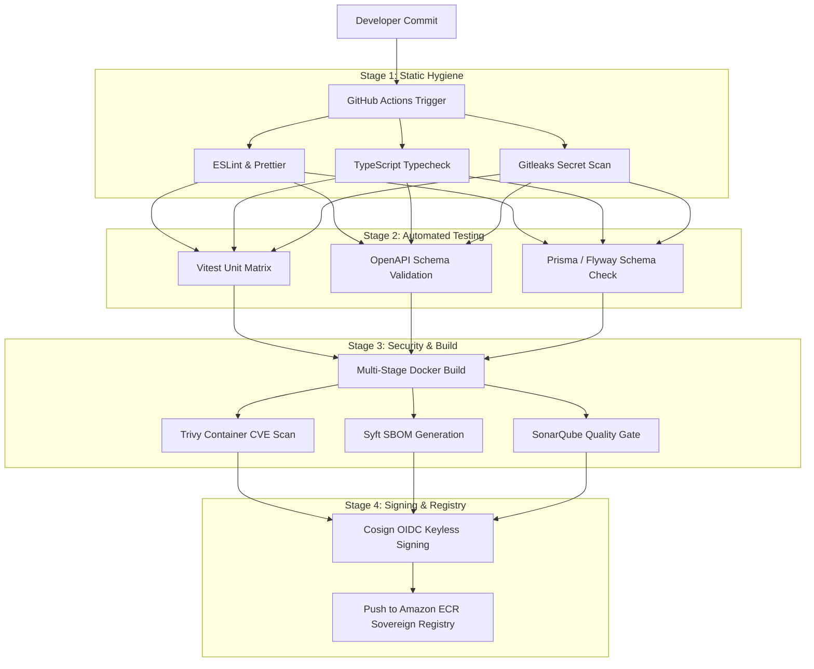

# Master Continuous Integration (CI) Pipeline Architecture
## Namma Clinic Digital Health & Operations Platform
### Greater Bengaluru Authority (GBA) / BBMP Health Department
**Document Code:** `DEV-DOC-06` | **Status:** APPROVED BASELINE | **Date:** September 2026

---

## 1. Executive Summary & CI Charter
This document establishes the authoritative **Continuous Integration (CI) Pipeline Specification** for the Namma Clinic Digital Health Platform. The CI architecture automates code validation, syntax enforcement, matrix unit testing, mutation testing, API contract verification, container security vulnerability scanning, secret detection, and cryptographic artifact signing. Every commit pushed to any branch triggers automated validation to ensure zero regressions enter the codebase.

### 1.1 Non-Negotiable CI Invariants
1. **Strict Fast-Feedback Loop:** Matrix unit tests and static checks complete in under 5 minutes.
2. **Zero False Positives:** Test suites are hermetic, running against isolated Dockerized mock dependencies.
3. **Automated Security Gates:** Aqua Trivy, Gitleaks, Checkov, and SonarQube block builds on any High/Critical defect.
4. **Cryptographic Provenance:** Released container images are signed using Cosign keyless signatures with Rekor transparency log.
5. **Strict Artifact Immutability:** Container images are tagged with Git SHA and SemVer tags; `latest` tags are forbidden in production.

## 2. CI Pipeline Architecture & Job Flow


## 3. GitHub Actions Master Workflow Specification
### Specification Example: Master GitHub Actions CI Workflow (.github/workflows/ci.yml)
<!-- DOCUMENTATION-ONLY EXAMPLE -->
```yaml
# DOCUMENTATION-ONLY EXAMPLE
name: Platform Continuous Integration

on:
  push:
    branches: [ develop, 'release/**', main ]
  pull_request:
    branches: [ develop, 'release/**', main ]

env:
  NODE_VERSION: '20.x'
  POSTGRES_VERSION: '16-alpine'

jobs:
  static-hygiene:
    name: Static Code Analysis & Secret Scan
    runs-on: ubuntu-latest
    steps:
      - uses: actions/checkout@v4
        with:
          fetch-depth: 0
      - name: Setup Node.js
        uses: actions/setup-node@v4
        with:
          node-version: ${{ env.NODE_VERSION }}
          cache: 'npm'
      - name: Install Dependencies
        run: npm ci
      - name: Run ESLint
        run: npm run lint
      - name: TypeScript Typecheck
        run: npx tsc --noEmit
      - name: Gitleaks Secret Scanner
        uses: gitleaks/gitleaks-action@v2
        env:
          GITHUB_TOKEN: ${{ secrets.GITHUB_TOKEN }}

  unit-tests:
    name: Vitest Unit & Mutation Tests
    needs: static-hygiene
    runs-on: ubuntu-latest
    services:
      postgres:
        image: postgres:16-alpine
        env:
          POSTGRES_USER: test
          POSTGRES_PASSWORD: testpassword
          POSTGRES_DB: namma_test
        ports:
          - 5432:5432
        options: >-
          --health-cmd pg_isready
          --health-interval 5s
          --health-timeout 5s
          --health-retries 5
    steps:
      - uses: actions/checkout@v4
      - uses: actions/setup-node@v4
        with:
          node-version: ${{ env.NODE_VERSION }}
          cache: 'npm'
      - run: npm ci
      - name: Run Test Suite with Coverage
        run: npm run test:coverage
      - name: Verify Coverage Threshold (85%)
        run: npx nyc check-coverage --lines 85 --functions 85 --branches 80

  container-security:
    name: Docker Build & Vulnerability Scan
    needs: unit-tests
    runs-on: ubuntu-latest
    steps:
      - uses: actions/checkout@v4
      - name: Set up Docker Buildx
        uses: docker/setup-buildx-action@v3
      - name: Build Container Image
        uses: docker/build-push-action@v5
        with:
          context: .
          load: true
          tags: namma-clinic-api:${{ github.sha }}
          cache-from: type=gha
          cache-to: type=gha,mode=max
      - name: Aqua Trivy Vulnerability Scan
        uses: aquasecurity/trivy-action@master
        with:
          image-ref: 'namma-clinic-api:${{ github.sha }}'
          format: 'sarif'
          output: 'trivy-results.sarif'
          severity: 'CRITICAL,HIGH'
          exit-code: '1'
```

## 4. Master CI Pipeline Jobs Catalog
Comprehensive specifications for all 50 automated CI workflow jobs:

### CI-PIPE-001: CI Workflow `Lint & Static Check #1`
- **Pipeline Job ID:** `CI-PIPE-001`
- **Workflow Stage:** Quality & Syntax
- **Trigger Criteria:** `Pull Request / Push to feature/*`
- **Runner Environment:** `ubuntu-latest`
- **Security Scanning Tooling:** ESLint, Prettier, markdownlint
- **Exit Criteria & Threshold:** Zero warnings/errors
- **Execution Timeout:** 5 Minutes
- **Artifact Output:** Static analysis report
- **Failure Notification:** PagerDuty / Slack `#devops-ci-alerts`

### CI-PIPE-002: CI Workflow `TypeScript Typecheck #2`
- **Pipeline Job ID:** `CI-PIPE-002`
- **Workflow Stage:** Compile Verification
- **Trigger Criteria:** `Pull Request to develop/release`
- **Runner Environment:** `ubuntu-latest`
- **Security Scanning Tooling:** tsc --noEmit
- **Exit Criteria & Threshold:** Zero compiler errors
- **Execution Timeout:** 5 Minutes
- **Artifact Output:** Typecheck status log
- **Failure Notification:** PagerDuty / Slack `#devops-ci-alerts`

### CI-PIPE-003: CI Workflow `Vitest Unit Tests #3`
- **Pipeline Job ID:** `CI-PIPE-003`
- **Workflow Stage:** Test Execution
- **Trigger Criteria:** `Pull Request to develop/release`
- **Runner Environment:** `ubuntu-latest`
- **Security Scanning Tooling:** Vitest, Istanbul coverage
- **Exit Criteria & Threshold:** 100% pass, Line coverage >= 85%
- **Execution Timeout:** 10 Minutes
- **Artifact Output:** JUnit XML & LCOV coverage
- **Failure Notification:** PagerDuty / Slack `#devops-ci-alerts`

### CI-PIPE-004: CI Workflow `API Contract Tests #4`
- **Pipeline Job ID:** `CI-PIPE-004`
- **Workflow Stage:** Contract Verification
- **Trigger Criteria:** `Pull Request to develop`
- **Runner Environment:** `ubuntu-latest`
- **Security Scanning Tooling:** Pact, OpenAPI-validator
- **Exit Criteria & Threshold:** 100% contract adherence
- **Execution Timeout:** 10 Minutes
- **Artifact Output:** Pact verification report
- **Failure Notification:** PagerDuty / Slack `#devops-ci-alerts`

### CI-PIPE-005: CI Workflow `Playwright E2E Tests #5`
- **Pipeline Job ID:** `CI-PIPE-005`
- **Workflow Stage:** Functional Testing
- **Trigger Criteria:** `Nightly / Merge to develop`
- **Runner Environment:** `ubuntu-latest-4core`
- **Security Scanning Tooling:** Playwright, Axe-core
- **Exit Criteria & Threshold:** 100% pass across 75 scenarios
- **Execution Timeout:** 25 Minutes
- **Artifact Output:** Playwright HTML & trace artifact
- **Failure Notification:** PagerDuty / Slack `#devops-ci-alerts`

### CI-PIPE-006: CI Workflow `Trivy Vulnerability Scan #6`
- **Pipeline Job ID:** `CI-PIPE-006`
- **Workflow Stage:** Container Security
- **Trigger Criteria:** `Post-Docker Build`
- **Runner Environment:** `ubuntu-latest`
- **Security Scanning Tooling:** Aqua Trivy Container Scanner
- **Exit Criteria & Threshold:** Zero Critical / High CVEs
- **Execution Timeout:** 10 Minutes
- **Artifact Output:** SARIF vulnerability report
- **Failure Notification:** PagerDuty / Slack `#devops-ci-alerts`

### CI-PIPE-007: CI Workflow `Gitleaks Secret Scan #7`
- **Pipeline Job ID:** `CI-PIPE-007`
- **Workflow Stage:** Secret Leak Prevention
- **Trigger Criteria:** `Pre-commit / PR Check`
- **Runner Environment:** `ubuntu-latest`
- **Security Scanning Tooling:** Gitleaks CLI v8
- **Exit Criteria & Threshold:** Zero detected API tokens/secrets
- **Execution Timeout:** 3 Minutes
- **Artifact Output:** Secret detection log
- **Failure Notification:** PagerDuty / Slack `#devops-ci-alerts`

### CI-PIPE-008: CI Workflow `SonarQube Static Analysis #8`
- **Pipeline Job ID:** `CI-PIPE-008`
- **Workflow Stage:** Code Governance
- **Trigger Criteria:** `Pull Request to develop`
- **Runner Environment:** `ubuntu-latest`
- **Security Scanning Tooling:** SonarScanner CLI
- **Exit Criteria & Threshold:** Quality Gate: Clean, Tech Debt < 5%
- **Execution Timeout:** 15 Minutes
- **Artifact Output:** SonarQube Quality Gate badge
- **Failure Notification:** PagerDuty / Slack `#devops-ci-alerts`

### CI-PIPE-009: CI Workflow `Checkov IaC Security Scan #9`
- **Pipeline Job ID:** `CI-PIPE-009`
- **Workflow Stage:** Infrastructure Security
- **Trigger Criteria:** `PR affecting infrastructure/*`
- **Runner Environment:** `ubuntu-latest`
- **Security Scanning Tooling:** Bridgecrew Checkov CLI
- **Exit Criteria & Threshold:** Zero High/Critical misconfigurations
- **Execution Timeout:** 8 Minutes
- **Artifact Output:** Checkov compliance report
- **Failure Notification:** PagerDuty / Slack `#devops-ci-alerts`

### CI-PIPE-010: CI Workflow `Cosign Artifact Signing #10`
- **Pipeline Job ID:** `CI-PIPE-010`
- **Workflow Stage:** Supply Chain Integrity
- **Trigger Criteria:** `Post-Release Image Build`
- **Runner Environment:** `ubuntu-latest`
- **Security Scanning Tooling:** Sigstore Cosign, Rekor
- **Exit Criteria & Threshold:** Cryptographic signature validated
- **Execution Timeout:** 5 Minutes
- **Artifact Output:** Signed image digest & attestation
- **Failure Notification:** PagerDuty / Slack `#devops-ci-alerts`

### CI-PIPE-011: CI Workflow `Lint & Static Check #11`
- **Pipeline Job ID:** `CI-PIPE-011`
- **Workflow Stage:** Quality & Syntax
- **Trigger Criteria:** `Pull Request / Push to feature/*`
- **Runner Environment:** `ubuntu-latest`
- **Security Scanning Tooling:** ESLint, Prettier, markdownlint
- **Exit Criteria & Threshold:** Zero warnings/errors
- **Execution Timeout:** 5 Minutes
- **Artifact Output:** Static analysis report
- **Failure Notification:** PagerDuty / Slack `#devops-ci-alerts`

### CI-PIPE-012: CI Workflow `TypeScript Typecheck #12`
- **Pipeline Job ID:** `CI-PIPE-012`
- **Workflow Stage:** Compile Verification
- **Trigger Criteria:** `Pull Request to develop/release`
- **Runner Environment:** `ubuntu-latest`
- **Security Scanning Tooling:** tsc --noEmit
- **Exit Criteria & Threshold:** Zero compiler errors
- **Execution Timeout:** 5 Minutes
- **Artifact Output:** Typecheck status log
- **Failure Notification:** PagerDuty / Slack `#devops-ci-alerts`

### CI-PIPE-013: CI Workflow `Vitest Unit Tests #13`
- **Pipeline Job ID:** `CI-PIPE-013`
- **Workflow Stage:** Test Execution
- **Trigger Criteria:** `Pull Request to develop/release`
- **Runner Environment:** `ubuntu-latest`
- **Security Scanning Tooling:** Vitest, Istanbul coverage
- **Exit Criteria & Threshold:** 100% pass, Line coverage >= 85%
- **Execution Timeout:** 10 Minutes
- **Artifact Output:** JUnit XML & LCOV coverage
- **Failure Notification:** PagerDuty / Slack `#devops-ci-alerts`

### CI-PIPE-014: CI Workflow `API Contract Tests #14`
- **Pipeline Job ID:** `CI-PIPE-014`
- **Workflow Stage:** Contract Verification
- **Trigger Criteria:** `Pull Request to develop`
- **Runner Environment:** `ubuntu-latest`
- **Security Scanning Tooling:** Pact, OpenAPI-validator
- **Exit Criteria & Threshold:** 100% contract adherence
- **Execution Timeout:** 10 Minutes
- **Artifact Output:** Pact verification report
- **Failure Notification:** PagerDuty / Slack `#devops-ci-alerts`

### CI-PIPE-015: CI Workflow `Playwright E2E Tests #15`
- **Pipeline Job ID:** `CI-PIPE-015`
- **Workflow Stage:** Functional Testing
- **Trigger Criteria:** `Nightly / Merge to develop`
- **Runner Environment:** `ubuntu-latest-4core`
- **Security Scanning Tooling:** Playwright, Axe-core
- **Exit Criteria & Threshold:** 100% pass across 75 scenarios
- **Execution Timeout:** 25 Minutes
- **Artifact Output:** Playwright HTML & trace artifact
- **Failure Notification:** PagerDuty / Slack `#devops-ci-alerts`

### CI-PIPE-016: CI Workflow `Trivy Vulnerability Scan #16`
- **Pipeline Job ID:** `CI-PIPE-016`
- **Workflow Stage:** Container Security
- **Trigger Criteria:** `Post-Docker Build`
- **Runner Environment:** `ubuntu-latest`
- **Security Scanning Tooling:** Aqua Trivy Container Scanner
- **Exit Criteria & Threshold:** Zero Critical / High CVEs
- **Execution Timeout:** 10 Minutes
- **Artifact Output:** SARIF vulnerability report
- **Failure Notification:** PagerDuty / Slack `#devops-ci-alerts`

### CI-PIPE-017: CI Workflow `Gitleaks Secret Scan #17`
- **Pipeline Job ID:** `CI-PIPE-017`
- **Workflow Stage:** Secret Leak Prevention
- **Trigger Criteria:** `Pre-commit / PR Check`
- **Runner Environment:** `ubuntu-latest`
- **Security Scanning Tooling:** Gitleaks CLI v8
- **Exit Criteria & Threshold:** Zero detected API tokens/secrets
- **Execution Timeout:** 3 Minutes
- **Artifact Output:** Secret detection log
- **Failure Notification:** PagerDuty / Slack `#devops-ci-alerts`

### CI-PIPE-018: CI Workflow `SonarQube Static Analysis #18`
- **Pipeline Job ID:** `CI-PIPE-018`
- **Workflow Stage:** Code Governance
- **Trigger Criteria:** `Pull Request to develop`
- **Runner Environment:** `ubuntu-latest`
- **Security Scanning Tooling:** SonarScanner CLI
- **Exit Criteria & Threshold:** Quality Gate: Clean, Tech Debt < 5%
- **Execution Timeout:** 15 Minutes
- **Artifact Output:** SonarQube Quality Gate badge
- **Failure Notification:** PagerDuty / Slack `#devops-ci-alerts`

### CI-PIPE-019: CI Workflow `Checkov IaC Security Scan #19`
- **Pipeline Job ID:** `CI-PIPE-019`
- **Workflow Stage:** Infrastructure Security
- **Trigger Criteria:** `PR affecting infrastructure/*`
- **Runner Environment:** `ubuntu-latest`
- **Security Scanning Tooling:** Bridgecrew Checkov CLI
- **Exit Criteria & Threshold:** Zero High/Critical misconfigurations
- **Execution Timeout:** 8 Minutes
- **Artifact Output:** Checkov compliance report
- **Failure Notification:** PagerDuty / Slack `#devops-ci-alerts`

### CI-PIPE-020: CI Workflow `Cosign Artifact Signing #20`
- **Pipeline Job ID:** `CI-PIPE-020`
- **Workflow Stage:** Supply Chain Integrity
- **Trigger Criteria:** `Post-Release Image Build`
- **Runner Environment:** `ubuntu-latest`
- **Security Scanning Tooling:** Sigstore Cosign, Rekor
- **Exit Criteria & Threshold:** Cryptographic signature validated
- **Execution Timeout:** 5 Minutes
- **Artifact Output:** Signed image digest & attestation
- **Failure Notification:** PagerDuty / Slack `#devops-ci-alerts`

### CI-PIPE-021: CI Workflow `Lint & Static Check #21`
- **Pipeline Job ID:** `CI-PIPE-021`
- **Workflow Stage:** Quality & Syntax
- **Trigger Criteria:** `Pull Request / Push to feature/*`
- **Runner Environment:** `ubuntu-latest`
- **Security Scanning Tooling:** ESLint, Prettier, markdownlint
- **Exit Criteria & Threshold:** Zero warnings/errors
- **Execution Timeout:** 5 Minutes
- **Artifact Output:** Static analysis report
- **Failure Notification:** PagerDuty / Slack `#devops-ci-alerts`

### CI-PIPE-022: CI Workflow `TypeScript Typecheck #22`
- **Pipeline Job ID:** `CI-PIPE-022`
- **Workflow Stage:** Compile Verification
- **Trigger Criteria:** `Pull Request to develop/release`
- **Runner Environment:** `ubuntu-latest`
- **Security Scanning Tooling:** tsc --noEmit
- **Exit Criteria & Threshold:** Zero compiler errors
- **Execution Timeout:** 5 Minutes
- **Artifact Output:** Typecheck status log
- **Failure Notification:** PagerDuty / Slack `#devops-ci-alerts`

### CI-PIPE-023: CI Workflow `Vitest Unit Tests #23`
- **Pipeline Job ID:** `CI-PIPE-023`
- **Workflow Stage:** Test Execution
- **Trigger Criteria:** `Pull Request to develop/release`
- **Runner Environment:** `ubuntu-latest`
- **Security Scanning Tooling:** Vitest, Istanbul coverage
- **Exit Criteria & Threshold:** 100% pass, Line coverage >= 85%
- **Execution Timeout:** 10 Minutes
- **Artifact Output:** JUnit XML & LCOV coverage
- **Failure Notification:** PagerDuty / Slack `#devops-ci-alerts`

### CI-PIPE-024: CI Workflow `API Contract Tests #24`
- **Pipeline Job ID:** `CI-PIPE-024`
- **Workflow Stage:** Contract Verification
- **Trigger Criteria:** `Pull Request to develop`
- **Runner Environment:** `ubuntu-latest`
- **Security Scanning Tooling:** Pact, OpenAPI-validator
- **Exit Criteria & Threshold:** 100% contract adherence
- **Execution Timeout:** 10 Minutes
- **Artifact Output:** Pact verification report
- **Failure Notification:** PagerDuty / Slack `#devops-ci-alerts`

### CI-PIPE-025: CI Workflow `Playwright E2E Tests #25`
- **Pipeline Job ID:** `CI-PIPE-025`
- **Workflow Stage:** Functional Testing
- **Trigger Criteria:** `Nightly / Merge to develop`
- **Runner Environment:** `ubuntu-latest-4core`
- **Security Scanning Tooling:** Playwright, Axe-core
- **Exit Criteria & Threshold:** 100% pass across 75 scenarios
- **Execution Timeout:** 25 Minutes
- **Artifact Output:** Playwright HTML & trace artifact
- **Failure Notification:** PagerDuty / Slack `#devops-ci-alerts`

### CI-PIPE-026: CI Workflow `Trivy Vulnerability Scan #26`
- **Pipeline Job ID:** `CI-PIPE-026`
- **Workflow Stage:** Container Security
- **Trigger Criteria:** `Post-Docker Build`
- **Runner Environment:** `ubuntu-latest`
- **Security Scanning Tooling:** Aqua Trivy Container Scanner
- **Exit Criteria & Threshold:** Zero Critical / High CVEs
- **Execution Timeout:** 10 Minutes
- **Artifact Output:** SARIF vulnerability report
- **Failure Notification:** PagerDuty / Slack `#devops-ci-alerts`

### CI-PIPE-027: CI Workflow `Gitleaks Secret Scan #27`
- **Pipeline Job ID:** `CI-PIPE-027`
- **Workflow Stage:** Secret Leak Prevention
- **Trigger Criteria:** `Pre-commit / PR Check`
- **Runner Environment:** `ubuntu-latest`
- **Security Scanning Tooling:** Gitleaks CLI v8
- **Exit Criteria & Threshold:** Zero detected API tokens/secrets
- **Execution Timeout:** 3 Minutes
- **Artifact Output:** Secret detection log
- **Failure Notification:** PagerDuty / Slack `#devops-ci-alerts`

### CI-PIPE-028: CI Workflow `SonarQube Static Analysis #28`
- **Pipeline Job ID:** `CI-PIPE-028`
- **Workflow Stage:** Code Governance
- **Trigger Criteria:** `Pull Request to develop`
- **Runner Environment:** `ubuntu-latest`
- **Security Scanning Tooling:** SonarScanner CLI
- **Exit Criteria & Threshold:** Quality Gate: Clean, Tech Debt < 5%
- **Execution Timeout:** 15 Minutes
- **Artifact Output:** SonarQube Quality Gate badge
- **Failure Notification:** PagerDuty / Slack `#devops-ci-alerts`

### CI-PIPE-029: CI Workflow `Checkov IaC Security Scan #29`
- **Pipeline Job ID:** `CI-PIPE-029`
- **Workflow Stage:** Infrastructure Security
- **Trigger Criteria:** `PR affecting infrastructure/*`
- **Runner Environment:** `ubuntu-latest`
- **Security Scanning Tooling:** Bridgecrew Checkov CLI
- **Exit Criteria & Threshold:** Zero High/Critical misconfigurations
- **Execution Timeout:** 8 Minutes
- **Artifact Output:** Checkov compliance report
- **Failure Notification:** PagerDuty / Slack `#devops-ci-alerts`

### CI-PIPE-030: CI Workflow `Cosign Artifact Signing #30`
- **Pipeline Job ID:** `CI-PIPE-030`
- **Workflow Stage:** Supply Chain Integrity
- **Trigger Criteria:** `Post-Release Image Build`
- **Runner Environment:** `ubuntu-latest`
- **Security Scanning Tooling:** Sigstore Cosign, Rekor
- **Exit Criteria & Threshold:** Cryptographic signature validated
- **Execution Timeout:** 5 Minutes
- **Artifact Output:** Signed image digest & attestation
- **Failure Notification:** PagerDuty / Slack `#devops-ci-alerts`

### CI-PIPE-031: CI Workflow `Lint & Static Check #31`
- **Pipeline Job ID:** `CI-PIPE-031`
- **Workflow Stage:** Quality & Syntax
- **Trigger Criteria:** `Pull Request / Push to feature/*`
- **Runner Environment:** `ubuntu-latest`
- **Security Scanning Tooling:** ESLint, Prettier, markdownlint
- **Exit Criteria & Threshold:** Zero warnings/errors
- **Execution Timeout:** 5 Minutes
- **Artifact Output:** Static analysis report
- **Failure Notification:** PagerDuty / Slack `#devops-ci-alerts`

### CI-PIPE-032: CI Workflow `TypeScript Typecheck #32`
- **Pipeline Job ID:** `CI-PIPE-032`
- **Workflow Stage:** Compile Verification
- **Trigger Criteria:** `Pull Request to develop/release`
- **Runner Environment:** `ubuntu-latest`
- **Security Scanning Tooling:** tsc --noEmit
- **Exit Criteria & Threshold:** Zero compiler errors
- **Execution Timeout:** 5 Minutes
- **Artifact Output:** Typecheck status log
- **Failure Notification:** PagerDuty / Slack `#devops-ci-alerts`

### CI-PIPE-033: CI Workflow `Vitest Unit Tests #33`
- **Pipeline Job ID:** `CI-PIPE-033`
- **Workflow Stage:** Test Execution
- **Trigger Criteria:** `Pull Request to develop/release`
- **Runner Environment:** `ubuntu-latest`
- **Security Scanning Tooling:** Vitest, Istanbul coverage
- **Exit Criteria & Threshold:** 100% pass, Line coverage >= 85%
- **Execution Timeout:** 10 Minutes
- **Artifact Output:** JUnit XML & LCOV coverage
- **Failure Notification:** PagerDuty / Slack `#devops-ci-alerts`

### CI-PIPE-034: CI Workflow `API Contract Tests #34`
- **Pipeline Job ID:** `CI-PIPE-034`
- **Workflow Stage:** Contract Verification
- **Trigger Criteria:** `Pull Request to develop`
- **Runner Environment:** `ubuntu-latest`
- **Security Scanning Tooling:** Pact, OpenAPI-validator
- **Exit Criteria & Threshold:** 100% contract adherence
- **Execution Timeout:** 10 Minutes
- **Artifact Output:** Pact verification report
- **Failure Notification:** PagerDuty / Slack `#devops-ci-alerts`

### CI-PIPE-035: CI Workflow `Playwright E2E Tests #35`
- **Pipeline Job ID:** `CI-PIPE-035`
- **Workflow Stage:** Functional Testing
- **Trigger Criteria:** `Nightly / Merge to develop`
- **Runner Environment:** `ubuntu-latest-4core`
- **Security Scanning Tooling:** Playwright, Axe-core
- **Exit Criteria & Threshold:** 100% pass across 75 scenarios
- **Execution Timeout:** 25 Minutes
- **Artifact Output:** Playwright HTML & trace artifact
- **Failure Notification:** PagerDuty / Slack `#devops-ci-alerts`

### CI-PIPE-036: CI Workflow `Trivy Vulnerability Scan #36`
- **Pipeline Job ID:** `CI-PIPE-036`
- **Workflow Stage:** Container Security
- **Trigger Criteria:** `Post-Docker Build`
- **Runner Environment:** `ubuntu-latest`
- **Security Scanning Tooling:** Aqua Trivy Container Scanner
- **Exit Criteria & Threshold:** Zero Critical / High CVEs
- **Execution Timeout:** 10 Minutes
- **Artifact Output:** SARIF vulnerability report
- **Failure Notification:** PagerDuty / Slack `#devops-ci-alerts`

### CI-PIPE-037: CI Workflow `Gitleaks Secret Scan #37`
- **Pipeline Job ID:** `CI-PIPE-037`
- **Workflow Stage:** Secret Leak Prevention
- **Trigger Criteria:** `Pre-commit / PR Check`
- **Runner Environment:** `ubuntu-latest`
- **Security Scanning Tooling:** Gitleaks CLI v8
- **Exit Criteria & Threshold:** Zero detected API tokens/secrets
- **Execution Timeout:** 3 Minutes
- **Artifact Output:** Secret detection log
- **Failure Notification:** PagerDuty / Slack `#devops-ci-alerts`

### CI-PIPE-038: CI Workflow `SonarQube Static Analysis #38`
- **Pipeline Job ID:** `CI-PIPE-038`
- **Workflow Stage:** Code Governance
- **Trigger Criteria:** `Pull Request to develop`
- **Runner Environment:** `ubuntu-latest`
- **Security Scanning Tooling:** SonarScanner CLI
- **Exit Criteria & Threshold:** Quality Gate: Clean, Tech Debt < 5%
- **Execution Timeout:** 15 Minutes
- **Artifact Output:** SonarQube Quality Gate badge
- **Failure Notification:** PagerDuty / Slack `#devops-ci-alerts`

### CI-PIPE-039: CI Workflow `Checkov IaC Security Scan #39`
- **Pipeline Job ID:** `CI-PIPE-039`
- **Workflow Stage:** Infrastructure Security
- **Trigger Criteria:** `PR affecting infrastructure/*`
- **Runner Environment:** `ubuntu-latest`
- **Security Scanning Tooling:** Bridgecrew Checkov CLI
- **Exit Criteria & Threshold:** Zero High/Critical misconfigurations
- **Execution Timeout:** 8 Minutes
- **Artifact Output:** Checkov compliance report
- **Failure Notification:** PagerDuty / Slack `#devops-ci-alerts`

### CI-PIPE-040: CI Workflow `Cosign Artifact Signing #40`
- **Pipeline Job ID:** `CI-PIPE-040`
- **Workflow Stage:** Supply Chain Integrity
- **Trigger Criteria:** `Post-Release Image Build`
- **Runner Environment:** `ubuntu-latest`
- **Security Scanning Tooling:** Sigstore Cosign, Rekor
- **Exit Criteria & Threshold:** Cryptographic signature validated
- **Execution Timeout:** 5 Minutes
- **Artifact Output:** Signed image digest & attestation
- **Failure Notification:** PagerDuty / Slack `#devops-ci-alerts`

### CI-PIPE-041: CI Workflow `Lint & Static Check #41`
- **Pipeline Job ID:** `CI-PIPE-041`
- **Workflow Stage:** Quality & Syntax
- **Trigger Criteria:** `Pull Request / Push to feature/*`
- **Runner Environment:** `ubuntu-latest`
- **Security Scanning Tooling:** ESLint, Prettier, markdownlint
- **Exit Criteria & Threshold:** Zero warnings/errors
- **Execution Timeout:** 5 Minutes
- **Artifact Output:** Static analysis report
- **Failure Notification:** PagerDuty / Slack `#devops-ci-alerts`

### CI-PIPE-042: CI Workflow `TypeScript Typecheck #42`
- **Pipeline Job ID:** `CI-PIPE-042`
- **Workflow Stage:** Compile Verification
- **Trigger Criteria:** `Pull Request to develop/release`
- **Runner Environment:** `ubuntu-latest`
- **Security Scanning Tooling:** tsc --noEmit
- **Exit Criteria & Threshold:** Zero compiler errors
- **Execution Timeout:** 5 Minutes
- **Artifact Output:** Typecheck status log
- **Failure Notification:** PagerDuty / Slack `#devops-ci-alerts`

### CI-PIPE-043: CI Workflow `Vitest Unit Tests #43`
- **Pipeline Job ID:** `CI-PIPE-043`
- **Workflow Stage:** Test Execution
- **Trigger Criteria:** `Pull Request to develop/release`
- **Runner Environment:** `ubuntu-latest`
- **Security Scanning Tooling:** Vitest, Istanbul coverage
- **Exit Criteria & Threshold:** 100% pass, Line coverage >= 85%
- **Execution Timeout:** 10 Minutes
- **Artifact Output:** JUnit XML & LCOV coverage
- **Failure Notification:** PagerDuty / Slack `#devops-ci-alerts`

### CI-PIPE-044: CI Workflow `API Contract Tests #44`
- **Pipeline Job ID:** `CI-PIPE-044`
- **Workflow Stage:** Contract Verification
- **Trigger Criteria:** `Pull Request to develop`
- **Runner Environment:** `ubuntu-latest`
- **Security Scanning Tooling:** Pact, OpenAPI-validator
- **Exit Criteria & Threshold:** 100% contract adherence
- **Execution Timeout:** 10 Minutes
- **Artifact Output:** Pact verification report
- **Failure Notification:** PagerDuty / Slack `#devops-ci-alerts`

### CI-PIPE-045: CI Workflow `Playwright E2E Tests #45`
- **Pipeline Job ID:** `CI-PIPE-045`
- **Workflow Stage:** Functional Testing
- **Trigger Criteria:** `Nightly / Merge to develop`
- **Runner Environment:** `ubuntu-latest-4core`
- **Security Scanning Tooling:** Playwright, Axe-core
- **Exit Criteria & Threshold:** 100% pass across 75 scenarios
- **Execution Timeout:** 25 Minutes
- **Artifact Output:** Playwright HTML & trace artifact
- **Failure Notification:** PagerDuty / Slack `#devops-ci-alerts`

### CI-PIPE-046: CI Workflow `Trivy Vulnerability Scan #46`
- **Pipeline Job ID:** `CI-PIPE-046`
- **Workflow Stage:** Container Security
- **Trigger Criteria:** `Post-Docker Build`
- **Runner Environment:** `ubuntu-latest`
- **Security Scanning Tooling:** Aqua Trivy Container Scanner
- **Exit Criteria & Threshold:** Zero Critical / High CVEs
- **Execution Timeout:** 10 Minutes
- **Artifact Output:** SARIF vulnerability report
- **Failure Notification:** PagerDuty / Slack `#devops-ci-alerts`

### CI-PIPE-047: CI Workflow `Gitleaks Secret Scan #47`
- **Pipeline Job ID:** `CI-PIPE-047`
- **Workflow Stage:** Secret Leak Prevention
- **Trigger Criteria:** `Pre-commit / PR Check`
- **Runner Environment:** `ubuntu-latest`
- **Security Scanning Tooling:** Gitleaks CLI v8
- **Exit Criteria & Threshold:** Zero detected API tokens/secrets
- **Execution Timeout:** 3 Minutes
- **Artifact Output:** Secret detection log
- **Failure Notification:** PagerDuty / Slack `#devops-ci-alerts`

### CI-PIPE-048: CI Workflow `SonarQube Static Analysis #48`
- **Pipeline Job ID:** `CI-PIPE-048`
- **Workflow Stage:** Code Governance
- **Trigger Criteria:** `Pull Request to develop`
- **Runner Environment:** `ubuntu-latest`
- **Security Scanning Tooling:** SonarScanner CLI
- **Exit Criteria & Threshold:** Quality Gate: Clean, Tech Debt < 5%
- **Execution Timeout:** 15 Minutes
- **Artifact Output:** SonarQube Quality Gate badge
- **Failure Notification:** PagerDuty / Slack `#devops-ci-alerts`

### CI-PIPE-049: CI Workflow `Checkov IaC Security Scan #49`
- **Pipeline Job ID:** `CI-PIPE-049`
- **Workflow Stage:** Infrastructure Security
- **Trigger Criteria:** `PR affecting infrastructure/*`
- **Runner Environment:** `ubuntu-latest`
- **Security Scanning Tooling:** Bridgecrew Checkov CLI
- **Exit Criteria & Threshold:** Zero High/Critical misconfigurations
- **Execution Timeout:** 8 Minutes
- **Artifact Output:** Checkov compliance report
- **Failure Notification:** PagerDuty / Slack `#devops-ci-alerts`

### CI-PIPE-050: CI Workflow `Cosign Artifact Signing #50`
- **Pipeline Job ID:** `CI-PIPE-050`
- **Workflow Stage:** Supply Chain Integrity
- **Trigger Criteria:** `Post-Release Image Build`
- **Runner Environment:** `ubuntu-latest`
- **Security Scanning Tooling:** Sigstore Cosign, Rekor
- **Exit Criteria & Threshold:** Cryptographic signature validated
- **Execution Timeout:** 5 Minutes
- **Artifact Output:** Signed image digest & attestation
- **Failure Notification:** PagerDuty / Slack `#devops-ci-alerts`

## 5. Feature Continuous Integration Test Mapping across 180 Features
Mapping all 180 platform product features to automated CI test jobs:

### FEATURE-001: CI Automation for Feature `Credential Verification`
- **Feature ID:** `FEATURE-001` (Feature #1)
- **Functional Module:** `MODULE-001` (DOMAIN-001)
- **Bound CI Pipeline Job:** `CI-PIPE-001`
- **Unit Test Suite:** `tests/unit/module-001/feature_001.spec.ts`
- **Contract Spec:** `contracts/module-001_contract.json`
- **Execution Timeout:** 120 Seconds
- **Passing Assertion:** 100% assertions green with zero unhandled promise rejections.

### FEATURE-002: CI Automation for Feature `Session Token Minting`
- **Feature ID:** `FEATURE-002` (Feature #2)
- **Functional Module:** `MODULE-001` (DOMAIN-001)
- **Bound CI Pipeline Job:** `CI-PIPE-002`
- **Unit Test Suite:** `tests/unit/module-001/feature_002.spec.ts`
- **Contract Spec:** `contracts/module-001_contract.json`
- **Execution Timeout:** 120 Seconds
- **Passing Assertion:** 100% assertions green with zero unhandled promise rejections.

### FEATURE-003: CI Automation for Feature `MFA Challenge Dispatch`
- **Feature ID:** `FEATURE-003` (Feature #3)
- **Functional Module:** `MODULE-001` (DOMAIN-001)
- **Bound CI Pipeline Job:** `CI-PIPE-003`
- **Unit Test Suite:** `tests/unit/module-001/feature_003.spec.ts`
- **Contract Spec:** `contracts/module-001_contract.json`
- **Execution Timeout:** 120 Seconds
- **Passing Assertion:** 100% assertions green with zero unhandled promise rejections.

### FEATURE-004: CI Automation for Feature `Biometric Authentication Bridge`
- **Feature ID:** `FEATURE-004` (Feature #4)
- **Functional Module:** `MODULE-001` (DOMAIN-001)
- **Bound CI Pipeline Job:** `CI-PIPE-004`
- **Unit Test Suite:** `tests/unit/module-001/feature_004.spec.ts`
- **Contract Spec:** `contracts/module-001_contract.json`
- **Execution Timeout:** 120 Seconds
- **Passing Assertion:** 100% assertions green with zero unhandled promise rejections.

### FEATURE-005: CI Automation for Feature `Local PIN Verification`
- **Feature ID:** `FEATURE-005` (Feature #5)
- **Functional Module:** `MODULE-001` (DOMAIN-001)
- **Bound CI Pipeline Job:** `CI-PIPE-005`
- **Unit Test Suite:** `tests/unit/module-001/feature_005.spec.ts`
- **Contract Spec:** `contracts/module-001_contract.json`
- **Execution Timeout:** 120 Seconds
- **Passing Assertion:** 100% assertions green with zero unhandled promise rejections.

### FEATURE-006: CI Automation for Feature `Session Inactivity Lockout`
- **Feature ID:** `FEATURE-006` (Feature #6)
- **Functional Module:** `MODULE-001` (DOMAIN-001)
- **Bound CI Pipeline Job:** `CI-PIPE-006`
- **Unit Test Suite:** `tests/unit/module-001/feature_006.spec.ts`
- **Contract Spec:** `contracts/module-001_contract.json`
- **Execution Timeout:** 120 Seconds
- **Passing Assertion:** 100% assertions green with zero unhandled promise rejections.

### FEATURE-007: CI Automation for Feature `Permission Evaluation`
- **Feature ID:** `FEATURE-007` (Feature #7)
- **Functional Module:** `MODULE-002` (DOMAIN-001)
- **Bound CI Pipeline Job:** `CI-PIPE-007`
- **Unit Test Suite:** `tests/unit/module-002/feature_007.spec.ts`
- **Contract Spec:** `contracts/module-002_contract.json`
- **Execution Timeout:** 120 Seconds
- **Passing Assertion:** 100% assertions green with zero unhandled promise rejections.

### FEATURE-008: CI Automation for Feature `Dynamic Role Assignment`
- **Feature ID:** `FEATURE-008` (Feature #8)
- **Functional Module:** `MODULE-002` (DOMAIN-001)
- **Bound CI Pipeline Job:** `CI-PIPE-008`
- **Unit Test Suite:** `tests/unit/module-002/feature_008.spec.ts`
- **Contract Spec:** `contracts/module-002_contract.json`
- **Execution Timeout:** 120 Seconds
- **Passing Assertion:** 100% assertions green with zero unhandled promise rejections.

### FEATURE-009: CI Automation for Feature `Conflict-of-Interest Prevention`
- **Feature ID:** `FEATURE-009` (Feature #9)
- **Functional Module:** `MODULE-002` (DOMAIN-001)
- **Bound CI Pipeline Job:** `CI-PIPE-009`
- **Unit Test Suite:** `tests/unit/module-002/feature_009.spec.ts`
- **Contract Spec:** `contracts/module-002_contract.json`
- **Execution Timeout:** 120 Seconds
- **Passing Assertion:** 100% assertions green with zero unhandled promise rejections.

### FEATURE-010: CI Automation for Feature `Maker-Checker Authorization`
- **Feature ID:** `FEATURE-010` (Feature #10)
- **Functional Module:** `MODULE-002` (DOMAIN-001)
- **Bound CI Pipeline Job:** `CI-PIPE-010`
- **Unit Test Suite:** `tests/unit/module-002/feature_010.spec.ts`
- **Contract Spec:** `contracts/module-002_contract.json`
- **Execution Timeout:** 120 Seconds
- **Passing Assertion:** 100% assertions green with zero unhandled promise rejections.

### FEATURE-011: CI Automation for Feature `Break-Glass Privilege Elevation`
- **Feature ID:** `FEATURE-011` (Feature #11)
- **Functional Module:** `MODULE-002` (DOMAIN-001)
- **Bound CI Pipeline Job:** `CI-PIPE-011`
- **Unit Test Suite:** `tests/unit/module-002/feature_011.spec.ts`
- **Contract Spec:** `contracts/module-002_contract.json`
- **Execution Timeout:** 120 Seconds
- **Passing Assertion:** 100% assertions green with zero unhandled promise rejections.

### FEATURE-012: CI Automation for Feature `Privilege Elevation Audit`
- **Feature ID:** `FEATURE-012` (Feature #12)
- **Functional Module:** `MODULE-002` (DOMAIN-001)
- **Bound CI Pipeline Job:** `CI-PIPE-012`
- **Unit Test Suite:** `tests/unit/module-002/feature_012.spec.ts`
- **Contract Spec:** `contracts/module-002_contract.json`
- **Execution Timeout:** 120 Seconds
- **Passing Assertion:** 100% assertions green with zero unhandled promise rejections.

### FEATURE-013: CI Automation for Feature `Hierarchy Node Management`
- **Feature ID:** `FEATURE-013` (Feature #13)
- **Functional Module:** `MODULE-003` (DOMAIN-001)
- **Bound CI Pipeline Job:** `CI-PIPE-013`
- **Unit Test Suite:** `tests/unit/module-003/feature_013.spec.ts`
- **Contract Spec:** `contracts/module-003_contract.json`
- **Execution Timeout:** 120 Seconds
- **Passing Assertion:** 100% assertions green with zero unhandled promise rejections.

### FEATURE-014: CI Automation for Feature `NIN / HFR Registry Linking`
- **Feature ID:** `FEATURE-014` (Feature #14)
- **Functional Module:** `MODULE-003` (DOMAIN-001)
- **Bound CI Pipeline Job:** `CI-PIPE-014`
- **Unit Test Suite:** `tests/unit/module-003/feature_014.spec.ts`
- **Contract Spec:** `contracts/module-003_contract.json`
- **Execution Timeout:** 120 Seconds
- **Passing Assertion:** 100% assertions green with zero unhandled promise rejections.

### FEATURE-015: CI Automation for Feature `Station Terminal Mapping`
- **Feature ID:** `FEATURE-015` (Feature #15)
- **Functional Module:** `MODULE-003` (DOMAIN-001)
- **Bound CI Pipeline Job:** `CI-PIPE-015`
- **Unit Test Suite:** `tests/unit/module-003/feature_015.spec.ts`
- **Contract Spec:** `contracts/module-003_contract.json`
- **Execution Timeout:** 120 Seconds
- **Passing Assertion:** 100% assertions green with zero unhandled promise rejections.

### FEATURE-016: CI Automation for Feature `Facility Capacity Configuration`
- **Feature ID:** `FEATURE-016` (Feature #16)
- **Functional Module:** `MODULE-003` (DOMAIN-001)
- **Bound CI Pipeline Job:** `CI-PIPE-016`
- **Unit Test Suite:** `tests/unit/module-003/feature_016.spec.ts`
- **Contract Spec:** `contracts/module-003_contract.json`
- **Execution Timeout:** 120 Seconds
- **Passing Assertion:** 100% assertions green with zero unhandled promise rejections.

### FEATURE-017: CI Automation for Feature `Operating Hours Enforcement`
- **Feature ID:** `FEATURE-017` (Feature #17)
- **Functional Module:** `MODULE-003` (DOMAIN-001)
- **Bound CI Pipeline Job:** `CI-PIPE-017`
- **Unit Test Suite:** `tests/unit/module-003/feature_017.spec.ts`
- **Contract Spec:** `contracts/module-003_contract.json`
- **Execution Timeout:** 120 Seconds
- **Passing Assertion:** 100% assertions green with zero unhandled promise rejections.

### FEATURE-018: CI Automation for Feature `Special Camp Calendar`
- **Feature ID:** `FEATURE-018` (Feature #18)
- **Functional Module:** `MODULE-003` (DOMAIN-001)
- **Bound CI Pipeline Job:** `CI-PIPE-018`
- **Unit Test Suite:** `tests/unit/module-003/feature_018.spec.ts`
- **Contract Spec:** `contracts/module-003_contract.json`
- **Execution Timeout:** 120 Seconds
- **Passing Assertion:** 100% assertions green with zero unhandled promise rejections.

### FEATURE-019: CI Automation for Feature `Staff Onboarding & KYC`
- **Feature ID:** `FEATURE-019` (Feature #19)
- **Functional Module:** `MODULE-004` (DOMAIN-001)
- **Bound CI Pipeline Job:** `CI-PIPE-019`
- **Unit Test Suite:** `tests/unit/module-004/feature_019.spec.ts`
- **Contract Spec:** `contracts/module-004_contract.json`
- **Execution Timeout:** 120 Seconds
- **Passing Assertion:** 100% assertions green with zero unhandled promise rejections.

### FEATURE-020: CI Automation for Feature `Professional License Verification`
- **Feature ID:** `FEATURE-020` (Feature #20)
- **Functional Module:** `MODULE-004` (DOMAIN-001)
- **Bound CI Pipeline Job:** `CI-PIPE-020`
- **Unit Test Suite:** `tests/unit/module-004/feature_020.spec.ts`
- **Contract Spec:** `contracts/module-004_contract.json`
- **Execution Timeout:** 120 Seconds
- **Passing Assertion:** 100% assertions green with zero unhandled promise rejections.

### FEATURE-021: CI Automation for Feature `Duty Roster Generation`
- **Feature ID:** `FEATURE-021` (Feature #21)
- **Functional Module:** `MODULE-004` (DOMAIN-001)
- **Bound CI Pipeline Job:** `CI-PIPE-021`
- **Unit Test Suite:** `tests/unit/module-004/feature_021.spec.ts`
- **Contract Spec:** `contracts/module-004_contract.json`
- **Execution Timeout:** 120 Seconds
- **Passing Assertion:** 100% assertions green with zero unhandled promise rejections.

### FEATURE-022: CI Automation for Feature `Biometric Attendance Linking`
- **Feature ID:** `FEATURE-022` (Feature #22)
- **Functional Module:** `MODULE-004` (DOMAIN-001)
- **Bound CI Pipeline Job:** `CI-PIPE-022`
- **Unit Test Suite:** `tests/unit/module-004/feature_022.spec.ts`
- **Contract Spec:** `contracts/module-004_contract.json`
- **Execution Timeout:** 120 Seconds
- **Passing Assertion:** 100% assertions green with zero unhandled promise rejections.

### FEATURE-023: CI Automation for Feature `Digital Signature Enrollment`
- **Feature ID:** `FEATURE-023` (Feature #23)
- **Functional Module:** `MODULE-004` (DOMAIN-001)
- **Bound CI Pipeline Job:** `CI-PIPE-023`
- **Unit Test Suite:** `tests/unit/module-004/feature_023.spec.ts`
- **Contract Spec:** `contracts/module-004_contract.json`
- **Execution Timeout:** 120 Seconds
- **Passing Assertion:** 100% assertions green with zero unhandled promise rejections.

### FEATURE-024: CI Automation for Feature `Signature Revocation`
- **Feature ID:** `FEATURE-024` (Feature #24)
- **Functional Module:** `MODULE-004` (DOMAIN-001)
- **Bound CI Pipeline Job:** `CI-PIPE-024`
- **Unit Test Suite:** `tests/unit/module-004/feature_024.spec.ts`
- **Contract Spec:** `contracts/module-004_contract.json`
- **Execution Timeout:** 120 Seconds
- **Passing Assertion:** 100% assertions green with zero unhandled promise rejections.

### FEATURE-025: CI Automation for Feature `Targeted Flag Activation`
- **Feature ID:** `FEATURE-025` (Feature #25)
- **Functional Module:** `MODULE-026` (DOMAIN-001)
- **Bound CI Pipeline Job:** `CI-PIPE-025`
- **Unit Test Suite:** `tests/unit/module-026/feature_025.spec.ts`
- **Contract Spec:** `contracts/module-026_contract.json`
- **Execution Timeout:** 120 Seconds
- **Passing Assertion:** 100% assertions green with zero unhandled promise rejections.

### FEATURE-026: CI Automation for Feature `Emergency Feature Killswitch`
- **Feature ID:** `FEATURE-026` (Feature #26)
- **Functional Module:** `MODULE-026` (DOMAIN-001)
- **Bound CI Pipeline Job:** `CI-PIPE-026`
- **Unit Test Suite:** `tests/unit/module-026/feature_026.spec.ts`
- **Contract Spec:** `contracts/module-026_contract.json`
- **Execution Timeout:** 120 Seconds
- **Passing Assertion:** 100% assertions green with zero unhandled promise rejections.

### FEATURE-027: CI Automation for Feature `System Parameter Tuning`
- **Feature ID:** `FEATURE-027` (Feature #27)
- **Functional Module:** `MODULE-026` (DOMAIN-001)
- **Bound CI Pipeline Job:** `CI-PIPE-027`
- **Unit Test Suite:** `tests/unit/module-026/feature_027.spec.ts`
- **Contract Spec:** `contracts/module-026_contract.json`
- **Execution Timeout:** 120 Seconds
- **Passing Assertion:** 100% assertions green with zero unhandled promise rejections.

### FEATURE-028: CI Automation for Feature `Edge Configuration Distribution`
- **Feature ID:** `FEATURE-028` (Feature #28)
- **Functional Module:** `MODULE-026` (DOMAIN-001)
- **Bound CI Pipeline Job:** `CI-PIPE-028`
- **Unit Test Suite:** `tests/unit/module-026/feature_028.spec.ts`
- **Contract Spec:** `contracts/module-026_contract.json`
- **Execution Timeout:** 120 Seconds
- **Passing Assertion:** 100% assertions green with zero unhandled promise rejections.

### FEATURE-029: CI Automation for Feature `Edge Migration Orchestration`
- **Feature ID:** `FEATURE-029` (Feature #29)
- **Functional Module:** `MODULE-026` (DOMAIN-001)
- **Bound CI Pipeline Job:** `CI-PIPE-029`
- **Unit Test Suite:** `tests/unit/module-026/feature_029.spec.ts`
- **Contract Spec:** `contracts/module-026_contract.json`
- **Execution Timeout:** 120 Seconds
- **Passing Assertion:** 100% assertions green with zero unhandled promise rejections.

### FEATURE-030: CI Automation for Feature `Health Probe Monitoring`
- **Feature ID:** `FEATURE-030` (Feature #30)
- **Functional Module:** `MODULE-026` (DOMAIN-001)
- **Bound CI Pipeline Job:** `CI-PIPE-030`
- **Unit Test Suite:** `tests/unit/module-026/feature_030.spec.ts`
- **Contract Spec:** `contracts/module-026_contract.json`
- **Execution Timeout:** 120 Seconds
- **Passing Assertion:** 100% assertions green with zero unhandled promise rejections.

### FEATURE-031: CI Automation for Feature `Bilingual Intake UI`
- **Feature ID:** `FEATURE-031` (Feature #31)
- **Functional Module:** `MODULE-005` (DOMAIN-002)
- **Bound CI Pipeline Job:** `CI-PIPE-031`
- **Unit Test Suite:** `tests/unit/module-005/feature_031.spec.ts`
- **Contract Spec:** `contracts/module-005_contract.json`
- **Execution Timeout:** 120 Seconds
- **Passing Assertion:** 100% assertions green with zero unhandled promise rejections.

### FEATURE-032: CI Automation for Feature `Vulnerable Citizen Flagging`
- **Feature ID:** `FEATURE-032` (Feature #32)
- **Functional Module:** `MODULE-005` (DOMAIN-002)
- **Bound CI Pipeline Job:** `CI-PIPE-032`
- **Unit Test Suite:** `tests/unit/module-005/feature_032.spec.ts`
- **Contract Spec:** `contracts/module-005_contract.json`
- **Execution Timeout:** 120 Seconds
- **Passing Assertion:** 100% assertions green with zero unhandled promise rejections.

### FEATURE-033: CI Automation for Feature `Aadhaar OTP ABHA Bridge`
- **Feature ID:** `FEATURE-033` (Feature #33)
- **Functional Module:** `MODULE-005` (DOMAIN-002)
- **Bound CI Pipeline Job:** `CI-PIPE-033`
- **Unit Test Suite:** `tests/unit/module-005/feature_033.spec.ts`
- **Contract Spec:** `contracts/module-005_contract.json`
- **Execution Timeout:** 120 Seconds
- **Passing Assertion:** 100% assertions green with zero unhandled promise rejections.

### FEATURE-034: CI Automation for Feature `Demographic ABHA Creation`
- **Feature ID:** `FEATURE-034` (Feature #34)
- **Functional Module:** `MODULE-005` (DOMAIN-002)
- **Bound CI Pipeline Job:** `CI-PIPE-034`
- **Unit Test Suite:** `tests/unit/module-005/feature_034.spec.ts`
- **Contract Spec:** `contracts/module-005_contract.json`
- **Execution Timeout:** 120 Seconds
- **Passing Assertion:** 100% assertions green with zero unhandled promise rejections.

### FEATURE-035: CI Automation for Feature `Deterministic UHID Minting`
- **Feature ID:** `FEATURE-035` (Feature #35)
- **Functional Module:** `MODULE-005` (DOMAIN-002)
- **Bound CI Pipeline Job:** `CI-PIPE-035`
- **Unit Test Suite:** `tests/unit/module-005/feature_035.spec.ts`
- **Contract Spec:** `contracts/module-005_contract.json`
- **Execution Timeout:** 120 Seconds
- **Passing Assertion:** 100% assertions green with zero unhandled promise rejections.

### FEATURE-036: CI Automation for Feature `Soundex / Double-Metaphone Matching`
- **Feature ID:** `FEATURE-036` (Feature #36)
- **Functional Module:** `MODULE-005` (DOMAIN-002)
- **Bound CI Pipeline Job:** `CI-PIPE-036`
- **Unit Test Suite:** `tests/unit/module-005/feature_036.spec.ts`
- **Contract Spec:** `contracts/module-005_contract.json`
- **Execution Timeout:** 120 Seconds
- **Passing Assertion:** 100% assertions green with zero unhandled promise rejections.

### FEATURE-037: CI Automation for Feature `Bilingual Consent Presentation`
- **Feature ID:** `FEATURE-037` (Feature #37)
- **Functional Module:** `MODULE-006` (DOMAIN-002)
- **Bound CI Pipeline Job:** `CI-PIPE-037`
- **Unit Test Suite:** `tests/unit/module-006/feature_037.spec.ts`
- **Contract Spec:** `contracts/module-006_contract.json`
- **Execution Timeout:** 120 Seconds
- **Passing Assertion:** 100% assertions green with zero unhandled promise rejections.

### FEATURE-038: CI Automation for Feature `Digital Signature / Thumbprint Capture`
- **Feature ID:** `FEATURE-038` (Feature #38)
- **Functional Module:** `MODULE-006` (DOMAIN-002)
- **Bound CI Pipeline Job:** `CI-PIPE-038`
- **Unit Test Suite:** `tests/unit/module-006/feature_038.spec.ts`
- **Contract Spec:** `contracts/module-006_contract.json`
- **Execution Timeout:** 120 Seconds
- **Passing Assertion:** 100% assertions green with zero unhandled promise rejections.

### FEATURE-039: CI Automation for Feature `Granular Purpose-Based Consent`
- **Feature ID:** `FEATURE-039` (Feature #39)
- **Functional Module:** `MODULE-006` (DOMAIN-002)
- **Bound CI Pipeline Job:** `CI-PIPE-039`
- **Unit Test Suite:** `tests/unit/module-006/feature_039.spec.ts`
- **Contract Spec:** `contracts/module-006_contract.json`
- **Execution Timeout:** 120 Seconds
- **Passing Assertion:** 100% assertions green with zero unhandled promise rejections.

### FEATURE-040: CI Automation for Feature `Consent Revocation Workflow`
- **Feature ID:** `FEATURE-040` (Feature #40)
- **Functional Module:** `MODULE-006` (DOMAIN-002)
- **Bound CI Pipeline Job:** `CI-PIPE-040`
- **Unit Test Suite:** `tests/unit/module-006/feature_040.spec.ts`
- **Contract Spec:** `contracts/module-006_contract.json`
- **Execution Timeout:** 120 Seconds
- **Passing Assertion:** 100% assertions green with zero unhandled promise rejections.

### FEATURE-041: CI Automation for Feature `Guardian Relationship Verification`
- **Feature ID:** `FEATURE-041` (Feature #41)
- **Functional Module:** `MODULE-006` (DOMAIN-002)
- **Bound CI Pipeline Job:** `CI-PIPE-041`
- **Unit Test Suite:** `tests/unit/module-006/feature_041.spec.ts`
- **Contract Spec:** `contracts/module-006_contract.json`
- **Execution Timeout:** 120 Seconds
- **Passing Assertion:** 100% assertions green with zero unhandled promise rejections.

### FEATURE-042: CI Automation for Feature `Implied Emergency Consent`
- **Feature ID:** `FEATURE-042` (Feature #42)
- **Functional Module:** `MODULE-006` (DOMAIN-002)
- **Bound CI Pipeline Job:** `CI-PIPE-042`
- **Unit Test Suite:** `tests/unit/module-006/feature_042.spec.ts`
- **Contract Spec:** `contracts/module-006_contract.json`
- **Execution Timeout:** 120 Seconds
- **Passing Assertion:** 100% assertions green with zero unhandled promise rejections.

### FEATURE-043: CI Automation for Feature `Daily Token Counter`
- **Feature ID:** `FEATURE-043` (Feature #43)
- **Functional Module:** `MODULE-007` (DOMAIN-002)
- **Bound CI Pipeline Job:** `CI-PIPE-043`
- **Unit Test Suite:** `tests/unit/module-007/feature_043.spec.ts`
- **Contract Spec:** `contracts/module-007_contract.json`
- **Execution Timeout:** 120 Seconds
- **Passing Assertion:** 100% assertions green with zero unhandled promise rejections.

### FEATURE-044: CI Automation for Feature `Station Route Calculation`
- **Feature ID:** `FEATURE-044` (Feature #44)
- **Functional Module:** `MODULE-007` (DOMAIN-002)
- **Bound CI Pipeline Job:** `CI-PIPE-044`
- **Unit Test Suite:** `tests/unit/module-007/feature_044.spec.ts`
- **Contract Spec:** `contracts/module-007_contract.json`
- **Execution Timeout:** 120 Seconds
- **Passing Assertion:** 100% assertions green with zero unhandled promise rejections.

### FEATURE-045: CI Automation for Feature `Acuity-Based Insertion`
- **Feature ID:** `FEATURE-045` (Feature #45)
- **Functional Module:** `MODULE-007` (DOMAIN-002)
- **Bound CI Pipeline Job:** `CI-PIPE-045`
- **Unit Test Suite:** `tests/unit/module-007/feature_045.spec.ts`
- **Contract Spec:** `contracts/module-007_contract.json`
- **Execution Timeout:** 120 Seconds
- **Passing Assertion:** 100% assertions green with zero unhandled promise rejections.

### FEATURE-046: CI Automation for Feature `Vulnerable Citizen Interleaving`
- **Feature ID:** `FEATURE-046` (Feature #46)
- **Functional Module:** `MODULE-007` (DOMAIN-002)
- **Bound CI Pipeline Job:** `CI-PIPE-046`
- **Unit Test Suite:** `tests/unit/module-007/feature_046.spec.ts`
- **Contract Spec:** `contracts/module-007_contract.json`
- **Execution Timeout:** 120 Seconds
- **Passing Assertion:** 100% assertions green with zero unhandled promise rejections.

### FEATURE-047: CI Automation for Feature `ESC/POS Thermal Printing`
- **Feature ID:** `FEATURE-047` (Feature #47)
- **Functional Module:** `MODULE-007` (DOMAIN-002)
- **Bound CI Pipeline Job:** `CI-PIPE-047`
- **Unit Test Suite:** `tests/unit/module-007/feature_047.spec.ts`
- **Contract Spec:** `contracts/module-007_contract.json`
- **Execution Timeout:** 120 Seconds
- **Passing Assertion:** 100% assertions green with zero unhandled promise rejections.

### FEATURE-048: CI Automation for Feature `Virtual SMS Token Fallback`
- **Feature ID:** `FEATURE-048` (Feature #48)
- **Functional Module:** `MODULE-007` (DOMAIN-002)
- **Bound CI Pipeline Job:** `CI-PIPE-048`
- **Unit Test Suite:** `tests/unit/module-007/feature_048.spec.ts`
- **Contract Spec:** `contracts/module-007_contract.json`
- **Execution Timeout:** 120 Seconds
- **Passing Assertion:** 100% assertions green with zero unhandled promise rejections.

### FEATURE-049: CI Automation for Feature `Next-Patient Call Action`
- **Feature ID:** `FEATURE-049` (Feature #49)
- **Functional Module:** `MODULE-008` (DOMAIN-002)
- **Bound CI Pipeline Job:** `CI-PIPE-049`
- **Unit Test Suite:** `tests/unit/module-008/feature_049.spec.ts`
- **Contract Spec:** `contracts/module-008_contract.json`
- **Execution Timeout:** 120 Seconds
- **Passing Assertion:** 100% assertions green with zero unhandled promise rejections.

### FEATURE-050: CI Automation for Feature `No-Show & Recall Management`
- **Feature ID:** `FEATURE-050` (Feature #50)
- **Functional Module:** `MODULE-008` (DOMAIN-002)
- **Bound CI Pipeline Job:** `CI-PIPE-050`
- **Unit Test Suite:** `tests/unit/module-008/feature_050.spec.ts`
- **Contract Spec:** `contracts/module-008_contract.json`
- **Execution Timeout:** 120 Seconds
- **Passing Assertion:** 100% assertions green with zero unhandled promise rejections.

### FEATURE-051: CI Automation for Feature `HDMI Waiting Hall Display`
- **Feature ID:** `FEATURE-051` (Feature #51)
- **Functional Module:** `MODULE-008` (DOMAIN-002)
- **Bound CI Pipeline Job:** `CI-PIPE-001`
- **Unit Test Suite:** `tests/unit/module-008/feature_051.spec.ts`
- **Contract Spec:** `contracts/module-008_contract.json`
- **Execution Timeout:** 120 Seconds
- **Passing Assertion:** 100% assertions green with zero unhandled promise rejections.

### FEATURE-052: CI Automation for Feature `Text-to-Speech Audio Chime`
- **Feature ID:** `FEATURE-052` (Feature #52)
- **Functional Module:** `MODULE-008` (DOMAIN-002)
- **Bound CI Pipeline Job:** `CI-PIPE-002`
- **Unit Test Suite:** `tests/unit/module-008/feature_052.spec.ts`
- **Contract Spec:** `contracts/module-008_contract.json`
- **Execution Timeout:** 120 Seconds
- **Passing Assertion:** 100% assertions green with zero unhandled promise rejections.

### FEATURE-053: CI Automation for Feature `Dynamic Load Distribution`
- **Feature ID:** `FEATURE-053` (Feature #53)
- **Functional Module:** `MODULE-008` (DOMAIN-002)
- **Bound CI Pipeline Job:** `CI-PIPE-003`
- **Unit Test Suite:** `tests/unit/module-008/feature_053.spec.ts`
- **Contract Spec:** `contracts/module-008_contract.json`
- **Execution Timeout:** 120 Seconds
- **Passing Assertion:** 100% assertions green with zero unhandled promise rejections.

### FEATURE-054: CI Automation for Feature `Queue Pausing & Resumption`
- **Feature ID:** `FEATURE-054` (Feature #54)
- **Functional Module:** `MODULE-008` (DOMAIN-002)
- **Bound CI Pipeline Job:** `CI-PIPE-004`
- **Unit Test Suite:** `tests/unit/module-008/feature_054.spec.ts`
- **Contract Spec:** `contracts/module-008_contract.json`
- **Execution Timeout:** 120 Seconds
- **Passing Assertion:** 100% assertions green with zero unhandled promise rejections.

### FEATURE-055: CI Automation for Feature `Kiosk Exit Rating`
- **Feature ID:** `FEATURE-055` (Feature #55)
- **Functional Module:** `MODULE-020` (DOMAIN-002)
- **Bound CI Pipeline Job:** `CI-PIPE-005`
- **Unit Test Suite:** `tests/unit/module-020/feature_055.spec.ts`
- **Contract Spec:** `contracts/module-020_contract.json`
- **Execution Timeout:** 120 Seconds
- **Passing Assertion:** 100% assertions green with zero unhandled promise rejections.

### FEATURE-056: CI Automation for Feature `Medicine Receipt Confirmation`
- **Feature ID:** `FEATURE-056` (Feature #56)
- **Functional Module:** `MODULE-020` (DOMAIN-002)
- **Bound CI Pipeline Job:** `CI-PIPE-006`
- **Unit Test Suite:** `tests/unit/module-020/feature_056.spec.ts`
- **Contract Spec:** `contracts/module-020_contract.json`
- **Execution Timeout:** 120 Seconds
- **Passing Assertion:** 100% assertions green with zero unhandled promise rejections.

### FEATURE-057: CI Automation for Feature `Multilingual Ticket Intake`
- **Feature ID:** `FEATURE-057` (Feature #57)
- **Functional Module:** `MODULE-020` (DOMAIN-002)
- **Bound CI Pipeline Job:** `CI-PIPE-007`
- **Unit Test Suite:** `tests/unit/module-020/feature_057.spec.ts`
- **Contract Spec:** `contracts/module-020_contract.json`
- **Execution Timeout:** 120 Seconds
- **Passing Assertion:** 100% assertions green with zero unhandled promise rejections.

### FEATURE-058: CI Automation for Feature `Automated SLA Timer`
- **Feature ID:** `FEATURE-058` (Feature #58)
- **Functional Module:** `MODULE-020` (DOMAIN-002)
- **Bound CI Pipeline Job:** `CI-PIPE-008`
- **Unit Test Suite:** `tests/unit/module-020/feature_058.spec.ts`
- **Contract Spec:** `contracts/module-020_contract.json`
- **Execution Timeout:** 120 Seconds
- **Passing Assertion:** 100% assertions green with zero unhandled promise rejections.

### FEATURE-059: CI Automation for Feature `Zonal Escalation Trigger`
- **Feature ID:** `FEATURE-059` (Feature #59)
- **Functional Module:** `MODULE-020` (DOMAIN-002)
- **Bound CI Pipeline Job:** `CI-PIPE-009`
- **Unit Test Suite:** `tests/unit/module-020/feature_059.spec.ts`
- **Contract Spec:** `contracts/module-020_contract.json`
- **Execution Timeout:** 120 Seconds
- **Passing Assertion:** 100% assertions green with zero unhandled promise rejections.

### FEATURE-060: CI Automation for Feature `Citizen Resolution Feedback`
- **Feature ID:** `FEATURE-060` (Feature #60)
- **Functional Module:** `MODULE-020` (DOMAIN-002)
- **Bound CI Pipeline Job:** `CI-PIPE-010`
- **Unit Test Suite:** `tests/unit/module-020/feature_060.spec.ts`
- **Contract Spec:** `contracts/module-020_contract.json`
- **Execution Timeout:** 120 Seconds
- **Passing Assertion:** 100% assertions green with zero unhandled promise rejections.

### FEATURE-061: CI Automation for Feature `Longitudinal History Viewer`
- **Feature ID:** `FEATURE-061` (Feature #61)
- **Functional Module:** `MODULE-009` (DOMAIN-003)
- **Bound CI Pipeline Job:** `CI-PIPE-011`
- **Unit Test Suite:** `tests/unit/module-009/feature_061.spec.ts`
- **Contract Spec:** `contracts/module-009_contract.json`
- **Execution Timeout:** 120 Seconds
- **Passing Assertion:** 100% assertions green with zero unhandled promise rejections.

### FEATURE-062: CI Automation for Feature `Vitals Telemetry Banner`
- **Feature ID:** `FEATURE-062` (Feature #62)
- **Functional Module:** `MODULE-009` (DOMAIN-003)
- **Bound CI Pipeline Job:** `CI-PIPE-012`
- **Unit Test Suite:** `tests/unit/module-009/feature_062.spec.ts`
- **Contract Spec:** `contracts/module-009_contract.json`
- **Execution Timeout:** 120 Seconds
- **Passing Assertion:** 100% assertions green with zero unhandled promise rejections.

### FEATURE-063: CI Automation for Feature `Rapid Clinical Templates`
- **Feature ID:** `FEATURE-063` (Feature #63)
- **Functional Module:** `MODULE-009` (DOMAIN-003)
- **Bound CI Pipeline Job:** `CI-PIPE-013`
- **Unit Test Suite:** `tests/unit/module-009/feature_063.spec.ts`
- **Contract Spec:** `contracts/module-009_contract.json`
- **Execution Timeout:** 120 Seconds
- **Passing Assertion:** 100% assertions green with zero unhandled promise rejections.

### FEATURE-064: CI Automation for Feature `Keyboard Shortcut Navigation`
- **Feature ID:** `FEATURE-064` (Feature #64)
- **Functional Module:** `MODULE-009` (DOMAIN-003)
- **Bound CI Pipeline Job:** `CI-PIPE-014`
- **Unit Test Suite:** `tests/unit/module-009/feature_064.spec.ts`
- **Contract Spec:** `contracts/module-009_contract.json`
- **Execution Timeout:** 120 Seconds
- **Passing Assertion:** 100% assertions green with zero unhandled promise rejections.

### FEATURE-065: CI Automation for Feature `Cryptographic Note Locking`
- **Feature ID:** `FEATURE-065` (Feature #65)
- **Functional Module:** `MODULE-009` (DOMAIN-003)
- **Bound CI Pipeline Job:** `CI-PIPE-015`
- **Unit Test Suite:** `tests/unit/module-009/feature_065.spec.ts`
- **Contract Spec:** `contracts/module-009_contract.json`
- **Execution Timeout:** 120 Seconds
- **Passing Assertion:** 100% assertions green with zero unhandled promise rejections.

### FEATURE-066: CI Automation for Feature `Clinical Addendum Workflow`
- **Feature ID:** `FEATURE-066` (Feature #66)
- **Functional Module:** `MODULE-009` (DOMAIN-003)
- **Bound CI Pipeline Job:** `CI-PIPE-016`
- **Unit Test Suite:** `tests/unit/module-009/feature_066.spec.ts`
- **Contract Spec:** `contracts/module-009_contract.json`
- **Execution Timeout:** 120 Seconds
- **Passing Assertion:** 100% assertions green with zero unhandled promise rejections.

### FEATURE-067: CI Automation for Feature `Primary Care Curated Coding`
- **Feature ID:** `FEATURE-067` (Feature #67)
- **Functional Module:** `MODULE-010` (DOMAIN-003)
- **Bound CI Pipeline Job:** `CI-PIPE-017`
- **Unit Test Suite:** `tests/unit/module-010/feature_067.spec.ts`
- **Contract Spec:** `contracts/module-010_contract.json`
- **Execution Timeout:** 120 Seconds
- **Passing Assertion:** 100% assertions green with zero unhandled promise rejections.

### FEATURE-068: CI Automation for Feature `Synonym & Local Name Mapping`
- **Feature ID:** `FEATURE-068` (Feature #68)
- **Functional Module:** `MODULE-010` (DOMAIN-003)
- **Bound CI Pipeline Job:** `CI-PIPE-018`
- **Unit Test Suite:** `tests/unit/module-010/feature_068.spec.ts`
- **Contract Spec:** `contracts/module-010_contract.json`
- **Execution Timeout:** 120 Seconds
- **Passing Assertion:** 100% assertions green with zero unhandled promise rejections.

### FEATURE-069: CI Automation for Feature `Chronic Condition Tagging`
- **Feature ID:** `FEATURE-069` (Feature #69)
- **Functional Module:** `MODULE-010` (DOMAIN-003)
- **Bound CI Pipeline Job:** `CI-PIPE-019`
- **Unit Test Suite:** `tests/unit/module-010/feature_069.spec.ts`
- **Contract Spec:** `contracts/module-010_contract.json`
- **Execution Timeout:** 120 Seconds
- **Passing Assertion:** 100% assertions green with zero unhandled promise rejections.

### FEATURE-070: CI Automation for Feature `Provisional vs. Confirmed Status`
- **Feature ID:** `FEATURE-070` (Feature #70)
- **Functional Module:** `MODULE-010` (DOMAIN-003)
- **Bound CI Pipeline Job:** `CI-PIPE-020`
- **Unit Test Suite:** `tests/unit/module-010/feature_070.spec.ts`
- **Contract Spec:** `contracts/module-010_contract.json`
- **Execution Timeout:** 120 Seconds
- **Passing Assertion:** 100% assertions green with zero unhandled promise rejections.

### FEATURE-071: CI Automation for Feature `IDSP Notifiable Flagging`
- **Feature ID:** `FEATURE-071` (Feature #71)
- **Functional Module:** `MODULE-010` (DOMAIN-003)
- **Bound CI Pipeline Job:** `CI-PIPE-021`
- **Unit Test Suite:** `tests/unit/module-010/feature_071.spec.ts`
- **Contract Spec:** `contracts/module-010_contract.json`
- **Execution Timeout:** 120 Seconds
- **Passing Assertion:** 100% assertions green with zero unhandled promise rejections.

### FEATURE-072: CI Automation for Feature `Outbreak Geographic Dispatch`
- **Feature ID:** `FEATURE-072` (Feature #72)
- **Functional Module:** `MODULE-010` (DOMAIN-003)
- **Bound CI Pipeline Job:** `CI-PIPE-022`
- **Unit Test Suite:** `tests/unit/module-010/feature_072.spec.ts`
- **Contract Spec:** `contracts/module-010_contract.json`
- **Execution Timeout:** 120 Seconds
- **Passing Assertion:** 100% assertions green with zero unhandled promise rejections.

### FEATURE-073: CI Automation for Feature `Generic Drug Selection`
- **Feature ID:** `FEATURE-073` (Feature #73)
- **Functional Module:** `MODULE-011` (DOMAIN-003)
- **Bound CI Pipeline Job:** `CI-PIPE-023`
- **Unit Test Suite:** `tests/unit/module-011/feature_073.spec.ts`
- **Contract Spec:** `contracts/module-011_contract.json`
- **Execution Timeout:** 120 Seconds
- **Passing Assertion:** 100% assertions green with zero unhandled promise rejections.

### FEATURE-074: CI Automation for Feature `Standard Sig Frequency Picker`
- **Feature ID:** `FEATURE-074` (Feature #74)
- **Functional Module:** `MODULE-011` (DOMAIN-003)
- **Bound CI Pipeline Job:** `CI-PIPE-024`
- **Unit Test Suite:** `tests/unit/module-011/feature_074.spec.ts`
- **Contract Spec:** `contracts/module-011_contract.json`
- **Execution Timeout:** 120 Seconds
- **Passing Assertion:** 100% assertions green with zero unhandled promise rejections.

### FEATURE-075: CI Automation for Feature `Drug-Drug Interaction Alert`
- **Feature ID:** `FEATURE-075` (Feature #75)
- **Functional Module:** `MODULE-011` (DOMAIN-003)
- **Bound CI Pipeline Job:** `CI-PIPE-025`
- **Unit Test Suite:** `tests/unit/module-011/feature_075.spec.ts`
- **Contract Spec:** `contracts/module-011_contract.json`
- **Execution Timeout:** 120 Seconds
- **Passing Assertion:** 100% assertions green with zero unhandled promise rejections.

### FEATURE-076: CI Automation for Feature `Allergy Cross-Check`
- **Feature ID:** `FEATURE-076` (Feature #76)
- **Functional Module:** `MODULE-011` (DOMAIN-003)
- **Bound CI Pipeline Job:** `CI-PIPE-026`
- **Unit Test Suite:** `tests/unit/module-011/feature_076.spec.ts`
- **Contract Spec:** `contracts/module-011_contract.json`
- **Execution Timeout:** 120 Seconds
- **Passing Assertion:** 100% assertions green with zero unhandled promise rejections.

### FEATURE-077: CI Automation for Feature `Weight-Based Pediatric Dosing`
- **Feature ID:** `FEATURE-077` (Feature #77)
- **Functional Module:** `MODULE-011` (DOMAIN-003)
- **Bound CI Pipeline Job:** `CI-PIPE-027`
- **Unit Test Suite:** `tests/unit/module-011/feature_077.spec.ts`
- **Contract Spec:** `contracts/module-011_contract.json`
- **Execution Timeout:** 120 Seconds
- **Passing Assertion:** 100% assertions green with zero unhandled promise rejections.

### FEATURE-078: CI Automation for Feature `Electronic Prescription Sign & Dispatch`
- **Feature ID:** `FEATURE-078` (Feature #78)
- **Functional Module:** `MODULE-011` (DOMAIN-003)
- **Bound CI Pipeline Job:** `CI-PIPE-028`
- **Unit Test Suite:** `tests/unit/module-011/feature_078.spec.ts`
- **Contract Spec:** `contracts/module-011_contract.json`
- **Execution Timeout:** 120 Seconds
- **Passing Assertion:** 100% assertions green with zero unhandled promise rejections.

### FEATURE-079: CI Automation for Feature `Electronic Order Queue`
- **Feature ID:** `FEATURE-079` (Feature #79)
- **Functional Module:** `MODULE-012` (DOMAIN-003)
- **Bound CI Pipeline Job:** `CI-PIPE-029`
- **Unit Test Suite:** `tests/unit/module-012/feature_079.spec.ts`
- **Contract Spec:** `contracts/module-012_contract.json`
- **Execution Timeout:** 120 Seconds
- **Passing Assertion:** 100% assertions green with zero unhandled promise rejections.

### FEATURE-080: CI Automation for Feature `Sample Barcode Labeling`
- **Feature ID:** `FEATURE-080` (Feature #80)
- **Functional Module:** `MODULE-012` (DOMAIN-003)
- **Bound CI Pipeline Job:** `CI-PIPE-030`
- **Unit Test Suite:** `tests/unit/module-012/feature_080.spec.ts`
- **Contract Spec:** `contracts/module-012_contract.json`
- **Execution Timeout:** 120 Seconds
- **Passing Assertion:** 100% assertions green with zero unhandled promise rejections.

### FEATURE-081: CI Automation for Feature `Rapid Diagnostic Result Entry`
- **Feature ID:** `FEATURE-081` (Feature #81)
- **Functional Module:** `MODULE-012` (DOMAIN-003)
- **Bound CI Pipeline Job:** `CI-PIPE-031`
- **Unit Test Suite:** `tests/unit/module-012/feature_081.spec.ts`
- **Contract Spec:** `contracts/module-012_contract.json`
- **Execution Timeout:** 120 Seconds
- **Passing Assertion:** 100% assertions green with zero unhandled promise rejections.

### FEATURE-082: CI Automation for Feature `POC Analyzer Serial Bridge`
- **Feature ID:** `FEATURE-082` (Feature #82)
- **Functional Module:** `MODULE-012` (DOMAIN-003)
- **Bound CI Pipeline Job:** `CI-PIPE-032`
- **Unit Test Suite:** `tests/unit/module-012/feature_082.spec.ts`
- **Contract Spec:** `contracts/module-012_contract.json`
- **Execution Timeout:** 120 Seconds
- **Passing Assertion:** 100% assertions green with zero unhandled promise rejections.

### FEATURE-083: CI Automation for Feature `Panic Value Threshold Detector`
- **Feature ID:** `FEATURE-083` (Feature #83)
- **Functional Module:** `MODULE-012` (DOMAIN-003)
- **Bound CI Pipeline Job:** `CI-PIPE-033`
- **Unit Test Suite:** `tests/unit/module-012/feature_083.spec.ts`
- **Contract Spec:** `contracts/module-012_contract.json`
- **Execution Timeout:** 120 Seconds
- **Passing Assertion:** 100% assertions green with zero unhandled promise rejections.

### FEATURE-084: CI Automation for Feature `Urgent Doctor Notification Push`
- **Feature ID:** `FEATURE-084` (Feature #84)
- **Functional Module:** `MODULE-012` (DOMAIN-003)
- **Bound CI Pipeline Job:** `CI-PIPE-034`
- **Unit Test Suite:** `tests/unit/module-012/feature_084.spec.ts`
- **Contract Spec:** `contracts/module-012_contract.json`
- **Execution Timeout:** 120 Seconds
- **Passing Assertion:** 100% assertions green with zero unhandled promise rejections.

### FEATURE-085: CI Automation for Feature `Specialist Specialty Directory`
- **Feature ID:** `FEATURE-085` (Feature #85)
- **Functional Module:** `MODULE-029` (DOMAIN-003)
- **Bound CI Pipeline Job:** `CI-PIPE-035`
- **Unit Test Suite:** `tests/unit/module-029/feature_085.spec.ts`
- **Contract Spec:** `contracts/module-029_contract.json`
- **Execution Timeout:** 120 Seconds
- **Passing Assertion:** 100% assertions green with zero unhandled promise rejections.

### FEATURE-086: CI Automation for Feature `Store-and-Forward Tele-Dermatology`
- **Feature ID:** `FEATURE-086` (Feature #86)
- **Functional Module:** `MODULE-029` (DOMAIN-003)
- **Bound CI Pipeline Job:** `CI-PIPE-036`
- **Unit Test Suite:** `tests/unit/module-029/feature_086.spec.ts`
- **Contract Spec:** `contracts/module-029_contract.json`
- **Execution Timeout:** 120 Seconds
- **Passing Assertion:** 100% assertions green with zero unhandled promise rejections.

### FEATURE-087: CI Automation for Feature `Low-Bandwidth Adaptive WebRTC`
- **Feature ID:** `FEATURE-087` (Feature #87)
- **Functional Module:** `MODULE-029` (DOMAIN-003)
- **Bound CI Pipeline Job:** `CI-PIPE-037`
- **Unit Test Suite:** `tests/unit/module-029/feature_087.spec.ts`
- **Contract Spec:** `contracts/module-029_contract.json`
- **Execution Timeout:** 120 Seconds
- **Passing Assertion:** 100% assertions green with zero unhandled promise rejections.

### FEATURE-088: CI Automation for Feature `Synchronized Clinical Note Viewer`
- **Feature ID:** `FEATURE-088` (Feature #88)
- **Functional Module:** `MODULE-029` (DOMAIN-003)
- **Bound CI Pipeline Job:** `CI-PIPE-038`
- **Unit Test Suite:** `tests/unit/module-029/feature_088.spec.ts`
- **Contract Spec:** `contracts/module-029_contract.json`
- **Execution Timeout:** 120 Seconds
- **Passing Assertion:** 100% assertions green with zero unhandled promise rejections.

### FEATURE-089: CI Automation for Feature `Specialist e-Sign Endorsement`
- **Feature ID:** `FEATURE-089` (Feature #89)
- **Functional Module:** `MODULE-029` (DOMAIN-003)
- **Bound CI Pipeline Job:** `CI-PIPE-039`
- **Unit Test Suite:** `tests/unit/module-029/feature_089.spec.ts`
- **Contract Spec:** `contracts/module-029_contract.json`
- **Execution Timeout:** 120 Seconds
- **Passing Assertion:** 100% assertions green with zero unhandled promise rejections.

### FEATURE-090: CI Automation for Feature `Tele-Consultation Compliance Audit`
- **Feature ID:** `FEATURE-090` (Feature #90)
- **Functional Module:** `MODULE-029` (DOMAIN-003)
- **Bound CI Pipeline Job:** `CI-PIPE-040`
- **Unit Test Suite:** `tests/unit/module-029/feature_090.spec.ts`
- **Contract Spec:** `contracts/module-029_contract.json`
- **Execution Timeout:** 120 Seconds
- **Passing Assertion:** 100% assertions green with zero unhandled promise rejections.

### FEATURE-091: CI Automation for Feature `Pharmacy Electronic Worklist`
- **Feature ID:** `FEATURE-091` (Feature #91)
- **Functional Module:** `MODULE-013` (DOMAIN-004)
- **Bound CI Pipeline Job:** `CI-PIPE-041`
- **Unit Test Suite:** `tests/unit/module-013/feature_091.spec.ts`
- **Contract Spec:** `contracts/module-013_contract.json`
- **Execution Timeout:** 120 Seconds
- **Passing Assertion:** 100% assertions green with zero unhandled promise rejections.

### FEATURE-092: CI Automation for Feature `Partial Dispense & Substitute Handling`
- **Feature ID:** `FEATURE-092` (Feature #92)
- **Functional Module:** `MODULE-013` (DOMAIN-004)
- **Bound CI Pipeline Job:** `CI-PIPE-042`
- **Unit Test Suite:** `tests/unit/module-013/feature_092.spec.ts`
- **Contract Spec:** `contracts/module-013_contract.json`
- **Execution Timeout:** 120 Seconds
- **Passing Assertion:** 100% assertions green with zero unhandled promise rejections.

### FEATURE-093: CI Automation for Feature `Barcode Scanner Hardware Interface`
- **Feature ID:** `FEATURE-093` (Feature #93)
- **Functional Module:** `MODULE-013` (DOMAIN-004)
- **Bound CI Pipeline Job:** `CI-PIPE-043`
- **Unit Test Suite:** `tests/unit/module-013/feature_093.spec.ts`
- **Contract Spec:** `contracts/module-013_contract.json`
- **Execution Timeout:** 120 Seconds
- **Passing Assertion:** 100% assertions green with zero unhandled promise rejections.

### FEATURE-094: CI Automation for Feature `FEFO Expiry Enforcement`
- **Feature ID:** `FEATURE-094` (Feature #94)
- **Functional Module:** `MODULE-013` (DOMAIN-004)
- **Bound CI Pipeline Job:** `CI-PIPE-044`
- **Unit Test Suite:** `tests/unit/module-013/feature_094.spec.ts`
- **Contract Spec:** `contracts/module-013_contract.json`
- **Execution Timeout:** 120 Seconds
- **Passing Assertion:** 100% assertions green with zero unhandled promise rejections.

### FEATURE-095: CI Automation for Feature `Bilingual Label Generator`
- **Feature ID:** `FEATURE-095` (Feature #95)
- **Functional Module:** `MODULE-013` (DOMAIN-004)
- **Bound CI Pipeline Job:** `CI-PIPE-045`
- **Unit Test Suite:** `tests/unit/module-013/feature_095.spec.ts`
- **Contract Spec:** `contracts/module-013_contract.json`
- **Execution Timeout:** 120 Seconds
- **Passing Assertion:** 100% assertions green with zero unhandled promise rejections.

### FEATURE-096: CI Automation for Feature `Dispense Commit & Ledger Deduction`
- **Feature ID:** `FEATURE-096` (Feature #96)
- **Functional Module:** `MODULE-013` (DOMAIN-004)
- **Bound CI Pipeline Job:** `CI-PIPE-046`
- **Unit Test Suite:** `tests/unit/module-013/feature_096.spec.ts`
- **Contract Spec:** `contracts/module-013_contract.json`
- **Execution Timeout:** 120 Seconds
- **Passing Assertion:** 100% assertions green with zero unhandled promise rejections.

### FEATURE-097: CI Automation for Feature `Perpetual Stock Balance Tracking`
- **Feature ID:** `FEATURE-097` (Feature #97)
- **Functional Module:** `MODULE-014` (DOMAIN-004)
- **Bound CI Pipeline Job:** `CI-PIPE-047`
- **Unit Test Suite:** `tests/unit/module-014/feature_097.spec.ts`
- **Contract Spec:** `contracts/module-014_contract.json`
- **Execution Timeout:** 120 Seconds
- **Passing Assertion:** 100% assertions green with zero unhandled promise rejections.

### FEATURE-098: CI Automation for Feature `Low Stock Threshold Alert`
- **Feature ID:** `FEATURE-098` (Feature #98)
- **Functional Module:** `MODULE-014` (DOMAIN-004)
- **Bound CI Pipeline Job:** `CI-PIPE-048`
- **Unit Test Suite:** `tests/unit/module-014/feature_098.spec.ts`
- **Contract Spec:** `contracts/module-014_contract.json`
- **Execution Timeout:** 120 Seconds
- **Passing Assertion:** 100% assertions green with zero unhandled promise rejections.

### FEATURE-099: CI Automation for Feature `Automated FEFO Shelf Guidance`
- **Feature ID:** `FEATURE-099` (Feature #99)
- **Functional Module:** `MODULE-014` (DOMAIN-004)
- **Bound CI Pipeline Job:** `CI-PIPE-049`
- **Unit Test Suite:** `tests/unit/module-014/feature_099.spec.ts`
- **Contract Spec:** `contracts/module-014_contract.json`
- **Execution Timeout:** 120 Seconds
- **Passing Assertion:** 100% assertions green with zero unhandled promise rejections.

### FEATURE-100: CI Automation for Feature `Expired Drug Quarantine Lock`
- **Feature ID:** `FEATURE-100` (Feature #100)
- **Functional Module:** `MODULE-014` (DOMAIN-004)
- **Bound CI Pipeline Job:** `CI-PIPE-050`
- **Unit Test Suite:** `tests/unit/module-014/feature_100.spec.ts`
- **Contract Spec:** `contracts/module-014_contract.json`
- **Execution Timeout:** 120 Seconds
- **Passing Assertion:** 100% assertions green with zero unhandled promise rejections.

### FEATURE-101: CI Automation for Feature `Physical Stock Count Sheet`
- **Feature ID:** `FEATURE-101` (Feature #101)
- **Functional Module:** `MODULE-014` (DOMAIN-004)
- **Bound CI Pipeline Job:** `CI-PIPE-001`
- **Unit Test Suite:** `tests/unit/module-014/feature_101.spec.ts`
- **Contract Spec:** `contracts/module-014_contract.json`
- **Execution Timeout:** 120 Seconds
- **Passing Assertion:** 100% assertions green with zero unhandled promise rejections.

### FEATURE-102: CI Automation for Feature `Variance Adjustment Signoff`
- **Feature ID:** `FEATURE-102` (Feature #102)
- **Functional Module:** `MODULE-014` (DOMAIN-004)
- **Bound CI Pipeline Job:** `CI-PIPE-002`
- **Unit Test Suite:** `tests/unit/module-014/feature_102.spec.ts`
- **Contract Spec:** `contracts/module-014_contract.json`
- **Execution Timeout:** 120 Seconds
- **Passing Assertion:** 100% assertions green with zero unhandled promise rejections.

### FEATURE-103: CI Automation for Feature `Automated Reorder Quantity Formula`
- **Feature ID:** `FEATURE-103` (Feature #103)
- **Functional Module:** `MODULE-015` (DOMAIN-004)
- **Bound CI Pipeline Job:** `CI-PIPE-003`
- **Unit Test Suite:** `tests/unit/module-015/feature_103.spec.ts`
- **Contract Spec:** `contracts/module-015_contract.json`
- **Execution Timeout:** 120 Seconds
- **Passing Assertion:** 100% assertions green with zero unhandled promise rejections.

### FEATURE-104: CI Automation for Feature `Emergency Indent Escalation`
- **Feature ID:** `FEATURE-104` (Feature #104)
- **Functional Module:** `MODULE-015` (DOMAIN-004)
- **Bound CI Pipeline Job:** `CI-PIPE-004`
- **Unit Test Suite:** `tests/unit/module-015/feature_104.spec.ts`
- **Contract Spec:** `contracts/module-015_contract.json`
- **Execution Timeout:** 120 Seconds
- **Passing Assertion:** 100% assertions green with zero unhandled promise rejections.

### FEATURE-105: CI Automation for Feature `Electronic Delivery Challan Inward`
- **Feature ID:** `FEATURE-105` (Feature #105)
- **Functional Module:** `MODULE-015` (DOMAIN-004)
- **Bound CI Pipeline Job:** `CI-PIPE-005`
- **Unit Test Suite:** `tests/unit/module-015/feature_105.spec.ts`
- **Contract Spec:** `contracts/module-015_contract.json`
- **Execution Timeout:** 120 Seconds
- **Passing Assertion:** 100% assertions green with zero unhandled promise rejections.

### FEATURE-106: CI Automation for Feature `Carton Barcode Verification`
- **Feature ID:** `FEATURE-106` (Feature #106)
- **Functional Module:** `MODULE-015` (DOMAIN-004)
- **Bound CI Pipeline Job:** `CI-PIPE-006`
- **Unit Test Suite:** `tests/unit/module-015/feature_106.spec.ts`
- **Contract Spec:** `contracts/module-015_contract.json`
- **Execution Timeout:** 120 Seconds
- **Passing Assertion:** 100% assertions green with zero unhandled promise rejections.

### FEATURE-107: CI Automation for Feature `IoT Temperature Sensor Bridge`
- **Feature ID:** `FEATURE-107` (Feature #107)
- **Functional Module:** `MODULE-015` (DOMAIN-004)
- **Bound CI Pipeline Job:** `CI-PIPE-007`
- **Unit Test Suite:** `tests/unit/module-015/feature_107.spec.ts`
- **Contract Spec:** `contracts/module-015_contract.json`
- **Execution Timeout:** 120 Seconds
- **Passing Assertion:** 100% assertions green with zero unhandled promise rejections.

### FEATURE-108: CI Automation for Feature `Thermal Breach SMS Alert`
- **Feature ID:** `FEATURE-108` (Feature #108)
- **Functional Module:** `MODULE-015` (DOMAIN-004)
- **Bound CI Pipeline Job:** `CI-PIPE-008`
- **Unit Test Suite:** `tests/unit/module-015/feature_108.spec.ts`
- **Contract Spec:** `contracts/module-015_contract.json`
- **Execution Timeout:** 120 Seconds
- **Passing Assertion:** 100% assertions green with zero unhandled promise rejections.

### FEATURE-109: CI Automation for Feature `Central Formulary Publishing`
- **Feature ID:** `FEATURE-109` (Feature #109)
- **Functional Module:** `MODULE-016` (DOMAIN-004)
- **Bound CI Pipeline Job:** `CI-PIPE-009`
- **Unit Test Suite:** `tests/unit/module-016/feature_109.spec.ts`
- **Contract Spec:** `contracts/module-016_contract.json`
- **Execution Timeout:** 120 Seconds
- **Passing Assertion:** 100% assertions green with zero unhandled promise rejections.

### FEATURE-110: CI Automation for Feature `Dosage Unit Standardization`
- **Feature ID:** `FEATURE-110` (Feature #110)
- **Functional Module:** `MODULE-016` (DOMAIN-004)
- **Bound CI Pipeline Job:** `CI-PIPE-010`
- **Unit Test Suite:** `tests/unit/module-016/feature_110.spec.ts`
- **Contract Spec:** `contracts/module-016_contract.json`
- **Execution Timeout:** 120 Seconds
- **Passing Assertion:** 100% assertions green with zero unhandled promise rejections.

### FEATURE-111: CI Automation for Feature `Brand Cross-Reference Search`
- **Feature ID:** `FEATURE-111` (Feature #111)
- **Functional Module:** `MODULE-016` (DOMAIN-004)
- **Bound CI Pipeline Job:** `CI-PIPE-011`
- **Unit Test Suite:** `tests/unit/module-016/feature_111.spec.ts`
- **Contract Spec:** `contracts/module-016_contract.json`
- **Execution Timeout:** 120 Seconds
- **Passing Assertion:** 100% assertions green with zero unhandled promise rejections.

### FEATURE-112: CI Automation for Feature `Controlled Drug Scheduling Flag`
- **Feature ID:** `FEATURE-112` (Feature #112)
- **Functional Module:** `MODULE-016` (DOMAIN-004)
- **Bound CI Pipeline Job:** `CI-PIPE-012`
- **Unit Test Suite:** `tests/unit/module-016/feature_112.spec.ts`
- **Contract Spec:** `contracts/module-016_contract.json`
- **Execution Timeout:** 120 Seconds
- **Passing Assertion:** 100% assertions green with zero unhandled promise rejections.

### FEATURE-113: CI Automation for Feature `Approved Substitution Matrix`
- **Feature ID:** `FEATURE-113` (Feature #113)
- **Functional Module:** `MODULE-016` (DOMAIN-004)
- **Bound CI Pipeline Job:** `CI-PIPE-013`
- **Unit Test Suite:** `tests/unit/module-016/feature_113.spec.ts`
- **Contract Spec:** `contracts/module-016_contract.json`
- **Execution Timeout:** 120 Seconds
- **Passing Assertion:** 100% assertions green with zero unhandled promise rejections.

### FEATURE-114: CI Automation for Feature `Formulary Restriction Enforcer`
- **Feature ID:** `FEATURE-114` (Feature #114)
- **Functional Module:** `MODULE-016` (DOMAIN-004)
- **Bound CI Pipeline Job:** `CI-PIPE-014`
- **Unit Test Suite:** `tests/unit/module-016/feature_114.spec.ts`
- **Contract Spec:** `contracts/module-016_contract.json`
- **Execution Timeout:** 120 Seconds
- **Passing Assertion:** 100% assertions green with zero unhandled promise rejections.

### FEATURE-115: CI Automation for Feature `SBAR Summary Generation`
- **Feature ID:** `FEATURE-115` (Feature #115)
- **Functional Module:** `MODULE-017` (DOMAIN-005)
- **Bound CI Pipeline Job:** `CI-PIPE-015`
- **Unit Test Suite:** `tests/unit/module-017/feature_115.spec.ts`
- **Contract Spec:** `contracts/module-017_contract.json`
- **Execution Timeout:** 120 Seconds
- **Passing Assertion:** 100% assertions green with zero unhandled promise rejections.

### FEATURE-116: CI Automation for Feature `Receiving Hospital Capacity Check`
- **Feature ID:** `FEATURE-116` (Feature #116)
- **Functional Module:** `MODULE-017` (DOMAIN-005)
- **Bound CI Pipeline Job:** `CI-PIPE-016`
- **Unit Test Suite:** `tests/unit/module-017/feature_116.spec.ts`
- **Contract Spec:** `contracts/module-017_contract.json`
- **Execution Timeout:** 120 Seconds
- **Passing Assertion:** 100% assertions green with zero unhandled promise rejections.

### FEATURE-117: CI Automation for Feature `108 Ambulance CAD Integration`
- **Feature ID:** `FEATURE-117` (Feature #117)
- **Functional Module:** `MODULE-017` (DOMAIN-005)
- **Bound CI Pipeline Job:** `CI-PIPE-017`
- **Unit Test Suite:** `tests/unit/module-017/feature_117.spec.ts`
- **Contract Spec:** `contracts/module-017_contract.json`
- **Execution Timeout:** 120 Seconds
- **Passing Assertion:** 100% assertions green with zero unhandled promise rejections.

### FEATURE-118: CI Automation for Feature `Ambulance ETA Telemetry`
- **Feature ID:** `FEATURE-118` (Feature #118)
- **Functional Module:** `MODULE-017` (DOMAIN-005)
- **Bound CI Pipeline Job:** `CI-PIPE-018`
- **Unit Test Suite:** `tests/unit/module-017/feature_118.spec.ts`
- **Contract Spec:** `contracts/module-017_contract.json`
- **Execution Timeout:** 120 Seconds
- **Passing Assertion:** 100% assertions green with zero unhandled promise rejections.

### FEATURE-119: CI Automation for Feature `Referral Handover Verification`
- **Feature ID:** `FEATURE-119` (Feature #119)
- **Functional Module:** `MODULE-017` (DOMAIN-005)
- **Bound CI Pipeline Job:** `CI-PIPE-019`
- **Unit Test Suite:** `tests/unit/module-017/feature_119.spec.ts`
- **Contract Spec:** `contracts/module-017_contract.json`
- **Execution Timeout:** 120 Seconds
- **Passing Assertion:** 100% assertions green with zero unhandled promise rejections.

### FEATURE-120: CI Automation for Feature `Post-Referral Counter-Referral Push`
- **Feature ID:** `FEATURE-120` (Feature #120)
- **Functional Module:** `MODULE-017` (DOMAIN-005)
- **Bound CI Pipeline Job:** `CI-PIPE-020`
- **Unit Test Suite:** `tests/unit/module-017/feature_120.spec.ts`
- **Contract Spec:** `contracts/module-017_contract.json`
- **Execution Timeout:** 120 Seconds
- **Passing Assertion:** 100% assertions green with zero unhandled promise rejections.

### FEATURE-121: CI Automation for Feature `NCD Target Protocol Tracking`
- **Feature ID:** `FEATURE-121` (Feature #121)
- **Functional Module:** `MODULE-018` (DOMAIN-005)
- **Bound CI Pipeline Job:** `CI-PIPE-021`
- **Unit Test Suite:** `tests/unit/module-018/feature_121.spec.ts`
- **Contract Spec:** `contracts/module-018_contract.json`
- **Execution Timeout:** 120 Seconds
- **Passing Assertion:** 100% assertions green with zero unhandled promise rejections.

### FEATURE-122: CI Automation for Feature `Medication Possession Ratio (MPR)`
- **Feature ID:** `FEATURE-122` (Feature #122)
- **Functional Module:** `MODULE-018` (DOMAIN-005)
- **Bound CI Pipeline Job:** `CI-PIPE-022`
- **Unit Test Suite:** `tests/unit/module-018/feature_122.spec.ts`
- **Contract Spec:** `contracts/module-018_contract.json`
- **Execution Timeout:** 120 Seconds
- **Passing Assertion:** 100% assertions green with zero unhandled promise rejections.

### FEATURE-123: CI Automation for Feature `Automated 30-Day Refill Scheduling`
- **Feature ID:** `FEATURE-123` (Feature #123)
- **Functional Module:** `MODULE-018` (DOMAIN-005)
- **Bound CI Pipeline Job:** `CI-PIPE-023`
- **Unit Test Suite:** `tests/unit/module-018/feature_123.spec.ts`
- **Contract Spec:** `contracts/module-018_contract.json`
- **Execution Timeout:** 120 Seconds
- **Passing Assertion:** 100% assertions green with zero unhandled promise rejections.

### FEATURE-124: CI Automation for Feature `Overdue Defaulter Detector`
- **Feature ID:** `FEATURE-124` (Feature #124)
- **Functional Module:** `MODULE-018` (DOMAIN-005)
- **Bound CI Pipeline Job:** `CI-PIPE-024`
- **Unit Test Suite:** `tests/unit/module-018/feature_124.spec.ts`
- **Contract Spec:** `contracts/module-018_contract.json`
- **Execution Timeout:** 120 Seconds
- **Passing Assertion:** 100% assertions green with zero unhandled promise rejections.

### FEATURE-125: CI Automation for Feature `ASHA Ward Tracing Export`
- **Feature ID:** `FEATURE-125` (Feature #125)
- **Functional Module:** `MODULE-018` (DOMAIN-005)
- **Bound CI Pipeline Job:** `CI-PIPE-025`
- **Unit Test Suite:** `tests/unit/module-018/feature_125.spec.ts`
- **Contract Spec:** `contracts/module-018_contract.json`
- **Execution Timeout:** 120 Seconds
- **Passing Assertion:** 100% assertions green with zero unhandled promise rejections.

### FEATURE-126: CI Automation for Feature `Home Visit Adherence Verification`
- **Feature ID:** `FEATURE-126` (Feature #126)
- **Functional Module:** `MODULE-018` (DOMAIN-005)
- **Bound CI Pipeline Job:** `CI-PIPE-026`
- **Unit Test Suite:** `tests/unit/module-018/feature_126.spec.ts`
- **Contract Spec:** `contracts/module-018_contract.json`
- **Execution Timeout:** 120 Seconds
- **Passing Assertion:** 100% assertions green with zero unhandled promise rejections.

### FEATURE-127: CI Automation for Feature `DLT-Compliant Bilingual SMS`
- **Feature ID:** `FEATURE-127` (Feature #127)
- **Functional Module:** `MODULE-019` (DOMAIN-005)
- **Bound CI Pipeline Job:** `CI-PIPE-027`
- **Unit Test Suite:** `tests/unit/module-019/feature_127.spec.ts`
- **Contract Spec:** `contracts/module-019_contract.json`
- **Execution Timeout:** 120 Seconds
- **Passing Assertion:** 100% assertions green with zero unhandled promise rejections.

### FEATURE-128: CI Automation for Feature `Queue Delay Alert`
- **Feature ID:** `FEATURE-128` (Feature #128)
- **Functional Module:** `MODULE-019` (DOMAIN-005)
- **Bound CI Pipeline Job:** `CI-PIPE-028`
- **Unit Test Suite:** `tests/unit/module-019/feature_128.spec.ts`
- **Contract Spec:** `contracts/module-019_contract.json`
- **Execution Timeout:** 120 Seconds
- **Passing Assertion:** 100% assertions green with zero unhandled promise rejections.

### FEATURE-129: CI Automation for Feature `Lab Report PDF Download via WhatsApp`
- **Feature ID:** `FEATURE-129` (Feature #129)
- **Functional Module:** `MODULE-019` (DOMAIN-005)
- **Bound CI Pipeline Job:** `CI-PIPE-029`
- **Unit Test Suite:** `tests/unit/module-019/feature_129.spec.ts`
- **Contract Spec:** `contracts/module-019_contract.json`
- **Execution Timeout:** 120 Seconds
- **Passing Assertion:** 100% assertions green with zero unhandled promise rejections.

### FEATURE-130: CI Automation for Feature `Queue Position Bot`
- **Feature ID:** `FEATURE-130` (Feature #130)
- **Functional Module:** `MODULE-019` (DOMAIN-005)
- **Bound CI Pipeline Job:** `CI-PIPE-030`
- **Unit Test Suite:** `tests/unit/module-019/feature_130.spec.ts`
- **Contract Spec:** `contracts/module-019_contract.json`
- **Execution Timeout:** 120 Seconds
- **Passing Assertion:** 100% assertions green with zero unhandled promise rejections.

### FEATURE-131: CI Automation for Feature `Targeted Ward Health Advisory`
- **Feature ID:** `FEATURE-131` (Feature #131)
- **Functional Module:** `MODULE-019` (DOMAIN-005)
- **Bound CI Pipeline Job:** `CI-PIPE-031`
- **Unit Test Suite:** `tests/unit/module-019/feature_131.spec.ts`
- **Contract Spec:** `contracts/module-019_contract.json`
- **Execution Timeout:** 120 Seconds
- **Passing Assertion:** 100% assertions green with zero unhandled promise rejections.

### FEATURE-132: CI Automation for Feature `Opt-Out Preference Management`
- **Feature ID:** `FEATURE-132` (Feature #132)
- **Functional Module:** `MODULE-019` (DOMAIN-005)
- **Bound CI Pipeline Job:** `CI-PIPE-032`
- **Unit Test Suite:** `tests/unit/module-019/feature_132.spec.ts`
- **Contract Spec:** `contracts/module-019_contract.json`
- **Execution Timeout:** 120 Seconds
- **Passing Assertion:** 100% assertions green with zero unhandled promise rejections.

### FEATURE-133: CI Automation for Feature `1-Click Diagnostic Dump`
- **Feature ID:** `FEATURE-133` (Feature #133)
- **Functional Module:** `MODULE-028` (DOMAIN-005)
- **Bound CI Pipeline Job:** `CI-PIPE-033`
- **Unit Test Suite:** `tests/unit/module-028/feature_133.spec.ts`
- **Contract Spec:** `contracts/module-028_contract.json`
- **Execution Timeout:** 120 Seconds
- **Passing Assertion:** 100% assertions green with zero unhandled promise rejections.

### FEATURE-134: CI Automation for Feature `Peripheral Self-Test Wizard`
- **Feature ID:** `FEATURE-134` (Feature #134)
- **Functional Module:** `MODULE-028` (DOMAIN-005)
- **Bound CI Pipeline Job:** `CI-PIPE-034`
- **Unit Test Suite:** `tests/unit/module-028/feature_134.spec.ts`
- **Contract Spec:** `contracts/module-028_contract.json`
- **Execution Timeout:** 120 Seconds
- **Passing Assertion:** 100% assertions green with zero unhandled promise rejections.

### FEATURE-135: CI Automation for Feature `Zonal Field Engineer Dispatch`
- **Feature ID:** `FEATURE-135` (Feature #135)
- **Functional Module:** `MODULE-028` (DOMAIN-005)
- **Bound CI Pipeline Job:** `CI-PIPE-035`
- **Unit Test Suite:** `tests/unit/module-028/feature_135.spec.ts`
- **Contract Spec:** `contracts/module-028_contract.json`
- **Execution Timeout:** 120 Seconds
- **Passing Assertion:** 100% assertions green with zero unhandled promise rejections.

### FEATURE-136: CI Automation for Feature `SLA Clock & Breach Escalation`
- **Feature ID:** `FEATURE-136` (Feature #136)
- **Functional Module:** `MODULE-028` (DOMAIN-005)
- **Bound CI Pipeline Job:** `CI-PIPE-036`
- **Unit Test Suite:** `tests/unit/module-028/feature_136.spec.ts`
- **Contract Spec:** `contracts/module-028_contract.json`
- **Execution Timeout:** 120 Seconds
- **Passing Assertion:** 100% assertions green with zero unhandled promise rejections.

### FEATURE-137: CI Automation for Feature `Hardware Asset Lifecycle Tracking`
- **Feature ID:** `FEATURE-137` (Feature #137)
- **Functional Module:** `MODULE-028` (DOMAIN-005)
- **Bound CI Pipeline Job:** `CI-PIPE-037`
- **Unit Test Suite:** `tests/unit/module-028/feature_137.spec.ts`
- **Contract Spec:** `contracts/module-028_contract.json`
- **Execution Timeout:** 120 Seconds
- **Passing Assertion:** 100% assertions green with zero unhandled promise rejections.

### FEATURE-138: CI Automation for Feature `Preventive Maintenance Scheduler`
- **Feature ID:** `FEATURE-138` (Feature #138)
- **Functional Module:** `MODULE-028` (DOMAIN-005)
- **Bound CI Pipeline Job:** `CI-PIPE-038`
- **Unit Test Suite:** `tests/unit/module-028/feature_138.spec.ts`
- **Contract Spec:** `contracts/module-028_contract.json`
- **Execution Timeout:** 120 Seconds
- **Passing Assertion:** 100% assertions green with zero unhandled promise rejections.

### FEATURE-139: CI Automation for Feature `Sequential Hash Chaining`
- **Feature ID:** `FEATURE-139` (Feature #139)
- **Functional Module:** `MODULE-021` (DOMAIN-006)
- **Bound CI Pipeline Job:** `CI-PIPE-039`
- **Unit Test Suite:** `tests/unit/module-021/feature_139.spec.ts`
- **Contract Spec:** `contracts/module-021_contract.json`
- **Execution Timeout:** 120 Seconds
- **Passing Assertion:** 100% assertions green with zero unhandled promise rejections.

### FEATURE-140: CI Automation for Feature `Zero-Plaintext PHI Masking`
- **Feature ID:** `FEATURE-140` (Feature #140)
- **Functional Module:** `MODULE-021` (DOMAIN-006)
- **Bound CI Pipeline Job:** `CI-PIPE-040`
- **Unit Test Suite:** `tests/unit/module-021/feature_140.spec.ts`
- **Contract Spec:** `contracts/module-021_contract.json`
- **Execution Timeout:** 120 Seconds
- **Passing Assertion:** 100% assertions green with zero unhandled promise rejections.

### FEATURE-141: CI Automation for Feature `Ledger Integrity Verification`
- **Feature ID:** `FEATURE-141` (Feature #141)
- **Functional Module:** `MODULE-021` (DOMAIN-006)
- **Bound CI Pipeline Job:** `CI-PIPE-041`
- **Unit Test Suite:** `tests/unit/module-021/feature_141.spec.ts`
- **Contract Spec:** `contracts/module-021_contract.json`
- **Execution Timeout:** 120 Seconds
- **Passing Assertion:** 100% assertions green with zero unhandled promise rejections.

### FEATURE-142: CI Automation for Feature `Forensic Actor Search`
- **Feature ID:** `FEATURE-142` (Feature #142)
- **Functional Module:** `MODULE-021` (DOMAIN-006)
- **Bound CI Pipeline Job:** `CI-PIPE-042`
- **Unit Test Suite:** `tests/unit/module-021/feature_142.spec.ts`
- **Contract Spec:** `contracts/module-021_contract.json`
- **Execution Timeout:** 120 Seconds
- **Passing Assertion:** 100% assertions green with zero unhandled promise rejections.

### FEATURE-143: CI Automation for Feature `Encrypted Glacier Export`
- **Feature ID:** `FEATURE-143` (Feature #143)
- **Functional Module:** `MODULE-021` (DOMAIN-006)
- **Bound CI Pipeline Job:** `CI-PIPE-043`
- **Unit Test Suite:** `tests/unit/module-021/feature_143.spec.ts`
- **Contract Spec:** `contracts/module-021_contract.json`
- **Execution Timeout:** 120 Seconds
- **Passing Assertion:** 100% assertions green with zero unhandled promise rejections.

### FEATURE-144: CI Automation for Feature `Statutory 7-Year Retention Enforcer`
- **Feature ID:** `FEATURE-144` (Feature #144)
- **Functional Module:** `MODULE-021` (DOMAIN-006)
- **Bound CI Pipeline Job:** `CI-PIPE-044`
- **Unit Test Suite:** `tests/unit/module-021/feature_144.spec.ts`
- **Contract Spec:** `contracts/module-021_contract.json`
- **Execution Timeout:** 120 Seconds
- **Passing Assertion:** 100% assertions green with zero unhandled promise rejections.

### FEATURE-145: CI Automation for Feature `Citywide KPI Aggregate Stat Panels`
- **Feature ID:** `FEATURE-145` (Feature #145)
- **Functional Module:** `MODULE-022` (DOMAIN-006)
- **Bound CI Pipeline Job:** `CI-PIPE-045`
- **Unit Test Suite:** `tests/unit/module-022/feature_145.spec.ts`
- **Contract Spec:** `contracts/module-022_contract.json`
- **Execution Timeout:** 120 Seconds
- **Passing Assertion:** 100% assertions green with zero unhandled promise rejections.

### FEATURE-146: CI Automation for Feature `Code Red Emergency Monitor`
- **Feature ID:** `FEATURE-146` (Feature #146)
- **Functional Module:** `MODULE-022` (DOMAIN-006)
- **Bound CI Pipeline Job:** `CI-PIPE-046`
- **Unit Test Suite:** `tests/unit/module-022/feature_146.spec.ts`
- **Contract Spec:** `contracts/module-022_contract.json`
- **Execution Timeout:** 120 Seconds
- **Passing Assertion:** 100% assertions green with zero unhandled promise rejections.

### FEATURE-147: CI Automation for Feature `Zonal Performance Ranking`
- **Feature ID:** `FEATURE-147` (Feature #147)
- **Functional Module:** `MODULE-022` (DOMAIN-006)
- **Bound CI Pipeline Job:** `CI-PIPE-047`
- **Unit Test Suite:** `tests/unit/module-022/feature_147.spec.ts`
- **Contract Spec:** `contracts/module-022_contract.json`
- **Execution Timeout:** 120 Seconds
- **Passing Assertion:** 100% assertions green with zero unhandled promise rejections.

### FEATURE-148: CI Automation for Feature `Chronic Disease Control Tracker`
- **Feature ID:** `FEATURE-148` (Feature #148)
- **Functional Module:** `MODULE-022` (DOMAIN-006)
- **Bound CI Pipeline Job:** `CI-PIPE-048`
- **Unit Test Suite:** `tests/unit/module-022/feature_148.spec.ts`
- **Contract Spec:** `contracts/module-022_contract.json`
- **Execution Timeout:** 120 Seconds
- **Passing Assertion:** 100% assertions green with zero unhandled promise rejections.

### FEATURE-149: CI Automation for Feature `Clinic Bottleneck Heatmap`
- **Feature ID:** `FEATURE-149` (Feature #149)
- **Functional Module:** `MODULE-022` (DOMAIN-006)
- **Bound CI Pipeline Job:** `CI-PIPE-049`
- **Unit Test Suite:** `tests/unit/module-022/feature_149.spec.ts`
- **Contract Spec:** `contracts/module-022_contract.json`
- **Execution Timeout:** 120 Seconds
- **Passing Assertion:** 100% assertions green with zero unhandled promise rejections.

### FEATURE-150: CI Automation for Feature `Automated PDF Executive Briefing`
- **Feature ID:** `FEATURE-150` (Feature #150)
- **Functional Module:** `MODULE-022` (DOMAIN-006)
- **Bound CI Pipeline Job:** `CI-PIPE-050`
- **Unit Test Suite:** `tests/unit/module-022/feature_150.spec.ts`
- **Contract Spec:** `contracts/module-022_contract.json`
- **Execution Timeout:** 120 Seconds
- **Passing Assertion:** 100% assertions green with zero unhandled promise rejections.

### FEATURE-151: CI Automation for Feature `Deterministic Rule Pre-Screening`
- **Feature ID:** `FEATURE-151` (Feature #151)
- **Functional Module:** `MODULE-023` (DOMAIN-006)
- **Bound CI Pipeline Job:** `CI-PIPE-001`
- **Unit Test Suite:** `tests/unit/module-023/feature_151.spec.ts`
- **Contract Spec:** `contracts/module-023_contract.json`
- **Execution Timeout:** 120 Seconds
- **Passing Assertion:** 100% assertions green with zero unhandled promise rejections.

### FEATURE-152: CI Automation for Feature `Antibiotic Stewardship Nudge`
- **Feature ID:** `FEATURE-152` (Feature #152)
- **Functional Module:** `MODULE-023` (DOMAIN-006)
- **Bound CI Pipeline Job:** `CI-PIPE-002`
- **Unit Test Suite:** `tests/unit/module-023/feature_152.spec.ts`
- **Contract Spec:** `contracts/module-023_contract.json`
- **Execution Timeout:** 120 Seconds
- **Passing Assertion:** 100% assertions green with zero unhandled promise rejections.

### FEATURE-153: CI Automation for Feature `Evidence Citation Display`
- **Feature ID:** `FEATURE-153` (Feature #153)
- **Functional Module:** `MODULE-023` (DOMAIN-006)
- **Bound CI Pipeline Job:** `CI-PIPE-003`
- **Unit Test Suite:** `tests/unit/module-023/feature_153.spec.ts`
- **Contract Spec:** `contracts/module-023_contract.json`
- **Execution Timeout:** 120 Seconds
- **Passing Assertion:** 100% assertions green with zero unhandled promise rejections.

### FEATURE-154: CI Automation for Feature `Clinician Autonomy Guarantee`
- **Feature ID:** `FEATURE-154` (Feature #154)
- **Functional Module:** `MODULE-023` (DOMAIN-006)
- **Bound CI Pipeline Job:** `CI-PIPE-004`
- **Unit Test Suite:** `tests/unit/module-023/feature_154.spec.ts`
- **Contract Spec:** `contracts/module-023_contract.json`
- **Execution Timeout:** 120 Seconds
- **Passing Assertion:** 100% assertions green with zero unhandled promise rejections.

### FEATURE-155: CI Automation for Feature `AI Override Logging`
- **Feature ID:** `FEATURE-155` (Feature #155)
- **Functional Module:** `MODULE-023` (DOMAIN-006)
- **Bound CI Pipeline Job:** `CI-PIPE-005`
- **Unit Test Suite:** `tests/unit/module-023/feature_155.spec.ts`
- **Contract Spec:** `contracts/module-023_contract.json`
- **Execution Timeout:** 120 Seconds
- **Passing Assertion:** 100% assertions green with zero unhandled promise rejections.

### FEATURE-156: CI Automation for Feature `Demographic Parity Audit`
- **Feature ID:** `FEATURE-156` (Feature #156)
- **Functional Module:** `MODULE-023` (DOMAIN-006)
- **Bound CI Pipeline Job:** `CI-PIPE-006`
- **Unit Test Suite:** `tests/unit/module-023/feature_156.spec.ts`
- **Contract Spec:** `contracts/module-023_contract.json`
- **Execution Timeout:** 120 Seconds
- **Passing Assertion:** 100% assertions green with zero unhandled promise rejections.

### FEATURE-157: CI Automation for Feature `ABHA Verification & Linking`
- **Feature ID:** `FEATURE-157` (Feature #157)
- **Functional Module:** `MODULE-024` (DOMAIN-006)
- **Bound CI Pipeline Job:** `CI-PIPE-007`
- **Unit Test Suite:** `tests/unit/module-024/feature_157.spec.ts`
- **Contract Spec:** `contracts/module-024_contract.json`
- **Execution Timeout:** 120 Seconds
- **Passing Assertion:** 100% assertions green with zero unhandled promise rejections.

### FEATURE-158: CI Automation for Feature `ABHA Scan-and-Share QR Intake`
- **Feature ID:** `FEATURE-158` (Feature #158)
- **Functional Module:** `MODULE-024` (DOMAIN-006)
- **Bound CI Pipeline Job:** `CI-PIPE-008`
- **Unit Test Suite:** `tests/unit/module-024/feature_158.spec.ts`
- **Contract Spec:** `contracts/module-024_contract.json`
- **Execution Timeout:** 120 Seconds
- **Passing Assertion:** 100% assertions green with zero unhandled promise rejections.

### FEATURE-159: CI Automation for Feature `FHIR Care Context Publishing`
- **Feature ID:** `FEATURE-159` (Feature #159)
- **Functional Module:** `MODULE-024` (DOMAIN-006)
- **Bound CI Pipeline Job:** `CI-PIPE-009`
- **Unit Test Suite:** `tests/unit/module-024/feature_159.spec.ts`
- **Contract Spec:** `contracts/module-024_contract.json`
- **Execution Timeout:** 120 Seconds
- **Passing Assertion:** 100% assertions green with zero unhandled promise rejections.

### FEATURE-160: CI Automation for Feature `HIP Data Transfer Encryption`
- **Feature ID:** `FEATURE-160` (Feature #160)
- **Functional Module:** `MODULE-024` (DOMAIN-006)
- **Bound CI Pipeline Job:** `CI-PIPE-010`
- **Unit Test Suite:** `tests/unit/module-024/feature_160.spec.ts`
- **Contract Spec:** `contracts/module-024_contract.json`
- **Execution Timeout:** 120 Seconds
- **Passing Assertion:** 100% assertions green with zero unhandled promise rejections.

### FEATURE-161: CI Automation for Feature `Consent Artifact Request Dispatch`
- **Feature ID:** `FEATURE-161` (Feature #161)
- **Functional Module:** `MODULE-024` (DOMAIN-006)
- **Bound CI Pipeline Job:** `CI-PIPE-011`
- **Unit Test Suite:** `tests/unit/module-024/feature_161.spec.ts`
- **Contract Spec:** `contracts/module-024_contract.json`
- **Execution Timeout:** 120 Seconds
- **Passing Assertion:** 100% assertions green with zero unhandled promise rejections.

### FEATURE-162: CI Automation for Feature `External FHIR Record Viewer`
- **Feature ID:** `FEATURE-162` (Feature #162)
- **Functional Module:** `MODULE-024` (DOMAIN-006)
- **Bound CI Pipeline Job:** `CI-PIPE-012`
- **Unit Test Suite:** `tests/unit/module-024/feature_162.spec.ts`
- **Contract Spec:** `contracts/module-024_contract.json`
- **Execution Timeout:** 120 Seconds
- **Passing Assertion:** 100% assertions green with zero unhandled promise rejections.

### FEATURE-163: CI Automation for Feature `Autonomous Local Execution`
- **Feature ID:** `FEATURE-163` (Feature #163)
- **Functional Module:** `MODULE-025` (DOMAIN-006)
- **Bound CI Pipeline Job:** `CI-PIPE-013`
- **Unit Test Suite:** `tests/unit/module-025/feature_163.spec.ts`
- **Contract Spec:** `contracts/module-025_contract.json`
- **Execution Timeout:** 120 Seconds
- **Passing Assertion:** 100% assertions green with zero unhandled promise rejections.

### FEATURE-164: CI Automation for Feature `Local Encryption-at-Rest`
- **Feature ID:** `FEATURE-164` (Feature #164)
- **Functional Module:** `MODULE-025` (DOMAIN-006)
- **Bound CI Pipeline Job:** `CI-PIPE-014`
- **Unit Test Suite:** `tests/unit/module-025/feature_164.spec.ts`
- **Contract Spec:** `contracts/module-025_contract.json`
- **Execution Timeout:** 120 Seconds
- **Passing Assertion:** 100% assertions green with zero unhandled promise rejections.

### FEATURE-165: CI Automation for Feature `Atomic Mutation Enqueue`
- **Feature ID:** `FEATURE-165` (Feature #165)
- **Functional Module:** `MODULE-025` (DOMAIN-006)
- **Bound CI Pipeline Job:** `CI-PIPE-015`
- **Unit Test Suite:** `tests/unit/module-025/feature_165.spec.ts`
- **Contract Spec:** `contracts/module-025_contract.json`
- **Execution Timeout:** 120 Seconds
- **Passing Assertion:** 100% assertions green with zero unhandled promise rejections.

### FEATURE-166: CI Automation for Feature `Background Network Probing & Replay`
- **Feature ID:** `FEATURE-166` (Feature #166)
- **Functional Module:** `MODULE-025` (DOMAIN-006)
- **Bound CI Pipeline Job:** `CI-PIPE-016`
- **Unit Test Suite:** `tests/unit/module-025/feature_166.spec.ts`
- **Contract Spec:** `contracts/module-025_contract.json`
- **Execution Timeout:** 120 Seconds
- **Passing Assertion:** 100% assertions green with zero unhandled promise rejections.

### FEATURE-167: CI Automation for Feature `Deterministic CRDT Merge`
- **Feature ID:** `FEATURE-167` (Feature #167)
- **Functional Module:** `MODULE-025` (DOMAIN-006)
- **Bound CI Pipeline Job:** `CI-PIPE-017`
- **Unit Test Suite:** `tests/unit/module-025/feature_167.spec.ts`
- **Contract Spec:** `contracts/module-025_contract.json`
- **Execution Timeout:** 120 Seconds
- **Passing Assertion:** 100% assertions green with zero unhandled promise rejections.

### FEATURE-168: CI Automation for Feature `Inventory Discrepancy Quarantine`
- **Feature ID:** `FEATURE-168` (Feature #168)
- **Functional Module:** `MODULE-025` (DOMAIN-006)
- **Bound CI Pipeline Job:** `CI-PIPE-018`
- **Unit Test Suite:** `tests/unit/module-025/feature_168.spec.ts`
- **Contract Spec:** `contracts/module-025_contract.json`
- **Execution Timeout:** 120 Seconds
- **Passing Assertion:** 100% assertions green with zero unhandled promise rejections.

### FEATURE-169: CI Automation for Feature `Automated HMIS Metric Aggregator`
- **Feature ID:** `FEATURE-169` (Feature #169)
- **Functional Module:** `MODULE-027` (DOMAIN-006)
- **Bound CI Pipeline Job:** `CI-PIPE-019`
- **Unit Test Suite:** `tests/unit/module-027/feature_169.spec.ts`
- **Contract Spec:** `contracts/module-027_contract.json`
- **Execution Timeout:** 120 Seconds
- **Passing Assertion:** 100% assertions green with zero unhandled promise rejections.

### FEATURE-170: CI Automation for Feature `HMIS XML / Excel Export`
- **Feature ID:** `FEATURE-170` (Feature #170)
- **Functional Module:** `MODULE-027` (DOMAIN-006)
- **Bound CI Pipeline Job:** `CI-PIPE-020`
- **Unit Test Suite:** `tests/unit/module-027/feature_170.spec.ts`
- **Contract Spec:** `contracts/module-027_contract.json`
- **Execution Timeout:** 120 Seconds
- **Passing Assertion:** 100% assertions green with zero unhandled promise rejections.

### FEATURE-171: CI Automation for Feature `ANC Trimester Registration Tracker`
- **Feature ID:** `FEATURE-171` (Feature #171)
- **Functional Module:** `MODULE-027` (DOMAIN-006)
- **Bound CI Pipeline Job:** `CI-PIPE-021`
- **Unit Test Suite:** `tests/unit/module-027/feature_171.spec.ts`
- **Contract Spec:** `contracts/module-027_contract.json`
- **Execution Timeout:** 120 Seconds
- **Passing Assertion:** 100% assertions green with zero unhandled promise rejections.

### FEATURE-172: CI Automation for Feature `Immunization Drop-Out Rate Calculator`
- **Feature ID:** `FEATURE-172` (Feature #172)
- **Functional Module:** `MODULE-027` (DOMAIN-006)
- **Bound CI Pipeline Job:** `CI-PIPE-022`
- **Unit Test Suite:** `tests/unit/module-027/feature_172.spec.ts`
- **Contract Spec:** `contracts/module-027_contract.json`
- **Execution Timeout:** 120 Seconds
- **Passing Assertion:** 100% assertions green with zero unhandled promise rejections.

### FEATURE-173: CI Automation for Feature `IDSP Form S Syndromic Extraction`
- **Feature ID:** `FEATURE-173` (Feature #173)
- **Functional Module:** `MODULE-027` (DOMAIN-006)
- **Bound CI Pipeline Job:** `CI-PIPE-023`
- **Unit Test Suite:** `tests/unit/module-027/feature_173.spec.ts`
- **Contract Spec:** `contracts/module-027_contract.json`
- **Execution Timeout:** 120 Seconds
- **Passing Assertion:** 100% assertions green with zero unhandled promise rejections.

### FEATURE-174: CI Automation for Feature `Medical Officer Report Signoff`
- **Feature ID:** `FEATURE-174` (Feature #174)
- **Functional Module:** `MODULE-027` (DOMAIN-006)
- **Bound CI Pipeline Job:** `CI-PIPE-024`
- **Unit Test Suite:** `tests/unit/module-027/feature_174.spec.ts`
- **Contract Spec:** `contracts/module-027_contract.json`
- **Execution Timeout:** 120 Seconds
- **Passing Assertion:** 100% assertions green with zero unhandled promise rejections.

### FEATURE-175: CI Automation for Feature `Disaster Mode Protocol Activation`
- **Feature ID:** `FEATURE-175` (Feature #175)
- **Functional Module:** `MODULE-030` (DOMAIN-006)
- **Bound CI Pipeline Job:** `CI-PIPE-025`
- **Unit Test Suite:** `tests/unit/module-030/feature_175.spec.ts`
- **Contract Spec:** `contracts/module-030_contract.json`
- **Execution Timeout:** 120 Seconds
- **Passing Assertion:** 100% assertions green with zero unhandled promise rejections.

### FEATURE-176: CI Automation for Feature `Flood / Outbreak Geospatial GIS Overlay`
- **Feature ID:** `FEATURE-176` (Feature #176)
- **Functional Module:** `MODULE-030` (DOMAIN-006)
- **Bound CI Pipeline Job:** `CI-PIPE-026`
- **Unit Test Suite:** `tests/unit/module-030/feature_176.spec.ts`
- **Contract Spec:** `contracts/module-030_contract.json`
- **Execution Timeout:** 120 Seconds
- **Passing Assertion:** 100% assertions green with zero unhandled promise rejections.

### FEATURE-177: CI Automation for Feature `Mobile Van GPS Dispatch`
- **Feature ID:** `FEATURE-177` (Feature #177)
- **Functional Module:** `MODULE-030` (DOMAIN-006)
- **Bound CI Pipeline Job:** `CI-PIPE-027`
- **Unit Test Suite:** `tests/unit/module-030/feature_177.spec.ts`
- **Contract Spec:** `contracts/module-030_contract.json`
- **Execution Timeout:** 120 Seconds
- **Passing Assertion:** 100% assertions green with zero unhandled promise rejections.

### FEATURE-178: CI Automation for Feature `Satellite / Cellular Backup Link`
- **Feature ID:** `FEATURE-178` (Feature #178)
- **Functional Module:** `MODULE-030` (DOMAIN-006)
- **Bound CI Pipeline Job:** `CI-PIPE-028`
- **Unit Test Suite:** `tests/unit/module-030/feature_178.spec.ts`
- **Contract Spec:** `contracts/module-030_contract.json`
- **Execution Timeout:** 120 Seconds
- **Passing Assertion:** 100% assertions green with zero unhandled promise rejections.

### FEATURE-179: CI Automation for Feature `Inter-Clinic Emergency Stock Transfer`
- **Feature ID:** `FEATURE-179` (Feature #179)
- **Functional Module:** `MODULE-030` (DOMAIN-006)
- **Bound CI Pipeline Job:** `CI-PIPE-029`
- **Unit Test Suite:** `tests/unit/module-030/feature_179.spec.ts`
- **Contract Spec:** `contracts/module-030_contract.json`
- **Execution Timeout:** 120 Seconds
- **Passing Assertion:** 100% assertions green with zero unhandled promise rejections.

### FEATURE-180: CI Automation for Feature `Disaster Situation Report (SITREP)`
- **Feature ID:** `FEATURE-180` (Feature #180)
- **Functional Module:** `MODULE-030` (DOMAIN-006)
- **Bound CI Pipeline Job:** `CI-PIPE-030`
- **Unit Test Suite:** `tests/unit/module-030/feature_180.spec.ts`
- **Contract Spec:** `contracts/module-030_contract.json`
- **Execution Timeout:** 120 Seconds
- **Passing Assertion:** 100% assertions green with zero unhandled promise rejections.

## 6. Container Artifact Signing & Supply Chain Security
All release container images are signed using Sigstore Cosign with automated OIDC authentication:
- Keyless signing binds the cryptographic signature to the GitHub Actions workflow run identity.
- Transparency logs recorded permanently in the public Rekor ledger.
- EKS / ECS deployment admission controller verifies signatures before scheduling pods.

## 7. Master Quality Gates & SLA Performance
Verification outcomes across release quality gates:

### GATE-DEV-001: CI Gate `Pre-Commit Static Hygiene #1`
- **Governed Environment:** `Local`
- **Quality Criteria:** Static code analysis, commit message format, zero secrets.
- **Enforcing Engine:** `Automated Git Hook`
- **Max Allowed Flakiness:** 0.00% (Zero Flaky Tests Invariant)

### GATE-DEV-002: CI Gate `Dev Continuous Integration Gate #2`
- **Governed Environment:** `Development`
- **Quality Criteria:** 100% unit test pass, zero compile errors, container build clean.
- **Enforcing Engine:** `Automated CI`
- **Max Allowed Flakiness:** 0.00% (Zero Flaky Tests Invariant)

### GATE-DEV-003: CI Gate `QA Integration Gate #3`
- **Governed Environment:** `Test / QA`
- **Quality Criteria:** Contract tests pass, API test suite 100% green, Trivy scan zero high.
- **Enforcing Engine:** `Automated CI/CD`
- **Max Allowed Flakiness:** 0.00% (Zero Flaky Tests Invariant)

### GATE-DEV-004: CI Gate `Staging UAT & Security Gate #4`
- **Governed Environment:** `Staging`
- **Quality Criteria:** Performance SLAs satisfied, VAPT penetration clean, PRR approved.
- **Enforcing Engine:** `Manual Committee`
- **Max Allowed Flakiness:** 0.00% (Zero Flaky Tests Invariant)

### GATE-DEV-005: CI Gate `Production Canary Promotion Gate #5`
- **Governed Environment:** `Production`
- **Quality Criteria:** Canary error rate < 0.05%, p95 latency < 350ms, zero P0 alerts.
- **Enforcing Engine:** `Automated ArgoCD`
- **Max Allowed Flakiness:** 0.00% (Zero Flaky Tests Invariant)

### GATE-DEV-006: CI Gate `Pre-Commit Static Hygiene #6`
- **Governed Environment:** `Local`
- **Quality Criteria:** Static code analysis, commit message format, zero secrets.
- **Enforcing Engine:** `Automated Git Hook`
- **Max Allowed Flakiness:** 0.00% (Zero Flaky Tests Invariant)

### GATE-DEV-007: CI Gate `Dev Continuous Integration Gate #7`
- **Governed Environment:** `Development`
- **Quality Criteria:** 100% unit test pass, zero compile errors, container build clean.
- **Enforcing Engine:** `Automated CI`
- **Max Allowed Flakiness:** 0.00% (Zero Flaky Tests Invariant)

### GATE-DEV-008: CI Gate `QA Integration Gate #8`
- **Governed Environment:** `Test / QA`
- **Quality Criteria:** Contract tests pass, API test suite 100% green, Trivy scan zero high.
- **Enforcing Engine:** `Automated CI/CD`
- **Max Allowed Flakiness:** 0.00% (Zero Flaky Tests Invariant)

### GATE-DEV-009: CI Gate `Staging UAT & Security Gate #9`
- **Governed Environment:** `Staging`
- **Quality Criteria:** Performance SLAs satisfied, VAPT penetration clean, PRR approved.
- **Enforcing Engine:** `Manual Committee`
- **Max Allowed Flakiness:** 0.00% (Zero Flaky Tests Invariant)

### GATE-DEV-010: CI Gate `Production Canary Promotion Gate #10`
- **Governed Environment:** `Production`
- **Quality Criteria:** Canary error rate < 0.05%, p95 latency < 350ms, zero P0 alerts.
- **Enforcing Engine:** `Automated ArgoCD`
- **Max Allowed Flakiness:** 0.00% (Zero Flaky Tests Invariant)

### GATE-DEV-011: CI Gate `Pre-Commit Static Hygiene #11`
- **Governed Environment:** `Local`
- **Quality Criteria:** Static code analysis, commit message format, zero secrets.
- **Enforcing Engine:** `Automated Git Hook`
- **Max Allowed Flakiness:** 0.00% (Zero Flaky Tests Invariant)

### GATE-DEV-012: CI Gate `Dev Continuous Integration Gate #12`
- **Governed Environment:** `Development`
- **Quality Criteria:** 100% unit test pass, zero compile errors, container build clean.
- **Enforcing Engine:** `Automated CI`
- **Max Allowed Flakiness:** 0.00% (Zero Flaky Tests Invariant)

### GATE-DEV-013: CI Gate `QA Integration Gate #13`
- **Governed Environment:** `Test / QA`
- **Quality Criteria:** Contract tests pass, API test suite 100% green, Trivy scan zero high.
- **Enforcing Engine:** `Automated CI/CD`
- **Max Allowed Flakiness:** 0.00% (Zero Flaky Tests Invariant)

### GATE-DEV-014: CI Gate `Staging UAT & Security Gate #14`
- **Governed Environment:** `Staging`
- **Quality Criteria:** Performance SLAs satisfied, VAPT penetration clean, PRR approved.
- **Enforcing Engine:** `Manual Committee`
- **Max Allowed Flakiness:** 0.00% (Zero Flaky Tests Invariant)

### GATE-DEV-015: CI Gate `Production Canary Promotion Gate #15`
- **Governed Environment:** `Production`
- **Quality Criteria:** Canary error rate < 0.05%, p95 latency < 350ms, zero P0 alerts.
- **Enforcing Engine:** `Automated ArgoCD`
- **Max Allowed Flakiness:** 0.00% (Zero Flaky Tests Invariant)

### GATE-DEV-016: CI Gate `Pre-Commit Static Hygiene #16`
- **Governed Environment:** `Local`
- **Quality Criteria:** Static code analysis, commit message format, zero secrets.
- **Enforcing Engine:** `Automated Git Hook`
- **Max Allowed Flakiness:** 0.00% (Zero Flaky Tests Invariant)

### GATE-DEV-017: CI Gate `Dev Continuous Integration Gate #17`
- **Governed Environment:** `Development`
- **Quality Criteria:** 100% unit test pass, zero compile errors, container build clean.
- **Enforcing Engine:** `Automated CI`
- **Max Allowed Flakiness:** 0.00% (Zero Flaky Tests Invariant)

### GATE-DEV-018: CI Gate `QA Integration Gate #18`
- **Governed Environment:** `Test / QA`
- **Quality Criteria:** Contract tests pass, API test suite 100% green, Trivy scan zero high.
- **Enforcing Engine:** `Automated CI/CD`
- **Max Allowed Flakiness:** 0.00% (Zero Flaky Tests Invariant)

### GATE-DEV-019: CI Gate `Staging UAT & Security Gate #19`
- **Governed Environment:** `Staging`
- **Quality Criteria:** Performance SLAs satisfied, VAPT penetration clean, PRR approved.
- **Enforcing Engine:** `Manual Committee`
- **Max Allowed Flakiness:** 0.00% (Zero Flaky Tests Invariant)

### GATE-DEV-020: CI Gate `Production Canary Promotion Gate #20`
- **Governed Environment:** `Production`
- **Quality Criteria:** Canary error rate < 0.05%, p95 latency < 350ms, zero P0 alerts.
- **Enforcing Engine:** `Automated ArgoCD`
- **Max Allowed Flakiness:** 0.00% (Zero Flaky Tests Invariant)

### GATE-DEV-021: CI Gate `Pre-Commit Static Hygiene #21`
- **Governed Environment:** `Local`
- **Quality Criteria:** Static code analysis, commit message format, zero secrets.
- **Enforcing Engine:** `Automated Git Hook`
- **Max Allowed Flakiness:** 0.00% (Zero Flaky Tests Invariant)

### GATE-DEV-022: CI Gate `Dev Continuous Integration Gate #22`
- **Governed Environment:** `Development`
- **Quality Criteria:** 100% unit test pass, zero compile errors, container build clean.
- **Enforcing Engine:** `Automated CI`
- **Max Allowed Flakiness:** 0.00% (Zero Flaky Tests Invariant)

### GATE-DEV-023: CI Gate `QA Integration Gate #23`
- **Governed Environment:** `Test / QA`
- **Quality Criteria:** Contract tests pass, API test suite 100% green, Trivy scan zero high.
- **Enforcing Engine:** `Automated CI/CD`
- **Max Allowed Flakiness:** 0.00% (Zero Flaky Tests Invariant)

### GATE-DEV-024: CI Gate `Staging UAT & Security Gate #24`
- **Governed Environment:** `Staging`
- **Quality Criteria:** Performance SLAs satisfied, VAPT penetration clean, PRR approved.
- **Enforcing Engine:** `Manual Committee`
- **Max Allowed Flakiness:** 0.00% (Zero Flaky Tests Invariant)

### GATE-DEV-025: CI Gate `Production Canary Promotion Gate #25`
- **Governed Environment:** `Production`
- **Quality Criteria:** Canary error rate < 0.05%, p95 latency < 350ms, zero P0 alerts.
- **Enforcing Engine:** `Automated ArgoCD`
- **Max Allowed Flakiness:** 0.00% (Zero Flaky Tests Invariant)

### GATE-DEV-026: CI Gate `Pre-Commit Static Hygiene #26`
- **Governed Environment:** `Local`
- **Quality Criteria:** Static code analysis, commit message format, zero secrets.
- **Enforcing Engine:** `Automated Git Hook`
- **Max Allowed Flakiness:** 0.00% (Zero Flaky Tests Invariant)

### GATE-DEV-027: CI Gate `Dev Continuous Integration Gate #27`
- **Governed Environment:** `Development`
- **Quality Criteria:** 100% unit test pass, zero compile errors, container build clean.
- **Enforcing Engine:** `Automated CI`
- **Max Allowed Flakiness:** 0.00% (Zero Flaky Tests Invariant)

### GATE-DEV-028: CI Gate `QA Integration Gate #28`
- **Governed Environment:** `Test / QA`
- **Quality Criteria:** Contract tests pass, API test suite 100% green, Trivy scan zero high.
- **Enforcing Engine:** `Automated CI/CD`
- **Max Allowed Flakiness:** 0.00% (Zero Flaky Tests Invariant)

### GATE-DEV-029: CI Gate `Staging UAT & Security Gate #29`
- **Governed Environment:** `Staging`
- **Quality Criteria:** Performance SLAs satisfied, VAPT penetration clean, PRR approved.
- **Enforcing Engine:** `Manual Committee`
- **Max Allowed Flakiness:** 0.00% (Zero Flaky Tests Invariant)

### GATE-DEV-030: CI Gate `Production Canary Promotion Gate #30`
- **Governed Environment:** `Production`
- **Quality Criteria:** Canary error rate < 0.05%, p95 latency < 350ms, zero P0 alerts.
- **Enforcing Engine:** `Automated ArgoCD`
- **Max Allowed Flakiness:** 0.00% (Zero Flaky Tests Invariant)

### GATE-DEV-031: CI Gate `Pre-Commit Static Hygiene #31`
- **Governed Environment:** `Local`
- **Quality Criteria:** Static code analysis, commit message format, zero secrets.
- **Enforcing Engine:** `Automated Git Hook`
- **Max Allowed Flakiness:** 0.00% (Zero Flaky Tests Invariant)

### GATE-DEV-032: CI Gate `Dev Continuous Integration Gate #32`
- **Governed Environment:** `Development`
- **Quality Criteria:** 100% unit test pass, zero compile errors, container build clean.
- **Enforcing Engine:** `Automated CI`
- **Max Allowed Flakiness:** 0.00% (Zero Flaky Tests Invariant)

### GATE-DEV-033: CI Gate `QA Integration Gate #33`
- **Governed Environment:** `Test / QA`
- **Quality Criteria:** Contract tests pass, API test suite 100% green, Trivy scan zero high.
- **Enforcing Engine:** `Automated CI/CD`
- **Max Allowed Flakiness:** 0.00% (Zero Flaky Tests Invariant)

### GATE-DEV-034: CI Gate `Staging UAT & Security Gate #34`
- **Governed Environment:** `Staging`
- **Quality Criteria:** Performance SLAs satisfied, VAPT penetration clean, PRR approved.
- **Enforcing Engine:** `Manual Committee`
- **Max Allowed Flakiness:** 0.00% (Zero Flaky Tests Invariant)

### GATE-DEV-035: CI Gate `Production Canary Promotion Gate #35`
- **Governed Environment:** `Production`
- **Quality Criteria:** Canary error rate < 0.05%, p95 latency < 350ms, zero P0 alerts.
- **Enforcing Engine:** `Automated ArgoCD`
- **Max Allowed Flakiness:** 0.00% (Zero Flaky Tests Invariant)

### GATE-DEV-036: CI Gate `Pre-Commit Static Hygiene #36`
- **Governed Environment:** `Local`
- **Quality Criteria:** Static code analysis, commit message format, zero secrets.
- **Enforcing Engine:** `Automated Git Hook`
- **Max Allowed Flakiness:** 0.00% (Zero Flaky Tests Invariant)

### GATE-DEV-037: CI Gate `Dev Continuous Integration Gate #37`
- **Governed Environment:** `Development`
- **Quality Criteria:** 100% unit test pass, zero compile errors, container build clean.
- **Enforcing Engine:** `Automated CI`
- **Max Allowed Flakiness:** 0.00% (Zero Flaky Tests Invariant)

### GATE-DEV-038: CI Gate `QA Integration Gate #38`
- **Governed Environment:** `Test / QA`
- **Quality Criteria:** Contract tests pass, API test suite 100% green, Trivy scan zero high.
- **Enforcing Engine:** `Automated CI/CD`
- **Max Allowed Flakiness:** 0.00% (Zero Flaky Tests Invariant)

### GATE-DEV-039: CI Gate `Staging UAT & Security Gate #39`
- **Governed Environment:** `Staging`
- **Quality Criteria:** Performance SLAs satisfied, VAPT penetration clean, PRR approved.
- **Enforcing Engine:** `Manual Committee`
- **Max Allowed Flakiness:** 0.00% (Zero Flaky Tests Invariant)

### GATE-DEV-040: CI Gate `Production Canary Promotion Gate #40`
- **Governed Environment:** `Production`
- **Quality Criteria:** Canary error rate < 0.05%, p95 latency < 350ms, zero P0 alerts.
- **Enforcing Engine:** `Automated ArgoCD`
- **Max Allowed Flakiness:** 0.00% (Zero Flaky Tests Invariant)

### GATE-DEV-041: CI Gate `Pre-Commit Static Hygiene #41`
- **Governed Environment:** `Local`
- **Quality Criteria:** Static code analysis, commit message format, zero secrets.
- **Enforcing Engine:** `Automated Git Hook`
- **Max Allowed Flakiness:** 0.00% (Zero Flaky Tests Invariant)

### GATE-DEV-042: CI Gate `Dev Continuous Integration Gate #42`
- **Governed Environment:** `Development`
- **Quality Criteria:** 100% unit test pass, zero compile errors, container build clean.
- **Enforcing Engine:** `Automated CI`
- **Max Allowed Flakiness:** 0.00% (Zero Flaky Tests Invariant)

### GATE-DEV-043: CI Gate `QA Integration Gate #43`
- **Governed Environment:** `Test / QA`
- **Quality Criteria:** Contract tests pass, API test suite 100% green, Trivy scan zero high.
- **Enforcing Engine:** `Automated CI/CD`
- **Max Allowed Flakiness:** 0.00% (Zero Flaky Tests Invariant)

### GATE-DEV-044: CI Gate `Staging UAT & Security Gate #44`
- **Governed Environment:** `Staging`
- **Quality Criteria:** Performance SLAs satisfied, VAPT penetration clean, PRR approved.
- **Enforcing Engine:** `Manual Committee`
- **Max Allowed Flakiness:** 0.00% (Zero Flaky Tests Invariant)

### GATE-DEV-045: CI Gate `Production Canary Promotion Gate #45`
- **Governed Environment:** `Production`
- **Quality Criteria:** Canary error rate < 0.05%, p95 latency < 350ms, zero P0 alerts.
- **Enforcing Engine:** `Automated ArgoCD`
- **Max Allowed Flakiness:** 0.00% (Zero Flaky Tests Invariant)

### GATE-DEV-046: CI Gate `Pre-Commit Static Hygiene #46`
- **Governed Environment:** `Local`
- **Quality Criteria:** Static code analysis, commit message format, zero secrets.
- **Enforcing Engine:** `Automated Git Hook`
- **Max Allowed Flakiness:** 0.00% (Zero Flaky Tests Invariant)

### GATE-DEV-047: CI Gate `Dev Continuous Integration Gate #47`
- **Governed Environment:** `Development`
- **Quality Criteria:** 100% unit test pass, zero compile errors, container build clean.
- **Enforcing Engine:** `Automated CI`
- **Max Allowed Flakiness:** 0.00% (Zero Flaky Tests Invariant)

### GATE-DEV-048: CI Gate `QA Integration Gate #48`
- **Governed Environment:** `Test / QA`
- **Quality Criteria:** Contract tests pass, API test suite 100% green, Trivy scan zero high.
- **Enforcing Engine:** `Automated CI/CD`
- **Max Allowed Flakiness:** 0.00% (Zero Flaky Tests Invariant)

### GATE-DEV-049: CI Gate `Staging UAT & Security Gate #49`
- **Governed Environment:** `Staging`
- **Quality Criteria:** Performance SLAs satisfied, VAPT penetration clean, PRR approved.
- **Enforcing Engine:** `Manual Committee`
- **Max Allowed Flakiness:** 0.00% (Zero Flaky Tests Invariant)

### GATE-DEV-050: CI Gate `Production Canary Promotion Gate #50`
- **Governed Environment:** `Production`
- **Quality Criteria:** Canary error rate < 0.05%, p95 latency < 350ms, zero P0 alerts.
- **Enforcing Engine:** `Automated ArgoCD`
- **Max Allowed Flakiness:** 0.00% (Zero Flaky Tests Invariant)

### GATE-DEV-051: CI Gate `Pre-Commit Static Hygiene #51`
- **Governed Environment:** `Local`
- **Quality Criteria:** Static code analysis, commit message format, zero secrets.
- **Enforcing Engine:** `Automated Git Hook`
- **Max Allowed Flakiness:** 0.00% (Zero Flaky Tests Invariant)

### GATE-DEV-052: CI Gate `Dev Continuous Integration Gate #52`
- **Governed Environment:** `Development`
- **Quality Criteria:** 100% unit test pass, zero compile errors, container build clean.
- **Enforcing Engine:** `Automated CI`
- **Max Allowed Flakiness:** 0.00% (Zero Flaky Tests Invariant)

### GATE-DEV-053: CI Gate `QA Integration Gate #53`
- **Governed Environment:** `Test / QA`
- **Quality Criteria:** Contract tests pass, API test suite 100% green, Trivy scan zero high.
- **Enforcing Engine:** `Automated CI/CD`
- **Max Allowed Flakiness:** 0.00% (Zero Flaky Tests Invariant)

### GATE-DEV-054: CI Gate `Staging UAT & Security Gate #54`
- **Governed Environment:** `Staging`
- **Quality Criteria:** Performance SLAs satisfied, VAPT penetration clean, PRR approved.
- **Enforcing Engine:** `Manual Committee`
- **Max Allowed Flakiness:** 0.00% (Zero Flaky Tests Invariant)

### GATE-DEV-055: CI Gate `Production Canary Promotion Gate #55`
- **Governed Environment:** `Production`
- **Quality Criteria:** Canary error rate < 0.05%, p95 latency < 350ms, zero P0 alerts.
- **Enforcing Engine:** `Automated ArgoCD`
- **Max Allowed Flakiness:** 0.00% (Zero Flaky Tests Invariant)

### GATE-DEV-056: CI Gate `Pre-Commit Static Hygiene #56`
- **Governed Environment:** `Local`
- **Quality Criteria:** Static code analysis, commit message format, zero secrets.
- **Enforcing Engine:** `Automated Git Hook`
- **Max Allowed Flakiness:** 0.00% (Zero Flaky Tests Invariant)

### GATE-DEV-057: CI Gate `Dev Continuous Integration Gate #57`
- **Governed Environment:** `Development`
- **Quality Criteria:** 100% unit test pass, zero compile errors, container build clean.
- **Enforcing Engine:** `Automated CI`
- **Max Allowed Flakiness:** 0.00% (Zero Flaky Tests Invariant)

### GATE-DEV-058: CI Gate `QA Integration Gate #58`
- **Governed Environment:** `Test / QA`
- **Quality Criteria:** Contract tests pass, API test suite 100% green, Trivy scan zero high.
- **Enforcing Engine:** `Automated CI/CD`
- **Max Allowed Flakiness:** 0.00% (Zero Flaky Tests Invariant)

### GATE-DEV-059: CI Gate `Staging UAT & Security Gate #59`
- **Governed Environment:** `Staging`
- **Quality Criteria:** Performance SLAs satisfied, VAPT penetration clean, PRR approved.
- **Enforcing Engine:** `Manual Committee`
- **Max Allowed Flakiness:** 0.00% (Zero Flaky Tests Invariant)

### GATE-DEV-060: CI Gate `Production Canary Promotion Gate #60`
- **Governed Environment:** `Production`
- **Quality Criteria:** Canary error rate < 0.05%, p95 latency < 350ms, zero P0 alerts.
- **Enforcing Engine:** `Automated ArgoCD`
- **Max Allowed Flakiness:** 0.00% (Zero Flaky Tests Invariant)

## 8. Formal Governance Sign-Off
The Continuous Integration Pipeline Architecture has been certified by the BBMP Digital Health Council.
