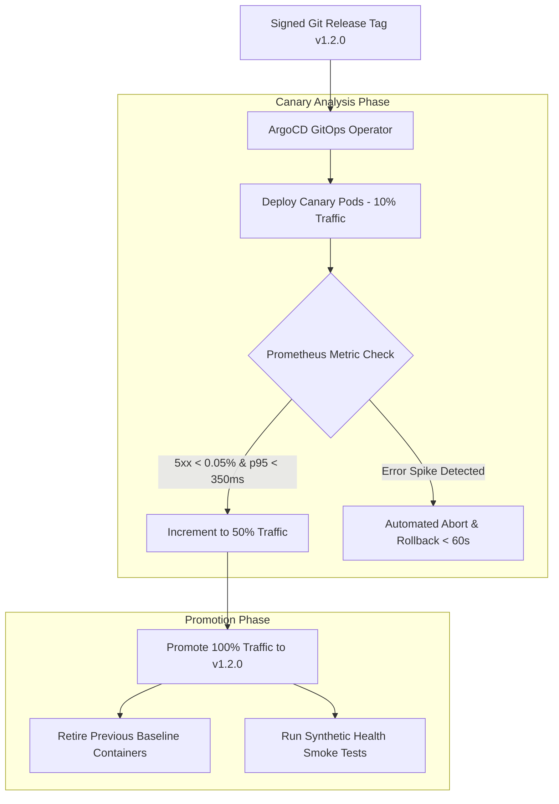

# Master Continuous Delivery (CD) & GitOps Deployment Specification
## Namma Clinic Digital Health & Operations Platform
### Greater Bengaluru Authority (GBA) / BBMP Health Department
**Document Code:** `DEV-DOC-07` | **Status:** APPROVED BASELINE | **Date:** September 2026

---

## 1. Executive Summary & GitOps CD Charter
This document defines the authoritative **Continuous Delivery (CD) & GitOps Deployment Architecture** for the Namma Clinic Digital Health Platform. Deployments across all operational environments are entirely automated, declarative, and managed via GitOps controllers (ArgoCD / Flux). The architecture enforces progressive delivery using canary rollouts, blue-green deployment switches, automated Prometheus metric analysis, zero-downtime database schema evolutions, and instant automated rollbacks.

### 1.1 Non-Negotiable CD Invariants
1. **Zero Manual Cluster Access:** Production ECS/EKS clusters accept zero direct `kubectl` or `aws ecs` modification commands. All changes originate from Git.
2. **Progressive Canary Rollout:** Production deployments increment traffic gradually (10% -> 25% -> 50% -> 100%) with automated telemetry evaluation.
3. **Automated Rollback Triggers:** If 5xx error rate exceeds 0.05% or p95 latency exceeds 350ms during canary analysis, rollback executes automatically in < 60 seconds.
4. **Zero-Downtime Database Migrations:** Schema changes follow the expand/contract model, ensuring code running previous and current revisions executes concurrently without errors.
5. **Statutory Audit Trail:** Every deployment event is logged to immutable WORM storage with commit SHA, author identity, and approval records.

## 2. GitOps Delivery & Canary Rollout Lifecycle


## 3. ArgoCD Rollout & Canary Analysis Specification
### Specification Example: Argo Rollouts Progressive Canary Blueprint
<!-- DOCUMENTATION-ONLY EXAMPLE -->
```yaml
# DOCUMENTATION-ONLY EXAMPLE
apiVersion: argoproj.io/v1alpha1
kind: Rollout
metadata:
  name: namma-clinic-api
  namespace: production
spec:
  replicas: 16
  strategy:
    canary:
      analysis:
        templates:
          - templateName: success-rate-check
        args:
          - name: service-name
            value: namma-clinic-api
      steps:
        - setWeight: 10
        - pause: { duration: 5m }
        - setWeight: 25
        - pause: { duration: 10m }
        - setWeight: 50
        - pause: { duration: 15m }
  template:
    metadata:
      labels:
        app: namma-clinic-api
    spec:
      containers:
        - name: api
          image: 123456789012.dkr.ecr.ap-south-1.amazonaws.com/namma-api:v1.2.0
          ports:
            - containerPort: 3000
          readinessProbe:
            httpGet:
              path: /api/v1/health/ready
              port: 3000
            initialDelaySeconds: 10
            periodSeconds: 5
          resources:
            requests:
              cpu: 500m
              memory: 1024Mi
            limits:
              cpu: 1000m
              memory: 2048Mi
```

## 4. Master Continuous Delivery Pipelines Catalog
Comprehensive specifications for all 40 automated CD deployment workflows:

### CD-PIPE-001: GitOps CD Pipeline `Dev GitOps Continuous Sync #1`
- **CD Workflow ID:** `CD-PIPE-001`
- **Target Environment:** `Development (Dev)`
- **Deployment Orchestrator:** ArgoCD ApplicationSet / GitOps Controller
- **Rollout Strategy:** Automated GitOps Sync (e.g. Progressive Canary 10% -> 25% -> 50% -> 100%)
- **Automated Health Probe:** Pod Ready probe + HTTP /healthz 200 OK
- **Automatic Rollback Trigger:** Sync failure or CrashLoopBackOff
- **Post-Deploy Smoke Test:** `smoke-test-dev`
- **Audit Logging:** Emits deployment record to WORM audit log

### CD-PIPE-002: GitOps CD Pipeline `QA Staged Deployment #2`
- **CD Workflow ID:** `CD-PIPE-002`
- **Target Environment:** `Test / QA`
- **Deployment Orchestrator:** ArgoCD ApplicationSet / GitOps Controller
- **Rollout Strategy:** Automated Progressive Rollout (e.g. Progressive Canary 10% -> 25% -> 50% -> 100%)
- **Automated Health Probe:** Synthetic health check + DB connection probe
- **Automatic Rollback Trigger:** HTTP error rate > 0.5% over 2 minutes
- **Post-Deploy Smoke Test:** `regression-suite-qa`
- **Audit Logging:** Emits deployment record to WORM audit log

### CD-PIPE-003: GitOps CD Pipeline `Staging Blue-Green Switch #3`
- **CD Workflow ID:** `CD-PIPE-003`
- **Target Environment:** `Staging (Pre-Prod)`
- **Deployment Orchestrator:** ArgoCD ApplicationSet / GitOps Controller
- **Rollout Strategy:** Blue-Green Router Flip (e.g. Progressive Canary 10% -> 25% -> 50% -> 100%)
- **Automated Health Probe:** ALB Target Group Health + synthetic transaction
- **Automatic Rollback Trigger:** Unhealthy target count > 0
- **Post-Deploy Smoke Test:** `uat-suite-staging`
- **Audit Logging:** Emits deployment record to WORM audit log

### CD-PIPE-004: GitOps CD Pipeline `Pilot Clinic Canary Rollout #4`
- **CD Workflow ID:** `CD-PIPE-004`
- **Target Environment:** `Pilot (20 Clinics)`
- **Deployment Orchestrator:** ArgoCD ApplicationSet / GitOps Controller
- **Rollout Strategy:** Progressive Canary (10% -> 25% -> 50% -> 100%) (e.g. Progressive Canary 10% -> 25% -> 50% -> 100%)
- **Automated Health Probe:** Prometheus error rate < 0.1%, p95 latency < 350ms
- **Automatic Rollback Trigger:** Error rate spike or clinical queue latency > 5s
- **Post-Deploy Smoke Test:** `pilot-validation-suite`
- **Audit Logging:** Emits deployment record to WORM audit log

### CD-PIPE-005: GitOps CD Pipeline `Production High-Availability Rollout #5`
- **CD Workflow ID:** `CD-PIPE-005`
- **Target Environment:** `Production`
- **Deployment Orchestrator:** ArgoCD ApplicationSet / GitOps Controller
- **Rollout Strategy:** Multi-AZ Canary with Automated Rollback (e.g. Progressive Canary 10% -> 25% -> 50% -> 100%)
- **Automated Health Probe:** Continuous Prometheus health metrics + APM span check
- **Automatic Rollback Trigger:** p99 latency > 800ms or 5xx error rate > 0.05%
- **Post-Deploy Smoke Test:** `production-health-suite`
- **Audit Logging:** Emits deployment record to WORM audit log

### CD-PIPE-006: GitOps CD Pipeline `Dev GitOps Continuous Sync #6`
- **CD Workflow ID:** `CD-PIPE-006`
- **Target Environment:** `Development (Dev)`
- **Deployment Orchestrator:** ArgoCD ApplicationSet / GitOps Controller
- **Rollout Strategy:** Automated GitOps Sync (e.g. Progressive Canary 10% -> 25% -> 50% -> 100%)
- **Automated Health Probe:** Pod Ready probe + HTTP /healthz 200 OK
- **Automatic Rollback Trigger:** Sync failure or CrashLoopBackOff
- **Post-Deploy Smoke Test:** `smoke-test-dev`
- **Audit Logging:** Emits deployment record to WORM audit log

### CD-PIPE-007: GitOps CD Pipeline `QA Staged Deployment #7`
- **CD Workflow ID:** `CD-PIPE-007`
- **Target Environment:** `Test / QA`
- **Deployment Orchestrator:** ArgoCD ApplicationSet / GitOps Controller
- **Rollout Strategy:** Automated Progressive Rollout (e.g. Progressive Canary 10% -> 25% -> 50% -> 100%)
- **Automated Health Probe:** Synthetic health check + DB connection probe
- **Automatic Rollback Trigger:** HTTP error rate > 0.5% over 2 minutes
- **Post-Deploy Smoke Test:** `regression-suite-qa`
- **Audit Logging:** Emits deployment record to WORM audit log

### CD-PIPE-008: GitOps CD Pipeline `Staging Blue-Green Switch #8`
- **CD Workflow ID:** `CD-PIPE-008`
- **Target Environment:** `Staging (Pre-Prod)`
- **Deployment Orchestrator:** ArgoCD ApplicationSet / GitOps Controller
- **Rollout Strategy:** Blue-Green Router Flip (e.g. Progressive Canary 10% -> 25% -> 50% -> 100%)
- **Automated Health Probe:** ALB Target Group Health + synthetic transaction
- **Automatic Rollback Trigger:** Unhealthy target count > 0
- **Post-Deploy Smoke Test:** `uat-suite-staging`
- **Audit Logging:** Emits deployment record to WORM audit log

### CD-PIPE-009: GitOps CD Pipeline `Pilot Clinic Canary Rollout #9`
- **CD Workflow ID:** `CD-PIPE-009`
- **Target Environment:** `Pilot (20 Clinics)`
- **Deployment Orchestrator:** ArgoCD ApplicationSet / GitOps Controller
- **Rollout Strategy:** Progressive Canary (10% -> 25% -> 50% -> 100%) (e.g. Progressive Canary 10% -> 25% -> 50% -> 100%)
- **Automated Health Probe:** Prometheus error rate < 0.1%, p95 latency < 350ms
- **Automatic Rollback Trigger:** Error rate spike or clinical queue latency > 5s
- **Post-Deploy Smoke Test:** `pilot-validation-suite`
- **Audit Logging:** Emits deployment record to WORM audit log

### CD-PIPE-010: GitOps CD Pipeline `Production High-Availability Rollout #10`
- **CD Workflow ID:** `CD-PIPE-010`
- **Target Environment:** `Production`
- **Deployment Orchestrator:** ArgoCD ApplicationSet / GitOps Controller
- **Rollout Strategy:** Multi-AZ Canary with Automated Rollback (e.g. Progressive Canary 10% -> 25% -> 50% -> 100%)
- **Automated Health Probe:** Continuous Prometheus health metrics + APM span check
- **Automatic Rollback Trigger:** p99 latency > 800ms or 5xx error rate > 0.05%
- **Post-Deploy Smoke Test:** `production-health-suite`
- **Audit Logging:** Emits deployment record to WORM audit log

### CD-PIPE-011: GitOps CD Pipeline `Dev GitOps Continuous Sync #11`
- **CD Workflow ID:** `CD-PIPE-011`
- **Target Environment:** `Development (Dev)`
- **Deployment Orchestrator:** ArgoCD ApplicationSet / GitOps Controller
- **Rollout Strategy:** Automated GitOps Sync (e.g. Progressive Canary 10% -> 25% -> 50% -> 100%)
- **Automated Health Probe:** Pod Ready probe + HTTP /healthz 200 OK
- **Automatic Rollback Trigger:** Sync failure or CrashLoopBackOff
- **Post-Deploy Smoke Test:** `smoke-test-dev`
- **Audit Logging:** Emits deployment record to WORM audit log

### CD-PIPE-012: GitOps CD Pipeline `QA Staged Deployment #12`
- **CD Workflow ID:** `CD-PIPE-012`
- **Target Environment:** `Test / QA`
- **Deployment Orchestrator:** ArgoCD ApplicationSet / GitOps Controller
- **Rollout Strategy:** Automated Progressive Rollout (e.g. Progressive Canary 10% -> 25% -> 50% -> 100%)
- **Automated Health Probe:** Synthetic health check + DB connection probe
- **Automatic Rollback Trigger:** HTTP error rate > 0.5% over 2 minutes
- **Post-Deploy Smoke Test:** `regression-suite-qa`
- **Audit Logging:** Emits deployment record to WORM audit log

### CD-PIPE-013: GitOps CD Pipeline `Staging Blue-Green Switch #13`
- **CD Workflow ID:** `CD-PIPE-013`
- **Target Environment:** `Staging (Pre-Prod)`
- **Deployment Orchestrator:** ArgoCD ApplicationSet / GitOps Controller
- **Rollout Strategy:** Blue-Green Router Flip (e.g. Progressive Canary 10% -> 25% -> 50% -> 100%)
- **Automated Health Probe:** ALB Target Group Health + synthetic transaction
- **Automatic Rollback Trigger:** Unhealthy target count > 0
- **Post-Deploy Smoke Test:** `uat-suite-staging`
- **Audit Logging:** Emits deployment record to WORM audit log

### CD-PIPE-014: GitOps CD Pipeline `Pilot Clinic Canary Rollout #14`
- **CD Workflow ID:** `CD-PIPE-014`
- **Target Environment:** `Pilot (20 Clinics)`
- **Deployment Orchestrator:** ArgoCD ApplicationSet / GitOps Controller
- **Rollout Strategy:** Progressive Canary (10% -> 25% -> 50% -> 100%) (e.g. Progressive Canary 10% -> 25% -> 50% -> 100%)
- **Automated Health Probe:** Prometheus error rate < 0.1%, p95 latency < 350ms
- **Automatic Rollback Trigger:** Error rate spike or clinical queue latency > 5s
- **Post-Deploy Smoke Test:** `pilot-validation-suite`
- **Audit Logging:** Emits deployment record to WORM audit log

### CD-PIPE-015: GitOps CD Pipeline `Production High-Availability Rollout #15`
- **CD Workflow ID:** `CD-PIPE-015`
- **Target Environment:** `Production`
- **Deployment Orchestrator:** ArgoCD ApplicationSet / GitOps Controller
- **Rollout Strategy:** Multi-AZ Canary with Automated Rollback (e.g. Progressive Canary 10% -> 25% -> 50% -> 100%)
- **Automated Health Probe:** Continuous Prometheus health metrics + APM span check
- **Automatic Rollback Trigger:** p99 latency > 800ms or 5xx error rate > 0.05%
- **Post-Deploy Smoke Test:** `production-health-suite`
- **Audit Logging:** Emits deployment record to WORM audit log

### CD-PIPE-016: GitOps CD Pipeline `Dev GitOps Continuous Sync #16`
- **CD Workflow ID:** `CD-PIPE-016`
- **Target Environment:** `Development (Dev)`
- **Deployment Orchestrator:** ArgoCD ApplicationSet / GitOps Controller
- **Rollout Strategy:** Automated GitOps Sync (e.g. Progressive Canary 10% -> 25% -> 50% -> 100%)
- **Automated Health Probe:** Pod Ready probe + HTTP /healthz 200 OK
- **Automatic Rollback Trigger:** Sync failure or CrashLoopBackOff
- **Post-Deploy Smoke Test:** `smoke-test-dev`
- **Audit Logging:** Emits deployment record to WORM audit log

### CD-PIPE-017: GitOps CD Pipeline `QA Staged Deployment #17`
- **CD Workflow ID:** `CD-PIPE-017`
- **Target Environment:** `Test / QA`
- **Deployment Orchestrator:** ArgoCD ApplicationSet / GitOps Controller
- **Rollout Strategy:** Automated Progressive Rollout (e.g. Progressive Canary 10% -> 25% -> 50% -> 100%)
- **Automated Health Probe:** Synthetic health check + DB connection probe
- **Automatic Rollback Trigger:** HTTP error rate > 0.5% over 2 minutes
- **Post-Deploy Smoke Test:** `regression-suite-qa`
- **Audit Logging:** Emits deployment record to WORM audit log

### CD-PIPE-018: GitOps CD Pipeline `Staging Blue-Green Switch #18`
- **CD Workflow ID:** `CD-PIPE-018`
- **Target Environment:** `Staging (Pre-Prod)`
- **Deployment Orchestrator:** ArgoCD ApplicationSet / GitOps Controller
- **Rollout Strategy:** Blue-Green Router Flip (e.g. Progressive Canary 10% -> 25% -> 50% -> 100%)
- **Automated Health Probe:** ALB Target Group Health + synthetic transaction
- **Automatic Rollback Trigger:** Unhealthy target count > 0
- **Post-Deploy Smoke Test:** `uat-suite-staging`
- **Audit Logging:** Emits deployment record to WORM audit log

### CD-PIPE-019: GitOps CD Pipeline `Pilot Clinic Canary Rollout #19`
- **CD Workflow ID:** `CD-PIPE-019`
- **Target Environment:** `Pilot (20 Clinics)`
- **Deployment Orchestrator:** ArgoCD ApplicationSet / GitOps Controller
- **Rollout Strategy:** Progressive Canary (10% -> 25% -> 50% -> 100%) (e.g. Progressive Canary 10% -> 25% -> 50% -> 100%)
- **Automated Health Probe:** Prometheus error rate < 0.1%, p95 latency < 350ms
- **Automatic Rollback Trigger:** Error rate spike or clinical queue latency > 5s
- **Post-Deploy Smoke Test:** `pilot-validation-suite`
- **Audit Logging:** Emits deployment record to WORM audit log

### CD-PIPE-020: GitOps CD Pipeline `Production High-Availability Rollout #20`
- **CD Workflow ID:** `CD-PIPE-020`
- **Target Environment:** `Production`
- **Deployment Orchestrator:** ArgoCD ApplicationSet / GitOps Controller
- **Rollout Strategy:** Multi-AZ Canary with Automated Rollback (e.g. Progressive Canary 10% -> 25% -> 50% -> 100%)
- **Automated Health Probe:** Continuous Prometheus health metrics + APM span check
- **Automatic Rollback Trigger:** p99 latency > 800ms or 5xx error rate > 0.05%
- **Post-Deploy Smoke Test:** `production-health-suite`
- **Audit Logging:** Emits deployment record to WORM audit log

### CD-PIPE-021: GitOps CD Pipeline `Dev GitOps Continuous Sync #21`
- **CD Workflow ID:** `CD-PIPE-021`
- **Target Environment:** `Development (Dev)`
- **Deployment Orchestrator:** ArgoCD ApplicationSet / GitOps Controller
- **Rollout Strategy:** Automated GitOps Sync (e.g. Progressive Canary 10% -> 25% -> 50% -> 100%)
- **Automated Health Probe:** Pod Ready probe + HTTP /healthz 200 OK
- **Automatic Rollback Trigger:** Sync failure or CrashLoopBackOff
- **Post-Deploy Smoke Test:** `smoke-test-dev`
- **Audit Logging:** Emits deployment record to WORM audit log

### CD-PIPE-022: GitOps CD Pipeline `QA Staged Deployment #22`
- **CD Workflow ID:** `CD-PIPE-022`
- **Target Environment:** `Test / QA`
- **Deployment Orchestrator:** ArgoCD ApplicationSet / GitOps Controller
- **Rollout Strategy:** Automated Progressive Rollout (e.g. Progressive Canary 10% -> 25% -> 50% -> 100%)
- **Automated Health Probe:** Synthetic health check + DB connection probe
- **Automatic Rollback Trigger:** HTTP error rate > 0.5% over 2 minutes
- **Post-Deploy Smoke Test:** `regression-suite-qa`
- **Audit Logging:** Emits deployment record to WORM audit log

### CD-PIPE-023: GitOps CD Pipeline `Staging Blue-Green Switch #23`
- **CD Workflow ID:** `CD-PIPE-023`
- **Target Environment:** `Staging (Pre-Prod)`
- **Deployment Orchestrator:** ArgoCD ApplicationSet / GitOps Controller
- **Rollout Strategy:** Blue-Green Router Flip (e.g. Progressive Canary 10% -> 25% -> 50% -> 100%)
- **Automated Health Probe:** ALB Target Group Health + synthetic transaction
- **Automatic Rollback Trigger:** Unhealthy target count > 0
- **Post-Deploy Smoke Test:** `uat-suite-staging`
- **Audit Logging:** Emits deployment record to WORM audit log

### CD-PIPE-024: GitOps CD Pipeline `Pilot Clinic Canary Rollout #24`
- **CD Workflow ID:** `CD-PIPE-024`
- **Target Environment:** `Pilot (20 Clinics)`
- **Deployment Orchestrator:** ArgoCD ApplicationSet / GitOps Controller
- **Rollout Strategy:** Progressive Canary (10% -> 25% -> 50% -> 100%) (e.g. Progressive Canary 10% -> 25% -> 50% -> 100%)
- **Automated Health Probe:** Prometheus error rate < 0.1%, p95 latency < 350ms
- **Automatic Rollback Trigger:** Error rate spike or clinical queue latency > 5s
- **Post-Deploy Smoke Test:** `pilot-validation-suite`
- **Audit Logging:** Emits deployment record to WORM audit log

### CD-PIPE-025: GitOps CD Pipeline `Production High-Availability Rollout #25`
- **CD Workflow ID:** `CD-PIPE-025`
- **Target Environment:** `Production`
- **Deployment Orchestrator:** ArgoCD ApplicationSet / GitOps Controller
- **Rollout Strategy:** Multi-AZ Canary with Automated Rollback (e.g. Progressive Canary 10% -> 25% -> 50% -> 100%)
- **Automated Health Probe:** Continuous Prometheus health metrics + APM span check
- **Automatic Rollback Trigger:** p99 latency > 800ms or 5xx error rate > 0.05%
- **Post-Deploy Smoke Test:** `production-health-suite`
- **Audit Logging:** Emits deployment record to WORM audit log

### CD-PIPE-026: GitOps CD Pipeline `Dev GitOps Continuous Sync #26`
- **CD Workflow ID:** `CD-PIPE-026`
- **Target Environment:** `Development (Dev)`
- **Deployment Orchestrator:** ArgoCD ApplicationSet / GitOps Controller
- **Rollout Strategy:** Automated GitOps Sync (e.g. Progressive Canary 10% -> 25% -> 50% -> 100%)
- **Automated Health Probe:** Pod Ready probe + HTTP /healthz 200 OK
- **Automatic Rollback Trigger:** Sync failure or CrashLoopBackOff
- **Post-Deploy Smoke Test:** `smoke-test-dev`
- **Audit Logging:** Emits deployment record to WORM audit log

### CD-PIPE-027: GitOps CD Pipeline `QA Staged Deployment #27`
- **CD Workflow ID:** `CD-PIPE-027`
- **Target Environment:** `Test / QA`
- **Deployment Orchestrator:** ArgoCD ApplicationSet / GitOps Controller
- **Rollout Strategy:** Automated Progressive Rollout (e.g. Progressive Canary 10% -> 25% -> 50% -> 100%)
- **Automated Health Probe:** Synthetic health check + DB connection probe
- **Automatic Rollback Trigger:** HTTP error rate > 0.5% over 2 minutes
- **Post-Deploy Smoke Test:** `regression-suite-qa`
- **Audit Logging:** Emits deployment record to WORM audit log

### CD-PIPE-028: GitOps CD Pipeline `Staging Blue-Green Switch #28`
- **CD Workflow ID:** `CD-PIPE-028`
- **Target Environment:** `Staging (Pre-Prod)`
- **Deployment Orchestrator:** ArgoCD ApplicationSet / GitOps Controller
- **Rollout Strategy:** Blue-Green Router Flip (e.g. Progressive Canary 10% -> 25% -> 50% -> 100%)
- **Automated Health Probe:** ALB Target Group Health + synthetic transaction
- **Automatic Rollback Trigger:** Unhealthy target count > 0
- **Post-Deploy Smoke Test:** `uat-suite-staging`
- **Audit Logging:** Emits deployment record to WORM audit log

### CD-PIPE-029: GitOps CD Pipeline `Pilot Clinic Canary Rollout #29`
- **CD Workflow ID:** `CD-PIPE-029`
- **Target Environment:** `Pilot (20 Clinics)`
- **Deployment Orchestrator:** ArgoCD ApplicationSet / GitOps Controller
- **Rollout Strategy:** Progressive Canary (10% -> 25% -> 50% -> 100%) (e.g. Progressive Canary 10% -> 25% -> 50% -> 100%)
- **Automated Health Probe:** Prometheus error rate < 0.1%, p95 latency < 350ms
- **Automatic Rollback Trigger:** Error rate spike or clinical queue latency > 5s
- **Post-Deploy Smoke Test:** `pilot-validation-suite`
- **Audit Logging:** Emits deployment record to WORM audit log

### CD-PIPE-030: GitOps CD Pipeline `Production High-Availability Rollout #30`
- **CD Workflow ID:** `CD-PIPE-030`
- **Target Environment:** `Production`
- **Deployment Orchestrator:** ArgoCD ApplicationSet / GitOps Controller
- **Rollout Strategy:** Multi-AZ Canary with Automated Rollback (e.g. Progressive Canary 10% -> 25% -> 50% -> 100%)
- **Automated Health Probe:** Continuous Prometheus health metrics + APM span check
- **Automatic Rollback Trigger:** p99 latency > 800ms or 5xx error rate > 0.05%
- **Post-Deploy Smoke Test:** `production-health-suite`
- **Audit Logging:** Emits deployment record to WORM audit log

### CD-PIPE-031: GitOps CD Pipeline `Dev GitOps Continuous Sync #31`
- **CD Workflow ID:** `CD-PIPE-031`
- **Target Environment:** `Development (Dev)`
- **Deployment Orchestrator:** ArgoCD ApplicationSet / GitOps Controller
- **Rollout Strategy:** Automated GitOps Sync (e.g. Progressive Canary 10% -> 25% -> 50% -> 100%)
- **Automated Health Probe:** Pod Ready probe + HTTP /healthz 200 OK
- **Automatic Rollback Trigger:** Sync failure or CrashLoopBackOff
- **Post-Deploy Smoke Test:** `smoke-test-dev`
- **Audit Logging:** Emits deployment record to WORM audit log

### CD-PIPE-032: GitOps CD Pipeline `QA Staged Deployment #32`
- **CD Workflow ID:** `CD-PIPE-032`
- **Target Environment:** `Test / QA`
- **Deployment Orchestrator:** ArgoCD ApplicationSet / GitOps Controller
- **Rollout Strategy:** Automated Progressive Rollout (e.g. Progressive Canary 10% -> 25% -> 50% -> 100%)
- **Automated Health Probe:** Synthetic health check + DB connection probe
- **Automatic Rollback Trigger:** HTTP error rate > 0.5% over 2 minutes
- **Post-Deploy Smoke Test:** `regression-suite-qa`
- **Audit Logging:** Emits deployment record to WORM audit log

### CD-PIPE-033: GitOps CD Pipeline `Staging Blue-Green Switch #33`
- **CD Workflow ID:** `CD-PIPE-033`
- **Target Environment:** `Staging (Pre-Prod)`
- **Deployment Orchestrator:** ArgoCD ApplicationSet / GitOps Controller
- **Rollout Strategy:** Blue-Green Router Flip (e.g. Progressive Canary 10% -> 25% -> 50% -> 100%)
- **Automated Health Probe:** ALB Target Group Health + synthetic transaction
- **Automatic Rollback Trigger:** Unhealthy target count > 0
- **Post-Deploy Smoke Test:** `uat-suite-staging`
- **Audit Logging:** Emits deployment record to WORM audit log

### CD-PIPE-034: GitOps CD Pipeline `Pilot Clinic Canary Rollout #34`
- **CD Workflow ID:** `CD-PIPE-034`
- **Target Environment:** `Pilot (20 Clinics)`
- **Deployment Orchestrator:** ArgoCD ApplicationSet / GitOps Controller
- **Rollout Strategy:** Progressive Canary (10% -> 25% -> 50% -> 100%) (e.g. Progressive Canary 10% -> 25% -> 50% -> 100%)
- **Automated Health Probe:** Prometheus error rate < 0.1%, p95 latency < 350ms
- **Automatic Rollback Trigger:** Error rate spike or clinical queue latency > 5s
- **Post-Deploy Smoke Test:** `pilot-validation-suite`
- **Audit Logging:** Emits deployment record to WORM audit log

### CD-PIPE-035: GitOps CD Pipeline `Production High-Availability Rollout #35`
- **CD Workflow ID:** `CD-PIPE-035`
- **Target Environment:** `Production`
- **Deployment Orchestrator:** ArgoCD ApplicationSet / GitOps Controller
- **Rollout Strategy:** Multi-AZ Canary with Automated Rollback (e.g. Progressive Canary 10% -> 25% -> 50% -> 100%)
- **Automated Health Probe:** Continuous Prometheus health metrics + APM span check
- **Automatic Rollback Trigger:** p99 latency > 800ms or 5xx error rate > 0.05%
- **Post-Deploy Smoke Test:** `production-health-suite`
- **Audit Logging:** Emits deployment record to WORM audit log

### CD-PIPE-036: GitOps CD Pipeline `Dev GitOps Continuous Sync #36`
- **CD Workflow ID:** `CD-PIPE-036`
- **Target Environment:** `Development (Dev)`
- **Deployment Orchestrator:** ArgoCD ApplicationSet / GitOps Controller
- **Rollout Strategy:** Automated GitOps Sync (e.g. Progressive Canary 10% -> 25% -> 50% -> 100%)
- **Automated Health Probe:** Pod Ready probe + HTTP /healthz 200 OK
- **Automatic Rollback Trigger:** Sync failure or CrashLoopBackOff
- **Post-Deploy Smoke Test:** `smoke-test-dev`
- **Audit Logging:** Emits deployment record to WORM audit log

### CD-PIPE-037: GitOps CD Pipeline `QA Staged Deployment #37`
- **CD Workflow ID:** `CD-PIPE-037`
- **Target Environment:** `Test / QA`
- **Deployment Orchestrator:** ArgoCD ApplicationSet / GitOps Controller
- **Rollout Strategy:** Automated Progressive Rollout (e.g. Progressive Canary 10% -> 25% -> 50% -> 100%)
- **Automated Health Probe:** Synthetic health check + DB connection probe
- **Automatic Rollback Trigger:** HTTP error rate > 0.5% over 2 minutes
- **Post-Deploy Smoke Test:** `regression-suite-qa`
- **Audit Logging:** Emits deployment record to WORM audit log

### CD-PIPE-038: GitOps CD Pipeline `Staging Blue-Green Switch #38`
- **CD Workflow ID:** `CD-PIPE-038`
- **Target Environment:** `Staging (Pre-Prod)`
- **Deployment Orchestrator:** ArgoCD ApplicationSet / GitOps Controller
- **Rollout Strategy:** Blue-Green Router Flip (e.g. Progressive Canary 10% -> 25% -> 50% -> 100%)
- **Automated Health Probe:** ALB Target Group Health + synthetic transaction
- **Automatic Rollback Trigger:** Unhealthy target count > 0
- **Post-Deploy Smoke Test:** `uat-suite-staging`
- **Audit Logging:** Emits deployment record to WORM audit log

### CD-PIPE-039: GitOps CD Pipeline `Pilot Clinic Canary Rollout #39`
- **CD Workflow ID:** `CD-PIPE-039`
- **Target Environment:** `Pilot (20 Clinics)`
- **Deployment Orchestrator:** ArgoCD ApplicationSet / GitOps Controller
- **Rollout Strategy:** Progressive Canary (10% -> 25% -> 50% -> 100%) (e.g. Progressive Canary 10% -> 25% -> 50% -> 100%)
- **Automated Health Probe:** Prometheus error rate < 0.1%, p95 latency < 350ms
- **Automatic Rollback Trigger:** Error rate spike or clinical queue latency > 5s
- **Post-Deploy Smoke Test:** `pilot-validation-suite`
- **Audit Logging:** Emits deployment record to WORM audit log

### CD-PIPE-040: GitOps CD Pipeline `Production High-Availability Rollout #40`
- **CD Workflow ID:** `CD-PIPE-040`
- **Target Environment:** `Production`
- **Deployment Orchestrator:** ArgoCD ApplicationSet / GitOps Controller
- **Rollout Strategy:** Multi-AZ Canary with Automated Rollback (e.g. Progressive Canary 10% -> 25% -> 50% -> 100%)
- **Automated Health Probe:** Continuous Prometheus health metrics + APM span check
- **Automatic Rollback Trigger:** p99 latency > 800ms or 5xx error rate > 0.05%
- **Post-Deploy Smoke Test:** `production-health-suite`
- **Audit Logging:** Emits deployment record to WORM audit log

## 5. Feature Deployment & Rollout Strategy across 180 Features
Authoritative deployment specifications for all 180 platform product features:

### FEATURE-001: Deployment Profile for Feature `Credential Verification`
- **Feature ID:** `FEATURE-001` (Feature #1)
- **Governed Subsystem:** `MODULE-001` (DOMAIN-001)
- **Bound CD Pipeline:** `CD-PIPE-001`
- **Deployment Archetype:** Progressive Canary (10% -> 25% -> 50% -> 100%)
- **Health Probe Route:** `/api/v1/module-001/healthz`
- **Bound Rollback Action:** `ROLLBACK-001`
- **Clinic Edge Distribution:** Automated sync to local SQLite cache in 183 clinics

### FEATURE-002: Deployment Profile for Feature `Session Token Minting`
- **Feature ID:** `FEATURE-002` (Feature #2)
- **Governed Subsystem:** `MODULE-001` (DOMAIN-001)
- **Bound CD Pipeline:** `CD-PIPE-002`
- **Deployment Archetype:** Progressive Canary (10% -> 25% -> 50% -> 100%)
- **Health Probe Route:** `/api/v1/module-001/healthz`
- **Bound Rollback Action:** `ROLLBACK-002`
- **Clinic Edge Distribution:** Automated sync to local SQLite cache in 183 clinics

### FEATURE-003: Deployment Profile for Feature `MFA Challenge Dispatch`
- **Feature ID:** `FEATURE-003` (Feature #3)
- **Governed Subsystem:** `MODULE-001` (DOMAIN-001)
- **Bound CD Pipeline:** `CD-PIPE-003`
- **Deployment Archetype:** Progressive Canary (10% -> 25% -> 50% -> 100%)
- **Health Probe Route:** `/api/v1/module-001/healthz`
- **Bound Rollback Action:** `ROLLBACK-003`
- **Clinic Edge Distribution:** Automated sync to local SQLite cache in 183 clinics

### FEATURE-004: Deployment Profile for Feature `Biometric Authentication Bridge`
- **Feature ID:** `FEATURE-004` (Feature #4)
- **Governed Subsystem:** `MODULE-001` (DOMAIN-001)
- **Bound CD Pipeline:** `CD-PIPE-004`
- **Deployment Archetype:** Progressive Canary (10% -> 25% -> 50% -> 100%)
- **Health Probe Route:** `/api/v1/module-001/healthz`
- **Bound Rollback Action:** `ROLLBACK-004`
- **Clinic Edge Distribution:** Automated sync to local SQLite cache in 183 clinics

### FEATURE-005: Deployment Profile for Feature `Local PIN Verification`
- **Feature ID:** `FEATURE-005` (Feature #5)
- **Governed Subsystem:** `MODULE-001` (DOMAIN-001)
- **Bound CD Pipeline:** `CD-PIPE-005`
- **Deployment Archetype:** Progressive Canary (10% -> 25% -> 50% -> 100%)
- **Health Probe Route:** `/api/v1/module-001/healthz`
- **Bound Rollback Action:** `ROLLBACK-005`
- **Clinic Edge Distribution:** Automated sync to local SQLite cache in 183 clinics

### FEATURE-006: Deployment Profile for Feature `Session Inactivity Lockout`
- **Feature ID:** `FEATURE-006` (Feature #6)
- **Governed Subsystem:** `MODULE-001` (DOMAIN-001)
- **Bound CD Pipeline:** `CD-PIPE-006`
- **Deployment Archetype:** Progressive Canary (10% -> 25% -> 50% -> 100%)
- **Health Probe Route:** `/api/v1/module-001/healthz`
- **Bound Rollback Action:** `ROLLBACK-006`
- **Clinic Edge Distribution:** Automated sync to local SQLite cache in 183 clinics

### FEATURE-007: Deployment Profile for Feature `Permission Evaluation`
- **Feature ID:** `FEATURE-007` (Feature #7)
- **Governed Subsystem:** `MODULE-002` (DOMAIN-001)
- **Bound CD Pipeline:** `CD-PIPE-007`
- **Deployment Archetype:** Progressive Canary (10% -> 25% -> 50% -> 100%)
- **Health Probe Route:** `/api/v1/module-002/healthz`
- **Bound Rollback Action:** `ROLLBACK-007`
- **Clinic Edge Distribution:** Automated sync to local SQLite cache in 183 clinics

### FEATURE-008: Deployment Profile for Feature `Dynamic Role Assignment`
- **Feature ID:** `FEATURE-008` (Feature #8)
- **Governed Subsystem:** `MODULE-002` (DOMAIN-001)
- **Bound CD Pipeline:** `CD-PIPE-008`
- **Deployment Archetype:** Progressive Canary (10% -> 25% -> 50% -> 100%)
- **Health Probe Route:** `/api/v1/module-002/healthz`
- **Bound Rollback Action:** `ROLLBACK-008`
- **Clinic Edge Distribution:** Automated sync to local SQLite cache in 183 clinics

### FEATURE-009: Deployment Profile for Feature `Conflict-of-Interest Prevention`
- **Feature ID:** `FEATURE-009` (Feature #9)
- **Governed Subsystem:** `MODULE-002` (DOMAIN-001)
- **Bound CD Pipeline:** `CD-PIPE-009`
- **Deployment Archetype:** Progressive Canary (10% -> 25% -> 50% -> 100%)
- **Health Probe Route:** `/api/v1/module-002/healthz`
- **Bound Rollback Action:** `ROLLBACK-009`
- **Clinic Edge Distribution:** Automated sync to local SQLite cache in 183 clinics

### FEATURE-010: Deployment Profile for Feature `Maker-Checker Authorization`
- **Feature ID:** `FEATURE-010` (Feature #10)
- **Governed Subsystem:** `MODULE-002` (DOMAIN-001)
- **Bound CD Pipeline:** `CD-PIPE-010`
- **Deployment Archetype:** Progressive Canary (10% -> 25% -> 50% -> 100%)
- **Health Probe Route:** `/api/v1/module-002/healthz`
- **Bound Rollback Action:** `ROLLBACK-010`
- **Clinic Edge Distribution:** Automated sync to local SQLite cache in 183 clinics

### FEATURE-011: Deployment Profile for Feature `Break-Glass Privilege Elevation`
- **Feature ID:** `FEATURE-011` (Feature #11)
- **Governed Subsystem:** `MODULE-002` (DOMAIN-001)
- **Bound CD Pipeline:** `CD-PIPE-011`
- **Deployment Archetype:** Progressive Canary (10% -> 25% -> 50% -> 100%)
- **Health Probe Route:** `/api/v1/module-002/healthz`
- **Bound Rollback Action:** `ROLLBACK-011`
- **Clinic Edge Distribution:** Automated sync to local SQLite cache in 183 clinics

### FEATURE-012: Deployment Profile for Feature `Privilege Elevation Audit`
- **Feature ID:** `FEATURE-012` (Feature #12)
- **Governed Subsystem:** `MODULE-002` (DOMAIN-001)
- **Bound CD Pipeline:** `CD-PIPE-012`
- **Deployment Archetype:** Progressive Canary (10% -> 25% -> 50% -> 100%)
- **Health Probe Route:** `/api/v1/module-002/healthz`
- **Bound Rollback Action:** `ROLLBACK-012`
- **Clinic Edge Distribution:** Automated sync to local SQLite cache in 183 clinics

### FEATURE-013: Deployment Profile for Feature `Hierarchy Node Management`
- **Feature ID:** `FEATURE-013` (Feature #13)
- **Governed Subsystem:** `MODULE-003` (DOMAIN-001)
- **Bound CD Pipeline:** `CD-PIPE-013`
- **Deployment Archetype:** Progressive Canary (10% -> 25% -> 50% -> 100%)
- **Health Probe Route:** `/api/v1/module-003/healthz`
- **Bound Rollback Action:** `ROLLBACK-013`
- **Clinic Edge Distribution:** Automated sync to local SQLite cache in 183 clinics

### FEATURE-014: Deployment Profile for Feature `NIN / HFR Registry Linking`
- **Feature ID:** `FEATURE-014` (Feature #14)
- **Governed Subsystem:** `MODULE-003` (DOMAIN-001)
- **Bound CD Pipeline:** `CD-PIPE-014`
- **Deployment Archetype:** Progressive Canary (10% -> 25% -> 50% -> 100%)
- **Health Probe Route:** `/api/v1/module-003/healthz`
- **Bound Rollback Action:** `ROLLBACK-014`
- **Clinic Edge Distribution:** Automated sync to local SQLite cache in 183 clinics

### FEATURE-015: Deployment Profile for Feature `Station Terminal Mapping`
- **Feature ID:** `FEATURE-015` (Feature #15)
- **Governed Subsystem:** `MODULE-003` (DOMAIN-001)
- **Bound CD Pipeline:** `CD-PIPE-015`
- **Deployment Archetype:** Progressive Canary (10% -> 25% -> 50% -> 100%)
- **Health Probe Route:** `/api/v1/module-003/healthz`
- **Bound Rollback Action:** `ROLLBACK-015`
- **Clinic Edge Distribution:** Automated sync to local SQLite cache in 183 clinics

### FEATURE-016: Deployment Profile for Feature `Facility Capacity Configuration`
- **Feature ID:** `FEATURE-016` (Feature #16)
- **Governed Subsystem:** `MODULE-003` (DOMAIN-001)
- **Bound CD Pipeline:** `CD-PIPE-016`
- **Deployment Archetype:** Progressive Canary (10% -> 25% -> 50% -> 100%)
- **Health Probe Route:** `/api/v1/module-003/healthz`
- **Bound Rollback Action:** `ROLLBACK-016`
- **Clinic Edge Distribution:** Automated sync to local SQLite cache in 183 clinics

### FEATURE-017: Deployment Profile for Feature `Operating Hours Enforcement`
- **Feature ID:** `FEATURE-017` (Feature #17)
- **Governed Subsystem:** `MODULE-003` (DOMAIN-001)
- **Bound CD Pipeline:** `CD-PIPE-017`
- **Deployment Archetype:** Progressive Canary (10% -> 25% -> 50% -> 100%)
- **Health Probe Route:** `/api/v1/module-003/healthz`
- **Bound Rollback Action:** `ROLLBACK-017`
- **Clinic Edge Distribution:** Automated sync to local SQLite cache in 183 clinics

### FEATURE-018: Deployment Profile for Feature `Special Camp Calendar`
- **Feature ID:** `FEATURE-018` (Feature #18)
- **Governed Subsystem:** `MODULE-003` (DOMAIN-001)
- **Bound CD Pipeline:** `CD-PIPE-018`
- **Deployment Archetype:** Progressive Canary (10% -> 25% -> 50% -> 100%)
- **Health Probe Route:** `/api/v1/module-003/healthz`
- **Bound Rollback Action:** `ROLLBACK-018`
- **Clinic Edge Distribution:** Automated sync to local SQLite cache in 183 clinics

### FEATURE-019: Deployment Profile for Feature `Staff Onboarding & KYC`
- **Feature ID:** `FEATURE-019` (Feature #19)
- **Governed Subsystem:** `MODULE-004` (DOMAIN-001)
- **Bound CD Pipeline:** `CD-PIPE-019`
- **Deployment Archetype:** Progressive Canary (10% -> 25% -> 50% -> 100%)
- **Health Probe Route:** `/api/v1/module-004/healthz`
- **Bound Rollback Action:** `ROLLBACK-019`
- **Clinic Edge Distribution:** Automated sync to local SQLite cache in 183 clinics

### FEATURE-020: Deployment Profile for Feature `Professional License Verification`
- **Feature ID:** `FEATURE-020` (Feature #20)
- **Governed Subsystem:** `MODULE-004` (DOMAIN-001)
- **Bound CD Pipeline:** `CD-PIPE-020`
- **Deployment Archetype:** Progressive Canary (10% -> 25% -> 50% -> 100%)
- **Health Probe Route:** `/api/v1/module-004/healthz`
- **Bound Rollback Action:** `ROLLBACK-020`
- **Clinic Edge Distribution:** Automated sync to local SQLite cache in 183 clinics

### FEATURE-021: Deployment Profile for Feature `Duty Roster Generation`
- **Feature ID:** `FEATURE-021` (Feature #21)
- **Governed Subsystem:** `MODULE-004` (DOMAIN-001)
- **Bound CD Pipeline:** `CD-PIPE-021`
- **Deployment Archetype:** Progressive Canary (10% -> 25% -> 50% -> 100%)
- **Health Probe Route:** `/api/v1/module-004/healthz`
- **Bound Rollback Action:** `ROLLBACK-021`
- **Clinic Edge Distribution:** Automated sync to local SQLite cache in 183 clinics

### FEATURE-022: Deployment Profile for Feature `Biometric Attendance Linking`
- **Feature ID:** `FEATURE-022` (Feature #22)
- **Governed Subsystem:** `MODULE-004` (DOMAIN-001)
- **Bound CD Pipeline:** `CD-PIPE-022`
- **Deployment Archetype:** Progressive Canary (10% -> 25% -> 50% -> 100%)
- **Health Probe Route:** `/api/v1/module-004/healthz`
- **Bound Rollback Action:** `ROLLBACK-022`
- **Clinic Edge Distribution:** Automated sync to local SQLite cache in 183 clinics

### FEATURE-023: Deployment Profile for Feature `Digital Signature Enrollment`
- **Feature ID:** `FEATURE-023` (Feature #23)
- **Governed Subsystem:** `MODULE-004` (DOMAIN-001)
- **Bound CD Pipeline:** `CD-PIPE-023`
- **Deployment Archetype:** Progressive Canary (10% -> 25% -> 50% -> 100%)
- **Health Probe Route:** `/api/v1/module-004/healthz`
- **Bound Rollback Action:** `ROLLBACK-023`
- **Clinic Edge Distribution:** Automated sync to local SQLite cache in 183 clinics

### FEATURE-024: Deployment Profile for Feature `Signature Revocation`
- **Feature ID:** `FEATURE-024` (Feature #24)
- **Governed Subsystem:** `MODULE-004` (DOMAIN-001)
- **Bound CD Pipeline:** `CD-PIPE-024`
- **Deployment Archetype:** Progressive Canary (10% -> 25% -> 50% -> 100%)
- **Health Probe Route:** `/api/v1/module-004/healthz`
- **Bound Rollback Action:** `ROLLBACK-024`
- **Clinic Edge Distribution:** Automated sync to local SQLite cache in 183 clinics

### FEATURE-025: Deployment Profile for Feature `Targeted Flag Activation`
- **Feature ID:** `FEATURE-025` (Feature #25)
- **Governed Subsystem:** `MODULE-026` (DOMAIN-001)
- **Bound CD Pipeline:** `CD-PIPE-025`
- **Deployment Archetype:** Progressive Canary (10% -> 25% -> 50% -> 100%)
- **Health Probe Route:** `/api/v1/module-026/healthz`
- **Bound Rollback Action:** `ROLLBACK-025`
- **Clinic Edge Distribution:** Automated sync to local SQLite cache in 183 clinics

### FEATURE-026: Deployment Profile for Feature `Emergency Feature Killswitch`
- **Feature ID:** `FEATURE-026` (Feature #26)
- **Governed Subsystem:** `MODULE-026` (DOMAIN-001)
- **Bound CD Pipeline:** `CD-PIPE-026`
- **Deployment Archetype:** Progressive Canary (10% -> 25% -> 50% -> 100%)
- **Health Probe Route:** `/api/v1/module-026/healthz`
- **Bound Rollback Action:** `ROLLBACK-026`
- **Clinic Edge Distribution:** Automated sync to local SQLite cache in 183 clinics

### FEATURE-027: Deployment Profile for Feature `System Parameter Tuning`
- **Feature ID:** `FEATURE-027` (Feature #27)
- **Governed Subsystem:** `MODULE-026` (DOMAIN-001)
- **Bound CD Pipeline:** `CD-PIPE-027`
- **Deployment Archetype:** Progressive Canary (10% -> 25% -> 50% -> 100%)
- **Health Probe Route:** `/api/v1/module-026/healthz`
- **Bound Rollback Action:** `ROLLBACK-027`
- **Clinic Edge Distribution:** Automated sync to local SQLite cache in 183 clinics

### FEATURE-028: Deployment Profile for Feature `Edge Configuration Distribution`
- **Feature ID:** `FEATURE-028` (Feature #28)
- **Governed Subsystem:** `MODULE-026` (DOMAIN-001)
- **Bound CD Pipeline:** `CD-PIPE-028`
- **Deployment Archetype:** Progressive Canary (10% -> 25% -> 50% -> 100%)
- **Health Probe Route:** `/api/v1/module-026/healthz`
- **Bound Rollback Action:** `ROLLBACK-028`
- **Clinic Edge Distribution:** Automated sync to local SQLite cache in 183 clinics

### FEATURE-029: Deployment Profile for Feature `Edge Migration Orchestration`
- **Feature ID:** `FEATURE-029` (Feature #29)
- **Governed Subsystem:** `MODULE-026` (DOMAIN-001)
- **Bound CD Pipeline:** `CD-PIPE-029`
- **Deployment Archetype:** Progressive Canary (10% -> 25% -> 50% -> 100%)
- **Health Probe Route:** `/api/v1/module-026/healthz`
- **Bound Rollback Action:** `ROLLBACK-029`
- **Clinic Edge Distribution:** Automated sync to local SQLite cache in 183 clinics

### FEATURE-030: Deployment Profile for Feature `Health Probe Monitoring`
- **Feature ID:** `FEATURE-030` (Feature #30)
- **Governed Subsystem:** `MODULE-026` (DOMAIN-001)
- **Bound CD Pipeline:** `CD-PIPE-030`
- **Deployment Archetype:** Progressive Canary (10% -> 25% -> 50% -> 100%)
- **Health Probe Route:** `/api/v1/module-026/healthz`
- **Bound Rollback Action:** `ROLLBACK-030`
- **Clinic Edge Distribution:** Automated sync to local SQLite cache in 183 clinics

### FEATURE-031: Deployment Profile for Feature `Bilingual Intake UI`
- **Feature ID:** `FEATURE-031` (Feature #31)
- **Governed Subsystem:** `MODULE-005` (DOMAIN-002)
- **Bound CD Pipeline:** `CD-PIPE-031`
- **Deployment Archetype:** Progressive Canary (10% -> 25% -> 50% -> 100%)
- **Health Probe Route:** `/api/v1/module-005/healthz`
- **Bound Rollback Action:** `ROLLBACK-031`
- **Clinic Edge Distribution:** Automated sync to local SQLite cache in 183 clinics

### FEATURE-032: Deployment Profile for Feature `Vulnerable Citizen Flagging`
- **Feature ID:** `FEATURE-032` (Feature #32)
- **Governed Subsystem:** `MODULE-005` (DOMAIN-002)
- **Bound CD Pipeline:** `CD-PIPE-032`
- **Deployment Archetype:** Progressive Canary (10% -> 25% -> 50% -> 100%)
- **Health Probe Route:** `/api/v1/module-005/healthz`
- **Bound Rollback Action:** `ROLLBACK-032`
- **Clinic Edge Distribution:** Automated sync to local SQLite cache in 183 clinics

### FEATURE-033: Deployment Profile for Feature `Aadhaar OTP ABHA Bridge`
- **Feature ID:** `FEATURE-033` (Feature #33)
- **Governed Subsystem:** `MODULE-005` (DOMAIN-002)
- **Bound CD Pipeline:** `CD-PIPE-033`
- **Deployment Archetype:** Progressive Canary (10% -> 25% -> 50% -> 100%)
- **Health Probe Route:** `/api/v1/module-005/healthz`
- **Bound Rollback Action:** `ROLLBACK-033`
- **Clinic Edge Distribution:** Automated sync to local SQLite cache in 183 clinics

### FEATURE-034: Deployment Profile for Feature `Demographic ABHA Creation`
- **Feature ID:** `FEATURE-034` (Feature #34)
- **Governed Subsystem:** `MODULE-005` (DOMAIN-002)
- **Bound CD Pipeline:** `CD-PIPE-034`
- **Deployment Archetype:** Progressive Canary (10% -> 25% -> 50% -> 100%)
- **Health Probe Route:** `/api/v1/module-005/healthz`
- **Bound Rollback Action:** `ROLLBACK-034`
- **Clinic Edge Distribution:** Automated sync to local SQLite cache in 183 clinics

### FEATURE-035: Deployment Profile for Feature `Deterministic UHID Minting`
- **Feature ID:** `FEATURE-035` (Feature #35)
- **Governed Subsystem:** `MODULE-005` (DOMAIN-002)
- **Bound CD Pipeline:** `CD-PIPE-035`
- **Deployment Archetype:** Progressive Canary (10% -> 25% -> 50% -> 100%)
- **Health Probe Route:** `/api/v1/module-005/healthz`
- **Bound Rollback Action:** `ROLLBACK-035`
- **Clinic Edge Distribution:** Automated sync to local SQLite cache in 183 clinics

### FEATURE-036: Deployment Profile for Feature `Soundex / Double-Metaphone Matching`
- **Feature ID:** `FEATURE-036` (Feature #36)
- **Governed Subsystem:** `MODULE-005` (DOMAIN-002)
- **Bound CD Pipeline:** `CD-PIPE-036`
- **Deployment Archetype:** Progressive Canary (10% -> 25% -> 50% -> 100%)
- **Health Probe Route:** `/api/v1/module-005/healthz`
- **Bound Rollback Action:** `ROLLBACK-036`
- **Clinic Edge Distribution:** Automated sync to local SQLite cache in 183 clinics

### FEATURE-037: Deployment Profile for Feature `Bilingual Consent Presentation`
- **Feature ID:** `FEATURE-037` (Feature #37)
- **Governed Subsystem:** `MODULE-006` (DOMAIN-002)
- **Bound CD Pipeline:** `CD-PIPE-037`
- **Deployment Archetype:** Progressive Canary (10% -> 25% -> 50% -> 100%)
- **Health Probe Route:** `/api/v1/module-006/healthz`
- **Bound Rollback Action:** `ROLLBACK-037`
- **Clinic Edge Distribution:** Automated sync to local SQLite cache in 183 clinics

### FEATURE-038: Deployment Profile for Feature `Digital Signature / Thumbprint Capture`
- **Feature ID:** `FEATURE-038` (Feature #38)
- **Governed Subsystem:** `MODULE-006` (DOMAIN-002)
- **Bound CD Pipeline:** `CD-PIPE-038`
- **Deployment Archetype:** Progressive Canary (10% -> 25% -> 50% -> 100%)
- **Health Probe Route:** `/api/v1/module-006/healthz`
- **Bound Rollback Action:** `ROLLBACK-038`
- **Clinic Edge Distribution:** Automated sync to local SQLite cache in 183 clinics

### FEATURE-039: Deployment Profile for Feature `Granular Purpose-Based Consent`
- **Feature ID:** `FEATURE-039` (Feature #39)
- **Governed Subsystem:** `MODULE-006` (DOMAIN-002)
- **Bound CD Pipeline:** `CD-PIPE-039`
- **Deployment Archetype:** Progressive Canary (10% -> 25% -> 50% -> 100%)
- **Health Probe Route:** `/api/v1/module-006/healthz`
- **Bound Rollback Action:** `ROLLBACK-039`
- **Clinic Edge Distribution:** Automated sync to local SQLite cache in 183 clinics

### FEATURE-040: Deployment Profile for Feature `Consent Revocation Workflow`
- **Feature ID:** `FEATURE-040` (Feature #40)
- **Governed Subsystem:** `MODULE-006` (DOMAIN-002)
- **Bound CD Pipeline:** `CD-PIPE-040`
- **Deployment Archetype:** Progressive Canary (10% -> 25% -> 50% -> 100%)
- **Health Probe Route:** `/api/v1/module-006/healthz`
- **Bound Rollback Action:** `ROLLBACK-040`
- **Clinic Edge Distribution:** Automated sync to local SQLite cache in 183 clinics

### FEATURE-041: Deployment Profile for Feature `Guardian Relationship Verification`
- **Feature ID:** `FEATURE-041` (Feature #41)
- **Governed Subsystem:** `MODULE-006` (DOMAIN-002)
- **Bound CD Pipeline:** `CD-PIPE-001`
- **Deployment Archetype:** Progressive Canary (10% -> 25% -> 50% -> 100%)
- **Health Probe Route:** `/api/v1/module-006/healthz`
- **Bound Rollback Action:** `ROLLBACK-041`
- **Clinic Edge Distribution:** Automated sync to local SQLite cache in 183 clinics

### FEATURE-042: Deployment Profile for Feature `Implied Emergency Consent`
- **Feature ID:** `FEATURE-042` (Feature #42)
- **Governed Subsystem:** `MODULE-006` (DOMAIN-002)
- **Bound CD Pipeline:** `CD-PIPE-002`
- **Deployment Archetype:** Progressive Canary (10% -> 25% -> 50% -> 100%)
- **Health Probe Route:** `/api/v1/module-006/healthz`
- **Bound Rollback Action:** `ROLLBACK-042`
- **Clinic Edge Distribution:** Automated sync to local SQLite cache in 183 clinics

### FEATURE-043: Deployment Profile for Feature `Daily Token Counter`
- **Feature ID:** `FEATURE-043` (Feature #43)
- **Governed Subsystem:** `MODULE-007` (DOMAIN-002)
- **Bound CD Pipeline:** `CD-PIPE-003`
- **Deployment Archetype:** Progressive Canary (10% -> 25% -> 50% -> 100%)
- **Health Probe Route:** `/api/v1/module-007/healthz`
- **Bound Rollback Action:** `ROLLBACK-043`
- **Clinic Edge Distribution:** Automated sync to local SQLite cache in 183 clinics

### FEATURE-044: Deployment Profile for Feature `Station Route Calculation`
- **Feature ID:** `FEATURE-044` (Feature #44)
- **Governed Subsystem:** `MODULE-007` (DOMAIN-002)
- **Bound CD Pipeline:** `CD-PIPE-004`
- **Deployment Archetype:** Progressive Canary (10% -> 25% -> 50% -> 100%)
- **Health Probe Route:** `/api/v1/module-007/healthz`
- **Bound Rollback Action:** `ROLLBACK-044`
- **Clinic Edge Distribution:** Automated sync to local SQLite cache in 183 clinics

### FEATURE-045: Deployment Profile for Feature `Acuity-Based Insertion`
- **Feature ID:** `FEATURE-045` (Feature #45)
- **Governed Subsystem:** `MODULE-007` (DOMAIN-002)
- **Bound CD Pipeline:** `CD-PIPE-005`
- **Deployment Archetype:** Progressive Canary (10% -> 25% -> 50% -> 100%)
- **Health Probe Route:** `/api/v1/module-007/healthz`
- **Bound Rollback Action:** `ROLLBACK-045`
- **Clinic Edge Distribution:** Automated sync to local SQLite cache in 183 clinics

### FEATURE-046: Deployment Profile for Feature `Vulnerable Citizen Interleaving`
- **Feature ID:** `FEATURE-046` (Feature #46)
- **Governed Subsystem:** `MODULE-007` (DOMAIN-002)
- **Bound CD Pipeline:** `CD-PIPE-006`
- **Deployment Archetype:** Progressive Canary (10% -> 25% -> 50% -> 100%)
- **Health Probe Route:** `/api/v1/module-007/healthz`
- **Bound Rollback Action:** `ROLLBACK-046`
- **Clinic Edge Distribution:** Automated sync to local SQLite cache in 183 clinics

### FEATURE-047: Deployment Profile for Feature `ESC/POS Thermal Printing`
- **Feature ID:** `FEATURE-047` (Feature #47)
- **Governed Subsystem:** `MODULE-007` (DOMAIN-002)
- **Bound CD Pipeline:** `CD-PIPE-007`
- **Deployment Archetype:** Progressive Canary (10% -> 25% -> 50% -> 100%)
- **Health Probe Route:** `/api/v1/module-007/healthz`
- **Bound Rollback Action:** `ROLLBACK-047`
- **Clinic Edge Distribution:** Automated sync to local SQLite cache in 183 clinics

### FEATURE-048: Deployment Profile for Feature `Virtual SMS Token Fallback`
- **Feature ID:** `FEATURE-048` (Feature #48)
- **Governed Subsystem:** `MODULE-007` (DOMAIN-002)
- **Bound CD Pipeline:** `CD-PIPE-008`
- **Deployment Archetype:** Progressive Canary (10% -> 25% -> 50% -> 100%)
- **Health Probe Route:** `/api/v1/module-007/healthz`
- **Bound Rollback Action:** `ROLLBACK-048`
- **Clinic Edge Distribution:** Automated sync to local SQLite cache in 183 clinics

### FEATURE-049: Deployment Profile for Feature `Next-Patient Call Action`
- **Feature ID:** `FEATURE-049` (Feature #49)
- **Governed Subsystem:** `MODULE-008` (DOMAIN-002)
- **Bound CD Pipeline:** `CD-PIPE-009`
- **Deployment Archetype:** Progressive Canary (10% -> 25% -> 50% -> 100%)
- **Health Probe Route:** `/api/v1/module-008/healthz`
- **Bound Rollback Action:** `ROLLBACK-049`
- **Clinic Edge Distribution:** Automated sync to local SQLite cache in 183 clinics

### FEATURE-050: Deployment Profile for Feature `No-Show & Recall Management`
- **Feature ID:** `FEATURE-050` (Feature #50)
- **Governed Subsystem:** `MODULE-008` (DOMAIN-002)
- **Bound CD Pipeline:** `CD-PIPE-010`
- **Deployment Archetype:** Progressive Canary (10% -> 25% -> 50% -> 100%)
- **Health Probe Route:** `/api/v1/module-008/healthz`
- **Bound Rollback Action:** `ROLLBACK-050`
- **Clinic Edge Distribution:** Automated sync to local SQLite cache in 183 clinics

### FEATURE-051: Deployment Profile for Feature `HDMI Waiting Hall Display`
- **Feature ID:** `FEATURE-051` (Feature #51)
- **Governed Subsystem:** `MODULE-008` (DOMAIN-002)
- **Bound CD Pipeline:** `CD-PIPE-011`
- **Deployment Archetype:** Progressive Canary (10% -> 25% -> 50% -> 100%)
- **Health Probe Route:** `/api/v1/module-008/healthz`
- **Bound Rollback Action:** `ROLLBACK-001`
- **Clinic Edge Distribution:** Automated sync to local SQLite cache in 183 clinics

### FEATURE-052: Deployment Profile for Feature `Text-to-Speech Audio Chime`
- **Feature ID:** `FEATURE-052` (Feature #52)
- **Governed Subsystem:** `MODULE-008` (DOMAIN-002)
- **Bound CD Pipeline:** `CD-PIPE-012`
- **Deployment Archetype:** Progressive Canary (10% -> 25% -> 50% -> 100%)
- **Health Probe Route:** `/api/v1/module-008/healthz`
- **Bound Rollback Action:** `ROLLBACK-002`
- **Clinic Edge Distribution:** Automated sync to local SQLite cache in 183 clinics

### FEATURE-053: Deployment Profile for Feature `Dynamic Load Distribution`
- **Feature ID:** `FEATURE-053` (Feature #53)
- **Governed Subsystem:** `MODULE-008` (DOMAIN-002)
- **Bound CD Pipeline:** `CD-PIPE-013`
- **Deployment Archetype:** Progressive Canary (10% -> 25% -> 50% -> 100%)
- **Health Probe Route:** `/api/v1/module-008/healthz`
- **Bound Rollback Action:** `ROLLBACK-003`
- **Clinic Edge Distribution:** Automated sync to local SQLite cache in 183 clinics

### FEATURE-054: Deployment Profile for Feature `Queue Pausing & Resumption`
- **Feature ID:** `FEATURE-054` (Feature #54)
- **Governed Subsystem:** `MODULE-008` (DOMAIN-002)
- **Bound CD Pipeline:** `CD-PIPE-014`
- **Deployment Archetype:** Progressive Canary (10% -> 25% -> 50% -> 100%)
- **Health Probe Route:** `/api/v1/module-008/healthz`
- **Bound Rollback Action:** `ROLLBACK-004`
- **Clinic Edge Distribution:** Automated sync to local SQLite cache in 183 clinics

### FEATURE-055: Deployment Profile for Feature `Kiosk Exit Rating`
- **Feature ID:** `FEATURE-055` (Feature #55)
- **Governed Subsystem:** `MODULE-020` (DOMAIN-002)
- **Bound CD Pipeline:** `CD-PIPE-015`
- **Deployment Archetype:** Progressive Canary (10% -> 25% -> 50% -> 100%)
- **Health Probe Route:** `/api/v1/module-020/healthz`
- **Bound Rollback Action:** `ROLLBACK-005`
- **Clinic Edge Distribution:** Automated sync to local SQLite cache in 183 clinics

### FEATURE-056: Deployment Profile for Feature `Medicine Receipt Confirmation`
- **Feature ID:** `FEATURE-056` (Feature #56)
- **Governed Subsystem:** `MODULE-020` (DOMAIN-002)
- **Bound CD Pipeline:** `CD-PIPE-016`
- **Deployment Archetype:** Progressive Canary (10% -> 25% -> 50% -> 100%)
- **Health Probe Route:** `/api/v1/module-020/healthz`
- **Bound Rollback Action:** `ROLLBACK-006`
- **Clinic Edge Distribution:** Automated sync to local SQLite cache in 183 clinics

### FEATURE-057: Deployment Profile for Feature `Multilingual Ticket Intake`
- **Feature ID:** `FEATURE-057` (Feature #57)
- **Governed Subsystem:** `MODULE-020` (DOMAIN-002)
- **Bound CD Pipeline:** `CD-PIPE-017`
- **Deployment Archetype:** Progressive Canary (10% -> 25% -> 50% -> 100%)
- **Health Probe Route:** `/api/v1/module-020/healthz`
- **Bound Rollback Action:** `ROLLBACK-007`
- **Clinic Edge Distribution:** Automated sync to local SQLite cache in 183 clinics

### FEATURE-058: Deployment Profile for Feature `Automated SLA Timer`
- **Feature ID:** `FEATURE-058` (Feature #58)
- **Governed Subsystem:** `MODULE-020` (DOMAIN-002)
- **Bound CD Pipeline:** `CD-PIPE-018`
- **Deployment Archetype:** Progressive Canary (10% -> 25% -> 50% -> 100%)
- **Health Probe Route:** `/api/v1/module-020/healthz`
- **Bound Rollback Action:** `ROLLBACK-008`
- **Clinic Edge Distribution:** Automated sync to local SQLite cache in 183 clinics

### FEATURE-059: Deployment Profile for Feature `Zonal Escalation Trigger`
- **Feature ID:** `FEATURE-059` (Feature #59)
- **Governed Subsystem:** `MODULE-020` (DOMAIN-002)
- **Bound CD Pipeline:** `CD-PIPE-019`
- **Deployment Archetype:** Progressive Canary (10% -> 25% -> 50% -> 100%)
- **Health Probe Route:** `/api/v1/module-020/healthz`
- **Bound Rollback Action:** `ROLLBACK-009`
- **Clinic Edge Distribution:** Automated sync to local SQLite cache in 183 clinics

### FEATURE-060: Deployment Profile for Feature `Citizen Resolution Feedback`
- **Feature ID:** `FEATURE-060` (Feature #60)
- **Governed Subsystem:** `MODULE-020` (DOMAIN-002)
- **Bound CD Pipeline:** `CD-PIPE-020`
- **Deployment Archetype:** Progressive Canary (10% -> 25% -> 50% -> 100%)
- **Health Probe Route:** `/api/v1/module-020/healthz`
- **Bound Rollback Action:** `ROLLBACK-010`
- **Clinic Edge Distribution:** Automated sync to local SQLite cache in 183 clinics

### FEATURE-061: Deployment Profile for Feature `Longitudinal History Viewer`
- **Feature ID:** `FEATURE-061` (Feature #61)
- **Governed Subsystem:** `MODULE-009` (DOMAIN-003)
- **Bound CD Pipeline:** `CD-PIPE-021`
- **Deployment Archetype:** Progressive Canary (10% -> 25% -> 50% -> 100%)
- **Health Probe Route:** `/api/v1/module-009/healthz`
- **Bound Rollback Action:** `ROLLBACK-011`
- **Clinic Edge Distribution:** Automated sync to local SQLite cache in 183 clinics

### FEATURE-062: Deployment Profile for Feature `Vitals Telemetry Banner`
- **Feature ID:** `FEATURE-062` (Feature #62)
- **Governed Subsystem:** `MODULE-009` (DOMAIN-003)
- **Bound CD Pipeline:** `CD-PIPE-022`
- **Deployment Archetype:** Progressive Canary (10% -> 25% -> 50% -> 100%)
- **Health Probe Route:** `/api/v1/module-009/healthz`
- **Bound Rollback Action:** `ROLLBACK-012`
- **Clinic Edge Distribution:** Automated sync to local SQLite cache in 183 clinics

### FEATURE-063: Deployment Profile for Feature `Rapid Clinical Templates`
- **Feature ID:** `FEATURE-063` (Feature #63)
- **Governed Subsystem:** `MODULE-009` (DOMAIN-003)
- **Bound CD Pipeline:** `CD-PIPE-023`
- **Deployment Archetype:** Progressive Canary (10% -> 25% -> 50% -> 100%)
- **Health Probe Route:** `/api/v1/module-009/healthz`
- **Bound Rollback Action:** `ROLLBACK-013`
- **Clinic Edge Distribution:** Automated sync to local SQLite cache in 183 clinics

### FEATURE-064: Deployment Profile for Feature `Keyboard Shortcut Navigation`
- **Feature ID:** `FEATURE-064` (Feature #64)
- **Governed Subsystem:** `MODULE-009` (DOMAIN-003)
- **Bound CD Pipeline:** `CD-PIPE-024`
- **Deployment Archetype:** Progressive Canary (10% -> 25% -> 50% -> 100%)
- **Health Probe Route:** `/api/v1/module-009/healthz`
- **Bound Rollback Action:** `ROLLBACK-014`
- **Clinic Edge Distribution:** Automated sync to local SQLite cache in 183 clinics

### FEATURE-065: Deployment Profile for Feature `Cryptographic Note Locking`
- **Feature ID:** `FEATURE-065` (Feature #65)
- **Governed Subsystem:** `MODULE-009` (DOMAIN-003)
- **Bound CD Pipeline:** `CD-PIPE-025`
- **Deployment Archetype:** Progressive Canary (10% -> 25% -> 50% -> 100%)
- **Health Probe Route:** `/api/v1/module-009/healthz`
- **Bound Rollback Action:** `ROLLBACK-015`
- **Clinic Edge Distribution:** Automated sync to local SQLite cache in 183 clinics

### FEATURE-066: Deployment Profile for Feature `Clinical Addendum Workflow`
- **Feature ID:** `FEATURE-066` (Feature #66)
- **Governed Subsystem:** `MODULE-009` (DOMAIN-003)
- **Bound CD Pipeline:** `CD-PIPE-026`
- **Deployment Archetype:** Progressive Canary (10% -> 25% -> 50% -> 100%)
- **Health Probe Route:** `/api/v1/module-009/healthz`
- **Bound Rollback Action:** `ROLLBACK-016`
- **Clinic Edge Distribution:** Automated sync to local SQLite cache in 183 clinics

### FEATURE-067: Deployment Profile for Feature `Primary Care Curated Coding`
- **Feature ID:** `FEATURE-067` (Feature #67)
- **Governed Subsystem:** `MODULE-010` (DOMAIN-003)
- **Bound CD Pipeline:** `CD-PIPE-027`
- **Deployment Archetype:** Progressive Canary (10% -> 25% -> 50% -> 100%)
- **Health Probe Route:** `/api/v1/module-010/healthz`
- **Bound Rollback Action:** `ROLLBACK-017`
- **Clinic Edge Distribution:** Automated sync to local SQLite cache in 183 clinics

### FEATURE-068: Deployment Profile for Feature `Synonym & Local Name Mapping`
- **Feature ID:** `FEATURE-068` (Feature #68)
- **Governed Subsystem:** `MODULE-010` (DOMAIN-003)
- **Bound CD Pipeline:** `CD-PIPE-028`
- **Deployment Archetype:** Progressive Canary (10% -> 25% -> 50% -> 100%)
- **Health Probe Route:** `/api/v1/module-010/healthz`
- **Bound Rollback Action:** `ROLLBACK-018`
- **Clinic Edge Distribution:** Automated sync to local SQLite cache in 183 clinics

### FEATURE-069: Deployment Profile for Feature `Chronic Condition Tagging`
- **Feature ID:** `FEATURE-069` (Feature #69)
- **Governed Subsystem:** `MODULE-010` (DOMAIN-003)
- **Bound CD Pipeline:** `CD-PIPE-029`
- **Deployment Archetype:** Progressive Canary (10% -> 25% -> 50% -> 100%)
- **Health Probe Route:** `/api/v1/module-010/healthz`
- **Bound Rollback Action:** `ROLLBACK-019`
- **Clinic Edge Distribution:** Automated sync to local SQLite cache in 183 clinics

### FEATURE-070: Deployment Profile for Feature `Provisional vs. Confirmed Status`
- **Feature ID:** `FEATURE-070` (Feature #70)
- **Governed Subsystem:** `MODULE-010` (DOMAIN-003)
- **Bound CD Pipeline:** `CD-PIPE-030`
- **Deployment Archetype:** Progressive Canary (10% -> 25% -> 50% -> 100%)
- **Health Probe Route:** `/api/v1/module-010/healthz`
- **Bound Rollback Action:** `ROLLBACK-020`
- **Clinic Edge Distribution:** Automated sync to local SQLite cache in 183 clinics

### FEATURE-071: Deployment Profile for Feature `IDSP Notifiable Flagging`
- **Feature ID:** `FEATURE-071` (Feature #71)
- **Governed Subsystem:** `MODULE-010` (DOMAIN-003)
- **Bound CD Pipeline:** `CD-PIPE-031`
- **Deployment Archetype:** Progressive Canary (10% -> 25% -> 50% -> 100%)
- **Health Probe Route:** `/api/v1/module-010/healthz`
- **Bound Rollback Action:** `ROLLBACK-021`
- **Clinic Edge Distribution:** Automated sync to local SQLite cache in 183 clinics

### FEATURE-072: Deployment Profile for Feature `Outbreak Geographic Dispatch`
- **Feature ID:** `FEATURE-072` (Feature #72)
- **Governed Subsystem:** `MODULE-010` (DOMAIN-003)
- **Bound CD Pipeline:** `CD-PIPE-032`
- **Deployment Archetype:** Progressive Canary (10% -> 25% -> 50% -> 100%)
- **Health Probe Route:** `/api/v1/module-010/healthz`
- **Bound Rollback Action:** `ROLLBACK-022`
- **Clinic Edge Distribution:** Automated sync to local SQLite cache in 183 clinics

### FEATURE-073: Deployment Profile for Feature `Generic Drug Selection`
- **Feature ID:** `FEATURE-073` (Feature #73)
- **Governed Subsystem:** `MODULE-011` (DOMAIN-003)
- **Bound CD Pipeline:** `CD-PIPE-033`
- **Deployment Archetype:** Progressive Canary (10% -> 25% -> 50% -> 100%)
- **Health Probe Route:** `/api/v1/module-011/healthz`
- **Bound Rollback Action:** `ROLLBACK-023`
- **Clinic Edge Distribution:** Automated sync to local SQLite cache in 183 clinics

### FEATURE-074: Deployment Profile for Feature `Standard Sig Frequency Picker`
- **Feature ID:** `FEATURE-074` (Feature #74)
- **Governed Subsystem:** `MODULE-011` (DOMAIN-003)
- **Bound CD Pipeline:** `CD-PIPE-034`
- **Deployment Archetype:** Progressive Canary (10% -> 25% -> 50% -> 100%)
- **Health Probe Route:** `/api/v1/module-011/healthz`
- **Bound Rollback Action:** `ROLLBACK-024`
- **Clinic Edge Distribution:** Automated sync to local SQLite cache in 183 clinics

### FEATURE-075: Deployment Profile for Feature `Drug-Drug Interaction Alert`
- **Feature ID:** `FEATURE-075` (Feature #75)
- **Governed Subsystem:** `MODULE-011` (DOMAIN-003)
- **Bound CD Pipeline:** `CD-PIPE-035`
- **Deployment Archetype:** Progressive Canary (10% -> 25% -> 50% -> 100%)
- **Health Probe Route:** `/api/v1/module-011/healthz`
- **Bound Rollback Action:** `ROLLBACK-025`
- **Clinic Edge Distribution:** Automated sync to local SQLite cache in 183 clinics

### FEATURE-076: Deployment Profile for Feature `Allergy Cross-Check`
- **Feature ID:** `FEATURE-076` (Feature #76)
- **Governed Subsystem:** `MODULE-011` (DOMAIN-003)
- **Bound CD Pipeline:** `CD-PIPE-036`
- **Deployment Archetype:** Progressive Canary (10% -> 25% -> 50% -> 100%)
- **Health Probe Route:** `/api/v1/module-011/healthz`
- **Bound Rollback Action:** `ROLLBACK-026`
- **Clinic Edge Distribution:** Automated sync to local SQLite cache in 183 clinics

### FEATURE-077: Deployment Profile for Feature `Weight-Based Pediatric Dosing`
- **Feature ID:** `FEATURE-077` (Feature #77)
- **Governed Subsystem:** `MODULE-011` (DOMAIN-003)
- **Bound CD Pipeline:** `CD-PIPE-037`
- **Deployment Archetype:** Progressive Canary (10% -> 25% -> 50% -> 100%)
- **Health Probe Route:** `/api/v1/module-011/healthz`
- **Bound Rollback Action:** `ROLLBACK-027`
- **Clinic Edge Distribution:** Automated sync to local SQLite cache in 183 clinics

### FEATURE-078: Deployment Profile for Feature `Electronic Prescription Sign & Dispatch`
- **Feature ID:** `FEATURE-078` (Feature #78)
- **Governed Subsystem:** `MODULE-011` (DOMAIN-003)
- **Bound CD Pipeline:** `CD-PIPE-038`
- **Deployment Archetype:** Progressive Canary (10% -> 25% -> 50% -> 100%)
- **Health Probe Route:** `/api/v1/module-011/healthz`
- **Bound Rollback Action:** `ROLLBACK-028`
- **Clinic Edge Distribution:** Automated sync to local SQLite cache in 183 clinics

### FEATURE-079: Deployment Profile for Feature `Electronic Order Queue`
- **Feature ID:** `FEATURE-079` (Feature #79)
- **Governed Subsystem:** `MODULE-012` (DOMAIN-003)
- **Bound CD Pipeline:** `CD-PIPE-039`
- **Deployment Archetype:** Progressive Canary (10% -> 25% -> 50% -> 100%)
- **Health Probe Route:** `/api/v1/module-012/healthz`
- **Bound Rollback Action:** `ROLLBACK-029`
- **Clinic Edge Distribution:** Automated sync to local SQLite cache in 183 clinics

### FEATURE-080: Deployment Profile for Feature `Sample Barcode Labeling`
- **Feature ID:** `FEATURE-080` (Feature #80)
- **Governed Subsystem:** `MODULE-012` (DOMAIN-003)
- **Bound CD Pipeline:** `CD-PIPE-040`
- **Deployment Archetype:** Progressive Canary (10% -> 25% -> 50% -> 100%)
- **Health Probe Route:** `/api/v1/module-012/healthz`
- **Bound Rollback Action:** `ROLLBACK-030`
- **Clinic Edge Distribution:** Automated sync to local SQLite cache in 183 clinics

### FEATURE-081: Deployment Profile for Feature `Rapid Diagnostic Result Entry`
- **Feature ID:** `FEATURE-081` (Feature #81)
- **Governed Subsystem:** `MODULE-012` (DOMAIN-003)
- **Bound CD Pipeline:** `CD-PIPE-001`
- **Deployment Archetype:** Progressive Canary (10% -> 25% -> 50% -> 100%)
- **Health Probe Route:** `/api/v1/module-012/healthz`
- **Bound Rollback Action:** `ROLLBACK-031`
- **Clinic Edge Distribution:** Automated sync to local SQLite cache in 183 clinics

### FEATURE-082: Deployment Profile for Feature `POC Analyzer Serial Bridge`
- **Feature ID:** `FEATURE-082` (Feature #82)
- **Governed Subsystem:** `MODULE-012` (DOMAIN-003)
- **Bound CD Pipeline:** `CD-PIPE-002`
- **Deployment Archetype:** Progressive Canary (10% -> 25% -> 50% -> 100%)
- **Health Probe Route:** `/api/v1/module-012/healthz`
- **Bound Rollback Action:** `ROLLBACK-032`
- **Clinic Edge Distribution:** Automated sync to local SQLite cache in 183 clinics

### FEATURE-083: Deployment Profile for Feature `Panic Value Threshold Detector`
- **Feature ID:** `FEATURE-083` (Feature #83)
- **Governed Subsystem:** `MODULE-012` (DOMAIN-003)
- **Bound CD Pipeline:** `CD-PIPE-003`
- **Deployment Archetype:** Progressive Canary (10% -> 25% -> 50% -> 100%)
- **Health Probe Route:** `/api/v1/module-012/healthz`
- **Bound Rollback Action:** `ROLLBACK-033`
- **Clinic Edge Distribution:** Automated sync to local SQLite cache in 183 clinics

### FEATURE-084: Deployment Profile for Feature `Urgent Doctor Notification Push`
- **Feature ID:** `FEATURE-084` (Feature #84)
- **Governed Subsystem:** `MODULE-012` (DOMAIN-003)
- **Bound CD Pipeline:** `CD-PIPE-004`
- **Deployment Archetype:** Progressive Canary (10% -> 25% -> 50% -> 100%)
- **Health Probe Route:** `/api/v1/module-012/healthz`
- **Bound Rollback Action:** `ROLLBACK-034`
- **Clinic Edge Distribution:** Automated sync to local SQLite cache in 183 clinics

### FEATURE-085: Deployment Profile for Feature `Specialist Specialty Directory`
- **Feature ID:** `FEATURE-085` (Feature #85)
- **Governed Subsystem:** `MODULE-029` (DOMAIN-003)
- **Bound CD Pipeline:** `CD-PIPE-005`
- **Deployment Archetype:** Progressive Canary (10% -> 25% -> 50% -> 100%)
- **Health Probe Route:** `/api/v1/module-029/healthz`
- **Bound Rollback Action:** `ROLLBACK-035`
- **Clinic Edge Distribution:** Automated sync to local SQLite cache in 183 clinics

### FEATURE-086: Deployment Profile for Feature `Store-and-Forward Tele-Dermatology`
- **Feature ID:** `FEATURE-086` (Feature #86)
- **Governed Subsystem:** `MODULE-029` (DOMAIN-003)
- **Bound CD Pipeline:** `CD-PIPE-006`
- **Deployment Archetype:** Progressive Canary (10% -> 25% -> 50% -> 100%)
- **Health Probe Route:** `/api/v1/module-029/healthz`
- **Bound Rollback Action:** `ROLLBACK-036`
- **Clinic Edge Distribution:** Automated sync to local SQLite cache in 183 clinics

### FEATURE-087: Deployment Profile for Feature `Low-Bandwidth Adaptive WebRTC`
- **Feature ID:** `FEATURE-087` (Feature #87)
- **Governed Subsystem:** `MODULE-029` (DOMAIN-003)
- **Bound CD Pipeline:** `CD-PIPE-007`
- **Deployment Archetype:** Progressive Canary (10% -> 25% -> 50% -> 100%)
- **Health Probe Route:** `/api/v1/module-029/healthz`
- **Bound Rollback Action:** `ROLLBACK-037`
- **Clinic Edge Distribution:** Automated sync to local SQLite cache in 183 clinics

### FEATURE-088: Deployment Profile for Feature `Synchronized Clinical Note Viewer`
- **Feature ID:** `FEATURE-088` (Feature #88)
- **Governed Subsystem:** `MODULE-029` (DOMAIN-003)
- **Bound CD Pipeline:** `CD-PIPE-008`
- **Deployment Archetype:** Progressive Canary (10% -> 25% -> 50% -> 100%)
- **Health Probe Route:** `/api/v1/module-029/healthz`
- **Bound Rollback Action:** `ROLLBACK-038`
- **Clinic Edge Distribution:** Automated sync to local SQLite cache in 183 clinics

### FEATURE-089: Deployment Profile for Feature `Specialist e-Sign Endorsement`
- **Feature ID:** `FEATURE-089` (Feature #89)
- **Governed Subsystem:** `MODULE-029` (DOMAIN-003)
- **Bound CD Pipeline:** `CD-PIPE-009`
- **Deployment Archetype:** Progressive Canary (10% -> 25% -> 50% -> 100%)
- **Health Probe Route:** `/api/v1/module-029/healthz`
- **Bound Rollback Action:** `ROLLBACK-039`
- **Clinic Edge Distribution:** Automated sync to local SQLite cache in 183 clinics

### FEATURE-090: Deployment Profile for Feature `Tele-Consultation Compliance Audit`
- **Feature ID:** `FEATURE-090` (Feature #90)
- **Governed Subsystem:** `MODULE-029` (DOMAIN-003)
- **Bound CD Pipeline:** `CD-PIPE-010`
- **Deployment Archetype:** Progressive Canary (10% -> 25% -> 50% -> 100%)
- **Health Probe Route:** `/api/v1/module-029/healthz`
- **Bound Rollback Action:** `ROLLBACK-040`
- **Clinic Edge Distribution:** Automated sync to local SQLite cache in 183 clinics

### FEATURE-091: Deployment Profile for Feature `Pharmacy Electronic Worklist`
- **Feature ID:** `FEATURE-091` (Feature #91)
- **Governed Subsystem:** `MODULE-013` (DOMAIN-004)
- **Bound CD Pipeline:** `CD-PIPE-011`
- **Deployment Archetype:** Progressive Canary (10% -> 25% -> 50% -> 100%)
- **Health Probe Route:** `/api/v1/module-013/healthz`
- **Bound Rollback Action:** `ROLLBACK-041`
- **Clinic Edge Distribution:** Automated sync to local SQLite cache in 183 clinics

### FEATURE-092: Deployment Profile for Feature `Partial Dispense & Substitute Handling`
- **Feature ID:** `FEATURE-092` (Feature #92)
- **Governed Subsystem:** `MODULE-013` (DOMAIN-004)
- **Bound CD Pipeline:** `CD-PIPE-012`
- **Deployment Archetype:** Progressive Canary (10% -> 25% -> 50% -> 100%)
- **Health Probe Route:** `/api/v1/module-013/healthz`
- **Bound Rollback Action:** `ROLLBACK-042`
- **Clinic Edge Distribution:** Automated sync to local SQLite cache in 183 clinics

### FEATURE-093: Deployment Profile for Feature `Barcode Scanner Hardware Interface`
- **Feature ID:** `FEATURE-093` (Feature #93)
- **Governed Subsystem:** `MODULE-013` (DOMAIN-004)
- **Bound CD Pipeline:** `CD-PIPE-013`
- **Deployment Archetype:** Progressive Canary (10% -> 25% -> 50% -> 100%)
- **Health Probe Route:** `/api/v1/module-013/healthz`
- **Bound Rollback Action:** `ROLLBACK-043`
- **Clinic Edge Distribution:** Automated sync to local SQLite cache in 183 clinics

### FEATURE-094: Deployment Profile for Feature `FEFO Expiry Enforcement`
- **Feature ID:** `FEATURE-094` (Feature #94)
- **Governed Subsystem:** `MODULE-013` (DOMAIN-004)
- **Bound CD Pipeline:** `CD-PIPE-014`
- **Deployment Archetype:** Progressive Canary (10% -> 25% -> 50% -> 100%)
- **Health Probe Route:** `/api/v1/module-013/healthz`
- **Bound Rollback Action:** `ROLLBACK-044`
- **Clinic Edge Distribution:** Automated sync to local SQLite cache in 183 clinics

### FEATURE-095: Deployment Profile for Feature `Bilingual Label Generator`
- **Feature ID:** `FEATURE-095` (Feature #95)
- **Governed Subsystem:** `MODULE-013` (DOMAIN-004)
- **Bound CD Pipeline:** `CD-PIPE-015`
- **Deployment Archetype:** Progressive Canary (10% -> 25% -> 50% -> 100%)
- **Health Probe Route:** `/api/v1/module-013/healthz`
- **Bound Rollback Action:** `ROLLBACK-045`
- **Clinic Edge Distribution:** Automated sync to local SQLite cache in 183 clinics

### FEATURE-096: Deployment Profile for Feature `Dispense Commit & Ledger Deduction`
- **Feature ID:** `FEATURE-096` (Feature #96)
- **Governed Subsystem:** `MODULE-013` (DOMAIN-004)
- **Bound CD Pipeline:** `CD-PIPE-016`
- **Deployment Archetype:** Progressive Canary (10% -> 25% -> 50% -> 100%)
- **Health Probe Route:** `/api/v1/module-013/healthz`
- **Bound Rollback Action:** `ROLLBACK-046`
- **Clinic Edge Distribution:** Automated sync to local SQLite cache in 183 clinics

### FEATURE-097: Deployment Profile for Feature `Perpetual Stock Balance Tracking`
- **Feature ID:** `FEATURE-097` (Feature #97)
- **Governed Subsystem:** `MODULE-014` (DOMAIN-004)
- **Bound CD Pipeline:** `CD-PIPE-017`
- **Deployment Archetype:** Progressive Canary (10% -> 25% -> 50% -> 100%)
- **Health Probe Route:** `/api/v1/module-014/healthz`
- **Bound Rollback Action:** `ROLLBACK-047`
- **Clinic Edge Distribution:** Automated sync to local SQLite cache in 183 clinics

### FEATURE-098: Deployment Profile for Feature `Low Stock Threshold Alert`
- **Feature ID:** `FEATURE-098` (Feature #98)
- **Governed Subsystem:** `MODULE-014` (DOMAIN-004)
- **Bound CD Pipeline:** `CD-PIPE-018`
- **Deployment Archetype:** Progressive Canary (10% -> 25% -> 50% -> 100%)
- **Health Probe Route:** `/api/v1/module-014/healthz`
- **Bound Rollback Action:** `ROLLBACK-048`
- **Clinic Edge Distribution:** Automated sync to local SQLite cache in 183 clinics

### FEATURE-099: Deployment Profile for Feature `Automated FEFO Shelf Guidance`
- **Feature ID:** `FEATURE-099` (Feature #99)
- **Governed Subsystem:** `MODULE-014` (DOMAIN-004)
- **Bound CD Pipeline:** `CD-PIPE-019`
- **Deployment Archetype:** Progressive Canary (10% -> 25% -> 50% -> 100%)
- **Health Probe Route:** `/api/v1/module-014/healthz`
- **Bound Rollback Action:** `ROLLBACK-049`
- **Clinic Edge Distribution:** Automated sync to local SQLite cache in 183 clinics

### FEATURE-100: Deployment Profile for Feature `Expired Drug Quarantine Lock`
- **Feature ID:** `FEATURE-100` (Feature #100)
- **Governed Subsystem:** `MODULE-014` (DOMAIN-004)
- **Bound CD Pipeline:** `CD-PIPE-020`
- **Deployment Archetype:** Progressive Canary (10% -> 25% -> 50% -> 100%)
- **Health Probe Route:** `/api/v1/module-014/healthz`
- **Bound Rollback Action:** `ROLLBACK-050`
- **Clinic Edge Distribution:** Automated sync to local SQLite cache in 183 clinics

### FEATURE-101: Deployment Profile for Feature `Physical Stock Count Sheet`
- **Feature ID:** `FEATURE-101` (Feature #101)
- **Governed Subsystem:** `MODULE-014` (DOMAIN-004)
- **Bound CD Pipeline:** `CD-PIPE-021`
- **Deployment Archetype:** Progressive Canary (10% -> 25% -> 50% -> 100%)
- **Health Probe Route:** `/api/v1/module-014/healthz`
- **Bound Rollback Action:** `ROLLBACK-001`
- **Clinic Edge Distribution:** Automated sync to local SQLite cache in 183 clinics

### FEATURE-102: Deployment Profile for Feature `Variance Adjustment Signoff`
- **Feature ID:** `FEATURE-102` (Feature #102)
- **Governed Subsystem:** `MODULE-014` (DOMAIN-004)
- **Bound CD Pipeline:** `CD-PIPE-022`
- **Deployment Archetype:** Progressive Canary (10% -> 25% -> 50% -> 100%)
- **Health Probe Route:** `/api/v1/module-014/healthz`
- **Bound Rollback Action:** `ROLLBACK-002`
- **Clinic Edge Distribution:** Automated sync to local SQLite cache in 183 clinics

### FEATURE-103: Deployment Profile for Feature `Automated Reorder Quantity Formula`
- **Feature ID:** `FEATURE-103` (Feature #103)
- **Governed Subsystem:** `MODULE-015` (DOMAIN-004)
- **Bound CD Pipeline:** `CD-PIPE-023`
- **Deployment Archetype:** Progressive Canary (10% -> 25% -> 50% -> 100%)
- **Health Probe Route:** `/api/v1/module-015/healthz`
- **Bound Rollback Action:** `ROLLBACK-003`
- **Clinic Edge Distribution:** Automated sync to local SQLite cache in 183 clinics

### FEATURE-104: Deployment Profile for Feature `Emergency Indent Escalation`
- **Feature ID:** `FEATURE-104` (Feature #104)
- **Governed Subsystem:** `MODULE-015` (DOMAIN-004)
- **Bound CD Pipeline:** `CD-PIPE-024`
- **Deployment Archetype:** Progressive Canary (10% -> 25% -> 50% -> 100%)
- **Health Probe Route:** `/api/v1/module-015/healthz`
- **Bound Rollback Action:** `ROLLBACK-004`
- **Clinic Edge Distribution:** Automated sync to local SQLite cache in 183 clinics

### FEATURE-105: Deployment Profile for Feature `Electronic Delivery Challan Inward`
- **Feature ID:** `FEATURE-105` (Feature #105)
- **Governed Subsystem:** `MODULE-015` (DOMAIN-004)
- **Bound CD Pipeline:** `CD-PIPE-025`
- **Deployment Archetype:** Progressive Canary (10% -> 25% -> 50% -> 100%)
- **Health Probe Route:** `/api/v1/module-015/healthz`
- **Bound Rollback Action:** `ROLLBACK-005`
- **Clinic Edge Distribution:** Automated sync to local SQLite cache in 183 clinics

### FEATURE-106: Deployment Profile for Feature `Carton Barcode Verification`
- **Feature ID:** `FEATURE-106` (Feature #106)
- **Governed Subsystem:** `MODULE-015` (DOMAIN-004)
- **Bound CD Pipeline:** `CD-PIPE-026`
- **Deployment Archetype:** Progressive Canary (10% -> 25% -> 50% -> 100%)
- **Health Probe Route:** `/api/v1/module-015/healthz`
- **Bound Rollback Action:** `ROLLBACK-006`
- **Clinic Edge Distribution:** Automated sync to local SQLite cache in 183 clinics

### FEATURE-107: Deployment Profile for Feature `IoT Temperature Sensor Bridge`
- **Feature ID:** `FEATURE-107` (Feature #107)
- **Governed Subsystem:** `MODULE-015` (DOMAIN-004)
- **Bound CD Pipeline:** `CD-PIPE-027`
- **Deployment Archetype:** Progressive Canary (10% -> 25% -> 50% -> 100%)
- **Health Probe Route:** `/api/v1/module-015/healthz`
- **Bound Rollback Action:** `ROLLBACK-007`
- **Clinic Edge Distribution:** Automated sync to local SQLite cache in 183 clinics

### FEATURE-108: Deployment Profile for Feature `Thermal Breach SMS Alert`
- **Feature ID:** `FEATURE-108` (Feature #108)
- **Governed Subsystem:** `MODULE-015` (DOMAIN-004)
- **Bound CD Pipeline:** `CD-PIPE-028`
- **Deployment Archetype:** Progressive Canary (10% -> 25% -> 50% -> 100%)
- **Health Probe Route:** `/api/v1/module-015/healthz`
- **Bound Rollback Action:** `ROLLBACK-008`
- **Clinic Edge Distribution:** Automated sync to local SQLite cache in 183 clinics

### FEATURE-109: Deployment Profile for Feature `Central Formulary Publishing`
- **Feature ID:** `FEATURE-109` (Feature #109)
- **Governed Subsystem:** `MODULE-016` (DOMAIN-004)
- **Bound CD Pipeline:** `CD-PIPE-029`
- **Deployment Archetype:** Progressive Canary (10% -> 25% -> 50% -> 100%)
- **Health Probe Route:** `/api/v1/module-016/healthz`
- **Bound Rollback Action:** `ROLLBACK-009`
- **Clinic Edge Distribution:** Automated sync to local SQLite cache in 183 clinics

### FEATURE-110: Deployment Profile for Feature `Dosage Unit Standardization`
- **Feature ID:** `FEATURE-110` (Feature #110)
- **Governed Subsystem:** `MODULE-016` (DOMAIN-004)
- **Bound CD Pipeline:** `CD-PIPE-030`
- **Deployment Archetype:** Progressive Canary (10% -> 25% -> 50% -> 100%)
- **Health Probe Route:** `/api/v1/module-016/healthz`
- **Bound Rollback Action:** `ROLLBACK-010`
- **Clinic Edge Distribution:** Automated sync to local SQLite cache in 183 clinics

### FEATURE-111: Deployment Profile for Feature `Brand Cross-Reference Search`
- **Feature ID:** `FEATURE-111` (Feature #111)
- **Governed Subsystem:** `MODULE-016` (DOMAIN-004)
- **Bound CD Pipeline:** `CD-PIPE-031`
- **Deployment Archetype:** Progressive Canary (10% -> 25% -> 50% -> 100%)
- **Health Probe Route:** `/api/v1/module-016/healthz`
- **Bound Rollback Action:** `ROLLBACK-011`
- **Clinic Edge Distribution:** Automated sync to local SQLite cache in 183 clinics

### FEATURE-112: Deployment Profile for Feature `Controlled Drug Scheduling Flag`
- **Feature ID:** `FEATURE-112` (Feature #112)
- **Governed Subsystem:** `MODULE-016` (DOMAIN-004)
- **Bound CD Pipeline:** `CD-PIPE-032`
- **Deployment Archetype:** Progressive Canary (10% -> 25% -> 50% -> 100%)
- **Health Probe Route:** `/api/v1/module-016/healthz`
- **Bound Rollback Action:** `ROLLBACK-012`
- **Clinic Edge Distribution:** Automated sync to local SQLite cache in 183 clinics

### FEATURE-113: Deployment Profile for Feature `Approved Substitution Matrix`
- **Feature ID:** `FEATURE-113` (Feature #113)
- **Governed Subsystem:** `MODULE-016` (DOMAIN-004)
- **Bound CD Pipeline:** `CD-PIPE-033`
- **Deployment Archetype:** Progressive Canary (10% -> 25% -> 50% -> 100%)
- **Health Probe Route:** `/api/v1/module-016/healthz`
- **Bound Rollback Action:** `ROLLBACK-013`
- **Clinic Edge Distribution:** Automated sync to local SQLite cache in 183 clinics

### FEATURE-114: Deployment Profile for Feature `Formulary Restriction Enforcer`
- **Feature ID:** `FEATURE-114` (Feature #114)
- **Governed Subsystem:** `MODULE-016` (DOMAIN-004)
- **Bound CD Pipeline:** `CD-PIPE-034`
- **Deployment Archetype:** Progressive Canary (10% -> 25% -> 50% -> 100%)
- **Health Probe Route:** `/api/v1/module-016/healthz`
- **Bound Rollback Action:** `ROLLBACK-014`
- **Clinic Edge Distribution:** Automated sync to local SQLite cache in 183 clinics

### FEATURE-115: Deployment Profile for Feature `SBAR Summary Generation`
- **Feature ID:** `FEATURE-115` (Feature #115)
- **Governed Subsystem:** `MODULE-017` (DOMAIN-005)
- **Bound CD Pipeline:** `CD-PIPE-035`
- **Deployment Archetype:** Progressive Canary (10% -> 25% -> 50% -> 100%)
- **Health Probe Route:** `/api/v1/module-017/healthz`
- **Bound Rollback Action:** `ROLLBACK-015`
- **Clinic Edge Distribution:** Automated sync to local SQLite cache in 183 clinics

### FEATURE-116: Deployment Profile for Feature `Receiving Hospital Capacity Check`
- **Feature ID:** `FEATURE-116` (Feature #116)
- **Governed Subsystem:** `MODULE-017` (DOMAIN-005)
- **Bound CD Pipeline:** `CD-PIPE-036`
- **Deployment Archetype:** Progressive Canary (10% -> 25% -> 50% -> 100%)
- **Health Probe Route:** `/api/v1/module-017/healthz`
- **Bound Rollback Action:** `ROLLBACK-016`
- **Clinic Edge Distribution:** Automated sync to local SQLite cache in 183 clinics

### FEATURE-117: Deployment Profile for Feature `108 Ambulance CAD Integration`
- **Feature ID:** `FEATURE-117` (Feature #117)
- **Governed Subsystem:** `MODULE-017` (DOMAIN-005)
- **Bound CD Pipeline:** `CD-PIPE-037`
- **Deployment Archetype:** Progressive Canary (10% -> 25% -> 50% -> 100%)
- **Health Probe Route:** `/api/v1/module-017/healthz`
- **Bound Rollback Action:** `ROLLBACK-017`
- **Clinic Edge Distribution:** Automated sync to local SQLite cache in 183 clinics

### FEATURE-118: Deployment Profile for Feature `Ambulance ETA Telemetry`
- **Feature ID:** `FEATURE-118` (Feature #118)
- **Governed Subsystem:** `MODULE-017` (DOMAIN-005)
- **Bound CD Pipeline:** `CD-PIPE-038`
- **Deployment Archetype:** Progressive Canary (10% -> 25% -> 50% -> 100%)
- **Health Probe Route:** `/api/v1/module-017/healthz`
- **Bound Rollback Action:** `ROLLBACK-018`
- **Clinic Edge Distribution:** Automated sync to local SQLite cache in 183 clinics

### FEATURE-119: Deployment Profile for Feature `Referral Handover Verification`
- **Feature ID:** `FEATURE-119` (Feature #119)
- **Governed Subsystem:** `MODULE-017` (DOMAIN-005)
- **Bound CD Pipeline:** `CD-PIPE-039`
- **Deployment Archetype:** Progressive Canary (10% -> 25% -> 50% -> 100%)
- **Health Probe Route:** `/api/v1/module-017/healthz`
- **Bound Rollback Action:** `ROLLBACK-019`
- **Clinic Edge Distribution:** Automated sync to local SQLite cache in 183 clinics

### FEATURE-120: Deployment Profile for Feature `Post-Referral Counter-Referral Push`
- **Feature ID:** `FEATURE-120` (Feature #120)
- **Governed Subsystem:** `MODULE-017` (DOMAIN-005)
- **Bound CD Pipeline:** `CD-PIPE-040`
- **Deployment Archetype:** Progressive Canary (10% -> 25% -> 50% -> 100%)
- **Health Probe Route:** `/api/v1/module-017/healthz`
- **Bound Rollback Action:** `ROLLBACK-020`
- **Clinic Edge Distribution:** Automated sync to local SQLite cache in 183 clinics

### FEATURE-121: Deployment Profile for Feature `NCD Target Protocol Tracking`
- **Feature ID:** `FEATURE-121` (Feature #121)
- **Governed Subsystem:** `MODULE-018` (DOMAIN-005)
- **Bound CD Pipeline:** `CD-PIPE-001`
- **Deployment Archetype:** Progressive Canary (10% -> 25% -> 50% -> 100%)
- **Health Probe Route:** `/api/v1/module-018/healthz`
- **Bound Rollback Action:** `ROLLBACK-021`
- **Clinic Edge Distribution:** Automated sync to local SQLite cache in 183 clinics

### FEATURE-122: Deployment Profile for Feature `Medication Possession Ratio (MPR)`
- **Feature ID:** `FEATURE-122` (Feature #122)
- **Governed Subsystem:** `MODULE-018` (DOMAIN-005)
- **Bound CD Pipeline:** `CD-PIPE-002`
- **Deployment Archetype:** Progressive Canary (10% -> 25% -> 50% -> 100%)
- **Health Probe Route:** `/api/v1/module-018/healthz`
- **Bound Rollback Action:** `ROLLBACK-022`
- **Clinic Edge Distribution:** Automated sync to local SQLite cache in 183 clinics

### FEATURE-123: Deployment Profile for Feature `Automated 30-Day Refill Scheduling`
- **Feature ID:** `FEATURE-123` (Feature #123)
- **Governed Subsystem:** `MODULE-018` (DOMAIN-005)
- **Bound CD Pipeline:** `CD-PIPE-003`
- **Deployment Archetype:** Progressive Canary (10% -> 25% -> 50% -> 100%)
- **Health Probe Route:** `/api/v1/module-018/healthz`
- **Bound Rollback Action:** `ROLLBACK-023`
- **Clinic Edge Distribution:** Automated sync to local SQLite cache in 183 clinics

### FEATURE-124: Deployment Profile for Feature `Overdue Defaulter Detector`
- **Feature ID:** `FEATURE-124` (Feature #124)
- **Governed Subsystem:** `MODULE-018` (DOMAIN-005)
- **Bound CD Pipeline:** `CD-PIPE-004`
- **Deployment Archetype:** Progressive Canary (10% -> 25% -> 50% -> 100%)
- **Health Probe Route:** `/api/v1/module-018/healthz`
- **Bound Rollback Action:** `ROLLBACK-024`
- **Clinic Edge Distribution:** Automated sync to local SQLite cache in 183 clinics

### FEATURE-125: Deployment Profile for Feature `ASHA Ward Tracing Export`
- **Feature ID:** `FEATURE-125` (Feature #125)
- **Governed Subsystem:** `MODULE-018` (DOMAIN-005)
- **Bound CD Pipeline:** `CD-PIPE-005`
- **Deployment Archetype:** Progressive Canary (10% -> 25% -> 50% -> 100%)
- **Health Probe Route:** `/api/v1/module-018/healthz`
- **Bound Rollback Action:** `ROLLBACK-025`
- **Clinic Edge Distribution:** Automated sync to local SQLite cache in 183 clinics

### FEATURE-126: Deployment Profile for Feature `Home Visit Adherence Verification`
- **Feature ID:** `FEATURE-126` (Feature #126)
- **Governed Subsystem:** `MODULE-018` (DOMAIN-005)
- **Bound CD Pipeline:** `CD-PIPE-006`
- **Deployment Archetype:** Progressive Canary (10% -> 25% -> 50% -> 100%)
- **Health Probe Route:** `/api/v1/module-018/healthz`
- **Bound Rollback Action:** `ROLLBACK-026`
- **Clinic Edge Distribution:** Automated sync to local SQLite cache in 183 clinics

### FEATURE-127: Deployment Profile for Feature `DLT-Compliant Bilingual SMS`
- **Feature ID:** `FEATURE-127` (Feature #127)
- **Governed Subsystem:** `MODULE-019` (DOMAIN-005)
- **Bound CD Pipeline:** `CD-PIPE-007`
- **Deployment Archetype:** Progressive Canary (10% -> 25% -> 50% -> 100%)
- **Health Probe Route:** `/api/v1/module-019/healthz`
- **Bound Rollback Action:** `ROLLBACK-027`
- **Clinic Edge Distribution:** Automated sync to local SQLite cache in 183 clinics

### FEATURE-128: Deployment Profile for Feature `Queue Delay Alert`
- **Feature ID:** `FEATURE-128` (Feature #128)
- **Governed Subsystem:** `MODULE-019` (DOMAIN-005)
- **Bound CD Pipeline:** `CD-PIPE-008`
- **Deployment Archetype:** Progressive Canary (10% -> 25% -> 50% -> 100%)
- **Health Probe Route:** `/api/v1/module-019/healthz`
- **Bound Rollback Action:** `ROLLBACK-028`
- **Clinic Edge Distribution:** Automated sync to local SQLite cache in 183 clinics

### FEATURE-129: Deployment Profile for Feature `Lab Report PDF Download via WhatsApp`
- **Feature ID:** `FEATURE-129` (Feature #129)
- **Governed Subsystem:** `MODULE-019` (DOMAIN-005)
- **Bound CD Pipeline:** `CD-PIPE-009`
- **Deployment Archetype:** Progressive Canary (10% -> 25% -> 50% -> 100%)
- **Health Probe Route:** `/api/v1/module-019/healthz`
- **Bound Rollback Action:** `ROLLBACK-029`
- **Clinic Edge Distribution:** Automated sync to local SQLite cache in 183 clinics

### FEATURE-130: Deployment Profile for Feature `Queue Position Bot`
- **Feature ID:** `FEATURE-130` (Feature #130)
- **Governed Subsystem:** `MODULE-019` (DOMAIN-005)
- **Bound CD Pipeline:** `CD-PIPE-010`
- **Deployment Archetype:** Progressive Canary (10% -> 25% -> 50% -> 100%)
- **Health Probe Route:** `/api/v1/module-019/healthz`
- **Bound Rollback Action:** `ROLLBACK-030`
- **Clinic Edge Distribution:** Automated sync to local SQLite cache in 183 clinics

### FEATURE-131: Deployment Profile for Feature `Targeted Ward Health Advisory`
- **Feature ID:** `FEATURE-131` (Feature #131)
- **Governed Subsystem:** `MODULE-019` (DOMAIN-005)
- **Bound CD Pipeline:** `CD-PIPE-011`
- **Deployment Archetype:** Progressive Canary (10% -> 25% -> 50% -> 100%)
- **Health Probe Route:** `/api/v1/module-019/healthz`
- **Bound Rollback Action:** `ROLLBACK-031`
- **Clinic Edge Distribution:** Automated sync to local SQLite cache in 183 clinics

### FEATURE-132: Deployment Profile for Feature `Opt-Out Preference Management`
- **Feature ID:** `FEATURE-132` (Feature #132)
- **Governed Subsystem:** `MODULE-019` (DOMAIN-005)
- **Bound CD Pipeline:** `CD-PIPE-012`
- **Deployment Archetype:** Progressive Canary (10% -> 25% -> 50% -> 100%)
- **Health Probe Route:** `/api/v1/module-019/healthz`
- **Bound Rollback Action:** `ROLLBACK-032`
- **Clinic Edge Distribution:** Automated sync to local SQLite cache in 183 clinics

### FEATURE-133: Deployment Profile for Feature `1-Click Diagnostic Dump`
- **Feature ID:** `FEATURE-133` (Feature #133)
- **Governed Subsystem:** `MODULE-028` (DOMAIN-005)
- **Bound CD Pipeline:** `CD-PIPE-013`
- **Deployment Archetype:** Progressive Canary (10% -> 25% -> 50% -> 100%)
- **Health Probe Route:** `/api/v1/module-028/healthz`
- **Bound Rollback Action:** `ROLLBACK-033`
- **Clinic Edge Distribution:** Automated sync to local SQLite cache in 183 clinics

### FEATURE-134: Deployment Profile for Feature `Peripheral Self-Test Wizard`
- **Feature ID:** `FEATURE-134` (Feature #134)
- **Governed Subsystem:** `MODULE-028` (DOMAIN-005)
- **Bound CD Pipeline:** `CD-PIPE-014`
- **Deployment Archetype:** Progressive Canary (10% -> 25% -> 50% -> 100%)
- **Health Probe Route:** `/api/v1/module-028/healthz`
- **Bound Rollback Action:** `ROLLBACK-034`
- **Clinic Edge Distribution:** Automated sync to local SQLite cache in 183 clinics

### FEATURE-135: Deployment Profile for Feature `Zonal Field Engineer Dispatch`
- **Feature ID:** `FEATURE-135` (Feature #135)
- **Governed Subsystem:** `MODULE-028` (DOMAIN-005)
- **Bound CD Pipeline:** `CD-PIPE-015`
- **Deployment Archetype:** Progressive Canary (10% -> 25% -> 50% -> 100%)
- **Health Probe Route:** `/api/v1/module-028/healthz`
- **Bound Rollback Action:** `ROLLBACK-035`
- **Clinic Edge Distribution:** Automated sync to local SQLite cache in 183 clinics

### FEATURE-136: Deployment Profile for Feature `SLA Clock & Breach Escalation`
- **Feature ID:** `FEATURE-136` (Feature #136)
- **Governed Subsystem:** `MODULE-028` (DOMAIN-005)
- **Bound CD Pipeline:** `CD-PIPE-016`
- **Deployment Archetype:** Progressive Canary (10% -> 25% -> 50% -> 100%)
- **Health Probe Route:** `/api/v1/module-028/healthz`
- **Bound Rollback Action:** `ROLLBACK-036`
- **Clinic Edge Distribution:** Automated sync to local SQLite cache in 183 clinics

### FEATURE-137: Deployment Profile for Feature `Hardware Asset Lifecycle Tracking`
- **Feature ID:** `FEATURE-137` (Feature #137)
- **Governed Subsystem:** `MODULE-028` (DOMAIN-005)
- **Bound CD Pipeline:** `CD-PIPE-017`
- **Deployment Archetype:** Progressive Canary (10% -> 25% -> 50% -> 100%)
- **Health Probe Route:** `/api/v1/module-028/healthz`
- **Bound Rollback Action:** `ROLLBACK-037`
- **Clinic Edge Distribution:** Automated sync to local SQLite cache in 183 clinics

### FEATURE-138: Deployment Profile for Feature `Preventive Maintenance Scheduler`
- **Feature ID:** `FEATURE-138` (Feature #138)
- **Governed Subsystem:** `MODULE-028` (DOMAIN-005)
- **Bound CD Pipeline:** `CD-PIPE-018`
- **Deployment Archetype:** Progressive Canary (10% -> 25% -> 50% -> 100%)
- **Health Probe Route:** `/api/v1/module-028/healthz`
- **Bound Rollback Action:** `ROLLBACK-038`
- **Clinic Edge Distribution:** Automated sync to local SQLite cache in 183 clinics

### FEATURE-139: Deployment Profile for Feature `Sequential Hash Chaining`
- **Feature ID:** `FEATURE-139` (Feature #139)
- **Governed Subsystem:** `MODULE-021` (DOMAIN-006)
- **Bound CD Pipeline:** `CD-PIPE-019`
- **Deployment Archetype:** Progressive Canary (10% -> 25% -> 50% -> 100%)
- **Health Probe Route:** `/api/v1/module-021/healthz`
- **Bound Rollback Action:** `ROLLBACK-039`
- **Clinic Edge Distribution:** Automated sync to local SQLite cache in 183 clinics

### FEATURE-140: Deployment Profile for Feature `Zero-Plaintext PHI Masking`
- **Feature ID:** `FEATURE-140` (Feature #140)
- **Governed Subsystem:** `MODULE-021` (DOMAIN-006)
- **Bound CD Pipeline:** `CD-PIPE-020`
- **Deployment Archetype:** Progressive Canary (10% -> 25% -> 50% -> 100%)
- **Health Probe Route:** `/api/v1/module-021/healthz`
- **Bound Rollback Action:** `ROLLBACK-040`
- **Clinic Edge Distribution:** Automated sync to local SQLite cache in 183 clinics

### FEATURE-141: Deployment Profile for Feature `Ledger Integrity Verification`
- **Feature ID:** `FEATURE-141` (Feature #141)
- **Governed Subsystem:** `MODULE-021` (DOMAIN-006)
- **Bound CD Pipeline:** `CD-PIPE-021`
- **Deployment Archetype:** Progressive Canary (10% -> 25% -> 50% -> 100%)
- **Health Probe Route:** `/api/v1/module-021/healthz`
- **Bound Rollback Action:** `ROLLBACK-041`
- **Clinic Edge Distribution:** Automated sync to local SQLite cache in 183 clinics

### FEATURE-142: Deployment Profile for Feature `Forensic Actor Search`
- **Feature ID:** `FEATURE-142` (Feature #142)
- **Governed Subsystem:** `MODULE-021` (DOMAIN-006)
- **Bound CD Pipeline:** `CD-PIPE-022`
- **Deployment Archetype:** Progressive Canary (10% -> 25% -> 50% -> 100%)
- **Health Probe Route:** `/api/v1/module-021/healthz`
- **Bound Rollback Action:** `ROLLBACK-042`
- **Clinic Edge Distribution:** Automated sync to local SQLite cache in 183 clinics

### FEATURE-143: Deployment Profile for Feature `Encrypted Glacier Export`
- **Feature ID:** `FEATURE-143` (Feature #143)
- **Governed Subsystem:** `MODULE-021` (DOMAIN-006)
- **Bound CD Pipeline:** `CD-PIPE-023`
- **Deployment Archetype:** Progressive Canary (10% -> 25% -> 50% -> 100%)
- **Health Probe Route:** `/api/v1/module-021/healthz`
- **Bound Rollback Action:** `ROLLBACK-043`
- **Clinic Edge Distribution:** Automated sync to local SQLite cache in 183 clinics

### FEATURE-144: Deployment Profile for Feature `Statutory 7-Year Retention Enforcer`
- **Feature ID:** `FEATURE-144` (Feature #144)
- **Governed Subsystem:** `MODULE-021` (DOMAIN-006)
- **Bound CD Pipeline:** `CD-PIPE-024`
- **Deployment Archetype:** Progressive Canary (10% -> 25% -> 50% -> 100%)
- **Health Probe Route:** `/api/v1/module-021/healthz`
- **Bound Rollback Action:** `ROLLBACK-044`
- **Clinic Edge Distribution:** Automated sync to local SQLite cache in 183 clinics

### FEATURE-145: Deployment Profile for Feature `Citywide KPI Aggregate Stat Panels`
- **Feature ID:** `FEATURE-145` (Feature #145)
- **Governed Subsystem:** `MODULE-022` (DOMAIN-006)
- **Bound CD Pipeline:** `CD-PIPE-025`
- **Deployment Archetype:** Progressive Canary (10% -> 25% -> 50% -> 100%)
- **Health Probe Route:** `/api/v1/module-022/healthz`
- **Bound Rollback Action:** `ROLLBACK-045`
- **Clinic Edge Distribution:** Automated sync to local SQLite cache in 183 clinics

### FEATURE-146: Deployment Profile for Feature `Code Red Emergency Monitor`
- **Feature ID:** `FEATURE-146` (Feature #146)
- **Governed Subsystem:** `MODULE-022` (DOMAIN-006)
- **Bound CD Pipeline:** `CD-PIPE-026`
- **Deployment Archetype:** Progressive Canary (10% -> 25% -> 50% -> 100%)
- **Health Probe Route:** `/api/v1/module-022/healthz`
- **Bound Rollback Action:** `ROLLBACK-046`
- **Clinic Edge Distribution:** Automated sync to local SQLite cache in 183 clinics

### FEATURE-147: Deployment Profile for Feature `Zonal Performance Ranking`
- **Feature ID:** `FEATURE-147` (Feature #147)
- **Governed Subsystem:** `MODULE-022` (DOMAIN-006)
- **Bound CD Pipeline:** `CD-PIPE-027`
- **Deployment Archetype:** Progressive Canary (10% -> 25% -> 50% -> 100%)
- **Health Probe Route:** `/api/v1/module-022/healthz`
- **Bound Rollback Action:** `ROLLBACK-047`
- **Clinic Edge Distribution:** Automated sync to local SQLite cache in 183 clinics

### FEATURE-148: Deployment Profile for Feature `Chronic Disease Control Tracker`
- **Feature ID:** `FEATURE-148` (Feature #148)
- **Governed Subsystem:** `MODULE-022` (DOMAIN-006)
- **Bound CD Pipeline:** `CD-PIPE-028`
- **Deployment Archetype:** Progressive Canary (10% -> 25% -> 50% -> 100%)
- **Health Probe Route:** `/api/v1/module-022/healthz`
- **Bound Rollback Action:** `ROLLBACK-048`
- **Clinic Edge Distribution:** Automated sync to local SQLite cache in 183 clinics

### FEATURE-149: Deployment Profile for Feature `Clinic Bottleneck Heatmap`
- **Feature ID:** `FEATURE-149` (Feature #149)
- **Governed Subsystem:** `MODULE-022` (DOMAIN-006)
- **Bound CD Pipeline:** `CD-PIPE-029`
- **Deployment Archetype:** Progressive Canary (10% -> 25% -> 50% -> 100%)
- **Health Probe Route:** `/api/v1/module-022/healthz`
- **Bound Rollback Action:** `ROLLBACK-049`
- **Clinic Edge Distribution:** Automated sync to local SQLite cache in 183 clinics

### FEATURE-150: Deployment Profile for Feature `Automated PDF Executive Briefing`
- **Feature ID:** `FEATURE-150` (Feature #150)
- **Governed Subsystem:** `MODULE-022` (DOMAIN-006)
- **Bound CD Pipeline:** `CD-PIPE-030`
- **Deployment Archetype:** Progressive Canary (10% -> 25% -> 50% -> 100%)
- **Health Probe Route:** `/api/v1/module-022/healthz`
- **Bound Rollback Action:** `ROLLBACK-050`
- **Clinic Edge Distribution:** Automated sync to local SQLite cache in 183 clinics

### FEATURE-151: Deployment Profile for Feature `Deterministic Rule Pre-Screening`
- **Feature ID:** `FEATURE-151` (Feature #151)
- **Governed Subsystem:** `MODULE-023` (DOMAIN-006)
- **Bound CD Pipeline:** `CD-PIPE-031`
- **Deployment Archetype:** Progressive Canary (10% -> 25% -> 50% -> 100%)
- **Health Probe Route:** `/api/v1/module-023/healthz`
- **Bound Rollback Action:** `ROLLBACK-001`
- **Clinic Edge Distribution:** Automated sync to local SQLite cache in 183 clinics

### FEATURE-152: Deployment Profile for Feature `Antibiotic Stewardship Nudge`
- **Feature ID:** `FEATURE-152` (Feature #152)
- **Governed Subsystem:** `MODULE-023` (DOMAIN-006)
- **Bound CD Pipeline:** `CD-PIPE-032`
- **Deployment Archetype:** Progressive Canary (10% -> 25% -> 50% -> 100%)
- **Health Probe Route:** `/api/v1/module-023/healthz`
- **Bound Rollback Action:** `ROLLBACK-002`
- **Clinic Edge Distribution:** Automated sync to local SQLite cache in 183 clinics

### FEATURE-153: Deployment Profile for Feature `Evidence Citation Display`
- **Feature ID:** `FEATURE-153` (Feature #153)
- **Governed Subsystem:** `MODULE-023` (DOMAIN-006)
- **Bound CD Pipeline:** `CD-PIPE-033`
- **Deployment Archetype:** Progressive Canary (10% -> 25% -> 50% -> 100%)
- **Health Probe Route:** `/api/v1/module-023/healthz`
- **Bound Rollback Action:** `ROLLBACK-003`
- **Clinic Edge Distribution:** Automated sync to local SQLite cache in 183 clinics

### FEATURE-154: Deployment Profile for Feature `Clinician Autonomy Guarantee`
- **Feature ID:** `FEATURE-154` (Feature #154)
- **Governed Subsystem:** `MODULE-023` (DOMAIN-006)
- **Bound CD Pipeline:** `CD-PIPE-034`
- **Deployment Archetype:** Progressive Canary (10% -> 25% -> 50% -> 100%)
- **Health Probe Route:** `/api/v1/module-023/healthz`
- **Bound Rollback Action:** `ROLLBACK-004`
- **Clinic Edge Distribution:** Automated sync to local SQLite cache in 183 clinics

### FEATURE-155: Deployment Profile for Feature `AI Override Logging`
- **Feature ID:** `FEATURE-155` (Feature #155)
- **Governed Subsystem:** `MODULE-023` (DOMAIN-006)
- **Bound CD Pipeline:** `CD-PIPE-035`
- **Deployment Archetype:** Progressive Canary (10% -> 25% -> 50% -> 100%)
- **Health Probe Route:** `/api/v1/module-023/healthz`
- **Bound Rollback Action:** `ROLLBACK-005`
- **Clinic Edge Distribution:** Automated sync to local SQLite cache in 183 clinics

### FEATURE-156: Deployment Profile for Feature `Demographic Parity Audit`
- **Feature ID:** `FEATURE-156` (Feature #156)
- **Governed Subsystem:** `MODULE-023` (DOMAIN-006)
- **Bound CD Pipeline:** `CD-PIPE-036`
- **Deployment Archetype:** Progressive Canary (10% -> 25% -> 50% -> 100%)
- **Health Probe Route:** `/api/v1/module-023/healthz`
- **Bound Rollback Action:** `ROLLBACK-006`
- **Clinic Edge Distribution:** Automated sync to local SQLite cache in 183 clinics

### FEATURE-157: Deployment Profile for Feature `ABHA Verification & Linking`
- **Feature ID:** `FEATURE-157` (Feature #157)
- **Governed Subsystem:** `MODULE-024` (DOMAIN-006)
- **Bound CD Pipeline:** `CD-PIPE-037`
- **Deployment Archetype:** Progressive Canary (10% -> 25% -> 50% -> 100%)
- **Health Probe Route:** `/api/v1/module-024/healthz`
- **Bound Rollback Action:** `ROLLBACK-007`
- **Clinic Edge Distribution:** Automated sync to local SQLite cache in 183 clinics

### FEATURE-158: Deployment Profile for Feature `ABHA Scan-and-Share QR Intake`
- **Feature ID:** `FEATURE-158` (Feature #158)
- **Governed Subsystem:** `MODULE-024` (DOMAIN-006)
- **Bound CD Pipeline:** `CD-PIPE-038`
- **Deployment Archetype:** Progressive Canary (10% -> 25% -> 50% -> 100%)
- **Health Probe Route:** `/api/v1/module-024/healthz`
- **Bound Rollback Action:** `ROLLBACK-008`
- **Clinic Edge Distribution:** Automated sync to local SQLite cache in 183 clinics

### FEATURE-159: Deployment Profile for Feature `FHIR Care Context Publishing`
- **Feature ID:** `FEATURE-159` (Feature #159)
- **Governed Subsystem:** `MODULE-024` (DOMAIN-006)
- **Bound CD Pipeline:** `CD-PIPE-039`
- **Deployment Archetype:** Progressive Canary (10% -> 25% -> 50% -> 100%)
- **Health Probe Route:** `/api/v1/module-024/healthz`
- **Bound Rollback Action:** `ROLLBACK-009`
- **Clinic Edge Distribution:** Automated sync to local SQLite cache in 183 clinics

### FEATURE-160: Deployment Profile for Feature `HIP Data Transfer Encryption`
- **Feature ID:** `FEATURE-160` (Feature #160)
- **Governed Subsystem:** `MODULE-024` (DOMAIN-006)
- **Bound CD Pipeline:** `CD-PIPE-040`
- **Deployment Archetype:** Progressive Canary (10% -> 25% -> 50% -> 100%)
- **Health Probe Route:** `/api/v1/module-024/healthz`
- **Bound Rollback Action:** `ROLLBACK-010`
- **Clinic Edge Distribution:** Automated sync to local SQLite cache in 183 clinics

### FEATURE-161: Deployment Profile for Feature `Consent Artifact Request Dispatch`
- **Feature ID:** `FEATURE-161` (Feature #161)
- **Governed Subsystem:** `MODULE-024` (DOMAIN-006)
- **Bound CD Pipeline:** `CD-PIPE-001`
- **Deployment Archetype:** Progressive Canary (10% -> 25% -> 50% -> 100%)
- **Health Probe Route:** `/api/v1/module-024/healthz`
- **Bound Rollback Action:** `ROLLBACK-011`
- **Clinic Edge Distribution:** Automated sync to local SQLite cache in 183 clinics

### FEATURE-162: Deployment Profile for Feature `External FHIR Record Viewer`
- **Feature ID:** `FEATURE-162` (Feature #162)
- **Governed Subsystem:** `MODULE-024` (DOMAIN-006)
- **Bound CD Pipeline:** `CD-PIPE-002`
- **Deployment Archetype:** Progressive Canary (10% -> 25% -> 50% -> 100%)
- **Health Probe Route:** `/api/v1/module-024/healthz`
- **Bound Rollback Action:** `ROLLBACK-012`
- **Clinic Edge Distribution:** Automated sync to local SQLite cache in 183 clinics

### FEATURE-163: Deployment Profile for Feature `Autonomous Local Execution`
- **Feature ID:** `FEATURE-163` (Feature #163)
- **Governed Subsystem:** `MODULE-025` (DOMAIN-006)
- **Bound CD Pipeline:** `CD-PIPE-003`
- **Deployment Archetype:** Progressive Canary (10% -> 25% -> 50% -> 100%)
- **Health Probe Route:** `/api/v1/module-025/healthz`
- **Bound Rollback Action:** `ROLLBACK-013`
- **Clinic Edge Distribution:** Automated sync to local SQLite cache in 183 clinics

### FEATURE-164: Deployment Profile for Feature `Local Encryption-at-Rest`
- **Feature ID:** `FEATURE-164` (Feature #164)
- **Governed Subsystem:** `MODULE-025` (DOMAIN-006)
- **Bound CD Pipeline:** `CD-PIPE-004`
- **Deployment Archetype:** Progressive Canary (10% -> 25% -> 50% -> 100%)
- **Health Probe Route:** `/api/v1/module-025/healthz`
- **Bound Rollback Action:** `ROLLBACK-014`
- **Clinic Edge Distribution:** Automated sync to local SQLite cache in 183 clinics

### FEATURE-165: Deployment Profile for Feature `Atomic Mutation Enqueue`
- **Feature ID:** `FEATURE-165` (Feature #165)
- **Governed Subsystem:** `MODULE-025` (DOMAIN-006)
- **Bound CD Pipeline:** `CD-PIPE-005`
- **Deployment Archetype:** Progressive Canary (10% -> 25% -> 50% -> 100%)
- **Health Probe Route:** `/api/v1/module-025/healthz`
- **Bound Rollback Action:** `ROLLBACK-015`
- **Clinic Edge Distribution:** Automated sync to local SQLite cache in 183 clinics

### FEATURE-166: Deployment Profile for Feature `Background Network Probing & Replay`
- **Feature ID:** `FEATURE-166` (Feature #166)
- **Governed Subsystem:** `MODULE-025` (DOMAIN-006)
- **Bound CD Pipeline:** `CD-PIPE-006`
- **Deployment Archetype:** Progressive Canary (10% -> 25% -> 50% -> 100%)
- **Health Probe Route:** `/api/v1/module-025/healthz`
- **Bound Rollback Action:** `ROLLBACK-016`
- **Clinic Edge Distribution:** Automated sync to local SQLite cache in 183 clinics

### FEATURE-167: Deployment Profile for Feature `Deterministic CRDT Merge`
- **Feature ID:** `FEATURE-167` (Feature #167)
- **Governed Subsystem:** `MODULE-025` (DOMAIN-006)
- **Bound CD Pipeline:** `CD-PIPE-007`
- **Deployment Archetype:** Progressive Canary (10% -> 25% -> 50% -> 100%)
- **Health Probe Route:** `/api/v1/module-025/healthz`
- **Bound Rollback Action:** `ROLLBACK-017`
- **Clinic Edge Distribution:** Automated sync to local SQLite cache in 183 clinics

### FEATURE-168: Deployment Profile for Feature `Inventory Discrepancy Quarantine`
- **Feature ID:** `FEATURE-168` (Feature #168)
- **Governed Subsystem:** `MODULE-025` (DOMAIN-006)
- **Bound CD Pipeline:** `CD-PIPE-008`
- **Deployment Archetype:** Progressive Canary (10% -> 25% -> 50% -> 100%)
- **Health Probe Route:** `/api/v1/module-025/healthz`
- **Bound Rollback Action:** `ROLLBACK-018`
- **Clinic Edge Distribution:** Automated sync to local SQLite cache in 183 clinics

### FEATURE-169: Deployment Profile for Feature `Automated HMIS Metric Aggregator`
- **Feature ID:** `FEATURE-169` (Feature #169)
- **Governed Subsystem:** `MODULE-027` (DOMAIN-006)
- **Bound CD Pipeline:** `CD-PIPE-009`
- **Deployment Archetype:** Progressive Canary (10% -> 25% -> 50% -> 100%)
- **Health Probe Route:** `/api/v1/module-027/healthz`
- **Bound Rollback Action:** `ROLLBACK-019`
- **Clinic Edge Distribution:** Automated sync to local SQLite cache in 183 clinics

### FEATURE-170: Deployment Profile for Feature `HMIS XML / Excel Export`
- **Feature ID:** `FEATURE-170` (Feature #170)
- **Governed Subsystem:** `MODULE-027` (DOMAIN-006)
- **Bound CD Pipeline:** `CD-PIPE-010`
- **Deployment Archetype:** Progressive Canary (10% -> 25% -> 50% -> 100%)
- **Health Probe Route:** `/api/v1/module-027/healthz`
- **Bound Rollback Action:** `ROLLBACK-020`
- **Clinic Edge Distribution:** Automated sync to local SQLite cache in 183 clinics

### FEATURE-171: Deployment Profile for Feature `ANC Trimester Registration Tracker`
- **Feature ID:** `FEATURE-171` (Feature #171)
- **Governed Subsystem:** `MODULE-027` (DOMAIN-006)
- **Bound CD Pipeline:** `CD-PIPE-011`
- **Deployment Archetype:** Progressive Canary (10% -> 25% -> 50% -> 100%)
- **Health Probe Route:** `/api/v1/module-027/healthz`
- **Bound Rollback Action:** `ROLLBACK-021`
- **Clinic Edge Distribution:** Automated sync to local SQLite cache in 183 clinics

### FEATURE-172: Deployment Profile for Feature `Immunization Drop-Out Rate Calculator`
- **Feature ID:** `FEATURE-172` (Feature #172)
- **Governed Subsystem:** `MODULE-027` (DOMAIN-006)
- **Bound CD Pipeline:** `CD-PIPE-012`
- **Deployment Archetype:** Progressive Canary (10% -> 25% -> 50% -> 100%)
- **Health Probe Route:** `/api/v1/module-027/healthz`
- **Bound Rollback Action:** `ROLLBACK-022`
- **Clinic Edge Distribution:** Automated sync to local SQLite cache in 183 clinics

### FEATURE-173: Deployment Profile for Feature `IDSP Form S Syndromic Extraction`
- **Feature ID:** `FEATURE-173` (Feature #173)
- **Governed Subsystem:** `MODULE-027` (DOMAIN-006)
- **Bound CD Pipeline:** `CD-PIPE-013`
- **Deployment Archetype:** Progressive Canary (10% -> 25% -> 50% -> 100%)
- **Health Probe Route:** `/api/v1/module-027/healthz`
- **Bound Rollback Action:** `ROLLBACK-023`
- **Clinic Edge Distribution:** Automated sync to local SQLite cache in 183 clinics

### FEATURE-174: Deployment Profile for Feature `Medical Officer Report Signoff`
- **Feature ID:** `FEATURE-174` (Feature #174)
- **Governed Subsystem:** `MODULE-027` (DOMAIN-006)
- **Bound CD Pipeline:** `CD-PIPE-014`
- **Deployment Archetype:** Progressive Canary (10% -> 25% -> 50% -> 100%)
- **Health Probe Route:** `/api/v1/module-027/healthz`
- **Bound Rollback Action:** `ROLLBACK-024`
- **Clinic Edge Distribution:** Automated sync to local SQLite cache in 183 clinics

### FEATURE-175: Deployment Profile for Feature `Disaster Mode Protocol Activation`
- **Feature ID:** `FEATURE-175` (Feature #175)
- **Governed Subsystem:** `MODULE-030` (DOMAIN-006)
- **Bound CD Pipeline:** `CD-PIPE-015`
- **Deployment Archetype:** Progressive Canary (10% -> 25% -> 50% -> 100%)
- **Health Probe Route:** `/api/v1/module-030/healthz`
- **Bound Rollback Action:** `ROLLBACK-025`
- **Clinic Edge Distribution:** Automated sync to local SQLite cache in 183 clinics

### FEATURE-176: Deployment Profile for Feature `Flood / Outbreak Geospatial GIS Overlay`
- **Feature ID:** `FEATURE-176` (Feature #176)
- **Governed Subsystem:** `MODULE-030` (DOMAIN-006)
- **Bound CD Pipeline:** `CD-PIPE-016`
- **Deployment Archetype:** Progressive Canary (10% -> 25% -> 50% -> 100%)
- **Health Probe Route:** `/api/v1/module-030/healthz`
- **Bound Rollback Action:** `ROLLBACK-026`
- **Clinic Edge Distribution:** Automated sync to local SQLite cache in 183 clinics

### FEATURE-177: Deployment Profile for Feature `Mobile Van GPS Dispatch`
- **Feature ID:** `FEATURE-177` (Feature #177)
- **Governed Subsystem:** `MODULE-030` (DOMAIN-006)
- **Bound CD Pipeline:** `CD-PIPE-017`
- **Deployment Archetype:** Progressive Canary (10% -> 25% -> 50% -> 100%)
- **Health Probe Route:** `/api/v1/module-030/healthz`
- **Bound Rollback Action:** `ROLLBACK-027`
- **Clinic Edge Distribution:** Automated sync to local SQLite cache in 183 clinics

### FEATURE-178: Deployment Profile for Feature `Satellite / Cellular Backup Link`
- **Feature ID:** `FEATURE-178` (Feature #178)
- **Governed Subsystem:** `MODULE-030` (DOMAIN-006)
- **Bound CD Pipeline:** `CD-PIPE-018`
- **Deployment Archetype:** Progressive Canary (10% -> 25% -> 50% -> 100%)
- **Health Probe Route:** `/api/v1/module-030/healthz`
- **Bound Rollback Action:** `ROLLBACK-028`
- **Clinic Edge Distribution:** Automated sync to local SQLite cache in 183 clinics

### FEATURE-179: Deployment Profile for Feature `Inter-Clinic Emergency Stock Transfer`
- **Feature ID:** `FEATURE-179` (Feature #179)
- **Governed Subsystem:** `MODULE-030` (DOMAIN-006)
- **Bound CD Pipeline:** `CD-PIPE-019`
- **Deployment Archetype:** Progressive Canary (10% -> 25% -> 50% -> 100%)
- **Health Probe Route:** `/api/v1/module-030/healthz`
- **Bound Rollback Action:** `ROLLBACK-029`
- **Clinic Edge Distribution:** Automated sync to local SQLite cache in 183 clinics

### FEATURE-180: Deployment Profile for Feature `Disaster Situation Report (SITREP)`
- **Feature ID:** `FEATURE-180` (Feature #180)
- **Governed Subsystem:** `MODULE-030` (DOMAIN-006)
- **Bound CD Pipeline:** `CD-PIPE-020`
- **Deployment Archetype:** Progressive Canary (10% -> 25% -> 50% -> 100%)
- **Health Probe Route:** `/api/v1/module-030/healthz`
- **Bound Rollback Action:** `ROLLBACK-030`
- **Clinic Edge Distribution:** Automated sync to local SQLite cache in 183 clinics

## 6. Multi-Tier Promotion Matrix across 6 Environments
Detailed matrix defining promotion rules across all platform environment tiers:

### ENV-TIER-01: Promotion Policy for `Local Workstation`
- **Target Environment:** `Local Workstation`
- **Deployment Trigger:** `Manual developer command `docker compose up``
- **Required Quality Gate:** `QG-01 (Pre-commit)`
- **Authorized Approvers:** Local Developer
- **Rollout Verification Window:** 30 Minutes telemetry soak

### ENV-TIER-02: Promotion Policy for `Development (Dev)`
- **Target Environment:** `Development (Dev)`
- **Deployment Trigger:** `Automated webhook push to `develop` branch`
- **Required Quality Gate:** `QG-02 (Dev Merge Gate)`
- **Authorized Approvers:** DevOps Engineer / Tech Lead
- **Rollout Verification Window:** 30 Minutes telemetry soak

### ENV-TIER-03: Promotion Policy for `Test / QA`
- **Target Environment:** `Test / QA`
- **Deployment Trigger:** `Nightly automated build or QA manual dispatch`
- **Required Quality Gate:** `QG-03 (QA Baseline Gate)`
- **Authorized Approvers:** QA Lead / Test Architect
- **Rollout Verification Window:** 30 Minutes telemetry soak

### ENV-TIER-04: Promotion Policy for `Staging (Pre-Prod)`
- **Target Environment:** `Staging (Pre-Prod)`
- **Deployment Trigger:** `Merge to `release/v*` branch`
- **Required Quality Gate:** `QG-04 (Staging Gate)`
- **Authorized Approvers:** Principal Architect & Head of QA
- **Rollout Verification Window:** 30 Minutes telemetry soak

### ENV-TIER-05: Promotion Policy for `Pilot (20 Clinics)`
- **Target Environment:** `Pilot (20 Clinics)`
- **Deployment Trigger:** `Manual tag `v*-pilot` approved by GBA Steering Committee`
- **Required Quality Gate:** `QG-05 (Pilot Authorization Gate)`
- **Authorized Approvers:** GBA Steering Committee / Chief Medical Officer
- **Rollout Verification Window:** 30 Minutes telemetry soak

### ENV-TIER-06: Promotion Policy for `Production (Citywide)`
- **Target Environment:** `Production (Citywide)`
- **Deployment Trigger:** `Manual release tag `v*` following formal Change Advisory Board approval`
- **Required Quality Gate:** `QG-06 (Final Production Gate)`
- **Authorized Approvers:** BBMP Health Commissioner / Steering Board
- **Rollout Verification Window:** 30 Minutes telemetry soak

## 7. Master Quality Gates & SLA Performance
### GATE-DEV-001: Deployment Gate `Pre-Commit Static Hygiene #1`
- **Governed Environment:** `Local`
- **Quality Criteria:** Static code analysis, commit message format, zero secrets.
- **Enforcing Controller:** `Automated Git Hook`
- **Compliance Action:** Mandatory automated pass before traffic increase.

### GATE-DEV-002: Deployment Gate `Dev Continuous Integration Gate #2`
- **Governed Environment:** `Development`
- **Quality Criteria:** 100% unit test pass, zero compile errors, container build clean.
- **Enforcing Controller:** `Automated CI`
- **Compliance Action:** Mandatory automated pass before traffic increase.

### GATE-DEV-003: Deployment Gate `QA Integration Gate #3`
- **Governed Environment:** `Test / QA`
- **Quality Criteria:** Contract tests pass, API test suite 100% green, Trivy scan zero high.
- **Enforcing Controller:** `Automated CI/CD`
- **Compliance Action:** Mandatory automated pass before traffic increase.

### GATE-DEV-004: Deployment Gate `Staging UAT & Security Gate #4`
- **Governed Environment:** `Staging`
- **Quality Criteria:** Performance SLAs satisfied, VAPT penetration clean, PRR approved.
- **Enforcing Controller:** `Manual Committee`
- **Compliance Action:** Mandatory automated pass before traffic increase.

### GATE-DEV-005: Deployment Gate `Production Canary Promotion Gate #5`
- **Governed Environment:** `Production`
- **Quality Criteria:** Canary error rate < 0.05%, p95 latency < 350ms, zero P0 alerts.
- **Enforcing Controller:** `Automated ArgoCD`
- **Compliance Action:** Mandatory automated pass before traffic increase.

### GATE-DEV-006: Deployment Gate `Pre-Commit Static Hygiene #6`
- **Governed Environment:** `Local`
- **Quality Criteria:** Static code analysis, commit message format, zero secrets.
- **Enforcing Controller:** `Automated Git Hook`
- **Compliance Action:** Mandatory automated pass before traffic increase.

### GATE-DEV-007: Deployment Gate `Dev Continuous Integration Gate #7`
- **Governed Environment:** `Development`
- **Quality Criteria:** 100% unit test pass, zero compile errors, container build clean.
- **Enforcing Controller:** `Automated CI`
- **Compliance Action:** Mandatory automated pass before traffic increase.

### GATE-DEV-008: Deployment Gate `QA Integration Gate #8`
- **Governed Environment:** `Test / QA`
- **Quality Criteria:** Contract tests pass, API test suite 100% green, Trivy scan zero high.
- **Enforcing Controller:** `Automated CI/CD`
- **Compliance Action:** Mandatory automated pass before traffic increase.

### GATE-DEV-009: Deployment Gate `Staging UAT & Security Gate #9`
- **Governed Environment:** `Staging`
- **Quality Criteria:** Performance SLAs satisfied, VAPT penetration clean, PRR approved.
- **Enforcing Controller:** `Manual Committee`
- **Compliance Action:** Mandatory automated pass before traffic increase.

### GATE-DEV-010: Deployment Gate `Production Canary Promotion Gate #10`
- **Governed Environment:** `Production`
- **Quality Criteria:** Canary error rate < 0.05%, p95 latency < 350ms, zero P0 alerts.
- **Enforcing Controller:** `Automated ArgoCD`
- **Compliance Action:** Mandatory automated pass before traffic increase.

### GATE-DEV-011: Deployment Gate `Pre-Commit Static Hygiene #11`
- **Governed Environment:** `Local`
- **Quality Criteria:** Static code analysis, commit message format, zero secrets.
- **Enforcing Controller:** `Automated Git Hook`
- **Compliance Action:** Mandatory automated pass before traffic increase.

### GATE-DEV-012: Deployment Gate `Dev Continuous Integration Gate #12`
- **Governed Environment:** `Development`
- **Quality Criteria:** 100% unit test pass, zero compile errors, container build clean.
- **Enforcing Controller:** `Automated CI`
- **Compliance Action:** Mandatory automated pass before traffic increase.

### GATE-DEV-013: Deployment Gate `QA Integration Gate #13`
- **Governed Environment:** `Test / QA`
- **Quality Criteria:** Contract tests pass, API test suite 100% green, Trivy scan zero high.
- **Enforcing Controller:** `Automated CI/CD`
- **Compliance Action:** Mandatory automated pass before traffic increase.

### GATE-DEV-014: Deployment Gate `Staging UAT & Security Gate #14`
- **Governed Environment:** `Staging`
- **Quality Criteria:** Performance SLAs satisfied, VAPT penetration clean, PRR approved.
- **Enforcing Controller:** `Manual Committee`
- **Compliance Action:** Mandatory automated pass before traffic increase.

### GATE-DEV-015: Deployment Gate `Production Canary Promotion Gate #15`
- **Governed Environment:** `Production`
- **Quality Criteria:** Canary error rate < 0.05%, p95 latency < 350ms, zero P0 alerts.
- **Enforcing Controller:** `Automated ArgoCD`
- **Compliance Action:** Mandatory automated pass before traffic increase.

### GATE-DEV-016: Deployment Gate `Pre-Commit Static Hygiene #16`
- **Governed Environment:** `Local`
- **Quality Criteria:** Static code analysis, commit message format, zero secrets.
- **Enforcing Controller:** `Automated Git Hook`
- **Compliance Action:** Mandatory automated pass before traffic increase.

### GATE-DEV-017: Deployment Gate `Dev Continuous Integration Gate #17`
- **Governed Environment:** `Development`
- **Quality Criteria:** 100% unit test pass, zero compile errors, container build clean.
- **Enforcing Controller:** `Automated CI`
- **Compliance Action:** Mandatory automated pass before traffic increase.

### GATE-DEV-018: Deployment Gate `QA Integration Gate #18`
- **Governed Environment:** `Test / QA`
- **Quality Criteria:** Contract tests pass, API test suite 100% green, Trivy scan zero high.
- **Enforcing Controller:** `Automated CI/CD`
- **Compliance Action:** Mandatory automated pass before traffic increase.

### GATE-DEV-019: Deployment Gate `Staging UAT & Security Gate #19`
- **Governed Environment:** `Staging`
- **Quality Criteria:** Performance SLAs satisfied, VAPT penetration clean, PRR approved.
- **Enforcing Controller:** `Manual Committee`
- **Compliance Action:** Mandatory automated pass before traffic increase.

### GATE-DEV-020: Deployment Gate `Production Canary Promotion Gate #20`
- **Governed Environment:** `Production`
- **Quality Criteria:** Canary error rate < 0.05%, p95 latency < 350ms, zero P0 alerts.
- **Enforcing Controller:** `Automated ArgoCD`
- **Compliance Action:** Mandatory automated pass before traffic increase.

### GATE-DEV-021: Deployment Gate `Pre-Commit Static Hygiene #21`
- **Governed Environment:** `Local`
- **Quality Criteria:** Static code analysis, commit message format, zero secrets.
- **Enforcing Controller:** `Automated Git Hook`
- **Compliance Action:** Mandatory automated pass before traffic increase.

### GATE-DEV-022: Deployment Gate `Dev Continuous Integration Gate #22`
- **Governed Environment:** `Development`
- **Quality Criteria:** 100% unit test pass, zero compile errors, container build clean.
- **Enforcing Controller:** `Automated CI`
- **Compliance Action:** Mandatory automated pass before traffic increase.

### GATE-DEV-023: Deployment Gate `QA Integration Gate #23`
- **Governed Environment:** `Test / QA`
- **Quality Criteria:** Contract tests pass, API test suite 100% green, Trivy scan zero high.
- **Enforcing Controller:** `Automated CI/CD`
- **Compliance Action:** Mandatory automated pass before traffic increase.

### GATE-DEV-024: Deployment Gate `Staging UAT & Security Gate #24`
- **Governed Environment:** `Staging`
- **Quality Criteria:** Performance SLAs satisfied, VAPT penetration clean, PRR approved.
- **Enforcing Controller:** `Manual Committee`
- **Compliance Action:** Mandatory automated pass before traffic increase.

### GATE-DEV-025: Deployment Gate `Production Canary Promotion Gate #25`
- **Governed Environment:** `Production`
- **Quality Criteria:** Canary error rate < 0.05%, p95 latency < 350ms, zero P0 alerts.
- **Enforcing Controller:** `Automated ArgoCD`
- **Compliance Action:** Mandatory automated pass before traffic increase.

### GATE-DEV-026: Deployment Gate `Pre-Commit Static Hygiene #26`
- **Governed Environment:** `Local`
- **Quality Criteria:** Static code analysis, commit message format, zero secrets.
- **Enforcing Controller:** `Automated Git Hook`
- **Compliance Action:** Mandatory automated pass before traffic increase.

### GATE-DEV-027: Deployment Gate `Dev Continuous Integration Gate #27`
- **Governed Environment:** `Development`
- **Quality Criteria:** 100% unit test pass, zero compile errors, container build clean.
- **Enforcing Controller:** `Automated CI`
- **Compliance Action:** Mandatory automated pass before traffic increase.

### GATE-DEV-028: Deployment Gate `QA Integration Gate #28`
- **Governed Environment:** `Test / QA`
- **Quality Criteria:** Contract tests pass, API test suite 100% green, Trivy scan zero high.
- **Enforcing Controller:** `Automated CI/CD`
- **Compliance Action:** Mandatory automated pass before traffic increase.

### GATE-DEV-029: Deployment Gate `Staging UAT & Security Gate #29`
- **Governed Environment:** `Staging`
- **Quality Criteria:** Performance SLAs satisfied, VAPT penetration clean, PRR approved.
- **Enforcing Controller:** `Manual Committee`
- **Compliance Action:** Mandatory automated pass before traffic increase.

### GATE-DEV-030: Deployment Gate `Production Canary Promotion Gate #30`
- **Governed Environment:** `Production`
- **Quality Criteria:** Canary error rate < 0.05%, p95 latency < 350ms, zero P0 alerts.
- **Enforcing Controller:** `Automated ArgoCD`
- **Compliance Action:** Mandatory automated pass before traffic increase.

### GATE-DEV-031: Deployment Gate `Pre-Commit Static Hygiene #31`
- **Governed Environment:** `Local`
- **Quality Criteria:** Static code analysis, commit message format, zero secrets.
- **Enforcing Controller:** `Automated Git Hook`
- **Compliance Action:** Mandatory automated pass before traffic increase.

### GATE-DEV-032: Deployment Gate `Dev Continuous Integration Gate #32`
- **Governed Environment:** `Development`
- **Quality Criteria:** 100% unit test pass, zero compile errors, container build clean.
- **Enforcing Controller:** `Automated CI`
- **Compliance Action:** Mandatory automated pass before traffic increase.

### GATE-DEV-033: Deployment Gate `QA Integration Gate #33`
- **Governed Environment:** `Test / QA`
- **Quality Criteria:** Contract tests pass, API test suite 100% green, Trivy scan zero high.
- **Enforcing Controller:** `Automated CI/CD`
- **Compliance Action:** Mandatory automated pass before traffic increase.

### GATE-DEV-034: Deployment Gate `Staging UAT & Security Gate #34`
- **Governed Environment:** `Staging`
- **Quality Criteria:** Performance SLAs satisfied, VAPT penetration clean, PRR approved.
- **Enforcing Controller:** `Manual Committee`
- **Compliance Action:** Mandatory automated pass before traffic increase.

### GATE-DEV-035: Deployment Gate `Production Canary Promotion Gate #35`
- **Governed Environment:** `Production`
- **Quality Criteria:** Canary error rate < 0.05%, p95 latency < 350ms, zero P0 alerts.
- **Enforcing Controller:** `Automated ArgoCD`
- **Compliance Action:** Mandatory automated pass before traffic increase.

### GATE-DEV-036: Deployment Gate `Pre-Commit Static Hygiene #36`
- **Governed Environment:** `Local`
- **Quality Criteria:** Static code analysis, commit message format, zero secrets.
- **Enforcing Controller:** `Automated Git Hook`
- **Compliance Action:** Mandatory automated pass before traffic increase.

### GATE-DEV-037: Deployment Gate `Dev Continuous Integration Gate #37`
- **Governed Environment:** `Development`
- **Quality Criteria:** 100% unit test pass, zero compile errors, container build clean.
- **Enforcing Controller:** `Automated CI`
- **Compliance Action:** Mandatory automated pass before traffic increase.

### GATE-DEV-038: Deployment Gate `QA Integration Gate #38`
- **Governed Environment:** `Test / QA`
- **Quality Criteria:** Contract tests pass, API test suite 100% green, Trivy scan zero high.
- **Enforcing Controller:** `Automated CI/CD`
- **Compliance Action:** Mandatory automated pass before traffic increase.

### GATE-DEV-039: Deployment Gate `Staging UAT & Security Gate #39`
- **Governed Environment:** `Staging`
- **Quality Criteria:** Performance SLAs satisfied, VAPT penetration clean, PRR approved.
- **Enforcing Controller:** `Manual Committee`
- **Compliance Action:** Mandatory automated pass before traffic increase.

### GATE-DEV-040: Deployment Gate `Production Canary Promotion Gate #40`
- **Governed Environment:** `Production`
- **Quality Criteria:** Canary error rate < 0.05%, p95 latency < 350ms, zero P0 alerts.
- **Enforcing Controller:** `Automated ArgoCD`
- **Compliance Action:** Mandatory automated pass before traffic increase.

### GATE-DEV-041: Deployment Gate `Pre-Commit Static Hygiene #41`
- **Governed Environment:** `Local`
- **Quality Criteria:** Static code analysis, commit message format, zero secrets.
- **Enforcing Controller:** `Automated Git Hook`
- **Compliance Action:** Mandatory automated pass before traffic increase.

### GATE-DEV-042: Deployment Gate `Dev Continuous Integration Gate #42`
- **Governed Environment:** `Development`
- **Quality Criteria:** 100% unit test pass, zero compile errors, container build clean.
- **Enforcing Controller:** `Automated CI`
- **Compliance Action:** Mandatory automated pass before traffic increase.

### GATE-DEV-043: Deployment Gate `QA Integration Gate #43`
- **Governed Environment:** `Test / QA`
- **Quality Criteria:** Contract tests pass, API test suite 100% green, Trivy scan zero high.
- **Enforcing Controller:** `Automated CI/CD`
- **Compliance Action:** Mandatory automated pass before traffic increase.

### GATE-DEV-044: Deployment Gate `Staging UAT & Security Gate #44`
- **Governed Environment:** `Staging`
- **Quality Criteria:** Performance SLAs satisfied, VAPT penetration clean, PRR approved.
- **Enforcing Controller:** `Manual Committee`
- **Compliance Action:** Mandatory automated pass before traffic increase.

### GATE-DEV-045: Deployment Gate `Production Canary Promotion Gate #45`
- **Governed Environment:** `Production`
- **Quality Criteria:** Canary error rate < 0.05%, p95 latency < 350ms, zero P0 alerts.
- **Enforcing Controller:** `Automated ArgoCD`
- **Compliance Action:** Mandatory automated pass before traffic increase.

### GATE-DEV-046: Deployment Gate `Pre-Commit Static Hygiene #46`
- **Governed Environment:** `Local`
- **Quality Criteria:** Static code analysis, commit message format, zero secrets.
- **Enforcing Controller:** `Automated Git Hook`
- **Compliance Action:** Mandatory automated pass before traffic increase.

### GATE-DEV-047: Deployment Gate `Dev Continuous Integration Gate #47`
- **Governed Environment:** `Development`
- **Quality Criteria:** 100% unit test pass, zero compile errors, container build clean.
- **Enforcing Controller:** `Automated CI`
- **Compliance Action:** Mandatory automated pass before traffic increase.

### GATE-DEV-048: Deployment Gate `QA Integration Gate #48`
- **Governed Environment:** `Test / QA`
- **Quality Criteria:** Contract tests pass, API test suite 100% green, Trivy scan zero high.
- **Enforcing Controller:** `Automated CI/CD`
- **Compliance Action:** Mandatory automated pass before traffic increase.

### GATE-DEV-049: Deployment Gate `Staging UAT & Security Gate #49`
- **Governed Environment:** `Staging`
- **Quality Criteria:** Performance SLAs satisfied, VAPT penetration clean, PRR approved.
- **Enforcing Controller:** `Manual Committee`
- **Compliance Action:** Mandatory automated pass before traffic increase.

### GATE-DEV-050: Deployment Gate `Production Canary Promotion Gate #50`
- **Governed Environment:** `Production`
- **Quality Criteria:** Canary error rate < 0.05%, p95 latency < 350ms, zero P0 alerts.
- **Enforcing Controller:** `Automated ArgoCD`
- **Compliance Action:** Mandatory automated pass before traffic increase.

### GATE-DEV-051: Deployment Gate `Pre-Commit Static Hygiene #51`
- **Governed Environment:** `Local`
- **Quality Criteria:** Static code analysis, commit message format, zero secrets.
- **Enforcing Controller:** `Automated Git Hook`
- **Compliance Action:** Mandatory automated pass before traffic increase.

### GATE-DEV-052: Deployment Gate `Dev Continuous Integration Gate #52`
- **Governed Environment:** `Development`
- **Quality Criteria:** 100% unit test pass, zero compile errors, container build clean.
- **Enforcing Controller:** `Automated CI`
- **Compliance Action:** Mandatory automated pass before traffic increase.

### GATE-DEV-053: Deployment Gate `QA Integration Gate #53`
- **Governed Environment:** `Test / QA`
- **Quality Criteria:** Contract tests pass, API test suite 100% green, Trivy scan zero high.
- **Enforcing Controller:** `Automated CI/CD`
- **Compliance Action:** Mandatory automated pass before traffic increase.

### GATE-DEV-054: Deployment Gate `Staging UAT & Security Gate #54`
- **Governed Environment:** `Staging`
- **Quality Criteria:** Performance SLAs satisfied, VAPT penetration clean, PRR approved.
- **Enforcing Controller:** `Manual Committee`
- **Compliance Action:** Mandatory automated pass before traffic increase.

### GATE-DEV-055: Deployment Gate `Production Canary Promotion Gate #55`
- **Governed Environment:** `Production`
- **Quality Criteria:** Canary error rate < 0.05%, p95 latency < 350ms, zero P0 alerts.
- **Enforcing Controller:** `Automated ArgoCD`
- **Compliance Action:** Mandatory automated pass before traffic increase.

### GATE-DEV-056: Deployment Gate `Pre-Commit Static Hygiene #56`
- **Governed Environment:** `Local`
- **Quality Criteria:** Static code analysis, commit message format, zero secrets.
- **Enforcing Controller:** `Automated Git Hook`
- **Compliance Action:** Mandatory automated pass before traffic increase.

### GATE-DEV-057: Deployment Gate `Dev Continuous Integration Gate #57`
- **Governed Environment:** `Development`
- **Quality Criteria:** 100% unit test pass, zero compile errors, container build clean.
- **Enforcing Controller:** `Automated CI`
- **Compliance Action:** Mandatory automated pass before traffic increase.

### GATE-DEV-058: Deployment Gate `QA Integration Gate #58`
- **Governed Environment:** `Test / QA`
- **Quality Criteria:** Contract tests pass, API test suite 100% green, Trivy scan zero high.
- **Enforcing Controller:** `Automated CI/CD`
- **Compliance Action:** Mandatory automated pass before traffic increase.

### GATE-DEV-059: Deployment Gate `Staging UAT & Security Gate #59`
- **Governed Environment:** `Staging`
- **Quality Criteria:** Performance SLAs satisfied, VAPT penetration clean, PRR approved.
- **Enforcing Controller:** `Manual Committee`
- **Compliance Action:** Mandatory automated pass before traffic increase.

### GATE-DEV-060: Deployment Gate `Production Canary Promotion Gate #60`
- **Governed Environment:** `Production`
- **Quality Criteria:** Canary error rate < 0.05%, p95 latency < 350ms, zero P0 alerts.
- **Enforcing Controller:** `Automated ArgoCD`
- **Compliance Action:** Mandatory automated pass before traffic increase.

## 8. Formal Governance Sign-Off
The Continuous Delivery & GitOps Deployment Specification has been certified by the BBMP Digital Health Council.
