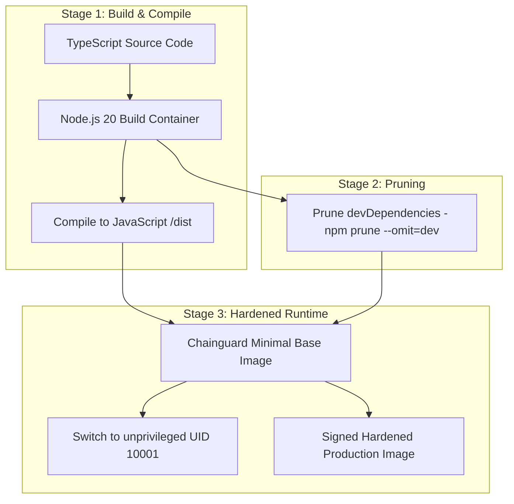

# Master Containerization & Dockerfile Architecture Blueprint
## Namma Clinic Digital Health & Operations Platform
### Greater Bengaluru Authority (GBA) / BBMP Health Department
**Document Code:** `DEV-DOC-08` | **Status:** APPROVED BASELINE | **Date:** September 2026

---

## 1. Executive Summary & Container Architecture
This specification defines the authoritative **Containerization, Dockerfile Standards, and Image Security Blueprint** for the Namma Clinic Digital Health Platform. All microservices, frontend portals, background queue processors, and database migration utilities are containerized using hardened, multi-stage, unprivileged container images based on Chainguard Minimal / Alpine Linux. The container architecture enforces zero root execution, minimal attack surface, cryptographic image signing, and automated vulnerability scanning.

### 1.1 Non-Negotiable Container Security Invariants
1. **Zero Root Execution:** All processes run under an unprivileged user `appuser` (UID `10001`, GID `10001`). SUID binaries and root execution are strictly blocked.
2. **Multi-Stage Build Isolation:** Build tools (compilers, devDependencies, package managers) are completely discarded; runtime images contain only production artifacts.
3. **Minimal Distroless / Hardened Base:** Production images omit shells, package managers, and debugging tools to prevent post-exploitation lateral movement.
4. **Immutable Tags & Digest Pinning:** Base images are pinned by SHA256 cryptographic digest; application images are tagged with Git SHA and SemVer.
5. **Zero High/Critical CVEs:** Trivy scanner fails container builds if any unpatched High or Critical vulnerability is detected.

## 2. Multi-Stage Container Build Pipeline


## 3. Production Multi-Stage Dockerfile Specification
### Container Blueprint: Production API Service Hardened Dockerfile
<!-- DOCUMENTATION-ONLY EXAMPLE -->
```dockerfile
# DOCUMENTATION-ONLY EXAMPLE
# Syntax: docker/dockerfile:1.4
# Stage 1: Dependency Installation & Compilation
FROM node:20-alpine AS builder
WORKDIR /usr/src/app

# Install build dependencies
COPY package*.json tsconfig.json ./
RUN npm ci --prefer-offline --no-audit

# Copy application source and build production bundle
COPY src ./src
RUN npm run build

# Prune development dependencies
RUN npm prune --omit=dev

# -----------------------------------------------------------------------------
# Stage 2: Hardened Unprivileged Production Runtime
# -----------------------------------------------------------------------------
FROM cgr.dev/chainguard/node:latest AS production
WORKDIR /app

# Create dedicated non-root execution user
# UID 10001 / GID 10001
USER 10001:10001

# Copy pruned node_modules and compiled output from builder
COPY --chown=10001:10001 --from=builder /usr/src/app/node_modules ./node_modules
COPY --chown=10001:10001 --from=builder /usr/src/app/dist ./dist
COPY --chown=10001:10001 package.json ./

# Environment defaults
ENV NODE_ENV=production     PORT=3000     NODE_OPTIONS="--max-old-space-size=1536"

# Expose non-privileged port
EXPOSE 3000

# Healthcheck definition
HEALTHCHECK --interval=10s --timeout=3s --retries=3 --start-period=10s   CMD node -e "http.get('http://localhost:3000/api/v1/health/liveness', (r) => process.exit(r.statusCode === 200 ? 0 : 1))"

# Immutable entrypoint
ENTRYPOINT ["node", "dist/index.js"]
```

## 4. Master Container Images Catalog
Comprehensive specifications for all 30 container images across platform services:

### DOCKER-IMG-001: Container Specification `api-backend-v1`
- **Image Identifier:** `DOCKER-IMG-001`
- **Base Image:** `cgr.dev/chainguard/node:latest` (Minimal distroless/hardened Alpine)
- **Runtime User:** `appuser:appgroup` (UID `10001`, GID `10001`, Root Forbidden)
- **Multi-Stage Build Targets:** ['builder', 'pruner', 'production']
- **Vulnerability Gate:** Zero Critical / High CVEs (Trivy scanner)
- **SBOM Standard:** SPDX / CycloneDX JSON via Syft
- **Image Signature:** Cosign keyless OIDC signing with Sigstore
- **Healthcheck Endpoint:** `/api/v1/health/liveness`

### DOCKER-IMG-002: Container Specification `frontend-portal-v2`
- **Image Identifier:** `DOCKER-IMG-002`
- **Base Image:** `cgr.dev/chainguard/nginx:latest` (Minimal distroless/hardened Alpine)
- **Runtime User:** `appuser:appgroup` (UID `10001`, GID `10001`, Root Forbidden)
- **Multi-Stage Build Targets:** ['build-assets', 'runtime']
- **Vulnerability Gate:** Zero Critical / High CVEs (Trivy scanner)
- **SBOM Standard:** SPDX / CycloneDX JSON via Syft
- **Image Signature:** Cosign keyless OIDC signing with Sigstore
- **Healthcheck Endpoint:** `/healthz`

### DOCKER-IMG-003: Container Specification `clinic-sync-worker-v3`
- **Image Identifier:** `DOCKER-IMG-003`
- **Base Image:** `cgr.dev/chainguard/node:latest` (Minimal distroless/hardened Alpine)
- **Runtime User:** `appuser:appgroup` (UID `10001`, GID `10001`, Root Forbidden)
- **Multi-Stage Build Targets:** ['build-sync', 'runner']
- **Vulnerability Gate:** Zero Critical / High CVEs (Trivy scanner)
- **SBOM Standard:** SPDX / CycloneDX JSON via Syft
- **Image Signature:** Cosign keyless OIDC signing with Sigstore
- **Healthcheck Endpoint:** `/sync/health`

### DOCKER-IMG-004: Container Specification `db-migrator-v4`
- **Image Identifier:** `DOCKER-IMG-004`
- **Base Image:** `cgr.dev/chainguard/node:latest` (Minimal distroless/hardened Alpine)
- **Runtime User:** `appuser:appgroup` (UID `10001`, GID `10001`, Root Forbidden)
- **Multi-Stage Build Targets:** ['migration-build', 'runner']
- **Vulnerability Gate:** Zero Critical / High CVEs (Trivy scanner)
- **SBOM Standard:** SPDX / CycloneDX JSON via Syft
- **Image Signature:** Cosign keyless OIDC signing with Sigstore
- **Healthcheck Endpoint:** `/status`

### DOCKER-IMG-005: Container Specification `reporting-worker-v5`
- **Image Identifier:** `DOCKER-IMG-005`
- **Base Image:** `cgr.dev/chainguard/node:latest` (Minimal distroless/hardened Alpine)
- **Runtime User:** `appuser:appgroup` (UID `10001`, GID `10001`, Root Forbidden)
- **Multi-Stage Build Targets:** ['analytics-build', 'runner']
- **Vulnerability Gate:** Zero Critical / High CVEs (Trivy scanner)
- **SBOM Standard:** SPDX / CycloneDX JSON via Syft
- **Image Signature:** Cosign keyless OIDC signing with Sigstore
- **Healthcheck Endpoint:** `/health`

### DOCKER-IMG-006: Container Specification `api-backend-v6`
- **Image Identifier:** `DOCKER-IMG-006`
- **Base Image:** `cgr.dev/chainguard/node:latest` (Minimal distroless/hardened Alpine)
- **Runtime User:** `appuser:appgroup` (UID `10001`, GID `10001`, Root Forbidden)
- **Multi-Stage Build Targets:** ['builder', 'pruner', 'production']
- **Vulnerability Gate:** Zero Critical / High CVEs (Trivy scanner)
- **SBOM Standard:** SPDX / CycloneDX JSON via Syft
- **Image Signature:** Cosign keyless OIDC signing with Sigstore
- **Healthcheck Endpoint:** `/api/v1/health/liveness`

### DOCKER-IMG-007: Container Specification `frontend-portal-v7`
- **Image Identifier:** `DOCKER-IMG-007`
- **Base Image:** `cgr.dev/chainguard/nginx:latest` (Minimal distroless/hardened Alpine)
- **Runtime User:** `appuser:appgroup` (UID `10001`, GID `10001`, Root Forbidden)
- **Multi-Stage Build Targets:** ['build-assets', 'runtime']
- **Vulnerability Gate:** Zero Critical / High CVEs (Trivy scanner)
- **SBOM Standard:** SPDX / CycloneDX JSON via Syft
- **Image Signature:** Cosign keyless OIDC signing with Sigstore
- **Healthcheck Endpoint:** `/healthz`

### DOCKER-IMG-008: Container Specification `clinic-sync-worker-v8`
- **Image Identifier:** `DOCKER-IMG-008`
- **Base Image:** `cgr.dev/chainguard/node:latest` (Minimal distroless/hardened Alpine)
- **Runtime User:** `appuser:appgroup` (UID `10001`, GID `10001`, Root Forbidden)
- **Multi-Stage Build Targets:** ['build-sync', 'runner']
- **Vulnerability Gate:** Zero Critical / High CVEs (Trivy scanner)
- **SBOM Standard:** SPDX / CycloneDX JSON via Syft
- **Image Signature:** Cosign keyless OIDC signing with Sigstore
- **Healthcheck Endpoint:** `/sync/health`

### DOCKER-IMG-009: Container Specification `db-migrator-v9`
- **Image Identifier:** `DOCKER-IMG-009`
- **Base Image:** `cgr.dev/chainguard/node:latest` (Minimal distroless/hardened Alpine)
- **Runtime User:** `appuser:appgroup` (UID `10001`, GID `10001`, Root Forbidden)
- **Multi-Stage Build Targets:** ['migration-build', 'runner']
- **Vulnerability Gate:** Zero Critical / High CVEs (Trivy scanner)
- **SBOM Standard:** SPDX / CycloneDX JSON via Syft
- **Image Signature:** Cosign keyless OIDC signing with Sigstore
- **Healthcheck Endpoint:** `/status`

### DOCKER-IMG-010: Container Specification `reporting-worker-v10`
- **Image Identifier:** `DOCKER-IMG-010`
- **Base Image:** `cgr.dev/chainguard/node:latest` (Minimal distroless/hardened Alpine)
- **Runtime User:** `appuser:appgroup` (UID `10001`, GID `10001`, Root Forbidden)
- **Multi-Stage Build Targets:** ['analytics-build', 'runner']
- **Vulnerability Gate:** Zero Critical / High CVEs (Trivy scanner)
- **SBOM Standard:** SPDX / CycloneDX JSON via Syft
- **Image Signature:** Cosign keyless OIDC signing with Sigstore
- **Healthcheck Endpoint:** `/health`

### DOCKER-IMG-011: Container Specification `api-backend-v11`
- **Image Identifier:** `DOCKER-IMG-011`
- **Base Image:** `cgr.dev/chainguard/node:latest` (Minimal distroless/hardened Alpine)
- **Runtime User:** `appuser:appgroup` (UID `10001`, GID `10001`, Root Forbidden)
- **Multi-Stage Build Targets:** ['builder', 'pruner', 'production']
- **Vulnerability Gate:** Zero Critical / High CVEs (Trivy scanner)
- **SBOM Standard:** SPDX / CycloneDX JSON via Syft
- **Image Signature:** Cosign keyless OIDC signing with Sigstore
- **Healthcheck Endpoint:** `/api/v1/health/liveness`

### DOCKER-IMG-012: Container Specification `frontend-portal-v12`
- **Image Identifier:** `DOCKER-IMG-012`
- **Base Image:** `cgr.dev/chainguard/nginx:latest` (Minimal distroless/hardened Alpine)
- **Runtime User:** `appuser:appgroup` (UID `10001`, GID `10001`, Root Forbidden)
- **Multi-Stage Build Targets:** ['build-assets', 'runtime']
- **Vulnerability Gate:** Zero Critical / High CVEs (Trivy scanner)
- **SBOM Standard:** SPDX / CycloneDX JSON via Syft
- **Image Signature:** Cosign keyless OIDC signing with Sigstore
- **Healthcheck Endpoint:** `/healthz`

### DOCKER-IMG-013: Container Specification `clinic-sync-worker-v13`
- **Image Identifier:** `DOCKER-IMG-013`
- **Base Image:** `cgr.dev/chainguard/node:latest` (Minimal distroless/hardened Alpine)
- **Runtime User:** `appuser:appgroup` (UID `10001`, GID `10001`, Root Forbidden)
- **Multi-Stage Build Targets:** ['build-sync', 'runner']
- **Vulnerability Gate:** Zero Critical / High CVEs (Trivy scanner)
- **SBOM Standard:** SPDX / CycloneDX JSON via Syft
- **Image Signature:** Cosign keyless OIDC signing with Sigstore
- **Healthcheck Endpoint:** `/sync/health`

### DOCKER-IMG-014: Container Specification `db-migrator-v14`
- **Image Identifier:** `DOCKER-IMG-014`
- **Base Image:** `cgr.dev/chainguard/node:latest` (Minimal distroless/hardened Alpine)
- **Runtime User:** `appuser:appgroup` (UID `10001`, GID `10001`, Root Forbidden)
- **Multi-Stage Build Targets:** ['migration-build', 'runner']
- **Vulnerability Gate:** Zero Critical / High CVEs (Trivy scanner)
- **SBOM Standard:** SPDX / CycloneDX JSON via Syft
- **Image Signature:** Cosign keyless OIDC signing with Sigstore
- **Healthcheck Endpoint:** `/status`

### DOCKER-IMG-015: Container Specification `reporting-worker-v15`
- **Image Identifier:** `DOCKER-IMG-015`
- **Base Image:** `cgr.dev/chainguard/node:latest` (Minimal distroless/hardened Alpine)
- **Runtime User:** `appuser:appgroup` (UID `10001`, GID `10001`, Root Forbidden)
- **Multi-Stage Build Targets:** ['analytics-build', 'runner']
- **Vulnerability Gate:** Zero Critical / High CVEs (Trivy scanner)
- **SBOM Standard:** SPDX / CycloneDX JSON via Syft
- **Image Signature:** Cosign keyless OIDC signing with Sigstore
- **Healthcheck Endpoint:** `/health`

### DOCKER-IMG-016: Container Specification `api-backend-v16`
- **Image Identifier:** `DOCKER-IMG-016`
- **Base Image:** `cgr.dev/chainguard/node:latest` (Minimal distroless/hardened Alpine)
- **Runtime User:** `appuser:appgroup` (UID `10001`, GID `10001`, Root Forbidden)
- **Multi-Stage Build Targets:** ['builder', 'pruner', 'production']
- **Vulnerability Gate:** Zero Critical / High CVEs (Trivy scanner)
- **SBOM Standard:** SPDX / CycloneDX JSON via Syft
- **Image Signature:** Cosign keyless OIDC signing with Sigstore
- **Healthcheck Endpoint:** `/api/v1/health/liveness`

### DOCKER-IMG-017: Container Specification `frontend-portal-v17`
- **Image Identifier:** `DOCKER-IMG-017`
- **Base Image:** `cgr.dev/chainguard/nginx:latest` (Minimal distroless/hardened Alpine)
- **Runtime User:** `appuser:appgroup` (UID `10001`, GID `10001`, Root Forbidden)
- **Multi-Stage Build Targets:** ['build-assets', 'runtime']
- **Vulnerability Gate:** Zero Critical / High CVEs (Trivy scanner)
- **SBOM Standard:** SPDX / CycloneDX JSON via Syft
- **Image Signature:** Cosign keyless OIDC signing with Sigstore
- **Healthcheck Endpoint:** `/healthz`

### DOCKER-IMG-018: Container Specification `clinic-sync-worker-v18`
- **Image Identifier:** `DOCKER-IMG-018`
- **Base Image:** `cgr.dev/chainguard/node:latest` (Minimal distroless/hardened Alpine)
- **Runtime User:** `appuser:appgroup` (UID `10001`, GID `10001`, Root Forbidden)
- **Multi-Stage Build Targets:** ['build-sync', 'runner']
- **Vulnerability Gate:** Zero Critical / High CVEs (Trivy scanner)
- **SBOM Standard:** SPDX / CycloneDX JSON via Syft
- **Image Signature:** Cosign keyless OIDC signing with Sigstore
- **Healthcheck Endpoint:** `/sync/health`

### DOCKER-IMG-019: Container Specification `db-migrator-v19`
- **Image Identifier:** `DOCKER-IMG-019`
- **Base Image:** `cgr.dev/chainguard/node:latest` (Minimal distroless/hardened Alpine)
- **Runtime User:** `appuser:appgroup` (UID `10001`, GID `10001`, Root Forbidden)
- **Multi-Stage Build Targets:** ['migration-build', 'runner']
- **Vulnerability Gate:** Zero Critical / High CVEs (Trivy scanner)
- **SBOM Standard:** SPDX / CycloneDX JSON via Syft
- **Image Signature:** Cosign keyless OIDC signing with Sigstore
- **Healthcheck Endpoint:** `/status`

### DOCKER-IMG-020: Container Specification `reporting-worker-v20`
- **Image Identifier:** `DOCKER-IMG-020`
- **Base Image:** `cgr.dev/chainguard/node:latest` (Minimal distroless/hardened Alpine)
- **Runtime User:** `appuser:appgroup` (UID `10001`, GID `10001`, Root Forbidden)
- **Multi-Stage Build Targets:** ['analytics-build', 'runner']
- **Vulnerability Gate:** Zero Critical / High CVEs (Trivy scanner)
- **SBOM Standard:** SPDX / CycloneDX JSON via Syft
- **Image Signature:** Cosign keyless OIDC signing with Sigstore
- **Healthcheck Endpoint:** `/health`

### DOCKER-IMG-021: Container Specification `api-backend-v21`
- **Image Identifier:** `DOCKER-IMG-021`
- **Base Image:** `cgr.dev/chainguard/node:latest` (Minimal distroless/hardened Alpine)
- **Runtime User:** `appuser:appgroup` (UID `10001`, GID `10001`, Root Forbidden)
- **Multi-Stage Build Targets:** ['builder', 'pruner', 'production']
- **Vulnerability Gate:** Zero Critical / High CVEs (Trivy scanner)
- **SBOM Standard:** SPDX / CycloneDX JSON via Syft
- **Image Signature:** Cosign keyless OIDC signing with Sigstore
- **Healthcheck Endpoint:** `/api/v1/health/liveness`

### DOCKER-IMG-022: Container Specification `frontend-portal-v22`
- **Image Identifier:** `DOCKER-IMG-022`
- **Base Image:** `cgr.dev/chainguard/nginx:latest` (Minimal distroless/hardened Alpine)
- **Runtime User:** `appuser:appgroup` (UID `10001`, GID `10001`, Root Forbidden)
- **Multi-Stage Build Targets:** ['build-assets', 'runtime']
- **Vulnerability Gate:** Zero Critical / High CVEs (Trivy scanner)
- **SBOM Standard:** SPDX / CycloneDX JSON via Syft
- **Image Signature:** Cosign keyless OIDC signing with Sigstore
- **Healthcheck Endpoint:** `/healthz`

### DOCKER-IMG-023: Container Specification `clinic-sync-worker-v23`
- **Image Identifier:** `DOCKER-IMG-023`
- **Base Image:** `cgr.dev/chainguard/node:latest` (Minimal distroless/hardened Alpine)
- **Runtime User:** `appuser:appgroup` (UID `10001`, GID `10001`, Root Forbidden)
- **Multi-Stage Build Targets:** ['build-sync', 'runner']
- **Vulnerability Gate:** Zero Critical / High CVEs (Trivy scanner)
- **SBOM Standard:** SPDX / CycloneDX JSON via Syft
- **Image Signature:** Cosign keyless OIDC signing with Sigstore
- **Healthcheck Endpoint:** `/sync/health`

### DOCKER-IMG-024: Container Specification `db-migrator-v24`
- **Image Identifier:** `DOCKER-IMG-024`
- **Base Image:** `cgr.dev/chainguard/node:latest` (Minimal distroless/hardened Alpine)
- **Runtime User:** `appuser:appgroup` (UID `10001`, GID `10001`, Root Forbidden)
- **Multi-Stage Build Targets:** ['migration-build', 'runner']
- **Vulnerability Gate:** Zero Critical / High CVEs (Trivy scanner)
- **SBOM Standard:** SPDX / CycloneDX JSON via Syft
- **Image Signature:** Cosign keyless OIDC signing with Sigstore
- **Healthcheck Endpoint:** `/status`

### DOCKER-IMG-025: Container Specification `reporting-worker-v25`
- **Image Identifier:** `DOCKER-IMG-025`
- **Base Image:** `cgr.dev/chainguard/node:latest` (Minimal distroless/hardened Alpine)
- **Runtime User:** `appuser:appgroup` (UID `10001`, GID `10001`, Root Forbidden)
- **Multi-Stage Build Targets:** ['analytics-build', 'runner']
- **Vulnerability Gate:** Zero Critical / High CVEs (Trivy scanner)
- **SBOM Standard:** SPDX / CycloneDX JSON via Syft
- **Image Signature:** Cosign keyless OIDC signing with Sigstore
- **Healthcheck Endpoint:** `/health`

### DOCKER-IMG-026: Container Specification `api-backend-v26`
- **Image Identifier:** `DOCKER-IMG-026`
- **Base Image:** `cgr.dev/chainguard/node:latest` (Minimal distroless/hardened Alpine)
- **Runtime User:** `appuser:appgroup` (UID `10001`, GID `10001`, Root Forbidden)
- **Multi-Stage Build Targets:** ['builder', 'pruner', 'production']
- **Vulnerability Gate:** Zero Critical / High CVEs (Trivy scanner)
- **SBOM Standard:** SPDX / CycloneDX JSON via Syft
- **Image Signature:** Cosign keyless OIDC signing with Sigstore
- **Healthcheck Endpoint:** `/api/v1/health/liveness`

### DOCKER-IMG-027: Container Specification `frontend-portal-v27`
- **Image Identifier:** `DOCKER-IMG-027`
- **Base Image:** `cgr.dev/chainguard/nginx:latest` (Minimal distroless/hardened Alpine)
- **Runtime User:** `appuser:appgroup` (UID `10001`, GID `10001`, Root Forbidden)
- **Multi-Stage Build Targets:** ['build-assets', 'runtime']
- **Vulnerability Gate:** Zero Critical / High CVEs (Trivy scanner)
- **SBOM Standard:** SPDX / CycloneDX JSON via Syft
- **Image Signature:** Cosign keyless OIDC signing with Sigstore
- **Healthcheck Endpoint:** `/healthz`

### DOCKER-IMG-028: Container Specification `clinic-sync-worker-v28`
- **Image Identifier:** `DOCKER-IMG-028`
- **Base Image:** `cgr.dev/chainguard/node:latest` (Minimal distroless/hardened Alpine)
- **Runtime User:** `appuser:appgroup` (UID `10001`, GID `10001`, Root Forbidden)
- **Multi-Stage Build Targets:** ['build-sync', 'runner']
- **Vulnerability Gate:** Zero Critical / High CVEs (Trivy scanner)
- **SBOM Standard:** SPDX / CycloneDX JSON via Syft
- **Image Signature:** Cosign keyless OIDC signing with Sigstore
- **Healthcheck Endpoint:** `/sync/health`

### DOCKER-IMG-029: Container Specification `db-migrator-v29`
- **Image Identifier:** `DOCKER-IMG-029`
- **Base Image:** `cgr.dev/chainguard/node:latest` (Minimal distroless/hardened Alpine)
- **Runtime User:** `appuser:appgroup` (UID `10001`, GID `10001`, Root Forbidden)
- **Multi-Stage Build Targets:** ['migration-build', 'runner']
- **Vulnerability Gate:** Zero Critical / High CVEs (Trivy scanner)
- **SBOM Standard:** SPDX / CycloneDX JSON via Syft
- **Image Signature:** Cosign keyless OIDC signing with Sigstore
- **Healthcheck Endpoint:** `/status`

### DOCKER-IMG-030: Container Specification `reporting-worker-v30`
- **Image Identifier:** `DOCKER-IMG-030`
- **Base Image:** `cgr.dev/chainguard/node:latest` (Minimal distroless/hardened Alpine)
- **Runtime User:** `appuser:appgroup` (UID `10001`, GID `10001`, Root Forbidden)
- **Multi-Stage Build Targets:** ['analytics-build', 'runner']
- **Vulnerability Gate:** Zero Critical / High CVEs (Trivy scanner)
- **SBOM Standard:** SPDX / CycloneDX JSON via Syft
- **Image Signature:** Cosign keyless OIDC signing with Sigstore
- **Healthcheck Endpoint:** `/health`

## 5. Feature Container Allocation across 180 Features
Detailed matrix mapping all 180 product features to container runtime configurations:

### FEATURE-001: Container Configuration for `Credential Verification`
- **Feature ID:** `FEATURE-001` (Feature #1)
- **Governed Subsystem:** `MODULE-001` (DOMAIN-001)
- **Bound Container Image:** `DOCKER-IMG-001`
- **CPU Allocation:** Request 250m / Limit 1000m
- **Memory Allocation:** Request 512Mi / Limit 2048Mi
- **Healthcheck Endpoint:** `/api/v1/module-001/healthz`
- **Security Context:** ReadOnlyRootFilesystem=true, AllowPrivilegeEscalation=false

### FEATURE-002: Container Configuration for `Session Token Minting`
- **Feature ID:** `FEATURE-002` (Feature #2)
- **Governed Subsystem:** `MODULE-001` (DOMAIN-001)
- **Bound Container Image:** `DOCKER-IMG-002`
- **CPU Allocation:** Request 250m / Limit 1000m
- **Memory Allocation:** Request 512Mi / Limit 2048Mi
- **Healthcheck Endpoint:** `/api/v1/module-001/healthz`
- **Security Context:** ReadOnlyRootFilesystem=true, AllowPrivilegeEscalation=false

### FEATURE-003: Container Configuration for `MFA Challenge Dispatch`
- **Feature ID:** `FEATURE-003` (Feature #3)
- **Governed Subsystem:** `MODULE-001` (DOMAIN-001)
- **Bound Container Image:** `DOCKER-IMG-003`
- **CPU Allocation:** Request 250m / Limit 1000m
- **Memory Allocation:** Request 512Mi / Limit 2048Mi
- **Healthcheck Endpoint:** `/api/v1/module-001/healthz`
- **Security Context:** ReadOnlyRootFilesystem=true, AllowPrivilegeEscalation=false

### FEATURE-004: Container Configuration for `Biometric Authentication Bridge`
- **Feature ID:** `FEATURE-004` (Feature #4)
- **Governed Subsystem:** `MODULE-001` (DOMAIN-001)
- **Bound Container Image:** `DOCKER-IMG-004`
- **CPU Allocation:** Request 250m / Limit 1000m
- **Memory Allocation:** Request 512Mi / Limit 2048Mi
- **Healthcheck Endpoint:** `/api/v1/module-001/healthz`
- **Security Context:** ReadOnlyRootFilesystem=true, AllowPrivilegeEscalation=false

### FEATURE-005: Container Configuration for `Local PIN Verification`
- **Feature ID:** `FEATURE-005` (Feature #5)
- **Governed Subsystem:** `MODULE-001` (DOMAIN-001)
- **Bound Container Image:** `DOCKER-IMG-005`
- **CPU Allocation:** Request 250m / Limit 1000m
- **Memory Allocation:** Request 512Mi / Limit 2048Mi
- **Healthcheck Endpoint:** `/api/v1/module-001/healthz`
- **Security Context:** ReadOnlyRootFilesystem=true, AllowPrivilegeEscalation=false

### FEATURE-006: Container Configuration for `Session Inactivity Lockout`
- **Feature ID:** `FEATURE-006` (Feature #6)
- **Governed Subsystem:** `MODULE-001` (DOMAIN-001)
- **Bound Container Image:** `DOCKER-IMG-006`
- **CPU Allocation:** Request 250m / Limit 1000m
- **Memory Allocation:** Request 512Mi / Limit 2048Mi
- **Healthcheck Endpoint:** `/api/v1/module-001/healthz`
- **Security Context:** ReadOnlyRootFilesystem=true, AllowPrivilegeEscalation=false

### FEATURE-007: Container Configuration for `Permission Evaluation`
- **Feature ID:** `FEATURE-007` (Feature #7)
- **Governed Subsystem:** `MODULE-002` (DOMAIN-001)
- **Bound Container Image:** `DOCKER-IMG-007`
- **CPU Allocation:** Request 250m / Limit 1000m
- **Memory Allocation:** Request 512Mi / Limit 2048Mi
- **Healthcheck Endpoint:** `/api/v1/module-002/healthz`
- **Security Context:** ReadOnlyRootFilesystem=true, AllowPrivilegeEscalation=false

### FEATURE-008: Container Configuration for `Dynamic Role Assignment`
- **Feature ID:** `FEATURE-008` (Feature #8)
- **Governed Subsystem:** `MODULE-002` (DOMAIN-001)
- **Bound Container Image:** `DOCKER-IMG-008`
- **CPU Allocation:** Request 250m / Limit 1000m
- **Memory Allocation:** Request 512Mi / Limit 2048Mi
- **Healthcheck Endpoint:** `/api/v1/module-002/healthz`
- **Security Context:** ReadOnlyRootFilesystem=true, AllowPrivilegeEscalation=false

### FEATURE-009: Container Configuration for `Conflict-of-Interest Prevention`
- **Feature ID:** `FEATURE-009` (Feature #9)
- **Governed Subsystem:** `MODULE-002` (DOMAIN-001)
- **Bound Container Image:** `DOCKER-IMG-009`
- **CPU Allocation:** Request 250m / Limit 1000m
- **Memory Allocation:** Request 512Mi / Limit 2048Mi
- **Healthcheck Endpoint:** `/api/v1/module-002/healthz`
- **Security Context:** ReadOnlyRootFilesystem=true, AllowPrivilegeEscalation=false

### FEATURE-010: Container Configuration for `Maker-Checker Authorization`
- **Feature ID:** `FEATURE-010` (Feature #10)
- **Governed Subsystem:** `MODULE-002` (DOMAIN-001)
- **Bound Container Image:** `DOCKER-IMG-010`
- **CPU Allocation:** Request 250m / Limit 1000m
- **Memory Allocation:** Request 512Mi / Limit 2048Mi
- **Healthcheck Endpoint:** `/api/v1/module-002/healthz`
- **Security Context:** ReadOnlyRootFilesystem=true, AllowPrivilegeEscalation=false

### FEATURE-011: Container Configuration for `Break-Glass Privilege Elevation`
- **Feature ID:** `FEATURE-011` (Feature #11)
- **Governed Subsystem:** `MODULE-002` (DOMAIN-001)
- **Bound Container Image:** `DOCKER-IMG-011`
- **CPU Allocation:** Request 250m / Limit 1000m
- **Memory Allocation:** Request 512Mi / Limit 2048Mi
- **Healthcheck Endpoint:** `/api/v1/module-002/healthz`
- **Security Context:** ReadOnlyRootFilesystem=true, AllowPrivilegeEscalation=false

### FEATURE-012: Container Configuration for `Privilege Elevation Audit`
- **Feature ID:** `FEATURE-012` (Feature #12)
- **Governed Subsystem:** `MODULE-002` (DOMAIN-001)
- **Bound Container Image:** `DOCKER-IMG-012`
- **CPU Allocation:** Request 250m / Limit 1000m
- **Memory Allocation:** Request 512Mi / Limit 2048Mi
- **Healthcheck Endpoint:** `/api/v1/module-002/healthz`
- **Security Context:** ReadOnlyRootFilesystem=true, AllowPrivilegeEscalation=false

### FEATURE-013: Container Configuration for `Hierarchy Node Management`
- **Feature ID:** `FEATURE-013` (Feature #13)
- **Governed Subsystem:** `MODULE-003` (DOMAIN-001)
- **Bound Container Image:** `DOCKER-IMG-013`
- **CPU Allocation:** Request 250m / Limit 1000m
- **Memory Allocation:** Request 512Mi / Limit 2048Mi
- **Healthcheck Endpoint:** `/api/v1/module-003/healthz`
- **Security Context:** ReadOnlyRootFilesystem=true, AllowPrivilegeEscalation=false

### FEATURE-014: Container Configuration for `NIN / HFR Registry Linking`
- **Feature ID:** `FEATURE-014` (Feature #14)
- **Governed Subsystem:** `MODULE-003` (DOMAIN-001)
- **Bound Container Image:** `DOCKER-IMG-014`
- **CPU Allocation:** Request 250m / Limit 1000m
- **Memory Allocation:** Request 512Mi / Limit 2048Mi
- **Healthcheck Endpoint:** `/api/v1/module-003/healthz`
- **Security Context:** ReadOnlyRootFilesystem=true, AllowPrivilegeEscalation=false

### FEATURE-015: Container Configuration for `Station Terminal Mapping`
- **Feature ID:** `FEATURE-015` (Feature #15)
- **Governed Subsystem:** `MODULE-003` (DOMAIN-001)
- **Bound Container Image:** `DOCKER-IMG-015`
- **CPU Allocation:** Request 250m / Limit 1000m
- **Memory Allocation:** Request 512Mi / Limit 2048Mi
- **Healthcheck Endpoint:** `/api/v1/module-003/healthz`
- **Security Context:** ReadOnlyRootFilesystem=true, AllowPrivilegeEscalation=false

### FEATURE-016: Container Configuration for `Facility Capacity Configuration`
- **Feature ID:** `FEATURE-016` (Feature #16)
- **Governed Subsystem:** `MODULE-003` (DOMAIN-001)
- **Bound Container Image:** `DOCKER-IMG-016`
- **CPU Allocation:** Request 250m / Limit 1000m
- **Memory Allocation:** Request 512Mi / Limit 2048Mi
- **Healthcheck Endpoint:** `/api/v1/module-003/healthz`
- **Security Context:** ReadOnlyRootFilesystem=true, AllowPrivilegeEscalation=false

### FEATURE-017: Container Configuration for `Operating Hours Enforcement`
- **Feature ID:** `FEATURE-017` (Feature #17)
- **Governed Subsystem:** `MODULE-003` (DOMAIN-001)
- **Bound Container Image:** `DOCKER-IMG-017`
- **CPU Allocation:** Request 250m / Limit 1000m
- **Memory Allocation:** Request 512Mi / Limit 2048Mi
- **Healthcheck Endpoint:** `/api/v1/module-003/healthz`
- **Security Context:** ReadOnlyRootFilesystem=true, AllowPrivilegeEscalation=false

### FEATURE-018: Container Configuration for `Special Camp Calendar`
- **Feature ID:** `FEATURE-018` (Feature #18)
- **Governed Subsystem:** `MODULE-003` (DOMAIN-001)
- **Bound Container Image:** `DOCKER-IMG-018`
- **CPU Allocation:** Request 250m / Limit 1000m
- **Memory Allocation:** Request 512Mi / Limit 2048Mi
- **Healthcheck Endpoint:** `/api/v1/module-003/healthz`
- **Security Context:** ReadOnlyRootFilesystem=true, AllowPrivilegeEscalation=false

### FEATURE-019: Container Configuration for `Staff Onboarding & KYC`
- **Feature ID:** `FEATURE-019` (Feature #19)
- **Governed Subsystem:** `MODULE-004` (DOMAIN-001)
- **Bound Container Image:** `DOCKER-IMG-019`
- **CPU Allocation:** Request 250m / Limit 1000m
- **Memory Allocation:** Request 512Mi / Limit 2048Mi
- **Healthcheck Endpoint:** `/api/v1/module-004/healthz`
- **Security Context:** ReadOnlyRootFilesystem=true, AllowPrivilegeEscalation=false

### FEATURE-020: Container Configuration for `Professional License Verification`
- **Feature ID:** `FEATURE-020` (Feature #20)
- **Governed Subsystem:** `MODULE-004` (DOMAIN-001)
- **Bound Container Image:** `DOCKER-IMG-020`
- **CPU Allocation:** Request 250m / Limit 1000m
- **Memory Allocation:** Request 512Mi / Limit 2048Mi
- **Healthcheck Endpoint:** `/api/v1/module-004/healthz`
- **Security Context:** ReadOnlyRootFilesystem=true, AllowPrivilegeEscalation=false

### FEATURE-021: Container Configuration for `Duty Roster Generation`
- **Feature ID:** `FEATURE-021` (Feature #21)
- **Governed Subsystem:** `MODULE-004` (DOMAIN-001)
- **Bound Container Image:** `DOCKER-IMG-021`
- **CPU Allocation:** Request 250m / Limit 1000m
- **Memory Allocation:** Request 512Mi / Limit 2048Mi
- **Healthcheck Endpoint:** `/api/v1/module-004/healthz`
- **Security Context:** ReadOnlyRootFilesystem=true, AllowPrivilegeEscalation=false

### FEATURE-022: Container Configuration for `Biometric Attendance Linking`
- **Feature ID:** `FEATURE-022` (Feature #22)
- **Governed Subsystem:** `MODULE-004` (DOMAIN-001)
- **Bound Container Image:** `DOCKER-IMG-022`
- **CPU Allocation:** Request 250m / Limit 1000m
- **Memory Allocation:** Request 512Mi / Limit 2048Mi
- **Healthcheck Endpoint:** `/api/v1/module-004/healthz`
- **Security Context:** ReadOnlyRootFilesystem=true, AllowPrivilegeEscalation=false

### FEATURE-023: Container Configuration for `Digital Signature Enrollment`
- **Feature ID:** `FEATURE-023` (Feature #23)
- **Governed Subsystem:** `MODULE-004` (DOMAIN-001)
- **Bound Container Image:** `DOCKER-IMG-023`
- **CPU Allocation:** Request 250m / Limit 1000m
- **Memory Allocation:** Request 512Mi / Limit 2048Mi
- **Healthcheck Endpoint:** `/api/v1/module-004/healthz`
- **Security Context:** ReadOnlyRootFilesystem=true, AllowPrivilegeEscalation=false

### FEATURE-024: Container Configuration for `Signature Revocation`
- **Feature ID:** `FEATURE-024` (Feature #24)
- **Governed Subsystem:** `MODULE-004` (DOMAIN-001)
- **Bound Container Image:** `DOCKER-IMG-024`
- **CPU Allocation:** Request 250m / Limit 1000m
- **Memory Allocation:** Request 512Mi / Limit 2048Mi
- **Healthcheck Endpoint:** `/api/v1/module-004/healthz`
- **Security Context:** ReadOnlyRootFilesystem=true, AllowPrivilegeEscalation=false

### FEATURE-025: Container Configuration for `Targeted Flag Activation`
- **Feature ID:** `FEATURE-025` (Feature #25)
- **Governed Subsystem:** `MODULE-026` (DOMAIN-001)
- **Bound Container Image:** `DOCKER-IMG-025`
- **CPU Allocation:** Request 250m / Limit 1000m
- **Memory Allocation:** Request 512Mi / Limit 2048Mi
- **Healthcheck Endpoint:** `/api/v1/module-026/healthz`
- **Security Context:** ReadOnlyRootFilesystem=true, AllowPrivilegeEscalation=false

### FEATURE-026: Container Configuration for `Emergency Feature Killswitch`
- **Feature ID:** `FEATURE-026` (Feature #26)
- **Governed Subsystem:** `MODULE-026` (DOMAIN-001)
- **Bound Container Image:** `DOCKER-IMG-026`
- **CPU Allocation:** Request 250m / Limit 1000m
- **Memory Allocation:** Request 512Mi / Limit 2048Mi
- **Healthcheck Endpoint:** `/api/v1/module-026/healthz`
- **Security Context:** ReadOnlyRootFilesystem=true, AllowPrivilegeEscalation=false

### FEATURE-027: Container Configuration for `System Parameter Tuning`
- **Feature ID:** `FEATURE-027` (Feature #27)
- **Governed Subsystem:** `MODULE-026` (DOMAIN-001)
- **Bound Container Image:** `DOCKER-IMG-027`
- **CPU Allocation:** Request 250m / Limit 1000m
- **Memory Allocation:** Request 512Mi / Limit 2048Mi
- **Healthcheck Endpoint:** `/api/v1/module-026/healthz`
- **Security Context:** ReadOnlyRootFilesystem=true, AllowPrivilegeEscalation=false

### FEATURE-028: Container Configuration for `Edge Configuration Distribution`
- **Feature ID:** `FEATURE-028` (Feature #28)
- **Governed Subsystem:** `MODULE-026` (DOMAIN-001)
- **Bound Container Image:** `DOCKER-IMG-028`
- **CPU Allocation:** Request 250m / Limit 1000m
- **Memory Allocation:** Request 512Mi / Limit 2048Mi
- **Healthcheck Endpoint:** `/api/v1/module-026/healthz`
- **Security Context:** ReadOnlyRootFilesystem=true, AllowPrivilegeEscalation=false

### FEATURE-029: Container Configuration for `Edge Migration Orchestration`
- **Feature ID:** `FEATURE-029` (Feature #29)
- **Governed Subsystem:** `MODULE-026` (DOMAIN-001)
- **Bound Container Image:** `DOCKER-IMG-029`
- **CPU Allocation:** Request 250m / Limit 1000m
- **Memory Allocation:** Request 512Mi / Limit 2048Mi
- **Healthcheck Endpoint:** `/api/v1/module-026/healthz`
- **Security Context:** ReadOnlyRootFilesystem=true, AllowPrivilegeEscalation=false

### FEATURE-030: Container Configuration for `Health Probe Monitoring`
- **Feature ID:** `FEATURE-030` (Feature #30)
- **Governed Subsystem:** `MODULE-026` (DOMAIN-001)
- **Bound Container Image:** `DOCKER-IMG-030`
- **CPU Allocation:** Request 250m / Limit 1000m
- **Memory Allocation:** Request 512Mi / Limit 2048Mi
- **Healthcheck Endpoint:** `/api/v1/module-026/healthz`
- **Security Context:** ReadOnlyRootFilesystem=true, AllowPrivilegeEscalation=false

### FEATURE-031: Container Configuration for `Bilingual Intake UI`
- **Feature ID:** `FEATURE-031` (Feature #31)
- **Governed Subsystem:** `MODULE-005` (DOMAIN-002)
- **Bound Container Image:** `DOCKER-IMG-001`
- **CPU Allocation:** Request 250m / Limit 1000m
- **Memory Allocation:** Request 512Mi / Limit 2048Mi
- **Healthcheck Endpoint:** `/api/v1/module-005/healthz`
- **Security Context:** ReadOnlyRootFilesystem=true, AllowPrivilegeEscalation=false

### FEATURE-032: Container Configuration for `Vulnerable Citizen Flagging`
- **Feature ID:** `FEATURE-032` (Feature #32)
- **Governed Subsystem:** `MODULE-005` (DOMAIN-002)
- **Bound Container Image:** `DOCKER-IMG-002`
- **CPU Allocation:** Request 250m / Limit 1000m
- **Memory Allocation:** Request 512Mi / Limit 2048Mi
- **Healthcheck Endpoint:** `/api/v1/module-005/healthz`
- **Security Context:** ReadOnlyRootFilesystem=true, AllowPrivilegeEscalation=false

### FEATURE-033: Container Configuration for `Aadhaar OTP ABHA Bridge`
- **Feature ID:** `FEATURE-033` (Feature #33)
- **Governed Subsystem:** `MODULE-005` (DOMAIN-002)
- **Bound Container Image:** `DOCKER-IMG-003`
- **CPU Allocation:** Request 250m / Limit 1000m
- **Memory Allocation:** Request 512Mi / Limit 2048Mi
- **Healthcheck Endpoint:** `/api/v1/module-005/healthz`
- **Security Context:** ReadOnlyRootFilesystem=true, AllowPrivilegeEscalation=false

### FEATURE-034: Container Configuration for `Demographic ABHA Creation`
- **Feature ID:** `FEATURE-034` (Feature #34)
- **Governed Subsystem:** `MODULE-005` (DOMAIN-002)
- **Bound Container Image:** `DOCKER-IMG-004`
- **CPU Allocation:** Request 250m / Limit 1000m
- **Memory Allocation:** Request 512Mi / Limit 2048Mi
- **Healthcheck Endpoint:** `/api/v1/module-005/healthz`
- **Security Context:** ReadOnlyRootFilesystem=true, AllowPrivilegeEscalation=false

### FEATURE-035: Container Configuration for `Deterministic UHID Minting`
- **Feature ID:** `FEATURE-035` (Feature #35)
- **Governed Subsystem:** `MODULE-005` (DOMAIN-002)
- **Bound Container Image:** `DOCKER-IMG-005`
- **CPU Allocation:** Request 250m / Limit 1000m
- **Memory Allocation:** Request 512Mi / Limit 2048Mi
- **Healthcheck Endpoint:** `/api/v1/module-005/healthz`
- **Security Context:** ReadOnlyRootFilesystem=true, AllowPrivilegeEscalation=false

### FEATURE-036: Container Configuration for `Soundex / Double-Metaphone Matching`
- **Feature ID:** `FEATURE-036` (Feature #36)
- **Governed Subsystem:** `MODULE-005` (DOMAIN-002)
- **Bound Container Image:** `DOCKER-IMG-006`
- **CPU Allocation:** Request 250m / Limit 1000m
- **Memory Allocation:** Request 512Mi / Limit 2048Mi
- **Healthcheck Endpoint:** `/api/v1/module-005/healthz`
- **Security Context:** ReadOnlyRootFilesystem=true, AllowPrivilegeEscalation=false

### FEATURE-037: Container Configuration for `Bilingual Consent Presentation`
- **Feature ID:** `FEATURE-037` (Feature #37)
- **Governed Subsystem:** `MODULE-006` (DOMAIN-002)
- **Bound Container Image:** `DOCKER-IMG-007`
- **CPU Allocation:** Request 250m / Limit 1000m
- **Memory Allocation:** Request 512Mi / Limit 2048Mi
- **Healthcheck Endpoint:** `/api/v1/module-006/healthz`
- **Security Context:** ReadOnlyRootFilesystem=true, AllowPrivilegeEscalation=false

### FEATURE-038: Container Configuration for `Digital Signature / Thumbprint Capture`
- **Feature ID:** `FEATURE-038` (Feature #38)
- **Governed Subsystem:** `MODULE-006` (DOMAIN-002)
- **Bound Container Image:** `DOCKER-IMG-008`
- **CPU Allocation:** Request 250m / Limit 1000m
- **Memory Allocation:** Request 512Mi / Limit 2048Mi
- **Healthcheck Endpoint:** `/api/v1/module-006/healthz`
- **Security Context:** ReadOnlyRootFilesystem=true, AllowPrivilegeEscalation=false

### FEATURE-039: Container Configuration for `Granular Purpose-Based Consent`
- **Feature ID:** `FEATURE-039` (Feature #39)
- **Governed Subsystem:** `MODULE-006` (DOMAIN-002)
- **Bound Container Image:** `DOCKER-IMG-009`
- **CPU Allocation:** Request 250m / Limit 1000m
- **Memory Allocation:** Request 512Mi / Limit 2048Mi
- **Healthcheck Endpoint:** `/api/v1/module-006/healthz`
- **Security Context:** ReadOnlyRootFilesystem=true, AllowPrivilegeEscalation=false

### FEATURE-040: Container Configuration for `Consent Revocation Workflow`
- **Feature ID:** `FEATURE-040` (Feature #40)
- **Governed Subsystem:** `MODULE-006` (DOMAIN-002)
- **Bound Container Image:** `DOCKER-IMG-010`
- **CPU Allocation:** Request 250m / Limit 1000m
- **Memory Allocation:** Request 512Mi / Limit 2048Mi
- **Healthcheck Endpoint:** `/api/v1/module-006/healthz`
- **Security Context:** ReadOnlyRootFilesystem=true, AllowPrivilegeEscalation=false

### FEATURE-041: Container Configuration for `Guardian Relationship Verification`
- **Feature ID:** `FEATURE-041` (Feature #41)
- **Governed Subsystem:** `MODULE-006` (DOMAIN-002)
- **Bound Container Image:** `DOCKER-IMG-011`
- **CPU Allocation:** Request 250m / Limit 1000m
- **Memory Allocation:** Request 512Mi / Limit 2048Mi
- **Healthcheck Endpoint:** `/api/v1/module-006/healthz`
- **Security Context:** ReadOnlyRootFilesystem=true, AllowPrivilegeEscalation=false

### FEATURE-042: Container Configuration for `Implied Emergency Consent`
- **Feature ID:** `FEATURE-042` (Feature #42)
- **Governed Subsystem:** `MODULE-006` (DOMAIN-002)
- **Bound Container Image:** `DOCKER-IMG-012`
- **CPU Allocation:** Request 250m / Limit 1000m
- **Memory Allocation:** Request 512Mi / Limit 2048Mi
- **Healthcheck Endpoint:** `/api/v1/module-006/healthz`
- **Security Context:** ReadOnlyRootFilesystem=true, AllowPrivilegeEscalation=false

### FEATURE-043: Container Configuration for `Daily Token Counter`
- **Feature ID:** `FEATURE-043` (Feature #43)
- **Governed Subsystem:** `MODULE-007` (DOMAIN-002)
- **Bound Container Image:** `DOCKER-IMG-013`
- **CPU Allocation:** Request 250m / Limit 1000m
- **Memory Allocation:** Request 512Mi / Limit 2048Mi
- **Healthcheck Endpoint:** `/api/v1/module-007/healthz`
- **Security Context:** ReadOnlyRootFilesystem=true, AllowPrivilegeEscalation=false

### FEATURE-044: Container Configuration for `Station Route Calculation`
- **Feature ID:** `FEATURE-044` (Feature #44)
- **Governed Subsystem:** `MODULE-007` (DOMAIN-002)
- **Bound Container Image:** `DOCKER-IMG-014`
- **CPU Allocation:** Request 250m / Limit 1000m
- **Memory Allocation:** Request 512Mi / Limit 2048Mi
- **Healthcheck Endpoint:** `/api/v1/module-007/healthz`
- **Security Context:** ReadOnlyRootFilesystem=true, AllowPrivilegeEscalation=false

### FEATURE-045: Container Configuration for `Acuity-Based Insertion`
- **Feature ID:** `FEATURE-045` (Feature #45)
- **Governed Subsystem:** `MODULE-007` (DOMAIN-002)
- **Bound Container Image:** `DOCKER-IMG-015`
- **CPU Allocation:** Request 250m / Limit 1000m
- **Memory Allocation:** Request 512Mi / Limit 2048Mi
- **Healthcheck Endpoint:** `/api/v1/module-007/healthz`
- **Security Context:** ReadOnlyRootFilesystem=true, AllowPrivilegeEscalation=false

### FEATURE-046: Container Configuration for `Vulnerable Citizen Interleaving`
- **Feature ID:** `FEATURE-046` (Feature #46)
- **Governed Subsystem:** `MODULE-007` (DOMAIN-002)
- **Bound Container Image:** `DOCKER-IMG-016`
- **CPU Allocation:** Request 250m / Limit 1000m
- **Memory Allocation:** Request 512Mi / Limit 2048Mi
- **Healthcheck Endpoint:** `/api/v1/module-007/healthz`
- **Security Context:** ReadOnlyRootFilesystem=true, AllowPrivilegeEscalation=false

### FEATURE-047: Container Configuration for `ESC/POS Thermal Printing`
- **Feature ID:** `FEATURE-047` (Feature #47)
- **Governed Subsystem:** `MODULE-007` (DOMAIN-002)
- **Bound Container Image:** `DOCKER-IMG-017`
- **CPU Allocation:** Request 250m / Limit 1000m
- **Memory Allocation:** Request 512Mi / Limit 2048Mi
- **Healthcheck Endpoint:** `/api/v1/module-007/healthz`
- **Security Context:** ReadOnlyRootFilesystem=true, AllowPrivilegeEscalation=false

### FEATURE-048: Container Configuration for `Virtual SMS Token Fallback`
- **Feature ID:** `FEATURE-048` (Feature #48)
- **Governed Subsystem:** `MODULE-007` (DOMAIN-002)
- **Bound Container Image:** `DOCKER-IMG-018`
- **CPU Allocation:** Request 250m / Limit 1000m
- **Memory Allocation:** Request 512Mi / Limit 2048Mi
- **Healthcheck Endpoint:** `/api/v1/module-007/healthz`
- **Security Context:** ReadOnlyRootFilesystem=true, AllowPrivilegeEscalation=false

### FEATURE-049: Container Configuration for `Next-Patient Call Action`
- **Feature ID:** `FEATURE-049` (Feature #49)
- **Governed Subsystem:** `MODULE-008` (DOMAIN-002)
- **Bound Container Image:** `DOCKER-IMG-019`
- **CPU Allocation:** Request 250m / Limit 1000m
- **Memory Allocation:** Request 512Mi / Limit 2048Mi
- **Healthcheck Endpoint:** `/api/v1/module-008/healthz`
- **Security Context:** ReadOnlyRootFilesystem=true, AllowPrivilegeEscalation=false

### FEATURE-050: Container Configuration for `No-Show & Recall Management`
- **Feature ID:** `FEATURE-050` (Feature #50)
- **Governed Subsystem:** `MODULE-008` (DOMAIN-002)
- **Bound Container Image:** `DOCKER-IMG-020`
- **CPU Allocation:** Request 250m / Limit 1000m
- **Memory Allocation:** Request 512Mi / Limit 2048Mi
- **Healthcheck Endpoint:** `/api/v1/module-008/healthz`
- **Security Context:** ReadOnlyRootFilesystem=true, AllowPrivilegeEscalation=false

### FEATURE-051: Container Configuration for `HDMI Waiting Hall Display`
- **Feature ID:** `FEATURE-051` (Feature #51)
- **Governed Subsystem:** `MODULE-008` (DOMAIN-002)
- **Bound Container Image:** `DOCKER-IMG-021`
- **CPU Allocation:** Request 250m / Limit 1000m
- **Memory Allocation:** Request 512Mi / Limit 2048Mi
- **Healthcheck Endpoint:** `/api/v1/module-008/healthz`
- **Security Context:** ReadOnlyRootFilesystem=true, AllowPrivilegeEscalation=false

### FEATURE-052: Container Configuration for `Text-to-Speech Audio Chime`
- **Feature ID:** `FEATURE-052` (Feature #52)
- **Governed Subsystem:** `MODULE-008` (DOMAIN-002)
- **Bound Container Image:** `DOCKER-IMG-022`
- **CPU Allocation:** Request 250m / Limit 1000m
- **Memory Allocation:** Request 512Mi / Limit 2048Mi
- **Healthcheck Endpoint:** `/api/v1/module-008/healthz`
- **Security Context:** ReadOnlyRootFilesystem=true, AllowPrivilegeEscalation=false

### FEATURE-053: Container Configuration for `Dynamic Load Distribution`
- **Feature ID:** `FEATURE-053` (Feature #53)
- **Governed Subsystem:** `MODULE-008` (DOMAIN-002)
- **Bound Container Image:** `DOCKER-IMG-023`
- **CPU Allocation:** Request 250m / Limit 1000m
- **Memory Allocation:** Request 512Mi / Limit 2048Mi
- **Healthcheck Endpoint:** `/api/v1/module-008/healthz`
- **Security Context:** ReadOnlyRootFilesystem=true, AllowPrivilegeEscalation=false

### FEATURE-054: Container Configuration for `Queue Pausing & Resumption`
- **Feature ID:** `FEATURE-054` (Feature #54)
- **Governed Subsystem:** `MODULE-008` (DOMAIN-002)
- **Bound Container Image:** `DOCKER-IMG-024`
- **CPU Allocation:** Request 250m / Limit 1000m
- **Memory Allocation:** Request 512Mi / Limit 2048Mi
- **Healthcheck Endpoint:** `/api/v1/module-008/healthz`
- **Security Context:** ReadOnlyRootFilesystem=true, AllowPrivilegeEscalation=false

### FEATURE-055: Container Configuration for `Kiosk Exit Rating`
- **Feature ID:** `FEATURE-055` (Feature #55)
- **Governed Subsystem:** `MODULE-020` (DOMAIN-002)
- **Bound Container Image:** `DOCKER-IMG-025`
- **CPU Allocation:** Request 250m / Limit 1000m
- **Memory Allocation:** Request 512Mi / Limit 2048Mi
- **Healthcheck Endpoint:** `/api/v1/module-020/healthz`
- **Security Context:** ReadOnlyRootFilesystem=true, AllowPrivilegeEscalation=false

### FEATURE-056: Container Configuration for `Medicine Receipt Confirmation`
- **Feature ID:** `FEATURE-056` (Feature #56)
- **Governed Subsystem:** `MODULE-020` (DOMAIN-002)
- **Bound Container Image:** `DOCKER-IMG-026`
- **CPU Allocation:** Request 250m / Limit 1000m
- **Memory Allocation:** Request 512Mi / Limit 2048Mi
- **Healthcheck Endpoint:** `/api/v1/module-020/healthz`
- **Security Context:** ReadOnlyRootFilesystem=true, AllowPrivilegeEscalation=false

### FEATURE-057: Container Configuration for `Multilingual Ticket Intake`
- **Feature ID:** `FEATURE-057` (Feature #57)
- **Governed Subsystem:** `MODULE-020` (DOMAIN-002)
- **Bound Container Image:** `DOCKER-IMG-027`
- **CPU Allocation:** Request 250m / Limit 1000m
- **Memory Allocation:** Request 512Mi / Limit 2048Mi
- **Healthcheck Endpoint:** `/api/v1/module-020/healthz`
- **Security Context:** ReadOnlyRootFilesystem=true, AllowPrivilegeEscalation=false

### FEATURE-058: Container Configuration for `Automated SLA Timer`
- **Feature ID:** `FEATURE-058` (Feature #58)
- **Governed Subsystem:** `MODULE-020` (DOMAIN-002)
- **Bound Container Image:** `DOCKER-IMG-028`
- **CPU Allocation:** Request 250m / Limit 1000m
- **Memory Allocation:** Request 512Mi / Limit 2048Mi
- **Healthcheck Endpoint:** `/api/v1/module-020/healthz`
- **Security Context:** ReadOnlyRootFilesystem=true, AllowPrivilegeEscalation=false

### FEATURE-059: Container Configuration for `Zonal Escalation Trigger`
- **Feature ID:** `FEATURE-059` (Feature #59)
- **Governed Subsystem:** `MODULE-020` (DOMAIN-002)
- **Bound Container Image:** `DOCKER-IMG-029`
- **CPU Allocation:** Request 250m / Limit 1000m
- **Memory Allocation:** Request 512Mi / Limit 2048Mi
- **Healthcheck Endpoint:** `/api/v1/module-020/healthz`
- **Security Context:** ReadOnlyRootFilesystem=true, AllowPrivilegeEscalation=false

### FEATURE-060: Container Configuration for `Citizen Resolution Feedback`
- **Feature ID:** `FEATURE-060` (Feature #60)
- **Governed Subsystem:** `MODULE-020` (DOMAIN-002)
- **Bound Container Image:** `DOCKER-IMG-030`
- **CPU Allocation:** Request 250m / Limit 1000m
- **Memory Allocation:** Request 512Mi / Limit 2048Mi
- **Healthcheck Endpoint:** `/api/v1/module-020/healthz`
- **Security Context:** ReadOnlyRootFilesystem=true, AllowPrivilegeEscalation=false

### FEATURE-061: Container Configuration for `Longitudinal History Viewer`
- **Feature ID:** `FEATURE-061` (Feature #61)
- **Governed Subsystem:** `MODULE-009` (DOMAIN-003)
- **Bound Container Image:** `DOCKER-IMG-001`
- **CPU Allocation:** Request 250m / Limit 1000m
- **Memory Allocation:** Request 512Mi / Limit 2048Mi
- **Healthcheck Endpoint:** `/api/v1/module-009/healthz`
- **Security Context:** ReadOnlyRootFilesystem=true, AllowPrivilegeEscalation=false

### FEATURE-062: Container Configuration for `Vitals Telemetry Banner`
- **Feature ID:** `FEATURE-062` (Feature #62)
- **Governed Subsystem:** `MODULE-009` (DOMAIN-003)
- **Bound Container Image:** `DOCKER-IMG-002`
- **CPU Allocation:** Request 250m / Limit 1000m
- **Memory Allocation:** Request 512Mi / Limit 2048Mi
- **Healthcheck Endpoint:** `/api/v1/module-009/healthz`
- **Security Context:** ReadOnlyRootFilesystem=true, AllowPrivilegeEscalation=false

### FEATURE-063: Container Configuration for `Rapid Clinical Templates`
- **Feature ID:** `FEATURE-063` (Feature #63)
- **Governed Subsystem:** `MODULE-009` (DOMAIN-003)
- **Bound Container Image:** `DOCKER-IMG-003`
- **CPU Allocation:** Request 250m / Limit 1000m
- **Memory Allocation:** Request 512Mi / Limit 2048Mi
- **Healthcheck Endpoint:** `/api/v1/module-009/healthz`
- **Security Context:** ReadOnlyRootFilesystem=true, AllowPrivilegeEscalation=false

### FEATURE-064: Container Configuration for `Keyboard Shortcut Navigation`
- **Feature ID:** `FEATURE-064` (Feature #64)
- **Governed Subsystem:** `MODULE-009` (DOMAIN-003)
- **Bound Container Image:** `DOCKER-IMG-004`
- **CPU Allocation:** Request 250m / Limit 1000m
- **Memory Allocation:** Request 512Mi / Limit 2048Mi
- **Healthcheck Endpoint:** `/api/v1/module-009/healthz`
- **Security Context:** ReadOnlyRootFilesystem=true, AllowPrivilegeEscalation=false

### FEATURE-065: Container Configuration for `Cryptographic Note Locking`
- **Feature ID:** `FEATURE-065` (Feature #65)
- **Governed Subsystem:** `MODULE-009` (DOMAIN-003)
- **Bound Container Image:** `DOCKER-IMG-005`
- **CPU Allocation:** Request 250m / Limit 1000m
- **Memory Allocation:** Request 512Mi / Limit 2048Mi
- **Healthcheck Endpoint:** `/api/v1/module-009/healthz`
- **Security Context:** ReadOnlyRootFilesystem=true, AllowPrivilegeEscalation=false

### FEATURE-066: Container Configuration for `Clinical Addendum Workflow`
- **Feature ID:** `FEATURE-066` (Feature #66)
- **Governed Subsystem:** `MODULE-009` (DOMAIN-003)
- **Bound Container Image:** `DOCKER-IMG-006`
- **CPU Allocation:** Request 250m / Limit 1000m
- **Memory Allocation:** Request 512Mi / Limit 2048Mi
- **Healthcheck Endpoint:** `/api/v1/module-009/healthz`
- **Security Context:** ReadOnlyRootFilesystem=true, AllowPrivilegeEscalation=false

### FEATURE-067: Container Configuration for `Primary Care Curated Coding`
- **Feature ID:** `FEATURE-067` (Feature #67)
- **Governed Subsystem:** `MODULE-010` (DOMAIN-003)
- **Bound Container Image:** `DOCKER-IMG-007`
- **CPU Allocation:** Request 250m / Limit 1000m
- **Memory Allocation:** Request 512Mi / Limit 2048Mi
- **Healthcheck Endpoint:** `/api/v1/module-010/healthz`
- **Security Context:** ReadOnlyRootFilesystem=true, AllowPrivilegeEscalation=false

### FEATURE-068: Container Configuration for `Synonym & Local Name Mapping`
- **Feature ID:** `FEATURE-068` (Feature #68)
- **Governed Subsystem:** `MODULE-010` (DOMAIN-003)
- **Bound Container Image:** `DOCKER-IMG-008`
- **CPU Allocation:** Request 250m / Limit 1000m
- **Memory Allocation:** Request 512Mi / Limit 2048Mi
- **Healthcheck Endpoint:** `/api/v1/module-010/healthz`
- **Security Context:** ReadOnlyRootFilesystem=true, AllowPrivilegeEscalation=false

### FEATURE-069: Container Configuration for `Chronic Condition Tagging`
- **Feature ID:** `FEATURE-069` (Feature #69)
- **Governed Subsystem:** `MODULE-010` (DOMAIN-003)
- **Bound Container Image:** `DOCKER-IMG-009`
- **CPU Allocation:** Request 250m / Limit 1000m
- **Memory Allocation:** Request 512Mi / Limit 2048Mi
- **Healthcheck Endpoint:** `/api/v1/module-010/healthz`
- **Security Context:** ReadOnlyRootFilesystem=true, AllowPrivilegeEscalation=false

### FEATURE-070: Container Configuration for `Provisional vs. Confirmed Status`
- **Feature ID:** `FEATURE-070` (Feature #70)
- **Governed Subsystem:** `MODULE-010` (DOMAIN-003)
- **Bound Container Image:** `DOCKER-IMG-010`
- **CPU Allocation:** Request 250m / Limit 1000m
- **Memory Allocation:** Request 512Mi / Limit 2048Mi
- **Healthcheck Endpoint:** `/api/v1/module-010/healthz`
- **Security Context:** ReadOnlyRootFilesystem=true, AllowPrivilegeEscalation=false

### FEATURE-071: Container Configuration for `IDSP Notifiable Flagging`
- **Feature ID:** `FEATURE-071` (Feature #71)
- **Governed Subsystem:** `MODULE-010` (DOMAIN-003)
- **Bound Container Image:** `DOCKER-IMG-011`
- **CPU Allocation:** Request 250m / Limit 1000m
- **Memory Allocation:** Request 512Mi / Limit 2048Mi
- **Healthcheck Endpoint:** `/api/v1/module-010/healthz`
- **Security Context:** ReadOnlyRootFilesystem=true, AllowPrivilegeEscalation=false

### FEATURE-072: Container Configuration for `Outbreak Geographic Dispatch`
- **Feature ID:** `FEATURE-072` (Feature #72)
- **Governed Subsystem:** `MODULE-010` (DOMAIN-003)
- **Bound Container Image:** `DOCKER-IMG-012`
- **CPU Allocation:** Request 250m / Limit 1000m
- **Memory Allocation:** Request 512Mi / Limit 2048Mi
- **Healthcheck Endpoint:** `/api/v1/module-010/healthz`
- **Security Context:** ReadOnlyRootFilesystem=true, AllowPrivilegeEscalation=false

### FEATURE-073: Container Configuration for `Generic Drug Selection`
- **Feature ID:** `FEATURE-073` (Feature #73)
- **Governed Subsystem:** `MODULE-011` (DOMAIN-003)
- **Bound Container Image:** `DOCKER-IMG-013`
- **CPU Allocation:** Request 250m / Limit 1000m
- **Memory Allocation:** Request 512Mi / Limit 2048Mi
- **Healthcheck Endpoint:** `/api/v1/module-011/healthz`
- **Security Context:** ReadOnlyRootFilesystem=true, AllowPrivilegeEscalation=false

### FEATURE-074: Container Configuration for `Standard Sig Frequency Picker`
- **Feature ID:** `FEATURE-074` (Feature #74)
- **Governed Subsystem:** `MODULE-011` (DOMAIN-003)
- **Bound Container Image:** `DOCKER-IMG-014`
- **CPU Allocation:** Request 250m / Limit 1000m
- **Memory Allocation:** Request 512Mi / Limit 2048Mi
- **Healthcheck Endpoint:** `/api/v1/module-011/healthz`
- **Security Context:** ReadOnlyRootFilesystem=true, AllowPrivilegeEscalation=false

### FEATURE-075: Container Configuration for `Drug-Drug Interaction Alert`
- **Feature ID:** `FEATURE-075` (Feature #75)
- **Governed Subsystem:** `MODULE-011` (DOMAIN-003)
- **Bound Container Image:** `DOCKER-IMG-015`
- **CPU Allocation:** Request 250m / Limit 1000m
- **Memory Allocation:** Request 512Mi / Limit 2048Mi
- **Healthcheck Endpoint:** `/api/v1/module-011/healthz`
- **Security Context:** ReadOnlyRootFilesystem=true, AllowPrivilegeEscalation=false

### FEATURE-076: Container Configuration for `Allergy Cross-Check`
- **Feature ID:** `FEATURE-076` (Feature #76)
- **Governed Subsystem:** `MODULE-011` (DOMAIN-003)
- **Bound Container Image:** `DOCKER-IMG-016`
- **CPU Allocation:** Request 250m / Limit 1000m
- **Memory Allocation:** Request 512Mi / Limit 2048Mi
- **Healthcheck Endpoint:** `/api/v1/module-011/healthz`
- **Security Context:** ReadOnlyRootFilesystem=true, AllowPrivilegeEscalation=false

### FEATURE-077: Container Configuration for `Weight-Based Pediatric Dosing`
- **Feature ID:** `FEATURE-077` (Feature #77)
- **Governed Subsystem:** `MODULE-011` (DOMAIN-003)
- **Bound Container Image:** `DOCKER-IMG-017`
- **CPU Allocation:** Request 250m / Limit 1000m
- **Memory Allocation:** Request 512Mi / Limit 2048Mi
- **Healthcheck Endpoint:** `/api/v1/module-011/healthz`
- **Security Context:** ReadOnlyRootFilesystem=true, AllowPrivilegeEscalation=false

### FEATURE-078: Container Configuration for `Electronic Prescription Sign & Dispatch`
- **Feature ID:** `FEATURE-078` (Feature #78)
- **Governed Subsystem:** `MODULE-011` (DOMAIN-003)
- **Bound Container Image:** `DOCKER-IMG-018`
- **CPU Allocation:** Request 250m / Limit 1000m
- **Memory Allocation:** Request 512Mi / Limit 2048Mi
- **Healthcheck Endpoint:** `/api/v1/module-011/healthz`
- **Security Context:** ReadOnlyRootFilesystem=true, AllowPrivilegeEscalation=false

### FEATURE-079: Container Configuration for `Electronic Order Queue`
- **Feature ID:** `FEATURE-079` (Feature #79)
- **Governed Subsystem:** `MODULE-012` (DOMAIN-003)
- **Bound Container Image:** `DOCKER-IMG-019`
- **CPU Allocation:** Request 250m / Limit 1000m
- **Memory Allocation:** Request 512Mi / Limit 2048Mi
- **Healthcheck Endpoint:** `/api/v1/module-012/healthz`
- **Security Context:** ReadOnlyRootFilesystem=true, AllowPrivilegeEscalation=false

### FEATURE-080: Container Configuration for `Sample Barcode Labeling`
- **Feature ID:** `FEATURE-080` (Feature #80)
- **Governed Subsystem:** `MODULE-012` (DOMAIN-003)
- **Bound Container Image:** `DOCKER-IMG-020`
- **CPU Allocation:** Request 250m / Limit 1000m
- **Memory Allocation:** Request 512Mi / Limit 2048Mi
- **Healthcheck Endpoint:** `/api/v1/module-012/healthz`
- **Security Context:** ReadOnlyRootFilesystem=true, AllowPrivilegeEscalation=false

### FEATURE-081: Container Configuration for `Rapid Diagnostic Result Entry`
- **Feature ID:** `FEATURE-081` (Feature #81)
- **Governed Subsystem:** `MODULE-012` (DOMAIN-003)
- **Bound Container Image:** `DOCKER-IMG-021`
- **CPU Allocation:** Request 250m / Limit 1000m
- **Memory Allocation:** Request 512Mi / Limit 2048Mi
- **Healthcheck Endpoint:** `/api/v1/module-012/healthz`
- **Security Context:** ReadOnlyRootFilesystem=true, AllowPrivilegeEscalation=false

### FEATURE-082: Container Configuration for `POC Analyzer Serial Bridge`
- **Feature ID:** `FEATURE-082` (Feature #82)
- **Governed Subsystem:** `MODULE-012` (DOMAIN-003)
- **Bound Container Image:** `DOCKER-IMG-022`
- **CPU Allocation:** Request 250m / Limit 1000m
- **Memory Allocation:** Request 512Mi / Limit 2048Mi
- **Healthcheck Endpoint:** `/api/v1/module-012/healthz`
- **Security Context:** ReadOnlyRootFilesystem=true, AllowPrivilegeEscalation=false

### FEATURE-083: Container Configuration for `Panic Value Threshold Detector`
- **Feature ID:** `FEATURE-083` (Feature #83)
- **Governed Subsystem:** `MODULE-012` (DOMAIN-003)
- **Bound Container Image:** `DOCKER-IMG-023`
- **CPU Allocation:** Request 250m / Limit 1000m
- **Memory Allocation:** Request 512Mi / Limit 2048Mi
- **Healthcheck Endpoint:** `/api/v1/module-012/healthz`
- **Security Context:** ReadOnlyRootFilesystem=true, AllowPrivilegeEscalation=false

### FEATURE-084: Container Configuration for `Urgent Doctor Notification Push`
- **Feature ID:** `FEATURE-084` (Feature #84)
- **Governed Subsystem:** `MODULE-012` (DOMAIN-003)
- **Bound Container Image:** `DOCKER-IMG-024`
- **CPU Allocation:** Request 250m / Limit 1000m
- **Memory Allocation:** Request 512Mi / Limit 2048Mi
- **Healthcheck Endpoint:** `/api/v1/module-012/healthz`
- **Security Context:** ReadOnlyRootFilesystem=true, AllowPrivilegeEscalation=false

### FEATURE-085: Container Configuration for `Specialist Specialty Directory`
- **Feature ID:** `FEATURE-085` (Feature #85)
- **Governed Subsystem:** `MODULE-029` (DOMAIN-003)
- **Bound Container Image:** `DOCKER-IMG-025`
- **CPU Allocation:** Request 250m / Limit 1000m
- **Memory Allocation:** Request 512Mi / Limit 2048Mi
- **Healthcheck Endpoint:** `/api/v1/module-029/healthz`
- **Security Context:** ReadOnlyRootFilesystem=true, AllowPrivilegeEscalation=false

### FEATURE-086: Container Configuration for `Store-and-Forward Tele-Dermatology`
- **Feature ID:** `FEATURE-086` (Feature #86)
- **Governed Subsystem:** `MODULE-029` (DOMAIN-003)
- **Bound Container Image:** `DOCKER-IMG-026`
- **CPU Allocation:** Request 250m / Limit 1000m
- **Memory Allocation:** Request 512Mi / Limit 2048Mi
- **Healthcheck Endpoint:** `/api/v1/module-029/healthz`
- **Security Context:** ReadOnlyRootFilesystem=true, AllowPrivilegeEscalation=false

### FEATURE-087: Container Configuration for `Low-Bandwidth Adaptive WebRTC`
- **Feature ID:** `FEATURE-087` (Feature #87)
- **Governed Subsystem:** `MODULE-029` (DOMAIN-003)
- **Bound Container Image:** `DOCKER-IMG-027`
- **CPU Allocation:** Request 250m / Limit 1000m
- **Memory Allocation:** Request 512Mi / Limit 2048Mi
- **Healthcheck Endpoint:** `/api/v1/module-029/healthz`
- **Security Context:** ReadOnlyRootFilesystem=true, AllowPrivilegeEscalation=false

### FEATURE-088: Container Configuration for `Synchronized Clinical Note Viewer`
- **Feature ID:** `FEATURE-088` (Feature #88)
- **Governed Subsystem:** `MODULE-029` (DOMAIN-003)
- **Bound Container Image:** `DOCKER-IMG-028`
- **CPU Allocation:** Request 250m / Limit 1000m
- **Memory Allocation:** Request 512Mi / Limit 2048Mi
- **Healthcheck Endpoint:** `/api/v1/module-029/healthz`
- **Security Context:** ReadOnlyRootFilesystem=true, AllowPrivilegeEscalation=false

### FEATURE-089: Container Configuration for `Specialist e-Sign Endorsement`
- **Feature ID:** `FEATURE-089` (Feature #89)
- **Governed Subsystem:** `MODULE-029` (DOMAIN-003)
- **Bound Container Image:** `DOCKER-IMG-029`
- **CPU Allocation:** Request 250m / Limit 1000m
- **Memory Allocation:** Request 512Mi / Limit 2048Mi
- **Healthcheck Endpoint:** `/api/v1/module-029/healthz`
- **Security Context:** ReadOnlyRootFilesystem=true, AllowPrivilegeEscalation=false

### FEATURE-090: Container Configuration for `Tele-Consultation Compliance Audit`
- **Feature ID:** `FEATURE-090` (Feature #90)
- **Governed Subsystem:** `MODULE-029` (DOMAIN-003)
- **Bound Container Image:** `DOCKER-IMG-030`
- **CPU Allocation:** Request 250m / Limit 1000m
- **Memory Allocation:** Request 512Mi / Limit 2048Mi
- **Healthcheck Endpoint:** `/api/v1/module-029/healthz`
- **Security Context:** ReadOnlyRootFilesystem=true, AllowPrivilegeEscalation=false

### FEATURE-091: Container Configuration for `Pharmacy Electronic Worklist`
- **Feature ID:** `FEATURE-091` (Feature #91)
- **Governed Subsystem:** `MODULE-013` (DOMAIN-004)
- **Bound Container Image:** `DOCKER-IMG-001`
- **CPU Allocation:** Request 250m / Limit 1000m
- **Memory Allocation:** Request 512Mi / Limit 2048Mi
- **Healthcheck Endpoint:** `/api/v1/module-013/healthz`
- **Security Context:** ReadOnlyRootFilesystem=true, AllowPrivilegeEscalation=false

### FEATURE-092: Container Configuration for `Partial Dispense & Substitute Handling`
- **Feature ID:** `FEATURE-092` (Feature #92)
- **Governed Subsystem:** `MODULE-013` (DOMAIN-004)
- **Bound Container Image:** `DOCKER-IMG-002`
- **CPU Allocation:** Request 250m / Limit 1000m
- **Memory Allocation:** Request 512Mi / Limit 2048Mi
- **Healthcheck Endpoint:** `/api/v1/module-013/healthz`
- **Security Context:** ReadOnlyRootFilesystem=true, AllowPrivilegeEscalation=false

### FEATURE-093: Container Configuration for `Barcode Scanner Hardware Interface`
- **Feature ID:** `FEATURE-093` (Feature #93)
- **Governed Subsystem:** `MODULE-013` (DOMAIN-004)
- **Bound Container Image:** `DOCKER-IMG-003`
- **CPU Allocation:** Request 250m / Limit 1000m
- **Memory Allocation:** Request 512Mi / Limit 2048Mi
- **Healthcheck Endpoint:** `/api/v1/module-013/healthz`
- **Security Context:** ReadOnlyRootFilesystem=true, AllowPrivilegeEscalation=false

### FEATURE-094: Container Configuration for `FEFO Expiry Enforcement`
- **Feature ID:** `FEATURE-094` (Feature #94)
- **Governed Subsystem:** `MODULE-013` (DOMAIN-004)
- **Bound Container Image:** `DOCKER-IMG-004`
- **CPU Allocation:** Request 250m / Limit 1000m
- **Memory Allocation:** Request 512Mi / Limit 2048Mi
- **Healthcheck Endpoint:** `/api/v1/module-013/healthz`
- **Security Context:** ReadOnlyRootFilesystem=true, AllowPrivilegeEscalation=false

### FEATURE-095: Container Configuration for `Bilingual Label Generator`
- **Feature ID:** `FEATURE-095` (Feature #95)
- **Governed Subsystem:** `MODULE-013` (DOMAIN-004)
- **Bound Container Image:** `DOCKER-IMG-005`
- **CPU Allocation:** Request 250m / Limit 1000m
- **Memory Allocation:** Request 512Mi / Limit 2048Mi
- **Healthcheck Endpoint:** `/api/v1/module-013/healthz`
- **Security Context:** ReadOnlyRootFilesystem=true, AllowPrivilegeEscalation=false

### FEATURE-096: Container Configuration for `Dispense Commit & Ledger Deduction`
- **Feature ID:** `FEATURE-096` (Feature #96)
- **Governed Subsystem:** `MODULE-013` (DOMAIN-004)
- **Bound Container Image:** `DOCKER-IMG-006`
- **CPU Allocation:** Request 250m / Limit 1000m
- **Memory Allocation:** Request 512Mi / Limit 2048Mi
- **Healthcheck Endpoint:** `/api/v1/module-013/healthz`
- **Security Context:** ReadOnlyRootFilesystem=true, AllowPrivilegeEscalation=false

### FEATURE-097: Container Configuration for `Perpetual Stock Balance Tracking`
- **Feature ID:** `FEATURE-097` (Feature #97)
- **Governed Subsystem:** `MODULE-014` (DOMAIN-004)
- **Bound Container Image:** `DOCKER-IMG-007`
- **CPU Allocation:** Request 250m / Limit 1000m
- **Memory Allocation:** Request 512Mi / Limit 2048Mi
- **Healthcheck Endpoint:** `/api/v1/module-014/healthz`
- **Security Context:** ReadOnlyRootFilesystem=true, AllowPrivilegeEscalation=false

### FEATURE-098: Container Configuration for `Low Stock Threshold Alert`
- **Feature ID:** `FEATURE-098` (Feature #98)
- **Governed Subsystem:** `MODULE-014` (DOMAIN-004)
- **Bound Container Image:** `DOCKER-IMG-008`
- **CPU Allocation:** Request 250m / Limit 1000m
- **Memory Allocation:** Request 512Mi / Limit 2048Mi
- **Healthcheck Endpoint:** `/api/v1/module-014/healthz`
- **Security Context:** ReadOnlyRootFilesystem=true, AllowPrivilegeEscalation=false

### FEATURE-099: Container Configuration for `Automated FEFO Shelf Guidance`
- **Feature ID:** `FEATURE-099` (Feature #99)
- **Governed Subsystem:** `MODULE-014` (DOMAIN-004)
- **Bound Container Image:** `DOCKER-IMG-009`
- **CPU Allocation:** Request 250m / Limit 1000m
- **Memory Allocation:** Request 512Mi / Limit 2048Mi
- **Healthcheck Endpoint:** `/api/v1/module-014/healthz`
- **Security Context:** ReadOnlyRootFilesystem=true, AllowPrivilegeEscalation=false

### FEATURE-100: Container Configuration for `Expired Drug Quarantine Lock`
- **Feature ID:** `FEATURE-100` (Feature #100)
- **Governed Subsystem:** `MODULE-014` (DOMAIN-004)
- **Bound Container Image:** `DOCKER-IMG-010`
- **CPU Allocation:** Request 250m / Limit 1000m
- **Memory Allocation:** Request 512Mi / Limit 2048Mi
- **Healthcheck Endpoint:** `/api/v1/module-014/healthz`
- **Security Context:** ReadOnlyRootFilesystem=true, AllowPrivilegeEscalation=false

### FEATURE-101: Container Configuration for `Physical Stock Count Sheet`
- **Feature ID:** `FEATURE-101` (Feature #101)
- **Governed Subsystem:** `MODULE-014` (DOMAIN-004)
- **Bound Container Image:** `DOCKER-IMG-011`
- **CPU Allocation:** Request 250m / Limit 1000m
- **Memory Allocation:** Request 512Mi / Limit 2048Mi
- **Healthcheck Endpoint:** `/api/v1/module-014/healthz`
- **Security Context:** ReadOnlyRootFilesystem=true, AllowPrivilegeEscalation=false

### FEATURE-102: Container Configuration for `Variance Adjustment Signoff`
- **Feature ID:** `FEATURE-102` (Feature #102)
- **Governed Subsystem:** `MODULE-014` (DOMAIN-004)
- **Bound Container Image:** `DOCKER-IMG-012`
- **CPU Allocation:** Request 250m / Limit 1000m
- **Memory Allocation:** Request 512Mi / Limit 2048Mi
- **Healthcheck Endpoint:** `/api/v1/module-014/healthz`
- **Security Context:** ReadOnlyRootFilesystem=true, AllowPrivilegeEscalation=false

### FEATURE-103: Container Configuration for `Automated Reorder Quantity Formula`
- **Feature ID:** `FEATURE-103` (Feature #103)
- **Governed Subsystem:** `MODULE-015` (DOMAIN-004)
- **Bound Container Image:** `DOCKER-IMG-013`
- **CPU Allocation:** Request 250m / Limit 1000m
- **Memory Allocation:** Request 512Mi / Limit 2048Mi
- **Healthcheck Endpoint:** `/api/v1/module-015/healthz`
- **Security Context:** ReadOnlyRootFilesystem=true, AllowPrivilegeEscalation=false

### FEATURE-104: Container Configuration for `Emergency Indent Escalation`
- **Feature ID:** `FEATURE-104` (Feature #104)
- **Governed Subsystem:** `MODULE-015` (DOMAIN-004)
- **Bound Container Image:** `DOCKER-IMG-014`
- **CPU Allocation:** Request 250m / Limit 1000m
- **Memory Allocation:** Request 512Mi / Limit 2048Mi
- **Healthcheck Endpoint:** `/api/v1/module-015/healthz`
- **Security Context:** ReadOnlyRootFilesystem=true, AllowPrivilegeEscalation=false

### FEATURE-105: Container Configuration for `Electronic Delivery Challan Inward`
- **Feature ID:** `FEATURE-105` (Feature #105)
- **Governed Subsystem:** `MODULE-015` (DOMAIN-004)
- **Bound Container Image:** `DOCKER-IMG-015`
- **CPU Allocation:** Request 250m / Limit 1000m
- **Memory Allocation:** Request 512Mi / Limit 2048Mi
- **Healthcheck Endpoint:** `/api/v1/module-015/healthz`
- **Security Context:** ReadOnlyRootFilesystem=true, AllowPrivilegeEscalation=false

### FEATURE-106: Container Configuration for `Carton Barcode Verification`
- **Feature ID:** `FEATURE-106` (Feature #106)
- **Governed Subsystem:** `MODULE-015` (DOMAIN-004)
- **Bound Container Image:** `DOCKER-IMG-016`
- **CPU Allocation:** Request 250m / Limit 1000m
- **Memory Allocation:** Request 512Mi / Limit 2048Mi
- **Healthcheck Endpoint:** `/api/v1/module-015/healthz`
- **Security Context:** ReadOnlyRootFilesystem=true, AllowPrivilegeEscalation=false

### FEATURE-107: Container Configuration for `IoT Temperature Sensor Bridge`
- **Feature ID:** `FEATURE-107` (Feature #107)
- **Governed Subsystem:** `MODULE-015` (DOMAIN-004)
- **Bound Container Image:** `DOCKER-IMG-017`
- **CPU Allocation:** Request 250m / Limit 1000m
- **Memory Allocation:** Request 512Mi / Limit 2048Mi
- **Healthcheck Endpoint:** `/api/v1/module-015/healthz`
- **Security Context:** ReadOnlyRootFilesystem=true, AllowPrivilegeEscalation=false

### FEATURE-108: Container Configuration for `Thermal Breach SMS Alert`
- **Feature ID:** `FEATURE-108` (Feature #108)
- **Governed Subsystem:** `MODULE-015` (DOMAIN-004)
- **Bound Container Image:** `DOCKER-IMG-018`
- **CPU Allocation:** Request 250m / Limit 1000m
- **Memory Allocation:** Request 512Mi / Limit 2048Mi
- **Healthcheck Endpoint:** `/api/v1/module-015/healthz`
- **Security Context:** ReadOnlyRootFilesystem=true, AllowPrivilegeEscalation=false

### FEATURE-109: Container Configuration for `Central Formulary Publishing`
- **Feature ID:** `FEATURE-109` (Feature #109)
- **Governed Subsystem:** `MODULE-016` (DOMAIN-004)
- **Bound Container Image:** `DOCKER-IMG-019`
- **CPU Allocation:** Request 250m / Limit 1000m
- **Memory Allocation:** Request 512Mi / Limit 2048Mi
- **Healthcheck Endpoint:** `/api/v1/module-016/healthz`
- **Security Context:** ReadOnlyRootFilesystem=true, AllowPrivilegeEscalation=false

### FEATURE-110: Container Configuration for `Dosage Unit Standardization`
- **Feature ID:** `FEATURE-110` (Feature #110)
- **Governed Subsystem:** `MODULE-016` (DOMAIN-004)
- **Bound Container Image:** `DOCKER-IMG-020`
- **CPU Allocation:** Request 250m / Limit 1000m
- **Memory Allocation:** Request 512Mi / Limit 2048Mi
- **Healthcheck Endpoint:** `/api/v1/module-016/healthz`
- **Security Context:** ReadOnlyRootFilesystem=true, AllowPrivilegeEscalation=false

### FEATURE-111: Container Configuration for `Brand Cross-Reference Search`
- **Feature ID:** `FEATURE-111` (Feature #111)
- **Governed Subsystem:** `MODULE-016` (DOMAIN-004)
- **Bound Container Image:** `DOCKER-IMG-021`
- **CPU Allocation:** Request 250m / Limit 1000m
- **Memory Allocation:** Request 512Mi / Limit 2048Mi
- **Healthcheck Endpoint:** `/api/v1/module-016/healthz`
- **Security Context:** ReadOnlyRootFilesystem=true, AllowPrivilegeEscalation=false

### FEATURE-112: Container Configuration for `Controlled Drug Scheduling Flag`
- **Feature ID:** `FEATURE-112` (Feature #112)
- **Governed Subsystem:** `MODULE-016` (DOMAIN-004)
- **Bound Container Image:** `DOCKER-IMG-022`
- **CPU Allocation:** Request 250m / Limit 1000m
- **Memory Allocation:** Request 512Mi / Limit 2048Mi
- **Healthcheck Endpoint:** `/api/v1/module-016/healthz`
- **Security Context:** ReadOnlyRootFilesystem=true, AllowPrivilegeEscalation=false

### FEATURE-113: Container Configuration for `Approved Substitution Matrix`
- **Feature ID:** `FEATURE-113` (Feature #113)
- **Governed Subsystem:** `MODULE-016` (DOMAIN-004)
- **Bound Container Image:** `DOCKER-IMG-023`
- **CPU Allocation:** Request 250m / Limit 1000m
- **Memory Allocation:** Request 512Mi / Limit 2048Mi
- **Healthcheck Endpoint:** `/api/v1/module-016/healthz`
- **Security Context:** ReadOnlyRootFilesystem=true, AllowPrivilegeEscalation=false

### FEATURE-114: Container Configuration for `Formulary Restriction Enforcer`
- **Feature ID:** `FEATURE-114` (Feature #114)
- **Governed Subsystem:** `MODULE-016` (DOMAIN-004)
- **Bound Container Image:** `DOCKER-IMG-024`
- **CPU Allocation:** Request 250m / Limit 1000m
- **Memory Allocation:** Request 512Mi / Limit 2048Mi
- **Healthcheck Endpoint:** `/api/v1/module-016/healthz`
- **Security Context:** ReadOnlyRootFilesystem=true, AllowPrivilegeEscalation=false

### FEATURE-115: Container Configuration for `SBAR Summary Generation`
- **Feature ID:** `FEATURE-115` (Feature #115)
- **Governed Subsystem:** `MODULE-017` (DOMAIN-005)
- **Bound Container Image:** `DOCKER-IMG-025`
- **CPU Allocation:** Request 250m / Limit 1000m
- **Memory Allocation:** Request 512Mi / Limit 2048Mi
- **Healthcheck Endpoint:** `/api/v1/module-017/healthz`
- **Security Context:** ReadOnlyRootFilesystem=true, AllowPrivilegeEscalation=false

### FEATURE-116: Container Configuration for `Receiving Hospital Capacity Check`
- **Feature ID:** `FEATURE-116` (Feature #116)
- **Governed Subsystem:** `MODULE-017` (DOMAIN-005)
- **Bound Container Image:** `DOCKER-IMG-026`
- **CPU Allocation:** Request 250m / Limit 1000m
- **Memory Allocation:** Request 512Mi / Limit 2048Mi
- **Healthcheck Endpoint:** `/api/v1/module-017/healthz`
- **Security Context:** ReadOnlyRootFilesystem=true, AllowPrivilegeEscalation=false

### FEATURE-117: Container Configuration for `108 Ambulance CAD Integration`
- **Feature ID:** `FEATURE-117` (Feature #117)
- **Governed Subsystem:** `MODULE-017` (DOMAIN-005)
- **Bound Container Image:** `DOCKER-IMG-027`
- **CPU Allocation:** Request 250m / Limit 1000m
- **Memory Allocation:** Request 512Mi / Limit 2048Mi
- **Healthcheck Endpoint:** `/api/v1/module-017/healthz`
- **Security Context:** ReadOnlyRootFilesystem=true, AllowPrivilegeEscalation=false

### FEATURE-118: Container Configuration for `Ambulance ETA Telemetry`
- **Feature ID:** `FEATURE-118` (Feature #118)
- **Governed Subsystem:** `MODULE-017` (DOMAIN-005)
- **Bound Container Image:** `DOCKER-IMG-028`
- **CPU Allocation:** Request 250m / Limit 1000m
- **Memory Allocation:** Request 512Mi / Limit 2048Mi
- **Healthcheck Endpoint:** `/api/v1/module-017/healthz`
- **Security Context:** ReadOnlyRootFilesystem=true, AllowPrivilegeEscalation=false

### FEATURE-119: Container Configuration for `Referral Handover Verification`
- **Feature ID:** `FEATURE-119` (Feature #119)
- **Governed Subsystem:** `MODULE-017` (DOMAIN-005)
- **Bound Container Image:** `DOCKER-IMG-029`
- **CPU Allocation:** Request 250m / Limit 1000m
- **Memory Allocation:** Request 512Mi / Limit 2048Mi
- **Healthcheck Endpoint:** `/api/v1/module-017/healthz`
- **Security Context:** ReadOnlyRootFilesystem=true, AllowPrivilegeEscalation=false

### FEATURE-120: Container Configuration for `Post-Referral Counter-Referral Push`
- **Feature ID:** `FEATURE-120` (Feature #120)
- **Governed Subsystem:** `MODULE-017` (DOMAIN-005)
- **Bound Container Image:** `DOCKER-IMG-030`
- **CPU Allocation:** Request 250m / Limit 1000m
- **Memory Allocation:** Request 512Mi / Limit 2048Mi
- **Healthcheck Endpoint:** `/api/v1/module-017/healthz`
- **Security Context:** ReadOnlyRootFilesystem=true, AllowPrivilegeEscalation=false

### FEATURE-121: Container Configuration for `NCD Target Protocol Tracking`
- **Feature ID:** `FEATURE-121` (Feature #121)
- **Governed Subsystem:** `MODULE-018` (DOMAIN-005)
- **Bound Container Image:** `DOCKER-IMG-001`
- **CPU Allocation:** Request 250m / Limit 1000m
- **Memory Allocation:** Request 512Mi / Limit 2048Mi
- **Healthcheck Endpoint:** `/api/v1/module-018/healthz`
- **Security Context:** ReadOnlyRootFilesystem=true, AllowPrivilegeEscalation=false

### FEATURE-122: Container Configuration for `Medication Possession Ratio (MPR)`
- **Feature ID:** `FEATURE-122` (Feature #122)
- **Governed Subsystem:** `MODULE-018` (DOMAIN-005)
- **Bound Container Image:** `DOCKER-IMG-002`
- **CPU Allocation:** Request 250m / Limit 1000m
- **Memory Allocation:** Request 512Mi / Limit 2048Mi
- **Healthcheck Endpoint:** `/api/v1/module-018/healthz`
- **Security Context:** ReadOnlyRootFilesystem=true, AllowPrivilegeEscalation=false

### FEATURE-123: Container Configuration for `Automated 30-Day Refill Scheduling`
- **Feature ID:** `FEATURE-123` (Feature #123)
- **Governed Subsystem:** `MODULE-018` (DOMAIN-005)
- **Bound Container Image:** `DOCKER-IMG-003`
- **CPU Allocation:** Request 250m / Limit 1000m
- **Memory Allocation:** Request 512Mi / Limit 2048Mi
- **Healthcheck Endpoint:** `/api/v1/module-018/healthz`
- **Security Context:** ReadOnlyRootFilesystem=true, AllowPrivilegeEscalation=false

### FEATURE-124: Container Configuration for `Overdue Defaulter Detector`
- **Feature ID:** `FEATURE-124` (Feature #124)
- **Governed Subsystem:** `MODULE-018` (DOMAIN-005)
- **Bound Container Image:** `DOCKER-IMG-004`
- **CPU Allocation:** Request 250m / Limit 1000m
- **Memory Allocation:** Request 512Mi / Limit 2048Mi
- **Healthcheck Endpoint:** `/api/v1/module-018/healthz`
- **Security Context:** ReadOnlyRootFilesystem=true, AllowPrivilegeEscalation=false

### FEATURE-125: Container Configuration for `ASHA Ward Tracing Export`
- **Feature ID:** `FEATURE-125` (Feature #125)
- **Governed Subsystem:** `MODULE-018` (DOMAIN-005)
- **Bound Container Image:** `DOCKER-IMG-005`
- **CPU Allocation:** Request 250m / Limit 1000m
- **Memory Allocation:** Request 512Mi / Limit 2048Mi
- **Healthcheck Endpoint:** `/api/v1/module-018/healthz`
- **Security Context:** ReadOnlyRootFilesystem=true, AllowPrivilegeEscalation=false

### FEATURE-126: Container Configuration for `Home Visit Adherence Verification`
- **Feature ID:** `FEATURE-126` (Feature #126)
- **Governed Subsystem:** `MODULE-018` (DOMAIN-005)
- **Bound Container Image:** `DOCKER-IMG-006`
- **CPU Allocation:** Request 250m / Limit 1000m
- **Memory Allocation:** Request 512Mi / Limit 2048Mi
- **Healthcheck Endpoint:** `/api/v1/module-018/healthz`
- **Security Context:** ReadOnlyRootFilesystem=true, AllowPrivilegeEscalation=false

### FEATURE-127: Container Configuration for `DLT-Compliant Bilingual SMS`
- **Feature ID:** `FEATURE-127` (Feature #127)
- **Governed Subsystem:** `MODULE-019` (DOMAIN-005)
- **Bound Container Image:** `DOCKER-IMG-007`
- **CPU Allocation:** Request 250m / Limit 1000m
- **Memory Allocation:** Request 512Mi / Limit 2048Mi
- **Healthcheck Endpoint:** `/api/v1/module-019/healthz`
- **Security Context:** ReadOnlyRootFilesystem=true, AllowPrivilegeEscalation=false

### FEATURE-128: Container Configuration for `Queue Delay Alert`
- **Feature ID:** `FEATURE-128` (Feature #128)
- **Governed Subsystem:** `MODULE-019` (DOMAIN-005)
- **Bound Container Image:** `DOCKER-IMG-008`
- **CPU Allocation:** Request 250m / Limit 1000m
- **Memory Allocation:** Request 512Mi / Limit 2048Mi
- **Healthcheck Endpoint:** `/api/v1/module-019/healthz`
- **Security Context:** ReadOnlyRootFilesystem=true, AllowPrivilegeEscalation=false

### FEATURE-129: Container Configuration for `Lab Report PDF Download via WhatsApp`
- **Feature ID:** `FEATURE-129` (Feature #129)
- **Governed Subsystem:** `MODULE-019` (DOMAIN-005)
- **Bound Container Image:** `DOCKER-IMG-009`
- **CPU Allocation:** Request 250m / Limit 1000m
- **Memory Allocation:** Request 512Mi / Limit 2048Mi
- **Healthcheck Endpoint:** `/api/v1/module-019/healthz`
- **Security Context:** ReadOnlyRootFilesystem=true, AllowPrivilegeEscalation=false

### FEATURE-130: Container Configuration for `Queue Position Bot`
- **Feature ID:** `FEATURE-130` (Feature #130)
- **Governed Subsystem:** `MODULE-019` (DOMAIN-005)
- **Bound Container Image:** `DOCKER-IMG-010`
- **CPU Allocation:** Request 250m / Limit 1000m
- **Memory Allocation:** Request 512Mi / Limit 2048Mi
- **Healthcheck Endpoint:** `/api/v1/module-019/healthz`
- **Security Context:** ReadOnlyRootFilesystem=true, AllowPrivilegeEscalation=false

### FEATURE-131: Container Configuration for `Targeted Ward Health Advisory`
- **Feature ID:** `FEATURE-131` (Feature #131)
- **Governed Subsystem:** `MODULE-019` (DOMAIN-005)
- **Bound Container Image:** `DOCKER-IMG-011`
- **CPU Allocation:** Request 250m / Limit 1000m
- **Memory Allocation:** Request 512Mi / Limit 2048Mi
- **Healthcheck Endpoint:** `/api/v1/module-019/healthz`
- **Security Context:** ReadOnlyRootFilesystem=true, AllowPrivilegeEscalation=false

### FEATURE-132: Container Configuration for `Opt-Out Preference Management`
- **Feature ID:** `FEATURE-132` (Feature #132)
- **Governed Subsystem:** `MODULE-019` (DOMAIN-005)
- **Bound Container Image:** `DOCKER-IMG-012`
- **CPU Allocation:** Request 250m / Limit 1000m
- **Memory Allocation:** Request 512Mi / Limit 2048Mi
- **Healthcheck Endpoint:** `/api/v1/module-019/healthz`
- **Security Context:** ReadOnlyRootFilesystem=true, AllowPrivilegeEscalation=false

### FEATURE-133: Container Configuration for `1-Click Diagnostic Dump`
- **Feature ID:** `FEATURE-133` (Feature #133)
- **Governed Subsystem:** `MODULE-028` (DOMAIN-005)
- **Bound Container Image:** `DOCKER-IMG-013`
- **CPU Allocation:** Request 250m / Limit 1000m
- **Memory Allocation:** Request 512Mi / Limit 2048Mi
- **Healthcheck Endpoint:** `/api/v1/module-028/healthz`
- **Security Context:** ReadOnlyRootFilesystem=true, AllowPrivilegeEscalation=false

### FEATURE-134: Container Configuration for `Peripheral Self-Test Wizard`
- **Feature ID:** `FEATURE-134` (Feature #134)
- **Governed Subsystem:** `MODULE-028` (DOMAIN-005)
- **Bound Container Image:** `DOCKER-IMG-014`
- **CPU Allocation:** Request 250m / Limit 1000m
- **Memory Allocation:** Request 512Mi / Limit 2048Mi
- **Healthcheck Endpoint:** `/api/v1/module-028/healthz`
- **Security Context:** ReadOnlyRootFilesystem=true, AllowPrivilegeEscalation=false

### FEATURE-135: Container Configuration for `Zonal Field Engineer Dispatch`
- **Feature ID:** `FEATURE-135` (Feature #135)
- **Governed Subsystem:** `MODULE-028` (DOMAIN-005)
- **Bound Container Image:** `DOCKER-IMG-015`
- **CPU Allocation:** Request 250m / Limit 1000m
- **Memory Allocation:** Request 512Mi / Limit 2048Mi
- **Healthcheck Endpoint:** `/api/v1/module-028/healthz`
- **Security Context:** ReadOnlyRootFilesystem=true, AllowPrivilegeEscalation=false

### FEATURE-136: Container Configuration for `SLA Clock & Breach Escalation`
- **Feature ID:** `FEATURE-136` (Feature #136)
- **Governed Subsystem:** `MODULE-028` (DOMAIN-005)
- **Bound Container Image:** `DOCKER-IMG-016`
- **CPU Allocation:** Request 250m / Limit 1000m
- **Memory Allocation:** Request 512Mi / Limit 2048Mi
- **Healthcheck Endpoint:** `/api/v1/module-028/healthz`
- **Security Context:** ReadOnlyRootFilesystem=true, AllowPrivilegeEscalation=false

### FEATURE-137: Container Configuration for `Hardware Asset Lifecycle Tracking`
- **Feature ID:** `FEATURE-137` (Feature #137)
- **Governed Subsystem:** `MODULE-028` (DOMAIN-005)
- **Bound Container Image:** `DOCKER-IMG-017`
- **CPU Allocation:** Request 250m / Limit 1000m
- **Memory Allocation:** Request 512Mi / Limit 2048Mi
- **Healthcheck Endpoint:** `/api/v1/module-028/healthz`
- **Security Context:** ReadOnlyRootFilesystem=true, AllowPrivilegeEscalation=false

### FEATURE-138: Container Configuration for `Preventive Maintenance Scheduler`
- **Feature ID:** `FEATURE-138` (Feature #138)
- **Governed Subsystem:** `MODULE-028` (DOMAIN-005)
- **Bound Container Image:** `DOCKER-IMG-018`
- **CPU Allocation:** Request 250m / Limit 1000m
- **Memory Allocation:** Request 512Mi / Limit 2048Mi
- **Healthcheck Endpoint:** `/api/v1/module-028/healthz`
- **Security Context:** ReadOnlyRootFilesystem=true, AllowPrivilegeEscalation=false

### FEATURE-139: Container Configuration for `Sequential Hash Chaining`
- **Feature ID:** `FEATURE-139` (Feature #139)
- **Governed Subsystem:** `MODULE-021` (DOMAIN-006)
- **Bound Container Image:** `DOCKER-IMG-019`
- **CPU Allocation:** Request 250m / Limit 1000m
- **Memory Allocation:** Request 512Mi / Limit 2048Mi
- **Healthcheck Endpoint:** `/api/v1/module-021/healthz`
- **Security Context:** ReadOnlyRootFilesystem=true, AllowPrivilegeEscalation=false

### FEATURE-140: Container Configuration for `Zero-Plaintext PHI Masking`
- **Feature ID:** `FEATURE-140` (Feature #140)
- **Governed Subsystem:** `MODULE-021` (DOMAIN-006)
- **Bound Container Image:** `DOCKER-IMG-020`
- **CPU Allocation:** Request 250m / Limit 1000m
- **Memory Allocation:** Request 512Mi / Limit 2048Mi
- **Healthcheck Endpoint:** `/api/v1/module-021/healthz`
- **Security Context:** ReadOnlyRootFilesystem=true, AllowPrivilegeEscalation=false

### FEATURE-141: Container Configuration for `Ledger Integrity Verification`
- **Feature ID:** `FEATURE-141` (Feature #141)
- **Governed Subsystem:** `MODULE-021` (DOMAIN-006)
- **Bound Container Image:** `DOCKER-IMG-021`
- **CPU Allocation:** Request 250m / Limit 1000m
- **Memory Allocation:** Request 512Mi / Limit 2048Mi
- **Healthcheck Endpoint:** `/api/v1/module-021/healthz`
- **Security Context:** ReadOnlyRootFilesystem=true, AllowPrivilegeEscalation=false

### FEATURE-142: Container Configuration for `Forensic Actor Search`
- **Feature ID:** `FEATURE-142` (Feature #142)
- **Governed Subsystem:** `MODULE-021` (DOMAIN-006)
- **Bound Container Image:** `DOCKER-IMG-022`
- **CPU Allocation:** Request 250m / Limit 1000m
- **Memory Allocation:** Request 512Mi / Limit 2048Mi
- **Healthcheck Endpoint:** `/api/v1/module-021/healthz`
- **Security Context:** ReadOnlyRootFilesystem=true, AllowPrivilegeEscalation=false

### FEATURE-143: Container Configuration for `Encrypted Glacier Export`
- **Feature ID:** `FEATURE-143` (Feature #143)
- **Governed Subsystem:** `MODULE-021` (DOMAIN-006)
- **Bound Container Image:** `DOCKER-IMG-023`
- **CPU Allocation:** Request 250m / Limit 1000m
- **Memory Allocation:** Request 512Mi / Limit 2048Mi
- **Healthcheck Endpoint:** `/api/v1/module-021/healthz`
- **Security Context:** ReadOnlyRootFilesystem=true, AllowPrivilegeEscalation=false

### FEATURE-144: Container Configuration for `Statutory 7-Year Retention Enforcer`
- **Feature ID:** `FEATURE-144` (Feature #144)
- **Governed Subsystem:** `MODULE-021` (DOMAIN-006)
- **Bound Container Image:** `DOCKER-IMG-024`
- **CPU Allocation:** Request 250m / Limit 1000m
- **Memory Allocation:** Request 512Mi / Limit 2048Mi
- **Healthcheck Endpoint:** `/api/v1/module-021/healthz`
- **Security Context:** ReadOnlyRootFilesystem=true, AllowPrivilegeEscalation=false

### FEATURE-145: Container Configuration for `Citywide KPI Aggregate Stat Panels`
- **Feature ID:** `FEATURE-145` (Feature #145)
- **Governed Subsystem:** `MODULE-022` (DOMAIN-006)
- **Bound Container Image:** `DOCKER-IMG-025`
- **CPU Allocation:** Request 250m / Limit 1000m
- **Memory Allocation:** Request 512Mi / Limit 2048Mi
- **Healthcheck Endpoint:** `/api/v1/module-022/healthz`
- **Security Context:** ReadOnlyRootFilesystem=true, AllowPrivilegeEscalation=false

### FEATURE-146: Container Configuration for `Code Red Emergency Monitor`
- **Feature ID:** `FEATURE-146` (Feature #146)
- **Governed Subsystem:** `MODULE-022` (DOMAIN-006)
- **Bound Container Image:** `DOCKER-IMG-026`
- **CPU Allocation:** Request 250m / Limit 1000m
- **Memory Allocation:** Request 512Mi / Limit 2048Mi
- **Healthcheck Endpoint:** `/api/v1/module-022/healthz`
- **Security Context:** ReadOnlyRootFilesystem=true, AllowPrivilegeEscalation=false

### FEATURE-147: Container Configuration for `Zonal Performance Ranking`
- **Feature ID:** `FEATURE-147` (Feature #147)
- **Governed Subsystem:** `MODULE-022` (DOMAIN-006)
- **Bound Container Image:** `DOCKER-IMG-027`
- **CPU Allocation:** Request 250m / Limit 1000m
- **Memory Allocation:** Request 512Mi / Limit 2048Mi
- **Healthcheck Endpoint:** `/api/v1/module-022/healthz`
- **Security Context:** ReadOnlyRootFilesystem=true, AllowPrivilegeEscalation=false

### FEATURE-148: Container Configuration for `Chronic Disease Control Tracker`
- **Feature ID:** `FEATURE-148` (Feature #148)
- **Governed Subsystem:** `MODULE-022` (DOMAIN-006)
- **Bound Container Image:** `DOCKER-IMG-028`
- **CPU Allocation:** Request 250m / Limit 1000m
- **Memory Allocation:** Request 512Mi / Limit 2048Mi
- **Healthcheck Endpoint:** `/api/v1/module-022/healthz`
- **Security Context:** ReadOnlyRootFilesystem=true, AllowPrivilegeEscalation=false

### FEATURE-149: Container Configuration for `Clinic Bottleneck Heatmap`
- **Feature ID:** `FEATURE-149` (Feature #149)
- **Governed Subsystem:** `MODULE-022` (DOMAIN-006)
- **Bound Container Image:** `DOCKER-IMG-029`
- **CPU Allocation:** Request 250m / Limit 1000m
- **Memory Allocation:** Request 512Mi / Limit 2048Mi
- **Healthcheck Endpoint:** `/api/v1/module-022/healthz`
- **Security Context:** ReadOnlyRootFilesystem=true, AllowPrivilegeEscalation=false

### FEATURE-150: Container Configuration for `Automated PDF Executive Briefing`
- **Feature ID:** `FEATURE-150` (Feature #150)
- **Governed Subsystem:** `MODULE-022` (DOMAIN-006)
- **Bound Container Image:** `DOCKER-IMG-030`
- **CPU Allocation:** Request 250m / Limit 1000m
- **Memory Allocation:** Request 512Mi / Limit 2048Mi
- **Healthcheck Endpoint:** `/api/v1/module-022/healthz`
- **Security Context:** ReadOnlyRootFilesystem=true, AllowPrivilegeEscalation=false

### FEATURE-151: Container Configuration for `Deterministic Rule Pre-Screening`
- **Feature ID:** `FEATURE-151` (Feature #151)
- **Governed Subsystem:** `MODULE-023` (DOMAIN-006)
- **Bound Container Image:** `DOCKER-IMG-001`
- **CPU Allocation:** Request 250m / Limit 1000m
- **Memory Allocation:** Request 512Mi / Limit 2048Mi
- **Healthcheck Endpoint:** `/api/v1/module-023/healthz`
- **Security Context:** ReadOnlyRootFilesystem=true, AllowPrivilegeEscalation=false

### FEATURE-152: Container Configuration for `Antibiotic Stewardship Nudge`
- **Feature ID:** `FEATURE-152` (Feature #152)
- **Governed Subsystem:** `MODULE-023` (DOMAIN-006)
- **Bound Container Image:** `DOCKER-IMG-002`
- **CPU Allocation:** Request 250m / Limit 1000m
- **Memory Allocation:** Request 512Mi / Limit 2048Mi
- **Healthcheck Endpoint:** `/api/v1/module-023/healthz`
- **Security Context:** ReadOnlyRootFilesystem=true, AllowPrivilegeEscalation=false

### FEATURE-153: Container Configuration for `Evidence Citation Display`
- **Feature ID:** `FEATURE-153` (Feature #153)
- **Governed Subsystem:** `MODULE-023` (DOMAIN-006)
- **Bound Container Image:** `DOCKER-IMG-003`
- **CPU Allocation:** Request 250m / Limit 1000m
- **Memory Allocation:** Request 512Mi / Limit 2048Mi
- **Healthcheck Endpoint:** `/api/v1/module-023/healthz`
- **Security Context:** ReadOnlyRootFilesystem=true, AllowPrivilegeEscalation=false

### FEATURE-154: Container Configuration for `Clinician Autonomy Guarantee`
- **Feature ID:** `FEATURE-154` (Feature #154)
- **Governed Subsystem:** `MODULE-023` (DOMAIN-006)
- **Bound Container Image:** `DOCKER-IMG-004`
- **CPU Allocation:** Request 250m / Limit 1000m
- **Memory Allocation:** Request 512Mi / Limit 2048Mi
- **Healthcheck Endpoint:** `/api/v1/module-023/healthz`
- **Security Context:** ReadOnlyRootFilesystem=true, AllowPrivilegeEscalation=false

### FEATURE-155: Container Configuration for `AI Override Logging`
- **Feature ID:** `FEATURE-155` (Feature #155)
- **Governed Subsystem:** `MODULE-023` (DOMAIN-006)
- **Bound Container Image:** `DOCKER-IMG-005`
- **CPU Allocation:** Request 250m / Limit 1000m
- **Memory Allocation:** Request 512Mi / Limit 2048Mi
- **Healthcheck Endpoint:** `/api/v1/module-023/healthz`
- **Security Context:** ReadOnlyRootFilesystem=true, AllowPrivilegeEscalation=false

### FEATURE-156: Container Configuration for `Demographic Parity Audit`
- **Feature ID:** `FEATURE-156` (Feature #156)
- **Governed Subsystem:** `MODULE-023` (DOMAIN-006)
- **Bound Container Image:** `DOCKER-IMG-006`
- **CPU Allocation:** Request 250m / Limit 1000m
- **Memory Allocation:** Request 512Mi / Limit 2048Mi
- **Healthcheck Endpoint:** `/api/v1/module-023/healthz`
- **Security Context:** ReadOnlyRootFilesystem=true, AllowPrivilegeEscalation=false

### FEATURE-157: Container Configuration for `ABHA Verification & Linking`
- **Feature ID:** `FEATURE-157` (Feature #157)
- **Governed Subsystem:** `MODULE-024` (DOMAIN-006)
- **Bound Container Image:** `DOCKER-IMG-007`
- **CPU Allocation:** Request 250m / Limit 1000m
- **Memory Allocation:** Request 512Mi / Limit 2048Mi
- **Healthcheck Endpoint:** `/api/v1/module-024/healthz`
- **Security Context:** ReadOnlyRootFilesystem=true, AllowPrivilegeEscalation=false

### FEATURE-158: Container Configuration for `ABHA Scan-and-Share QR Intake`
- **Feature ID:** `FEATURE-158` (Feature #158)
- **Governed Subsystem:** `MODULE-024` (DOMAIN-006)
- **Bound Container Image:** `DOCKER-IMG-008`
- **CPU Allocation:** Request 250m / Limit 1000m
- **Memory Allocation:** Request 512Mi / Limit 2048Mi
- **Healthcheck Endpoint:** `/api/v1/module-024/healthz`
- **Security Context:** ReadOnlyRootFilesystem=true, AllowPrivilegeEscalation=false

### FEATURE-159: Container Configuration for `FHIR Care Context Publishing`
- **Feature ID:** `FEATURE-159` (Feature #159)
- **Governed Subsystem:** `MODULE-024` (DOMAIN-006)
- **Bound Container Image:** `DOCKER-IMG-009`
- **CPU Allocation:** Request 250m / Limit 1000m
- **Memory Allocation:** Request 512Mi / Limit 2048Mi
- **Healthcheck Endpoint:** `/api/v1/module-024/healthz`
- **Security Context:** ReadOnlyRootFilesystem=true, AllowPrivilegeEscalation=false

### FEATURE-160: Container Configuration for `HIP Data Transfer Encryption`
- **Feature ID:** `FEATURE-160` (Feature #160)
- **Governed Subsystem:** `MODULE-024` (DOMAIN-006)
- **Bound Container Image:** `DOCKER-IMG-010`
- **CPU Allocation:** Request 250m / Limit 1000m
- **Memory Allocation:** Request 512Mi / Limit 2048Mi
- **Healthcheck Endpoint:** `/api/v1/module-024/healthz`
- **Security Context:** ReadOnlyRootFilesystem=true, AllowPrivilegeEscalation=false

### FEATURE-161: Container Configuration for `Consent Artifact Request Dispatch`
- **Feature ID:** `FEATURE-161` (Feature #161)
- **Governed Subsystem:** `MODULE-024` (DOMAIN-006)
- **Bound Container Image:** `DOCKER-IMG-011`
- **CPU Allocation:** Request 250m / Limit 1000m
- **Memory Allocation:** Request 512Mi / Limit 2048Mi
- **Healthcheck Endpoint:** `/api/v1/module-024/healthz`
- **Security Context:** ReadOnlyRootFilesystem=true, AllowPrivilegeEscalation=false

### FEATURE-162: Container Configuration for `External FHIR Record Viewer`
- **Feature ID:** `FEATURE-162` (Feature #162)
- **Governed Subsystem:** `MODULE-024` (DOMAIN-006)
- **Bound Container Image:** `DOCKER-IMG-012`
- **CPU Allocation:** Request 250m / Limit 1000m
- **Memory Allocation:** Request 512Mi / Limit 2048Mi
- **Healthcheck Endpoint:** `/api/v1/module-024/healthz`
- **Security Context:** ReadOnlyRootFilesystem=true, AllowPrivilegeEscalation=false

### FEATURE-163: Container Configuration for `Autonomous Local Execution`
- **Feature ID:** `FEATURE-163` (Feature #163)
- **Governed Subsystem:** `MODULE-025` (DOMAIN-006)
- **Bound Container Image:** `DOCKER-IMG-013`
- **CPU Allocation:** Request 250m / Limit 1000m
- **Memory Allocation:** Request 512Mi / Limit 2048Mi
- **Healthcheck Endpoint:** `/api/v1/module-025/healthz`
- **Security Context:** ReadOnlyRootFilesystem=true, AllowPrivilegeEscalation=false

### FEATURE-164: Container Configuration for `Local Encryption-at-Rest`
- **Feature ID:** `FEATURE-164` (Feature #164)
- **Governed Subsystem:** `MODULE-025` (DOMAIN-006)
- **Bound Container Image:** `DOCKER-IMG-014`
- **CPU Allocation:** Request 250m / Limit 1000m
- **Memory Allocation:** Request 512Mi / Limit 2048Mi
- **Healthcheck Endpoint:** `/api/v1/module-025/healthz`
- **Security Context:** ReadOnlyRootFilesystem=true, AllowPrivilegeEscalation=false

### FEATURE-165: Container Configuration for `Atomic Mutation Enqueue`
- **Feature ID:** `FEATURE-165` (Feature #165)
- **Governed Subsystem:** `MODULE-025` (DOMAIN-006)
- **Bound Container Image:** `DOCKER-IMG-015`
- **CPU Allocation:** Request 250m / Limit 1000m
- **Memory Allocation:** Request 512Mi / Limit 2048Mi
- **Healthcheck Endpoint:** `/api/v1/module-025/healthz`
- **Security Context:** ReadOnlyRootFilesystem=true, AllowPrivilegeEscalation=false

### FEATURE-166: Container Configuration for `Background Network Probing & Replay`
- **Feature ID:** `FEATURE-166` (Feature #166)
- **Governed Subsystem:** `MODULE-025` (DOMAIN-006)
- **Bound Container Image:** `DOCKER-IMG-016`
- **CPU Allocation:** Request 250m / Limit 1000m
- **Memory Allocation:** Request 512Mi / Limit 2048Mi
- **Healthcheck Endpoint:** `/api/v1/module-025/healthz`
- **Security Context:** ReadOnlyRootFilesystem=true, AllowPrivilegeEscalation=false

### FEATURE-167: Container Configuration for `Deterministic CRDT Merge`
- **Feature ID:** `FEATURE-167` (Feature #167)
- **Governed Subsystem:** `MODULE-025` (DOMAIN-006)
- **Bound Container Image:** `DOCKER-IMG-017`
- **CPU Allocation:** Request 250m / Limit 1000m
- **Memory Allocation:** Request 512Mi / Limit 2048Mi
- **Healthcheck Endpoint:** `/api/v1/module-025/healthz`
- **Security Context:** ReadOnlyRootFilesystem=true, AllowPrivilegeEscalation=false

### FEATURE-168: Container Configuration for `Inventory Discrepancy Quarantine`
- **Feature ID:** `FEATURE-168` (Feature #168)
- **Governed Subsystem:** `MODULE-025` (DOMAIN-006)
- **Bound Container Image:** `DOCKER-IMG-018`
- **CPU Allocation:** Request 250m / Limit 1000m
- **Memory Allocation:** Request 512Mi / Limit 2048Mi
- **Healthcheck Endpoint:** `/api/v1/module-025/healthz`
- **Security Context:** ReadOnlyRootFilesystem=true, AllowPrivilegeEscalation=false

### FEATURE-169: Container Configuration for `Automated HMIS Metric Aggregator`
- **Feature ID:** `FEATURE-169` (Feature #169)
- **Governed Subsystem:** `MODULE-027` (DOMAIN-006)
- **Bound Container Image:** `DOCKER-IMG-019`
- **CPU Allocation:** Request 250m / Limit 1000m
- **Memory Allocation:** Request 512Mi / Limit 2048Mi
- **Healthcheck Endpoint:** `/api/v1/module-027/healthz`
- **Security Context:** ReadOnlyRootFilesystem=true, AllowPrivilegeEscalation=false

### FEATURE-170: Container Configuration for `HMIS XML / Excel Export`
- **Feature ID:** `FEATURE-170` (Feature #170)
- **Governed Subsystem:** `MODULE-027` (DOMAIN-006)
- **Bound Container Image:** `DOCKER-IMG-020`
- **CPU Allocation:** Request 250m / Limit 1000m
- **Memory Allocation:** Request 512Mi / Limit 2048Mi
- **Healthcheck Endpoint:** `/api/v1/module-027/healthz`
- **Security Context:** ReadOnlyRootFilesystem=true, AllowPrivilegeEscalation=false

### FEATURE-171: Container Configuration for `ANC Trimester Registration Tracker`
- **Feature ID:** `FEATURE-171` (Feature #171)
- **Governed Subsystem:** `MODULE-027` (DOMAIN-006)
- **Bound Container Image:** `DOCKER-IMG-021`
- **CPU Allocation:** Request 250m / Limit 1000m
- **Memory Allocation:** Request 512Mi / Limit 2048Mi
- **Healthcheck Endpoint:** `/api/v1/module-027/healthz`
- **Security Context:** ReadOnlyRootFilesystem=true, AllowPrivilegeEscalation=false

### FEATURE-172: Container Configuration for `Immunization Drop-Out Rate Calculator`
- **Feature ID:** `FEATURE-172` (Feature #172)
- **Governed Subsystem:** `MODULE-027` (DOMAIN-006)
- **Bound Container Image:** `DOCKER-IMG-022`
- **CPU Allocation:** Request 250m / Limit 1000m
- **Memory Allocation:** Request 512Mi / Limit 2048Mi
- **Healthcheck Endpoint:** `/api/v1/module-027/healthz`
- **Security Context:** ReadOnlyRootFilesystem=true, AllowPrivilegeEscalation=false

### FEATURE-173: Container Configuration for `IDSP Form S Syndromic Extraction`
- **Feature ID:** `FEATURE-173` (Feature #173)
- **Governed Subsystem:** `MODULE-027` (DOMAIN-006)
- **Bound Container Image:** `DOCKER-IMG-023`
- **CPU Allocation:** Request 250m / Limit 1000m
- **Memory Allocation:** Request 512Mi / Limit 2048Mi
- **Healthcheck Endpoint:** `/api/v1/module-027/healthz`
- **Security Context:** ReadOnlyRootFilesystem=true, AllowPrivilegeEscalation=false

### FEATURE-174: Container Configuration for `Medical Officer Report Signoff`
- **Feature ID:** `FEATURE-174` (Feature #174)
- **Governed Subsystem:** `MODULE-027` (DOMAIN-006)
- **Bound Container Image:** `DOCKER-IMG-024`
- **CPU Allocation:** Request 250m / Limit 1000m
- **Memory Allocation:** Request 512Mi / Limit 2048Mi
- **Healthcheck Endpoint:** `/api/v1/module-027/healthz`
- **Security Context:** ReadOnlyRootFilesystem=true, AllowPrivilegeEscalation=false

### FEATURE-175: Container Configuration for `Disaster Mode Protocol Activation`
- **Feature ID:** `FEATURE-175` (Feature #175)
- **Governed Subsystem:** `MODULE-030` (DOMAIN-006)
- **Bound Container Image:** `DOCKER-IMG-025`
- **CPU Allocation:** Request 250m / Limit 1000m
- **Memory Allocation:** Request 512Mi / Limit 2048Mi
- **Healthcheck Endpoint:** `/api/v1/module-030/healthz`
- **Security Context:** ReadOnlyRootFilesystem=true, AllowPrivilegeEscalation=false

### FEATURE-176: Container Configuration for `Flood / Outbreak Geospatial GIS Overlay`
- **Feature ID:** `FEATURE-176` (Feature #176)
- **Governed Subsystem:** `MODULE-030` (DOMAIN-006)
- **Bound Container Image:** `DOCKER-IMG-026`
- **CPU Allocation:** Request 250m / Limit 1000m
- **Memory Allocation:** Request 512Mi / Limit 2048Mi
- **Healthcheck Endpoint:** `/api/v1/module-030/healthz`
- **Security Context:** ReadOnlyRootFilesystem=true, AllowPrivilegeEscalation=false

### FEATURE-177: Container Configuration for `Mobile Van GPS Dispatch`
- **Feature ID:** `FEATURE-177` (Feature #177)
- **Governed Subsystem:** `MODULE-030` (DOMAIN-006)
- **Bound Container Image:** `DOCKER-IMG-027`
- **CPU Allocation:** Request 250m / Limit 1000m
- **Memory Allocation:** Request 512Mi / Limit 2048Mi
- **Healthcheck Endpoint:** `/api/v1/module-030/healthz`
- **Security Context:** ReadOnlyRootFilesystem=true, AllowPrivilegeEscalation=false

### FEATURE-178: Container Configuration for `Satellite / Cellular Backup Link`
- **Feature ID:** `FEATURE-178` (Feature #178)
- **Governed Subsystem:** `MODULE-030` (DOMAIN-006)
- **Bound Container Image:** `DOCKER-IMG-028`
- **CPU Allocation:** Request 250m / Limit 1000m
- **Memory Allocation:** Request 512Mi / Limit 2048Mi
- **Healthcheck Endpoint:** `/api/v1/module-030/healthz`
- **Security Context:** ReadOnlyRootFilesystem=true, AllowPrivilegeEscalation=false

### FEATURE-179: Container Configuration for `Inter-Clinic Emergency Stock Transfer`
- **Feature ID:** `FEATURE-179` (Feature #179)
- **Governed Subsystem:** `MODULE-030` (DOMAIN-006)
- **Bound Container Image:** `DOCKER-IMG-029`
- **CPU Allocation:** Request 250m / Limit 1000m
- **Memory Allocation:** Request 512Mi / Limit 2048Mi
- **Healthcheck Endpoint:** `/api/v1/module-030/healthz`
- **Security Context:** ReadOnlyRootFilesystem=true, AllowPrivilegeEscalation=false

### FEATURE-180: Container Configuration for `Disaster Situation Report (SITREP)`
- **Feature ID:** `FEATURE-180` (Feature #180)
- **Governed Subsystem:** `MODULE-030` (DOMAIN-006)
- **Bound Container Image:** `DOCKER-IMG-030`
- **CPU Allocation:** Request 250m / Limit 1000m
- **Memory Allocation:** Request 512Mi / Limit 2048Mi
- **Healthcheck Endpoint:** `/api/v1/module-030/healthz`
- **Security Context:** ReadOnlyRootFilesystem=true, AllowPrivilegeEscalation=false

## 6. Software Bill of Materials (SBOM) & Supply Chain Verification
Automated generation and verification of software components:
- Every image build generates a CycloneDX and SPDX format SBOM using Anchore Syft.
- The SBOM is cryptographically attached to the container image in Amazon ECR via Cosign.
- CI scanner verifies zero GPL-3.0 copyleft licenses in proprietary commercial code.

## 7. Master Quality Gates & SLA Performance
### GATE-DEV-001: Container Quality Gate `Pre-Commit Static Hygiene #1`
- **Governed Environment:** `Local`
- **Quality Criteria:** Static code analysis, commit message format, zero secrets.
- **Enforcing Controller:** `Automated Git Hook`
- **Compliance Action:** 100% pass required before image registry promotion.

### GATE-DEV-002: Container Quality Gate `Dev Continuous Integration Gate #2`
- **Governed Environment:** `Development`
- **Quality Criteria:** 100% unit test pass, zero compile errors, container build clean.
- **Enforcing Controller:** `Automated CI`
- **Compliance Action:** 100% pass required before image registry promotion.

### GATE-DEV-003: Container Quality Gate `QA Integration Gate #3`
- **Governed Environment:** `Test / QA`
- **Quality Criteria:** Contract tests pass, API test suite 100% green, Trivy scan zero high.
- **Enforcing Controller:** `Automated CI/CD`
- **Compliance Action:** 100% pass required before image registry promotion.

### GATE-DEV-004: Container Quality Gate `Staging UAT & Security Gate #4`
- **Governed Environment:** `Staging`
- **Quality Criteria:** Performance SLAs satisfied, VAPT penetration clean, PRR approved.
- **Enforcing Controller:** `Manual Committee`
- **Compliance Action:** 100% pass required before image registry promotion.

### GATE-DEV-005: Container Quality Gate `Production Canary Promotion Gate #5`
- **Governed Environment:** `Production`
- **Quality Criteria:** Canary error rate < 0.05%, p95 latency < 350ms, zero P0 alerts.
- **Enforcing Controller:** `Automated ArgoCD`
- **Compliance Action:** 100% pass required before image registry promotion.

### GATE-DEV-006: Container Quality Gate `Pre-Commit Static Hygiene #6`
- **Governed Environment:** `Local`
- **Quality Criteria:** Static code analysis, commit message format, zero secrets.
- **Enforcing Controller:** `Automated Git Hook`
- **Compliance Action:** 100% pass required before image registry promotion.

### GATE-DEV-007: Container Quality Gate `Dev Continuous Integration Gate #7`
- **Governed Environment:** `Development`
- **Quality Criteria:** 100% unit test pass, zero compile errors, container build clean.
- **Enforcing Controller:** `Automated CI`
- **Compliance Action:** 100% pass required before image registry promotion.

### GATE-DEV-008: Container Quality Gate `QA Integration Gate #8`
- **Governed Environment:** `Test / QA`
- **Quality Criteria:** Contract tests pass, API test suite 100% green, Trivy scan zero high.
- **Enforcing Controller:** `Automated CI/CD`
- **Compliance Action:** 100% pass required before image registry promotion.

### GATE-DEV-009: Container Quality Gate `Staging UAT & Security Gate #9`
- **Governed Environment:** `Staging`
- **Quality Criteria:** Performance SLAs satisfied, VAPT penetration clean, PRR approved.
- **Enforcing Controller:** `Manual Committee`
- **Compliance Action:** 100% pass required before image registry promotion.

### GATE-DEV-010: Container Quality Gate `Production Canary Promotion Gate #10`
- **Governed Environment:** `Production`
- **Quality Criteria:** Canary error rate < 0.05%, p95 latency < 350ms, zero P0 alerts.
- **Enforcing Controller:** `Automated ArgoCD`
- **Compliance Action:** 100% pass required before image registry promotion.

### GATE-DEV-011: Container Quality Gate `Pre-Commit Static Hygiene #11`
- **Governed Environment:** `Local`
- **Quality Criteria:** Static code analysis, commit message format, zero secrets.
- **Enforcing Controller:** `Automated Git Hook`
- **Compliance Action:** 100% pass required before image registry promotion.

### GATE-DEV-012: Container Quality Gate `Dev Continuous Integration Gate #12`
- **Governed Environment:** `Development`
- **Quality Criteria:** 100% unit test pass, zero compile errors, container build clean.
- **Enforcing Controller:** `Automated CI`
- **Compliance Action:** 100% pass required before image registry promotion.

### GATE-DEV-013: Container Quality Gate `QA Integration Gate #13`
- **Governed Environment:** `Test / QA`
- **Quality Criteria:** Contract tests pass, API test suite 100% green, Trivy scan zero high.
- **Enforcing Controller:** `Automated CI/CD`
- **Compliance Action:** 100% pass required before image registry promotion.

### GATE-DEV-014: Container Quality Gate `Staging UAT & Security Gate #14`
- **Governed Environment:** `Staging`
- **Quality Criteria:** Performance SLAs satisfied, VAPT penetration clean, PRR approved.
- **Enforcing Controller:** `Manual Committee`
- **Compliance Action:** 100% pass required before image registry promotion.

### GATE-DEV-015: Container Quality Gate `Production Canary Promotion Gate #15`
- **Governed Environment:** `Production`
- **Quality Criteria:** Canary error rate < 0.05%, p95 latency < 350ms, zero P0 alerts.
- **Enforcing Controller:** `Automated ArgoCD`
- **Compliance Action:** 100% pass required before image registry promotion.

### GATE-DEV-016: Container Quality Gate `Pre-Commit Static Hygiene #16`
- **Governed Environment:** `Local`
- **Quality Criteria:** Static code analysis, commit message format, zero secrets.
- **Enforcing Controller:** `Automated Git Hook`
- **Compliance Action:** 100% pass required before image registry promotion.

### GATE-DEV-017: Container Quality Gate `Dev Continuous Integration Gate #17`
- **Governed Environment:** `Development`
- **Quality Criteria:** 100% unit test pass, zero compile errors, container build clean.
- **Enforcing Controller:** `Automated CI`
- **Compliance Action:** 100% pass required before image registry promotion.

### GATE-DEV-018: Container Quality Gate `QA Integration Gate #18`
- **Governed Environment:** `Test / QA`
- **Quality Criteria:** Contract tests pass, API test suite 100% green, Trivy scan zero high.
- **Enforcing Controller:** `Automated CI/CD`
- **Compliance Action:** 100% pass required before image registry promotion.

### GATE-DEV-019: Container Quality Gate `Staging UAT & Security Gate #19`
- **Governed Environment:** `Staging`
- **Quality Criteria:** Performance SLAs satisfied, VAPT penetration clean, PRR approved.
- **Enforcing Controller:** `Manual Committee`
- **Compliance Action:** 100% pass required before image registry promotion.

### GATE-DEV-020: Container Quality Gate `Production Canary Promotion Gate #20`
- **Governed Environment:** `Production`
- **Quality Criteria:** Canary error rate < 0.05%, p95 latency < 350ms, zero P0 alerts.
- **Enforcing Controller:** `Automated ArgoCD`
- **Compliance Action:** 100% pass required before image registry promotion.

### GATE-DEV-021: Container Quality Gate `Pre-Commit Static Hygiene #21`
- **Governed Environment:** `Local`
- **Quality Criteria:** Static code analysis, commit message format, zero secrets.
- **Enforcing Controller:** `Automated Git Hook`
- **Compliance Action:** 100% pass required before image registry promotion.

### GATE-DEV-022: Container Quality Gate `Dev Continuous Integration Gate #22`
- **Governed Environment:** `Development`
- **Quality Criteria:** 100% unit test pass, zero compile errors, container build clean.
- **Enforcing Controller:** `Automated CI`
- **Compliance Action:** 100% pass required before image registry promotion.

### GATE-DEV-023: Container Quality Gate `QA Integration Gate #23`
- **Governed Environment:** `Test / QA`
- **Quality Criteria:** Contract tests pass, API test suite 100% green, Trivy scan zero high.
- **Enforcing Controller:** `Automated CI/CD`
- **Compliance Action:** 100% pass required before image registry promotion.

### GATE-DEV-024: Container Quality Gate `Staging UAT & Security Gate #24`
- **Governed Environment:** `Staging`
- **Quality Criteria:** Performance SLAs satisfied, VAPT penetration clean, PRR approved.
- **Enforcing Controller:** `Manual Committee`
- **Compliance Action:** 100% pass required before image registry promotion.

### GATE-DEV-025: Container Quality Gate `Production Canary Promotion Gate #25`
- **Governed Environment:** `Production`
- **Quality Criteria:** Canary error rate < 0.05%, p95 latency < 350ms, zero P0 alerts.
- **Enforcing Controller:** `Automated ArgoCD`
- **Compliance Action:** 100% pass required before image registry promotion.

### GATE-DEV-026: Container Quality Gate `Pre-Commit Static Hygiene #26`
- **Governed Environment:** `Local`
- **Quality Criteria:** Static code analysis, commit message format, zero secrets.
- **Enforcing Controller:** `Automated Git Hook`
- **Compliance Action:** 100% pass required before image registry promotion.

### GATE-DEV-027: Container Quality Gate `Dev Continuous Integration Gate #27`
- **Governed Environment:** `Development`
- **Quality Criteria:** 100% unit test pass, zero compile errors, container build clean.
- **Enforcing Controller:** `Automated CI`
- **Compliance Action:** 100% pass required before image registry promotion.

### GATE-DEV-028: Container Quality Gate `QA Integration Gate #28`
- **Governed Environment:** `Test / QA`
- **Quality Criteria:** Contract tests pass, API test suite 100% green, Trivy scan zero high.
- **Enforcing Controller:** `Automated CI/CD`
- **Compliance Action:** 100% pass required before image registry promotion.

### GATE-DEV-029: Container Quality Gate `Staging UAT & Security Gate #29`
- **Governed Environment:** `Staging`
- **Quality Criteria:** Performance SLAs satisfied, VAPT penetration clean, PRR approved.
- **Enforcing Controller:** `Manual Committee`
- **Compliance Action:** 100% pass required before image registry promotion.

### GATE-DEV-030: Container Quality Gate `Production Canary Promotion Gate #30`
- **Governed Environment:** `Production`
- **Quality Criteria:** Canary error rate < 0.05%, p95 latency < 350ms, zero P0 alerts.
- **Enforcing Controller:** `Automated ArgoCD`
- **Compliance Action:** 100% pass required before image registry promotion.

### GATE-DEV-031: Container Quality Gate `Pre-Commit Static Hygiene #31`
- **Governed Environment:** `Local`
- **Quality Criteria:** Static code analysis, commit message format, zero secrets.
- **Enforcing Controller:** `Automated Git Hook`
- **Compliance Action:** 100% pass required before image registry promotion.

### GATE-DEV-032: Container Quality Gate `Dev Continuous Integration Gate #32`
- **Governed Environment:** `Development`
- **Quality Criteria:** 100% unit test pass, zero compile errors, container build clean.
- **Enforcing Controller:** `Automated CI`
- **Compliance Action:** 100% pass required before image registry promotion.

### GATE-DEV-033: Container Quality Gate `QA Integration Gate #33`
- **Governed Environment:** `Test / QA`
- **Quality Criteria:** Contract tests pass, API test suite 100% green, Trivy scan zero high.
- **Enforcing Controller:** `Automated CI/CD`
- **Compliance Action:** 100% pass required before image registry promotion.

### GATE-DEV-034: Container Quality Gate `Staging UAT & Security Gate #34`
- **Governed Environment:** `Staging`
- **Quality Criteria:** Performance SLAs satisfied, VAPT penetration clean, PRR approved.
- **Enforcing Controller:** `Manual Committee`
- **Compliance Action:** 100% pass required before image registry promotion.

### GATE-DEV-035: Container Quality Gate `Production Canary Promotion Gate #35`
- **Governed Environment:** `Production`
- **Quality Criteria:** Canary error rate < 0.05%, p95 latency < 350ms, zero P0 alerts.
- **Enforcing Controller:** `Automated ArgoCD`
- **Compliance Action:** 100% pass required before image registry promotion.

### GATE-DEV-036: Container Quality Gate `Pre-Commit Static Hygiene #36`
- **Governed Environment:** `Local`
- **Quality Criteria:** Static code analysis, commit message format, zero secrets.
- **Enforcing Controller:** `Automated Git Hook`
- **Compliance Action:** 100% pass required before image registry promotion.

### GATE-DEV-037: Container Quality Gate `Dev Continuous Integration Gate #37`
- **Governed Environment:** `Development`
- **Quality Criteria:** 100% unit test pass, zero compile errors, container build clean.
- **Enforcing Controller:** `Automated CI`
- **Compliance Action:** 100% pass required before image registry promotion.

### GATE-DEV-038: Container Quality Gate `QA Integration Gate #38`
- **Governed Environment:** `Test / QA`
- **Quality Criteria:** Contract tests pass, API test suite 100% green, Trivy scan zero high.
- **Enforcing Controller:** `Automated CI/CD`
- **Compliance Action:** 100% pass required before image registry promotion.

### GATE-DEV-039: Container Quality Gate `Staging UAT & Security Gate #39`
- **Governed Environment:** `Staging`
- **Quality Criteria:** Performance SLAs satisfied, VAPT penetration clean, PRR approved.
- **Enforcing Controller:** `Manual Committee`
- **Compliance Action:** 100% pass required before image registry promotion.

### GATE-DEV-040: Container Quality Gate `Production Canary Promotion Gate #40`
- **Governed Environment:** `Production`
- **Quality Criteria:** Canary error rate < 0.05%, p95 latency < 350ms, zero P0 alerts.
- **Enforcing Controller:** `Automated ArgoCD`
- **Compliance Action:** 100% pass required before image registry promotion.

### GATE-DEV-041: Container Quality Gate `Pre-Commit Static Hygiene #41`
- **Governed Environment:** `Local`
- **Quality Criteria:** Static code analysis, commit message format, zero secrets.
- **Enforcing Controller:** `Automated Git Hook`
- **Compliance Action:** 100% pass required before image registry promotion.

### GATE-DEV-042: Container Quality Gate `Dev Continuous Integration Gate #42`
- **Governed Environment:** `Development`
- **Quality Criteria:** 100% unit test pass, zero compile errors, container build clean.
- **Enforcing Controller:** `Automated CI`
- **Compliance Action:** 100% pass required before image registry promotion.

### GATE-DEV-043: Container Quality Gate `QA Integration Gate #43`
- **Governed Environment:** `Test / QA`
- **Quality Criteria:** Contract tests pass, API test suite 100% green, Trivy scan zero high.
- **Enforcing Controller:** `Automated CI/CD`
- **Compliance Action:** 100% pass required before image registry promotion.

### GATE-DEV-044: Container Quality Gate `Staging UAT & Security Gate #44`
- **Governed Environment:** `Staging`
- **Quality Criteria:** Performance SLAs satisfied, VAPT penetration clean, PRR approved.
- **Enforcing Controller:** `Manual Committee`
- **Compliance Action:** 100% pass required before image registry promotion.

### GATE-DEV-045: Container Quality Gate `Production Canary Promotion Gate #45`
- **Governed Environment:** `Production`
- **Quality Criteria:** Canary error rate < 0.05%, p95 latency < 350ms, zero P0 alerts.
- **Enforcing Controller:** `Automated ArgoCD`
- **Compliance Action:** 100% pass required before image registry promotion.

### GATE-DEV-046: Container Quality Gate `Pre-Commit Static Hygiene #46`
- **Governed Environment:** `Local`
- **Quality Criteria:** Static code analysis, commit message format, zero secrets.
- **Enforcing Controller:** `Automated Git Hook`
- **Compliance Action:** 100% pass required before image registry promotion.

### GATE-DEV-047: Container Quality Gate `Dev Continuous Integration Gate #47`
- **Governed Environment:** `Development`
- **Quality Criteria:** 100% unit test pass, zero compile errors, container build clean.
- **Enforcing Controller:** `Automated CI`
- **Compliance Action:** 100% pass required before image registry promotion.

### GATE-DEV-048: Container Quality Gate `QA Integration Gate #48`
- **Governed Environment:** `Test / QA`
- **Quality Criteria:** Contract tests pass, API test suite 100% green, Trivy scan zero high.
- **Enforcing Controller:** `Automated CI/CD`
- **Compliance Action:** 100% pass required before image registry promotion.

### GATE-DEV-049: Container Quality Gate `Staging UAT & Security Gate #49`
- **Governed Environment:** `Staging`
- **Quality Criteria:** Performance SLAs satisfied, VAPT penetration clean, PRR approved.
- **Enforcing Controller:** `Manual Committee`
- **Compliance Action:** 100% pass required before image registry promotion.

### GATE-DEV-050: Container Quality Gate `Production Canary Promotion Gate #50`
- **Governed Environment:** `Production`
- **Quality Criteria:** Canary error rate < 0.05%, p95 latency < 350ms, zero P0 alerts.
- **Enforcing Controller:** `Automated ArgoCD`
- **Compliance Action:** 100% pass required before image registry promotion.

### GATE-DEV-051: Container Quality Gate `Pre-Commit Static Hygiene #51`
- **Governed Environment:** `Local`
- **Quality Criteria:** Static code analysis, commit message format, zero secrets.
- **Enforcing Controller:** `Automated Git Hook`
- **Compliance Action:** 100% pass required before image registry promotion.

### GATE-DEV-052: Container Quality Gate `Dev Continuous Integration Gate #52`
- **Governed Environment:** `Development`
- **Quality Criteria:** 100% unit test pass, zero compile errors, container build clean.
- **Enforcing Controller:** `Automated CI`
- **Compliance Action:** 100% pass required before image registry promotion.

### GATE-DEV-053: Container Quality Gate `QA Integration Gate #53`
- **Governed Environment:** `Test / QA`
- **Quality Criteria:** Contract tests pass, API test suite 100% green, Trivy scan zero high.
- **Enforcing Controller:** `Automated CI/CD`
- **Compliance Action:** 100% pass required before image registry promotion.

### GATE-DEV-054: Container Quality Gate `Staging UAT & Security Gate #54`
- **Governed Environment:** `Staging`
- **Quality Criteria:** Performance SLAs satisfied, VAPT penetration clean, PRR approved.
- **Enforcing Controller:** `Manual Committee`
- **Compliance Action:** 100% pass required before image registry promotion.

### GATE-DEV-055: Container Quality Gate `Production Canary Promotion Gate #55`
- **Governed Environment:** `Production`
- **Quality Criteria:** Canary error rate < 0.05%, p95 latency < 350ms, zero P0 alerts.
- **Enforcing Controller:** `Automated ArgoCD`
- **Compliance Action:** 100% pass required before image registry promotion.

### GATE-DEV-056: Container Quality Gate `Pre-Commit Static Hygiene #56`
- **Governed Environment:** `Local`
- **Quality Criteria:** Static code analysis, commit message format, zero secrets.
- **Enforcing Controller:** `Automated Git Hook`
- **Compliance Action:** 100% pass required before image registry promotion.

### GATE-DEV-057: Container Quality Gate `Dev Continuous Integration Gate #57`
- **Governed Environment:** `Development`
- **Quality Criteria:** 100% unit test pass, zero compile errors, container build clean.
- **Enforcing Controller:** `Automated CI`
- **Compliance Action:** 100% pass required before image registry promotion.

### GATE-DEV-058: Container Quality Gate `QA Integration Gate #58`
- **Governed Environment:** `Test / QA`
- **Quality Criteria:** Contract tests pass, API test suite 100% green, Trivy scan zero high.
- **Enforcing Controller:** `Automated CI/CD`
- **Compliance Action:** 100% pass required before image registry promotion.

### GATE-DEV-059: Container Quality Gate `Staging UAT & Security Gate #59`
- **Governed Environment:** `Staging`
- **Quality Criteria:** Performance SLAs satisfied, VAPT penetration clean, PRR approved.
- **Enforcing Controller:** `Manual Committee`
- **Compliance Action:** 100% pass required before image registry promotion.

### GATE-DEV-060: Container Quality Gate `Production Canary Promotion Gate #60`
- **Governed Environment:** `Production`
- **Quality Criteria:** Canary error rate < 0.05%, p95 latency < 350ms, zero P0 alerts.
- **Enforcing Controller:** `Automated ArgoCD`
- **Compliance Action:** 100% pass required before image registry promotion.

## 8. Formal Governance Sign-Off
The Containerization & Dockerfile Architecture Blueprint has been certified by the BBMP Digital Health Council.
