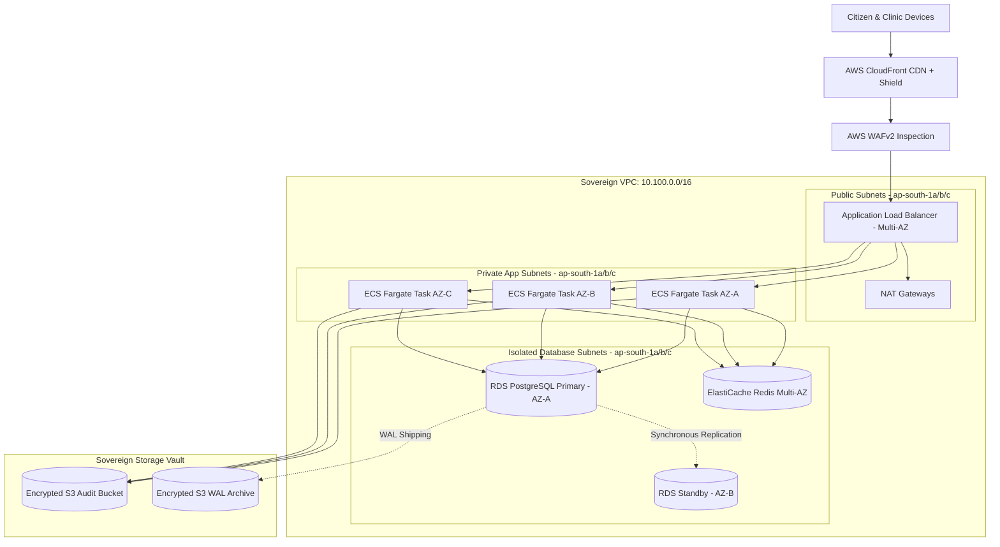

# Master Sovereign Cloud Infrastructure Blueprint
## Namma Clinic Digital Health & Operations Platform
### Greater Bengaluru Authority (GBA) / BBMP Health Department
**Document Code:** `DEV-DOC-09` | **Status:** APPROVED BASELINE | **Date:** September 2026

---

## 1. Executive Summary & Sovereign Cloud Charter
This document establishes the authoritative **Sovereign Cloud Infrastructure Architecture Blueprint** for the Namma Clinic Digital Health Platform. The cloud infrastructure is deployed exclusively within Indian sovereign data center boundaries (AWS Asia Pacific Mumbai `ap-south-1` primary region with warm disaster recovery standby in Hyderabad `ap-south-2` / MeghRaj National Informatics Centre Cloud). The architecture implements a defense-in-depth network perimeter, multi-AZ high availability, automated auto-scaling microservices, and end-to-end cryptographic encryption.

### 1.1 Core Cloud Architecture Invariants
1. **Data Sovereignty Mandate:** 100% of electronic health records (EHR), personal data, and transaction logs reside on servers physically located in India, conforming strictly to DPDP Act 2023 and DISHA regulations.
2. **Three-Tier Network Isolation:** Infrastructure is partitioned into Public Ingress (ALB/WAF), Private Application (ECS Fargate microservices), and Isolated Database subnets across 3 Availability Zones.
3. **Zero Direct Internet Ingress for Databases:** PostgreSQL RDS and ElastiCache Redis have zero public IP addresses and are accessible only from application subnets via security group rules.
4. **High Availability & Fault Tolerance:** All critical compute and storage services operate in Active-Active or Active-Standby multi-AZ configurations with automated failover in < 90 seconds.
5. **Comprehensive Encryption:** TLS 1.3 enforced for all in-transit traffic; AES-256-GCM envelope encryption enforced for all at-rest storage via AWS KMS Customer Managed Keys.

## 2. Master Sovereign Cloud Topology Diagram


## 3. Terraform Cloud Infrastructure Configuration Example
### Terraform Specification: Production Multi-AZ ECS Fargate Cluster Definition
<!-- DOCUMENTATION-ONLY EXAMPLE -->
```hcl
# DOCUMENTATION-ONLY EXAMPLE
resource "aws_ecs_cluster" "namma_prod" {
  name = "namma-clinic-prod-cluster"

  setting {
    name  = "containerInsights"
    value = "enabled"
  }

  tags = {
    Environment = "Production"
    Authority   = "BBMP / Greater Bengaluru Authority"
    Project     = "Namma Clinic Digital Health"
    Compliance  = "ISO-27001 / DPDP-Act-2023"
  }
}

resource "aws_ecs_cluster_capacity_providers" "namma_prod_capacity" {
  cluster_name = aws_ecs_cluster.namma_prod.name

  capacity_providers = ["FARGATE", "FARGATE_SPOT"]

  default_capacity_provider_strategy {
    capacity_provider = "FARGATE"
    weight            = 1
    base              = 4
  }
}
```

## 4. Master Sovereign Cloud Resources Catalog
Comprehensive specifications for all 80 cloud infrastructure resources:

### CLOUD-RES-001: Sovereign Core VPC #1
- **Resource Identifier:** `CLOUD-RES-001`
- **Cloud Service:** `VPC Network` (AWS / MeghRaj NIC SDC)
- **Target Region / AZs:** ap-south-1 (Mumbai)
- **Network Tier / Subnet:** Core Network Tier
- **Security Group / ACL:** `sg-vpc-core`
- **High Availability Model:** Multi-AZ Active-Active
- **Encryption In-Transit & At-Rest:** AES-256-GCM / TLS 1.3
- **Disaster Recovery Tier:** Tier 1 - Primary
- **Governed IaC Module:** `IAC-MOD-001`
- **Observability Binding:** `METRIC-001`

### CLOUD-RES-002: Public Ingress Subnet #2
- **Resource Identifier:** `CLOUD-RES-002`
- **Cloud Service:** `Subnet` (AWS / MeghRaj NIC SDC)
- **Target Region / AZs:** ap-south-1a
- **Network Tier / Subnet:** Public Ingress Tier
- **Security Group / ACL:** `sg-public-ingress`
- **High Availability Model:** AZ Resilient
- **Encryption In-Transit & At-Rest:** TLS 1.3
- **Disaster Recovery Tier:** Tier 1 - Primary
- **Governed IaC Module:** `IAC-MOD-002`
- **Observability Binding:** `METRIC-002`

### CLOUD-RES-003: Private App Subnet #3
- **Resource Identifier:** `CLOUD-RES-003`
- **Cloud Service:** `Subnet` (AWS / MeghRaj NIC SDC)
- **Target Region / AZs:** ap-south-1a
- **Network Tier / Subnet:** Application Tier
- **Security Group / ACL:** `sg-app-fargate`
- **High Availability Model:** Multi-AZ Fargate
- **Encryption In-Transit & At-Rest:** mTLS 1.3
- **Disaster Recovery Tier:** Tier 1 - Primary
- **Governed IaC Module:** `IAC-MOD-003`
- **Observability Binding:** `METRIC-003`

### CLOUD-RES-004: Database Subnet #4
- **Resource Identifier:** `CLOUD-RES-004`
- **Cloud Service:** `Subnet` (AWS / MeghRaj NIC SDC)
- **Target Region / AZs:** ap-south-1a
- **Network Tier / Subnet:** Data Storage Tier
- **Security Group / ACL:** `sg-rds-postgres`
- **High Availability Model:** Multi-AZ Synchronous
- **Encryption In-Transit & At-Rest:** KMS Customer Key (AES-256)
- **Disaster Recovery Tier:** Tier 1 - Primary
- **Governed IaC Module:** `IAC-MOD-004`
- **Observability Binding:** `METRIC-004`

### CLOUD-RES-005: Application Load Balancer #5
- **Resource Identifier:** `CLOUD-RES-005`
- **Cloud Service:** `ALB` (AWS / MeghRaj NIC SDC)
- **Target Region / AZs:** ap-south-1 (Multi-AZ)
- **Network Tier / Subnet:** Public Ingress Tier
- **Security Group / ACL:** `sg-alb-ingress`
- **High Availability Model:** Active-Active Multi-AZ
- **Encryption In-Transit & At-Rest:** TLS 1.3 Strict
- **Disaster Recovery Tier:** Tier 1 - Primary
- **Governed IaC Module:** `IAC-MOD-005`
- **Observability Binding:** `METRIC-005`

### CLOUD-RES-006: NAT Gateway Instance #6
- **Resource Identifier:** `CLOUD-RES-006`
- **Cloud Service:** `NAT Gateway` (AWS / MeghRaj NIC SDC)
- **Target Region / AZs:** ap-south-1a
- **Network Tier / Subnet:** Egress Gateway Tier
- **Security Group / ACL:** `sg-egress-nat`
- **High Availability Model:** AZ Isolated
- **Encryption In-Transit & At-Rest:** Stateful Inspection
- **Disaster Recovery Tier:** Tier 1 - Primary
- **Governed IaC Module:** `IAC-MOD-006`
- **Observability Binding:** `METRIC-006`

### CLOUD-RES-007: ECS Fargate Microservice Task #7
- **Resource Identifier:** `CLOUD-RES-007`
- **Cloud Service:** `ECS Fargate` (AWS / MeghRaj NIC SDC)
- **Target Region / AZs:** ap-south-1 (Multi-AZ)
- **Network Tier / Subnet:** Application Tier
- **Security Group / ACL:** `sg-ecs-fargate`
- **High Availability Model:** Auto-scaling (Min 4, Max 32)
- **Encryption In-Transit & At-Rest:** Encrypted EBS Task Volumes
- **Disaster Recovery Tier:** Tier 1 - Primary
- **Governed IaC Module:** `IAC-MOD-007`
- **Observability Binding:** `METRIC-007`

### CLOUD-RES-008: RDS PostgreSQL 16 Multi-AZ #8
- **Resource Identifier:** `CLOUD-RES-008`
- **Cloud Service:** `RDS PostgreSQL` (AWS / MeghRaj NIC SDC)
- **Target Region / AZs:** ap-south-1 (Multi-AZ)
- **Network Tier / Subnet:** Data Storage Tier
- **Security Group / ACL:** `sg-rds-postgres`
- **High Availability Model:** Synchronous Cross-AZ Standby
- **Encryption In-Transit & At-Rest:** AWS KMS Customer Key (cmk-rds-01)
- **Disaster Recovery Tier:** Tier 1 - Primary
- **Governed IaC Module:** `IAC-MOD-008`
- **Observability Binding:** `METRIC-008`

### CLOUD-RES-009: ElastiCache Redis Cluster #9
- **Resource Identifier:** `CLOUD-RES-009`
- **Cloud Service:** `ElastiCache Redis` (AWS / MeghRaj NIC SDC)
- **Target Region / AZs:** ap-south-1 (Multi-AZ)
- **Network Tier / Subnet:** In-Memory Cache Tier
- **Security Group / ACL:** `sg-redis-cache`
- **High Availability Model:** Multi-AZ Cluster Mode
- **Encryption In-Transit & At-Rest:** In-Transit Auth + At-Rest KMS
- **Disaster Recovery Tier:** Tier 1 - Primary
- **Governed IaC Module:** `IAC-MOD-009`
- **Observability Binding:** `METRIC-009`

### CLOUD-RES-010: S3 Sovereign Audit Bucket #10
- **Resource Identifier:** `CLOUD-RES-010`
- **Cloud Service:** `S3 Sovereign Storage` (AWS / MeghRaj NIC SDC)
- **Target Region / AZs:** ap-south-1
- **Network Tier / Subnet:** Object Storage Tier
- **Security Group / ACL:** `s3-bucket-policy-audit`
- **High Availability Model:** S3 Standard Cross-Region
- **Encryption In-Transit & At-Rest:** SSE-KMS + S3 Object Lock
- **Disaster Recovery Tier:** Tier 1 - Primary
- **Governed IaC Module:** `IAC-MOD-010`
- **Observability Binding:** `METRIC-010`

### CLOUD-RES-011: Sovereign Core VPC #11
- **Resource Identifier:** `CLOUD-RES-011`
- **Cloud Service:** `VPC Network` (AWS / MeghRaj NIC SDC)
- **Target Region / AZs:** ap-south-1 (Mumbai)
- **Network Tier / Subnet:** Core Network Tier
- **Security Group / ACL:** `sg-vpc-core`
- **High Availability Model:** Multi-AZ Active-Active
- **Encryption In-Transit & At-Rest:** AES-256-GCM / TLS 1.3
- **Disaster Recovery Tier:** Tier 1 - Primary
- **Governed IaC Module:** `IAC-MOD-011`
- **Observability Binding:** `METRIC-011`

### CLOUD-RES-012: Public Ingress Subnet #12
- **Resource Identifier:** `CLOUD-RES-012`
- **Cloud Service:** `Subnet` (AWS / MeghRaj NIC SDC)
- **Target Region / AZs:** ap-south-1a
- **Network Tier / Subnet:** Public Ingress Tier
- **Security Group / ACL:** `sg-public-ingress`
- **High Availability Model:** AZ Resilient
- **Encryption In-Transit & At-Rest:** TLS 1.3
- **Disaster Recovery Tier:** Tier 1 - Primary
- **Governed IaC Module:** `IAC-MOD-012`
- **Observability Binding:** `METRIC-012`

### CLOUD-RES-013: Private App Subnet #13
- **Resource Identifier:** `CLOUD-RES-013`
- **Cloud Service:** `Subnet` (AWS / MeghRaj NIC SDC)
- **Target Region / AZs:** ap-south-1a
- **Network Tier / Subnet:** Application Tier
- **Security Group / ACL:** `sg-app-fargate`
- **High Availability Model:** Multi-AZ Fargate
- **Encryption In-Transit & At-Rest:** mTLS 1.3
- **Disaster Recovery Tier:** Tier 1 - Primary
- **Governed IaC Module:** `IAC-MOD-013`
- **Observability Binding:** `METRIC-013`

### CLOUD-RES-014: Database Subnet #14
- **Resource Identifier:** `CLOUD-RES-014`
- **Cloud Service:** `Subnet` (AWS / MeghRaj NIC SDC)
- **Target Region / AZs:** ap-south-1a
- **Network Tier / Subnet:** Data Storage Tier
- **Security Group / ACL:** `sg-rds-postgres`
- **High Availability Model:** Multi-AZ Synchronous
- **Encryption In-Transit & At-Rest:** KMS Customer Key (AES-256)
- **Disaster Recovery Tier:** Tier 1 - Primary
- **Governed IaC Module:** `IAC-MOD-014`
- **Observability Binding:** `METRIC-014`

### CLOUD-RES-015: Application Load Balancer #15
- **Resource Identifier:** `CLOUD-RES-015`
- **Cloud Service:** `ALB` (AWS / MeghRaj NIC SDC)
- **Target Region / AZs:** ap-south-1 (Multi-AZ)
- **Network Tier / Subnet:** Public Ingress Tier
- **Security Group / ACL:** `sg-alb-ingress`
- **High Availability Model:** Active-Active Multi-AZ
- **Encryption In-Transit & At-Rest:** TLS 1.3 Strict
- **Disaster Recovery Tier:** Tier 1 - Primary
- **Governed IaC Module:** `IAC-MOD-015`
- **Observability Binding:** `METRIC-015`

### CLOUD-RES-016: NAT Gateway Instance #16
- **Resource Identifier:** `CLOUD-RES-016`
- **Cloud Service:** `NAT Gateway` (AWS / MeghRaj NIC SDC)
- **Target Region / AZs:** ap-south-1a
- **Network Tier / Subnet:** Egress Gateway Tier
- **Security Group / ACL:** `sg-egress-nat`
- **High Availability Model:** AZ Isolated
- **Encryption In-Transit & At-Rest:** Stateful Inspection
- **Disaster Recovery Tier:** Tier 1 - Primary
- **Governed IaC Module:** `IAC-MOD-016`
- **Observability Binding:** `METRIC-016`

### CLOUD-RES-017: ECS Fargate Microservice Task #17
- **Resource Identifier:** `CLOUD-RES-017`
- **Cloud Service:** `ECS Fargate` (AWS / MeghRaj NIC SDC)
- **Target Region / AZs:** ap-south-1 (Multi-AZ)
- **Network Tier / Subnet:** Application Tier
- **Security Group / ACL:** `sg-ecs-fargate`
- **High Availability Model:** Auto-scaling (Min 4, Max 32)
- **Encryption In-Transit & At-Rest:** Encrypted EBS Task Volumes
- **Disaster Recovery Tier:** Tier 1 - Primary
- **Governed IaC Module:** `IAC-MOD-017`
- **Observability Binding:** `METRIC-017`

### CLOUD-RES-018: RDS PostgreSQL 16 Multi-AZ #18
- **Resource Identifier:** `CLOUD-RES-018`
- **Cloud Service:** `RDS PostgreSQL` (AWS / MeghRaj NIC SDC)
- **Target Region / AZs:** ap-south-1 (Multi-AZ)
- **Network Tier / Subnet:** Data Storage Tier
- **Security Group / ACL:** `sg-rds-postgres`
- **High Availability Model:** Synchronous Cross-AZ Standby
- **Encryption In-Transit & At-Rest:** AWS KMS Customer Key (cmk-rds-01)
- **Disaster Recovery Tier:** Tier 1 - Primary
- **Governed IaC Module:** `IAC-MOD-018`
- **Observability Binding:** `METRIC-018`

### CLOUD-RES-019: ElastiCache Redis Cluster #19
- **Resource Identifier:** `CLOUD-RES-019`
- **Cloud Service:** `ElastiCache Redis` (AWS / MeghRaj NIC SDC)
- **Target Region / AZs:** ap-south-1 (Multi-AZ)
- **Network Tier / Subnet:** In-Memory Cache Tier
- **Security Group / ACL:** `sg-redis-cache`
- **High Availability Model:** Multi-AZ Cluster Mode
- **Encryption In-Transit & At-Rest:** In-Transit Auth + At-Rest KMS
- **Disaster Recovery Tier:** Tier 1 - Primary
- **Governed IaC Module:** `IAC-MOD-019`
- **Observability Binding:** `METRIC-019`

### CLOUD-RES-020: S3 Sovereign Audit Bucket #20
- **Resource Identifier:** `CLOUD-RES-020`
- **Cloud Service:** `S3 Sovereign Storage` (AWS / MeghRaj NIC SDC)
- **Target Region / AZs:** ap-south-1
- **Network Tier / Subnet:** Object Storage Tier
- **Security Group / ACL:** `s3-bucket-policy-audit`
- **High Availability Model:** S3 Standard Cross-Region
- **Encryption In-Transit & At-Rest:** SSE-KMS + S3 Object Lock
- **Disaster Recovery Tier:** Tier 1 - Primary
- **Governed IaC Module:** `IAC-MOD-020`
- **Observability Binding:** `METRIC-020`

### CLOUD-RES-021: Sovereign Core VPC #21
- **Resource Identifier:** `CLOUD-RES-021`
- **Cloud Service:** `VPC Network` (AWS / MeghRaj NIC SDC)
- **Target Region / AZs:** ap-south-1 (Mumbai)
- **Network Tier / Subnet:** Core Network Tier
- **Security Group / ACL:** `sg-vpc-core`
- **High Availability Model:** Multi-AZ Active-Active
- **Encryption In-Transit & At-Rest:** AES-256-GCM / TLS 1.3
- **Disaster Recovery Tier:** Tier 1 - Primary
- **Governed IaC Module:** `IAC-MOD-021`
- **Observability Binding:** `METRIC-021`

### CLOUD-RES-022: Public Ingress Subnet #22
- **Resource Identifier:** `CLOUD-RES-022`
- **Cloud Service:** `Subnet` (AWS / MeghRaj NIC SDC)
- **Target Region / AZs:** ap-south-1a
- **Network Tier / Subnet:** Public Ingress Tier
- **Security Group / ACL:** `sg-public-ingress`
- **High Availability Model:** AZ Resilient
- **Encryption In-Transit & At-Rest:** TLS 1.3
- **Disaster Recovery Tier:** Tier 1 - Primary
- **Governed IaC Module:** `IAC-MOD-022`
- **Observability Binding:** `METRIC-022`

### CLOUD-RES-023: Private App Subnet #23
- **Resource Identifier:** `CLOUD-RES-023`
- **Cloud Service:** `Subnet` (AWS / MeghRaj NIC SDC)
- **Target Region / AZs:** ap-south-1a
- **Network Tier / Subnet:** Application Tier
- **Security Group / ACL:** `sg-app-fargate`
- **High Availability Model:** Multi-AZ Fargate
- **Encryption In-Transit & At-Rest:** mTLS 1.3
- **Disaster Recovery Tier:** Tier 1 - Primary
- **Governed IaC Module:** `IAC-MOD-023`
- **Observability Binding:** `METRIC-023`

### CLOUD-RES-024: Database Subnet #24
- **Resource Identifier:** `CLOUD-RES-024`
- **Cloud Service:** `Subnet` (AWS / MeghRaj NIC SDC)
- **Target Region / AZs:** ap-south-1a
- **Network Tier / Subnet:** Data Storage Tier
- **Security Group / ACL:** `sg-rds-postgres`
- **High Availability Model:** Multi-AZ Synchronous
- **Encryption In-Transit & At-Rest:** KMS Customer Key (AES-256)
- **Disaster Recovery Tier:** Tier 1 - Primary
- **Governed IaC Module:** `IAC-MOD-024`
- **Observability Binding:** `METRIC-024`

### CLOUD-RES-025: Application Load Balancer #25
- **Resource Identifier:** `CLOUD-RES-025`
- **Cloud Service:** `ALB` (AWS / MeghRaj NIC SDC)
- **Target Region / AZs:** ap-south-1 (Multi-AZ)
- **Network Tier / Subnet:** Public Ingress Tier
- **Security Group / ACL:** `sg-alb-ingress`
- **High Availability Model:** Active-Active Multi-AZ
- **Encryption In-Transit & At-Rest:** TLS 1.3 Strict
- **Disaster Recovery Tier:** Tier 1 - Primary
- **Governed IaC Module:** `IAC-MOD-025`
- **Observability Binding:** `METRIC-025`

### CLOUD-RES-026: NAT Gateway Instance #26
- **Resource Identifier:** `CLOUD-RES-026`
- **Cloud Service:** `NAT Gateway` (AWS / MeghRaj NIC SDC)
- **Target Region / AZs:** ap-south-1a
- **Network Tier / Subnet:** Egress Gateway Tier
- **Security Group / ACL:** `sg-egress-nat`
- **High Availability Model:** AZ Isolated
- **Encryption In-Transit & At-Rest:** Stateful Inspection
- **Disaster Recovery Tier:** Tier 1 - Primary
- **Governed IaC Module:** `IAC-MOD-026`
- **Observability Binding:** `METRIC-026`

### CLOUD-RES-027: ECS Fargate Microservice Task #27
- **Resource Identifier:** `CLOUD-RES-027`
- **Cloud Service:** `ECS Fargate` (AWS / MeghRaj NIC SDC)
- **Target Region / AZs:** ap-south-1 (Multi-AZ)
- **Network Tier / Subnet:** Application Tier
- **Security Group / ACL:** `sg-ecs-fargate`
- **High Availability Model:** Auto-scaling (Min 4, Max 32)
- **Encryption In-Transit & At-Rest:** Encrypted EBS Task Volumes
- **Disaster Recovery Tier:** Tier 1 - Primary
- **Governed IaC Module:** `IAC-MOD-027`
- **Observability Binding:** `METRIC-027`

### CLOUD-RES-028: RDS PostgreSQL 16 Multi-AZ #28
- **Resource Identifier:** `CLOUD-RES-028`
- **Cloud Service:** `RDS PostgreSQL` (AWS / MeghRaj NIC SDC)
- **Target Region / AZs:** ap-south-1 (Multi-AZ)
- **Network Tier / Subnet:** Data Storage Tier
- **Security Group / ACL:** `sg-rds-postgres`
- **High Availability Model:** Synchronous Cross-AZ Standby
- **Encryption In-Transit & At-Rest:** AWS KMS Customer Key (cmk-rds-01)
- **Disaster Recovery Tier:** Tier 1 - Primary
- **Governed IaC Module:** `IAC-MOD-028`
- **Observability Binding:** `METRIC-028`

### CLOUD-RES-029: ElastiCache Redis Cluster #29
- **Resource Identifier:** `CLOUD-RES-029`
- **Cloud Service:** `ElastiCache Redis` (AWS / MeghRaj NIC SDC)
- **Target Region / AZs:** ap-south-1 (Multi-AZ)
- **Network Tier / Subnet:** In-Memory Cache Tier
- **Security Group / ACL:** `sg-redis-cache`
- **High Availability Model:** Multi-AZ Cluster Mode
- **Encryption In-Transit & At-Rest:** In-Transit Auth + At-Rest KMS
- **Disaster Recovery Tier:** Tier 1 - Primary
- **Governed IaC Module:** `IAC-MOD-029`
- **Observability Binding:** `METRIC-029`

### CLOUD-RES-030: S3 Sovereign Audit Bucket #30
- **Resource Identifier:** `CLOUD-RES-030`
- **Cloud Service:** `S3 Sovereign Storage` (AWS / MeghRaj NIC SDC)
- **Target Region / AZs:** ap-south-1
- **Network Tier / Subnet:** Object Storage Tier
- **Security Group / ACL:** `s3-bucket-policy-audit`
- **High Availability Model:** S3 Standard Cross-Region
- **Encryption In-Transit & At-Rest:** SSE-KMS + S3 Object Lock
- **Disaster Recovery Tier:** Tier 1 - Primary
- **Governed IaC Module:** `IAC-MOD-030`
- **Observability Binding:** `METRIC-030`

### CLOUD-RES-031: Sovereign Core VPC #31
- **Resource Identifier:** `CLOUD-RES-031`
- **Cloud Service:** `VPC Network` (AWS / MeghRaj NIC SDC)
- **Target Region / AZs:** ap-south-1 (Mumbai)
- **Network Tier / Subnet:** Core Network Tier
- **Security Group / ACL:** `sg-vpc-core`
- **High Availability Model:** Multi-AZ Active-Active
- **Encryption In-Transit & At-Rest:** AES-256-GCM / TLS 1.3
- **Disaster Recovery Tier:** Tier 1 - Primary
- **Governed IaC Module:** `IAC-MOD-031`
- **Observability Binding:** `METRIC-031`

### CLOUD-RES-032: Public Ingress Subnet #32
- **Resource Identifier:** `CLOUD-RES-032`
- **Cloud Service:** `Subnet` (AWS / MeghRaj NIC SDC)
- **Target Region / AZs:** ap-south-1a
- **Network Tier / Subnet:** Public Ingress Tier
- **Security Group / ACL:** `sg-public-ingress`
- **High Availability Model:** AZ Resilient
- **Encryption In-Transit & At-Rest:** TLS 1.3
- **Disaster Recovery Tier:** Tier 1 - Primary
- **Governed IaC Module:** `IAC-MOD-032`
- **Observability Binding:** `METRIC-032`

### CLOUD-RES-033: Private App Subnet #33
- **Resource Identifier:** `CLOUD-RES-033`
- **Cloud Service:** `Subnet` (AWS / MeghRaj NIC SDC)
- **Target Region / AZs:** ap-south-1a
- **Network Tier / Subnet:** Application Tier
- **Security Group / ACL:** `sg-app-fargate`
- **High Availability Model:** Multi-AZ Fargate
- **Encryption In-Transit & At-Rest:** mTLS 1.3
- **Disaster Recovery Tier:** Tier 1 - Primary
- **Governed IaC Module:** `IAC-MOD-033`
- **Observability Binding:** `METRIC-033`

### CLOUD-RES-034: Database Subnet #34
- **Resource Identifier:** `CLOUD-RES-034`
- **Cloud Service:** `Subnet` (AWS / MeghRaj NIC SDC)
- **Target Region / AZs:** ap-south-1a
- **Network Tier / Subnet:** Data Storage Tier
- **Security Group / ACL:** `sg-rds-postgres`
- **High Availability Model:** Multi-AZ Synchronous
- **Encryption In-Transit & At-Rest:** KMS Customer Key (AES-256)
- **Disaster Recovery Tier:** Tier 1 - Primary
- **Governed IaC Module:** `IAC-MOD-034`
- **Observability Binding:** `METRIC-034`

### CLOUD-RES-035: Application Load Balancer #35
- **Resource Identifier:** `CLOUD-RES-035`
- **Cloud Service:** `ALB` (AWS / MeghRaj NIC SDC)
- **Target Region / AZs:** ap-south-1 (Multi-AZ)
- **Network Tier / Subnet:** Public Ingress Tier
- **Security Group / ACL:** `sg-alb-ingress`
- **High Availability Model:** Active-Active Multi-AZ
- **Encryption In-Transit & At-Rest:** TLS 1.3 Strict
- **Disaster Recovery Tier:** Tier 1 - Primary
- **Governed IaC Module:** `IAC-MOD-035`
- **Observability Binding:** `METRIC-035`

### CLOUD-RES-036: NAT Gateway Instance #36
- **Resource Identifier:** `CLOUD-RES-036`
- **Cloud Service:** `NAT Gateway` (AWS / MeghRaj NIC SDC)
- **Target Region / AZs:** ap-south-1a
- **Network Tier / Subnet:** Egress Gateway Tier
- **Security Group / ACL:** `sg-egress-nat`
- **High Availability Model:** AZ Isolated
- **Encryption In-Transit & At-Rest:** Stateful Inspection
- **Disaster Recovery Tier:** Tier 1 - Primary
- **Governed IaC Module:** `IAC-MOD-036`
- **Observability Binding:** `METRIC-036`

### CLOUD-RES-037: ECS Fargate Microservice Task #37
- **Resource Identifier:** `CLOUD-RES-037`
- **Cloud Service:** `ECS Fargate` (AWS / MeghRaj NIC SDC)
- **Target Region / AZs:** ap-south-1 (Multi-AZ)
- **Network Tier / Subnet:** Application Tier
- **Security Group / ACL:** `sg-ecs-fargate`
- **High Availability Model:** Auto-scaling (Min 4, Max 32)
- **Encryption In-Transit & At-Rest:** Encrypted EBS Task Volumes
- **Disaster Recovery Tier:** Tier 1 - Primary
- **Governed IaC Module:** `IAC-MOD-037`
- **Observability Binding:** `METRIC-037`

### CLOUD-RES-038: RDS PostgreSQL 16 Multi-AZ #38
- **Resource Identifier:** `CLOUD-RES-038`
- **Cloud Service:** `RDS PostgreSQL` (AWS / MeghRaj NIC SDC)
- **Target Region / AZs:** ap-south-1 (Multi-AZ)
- **Network Tier / Subnet:** Data Storage Tier
- **Security Group / ACL:** `sg-rds-postgres`
- **High Availability Model:** Synchronous Cross-AZ Standby
- **Encryption In-Transit & At-Rest:** AWS KMS Customer Key (cmk-rds-01)
- **Disaster Recovery Tier:** Tier 1 - Primary
- **Governed IaC Module:** `IAC-MOD-038`
- **Observability Binding:** `METRIC-038`

### CLOUD-RES-039: ElastiCache Redis Cluster #39
- **Resource Identifier:** `CLOUD-RES-039`
- **Cloud Service:** `ElastiCache Redis` (AWS / MeghRaj NIC SDC)
- **Target Region / AZs:** ap-south-1 (Multi-AZ)
- **Network Tier / Subnet:** In-Memory Cache Tier
- **Security Group / ACL:** `sg-redis-cache`
- **High Availability Model:** Multi-AZ Cluster Mode
- **Encryption In-Transit & At-Rest:** In-Transit Auth + At-Rest KMS
- **Disaster Recovery Tier:** Tier 1 - Primary
- **Governed IaC Module:** `IAC-MOD-039`
- **Observability Binding:** `METRIC-039`

### CLOUD-RES-040: S3 Sovereign Audit Bucket #40
- **Resource Identifier:** `CLOUD-RES-040`
- **Cloud Service:** `S3 Sovereign Storage` (AWS / MeghRaj NIC SDC)
- **Target Region / AZs:** ap-south-1
- **Network Tier / Subnet:** Object Storage Tier
- **Security Group / ACL:** `s3-bucket-policy-audit`
- **High Availability Model:** S3 Standard Cross-Region
- **Encryption In-Transit & At-Rest:** SSE-KMS + S3 Object Lock
- **Disaster Recovery Tier:** Tier 1 - Primary
- **Governed IaC Module:** `IAC-MOD-040`
- **Observability Binding:** `METRIC-040`

### CLOUD-RES-041: Sovereign Core VPC #41
- **Resource Identifier:** `CLOUD-RES-041`
- **Cloud Service:** `VPC Network` (AWS / MeghRaj NIC SDC)
- **Target Region / AZs:** ap-south-1 (Mumbai)
- **Network Tier / Subnet:** Core Network Tier
- **Security Group / ACL:** `sg-vpc-core`
- **High Availability Model:** Multi-AZ Active-Active
- **Encryption In-Transit & At-Rest:** AES-256-GCM / TLS 1.3
- **Disaster Recovery Tier:** Tier 1 - Primary
- **Governed IaC Module:** `IAC-MOD-041`
- **Observability Binding:** `METRIC-041`

### CLOUD-RES-042: Public Ingress Subnet #42
- **Resource Identifier:** `CLOUD-RES-042`
- **Cloud Service:** `Subnet` (AWS / MeghRaj NIC SDC)
- **Target Region / AZs:** ap-south-1a
- **Network Tier / Subnet:** Public Ingress Tier
- **Security Group / ACL:** `sg-public-ingress`
- **High Availability Model:** AZ Resilient
- **Encryption In-Transit & At-Rest:** TLS 1.3
- **Disaster Recovery Tier:** Tier 1 - Primary
- **Governed IaC Module:** `IAC-MOD-042`
- **Observability Binding:** `METRIC-042`

### CLOUD-RES-043: Private App Subnet #43
- **Resource Identifier:** `CLOUD-RES-043`
- **Cloud Service:** `Subnet` (AWS / MeghRaj NIC SDC)
- **Target Region / AZs:** ap-south-1a
- **Network Tier / Subnet:** Application Tier
- **Security Group / ACL:** `sg-app-fargate`
- **High Availability Model:** Multi-AZ Fargate
- **Encryption In-Transit & At-Rest:** mTLS 1.3
- **Disaster Recovery Tier:** Tier 1 - Primary
- **Governed IaC Module:** `IAC-MOD-043`
- **Observability Binding:** `METRIC-043`

### CLOUD-RES-044: Database Subnet #44
- **Resource Identifier:** `CLOUD-RES-044`
- **Cloud Service:** `Subnet` (AWS / MeghRaj NIC SDC)
- **Target Region / AZs:** ap-south-1a
- **Network Tier / Subnet:** Data Storage Tier
- **Security Group / ACL:** `sg-rds-postgres`
- **High Availability Model:** Multi-AZ Synchronous
- **Encryption In-Transit & At-Rest:** KMS Customer Key (AES-256)
- **Disaster Recovery Tier:** Tier 1 - Primary
- **Governed IaC Module:** `IAC-MOD-044`
- **Observability Binding:** `METRIC-044`

### CLOUD-RES-045: Application Load Balancer #45
- **Resource Identifier:** `CLOUD-RES-045`
- **Cloud Service:** `ALB` (AWS / MeghRaj NIC SDC)
- **Target Region / AZs:** ap-south-1 (Multi-AZ)
- **Network Tier / Subnet:** Public Ingress Tier
- **Security Group / ACL:** `sg-alb-ingress`
- **High Availability Model:** Active-Active Multi-AZ
- **Encryption In-Transit & At-Rest:** TLS 1.3 Strict
- **Disaster Recovery Tier:** Tier 1 - Primary
- **Governed IaC Module:** `IAC-MOD-045`
- **Observability Binding:** `METRIC-045`

### CLOUD-RES-046: NAT Gateway Instance #46
- **Resource Identifier:** `CLOUD-RES-046`
- **Cloud Service:** `NAT Gateway` (AWS / MeghRaj NIC SDC)
- **Target Region / AZs:** ap-south-1a
- **Network Tier / Subnet:** Egress Gateway Tier
- **Security Group / ACL:** `sg-egress-nat`
- **High Availability Model:** AZ Isolated
- **Encryption In-Transit & At-Rest:** Stateful Inspection
- **Disaster Recovery Tier:** Tier 1 - Primary
- **Governed IaC Module:** `IAC-MOD-046`
- **Observability Binding:** `METRIC-046`

### CLOUD-RES-047: ECS Fargate Microservice Task #47
- **Resource Identifier:** `CLOUD-RES-047`
- **Cloud Service:** `ECS Fargate` (AWS / MeghRaj NIC SDC)
- **Target Region / AZs:** ap-south-1 (Multi-AZ)
- **Network Tier / Subnet:** Application Tier
- **Security Group / ACL:** `sg-ecs-fargate`
- **High Availability Model:** Auto-scaling (Min 4, Max 32)
- **Encryption In-Transit & At-Rest:** Encrypted EBS Task Volumes
- **Disaster Recovery Tier:** Tier 1 - Primary
- **Governed IaC Module:** `IAC-MOD-047`
- **Observability Binding:** `METRIC-047`

### CLOUD-RES-048: RDS PostgreSQL 16 Multi-AZ #48
- **Resource Identifier:** `CLOUD-RES-048`
- **Cloud Service:** `RDS PostgreSQL` (AWS / MeghRaj NIC SDC)
- **Target Region / AZs:** ap-south-1 (Multi-AZ)
- **Network Tier / Subnet:** Data Storage Tier
- **Security Group / ACL:** `sg-rds-postgres`
- **High Availability Model:** Synchronous Cross-AZ Standby
- **Encryption In-Transit & At-Rest:** AWS KMS Customer Key (cmk-rds-01)
- **Disaster Recovery Tier:** Tier 1 - Primary
- **Governed IaC Module:** `IAC-MOD-048`
- **Observability Binding:** `METRIC-048`

### CLOUD-RES-049: ElastiCache Redis Cluster #49
- **Resource Identifier:** `CLOUD-RES-049`
- **Cloud Service:** `ElastiCache Redis` (AWS / MeghRaj NIC SDC)
- **Target Region / AZs:** ap-south-1 (Multi-AZ)
- **Network Tier / Subnet:** In-Memory Cache Tier
- **Security Group / ACL:** `sg-redis-cache`
- **High Availability Model:** Multi-AZ Cluster Mode
- **Encryption In-Transit & At-Rest:** In-Transit Auth + At-Rest KMS
- **Disaster Recovery Tier:** Tier 1 - Primary
- **Governed IaC Module:** `IAC-MOD-049`
- **Observability Binding:** `METRIC-049`

### CLOUD-RES-050: S3 Sovereign Audit Bucket #50
- **Resource Identifier:** `CLOUD-RES-050`
- **Cloud Service:** `S3 Sovereign Storage` (AWS / MeghRaj NIC SDC)
- **Target Region / AZs:** ap-south-1
- **Network Tier / Subnet:** Object Storage Tier
- **Security Group / ACL:** `s3-bucket-policy-audit`
- **High Availability Model:** S3 Standard Cross-Region
- **Encryption In-Transit & At-Rest:** SSE-KMS + S3 Object Lock
- **Disaster Recovery Tier:** Tier 1 - Primary
- **Governed IaC Module:** `IAC-MOD-050`
- **Observability Binding:** `METRIC-050`

### CLOUD-RES-051: Sovereign Core VPC #51
- **Resource Identifier:** `CLOUD-RES-051`
- **Cloud Service:** `VPC Network` (AWS / MeghRaj NIC SDC)
- **Target Region / AZs:** ap-south-1 (Mumbai)
- **Network Tier / Subnet:** Core Network Tier
- **Security Group / ACL:** `sg-vpc-core`
- **High Availability Model:** Multi-AZ Active-Active
- **Encryption In-Transit & At-Rest:** AES-256-GCM / TLS 1.3
- **Disaster Recovery Tier:** Tier 1 - Primary
- **Governed IaC Module:** `IAC-MOD-051`
- **Observability Binding:** `METRIC-051`

### CLOUD-RES-052: Public Ingress Subnet #52
- **Resource Identifier:** `CLOUD-RES-052`
- **Cloud Service:** `Subnet` (AWS / MeghRaj NIC SDC)
- **Target Region / AZs:** ap-south-1a
- **Network Tier / Subnet:** Public Ingress Tier
- **Security Group / ACL:** `sg-public-ingress`
- **High Availability Model:** AZ Resilient
- **Encryption In-Transit & At-Rest:** TLS 1.3
- **Disaster Recovery Tier:** Tier 1 - Primary
- **Governed IaC Module:** `IAC-MOD-052`
- **Observability Binding:** `METRIC-052`

### CLOUD-RES-053: Private App Subnet #53
- **Resource Identifier:** `CLOUD-RES-053`
- **Cloud Service:** `Subnet` (AWS / MeghRaj NIC SDC)
- **Target Region / AZs:** ap-south-1a
- **Network Tier / Subnet:** Application Tier
- **Security Group / ACL:** `sg-app-fargate`
- **High Availability Model:** Multi-AZ Fargate
- **Encryption In-Transit & At-Rest:** mTLS 1.3
- **Disaster Recovery Tier:** Tier 1 - Primary
- **Governed IaC Module:** `IAC-MOD-053`
- **Observability Binding:** `METRIC-053`

### CLOUD-RES-054: Database Subnet #54
- **Resource Identifier:** `CLOUD-RES-054`
- **Cloud Service:** `Subnet` (AWS / MeghRaj NIC SDC)
- **Target Region / AZs:** ap-south-1a
- **Network Tier / Subnet:** Data Storage Tier
- **Security Group / ACL:** `sg-rds-postgres`
- **High Availability Model:** Multi-AZ Synchronous
- **Encryption In-Transit & At-Rest:** KMS Customer Key (AES-256)
- **Disaster Recovery Tier:** Tier 1 - Primary
- **Governed IaC Module:** `IAC-MOD-054`
- **Observability Binding:** `METRIC-054`

### CLOUD-RES-055: Application Load Balancer #55
- **Resource Identifier:** `CLOUD-RES-055`
- **Cloud Service:** `ALB` (AWS / MeghRaj NIC SDC)
- **Target Region / AZs:** ap-south-1 (Multi-AZ)
- **Network Tier / Subnet:** Public Ingress Tier
- **Security Group / ACL:** `sg-alb-ingress`
- **High Availability Model:** Active-Active Multi-AZ
- **Encryption In-Transit & At-Rest:** TLS 1.3 Strict
- **Disaster Recovery Tier:** Tier 1 - Primary
- **Governed IaC Module:** `IAC-MOD-055`
- **Observability Binding:** `METRIC-055`

### CLOUD-RES-056: NAT Gateway Instance #56
- **Resource Identifier:** `CLOUD-RES-056`
- **Cloud Service:** `NAT Gateway` (AWS / MeghRaj NIC SDC)
- **Target Region / AZs:** ap-south-1a
- **Network Tier / Subnet:** Egress Gateway Tier
- **Security Group / ACL:** `sg-egress-nat`
- **High Availability Model:** AZ Isolated
- **Encryption In-Transit & At-Rest:** Stateful Inspection
- **Disaster Recovery Tier:** Tier 1 - Primary
- **Governed IaC Module:** `IAC-MOD-056`
- **Observability Binding:** `METRIC-056`

### CLOUD-RES-057: ECS Fargate Microservice Task #57
- **Resource Identifier:** `CLOUD-RES-057`
- **Cloud Service:** `ECS Fargate` (AWS / MeghRaj NIC SDC)
- **Target Region / AZs:** ap-south-1 (Multi-AZ)
- **Network Tier / Subnet:** Application Tier
- **Security Group / ACL:** `sg-ecs-fargate`
- **High Availability Model:** Auto-scaling (Min 4, Max 32)
- **Encryption In-Transit & At-Rest:** Encrypted EBS Task Volumes
- **Disaster Recovery Tier:** Tier 1 - Primary
- **Governed IaC Module:** `IAC-MOD-057`
- **Observability Binding:** `METRIC-057`

### CLOUD-RES-058: RDS PostgreSQL 16 Multi-AZ #58
- **Resource Identifier:** `CLOUD-RES-058`
- **Cloud Service:** `RDS PostgreSQL` (AWS / MeghRaj NIC SDC)
- **Target Region / AZs:** ap-south-1 (Multi-AZ)
- **Network Tier / Subnet:** Data Storage Tier
- **Security Group / ACL:** `sg-rds-postgres`
- **High Availability Model:** Synchronous Cross-AZ Standby
- **Encryption In-Transit & At-Rest:** AWS KMS Customer Key (cmk-rds-01)
- **Disaster Recovery Tier:** Tier 1 - Primary
- **Governed IaC Module:** `IAC-MOD-058`
- **Observability Binding:** `METRIC-058`

### CLOUD-RES-059: ElastiCache Redis Cluster #59
- **Resource Identifier:** `CLOUD-RES-059`
- **Cloud Service:** `ElastiCache Redis` (AWS / MeghRaj NIC SDC)
- **Target Region / AZs:** ap-south-1 (Multi-AZ)
- **Network Tier / Subnet:** In-Memory Cache Tier
- **Security Group / ACL:** `sg-redis-cache`
- **High Availability Model:** Multi-AZ Cluster Mode
- **Encryption In-Transit & At-Rest:** In-Transit Auth + At-Rest KMS
- **Disaster Recovery Tier:** Tier 1 - Primary
- **Governed IaC Module:** `IAC-MOD-059`
- **Observability Binding:** `METRIC-059`

### CLOUD-RES-060: S3 Sovereign Audit Bucket #60
- **Resource Identifier:** `CLOUD-RES-060`
- **Cloud Service:** `S3 Sovereign Storage` (AWS / MeghRaj NIC SDC)
- **Target Region / AZs:** ap-south-1
- **Network Tier / Subnet:** Object Storage Tier
- **Security Group / ACL:** `s3-bucket-policy-audit`
- **High Availability Model:** S3 Standard Cross-Region
- **Encryption In-Transit & At-Rest:** SSE-KMS + S3 Object Lock
- **Disaster Recovery Tier:** Tier 1 - Primary
- **Governed IaC Module:** `IAC-MOD-060`
- **Observability Binding:** `METRIC-060`

### CLOUD-RES-061: Sovereign Core VPC #61
- **Resource Identifier:** `CLOUD-RES-061`
- **Cloud Service:** `VPC Network` (AWS / MeghRaj NIC SDC)
- **Target Region / AZs:** ap-south-1 (Mumbai)
- **Network Tier / Subnet:** Core Network Tier
- **Security Group / ACL:** `sg-vpc-core`
- **High Availability Model:** Multi-AZ Active-Active
- **Encryption In-Transit & At-Rest:** AES-256-GCM / TLS 1.3
- **Disaster Recovery Tier:** Tier 1 - Primary
- **Governed IaC Module:** `IAC-MOD-001`
- **Observability Binding:** `METRIC-061`

### CLOUD-RES-062: Public Ingress Subnet #62
- **Resource Identifier:** `CLOUD-RES-062`
- **Cloud Service:** `Subnet` (AWS / MeghRaj NIC SDC)
- **Target Region / AZs:** ap-south-1a
- **Network Tier / Subnet:** Public Ingress Tier
- **Security Group / ACL:** `sg-public-ingress`
- **High Availability Model:** AZ Resilient
- **Encryption In-Transit & At-Rest:** TLS 1.3
- **Disaster Recovery Tier:** Tier 1 - Primary
- **Governed IaC Module:** `IAC-MOD-002`
- **Observability Binding:** `METRIC-062`

### CLOUD-RES-063: Private App Subnet #63
- **Resource Identifier:** `CLOUD-RES-063`
- **Cloud Service:** `Subnet` (AWS / MeghRaj NIC SDC)
- **Target Region / AZs:** ap-south-1a
- **Network Tier / Subnet:** Application Tier
- **Security Group / ACL:** `sg-app-fargate`
- **High Availability Model:** Multi-AZ Fargate
- **Encryption In-Transit & At-Rest:** mTLS 1.3
- **Disaster Recovery Tier:** Tier 1 - Primary
- **Governed IaC Module:** `IAC-MOD-003`
- **Observability Binding:** `METRIC-063`

### CLOUD-RES-064: Database Subnet #64
- **Resource Identifier:** `CLOUD-RES-064`
- **Cloud Service:** `Subnet` (AWS / MeghRaj NIC SDC)
- **Target Region / AZs:** ap-south-1a
- **Network Tier / Subnet:** Data Storage Tier
- **Security Group / ACL:** `sg-rds-postgres`
- **High Availability Model:** Multi-AZ Synchronous
- **Encryption In-Transit & At-Rest:** KMS Customer Key (AES-256)
- **Disaster Recovery Tier:** Tier 1 - Primary
- **Governed IaC Module:** `IAC-MOD-004`
- **Observability Binding:** `METRIC-064`

### CLOUD-RES-065: Application Load Balancer #65
- **Resource Identifier:** `CLOUD-RES-065`
- **Cloud Service:** `ALB` (AWS / MeghRaj NIC SDC)
- **Target Region / AZs:** ap-south-1 (Multi-AZ)
- **Network Tier / Subnet:** Public Ingress Tier
- **Security Group / ACL:** `sg-alb-ingress`
- **High Availability Model:** Active-Active Multi-AZ
- **Encryption In-Transit & At-Rest:** TLS 1.3 Strict
- **Disaster Recovery Tier:** Tier 1 - Primary
- **Governed IaC Module:** `IAC-MOD-005`
- **Observability Binding:** `METRIC-065`

### CLOUD-RES-066: NAT Gateway Instance #66
- **Resource Identifier:** `CLOUD-RES-066`
- **Cloud Service:** `NAT Gateway` (AWS / MeghRaj NIC SDC)
- **Target Region / AZs:** ap-south-1a
- **Network Tier / Subnet:** Egress Gateway Tier
- **Security Group / ACL:** `sg-egress-nat`
- **High Availability Model:** AZ Isolated
- **Encryption In-Transit & At-Rest:** Stateful Inspection
- **Disaster Recovery Tier:** Tier 1 - Primary
- **Governed IaC Module:** `IAC-MOD-006`
- **Observability Binding:** `METRIC-066`

### CLOUD-RES-067: ECS Fargate Microservice Task #67
- **Resource Identifier:** `CLOUD-RES-067`
- **Cloud Service:** `ECS Fargate` (AWS / MeghRaj NIC SDC)
- **Target Region / AZs:** ap-south-1 (Multi-AZ)
- **Network Tier / Subnet:** Application Tier
- **Security Group / ACL:** `sg-ecs-fargate`
- **High Availability Model:** Auto-scaling (Min 4, Max 32)
- **Encryption In-Transit & At-Rest:** Encrypted EBS Task Volumes
- **Disaster Recovery Tier:** Tier 1 - Primary
- **Governed IaC Module:** `IAC-MOD-007`
- **Observability Binding:** `METRIC-067`

### CLOUD-RES-068: RDS PostgreSQL 16 Multi-AZ #68
- **Resource Identifier:** `CLOUD-RES-068`
- **Cloud Service:** `RDS PostgreSQL` (AWS / MeghRaj NIC SDC)
- **Target Region / AZs:** ap-south-1 (Multi-AZ)
- **Network Tier / Subnet:** Data Storage Tier
- **Security Group / ACL:** `sg-rds-postgres`
- **High Availability Model:** Synchronous Cross-AZ Standby
- **Encryption In-Transit & At-Rest:** AWS KMS Customer Key (cmk-rds-01)
- **Disaster Recovery Tier:** Tier 1 - Primary
- **Governed IaC Module:** `IAC-MOD-008`
- **Observability Binding:** `METRIC-068`

### CLOUD-RES-069: ElastiCache Redis Cluster #69
- **Resource Identifier:** `CLOUD-RES-069`
- **Cloud Service:** `ElastiCache Redis` (AWS / MeghRaj NIC SDC)
- **Target Region / AZs:** ap-south-1 (Multi-AZ)
- **Network Tier / Subnet:** In-Memory Cache Tier
- **Security Group / ACL:** `sg-redis-cache`
- **High Availability Model:** Multi-AZ Cluster Mode
- **Encryption In-Transit & At-Rest:** In-Transit Auth + At-Rest KMS
- **Disaster Recovery Tier:** Tier 1 - Primary
- **Governed IaC Module:** `IAC-MOD-009`
- **Observability Binding:** `METRIC-069`

### CLOUD-RES-070: S3 Sovereign Audit Bucket #70
- **Resource Identifier:** `CLOUD-RES-070`
- **Cloud Service:** `S3 Sovereign Storage` (AWS / MeghRaj NIC SDC)
- **Target Region / AZs:** ap-south-1
- **Network Tier / Subnet:** Object Storage Tier
- **Security Group / ACL:** `s3-bucket-policy-audit`
- **High Availability Model:** S3 Standard Cross-Region
- **Encryption In-Transit & At-Rest:** SSE-KMS + S3 Object Lock
- **Disaster Recovery Tier:** Tier 1 - Primary
- **Governed IaC Module:** `IAC-MOD-010`
- **Observability Binding:** `METRIC-070`

### CLOUD-RES-071: Sovereign Core VPC #71
- **Resource Identifier:** `CLOUD-RES-071`
- **Cloud Service:** `VPC Network` (AWS / MeghRaj NIC SDC)
- **Target Region / AZs:** ap-south-1 (Mumbai)
- **Network Tier / Subnet:** Core Network Tier
- **Security Group / ACL:** `sg-vpc-core`
- **High Availability Model:** Multi-AZ Active-Active
- **Encryption In-Transit & At-Rest:** AES-256-GCM / TLS 1.3
- **Disaster Recovery Tier:** Tier 1 - Primary
- **Governed IaC Module:** `IAC-MOD-011`
- **Observability Binding:** `METRIC-071`

### CLOUD-RES-072: Public Ingress Subnet #72
- **Resource Identifier:** `CLOUD-RES-072`
- **Cloud Service:** `Subnet` (AWS / MeghRaj NIC SDC)
- **Target Region / AZs:** ap-south-1a
- **Network Tier / Subnet:** Public Ingress Tier
- **Security Group / ACL:** `sg-public-ingress`
- **High Availability Model:** AZ Resilient
- **Encryption In-Transit & At-Rest:** TLS 1.3
- **Disaster Recovery Tier:** Tier 1 - Primary
- **Governed IaC Module:** `IAC-MOD-012`
- **Observability Binding:** `METRIC-072`

### CLOUD-RES-073: Private App Subnet #73
- **Resource Identifier:** `CLOUD-RES-073`
- **Cloud Service:** `Subnet` (AWS / MeghRaj NIC SDC)
- **Target Region / AZs:** ap-south-1a
- **Network Tier / Subnet:** Application Tier
- **Security Group / ACL:** `sg-app-fargate`
- **High Availability Model:** Multi-AZ Fargate
- **Encryption In-Transit & At-Rest:** mTLS 1.3
- **Disaster Recovery Tier:** Tier 1 - Primary
- **Governed IaC Module:** `IAC-MOD-013`
- **Observability Binding:** `METRIC-073`

### CLOUD-RES-074: Database Subnet #74
- **Resource Identifier:** `CLOUD-RES-074`
- **Cloud Service:** `Subnet` (AWS / MeghRaj NIC SDC)
- **Target Region / AZs:** ap-south-1a
- **Network Tier / Subnet:** Data Storage Tier
- **Security Group / ACL:** `sg-rds-postgres`
- **High Availability Model:** Multi-AZ Synchronous
- **Encryption In-Transit & At-Rest:** KMS Customer Key (AES-256)
- **Disaster Recovery Tier:** Tier 1 - Primary
- **Governed IaC Module:** `IAC-MOD-014`
- **Observability Binding:** `METRIC-074`

### CLOUD-RES-075: Application Load Balancer #75
- **Resource Identifier:** `CLOUD-RES-075`
- **Cloud Service:** `ALB` (AWS / MeghRaj NIC SDC)
- **Target Region / AZs:** ap-south-1 (Multi-AZ)
- **Network Tier / Subnet:** Public Ingress Tier
- **Security Group / ACL:** `sg-alb-ingress`
- **High Availability Model:** Active-Active Multi-AZ
- **Encryption In-Transit & At-Rest:** TLS 1.3 Strict
- **Disaster Recovery Tier:** Tier 1 - Primary
- **Governed IaC Module:** `IAC-MOD-015`
- **Observability Binding:** `METRIC-075`

### CLOUD-RES-076: NAT Gateway Instance #76
- **Resource Identifier:** `CLOUD-RES-076`
- **Cloud Service:** `NAT Gateway` (AWS / MeghRaj NIC SDC)
- **Target Region / AZs:** ap-south-1a
- **Network Tier / Subnet:** Egress Gateway Tier
- **Security Group / ACL:** `sg-egress-nat`
- **High Availability Model:** AZ Isolated
- **Encryption In-Transit & At-Rest:** Stateful Inspection
- **Disaster Recovery Tier:** Tier 1 - Primary
- **Governed IaC Module:** `IAC-MOD-016`
- **Observability Binding:** `METRIC-076`

### CLOUD-RES-077: ECS Fargate Microservice Task #77
- **Resource Identifier:** `CLOUD-RES-077`
- **Cloud Service:** `ECS Fargate` (AWS / MeghRaj NIC SDC)
- **Target Region / AZs:** ap-south-1 (Multi-AZ)
- **Network Tier / Subnet:** Application Tier
- **Security Group / ACL:** `sg-ecs-fargate`
- **High Availability Model:** Auto-scaling (Min 4, Max 32)
- **Encryption In-Transit & At-Rest:** Encrypted EBS Task Volumes
- **Disaster Recovery Tier:** Tier 1 - Primary
- **Governed IaC Module:** `IAC-MOD-017`
- **Observability Binding:** `METRIC-077`

### CLOUD-RES-078: RDS PostgreSQL 16 Multi-AZ #78
- **Resource Identifier:** `CLOUD-RES-078`
- **Cloud Service:** `RDS PostgreSQL` (AWS / MeghRaj NIC SDC)
- **Target Region / AZs:** ap-south-1 (Multi-AZ)
- **Network Tier / Subnet:** Data Storage Tier
- **Security Group / ACL:** `sg-rds-postgres`
- **High Availability Model:** Synchronous Cross-AZ Standby
- **Encryption In-Transit & At-Rest:** AWS KMS Customer Key (cmk-rds-01)
- **Disaster Recovery Tier:** Tier 1 - Primary
- **Governed IaC Module:** `IAC-MOD-018`
- **Observability Binding:** `METRIC-078`

### CLOUD-RES-079: ElastiCache Redis Cluster #79
- **Resource Identifier:** `CLOUD-RES-079`
- **Cloud Service:** `ElastiCache Redis` (AWS / MeghRaj NIC SDC)
- **Target Region / AZs:** ap-south-1 (Multi-AZ)
- **Network Tier / Subnet:** In-Memory Cache Tier
- **Security Group / ACL:** `sg-redis-cache`
- **High Availability Model:** Multi-AZ Cluster Mode
- **Encryption In-Transit & At-Rest:** In-Transit Auth + At-Rest KMS
- **Disaster Recovery Tier:** Tier 1 - Primary
- **Governed IaC Module:** `IAC-MOD-019`
- **Observability Binding:** `METRIC-079`

### CLOUD-RES-080: S3 Sovereign Audit Bucket #80
- **Resource Identifier:** `CLOUD-RES-080`
- **Cloud Service:** `S3 Sovereign Storage` (AWS / MeghRaj NIC SDC)
- **Target Region / AZs:** ap-south-1
- **Network Tier / Subnet:** Object Storage Tier
- **Security Group / ACL:** `s3-bucket-policy-audit`
- **High Availability Model:** S3 Standard Cross-Region
- **Encryption In-Transit & At-Rest:** SSE-KMS + S3 Object Lock
- **Disaster Recovery Tier:** Tier 1 - Primary
- **Governed IaC Module:** `IAC-MOD-020`
- **Observability Binding:** `METRIC-080`

## 5. Database Table Storage & Encryption Topology across 52 Tables
Mapping all 52 platform relational tables to cloud database topologies:

### TABLE-001: Cloud Storage Profile for `auth_users`
- **Table Identifier:** `TABLE-001` (`TBL-01`)
- **Target Database Engine:** PostgreSQL 16.3 on RDS Multi-AZ
- **Storage Volume Type:** Provisioned IOPS SSD (`io2`) with 3,000 IOPS
- **KMS Key Alias:** `arn:aws:kms:ap-south-1:123456789012:alias/cmk-rds-namma-01`
- **Automated Backup Policy:** Continuous WAL archiving to S3, 35-day retention
- **Replication Mode:** Synchronous multi-AZ standby + Read replica in ap-south-1b

### TABLE-002: Cloud Storage Profile for `user_credentials`
- **Table Identifier:** `TABLE-002` (`TBL-02`)
- **Target Database Engine:** PostgreSQL 16.3 on RDS Multi-AZ
- **Storage Volume Type:** Provisioned IOPS SSD (`io2`) with 3,000 IOPS
- **KMS Key Alias:** `arn:aws:kms:ap-south-1:123456789012:alias/cmk-rds-namma-01`
- **Automated Backup Policy:** Continuous WAL archiving to S3, 35-day retention
- **Replication Mode:** Synchronous multi-AZ standby + Read replica in ap-south-1b

### TABLE-003: Cloud Storage Profile for `user_sessions`
- **Table Identifier:** `TABLE-003` (`TBL-03`)
- **Target Database Engine:** PostgreSQL 16.3 on RDS Multi-AZ
- **Storage Volume Type:** Provisioned IOPS SSD (`io2`) with 3,000 IOPS
- **KMS Key Alias:** `arn:aws:kms:ap-south-1:123456789012:alias/cmk-rds-namma-01`
- **Automated Backup Policy:** Continuous WAL archiving to S3, 35-day retention
- **Replication Mode:** Synchronous multi-AZ standby + Read replica in ap-south-1b

### TABLE-004: Cloud Storage Profile for `roles`
- **Table Identifier:** `TABLE-004` (`TBL-04`)
- **Target Database Engine:** PostgreSQL 16.3 on RDS Multi-AZ
- **Storage Volume Type:** Provisioned IOPS SSD (`io2`) with 3,000 IOPS
- **KMS Key Alias:** `arn:aws:kms:ap-south-1:123456789012:alias/cmk-rds-namma-01`
- **Automated Backup Policy:** Continuous WAL archiving to S3, 35-day retention
- **Replication Mode:** Synchronous multi-AZ standby + Read replica in ap-south-1b

### TABLE-005: Cloud Storage Profile for `permissions`
- **Table Identifier:** `TABLE-005` (`TBL-05`)
- **Target Database Engine:** PostgreSQL 16.3 on RDS Multi-AZ
- **Storage Volume Type:** Provisioned IOPS SSD (`io2`) with 3,000 IOPS
- **KMS Key Alias:** `arn:aws:kms:ap-south-1:123456789012:alias/cmk-rds-namma-01`
- **Automated Backup Policy:** Continuous WAL archiving to S3, 35-day retention
- **Replication Mode:** Synchronous multi-AZ standby + Read replica in ap-south-1b

### TABLE-006: Cloud Storage Profile for `role_permissions`
- **Table Identifier:** `TABLE-006` (`TBL-06`)
- **Target Database Engine:** PostgreSQL 16.3 on RDS Multi-AZ
- **Storage Volume Type:** Provisioned IOPS SSD (`io2`) with 3,000 IOPS
- **KMS Key Alias:** `arn:aws:kms:ap-south-1:123456789012:alias/cmk-rds-namma-01`
- **Automated Backup Policy:** Continuous WAL archiving to S3, 35-day retention
- **Replication Mode:** Synchronous multi-AZ standby + Read replica in ap-south-1b

### TABLE-007: Cloud Storage Profile for `user_roles`
- **Table Identifier:** `TABLE-007` (`TBL-07`)
- **Target Database Engine:** PostgreSQL 16.3 on RDS Multi-AZ
- **Storage Volume Type:** Provisioned IOPS SSD (`io2`) with 3,000 IOPS
- **KMS Key Alias:** `arn:aws:kms:ap-south-1:123456789012:alias/cmk-rds-namma-01`
- **Automated Backup Policy:** Continuous WAL archiving to S3, 35-day retention
- **Replication Mode:** Synchronous multi-AZ standby + Read replica in ap-south-1b

### TABLE-008: Cloud Storage Profile for `facilities`
- **Table Identifier:** `TABLE-008` (`TBL-08`)
- **Target Database Engine:** PostgreSQL 16.3 on RDS Multi-AZ
- **Storage Volume Type:** Provisioned IOPS SSD (`io2`) with 3,000 IOPS
- **KMS Key Alias:** `arn:aws:kms:ap-south-1:123456789012:alias/cmk-rds-namma-01`
- **Automated Backup Policy:** Continuous WAL archiving to S3, 35-day retention
- **Replication Mode:** Synchronous multi-AZ standby + Read replica in ap-south-1b

### TABLE-009: Cloud Storage Profile for `facility_rooms`
- **Table Identifier:** `TABLE-009` (`TBL-09`)
- **Target Database Engine:** PostgreSQL 16.3 on RDS Multi-AZ
- **Storage Volume Type:** Provisioned IOPS SSD (`io2`) with 3,000 IOPS
- **KMS Key Alias:** `arn:aws:kms:ap-south-1:123456789012:alias/cmk-rds-namma-01`
- **Automated Backup Policy:** Continuous WAL archiving to S3, 35-day retention
- **Replication Mode:** Synchronous multi-AZ standby + Read replica in ap-south-1b

### TABLE-010: Cloud Storage Profile for `staff_profiles`
- **Table Identifier:** `TABLE-010` (`TBL-10`)
- **Target Database Engine:** PostgreSQL 16.3 on RDS Multi-AZ
- **Storage Volume Type:** Provisioned IOPS SSD (`io2`) with 3,000 IOPS
- **KMS Key Alias:** `arn:aws:kms:ap-south-1:123456789012:alias/cmk-rds-namma-01`
- **Automated Backup Policy:** Continuous WAL archiving to S3, 35-day retention
- **Replication Mode:** Synchronous multi-AZ standby + Read replica in ap-south-1b

### TABLE-011: Cloud Storage Profile for `staff_shifts`
- **Table Identifier:** `TABLE-011` (`TBL-11`)
- **Target Database Engine:** PostgreSQL 16.3 on RDS Multi-AZ
- **Storage Volume Type:** Provisioned IOPS SSD (`io2`) with 3,000 IOPS
- **KMS Key Alias:** `arn:aws:kms:ap-south-1:123456789012:alias/cmk-rds-namma-01`
- **Automated Backup Policy:** Continuous WAL archiving to S3, 35-day retention
- **Replication Mode:** Synchronous multi-AZ standby + Read replica in ap-south-1b

### TABLE-012: Cloud Storage Profile for `system_configs`
- **Table Identifier:** `TABLE-012` (`TBL-12`)
- **Target Database Engine:** PostgreSQL 16.3 on RDS Multi-AZ
- **Storage Volume Type:** Provisioned IOPS SSD (`io2`) with 3,000 IOPS
- **KMS Key Alias:** `arn:aws:kms:ap-south-1:123456789012:alias/cmk-rds-namma-01`
- **Automated Backup Policy:** Continuous WAL archiving to S3, 35-day retention
- **Replication Mode:** Synchronous multi-AZ standby + Read replica in ap-south-1b

### TABLE-013: Cloud Storage Profile for `patients`
- **Table Identifier:** `TABLE-013` (`TBL-13`)
- **Target Database Engine:** PostgreSQL 16.3 on RDS Multi-AZ
- **Storage Volume Type:** Provisioned IOPS SSD (`io2`) with 3,000 IOPS
- **KMS Key Alias:** `arn:aws:kms:ap-south-1:123456789012:alias/cmk-rds-namma-01`
- **Automated Backup Policy:** Continuous WAL archiving to S3, 35-day retention
- **Replication Mode:** Synchronous multi-AZ standby + Read replica in ap-south-1b

### TABLE-014: Cloud Storage Profile for `patient_identifiers`
- **Table Identifier:** `TABLE-014` (`TBL-14`)
- **Target Database Engine:** PostgreSQL 16.3 on RDS Multi-AZ
- **Storage Volume Type:** Provisioned IOPS SSD (`io2`) with 3,000 IOPS
- **KMS Key Alias:** `arn:aws:kms:ap-south-1:123456789012:alias/cmk-rds-namma-01`
- **Automated Backup Policy:** Continuous WAL archiving to S3, 35-day retention
- **Replication Mode:** Synchronous multi-AZ standby + Read replica in ap-south-1b

### TABLE-015: Cloud Storage Profile for `patient_contacts`
- **Table Identifier:** `TABLE-015` (`TBL-15`)
- **Target Database Engine:** PostgreSQL 16.3 on RDS Multi-AZ
- **Storage Volume Type:** Provisioned IOPS SSD (`io2`) with 3,000 IOPS
- **KMS Key Alias:** `arn:aws:kms:ap-south-1:123456789012:alias/cmk-rds-namma-01`
- **Automated Backup Policy:** Continuous WAL archiving to S3, 35-day retention
- **Replication Mode:** Synchronous multi-AZ standby + Read replica in ap-south-1b

### TABLE-016: Cloud Storage Profile for `patient_addresses`
- **Table Identifier:** `TABLE-016` (`TBL-16`)
- **Target Database Engine:** PostgreSQL 16.3 on RDS Multi-AZ
- **Storage Volume Type:** Provisioned IOPS SSD (`io2`) with 3,000 IOPS
- **KMS Key Alias:** `arn:aws:kms:ap-south-1:123456789012:alias/cmk-rds-namma-01`
- **Automated Backup Policy:** Continuous WAL archiving to S3, 35-day retention
- **Replication Mode:** Synchronous multi-AZ standby + Read replica in ap-south-1b

### TABLE-017: Cloud Storage Profile for `consent_records`
- **Table Identifier:** `TABLE-017` (`TBL-17`)
- **Target Database Engine:** PostgreSQL 16.3 on RDS Multi-AZ
- **Storage Volume Type:** Provisioned IOPS SSD (`io2`) with 3,000 IOPS
- **KMS Key Alias:** `arn:aws:kms:ap-south-1:123456789012:alias/cmk-rds-namma-01`
- **Automated Backup Policy:** Continuous WAL archiving to S3, 35-day retention
- **Replication Mode:** Synchronous multi-AZ standby + Read replica in ap-south-1b

### TABLE-018: Cloud Storage Profile for `tokens`
- **Table Identifier:** `TABLE-018` (`TBL-18`)
- **Target Database Engine:** PostgreSQL 16.3 on RDS Multi-AZ
- **Storage Volume Type:** Provisioned IOPS SSD (`io2`) with 3,000 IOPS
- **KMS Key Alias:** `arn:aws:kms:ap-south-1:123456789012:alias/cmk-rds-namma-01`
- **Automated Backup Policy:** Continuous WAL archiving to S3, 35-day retention
- **Replication Mode:** Synchronous multi-AZ standby + Read replica in ap-south-1b

### TABLE-019: Cloud Storage Profile for `queue_entries`
- **Table Identifier:** `TABLE-019` (`TBL-19`)
- **Target Database Engine:** PostgreSQL 16.3 on RDS Multi-AZ
- **Storage Volume Type:** Provisioned IOPS SSD (`io2`) with 3,000 IOPS
- **KMS Key Alias:** `arn:aws:kms:ap-south-1:123456789012:alias/cmk-rds-namma-01`
- **Automated Backup Policy:** Continuous WAL archiving to S3, 35-day retention
- **Replication Mode:** Synchronous multi-AZ standby + Read replica in ap-south-1b

### TABLE-020: Cloud Storage Profile for `triage_assessments`
- **Table Identifier:** `TABLE-020` (`TBL-20`)
- **Target Database Engine:** PostgreSQL 16.3 on RDS Multi-AZ
- **Storage Volume Type:** Provisioned IOPS SSD (`io2`) with 3,000 IOPS
- **KMS Key Alias:** `arn:aws:kms:ap-south-1:123456789012:alias/cmk-rds-namma-01`
- **Automated Backup Policy:** Continuous WAL archiving to S3, 35-day retention
- **Replication Mode:** Synchronous multi-AZ standby + Read replica in ap-south-1b

### TABLE-021: Cloud Storage Profile for `patient_vitals`
- **Table Identifier:** `TABLE-021` (`TBL-21`)
- **Target Database Engine:** PostgreSQL 16.3 on RDS Multi-AZ
- **Storage Volume Type:** Provisioned IOPS SSD (`io2`) with 3,000 IOPS
- **KMS Key Alias:** `arn:aws:kms:ap-south-1:123456789012:alias/cmk-rds-namma-01`
- **Automated Backup Policy:** Continuous WAL archiving to S3, 35-day retention
- **Replication Mode:** Synchronous multi-AZ standby + Read replica in ap-south-1b

### TABLE-022: Cloud Storage Profile for `danger_alerts`
- **Table Identifier:** `TABLE-022` (`TBL-22`)
- **Target Database Engine:** PostgreSQL 16.3 on RDS Multi-AZ
- **Storage Volume Type:** Provisioned IOPS SSD (`io2`) with 3,000 IOPS
- **KMS Key Alias:** `arn:aws:kms:ap-south-1:123456789012:alias/cmk-rds-namma-01`
- **Automated Backup Policy:** Continuous WAL archiving to S3, 35-day retention
- **Replication Mode:** Synchronous multi-AZ standby + Read replica in ap-south-1b

### TABLE-023: Cloud Storage Profile for `clinical_encounters`
- **Table Identifier:** `TABLE-023` (`TBL-23`)
- **Target Database Engine:** PostgreSQL 16.3 on RDS Multi-AZ
- **Storage Volume Type:** Provisioned IOPS SSD (`io2`) with 3,000 IOPS
- **KMS Key Alias:** `arn:aws:kms:ap-south-1:123456789012:alias/cmk-rds-namma-01`
- **Automated Backup Policy:** Continuous WAL archiving to S3, 35-day retention
- **Replication Mode:** Synchronous multi-AZ standby + Read replica in ap-south-1b

### TABLE-024: Cloud Storage Profile for `clinical_notes`
- **Table Identifier:** `TABLE-024` (`TBL-24`)
- **Target Database Engine:** PostgreSQL 16.3 on RDS Multi-AZ
- **Storage Volume Type:** Provisioned IOPS SSD (`io2`) with 3,000 IOPS
- **KMS Key Alias:** `arn:aws:kms:ap-south-1:123456789012:alias/cmk-rds-namma-01`
- **Automated Backup Policy:** Continuous WAL archiving to S3, 35-day retention
- **Replication Mode:** Synchronous multi-AZ standby + Read replica in ap-south-1b

### TABLE-025: Cloud Storage Profile for `diagnoses`
- **Table Identifier:** `TABLE-025` (`TBL-25`)
- **Target Database Engine:** PostgreSQL 16.3 on RDS Multi-AZ
- **Storage Volume Type:** Provisioned IOPS SSD (`io2`) with 3,000 IOPS
- **KMS Key Alias:** `arn:aws:kms:ap-south-1:123456789012:alias/cmk-rds-namma-01`
- **Automated Backup Policy:** Continuous WAL archiving to S3, 35-day retention
- **Replication Mode:** Synchronous multi-AZ standby + Read replica in ap-south-1b

### TABLE-026: Cloud Storage Profile for `prescriptions`
- **Table Identifier:** `TABLE-026` (`TBL-26`)
- **Target Database Engine:** PostgreSQL 16.3 on RDS Multi-AZ
- **Storage Volume Type:** Provisioned IOPS SSD (`io2`) with 3,000 IOPS
- **KMS Key Alias:** `arn:aws:kms:ap-south-1:123456789012:alias/cmk-rds-namma-01`
- **Automated Backup Policy:** Continuous WAL archiving to S3, 35-day retention
- **Replication Mode:** Synchronous multi-AZ standby + Read replica in ap-south-1b

### TABLE-027: Cloud Storage Profile for `prescription_items`
- **Table Identifier:** `TABLE-027` (`TBL-27`)
- **Target Database Engine:** PostgreSQL 16.3 on RDS Multi-AZ
- **Storage Volume Type:** Provisioned IOPS SSD (`io2`) with 3,000 IOPS
- **KMS Key Alias:** `arn:aws:kms:ap-south-1:123456789012:alias/cmk-rds-namma-01`
- **Automated Backup Policy:** Continuous WAL archiving to S3, 35-day retention
- **Replication Mode:** Synchronous multi-AZ standby + Read replica in ap-south-1b

### TABLE-028: Cloud Storage Profile for `lab_orders`
- **Table Identifier:** `TABLE-028` (`TBL-28`)
- **Target Database Engine:** PostgreSQL 16.3 on RDS Multi-AZ
- **Storage Volume Type:** Provisioned IOPS SSD (`io2`) with 3,000 IOPS
- **KMS Key Alias:** `arn:aws:kms:ap-south-1:123456789012:alias/cmk-rds-namma-01`
- **Automated Backup Policy:** Continuous WAL archiving to S3, 35-day retention
- **Replication Mode:** Synchronous multi-AZ standby + Read replica in ap-south-1b

### TABLE-029: Cloud Storage Profile for `lab_order_items`
- **Table Identifier:** `TABLE-029` (`TBL-29`)
- **Target Database Engine:** PostgreSQL 16.3 on RDS Multi-AZ
- **Storage Volume Type:** Provisioned IOPS SSD (`io2`) with 3,000 IOPS
- **KMS Key Alias:** `arn:aws:kms:ap-south-1:123456789012:alias/cmk-rds-namma-01`
- **Automated Backup Policy:** Continuous WAL archiving to S3, 35-day retention
- **Replication Mode:** Synchronous multi-AZ standby + Read replica in ap-south-1b

### TABLE-030: Cloud Storage Profile for `lab_results`
- **Table Identifier:** `TABLE-030` (`TBL-30`)
- **Target Database Engine:** PostgreSQL 16.3 on RDS Multi-AZ
- **Storage Volume Type:** Provisioned IOPS SSD (`io2`) with 3,000 IOPS
- **KMS Key Alias:** `arn:aws:kms:ap-south-1:123456789012:alias/cmk-rds-namma-01`
- **Automated Backup Policy:** Continuous WAL archiving to S3, 35-day retention
- **Replication Mode:** Synchronous multi-AZ standby + Read replica in ap-south-1b

### TABLE-031: Cloud Storage Profile for `teleconsultations`
- **Table Identifier:** `TABLE-031` (`TBL-31`)
- **Target Database Engine:** PostgreSQL 16.3 on RDS Multi-AZ
- **Storage Volume Type:** Provisioned IOPS SSD (`io2`) with 3,000 IOPS
- **KMS Key Alias:** `arn:aws:kms:ap-south-1:123456789012:alias/cmk-rds-namma-01`
- **Automated Backup Policy:** Continuous WAL archiving to S3, 35-day retention
- **Replication Mode:** Synchronous multi-AZ standby + Read replica in ap-south-1b

### TABLE-032: Cloud Storage Profile for `formulary_drugs`
- **Table Identifier:** `TABLE-032` (`TBL-32`)
- **Target Database Engine:** PostgreSQL 16.3 on RDS Multi-AZ
- **Storage Volume Type:** Provisioned IOPS SSD (`io2`) with 3,000 IOPS
- **KMS Key Alias:** `arn:aws:kms:ap-south-1:123456789012:alias/cmk-rds-namma-01`
- **Automated Backup Policy:** Continuous WAL archiving to S3, 35-day retention
- **Replication Mode:** Synchronous multi-AZ standby + Read replica in ap-south-1b

### TABLE-033: Cloud Storage Profile for `drug_categories`
- **Table Identifier:** `TABLE-033` (`TBL-33`)
- **Target Database Engine:** PostgreSQL 16.3 on RDS Multi-AZ
- **Storage Volume Type:** Provisioned IOPS SSD (`io2`) with 3,000 IOPS
- **KMS Key Alias:** `arn:aws:kms:ap-south-1:123456789012:alias/cmk-rds-namma-01`
- **Automated Backup Policy:** Continuous WAL archiving to S3, 35-day retention
- **Replication Mode:** Synchronous multi-AZ standby + Read replica in ap-south-1b

### TABLE-034: Cloud Storage Profile for `pharmacy_batches`
- **Table Identifier:** `TABLE-034` (`TBL-34`)
- **Target Database Engine:** PostgreSQL 16.3 on RDS Multi-AZ
- **Storage Volume Type:** Provisioned IOPS SSD (`io2`) with 3,000 IOPS
- **KMS Key Alias:** `arn:aws:kms:ap-south-1:123456789012:alias/cmk-rds-namma-01`
- **Automated Backup Policy:** Continuous WAL archiving to S3, 35-day retention
- **Replication Mode:** Synchronous multi-AZ standby + Read replica in ap-south-1b

### TABLE-035: Cloud Storage Profile for `clinic_stock`
- **Table Identifier:** `TABLE-035` (`TBL-35`)
- **Target Database Engine:** PostgreSQL 16.3 on RDS Multi-AZ
- **Storage Volume Type:** Provisioned IOPS SSD (`io2`) with 3,000 IOPS
- **KMS Key Alias:** `arn:aws:kms:ap-south-1:123456789012:alias/cmk-rds-namma-01`
- **Automated Backup Policy:** Continuous WAL archiving to S3, 35-day retention
- **Replication Mode:** Synchronous multi-AZ standby + Read replica in ap-south-1b

### TABLE-036: Cloud Storage Profile for `dispensations`
- **Table Identifier:** `TABLE-036` (`TBL-36`)
- **Target Database Engine:** PostgreSQL 16.3 on RDS Multi-AZ
- **Storage Volume Type:** Provisioned IOPS SSD (`io2`) with 3,000 IOPS
- **KMS Key Alias:** `arn:aws:kms:ap-south-1:123456789012:alias/cmk-rds-namma-01`
- **Automated Backup Policy:** Continuous WAL archiving to S3, 35-day retention
- **Replication Mode:** Synchronous multi-AZ standby + Read replica in ap-south-1b

### TABLE-037: Cloud Storage Profile for `dispensation_items`
- **Table Identifier:** `TABLE-037` (`TBL-37`)
- **Target Database Engine:** PostgreSQL 16.3 on RDS Multi-AZ
- **Storage Volume Type:** Provisioned IOPS SSD (`io2`) with 3,000 IOPS
- **KMS Key Alias:** `arn:aws:kms:ap-south-1:123456789012:alias/cmk-rds-namma-01`
- **Automated Backup Policy:** Continuous WAL archiving to S3, 35-day retention
- **Replication Mode:** Synchronous multi-AZ standby + Read replica in ap-south-1b

### TABLE-038: Cloud Storage Profile for `stock_movements`
- **Table Identifier:** `TABLE-038` (`TBL-38`)
- **Target Database Engine:** PostgreSQL 16.3 on RDS Multi-AZ
- **Storage Volume Type:** Provisioned IOPS SSD (`io2`) with 3,000 IOPS
- **KMS Key Alias:** `arn:aws:kms:ap-south-1:123456789012:alias/cmk-rds-namma-01`
- **Automated Backup Policy:** Continuous WAL archiving to S3, 35-day retention
- **Replication Mode:** Synchronous multi-AZ standby + Read replica in ap-south-1b

### TABLE-039: Cloud Storage Profile for `drug_indents`
- **Table Identifier:** `TABLE-039` (`TBL-39`)
- **Target Database Engine:** PostgreSQL 16.3 on RDS Multi-AZ
- **Storage Volume Type:** Provisioned IOPS SSD (`io2`) with 3,000 IOPS
- **KMS Key Alias:** `arn:aws:kms:ap-south-1:123456789012:alias/cmk-rds-namma-01`
- **Automated Backup Policy:** Continuous WAL archiving to S3, 35-day retention
- **Replication Mode:** Synchronous multi-AZ standby + Read replica in ap-south-1b

### TABLE-040: Cloud Storage Profile for `indent_items`
- **Table Identifier:** `TABLE-040` (`TBL-40`)
- **Target Database Engine:** PostgreSQL 16.3 on RDS Multi-AZ
- **Storage Volume Type:** Provisioned IOPS SSD (`io2`) with 3,000 IOPS
- **KMS Key Alias:** `arn:aws:kms:ap-south-1:123456789012:alias/cmk-rds-namma-01`
- **Automated Backup Policy:** Continuous WAL archiving to S3, 35-day retention
- **Replication Mode:** Synchronous multi-AZ standby + Read replica in ap-south-1b

### TABLE-041: Cloud Storage Profile for `cold_chain_devices`
- **Table Identifier:** `TABLE-041` (`TBL-41`)
- **Target Database Engine:** PostgreSQL 16.3 on RDS Multi-AZ
- **Storage Volume Type:** Provisioned IOPS SSD (`io2`) with 3,000 IOPS
- **KMS Key Alias:** `arn:aws:kms:ap-south-1:123456789012:alias/cmk-rds-namma-01`
- **Automated Backup Policy:** Continuous WAL archiving to S3, 35-day retention
- **Replication Mode:** Synchronous multi-AZ standby + Read replica in ap-south-1b

### TABLE-042: Cloud Storage Profile for `cold_chain_telemetry`
- **Table Identifier:** `TABLE-042` (`TBL-42`)
- **Target Database Engine:** PostgreSQL 16.3 on RDS Multi-AZ
- **Storage Volume Type:** Provisioned IOPS SSD (`io2`) with 3,000 IOPS
- **KMS Key Alias:** `arn:aws:kms:ap-south-1:123456789012:alias/cmk-rds-namma-01`
- **Automated Backup Policy:** Continuous WAL archiving to S3, 35-day retention
- **Replication Mode:** Synchronous multi-AZ standby + Read replica in ap-south-1b

### TABLE-043: Cloud Storage Profile for `referrals`
- **Table Identifier:** `TABLE-043` (`TBL-43`)
- **Target Database Engine:** PostgreSQL 16.3 on RDS Multi-AZ
- **Storage Volume Type:** Provisioned IOPS SSD (`io2`) with 3,000 IOPS
- **KMS Key Alias:** `arn:aws:kms:ap-south-1:123456789012:alias/cmk-rds-namma-01`
- **Automated Backup Policy:** Continuous WAL archiving to S3, 35-day retention
- **Replication Mode:** Synchronous multi-AZ standby + Read replica in ap-south-1b

### TABLE-044: Cloud Storage Profile for `referral_counter_notes`
- **Table Identifier:** `TABLE-044` (`TBL-44`)
- **Target Database Engine:** PostgreSQL 16.3 on RDS Multi-AZ
- **Storage Volume Type:** Provisioned IOPS SSD (`io2`) with 3,000 IOPS
- **KMS Key Alias:** `arn:aws:kms:ap-south-1:123456789012:alias/cmk-rds-namma-01`
- **Automated Backup Policy:** Continuous WAL archiving to S3, 35-day retention
- **Replication Mode:** Synchronous multi-AZ standby + Read replica in ap-south-1b

### TABLE-045: Cloud Storage Profile for `ncd_episodes`
- **Table Identifier:** `TABLE-045` (`TBL-45`)
- **Target Database Engine:** PostgreSQL 16.3 on RDS Multi-AZ
- **Storage Volume Type:** Provisioned IOPS SSD (`io2`) with 3,000 IOPS
- **KMS Key Alias:** `arn:aws:kms:ap-south-1:123456789012:alias/cmk-rds-namma-01`
- **Automated Backup Policy:** Continuous WAL archiving to S3, 35-day retention
- **Replication Mode:** Synchronous multi-AZ standby + Read replica in ap-south-1b

### TABLE-046: Cloud Storage Profile for `follow_up_schedules`
- **Table Identifier:** `TABLE-046` (`TBL-46`)
- **Target Database Engine:** PostgreSQL 16.3 on RDS Multi-AZ
- **Storage Volume Type:** Provisioned IOPS SSD (`io2`) with 3,000 IOPS
- **KMS Key Alias:** `arn:aws:kms:ap-south-1:123456789012:alias/cmk-rds-namma-01`
- **Automated Backup Policy:** Continuous WAL archiving to S3, 35-day retention
- **Replication Mode:** Synchronous multi-AZ standby + Read replica in ap-south-1b

### TABLE-047: Cloud Storage Profile for `notifications`
- **Table Identifier:** `TABLE-047` (`TBL-47`)
- **Target Database Engine:** PostgreSQL 16.3 on RDS Multi-AZ
- **Storage Volume Type:** Provisioned IOPS SSD (`io2`) with 3,000 IOPS
- **KMS Key Alias:** `arn:aws:kms:ap-south-1:123456789012:alias/cmk-rds-namma-01`
- **Automated Backup Policy:** Continuous WAL archiving to S3, 35-day retention
- **Replication Mode:** Synchronous multi-AZ standby + Read replica in ap-south-1b

### TABLE-048: Cloud Storage Profile for `grievances`
- **Table Identifier:** `TABLE-048` (`TBL-48`)
- **Target Database Engine:** PostgreSQL 16.3 on RDS Multi-AZ
- **Storage Volume Type:** Provisioned IOPS SSD (`io2`) with 3,000 IOPS
- **KMS Key Alias:** `arn:aws:kms:ap-south-1:123456789012:alias/cmk-rds-namma-01`
- **Automated Backup Policy:** Continuous WAL archiving to S3, 35-day retention
- **Replication Mode:** Synchronous multi-AZ standby + Read replica in ap-south-1b

### TABLE-049: Cloud Storage Profile for `helpdesk_tickets`
- **Table Identifier:** `TABLE-049` (`TBL-49`)
- **Target Database Engine:** PostgreSQL 16.3 on RDS Multi-AZ
- **Storage Volume Type:** Provisioned IOPS SSD (`io2`) with 3,000 IOPS
- **KMS Key Alias:** `arn:aws:kms:ap-south-1:123456789012:alias/cmk-rds-namma-01`
- **Automated Backup Policy:** Continuous WAL archiving to S3, 35-day retention
- **Replication Mode:** Synchronous multi-AZ standby + Read replica in ap-south-1b

### TABLE-050: Cloud Storage Profile for `audit_events`
- **Table Identifier:** `TABLE-050` (`TBL-50`)
- **Target Database Engine:** PostgreSQL 16.3 on RDS Multi-AZ
- **Storage Volume Type:** Provisioned IOPS SSD (`io2`) with 3,000 IOPS
- **KMS Key Alias:** `arn:aws:kms:ap-south-1:123456789012:alias/cmk-rds-namma-01`
- **Automated Backup Policy:** Continuous WAL archiving to S3, 35-day retention
- **Replication Mode:** Synchronous multi-AZ standby + Read replica in ap-south-1b

### TABLE-051: Cloud Storage Profile for `offline_mutation_log`
- **Table Identifier:** `TABLE-051` (`TBL-51`)
- **Target Database Engine:** PostgreSQL 16.3 on RDS Multi-AZ
- **Storage Volume Type:** Provisioned IOPS SSD (`io2`) with 3,000 IOPS
- **KMS Key Alias:** `arn:aws:kms:ap-south-1:123456789012:alias/cmk-rds-namma-01`
- **Automated Backup Policy:** Continuous WAL archiving to S3, 35-day retention
- **Replication Mode:** Synchronous multi-AZ standby + Read replica in ap-south-1b

### TABLE-052: Cloud Storage Profile for `abdm_artifacts`
- **Table Identifier:** `TABLE-052` (`TBL-52`)
- **Target Database Engine:** PostgreSQL 16.3 on RDS Multi-AZ
- **Storage Volume Type:** Provisioned IOPS SSD (`io2`) with 3,000 IOPS
- **KMS Key Alias:** `arn:aws:kms:ap-south-1:123456789012:alias/cmk-rds-namma-01`
- **Automated Backup Policy:** Continuous WAL archiving to S3, 35-day retention
- **Replication Mode:** Synchronous multi-AZ standby + Read replica in ap-south-1b

## 6. Frontend Screen Cloud CDN & Edge Caching Matrix across 108 Screens
Authoritative edge caching, compression, and origin shield policies across all 108 platform screens:

### SCREEN-001: Cloud Delivery Profile for `User Login Screen`
- **Screen Identifier:** `SCREEN-001`
- **Edge Route:** `/login`
- **CloudFront Origin:** `s3://namma-clinic-web-prod` via Origin Access Control (OAC)
- **Edge Caching Policy:** `Managed-CachingOptimized` (Max TTL 86400s)
- **Viewer Protocol:** Redirect HTTP to HTTPS (TLS 1.3 Strict)
- **Compression Engine:** Brotli + Gzip automatic edge compression

### SCREEN-002: Cloud Delivery Profile for `MFA Verification Screen`
- **Screen Identifier:** `SCREEN-002`
- **Edge Route:** `/login/mfa`
- **CloudFront Origin:** `s3://namma-clinic-web-prod` via Origin Access Control (OAC)
- **Edge Caching Policy:** `Managed-CachingOptimized` (Max TTL 86400s)
- **Viewer Protocol:** Redirect HTTP to HTTPS (TLS 1.3 Strict)
- **Compression Engine:** Brotli + Gzip automatic edge compression

### SCREEN-003: Cloud Delivery Profile for `Terminal Pairing & Device Enrollment`
- **Screen Identifier:** `SCREEN-003`
- **Edge Route:** `/system/device-enroll`
- **CloudFront Origin:** `s3://namma-clinic-web-prod` via Origin Access Control (OAC)
- **Edge Caching Policy:** `Managed-CachingOptimized` (Max TTL 86400s)
- **Viewer Protocol:** Redirect HTTP to HTTPS (TLS 1.3 Strict)
- **Compression Engine:** Brotli + Gzip automatic edge compression

### SCREEN-004: Cloud Delivery Profile for `Clinic Shift Check-In & Handover`
- **Screen Identifier:** `SCREEN-004`
- **Edge Route:** `/shift/checkin`
- **CloudFront Origin:** `s3://namma-clinic-web-prod` via Origin Access Control (OAC)
- **Edge Caching Policy:** `Managed-CachingOptimized` (Max TTL 86400s)
- **Viewer Protocol:** Redirect HTTP to HTTPS (TLS 1.3 Strict)
- **Compression Engine:** Brotli + Gzip automatic edge compression

### SCREEN-005: Cloud Delivery Profile for `Emergency Break-Glass Authorization`
- **Screen Identifier:** `SCREEN-005`
- **Edge Route:** `/auth/break-glass`
- **CloudFront Origin:** `s3://namma-clinic-web-prod` via Origin Access Control (OAC)
- **Edge Caching Policy:** `Managed-CachingOptimized` (Max TTL 86400s)
- **Viewer Protocol:** Redirect HTTP to HTTPS (TLS 1.3 Strict)
- **Compression Engine:** Brotli + Gzip automatic edge compression

### SCREEN-006: Cloud Delivery Profile for `Master Clinic Dashboard`
- **Screen Identifier:** `SCREEN-006`
- **Edge Route:** `/dashboard`
- **CloudFront Origin:** `s3://namma-clinic-web-prod` via Origin Access Control (OAC)
- **Edge Caching Policy:** `Managed-CachingOptimized` (Max TTL 86400s)
- **Viewer Protocol:** Redirect HTTP to HTTPS (TLS 1.3 Strict)
- **Compression Engine:** Brotli + Gzip automatic edge compression

### SCREEN-007: Cloud Delivery Profile for `Doctor Outpatient Console`
- **Screen Identifier:** `SCREEN-007`
- **Edge Route:** `/doctor/console`
- **CloudFront Origin:** `s3://namma-clinic-web-prod` via Origin Access Control (OAC)
- **Edge Caching Policy:** `Managed-CachingOptimized` (Max TTL 86400s)
- **Viewer Protocol:** Redirect HTTP to HTTPS (TLS 1.3 Strict)
- **Compression Engine:** Brotli + Gzip automatic edge compression

### SCREEN-008: Cloud Delivery Profile for `Staff Nurse Triage Workbench`
- **Screen Identifier:** `SCREEN-008`
- **Edge Route:** `/nurse/triage`
- **CloudFront Origin:** `s3://namma-clinic-web-prod` via Origin Access Control (OAC)
- **Edge Caching Policy:** `Managed-CachingOptimized` (Max TTL 86400s)
- **Viewer Protocol:** Redirect HTTP to HTTPS (TLS 1.3 Strict)
- **Compression Engine:** Brotli + Gzip automatic edge compression

### SCREEN-009: Cloud Delivery Profile for `Pharmacy Dispensing Console`
- **Screen Identifier:** `SCREEN-009`
- **Edge Route:** `/pharmacy/dispense`
- **CloudFront Origin:** `s3://namma-clinic-web-prod` via Origin Access Control (OAC)
- **Edge Caching Policy:** `Managed-CachingOptimized` (Max TTL 86400s)
- **Viewer Protocol:** Redirect HTTP to HTTPS (TLS 1.3 Strict)
- **Compression Engine:** Brotli + Gzip automatic edge compression

### SCREEN-010: Cloud Delivery Profile for `Diagnostic Laboratory Workbench`
- **Screen Identifier:** `SCREEN-010`
- **Edge Route:** `/lab/workbench`
- **CloudFront Origin:** `s3://namma-clinic-web-prod` via Origin Access Control (OAC)
- **Edge Caching Policy:** `Managed-CachingOptimized` (Max TTL 86400s)
- **Viewer Protocol:** Redirect HTTP to HTTPS (TLS 1.3 Strict)
- **Compression Engine:** Brotli + Gzip automatic edge compression

### SCREEN-011: Cloud Delivery Profile for `Citizen New Registration Screen`
- **Screen Identifier:** `SCREEN-011`
- **Edge Route:** `/patients/new`
- **CloudFront Origin:** `s3://namma-clinic-web-prod` via Origin Access Control (OAC)
- **Edge Caching Policy:** `Managed-CachingOptimized` (Max TTL 86400s)
- **Viewer Protocol:** Redirect HTTP to HTTPS (TLS 1.3 Strict)
- **Compression Engine:** Brotli + Gzip automatic edge compression

### SCREEN-012: Cloud Delivery Profile for `Citizen Search & Retrieval Screen`
- **Screen Identifier:** `SCREEN-012`
- **Edge Route:** `/patients/search`
- **CloudFront Origin:** `s3://namma-clinic-web-prod` via Origin Access Control (OAC)
- **Edge Caching Policy:** `Managed-CachingOptimized` (Max TTL 86400s)
- **Viewer Protocol:** Redirect HTTP to HTTPS (TLS 1.3 Strict)
- **Compression Engine:** Brotli + Gzip automatic edge compression

### SCREEN-013: Cloud Delivery Profile for `Patient Longitudinal Profile View`
- **Screen Identifier:** `SCREEN-013`
- **Edge Route:** `/patients/:id`
- **CloudFront Origin:** `s3://namma-clinic-web-prod` via Origin Access Control (OAC)
- **Edge Caching Policy:** `Managed-CachingOptimized` (Max TTL 86400s)
- **Viewer Protocol:** Redirect HTTP to HTTPS (TLS 1.3 Strict)
- **Compression Engine:** Brotli + Gzip automatic edge compression

### SCREEN-014: Cloud Delivery Profile for `Repeat Patient Fast Intake`
- **Screen Identifier:** `SCREEN-014`
- **Edge Route:** `/patients/:id/repeat-intake`
- **CloudFront Origin:** `s3://namma-clinic-web-prod` via Origin Access Control (OAC)
- **Edge Caching Policy:** `Managed-CachingOptimized` (Max TTL 86400s)
- **Viewer Protocol:** Redirect HTTP to HTTPS (TLS 1.3 Strict)
- **Compression Engine:** Brotli + Gzip automatic edge compression

### SCREEN-015: Cloud Delivery Profile for `Biometric & ABHA Card Scan Modal`
- **Screen Identifier:** `SCREEN-015`
- **Edge Route:** `/patients/abha-scan`
- **CloudFront Origin:** `s3://namma-clinic-web-prod` via Origin Access Control (OAC)
- **Edge Caching Policy:** `Managed-CachingOptimized` (Max TTL 86400s)
- **Viewer Protocol:** Redirect HTTP to HTTPS (TLS 1.3 Strict)
- **Compression Engine:** Brotli + Gzip automatic edge compression

### SCREEN-016: Cloud Delivery Profile for `Citizen Demographic Correction Form`
- **Screen Identifier:** `SCREEN-016`
- **Edge Route:** `/patients/:id/edit`
- **CloudFront Origin:** `s3://namma-clinic-web-prod` via Origin Access Control (OAC)
- **Edge Caching Policy:** `Managed-CachingOptimized` (Max TTL 86400s)
- **Viewer Protocol:** Redirect HTTP to HTTPS (TLS 1.3 Strict)
- **Compression Engine:** Brotli + Gzip automatic edge compression

### SCREEN-017: Cloud Delivery Profile for `Duplicate Citizen Merge Modal`
- **Screen Identifier:** `SCREEN-017`
- **Edge Route:** `/patients/merge`
- **CloudFront Origin:** `s3://namma-clinic-web-prod` via Origin Access Control (OAC)
- **Edge Caching Policy:** `Managed-CachingOptimized` (Max TTL 86400s)
- **Viewer Protocol:** Redirect HTTP to HTTPS (TLS 1.3 Strict)
- **Compression Engine:** Brotli + Gzip automatic edge compression

### SCREEN-018: Cloud Delivery Profile for `Citizen Digital Photo Capture`
- **Screen Identifier:** `SCREEN-018`
- **Edge Route:** `/patients/:id/photo`
- **CloudFront Origin:** `s3://namma-clinic-web-prod` via Origin Access Control (OAC)
- **Edge Caching Policy:** `Managed-CachingOptimized` (Max TTL 86400s)
- **Viewer Protocol:** Redirect HTTP to HTTPS (TLS 1.3 Strict)
- **Compression Engine:** Brotli + Gzip automatic edge compression

### SCREEN-019: Cloud Delivery Profile for `DPDP Informed Consent Capture Screen`
- **Screen Identifier:** `SCREEN-019`
- **Edge Route:** `/patients/:id/consent`
- **CloudFront Origin:** `s3://namma-clinic-web-prod` via Origin Access Control (OAC)
- **Edge Caching Policy:** `Managed-CachingOptimized` (Max TTL 86400s)
- **Viewer Protocol:** Redirect HTTP to HTTPS (TLS 1.3 Strict)
- **Compression Engine:** Brotli + Gzip automatic edge compression

### SCREEN-020: Cloud Delivery Profile for `Consent History & Revocation Console`
- **Screen Identifier:** `SCREEN-020`
- **Edge Route:** `/patients/:id/consents`
- **CloudFront Origin:** `s3://namma-clinic-web-prod` via Origin Access Control (OAC)
- **Edge Caching Policy:** `Managed-CachingOptimized` (Max TTL 86400s)
- **Viewer Protocol:** Redirect HTTP to HTTPS (TLS 1.3 Strict)
- **Compression Engine:** Brotli + Gzip automatic edge compression

### SCREEN-021: Cloud Delivery Profile for `Data Portability & Export Request`
- **Screen Identifier:** `SCREEN-021`
- **Edge Route:** `/patients/:id/export`
- **CloudFront Origin:** `s3://namma-clinic-web-prod` via Origin Access Control (OAC)
- **Edge Caching Policy:** `Managed-CachingOptimized` (Max TTL 86400s)
- **Viewer Protocol:** Redirect HTTP to HTTPS (TLS 1.3 Strict)
- **Compression Engine:** Brotli + Gzip automatic edge compression

### SCREEN-022: Cloud Delivery Profile for `Citizen Grievance Redressal Intake`
- **Screen Identifier:** `SCREEN-022`
- **Edge Route:** `/patients/:id/grievance`
- **CloudFront Origin:** `s3://namma-clinic-web-prod` via Origin Access Control (OAC)
- **Edge Caching Policy:** `Managed-CachingOptimized` (Max TTL 86400s)
- **Viewer Protocol:** Redirect HTTP to HTTPS (TLS 1.3 Strict)
- **Compression Engine:** Brotli + Gzip automatic edge compression

### SCREEN-023: Cloud Delivery Profile for `Grievance Investigation & Resolution`
- **Screen Identifier:** `SCREEN-023`
- **Edge Route:** `/grievances/:id`
- **CloudFront Origin:** `s3://namma-clinic-web-prod` via Origin Access Control (OAC)
- **Edge Caching Policy:** `Managed-CachingOptimized` (Max TTL 86400s)
- **Viewer Protocol:** Redirect HTTP to HTTPS (TLS 1.3 Strict)
- **Compression Engine:** Brotli + Gzip automatic edge compression

### SCREEN-024: Cloud Delivery Profile for `OPD Token Generation & Print Modal`
- **Screen Identifier:** `SCREEN-024`
- **Edge Route:** `/queue/tokens/new`
- **CloudFront Origin:** `s3://namma-clinic-web-prod` via Origin Access Control (OAC)
- **Edge Caching Policy:** `Managed-CachingOptimized` (Max TTL 86400s)
- **Viewer Protocol:** Redirect HTTP to HTTPS (TLS 1.3 Strict)
- **Compression Engine:** Brotli + Gzip automatic edge compression

### SCREEN-025: Cloud Delivery Profile for `Master Waiting Room Queue Display`
- **Screen Identifier:** `SCREEN-025`
- **Edge Route:** `/queue/display`
- **CloudFront Origin:** `s3://namma-clinic-web-prod` via Origin Access Control (OAC)
- **Edge Caching Policy:** `Managed-CachingOptimized` (Max TTL 86400s)
- **Viewer Protocol:** Redirect HTTP to HTTPS (TLS 1.3 Strict)
- **Compression Engine:** Brotli + Gzip automatic edge compression

### SCREEN-026: Cloud Delivery Profile for `Queue Management & Rerouting Screen`
- **Screen Identifier:** `SCREEN-026`
- **Edge Route:** `/queue/manage`
- **CloudFront Origin:** `s3://namma-clinic-web-prod` via Origin Access Control (OAC)
- **Edge Caching Policy:** `Managed-CachingOptimized` (Max TTL 86400s)
- **Viewer Protocol:** Redirect HTTP to HTTPS (TLS 1.3 Strict)
- **Compression Engine:** Brotli + Gzip automatic edge compression

### SCREEN-027: Cloud Delivery Profile for `Express Triage Queue`
- **Screen Identifier:** `SCREEN-027`
- **Edge Route:** `/queue/triage-express`
- **CloudFront Origin:** `s3://namma-clinic-web-prod` via Origin Access Control (OAC)
- **Edge Caching Policy:** `Managed-CachingOptimized` (Max TTL 86400s)
- **Viewer Protocol:** Redirect HTTP to HTTPS (TLS 1.3 Strict)
- **Compression Engine:** Brotli + Gzip automatic edge compression

### SCREEN-028: Cloud Delivery Profile for `Pharmacy Pickup Waiting Screen`
- **Screen Identifier:** `SCREEN-028`
- **Edge Route:** `/queue/pharmacy`
- **CloudFront Origin:** `s3://namma-clinic-web-prod` via Origin Access Control (OAC)
- **Edge Caching Policy:** `Managed-CachingOptimized` (Max TTL 86400s)
- **Viewer Protocol:** Redirect HTTP to HTTPS (TLS 1.3 Strict)
- **Compression Engine:** Brotli + Gzip automatic edge compression

### SCREEN-029: Cloud Delivery Profile for `Triage Vitals Entry Form`
- **Screen Identifier:** `SCREEN-029`
- **Edge Route:** `/triage/:visitId/vitals`
- **CloudFront Origin:** `s3://namma-clinic-web-prod` via Origin Access Control (OAC)
- **Edge Caching Policy:** `Managed-CachingOptimized` (Max TTL 86400s)
- **Viewer Protocol:** Redirect HTTP to HTTPS (TLS 1.3 Strict)
- **Compression Engine:** Brotli + Gzip automatic edge compression

### SCREEN-030: Cloud Delivery Profile for `Pediatric Growth Chart & Z-Scores`
- **Screen Identifier:** `SCREEN-030`
- **Edge Route:** `/triage/:visitId/pediatric`
- **CloudFront Origin:** `s3://namma-clinic-web-prod` via Origin Access Control (OAC)
- **Edge Caching Policy:** `Managed-CachingOptimized` (Max TTL 86400s)
- **Viewer Protocol:** Redirect HTTP to HTTPS (TLS 1.3 Strict)
- **Compression Engine:** Brotli + Gzip automatic edge compression

### SCREEN-031: Cloud Delivery Profile for `Antenatal Care (ANC) Vitals Intake`
- **Screen Identifier:** `SCREEN-031`
- **Edge Route:** `/triage/:visitId/anc`
- **CloudFront Origin:** `s3://namma-clinic-web-prod` via Origin Access Control (OAC)
- **Edge Caching Policy:** `Managed-CachingOptimized` (Max TTL 86400s)
- **Viewer Protocol:** Redirect HTTP to HTTPS (TLS 1.3 Strict)
- **Compression Engine:** Brotli + Gzip automatic edge compression

### SCREEN-032: Cloud Delivery Profile for `Danger Signs & Triage Warning Modal`
- **Screen Identifier:** `SCREEN-032`
- **Edge Route:** `/triage/:visitId/danger-modal`
- **CloudFront Origin:** `s3://namma-clinic-web-prod` via Origin Access Control (OAC)
- **Edge Caching Policy:** `Managed-CachingOptimized` (Max TTL 86400s)
- **Viewer Protocol:** Redirect HTTP to HTTPS (TLS 1.3 Strict)
- **Compression Engine:** Brotli + Gzip automatic edge compression

### SCREEN-033: Cloud Delivery Profile for `Point-of-Care Blood Sugar Entry`
- **Screen Identifier:** `SCREEN-033`
- **Edge Route:** `/triage/:visitId/glucometer`
- **CloudFront Origin:** `s3://namma-clinic-web-prod` via Origin Access Control (OAC)
- **Edge Caching Policy:** `Managed-CachingOptimized` (Max TTL 86400s)
- **Viewer Protocol:** Redirect HTTP to HTTPS (TLS 1.3 Strict)
- **Compression Engine:** Brotli + Gzip automatic edge compression

### SCREEN-034: Cloud Delivery Profile for `Triage Station History Log`
- **Screen Identifier:** `SCREEN-034`
- **Edge Route:** `/triage/station-history`
- **CloudFront Origin:** `s3://namma-clinic-web-prod` via Origin Access Control (OAC)
- **Edge Caching Policy:** `Managed-CachingOptimized` (Max TTL 86400s)
- **Viewer Protocol:** Redirect HTTP to HTTPS (TLS 1.3 Strict)
- **Compression Engine:** Brotli + Gzip automatic edge compression

### SCREEN-035: Cloud Delivery Profile for `Clinical Consultation Workspace`
- **Screen Identifier:** `SCREEN-035`
- **Edge Route:** `/consultations/:visitId`
- **CloudFront Origin:** `s3://namma-clinic-web-prod` via Origin Access Control (OAC)
- **Edge Caching Policy:** `Managed-CachingOptimized` (Max TTL 86400s)
- **Viewer Protocol:** Redirect HTTP to HTTPS (TLS 1.3 Strict)
- **Compression Engine:** Brotli + Gzip automatic edge compression

### SCREEN-036: Cloud Delivery Profile for `Chief Complaints & Systemic Review`
- **Screen Identifier:** `SCREEN-036`
- **Edge Route:** `/consultations/:visitId/symptoms`
- **CloudFront Origin:** `s3://namma-clinic-web-prod` via Origin Access Control (OAC)
- **Edge Caching Policy:** `Managed-CachingOptimized` (Max TTL 86400s)
- **Viewer Protocol:** Redirect HTTP to HTTPS (TLS 1.3 Strict)
- **Compression Engine:** Brotli + Gzip automatic edge compression

### SCREEN-037: Cloud Delivery Profile for `Physical & Clinical Examination Form`
- **Screen Identifier:** `SCREEN-037`
- **Edge Route:** `/consultations/:visitId/exam`
- **CloudFront Origin:** `s3://namma-clinic-web-prod` via Origin Access Control (OAC)
- **Edge Caching Policy:** `Managed-CachingOptimized` (Max TTL 86400s)
- **Viewer Protocol:** Redirect HTTP to HTTPS (TLS 1.3 Strict)
- **Compression Engine:** Brotli + Gzip automatic edge compression

### SCREEN-038: Cloud Delivery Profile for `ICD-10 & SNOMED CT Diagnosis Picker`
- **Screen Identifier:** `SCREEN-038`
- **Edge Route:** `/consultations/:visitId/diagnosis`
- **CloudFront Origin:** `s3://namma-clinic-web-prod` via Origin Access Control (OAC)
- **Edge Caching Policy:** `Managed-CachingOptimized` (Max TTL 86400s)
- **Viewer Protocol:** Redirect HTTP to HTTPS (TLS 1.3 Strict)
- **Compression Engine:** Brotli + Gzip automatic edge compression

### SCREEN-039: Cloud Delivery Profile for `NCD Chronic Disease Registry Form`
- **Screen Identifier:** `SCREEN-039`
- **Edge Route:** `/consultations/:visitId/ncd`
- **CloudFront Origin:** `s3://namma-clinic-web-prod` via Origin Access Control (OAC)
- **Edge Caching Policy:** `Managed-CachingOptimized` (Max TTL 86400s)
- **Viewer Protocol:** Redirect HTTP to HTTPS (TLS 1.3 Strict)
- **Compression Engine:** Brotli + Gzip automatic edge compression

### SCREEN-040: Cloud Delivery Profile for `Past Medical & Surgical History Modal`
- **Screen Identifier:** `SCREEN-040`
- **Edge Route:** `/consultations/:visitId/history`
- **CloudFront Origin:** `s3://namma-clinic-web-prod` via Origin Access Control (OAC)
- **Edge Caching Policy:** `Managed-CachingOptimized` (Max TTL 86400s)
- **Viewer Protocol:** Redirect HTTP to HTTPS (TLS 1.3 Strict)
- **Compression Engine:** Brotli + Gzip automatic edge compression

### SCREEN-041: Cloud Delivery Profile for `Drug Allergy & Adverse Reaction Logger`
- **Screen Identifier:** `SCREEN-041`
- **Edge Route:** `/consultations/:visitId/allergies`
- **CloudFront Origin:** `s3://namma-clinic-web-prod` via Origin Access Control (OAC)
- **Edge Caching Policy:** `Managed-CachingOptimized` (Max TTL 86400s)
- **Viewer Protocol:** Redirect HTTP to HTTPS (TLS 1.3 Strict)
- **Compression Engine:** Brotli + Gzip automatic edge compression

### SCREEN-042: Cloud Delivery Profile for `Clinical Progress Note & Free-Text Area`
- **Screen Identifier:** `SCREEN-042`
- **Edge Route:** `/consultations/:visitId/notes`
- **CloudFront Origin:** `s3://namma-clinic-web-prod` via Origin Access Control (OAC)
- **Edge Caching Policy:** `Managed-CachingOptimized` (Max TTL 86400s)
- **Viewer Protocol:** Redirect HTTP to HTTPS (TLS 1.3 Strict)
- **Compression Engine:** Brotli + Gzip automatic edge compression

### SCREEN-043: Cloud Delivery Profile for `Doctor Teleconsultation Video Room`
- **Screen Identifier:** `SCREEN-043`
- **Edge Route:** `/consultations/:visitId/teleconsult`
- **CloudFront Origin:** `s3://namma-clinic-web-prod` via Origin Access Control (OAC)
- **Edge Caching Policy:** `Managed-CachingOptimized` (Max TTL 86400s)
- **Viewer Protocol:** Redirect HTTP to HTTPS (TLS 1.3 Strict)
- **Compression Engine:** Brotli + Gzip automatic edge compression

### SCREEN-044: Cloud Delivery Profile for `Consultation Summary & Lock Dialog`
- **Screen Identifier:** `SCREEN-044`
- **Edge Route:** `/consultations/:visitId/sign`
- **CloudFront Origin:** `s3://namma-clinic-web-prod` via Origin Access Control (OAC)
- **Edge Caching Policy:** `Managed-CachingOptimized` (Max TTL 86400s)
- **Viewer Protocol:** Redirect HTTP to HTTPS (TLS 1.3 Strict)
- **Compression Engine:** Brotli + Gzip automatic edge compression

### SCREEN-045: Cloud Delivery Profile for `Doctor Outpatient Day Book View`
- **Screen Identifier:** `SCREEN-045`
- **Edge Route:** `/doctor/daybook`
- **CloudFront Origin:** `s3://namma-clinic-web-prod` via Origin Access Control (OAC)
- **Edge Caching Policy:** `Managed-CachingOptimized` (Max TTL 86400s)
- **Viewer Protocol:** Redirect HTTP to HTTPS (TLS 1.3 Strict)
- **Compression Engine:** Brotli + Gzip automatic edge compression

### SCREEN-046: Cloud Delivery Profile for `Electronic Prescription Form`
- **Screen Identifier:** `SCREEN-046`
- **Edge Route:** `/prescriptions/:consultationId/new`
- **CloudFront Origin:** `s3://namma-clinic-web-prod` via Origin Access Control (OAC)
- **Edge Caching Policy:** `Managed-CachingOptimized` (Max TTL 86400s)
- **Viewer Protocol:** Redirect HTTP to HTTPS (TLS 1.3 Strict)
- **Compression Engine:** Brotli + Gzip automatic edge compression

### SCREEN-047: Cloud Delivery Profile for `Drug-Drug & Drug-Allergy Warning Modal`
- **Screen Identifier:** `SCREEN-047`
- **Edge Route:** `/prescriptions/interaction-modal`
- **CloudFront Origin:** `s3://namma-clinic-web-prod` via Origin Access Control (OAC)
- **Edge Caching Policy:** `Managed-CachingOptimized` (Max TTL 86400s)
- **Viewer Protocol:** Redirect HTTP to HTTPS (TLS 1.3 Strict)
- **Compression Engine:** Brotli + Gzip automatic edge compression

### SCREEN-048: Cloud Delivery Profile for `Standard Clinical Treatment Regimen Picker`
- **Screen Identifier:** `SCREEN-048`
- **Edge Route:** `/prescriptions/templates`
- **CloudFront Origin:** `s3://namma-clinic-web-prod` via Origin Access Control (OAC)
- **Edge Caching Policy:** `Managed-CachingOptimized` (Max TTL 86400s)
- **Viewer Protocol:** Redirect HTTP to HTTPS (TLS 1.3 Strict)
- **Compression Engine:** Brotli + Gzip automatic edge compression

### SCREEN-049: Cloud Delivery Profile for `Prescription Bilingual Print Preview`
- **Screen Identifier:** `SCREEN-049`
- **Edge Route:** `/prescriptions/:id/print`
- **CloudFront Origin:** `s3://namma-clinic-web-prod` via Origin Access Control (OAC)
- **Edge Caching Policy:** `Managed-CachingOptimized` (Max TTL 86400s)
- **Viewer Protocol:** Redirect HTTP to HTTPS (TLS 1.3 Strict)
- **Compression Engine:** Brotli + Gzip automatic edge compression

### SCREEN-050: Cloud Delivery Profile for `Medication Modification & Cancellation`
- **Screen Identifier:** `SCREEN-050`
- **Edge Route:** `/prescriptions/:id/modify`
- **CloudFront Origin:** `s3://namma-clinic-web-prod` via Origin Access Control (OAC)
- **Edge Caching Policy:** `Managed-CachingOptimized` (Max TTL 86400s)
- **Viewer Protocol:** Redirect HTTP to HTTPS (TLS 1.3 Strict)
- **Compression Engine:** Brotli + Gzip automatic edge compression

### SCREEN-051: Cloud Delivery Profile for `Recurring Refill Request Form`
- **Screen Identifier:** `SCREEN-051`
- **Edge Route:** `/prescriptions/:id/refill`
- **CloudFront Origin:** `s3://namma-clinic-web-prod` via Origin Access Control (OAC)
- **Edge Caching Policy:** `Managed-CachingOptimized` (Max TTL 86400s)
- **Viewer Protocol:** Redirect HTTP to HTTPS (TLS 1.3 Strict)
- **Compression Engine:** Brotli + Gzip automatic edge compression

### SCREEN-052: Cloud Delivery Profile for `Clinic Formulary & Stock Lookup Modal`
- **Screen Identifier:** `SCREEN-052`
- **Edge Route:** `/formulary/lookup`
- **CloudFront Origin:** `s3://namma-clinic-web-prod` via Origin Access Control (OAC)
- **Edge Caching Policy:** `Managed-CachingOptimized` (Max TTL 86400s)
- **Viewer Protocol:** Redirect HTTP to HTTPS (TLS 1.3 Strict)
- **Compression Engine:** Brotli + Gzip automatic edge compression

### SCREEN-053: Cloud Delivery Profile for `Pharmacy Active Dispensing Screen`
- **Screen Identifier:** `SCREEN-053`
- **Edge Route:** `/pharmacy/dispense/:id`
- **CloudFront Origin:** `s3://namma-clinic-web-prod` via Origin Access Control (OAC)
- **Edge Caching Policy:** `Managed-CachingOptimized` (Max TTL 86400s)
- **Viewer Protocol:** Redirect HTTP to HTTPS (TLS 1.3 Strict)
- **Compression Engine:** Brotli + Gzip automatic edge compression

### SCREEN-054: Cloud Delivery Profile for `Partial Dispensing & Stockout Dialog`
- **Screen Identifier:** `SCREEN-054`
- **Edge Route:** `/pharmacy/dispense/:id/partial`
- **CloudFront Origin:** `s3://namma-clinic-web-prod` via Origin Access Control (OAC)
- **Edge Caching Policy:** `Managed-CachingOptimized` (Max TTL 86400s)
- **Viewer Protocol:** Redirect HTTP to HTTPS (TLS 1.3 Strict)
- **Compression Engine:** Brotli + Gzip automatic edge compression

### SCREEN-055: Cloud Delivery Profile for `Medicine Counseling Label Print Modal`
- **Screen Identifier:** `SCREEN-055`
- **Edge Route:** `/pharmacy/labels/print`
- **CloudFront Origin:** `s3://namma-clinic-web-prod` via Origin Access Control (OAC)
- **Edge Caching Policy:** `Managed-CachingOptimized` (Max TTL 86400s)
- **Viewer Protocol:** Redirect HTTP to HTTPS (TLS 1.3 Strict)
- **Compression Engine:** Brotli + Gzip automatic edge compression

### SCREEN-056: Cloud Delivery Profile for `Pharmacy Shift Reconciliation Form`
- **Screen Identifier:** `SCREEN-056`
- **Edge Route:** `/pharmacy/shift-reconciliation`
- **CloudFront Origin:** `s3://namma-clinic-web-prod` via Origin Access Control (OAC)
- **Edge Caching Policy:** `Managed-CachingOptimized` (Max TTL 86400s)
- **Viewer Protocol:** Redirect HTTP to HTTPS (TLS 1.3 Strict)
- **Compression Engine:** Brotli + Gzip automatic edge compression

### SCREEN-057: Cloud Delivery Profile for `Expired & Damaged Drug Quarantine Form`
- **Screen Identifier:** `SCREEN-057`
- **Edge Route:** `/pharmacy/quarantine`
- **CloudFront Origin:** `s3://namma-clinic-web-prod` via Origin Access Control (OAC)
- **Edge Caching Policy:** `Managed-CachingOptimized` (Max TTL 86400s)
- **Viewer Protocol:** Redirect HTTP to HTTPS (TLS 1.3 Strict)
- **Compression Engine:** Brotli + Gzip automatic edge compression

### SCREEN-058: Cloud Delivery Profile for `Emergency Stock Requisition Form`
- **Screen Identifier:** `SCREEN-058`
- **Edge Route:** `/pharmacy/requisitions/new`
- **CloudFront Origin:** `s3://namma-clinic-web-prod` via Origin Access Control (OAC)
- **Edge Caching Policy:** `Managed-CachingOptimized` (Max TTL 86400s)
- **Viewer Protocol:** Redirect HTTP to HTTPS (TLS 1.3 Strict)
- **Compression Engine:** Brotli + Gzip automatic edge compression

### SCREEN-059: Cloud Delivery Profile for `Pharmacy Dispensing Log History`
- **Screen Identifier:** `SCREEN-059`
- **Edge Route:** `/pharmacy/history`
- **CloudFront Origin:** `s3://namma-clinic-web-prod` via Origin Access Control (OAC)
- **Edge Caching Policy:** `Managed-CachingOptimized` (Max TTL 86400s)
- **Viewer Protocol:** Redirect HTTP to HTTPS (TLS 1.3 Strict)
- **Compression Engine:** Brotli + Gzip automatic edge compression

### SCREEN-060: Cloud Delivery Profile for `Controlled Substances & High-Alert Register`
- **Screen Identifier:** `SCREEN-060`
- **Edge Route:** `/pharmacy/controlled-register`
- **CloudFront Origin:** `s3://namma-clinic-web-prod` via Origin Access Control (OAC)
- **Edge Caching Policy:** `Managed-CachingOptimized` (Max TTL 86400s)
- **Viewer Protocol:** Redirect HTTP to HTTPS (TLS 1.3 Strict)
- **Compression Engine:** Brotli + Gzip automatic edge compression

### SCREEN-061: Cloud Delivery Profile for `Clinic Stock Inventory Dashboard`
- **Screen Identifier:** `SCREEN-061`
- **Edge Route:** `/inventory`
- **CloudFront Origin:** `s3://namma-clinic-web-prod` via Origin Access Control (OAC)
- **Edge Caching Policy:** `Managed-CachingOptimized` (Max TTL 86400s)
- **Viewer Protocol:** Redirect HTTP to HTTPS (TLS 1.3 Strict)
- **Compression Engine:** Brotli + Gzip automatic edge compression

### SCREEN-062: Cloud Delivery Profile for `Stock Goods Receipt Note (GRN) Form`
- **Screen Identifier:** `SCREEN-062`
- **Edge Route:** `/inventory/receipt`
- **CloudFront Origin:** `s3://namma-clinic-web-prod` via Origin Access Control (OAC)
- **Edge Caching Policy:** `Managed-CachingOptimized` (Max TTL 86400s)
- **Viewer Protocol:** Redirect HTTP to HTTPS (TLS 1.3 Strict)
- **Compression Engine:** Brotli + Gzip automatic edge compression

### SCREEN-063: Cloud Delivery Profile for `Cold Chain Refrigerator Telemetry View`
- **Screen Identifier:** `SCREEN-063`
- **Edge Route:** `/inventory/cold-chain`
- **CloudFront Origin:** `s3://namma-clinic-web-prod` via Origin Access Control (OAC)
- **Edge Caching Policy:** `Managed-CachingOptimized` (Max TTL 86400s)
- **Viewer Protocol:** Redirect HTTP to HTTPS (TLS 1.3 Strict)
- **Compression Engine:** Brotli + Gzip automatic edge compression

### SCREEN-064: Cloud Delivery Profile for `Vaccine Stock & VVM Status Manager`
- **Screen Identifier:** `SCREEN-064`
- **Edge Route:** `/inventory/vaccines`
- **CloudFront Origin:** `s3://namma-clinic-web-prod` via Origin Access Control (OAC)
- **Edge Caching Policy:** `Managed-CachingOptimized` (Max TTL 86400s)
- **Viewer Protocol:** Redirect HTTP to HTTPS (TLS 1.3 Strict)
- **Compression Engine:** Brotli + Gzip automatic edge compression

### SCREEN-065: Cloud Delivery Profile for `Inter-Clinic Stock Transfer Dispatch`
- **Screen Identifier:** `SCREEN-065`
- **Edge Route:** `/inventory/transfers/out`
- **CloudFront Origin:** `s3://namma-clinic-web-prod` via Origin Access Control (OAC)
- **Edge Caching Policy:** `Managed-CachingOptimized` (Max TTL 86400s)
- **Viewer Protocol:** Redirect HTTP to HTTPS (TLS 1.3 Strict)
- **Compression Engine:** Brotli + Gzip automatic edge compression

### SCREEN-066: Cloud Delivery Profile for `Inter-Clinic Stock Transfer Receipt`
- **Screen Identifier:** `SCREEN-066`
- **Edge Route:** `/inventory/transfers/in`
- **CloudFront Origin:** `s3://namma-clinic-web-prod` via Origin Access Control (OAC)
- **Edge Caching Policy:** `Managed-CachingOptimized` (Max TTL 86400s)
- **Viewer Protocol:** Redirect HTTP to HTTPS (TLS 1.3 Strict)
- **Compression Engine:** Brotli + Gzip automatic edge compression

### SCREEN-067: Cloud Delivery Profile for `Annual / Monthly Physical Audit Form`
- **Screen Identifier:** `SCREEN-067`
- **Edge Route:** `/inventory/audit`
- **CloudFront Origin:** `s3://namma-clinic-web-prod` via Origin Access Control (OAC)
- **Edge Caching Policy:** `Managed-CachingOptimized` (Max TTL 86400s)
- **Viewer Protocol:** Redirect HTTP to HTTPS (TLS 1.3 Strict)
- **Compression Engine:** Brotli + Gzip automatic edge compression

### SCREEN-068: Cloud Delivery Profile for `Supplier Recall & Ban Notification Modal`
- **Screen Identifier:** `SCREEN-068`
- **Edge Route:** `/inventory/recalls`
- **CloudFront Origin:** `s3://namma-clinic-web-prod` via Origin Access Control (OAC)
- **Edge Caching Policy:** `Managed-CachingOptimized` (Max TTL 86400s)
- **Viewer Protocol:** Redirect HTTP to HTTPS (TLS 1.3 Strict)
- **Compression Engine:** Brotli + Gzip automatic edge compression

### SCREEN-069: Cloud Delivery Profile for `Diagnostic Lab Test Orders Queue`
- **Screen Identifier:** `SCREEN-069`
- **Edge Route:** `/lab/orders`
- **CloudFront Origin:** `s3://namma-clinic-web-prod` via Origin Access Control (OAC)
- **Edge Caching Policy:** `Managed-CachingOptimized` (Max TTL 86400s)
- **Viewer Protocol:** Redirect HTTP to HTTPS (TLS 1.3 Strict)
- **Compression Engine:** Brotli + Gzip automatic edge compression

### SCREEN-070: Cloud Delivery Profile for `Specimen Collection & Barcode Label Screen`
- **Screen Identifier:** `SCREEN-070`
- **Edge Route:** `/lab/specimen/:id`
- **CloudFront Origin:** `s3://namma-clinic-web-prod` via Origin Access Control (OAC)
- **Edge Caching Policy:** `Managed-CachingOptimized` (Max TTL 86400s)
- **Viewer Protocol:** Redirect HTTP to HTTPS (TLS 1.3 Strict)
- **Compression Engine:** Brotli + Gzip automatic edge compression

### SCREEN-071: Cloud Delivery Profile for `Point-of-Care Rapid Test Result Entry`
- **Screen Identifier:** `SCREEN-071`
- **Edge Route:** `/lab/results/poc/:id`
- **CloudFront Origin:** `s3://namma-clinic-web-prod` via Origin Access Control (OAC)
- **Edge Caching Policy:** `Managed-CachingOptimized` (Max TTL 86400s)
- **Viewer Protocol:** Redirect HTTP to HTTPS (TLS 1.3 Strict)
- **Compression Engine:** Brotli + Gzip automatic edge compression

### SCREEN-072: Cloud Delivery Profile for `Hematology Analyzer Data Import Screen`
- **Screen Identifier:** `SCREEN-072`
- **Edge Route:** `/lab/analyzers/import`
- **CloudFront Origin:** `s3://namma-clinic-web-prod` via Origin Access Control (OAC)
- **Edge Caching Policy:** `Managed-CachingOptimized` (Max TTL 86400s)
- **Viewer Protocol:** Redirect HTTP to HTTPS (TLS 1.3 Strict)
- **Compression Engine:** Brotli + Gzip automatic edge compression

### SCREEN-073: Cloud Delivery Profile for `Lab Results Validation & Doctor Alert`
- **Screen Identifier:** `SCREEN-073`
- **Edge Route:** `/lab/results/validate/:id`
- **CloudFront Origin:** `s3://namma-clinic-web-prod` via Origin Access Control (OAC)
- **Edge Caching Policy:** `Managed-CachingOptimized` (Max TTL 86400s)
- **Viewer Protocol:** Redirect HTTP to HTTPS (TLS 1.3 Strict)
- **Compression Engine:** Brotli + Gzip automatic edge compression

### SCREEN-074: Cloud Delivery Profile for `Diagnostic Report Bilingual Print Preview`
- **Screen Identifier:** `SCREEN-074`
- **Edge Route:** `/lab/reports/:id/print`
- **CloudFront Origin:** `s3://namma-clinic-web-prod` via Origin Access Control (OAC)
- **Edge Caching Policy:** `Managed-CachingOptimized` (Max TTL 86400s)
- **Viewer Protocol:** Redirect HTTP to HTTPS (TLS 1.3 Strict)
- **Compression Engine:** Brotli + Gzip automatic edge compression

### SCREEN-075: Cloud Delivery Profile for `External Referral Lab Dispatch Form`
- **Screen Identifier:** `SCREEN-075`
- **Edge Route:** `/lab/referrals/out`
- **CloudFront Origin:** `s3://namma-clinic-web-prod` via Origin Access Control (OAC)
- **Edge Caching Policy:** `Managed-CachingOptimized` (Max TTL 86400s)
- **Viewer Protocol:** Redirect HTTP to HTTPS (TLS 1.3 Strict)
- **Compression Engine:** Brotli + Gzip automatic edge compression

### SCREEN-076: Cloud Delivery Profile for `Lab Reagent & Quality Control Log`
- **Screen Identifier:** `SCREEN-076`
- **Edge Route:** `/lab/qc`
- **CloudFront Origin:** `s3://namma-clinic-web-prod` via Origin Access Control (OAC)
- **Edge Caching Policy:** `Managed-CachingOptimized` (Max TTL 86400s)
- **Viewer Protocol:** Redirect HTTP to HTTPS (TLS 1.3 Strict)
- **Compression Engine:** Brotli + Gzip automatic edge compression

### SCREEN-077: Cloud Delivery Profile for `Secondary / Tertiary Referral Form`
- **Screen Identifier:** `SCREEN-077`
- **Edge Route:** `/referrals/new`
- **CloudFront Origin:** `s3://namma-clinic-web-prod` via Origin Access Control (OAC)
- **Edge Caching Policy:** `Managed-CachingOptimized` (Max TTL 86400s)
- **Viewer Protocol:** Redirect HTTP to HTTPS (TLS 1.3 Strict)
- **Compression Engine:** Brotli + Gzip automatic edge compression

### SCREEN-078: Cloud Delivery Profile for `108 Emergency Ambulance Dispatch Screen`
- **Screen Identifier:** `SCREEN-078`
- **Edge Route:** `/referrals/ambulance-108`
- **CloudFront Origin:** `s3://namma-clinic-web-prod` via Origin Access Control (OAC)
- **Edge Caching Policy:** `Managed-CachingOptimized` (Max TTL 86400s)
- **Viewer Protocol:** Redirect HTTP to HTTPS (TLS 1.3 Strict)
- **Compression Engine:** Brotli + Gzip automatic edge compression

### SCREEN-079: Cloud Delivery Profile for `Referral Handover Dossier Print Preview`
- **Screen Identifier:** `SCREEN-079`
- **Edge Route:** `/referrals/:id/print`
- **CloudFront Origin:** `s3://namma-clinic-web-prod` via Origin Access Control (OAC)
- **Edge Caching Policy:** `Managed-CachingOptimized` (Max TTL 86400s)
- **Viewer Protocol:** Redirect HTTP to HTTPS (TLS 1.3 Strict)
- **Compression Engine:** Brotli + Gzip automatic edge compression

### SCREEN-080: Cloud Delivery Profile for `Active Outgoing Referrals Tracker`
- **Screen Identifier:** `SCREEN-080`
- **Edge Route:** `/referrals/tracking`
- **CloudFront Origin:** `s3://namma-clinic-web-prod` via Origin Access Control (OAC)
- **Edge Caching Policy:** `Managed-CachingOptimized` (Max TTL 86400s)
- **Viewer Protocol:** Redirect HTTP to HTTPS (TLS 1.3 Strict)
- **Compression Engine:** Brotli + Gzip automatic edge compression

### SCREEN-081: Cloud Delivery Profile for `Discharge / Counter-Referral Ingest Form`
- **Screen Identifier:** `SCREEN-081`
- **Edge Route:** `/referrals/counter-referral`
- **CloudFront Origin:** `s3://namma-clinic-web-prod` via Origin Access Control (OAC)
- **Edge Caching Policy:** `Managed-CachingOptimized` (Max TTL 86400s)
- **Viewer Protocol:** Redirect HTTP to HTTPS (TLS 1.3 Strict)
- **Compression Engine:** Brotli + Gzip automatic edge compression

### SCREEN-082: Cloud Delivery Profile for `Emergency Resuscitation Incident Record`
- **Screen Identifier:** `SCREEN-082`
- **Edge Route:** `/referrals/resuscitation`
- **CloudFront Origin:** `s3://namma-clinic-web-prod` via Origin Access Control (OAC)
- **Edge Caching Policy:** `Managed-CachingOptimized` (Max TTL 86400s)
- **Viewer Protocol:** Redirect HTTP to HTTPS (TLS 1.3 Strict)
- **Compression Engine:** Brotli + Gzip automatic edge compression

### SCREEN-083: Cloud Delivery Profile for `Citizen SMS & Communication Center`
- **Screen Identifier:** `SCREEN-083`
- **Edge Route:** `/notifications/sms-center`
- **CloudFront Origin:** `s3://namma-clinic-web-prod` via Origin Access Control (OAC)
- **Edge Caching Policy:** `Managed-CachingOptimized` (Max TTL 86400s)
- **Viewer Protocol:** Redirect HTTP to HTTPS (TLS 1.3 Strict)
- **Compression Engine:** Brotli + Gzip automatic edge compression

### SCREEN-084: Cloud Delivery Profile for `Chronic Disease Follow-Up Schedule`
- **Screen Identifier:** `SCREEN-084`
- **Edge Route:** `/followup/schedule`
- **CloudFront Origin:** `s3://namma-clinic-web-prod` via Origin Access Control (OAC)
- **Edge Caching Policy:** `Managed-CachingOptimized` (Max TTL 86400s)
- **Viewer Protocol:** Redirect HTTP to HTTPS (TLS 1.3 Strict)
- **Compression Engine:** Brotli + Gzip automatic edge compression

### SCREEN-085: Cloud Delivery Profile for `ASHA Worker Community Outreach Tasklist`
- **Screen Identifier:** `SCREEN-085`
- **Edge Route:** `/followup/asha-tasks`
- **CloudFront Origin:** `s3://namma-clinic-web-prod` via Origin Access Control (OAC)
- **Edge Caching Policy:** `Managed-CachingOptimized` (Max TTL 86400s)
- **Viewer Protocol:** Redirect HTTP to HTTPS (TLS 1.3 Strict)
- **Compression Engine:** Brotli + Gzip automatic edge compression

### SCREEN-086: Cloud Delivery Profile for `Public Health Broadcast Composer`
- **Screen Identifier:** `SCREEN-086`
- **Edge Route:** `/notifications/broadcasts`
- **CloudFront Origin:** `s3://namma-clinic-web-prod` via Origin Access Control (OAC)
- **Edge Caching Policy:** `Managed-CachingOptimized` (Max TTL 86400s)
- **Viewer Protocol:** Redirect HTTP to HTTPS (TLS 1.3 Strict)
- **Compression Engine:** Brotli + Gzip automatic edge compression

### SCREEN-087: Cloud Delivery Profile for `Adverse Event Notification Form`
- **Screen Identifier:** `SCREEN-087`
- **Edge Route:** `/notifications/adverse-events`
- **CloudFront Origin:** `s3://namma-clinic-web-prod` via Origin Access Control (OAC)
- **Edge Caching Policy:** `Managed-CachingOptimized` (Max TTL 86400s)
- **Viewer Protocol:** Redirect HTTP to HTTPS (TLS 1.3 Strict)
- **Compression Engine:** Brotli + Gzip automatic edge compression

### SCREEN-088: Cloud Delivery Profile for `Missed Follow-up Outreach Dialer Console`
- **Screen Identifier:** `SCREEN-088`
- **Edge Route:** `/followup/dialer`
- **CloudFront Origin:** `s3://namma-clinic-web-prod` via Origin Access Control (OAC)
- **Edge Caching Policy:** `Managed-CachingOptimized` (Max TTL 86400s)
- **Viewer Protocol:** Redirect HTTP to HTTPS (TLS 1.3 Strict)
- **Compression Engine:** Brotli + Gzip automatic edge compression

### SCREEN-089: Cloud Delivery Profile for `Epidemic Outbreak Surveillance Dashboard`
- **Screen Identifier:** `SCREEN-089`
- **Edge Route:** `/analytics/surveillance`
- **CloudFront Origin:** `s3://namma-clinic-web-prod` via Origin Access Control (OAC)
- **Edge Caching Policy:** `Managed-CachingOptimized` (Max TTL 86400s)
- **Viewer Protocol:** Redirect HTTP to HTTPS (TLS 1.3 Strict)
- **Compression Engine:** Brotli + Gzip automatic edge compression

### SCREEN-090: Cloud Delivery Profile for `Ward Health Performance & KPI Scorecard`
- **Screen Identifier:** `SCREEN-090`
- **Edge Route:** `/analytics/ward-kpi`
- **CloudFront Origin:** `s3://namma-clinic-web-prod` via Origin Access Control (OAC)
- **Edge Caching Policy:** `Managed-CachingOptimized` (Max TTL 86400s)
- **Viewer Protocol:** Redirect HTTP to HTTPS (TLS 1.3 Strict)
- **Compression Engine:** Brotli + Gzip automatic edge compression

### SCREEN-091: Cloud Delivery Profile for `Pharmacy Dispensing & Consumption Analytics`
- **Screen Identifier:** `SCREEN-091`
- **Edge Route:** `/analytics/drug-utilization`
- **CloudFront Origin:** `s3://namma-clinic-web-prod` via Origin Access Control (OAC)
- **Edge Caching Policy:** `Managed-CachingOptimized` (Max TTL 86400s)
- **Viewer Protocol:** Redirect HTTP to HTTPS (TLS 1.3 Strict)
- **Compression Engine:** Brotli + Gzip automatic edge compression

### SCREEN-092: Cloud Delivery Profile for `Laboratory Diagnostic Workload Dashboard`
- **Screen Identifier:** `SCREEN-092`
- **Edge Route:** `/analytics/lab-metrics`
- **CloudFront Origin:** `s3://namma-clinic-web-prod` via Origin Access Control (OAC)
- **Edge Caching Policy:** `Managed-CachingOptimized` (Max TTL 86400s)
- **Viewer Protocol:** Redirect HTTP to HTTPS (TLS 1.3 Strict)
- **Compression Engine:** Brotli + Gzip automatic edge compression

### SCREEN-093: Cloud Delivery Profile for `Maternal & Child Health Coverage Heatmap`
- **Screen Identifier:** `SCREEN-093`
- **Edge Route:** `/analytics/mch-coverage`
- **CloudFront Origin:** `s3://namma-clinic-web-prod` via Origin Access Control (OAC)
- **Edge Caching Policy:** `Managed-CachingOptimized` (Max TTL 86400s)
- **Viewer Protocol:** Redirect HTTP to HTTPS (TLS 1.3 Strict)
- **Compression Engine:** Brotli + Gzip automatic edge compression

### SCREEN-094: Cloud Delivery Profile for `Custom Report Builder & CSV Export`
- **Screen Identifier:** `SCREEN-094`
- **Edge Route:** `/analytics/custom-reports`
- **CloudFront Origin:** `s3://namma-clinic-web-prod` via Origin Access Control (OAC)
- **Edge Caching Policy:** `Managed-CachingOptimized` (Max TTL 86400s)
- **Viewer Protocol:** Redirect HTTP to HTTPS (TLS 1.3 Strict)
- **Compression Engine:** Brotli + Gzip automatic edge compression

### SCREEN-095: Cloud Delivery Profile for `Offline Storage & SQLite WAL Status`
- **Screen Identifier:** `SCREEN-095`
- **Edge Route:** `/system/offline-storage`
- **CloudFront Origin:** `s3://namma-clinic-web-prod` via Origin Access Control (OAC)
- **Edge Caching Policy:** `Managed-CachingOptimized` (Max TTL 86400s)
- **Viewer Protocol:** Redirect HTTP to HTTPS (TLS 1.3 Strict)
- **Compression Engine:** Brotli + Gzip automatic edge compression

### SCREEN-096: Cloud Delivery Profile for `Sync Queue Monitor & Manual Flush`
- **Screen Identifier:** `SCREEN-096`
- **Edge Route:** `/system/sync-queue`
- **CloudFront Origin:** `s3://namma-clinic-web-prod` via Origin Access Control (OAC)
- **Edge Caching Policy:** `Managed-CachingOptimized` (Max TTL 86400s)
- **Viewer Protocol:** Redirect HTTP to HTTPS (TLS 1.3 Strict)
- **Compression Engine:** Brotli + Gzip automatic edge compression

### SCREEN-097: Cloud Delivery Profile for `Sync Conflict Visual Resolution Modal`
- **Screen Identifier:** `SCREEN-097`
- **Edge Route:** `/system/conflicts/:id`
- **CloudFront Origin:** `s3://namma-clinic-web-prod` via Origin Access Control (OAC)
- **Edge Caching Policy:** `Managed-CachingOptimized` (Max TTL 86400s)
- **Viewer Protocol:** Redirect HTTP to HTTPS (TLS 1.3 Strict)
- **Compression Engine:** Brotli + Gzip automatic edge compression

### SCREEN-098: Cloud Delivery Profile for `Peer-to-Peer Local WiFi Sync Setup`
- **Screen Identifier:** `SCREEN-098`
- **Edge Route:** `/system/p2p-sync`
- **CloudFront Origin:** `s3://namma-clinic-web-prod` via Origin Access Control (OAC)
- **Edge Caching Policy:** `Managed-CachingOptimized` (Max TTL 86400s)
- **Viewer Protocol:** Redirect HTTP to HTTPS (TLS 1.3 Strict)
- **Compression Engine:** Brotli + Gzip automatic edge compression

### SCREEN-099: Cloud Delivery Profile for `Offline Cryptographic Token Cache`
- **Screen Identifier:** `SCREEN-099`
- **Edge Route:** `/system/offline-auth`
- **CloudFront Origin:** `s3://namma-clinic-web-prod` via Origin Access Control (OAC)
- **Edge Caching Policy:** `Managed-CachingOptimized` (Max TTL 86400s)
- **Viewer Protocol:** Redirect HTTP to HTTPS (TLS 1.3 Strict)
- **Compression Engine:** Brotli + Gzip automatic edge compression

### SCREEN-100: Cloud Delivery Profile for `Local Backup & USB Snapshot Export`
- **Screen Identifier:** `SCREEN-100`
- **Edge Route:** `/system/local-backup`
- **CloudFront Origin:** `s3://namma-clinic-web-prod` via Origin Access Control (OAC)
- **Edge Caching Policy:** `Managed-CachingOptimized` (Max TTL 86400s)
- **Viewer Protocol:** Redirect HTTP to HTTPS (TLS 1.3 Strict)
- **Compression Engine:** Brotli + Gzip automatic edge compression

### SCREEN-101: Cloud Delivery Profile for `ABHA Creation & Mobile Verification`
- **Screen Identifier:** `SCREEN-101`
- **Edge Route:** `/abdm/abha-create`
- **CloudFront Origin:** `s3://namma-clinic-web-prod` via Origin Access Control (OAC)
- **Edge Caching Policy:** `Managed-CachingOptimized` (Max TTL 86400s)
- **Viewer Protocol:** Redirect HTTP to HTTPS (TLS 1.3 Strict)
- **Compression Engine:** Brotli + Gzip automatic edge compression

### SCREEN-102: Cloud Delivery Profile for `ABDM Consent Request & Artifact Drawer`
- **Screen Identifier:** `SCREEN-102`
- **Edge Route:** `/abdm/consent-requests`
- **CloudFront Origin:** `s3://namma-clinic-web-prod` via Origin Access Control (OAC)
- **Edge Caching Policy:** `Managed-CachingOptimized` (Max TTL 86400s)
- **Viewer Protocol:** Redirect HTTP to HTTPS (TLS 1.3 Strict)
- **Compression Engine:** Brotli + Gzip automatic edge compression

### SCREEN-103: Cloud Delivery Profile for `FHIR R4 Health Data Push Monitor`
- **Screen Identifier:** `SCREEN-103`
- **Edge Route:** `/abdm/fhir-push`
- **CloudFront Origin:** `s3://namma-clinic-web-prod` via Origin Access Control (OAC)
- **Edge Caching Policy:** `Managed-CachingOptimized` (Max TTL 86400s)
- **Viewer Protocol:** Redirect HTTP to HTTPS (TLS 1.3 Strict)
- **Compression Engine:** Brotli + Gzip automatic edge compression

### SCREEN-104: Cloud Delivery Profile for `External Hospital Records Viewer`
- **Screen Identifier:** `SCREEN-104`
- **Edge Route:** `/abdm/external-records/:uhid`
- **CloudFront Origin:** `s3://namma-clinic-web-prod` via Origin Access Control (OAC)
- **Edge Caching Policy:** `Managed-CachingOptimized` (Max TTL 86400s)
- **Viewer Protocol:** Redirect HTTP to HTTPS (TLS 1.3 Strict)
- **Compression Engine:** Brotli + Gzip automatic edge compression

### SCREEN-105: Cloud Delivery Profile for `Cryptographic WORM Audit Log Viewer`
- **Screen Identifier:** `SCREEN-105`
- **Edge Route:** `/audit/logs`
- **CloudFront Origin:** `s3://namma-clinic-web-prod` via Origin Access Control (OAC)
- **Edge Caching Policy:** `Managed-CachingOptimized` (Max TTL 86400s)
- **Viewer Protocol:** Redirect HTTP to HTTPS (TLS 1.3 Strict)
- **Compression Engine:** Brotli + Gzip automatic edge compression

### SCREEN-106: Cloud Delivery Profile for `Security Incident & Intrusion Alert Board`
- **Screen Identifier:** `SCREEN-106`
- **Edge Route:** `/security/alerts`
- **CloudFront Origin:** `s3://namma-clinic-web-prod` via Origin Access Control (OAC)
- **Edge Caching Policy:** `Managed-CachingOptimized` (Max TTL 86400s)
- **Viewer Protocol:** Redirect HTTP to HTTPS (TLS 1.3 Strict)
- **Compression Engine:** Brotli + Gzip automatic edge compression

### SCREEN-107: Cloud Delivery Profile for `User Management & Role Assignment`
- **Screen Identifier:** `SCREEN-107`
- **Edge Route:** `/admin/users`
- **CloudFront Origin:** `s3://namma-clinic-web-prod` via Origin Access Control (OAC)
- **Edge Caching Policy:** `Managed-CachingOptimized` (Max TTL 86400s)
- **Viewer Protocol:** Redirect HTTP to HTTPS (TLS 1.3 Strict)
- **Compression Engine:** Brotli + Gzip automatic edge compression

### SCREEN-108: Cloud Delivery Profile for `Clinic Master Settings & Hardware Registry`
- **Screen Identifier:** `SCREEN-108`
- **Edge Route:** `/admin/settings`
- **CloudFront Origin:** `s3://namma-clinic-web-prod` via Origin Access Control (OAC)
- **Edge Caching Policy:** `Managed-CachingOptimized` (Max TTL 86400s)
- **Viewer Protocol:** Redirect HTTP to HTTPS (TLS 1.3 Strict)
- **Compression Engine:** Brotli + Gzip automatic edge compression

## 7. Multi-Tier Environment Infrastructure Allocation
Detailed matrix defining infrastructure allocations across 6 environment tiers:

### ENV-TIER-01: Cloud Infrastructure for `Local Workstation`
- **Environment Name:** `Local Workstation`
- **Compute Platform:** Local Docker Desktop / Podman
- **Database Sizing:** Local ephemeral PostgreSQL with synthetic seed fixtures
- **Network Tier:** Local loopback bridge network (127.0.0.1)
- **High Availability:** Single-AZ / Ephemeral

### ENV-TIER-02: Cloud Infrastructure for `Development (Dev)`
- **Environment Name:** `Development (Dev)`
- **Compute Platform:** AWS ECS Fargate Cluster `namma-dev-cluster`
- **Database Sizing:** Single-AZ PostgreSQL 16.3 with automated nightly seed reload
- **Network Tier:** Private VPC Subnets (10.10.10.0/24, 10.10.11.0/24)
- **High Availability:** Single-AZ / Ephemeral

### ENV-TIER-03: Cloud Infrastructure for `Test / QA`
- **Environment Name:** `Test / QA`
- **Compute Platform:** AWS ECS Fargate Cluster `namma-qa-cluster`
- **Database Sizing:** Multi-AZ PostgreSQL 16.3 with dedicated read replica
- **Network Tier:** Isolated QA VPC with VPC peering to Mock Gateways
- **High Availability:** Single-AZ / Ephemeral

### ENV-TIER-04: Cloud Infrastructure for `Staging (Pre-Prod)`
- **Environment Name:** `Staging (Pre-Prod)`
- **Compute Platform:** AWS ECS Fargate Cluster `namma-staging-cluster`
- **Database Sizing:** Multi-AZ RDS PostgreSQL with 2 read replicas and ElastiCache Redis Cluster
- **Network Tier:** Production-mirror VPC architecture across 3 Availability Zones
- **High Availability:** Multi-AZ Active-Active

### ENV-TIER-05: Cloud Infrastructure for `Pilot (20 Clinics)`
- **Environment Name:** `Pilot (20 Clinics)`
- **Compute Platform:** AWS ECS Fargate Cluster `namma-pilot-cluster` (High-Reliability)
- **Database Sizing:** Sovereign Multi-AZ PostgreSQL with cross-AZ standby and dedicated sync read replica
- **Network Tier:** Secured Cloud VPC with site-to-site IPsec VPN to 20 clinic edge gateways
- **High Availability:** Multi-AZ Active-Active

### ENV-TIER-06: Cloud Infrastructure for `Production (Citywide)`
- **Environment Name:** `Production (Citywide)`
- **Compute Platform:** AWS ECS Fargate Cluster `namma-prod-cluster` (Sovereign Cloud)
- **Database Sizing:** Multi-AZ Sovereign Aurora/PostgreSQL with continuous multi-region backup replication
- **Network Tier:** Sovereign GovCloud VPC with CloudFront WAF, Shield Advanced, and Direct Connect
- **High Availability:** Multi-AZ Active-Active

## 8. Master Quality Gates & SLA Performance
### GATE-DEV-001: Cloud Infrastructure Gate `Pre-Commit Static Hygiene #1`
- **Governed Environment:** `Local`
- **Quality Criteria:** Static code analysis, commit message format, zero secrets.
- **Enforcing Controller:** `Automated Git Hook`
- **SLA Mandate:** 99.95% Availability SLA across all civic clinics.

### GATE-DEV-002: Cloud Infrastructure Gate `Dev Continuous Integration Gate #2`
- **Governed Environment:** `Development`
- **Quality Criteria:** 100% unit test pass, zero compile errors, container build clean.
- **Enforcing Controller:** `Automated CI`
- **SLA Mandate:** 99.95% Availability SLA across all civic clinics.

### GATE-DEV-003: Cloud Infrastructure Gate `QA Integration Gate #3`
- **Governed Environment:** `Test / QA`
- **Quality Criteria:** Contract tests pass, API test suite 100% green, Trivy scan zero high.
- **Enforcing Controller:** `Automated CI/CD`
- **SLA Mandate:** 99.95% Availability SLA across all civic clinics.

### GATE-DEV-004: Cloud Infrastructure Gate `Staging UAT & Security Gate #4`
- **Governed Environment:** `Staging`
- **Quality Criteria:** Performance SLAs satisfied, VAPT penetration clean, PRR approved.
- **Enforcing Controller:** `Manual Committee`
- **SLA Mandate:** 99.95% Availability SLA across all civic clinics.

### GATE-DEV-005: Cloud Infrastructure Gate `Production Canary Promotion Gate #5`
- **Governed Environment:** `Production`
- **Quality Criteria:** Canary error rate < 0.05%, p95 latency < 350ms, zero P0 alerts.
- **Enforcing Controller:** `Automated ArgoCD`
- **SLA Mandate:** 99.95% Availability SLA across all civic clinics.

### GATE-DEV-006: Cloud Infrastructure Gate `Pre-Commit Static Hygiene #6`
- **Governed Environment:** `Local`
- **Quality Criteria:** Static code analysis, commit message format, zero secrets.
- **Enforcing Controller:** `Automated Git Hook`
- **SLA Mandate:** 99.95% Availability SLA across all civic clinics.

### GATE-DEV-007: Cloud Infrastructure Gate `Dev Continuous Integration Gate #7`
- **Governed Environment:** `Development`
- **Quality Criteria:** 100% unit test pass, zero compile errors, container build clean.
- **Enforcing Controller:** `Automated CI`
- **SLA Mandate:** 99.95% Availability SLA across all civic clinics.

### GATE-DEV-008: Cloud Infrastructure Gate `QA Integration Gate #8`
- **Governed Environment:** `Test / QA`
- **Quality Criteria:** Contract tests pass, API test suite 100% green, Trivy scan zero high.
- **Enforcing Controller:** `Automated CI/CD`
- **SLA Mandate:** 99.95% Availability SLA across all civic clinics.

### GATE-DEV-009: Cloud Infrastructure Gate `Staging UAT & Security Gate #9`
- **Governed Environment:** `Staging`
- **Quality Criteria:** Performance SLAs satisfied, VAPT penetration clean, PRR approved.
- **Enforcing Controller:** `Manual Committee`
- **SLA Mandate:** 99.95% Availability SLA across all civic clinics.

### GATE-DEV-010: Cloud Infrastructure Gate `Production Canary Promotion Gate #10`
- **Governed Environment:** `Production`
- **Quality Criteria:** Canary error rate < 0.05%, p95 latency < 350ms, zero P0 alerts.
- **Enforcing Controller:** `Automated ArgoCD`
- **SLA Mandate:** 99.95% Availability SLA across all civic clinics.

### GATE-DEV-011: Cloud Infrastructure Gate `Pre-Commit Static Hygiene #11`
- **Governed Environment:** `Local`
- **Quality Criteria:** Static code analysis, commit message format, zero secrets.
- **Enforcing Controller:** `Automated Git Hook`
- **SLA Mandate:** 99.95% Availability SLA across all civic clinics.

### GATE-DEV-012: Cloud Infrastructure Gate `Dev Continuous Integration Gate #12`
- **Governed Environment:** `Development`
- **Quality Criteria:** 100% unit test pass, zero compile errors, container build clean.
- **Enforcing Controller:** `Automated CI`
- **SLA Mandate:** 99.95% Availability SLA across all civic clinics.

### GATE-DEV-013: Cloud Infrastructure Gate `QA Integration Gate #13`
- **Governed Environment:** `Test / QA`
- **Quality Criteria:** Contract tests pass, API test suite 100% green, Trivy scan zero high.
- **Enforcing Controller:** `Automated CI/CD`
- **SLA Mandate:** 99.95% Availability SLA across all civic clinics.

### GATE-DEV-014: Cloud Infrastructure Gate `Staging UAT & Security Gate #14`
- **Governed Environment:** `Staging`
- **Quality Criteria:** Performance SLAs satisfied, VAPT penetration clean, PRR approved.
- **Enforcing Controller:** `Manual Committee`
- **SLA Mandate:** 99.95% Availability SLA across all civic clinics.

### GATE-DEV-015: Cloud Infrastructure Gate `Production Canary Promotion Gate #15`
- **Governed Environment:** `Production`
- **Quality Criteria:** Canary error rate < 0.05%, p95 latency < 350ms, zero P0 alerts.
- **Enforcing Controller:** `Automated ArgoCD`
- **SLA Mandate:** 99.95% Availability SLA across all civic clinics.

### GATE-DEV-016: Cloud Infrastructure Gate `Pre-Commit Static Hygiene #16`
- **Governed Environment:** `Local`
- **Quality Criteria:** Static code analysis, commit message format, zero secrets.
- **Enforcing Controller:** `Automated Git Hook`
- **SLA Mandate:** 99.95% Availability SLA across all civic clinics.

### GATE-DEV-017: Cloud Infrastructure Gate `Dev Continuous Integration Gate #17`
- **Governed Environment:** `Development`
- **Quality Criteria:** 100% unit test pass, zero compile errors, container build clean.
- **Enforcing Controller:** `Automated CI`
- **SLA Mandate:** 99.95% Availability SLA across all civic clinics.

### GATE-DEV-018: Cloud Infrastructure Gate `QA Integration Gate #18`
- **Governed Environment:** `Test / QA`
- **Quality Criteria:** Contract tests pass, API test suite 100% green, Trivy scan zero high.
- **Enforcing Controller:** `Automated CI/CD`
- **SLA Mandate:** 99.95% Availability SLA across all civic clinics.

### GATE-DEV-019: Cloud Infrastructure Gate `Staging UAT & Security Gate #19`
- **Governed Environment:** `Staging`
- **Quality Criteria:** Performance SLAs satisfied, VAPT penetration clean, PRR approved.
- **Enforcing Controller:** `Manual Committee`
- **SLA Mandate:** 99.95% Availability SLA across all civic clinics.

### GATE-DEV-020: Cloud Infrastructure Gate `Production Canary Promotion Gate #20`
- **Governed Environment:** `Production`
- **Quality Criteria:** Canary error rate < 0.05%, p95 latency < 350ms, zero P0 alerts.
- **Enforcing Controller:** `Automated ArgoCD`
- **SLA Mandate:** 99.95% Availability SLA across all civic clinics.

### GATE-DEV-021: Cloud Infrastructure Gate `Pre-Commit Static Hygiene #21`
- **Governed Environment:** `Local`
- **Quality Criteria:** Static code analysis, commit message format, zero secrets.
- **Enforcing Controller:** `Automated Git Hook`
- **SLA Mandate:** 99.95% Availability SLA across all civic clinics.

### GATE-DEV-022: Cloud Infrastructure Gate `Dev Continuous Integration Gate #22`
- **Governed Environment:** `Development`
- **Quality Criteria:** 100% unit test pass, zero compile errors, container build clean.
- **Enforcing Controller:** `Automated CI`
- **SLA Mandate:** 99.95% Availability SLA across all civic clinics.

### GATE-DEV-023: Cloud Infrastructure Gate `QA Integration Gate #23`
- **Governed Environment:** `Test / QA`
- **Quality Criteria:** Contract tests pass, API test suite 100% green, Trivy scan zero high.
- **Enforcing Controller:** `Automated CI/CD`
- **SLA Mandate:** 99.95% Availability SLA across all civic clinics.

### GATE-DEV-024: Cloud Infrastructure Gate `Staging UAT & Security Gate #24`
- **Governed Environment:** `Staging`
- **Quality Criteria:** Performance SLAs satisfied, VAPT penetration clean, PRR approved.
- **Enforcing Controller:** `Manual Committee`
- **SLA Mandate:** 99.95% Availability SLA across all civic clinics.

### GATE-DEV-025: Cloud Infrastructure Gate `Production Canary Promotion Gate #25`
- **Governed Environment:** `Production`
- **Quality Criteria:** Canary error rate < 0.05%, p95 latency < 350ms, zero P0 alerts.
- **Enforcing Controller:** `Automated ArgoCD`
- **SLA Mandate:** 99.95% Availability SLA across all civic clinics.

### GATE-DEV-026: Cloud Infrastructure Gate `Pre-Commit Static Hygiene #26`
- **Governed Environment:** `Local`
- **Quality Criteria:** Static code analysis, commit message format, zero secrets.
- **Enforcing Controller:** `Automated Git Hook`
- **SLA Mandate:** 99.95% Availability SLA across all civic clinics.

### GATE-DEV-027: Cloud Infrastructure Gate `Dev Continuous Integration Gate #27`
- **Governed Environment:** `Development`
- **Quality Criteria:** 100% unit test pass, zero compile errors, container build clean.
- **Enforcing Controller:** `Automated CI`
- **SLA Mandate:** 99.95% Availability SLA across all civic clinics.

### GATE-DEV-028: Cloud Infrastructure Gate `QA Integration Gate #28`
- **Governed Environment:** `Test / QA`
- **Quality Criteria:** Contract tests pass, API test suite 100% green, Trivy scan zero high.
- **Enforcing Controller:** `Automated CI/CD`
- **SLA Mandate:** 99.95% Availability SLA across all civic clinics.

### GATE-DEV-029: Cloud Infrastructure Gate `Staging UAT & Security Gate #29`
- **Governed Environment:** `Staging`
- **Quality Criteria:** Performance SLAs satisfied, VAPT penetration clean, PRR approved.
- **Enforcing Controller:** `Manual Committee`
- **SLA Mandate:** 99.95% Availability SLA across all civic clinics.

### GATE-DEV-030: Cloud Infrastructure Gate `Production Canary Promotion Gate #30`
- **Governed Environment:** `Production`
- **Quality Criteria:** Canary error rate < 0.05%, p95 latency < 350ms, zero P0 alerts.
- **Enforcing Controller:** `Automated ArgoCD`
- **SLA Mandate:** 99.95% Availability SLA across all civic clinics.

### GATE-DEV-031: Cloud Infrastructure Gate `Pre-Commit Static Hygiene #31`
- **Governed Environment:** `Local`
- **Quality Criteria:** Static code analysis, commit message format, zero secrets.
- **Enforcing Controller:** `Automated Git Hook`
- **SLA Mandate:** 99.95% Availability SLA across all civic clinics.

### GATE-DEV-032: Cloud Infrastructure Gate `Dev Continuous Integration Gate #32`
- **Governed Environment:** `Development`
- **Quality Criteria:** 100% unit test pass, zero compile errors, container build clean.
- **Enforcing Controller:** `Automated CI`
- **SLA Mandate:** 99.95% Availability SLA across all civic clinics.

### GATE-DEV-033: Cloud Infrastructure Gate `QA Integration Gate #33`
- **Governed Environment:** `Test / QA`
- **Quality Criteria:** Contract tests pass, API test suite 100% green, Trivy scan zero high.
- **Enforcing Controller:** `Automated CI/CD`
- **SLA Mandate:** 99.95% Availability SLA across all civic clinics.

### GATE-DEV-034: Cloud Infrastructure Gate `Staging UAT & Security Gate #34`
- **Governed Environment:** `Staging`
- **Quality Criteria:** Performance SLAs satisfied, VAPT penetration clean, PRR approved.
- **Enforcing Controller:** `Manual Committee`
- **SLA Mandate:** 99.95% Availability SLA across all civic clinics.

### GATE-DEV-035: Cloud Infrastructure Gate `Production Canary Promotion Gate #35`
- **Governed Environment:** `Production`
- **Quality Criteria:** Canary error rate < 0.05%, p95 latency < 350ms, zero P0 alerts.
- **Enforcing Controller:** `Automated ArgoCD`
- **SLA Mandate:** 99.95% Availability SLA across all civic clinics.

### GATE-DEV-036: Cloud Infrastructure Gate `Pre-Commit Static Hygiene #36`
- **Governed Environment:** `Local`
- **Quality Criteria:** Static code analysis, commit message format, zero secrets.
- **Enforcing Controller:** `Automated Git Hook`
- **SLA Mandate:** 99.95% Availability SLA across all civic clinics.

### GATE-DEV-037: Cloud Infrastructure Gate `Dev Continuous Integration Gate #37`
- **Governed Environment:** `Development`
- **Quality Criteria:** 100% unit test pass, zero compile errors, container build clean.
- **Enforcing Controller:** `Automated CI`
- **SLA Mandate:** 99.95% Availability SLA across all civic clinics.

### GATE-DEV-038: Cloud Infrastructure Gate `QA Integration Gate #38`
- **Governed Environment:** `Test / QA`
- **Quality Criteria:** Contract tests pass, API test suite 100% green, Trivy scan zero high.
- **Enforcing Controller:** `Automated CI/CD`
- **SLA Mandate:** 99.95% Availability SLA across all civic clinics.

### GATE-DEV-039: Cloud Infrastructure Gate `Staging UAT & Security Gate #39`
- **Governed Environment:** `Staging`
- **Quality Criteria:** Performance SLAs satisfied, VAPT penetration clean, PRR approved.
- **Enforcing Controller:** `Manual Committee`
- **SLA Mandate:** 99.95% Availability SLA across all civic clinics.

### GATE-DEV-040: Cloud Infrastructure Gate `Production Canary Promotion Gate #40`
- **Governed Environment:** `Production`
- **Quality Criteria:** Canary error rate < 0.05%, p95 latency < 350ms, zero P0 alerts.
- **Enforcing Controller:** `Automated ArgoCD`
- **SLA Mandate:** 99.95% Availability SLA across all civic clinics.

### GATE-DEV-041: Cloud Infrastructure Gate `Pre-Commit Static Hygiene #41`
- **Governed Environment:** `Local`
- **Quality Criteria:** Static code analysis, commit message format, zero secrets.
- **Enforcing Controller:** `Automated Git Hook`
- **SLA Mandate:** 99.95% Availability SLA across all civic clinics.

### GATE-DEV-042: Cloud Infrastructure Gate `Dev Continuous Integration Gate #42`
- **Governed Environment:** `Development`
- **Quality Criteria:** 100% unit test pass, zero compile errors, container build clean.
- **Enforcing Controller:** `Automated CI`
- **SLA Mandate:** 99.95% Availability SLA across all civic clinics.

### GATE-DEV-043: Cloud Infrastructure Gate `QA Integration Gate #43`
- **Governed Environment:** `Test / QA`
- **Quality Criteria:** Contract tests pass, API test suite 100% green, Trivy scan zero high.
- **Enforcing Controller:** `Automated CI/CD`
- **SLA Mandate:** 99.95% Availability SLA across all civic clinics.

### GATE-DEV-044: Cloud Infrastructure Gate `Staging UAT & Security Gate #44`
- **Governed Environment:** `Staging`
- **Quality Criteria:** Performance SLAs satisfied, VAPT penetration clean, PRR approved.
- **Enforcing Controller:** `Manual Committee`
- **SLA Mandate:** 99.95% Availability SLA across all civic clinics.

### GATE-DEV-045: Cloud Infrastructure Gate `Production Canary Promotion Gate #45`
- **Governed Environment:** `Production`
- **Quality Criteria:** Canary error rate < 0.05%, p95 latency < 350ms, zero P0 alerts.
- **Enforcing Controller:** `Automated ArgoCD`
- **SLA Mandate:** 99.95% Availability SLA across all civic clinics.

### GATE-DEV-046: Cloud Infrastructure Gate `Pre-Commit Static Hygiene #46`
- **Governed Environment:** `Local`
- **Quality Criteria:** Static code analysis, commit message format, zero secrets.
- **Enforcing Controller:** `Automated Git Hook`
- **SLA Mandate:** 99.95% Availability SLA across all civic clinics.

### GATE-DEV-047: Cloud Infrastructure Gate `Dev Continuous Integration Gate #47`
- **Governed Environment:** `Development`
- **Quality Criteria:** 100% unit test pass, zero compile errors, container build clean.
- **Enforcing Controller:** `Automated CI`
- **SLA Mandate:** 99.95% Availability SLA across all civic clinics.

### GATE-DEV-048: Cloud Infrastructure Gate `QA Integration Gate #48`
- **Governed Environment:** `Test / QA`
- **Quality Criteria:** Contract tests pass, API test suite 100% green, Trivy scan zero high.
- **Enforcing Controller:** `Automated CI/CD`
- **SLA Mandate:** 99.95% Availability SLA across all civic clinics.

### GATE-DEV-049: Cloud Infrastructure Gate `Staging UAT & Security Gate #49`
- **Governed Environment:** `Staging`
- **Quality Criteria:** Performance SLAs satisfied, VAPT penetration clean, PRR approved.
- **Enforcing Controller:** `Manual Committee`
- **SLA Mandate:** 99.95% Availability SLA across all civic clinics.

### GATE-DEV-050: Cloud Infrastructure Gate `Production Canary Promotion Gate #50`
- **Governed Environment:** `Production`
- **Quality Criteria:** Canary error rate < 0.05%, p95 latency < 350ms, zero P0 alerts.
- **Enforcing Controller:** `Automated ArgoCD`
- **SLA Mandate:** 99.95% Availability SLA across all civic clinics.

### GATE-DEV-051: Cloud Infrastructure Gate `Pre-Commit Static Hygiene #51`
- **Governed Environment:** `Local`
- **Quality Criteria:** Static code analysis, commit message format, zero secrets.
- **Enforcing Controller:** `Automated Git Hook`
- **SLA Mandate:** 99.95% Availability SLA across all civic clinics.

### GATE-DEV-052: Cloud Infrastructure Gate `Dev Continuous Integration Gate #52`
- **Governed Environment:** `Development`
- **Quality Criteria:** 100% unit test pass, zero compile errors, container build clean.
- **Enforcing Controller:** `Automated CI`
- **SLA Mandate:** 99.95% Availability SLA across all civic clinics.

### GATE-DEV-053: Cloud Infrastructure Gate `QA Integration Gate #53`
- **Governed Environment:** `Test / QA`
- **Quality Criteria:** Contract tests pass, API test suite 100% green, Trivy scan zero high.
- **Enforcing Controller:** `Automated CI/CD`
- **SLA Mandate:** 99.95% Availability SLA across all civic clinics.

### GATE-DEV-054: Cloud Infrastructure Gate `Staging UAT & Security Gate #54`
- **Governed Environment:** `Staging`
- **Quality Criteria:** Performance SLAs satisfied, VAPT penetration clean, PRR approved.
- **Enforcing Controller:** `Manual Committee`
- **SLA Mandate:** 99.95% Availability SLA across all civic clinics.

### GATE-DEV-055: Cloud Infrastructure Gate `Production Canary Promotion Gate #55`
- **Governed Environment:** `Production`
- **Quality Criteria:** Canary error rate < 0.05%, p95 latency < 350ms, zero P0 alerts.
- **Enforcing Controller:** `Automated ArgoCD`
- **SLA Mandate:** 99.95% Availability SLA across all civic clinics.

### GATE-DEV-056: Cloud Infrastructure Gate `Pre-Commit Static Hygiene #56`
- **Governed Environment:** `Local`
- **Quality Criteria:** Static code analysis, commit message format, zero secrets.
- **Enforcing Controller:** `Automated Git Hook`
- **SLA Mandate:** 99.95% Availability SLA across all civic clinics.

### GATE-DEV-057: Cloud Infrastructure Gate `Dev Continuous Integration Gate #57`
- **Governed Environment:** `Development`
- **Quality Criteria:** 100% unit test pass, zero compile errors, container build clean.
- **Enforcing Controller:** `Automated CI`
- **SLA Mandate:** 99.95% Availability SLA across all civic clinics.

### GATE-DEV-058: Cloud Infrastructure Gate `QA Integration Gate #58`
- **Governed Environment:** `Test / QA`
- **Quality Criteria:** Contract tests pass, API test suite 100% green, Trivy scan zero high.
- **Enforcing Controller:** `Automated CI/CD`
- **SLA Mandate:** 99.95% Availability SLA across all civic clinics.

### GATE-DEV-059: Cloud Infrastructure Gate `Staging UAT & Security Gate #59`
- **Governed Environment:** `Staging`
- **Quality Criteria:** Performance SLAs satisfied, VAPT penetration clean, PRR approved.
- **Enforcing Controller:** `Manual Committee`
- **SLA Mandate:** 99.95% Availability SLA across all civic clinics.

### GATE-DEV-060: Cloud Infrastructure Gate `Production Canary Promotion Gate #60`
- **Governed Environment:** `Production`
- **Quality Criteria:** Canary error rate < 0.05%, p95 latency < 350ms, zero P0 alerts.
- **Enforcing Controller:** `Automated ArgoCD`
- **SLA Mandate:** 99.95% Availability SLA across all civic clinics.

## 9. Formal Governance Sign-Off
The Sovereign Cloud Infrastructure Blueprint has been certified by the BBMP Digital Health Council.
