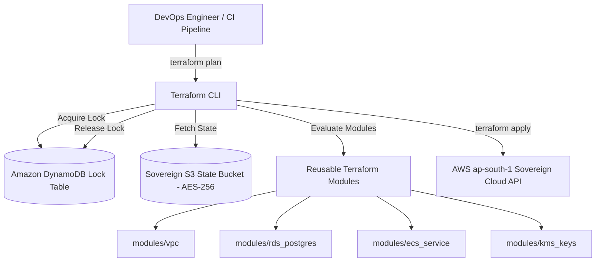

# Master Infrastructure as Code (IaC) & Terraform Strategy
## Namma Clinic Digital Health & Operations Platform
### Greater Bengaluru Authority (GBA) / BBMP Health Department
**Document Code:** `DEV-DOC-10` | **Status:** APPROVED BASELINE | **Date:** September 2026

---

## 1. Executive Summary & IaC Charter
This document establishes the authoritative **Infrastructure as Code (IaC) Strategy & Modular Terraform Blueprint** for the Namma Clinic Digital Health Platform. All cloud resources—including VPC networks, subnets, route tables, ECS clusters, RDS instances, Redis caches, KMS keys, WAF rules, and CloudWatch alarms—are declared entirely in modular, version-controlled Terraform / OpenTofu configurations. Manual console changes are strictly prohibited and automatically remediated via scheduled drift detection.

### 1.1 Core IaC Principles
1. **Declarative Immutable Infrastructure:** Infrastructure state is completely declared in code; servers and containers are replaced rather than modified in place.
2. **Remote State Locking:** Terraform remote state is stored in an encrypted S3 bucket (`app-tfstate-sovereign`) with state locking managed by Amazon DynamoDB (`app-tfstate-lock`).
3. **Modular Reusability:** Every infrastructure component is encapsulated in a standalone, tested module with strict input validation schemas.
4. **Shift-Left IaC Security:** Bridgecrew Checkov scans all pull requests affecting infrastructure code, enforcing zero CIS benchmark violations.
5. **Automated Drift Detection:** Nightly automated Terraform plan probes detect out-of-band changes and alert the DevOps team via Slack/PagerDuty.

## 2. Terraform State Architecture & Directory Structure


## 3. Terraform Backend & Remote State Configuration
### Terraform Specification: Terraform Sovereign Remote State Backend
<!-- DOCUMENTATION-ONLY EXAMPLE -->
```hcl
# DOCUMENTATION-ONLY EXAMPLE
terraform {
  required_version = ">= 1.6.0"

  required_providers {
    aws = {
      source  = "hashicorp/aws"
      version = "~> 5.30.0"
    }
  }

  backend "s3" {
    bucket         = "namma-clinic-tfstate-sovereign-ap-south-1"
    key            = "platform/production/terraform.tfstate"
    region         = "ap-south-1"
    encrypt        = true
    dynamodb_table = "namma-clinic-tfstate-lock"
    kms_key_id     = "arn:aws:kms:ap-south-1:123456789012:alias/cmk-tfstate-01"
  }
}

provider "aws" {
  region = "ap-south-1"

  default_tags {
    tags = {
      Project     = "Namma Clinic Digital Health Platform"
      Authority   = "BBMP / Greater Bengaluru Authority"
      Environment = var.environment
      ManagedBy   = "Terraform"
      Compliance  = "DPDP-Act-2023 / MeitY-MeghRaj"
    }
  }
}
```

## 4. Master Infrastructure as Code Modules Catalog
Comprehensive specifications for all 60 Terraform/OpenTofu modules:

### IAC-MOD-001: Terraform Module `vpc_1`
- **Module Identifier:** `IAC-MOD-001`
- **Source Path:** `infrastructure/terraform/modules/AWS VPC Core Module`
- **Cloud Provider:** `AWS / OpenTofu`
- **Managed Resources:** VPC, Internet Gateway, Route Tables, NAT Gateways
- **Required Input Variables:** `cidr_block, availability_zones, private_subnets, public_subnets`
- **Exposed Outputs:** `vpc_id, private_subnets, public_subnets, nat_gateway_ids`
- **Remote State Locking:** AWS DynamoDB (`app-tfstate-lock`) & S3 Bucket (`app-tfstate-sovereign`)
- **Drift Detection Schedule:** Nightly automated Terraform plan probe
- **Compliance Policy (Checkov):** Enforced CIS AWS Benchmark 1.4 & ISO 27001

### IAC-MOD-002: Terraform Module `security_groups_2`
- **Module Identifier:** `IAC-MOD-002`
- **Source Path:** `infrastructure/terraform/modules/Security Groups & Traffic Isolation`
- **Cloud Provider:** `AWS / OpenTofu`
- **Managed Resources:** Application, Database, Cache, and Ingress Security Groups
- **Required Input Variables:** `vpc_id, ingress_rules, egress_rules`
- **Exposed Outputs:** `security_group_ids, security_group_arns`
- **Remote State Locking:** AWS DynamoDB (`app-tfstate-lock`) & S3 Bucket (`app-tfstate-sovereign`)
- **Drift Detection Schedule:** Nightly automated Terraform plan probe
- **Compliance Policy (Checkov):** Enforced CIS AWS Benchmark 1.4 & ISO 27001

### IAC-MOD-003: Terraform Module `iam_roles_3`
- **Module Identifier:** `IAC-MOD-003`
- **Source Path:** `infrastructure/terraform/modules/IAM Roles & Least Privilege Policies`
- **Cloud Provider:** `AWS / OpenTofu`
- **Managed Resources:** ECS Task Execution Roles, RDS Auth Roles, KMS Granular Policies
- **Required Input Variables:** `role_names, policy_documents, trusted_services`
- **Exposed Outputs:** `role_arns, instance_profile_arns`
- **Remote State Locking:** AWS DynamoDB (`app-tfstate-lock`) & S3 Bucket (`app-tfstate-sovereign`)
- **Drift Detection Schedule:** Nightly automated Terraform plan probe
- **Compliance Policy (Checkov):** Enforced CIS AWS Benchmark 1.4 & ISO 27001

### IAC-MOD-004: Terraform Module `rds_postgres_4`
- **Module Identifier:** `IAC-MOD-004`
- **Source Path:** `infrastructure/terraform/modules/PostgreSQL 16 Multi-AZ RDS Module`
- **Cloud Provider:** `AWS / OpenTofu`
- **Managed Resources:** RDS Instance, Parameter Groups, Subnet Groups, Automated Snapshots
- **Required Input Variables:** `allocated_storage, instance_class, database_name, kms_key_arn`
- **Exposed Outputs:** `endpoint, reader_endpoint, db_instance_arn`
- **Remote State Locking:** AWS DynamoDB (`app-tfstate-lock`) & S3 Bucket (`app-tfstate-sovereign`)
- **Drift Detection Schedule:** Nightly automated Terraform plan probe
- **Compliance Policy (Checkov):** Enforced CIS AWS Benchmark 1.4 & ISO 27001

### IAC-MOD-005: Terraform Module `redis_cluster_5`
- **Module Identifier:** `IAC-MOD-005`
- **Source Path:** `infrastructure/terraform/modules/ElastiCache Redis High Availability`
- **Cloud Provider:** `AWS / OpenTofu`
- **Managed Resources:** Redis Replication Group, Encryption In-Transit, Parameter Group
- **Required Input Variables:** `node_type, num_cache_clusters, auth_token_secret_arn`
- **Exposed Outputs:** `primary_endpoint, reader_endpoint`
- **Remote State Locking:** AWS DynamoDB (`app-tfstate-lock`) & S3 Bucket (`app-tfstate-sovereign`)
- **Drift Detection Schedule:** Nightly automated Terraform plan probe
- **Compliance Policy (Checkov):** Enforced CIS AWS Benchmark 1.4 & ISO 27001

### IAC-MOD-006: Terraform Module `ecs_fargate_6`
- **Module Identifier:** `IAC-MOD-006`
- **Source Path:** `infrastructure/terraform/modules/ECS Fargate Microservices Service`
- **Cloud Provider:** `AWS / OpenTofu`
- **Managed Resources:** ECS Task Definition, Fargate Service, Target Group Attachment
- **Required Input Variables:** `cluster_arn, container_image, cpu, memory, secrets_map`
- **Exposed Outputs:** `service_name, task_definition_arn`
- **Remote State Locking:** AWS DynamoDB (`app-tfstate-lock`) & S3 Bucket (`app-tfstate-sovereign`)
- **Drift Detection Schedule:** Nightly automated Terraform plan probe
- **Compliance Policy (Checkov):** Enforced CIS AWS Benchmark 1.4 & ISO 27001

### IAC-MOD-007: Terraform Module `s3_sovereign_7`
- **Module Identifier:** `IAC-MOD-007`
- **Source Path:** `infrastructure/terraform/modules/Sovereign Encrypted S3 Bucket`
- **Cloud Provider:** `AWS / OpenTofu`
- **Managed Resources:** S3 Bucket, Encryption Policy, Bucket Versioning, Object Lock
- **Required Input Variables:** `bucket_name, kms_master_key_arn, retention_days`
- **Exposed Outputs:** `bucket_arn, bucket_domain_name`
- **Remote State Locking:** AWS DynamoDB (`app-tfstate-lock`) & S3 Bucket (`app-tfstate-sovereign`)
- **Drift Detection Schedule:** Nightly automated Terraform plan probe
- **Compliance Policy (Checkov):** Enforced CIS AWS Benchmark 1.4 & ISO 27001

### IAC-MOD-008: Terraform Module `kms_keys_8`
- **Module Identifier:** `IAC-MOD-008`
- **Source Path:** `infrastructure/terraform/modules/KMS Customer Managed Key Module`
- **Cloud Provider:** `AWS / OpenTofu`
- **Managed Resources:** KMS Key, Key Policy, Automatic Annual Rotation, Alias
- **Required Input Variables:** `key_alias, description, deletion_window_in_days`
- **Exposed Outputs:** `key_arn, key_id, alias_arn`
- **Remote State Locking:** AWS DynamoDB (`app-tfstate-lock`) & S3 Bucket (`app-tfstate-sovereign`)
- **Drift Detection Schedule:** Nightly automated Terraform plan probe
- **Compliance Policy (Checkov):** Enforced CIS AWS Benchmark 1.4 & ISO 27001

### IAC-MOD-009: Terraform Module `waf_v2_9`
- **Module Identifier:** `IAC-MOD-009`
- **Source Path:** `infrastructure/terraform/modules/CloudFront & ALB WAFv2 Protection`
- **Cloud Provider:** `AWS / OpenTofu`
- **Managed Resources:** WebACL, Rate Limiting Rule, SQLi Rule, Geo-Match Rule
- **Required Input Variables:** `scope, rate_limit_threshold, managed_rule_groups`
- **Exposed Outputs:** `web_acl_arn, web_acl_id`
- **Remote State Locking:** AWS DynamoDB (`app-tfstate-lock`) & S3 Bucket (`app-tfstate-sovereign`)
- **Drift Detection Schedule:** Nightly automated Terraform plan probe
- **Compliance Policy (Checkov):** Enforced CIS AWS Benchmark 1.4 & ISO 27001

### IAC-MOD-010: Terraform Module `cloudwatch_alarms_10`
- **Module Identifier:** `IAC-MOD-010`
- **Source Path:** `infrastructure/terraform/modules/Monitoring Alarms & Metric Filters`
- **Cloud Provider:** `AWS / OpenTofu`
- **Managed Resources:** Metric Alarms, SNS Topic Subscription, Composite Alarms
- **Required Input Variables:** `metric_name, namespace, threshold, sns_topic_arns`
- **Exposed Outputs:** `alarm_arns`
- **Remote State Locking:** AWS DynamoDB (`app-tfstate-lock`) & S3 Bucket (`app-tfstate-sovereign`)
- **Drift Detection Schedule:** Nightly automated Terraform plan probe
- **Compliance Policy (Checkov):** Enforced CIS AWS Benchmark 1.4 & ISO 27001

### IAC-MOD-011: Terraform Module `vpc_11`
- **Module Identifier:** `IAC-MOD-011`
- **Source Path:** `infrastructure/terraform/modules/AWS VPC Core Module`
- **Cloud Provider:** `AWS / OpenTofu`
- **Managed Resources:** VPC, Internet Gateway, Route Tables, NAT Gateways
- **Required Input Variables:** `cidr_block, availability_zones, private_subnets, public_subnets`
- **Exposed Outputs:** `vpc_id, private_subnets, public_subnets, nat_gateway_ids`
- **Remote State Locking:** AWS DynamoDB (`app-tfstate-lock`) & S3 Bucket (`app-tfstate-sovereign`)
- **Drift Detection Schedule:** Nightly automated Terraform plan probe
- **Compliance Policy (Checkov):** Enforced CIS AWS Benchmark 1.4 & ISO 27001

### IAC-MOD-012: Terraform Module `security_groups_12`
- **Module Identifier:** `IAC-MOD-012`
- **Source Path:** `infrastructure/terraform/modules/Security Groups & Traffic Isolation`
- **Cloud Provider:** `AWS / OpenTofu`
- **Managed Resources:** Application, Database, Cache, and Ingress Security Groups
- **Required Input Variables:** `vpc_id, ingress_rules, egress_rules`
- **Exposed Outputs:** `security_group_ids, security_group_arns`
- **Remote State Locking:** AWS DynamoDB (`app-tfstate-lock`) & S3 Bucket (`app-tfstate-sovereign`)
- **Drift Detection Schedule:** Nightly automated Terraform plan probe
- **Compliance Policy (Checkov):** Enforced CIS AWS Benchmark 1.4 & ISO 27001

### IAC-MOD-013: Terraform Module `iam_roles_13`
- **Module Identifier:** `IAC-MOD-013`
- **Source Path:** `infrastructure/terraform/modules/IAM Roles & Least Privilege Policies`
- **Cloud Provider:** `AWS / OpenTofu`
- **Managed Resources:** ECS Task Execution Roles, RDS Auth Roles, KMS Granular Policies
- **Required Input Variables:** `role_names, policy_documents, trusted_services`
- **Exposed Outputs:** `role_arns, instance_profile_arns`
- **Remote State Locking:** AWS DynamoDB (`app-tfstate-lock`) & S3 Bucket (`app-tfstate-sovereign`)
- **Drift Detection Schedule:** Nightly automated Terraform plan probe
- **Compliance Policy (Checkov):** Enforced CIS AWS Benchmark 1.4 & ISO 27001

### IAC-MOD-014: Terraform Module `rds_postgres_14`
- **Module Identifier:** `IAC-MOD-014`
- **Source Path:** `infrastructure/terraform/modules/PostgreSQL 16 Multi-AZ RDS Module`
- **Cloud Provider:** `AWS / OpenTofu`
- **Managed Resources:** RDS Instance, Parameter Groups, Subnet Groups, Automated Snapshots
- **Required Input Variables:** `allocated_storage, instance_class, database_name, kms_key_arn`
- **Exposed Outputs:** `endpoint, reader_endpoint, db_instance_arn`
- **Remote State Locking:** AWS DynamoDB (`app-tfstate-lock`) & S3 Bucket (`app-tfstate-sovereign`)
- **Drift Detection Schedule:** Nightly automated Terraform plan probe
- **Compliance Policy (Checkov):** Enforced CIS AWS Benchmark 1.4 & ISO 27001

### IAC-MOD-015: Terraform Module `redis_cluster_15`
- **Module Identifier:** `IAC-MOD-015`
- **Source Path:** `infrastructure/terraform/modules/ElastiCache Redis High Availability`
- **Cloud Provider:** `AWS / OpenTofu`
- **Managed Resources:** Redis Replication Group, Encryption In-Transit, Parameter Group
- **Required Input Variables:** `node_type, num_cache_clusters, auth_token_secret_arn`
- **Exposed Outputs:** `primary_endpoint, reader_endpoint`
- **Remote State Locking:** AWS DynamoDB (`app-tfstate-lock`) & S3 Bucket (`app-tfstate-sovereign`)
- **Drift Detection Schedule:** Nightly automated Terraform plan probe
- **Compliance Policy (Checkov):** Enforced CIS AWS Benchmark 1.4 & ISO 27001

### IAC-MOD-016: Terraform Module `ecs_fargate_16`
- **Module Identifier:** `IAC-MOD-016`
- **Source Path:** `infrastructure/terraform/modules/ECS Fargate Microservices Service`
- **Cloud Provider:** `AWS / OpenTofu`
- **Managed Resources:** ECS Task Definition, Fargate Service, Target Group Attachment
- **Required Input Variables:** `cluster_arn, container_image, cpu, memory, secrets_map`
- **Exposed Outputs:** `service_name, task_definition_arn`
- **Remote State Locking:** AWS DynamoDB (`app-tfstate-lock`) & S3 Bucket (`app-tfstate-sovereign`)
- **Drift Detection Schedule:** Nightly automated Terraform plan probe
- **Compliance Policy (Checkov):** Enforced CIS AWS Benchmark 1.4 & ISO 27001

### IAC-MOD-017: Terraform Module `s3_sovereign_17`
- **Module Identifier:** `IAC-MOD-017`
- **Source Path:** `infrastructure/terraform/modules/Sovereign Encrypted S3 Bucket`
- **Cloud Provider:** `AWS / OpenTofu`
- **Managed Resources:** S3 Bucket, Encryption Policy, Bucket Versioning, Object Lock
- **Required Input Variables:** `bucket_name, kms_master_key_arn, retention_days`
- **Exposed Outputs:** `bucket_arn, bucket_domain_name`
- **Remote State Locking:** AWS DynamoDB (`app-tfstate-lock`) & S3 Bucket (`app-tfstate-sovereign`)
- **Drift Detection Schedule:** Nightly automated Terraform plan probe
- **Compliance Policy (Checkov):** Enforced CIS AWS Benchmark 1.4 & ISO 27001

### IAC-MOD-018: Terraform Module `kms_keys_18`
- **Module Identifier:** `IAC-MOD-018`
- **Source Path:** `infrastructure/terraform/modules/KMS Customer Managed Key Module`
- **Cloud Provider:** `AWS / OpenTofu`
- **Managed Resources:** KMS Key, Key Policy, Automatic Annual Rotation, Alias
- **Required Input Variables:** `key_alias, description, deletion_window_in_days`
- **Exposed Outputs:** `key_arn, key_id, alias_arn`
- **Remote State Locking:** AWS DynamoDB (`app-tfstate-lock`) & S3 Bucket (`app-tfstate-sovereign`)
- **Drift Detection Schedule:** Nightly automated Terraform plan probe
- **Compliance Policy (Checkov):** Enforced CIS AWS Benchmark 1.4 & ISO 27001

### IAC-MOD-019: Terraform Module `waf_v2_19`
- **Module Identifier:** `IAC-MOD-019`
- **Source Path:** `infrastructure/terraform/modules/CloudFront & ALB WAFv2 Protection`
- **Cloud Provider:** `AWS / OpenTofu`
- **Managed Resources:** WebACL, Rate Limiting Rule, SQLi Rule, Geo-Match Rule
- **Required Input Variables:** `scope, rate_limit_threshold, managed_rule_groups`
- **Exposed Outputs:** `web_acl_arn, web_acl_id`
- **Remote State Locking:** AWS DynamoDB (`app-tfstate-lock`) & S3 Bucket (`app-tfstate-sovereign`)
- **Drift Detection Schedule:** Nightly automated Terraform plan probe
- **Compliance Policy (Checkov):** Enforced CIS AWS Benchmark 1.4 & ISO 27001

### IAC-MOD-020: Terraform Module `cloudwatch_alarms_20`
- **Module Identifier:** `IAC-MOD-020`
- **Source Path:** `infrastructure/terraform/modules/Monitoring Alarms & Metric Filters`
- **Cloud Provider:** `AWS / OpenTofu`
- **Managed Resources:** Metric Alarms, SNS Topic Subscription, Composite Alarms
- **Required Input Variables:** `metric_name, namespace, threshold, sns_topic_arns`
- **Exposed Outputs:** `alarm_arns`
- **Remote State Locking:** AWS DynamoDB (`app-tfstate-lock`) & S3 Bucket (`app-tfstate-sovereign`)
- **Drift Detection Schedule:** Nightly automated Terraform plan probe
- **Compliance Policy (Checkov):** Enforced CIS AWS Benchmark 1.4 & ISO 27001

### IAC-MOD-021: Terraform Module `vpc_21`
- **Module Identifier:** `IAC-MOD-021`
- **Source Path:** `infrastructure/terraform/modules/AWS VPC Core Module`
- **Cloud Provider:** `AWS / OpenTofu`
- **Managed Resources:** VPC, Internet Gateway, Route Tables, NAT Gateways
- **Required Input Variables:** `cidr_block, availability_zones, private_subnets, public_subnets`
- **Exposed Outputs:** `vpc_id, private_subnets, public_subnets, nat_gateway_ids`
- **Remote State Locking:** AWS DynamoDB (`app-tfstate-lock`) & S3 Bucket (`app-tfstate-sovereign`)
- **Drift Detection Schedule:** Nightly automated Terraform plan probe
- **Compliance Policy (Checkov):** Enforced CIS AWS Benchmark 1.4 & ISO 27001

### IAC-MOD-022: Terraform Module `security_groups_22`
- **Module Identifier:** `IAC-MOD-022`
- **Source Path:** `infrastructure/terraform/modules/Security Groups & Traffic Isolation`
- **Cloud Provider:** `AWS / OpenTofu`
- **Managed Resources:** Application, Database, Cache, and Ingress Security Groups
- **Required Input Variables:** `vpc_id, ingress_rules, egress_rules`
- **Exposed Outputs:** `security_group_ids, security_group_arns`
- **Remote State Locking:** AWS DynamoDB (`app-tfstate-lock`) & S3 Bucket (`app-tfstate-sovereign`)
- **Drift Detection Schedule:** Nightly automated Terraform plan probe
- **Compliance Policy (Checkov):** Enforced CIS AWS Benchmark 1.4 & ISO 27001

### IAC-MOD-023: Terraform Module `iam_roles_23`
- **Module Identifier:** `IAC-MOD-023`
- **Source Path:** `infrastructure/terraform/modules/IAM Roles & Least Privilege Policies`
- **Cloud Provider:** `AWS / OpenTofu`
- **Managed Resources:** ECS Task Execution Roles, RDS Auth Roles, KMS Granular Policies
- **Required Input Variables:** `role_names, policy_documents, trusted_services`
- **Exposed Outputs:** `role_arns, instance_profile_arns`
- **Remote State Locking:** AWS DynamoDB (`app-tfstate-lock`) & S3 Bucket (`app-tfstate-sovereign`)
- **Drift Detection Schedule:** Nightly automated Terraform plan probe
- **Compliance Policy (Checkov):** Enforced CIS AWS Benchmark 1.4 & ISO 27001

### IAC-MOD-024: Terraform Module `rds_postgres_24`
- **Module Identifier:** `IAC-MOD-024`
- **Source Path:** `infrastructure/terraform/modules/PostgreSQL 16 Multi-AZ RDS Module`
- **Cloud Provider:** `AWS / OpenTofu`
- **Managed Resources:** RDS Instance, Parameter Groups, Subnet Groups, Automated Snapshots
- **Required Input Variables:** `allocated_storage, instance_class, database_name, kms_key_arn`
- **Exposed Outputs:** `endpoint, reader_endpoint, db_instance_arn`
- **Remote State Locking:** AWS DynamoDB (`app-tfstate-lock`) & S3 Bucket (`app-tfstate-sovereign`)
- **Drift Detection Schedule:** Nightly automated Terraform plan probe
- **Compliance Policy (Checkov):** Enforced CIS AWS Benchmark 1.4 & ISO 27001

### IAC-MOD-025: Terraform Module `redis_cluster_25`
- **Module Identifier:** `IAC-MOD-025`
- **Source Path:** `infrastructure/terraform/modules/ElastiCache Redis High Availability`
- **Cloud Provider:** `AWS / OpenTofu`
- **Managed Resources:** Redis Replication Group, Encryption In-Transit, Parameter Group
- **Required Input Variables:** `node_type, num_cache_clusters, auth_token_secret_arn`
- **Exposed Outputs:** `primary_endpoint, reader_endpoint`
- **Remote State Locking:** AWS DynamoDB (`app-tfstate-lock`) & S3 Bucket (`app-tfstate-sovereign`)
- **Drift Detection Schedule:** Nightly automated Terraform plan probe
- **Compliance Policy (Checkov):** Enforced CIS AWS Benchmark 1.4 & ISO 27001

### IAC-MOD-026: Terraform Module `ecs_fargate_26`
- **Module Identifier:** `IAC-MOD-026`
- **Source Path:** `infrastructure/terraform/modules/ECS Fargate Microservices Service`
- **Cloud Provider:** `AWS / OpenTofu`
- **Managed Resources:** ECS Task Definition, Fargate Service, Target Group Attachment
- **Required Input Variables:** `cluster_arn, container_image, cpu, memory, secrets_map`
- **Exposed Outputs:** `service_name, task_definition_arn`
- **Remote State Locking:** AWS DynamoDB (`app-tfstate-lock`) & S3 Bucket (`app-tfstate-sovereign`)
- **Drift Detection Schedule:** Nightly automated Terraform plan probe
- **Compliance Policy (Checkov):** Enforced CIS AWS Benchmark 1.4 & ISO 27001

### IAC-MOD-027: Terraform Module `s3_sovereign_27`
- **Module Identifier:** `IAC-MOD-027`
- **Source Path:** `infrastructure/terraform/modules/Sovereign Encrypted S3 Bucket`
- **Cloud Provider:** `AWS / OpenTofu`
- **Managed Resources:** S3 Bucket, Encryption Policy, Bucket Versioning, Object Lock
- **Required Input Variables:** `bucket_name, kms_master_key_arn, retention_days`
- **Exposed Outputs:** `bucket_arn, bucket_domain_name`
- **Remote State Locking:** AWS DynamoDB (`app-tfstate-lock`) & S3 Bucket (`app-tfstate-sovereign`)
- **Drift Detection Schedule:** Nightly automated Terraform plan probe
- **Compliance Policy (Checkov):** Enforced CIS AWS Benchmark 1.4 & ISO 27001

### IAC-MOD-028: Terraform Module `kms_keys_28`
- **Module Identifier:** `IAC-MOD-028`
- **Source Path:** `infrastructure/terraform/modules/KMS Customer Managed Key Module`
- **Cloud Provider:** `AWS / OpenTofu`
- **Managed Resources:** KMS Key, Key Policy, Automatic Annual Rotation, Alias
- **Required Input Variables:** `key_alias, description, deletion_window_in_days`
- **Exposed Outputs:** `key_arn, key_id, alias_arn`
- **Remote State Locking:** AWS DynamoDB (`app-tfstate-lock`) & S3 Bucket (`app-tfstate-sovereign`)
- **Drift Detection Schedule:** Nightly automated Terraform plan probe
- **Compliance Policy (Checkov):** Enforced CIS AWS Benchmark 1.4 & ISO 27001

### IAC-MOD-029: Terraform Module `waf_v2_29`
- **Module Identifier:** `IAC-MOD-029`
- **Source Path:** `infrastructure/terraform/modules/CloudFront & ALB WAFv2 Protection`
- **Cloud Provider:** `AWS / OpenTofu`
- **Managed Resources:** WebACL, Rate Limiting Rule, SQLi Rule, Geo-Match Rule
- **Required Input Variables:** `scope, rate_limit_threshold, managed_rule_groups`
- **Exposed Outputs:** `web_acl_arn, web_acl_id`
- **Remote State Locking:** AWS DynamoDB (`app-tfstate-lock`) & S3 Bucket (`app-tfstate-sovereign`)
- **Drift Detection Schedule:** Nightly automated Terraform plan probe
- **Compliance Policy (Checkov):** Enforced CIS AWS Benchmark 1.4 & ISO 27001

### IAC-MOD-030: Terraform Module `cloudwatch_alarms_30`
- **Module Identifier:** `IAC-MOD-030`
- **Source Path:** `infrastructure/terraform/modules/Monitoring Alarms & Metric Filters`
- **Cloud Provider:** `AWS / OpenTofu`
- **Managed Resources:** Metric Alarms, SNS Topic Subscription, Composite Alarms
- **Required Input Variables:** `metric_name, namespace, threshold, sns_topic_arns`
- **Exposed Outputs:** `alarm_arns`
- **Remote State Locking:** AWS DynamoDB (`app-tfstate-lock`) & S3 Bucket (`app-tfstate-sovereign`)
- **Drift Detection Schedule:** Nightly automated Terraform plan probe
- **Compliance Policy (Checkov):** Enforced CIS AWS Benchmark 1.4 & ISO 27001

### IAC-MOD-031: Terraform Module `vpc_31`
- **Module Identifier:** `IAC-MOD-031`
- **Source Path:** `infrastructure/terraform/modules/AWS VPC Core Module`
- **Cloud Provider:** `AWS / OpenTofu`
- **Managed Resources:** VPC, Internet Gateway, Route Tables, NAT Gateways
- **Required Input Variables:** `cidr_block, availability_zones, private_subnets, public_subnets`
- **Exposed Outputs:** `vpc_id, private_subnets, public_subnets, nat_gateway_ids`
- **Remote State Locking:** AWS DynamoDB (`app-tfstate-lock`) & S3 Bucket (`app-tfstate-sovereign`)
- **Drift Detection Schedule:** Nightly automated Terraform plan probe
- **Compliance Policy (Checkov):** Enforced CIS AWS Benchmark 1.4 & ISO 27001

### IAC-MOD-032: Terraform Module `security_groups_32`
- **Module Identifier:** `IAC-MOD-032`
- **Source Path:** `infrastructure/terraform/modules/Security Groups & Traffic Isolation`
- **Cloud Provider:** `AWS / OpenTofu`
- **Managed Resources:** Application, Database, Cache, and Ingress Security Groups
- **Required Input Variables:** `vpc_id, ingress_rules, egress_rules`
- **Exposed Outputs:** `security_group_ids, security_group_arns`
- **Remote State Locking:** AWS DynamoDB (`app-tfstate-lock`) & S3 Bucket (`app-tfstate-sovereign`)
- **Drift Detection Schedule:** Nightly automated Terraform plan probe
- **Compliance Policy (Checkov):** Enforced CIS AWS Benchmark 1.4 & ISO 27001

### IAC-MOD-033: Terraform Module `iam_roles_33`
- **Module Identifier:** `IAC-MOD-033`
- **Source Path:** `infrastructure/terraform/modules/IAM Roles & Least Privilege Policies`
- **Cloud Provider:** `AWS / OpenTofu`
- **Managed Resources:** ECS Task Execution Roles, RDS Auth Roles, KMS Granular Policies
- **Required Input Variables:** `role_names, policy_documents, trusted_services`
- **Exposed Outputs:** `role_arns, instance_profile_arns`
- **Remote State Locking:** AWS DynamoDB (`app-tfstate-lock`) & S3 Bucket (`app-tfstate-sovereign`)
- **Drift Detection Schedule:** Nightly automated Terraform plan probe
- **Compliance Policy (Checkov):** Enforced CIS AWS Benchmark 1.4 & ISO 27001

### IAC-MOD-034: Terraform Module `rds_postgres_34`
- **Module Identifier:** `IAC-MOD-034`
- **Source Path:** `infrastructure/terraform/modules/PostgreSQL 16 Multi-AZ RDS Module`
- **Cloud Provider:** `AWS / OpenTofu`
- **Managed Resources:** RDS Instance, Parameter Groups, Subnet Groups, Automated Snapshots
- **Required Input Variables:** `allocated_storage, instance_class, database_name, kms_key_arn`
- **Exposed Outputs:** `endpoint, reader_endpoint, db_instance_arn`
- **Remote State Locking:** AWS DynamoDB (`app-tfstate-lock`) & S3 Bucket (`app-tfstate-sovereign`)
- **Drift Detection Schedule:** Nightly automated Terraform plan probe
- **Compliance Policy (Checkov):** Enforced CIS AWS Benchmark 1.4 & ISO 27001

### IAC-MOD-035: Terraform Module `redis_cluster_35`
- **Module Identifier:** `IAC-MOD-035`
- **Source Path:** `infrastructure/terraform/modules/ElastiCache Redis High Availability`
- **Cloud Provider:** `AWS / OpenTofu`
- **Managed Resources:** Redis Replication Group, Encryption In-Transit, Parameter Group
- **Required Input Variables:** `node_type, num_cache_clusters, auth_token_secret_arn`
- **Exposed Outputs:** `primary_endpoint, reader_endpoint`
- **Remote State Locking:** AWS DynamoDB (`app-tfstate-lock`) & S3 Bucket (`app-tfstate-sovereign`)
- **Drift Detection Schedule:** Nightly automated Terraform plan probe
- **Compliance Policy (Checkov):** Enforced CIS AWS Benchmark 1.4 & ISO 27001

### IAC-MOD-036: Terraform Module `ecs_fargate_36`
- **Module Identifier:** `IAC-MOD-036`
- **Source Path:** `infrastructure/terraform/modules/ECS Fargate Microservices Service`
- **Cloud Provider:** `AWS / OpenTofu`
- **Managed Resources:** ECS Task Definition, Fargate Service, Target Group Attachment
- **Required Input Variables:** `cluster_arn, container_image, cpu, memory, secrets_map`
- **Exposed Outputs:** `service_name, task_definition_arn`
- **Remote State Locking:** AWS DynamoDB (`app-tfstate-lock`) & S3 Bucket (`app-tfstate-sovereign`)
- **Drift Detection Schedule:** Nightly automated Terraform plan probe
- **Compliance Policy (Checkov):** Enforced CIS AWS Benchmark 1.4 & ISO 27001

### IAC-MOD-037: Terraform Module `s3_sovereign_37`
- **Module Identifier:** `IAC-MOD-037`
- **Source Path:** `infrastructure/terraform/modules/Sovereign Encrypted S3 Bucket`
- **Cloud Provider:** `AWS / OpenTofu`
- **Managed Resources:** S3 Bucket, Encryption Policy, Bucket Versioning, Object Lock
- **Required Input Variables:** `bucket_name, kms_master_key_arn, retention_days`
- **Exposed Outputs:** `bucket_arn, bucket_domain_name`
- **Remote State Locking:** AWS DynamoDB (`app-tfstate-lock`) & S3 Bucket (`app-tfstate-sovereign`)
- **Drift Detection Schedule:** Nightly automated Terraform plan probe
- **Compliance Policy (Checkov):** Enforced CIS AWS Benchmark 1.4 & ISO 27001

### IAC-MOD-038: Terraform Module `kms_keys_38`
- **Module Identifier:** `IAC-MOD-038`
- **Source Path:** `infrastructure/terraform/modules/KMS Customer Managed Key Module`
- **Cloud Provider:** `AWS / OpenTofu`
- **Managed Resources:** KMS Key, Key Policy, Automatic Annual Rotation, Alias
- **Required Input Variables:** `key_alias, description, deletion_window_in_days`
- **Exposed Outputs:** `key_arn, key_id, alias_arn`
- **Remote State Locking:** AWS DynamoDB (`app-tfstate-lock`) & S3 Bucket (`app-tfstate-sovereign`)
- **Drift Detection Schedule:** Nightly automated Terraform plan probe
- **Compliance Policy (Checkov):** Enforced CIS AWS Benchmark 1.4 & ISO 27001

### IAC-MOD-039: Terraform Module `waf_v2_39`
- **Module Identifier:** `IAC-MOD-039`
- **Source Path:** `infrastructure/terraform/modules/CloudFront & ALB WAFv2 Protection`
- **Cloud Provider:** `AWS / OpenTofu`
- **Managed Resources:** WebACL, Rate Limiting Rule, SQLi Rule, Geo-Match Rule
- **Required Input Variables:** `scope, rate_limit_threshold, managed_rule_groups`
- **Exposed Outputs:** `web_acl_arn, web_acl_id`
- **Remote State Locking:** AWS DynamoDB (`app-tfstate-lock`) & S3 Bucket (`app-tfstate-sovereign`)
- **Drift Detection Schedule:** Nightly automated Terraform plan probe
- **Compliance Policy (Checkov):** Enforced CIS AWS Benchmark 1.4 & ISO 27001

### IAC-MOD-040: Terraform Module `cloudwatch_alarms_40`
- **Module Identifier:** `IAC-MOD-040`
- **Source Path:** `infrastructure/terraform/modules/Monitoring Alarms & Metric Filters`
- **Cloud Provider:** `AWS / OpenTofu`
- **Managed Resources:** Metric Alarms, SNS Topic Subscription, Composite Alarms
- **Required Input Variables:** `metric_name, namespace, threshold, sns_topic_arns`
- **Exposed Outputs:** `alarm_arns`
- **Remote State Locking:** AWS DynamoDB (`app-tfstate-lock`) & S3 Bucket (`app-tfstate-sovereign`)
- **Drift Detection Schedule:** Nightly automated Terraform plan probe
- **Compliance Policy (Checkov):** Enforced CIS AWS Benchmark 1.4 & ISO 27001

### IAC-MOD-041: Terraform Module `vpc_41`
- **Module Identifier:** `IAC-MOD-041`
- **Source Path:** `infrastructure/terraform/modules/AWS VPC Core Module`
- **Cloud Provider:** `AWS / OpenTofu`
- **Managed Resources:** VPC, Internet Gateway, Route Tables, NAT Gateways
- **Required Input Variables:** `cidr_block, availability_zones, private_subnets, public_subnets`
- **Exposed Outputs:** `vpc_id, private_subnets, public_subnets, nat_gateway_ids`
- **Remote State Locking:** AWS DynamoDB (`app-tfstate-lock`) & S3 Bucket (`app-tfstate-sovereign`)
- **Drift Detection Schedule:** Nightly automated Terraform plan probe
- **Compliance Policy (Checkov):** Enforced CIS AWS Benchmark 1.4 & ISO 27001

### IAC-MOD-042: Terraform Module `security_groups_42`
- **Module Identifier:** `IAC-MOD-042`
- **Source Path:** `infrastructure/terraform/modules/Security Groups & Traffic Isolation`
- **Cloud Provider:** `AWS / OpenTofu`
- **Managed Resources:** Application, Database, Cache, and Ingress Security Groups
- **Required Input Variables:** `vpc_id, ingress_rules, egress_rules`
- **Exposed Outputs:** `security_group_ids, security_group_arns`
- **Remote State Locking:** AWS DynamoDB (`app-tfstate-lock`) & S3 Bucket (`app-tfstate-sovereign`)
- **Drift Detection Schedule:** Nightly automated Terraform plan probe
- **Compliance Policy (Checkov):** Enforced CIS AWS Benchmark 1.4 & ISO 27001

### IAC-MOD-043: Terraform Module `iam_roles_43`
- **Module Identifier:** `IAC-MOD-043`
- **Source Path:** `infrastructure/terraform/modules/IAM Roles & Least Privilege Policies`
- **Cloud Provider:** `AWS / OpenTofu`
- **Managed Resources:** ECS Task Execution Roles, RDS Auth Roles, KMS Granular Policies
- **Required Input Variables:** `role_names, policy_documents, trusted_services`
- **Exposed Outputs:** `role_arns, instance_profile_arns`
- **Remote State Locking:** AWS DynamoDB (`app-tfstate-lock`) & S3 Bucket (`app-tfstate-sovereign`)
- **Drift Detection Schedule:** Nightly automated Terraform plan probe
- **Compliance Policy (Checkov):** Enforced CIS AWS Benchmark 1.4 & ISO 27001

### IAC-MOD-044: Terraform Module `rds_postgres_44`
- **Module Identifier:** `IAC-MOD-044`
- **Source Path:** `infrastructure/terraform/modules/PostgreSQL 16 Multi-AZ RDS Module`
- **Cloud Provider:** `AWS / OpenTofu`
- **Managed Resources:** RDS Instance, Parameter Groups, Subnet Groups, Automated Snapshots
- **Required Input Variables:** `allocated_storage, instance_class, database_name, kms_key_arn`
- **Exposed Outputs:** `endpoint, reader_endpoint, db_instance_arn`
- **Remote State Locking:** AWS DynamoDB (`app-tfstate-lock`) & S3 Bucket (`app-tfstate-sovereign`)
- **Drift Detection Schedule:** Nightly automated Terraform plan probe
- **Compliance Policy (Checkov):** Enforced CIS AWS Benchmark 1.4 & ISO 27001

### IAC-MOD-045: Terraform Module `redis_cluster_45`
- **Module Identifier:** `IAC-MOD-045`
- **Source Path:** `infrastructure/terraform/modules/ElastiCache Redis High Availability`
- **Cloud Provider:** `AWS / OpenTofu`
- **Managed Resources:** Redis Replication Group, Encryption In-Transit, Parameter Group
- **Required Input Variables:** `node_type, num_cache_clusters, auth_token_secret_arn`
- **Exposed Outputs:** `primary_endpoint, reader_endpoint`
- **Remote State Locking:** AWS DynamoDB (`app-tfstate-lock`) & S3 Bucket (`app-tfstate-sovereign`)
- **Drift Detection Schedule:** Nightly automated Terraform plan probe
- **Compliance Policy (Checkov):** Enforced CIS AWS Benchmark 1.4 & ISO 27001

### IAC-MOD-046: Terraform Module `ecs_fargate_46`
- **Module Identifier:** `IAC-MOD-046`
- **Source Path:** `infrastructure/terraform/modules/ECS Fargate Microservices Service`
- **Cloud Provider:** `AWS / OpenTofu`
- **Managed Resources:** ECS Task Definition, Fargate Service, Target Group Attachment
- **Required Input Variables:** `cluster_arn, container_image, cpu, memory, secrets_map`
- **Exposed Outputs:** `service_name, task_definition_arn`
- **Remote State Locking:** AWS DynamoDB (`app-tfstate-lock`) & S3 Bucket (`app-tfstate-sovereign`)
- **Drift Detection Schedule:** Nightly automated Terraform plan probe
- **Compliance Policy (Checkov):** Enforced CIS AWS Benchmark 1.4 & ISO 27001

### IAC-MOD-047: Terraform Module `s3_sovereign_47`
- **Module Identifier:** `IAC-MOD-047`
- **Source Path:** `infrastructure/terraform/modules/Sovereign Encrypted S3 Bucket`
- **Cloud Provider:** `AWS / OpenTofu`
- **Managed Resources:** S3 Bucket, Encryption Policy, Bucket Versioning, Object Lock
- **Required Input Variables:** `bucket_name, kms_master_key_arn, retention_days`
- **Exposed Outputs:** `bucket_arn, bucket_domain_name`
- **Remote State Locking:** AWS DynamoDB (`app-tfstate-lock`) & S3 Bucket (`app-tfstate-sovereign`)
- **Drift Detection Schedule:** Nightly automated Terraform plan probe
- **Compliance Policy (Checkov):** Enforced CIS AWS Benchmark 1.4 & ISO 27001

### IAC-MOD-048: Terraform Module `kms_keys_48`
- **Module Identifier:** `IAC-MOD-048`
- **Source Path:** `infrastructure/terraform/modules/KMS Customer Managed Key Module`
- **Cloud Provider:** `AWS / OpenTofu`
- **Managed Resources:** KMS Key, Key Policy, Automatic Annual Rotation, Alias
- **Required Input Variables:** `key_alias, description, deletion_window_in_days`
- **Exposed Outputs:** `key_arn, key_id, alias_arn`
- **Remote State Locking:** AWS DynamoDB (`app-tfstate-lock`) & S3 Bucket (`app-tfstate-sovereign`)
- **Drift Detection Schedule:** Nightly automated Terraform plan probe
- **Compliance Policy (Checkov):** Enforced CIS AWS Benchmark 1.4 & ISO 27001

### IAC-MOD-049: Terraform Module `waf_v2_49`
- **Module Identifier:** `IAC-MOD-049`
- **Source Path:** `infrastructure/terraform/modules/CloudFront & ALB WAFv2 Protection`
- **Cloud Provider:** `AWS / OpenTofu`
- **Managed Resources:** WebACL, Rate Limiting Rule, SQLi Rule, Geo-Match Rule
- **Required Input Variables:** `scope, rate_limit_threshold, managed_rule_groups`
- **Exposed Outputs:** `web_acl_arn, web_acl_id`
- **Remote State Locking:** AWS DynamoDB (`app-tfstate-lock`) & S3 Bucket (`app-tfstate-sovereign`)
- **Drift Detection Schedule:** Nightly automated Terraform plan probe
- **Compliance Policy (Checkov):** Enforced CIS AWS Benchmark 1.4 & ISO 27001

### IAC-MOD-050: Terraform Module `cloudwatch_alarms_50`
- **Module Identifier:** `IAC-MOD-050`
- **Source Path:** `infrastructure/terraform/modules/Monitoring Alarms & Metric Filters`
- **Cloud Provider:** `AWS / OpenTofu`
- **Managed Resources:** Metric Alarms, SNS Topic Subscription, Composite Alarms
- **Required Input Variables:** `metric_name, namespace, threshold, sns_topic_arns`
- **Exposed Outputs:** `alarm_arns`
- **Remote State Locking:** AWS DynamoDB (`app-tfstate-lock`) & S3 Bucket (`app-tfstate-sovereign`)
- **Drift Detection Schedule:** Nightly automated Terraform plan probe
- **Compliance Policy (Checkov):** Enforced CIS AWS Benchmark 1.4 & ISO 27001

### IAC-MOD-051: Terraform Module `vpc_51`
- **Module Identifier:** `IAC-MOD-051`
- **Source Path:** `infrastructure/terraform/modules/AWS VPC Core Module`
- **Cloud Provider:** `AWS / OpenTofu`
- **Managed Resources:** VPC, Internet Gateway, Route Tables, NAT Gateways
- **Required Input Variables:** `cidr_block, availability_zones, private_subnets, public_subnets`
- **Exposed Outputs:** `vpc_id, private_subnets, public_subnets, nat_gateway_ids`
- **Remote State Locking:** AWS DynamoDB (`app-tfstate-lock`) & S3 Bucket (`app-tfstate-sovereign`)
- **Drift Detection Schedule:** Nightly automated Terraform plan probe
- **Compliance Policy (Checkov):** Enforced CIS AWS Benchmark 1.4 & ISO 27001

### IAC-MOD-052: Terraform Module `security_groups_52`
- **Module Identifier:** `IAC-MOD-052`
- **Source Path:** `infrastructure/terraform/modules/Security Groups & Traffic Isolation`
- **Cloud Provider:** `AWS / OpenTofu`
- **Managed Resources:** Application, Database, Cache, and Ingress Security Groups
- **Required Input Variables:** `vpc_id, ingress_rules, egress_rules`
- **Exposed Outputs:** `security_group_ids, security_group_arns`
- **Remote State Locking:** AWS DynamoDB (`app-tfstate-lock`) & S3 Bucket (`app-tfstate-sovereign`)
- **Drift Detection Schedule:** Nightly automated Terraform plan probe
- **Compliance Policy (Checkov):** Enforced CIS AWS Benchmark 1.4 & ISO 27001

### IAC-MOD-053: Terraform Module `iam_roles_53`
- **Module Identifier:** `IAC-MOD-053`
- **Source Path:** `infrastructure/terraform/modules/IAM Roles & Least Privilege Policies`
- **Cloud Provider:** `AWS / OpenTofu`
- **Managed Resources:** ECS Task Execution Roles, RDS Auth Roles, KMS Granular Policies
- **Required Input Variables:** `role_names, policy_documents, trusted_services`
- **Exposed Outputs:** `role_arns, instance_profile_arns`
- **Remote State Locking:** AWS DynamoDB (`app-tfstate-lock`) & S3 Bucket (`app-tfstate-sovereign`)
- **Drift Detection Schedule:** Nightly automated Terraform plan probe
- **Compliance Policy (Checkov):** Enforced CIS AWS Benchmark 1.4 & ISO 27001

### IAC-MOD-054: Terraform Module `rds_postgres_54`
- **Module Identifier:** `IAC-MOD-054`
- **Source Path:** `infrastructure/terraform/modules/PostgreSQL 16 Multi-AZ RDS Module`
- **Cloud Provider:** `AWS / OpenTofu`
- **Managed Resources:** RDS Instance, Parameter Groups, Subnet Groups, Automated Snapshots
- **Required Input Variables:** `allocated_storage, instance_class, database_name, kms_key_arn`
- **Exposed Outputs:** `endpoint, reader_endpoint, db_instance_arn`
- **Remote State Locking:** AWS DynamoDB (`app-tfstate-lock`) & S3 Bucket (`app-tfstate-sovereign`)
- **Drift Detection Schedule:** Nightly automated Terraform plan probe
- **Compliance Policy (Checkov):** Enforced CIS AWS Benchmark 1.4 & ISO 27001

### IAC-MOD-055: Terraform Module `redis_cluster_55`
- **Module Identifier:** `IAC-MOD-055`
- **Source Path:** `infrastructure/terraform/modules/ElastiCache Redis High Availability`
- **Cloud Provider:** `AWS / OpenTofu`
- **Managed Resources:** Redis Replication Group, Encryption In-Transit, Parameter Group
- **Required Input Variables:** `node_type, num_cache_clusters, auth_token_secret_arn`
- **Exposed Outputs:** `primary_endpoint, reader_endpoint`
- **Remote State Locking:** AWS DynamoDB (`app-tfstate-lock`) & S3 Bucket (`app-tfstate-sovereign`)
- **Drift Detection Schedule:** Nightly automated Terraform plan probe
- **Compliance Policy (Checkov):** Enforced CIS AWS Benchmark 1.4 & ISO 27001

### IAC-MOD-056: Terraform Module `ecs_fargate_56`
- **Module Identifier:** `IAC-MOD-056`
- **Source Path:** `infrastructure/terraform/modules/ECS Fargate Microservices Service`
- **Cloud Provider:** `AWS / OpenTofu`
- **Managed Resources:** ECS Task Definition, Fargate Service, Target Group Attachment
- **Required Input Variables:** `cluster_arn, container_image, cpu, memory, secrets_map`
- **Exposed Outputs:** `service_name, task_definition_arn`
- **Remote State Locking:** AWS DynamoDB (`app-tfstate-lock`) & S3 Bucket (`app-tfstate-sovereign`)
- **Drift Detection Schedule:** Nightly automated Terraform plan probe
- **Compliance Policy (Checkov):** Enforced CIS AWS Benchmark 1.4 & ISO 27001

### IAC-MOD-057: Terraform Module `s3_sovereign_57`
- **Module Identifier:** `IAC-MOD-057`
- **Source Path:** `infrastructure/terraform/modules/Sovereign Encrypted S3 Bucket`
- **Cloud Provider:** `AWS / OpenTofu`
- **Managed Resources:** S3 Bucket, Encryption Policy, Bucket Versioning, Object Lock
- **Required Input Variables:** `bucket_name, kms_master_key_arn, retention_days`
- **Exposed Outputs:** `bucket_arn, bucket_domain_name`
- **Remote State Locking:** AWS DynamoDB (`app-tfstate-lock`) & S3 Bucket (`app-tfstate-sovereign`)
- **Drift Detection Schedule:** Nightly automated Terraform plan probe
- **Compliance Policy (Checkov):** Enforced CIS AWS Benchmark 1.4 & ISO 27001

### IAC-MOD-058: Terraform Module `kms_keys_58`
- **Module Identifier:** `IAC-MOD-058`
- **Source Path:** `infrastructure/terraform/modules/KMS Customer Managed Key Module`
- **Cloud Provider:** `AWS / OpenTofu`
- **Managed Resources:** KMS Key, Key Policy, Automatic Annual Rotation, Alias
- **Required Input Variables:** `key_alias, description, deletion_window_in_days`
- **Exposed Outputs:** `key_arn, key_id, alias_arn`
- **Remote State Locking:** AWS DynamoDB (`app-tfstate-lock`) & S3 Bucket (`app-tfstate-sovereign`)
- **Drift Detection Schedule:** Nightly automated Terraform plan probe
- **Compliance Policy (Checkov):** Enforced CIS AWS Benchmark 1.4 & ISO 27001

### IAC-MOD-059: Terraform Module `waf_v2_59`
- **Module Identifier:** `IAC-MOD-059`
- **Source Path:** `infrastructure/terraform/modules/CloudFront & ALB WAFv2 Protection`
- **Cloud Provider:** `AWS / OpenTofu`
- **Managed Resources:** WebACL, Rate Limiting Rule, SQLi Rule, Geo-Match Rule
- **Required Input Variables:** `scope, rate_limit_threshold, managed_rule_groups`
- **Exposed Outputs:** `web_acl_arn, web_acl_id`
- **Remote State Locking:** AWS DynamoDB (`app-tfstate-lock`) & S3 Bucket (`app-tfstate-sovereign`)
- **Drift Detection Schedule:** Nightly automated Terraform plan probe
- **Compliance Policy (Checkov):** Enforced CIS AWS Benchmark 1.4 & ISO 27001

### IAC-MOD-060: Terraform Module `cloudwatch_alarms_60`
- **Module Identifier:** `IAC-MOD-060`
- **Source Path:** `infrastructure/terraform/modules/Monitoring Alarms & Metric Filters`
- **Cloud Provider:** `AWS / OpenTofu`
- **Managed Resources:** Metric Alarms, SNS Topic Subscription, Composite Alarms
- **Required Input Variables:** `metric_name, namespace, threshold, sns_topic_arns`
- **Exposed Outputs:** `alarm_arns`
- **Remote State Locking:** AWS DynamoDB (`app-tfstate-lock`) & S3 Bucket (`app-tfstate-sovereign`)
- **Drift Detection Schedule:** Nightly automated Terraform plan probe
- **Compliance Policy (Checkov):** Enforced CIS AWS Benchmark 1.4 & ISO 27001

## 5. Feature Infrastructure Variable Mapping across 180 Features
Detailed matrix mapping all 180 product features to Terraform module variables:

### FEATURE-001: Terraform Configuration for Feature `Credential Verification`
- **Feature ID:** `FEATURE-001` (Feature #1)
- **Domain / Module:** `DOMAIN-001` / `MODULE-001`
- **Managing Module:** `IAC-MOD-001`
- **Feature Flag Variable:** `var.enable_feature_001` (Type: boolean, Default: true)
- **Resource Quota:** CPU: 250m, RAM: 512Mi, Max Concurrent Conns: 50
- **Security Policy Tag:** `Compliance: DPDP-Section-4`

### FEATURE-002: Terraform Configuration for Feature `Session Token Minting`
- **Feature ID:** `FEATURE-002` (Feature #2)
- **Domain / Module:** `DOMAIN-001` / `MODULE-001`
- **Managing Module:** `IAC-MOD-002`
- **Feature Flag Variable:** `var.enable_feature_002` (Type: boolean, Default: true)
- **Resource Quota:** CPU: 250m, RAM: 512Mi, Max Concurrent Conns: 50
- **Security Policy Tag:** `Compliance: DPDP-Section-5`

### FEATURE-003: Terraform Configuration for Feature `MFA Challenge Dispatch`
- **Feature ID:** `FEATURE-003` (Feature #3)
- **Domain / Module:** `DOMAIN-001` / `MODULE-001`
- **Managing Module:** `IAC-MOD-003`
- **Feature Flag Variable:** `var.enable_feature_003` (Type: boolean, Default: true)
- **Resource Quota:** CPU: 250m, RAM: 512Mi, Max Concurrent Conns: 50
- **Security Policy Tag:** `Compliance: DPDP-Section-6`

### FEATURE-004: Terraform Configuration for Feature `Biometric Authentication Bridge`
- **Feature ID:** `FEATURE-004` (Feature #4)
- **Domain / Module:** `DOMAIN-001` / `MODULE-001`
- **Managing Module:** `IAC-MOD-004`
- **Feature Flag Variable:** `var.enable_feature_004` (Type: boolean, Default: true)
- **Resource Quota:** CPU: 250m, RAM: 512Mi, Max Concurrent Conns: 50
- **Security Policy Tag:** `Compliance: DPDP-Section-7`

### FEATURE-005: Terraform Configuration for Feature `Local PIN Verification`
- **Feature ID:** `FEATURE-005` (Feature #5)
- **Domain / Module:** `DOMAIN-001` / `MODULE-001`
- **Managing Module:** `IAC-MOD-005`
- **Feature Flag Variable:** `var.enable_feature_005` (Type: boolean, Default: true)
- **Resource Quota:** CPU: 250m, RAM: 512Mi, Max Concurrent Conns: 50
- **Security Policy Tag:** `Compliance: DPDP-Section-8`

### FEATURE-006: Terraform Configuration for Feature `Session Inactivity Lockout`
- **Feature ID:** `FEATURE-006` (Feature #6)
- **Domain / Module:** `DOMAIN-001` / `MODULE-001`
- **Managing Module:** `IAC-MOD-006`
- **Feature Flag Variable:** `var.enable_feature_006` (Type: boolean, Default: true)
- **Resource Quota:** CPU: 250m, RAM: 512Mi, Max Concurrent Conns: 50
- **Security Policy Tag:** `Compliance: DPDP-Section-9`

### FEATURE-007: Terraform Configuration for Feature `Permission Evaluation`
- **Feature ID:** `FEATURE-007` (Feature #7)
- **Domain / Module:** `DOMAIN-001` / `MODULE-002`
- **Managing Module:** `IAC-MOD-007`
- **Feature Flag Variable:** `var.enable_feature_007` (Type: boolean, Default: true)
- **Resource Quota:** CPU: 250m, RAM: 512Mi, Max Concurrent Conns: 50
- **Security Policy Tag:** `Compliance: DPDP-Section-10`

### FEATURE-008: Terraform Configuration for Feature `Dynamic Role Assignment`
- **Feature ID:** `FEATURE-008` (Feature #8)
- **Domain / Module:** `DOMAIN-001` / `MODULE-002`
- **Managing Module:** `IAC-MOD-008`
- **Feature Flag Variable:** `var.enable_feature_008` (Type: boolean, Default: true)
- **Resource Quota:** CPU: 250m, RAM: 512Mi, Max Concurrent Conns: 50
- **Security Policy Tag:** `Compliance: DPDP-Section-11`

### FEATURE-009: Terraform Configuration for Feature `Conflict-of-Interest Prevention`
- **Feature ID:** `FEATURE-009` (Feature #9)
- **Domain / Module:** `DOMAIN-001` / `MODULE-002`
- **Managing Module:** `IAC-MOD-009`
- **Feature Flag Variable:** `var.enable_feature_009` (Type: boolean, Default: true)
- **Resource Quota:** CPU: 250m, RAM: 512Mi, Max Concurrent Conns: 50
- **Security Policy Tag:** `Compliance: DPDP-Section-12`

### FEATURE-010: Terraform Configuration for Feature `Maker-Checker Authorization`
- **Feature ID:** `FEATURE-010` (Feature #10)
- **Domain / Module:** `DOMAIN-001` / `MODULE-002`
- **Managing Module:** `IAC-MOD-010`
- **Feature Flag Variable:** `var.enable_feature_010` (Type: boolean, Default: true)
- **Resource Quota:** CPU: 250m, RAM: 512Mi, Max Concurrent Conns: 50
- **Security Policy Tag:** `Compliance: DPDP-Section-13`

### FEATURE-011: Terraform Configuration for Feature `Break-Glass Privilege Elevation`
- **Feature ID:** `FEATURE-011` (Feature #11)
- **Domain / Module:** `DOMAIN-001` / `MODULE-002`
- **Managing Module:** `IAC-MOD-011`
- **Feature Flag Variable:** `var.enable_feature_011` (Type: boolean, Default: true)
- **Resource Quota:** CPU: 250m, RAM: 512Mi, Max Concurrent Conns: 50
- **Security Policy Tag:** `Compliance: DPDP-Section-14`

### FEATURE-012: Terraform Configuration for Feature `Privilege Elevation Audit`
- **Feature ID:** `FEATURE-012` (Feature #12)
- **Domain / Module:** `DOMAIN-001` / `MODULE-002`
- **Managing Module:** `IAC-MOD-012`
- **Feature Flag Variable:** `var.enable_feature_012` (Type: boolean, Default: true)
- **Resource Quota:** CPU: 250m, RAM: 512Mi, Max Concurrent Conns: 50
- **Security Policy Tag:** `Compliance: DPDP-Section-15`

### FEATURE-013: Terraform Configuration for Feature `Hierarchy Node Management`
- **Feature ID:** `FEATURE-013` (Feature #13)
- **Domain / Module:** `DOMAIN-001` / `MODULE-003`
- **Managing Module:** `IAC-MOD-013`
- **Feature Flag Variable:** `var.enable_feature_013` (Type: boolean, Default: true)
- **Resource Quota:** CPU: 250m, RAM: 512Mi, Max Concurrent Conns: 50
- **Security Policy Tag:** `Compliance: DPDP-Section-16`

### FEATURE-014: Terraform Configuration for Feature `NIN / HFR Registry Linking`
- **Feature ID:** `FEATURE-014` (Feature #14)
- **Domain / Module:** `DOMAIN-001` / `MODULE-003`
- **Managing Module:** `IAC-MOD-014`
- **Feature Flag Variable:** `var.enable_feature_014` (Type: boolean, Default: true)
- **Resource Quota:** CPU: 250m, RAM: 512Mi, Max Concurrent Conns: 50
- **Security Policy Tag:** `Compliance: DPDP-Section-17`

### FEATURE-015: Terraform Configuration for Feature `Station Terminal Mapping`
- **Feature ID:** `FEATURE-015` (Feature #15)
- **Domain / Module:** `DOMAIN-001` / `MODULE-003`
- **Managing Module:** `IAC-MOD-015`
- **Feature Flag Variable:** `var.enable_feature_015` (Type: boolean, Default: true)
- **Resource Quota:** CPU: 250m, RAM: 512Mi, Max Concurrent Conns: 50
- **Security Policy Tag:** `Compliance: DPDP-Section-18`

### FEATURE-016: Terraform Configuration for Feature `Facility Capacity Configuration`
- **Feature ID:** `FEATURE-016` (Feature #16)
- **Domain / Module:** `DOMAIN-001` / `MODULE-003`
- **Managing Module:** `IAC-MOD-016`
- **Feature Flag Variable:** `var.enable_feature_016` (Type: boolean, Default: true)
- **Resource Quota:** CPU: 250m, RAM: 512Mi, Max Concurrent Conns: 50
- **Security Policy Tag:** `Compliance: DPDP-Section-4`

### FEATURE-017: Terraform Configuration for Feature `Operating Hours Enforcement`
- **Feature ID:** `FEATURE-017` (Feature #17)
- **Domain / Module:** `DOMAIN-001` / `MODULE-003`
- **Managing Module:** `IAC-MOD-017`
- **Feature Flag Variable:** `var.enable_feature_017` (Type: boolean, Default: true)
- **Resource Quota:** CPU: 250m, RAM: 512Mi, Max Concurrent Conns: 50
- **Security Policy Tag:** `Compliance: DPDP-Section-5`

### FEATURE-018: Terraform Configuration for Feature `Special Camp Calendar`
- **Feature ID:** `FEATURE-018` (Feature #18)
- **Domain / Module:** `DOMAIN-001` / `MODULE-003`
- **Managing Module:** `IAC-MOD-018`
- **Feature Flag Variable:** `var.enable_feature_018` (Type: boolean, Default: true)
- **Resource Quota:** CPU: 250m, RAM: 512Mi, Max Concurrent Conns: 50
- **Security Policy Tag:** `Compliance: DPDP-Section-6`

### FEATURE-019: Terraform Configuration for Feature `Staff Onboarding & KYC`
- **Feature ID:** `FEATURE-019` (Feature #19)
- **Domain / Module:** `DOMAIN-001` / `MODULE-004`
- **Managing Module:** `IAC-MOD-019`
- **Feature Flag Variable:** `var.enable_feature_019` (Type: boolean, Default: true)
- **Resource Quota:** CPU: 250m, RAM: 512Mi, Max Concurrent Conns: 50
- **Security Policy Tag:** `Compliance: DPDP-Section-7`

### FEATURE-020: Terraform Configuration for Feature `Professional License Verification`
- **Feature ID:** `FEATURE-020` (Feature #20)
- **Domain / Module:** `DOMAIN-001` / `MODULE-004`
- **Managing Module:** `IAC-MOD-020`
- **Feature Flag Variable:** `var.enable_feature_020` (Type: boolean, Default: true)
- **Resource Quota:** CPU: 250m, RAM: 512Mi, Max Concurrent Conns: 50
- **Security Policy Tag:** `Compliance: DPDP-Section-8`

### FEATURE-021: Terraform Configuration for Feature `Duty Roster Generation`
- **Feature ID:** `FEATURE-021` (Feature #21)
- **Domain / Module:** `DOMAIN-001` / `MODULE-004`
- **Managing Module:** `IAC-MOD-021`
- **Feature Flag Variable:** `var.enable_feature_021` (Type: boolean, Default: true)
- **Resource Quota:** CPU: 250m, RAM: 512Mi, Max Concurrent Conns: 50
- **Security Policy Tag:** `Compliance: DPDP-Section-9`

### FEATURE-022: Terraform Configuration for Feature `Biometric Attendance Linking`
- **Feature ID:** `FEATURE-022` (Feature #22)
- **Domain / Module:** `DOMAIN-001` / `MODULE-004`
- **Managing Module:** `IAC-MOD-022`
- **Feature Flag Variable:** `var.enable_feature_022` (Type: boolean, Default: true)
- **Resource Quota:** CPU: 250m, RAM: 512Mi, Max Concurrent Conns: 50
- **Security Policy Tag:** `Compliance: DPDP-Section-10`

### FEATURE-023: Terraform Configuration for Feature `Digital Signature Enrollment`
- **Feature ID:** `FEATURE-023` (Feature #23)
- **Domain / Module:** `DOMAIN-001` / `MODULE-004`
- **Managing Module:** `IAC-MOD-023`
- **Feature Flag Variable:** `var.enable_feature_023` (Type: boolean, Default: true)
- **Resource Quota:** CPU: 250m, RAM: 512Mi, Max Concurrent Conns: 50
- **Security Policy Tag:** `Compliance: DPDP-Section-11`

### FEATURE-024: Terraform Configuration for Feature `Signature Revocation`
- **Feature ID:** `FEATURE-024` (Feature #24)
- **Domain / Module:** `DOMAIN-001` / `MODULE-004`
- **Managing Module:** `IAC-MOD-024`
- **Feature Flag Variable:** `var.enable_feature_024` (Type: boolean, Default: true)
- **Resource Quota:** CPU: 250m, RAM: 512Mi, Max Concurrent Conns: 50
- **Security Policy Tag:** `Compliance: DPDP-Section-12`

### FEATURE-025: Terraform Configuration for Feature `Targeted Flag Activation`
- **Feature ID:** `FEATURE-025` (Feature #25)
- **Domain / Module:** `DOMAIN-001` / `MODULE-026`
- **Managing Module:** `IAC-MOD-025`
- **Feature Flag Variable:** `var.enable_feature_025` (Type: boolean, Default: true)
- **Resource Quota:** CPU: 250m, RAM: 512Mi, Max Concurrent Conns: 50
- **Security Policy Tag:** `Compliance: DPDP-Section-13`

### FEATURE-026: Terraform Configuration for Feature `Emergency Feature Killswitch`
- **Feature ID:** `FEATURE-026` (Feature #26)
- **Domain / Module:** `DOMAIN-001` / `MODULE-026`
- **Managing Module:** `IAC-MOD-026`
- **Feature Flag Variable:** `var.enable_feature_026` (Type: boolean, Default: true)
- **Resource Quota:** CPU: 250m, RAM: 512Mi, Max Concurrent Conns: 50
- **Security Policy Tag:** `Compliance: DPDP-Section-14`

### FEATURE-027: Terraform Configuration for Feature `System Parameter Tuning`
- **Feature ID:** `FEATURE-027` (Feature #27)
- **Domain / Module:** `DOMAIN-001` / `MODULE-026`
- **Managing Module:** `IAC-MOD-027`
- **Feature Flag Variable:** `var.enable_feature_027` (Type: boolean, Default: true)
- **Resource Quota:** CPU: 250m, RAM: 512Mi, Max Concurrent Conns: 50
- **Security Policy Tag:** `Compliance: DPDP-Section-15`

### FEATURE-028: Terraform Configuration for Feature `Edge Configuration Distribution`
- **Feature ID:** `FEATURE-028` (Feature #28)
- **Domain / Module:** `DOMAIN-001` / `MODULE-026`
- **Managing Module:** `IAC-MOD-028`
- **Feature Flag Variable:** `var.enable_feature_028` (Type: boolean, Default: true)
- **Resource Quota:** CPU: 250m, RAM: 512Mi, Max Concurrent Conns: 50
- **Security Policy Tag:** `Compliance: DPDP-Section-16`

### FEATURE-029: Terraform Configuration for Feature `Edge Migration Orchestration`
- **Feature ID:** `FEATURE-029` (Feature #29)
- **Domain / Module:** `DOMAIN-001` / `MODULE-026`
- **Managing Module:** `IAC-MOD-029`
- **Feature Flag Variable:** `var.enable_feature_029` (Type: boolean, Default: true)
- **Resource Quota:** CPU: 250m, RAM: 512Mi, Max Concurrent Conns: 50
- **Security Policy Tag:** `Compliance: DPDP-Section-17`

### FEATURE-030: Terraform Configuration for Feature `Health Probe Monitoring`
- **Feature ID:** `FEATURE-030` (Feature #30)
- **Domain / Module:** `DOMAIN-001` / `MODULE-026`
- **Managing Module:** `IAC-MOD-030`
- **Feature Flag Variable:** `var.enable_feature_030` (Type: boolean, Default: true)
- **Resource Quota:** CPU: 250m, RAM: 512Mi, Max Concurrent Conns: 50
- **Security Policy Tag:** `Compliance: DPDP-Section-18`

### FEATURE-031: Terraform Configuration for Feature `Bilingual Intake UI`
- **Feature ID:** `FEATURE-031` (Feature #31)
- **Domain / Module:** `DOMAIN-002` / `MODULE-005`
- **Managing Module:** `IAC-MOD-031`
- **Feature Flag Variable:** `var.enable_feature_031` (Type: boolean, Default: true)
- **Resource Quota:** CPU: 250m, RAM: 512Mi, Max Concurrent Conns: 50
- **Security Policy Tag:** `Compliance: DPDP-Section-4`

### FEATURE-032: Terraform Configuration for Feature `Vulnerable Citizen Flagging`
- **Feature ID:** `FEATURE-032` (Feature #32)
- **Domain / Module:** `DOMAIN-002` / `MODULE-005`
- **Managing Module:** `IAC-MOD-032`
- **Feature Flag Variable:** `var.enable_feature_032` (Type: boolean, Default: true)
- **Resource Quota:** CPU: 250m, RAM: 512Mi, Max Concurrent Conns: 50
- **Security Policy Tag:** `Compliance: DPDP-Section-5`

### FEATURE-033: Terraform Configuration for Feature `Aadhaar OTP ABHA Bridge`
- **Feature ID:** `FEATURE-033` (Feature #33)
- **Domain / Module:** `DOMAIN-002` / `MODULE-005`
- **Managing Module:** `IAC-MOD-033`
- **Feature Flag Variable:** `var.enable_feature_033` (Type: boolean, Default: true)
- **Resource Quota:** CPU: 250m, RAM: 512Mi, Max Concurrent Conns: 50
- **Security Policy Tag:** `Compliance: DPDP-Section-6`

### FEATURE-034: Terraform Configuration for Feature `Demographic ABHA Creation`
- **Feature ID:** `FEATURE-034` (Feature #34)
- **Domain / Module:** `DOMAIN-002` / `MODULE-005`
- **Managing Module:** `IAC-MOD-034`
- **Feature Flag Variable:** `var.enable_feature_034` (Type: boolean, Default: true)
- **Resource Quota:** CPU: 250m, RAM: 512Mi, Max Concurrent Conns: 50
- **Security Policy Tag:** `Compliance: DPDP-Section-7`

### FEATURE-035: Terraform Configuration for Feature `Deterministic UHID Minting`
- **Feature ID:** `FEATURE-035` (Feature #35)
- **Domain / Module:** `DOMAIN-002` / `MODULE-005`
- **Managing Module:** `IAC-MOD-035`
- **Feature Flag Variable:** `var.enable_feature_035` (Type: boolean, Default: true)
- **Resource Quota:** CPU: 250m, RAM: 512Mi, Max Concurrent Conns: 50
- **Security Policy Tag:** `Compliance: DPDP-Section-8`

### FEATURE-036: Terraform Configuration for Feature `Soundex / Double-Metaphone Matching`
- **Feature ID:** `FEATURE-036` (Feature #36)
- **Domain / Module:** `DOMAIN-002` / `MODULE-005`
- **Managing Module:** `IAC-MOD-036`
- **Feature Flag Variable:** `var.enable_feature_036` (Type: boolean, Default: true)
- **Resource Quota:** CPU: 250m, RAM: 512Mi, Max Concurrent Conns: 50
- **Security Policy Tag:** `Compliance: DPDP-Section-9`

### FEATURE-037: Terraform Configuration for Feature `Bilingual Consent Presentation`
- **Feature ID:** `FEATURE-037` (Feature #37)
- **Domain / Module:** `DOMAIN-002` / `MODULE-006`
- **Managing Module:** `IAC-MOD-037`
- **Feature Flag Variable:** `var.enable_feature_037` (Type: boolean, Default: true)
- **Resource Quota:** CPU: 250m, RAM: 512Mi, Max Concurrent Conns: 50
- **Security Policy Tag:** `Compliance: DPDP-Section-10`

### FEATURE-038: Terraform Configuration for Feature `Digital Signature / Thumbprint Capture`
- **Feature ID:** `FEATURE-038` (Feature #38)
- **Domain / Module:** `DOMAIN-002` / `MODULE-006`
- **Managing Module:** `IAC-MOD-038`
- **Feature Flag Variable:** `var.enable_feature_038` (Type: boolean, Default: true)
- **Resource Quota:** CPU: 250m, RAM: 512Mi, Max Concurrent Conns: 50
- **Security Policy Tag:** `Compliance: DPDP-Section-11`

### FEATURE-039: Terraform Configuration for Feature `Granular Purpose-Based Consent`
- **Feature ID:** `FEATURE-039` (Feature #39)
- **Domain / Module:** `DOMAIN-002` / `MODULE-006`
- **Managing Module:** `IAC-MOD-039`
- **Feature Flag Variable:** `var.enable_feature_039` (Type: boolean, Default: true)
- **Resource Quota:** CPU: 250m, RAM: 512Mi, Max Concurrent Conns: 50
- **Security Policy Tag:** `Compliance: DPDP-Section-12`

### FEATURE-040: Terraform Configuration for Feature `Consent Revocation Workflow`
- **Feature ID:** `FEATURE-040` (Feature #40)
- **Domain / Module:** `DOMAIN-002` / `MODULE-006`
- **Managing Module:** `IAC-MOD-040`
- **Feature Flag Variable:** `var.enable_feature_040` (Type: boolean, Default: true)
- **Resource Quota:** CPU: 250m, RAM: 512Mi, Max Concurrent Conns: 50
- **Security Policy Tag:** `Compliance: DPDP-Section-13`

### FEATURE-041: Terraform Configuration for Feature `Guardian Relationship Verification`
- **Feature ID:** `FEATURE-041` (Feature #41)
- **Domain / Module:** `DOMAIN-002` / `MODULE-006`
- **Managing Module:** `IAC-MOD-041`
- **Feature Flag Variable:** `var.enable_feature_041` (Type: boolean, Default: true)
- **Resource Quota:** CPU: 250m, RAM: 512Mi, Max Concurrent Conns: 50
- **Security Policy Tag:** `Compliance: DPDP-Section-14`

### FEATURE-042: Terraform Configuration for Feature `Implied Emergency Consent`
- **Feature ID:** `FEATURE-042` (Feature #42)
- **Domain / Module:** `DOMAIN-002` / `MODULE-006`
- **Managing Module:** `IAC-MOD-042`
- **Feature Flag Variable:** `var.enable_feature_042` (Type: boolean, Default: true)
- **Resource Quota:** CPU: 250m, RAM: 512Mi, Max Concurrent Conns: 50
- **Security Policy Tag:** `Compliance: DPDP-Section-15`

### FEATURE-043: Terraform Configuration for Feature `Daily Token Counter`
- **Feature ID:** `FEATURE-043` (Feature #43)
- **Domain / Module:** `DOMAIN-002` / `MODULE-007`
- **Managing Module:** `IAC-MOD-043`
- **Feature Flag Variable:** `var.enable_feature_043` (Type: boolean, Default: true)
- **Resource Quota:** CPU: 250m, RAM: 512Mi, Max Concurrent Conns: 50
- **Security Policy Tag:** `Compliance: DPDP-Section-16`

### FEATURE-044: Terraform Configuration for Feature `Station Route Calculation`
- **Feature ID:** `FEATURE-044` (Feature #44)
- **Domain / Module:** `DOMAIN-002` / `MODULE-007`
- **Managing Module:** `IAC-MOD-044`
- **Feature Flag Variable:** `var.enable_feature_044` (Type: boolean, Default: true)
- **Resource Quota:** CPU: 250m, RAM: 512Mi, Max Concurrent Conns: 50
- **Security Policy Tag:** `Compliance: DPDP-Section-17`

### FEATURE-045: Terraform Configuration for Feature `Acuity-Based Insertion`
- **Feature ID:** `FEATURE-045` (Feature #45)
- **Domain / Module:** `DOMAIN-002` / `MODULE-007`
- **Managing Module:** `IAC-MOD-045`
- **Feature Flag Variable:** `var.enable_feature_045` (Type: boolean, Default: true)
- **Resource Quota:** CPU: 250m, RAM: 512Mi, Max Concurrent Conns: 50
- **Security Policy Tag:** `Compliance: DPDP-Section-18`

### FEATURE-046: Terraform Configuration for Feature `Vulnerable Citizen Interleaving`
- **Feature ID:** `FEATURE-046` (Feature #46)
- **Domain / Module:** `DOMAIN-002` / `MODULE-007`
- **Managing Module:** `IAC-MOD-046`
- **Feature Flag Variable:** `var.enable_feature_046` (Type: boolean, Default: true)
- **Resource Quota:** CPU: 250m, RAM: 512Mi, Max Concurrent Conns: 50
- **Security Policy Tag:** `Compliance: DPDP-Section-4`

### FEATURE-047: Terraform Configuration for Feature `ESC/POS Thermal Printing`
- **Feature ID:** `FEATURE-047` (Feature #47)
- **Domain / Module:** `DOMAIN-002` / `MODULE-007`
- **Managing Module:** `IAC-MOD-047`
- **Feature Flag Variable:** `var.enable_feature_047` (Type: boolean, Default: true)
- **Resource Quota:** CPU: 250m, RAM: 512Mi, Max Concurrent Conns: 50
- **Security Policy Tag:** `Compliance: DPDP-Section-5`

### FEATURE-048: Terraform Configuration for Feature `Virtual SMS Token Fallback`
- **Feature ID:** `FEATURE-048` (Feature #48)
- **Domain / Module:** `DOMAIN-002` / `MODULE-007`
- **Managing Module:** `IAC-MOD-048`
- **Feature Flag Variable:** `var.enable_feature_048` (Type: boolean, Default: true)
- **Resource Quota:** CPU: 250m, RAM: 512Mi, Max Concurrent Conns: 50
- **Security Policy Tag:** `Compliance: DPDP-Section-6`

### FEATURE-049: Terraform Configuration for Feature `Next-Patient Call Action`
- **Feature ID:** `FEATURE-049` (Feature #49)
- **Domain / Module:** `DOMAIN-002` / `MODULE-008`
- **Managing Module:** `IAC-MOD-049`
- **Feature Flag Variable:** `var.enable_feature_049` (Type: boolean, Default: true)
- **Resource Quota:** CPU: 250m, RAM: 512Mi, Max Concurrent Conns: 50
- **Security Policy Tag:** `Compliance: DPDP-Section-7`

### FEATURE-050: Terraform Configuration for Feature `No-Show & Recall Management`
- **Feature ID:** `FEATURE-050` (Feature #50)
- **Domain / Module:** `DOMAIN-002` / `MODULE-008`
- **Managing Module:** `IAC-MOD-050`
- **Feature Flag Variable:** `var.enable_feature_050` (Type: boolean, Default: true)
- **Resource Quota:** CPU: 250m, RAM: 512Mi, Max Concurrent Conns: 50
- **Security Policy Tag:** `Compliance: DPDP-Section-8`

### FEATURE-051: Terraform Configuration for Feature `HDMI Waiting Hall Display`
- **Feature ID:** `FEATURE-051` (Feature #51)
- **Domain / Module:** `DOMAIN-002` / `MODULE-008`
- **Managing Module:** `IAC-MOD-051`
- **Feature Flag Variable:** `var.enable_feature_051` (Type: boolean, Default: true)
- **Resource Quota:** CPU: 250m, RAM: 512Mi, Max Concurrent Conns: 50
- **Security Policy Tag:** `Compliance: DPDP-Section-9`

### FEATURE-052: Terraform Configuration for Feature `Text-to-Speech Audio Chime`
- **Feature ID:** `FEATURE-052` (Feature #52)
- **Domain / Module:** `DOMAIN-002` / `MODULE-008`
- **Managing Module:** `IAC-MOD-052`
- **Feature Flag Variable:** `var.enable_feature_052` (Type: boolean, Default: true)
- **Resource Quota:** CPU: 250m, RAM: 512Mi, Max Concurrent Conns: 50
- **Security Policy Tag:** `Compliance: DPDP-Section-10`

### FEATURE-053: Terraform Configuration for Feature `Dynamic Load Distribution`
- **Feature ID:** `FEATURE-053` (Feature #53)
- **Domain / Module:** `DOMAIN-002` / `MODULE-008`
- **Managing Module:** `IAC-MOD-053`
- **Feature Flag Variable:** `var.enable_feature_053` (Type: boolean, Default: true)
- **Resource Quota:** CPU: 250m, RAM: 512Mi, Max Concurrent Conns: 50
- **Security Policy Tag:** `Compliance: DPDP-Section-11`

### FEATURE-054: Terraform Configuration for Feature `Queue Pausing & Resumption`
- **Feature ID:** `FEATURE-054` (Feature #54)
- **Domain / Module:** `DOMAIN-002` / `MODULE-008`
- **Managing Module:** `IAC-MOD-054`
- **Feature Flag Variable:** `var.enable_feature_054` (Type: boolean, Default: true)
- **Resource Quota:** CPU: 250m, RAM: 512Mi, Max Concurrent Conns: 50
- **Security Policy Tag:** `Compliance: DPDP-Section-12`

### FEATURE-055: Terraform Configuration for Feature `Kiosk Exit Rating`
- **Feature ID:** `FEATURE-055` (Feature #55)
- **Domain / Module:** `DOMAIN-002` / `MODULE-020`
- **Managing Module:** `IAC-MOD-055`
- **Feature Flag Variable:** `var.enable_feature_055` (Type: boolean, Default: true)
- **Resource Quota:** CPU: 250m, RAM: 512Mi, Max Concurrent Conns: 50
- **Security Policy Tag:** `Compliance: DPDP-Section-13`

### FEATURE-056: Terraform Configuration for Feature `Medicine Receipt Confirmation`
- **Feature ID:** `FEATURE-056` (Feature #56)
- **Domain / Module:** `DOMAIN-002` / `MODULE-020`
- **Managing Module:** `IAC-MOD-056`
- **Feature Flag Variable:** `var.enable_feature_056` (Type: boolean, Default: true)
- **Resource Quota:** CPU: 250m, RAM: 512Mi, Max Concurrent Conns: 50
- **Security Policy Tag:** `Compliance: DPDP-Section-14`

### FEATURE-057: Terraform Configuration for Feature `Multilingual Ticket Intake`
- **Feature ID:** `FEATURE-057` (Feature #57)
- **Domain / Module:** `DOMAIN-002` / `MODULE-020`
- **Managing Module:** `IAC-MOD-057`
- **Feature Flag Variable:** `var.enable_feature_057` (Type: boolean, Default: true)
- **Resource Quota:** CPU: 250m, RAM: 512Mi, Max Concurrent Conns: 50
- **Security Policy Tag:** `Compliance: DPDP-Section-15`

### FEATURE-058: Terraform Configuration for Feature `Automated SLA Timer`
- **Feature ID:** `FEATURE-058` (Feature #58)
- **Domain / Module:** `DOMAIN-002` / `MODULE-020`
- **Managing Module:** `IAC-MOD-058`
- **Feature Flag Variable:** `var.enable_feature_058` (Type: boolean, Default: true)
- **Resource Quota:** CPU: 250m, RAM: 512Mi, Max Concurrent Conns: 50
- **Security Policy Tag:** `Compliance: DPDP-Section-16`

### FEATURE-059: Terraform Configuration for Feature `Zonal Escalation Trigger`
- **Feature ID:** `FEATURE-059` (Feature #59)
- **Domain / Module:** `DOMAIN-002` / `MODULE-020`
- **Managing Module:** `IAC-MOD-059`
- **Feature Flag Variable:** `var.enable_feature_059` (Type: boolean, Default: true)
- **Resource Quota:** CPU: 250m, RAM: 512Mi, Max Concurrent Conns: 50
- **Security Policy Tag:** `Compliance: DPDP-Section-17`

### FEATURE-060: Terraform Configuration for Feature `Citizen Resolution Feedback`
- **Feature ID:** `FEATURE-060` (Feature #60)
- **Domain / Module:** `DOMAIN-002` / `MODULE-020`
- **Managing Module:** `IAC-MOD-060`
- **Feature Flag Variable:** `var.enable_feature_060` (Type: boolean, Default: true)
- **Resource Quota:** CPU: 250m, RAM: 512Mi, Max Concurrent Conns: 50
- **Security Policy Tag:** `Compliance: DPDP-Section-18`

### FEATURE-061: Terraform Configuration for Feature `Longitudinal History Viewer`
- **Feature ID:** `FEATURE-061` (Feature #61)
- **Domain / Module:** `DOMAIN-003` / `MODULE-009`
- **Managing Module:** `IAC-MOD-001`
- **Feature Flag Variable:** `var.enable_feature_061` (Type: boolean, Default: true)
- **Resource Quota:** CPU: 250m, RAM: 512Mi, Max Concurrent Conns: 50
- **Security Policy Tag:** `Compliance: DPDP-Section-4`

### FEATURE-062: Terraform Configuration for Feature `Vitals Telemetry Banner`
- **Feature ID:** `FEATURE-062` (Feature #62)
- **Domain / Module:** `DOMAIN-003` / `MODULE-009`
- **Managing Module:** `IAC-MOD-002`
- **Feature Flag Variable:** `var.enable_feature_062` (Type: boolean, Default: true)
- **Resource Quota:** CPU: 250m, RAM: 512Mi, Max Concurrent Conns: 50
- **Security Policy Tag:** `Compliance: DPDP-Section-5`

### FEATURE-063: Terraform Configuration for Feature `Rapid Clinical Templates`
- **Feature ID:** `FEATURE-063` (Feature #63)
- **Domain / Module:** `DOMAIN-003` / `MODULE-009`
- **Managing Module:** `IAC-MOD-003`
- **Feature Flag Variable:** `var.enable_feature_063` (Type: boolean, Default: true)
- **Resource Quota:** CPU: 250m, RAM: 512Mi, Max Concurrent Conns: 50
- **Security Policy Tag:** `Compliance: DPDP-Section-6`

### FEATURE-064: Terraform Configuration for Feature `Keyboard Shortcut Navigation`
- **Feature ID:** `FEATURE-064` (Feature #64)
- **Domain / Module:** `DOMAIN-003` / `MODULE-009`
- **Managing Module:** `IAC-MOD-004`
- **Feature Flag Variable:** `var.enable_feature_064` (Type: boolean, Default: true)
- **Resource Quota:** CPU: 250m, RAM: 512Mi, Max Concurrent Conns: 50
- **Security Policy Tag:** `Compliance: DPDP-Section-7`

### FEATURE-065: Terraform Configuration for Feature `Cryptographic Note Locking`
- **Feature ID:** `FEATURE-065` (Feature #65)
- **Domain / Module:** `DOMAIN-003` / `MODULE-009`
- **Managing Module:** `IAC-MOD-005`
- **Feature Flag Variable:** `var.enable_feature_065` (Type: boolean, Default: true)
- **Resource Quota:** CPU: 250m, RAM: 512Mi, Max Concurrent Conns: 50
- **Security Policy Tag:** `Compliance: DPDP-Section-8`

### FEATURE-066: Terraform Configuration for Feature `Clinical Addendum Workflow`
- **Feature ID:** `FEATURE-066` (Feature #66)
- **Domain / Module:** `DOMAIN-003` / `MODULE-009`
- **Managing Module:** `IAC-MOD-006`
- **Feature Flag Variable:** `var.enable_feature_066` (Type: boolean, Default: true)
- **Resource Quota:** CPU: 250m, RAM: 512Mi, Max Concurrent Conns: 50
- **Security Policy Tag:** `Compliance: DPDP-Section-9`

### FEATURE-067: Terraform Configuration for Feature `Primary Care Curated Coding`
- **Feature ID:** `FEATURE-067` (Feature #67)
- **Domain / Module:** `DOMAIN-003` / `MODULE-010`
- **Managing Module:** `IAC-MOD-007`
- **Feature Flag Variable:** `var.enable_feature_067` (Type: boolean, Default: true)
- **Resource Quota:** CPU: 250m, RAM: 512Mi, Max Concurrent Conns: 50
- **Security Policy Tag:** `Compliance: DPDP-Section-10`

### FEATURE-068: Terraform Configuration for Feature `Synonym & Local Name Mapping`
- **Feature ID:** `FEATURE-068` (Feature #68)
- **Domain / Module:** `DOMAIN-003` / `MODULE-010`
- **Managing Module:** `IAC-MOD-008`
- **Feature Flag Variable:** `var.enable_feature_068` (Type: boolean, Default: true)
- **Resource Quota:** CPU: 250m, RAM: 512Mi, Max Concurrent Conns: 50
- **Security Policy Tag:** `Compliance: DPDP-Section-11`

### FEATURE-069: Terraform Configuration for Feature `Chronic Condition Tagging`
- **Feature ID:** `FEATURE-069` (Feature #69)
- **Domain / Module:** `DOMAIN-003` / `MODULE-010`
- **Managing Module:** `IAC-MOD-009`
- **Feature Flag Variable:** `var.enable_feature_069` (Type: boolean, Default: true)
- **Resource Quota:** CPU: 250m, RAM: 512Mi, Max Concurrent Conns: 50
- **Security Policy Tag:** `Compliance: DPDP-Section-12`

### FEATURE-070: Terraform Configuration for Feature `Provisional vs. Confirmed Status`
- **Feature ID:** `FEATURE-070` (Feature #70)
- **Domain / Module:** `DOMAIN-003` / `MODULE-010`
- **Managing Module:** `IAC-MOD-010`
- **Feature Flag Variable:** `var.enable_feature_070` (Type: boolean, Default: true)
- **Resource Quota:** CPU: 250m, RAM: 512Mi, Max Concurrent Conns: 50
- **Security Policy Tag:** `Compliance: DPDP-Section-13`

### FEATURE-071: Terraform Configuration for Feature `IDSP Notifiable Flagging`
- **Feature ID:** `FEATURE-071` (Feature #71)
- **Domain / Module:** `DOMAIN-003` / `MODULE-010`
- **Managing Module:** `IAC-MOD-011`
- **Feature Flag Variable:** `var.enable_feature_071` (Type: boolean, Default: true)
- **Resource Quota:** CPU: 250m, RAM: 512Mi, Max Concurrent Conns: 50
- **Security Policy Tag:** `Compliance: DPDP-Section-14`

### FEATURE-072: Terraform Configuration for Feature `Outbreak Geographic Dispatch`
- **Feature ID:** `FEATURE-072` (Feature #72)
- **Domain / Module:** `DOMAIN-003` / `MODULE-010`
- **Managing Module:** `IAC-MOD-012`
- **Feature Flag Variable:** `var.enable_feature_072` (Type: boolean, Default: true)
- **Resource Quota:** CPU: 250m, RAM: 512Mi, Max Concurrent Conns: 50
- **Security Policy Tag:** `Compliance: DPDP-Section-15`

### FEATURE-073: Terraform Configuration for Feature `Generic Drug Selection`
- **Feature ID:** `FEATURE-073` (Feature #73)
- **Domain / Module:** `DOMAIN-003` / `MODULE-011`
- **Managing Module:** `IAC-MOD-013`
- **Feature Flag Variable:** `var.enable_feature_073` (Type: boolean, Default: true)
- **Resource Quota:** CPU: 250m, RAM: 512Mi, Max Concurrent Conns: 50
- **Security Policy Tag:** `Compliance: DPDP-Section-16`

### FEATURE-074: Terraform Configuration for Feature `Standard Sig Frequency Picker`
- **Feature ID:** `FEATURE-074` (Feature #74)
- **Domain / Module:** `DOMAIN-003` / `MODULE-011`
- **Managing Module:** `IAC-MOD-014`
- **Feature Flag Variable:** `var.enable_feature_074` (Type: boolean, Default: true)
- **Resource Quota:** CPU: 250m, RAM: 512Mi, Max Concurrent Conns: 50
- **Security Policy Tag:** `Compliance: DPDP-Section-17`

### FEATURE-075: Terraform Configuration for Feature `Drug-Drug Interaction Alert`
- **Feature ID:** `FEATURE-075` (Feature #75)
- **Domain / Module:** `DOMAIN-003` / `MODULE-011`
- **Managing Module:** `IAC-MOD-015`
- **Feature Flag Variable:** `var.enable_feature_075` (Type: boolean, Default: true)
- **Resource Quota:** CPU: 250m, RAM: 512Mi, Max Concurrent Conns: 50
- **Security Policy Tag:** `Compliance: DPDP-Section-18`

### FEATURE-076: Terraform Configuration for Feature `Allergy Cross-Check`
- **Feature ID:** `FEATURE-076` (Feature #76)
- **Domain / Module:** `DOMAIN-003` / `MODULE-011`
- **Managing Module:** `IAC-MOD-016`
- **Feature Flag Variable:** `var.enable_feature_076` (Type: boolean, Default: true)
- **Resource Quota:** CPU: 250m, RAM: 512Mi, Max Concurrent Conns: 50
- **Security Policy Tag:** `Compliance: DPDP-Section-4`

### FEATURE-077: Terraform Configuration for Feature `Weight-Based Pediatric Dosing`
- **Feature ID:** `FEATURE-077` (Feature #77)
- **Domain / Module:** `DOMAIN-003` / `MODULE-011`
- **Managing Module:** `IAC-MOD-017`
- **Feature Flag Variable:** `var.enable_feature_077` (Type: boolean, Default: true)
- **Resource Quota:** CPU: 250m, RAM: 512Mi, Max Concurrent Conns: 50
- **Security Policy Tag:** `Compliance: DPDP-Section-5`

### FEATURE-078: Terraform Configuration for Feature `Electronic Prescription Sign & Dispatch`
- **Feature ID:** `FEATURE-078` (Feature #78)
- **Domain / Module:** `DOMAIN-003` / `MODULE-011`
- **Managing Module:** `IAC-MOD-018`
- **Feature Flag Variable:** `var.enable_feature_078` (Type: boolean, Default: true)
- **Resource Quota:** CPU: 250m, RAM: 512Mi, Max Concurrent Conns: 50
- **Security Policy Tag:** `Compliance: DPDP-Section-6`

### FEATURE-079: Terraform Configuration for Feature `Electronic Order Queue`
- **Feature ID:** `FEATURE-079` (Feature #79)
- **Domain / Module:** `DOMAIN-003` / `MODULE-012`
- **Managing Module:** `IAC-MOD-019`
- **Feature Flag Variable:** `var.enable_feature_079` (Type: boolean, Default: true)
- **Resource Quota:** CPU: 250m, RAM: 512Mi, Max Concurrent Conns: 50
- **Security Policy Tag:** `Compliance: DPDP-Section-7`

### FEATURE-080: Terraform Configuration for Feature `Sample Barcode Labeling`
- **Feature ID:** `FEATURE-080` (Feature #80)
- **Domain / Module:** `DOMAIN-003` / `MODULE-012`
- **Managing Module:** `IAC-MOD-020`
- **Feature Flag Variable:** `var.enable_feature_080` (Type: boolean, Default: true)
- **Resource Quota:** CPU: 250m, RAM: 512Mi, Max Concurrent Conns: 50
- **Security Policy Tag:** `Compliance: DPDP-Section-8`

### FEATURE-081: Terraform Configuration for Feature `Rapid Diagnostic Result Entry`
- **Feature ID:** `FEATURE-081` (Feature #81)
- **Domain / Module:** `DOMAIN-003` / `MODULE-012`
- **Managing Module:** `IAC-MOD-021`
- **Feature Flag Variable:** `var.enable_feature_081` (Type: boolean, Default: true)
- **Resource Quota:** CPU: 250m, RAM: 512Mi, Max Concurrent Conns: 50
- **Security Policy Tag:** `Compliance: DPDP-Section-9`

### FEATURE-082: Terraform Configuration for Feature `POC Analyzer Serial Bridge`
- **Feature ID:** `FEATURE-082` (Feature #82)
- **Domain / Module:** `DOMAIN-003` / `MODULE-012`
- **Managing Module:** `IAC-MOD-022`
- **Feature Flag Variable:** `var.enable_feature_082` (Type: boolean, Default: true)
- **Resource Quota:** CPU: 250m, RAM: 512Mi, Max Concurrent Conns: 50
- **Security Policy Tag:** `Compliance: DPDP-Section-10`

### FEATURE-083: Terraform Configuration for Feature `Panic Value Threshold Detector`
- **Feature ID:** `FEATURE-083` (Feature #83)
- **Domain / Module:** `DOMAIN-003` / `MODULE-012`
- **Managing Module:** `IAC-MOD-023`
- **Feature Flag Variable:** `var.enable_feature_083` (Type: boolean, Default: true)
- **Resource Quota:** CPU: 250m, RAM: 512Mi, Max Concurrent Conns: 50
- **Security Policy Tag:** `Compliance: DPDP-Section-11`

### FEATURE-084: Terraform Configuration for Feature `Urgent Doctor Notification Push`
- **Feature ID:** `FEATURE-084` (Feature #84)
- **Domain / Module:** `DOMAIN-003` / `MODULE-012`
- **Managing Module:** `IAC-MOD-024`
- **Feature Flag Variable:** `var.enable_feature_084` (Type: boolean, Default: true)
- **Resource Quota:** CPU: 250m, RAM: 512Mi, Max Concurrent Conns: 50
- **Security Policy Tag:** `Compliance: DPDP-Section-12`

### FEATURE-085: Terraform Configuration for Feature `Specialist Specialty Directory`
- **Feature ID:** `FEATURE-085` (Feature #85)
- **Domain / Module:** `DOMAIN-003` / `MODULE-029`
- **Managing Module:** `IAC-MOD-025`
- **Feature Flag Variable:** `var.enable_feature_085` (Type: boolean, Default: true)
- **Resource Quota:** CPU: 250m, RAM: 512Mi, Max Concurrent Conns: 50
- **Security Policy Tag:** `Compliance: DPDP-Section-13`

### FEATURE-086: Terraform Configuration for Feature `Store-and-Forward Tele-Dermatology`
- **Feature ID:** `FEATURE-086` (Feature #86)
- **Domain / Module:** `DOMAIN-003` / `MODULE-029`
- **Managing Module:** `IAC-MOD-026`
- **Feature Flag Variable:** `var.enable_feature_086` (Type: boolean, Default: true)
- **Resource Quota:** CPU: 250m, RAM: 512Mi, Max Concurrent Conns: 50
- **Security Policy Tag:** `Compliance: DPDP-Section-14`

### FEATURE-087: Terraform Configuration for Feature `Low-Bandwidth Adaptive WebRTC`
- **Feature ID:** `FEATURE-087` (Feature #87)
- **Domain / Module:** `DOMAIN-003` / `MODULE-029`
- **Managing Module:** `IAC-MOD-027`
- **Feature Flag Variable:** `var.enable_feature_087` (Type: boolean, Default: true)
- **Resource Quota:** CPU: 250m, RAM: 512Mi, Max Concurrent Conns: 50
- **Security Policy Tag:** `Compliance: DPDP-Section-15`

### FEATURE-088: Terraform Configuration for Feature `Synchronized Clinical Note Viewer`
- **Feature ID:** `FEATURE-088` (Feature #88)
- **Domain / Module:** `DOMAIN-003` / `MODULE-029`
- **Managing Module:** `IAC-MOD-028`
- **Feature Flag Variable:** `var.enable_feature_088` (Type: boolean, Default: true)
- **Resource Quota:** CPU: 250m, RAM: 512Mi, Max Concurrent Conns: 50
- **Security Policy Tag:** `Compliance: DPDP-Section-16`

### FEATURE-089: Terraform Configuration for Feature `Specialist e-Sign Endorsement`
- **Feature ID:** `FEATURE-089` (Feature #89)
- **Domain / Module:** `DOMAIN-003` / `MODULE-029`
- **Managing Module:** `IAC-MOD-029`
- **Feature Flag Variable:** `var.enable_feature_089` (Type: boolean, Default: true)
- **Resource Quota:** CPU: 250m, RAM: 512Mi, Max Concurrent Conns: 50
- **Security Policy Tag:** `Compliance: DPDP-Section-17`

### FEATURE-090: Terraform Configuration for Feature `Tele-Consultation Compliance Audit`
- **Feature ID:** `FEATURE-090` (Feature #90)
- **Domain / Module:** `DOMAIN-003` / `MODULE-029`
- **Managing Module:** `IAC-MOD-030`
- **Feature Flag Variable:** `var.enable_feature_090` (Type: boolean, Default: true)
- **Resource Quota:** CPU: 250m, RAM: 512Mi, Max Concurrent Conns: 50
- **Security Policy Tag:** `Compliance: DPDP-Section-18`

### FEATURE-091: Terraform Configuration for Feature `Pharmacy Electronic Worklist`
- **Feature ID:** `FEATURE-091` (Feature #91)
- **Domain / Module:** `DOMAIN-004` / `MODULE-013`
- **Managing Module:** `IAC-MOD-031`
- **Feature Flag Variable:** `var.enable_feature_091` (Type: boolean, Default: true)
- **Resource Quota:** CPU: 250m, RAM: 512Mi, Max Concurrent Conns: 50
- **Security Policy Tag:** `Compliance: DPDP-Section-4`

### FEATURE-092: Terraform Configuration for Feature `Partial Dispense & Substitute Handling`
- **Feature ID:** `FEATURE-092` (Feature #92)
- **Domain / Module:** `DOMAIN-004` / `MODULE-013`
- **Managing Module:** `IAC-MOD-032`
- **Feature Flag Variable:** `var.enable_feature_092` (Type: boolean, Default: true)
- **Resource Quota:** CPU: 250m, RAM: 512Mi, Max Concurrent Conns: 50
- **Security Policy Tag:** `Compliance: DPDP-Section-5`

### FEATURE-093: Terraform Configuration for Feature `Barcode Scanner Hardware Interface`
- **Feature ID:** `FEATURE-093` (Feature #93)
- **Domain / Module:** `DOMAIN-004` / `MODULE-013`
- **Managing Module:** `IAC-MOD-033`
- **Feature Flag Variable:** `var.enable_feature_093` (Type: boolean, Default: true)
- **Resource Quota:** CPU: 250m, RAM: 512Mi, Max Concurrent Conns: 50
- **Security Policy Tag:** `Compliance: DPDP-Section-6`

### FEATURE-094: Terraform Configuration for Feature `FEFO Expiry Enforcement`
- **Feature ID:** `FEATURE-094` (Feature #94)
- **Domain / Module:** `DOMAIN-004` / `MODULE-013`
- **Managing Module:** `IAC-MOD-034`
- **Feature Flag Variable:** `var.enable_feature_094` (Type: boolean, Default: true)
- **Resource Quota:** CPU: 250m, RAM: 512Mi, Max Concurrent Conns: 50
- **Security Policy Tag:** `Compliance: DPDP-Section-7`

### FEATURE-095: Terraform Configuration for Feature `Bilingual Label Generator`
- **Feature ID:** `FEATURE-095` (Feature #95)
- **Domain / Module:** `DOMAIN-004` / `MODULE-013`
- **Managing Module:** `IAC-MOD-035`
- **Feature Flag Variable:** `var.enable_feature_095` (Type: boolean, Default: true)
- **Resource Quota:** CPU: 250m, RAM: 512Mi, Max Concurrent Conns: 50
- **Security Policy Tag:** `Compliance: DPDP-Section-8`

### FEATURE-096: Terraform Configuration for Feature `Dispense Commit & Ledger Deduction`
- **Feature ID:** `FEATURE-096` (Feature #96)
- **Domain / Module:** `DOMAIN-004` / `MODULE-013`
- **Managing Module:** `IAC-MOD-036`
- **Feature Flag Variable:** `var.enable_feature_096` (Type: boolean, Default: true)
- **Resource Quota:** CPU: 250m, RAM: 512Mi, Max Concurrent Conns: 50
- **Security Policy Tag:** `Compliance: DPDP-Section-9`

### FEATURE-097: Terraform Configuration for Feature `Perpetual Stock Balance Tracking`
- **Feature ID:** `FEATURE-097` (Feature #97)
- **Domain / Module:** `DOMAIN-004` / `MODULE-014`
- **Managing Module:** `IAC-MOD-037`
- **Feature Flag Variable:** `var.enable_feature_097` (Type: boolean, Default: true)
- **Resource Quota:** CPU: 250m, RAM: 512Mi, Max Concurrent Conns: 50
- **Security Policy Tag:** `Compliance: DPDP-Section-10`

### FEATURE-098: Terraform Configuration for Feature `Low Stock Threshold Alert`
- **Feature ID:** `FEATURE-098` (Feature #98)
- **Domain / Module:** `DOMAIN-004` / `MODULE-014`
- **Managing Module:** `IAC-MOD-038`
- **Feature Flag Variable:** `var.enable_feature_098` (Type: boolean, Default: true)
- **Resource Quota:** CPU: 250m, RAM: 512Mi, Max Concurrent Conns: 50
- **Security Policy Tag:** `Compliance: DPDP-Section-11`

### FEATURE-099: Terraform Configuration for Feature `Automated FEFO Shelf Guidance`
- **Feature ID:** `FEATURE-099` (Feature #99)
- **Domain / Module:** `DOMAIN-004` / `MODULE-014`
- **Managing Module:** `IAC-MOD-039`
- **Feature Flag Variable:** `var.enable_feature_099` (Type: boolean, Default: true)
- **Resource Quota:** CPU: 250m, RAM: 512Mi, Max Concurrent Conns: 50
- **Security Policy Tag:** `Compliance: DPDP-Section-12`

### FEATURE-100: Terraform Configuration for Feature `Expired Drug Quarantine Lock`
- **Feature ID:** `FEATURE-100` (Feature #100)
- **Domain / Module:** `DOMAIN-004` / `MODULE-014`
- **Managing Module:** `IAC-MOD-040`
- **Feature Flag Variable:** `var.enable_feature_100` (Type: boolean, Default: true)
- **Resource Quota:** CPU: 250m, RAM: 512Mi, Max Concurrent Conns: 50
- **Security Policy Tag:** `Compliance: DPDP-Section-13`

### FEATURE-101: Terraform Configuration for Feature `Physical Stock Count Sheet`
- **Feature ID:** `FEATURE-101` (Feature #101)
- **Domain / Module:** `DOMAIN-004` / `MODULE-014`
- **Managing Module:** `IAC-MOD-041`
- **Feature Flag Variable:** `var.enable_feature_101` (Type: boolean, Default: true)
- **Resource Quota:** CPU: 250m, RAM: 512Mi, Max Concurrent Conns: 50
- **Security Policy Tag:** `Compliance: DPDP-Section-14`

### FEATURE-102: Terraform Configuration for Feature `Variance Adjustment Signoff`
- **Feature ID:** `FEATURE-102` (Feature #102)
- **Domain / Module:** `DOMAIN-004` / `MODULE-014`
- **Managing Module:** `IAC-MOD-042`
- **Feature Flag Variable:** `var.enable_feature_102` (Type: boolean, Default: true)
- **Resource Quota:** CPU: 250m, RAM: 512Mi, Max Concurrent Conns: 50
- **Security Policy Tag:** `Compliance: DPDP-Section-15`

### FEATURE-103: Terraform Configuration for Feature `Automated Reorder Quantity Formula`
- **Feature ID:** `FEATURE-103` (Feature #103)
- **Domain / Module:** `DOMAIN-004` / `MODULE-015`
- **Managing Module:** `IAC-MOD-043`
- **Feature Flag Variable:** `var.enable_feature_103` (Type: boolean, Default: true)
- **Resource Quota:** CPU: 250m, RAM: 512Mi, Max Concurrent Conns: 50
- **Security Policy Tag:** `Compliance: DPDP-Section-16`

### FEATURE-104: Terraform Configuration for Feature `Emergency Indent Escalation`
- **Feature ID:** `FEATURE-104` (Feature #104)
- **Domain / Module:** `DOMAIN-004` / `MODULE-015`
- **Managing Module:** `IAC-MOD-044`
- **Feature Flag Variable:** `var.enable_feature_104` (Type: boolean, Default: true)
- **Resource Quota:** CPU: 250m, RAM: 512Mi, Max Concurrent Conns: 50
- **Security Policy Tag:** `Compliance: DPDP-Section-17`

### FEATURE-105: Terraform Configuration for Feature `Electronic Delivery Challan Inward`
- **Feature ID:** `FEATURE-105` (Feature #105)
- **Domain / Module:** `DOMAIN-004` / `MODULE-015`
- **Managing Module:** `IAC-MOD-045`
- **Feature Flag Variable:** `var.enable_feature_105` (Type: boolean, Default: true)
- **Resource Quota:** CPU: 250m, RAM: 512Mi, Max Concurrent Conns: 50
- **Security Policy Tag:** `Compliance: DPDP-Section-18`

### FEATURE-106: Terraform Configuration for Feature `Carton Barcode Verification`
- **Feature ID:** `FEATURE-106` (Feature #106)
- **Domain / Module:** `DOMAIN-004` / `MODULE-015`
- **Managing Module:** `IAC-MOD-046`
- **Feature Flag Variable:** `var.enable_feature_106` (Type: boolean, Default: true)
- **Resource Quota:** CPU: 250m, RAM: 512Mi, Max Concurrent Conns: 50
- **Security Policy Tag:** `Compliance: DPDP-Section-4`

### FEATURE-107: Terraform Configuration for Feature `IoT Temperature Sensor Bridge`
- **Feature ID:** `FEATURE-107` (Feature #107)
- **Domain / Module:** `DOMAIN-004` / `MODULE-015`
- **Managing Module:** `IAC-MOD-047`
- **Feature Flag Variable:** `var.enable_feature_107` (Type: boolean, Default: true)
- **Resource Quota:** CPU: 250m, RAM: 512Mi, Max Concurrent Conns: 50
- **Security Policy Tag:** `Compliance: DPDP-Section-5`

### FEATURE-108: Terraform Configuration for Feature `Thermal Breach SMS Alert`
- **Feature ID:** `FEATURE-108` (Feature #108)
- **Domain / Module:** `DOMAIN-004` / `MODULE-015`
- **Managing Module:** `IAC-MOD-048`
- **Feature Flag Variable:** `var.enable_feature_108` (Type: boolean, Default: true)
- **Resource Quota:** CPU: 250m, RAM: 512Mi, Max Concurrent Conns: 50
- **Security Policy Tag:** `Compliance: DPDP-Section-6`

### FEATURE-109: Terraform Configuration for Feature `Central Formulary Publishing`
- **Feature ID:** `FEATURE-109` (Feature #109)
- **Domain / Module:** `DOMAIN-004` / `MODULE-016`
- **Managing Module:** `IAC-MOD-049`
- **Feature Flag Variable:** `var.enable_feature_109` (Type: boolean, Default: true)
- **Resource Quota:** CPU: 250m, RAM: 512Mi, Max Concurrent Conns: 50
- **Security Policy Tag:** `Compliance: DPDP-Section-7`

### FEATURE-110: Terraform Configuration for Feature `Dosage Unit Standardization`
- **Feature ID:** `FEATURE-110` (Feature #110)
- **Domain / Module:** `DOMAIN-004` / `MODULE-016`
- **Managing Module:** `IAC-MOD-050`
- **Feature Flag Variable:** `var.enable_feature_110` (Type: boolean, Default: true)
- **Resource Quota:** CPU: 250m, RAM: 512Mi, Max Concurrent Conns: 50
- **Security Policy Tag:** `Compliance: DPDP-Section-8`

### FEATURE-111: Terraform Configuration for Feature `Brand Cross-Reference Search`
- **Feature ID:** `FEATURE-111` (Feature #111)
- **Domain / Module:** `DOMAIN-004` / `MODULE-016`
- **Managing Module:** `IAC-MOD-051`
- **Feature Flag Variable:** `var.enable_feature_111` (Type: boolean, Default: true)
- **Resource Quota:** CPU: 250m, RAM: 512Mi, Max Concurrent Conns: 50
- **Security Policy Tag:** `Compliance: DPDP-Section-9`

### FEATURE-112: Terraform Configuration for Feature `Controlled Drug Scheduling Flag`
- **Feature ID:** `FEATURE-112` (Feature #112)
- **Domain / Module:** `DOMAIN-004` / `MODULE-016`
- **Managing Module:** `IAC-MOD-052`
- **Feature Flag Variable:** `var.enable_feature_112` (Type: boolean, Default: true)
- **Resource Quota:** CPU: 250m, RAM: 512Mi, Max Concurrent Conns: 50
- **Security Policy Tag:** `Compliance: DPDP-Section-10`

### FEATURE-113: Terraform Configuration for Feature `Approved Substitution Matrix`
- **Feature ID:** `FEATURE-113` (Feature #113)
- **Domain / Module:** `DOMAIN-004` / `MODULE-016`
- **Managing Module:** `IAC-MOD-053`
- **Feature Flag Variable:** `var.enable_feature_113` (Type: boolean, Default: true)
- **Resource Quota:** CPU: 250m, RAM: 512Mi, Max Concurrent Conns: 50
- **Security Policy Tag:** `Compliance: DPDP-Section-11`

### FEATURE-114: Terraform Configuration for Feature `Formulary Restriction Enforcer`
- **Feature ID:** `FEATURE-114` (Feature #114)
- **Domain / Module:** `DOMAIN-004` / `MODULE-016`
- **Managing Module:** `IAC-MOD-054`
- **Feature Flag Variable:** `var.enable_feature_114` (Type: boolean, Default: true)
- **Resource Quota:** CPU: 250m, RAM: 512Mi, Max Concurrent Conns: 50
- **Security Policy Tag:** `Compliance: DPDP-Section-12`

### FEATURE-115: Terraform Configuration for Feature `SBAR Summary Generation`
- **Feature ID:** `FEATURE-115` (Feature #115)
- **Domain / Module:** `DOMAIN-005` / `MODULE-017`
- **Managing Module:** `IAC-MOD-055`
- **Feature Flag Variable:** `var.enable_feature_115` (Type: boolean, Default: true)
- **Resource Quota:** CPU: 250m, RAM: 512Mi, Max Concurrent Conns: 50
- **Security Policy Tag:** `Compliance: DPDP-Section-13`

### FEATURE-116: Terraform Configuration for Feature `Receiving Hospital Capacity Check`
- **Feature ID:** `FEATURE-116` (Feature #116)
- **Domain / Module:** `DOMAIN-005` / `MODULE-017`
- **Managing Module:** `IAC-MOD-056`
- **Feature Flag Variable:** `var.enable_feature_116` (Type: boolean, Default: true)
- **Resource Quota:** CPU: 250m, RAM: 512Mi, Max Concurrent Conns: 50
- **Security Policy Tag:** `Compliance: DPDP-Section-14`

### FEATURE-117: Terraform Configuration for Feature `108 Ambulance CAD Integration`
- **Feature ID:** `FEATURE-117` (Feature #117)
- **Domain / Module:** `DOMAIN-005` / `MODULE-017`
- **Managing Module:** `IAC-MOD-057`
- **Feature Flag Variable:** `var.enable_feature_117` (Type: boolean, Default: true)
- **Resource Quota:** CPU: 250m, RAM: 512Mi, Max Concurrent Conns: 50
- **Security Policy Tag:** `Compliance: DPDP-Section-15`

### FEATURE-118: Terraform Configuration for Feature `Ambulance ETA Telemetry`
- **Feature ID:** `FEATURE-118` (Feature #118)
- **Domain / Module:** `DOMAIN-005` / `MODULE-017`
- **Managing Module:** `IAC-MOD-058`
- **Feature Flag Variable:** `var.enable_feature_118` (Type: boolean, Default: true)
- **Resource Quota:** CPU: 250m, RAM: 512Mi, Max Concurrent Conns: 50
- **Security Policy Tag:** `Compliance: DPDP-Section-16`

### FEATURE-119: Terraform Configuration for Feature `Referral Handover Verification`
- **Feature ID:** `FEATURE-119` (Feature #119)
- **Domain / Module:** `DOMAIN-005` / `MODULE-017`
- **Managing Module:** `IAC-MOD-059`
- **Feature Flag Variable:** `var.enable_feature_119` (Type: boolean, Default: true)
- **Resource Quota:** CPU: 250m, RAM: 512Mi, Max Concurrent Conns: 50
- **Security Policy Tag:** `Compliance: DPDP-Section-17`

### FEATURE-120: Terraform Configuration for Feature `Post-Referral Counter-Referral Push`
- **Feature ID:** `FEATURE-120` (Feature #120)
- **Domain / Module:** `DOMAIN-005` / `MODULE-017`
- **Managing Module:** `IAC-MOD-060`
- **Feature Flag Variable:** `var.enable_feature_120` (Type: boolean, Default: true)
- **Resource Quota:** CPU: 250m, RAM: 512Mi, Max Concurrent Conns: 50
- **Security Policy Tag:** `Compliance: DPDP-Section-18`

### FEATURE-121: Terraform Configuration for Feature `NCD Target Protocol Tracking`
- **Feature ID:** `FEATURE-121` (Feature #121)
- **Domain / Module:** `DOMAIN-005` / `MODULE-018`
- **Managing Module:** `IAC-MOD-001`
- **Feature Flag Variable:** `var.enable_feature_121` (Type: boolean, Default: true)
- **Resource Quota:** CPU: 250m, RAM: 512Mi, Max Concurrent Conns: 50
- **Security Policy Tag:** `Compliance: DPDP-Section-4`

### FEATURE-122: Terraform Configuration for Feature `Medication Possession Ratio (MPR)`
- **Feature ID:** `FEATURE-122` (Feature #122)
- **Domain / Module:** `DOMAIN-005` / `MODULE-018`
- **Managing Module:** `IAC-MOD-002`
- **Feature Flag Variable:** `var.enable_feature_122` (Type: boolean, Default: true)
- **Resource Quota:** CPU: 250m, RAM: 512Mi, Max Concurrent Conns: 50
- **Security Policy Tag:** `Compliance: DPDP-Section-5`

### FEATURE-123: Terraform Configuration for Feature `Automated 30-Day Refill Scheduling`
- **Feature ID:** `FEATURE-123` (Feature #123)
- **Domain / Module:** `DOMAIN-005` / `MODULE-018`
- **Managing Module:** `IAC-MOD-003`
- **Feature Flag Variable:** `var.enable_feature_123` (Type: boolean, Default: true)
- **Resource Quota:** CPU: 250m, RAM: 512Mi, Max Concurrent Conns: 50
- **Security Policy Tag:** `Compliance: DPDP-Section-6`

### FEATURE-124: Terraform Configuration for Feature `Overdue Defaulter Detector`
- **Feature ID:** `FEATURE-124` (Feature #124)
- **Domain / Module:** `DOMAIN-005` / `MODULE-018`
- **Managing Module:** `IAC-MOD-004`
- **Feature Flag Variable:** `var.enable_feature_124` (Type: boolean, Default: true)
- **Resource Quota:** CPU: 250m, RAM: 512Mi, Max Concurrent Conns: 50
- **Security Policy Tag:** `Compliance: DPDP-Section-7`

### FEATURE-125: Terraform Configuration for Feature `ASHA Ward Tracing Export`
- **Feature ID:** `FEATURE-125` (Feature #125)
- **Domain / Module:** `DOMAIN-005` / `MODULE-018`
- **Managing Module:** `IAC-MOD-005`
- **Feature Flag Variable:** `var.enable_feature_125` (Type: boolean, Default: true)
- **Resource Quota:** CPU: 250m, RAM: 512Mi, Max Concurrent Conns: 50
- **Security Policy Tag:** `Compliance: DPDP-Section-8`

### FEATURE-126: Terraform Configuration for Feature `Home Visit Adherence Verification`
- **Feature ID:** `FEATURE-126` (Feature #126)
- **Domain / Module:** `DOMAIN-005` / `MODULE-018`
- **Managing Module:** `IAC-MOD-006`
- **Feature Flag Variable:** `var.enable_feature_126` (Type: boolean, Default: true)
- **Resource Quota:** CPU: 250m, RAM: 512Mi, Max Concurrent Conns: 50
- **Security Policy Tag:** `Compliance: DPDP-Section-9`

### FEATURE-127: Terraform Configuration for Feature `DLT-Compliant Bilingual SMS`
- **Feature ID:** `FEATURE-127` (Feature #127)
- **Domain / Module:** `DOMAIN-005` / `MODULE-019`
- **Managing Module:** `IAC-MOD-007`
- **Feature Flag Variable:** `var.enable_feature_127` (Type: boolean, Default: true)
- **Resource Quota:** CPU: 250m, RAM: 512Mi, Max Concurrent Conns: 50
- **Security Policy Tag:** `Compliance: DPDP-Section-10`

### FEATURE-128: Terraform Configuration for Feature `Queue Delay Alert`
- **Feature ID:** `FEATURE-128` (Feature #128)
- **Domain / Module:** `DOMAIN-005` / `MODULE-019`
- **Managing Module:** `IAC-MOD-008`
- **Feature Flag Variable:** `var.enable_feature_128` (Type: boolean, Default: true)
- **Resource Quota:** CPU: 250m, RAM: 512Mi, Max Concurrent Conns: 50
- **Security Policy Tag:** `Compliance: DPDP-Section-11`

### FEATURE-129: Terraform Configuration for Feature `Lab Report PDF Download via WhatsApp`
- **Feature ID:** `FEATURE-129` (Feature #129)
- **Domain / Module:** `DOMAIN-005` / `MODULE-019`
- **Managing Module:** `IAC-MOD-009`
- **Feature Flag Variable:** `var.enable_feature_129` (Type: boolean, Default: true)
- **Resource Quota:** CPU: 250m, RAM: 512Mi, Max Concurrent Conns: 50
- **Security Policy Tag:** `Compliance: DPDP-Section-12`

### FEATURE-130: Terraform Configuration for Feature `Queue Position Bot`
- **Feature ID:** `FEATURE-130` (Feature #130)
- **Domain / Module:** `DOMAIN-005` / `MODULE-019`
- **Managing Module:** `IAC-MOD-010`
- **Feature Flag Variable:** `var.enable_feature_130` (Type: boolean, Default: true)
- **Resource Quota:** CPU: 250m, RAM: 512Mi, Max Concurrent Conns: 50
- **Security Policy Tag:** `Compliance: DPDP-Section-13`

### FEATURE-131: Terraform Configuration for Feature `Targeted Ward Health Advisory`
- **Feature ID:** `FEATURE-131` (Feature #131)
- **Domain / Module:** `DOMAIN-005` / `MODULE-019`
- **Managing Module:** `IAC-MOD-011`
- **Feature Flag Variable:** `var.enable_feature_131` (Type: boolean, Default: true)
- **Resource Quota:** CPU: 250m, RAM: 512Mi, Max Concurrent Conns: 50
- **Security Policy Tag:** `Compliance: DPDP-Section-14`

### FEATURE-132: Terraform Configuration for Feature `Opt-Out Preference Management`
- **Feature ID:** `FEATURE-132` (Feature #132)
- **Domain / Module:** `DOMAIN-005` / `MODULE-019`
- **Managing Module:** `IAC-MOD-012`
- **Feature Flag Variable:** `var.enable_feature_132` (Type: boolean, Default: true)
- **Resource Quota:** CPU: 250m, RAM: 512Mi, Max Concurrent Conns: 50
- **Security Policy Tag:** `Compliance: DPDP-Section-15`

### FEATURE-133: Terraform Configuration for Feature `1-Click Diagnostic Dump`
- **Feature ID:** `FEATURE-133` (Feature #133)
- **Domain / Module:** `DOMAIN-005` / `MODULE-028`
- **Managing Module:** `IAC-MOD-013`
- **Feature Flag Variable:** `var.enable_feature_133` (Type: boolean, Default: true)
- **Resource Quota:** CPU: 250m, RAM: 512Mi, Max Concurrent Conns: 50
- **Security Policy Tag:** `Compliance: DPDP-Section-16`

### FEATURE-134: Terraform Configuration for Feature `Peripheral Self-Test Wizard`
- **Feature ID:** `FEATURE-134` (Feature #134)
- **Domain / Module:** `DOMAIN-005` / `MODULE-028`
- **Managing Module:** `IAC-MOD-014`
- **Feature Flag Variable:** `var.enable_feature_134` (Type: boolean, Default: true)
- **Resource Quota:** CPU: 250m, RAM: 512Mi, Max Concurrent Conns: 50
- **Security Policy Tag:** `Compliance: DPDP-Section-17`

### FEATURE-135: Terraform Configuration for Feature `Zonal Field Engineer Dispatch`
- **Feature ID:** `FEATURE-135` (Feature #135)
- **Domain / Module:** `DOMAIN-005` / `MODULE-028`
- **Managing Module:** `IAC-MOD-015`
- **Feature Flag Variable:** `var.enable_feature_135` (Type: boolean, Default: true)
- **Resource Quota:** CPU: 250m, RAM: 512Mi, Max Concurrent Conns: 50
- **Security Policy Tag:** `Compliance: DPDP-Section-18`

### FEATURE-136: Terraform Configuration for Feature `SLA Clock & Breach Escalation`
- **Feature ID:** `FEATURE-136` (Feature #136)
- **Domain / Module:** `DOMAIN-005` / `MODULE-028`
- **Managing Module:** `IAC-MOD-016`
- **Feature Flag Variable:** `var.enable_feature_136` (Type: boolean, Default: true)
- **Resource Quota:** CPU: 250m, RAM: 512Mi, Max Concurrent Conns: 50
- **Security Policy Tag:** `Compliance: DPDP-Section-4`

### FEATURE-137: Terraform Configuration for Feature `Hardware Asset Lifecycle Tracking`
- **Feature ID:** `FEATURE-137` (Feature #137)
- **Domain / Module:** `DOMAIN-005` / `MODULE-028`
- **Managing Module:** `IAC-MOD-017`
- **Feature Flag Variable:** `var.enable_feature_137` (Type: boolean, Default: true)
- **Resource Quota:** CPU: 250m, RAM: 512Mi, Max Concurrent Conns: 50
- **Security Policy Tag:** `Compliance: DPDP-Section-5`

### FEATURE-138: Terraform Configuration for Feature `Preventive Maintenance Scheduler`
- **Feature ID:** `FEATURE-138` (Feature #138)
- **Domain / Module:** `DOMAIN-005` / `MODULE-028`
- **Managing Module:** `IAC-MOD-018`
- **Feature Flag Variable:** `var.enable_feature_138` (Type: boolean, Default: true)
- **Resource Quota:** CPU: 250m, RAM: 512Mi, Max Concurrent Conns: 50
- **Security Policy Tag:** `Compliance: DPDP-Section-6`

### FEATURE-139: Terraform Configuration for Feature `Sequential Hash Chaining`
- **Feature ID:** `FEATURE-139` (Feature #139)
- **Domain / Module:** `DOMAIN-006` / `MODULE-021`
- **Managing Module:** `IAC-MOD-019`
- **Feature Flag Variable:** `var.enable_feature_139` (Type: boolean, Default: true)
- **Resource Quota:** CPU: 250m, RAM: 512Mi, Max Concurrent Conns: 50
- **Security Policy Tag:** `Compliance: DPDP-Section-7`

### FEATURE-140: Terraform Configuration for Feature `Zero-Plaintext PHI Masking`
- **Feature ID:** `FEATURE-140` (Feature #140)
- **Domain / Module:** `DOMAIN-006` / `MODULE-021`
- **Managing Module:** `IAC-MOD-020`
- **Feature Flag Variable:** `var.enable_feature_140` (Type: boolean, Default: true)
- **Resource Quota:** CPU: 250m, RAM: 512Mi, Max Concurrent Conns: 50
- **Security Policy Tag:** `Compliance: DPDP-Section-8`

### FEATURE-141: Terraform Configuration for Feature `Ledger Integrity Verification`
- **Feature ID:** `FEATURE-141` (Feature #141)
- **Domain / Module:** `DOMAIN-006` / `MODULE-021`
- **Managing Module:** `IAC-MOD-021`
- **Feature Flag Variable:** `var.enable_feature_141` (Type: boolean, Default: true)
- **Resource Quota:** CPU: 250m, RAM: 512Mi, Max Concurrent Conns: 50
- **Security Policy Tag:** `Compliance: DPDP-Section-9`

### FEATURE-142: Terraform Configuration for Feature `Forensic Actor Search`
- **Feature ID:** `FEATURE-142` (Feature #142)
- **Domain / Module:** `DOMAIN-006` / `MODULE-021`
- **Managing Module:** `IAC-MOD-022`
- **Feature Flag Variable:** `var.enable_feature_142` (Type: boolean, Default: true)
- **Resource Quota:** CPU: 250m, RAM: 512Mi, Max Concurrent Conns: 50
- **Security Policy Tag:** `Compliance: DPDP-Section-10`

### FEATURE-143: Terraform Configuration for Feature `Encrypted Glacier Export`
- **Feature ID:** `FEATURE-143` (Feature #143)
- **Domain / Module:** `DOMAIN-006` / `MODULE-021`
- **Managing Module:** `IAC-MOD-023`
- **Feature Flag Variable:** `var.enable_feature_143` (Type: boolean, Default: true)
- **Resource Quota:** CPU: 250m, RAM: 512Mi, Max Concurrent Conns: 50
- **Security Policy Tag:** `Compliance: DPDP-Section-11`

### FEATURE-144: Terraform Configuration for Feature `Statutory 7-Year Retention Enforcer`
- **Feature ID:** `FEATURE-144` (Feature #144)
- **Domain / Module:** `DOMAIN-006` / `MODULE-021`
- **Managing Module:** `IAC-MOD-024`
- **Feature Flag Variable:** `var.enable_feature_144` (Type: boolean, Default: true)
- **Resource Quota:** CPU: 250m, RAM: 512Mi, Max Concurrent Conns: 50
- **Security Policy Tag:** `Compliance: DPDP-Section-12`

### FEATURE-145: Terraform Configuration for Feature `Citywide KPI Aggregate Stat Panels`
- **Feature ID:** `FEATURE-145` (Feature #145)
- **Domain / Module:** `DOMAIN-006` / `MODULE-022`
- **Managing Module:** `IAC-MOD-025`
- **Feature Flag Variable:** `var.enable_feature_145` (Type: boolean, Default: true)
- **Resource Quota:** CPU: 250m, RAM: 512Mi, Max Concurrent Conns: 50
- **Security Policy Tag:** `Compliance: DPDP-Section-13`

### FEATURE-146: Terraform Configuration for Feature `Code Red Emergency Monitor`
- **Feature ID:** `FEATURE-146` (Feature #146)
- **Domain / Module:** `DOMAIN-006` / `MODULE-022`
- **Managing Module:** `IAC-MOD-026`
- **Feature Flag Variable:** `var.enable_feature_146` (Type: boolean, Default: true)
- **Resource Quota:** CPU: 250m, RAM: 512Mi, Max Concurrent Conns: 50
- **Security Policy Tag:** `Compliance: DPDP-Section-14`

### FEATURE-147: Terraform Configuration for Feature `Zonal Performance Ranking`
- **Feature ID:** `FEATURE-147` (Feature #147)
- **Domain / Module:** `DOMAIN-006` / `MODULE-022`
- **Managing Module:** `IAC-MOD-027`
- **Feature Flag Variable:** `var.enable_feature_147` (Type: boolean, Default: true)
- **Resource Quota:** CPU: 250m, RAM: 512Mi, Max Concurrent Conns: 50
- **Security Policy Tag:** `Compliance: DPDP-Section-15`

### FEATURE-148: Terraform Configuration for Feature `Chronic Disease Control Tracker`
- **Feature ID:** `FEATURE-148` (Feature #148)
- **Domain / Module:** `DOMAIN-006` / `MODULE-022`
- **Managing Module:** `IAC-MOD-028`
- **Feature Flag Variable:** `var.enable_feature_148` (Type: boolean, Default: true)
- **Resource Quota:** CPU: 250m, RAM: 512Mi, Max Concurrent Conns: 50
- **Security Policy Tag:** `Compliance: DPDP-Section-16`

### FEATURE-149: Terraform Configuration for Feature `Clinic Bottleneck Heatmap`
- **Feature ID:** `FEATURE-149` (Feature #149)
- **Domain / Module:** `DOMAIN-006` / `MODULE-022`
- **Managing Module:** `IAC-MOD-029`
- **Feature Flag Variable:** `var.enable_feature_149` (Type: boolean, Default: true)
- **Resource Quota:** CPU: 250m, RAM: 512Mi, Max Concurrent Conns: 50
- **Security Policy Tag:** `Compliance: DPDP-Section-17`

### FEATURE-150: Terraform Configuration for Feature `Automated PDF Executive Briefing`
- **Feature ID:** `FEATURE-150` (Feature #150)
- **Domain / Module:** `DOMAIN-006` / `MODULE-022`
- **Managing Module:** `IAC-MOD-030`
- **Feature Flag Variable:** `var.enable_feature_150` (Type: boolean, Default: true)
- **Resource Quota:** CPU: 250m, RAM: 512Mi, Max Concurrent Conns: 50
- **Security Policy Tag:** `Compliance: DPDP-Section-18`

### FEATURE-151: Terraform Configuration for Feature `Deterministic Rule Pre-Screening`
- **Feature ID:** `FEATURE-151` (Feature #151)
- **Domain / Module:** `DOMAIN-006` / `MODULE-023`
- **Managing Module:** `IAC-MOD-031`
- **Feature Flag Variable:** `var.enable_feature_151` (Type: boolean, Default: true)
- **Resource Quota:** CPU: 250m, RAM: 512Mi, Max Concurrent Conns: 50
- **Security Policy Tag:** `Compliance: DPDP-Section-4`

### FEATURE-152: Terraform Configuration for Feature `Antibiotic Stewardship Nudge`
- **Feature ID:** `FEATURE-152` (Feature #152)
- **Domain / Module:** `DOMAIN-006` / `MODULE-023`
- **Managing Module:** `IAC-MOD-032`
- **Feature Flag Variable:** `var.enable_feature_152` (Type: boolean, Default: true)
- **Resource Quota:** CPU: 250m, RAM: 512Mi, Max Concurrent Conns: 50
- **Security Policy Tag:** `Compliance: DPDP-Section-5`

### FEATURE-153: Terraform Configuration for Feature `Evidence Citation Display`
- **Feature ID:** `FEATURE-153` (Feature #153)
- **Domain / Module:** `DOMAIN-006` / `MODULE-023`
- **Managing Module:** `IAC-MOD-033`
- **Feature Flag Variable:** `var.enable_feature_153` (Type: boolean, Default: true)
- **Resource Quota:** CPU: 250m, RAM: 512Mi, Max Concurrent Conns: 50
- **Security Policy Tag:** `Compliance: DPDP-Section-6`

### FEATURE-154: Terraform Configuration for Feature `Clinician Autonomy Guarantee`
- **Feature ID:** `FEATURE-154` (Feature #154)
- **Domain / Module:** `DOMAIN-006` / `MODULE-023`
- **Managing Module:** `IAC-MOD-034`
- **Feature Flag Variable:** `var.enable_feature_154` (Type: boolean, Default: true)
- **Resource Quota:** CPU: 250m, RAM: 512Mi, Max Concurrent Conns: 50
- **Security Policy Tag:** `Compliance: DPDP-Section-7`

### FEATURE-155: Terraform Configuration for Feature `AI Override Logging`
- **Feature ID:** `FEATURE-155` (Feature #155)
- **Domain / Module:** `DOMAIN-006` / `MODULE-023`
- **Managing Module:** `IAC-MOD-035`
- **Feature Flag Variable:** `var.enable_feature_155` (Type: boolean, Default: true)
- **Resource Quota:** CPU: 250m, RAM: 512Mi, Max Concurrent Conns: 50
- **Security Policy Tag:** `Compliance: DPDP-Section-8`

### FEATURE-156: Terraform Configuration for Feature `Demographic Parity Audit`
- **Feature ID:** `FEATURE-156` (Feature #156)
- **Domain / Module:** `DOMAIN-006` / `MODULE-023`
- **Managing Module:** `IAC-MOD-036`
- **Feature Flag Variable:** `var.enable_feature_156` (Type: boolean, Default: true)
- **Resource Quota:** CPU: 250m, RAM: 512Mi, Max Concurrent Conns: 50
- **Security Policy Tag:** `Compliance: DPDP-Section-9`

### FEATURE-157: Terraform Configuration for Feature `ABHA Verification & Linking`
- **Feature ID:** `FEATURE-157` (Feature #157)
- **Domain / Module:** `DOMAIN-006` / `MODULE-024`
- **Managing Module:** `IAC-MOD-037`
- **Feature Flag Variable:** `var.enable_feature_157` (Type: boolean, Default: true)
- **Resource Quota:** CPU: 250m, RAM: 512Mi, Max Concurrent Conns: 50
- **Security Policy Tag:** `Compliance: DPDP-Section-10`

### FEATURE-158: Terraform Configuration for Feature `ABHA Scan-and-Share QR Intake`
- **Feature ID:** `FEATURE-158` (Feature #158)
- **Domain / Module:** `DOMAIN-006` / `MODULE-024`
- **Managing Module:** `IAC-MOD-038`
- **Feature Flag Variable:** `var.enable_feature_158` (Type: boolean, Default: true)
- **Resource Quota:** CPU: 250m, RAM: 512Mi, Max Concurrent Conns: 50
- **Security Policy Tag:** `Compliance: DPDP-Section-11`

### FEATURE-159: Terraform Configuration for Feature `FHIR Care Context Publishing`
- **Feature ID:** `FEATURE-159` (Feature #159)
- **Domain / Module:** `DOMAIN-006` / `MODULE-024`
- **Managing Module:** `IAC-MOD-039`
- **Feature Flag Variable:** `var.enable_feature_159` (Type: boolean, Default: true)
- **Resource Quota:** CPU: 250m, RAM: 512Mi, Max Concurrent Conns: 50
- **Security Policy Tag:** `Compliance: DPDP-Section-12`

### FEATURE-160: Terraform Configuration for Feature `HIP Data Transfer Encryption`
- **Feature ID:** `FEATURE-160` (Feature #160)
- **Domain / Module:** `DOMAIN-006` / `MODULE-024`
- **Managing Module:** `IAC-MOD-040`
- **Feature Flag Variable:** `var.enable_feature_160` (Type: boolean, Default: true)
- **Resource Quota:** CPU: 250m, RAM: 512Mi, Max Concurrent Conns: 50
- **Security Policy Tag:** `Compliance: DPDP-Section-13`

### FEATURE-161: Terraform Configuration for Feature `Consent Artifact Request Dispatch`
- **Feature ID:** `FEATURE-161` (Feature #161)
- **Domain / Module:** `DOMAIN-006` / `MODULE-024`
- **Managing Module:** `IAC-MOD-041`
- **Feature Flag Variable:** `var.enable_feature_161` (Type: boolean, Default: true)
- **Resource Quota:** CPU: 250m, RAM: 512Mi, Max Concurrent Conns: 50
- **Security Policy Tag:** `Compliance: DPDP-Section-14`

### FEATURE-162: Terraform Configuration for Feature `External FHIR Record Viewer`
- **Feature ID:** `FEATURE-162` (Feature #162)
- **Domain / Module:** `DOMAIN-006` / `MODULE-024`
- **Managing Module:** `IAC-MOD-042`
- **Feature Flag Variable:** `var.enable_feature_162` (Type: boolean, Default: true)
- **Resource Quota:** CPU: 250m, RAM: 512Mi, Max Concurrent Conns: 50
- **Security Policy Tag:** `Compliance: DPDP-Section-15`

### FEATURE-163: Terraform Configuration for Feature `Autonomous Local Execution`
- **Feature ID:** `FEATURE-163` (Feature #163)
- **Domain / Module:** `DOMAIN-006` / `MODULE-025`
- **Managing Module:** `IAC-MOD-043`
- **Feature Flag Variable:** `var.enable_feature_163` (Type: boolean, Default: true)
- **Resource Quota:** CPU: 250m, RAM: 512Mi, Max Concurrent Conns: 50
- **Security Policy Tag:** `Compliance: DPDP-Section-16`

### FEATURE-164: Terraform Configuration for Feature `Local Encryption-at-Rest`
- **Feature ID:** `FEATURE-164` (Feature #164)
- **Domain / Module:** `DOMAIN-006` / `MODULE-025`
- **Managing Module:** `IAC-MOD-044`
- **Feature Flag Variable:** `var.enable_feature_164` (Type: boolean, Default: true)
- **Resource Quota:** CPU: 250m, RAM: 512Mi, Max Concurrent Conns: 50
- **Security Policy Tag:** `Compliance: DPDP-Section-17`

### FEATURE-165: Terraform Configuration for Feature `Atomic Mutation Enqueue`
- **Feature ID:** `FEATURE-165` (Feature #165)
- **Domain / Module:** `DOMAIN-006` / `MODULE-025`
- **Managing Module:** `IAC-MOD-045`
- **Feature Flag Variable:** `var.enable_feature_165` (Type: boolean, Default: true)
- **Resource Quota:** CPU: 250m, RAM: 512Mi, Max Concurrent Conns: 50
- **Security Policy Tag:** `Compliance: DPDP-Section-18`

### FEATURE-166: Terraform Configuration for Feature `Background Network Probing & Replay`
- **Feature ID:** `FEATURE-166` (Feature #166)
- **Domain / Module:** `DOMAIN-006` / `MODULE-025`
- **Managing Module:** `IAC-MOD-046`
- **Feature Flag Variable:** `var.enable_feature_166` (Type: boolean, Default: true)
- **Resource Quota:** CPU: 250m, RAM: 512Mi, Max Concurrent Conns: 50
- **Security Policy Tag:** `Compliance: DPDP-Section-4`

### FEATURE-167: Terraform Configuration for Feature `Deterministic CRDT Merge`
- **Feature ID:** `FEATURE-167` (Feature #167)
- **Domain / Module:** `DOMAIN-006` / `MODULE-025`
- **Managing Module:** `IAC-MOD-047`
- **Feature Flag Variable:** `var.enable_feature_167` (Type: boolean, Default: true)
- **Resource Quota:** CPU: 250m, RAM: 512Mi, Max Concurrent Conns: 50
- **Security Policy Tag:** `Compliance: DPDP-Section-5`

### FEATURE-168: Terraform Configuration for Feature `Inventory Discrepancy Quarantine`
- **Feature ID:** `FEATURE-168` (Feature #168)
- **Domain / Module:** `DOMAIN-006` / `MODULE-025`
- **Managing Module:** `IAC-MOD-048`
- **Feature Flag Variable:** `var.enable_feature_168` (Type: boolean, Default: true)
- **Resource Quota:** CPU: 250m, RAM: 512Mi, Max Concurrent Conns: 50
- **Security Policy Tag:** `Compliance: DPDP-Section-6`

### FEATURE-169: Terraform Configuration for Feature `Automated HMIS Metric Aggregator`
- **Feature ID:** `FEATURE-169` (Feature #169)
- **Domain / Module:** `DOMAIN-006` / `MODULE-027`
- **Managing Module:** `IAC-MOD-049`
- **Feature Flag Variable:** `var.enable_feature_169` (Type: boolean, Default: true)
- **Resource Quota:** CPU: 250m, RAM: 512Mi, Max Concurrent Conns: 50
- **Security Policy Tag:** `Compliance: DPDP-Section-7`

### FEATURE-170: Terraform Configuration for Feature `HMIS XML / Excel Export`
- **Feature ID:** `FEATURE-170` (Feature #170)
- **Domain / Module:** `DOMAIN-006` / `MODULE-027`
- **Managing Module:** `IAC-MOD-050`
- **Feature Flag Variable:** `var.enable_feature_170` (Type: boolean, Default: true)
- **Resource Quota:** CPU: 250m, RAM: 512Mi, Max Concurrent Conns: 50
- **Security Policy Tag:** `Compliance: DPDP-Section-8`

### FEATURE-171: Terraform Configuration for Feature `ANC Trimester Registration Tracker`
- **Feature ID:** `FEATURE-171` (Feature #171)
- **Domain / Module:** `DOMAIN-006` / `MODULE-027`
- **Managing Module:** `IAC-MOD-051`
- **Feature Flag Variable:** `var.enable_feature_171` (Type: boolean, Default: true)
- **Resource Quota:** CPU: 250m, RAM: 512Mi, Max Concurrent Conns: 50
- **Security Policy Tag:** `Compliance: DPDP-Section-9`

### FEATURE-172: Terraform Configuration for Feature `Immunization Drop-Out Rate Calculator`
- **Feature ID:** `FEATURE-172` (Feature #172)
- **Domain / Module:** `DOMAIN-006` / `MODULE-027`
- **Managing Module:** `IAC-MOD-052`
- **Feature Flag Variable:** `var.enable_feature_172` (Type: boolean, Default: true)
- **Resource Quota:** CPU: 250m, RAM: 512Mi, Max Concurrent Conns: 50
- **Security Policy Tag:** `Compliance: DPDP-Section-10`

### FEATURE-173: Terraform Configuration for Feature `IDSP Form S Syndromic Extraction`
- **Feature ID:** `FEATURE-173` (Feature #173)
- **Domain / Module:** `DOMAIN-006` / `MODULE-027`
- **Managing Module:** `IAC-MOD-053`
- **Feature Flag Variable:** `var.enable_feature_173` (Type: boolean, Default: true)
- **Resource Quota:** CPU: 250m, RAM: 512Mi, Max Concurrent Conns: 50
- **Security Policy Tag:** `Compliance: DPDP-Section-11`

### FEATURE-174: Terraform Configuration for Feature `Medical Officer Report Signoff`
- **Feature ID:** `FEATURE-174` (Feature #174)
- **Domain / Module:** `DOMAIN-006` / `MODULE-027`
- **Managing Module:** `IAC-MOD-054`
- **Feature Flag Variable:** `var.enable_feature_174` (Type: boolean, Default: true)
- **Resource Quota:** CPU: 250m, RAM: 512Mi, Max Concurrent Conns: 50
- **Security Policy Tag:** `Compliance: DPDP-Section-12`

### FEATURE-175: Terraform Configuration for Feature `Disaster Mode Protocol Activation`
- **Feature ID:** `FEATURE-175` (Feature #175)
- **Domain / Module:** `DOMAIN-006` / `MODULE-030`
- **Managing Module:** `IAC-MOD-055`
- **Feature Flag Variable:** `var.enable_feature_175` (Type: boolean, Default: true)
- **Resource Quota:** CPU: 250m, RAM: 512Mi, Max Concurrent Conns: 50
- **Security Policy Tag:** `Compliance: DPDP-Section-13`

### FEATURE-176: Terraform Configuration for Feature `Flood / Outbreak Geospatial GIS Overlay`
- **Feature ID:** `FEATURE-176` (Feature #176)
- **Domain / Module:** `DOMAIN-006` / `MODULE-030`
- **Managing Module:** `IAC-MOD-056`
- **Feature Flag Variable:** `var.enable_feature_176` (Type: boolean, Default: true)
- **Resource Quota:** CPU: 250m, RAM: 512Mi, Max Concurrent Conns: 50
- **Security Policy Tag:** `Compliance: DPDP-Section-14`

### FEATURE-177: Terraform Configuration for Feature `Mobile Van GPS Dispatch`
- **Feature ID:** `FEATURE-177` (Feature #177)
- **Domain / Module:** `DOMAIN-006` / `MODULE-030`
- **Managing Module:** `IAC-MOD-057`
- **Feature Flag Variable:** `var.enable_feature_177` (Type: boolean, Default: true)
- **Resource Quota:** CPU: 250m, RAM: 512Mi, Max Concurrent Conns: 50
- **Security Policy Tag:** `Compliance: DPDP-Section-15`

### FEATURE-178: Terraform Configuration for Feature `Satellite / Cellular Backup Link`
- **Feature ID:** `FEATURE-178` (Feature #178)
- **Domain / Module:** `DOMAIN-006` / `MODULE-030`
- **Managing Module:** `IAC-MOD-058`
- **Feature Flag Variable:** `var.enable_feature_178` (Type: boolean, Default: true)
- **Resource Quota:** CPU: 250m, RAM: 512Mi, Max Concurrent Conns: 50
- **Security Policy Tag:** `Compliance: DPDP-Section-16`

### FEATURE-179: Terraform Configuration for Feature `Inter-Clinic Emergency Stock Transfer`
- **Feature ID:** `FEATURE-179` (Feature #179)
- **Domain / Module:** `DOMAIN-006` / `MODULE-030`
- **Managing Module:** `IAC-MOD-059`
- **Feature Flag Variable:** `var.enable_feature_179` (Type: boolean, Default: true)
- **Resource Quota:** CPU: 250m, RAM: 512Mi, Max Concurrent Conns: 50
- **Security Policy Tag:** `Compliance: DPDP-Section-17`

### FEATURE-180: Terraform Configuration for Feature `Disaster Situation Report (SITREP)`
- **Feature ID:** `FEATURE-180` (Feature #180)
- **Domain / Module:** `DOMAIN-006` / `MODULE-030`
- **Managing Module:** `IAC-MOD-060`
- **Feature Flag Variable:** `var.enable_feature_180` (Type: boolean, Default: true)
- **Resource Quota:** CPU: 250m, RAM: 512Mi, Max Concurrent Conns: 50
- **Security Policy Tag:** `Compliance: DPDP-Section-18`

## 6. Database Table Storage Provisioning across 52 Tables
Mapping all 52 platform relational database tables to Terraform storage resources:

### TABLE-001: Terraform Resource Mapping for `auth_users`
- **Table Identifier:** `TABLE-001` (`TBL-01`)
- **Target Table Name:** `auth_users`
- **Managing Terraform Module:** `modules/rds_postgres/tables`
- **Storage Parameter Group:** `pg16-custom-params`
- **Partitioning Invariant:** Table partitioned by clinic_id or created_at
- **Encryption Key Binding:** `aws_kms_key.rds_cmk.arn`

### TABLE-002: Terraform Resource Mapping for `user_credentials`
- **Table Identifier:** `TABLE-002` (`TBL-02`)
- **Target Table Name:** `user_credentials`
- **Managing Terraform Module:** `modules/rds_postgres/tables`
- **Storage Parameter Group:** `pg16-custom-params`
- **Partitioning Invariant:** Table partitioned by clinic_id or created_at
- **Encryption Key Binding:** `aws_kms_key.rds_cmk.arn`

### TABLE-003: Terraform Resource Mapping for `user_sessions`
- **Table Identifier:** `TABLE-003` (`TBL-03`)
- **Target Table Name:** `user_sessions`
- **Managing Terraform Module:** `modules/rds_postgres/tables`
- **Storage Parameter Group:** `pg16-custom-params`
- **Partitioning Invariant:** Table partitioned by clinic_id or created_at
- **Encryption Key Binding:** `aws_kms_key.rds_cmk.arn`

### TABLE-004: Terraform Resource Mapping for `roles`
- **Table Identifier:** `TABLE-004` (`TBL-04`)
- **Target Table Name:** `roles`
- **Managing Terraform Module:** `modules/rds_postgres/tables`
- **Storage Parameter Group:** `pg16-custom-params`
- **Partitioning Invariant:** Table partitioned by clinic_id or created_at
- **Encryption Key Binding:** `aws_kms_key.rds_cmk.arn`

### TABLE-005: Terraform Resource Mapping for `permissions`
- **Table Identifier:** `TABLE-005` (`TBL-05`)
- **Target Table Name:** `permissions`
- **Managing Terraform Module:** `modules/rds_postgres/tables`
- **Storage Parameter Group:** `pg16-custom-params`
- **Partitioning Invariant:** Table partitioned by clinic_id or created_at
- **Encryption Key Binding:** `aws_kms_key.rds_cmk.arn`

### TABLE-006: Terraform Resource Mapping for `role_permissions`
- **Table Identifier:** `TABLE-006` (`TBL-06`)
- **Target Table Name:** `role_permissions`
- **Managing Terraform Module:** `modules/rds_postgres/tables`
- **Storage Parameter Group:** `pg16-custom-params`
- **Partitioning Invariant:** Table partitioned by clinic_id or created_at
- **Encryption Key Binding:** `aws_kms_key.rds_cmk.arn`

### TABLE-007: Terraform Resource Mapping for `user_roles`
- **Table Identifier:** `TABLE-007` (`TBL-07`)
- **Target Table Name:** `user_roles`
- **Managing Terraform Module:** `modules/rds_postgres/tables`
- **Storage Parameter Group:** `pg16-custom-params`
- **Partitioning Invariant:** Table partitioned by clinic_id or created_at
- **Encryption Key Binding:** `aws_kms_key.rds_cmk.arn`

### TABLE-008: Terraform Resource Mapping for `facilities`
- **Table Identifier:** `TABLE-008` (`TBL-08`)
- **Target Table Name:** `facilities`
- **Managing Terraform Module:** `modules/rds_postgres/tables`
- **Storage Parameter Group:** `pg16-custom-params`
- **Partitioning Invariant:** Table partitioned by clinic_id or created_at
- **Encryption Key Binding:** `aws_kms_key.rds_cmk.arn`

### TABLE-009: Terraform Resource Mapping for `facility_rooms`
- **Table Identifier:** `TABLE-009` (`TBL-09`)
- **Target Table Name:** `facility_rooms`
- **Managing Terraform Module:** `modules/rds_postgres/tables`
- **Storage Parameter Group:** `pg16-custom-params`
- **Partitioning Invariant:** Table partitioned by clinic_id or created_at
- **Encryption Key Binding:** `aws_kms_key.rds_cmk.arn`

### TABLE-010: Terraform Resource Mapping for `staff_profiles`
- **Table Identifier:** `TABLE-010` (`TBL-10`)
- **Target Table Name:** `staff_profiles`
- **Managing Terraform Module:** `modules/rds_postgres/tables`
- **Storage Parameter Group:** `pg16-custom-params`
- **Partitioning Invariant:** Table partitioned by clinic_id or created_at
- **Encryption Key Binding:** `aws_kms_key.rds_cmk.arn`

### TABLE-011: Terraform Resource Mapping for `staff_shifts`
- **Table Identifier:** `TABLE-011` (`TBL-11`)
- **Target Table Name:** `staff_shifts`
- **Managing Terraform Module:** `modules/rds_postgres/tables`
- **Storage Parameter Group:** `pg16-custom-params`
- **Partitioning Invariant:** Table partitioned by clinic_id or created_at
- **Encryption Key Binding:** `aws_kms_key.rds_cmk.arn`

### TABLE-012: Terraform Resource Mapping for `system_configs`
- **Table Identifier:** `TABLE-012` (`TBL-12`)
- **Target Table Name:** `system_configs`
- **Managing Terraform Module:** `modules/rds_postgres/tables`
- **Storage Parameter Group:** `pg16-custom-params`
- **Partitioning Invariant:** Table partitioned by clinic_id or created_at
- **Encryption Key Binding:** `aws_kms_key.rds_cmk.arn`

### TABLE-013: Terraform Resource Mapping for `patients`
- **Table Identifier:** `TABLE-013` (`TBL-13`)
- **Target Table Name:** `patients`
- **Managing Terraform Module:** `modules/rds_postgres/tables`
- **Storage Parameter Group:** `pg16-custom-params`
- **Partitioning Invariant:** Table partitioned by clinic_id or created_at
- **Encryption Key Binding:** `aws_kms_key.rds_cmk.arn`

### TABLE-014: Terraform Resource Mapping for `patient_identifiers`
- **Table Identifier:** `TABLE-014` (`TBL-14`)
- **Target Table Name:** `patient_identifiers`
- **Managing Terraform Module:** `modules/rds_postgres/tables`
- **Storage Parameter Group:** `pg16-custom-params`
- **Partitioning Invariant:** Table partitioned by clinic_id or created_at
- **Encryption Key Binding:** `aws_kms_key.rds_cmk.arn`

### TABLE-015: Terraform Resource Mapping for `patient_contacts`
- **Table Identifier:** `TABLE-015` (`TBL-15`)
- **Target Table Name:** `patient_contacts`
- **Managing Terraform Module:** `modules/rds_postgres/tables`
- **Storage Parameter Group:** `pg16-custom-params`
- **Partitioning Invariant:** Table partitioned by clinic_id or created_at
- **Encryption Key Binding:** `aws_kms_key.rds_cmk.arn`

### TABLE-016: Terraform Resource Mapping for `patient_addresses`
- **Table Identifier:** `TABLE-016` (`TBL-16`)
- **Target Table Name:** `patient_addresses`
- **Managing Terraform Module:** `modules/rds_postgres/tables`
- **Storage Parameter Group:** `pg16-custom-params`
- **Partitioning Invariant:** Table partitioned by clinic_id or created_at
- **Encryption Key Binding:** `aws_kms_key.rds_cmk.arn`

### TABLE-017: Terraform Resource Mapping for `consent_records`
- **Table Identifier:** `TABLE-017` (`TBL-17`)
- **Target Table Name:** `consent_records`
- **Managing Terraform Module:** `modules/rds_postgres/tables`
- **Storage Parameter Group:** `pg16-custom-params`
- **Partitioning Invariant:** Table partitioned by clinic_id or created_at
- **Encryption Key Binding:** `aws_kms_key.rds_cmk.arn`

### TABLE-018: Terraform Resource Mapping for `tokens`
- **Table Identifier:** `TABLE-018` (`TBL-18`)
- **Target Table Name:** `tokens`
- **Managing Terraform Module:** `modules/rds_postgres/tables`
- **Storage Parameter Group:** `pg16-custom-params`
- **Partitioning Invariant:** Table partitioned by clinic_id or created_at
- **Encryption Key Binding:** `aws_kms_key.rds_cmk.arn`

### TABLE-019: Terraform Resource Mapping for `queue_entries`
- **Table Identifier:** `TABLE-019` (`TBL-19`)
- **Target Table Name:** `queue_entries`
- **Managing Terraform Module:** `modules/rds_postgres/tables`
- **Storage Parameter Group:** `pg16-custom-params`
- **Partitioning Invariant:** Table partitioned by clinic_id or created_at
- **Encryption Key Binding:** `aws_kms_key.rds_cmk.arn`

### TABLE-020: Terraform Resource Mapping for `triage_assessments`
- **Table Identifier:** `TABLE-020` (`TBL-20`)
- **Target Table Name:** `triage_assessments`
- **Managing Terraform Module:** `modules/rds_postgres/tables`
- **Storage Parameter Group:** `pg16-custom-params`
- **Partitioning Invariant:** Table partitioned by clinic_id or created_at
- **Encryption Key Binding:** `aws_kms_key.rds_cmk.arn`

### TABLE-021: Terraform Resource Mapping for `patient_vitals`
- **Table Identifier:** `TABLE-021` (`TBL-21`)
- **Target Table Name:** `patient_vitals`
- **Managing Terraform Module:** `modules/rds_postgres/tables`
- **Storage Parameter Group:** `pg16-custom-params`
- **Partitioning Invariant:** Table partitioned by clinic_id or created_at
- **Encryption Key Binding:** `aws_kms_key.rds_cmk.arn`

### TABLE-022: Terraform Resource Mapping for `danger_alerts`
- **Table Identifier:** `TABLE-022` (`TBL-22`)
- **Target Table Name:** `danger_alerts`
- **Managing Terraform Module:** `modules/rds_postgres/tables`
- **Storage Parameter Group:** `pg16-custom-params`
- **Partitioning Invariant:** Table partitioned by clinic_id or created_at
- **Encryption Key Binding:** `aws_kms_key.rds_cmk.arn`

### TABLE-023: Terraform Resource Mapping for `clinical_encounters`
- **Table Identifier:** `TABLE-023` (`TBL-23`)
- **Target Table Name:** `clinical_encounters`
- **Managing Terraform Module:** `modules/rds_postgres/tables`
- **Storage Parameter Group:** `pg16-custom-params`
- **Partitioning Invariant:** Table partitioned by clinic_id or created_at
- **Encryption Key Binding:** `aws_kms_key.rds_cmk.arn`

### TABLE-024: Terraform Resource Mapping for `clinical_notes`
- **Table Identifier:** `TABLE-024` (`TBL-24`)
- **Target Table Name:** `clinical_notes`
- **Managing Terraform Module:** `modules/rds_postgres/tables`
- **Storage Parameter Group:** `pg16-custom-params`
- **Partitioning Invariant:** Table partitioned by clinic_id or created_at
- **Encryption Key Binding:** `aws_kms_key.rds_cmk.arn`

### TABLE-025: Terraform Resource Mapping for `diagnoses`
- **Table Identifier:** `TABLE-025` (`TBL-25`)
- **Target Table Name:** `diagnoses`
- **Managing Terraform Module:** `modules/rds_postgres/tables`
- **Storage Parameter Group:** `pg16-custom-params`
- **Partitioning Invariant:** Table partitioned by clinic_id or created_at
- **Encryption Key Binding:** `aws_kms_key.rds_cmk.arn`

### TABLE-026: Terraform Resource Mapping for `prescriptions`
- **Table Identifier:** `TABLE-026` (`TBL-26`)
- **Target Table Name:** `prescriptions`
- **Managing Terraform Module:** `modules/rds_postgres/tables`
- **Storage Parameter Group:** `pg16-custom-params`
- **Partitioning Invariant:** Table partitioned by clinic_id or created_at
- **Encryption Key Binding:** `aws_kms_key.rds_cmk.arn`

### TABLE-027: Terraform Resource Mapping for `prescription_items`
- **Table Identifier:** `TABLE-027` (`TBL-27`)
- **Target Table Name:** `prescription_items`
- **Managing Terraform Module:** `modules/rds_postgres/tables`
- **Storage Parameter Group:** `pg16-custom-params`
- **Partitioning Invariant:** Table partitioned by clinic_id or created_at
- **Encryption Key Binding:** `aws_kms_key.rds_cmk.arn`

### TABLE-028: Terraform Resource Mapping for `lab_orders`
- **Table Identifier:** `TABLE-028` (`TBL-28`)
- **Target Table Name:** `lab_orders`
- **Managing Terraform Module:** `modules/rds_postgres/tables`
- **Storage Parameter Group:** `pg16-custom-params`
- **Partitioning Invariant:** Table partitioned by clinic_id or created_at
- **Encryption Key Binding:** `aws_kms_key.rds_cmk.arn`

### TABLE-029: Terraform Resource Mapping for `lab_order_items`
- **Table Identifier:** `TABLE-029` (`TBL-29`)
- **Target Table Name:** `lab_order_items`
- **Managing Terraform Module:** `modules/rds_postgres/tables`
- **Storage Parameter Group:** `pg16-custom-params`
- **Partitioning Invariant:** Table partitioned by clinic_id or created_at
- **Encryption Key Binding:** `aws_kms_key.rds_cmk.arn`

### TABLE-030: Terraform Resource Mapping for `lab_results`
- **Table Identifier:** `TABLE-030` (`TBL-30`)
- **Target Table Name:** `lab_results`
- **Managing Terraform Module:** `modules/rds_postgres/tables`
- **Storage Parameter Group:** `pg16-custom-params`
- **Partitioning Invariant:** Table partitioned by clinic_id or created_at
- **Encryption Key Binding:** `aws_kms_key.rds_cmk.arn`

### TABLE-031: Terraform Resource Mapping for `teleconsultations`
- **Table Identifier:** `TABLE-031` (`TBL-31`)
- **Target Table Name:** `teleconsultations`
- **Managing Terraform Module:** `modules/rds_postgres/tables`
- **Storage Parameter Group:** `pg16-custom-params`
- **Partitioning Invariant:** Table partitioned by clinic_id or created_at
- **Encryption Key Binding:** `aws_kms_key.rds_cmk.arn`

### TABLE-032: Terraform Resource Mapping for `formulary_drugs`
- **Table Identifier:** `TABLE-032` (`TBL-32`)
- **Target Table Name:** `formulary_drugs`
- **Managing Terraform Module:** `modules/rds_postgres/tables`
- **Storage Parameter Group:** `pg16-custom-params`
- **Partitioning Invariant:** Table partitioned by clinic_id or created_at
- **Encryption Key Binding:** `aws_kms_key.rds_cmk.arn`

### TABLE-033: Terraform Resource Mapping for `drug_categories`
- **Table Identifier:** `TABLE-033` (`TBL-33`)
- **Target Table Name:** `drug_categories`
- **Managing Terraform Module:** `modules/rds_postgres/tables`
- **Storage Parameter Group:** `pg16-custom-params`
- **Partitioning Invariant:** Table partitioned by clinic_id or created_at
- **Encryption Key Binding:** `aws_kms_key.rds_cmk.arn`

### TABLE-034: Terraform Resource Mapping for `pharmacy_batches`
- **Table Identifier:** `TABLE-034` (`TBL-34`)
- **Target Table Name:** `pharmacy_batches`
- **Managing Terraform Module:** `modules/rds_postgres/tables`
- **Storage Parameter Group:** `pg16-custom-params`
- **Partitioning Invariant:** Table partitioned by clinic_id or created_at
- **Encryption Key Binding:** `aws_kms_key.rds_cmk.arn`

### TABLE-035: Terraform Resource Mapping for `clinic_stock`
- **Table Identifier:** `TABLE-035` (`TBL-35`)
- **Target Table Name:** `clinic_stock`
- **Managing Terraform Module:** `modules/rds_postgres/tables`
- **Storage Parameter Group:** `pg16-custom-params`
- **Partitioning Invariant:** Table partitioned by clinic_id or created_at
- **Encryption Key Binding:** `aws_kms_key.rds_cmk.arn`

### TABLE-036: Terraform Resource Mapping for `dispensations`
- **Table Identifier:** `TABLE-036` (`TBL-36`)
- **Target Table Name:** `dispensations`
- **Managing Terraform Module:** `modules/rds_postgres/tables`
- **Storage Parameter Group:** `pg16-custom-params`
- **Partitioning Invariant:** Table partitioned by clinic_id or created_at
- **Encryption Key Binding:** `aws_kms_key.rds_cmk.arn`

### TABLE-037: Terraform Resource Mapping for `dispensation_items`
- **Table Identifier:** `TABLE-037` (`TBL-37`)
- **Target Table Name:** `dispensation_items`
- **Managing Terraform Module:** `modules/rds_postgres/tables`
- **Storage Parameter Group:** `pg16-custom-params`
- **Partitioning Invariant:** Table partitioned by clinic_id or created_at
- **Encryption Key Binding:** `aws_kms_key.rds_cmk.arn`

### TABLE-038: Terraform Resource Mapping for `stock_movements`
- **Table Identifier:** `TABLE-038` (`TBL-38`)
- **Target Table Name:** `stock_movements`
- **Managing Terraform Module:** `modules/rds_postgres/tables`
- **Storage Parameter Group:** `pg16-custom-params`
- **Partitioning Invariant:** Table partitioned by clinic_id or created_at
- **Encryption Key Binding:** `aws_kms_key.rds_cmk.arn`

### TABLE-039: Terraform Resource Mapping for `drug_indents`
- **Table Identifier:** `TABLE-039` (`TBL-39`)
- **Target Table Name:** `drug_indents`
- **Managing Terraform Module:** `modules/rds_postgres/tables`
- **Storage Parameter Group:** `pg16-custom-params`
- **Partitioning Invariant:** Table partitioned by clinic_id or created_at
- **Encryption Key Binding:** `aws_kms_key.rds_cmk.arn`

### TABLE-040: Terraform Resource Mapping for `indent_items`
- **Table Identifier:** `TABLE-040` (`TBL-40`)
- **Target Table Name:** `indent_items`
- **Managing Terraform Module:** `modules/rds_postgres/tables`
- **Storage Parameter Group:** `pg16-custom-params`
- **Partitioning Invariant:** Table partitioned by clinic_id or created_at
- **Encryption Key Binding:** `aws_kms_key.rds_cmk.arn`

### TABLE-041: Terraform Resource Mapping for `cold_chain_devices`
- **Table Identifier:** `TABLE-041` (`TBL-41`)
- **Target Table Name:** `cold_chain_devices`
- **Managing Terraform Module:** `modules/rds_postgres/tables`
- **Storage Parameter Group:** `pg16-custom-params`
- **Partitioning Invariant:** Table partitioned by clinic_id or created_at
- **Encryption Key Binding:** `aws_kms_key.rds_cmk.arn`

### TABLE-042: Terraform Resource Mapping for `cold_chain_telemetry`
- **Table Identifier:** `TABLE-042` (`TBL-42`)
- **Target Table Name:** `cold_chain_telemetry`
- **Managing Terraform Module:** `modules/rds_postgres/tables`
- **Storage Parameter Group:** `pg16-custom-params`
- **Partitioning Invariant:** Table partitioned by clinic_id or created_at
- **Encryption Key Binding:** `aws_kms_key.rds_cmk.arn`

### TABLE-043: Terraform Resource Mapping for `referrals`
- **Table Identifier:** `TABLE-043` (`TBL-43`)
- **Target Table Name:** `referrals`
- **Managing Terraform Module:** `modules/rds_postgres/tables`
- **Storage Parameter Group:** `pg16-custom-params`
- **Partitioning Invariant:** Table partitioned by clinic_id or created_at
- **Encryption Key Binding:** `aws_kms_key.rds_cmk.arn`

### TABLE-044: Terraform Resource Mapping for `referral_counter_notes`
- **Table Identifier:** `TABLE-044` (`TBL-44`)
- **Target Table Name:** `referral_counter_notes`
- **Managing Terraform Module:** `modules/rds_postgres/tables`
- **Storage Parameter Group:** `pg16-custom-params`
- **Partitioning Invariant:** Table partitioned by clinic_id or created_at
- **Encryption Key Binding:** `aws_kms_key.rds_cmk.arn`

### TABLE-045: Terraform Resource Mapping for `ncd_episodes`
- **Table Identifier:** `TABLE-045` (`TBL-45`)
- **Target Table Name:** `ncd_episodes`
- **Managing Terraform Module:** `modules/rds_postgres/tables`
- **Storage Parameter Group:** `pg16-custom-params`
- **Partitioning Invariant:** Table partitioned by clinic_id or created_at
- **Encryption Key Binding:** `aws_kms_key.rds_cmk.arn`

### TABLE-046: Terraform Resource Mapping for `follow_up_schedules`
- **Table Identifier:** `TABLE-046` (`TBL-46`)
- **Target Table Name:** `follow_up_schedules`
- **Managing Terraform Module:** `modules/rds_postgres/tables`
- **Storage Parameter Group:** `pg16-custom-params`
- **Partitioning Invariant:** Table partitioned by clinic_id or created_at
- **Encryption Key Binding:** `aws_kms_key.rds_cmk.arn`

### TABLE-047: Terraform Resource Mapping for `notifications`
- **Table Identifier:** `TABLE-047` (`TBL-47`)
- **Target Table Name:** `notifications`
- **Managing Terraform Module:** `modules/rds_postgres/tables`
- **Storage Parameter Group:** `pg16-custom-params`
- **Partitioning Invariant:** Table partitioned by clinic_id or created_at
- **Encryption Key Binding:** `aws_kms_key.rds_cmk.arn`

### TABLE-048: Terraform Resource Mapping for `grievances`
- **Table Identifier:** `TABLE-048` (`TBL-48`)
- **Target Table Name:** `grievances`
- **Managing Terraform Module:** `modules/rds_postgres/tables`
- **Storage Parameter Group:** `pg16-custom-params`
- **Partitioning Invariant:** Table partitioned by clinic_id or created_at
- **Encryption Key Binding:** `aws_kms_key.rds_cmk.arn`

### TABLE-049: Terraform Resource Mapping for `helpdesk_tickets`
- **Table Identifier:** `TABLE-049` (`TBL-49`)
- **Target Table Name:** `helpdesk_tickets`
- **Managing Terraform Module:** `modules/rds_postgres/tables`
- **Storage Parameter Group:** `pg16-custom-params`
- **Partitioning Invariant:** Table partitioned by clinic_id or created_at
- **Encryption Key Binding:** `aws_kms_key.rds_cmk.arn`

### TABLE-050: Terraform Resource Mapping for `audit_events`
- **Table Identifier:** `TABLE-050` (`TBL-50`)
- **Target Table Name:** `audit_events`
- **Managing Terraform Module:** `modules/rds_postgres/tables`
- **Storage Parameter Group:** `pg16-custom-params`
- **Partitioning Invariant:** Table partitioned by clinic_id or created_at
- **Encryption Key Binding:** `aws_kms_key.rds_cmk.arn`

### TABLE-051: Terraform Resource Mapping for `offline_mutation_log`
- **Table Identifier:** `TABLE-051` (`TBL-51`)
- **Target Table Name:** `offline_mutation_log`
- **Managing Terraform Module:** `modules/rds_postgres/tables`
- **Storage Parameter Group:** `pg16-custom-params`
- **Partitioning Invariant:** Table partitioned by clinic_id or created_at
- **Encryption Key Binding:** `aws_kms_key.rds_cmk.arn`

### TABLE-052: Terraform Resource Mapping for `abdm_artifacts`
- **Table Identifier:** `TABLE-052` (`TBL-52`)
- **Target Table Name:** `abdm_artifacts`
- **Managing Terraform Module:** `modules/rds_postgres/tables`
- **Storage Parameter Group:** `pg16-custom-params`
- **Partitioning Invariant:** Table partitioned by clinic_id or created_at
- **Encryption Key Binding:** `aws_kms_key.rds_cmk.arn`

## 7. Cloud Resources Bound to IaC Modules
Traceability correlation between cloud resources and governed Terraform modules:

### CLOUD-RES-001: Resource IaC Binding `Sovereign Core VPC #1`
- **Cloud Resource:** `CLOUD-RES-001` (Sovereign Core VPC #1)
- **Governing Module:** `IAC-MOD-001`
- **Service Type:** VPC Network (ap-south-1 (Mumbai))
- **Drift Detection Probe:** Scheduled nightly at 03:00 IST

### CLOUD-RES-002: Resource IaC Binding `Public Ingress Subnet #2`
- **Cloud Resource:** `CLOUD-RES-002` (Public Ingress Subnet #2)
- **Governing Module:** `IAC-MOD-002`
- **Service Type:** Subnet (ap-south-1a)
- **Drift Detection Probe:** Scheduled nightly at 03:00 IST

### CLOUD-RES-003: Resource IaC Binding `Private App Subnet #3`
- **Cloud Resource:** `CLOUD-RES-003` (Private App Subnet #3)
- **Governing Module:** `IAC-MOD-003`
- **Service Type:** Subnet (ap-south-1a)
- **Drift Detection Probe:** Scheduled nightly at 03:00 IST

### CLOUD-RES-004: Resource IaC Binding `Database Subnet #4`
- **Cloud Resource:** `CLOUD-RES-004` (Database Subnet #4)
- **Governing Module:** `IAC-MOD-004`
- **Service Type:** Subnet (ap-south-1a)
- **Drift Detection Probe:** Scheduled nightly at 03:00 IST

### CLOUD-RES-005: Resource IaC Binding `Application Load Balancer #5`
- **Cloud Resource:** `CLOUD-RES-005` (Application Load Balancer #5)
- **Governing Module:** `IAC-MOD-005`
- **Service Type:** ALB (ap-south-1 (Multi-AZ))
- **Drift Detection Probe:** Scheduled nightly at 03:00 IST

### CLOUD-RES-006: Resource IaC Binding `NAT Gateway Instance #6`
- **Cloud Resource:** `CLOUD-RES-006` (NAT Gateway Instance #6)
- **Governing Module:** `IAC-MOD-006`
- **Service Type:** NAT Gateway (ap-south-1a)
- **Drift Detection Probe:** Scheduled nightly at 03:00 IST

### CLOUD-RES-007: Resource IaC Binding `ECS Fargate Microservice Task #7`
- **Cloud Resource:** `CLOUD-RES-007` (ECS Fargate Microservice Task #7)
- **Governing Module:** `IAC-MOD-007`
- **Service Type:** ECS Fargate (ap-south-1 (Multi-AZ))
- **Drift Detection Probe:** Scheduled nightly at 03:00 IST

### CLOUD-RES-008: Resource IaC Binding `RDS PostgreSQL 16 Multi-AZ #8`
- **Cloud Resource:** `CLOUD-RES-008` (RDS PostgreSQL 16 Multi-AZ #8)
- **Governing Module:** `IAC-MOD-008`
- **Service Type:** RDS PostgreSQL (ap-south-1 (Multi-AZ))
- **Drift Detection Probe:** Scheduled nightly at 03:00 IST

### CLOUD-RES-009: Resource IaC Binding `ElastiCache Redis Cluster #9`
- **Cloud Resource:** `CLOUD-RES-009` (ElastiCache Redis Cluster #9)
- **Governing Module:** `IAC-MOD-009`
- **Service Type:** ElastiCache Redis (ap-south-1 (Multi-AZ))
- **Drift Detection Probe:** Scheduled nightly at 03:00 IST

### CLOUD-RES-010: Resource IaC Binding `S3 Sovereign Audit Bucket #10`
- **Cloud Resource:** `CLOUD-RES-010` (S3 Sovereign Audit Bucket #10)
- **Governing Module:** `IAC-MOD-010`
- **Service Type:** S3 Sovereign Storage (ap-south-1)
- **Drift Detection Probe:** Scheduled nightly at 03:00 IST

### CLOUD-RES-011: Resource IaC Binding `Sovereign Core VPC #11`
- **Cloud Resource:** `CLOUD-RES-011` (Sovereign Core VPC #11)
- **Governing Module:** `IAC-MOD-011`
- **Service Type:** VPC Network (ap-south-1 (Mumbai))
- **Drift Detection Probe:** Scheduled nightly at 03:00 IST

### CLOUD-RES-012: Resource IaC Binding `Public Ingress Subnet #12`
- **Cloud Resource:** `CLOUD-RES-012` (Public Ingress Subnet #12)
- **Governing Module:** `IAC-MOD-012`
- **Service Type:** Subnet (ap-south-1a)
- **Drift Detection Probe:** Scheduled nightly at 03:00 IST

### CLOUD-RES-013: Resource IaC Binding `Private App Subnet #13`
- **Cloud Resource:** `CLOUD-RES-013` (Private App Subnet #13)
- **Governing Module:** `IAC-MOD-013`
- **Service Type:** Subnet (ap-south-1a)
- **Drift Detection Probe:** Scheduled nightly at 03:00 IST

### CLOUD-RES-014: Resource IaC Binding `Database Subnet #14`
- **Cloud Resource:** `CLOUD-RES-014` (Database Subnet #14)
- **Governing Module:** `IAC-MOD-014`
- **Service Type:** Subnet (ap-south-1a)
- **Drift Detection Probe:** Scheduled nightly at 03:00 IST

### CLOUD-RES-015: Resource IaC Binding `Application Load Balancer #15`
- **Cloud Resource:** `CLOUD-RES-015` (Application Load Balancer #15)
- **Governing Module:** `IAC-MOD-015`
- **Service Type:** ALB (ap-south-1 (Multi-AZ))
- **Drift Detection Probe:** Scheduled nightly at 03:00 IST

### CLOUD-RES-016: Resource IaC Binding `NAT Gateway Instance #16`
- **Cloud Resource:** `CLOUD-RES-016` (NAT Gateway Instance #16)
- **Governing Module:** `IAC-MOD-016`
- **Service Type:** NAT Gateway (ap-south-1a)
- **Drift Detection Probe:** Scheduled nightly at 03:00 IST

### CLOUD-RES-017: Resource IaC Binding `ECS Fargate Microservice Task #17`
- **Cloud Resource:** `CLOUD-RES-017` (ECS Fargate Microservice Task #17)
- **Governing Module:** `IAC-MOD-017`
- **Service Type:** ECS Fargate (ap-south-1 (Multi-AZ))
- **Drift Detection Probe:** Scheduled nightly at 03:00 IST

### CLOUD-RES-018: Resource IaC Binding `RDS PostgreSQL 16 Multi-AZ #18`
- **Cloud Resource:** `CLOUD-RES-018` (RDS PostgreSQL 16 Multi-AZ #18)
- **Governing Module:** `IAC-MOD-018`
- **Service Type:** RDS PostgreSQL (ap-south-1 (Multi-AZ))
- **Drift Detection Probe:** Scheduled nightly at 03:00 IST

### CLOUD-RES-019: Resource IaC Binding `ElastiCache Redis Cluster #19`
- **Cloud Resource:** `CLOUD-RES-019` (ElastiCache Redis Cluster #19)
- **Governing Module:** `IAC-MOD-019`
- **Service Type:** ElastiCache Redis (ap-south-1 (Multi-AZ))
- **Drift Detection Probe:** Scheduled nightly at 03:00 IST

### CLOUD-RES-020: Resource IaC Binding `S3 Sovereign Audit Bucket #20`
- **Cloud Resource:** `CLOUD-RES-020` (S3 Sovereign Audit Bucket #20)
- **Governing Module:** `IAC-MOD-020`
- **Service Type:** S3 Sovereign Storage (ap-south-1)
- **Drift Detection Probe:** Scheduled nightly at 03:00 IST

### CLOUD-RES-021: Resource IaC Binding `Sovereign Core VPC #21`
- **Cloud Resource:** `CLOUD-RES-021` (Sovereign Core VPC #21)
- **Governing Module:** `IAC-MOD-021`
- **Service Type:** VPC Network (ap-south-1 (Mumbai))
- **Drift Detection Probe:** Scheduled nightly at 03:00 IST

### CLOUD-RES-022: Resource IaC Binding `Public Ingress Subnet #22`
- **Cloud Resource:** `CLOUD-RES-022` (Public Ingress Subnet #22)
- **Governing Module:** `IAC-MOD-022`
- **Service Type:** Subnet (ap-south-1a)
- **Drift Detection Probe:** Scheduled nightly at 03:00 IST

### CLOUD-RES-023: Resource IaC Binding `Private App Subnet #23`
- **Cloud Resource:** `CLOUD-RES-023` (Private App Subnet #23)
- **Governing Module:** `IAC-MOD-023`
- **Service Type:** Subnet (ap-south-1a)
- **Drift Detection Probe:** Scheduled nightly at 03:00 IST

### CLOUD-RES-024: Resource IaC Binding `Database Subnet #24`
- **Cloud Resource:** `CLOUD-RES-024` (Database Subnet #24)
- **Governing Module:** `IAC-MOD-024`
- **Service Type:** Subnet (ap-south-1a)
- **Drift Detection Probe:** Scheduled nightly at 03:00 IST

### CLOUD-RES-025: Resource IaC Binding `Application Load Balancer #25`
- **Cloud Resource:** `CLOUD-RES-025` (Application Load Balancer #25)
- **Governing Module:** `IAC-MOD-025`
- **Service Type:** ALB (ap-south-1 (Multi-AZ))
- **Drift Detection Probe:** Scheduled nightly at 03:00 IST

### CLOUD-RES-026: Resource IaC Binding `NAT Gateway Instance #26`
- **Cloud Resource:** `CLOUD-RES-026` (NAT Gateway Instance #26)
- **Governing Module:** `IAC-MOD-026`
- **Service Type:** NAT Gateway (ap-south-1a)
- **Drift Detection Probe:** Scheduled nightly at 03:00 IST

### CLOUD-RES-027: Resource IaC Binding `ECS Fargate Microservice Task #27`
- **Cloud Resource:** `CLOUD-RES-027` (ECS Fargate Microservice Task #27)
- **Governing Module:** `IAC-MOD-027`
- **Service Type:** ECS Fargate (ap-south-1 (Multi-AZ))
- **Drift Detection Probe:** Scheduled nightly at 03:00 IST

### CLOUD-RES-028: Resource IaC Binding `RDS PostgreSQL 16 Multi-AZ #28`
- **Cloud Resource:** `CLOUD-RES-028` (RDS PostgreSQL 16 Multi-AZ #28)
- **Governing Module:** `IAC-MOD-028`
- **Service Type:** RDS PostgreSQL (ap-south-1 (Multi-AZ))
- **Drift Detection Probe:** Scheduled nightly at 03:00 IST

### CLOUD-RES-029: Resource IaC Binding `ElastiCache Redis Cluster #29`
- **Cloud Resource:** `CLOUD-RES-029` (ElastiCache Redis Cluster #29)
- **Governing Module:** `IAC-MOD-029`
- **Service Type:** ElastiCache Redis (ap-south-1 (Multi-AZ))
- **Drift Detection Probe:** Scheduled nightly at 03:00 IST

### CLOUD-RES-030: Resource IaC Binding `S3 Sovereign Audit Bucket #30`
- **Cloud Resource:** `CLOUD-RES-030` (S3 Sovereign Audit Bucket #30)
- **Governing Module:** `IAC-MOD-030`
- **Service Type:** S3 Sovereign Storage (ap-south-1)
- **Drift Detection Probe:** Scheduled nightly at 03:00 IST

### CLOUD-RES-031: Resource IaC Binding `Sovereign Core VPC #31`
- **Cloud Resource:** `CLOUD-RES-031` (Sovereign Core VPC #31)
- **Governing Module:** `IAC-MOD-031`
- **Service Type:** VPC Network (ap-south-1 (Mumbai))
- **Drift Detection Probe:** Scheduled nightly at 03:00 IST

### CLOUD-RES-032: Resource IaC Binding `Public Ingress Subnet #32`
- **Cloud Resource:** `CLOUD-RES-032` (Public Ingress Subnet #32)
- **Governing Module:** `IAC-MOD-032`
- **Service Type:** Subnet (ap-south-1a)
- **Drift Detection Probe:** Scheduled nightly at 03:00 IST

### CLOUD-RES-033: Resource IaC Binding `Private App Subnet #33`
- **Cloud Resource:** `CLOUD-RES-033` (Private App Subnet #33)
- **Governing Module:** `IAC-MOD-033`
- **Service Type:** Subnet (ap-south-1a)
- **Drift Detection Probe:** Scheduled nightly at 03:00 IST

### CLOUD-RES-034: Resource IaC Binding `Database Subnet #34`
- **Cloud Resource:** `CLOUD-RES-034` (Database Subnet #34)
- **Governing Module:** `IAC-MOD-034`
- **Service Type:** Subnet (ap-south-1a)
- **Drift Detection Probe:** Scheduled nightly at 03:00 IST

### CLOUD-RES-035: Resource IaC Binding `Application Load Balancer #35`
- **Cloud Resource:** `CLOUD-RES-035` (Application Load Balancer #35)
- **Governing Module:** `IAC-MOD-035`
- **Service Type:** ALB (ap-south-1 (Multi-AZ))
- **Drift Detection Probe:** Scheduled nightly at 03:00 IST

### CLOUD-RES-036: Resource IaC Binding `NAT Gateway Instance #36`
- **Cloud Resource:** `CLOUD-RES-036` (NAT Gateway Instance #36)
- **Governing Module:** `IAC-MOD-036`
- **Service Type:** NAT Gateway (ap-south-1a)
- **Drift Detection Probe:** Scheduled nightly at 03:00 IST

### CLOUD-RES-037: Resource IaC Binding `ECS Fargate Microservice Task #37`
- **Cloud Resource:** `CLOUD-RES-037` (ECS Fargate Microservice Task #37)
- **Governing Module:** `IAC-MOD-037`
- **Service Type:** ECS Fargate (ap-south-1 (Multi-AZ))
- **Drift Detection Probe:** Scheduled nightly at 03:00 IST

### CLOUD-RES-038: Resource IaC Binding `RDS PostgreSQL 16 Multi-AZ #38`
- **Cloud Resource:** `CLOUD-RES-038` (RDS PostgreSQL 16 Multi-AZ #38)
- **Governing Module:** `IAC-MOD-038`
- **Service Type:** RDS PostgreSQL (ap-south-1 (Multi-AZ))
- **Drift Detection Probe:** Scheduled nightly at 03:00 IST

### CLOUD-RES-039: Resource IaC Binding `ElastiCache Redis Cluster #39`
- **Cloud Resource:** `CLOUD-RES-039` (ElastiCache Redis Cluster #39)
- **Governing Module:** `IAC-MOD-039`
- **Service Type:** ElastiCache Redis (ap-south-1 (Multi-AZ))
- **Drift Detection Probe:** Scheduled nightly at 03:00 IST

### CLOUD-RES-040: Resource IaC Binding `S3 Sovereign Audit Bucket #40`
- **Cloud Resource:** `CLOUD-RES-040` (S3 Sovereign Audit Bucket #40)
- **Governing Module:** `IAC-MOD-040`
- **Service Type:** S3 Sovereign Storage (ap-south-1)
- **Drift Detection Probe:** Scheduled nightly at 03:00 IST

### CLOUD-RES-041: Resource IaC Binding `Sovereign Core VPC #41`
- **Cloud Resource:** `CLOUD-RES-041` (Sovereign Core VPC #41)
- **Governing Module:** `IAC-MOD-041`
- **Service Type:** VPC Network (ap-south-1 (Mumbai))
- **Drift Detection Probe:** Scheduled nightly at 03:00 IST

### CLOUD-RES-042: Resource IaC Binding `Public Ingress Subnet #42`
- **Cloud Resource:** `CLOUD-RES-042` (Public Ingress Subnet #42)
- **Governing Module:** `IAC-MOD-042`
- **Service Type:** Subnet (ap-south-1a)
- **Drift Detection Probe:** Scheduled nightly at 03:00 IST

### CLOUD-RES-043: Resource IaC Binding `Private App Subnet #43`
- **Cloud Resource:** `CLOUD-RES-043` (Private App Subnet #43)
- **Governing Module:** `IAC-MOD-043`
- **Service Type:** Subnet (ap-south-1a)
- **Drift Detection Probe:** Scheduled nightly at 03:00 IST

### CLOUD-RES-044: Resource IaC Binding `Database Subnet #44`
- **Cloud Resource:** `CLOUD-RES-044` (Database Subnet #44)
- **Governing Module:** `IAC-MOD-044`
- **Service Type:** Subnet (ap-south-1a)
- **Drift Detection Probe:** Scheduled nightly at 03:00 IST

### CLOUD-RES-045: Resource IaC Binding `Application Load Balancer #45`
- **Cloud Resource:** `CLOUD-RES-045` (Application Load Balancer #45)
- **Governing Module:** `IAC-MOD-045`
- **Service Type:** ALB (ap-south-1 (Multi-AZ))
- **Drift Detection Probe:** Scheduled nightly at 03:00 IST

### CLOUD-RES-046: Resource IaC Binding `NAT Gateway Instance #46`
- **Cloud Resource:** `CLOUD-RES-046` (NAT Gateway Instance #46)
- **Governing Module:** `IAC-MOD-046`
- **Service Type:** NAT Gateway (ap-south-1a)
- **Drift Detection Probe:** Scheduled nightly at 03:00 IST

### CLOUD-RES-047: Resource IaC Binding `ECS Fargate Microservice Task #47`
- **Cloud Resource:** `CLOUD-RES-047` (ECS Fargate Microservice Task #47)
- **Governing Module:** `IAC-MOD-047`
- **Service Type:** ECS Fargate (ap-south-1 (Multi-AZ))
- **Drift Detection Probe:** Scheduled nightly at 03:00 IST

### CLOUD-RES-048: Resource IaC Binding `RDS PostgreSQL 16 Multi-AZ #48`
- **Cloud Resource:** `CLOUD-RES-048` (RDS PostgreSQL 16 Multi-AZ #48)
- **Governing Module:** `IAC-MOD-048`
- **Service Type:** RDS PostgreSQL (ap-south-1 (Multi-AZ))
- **Drift Detection Probe:** Scheduled nightly at 03:00 IST

### CLOUD-RES-049: Resource IaC Binding `ElastiCache Redis Cluster #49`
- **Cloud Resource:** `CLOUD-RES-049` (ElastiCache Redis Cluster #49)
- **Governing Module:** `IAC-MOD-049`
- **Service Type:** ElastiCache Redis (ap-south-1 (Multi-AZ))
- **Drift Detection Probe:** Scheduled nightly at 03:00 IST

### CLOUD-RES-050: Resource IaC Binding `S3 Sovereign Audit Bucket #50`
- **Cloud Resource:** `CLOUD-RES-050` (S3 Sovereign Audit Bucket #50)
- **Governing Module:** `IAC-MOD-050`
- **Service Type:** S3 Sovereign Storage (ap-south-1)
- **Drift Detection Probe:** Scheduled nightly at 03:00 IST

### CLOUD-RES-051: Resource IaC Binding `Sovereign Core VPC #51`
- **Cloud Resource:** `CLOUD-RES-051` (Sovereign Core VPC #51)
- **Governing Module:** `IAC-MOD-051`
- **Service Type:** VPC Network (ap-south-1 (Mumbai))
- **Drift Detection Probe:** Scheduled nightly at 03:00 IST

### CLOUD-RES-052: Resource IaC Binding `Public Ingress Subnet #52`
- **Cloud Resource:** `CLOUD-RES-052` (Public Ingress Subnet #52)
- **Governing Module:** `IAC-MOD-052`
- **Service Type:** Subnet (ap-south-1a)
- **Drift Detection Probe:** Scheduled nightly at 03:00 IST

### CLOUD-RES-053: Resource IaC Binding `Private App Subnet #53`
- **Cloud Resource:** `CLOUD-RES-053` (Private App Subnet #53)
- **Governing Module:** `IAC-MOD-053`
- **Service Type:** Subnet (ap-south-1a)
- **Drift Detection Probe:** Scheduled nightly at 03:00 IST

### CLOUD-RES-054: Resource IaC Binding `Database Subnet #54`
- **Cloud Resource:** `CLOUD-RES-054` (Database Subnet #54)
- **Governing Module:** `IAC-MOD-054`
- **Service Type:** Subnet (ap-south-1a)
- **Drift Detection Probe:** Scheduled nightly at 03:00 IST

### CLOUD-RES-055: Resource IaC Binding `Application Load Balancer #55`
- **Cloud Resource:** `CLOUD-RES-055` (Application Load Balancer #55)
- **Governing Module:** `IAC-MOD-055`
- **Service Type:** ALB (ap-south-1 (Multi-AZ))
- **Drift Detection Probe:** Scheduled nightly at 03:00 IST

### CLOUD-RES-056: Resource IaC Binding `NAT Gateway Instance #56`
- **Cloud Resource:** `CLOUD-RES-056` (NAT Gateway Instance #56)
- **Governing Module:** `IAC-MOD-056`
- **Service Type:** NAT Gateway (ap-south-1a)
- **Drift Detection Probe:** Scheduled nightly at 03:00 IST

### CLOUD-RES-057: Resource IaC Binding `ECS Fargate Microservice Task #57`
- **Cloud Resource:** `CLOUD-RES-057` (ECS Fargate Microservice Task #57)
- **Governing Module:** `IAC-MOD-057`
- **Service Type:** ECS Fargate (ap-south-1 (Multi-AZ))
- **Drift Detection Probe:** Scheduled nightly at 03:00 IST

### CLOUD-RES-058: Resource IaC Binding `RDS PostgreSQL 16 Multi-AZ #58`
- **Cloud Resource:** `CLOUD-RES-058` (RDS PostgreSQL 16 Multi-AZ #58)
- **Governing Module:** `IAC-MOD-058`
- **Service Type:** RDS PostgreSQL (ap-south-1 (Multi-AZ))
- **Drift Detection Probe:** Scheduled nightly at 03:00 IST

### CLOUD-RES-059: Resource IaC Binding `ElastiCache Redis Cluster #59`
- **Cloud Resource:** `CLOUD-RES-059` (ElastiCache Redis Cluster #59)
- **Governing Module:** `IAC-MOD-059`
- **Service Type:** ElastiCache Redis (ap-south-1 (Multi-AZ))
- **Drift Detection Probe:** Scheduled nightly at 03:00 IST

### CLOUD-RES-060: Resource IaC Binding `S3 Sovereign Audit Bucket #60`
- **Cloud Resource:** `CLOUD-RES-060` (S3 Sovereign Audit Bucket #60)
- **Governing Module:** `IAC-MOD-060`
- **Service Type:** S3 Sovereign Storage (ap-south-1)
- **Drift Detection Probe:** Scheduled nightly at 03:00 IST

### CLOUD-RES-061: Resource IaC Binding `Sovereign Core VPC #61`
- **Cloud Resource:** `CLOUD-RES-061` (Sovereign Core VPC #61)
- **Governing Module:** `IAC-MOD-001`
- **Service Type:** VPC Network (ap-south-1 (Mumbai))
- **Drift Detection Probe:** Scheduled nightly at 03:00 IST

### CLOUD-RES-062: Resource IaC Binding `Public Ingress Subnet #62`
- **Cloud Resource:** `CLOUD-RES-062` (Public Ingress Subnet #62)
- **Governing Module:** `IAC-MOD-002`
- **Service Type:** Subnet (ap-south-1a)
- **Drift Detection Probe:** Scheduled nightly at 03:00 IST

### CLOUD-RES-063: Resource IaC Binding `Private App Subnet #63`
- **Cloud Resource:** `CLOUD-RES-063` (Private App Subnet #63)
- **Governing Module:** `IAC-MOD-003`
- **Service Type:** Subnet (ap-south-1a)
- **Drift Detection Probe:** Scheduled nightly at 03:00 IST

### CLOUD-RES-064: Resource IaC Binding `Database Subnet #64`
- **Cloud Resource:** `CLOUD-RES-064` (Database Subnet #64)
- **Governing Module:** `IAC-MOD-004`
- **Service Type:** Subnet (ap-south-1a)
- **Drift Detection Probe:** Scheduled nightly at 03:00 IST

### CLOUD-RES-065: Resource IaC Binding `Application Load Balancer #65`
- **Cloud Resource:** `CLOUD-RES-065` (Application Load Balancer #65)
- **Governing Module:** `IAC-MOD-005`
- **Service Type:** ALB (ap-south-1 (Multi-AZ))
- **Drift Detection Probe:** Scheduled nightly at 03:00 IST

### CLOUD-RES-066: Resource IaC Binding `NAT Gateway Instance #66`
- **Cloud Resource:** `CLOUD-RES-066` (NAT Gateway Instance #66)
- **Governing Module:** `IAC-MOD-006`
- **Service Type:** NAT Gateway (ap-south-1a)
- **Drift Detection Probe:** Scheduled nightly at 03:00 IST

### CLOUD-RES-067: Resource IaC Binding `ECS Fargate Microservice Task #67`
- **Cloud Resource:** `CLOUD-RES-067` (ECS Fargate Microservice Task #67)
- **Governing Module:** `IAC-MOD-007`
- **Service Type:** ECS Fargate (ap-south-1 (Multi-AZ))
- **Drift Detection Probe:** Scheduled nightly at 03:00 IST

### CLOUD-RES-068: Resource IaC Binding `RDS PostgreSQL 16 Multi-AZ #68`
- **Cloud Resource:** `CLOUD-RES-068` (RDS PostgreSQL 16 Multi-AZ #68)
- **Governing Module:** `IAC-MOD-008`
- **Service Type:** RDS PostgreSQL (ap-south-1 (Multi-AZ))
- **Drift Detection Probe:** Scheduled nightly at 03:00 IST

### CLOUD-RES-069: Resource IaC Binding `ElastiCache Redis Cluster #69`
- **Cloud Resource:** `CLOUD-RES-069` (ElastiCache Redis Cluster #69)
- **Governing Module:** `IAC-MOD-009`
- **Service Type:** ElastiCache Redis (ap-south-1 (Multi-AZ))
- **Drift Detection Probe:** Scheduled nightly at 03:00 IST

### CLOUD-RES-070: Resource IaC Binding `S3 Sovereign Audit Bucket #70`
- **Cloud Resource:** `CLOUD-RES-070` (S3 Sovereign Audit Bucket #70)
- **Governing Module:** `IAC-MOD-010`
- **Service Type:** S3 Sovereign Storage (ap-south-1)
- **Drift Detection Probe:** Scheduled nightly at 03:00 IST

### CLOUD-RES-071: Resource IaC Binding `Sovereign Core VPC #71`
- **Cloud Resource:** `CLOUD-RES-071` (Sovereign Core VPC #71)
- **Governing Module:** `IAC-MOD-011`
- **Service Type:** VPC Network (ap-south-1 (Mumbai))
- **Drift Detection Probe:** Scheduled nightly at 03:00 IST

### CLOUD-RES-072: Resource IaC Binding `Public Ingress Subnet #72`
- **Cloud Resource:** `CLOUD-RES-072` (Public Ingress Subnet #72)
- **Governing Module:** `IAC-MOD-012`
- **Service Type:** Subnet (ap-south-1a)
- **Drift Detection Probe:** Scheduled nightly at 03:00 IST

### CLOUD-RES-073: Resource IaC Binding `Private App Subnet #73`
- **Cloud Resource:** `CLOUD-RES-073` (Private App Subnet #73)
- **Governing Module:** `IAC-MOD-013`
- **Service Type:** Subnet (ap-south-1a)
- **Drift Detection Probe:** Scheduled nightly at 03:00 IST

### CLOUD-RES-074: Resource IaC Binding `Database Subnet #74`
- **Cloud Resource:** `CLOUD-RES-074` (Database Subnet #74)
- **Governing Module:** `IAC-MOD-014`
- **Service Type:** Subnet (ap-south-1a)
- **Drift Detection Probe:** Scheduled nightly at 03:00 IST

### CLOUD-RES-075: Resource IaC Binding `Application Load Balancer #75`
- **Cloud Resource:** `CLOUD-RES-075` (Application Load Balancer #75)
- **Governing Module:** `IAC-MOD-015`
- **Service Type:** ALB (ap-south-1 (Multi-AZ))
- **Drift Detection Probe:** Scheduled nightly at 03:00 IST

### CLOUD-RES-076: Resource IaC Binding `NAT Gateway Instance #76`
- **Cloud Resource:** `CLOUD-RES-076` (NAT Gateway Instance #76)
- **Governing Module:** `IAC-MOD-016`
- **Service Type:** NAT Gateway (ap-south-1a)
- **Drift Detection Probe:** Scheduled nightly at 03:00 IST

### CLOUD-RES-077: Resource IaC Binding `ECS Fargate Microservice Task #77`
- **Cloud Resource:** `CLOUD-RES-077` (ECS Fargate Microservice Task #77)
- **Governing Module:** `IAC-MOD-017`
- **Service Type:** ECS Fargate (ap-south-1 (Multi-AZ))
- **Drift Detection Probe:** Scheduled nightly at 03:00 IST

### CLOUD-RES-078: Resource IaC Binding `RDS PostgreSQL 16 Multi-AZ #78`
- **Cloud Resource:** `CLOUD-RES-078` (RDS PostgreSQL 16 Multi-AZ #78)
- **Governing Module:** `IAC-MOD-018`
- **Service Type:** RDS PostgreSQL (ap-south-1 (Multi-AZ))
- **Drift Detection Probe:** Scheduled nightly at 03:00 IST

### CLOUD-RES-079: Resource IaC Binding `ElastiCache Redis Cluster #79`
- **Cloud Resource:** `CLOUD-RES-079` (ElastiCache Redis Cluster #79)
- **Governing Module:** `IAC-MOD-019`
- **Service Type:** ElastiCache Redis (ap-south-1 (Multi-AZ))
- **Drift Detection Probe:** Scheduled nightly at 03:00 IST

### CLOUD-RES-080: Resource IaC Binding `S3 Sovereign Audit Bucket #80`
- **Cloud Resource:** `CLOUD-RES-080` (S3 Sovereign Audit Bucket #80)
- **Governing Module:** `IAC-MOD-020`
- **Service Type:** S3 Sovereign Storage (ap-south-1)
- **Drift Detection Probe:** Scheduled nightly at 03:00 IST

## 8. Master Quality Gates & SLA Performance
### GATE-DEV-001: IaC Gate `Pre-Commit Static Hygiene #1`
- **Governed Environment:** `Local`
- **Quality Criteria:** Static code analysis, commit message format, zero secrets.
- **Enforcing Engine:** Checkov / Terraform Plan Guard
- **Action on Failure:** Automated PR block on any security check violation.

### GATE-DEV-002: IaC Gate `Dev Continuous Integration Gate #2`
- **Governed Environment:** `Development`
- **Quality Criteria:** 100% unit test pass, zero compile errors, container build clean.
- **Enforcing Engine:** Checkov / Terraform Plan Guard
- **Action on Failure:** Automated PR block on any security check violation.

### GATE-DEV-003: IaC Gate `QA Integration Gate #3`
- **Governed Environment:** `Test / QA`
- **Quality Criteria:** Contract tests pass, API test suite 100% green, Trivy scan zero high.
- **Enforcing Engine:** Checkov / Terraform Plan Guard
- **Action on Failure:** Automated PR block on any security check violation.

### GATE-DEV-004: IaC Gate `Staging UAT & Security Gate #4`
- **Governed Environment:** `Staging`
- **Quality Criteria:** Performance SLAs satisfied, VAPT penetration clean, PRR approved.
- **Enforcing Engine:** Checkov / Terraform Plan Guard
- **Action on Failure:** Automated PR block on any security check violation.

### GATE-DEV-005: IaC Gate `Production Canary Promotion Gate #5`
- **Governed Environment:** `Production`
- **Quality Criteria:** Canary error rate < 0.05%, p95 latency < 350ms, zero P0 alerts.
- **Enforcing Engine:** Checkov / Terraform Plan Guard
- **Action on Failure:** Automated PR block on any security check violation.

### GATE-DEV-006: IaC Gate `Pre-Commit Static Hygiene #6`
- **Governed Environment:** `Local`
- **Quality Criteria:** Static code analysis, commit message format, zero secrets.
- **Enforcing Engine:** Checkov / Terraform Plan Guard
- **Action on Failure:** Automated PR block on any security check violation.

### GATE-DEV-007: IaC Gate `Dev Continuous Integration Gate #7`
- **Governed Environment:** `Development`
- **Quality Criteria:** 100% unit test pass, zero compile errors, container build clean.
- **Enforcing Engine:** Checkov / Terraform Plan Guard
- **Action on Failure:** Automated PR block on any security check violation.

### GATE-DEV-008: IaC Gate `QA Integration Gate #8`
- **Governed Environment:** `Test / QA`
- **Quality Criteria:** Contract tests pass, API test suite 100% green, Trivy scan zero high.
- **Enforcing Engine:** Checkov / Terraform Plan Guard
- **Action on Failure:** Automated PR block on any security check violation.

### GATE-DEV-009: IaC Gate `Staging UAT & Security Gate #9`
- **Governed Environment:** `Staging`
- **Quality Criteria:** Performance SLAs satisfied, VAPT penetration clean, PRR approved.
- **Enforcing Engine:** Checkov / Terraform Plan Guard
- **Action on Failure:** Automated PR block on any security check violation.

### GATE-DEV-010: IaC Gate `Production Canary Promotion Gate #10`
- **Governed Environment:** `Production`
- **Quality Criteria:** Canary error rate < 0.05%, p95 latency < 350ms, zero P0 alerts.
- **Enforcing Engine:** Checkov / Terraform Plan Guard
- **Action on Failure:** Automated PR block on any security check violation.

### GATE-DEV-011: IaC Gate `Pre-Commit Static Hygiene #11`
- **Governed Environment:** `Local`
- **Quality Criteria:** Static code analysis, commit message format, zero secrets.
- **Enforcing Engine:** Checkov / Terraform Plan Guard
- **Action on Failure:** Automated PR block on any security check violation.

### GATE-DEV-012: IaC Gate `Dev Continuous Integration Gate #12`
- **Governed Environment:** `Development`
- **Quality Criteria:** 100% unit test pass, zero compile errors, container build clean.
- **Enforcing Engine:** Checkov / Terraform Plan Guard
- **Action on Failure:** Automated PR block on any security check violation.

### GATE-DEV-013: IaC Gate `QA Integration Gate #13`
- **Governed Environment:** `Test / QA`
- **Quality Criteria:** Contract tests pass, API test suite 100% green, Trivy scan zero high.
- **Enforcing Engine:** Checkov / Terraform Plan Guard
- **Action on Failure:** Automated PR block on any security check violation.

### GATE-DEV-014: IaC Gate `Staging UAT & Security Gate #14`
- **Governed Environment:** `Staging`
- **Quality Criteria:** Performance SLAs satisfied, VAPT penetration clean, PRR approved.
- **Enforcing Engine:** Checkov / Terraform Plan Guard
- **Action on Failure:** Automated PR block on any security check violation.

### GATE-DEV-015: IaC Gate `Production Canary Promotion Gate #15`
- **Governed Environment:** `Production`
- **Quality Criteria:** Canary error rate < 0.05%, p95 latency < 350ms, zero P0 alerts.
- **Enforcing Engine:** Checkov / Terraform Plan Guard
- **Action on Failure:** Automated PR block on any security check violation.

### GATE-DEV-016: IaC Gate `Pre-Commit Static Hygiene #16`
- **Governed Environment:** `Local`
- **Quality Criteria:** Static code analysis, commit message format, zero secrets.
- **Enforcing Engine:** Checkov / Terraform Plan Guard
- **Action on Failure:** Automated PR block on any security check violation.

### GATE-DEV-017: IaC Gate `Dev Continuous Integration Gate #17`
- **Governed Environment:** `Development`
- **Quality Criteria:** 100% unit test pass, zero compile errors, container build clean.
- **Enforcing Engine:** Checkov / Terraform Plan Guard
- **Action on Failure:** Automated PR block on any security check violation.

### GATE-DEV-018: IaC Gate `QA Integration Gate #18`
- **Governed Environment:** `Test / QA`
- **Quality Criteria:** Contract tests pass, API test suite 100% green, Trivy scan zero high.
- **Enforcing Engine:** Checkov / Terraform Plan Guard
- **Action on Failure:** Automated PR block on any security check violation.

### GATE-DEV-019: IaC Gate `Staging UAT & Security Gate #19`
- **Governed Environment:** `Staging`
- **Quality Criteria:** Performance SLAs satisfied, VAPT penetration clean, PRR approved.
- **Enforcing Engine:** Checkov / Terraform Plan Guard
- **Action on Failure:** Automated PR block on any security check violation.

### GATE-DEV-020: IaC Gate `Production Canary Promotion Gate #20`
- **Governed Environment:** `Production`
- **Quality Criteria:** Canary error rate < 0.05%, p95 latency < 350ms, zero P0 alerts.
- **Enforcing Engine:** Checkov / Terraform Plan Guard
- **Action on Failure:** Automated PR block on any security check violation.

### GATE-DEV-021: IaC Gate `Pre-Commit Static Hygiene #21`
- **Governed Environment:** `Local`
- **Quality Criteria:** Static code analysis, commit message format, zero secrets.
- **Enforcing Engine:** Checkov / Terraform Plan Guard
- **Action on Failure:** Automated PR block on any security check violation.

### GATE-DEV-022: IaC Gate `Dev Continuous Integration Gate #22`
- **Governed Environment:** `Development`
- **Quality Criteria:** 100% unit test pass, zero compile errors, container build clean.
- **Enforcing Engine:** Checkov / Terraform Plan Guard
- **Action on Failure:** Automated PR block on any security check violation.

### GATE-DEV-023: IaC Gate `QA Integration Gate #23`
- **Governed Environment:** `Test / QA`
- **Quality Criteria:** Contract tests pass, API test suite 100% green, Trivy scan zero high.
- **Enforcing Engine:** Checkov / Terraform Plan Guard
- **Action on Failure:** Automated PR block on any security check violation.

### GATE-DEV-024: IaC Gate `Staging UAT & Security Gate #24`
- **Governed Environment:** `Staging`
- **Quality Criteria:** Performance SLAs satisfied, VAPT penetration clean, PRR approved.
- **Enforcing Engine:** Checkov / Terraform Plan Guard
- **Action on Failure:** Automated PR block on any security check violation.

### GATE-DEV-025: IaC Gate `Production Canary Promotion Gate #25`
- **Governed Environment:** `Production`
- **Quality Criteria:** Canary error rate < 0.05%, p95 latency < 350ms, zero P0 alerts.
- **Enforcing Engine:** Checkov / Terraform Plan Guard
- **Action on Failure:** Automated PR block on any security check violation.

### GATE-DEV-026: IaC Gate `Pre-Commit Static Hygiene #26`
- **Governed Environment:** `Local`
- **Quality Criteria:** Static code analysis, commit message format, zero secrets.
- **Enforcing Engine:** Checkov / Terraform Plan Guard
- **Action on Failure:** Automated PR block on any security check violation.

### GATE-DEV-027: IaC Gate `Dev Continuous Integration Gate #27`
- **Governed Environment:** `Development`
- **Quality Criteria:** 100% unit test pass, zero compile errors, container build clean.
- **Enforcing Engine:** Checkov / Terraform Plan Guard
- **Action on Failure:** Automated PR block on any security check violation.

### GATE-DEV-028: IaC Gate `QA Integration Gate #28`
- **Governed Environment:** `Test / QA`
- **Quality Criteria:** Contract tests pass, API test suite 100% green, Trivy scan zero high.
- **Enforcing Engine:** Checkov / Terraform Plan Guard
- **Action on Failure:** Automated PR block on any security check violation.

### GATE-DEV-029: IaC Gate `Staging UAT & Security Gate #29`
- **Governed Environment:** `Staging`
- **Quality Criteria:** Performance SLAs satisfied, VAPT penetration clean, PRR approved.
- **Enforcing Engine:** Checkov / Terraform Plan Guard
- **Action on Failure:** Automated PR block on any security check violation.

### GATE-DEV-030: IaC Gate `Production Canary Promotion Gate #30`
- **Governed Environment:** `Production`
- **Quality Criteria:** Canary error rate < 0.05%, p95 latency < 350ms, zero P0 alerts.
- **Enforcing Engine:** Checkov / Terraform Plan Guard
- **Action on Failure:** Automated PR block on any security check violation.

### GATE-DEV-031: IaC Gate `Pre-Commit Static Hygiene #31`
- **Governed Environment:** `Local`
- **Quality Criteria:** Static code analysis, commit message format, zero secrets.
- **Enforcing Engine:** Checkov / Terraform Plan Guard
- **Action on Failure:** Automated PR block on any security check violation.

### GATE-DEV-032: IaC Gate `Dev Continuous Integration Gate #32`
- **Governed Environment:** `Development`
- **Quality Criteria:** 100% unit test pass, zero compile errors, container build clean.
- **Enforcing Engine:** Checkov / Terraform Plan Guard
- **Action on Failure:** Automated PR block on any security check violation.

### GATE-DEV-033: IaC Gate `QA Integration Gate #33`
- **Governed Environment:** `Test / QA`
- **Quality Criteria:** Contract tests pass, API test suite 100% green, Trivy scan zero high.
- **Enforcing Engine:** Checkov / Terraform Plan Guard
- **Action on Failure:** Automated PR block on any security check violation.

### GATE-DEV-034: IaC Gate `Staging UAT & Security Gate #34`
- **Governed Environment:** `Staging`
- **Quality Criteria:** Performance SLAs satisfied, VAPT penetration clean, PRR approved.
- **Enforcing Engine:** Checkov / Terraform Plan Guard
- **Action on Failure:** Automated PR block on any security check violation.

### GATE-DEV-035: IaC Gate `Production Canary Promotion Gate #35`
- **Governed Environment:** `Production`
- **Quality Criteria:** Canary error rate < 0.05%, p95 latency < 350ms, zero P0 alerts.
- **Enforcing Engine:** Checkov / Terraform Plan Guard
- **Action on Failure:** Automated PR block on any security check violation.

### GATE-DEV-036: IaC Gate `Pre-Commit Static Hygiene #36`
- **Governed Environment:** `Local`
- **Quality Criteria:** Static code analysis, commit message format, zero secrets.
- **Enforcing Engine:** Checkov / Terraform Plan Guard
- **Action on Failure:** Automated PR block on any security check violation.

### GATE-DEV-037: IaC Gate `Dev Continuous Integration Gate #37`
- **Governed Environment:** `Development`
- **Quality Criteria:** 100% unit test pass, zero compile errors, container build clean.
- **Enforcing Engine:** Checkov / Terraform Plan Guard
- **Action on Failure:** Automated PR block on any security check violation.

### GATE-DEV-038: IaC Gate `QA Integration Gate #38`
- **Governed Environment:** `Test / QA`
- **Quality Criteria:** Contract tests pass, API test suite 100% green, Trivy scan zero high.
- **Enforcing Engine:** Checkov / Terraform Plan Guard
- **Action on Failure:** Automated PR block on any security check violation.

### GATE-DEV-039: IaC Gate `Staging UAT & Security Gate #39`
- **Governed Environment:** `Staging`
- **Quality Criteria:** Performance SLAs satisfied, VAPT penetration clean, PRR approved.
- **Enforcing Engine:** Checkov / Terraform Plan Guard
- **Action on Failure:** Automated PR block on any security check violation.

### GATE-DEV-040: IaC Gate `Production Canary Promotion Gate #40`
- **Governed Environment:** `Production`
- **Quality Criteria:** Canary error rate < 0.05%, p95 latency < 350ms, zero P0 alerts.
- **Enforcing Engine:** Checkov / Terraform Plan Guard
- **Action on Failure:** Automated PR block on any security check violation.

### GATE-DEV-041: IaC Gate `Pre-Commit Static Hygiene #41`
- **Governed Environment:** `Local`
- **Quality Criteria:** Static code analysis, commit message format, zero secrets.
- **Enforcing Engine:** Checkov / Terraform Plan Guard
- **Action on Failure:** Automated PR block on any security check violation.

### GATE-DEV-042: IaC Gate `Dev Continuous Integration Gate #42`
- **Governed Environment:** `Development`
- **Quality Criteria:** 100% unit test pass, zero compile errors, container build clean.
- **Enforcing Engine:** Checkov / Terraform Plan Guard
- **Action on Failure:** Automated PR block on any security check violation.

### GATE-DEV-043: IaC Gate `QA Integration Gate #43`
- **Governed Environment:** `Test / QA`
- **Quality Criteria:** Contract tests pass, API test suite 100% green, Trivy scan zero high.
- **Enforcing Engine:** Checkov / Terraform Plan Guard
- **Action on Failure:** Automated PR block on any security check violation.

### GATE-DEV-044: IaC Gate `Staging UAT & Security Gate #44`
- **Governed Environment:** `Staging`
- **Quality Criteria:** Performance SLAs satisfied, VAPT penetration clean, PRR approved.
- **Enforcing Engine:** Checkov / Terraform Plan Guard
- **Action on Failure:** Automated PR block on any security check violation.

### GATE-DEV-045: IaC Gate `Production Canary Promotion Gate #45`
- **Governed Environment:** `Production`
- **Quality Criteria:** Canary error rate < 0.05%, p95 latency < 350ms, zero P0 alerts.
- **Enforcing Engine:** Checkov / Terraform Plan Guard
- **Action on Failure:** Automated PR block on any security check violation.

### GATE-DEV-046: IaC Gate `Pre-Commit Static Hygiene #46`
- **Governed Environment:** `Local`
- **Quality Criteria:** Static code analysis, commit message format, zero secrets.
- **Enforcing Engine:** Checkov / Terraform Plan Guard
- **Action on Failure:** Automated PR block on any security check violation.

### GATE-DEV-047: IaC Gate `Dev Continuous Integration Gate #47`
- **Governed Environment:** `Development`
- **Quality Criteria:** 100% unit test pass, zero compile errors, container build clean.
- **Enforcing Engine:** Checkov / Terraform Plan Guard
- **Action on Failure:** Automated PR block on any security check violation.

### GATE-DEV-048: IaC Gate `QA Integration Gate #48`
- **Governed Environment:** `Test / QA`
- **Quality Criteria:** Contract tests pass, API test suite 100% green, Trivy scan zero high.
- **Enforcing Engine:** Checkov / Terraform Plan Guard
- **Action on Failure:** Automated PR block on any security check violation.

### GATE-DEV-049: IaC Gate `Staging UAT & Security Gate #49`
- **Governed Environment:** `Staging`
- **Quality Criteria:** Performance SLAs satisfied, VAPT penetration clean, PRR approved.
- **Enforcing Engine:** Checkov / Terraform Plan Guard
- **Action on Failure:** Automated PR block on any security check violation.

### GATE-DEV-050: IaC Gate `Production Canary Promotion Gate #50`
- **Governed Environment:** `Production`
- **Quality Criteria:** Canary error rate < 0.05%, p95 latency < 350ms, zero P0 alerts.
- **Enforcing Engine:** Checkov / Terraform Plan Guard
- **Action on Failure:** Automated PR block on any security check violation.

### GATE-DEV-051: IaC Gate `Pre-Commit Static Hygiene #51`
- **Governed Environment:** `Local`
- **Quality Criteria:** Static code analysis, commit message format, zero secrets.
- **Enforcing Engine:** Checkov / Terraform Plan Guard
- **Action on Failure:** Automated PR block on any security check violation.

### GATE-DEV-052: IaC Gate `Dev Continuous Integration Gate #52`
- **Governed Environment:** `Development`
- **Quality Criteria:** 100% unit test pass, zero compile errors, container build clean.
- **Enforcing Engine:** Checkov / Terraform Plan Guard
- **Action on Failure:** Automated PR block on any security check violation.

### GATE-DEV-053: IaC Gate `QA Integration Gate #53`
- **Governed Environment:** `Test / QA`
- **Quality Criteria:** Contract tests pass, API test suite 100% green, Trivy scan zero high.
- **Enforcing Engine:** Checkov / Terraform Plan Guard
- **Action on Failure:** Automated PR block on any security check violation.

### GATE-DEV-054: IaC Gate `Staging UAT & Security Gate #54`
- **Governed Environment:** `Staging`
- **Quality Criteria:** Performance SLAs satisfied, VAPT penetration clean, PRR approved.
- **Enforcing Engine:** Checkov / Terraform Plan Guard
- **Action on Failure:** Automated PR block on any security check violation.

### GATE-DEV-055: IaC Gate `Production Canary Promotion Gate #55`
- **Governed Environment:** `Production`
- **Quality Criteria:** Canary error rate < 0.05%, p95 latency < 350ms, zero P0 alerts.
- **Enforcing Engine:** Checkov / Terraform Plan Guard
- **Action on Failure:** Automated PR block on any security check violation.

### GATE-DEV-056: IaC Gate `Pre-Commit Static Hygiene #56`
- **Governed Environment:** `Local`
- **Quality Criteria:** Static code analysis, commit message format, zero secrets.
- **Enforcing Engine:** Checkov / Terraform Plan Guard
- **Action on Failure:** Automated PR block on any security check violation.

### GATE-DEV-057: IaC Gate `Dev Continuous Integration Gate #57`
- **Governed Environment:** `Development`
- **Quality Criteria:** 100% unit test pass, zero compile errors, container build clean.
- **Enforcing Engine:** Checkov / Terraform Plan Guard
- **Action on Failure:** Automated PR block on any security check violation.

### GATE-DEV-058: IaC Gate `QA Integration Gate #58`
- **Governed Environment:** `Test / QA`
- **Quality Criteria:** Contract tests pass, API test suite 100% green, Trivy scan zero high.
- **Enforcing Engine:** Checkov / Terraform Plan Guard
- **Action on Failure:** Automated PR block on any security check violation.

### GATE-DEV-059: IaC Gate `Staging UAT & Security Gate #59`
- **Governed Environment:** `Staging`
- **Quality Criteria:** Performance SLAs satisfied, VAPT penetration clean, PRR approved.
- **Enforcing Engine:** Checkov / Terraform Plan Guard
- **Action on Failure:** Automated PR block on any security check violation.

### GATE-DEV-060: IaC Gate `Production Canary Promotion Gate #60`
- **Governed Environment:** `Production`
- **Quality Criteria:** Canary error rate < 0.05%, p95 latency < 350ms, zero P0 alerts.
- **Enforcing Engine:** Checkov / Terraform Plan Guard
- **Action on Failure:** Automated PR block on any security check violation.

## 9. Formal Governance Sign-Off
The Infrastructure as Code & Terraform Strategy has been certified by the BBMP Digital Health Council.
