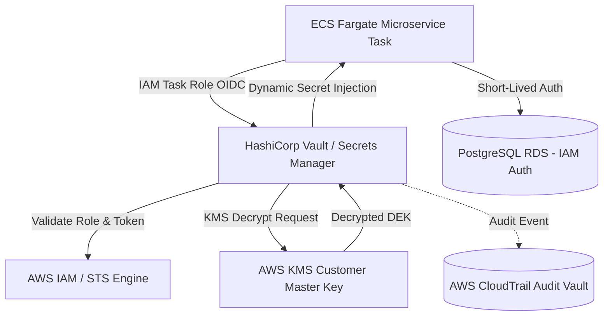

# Master Secrets Management & Vault Architecture Blueprint
## Namma Clinic Digital Health & Operations Platform
### Greater Bengaluru Authority (GBA) / BBMP Health Department
**Document Code:** `DEV-DOC-11` | **Status:** APPROVED BASELINE | **Date:** September 2026

---

## 1. Executive Summary & Secrets Management Charter
This document establishes the authoritative **Secrets Management & Vault Architecture Specification** for the Namma Clinic Digital Health Platform. The architecture eliminates static hardcoded credentials, plain-text environment variables, and unencrypted configuration tokens. All sensitive materials—including database credentials, ABDM gateway private keys, third-party SMS tokens, and TLS certificates—are managed dynamically using AWS Secrets Manager and HashiCorp Vault with automated 30-day rotation, short-lived IAM tokens, and envelope encryption via AWS KMS.

### 1.1 Non-Negotiable Secrets Security Invariants
1. **Zero Plain-Text Secrets in Git:** Pre-commit hooks (Gitleaks) and CI scanners reject any commit containing sensitive entropy or secret patterns.
2. **Dynamic Credential Leases:** Database access credentials are generated dynamically on demand with strict time-to-live (TTL < 4 hours).
3. **IAM Database Authentication:** Microservices authenticate to PostgreSQL using short-lived AWS IAM authentication tokens rather than static passwords.
4. **Envelope Encryption with KMS:** Data encryption keys (DEK) are protected by hardware security module (HSM) backed AWS KMS Customer Managed Keys.
5. **Strict Secret Access Auditing:** Every secret read, write, and rotation event generates an immutable audit record in CloudTrail and Loki.

## 2. Secrets Management & Vault Injection Topology


## 3. Kubernetes / ECS Vault Agent Injection Blueprint
### Specification Example: Vault Agent Secret Injection Blueprint
<!-- DOCUMENTATION-ONLY EXAMPLE -->
```yaml
# DOCUMENTATION-ONLY EXAMPLE
apiVersion: v1
kind: Pod
metadata:
  name: namma-clinic-api
  annotations:
    vault.hashicorp.com/agent-inject: 'true'
    vault.hashicorp.com/role: 'namma-api-role'
    vault.hashicorp.com/agent-inject-secret-database-config: 'database/creds/namma-app-role'
    vault.hashicorp.com/agent-inject-template-database-config: |
      {{- with secret "database/creds/namma-app-role" -}}
      DATABASE_USER="{{ .Data.username }}"
      DATABASE_PASSWORD="{{ .Data.password }}"
      DATABASE_HOST="prod-rds.namma.internal"
      {{- end -}}
spec:
  serviceAccountName: namma-api-service-account
  containers:
    - name: api
      image: 123456789012.dkr.ecr.ap-south-1.amazonaws.com/namma-api:v1.2.0
```

## 4. Master Secrets Management Policies Catalog
Comprehensive specifications for all 50 secrets governance policies:

### SEC-MGMT-001: AWS Secrets Manager Dynamic Rotation #1
- **Secret Policy ID:** `SEC-MGMT-001`
- **Core Security Mandate:** Database master credentials rotated automatically every 30 days via Lambda.
- **Enforcement Mechanism:** `Automated Lambda rotation`
- **Rotation Cadence:** Automatic 30-day rotation via Lambda
- **Compliance Action:** Immediate revocation upon any anomalous access detection.

### SEC-MGMT-002: IAM Database Authentication #2
- **Secret Policy ID:** `SEC-MGMT-002`
- **Core Security Mandate:** ECS Fargate tasks authenticate to PostgreSQL via short-lived AWS IAM tokens.
- **Enforcement Mechanism:** `IAM DB Auth`
- **Rotation Cadence:** Automatic 30-day rotation via Lambda
- **Compliance Action:** Immediate revocation upon any anomalous access detection.

### SEC-MGMT-003: HashiCorp Vault KV Engine #3
- **Secret Policy ID:** `SEC-MGMT-003`
- **Core Security Mandate:** Sensitive API keys stored in HashiCorp Vault KV-v2 with version history and audit log.
- **Enforcement Mechanism:** `Vault Token Lease`
- **Rotation Cadence:** Automatic 30-day rotation via Lambda
- **Compliance Action:** Immediate revocation upon any anomalous access detection.

### SEC-MGMT-004: Envelope Encryption with KMS #4
- **Secret Policy ID:** `SEC-MGMT-004`
- **Core Security Mandate:** Data encryption keys (DEK) wrapped with KMS Customer Master Key (CMK).
- **Enforcement Mechanism:** `AWS KMS Encrypt/Decrypt`
- **Rotation Cadence:** Automatic 30-day rotation via Lambda
- **Compliance Action:** Immediate revocation upon any anomalous access detection.

### SEC-MGMT-005: Zero Secret in Source Code #5
- **Secret Policy ID:** `SEC-MGMT-005`
- **Core Security Mandate:** Gitleaks CI pipeline immediately fails PRs containing detected secret patterns.
- **Enforcement Mechanism:** `CI Secret Scanner`
- **Rotation Cadence:** Automatic 30-day rotation via Lambda
- **Compliance Action:** Immediate revocation upon any anomalous access detection.

### SEC-MGMT-006: AWS Secrets Manager Dynamic Rotation #6
- **Secret Policy ID:** `SEC-MGMT-006`
- **Core Security Mandate:** Database master credentials rotated automatically every 30 days via Lambda.
- **Enforcement Mechanism:** `Automated Lambda rotation`
- **Rotation Cadence:** Automatic 30-day rotation via Lambda
- **Compliance Action:** Immediate revocation upon any anomalous access detection.

### SEC-MGMT-007: IAM Database Authentication #7
- **Secret Policy ID:** `SEC-MGMT-007`
- **Core Security Mandate:** ECS Fargate tasks authenticate to PostgreSQL via short-lived AWS IAM tokens.
- **Enforcement Mechanism:** `IAM DB Auth`
- **Rotation Cadence:** Automatic 30-day rotation via Lambda
- **Compliance Action:** Immediate revocation upon any anomalous access detection.

### SEC-MGMT-008: HashiCorp Vault KV Engine #8
- **Secret Policy ID:** `SEC-MGMT-008`
- **Core Security Mandate:** Sensitive API keys stored in HashiCorp Vault KV-v2 with version history and audit log.
- **Enforcement Mechanism:** `Vault Token Lease`
- **Rotation Cadence:** Automatic 30-day rotation via Lambda
- **Compliance Action:** Immediate revocation upon any anomalous access detection.

### SEC-MGMT-009: Envelope Encryption with KMS #9
- **Secret Policy ID:** `SEC-MGMT-009`
- **Core Security Mandate:** Data encryption keys (DEK) wrapped with KMS Customer Master Key (CMK).
- **Enforcement Mechanism:** `AWS KMS Encrypt/Decrypt`
- **Rotation Cadence:** Automatic 30-day rotation via Lambda
- **Compliance Action:** Immediate revocation upon any anomalous access detection.

### SEC-MGMT-010: Zero Secret in Source Code #10
- **Secret Policy ID:** `SEC-MGMT-010`
- **Core Security Mandate:** Gitleaks CI pipeline immediately fails PRs containing detected secret patterns.
- **Enforcement Mechanism:** `CI Secret Scanner`
- **Rotation Cadence:** Automatic 30-day rotation via Lambda
- **Compliance Action:** Immediate revocation upon any anomalous access detection.

### SEC-MGMT-011: AWS Secrets Manager Dynamic Rotation #11
- **Secret Policy ID:** `SEC-MGMT-011`
- **Core Security Mandate:** Database master credentials rotated automatically every 30 days via Lambda.
- **Enforcement Mechanism:** `Automated Lambda rotation`
- **Rotation Cadence:** Automatic 30-day rotation via Lambda
- **Compliance Action:** Immediate revocation upon any anomalous access detection.

### SEC-MGMT-012: IAM Database Authentication #12
- **Secret Policy ID:** `SEC-MGMT-012`
- **Core Security Mandate:** ECS Fargate tasks authenticate to PostgreSQL via short-lived AWS IAM tokens.
- **Enforcement Mechanism:** `IAM DB Auth`
- **Rotation Cadence:** Automatic 30-day rotation via Lambda
- **Compliance Action:** Immediate revocation upon any anomalous access detection.

### SEC-MGMT-013: HashiCorp Vault KV Engine #13
- **Secret Policy ID:** `SEC-MGMT-013`
- **Core Security Mandate:** Sensitive API keys stored in HashiCorp Vault KV-v2 with version history and audit log.
- **Enforcement Mechanism:** `Vault Token Lease`
- **Rotation Cadence:** Automatic 30-day rotation via Lambda
- **Compliance Action:** Immediate revocation upon any anomalous access detection.

### SEC-MGMT-014: Envelope Encryption with KMS #14
- **Secret Policy ID:** `SEC-MGMT-014`
- **Core Security Mandate:** Data encryption keys (DEK) wrapped with KMS Customer Master Key (CMK).
- **Enforcement Mechanism:** `AWS KMS Encrypt/Decrypt`
- **Rotation Cadence:** Automatic 30-day rotation via Lambda
- **Compliance Action:** Immediate revocation upon any anomalous access detection.

### SEC-MGMT-015: Zero Secret in Source Code #15
- **Secret Policy ID:** `SEC-MGMT-015`
- **Core Security Mandate:** Gitleaks CI pipeline immediately fails PRs containing detected secret patterns.
- **Enforcement Mechanism:** `CI Secret Scanner`
- **Rotation Cadence:** Automatic 30-day rotation via Lambda
- **Compliance Action:** Immediate revocation upon any anomalous access detection.

### SEC-MGMT-016: AWS Secrets Manager Dynamic Rotation #16
- **Secret Policy ID:** `SEC-MGMT-016`
- **Core Security Mandate:** Database master credentials rotated automatically every 30 days via Lambda.
- **Enforcement Mechanism:** `Automated Lambda rotation`
- **Rotation Cadence:** Automatic 30-day rotation via Lambda
- **Compliance Action:** Immediate revocation upon any anomalous access detection.

### SEC-MGMT-017: IAM Database Authentication #17
- **Secret Policy ID:** `SEC-MGMT-017`
- **Core Security Mandate:** ECS Fargate tasks authenticate to PostgreSQL via short-lived AWS IAM tokens.
- **Enforcement Mechanism:** `IAM DB Auth`
- **Rotation Cadence:** Automatic 30-day rotation via Lambda
- **Compliance Action:** Immediate revocation upon any anomalous access detection.

### SEC-MGMT-018: HashiCorp Vault KV Engine #18
- **Secret Policy ID:** `SEC-MGMT-018`
- **Core Security Mandate:** Sensitive API keys stored in HashiCorp Vault KV-v2 with version history and audit log.
- **Enforcement Mechanism:** `Vault Token Lease`
- **Rotation Cadence:** Automatic 30-day rotation via Lambda
- **Compliance Action:** Immediate revocation upon any anomalous access detection.

### SEC-MGMT-019: Envelope Encryption with KMS #19
- **Secret Policy ID:** `SEC-MGMT-019`
- **Core Security Mandate:** Data encryption keys (DEK) wrapped with KMS Customer Master Key (CMK).
- **Enforcement Mechanism:** `AWS KMS Encrypt/Decrypt`
- **Rotation Cadence:** Automatic 30-day rotation via Lambda
- **Compliance Action:** Immediate revocation upon any anomalous access detection.

### SEC-MGMT-020: Zero Secret in Source Code #20
- **Secret Policy ID:** `SEC-MGMT-020`
- **Core Security Mandate:** Gitleaks CI pipeline immediately fails PRs containing detected secret patterns.
- **Enforcement Mechanism:** `CI Secret Scanner`
- **Rotation Cadence:** Automatic 30-day rotation via Lambda
- **Compliance Action:** Immediate revocation upon any anomalous access detection.

### SEC-MGMT-021: AWS Secrets Manager Dynamic Rotation #21
- **Secret Policy ID:** `SEC-MGMT-021`
- **Core Security Mandate:** Database master credentials rotated automatically every 30 days via Lambda.
- **Enforcement Mechanism:** `Automated Lambda rotation`
- **Rotation Cadence:** Automatic 30-day rotation via Lambda
- **Compliance Action:** Immediate revocation upon any anomalous access detection.

### SEC-MGMT-022: IAM Database Authentication #22
- **Secret Policy ID:** `SEC-MGMT-022`
- **Core Security Mandate:** ECS Fargate tasks authenticate to PostgreSQL via short-lived AWS IAM tokens.
- **Enforcement Mechanism:** `IAM DB Auth`
- **Rotation Cadence:** Automatic 30-day rotation via Lambda
- **Compliance Action:** Immediate revocation upon any anomalous access detection.

### SEC-MGMT-023: HashiCorp Vault KV Engine #23
- **Secret Policy ID:** `SEC-MGMT-023`
- **Core Security Mandate:** Sensitive API keys stored in HashiCorp Vault KV-v2 with version history and audit log.
- **Enforcement Mechanism:** `Vault Token Lease`
- **Rotation Cadence:** Automatic 30-day rotation via Lambda
- **Compliance Action:** Immediate revocation upon any anomalous access detection.

### SEC-MGMT-024: Envelope Encryption with KMS #24
- **Secret Policy ID:** `SEC-MGMT-024`
- **Core Security Mandate:** Data encryption keys (DEK) wrapped with KMS Customer Master Key (CMK).
- **Enforcement Mechanism:** `AWS KMS Encrypt/Decrypt`
- **Rotation Cadence:** Automatic 30-day rotation via Lambda
- **Compliance Action:** Immediate revocation upon any anomalous access detection.

### SEC-MGMT-025: Zero Secret in Source Code #25
- **Secret Policy ID:** `SEC-MGMT-025`
- **Core Security Mandate:** Gitleaks CI pipeline immediately fails PRs containing detected secret patterns.
- **Enforcement Mechanism:** `CI Secret Scanner`
- **Rotation Cadence:** Automatic 30-day rotation via Lambda
- **Compliance Action:** Immediate revocation upon any anomalous access detection.

### SEC-MGMT-026: AWS Secrets Manager Dynamic Rotation #26
- **Secret Policy ID:** `SEC-MGMT-026`
- **Core Security Mandate:** Database master credentials rotated automatically every 30 days via Lambda.
- **Enforcement Mechanism:** `Automated Lambda rotation`
- **Rotation Cadence:** Automatic 30-day rotation via Lambda
- **Compliance Action:** Immediate revocation upon any anomalous access detection.

### SEC-MGMT-027: IAM Database Authentication #27
- **Secret Policy ID:** `SEC-MGMT-027`
- **Core Security Mandate:** ECS Fargate tasks authenticate to PostgreSQL via short-lived AWS IAM tokens.
- **Enforcement Mechanism:** `IAM DB Auth`
- **Rotation Cadence:** Automatic 30-day rotation via Lambda
- **Compliance Action:** Immediate revocation upon any anomalous access detection.

### SEC-MGMT-028: HashiCorp Vault KV Engine #28
- **Secret Policy ID:** `SEC-MGMT-028`
- **Core Security Mandate:** Sensitive API keys stored in HashiCorp Vault KV-v2 with version history and audit log.
- **Enforcement Mechanism:** `Vault Token Lease`
- **Rotation Cadence:** Automatic 30-day rotation via Lambda
- **Compliance Action:** Immediate revocation upon any anomalous access detection.

### SEC-MGMT-029: Envelope Encryption with KMS #29
- **Secret Policy ID:** `SEC-MGMT-029`
- **Core Security Mandate:** Data encryption keys (DEK) wrapped with KMS Customer Master Key (CMK).
- **Enforcement Mechanism:** `AWS KMS Encrypt/Decrypt`
- **Rotation Cadence:** Automatic 30-day rotation via Lambda
- **Compliance Action:** Immediate revocation upon any anomalous access detection.

### SEC-MGMT-030: Zero Secret in Source Code #30
- **Secret Policy ID:** `SEC-MGMT-030`
- **Core Security Mandate:** Gitleaks CI pipeline immediately fails PRs containing detected secret patterns.
- **Enforcement Mechanism:** `CI Secret Scanner`
- **Rotation Cadence:** Automatic 30-day rotation via Lambda
- **Compliance Action:** Immediate revocation upon any anomalous access detection.

### SEC-MGMT-031: AWS Secrets Manager Dynamic Rotation #31
- **Secret Policy ID:** `SEC-MGMT-031`
- **Core Security Mandate:** Database master credentials rotated automatically every 30 days via Lambda.
- **Enforcement Mechanism:** `Automated Lambda rotation`
- **Rotation Cadence:** Automatic 30-day rotation via Lambda
- **Compliance Action:** Immediate revocation upon any anomalous access detection.

### SEC-MGMT-032: IAM Database Authentication #32
- **Secret Policy ID:** `SEC-MGMT-032`
- **Core Security Mandate:** ECS Fargate tasks authenticate to PostgreSQL via short-lived AWS IAM tokens.
- **Enforcement Mechanism:** `IAM DB Auth`
- **Rotation Cadence:** Automatic 30-day rotation via Lambda
- **Compliance Action:** Immediate revocation upon any anomalous access detection.

### SEC-MGMT-033: HashiCorp Vault KV Engine #33
- **Secret Policy ID:** `SEC-MGMT-033`
- **Core Security Mandate:** Sensitive API keys stored in HashiCorp Vault KV-v2 with version history and audit log.
- **Enforcement Mechanism:** `Vault Token Lease`
- **Rotation Cadence:** Automatic 30-day rotation via Lambda
- **Compliance Action:** Immediate revocation upon any anomalous access detection.

### SEC-MGMT-034: Envelope Encryption with KMS #34
- **Secret Policy ID:** `SEC-MGMT-034`
- **Core Security Mandate:** Data encryption keys (DEK) wrapped with KMS Customer Master Key (CMK).
- **Enforcement Mechanism:** `AWS KMS Encrypt/Decrypt`
- **Rotation Cadence:** Automatic 30-day rotation via Lambda
- **Compliance Action:** Immediate revocation upon any anomalous access detection.

### SEC-MGMT-035: Zero Secret in Source Code #35
- **Secret Policy ID:** `SEC-MGMT-035`
- **Core Security Mandate:** Gitleaks CI pipeline immediately fails PRs containing detected secret patterns.
- **Enforcement Mechanism:** `CI Secret Scanner`
- **Rotation Cadence:** Automatic 30-day rotation via Lambda
- **Compliance Action:** Immediate revocation upon any anomalous access detection.

### SEC-MGMT-036: AWS Secrets Manager Dynamic Rotation #36
- **Secret Policy ID:** `SEC-MGMT-036`
- **Core Security Mandate:** Database master credentials rotated automatically every 30 days via Lambda.
- **Enforcement Mechanism:** `Automated Lambda rotation`
- **Rotation Cadence:** Automatic 30-day rotation via Lambda
- **Compliance Action:** Immediate revocation upon any anomalous access detection.

### SEC-MGMT-037: IAM Database Authentication #37
- **Secret Policy ID:** `SEC-MGMT-037`
- **Core Security Mandate:** ECS Fargate tasks authenticate to PostgreSQL via short-lived AWS IAM tokens.
- **Enforcement Mechanism:** `IAM DB Auth`
- **Rotation Cadence:** Automatic 30-day rotation via Lambda
- **Compliance Action:** Immediate revocation upon any anomalous access detection.

### SEC-MGMT-038: HashiCorp Vault KV Engine #38
- **Secret Policy ID:** `SEC-MGMT-038`
- **Core Security Mandate:** Sensitive API keys stored in HashiCorp Vault KV-v2 with version history and audit log.
- **Enforcement Mechanism:** `Vault Token Lease`
- **Rotation Cadence:** Automatic 30-day rotation via Lambda
- **Compliance Action:** Immediate revocation upon any anomalous access detection.

### SEC-MGMT-039: Envelope Encryption with KMS #39
- **Secret Policy ID:** `SEC-MGMT-039`
- **Core Security Mandate:** Data encryption keys (DEK) wrapped with KMS Customer Master Key (CMK).
- **Enforcement Mechanism:** `AWS KMS Encrypt/Decrypt`
- **Rotation Cadence:** Automatic 30-day rotation via Lambda
- **Compliance Action:** Immediate revocation upon any anomalous access detection.

### SEC-MGMT-040: Zero Secret in Source Code #40
- **Secret Policy ID:** `SEC-MGMT-040`
- **Core Security Mandate:** Gitleaks CI pipeline immediately fails PRs containing detected secret patterns.
- **Enforcement Mechanism:** `CI Secret Scanner`
- **Rotation Cadence:** Automatic 30-day rotation via Lambda
- **Compliance Action:** Immediate revocation upon any anomalous access detection.

### SEC-MGMT-041: AWS Secrets Manager Dynamic Rotation #41
- **Secret Policy ID:** `SEC-MGMT-041`
- **Core Security Mandate:** Database master credentials rotated automatically every 30 days via Lambda.
- **Enforcement Mechanism:** `Automated Lambda rotation`
- **Rotation Cadence:** Automatic 30-day rotation via Lambda
- **Compliance Action:** Immediate revocation upon any anomalous access detection.

### SEC-MGMT-042: IAM Database Authentication #42
- **Secret Policy ID:** `SEC-MGMT-042`
- **Core Security Mandate:** ECS Fargate tasks authenticate to PostgreSQL via short-lived AWS IAM tokens.
- **Enforcement Mechanism:** `IAM DB Auth`
- **Rotation Cadence:** Automatic 30-day rotation via Lambda
- **Compliance Action:** Immediate revocation upon any anomalous access detection.

### SEC-MGMT-043: HashiCorp Vault KV Engine #43
- **Secret Policy ID:** `SEC-MGMT-043`
- **Core Security Mandate:** Sensitive API keys stored in HashiCorp Vault KV-v2 with version history and audit log.
- **Enforcement Mechanism:** `Vault Token Lease`
- **Rotation Cadence:** Automatic 30-day rotation via Lambda
- **Compliance Action:** Immediate revocation upon any anomalous access detection.

### SEC-MGMT-044: Envelope Encryption with KMS #44
- **Secret Policy ID:** `SEC-MGMT-044`
- **Core Security Mandate:** Data encryption keys (DEK) wrapped with KMS Customer Master Key (CMK).
- **Enforcement Mechanism:** `AWS KMS Encrypt/Decrypt`
- **Rotation Cadence:** Automatic 30-day rotation via Lambda
- **Compliance Action:** Immediate revocation upon any anomalous access detection.

### SEC-MGMT-045: Zero Secret in Source Code #45
- **Secret Policy ID:** `SEC-MGMT-045`
- **Core Security Mandate:** Gitleaks CI pipeline immediately fails PRs containing detected secret patterns.
- **Enforcement Mechanism:** `CI Secret Scanner`
- **Rotation Cadence:** Automatic 30-day rotation via Lambda
- **Compliance Action:** Immediate revocation upon any anomalous access detection.

### SEC-MGMT-046: AWS Secrets Manager Dynamic Rotation #46
- **Secret Policy ID:** `SEC-MGMT-046`
- **Core Security Mandate:** Database master credentials rotated automatically every 30 days via Lambda.
- **Enforcement Mechanism:** `Automated Lambda rotation`
- **Rotation Cadence:** Automatic 30-day rotation via Lambda
- **Compliance Action:** Immediate revocation upon any anomalous access detection.

### SEC-MGMT-047: IAM Database Authentication #47
- **Secret Policy ID:** `SEC-MGMT-047`
- **Core Security Mandate:** ECS Fargate tasks authenticate to PostgreSQL via short-lived AWS IAM tokens.
- **Enforcement Mechanism:** `IAM DB Auth`
- **Rotation Cadence:** Automatic 30-day rotation via Lambda
- **Compliance Action:** Immediate revocation upon any anomalous access detection.

### SEC-MGMT-048: HashiCorp Vault KV Engine #48
- **Secret Policy ID:** `SEC-MGMT-048`
- **Core Security Mandate:** Sensitive API keys stored in HashiCorp Vault KV-v2 with version history and audit log.
- **Enforcement Mechanism:** `Vault Token Lease`
- **Rotation Cadence:** Automatic 30-day rotation via Lambda
- **Compliance Action:** Immediate revocation upon any anomalous access detection.

### SEC-MGMT-049: Envelope Encryption with KMS #49
- **Secret Policy ID:** `SEC-MGMT-049`
- **Core Security Mandate:** Data encryption keys (DEK) wrapped with KMS Customer Master Key (CMK).
- **Enforcement Mechanism:** `AWS KMS Encrypt/Decrypt`
- **Rotation Cadence:** Automatic 30-day rotation via Lambda
- **Compliance Action:** Immediate revocation upon any anomalous access detection.

### SEC-MGMT-050: Zero Secret in Source Code #50
- **Secret Policy ID:** `SEC-MGMT-050`
- **Core Security Mandate:** Gitleaks CI pipeline immediately fails PRs containing detected secret patterns.
- **Enforcement Mechanism:** `CI Secret Scanner`
- **Rotation Cadence:** Automatic 30-day rotation via Lambda
- **Compliance Action:** Immediate revocation upon any anomalous access detection.

## 5. Product Feature Secret Isolation Matrix across 180 Features
Detailed secrets and credential mappings across all 180 platform product features:

### FEATURE-001: Secret Isolation for Feature `Credential Verification`
- **Feature ID:** `FEATURE-001` (Feature #1)
- **Functional Subsystem:** `MODULE-001` (DOMAIN-001)
- **Vault Secret Path:** `secret/data/production/module-001/feature_001`
- **Governed Policy:** `SEC-MGMT-001`
- **Allowed IAM Role:** `arn:aws:iam::123456789012:role/namma-module-001-task-role`
- **KMS Key Alias:** `alias/cmk-module-001-01`
- **Rotation Trigger:** Automated 30-day Lambda rotation + On-demand emergency rotation

### FEATURE-002: Secret Isolation for Feature `Session Token Minting`
- **Feature ID:** `FEATURE-002` (Feature #2)
- **Functional Subsystem:** `MODULE-001` (DOMAIN-001)
- **Vault Secret Path:** `secret/data/production/module-001/feature_002`
- **Governed Policy:** `SEC-MGMT-002`
- **Allowed IAM Role:** `arn:aws:iam::123456789012:role/namma-module-001-task-role`
- **KMS Key Alias:** `alias/cmk-module-001-01`
- **Rotation Trigger:** Automated 30-day Lambda rotation + On-demand emergency rotation

### FEATURE-003: Secret Isolation for Feature `MFA Challenge Dispatch`
- **Feature ID:** `FEATURE-003` (Feature #3)
- **Functional Subsystem:** `MODULE-001` (DOMAIN-001)
- **Vault Secret Path:** `secret/data/production/module-001/feature_003`
- **Governed Policy:** `SEC-MGMT-003`
- **Allowed IAM Role:** `arn:aws:iam::123456789012:role/namma-module-001-task-role`
- **KMS Key Alias:** `alias/cmk-module-001-01`
- **Rotation Trigger:** Automated 30-day Lambda rotation + On-demand emergency rotation

### FEATURE-004: Secret Isolation for Feature `Biometric Authentication Bridge`
- **Feature ID:** `FEATURE-004` (Feature #4)
- **Functional Subsystem:** `MODULE-001` (DOMAIN-001)
- **Vault Secret Path:** `secret/data/production/module-001/feature_004`
- **Governed Policy:** `SEC-MGMT-004`
- **Allowed IAM Role:** `arn:aws:iam::123456789012:role/namma-module-001-task-role`
- **KMS Key Alias:** `alias/cmk-module-001-01`
- **Rotation Trigger:** Automated 30-day Lambda rotation + On-demand emergency rotation

### FEATURE-005: Secret Isolation for Feature `Local PIN Verification`
- **Feature ID:** `FEATURE-005` (Feature #5)
- **Functional Subsystem:** `MODULE-001` (DOMAIN-001)
- **Vault Secret Path:** `secret/data/production/module-001/feature_005`
- **Governed Policy:** `SEC-MGMT-005`
- **Allowed IAM Role:** `arn:aws:iam::123456789012:role/namma-module-001-task-role`
- **KMS Key Alias:** `alias/cmk-module-001-01`
- **Rotation Trigger:** Automated 30-day Lambda rotation + On-demand emergency rotation

### FEATURE-006: Secret Isolation for Feature `Session Inactivity Lockout`
- **Feature ID:** `FEATURE-006` (Feature #6)
- **Functional Subsystem:** `MODULE-001` (DOMAIN-001)
- **Vault Secret Path:** `secret/data/production/module-001/feature_006`
- **Governed Policy:** `SEC-MGMT-006`
- **Allowed IAM Role:** `arn:aws:iam::123456789012:role/namma-module-001-task-role`
- **KMS Key Alias:** `alias/cmk-module-001-01`
- **Rotation Trigger:** Automated 30-day Lambda rotation + On-demand emergency rotation

### FEATURE-007: Secret Isolation for Feature `Permission Evaluation`
- **Feature ID:** `FEATURE-007` (Feature #7)
- **Functional Subsystem:** `MODULE-002` (DOMAIN-001)
- **Vault Secret Path:** `secret/data/production/module-002/feature_007`
- **Governed Policy:** `SEC-MGMT-007`
- **Allowed IAM Role:** `arn:aws:iam::123456789012:role/namma-module-002-task-role`
- **KMS Key Alias:** `alias/cmk-module-002-01`
- **Rotation Trigger:** Automated 30-day Lambda rotation + On-demand emergency rotation

### FEATURE-008: Secret Isolation for Feature `Dynamic Role Assignment`
- **Feature ID:** `FEATURE-008` (Feature #8)
- **Functional Subsystem:** `MODULE-002` (DOMAIN-001)
- **Vault Secret Path:** `secret/data/production/module-002/feature_008`
- **Governed Policy:** `SEC-MGMT-008`
- **Allowed IAM Role:** `arn:aws:iam::123456789012:role/namma-module-002-task-role`
- **KMS Key Alias:** `alias/cmk-module-002-01`
- **Rotation Trigger:** Automated 30-day Lambda rotation + On-demand emergency rotation

### FEATURE-009: Secret Isolation for Feature `Conflict-of-Interest Prevention`
- **Feature ID:** `FEATURE-009` (Feature #9)
- **Functional Subsystem:** `MODULE-002` (DOMAIN-001)
- **Vault Secret Path:** `secret/data/production/module-002/feature_009`
- **Governed Policy:** `SEC-MGMT-009`
- **Allowed IAM Role:** `arn:aws:iam::123456789012:role/namma-module-002-task-role`
- **KMS Key Alias:** `alias/cmk-module-002-01`
- **Rotation Trigger:** Automated 30-day Lambda rotation + On-demand emergency rotation

### FEATURE-010: Secret Isolation for Feature `Maker-Checker Authorization`
- **Feature ID:** `FEATURE-010` (Feature #10)
- **Functional Subsystem:** `MODULE-002` (DOMAIN-001)
- **Vault Secret Path:** `secret/data/production/module-002/feature_010`
- **Governed Policy:** `SEC-MGMT-010`
- **Allowed IAM Role:** `arn:aws:iam::123456789012:role/namma-module-002-task-role`
- **KMS Key Alias:** `alias/cmk-module-002-01`
- **Rotation Trigger:** Automated 30-day Lambda rotation + On-demand emergency rotation

### FEATURE-011: Secret Isolation for Feature `Break-Glass Privilege Elevation`
- **Feature ID:** `FEATURE-011` (Feature #11)
- **Functional Subsystem:** `MODULE-002` (DOMAIN-001)
- **Vault Secret Path:** `secret/data/production/module-002/feature_011`
- **Governed Policy:** `SEC-MGMT-011`
- **Allowed IAM Role:** `arn:aws:iam::123456789012:role/namma-module-002-task-role`
- **KMS Key Alias:** `alias/cmk-module-002-01`
- **Rotation Trigger:** Automated 30-day Lambda rotation + On-demand emergency rotation

### FEATURE-012: Secret Isolation for Feature `Privilege Elevation Audit`
- **Feature ID:** `FEATURE-012` (Feature #12)
- **Functional Subsystem:** `MODULE-002` (DOMAIN-001)
- **Vault Secret Path:** `secret/data/production/module-002/feature_012`
- **Governed Policy:** `SEC-MGMT-012`
- **Allowed IAM Role:** `arn:aws:iam::123456789012:role/namma-module-002-task-role`
- **KMS Key Alias:** `alias/cmk-module-002-01`
- **Rotation Trigger:** Automated 30-day Lambda rotation + On-demand emergency rotation

### FEATURE-013: Secret Isolation for Feature `Hierarchy Node Management`
- **Feature ID:** `FEATURE-013` (Feature #13)
- **Functional Subsystem:** `MODULE-003` (DOMAIN-001)
- **Vault Secret Path:** `secret/data/production/module-003/feature_013`
- **Governed Policy:** `SEC-MGMT-013`
- **Allowed IAM Role:** `arn:aws:iam::123456789012:role/namma-module-003-task-role`
- **KMS Key Alias:** `alias/cmk-module-003-01`
- **Rotation Trigger:** Automated 30-day Lambda rotation + On-demand emergency rotation

### FEATURE-014: Secret Isolation for Feature `NIN / HFR Registry Linking`
- **Feature ID:** `FEATURE-014` (Feature #14)
- **Functional Subsystem:** `MODULE-003` (DOMAIN-001)
- **Vault Secret Path:** `secret/data/production/module-003/feature_014`
- **Governed Policy:** `SEC-MGMT-014`
- **Allowed IAM Role:** `arn:aws:iam::123456789012:role/namma-module-003-task-role`
- **KMS Key Alias:** `alias/cmk-module-003-01`
- **Rotation Trigger:** Automated 30-day Lambda rotation + On-demand emergency rotation

### FEATURE-015: Secret Isolation for Feature `Station Terminal Mapping`
- **Feature ID:** `FEATURE-015` (Feature #15)
- **Functional Subsystem:** `MODULE-003` (DOMAIN-001)
- **Vault Secret Path:** `secret/data/production/module-003/feature_015`
- **Governed Policy:** `SEC-MGMT-015`
- **Allowed IAM Role:** `arn:aws:iam::123456789012:role/namma-module-003-task-role`
- **KMS Key Alias:** `alias/cmk-module-003-01`
- **Rotation Trigger:** Automated 30-day Lambda rotation + On-demand emergency rotation

### FEATURE-016: Secret Isolation for Feature `Facility Capacity Configuration`
- **Feature ID:** `FEATURE-016` (Feature #16)
- **Functional Subsystem:** `MODULE-003` (DOMAIN-001)
- **Vault Secret Path:** `secret/data/production/module-003/feature_016`
- **Governed Policy:** `SEC-MGMT-016`
- **Allowed IAM Role:** `arn:aws:iam::123456789012:role/namma-module-003-task-role`
- **KMS Key Alias:** `alias/cmk-module-003-01`
- **Rotation Trigger:** Automated 30-day Lambda rotation + On-demand emergency rotation

### FEATURE-017: Secret Isolation for Feature `Operating Hours Enforcement`
- **Feature ID:** `FEATURE-017` (Feature #17)
- **Functional Subsystem:** `MODULE-003` (DOMAIN-001)
- **Vault Secret Path:** `secret/data/production/module-003/feature_017`
- **Governed Policy:** `SEC-MGMT-017`
- **Allowed IAM Role:** `arn:aws:iam::123456789012:role/namma-module-003-task-role`
- **KMS Key Alias:** `alias/cmk-module-003-01`
- **Rotation Trigger:** Automated 30-day Lambda rotation + On-demand emergency rotation

### FEATURE-018: Secret Isolation for Feature `Special Camp Calendar`
- **Feature ID:** `FEATURE-018` (Feature #18)
- **Functional Subsystem:** `MODULE-003` (DOMAIN-001)
- **Vault Secret Path:** `secret/data/production/module-003/feature_018`
- **Governed Policy:** `SEC-MGMT-018`
- **Allowed IAM Role:** `arn:aws:iam::123456789012:role/namma-module-003-task-role`
- **KMS Key Alias:** `alias/cmk-module-003-01`
- **Rotation Trigger:** Automated 30-day Lambda rotation + On-demand emergency rotation

### FEATURE-019: Secret Isolation for Feature `Staff Onboarding & KYC`
- **Feature ID:** `FEATURE-019` (Feature #19)
- **Functional Subsystem:** `MODULE-004` (DOMAIN-001)
- **Vault Secret Path:** `secret/data/production/module-004/feature_019`
- **Governed Policy:** `SEC-MGMT-019`
- **Allowed IAM Role:** `arn:aws:iam::123456789012:role/namma-module-004-task-role`
- **KMS Key Alias:** `alias/cmk-module-004-01`
- **Rotation Trigger:** Automated 30-day Lambda rotation + On-demand emergency rotation

### FEATURE-020: Secret Isolation for Feature `Professional License Verification`
- **Feature ID:** `FEATURE-020` (Feature #20)
- **Functional Subsystem:** `MODULE-004` (DOMAIN-001)
- **Vault Secret Path:** `secret/data/production/module-004/feature_020`
- **Governed Policy:** `SEC-MGMT-020`
- **Allowed IAM Role:** `arn:aws:iam::123456789012:role/namma-module-004-task-role`
- **KMS Key Alias:** `alias/cmk-module-004-01`
- **Rotation Trigger:** Automated 30-day Lambda rotation + On-demand emergency rotation

### FEATURE-021: Secret Isolation for Feature `Duty Roster Generation`
- **Feature ID:** `FEATURE-021` (Feature #21)
- **Functional Subsystem:** `MODULE-004` (DOMAIN-001)
- **Vault Secret Path:** `secret/data/production/module-004/feature_021`
- **Governed Policy:** `SEC-MGMT-021`
- **Allowed IAM Role:** `arn:aws:iam::123456789012:role/namma-module-004-task-role`
- **KMS Key Alias:** `alias/cmk-module-004-01`
- **Rotation Trigger:** Automated 30-day Lambda rotation + On-demand emergency rotation

### FEATURE-022: Secret Isolation for Feature `Biometric Attendance Linking`
- **Feature ID:** `FEATURE-022` (Feature #22)
- **Functional Subsystem:** `MODULE-004` (DOMAIN-001)
- **Vault Secret Path:** `secret/data/production/module-004/feature_022`
- **Governed Policy:** `SEC-MGMT-022`
- **Allowed IAM Role:** `arn:aws:iam::123456789012:role/namma-module-004-task-role`
- **KMS Key Alias:** `alias/cmk-module-004-01`
- **Rotation Trigger:** Automated 30-day Lambda rotation + On-demand emergency rotation

### FEATURE-023: Secret Isolation for Feature `Digital Signature Enrollment`
- **Feature ID:** `FEATURE-023` (Feature #23)
- **Functional Subsystem:** `MODULE-004` (DOMAIN-001)
- **Vault Secret Path:** `secret/data/production/module-004/feature_023`
- **Governed Policy:** `SEC-MGMT-023`
- **Allowed IAM Role:** `arn:aws:iam::123456789012:role/namma-module-004-task-role`
- **KMS Key Alias:** `alias/cmk-module-004-01`
- **Rotation Trigger:** Automated 30-day Lambda rotation + On-demand emergency rotation

### FEATURE-024: Secret Isolation for Feature `Signature Revocation`
- **Feature ID:** `FEATURE-024` (Feature #24)
- **Functional Subsystem:** `MODULE-004` (DOMAIN-001)
- **Vault Secret Path:** `secret/data/production/module-004/feature_024`
- **Governed Policy:** `SEC-MGMT-024`
- **Allowed IAM Role:** `arn:aws:iam::123456789012:role/namma-module-004-task-role`
- **KMS Key Alias:** `alias/cmk-module-004-01`
- **Rotation Trigger:** Automated 30-day Lambda rotation + On-demand emergency rotation

### FEATURE-025: Secret Isolation for Feature `Targeted Flag Activation`
- **Feature ID:** `FEATURE-025` (Feature #25)
- **Functional Subsystem:** `MODULE-026` (DOMAIN-001)
- **Vault Secret Path:** `secret/data/production/module-026/feature_025`
- **Governed Policy:** `SEC-MGMT-025`
- **Allowed IAM Role:** `arn:aws:iam::123456789012:role/namma-module-026-task-role`
- **KMS Key Alias:** `alias/cmk-module-026-01`
- **Rotation Trigger:** Automated 30-day Lambda rotation + On-demand emergency rotation

### FEATURE-026: Secret Isolation for Feature `Emergency Feature Killswitch`
- **Feature ID:** `FEATURE-026` (Feature #26)
- **Functional Subsystem:** `MODULE-026` (DOMAIN-001)
- **Vault Secret Path:** `secret/data/production/module-026/feature_026`
- **Governed Policy:** `SEC-MGMT-026`
- **Allowed IAM Role:** `arn:aws:iam::123456789012:role/namma-module-026-task-role`
- **KMS Key Alias:** `alias/cmk-module-026-01`
- **Rotation Trigger:** Automated 30-day Lambda rotation + On-demand emergency rotation

### FEATURE-027: Secret Isolation for Feature `System Parameter Tuning`
- **Feature ID:** `FEATURE-027` (Feature #27)
- **Functional Subsystem:** `MODULE-026` (DOMAIN-001)
- **Vault Secret Path:** `secret/data/production/module-026/feature_027`
- **Governed Policy:** `SEC-MGMT-027`
- **Allowed IAM Role:** `arn:aws:iam::123456789012:role/namma-module-026-task-role`
- **KMS Key Alias:** `alias/cmk-module-026-01`
- **Rotation Trigger:** Automated 30-day Lambda rotation + On-demand emergency rotation

### FEATURE-028: Secret Isolation for Feature `Edge Configuration Distribution`
- **Feature ID:** `FEATURE-028` (Feature #28)
- **Functional Subsystem:** `MODULE-026` (DOMAIN-001)
- **Vault Secret Path:** `secret/data/production/module-026/feature_028`
- **Governed Policy:** `SEC-MGMT-028`
- **Allowed IAM Role:** `arn:aws:iam::123456789012:role/namma-module-026-task-role`
- **KMS Key Alias:** `alias/cmk-module-026-01`
- **Rotation Trigger:** Automated 30-day Lambda rotation + On-demand emergency rotation

### FEATURE-029: Secret Isolation for Feature `Edge Migration Orchestration`
- **Feature ID:** `FEATURE-029` (Feature #29)
- **Functional Subsystem:** `MODULE-026` (DOMAIN-001)
- **Vault Secret Path:** `secret/data/production/module-026/feature_029`
- **Governed Policy:** `SEC-MGMT-029`
- **Allowed IAM Role:** `arn:aws:iam::123456789012:role/namma-module-026-task-role`
- **KMS Key Alias:** `alias/cmk-module-026-01`
- **Rotation Trigger:** Automated 30-day Lambda rotation + On-demand emergency rotation

### FEATURE-030: Secret Isolation for Feature `Health Probe Monitoring`
- **Feature ID:** `FEATURE-030` (Feature #30)
- **Functional Subsystem:** `MODULE-026` (DOMAIN-001)
- **Vault Secret Path:** `secret/data/production/module-026/feature_030`
- **Governed Policy:** `SEC-MGMT-030`
- **Allowed IAM Role:** `arn:aws:iam::123456789012:role/namma-module-026-task-role`
- **KMS Key Alias:** `alias/cmk-module-026-01`
- **Rotation Trigger:** Automated 30-day Lambda rotation + On-demand emergency rotation

### FEATURE-031: Secret Isolation for Feature `Bilingual Intake UI`
- **Feature ID:** `FEATURE-031` (Feature #31)
- **Functional Subsystem:** `MODULE-005` (DOMAIN-002)
- **Vault Secret Path:** `secret/data/production/module-005/feature_031`
- **Governed Policy:** `SEC-MGMT-031`
- **Allowed IAM Role:** `arn:aws:iam::123456789012:role/namma-module-005-task-role`
- **KMS Key Alias:** `alias/cmk-module-005-01`
- **Rotation Trigger:** Automated 30-day Lambda rotation + On-demand emergency rotation

### FEATURE-032: Secret Isolation for Feature `Vulnerable Citizen Flagging`
- **Feature ID:** `FEATURE-032` (Feature #32)
- **Functional Subsystem:** `MODULE-005` (DOMAIN-002)
- **Vault Secret Path:** `secret/data/production/module-005/feature_032`
- **Governed Policy:** `SEC-MGMT-032`
- **Allowed IAM Role:** `arn:aws:iam::123456789012:role/namma-module-005-task-role`
- **KMS Key Alias:** `alias/cmk-module-005-01`
- **Rotation Trigger:** Automated 30-day Lambda rotation + On-demand emergency rotation

### FEATURE-033: Secret Isolation for Feature `Aadhaar OTP ABHA Bridge`
- **Feature ID:** `FEATURE-033` (Feature #33)
- **Functional Subsystem:** `MODULE-005` (DOMAIN-002)
- **Vault Secret Path:** `secret/data/production/module-005/feature_033`
- **Governed Policy:** `SEC-MGMT-033`
- **Allowed IAM Role:** `arn:aws:iam::123456789012:role/namma-module-005-task-role`
- **KMS Key Alias:** `alias/cmk-module-005-01`
- **Rotation Trigger:** Automated 30-day Lambda rotation + On-demand emergency rotation

### FEATURE-034: Secret Isolation for Feature `Demographic ABHA Creation`
- **Feature ID:** `FEATURE-034` (Feature #34)
- **Functional Subsystem:** `MODULE-005` (DOMAIN-002)
- **Vault Secret Path:** `secret/data/production/module-005/feature_034`
- **Governed Policy:** `SEC-MGMT-034`
- **Allowed IAM Role:** `arn:aws:iam::123456789012:role/namma-module-005-task-role`
- **KMS Key Alias:** `alias/cmk-module-005-01`
- **Rotation Trigger:** Automated 30-day Lambda rotation + On-demand emergency rotation

### FEATURE-035: Secret Isolation for Feature `Deterministic UHID Minting`
- **Feature ID:** `FEATURE-035` (Feature #35)
- **Functional Subsystem:** `MODULE-005` (DOMAIN-002)
- **Vault Secret Path:** `secret/data/production/module-005/feature_035`
- **Governed Policy:** `SEC-MGMT-035`
- **Allowed IAM Role:** `arn:aws:iam::123456789012:role/namma-module-005-task-role`
- **KMS Key Alias:** `alias/cmk-module-005-01`
- **Rotation Trigger:** Automated 30-day Lambda rotation + On-demand emergency rotation

### FEATURE-036: Secret Isolation for Feature `Soundex / Double-Metaphone Matching`
- **Feature ID:** `FEATURE-036` (Feature #36)
- **Functional Subsystem:** `MODULE-005` (DOMAIN-002)
- **Vault Secret Path:** `secret/data/production/module-005/feature_036`
- **Governed Policy:** `SEC-MGMT-036`
- **Allowed IAM Role:** `arn:aws:iam::123456789012:role/namma-module-005-task-role`
- **KMS Key Alias:** `alias/cmk-module-005-01`
- **Rotation Trigger:** Automated 30-day Lambda rotation + On-demand emergency rotation

### FEATURE-037: Secret Isolation for Feature `Bilingual Consent Presentation`
- **Feature ID:** `FEATURE-037` (Feature #37)
- **Functional Subsystem:** `MODULE-006` (DOMAIN-002)
- **Vault Secret Path:** `secret/data/production/module-006/feature_037`
- **Governed Policy:** `SEC-MGMT-037`
- **Allowed IAM Role:** `arn:aws:iam::123456789012:role/namma-module-006-task-role`
- **KMS Key Alias:** `alias/cmk-module-006-01`
- **Rotation Trigger:** Automated 30-day Lambda rotation + On-demand emergency rotation

### FEATURE-038: Secret Isolation for Feature `Digital Signature / Thumbprint Capture`
- **Feature ID:** `FEATURE-038` (Feature #38)
- **Functional Subsystem:** `MODULE-006` (DOMAIN-002)
- **Vault Secret Path:** `secret/data/production/module-006/feature_038`
- **Governed Policy:** `SEC-MGMT-038`
- **Allowed IAM Role:** `arn:aws:iam::123456789012:role/namma-module-006-task-role`
- **KMS Key Alias:** `alias/cmk-module-006-01`
- **Rotation Trigger:** Automated 30-day Lambda rotation + On-demand emergency rotation

### FEATURE-039: Secret Isolation for Feature `Granular Purpose-Based Consent`
- **Feature ID:** `FEATURE-039` (Feature #39)
- **Functional Subsystem:** `MODULE-006` (DOMAIN-002)
- **Vault Secret Path:** `secret/data/production/module-006/feature_039`
- **Governed Policy:** `SEC-MGMT-039`
- **Allowed IAM Role:** `arn:aws:iam::123456789012:role/namma-module-006-task-role`
- **KMS Key Alias:** `alias/cmk-module-006-01`
- **Rotation Trigger:** Automated 30-day Lambda rotation + On-demand emergency rotation

### FEATURE-040: Secret Isolation for Feature `Consent Revocation Workflow`
- **Feature ID:** `FEATURE-040` (Feature #40)
- **Functional Subsystem:** `MODULE-006` (DOMAIN-002)
- **Vault Secret Path:** `secret/data/production/module-006/feature_040`
- **Governed Policy:** `SEC-MGMT-040`
- **Allowed IAM Role:** `arn:aws:iam::123456789012:role/namma-module-006-task-role`
- **KMS Key Alias:** `alias/cmk-module-006-01`
- **Rotation Trigger:** Automated 30-day Lambda rotation + On-demand emergency rotation

### FEATURE-041: Secret Isolation for Feature `Guardian Relationship Verification`
- **Feature ID:** `FEATURE-041` (Feature #41)
- **Functional Subsystem:** `MODULE-006` (DOMAIN-002)
- **Vault Secret Path:** `secret/data/production/module-006/feature_041`
- **Governed Policy:** `SEC-MGMT-041`
- **Allowed IAM Role:** `arn:aws:iam::123456789012:role/namma-module-006-task-role`
- **KMS Key Alias:** `alias/cmk-module-006-01`
- **Rotation Trigger:** Automated 30-day Lambda rotation + On-demand emergency rotation

### FEATURE-042: Secret Isolation for Feature `Implied Emergency Consent`
- **Feature ID:** `FEATURE-042` (Feature #42)
- **Functional Subsystem:** `MODULE-006` (DOMAIN-002)
- **Vault Secret Path:** `secret/data/production/module-006/feature_042`
- **Governed Policy:** `SEC-MGMT-042`
- **Allowed IAM Role:** `arn:aws:iam::123456789012:role/namma-module-006-task-role`
- **KMS Key Alias:** `alias/cmk-module-006-01`
- **Rotation Trigger:** Automated 30-day Lambda rotation + On-demand emergency rotation

### FEATURE-043: Secret Isolation for Feature `Daily Token Counter`
- **Feature ID:** `FEATURE-043` (Feature #43)
- **Functional Subsystem:** `MODULE-007` (DOMAIN-002)
- **Vault Secret Path:** `secret/data/production/module-007/feature_043`
- **Governed Policy:** `SEC-MGMT-043`
- **Allowed IAM Role:** `arn:aws:iam::123456789012:role/namma-module-007-task-role`
- **KMS Key Alias:** `alias/cmk-module-007-01`
- **Rotation Trigger:** Automated 30-day Lambda rotation + On-demand emergency rotation

### FEATURE-044: Secret Isolation for Feature `Station Route Calculation`
- **Feature ID:** `FEATURE-044` (Feature #44)
- **Functional Subsystem:** `MODULE-007` (DOMAIN-002)
- **Vault Secret Path:** `secret/data/production/module-007/feature_044`
- **Governed Policy:** `SEC-MGMT-044`
- **Allowed IAM Role:** `arn:aws:iam::123456789012:role/namma-module-007-task-role`
- **KMS Key Alias:** `alias/cmk-module-007-01`
- **Rotation Trigger:** Automated 30-day Lambda rotation + On-demand emergency rotation

### FEATURE-045: Secret Isolation for Feature `Acuity-Based Insertion`
- **Feature ID:** `FEATURE-045` (Feature #45)
- **Functional Subsystem:** `MODULE-007` (DOMAIN-002)
- **Vault Secret Path:** `secret/data/production/module-007/feature_045`
- **Governed Policy:** `SEC-MGMT-045`
- **Allowed IAM Role:** `arn:aws:iam::123456789012:role/namma-module-007-task-role`
- **KMS Key Alias:** `alias/cmk-module-007-01`
- **Rotation Trigger:** Automated 30-day Lambda rotation + On-demand emergency rotation

### FEATURE-046: Secret Isolation for Feature `Vulnerable Citizen Interleaving`
- **Feature ID:** `FEATURE-046` (Feature #46)
- **Functional Subsystem:** `MODULE-007` (DOMAIN-002)
- **Vault Secret Path:** `secret/data/production/module-007/feature_046`
- **Governed Policy:** `SEC-MGMT-046`
- **Allowed IAM Role:** `arn:aws:iam::123456789012:role/namma-module-007-task-role`
- **KMS Key Alias:** `alias/cmk-module-007-01`
- **Rotation Trigger:** Automated 30-day Lambda rotation + On-demand emergency rotation

### FEATURE-047: Secret Isolation for Feature `ESC/POS Thermal Printing`
- **Feature ID:** `FEATURE-047` (Feature #47)
- **Functional Subsystem:** `MODULE-007` (DOMAIN-002)
- **Vault Secret Path:** `secret/data/production/module-007/feature_047`
- **Governed Policy:** `SEC-MGMT-047`
- **Allowed IAM Role:** `arn:aws:iam::123456789012:role/namma-module-007-task-role`
- **KMS Key Alias:** `alias/cmk-module-007-01`
- **Rotation Trigger:** Automated 30-day Lambda rotation + On-demand emergency rotation

### FEATURE-048: Secret Isolation for Feature `Virtual SMS Token Fallback`
- **Feature ID:** `FEATURE-048` (Feature #48)
- **Functional Subsystem:** `MODULE-007` (DOMAIN-002)
- **Vault Secret Path:** `secret/data/production/module-007/feature_048`
- **Governed Policy:** `SEC-MGMT-048`
- **Allowed IAM Role:** `arn:aws:iam::123456789012:role/namma-module-007-task-role`
- **KMS Key Alias:** `alias/cmk-module-007-01`
- **Rotation Trigger:** Automated 30-day Lambda rotation + On-demand emergency rotation

### FEATURE-049: Secret Isolation for Feature `Next-Patient Call Action`
- **Feature ID:** `FEATURE-049` (Feature #49)
- **Functional Subsystem:** `MODULE-008` (DOMAIN-002)
- **Vault Secret Path:** `secret/data/production/module-008/feature_049`
- **Governed Policy:** `SEC-MGMT-049`
- **Allowed IAM Role:** `arn:aws:iam::123456789012:role/namma-module-008-task-role`
- **KMS Key Alias:** `alias/cmk-module-008-01`
- **Rotation Trigger:** Automated 30-day Lambda rotation + On-demand emergency rotation

### FEATURE-050: Secret Isolation for Feature `No-Show & Recall Management`
- **Feature ID:** `FEATURE-050` (Feature #50)
- **Functional Subsystem:** `MODULE-008` (DOMAIN-002)
- **Vault Secret Path:** `secret/data/production/module-008/feature_050`
- **Governed Policy:** `SEC-MGMT-050`
- **Allowed IAM Role:** `arn:aws:iam::123456789012:role/namma-module-008-task-role`
- **KMS Key Alias:** `alias/cmk-module-008-01`
- **Rotation Trigger:** Automated 30-day Lambda rotation + On-demand emergency rotation

### FEATURE-051: Secret Isolation for Feature `HDMI Waiting Hall Display`
- **Feature ID:** `FEATURE-051` (Feature #51)
- **Functional Subsystem:** `MODULE-008` (DOMAIN-002)
- **Vault Secret Path:** `secret/data/production/module-008/feature_051`
- **Governed Policy:** `SEC-MGMT-001`
- **Allowed IAM Role:** `arn:aws:iam::123456789012:role/namma-module-008-task-role`
- **KMS Key Alias:** `alias/cmk-module-008-01`
- **Rotation Trigger:** Automated 30-day Lambda rotation + On-demand emergency rotation

### FEATURE-052: Secret Isolation for Feature `Text-to-Speech Audio Chime`
- **Feature ID:** `FEATURE-052` (Feature #52)
- **Functional Subsystem:** `MODULE-008` (DOMAIN-002)
- **Vault Secret Path:** `secret/data/production/module-008/feature_052`
- **Governed Policy:** `SEC-MGMT-002`
- **Allowed IAM Role:** `arn:aws:iam::123456789012:role/namma-module-008-task-role`
- **KMS Key Alias:** `alias/cmk-module-008-01`
- **Rotation Trigger:** Automated 30-day Lambda rotation + On-demand emergency rotation

### FEATURE-053: Secret Isolation for Feature `Dynamic Load Distribution`
- **Feature ID:** `FEATURE-053` (Feature #53)
- **Functional Subsystem:** `MODULE-008` (DOMAIN-002)
- **Vault Secret Path:** `secret/data/production/module-008/feature_053`
- **Governed Policy:** `SEC-MGMT-003`
- **Allowed IAM Role:** `arn:aws:iam::123456789012:role/namma-module-008-task-role`
- **KMS Key Alias:** `alias/cmk-module-008-01`
- **Rotation Trigger:** Automated 30-day Lambda rotation + On-demand emergency rotation

### FEATURE-054: Secret Isolation for Feature `Queue Pausing & Resumption`
- **Feature ID:** `FEATURE-054` (Feature #54)
- **Functional Subsystem:** `MODULE-008` (DOMAIN-002)
- **Vault Secret Path:** `secret/data/production/module-008/feature_054`
- **Governed Policy:** `SEC-MGMT-004`
- **Allowed IAM Role:** `arn:aws:iam::123456789012:role/namma-module-008-task-role`
- **KMS Key Alias:** `alias/cmk-module-008-01`
- **Rotation Trigger:** Automated 30-day Lambda rotation + On-demand emergency rotation

### FEATURE-055: Secret Isolation for Feature `Kiosk Exit Rating`
- **Feature ID:** `FEATURE-055` (Feature #55)
- **Functional Subsystem:** `MODULE-020` (DOMAIN-002)
- **Vault Secret Path:** `secret/data/production/module-020/feature_055`
- **Governed Policy:** `SEC-MGMT-005`
- **Allowed IAM Role:** `arn:aws:iam::123456789012:role/namma-module-020-task-role`
- **KMS Key Alias:** `alias/cmk-module-020-01`
- **Rotation Trigger:** Automated 30-day Lambda rotation + On-demand emergency rotation

### FEATURE-056: Secret Isolation for Feature `Medicine Receipt Confirmation`
- **Feature ID:** `FEATURE-056` (Feature #56)
- **Functional Subsystem:** `MODULE-020` (DOMAIN-002)
- **Vault Secret Path:** `secret/data/production/module-020/feature_056`
- **Governed Policy:** `SEC-MGMT-006`
- **Allowed IAM Role:** `arn:aws:iam::123456789012:role/namma-module-020-task-role`
- **KMS Key Alias:** `alias/cmk-module-020-01`
- **Rotation Trigger:** Automated 30-day Lambda rotation + On-demand emergency rotation

### FEATURE-057: Secret Isolation for Feature `Multilingual Ticket Intake`
- **Feature ID:** `FEATURE-057` (Feature #57)
- **Functional Subsystem:** `MODULE-020` (DOMAIN-002)
- **Vault Secret Path:** `secret/data/production/module-020/feature_057`
- **Governed Policy:** `SEC-MGMT-007`
- **Allowed IAM Role:** `arn:aws:iam::123456789012:role/namma-module-020-task-role`
- **KMS Key Alias:** `alias/cmk-module-020-01`
- **Rotation Trigger:** Automated 30-day Lambda rotation + On-demand emergency rotation

### FEATURE-058: Secret Isolation for Feature `Automated SLA Timer`
- **Feature ID:** `FEATURE-058` (Feature #58)
- **Functional Subsystem:** `MODULE-020` (DOMAIN-002)
- **Vault Secret Path:** `secret/data/production/module-020/feature_058`
- **Governed Policy:** `SEC-MGMT-008`
- **Allowed IAM Role:** `arn:aws:iam::123456789012:role/namma-module-020-task-role`
- **KMS Key Alias:** `alias/cmk-module-020-01`
- **Rotation Trigger:** Automated 30-day Lambda rotation + On-demand emergency rotation

### FEATURE-059: Secret Isolation for Feature `Zonal Escalation Trigger`
- **Feature ID:** `FEATURE-059` (Feature #59)
- **Functional Subsystem:** `MODULE-020` (DOMAIN-002)
- **Vault Secret Path:** `secret/data/production/module-020/feature_059`
- **Governed Policy:** `SEC-MGMT-009`
- **Allowed IAM Role:** `arn:aws:iam::123456789012:role/namma-module-020-task-role`
- **KMS Key Alias:** `alias/cmk-module-020-01`
- **Rotation Trigger:** Automated 30-day Lambda rotation + On-demand emergency rotation

### FEATURE-060: Secret Isolation for Feature `Citizen Resolution Feedback`
- **Feature ID:** `FEATURE-060` (Feature #60)
- **Functional Subsystem:** `MODULE-020` (DOMAIN-002)
- **Vault Secret Path:** `secret/data/production/module-020/feature_060`
- **Governed Policy:** `SEC-MGMT-010`
- **Allowed IAM Role:** `arn:aws:iam::123456789012:role/namma-module-020-task-role`
- **KMS Key Alias:** `alias/cmk-module-020-01`
- **Rotation Trigger:** Automated 30-day Lambda rotation + On-demand emergency rotation

### FEATURE-061: Secret Isolation for Feature `Longitudinal History Viewer`
- **Feature ID:** `FEATURE-061` (Feature #61)
- **Functional Subsystem:** `MODULE-009` (DOMAIN-003)
- **Vault Secret Path:** `secret/data/production/module-009/feature_061`
- **Governed Policy:** `SEC-MGMT-011`
- **Allowed IAM Role:** `arn:aws:iam::123456789012:role/namma-module-009-task-role`
- **KMS Key Alias:** `alias/cmk-module-009-01`
- **Rotation Trigger:** Automated 30-day Lambda rotation + On-demand emergency rotation

### FEATURE-062: Secret Isolation for Feature `Vitals Telemetry Banner`
- **Feature ID:** `FEATURE-062` (Feature #62)
- **Functional Subsystem:** `MODULE-009` (DOMAIN-003)
- **Vault Secret Path:** `secret/data/production/module-009/feature_062`
- **Governed Policy:** `SEC-MGMT-012`
- **Allowed IAM Role:** `arn:aws:iam::123456789012:role/namma-module-009-task-role`
- **KMS Key Alias:** `alias/cmk-module-009-01`
- **Rotation Trigger:** Automated 30-day Lambda rotation + On-demand emergency rotation

### FEATURE-063: Secret Isolation for Feature `Rapid Clinical Templates`
- **Feature ID:** `FEATURE-063` (Feature #63)
- **Functional Subsystem:** `MODULE-009` (DOMAIN-003)
- **Vault Secret Path:** `secret/data/production/module-009/feature_063`
- **Governed Policy:** `SEC-MGMT-013`
- **Allowed IAM Role:** `arn:aws:iam::123456789012:role/namma-module-009-task-role`
- **KMS Key Alias:** `alias/cmk-module-009-01`
- **Rotation Trigger:** Automated 30-day Lambda rotation + On-demand emergency rotation

### FEATURE-064: Secret Isolation for Feature `Keyboard Shortcut Navigation`
- **Feature ID:** `FEATURE-064` (Feature #64)
- **Functional Subsystem:** `MODULE-009` (DOMAIN-003)
- **Vault Secret Path:** `secret/data/production/module-009/feature_064`
- **Governed Policy:** `SEC-MGMT-014`
- **Allowed IAM Role:** `arn:aws:iam::123456789012:role/namma-module-009-task-role`
- **KMS Key Alias:** `alias/cmk-module-009-01`
- **Rotation Trigger:** Automated 30-day Lambda rotation + On-demand emergency rotation

### FEATURE-065: Secret Isolation for Feature `Cryptographic Note Locking`
- **Feature ID:** `FEATURE-065` (Feature #65)
- **Functional Subsystem:** `MODULE-009` (DOMAIN-003)
- **Vault Secret Path:** `secret/data/production/module-009/feature_065`
- **Governed Policy:** `SEC-MGMT-015`
- **Allowed IAM Role:** `arn:aws:iam::123456789012:role/namma-module-009-task-role`
- **KMS Key Alias:** `alias/cmk-module-009-01`
- **Rotation Trigger:** Automated 30-day Lambda rotation + On-demand emergency rotation

### FEATURE-066: Secret Isolation for Feature `Clinical Addendum Workflow`
- **Feature ID:** `FEATURE-066` (Feature #66)
- **Functional Subsystem:** `MODULE-009` (DOMAIN-003)
- **Vault Secret Path:** `secret/data/production/module-009/feature_066`
- **Governed Policy:** `SEC-MGMT-016`
- **Allowed IAM Role:** `arn:aws:iam::123456789012:role/namma-module-009-task-role`
- **KMS Key Alias:** `alias/cmk-module-009-01`
- **Rotation Trigger:** Automated 30-day Lambda rotation + On-demand emergency rotation

### FEATURE-067: Secret Isolation for Feature `Primary Care Curated Coding`
- **Feature ID:** `FEATURE-067` (Feature #67)
- **Functional Subsystem:** `MODULE-010` (DOMAIN-003)
- **Vault Secret Path:** `secret/data/production/module-010/feature_067`
- **Governed Policy:** `SEC-MGMT-017`
- **Allowed IAM Role:** `arn:aws:iam::123456789012:role/namma-module-010-task-role`
- **KMS Key Alias:** `alias/cmk-module-010-01`
- **Rotation Trigger:** Automated 30-day Lambda rotation + On-demand emergency rotation

### FEATURE-068: Secret Isolation for Feature `Synonym & Local Name Mapping`
- **Feature ID:** `FEATURE-068` (Feature #68)
- **Functional Subsystem:** `MODULE-010` (DOMAIN-003)
- **Vault Secret Path:** `secret/data/production/module-010/feature_068`
- **Governed Policy:** `SEC-MGMT-018`
- **Allowed IAM Role:** `arn:aws:iam::123456789012:role/namma-module-010-task-role`
- **KMS Key Alias:** `alias/cmk-module-010-01`
- **Rotation Trigger:** Automated 30-day Lambda rotation + On-demand emergency rotation

### FEATURE-069: Secret Isolation for Feature `Chronic Condition Tagging`
- **Feature ID:** `FEATURE-069` (Feature #69)
- **Functional Subsystem:** `MODULE-010` (DOMAIN-003)
- **Vault Secret Path:** `secret/data/production/module-010/feature_069`
- **Governed Policy:** `SEC-MGMT-019`
- **Allowed IAM Role:** `arn:aws:iam::123456789012:role/namma-module-010-task-role`
- **KMS Key Alias:** `alias/cmk-module-010-01`
- **Rotation Trigger:** Automated 30-day Lambda rotation + On-demand emergency rotation

### FEATURE-070: Secret Isolation for Feature `Provisional vs. Confirmed Status`
- **Feature ID:** `FEATURE-070` (Feature #70)
- **Functional Subsystem:** `MODULE-010` (DOMAIN-003)
- **Vault Secret Path:** `secret/data/production/module-010/feature_070`
- **Governed Policy:** `SEC-MGMT-020`
- **Allowed IAM Role:** `arn:aws:iam::123456789012:role/namma-module-010-task-role`
- **KMS Key Alias:** `alias/cmk-module-010-01`
- **Rotation Trigger:** Automated 30-day Lambda rotation + On-demand emergency rotation

### FEATURE-071: Secret Isolation for Feature `IDSP Notifiable Flagging`
- **Feature ID:** `FEATURE-071` (Feature #71)
- **Functional Subsystem:** `MODULE-010` (DOMAIN-003)
- **Vault Secret Path:** `secret/data/production/module-010/feature_071`
- **Governed Policy:** `SEC-MGMT-021`
- **Allowed IAM Role:** `arn:aws:iam::123456789012:role/namma-module-010-task-role`
- **KMS Key Alias:** `alias/cmk-module-010-01`
- **Rotation Trigger:** Automated 30-day Lambda rotation + On-demand emergency rotation

### FEATURE-072: Secret Isolation for Feature `Outbreak Geographic Dispatch`
- **Feature ID:** `FEATURE-072` (Feature #72)
- **Functional Subsystem:** `MODULE-010` (DOMAIN-003)
- **Vault Secret Path:** `secret/data/production/module-010/feature_072`
- **Governed Policy:** `SEC-MGMT-022`
- **Allowed IAM Role:** `arn:aws:iam::123456789012:role/namma-module-010-task-role`
- **KMS Key Alias:** `alias/cmk-module-010-01`
- **Rotation Trigger:** Automated 30-day Lambda rotation + On-demand emergency rotation

### FEATURE-073: Secret Isolation for Feature `Generic Drug Selection`
- **Feature ID:** `FEATURE-073` (Feature #73)
- **Functional Subsystem:** `MODULE-011` (DOMAIN-003)
- **Vault Secret Path:** `secret/data/production/module-011/feature_073`
- **Governed Policy:** `SEC-MGMT-023`
- **Allowed IAM Role:** `arn:aws:iam::123456789012:role/namma-module-011-task-role`
- **KMS Key Alias:** `alias/cmk-module-011-01`
- **Rotation Trigger:** Automated 30-day Lambda rotation + On-demand emergency rotation

### FEATURE-074: Secret Isolation for Feature `Standard Sig Frequency Picker`
- **Feature ID:** `FEATURE-074` (Feature #74)
- **Functional Subsystem:** `MODULE-011` (DOMAIN-003)
- **Vault Secret Path:** `secret/data/production/module-011/feature_074`
- **Governed Policy:** `SEC-MGMT-024`
- **Allowed IAM Role:** `arn:aws:iam::123456789012:role/namma-module-011-task-role`
- **KMS Key Alias:** `alias/cmk-module-011-01`
- **Rotation Trigger:** Automated 30-day Lambda rotation + On-demand emergency rotation

### FEATURE-075: Secret Isolation for Feature `Drug-Drug Interaction Alert`
- **Feature ID:** `FEATURE-075` (Feature #75)
- **Functional Subsystem:** `MODULE-011` (DOMAIN-003)
- **Vault Secret Path:** `secret/data/production/module-011/feature_075`
- **Governed Policy:** `SEC-MGMT-025`
- **Allowed IAM Role:** `arn:aws:iam::123456789012:role/namma-module-011-task-role`
- **KMS Key Alias:** `alias/cmk-module-011-01`
- **Rotation Trigger:** Automated 30-day Lambda rotation + On-demand emergency rotation

### FEATURE-076: Secret Isolation for Feature `Allergy Cross-Check`
- **Feature ID:** `FEATURE-076` (Feature #76)
- **Functional Subsystem:** `MODULE-011` (DOMAIN-003)
- **Vault Secret Path:** `secret/data/production/module-011/feature_076`
- **Governed Policy:** `SEC-MGMT-026`
- **Allowed IAM Role:** `arn:aws:iam::123456789012:role/namma-module-011-task-role`
- **KMS Key Alias:** `alias/cmk-module-011-01`
- **Rotation Trigger:** Automated 30-day Lambda rotation + On-demand emergency rotation

### FEATURE-077: Secret Isolation for Feature `Weight-Based Pediatric Dosing`
- **Feature ID:** `FEATURE-077` (Feature #77)
- **Functional Subsystem:** `MODULE-011` (DOMAIN-003)
- **Vault Secret Path:** `secret/data/production/module-011/feature_077`
- **Governed Policy:** `SEC-MGMT-027`
- **Allowed IAM Role:** `arn:aws:iam::123456789012:role/namma-module-011-task-role`
- **KMS Key Alias:** `alias/cmk-module-011-01`
- **Rotation Trigger:** Automated 30-day Lambda rotation + On-demand emergency rotation

### FEATURE-078: Secret Isolation for Feature `Electronic Prescription Sign & Dispatch`
- **Feature ID:** `FEATURE-078` (Feature #78)
- **Functional Subsystem:** `MODULE-011` (DOMAIN-003)
- **Vault Secret Path:** `secret/data/production/module-011/feature_078`
- **Governed Policy:** `SEC-MGMT-028`
- **Allowed IAM Role:** `arn:aws:iam::123456789012:role/namma-module-011-task-role`
- **KMS Key Alias:** `alias/cmk-module-011-01`
- **Rotation Trigger:** Automated 30-day Lambda rotation + On-demand emergency rotation

### FEATURE-079: Secret Isolation for Feature `Electronic Order Queue`
- **Feature ID:** `FEATURE-079` (Feature #79)
- **Functional Subsystem:** `MODULE-012` (DOMAIN-003)
- **Vault Secret Path:** `secret/data/production/module-012/feature_079`
- **Governed Policy:** `SEC-MGMT-029`
- **Allowed IAM Role:** `arn:aws:iam::123456789012:role/namma-module-012-task-role`
- **KMS Key Alias:** `alias/cmk-module-012-01`
- **Rotation Trigger:** Automated 30-day Lambda rotation + On-demand emergency rotation

### FEATURE-080: Secret Isolation for Feature `Sample Barcode Labeling`
- **Feature ID:** `FEATURE-080` (Feature #80)
- **Functional Subsystem:** `MODULE-012` (DOMAIN-003)
- **Vault Secret Path:** `secret/data/production/module-012/feature_080`
- **Governed Policy:** `SEC-MGMT-030`
- **Allowed IAM Role:** `arn:aws:iam::123456789012:role/namma-module-012-task-role`
- **KMS Key Alias:** `alias/cmk-module-012-01`
- **Rotation Trigger:** Automated 30-day Lambda rotation + On-demand emergency rotation

### FEATURE-081: Secret Isolation for Feature `Rapid Diagnostic Result Entry`
- **Feature ID:** `FEATURE-081` (Feature #81)
- **Functional Subsystem:** `MODULE-012` (DOMAIN-003)
- **Vault Secret Path:** `secret/data/production/module-012/feature_081`
- **Governed Policy:** `SEC-MGMT-031`
- **Allowed IAM Role:** `arn:aws:iam::123456789012:role/namma-module-012-task-role`
- **KMS Key Alias:** `alias/cmk-module-012-01`
- **Rotation Trigger:** Automated 30-day Lambda rotation + On-demand emergency rotation

### FEATURE-082: Secret Isolation for Feature `POC Analyzer Serial Bridge`
- **Feature ID:** `FEATURE-082` (Feature #82)
- **Functional Subsystem:** `MODULE-012` (DOMAIN-003)
- **Vault Secret Path:** `secret/data/production/module-012/feature_082`
- **Governed Policy:** `SEC-MGMT-032`
- **Allowed IAM Role:** `arn:aws:iam::123456789012:role/namma-module-012-task-role`
- **KMS Key Alias:** `alias/cmk-module-012-01`
- **Rotation Trigger:** Automated 30-day Lambda rotation + On-demand emergency rotation

### FEATURE-083: Secret Isolation for Feature `Panic Value Threshold Detector`
- **Feature ID:** `FEATURE-083` (Feature #83)
- **Functional Subsystem:** `MODULE-012` (DOMAIN-003)
- **Vault Secret Path:** `secret/data/production/module-012/feature_083`
- **Governed Policy:** `SEC-MGMT-033`
- **Allowed IAM Role:** `arn:aws:iam::123456789012:role/namma-module-012-task-role`
- **KMS Key Alias:** `alias/cmk-module-012-01`
- **Rotation Trigger:** Automated 30-day Lambda rotation + On-demand emergency rotation

### FEATURE-084: Secret Isolation for Feature `Urgent Doctor Notification Push`
- **Feature ID:** `FEATURE-084` (Feature #84)
- **Functional Subsystem:** `MODULE-012` (DOMAIN-003)
- **Vault Secret Path:** `secret/data/production/module-012/feature_084`
- **Governed Policy:** `SEC-MGMT-034`
- **Allowed IAM Role:** `arn:aws:iam::123456789012:role/namma-module-012-task-role`
- **KMS Key Alias:** `alias/cmk-module-012-01`
- **Rotation Trigger:** Automated 30-day Lambda rotation + On-demand emergency rotation

### FEATURE-085: Secret Isolation for Feature `Specialist Specialty Directory`
- **Feature ID:** `FEATURE-085` (Feature #85)
- **Functional Subsystem:** `MODULE-029` (DOMAIN-003)
- **Vault Secret Path:** `secret/data/production/module-029/feature_085`
- **Governed Policy:** `SEC-MGMT-035`
- **Allowed IAM Role:** `arn:aws:iam::123456789012:role/namma-module-029-task-role`
- **KMS Key Alias:** `alias/cmk-module-029-01`
- **Rotation Trigger:** Automated 30-day Lambda rotation + On-demand emergency rotation

### FEATURE-086: Secret Isolation for Feature `Store-and-Forward Tele-Dermatology`
- **Feature ID:** `FEATURE-086` (Feature #86)
- **Functional Subsystem:** `MODULE-029` (DOMAIN-003)
- **Vault Secret Path:** `secret/data/production/module-029/feature_086`
- **Governed Policy:** `SEC-MGMT-036`
- **Allowed IAM Role:** `arn:aws:iam::123456789012:role/namma-module-029-task-role`
- **KMS Key Alias:** `alias/cmk-module-029-01`
- **Rotation Trigger:** Automated 30-day Lambda rotation + On-demand emergency rotation

### FEATURE-087: Secret Isolation for Feature `Low-Bandwidth Adaptive WebRTC`
- **Feature ID:** `FEATURE-087` (Feature #87)
- **Functional Subsystem:** `MODULE-029` (DOMAIN-003)
- **Vault Secret Path:** `secret/data/production/module-029/feature_087`
- **Governed Policy:** `SEC-MGMT-037`
- **Allowed IAM Role:** `arn:aws:iam::123456789012:role/namma-module-029-task-role`
- **KMS Key Alias:** `alias/cmk-module-029-01`
- **Rotation Trigger:** Automated 30-day Lambda rotation + On-demand emergency rotation

### FEATURE-088: Secret Isolation for Feature `Synchronized Clinical Note Viewer`
- **Feature ID:** `FEATURE-088` (Feature #88)
- **Functional Subsystem:** `MODULE-029` (DOMAIN-003)
- **Vault Secret Path:** `secret/data/production/module-029/feature_088`
- **Governed Policy:** `SEC-MGMT-038`
- **Allowed IAM Role:** `arn:aws:iam::123456789012:role/namma-module-029-task-role`
- **KMS Key Alias:** `alias/cmk-module-029-01`
- **Rotation Trigger:** Automated 30-day Lambda rotation + On-demand emergency rotation

### FEATURE-089: Secret Isolation for Feature `Specialist e-Sign Endorsement`
- **Feature ID:** `FEATURE-089` (Feature #89)
- **Functional Subsystem:** `MODULE-029` (DOMAIN-003)
- **Vault Secret Path:** `secret/data/production/module-029/feature_089`
- **Governed Policy:** `SEC-MGMT-039`
- **Allowed IAM Role:** `arn:aws:iam::123456789012:role/namma-module-029-task-role`
- **KMS Key Alias:** `alias/cmk-module-029-01`
- **Rotation Trigger:** Automated 30-day Lambda rotation + On-demand emergency rotation

### FEATURE-090: Secret Isolation for Feature `Tele-Consultation Compliance Audit`
- **Feature ID:** `FEATURE-090` (Feature #90)
- **Functional Subsystem:** `MODULE-029` (DOMAIN-003)
- **Vault Secret Path:** `secret/data/production/module-029/feature_090`
- **Governed Policy:** `SEC-MGMT-040`
- **Allowed IAM Role:** `arn:aws:iam::123456789012:role/namma-module-029-task-role`
- **KMS Key Alias:** `alias/cmk-module-029-01`
- **Rotation Trigger:** Automated 30-day Lambda rotation + On-demand emergency rotation

### FEATURE-091: Secret Isolation for Feature `Pharmacy Electronic Worklist`
- **Feature ID:** `FEATURE-091` (Feature #91)
- **Functional Subsystem:** `MODULE-013` (DOMAIN-004)
- **Vault Secret Path:** `secret/data/production/module-013/feature_091`
- **Governed Policy:** `SEC-MGMT-041`
- **Allowed IAM Role:** `arn:aws:iam::123456789012:role/namma-module-013-task-role`
- **KMS Key Alias:** `alias/cmk-module-013-01`
- **Rotation Trigger:** Automated 30-day Lambda rotation + On-demand emergency rotation

### FEATURE-092: Secret Isolation for Feature `Partial Dispense & Substitute Handling`
- **Feature ID:** `FEATURE-092` (Feature #92)
- **Functional Subsystem:** `MODULE-013` (DOMAIN-004)
- **Vault Secret Path:** `secret/data/production/module-013/feature_092`
- **Governed Policy:** `SEC-MGMT-042`
- **Allowed IAM Role:** `arn:aws:iam::123456789012:role/namma-module-013-task-role`
- **KMS Key Alias:** `alias/cmk-module-013-01`
- **Rotation Trigger:** Automated 30-day Lambda rotation + On-demand emergency rotation

### FEATURE-093: Secret Isolation for Feature `Barcode Scanner Hardware Interface`
- **Feature ID:** `FEATURE-093` (Feature #93)
- **Functional Subsystem:** `MODULE-013` (DOMAIN-004)
- **Vault Secret Path:** `secret/data/production/module-013/feature_093`
- **Governed Policy:** `SEC-MGMT-043`
- **Allowed IAM Role:** `arn:aws:iam::123456789012:role/namma-module-013-task-role`
- **KMS Key Alias:** `alias/cmk-module-013-01`
- **Rotation Trigger:** Automated 30-day Lambda rotation + On-demand emergency rotation

### FEATURE-094: Secret Isolation for Feature `FEFO Expiry Enforcement`
- **Feature ID:** `FEATURE-094` (Feature #94)
- **Functional Subsystem:** `MODULE-013` (DOMAIN-004)
- **Vault Secret Path:** `secret/data/production/module-013/feature_094`
- **Governed Policy:** `SEC-MGMT-044`
- **Allowed IAM Role:** `arn:aws:iam::123456789012:role/namma-module-013-task-role`
- **KMS Key Alias:** `alias/cmk-module-013-01`
- **Rotation Trigger:** Automated 30-day Lambda rotation + On-demand emergency rotation

### FEATURE-095: Secret Isolation for Feature `Bilingual Label Generator`
- **Feature ID:** `FEATURE-095` (Feature #95)
- **Functional Subsystem:** `MODULE-013` (DOMAIN-004)
- **Vault Secret Path:** `secret/data/production/module-013/feature_095`
- **Governed Policy:** `SEC-MGMT-045`
- **Allowed IAM Role:** `arn:aws:iam::123456789012:role/namma-module-013-task-role`
- **KMS Key Alias:** `alias/cmk-module-013-01`
- **Rotation Trigger:** Automated 30-day Lambda rotation + On-demand emergency rotation

### FEATURE-096: Secret Isolation for Feature `Dispense Commit & Ledger Deduction`
- **Feature ID:** `FEATURE-096` (Feature #96)
- **Functional Subsystem:** `MODULE-013` (DOMAIN-004)
- **Vault Secret Path:** `secret/data/production/module-013/feature_096`
- **Governed Policy:** `SEC-MGMT-046`
- **Allowed IAM Role:** `arn:aws:iam::123456789012:role/namma-module-013-task-role`
- **KMS Key Alias:** `alias/cmk-module-013-01`
- **Rotation Trigger:** Automated 30-day Lambda rotation + On-demand emergency rotation

### FEATURE-097: Secret Isolation for Feature `Perpetual Stock Balance Tracking`
- **Feature ID:** `FEATURE-097` (Feature #97)
- **Functional Subsystem:** `MODULE-014` (DOMAIN-004)
- **Vault Secret Path:** `secret/data/production/module-014/feature_097`
- **Governed Policy:** `SEC-MGMT-047`
- **Allowed IAM Role:** `arn:aws:iam::123456789012:role/namma-module-014-task-role`
- **KMS Key Alias:** `alias/cmk-module-014-01`
- **Rotation Trigger:** Automated 30-day Lambda rotation + On-demand emergency rotation

### FEATURE-098: Secret Isolation for Feature `Low Stock Threshold Alert`
- **Feature ID:** `FEATURE-098` (Feature #98)
- **Functional Subsystem:** `MODULE-014` (DOMAIN-004)
- **Vault Secret Path:** `secret/data/production/module-014/feature_098`
- **Governed Policy:** `SEC-MGMT-048`
- **Allowed IAM Role:** `arn:aws:iam::123456789012:role/namma-module-014-task-role`
- **KMS Key Alias:** `alias/cmk-module-014-01`
- **Rotation Trigger:** Automated 30-day Lambda rotation + On-demand emergency rotation

### FEATURE-099: Secret Isolation for Feature `Automated FEFO Shelf Guidance`
- **Feature ID:** `FEATURE-099` (Feature #99)
- **Functional Subsystem:** `MODULE-014` (DOMAIN-004)
- **Vault Secret Path:** `secret/data/production/module-014/feature_099`
- **Governed Policy:** `SEC-MGMT-049`
- **Allowed IAM Role:** `arn:aws:iam::123456789012:role/namma-module-014-task-role`
- **KMS Key Alias:** `alias/cmk-module-014-01`
- **Rotation Trigger:** Automated 30-day Lambda rotation + On-demand emergency rotation

### FEATURE-100: Secret Isolation for Feature `Expired Drug Quarantine Lock`
- **Feature ID:** `FEATURE-100` (Feature #100)
- **Functional Subsystem:** `MODULE-014` (DOMAIN-004)
- **Vault Secret Path:** `secret/data/production/module-014/feature_100`
- **Governed Policy:** `SEC-MGMT-050`
- **Allowed IAM Role:** `arn:aws:iam::123456789012:role/namma-module-014-task-role`
- **KMS Key Alias:** `alias/cmk-module-014-01`
- **Rotation Trigger:** Automated 30-day Lambda rotation + On-demand emergency rotation

### FEATURE-101: Secret Isolation for Feature `Physical Stock Count Sheet`
- **Feature ID:** `FEATURE-101` (Feature #101)
- **Functional Subsystem:** `MODULE-014` (DOMAIN-004)
- **Vault Secret Path:** `secret/data/production/module-014/feature_101`
- **Governed Policy:** `SEC-MGMT-001`
- **Allowed IAM Role:** `arn:aws:iam::123456789012:role/namma-module-014-task-role`
- **KMS Key Alias:** `alias/cmk-module-014-01`
- **Rotation Trigger:** Automated 30-day Lambda rotation + On-demand emergency rotation

### FEATURE-102: Secret Isolation for Feature `Variance Adjustment Signoff`
- **Feature ID:** `FEATURE-102` (Feature #102)
- **Functional Subsystem:** `MODULE-014` (DOMAIN-004)
- **Vault Secret Path:** `secret/data/production/module-014/feature_102`
- **Governed Policy:** `SEC-MGMT-002`
- **Allowed IAM Role:** `arn:aws:iam::123456789012:role/namma-module-014-task-role`
- **KMS Key Alias:** `alias/cmk-module-014-01`
- **Rotation Trigger:** Automated 30-day Lambda rotation + On-demand emergency rotation

### FEATURE-103: Secret Isolation for Feature `Automated Reorder Quantity Formula`
- **Feature ID:** `FEATURE-103` (Feature #103)
- **Functional Subsystem:** `MODULE-015` (DOMAIN-004)
- **Vault Secret Path:** `secret/data/production/module-015/feature_103`
- **Governed Policy:** `SEC-MGMT-003`
- **Allowed IAM Role:** `arn:aws:iam::123456789012:role/namma-module-015-task-role`
- **KMS Key Alias:** `alias/cmk-module-015-01`
- **Rotation Trigger:** Automated 30-day Lambda rotation + On-demand emergency rotation

### FEATURE-104: Secret Isolation for Feature `Emergency Indent Escalation`
- **Feature ID:** `FEATURE-104` (Feature #104)
- **Functional Subsystem:** `MODULE-015` (DOMAIN-004)
- **Vault Secret Path:** `secret/data/production/module-015/feature_104`
- **Governed Policy:** `SEC-MGMT-004`
- **Allowed IAM Role:** `arn:aws:iam::123456789012:role/namma-module-015-task-role`
- **KMS Key Alias:** `alias/cmk-module-015-01`
- **Rotation Trigger:** Automated 30-day Lambda rotation + On-demand emergency rotation

### FEATURE-105: Secret Isolation for Feature `Electronic Delivery Challan Inward`
- **Feature ID:** `FEATURE-105` (Feature #105)
- **Functional Subsystem:** `MODULE-015` (DOMAIN-004)
- **Vault Secret Path:** `secret/data/production/module-015/feature_105`
- **Governed Policy:** `SEC-MGMT-005`
- **Allowed IAM Role:** `arn:aws:iam::123456789012:role/namma-module-015-task-role`
- **KMS Key Alias:** `alias/cmk-module-015-01`
- **Rotation Trigger:** Automated 30-day Lambda rotation + On-demand emergency rotation

### FEATURE-106: Secret Isolation for Feature `Carton Barcode Verification`
- **Feature ID:** `FEATURE-106` (Feature #106)
- **Functional Subsystem:** `MODULE-015` (DOMAIN-004)
- **Vault Secret Path:** `secret/data/production/module-015/feature_106`
- **Governed Policy:** `SEC-MGMT-006`
- **Allowed IAM Role:** `arn:aws:iam::123456789012:role/namma-module-015-task-role`
- **KMS Key Alias:** `alias/cmk-module-015-01`
- **Rotation Trigger:** Automated 30-day Lambda rotation + On-demand emergency rotation

### FEATURE-107: Secret Isolation for Feature `IoT Temperature Sensor Bridge`
- **Feature ID:** `FEATURE-107` (Feature #107)
- **Functional Subsystem:** `MODULE-015` (DOMAIN-004)
- **Vault Secret Path:** `secret/data/production/module-015/feature_107`
- **Governed Policy:** `SEC-MGMT-007`
- **Allowed IAM Role:** `arn:aws:iam::123456789012:role/namma-module-015-task-role`
- **KMS Key Alias:** `alias/cmk-module-015-01`
- **Rotation Trigger:** Automated 30-day Lambda rotation + On-demand emergency rotation

### FEATURE-108: Secret Isolation for Feature `Thermal Breach SMS Alert`
- **Feature ID:** `FEATURE-108` (Feature #108)
- **Functional Subsystem:** `MODULE-015` (DOMAIN-004)
- **Vault Secret Path:** `secret/data/production/module-015/feature_108`
- **Governed Policy:** `SEC-MGMT-008`
- **Allowed IAM Role:** `arn:aws:iam::123456789012:role/namma-module-015-task-role`
- **KMS Key Alias:** `alias/cmk-module-015-01`
- **Rotation Trigger:** Automated 30-day Lambda rotation + On-demand emergency rotation

### FEATURE-109: Secret Isolation for Feature `Central Formulary Publishing`
- **Feature ID:** `FEATURE-109` (Feature #109)
- **Functional Subsystem:** `MODULE-016` (DOMAIN-004)
- **Vault Secret Path:** `secret/data/production/module-016/feature_109`
- **Governed Policy:** `SEC-MGMT-009`
- **Allowed IAM Role:** `arn:aws:iam::123456789012:role/namma-module-016-task-role`
- **KMS Key Alias:** `alias/cmk-module-016-01`
- **Rotation Trigger:** Automated 30-day Lambda rotation + On-demand emergency rotation

### FEATURE-110: Secret Isolation for Feature `Dosage Unit Standardization`
- **Feature ID:** `FEATURE-110` (Feature #110)
- **Functional Subsystem:** `MODULE-016` (DOMAIN-004)
- **Vault Secret Path:** `secret/data/production/module-016/feature_110`
- **Governed Policy:** `SEC-MGMT-010`
- **Allowed IAM Role:** `arn:aws:iam::123456789012:role/namma-module-016-task-role`
- **KMS Key Alias:** `alias/cmk-module-016-01`
- **Rotation Trigger:** Automated 30-day Lambda rotation + On-demand emergency rotation

### FEATURE-111: Secret Isolation for Feature `Brand Cross-Reference Search`
- **Feature ID:** `FEATURE-111` (Feature #111)
- **Functional Subsystem:** `MODULE-016` (DOMAIN-004)
- **Vault Secret Path:** `secret/data/production/module-016/feature_111`
- **Governed Policy:** `SEC-MGMT-011`
- **Allowed IAM Role:** `arn:aws:iam::123456789012:role/namma-module-016-task-role`
- **KMS Key Alias:** `alias/cmk-module-016-01`
- **Rotation Trigger:** Automated 30-day Lambda rotation + On-demand emergency rotation

### FEATURE-112: Secret Isolation for Feature `Controlled Drug Scheduling Flag`
- **Feature ID:** `FEATURE-112` (Feature #112)
- **Functional Subsystem:** `MODULE-016` (DOMAIN-004)
- **Vault Secret Path:** `secret/data/production/module-016/feature_112`
- **Governed Policy:** `SEC-MGMT-012`
- **Allowed IAM Role:** `arn:aws:iam::123456789012:role/namma-module-016-task-role`
- **KMS Key Alias:** `alias/cmk-module-016-01`
- **Rotation Trigger:** Automated 30-day Lambda rotation + On-demand emergency rotation

### FEATURE-113: Secret Isolation for Feature `Approved Substitution Matrix`
- **Feature ID:** `FEATURE-113` (Feature #113)
- **Functional Subsystem:** `MODULE-016` (DOMAIN-004)
- **Vault Secret Path:** `secret/data/production/module-016/feature_113`
- **Governed Policy:** `SEC-MGMT-013`
- **Allowed IAM Role:** `arn:aws:iam::123456789012:role/namma-module-016-task-role`
- **KMS Key Alias:** `alias/cmk-module-016-01`
- **Rotation Trigger:** Automated 30-day Lambda rotation + On-demand emergency rotation

### FEATURE-114: Secret Isolation for Feature `Formulary Restriction Enforcer`
- **Feature ID:** `FEATURE-114` (Feature #114)
- **Functional Subsystem:** `MODULE-016` (DOMAIN-004)
- **Vault Secret Path:** `secret/data/production/module-016/feature_114`
- **Governed Policy:** `SEC-MGMT-014`
- **Allowed IAM Role:** `arn:aws:iam::123456789012:role/namma-module-016-task-role`
- **KMS Key Alias:** `alias/cmk-module-016-01`
- **Rotation Trigger:** Automated 30-day Lambda rotation + On-demand emergency rotation

### FEATURE-115: Secret Isolation for Feature `SBAR Summary Generation`
- **Feature ID:** `FEATURE-115` (Feature #115)
- **Functional Subsystem:** `MODULE-017` (DOMAIN-005)
- **Vault Secret Path:** `secret/data/production/module-017/feature_115`
- **Governed Policy:** `SEC-MGMT-015`
- **Allowed IAM Role:** `arn:aws:iam::123456789012:role/namma-module-017-task-role`
- **KMS Key Alias:** `alias/cmk-module-017-01`
- **Rotation Trigger:** Automated 30-day Lambda rotation + On-demand emergency rotation

### FEATURE-116: Secret Isolation for Feature `Receiving Hospital Capacity Check`
- **Feature ID:** `FEATURE-116` (Feature #116)
- **Functional Subsystem:** `MODULE-017` (DOMAIN-005)
- **Vault Secret Path:** `secret/data/production/module-017/feature_116`
- **Governed Policy:** `SEC-MGMT-016`
- **Allowed IAM Role:** `arn:aws:iam::123456789012:role/namma-module-017-task-role`
- **KMS Key Alias:** `alias/cmk-module-017-01`
- **Rotation Trigger:** Automated 30-day Lambda rotation + On-demand emergency rotation

### FEATURE-117: Secret Isolation for Feature `108 Ambulance CAD Integration`
- **Feature ID:** `FEATURE-117` (Feature #117)
- **Functional Subsystem:** `MODULE-017` (DOMAIN-005)
- **Vault Secret Path:** `secret/data/production/module-017/feature_117`
- **Governed Policy:** `SEC-MGMT-017`
- **Allowed IAM Role:** `arn:aws:iam::123456789012:role/namma-module-017-task-role`
- **KMS Key Alias:** `alias/cmk-module-017-01`
- **Rotation Trigger:** Automated 30-day Lambda rotation + On-demand emergency rotation

### FEATURE-118: Secret Isolation for Feature `Ambulance ETA Telemetry`
- **Feature ID:** `FEATURE-118` (Feature #118)
- **Functional Subsystem:** `MODULE-017` (DOMAIN-005)
- **Vault Secret Path:** `secret/data/production/module-017/feature_118`
- **Governed Policy:** `SEC-MGMT-018`
- **Allowed IAM Role:** `arn:aws:iam::123456789012:role/namma-module-017-task-role`
- **KMS Key Alias:** `alias/cmk-module-017-01`
- **Rotation Trigger:** Automated 30-day Lambda rotation + On-demand emergency rotation

### FEATURE-119: Secret Isolation for Feature `Referral Handover Verification`
- **Feature ID:** `FEATURE-119` (Feature #119)
- **Functional Subsystem:** `MODULE-017` (DOMAIN-005)
- **Vault Secret Path:** `secret/data/production/module-017/feature_119`
- **Governed Policy:** `SEC-MGMT-019`
- **Allowed IAM Role:** `arn:aws:iam::123456789012:role/namma-module-017-task-role`
- **KMS Key Alias:** `alias/cmk-module-017-01`
- **Rotation Trigger:** Automated 30-day Lambda rotation + On-demand emergency rotation

### FEATURE-120: Secret Isolation for Feature `Post-Referral Counter-Referral Push`
- **Feature ID:** `FEATURE-120` (Feature #120)
- **Functional Subsystem:** `MODULE-017` (DOMAIN-005)
- **Vault Secret Path:** `secret/data/production/module-017/feature_120`
- **Governed Policy:** `SEC-MGMT-020`
- **Allowed IAM Role:** `arn:aws:iam::123456789012:role/namma-module-017-task-role`
- **KMS Key Alias:** `alias/cmk-module-017-01`
- **Rotation Trigger:** Automated 30-day Lambda rotation + On-demand emergency rotation

### FEATURE-121: Secret Isolation for Feature `NCD Target Protocol Tracking`
- **Feature ID:** `FEATURE-121` (Feature #121)
- **Functional Subsystem:** `MODULE-018` (DOMAIN-005)
- **Vault Secret Path:** `secret/data/production/module-018/feature_121`
- **Governed Policy:** `SEC-MGMT-021`
- **Allowed IAM Role:** `arn:aws:iam::123456789012:role/namma-module-018-task-role`
- **KMS Key Alias:** `alias/cmk-module-018-01`
- **Rotation Trigger:** Automated 30-day Lambda rotation + On-demand emergency rotation

### FEATURE-122: Secret Isolation for Feature `Medication Possession Ratio (MPR)`
- **Feature ID:** `FEATURE-122` (Feature #122)
- **Functional Subsystem:** `MODULE-018` (DOMAIN-005)
- **Vault Secret Path:** `secret/data/production/module-018/feature_122`
- **Governed Policy:** `SEC-MGMT-022`
- **Allowed IAM Role:** `arn:aws:iam::123456789012:role/namma-module-018-task-role`
- **KMS Key Alias:** `alias/cmk-module-018-01`
- **Rotation Trigger:** Automated 30-day Lambda rotation + On-demand emergency rotation

### FEATURE-123: Secret Isolation for Feature `Automated 30-Day Refill Scheduling`
- **Feature ID:** `FEATURE-123` (Feature #123)
- **Functional Subsystem:** `MODULE-018` (DOMAIN-005)
- **Vault Secret Path:** `secret/data/production/module-018/feature_123`
- **Governed Policy:** `SEC-MGMT-023`
- **Allowed IAM Role:** `arn:aws:iam::123456789012:role/namma-module-018-task-role`
- **KMS Key Alias:** `alias/cmk-module-018-01`
- **Rotation Trigger:** Automated 30-day Lambda rotation + On-demand emergency rotation

### FEATURE-124: Secret Isolation for Feature `Overdue Defaulter Detector`
- **Feature ID:** `FEATURE-124` (Feature #124)
- **Functional Subsystem:** `MODULE-018` (DOMAIN-005)
- **Vault Secret Path:** `secret/data/production/module-018/feature_124`
- **Governed Policy:** `SEC-MGMT-024`
- **Allowed IAM Role:** `arn:aws:iam::123456789012:role/namma-module-018-task-role`
- **KMS Key Alias:** `alias/cmk-module-018-01`
- **Rotation Trigger:** Automated 30-day Lambda rotation + On-demand emergency rotation

### FEATURE-125: Secret Isolation for Feature `ASHA Ward Tracing Export`
- **Feature ID:** `FEATURE-125` (Feature #125)
- **Functional Subsystem:** `MODULE-018` (DOMAIN-005)
- **Vault Secret Path:** `secret/data/production/module-018/feature_125`
- **Governed Policy:** `SEC-MGMT-025`
- **Allowed IAM Role:** `arn:aws:iam::123456789012:role/namma-module-018-task-role`
- **KMS Key Alias:** `alias/cmk-module-018-01`
- **Rotation Trigger:** Automated 30-day Lambda rotation + On-demand emergency rotation

### FEATURE-126: Secret Isolation for Feature `Home Visit Adherence Verification`
- **Feature ID:** `FEATURE-126` (Feature #126)
- **Functional Subsystem:** `MODULE-018` (DOMAIN-005)
- **Vault Secret Path:** `secret/data/production/module-018/feature_126`
- **Governed Policy:** `SEC-MGMT-026`
- **Allowed IAM Role:** `arn:aws:iam::123456789012:role/namma-module-018-task-role`
- **KMS Key Alias:** `alias/cmk-module-018-01`
- **Rotation Trigger:** Automated 30-day Lambda rotation + On-demand emergency rotation

### FEATURE-127: Secret Isolation for Feature `DLT-Compliant Bilingual SMS`
- **Feature ID:** `FEATURE-127` (Feature #127)
- **Functional Subsystem:** `MODULE-019` (DOMAIN-005)
- **Vault Secret Path:** `secret/data/production/module-019/feature_127`
- **Governed Policy:** `SEC-MGMT-027`
- **Allowed IAM Role:** `arn:aws:iam::123456789012:role/namma-module-019-task-role`
- **KMS Key Alias:** `alias/cmk-module-019-01`
- **Rotation Trigger:** Automated 30-day Lambda rotation + On-demand emergency rotation

### FEATURE-128: Secret Isolation for Feature `Queue Delay Alert`
- **Feature ID:** `FEATURE-128` (Feature #128)
- **Functional Subsystem:** `MODULE-019` (DOMAIN-005)
- **Vault Secret Path:** `secret/data/production/module-019/feature_128`
- **Governed Policy:** `SEC-MGMT-028`
- **Allowed IAM Role:** `arn:aws:iam::123456789012:role/namma-module-019-task-role`
- **KMS Key Alias:** `alias/cmk-module-019-01`
- **Rotation Trigger:** Automated 30-day Lambda rotation + On-demand emergency rotation

### FEATURE-129: Secret Isolation for Feature `Lab Report PDF Download via WhatsApp`
- **Feature ID:** `FEATURE-129` (Feature #129)
- **Functional Subsystem:** `MODULE-019` (DOMAIN-005)
- **Vault Secret Path:** `secret/data/production/module-019/feature_129`
- **Governed Policy:** `SEC-MGMT-029`
- **Allowed IAM Role:** `arn:aws:iam::123456789012:role/namma-module-019-task-role`
- **KMS Key Alias:** `alias/cmk-module-019-01`
- **Rotation Trigger:** Automated 30-day Lambda rotation + On-demand emergency rotation

### FEATURE-130: Secret Isolation for Feature `Queue Position Bot`
- **Feature ID:** `FEATURE-130` (Feature #130)
- **Functional Subsystem:** `MODULE-019` (DOMAIN-005)
- **Vault Secret Path:** `secret/data/production/module-019/feature_130`
- **Governed Policy:** `SEC-MGMT-030`
- **Allowed IAM Role:** `arn:aws:iam::123456789012:role/namma-module-019-task-role`
- **KMS Key Alias:** `alias/cmk-module-019-01`
- **Rotation Trigger:** Automated 30-day Lambda rotation + On-demand emergency rotation

### FEATURE-131: Secret Isolation for Feature `Targeted Ward Health Advisory`
- **Feature ID:** `FEATURE-131` (Feature #131)
- **Functional Subsystem:** `MODULE-019` (DOMAIN-005)
- **Vault Secret Path:** `secret/data/production/module-019/feature_131`
- **Governed Policy:** `SEC-MGMT-031`
- **Allowed IAM Role:** `arn:aws:iam::123456789012:role/namma-module-019-task-role`
- **KMS Key Alias:** `alias/cmk-module-019-01`
- **Rotation Trigger:** Automated 30-day Lambda rotation + On-demand emergency rotation

### FEATURE-132: Secret Isolation for Feature `Opt-Out Preference Management`
- **Feature ID:** `FEATURE-132` (Feature #132)
- **Functional Subsystem:** `MODULE-019` (DOMAIN-005)
- **Vault Secret Path:** `secret/data/production/module-019/feature_132`
- **Governed Policy:** `SEC-MGMT-032`
- **Allowed IAM Role:** `arn:aws:iam::123456789012:role/namma-module-019-task-role`
- **KMS Key Alias:** `alias/cmk-module-019-01`
- **Rotation Trigger:** Automated 30-day Lambda rotation + On-demand emergency rotation

### FEATURE-133: Secret Isolation for Feature `1-Click Diagnostic Dump`
- **Feature ID:** `FEATURE-133` (Feature #133)
- **Functional Subsystem:** `MODULE-028` (DOMAIN-005)
- **Vault Secret Path:** `secret/data/production/module-028/feature_133`
- **Governed Policy:** `SEC-MGMT-033`
- **Allowed IAM Role:** `arn:aws:iam::123456789012:role/namma-module-028-task-role`
- **KMS Key Alias:** `alias/cmk-module-028-01`
- **Rotation Trigger:** Automated 30-day Lambda rotation + On-demand emergency rotation

### FEATURE-134: Secret Isolation for Feature `Peripheral Self-Test Wizard`
- **Feature ID:** `FEATURE-134` (Feature #134)
- **Functional Subsystem:** `MODULE-028` (DOMAIN-005)
- **Vault Secret Path:** `secret/data/production/module-028/feature_134`
- **Governed Policy:** `SEC-MGMT-034`
- **Allowed IAM Role:** `arn:aws:iam::123456789012:role/namma-module-028-task-role`
- **KMS Key Alias:** `alias/cmk-module-028-01`
- **Rotation Trigger:** Automated 30-day Lambda rotation + On-demand emergency rotation

### FEATURE-135: Secret Isolation for Feature `Zonal Field Engineer Dispatch`
- **Feature ID:** `FEATURE-135` (Feature #135)
- **Functional Subsystem:** `MODULE-028` (DOMAIN-005)
- **Vault Secret Path:** `secret/data/production/module-028/feature_135`
- **Governed Policy:** `SEC-MGMT-035`
- **Allowed IAM Role:** `arn:aws:iam::123456789012:role/namma-module-028-task-role`
- **KMS Key Alias:** `alias/cmk-module-028-01`
- **Rotation Trigger:** Automated 30-day Lambda rotation + On-demand emergency rotation

### FEATURE-136: Secret Isolation for Feature `SLA Clock & Breach Escalation`
- **Feature ID:** `FEATURE-136` (Feature #136)
- **Functional Subsystem:** `MODULE-028` (DOMAIN-005)
- **Vault Secret Path:** `secret/data/production/module-028/feature_136`
- **Governed Policy:** `SEC-MGMT-036`
- **Allowed IAM Role:** `arn:aws:iam::123456789012:role/namma-module-028-task-role`
- **KMS Key Alias:** `alias/cmk-module-028-01`
- **Rotation Trigger:** Automated 30-day Lambda rotation + On-demand emergency rotation

### FEATURE-137: Secret Isolation for Feature `Hardware Asset Lifecycle Tracking`
- **Feature ID:** `FEATURE-137` (Feature #137)
- **Functional Subsystem:** `MODULE-028` (DOMAIN-005)
- **Vault Secret Path:** `secret/data/production/module-028/feature_137`
- **Governed Policy:** `SEC-MGMT-037`
- **Allowed IAM Role:** `arn:aws:iam::123456789012:role/namma-module-028-task-role`
- **KMS Key Alias:** `alias/cmk-module-028-01`
- **Rotation Trigger:** Automated 30-day Lambda rotation + On-demand emergency rotation

### FEATURE-138: Secret Isolation for Feature `Preventive Maintenance Scheduler`
- **Feature ID:** `FEATURE-138` (Feature #138)
- **Functional Subsystem:** `MODULE-028` (DOMAIN-005)
- **Vault Secret Path:** `secret/data/production/module-028/feature_138`
- **Governed Policy:** `SEC-MGMT-038`
- **Allowed IAM Role:** `arn:aws:iam::123456789012:role/namma-module-028-task-role`
- **KMS Key Alias:** `alias/cmk-module-028-01`
- **Rotation Trigger:** Automated 30-day Lambda rotation + On-demand emergency rotation

### FEATURE-139: Secret Isolation for Feature `Sequential Hash Chaining`
- **Feature ID:** `FEATURE-139` (Feature #139)
- **Functional Subsystem:** `MODULE-021` (DOMAIN-006)
- **Vault Secret Path:** `secret/data/production/module-021/feature_139`
- **Governed Policy:** `SEC-MGMT-039`
- **Allowed IAM Role:** `arn:aws:iam::123456789012:role/namma-module-021-task-role`
- **KMS Key Alias:** `alias/cmk-module-021-01`
- **Rotation Trigger:** Automated 30-day Lambda rotation + On-demand emergency rotation

### FEATURE-140: Secret Isolation for Feature `Zero-Plaintext PHI Masking`
- **Feature ID:** `FEATURE-140` (Feature #140)
- **Functional Subsystem:** `MODULE-021` (DOMAIN-006)
- **Vault Secret Path:** `secret/data/production/module-021/feature_140`
- **Governed Policy:** `SEC-MGMT-040`
- **Allowed IAM Role:** `arn:aws:iam::123456789012:role/namma-module-021-task-role`
- **KMS Key Alias:** `alias/cmk-module-021-01`
- **Rotation Trigger:** Automated 30-day Lambda rotation + On-demand emergency rotation

### FEATURE-141: Secret Isolation for Feature `Ledger Integrity Verification`
- **Feature ID:** `FEATURE-141` (Feature #141)
- **Functional Subsystem:** `MODULE-021` (DOMAIN-006)
- **Vault Secret Path:** `secret/data/production/module-021/feature_141`
- **Governed Policy:** `SEC-MGMT-041`
- **Allowed IAM Role:** `arn:aws:iam::123456789012:role/namma-module-021-task-role`
- **KMS Key Alias:** `alias/cmk-module-021-01`
- **Rotation Trigger:** Automated 30-day Lambda rotation + On-demand emergency rotation

### FEATURE-142: Secret Isolation for Feature `Forensic Actor Search`
- **Feature ID:** `FEATURE-142` (Feature #142)
- **Functional Subsystem:** `MODULE-021` (DOMAIN-006)
- **Vault Secret Path:** `secret/data/production/module-021/feature_142`
- **Governed Policy:** `SEC-MGMT-042`
- **Allowed IAM Role:** `arn:aws:iam::123456789012:role/namma-module-021-task-role`
- **KMS Key Alias:** `alias/cmk-module-021-01`
- **Rotation Trigger:** Automated 30-day Lambda rotation + On-demand emergency rotation

### FEATURE-143: Secret Isolation for Feature `Encrypted Glacier Export`
- **Feature ID:** `FEATURE-143` (Feature #143)
- **Functional Subsystem:** `MODULE-021` (DOMAIN-006)
- **Vault Secret Path:** `secret/data/production/module-021/feature_143`
- **Governed Policy:** `SEC-MGMT-043`
- **Allowed IAM Role:** `arn:aws:iam::123456789012:role/namma-module-021-task-role`
- **KMS Key Alias:** `alias/cmk-module-021-01`
- **Rotation Trigger:** Automated 30-day Lambda rotation + On-demand emergency rotation

### FEATURE-144: Secret Isolation for Feature `Statutory 7-Year Retention Enforcer`
- **Feature ID:** `FEATURE-144` (Feature #144)
- **Functional Subsystem:** `MODULE-021` (DOMAIN-006)
- **Vault Secret Path:** `secret/data/production/module-021/feature_144`
- **Governed Policy:** `SEC-MGMT-044`
- **Allowed IAM Role:** `arn:aws:iam::123456789012:role/namma-module-021-task-role`
- **KMS Key Alias:** `alias/cmk-module-021-01`
- **Rotation Trigger:** Automated 30-day Lambda rotation + On-demand emergency rotation

### FEATURE-145: Secret Isolation for Feature `Citywide KPI Aggregate Stat Panels`
- **Feature ID:** `FEATURE-145` (Feature #145)
- **Functional Subsystem:** `MODULE-022` (DOMAIN-006)
- **Vault Secret Path:** `secret/data/production/module-022/feature_145`
- **Governed Policy:** `SEC-MGMT-045`
- **Allowed IAM Role:** `arn:aws:iam::123456789012:role/namma-module-022-task-role`
- **KMS Key Alias:** `alias/cmk-module-022-01`
- **Rotation Trigger:** Automated 30-day Lambda rotation + On-demand emergency rotation

### FEATURE-146: Secret Isolation for Feature `Code Red Emergency Monitor`
- **Feature ID:** `FEATURE-146` (Feature #146)
- **Functional Subsystem:** `MODULE-022` (DOMAIN-006)
- **Vault Secret Path:** `secret/data/production/module-022/feature_146`
- **Governed Policy:** `SEC-MGMT-046`
- **Allowed IAM Role:** `arn:aws:iam::123456789012:role/namma-module-022-task-role`
- **KMS Key Alias:** `alias/cmk-module-022-01`
- **Rotation Trigger:** Automated 30-day Lambda rotation + On-demand emergency rotation

### FEATURE-147: Secret Isolation for Feature `Zonal Performance Ranking`
- **Feature ID:** `FEATURE-147` (Feature #147)
- **Functional Subsystem:** `MODULE-022` (DOMAIN-006)
- **Vault Secret Path:** `secret/data/production/module-022/feature_147`
- **Governed Policy:** `SEC-MGMT-047`
- **Allowed IAM Role:** `arn:aws:iam::123456789012:role/namma-module-022-task-role`
- **KMS Key Alias:** `alias/cmk-module-022-01`
- **Rotation Trigger:** Automated 30-day Lambda rotation + On-demand emergency rotation

### FEATURE-148: Secret Isolation for Feature `Chronic Disease Control Tracker`
- **Feature ID:** `FEATURE-148` (Feature #148)
- **Functional Subsystem:** `MODULE-022` (DOMAIN-006)
- **Vault Secret Path:** `secret/data/production/module-022/feature_148`
- **Governed Policy:** `SEC-MGMT-048`
- **Allowed IAM Role:** `arn:aws:iam::123456789012:role/namma-module-022-task-role`
- **KMS Key Alias:** `alias/cmk-module-022-01`
- **Rotation Trigger:** Automated 30-day Lambda rotation + On-demand emergency rotation

### FEATURE-149: Secret Isolation for Feature `Clinic Bottleneck Heatmap`
- **Feature ID:** `FEATURE-149` (Feature #149)
- **Functional Subsystem:** `MODULE-022` (DOMAIN-006)
- **Vault Secret Path:** `secret/data/production/module-022/feature_149`
- **Governed Policy:** `SEC-MGMT-049`
- **Allowed IAM Role:** `arn:aws:iam::123456789012:role/namma-module-022-task-role`
- **KMS Key Alias:** `alias/cmk-module-022-01`
- **Rotation Trigger:** Automated 30-day Lambda rotation + On-demand emergency rotation

### FEATURE-150: Secret Isolation for Feature `Automated PDF Executive Briefing`
- **Feature ID:** `FEATURE-150` (Feature #150)
- **Functional Subsystem:** `MODULE-022` (DOMAIN-006)
- **Vault Secret Path:** `secret/data/production/module-022/feature_150`
- **Governed Policy:** `SEC-MGMT-050`
- **Allowed IAM Role:** `arn:aws:iam::123456789012:role/namma-module-022-task-role`
- **KMS Key Alias:** `alias/cmk-module-022-01`
- **Rotation Trigger:** Automated 30-day Lambda rotation + On-demand emergency rotation

### FEATURE-151: Secret Isolation for Feature `Deterministic Rule Pre-Screening`
- **Feature ID:** `FEATURE-151` (Feature #151)
- **Functional Subsystem:** `MODULE-023` (DOMAIN-006)
- **Vault Secret Path:** `secret/data/production/module-023/feature_151`
- **Governed Policy:** `SEC-MGMT-001`
- **Allowed IAM Role:** `arn:aws:iam::123456789012:role/namma-module-023-task-role`
- **KMS Key Alias:** `alias/cmk-module-023-01`
- **Rotation Trigger:** Automated 30-day Lambda rotation + On-demand emergency rotation

### FEATURE-152: Secret Isolation for Feature `Antibiotic Stewardship Nudge`
- **Feature ID:** `FEATURE-152` (Feature #152)
- **Functional Subsystem:** `MODULE-023` (DOMAIN-006)
- **Vault Secret Path:** `secret/data/production/module-023/feature_152`
- **Governed Policy:** `SEC-MGMT-002`
- **Allowed IAM Role:** `arn:aws:iam::123456789012:role/namma-module-023-task-role`
- **KMS Key Alias:** `alias/cmk-module-023-01`
- **Rotation Trigger:** Automated 30-day Lambda rotation + On-demand emergency rotation

### FEATURE-153: Secret Isolation for Feature `Evidence Citation Display`
- **Feature ID:** `FEATURE-153` (Feature #153)
- **Functional Subsystem:** `MODULE-023` (DOMAIN-006)
- **Vault Secret Path:** `secret/data/production/module-023/feature_153`
- **Governed Policy:** `SEC-MGMT-003`
- **Allowed IAM Role:** `arn:aws:iam::123456789012:role/namma-module-023-task-role`
- **KMS Key Alias:** `alias/cmk-module-023-01`
- **Rotation Trigger:** Automated 30-day Lambda rotation + On-demand emergency rotation

### FEATURE-154: Secret Isolation for Feature `Clinician Autonomy Guarantee`
- **Feature ID:** `FEATURE-154` (Feature #154)
- **Functional Subsystem:** `MODULE-023` (DOMAIN-006)
- **Vault Secret Path:** `secret/data/production/module-023/feature_154`
- **Governed Policy:** `SEC-MGMT-004`
- **Allowed IAM Role:** `arn:aws:iam::123456789012:role/namma-module-023-task-role`
- **KMS Key Alias:** `alias/cmk-module-023-01`
- **Rotation Trigger:** Automated 30-day Lambda rotation + On-demand emergency rotation

### FEATURE-155: Secret Isolation for Feature `AI Override Logging`
- **Feature ID:** `FEATURE-155` (Feature #155)
- **Functional Subsystem:** `MODULE-023` (DOMAIN-006)
- **Vault Secret Path:** `secret/data/production/module-023/feature_155`
- **Governed Policy:** `SEC-MGMT-005`
- **Allowed IAM Role:** `arn:aws:iam::123456789012:role/namma-module-023-task-role`
- **KMS Key Alias:** `alias/cmk-module-023-01`
- **Rotation Trigger:** Automated 30-day Lambda rotation + On-demand emergency rotation

### FEATURE-156: Secret Isolation for Feature `Demographic Parity Audit`
- **Feature ID:** `FEATURE-156` (Feature #156)
- **Functional Subsystem:** `MODULE-023` (DOMAIN-006)
- **Vault Secret Path:** `secret/data/production/module-023/feature_156`
- **Governed Policy:** `SEC-MGMT-006`
- **Allowed IAM Role:** `arn:aws:iam::123456789012:role/namma-module-023-task-role`
- **KMS Key Alias:** `alias/cmk-module-023-01`
- **Rotation Trigger:** Automated 30-day Lambda rotation + On-demand emergency rotation

### FEATURE-157: Secret Isolation for Feature `ABHA Verification & Linking`
- **Feature ID:** `FEATURE-157` (Feature #157)
- **Functional Subsystem:** `MODULE-024` (DOMAIN-006)
- **Vault Secret Path:** `secret/data/production/module-024/feature_157`
- **Governed Policy:** `SEC-MGMT-007`
- **Allowed IAM Role:** `arn:aws:iam::123456789012:role/namma-module-024-task-role`
- **KMS Key Alias:** `alias/cmk-module-024-01`
- **Rotation Trigger:** Automated 30-day Lambda rotation + On-demand emergency rotation

### FEATURE-158: Secret Isolation for Feature `ABHA Scan-and-Share QR Intake`
- **Feature ID:** `FEATURE-158` (Feature #158)
- **Functional Subsystem:** `MODULE-024` (DOMAIN-006)
- **Vault Secret Path:** `secret/data/production/module-024/feature_158`
- **Governed Policy:** `SEC-MGMT-008`
- **Allowed IAM Role:** `arn:aws:iam::123456789012:role/namma-module-024-task-role`
- **KMS Key Alias:** `alias/cmk-module-024-01`
- **Rotation Trigger:** Automated 30-day Lambda rotation + On-demand emergency rotation

### FEATURE-159: Secret Isolation for Feature `FHIR Care Context Publishing`
- **Feature ID:** `FEATURE-159` (Feature #159)
- **Functional Subsystem:** `MODULE-024` (DOMAIN-006)
- **Vault Secret Path:** `secret/data/production/module-024/feature_159`
- **Governed Policy:** `SEC-MGMT-009`
- **Allowed IAM Role:** `arn:aws:iam::123456789012:role/namma-module-024-task-role`
- **KMS Key Alias:** `alias/cmk-module-024-01`
- **Rotation Trigger:** Automated 30-day Lambda rotation + On-demand emergency rotation

### FEATURE-160: Secret Isolation for Feature `HIP Data Transfer Encryption`
- **Feature ID:** `FEATURE-160` (Feature #160)
- **Functional Subsystem:** `MODULE-024` (DOMAIN-006)
- **Vault Secret Path:** `secret/data/production/module-024/feature_160`
- **Governed Policy:** `SEC-MGMT-010`
- **Allowed IAM Role:** `arn:aws:iam::123456789012:role/namma-module-024-task-role`
- **KMS Key Alias:** `alias/cmk-module-024-01`
- **Rotation Trigger:** Automated 30-day Lambda rotation + On-demand emergency rotation

### FEATURE-161: Secret Isolation for Feature `Consent Artifact Request Dispatch`
- **Feature ID:** `FEATURE-161` (Feature #161)
- **Functional Subsystem:** `MODULE-024` (DOMAIN-006)
- **Vault Secret Path:** `secret/data/production/module-024/feature_161`
- **Governed Policy:** `SEC-MGMT-011`
- **Allowed IAM Role:** `arn:aws:iam::123456789012:role/namma-module-024-task-role`
- **KMS Key Alias:** `alias/cmk-module-024-01`
- **Rotation Trigger:** Automated 30-day Lambda rotation + On-demand emergency rotation

### FEATURE-162: Secret Isolation for Feature `External FHIR Record Viewer`
- **Feature ID:** `FEATURE-162` (Feature #162)
- **Functional Subsystem:** `MODULE-024` (DOMAIN-006)
- **Vault Secret Path:** `secret/data/production/module-024/feature_162`
- **Governed Policy:** `SEC-MGMT-012`
- **Allowed IAM Role:** `arn:aws:iam::123456789012:role/namma-module-024-task-role`
- **KMS Key Alias:** `alias/cmk-module-024-01`
- **Rotation Trigger:** Automated 30-day Lambda rotation + On-demand emergency rotation

### FEATURE-163: Secret Isolation for Feature `Autonomous Local Execution`
- **Feature ID:** `FEATURE-163` (Feature #163)
- **Functional Subsystem:** `MODULE-025` (DOMAIN-006)
- **Vault Secret Path:** `secret/data/production/module-025/feature_163`
- **Governed Policy:** `SEC-MGMT-013`
- **Allowed IAM Role:** `arn:aws:iam::123456789012:role/namma-module-025-task-role`
- **KMS Key Alias:** `alias/cmk-module-025-01`
- **Rotation Trigger:** Automated 30-day Lambda rotation + On-demand emergency rotation

### FEATURE-164: Secret Isolation for Feature `Local Encryption-at-Rest`
- **Feature ID:** `FEATURE-164` (Feature #164)
- **Functional Subsystem:** `MODULE-025` (DOMAIN-006)
- **Vault Secret Path:** `secret/data/production/module-025/feature_164`
- **Governed Policy:** `SEC-MGMT-014`
- **Allowed IAM Role:** `arn:aws:iam::123456789012:role/namma-module-025-task-role`
- **KMS Key Alias:** `alias/cmk-module-025-01`
- **Rotation Trigger:** Automated 30-day Lambda rotation + On-demand emergency rotation

### FEATURE-165: Secret Isolation for Feature `Atomic Mutation Enqueue`
- **Feature ID:** `FEATURE-165` (Feature #165)
- **Functional Subsystem:** `MODULE-025` (DOMAIN-006)
- **Vault Secret Path:** `secret/data/production/module-025/feature_165`
- **Governed Policy:** `SEC-MGMT-015`
- **Allowed IAM Role:** `arn:aws:iam::123456789012:role/namma-module-025-task-role`
- **KMS Key Alias:** `alias/cmk-module-025-01`
- **Rotation Trigger:** Automated 30-day Lambda rotation + On-demand emergency rotation

### FEATURE-166: Secret Isolation for Feature `Background Network Probing & Replay`
- **Feature ID:** `FEATURE-166` (Feature #166)
- **Functional Subsystem:** `MODULE-025` (DOMAIN-006)
- **Vault Secret Path:** `secret/data/production/module-025/feature_166`
- **Governed Policy:** `SEC-MGMT-016`
- **Allowed IAM Role:** `arn:aws:iam::123456789012:role/namma-module-025-task-role`
- **KMS Key Alias:** `alias/cmk-module-025-01`
- **Rotation Trigger:** Automated 30-day Lambda rotation + On-demand emergency rotation

### FEATURE-167: Secret Isolation for Feature `Deterministic CRDT Merge`
- **Feature ID:** `FEATURE-167` (Feature #167)
- **Functional Subsystem:** `MODULE-025` (DOMAIN-006)
- **Vault Secret Path:** `secret/data/production/module-025/feature_167`
- **Governed Policy:** `SEC-MGMT-017`
- **Allowed IAM Role:** `arn:aws:iam::123456789012:role/namma-module-025-task-role`
- **KMS Key Alias:** `alias/cmk-module-025-01`
- **Rotation Trigger:** Automated 30-day Lambda rotation + On-demand emergency rotation

### FEATURE-168: Secret Isolation for Feature `Inventory Discrepancy Quarantine`
- **Feature ID:** `FEATURE-168` (Feature #168)
- **Functional Subsystem:** `MODULE-025` (DOMAIN-006)
- **Vault Secret Path:** `secret/data/production/module-025/feature_168`
- **Governed Policy:** `SEC-MGMT-018`
- **Allowed IAM Role:** `arn:aws:iam::123456789012:role/namma-module-025-task-role`
- **KMS Key Alias:** `alias/cmk-module-025-01`
- **Rotation Trigger:** Automated 30-day Lambda rotation + On-demand emergency rotation

### FEATURE-169: Secret Isolation for Feature `Automated HMIS Metric Aggregator`
- **Feature ID:** `FEATURE-169` (Feature #169)
- **Functional Subsystem:** `MODULE-027` (DOMAIN-006)
- **Vault Secret Path:** `secret/data/production/module-027/feature_169`
- **Governed Policy:** `SEC-MGMT-019`
- **Allowed IAM Role:** `arn:aws:iam::123456789012:role/namma-module-027-task-role`
- **KMS Key Alias:** `alias/cmk-module-027-01`
- **Rotation Trigger:** Automated 30-day Lambda rotation + On-demand emergency rotation

### FEATURE-170: Secret Isolation for Feature `HMIS XML / Excel Export`
- **Feature ID:** `FEATURE-170` (Feature #170)
- **Functional Subsystem:** `MODULE-027` (DOMAIN-006)
- **Vault Secret Path:** `secret/data/production/module-027/feature_170`
- **Governed Policy:** `SEC-MGMT-020`
- **Allowed IAM Role:** `arn:aws:iam::123456789012:role/namma-module-027-task-role`
- **KMS Key Alias:** `alias/cmk-module-027-01`
- **Rotation Trigger:** Automated 30-day Lambda rotation + On-demand emergency rotation

### FEATURE-171: Secret Isolation for Feature `ANC Trimester Registration Tracker`
- **Feature ID:** `FEATURE-171` (Feature #171)
- **Functional Subsystem:** `MODULE-027` (DOMAIN-006)
- **Vault Secret Path:** `secret/data/production/module-027/feature_171`
- **Governed Policy:** `SEC-MGMT-021`
- **Allowed IAM Role:** `arn:aws:iam::123456789012:role/namma-module-027-task-role`
- **KMS Key Alias:** `alias/cmk-module-027-01`
- **Rotation Trigger:** Automated 30-day Lambda rotation + On-demand emergency rotation

### FEATURE-172: Secret Isolation for Feature `Immunization Drop-Out Rate Calculator`
- **Feature ID:** `FEATURE-172` (Feature #172)
- **Functional Subsystem:** `MODULE-027` (DOMAIN-006)
- **Vault Secret Path:** `secret/data/production/module-027/feature_172`
- **Governed Policy:** `SEC-MGMT-022`
- **Allowed IAM Role:** `arn:aws:iam::123456789012:role/namma-module-027-task-role`
- **KMS Key Alias:** `alias/cmk-module-027-01`
- **Rotation Trigger:** Automated 30-day Lambda rotation + On-demand emergency rotation

### FEATURE-173: Secret Isolation for Feature `IDSP Form S Syndromic Extraction`
- **Feature ID:** `FEATURE-173` (Feature #173)
- **Functional Subsystem:** `MODULE-027` (DOMAIN-006)
- **Vault Secret Path:** `secret/data/production/module-027/feature_173`
- **Governed Policy:** `SEC-MGMT-023`
- **Allowed IAM Role:** `arn:aws:iam::123456789012:role/namma-module-027-task-role`
- **KMS Key Alias:** `alias/cmk-module-027-01`
- **Rotation Trigger:** Automated 30-day Lambda rotation + On-demand emergency rotation

### FEATURE-174: Secret Isolation for Feature `Medical Officer Report Signoff`
- **Feature ID:** `FEATURE-174` (Feature #174)
- **Functional Subsystem:** `MODULE-027` (DOMAIN-006)
- **Vault Secret Path:** `secret/data/production/module-027/feature_174`
- **Governed Policy:** `SEC-MGMT-024`
- **Allowed IAM Role:** `arn:aws:iam::123456789012:role/namma-module-027-task-role`
- **KMS Key Alias:** `alias/cmk-module-027-01`
- **Rotation Trigger:** Automated 30-day Lambda rotation + On-demand emergency rotation

### FEATURE-175: Secret Isolation for Feature `Disaster Mode Protocol Activation`
- **Feature ID:** `FEATURE-175` (Feature #175)
- **Functional Subsystem:** `MODULE-030` (DOMAIN-006)
- **Vault Secret Path:** `secret/data/production/module-030/feature_175`
- **Governed Policy:** `SEC-MGMT-025`
- **Allowed IAM Role:** `arn:aws:iam::123456789012:role/namma-module-030-task-role`
- **KMS Key Alias:** `alias/cmk-module-030-01`
- **Rotation Trigger:** Automated 30-day Lambda rotation + On-demand emergency rotation

### FEATURE-176: Secret Isolation for Feature `Flood / Outbreak Geospatial GIS Overlay`
- **Feature ID:** `FEATURE-176` (Feature #176)
- **Functional Subsystem:** `MODULE-030` (DOMAIN-006)
- **Vault Secret Path:** `secret/data/production/module-030/feature_176`
- **Governed Policy:** `SEC-MGMT-026`
- **Allowed IAM Role:** `arn:aws:iam::123456789012:role/namma-module-030-task-role`
- **KMS Key Alias:** `alias/cmk-module-030-01`
- **Rotation Trigger:** Automated 30-day Lambda rotation + On-demand emergency rotation

### FEATURE-177: Secret Isolation for Feature `Mobile Van GPS Dispatch`
- **Feature ID:** `FEATURE-177` (Feature #177)
- **Functional Subsystem:** `MODULE-030` (DOMAIN-006)
- **Vault Secret Path:** `secret/data/production/module-030/feature_177`
- **Governed Policy:** `SEC-MGMT-027`
- **Allowed IAM Role:** `arn:aws:iam::123456789012:role/namma-module-030-task-role`
- **KMS Key Alias:** `alias/cmk-module-030-01`
- **Rotation Trigger:** Automated 30-day Lambda rotation + On-demand emergency rotation

### FEATURE-178: Secret Isolation for Feature `Satellite / Cellular Backup Link`
- **Feature ID:** `FEATURE-178` (Feature #178)
- **Functional Subsystem:** `MODULE-030` (DOMAIN-006)
- **Vault Secret Path:** `secret/data/production/module-030/feature_178`
- **Governed Policy:** `SEC-MGMT-028`
- **Allowed IAM Role:** `arn:aws:iam::123456789012:role/namma-module-030-task-role`
- **KMS Key Alias:** `alias/cmk-module-030-01`
- **Rotation Trigger:** Automated 30-day Lambda rotation + On-demand emergency rotation

### FEATURE-179: Secret Isolation for Feature `Inter-Clinic Emergency Stock Transfer`
- **Feature ID:** `FEATURE-179` (Feature #179)
- **Functional Subsystem:** `MODULE-030` (DOMAIN-006)
- **Vault Secret Path:** `secret/data/production/module-030/feature_179`
- **Governed Policy:** `SEC-MGMT-029`
- **Allowed IAM Role:** `arn:aws:iam::123456789012:role/namma-module-030-task-role`
- **KMS Key Alias:** `alias/cmk-module-030-01`
- **Rotation Trigger:** Automated 30-day Lambda rotation + On-demand emergency rotation

### FEATURE-180: Secret Isolation for Feature `Disaster Situation Report (SITREP)`
- **Feature ID:** `FEATURE-180` (Feature #180)
- **Functional Subsystem:** `MODULE-030` (DOMAIN-006)
- **Vault Secret Path:** `secret/data/production/module-030/feature_180`
- **Governed Policy:** `SEC-MGMT-030`
- **Allowed IAM Role:** `arn:aws:iam::123456789012:role/namma-module-030-task-role`
- **KMS Key Alias:** `alias/cmk-module-030-01`
- **Rotation Trigger:** Automated 30-day Lambda rotation + On-demand emergency rotation

## 6. Database Table Column Encryption & Key Hierarchy across 52 Tables
Mapping all 52 platform relational database tables to cryptographic keys:

### TABLE-001: Column Encryption Key for Table `auth_users`
- **Table Identifier:** `TABLE-001` (`TBL-01`)
- **Target Table Name:** `auth_users`
- **Column Encryption Standard:** AES-256-GCM authenticated encryption
- **Data Encryption Key (DEK):** Unique table-level DEK wrapped with Master KMS CMK
- **Master KMS CMK ARN:** `arn:aws:kms:ap-south-1:123456789012:key/rds-master-cmk`
- **Access Grant:** Restricted strictly to `Chief Information Security Officer (CISO)` microservice IAM role

### TABLE-002: Column Encryption Key for Table `user_credentials`
- **Table Identifier:** `TABLE-002` (`TBL-02`)
- **Target Table Name:** `user_credentials`
- **Column Encryption Standard:** AES-256-GCM authenticated encryption
- **Data Encryption Key (DEK):** Unique table-level DEK wrapped with Master KMS CMK
- **Master KMS CMK ARN:** `arn:aws:kms:ap-south-1:123456789012:key/rds-master-cmk`
- **Access Grant:** Restricted strictly to `Security Engineering Lead` microservice IAM role

### TABLE-003: Column Encryption Key for Table `user_sessions`
- **Table Identifier:** `TABLE-003` (`TBL-03`)
- **Target Table Name:** `user_sessions`
- **Column Encryption Standard:** AES-256-GCM authenticated encryption
- **Data Encryption Key (DEK):** Unique table-level DEK wrapped with Master KMS CMK
- **Master KMS CMK ARN:** `arn:aws:kms:ap-south-1:123456789012:key/rds-master-cmk`
- **Access Grant:** Restricted strictly to `Security Operations Center (SOC)` microservice IAM role

### TABLE-004: Column Encryption Key for Table `roles`
- **Table Identifier:** `TABLE-004` (`TBL-04`)
- **Target Table Name:** `roles`
- **Column Encryption Standard:** AES-256-GCM authenticated encryption
- **Data Encryption Key (DEK):** Unique table-level DEK wrapped with Master KMS CMK
- **Master KMS CMK ARN:** `arn:aws:kms:ap-south-1:123456789012:key/rds-master-cmk`
- **Access Grant:** Restricted strictly to `BBMP Health Administration` microservice IAM role

### TABLE-005: Column Encryption Key for Table `permissions`
- **Table Identifier:** `TABLE-005` (`TBL-05`)
- **Target Table Name:** `permissions`
- **Column Encryption Standard:** AES-256-GCM authenticated encryption
- **Data Encryption Key (DEK):** Unique table-level DEK wrapped with Master KMS CMK
- **Master KMS CMK ARN:** `arn:aws:kms:ap-south-1:123456789012:key/rds-master-cmk`
- **Access Grant:** Restricted strictly to `System Architecture Team` microservice IAM role

### TABLE-006: Column Encryption Key for Table `role_permissions`
- **Table Identifier:** `TABLE-006` (`TBL-06`)
- **Target Table Name:** `role_permissions`
- **Column Encryption Standard:** AES-256-GCM authenticated encryption
- **Data Encryption Key (DEK):** Unique table-level DEK wrapped with Master KMS CMK
- **Master KMS CMK ARN:** `arn:aws:kms:ap-south-1:123456789012:key/rds-master-cmk`
- **Access Grant:** Restricted strictly to `BBMP Health Administration` microservice IAM role

### TABLE-007: Column Encryption Key for Table `user_roles`
- **Table Identifier:** `TABLE-007` (`TBL-07`)
- **Target Table Name:** `user_roles`
- **Column Encryption Standard:** AES-256-GCM authenticated encryption
- **Data Encryption Key (DEK):** Unique table-level DEK wrapped with Master KMS CMK
- **Master KMS CMK ARN:** `arn:aws:kms:ap-south-1:123456789012:key/rds-master-cmk`
- **Access Grant:** Restricted strictly to `BBMP District Health Officer` microservice IAM role

### TABLE-008: Column Encryption Key for Table `facilities`
- **Table Identifier:** `TABLE-008` (`TBL-08`)
- **Target Table Name:** `facilities`
- **Column Encryption Standard:** AES-256-GCM authenticated encryption
- **Data Encryption Key (DEK):** Unique table-level DEK wrapped with Master KMS CMK
- **Master KMS CMK ARN:** `arn:aws:kms:ap-south-1:123456789012:key/rds-master-cmk`
- **Access Grant:** Restricted strictly to `BBMP Health Commissioner` microservice IAM role

### TABLE-009: Column Encryption Key for Table `facility_rooms`
- **Table Identifier:** `TABLE-009` (`TBL-09`)
- **Target Table Name:** `facility_rooms`
- **Column Encryption Standard:** AES-256-GCM authenticated encryption
- **Data Encryption Key (DEK):** Unique table-level DEK wrapped with Master KMS CMK
- **Master KMS CMK ARN:** `arn:aws:kms:ap-south-1:123456789012:key/rds-master-cmk`
- **Access Grant:** Restricted strictly to `Medical Officer In-Charge (MOIC)` microservice IAM role

### TABLE-010: Column Encryption Key for Table `staff_profiles`
- **Table Identifier:** `TABLE-010` (`TBL-10`)
- **Target Table Name:** `staff_profiles`
- **Column Encryption Standard:** AES-256-GCM authenticated encryption
- **Data Encryption Key (DEK):** Unique table-level DEK wrapped with Master KMS CMK
- **Master KMS CMK ARN:** `arn:aws:kms:ap-south-1:123456789012:key/rds-master-cmk`
- **Access Grant:** Restricted strictly to `BBMP Health Administration HR` microservice IAM role

### TABLE-011: Column Encryption Key for Table `staff_shifts`
- **Table Identifier:** `TABLE-011` (`TBL-11`)
- **Target Table Name:** `staff_shifts`
- **Column Encryption Standard:** AES-256-GCM authenticated encryption
- **Data Encryption Key (DEK):** Unique table-level DEK wrapped with Master KMS CMK
- **Master KMS CMK ARN:** `arn:aws:kms:ap-south-1:123456789012:key/rds-master-cmk`
- **Access Grant:** Restricted strictly to `MOIC / Facility Administrator` microservice IAM role

### TABLE-012: Column Encryption Key for Table `system_configs`
- **Table Identifier:** `TABLE-012` (`TBL-12`)
- **Target Table Name:** `system_configs`
- **Column Encryption Standard:** AES-256-GCM authenticated encryption
- **Data Encryption Key (DEK):** Unique table-level DEK wrapped with Master KMS CMK
- **Master KMS CMK ARN:** `arn:aws:kms:ap-south-1:123456789012:key/rds-master-cmk`
- **Access Grant:** Restricted strictly to `Principal DevOps Architect` microservice IAM role

### TABLE-013: Column Encryption Key for Table `patients`
- **Table Identifier:** `TABLE-013` (`TBL-13`)
- **Target Table Name:** `patients`
- **Column Encryption Standard:** AES-256-GCM authenticated encryption
- **Data Encryption Key (DEK):** Unique table-level DEK wrapped with Master KMS CMK
- **Master KMS CMK ARN:** `arn:aws:kms:ap-south-1:123456789012:key/rds-master-cmk`
- **Access Grant:** Restricted strictly to `Chief Medical Officer (CMO)` microservice IAM role

### TABLE-014: Column Encryption Key for Table `patient_identifiers`
- **Table Identifier:** `TABLE-014` (`TBL-14`)
- **Target Table Name:** `patient_identifiers`
- **Column Encryption Standard:** AES-256-GCM authenticated encryption
- **Data Encryption Key (DEK):** Unique table-level DEK wrapped with Master KMS CMK
- **Master KMS CMK ARN:** `arn:aws:kms:ap-south-1:123456789012:key/rds-master-cmk`
- **Access Grant:** Restricted strictly to `Lead Integration Architect` microservice IAM role

### TABLE-015: Column Encryption Key for Table `patient_contacts`
- **Table Identifier:** `TABLE-015` (`TBL-15`)
- **Target Table Name:** `patient_contacts`
- **Column Encryption Standard:** AES-256-GCM authenticated encryption
- **Data Encryption Key (DEK):** Unique table-level DEK wrapped with Master KMS CMK
- **Master KMS CMK ARN:** `arn:aws:kms:ap-south-1:123456789012:key/rds-master-cmk`
- **Access Grant:** Restricted strictly to `Patient Experience Officer` microservice IAM role

### TABLE-016: Column Encryption Key for Table `patient_addresses`
- **Table Identifier:** `TABLE-016` (`TBL-16`)
- **Target Table Name:** `patient_addresses`
- **Column Encryption Standard:** AES-256-GCM authenticated encryption
- **Data Encryption Key (DEK):** Unique table-level DEK wrapped with Master KMS CMK
- **Master KMS CMK ARN:** `arn:aws:kms:ap-south-1:123456789012:key/rds-master-cmk`
- **Access Grant:** Restricted strictly to `Urban Health Planner` microservice IAM role

### TABLE-017: Column Encryption Key for Table `consent_records`
- **Table Identifier:** `TABLE-017` (`TBL-17`)
- **Target Table Name:** `consent_records`
- **Column Encryption Standard:** AES-256-GCM authenticated encryption
- **Data Encryption Key (DEK):** Unique table-level DEK wrapped with Master KMS CMK
- **Master KMS CMK ARN:** `arn:aws:kms:ap-south-1:123456789012:key/rds-master-cmk`
- **Access Grant:** Restricted strictly to `Data Protection Officer (DPO)` microservice IAM role

### TABLE-018: Column Encryption Key for Table `tokens`
- **Table Identifier:** `TABLE-018` (`TBL-18`)
- **Target Table Name:** `tokens`
- **Column Encryption Standard:** AES-256-GCM authenticated encryption
- **Data Encryption Key (DEK):** Unique table-level DEK wrapped with Master KMS CMK
- **Master KMS CMK ARN:** `arn:aws:kms:ap-south-1:123456789012:key/rds-master-cmk`
- **Access Grant:** Restricted strictly to `Clinic Operations Lead` microservice IAM role

### TABLE-019: Column Encryption Key for Table `queue_entries`
- **Table Identifier:** `TABLE-019` (`TBL-19`)
- **Target Table Name:** `queue_entries`
- **Column Encryption Standard:** AES-256-GCM authenticated encryption
- **Data Encryption Key (DEK):** Unique table-level DEK wrapped with Master KMS CMK
- **Master KMS CMK ARN:** `arn:aws:kms:ap-south-1:123456789012:key/rds-master-cmk`
- **Access Grant:** Restricted strictly to `Clinic Operations Lead` microservice IAM role

### TABLE-020: Column Encryption Key for Table `triage_assessments`
- **Table Identifier:** `TABLE-020` (`TBL-20`)
- **Target Table Name:** `triage_assessments`
- **Column Encryption Standard:** AES-256-GCM authenticated encryption
- **Data Encryption Key (DEK):** Unique table-level DEK wrapped with Master KMS CMK
- **Master KMS CMK ARN:** `arn:aws:kms:ap-south-1:123456789012:key/rds-master-cmk`
- **Access Grant:** Restricted strictly to `Nursing Superintendent` microservice IAM role

### TABLE-021: Column Encryption Key for Table `patient_vitals`
- **Table Identifier:** `TABLE-021` (`TBL-21`)
- **Target Table Name:** `patient_vitals`
- **Column Encryption Standard:** AES-256-GCM authenticated encryption
- **Data Encryption Key (DEK):** Unique table-level DEK wrapped with Master KMS CMK
- **Master KMS CMK ARN:** `arn:aws:kms:ap-south-1:123456789012:key/rds-master-cmk`
- **Access Grant:** Restricted strictly to `Chief Medical Officer` microservice IAM role

### TABLE-022: Column Encryption Key for Table `danger_alerts`
- **Table Identifier:** `TABLE-022` (`TBL-22`)
- **Target Table Name:** `danger_alerts`
- **Column Encryption Standard:** AES-256-GCM authenticated encryption
- **Data Encryption Key (DEK):** Unique table-level DEK wrapped with Master KMS CMK
- **Master KMS CMK ARN:** `arn:aws:kms:ap-south-1:123456789012:key/rds-master-cmk`
- **Access Grant:** Restricted strictly to `Clinical Governance Committee` microservice IAM role

### TABLE-023: Column Encryption Key for Table `clinical_encounters`
- **Table Identifier:** `TABLE-023` (`TBL-23`)
- **Target Table Name:** `clinical_encounters`
- **Column Encryption Standard:** AES-256-GCM authenticated encryption
- **Data Encryption Key (DEK):** Unique table-level DEK wrapped with Master KMS CMK
- **Master KMS CMK ARN:** `arn:aws:kms:ap-south-1:123456789012:key/rds-master-cmk`
- **Access Grant:** Restricted strictly to `Chief Medical Officer` microservice IAM role

### TABLE-024: Column Encryption Key for Table `clinical_notes`
- **Table Identifier:** `TABLE-024` (`TBL-24`)
- **Target Table Name:** `clinical_notes`
- **Column Encryption Standard:** AES-256-GCM authenticated encryption
- **Data Encryption Key (DEK):** Unique table-level DEK wrapped with Master KMS CMK
- **Master KMS CMK ARN:** `arn:aws:kms:ap-south-1:123456789012:key/rds-master-cmk`
- **Access Grant:** Restricted strictly to `Medical Superintendent` microservice IAM role

### TABLE-025: Column Encryption Key for Table `diagnoses`
- **Table Identifier:** `TABLE-025` (`TBL-25`)
- **Target Table Name:** `diagnoses`
- **Column Encryption Standard:** AES-256-GCM authenticated encryption
- **Data Encryption Key (DEK):** Unique table-level DEK wrapped with Master KMS CMK
- **Master KMS CMK ARN:** `arn:aws:kms:ap-south-1:123456789012:key/rds-master-cmk`
- **Access Grant:** Restricted strictly to `Directorate of Public Health` microservice IAM role

### TABLE-026: Column Encryption Key for Table `prescriptions`
- **Table Identifier:** `TABLE-026` (`TBL-26`)
- **Target Table Name:** `prescriptions`
- **Column Encryption Standard:** AES-256-GCM authenticated encryption
- **Data Encryption Key (DEK):** Unique table-level DEK wrapped with Master KMS CMK
- **Master KMS CMK ARN:** `arn:aws:kms:ap-south-1:123456789012:key/rds-master-cmk`
- **Access Grant:** Restricted strictly to `Chief Medical Officer` microservice IAM role

### TABLE-027: Column Encryption Key for Table `prescription_items`
- **Table Identifier:** `TABLE-027` (`TBL-27`)
- **Target Table Name:** `prescription_items`
- **Column Encryption Standard:** AES-256-GCM authenticated encryption
- **Data Encryption Key (DEK):** Unique table-level DEK wrapped with Master KMS CMK
- **Master KMS CMK ARN:** `arn:aws:kms:ap-south-1:123456789012:key/rds-master-cmk`
- **Access Grant:** Restricted strictly to `Chief Pharmacist` microservice IAM role

### TABLE-028: Column Encryption Key for Table `lab_orders`
- **Table Identifier:** `TABLE-028` (`TBL-28`)
- **Target Table Name:** `lab_orders`
- **Column Encryption Standard:** AES-256-GCM authenticated encryption
- **Data Encryption Key (DEK):** Unique table-level DEK wrapped with Master KMS CMK
- **Master KMS CMK ARN:** `arn:aws:kms:ap-south-1:123456789012:key/rds-master-cmk`
- **Access Grant:** Restricted strictly to `Head of Pathology / Diagnostic Services` microservice IAM role

### TABLE-029: Column Encryption Key for Table `lab_order_items`
- **Table Identifier:** `TABLE-029` (`TBL-29`)
- **Target Table Name:** `lab_order_items`
- **Column Encryption Standard:** AES-256-GCM authenticated encryption
- **Data Encryption Key (DEK):** Unique table-level DEK wrapped with Master KMS CMK
- **Master KMS CMK ARN:** `arn:aws:kms:ap-south-1:123456789012:key/rds-master-cmk`
- **Access Grant:** Restricted strictly to `Head of Pathology` microservice IAM role

### TABLE-030: Column Encryption Key for Table `lab_results`
- **Table Identifier:** `TABLE-030` (`TBL-30`)
- **Target Table Name:** `lab_results`
- **Column Encryption Standard:** AES-256-GCM authenticated encryption
- **Data Encryption Key (DEK):** Unique table-level DEK wrapped with Master KMS CMK
- **Master KMS CMK ARN:** `arn:aws:kms:ap-south-1:123456789012:key/rds-master-cmk`
- **Access Grant:** Restricted strictly to `Chief Pathologist` microservice IAM role

### TABLE-031: Column Encryption Key for Table `teleconsultations`
- **Table Identifier:** `TABLE-031` (`TBL-31`)
- **Target Table Name:** `teleconsultations`
- **Column Encryption Standard:** AES-256-GCM authenticated encryption
- **Data Encryption Key (DEK):** Unique table-level DEK wrapped with Master KMS CMK
- **Master KMS CMK ARN:** `arn:aws:kms:ap-south-1:123456789012:key/rds-master-cmk`
- **Access Grant:** Restricted strictly to `Telemedicine Program Director` microservice IAM role

### TABLE-032: Column Encryption Key for Table `formulary_drugs`
- **Table Identifier:** `TABLE-032` (`TBL-32`)
- **Target Table Name:** `formulary_drugs`
- **Column Encryption Standard:** AES-256-GCM authenticated encryption
- **Data Encryption Key (DEK):** Unique table-level DEK wrapped with Master KMS CMK
- **Master KMS CMK ARN:** `arn:aws:kms:ap-south-1:123456789012:key/rds-master-cmk`
- **Access Grant:** Restricted strictly to `BBMP Essential Drugs Committee` microservice IAM role

### TABLE-033: Column Encryption Key for Table `drug_categories`
- **Table Identifier:** `TABLE-033` (`TBL-33`)
- **Target Table Name:** `drug_categories`
- **Column Encryption Standard:** AES-256-GCM authenticated encryption
- **Data Encryption Key (DEK):** Unique table-level DEK wrapped with Master KMS CMK
- **Master KMS CMK ARN:** `arn:aws:kms:ap-south-1:123456789012:key/rds-master-cmk`
- **Access Grant:** Restricted strictly to `Clinical Pharmacology Advisor` microservice IAM role

### TABLE-034: Column Encryption Key for Table `pharmacy_batches`
- **Table Identifier:** `TABLE-034` (`TBL-34`)
- **Target Table Name:** `pharmacy_batches`
- **Column Encryption Standard:** AES-256-GCM authenticated encryption
- **Data Encryption Key (DEK):** Unique table-level DEK wrapped with Master KMS CMK
- **Master KMS CMK ARN:** `arn:aws:kms:ap-south-1:123456789012:key/rds-master-cmk`
- **Access Grant:** Restricted strictly to `Central Procurement Officer` microservice IAM role

### TABLE-035: Column Encryption Key for Table `clinic_stock`
- **Table Identifier:** `TABLE-035` (`TBL-35`)
- **Target Table Name:** `clinic_stock`
- **Column Encryption Standard:** AES-256-GCM authenticated encryption
- **Data Encryption Key (DEK):** Unique table-level DEK wrapped with Master KMS CMK
- **Master KMS CMK ARN:** `arn:aws:kms:ap-south-1:123456789012:key/rds-master-cmk`
- **Access Grant:** Restricted strictly to `Clinic Pharmacist / MOIC` microservice IAM role

### TABLE-036: Column Encryption Key for Table `dispensations`
- **Table Identifier:** `TABLE-036` (`TBL-36`)
- **Target Table Name:** `dispensations`
- **Column Encryption Standard:** AES-256-GCM authenticated encryption
- **Data Encryption Key (DEK):** Unique table-level DEK wrapped with Master KMS CMK
- **Master KMS CMK ARN:** `arn:aws:kms:ap-south-1:123456789012:key/rds-master-cmk`
- **Access Grant:** Restricted strictly to `Chief Pharmacist` microservice IAM role

### TABLE-037: Column Encryption Key for Table `dispensation_items`
- **Table Identifier:** `TABLE-037` (`TBL-37`)
- **Target Table Name:** `dispensation_items`
- **Column Encryption Standard:** AES-256-GCM authenticated encryption
- **Data Encryption Key (DEK):** Unique table-level DEK wrapped with Master KMS CMK
- **Master KMS CMK ARN:** `arn:aws:kms:ap-south-1:123456789012:key/rds-master-cmk`
- **Access Grant:** Restricted strictly to `Chief Pharmacist` microservice IAM role

### TABLE-038: Column Encryption Key for Table `stock_movements`
- **Table Identifier:** `TABLE-038` (`TBL-38`)
- **Target Table Name:** `stock_movements`
- **Column Encryption Standard:** AES-256-GCM authenticated encryption
- **Data Encryption Key (DEK):** Unique table-level DEK wrapped with Master KMS CMK
- **Master KMS CMK ARN:** `arn:aws:kms:ap-south-1:123456789012:key/rds-master-cmk`
- **Access Grant:** Restricted strictly to `Chief Financial Officer (CFO) & Chief Pharmacist` microservice IAM role

### TABLE-039: Column Encryption Key for Table `drug_indents`
- **Table Identifier:** `TABLE-039` (`TBL-39`)
- **Target Table Name:** `drug_indents`
- **Column Encryption Standard:** AES-256-GCM authenticated encryption
- **Data Encryption Key (DEK):** Unique table-level DEK wrapped with Master KMS CMK
- **Master KMS CMK ARN:** `arn:aws:kms:ap-south-1:123456789012:key/rds-master-cmk`
- **Access Grant:** Restricted strictly to `Central Medical Stores Officer` microservice IAM role

### TABLE-040: Column Encryption Key for Table `indent_items`
- **Table Identifier:** `TABLE-040` (`TBL-40`)
- **Target Table Name:** `indent_items`
- **Column Encryption Standard:** AES-256-GCM authenticated encryption
- **Data Encryption Key (DEK):** Unique table-level DEK wrapped with Master KMS CMK
- **Master KMS CMK ARN:** `arn:aws:kms:ap-south-1:123456789012:key/rds-master-cmk`
- **Access Grant:** Restricted strictly to `Central Medical Stores Officer` microservice IAM role

### TABLE-041: Column Encryption Key for Table `cold_chain_devices`
- **Table Identifier:** `TABLE-041` (`TBL-41`)
- **Target Table Name:** `cold_chain_devices`
- **Column Encryption Standard:** AES-256-GCM authenticated encryption
- **Data Encryption Key (DEK):** Unique table-level DEK wrapped with Master KMS CMK
- **Master KMS CMK ARN:** `arn:aws:kms:ap-south-1:123456789012:key/rds-master-cmk`
- **Access Grant:** Restricted strictly to `State Immunization Officer` microservice IAM role

### TABLE-042: Column Encryption Key for Table `cold_chain_telemetry`
- **Table Identifier:** `TABLE-042` (`TBL-42`)
- **Target Table Name:** `cold_chain_telemetry`
- **Column Encryption Standard:** AES-256-GCM authenticated encryption
- **Data Encryption Key (DEK):** Unique table-level DEK wrapped with Master KMS CMK
- **Master KMS CMK ARN:** `arn:aws:kms:ap-south-1:123456789012:key/rds-master-cmk`
- **Access Grant:** Restricted strictly to `Immunization Cold Chain Technician` microservice IAM role

### TABLE-043: Column Encryption Key for Table `referrals`
- **Table Identifier:** `TABLE-043` (`TBL-43`)
- **Target Table Name:** `referrals`
- **Column Encryption Standard:** AES-256-GCM authenticated encryption
- **Data Encryption Key (DEK):** Unique table-level DEK wrapped with Master KMS CMK
- **Master KMS CMK ARN:** `arn:aws:kms:ap-south-1:123456789012:key/rds-master-cmk`
- **Access Grant:** Restricted strictly to `District Health Officer (DHO)` microservice IAM role

### TABLE-044: Column Encryption Key for Table `referral_counter_notes`
- **Table Identifier:** `TABLE-044` (`TBL-44`)
- **Target Table Name:** `referral_counter_notes`
- **Column Encryption Standard:** AES-256-GCM authenticated encryption
- **Data Encryption Key (DEK):** Unique table-level DEK wrapped with Master KMS CMK
- **Master KMS CMK ARN:** `arn:aws:kms:ap-south-1:123456789012:key/rds-master-cmk`
- **Access Grant:** Restricted strictly to `District Health Officer` microservice IAM role

### TABLE-045: Column Encryption Key for Table `ncd_episodes`
- **Table Identifier:** `TABLE-045` (`TBL-45`)
- **Target Table Name:** `ncd_episodes`
- **Column Encryption Standard:** AES-256-GCM authenticated encryption
- **Data Encryption Key (DEK):** Unique table-level DEK wrapped with Master KMS CMK
- **Master KMS CMK ARN:** `arn:aws:kms:ap-south-1:123456789012:key/rds-master-cmk`
- **Access Grant:** Restricted strictly to `NCD Program Officer` microservice IAM role

### TABLE-046: Column Encryption Key for Table `follow_up_schedules`
- **Table Identifier:** `TABLE-046` (`TBL-46`)
- **Target Table Name:** `follow_up_schedules`
- **Column Encryption Standard:** AES-256-GCM authenticated encryption
- **Data Encryption Key (DEK):** Unique table-level DEK wrapped with Master KMS CMK
- **Master KMS CMK ARN:** `arn:aws:kms:ap-south-1:123456789012:key/rds-master-cmk`
- **Access Grant:** Restricted strictly to `Clinic Operations Lead` microservice IAM role

### TABLE-047: Column Encryption Key for Table `notifications`
- **Table Identifier:** `TABLE-047` (`TBL-47`)
- **Target Table Name:** `notifications`
- **Column Encryption Standard:** AES-256-GCM authenticated encryption
- **Data Encryption Key (DEK):** Unique table-level DEK wrapped with Master KMS CMK
- **Master KMS CMK ARN:** `arn:aws:kms:ap-south-1:123456789012:key/rds-master-cmk`
- **Access Grant:** Restricted strictly to `Citizen Communication Lead` microservice IAM role

### TABLE-048: Column Encryption Key for Table `grievances`
- **Table Identifier:** `TABLE-048` (`TBL-48`)
- **Target Table Name:** `grievances`
- **Column Encryption Standard:** AES-256-GCM authenticated encryption
- **Data Encryption Key (DEK):** Unique table-level DEK wrapped with Master KMS CMK
- **Master KMS CMK ARN:** `arn:aws:kms:ap-south-1:123456789012:key/rds-master-cmk`
- **Access Grant:** Restricted strictly to `BBMP Public Grievance Officer` microservice IAM role

### TABLE-049: Column Encryption Key for Table `helpdesk_tickets`
- **Table Identifier:** `TABLE-049` (`TBL-49`)
- **Target Table Name:** `helpdesk_tickets`
- **Column Encryption Standard:** AES-256-GCM authenticated encryption
- **Data Encryption Key (DEK):** Unique table-level DEK wrapped with Master KMS CMK
- **Master KMS CMK ARN:** `arn:aws:kms:ap-south-1:123456789012:key/rds-master-cmk`
- **Access Grant:** Restricted strictly to `IT Infrastructure Lead` microservice IAM role

### TABLE-050: Column Encryption Key for Table `audit_events`
- **Table Identifier:** `TABLE-050` (`TBL-50`)
- **Target Table Name:** `audit_events`
- **Column Encryption Standard:** AES-256-GCM authenticated encryption
- **Data Encryption Key (DEK):** Unique table-level DEK wrapped with Master KMS CMK
- **Master KMS CMK ARN:** `arn:aws:kms:ap-south-1:123456789012:key/rds-master-cmk`
- **Access Grant:** Restricted strictly to `Chief Information Security Officer` microservice IAM role

### TABLE-051: Column Encryption Key for Table `offline_mutation_log`
- **Table Identifier:** `TABLE-051` (`TBL-51`)
- **Target Table Name:** `offline_mutation_log`
- **Column Encryption Standard:** AES-256-GCM authenticated encryption
- **Data Encryption Key (DEK):** Unique table-level DEK wrapped with Master KMS CMK
- **Master KMS CMK ARN:** `arn:aws:kms:ap-south-1:123456789012:key/rds-master-cmk`
- **Access Grant:** Restricted strictly to `Edge Architecture Team` microservice IAM role

### TABLE-052: Column Encryption Key for Table `abdm_artifacts`
- **Table Identifier:** `TABLE-052` (`TBL-52`)
- **Target Table Name:** `abdm_artifacts`
- **Column Encryption Standard:** AES-256-GCM authenticated encryption
- **Data Encryption Key (DEK):** Unique table-level DEK wrapped with Master KMS CMK
- **Master KMS CMK ARN:** `arn:aws:kms:ap-south-1:123456789012:key/rds-master-cmk`
- **Access Grant:** Restricted strictly to `ABDM Integration Lead` microservice IAM role

## 7. Master Quality Gates & SLA Performance
### GATE-DEV-001: Secret Security Gate `Pre-Commit Static Hygiene #1`
- **Governed Environment:** `Local`
- **Security Criteria:** Static code analysis, commit message format, zero secrets.
- **Enforcing Engine:** `Automated Git Hook`
- **Compliance Action:** Zero plain-text secrets permitted; automated build rejection on detection.

### GATE-DEV-002: Secret Security Gate `Dev Continuous Integration Gate #2`
- **Governed Environment:** `Development`
- **Security Criteria:** 100% unit test pass, zero compile errors, container build clean.
- **Enforcing Engine:** `Automated CI`
- **Compliance Action:** Zero plain-text secrets permitted; automated build rejection on detection.

### GATE-DEV-003: Secret Security Gate `QA Integration Gate #3`
- **Governed Environment:** `Test / QA`
- **Security Criteria:** Contract tests pass, API test suite 100% green, Trivy scan zero high.
- **Enforcing Engine:** `Automated CI/CD`
- **Compliance Action:** Zero plain-text secrets permitted; automated build rejection on detection.

### GATE-DEV-004: Secret Security Gate `Staging UAT & Security Gate #4`
- **Governed Environment:** `Staging`
- **Security Criteria:** Performance SLAs satisfied, VAPT penetration clean, PRR approved.
- **Enforcing Engine:** `Manual Committee`
- **Compliance Action:** Zero plain-text secrets permitted; automated build rejection on detection.

### GATE-DEV-005: Secret Security Gate `Production Canary Promotion Gate #5`
- **Governed Environment:** `Production`
- **Security Criteria:** Canary error rate < 0.05%, p95 latency < 350ms, zero P0 alerts.
- **Enforcing Engine:** `Automated ArgoCD`
- **Compliance Action:** Zero plain-text secrets permitted; automated build rejection on detection.

### GATE-DEV-006: Secret Security Gate `Pre-Commit Static Hygiene #6`
- **Governed Environment:** `Local`
- **Security Criteria:** Static code analysis, commit message format, zero secrets.
- **Enforcing Engine:** `Automated Git Hook`
- **Compliance Action:** Zero plain-text secrets permitted; automated build rejection on detection.

### GATE-DEV-007: Secret Security Gate `Dev Continuous Integration Gate #7`
- **Governed Environment:** `Development`
- **Security Criteria:** 100% unit test pass, zero compile errors, container build clean.
- **Enforcing Engine:** `Automated CI`
- **Compliance Action:** Zero plain-text secrets permitted; automated build rejection on detection.

### GATE-DEV-008: Secret Security Gate `QA Integration Gate #8`
- **Governed Environment:** `Test / QA`
- **Security Criteria:** Contract tests pass, API test suite 100% green, Trivy scan zero high.
- **Enforcing Engine:** `Automated CI/CD`
- **Compliance Action:** Zero plain-text secrets permitted; automated build rejection on detection.

### GATE-DEV-009: Secret Security Gate `Staging UAT & Security Gate #9`
- **Governed Environment:** `Staging`
- **Security Criteria:** Performance SLAs satisfied, VAPT penetration clean, PRR approved.
- **Enforcing Engine:** `Manual Committee`
- **Compliance Action:** Zero plain-text secrets permitted; automated build rejection on detection.

### GATE-DEV-010: Secret Security Gate `Production Canary Promotion Gate #10`
- **Governed Environment:** `Production`
- **Security Criteria:** Canary error rate < 0.05%, p95 latency < 350ms, zero P0 alerts.
- **Enforcing Engine:** `Automated ArgoCD`
- **Compliance Action:** Zero plain-text secrets permitted; automated build rejection on detection.

### GATE-DEV-011: Secret Security Gate `Pre-Commit Static Hygiene #11`
- **Governed Environment:** `Local`
- **Security Criteria:** Static code analysis, commit message format, zero secrets.
- **Enforcing Engine:** `Automated Git Hook`
- **Compliance Action:** Zero plain-text secrets permitted; automated build rejection on detection.

### GATE-DEV-012: Secret Security Gate `Dev Continuous Integration Gate #12`
- **Governed Environment:** `Development`
- **Security Criteria:** 100% unit test pass, zero compile errors, container build clean.
- **Enforcing Engine:** `Automated CI`
- **Compliance Action:** Zero plain-text secrets permitted; automated build rejection on detection.

### GATE-DEV-013: Secret Security Gate `QA Integration Gate #13`
- **Governed Environment:** `Test / QA`
- **Security Criteria:** Contract tests pass, API test suite 100% green, Trivy scan zero high.
- **Enforcing Engine:** `Automated CI/CD`
- **Compliance Action:** Zero plain-text secrets permitted; automated build rejection on detection.

### GATE-DEV-014: Secret Security Gate `Staging UAT & Security Gate #14`
- **Governed Environment:** `Staging`
- **Security Criteria:** Performance SLAs satisfied, VAPT penetration clean, PRR approved.
- **Enforcing Engine:** `Manual Committee`
- **Compliance Action:** Zero plain-text secrets permitted; automated build rejection on detection.

### GATE-DEV-015: Secret Security Gate `Production Canary Promotion Gate #15`
- **Governed Environment:** `Production`
- **Security Criteria:** Canary error rate < 0.05%, p95 latency < 350ms, zero P0 alerts.
- **Enforcing Engine:** `Automated ArgoCD`
- **Compliance Action:** Zero plain-text secrets permitted; automated build rejection on detection.

### GATE-DEV-016: Secret Security Gate `Pre-Commit Static Hygiene #16`
- **Governed Environment:** `Local`
- **Security Criteria:** Static code analysis, commit message format, zero secrets.
- **Enforcing Engine:** `Automated Git Hook`
- **Compliance Action:** Zero plain-text secrets permitted; automated build rejection on detection.

### GATE-DEV-017: Secret Security Gate `Dev Continuous Integration Gate #17`
- **Governed Environment:** `Development`
- **Security Criteria:** 100% unit test pass, zero compile errors, container build clean.
- **Enforcing Engine:** `Automated CI`
- **Compliance Action:** Zero plain-text secrets permitted; automated build rejection on detection.

### GATE-DEV-018: Secret Security Gate `QA Integration Gate #18`
- **Governed Environment:** `Test / QA`
- **Security Criteria:** Contract tests pass, API test suite 100% green, Trivy scan zero high.
- **Enforcing Engine:** `Automated CI/CD`
- **Compliance Action:** Zero plain-text secrets permitted; automated build rejection on detection.

### GATE-DEV-019: Secret Security Gate `Staging UAT & Security Gate #19`
- **Governed Environment:** `Staging`
- **Security Criteria:** Performance SLAs satisfied, VAPT penetration clean, PRR approved.
- **Enforcing Engine:** `Manual Committee`
- **Compliance Action:** Zero plain-text secrets permitted; automated build rejection on detection.

### GATE-DEV-020: Secret Security Gate `Production Canary Promotion Gate #20`
- **Governed Environment:** `Production`
- **Security Criteria:** Canary error rate < 0.05%, p95 latency < 350ms, zero P0 alerts.
- **Enforcing Engine:** `Automated ArgoCD`
- **Compliance Action:** Zero plain-text secrets permitted; automated build rejection on detection.

### GATE-DEV-021: Secret Security Gate `Pre-Commit Static Hygiene #21`
- **Governed Environment:** `Local`
- **Security Criteria:** Static code analysis, commit message format, zero secrets.
- **Enforcing Engine:** `Automated Git Hook`
- **Compliance Action:** Zero plain-text secrets permitted; automated build rejection on detection.

### GATE-DEV-022: Secret Security Gate `Dev Continuous Integration Gate #22`
- **Governed Environment:** `Development`
- **Security Criteria:** 100% unit test pass, zero compile errors, container build clean.
- **Enforcing Engine:** `Automated CI`
- **Compliance Action:** Zero plain-text secrets permitted; automated build rejection on detection.

### GATE-DEV-023: Secret Security Gate `QA Integration Gate #23`
- **Governed Environment:** `Test / QA`
- **Security Criteria:** Contract tests pass, API test suite 100% green, Trivy scan zero high.
- **Enforcing Engine:** `Automated CI/CD`
- **Compliance Action:** Zero plain-text secrets permitted; automated build rejection on detection.

### GATE-DEV-024: Secret Security Gate `Staging UAT & Security Gate #24`
- **Governed Environment:** `Staging`
- **Security Criteria:** Performance SLAs satisfied, VAPT penetration clean, PRR approved.
- **Enforcing Engine:** `Manual Committee`
- **Compliance Action:** Zero plain-text secrets permitted; automated build rejection on detection.

### GATE-DEV-025: Secret Security Gate `Production Canary Promotion Gate #25`
- **Governed Environment:** `Production`
- **Security Criteria:** Canary error rate < 0.05%, p95 latency < 350ms, zero P0 alerts.
- **Enforcing Engine:** `Automated ArgoCD`
- **Compliance Action:** Zero plain-text secrets permitted; automated build rejection on detection.

### GATE-DEV-026: Secret Security Gate `Pre-Commit Static Hygiene #26`
- **Governed Environment:** `Local`
- **Security Criteria:** Static code analysis, commit message format, zero secrets.
- **Enforcing Engine:** `Automated Git Hook`
- **Compliance Action:** Zero plain-text secrets permitted; automated build rejection on detection.

### GATE-DEV-027: Secret Security Gate `Dev Continuous Integration Gate #27`
- **Governed Environment:** `Development`
- **Security Criteria:** 100% unit test pass, zero compile errors, container build clean.
- **Enforcing Engine:** `Automated CI`
- **Compliance Action:** Zero plain-text secrets permitted; automated build rejection on detection.

### GATE-DEV-028: Secret Security Gate `QA Integration Gate #28`
- **Governed Environment:** `Test / QA`
- **Security Criteria:** Contract tests pass, API test suite 100% green, Trivy scan zero high.
- **Enforcing Engine:** `Automated CI/CD`
- **Compliance Action:** Zero plain-text secrets permitted; automated build rejection on detection.

### GATE-DEV-029: Secret Security Gate `Staging UAT & Security Gate #29`
- **Governed Environment:** `Staging`
- **Security Criteria:** Performance SLAs satisfied, VAPT penetration clean, PRR approved.
- **Enforcing Engine:** `Manual Committee`
- **Compliance Action:** Zero plain-text secrets permitted; automated build rejection on detection.

### GATE-DEV-030: Secret Security Gate `Production Canary Promotion Gate #30`
- **Governed Environment:** `Production`
- **Security Criteria:** Canary error rate < 0.05%, p95 latency < 350ms, zero P0 alerts.
- **Enforcing Engine:** `Automated ArgoCD`
- **Compliance Action:** Zero plain-text secrets permitted; automated build rejection on detection.

### GATE-DEV-031: Secret Security Gate `Pre-Commit Static Hygiene #31`
- **Governed Environment:** `Local`
- **Security Criteria:** Static code analysis, commit message format, zero secrets.
- **Enforcing Engine:** `Automated Git Hook`
- **Compliance Action:** Zero plain-text secrets permitted; automated build rejection on detection.

### GATE-DEV-032: Secret Security Gate `Dev Continuous Integration Gate #32`
- **Governed Environment:** `Development`
- **Security Criteria:** 100% unit test pass, zero compile errors, container build clean.
- **Enforcing Engine:** `Automated CI`
- **Compliance Action:** Zero plain-text secrets permitted; automated build rejection on detection.

### GATE-DEV-033: Secret Security Gate `QA Integration Gate #33`
- **Governed Environment:** `Test / QA`
- **Security Criteria:** Contract tests pass, API test suite 100% green, Trivy scan zero high.
- **Enforcing Engine:** `Automated CI/CD`
- **Compliance Action:** Zero plain-text secrets permitted; automated build rejection on detection.

### GATE-DEV-034: Secret Security Gate `Staging UAT & Security Gate #34`
- **Governed Environment:** `Staging`
- **Security Criteria:** Performance SLAs satisfied, VAPT penetration clean, PRR approved.
- **Enforcing Engine:** `Manual Committee`
- **Compliance Action:** Zero plain-text secrets permitted; automated build rejection on detection.

### GATE-DEV-035: Secret Security Gate `Production Canary Promotion Gate #35`
- **Governed Environment:** `Production`
- **Security Criteria:** Canary error rate < 0.05%, p95 latency < 350ms, zero P0 alerts.
- **Enforcing Engine:** `Automated ArgoCD`
- **Compliance Action:** Zero plain-text secrets permitted; automated build rejection on detection.

### GATE-DEV-036: Secret Security Gate `Pre-Commit Static Hygiene #36`
- **Governed Environment:** `Local`
- **Security Criteria:** Static code analysis, commit message format, zero secrets.
- **Enforcing Engine:** `Automated Git Hook`
- **Compliance Action:** Zero plain-text secrets permitted; automated build rejection on detection.

### GATE-DEV-037: Secret Security Gate `Dev Continuous Integration Gate #37`
- **Governed Environment:** `Development`
- **Security Criteria:** 100% unit test pass, zero compile errors, container build clean.
- **Enforcing Engine:** `Automated CI`
- **Compliance Action:** Zero plain-text secrets permitted; automated build rejection on detection.

### GATE-DEV-038: Secret Security Gate `QA Integration Gate #38`
- **Governed Environment:** `Test / QA`
- **Security Criteria:** Contract tests pass, API test suite 100% green, Trivy scan zero high.
- **Enforcing Engine:** `Automated CI/CD`
- **Compliance Action:** Zero plain-text secrets permitted; automated build rejection on detection.

### GATE-DEV-039: Secret Security Gate `Staging UAT & Security Gate #39`
- **Governed Environment:** `Staging`
- **Security Criteria:** Performance SLAs satisfied, VAPT penetration clean, PRR approved.
- **Enforcing Engine:** `Manual Committee`
- **Compliance Action:** Zero plain-text secrets permitted; automated build rejection on detection.

### GATE-DEV-040: Secret Security Gate `Production Canary Promotion Gate #40`
- **Governed Environment:** `Production`
- **Security Criteria:** Canary error rate < 0.05%, p95 latency < 350ms, zero P0 alerts.
- **Enforcing Engine:** `Automated ArgoCD`
- **Compliance Action:** Zero plain-text secrets permitted; automated build rejection on detection.

### GATE-DEV-041: Secret Security Gate `Pre-Commit Static Hygiene #41`
- **Governed Environment:** `Local`
- **Security Criteria:** Static code analysis, commit message format, zero secrets.
- **Enforcing Engine:** `Automated Git Hook`
- **Compliance Action:** Zero plain-text secrets permitted; automated build rejection on detection.

### GATE-DEV-042: Secret Security Gate `Dev Continuous Integration Gate #42`
- **Governed Environment:** `Development`
- **Security Criteria:** 100% unit test pass, zero compile errors, container build clean.
- **Enforcing Engine:** `Automated CI`
- **Compliance Action:** Zero plain-text secrets permitted; automated build rejection on detection.

### GATE-DEV-043: Secret Security Gate `QA Integration Gate #43`
- **Governed Environment:** `Test / QA`
- **Security Criteria:** Contract tests pass, API test suite 100% green, Trivy scan zero high.
- **Enforcing Engine:** `Automated CI/CD`
- **Compliance Action:** Zero plain-text secrets permitted; automated build rejection on detection.

### GATE-DEV-044: Secret Security Gate `Staging UAT & Security Gate #44`
- **Governed Environment:** `Staging`
- **Security Criteria:** Performance SLAs satisfied, VAPT penetration clean, PRR approved.
- **Enforcing Engine:** `Manual Committee`
- **Compliance Action:** Zero plain-text secrets permitted; automated build rejection on detection.

### GATE-DEV-045: Secret Security Gate `Production Canary Promotion Gate #45`
- **Governed Environment:** `Production`
- **Security Criteria:** Canary error rate < 0.05%, p95 latency < 350ms, zero P0 alerts.
- **Enforcing Engine:** `Automated ArgoCD`
- **Compliance Action:** Zero plain-text secrets permitted; automated build rejection on detection.

### GATE-DEV-046: Secret Security Gate `Pre-Commit Static Hygiene #46`
- **Governed Environment:** `Local`
- **Security Criteria:** Static code analysis, commit message format, zero secrets.
- **Enforcing Engine:** `Automated Git Hook`
- **Compliance Action:** Zero plain-text secrets permitted; automated build rejection on detection.

### GATE-DEV-047: Secret Security Gate `Dev Continuous Integration Gate #47`
- **Governed Environment:** `Development`
- **Security Criteria:** 100% unit test pass, zero compile errors, container build clean.
- **Enforcing Engine:** `Automated CI`
- **Compliance Action:** Zero plain-text secrets permitted; automated build rejection on detection.

### GATE-DEV-048: Secret Security Gate `QA Integration Gate #48`
- **Governed Environment:** `Test / QA`
- **Security Criteria:** Contract tests pass, API test suite 100% green, Trivy scan zero high.
- **Enforcing Engine:** `Automated CI/CD`
- **Compliance Action:** Zero plain-text secrets permitted; automated build rejection on detection.

### GATE-DEV-049: Secret Security Gate `Staging UAT & Security Gate #49`
- **Governed Environment:** `Staging`
- **Security Criteria:** Performance SLAs satisfied, VAPT penetration clean, PRR approved.
- **Enforcing Engine:** `Manual Committee`
- **Compliance Action:** Zero plain-text secrets permitted; automated build rejection on detection.

### GATE-DEV-050: Secret Security Gate `Production Canary Promotion Gate #50`
- **Governed Environment:** `Production`
- **Security Criteria:** Canary error rate < 0.05%, p95 latency < 350ms, zero P0 alerts.
- **Enforcing Engine:** `Automated ArgoCD`
- **Compliance Action:** Zero plain-text secrets permitted; automated build rejection on detection.

### GATE-DEV-051: Secret Security Gate `Pre-Commit Static Hygiene #51`
- **Governed Environment:** `Local`
- **Security Criteria:** Static code analysis, commit message format, zero secrets.
- **Enforcing Engine:** `Automated Git Hook`
- **Compliance Action:** Zero plain-text secrets permitted; automated build rejection on detection.

### GATE-DEV-052: Secret Security Gate `Dev Continuous Integration Gate #52`
- **Governed Environment:** `Development`
- **Security Criteria:** 100% unit test pass, zero compile errors, container build clean.
- **Enforcing Engine:** `Automated CI`
- **Compliance Action:** Zero plain-text secrets permitted; automated build rejection on detection.

### GATE-DEV-053: Secret Security Gate `QA Integration Gate #53`
- **Governed Environment:** `Test / QA`
- **Security Criteria:** Contract tests pass, API test suite 100% green, Trivy scan zero high.
- **Enforcing Engine:** `Automated CI/CD`
- **Compliance Action:** Zero plain-text secrets permitted; automated build rejection on detection.

### GATE-DEV-054: Secret Security Gate `Staging UAT & Security Gate #54`
- **Governed Environment:** `Staging`
- **Security Criteria:** Performance SLAs satisfied, VAPT penetration clean, PRR approved.
- **Enforcing Engine:** `Manual Committee`
- **Compliance Action:** Zero plain-text secrets permitted; automated build rejection on detection.

### GATE-DEV-055: Secret Security Gate `Production Canary Promotion Gate #55`
- **Governed Environment:** `Production`
- **Security Criteria:** Canary error rate < 0.05%, p95 latency < 350ms, zero P0 alerts.
- **Enforcing Engine:** `Automated ArgoCD`
- **Compliance Action:** Zero plain-text secrets permitted; automated build rejection on detection.

### GATE-DEV-056: Secret Security Gate `Pre-Commit Static Hygiene #56`
- **Governed Environment:** `Local`
- **Security Criteria:** Static code analysis, commit message format, zero secrets.
- **Enforcing Engine:** `Automated Git Hook`
- **Compliance Action:** Zero plain-text secrets permitted; automated build rejection on detection.

### GATE-DEV-057: Secret Security Gate `Dev Continuous Integration Gate #57`
- **Governed Environment:** `Development`
- **Security Criteria:** 100% unit test pass, zero compile errors, container build clean.
- **Enforcing Engine:** `Automated CI`
- **Compliance Action:** Zero plain-text secrets permitted; automated build rejection on detection.

### GATE-DEV-058: Secret Security Gate `QA Integration Gate #58`
- **Governed Environment:** `Test / QA`
- **Security Criteria:** Contract tests pass, API test suite 100% green, Trivy scan zero high.
- **Enforcing Engine:** `Automated CI/CD`
- **Compliance Action:** Zero plain-text secrets permitted; automated build rejection on detection.

### GATE-DEV-059: Secret Security Gate `Staging UAT & Security Gate #59`
- **Governed Environment:** `Staging`
- **Security Criteria:** Performance SLAs satisfied, VAPT penetration clean, PRR approved.
- **Enforcing Engine:** `Manual Committee`
- **Compliance Action:** Zero plain-text secrets permitted; automated build rejection on detection.

### GATE-DEV-060: Secret Security Gate `Production Canary Promotion Gate #60`
- **Governed Environment:** `Production`
- **Security Criteria:** Canary error rate < 0.05%, p95 latency < 350ms, zero P0 alerts.
- **Enforcing Engine:** `Automated ArgoCD`
- **Compliance Action:** Zero plain-text secrets permitted; automated build rejection on detection.

## 8. Formal Governance Sign-Off
The Secrets Management & Vault Architecture Blueprint has been certified by the BBMP CISO.
