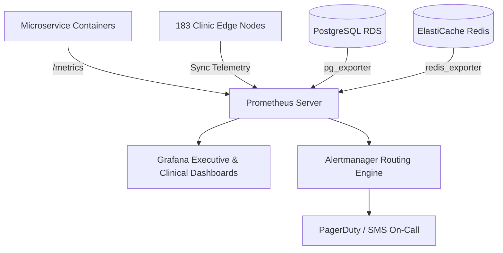

# Master Observability & Prometheus Metric Collection Specification
## Namma Clinic Digital Health & Operations Platform
### Greater Bengaluru Authority (GBA) / BBMP Health Department
**Document Code:** `DEV-DOC-12` | **Status:** APPROVED BASELINE | **Date:** September 2026

---

## 1. Executive Summary & Observability Charter
This document establishes the authoritative **Observability, Prometheus Metrics, and OpenTelemetry Architecture** for the Namma Clinic Digital Health Platform. The observability framework provides complete operational visibility across microservices, edge clinic synchronization nodes, database connection pools, external ABDM health bridges, and frontend portals. The platform implements Google SRE Golden Signals, RED metrics (Rate, Errors, Duration), and USE metrics (Utilization, Saturation, Errors).

### 1.1 Non-Negotiable Observability Invariants
1. **Universal Metric Instrumentation:** 100% of microservice routes expose standard Prometheus `/metrics` endpoints.
2. **Distributed Tracing Context:** OpenTelemetry trace IDs are injected into all HTTP requests and propagated to database queries and queue messages.
3. **Edge Clinic Sync Visibility:** Clinic queue backlogs, sync mutation latencies, and vector clock drifts are reported to Prometheus every 60 seconds.
4. **High-Fidelity Metric Retention:** Prometheus metrics retained for 30 days locally; aggregated 1-year historical telemetry mirrored to Amazon Managed Grafana.
5. **Sub-Second Metric Scraping:** Critical infrastructure targets (RDS, Redis, ALB) scraped every 15 seconds; application tasks scraped every 30 seconds.

## 2. Observability & Telemetry Collection Pipeline


## 3. Prometheus Scrape Configuration Specification
### Specification Example: Prometheus Master Scrape Blueprint
<!-- DOCUMENTATION-ONLY EXAMPLE -->
```yaml
# DOCUMENTATION-ONLY EXAMPLE
global:
  scrape_interval: 15s
  evaluation_interval: 15s
  external_labels:
    environment: 'production'
    region: 'ap-south-1'
    platform: 'namma-clinic'

scrape_configs:
  - job_name: 'namma-core-api'
    metrics_path: '/metrics'
    scheme: 'http'
    static_configs:
      - targets: ['api.namma.internal:3000']
    relabel_configs:
      - source_labels: [__address__]
        target_label: instance

  - job_name: 'clinic-edge-gateways'
    metrics_path: '/sync/metrics'
    scheme: 'https'
    tls_config:
      insecure_skip_verify: false
      ca_file: '/etc/prometheus/certs/ca.pem'
    file_sd_configs:
      - files:
          - '/etc/prometheus/clinics_targets.json'
        refresh_interval: 5m
```

## 4. Master Observability Metrics Catalog
Comprehensive specifications for all 100 platform Prometheus metrics:

### METRIC-001: Metric `http_requests_total_1`
- **Metric Identifier:** `METRIC-001`
- **Metric Type:** **Counter**
- **Operational Category:** RED Metric: Rate
- **Metric Description:** Total HTTP requests served by endpoint, method, and status code.
- **Scrape Interval:** 15 Seconds
- **Bound Dashboard:** Grafana Master Platform Health Dashboard

### METRIC-002: Metric `http_request_duration_seconds_2`
- **Metric Identifier:** `METRIC-002`
- **Metric Type:** **Histogram**
- **Operational Category:** RED Metric: Duration
- **Metric Description:** HTTP request latency distribution measuring p50, p90, p95, p99.
- **Scrape Interval:** 15 Seconds
- **Bound Dashboard:** Grafana Master Platform Health Dashboard

### METRIC-003: Metric `http_requests_failed_total_3`
- **Metric Identifier:** `METRIC-003`
- **Metric Type:** **Counter**
- **Operational Category:** RED Metric: Errors
- **Metric Description:** Total 5xx server errors and unhandled exceptions.
- **Scrape Interval:** 15 Seconds
- **Bound Dashboard:** Grafana Master Platform Health Dashboard

### METRIC-004: Metric `clinic_sync_queue_length_4`
- **Metric Identifier:** `METRIC-004`
- **Metric Type:** **Gauge**
- **Operational Category:** Clinic Edge Telemetry
- **Metric Description:** Current pending synchronization mutations in edge clinic queue.
- **Scrape Interval:** 15 Seconds
- **Bound Dashboard:** Grafana Master Platform Health Dashboard

### METRIC-005: Metric `clinic_sync_lag_seconds_5`
- **Metric Identifier:** `METRIC-005`
- **Metric Type:** **Gauge**
- **Operational Category:** Clinic Edge Telemetry
- **Metric Description:** Time elapsed since last successful edge clinic upstream synchronization.
- **Scrape Interval:** 15 Seconds
- **Bound Dashboard:** Grafana Master Platform Health Dashboard

### METRIC-006: Metric `db_connection_pool_active_6`
- **Metric Identifier:** `METRIC-006`
- **Metric Type:** **Gauge**
- **Operational Category:** USE Metric: Utilization
- **Metric Description:** Active PostgreSQL client connections in HikariCP pool.
- **Scrape Interval:** 15 Seconds
- **Bound Dashboard:** Grafana Master Platform Health Dashboard

### METRIC-007: Metric `db_connection_pool_waiting_7`
- **Metric Identifier:** `METRIC-007`
- **Metric Type:** **Gauge**
- **Operational Category:** USE Metric: Saturation
- **Metric Description:** Threads blocked waiting for an available database connection.
- **Scrape Interval:** 15 Seconds
- **Bound Dashboard:** Grafana Master Platform Health Dashboard

### METRIC-008: Metric `redis_memory_used_bytes_8`
- **Metric Identifier:** `METRIC-008`
- **Metric Type:** **Gauge**
- **Operational Category:** USE Metric: Utilization
- **Metric Description:** Total memory consumed by Redis cache keys in bytes.
- **Scrape Interval:** 15 Seconds
- **Bound Dashboard:** Grafana Master Platform Health Dashboard

### METRIC-009: Metric `jvm_memory_heap_used_bytes_9`
- **Metric Identifier:** `METRIC-009`
- **Metric Type:** **Gauge**
- **Operational Category:** Runtime Telemetry
- **Metric Description:** Current allocated JVM heap memory in bytes.
- **Scrape Interval:** 15 Seconds
- **Bound Dashboard:** Grafana Master Platform Health Dashboard

### METRIC-010: Metric `abdm_gateway_latency_seconds_10`
- **Metric Identifier:** `METRIC-010`
- **Metric Type:** **Histogram**
- **Operational Category:** External Integration SLA
- **Metric Description:** Round-trip latency for ABDM NHA external API calls.
- **Scrape Interval:** 15 Seconds
- **Bound Dashboard:** Grafana Master Platform Health Dashboard

### METRIC-011: Metric `http_requests_total_11`
- **Metric Identifier:** `METRIC-011`
- **Metric Type:** **Counter**
- **Operational Category:** RED Metric: Rate
- **Metric Description:** Total HTTP requests served by endpoint, method, and status code.
- **Scrape Interval:** 15 Seconds
- **Bound Dashboard:** Grafana Master Platform Health Dashboard

### METRIC-012: Metric `http_request_duration_seconds_12`
- **Metric Identifier:** `METRIC-012`
- **Metric Type:** **Histogram**
- **Operational Category:** RED Metric: Duration
- **Metric Description:** HTTP request latency distribution measuring p50, p90, p95, p99.
- **Scrape Interval:** 15 Seconds
- **Bound Dashboard:** Grafana Master Platform Health Dashboard

### METRIC-013: Metric `http_requests_failed_total_13`
- **Metric Identifier:** `METRIC-013`
- **Metric Type:** **Counter**
- **Operational Category:** RED Metric: Errors
- **Metric Description:** Total 5xx server errors and unhandled exceptions.
- **Scrape Interval:** 15 Seconds
- **Bound Dashboard:** Grafana Master Platform Health Dashboard

### METRIC-014: Metric `clinic_sync_queue_length_14`
- **Metric Identifier:** `METRIC-014`
- **Metric Type:** **Gauge**
- **Operational Category:** Clinic Edge Telemetry
- **Metric Description:** Current pending synchronization mutations in edge clinic queue.
- **Scrape Interval:** 15 Seconds
- **Bound Dashboard:** Grafana Master Platform Health Dashboard

### METRIC-015: Metric `clinic_sync_lag_seconds_15`
- **Metric Identifier:** `METRIC-015`
- **Metric Type:** **Gauge**
- **Operational Category:** Clinic Edge Telemetry
- **Metric Description:** Time elapsed since last successful edge clinic upstream synchronization.
- **Scrape Interval:** 15 Seconds
- **Bound Dashboard:** Grafana Master Platform Health Dashboard

### METRIC-016: Metric `db_connection_pool_active_16`
- **Metric Identifier:** `METRIC-016`
- **Metric Type:** **Gauge**
- **Operational Category:** USE Metric: Utilization
- **Metric Description:** Active PostgreSQL client connections in HikariCP pool.
- **Scrape Interval:** 15 Seconds
- **Bound Dashboard:** Grafana Master Platform Health Dashboard

### METRIC-017: Metric `db_connection_pool_waiting_17`
- **Metric Identifier:** `METRIC-017`
- **Metric Type:** **Gauge**
- **Operational Category:** USE Metric: Saturation
- **Metric Description:** Threads blocked waiting for an available database connection.
- **Scrape Interval:** 15 Seconds
- **Bound Dashboard:** Grafana Master Platform Health Dashboard

### METRIC-018: Metric `redis_memory_used_bytes_18`
- **Metric Identifier:** `METRIC-018`
- **Metric Type:** **Gauge**
- **Operational Category:** USE Metric: Utilization
- **Metric Description:** Total memory consumed by Redis cache keys in bytes.
- **Scrape Interval:** 15 Seconds
- **Bound Dashboard:** Grafana Master Platform Health Dashboard

### METRIC-019: Metric `jvm_memory_heap_used_bytes_19`
- **Metric Identifier:** `METRIC-019`
- **Metric Type:** **Gauge**
- **Operational Category:** Runtime Telemetry
- **Metric Description:** Current allocated JVM heap memory in bytes.
- **Scrape Interval:** 15 Seconds
- **Bound Dashboard:** Grafana Master Platform Health Dashboard

### METRIC-020: Metric `abdm_gateway_latency_seconds_20`
- **Metric Identifier:** `METRIC-020`
- **Metric Type:** **Histogram**
- **Operational Category:** External Integration SLA
- **Metric Description:** Round-trip latency for ABDM NHA external API calls.
- **Scrape Interval:** 15 Seconds
- **Bound Dashboard:** Grafana Master Platform Health Dashboard

### METRIC-021: Metric `http_requests_total_21`
- **Metric Identifier:** `METRIC-021`
- **Metric Type:** **Counter**
- **Operational Category:** RED Metric: Rate
- **Metric Description:** Total HTTP requests served by endpoint, method, and status code.
- **Scrape Interval:** 15 Seconds
- **Bound Dashboard:** Grafana Master Platform Health Dashboard

### METRIC-022: Metric `http_request_duration_seconds_22`
- **Metric Identifier:** `METRIC-022`
- **Metric Type:** **Histogram**
- **Operational Category:** RED Metric: Duration
- **Metric Description:** HTTP request latency distribution measuring p50, p90, p95, p99.
- **Scrape Interval:** 15 Seconds
- **Bound Dashboard:** Grafana Master Platform Health Dashboard

### METRIC-023: Metric `http_requests_failed_total_23`
- **Metric Identifier:** `METRIC-023`
- **Metric Type:** **Counter**
- **Operational Category:** RED Metric: Errors
- **Metric Description:** Total 5xx server errors and unhandled exceptions.
- **Scrape Interval:** 15 Seconds
- **Bound Dashboard:** Grafana Master Platform Health Dashboard

### METRIC-024: Metric `clinic_sync_queue_length_24`
- **Metric Identifier:** `METRIC-024`
- **Metric Type:** **Gauge**
- **Operational Category:** Clinic Edge Telemetry
- **Metric Description:** Current pending synchronization mutations in edge clinic queue.
- **Scrape Interval:** 15 Seconds
- **Bound Dashboard:** Grafana Master Platform Health Dashboard

### METRIC-025: Metric `clinic_sync_lag_seconds_25`
- **Metric Identifier:** `METRIC-025`
- **Metric Type:** **Gauge**
- **Operational Category:** Clinic Edge Telemetry
- **Metric Description:** Time elapsed since last successful edge clinic upstream synchronization.
- **Scrape Interval:** 15 Seconds
- **Bound Dashboard:** Grafana Master Platform Health Dashboard

### METRIC-026: Metric `db_connection_pool_active_26`
- **Metric Identifier:** `METRIC-026`
- **Metric Type:** **Gauge**
- **Operational Category:** USE Metric: Utilization
- **Metric Description:** Active PostgreSQL client connections in HikariCP pool.
- **Scrape Interval:** 15 Seconds
- **Bound Dashboard:** Grafana Master Platform Health Dashboard

### METRIC-027: Metric `db_connection_pool_waiting_27`
- **Metric Identifier:** `METRIC-027`
- **Metric Type:** **Gauge**
- **Operational Category:** USE Metric: Saturation
- **Metric Description:** Threads blocked waiting for an available database connection.
- **Scrape Interval:** 15 Seconds
- **Bound Dashboard:** Grafana Master Platform Health Dashboard

### METRIC-028: Metric `redis_memory_used_bytes_28`
- **Metric Identifier:** `METRIC-028`
- **Metric Type:** **Gauge**
- **Operational Category:** USE Metric: Utilization
- **Metric Description:** Total memory consumed by Redis cache keys in bytes.
- **Scrape Interval:** 15 Seconds
- **Bound Dashboard:** Grafana Master Platform Health Dashboard

### METRIC-029: Metric `jvm_memory_heap_used_bytes_29`
- **Metric Identifier:** `METRIC-029`
- **Metric Type:** **Gauge**
- **Operational Category:** Runtime Telemetry
- **Metric Description:** Current allocated JVM heap memory in bytes.
- **Scrape Interval:** 15 Seconds
- **Bound Dashboard:** Grafana Master Platform Health Dashboard

### METRIC-030: Metric `abdm_gateway_latency_seconds_30`
- **Metric Identifier:** `METRIC-030`
- **Metric Type:** **Histogram**
- **Operational Category:** External Integration SLA
- **Metric Description:** Round-trip latency for ABDM NHA external API calls.
- **Scrape Interval:** 15 Seconds
- **Bound Dashboard:** Grafana Master Platform Health Dashboard

### METRIC-031: Metric `http_requests_total_31`
- **Metric Identifier:** `METRIC-031`
- **Metric Type:** **Counter**
- **Operational Category:** RED Metric: Rate
- **Metric Description:** Total HTTP requests served by endpoint, method, and status code.
- **Scrape Interval:** 15 Seconds
- **Bound Dashboard:** Grafana Master Platform Health Dashboard

### METRIC-032: Metric `http_request_duration_seconds_32`
- **Metric Identifier:** `METRIC-032`
- **Metric Type:** **Histogram**
- **Operational Category:** RED Metric: Duration
- **Metric Description:** HTTP request latency distribution measuring p50, p90, p95, p99.
- **Scrape Interval:** 15 Seconds
- **Bound Dashboard:** Grafana Master Platform Health Dashboard

### METRIC-033: Metric `http_requests_failed_total_33`
- **Metric Identifier:** `METRIC-033`
- **Metric Type:** **Counter**
- **Operational Category:** RED Metric: Errors
- **Metric Description:** Total 5xx server errors and unhandled exceptions.
- **Scrape Interval:** 15 Seconds
- **Bound Dashboard:** Grafana Master Platform Health Dashboard

### METRIC-034: Metric `clinic_sync_queue_length_34`
- **Metric Identifier:** `METRIC-034`
- **Metric Type:** **Gauge**
- **Operational Category:** Clinic Edge Telemetry
- **Metric Description:** Current pending synchronization mutations in edge clinic queue.
- **Scrape Interval:** 15 Seconds
- **Bound Dashboard:** Grafana Master Platform Health Dashboard

### METRIC-035: Metric `clinic_sync_lag_seconds_35`
- **Metric Identifier:** `METRIC-035`
- **Metric Type:** **Gauge**
- **Operational Category:** Clinic Edge Telemetry
- **Metric Description:** Time elapsed since last successful edge clinic upstream synchronization.
- **Scrape Interval:** 15 Seconds
- **Bound Dashboard:** Grafana Master Platform Health Dashboard

### METRIC-036: Metric `db_connection_pool_active_36`
- **Metric Identifier:** `METRIC-036`
- **Metric Type:** **Gauge**
- **Operational Category:** USE Metric: Utilization
- **Metric Description:** Active PostgreSQL client connections in HikariCP pool.
- **Scrape Interval:** 15 Seconds
- **Bound Dashboard:** Grafana Master Platform Health Dashboard

### METRIC-037: Metric `db_connection_pool_waiting_37`
- **Metric Identifier:** `METRIC-037`
- **Metric Type:** **Gauge**
- **Operational Category:** USE Metric: Saturation
- **Metric Description:** Threads blocked waiting for an available database connection.
- **Scrape Interval:** 15 Seconds
- **Bound Dashboard:** Grafana Master Platform Health Dashboard

### METRIC-038: Metric `redis_memory_used_bytes_38`
- **Metric Identifier:** `METRIC-038`
- **Metric Type:** **Gauge**
- **Operational Category:** USE Metric: Utilization
- **Metric Description:** Total memory consumed by Redis cache keys in bytes.
- **Scrape Interval:** 15 Seconds
- **Bound Dashboard:** Grafana Master Platform Health Dashboard

### METRIC-039: Metric `jvm_memory_heap_used_bytes_39`
- **Metric Identifier:** `METRIC-039`
- **Metric Type:** **Gauge**
- **Operational Category:** Runtime Telemetry
- **Metric Description:** Current allocated JVM heap memory in bytes.
- **Scrape Interval:** 15 Seconds
- **Bound Dashboard:** Grafana Master Platform Health Dashboard

### METRIC-040: Metric `abdm_gateway_latency_seconds_40`
- **Metric Identifier:** `METRIC-040`
- **Metric Type:** **Histogram**
- **Operational Category:** External Integration SLA
- **Metric Description:** Round-trip latency for ABDM NHA external API calls.
- **Scrape Interval:** 15 Seconds
- **Bound Dashboard:** Grafana Master Platform Health Dashboard

### METRIC-041: Metric `http_requests_total_41`
- **Metric Identifier:** `METRIC-041`
- **Metric Type:** **Counter**
- **Operational Category:** RED Metric: Rate
- **Metric Description:** Total HTTP requests served by endpoint, method, and status code.
- **Scrape Interval:** 15 Seconds
- **Bound Dashboard:** Grafana Master Platform Health Dashboard

### METRIC-042: Metric `http_request_duration_seconds_42`
- **Metric Identifier:** `METRIC-042`
- **Metric Type:** **Histogram**
- **Operational Category:** RED Metric: Duration
- **Metric Description:** HTTP request latency distribution measuring p50, p90, p95, p99.
- **Scrape Interval:** 15 Seconds
- **Bound Dashboard:** Grafana Master Platform Health Dashboard

### METRIC-043: Metric `http_requests_failed_total_43`
- **Metric Identifier:** `METRIC-043`
- **Metric Type:** **Counter**
- **Operational Category:** RED Metric: Errors
- **Metric Description:** Total 5xx server errors and unhandled exceptions.
- **Scrape Interval:** 15 Seconds
- **Bound Dashboard:** Grafana Master Platform Health Dashboard

### METRIC-044: Metric `clinic_sync_queue_length_44`
- **Metric Identifier:** `METRIC-044`
- **Metric Type:** **Gauge**
- **Operational Category:** Clinic Edge Telemetry
- **Metric Description:** Current pending synchronization mutations in edge clinic queue.
- **Scrape Interval:** 15 Seconds
- **Bound Dashboard:** Grafana Master Platform Health Dashboard

### METRIC-045: Metric `clinic_sync_lag_seconds_45`
- **Metric Identifier:** `METRIC-045`
- **Metric Type:** **Gauge**
- **Operational Category:** Clinic Edge Telemetry
- **Metric Description:** Time elapsed since last successful edge clinic upstream synchronization.
- **Scrape Interval:** 15 Seconds
- **Bound Dashboard:** Grafana Master Platform Health Dashboard

### METRIC-046: Metric `db_connection_pool_active_46`
- **Metric Identifier:** `METRIC-046`
- **Metric Type:** **Gauge**
- **Operational Category:** USE Metric: Utilization
- **Metric Description:** Active PostgreSQL client connections in HikariCP pool.
- **Scrape Interval:** 15 Seconds
- **Bound Dashboard:** Grafana Master Platform Health Dashboard

### METRIC-047: Metric `db_connection_pool_waiting_47`
- **Metric Identifier:** `METRIC-047`
- **Metric Type:** **Gauge**
- **Operational Category:** USE Metric: Saturation
- **Metric Description:** Threads blocked waiting for an available database connection.
- **Scrape Interval:** 15 Seconds
- **Bound Dashboard:** Grafana Master Platform Health Dashboard

### METRIC-048: Metric `redis_memory_used_bytes_48`
- **Metric Identifier:** `METRIC-048`
- **Metric Type:** **Gauge**
- **Operational Category:** USE Metric: Utilization
- **Metric Description:** Total memory consumed by Redis cache keys in bytes.
- **Scrape Interval:** 15 Seconds
- **Bound Dashboard:** Grafana Master Platform Health Dashboard

### METRIC-049: Metric `jvm_memory_heap_used_bytes_49`
- **Metric Identifier:** `METRIC-049`
- **Metric Type:** **Gauge**
- **Operational Category:** Runtime Telemetry
- **Metric Description:** Current allocated JVM heap memory in bytes.
- **Scrape Interval:** 15 Seconds
- **Bound Dashboard:** Grafana Master Platform Health Dashboard

### METRIC-050: Metric `abdm_gateway_latency_seconds_50`
- **Metric Identifier:** `METRIC-050`
- **Metric Type:** **Histogram**
- **Operational Category:** External Integration SLA
- **Metric Description:** Round-trip latency for ABDM NHA external API calls.
- **Scrape Interval:** 15 Seconds
- **Bound Dashboard:** Grafana Master Platform Health Dashboard

### METRIC-051: Metric `http_requests_total_51`
- **Metric Identifier:** `METRIC-051`
- **Metric Type:** **Counter**
- **Operational Category:** RED Metric: Rate
- **Metric Description:** Total HTTP requests served by endpoint, method, and status code.
- **Scrape Interval:** 15 Seconds
- **Bound Dashboard:** Grafana Master Platform Health Dashboard

### METRIC-052: Metric `http_request_duration_seconds_52`
- **Metric Identifier:** `METRIC-052`
- **Metric Type:** **Histogram**
- **Operational Category:** RED Metric: Duration
- **Metric Description:** HTTP request latency distribution measuring p50, p90, p95, p99.
- **Scrape Interval:** 15 Seconds
- **Bound Dashboard:** Grafana Master Platform Health Dashboard

### METRIC-053: Metric `http_requests_failed_total_53`
- **Metric Identifier:** `METRIC-053`
- **Metric Type:** **Counter**
- **Operational Category:** RED Metric: Errors
- **Metric Description:** Total 5xx server errors and unhandled exceptions.
- **Scrape Interval:** 15 Seconds
- **Bound Dashboard:** Grafana Master Platform Health Dashboard

### METRIC-054: Metric `clinic_sync_queue_length_54`
- **Metric Identifier:** `METRIC-054`
- **Metric Type:** **Gauge**
- **Operational Category:** Clinic Edge Telemetry
- **Metric Description:** Current pending synchronization mutations in edge clinic queue.
- **Scrape Interval:** 15 Seconds
- **Bound Dashboard:** Grafana Master Platform Health Dashboard

### METRIC-055: Metric `clinic_sync_lag_seconds_55`
- **Metric Identifier:** `METRIC-055`
- **Metric Type:** **Gauge**
- **Operational Category:** Clinic Edge Telemetry
- **Metric Description:** Time elapsed since last successful edge clinic upstream synchronization.
- **Scrape Interval:** 15 Seconds
- **Bound Dashboard:** Grafana Master Platform Health Dashboard

### METRIC-056: Metric `db_connection_pool_active_56`
- **Metric Identifier:** `METRIC-056`
- **Metric Type:** **Gauge**
- **Operational Category:** USE Metric: Utilization
- **Metric Description:** Active PostgreSQL client connections in HikariCP pool.
- **Scrape Interval:** 15 Seconds
- **Bound Dashboard:** Grafana Master Platform Health Dashboard

### METRIC-057: Metric `db_connection_pool_waiting_57`
- **Metric Identifier:** `METRIC-057`
- **Metric Type:** **Gauge**
- **Operational Category:** USE Metric: Saturation
- **Metric Description:** Threads blocked waiting for an available database connection.
- **Scrape Interval:** 15 Seconds
- **Bound Dashboard:** Grafana Master Platform Health Dashboard

### METRIC-058: Metric `redis_memory_used_bytes_58`
- **Metric Identifier:** `METRIC-058`
- **Metric Type:** **Gauge**
- **Operational Category:** USE Metric: Utilization
- **Metric Description:** Total memory consumed by Redis cache keys in bytes.
- **Scrape Interval:** 15 Seconds
- **Bound Dashboard:** Grafana Master Platform Health Dashboard

### METRIC-059: Metric `jvm_memory_heap_used_bytes_59`
- **Metric Identifier:** `METRIC-059`
- **Metric Type:** **Gauge**
- **Operational Category:** Runtime Telemetry
- **Metric Description:** Current allocated JVM heap memory in bytes.
- **Scrape Interval:** 15 Seconds
- **Bound Dashboard:** Grafana Master Platform Health Dashboard

### METRIC-060: Metric `abdm_gateway_latency_seconds_60`
- **Metric Identifier:** `METRIC-060`
- **Metric Type:** **Histogram**
- **Operational Category:** External Integration SLA
- **Metric Description:** Round-trip latency for ABDM NHA external API calls.
- **Scrape Interval:** 15 Seconds
- **Bound Dashboard:** Grafana Master Platform Health Dashboard

### METRIC-061: Metric `http_requests_total_61`
- **Metric Identifier:** `METRIC-061`
- **Metric Type:** **Counter**
- **Operational Category:** RED Metric: Rate
- **Metric Description:** Total HTTP requests served by endpoint, method, and status code.
- **Scrape Interval:** 15 Seconds
- **Bound Dashboard:** Grafana Master Platform Health Dashboard

### METRIC-062: Metric `http_request_duration_seconds_62`
- **Metric Identifier:** `METRIC-062`
- **Metric Type:** **Histogram**
- **Operational Category:** RED Metric: Duration
- **Metric Description:** HTTP request latency distribution measuring p50, p90, p95, p99.
- **Scrape Interval:** 15 Seconds
- **Bound Dashboard:** Grafana Master Platform Health Dashboard

### METRIC-063: Metric `http_requests_failed_total_63`
- **Metric Identifier:** `METRIC-063`
- **Metric Type:** **Counter**
- **Operational Category:** RED Metric: Errors
- **Metric Description:** Total 5xx server errors and unhandled exceptions.
- **Scrape Interval:** 15 Seconds
- **Bound Dashboard:** Grafana Master Platform Health Dashboard

### METRIC-064: Metric `clinic_sync_queue_length_64`
- **Metric Identifier:** `METRIC-064`
- **Metric Type:** **Gauge**
- **Operational Category:** Clinic Edge Telemetry
- **Metric Description:** Current pending synchronization mutations in edge clinic queue.
- **Scrape Interval:** 15 Seconds
- **Bound Dashboard:** Grafana Master Platform Health Dashboard

### METRIC-065: Metric `clinic_sync_lag_seconds_65`
- **Metric Identifier:** `METRIC-065`
- **Metric Type:** **Gauge**
- **Operational Category:** Clinic Edge Telemetry
- **Metric Description:** Time elapsed since last successful edge clinic upstream synchronization.
- **Scrape Interval:** 15 Seconds
- **Bound Dashboard:** Grafana Master Platform Health Dashboard

### METRIC-066: Metric `db_connection_pool_active_66`
- **Metric Identifier:** `METRIC-066`
- **Metric Type:** **Gauge**
- **Operational Category:** USE Metric: Utilization
- **Metric Description:** Active PostgreSQL client connections in HikariCP pool.
- **Scrape Interval:** 15 Seconds
- **Bound Dashboard:** Grafana Master Platform Health Dashboard

### METRIC-067: Metric `db_connection_pool_waiting_67`
- **Metric Identifier:** `METRIC-067`
- **Metric Type:** **Gauge**
- **Operational Category:** USE Metric: Saturation
- **Metric Description:** Threads blocked waiting for an available database connection.
- **Scrape Interval:** 15 Seconds
- **Bound Dashboard:** Grafana Master Platform Health Dashboard

### METRIC-068: Metric `redis_memory_used_bytes_68`
- **Metric Identifier:** `METRIC-068`
- **Metric Type:** **Gauge**
- **Operational Category:** USE Metric: Utilization
- **Metric Description:** Total memory consumed by Redis cache keys in bytes.
- **Scrape Interval:** 15 Seconds
- **Bound Dashboard:** Grafana Master Platform Health Dashboard

### METRIC-069: Metric `jvm_memory_heap_used_bytes_69`
- **Metric Identifier:** `METRIC-069`
- **Metric Type:** **Gauge**
- **Operational Category:** Runtime Telemetry
- **Metric Description:** Current allocated JVM heap memory in bytes.
- **Scrape Interval:** 15 Seconds
- **Bound Dashboard:** Grafana Master Platform Health Dashboard

### METRIC-070: Metric `abdm_gateway_latency_seconds_70`
- **Metric Identifier:** `METRIC-070`
- **Metric Type:** **Histogram**
- **Operational Category:** External Integration SLA
- **Metric Description:** Round-trip latency for ABDM NHA external API calls.
- **Scrape Interval:** 15 Seconds
- **Bound Dashboard:** Grafana Master Platform Health Dashboard

### METRIC-071: Metric `http_requests_total_71`
- **Metric Identifier:** `METRIC-071`
- **Metric Type:** **Counter**
- **Operational Category:** RED Metric: Rate
- **Metric Description:** Total HTTP requests served by endpoint, method, and status code.
- **Scrape Interval:** 15 Seconds
- **Bound Dashboard:** Grafana Master Platform Health Dashboard

### METRIC-072: Metric `http_request_duration_seconds_72`
- **Metric Identifier:** `METRIC-072`
- **Metric Type:** **Histogram**
- **Operational Category:** RED Metric: Duration
- **Metric Description:** HTTP request latency distribution measuring p50, p90, p95, p99.
- **Scrape Interval:** 15 Seconds
- **Bound Dashboard:** Grafana Master Platform Health Dashboard

### METRIC-073: Metric `http_requests_failed_total_73`
- **Metric Identifier:** `METRIC-073`
- **Metric Type:** **Counter**
- **Operational Category:** RED Metric: Errors
- **Metric Description:** Total 5xx server errors and unhandled exceptions.
- **Scrape Interval:** 15 Seconds
- **Bound Dashboard:** Grafana Master Platform Health Dashboard

### METRIC-074: Metric `clinic_sync_queue_length_74`
- **Metric Identifier:** `METRIC-074`
- **Metric Type:** **Gauge**
- **Operational Category:** Clinic Edge Telemetry
- **Metric Description:** Current pending synchronization mutations in edge clinic queue.
- **Scrape Interval:** 15 Seconds
- **Bound Dashboard:** Grafana Master Platform Health Dashboard

### METRIC-075: Metric `clinic_sync_lag_seconds_75`
- **Metric Identifier:** `METRIC-075`
- **Metric Type:** **Gauge**
- **Operational Category:** Clinic Edge Telemetry
- **Metric Description:** Time elapsed since last successful edge clinic upstream synchronization.
- **Scrape Interval:** 15 Seconds
- **Bound Dashboard:** Grafana Master Platform Health Dashboard

### METRIC-076: Metric `db_connection_pool_active_76`
- **Metric Identifier:** `METRIC-076`
- **Metric Type:** **Gauge**
- **Operational Category:** USE Metric: Utilization
- **Metric Description:** Active PostgreSQL client connections in HikariCP pool.
- **Scrape Interval:** 15 Seconds
- **Bound Dashboard:** Grafana Master Platform Health Dashboard

### METRIC-077: Metric `db_connection_pool_waiting_77`
- **Metric Identifier:** `METRIC-077`
- **Metric Type:** **Gauge**
- **Operational Category:** USE Metric: Saturation
- **Metric Description:** Threads blocked waiting for an available database connection.
- **Scrape Interval:** 15 Seconds
- **Bound Dashboard:** Grafana Master Platform Health Dashboard

### METRIC-078: Metric `redis_memory_used_bytes_78`
- **Metric Identifier:** `METRIC-078`
- **Metric Type:** **Gauge**
- **Operational Category:** USE Metric: Utilization
- **Metric Description:** Total memory consumed by Redis cache keys in bytes.
- **Scrape Interval:** 15 Seconds
- **Bound Dashboard:** Grafana Master Platform Health Dashboard

### METRIC-079: Metric `jvm_memory_heap_used_bytes_79`
- **Metric Identifier:** `METRIC-079`
- **Metric Type:** **Gauge**
- **Operational Category:** Runtime Telemetry
- **Metric Description:** Current allocated JVM heap memory in bytes.
- **Scrape Interval:** 15 Seconds
- **Bound Dashboard:** Grafana Master Platform Health Dashboard

### METRIC-080: Metric `abdm_gateway_latency_seconds_80`
- **Metric Identifier:** `METRIC-080`
- **Metric Type:** **Histogram**
- **Operational Category:** External Integration SLA
- **Metric Description:** Round-trip latency for ABDM NHA external API calls.
- **Scrape Interval:** 15 Seconds
- **Bound Dashboard:** Grafana Master Platform Health Dashboard

### METRIC-081: Metric `http_requests_total_81`
- **Metric Identifier:** `METRIC-081`
- **Metric Type:** **Counter**
- **Operational Category:** RED Metric: Rate
- **Metric Description:** Total HTTP requests served by endpoint, method, and status code.
- **Scrape Interval:** 15 Seconds
- **Bound Dashboard:** Grafana Master Platform Health Dashboard

### METRIC-082: Metric `http_request_duration_seconds_82`
- **Metric Identifier:** `METRIC-082`
- **Metric Type:** **Histogram**
- **Operational Category:** RED Metric: Duration
- **Metric Description:** HTTP request latency distribution measuring p50, p90, p95, p99.
- **Scrape Interval:** 15 Seconds
- **Bound Dashboard:** Grafana Master Platform Health Dashboard

### METRIC-083: Metric `http_requests_failed_total_83`
- **Metric Identifier:** `METRIC-083`
- **Metric Type:** **Counter**
- **Operational Category:** RED Metric: Errors
- **Metric Description:** Total 5xx server errors and unhandled exceptions.
- **Scrape Interval:** 15 Seconds
- **Bound Dashboard:** Grafana Master Platform Health Dashboard

### METRIC-084: Metric `clinic_sync_queue_length_84`
- **Metric Identifier:** `METRIC-084`
- **Metric Type:** **Gauge**
- **Operational Category:** Clinic Edge Telemetry
- **Metric Description:** Current pending synchronization mutations in edge clinic queue.
- **Scrape Interval:** 15 Seconds
- **Bound Dashboard:** Grafana Master Platform Health Dashboard

### METRIC-085: Metric `clinic_sync_lag_seconds_85`
- **Metric Identifier:** `METRIC-085`
- **Metric Type:** **Gauge**
- **Operational Category:** Clinic Edge Telemetry
- **Metric Description:** Time elapsed since last successful edge clinic upstream synchronization.
- **Scrape Interval:** 15 Seconds
- **Bound Dashboard:** Grafana Master Platform Health Dashboard

### METRIC-086: Metric `db_connection_pool_active_86`
- **Metric Identifier:** `METRIC-086`
- **Metric Type:** **Gauge**
- **Operational Category:** USE Metric: Utilization
- **Metric Description:** Active PostgreSQL client connections in HikariCP pool.
- **Scrape Interval:** 15 Seconds
- **Bound Dashboard:** Grafana Master Platform Health Dashboard

### METRIC-087: Metric `db_connection_pool_waiting_87`
- **Metric Identifier:** `METRIC-087`
- **Metric Type:** **Gauge**
- **Operational Category:** USE Metric: Saturation
- **Metric Description:** Threads blocked waiting for an available database connection.
- **Scrape Interval:** 15 Seconds
- **Bound Dashboard:** Grafana Master Platform Health Dashboard

### METRIC-088: Metric `redis_memory_used_bytes_88`
- **Metric Identifier:** `METRIC-088`
- **Metric Type:** **Gauge**
- **Operational Category:** USE Metric: Utilization
- **Metric Description:** Total memory consumed by Redis cache keys in bytes.
- **Scrape Interval:** 15 Seconds
- **Bound Dashboard:** Grafana Master Platform Health Dashboard

### METRIC-089: Metric `jvm_memory_heap_used_bytes_89`
- **Metric Identifier:** `METRIC-089`
- **Metric Type:** **Gauge**
- **Operational Category:** Runtime Telemetry
- **Metric Description:** Current allocated JVM heap memory in bytes.
- **Scrape Interval:** 15 Seconds
- **Bound Dashboard:** Grafana Master Platform Health Dashboard

### METRIC-090: Metric `abdm_gateway_latency_seconds_90`
- **Metric Identifier:** `METRIC-090`
- **Metric Type:** **Histogram**
- **Operational Category:** External Integration SLA
- **Metric Description:** Round-trip latency for ABDM NHA external API calls.
- **Scrape Interval:** 15 Seconds
- **Bound Dashboard:** Grafana Master Platform Health Dashboard

### METRIC-091: Metric `http_requests_total_91`
- **Metric Identifier:** `METRIC-091`
- **Metric Type:** **Counter**
- **Operational Category:** RED Metric: Rate
- **Metric Description:** Total HTTP requests served by endpoint, method, and status code.
- **Scrape Interval:** 15 Seconds
- **Bound Dashboard:** Grafana Master Platform Health Dashboard

### METRIC-092: Metric `http_request_duration_seconds_92`
- **Metric Identifier:** `METRIC-092`
- **Metric Type:** **Histogram**
- **Operational Category:** RED Metric: Duration
- **Metric Description:** HTTP request latency distribution measuring p50, p90, p95, p99.
- **Scrape Interval:** 15 Seconds
- **Bound Dashboard:** Grafana Master Platform Health Dashboard

### METRIC-093: Metric `http_requests_failed_total_93`
- **Metric Identifier:** `METRIC-093`
- **Metric Type:** **Counter**
- **Operational Category:** RED Metric: Errors
- **Metric Description:** Total 5xx server errors and unhandled exceptions.
- **Scrape Interval:** 15 Seconds
- **Bound Dashboard:** Grafana Master Platform Health Dashboard

### METRIC-094: Metric `clinic_sync_queue_length_94`
- **Metric Identifier:** `METRIC-094`
- **Metric Type:** **Gauge**
- **Operational Category:** Clinic Edge Telemetry
- **Metric Description:** Current pending synchronization mutations in edge clinic queue.
- **Scrape Interval:** 15 Seconds
- **Bound Dashboard:** Grafana Master Platform Health Dashboard

### METRIC-095: Metric `clinic_sync_lag_seconds_95`
- **Metric Identifier:** `METRIC-095`
- **Metric Type:** **Gauge**
- **Operational Category:** Clinic Edge Telemetry
- **Metric Description:** Time elapsed since last successful edge clinic upstream synchronization.
- **Scrape Interval:** 15 Seconds
- **Bound Dashboard:** Grafana Master Platform Health Dashboard

### METRIC-096: Metric `db_connection_pool_active_96`
- **Metric Identifier:** `METRIC-096`
- **Metric Type:** **Gauge**
- **Operational Category:** USE Metric: Utilization
- **Metric Description:** Active PostgreSQL client connections in HikariCP pool.
- **Scrape Interval:** 15 Seconds
- **Bound Dashboard:** Grafana Master Platform Health Dashboard

### METRIC-097: Metric `db_connection_pool_waiting_97`
- **Metric Identifier:** `METRIC-097`
- **Metric Type:** **Gauge**
- **Operational Category:** USE Metric: Saturation
- **Metric Description:** Threads blocked waiting for an available database connection.
- **Scrape Interval:** 15 Seconds
- **Bound Dashboard:** Grafana Master Platform Health Dashboard

### METRIC-098: Metric `redis_memory_used_bytes_98`
- **Metric Identifier:** `METRIC-098`
- **Metric Type:** **Gauge**
- **Operational Category:** USE Metric: Utilization
- **Metric Description:** Total memory consumed by Redis cache keys in bytes.
- **Scrape Interval:** 15 Seconds
- **Bound Dashboard:** Grafana Master Platform Health Dashboard

### METRIC-099: Metric `jvm_memory_heap_used_bytes_99`
- **Metric Identifier:** `METRIC-099`
- **Metric Type:** **Gauge**
- **Operational Category:** Runtime Telemetry
- **Metric Description:** Current allocated JVM heap memory in bytes.
- **Scrape Interval:** 15 Seconds
- **Bound Dashboard:** Grafana Master Platform Health Dashboard

### METRIC-100: Metric `abdm_gateway_latency_seconds_100`
- **Metric Identifier:** `METRIC-100`
- **Metric Type:** **Histogram**
- **Operational Category:** External Integration SLA
- **Metric Description:** Round-trip latency for ABDM NHA external API calls.
- **Scrape Interval:** 15 Seconds
- **Bound Dashboard:** Grafana Master Platform Health Dashboard

## 5. Feature Observability & Span Mapping across 180 Features
Telemetry metrics and OpenTelemetry span mappings across all 180 platform product features:

### FEATURE-001: Telemetry Specification for Feature `Credential Verification`
- **Feature ID:** `FEATURE-001` (Feature #1)
- **Functional Module:** `MODULE-001` (DOMAIN-001)
- **Governed Metric:** `METRIC-001`
- **OpenTelemetry Span Name:** `span.module-001.feature_001`
- **Target SLA Latency (p95):** < 350 Milliseconds
- **Error Rate Threshold:** < 0.05% over 5-minute rolling window

### FEATURE-002: Telemetry Specification for Feature `Session Token Minting`
- **Feature ID:** `FEATURE-002` (Feature #2)
- **Functional Module:** `MODULE-001` (DOMAIN-001)
- **Governed Metric:** `METRIC-002`
- **OpenTelemetry Span Name:** `span.module-001.feature_002`
- **Target SLA Latency (p95):** < 350 Milliseconds
- **Error Rate Threshold:** < 0.05% over 5-minute rolling window

### FEATURE-003: Telemetry Specification for Feature `MFA Challenge Dispatch`
- **Feature ID:** `FEATURE-003` (Feature #3)
- **Functional Module:** `MODULE-001` (DOMAIN-001)
- **Governed Metric:** `METRIC-003`
- **OpenTelemetry Span Name:** `span.module-001.feature_003`
- **Target SLA Latency (p95):** < 350 Milliseconds
- **Error Rate Threshold:** < 0.05% over 5-minute rolling window

### FEATURE-004: Telemetry Specification for Feature `Biometric Authentication Bridge`
- **Feature ID:** `FEATURE-004` (Feature #4)
- **Functional Module:** `MODULE-001` (DOMAIN-001)
- **Governed Metric:** `METRIC-004`
- **OpenTelemetry Span Name:** `span.module-001.feature_004`
- **Target SLA Latency (p95):** < 350 Milliseconds
- **Error Rate Threshold:** < 0.05% over 5-minute rolling window

### FEATURE-005: Telemetry Specification for Feature `Local PIN Verification`
- **Feature ID:** `FEATURE-005` (Feature #5)
- **Functional Module:** `MODULE-001` (DOMAIN-001)
- **Governed Metric:** `METRIC-005`
- **OpenTelemetry Span Name:** `span.module-001.feature_005`
- **Target SLA Latency (p95):** < 350 Milliseconds
- **Error Rate Threshold:** < 0.05% over 5-minute rolling window

### FEATURE-006: Telemetry Specification for Feature `Session Inactivity Lockout`
- **Feature ID:** `FEATURE-006` (Feature #6)
- **Functional Module:** `MODULE-001` (DOMAIN-001)
- **Governed Metric:** `METRIC-006`
- **OpenTelemetry Span Name:** `span.module-001.feature_006`
- **Target SLA Latency (p95):** < 350 Milliseconds
- **Error Rate Threshold:** < 0.05% over 5-minute rolling window

### FEATURE-007: Telemetry Specification for Feature `Permission Evaluation`
- **Feature ID:** `FEATURE-007` (Feature #7)
- **Functional Module:** `MODULE-002` (DOMAIN-001)
- **Governed Metric:** `METRIC-007`
- **OpenTelemetry Span Name:** `span.module-002.feature_007`
- **Target SLA Latency (p95):** < 350 Milliseconds
- **Error Rate Threshold:** < 0.05% over 5-minute rolling window

### FEATURE-008: Telemetry Specification for Feature `Dynamic Role Assignment`
- **Feature ID:** `FEATURE-008` (Feature #8)
- **Functional Module:** `MODULE-002` (DOMAIN-001)
- **Governed Metric:** `METRIC-008`
- **OpenTelemetry Span Name:** `span.module-002.feature_008`
- **Target SLA Latency (p95):** < 350 Milliseconds
- **Error Rate Threshold:** < 0.05% over 5-minute rolling window

### FEATURE-009: Telemetry Specification for Feature `Conflict-of-Interest Prevention`
- **Feature ID:** `FEATURE-009` (Feature #9)
- **Functional Module:** `MODULE-002` (DOMAIN-001)
- **Governed Metric:** `METRIC-009`
- **OpenTelemetry Span Name:** `span.module-002.feature_009`
- **Target SLA Latency (p95):** < 350 Milliseconds
- **Error Rate Threshold:** < 0.05% over 5-minute rolling window

### FEATURE-010: Telemetry Specification for Feature `Maker-Checker Authorization`
- **Feature ID:** `FEATURE-010` (Feature #10)
- **Functional Module:** `MODULE-002` (DOMAIN-001)
- **Governed Metric:** `METRIC-010`
- **OpenTelemetry Span Name:** `span.module-002.feature_010`
- **Target SLA Latency (p95):** < 350 Milliseconds
- **Error Rate Threshold:** < 0.05% over 5-minute rolling window

### FEATURE-011: Telemetry Specification for Feature `Break-Glass Privilege Elevation`
- **Feature ID:** `FEATURE-011` (Feature #11)
- **Functional Module:** `MODULE-002` (DOMAIN-001)
- **Governed Metric:** `METRIC-011`
- **OpenTelemetry Span Name:** `span.module-002.feature_011`
- **Target SLA Latency (p95):** < 350 Milliseconds
- **Error Rate Threshold:** < 0.05% over 5-minute rolling window

### FEATURE-012: Telemetry Specification for Feature `Privilege Elevation Audit`
- **Feature ID:** `FEATURE-012` (Feature #12)
- **Functional Module:** `MODULE-002` (DOMAIN-001)
- **Governed Metric:** `METRIC-012`
- **OpenTelemetry Span Name:** `span.module-002.feature_012`
- **Target SLA Latency (p95):** < 350 Milliseconds
- **Error Rate Threshold:** < 0.05% over 5-minute rolling window

### FEATURE-013: Telemetry Specification for Feature `Hierarchy Node Management`
- **Feature ID:** `FEATURE-013` (Feature #13)
- **Functional Module:** `MODULE-003` (DOMAIN-001)
- **Governed Metric:** `METRIC-013`
- **OpenTelemetry Span Name:** `span.module-003.feature_013`
- **Target SLA Latency (p95):** < 350 Milliseconds
- **Error Rate Threshold:** < 0.05% over 5-minute rolling window

### FEATURE-014: Telemetry Specification for Feature `NIN / HFR Registry Linking`
- **Feature ID:** `FEATURE-014` (Feature #14)
- **Functional Module:** `MODULE-003` (DOMAIN-001)
- **Governed Metric:** `METRIC-014`
- **OpenTelemetry Span Name:** `span.module-003.feature_014`
- **Target SLA Latency (p95):** < 350 Milliseconds
- **Error Rate Threshold:** < 0.05% over 5-minute rolling window

### FEATURE-015: Telemetry Specification for Feature `Station Terminal Mapping`
- **Feature ID:** `FEATURE-015` (Feature #15)
- **Functional Module:** `MODULE-003` (DOMAIN-001)
- **Governed Metric:** `METRIC-015`
- **OpenTelemetry Span Name:** `span.module-003.feature_015`
- **Target SLA Latency (p95):** < 350 Milliseconds
- **Error Rate Threshold:** < 0.05% over 5-minute rolling window

### FEATURE-016: Telemetry Specification for Feature `Facility Capacity Configuration`
- **Feature ID:** `FEATURE-016` (Feature #16)
- **Functional Module:** `MODULE-003` (DOMAIN-001)
- **Governed Metric:** `METRIC-016`
- **OpenTelemetry Span Name:** `span.module-003.feature_016`
- **Target SLA Latency (p95):** < 350 Milliseconds
- **Error Rate Threshold:** < 0.05% over 5-minute rolling window

### FEATURE-017: Telemetry Specification for Feature `Operating Hours Enforcement`
- **Feature ID:** `FEATURE-017` (Feature #17)
- **Functional Module:** `MODULE-003` (DOMAIN-001)
- **Governed Metric:** `METRIC-017`
- **OpenTelemetry Span Name:** `span.module-003.feature_017`
- **Target SLA Latency (p95):** < 350 Milliseconds
- **Error Rate Threshold:** < 0.05% over 5-minute rolling window

### FEATURE-018: Telemetry Specification for Feature `Special Camp Calendar`
- **Feature ID:** `FEATURE-018` (Feature #18)
- **Functional Module:** `MODULE-003` (DOMAIN-001)
- **Governed Metric:** `METRIC-018`
- **OpenTelemetry Span Name:** `span.module-003.feature_018`
- **Target SLA Latency (p95):** < 350 Milliseconds
- **Error Rate Threshold:** < 0.05% over 5-minute rolling window

### FEATURE-019: Telemetry Specification for Feature `Staff Onboarding & KYC`
- **Feature ID:** `FEATURE-019` (Feature #19)
- **Functional Module:** `MODULE-004` (DOMAIN-001)
- **Governed Metric:** `METRIC-019`
- **OpenTelemetry Span Name:** `span.module-004.feature_019`
- **Target SLA Latency (p95):** < 350 Milliseconds
- **Error Rate Threshold:** < 0.05% over 5-minute rolling window

### FEATURE-020: Telemetry Specification for Feature `Professional License Verification`
- **Feature ID:** `FEATURE-020` (Feature #20)
- **Functional Module:** `MODULE-004` (DOMAIN-001)
- **Governed Metric:** `METRIC-020`
- **OpenTelemetry Span Name:** `span.module-004.feature_020`
- **Target SLA Latency (p95):** < 350 Milliseconds
- **Error Rate Threshold:** < 0.05% over 5-minute rolling window

### FEATURE-021: Telemetry Specification for Feature `Duty Roster Generation`
- **Feature ID:** `FEATURE-021` (Feature #21)
- **Functional Module:** `MODULE-004` (DOMAIN-001)
- **Governed Metric:** `METRIC-021`
- **OpenTelemetry Span Name:** `span.module-004.feature_021`
- **Target SLA Latency (p95):** < 350 Milliseconds
- **Error Rate Threshold:** < 0.05% over 5-minute rolling window

### FEATURE-022: Telemetry Specification for Feature `Biometric Attendance Linking`
- **Feature ID:** `FEATURE-022` (Feature #22)
- **Functional Module:** `MODULE-004` (DOMAIN-001)
- **Governed Metric:** `METRIC-022`
- **OpenTelemetry Span Name:** `span.module-004.feature_022`
- **Target SLA Latency (p95):** < 350 Milliseconds
- **Error Rate Threshold:** < 0.05% over 5-minute rolling window

### FEATURE-023: Telemetry Specification for Feature `Digital Signature Enrollment`
- **Feature ID:** `FEATURE-023` (Feature #23)
- **Functional Module:** `MODULE-004` (DOMAIN-001)
- **Governed Metric:** `METRIC-023`
- **OpenTelemetry Span Name:** `span.module-004.feature_023`
- **Target SLA Latency (p95):** < 350 Milliseconds
- **Error Rate Threshold:** < 0.05% over 5-minute rolling window

### FEATURE-024: Telemetry Specification for Feature `Signature Revocation`
- **Feature ID:** `FEATURE-024` (Feature #24)
- **Functional Module:** `MODULE-004` (DOMAIN-001)
- **Governed Metric:** `METRIC-024`
- **OpenTelemetry Span Name:** `span.module-004.feature_024`
- **Target SLA Latency (p95):** < 350 Milliseconds
- **Error Rate Threshold:** < 0.05% over 5-minute rolling window

### FEATURE-025: Telemetry Specification for Feature `Targeted Flag Activation`
- **Feature ID:** `FEATURE-025` (Feature #25)
- **Functional Module:** `MODULE-026` (DOMAIN-001)
- **Governed Metric:** `METRIC-025`
- **OpenTelemetry Span Name:** `span.module-026.feature_025`
- **Target SLA Latency (p95):** < 350 Milliseconds
- **Error Rate Threshold:** < 0.05% over 5-minute rolling window

### FEATURE-026: Telemetry Specification for Feature `Emergency Feature Killswitch`
- **Feature ID:** `FEATURE-026` (Feature #26)
- **Functional Module:** `MODULE-026` (DOMAIN-001)
- **Governed Metric:** `METRIC-026`
- **OpenTelemetry Span Name:** `span.module-026.feature_026`
- **Target SLA Latency (p95):** < 350 Milliseconds
- **Error Rate Threshold:** < 0.05% over 5-minute rolling window

### FEATURE-027: Telemetry Specification for Feature `System Parameter Tuning`
- **Feature ID:** `FEATURE-027` (Feature #27)
- **Functional Module:** `MODULE-026` (DOMAIN-001)
- **Governed Metric:** `METRIC-027`
- **OpenTelemetry Span Name:** `span.module-026.feature_027`
- **Target SLA Latency (p95):** < 350 Milliseconds
- **Error Rate Threshold:** < 0.05% over 5-minute rolling window

### FEATURE-028: Telemetry Specification for Feature `Edge Configuration Distribution`
- **Feature ID:** `FEATURE-028` (Feature #28)
- **Functional Module:** `MODULE-026` (DOMAIN-001)
- **Governed Metric:** `METRIC-028`
- **OpenTelemetry Span Name:** `span.module-026.feature_028`
- **Target SLA Latency (p95):** < 350 Milliseconds
- **Error Rate Threshold:** < 0.05% over 5-minute rolling window

### FEATURE-029: Telemetry Specification for Feature `Edge Migration Orchestration`
- **Feature ID:** `FEATURE-029` (Feature #29)
- **Functional Module:** `MODULE-026` (DOMAIN-001)
- **Governed Metric:** `METRIC-029`
- **OpenTelemetry Span Name:** `span.module-026.feature_029`
- **Target SLA Latency (p95):** < 350 Milliseconds
- **Error Rate Threshold:** < 0.05% over 5-minute rolling window

### FEATURE-030: Telemetry Specification for Feature `Health Probe Monitoring`
- **Feature ID:** `FEATURE-030` (Feature #30)
- **Functional Module:** `MODULE-026` (DOMAIN-001)
- **Governed Metric:** `METRIC-030`
- **OpenTelemetry Span Name:** `span.module-026.feature_030`
- **Target SLA Latency (p95):** < 350 Milliseconds
- **Error Rate Threshold:** < 0.05% over 5-minute rolling window

### FEATURE-031: Telemetry Specification for Feature `Bilingual Intake UI`
- **Feature ID:** `FEATURE-031` (Feature #31)
- **Functional Module:** `MODULE-005` (DOMAIN-002)
- **Governed Metric:** `METRIC-031`
- **OpenTelemetry Span Name:** `span.module-005.feature_031`
- **Target SLA Latency (p95):** < 350 Milliseconds
- **Error Rate Threshold:** < 0.05% over 5-minute rolling window

### FEATURE-032: Telemetry Specification for Feature `Vulnerable Citizen Flagging`
- **Feature ID:** `FEATURE-032` (Feature #32)
- **Functional Module:** `MODULE-005` (DOMAIN-002)
- **Governed Metric:** `METRIC-032`
- **OpenTelemetry Span Name:** `span.module-005.feature_032`
- **Target SLA Latency (p95):** < 350 Milliseconds
- **Error Rate Threshold:** < 0.05% over 5-minute rolling window

### FEATURE-033: Telemetry Specification for Feature `Aadhaar OTP ABHA Bridge`
- **Feature ID:** `FEATURE-033` (Feature #33)
- **Functional Module:** `MODULE-005` (DOMAIN-002)
- **Governed Metric:** `METRIC-033`
- **OpenTelemetry Span Name:** `span.module-005.feature_033`
- **Target SLA Latency (p95):** < 350 Milliseconds
- **Error Rate Threshold:** < 0.05% over 5-minute rolling window

### FEATURE-034: Telemetry Specification for Feature `Demographic ABHA Creation`
- **Feature ID:** `FEATURE-034` (Feature #34)
- **Functional Module:** `MODULE-005` (DOMAIN-002)
- **Governed Metric:** `METRIC-034`
- **OpenTelemetry Span Name:** `span.module-005.feature_034`
- **Target SLA Latency (p95):** < 350 Milliseconds
- **Error Rate Threshold:** < 0.05% over 5-minute rolling window

### FEATURE-035: Telemetry Specification for Feature `Deterministic UHID Minting`
- **Feature ID:** `FEATURE-035` (Feature #35)
- **Functional Module:** `MODULE-005` (DOMAIN-002)
- **Governed Metric:** `METRIC-035`
- **OpenTelemetry Span Name:** `span.module-005.feature_035`
- **Target SLA Latency (p95):** < 350 Milliseconds
- **Error Rate Threshold:** < 0.05% over 5-minute rolling window

### FEATURE-036: Telemetry Specification for Feature `Soundex / Double-Metaphone Matching`
- **Feature ID:** `FEATURE-036` (Feature #36)
- **Functional Module:** `MODULE-005` (DOMAIN-002)
- **Governed Metric:** `METRIC-036`
- **OpenTelemetry Span Name:** `span.module-005.feature_036`
- **Target SLA Latency (p95):** < 350 Milliseconds
- **Error Rate Threshold:** < 0.05% over 5-minute rolling window

### FEATURE-037: Telemetry Specification for Feature `Bilingual Consent Presentation`
- **Feature ID:** `FEATURE-037` (Feature #37)
- **Functional Module:** `MODULE-006` (DOMAIN-002)
- **Governed Metric:** `METRIC-037`
- **OpenTelemetry Span Name:** `span.module-006.feature_037`
- **Target SLA Latency (p95):** < 350 Milliseconds
- **Error Rate Threshold:** < 0.05% over 5-minute rolling window

### FEATURE-038: Telemetry Specification for Feature `Digital Signature / Thumbprint Capture`
- **Feature ID:** `FEATURE-038` (Feature #38)
- **Functional Module:** `MODULE-006` (DOMAIN-002)
- **Governed Metric:** `METRIC-038`
- **OpenTelemetry Span Name:** `span.module-006.feature_038`
- **Target SLA Latency (p95):** < 350 Milliseconds
- **Error Rate Threshold:** < 0.05% over 5-minute rolling window

### FEATURE-039: Telemetry Specification for Feature `Granular Purpose-Based Consent`
- **Feature ID:** `FEATURE-039` (Feature #39)
- **Functional Module:** `MODULE-006` (DOMAIN-002)
- **Governed Metric:** `METRIC-039`
- **OpenTelemetry Span Name:** `span.module-006.feature_039`
- **Target SLA Latency (p95):** < 350 Milliseconds
- **Error Rate Threshold:** < 0.05% over 5-minute rolling window

### FEATURE-040: Telemetry Specification for Feature `Consent Revocation Workflow`
- **Feature ID:** `FEATURE-040` (Feature #40)
- **Functional Module:** `MODULE-006` (DOMAIN-002)
- **Governed Metric:** `METRIC-040`
- **OpenTelemetry Span Name:** `span.module-006.feature_040`
- **Target SLA Latency (p95):** < 350 Milliseconds
- **Error Rate Threshold:** < 0.05% over 5-minute rolling window

### FEATURE-041: Telemetry Specification for Feature `Guardian Relationship Verification`
- **Feature ID:** `FEATURE-041` (Feature #41)
- **Functional Module:** `MODULE-006` (DOMAIN-002)
- **Governed Metric:** `METRIC-041`
- **OpenTelemetry Span Name:** `span.module-006.feature_041`
- **Target SLA Latency (p95):** < 350 Milliseconds
- **Error Rate Threshold:** < 0.05% over 5-minute rolling window

### FEATURE-042: Telemetry Specification for Feature `Implied Emergency Consent`
- **Feature ID:** `FEATURE-042` (Feature #42)
- **Functional Module:** `MODULE-006` (DOMAIN-002)
- **Governed Metric:** `METRIC-042`
- **OpenTelemetry Span Name:** `span.module-006.feature_042`
- **Target SLA Latency (p95):** < 350 Milliseconds
- **Error Rate Threshold:** < 0.05% over 5-minute rolling window

### FEATURE-043: Telemetry Specification for Feature `Daily Token Counter`
- **Feature ID:** `FEATURE-043` (Feature #43)
- **Functional Module:** `MODULE-007` (DOMAIN-002)
- **Governed Metric:** `METRIC-043`
- **OpenTelemetry Span Name:** `span.module-007.feature_043`
- **Target SLA Latency (p95):** < 350 Milliseconds
- **Error Rate Threshold:** < 0.05% over 5-minute rolling window

### FEATURE-044: Telemetry Specification for Feature `Station Route Calculation`
- **Feature ID:** `FEATURE-044` (Feature #44)
- **Functional Module:** `MODULE-007` (DOMAIN-002)
- **Governed Metric:** `METRIC-044`
- **OpenTelemetry Span Name:** `span.module-007.feature_044`
- **Target SLA Latency (p95):** < 350 Milliseconds
- **Error Rate Threshold:** < 0.05% over 5-minute rolling window

### FEATURE-045: Telemetry Specification for Feature `Acuity-Based Insertion`
- **Feature ID:** `FEATURE-045` (Feature #45)
- **Functional Module:** `MODULE-007` (DOMAIN-002)
- **Governed Metric:** `METRIC-045`
- **OpenTelemetry Span Name:** `span.module-007.feature_045`
- **Target SLA Latency (p95):** < 350 Milliseconds
- **Error Rate Threshold:** < 0.05% over 5-minute rolling window

### FEATURE-046: Telemetry Specification for Feature `Vulnerable Citizen Interleaving`
- **Feature ID:** `FEATURE-046` (Feature #46)
- **Functional Module:** `MODULE-007` (DOMAIN-002)
- **Governed Metric:** `METRIC-046`
- **OpenTelemetry Span Name:** `span.module-007.feature_046`
- **Target SLA Latency (p95):** < 350 Milliseconds
- **Error Rate Threshold:** < 0.05% over 5-minute rolling window

### FEATURE-047: Telemetry Specification for Feature `ESC/POS Thermal Printing`
- **Feature ID:** `FEATURE-047` (Feature #47)
- **Functional Module:** `MODULE-007` (DOMAIN-002)
- **Governed Metric:** `METRIC-047`
- **OpenTelemetry Span Name:** `span.module-007.feature_047`
- **Target SLA Latency (p95):** < 350 Milliseconds
- **Error Rate Threshold:** < 0.05% over 5-minute rolling window

### FEATURE-048: Telemetry Specification for Feature `Virtual SMS Token Fallback`
- **Feature ID:** `FEATURE-048` (Feature #48)
- **Functional Module:** `MODULE-007` (DOMAIN-002)
- **Governed Metric:** `METRIC-048`
- **OpenTelemetry Span Name:** `span.module-007.feature_048`
- **Target SLA Latency (p95):** < 350 Milliseconds
- **Error Rate Threshold:** < 0.05% over 5-minute rolling window

### FEATURE-049: Telemetry Specification for Feature `Next-Patient Call Action`
- **Feature ID:** `FEATURE-049` (Feature #49)
- **Functional Module:** `MODULE-008` (DOMAIN-002)
- **Governed Metric:** `METRIC-049`
- **OpenTelemetry Span Name:** `span.module-008.feature_049`
- **Target SLA Latency (p95):** < 350 Milliseconds
- **Error Rate Threshold:** < 0.05% over 5-minute rolling window

### FEATURE-050: Telemetry Specification for Feature `No-Show & Recall Management`
- **Feature ID:** `FEATURE-050` (Feature #50)
- **Functional Module:** `MODULE-008` (DOMAIN-002)
- **Governed Metric:** `METRIC-050`
- **OpenTelemetry Span Name:** `span.module-008.feature_050`
- **Target SLA Latency (p95):** < 350 Milliseconds
- **Error Rate Threshold:** < 0.05% over 5-minute rolling window

### FEATURE-051: Telemetry Specification for Feature `HDMI Waiting Hall Display`
- **Feature ID:** `FEATURE-051` (Feature #51)
- **Functional Module:** `MODULE-008` (DOMAIN-002)
- **Governed Metric:** `METRIC-051`
- **OpenTelemetry Span Name:** `span.module-008.feature_051`
- **Target SLA Latency (p95):** < 350 Milliseconds
- **Error Rate Threshold:** < 0.05% over 5-minute rolling window

### FEATURE-052: Telemetry Specification for Feature `Text-to-Speech Audio Chime`
- **Feature ID:** `FEATURE-052` (Feature #52)
- **Functional Module:** `MODULE-008` (DOMAIN-002)
- **Governed Metric:** `METRIC-052`
- **OpenTelemetry Span Name:** `span.module-008.feature_052`
- **Target SLA Latency (p95):** < 350 Milliseconds
- **Error Rate Threshold:** < 0.05% over 5-minute rolling window

### FEATURE-053: Telemetry Specification for Feature `Dynamic Load Distribution`
- **Feature ID:** `FEATURE-053` (Feature #53)
- **Functional Module:** `MODULE-008` (DOMAIN-002)
- **Governed Metric:** `METRIC-053`
- **OpenTelemetry Span Name:** `span.module-008.feature_053`
- **Target SLA Latency (p95):** < 350 Milliseconds
- **Error Rate Threshold:** < 0.05% over 5-minute rolling window

### FEATURE-054: Telemetry Specification for Feature `Queue Pausing & Resumption`
- **Feature ID:** `FEATURE-054` (Feature #54)
- **Functional Module:** `MODULE-008` (DOMAIN-002)
- **Governed Metric:** `METRIC-054`
- **OpenTelemetry Span Name:** `span.module-008.feature_054`
- **Target SLA Latency (p95):** < 350 Milliseconds
- **Error Rate Threshold:** < 0.05% over 5-minute rolling window

### FEATURE-055: Telemetry Specification for Feature `Kiosk Exit Rating`
- **Feature ID:** `FEATURE-055` (Feature #55)
- **Functional Module:** `MODULE-020` (DOMAIN-002)
- **Governed Metric:** `METRIC-055`
- **OpenTelemetry Span Name:** `span.module-020.feature_055`
- **Target SLA Latency (p95):** < 350 Milliseconds
- **Error Rate Threshold:** < 0.05% over 5-minute rolling window

### FEATURE-056: Telemetry Specification for Feature `Medicine Receipt Confirmation`
- **Feature ID:** `FEATURE-056` (Feature #56)
- **Functional Module:** `MODULE-020` (DOMAIN-002)
- **Governed Metric:** `METRIC-056`
- **OpenTelemetry Span Name:** `span.module-020.feature_056`
- **Target SLA Latency (p95):** < 350 Milliseconds
- **Error Rate Threshold:** < 0.05% over 5-minute rolling window

### FEATURE-057: Telemetry Specification for Feature `Multilingual Ticket Intake`
- **Feature ID:** `FEATURE-057` (Feature #57)
- **Functional Module:** `MODULE-020` (DOMAIN-002)
- **Governed Metric:** `METRIC-057`
- **OpenTelemetry Span Name:** `span.module-020.feature_057`
- **Target SLA Latency (p95):** < 350 Milliseconds
- **Error Rate Threshold:** < 0.05% over 5-minute rolling window

### FEATURE-058: Telemetry Specification for Feature `Automated SLA Timer`
- **Feature ID:** `FEATURE-058` (Feature #58)
- **Functional Module:** `MODULE-020` (DOMAIN-002)
- **Governed Metric:** `METRIC-058`
- **OpenTelemetry Span Name:** `span.module-020.feature_058`
- **Target SLA Latency (p95):** < 350 Milliseconds
- **Error Rate Threshold:** < 0.05% over 5-minute rolling window

### FEATURE-059: Telemetry Specification for Feature `Zonal Escalation Trigger`
- **Feature ID:** `FEATURE-059` (Feature #59)
- **Functional Module:** `MODULE-020` (DOMAIN-002)
- **Governed Metric:** `METRIC-059`
- **OpenTelemetry Span Name:** `span.module-020.feature_059`
- **Target SLA Latency (p95):** < 350 Milliseconds
- **Error Rate Threshold:** < 0.05% over 5-minute rolling window

### FEATURE-060: Telemetry Specification for Feature `Citizen Resolution Feedback`
- **Feature ID:** `FEATURE-060` (Feature #60)
- **Functional Module:** `MODULE-020` (DOMAIN-002)
- **Governed Metric:** `METRIC-060`
- **OpenTelemetry Span Name:** `span.module-020.feature_060`
- **Target SLA Latency (p95):** < 350 Milliseconds
- **Error Rate Threshold:** < 0.05% over 5-minute rolling window

### FEATURE-061: Telemetry Specification for Feature `Longitudinal History Viewer`
- **Feature ID:** `FEATURE-061` (Feature #61)
- **Functional Module:** `MODULE-009` (DOMAIN-003)
- **Governed Metric:** `METRIC-061`
- **OpenTelemetry Span Name:** `span.module-009.feature_061`
- **Target SLA Latency (p95):** < 350 Milliseconds
- **Error Rate Threshold:** < 0.05% over 5-minute rolling window

### FEATURE-062: Telemetry Specification for Feature `Vitals Telemetry Banner`
- **Feature ID:** `FEATURE-062` (Feature #62)
- **Functional Module:** `MODULE-009` (DOMAIN-003)
- **Governed Metric:** `METRIC-062`
- **OpenTelemetry Span Name:** `span.module-009.feature_062`
- **Target SLA Latency (p95):** < 350 Milliseconds
- **Error Rate Threshold:** < 0.05% over 5-minute rolling window

### FEATURE-063: Telemetry Specification for Feature `Rapid Clinical Templates`
- **Feature ID:** `FEATURE-063` (Feature #63)
- **Functional Module:** `MODULE-009` (DOMAIN-003)
- **Governed Metric:** `METRIC-063`
- **OpenTelemetry Span Name:** `span.module-009.feature_063`
- **Target SLA Latency (p95):** < 350 Milliseconds
- **Error Rate Threshold:** < 0.05% over 5-minute rolling window

### FEATURE-064: Telemetry Specification for Feature `Keyboard Shortcut Navigation`
- **Feature ID:** `FEATURE-064` (Feature #64)
- **Functional Module:** `MODULE-009` (DOMAIN-003)
- **Governed Metric:** `METRIC-064`
- **OpenTelemetry Span Name:** `span.module-009.feature_064`
- **Target SLA Latency (p95):** < 350 Milliseconds
- **Error Rate Threshold:** < 0.05% over 5-minute rolling window

### FEATURE-065: Telemetry Specification for Feature `Cryptographic Note Locking`
- **Feature ID:** `FEATURE-065` (Feature #65)
- **Functional Module:** `MODULE-009` (DOMAIN-003)
- **Governed Metric:** `METRIC-065`
- **OpenTelemetry Span Name:** `span.module-009.feature_065`
- **Target SLA Latency (p95):** < 350 Milliseconds
- **Error Rate Threshold:** < 0.05% over 5-minute rolling window

### FEATURE-066: Telemetry Specification for Feature `Clinical Addendum Workflow`
- **Feature ID:** `FEATURE-066` (Feature #66)
- **Functional Module:** `MODULE-009` (DOMAIN-003)
- **Governed Metric:** `METRIC-066`
- **OpenTelemetry Span Name:** `span.module-009.feature_066`
- **Target SLA Latency (p95):** < 350 Milliseconds
- **Error Rate Threshold:** < 0.05% over 5-minute rolling window

### FEATURE-067: Telemetry Specification for Feature `Primary Care Curated Coding`
- **Feature ID:** `FEATURE-067` (Feature #67)
- **Functional Module:** `MODULE-010` (DOMAIN-003)
- **Governed Metric:** `METRIC-067`
- **OpenTelemetry Span Name:** `span.module-010.feature_067`
- **Target SLA Latency (p95):** < 350 Milliseconds
- **Error Rate Threshold:** < 0.05% over 5-minute rolling window

### FEATURE-068: Telemetry Specification for Feature `Synonym & Local Name Mapping`
- **Feature ID:** `FEATURE-068` (Feature #68)
- **Functional Module:** `MODULE-010` (DOMAIN-003)
- **Governed Metric:** `METRIC-068`
- **OpenTelemetry Span Name:** `span.module-010.feature_068`
- **Target SLA Latency (p95):** < 350 Milliseconds
- **Error Rate Threshold:** < 0.05% over 5-minute rolling window

### FEATURE-069: Telemetry Specification for Feature `Chronic Condition Tagging`
- **Feature ID:** `FEATURE-069` (Feature #69)
- **Functional Module:** `MODULE-010` (DOMAIN-003)
- **Governed Metric:** `METRIC-069`
- **OpenTelemetry Span Name:** `span.module-010.feature_069`
- **Target SLA Latency (p95):** < 350 Milliseconds
- **Error Rate Threshold:** < 0.05% over 5-minute rolling window

### FEATURE-070: Telemetry Specification for Feature `Provisional vs. Confirmed Status`
- **Feature ID:** `FEATURE-070` (Feature #70)
- **Functional Module:** `MODULE-010` (DOMAIN-003)
- **Governed Metric:** `METRIC-070`
- **OpenTelemetry Span Name:** `span.module-010.feature_070`
- **Target SLA Latency (p95):** < 350 Milliseconds
- **Error Rate Threshold:** < 0.05% over 5-minute rolling window

### FEATURE-071: Telemetry Specification for Feature `IDSP Notifiable Flagging`
- **Feature ID:** `FEATURE-071` (Feature #71)
- **Functional Module:** `MODULE-010` (DOMAIN-003)
- **Governed Metric:** `METRIC-071`
- **OpenTelemetry Span Name:** `span.module-010.feature_071`
- **Target SLA Latency (p95):** < 350 Milliseconds
- **Error Rate Threshold:** < 0.05% over 5-minute rolling window

### FEATURE-072: Telemetry Specification for Feature `Outbreak Geographic Dispatch`
- **Feature ID:** `FEATURE-072` (Feature #72)
- **Functional Module:** `MODULE-010` (DOMAIN-003)
- **Governed Metric:** `METRIC-072`
- **OpenTelemetry Span Name:** `span.module-010.feature_072`
- **Target SLA Latency (p95):** < 350 Milliseconds
- **Error Rate Threshold:** < 0.05% over 5-minute rolling window

### FEATURE-073: Telemetry Specification for Feature `Generic Drug Selection`
- **Feature ID:** `FEATURE-073` (Feature #73)
- **Functional Module:** `MODULE-011` (DOMAIN-003)
- **Governed Metric:** `METRIC-073`
- **OpenTelemetry Span Name:** `span.module-011.feature_073`
- **Target SLA Latency (p95):** < 350 Milliseconds
- **Error Rate Threshold:** < 0.05% over 5-minute rolling window

### FEATURE-074: Telemetry Specification for Feature `Standard Sig Frequency Picker`
- **Feature ID:** `FEATURE-074` (Feature #74)
- **Functional Module:** `MODULE-011` (DOMAIN-003)
- **Governed Metric:** `METRIC-074`
- **OpenTelemetry Span Name:** `span.module-011.feature_074`
- **Target SLA Latency (p95):** < 350 Milliseconds
- **Error Rate Threshold:** < 0.05% over 5-minute rolling window

### FEATURE-075: Telemetry Specification for Feature `Drug-Drug Interaction Alert`
- **Feature ID:** `FEATURE-075` (Feature #75)
- **Functional Module:** `MODULE-011` (DOMAIN-003)
- **Governed Metric:** `METRIC-075`
- **OpenTelemetry Span Name:** `span.module-011.feature_075`
- **Target SLA Latency (p95):** < 350 Milliseconds
- **Error Rate Threshold:** < 0.05% over 5-minute rolling window

### FEATURE-076: Telemetry Specification for Feature `Allergy Cross-Check`
- **Feature ID:** `FEATURE-076` (Feature #76)
- **Functional Module:** `MODULE-011` (DOMAIN-003)
- **Governed Metric:** `METRIC-076`
- **OpenTelemetry Span Name:** `span.module-011.feature_076`
- **Target SLA Latency (p95):** < 350 Milliseconds
- **Error Rate Threshold:** < 0.05% over 5-minute rolling window

### FEATURE-077: Telemetry Specification for Feature `Weight-Based Pediatric Dosing`
- **Feature ID:** `FEATURE-077` (Feature #77)
- **Functional Module:** `MODULE-011` (DOMAIN-003)
- **Governed Metric:** `METRIC-077`
- **OpenTelemetry Span Name:** `span.module-011.feature_077`
- **Target SLA Latency (p95):** < 350 Milliseconds
- **Error Rate Threshold:** < 0.05% over 5-minute rolling window

### FEATURE-078: Telemetry Specification for Feature `Electronic Prescription Sign & Dispatch`
- **Feature ID:** `FEATURE-078` (Feature #78)
- **Functional Module:** `MODULE-011` (DOMAIN-003)
- **Governed Metric:** `METRIC-078`
- **OpenTelemetry Span Name:** `span.module-011.feature_078`
- **Target SLA Latency (p95):** < 350 Milliseconds
- **Error Rate Threshold:** < 0.05% over 5-minute rolling window

### FEATURE-079: Telemetry Specification for Feature `Electronic Order Queue`
- **Feature ID:** `FEATURE-079` (Feature #79)
- **Functional Module:** `MODULE-012` (DOMAIN-003)
- **Governed Metric:** `METRIC-079`
- **OpenTelemetry Span Name:** `span.module-012.feature_079`
- **Target SLA Latency (p95):** < 350 Milliseconds
- **Error Rate Threshold:** < 0.05% over 5-minute rolling window

### FEATURE-080: Telemetry Specification for Feature `Sample Barcode Labeling`
- **Feature ID:** `FEATURE-080` (Feature #80)
- **Functional Module:** `MODULE-012` (DOMAIN-003)
- **Governed Metric:** `METRIC-080`
- **OpenTelemetry Span Name:** `span.module-012.feature_080`
- **Target SLA Latency (p95):** < 350 Milliseconds
- **Error Rate Threshold:** < 0.05% over 5-minute rolling window

### FEATURE-081: Telemetry Specification for Feature `Rapid Diagnostic Result Entry`
- **Feature ID:** `FEATURE-081` (Feature #81)
- **Functional Module:** `MODULE-012` (DOMAIN-003)
- **Governed Metric:** `METRIC-081`
- **OpenTelemetry Span Name:** `span.module-012.feature_081`
- **Target SLA Latency (p95):** < 350 Milliseconds
- **Error Rate Threshold:** < 0.05% over 5-minute rolling window

### FEATURE-082: Telemetry Specification for Feature `POC Analyzer Serial Bridge`
- **Feature ID:** `FEATURE-082` (Feature #82)
- **Functional Module:** `MODULE-012` (DOMAIN-003)
- **Governed Metric:** `METRIC-082`
- **OpenTelemetry Span Name:** `span.module-012.feature_082`
- **Target SLA Latency (p95):** < 350 Milliseconds
- **Error Rate Threshold:** < 0.05% over 5-minute rolling window

### FEATURE-083: Telemetry Specification for Feature `Panic Value Threshold Detector`
- **Feature ID:** `FEATURE-083` (Feature #83)
- **Functional Module:** `MODULE-012` (DOMAIN-003)
- **Governed Metric:** `METRIC-083`
- **OpenTelemetry Span Name:** `span.module-012.feature_083`
- **Target SLA Latency (p95):** < 350 Milliseconds
- **Error Rate Threshold:** < 0.05% over 5-minute rolling window

### FEATURE-084: Telemetry Specification for Feature `Urgent Doctor Notification Push`
- **Feature ID:** `FEATURE-084` (Feature #84)
- **Functional Module:** `MODULE-012` (DOMAIN-003)
- **Governed Metric:** `METRIC-084`
- **OpenTelemetry Span Name:** `span.module-012.feature_084`
- **Target SLA Latency (p95):** < 350 Milliseconds
- **Error Rate Threshold:** < 0.05% over 5-minute rolling window

### FEATURE-085: Telemetry Specification for Feature `Specialist Specialty Directory`
- **Feature ID:** `FEATURE-085` (Feature #85)
- **Functional Module:** `MODULE-029` (DOMAIN-003)
- **Governed Metric:** `METRIC-085`
- **OpenTelemetry Span Name:** `span.module-029.feature_085`
- **Target SLA Latency (p95):** < 350 Milliseconds
- **Error Rate Threshold:** < 0.05% over 5-minute rolling window

### FEATURE-086: Telemetry Specification for Feature `Store-and-Forward Tele-Dermatology`
- **Feature ID:** `FEATURE-086` (Feature #86)
- **Functional Module:** `MODULE-029` (DOMAIN-003)
- **Governed Metric:** `METRIC-086`
- **OpenTelemetry Span Name:** `span.module-029.feature_086`
- **Target SLA Latency (p95):** < 350 Milliseconds
- **Error Rate Threshold:** < 0.05% over 5-minute rolling window

### FEATURE-087: Telemetry Specification for Feature `Low-Bandwidth Adaptive WebRTC`
- **Feature ID:** `FEATURE-087` (Feature #87)
- **Functional Module:** `MODULE-029` (DOMAIN-003)
- **Governed Metric:** `METRIC-087`
- **OpenTelemetry Span Name:** `span.module-029.feature_087`
- **Target SLA Latency (p95):** < 350 Milliseconds
- **Error Rate Threshold:** < 0.05% over 5-minute rolling window

### FEATURE-088: Telemetry Specification for Feature `Synchronized Clinical Note Viewer`
- **Feature ID:** `FEATURE-088` (Feature #88)
- **Functional Module:** `MODULE-029` (DOMAIN-003)
- **Governed Metric:** `METRIC-088`
- **OpenTelemetry Span Name:** `span.module-029.feature_088`
- **Target SLA Latency (p95):** < 350 Milliseconds
- **Error Rate Threshold:** < 0.05% over 5-minute rolling window

### FEATURE-089: Telemetry Specification for Feature `Specialist e-Sign Endorsement`
- **Feature ID:** `FEATURE-089` (Feature #89)
- **Functional Module:** `MODULE-029` (DOMAIN-003)
- **Governed Metric:** `METRIC-089`
- **OpenTelemetry Span Name:** `span.module-029.feature_089`
- **Target SLA Latency (p95):** < 350 Milliseconds
- **Error Rate Threshold:** < 0.05% over 5-minute rolling window

### FEATURE-090: Telemetry Specification for Feature `Tele-Consultation Compliance Audit`
- **Feature ID:** `FEATURE-090` (Feature #90)
- **Functional Module:** `MODULE-029` (DOMAIN-003)
- **Governed Metric:** `METRIC-090`
- **OpenTelemetry Span Name:** `span.module-029.feature_090`
- **Target SLA Latency (p95):** < 350 Milliseconds
- **Error Rate Threshold:** < 0.05% over 5-minute rolling window

### FEATURE-091: Telemetry Specification for Feature `Pharmacy Electronic Worklist`
- **Feature ID:** `FEATURE-091` (Feature #91)
- **Functional Module:** `MODULE-013` (DOMAIN-004)
- **Governed Metric:** `METRIC-091`
- **OpenTelemetry Span Name:** `span.module-013.feature_091`
- **Target SLA Latency (p95):** < 350 Milliseconds
- **Error Rate Threshold:** < 0.05% over 5-minute rolling window

### FEATURE-092: Telemetry Specification for Feature `Partial Dispense & Substitute Handling`
- **Feature ID:** `FEATURE-092` (Feature #92)
- **Functional Module:** `MODULE-013` (DOMAIN-004)
- **Governed Metric:** `METRIC-092`
- **OpenTelemetry Span Name:** `span.module-013.feature_092`
- **Target SLA Latency (p95):** < 350 Milliseconds
- **Error Rate Threshold:** < 0.05% over 5-minute rolling window

### FEATURE-093: Telemetry Specification for Feature `Barcode Scanner Hardware Interface`
- **Feature ID:** `FEATURE-093` (Feature #93)
- **Functional Module:** `MODULE-013` (DOMAIN-004)
- **Governed Metric:** `METRIC-093`
- **OpenTelemetry Span Name:** `span.module-013.feature_093`
- **Target SLA Latency (p95):** < 350 Milliseconds
- **Error Rate Threshold:** < 0.05% over 5-minute rolling window

### FEATURE-094: Telemetry Specification for Feature `FEFO Expiry Enforcement`
- **Feature ID:** `FEATURE-094` (Feature #94)
- **Functional Module:** `MODULE-013` (DOMAIN-004)
- **Governed Metric:** `METRIC-094`
- **OpenTelemetry Span Name:** `span.module-013.feature_094`
- **Target SLA Latency (p95):** < 350 Milliseconds
- **Error Rate Threshold:** < 0.05% over 5-minute rolling window

### FEATURE-095: Telemetry Specification for Feature `Bilingual Label Generator`
- **Feature ID:** `FEATURE-095` (Feature #95)
- **Functional Module:** `MODULE-013` (DOMAIN-004)
- **Governed Metric:** `METRIC-095`
- **OpenTelemetry Span Name:** `span.module-013.feature_095`
- **Target SLA Latency (p95):** < 350 Milliseconds
- **Error Rate Threshold:** < 0.05% over 5-minute rolling window

### FEATURE-096: Telemetry Specification for Feature `Dispense Commit & Ledger Deduction`
- **Feature ID:** `FEATURE-096` (Feature #96)
- **Functional Module:** `MODULE-013` (DOMAIN-004)
- **Governed Metric:** `METRIC-096`
- **OpenTelemetry Span Name:** `span.module-013.feature_096`
- **Target SLA Latency (p95):** < 350 Milliseconds
- **Error Rate Threshold:** < 0.05% over 5-minute rolling window

### FEATURE-097: Telemetry Specification for Feature `Perpetual Stock Balance Tracking`
- **Feature ID:** `FEATURE-097` (Feature #97)
- **Functional Module:** `MODULE-014` (DOMAIN-004)
- **Governed Metric:** `METRIC-097`
- **OpenTelemetry Span Name:** `span.module-014.feature_097`
- **Target SLA Latency (p95):** < 350 Milliseconds
- **Error Rate Threshold:** < 0.05% over 5-minute rolling window

### FEATURE-098: Telemetry Specification for Feature `Low Stock Threshold Alert`
- **Feature ID:** `FEATURE-098` (Feature #98)
- **Functional Module:** `MODULE-014` (DOMAIN-004)
- **Governed Metric:** `METRIC-098`
- **OpenTelemetry Span Name:** `span.module-014.feature_098`
- **Target SLA Latency (p95):** < 350 Milliseconds
- **Error Rate Threshold:** < 0.05% over 5-minute rolling window

### FEATURE-099: Telemetry Specification for Feature `Automated FEFO Shelf Guidance`
- **Feature ID:** `FEATURE-099` (Feature #99)
- **Functional Module:** `MODULE-014` (DOMAIN-004)
- **Governed Metric:** `METRIC-099`
- **OpenTelemetry Span Name:** `span.module-014.feature_099`
- **Target SLA Latency (p95):** < 350 Milliseconds
- **Error Rate Threshold:** < 0.05% over 5-minute rolling window

### FEATURE-100: Telemetry Specification for Feature `Expired Drug Quarantine Lock`
- **Feature ID:** `FEATURE-100` (Feature #100)
- **Functional Module:** `MODULE-014` (DOMAIN-004)
- **Governed Metric:** `METRIC-100`
- **OpenTelemetry Span Name:** `span.module-014.feature_100`
- **Target SLA Latency (p95):** < 350 Milliseconds
- **Error Rate Threshold:** < 0.05% over 5-minute rolling window

### FEATURE-101: Telemetry Specification for Feature `Physical Stock Count Sheet`
- **Feature ID:** `FEATURE-101` (Feature #101)
- **Functional Module:** `MODULE-014` (DOMAIN-004)
- **Governed Metric:** `METRIC-001`
- **OpenTelemetry Span Name:** `span.module-014.feature_101`
- **Target SLA Latency (p95):** < 350 Milliseconds
- **Error Rate Threshold:** < 0.05% over 5-minute rolling window

### FEATURE-102: Telemetry Specification for Feature `Variance Adjustment Signoff`
- **Feature ID:** `FEATURE-102` (Feature #102)
- **Functional Module:** `MODULE-014` (DOMAIN-004)
- **Governed Metric:** `METRIC-002`
- **OpenTelemetry Span Name:** `span.module-014.feature_102`
- **Target SLA Latency (p95):** < 350 Milliseconds
- **Error Rate Threshold:** < 0.05% over 5-minute rolling window

### FEATURE-103: Telemetry Specification for Feature `Automated Reorder Quantity Formula`
- **Feature ID:** `FEATURE-103` (Feature #103)
- **Functional Module:** `MODULE-015` (DOMAIN-004)
- **Governed Metric:** `METRIC-003`
- **OpenTelemetry Span Name:** `span.module-015.feature_103`
- **Target SLA Latency (p95):** < 350 Milliseconds
- **Error Rate Threshold:** < 0.05% over 5-minute rolling window

### FEATURE-104: Telemetry Specification for Feature `Emergency Indent Escalation`
- **Feature ID:** `FEATURE-104` (Feature #104)
- **Functional Module:** `MODULE-015` (DOMAIN-004)
- **Governed Metric:** `METRIC-004`
- **OpenTelemetry Span Name:** `span.module-015.feature_104`
- **Target SLA Latency (p95):** < 350 Milliseconds
- **Error Rate Threshold:** < 0.05% over 5-minute rolling window

### FEATURE-105: Telemetry Specification for Feature `Electronic Delivery Challan Inward`
- **Feature ID:** `FEATURE-105` (Feature #105)
- **Functional Module:** `MODULE-015` (DOMAIN-004)
- **Governed Metric:** `METRIC-005`
- **OpenTelemetry Span Name:** `span.module-015.feature_105`
- **Target SLA Latency (p95):** < 350 Milliseconds
- **Error Rate Threshold:** < 0.05% over 5-minute rolling window

### FEATURE-106: Telemetry Specification for Feature `Carton Barcode Verification`
- **Feature ID:** `FEATURE-106` (Feature #106)
- **Functional Module:** `MODULE-015` (DOMAIN-004)
- **Governed Metric:** `METRIC-006`
- **OpenTelemetry Span Name:** `span.module-015.feature_106`
- **Target SLA Latency (p95):** < 350 Milliseconds
- **Error Rate Threshold:** < 0.05% over 5-minute rolling window

### FEATURE-107: Telemetry Specification for Feature `IoT Temperature Sensor Bridge`
- **Feature ID:** `FEATURE-107` (Feature #107)
- **Functional Module:** `MODULE-015` (DOMAIN-004)
- **Governed Metric:** `METRIC-007`
- **OpenTelemetry Span Name:** `span.module-015.feature_107`
- **Target SLA Latency (p95):** < 350 Milliseconds
- **Error Rate Threshold:** < 0.05% over 5-minute rolling window

### FEATURE-108: Telemetry Specification for Feature `Thermal Breach SMS Alert`
- **Feature ID:** `FEATURE-108` (Feature #108)
- **Functional Module:** `MODULE-015` (DOMAIN-004)
- **Governed Metric:** `METRIC-008`
- **OpenTelemetry Span Name:** `span.module-015.feature_108`
- **Target SLA Latency (p95):** < 350 Milliseconds
- **Error Rate Threshold:** < 0.05% over 5-minute rolling window

### FEATURE-109: Telemetry Specification for Feature `Central Formulary Publishing`
- **Feature ID:** `FEATURE-109` (Feature #109)
- **Functional Module:** `MODULE-016` (DOMAIN-004)
- **Governed Metric:** `METRIC-009`
- **OpenTelemetry Span Name:** `span.module-016.feature_109`
- **Target SLA Latency (p95):** < 350 Milliseconds
- **Error Rate Threshold:** < 0.05% over 5-minute rolling window

### FEATURE-110: Telemetry Specification for Feature `Dosage Unit Standardization`
- **Feature ID:** `FEATURE-110` (Feature #110)
- **Functional Module:** `MODULE-016` (DOMAIN-004)
- **Governed Metric:** `METRIC-010`
- **OpenTelemetry Span Name:** `span.module-016.feature_110`
- **Target SLA Latency (p95):** < 350 Milliseconds
- **Error Rate Threshold:** < 0.05% over 5-minute rolling window

### FEATURE-111: Telemetry Specification for Feature `Brand Cross-Reference Search`
- **Feature ID:** `FEATURE-111` (Feature #111)
- **Functional Module:** `MODULE-016` (DOMAIN-004)
- **Governed Metric:** `METRIC-011`
- **OpenTelemetry Span Name:** `span.module-016.feature_111`
- **Target SLA Latency (p95):** < 350 Milliseconds
- **Error Rate Threshold:** < 0.05% over 5-minute rolling window

### FEATURE-112: Telemetry Specification for Feature `Controlled Drug Scheduling Flag`
- **Feature ID:** `FEATURE-112` (Feature #112)
- **Functional Module:** `MODULE-016` (DOMAIN-004)
- **Governed Metric:** `METRIC-012`
- **OpenTelemetry Span Name:** `span.module-016.feature_112`
- **Target SLA Latency (p95):** < 350 Milliseconds
- **Error Rate Threshold:** < 0.05% over 5-minute rolling window

### FEATURE-113: Telemetry Specification for Feature `Approved Substitution Matrix`
- **Feature ID:** `FEATURE-113` (Feature #113)
- **Functional Module:** `MODULE-016` (DOMAIN-004)
- **Governed Metric:** `METRIC-013`
- **OpenTelemetry Span Name:** `span.module-016.feature_113`
- **Target SLA Latency (p95):** < 350 Milliseconds
- **Error Rate Threshold:** < 0.05% over 5-minute rolling window

### FEATURE-114: Telemetry Specification for Feature `Formulary Restriction Enforcer`
- **Feature ID:** `FEATURE-114` (Feature #114)
- **Functional Module:** `MODULE-016` (DOMAIN-004)
- **Governed Metric:** `METRIC-014`
- **OpenTelemetry Span Name:** `span.module-016.feature_114`
- **Target SLA Latency (p95):** < 350 Milliseconds
- **Error Rate Threshold:** < 0.05% over 5-minute rolling window

### FEATURE-115: Telemetry Specification for Feature `SBAR Summary Generation`
- **Feature ID:** `FEATURE-115` (Feature #115)
- **Functional Module:** `MODULE-017` (DOMAIN-005)
- **Governed Metric:** `METRIC-015`
- **OpenTelemetry Span Name:** `span.module-017.feature_115`
- **Target SLA Latency (p95):** < 350 Milliseconds
- **Error Rate Threshold:** < 0.05% over 5-minute rolling window

### FEATURE-116: Telemetry Specification for Feature `Receiving Hospital Capacity Check`
- **Feature ID:** `FEATURE-116` (Feature #116)
- **Functional Module:** `MODULE-017` (DOMAIN-005)
- **Governed Metric:** `METRIC-016`
- **OpenTelemetry Span Name:** `span.module-017.feature_116`
- **Target SLA Latency (p95):** < 350 Milliseconds
- **Error Rate Threshold:** < 0.05% over 5-minute rolling window

### FEATURE-117: Telemetry Specification for Feature `108 Ambulance CAD Integration`
- **Feature ID:** `FEATURE-117` (Feature #117)
- **Functional Module:** `MODULE-017` (DOMAIN-005)
- **Governed Metric:** `METRIC-017`
- **OpenTelemetry Span Name:** `span.module-017.feature_117`
- **Target SLA Latency (p95):** < 350 Milliseconds
- **Error Rate Threshold:** < 0.05% over 5-minute rolling window

### FEATURE-118: Telemetry Specification for Feature `Ambulance ETA Telemetry`
- **Feature ID:** `FEATURE-118` (Feature #118)
- **Functional Module:** `MODULE-017` (DOMAIN-005)
- **Governed Metric:** `METRIC-018`
- **OpenTelemetry Span Name:** `span.module-017.feature_118`
- **Target SLA Latency (p95):** < 350 Milliseconds
- **Error Rate Threshold:** < 0.05% over 5-minute rolling window

### FEATURE-119: Telemetry Specification for Feature `Referral Handover Verification`
- **Feature ID:** `FEATURE-119` (Feature #119)
- **Functional Module:** `MODULE-017` (DOMAIN-005)
- **Governed Metric:** `METRIC-019`
- **OpenTelemetry Span Name:** `span.module-017.feature_119`
- **Target SLA Latency (p95):** < 350 Milliseconds
- **Error Rate Threshold:** < 0.05% over 5-minute rolling window

### FEATURE-120: Telemetry Specification for Feature `Post-Referral Counter-Referral Push`
- **Feature ID:** `FEATURE-120` (Feature #120)
- **Functional Module:** `MODULE-017` (DOMAIN-005)
- **Governed Metric:** `METRIC-020`
- **OpenTelemetry Span Name:** `span.module-017.feature_120`
- **Target SLA Latency (p95):** < 350 Milliseconds
- **Error Rate Threshold:** < 0.05% over 5-minute rolling window

### FEATURE-121: Telemetry Specification for Feature `NCD Target Protocol Tracking`
- **Feature ID:** `FEATURE-121` (Feature #121)
- **Functional Module:** `MODULE-018` (DOMAIN-005)
- **Governed Metric:** `METRIC-021`
- **OpenTelemetry Span Name:** `span.module-018.feature_121`
- **Target SLA Latency (p95):** < 350 Milliseconds
- **Error Rate Threshold:** < 0.05% over 5-minute rolling window

### FEATURE-122: Telemetry Specification for Feature `Medication Possession Ratio (MPR)`
- **Feature ID:** `FEATURE-122` (Feature #122)
- **Functional Module:** `MODULE-018` (DOMAIN-005)
- **Governed Metric:** `METRIC-022`
- **OpenTelemetry Span Name:** `span.module-018.feature_122`
- **Target SLA Latency (p95):** < 350 Milliseconds
- **Error Rate Threshold:** < 0.05% over 5-minute rolling window

### FEATURE-123: Telemetry Specification for Feature `Automated 30-Day Refill Scheduling`
- **Feature ID:** `FEATURE-123` (Feature #123)
- **Functional Module:** `MODULE-018` (DOMAIN-005)
- **Governed Metric:** `METRIC-023`
- **OpenTelemetry Span Name:** `span.module-018.feature_123`
- **Target SLA Latency (p95):** < 350 Milliseconds
- **Error Rate Threshold:** < 0.05% over 5-minute rolling window

### FEATURE-124: Telemetry Specification for Feature `Overdue Defaulter Detector`
- **Feature ID:** `FEATURE-124` (Feature #124)
- **Functional Module:** `MODULE-018` (DOMAIN-005)
- **Governed Metric:** `METRIC-024`
- **OpenTelemetry Span Name:** `span.module-018.feature_124`
- **Target SLA Latency (p95):** < 350 Milliseconds
- **Error Rate Threshold:** < 0.05% over 5-minute rolling window

### FEATURE-125: Telemetry Specification for Feature `ASHA Ward Tracing Export`
- **Feature ID:** `FEATURE-125` (Feature #125)
- **Functional Module:** `MODULE-018` (DOMAIN-005)
- **Governed Metric:** `METRIC-025`
- **OpenTelemetry Span Name:** `span.module-018.feature_125`
- **Target SLA Latency (p95):** < 350 Milliseconds
- **Error Rate Threshold:** < 0.05% over 5-minute rolling window

### FEATURE-126: Telemetry Specification for Feature `Home Visit Adherence Verification`
- **Feature ID:** `FEATURE-126` (Feature #126)
- **Functional Module:** `MODULE-018` (DOMAIN-005)
- **Governed Metric:** `METRIC-026`
- **OpenTelemetry Span Name:** `span.module-018.feature_126`
- **Target SLA Latency (p95):** < 350 Milliseconds
- **Error Rate Threshold:** < 0.05% over 5-minute rolling window

### FEATURE-127: Telemetry Specification for Feature `DLT-Compliant Bilingual SMS`
- **Feature ID:** `FEATURE-127` (Feature #127)
- **Functional Module:** `MODULE-019` (DOMAIN-005)
- **Governed Metric:** `METRIC-027`
- **OpenTelemetry Span Name:** `span.module-019.feature_127`
- **Target SLA Latency (p95):** < 350 Milliseconds
- **Error Rate Threshold:** < 0.05% over 5-minute rolling window

### FEATURE-128: Telemetry Specification for Feature `Queue Delay Alert`
- **Feature ID:** `FEATURE-128` (Feature #128)
- **Functional Module:** `MODULE-019` (DOMAIN-005)
- **Governed Metric:** `METRIC-028`
- **OpenTelemetry Span Name:** `span.module-019.feature_128`
- **Target SLA Latency (p95):** < 350 Milliseconds
- **Error Rate Threshold:** < 0.05% over 5-minute rolling window

### FEATURE-129: Telemetry Specification for Feature `Lab Report PDF Download via WhatsApp`
- **Feature ID:** `FEATURE-129` (Feature #129)
- **Functional Module:** `MODULE-019` (DOMAIN-005)
- **Governed Metric:** `METRIC-029`
- **OpenTelemetry Span Name:** `span.module-019.feature_129`
- **Target SLA Latency (p95):** < 350 Milliseconds
- **Error Rate Threshold:** < 0.05% over 5-minute rolling window

### FEATURE-130: Telemetry Specification for Feature `Queue Position Bot`
- **Feature ID:** `FEATURE-130` (Feature #130)
- **Functional Module:** `MODULE-019` (DOMAIN-005)
- **Governed Metric:** `METRIC-030`
- **OpenTelemetry Span Name:** `span.module-019.feature_130`
- **Target SLA Latency (p95):** < 350 Milliseconds
- **Error Rate Threshold:** < 0.05% over 5-minute rolling window

### FEATURE-131: Telemetry Specification for Feature `Targeted Ward Health Advisory`
- **Feature ID:** `FEATURE-131` (Feature #131)
- **Functional Module:** `MODULE-019` (DOMAIN-005)
- **Governed Metric:** `METRIC-031`
- **OpenTelemetry Span Name:** `span.module-019.feature_131`
- **Target SLA Latency (p95):** < 350 Milliseconds
- **Error Rate Threshold:** < 0.05% over 5-minute rolling window

### FEATURE-132: Telemetry Specification for Feature `Opt-Out Preference Management`
- **Feature ID:** `FEATURE-132` (Feature #132)
- **Functional Module:** `MODULE-019` (DOMAIN-005)
- **Governed Metric:** `METRIC-032`
- **OpenTelemetry Span Name:** `span.module-019.feature_132`
- **Target SLA Latency (p95):** < 350 Milliseconds
- **Error Rate Threshold:** < 0.05% over 5-minute rolling window

### FEATURE-133: Telemetry Specification for Feature `1-Click Diagnostic Dump`
- **Feature ID:** `FEATURE-133` (Feature #133)
- **Functional Module:** `MODULE-028` (DOMAIN-005)
- **Governed Metric:** `METRIC-033`
- **OpenTelemetry Span Name:** `span.module-028.feature_133`
- **Target SLA Latency (p95):** < 350 Milliseconds
- **Error Rate Threshold:** < 0.05% over 5-minute rolling window

### FEATURE-134: Telemetry Specification for Feature `Peripheral Self-Test Wizard`
- **Feature ID:** `FEATURE-134` (Feature #134)
- **Functional Module:** `MODULE-028` (DOMAIN-005)
- **Governed Metric:** `METRIC-034`
- **OpenTelemetry Span Name:** `span.module-028.feature_134`
- **Target SLA Latency (p95):** < 350 Milliseconds
- **Error Rate Threshold:** < 0.05% over 5-minute rolling window

### FEATURE-135: Telemetry Specification for Feature `Zonal Field Engineer Dispatch`
- **Feature ID:** `FEATURE-135` (Feature #135)
- **Functional Module:** `MODULE-028` (DOMAIN-005)
- **Governed Metric:** `METRIC-035`
- **OpenTelemetry Span Name:** `span.module-028.feature_135`
- **Target SLA Latency (p95):** < 350 Milliseconds
- **Error Rate Threshold:** < 0.05% over 5-minute rolling window

### FEATURE-136: Telemetry Specification for Feature `SLA Clock & Breach Escalation`
- **Feature ID:** `FEATURE-136` (Feature #136)
- **Functional Module:** `MODULE-028` (DOMAIN-005)
- **Governed Metric:** `METRIC-036`
- **OpenTelemetry Span Name:** `span.module-028.feature_136`
- **Target SLA Latency (p95):** < 350 Milliseconds
- **Error Rate Threshold:** < 0.05% over 5-minute rolling window

### FEATURE-137: Telemetry Specification for Feature `Hardware Asset Lifecycle Tracking`
- **Feature ID:** `FEATURE-137` (Feature #137)
- **Functional Module:** `MODULE-028` (DOMAIN-005)
- **Governed Metric:** `METRIC-037`
- **OpenTelemetry Span Name:** `span.module-028.feature_137`
- **Target SLA Latency (p95):** < 350 Milliseconds
- **Error Rate Threshold:** < 0.05% over 5-minute rolling window

### FEATURE-138: Telemetry Specification for Feature `Preventive Maintenance Scheduler`
- **Feature ID:** `FEATURE-138` (Feature #138)
- **Functional Module:** `MODULE-028` (DOMAIN-005)
- **Governed Metric:** `METRIC-038`
- **OpenTelemetry Span Name:** `span.module-028.feature_138`
- **Target SLA Latency (p95):** < 350 Milliseconds
- **Error Rate Threshold:** < 0.05% over 5-minute rolling window

### FEATURE-139: Telemetry Specification for Feature `Sequential Hash Chaining`
- **Feature ID:** `FEATURE-139` (Feature #139)
- **Functional Module:** `MODULE-021` (DOMAIN-006)
- **Governed Metric:** `METRIC-039`
- **OpenTelemetry Span Name:** `span.module-021.feature_139`
- **Target SLA Latency (p95):** < 350 Milliseconds
- **Error Rate Threshold:** < 0.05% over 5-minute rolling window

### FEATURE-140: Telemetry Specification for Feature `Zero-Plaintext PHI Masking`
- **Feature ID:** `FEATURE-140` (Feature #140)
- **Functional Module:** `MODULE-021` (DOMAIN-006)
- **Governed Metric:** `METRIC-040`
- **OpenTelemetry Span Name:** `span.module-021.feature_140`
- **Target SLA Latency (p95):** < 350 Milliseconds
- **Error Rate Threshold:** < 0.05% over 5-minute rolling window

### FEATURE-141: Telemetry Specification for Feature `Ledger Integrity Verification`
- **Feature ID:** `FEATURE-141` (Feature #141)
- **Functional Module:** `MODULE-021` (DOMAIN-006)
- **Governed Metric:** `METRIC-041`
- **OpenTelemetry Span Name:** `span.module-021.feature_141`
- **Target SLA Latency (p95):** < 350 Milliseconds
- **Error Rate Threshold:** < 0.05% over 5-minute rolling window

### FEATURE-142: Telemetry Specification for Feature `Forensic Actor Search`
- **Feature ID:** `FEATURE-142` (Feature #142)
- **Functional Module:** `MODULE-021` (DOMAIN-006)
- **Governed Metric:** `METRIC-042`
- **OpenTelemetry Span Name:** `span.module-021.feature_142`
- **Target SLA Latency (p95):** < 350 Milliseconds
- **Error Rate Threshold:** < 0.05% over 5-minute rolling window

### FEATURE-143: Telemetry Specification for Feature `Encrypted Glacier Export`
- **Feature ID:** `FEATURE-143` (Feature #143)
- **Functional Module:** `MODULE-021` (DOMAIN-006)
- **Governed Metric:** `METRIC-043`
- **OpenTelemetry Span Name:** `span.module-021.feature_143`
- **Target SLA Latency (p95):** < 350 Milliseconds
- **Error Rate Threshold:** < 0.05% over 5-minute rolling window

### FEATURE-144: Telemetry Specification for Feature `Statutory 7-Year Retention Enforcer`
- **Feature ID:** `FEATURE-144` (Feature #144)
- **Functional Module:** `MODULE-021` (DOMAIN-006)
- **Governed Metric:** `METRIC-044`
- **OpenTelemetry Span Name:** `span.module-021.feature_144`
- **Target SLA Latency (p95):** < 350 Milliseconds
- **Error Rate Threshold:** < 0.05% over 5-minute rolling window

### FEATURE-145: Telemetry Specification for Feature `Citywide KPI Aggregate Stat Panels`
- **Feature ID:** `FEATURE-145` (Feature #145)
- **Functional Module:** `MODULE-022` (DOMAIN-006)
- **Governed Metric:** `METRIC-045`
- **OpenTelemetry Span Name:** `span.module-022.feature_145`
- **Target SLA Latency (p95):** < 350 Milliseconds
- **Error Rate Threshold:** < 0.05% over 5-minute rolling window

### FEATURE-146: Telemetry Specification for Feature `Code Red Emergency Monitor`
- **Feature ID:** `FEATURE-146` (Feature #146)
- **Functional Module:** `MODULE-022` (DOMAIN-006)
- **Governed Metric:** `METRIC-046`
- **OpenTelemetry Span Name:** `span.module-022.feature_146`
- **Target SLA Latency (p95):** < 350 Milliseconds
- **Error Rate Threshold:** < 0.05% over 5-minute rolling window

### FEATURE-147: Telemetry Specification for Feature `Zonal Performance Ranking`
- **Feature ID:** `FEATURE-147` (Feature #147)
- **Functional Module:** `MODULE-022` (DOMAIN-006)
- **Governed Metric:** `METRIC-047`
- **OpenTelemetry Span Name:** `span.module-022.feature_147`
- **Target SLA Latency (p95):** < 350 Milliseconds
- **Error Rate Threshold:** < 0.05% over 5-minute rolling window

### FEATURE-148: Telemetry Specification for Feature `Chronic Disease Control Tracker`
- **Feature ID:** `FEATURE-148` (Feature #148)
- **Functional Module:** `MODULE-022` (DOMAIN-006)
- **Governed Metric:** `METRIC-048`
- **OpenTelemetry Span Name:** `span.module-022.feature_148`
- **Target SLA Latency (p95):** < 350 Milliseconds
- **Error Rate Threshold:** < 0.05% over 5-minute rolling window

### FEATURE-149: Telemetry Specification for Feature `Clinic Bottleneck Heatmap`
- **Feature ID:** `FEATURE-149` (Feature #149)
- **Functional Module:** `MODULE-022` (DOMAIN-006)
- **Governed Metric:** `METRIC-049`
- **OpenTelemetry Span Name:** `span.module-022.feature_149`
- **Target SLA Latency (p95):** < 350 Milliseconds
- **Error Rate Threshold:** < 0.05% over 5-minute rolling window

### FEATURE-150: Telemetry Specification for Feature `Automated PDF Executive Briefing`
- **Feature ID:** `FEATURE-150` (Feature #150)
- **Functional Module:** `MODULE-022` (DOMAIN-006)
- **Governed Metric:** `METRIC-050`
- **OpenTelemetry Span Name:** `span.module-022.feature_150`
- **Target SLA Latency (p95):** < 350 Milliseconds
- **Error Rate Threshold:** < 0.05% over 5-minute rolling window

### FEATURE-151: Telemetry Specification for Feature `Deterministic Rule Pre-Screening`
- **Feature ID:** `FEATURE-151` (Feature #151)
- **Functional Module:** `MODULE-023` (DOMAIN-006)
- **Governed Metric:** `METRIC-051`
- **OpenTelemetry Span Name:** `span.module-023.feature_151`
- **Target SLA Latency (p95):** < 350 Milliseconds
- **Error Rate Threshold:** < 0.05% over 5-minute rolling window

### FEATURE-152: Telemetry Specification for Feature `Antibiotic Stewardship Nudge`
- **Feature ID:** `FEATURE-152` (Feature #152)
- **Functional Module:** `MODULE-023` (DOMAIN-006)
- **Governed Metric:** `METRIC-052`
- **OpenTelemetry Span Name:** `span.module-023.feature_152`
- **Target SLA Latency (p95):** < 350 Milliseconds
- **Error Rate Threshold:** < 0.05% over 5-minute rolling window

### FEATURE-153: Telemetry Specification for Feature `Evidence Citation Display`
- **Feature ID:** `FEATURE-153` (Feature #153)
- **Functional Module:** `MODULE-023` (DOMAIN-006)
- **Governed Metric:** `METRIC-053`
- **OpenTelemetry Span Name:** `span.module-023.feature_153`
- **Target SLA Latency (p95):** < 350 Milliseconds
- **Error Rate Threshold:** < 0.05% over 5-minute rolling window

### FEATURE-154: Telemetry Specification for Feature `Clinician Autonomy Guarantee`
- **Feature ID:** `FEATURE-154` (Feature #154)
- **Functional Module:** `MODULE-023` (DOMAIN-006)
- **Governed Metric:** `METRIC-054`
- **OpenTelemetry Span Name:** `span.module-023.feature_154`
- **Target SLA Latency (p95):** < 350 Milliseconds
- **Error Rate Threshold:** < 0.05% over 5-minute rolling window

### FEATURE-155: Telemetry Specification for Feature `AI Override Logging`
- **Feature ID:** `FEATURE-155` (Feature #155)
- **Functional Module:** `MODULE-023` (DOMAIN-006)
- **Governed Metric:** `METRIC-055`
- **OpenTelemetry Span Name:** `span.module-023.feature_155`
- **Target SLA Latency (p95):** < 350 Milliseconds
- **Error Rate Threshold:** < 0.05% over 5-minute rolling window

### FEATURE-156: Telemetry Specification for Feature `Demographic Parity Audit`
- **Feature ID:** `FEATURE-156` (Feature #156)
- **Functional Module:** `MODULE-023` (DOMAIN-006)
- **Governed Metric:** `METRIC-056`
- **OpenTelemetry Span Name:** `span.module-023.feature_156`
- **Target SLA Latency (p95):** < 350 Milliseconds
- **Error Rate Threshold:** < 0.05% over 5-minute rolling window

### FEATURE-157: Telemetry Specification for Feature `ABHA Verification & Linking`
- **Feature ID:** `FEATURE-157` (Feature #157)
- **Functional Module:** `MODULE-024` (DOMAIN-006)
- **Governed Metric:** `METRIC-057`
- **OpenTelemetry Span Name:** `span.module-024.feature_157`
- **Target SLA Latency (p95):** < 350 Milliseconds
- **Error Rate Threshold:** < 0.05% over 5-minute rolling window

### FEATURE-158: Telemetry Specification for Feature `ABHA Scan-and-Share QR Intake`
- **Feature ID:** `FEATURE-158` (Feature #158)
- **Functional Module:** `MODULE-024` (DOMAIN-006)
- **Governed Metric:** `METRIC-058`
- **OpenTelemetry Span Name:** `span.module-024.feature_158`
- **Target SLA Latency (p95):** < 350 Milliseconds
- **Error Rate Threshold:** < 0.05% over 5-minute rolling window

### FEATURE-159: Telemetry Specification for Feature `FHIR Care Context Publishing`
- **Feature ID:** `FEATURE-159` (Feature #159)
- **Functional Module:** `MODULE-024` (DOMAIN-006)
- **Governed Metric:** `METRIC-059`
- **OpenTelemetry Span Name:** `span.module-024.feature_159`
- **Target SLA Latency (p95):** < 350 Milliseconds
- **Error Rate Threshold:** < 0.05% over 5-minute rolling window

### FEATURE-160: Telemetry Specification for Feature `HIP Data Transfer Encryption`
- **Feature ID:** `FEATURE-160` (Feature #160)
- **Functional Module:** `MODULE-024` (DOMAIN-006)
- **Governed Metric:** `METRIC-060`
- **OpenTelemetry Span Name:** `span.module-024.feature_160`
- **Target SLA Latency (p95):** < 350 Milliseconds
- **Error Rate Threshold:** < 0.05% over 5-minute rolling window

### FEATURE-161: Telemetry Specification for Feature `Consent Artifact Request Dispatch`
- **Feature ID:** `FEATURE-161` (Feature #161)
- **Functional Module:** `MODULE-024` (DOMAIN-006)
- **Governed Metric:** `METRIC-061`
- **OpenTelemetry Span Name:** `span.module-024.feature_161`
- **Target SLA Latency (p95):** < 350 Milliseconds
- **Error Rate Threshold:** < 0.05% over 5-minute rolling window

### FEATURE-162: Telemetry Specification for Feature `External FHIR Record Viewer`
- **Feature ID:** `FEATURE-162` (Feature #162)
- **Functional Module:** `MODULE-024` (DOMAIN-006)
- **Governed Metric:** `METRIC-062`
- **OpenTelemetry Span Name:** `span.module-024.feature_162`
- **Target SLA Latency (p95):** < 350 Milliseconds
- **Error Rate Threshold:** < 0.05% over 5-minute rolling window

### FEATURE-163: Telemetry Specification for Feature `Autonomous Local Execution`
- **Feature ID:** `FEATURE-163` (Feature #163)
- **Functional Module:** `MODULE-025` (DOMAIN-006)
- **Governed Metric:** `METRIC-063`
- **OpenTelemetry Span Name:** `span.module-025.feature_163`
- **Target SLA Latency (p95):** < 350 Milliseconds
- **Error Rate Threshold:** < 0.05% over 5-minute rolling window

### FEATURE-164: Telemetry Specification for Feature `Local Encryption-at-Rest`
- **Feature ID:** `FEATURE-164` (Feature #164)
- **Functional Module:** `MODULE-025` (DOMAIN-006)
- **Governed Metric:** `METRIC-064`
- **OpenTelemetry Span Name:** `span.module-025.feature_164`
- **Target SLA Latency (p95):** < 350 Milliseconds
- **Error Rate Threshold:** < 0.05% over 5-minute rolling window

### FEATURE-165: Telemetry Specification for Feature `Atomic Mutation Enqueue`
- **Feature ID:** `FEATURE-165` (Feature #165)
- **Functional Module:** `MODULE-025` (DOMAIN-006)
- **Governed Metric:** `METRIC-065`
- **OpenTelemetry Span Name:** `span.module-025.feature_165`
- **Target SLA Latency (p95):** < 350 Milliseconds
- **Error Rate Threshold:** < 0.05% over 5-minute rolling window

### FEATURE-166: Telemetry Specification for Feature `Background Network Probing & Replay`
- **Feature ID:** `FEATURE-166` (Feature #166)
- **Functional Module:** `MODULE-025` (DOMAIN-006)
- **Governed Metric:** `METRIC-066`
- **OpenTelemetry Span Name:** `span.module-025.feature_166`
- **Target SLA Latency (p95):** < 350 Milliseconds
- **Error Rate Threshold:** < 0.05% over 5-minute rolling window

### FEATURE-167: Telemetry Specification for Feature `Deterministic CRDT Merge`
- **Feature ID:** `FEATURE-167` (Feature #167)
- **Functional Module:** `MODULE-025` (DOMAIN-006)
- **Governed Metric:** `METRIC-067`
- **OpenTelemetry Span Name:** `span.module-025.feature_167`
- **Target SLA Latency (p95):** < 350 Milliseconds
- **Error Rate Threshold:** < 0.05% over 5-minute rolling window

### FEATURE-168: Telemetry Specification for Feature `Inventory Discrepancy Quarantine`
- **Feature ID:** `FEATURE-168` (Feature #168)
- **Functional Module:** `MODULE-025` (DOMAIN-006)
- **Governed Metric:** `METRIC-068`
- **OpenTelemetry Span Name:** `span.module-025.feature_168`
- **Target SLA Latency (p95):** < 350 Milliseconds
- **Error Rate Threshold:** < 0.05% over 5-minute rolling window

### FEATURE-169: Telemetry Specification for Feature `Automated HMIS Metric Aggregator`
- **Feature ID:** `FEATURE-169` (Feature #169)
- **Functional Module:** `MODULE-027` (DOMAIN-006)
- **Governed Metric:** `METRIC-069`
- **OpenTelemetry Span Name:** `span.module-027.feature_169`
- **Target SLA Latency (p95):** < 350 Milliseconds
- **Error Rate Threshold:** < 0.05% over 5-minute rolling window

### FEATURE-170: Telemetry Specification for Feature `HMIS XML / Excel Export`
- **Feature ID:** `FEATURE-170` (Feature #170)
- **Functional Module:** `MODULE-027` (DOMAIN-006)
- **Governed Metric:** `METRIC-070`
- **OpenTelemetry Span Name:** `span.module-027.feature_170`
- **Target SLA Latency (p95):** < 350 Milliseconds
- **Error Rate Threshold:** < 0.05% over 5-minute rolling window

### FEATURE-171: Telemetry Specification for Feature `ANC Trimester Registration Tracker`
- **Feature ID:** `FEATURE-171` (Feature #171)
- **Functional Module:** `MODULE-027` (DOMAIN-006)
- **Governed Metric:** `METRIC-071`
- **OpenTelemetry Span Name:** `span.module-027.feature_171`
- **Target SLA Latency (p95):** < 350 Milliseconds
- **Error Rate Threshold:** < 0.05% over 5-minute rolling window

### FEATURE-172: Telemetry Specification for Feature `Immunization Drop-Out Rate Calculator`
- **Feature ID:** `FEATURE-172` (Feature #172)
- **Functional Module:** `MODULE-027` (DOMAIN-006)
- **Governed Metric:** `METRIC-072`
- **OpenTelemetry Span Name:** `span.module-027.feature_172`
- **Target SLA Latency (p95):** < 350 Milliseconds
- **Error Rate Threshold:** < 0.05% over 5-minute rolling window

### FEATURE-173: Telemetry Specification for Feature `IDSP Form S Syndromic Extraction`
- **Feature ID:** `FEATURE-173` (Feature #173)
- **Functional Module:** `MODULE-027` (DOMAIN-006)
- **Governed Metric:** `METRIC-073`
- **OpenTelemetry Span Name:** `span.module-027.feature_173`
- **Target SLA Latency (p95):** < 350 Milliseconds
- **Error Rate Threshold:** < 0.05% over 5-minute rolling window

### FEATURE-174: Telemetry Specification for Feature `Medical Officer Report Signoff`
- **Feature ID:** `FEATURE-174` (Feature #174)
- **Functional Module:** `MODULE-027` (DOMAIN-006)
- **Governed Metric:** `METRIC-074`
- **OpenTelemetry Span Name:** `span.module-027.feature_174`
- **Target SLA Latency (p95):** < 350 Milliseconds
- **Error Rate Threshold:** < 0.05% over 5-minute rolling window

### FEATURE-175: Telemetry Specification for Feature `Disaster Mode Protocol Activation`
- **Feature ID:** `FEATURE-175` (Feature #175)
- **Functional Module:** `MODULE-030` (DOMAIN-006)
- **Governed Metric:** `METRIC-075`
- **OpenTelemetry Span Name:** `span.module-030.feature_175`
- **Target SLA Latency (p95):** < 350 Milliseconds
- **Error Rate Threshold:** < 0.05% over 5-minute rolling window

### FEATURE-176: Telemetry Specification for Feature `Flood / Outbreak Geospatial GIS Overlay`
- **Feature ID:** `FEATURE-176` (Feature #176)
- **Functional Module:** `MODULE-030` (DOMAIN-006)
- **Governed Metric:** `METRIC-076`
- **OpenTelemetry Span Name:** `span.module-030.feature_176`
- **Target SLA Latency (p95):** < 350 Milliseconds
- **Error Rate Threshold:** < 0.05% over 5-minute rolling window

### FEATURE-177: Telemetry Specification for Feature `Mobile Van GPS Dispatch`
- **Feature ID:** `FEATURE-177` (Feature #177)
- **Functional Module:** `MODULE-030` (DOMAIN-006)
- **Governed Metric:** `METRIC-077`
- **OpenTelemetry Span Name:** `span.module-030.feature_177`
- **Target SLA Latency (p95):** < 350 Milliseconds
- **Error Rate Threshold:** < 0.05% over 5-minute rolling window

### FEATURE-178: Telemetry Specification for Feature `Satellite / Cellular Backup Link`
- **Feature ID:** `FEATURE-178` (Feature #178)
- **Functional Module:** `MODULE-030` (DOMAIN-006)
- **Governed Metric:** `METRIC-078`
- **OpenTelemetry Span Name:** `span.module-030.feature_178`
- **Target SLA Latency (p95):** < 350 Milliseconds
- **Error Rate Threshold:** < 0.05% over 5-minute rolling window

### FEATURE-179: Telemetry Specification for Feature `Inter-Clinic Emergency Stock Transfer`
- **Feature ID:** `FEATURE-179` (Feature #179)
- **Functional Module:** `MODULE-030` (DOMAIN-006)
- **Governed Metric:** `METRIC-079`
- **OpenTelemetry Span Name:** `span.module-030.feature_179`
- **Target SLA Latency (p95):** < 350 Milliseconds
- **Error Rate Threshold:** < 0.05% over 5-minute rolling window

### FEATURE-180: Telemetry Specification for Feature `Disaster Situation Report (SITREP)`
- **Feature ID:** `FEATURE-180` (Feature #180)
- **Functional Module:** `MODULE-030` (DOMAIN-006)
- **Governed Metric:** `METRIC-080`
- **OpenTelemetry Span Name:** `span.module-030.feature_180`
- **Target SLA Latency (p95):** < 350 Milliseconds
- **Error Rate Threshold:** < 0.05% over 5-minute rolling window

## 6. Database Table Performance Metrics across 52 Tables
Table-level query execution and index saturation metrics across all 52 platform tables:

### TABLE-001: Performance Telemetry for Table `auth_users`
- **Target Table Name:** `auth_users` (`TBL-01`)
- **Sequential Scan Metric:** `pg_stat_user_tables_seq_scan{table='auth_users'}`
- **Index Scan Metric:** `pg_stat_user_tables_idx_scan{table='auth_users'}`
- **Row Modification Counter:** `pg_stat_user_tables_n_tup_upd{table='auth_users'}`
- **Dead Tuple Saturation:** `pg_stat_user_tables_n_dead_tup{table='auth_users'}`
- **Vacuum Alert Threshold:** Dead tuples > 10,000 triggers automated autovacuum inspection.

### TABLE-002: Performance Telemetry for Table `user_credentials`
- **Target Table Name:** `user_credentials` (`TBL-02`)
- **Sequential Scan Metric:** `pg_stat_user_tables_seq_scan{table='user_credentials'}`
- **Index Scan Metric:** `pg_stat_user_tables_idx_scan{table='user_credentials'}`
- **Row Modification Counter:** `pg_stat_user_tables_n_tup_upd{table='user_credentials'}`
- **Dead Tuple Saturation:** `pg_stat_user_tables_n_dead_tup{table='user_credentials'}`
- **Vacuum Alert Threshold:** Dead tuples > 10,000 triggers automated autovacuum inspection.

### TABLE-003: Performance Telemetry for Table `user_sessions`
- **Target Table Name:** `user_sessions` (`TBL-03`)
- **Sequential Scan Metric:** `pg_stat_user_tables_seq_scan{table='user_sessions'}`
- **Index Scan Metric:** `pg_stat_user_tables_idx_scan{table='user_sessions'}`
- **Row Modification Counter:** `pg_stat_user_tables_n_tup_upd{table='user_sessions'}`
- **Dead Tuple Saturation:** `pg_stat_user_tables_n_dead_tup{table='user_sessions'}`
- **Vacuum Alert Threshold:** Dead tuples > 10,000 triggers automated autovacuum inspection.

### TABLE-004: Performance Telemetry for Table `roles`
- **Target Table Name:** `roles` (`TBL-04`)
- **Sequential Scan Metric:** `pg_stat_user_tables_seq_scan{table='roles'}`
- **Index Scan Metric:** `pg_stat_user_tables_idx_scan{table='roles'}`
- **Row Modification Counter:** `pg_stat_user_tables_n_tup_upd{table='roles'}`
- **Dead Tuple Saturation:** `pg_stat_user_tables_n_dead_tup{table='roles'}`
- **Vacuum Alert Threshold:** Dead tuples > 10,000 triggers automated autovacuum inspection.

### TABLE-005: Performance Telemetry for Table `permissions`
- **Target Table Name:** `permissions` (`TBL-05`)
- **Sequential Scan Metric:** `pg_stat_user_tables_seq_scan{table='permissions'}`
- **Index Scan Metric:** `pg_stat_user_tables_idx_scan{table='permissions'}`
- **Row Modification Counter:** `pg_stat_user_tables_n_tup_upd{table='permissions'}`
- **Dead Tuple Saturation:** `pg_stat_user_tables_n_dead_tup{table='permissions'}`
- **Vacuum Alert Threshold:** Dead tuples > 10,000 triggers automated autovacuum inspection.

### TABLE-006: Performance Telemetry for Table `role_permissions`
- **Target Table Name:** `role_permissions` (`TBL-06`)
- **Sequential Scan Metric:** `pg_stat_user_tables_seq_scan{table='role_permissions'}`
- **Index Scan Metric:** `pg_stat_user_tables_idx_scan{table='role_permissions'}`
- **Row Modification Counter:** `pg_stat_user_tables_n_tup_upd{table='role_permissions'}`
- **Dead Tuple Saturation:** `pg_stat_user_tables_n_dead_tup{table='role_permissions'}`
- **Vacuum Alert Threshold:** Dead tuples > 10,000 triggers automated autovacuum inspection.

### TABLE-007: Performance Telemetry for Table `user_roles`
- **Target Table Name:** `user_roles` (`TBL-07`)
- **Sequential Scan Metric:** `pg_stat_user_tables_seq_scan{table='user_roles'}`
- **Index Scan Metric:** `pg_stat_user_tables_idx_scan{table='user_roles'}`
- **Row Modification Counter:** `pg_stat_user_tables_n_tup_upd{table='user_roles'}`
- **Dead Tuple Saturation:** `pg_stat_user_tables_n_dead_tup{table='user_roles'}`
- **Vacuum Alert Threshold:** Dead tuples > 10,000 triggers automated autovacuum inspection.

### TABLE-008: Performance Telemetry for Table `facilities`
- **Target Table Name:** `facilities` (`TBL-08`)
- **Sequential Scan Metric:** `pg_stat_user_tables_seq_scan{table='facilities'}`
- **Index Scan Metric:** `pg_stat_user_tables_idx_scan{table='facilities'}`
- **Row Modification Counter:** `pg_stat_user_tables_n_tup_upd{table='facilities'}`
- **Dead Tuple Saturation:** `pg_stat_user_tables_n_dead_tup{table='facilities'}`
- **Vacuum Alert Threshold:** Dead tuples > 10,000 triggers automated autovacuum inspection.

### TABLE-009: Performance Telemetry for Table `facility_rooms`
- **Target Table Name:** `facility_rooms` (`TBL-09`)
- **Sequential Scan Metric:** `pg_stat_user_tables_seq_scan{table='facility_rooms'}`
- **Index Scan Metric:** `pg_stat_user_tables_idx_scan{table='facility_rooms'}`
- **Row Modification Counter:** `pg_stat_user_tables_n_tup_upd{table='facility_rooms'}`
- **Dead Tuple Saturation:** `pg_stat_user_tables_n_dead_tup{table='facility_rooms'}`
- **Vacuum Alert Threshold:** Dead tuples > 10,000 triggers automated autovacuum inspection.

### TABLE-010: Performance Telemetry for Table `staff_profiles`
- **Target Table Name:** `staff_profiles` (`TBL-10`)
- **Sequential Scan Metric:** `pg_stat_user_tables_seq_scan{table='staff_profiles'}`
- **Index Scan Metric:** `pg_stat_user_tables_idx_scan{table='staff_profiles'}`
- **Row Modification Counter:** `pg_stat_user_tables_n_tup_upd{table='staff_profiles'}`
- **Dead Tuple Saturation:** `pg_stat_user_tables_n_dead_tup{table='staff_profiles'}`
- **Vacuum Alert Threshold:** Dead tuples > 10,000 triggers automated autovacuum inspection.

### TABLE-011: Performance Telemetry for Table `staff_shifts`
- **Target Table Name:** `staff_shifts` (`TBL-11`)
- **Sequential Scan Metric:** `pg_stat_user_tables_seq_scan{table='staff_shifts'}`
- **Index Scan Metric:** `pg_stat_user_tables_idx_scan{table='staff_shifts'}`
- **Row Modification Counter:** `pg_stat_user_tables_n_tup_upd{table='staff_shifts'}`
- **Dead Tuple Saturation:** `pg_stat_user_tables_n_dead_tup{table='staff_shifts'}`
- **Vacuum Alert Threshold:** Dead tuples > 10,000 triggers automated autovacuum inspection.

### TABLE-012: Performance Telemetry for Table `system_configs`
- **Target Table Name:** `system_configs` (`TBL-12`)
- **Sequential Scan Metric:** `pg_stat_user_tables_seq_scan{table='system_configs'}`
- **Index Scan Metric:** `pg_stat_user_tables_idx_scan{table='system_configs'}`
- **Row Modification Counter:** `pg_stat_user_tables_n_tup_upd{table='system_configs'}`
- **Dead Tuple Saturation:** `pg_stat_user_tables_n_dead_tup{table='system_configs'}`
- **Vacuum Alert Threshold:** Dead tuples > 10,000 triggers automated autovacuum inspection.

### TABLE-013: Performance Telemetry for Table `patients`
- **Target Table Name:** `patients` (`TBL-13`)
- **Sequential Scan Metric:** `pg_stat_user_tables_seq_scan{table='patients'}`
- **Index Scan Metric:** `pg_stat_user_tables_idx_scan{table='patients'}`
- **Row Modification Counter:** `pg_stat_user_tables_n_tup_upd{table='patients'}`
- **Dead Tuple Saturation:** `pg_stat_user_tables_n_dead_tup{table='patients'}`
- **Vacuum Alert Threshold:** Dead tuples > 10,000 triggers automated autovacuum inspection.

### TABLE-014: Performance Telemetry for Table `patient_identifiers`
- **Target Table Name:** `patient_identifiers` (`TBL-14`)
- **Sequential Scan Metric:** `pg_stat_user_tables_seq_scan{table='patient_identifiers'}`
- **Index Scan Metric:** `pg_stat_user_tables_idx_scan{table='patient_identifiers'}`
- **Row Modification Counter:** `pg_stat_user_tables_n_tup_upd{table='patient_identifiers'}`
- **Dead Tuple Saturation:** `pg_stat_user_tables_n_dead_tup{table='patient_identifiers'}`
- **Vacuum Alert Threshold:** Dead tuples > 10,000 triggers automated autovacuum inspection.

### TABLE-015: Performance Telemetry for Table `patient_contacts`
- **Target Table Name:** `patient_contacts` (`TBL-15`)
- **Sequential Scan Metric:** `pg_stat_user_tables_seq_scan{table='patient_contacts'}`
- **Index Scan Metric:** `pg_stat_user_tables_idx_scan{table='patient_contacts'}`
- **Row Modification Counter:** `pg_stat_user_tables_n_tup_upd{table='patient_contacts'}`
- **Dead Tuple Saturation:** `pg_stat_user_tables_n_dead_tup{table='patient_contacts'}`
- **Vacuum Alert Threshold:** Dead tuples > 10,000 triggers automated autovacuum inspection.

### TABLE-016: Performance Telemetry for Table `patient_addresses`
- **Target Table Name:** `patient_addresses` (`TBL-16`)
- **Sequential Scan Metric:** `pg_stat_user_tables_seq_scan{table='patient_addresses'}`
- **Index Scan Metric:** `pg_stat_user_tables_idx_scan{table='patient_addresses'}`
- **Row Modification Counter:** `pg_stat_user_tables_n_tup_upd{table='patient_addresses'}`
- **Dead Tuple Saturation:** `pg_stat_user_tables_n_dead_tup{table='patient_addresses'}`
- **Vacuum Alert Threshold:** Dead tuples > 10,000 triggers automated autovacuum inspection.

### TABLE-017: Performance Telemetry for Table `consent_records`
- **Target Table Name:** `consent_records` (`TBL-17`)
- **Sequential Scan Metric:** `pg_stat_user_tables_seq_scan{table='consent_records'}`
- **Index Scan Metric:** `pg_stat_user_tables_idx_scan{table='consent_records'}`
- **Row Modification Counter:** `pg_stat_user_tables_n_tup_upd{table='consent_records'}`
- **Dead Tuple Saturation:** `pg_stat_user_tables_n_dead_tup{table='consent_records'}`
- **Vacuum Alert Threshold:** Dead tuples > 10,000 triggers automated autovacuum inspection.

### TABLE-018: Performance Telemetry for Table `tokens`
- **Target Table Name:** `tokens` (`TBL-18`)
- **Sequential Scan Metric:** `pg_stat_user_tables_seq_scan{table='tokens'}`
- **Index Scan Metric:** `pg_stat_user_tables_idx_scan{table='tokens'}`
- **Row Modification Counter:** `pg_stat_user_tables_n_tup_upd{table='tokens'}`
- **Dead Tuple Saturation:** `pg_stat_user_tables_n_dead_tup{table='tokens'}`
- **Vacuum Alert Threshold:** Dead tuples > 10,000 triggers automated autovacuum inspection.

### TABLE-019: Performance Telemetry for Table `queue_entries`
- **Target Table Name:** `queue_entries` (`TBL-19`)
- **Sequential Scan Metric:** `pg_stat_user_tables_seq_scan{table='queue_entries'}`
- **Index Scan Metric:** `pg_stat_user_tables_idx_scan{table='queue_entries'}`
- **Row Modification Counter:** `pg_stat_user_tables_n_tup_upd{table='queue_entries'}`
- **Dead Tuple Saturation:** `pg_stat_user_tables_n_dead_tup{table='queue_entries'}`
- **Vacuum Alert Threshold:** Dead tuples > 10,000 triggers automated autovacuum inspection.

### TABLE-020: Performance Telemetry for Table `triage_assessments`
- **Target Table Name:** `triage_assessments` (`TBL-20`)
- **Sequential Scan Metric:** `pg_stat_user_tables_seq_scan{table='triage_assessments'}`
- **Index Scan Metric:** `pg_stat_user_tables_idx_scan{table='triage_assessments'}`
- **Row Modification Counter:** `pg_stat_user_tables_n_tup_upd{table='triage_assessments'}`
- **Dead Tuple Saturation:** `pg_stat_user_tables_n_dead_tup{table='triage_assessments'}`
- **Vacuum Alert Threshold:** Dead tuples > 10,000 triggers automated autovacuum inspection.

### TABLE-021: Performance Telemetry for Table `patient_vitals`
- **Target Table Name:** `patient_vitals` (`TBL-21`)
- **Sequential Scan Metric:** `pg_stat_user_tables_seq_scan{table='patient_vitals'}`
- **Index Scan Metric:** `pg_stat_user_tables_idx_scan{table='patient_vitals'}`
- **Row Modification Counter:** `pg_stat_user_tables_n_tup_upd{table='patient_vitals'}`
- **Dead Tuple Saturation:** `pg_stat_user_tables_n_dead_tup{table='patient_vitals'}`
- **Vacuum Alert Threshold:** Dead tuples > 10,000 triggers automated autovacuum inspection.

### TABLE-022: Performance Telemetry for Table `danger_alerts`
- **Target Table Name:** `danger_alerts` (`TBL-22`)
- **Sequential Scan Metric:** `pg_stat_user_tables_seq_scan{table='danger_alerts'}`
- **Index Scan Metric:** `pg_stat_user_tables_idx_scan{table='danger_alerts'}`
- **Row Modification Counter:** `pg_stat_user_tables_n_tup_upd{table='danger_alerts'}`
- **Dead Tuple Saturation:** `pg_stat_user_tables_n_dead_tup{table='danger_alerts'}`
- **Vacuum Alert Threshold:** Dead tuples > 10,000 triggers automated autovacuum inspection.

### TABLE-023: Performance Telemetry for Table `clinical_encounters`
- **Target Table Name:** `clinical_encounters` (`TBL-23`)
- **Sequential Scan Metric:** `pg_stat_user_tables_seq_scan{table='clinical_encounters'}`
- **Index Scan Metric:** `pg_stat_user_tables_idx_scan{table='clinical_encounters'}`
- **Row Modification Counter:** `pg_stat_user_tables_n_tup_upd{table='clinical_encounters'}`
- **Dead Tuple Saturation:** `pg_stat_user_tables_n_dead_tup{table='clinical_encounters'}`
- **Vacuum Alert Threshold:** Dead tuples > 10,000 triggers automated autovacuum inspection.

### TABLE-024: Performance Telemetry for Table `clinical_notes`
- **Target Table Name:** `clinical_notes` (`TBL-24`)
- **Sequential Scan Metric:** `pg_stat_user_tables_seq_scan{table='clinical_notes'}`
- **Index Scan Metric:** `pg_stat_user_tables_idx_scan{table='clinical_notes'}`
- **Row Modification Counter:** `pg_stat_user_tables_n_tup_upd{table='clinical_notes'}`
- **Dead Tuple Saturation:** `pg_stat_user_tables_n_dead_tup{table='clinical_notes'}`
- **Vacuum Alert Threshold:** Dead tuples > 10,000 triggers automated autovacuum inspection.

### TABLE-025: Performance Telemetry for Table `diagnoses`
- **Target Table Name:** `diagnoses` (`TBL-25`)
- **Sequential Scan Metric:** `pg_stat_user_tables_seq_scan{table='diagnoses'}`
- **Index Scan Metric:** `pg_stat_user_tables_idx_scan{table='diagnoses'}`
- **Row Modification Counter:** `pg_stat_user_tables_n_tup_upd{table='diagnoses'}`
- **Dead Tuple Saturation:** `pg_stat_user_tables_n_dead_tup{table='diagnoses'}`
- **Vacuum Alert Threshold:** Dead tuples > 10,000 triggers automated autovacuum inspection.

### TABLE-026: Performance Telemetry for Table `prescriptions`
- **Target Table Name:** `prescriptions` (`TBL-26`)
- **Sequential Scan Metric:** `pg_stat_user_tables_seq_scan{table='prescriptions'}`
- **Index Scan Metric:** `pg_stat_user_tables_idx_scan{table='prescriptions'}`
- **Row Modification Counter:** `pg_stat_user_tables_n_tup_upd{table='prescriptions'}`
- **Dead Tuple Saturation:** `pg_stat_user_tables_n_dead_tup{table='prescriptions'}`
- **Vacuum Alert Threshold:** Dead tuples > 10,000 triggers automated autovacuum inspection.

### TABLE-027: Performance Telemetry for Table `prescription_items`
- **Target Table Name:** `prescription_items` (`TBL-27`)
- **Sequential Scan Metric:** `pg_stat_user_tables_seq_scan{table='prescription_items'}`
- **Index Scan Metric:** `pg_stat_user_tables_idx_scan{table='prescription_items'}`
- **Row Modification Counter:** `pg_stat_user_tables_n_tup_upd{table='prescription_items'}`
- **Dead Tuple Saturation:** `pg_stat_user_tables_n_dead_tup{table='prescription_items'}`
- **Vacuum Alert Threshold:** Dead tuples > 10,000 triggers automated autovacuum inspection.

### TABLE-028: Performance Telemetry for Table `lab_orders`
- **Target Table Name:** `lab_orders` (`TBL-28`)
- **Sequential Scan Metric:** `pg_stat_user_tables_seq_scan{table='lab_orders'}`
- **Index Scan Metric:** `pg_stat_user_tables_idx_scan{table='lab_orders'}`
- **Row Modification Counter:** `pg_stat_user_tables_n_tup_upd{table='lab_orders'}`
- **Dead Tuple Saturation:** `pg_stat_user_tables_n_dead_tup{table='lab_orders'}`
- **Vacuum Alert Threshold:** Dead tuples > 10,000 triggers automated autovacuum inspection.

### TABLE-029: Performance Telemetry for Table `lab_order_items`
- **Target Table Name:** `lab_order_items` (`TBL-29`)
- **Sequential Scan Metric:** `pg_stat_user_tables_seq_scan{table='lab_order_items'}`
- **Index Scan Metric:** `pg_stat_user_tables_idx_scan{table='lab_order_items'}`
- **Row Modification Counter:** `pg_stat_user_tables_n_tup_upd{table='lab_order_items'}`
- **Dead Tuple Saturation:** `pg_stat_user_tables_n_dead_tup{table='lab_order_items'}`
- **Vacuum Alert Threshold:** Dead tuples > 10,000 triggers automated autovacuum inspection.

### TABLE-030: Performance Telemetry for Table `lab_results`
- **Target Table Name:** `lab_results` (`TBL-30`)
- **Sequential Scan Metric:** `pg_stat_user_tables_seq_scan{table='lab_results'}`
- **Index Scan Metric:** `pg_stat_user_tables_idx_scan{table='lab_results'}`
- **Row Modification Counter:** `pg_stat_user_tables_n_tup_upd{table='lab_results'}`
- **Dead Tuple Saturation:** `pg_stat_user_tables_n_dead_tup{table='lab_results'}`
- **Vacuum Alert Threshold:** Dead tuples > 10,000 triggers automated autovacuum inspection.

### TABLE-031: Performance Telemetry for Table `teleconsultations`
- **Target Table Name:** `teleconsultations` (`TBL-31`)
- **Sequential Scan Metric:** `pg_stat_user_tables_seq_scan{table='teleconsultations'}`
- **Index Scan Metric:** `pg_stat_user_tables_idx_scan{table='teleconsultations'}`
- **Row Modification Counter:** `pg_stat_user_tables_n_tup_upd{table='teleconsultations'}`
- **Dead Tuple Saturation:** `pg_stat_user_tables_n_dead_tup{table='teleconsultations'}`
- **Vacuum Alert Threshold:** Dead tuples > 10,000 triggers automated autovacuum inspection.

### TABLE-032: Performance Telemetry for Table `formulary_drugs`
- **Target Table Name:** `formulary_drugs` (`TBL-32`)
- **Sequential Scan Metric:** `pg_stat_user_tables_seq_scan{table='formulary_drugs'}`
- **Index Scan Metric:** `pg_stat_user_tables_idx_scan{table='formulary_drugs'}`
- **Row Modification Counter:** `pg_stat_user_tables_n_tup_upd{table='formulary_drugs'}`
- **Dead Tuple Saturation:** `pg_stat_user_tables_n_dead_tup{table='formulary_drugs'}`
- **Vacuum Alert Threshold:** Dead tuples > 10,000 triggers automated autovacuum inspection.

### TABLE-033: Performance Telemetry for Table `drug_categories`
- **Target Table Name:** `drug_categories` (`TBL-33`)
- **Sequential Scan Metric:** `pg_stat_user_tables_seq_scan{table='drug_categories'}`
- **Index Scan Metric:** `pg_stat_user_tables_idx_scan{table='drug_categories'}`
- **Row Modification Counter:** `pg_stat_user_tables_n_tup_upd{table='drug_categories'}`
- **Dead Tuple Saturation:** `pg_stat_user_tables_n_dead_tup{table='drug_categories'}`
- **Vacuum Alert Threshold:** Dead tuples > 10,000 triggers automated autovacuum inspection.

### TABLE-034: Performance Telemetry for Table `pharmacy_batches`
- **Target Table Name:** `pharmacy_batches` (`TBL-34`)
- **Sequential Scan Metric:** `pg_stat_user_tables_seq_scan{table='pharmacy_batches'}`
- **Index Scan Metric:** `pg_stat_user_tables_idx_scan{table='pharmacy_batches'}`
- **Row Modification Counter:** `pg_stat_user_tables_n_tup_upd{table='pharmacy_batches'}`
- **Dead Tuple Saturation:** `pg_stat_user_tables_n_dead_tup{table='pharmacy_batches'}`
- **Vacuum Alert Threshold:** Dead tuples > 10,000 triggers automated autovacuum inspection.

### TABLE-035: Performance Telemetry for Table `clinic_stock`
- **Target Table Name:** `clinic_stock` (`TBL-35`)
- **Sequential Scan Metric:** `pg_stat_user_tables_seq_scan{table='clinic_stock'}`
- **Index Scan Metric:** `pg_stat_user_tables_idx_scan{table='clinic_stock'}`
- **Row Modification Counter:** `pg_stat_user_tables_n_tup_upd{table='clinic_stock'}`
- **Dead Tuple Saturation:** `pg_stat_user_tables_n_dead_tup{table='clinic_stock'}`
- **Vacuum Alert Threshold:** Dead tuples > 10,000 triggers automated autovacuum inspection.

### TABLE-036: Performance Telemetry for Table `dispensations`
- **Target Table Name:** `dispensations` (`TBL-36`)
- **Sequential Scan Metric:** `pg_stat_user_tables_seq_scan{table='dispensations'}`
- **Index Scan Metric:** `pg_stat_user_tables_idx_scan{table='dispensations'}`
- **Row Modification Counter:** `pg_stat_user_tables_n_tup_upd{table='dispensations'}`
- **Dead Tuple Saturation:** `pg_stat_user_tables_n_dead_tup{table='dispensations'}`
- **Vacuum Alert Threshold:** Dead tuples > 10,000 triggers automated autovacuum inspection.

### TABLE-037: Performance Telemetry for Table `dispensation_items`
- **Target Table Name:** `dispensation_items` (`TBL-37`)
- **Sequential Scan Metric:** `pg_stat_user_tables_seq_scan{table='dispensation_items'}`
- **Index Scan Metric:** `pg_stat_user_tables_idx_scan{table='dispensation_items'}`
- **Row Modification Counter:** `pg_stat_user_tables_n_tup_upd{table='dispensation_items'}`
- **Dead Tuple Saturation:** `pg_stat_user_tables_n_dead_tup{table='dispensation_items'}`
- **Vacuum Alert Threshold:** Dead tuples > 10,000 triggers automated autovacuum inspection.

### TABLE-038: Performance Telemetry for Table `stock_movements`
- **Target Table Name:** `stock_movements` (`TBL-38`)
- **Sequential Scan Metric:** `pg_stat_user_tables_seq_scan{table='stock_movements'}`
- **Index Scan Metric:** `pg_stat_user_tables_idx_scan{table='stock_movements'}`
- **Row Modification Counter:** `pg_stat_user_tables_n_tup_upd{table='stock_movements'}`
- **Dead Tuple Saturation:** `pg_stat_user_tables_n_dead_tup{table='stock_movements'}`
- **Vacuum Alert Threshold:** Dead tuples > 10,000 triggers automated autovacuum inspection.

### TABLE-039: Performance Telemetry for Table `drug_indents`
- **Target Table Name:** `drug_indents` (`TBL-39`)
- **Sequential Scan Metric:** `pg_stat_user_tables_seq_scan{table='drug_indents'}`
- **Index Scan Metric:** `pg_stat_user_tables_idx_scan{table='drug_indents'}`
- **Row Modification Counter:** `pg_stat_user_tables_n_tup_upd{table='drug_indents'}`
- **Dead Tuple Saturation:** `pg_stat_user_tables_n_dead_tup{table='drug_indents'}`
- **Vacuum Alert Threshold:** Dead tuples > 10,000 triggers automated autovacuum inspection.

### TABLE-040: Performance Telemetry for Table `indent_items`
- **Target Table Name:** `indent_items` (`TBL-40`)
- **Sequential Scan Metric:** `pg_stat_user_tables_seq_scan{table='indent_items'}`
- **Index Scan Metric:** `pg_stat_user_tables_idx_scan{table='indent_items'}`
- **Row Modification Counter:** `pg_stat_user_tables_n_tup_upd{table='indent_items'}`
- **Dead Tuple Saturation:** `pg_stat_user_tables_n_dead_tup{table='indent_items'}`
- **Vacuum Alert Threshold:** Dead tuples > 10,000 triggers automated autovacuum inspection.

### TABLE-041: Performance Telemetry for Table `cold_chain_devices`
- **Target Table Name:** `cold_chain_devices` (`TBL-41`)
- **Sequential Scan Metric:** `pg_stat_user_tables_seq_scan{table='cold_chain_devices'}`
- **Index Scan Metric:** `pg_stat_user_tables_idx_scan{table='cold_chain_devices'}`
- **Row Modification Counter:** `pg_stat_user_tables_n_tup_upd{table='cold_chain_devices'}`
- **Dead Tuple Saturation:** `pg_stat_user_tables_n_dead_tup{table='cold_chain_devices'}`
- **Vacuum Alert Threshold:** Dead tuples > 10,000 triggers automated autovacuum inspection.

### TABLE-042: Performance Telemetry for Table `cold_chain_telemetry`
- **Target Table Name:** `cold_chain_telemetry` (`TBL-42`)
- **Sequential Scan Metric:** `pg_stat_user_tables_seq_scan{table='cold_chain_telemetry'}`
- **Index Scan Metric:** `pg_stat_user_tables_idx_scan{table='cold_chain_telemetry'}`
- **Row Modification Counter:** `pg_stat_user_tables_n_tup_upd{table='cold_chain_telemetry'}`
- **Dead Tuple Saturation:** `pg_stat_user_tables_n_dead_tup{table='cold_chain_telemetry'}`
- **Vacuum Alert Threshold:** Dead tuples > 10,000 triggers automated autovacuum inspection.

### TABLE-043: Performance Telemetry for Table `referrals`
- **Target Table Name:** `referrals` (`TBL-43`)
- **Sequential Scan Metric:** `pg_stat_user_tables_seq_scan{table='referrals'}`
- **Index Scan Metric:** `pg_stat_user_tables_idx_scan{table='referrals'}`
- **Row Modification Counter:** `pg_stat_user_tables_n_tup_upd{table='referrals'}`
- **Dead Tuple Saturation:** `pg_stat_user_tables_n_dead_tup{table='referrals'}`
- **Vacuum Alert Threshold:** Dead tuples > 10,000 triggers automated autovacuum inspection.

### TABLE-044: Performance Telemetry for Table `referral_counter_notes`
- **Target Table Name:** `referral_counter_notes` (`TBL-44`)
- **Sequential Scan Metric:** `pg_stat_user_tables_seq_scan{table='referral_counter_notes'}`
- **Index Scan Metric:** `pg_stat_user_tables_idx_scan{table='referral_counter_notes'}`
- **Row Modification Counter:** `pg_stat_user_tables_n_tup_upd{table='referral_counter_notes'}`
- **Dead Tuple Saturation:** `pg_stat_user_tables_n_dead_tup{table='referral_counter_notes'}`
- **Vacuum Alert Threshold:** Dead tuples > 10,000 triggers automated autovacuum inspection.

### TABLE-045: Performance Telemetry for Table `ncd_episodes`
- **Target Table Name:** `ncd_episodes` (`TBL-45`)
- **Sequential Scan Metric:** `pg_stat_user_tables_seq_scan{table='ncd_episodes'}`
- **Index Scan Metric:** `pg_stat_user_tables_idx_scan{table='ncd_episodes'}`
- **Row Modification Counter:** `pg_stat_user_tables_n_tup_upd{table='ncd_episodes'}`
- **Dead Tuple Saturation:** `pg_stat_user_tables_n_dead_tup{table='ncd_episodes'}`
- **Vacuum Alert Threshold:** Dead tuples > 10,000 triggers automated autovacuum inspection.

### TABLE-046: Performance Telemetry for Table `follow_up_schedules`
- **Target Table Name:** `follow_up_schedules` (`TBL-46`)
- **Sequential Scan Metric:** `pg_stat_user_tables_seq_scan{table='follow_up_schedules'}`
- **Index Scan Metric:** `pg_stat_user_tables_idx_scan{table='follow_up_schedules'}`
- **Row Modification Counter:** `pg_stat_user_tables_n_tup_upd{table='follow_up_schedules'}`
- **Dead Tuple Saturation:** `pg_stat_user_tables_n_dead_tup{table='follow_up_schedules'}`
- **Vacuum Alert Threshold:** Dead tuples > 10,000 triggers automated autovacuum inspection.

### TABLE-047: Performance Telemetry for Table `notifications`
- **Target Table Name:** `notifications` (`TBL-47`)
- **Sequential Scan Metric:** `pg_stat_user_tables_seq_scan{table='notifications'}`
- **Index Scan Metric:** `pg_stat_user_tables_idx_scan{table='notifications'}`
- **Row Modification Counter:** `pg_stat_user_tables_n_tup_upd{table='notifications'}`
- **Dead Tuple Saturation:** `pg_stat_user_tables_n_dead_tup{table='notifications'}`
- **Vacuum Alert Threshold:** Dead tuples > 10,000 triggers automated autovacuum inspection.

### TABLE-048: Performance Telemetry for Table `grievances`
- **Target Table Name:** `grievances` (`TBL-48`)
- **Sequential Scan Metric:** `pg_stat_user_tables_seq_scan{table='grievances'}`
- **Index Scan Metric:** `pg_stat_user_tables_idx_scan{table='grievances'}`
- **Row Modification Counter:** `pg_stat_user_tables_n_tup_upd{table='grievances'}`
- **Dead Tuple Saturation:** `pg_stat_user_tables_n_dead_tup{table='grievances'}`
- **Vacuum Alert Threshold:** Dead tuples > 10,000 triggers automated autovacuum inspection.

### TABLE-049: Performance Telemetry for Table `helpdesk_tickets`
- **Target Table Name:** `helpdesk_tickets` (`TBL-49`)
- **Sequential Scan Metric:** `pg_stat_user_tables_seq_scan{table='helpdesk_tickets'}`
- **Index Scan Metric:** `pg_stat_user_tables_idx_scan{table='helpdesk_tickets'}`
- **Row Modification Counter:** `pg_stat_user_tables_n_tup_upd{table='helpdesk_tickets'}`
- **Dead Tuple Saturation:** `pg_stat_user_tables_n_dead_tup{table='helpdesk_tickets'}`
- **Vacuum Alert Threshold:** Dead tuples > 10,000 triggers automated autovacuum inspection.

### TABLE-050: Performance Telemetry for Table `audit_events`
- **Target Table Name:** `audit_events` (`TBL-50`)
- **Sequential Scan Metric:** `pg_stat_user_tables_seq_scan{table='audit_events'}`
- **Index Scan Metric:** `pg_stat_user_tables_idx_scan{table='audit_events'}`
- **Row Modification Counter:** `pg_stat_user_tables_n_tup_upd{table='audit_events'}`
- **Dead Tuple Saturation:** `pg_stat_user_tables_n_dead_tup{table='audit_events'}`
- **Vacuum Alert Threshold:** Dead tuples > 10,000 triggers automated autovacuum inspection.

### TABLE-051: Performance Telemetry for Table `offline_mutation_log`
- **Target Table Name:** `offline_mutation_log` (`TBL-51`)
- **Sequential Scan Metric:** `pg_stat_user_tables_seq_scan{table='offline_mutation_log'}`
- **Index Scan Metric:** `pg_stat_user_tables_idx_scan{table='offline_mutation_log'}`
- **Row Modification Counter:** `pg_stat_user_tables_n_tup_upd{table='offline_mutation_log'}`
- **Dead Tuple Saturation:** `pg_stat_user_tables_n_dead_tup{table='offline_mutation_log'}`
- **Vacuum Alert Threshold:** Dead tuples > 10,000 triggers automated autovacuum inspection.

### TABLE-052: Performance Telemetry for Table `abdm_artifacts`
- **Target Table Name:** `abdm_artifacts` (`TBL-52`)
- **Sequential Scan Metric:** `pg_stat_user_tables_seq_scan{table='abdm_artifacts'}`
- **Index Scan Metric:** `pg_stat_user_tables_idx_scan{table='abdm_artifacts'}`
- **Row Modification Counter:** `pg_stat_user_tables_n_tup_upd{table='abdm_artifacts'}`
- **Dead Tuple Saturation:** `pg_stat_user_tables_n_dead_tup{table='abdm_artifacts'}`
- **Vacuum Alert Threshold:** Dead tuples > 10,000 triggers automated autovacuum inspection.

## 7. Master Quality Gates & SLA Performance
### GATE-DEV-001: Observability Gate `Pre-Commit Static Hygiene #1`
- **Governed Environment:** `Local`
- **Quality Criteria:** Static code analysis, commit message format, zero secrets.
- **Enforcing System:** Prometheus Health Guard
- **Action on Failure:** Automated deployment block on metric unreachability.

### GATE-DEV-002: Observability Gate `Dev Continuous Integration Gate #2`
- **Governed Environment:** `Development`
- **Quality Criteria:** 100% unit test pass, zero compile errors, container build clean.
- **Enforcing System:** Prometheus Health Guard
- **Action on Failure:** Automated deployment block on metric unreachability.

### GATE-DEV-003: Observability Gate `QA Integration Gate #3`
- **Governed Environment:** `Test / QA`
- **Quality Criteria:** Contract tests pass, API test suite 100% green, Trivy scan zero high.
- **Enforcing System:** Prometheus Health Guard
- **Action on Failure:** Automated deployment block on metric unreachability.

### GATE-DEV-004: Observability Gate `Staging UAT & Security Gate #4`
- **Governed Environment:** `Staging`
- **Quality Criteria:** Performance SLAs satisfied, VAPT penetration clean, PRR approved.
- **Enforcing System:** Prometheus Health Guard
- **Action on Failure:** Automated deployment block on metric unreachability.

### GATE-DEV-005: Observability Gate `Production Canary Promotion Gate #5`
- **Governed Environment:** `Production`
- **Quality Criteria:** Canary error rate < 0.05%, p95 latency < 350ms, zero P0 alerts.
- **Enforcing System:** Prometheus Health Guard
- **Action on Failure:** Automated deployment block on metric unreachability.

### GATE-DEV-006: Observability Gate `Pre-Commit Static Hygiene #6`
- **Governed Environment:** `Local`
- **Quality Criteria:** Static code analysis, commit message format, zero secrets.
- **Enforcing System:** Prometheus Health Guard
- **Action on Failure:** Automated deployment block on metric unreachability.

### GATE-DEV-007: Observability Gate `Dev Continuous Integration Gate #7`
- **Governed Environment:** `Development`
- **Quality Criteria:** 100% unit test pass, zero compile errors, container build clean.
- **Enforcing System:** Prometheus Health Guard
- **Action on Failure:** Automated deployment block on metric unreachability.

### GATE-DEV-008: Observability Gate `QA Integration Gate #8`
- **Governed Environment:** `Test / QA`
- **Quality Criteria:** Contract tests pass, API test suite 100% green, Trivy scan zero high.
- **Enforcing System:** Prometheus Health Guard
- **Action on Failure:** Automated deployment block on metric unreachability.

### GATE-DEV-009: Observability Gate `Staging UAT & Security Gate #9`
- **Governed Environment:** `Staging`
- **Quality Criteria:** Performance SLAs satisfied, VAPT penetration clean, PRR approved.
- **Enforcing System:** Prometheus Health Guard
- **Action on Failure:** Automated deployment block on metric unreachability.

### GATE-DEV-010: Observability Gate `Production Canary Promotion Gate #10`
- **Governed Environment:** `Production`
- **Quality Criteria:** Canary error rate < 0.05%, p95 latency < 350ms, zero P0 alerts.
- **Enforcing System:** Prometheus Health Guard
- **Action on Failure:** Automated deployment block on metric unreachability.

### GATE-DEV-011: Observability Gate `Pre-Commit Static Hygiene #11`
- **Governed Environment:** `Local`
- **Quality Criteria:** Static code analysis, commit message format, zero secrets.
- **Enforcing System:** Prometheus Health Guard
- **Action on Failure:** Automated deployment block on metric unreachability.

### GATE-DEV-012: Observability Gate `Dev Continuous Integration Gate #12`
- **Governed Environment:** `Development`
- **Quality Criteria:** 100% unit test pass, zero compile errors, container build clean.
- **Enforcing System:** Prometheus Health Guard
- **Action on Failure:** Automated deployment block on metric unreachability.

### GATE-DEV-013: Observability Gate `QA Integration Gate #13`
- **Governed Environment:** `Test / QA`
- **Quality Criteria:** Contract tests pass, API test suite 100% green, Trivy scan zero high.
- **Enforcing System:** Prometheus Health Guard
- **Action on Failure:** Automated deployment block on metric unreachability.

### GATE-DEV-014: Observability Gate `Staging UAT & Security Gate #14`
- **Governed Environment:** `Staging`
- **Quality Criteria:** Performance SLAs satisfied, VAPT penetration clean, PRR approved.
- **Enforcing System:** Prometheus Health Guard
- **Action on Failure:** Automated deployment block on metric unreachability.

### GATE-DEV-015: Observability Gate `Production Canary Promotion Gate #15`
- **Governed Environment:** `Production`
- **Quality Criteria:** Canary error rate < 0.05%, p95 latency < 350ms, zero P0 alerts.
- **Enforcing System:** Prometheus Health Guard
- **Action on Failure:** Automated deployment block on metric unreachability.

### GATE-DEV-016: Observability Gate `Pre-Commit Static Hygiene #16`
- **Governed Environment:** `Local`
- **Quality Criteria:** Static code analysis, commit message format, zero secrets.
- **Enforcing System:** Prometheus Health Guard
- **Action on Failure:** Automated deployment block on metric unreachability.

### GATE-DEV-017: Observability Gate `Dev Continuous Integration Gate #17`
- **Governed Environment:** `Development`
- **Quality Criteria:** 100% unit test pass, zero compile errors, container build clean.
- **Enforcing System:** Prometheus Health Guard
- **Action on Failure:** Automated deployment block on metric unreachability.

### GATE-DEV-018: Observability Gate `QA Integration Gate #18`
- **Governed Environment:** `Test / QA`
- **Quality Criteria:** Contract tests pass, API test suite 100% green, Trivy scan zero high.
- **Enforcing System:** Prometheus Health Guard
- **Action on Failure:** Automated deployment block on metric unreachability.

### GATE-DEV-019: Observability Gate `Staging UAT & Security Gate #19`
- **Governed Environment:** `Staging`
- **Quality Criteria:** Performance SLAs satisfied, VAPT penetration clean, PRR approved.
- **Enforcing System:** Prometheus Health Guard
- **Action on Failure:** Automated deployment block on metric unreachability.

### GATE-DEV-020: Observability Gate `Production Canary Promotion Gate #20`
- **Governed Environment:** `Production`
- **Quality Criteria:** Canary error rate < 0.05%, p95 latency < 350ms, zero P0 alerts.
- **Enforcing System:** Prometheus Health Guard
- **Action on Failure:** Automated deployment block on metric unreachability.

### GATE-DEV-021: Observability Gate `Pre-Commit Static Hygiene #21`
- **Governed Environment:** `Local`
- **Quality Criteria:** Static code analysis, commit message format, zero secrets.
- **Enforcing System:** Prometheus Health Guard
- **Action on Failure:** Automated deployment block on metric unreachability.

### GATE-DEV-022: Observability Gate `Dev Continuous Integration Gate #22`
- **Governed Environment:** `Development`
- **Quality Criteria:** 100% unit test pass, zero compile errors, container build clean.
- **Enforcing System:** Prometheus Health Guard
- **Action on Failure:** Automated deployment block on metric unreachability.

### GATE-DEV-023: Observability Gate `QA Integration Gate #23`
- **Governed Environment:** `Test / QA`
- **Quality Criteria:** Contract tests pass, API test suite 100% green, Trivy scan zero high.
- **Enforcing System:** Prometheus Health Guard
- **Action on Failure:** Automated deployment block on metric unreachability.

### GATE-DEV-024: Observability Gate `Staging UAT & Security Gate #24`
- **Governed Environment:** `Staging`
- **Quality Criteria:** Performance SLAs satisfied, VAPT penetration clean, PRR approved.
- **Enforcing System:** Prometheus Health Guard
- **Action on Failure:** Automated deployment block on metric unreachability.

### GATE-DEV-025: Observability Gate `Production Canary Promotion Gate #25`
- **Governed Environment:** `Production`
- **Quality Criteria:** Canary error rate < 0.05%, p95 latency < 350ms, zero P0 alerts.
- **Enforcing System:** Prometheus Health Guard
- **Action on Failure:** Automated deployment block on metric unreachability.

### GATE-DEV-026: Observability Gate `Pre-Commit Static Hygiene #26`
- **Governed Environment:** `Local`
- **Quality Criteria:** Static code analysis, commit message format, zero secrets.
- **Enforcing System:** Prometheus Health Guard
- **Action on Failure:** Automated deployment block on metric unreachability.

### GATE-DEV-027: Observability Gate `Dev Continuous Integration Gate #27`
- **Governed Environment:** `Development`
- **Quality Criteria:** 100% unit test pass, zero compile errors, container build clean.
- **Enforcing System:** Prometheus Health Guard
- **Action on Failure:** Automated deployment block on metric unreachability.

### GATE-DEV-028: Observability Gate `QA Integration Gate #28`
- **Governed Environment:** `Test / QA`
- **Quality Criteria:** Contract tests pass, API test suite 100% green, Trivy scan zero high.
- **Enforcing System:** Prometheus Health Guard
- **Action on Failure:** Automated deployment block on metric unreachability.

### GATE-DEV-029: Observability Gate `Staging UAT & Security Gate #29`
- **Governed Environment:** `Staging`
- **Quality Criteria:** Performance SLAs satisfied, VAPT penetration clean, PRR approved.
- **Enforcing System:** Prometheus Health Guard
- **Action on Failure:** Automated deployment block on metric unreachability.

### GATE-DEV-030: Observability Gate `Production Canary Promotion Gate #30`
- **Governed Environment:** `Production`
- **Quality Criteria:** Canary error rate < 0.05%, p95 latency < 350ms, zero P0 alerts.
- **Enforcing System:** Prometheus Health Guard
- **Action on Failure:** Automated deployment block on metric unreachability.

### GATE-DEV-031: Observability Gate `Pre-Commit Static Hygiene #31`
- **Governed Environment:** `Local`
- **Quality Criteria:** Static code analysis, commit message format, zero secrets.
- **Enforcing System:** Prometheus Health Guard
- **Action on Failure:** Automated deployment block on metric unreachability.

### GATE-DEV-032: Observability Gate `Dev Continuous Integration Gate #32`
- **Governed Environment:** `Development`
- **Quality Criteria:** 100% unit test pass, zero compile errors, container build clean.
- **Enforcing System:** Prometheus Health Guard
- **Action on Failure:** Automated deployment block on metric unreachability.

### GATE-DEV-033: Observability Gate `QA Integration Gate #33`
- **Governed Environment:** `Test / QA`
- **Quality Criteria:** Contract tests pass, API test suite 100% green, Trivy scan zero high.
- **Enforcing System:** Prometheus Health Guard
- **Action on Failure:** Automated deployment block on metric unreachability.

### GATE-DEV-034: Observability Gate `Staging UAT & Security Gate #34`
- **Governed Environment:** `Staging`
- **Quality Criteria:** Performance SLAs satisfied, VAPT penetration clean, PRR approved.
- **Enforcing System:** Prometheus Health Guard
- **Action on Failure:** Automated deployment block on metric unreachability.

### GATE-DEV-035: Observability Gate `Production Canary Promotion Gate #35`
- **Governed Environment:** `Production`
- **Quality Criteria:** Canary error rate < 0.05%, p95 latency < 350ms, zero P0 alerts.
- **Enforcing System:** Prometheus Health Guard
- **Action on Failure:** Automated deployment block on metric unreachability.

### GATE-DEV-036: Observability Gate `Pre-Commit Static Hygiene #36`
- **Governed Environment:** `Local`
- **Quality Criteria:** Static code analysis, commit message format, zero secrets.
- **Enforcing System:** Prometheus Health Guard
- **Action on Failure:** Automated deployment block on metric unreachability.

### GATE-DEV-037: Observability Gate `Dev Continuous Integration Gate #37`
- **Governed Environment:** `Development`
- **Quality Criteria:** 100% unit test pass, zero compile errors, container build clean.
- **Enforcing System:** Prometheus Health Guard
- **Action on Failure:** Automated deployment block on metric unreachability.

### GATE-DEV-038: Observability Gate `QA Integration Gate #38`
- **Governed Environment:** `Test / QA`
- **Quality Criteria:** Contract tests pass, API test suite 100% green, Trivy scan zero high.
- **Enforcing System:** Prometheus Health Guard
- **Action on Failure:** Automated deployment block on metric unreachability.

### GATE-DEV-039: Observability Gate `Staging UAT & Security Gate #39`
- **Governed Environment:** `Staging`
- **Quality Criteria:** Performance SLAs satisfied, VAPT penetration clean, PRR approved.
- **Enforcing System:** Prometheus Health Guard
- **Action on Failure:** Automated deployment block on metric unreachability.

### GATE-DEV-040: Observability Gate `Production Canary Promotion Gate #40`
- **Governed Environment:** `Production`
- **Quality Criteria:** Canary error rate < 0.05%, p95 latency < 350ms, zero P0 alerts.
- **Enforcing System:** Prometheus Health Guard
- **Action on Failure:** Automated deployment block on metric unreachability.

### GATE-DEV-041: Observability Gate `Pre-Commit Static Hygiene #41`
- **Governed Environment:** `Local`
- **Quality Criteria:** Static code analysis, commit message format, zero secrets.
- **Enforcing System:** Prometheus Health Guard
- **Action on Failure:** Automated deployment block on metric unreachability.

### GATE-DEV-042: Observability Gate `Dev Continuous Integration Gate #42`
- **Governed Environment:** `Development`
- **Quality Criteria:** 100% unit test pass, zero compile errors, container build clean.
- **Enforcing System:** Prometheus Health Guard
- **Action on Failure:** Automated deployment block on metric unreachability.

### GATE-DEV-043: Observability Gate `QA Integration Gate #43`
- **Governed Environment:** `Test / QA`
- **Quality Criteria:** Contract tests pass, API test suite 100% green, Trivy scan zero high.
- **Enforcing System:** Prometheus Health Guard
- **Action on Failure:** Automated deployment block on metric unreachability.

### GATE-DEV-044: Observability Gate `Staging UAT & Security Gate #44`
- **Governed Environment:** `Staging`
- **Quality Criteria:** Performance SLAs satisfied, VAPT penetration clean, PRR approved.
- **Enforcing System:** Prometheus Health Guard
- **Action on Failure:** Automated deployment block on metric unreachability.

### GATE-DEV-045: Observability Gate `Production Canary Promotion Gate #45`
- **Governed Environment:** `Production`
- **Quality Criteria:** Canary error rate < 0.05%, p95 latency < 350ms, zero P0 alerts.
- **Enforcing System:** Prometheus Health Guard
- **Action on Failure:** Automated deployment block on metric unreachability.

### GATE-DEV-046: Observability Gate `Pre-Commit Static Hygiene #46`
- **Governed Environment:** `Local`
- **Quality Criteria:** Static code analysis, commit message format, zero secrets.
- **Enforcing System:** Prometheus Health Guard
- **Action on Failure:** Automated deployment block on metric unreachability.

### GATE-DEV-047: Observability Gate `Dev Continuous Integration Gate #47`
- **Governed Environment:** `Development`
- **Quality Criteria:** 100% unit test pass, zero compile errors, container build clean.
- **Enforcing System:** Prometheus Health Guard
- **Action on Failure:** Automated deployment block on metric unreachability.

### GATE-DEV-048: Observability Gate `QA Integration Gate #48`
- **Governed Environment:** `Test / QA`
- **Quality Criteria:** Contract tests pass, API test suite 100% green, Trivy scan zero high.
- **Enforcing System:** Prometheus Health Guard
- **Action on Failure:** Automated deployment block on metric unreachability.

### GATE-DEV-049: Observability Gate `Staging UAT & Security Gate #49`
- **Governed Environment:** `Staging`
- **Quality Criteria:** Performance SLAs satisfied, VAPT penetration clean, PRR approved.
- **Enforcing System:** Prometheus Health Guard
- **Action on Failure:** Automated deployment block on metric unreachability.

### GATE-DEV-050: Observability Gate `Production Canary Promotion Gate #50`
- **Governed Environment:** `Production`
- **Quality Criteria:** Canary error rate < 0.05%, p95 latency < 350ms, zero P0 alerts.
- **Enforcing System:** Prometheus Health Guard
- **Action on Failure:** Automated deployment block on metric unreachability.

### GATE-DEV-051: Observability Gate `Pre-Commit Static Hygiene #51`
- **Governed Environment:** `Local`
- **Quality Criteria:** Static code analysis, commit message format, zero secrets.
- **Enforcing System:** Prometheus Health Guard
- **Action on Failure:** Automated deployment block on metric unreachability.

### GATE-DEV-052: Observability Gate `Dev Continuous Integration Gate #52`
- **Governed Environment:** `Development`
- **Quality Criteria:** 100% unit test pass, zero compile errors, container build clean.
- **Enforcing System:** Prometheus Health Guard
- **Action on Failure:** Automated deployment block on metric unreachability.

### GATE-DEV-053: Observability Gate `QA Integration Gate #53`
- **Governed Environment:** `Test / QA`
- **Quality Criteria:** Contract tests pass, API test suite 100% green, Trivy scan zero high.
- **Enforcing System:** Prometheus Health Guard
- **Action on Failure:** Automated deployment block on metric unreachability.

### GATE-DEV-054: Observability Gate `Staging UAT & Security Gate #54`
- **Governed Environment:** `Staging`
- **Quality Criteria:** Performance SLAs satisfied, VAPT penetration clean, PRR approved.
- **Enforcing System:** Prometheus Health Guard
- **Action on Failure:** Automated deployment block on metric unreachability.

### GATE-DEV-055: Observability Gate `Production Canary Promotion Gate #55`
- **Governed Environment:** `Production`
- **Quality Criteria:** Canary error rate < 0.05%, p95 latency < 350ms, zero P0 alerts.
- **Enforcing System:** Prometheus Health Guard
- **Action on Failure:** Automated deployment block on metric unreachability.

### GATE-DEV-056: Observability Gate `Pre-Commit Static Hygiene #56`
- **Governed Environment:** `Local`
- **Quality Criteria:** Static code analysis, commit message format, zero secrets.
- **Enforcing System:** Prometheus Health Guard
- **Action on Failure:** Automated deployment block on metric unreachability.

### GATE-DEV-057: Observability Gate `Dev Continuous Integration Gate #57`
- **Governed Environment:** `Development`
- **Quality Criteria:** 100% unit test pass, zero compile errors, container build clean.
- **Enforcing System:** Prometheus Health Guard
- **Action on Failure:** Automated deployment block on metric unreachability.

### GATE-DEV-058: Observability Gate `QA Integration Gate #58`
- **Governed Environment:** `Test / QA`
- **Quality Criteria:** Contract tests pass, API test suite 100% green, Trivy scan zero high.
- **Enforcing System:** Prometheus Health Guard
- **Action on Failure:** Automated deployment block on metric unreachability.

### GATE-DEV-059: Observability Gate `Staging UAT & Security Gate #59`
- **Governed Environment:** `Staging`
- **Quality Criteria:** Performance SLAs satisfied, VAPT penetration clean, PRR approved.
- **Enforcing System:** Prometheus Health Guard
- **Action on Failure:** Automated deployment block on metric unreachability.

### GATE-DEV-060: Observability Gate `Production Canary Promotion Gate #60`
- **Governed Environment:** `Production`
- **Quality Criteria:** Canary error rate < 0.05%, p95 latency < 350ms, zero P0 alerts.
- **Enforcing System:** Prometheus Health Guard
- **Action on Failure:** Automated deployment block on metric unreachability.

## 8. Formal Governance Sign-Off
The Observability & Prometheus Metric Collection Specification has been certified by the BBMP SRE Council.
