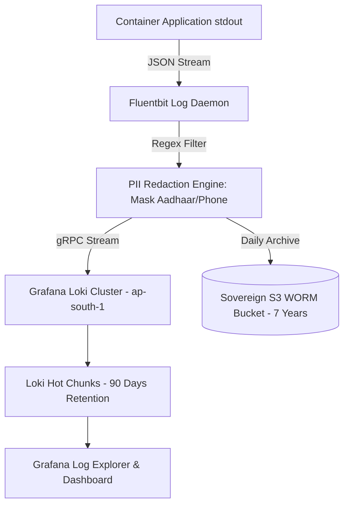

# Master Centralized Structured Logging & Loki Architecture Blueprint
## Namma Clinic Digital Health & Operations Platform
### Greater Bengaluru Authority (GBA) / BBMP Health Department
**Document Code:** `DEV-DOC-13` | **Status:** APPROVED BASELINE | **Date:** September 2026

---

## 1. Executive Summary & Logging Charter
This document defines the authoritative **Centralized Structured Logging Specification** for the Namma Clinic Digital Health Platform. The architecture establishes a high-throughput, structured JSON logging pipeline utilizing Grafana Loki and Fluentbit. The framework enforces strict automated PII redaction (protecting citizen Aadhaar numbers, phone numbers, and ABHA addresses), OpenTelemetry distributed trace context propagation, and dual-tier retention (90 days hot in Loki; 7 years cold in S3 Glacier WORM storage).

### 1.1 Non-Negotiable Logging Invariants
1. **Single-Line Structured JSON:** 100% of microservice logs must be emitted to stdout as single-line JSON envelopes conforming to the platform schema.
2. **Zero PII in Plain Text:** Log streaming daemons actively mask direct identifiers before writing to log streams (DPDP Act Section 8 compliance).
3. **Correlation Trace Injection:** Every log line must contain `trace_id` and `span_id` matching the incoming W3C distributed trace header.
4. **Immutability of Audit Trails:** Clinical write operations emit audit records directly to WORM-compliant storage protected against modification or premature deletion.
5. **Strict Log Retention Tiers:** Hot operational logs retained for 90 days; statutory healthcare audit trails retained for 7 years in sovereign S3 vaults.

## 2. Centralized Log Ingestion & Redaction Pipeline


## 3. Fluentbit Structured Log Processing Specification
### Specification Example: Fluentbit Parser & PII Redaction Blueprint
<!-- DOCUMENTATION-ONLY EXAMPLE -->
```yaml
# DOCUMENTATION-ONLY EXAMPLE
[SERVICE]
    Flush         1
    Log_Level     info
    Daemon        off
    Parsers_File  parsers.conf

[INPUT]
    Name          tail
    Path          /var/log/containers/*.log
    Parser        docker
    Tag           kube.*
    Mem_Buf_Limit 50MB

[FILTER]
    Name          modify
    Match         kube.*
    Condition     Key_Exists message
    # Mask Indian 10-digit mobile numbers
    # Mask 12-digit Aadhaar numbers with XXXXXXXX1234
    Rename        message raw_message

[OUTPUT]
    Name          loki
    Match         kube.*
    Host          loki.namma.internal
    Port          3100
    Labels        job=namma-workloads, environment=production
    Auto_Kubernetes_Labels on
```

## 4. Master Logging Standards Catalog
Comprehensive specifications for all 60 platform logging standards:

### LOG-STD-001: Structured JSON Format #1
- **Standard ID:** `LOG-STD-001`
- **Governing Rule:** All logs must be emitted as single-line JSON with timestamp, level, trace_id, span_id, and message.
- **Framework Reference:** OpenTelemetry Standard
- **Enforcement:** Enforced at code review and automated Fluentbit filter
- **Audit Verification:** Monitored via Grafana Loki log quality dashboard

### LOG-STD-002: Automated PII Redaction #2
- **Standard ID:** `LOG-STD-002`
- **Governing Rule:** Aadhaar (12-digit), mobile numbers (10-digit), and ABHA addresses masked before log output.
- **Framework Reference:** DPDP Act Privacy Guard
- **Enforcement:** Enforced at code review and automated Fluentbit filter
- **Audit Verification:** Monitored via Grafana Loki log quality dashboard

### LOG-STD-003: Trace Context Propagation #3
- **Standard ID:** `LOG-STD-003`
- **Governing Rule:** W3C `traceparent` header propagated across microservice boundaries and logged on every line.
- **Framework Reference:** Distributed Tracing
- **Enforcement:** Enforced at code review and automated Fluentbit filter
- **Audit Verification:** Monitored via Grafana Loki log quality dashboard

### LOG-STD-004: Centralized Log Aggregation #4
- **Standard ID:** `LOG-STD-004`
- **Governing Rule:** Logs shipped via Promtail / Fluentbit daemon to Grafana Loki with 90-day hot retention.
- **Framework Reference:** Observability Pipeline
- **Enforcement:** Enforced at code review and automated Fluentbit filter
- **Audit Verification:** Monitored via Grafana Loki log quality dashboard

### LOG-STD-005: Audit Immutability Tier #5
- **Standard ID:** `LOG-STD-005`
- **Governing Rule:** Security and clinical access audit logs mirrored to S3 Glacier Vault with 7-year WORM retention.
- **Framework Reference:** Statutory Compliance
- **Enforcement:** Enforced at code review and automated Fluentbit filter
- **Audit Verification:** Monitored via Grafana Loki log quality dashboard

### LOG-STD-006: Structured JSON Format #6
- **Standard ID:** `LOG-STD-006`
- **Governing Rule:** All logs must be emitted as single-line JSON with timestamp, level, trace_id, span_id, and message.
- **Framework Reference:** OpenTelemetry Standard
- **Enforcement:** Enforced at code review and automated Fluentbit filter
- **Audit Verification:** Monitored via Grafana Loki log quality dashboard

### LOG-STD-007: Automated PII Redaction #7
- **Standard ID:** `LOG-STD-007`
- **Governing Rule:** Aadhaar (12-digit), mobile numbers (10-digit), and ABHA addresses masked before log output.
- **Framework Reference:** DPDP Act Privacy Guard
- **Enforcement:** Enforced at code review and automated Fluentbit filter
- **Audit Verification:** Monitored via Grafana Loki log quality dashboard

### LOG-STD-008: Trace Context Propagation #8
- **Standard ID:** `LOG-STD-008`
- **Governing Rule:** W3C `traceparent` header propagated across microservice boundaries and logged on every line.
- **Framework Reference:** Distributed Tracing
- **Enforcement:** Enforced at code review and automated Fluentbit filter
- **Audit Verification:** Monitored via Grafana Loki log quality dashboard

### LOG-STD-009: Centralized Log Aggregation #9
- **Standard ID:** `LOG-STD-009`
- **Governing Rule:** Logs shipped via Promtail / Fluentbit daemon to Grafana Loki with 90-day hot retention.
- **Framework Reference:** Observability Pipeline
- **Enforcement:** Enforced at code review and automated Fluentbit filter
- **Audit Verification:** Monitored via Grafana Loki log quality dashboard

### LOG-STD-010: Audit Immutability Tier #10
- **Standard ID:** `LOG-STD-010`
- **Governing Rule:** Security and clinical access audit logs mirrored to S3 Glacier Vault with 7-year WORM retention.
- **Framework Reference:** Statutory Compliance
- **Enforcement:** Enforced at code review and automated Fluentbit filter
- **Audit Verification:** Monitored via Grafana Loki log quality dashboard

### LOG-STD-011: Structured JSON Format #11
- **Standard ID:** `LOG-STD-011`
- **Governing Rule:** All logs must be emitted as single-line JSON with timestamp, level, trace_id, span_id, and message.
- **Framework Reference:** OpenTelemetry Standard
- **Enforcement:** Enforced at code review and automated Fluentbit filter
- **Audit Verification:** Monitored via Grafana Loki log quality dashboard

### LOG-STD-012: Automated PII Redaction #12
- **Standard ID:** `LOG-STD-012`
- **Governing Rule:** Aadhaar (12-digit), mobile numbers (10-digit), and ABHA addresses masked before log output.
- **Framework Reference:** DPDP Act Privacy Guard
- **Enforcement:** Enforced at code review and automated Fluentbit filter
- **Audit Verification:** Monitored via Grafana Loki log quality dashboard

### LOG-STD-013: Trace Context Propagation #13
- **Standard ID:** `LOG-STD-013`
- **Governing Rule:** W3C `traceparent` header propagated across microservice boundaries and logged on every line.
- **Framework Reference:** Distributed Tracing
- **Enforcement:** Enforced at code review and automated Fluentbit filter
- **Audit Verification:** Monitored via Grafana Loki log quality dashboard

### LOG-STD-014: Centralized Log Aggregation #14
- **Standard ID:** `LOG-STD-014`
- **Governing Rule:** Logs shipped via Promtail / Fluentbit daemon to Grafana Loki with 90-day hot retention.
- **Framework Reference:** Observability Pipeline
- **Enforcement:** Enforced at code review and automated Fluentbit filter
- **Audit Verification:** Monitored via Grafana Loki log quality dashboard

### LOG-STD-015: Audit Immutability Tier #15
- **Standard ID:** `LOG-STD-015`
- **Governing Rule:** Security and clinical access audit logs mirrored to S3 Glacier Vault with 7-year WORM retention.
- **Framework Reference:** Statutory Compliance
- **Enforcement:** Enforced at code review and automated Fluentbit filter
- **Audit Verification:** Monitored via Grafana Loki log quality dashboard

### LOG-STD-016: Structured JSON Format #16
- **Standard ID:** `LOG-STD-016`
- **Governing Rule:** All logs must be emitted as single-line JSON with timestamp, level, trace_id, span_id, and message.
- **Framework Reference:** OpenTelemetry Standard
- **Enforcement:** Enforced at code review and automated Fluentbit filter
- **Audit Verification:** Monitored via Grafana Loki log quality dashboard

### LOG-STD-017: Automated PII Redaction #17
- **Standard ID:** `LOG-STD-017`
- **Governing Rule:** Aadhaar (12-digit), mobile numbers (10-digit), and ABHA addresses masked before log output.
- **Framework Reference:** DPDP Act Privacy Guard
- **Enforcement:** Enforced at code review and automated Fluentbit filter
- **Audit Verification:** Monitored via Grafana Loki log quality dashboard

### LOG-STD-018: Trace Context Propagation #18
- **Standard ID:** `LOG-STD-018`
- **Governing Rule:** W3C `traceparent` header propagated across microservice boundaries and logged on every line.
- **Framework Reference:** Distributed Tracing
- **Enforcement:** Enforced at code review and automated Fluentbit filter
- **Audit Verification:** Monitored via Grafana Loki log quality dashboard

### LOG-STD-019: Centralized Log Aggregation #19
- **Standard ID:** `LOG-STD-019`
- **Governing Rule:** Logs shipped via Promtail / Fluentbit daemon to Grafana Loki with 90-day hot retention.
- **Framework Reference:** Observability Pipeline
- **Enforcement:** Enforced at code review and automated Fluentbit filter
- **Audit Verification:** Monitored via Grafana Loki log quality dashboard

### LOG-STD-020: Audit Immutability Tier #20
- **Standard ID:** `LOG-STD-020`
- **Governing Rule:** Security and clinical access audit logs mirrored to S3 Glacier Vault with 7-year WORM retention.
- **Framework Reference:** Statutory Compliance
- **Enforcement:** Enforced at code review and automated Fluentbit filter
- **Audit Verification:** Monitored via Grafana Loki log quality dashboard

### LOG-STD-021: Structured JSON Format #21
- **Standard ID:** `LOG-STD-021`
- **Governing Rule:** All logs must be emitted as single-line JSON with timestamp, level, trace_id, span_id, and message.
- **Framework Reference:** OpenTelemetry Standard
- **Enforcement:** Enforced at code review and automated Fluentbit filter
- **Audit Verification:** Monitored via Grafana Loki log quality dashboard

### LOG-STD-022: Automated PII Redaction #22
- **Standard ID:** `LOG-STD-022`
- **Governing Rule:** Aadhaar (12-digit), mobile numbers (10-digit), and ABHA addresses masked before log output.
- **Framework Reference:** DPDP Act Privacy Guard
- **Enforcement:** Enforced at code review and automated Fluentbit filter
- **Audit Verification:** Monitored via Grafana Loki log quality dashboard

### LOG-STD-023: Trace Context Propagation #23
- **Standard ID:** `LOG-STD-023`
- **Governing Rule:** W3C `traceparent` header propagated across microservice boundaries and logged on every line.
- **Framework Reference:** Distributed Tracing
- **Enforcement:** Enforced at code review and automated Fluentbit filter
- **Audit Verification:** Monitored via Grafana Loki log quality dashboard

### LOG-STD-024: Centralized Log Aggregation #24
- **Standard ID:** `LOG-STD-024`
- **Governing Rule:** Logs shipped via Promtail / Fluentbit daemon to Grafana Loki with 90-day hot retention.
- **Framework Reference:** Observability Pipeline
- **Enforcement:** Enforced at code review and automated Fluentbit filter
- **Audit Verification:** Monitored via Grafana Loki log quality dashboard

### LOG-STD-025: Audit Immutability Tier #25
- **Standard ID:** `LOG-STD-025`
- **Governing Rule:** Security and clinical access audit logs mirrored to S3 Glacier Vault with 7-year WORM retention.
- **Framework Reference:** Statutory Compliance
- **Enforcement:** Enforced at code review and automated Fluentbit filter
- **Audit Verification:** Monitored via Grafana Loki log quality dashboard

### LOG-STD-026: Structured JSON Format #26
- **Standard ID:** `LOG-STD-026`
- **Governing Rule:** All logs must be emitted as single-line JSON with timestamp, level, trace_id, span_id, and message.
- **Framework Reference:** OpenTelemetry Standard
- **Enforcement:** Enforced at code review and automated Fluentbit filter
- **Audit Verification:** Monitored via Grafana Loki log quality dashboard

### LOG-STD-027: Automated PII Redaction #27
- **Standard ID:** `LOG-STD-027`
- **Governing Rule:** Aadhaar (12-digit), mobile numbers (10-digit), and ABHA addresses masked before log output.
- **Framework Reference:** DPDP Act Privacy Guard
- **Enforcement:** Enforced at code review and automated Fluentbit filter
- **Audit Verification:** Monitored via Grafana Loki log quality dashboard

### LOG-STD-028: Trace Context Propagation #28
- **Standard ID:** `LOG-STD-028`
- **Governing Rule:** W3C `traceparent` header propagated across microservice boundaries and logged on every line.
- **Framework Reference:** Distributed Tracing
- **Enforcement:** Enforced at code review and automated Fluentbit filter
- **Audit Verification:** Monitored via Grafana Loki log quality dashboard

### LOG-STD-029: Centralized Log Aggregation #29
- **Standard ID:** `LOG-STD-029`
- **Governing Rule:** Logs shipped via Promtail / Fluentbit daemon to Grafana Loki with 90-day hot retention.
- **Framework Reference:** Observability Pipeline
- **Enforcement:** Enforced at code review and automated Fluentbit filter
- **Audit Verification:** Monitored via Grafana Loki log quality dashboard

### LOG-STD-030: Audit Immutability Tier #30
- **Standard ID:** `LOG-STD-030`
- **Governing Rule:** Security and clinical access audit logs mirrored to S3 Glacier Vault with 7-year WORM retention.
- **Framework Reference:** Statutory Compliance
- **Enforcement:** Enforced at code review and automated Fluentbit filter
- **Audit Verification:** Monitored via Grafana Loki log quality dashboard

### LOG-STD-031: Structured JSON Format #31
- **Standard ID:** `LOG-STD-031`
- **Governing Rule:** All logs must be emitted as single-line JSON with timestamp, level, trace_id, span_id, and message.
- **Framework Reference:** OpenTelemetry Standard
- **Enforcement:** Enforced at code review and automated Fluentbit filter
- **Audit Verification:** Monitored via Grafana Loki log quality dashboard

### LOG-STD-032: Automated PII Redaction #32
- **Standard ID:** `LOG-STD-032`
- **Governing Rule:** Aadhaar (12-digit), mobile numbers (10-digit), and ABHA addresses masked before log output.
- **Framework Reference:** DPDP Act Privacy Guard
- **Enforcement:** Enforced at code review and automated Fluentbit filter
- **Audit Verification:** Monitored via Grafana Loki log quality dashboard

### LOG-STD-033: Trace Context Propagation #33
- **Standard ID:** `LOG-STD-033`
- **Governing Rule:** W3C `traceparent` header propagated across microservice boundaries and logged on every line.
- **Framework Reference:** Distributed Tracing
- **Enforcement:** Enforced at code review and automated Fluentbit filter
- **Audit Verification:** Monitored via Grafana Loki log quality dashboard

### LOG-STD-034: Centralized Log Aggregation #34
- **Standard ID:** `LOG-STD-034`
- **Governing Rule:** Logs shipped via Promtail / Fluentbit daemon to Grafana Loki with 90-day hot retention.
- **Framework Reference:** Observability Pipeline
- **Enforcement:** Enforced at code review and automated Fluentbit filter
- **Audit Verification:** Monitored via Grafana Loki log quality dashboard

### LOG-STD-035: Audit Immutability Tier #35
- **Standard ID:** `LOG-STD-035`
- **Governing Rule:** Security and clinical access audit logs mirrored to S3 Glacier Vault with 7-year WORM retention.
- **Framework Reference:** Statutory Compliance
- **Enforcement:** Enforced at code review and automated Fluentbit filter
- **Audit Verification:** Monitored via Grafana Loki log quality dashboard

### LOG-STD-036: Structured JSON Format #36
- **Standard ID:** `LOG-STD-036`
- **Governing Rule:** All logs must be emitted as single-line JSON with timestamp, level, trace_id, span_id, and message.
- **Framework Reference:** OpenTelemetry Standard
- **Enforcement:** Enforced at code review and automated Fluentbit filter
- **Audit Verification:** Monitored via Grafana Loki log quality dashboard

### LOG-STD-037: Automated PII Redaction #37
- **Standard ID:** `LOG-STD-037`
- **Governing Rule:** Aadhaar (12-digit), mobile numbers (10-digit), and ABHA addresses masked before log output.
- **Framework Reference:** DPDP Act Privacy Guard
- **Enforcement:** Enforced at code review and automated Fluentbit filter
- **Audit Verification:** Monitored via Grafana Loki log quality dashboard

### LOG-STD-038: Trace Context Propagation #38
- **Standard ID:** `LOG-STD-038`
- **Governing Rule:** W3C `traceparent` header propagated across microservice boundaries and logged on every line.
- **Framework Reference:** Distributed Tracing
- **Enforcement:** Enforced at code review and automated Fluentbit filter
- **Audit Verification:** Monitored via Grafana Loki log quality dashboard

### LOG-STD-039: Centralized Log Aggregation #39
- **Standard ID:** `LOG-STD-039`
- **Governing Rule:** Logs shipped via Promtail / Fluentbit daemon to Grafana Loki with 90-day hot retention.
- **Framework Reference:** Observability Pipeline
- **Enforcement:** Enforced at code review and automated Fluentbit filter
- **Audit Verification:** Monitored via Grafana Loki log quality dashboard

### LOG-STD-040: Audit Immutability Tier #40
- **Standard ID:** `LOG-STD-040`
- **Governing Rule:** Security and clinical access audit logs mirrored to S3 Glacier Vault with 7-year WORM retention.
- **Framework Reference:** Statutory Compliance
- **Enforcement:** Enforced at code review and automated Fluentbit filter
- **Audit Verification:** Monitored via Grafana Loki log quality dashboard

### LOG-STD-041: Structured JSON Format #41
- **Standard ID:** `LOG-STD-041`
- **Governing Rule:** All logs must be emitted as single-line JSON with timestamp, level, trace_id, span_id, and message.
- **Framework Reference:** OpenTelemetry Standard
- **Enforcement:** Enforced at code review and automated Fluentbit filter
- **Audit Verification:** Monitored via Grafana Loki log quality dashboard

### LOG-STD-042: Automated PII Redaction #42
- **Standard ID:** `LOG-STD-042`
- **Governing Rule:** Aadhaar (12-digit), mobile numbers (10-digit), and ABHA addresses masked before log output.
- **Framework Reference:** DPDP Act Privacy Guard
- **Enforcement:** Enforced at code review and automated Fluentbit filter
- **Audit Verification:** Monitored via Grafana Loki log quality dashboard

### LOG-STD-043: Trace Context Propagation #43
- **Standard ID:** `LOG-STD-043`
- **Governing Rule:** W3C `traceparent` header propagated across microservice boundaries and logged on every line.
- **Framework Reference:** Distributed Tracing
- **Enforcement:** Enforced at code review and automated Fluentbit filter
- **Audit Verification:** Monitored via Grafana Loki log quality dashboard

### LOG-STD-044: Centralized Log Aggregation #44
- **Standard ID:** `LOG-STD-044`
- **Governing Rule:** Logs shipped via Promtail / Fluentbit daemon to Grafana Loki with 90-day hot retention.
- **Framework Reference:** Observability Pipeline
- **Enforcement:** Enforced at code review and automated Fluentbit filter
- **Audit Verification:** Monitored via Grafana Loki log quality dashboard

### LOG-STD-045: Audit Immutability Tier #45
- **Standard ID:** `LOG-STD-045`
- **Governing Rule:** Security and clinical access audit logs mirrored to S3 Glacier Vault with 7-year WORM retention.
- **Framework Reference:** Statutory Compliance
- **Enforcement:** Enforced at code review and automated Fluentbit filter
- **Audit Verification:** Monitored via Grafana Loki log quality dashboard

### LOG-STD-046: Structured JSON Format #46
- **Standard ID:** `LOG-STD-046`
- **Governing Rule:** All logs must be emitted as single-line JSON with timestamp, level, trace_id, span_id, and message.
- **Framework Reference:** OpenTelemetry Standard
- **Enforcement:** Enforced at code review and automated Fluentbit filter
- **Audit Verification:** Monitored via Grafana Loki log quality dashboard

### LOG-STD-047: Automated PII Redaction #47
- **Standard ID:** `LOG-STD-047`
- **Governing Rule:** Aadhaar (12-digit), mobile numbers (10-digit), and ABHA addresses masked before log output.
- **Framework Reference:** DPDP Act Privacy Guard
- **Enforcement:** Enforced at code review and automated Fluentbit filter
- **Audit Verification:** Monitored via Grafana Loki log quality dashboard

### LOG-STD-048: Trace Context Propagation #48
- **Standard ID:** `LOG-STD-048`
- **Governing Rule:** W3C `traceparent` header propagated across microservice boundaries and logged on every line.
- **Framework Reference:** Distributed Tracing
- **Enforcement:** Enforced at code review and automated Fluentbit filter
- **Audit Verification:** Monitored via Grafana Loki log quality dashboard

### LOG-STD-049: Centralized Log Aggregation #49
- **Standard ID:** `LOG-STD-049`
- **Governing Rule:** Logs shipped via Promtail / Fluentbit daemon to Grafana Loki with 90-day hot retention.
- **Framework Reference:** Observability Pipeline
- **Enforcement:** Enforced at code review and automated Fluentbit filter
- **Audit Verification:** Monitored via Grafana Loki log quality dashboard

### LOG-STD-050: Audit Immutability Tier #50
- **Standard ID:** `LOG-STD-050`
- **Governing Rule:** Security and clinical access audit logs mirrored to S3 Glacier Vault with 7-year WORM retention.
- **Framework Reference:** Statutory Compliance
- **Enforcement:** Enforced at code review and automated Fluentbit filter
- **Audit Verification:** Monitored via Grafana Loki log quality dashboard

### LOG-STD-051: Structured JSON Format #51
- **Standard ID:** `LOG-STD-051`
- **Governing Rule:** All logs must be emitted as single-line JSON with timestamp, level, trace_id, span_id, and message.
- **Framework Reference:** OpenTelemetry Standard
- **Enforcement:** Enforced at code review and automated Fluentbit filter
- **Audit Verification:** Monitored via Grafana Loki log quality dashboard

### LOG-STD-052: Automated PII Redaction #52
- **Standard ID:** `LOG-STD-052`
- **Governing Rule:** Aadhaar (12-digit), mobile numbers (10-digit), and ABHA addresses masked before log output.
- **Framework Reference:** DPDP Act Privacy Guard
- **Enforcement:** Enforced at code review and automated Fluentbit filter
- **Audit Verification:** Monitored via Grafana Loki log quality dashboard

### LOG-STD-053: Trace Context Propagation #53
- **Standard ID:** `LOG-STD-053`
- **Governing Rule:** W3C `traceparent` header propagated across microservice boundaries and logged on every line.
- **Framework Reference:** Distributed Tracing
- **Enforcement:** Enforced at code review and automated Fluentbit filter
- **Audit Verification:** Monitored via Grafana Loki log quality dashboard

### LOG-STD-054: Centralized Log Aggregation #54
- **Standard ID:** `LOG-STD-054`
- **Governing Rule:** Logs shipped via Promtail / Fluentbit daemon to Grafana Loki with 90-day hot retention.
- **Framework Reference:** Observability Pipeline
- **Enforcement:** Enforced at code review and automated Fluentbit filter
- **Audit Verification:** Monitored via Grafana Loki log quality dashboard

### LOG-STD-055: Audit Immutability Tier #55
- **Standard ID:** `LOG-STD-055`
- **Governing Rule:** Security and clinical access audit logs mirrored to S3 Glacier Vault with 7-year WORM retention.
- **Framework Reference:** Statutory Compliance
- **Enforcement:** Enforced at code review and automated Fluentbit filter
- **Audit Verification:** Monitored via Grafana Loki log quality dashboard

### LOG-STD-056: Structured JSON Format #56
- **Standard ID:** `LOG-STD-056`
- **Governing Rule:** All logs must be emitted as single-line JSON with timestamp, level, trace_id, span_id, and message.
- **Framework Reference:** OpenTelemetry Standard
- **Enforcement:** Enforced at code review and automated Fluentbit filter
- **Audit Verification:** Monitored via Grafana Loki log quality dashboard

### LOG-STD-057: Automated PII Redaction #57
- **Standard ID:** `LOG-STD-057`
- **Governing Rule:** Aadhaar (12-digit), mobile numbers (10-digit), and ABHA addresses masked before log output.
- **Framework Reference:** DPDP Act Privacy Guard
- **Enforcement:** Enforced at code review and automated Fluentbit filter
- **Audit Verification:** Monitored via Grafana Loki log quality dashboard

### LOG-STD-058: Trace Context Propagation #58
- **Standard ID:** `LOG-STD-058`
- **Governing Rule:** W3C `traceparent` header propagated across microservice boundaries and logged on every line.
- **Framework Reference:** Distributed Tracing
- **Enforcement:** Enforced at code review and automated Fluentbit filter
- **Audit Verification:** Monitored via Grafana Loki log quality dashboard

### LOG-STD-059: Centralized Log Aggregation #59
- **Standard ID:** `LOG-STD-059`
- **Governing Rule:** Logs shipped via Promtail / Fluentbit daemon to Grafana Loki with 90-day hot retention.
- **Framework Reference:** Observability Pipeline
- **Enforcement:** Enforced at code review and automated Fluentbit filter
- **Audit Verification:** Monitored via Grafana Loki log quality dashboard

### LOG-STD-060: Audit Immutability Tier #60
- **Standard ID:** `LOG-STD-060`
- **Governing Rule:** Security and clinical access audit logs mirrored to S3 Glacier Vault with 7-year WORM retention.
- **Framework Reference:** Statutory Compliance
- **Enforcement:** Enforced at code review and automated Fluentbit filter
- **Audit Verification:** Monitored via Grafana Loki log quality dashboard

## 5. Feature Structured Logging & Audit Codes across 180 Features
Detailed audit codes and log event definitions across all 180 platform product features:

### FEATURE-001: Logging Specification for Feature `Credential Verification`
- **Feature ID:** `FEATURE-001` (Feature #1)
- **Functional Module:** `MODULE-001` (DOMAIN-001)
- **Governed Logging Standard:** `LOG-STD-001`
- **Audit Event Code:** `LOG_AUDIT_MODULE-001_0001`
- **Default Log Level:** `INFO` (Escalates to `ERROR` on exception)
- **Mandatory Masked Fields:** `patient_phone`, `aadhaar_hash`, `abha_id`
- **Retention Tier:** Hot Loki (90 Days) + Sovereign S3 Vault (7 Years)

### FEATURE-002: Logging Specification for Feature `Session Token Minting`
- **Feature ID:** `FEATURE-002` (Feature #2)
- **Functional Module:** `MODULE-001` (DOMAIN-001)
- **Governed Logging Standard:** `LOG-STD-002`
- **Audit Event Code:** `LOG_AUDIT_MODULE-001_0002`
- **Default Log Level:** `INFO` (Escalates to `ERROR` on exception)
- **Mandatory Masked Fields:** `patient_phone`, `aadhaar_hash`, `abha_id`
- **Retention Tier:** Hot Loki (90 Days) + Sovereign S3 Vault (7 Years)

### FEATURE-003: Logging Specification for Feature `MFA Challenge Dispatch`
- **Feature ID:** `FEATURE-003` (Feature #3)
- **Functional Module:** `MODULE-001` (DOMAIN-001)
- **Governed Logging Standard:** `LOG-STD-003`
- **Audit Event Code:** `LOG_AUDIT_MODULE-001_0003`
- **Default Log Level:** `INFO` (Escalates to `ERROR` on exception)
- **Mandatory Masked Fields:** `patient_phone`, `aadhaar_hash`, `abha_id`
- **Retention Tier:** Hot Loki (90 Days) + Sovereign S3 Vault (7 Years)

### FEATURE-004: Logging Specification for Feature `Biometric Authentication Bridge`
- **Feature ID:** `FEATURE-004` (Feature #4)
- **Functional Module:** `MODULE-001` (DOMAIN-001)
- **Governed Logging Standard:** `LOG-STD-004`
- **Audit Event Code:** `LOG_AUDIT_MODULE-001_0004`
- **Default Log Level:** `INFO` (Escalates to `ERROR` on exception)
- **Mandatory Masked Fields:** `patient_phone`, `aadhaar_hash`, `abha_id`
- **Retention Tier:** Hot Loki (90 Days) + Sovereign S3 Vault (7 Years)

### FEATURE-005: Logging Specification for Feature `Local PIN Verification`
- **Feature ID:** `FEATURE-005` (Feature #5)
- **Functional Module:** `MODULE-001` (DOMAIN-001)
- **Governed Logging Standard:** `LOG-STD-005`
- **Audit Event Code:** `LOG_AUDIT_MODULE-001_0005`
- **Default Log Level:** `INFO` (Escalates to `ERROR` on exception)
- **Mandatory Masked Fields:** `patient_phone`, `aadhaar_hash`, `abha_id`
- **Retention Tier:** Hot Loki (90 Days) + Sovereign S3 Vault (7 Years)

### FEATURE-006: Logging Specification for Feature `Session Inactivity Lockout`
- **Feature ID:** `FEATURE-006` (Feature #6)
- **Functional Module:** `MODULE-001` (DOMAIN-001)
- **Governed Logging Standard:** `LOG-STD-006`
- **Audit Event Code:** `LOG_AUDIT_MODULE-001_0006`
- **Default Log Level:** `INFO` (Escalates to `ERROR` on exception)
- **Mandatory Masked Fields:** `patient_phone`, `aadhaar_hash`, `abha_id`
- **Retention Tier:** Hot Loki (90 Days) + Sovereign S3 Vault (7 Years)

### FEATURE-007: Logging Specification for Feature `Permission Evaluation`
- **Feature ID:** `FEATURE-007` (Feature #7)
- **Functional Module:** `MODULE-002` (DOMAIN-001)
- **Governed Logging Standard:** `LOG-STD-007`
- **Audit Event Code:** `LOG_AUDIT_MODULE-002_0007`
- **Default Log Level:** `INFO` (Escalates to `ERROR` on exception)
- **Mandatory Masked Fields:** `patient_phone`, `aadhaar_hash`, `abha_id`
- **Retention Tier:** Hot Loki (90 Days) + Sovereign S3 Vault (7 Years)

### FEATURE-008: Logging Specification for Feature `Dynamic Role Assignment`
- **Feature ID:** `FEATURE-008` (Feature #8)
- **Functional Module:** `MODULE-002` (DOMAIN-001)
- **Governed Logging Standard:** `LOG-STD-008`
- **Audit Event Code:** `LOG_AUDIT_MODULE-002_0008`
- **Default Log Level:** `INFO` (Escalates to `ERROR` on exception)
- **Mandatory Masked Fields:** `patient_phone`, `aadhaar_hash`, `abha_id`
- **Retention Tier:** Hot Loki (90 Days) + Sovereign S3 Vault (7 Years)

### FEATURE-009: Logging Specification for Feature `Conflict-of-Interest Prevention`
- **Feature ID:** `FEATURE-009` (Feature #9)
- **Functional Module:** `MODULE-002` (DOMAIN-001)
- **Governed Logging Standard:** `LOG-STD-009`
- **Audit Event Code:** `LOG_AUDIT_MODULE-002_0009`
- **Default Log Level:** `INFO` (Escalates to `ERROR` on exception)
- **Mandatory Masked Fields:** `patient_phone`, `aadhaar_hash`, `abha_id`
- **Retention Tier:** Hot Loki (90 Days) + Sovereign S3 Vault (7 Years)

### FEATURE-010: Logging Specification for Feature `Maker-Checker Authorization`
- **Feature ID:** `FEATURE-010` (Feature #10)
- **Functional Module:** `MODULE-002` (DOMAIN-001)
- **Governed Logging Standard:** `LOG-STD-010`
- **Audit Event Code:** `LOG_AUDIT_MODULE-002_0010`
- **Default Log Level:** `INFO` (Escalates to `ERROR` on exception)
- **Mandatory Masked Fields:** `patient_phone`, `aadhaar_hash`, `abha_id`
- **Retention Tier:** Hot Loki (90 Days) + Sovereign S3 Vault (7 Years)

### FEATURE-011: Logging Specification for Feature `Break-Glass Privilege Elevation`
- **Feature ID:** `FEATURE-011` (Feature #11)
- **Functional Module:** `MODULE-002` (DOMAIN-001)
- **Governed Logging Standard:** `LOG-STD-011`
- **Audit Event Code:** `LOG_AUDIT_MODULE-002_0011`
- **Default Log Level:** `INFO` (Escalates to `ERROR` on exception)
- **Mandatory Masked Fields:** `patient_phone`, `aadhaar_hash`, `abha_id`
- **Retention Tier:** Hot Loki (90 Days) + Sovereign S3 Vault (7 Years)

### FEATURE-012: Logging Specification for Feature `Privilege Elevation Audit`
- **Feature ID:** `FEATURE-012` (Feature #12)
- **Functional Module:** `MODULE-002` (DOMAIN-001)
- **Governed Logging Standard:** `LOG-STD-012`
- **Audit Event Code:** `LOG_AUDIT_MODULE-002_0012`
- **Default Log Level:** `INFO` (Escalates to `ERROR` on exception)
- **Mandatory Masked Fields:** `patient_phone`, `aadhaar_hash`, `abha_id`
- **Retention Tier:** Hot Loki (90 Days) + Sovereign S3 Vault (7 Years)

### FEATURE-013: Logging Specification for Feature `Hierarchy Node Management`
- **Feature ID:** `FEATURE-013` (Feature #13)
- **Functional Module:** `MODULE-003` (DOMAIN-001)
- **Governed Logging Standard:** `LOG-STD-013`
- **Audit Event Code:** `LOG_AUDIT_MODULE-003_0013`
- **Default Log Level:** `INFO` (Escalates to `ERROR` on exception)
- **Mandatory Masked Fields:** `patient_phone`, `aadhaar_hash`, `abha_id`
- **Retention Tier:** Hot Loki (90 Days) + Sovereign S3 Vault (7 Years)

### FEATURE-014: Logging Specification for Feature `NIN / HFR Registry Linking`
- **Feature ID:** `FEATURE-014` (Feature #14)
- **Functional Module:** `MODULE-003` (DOMAIN-001)
- **Governed Logging Standard:** `LOG-STD-014`
- **Audit Event Code:** `LOG_AUDIT_MODULE-003_0014`
- **Default Log Level:** `INFO` (Escalates to `ERROR` on exception)
- **Mandatory Masked Fields:** `patient_phone`, `aadhaar_hash`, `abha_id`
- **Retention Tier:** Hot Loki (90 Days) + Sovereign S3 Vault (7 Years)

### FEATURE-015: Logging Specification for Feature `Station Terminal Mapping`
- **Feature ID:** `FEATURE-015` (Feature #15)
- **Functional Module:** `MODULE-003` (DOMAIN-001)
- **Governed Logging Standard:** `LOG-STD-015`
- **Audit Event Code:** `LOG_AUDIT_MODULE-003_0015`
- **Default Log Level:** `INFO` (Escalates to `ERROR` on exception)
- **Mandatory Masked Fields:** `patient_phone`, `aadhaar_hash`, `abha_id`
- **Retention Tier:** Hot Loki (90 Days) + Sovereign S3 Vault (7 Years)

### FEATURE-016: Logging Specification for Feature `Facility Capacity Configuration`
- **Feature ID:** `FEATURE-016` (Feature #16)
- **Functional Module:** `MODULE-003` (DOMAIN-001)
- **Governed Logging Standard:** `LOG-STD-016`
- **Audit Event Code:** `LOG_AUDIT_MODULE-003_0016`
- **Default Log Level:** `INFO` (Escalates to `ERROR` on exception)
- **Mandatory Masked Fields:** `patient_phone`, `aadhaar_hash`, `abha_id`
- **Retention Tier:** Hot Loki (90 Days) + Sovereign S3 Vault (7 Years)

### FEATURE-017: Logging Specification for Feature `Operating Hours Enforcement`
- **Feature ID:** `FEATURE-017` (Feature #17)
- **Functional Module:** `MODULE-003` (DOMAIN-001)
- **Governed Logging Standard:** `LOG-STD-017`
- **Audit Event Code:** `LOG_AUDIT_MODULE-003_0017`
- **Default Log Level:** `INFO` (Escalates to `ERROR` on exception)
- **Mandatory Masked Fields:** `patient_phone`, `aadhaar_hash`, `abha_id`
- **Retention Tier:** Hot Loki (90 Days) + Sovereign S3 Vault (7 Years)

### FEATURE-018: Logging Specification for Feature `Special Camp Calendar`
- **Feature ID:** `FEATURE-018` (Feature #18)
- **Functional Module:** `MODULE-003` (DOMAIN-001)
- **Governed Logging Standard:** `LOG-STD-018`
- **Audit Event Code:** `LOG_AUDIT_MODULE-003_0018`
- **Default Log Level:** `INFO` (Escalates to `ERROR` on exception)
- **Mandatory Masked Fields:** `patient_phone`, `aadhaar_hash`, `abha_id`
- **Retention Tier:** Hot Loki (90 Days) + Sovereign S3 Vault (7 Years)

### FEATURE-019: Logging Specification for Feature `Staff Onboarding & KYC`
- **Feature ID:** `FEATURE-019` (Feature #19)
- **Functional Module:** `MODULE-004` (DOMAIN-001)
- **Governed Logging Standard:** `LOG-STD-019`
- **Audit Event Code:** `LOG_AUDIT_MODULE-004_0019`
- **Default Log Level:** `INFO` (Escalates to `ERROR` on exception)
- **Mandatory Masked Fields:** `patient_phone`, `aadhaar_hash`, `abha_id`
- **Retention Tier:** Hot Loki (90 Days) + Sovereign S3 Vault (7 Years)

### FEATURE-020: Logging Specification for Feature `Professional License Verification`
- **Feature ID:** `FEATURE-020` (Feature #20)
- **Functional Module:** `MODULE-004` (DOMAIN-001)
- **Governed Logging Standard:** `LOG-STD-020`
- **Audit Event Code:** `LOG_AUDIT_MODULE-004_0020`
- **Default Log Level:** `INFO` (Escalates to `ERROR` on exception)
- **Mandatory Masked Fields:** `patient_phone`, `aadhaar_hash`, `abha_id`
- **Retention Tier:** Hot Loki (90 Days) + Sovereign S3 Vault (7 Years)

### FEATURE-021: Logging Specification for Feature `Duty Roster Generation`
- **Feature ID:** `FEATURE-021` (Feature #21)
- **Functional Module:** `MODULE-004` (DOMAIN-001)
- **Governed Logging Standard:** `LOG-STD-021`
- **Audit Event Code:** `LOG_AUDIT_MODULE-004_0021`
- **Default Log Level:** `INFO` (Escalates to `ERROR` on exception)
- **Mandatory Masked Fields:** `patient_phone`, `aadhaar_hash`, `abha_id`
- **Retention Tier:** Hot Loki (90 Days) + Sovereign S3 Vault (7 Years)

### FEATURE-022: Logging Specification for Feature `Biometric Attendance Linking`
- **Feature ID:** `FEATURE-022` (Feature #22)
- **Functional Module:** `MODULE-004` (DOMAIN-001)
- **Governed Logging Standard:** `LOG-STD-022`
- **Audit Event Code:** `LOG_AUDIT_MODULE-004_0022`
- **Default Log Level:** `INFO` (Escalates to `ERROR` on exception)
- **Mandatory Masked Fields:** `patient_phone`, `aadhaar_hash`, `abha_id`
- **Retention Tier:** Hot Loki (90 Days) + Sovereign S3 Vault (7 Years)

### FEATURE-023: Logging Specification for Feature `Digital Signature Enrollment`
- **Feature ID:** `FEATURE-023` (Feature #23)
- **Functional Module:** `MODULE-004` (DOMAIN-001)
- **Governed Logging Standard:** `LOG-STD-023`
- **Audit Event Code:** `LOG_AUDIT_MODULE-004_0023`
- **Default Log Level:** `INFO` (Escalates to `ERROR` on exception)
- **Mandatory Masked Fields:** `patient_phone`, `aadhaar_hash`, `abha_id`
- **Retention Tier:** Hot Loki (90 Days) + Sovereign S3 Vault (7 Years)

### FEATURE-024: Logging Specification for Feature `Signature Revocation`
- **Feature ID:** `FEATURE-024` (Feature #24)
- **Functional Module:** `MODULE-004` (DOMAIN-001)
- **Governed Logging Standard:** `LOG-STD-024`
- **Audit Event Code:** `LOG_AUDIT_MODULE-004_0024`
- **Default Log Level:** `INFO` (Escalates to `ERROR` on exception)
- **Mandatory Masked Fields:** `patient_phone`, `aadhaar_hash`, `abha_id`
- **Retention Tier:** Hot Loki (90 Days) + Sovereign S3 Vault (7 Years)

### FEATURE-025: Logging Specification for Feature `Targeted Flag Activation`
- **Feature ID:** `FEATURE-025` (Feature #25)
- **Functional Module:** `MODULE-026` (DOMAIN-001)
- **Governed Logging Standard:** `LOG-STD-025`
- **Audit Event Code:** `LOG_AUDIT_MODULE-026_0025`
- **Default Log Level:** `INFO` (Escalates to `ERROR` on exception)
- **Mandatory Masked Fields:** `patient_phone`, `aadhaar_hash`, `abha_id`
- **Retention Tier:** Hot Loki (90 Days) + Sovereign S3 Vault (7 Years)

### FEATURE-026: Logging Specification for Feature `Emergency Feature Killswitch`
- **Feature ID:** `FEATURE-026` (Feature #26)
- **Functional Module:** `MODULE-026` (DOMAIN-001)
- **Governed Logging Standard:** `LOG-STD-026`
- **Audit Event Code:** `LOG_AUDIT_MODULE-026_0026`
- **Default Log Level:** `INFO` (Escalates to `ERROR` on exception)
- **Mandatory Masked Fields:** `patient_phone`, `aadhaar_hash`, `abha_id`
- **Retention Tier:** Hot Loki (90 Days) + Sovereign S3 Vault (7 Years)

### FEATURE-027: Logging Specification for Feature `System Parameter Tuning`
- **Feature ID:** `FEATURE-027` (Feature #27)
- **Functional Module:** `MODULE-026` (DOMAIN-001)
- **Governed Logging Standard:** `LOG-STD-027`
- **Audit Event Code:** `LOG_AUDIT_MODULE-026_0027`
- **Default Log Level:** `INFO` (Escalates to `ERROR` on exception)
- **Mandatory Masked Fields:** `patient_phone`, `aadhaar_hash`, `abha_id`
- **Retention Tier:** Hot Loki (90 Days) + Sovereign S3 Vault (7 Years)

### FEATURE-028: Logging Specification for Feature `Edge Configuration Distribution`
- **Feature ID:** `FEATURE-028` (Feature #28)
- **Functional Module:** `MODULE-026` (DOMAIN-001)
- **Governed Logging Standard:** `LOG-STD-028`
- **Audit Event Code:** `LOG_AUDIT_MODULE-026_0028`
- **Default Log Level:** `INFO` (Escalates to `ERROR` on exception)
- **Mandatory Masked Fields:** `patient_phone`, `aadhaar_hash`, `abha_id`
- **Retention Tier:** Hot Loki (90 Days) + Sovereign S3 Vault (7 Years)

### FEATURE-029: Logging Specification for Feature `Edge Migration Orchestration`
- **Feature ID:** `FEATURE-029` (Feature #29)
- **Functional Module:** `MODULE-026` (DOMAIN-001)
- **Governed Logging Standard:** `LOG-STD-029`
- **Audit Event Code:** `LOG_AUDIT_MODULE-026_0029`
- **Default Log Level:** `INFO` (Escalates to `ERROR` on exception)
- **Mandatory Masked Fields:** `patient_phone`, `aadhaar_hash`, `abha_id`
- **Retention Tier:** Hot Loki (90 Days) + Sovereign S3 Vault (7 Years)

### FEATURE-030: Logging Specification for Feature `Health Probe Monitoring`
- **Feature ID:** `FEATURE-030` (Feature #30)
- **Functional Module:** `MODULE-026` (DOMAIN-001)
- **Governed Logging Standard:** `LOG-STD-030`
- **Audit Event Code:** `LOG_AUDIT_MODULE-026_0030`
- **Default Log Level:** `INFO` (Escalates to `ERROR` on exception)
- **Mandatory Masked Fields:** `patient_phone`, `aadhaar_hash`, `abha_id`
- **Retention Tier:** Hot Loki (90 Days) + Sovereign S3 Vault (7 Years)

### FEATURE-031: Logging Specification for Feature `Bilingual Intake UI`
- **Feature ID:** `FEATURE-031` (Feature #31)
- **Functional Module:** `MODULE-005` (DOMAIN-002)
- **Governed Logging Standard:** `LOG-STD-031`
- **Audit Event Code:** `LOG_AUDIT_MODULE-005_0031`
- **Default Log Level:** `INFO` (Escalates to `ERROR` on exception)
- **Mandatory Masked Fields:** `patient_phone`, `aadhaar_hash`, `abha_id`
- **Retention Tier:** Hot Loki (90 Days) + Sovereign S3 Vault (7 Years)

### FEATURE-032: Logging Specification for Feature `Vulnerable Citizen Flagging`
- **Feature ID:** `FEATURE-032` (Feature #32)
- **Functional Module:** `MODULE-005` (DOMAIN-002)
- **Governed Logging Standard:** `LOG-STD-032`
- **Audit Event Code:** `LOG_AUDIT_MODULE-005_0032`
- **Default Log Level:** `INFO` (Escalates to `ERROR` on exception)
- **Mandatory Masked Fields:** `patient_phone`, `aadhaar_hash`, `abha_id`
- **Retention Tier:** Hot Loki (90 Days) + Sovereign S3 Vault (7 Years)

### FEATURE-033: Logging Specification for Feature `Aadhaar OTP ABHA Bridge`
- **Feature ID:** `FEATURE-033` (Feature #33)
- **Functional Module:** `MODULE-005` (DOMAIN-002)
- **Governed Logging Standard:** `LOG-STD-033`
- **Audit Event Code:** `LOG_AUDIT_MODULE-005_0033`
- **Default Log Level:** `INFO` (Escalates to `ERROR` on exception)
- **Mandatory Masked Fields:** `patient_phone`, `aadhaar_hash`, `abha_id`
- **Retention Tier:** Hot Loki (90 Days) + Sovereign S3 Vault (7 Years)

### FEATURE-034: Logging Specification for Feature `Demographic ABHA Creation`
- **Feature ID:** `FEATURE-034` (Feature #34)
- **Functional Module:** `MODULE-005` (DOMAIN-002)
- **Governed Logging Standard:** `LOG-STD-034`
- **Audit Event Code:** `LOG_AUDIT_MODULE-005_0034`
- **Default Log Level:** `INFO` (Escalates to `ERROR` on exception)
- **Mandatory Masked Fields:** `patient_phone`, `aadhaar_hash`, `abha_id`
- **Retention Tier:** Hot Loki (90 Days) + Sovereign S3 Vault (7 Years)

### FEATURE-035: Logging Specification for Feature `Deterministic UHID Minting`
- **Feature ID:** `FEATURE-035` (Feature #35)
- **Functional Module:** `MODULE-005` (DOMAIN-002)
- **Governed Logging Standard:** `LOG-STD-035`
- **Audit Event Code:** `LOG_AUDIT_MODULE-005_0035`
- **Default Log Level:** `INFO` (Escalates to `ERROR` on exception)
- **Mandatory Masked Fields:** `patient_phone`, `aadhaar_hash`, `abha_id`
- **Retention Tier:** Hot Loki (90 Days) + Sovereign S3 Vault (7 Years)

### FEATURE-036: Logging Specification for Feature `Soundex / Double-Metaphone Matching`
- **Feature ID:** `FEATURE-036` (Feature #36)
- **Functional Module:** `MODULE-005` (DOMAIN-002)
- **Governed Logging Standard:** `LOG-STD-036`
- **Audit Event Code:** `LOG_AUDIT_MODULE-005_0036`
- **Default Log Level:** `INFO` (Escalates to `ERROR` on exception)
- **Mandatory Masked Fields:** `patient_phone`, `aadhaar_hash`, `abha_id`
- **Retention Tier:** Hot Loki (90 Days) + Sovereign S3 Vault (7 Years)

### FEATURE-037: Logging Specification for Feature `Bilingual Consent Presentation`
- **Feature ID:** `FEATURE-037` (Feature #37)
- **Functional Module:** `MODULE-006` (DOMAIN-002)
- **Governed Logging Standard:** `LOG-STD-037`
- **Audit Event Code:** `LOG_AUDIT_MODULE-006_0037`
- **Default Log Level:** `INFO` (Escalates to `ERROR` on exception)
- **Mandatory Masked Fields:** `patient_phone`, `aadhaar_hash`, `abha_id`
- **Retention Tier:** Hot Loki (90 Days) + Sovereign S3 Vault (7 Years)

### FEATURE-038: Logging Specification for Feature `Digital Signature / Thumbprint Capture`
- **Feature ID:** `FEATURE-038` (Feature #38)
- **Functional Module:** `MODULE-006` (DOMAIN-002)
- **Governed Logging Standard:** `LOG-STD-038`
- **Audit Event Code:** `LOG_AUDIT_MODULE-006_0038`
- **Default Log Level:** `INFO` (Escalates to `ERROR` on exception)
- **Mandatory Masked Fields:** `patient_phone`, `aadhaar_hash`, `abha_id`
- **Retention Tier:** Hot Loki (90 Days) + Sovereign S3 Vault (7 Years)

### FEATURE-039: Logging Specification for Feature `Granular Purpose-Based Consent`
- **Feature ID:** `FEATURE-039` (Feature #39)
- **Functional Module:** `MODULE-006` (DOMAIN-002)
- **Governed Logging Standard:** `LOG-STD-039`
- **Audit Event Code:** `LOG_AUDIT_MODULE-006_0039`
- **Default Log Level:** `INFO` (Escalates to `ERROR` on exception)
- **Mandatory Masked Fields:** `patient_phone`, `aadhaar_hash`, `abha_id`
- **Retention Tier:** Hot Loki (90 Days) + Sovereign S3 Vault (7 Years)

### FEATURE-040: Logging Specification for Feature `Consent Revocation Workflow`
- **Feature ID:** `FEATURE-040` (Feature #40)
- **Functional Module:** `MODULE-006` (DOMAIN-002)
- **Governed Logging Standard:** `LOG-STD-040`
- **Audit Event Code:** `LOG_AUDIT_MODULE-006_0040`
- **Default Log Level:** `INFO` (Escalates to `ERROR` on exception)
- **Mandatory Masked Fields:** `patient_phone`, `aadhaar_hash`, `abha_id`
- **Retention Tier:** Hot Loki (90 Days) + Sovereign S3 Vault (7 Years)

### FEATURE-041: Logging Specification for Feature `Guardian Relationship Verification`
- **Feature ID:** `FEATURE-041` (Feature #41)
- **Functional Module:** `MODULE-006` (DOMAIN-002)
- **Governed Logging Standard:** `LOG-STD-041`
- **Audit Event Code:** `LOG_AUDIT_MODULE-006_0041`
- **Default Log Level:** `INFO` (Escalates to `ERROR` on exception)
- **Mandatory Masked Fields:** `patient_phone`, `aadhaar_hash`, `abha_id`
- **Retention Tier:** Hot Loki (90 Days) + Sovereign S3 Vault (7 Years)

### FEATURE-042: Logging Specification for Feature `Implied Emergency Consent`
- **Feature ID:** `FEATURE-042` (Feature #42)
- **Functional Module:** `MODULE-006` (DOMAIN-002)
- **Governed Logging Standard:** `LOG-STD-042`
- **Audit Event Code:** `LOG_AUDIT_MODULE-006_0042`
- **Default Log Level:** `INFO` (Escalates to `ERROR` on exception)
- **Mandatory Masked Fields:** `patient_phone`, `aadhaar_hash`, `abha_id`
- **Retention Tier:** Hot Loki (90 Days) + Sovereign S3 Vault (7 Years)

### FEATURE-043: Logging Specification for Feature `Daily Token Counter`
- **Feature ID:** `FEATURE-043` (Feature #43)
- **Functional Module:** `MODULE-007` (DOMAIN-002)
- **Governed Logging Standard:** `LOG-STD-043`
- **Audit Event Code:** `LOG_AUDIT_MODULE-007_0043`
- **Default Log Level:** `INFO` (Escalates to `ERROR` on exception)
- **Mandatory Masked Fields:** `patient_phone`, `aadhaar_hash`, `abha_id`
- **Retention Tier:** Hot Loki (90 Days) + Sovereign S3 Vault (7 Years)

### FEATURE-044: Logging Specification for Feature `Station Route Calculation`
- **Feature ID:** `FEATURE-044` (Feature #44)
- **Functional Module:** `MODULE-007` (DOMAIN-002)
- **Governed Logging Standard:** `LOG-STD-044`
- **Audit Event Code:** `LOG_AUDIT_MODULE-007_0044`
- **Default Log Level:** `INFO` (Escalates to `ERROR` on exception)
- **Mandatory Masked Fields:** `patient_phone`, `aadhaar_hash`, `abha_id`
- **Retention Tier:** Hot Loki (90 Days) + Sovereign S3 Vault (7 Years)

### FEATURE-045: Logging Specification for Feature `Acuity-Based Insertion`
- **Feature ID:** `FEATURE-045` (Feature #45)
- **Functional Module:** `MODULE-007` (DOMAIN-002)
- **Governed Logging Standard:** `LOG-STD-045`
- **Audit Event Code:** `LOG_AUDIT_MODULE-007_0045`
- **Default Log Level:** `INFO` (Escalates to `ERROR` on exception)
- **Mandatory Masked Fields:** `patient_phone`, `aadhaar_hash`, `abha_id`
- **Retention Tier:** Hot Loki (90 Days) + Sovereign S3 Vault (7 Years)

### FEATURE-046: Logging Specification for Feature `Vulnerable Citizen Interleaving`
- **Feature ID:** `FEATURE-046` (Feature #46)
- **Functional Module:** `MODULE-007` (DOMAIN-002)
- **Governed Logging Standard:** `LOG-STD-046`
- **Audit Event Code:** `LOG_AUDIT_MODULE-007_0046`
- **Default Log Level:** `INFO` (Escalates to `ERROR` on exception)
- **Mandatory Masked Fields:** `patient_phone`, `aadhaar_hash`, `abha_id`
- **Retention Tier:** Hot Loki (90 Days) + Sovereign S3 Vault (7 Years)

### FEATURE-047: Logging Specification for Feature `ESC/POS Thermal Printing`
- **Feature ID:** `FEATURE-047` (Feature #47)
- **Functional Module:** `MODULE-007` (DOMAIN-002)
- **Governed Logging Standard:** `LOG-STD-047`
- **Audit Event Code:** `LOG_AUDIT_MODULE-007_0047`
- **Default Log Level:** `INFO` (Escalates to `ERROR` on exception)
- **Mandatory Masked Fields:** `patient_phone`, `aadhaar_hash`, `abha_id`
- **Retention Tier:** Hot Loki (90 Days) + Sovereign S3 Vault (7 Years)

### FEATURE-048: Logging Specification for Feature `Virtual SMS Token Fallback`
- **Feature ID:** `FEATURE-048` (Feature #48)
- **Functional Module:** `MODULE-007` (DOMAIN-002)
- **Governed Logging Standard:** `LOG-STD-048`
- **Audit Event Code:** `LOG_AUDIT_MODULE-007_0048`
- **Default Log Level:** `INFO` (Escalates to `ERROR` on exception)
- **Mandatory Masked Fields:** `patient_phone`, `aadhaar_hash`, `abha_id`
- **Retention Tier:** Hot Loki (90 Days) + Sovereign S3 Vault (7 Years)

### FEATURE-049: Logging Specification for Feature `Next-Patient Call Action`
- **Feature ID:** `FEATURE-049` (Feature #49)
- **Functional Module:** `MODULE-008` (DOMAIN-002)
- **Governed Logging Standard:** `LOG-STD-049`
- **Audit Event Code:** `LOG_AUDIT_MODULE-008_0049`
- **Default Log Level:** `INFO` (Escalates to `ERROR` on exception)
- **Mandatory Masked Fields:** `patient_phone`, `aadhaar_hash`, `abha_id`
- **Retention Tier:** Hot Loki (90 Days) + Sovereign S3 Vault (7 Years)

### FEATURE-050: Logging Specification for Feature `No-Show & Recall Management`
- **Feature ID:** `FEATURE-050` (Feature #50)
- **Functional Module:** `MODULE-008` (DOMAIN-002)
- **Governed Logging Standard:** `LOG-STD-050`
- **Audit Event Code:** `LOG_AUDIT_MODULE-008_0050`
- **Default Log Level:** `INFO` (Escalates to `ERROR` on exception)
- **Mandatory Masked Fields:** `patient_phone`, `aadhaar_hash`, `abha_id`
- **Retention Tier:** Hot Loki (90 Days) + Sovereign S3 Vault (7 Years)

### FEATURE-051: Logging Specification for Feature `HDMI Waiting Hall Display`
- **Feature ID:** `FEATURE-051` (Feature #51)
- **Functional Module:** `MODULE-008` (DOMAIN-002)
- **Governed Logging Standard:** `LOG-STD-051`
- **Audit Event Code:** `LOG_AUDIT_MODULE-008_0051`
- **Default Log Level:** `INFO` (Escalates to `ERROR` on exception)
- **Mandatory Masked Fields:** `patient_phone`, `aadhaar_hash`, `abha_id`
- **Retention Tier:** Hot Loki (90 Days) + Sovereign S3 Vault (7 Years)

### FEATURE-052: Logging Specification for Feature `Text-to-Speech Audio Chime`
- **Feature ID:** `FEATURE-052` (Feature #52)
- **Functional Module:** `MODULE-008` (DOMAIN-002)
- **Governed Logging Standard:** `LOG-STD-052`
- **Audit Event Code:** `LOG_AUDIT_MODULE-008_0052`
- **Default Log Level:** `INFO` (Escalates to `ERROR` on exception)
- **Mandatory Masked Fields:** `patient_phone`, `aadhaar_hash`, `abha_id`
- **Retention Tier:** Hot Loki (90 Days) + Sovereign S3 Vault (7 Years)

### FEATURE-053: Logging Specification for Feature `Dynamic Load Distribution`
- **Feature ID:** `FEATURE-053` (Feature #53)
- **Functional Module:** `MODULE-008` (DOMAIN-002)
- **Governed Logging Standard:** `LOG-STD-053`
- **Audit Event Code:** `LOG_AUDIT_MODULE-008_0053`
- **Default Log Level:** `INFO` (Escalates to `ERROR` on exception)
- **Mandatory Masked Fields:** `patient_phone`, `aadhaar_hash`, `abha_id`
- **Retention Tier:** Hot Loki (90 Days) + Sovereign S3 Vault (7 Years)

### FEATURE-054: Logging Specification for Feature `Queue Pausing & Resumption`
- **Feature ID:** `FEATURE-054` (Feature #54)
- **Functional Module:** `MODULE-008` (DOMAIN-002)
- **Governed Logging Standard:** `LOG-STD-054`
- **Audit Event Code:** `LOG_AUDIT_MODULE-008_0054`
- **Default Log Level:** `INFO` (Escalates to `ERROR` on exception)
- **Mandatory Masked Fields:** `patient_phone`, `aadhaar_hash`, `abha_id`
- **Retention Tier:** Hot Loki (90 Days) + Sovereign S3 Vault (7 Years)

### FEATURE-055: Logging Specification for Feature `Kiosk Exit Rating`
- **Feature ID:** `FEATURE-055` (Feature #55)
- **Functional Module:** `MODULE-020` (DOMAIN-002)
- **Governed Logging Standard:** `LOG-STD-055`
- **Audit Event Code:** `LOG_AUDIT_MODULE-020_0055`
- **Default Log Level:** `INFO` (Escalates to `ERROR` on exception)
- **Mandatory Masked Fields:** `patient_phone`, `aadhaar_hash`, `abha_id`
- **Retention Tier:** Hot Loki (90 Days) + Sovereign S3 Vault (7 Years)

### FEATURE-056: Logging Specification for Feature `Medicine Receipt Confirmation`
- **Feature ID:** `FEATURE-056` (Feature #56)
- **Functional Module:** `MODULE-020` (DOMAIN-002)
- **Governed Logging Standard:** `LOG-STD-056`
- **Audit Event Code:** `LOG_AUDIT_MODULE-020_0056`
- **Default Log Level:** `INFO` (Escalates to `ERROR` on exception)
- **Mandatory Masked Fields:** `patient_phone`, `aadhaar_hash`, `abha_id`
- **Retention Tier:** Hot Loki (90 Days) + Sovereign S3 Vault (7 Years)

### FEATURE-057: Logging Specification for Feature `Multilingual Ticket Intake`
- **Feature ID:** `FEATURE-057` (Feature #57)
- **Functional Module:** `MODULE-020` (DOMAIN-002)
- **Governed Logging Standard:** `LOG-STD-057`
- **Audit Event Code:** `LOG_AUDIT_MODULE-020_0057`
- **Default Log Level:** `INFO` (Escalates to `ERROR` on exception)
- **Mandatory Masked Fields:** `patient_phone`, `aadhaar_hash`, `abha_id`
- **Retention Tier:** Hot Loki (90 Days) + Sovereign S3 Vault (7 Years)

### FEATURE-058: Logging Specification for Feature `Automated SLA Timer`
- **Feature ID:** `FEATURE-058` (Feature #58)
- **Functional Module:** `MODULE-020` (DOMAIN-002)
- **Governed Logging Standard:** `LOG-STD-058`
- **Audit Event Code:** `LOG_AUDIT_MODULE-020_0058`
- **Default Log Level:** `INFO` (Escalates to `ERROR` on exception)
- **Mandatory Masked Fields:** `patient_phone`, `aadhaar_hash`, `abha_id`
- **Retention Tier:** Hot Loki (90 Days) + Sovereign S3 Vault (7 Years)

### FEATURE-059: Logging Specification for Feature `Zonal Escalation Trigger`
- **Feature ID:** `FEATURE-059` (Feature #59)
- **Functional Module:** `MODULE-020` (DOMAIN-002)
- **Governed Logging Standard:** `LOG-STD-059`
- **Audit Event Code:** `LOG_AUDIT_MODULE-020_0059`
- **Default Log Level:** `INFO` (Escalates to `ERROR` on exception)
- **Mandatory Masked Fields:** `patient_phone`, `aadhaar_hash`, `abha_id`
- **Retention Tier:** Hot Loki (90 Days) + Sovereign S3 Vault (7 Years)

### FEATURE-060: Logging Specification for Feature `Citizen Resolution Feedback`
- **Feature ID:** `FEATURE-060` (Feature #60)
- **Functional Module:** `MODULE-020` (DOMAIN-002)
- **Governed Logging Standard:** `LOG-STD-060`
- **Audit Event Code:** `LOG_AUDIT_MODULE-020_0060`
- **Default Log Level:** `INFO` (Escalates to `ERROR` on exception)
- **Mandatory Masked Fields:** `patient_phone`, `aadhaar_hash`, `abha_id`
- **Retention Tier:** Hot Loki (90 Days) + Sovereign S3 Vault (7 Years)

### FEATURE-061: Logging Specification for Feature `Longitudinal History Viewer`
- **Feature ID:** `FEATURE-061` (Feature #61)
- **Functional Module:** `MODULE-009` (DOMAIN-003)
- **Governed Logging Standard:** `LOG-STD-001`
- **Audit Event Code:** `LOG_AUDIT_MODULE-009_0061`
- **Default Log Level:** `INFO` (Escalates to `ERROR` on exception)
- **Mandatory Masked Fields:** `patient_phone`, `aadhaar_hash`, `abha_id`
- **Retention Tier:** Hot Loki (90 Days) + Sovereign S3 Vault (7 Years)

### FEATURE-062: Logging Specification for Feature `Vitals Telemetry Banner`
- **Feature ID:** `FEATURE-062` (Feature #62)
- **Functional Module:** `MODULE-009` (DOMAIN-003)
- **Governed Logging Standard:** `LOG-STD-002`
- **Audit Event Code:** `LOG_AUDIT_MODULE-009_0062`
- **Default Log Level:** `INFO` (Escalates to `ERROR` on exception)
- **Mandatory Masked Fields:** `patient_phone`, `aadhaar_hash`, `abha_id`
- **Retention Tier:** Hot Loki (90 Days) + Sovereign S3 Vault (7 Years)

### FEATURE-063: Logging Specification for Feature `Rapid Clinical Templates`
- **Feature ID:** `FEATURE-063` (Feature #63)
- **Functional Module:** `MODULE-009` (DOMAIN-003)
- **Governed Logging Standard:** `LOG-STD-003`
- **Audit Event Code:** `LOG_AUDIT_MODULE-009_0063`
- **Default Log Level:** `INFO` (Escalates to `ERROR` on exception)
- **Mandatory Masked Fields:** `patient_phone`, `aadhaar_hash`, `abha_id`
- **Retention Tier:** Hot Loki (90 Days) + Sovereign S3 Vault (7 Years)

### FEATURE-064: Logging Specification for Feature `Keyboard Shortcut Navigation`
- **Feature ID:** `FEATURE-064` (Feature #64)
- **Functional Module:** `MODULE-009` (DOMAIN-003)
- **Governed Logging Standard:** `LOG-STD-004`
- **Audit Event Code:** `LOG_AUDIT_MODULE-009_0064`
- **Default Log Level:** `INFO` (Escalates to `ERROR` on exception)
- **Mandatory Masked Fields:** `patient_phone`, `aadhaar_hash`, `abha_id`
- **Retention Tier:** Hot Loki (90 Days) + Sovereign S3 Vault (7 Years)

### FEATURE-065: Logging Specification for Feature `Cryptographic Note Locking`
- **Feature ID:** `FEATURE-065` (Feature #65)
- **Functional Module:** `MODULE-009` (DOMAIN-003)
- **Governed Logging Standard:** `LOG-STD-005`
- **Audit Event Code:** `LOG_AUDIT_MODULE-009_0065`
- **Default Log Level:** `INFO` (Escalates to `ERROR` on exception)
- **Mandatory Masked Fields:** `patient_phone`, `aadhaar_hash`, `abha_id`
- **Retention Tier:** Hot Loki (90 Days) + Sovereign S3 Vault (7 Years)

### FEATURE-066: Logging Specification for Feature `Clinical Addendum Workflow`
- **Feature ID:** `FEATURE-066` (Feature #66)
- **Functional Module:** `MODULE-009` (DOMAIN-003)
- **Governed Logging Standard:** `LOG-STD-006`
- **Audit Event Code:** `LOG_AUDIT_MODULE-009_0066`
- **Default Log Level:** `INFO` (Escalates to `ERROR` on exception)
- **Mandatory Masked Fields:** `patient_phone`, `aadhaar_hash`, `abha_id`
- **Retention Tier:** Hot Loki (90 Days) + Sovereign S3 Vault (7 Years)

### FEATURE-067: Logging Specification for Feature `Primary Care Curated Coding`
- **Feature ID:** `FEATURE-067` (Feature #67)
- **Functional Module:** `MODULE-010` (DOMAIN-003)
- **Governed Logging Standard:** `LOG-STD-007`
- **Audit Event Code:** `LOG_AUDIT_MODULE-010_0067`
- **Default Log Level:** `INFO` (Escalates to `ERROR` on exception)
- **Mandatory Masked Fields:** `patient_phone`, `aadhaar_hash`, `abha_id`
- **Retention Tier:** Hot Loki (90 Days) + Sovereign S3 Vault (7 Years)

### FEATURE-068: Logging Specification for Feature `Synonym & Local Name Mapping`
- **Feature ID:** `FEATURE-068` (Feature #68)
- **Functional Module:** `MODULE-010` (DOMAIN-003)
- **Governed Logging Standard:** `LOG-STD-008`
- **Audit Event Code:** `LOG_AUDIT_MODULE-010_0068`
- **Default Log Level:** `INFO` (Escalates to `ERROR` on exception)
- **Mandatory Masked Fields:** `patient_phone`, `aadhaar_hash`, `abha_id`
- **Retention Tier:** Hot Loki (90 Days) + Sovereign S3 Vault (7 Years)

### FEATURE-069: Logging Specification for Feature `Chronic Condition Tagging`
- **Feature ID:** `FEATURE-069` (Feature #69)
- **Functional Module:** `MODULE-010` (DOMAIN-003)
- **Governed Logging Standard:** `LOG-STD-009`
- **Audit Event Code:** `LOG_AUDIT_MODULE-010_0069`
- **Default Log Level:** `INFO` (Escalates to `ERROR` on exception)
- **Mandatory Masked Fields:** `patient_phone`, `aadhaar_hash`, `abha_id`
- **Retention Tier:** Hot Loki (90 Days) + Sovereign S3 Vault (7 Years)

### FEATURE-070: Logging Specification for Feature `Provisional vs. Confirmed Status`
- **Feature ID:** `FEATURE-070` (Feature #70)
- **Functional Module:** `MODULE-010` (DOMAIN-003)
- **Governed Logging Standard:** `LOG-STD-010`
- **Audit Event Code:** `LOG_AUDIT_MODULE-010_0070`
- **Default Log Level:** `INFO` (Escalates to `ERROR` on exception)
- **Mandatory Masked Fields:** `patient_phone`, `aadhaar_hash`, `abha_id`
- **Retention Tier:** Hot Loki (90 Days) + Sovereign S3 Vault (7 Years)

### FEATURE-071: Logging Specification for Feature `IDSP Notifiable Flagging`
- **Feature ID:** `FEATURE-071` (Feature #71)
- **Functional Module:** `MODULE-010` (DOMAIN-003)
- **Governed Logging Standard:** `LOG-STD-011`
- **Audit Event Code:** `LOG_AUDIT_MODULE-010_0071`
- **Default Log Level:** `INFO` (Escalates to `ERROR` on exception)
- **Mandatory Masked Fields:** `patient_phone`, `aadhaar_hash`, `abha_id`
- **Retention Tier:** Hot Loki (90 Days) + Sovereign S3 Vault (7 Years)

### FEATURE-072: Logging Specification for Feature `Outbreak Geographic Dispatch`
- **Feature ID:** `FEATURE-072` (Feature #72)
- **Functional Module:** `MODULE-010` (DOMAIN-003)
- **Governed Logging Standard:** `LOG-STD-012`
- **Audit Event Code:** `LOG_AUDIT_MODULE-010_0072`
- **Default Log Level:** `INFO` (Escalates to `ERROR` on exception)
- **Mandatory Masked Fields:** `patient_phone`, `aadhaar_hash`, `abha_id`
- **Retention Tier:** Hot Loki (90 Days) + Sovereign S3 Vault (7 Years)

### FEATURE-073: Logging Specification for Feature `Generic Drug Selection`
- **Feature ID:** `FEATURE-073` (Feature #73)
- **Functional Module:** `MODULE-011` (DOMAIN-003)
- **Governed Logging Standard:** `LOG-STD-013`
- **Audit Event Code:** `LOG_AUDIT_MODULE-011_0073`
- **Default Log Level:** `INFO` (Escalates to `ERROR` on exception)
- **Mandatory Masked Fields:** `patient_phone`, `aadhaar_hash`, `abha_id`
- **Retention Tier:** Hot Loki (90 Days) + Sovereign S3 Vault (7 Years)

### FEATURE-074: Logging Specification for Feature `Standard Sig Frequency Picker`
- **Feature ID:** `FEATURE-074` (Feature #74)
- **Functional Module:** `MODULE-011` (DOMAIN-003)
- **Governed Logging Standard:** `LOG-STD-014`
- **Audit Event Code:** `LOG_AUDIT_MODULE-011_0074`
- **Default Log Level:** `INFO` (Escalates to `ERROR` on exception)
- **Mandatory Masked Fields:** `patient_phone`, `aadhaar_hash`, `abha_id`
- **Retention Tier:** Hot Loki (90 Days) + Sovereign S3 Vault (7 Years)

### FEATURE-075: Logging Specification for Feature `Drug-Drug Interaction Alert`
- **Feature ID:** `FEATURE-075` (Feature #75)
- **Functional Module:** `MODULE-011` (DOMAIN-003)
- **Governed Logging Standard:** `LOG-STD-015`
- **Audit Event Code:** `LOG_AUDIT_MODULE-011_0075`
- **Default Log Level:** `INFO` (Escalates to `ERROR` on exception)
- **Mandatory Masked Fields:** `patient_phone`, `aadhaar_hash`, `abha_id`
- **Retention Tier:** Hot Loki (90 Days) + Sovereign S3 Vault (7 Years)

### FEATURE-076: Logging Specification for Feature `Allergy Cross-Check`
- **Feature ID:** `FEATURE-076` (Feature #76)
- **Functional Module:** `MODULE-011` (DOMAIN-003)
- **Governed Logging Standard:** `LOG-STD-016`
- **Audit Event Code:** `LOG_AUDIT_MODULE-011_0076`
- **Default Log Level:** `INFO` (Escalates to `ERROR` on exception)
- **Mandatory Masked Fields:** `patient_phone`, `aadhaar_hash`, `abha_id`
- **Retention Tier:** Hot Loki (90 Days) + Sovereign S3 Vault (7 Years)

### FEATURE-077: Logging Specification for Feature `Weight-Based Pediatric Dosing`
- **Feature ID:** `FEATURE-077` (Feature #77)
- **Functional Module:** `MODULE-011` (DOMAIN-003)
- **Governed Logging Standard:** `LOG-STD-017`
- **Audit Event Code:** `LOG_AUDIT_MODULE-011_0077`
- **Default Log Level:** `INFO` (Escalates to `ERROR` on exception)
- **Mandatory Masked Fields:** `patient_phone`, `aadhaar_hash`, `abha_id`
- **Retention Tier:** Hot Loki (90 Days) + Sovereign S3 Vault (7 Years)

### FEATURE-078: Logging Specification for Feature `Electronic Prescription Sign & Dispatch`
- **Feature ID:** `FEATURE-078` (Feature #78)
- **Functional Module:** `MODULE-011` (DOMAIN-003)
- **Governed Logging Standard:** `LOG-STD-018`
- **Audit Event Code:** `LOG_AUDIT_MODULE-011_0078`
- **Default Log Level:** `INFO` (Escalates to `ERROR` on exception)
- **Mandatory Masked Fields:** `patient_phone`, `aadhaar_hash`, `abha_id`
- **Retention Tier:** Hot Loki (90 Days) + Sovereign S3 Vault (7 Years)

### FEATURE-079: Logging Specification for Feature `Electronic Order Queue`
- **Feature ID:** `FEATURE-079` (Feature #79)
- **Functional Module:** `MODULE-012` (DOMAIN-003)
- **Governed Logging Standard:** `LOG-STD-019`
- **Audit Event Code:** `LOG_AUDIT_MODULE-012_0079`
- **Default Log Level:** `INFO` (Escalates to `ERROR` on exception)
- **Mandatory Masked Fields:** `patient_phone`, `aadhaar_hash`, `abha_id`
- **Retention Tier:** Hot Loki (90 Days) + Sovereign S3 Vault (7 Years)

### FEATURE-080: Logging Specification for Feature `Sample Barcode Labeling`
- **Feature ID:** `FEATURE-080` (Feature #80)
- **Functional Module:** `MODULE-012` (DOMAIN-003)
- **Governed Logging Standard:** `LOG-STD-020`
- **Audit Event Code:** `LOG_AUDIT_MODULE-012_0080`
- **Default Log Level:** `INFO` (Escalates to `ERROR` on exception)
- **Mandatory Masked Fields:** `patient_phone`, `aadhaar_hash`, `abha_id`
- **Retention Tier:** Hot Loki (90 Days) + Sovereign S3 Vault (7 Years)

### FEATURE-081: Logging Specification for Feature `Rapid Diagnostic Result Entry`
- **Feature ID:** `FEATURE-081` (Feature #81)
- **Functional Module:** `MODULE-012` (DOMAIN-003)
- **Governed Logging Standard:** `LOG-STD-021`
- **Audit Event Code:** `LOG_AUDIT_MODULE-012_0081`
- **Default Log Level:** `INFO` (Escalates to `ERROR` on exception)
- **Mandatory Masked Fields:** `patient_phone`, `aadhaar_hash`, `abha_id`
- **Retention Tier:** Hot Loki (90 Days) + Sovereign S3 Vault (7 Years)

### FEATURE-082: Logging Specification for Feature `POC Analyzer Serial Bridge`
- **Feature ID:** `FEATURE-082` (Feature #82)
- **Functional Module:** `MODULE-012` (DOMAIN-003)
- **Governed Logging Standard:** `LOG-STD-022`
- **Audit Event Code:** `LOG_AUDIT_MODULE-012_0082`
- **Default Log Level:** `INFO` (Escalates to `ERROR` on exception)
- **Mandatory Masked Fields:** `patient_phone`, `aadhaar_hash`, `abha_id`
- **Retention Tier:** Hot Loki (90 Days) + Sovereign S3 Vault (7 Years)

### FEATURE-083: Logging Specification for Feature `Panic Value Threshold Detector`
- **Feature ID:** `FEATURE-083` (Feature #83)
- **Functional Module:** `MODULE-012` (DOMAIN-003)
- **Governed Logging Standard:** `LOG-STD-023`
- **Audit Event Code:** `LOG_AUDIT_MODULE-012_0083`
- **Default Log Level:** `INFO` (Escalates to `ERROR` on exception)
- **Mandatory Masked Fields:** `patient_phone`, `aadhaar_hash`, `abha_id`
- **Retention Tier:** Hot Loki (90 Days) + Sovereign S3 Vault (7 Years)

### FEATURE-084: Logging Specification for Feature `Urgent Doctor Notification Push`
- **Feature ID:** `FEATURE-084` (Feature #84)
- **Functional Module:** `MODULE-012` (DOMAIN-003)
- **Governed Logging Standard:** `LOG-STD-024`
- **Audit Event Code:** `LOG_AUDIT_MODULE-012_0084`
- **Default Log Level:** `INFO` (Escalates to `ERROR` on exception)
- **Mandatory Masked Fields:** `patient_phone`, `aadhaar_hash`, `abha_id`
- **Retention Tier:** Hot Loki (90 Days) + Sovereign S3 Vault (7 Years)

### FEATURE-085: Logging Specification for Feature `Specialist Specialty Directory`
- **Feature ID:** `FEATURE-085` (Feature #85)
- **Functional Module:** `MODULE-029` (DOMAIN-003)
- **Governed Logging Standard:** `LOG-STD-025`
- **Audit Event Code:** `LOG_AUDIT_MODULE-029_0085`
- **Default Log Level:** `INFO` (Escalates to `ERROR` on exception)
- **Mandatory Masked Fields:** `patient_phone`, `aadhaar_hash`, `abha_id`
- **Retention Tier:** Hot Loki (90 Days) + Sovereign S3 Vault (7 Years)

### FEATURE-086: Logging Specification for Feature `Store-and-Forward Tele-Dermatology`
- **Feature ID:** `FEATURE-086` (Feature #86)
- **Functional Module:** `MODULE-029` (DOMAIN-003)
- **Governed Logging Standard:** `LOG-STD-026`
- **Audit Event Code:** `LOG_AUDIT_MODULE-029_0086`
- **Default Log Level:** `INFO` (Escalates to `ERROR` on exception)
- **Mandatory Masked Fields:** `patient_phone`, `aadhaar_hash`, `abha_id`
- **Retention Tier:** Hot Loki (90 Days) + Sovereign S3 Vault (7 Years)

### FEATURE-087: Logging Specification for Feature `Low-Bandwidth Adaptive WebRTC`
- **Feature ID:** `FEATURE-087` (Feature #87)
- **Functional Module:** `MODULE-029` (DOMAIN-003)
- **Governed Logging Standard:** `LOG-STD-027`
- **Audit Event Code:** `LOG_AUDIT_MODULE-029_0087`
- **Default Log Level:** `INFO` (Escalates to `ERROR` on exception)
- **Mandatory Masked Fields:** `patient_phone`, `aadhaar_hash`, `abha_id`
- **Retention Tier:** Hot Loki (90 Days) + Sovereign S3 Vault (7 Years)

### FEATURE-088: Logging Specification for Feature `Synchronized Clinical Note Viewer`
- **Feature ID:** `FEATURE-088` (Feature #88)
- **Functional Module:** `MODULE-029` (DOMAIN-003)
- **Governed Logging Standard:** `LOG-STD-028`
- **Audit Event Code:** `LOG_AUDIT_MODULE-029_0088`
- **Default Log Level:** `INFO` (Escalates to `ERROR` on exception)
- **Mandatory Masked Fields:** `patient_phone`, `aadhaar_hash`, `abha_id`
- **Retention Tier:** Hot Loki (90 Days) + Sovereign S3 Vault (7 Years)

### FEATURE-089: Logging Specification for Feature `Specialist e-Sign Endorsement`
- **Feature ID:** `FEATURE-089` (Feature #89)
- **Functional Module:** `MODULE-029` (DOMAIN-003)
- **Governed Logging Standard:** `LOG-STD-029`
- **Audit Event Code:** `LOG_AUDIT_MODULE-029_0089`
- **Default Log Level:** `INFO` (Escalates to `ERROR` on exception)
- **Mandatory Masked Fields:** `patient_phone`, `aadhaar_hash`, `abha_id`
- **Retention Tier:** Hot Loki (90 Days) + Sovereign S3 Vault (7 Years)

### FEATURE-090: Logging Specification for Feature `Tele-Consultation Compliance Audit`
- **Feature ID:** `FEATURE-090` (Feature #90)
- **Functional Module:** `MODULE-029` (DOMAIN-003)
- **Governed Logging Standard:** `LOG-STD-030`
- **Audit Event Code:** `LOG_AUDIT_MODULE-029_0090`
- **Default Log Level:** `INFO` (Escalates to `ERROR` on exception)
- **Mandatory Masked Fields:** `patient_phone`, `aadhaar_hash`, `abha_id`
- **Retention Tier:** Hot Loki (90 Days) + Sovereign S3 Vault (7 Years)

### FEATURE-091: Logging Specification for Feature `Pharmacy Electronic Worklist`
- **Feature ID:** `FEATURE-091` (Feature #91)
- **Functional Module:** `MODULE-013` (DOMAIN-004)
- **Governed Logging Standard:** `LOG-STD-031`
- **Audit Event Code:** `LOG_AUDIT_MODULE-013_0091`
- **Default Log Level:** `INFO` (Escalates to `ERROR` on exception)
- **Mandatory Masked Fields:** `patient_phone`, `aadhaar_hash`, `abha_id`
- **Retention Tier:** Hot Loki (90 Days) + Sovereign S3 Vault (7 Years)

### FEATURE-092: Logging Specification for Feature `Partial Dispense & Substitute Handling`
- **Feature ID:** `FEATURE-092` (Feature #92)
- **Functional Module:** `MODULE-013` (DOMAIN-004)
- **Governed Logging Standard:** `LOG-STD-032`
- **Audit Event Code:** `LOG_AUDIT_MODULE-013_0092`
- **Default Log Level:** `INFO` (Escalates to `ERROR` on exception)
- **Mandatory Masked Fields:** `patient_phone`, `aadhaar_hash`, `abha_id`
- **Retention Tier:** Hot Loki (90 Days) + Sovereign S3 Vault (7 Years)

### FEATURE-093: Logging Specification for Feature `Barcode Scanner Hardware Interface`
- **Feature ID:** `FEATURE-093` (Feature #93)
- **Functional Module:** `MODULE-013` (DOMAIN-004)
- **Governed Logging Standard:** `LOG-STD-033`
- **Audit Event Code:** `LOG_AUDIT_MODULE-013_0093`
- **Default Log Level:** `INFO` (Escalates to `ERROR` on exception)
- **Mandatory Masked Fields:** `patient_phone`, `aadhaar_hash`, `abha_id`
- **Retention Tier:** Hot Loki (90 Days) + Sovereign S3 Vault (7 Years)

### FEATURE-094: Logging Specification for Feature `FEFO Expiry Enforcement`
- **Feature ID:** `FEATURE-094` (Feature #94)
- **Functional Module:** `MODULE-013` (DOMAIN-004)
- **Governed Logging Standard:** `LOG-STD-034`
- **Audit Event Code:** `LOG_AUDIT_MODULE-013_0094`
- **Default Log Level:** `INFO` (Escalates to `ERROR` on exception)
- **Mandatory Masked Fields:** `patient_phone`, `aadhaar_hash`, `abha_id`
- **Retention Tier:** Hot Loki (90 Days) + Sovereign S3 Vault (7 Years)

### FEATURE-095: Logging Specification for Feature `Bilingual Label Generator`
- **Feature ID:** `FEATURE-095` (Feature #95)
- **Functional Module:** `MODULE-013` (DOMAIN-004)
- **Governed Logging Standard:** `LOG-STD-035`
- **Audit Event Code:** `LOG_AUDIT_MODULE-013_0095`
- **Default Log Level:** `INFO` (Escalates to `ERROR` on exception)
- **Mandatory Masked Fields:** `patient_phone`, `aadhaar_hash`, `abha_id`
- **Retention Tier:** Hot Loki (90 Days) + Sovereign S3 Vault (7 Years)

### FEATURE-096: Logging Specification for Feature `Dispense Commit & Ledger Deduction`
- **Feature ID:** `FEATURE-096` (Feature #96)
- **Functional Module:** `MODULE-013` (DOMAIN-004)
- **Governed Logging Standard:** `LOG-STD-036`
- **Audit Event Code:** `LOG_AUDIT_MODULE-013_0096`
- **Default Log Level:** `INFO` (Escalates to `ERROR` on exception)
- **Mandatory Masked Fields:** `patient_phone`, `aadhaar_hash`, `abha_id`
- **Retention Tier:** Hot Loki (90 Days) + Sovereign S3 Vault (7 Years)

### FEATURE-097: Logging Specification for Feature `Perpetual Stock Balance Tracking`
- **Feature ID:** `FEATURE-097` (Feature #97)
- **Functional Module:** `MODULE-014` (DOMAIN-004)
- **Governed Logging Standard:** `LOG-STD-037`
- **Audit Event Code:** `LOG_AUDIT_MODULE-014_0097`
- **Default Log Level:** `INFO` (Escalates to `ERROR` on exception)
- **Mandatory Masked Fields:** `patient_phone`, `aadhaar_hash`, `abha_id`
- **Retention Tier:** Hot Loki (90 Days) + Sovereign S3 Vault (7 Years)

### FEATURE-098: Logging Specification for Feature `Low Stock Threshold Alert`
- **Feature ID:** `FEATURE-098` (Feature #98)
- **Functional Module:** `MODULE-014` (DOMAIN-004)
- **Governed Logging Standard:** `LOG-STD-038`
- **Audit Event Code:** `LOG_AUDIT_MODULE-014_0098`
- **Default Log Level:** `INFO` (Escalates to `ERROR` on exception)
- **Mandatory Masked Fields:** `patient_phone`, `aadhaar_hash`, `abha_id`
- **Retention Tier:** Hot Loki (90 Days) + Sovereign S3 Vault (7 Years)

### FEATURE-099: Logging Specification for Feature `Automated FEFO Shelf Guidance`
- **Feature ID:** `FEATURE-099` (Feature #99)
- **Functional Module:** `MODULE-014` (DOMAIN-004)
- **Governed Logging Standard:** `LOG-STD-039`
- **Audit Event Code:** `LOG_AUDIT_MODULE-014_0099`
- **Default Log Level:** `INFO` (Escalates to `ERROR` on exception)
- **Mandatory Masked Fields:** `patient_phone`, `aadhaar_hash`, `abha_id`
- **Retention Tier:** Hot Loki (90 Days) + Sovereign S3 Vault (7 Years)

### FEATURE-100: Logging Specification for Feature `Expired Drug Quarantine Lock`
- **Feature ID:** `FEATURE-100` (Feature #100)
- **Functional Module:** `MODULE-014` (DOMAIN-004)
- **Governed Logging Standard:** `LOG-STD-040`
- **Audit Event Code:** `LOG_AUDIT_MODULE-014_0100`
- **Default Log Level:** `INFO` (Escalates to `ERROR` on exception)
- **Mandatory Masked Fields:** `patient_phone`, `aadhaar_hash`, `abha_id`
- **Retention Tier:** Hot Loki (90 Days) + Sovereign S3 Vault (7 Years)

### FEATURE-101: Logging Specification for Feature `Physical Stock Count Sheet`
- **Feature ID:** `FEATURE-101` (Feature #101)
- **Functional Module:** `MODULE-014` (DOMAIN-004)
- **Governed Logging Standard:** `LOG-STD-041`
- **Audit Event Code:** `LOG_AUDIT_MODULE-014_0101`
- **Default Log Level:** `INFO` (Escalates to `ERROR` on exception)
- **Mandatory Masked Fields:** `patient_phone`, `aadhaar_hash`, `abha_id`
- **Retention Tier:** Hot Loki (90 Days) + Sovereign S3 Vault (7 Years)

### FEATURE-102: Logging Specification for Feature `Variance Adjustment Signoff`
- **Feature ID:** `FEATURE-102` (Feature #102)
- **Functional Module:** `MODULE-014` (DOMAIN-004)
- **Governed Logging Standard:** `LOG-STD-042`
- **Audit Event Code:** `LOG_AUDIT_MODULE-014_0102`
- **Default Log Level:** `INFO` (Escalates to `ERROR` on exception)
- **Mandatory Masked Fields:** `patient_phone`, `aadhaar_hash`, `abha_id`
- **Retention Tier:** Hot Loki (90 Days) + Sovereign S3 Vault (7 Years)

### FEATURE-103: Logging Specification for Feature `Automated Reorder Quantity Formula`
- **Feature ID:** `FEATURE-103` (Feature #103)
- **Functional Module:** `MODULE-015` (DOMAIN-004)
- **Governed Logging Standard:** `LOG-STD-043`
- **Audit Event Code:** `LOG_AUDIT_MODULE-015_0103`
- **Default Log Level:** `INFO` (Escalates to `ERROR` on exception)
- **Mandatory Masked Fields:** `patient_phone`, `aadhaar_hash`, `abha_id`
- **Retention Tier:** Hot Loki (90 Days) + Sovereign S3 Vault (7 Years)

### FEATURE-104: Logging Specification for Feature `Emergency Indent Escalation`
- **Feature ID:** `FEATURE-104` (Feature #104)
- **Functional Module:** `MODULE-015` (DOMAIN-004)
- **Governed Logging Standard:** `LOG-STD-044`
- **Audit Event Code:** `LOG_AUDIT_MODULE-015_0104`
- **Default Log Level:** `INFO` (Escalates to `ERROR` on exception)
- **Mandatory Masked Fields:** `patient_phone`, `aadhaar_hash`, `abha_id`
- **Retention Tier:** Hot Loki (90 Days) + Sovereign S3 Vault (7 Years)

### FEATURE-105: Logging Specification for Feature `Electronic Delivery Challan Inward`
- **Feature ID:** `FEATURE-105` (Feature #105)
- **Functional Module:** `MODULE-015` (DOMAIN-004)
- **Governed Logging Standard:** `LOG-STD-045`
- **Audit Event Code:** `LOG_AUDIT_MODULE-015_0105`
- **Default Log Level:** `INFO` (Escalates to `ERROR` on exception)
- **Mandatory Masked Fields:** `patient_phone`, `aadhaar_hash`, `abha_id`
- **Retention Tier:** Hot Loki (90 Days) + Sovereign S3 Vault (7 Years)

### FEATURE-106: Logging Specification for Feature `Carton Barcode Verification`
- **Feature ID:** `FEATURE-106` (Feature #106)
- **Functional Module:** `MODULE-015` (DOMAIN-004)
- **Governed Logging Standard:** `LOG-STD-046`
- **Audit Event Code:** `LOG_AUDIT_MODULE-015_0106`
- **Default Log Level:** `INFO` (Escalates to `ERROR` on exception)
- **Mandatory Masked Fields:** `patient_phone`, `aadhaar_hash`, `abha_id`
- **Retention Tier:** Hot Loki (90 Days) + Sovereign S3 Vault (7 Years)

### FEATURE-107: Logging Specification for Feature `IoT Temperature Sensor Bridge`
- **Feature ID:** `FEATURE-107` (Feature #107)
- **Functional Module:** `MODULE-015` (DOMAIN-004)
- **Governed Logging Standard:** `LOG-STD-047`
- **Audit Event Code:** `LOG_AUDIT_MODULE-015_0107`
- **Default Log Level:** `INFO` (Escalates to `ERROR` on exception)
- **Mandatory Masked Fields:** `patient_phone`, `aadhaar_hash`, `abha_id`
- **Retention Tier:** Hot Loki (90 Days) + Sovereign S3 Vault (7 Years)

### FEATURE-108: Logging Specification for Feature `Thermal Breach SMS Alert`
- **Feature ID:** `FEATURE-108` (Feature #108)
- **Functional Module:** `MODULE-015` (DOMAIN-004)
- **Governed Logging Standard:** `LOG-STD-048`
- **Audit Event Code:** `LOG_AUDIT_MODULE-015_0108`
- **Default Log Level:** `INFO` (Escalates to `ERROR` on exception)
- **Mandatory Masked Fields:** `patient_phone`, `aadhaar_hash`, `abha_id`
- **Retention Tier:** Hot Loki (90 Days) + Sovereign S3 Vault (7 Years)

### FEATURE-109: Logging Specification for Feature `Central Formulary Publishing`
- **Feature ID:** `FEATURE-109` (Feature #109)
- **Functional Module:** `MODULE-016` (DOMAIN-004)
- **Governed Logging Standard:** `LOG-STD-049`
- **Audit Event Code:** `LOG_AUDIT_MODULE-016_0109`
- **Default Log Level:** `INFO` (Escalates to `ERROR` on exception)
- **Mandatory Masked Fields:** `patient_phone`, `aadhaar_hash`, `abha_id`
- **Retention Tier:** Hot Loki (90 Days) + Sovereign S3 Vault (7 Years)

### FEATURE-110: Logging Specification for Feature `Dosage Unit Standardization`
- **Feature ID:** `FEATURE-110` (Feature #110)
- **Functional Module:** `MODULE-016` (DOMAIN-004)
- **Governed Logging Standard:** `LOG-STD-050`
- **Audit Event Code:** `LOG_AUDIT_MODULE-016_0110`
- **Default Log Level:** `INFO` (Escalates to `ERROR` on exception)
- **Mandatory Masked Fields:** `patient_phone`, `aadhaar_hash`, `abha_id`
- **Retention Tier:** Hot Loki (90 Days) + Sovereign S3 Vault (7 Years)

### FEATURE-111: Logging Specification for Feature `Brand Cross-Reference Search`
- **Feature ID:** `FEATURE-111` (Feature #111)
- **Functional Module:** `MODULE-016` (DOMAIN-004)
- **Governed Logging Standard:** `LOG-STD-051`
- **Audit Event Code:** `LOG_AUDIT_MODULE-016_0111`
- **Default Log Level:** `INFO` (Escalates to `ERROR` on exception)
- **Mandatory Masked Fields:** `patient_phone`, `aadhaar_hash`, `abha_id`
- **Retention Tier:** Hot Loki (90 Days) + Sovereign S3 Vault (7 Years)

### FEATURE-112: Logging Specification for Feature `Controlled Drug Scheduling Flag`
- **Feature ID:** `FEATURE-112` (Feature #112)
- **Functional Module:** `MODULE-016` (DOMAIN-004)
- **Governed Logging Standard:** `LOG-STD-052`
- **Audit Event Code:** `LOG_AUDIT_MODULE-016_0112`
- **Default Log Level:** `INFO` (Escalates to `ERROR` on exception)
- **Mandatory Masked Fields:** `patient_phone`, `aadhaar_hash`, `abha_id`
- **Retention Tier:** Hot Loki (90 Days) + Sovereign S3 Vault (7 Years)

### FEATURE-113: Logging Specification for Feature `Approved Substitution Matrix`
- **Feature ID:** `FEATURE-113` (Feature #113)
- **Functional Module:** `MODULE-016` (DOMAIN-004)
- **Governed Logging Standard:** `LOG-STD-053`
- **Audit Event Code:** `LOG_AUDIT_MODULE-016_0113`
- **Default Log Level:** `INFO` (Escalates to `ERROR` on exception)
- **Mandatory Masked Fields:** `patient_phone`, `aadhaar_hash`, `abha_id`
- **Retention Tier:** Hot Loki (90 Days) + Sovereign S3 Vault (7 Years)

### FEATURE-114: Logging Specification for Feature `Formulary Restriction Enforcer`
- **Feature ID:** `FEATURE-114` (Feature #114)
- **Functional Module:** `MODULE-016` (DOMAIN-004)
- **Governed Logging Standard:** `LOG-STD-054`
- **Audit Event Code:** `LOG_AUDIT_MODULE-016_0114`
- **Default Log Level:** `INFO` (Escalates to `ERROR` on exception)
- **Mandatory Masked Fields:** `patient_phone`, `aadhaar_hash`, `abha_id`
- **Retention Tier:** Hot Loki (90 Days) + Sovereign S3 Vault (7 Years)

### FEATURE-115: Logging Specification for Feature `SBAR Summary Generation`
- **Feature ID:** `FEATURE-115` (Feature #115)
- **Functional Module:** `MODULE-017` (DOMAIN-005)
- **Governed Logging Standard:** `LOG-STD-055`
- **Audit Event Code:** `LOG_AUDIT_MODULE-017_0115`
- **Default Log Level:** `INFO` (Escalates to `ERROR` on exception)
- **Mandatory Masked Fields:** `patient_phone`, `aadhaar_hash`, `abha_id`
- **Retention Tier:** Hot Loki (90 Days) + Sovereign S3 Vault (7 Years)

### FEATURE-116: Logging Specification for Feature `Receiving Hospital Capacity Check`
- **Feature ID:** `FEATURE-116` (Feature #116)
- **Functional Module:** `MODULE-017` (DOMAIN-005)
- **Governed Logging Standard:** `LOG-STD-056`
- **Audit Event Code:** `LOG_AUDIT_MODULE-017_0116`
- **Default Log Level:** `INFO` (Escalates to `ERROR` on exception)
- **Mandatory Masked Fields:** `patient_phone`, `aadhaar_hash`, `abha_id`
- **Retention Tier:** Hot Loki (90 Days) + Sovereign S3 Vault (7 Years)

### FEATURE-117: Logging Specification for Feature `108 Ambulance CAD Integration`
- **Feature ID:** `FEATURE-117` (Feature #117)
- **Functional Module:** `MODULE-017` (DOMAIN-005)
- **Governed Logging Standard:** `LOG-STD-057`
- **Audit Event Code:** `LOG_AUDIT_MODULE-017_0117`
- **Default Log Level:** `INFO` (Escalates to `ERROR` on exception)
- **Mandatory Masked Fields:** `patient_phone`, `aadhaar_hash`, `abha_id`
- **Retention Tier:** Hot Loki (90 Days) + Sovereign S3 Vault (7 Years)

### FEATURE-118: Logging Specification for Feature `Ambulance ETA Telemetry`
- **Feature ID:** `FEATURE-118` (Feature #118)
- **Functional Module:** `MODULE-017` (DOMAIN-005)
- **Governed Logging Standard:** `LOG-STD-058`
- **Audit Event Code:** `LOG_AUDIT_MODULE-017_0118`
- **Default Log Level:** `INFO` (Escalates to `ERROR` on exception)
- **Mandatory Masked Fields:** `patient_phone`, `aadhaar_hash`, `abha_id`
- **Retention Tier:** Hot Loki (90 Days) + Sovereign S3 Vault (7 Years)

### FEATURE-119: Logging Specification for Feature `Referral Handover Verification`
- **Feature ID:** `FEATURE-119` (Feature #119)
- **Functional Module:** `MODULE-017` (DOMAIN-005)
- **Governed Logging Standard:** `LOG-STD-059`
- **Audit Event Code:** `LOG_AUDIT_MODULE-017_0119`
- **Default Log Level:** `INFO` (Escalates to `ERROR` on exception)
- **Mandatory Masked Fields:** `patient_phone`, `aadhaar_hash`, `abha_id`
- **Retention Tier:** Hot Loki (90 Days) + Sovereign S3 Vault (7 Years)

### FEATURE-120: Logging Specification for Feature `Post-Referral Counter-Referral Push`
- **Feature ID:** `FEATURE-120` (Feature #120)
- **Functional Module:** `MODULE-017` (DOMAIN-005)
- **Governed Logging Standard:** `LOG-STD-060`
- **Audit Event Code:** `LOG_AUDIT_MODULE-017_0120`
- **Default Log Level:** `INFO` (Escalates to `ERROR` on exception)
- **Mandatory Masked Fields:** `patient_phone`, `aadhaar_hash`, `abha_id`
- **Retention Tier:** Hot Loki (90 Days) + Sovereign S3 Vault (7 Years)

### FEATURE-121: Logging Specification for Feature `NCD Target Protocol Tracking`
- **Feature ID:** `FEATURE-121` (Feature #121)
- **Functional Module:** `MODULE-018` (DOMAIN-005)
- **Governed Logging Standard:** `LOG-STD-001`
- **Audit Event Code:** `LOG_AUDIT_MODULE-018_0121`
- **Default Log Level:** `INFO` (Escalates to `ERROR` on exception)
- **Mandatory Masked Fields:** `patient_phone`, `aadhaar_hash`, `abha_id`
- **Retention Tier:** Hot Loki (90 Days) + Sovereign S3 Vault (7 Years)

### FEATURE-122: Logging Specification for Feature `Medication Possession Ratio (MPR)`
- **Feature ID:** `FEATURE-122` (Feature #122)
- **Functional Module:** `MODULE-018` (DOMAIN-005)
- **Governed Logging Standard:** `LOG-STD-002`
- **Audit Event Code:** `LOG_AUDIT_MODULE-018_0122`
- **Default Log Level:** `INFO` (Escalates to `ERROR` on exception)
- **Mandatory Masked Fields:** `patient_phone`, `aadhaar_hash`, `abha_id`
- **Retention Tier:** Hot Loki (90 Days) + Sovereign S3 Vault (7 Years)

### FEATURE-123: Logging Specification for Feature `Automated 30-Day Refill Scheduling`
- **Feature ID:** `FEATURE-123` (Feature #123)
- **Functional Module:** `MODULE-018` (DOMAIN-005)
- **Governed Logging Standard:** `LOG-STD-003`
- **Audit Event Code:** `LOG_AUDIT_MODULE-018_0123`
- **Default Log Level:** `INFO` (Escalates to `ERROR` on exception)
- **Mandatory Masked Fields:** `patient_phone`, `aadhaar_hash`, `abha_id`
- **Retention Tier:** Hot Loki (90 Days) + Sovereign S3 Vault (7 Years)

### FEATURE-124: Logging Specification for Feature `Overdue Defaulter Detector`
- **Feature ID:** `FEATURE-124` (Feature #124)
- **Functional Module:** `MODULE-018` (DOMAIN-005)
- **Governed Logging Standard:** `LOG-STD-004`
- **Audit Event Code:** `LOG_AUDIT_MODULE-018_0124`
- **Default Log Level:** `INFO` (Escalates to `ERROR` on exception)
- **Mandatory Masked Fields:** `patient_phone`, `aadhaar_hash`, `abha_id`
- **Retention Tier:** Hot Loki (90 Days) + Sovereign S3 Vault (7 Years)

### FEATURE-125: Logging Specification for Feature `ASHA Ward Tracing Export`
- **Feature ID:** `FEATURE-125` (Feature #125)
- **Functional Module:** `MODULE-018` (DOMAIN-005)
- **Governed Logging Standard:** `LOG-STD-005`
- **Audit Event Code:** `LOG_AUDIT_MODULE-018_0125`
- **Default Log Level:** `INFO` (Escalates to `ERROR` on exception)
- **Mandatory Masked Fields:** `patient_phone`, `aadhaar_hash`, `abha_id`
- **Retention Tier:** Hot Loki (90 Days) + Sovereign S3 Vault (7 Years)

### FEATURE-126: Logging Specification for Feature `Home Visit Adherence Verification`
- **Feature ID:** `FEATURE-126` (Feature #126)
- **Functional Module:** `MODULE-018` (DOMAIN-005)
- **Governed Logging Standard:** `LOG-STD-006`
- **Audit Event Code:** `LOG_AUDIT_MODULE-018_0126`
- **Default Log Level:** `INFO` (Escalates to `ERROR` on exception)
- **Mandatory Masked Fields:** `patient_phone`, `aadhaar_hash`, `abha_id`
- **Retention Tier:** Hot Loki (90 Days) + Sovereign S3 Vault (7 Years)

### FEATURE-127: Logging Specification for Feature `DLT-Compliant Bilingual SMS`
- **Feature ID:** `FEATURE-127` (Feature #127)
- **Functional Module:** `MODULE-019` (DOMAIN-005)
- **Governed Logging Standard:** `LOG-STD-007`
- **Audit Event Code:** `LOG_AUDIT_MODULE-019_0127`
- **Default Log Level:** `INFO` (Escalates to `ERROR` on exception)
- **Mandatory Masked Fields:** `patient_phone`, `aadhaar_hash`, `abha_id`
- **Retention Tier:** Hot Loki (90 Days) + Sovereign S3 Vault (7 Years)

### FEATURE-128: Logging Specification for Feature `Queue Delay Alert`
- **Feature ID:** `FEATURE-128` (Feature #128)
- **Functional Module:** `MODULE-019` (DOMAIN-005)
- **Governed Logging Standard:** `LOG-STD-008`
- **Audit Event Code:** `LOG_AUDIT_MODULE-019_0128`
- **Default Log Level:** `INFO` (Escalates to `ERROR` on exception)
- **Mandatory Masked Fields:** `patient_phone`, `aadhaar_hash`, `abha_id`
- **Retention Tier:** Hot Loki (90 Days) + Sovereign S3 Vault (7 Years)

### FEATURE-129: Logging Specification for Feature `Lab Report PDF Download via WhatsApp`
- **Feature ID:** `FEATURE-129` (Feature #129)
- **Functional Module:** `MODULE-019` (DOMAIN-005)
- **Governed Logging Standard:** `LOG-STD-009`
- **Audit Event Code:** `LOG_AUDIT_MODULE-019_0129`
- **Default Log Level:** `INFO` (Escalates to `ERROR` on exception)
- **Mandatory Masked Fields:** `patient_phone`, `aadhaar_hash`, `abha_id`
- **Retention Tier:** Hot Loki (90 Days) + Sovereign S3 Vault (7 Years)

### FEATURE-130: Logging Specification for Feature `Queue Position Bot`
- **Feature ID:** `FEATURE-130` (Feature #130)
- **Functional Module:** `MODULE-019` (DOMAIN-005)
- **Governed Logging Standard:** `LOG-STD-010`
- **Audit Event Code:** `LOG_AUDIT_MODULE-019_0130`
- **Default Log Level:** `INFO` (Escalates to `ERROR` on exception)
- **Mandatory Masked Fields:** `patient_phone`, `aadhaar_hash`, `abha_id`
- **Retention Tier:** Hot Loki (90 Days) + Sovereign S3 Vault (7 Years)

### FEATURE-131: Logging Specification for Feature `Targeted Ward Health Advisory`
- **Feature ID:** `FEATURE-131` (Feature #131)
- **Functional Module:** `MODULE-019` (DOMAIN-005)
- **Governed Logging Standard:** `LOG-STD-011`
- **Audit Event Code:** `LOG_AUDIT_MODULE-019_0131`
- **Default Log Level:** `INFO` (Escalates to `ERROR` on exception)
- **Mandatory Masked Fields:** `patient_phone`, `aadhaar_hash`, `abha_id`
- **Retention Tier:** Hot Loki (90 Days) + Sovereign S3 Vault (7 Years)

### FEATURE-132: Logging Specification for Feature `Opt-Out Preference Management`
- **Feature ID:** `FEATURE-132` (Feature #132)
- **Functional Module:** `MODULE-019` (DOMAIN-005)
- **Governed Logging Standard:** `LOG-STD-012`
- **Audit Event Code:** `LOG_AUDIT_MODULE-019_0132`
- **Default Log Level:** `INFO` (Escalates to `ERROR` on exception)
- **Mandatory Masked Fields:** `patient_phone`, `aadhaar_hash`, `abha_id`
- **Retention Tier:** Hot Loki (90 Days) + Sovereign S3 Vault (7 Years)

### FEATURE-133: Logging Specification for Feature `1-Click Diagnostic Dump`
- **Feature ID:** `FEATURE-133` (Feature #133)
- **Functional Module:** `MODULE-028` (DOMAIN-005)
- **Governed Logging Standard:** `LOG-STD-013`
- **Audit Event Code:** `LOG_AUDIT_MODULE-028_0133`
- **Default Log Level:** `INFO` (Escalates to `ERROR` on exception)
- **Mandatory Masked Fields:** `patient_phone`, `aadhaar_hash`, `abha_id`
- **Retention Tier:** Hot Loki (90 Days) + Sovereign S3 Vault (7 Years)

### FEATURE-134: Logging Specification for Feature `Peripheral Self-Test Wizard`
- **Feature ID:** `FEATURE-134` (Feature #134)
- **Functional Module:** `MODULE-028` (DOMAIN-005)
- **Governed Logging Standard:** `LOG-STD-014`
- **Audit Event Code:** `LOG_AUDIT_MODULE-028_0134`
- **Default Log Level:** `INFO` (Escalates to `ERROR` on exception)
- **Mandatory Masked Fields:** `patient_phone`, `aadhaar_hash`, `abha_id`
- **Retention Tier:** Hot Loki (90 Days) + Sovereign S3 Vault (7 Years)

### FEATURE-135: Logging Specification for Feature `Zonal Field Engineer Dispatch`
- **Feature ID:** `FEATURE-135` (Feature #135)
- **Functional Module:** `MODULE-028` (DOMAIN-005)
- **Governed Logging Standard:** `LOG-STD-015`
- **Audit Event Code:** `LOG_AUDIT_MODULE-028_0135`
- **Default Log Level:** `INFO` (Escalates to `ERROR` on exception)
- **Mandatory Masked Fields:** `patient_phone`, `aadhaar_hash`, `abha_id`
- **Retention Tier:** Hot Loki (90 Days) + Sovereign S3 Vault (7 Years)

### FEATURE-136: Logging Specification for Feature `SLA Clock & Breach Escalation`
- **Feature ID:** `FEATURE-136` (Feature #136)
- **Functional Module:** `MODULE-028` (DOMAIN-005)
- **Governed Logging Standard:** `LOG-STD-016`
- **Audit Event Code:** `LOG_AUDIT_MODULE-028_0136`
- **Default Log Level:** `INFO` (Escalates to `ERROR` on exception)
- **Mandatory Masked Fields:** `patient_phone`, `aadhaar_hash`, `abha_id`
- **Retention Tier:** Hot Loki (90 Days) + Sovereign S3 Vault (7 Years)

### FEATURE-137: Logging Specification for Feature `Hardware Asset Lifecycle Tracking`
- **Feature ID:** `FEATURE-137` (Feature #137)
- **Functional Module:** `MODULE-028` (DOMAIN-005)
- **Governed Logging Standard:** `LOG-STD-017`
- **Audit Event Code:** `LOG_AUDIT_MODULE-028_0137`
- **Default Log Level:** `INFO` (Escalates to `ERROR` on exception)
- **Mandatory Masked Fields:** `patient_phone`, `aadhaar_hash`, `abha_id`
- **Retention Tier:** Hot Loki (90 Days) + Sovereign S3 Vault (7 Years)

### FEATURE-138: Logging Specification for Feature `Preventive Maintenance Scheduler`
- **Feature ID:** `FEATURE-138` (Feature #138)
- **Functional Module:** `MODULE-028` (DOMAIN-005)
- **Governed Logging Standard:** `LOG-STD-018`
- **Audit Event Code:** `LOG_AUDIT_MODULE-028_0138`
- **Default Log Level:** `INFO` (Escalates to `ERROR` on exception)
- **Mandatory Masked Fields:** `patient_phone`, `aadhaar_hash`, `abha_id`
- **Retention Tier:** Hot Loki (90 Days) + Sovereign S3 Vault (7 Years)

### FEATURE-139: Logging Specification for Feature `Sequential Hash Chaining`
- **Feature ID:** `FEATURE-139` (Feature #139)
- **Functional Module:** `MODULE-021` (DOMAIN-006)
- **Governed Logging Standard:** `LOG-STD-019`
- **Audit Event Code:** `LOG_AUDIT_MODULE-021_0139`
- **Default Log Level:** `INFO` (Escalates to `ERROR` on exception)
- **Mandatory Masked Fields:** `patient_phone`, `aadhaar_hash`, `abha_id`
- **Retention Tier:** Hot Loki (90 Days) + Sovereign S3 Vault (7 Years)

### FEATURE-140: Logging Specification for Feature `Zero-Plaintext PHI Masking`
- **Feature ID:** `FEATURE-140` (Feature #140)
- **Functional Module:** `MODULE-021` (DOMAIN-006)
- **Governed Logging Standard:** `LOG-STD-020`
- **Audit Event Code:** `LOG_AUDIT_MODULE-021_0140`
- **Default Log Level:** `INFO` (Escalates to `ERROR` on exception)
- **Mandatory Masked Fields:** `patient_phone`, `aadhaar_hash`, `abha_id`
- **Retention Tier:** Hot Loki (90 Days) + Sovereign S3 Vault (7 Years)

### FEATURE-141: Logging Specification for Feature `Ledger Integrity Verification`
- **Feature ID:** `FEATURE-141` (Feature #141)
- **Functional Module:** `MODULE-021` (DOMAIN-006)
- **Governed Logging Standard:** `LOG-STD-021`
- **Audit Event Code:** `LOG_AUDIT_MODULE-021_0141`
- **Default Log Level:** `INFO` (Escalates to `ERROR` on exception)
- **Mandatory Masked Fields:** `patient_phone`, `aadhaar_hash`, `abha_id`
- **Retention Tier:** Hot Loki (90 Days) + Sovereign S3 Vault (7 Years)

### FEATURE-142: Logging Specification for Feature `Forensic Actor Search`
- **Feature ID:** `FEATURE-142` (Feature #142)
- **Functional Module:** `MODULE-021` (DOMAIN-006)
- **Governed Logging Standard:** `LOG-STD-022`
- **Audit Event Code:** `LOG_AUDIT_MODULE-021_0142`
- **Default Log Level:** `INFO` (Escalates to `ERROR` on exception)
- **Mandatory Masked Fields:** `patient_phone`, `aadhaar_hash`, `abha_id`
- **Retention Tier:** Hot Loki (90 Days) + Sovereign S3 Vault (7 Years)

### FEATURE-143: Logging Specification for Feature `Encrypted Glacier Export`
- **Feature ID:** `FEATURE-143` (Feature #143)
- **Functional Module:** `MODULE-021` (DOMAIN-006)
- **Governed Logging Standard:** `LOG-STD-023`
- **Audit Event Code:** `LOG_AUDIT_MODULE-021_0143`
- **Default Log Level:** `INFO` (Escalates to `ERROR` on exception)
- **Mandatory Masked Fields:** `patient_phone`, `aadhaar_hash`, `abha_id`
- **Retention Tier:** Hot Loki (90 Days) + Sovereign S3 Vault (7 Years)

### FEATURE-144: Logging Specification for Feature `Statutory 7-Year Retention Enforcer`
- **Feature ID:** `FEATURE-144` (Feature #144)
- **Functional Module:** `MODULE-021` (DOMAIN-006)
- **Governed Logging Standard:** `LOG-STD-024`
- **Audit Event Code:** `LOG_AUDIT_MODULE-021_0144`
- **Default Log Level:** `INFO` (Escalates to `ERROR` on exception)
- **Mandatory Masked Fields:** `patient_phone`, `aadhaar_hash`, `abha_id`
- **Retention Tier:** Hot Loki (90 Days) + Sovereign S3 Vault (7 Years)

### FEATURE-145: Logging Specification for Feature `Citywide KPI Aggregate Stat Panels`
- **Feature ID:** `FEATURE-145` (Feature #145)
- **Functional Module:** `MODULE-022` (DOMAIN-006)
- **Governed Logging Standard:** `LOG-STD-025`
- **Audit Event Code:** `LOG_AUDIT_MODULE-022_0145`
- **Default Log Level:** `INFO` (Escalates to `ERROR` on exception)
- **Mandatory Masked Fields:** `patient_phone`, `aadhaar_hash`, `abha_id`
- **Retention Tier:** Hot Loki (90 Days) + Sovereign S3 Vault (7 Years)

### FEATURE-146: Logging Specification for Feature `Code Red Emergency Monitor`
- **Feature ID:** `FEATURE-146` (Feature #146)
- **Functional Module:** `MODULE-022` (DOMAIN-006)
- **Governed Logging Standard:** `LOG-STD-026`
- **Audit Event Code:** `LOG_AUDIT_MODULE-022_0146`
- **Default Log Level:** `INFO` (Escalates to `ERROR` on exception)
- **Mandatory Masked Fields:** `patient_phone`, `aadhaar_hash`, `abha_id`
- **Retention Tier:** Hot Loki (90 Days) + Sovereign S3 Vault (7 Years)

### FEATURE-147: Logging Specification for Feature `Zonal Performance Ranking`
- **Feature ID:** `FEATURE-147` (Feature #147)
- **Functional Module:** `MODULE-022` (DOMAIN-006)
- **Governed Logging Standard:** `LOG-STD-027`
- **Audit Event Code:** `LOG_AUDIT_MODULE-022_0147`
- **Default Log Level:** `INFO` (Escalates to `ERROR` on exception)
- **Mandatory Masked Fields:** `patient_phone`, `aadhaar_hash`, `abha_id`
- **Retention Tier:** Hot Loki (90 Days) + Sovereign S3 Vault (7 Years)

### FEATURE-148: Logging Specification for Feature `Chronic Disease Control Tracker`
- **Feature ID:** `FEATURE-148` (Feature #148)
- **Functional Module:** `MODULE-022` (DOMAIN-006)
- **Governed Logging Standard:** `LOG-STD-028`
- **Audit Event Code:** `LOG_AUDIT_MODULE-022_0148`
- **Default Log Level:** `INFO` (Escalates to `ERROR` on exception)
- **Mandatory Masked Fields:** `patient_phone`, `aadhaar_hash`, `abha_id`
- **Retention Tier:** Hot Loki (90 Days) + Sovereign S3 Vault (7 Years)

### FEATURE-149: Logging Specification for Feature `Clinic Bottleneck Heatmap`
- **Feature ID:** `FEATURE-149` (Feature #149)
- **Functional Module:** `MODULE-022` (DOMAIN-006)
- **Governed Logging Standard:** `LOG-STD-029`
- **Audit Event Code:** `LOG_AUDIT_MODULE-022_0149`
- **Default Log Level:** `INFO` (Escalates to `ERROR` on exception)
- **Mandatory Masked Fields:** `patient_phone`, `aadhaar_hash`, `abha_id`
- **Retention Tier:** Hot Loki (90 Days) + Sovereign S3 Vault (7 Years)

### FEATURE-150: Logging Specification for Feature `Automated PDF Executive Briefing`
- **Feature ID:** `FEATURE-150` (Feature #150)
- **Functional Module:** `MODULE-022` (DOMAIN-006)
- **Governed Logging Standard:** `LOG-STD-030`
- **Audit Event Code:** `LOG_AUDIT_MODULE-022_0150`
- **Default Log Level:** `INFO` (Escalates to `ERROR` on exception)
- **Mandatory Masked Fields:** `patient_phone`, `aadhaar_hash`, `abha_id`
- **Retention Tier:** Hot Loki (90 Days) + Sovereign S3 Vault (7 Years)

### FEATURE-151: Logging Specification for Feature `Deterministic Rule Pre-Screening`
- **Feature ID:** `FEATURE-151` (Feature #151)
- **Functional Module:** `MODULE-023` (DOMAIN-006)
- **Governed Logging Standard:** `LOG-STD-031`
- **Audit Event Code:** `LOG_AUDIT_MODULE-023_0151`
- **Default Log Level:** `INFO` (Escalates to `ERROR` on exception)
- **Mandatory Masked Fields:** `patient_phone`, `aadhaar_hash`, `abha_id`
- **Retention Tier:** Hot Loki (90 Days) + Sovereign S3 Vault (7 Years)

### FEATURE-152: Logging Specification for Feature `Antibiotic Stewardship Nudge`
- **Feature ID:** `FEATURE-152` (Feature #152)
- **Functional Module:** `MODULE-023` (DOMAIN-006)
- **Governed Logging Standard:** `LOG-STD-032`
- **Audit Event Code:** `LOG_AUDIT_MODULE-023_0152`
- **Default Log Level:** `INFO` (Escalates to `ERROR` on exception)
- **Mandatory Masked Fields:** `patient_phone`, `aadhaar_hash`, `abha_id`
- **Retention Tier:** Hot Loki (90 Days) + Sovereign S3 Vault (7 Years)

### FEATURE-153: Logging Specification for Feature `Evidence Citation Display`
- **Feature ID:** `FEATURE-153` (Feature #153)
- **Functional Module:** `MODULE-023` (DOMAIN-006)
- **Governed Logging Standard:** `LOG-STD-033`
- **Audit Event Code:** `LOG_AUDIT_MODULE-023_0153`
- **Default Log Level:** `INFO` (Escalates to `ERROR` on exception)
- **Mandatory Masked Fields:** `patient_phone`, `aadhaar_hash`, `abha_id`
- **Retention Tier:** Hot Loki (90 Days) + Sovereign S3 Vault (7 Years)

### FEATURE-154: Logging Specification for Feature `Clinician Autonomy Guarantee`
- **Feature ID:** `FEATURE-154` (Feature #154)
- **Functional Module:** `MODULE-023` (DOMAIN-006)
- **Governed Logging Standard:** `LOG-STD-034`
- **Audit Event Code:** `LOG_AUDIT_MODULE-023_0154`
- **Default Log Level:** `INFO` (Escalates to `ERROR` on exception)
- **Mandatory Masked Fields:** `patient_phone`, `aadhaar_hash`, `abha_id`
- **Retention Tier:** Hot Loki (90 Days) + Sovereign S3 Vault (7 Years)

### FEATURE-155: Logging Specification for Feature `AI Override Logging`
- **Feature ID:** `FEATURE-155` (Feature #155)
- **Functional Module:** `MODULE-023` (DOMAIN-006)
- **Governed Logging Standard:** `LOG-STD-035`
- **Audit Event Code:** `LOG_AUDIT_MODULE-023_0155`
- **Default Log Level:** `INFO` (Escalates to `ERROR` on exception)
- **Mandatory Masked Fields:** `patient_phone`, `aadhaar_hash`, `abha_id`
- **Retention Tier:** Hot Loki (90 Days) + Sovereign S3 Vault (7 Years)

### FEATURE-156: Logging Specification for Feature `Demographic Parity Audit`
- **Feature ID:** `FEATURE-156` (Feature #156)
- **Functional Module:** `MODULE-023` (DOMAIN-006)
- **Governed Logging Standard:** `LOG-STD-036`
- **Audit Event Code:** `LOG_AUDIT_MODULE-023_0156`
- **Default Log Level:** `INFO` (Escalates to `ERROR` on exception)
- **Mandatory Masked Fields:** `patient_phone`, `aadhaar_hash`, `abha_id`
- **Retention Tier:** Hot Loki (90 Days) + Sovereign S3 Vault (7 Years)

### FEATURE-157: Logging Specification for Feature `ABHA Verification & Linking`
- **Feature ID:** `FEATURE-157` (Feature #157)
- **Functional Module:** `MODULE-024` (DOMAIN-006)
- **Governed Logging Standard:** `LOG-STD-037`
- **Audit Event Code:** `LOG_AUDIT_MODULE-024_0157`
- **Default Log Level:** `INFO` (Escalates to `ERROR` on exception)
- **Mandatory Masked Fields:** `patient_phone`, `aadhaar_hash`, `abha_id`
- **Retention Tier:** Hot Loki (90 Days) + Sovereign S3 Vault (7 Years)

### FEATURE-158: Logging Specification for Feature `ABHA Scan-and-Share QR Intake`
- **Feature ID:** `FEATURE-158` (Feature #158)
- **Functional Module:** `MODULE-024` (DOMAIN-006)
- **Governed Logging Standard:** `LOG-STD-038`
- **Audit Event Code:** `LOG_AUDIT_MODULE-024_0158`
- **Default Log Level:** `INFO` (Escalates to `ERROR` on exception)
- **Mandatory Masked Fields:** `patient_phone`, `aadhaar_hash`, `abha_id`
- **Retention Tier:** Hot Loki (90 Days) + Sovereign S3 Vault (7 Years)

### FEATURE-159: Logging Specification for Feature `FHIR Care Context Publishing`
- **Feature ID:** `FEATURE-159` (Feature #159)
- **Functional Module:** `MODULE-024` (DOMAIN-006)
- **Governed Logging Standard:** `LOG-STD-039`
- **Audit Event Code:** `LOG_AUDIT_MODULE-024_0159`
- **Default Log Level:** `INFO` (Escalates to `ERROR` on exception)
- **Mandatory Masked Fields:** `patient_phone`, `aadhaar_hash`, `abha_id`
- **Retention Tier:** Hot Loki (90 Days) + Sovereign S3 Vault (7 Years)

### FEATURE-160: Logging Specification for Feature `HIP Data Transfer Encryption`
- **Feature ID:** `FEATURE-160` (Feature #160)
- **Functional Module:** `MODULE-024` (DOMAIN-006)
- **Governed Logging Standard:** `LOG-STD-040`
- **Audit Event Code:** `LOG_AUDIT_MODULE-024_0160`
- **Default Log Level:** `INFO` (Escalates to `ERROR` on exception)
- **Mandatory Masked Fields:** `patient_phone`, `aadhaar_hash`, `abha_id`
- **Retention Tier:** Hot Loki (90 Days) + Sovereign S3 Vault (7 Years)

### FEATURE-161: Logging Specification for Feature `Consent Artifact Request Dispatch`
- **Feature ID:** `FEATURE-161` (Feature #161)
- **Functional Module:** `MODULE-024` (DOMAIN-006)
- **Governed Logging Standard:** `LOG-STD-041`
- **Audit Event Code:** `LOG_AUDIT_MODULE-024_0161`
- **Default Log Level:** `INFO` (Escalates to `ERROR` on exception)
- **Mandatory Masked Fields:** `patient_phone`, `aadhaar_hash`, `abha_id`
- **Retention Tier:** Hot Loki (90 Days) + Sovereign S3 Vault (7 Years)

### FEATURE-162: Logging Specification for Feature `External FHIR Record Viewer`
- **Feature ID:** `FEATURE-162` (Feature #162)
- **Functional Module:** `MODULE-024` (DOMAIN-006)
- **Governed Logging Standard:** `LOG-STD-042`
- **Audit Event Code:** `LOG_AUDIT_MODULE-024_0162`
- **Default Log Level:** `INFO` (Escalates to `ERROR` on exception)
- **Mandatory Masked Fields:** `patient_phone`, `aadhaar_hash`, `abha_id`
- **Retention Tier:** Hot Loki (90 Days) + Sovereign S3 Vault (7 Years)

### FEATURE-163: Logging Specification for Feature `Autonomous Local Execution`
- **Feature ID:** `FEATURE-163` (Feature #163)
- **Functional Module:** `MODULE-025` (DOMAIN-006)
- **Governed Logging Standard:** `LOG-STD-043`
- **Audit Event Code:** `LOG_AUDIT_MODULE-025_0163`
- **Default Log Level:** `INFO` (Escalates to `ERROR` on exception)
- **Mandatory Masked Fields:** `patient_phone`, `aadhaar_hash`, `abha_id`
- **Retention Tier:** Hot Loki (90 Days) + Sovereign S3 Vault (7 Years)

### FEATURE-164: Logging Specification for Feature `Local Encryption-at-Rest`
- **Feature ID:** `FEATURE-164` (Feature #164)
- **Functional Module:** `MODULE-025` (DOMAIN-006)
- **Governed Logging Standard:** `LOG-STD-044`
- **Audit Event Code:** `LOG_AUDIT_MODULE-025_0164`
- **Default Log Level:** `INFO` (Escalates to `ERROR` on exception)
- **Mandatory Masked Fields:** `patient_phone`, `aadhaar_hash`, `abha_id`
- **Retention Tier:** Hot Loki (90 Days) + Sovereign S3 Vault (7 Years)

### FEATURE-165: Logging Specification for Feature `Atomic Mutation Enqueue`
- **Feature ID:** `FEATURE-165` (Feature #165)
- **Functional Module:** `MODULE-025` (DOMAIN-006)
- **Governed Logging Standard:** `LOG-STD-045`
- **Audit Event Code:** `LOG_AUDIT_MODULE-025_0165`
- **Default Log Level:** `INFO` (Escalates to `ERROR` on exception)
- **Mandatory Masked Fields:** `patient_phone`, `aadhaar_hash`, `abha_id`
- **Retention Tier:** Hot Loki (90 Days) + Sovereign S3 Vault (7 Years)

### FEATURE-166: Logging Specification for Feature `Background Network Probing & Replay`
- **Feature ID:** `FEATURE-166` (Feature #166)
- **Functional Module:** `MODULE-025` (DOMAIN-006)
- **Governed Logging Standard:** `LOG-STD-046`
- **Audit Event Code:** `LOG_AUDIT_MODULE-025_0166`
- **Default Log Level:** `INFO` (Escalates to `ERROR` on exception)
- **Mandatory Masked Fields:** `patient_phone`, `aadhaar_hash`, `abha_id`
- **Retention Tier:** Hot Loki (90 Days) + Sovereign S3 Vault (7 Years)

### FEATURE-167: Logging Specification for Feature `Deterministic CRDT Merge`
- **Feature ID:** `FEATURE-167` (Feature #167)
- **Functional Module:** `MODULE-025` (DOMAIN-006)
- **Governed Logging Standard:** `LOG-STD-047`
- **Audit Event Code:** `LOG_AUDIT_MODULE-025_0167`
- **Default Log Level:** `INFO` (Escalates to `ERROR` on exception)
- **Mandatory Masked Fields:** `patient_phone`, `aadhaar_hash`, `abha_id`
- **Retention Tier:** Hot Loki (90 Days) + Sovereign S3 Vault (7 Years)

### FEATURE-168: Logging Specification for Feature `Inventory Discrepancy Quarantine`
- **Feature ID:** `FEATURE-168` (Feature #168)
- **Functional Module:** `MODULE-025` (DOMAIN-006)
- **Governed Logging Standard:** `LOG-STD-048`
- **Audit Event Code:** `LOG_AUDIT_MODULE-025_0168`
- **Default Log Level:** `INFO` (Escalates to `ERROR` on exception)
- **Mandatory Masked Fields:** `patient_phone`, `aadhaar_hash`, `abha_id`
- **Retention Tier:** Hot Loki (90 Days) + Sovereign S3 Vault (7 Years)

### FEATURE-169: Logging Specification for Feature `Automated HMIS Metric Aggregator`
- **Feature ID:** `FEATURE-169` (Feature #169)
- **Functional Module:** `MODULE-027` (DOMAIN-006)
- **Governed Logging Standard:** `LOG-STD-049`
- **Audit Event Code:** `LOG_AUDIT_MODULE-027_0169`
- **Default Log Level:** `INFO` (Escalates to `ERROR` on exception)
- **Mandatory Masked Fields:** `patient_phone`, `aadhaar_hash`, `abha_id`
- **Retention Tier:** Hot Loki (90 Days) + Sovereign S3 Vault (7 Years)

### FEATURE-170: Logging Specification for Feature `HMIS XML / Excel Export`
- **Feature ID:** `FEATURE-170` (Feature #170)
- **Functional Module:** `MODULE-027` (DOMAIN-006)
- **Governed Logging Standard:** `LOG-STD-050`
- **Audit Event Code:** `LOG_AUDIT_MODULE-027_0170`
- **Default Log Level:** `INFO` (Escalates to `ERROR` on exception)
- **Mandatory Masked Fields:** `patient_phone`, `aadhaar_hash`, `abha_id`
- **Retention Tier:** Hot Loki (90 Days) + Sovereign S3 Vault (7 Years)

### FEATURE-171: Logging Specification for Feature `ANC Trimester Registration Tracker`
- **Feature ID:** `FEATURE-171` (Feature #171)
- **Functional Module:** `MODULE-027` (DOMAIN-006)
- **Governed Logging Standard:** `LOG-STD-051`
- **Audit Event Code:** `LOG_AUDIT_MODULE-027_0171`
- **Default Log Level:** `INFO` (Escalates to `ERROR` on exception)
- **Mandatory Masked Fields:** `patient_phone`, `aadhaar_hash`, `abha_id`
- **Retention Tier:** Hot Loki (90 Days) + Sovereign S3 Vault (7 Years)

### FEATURE-172: Logging Specification for Feature `Immunization Drop-Out Rate Calculator`
- **Feature ID:** `FEATURE-172` (Feature #172)
- **Functional Module:** `MODULE-027` (DOMAIN-006)
- **Governed Logging Standard:** `LOG-STD-052`
- **Audit Event Code:** `LOG_AUDIT_MODULE-027_0172`
- **Default Log Level:** `INFO` (Escalates to `ERROR` on exception)
- **Mandatory Masked Fields:** `patient_phone`, `aadhaar_hash`, `abha_id`
- **Retention Tier:** Hot Loki (90 Days) + Sovereign S3 Vault (7 Years)

### FEATURE-173: Logging Specification for Feature `IDSP Form S Syndromic Extraction`
- **Feature ID:** `FEATURE-173` (Feature #173)
- **Functional Module:** `MODULE-027` (DOMAIN-006)
- **Governed Logging Standard:** `LOG-STD-053`
- **Audit Event Code:** `LOG_AUDIT_MODULE-027_0173`
- **Default Log Level:** `INFO` (Escalates to `ERROR` on exception)
- **Mandatory Masked Fields:** `patient_phone`, `aadhaar_hash`, `abha_id`
- **Retention Tier:** Hot Loki (90 Days) + Sovereign S3 Vault (7 Years)

### FEATURE-174: Logging Specification for Feature `Medical Officer Report Signoff`
- **Feature ID:** `FEATURE-174` (Feature #174)
- **Functional Module:** `MODULE-027` (DOMAIN-006)
- **Governed Logging Standard:** `LOG-STD-054`
- **Audit Event Code:** `LOG_AUDIT_MODULE-027_0174`
- **Default Log Level:** `INFO` (Escalates to `ERROR` on exception)
- **Mandatory Masked Fields:** `patient_phone`, `aadhaar_hash`, `abha_id`
- **Retention Tier:** Hot Loki (90 Days) + Sovereign S3 Vault (7 Years)

### FEATURE-175: Logging Specification for Feature `Disaster Mode Protocol Activation`
- **Feature ID:** `FEATURE-175` (Feature #175)
- **Functional Module:** `MODULE-030` (DOMAIN-006)
- **Governed Logging Standard:** `LOG-STD-055`
- **Audit Event Code:** `LOG_AUDIT_MODULE-030_0175`
- **Default Log Level:** `INFO` (Escalates to `ERROR` on exception)
- **Mandatory Masked Fields:** `patient_phone`, `aadhaar_hash`, `abha_id`
- **Retention Tier:** Hot Loki (90 Days) + Sovereign S3 Vault (7 Years)

### FEATURE-176: Logging Specification for Feature `Flood / Outbreak Geospatial GIS Overlay`
- **Feature ID:** `FEATURE-176` (Feature #176)
- **Functional Module:** `MODULE-030` (DOMAIN-006)
- **Governed Logging Standard:** `LOG-STD-056`
- **Audit Event Code:** `LOG_AUDIT_MODULE-030_0176`
- **Default Log Level:** `INFO` (Escalates to `ERROR` on exception)
- **Mandatory Masked Fields:** `patient_phone`, `aadhaar_hash`, `abha_id`
- **Retention Tier:** Hot Loki (90 Days) + Sovereign S3 Vault (7 Years)

### FEATURE-177: Logging Specification for Feature `Mobile Van GPS Dispatch`
- **Feature ID:** `FEATURE-177` (Feature #177)
- **Functional Module:** `MODULE-030` (DOMAIN-006)
- **Governed Logging Standard:** `LOG-STD-057`
- **Audit Event Code:** `LOG_AUDIT_MODULE-030_0177`
- **Default Log Level:** `INFO` (Escalates to `ERROR` on exception)
- **Mandatory Masked Fields:** `patient_phone`, `aadhaar_hash`, `abha_id`
- **Retention Tier:** Hot Loki (90 Days) + Sovereign S3 Vault (7 Years)

### FEATURE-178: Logging Specification for Feature `Satellite / Cellular Backup Link`
- **Feature ID:** `FEATURE-178` (Feature #178)
- **Functional Module:** `MODULE-030` (DOMAIN-006)
- **Governed Logging Standard:** `LOG-STD-058`
- **Audit Event Code:** `LOG_AUDIT_MODULE-030_0178`
- **Default Log Level:** `INFO` (Escalates to `ERROR` on exception)
- **Mandatory Masked Fields:** `patient_phone`, `aadhaar_hash`, `abha_id`
- **Retention Tier:** Hot Loki (90 Days) + Sovereign S3 Vault (7 Years)

### FEATURE-179: Logging Specification for Feature `Inter-Clinic Emergency Stock Transfer`
- **Feature ID:** `FEATURE-179` (Feature #179)
- **Functional Module:** `MODULE-030` (DOMAIN-006)
- **Governed Logging Standard:** `LOG-STD-059`
- **Audit Event Code:** `LOG_AUDIT_MODULE-030_0179`
- **Default Log Level:** `INFO` (Escalates to `ERROR` on exception)
- **Mandatory Masked Fields:** `patient_phone`, `aadhaar_hash`, `abha_id`
- **Retention Tier:** Hot Loki (90 Days) + Sovereign S3 Vault (7 Years)

### FEATURE-180: Logging Specification for Feature `Disaster Situation Report (SITREP)`
- **Feature ID:** `FEATURE-180` (Feature #180)
- **Functional Module:** `MODULE-030` (DOMAIN-006)
- **Governed Logging Standard:** `LOG-STD-060`
- **Audit Event Code:** `LOG_AUDIT_MODULE-030_0180`
- **Default Log Level:** `INFO` (Escalates to `ERROR` on exception)
- **Mandatory Masked Fields:** `patient_phone`, `aadhaar_hash`, `abha_id`
- **Retention Tier:** Hot Loki (90 Days) + Sovereign S3 Vault (7 Years)

## 6. Database Table Audit Event Logging across 52 Tables
Audit log triggers and event capture across all 52 platform relational database tables:

### TABLE-001: Database Audit Log for Table `auth_users`
- **Target Table Name:** `auth_users` (`TBL-01`)
- **Audit Trigger Event:** `BEFORE UPDATE OR DELETE ON auth_users`
- **Audit Record Destination:** `audit_log_entries` table + Loki streaming
- **Captured Fields:** `record_id`, `actor_role`, `clinic_id`, `delta_json`, `timestamp`
- **WORM Guarantee:** Table row deletions blocked by PostgreSQL trigger rule.

### TABLE-002: Database Audit Log for Table `user_credentials`
- **Target Table Name:** `user_credentials` (`TBL-02`)
- **Audit Trigger Event:** `BEFORE UPDATE OR DELETE ON user_credentials`
- **Audit Record Destination:** `audit_log_entries` table + Loki streaming
- **Captured Fields:** `record_id`, `actor_role`, `clinic_id`, `delta_json`, `timestamp`
- **WORM Guarantee:** Table row deletions blocked by PostgreSQL trigger rule.

### TABLE-003: Database Audit Log for Table `user_sessions`
- **Target Table Name:** `user_sessions` (`TBL-03`)
- **Audit Trigger Event:** `BEFORE UPDATE OR DELETE ON user_sessions`
- **Audit Record Destination:** `audit_log_entries` table + Loki streaming
- **Captured Fields:** `record_id`, `actor_role`, `clinic_id`, `delta_json`, `timestamp`
- **WORM Guarantee:** Table row deletions blocked by PostgreSQL trigger rule.

### TABLE-004: Database Audit Log for Table `roles`
- **Target Table Name:** `roles` (`TBL-04`)
- **Audit Trigger Event:** `BEFORE UPDATE OR DELETE ON roles`
- **Audit Record Destination:** `audit_log_entries` table + Loki streaming
- **Captured Fields:** `record_id`, `actor_role`, `clinic_id`, `delta_json`, `timestamp`
- **WORM Guarantee:** Table row deletions blocked by PostgreSQL trigger rule.

### TABLE-005: Database Audit Log for Table `permissions`
- **Target Table Name:** `permissions` (`TBL-05`)
- **Audit Trigger Event:** `BEFORE UPDATE OR DELETE ON permissions`
- **Audit Record Destination:** `audit_log_entries` table + Loki streaming
- **Captured Fields:** `record_id`, `actor_role`, `clinic_id`, `delta_json`, `timestamp`
- **WORM Guarantee:** Table row deletions blocked by PostgreSQL trigger rule.

### TABLE-006: Database Audit Log for Table `role_permissions`
- **Target Table Name:** `role_permissions` (`TBL-06`)
- **Audit Trigger Event:** `BEFORE UPDATE OR DELETE ON role_permissions`
- **Audit Record Destination:** `audit_log_entries` table + Loki streaming
- **Captured Fields:** `record_id`, `actor_role`, `clinic_id`, `delta_json`, `timestamp`
- **WORM Guarantee:** Table row deletions blocked by PostgreSQL trigger rule.

### TABLE-007: Database Audit Log for Table `user_roles`
- **Target Table Name:** `user_roles` (`TBL-07`)
- **Audit Trigger Event:** `BEFORE UPDATE OR DELETE ON user_roles`
- **Audit Record Destination:** `audit_log_entries` table + Loki streaming
- **Captured Fields:** `record_id`, `actor_role`, `clinic_id`, `delta_json`, `timestamp`
- **WORM Guarantee:** Table row deletions blocked by PostgreSQL trigger rule.

### TABLE-008: Database Audit Log for Table `facilities`
- **Target Table Name:** `facilities` (`TBL-08`)
- **Audit Trigger Event:** `BEFORE UPDATE OR DELETE ON facilities`
- **Audit Record Destination:** `audit_log_entries` table + Loki streaming
- **Captured Fields:** `record_id`, `actor_role`, `clinic_id`, `delta_json`, `timestamp`
- **WORM Guarantee:** Table row deletions blocked by PostgreSQL trigger rule.

### TABLE-009: Database Audit Log for Table `facility_rooms`
- **Target Table Name:** `facility_rooms` (`TBL-09`)
- **Audit Trigger Event:** `BEFORE UPDATE OR DELETE ON facility_rooms`
- **Audit Record Destination:** `audit_log_entries` table + Loki streaming
- **Captured Fields:** `record_id`, `actor_role`, `clinic_id`, `delta_json`, `timestamp`
- **WORM Guarantee:** Table row deletions blocked by PostgreSQL trigger rule.

### TABLE-010: Database Audit Log for Table `staff_profiles`
- **Target Table Name:** `staff_profiles` (`TBL-10`)
- **Audit Trigger Event:** `BEFORE UPDATE OR DELETE ON staff_profiles`
- **Audit Record Destination:** `audit_log_entries` table + Loki streaming
- **Captured Fields:** `record_id`, `actor_role`, `clinic_id`, `delta_json`, `timestamp`
- **WORM Guarantee:** Table row deletions blocked by PostgreSQL trigger rule.

### TABLE-011: Database Audit Log for Table `staff_shifts`
- **Target Table Name:** `staff_shifts` (`TBL-11`)
- **Audit Trigger Event:** `BEFORE UPDATE OR DELETE ON staff_shifts`
- **Audit Record Destination:** `audit_log_entries` table + Loki streaming
- **Captured Fields:** `record_id`, `actor_role`, `clinic_id`, `delta_json`, `timestamp`
- **WORM Guarantee:** Table row deletions blocked by PostgreSQL trigger rule.

### TABLE-012: Database Audit Log for Table `system_configs`
- **Target Table Name:** `system_configs` (`TBL-12`)
- **Audit Trigger Event:** `BEFORE UPDATE OR DELETE ON system_configs`
- **Audit Record Destination:** `audit_log_entries` table + Loki streaming
- **Captured Fields:** `record_id`, `actor_role`, `clinic_id`, `delta_json`, `timestamp`
- **WORM Guarantee:** Table row deletions blocked by PostgreSQL trigger rule.

### TABLE-013: Database Audit Log for Table `patients`
- **Target Table Name:** `patients` (`TBL-13`)
- **Audit Trigger Event:** `BEFORE UPDATE OR DELETE ON patients`
- **Audit Record Destination:** `audit_log_entries` table + Loki streaming
- **Captured Fields:** `record_id`, `actor_role`, `clinic_id`, `delta_json`, `timestamp`
- **WORM Guarantee:** Table row deletions blocked by PostgreSQL trigger rule.

### TABLE-014: Database Audit Log for Table `patient_identifiers`
- **Target Table Name:** `patient_identifiers` (`TBL-14`)
- **Audit Trigger Event:** `BEFORE UPDATE OR DELETE ON patient_identifiers`
- **Audit Record Destination:** `audit_log_entries` table + Loki streaming
- **Captured Fields:** `record_id`, `actor_role`, `clinic_id`, `delta_json`, `timestamp`
- **WORM Guarantee:** Table row deletions blocked by PostgreSQL trigger rule.

### TABLE-015: Database Audit Log for Table `patient_contacts`
- **Target Table Name:** `patient_contacts` (`TBL-15`)
- **Audit Trigger Event:** `BEFORE UPDATE OR DELETE ON patient_contacts`
- **Audit Record Destination:** `audit_log_entries` table + Loki streaming
- **Captured Fields:** `record_id`, `actor_role`, `clinic_id`, `delta_json`, `timestamp`
- **WORM Guarantee:** Table row deletions blocked by PostgreSQL trigger rule.

### TABLE-016: Database Audit Log for Table `patient_addresses`
- **Target Table Name:** `patient_addresses` (`TBL-16`)
- **Audit Trigger Event:** `BEFORE UPDATE OR DELETE ON patient_addresses`
- **Audit Record Destination:** `audit_log_entries` table + Loki streaming
- **Captured Fields:** `record_id`, `actor_role`, `clinic_id`, `delta_json`, `timestamp`
- **WORM Guarantee:** Table row deletions blocked by PostgreSQL trigger rule.

### TABLE-017: Database Audit Log for Table `consent_records`
- **Target Table Name:** `consent_records` (`TBL-17`)
- **Audit Trigger Event:** `BEFORE UPDATE OR DELETE ON consent_records`
- **Audit Record Destination:** `audit_log_entries` table + Loki streaming
- **Captured Fields:** `record_id`, `actor_role`, `clinic_id`, `delta_json`, `timestamp`
- **WORM Guarantee:** Table row deletions blocked by PostgreSQL trigger rule.

### TABLE-018: Database Audit Log for Table `tokens`
- **Target Table Name:** `tokens` (`TBL-18`)
- **Audit Trigger Event:** `BEFORE UPDATE OR DELETE ON tokens`
- **Audit Record Destination:** `audit_log_entries` table + Loki streaming
- **Captured Fields:** `record_id`, `actor_role`, `clinic_id`, `delta_json`, `timestamp`
- **WORM Guarantee:** Table row deletions blocked by PostgreSQL trigger rule.

### TABLE-019: Database Audit Log for Table `queue_entries`
- **Target Table Name:** `queue_entries` (`TBL-19`)
- **Audit Trigger Event:** `BEFORE UPDATE OR DELETE ON queue_entries`
- **Audit Record Destination:** `audit_log_entries` table + Loki streaming
- **Captured Fields:** `record_id`, `actor_role`, `clinic_id`, `delta_json`, `timestamp`
- **WORM Guarantee:** Table row deletions blocked by PostgreSQL trigger rule.

### TABLE-020: Database Audit Log for Table `triage_assessments`
- **Target Table Name:** `triage_assessments` (`TBL-20`)
- **Audit Trigger Event:** `BEFORE UPDATE OR DELETE ON triage_assessments`
- **Audit Record Destination:** `audit_log_entries` table + Loki streaming
- **Captured Fields:** `record_id`, `actor_role`, `clinic_id`, `delta_json`, `timestamp`
- **WORM Guarantee:** Table row deletions blocked by PostgreSQL trigger rule.

### TABLE-021: Database Audit Log for Table `patient_vitals`
- **Target Table Name:** `patient_vitals` (`TBL-21`)
- **Audit Trigger Event:** `BEFORE UPDATE OR DELETE ON patient_vitals`
- **Audit Record Destination:** `audit_log_entries` table + Loki streaming
- **Captured Fields:** `record_id`, `actor_role`, `clinic_id`, `delta_json`, `timestamp`
- **WORM Guarantee:** Table row deletions blocked by PostgreSQL trigger rule.

### TABLE-022: Database Audit Log for Table `danger_alerts`
- **Target Table Name:** `danger_alerts` (`TBL-22`)
- **Audit Trigger Event:** `BEFORE UPDATE OR DELETE ON danger_alerts`
- **Audit Record Destination:** `audit_log_entries` table + Loki streaming
- **Captured Fields:** `record_id`, `actor_role`, `clinic_id`, `delta_json`, `timestamp`
- **WORM Guarantee:** Table row deletions blocked by PostgreSQL trigger rule.

### TABLE-023: Database Audit Log for Table `clinical_encounters`
- **Target Table Name:** `clinical_encounters` (`TBL-23`)
- **Audit Trigger Event:** `BEFORE UPDATE OR DELETE ON clinical_encounters`
- **Audit Record Destination:** `audit_log_entries` table + Loki streaming
- **Captured Fields:** `record_id`, `actor_role`, `clinic_id`, `delta_json`, `timestamp`
- **WORM Guarantee:** Table row deletions blocked by PostgreSQL trigger rule.

### TABLE-024: Database Audit Log for Table `clinical_notes`
- **Target Table Name:** `clinical_notes` (`TBL-24`)
- **Audit Trigger Event:** `BEFORE UPDATE OR DELETE ON clinical_notes`
- **Audit Record Destination:** `audit_log_entries` table + Loki streaming
- **Captured Fields:** `record_id`, `actor_role`, `clinic_id`, `delta_json`, `timestamp`
- **WORM Guarantee:** Table row deletions blocked by PostgreSQL trigger rule.

### TABLE-025: Database Audit Log for Table `diagnoses`
- **Target Table Name:** `diagnoses` (`TBL-25`)
- **Audit Trigger Event:** `BEFORE UPDATE OR DELETE ON diagnoses`
- **Audit Record Destination:** `audit_log_entries` table + Loki streaming
- **Captured Fields:** `record_id`, `actor_role`, `clinic_id`, `delta_json`, `timestamp`
- **WORM Guarantee:** Table row deletions blocked by PostgreSQL trigger rule.

### TABLE-026: Database Audit Log for Table `prescriptions`
- **Target Table Name:** `prescriptions` (`TBL-26`)
- **Audit Trigger Event:** `BEFORE UPDATE OR DELETE ON prescriptions`
- **Audit Record Destination:** `audit_log_entries` table + Loki streaming
- **Captured Fields:** `record_id`, `actor_role`, `clinic_id`, `delta_json`, `timestamp`
- **WORM Guarantee:** Table row deletions blocked by PostgreSQL trigger rule.

### TABLE-027: Database Audit Log for Table `prescription_items`
- **Target Table Name:** `prescription_items` (`TBL-27`)
- **Audit Trigger Event:** `BEFORE UPDATE OR DELETE ON prescription_items`
- **Audit Record Destination:** `audit_log_entries` table + Loki streaming
- **Captured Fields:** `record_id`, `actor_role`, `clinic_id`, `delta_json`, `timestamp`
- **WORM Guarantee:** Table row deletions blocked by PostgreSQL trigger rule.

### TABLE-028: Database Audit Log for Table `lab_orders`
- **Target Table Name:** `lab_orders` (`TBL-28`)
- **Audit Trigger Event:** `BEFORE UPDATE OR DELETE ON lab_orders`
- **Audit Record Destination:** `audit_log_entries` table + Loki streaming
- **Captured Fields:** `record_id`, `actor_role`, `clinic_id`, `delta_json`, `timestamp`
- **WORM Guarantee:** Table row deletions blocked by PostgreSQL trigger rule.

### TABLE-029: Database Audit Log for Table `lab_order_items`
- **Target Table Name:** `lab_order_items` (`TBL-29`)
- **Audit Trigger Event:** `BEFORE UPDATE OR DELETE ON lab_order_items`
- **Audit Record Destination:** `audit_log_entries` table + Loki streaming
- **Captured Fields:** `record_id`, `actor_role`, `clinic_id`, `delta_json`, `timestamp`
- **WORM Guarantee:** Table row deletions blocked by PostgreSQL trigger rule.

### TABLE-030: Database Audit Log for Table `lab_results`
- **Target Table Name:** `lab_results` (`TBL-30`)
- **Audit Trigger Event:** `BEFORE UPDATE OR DELETE ON lab_results`
- **Audit Record Destination:** `audit_log_entries` table + Loki streaming
- **Captured Fields:** `record_id`, `actor_role`, `clinic_id`, `delta_json`, `timestamp`
- **WORM Guarantee:** Table row deletions blocked by PostgreSQL trigger rule.

### TABLE-031: Database Audit Log for Table `teleconsultations`
- **Target Table Name:** `teleconsultations` (`TBL-31`)
- **Audit Trigger Event:** `BEFORE UPDATE OR DELETE ON teleconsultations`
- **Audit Record Destination:** `audit_log_entries` table + Loki streaming
- **Captured Fields:** `record_id`, `actor_role`, `clinic_id`, `delta_json`, `timestamp`
- **WORM Guarantee:** Table row deletions blocked by PostgreSQL trigger rule.

### TABLE-032: Database Audit Log for Table `formulary_drugs`
- **Target Table Name:** `formulary_drugs` (`TBL-32`)
- **Audit Trigger Event:** `BEFORE UPDATE OR DELETE ON formulary_drugs`
- **Audit Record Destination:** `audit_log_entries` table + Loki streaming
- **Captured Fields:** `record_id`, `actor_role`, `clinic_id`, `delta_json`, `timestamp`
- **WORM Guarantee:** Table row deletions blocked by PostgreSQL trigger rule.

### TABLE-033: Database Audit Log for Table `drug_categories`
- **Target Table Name:** `drug_categories` (`TBL-33`)
- **Audit Trigger Event:** `BEFORE UPDATE OR DELETE ON drug_categories`
- **Audit Record Destination:** `audit_log_entries` table + Loki streaming
- **Captured Fields:** `record_id`, `actor_role`, `clinic_id`, `delta_json`, `timestamp`
- **WORM Guarantee:** Table row deletions blocked by PostgreSQL trigger rule.

### TABLE-034: Database Audit Log for Table `pharmacy_batches`
- **Target Table Name:** `pharmacy_batches` (`TBL-34`)
- **Audit Trigger Event:** `BEFORE UPDATE OR DELETE ON pharmacy_batches`
- **Audit Record Destination:** `audit_log_entries` table + Loki streaming
- **Captured Fields:** `record_id`, `actor_role`, `clinic_id`, `delta_json`, `timestamp`
- **WORM Guarantee:** Table row deletions blocked by PostgreSQL trigger rule.

### TABLE-035: Database Audit Log for Table `clinic_stock`
- **Target Table Name:** `clinic_stock` (`TBL-35`)
- **Audit Trigger Event:** `BEFORE UPDATE OR DELETE ON clinic_stock`
- **Audit Record Destination:** `audit_log_entries` table + Loki streaming
- **Captured Fields:** `record_id`, `actor_role`, `clinic_id`, `delta_json`, `timestamp`
- **WORM Guarantee:** Table row deletions blocked by PostgreSQL trigger rule.

### TABLE-036: Database Audit Log for Table `dispensations`
- **Target Table Name:** `dispensations` (`TBL-36`)
- **Audit Trigger Event:** `BEFORE UPDATE OR DELETE ON dispensations`
- **Audit Record Destination:** `audit_log_entries` table + Loki streaming
- **Captured Fields:** `record_id`, `actor_role`, `clinic_id`, `delta_json`, `timestamp`
- **WORM Guarantee:** Table row deletions blocked by PostgreSQL trigger rule.

### TABLE-037: Database Audit Log for Table `dispensation_items`
- **Target Table Name:** `dispensation_items` (`TBL-37`)
- **Audit Trigger Event:** `BEFORE UPDATE OR DELETE ON dispensation_items`
- **Audit Record Destination:** `audit_log_entries` table + Loki streaming
- **Captured Fields:** `record_id`, `actor_role`, `clinic_id`, `delta_json`, `timestamp`
- **WORM Guarantee:** Table row deletions blocked by PostgreSQL trigger rule.

### TABLE-038: Database Audit Log for Table `stock_movements`
- **Target Table Name:** `stock_movements` (`TBL-38`)
- **Audit Trigger Event:** `BEFORE UPDATE OR DELETE ON stock_movements`
- **Audit Record Destination:** `audit_log_entries` table + Loki streaming
- **Captured Fields:** `record_id`, `actor_role`, `clinic_id`, `delta_json`, `timestamp`
- **WORM Guarantee:** Table row deletions blocked by PostgreSQL trigger rule.

### TABLE-039: Database Audit Log for Table `drug_indents`
- **Target Table Name:** `drug_indents` (`TBL-39`)
- **Audit Trigger Event:** `BEFORE UPDATE OR DELETE ON drug_indents`
- **Audit Record Destination:** `audit_log_entries` table + Loki streaming
- **Captured Fields:** `record_id`, `actor_role`, `clinic_id`, `delta_json`, `timestamp`
- **WORM Guarantee:** Table row deletions blocked by PostgreSQL trigger rule.

### TABLE-040: Database Audit Log for Table `indent_items`
- **Target Table Name:** `indent_items` (`TBL-40`)
- **Audit Trigger Event:** `BEFORE UPDATE OR DELETE ON indent_items`
- **Audit Record Destination:** `audit_log_entries` table + Loki streaming
- **Captured Fields:** `record_id`, `actor_role`, `clinic_id`, `delta_json`, `timestamp`
- **WORM Guarantee:** Table row deletions blocked by PostgreSQL trigger rule.

### TABLE-041: Database Audit Log for Table `cold_chain_devices`
- **Target Table Name:** `cold_chain_devices` (`TBL-41`)
- **Audit Trigger Event:** `BEFORE UPDATE OR DELETE ON cold_chain_devices`
- **Audit Record Destination:** `audit_log_entries` table + Loki streaming
- **Captured Fields:** `record_id`, `actor_role`, `clinic_id`, `delta_json`, `timestamp`
- **WORM Guarantee:** Table row deletions blocked by PostgreSQL trigger rule.

### TABLE-042: Database Audit Log for Table `cold_chain_telemetry`
- **Target Table Name:** `cold_chain_telemetry` (`TBL-42`)
- **Audit Trigger Event:** `BEFORE UPDATE OR DELETE ON cold_chain_telemetry`
- **Audit Record Destination:** `audit_log_entries` table + Loki streaming
- **Captured Fields:** `record_id`, `actor_role`, `clinic_id`, `delta_json`, `timestamp`
- **WORM Guarantee:** Table row deletions blocked by PostgreSQL trigger rule.

### TABLE-043: Database Audit Log for Table `referrals`
- **Target Table Name:** `referrals` (`TBL-43`)
- **Audit Trigger Event:** `BEFORE UPDATE OR DELETE ON referrals`
- **Audit Record Destination:** `audit_log_entries` table + Loki streaming
- **Captured Fields:** `record_id`, `actor_role`, `clinic_id`, `delta_json`, `timestamp`
- **WORM Guarantee:** Table row deletions blocked by PostgreSQL trigger rule.

### TABLE-044: Database Audit Log for Table `referral_counter_notes`
- **Target Table Name:** `referral_counter_notes` (`TBL-44`)
- **Audit Trigger Event:** `BEFORE UPDATE OR DELETE ON referral_counter_notes`
- **Audit Record Destination:** `audit_log_entries` table + Loki streaming
- **Captured Fields:** `record_id`, `actor_role`, `clinic_id`, `delta_json`, `timestamp`
- **WORM Guarantee:** Table row deletions blocked by PostgreSQL trigger rule.

### TABLE-045: Database Audit Log for Table `ncd_episodes`
- **Target Table Name:** `ncd_episodes` (`TBL-45`)
- **Audit Trigger Event:** `BEFORE UPDATE OR DELETE ON ncd_episodes`
- **Audit Record Destination:** `audit_log_entries` table + Loki streaming
- **Captured Fields:** `record_id`, `actor_role`, `clinic_id`, `delta_json`, `timestamp`
- **WORM Guarantee:** Table row deletions blocked by PostgreSQL trigger rule.

### TABLE-046: Database Audit Log for Table `follow_up_schedules`
- **Target Table Name:** `follow_up_schedules` (`TBL-46`)
- **Audit Trigger Event:** `BEFORE UPDATE OR DELETE ON follow_up_schedules`
- **Audit Record Destination:** `audit_log_entries` table + Loki streaming
- **Captured Fields:** `record_id`, `actor_role`, `clinic_id`, `delta_json`, `timestamp`
- **WORM Guarantee:** Table row deletions blocked by PostgreSQL trigger rule.

### TABLE-047: Database Audit Log for Table `notifications`
- **Target Table Name:** `notifications` (`TBL-47`)
- **Audit Trigger Event:** `BEFORE UPDATE OR DELETE ON notifications`
- **Audit Record Destination:** `audit_log_entries` table + Loki streaming
- **Captured Fields:** `record_id`, `actor_role`, `clinic_id`, `delta_json`, `timestamp`
- **WORM Guarantee:** Table row deletions blocked by PostgreSQL trigger rule.

### TABLE-048: Database Audit Log for Table `grievances`
- **Target Table Name:** `grievances` (`TBL-48`)
- **Audit Trigger Event:** `BEFORE UPDATE OR DELETE ON grievances`
- **Audit Record Destination:** `audit_log_entries` table + Loki streaming
- **Captured Fields:** `record_id`, `actor_role`, `clinic_id`, `delta_json`, `timestamp`
- **WORM Guarantee:** Table row deletions blocked by PostgreSQL trigger rule.

### TABLE-049: Database Audit Log for Table `helpdesk_tickets`
- **Target Table Name:** `helpdesk_tickets` (`TBL-49`)
- **Audit Trigger Event:** `BEFORE UPDATE OR DELETE ON helpdesk_tickets`
- **Audit Record Destination:** `audit_log_entries` table + Loki streaming
- **Captured Fields:** `record_id`, `actor_role`, `clinic_id`, `delta_json`, `timestamp`
- **WORM Guarantee:** Table row deletions blocked by PostgreSQL trigger rule.

### TABLE-050: Database Audit Log for Table `audit_events`
- **Target Table Name:** `audit_events` (`TBL-50`)
- **Audit Trigger Event:** `BEFORE UPDATE OR DELETE ON audit_events`
- **Audit Record Destination:** `audit_log_entries` table + Loki streaming
- **Captured Fields:** `record_id`, `actor_role`, `clinic_id`, `delta_json`, `timestamp`
- **WORM Guarantee:** Table row deletions blocked by PostgreSQL trigger rule.

### TABLE-051: Database Audit Log for Table `offline_mutation_log`
- **Target Table Name:** `offline_mutation_log` (`TBL-51`)
- **Audit Trigger Event:** `BEFORE UPDATE OR DELETE ON offline_mutation_log`
- **Audit Record Destination:** `audit_log_entries` table + Loki streaming
- **Captured Fields:** `record_id`, `actor_role`, `clinic_id`, `delta_json`, `timestamp`
- **WORM Guarantee:** Table row deletions blocked by PostgreSQL trigger rule.

### TABLE-052: Database Audit Log for Table `abdm_artifacts`
- **Target Table Name:** `abdm_artifacts` (`TBL-52`)
- **Audit Trigger Event:** `BEFORE UPDATE OR DELETE ON abdm_artifacts`
- **Audit Record Destination:** `audit_log_entries` table + Loki streaming
- **Captured Fields:** `record_id`, `actor_role`, `clinic_id`, `delta_json`, `timestamp`
- **WORM Guarantee:** Table row deletions blocked by PostgreSQL trigger rule.

## 7. Master Quality Gates & SLA Performance
### GATE-DEV-001: Logging Hygiene Gate `Pre-Commit Static Hygiene #1`
- **Governed Environment:** `Local`
- **Quality Criteria:** Static code analysis, commit message format, zero secrets.
- **Enforcing Controller:** `Automated Git Hook`
- **Action on Failure:** Automated build fail on plain-text PII detection.

### GATE-DEV-002: Logging Hygiene Gate `Dev Continuous Integration Gate #2`
- **Governed Environment:** `Development`
- **Quality Criteria:** 100% unit test pass, zero compile errors, container build clean.
- **Enforcing Controller:** `Automated CI`
- **Action on Failure:** Automated build fail on plain-text PII detection.

### GATE-DEV-003: Logging Hygiene Gate `QA Integration Gate #3`
- **Governed Environment:** `Test / QA`
- **Quality Criteria:** Contract tests pass, API test suite 100% green, Trivy scan zero high.
- **Enforcing Controller:** `Automated CI/CD`
- **Action on Failure:** Automated build fail on plain-text PII detection.

### GATE-DEV-004: Logging Hygiene Gate `Staging UAT & Security Gate #4`
- **Governed Environment:** `Staging`
- **Quality Criteria:** Performance SLAs satisfied, VAPT penetration clean, PRR approved.
- **Enforcing Controller:** `Manual Committee`
- **Action on Failure:** Automated build fail on plain-text PII detection.

### GATE-DEV-005: Logging Hygiene Gate `Production Canary Promotion Gate #5`
- **Governed Environment:** `Production`
- **Quality Criteria:** Canary error rate < 0.05%, p95 latency < 350ms, zero P0 alerts.
- **Enforcing Controller:** `Automated ArgoCD`
- **Action on Failure:** Automated build fail on plain-text PII detection.

### GATE-DEV-006: Logging Hygiene Gate `Pre-Commit Static Hygiene #6`
- **Governed Environment:** `Local`
- **Quality Criteria:** Static code analysis, commit message format, zero secrets.
- **Enforcing Controller:** `Automated Git Hook`
- **Action on Failure:** Automated build fail on plain-text PII detection.

### GATE-DEV-007: Logging Hygiene Gate `Dev Continuous Integration Gate #7`
- **Governed Environment:** `Development`
- **Quality Criteria:** 100% unit test pass, zero compile errors, container build clean.
- **Enforcing Controller:** `Automated CI`
- **Action on Failure:** Automated build fail on plain-text PII detection.

### GATE-DEV-008: Logging Hygiene Gate `QA Integration Gate #8`
- **Governed Environment:** `Test / QA`
- **Quality Criteria:** Contract tests pass, API test suite 100% green, Trivy scan zero high.
- **Enforcing Controller:** `Automated CI/CD`
- **Action on Failure:** Automated build fail on plain-text PII detection.

### GATE-DEV-009: Logging Hygiene Gate `Staging UAT & Security Gate #9`
- **Governed Environment:** `Staging`
- **Quality Criteria:** Performance SLAs satisfied, VAPT penetration clean, PRR approved.
- **Enforcing Controller:** `Manual Committee`
- **Action on Failure:** Automated build fail on plain-text PII detection.

### GATE-DEV-010: Logging Hygiene Gate `Production Canary Promotion Gate #10`
- **Governed Environment:** `Production`
- **Quality Criteria:** Canary error rate < 0.05%, p95 latency < 350ms, zero P0 alerts.
- **Enforcing Controller:** `Automated ArgoCD`
- **Action on Failure:** Automated build fail on plain-text PII detection.

### GATE-DEV-011: Logging Hygiene Gate `Pre-Commit Static Hygiene #11`
- **Governed Environment:** `Local`
- **Quality Criteria:** Static code analysis, commit message format, zero secrets.
- **Enforcing Controller:** `Automated Git Hook`
- **Action on Failure:** Automated build fail on plain-text PII detection.

### GATE-DEV-012: Logging Hygiene Gate `Dev Continuous Integration Gate #12`
- **Governed Environment:** `Development`
- **Quality Criteria:** 100% unit test pass, zero compile errors, container build clean.
- **Enforcing Controller:** `Automated CI`
- **Action on Failure:** Automated build fail on plain-text PII detection.

### GATE-DEV-013: Logging Hygiene Gate `QA Integration Gate #13`
- **Governed Environment:** `Test / QA`
- **Quality Criteria:** Contract tests pass, API test suite 100% green, Trivy scan zero high.
- **Enforcing Controller:** `Automated CI/CD`
- **Action on Failure:** Automated build fail on plain-text PII detection.

### GATE-DEV-014: Logging Hygiene Gate `Staging UAT & Security Gate #14`
- **Governed Environment:** `Staging`
- **Quality Criteria:** Performance SLAs satisfied, VAPT penetration clean, PRR approved.
- **Enforcing Controller:** `Manual Committee`
- **Action on Failure:** Automated build fail on plain-text PII detection.

### GATE-DEV-015: Logging Hygiene Gate `Production Canary Promotion Gate #15`
- **Governed Environment:** `Production`
- **Quality Criteria:** Canary error rate < 0.05%, p95 latency < 350ms, zero P0 alerts.
- **Enforcing Controller:** `Automated ArgoCD`
- **Action on Failure:** Automated build fail on plain-text PII detection.

### GATE-DEV-016: Logging Hygiene Gate `Pre-Commit Static Hygiene #16`
- **Governed Environment:** `Local`
- **Quality Criteria:** Static code analysis, commit message format, zero secrets.
- **Enforcing Controller:** `Automated Git Hook`
- **Action on Failure:** Automated build fail on plain-text PII detection.

### GATE-DEV-017: Logging Hygiene Gate `Dev Continuous Integration Gate #17`
- **Governed Environment:** `Development`
- **Quality Criteria:** 100% unit test pass, zero compile errors, container build clean.
- **Enforcing Controller:** `Automated CI`
- **Action on Failure:** Automated build fail on plain-text PII detection.

### GATE-DEV-018: Logging Hygiene Gate `QA Integration Gate #18`
- **Governed Environment:** `Test / QA`
- **Quality Criteria:** Contract tests pass, API test suite 100% green, Trivy scan zero high.
- **Enforcing Controller:** `Automated CI/CD`
- **Action on Failure:** Automated build fail on plain-text PII detection.

### GATE-DEV-019: Logging Hygiene Gate `Staging UAT & Security Gate #19`
- **Governed Environment:** `Staging`
- **Quality Criteria:** Performance SLAs satisfied, VAPT penetration clean, PRR approved.
- **Enforcing Controller:** `Manual Committee`
- **Action on Failure:** Automated build fail on plain-text PII detection.

### GATE-DEV-020: Logging Hygiene Gate `Production Canary Promotion Gate #20`
- **Governed Environment:** `Production`
- **Quality Criteria:** Canary error rate < 0.05%, p95 latency < 350ms, zero P0 alerts.
- **Enforcing Controller:** `Automated ArgoCD`
- **Action on Failure:** Automated build fail on plain-text PII detection.

### GATE-DEV-021: Logging Hygiene Gate `Pre-Commit Static Hygiene #21`
- **Governed Environment:** `Local`
- **Quality Criteria:** Static code analysis, commit message format, zero secrets.
- **Enforcing Controller:** `Automated Git Hook`
- **Action on Failure:** Automated build fail on plain-text PII detection.

### GATE-DEV-022: Logging Hygiene Gate `Dev Continuous Integration Gate #22`
- **Governed Environment:** `Development`
- **Quality Criteria:** 100% unit test pass, zero compile errors, container build clean.
- **Enforcing Controller:** `Automated CI`
- **Action on Failure:** Automated build fail on plain-text PII detection.

### GATE-DEV-023: Logging Hygiene Gate `QA Integration Gate #23`
- **Governed Environment:** `Test / QA`
- **Quality Criteria:** Contract tests pass, API test suite 100% green, Trivy scan zero high.
- **Enforcing Controller:** `Automated CI/CD`
- **Action on Failure:** Automated build fail on plain-text PII detection.

### GATE-DEV-024: Logging Hygiene Gate `Staging UAT & Security Gate #24`
- **Governed Environment:** `Staging`
- **Quality Criteria:** Performance SLAs satisfied, VAPT penetration clean, PRR approved.
- **Enforcing Controller:** `Manual Committee`
- **Action on Failure:** Automated build fail on plain-text PII detection.

### GATE-DEV-025: Logging Hygiene Gate `Production Canary Promotion Gate #25`
- **Governed Environment:** `Production`
- **Quality Criteria:** Canary error rate < 0.05%, p95 latency < 350ms, zero P0 alerts.
- **Enforcing Controller:** `Automated ArgoCD`
- **Action on Failure:** Automated build fail on plain-text PII detection.

### GATE-DEV-026: Logging Hygiene Gate `Pre-Commit Static Hygiene #26`
- **Governed Environment:** `Local`
- **Quality Criteria:** Static code analysis, commit message format, zero secrets.
- **Enforcing Controller:** `Automated Git Hook`
- **Action on Failure:** Automated build fail on plain-text PII detection.

### GATE-DEV-027: Logging Hygiene Gate `Dev Continuous Integration Gate #27`
- **Governed Environment:** `Development`
- **Quality Criteria:** 100% unit test pass, zero compile errors, container build clean.
- **Enforcing Controller:** `Automated CI`
- **Action on Failure:** Automated build fail on plain-text PII detection.

### GATE-DEV-028: Logging Hygiene Gate `QA Integration Gate #28`
- **Governed Environment:** `Test / QA`
- **Quality Criteria:** Contract tests pass, API test suite 100% green, Trivy scan zero high.
- **Enforcing Controller:** `Automated CI/CD`
- **Action on Failure:** Automated build fail on plain-text PII detection.

### GATE-DEV-029: Logging Hygiene Gate `Staging UAT & Security Gate #29`
- **Governed Environment:** `Staging`
- **Quality Criteria:** Performance SLAs satisfied, VAPT penetration clean, PRR approved.
- **Enforcing Controller:** `Manual Committee`
- **Action on Failure:** Automated build fail on plain-text PII detection.

### GATE-DEV-030: Logging Hygiene Gate `Production Canary Promotion Gate #30`
- **Governed Environment:** `Production`
- **Quality Criteria:** Canary error rate < 0.05%, p95 latency < 350ms, zero P0 alerts.
- **Enforcing Controller:** `Automated ArgoCD`
- **Action on Failure:** Automated build fail on plain-text PII detection.

### GATE-DEV-031: Logging Hygiene Gate `Pre-Commit Static Hygiene #31`
- **Governed Environment:** `Local`
- **Quality Criteria:** Static code analysis, commit message format, zero secrets.
- **Enforcing Controller:** `Automated Git Hook`
- **Action on Failure:** Automated build fail on plain-text PII detection.

### GATE-DEV-032: Logging Hygiene Gate `Dev Continuous Integration Gate #32`
- **Governed Environment:** `Development`
- **Quality Criteria:** 100% unit test pass, zero compile errors, container build clean.
- **Enforcing Controller:** `Automated CI`
- **Action on Failure:** Automated build fail on plain-text PII detection.

### GATE-DEV-033: Logging Hygiene Gate `QA Integration Gate #33`
- **Governed Environment:** `Test / QA`
- **Quality Criteria:** Contract tests pass, API test suite 100% green, Trivy scan zero high.
- **Enforcing Controller:** `Automated CI/CD`
- **Action on Failure:** Automated build fail on plain-text PII detection.

### GATE-DEV-034: Logging Hygiene Gate `Staging UAT & Security Gate #34`
- **Governed Environment:** `Staging`
- **Quality Criteria:** Performance SLAs satisfied, VAPT penetration clean, PRR approved.
- **Enforcing Controller:** `Manual Committee`
- **Action on Failure:** Automated build fail on plain-text PII detection.

### GATE-DEV-035: Logging Hygiene Gate `Production Canary Promotion Gate #35`
- **Governed Environment:** `Production`
- **Quality Criteria:** Canary error rate < 0.05%, p95 latency < 350ms, zero P0 alerts.
- **Enforcing Controller:** `Automated ArgoCD`
- **Action on Failure:** Automated build fail on plain-text PII detection.

### GATE-DEV-036: Logging Hygiene Gate `Pre-Commit Static Hygiene #36`
- **Governed Environment:** `Local`
- **Quality Criteria:** Static code analysis, commit message format, zero secrets.
- **Enforcing Controller:** `Automated Git Hook`
- **Action on Failure:** Automated build fail on plain-text PII detection.

### GATE-DEV-037: Logging Hygiene Gate `Dev Continuous Integration Gate #37`
- **Governed Environment:** `Development`
- **Quality Criteria:** 100% unit test pass, zero compile errors, container build clean.
- **Enforcing Controller:** `Automated CI`
- **Action on Failure:** Automated build fail on plain-text PII detection.

### GATE-DEV-038: Logging Hygiene Gate `QA Integration Gate #38`
- **Governed Environment:** `Test / QA`
- **Quality Criteria:** Contract tests pass, API test suite 100% green, Trivy scan zero high.
- **Enforcing Controller:** `Automated CI/CD`
- **Action on Failure:** Automated build fail on plain-text PII detection.

### GATE-DEV-039: Logging Hygiene Gate `Staging UAT & Security Gate #39`
- **Governed Environment:** `Staging`
- **Quality Criteria:** Performance SLAs satisfied, VAPT penetration clean, PRR approved.
- **Enforcing Controller:** `Manual Committee`
- **Action on Failure:** Automated build fail on plain-text PII detection.

### GATE-DEV-040: Logging Hygiene Gate `Production Canary Promotion Gate #40`
- **Governed Environment:** `Production`
- **Quality Criteria:** Canary error rate < 0.05%, p95 latency < 350ms, zero P0 alerts.
- **Enforcing Controller:** `Automated ArgoCD`
- **Action on Failure:** Automated build fail on plain-text PII detection.

### GATE-DEV-041: Logging Hygiene Gate `Pre-Commit Static Hygiene #41`
- **Governed Environment:** `Local`
- **Quality Criteria:** Static code analysis, commit message format, zero secrets.
- **Enforcing Controller:** `Automated Git Hook`
- **Action on Failure:** Automated build fail on plain-text PII detection.

### GATE-DEV-042: Logging Hygiene Gate `Dev Continuous Integration Gate #42`
- **Governed Environment:** `Development`
- **Quality Criteria:** 100% unit test pass, zero compile errors, container build clean.
- **Enforcing Controller:** `Automated CI`
- **Action on Failure:** Automated build fail on plain-text PII detection.

### GATE-DEV-043: Logging Hygiene Gate `QA Integration Gate #43`
- **Governed Environment:** `Test / QA`
- **Quality Criteria:** Contract tests pass, API test suite 100% green, Trivy scan zero high.
- **Enforcing Controller:** `Automated CI/CD`
- **Action on Failure:** Automated build fail on plain-text PII detection.

### GATE-DEV-044: Logging Hygiene Gate `Staging UAT & Security Gate #44`
- **Governed Environment:** `Staging`
- **Quality Criteria:** Performance SLAs satisfied, VAPT penetration clean, PRR approved.
- **Enforcing Controller:** `Manual Committee`
- **Action on Failure:** Automated build fail on plain-text PII detection.

### GATE-DEV-045: Logging Hygiene Gate `Production Canary Promotion Gate #45`
- **Governed Environment:** `Production`
- **Quality Criteria:** Canary error rate < 0.05%, p95 latency < 350ms, zero P0 alerts.
- **Enforcing Controller:** `Automated ArgoCD`
- **Action on Failure:** Automated build fail on plain-text PII detection.

### GATE-DEV-046: Logging Hygiene Gate `Pre-Commit Static Hygiene #46`
- **Governed Environment:** `Local`
- **Quality Criteria:** Static code analysis, commit message format, zero secrets.
- **Enforcing Controller:** `Automated Git Hook`
- **Action on Failure:** Automated build fail on plain-text PII detection.

### GATE-DEV-047: Logging Hygiene Gate `Dev Continuous Integration Gate #47`
- **Governed Environment:** `Development`
- **Quality Criteria:** 100% unit test pass, zero compile errors, container build clean.
- **Enforcing Controller:** `Automated CI`
- **Action on Failure:** Automated build fail on plain-text PII detection.

### GATE-DEV-048: Logging Hygiene Gate `QA Integration Gate #48`
- **Governed Environment:** `Test / QA`
- **Quality Criteria:** Contract tests pass, API test suite 100% green, Trivy scan zero high.
- **Enforcing Controller:** `Automated CI/CD`
- **Action on Failure:** Automated build fail on plain-text PII detection.

### GATE-DEV-049: Logging Hygiene Gate `Staging UAT & Security Gate #49`
- **Governed Environment:** `Staging`
- **Quality Criteria:** Performance SLAs satisfied, VAPT penetration clean, PRR approved.
- **Enforcing Controller:** `Manual Committee`
- **Action on Failure:** Automated build fail on plain-text PII detection.

### GATE-DEV-050: Logging Hygiene Gate `Production Canary Promotion Gate #50`
- **Governed Environment:** `Production`
- **Quality Criteria:** Canary error rate < 0.05%, p95 latency < 350ms, zero P0 alerts.
- **Enforcing Controller:** `Automated ArgoCD`
- **Action on Failure:** Automated build fail on plain-text PII detection.

### GATE-DEV-051: Logging Hygiene Gate `Pre-Commit Static Hygiene #51`
- **Governed Environment:** `Local`
- **Quality Criteria:** Static code analysis, commit message format, zero secrets.
- **Enforcing Controller:** `Automated Git Hook`
- **Action on Failure:** Automated build fail on plain-text PII detection.

### GATE-DEV-052: Logging Hygiene Gate `Dev Continuous Integration Gate #52`
- **Governed Environment:** `Development`
- **Quality Criteria:** 100% unit test pass, zero compile errors, container build clean.
- **Enforcing Controller:** `Automated CI`
- **Action on Failure:** Automated build fail on plain-text PII detection.

### GATE-DEV-053: Logging Hygiene Gate `QA Integration Gate #53`
- **Governed Environment:** `Test / QA`
- **Quality Criteria:** Contract tests pass, API test suite 100% green, Trivy scan zero high.
- **Enforcing Controller:** `Automated CI/CD`
- **Action on Failure:** Automated build fail on plain-text PII detection.

### GATE-DEV-054: Logging Hygiene Gate `Staging UAT & Security Gate #54`
- **Governed Environment:** `Staging`
- **Quality Criteria:** Performance SLAs satisfied, VAPT penetration clean, PRR approved.
- **Enforcing Controller:** `Manual Committee`
- **Action on Failure:** Automated build fail on plain-text PII detection.

### GATE-DEV-055: Logging Hygiene Gate `Production Canary Promotion Gate #55`
- **Governed Environment:** `Production`
- **Quality Criteria:** Canary error rate < 0.05%, p95 latency < 350ms, zero P0 alerts.
- **Enforcing Controller:** `Automated ArgoCD`
- **Action on Failure:** Automated build fail on plain-text PII detection.

### GATE-DEV-056: Logging Hygiene Gate `Pre-Commit Static Hygiene #56`
- **Governed Environment:** `Local`
- **Quality Criteria:** Static code analysis, commit message format, zero secrets.
- **Enforcing Controller:** `Automated Git Hook`
- **Action on Failure:** Automated build fail on plain-text PII detection.

### GATE-DEV-057: Logging Hygiene Gate `Dev Continuous Integration Gate #57`
- **Governed Environment:** `Development`
- **Quality Criteria:** 100% unit test pass, zero compile errors, container build clean.
- **Enforcing Controller:** `Automated CI`
- **Action on Failure:** Automated build fail on plain-text PII detection.

### GATE-DEV-058: Logging Hygiene Gate `QA Integration Gate #58`
- **Governed Environment:** `Test / QA`
- **Quality Criteria:** Contract tests pass, API test suite 100% green, Trivy scan zero high.
- **Enforcing Controller:** `Automated CI/CD`
- **Action on Failure:** Automated build fail on plain-text PII detection.

### GATE-DEV-059: Logging Hygiene Gate `Staging UAT & Security Gate #59`
- **Governed Environment:** `Staging`
- **Quality Criteria:** Performance SLAs satisfied, VAPT penetration clean, PRR approved.
- **Enforcing Controller:** `Manual Committee`
- **Action on Failure:** Automated build fail on plain-text PII detection.

### GATE-DEV-060: Logging Hygiene Gate `Production Canary Promotion Gate #60`
- **Governed Environment:** `Production`
- **Quality Criteria:** Canary error rate < 0.05%, p95 latency < 350ms, zero P0 alerts.
- **Enforcing Controller:** `Automated ArgoCD`
- **Action on Failure:** Automated build fail on plain-text PII detection.

## 8. Formal Governance Sign-Off
The Centralized Structured Logging Specification has been certified by the BBMP DPO and Lead SRE.
