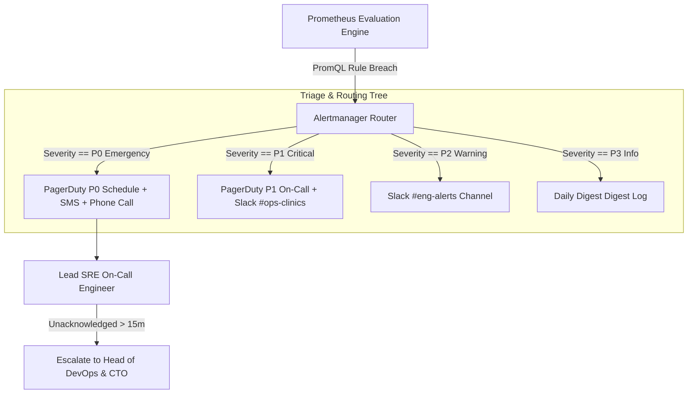

# Master Alerting Policies, Prometheus Rules & Escalation Matrix
## Namma Clinic Digital Health & Operations Platform
### Greater Bengaluru Authority (GBA) / BBMP Health Department
**Document Code:** `DEV-DOC-14` | **Status:** APPROVED BASELINE | **Date:** September 2026

---

## 1. Executive Summary & Alerting Charter
This document defines the authoritative **Alerting Policies, Alertmanager Rules, and Escalation Matrix** for the Namma Clinic Digital Health Platform. The alerting architecture establishes actionable, low-noise monitoring triggers that immediately notify on-call SREs and clinical engineers of service degradation, edge clinic synchronization failures, database saturation, and security anomalies. Every alert rule maps directly to an automated operational runbook.

### 1.1 Non-Negotiable Alerting Principles
1. **Alert on Symptoms, Not Causes:** Alerts trigger on customer-facing degradation (5xx error spikes, elevated latency, queue stagnation).
2. **Zero Actionless Alerts:** Every alert must have an explicit, mandatory operational runbook (`RUNBOOK-XXX`) detailing diagnostic and remediation steps.
3. **Strict Severity Classification:** Alerts are categorized into P0 (Emergency / Outage), P1 (Critical), P2 (Warning), and P3 (Info).
4. **Inhibition & De-duplication:** Upstream network outages automatically inhibit downstream service alerts to prevent notification fatigue.
5. **Automated Escalation:** Unacknowledged P0/P1 alerts automatically escalate to engineering leadership after 15 minutes.

## 2. Alertmanager Routing & Escalation Flow


## 3. Alertmanager Master Configuration Specification
### Specification Example: Alertmanager Master Routing Blueprint
<!-- DOCUMENTATION-ONLY EXAMPLE -->
```yaml
# DOCUMENTATION-ONLY EXAMPLE
global:
  resolve_timeout: 5m

route:
  group_by: ['alertname', 'cluster', 'service']
  group_wait: 30s
  group_interval: 5m
  repeat_interval: 4h
  receiver: 'slack-default'
  routes:
    - match:
        severity: 'P0 - Emergency'
      receiver: 'pagerduty-emergency'
      continue: true
    - match:
        severity: 'P1 - Critical'
      receiver: 'pagerduty-critical'
      continue: true

inhibit_rules:
  - source_match:
      alertname: 'NodeNetworkDown'
    target_match:
      alertname: 'InstanceDown'
    equal: ['node', 'instance']

receivers:
  - name: 'pagerduty-emergency'
    pagerduty_configs:
      - service_key: '${PAGERDUTY_P0_KEY}'
        severity: 'critical'

  - name: 'pagerduty-critical'
    pagerduty_configs:
      - service_key: '${PAGERDUTY_P1_KEY}'
        severity: 'error'

  - name: 'slack-default'
    slack_configs:
      - channel: '#eng-alerts'
        send_resolved: true
```

## 4. Master Alerting Rules Catalog
Comprehensive specifications for all 80 Alertmanager rules:

### ALERT-RULE-001: Alert Rule `High5xxErrorRate_1`
- **Alert Identifier:** `ALERT-RULE-001`
- **Severity Level:** **P0 - Emergency** (P0-Emergency to P3-Info)
- **Governed Component:** API Gateway
- **PromQL Condition:** `rate(http_requests_failed_total[5m]) > 0.05`
- **Evaluation Duration:** 2m
- **Notification Channel:** PagerDuty / SMS
- **Escalation Policy:** Escalate to Lead SRE after 5m
- **Bound Runbook:** `RUNBOOK-001`

### ALERT-RULE-002: Alert Rule `ClinicSyncLagHigh_2`
- **Alert Identifier:** `ALERT-RULE-002`
- **Severity Level:** **P1 - Critical** (P0-Emergency to P3-Info)
- **Governed Component:** Edge Sync
- **PromQL Condition:** `clinic_sync_lag_seconds > 1800`
- **Evaluation Duration:** 5m
- **Notification Channel:** Slack #ops-clinics
- **Escalation Policy:** Escalate to Clinic Ops Lead after 15m
- **Bound Runbook:** `RUNBOOK-002`

### ALERT-RULE-003: Alert Rule `DatabasePoolExhaustion_3`
- **Alert Identifier:** `ALERT-RULE-003`
- **Severity Level:** **P0 - Emergency** (P0-Emergency to P3-Info)
- **Governed Component:** PostgreSQL
- **PromQL Condition:** `db_connection_pool_waiting > 10`
- **Evaluation Duration:** 1m
- **Notification Channel:** PagerDuty
- **Escalation Policy:** Escalate to DBA on-call immediately
- **Bound Runbook:** `RUNBOOK-003`

### ALERT-RULE-004: Alert Rule `HighApiLatencyP95_4`
- **Alert Identifier:** `ALERT-RULE-004`
- **Severity Level:** **P2 - Warning** (P0-Emergency to P3-Info)
- **Governed Component:** Core Microservices
- **PromQL Condition:** `histogram_quantile(0.95, rate(http_request_duration_seconds_bucket[5m])) > 0.35`
- **Evaluation Duration:** 5m
- **Notification Channel:** Slack #eng-alerts
- **Escalation Policy:** Notify engineering squad
- **Bound Runbook:** `RUNBOOK-004`

### ALERT-RULE-005: Alert Rule `DiskSpaceLowWarning_5`
- **Alert Identifier:** `ALERT-RULE-005`
- **Severity Level:** **P2 - Warning** (P0-Emergency to P3-Info)
- **Governed Component:** Storage Subsystem
- **PromQL Condition:** `node_filesystem_free_bytes / node_filesystem_size_bytes < 0.15`
- **Evaluation Duration:** 10m
- **Notification Channel:** Slack #infrastructure
- **Escalation Policy:** Notify DevOps squad
- **Bound Runbook:** `RUNBOOK-005`

### ALERT-RULE-006: Alert Rule `High5xxErrorRate_6`
- **Alert Identifier:** `ALERT-RULE-006`
- **Severity Level:** **P0 - Emergency** (P0-Emergency to P3-Info)
- **Governed Component:** API Gateway
- **PromQL Condition:** `rate(http_requests_failed_total[5m]) > 0.05`
- **Evaluation Duration:** 2m
- **Notification Channel:** PagerDuty / SMS
- **Escalation Policy:** Escalate to Lead SRE after 5m
- **Bound Runbook:** `RUNBOOK-006`

### ALERT-RULE-007: Alert Rule `ClinicSyncLagHigh_7`
- **Alert Identifier:** `ALERT-RULE-007`
- **Severity Level:** **P1 - Critical** (P0-Emergency to P3-Info)
- **Governed Component:** Edge Sync
- **PromQL Condition:** `clinic_sync_lag_seconds > 1800`
- **Evaluation Duration:** 5m
- **Notification Channel:** Slack #ops-clinics
- **Escalation Policy:** Escalate to Clinic Ops Lead after 15m
- **Bound Runbook:** `RUNBOOK-007`

### ALERT-RULE-008: Alert Rule `DatabasePoolExhaustion_8`
- **Alert Identifier:** `ALERT-RULE-008`
- **Severity Level:** **P0 - Emergency** (P0-Emergency to P3-Info)
- **Governed Component:** PostgreSQL
- **PromQL Condition:** `db_connection_pool_waiting > 10`
- **Evaluation Duration:** 1m
- **Notification Channel:** PagerDuty
- **Escalation Policy:** Escalate to DBA on-call immediately
- **Bound Runbook:** `RUNBOOK-008`

### ALERT-RULE-009: Alert Rule `HighApiLatencyP95_9`
- **Alert Identifier:** `ALERT-RULE-009`
- **Severity Level:** **P2 - Warning** (P0-Emergency to P3-Info)
- **Governed Component:** Core Microservices
- **PromQL Condition:** `histogram_quantile(0.95, rate(http_request_duration_seconds_bucket[5m])) > 0.35`
- **Evaluation Duration:** 5m
- **Notification Channel:** Slack #eng-alerts
- **Escalation Policy:** Notify engineering squad
- **Bound Runbook:** `RUNBOOK-009`

### ALERT-RULE-010: Alert Rule `DiskSpaceLowWarning_10`
- **Alert Identifier:** `ALERT-RULE-010`
- **Severity Level:** **P2 - Warning** (P0-Emergency to P3-Info)
- **Governed Component:** Storage Subsystem
- **PromQL Condition:** `node_filesystem_free_bytes / node_filesystem_size_bytes < 0.15`
- **Evaluation Duration:** 10m
- **Notification Channel:** Slack #infrastructure
- **Escalation Policy:** Notify DevOps squad
- **Bound Runbook:** `RUNBOOK-010`

### ALERT-RULE-011: Alert Rule `High5xxErrorRate_11`
- **Alert Identifier:** `ALERT-RULE-011`
- **Severity Level:** **P0 - Emergency** (P0-Emergency to P3-Info)
- **Governed Component:** API Gateway
- **PromQL Condition:** `rate(http_requests_failed_total[5m]) > 0.05`
- **Evaluation Duration:** 2m
- **Notification Channel:** PagerDuty / SMS
- **Escalation Policy:** Escalate to Lead SRE after 5m
- **Bound Runbook:** `RUNBOOK-011`

### ALERT-RULE-012: Alert Rule `ClinicSyncLagHigh_12`
- **Alert Identifier:** `ALERT-RULE-012`
- **Severity Level:** **P1 - Critical** (P0-Emergency to P3-Info)
- **Governed Component:** Edge Sync
- **PromQL Condition:** `clinic_sync_lag_seconds > 1800`
- **Evaluation Duration:** 5m
- **Notification Channel:** Slack #ops-clinics
- **Escalation Policy:** Escalate to Clinic Ops Lead after 15m
- **Bound Runbook:** `RUNBOOK-012`

### ALERT-RULE-013: Alert Rule `DatabasePoolExhaustion_13`
- **Alert Identifier:** `ALERT-RULE-013`
- **Severity Level:** **P0 - Emergency** (P0-Emergency to P3-Info)
- **Governed Component:** PostgreSQL
- **PromQL Condition:** `db_connection_pool_waiting > 10`
- **Evaluation Duration:** 1m
- **Notification Channel:** PagerDuty
- **Escalation Policy:** Escalate to DBA on-call immediately
- **Bound Runbook:** `RUNBOOK-013`

### ALERT-RULE-014: Alert Rule `HighApiLatencyP95_14`
- **Alert Identifier:** `ALERT-RULE-014`
- **Severity Level:** **P2 - Warning** (P0-Emergency to P3-Info)
- **Governed Component:** Core Microservices
- **PromQL Condition:** `histogram_quantile(0.95, rate(http_request_duration_seconds_bucket[5m])) > 0.35`
- **Evaluation Duration:** 5m
- **Notification Channel:** Slack #eng-alerts
- **Escalation Policy:** Notify engineering squad
- **Bound Runbook:** `RUNBOOK-014`

### ALERT-RULE-015: Alert Rule `DiskSpaceLowWarning_15`
- **Alert Identifier:** `ALERT-RULE-015`
- **Severity Level:** **P2 - Warning** (P0-Emergency to P3-Info)
- **Governed Component:** Storage Subsystem
- **PromQL Condition:** `node_filesystem_free_bytes / node_filesystem_size_bytes < 0.15`
- **Evaluation Duration:** 10m
- **Notification Channel:** Slack #infrastructure
- **Escalation Policy:** Notify DevOps squad
- **Bound Runbook:** `RUNBOOK-015`

### ALERT-RULE-016: Alert Rule `High5xxErrorRate_16`
- **Alert Identifier:** `ALERT-RULE-016`
- **Severity Level:** **P0 - Emergency** (P0-Emergency to P3-Info)
- **Governed Component:** API Gateway
- **PromQL Condition:** `rate(http_requests_failed_total[5m]) > 0.05`
- **Evaluation Duration:** 2m
- **Notification Channel:** PagerDuty / SMS
- **Escalation Policy:** Escalate to Lead SRE after 5m
- **Bound Runbook:** `RUNBOOK-016`

### ALERT-RULE-017: Alert Rule `ClinicSyncLagHigh_17`
- **Alert Identifier:** `ALERT-RULE-017`
- **Severity Level:** **P1 - Critical** (P0-Emergency to P3-Info)
- **Governed Component:** Edge Sync
- **PromQL Condition:** `clinic_sync_lag_seconds > 1800`
- **Evaluation Duration:** 5m
- **Notification Channel:** Slack #ops-clinics
- **Escalation Policy:** Escalate to Clinic Ops Lead after 15m
- **Bound Runbook:** `RUNBOOK-017`

### ALERT-RULE-018: Alert Rule `DatabasePoolExhaustion_18`
- **Alert Identifier:** `ALERT-RULE-018`
- **Severity Level:** **P0 - Emergency** (P0-Emergency to P3-Info)
- **Governed Component:** PostgreSQL
- **PromQL Condition:** `db_connection_pool_waiting > 10`
- **Evaluation Duration:** 1m
- **Notification Channel:** PagerDuty
- **Escalation Policy:** Escalate to DBA on-call immediately
- **Bound Runbook:** `RUNBOOK-018`

### ALERT-RULE-019: Alert Rule `HighApiLatencyP95_19`
- **Alert Identifier:** `ALERT-RULE-019`
- **Severity Level:** **P2 - Warning** (P0-Emergency to P3-Info)
- **Governed Component:** Core Microservices
- **PromQL Condition:** `histogram_quantile(0.95, rate(http_request_duration_seconds_bucket[5m])) > 0.35`
- **Evaluation Duration:** 5m
- **Notification Channel:** Slack #eng-alerts
- **Escalation Policy:** Notify engineering squad
- **Bound Runbook:** `RUNBOOK-019`

### ALERT-RULE-020: Alert Rule `DiskSpaceLowWarning_20`
- **Alert Identifier:** `ALERT-RULE-020`
- **Severity Level:** **P2 - Warning** (P0-Emergency to P3-Info)
- **Governed Component:** Storage Subsystem
- **PromQL Condition:** `node_filesystem_free_bytes / node_filesystem_size_bytes < 0.15`
- **Evaluation Duration:** 10m
- **Notification Channel:** Slack #infrastructure
- **Escalation Policy:** Notify DevOps squad
- **Bound Runbook:** `RUNBOOK-020`

### ALERT-RULE-021: Alert Rule `High5xxErrorRate_21`
- **Alert Identifier:** `ALERT-RULE-021`
- **Severity Level:** **P0 - Emergency** (P0-Emergency to P3-Info)
- **Governed Component:** API Gateway
- **PromQL Condition:** `rate(http_requests_failed_total[5m]) > 0.05`
- **Evaluation Duration:** 2m
- **Notification Channel:** PagerDuty / SMS
- **Escalation Policy:** Escalate to Lead SRE after 5m
- **Bound Runbook:** `RUNBOOK-021`

### ALERT-RULE-022: Alert Rule `ClinicSyncLagHigh_22`
- **Alert Identifier:** `ALERT-RULE-022`
- **Severity Level:** **P1 - Critical** (P0-Emergency to P3-Info)
- **Governed Component:** Edge Sync
- **PromQL Condition:** `clinic_sync_lag_seconds > 1800`
- **Evaluation Duration:** 5m
- **Notification Channel:** Slack #ops-clinics
- **Escalation Policy:** Escalate to Clinic Ops Lead after 15m
- **Bound Runbook:** `RUNBOOK-022`

### ALERT-RULE-023: Alert Rule `DatabasePoolExhaustion_23`
- **Alert Identifier:** `ALERT-RULE-023`
- **Severity Level:** **P0 - Emergency** (P0-Emergency to P3-Info)
- **Governed Component:** PostgreSQL
- **PromQL Condition:** `db_connection_pool_waiting > 10`
- **Evaluation Duration:** 1m
- **Notification Channel:** PagerDuty
- **Escalation Policy:** Escalate to DBA on-call immediately
- **Bound Runbook:** `RUNBOOK-023`

### ALERT-RULE-024: Alert Rule `HighApiLatencyP95_24`
- **Alert Identifier:** `ALERT-RULE-024`
- **Severity Level:** **P2 - Warning** (P0-Emergency to P3-Info)
- **Governed Component:** Core Microservices
- **PromQL Condition:** `histogram_quantile(0.95, rate(http_request_duration_seconds_bucket[5m])) > 0.35`
- **Evaluation Duration:** 5m
- **Notification Channel:** Slack #eng-alerts
- **Escalation Policy:** Notify engineering squad
- **Bound Runbook:** `RUNBOOK-024`

### ALERT-RULE-025: Alert Rule `DiskSpaceLowWarning_25`
- **Alert Identifier:** `ALERT-RULE-025`
- **Severity Level:** **P2 - Warning** (P0-Emergency to P3-Info)
- **Governed Component:** Storage Subsystem
- **PromQL Condition:** `node_filesystem_free_bytes / node_filesystem_size_bytes < 0.15`
- **Evaluation Duration:** 10m
- **Notification Channel:** Slack #infrastructure
- **Escalation Policy:** Notify DevOps squad
- **Bound Runbook:** `RUNBOOK-025`

### ALERT-RULE-026: Alert Rule `High5xxErrorRate_26`
- **Alert Identifier:** `ALERT-RULE-026`
- **Severity Level:** **P0 - Emergency** (P0-Emergency to P3-Info)
- **Governed Component:** API Gateway
- **PromQL Condition:** `rate(http_requests_failed_total[5m]) > 0.05`
- **Evaluation Duration:** 2m
- **Notification Channel:** PagerDuty / SMS
- **Escalation Policy:** Escalate to Lead SRE after 5m
- **Bound Runbook:** `RUNBOOK-026`

### ALERT-RULE-027: Alert Rule `ClinicSyncLagHigh_27`
- **Alert Identifier:** `ALERT-RULE-027`
- **Severity Level:** **P1 - Critical** (P0-Emergency to P3-Info)
- **Governed Component:** Edge Sync
- **PromQL Condition:** `clinic_sync_lag_seconds > 1800`
- **Evaluation Duration:** 5m
- **Notification Channel:** Slack #ops-clinics
- **Escalation Policy:** Escalate to Clinic Ops Lead after 15m
- **Bound Runbook:** `RUNBOOK-027`

### ALERT-RULE-028: Alert Rule `DatabasePoolExhaustion_28`
- **Alert Identifier:** `ALERT-RULE-028`
- **Severity Level:** **P0 - Emergency** (P0-Emergency to P3-Info)
- **Governed Component:** PostgreSQL
- **PromQL Condition:** `db_connection_pool_waiting > 10`
- **Evaluation Duration:** 1m
- **Notification Channel:** PagerDuty
- **Escalation Policy:** Escalate to DBA on-call immediately
- **Bound Runbook:** `RUNBOOK-028`

### ALERT-RULE-029: Alert Rule `HighApiLatencyP95_29`
- **Alert Identifier:** `ALERT-RULE-029`
- **Severity Level:** **P2 - Warning** (P0-Emergency to P3-Info)
- **Governed Component:** Core Microservices
- **PromQL Condition:** `histogram_quantile(0.95, rate(http_request_duration_seconds_bucket[5m])) > 0.35`
- **Evaluation Duration:** 5m
- **Notification Channel:** Slack #eng-alerts
- **Escalation Policy:** Notify engineering squad
- **Bound Runbook:** `RUNBOOK-029`

### ALERT-RULE-030: Alert Rule `DiskSpaceLowWarning_30`
- **Alert Identifier:** `ALERT-RULE-030`
- **Severity Level:** **P2 - Warning** (P0-Emergency to P3-Info)
- **Governed Component:** Storage Subsystem
- **PromQL Condition:** `node_filesystem_free_bytes / node_filesystem_size_bytes < 0.15`
- **Evaluation Duration:** 10m
- **Notification Channel:** Slack #infrastructure
- **Escalation Policy:** Notify DevOps squad
- **Bound Runbook:** `RUNBOOK-030`

### ALERT-RULE-031: Alert Rule `High5xxErrorRate_31`
- **Alert Identifier:** `ALERT-RULE-031`
- **Severity Level:** **P0 - Emergency** (P0-Emergency to P3-Info)
- **Governed Component:** API Gateway
- **PromQL Condition:** `rate(http_requests_failed_total[5m]) > 0.05`
- **Evaluation Duration:** 2m
- **Notification Channel:** PagerDuty / SMS
- **Escalation Policy:** Escalate to Lead SRE after 5m
- **Bound Runbook:** `RUNBOOK-031`

### ALERT-RULE-032: Alert Rule `ClinicSyncLagHigh_32`
- **Alert Identifier:** `ALERT-RULE-032`
- **Severity Level:** **P1 - Critical** (P0-Emergency to P3-Info)
- **Governed Component:** Edge Sync
- **PromQL Condition:** `clinic_sync_lag_seconds > 1800`
- **Evaluation Duration:** 5m
- **Notification Channel:** Slack #ops-clinics
- **Escalation Policy:** Escalate to Clinic Ops Lead after 15m
- **Bound Runbook:** `RUNBOOK-032`

### ALERT-RULE-033: Alert Rule `DatabasePoolExhaustion_33`
- **Alert Identifier:** `ALERT-RULE-033`
- **Severity Level:** **P0 - Emergency** (P0-Emergency to P3-Info)
- **Governed Component:** PostgreSQL
- **PromQL Condition:** `db_connection_pool_waiting > 10`
- **Evaluation Duration:** 1m
- **Notification Channel:** PagerDuty
- **Escalation Policy:** Escalate to DBA on-call immediately
- **Bound Runbook:** `RUNBOOK-033`

### ALERT-RULE-034: Alert Rule `HighApiLatencyP95_34`
- **Alert Identifier:** `ALERT-RULE-034`
- **Severity Level:** **P2 - Warning** (P0-Emergency to P3-Info)
- **Governed Component:** Core Microservices
- **PromQL Condition:** `histogram_quantile(0.95, rate(http_request_duration_seconds_bucket[5m])) > 0.35`
- **Evaluation Duration:** 5m
- **Notification Channel:** Slack #eng-alerts
- **Escalation Policy:** Notify engineering squad
- **Bound Runbook:** `RUNBOOK-034`

### ALERT-RULE-035: Alert Rule `DiskSpaceLowWarning_35`
- **Alert Identifier:** `ALERT-RULE-035`
- **Severity Level:** **P2 - Warning** (P0-Emergency to P3-Info)
- **Governed Component:** Storage Subsystem
- **PromQL Condition:** `node_filesystem_free_bytes / node_filesystem_size_bytes < 0.15`
- **Evaluation Duration:** 10m
- **Notification Channel:** Slack #infrastructure
- **Escalation Policy:** Notify DevOps squad
- **Bound Runbook:** `RUNBOOK-035`

### ALERT-RULE-036: Alert Rule `High5xxErrorRate_36`
- **Alert Identifier:** `ALERT-RULE-036`
- **Severity Level:** **P0 - Emergency** (P0-Emergency to P3-Info)
- **Governed Component:** API Gateway
- **PromQL Condition:** `rate(http_requests_failed_total[5m]) > 0.05`
- **Evaluation Duration:** 2m
- **Notification Channel:** PagerDuty / SMS
- **Escalation Policy:** Escalate to Lead SRE after 5m
- **Bound Runbook:** `RUNBOOK-036`

### ALERT-RULE-037: Alert Rule `ClinicSyncLagHigh_37`
- **Alert Identifier:** `ALERT-RULE-037`
- **Severity Level:** **P1 - Critical** (P0-Emergency to P3-Info)
- **Governed Component:** Edge Sync
- **PromQL Condition:** `clinic_sync_lag_seconds > 1800`
- **Evaluation Duration:** 5m
- **Notification Channel:** Slack #ops-clinics
- **Escalation Policy:** Escalate to Clinic Ops Lead after 15m
- **Bound Runbook:** `RUNBOOK-037`

### ALERT-RULE-038: Alert Rule `DatabasePoolExhaustion_38`
- **Alert Identifier:** `ALERT-RULE-038`
- **Severity Level:** **P0 - Emergency** (P0-Emergency to P3-Info)
- **Governed Component:** PostgreSQL
- **PromQL Condition:** `db_connection_pool_waiting > 10`
- **Evaluation Duration:** 1m
- **Notification Channel:** PagerDuty
- **Escalation Policy:** Escalate to DBA on-call immediately
- **Bound Runbook:** `RUNBOOK-038`

### ALERT-RULE-039: Alert Rule `HighApiLatencyP95_39`
- **Alert Identifier:** `ALERT-RULE-039`
- **Severity Level:** **P2 - Warning** (P0-Emergency to P3-Info)
- **Governed Component:** Core Microservices
- **PromQL Condition:** `histogram_quantile(0.95, rate(http_request_duration_seconds_bucket[5m])) > 0.35`
- **Evaluation Duration:** 5m
- **Notification Channel:** Slack #eng-alerts
- **Escalation Policy:** Notify engineering squad
- **Bound Runbook:** `RUNBOOK-039`

### ALERT-RULE-040: Alert Rule `DiskSpaceLowWarning_40`
- **Alert Identifier:** `ALERT-RULE-040`
- **Severity Level:** **P2 - Warning** (P0-Emergency to P3-Info)
- **Governed Component:** Storage Subsystem
- **PromQL Condition:** `node_filesystem_free_bytes / node_filesystem_size_bytes < 0.15`
- **Evaluation Duration:** 10m
- **Notification Channel:** Slack #infrastructure
- **Escalation Policy:** Notify DevOps squad
- **Bound Runbook:** `RUNBOOK-040`

### ALERT-RULE-041: Alert Rule `High5xxErrorRate_41`
- **Alert Identifier:** `ALERT-RULE-041`
- **Severity Level:** **P0 - Emergency** (P0-Emergency to P3-Info)
- **Governed Component:** API Gateway
- **PromQL Condition:** `rate(http_requests_failed_total[5m]) > 0.05`
- **Evaluation Duration:** 2m
- **Notification Channel:** PagerDuty / SMS
- **Escalation Policy:** Escalate to Lead SRE after 5m
- **Bound Runbook:** `RUNBOOK-041`

### ALERT-RULE-042: Alert Rule `ClinicSyncLagHigh_42`
- **Alert Identifier:** `ALERT-RULE-042`
- **Severity Level:** **P1 - Critical** (P0-Emergency to P3-Info)
- **Governed Component:** Edge Sync
- **PromQL Condition:** `clinic_sync_lag_seconds > 1800`
- **Evaluation Duration:** 5m
- **Notification Channel:** Slack #ops-clinics
- **Escalation Policy:** Escalate to Clinic Ops Lead after 15m
- **Bound Runbook:** `RUNBOOK-042`

### ALERT-RULE-043: Alert Rule `DatabasePoolExhaustion_43`
- **Alert Identifier:** `ALERT-RULE-043`
- **Severity Level:** **P0 - Emergency** (P0-Emergency to P3-Info)
- **Governed Component:** PostgreSQL
- **PromQL Condition:** `db_connection_pool_waiting > 10`
- **Evaluation Duration:** 1m
- **Notification Channel:** PagerDuty
- **Escalation Policy:** Escalate to DBA on-call immediately
- **Bound Runbook:** `RUNBOOK-043`

### ALERT-RULE-044: Alert Rule `HighApiLatencyP95_44`
- **Alert Identifier:** `ALERT-RULE-044`
- **Severity Level:** **P2 - Warning** (P0-Emergency to P3-Info)
- **Governed Component:** Core Microservices
- **PromQL Condition:** `histogram_quantile(0.95, rate(http_request_duration_seconds_bucket[5m])) > 0.35`
- **Evaluation Duration:** 5m
- **Notification Channel:** Slack #eng-alerts
- **Escalation Policy:** Notify engineering squad
- **Bound Runbook:** `RUNBOOK-044`

### ALERT-RULE-045: Alert Rule `DiskSpaceLowWarning_45`
- **Alert Identifier:** `ALERT-RULE-045`
- **Severity Level:** **P2 - Warning** (P0-Emergency to P3-Info)
- **Governed Component:** Storage Subsystem
- **PromQL Condition:** `node_filesystem_free_bytes / node_filesystem_size_bytes < 0.15`
- **Evaluation Duration:** 10m
- **Notification Channel:** Slack #infrastructure
- **Escalation Policy:** Notify DevOps squad
- **Bound Runbook:** `RUNBOOK-045`

### ALERT-RULE-046: Alert Rule `High5xxErrorRate_46`
- **Alert Identifier:** `ALERT-RULE-046`
- **Severity Level:** **P0 - Emergency** (P0-Emergency to P3-Info)
- **Governed Component:** API Gateway
- **PromQL Condition:** `rate(http_requests_failed_total[5m]) > 0.05`
- **Evaluation Duration:** 2m
- **Notification Channel:** PagerDuty / SMS
- **Escalation Policy:** Escalate to Lead SRE after 5m
- **Bound Runbook:** `RUNBOOK-046`

### ALERT-RULE-047: Alert Rule `ClinicSyncLagHigh_47`
- **Alert Identifier:** `ALERT-RULE-047`
- **Severity Level:** **P1 - Critical** (P0-Emergency to P3-Info)
- **Governed Component:** Edge Sync
- **PromQL Condition:** `clinic_sync_lag_seconds > 1800`
- **Evaluation Duration:** 5m
- **Notification Channel:** Slack #ops-clinics
- **Escalation Policy:** Escalate to Clinic Ops Lead after 15m
- **Bound Runbook:** `RUNBOOK-047`

### ALERT-RULE-048: Alert Rule `DatabasePoolExhaustion_48`
- **Alert Identifier:** `ALERT-RULE-048`
- **Severity Level:** **P0 - Emergency** (P0-Emergency to P3-Info)
- **Governed Component:** PostgreSQL
- **PromQL Condition:** `db_connection_pool_waiting > 10`
- **Evaluation Duration:** 1m
- **Notification Channel:** PagerDuty
- **Escalation Policy:** Escalate to DBA on-call immediately
- **Bound Runbook:** `RUNBOOK-048`

### ALERT-RULE-049: Alert Rule `HighApiLatencyP95_49`
- **Alert Identifier:** `ALERT-RULE-049`
- **Severity Level:** **P2 - Warning** (P0-Emergency to P3-Info)
- **Governed Component:** Core Microservices
- **PromQL Condition:** `histogram_quantile(0.95, rate(http_request_duration_seconds_bucket[5m])) > 0.35`
- **Evaluation Duration:** 5m
- **Notification Channel:** Slack #eng-alerts
- **Escalation Policy:** Notify engineering squad
- **Bound Runbook:** `RUNBOOK-049`

### ALERT-RULE-050: Alert Rule `DiskSpaceLowWarning_50`
- **Alert Identifier:** `ALERT-RULE-050`
- **Severity Level:** **P2 - Warning** (P0-Emergency to P3-Info)
- **Governed Component:** Storage Subsystem
- **PromQL Condition:** `node_filesystem_free_bytes / node_filesystem_size_bytes < 0.15`
- **Evaluation Duration:** 10m
- **Notification Channel:** Slack #infrastructure
- **Escalation Policy:** Notify DevOps squad
- **Bound Runbook:** `RUNBOOK-050`

### ALERT-RULE-051: Alert Rule `High5xxErrorRate_51`
- **Alert Identifier:** `ALERT-RULE-051`
- **Severity Level:** **P0 - Emergency** (P0-Emergency to P3-Info)
- **Governed Component:** API Gateway
- **PromQL Condition:** `rate(http_requests_failed_total[5m]) > 0.05`
- **Evaluation Duration:** 2m
- **Notification Channel:** PagerDuty / SMS
- **Escalation Policy:** Escalate to Lead SRE after 5m
- **Bound Runbook:** `RUNBOOK-051`

### ALERT-RULE-052: Alert Rule `ClinicSyncLagHigh_52`
- **Alert Identifier:** `ALERT-RULE-052`
- **Severity Level:** **P1 - Critical** (P0-Emergency to P3-Info)
- **Governed Component:** Edge Sync
- **PromQL Condition:** `clinic_sync_lag_seconds > 1800`
- **Evaluation Duration:** 5m
- **Notification Channel:** Slack #ops-clinics
- **Escalation Policy:** Escalate to Clinic Ops Lead after 15m
- **Bound Runbook:** `RUNBOOK-052`

### ALERT-RULE-053: Alert Rule `DatabasePoolExhaustion_53`
- **Alert Identifier:** `ALERT-RULE-053`
- **Severity Level:** **P0 - Emergency** (P0-Emergency to P3-Info)
- **Governed Component:** PostgreSQL
- **PromQL Condition:** `db_connection_pool_waiting > 10`
- **Evaluation Duration:** 1m
- **Notification Channel:** PagerDuty
- **Escalation Policy:** Escalate to DBA on-call immediately
- **Bound Runbook:** `RUNBOOK-053`

### ALERT-RULE-054: Alert Rule `HighApiLatencyP95_54`
- **Alert Identifier:** `ALERT-RULE-054`
- **Severity Level:** **P2 - Warning** (P0-Emergency to P3-Info)
- **Governed Component:** Core Microservices
- **PromQL Condition:** `histogram_quantile(0.95, rate(http_request_duration_seconds_bucket[5m])) > 0.35`
- **Evaluation Duration:** 5m
- **Notification Channel:** Slack #eng-alerts
- **Escalation Policy:** Notify engineering squad
- **Bound Runbook:** `RUNBOOK-054`

### ALERT-RULE-055: Alert Rule `DiskSpaceLowWarning_55`
- **Alert Identifier:** `ALERT-RULE-055`
- **Severity Level:** **P2 - Warning** (P0-Emergency to P3-Info)
- **Governed Component:** Storage Subsystem
- **PromQL Condition:** `node_filesystem_free_bytes / node_filesystem_size_bytes < 0.15`
- **Evaluation Duration:** 10m
- **Notification Channel:** Slack #infrastructure
- **Escalation Policy:** Notify DevOps squad
- **Bound Runbook:** `RUNBOOK-055`

### ALERT-RULE-056: Alert Rule `High5xxErrorRate_56`
- **Alert Identifier:** `ALERT-RULE-056`
- **Severity Level:** **P0 - Emergency** (P0-Emergency to P3-Info)
- **Governed Component:** API Gateway
- **PromQL Condition:** `rate(http_requests_failed_total[5m]) > 0.05`
- **Evaluation Duration:** 2m
- **Notification Channel:** PagerDuty / SMS
- **Escalation Policy:** Escalate to Lead SRE after 5m
- **Bound Runbook:** `RUNBOOK-056`

### ALERT-RULE-057: Alert Rule `ClinicSyncLagHigh_57`
- **Alert Identifier:** `ALERT-RULE-057`
- **Severity Level:** **P1 - Critical** (P0-Emergency to P3-Info)
- **Governed Component:** Edge Sync
- **PromQL Condition:** `clinic_sync_lag_seconds > 1800`
- **Evaluation Duration:** 5m
- **Notification Channel:** Slack #ops-clinics
- **Escalation Policy:** Escalate to Clinic Ops Lead after 15m
- **Bound Runbook:** `RUNBOOK-057`

### ALERT-RULE-058: Alert Rule `DatabasePoolExhaustion_58`
- **Alert Identifier:** `ALERT-RULE-058`
- **Severity Level:** **P0 - Emergency** (P0-Emergency to P3-Info)
- **Governed Component:** PostgreSQL
- **PromQL Condition:** `db_connection_pool_waiting > 10`
- **Evaluation Duration:** 1m
- **Notification Channel:** PagerDuty
- **Escalation Policy:** Escalate to DBA on-call immediately
- **Bound Runbook:** `RUNBOOK-058`

### ALERT-RULE-059: Alert Rule `HighApiLatencyP95_59`
- **Alert Identifier:** `ALERT-RULE-059`
- **Severity Level:** **P2 - Warning** (P0-Emergency to P3-Info)
- **Governed Component:** Core Microservices
- **PromQL Condition:** `histogram_quantile(0.95, rate(http_request_duration_seconds_bucket[5m])) > 0.35`
- **Evaluation Duration:** 5m
- **Notification Channel:** Slack #eng-alerts
- **Escalation Policy:** Notify engineering squad
- **Bound Runbook:** `RUNBOOK-059`

### ALERT-RULE-060: Alert Rule `DiskSpaceLowWarning_60`
- **Alert Identifier:** `ALERT-RULE-060`
- **Severity Level:** **P2 - Warning** (P0-Emergency to P3-Info)
- **Governed Component:** Storage Subsystem
- **PromQL Condition:** `node_filesystem_free_bytes / node_filesystem_size_bytes < 0.15`
- **Evaluation Duration:** 10m
- **Notification Channel:** Slack #infrastructure
- **Escalation Policy:** Notify DevOps squad
- **Bound Runbook:** `RUNBOOK-060`

### ALERT-RULE-061: Alert Rule `High5xxErrorRate_61`
- **Alert Identifier:** `ALERT-RULE-061`
- **Severity Level:** **P0 - Emergency** (P0-Emergency to P3-Info)
- **Governed Component:** API Gateway
- **PromQL Condition:** `rate(http_requests_failed_total[5m]) > 0.05`
- **Evaluation Duration:** 2m
- **Notification Channel:** PagerDuty / SMS
- **Escalation Policy:** Escalate to Lead SRE after 5m
- **Bound Runbook:** `RUNBOOK-001`

### ALERT-RULE-062: Alert Rule `ClinicSyncLagHigh_62`
- **Alert Identifier:** `ALERT-RULE-062`
- **Severity Level:** **P1 - Critical** (P0-Emergency to P3-Info)
- **Governed Component:** Edge Sync
- **PromQL Condition:** `clinic_sync_lag_seconds > 1800`
- **Evaluation Duration:** 5m
- **Notification Channel:** Slack #ops-clinics
- **Escalation Policy:** Escalate to Clinic Ops Lead after 15m
- **Bound Runbook:** `RUNBOOK-002`

### ALERT-RULE-063: Alert Rule `DatabasePoolExhaustion_63`
- **Alert Identifier:** `ALERT-RULE-063`
- **Severity Level:** **P0 - Emergency** (P0-Emergency to P3-Info)
- **Governed Component:** PostgreSQL
- **PromQL Condition:** `db_connection_pool_waiting > 10`
- **Evaluation Duration:** 1m
- **Notification Channel:** PagerDuty
- **Escalation Policy:** Escalate to DBA on-call immediately
- **Bound Runbook:** `RUNBOOK-003`

### ALERT-RULE-064: Alert Rule `HighApiLatencyP95_64`
- **Alert Identifier:** `ALERT-RULE-064`
- **Severity Level:** **P2 - Warning** (P0-Emergency to P3-Info)
- **Governed Component:** Core Microservices
- **PromQL Condition:** `histogram_quantile(0.95, rate(http_request_duration_seconds_bucket[5m])) > 0.35`
- **Evaluation Duration:** 5m
- **Notification Channel:** Slack #eng-alerts
- **Escalation Policy:** Notify engineering squad
- **Bound Runbook:** `RUNBOOK-004`

### ALERT-RULE-065: Alert Rule `DiskSpaceLowWarning_65`
- **Alert Identifier:** `ALERT-RULE-065`
- **Severity Level:** **P2 - Warning** (P0-Emergency to P3-Info)
- **Governed Component:** Storage Subsystem
- **PromQL Condition:** `node_filesystem_free_bytes / node_filesystem_size_bytes < 0.15`
- **Evaluation Duration:** 10m
- **Notification Channel:** Slack #infrastructure
- **Escalation Policy:** Notify DevOps squad
- **Bound Runbook:** `RUNBOOK-005`

### ALERT-RULE-066: Alert Rule `High5xxErrorRate_66`
- **Alert Identifier:** `ALERT-RULE-066`
- **Severity Level:** **P0 - Emergency** (P0-Emergency to P3-Info)
- **Governed Component:** API Gateway
- **PromQL Condition:** `rate(http_requests_failed_total[5m]) > 0.05`
- **Evaluation Duration:** 2m
- **Notification Channel:** PagerDuty / SMS
- **Escalation Policy:** Escalate to Lead SRE after 5m
- **Bound Runbook:** `RUNBOOK-006`

### ALERT-RULE-067: Alert Rule `ClinicSyncLagHigh_67`
- **Alert Identifier:** `ALERT-RULE-067`
- **Severity Level:** **P1 - Critical** (P0-Emergency to P3-Info)
- **Governed Component:** Edge Sync
- **PromQL Condition:** `clinic_sync_lag_seconds > 1800`
- **Evaluation Duration:** 5m
- **Notification Channel:** Slack #ops-clinics
- **Escalation Policy:** Escalate to Clinic Ops Lead after 15m
- **Bound Runbook:** `RUNBOOK-007`

### ALERT-RULE-068: Alert Rule `DatabasePoolExhaustion_68`
- **Alert Identifier:** `ALERT-RULE-068`
- **Severity Level:** **P0 - Emergency** (P0-Emergency to P3-Info)
- **Governed Component:** PostgreSQL
- **PromQL Condition:** `db_connection_pool_waiting > 10`
- **Evaluation Duration:** 1m
- **Notification Channel:** PagerDuty
- **Escalation Policy:** Escalate to DBA on-call immediately
- **Bound Runbook:** `RUNBOOK-008`

### ALERT-RULE-069: Alert Rule `HighApiLatencyP95_69`
- **Alert Identifier:** `ALERT-RULE-069`
- **Severity Level:** **P2 - Warning** (P0-Emergency to P3-Info)
- **Governed Component:** Core Microservices
- **PromQL Condition:** `histogram_quantile(0.95, rate(http_request_duration_seconds_bucket[5m])) > 0.35`
- **Evaluation Duration:** 5m
- **Notification Channel:** Slack #eng-alerts
- **Escalation Policy:** Notify engineering squad
- **Bound Runbook:** `RUNBOOK-009`

### ALERT-RULE-070: Alert Rule `DiskSpaceLowWarning_70`
- **Alert Identifier:** `ALERT-RULE-070`
- **Severity Level:** **P2 - Warning** (P0-Emergency to P3-Info)
- **Governed Component:** Storage Subsystem
- **PromQL Condition:** `node_filesystem_free_bytes / node_filesystem_size_bytes < 0.15`
- **Evaluation Duration:** 10m
- **Notification Channel:** Slack #infrastructure
- **Escalation Policy:** Notify DevOps squad
- **Bound Runbook:** `RUNBOOK-010`

### ALERT-RULE-071: Alert Rule `High5xxErrorRate_71`
- **Alert Identifier:** `ALERT-RULE-071`
- **Severity Level:** **P0 - Emergency** (P0-Emergency to P3-Info)
- **Governed Component:** API Gateway
- **PromQL Condition:** `rate(http_requests_failed_total[5m]) > 0.05`
- **Evaluation Duration:** 2m
- **Notification Channel:** PagerDuty / SMS
- **Escalation Policy:** Escalate to Lead SRE after 5m
- **Bound Runbook:** `RUNBOOK-011`

### ALERT-RULE-072: Alert Rule `ClinicSyncLagHigh_72`
- **Alert Identifier:** `ALERT-RULE-072`
- **Severity Level:** **P1 - Critical** (P0-Emergency to P3-Info)
- **Governed Component:** Edge Sync
- **PromQL Condition:** `clinic_sync_lag_seconds > 1800`
- **Evaluation Duration:** 5m
- **Notification Channel:** Slack #ops-clinics
- **Escalation Policy:** Escalate to Clinic Ops Lead after 15m
- **Bound Runbook:** `RUNBOOK-012`

### ALERT-RULE-073: Alert Rule `DatabasePoolExhaustion_73`
- **Alert Identifier:** `ALERT-RULE-073`
- **Severity Level:** **P0 - Emergency** (P0-Emergency to P3-Info)
- **Governed Component:** PostgreSQL
- **PromQL Condition:** `db_connection_pool_waiting > 10`
- **Evaluation Duration:** 1m
- **Notification Channel:** PagerDuty
- **Escalation Policy:** Escalate to DBA on-call immediately
- **Bound Runbook:** `RUNBOOK-013`

### ALERT-RULE-074: Alert Rule `HighApiLatencyP95_74`
- **Alert Identifier:** `ALERT-RULE-074`
- **Severity Level:** **P2 - Warning** (P0-Emergency to P3-Info)
- **Governed Component:** Core Microservices
- **PromQL Condition:** `histogram_quantile(0.95, rate(http_request_duration_seconds_bucket[5m])) > 0.35`
- **Evaluation Duration:** 5m
- **Notification Channel:** Slack #eng-alerts
- **Escalation Policy:** Notify engineering squad
- **Bound Runbook:** `RUNBOOK-014`

### ALERT-RULE-075: Alert Rule `DiskSpaceLowWarning_75`
- **Alert Identifier:** `ALERT-RULE-075`
- **Severity Level:** **P2 - Warning** (P0-Emergency to P3-Info)
- **Governed Component:** Storage Subsystem
- **PromQL Condition:** `node_filesystem_free_bytes / node_filesystem_size_bytes < 0.15`
- **Evaluation Duration:** 10m
- **Notification Channel:** Slack #infrastructure
- **Escalation Policy:** Notify DevOps squad
- **Bound Runbook:** `RUNBOOK-015`

### ALERT-RULE-076: Alert Rule `High5xxErrorRate_76`
- **Alert Identifier:** `ALERT-RULE-076`
- **Severity Level:** **P0 - Emergency** (P0-Emergency to P3-Info)
- **Governed Component:** API Gateway
- **PromQL Condition:** `rate(http_requests_failed_total[5m]) > 0.05`
- **Evaluation Duration:** 2m
- **Notification Channel:** PagerDuty / SMS
- **Escalation Policy:** Escalate to Lead SRE after 5m
- **Bound Runbook:** `RUNBOOK-016`

### ALERT-RULE-077: Alert Rule `ClinicSyncLagHigh_77`
- **Alert Identifier:** `ALERT-RULE-077`
- **Severity Level:** **P1 - Critical** (P0-Emergency to P3-Info)
- **Governed Component:** Edge Sync
- **PromQL Condition:** `clinic_sync_lag_seconds > 1800`
- **Evaluation Duration:** 5m
- **Notification Channel:** Slack #ops-clinics
- **Escalation Policy:** Escalate to Clinic Ops Lead after 15m
- **Bound Runbook:** `RUNBOOK-017`

### ALERT-RULE-078: Alert Rule `DatabasePoolExhaustion_78`
- **Alert Identifier:** `ALERT-RULE-078`
- **Severity Level:** **P0 - Emergency** (P0-Emergency to P3-Info)
- **Governed Component:** PostgreSQL
- **PromQL Condition:** `db_connection_pool_waiting > 10`
- **Evaluation Duration:** 1m
- **Notification Channel:** PagerDuty
- **Escalation Policy:** Escalate to DBA on-call immediately
- **Bound Runbook:** `RUNBOOK-018`

### ALERT-RULE-079: Alert Rule `HighApiLatencyP95_79`
- **Alert Identifier:** `ALERT-RULE-079`
- **Severity Level:** **P2 - Warning** (P0-Emergency to P3-Info)
- **Governed Component:** Core Microservices
- **PromQL Condition:** `histogram_quantile(0.95, rate(http_request_duration_seconds_bucket[5m])) > 0.35`
- **Evaluation Duration:** 5m
- **Notification Channel:** Slack #eng-alerts
- **Escalation Policy:** Notify engineering squad
- **Bound Runbook:** `RUNBOOK-019`

### ALERT-RULE-080: Alert Rule `DiskSpaceLowWarning_80`
- **Alert Identifier:** `ALERT-RULE-080`
- **Severity Level:** **P2 - Warning** (P0-Emergency to P3-Info)
- **Governed Component:** Storage Subsystem
- **PromQL Condition:** `node_filesystem_free_bytes / node_filesystem_size_bytes < 0.15`
- **Evaluation Duration:** 10m
- **Notification Channel:** Slack #infrastructure
- **Escalation Policy:** Notify DevOps squad
- **Bound Runbook:** `RUNBOOK-020`

## 5. Feature Operational Alert Rule Mapping across 180 Features
Detailed alerting thresholds across all 180 platform product features:

### FEATURE-001: Alerting Policy for Feature `Credential Verification`
- **Feature ID:** `FEATURE-001` (Feature #1)
- **Functional Module:** `MODULE-001` (DOMAIN-001)
- **Bound Alert Rule:** `ALERT-RULE-001`
- **Bound Incident Runbook:** `RUNBOOK-001`
- **Error Rate Threshold:** 5xx Rate > 0.05% for 2 consecutive evaluation intervals
- **Latency SLA Threshold:** p95 Latency > 350ms for 5 consecutive minutes
- **Notification Destination:** Slack `#alerts-module-001` + PagerDuty on P0

### FEATURE-002: Alerting Policy for Feature `Session Token Minting`
- **Feature ID:** `FEATURE-002` (Feature #2)
- **Functional Module:** `MODULE-001` (DOMAIN-001)
- **Bound Alert Rule:** `ALERT-RULE-002`
- **Bound Incident Runbook:** `RUNBOOK-002`
- **Error Rate Threshold:** 5xx Rate > 0.05% for 2 consecutive evaluation intervals
- **Latency SLA Threshold:** p95 Latency > 350ms for 5 consecutive minutes
- **Notification Destination:** Slack `#alerts-module-001` + PagerDuty on P0

### FEATURE-003: Alerting Policy for Feature `MFA Challenge Dispatch`
- **Feature ID:** `FEATURE-003` (Feature #3)
- **Functional Module:** `MODULE-001` (DOMAIN-001)
- **Bound Alert Rule:** `ALERT-RULE-003`
- **Bound Incident Runbook:** `RUNBOOK-003`
- **Error Rate Threshold:** 5xx Rate > 0.05% for 2 consecutive evaluation intervals
- **Latency SLA Threshold:** p95 Latency > 350ms for 5 consecutive minutes
- **Notification Destination:** Slack `#alerts-module-001` + PagerDuty on P0

### FEATURE-004: Alerting Policy for Feature `Biometric Authentication Bridge`
- **Feature ID:** `FEATURE-004` (Feature #4)
- **Functional Module:** `MODULE-001` (DOMAIN-001)
- **Bound Alert Rule:** `ALERT-RULE-004`
- **Bound Incident Runbook:** `RUNBOOK-004`
- **Error Rate Threshold:** 5xx Rate > 0.05% for 2 consecutive evaluation intervals
- **Latency SLA Threshold:** p95 Latency > 350ms for 5 consecutive minutes
- **Notification Destination:** Slack `#alerts-module-001` + PagerDuty on P0

### FEATURE-005: Alerting Policy for Feature `Local PIN Verification`
- **Feature ID:** `FEATURE-005` (Feature #5)
- **Functional Module:** `MODULE-001` (DOMAIN-001)
- **Bound Alert Rule:** `ALERT-RULE-005`
- **Bound Incident Runbook:** `RUNBOOK-005`
- **Error Rate Threshold:** 5xx Rate > 0.05% for 2 consecutive evaluation intervals
- **Latency SLA Threshold:** p95 Latency > 350ms for 5 consecutive minutes
- **Notification Destination:** Slack `#alerts-module-001` + PagerDuty on P0

### FEATURE-006: Alerting Policy for Feature `Session Inactivity Lockout`
- **Feature ID:** `FEATURE-006` (Feature #6)
- **Functional Module:** `MODULE-001` (DOMAIN-001)
- **Bound Alert Rule:** `ALERT-RULE-006`
- **Bound Incident Runbook:** `RUNBOOK-006`
- **Error Rate Threshold:** 5xx Rate > 0.05% for 2 consecutive evaluation intervals
- **Latency SLA Threshold:** p95 Latency > 350ms for 5 consecutive minutes
- **Notification Destination:** Slack `#alerts-module-001` + PagerDuty on P0

### FEATURE-007: Alerting Policy for Feature `Permission Evaluation`
- **Feature ID:** `FEATURE-007` (Feature #7)
- **Functional Module:** `MODULE-002` (DOMAIN-001)
- **Bound Alert Rule:** `ALERT-RULE-007`
- **Bound Incident Runbook:** `RUNBOOK-007`
- **Error Rate Threshold:** 5xx Rate > 0.05% for 2 consecutive evaluation intervals
- **Latency SLA Threshold:** p95 Latency > 350ms for 5 consecutive minutes
- **Notification Destination:** Slack `#alerts-module-002` + PagerDuty on P0

### FEATURE-008: Alerting Policy for Feature `Dynamic Role Assignment`
- **Feature ID:** `FEATURE-008` (Feature #8)
- **Functional Module:** `MODULE-002` (DOMAIN-001)
- **Bound Alert Rule:** `ALERT-RULE-008`
- **Bound Incident Runbook:** `RUNBOOK-008`
- **Error Rate Threshold:** 5xx Rate > 0.05% for 2 consecutive evaluation intervals
- **Latency SLA Threshold:** p95 Latency > 350ms for 5 consecutive minutes
- **Notification Destination:** Slack `#alerts-module-002` + PagerDuty on P0

### FEATURE-009: Alerting Policy for Feature `Conflict-of-Interest Prevention`
- **Feature ID:** `FEATURE-009` (Feature #9)
- **Functional Module:** `MODULE-002` (DOMAIN-001)
- **Bound Alert Rule:** `ALERT-RULE-009`
- **Bound Incident Runbook:** `RUNBOOK-009`
- **Error Rate Threshold:** 5xx Rate > 0.05% for 2 consecutive evaluation intervals
- **Latency SLA Threshold:** p95 Latency > 350ms for 5 consecutive minutes
- **Notification Destination:** Slack `#alerts-module-002` + PagerDuty on P0

### FEATURE-010: Alerting Policy for Feature `Maker-Checker Authorization`
- **Feature ID:** `FEATURE-010` (Feature #10)
- **Functional Module:** `MODULE-002` (DOMAIN-001)
- **Bound Alert Rule:** `ALERT-RULE-010`
- **Bound Incident Runbook:** `RUNBOOK-010`
- **Error Rate Threshold:** 5xx Rate > 0.05% for 2 consecutive evaluation intervals
- **Latency SLA Threshold:** p95 Latency > 350ms for 5 consecutive minutes
- **Notification Destination:** Slack `#alerts-module-002` + PagerDuty on P0

### FEATURE-011: Alerting Policy for Feature `Break-Glass Privilege Elevation`
- **Feature ID:** `FEATURE-011` (Feature #11)
- **Functional Module:** `MODULE-002` (DOMAIN-001)
- **Bound Alert Rule:** `ALERT-RULE-011`
- **Bound Incident Runbook:** `RUNBOOK-011`
- **Error Rate Threshold:** 5xx Rate > 0.05% for 2 consecutive evaluation intervals
- **Latency SLA Threshold:** p95 Latency > 350ms for 5 consecutive minutes
- **Notification Destination:** Slack `#alerts-module-002` + PagerDuty on P0

### FEATURE-012: Alerting Policy for Feature `Privilege Elevation Audit`
- **Feature ID:** `FEATURE-012` (Feature #12)
- **Functional Module:** `MODULE-002` (DOMAIN-001)
- **Bound Alert Rule:** `ALERT-RULE-012`
- **Bound Incident Runbook:** `RUNBOOK-012`
- **Error Rate Threshold:** 5xx Rate > 0.05% for 2 consecutive evaluation intervals
- **Latency SLA Threshold:** p95 Latency > 350ms for 5 consecutive minutes
- **Notification Destination:** Slack `#alerts-module-002` + PagerDuty on P0

### FEATURE-013: Alerting Policy for Feature `Hierarchy Node Management`
- **Feature ID:** `FEATURE-013` (Feature #13)
- **Functional Module:** `MODULE-003` (DOMAIN-001)
- **Bound Alert Rule:** `ALERT-RULE-013`
- **Bound Incident Runbook:** `RUNBOOK-013`
- **Error Rate Threshold:** 5xx Rate > 0.05% for 2 consecutive evaluation intervals
- **Latency SLA Threshold:** p95 Latency > 350ms for 5 consecutive minutes
- **Notification Destination:** Slack `#alerts-module-003` + PagerDuty on P0

### FEATURE-014: Alerting Policy for Feature `NIN / HFR Registry Linking`
- **Feature ID:** `FEATURE-014` (Feature #14)
- **Functional Module:** `MODULE-003` (DOMAIN-001)
- **Bound Alert Rule:** `ALERT-RULE-014`
- **Bound Incident Runbook:** `RUNBOOK-014`
- **Error Rate Threshold:** 5xx Rate > 0.05% for 2 consecutive evaluation intervals
- **Latency SLA Threshold:** p95 Latency > 350ms for 5 consecutive minutes
- **Notification Destination:** Slack `#alerts-module-003` + PagerDuty on P0

### FEATURE-015: Alerting Policy for Feature `Station Terminal Mapping`
- **Feature ID:** `FEATURE-015` (Feature #15)
- **Functional Module:** `MODULE-003` (DOMAIN-001)
- **Bound Alert Rule:** `ALERT-RULE-015`
- **Bound Incident Runbook:** `RUNBOOK-015`
- **Error Rate Threshold:** 5xx Rate > 0.05% for 2 consecutive evaluation intervals
- **Latency SLA Threshold:** p95 Latency > 350ms for 5 consecutive minutes
- **Notification Destination:** Slack `#alerts-module-003` + PagerDuty on P0

### FEATURE-016: Alerting Policy for Feature `Facility Capacity Configuration`
- **Feature ID:** `FEATURE-016` (Feature #16)
- **Functional Module:** `MODULE-003` (DOMAIN-001)
- **Bound Alert Rule:** `ALERT-RULE-016`
- **Bound Incident Runbook:** `RUNBOOK-016`
- **Error Rate Threshold:** 5xx Rate > 0.05% for 2 consecutive evaluation intervals
- **Latency SLA Threshold:** p95 Latency > 350ms for 5 consecutive minutes
- **Notification Destination:** Slack `#alerts-module-003` + PagerDuty on P0

### FEATURE-017: Alerting Policy for Feature `Operating Hours Enforcement`
- **Feature ID:** `FEATURE-017` (Feature #17)
- **Functional Module:** `MODULE-003` (DOMAIN-001)
- **Bound Alert Rule:** `ALERT-RULE-017`
- **Bound Incident Runbook:** `RUNBOOK-017`
- **Error Rate Threshold:** 5xx Rate > 0.05% for 2 consecutive evaluation intervals
- **Latency SLA Threshold:** p95 Latency > 350ms for 5 consecutive minutes
- **Notification Destination:** Slack `#alerts-module-003` + PagerDuty on P0

### FEATURE-018: Alerting Policy for Feature `Special Camp Calendar`
- **Feature ID:** `FEATURE-018` (Feature #18)
- **Functional Module:** `MODULE-003` (DOMAIN-001)
- **Bound Alert Rule:** `ALERT-RULE-018`
- **Bound Incident Runbook:** `RUNBOOK-018`
- **Error Rate Threshold:** 5xx Rate > 0.05% for 2 consecutive evaluation intervals
- **Latency SLA Threshold:** p95 Latency > 350ms for 5 consecutive minutes
- **Notification Destination:** Slack `#alerts-module-003` + PagerDuty on P0

### FEATURE-019: Alerting Policy for Feature `Staff Onboarding & KYC`
- **Feature ID:** `FEATURE-019` (Feature #19)
- **Functional Module:** `MODULE-004` (DOMAIN-001)
- **Bound Alert Rule:** `ALERT-RULE-019`
- **Bound Incident Runbook:** `RUNBOOK-019`
- **Error Rate Threshold:** 5xx Rate > 0.05% for 2 consecutive evaluation intervals
- **Latency SLA Threshold:** p95 Latency > 350ms for 5 consecutive minutes
- **Notification Destination:** Slack `#alerts-module-004` + PagerDuty on P0

### FEATURE-020: Alerting Policy for Feature `Professional License Verification`
- **Feature ID:** `FEATURE-020` (Feature #20)
- **Functional Module:** `MODULE-004` (DOMAIN-001)
- **Bound Alert Rule:** `ALERT-RULE-020`
- **Bound Incident Runbook:** `RUNBOOK-020`
- **Error Rate Threshold:** 5xx Rate > 0.05% for 2 consecutive evaluation intervals
- **Latency SLA Threshold:** p95 Latency > 350ms for 5 consecutive minutes
- **Notification Destination:** Slack `#alerts-module-004` + PagerDuty on P0

### FEATURE-021: Alerting Policy for Feature `Duty Roster Generation`
- **Feature ID:** `FEATURE-021` (Feature #21)
- **Functional Module:** `MODULE-004` (DOMAIN-001)
- **Bound Alert Rule:** `ALERT-RULE-021`
- **Bound Incident Runbook:** `RUNBOOK-021`
- **Error Rate Threshold:** 5xx Rate > 0.05% for 2 consecutive evaluation intervals
- **Latency SLA Threshold:** p95 Latency > 350ms for 5 consecutive minutes
- **Notification Destination:** Slack `#alerts-module-004` + PagerDuty on P0

### FEATURE-022: Alerting Policy for Feature `Biometric Attendance Linking`
- **Feature ID:** `FEATURE-022` (Feature #22)
- **Functional Module:** `MODULE-004` (DOMAIN-001)
- **Bound Alert Rule:** `ALERT-RULE-022`
- **Bound Incident Runbook:** `RUNBOOK-022`
- **Error Rate Threshold:** 5xx Rate > 0.05% for 2 consecutive evaluation intervals
- **Latency SLA Threshold:** p95 Latency > 350ms for 5 consecutive minutes
- **Notification Destination:** Slack `#alerts-module-004` + PagerDuty on P0

### FEATURE-023: Alerting Policy for Feature `Digital Signature Enrollment`
- **Feature ID:** `FEATURE-023` (Feature #23)
- **Functional Module:** `MODULE-004` (DOMAIN-001)
- **Bound Alert Rule:** `ALERT-RULE-023`
- **Bound Incident Runbook:** `RUNBOOK-023`
- **Error Rate Threshold:** 5xx Rate > 0.05% for 2 consecutive evaluation intervals
- **Latency SLA Threshold:** p95 Latency > 350ms for 5 consecutive minutes
- **Notification Destination:** Slack `#alerts-module-004` + PagerDuty on P0

### FEATURE-024: Alerting Policy for Feature `Signature Revocation`
- **Feature ID:** `FEATURE-024` (Feature #24)
- **Functional Module:** `MODULE-004` (DOMAIN-001)
- **Bound Alert Rule:** `ALERT-RULE-024`
- **Bound Incident Runbook:** `RUNBOOK-024`
- **Error Rate Threshold:** 5xx Rate > 0.05% for 2 consecutive evaluation intervals
- **Latency SLA Threshold:** p95 Latency > 350ms for 5 consecutive minutes
- **Notification Destination:** Slack `#alerts-module-004` + PagerDuty on P0

### FEATURE-025: Alerting Policy for Feature `Targeted Flag Activation`
- **Feature ID:** `FEATURE-025` (Feature #25)
- **Functional Module:** `MODULE-026` (DOMAIN-001)
- **Bound Alert Rule:** `ALERT-RULE-025`
- **Bound Incident Runbook:** `RUNBOOK-025`
- **Error Rate Threshold:** 5xx Rate > 0.05% for 2 consecutive evaluation intervals
- **Latency SLA Threshold:** p95 Latency > 350ms for 5 consecutive minutes
- **Notification Destination:** Slack `#alerts-module-026` + PagerDuty on P0

### FEATURE-026: Alerting Policy for Feature `Emergency Feature Killswitch`
- **Feature ID:** `FEATURE-026` (Feature #26)
- **Functional Module:** `MODULE-026` (DOMAIN-001)
- **Bound Alert Rule:** `ALERT-RULE-026`
- **Bound Incident Runbook:** `RUNBOOK-026`
- **Error Rate Threshold:** 5xx Rate > 0.05% for 2 consecutive evaluation intervals
- **Latency SLA Threshold:** p95 Latency > 350ms for 5 consecutive minutes
- **Notification Destination:** Slack `#alerts-module-026` + PagerDuty on P0

### FEATURE-027: Alerting Policy for Feature `System Parameter Tuning`
- **Feature ID:** `FEATURE-027` (Feature #27)
- **Functional Module:** `MODULE-026` (DOMAIN-001)
- **Bound Alert Rule:** `ALERT-RULE-027`
- **Bound Incident Runbook:** `RUNBOOK-027`
- **Error Rate Threshold:** 5xx Rate > 0.05% for 2 consecutive evaluation intervals
- **Latency SLA Threshold:** p95 Latency > 350ms for 5 consecutive minutes
- **Notification Destination:** Slack `#alerts-module-026` + PagerDuty on P0

### FEATURE-028: Alerting Policy for Feature `Edge Configuration Distribution`
- **Feature ID:** `FEATURE-028` (Feature #28)
- **Functional Module:** `MODULE-026` (DOMAIN-001)
- **Bound Alert Rule:** `ALERT-RULE-028`
- **Bound Incident Runbook:** `RUNBOOK-028`
- **Error Rate Threshold:** 5xx Rate > 0.05% for 2 consecutive evaluation intervals
- **Latency SLA Threshold:** p95 Latency > 350ms for 5 consecutive minutes
- **Notification Destination:** Slack `#alerts-module-026` + PagerDuty on P0

### FEATURE-029: Alerting Policy for Feature `Edge Migration Orchestration`
- **Feature ID:** `FEATURE-029` (Feature #29)
- **Functional Module:** `MODULE-026` (DOMAIN-001)
- **Bound Alert Rule:** `ALERT-RULE-029`
- **Bound Incident Runbook:** `RUNBOOK-029`
- **Error Rate Threshold:** 5xx Rate > 0.05% for 2 consecutive evaluation intervals
- **Latency SLA Threshold:** p95 Latency > 350ms for 5 consecutive minutes
- **Notification Destination:** Slack `#alerts-module-026` + PagerDuty on P0

### FEATURE-030: Alerting Policy for Feature `Health Probe Monitoring`
- **Feature ID:** `FEATURE-030` (Feature #30)
- **Functional Module:** `MODULE-026` (DOMAIN-001)
- **Bound Alert Rule:** `ALERT-RULE-030`
- **Bound Incident Runbook:** `RUNBOOK-030`
- **Error Rate Threshold:** 5xx Rate > 0.05% for 2 consecutive evaluation intervals
- **Latency SLA Threshold:** p95 Latency > 350ms for 5 consecutive minutes
- **Notification Destination:** Slack `#alerts-module-026` + PagerDuty on P0

### FEATURE-031: Alerting Policy for Feature `Bilingual Intake UI`
- **Feature ID:** `FEATURE-031` (Feature #31)
- **Functional Module:** `MODULE-005` (DOMAIN-002)
- **Bound Alert Rule:** `ALERT-RULE-031`
- **Bound Incident Runbook:** `RUNBOOK-031`
- **Error Rate Threshold:** 5xx Rate > 0.05% for 2 consecutive evaluation intervals
- **Latency SLA Threshold:** p95 Latency > 350ms for 5 consecutive minutes
- **Notification Destination:** Slack `#alerts-module-005` + PagerDuty on P0

### FEATURE-032: Alerting Policy for Feature `Vulnerable Citizen Flagging`
- **Feature ID:** `FEATURE-032` (Feature #32)
- **Functional Module:** `MODULE-005` (DOMAIN-002)
- **Bound Alert Rule:** `ALERT-RULE-032`
- **Bound Incident Runbook:** `RUNBOOK-032`
- **Error Rate Threshold:** 5xx Rate > 0.05% for 2 consecutive evaluation intervals
- **Latency SLA Threshold:** p95 Latency > 350ms for 5 consecutive minutes
- **Notification Destination:** Slack `#alerts-module-005` + PagerDuty on P0

### FEATURE-033: Alerting Policy for Feature `Aadhaar OTP ABHA Bridge`
- **Feature ID:** `FEATURE-033` (Feature #33)
- **Functional Module:** `MODULE-005` (DOMAIN-002)
- **Bound Alert Rule:** `ALERT-RULE-033`
- **Bound Incident Runbook:** `RUNBOOK-033`
- **Error Rate Threshold:** 5xx Rate > 0.05% for 2 consecutive evaluation intervals
- **Latency SLA Threshold:** p95 Latency > 350ms for 5 consecutive minutes
- **Notification Destination:** Slack `#alerts-module-005` + PagerDuty on P0

### FEATURE-034: Alerting Policy for Feature `Demographic ABHA Creation`
- **Feature ID:** `FEATURE-034` (Feature #34)
- **Functional Module:** `MODULE-005` (DOMAIN-002)
- **Bound Alert Rule:** `ALERT-RULE-034`
- **Bound Incident Runbook:** `RUNBOOK-034`
- **Error Rate Threshold:** 5xx Rate > 0.05% for 2 consecutive evaluation intervals
- **Latency SLA Threshold:** p95 Latency > 350ms for 5 consecutive minutes
- **Notification Destination:** Slack `#alerts-module-005` + PagerDuty on P0

### FEATURE-035: Alerting Policy for Feature `Deterministic UHID Minting`
- **Feature ID:** `FEATURE-035` (Feature #35)
- **Functional Module:** `MODULE-005` (DOMAIN-002)
- **Bound Alert Rule:** `ALERT-RULE-035`
- **Bound Incident Runbook:** `RUNBOOK-035`
- **Error Rate Threshold:** 5xx Rate > 0.05% for 2 consecutive evaluation intervals
- **Latency SLA Threshold:** p95 Latency > 350ms for 5 consecutive minutes
- **Notification Destination:** Slack `#alerts-module-005` + PagerDuty on P0

### FEATURE-036: Alerting Policy for Feature `Soundex / Double-Metaphone Matching`
- **Feature ID:** `FEATURE-036` (Feature #36)
- **Functional Module:** `MODULE-005` (DOMAIN-002)
- **Bound Alert Rule:** `ALERT-RULE-036`
- **Bound Incident Runbook:** `RUNBOOK-036`
- **Error Rate Threshold:** 5xx Rate > 0.05% for 2 consecutive evaluation intervals
- **Latency SLA Threshold:** p95 Latency > 350ms for 5 consecutive minutes
- **Notification Destination:** Slack `#alerts-module-005` + PagerDuty on P0

### FEATURE-037: Alerting Policy for Feature `Bilingual Consent Presentation`
- **Feature ID:** `FEATURE-037` (Feature #37)
- **Functional Module:** `MODULE-006` (DOMAIN-002)
- **Bound Alert Rule:** `ALERT-RULE-037`
- **Bound Incident Runbook:** `RUNBOOK-037`
- **Error Rate Threshold:** 5xx Rate > 0.05% for 2 consecutive evaluation intervals
- **Latency SLA Threshold:** p95 Latency > 350ms for 5 consecutive minutes
- **Notification Destination:** Slack `#alerts-module-006` + PagerDuty on P0

### FEATURE-038: Alerting Policy for Feature `Digital Signature / Thumbprint Capture`
- **Feature ID:** `FEATURE-038` (Feature #38)
- **Functional Module:** `MODULE-006` (DOMAIN-002)
- **Bound Alert Rule:** `ALERT-RULE-038`
- **Bound Incident Runbook:** `RUNBOOK-038`
- **Error Rate Threshold:** 5xx Rate > 0.05% for 2 consecutive evaluation intervals
- **Latency SLA Threshold:** p95 Latency > 350ms for 5 consecutive minutes
- **Notification Destination:** Slack `#alerts-module-006` + PagerDuty on P0

### FEATURE-039: Alerting Policy for Feature `Granular Purpose-Based Consent`
- **Feature ID:** `FEATURE-039` (Feature #39)
- **Functional Module:** `MODULE-006` (DOMAIN-002)
- **Bound Alert Rule:** `ALERT-RULE-039`
- **Bound Incident Runbook:** `RUNBOOK-039`
- **Error Rate Threshold:** 5xx Rate > 0.05% for 2 consecutive evaluation intervals
- **Latency SLA Threshold:** p95 Latency > 350ms for 5 consecutive minutes
- **Notification Destination:** Slack `#alerts-module-006` + PagerDuty on P0

### FEATURE-040: Alerting Policy for Feature `Consent Revocation Workflow`
- **Feature ID:** `FEATURE-040` (Feature #40)
- **Functional Module:** `MODULE-006` (DOMAIN-002)
- **Bound Alert Rule:** `ALERT-RULE-040`
- **Bound Incident Runbook:** `RUNBOOK-040`
- **Error Rate Threshold:** 5xx Rate > 0.05% for 2 consecutive evaluation intervals
- **Latency SLA Threshold:** p95 Latency > 350ms for 5 consecutive minutes
- **Notification Destination:** Slack `#alerts-module-006` + PagerDuty on P0

### FEATURE-041: Alerting Policy for Feature `Guardian Relationship Verification`
- **Feature ID:** `FEATURE-041` (Feature #41)
- **Functional Module:** `MODULE-006` (DOMAIN-002)
- **Bound Alert Rule:** `ALERT-RULE-041`
- **Bound Incident Runbook:** `RUNBOOK-041`
- **Error Rate Threshold:** 5xx Rate > 0.05% for 2 consecutive evaluation intervals
- **Latency SLA Threshold:** p95 Latency > 350ms for 5 consecutive minutes
- **Notification Destination:** Slack `#alerts-module-006` + PagerDuty on P0

### FEATURE-042: Alerting Policy for Feature `Implied Emergency Consent`
- **Feature ID:** `FEATURE-042` (Feature #42)
- **Functional Module:** `MODULE-006` (DOMAIN-002)
- **Bound Alert Rule:** `ALERT-RULE-042`
- **Bound Incident Runbook:** `RUNBOOK-042`
- **Error Rate Threshold:** 5xx Rate > 0.05% for 2 consecutive evaluation intervals
- **Latency SLA Threshold:** p95 Latency > 350ms for 5 consecutive minutes
- **Notification Destination:** Slack `#alerts-module-006` + PagerDuty on P0

### FEATURE-043: Alerting Policy for Feature `Daily Token Counter`
- **Feature ID:** `FEATURE-043` (Feature #43)
- **Functional Module:** `MODULE-007` (DOMAIN-002)
- **Bound Alert Rule:** `ALERT-RULE-043`
- **Bound Incident Runbook:** `RUNBOOK-043`
- **Error Rate Threshold:** 5xx Rate > 0.05% for 2 consecutive evaluation intervals
- **Latency SLA Threshold:** p95 Latency > 350ms for 5 consecutive minutes
- **Notification Destination:** Slack `#alerts-module-007` + PagerDuty on P0

### FEATURE-044: Alerting Policy for Feature `Station Route Calculation`
- **Feature ID:** `FEATURE-044` (Feature #44)
- **Functional Module:** `MODULE-007` (DOMAIN-002)
- **Bound Alert Rule:** `ALERT-RULE-044`
- **Bound Incident Runbook:** `RUNBOOK-044`
- **Error Rate Threshold:** 5xx Rate > 0.05% for 2 consecutive evaluation intervals
- **Latency SLA Threshold:** p95 Latency > 350ms for 5 consecutive minutes
- **Notification Destination:** Slack `#alerts-module-007` + PagerDuty on P0

### FEATURE-045: Alerting Policy for Feature `Acuity-Based Insertion`
- **Feature ID:** `FEATURE-045` (Feature #45)
- **Functional Module:** `MODULE-007` (DOMAIN-002)
- **Bound Alert Rule:** `ALERT-RULE-045`
- **Bound Incident Runbook:** `RUNBOOK-045`
- **Error Rate Threshold:** 5xx Rate > 0.05% for 2 consecutive evaluation intervals
- **Latency SLA Threshold:** p95 Latency > 350ms for 5 consecutive minutes
- **Notification Destination:** Slack `#alerts-module-007` + PagerDuty on P0

### FEATURE-046: Alerting Policy for Feature `Vulnerable Citizen Interleaving`
- **Feature ID:** `FEATURE-046` (Feature #46)
- **Functional Module:** `MODULE-007` (DOMAIN-002)
- **Bound Alert Rule:** `ALERT-RULE-046`
- **Bound Incident Runbook:** `RUNBOOK-046`
- **Error Rate Threshold:** 5xx Rate > 0.05% for 2 consecutive evaluation intervals
- **Latency SLA Threshold:** p95 Latency > 350ms for 5 consecutive minutes
- **Notification Destination:** Slack `#alerts-module-007` + PagerDuty on P0

### FEATURE-047: Alerting Policy for Feature `ESC/POS Thermal Printing`
- **Feature ID:** `FEATURE-047` (Feature #47)
- **Functional Module:** `MODULE-007` (DOMAIN-002)
- **Bound Alert Rule:** `ALERT-RULE-047`
- **Bound Incident Runbook:** `RUNBOOK-047`
- **Error Rate Threshold:** 5xx Rate > 0.05% for 2 consecutive evaluation intervals
- **Latency SLA Threshold:** p95 Latency > 350ms for 5 consecutive minutes
- **Notification Destination:** Slack `#alerts-module-007` + PagerDuty on P0

### FEATURE-048: Alerting Policy for Feature `Virtual SMS Token Fallback`
- **Feature ID:** `FEATURE-048` (Feature #48)
- **Functional Module:** `MODULE-007` (DOMAIN-002)
- **Bound Alert Rule:** `ALERT-RULE-048`
- **Bound Incident Runbook:** `RUNBOOK-048`
- **Error Rate Threshold:** 5xx Rate > 0.05% for 2 consecutive evaluation intervals
- **Latency SLA Threshold:** p95 Latency > 350ms for 5 consecutive minutes
- **Notification Destination:** Slack `#alerts-module-007` + PagerDuty on P0

### FEATURE-049: Alerting Policy for Feature `Next-Patient Call Action`
- **Feature ID:** `FEATURE-049` (Feature #49)
- **Functional Module:** `MODULE-008` (DOMAIN-002)
- **Bound Alert Rule:** `ALERT-RULE-049`
- **Bound Incident Runbook:** `RUNBOOK-049`
- **Error Rate Threshold:** 5xx Rate > 0.05% for 2 consecutive evaluation intervals
- **Latency SLA Threshold:** p95 Latency > 350ms for 5 consecutive minutes
- **Notification Destination:** Slack `#alerts-module-008` + PagerDuty on P0

### FEATURE-050: Alerting Policy for Feature `No-Show & Recall Management`
- **Feature ID:** `FEATURE-050` (Feature #50)
- **Functional Module:** `MODULE-008` (DOMAIN-002)
- **Bound Alert Rule:** `ALERT-RULE-050`
- **Bound Incident Runbook:** `RUNBOOK-050`
- **Error Rate Threshold:** 5xx Rate > 0.05% for 2 consecutive evaluation intervals
- **Latency SLA Threshold:** p95 Latency > 350ms for 5 consecutive minutes
- **Notification Destination:** Slack `#alerts-module-008` + PagerDuty on P0

### FEATURE-051: Alerting Policy for Feature `HDMI Waiting Hall Display`
- **Feature ID:** `FEATURE-051` (Feature #51)
- **Functional Module:** `MODULE-008` (DOMAIN-002)
- **Bound Alert Rule:** `ALERT-RULE-051`
- **Bound Incident Runbook:** `RUNBOOK-051`
- **Error Rate Threshold:** 5xx Rate > 0.05% for 2 consecutive evaluation intervals
- **Latency SLA Threshold:** p95 Latency > 350ms for 5 consecutive minutes
- **Notification Destination:** Slack `#alerts-module-008` + PagerDuty on P0

### FEATURE-052: Alerting Policy for Feature `Text-to-Speech Audio Chime`
- **Feature ID:** `FEATURE-052` (Feature #52)
- **Functional Module:** `MODULE-008` (DOMAIN-002)
- **Bound Alert Rule:** `ALERT-RULE-052`
- **Bound Incident Runbook:** `RUNBOOK-052`
- **Error Rate Threshold:** 5xx Rate > 0.05% for 2 consecutive evaluation intervals
- **Latency SLA Threshold:** p95 Latency > 350ms for 5 consecutive minutes
- **Notification Destination:** Slack `#alerts-module-008` + PagerDuty on P0

### FEATURE-053: Alerting Policy for Feature `Dynamic Load Distribution`
- **Feature ID:** `FEATURE-053` (Feature #53)
- **Functional Module:** `MODULE-008` (DOMAIN-002)
- **Bound Alert Rule:** `ALERT-RULE-053`
- **Bound Incident Runbook:** `RUNBOOK-053`
- **Error Rate Threshold:** 5xx Rate > 0.05% for 2 consecutive evaluation intervals
- **Latency SLA Threshold:** p95 Latency > 350ms for 5 consecutive minutes
- **Notification Destination:** Slack `#alerts-module-008` + PagerDuty on P0

### FEATURE-054: Alerting Policy for Feature `Queue Pausing & Resumption`
- **Feature ID:** `FEATURE-054` (Feature #54)
- **Functional Module:** `MODULE-008` (DOMAIN-002)
- **Bound Alert Rule:** `ALERT-RULE-054`
- **Bound Incident Runbook:** `RUNBOOK-054`
- **Error Rate Threshold:** 5xx Rate > 0.05% for 2 consecutive evaluation intervals
- **Latency SLA Threshold:** p95 Latency > 350ms for 5 consecutive minutes
- **Notification Destination:** Slack `#alerts-module-008` + PagerDuty on P0

### FEATURE-055: Alerting Policy for Feature `Kiosk Exit Rating`
- **Feature ID:** `FEATURE-055` (Feature #55)
- **Functional Module:** `MODULE-020` (DOMAIN-002)
- **Bound Alert Rule:** `ALERT-RULE-055`
- **Bound Incident Runbook:** `RUNBOOK-055`
- **Error Rate Threshold:** 5xx Rate > 0.05% for 2 consecutive evaluation intervals
- **Latency SLA Threshold:** p95 Latency > 350ms for 5 consecutive minutes
- **Notification Destination:** Slack `#alerts-module-020` + PagerDuty on P0

### FEATURE-056: Alerting Policy for Feature `Medicine Receipt Confirmation`
- **Feature ID:** `FEATURE-056` (Feature #56)
- **Functional Module:** `MODULE-020` (DOMAIN-002)
- **Bound Alert Rule:** `ALERT-RULE-056`
- **Bound Incident Runbook:** `RUNBOOK-056`
- **Error Rate Threshold:** 5xx Rate > 0.05% for 2 consecutive evaluation intervals
- **Latency SLA Threshold:** p95 Latency > 350ms for 5 consecutive minutes
- **Notification Destination:** Slack `#alerts-module-020` + PagerDuty on P0

### FEATURE-057: Alerting Policy for Feature `Multilingual Ticket Intake`
- **Feature ID:** `FEATURE-057` (Feature #57)
- **Functional Module:** `MODULE-020` (DOMAIN-002)
- **Bound Alert Rule:** `ALERT-RULE-057`
- **Bound Incident Runbook:** `RUNBOOK-057`
- **Error Rate Threshold:** 5xx Rate > 0.05% for 2 consecutive evaluation intervals
- **Latency SLA Threshold:** p95 Latency > 350ms for 5 consecutive minutes
- **Notification Destination:** Slack `#alerts-module-020` + PagerDuty on P0

### FEATURE-058: Alerting Policy for Feature `Automated SLA Timer`
- **Feature ID:** `FEATURE-058` (Feature #58)
- **Functional Module:** `MODULE-020` (DOMAIN-002)
- **Bound Alert Rule:** `ALERT-RULE-058`
- **Bound Incident Runbook:** `RUNBOOK-058`
- **Error Rate Threshold:** 5xx Rate > 0.05% for 2 consecutive evaluation intervals
- **Latency SLA Threshold:** p95 Latency > 350ms for 5 consecutive minutes
- **Notification Destination:** Slack `#alerts-module-020` + PagerDuty on P0

### FEATURE-059: Alerting Policy for Feature `Zonal Escalation Trigger`
- **Feature ID:** `FEATURE-059` (Feature #59)
- **Functional Module:** `MODULE-020` (DOMAIN-002)
- **Bound Alert Rule:** `ALERT-RULE-059`
- **Bound Incident Runbook:** `RUNBOOK-059`
- **Error Rate Threshold:** 5xx Rate > 0.05% for 2 consecutive evaluation intervals
- **Latency SLA Threshold:** p95 Latency > 350ms for 5 consecutive minutes
- **Notification Destination:** Slack `#alerts-module-020` + PagerDuty on P0

### FEATURE-060: Alerting Policy for Feature `Citizen Resolution Feedback`
- **Feature ID:** `FEATURE-060` (Feature #60)
- **Functional Module:** `MODULE-020` (DOMAIN-002)
- **Bound Alert Rule:** `ALERT-RULE-060`
- **Bound Incident Runbook:** `RUNBOOK-060`
- **Error Rate Threshold:** 5xx Rate > 0.05% for 2 consecutive evaluation intervals
- **Latency SLA Threshold:** p95 Latency > 350ms for 5 consecutive minutes
- **Notification Destination:** Slack `#alerts-module-020` + PagerDuty on P0

### FEATURE-061: Alerting Policy for Feature `Longitudinal History Viewer`
- **Feature ID:** `FEATURE-061` (Feature #61)
- **Functional Module:** `MODULE-009` (DOMAIN-003)
- **Bound Alert Rule:** `ALERT-RULE-061`
- **Bound Incident Runbook:** `RUNBOOK-001`
- **Error Rate Threshold:** 5xx Rate > 0.05% for 2 consecutive evaluation intervals
- **Latency SLA Threshold:** p95 Latency > 350ms for 5 consecutive minutes
- **Notification Destination:** Slack `#alerts-module-009` + PagerDuty on P0

### FEATURE-062: Alerting Policy for Feature `Vitals Telemetry Banner`
- **Feature ID:** `FEATURE-062` (Feature #62)
- **Functional Module:** `MODULE-009` (DOMAIN-003)
- **Bound Alert Rule:** `ALERT-RULE-062`
- **Bound Incident Runbook:** `RUNBOOK-002`
- **Error Rate Threshold:** 5xx Rate > 0.05% for 2 consecutive evaluation intervals
- **Latency SLA Threshold:** p95 Latency > 350ms for 5 consecutive minutes
- **Notification Destination:** Slack `#alerts-module-009` + PagerDuty on P0

### FEATURE-063: Alerting Policy for Feature `Rapid Clinical Templates`
- **Feature ID:** `FEATURE-063` (Feature #63)
- **Functional Module:** `MODULE-009` (DOMAIN-003)
- **Bound Alert Rule:** `ALERT-RULE-063`
- **Bound Incident Runbook:** `RUNBOOK-003`
- **Error Rate Threshold:** 5xx Rate > 0.05% for 2 consecutive evaluation intervals
- **Latency SLA Threshold:** p95 Latency > 350ms for 5 consecutive minutes
- **Notification Destination:** Slack `#alerts-module-009` + PagerDuty on P0

### FEATURE-064: Alerting Policy for Feature `Keyboard Shortcut Navigation`
- **Feature ID:** `FEATURE-064` (Feature #64)
- **Functional Module:** `MODULE-009` (DOMAIN-003)
- **Bound Alert Rule:** `ALERT-RULE-064`
- **Bound Incident Runbook:** `RUNBOOK-004`
- **Error Rate Threshold:** 5xx Rate > 0.05% for 2 consecutive evaluation intervals
- **Latency SLA Threshold:** p95 Latency > 350ms for 5 consecutive minutes
- **Notification Destination:** Slack `#alerts-module-009` + PagerDuty on P0

### FEATURE-065: Alerting Policy for Feature `Cryptographic Note Locking`
- **Feature ID:** `FEATURE-065` (Feature #65)
- **Functional Module:** `MODULE-009` (DOMAIN-003)
- **Bound Alert Rule:** `ALERT-RULE-065`
- **Bound Incident Runbook:** `RUNBOOK-005`
- **Error Rate Threshold:** 5xx Rate > 0.05% for 2 consecutive evaluation intervals
- **Latency SLA Threshold:** p95 Latency > 350ms for 5 consecutive minutes
- **Notification Destination:** Slack `#alerts-module-009` + PagerDuty on P0

### FEATURE-066: Alerting Policy for Feature `Clinical Addendum Workflow`
- **Feature ID:** `FEATURE-066` (Feature #66)
- **Functional Module:** `MODULE-009` (DOMAIN-003)
- **Bound Alert Rule:** `ALERT-RULE-066`
- **Bound Incident Runbook:** `RUNBOOK-006`
- **Error Rate Threshold:** 5xx Rate > 0.05% for 2 consecutive evaluation intervals
- **Latency SLA Threshold:** p95 Latency > 350ms for 5 consecutive minutes
- **Notification Destination:** Slack `#alerts-module-009` + PagerDuty on P0

### FEATURE-067: Alerting Policy for Feature `Primary Care Curated Coding`
- **Feature ID:** `FEATURE-067` (Feature #67)
- **Functional Module:** `MODULE-010` (DOMAIN-003)
- **Bound Alert Rule:** `ALERT-RULE-067`
- **Bound Incident Runbook:** `RUNBOOK-007`
- **Error Rate Threshold:** 5xx Rate > 0.05% for 2 consecutive evaluation intervals
- **Latency SLA Threshold:** p95 Latency > 350ms for 5 consecutive minutes
- **Notification Destination:** Slack `#alerts-module-010` + PagerDuty on P0

### FEATURE-068: Alerting Policy for Feature `Synonym & Local Name Mapping`
- **Feature ID:** `FEATURE-068` (Feature #68)
- **Functional Module:** `MODULE-010` (DOMAIN-003)
- **Bound Alert Rule:** `ALERT-RULE-068`
- **Bound Incident Runbook:** `RUNBOOK-008`
- **Error Rate Threshold:** 5xx Rate > 0.05% for 2 consecutive evaluation intervals
- **Latency SLA Threshold:** p95 Latency > 350ms for 5 consecutive minutes
- **Notification Destination:** Slack `#alerts-module-010` + PagerDuty on P0

### FEATURE-069: Alerting Policy for Feature `Chronic Condition Tagging`
- **Feature ID:** `FEATURE-069` (Feature #69)
- **Functional Module:** `MODULE-010` (DOMAIN-003)
- **Bound Alert Rule:** `ALERT-RULE-069`
- **Bound Incident Runbook:** `RUNBOOK-009`
- **Error Rate Threshold:** 5xx Rate > 0.05% for 2 consecutive evaluation intervals
- **Latency SLA Threshold:** p95 Latency > 350ms for 5 consecutive minutes
- **Notification Destination:** Slack `#alerts-module-010` + PagerDuty on P0

### FEATURE-070: Alerting Policy for Feature `Provisional vs. Confirmed Status`
- **Feature ID:** `FEATURE-070` (Feature #70)
- **Functional Module:** `MODULE-010` (DOMAIN-003)
- **Bound Alert Rule:** `ALERT-RULE-070`
- **Bound Incident Runbook:** `RUNBOOK-010`
- **Error Rate Threshold:** 5xx Rate > 0.05% for 2 consecutive evaluation intervals
- **Latency SLA Threshold:** p95 Latency > 350ms for 5 consecutive minutes
- **Notification Destination:** Slack `#alerts-module-010` + PagerDuty on P0

### FEATURE-071: Alerting Policy for Feature `IDSP Notifiable Flagging`
- **Feature ID:** `FEATURE-071` (Feature #71)
- **Functional Module:** `MODULE-010` (DOMAIN-003)
- **Bound Alert Rule:** `ALERT-RULE-071`
- **Bound Incident Runbook:** `RUNBOOK-011`
- **Error Rate Threshold:** 5xx Rate > 0.05% for 2 consecutive evaluation intervals
- **Latency SLA Threshold:** p95 Latency > 350ms for 5 consecutive minutes
- **Notification Destination:** Slack `#alerts-module-010` + PagerDuty on P0

### FEATURE-072: Alerting Policy for Feature `Outbreak Geographic Dispatch`
- **Feature ID:** `FEATURE-072` (Feature #72)
- **Functional Module:** `MODULE-010` (DOMAIN-003)
- **Bound Alert Rule:** `ALERT-RULE-072`
- **Bound Incident Runbook:** `RUNBOOK-012`
- **Error Rate Threshold:** 5xx Rate > 0.05% for 2 consecutive evaluation intervals
- **Latency SLA Threshold:** p95 Latency > 350ms for 5 consecutive minutes
- **Notification Destination:** Slack `#alerts-module-010` + PagerDuty on P0

### FEATURE-073: Alerting Policy for Feature `Generic Drug Selection`
- **Feature ID:** `FEATURE-073` (Feature #73)
- **Functional Module:** `MODULE-011` (DOMAIN-003)
- **Bound Alert Rule:** `ALERT-RULE-073`
- **Bound Incident Runbook:** `RUNBOOK-013`
- **Error Rate Threshold:** 5xx Rate > 0.05% for 2 consecutive evaluation intervals
- **Latency SLA Threshold:** p95 Latency > 350ms for 5 consecutive minutes
- **Notification Destination:** Slack `#alerts-module-011` + PagerDuty on P0

### FEATURE-074: Alerting Policy for Feature `Standard Sig Frequency Picker`
- **Feature ID:** `FEATURE-074` (Feature #74)
- **Functional Module:** `MODULE-011` (DOMAIN-003)
- **Bound Alert Rule:** `ALERT-RULE-074`
- **Bound Incident Runbook:** `RUNBOOK-014`
- **Error Rate Threshold:** 5xx Rate > 0.05% for 2 consecutive evaluation intervals
- **Latency SLA Threshold:** p95 Latency > 350ms for 5 consecutive minutes
- **Notification Destination:** Slack `#alerts-module-011` + PagerDuty on P0

### FEATURE-075: Alerting Policy for Feature `Drug-Drug Interaction Alert`
- **Feature ID:** `FEATURE-075` (Feature #75)
- **Functional Module:** `MODULE-011` (DOMAIN-003)
- **Bound Alert Rule:** `ALERT-RULE-075`
- **Bound Incident Runbook:** `RUNBOOK-015`
- **Error Rate Threshold:** 5xx Rate > 0.05% for 2 consecutive evaluation intervals
- **Latency SLA Threshold:** p95 Latency > 350ms for 5 consecutive minutes
- **Notification Destination:** Slack `#alerts-module-011` + PagerDuty on P0

### FEATURE-076: Alerting Policy for Feature `Allergy Cross-Check`
- **Feature ID:** `FEATURE-076` (Feature #76)
- **Functional Module:** `MODULE-011` (DOMAIN-003)
- **Bound Alert Rule:** `ALERT-RULE-076`
- **Bound Incident Runbook:** `RUNBOOK-016`
- **Error Rate Threshold:** 5xx Rate > 0.05% for 2 consecutive evaluation intervals
- **Latency SLA Threshold:** p95 Latency > 350ms for 5 consecutive minutes
- **Notification Destination:** Slack `#alerts-module-011` + PagerDuty on P0

### FEATURE-077: Alerting Policy for Feature `Weight-Based Pediatric Dosing`
- **Feature ID:** `FEATURE-077` (Feature #77)
- **Functional Module:** `MODULE-011` (DOMAIN-003)
- **Bound Alert Rule:** `ALERT-RULE-077`
- **Bound Incident Runbook:** `RUNBOOK-017`
- **Error Rate Threshold:** 5xx Rate > 0.05% for 2 consecutive evaluation intervals
- **Latency SLA Threshold:** p95 Latency > 350ms for 5 consecutive minutes
- **Notification Destination:** Slack `#alerts-module-011` + PagerDuty on P0

### FEATURE-078: Alerting Policy for Feature `Electronic Prescription Sign & Dispatch`
- **Feature ID:** `FEATURE-078` (Feature #78)
- **Functional Module:** `MODULE-011` (DOMAIN-003)
- **Bound Alert Rule:** `ALERT-RULE-078`
- **Bound Incident Runbook:** `RUNBOOK-018`
- **Error Rate Threshold:** 5xx Rate > 0.05% for 2 consecutive evaluation intervals
- **Latency SLA Threshold:** p95 Latency > 350ms for 5 consecutive minutes
- **Notification Destination:** Slack `#alerts-module-011` + PagerDuty on P0

### FEATURE-079: Alerting Policy for Feature `Electronic Order Queue`
- **Feature ID:** `FEATURE-079` (Feature #79)
- **Functional Module:** `MODULE-012` (DOMAIN-003)
- **Bound Alert Rule:** `ALERT-RULE-079`
- **Bound Incident Runbook:** `RUNBOOK-019`
- **Error Rate Threshold:** 5xx Rate > 0.05% for 2 consecutive evaluation intervals
- **Latency SLA Threshold:** p95 Latency > 350ms for 5 consecutive minutes
- **Notification Destination:** Slack `#alerts-module-012` + PagerDuty on P0

### FEATURE-080: Alerting Policy for Feature `Sample Barcode Labeling`
- **Feature ID:** `FEATURE-080` (Feature #80)
- **Functional Module:** `MODULE-012` (DOMAIN-003)
- **Bound Alert Rule:** `ALERT-RULE-080`
- **Bound Incident Runbook:** `RUNBOOK-020`
- **Error Rate Threshold:** 5xx Rate > 0.05% for 2 consecutive evaluation intervals
- **Latency SLA Threshold:** p95 Latency > 350ms for 5 consecutive minutes
- **Notification Destination:** Slack `#alerts-module-012` + PagerDuty on P0

### FEATURE-081: Alerting Policy for Feature `Rapid Diagnostic Result Entry`
- **Feature ID:** `FEATURE-081` (Feature #81)
- **Functional Module:** `MODULE-012` (DOMAIN-003)
- **Bound Alert Rule:** `ALERT-RULE-001`
- **Bound Incident Runbook:** `RUNBOOK-021`
- **Error Rate Threshold:** 5xx Rate > 0.05% for 2 consecutive evaluation intervals
- **Latency SLA Threshold:** p95 Latency > 350ms for 5 consecutive minutes
- **Notification Destination:** Slack `#alerts-module-012` + PagerDuty on P0

### FEATURE-082: Alerting Policy for Feature `POC Analyzer Serial Bridge`
- **Feature ID:** `FEATURE-082` (Feature #82)
- **Functional Module:** `MODULE-012` (DOMAIN-003)
- **Bound Alert Rule:** `ALERT-RULE-002`
- **Bound Incident Runbook:** `RUNBOOK-022`
- **Error Rate Threshold:** 5xx Rate > 0.05% for 2 consecutive evaluation intervals
- **Latency SLA Threshold:** p95 Latency > 350ms for 5 consecutive minutes
- **Notification Destination:** Slack `#alerts-module-012` + PagerDuty on P0

### FEATURE-083: Alerting Policy for Feature `Panic Value Threshold Detector`
- **Feature ID:** `FEATURE-083` (Feature #83)
- **Functional Module:** `MODULE-012` (DOMAIN-003)
- **Bound Alert Rule:** `ALERT-RULE-003`
- **Bound Incident Runbook:** `RUNBOOK-023`
- **Error Rate Threshold:** 5xx Rate > 0.05% for 2 consecutive evaluation intervals
- **Latency SLA Threshold:** p95 Latency > 350ms for 5 consecutive minutes
- **Notification Destination:** Slack `#alerts-module-012` + PagerDuty on P0

### FEATURE-084: Alerting Policy for Feature `Urgent Doctor Notification Push`
- **Feature ID:** `FEATURE-084` (Feature #84)
- **Functional Module:** `MODULE-012` (DOMAIN-003)
- **Bound Alert Rule:** `ALERT-RULE-004`
- **Bound Incident Runbook:** `RUNBOOK-024`
- **Error Rate Threshold:** 5xx Rate > 0.05% for 2 consecutive evaluation intervals
- **Latency SLA Threshold:** p95 Latency > 350ms for 5 consecutive minutes
- **Notification Destination:** Slack `#alerts-module-012` + PagerDuty on P0

### FEATURE-085: Alerting Policy for Feature `Specialist Specialty Directory`
- **Feature ID:** `FEATURE-085` (Feature #85)
- **Functional Module:** `MODULE-029` (DOMAIN-003)
- **Bound Alert Rule:** `ALERT-RULE-005`
- **Bound Incident Runbook:** `RUNBOOK-025`
- **Error Rate Threshold:** 5xx Rate > 0.05% for 2 consecutive evaluation intervals
- **Latency SLA Threshold:** p95 Latency > 350ms for 5 consecutive minutes
- **Notification Destination:** Slack `#alerts-module-029` + PagerDuty on P0

### FEATURE-086: Alerting Policy for Feature `Store-and-Forward Tele-Dermatology`
- **Feature ID:** `FEATURE-086` (Feature #86)
- **Functional Module:** `MODULE-029` (DOMAIN-003)
- **Bound Alert Rule:** `ALERT-RULE-006`
- **Bound Incident Runbook:** `RUNBOOK-026`
- **Error Rate Threshold:** 5xx Rate > 0.05% for 2 consecutive evaluation intervals
- **Latency SLA Threshold:** p95 Latency > 350ms for 5 consecutive minutes
- **Notification Destination:** Slack `#alerts-module-029` + PagerDuty on P0

### FEATURE-087: Alerting Policy for Feature `Low-Bandwidth Adaptive WebRTC`
- **Feature ID:** `FEATURE-087` (Feature #87)
- **Functional Module:** `MODULE-029` (DOMAIN-003)
- **Bound Alert Rule:** `ALERT-RULE-007`
- **Bound Incident Runbook:** `RUNBOOK-027`
- **Error Rate Threshold:** 5xx Rate > 0.05% for 2 consecutive evaluation intervals
- **Latency SLA Threshold:** p95 Latency > 350ms for 5 consecutive minutes
- **Notification Destination:** Slack `#alerts-module-029` + PagerDuty on P0

### FEATURE-088: Alerting Policy for Feature `Synchronized Clinical Note Viewer`
- **Feature ID:** `FEATURE-088` (Feature #88)
- **Functional Module:** `MODULE-029` (DOMAIN-003)
- **Bound Alert Rule:** `ALERT-RULE-008`
- **Bound Incident Runbook:** `RUNBOOK-028`
- **Error Rate Threshold:** 5xx Rate > 0.05% for 2 consecutive evaluation intervals
- **Latency SLA Threshold:** p95 Latency > 350ms for 5 consecutive minutes
- **Notification Destination:** Slack `#alerts-module-029` + PagerDuty on P0

### FEATURE-089: Alerting Policy for Feature `Specialist e-Sign Endorsement`
- **Feature ID:** `FEATURE-089` (Feature #89)
- **Functional Module:** `MODULE-029` (DOMAIN-003)
- **Bound Alert Rule:** `ALERT-RULE-009`
- **Bound Incident Runbook:** `RUNBOOK-029`
- **Error Rate Threshold:** 5xx Rate > 0.05% for 2 consecutive evaluation intervals
- **Latency SLA Threshold:** p95 Latency > 350ms for 5 consecutive minutes
- **Notification Destination:** Slack `#alerts-module-029` + PagerDuty on P0

### FEATURE-090: Alerting Policy for Feature `Tele-Consultation Compliance Audit`
- **Feature ID:** `FEATURE-090` (Feature #90)
- **Functional Module:** `MODULE-029` (DOMAIN-003)
- **Bound Alert Rule:** `ALERT-RULE-010`
- **Bound Incident Runbook:** `RUNBOOK-030`
- **Error Rate Threshold:** 5xx Rate > 0.05% for 2 consecutive evaluation intervals
- **Latency SLA Threshold:** p95 Latency > 350ms for 5 consecutive minutes
- **Notification Destination:** Slack `#alerts-module-029` + PagerDuty on P0

### FEATURE-091: Alerting Policy for Feature `Pharmacy Electronic Worklist`
- **Feature ID:** `FEATURE-091` (Feature #91)
- **Functional Module:** `MODULE-013` (DOMAIN-004)
- **Bound Alert Rule:** `ALERT-RULE-011`
- **Bound Incident Runbook:** `RUNBOOK-031`
- **Error Rate Threshold:** 5xx Rate > 0.05% for 2 consecutive evaluation intervals
- **Latency SLA Threshold:** p95 Latency > 350ms for 5 consecutive minutes
- **Notification Destination:** Slack `#alerts-module-013` + PagerDuty on P0

### FEATURE-092: Alerting Policy for Feature `Partial Dispense & Substitute Handling`
- **Feature ID:** `FEATURE-092` (Feature #92)
- **Functional Module:** `MODULE-013` (DOMAIN-004)
- **Bound Alert Rule:** `ALERT-RULE-012`
- **Bound Incident Runbook:** `RUNBOOK-032`
- **Error Rate Threshold:** 5xx Rate > 0.05% for 2 consecutive evaluation intervals
- **Latency SLA Threshold:** p95 Latency > 350ms for 5 consecutive minutes
- **Notification Destination:** Slack `#alerts-module-013` + PagerDuty on P0

### FEATURE-093: Alerting Policy for Feature `Barcode Scanner Hardware Interface`
- **Feature ID:** `FEATURE-093` (Feature #93)
- **Functional Module:** `MODULE-013` (DOMAIN-004)
- **Bound Alert Rule:** `ALERT-RULE-013`
- **Bound Incident Runbook:** `RUNBOOK-033`
- **Error Rate Threshold:** 5xx Rate > 0.05% for 2 consecutive evaluation intervals
- **Latency SLA Threshold:** p95 Latency > 350ms for 5 consecutive minutes
- **Notification Destination:** Slack `#alerts-module-013` + PagerDuty on P0

### FEATURE-094: Alerting Policy for Feature `FEFO Expiry Enforcement`
- **Feature ID:** `FEATURE-094` (Feature #94)
- **Functional Module:** `MODULE-013` (DOMAIN-004)
- **Bound Alert Rule:** `ALERT-RULE-014`
- **Bound Incident Runbook:** `RUNBOOK-034`
- **Error Rate Threshold:** 5xx Rate > 0.05% for 2 consecutive evaluation intervals
- **Latency SLA Threshold:** p95 Latency > 350ms for 5 consecutive minutes
- **Notification Destination:** Slack `#alerts-module-013` + PagerDuty on P0

### FEATURE-095: Alerting Policy for Feature `Bilingual Label Generator`
- **Feature ID:** `FEATURE-095` (Feature #95)
- **Functional Module:** `MODULE-013` (DOMAIN-004)
- **Bound Alert Rule:** `ALERT-RULE-015`
- **Bound Incident Runbook:** `RUNBOOK-035`
- **Error Rate Threshold:** 5xx Rate > 0.05% for 2 consecutive evaluation intervals
- **Latency SLA Threshold:** p95 Latency > 350ms for 5 consecutive minutes
- **Notification Destination:** Slack `#alerts-module-013` + PagerDuty on P0

### FEATURE-096: Alerting Policy for Feature `Dispense Commit & Ledger Deduction`
- **Feature ID:** `FEATURE-096` (Feature #96)
- **Functional Module:** `MODULE-013` (DOMAIN-004)
- **Bound Alert Rule:** `ALERT-RULE-016`
- **Bound Incident Runbook:** `RUNBOOK-036`
- **Error Rate Threshold:** 5xx Rate > 0.05% for 2 consecutive evaluation intervals
- **Latency SLA Threshold:** p95 Latency > 350ms for 5 consecutive minutes
- **Notification Destination:** Slack `#alerts-module-013` + PagerDuty on P0

### FEATURE-097: Alerting Policy for Feature `Perpetual Stock Balance Tracking`
- **Feature ID:** `FEATURE-097` (Feature #97)
- **Functional Module:** `MODULE-014` (DOMAIN-004)
- **Bound Alert Rule:** `ALERT-RULE-017`
- **Bound Incident Runbook:** `RUNBOOK-037`
- **Error Rate Threshold:** 5xx Rate > 0.05% for 2 consecutive evaluation intervals
- **Latency SLA Threshold:** p95 Latency > 350ms for 5 consecutive minutes
- **Notification Destination:** Slack `#alerts-module-014` + PagerDuty on P0

### FEATURE-098: Alerting Policy for Feature `Low Stock Threshold Alert`
- **Feature ID:** `FEATURE-098` (Feature #98)
- **Functional Module:** `MODULE-014` (DOMAIN-004)
- **Bound Alert Rule:** `ALERT-RULE-018`
- **Bound Incident Runbook:** `RUNBOOK-038`
- **Error Rate Threshold:** 5xx Rate > 0.05% for 2 consecutive evaluation intervals
- **Latency SLA Threshold:** p95 Latency > 350ms for 5 consecutive minutes
- **Notification Destination:** Slack `#alerts-module-014` + PagerDuty on P0

### FEATURE-099: Alerting Policy for Feature `Automated FEFO Shelf Guidance`
- **Feature ID:** `FEATURE-099` (Feature #99)
- **Functional Module:** `MODULE-014` (DOMAIN-004)
- **Bound Alert Rule:** `ALERT-RULE-019`
- **Bound Incident Runbook:** `RUNBOOK-039`
- **Error Rate Threshold:** 5xx Rate > 0.05% for 2 consecutive evaluation intervals
- **Latency SLA Threshold:** p95 Latency > 350ms for 5 consecutive minutes
- **Notification Destination:** Slack `#alerts-module-014` + PagerDuty on P0

### FEATURE-100: Alerting Policy for Feature `Expired Drug Quarantine Lock`
- **Feature ID:** `FEATURE-100` (Feature #100)
- **Functional Module:** `MODULE-014` (DOMAIN-004)
- **Bound Alert Rule:** `ALERT-RULE-020`
- **Bound Incident Runbook:** `RUNBOOK-040`
- **Error Rate Threshold:** 5xx Rate > 0.05% for 2 consecutive evaluation intervals
- **Latency SLA Threshold:** p95 Latency > 350ms for 5 consecutive minutes
- **Notification Destination:** Slack `#alerts-module-014` + PagerDuty on P0

### FEATURE-101: Alerting Policy for Feature `Physical Stock Count Sheet`
- **Feature ID:** `FEATURE-101` (Feature #101)
- **Functional Module:** `MODULE-014` (DOMAIN-004)
- **Bound Alert Rule:** `ALERT-RULE-021`
- **Bound Incident Runbook:** `RUNBOOK-041`
- **Error Rate Threshold:** 5xx Rate > 0.05% for 2 consecutive evaluation intervals
- **Latency SLA Threshold:** p95 Latency > 350ms for 5 consecutive minutes
- **Notification Destination:** Slack `#alerts-module-014` + PagerDuty on P0

### FEATURE-102: Alerting Policy for Feature `Variance Adjustment Signoff`
- **Feature ID:** `FEATURE-102` (Feature #102)
- **Functional Module:** `MODULE-014` (DOMAIN-004)
- **Bound Alert Rule:** `ALERT-RULE-022`
- **Bound Incident Runbook:** `RUNBOOK-042`
- **Error Rate Threshold:** 5xx Rate > 0.05% for 2 consecutive evaluation intervals
- **Latency SLA Threshold:** p95 Latency > 350ms for 5 consecutive minutes
- **Notification Destination:** Slack `#alerts-module-014` + PagerDuty on P0

### FEATURE-103: Alerting Policy for Feature `Automated Reorder Quantity Formula`
- **Feature ID:** `FEATURE-103` (Feature #103)
- **Functional Module:** `MODULE-015` (DOMAIN-004)
- **Bound Alert Rule:** `ALERT-RULE-023`
- **Bound Incident Runbook:** `RUNBOOK-043`
- **Error Rate Threshold:** 5xx Rate > 0.05% for 2 consecutive evaluation intervals
- **Latency SLA Threshold:** p95 Latency > 350ms for 5 consecutive minutes
- **Notification Destination:** Slack `#alerts-module-015` + PagerDuty on P0

### FEATURE-104: Alerting Policy for Feature `Emergency Indent Escalation`
- **Feature ID:** `FEATURE-104` (Feature #104)
- **Functional Module:** `MODULE-015` (DOMAIN-004)
- **Bound Alert Rule:** `ALERT-RULE-024`
- **Bound Incident Runbook:** `RUNBOOK-044`
- **Error Rate Threshold:** 5xx Rate > 0.05% for 2 consecutive evaluation intervals
- **Latency SLA Threshold:** p95 Latency > 350ms for 5 consecutive minutes
- **Notification Destination:** Slack `#alerts-module-015` + PagerDuty on P0

### FEATURE-105: Alerting Policy for Feature `Electronic Delivery Challan Inward`
- **Feature ID:** `FEATURE-105` (Feature #105)
- **Functional Module:** `MODULE-015` (DOMAIN-004)
- **Bound Alert Rule:** `ALERT-RULE-025`
- **Bound Incident Runbook:** `RUNBOOK-045`
- **Error Rate Threshold:** 5xx Rate > 0.05% for 2 consecutive evaluation intervals
- **Latency SLA Threshold:** p95 Latency > 350ms for 5 consecutive minutes
- **Notification Destination:** Slack `#alerts-module-015` + PagerDuty on P0

### FEATURE-106: Alerting Policy for Feature `Carton Barcode Verification`
- **Feature ID:** `FEATURE-106` (Feature #106)
- **Functional Module:** `MODULE-015` (DOMAIN-004)
- **Bound Alert Rule:** `ALERT-RULE-026`
- **Bound Incident Runbook:** `RUNBOOK-046`
- **Error Rate Threshold:** 5xx Rate > 0.05% for 2 consecutive evaluation intervals
- **Latency SLA Threshold:** p95 Latency > 350ms for 5 consecutive minutes
- **Notification Destination:** Slack `#alerts-module-015` + PagerDuty on P0

### FEATURE-107: Alerting Policy for Feature `IoT Temperature Sensor Bridge`
- **Feature ID:** `FEATURE-107` (Feature #107)
- **Functional Module:** `MODULE-015` (DOMAIN-004)
- **Bound Alert Rule:** `ALERT-RULE-027`
- **Bound Incident Runbook:** `RUNBOOK-047`
- **Error Rate Threshold:** 5xx Rate > 0.05% for 2 consecutive evaluation intervals
- **Latency SLA Threshold:** p95 Latency > 350ms for 5 consecutive minutes
- **Notification Destination:** Slack `#alerts-module-015` + PagerDuty on P0

### FEATURE-108: Alerting Policy for Feature `Thermal Breach SMS Alert`
- **Feature ID:** `FEATURE-108` (Feature #108)
- **Functional Module:** `MODULE-015` (DOMAIN-004)
- **Bound Alert Rule:** `ALERT-RULE-028`
- **Bound Incident Runbook:** `RUNBOOK-048`
- **Error Rate Threshold:** 5xx Rate > 0.05% for 2 consecutive evaluation intervals
- **Latency SLA Threshold:** p95 Latency > 350ms for 5 consecutive minutes
- **Notification Destination:** Slack `#alerts-module-015` + PagerDuty on P0

### FEATURE-109: Alerting Policy for Feature `Central Formulary Publishing`
- **Feature ID:** `FEATURE-109` (Feature #109)
- **Functional Module:** `MODULE-016` (DOMAIN-004)
- **Bound Alert Rule:** `ALERT-RULE-029`
- **Bound Incident Runbook:** `RUNBOOK-049`
- **Error Rate Threshold:** 5xx Rate > 0.05% for 2 consecutive evaluation intervals
- **Latency SLA Threshold:** p95 Latency > 350ms for 5 consecutive minutes
- **Notification Destination:** Slack `#alerts-module-016` + PagerDuty on P0

### FEATURE-110: Alerting Policy for Feature `Dosage Unit Standardization`
- **Feature ID:** `FEATURE-110` (Feature #110)
- **Functional Module:** `MODULE-016` (DOMAIN-004)
- **Bound Alert Rule:** `ALERT-RULE-030`
- **Bound Incident Runbook:** `RUNBOOK-050`
- **Error Rate Threshold:** 5xx Rate > 0.05% for 2 consecutive evaluation intervals
- **Latency SLA Threshold:** p95 Latency > 350ms for 5 consecutive minutes
- **Notification Destination:** Slack `#alerts-module-016` + PagerDuty on P0

### FEATURE-111: Alerting Policy for Feature `Brand Cross-Reference Search`
- **Feature ID:** `FEATURE-111` (Feature #111)
- **Functional Module:** `MODULE-016` (DOMAIN-004)
- **Bound Alert Rule:** `ALERT-RULE-031`
- **Bound Incident Runbook:** `RUNBOOK-051`
- **Error Rate Threshold:** 5xx Rate > 0.05% for 2 consecutive evaluation intervals
- **Latency SLA Threshold:** p95 Latency > 350ms for 5 consecutive minutes
- **Notification Destination:** Slack `#alerts-module-016` + PagerDuty on P0

### FEATURE-112: Alerting Policy for Feature `Controlled Drug Scheduling Flag`
- **Feature ID:** `FEATURE-112` (Feature #112)
- **Functional Module:** `MODULE-016` (DOMAIN-004)
- **Bound Alert Rule:** `ALERT-RULE-032`
- **Bound Incident Runbook:** `RUNBOOK-052`
- **Error Rate Threshold:** 5xx Rate > 0.05% for 2 consecutive evaluation intervals
- **Latency SLA Threshold:** p95 Latency > 350ms for 5 consecutive minutes
- **Notification Destination:** Slack `#alerts-module-016` + PagerDuty on P0

### FEATURE-113: Alerting Policy for Feature `Approved Substitution Matrix`
- **Feature ID:** `FEATURE-113` (Feature #113)
- **Functional Module:** `MODULE-016` (DOMAIN-004)
- **Bound Alert Rule:** `ALERT-RULE-033`
- **Bound Incident Runbook:** `RUNBOOK-053`
- **Error Rate Threshold:** 5xx Rate > 0.05% for 2 consecutive evaluation intervals
- **Latency SLA Threshold:** p95 Latency > 350ms for 5 consecutive minutes
- **Notification Destination:** Slack `#alerts-module-016` + PagerDuty on P0

### FEATURE-114: Alerting Policy for Feature `Formulary Restriction Enforcer`
- **Feature ID:** `FEATURE-114` (Feature #114)
- **Functional Module:** `MODULE-016` (DOMAIN-004)
- **Bound Alert Rule:** `ALERT-RULE-034`
- **Bound Incident Runbook:** `RUNBOOK-054`
- **Error Rate Threshold:** 5xx Rate > 0.05% for 2 consecutive evaluation intervals
- **Latency SLA Threshold:** p95 Latency > 350ms for 5 consecutive minutes
- **Notification Destination:** Slack `#alerts-module-016` + PagerDuty on P0

### FEATURE-115: Alerting Policy for Feature `SBAR Summary Generation`
- **Feature ID:** `FEATURE-115` (Feature #115)
- **Functional Module:** `MODULE-017` (DOMAIN-005)
- **Bound Alert Rule:** `ALERT-RULE-035`
- **Bound Incident Runbook:** `RUNBOOK-055`
- **Error Rate Threshold:** 5xx Rate > 0.05% for 2 consecutive evaluation intervals
- **Latency SLA Threshold:** p95 Latency > 350ms for 5 consecutive minutes
- **Notification Destination:** Slack `#alerts-module-017` + PagerDuty on P0

### FEATURE-116: Alerting Policy for Feature `Receiving Hospital Capacity Check`
- **Feature ID:** `FEATURE-116` (Feature #116)
- **Functional Module:** `MODULE-017` (DOMAIN-005)
- **Bound Alert Rule:** `ALERT-RULE-036`
- **Bound Incident Runbook:** `RUNBOOK-056`
- **Error Rate Threshold:** 5xx Rate > 0.05% for 2 consecutive evaluation intervals
- **Latency SLA Threshold:** p95 Latency > 350ms for 5 consecutive minutes
- **Notification Destination:** Slack `#alerts-module-017` + PagerDuty on P0

### FEATURE-117: Alerting Policy for Feature `108 Ambulance CAD Integration`
- **Feature ID:** `FEATURE-117` (Feature #117)
- **Functional Module:** `MODULE-017` (DOMAIN-005)
- **Bound Alert Rule:** `ALERT-RULE-037`
- **Bound Incident Runbook:** `RUNBOOK-057`
- **Error Rate Threshold:** 5xx Rate > 0.05% for 2 consecutive evaluation intervals
- **Latency SLA Threshold:** p95 Latency > 350ms for 5 consecutive minutes
- **Notification Destination:** Slack `#alerts-module-017` + PagerDuty on P0

### FEATURE-118: Alerting Policy for Feature `Ambulance ETA Telemetry`
- **Feature ID:** `FEATURE-118` (Feature #118)
- **Functional Module:** `MODULE-017` (DOMAIN-005)
- **Bound Alert Rule:** `ALERT-RULE-038`
- **Bound Incident Runbook:** `RUNBOOK-058`
- **Error Rate Threshold:** 5xx Rate > 0.05% for 2 consecutive evaluation intervals
- **Latency SLA Threshold:** p95 Latency > 350ms for 5 consecutive minutes
- **Notification Destination:** Slack `#alerts-module-017` + PagerDuty on P0

### FEATURE-119: Alerting Policy for Feature `Referral Handover Verification`
- **Feature ID:** `FEATURE-119` (Feature #119)
- **Functional Module:** `MODULE-017` (DOMAIN-005)
- **Bound Alert Rule:** `ALERT-RULE-039`
- **Bound Incident Runbook:** `RUNBOOK-059`
- **Error Rate Threshold:** 5xx Rate > 0.05% for 2 consecutive evaluation intervals
- **Latency SLA Threshold:** p95 Latency > 350ms for 5 consecutive minutes
- **Notification Destination:** Slack `#alerts-module-017` + PagerDuty on P0

### FEATURE-120: Alerting Policy for Feature `Post-Referral Counter-Referral Push`
- **Feature ID:** `FEATURE-120` (Feature #120)
- **Functional Module:** `MODULE-017` (DOMAIN-005)
- **Bound Alert Rule:** `ALERT-RULE-040`
- **Bound Incident Runbook:** `RUNBOOK-060`
- **Error Rate Threshold:** 5xx Rate > 0.05% for 2 consecutive evaluation intervals
- **Latency SLA Threshold:** p95 Latency > 350ms for 5 consecutive minutes
- **Notification Destination:** Slack `#alerts-module-017` + PagerDuty on P0

### FEATURE-121: Alerting Policy for Feature `NCD Target Protocol Tracking`
- **Feature ID:** `FEATURE-121` (Feature #121)
- **Functional Module:** `MODULE-018` (DOMAIN-005)
- **Bound Alert Rule:** `ALERT-RULE-041`
- **Bound Incident Runbook:** `RUNBOOK-001`
- **Error Rate Threshold:** 5xx Rate > 0.05% for 2 consecutive evaluation intervals
- **Latency SLA Threshold:** p95 Latency > 350ms for 5 consecutive minutes
- **Notification Destination:** Slack `#alerts-module-018` + PagerDuty on P0

### FEATURE-122: Alerting Policy for Feature `Medication Possession Ratio (MPR)`
- **Feature ID:** `FEATURE-122` (Feature #122)
- **Functional Module:** `MODULE-018` (DOMAIN-005)
- **Bound Alert Rule:** `ALERT-RULE-042`
- **Bound Incident Runbook:** `RUNBOOK-002`
- **Error Rate Threshold:** 5xx Rate > 0.05% for 2 consecutive evaluation intervals
- **Latency SLA Threshold:** p95 Latency > 350ms for 5 consecutive minutes
- **Notification Destination:** Slack `#alerts-module-018` + PagerDuty on P0

### FEATURE-123: Alerting Policy for Feature `Automated 30-Day Refill Scheduling`
- **Feature ID:** `FEATURE-123` (Feature #123)
- **Functional Module:** `MODULE-018` (DOMAIN-005)
- **Bound Alert Rule:** `ALERT-RULE-043`
- **Bound Incident Runbook:** `RUNBOOK-003`
- **Error Rate Threshold:** 5xx Rate > 0.05% for 2 consecutive evaluation intervals
- **Latency SLA Threshold:** p95 Latency > 350ms for 5 consecutive minutes
- **Notification Destination:** Slack `#alerts-module-018` + PagerDuty on P0

### FEATURE-124: Alerting Policy for Feature `Overdue Defaulter Detector`
- **Feature ID:** `FEATURE-124` (Feature #124)
- **Functional Module:** `MODULE-018` (DOMAIN-005)
- **Bound Alert Rule:** `ALERT-RULE-044`
- **Bound Incident Runbook:** `RUNBOOK-004`
- **Error Rate Threshold:** 5xx Rate > 0.05% for 2 consecutive evaluation intervals
- **Latency SLA Threshold:** p95 Latency > 350ms for 5 consecutive minutes
- **Notification Destination:** Slack `#alerts-module-018` + PagerDuty on P0

### FEATURE-125: Alerting Policy for Feature `ASHA Ward Tracing Export`
- **Feature ID:** `FEATURE-125` (Feature #125)
- **Functional Module:** `MODULE-018` (DOMAIN-005)
- **Bound Alert Rule:** `ALERT-RULE-045`
- **Bound Incident Runbook:** `RUNBOOK-005`
- **Error Rate Threshold:** 5xx Rate > 0.05% for 2 consecutive evaluation intervals
- **Latency SLA Threshold:** p95 Latency > 350ms for 5 consecutive minutes
- **Notification Destination:** Slack `#alerts-module-018` + PagerDuty on P0

### FEATURE-126: Alerting Policy for Feature `Home Visit Adherence Verification`
- **Feature ID:** `FEATURE-126` (Feature #126)
- **Functional Module:** `MODULE-018` (DOMAIN-005)
- **Bound Alert Rule:** `ALERT-RULE-046`
- **Bound Incident Runbook:** `RUNBOOK-006`
- **Error Rate Threshold:** 5xx Rate > 0.05% for 2 consecutive evaluation intervals
- **Latency SLA Threshold:** p95 Latency > 350ms for 5 consecutive minutes
- **Notification Destination:** Slack `#alerts-module-018` + PagerDuty on P0

### FEATURE-127: Alerting Policy for Feature `DLT-Compliant Bilingual SMS`
- **Feature ID:** `FEATURE-127` (Feature #127)
- **Functional Module:** `MODULE-019` (DOMAIN-005)
- **Bound Alert Rule:** `ALERT-RULE-047`
- **Bound Incident Runbook:** `RUNBOOK-007`
- **Error Rate Threshold:** 5xx Rate > 0.05% for 2 consecutive evaluation intervals
- **Latency SLA Threshold:** p95 Latency > 350ms for 5 consecutive minutes
- **Notification Destination:** Slack `#alerts-module-019` + PagerDuty on P0

### FEATURE-128: Alerting Policy for Feature `Queue Delay Alert`
- **Feature ID:** `FEATURE-128` (Feature #128)
- **Functional Module:** `MODULE-019` (DOMAIN-005)
- **Bound Alert Rule:** `ALERT-RULE-048`
- **Bound Incident Runbook:** `RUNBOOK-008`
- **Error Rate Threshold:** 5xx Rate > 0.05% for 2 consecutive evaluation intervals
- **Latency SLA Threshold:** p95 Latency > 350ms for 5 consecutive minutes
- **Notification Destination:** Slack `#alerts-module-019` + PagerDuty on P0

### FEATURE-129: Alerting Policy for Feature `Lab Report PDF Download via WhatsApp`
- **Feature ID:** `FEATURE-129` (Feature #129)
- **Functional Module:** `MODULE-019` (DOMAIN-005)
- **Bound Alert Rule:** `ALERT-RULE-049`
- **Bound Incident Runbook:** `RUNBOOK-009`
- **Error Rate Threshold:** 5xx Rate > 0.05% for 2 consecutive evaluation intervals
- **Latency SLA Threshold:** p95 Latency > 350ms for 5 consecutive minutes
- **Notification Destination:** Slack `#alerts-module-019` + PagerDuty on P0

### FEATURE-130: Alerting Policy for Feature `Queue Position Bot`
- **Feature ID:** `FEATURE-130` (Feature #130)
- **Functional Module:** `MODULE-019` (DOMAIN-005)
- **Bound Alert Rule:** `ALERT-RULE-050`
- **Bound Incident Runbook:** `RUNBOOK-010`
- **Error Rate Threshold:** 5xx Rate > 0.05% for 2 consecutive evaluation intervals
- **Latency SLA Threshold:** p95 Latency > 350ms for 5 consecutive minutes
- **Notification Destination:** Slack `#alerts-module-019` + PagerDuty on P0

### FEATURE-131: Alerting Policy for Feature `Targeted Ward Health Advisory`
- **Feature ID:** `FEATURE-131` (Feature #131)
- **Functional Module:** `MODULE-019` (DOMAIN-005)
- **Bound Alert Rule:** `ALERT-RULE-051`
- **Bound Incident Runbook:** `RUNBOOK-011`
- **Error Rate Threshold:** 5xx Rate > 0.05% for 2 consecutive evaluation intervals
- **Latency SLA Threshold:** p95 Latency > 350ms for 5 consecutive minutes
- **Notification Destination:** Slack `#alerts-module-019` + PagerDuty on P0

### FEATURE-132: Alerting Policy for Feature `Opt-Out Preference Management`
- **Feature ID:** `FEATURE-132` (Feature #132)
- **Functional Module:** `MODULE-019` (DOMAIN-005)
- **Bound Alert Rule:** `ALERT-RULE-052`
- **Bound Incident Runbook:** `RUNBOOK-012`
- **Error Rate Threshold:** 5xx Rate > 0.05% for 2 consecutive evaluation intervals
- **Latency SLA Threshold:** p95 Latency > 350ms for 5 consecutive minutes
- **Notification Destination:** Slack `#alerts-module-019` + PagerDuty on P0

### FEATURE-133: Alerting Policy for Feature `1-Click Diagnostic Dump`
- **Feature ID:** `FEATURE-133` (Feature #133)
- **Functional Module:** `MODULE-028` (DOMAIN-005)
- **Bound Alert Rule:** `ALERT-RULE-053`
- **Bound Incident Runbook:** `RUNBOOK-013`
- **Error Rate Threshold:** 5xx Rate > 0.05% for 2 consecutive evaluation intervals
- **Latency SLA Threshold:** p95 Latency > 350ms for 5 consecutive minutes
- **Notification Destination:** Slack `#alerts-module-028` + PagerDuty on P0

### FEATURE-134: Alerting Policy for Feature `Peripheral Self-Test Wizard`
- **Feature ID:** `FEATURE-134` (Feature #134)
- **Functional Module:** `MODULE-028` (DOMAIN-005)
- **Bound Alert Rule:** `ALERT-RULE-054`
- **Bound Incident Runbook:** `RUNBOOK-014`
- **Error Rate Threshold:** 5xx Rate > 0.05% for 2 consecutive evaluation intervals
- **Latency SLA Threshold:** p95 Latency > 350ms for 5 consecutive minutes
- **Notification Destination:** Slack `#alerts-module-028` + PagerDuty on P0

### FEATURE-135: Alerting Policy for Feature `Zonal Field Engineer Dispatch`
- **Feature ID:** `FEATURE-135` (Feature #135)
- **Functional Module:** `MODULE-028` (DOMAIN-005)
- **Bound Alert Rule:** `ALERT-RULE-055`
- **Bound Incident Runbook:** `RUNBOOK-015`
- **Error Rate Threshold:** 5xx Rate > 0.05% for 2 consecutive evaluation intervals
- **Latency SLA Threshold:** p95 Latency > 350ms for 5 consecutive minutes
- **Notification Destination:** Slack `#alerts-module-028` + PagerDuty on P0

### FEATURE-136: Alerting Policy for Feature `SLA Clock & Breach Escalation`
- **Feature ID:** `FEATURE-136` (Feature #136)
- **Functional Module:** `MODULE-028` (DOMAIN-005)
- **Bound Alert Rule:** `ALERT-RULE-056`
- **Bound Incident Runbook:** `RUNBOOK-016`
- **Error Rate Threshold:** 5xx Rate > 0.05% for 2 consecutive evaluation intervals
- **Latency SLA Threshold:** p95 Latency > 350ms for 5 consecutive minutes
- **Notification Destination:** Slack `#alerts-module-028` + PagerDuty on P0

### FEATURE-137: Alerting Policy for Feature `Hardware Asset Lifecycle Tracking`
- **Feature ID:** `FEATURE-137` (Feature #137)
- **Functional Module:** `MODULE-028` (DOMAIN-005)
- **Bound Alert Rule:** `ALERT-RULE-057`
- **Bound Incident Runbook:** `RUNBOOK-017`
- **Error Rate Threshold:** 5xx Rate > 0.05% for 2 consecutive evaluation intervals
- **Latency SLA Threshold:** p95 Latency > 350ms for 5 consecutive minutes
- **Notification Destination:** Slack `#alerts-module-028` + PagerDuty on P0

### FEATURE-138: Alerting Policy for Feature `Preventive Maintenance Scheduler`
- **Feature ID:** `FEATURE-138` (Feature #138)
- **Functional Module:** `MODULE-028` (DOMAIN-005)
- **Bound Alert Rule:** `ALERT-RULE-058`
- **Bound Incident Runbook:** `RUNBOOK-018`
- **Error Rate Threshold:** 5xx Rate > 0.05% for 2 consecutive evaluation intervals
- **Latency SLA Threshold:** p95 Latency > 350ms for 5 consecutive minutes
- **Notification Destination:** Slack `#alerts-module-028` + PagerDuty on P0

### FEATURE-139: Alerting Policy for Feature `Sequential Hash Chaining`
- **Feature ID:** `FEATURE-139` (Feature #139)
- **Functional Module:** `MODULE-021` (DOMAIN-006)
- **Bound Alert Rule:** `ALERT-RULE-059`
- **Bound Incident Runbook:** `RUNBOOK-019`
- **Error Rate Threshold:** 5xx Rate > 0.05% for 2 consecutive evaluation intervals
- **Latency SLA Threshold:** p95 Latency > 350ms for 5 consecutive minutes
- **Notification Destination:** Slack `#alerts-module-021` + PagerDuty on P0

### FEATURE-140: Alerting Policy for Feature `Zero-Plaintext PHI Masking`
- **Feature ID:** `FEATURE-140` (Feature #140)
- **Functional Module:** `MODULE-021` (DOMAIN-006)
- **Bound Alert Rule:** `ALERT-RULE-060`
- **Bound Incident Runbook:** `RUNBOOK-020`
- **Error Rate Threshold:** 5xx Rate > 0.05% for 2 consecutive evaluation intervals
- **Latency SLA Threshold:** p95 Latency > 350ms for 5 consecutive minutes
- **Notification Destination:** Slack `#alerts-module-021` + PagerDuty on P0

### FEATURE-141: Alerting Policy for Feature `Ledger Integrity Verification`
- **Feature ID:** `FEATURE-141` (Feature #141)
- **Functional Module:** `MODULE-021` (DOMAIN-006)
- **Bound Alert Rule:** `ALERT-RULE-061`
- **Bound Incident Runbook:** `RUNBOOK-021`
- **Error Rate Threshold:** 5xx Rate > 0.05% for 2 consecutive evaluation intervals
- **Latency SLA Threshold:** p95 Latency > 350ms for 5 consecutive minutes
- **Notification Destination:** Slack `#alerts-module-021` + PagerDuty on P0

### FEATURE-142: Alerting Policy for Feature `Forensic Actor Search`
- **Feature ID:** `FEATURE-142` (Feature #142)
- **Functional Module:** `MODULE-021` (DOMAIN-006)
- **Bound Alert Rule:** `ALERT-RULE-062`
- **Bound Incident Runbook:** `RUNBOOK-022`
- **Error Rate Threshold:** 5xx Rate > 0.05% for 2 consecutive evaluation intervals
- **Latency SLA Threshold:** p95 Latency > 350ms for 5 consecutive minutes
- **Notification Destination:** Slack `#alerts-module-021` + PagerDuty on P0

### FEATURE-143: Alerting Policy for Feature `Encrypted Glacier Export`
- **Feature ID:** `FEATURE-143` (Feature #143)
- **Functional Module:** `MODULE-021` (DOMAIN-006)
- **Bound Alert Rule:** `ALERT-RULE-063`
- **Bound Incident Runbook:** `RUNBOOK-023`
- **Error Rate Threshold:** 5xx Rate > 0.05% for 2 consecutive evaluation intervals
- **Latency SLA Threshold:** p95 Latency > 350ms for 5 consecutive minutes
- **Notification Destination:** Slack `#alerts-module-021` + PagerDuty on P0

### FEATURE-144: Alerting Policy for Feature `Statutory 7-Year Retention Enforcer`
- **Feature ID:** `FEATURE-144` (Feature #144)
- **Functional Module:** `MODULE-021` (DOMAIN-006)
- **Bound Alert Rule:** `ALERT-RULE-064`
- **Bound Incident Runbook:** `RUNBOOK-024`
- **Error Rate Threshold:** 5xx Rate > 0.05% for 2 consecutive evaluation intervals
- **Latency SLA Threshold:** p95 Latency > 350ms for 5 consecutive minutes
- **Notification Destination:** Slack `#alerts-module-021` + PagerDuty on P0

### FEATURE-145: Alerting Policy for Feature `Citywide KPI Aggregate Stat Panels`
- **Feature ID:** `FEATURE-145` (Feature #145)
- **Functional Module:** `MODULE-022` (DOMAIN-006)
- **Bound Alert Rule:** `ALERT-RULE-065`
- **Bound Incident Runbook:** `RUNBOOK-025`
- **Error Rate Threshold:** 5xx Rate > 0.05% for 2 consecutive evaluation intervals
- **Latency SLA Threshold:** p95 Latency > 350ms for 5 consecutive minutes
- **Notification Destination:** Slack `#alerts-module-022` + PagerDuty on P0

### FEATURE-146: Alerting Policy for Feature `Code Red Emergency Monitor`
- **Feature ID:** `FEATURE-146` (Feature #146)
- **Functional Module:** `MODULE-022` (DOMAIN-006)
- **Bound Alert Rule:** `ALERT-RULE-066`
- **Bound Incident Runbook:** `RUNBOOK-026`
- **Error Rate Threshold:** 5xx Rate > 0.05% for 2 consecutive evaluation intervals
- **Latency SLA Threshold:** p95 Latency > 350ms for 5 consecutive minutes
- **Notification Destination:** Slack `#alerts-module-022` + PagerDuty on P0

### FEATURE-147: Alerting Policy for Feature `Zonal Performance Ranking`
- **Feature ID:** `FEATURE-147` (Feature #147)
- **Functional Module:** `MODULE-022` (DOMAIN-006)
- **Bound Alert Rule:** `ALERT-RULE-067`
- **Bound Incident Runbook:** `RUNBOOK-027`
- **Error Rate Threshold:** 5xx Rate > 0.05% for 2 consecutive evaluation intervals
- **Latency SLA Threshold:** p95 Latency > 350ms for 5 consecutive minutes
- **Notification Destination:** Slack `#alerts-module-022` + PagerDuty on P0

### FEATURE-148: Alerting Policy for Feature `Chronic Disease Control Tracker`
- **Feature ID:** `FEATURE-148` (Feature #148)
- **Functional Module:** `MODULE-022` (DOMAIN-006)
- **Bound Alert Rule:** `ALERT-RULE-068`
- **Bound Incident Runbook:** `RUNBOOK-028`
- **Error Rate Threshold:** 5xx Rate > 0.05% for 2 consecutive evaluation intervals
- **Latency SLA Threshold:** p95 Latency > 350ms for 5 consecutive minutes
- **Notification Destination:** Slack `#alerts-module-022` + PagerDuty on P0

### FEATURE-149: Alerting Policy for Feature `Clinic Bottleneck Heatmap`
- **Feature ID:** `FEATURE-149` (Feature #149)
- **Functional Module:** `MODULE-022` (DOMAIN-006)
- **Bound Alert Rule:** `ALERT-RULE-069`
- **Bound Incident Runbook:** `RUNBOOK-029`
- **Error Rate Threshold:** 5xx Rate > 0.05% for 2 consecutive evaluation intervals
- **Latency SLA Threshold:** p95 Latency > 350ms for 5 consecutive minutes
- **Notification Destination:** Slack `#alerts-module-022` + PagerDuty on P0

### FEATURE-150: Alerting Policy for Feature `Automated PDF Executive Briefing`
- **Feature ID:** `FEATURE-150` (Feature #150)
- **Functional Module:** `MODULE-022` (DOMAIN-006)
- **Bound Alert Rule:** `ALERT-RULE-070`
- **Bound Incident Runbook:** `RUNBOOK-030`
- **Error Rate Threshold:** 5xx Rate > 0.05% for 2 consecutive evaluation intervals
- **Latency SLA Threshold:** p95 Latency > 350ms for 5 consecutive minutes
- **Notification Destination:** Slack `#alerts-module-022` + PagerDuty on P0

### FEATURE-151: Alerting Policy for Feature `Deterministic Rule Pre-Screening`
- **Feature ID:** `FEATURE-151` (Feature #151)
- **Functional Module:** `MODULE-023` (DOMAIN-006)
- **Bound Alert Rule:** `ALERT-RULE-071`
- **Bound Incident Runbook:** `RUNBOOK-031`
- **Error Rate Threshold:** 5xx Rate > 0.05% for 2 consecutive evaluation intervals
- **Latency SLA Threshold:** p95 Latency > 350ms for 5 consecutive minutes
- **Notification Destination:** Slack `#alerts-module-023` + PagerDuty on P0

### FEATURE-152: Alerting Policy for Feature `Antibiotic Stewardship Nudge`
- **Feature ID:** `FEATURE-152` (Feature #152)
- **Functional Module:** `MODULE-023` (DOMAIN-006)
- **Bound Alert Rule:** `ALERT-RULE-072`
- **Bound Incident Runbook:** `RUNBOOK-032`
- **Error Rate Threshold:** 5xx Rate > 0.05% for 2 consecutive evaluation intervals
- **Latency SLA Threshold:** p95 Latency > 350ms for 5 consecutive minutes
- **Notification Destination:** Slack `#alerts-module-023` + PagerDuty on P0

### FEATURE-153: Alerting Policy for Feature `Evidence Citation Display`
- **Feature ID:** `FEATURE-153` (Feature #153)
- **Functional Module:** `MODULE-023` (DOMAIN-006)
- **Bound Alert Rule:** `ALERT-RULE-073`
- **Bound Incident Runbook:** `RUNBOOK-033`
- **Error Rate Threshold:** 5xx Rate > 0.05% for 2 consecutive evaluation intervals
- **Latency SLA Threshold:** p95 Latency > 350ms for 5 consecutive minutes
- **Notification Destination:** Slack `#alerts-module-023` + PagerDuty on P0

### FEATURE-154: Alerting Policy for Feature `Clinician Autonomy Guarantee`
- **Feature ID:** `FEATURE-154` (Feature #154)
- **Functional Module:** `MODULE-023` (DOMAIN-006)
- **Bound Alert Rule:** `ALERT-RULE-074`
- **Bound Incident Runbook:** `RUNBOOK-034`
- **Error Rate Threshold:** 5xx Rate > 0.05% for 2 consecutive evaluation intervals
- **Latency SLA Threshold:** p95 Latency > 350ms for 5 consecutive minutes
- **Notification Destination:** Slack `#alerts-module-023` + PagerDuty on P0

### FEATURE-155: Alerting Policy for Feature `AI Override Logging`
- **Feature ID:** `FEATURE-155` (Feature #155)
- **Functional Module:** `MODULE-023` (DOMAIN-006)
- **Bound Alert Rule:** `ALERT-RULE-075`
- **Bound Incident Runbook:** `RUNBOOK-035`
- **Error Rate Threshold:** 5xx Rate > 0.05% for 2 consecutive evaluation intervals
- **Latency SLA Threshold:** p95 Latency > 350ms for 5 consecutive minutes
- **Notification Destination:** Slack `#alerts-module-023` + PagerDuty on P0

### FEATURE-156: Alerting Policy for Feature `Demographic Parity Audit`
- **Feature ID:** `FEATURE-156` (Feature #156)
- **Functional Module:** `MODULE-023` (DOMAIN-006)
- **Bound Alert Rule:** `ALERT-RULE-076`
- **Bound Incident Runbook:** `RUNBOOK-036`
- **Error Rate Threshold:** 5xx Rate > 0.05% for 2 consecutive evaluation intervals
- **Latency SLA Threshold:** p95 Latency > 350ms for 5 consecutive minutes
- **Notification Destination:** Slack `#alerts-module-023` + PagerDuty on P0

### FEATURE-157: Alerting Policy for Feature `ABHA Verification & Linking`
- **Feature ID:** `FEATURE-157` (Feature #157)
- **Functional Module:** `MODULE-024` (DOMAIN-006)
- **Bound Alert Rule:** `ALERT-RULE-077`
- **Bound Incident Runbook:** `RUNBOOK-037`
- **Error Rate Threshold:** 5xx Rate > 0.05% for 2 consecutive evaluation intervals
- **Latency SLA Threshold:** p95 Latency > 350ms for 5 consecutive minutes
- **Notification Destination:** Slack `#alerts-module-024` + PagerDuty on P0

### FEATURE-158: Alerting Policy for Feature `ABHA Scan-and-Share QR Intake`
- **Feature ID:** `FEATURE-158` (Feature #158)
- **Functional Module:** `MODULE-024` (DOMAIN-006)
- **Bound Alert Rule:** `ALERT-RULE-078`
- **Bound Incident Runbook:** `RUNBOOK-038`
- **Error Rate Threshold:** 5xx Rate > 0.05% for 2 consecutive evaluation intervals
- **Latency SLA Threshold:** p95 Latency > 350ms for 5 consecutive minutes
- **Notification Destination:** Slack `#alerts-module-024` + PagerDuty on P0

### FEATURE-159: Alerting Policy for Feature `FHIR Care Context Publishing`
- **Feature ID:** `FEATURE-159` (Feature #159)
- **Functional Module:** `MODULE-024` (DOMAIN-006)
- **Bound Alert Rule:** `ALERT-RULE-079`
- **Bound Incident Runbook:** `RUNBOOK-039`
- **Error Rate Threshold:** 5xx Rate > 0.05% for 2 consecutive evaluation intervals
- **Latency SLA Threshold:** p95 Latency > 350ms for 5 consecutive minutes
- **Notification Destination:** Slack `#alerts-module-024` + PagerDuty on P0

### FEATURE-160: Alerting Policy for Feature `HIP Data Transfer Encryption`
- **Feature ID:** `FEATURE-160` (Feature #160)
- **Functional Module:** `MODULE-024` (DOMAIN-006)
- **Bound Alert Rule:** `ALERT-RULE-080`
- **Bound Incident Runbook:** `RUNBOOK-040`
- **Error Rate Threshold:** 5xx Rate > 0.05% for 2 consecutive evaluation intervals
- **Latency SLA Threshold:** p95 Latency > 350ms for 5 consecutive minutes
- **Notification Destination:** Slack `#alerts-module-024` + PagerDuty on P0

### FEATURE-161: Alerting Policy for Feature `Consent Artifact Request Dispatch`
- **Feature ID:** `FEATURE-161` (Feature #161)
- **Functional Module:** `MODULE-024` (DOMAIN-006)
- **Bound Alert Rule:** `ALERT-RULE-001`
- **Bound Incident Runbook:** `RUNBOOK-041`
- **Error Rate Threshold:** 5xx Rate > 0.05% for 2 consecutive evaluation intervals
- **Latency SLA Threshold:** p95 Latency > 350ms for 5 consecutive minutes
- **Notification Destination:** Slack `#alerts-module-024` + PagerDuty on P0

### FEATURE-162: Alerting Policy for Feature `External FHIR Record Viewer`
- **Feature ID:** `FEATURE-162` (Feature #162)
- **Functional Module:** `MODULE-024` (DOMAIN-006)
- **Bound Alert Rule:** `ALERT-RULE-002`
- **Bound Incident Runbook:** `RUNBOOK-042`
- **Error Rate Threshold:** 5xx Rate > 0.05% for 2 consecutive evaluation intervals
- **Latency SLA Threshold:** p95 Latency > 350ms for 5 consecutive minutes
- **Notification Destination:** Slack `#alerts-module-024` + PagerDuty on P0

### FEATURE-163: Alerting Policy for Feature `Autonomous Local Execution`
- **Feature ID:** `FEATURE-163` (Feature #163)
- **Functional Module:** `MODULE-025` (DOMAIN-006)
- **Bound Alert Rule:** `ALERT-RULE-003`
- **Bound Incident Runbook:** `RUNBOOK-043`
- **Error Rate Threshold:** 5xx Rate > 0.05% for 2 consecutive evaluation intervals
- **Latency SLA Threshold:** p95 Latency > 350ms for 5 consecutive minutes
- **Notification Destination:** Slack `#alerts-module-025` + PagerDuty on P0

### FEATURE-164: Alerting Policy for Feature `Local Encryption-at-Rest`
- **Feature ID:** `FEATURE-164` (Feature #164)
- **Functional Module:** `MODULE-025` (DOMAIN-006)
- **Bound Alert Rule:** `ALERT-RULE-004`
- **Bound Incident Runbook:** `RUNBOOK-044`
- **Error Rate Threshold:** 5xx Rate > 0.05% for 2 consecutive evaluation intervals
- **Latency SLA Threshold:** p95 Latency > 350ms for 5 consecutive minutes
- **Notification Destination:** Slack `#alerts-module-025` + PagerDuty on P0

### FEATURE-165: Alerting Policy for Feature `Atomic Mutation Enqueue`
- **Feature ID:** `FEATURE-165` (Feature #165)
- **Functional Module:** `MODULE-025` (DOMAIN-006)
- **Bound Alert Rule:** `ALERT-RULE-005`
- **Bound Incident Runbook:** `RUNBOOK-045`
- **Error Rate Threshold:** 5xx Rate > 0.05% for 2 consecutive evaluation intervals
- **Latency SLA Threshold:** p95 Latency > 350ms for 5 consecutive minutes
- **Notification Destination:** Slack `#alerts-module-025` + PagerDuty on P0

### FEATURE-166: Alerting Policy for Feature `Background Network Probing & Replay`
- **Feature ID:** `FEATURE-166` (Feature #166)
- **Functional Module:** `MODULE-025` (DOMAIN-006)
- **Bound Alert Rule:** `ALERT-RULE-006`
- **Bound Incident Runbook:** `RUNBOOK-046`
- **Error Rate Threshold:** 5xx Rate > 0.05% for 2 consecutive evaluation intervals
- **Latency SLA Threshold:** p95 Latency > 350ms for 5 consecutive minutes
- **Notification Destination:** Slack `#alerts-module-025` + PagerDuty on P0

### FEATURE-167: Alerting Policy for Feature `Deterministic CRDT Merge`
- **Feature ID:** `FEATURE-167` (Feature #167)
- **Functional Module:** `MODULE-025` (DOMAIN-006)
- **Bound Alert Rule:** `ALERT-RULE-007`
- **Bound Incident Runbook:** `RUNBOOK-047`
- **Error Rate Threshold:** 5xx Rate > 0.05% for 2 consecutive evaluation intervals
- **Latency SLA Threshold:** p95 Latency > 350ms for 5 consecutive minutes
- **Notification Destination:** Slack `#alerts-module-025` + PagerDuty on P0

### FEATURE-168: Alerting Policy for Feature `Inventory Discrepancy Quarantine`
- **Feature ID:** `FEATURE-168` (Feature #168)
- **Functional Module:** `MODULE-025` (DOMAIN-006)
- **Bound Alert Rule:** `ALERT-RULE-008`
- **Bound Incident Runbook:** `RUNBOOK-048`
- **Error Rate Threshold:** 5xx Rate > 0.05% for 2 consecutive evaluation intervals
- **Latency SLA Threshold:** p95 Latency > 350ms for 5 consecutive minutes
- **Notification Destination:** Slack `#alerts-module-025` + PagerDuty on P0

### FEATURE-169: Alerting Policy for Feature `Automated HMIS Metric Aggregator`
- **Feature ID:** `FEATURE-169` (Feature #169)
- **Functional Module:** `MODULE-027` (DOMAIN-006)
- **Bound Alert Rule:** `ALERT-RULE-009`
- **Bound Incident Runbook:** `RUNBOOK-049`
- **Error Rate Threshold:** 5xx Rate > 0.05% for 2 consecutive evaluation intervals
- **Latency SLA Threshold:** p95 Latency > 350ms for 5 consecutive minutes
- **Notification Destination:** Slack `#alerts-module-027` + PagerDuty on P0

### FEATURE-170: Alerting Policy for Feature `HMIS XML / Excel Export`
- **Feature ID:** `FEATURE-170` (Feature #170)
- **Functional Module:** `MODULE-027` (DOMAIN-006)
- **Bound Alert Rule:** `ALERT-RULE-010`
- **Bound Incident Runbook:** `RUNBOOK-050`
- **Error Rate Threshold:** 5xx Rate > 0.05% for 2 consecutive evaluation intervals
- **Latency SLA Threshold:** p95 Latency > 350ms for 5 consecutive minutes
- **Notification Destination:** Slack `#alerts-module-027` + PagerDuty on P0

### FEATURE-171: Alerting Policy for Feature `ANC Trimester Registration Tracker`
- **Feature ID:** `FEATURE-171` (Feature #171)
- **Functional Module:** `MODULE-027` (DOMAIN-006)
- **Bound Alert Rule:** `ALERT-RULE-011`
- **Bound Incident Runbook:** `RUNBOOK-051`
- **Error Rate Threshold:** 5xx Rate > 0.05% for 2 consecutive evaluation intervals
- **Latency SLA Threshold:** p95 Latency > 350ms for 5 consecutive minutes
- **Notification Destination:** Slack `#alerts-module-027` + PagerDuty on P0

### FEATURE-172: Alerting Policy for Feature `Immunization Drop-Out Rate Calculator`
- **Feature ID:** `FEATURE-172` (Feature #172)
- **Functional Module:** `MODULE-027` (DOMAIN-006)
- **Bound Alert Rule:** `ALERT-RULE-012`
- **Bound Incident Runbook:** `RUNBOOK-052`
- **Error Rate Threshold:** 5xx Rate > 0.05% for 2 consecutive evaluation intervals
- **Latency SLA Threshold:** p95 Latency > 350ms for 5 consecutive minutes
- **Notification Destination:** Slack `#alerts-module-027` + PagerDuty on P0

### FEATURE-173: Alerting Policy for Feature `IDSP Form S Syndromic Extraction`
- **Feature ID:** `FEATURE-173` (Feature #173)
- **Functional Module:** `MODULE-027` (DOMAIN-006)
- **Bound Alert Rule:** `ALERT-RULE-013`
- **Bound Incident Runbook:** `RUNBOOK-053`
- **Error Rate Threshold:** 5xx Rate > 0.05% for 2 consecutive evaluation intervals
- **Latency SLA Threshold:** p95 Latency > 350ms for 5 consecutive minutes
- **Notification Destination:** Slack `#alerts-module-027` + PagerDuty on P0

### FEATURE-174: Alerting Policy for Feature `Medical Officer Report Signoff`
- **Feature ID:** `FEATURE-174` (Feature #174)
- **Functional Module:** `MODULE-027` (DOMAIN-006)
- **Bound Alert Rule:** `ALERT-RULE-014`
- **Bound Incident Runbook:** `RUNBOOK-054`
- **Error Rate Threshold:** 5xx Rate > 0.05% for 2 consecutive evaluation intervals
- **Latency SLA Threshold:** p95 Latency > 350ms for 5 consecutive minutes
- **Notification Destination:** Slack `#alerts-module-027` + PagerDuty on P0

### FEATURE-175: Alerting Policy for Feature `Disaster Mode Protocol Activation`
- **Feature ID:** `FEATURE-175` (Feature #175)
- **Functional Module:** `MODULE-030` (DOMAIN-006)
- **Bound Alert Rule:** `ALERT-RULE-015`
- **Bound Incident Runbook:** `RUNBOOK-055`
- **Error Rate Threshold:** 5xx Rate > 0.05% for 2 consecutive evaluation intervals
- **Latency SLA Threshold:** p95 Latency > 350ms for 5 consecutive minutes
- **Notification Destination:** Slack `#alerts-module-030` + PagerDuty on P0

### FEATURE-176: Alerting Policy for Feature `Flood / Outbreak Geospatial GIS Overlay`
- **Feature ID:** `FEATURE-176` (Feature #176)
- **Functional Module:** `MODULE-030` (DOMAIN-006)
- **Bound Alert Rule:** `ALERT-RULE-016`
- **Bound Incident Runbook:** `RUNBOOK-056`
- **Error Rate Threshold:** 5xx Rate > 0.05% for 2 consecutive evaluation intervals
- **Latency SLA Threshold:** p95 Latency > 350ms for 5 consecutive minutes
- **Notification Destination:** Slack `#alerts-module-030` + PagerDuty on P0

### FEATURE-177: Alerting Policy for Feature `Mobile Van GPS Dispatch`
- **Feature ID:** `FEATURE-177` (Feature #177)
- **Functional Module:** `MODULE-030` (DOMAIN-006)
- **Bound Alert Rule:** `ALERT-RULE-017`
- **Bound Incident Runbook:** `RUNBOOK-057`
- **Error Rate Threshold:** 5xx Rate > 0.05% for 2 consecutive evaluation intervals
- **Latency SLA Threshold:** p95 Latency > 350ms for 5 consecutive minutes
- **Notification Destination:** Slack `#alerts-module-030` + PagerDuty on P0

### FEATURE-178: Alerting Policy for Feature `Satellite / Cellular Backup Link`
- **Feature ID:** `FEATURE-178` (Feature #178)
- **Functional Module:** `MODULE-030` (DOMAIN-006)
- **Bound Alert Rule:** `ALERT-RULE-018`
- **Bound Incident Runbook:** `RUNBOOK-058`
- **Error Rate Threshold:** 5xx Rate > 0.05% for 2 consecutive evaluation intervals
- **Latency SLA Threshold:** p95 Latency > 350ms for 5 consecutive minutes
- **Notification Destination:** Slack `#alerts-module-030` + PagerDuty on P0

### FEATURE-179: Alerting Policy for Feature `Inter-Clinic Emergency Stock Transfer`
- **Feature ID:** `FEATURE-179` (Feature #179)
- **Functional Module:** `MODULE-030` (DOMAIN-006)
- **Bound Alert Rule:** `ALERT-RULE-019`
- **Bound Incident Runbook:** `RUNBOOK-059`
- **Error Rate Threshold:** 5xx Rate > 0.05% for 2 consecutive evaluation intervals
- **Latency SLA Threshold:** p95 Latency > 350ms for 5 consecutive minutes
- **Notification Destination:** Slack `#alerts-module-030` + PagerDuty on P0

### FEATURE-180: Alerting Policy for Feature `Disaster Situation Report (SITREP)`
- **Feature ID:** `FEATURE-180` (Feature #180)
- **Functional Module:** `MODULE-030` (DOMAIN-006)
- **Bound Alert Rule:** `ALERT-RULE-020`
- **Bound Incident Runbook:** `RUNBOOK-060`
- **Error Rate Threshold:** 5xx Rate > 0.05% for 2 consecutive evaluation intervals
- **Latency SLA Threshold:** p95 Latency > 350ms for 5 consecutive minutes
- **Notification Destination:** Slack `#alerts-module-030` + PagerDuty on P0

## 6. Database Table Performance & Capacity Alerts across 52 Tables
Automated storage and lock alerts across all 52 platform relational database tables:

### TABLE-001: Database Alert Rules for Table `auth_users`
- **Target Table Name:** `auth_users` (`TBL-01`)
- **Table Growth Alert:** Rate of growth > 500MB/day triggers capacity warning.
- **Deadlocks Alert:** `pg_stat_database_deadlocks > 0` triggers immediate P1 notification.
- **Lock Saturation Alert:** Exclusive table lock wait > 10 seconds triggers P0 alarm.
- **Bound Runbook:** `RUNBOOK-003` (High Database CPU & Lock Saturation)

### TABLE-002: Database Alert Rules for Table `user_credentials`
- **Target Table Name:** `user_credentials` (`TBL-02`)
- **Table Growth Alert:** Rate of growth > 500MB/day triggers capacity warning.
- **Deadlocks Alert:** `pg_stat_database_deadlocks > 0` triggers immediate P1 notification.
- **Lock Saturation Alert:** Exclusive table lock wait > 10 seconds triggers P0 alarm.
- **Bound Runbook:** `RUNBOOK-003` (High Database CPU & Lock Saturation)

### TABLE-003: Database Alert Rules for Table `user_sessions`
- **Target Table Name:** `user_sessions` (`TBL-03`)
- **Table Growth Alert:** Rate of growth > 500MB/day triggers capacity warning.
- **Deadlocks Alert:** `pg_stat_database_deadlocks > 0` triggers immediate P1 notification.
- **Lock Saturation Alert:** Exclusive table lock wait > 10 seconds triggers P0 alarm.
- **Bound Runbook:** `RUNBOOK-003` (High Database CPU & Lock Saturation)

### TABLE-004: Database Alert Rules for Table `roles`
- **Target Table Name:** `roles` (`TBL-04`)
- **Table Growth Alert:** Rate of growth > 500MB/day triggers capacity warning.
- **Deadlocks Alert:** `pg_stat_database_deadlocks > 0` triggers immediate P1 notification.
- **Lock Saturation Alert:** Exclusive table lock wait > 10 seconds triggers P0 alarm.
- **Bound Runbook:** `RUNBOOK-003` (High Database CPU & Lock Saturation)

### TABLE-005: Database Alert Rules for Table `permissions`
- **Target Table Name:** `permissions` (`TBL-05`)
- **Table Growth Alert:** Rate of growth > 500MB/day triggers capacity warning.
- **Deadlocks Alert:** `pg_stat_database_deadlocks > 0` triggers immediate P1 notification.
- **Lock Saturation Alert:** Exclusive table lock wait > 10 seconds triggers P0 alarm.
- **Bound Runbook:** `RUNBOOK-003` (High Database CPU & Lock Saturation)

### TABLE-006: Database Alert Rules for Table `role_permissions`
- **Target Table Name:** `role_permissions` (`TBL-06`)
- **Table Growth Alert:** Rate of growth > 500MB/day triggers capacity warning.
- **Deadlocks Alert:** `pg_stat_database_deadlocks > 0` triggers immediate P1 notification.
- **Lock Saturation Alert:** Exclusive table lock wait > 10 seconds triggers P0 alarm.
- **Bound Runbook:** `RUNBOOK-003` (High Database CPU & Lock Saturation)

### TABLE-007: Database Alert Rules for Table `user_roles`
- **Target Table Name:** `user_roles` (`TBL-07`)
- **Table Growth Alert:** Rate of growth > 500MB/day triggers capacity warning.
- **Deadlocks Alert:** `pg_stat_database_deadlocks > 0` triggers immediate P1 notification.
- **Lock Saturation Alert:** Exclusive table lock wait > 10 seconds triggers P0 alarm.
- **Bound Runbook:** `RUNBOOK-003` (High Database CPU & Lock Saturation)

### TABLE-008: Database Alert Rules for Table `facilities`
- **Target Table Name:** `facilities` (`TBL-08`)
- **Table Growth Alert:** Rate of growth > 500MB/day triggers capacity warning.
- **Deadlocks Alert:** `pg_stat_database_deadlocks > 0` triggers immediate P1 notification.
- **Lock Saturation Alert:** Exclusive table lock wait > 10 seconds triggers P0 alarm.
- **Bound Runbook:** `RUNBOOK-003` (High Database CPU & Lock Saturation)

### TABLE-009: Database Alert Rules for Table `facility_rooms`
- **Target Table Name:** `facility_rooms` (`TBL-09`)
- **Table Growth Alert:** Rate of growth > 500MB/day triggers capacity warning.
- **Deadlocks Alert:** `pg_stat_database_deadlocks > 0` triggers immediate P1 notification.
- **Lock Saturation Alert:** Exclusive table lock wait > 10 seconds triggers P0 alarm.
- **Bound Runbook:** `RUNBOOK-003` (High Database CPU & Lock Saturation)

### TABLE-010: Database Alert Rules for Table `staff_profiles`
- **Target Table Name:** `staff_profiles` (`TBL-10`)
- **Table Growth Alert:** Rate of growth > 500MB/day triggers capacity warning.
- **Deadlocks Alert:** `pg_stat_database_deadlocks > 0` triggers immediate P1 notification.
- **Lock Saturation Alert:** Exclusive table lock wait > 10 seconds triggers P0 alarm.
- **Bound Runbook:** `RUNBOOK-003` (High Database CPU & Lock Saturation)

### TABLE-011: Database Alert Rules for Table `staff_shifts`
- **Target Table Name:** `staff_shifts` (`TBL-11`)
- **Table Growth Alert:** Rate of growth > 500MB/day triggers capacity warning.
- **Deadlocks Alert:** `pg_stat_database_deadlocks > 0` triggers immediate P1 notification.
- **Lock Saturation Alert:** Exclusive table lock wait > 10 seconds triggers P0 alarm.
- **Bound Runbook:** `RUNBOOK-003` (High Database CPU & Lock Saturation)

### TABLE-012: Database Alert Rules for Table `system_configs`
- **Target Table Name:** `system_configs` (`TBL-12`)
- **Table Growth Alert:** Rate of growth > 500MB/day triggers capacity warning.
- **Deadlocks Alert:** `pg_stat_database_deadlocks > 0` triggers immediate P1 notification.
- **Lock Saturation Alert:** Exclusive table lock wait > 10 seconds triggers P0 alarm.
- **Bound Runbook:** `RUNBOOK-003` (High Database CPU & Lock Saturation)

### TABLE-013: Database Alert Rules for Table `patients`
- **Target Table Name:** `patients` (`TBL-13`)
- **Table Growth Alert:** Rate of growth > 500MB/day triggers capacity warning.
- **Deadlocks Alert:** `pg_stat_database_deadlocks > 0` triggers immediate P1 notification.
- **Lock Saturation Alert:** Exclusive table lock wait > 10 seconds triggers P0 alarm.
- **Bound Runbook:** `RUNBOOK-003` (High Database CPU & Lock Saturation)

### TABLE-014: Database Alert Rules for Table `patient_identifiers`
- **Target Table Name:** `patient_identifiers` (`TBL-14`)
- **Table Growth Alert:** Rate of growth > 500MB/day triggers capacity warning.
- **Deadlocks Alert:** `pg_stat_database_deadlocks > 0` triggers immediate P1 notification.
- **Lock Saturation Alert:** Exclusive table lock wait > 10 seconds triggers P0 alarm.
- **Bound Runbook:** `RUNBOOK-003` (High Database CPU & Lock Saturation)

### TABLE-015: Database Alert Rules for Table `patient_contacts`
- **Target Table Name:** `patient_contacts` (`TBL-15`)
- **Table Growth Alert:** Rate of growth > 500MB/day triggers capacity warning.
- **Deadlocks Alert:** `pg_stat_database_deadlocks > 0` triggers immediate P1 notification.
- **Lock Saturation Alert:** Exclusive table lock wait > 10 seconds triggers P0 alarm.
- **Bound Runbook:** `RUNBOOK-003` (High Database CPU & Lock Saturation)

### TABLE-016: Database Alert Rules for Table `patient_addresses`
- **Target Table Name:** `patient_addresses` (`TBL-16`)
- **Table Growth Alert:** Rate of growth > 500MB/day triggers capacity warning.
- **Deadlocks Alert:** `pg_stat_database_deadlocks > 0` triggers immediate P1 notification.
- **Lock Saturation Alert:** Exclusive table lock wait > 10 seconds triggers P0 alarm.
- **Bound Runbook:** `RUNBOOK-003` (High Database CPU & Lock Saturation)

### TABLE-017: Database Alert Rules for Table `consent_records`
- **Target Table Name:** `consent_records` (`TBL-17`)
- **Table Growth Alert:** Rate of growth > 500MB/day triggers capacity warning.
- **Deadlocks Alert:** `pg_stat_database_deadlocks > 0` triggers immediate P1 notification.
- **Lock Saturation Alert:** Exclusive table lock wait > 10 seconds triggers P0 alarm.
- **Bound Runbook:** `RUNBOOK-003` (High Database CPU & Lock Saturation)

### TABLE-018: Database Alert Rules for Table `tokens`
- **Target Table Name:** `tokens` (`TBL-18`)
- **Table Growth Alert:** Rate of growth > 500MB/day triggers capacity warning.
- **Deadlocks Alert:** `pg_stat_database_deadlocks > 0` triggers immediate P1 notification.
- **Lock Saturation Alert:** Exclusive table lock wait > 10 seconds triggers P0 alarm.
- **Bound Runbook:** `RUNBOOK-003` (High Database CPU & Lock Saturation)

### TABLE-019: Database Alert Rules for Table `queue_entries`
- **Target Table Name:** `queue_entries` (`TBL-19`)
- **Table Growth Alert:** Rate of growth > 500MB/day triggers capacity warning.
- **Deadlocks Alert:** `pg_stat_database_deadlocks > 0` triggers immediate P1 notification.
- **Lock Saturation Alert:** Exclusive table lock wait > 10 seconds triggers P0 alarm.
- **Bound Runbook:** `RUNBOOK-003` (High Database CPU & Lock Saturation)

### TABLE-020: Database Alert Rules for Table `triage_assessments`
- **Target Table Name:** `triage_assessments` (`TBL-20`)
- **Table Growth Alert:** Rate of growth > 500MB/day triggers capacity warning.
- **Deadlocks Alert:** `pg_stat_database_deadlocks > 0` triggers immediate P1 notification.
- **Lock Saturation Alert:** Exclusive table lock wait > 10 seconds triggers P0 alarm.
- **Bound Runbook:** `RUNBOOK-003` (High Database CPU & Lock Saturation)

### TABLE-021: Database Alert Rules for Table `patient_vitals`
- **Target Table Name:** `patient_vitals` (`TBL-21`)
- **Table Growth Alert:** Rate of growth > 500MB/day triggers capacity warning.
- **Deadlocks Alert:** `pg_stat_database_deadlocks > 0` triggers immediate P1 notification.
- **Lock Saturation Alert:** Exclusive table lock wait > 10 seconds triggers P0 alarm.
- **Bound Runbook:** `RUNBOOK-003` (High Database CPU & Lock Saturation)

### TABLE-022: Database Alert Rules for Table `danger_alerts`
- **Target Table Name:** `danger_alerts` (`TBL-22`)
- **Table Growth Alert:** Rate of growth > 500MB/day triggers capacity warning.
- **Deadlocks Alert:** `pg_stat_database_deadlocks > 0` triggers immediate P1 notification.
- **Lock Saturation Alert:** Exclusive table lock wait > 10 seconds triggers P0 alarm.
- **Bound Runbook:** `RUNBOOK-003` (High Database CPU & Lock Saturation)

### TABLE-023: Database Alert Rules for Table `clinical_encounters`
- **Target Table Name:** `clinical_encounters` (`TBL-23`)
- **Table Growth Alert:** Rate of growth > 500MB/day triggers capacity warning.
- **Deadlocks Alert:** `pg_stat_database_deadlocks > 0` triggers immediate P1 notification.
- **Lock Saturation Alert:** Exclusive table lock wait > 10 seconds triggers P0 alarm.
- **Bound Runbook:** `RUNBOOK-003` (High Database CPU & Lock Saturation)

### TABLE-024: Database Alert Rules for Table `clinical_notes`
- **Target Table Name:** `clinical_notes` (`TBL-24`)
- **Table Growth Alert:** Rate of growth > 500MB/day triggers capacity warning.
- **Deadlocks Alert:** `pg_stat_database_deadlocks > 0` triggers immediate P1 notification.
- **Lock Saturation Alert:** Exclusive table lock wait > 10 seconds triggers P0 alarm.
- **Bound Runbook:** `RUNBOOK-003` (High Database CPU & Lock Saturation)

### TABLE-025: Database Alert Rules for Table `diagnoses`
- **Target Table Name:** `diagnoses` (`TBL-25`)
- **Table Growth Alert:** Rate of growth > 500MB/day triggers capacity warning.
- **Deadlocks Alert:** `pg_stat_database_deadlocks > 0` triggers immediate P1 notification.
- **Lock Saturation Alert:** Exclusive table lock wait > 10 seconds triggers P0 alarm.
- **Bound Runbook:** `RUNBOOK-003` (High Database CPU & Lock Saturation)

### TABLE-026: Database Alert Rules for Table `prescriptions`
- **Target Table Name:** `prescriptions` (`TBL-26`)
- **Table Growth Alert:** Rate of growth > 500MB/day triggers capacity warning.
- **Deadlocks Alert:** `pg_stat_database_deadlocks > 0` triggers immediate P1 notification.
- **Lock Saturation Alert:** Exclusive table lock wait > 10 seconds triggers P0 alarm.
- **Bound Runbook:** `RUNBOOK-003` (High Database CPU & Lock Saturation)

### TABLE-027: Database Alert Rules for Table `prescription_items`
- **Target Table Name:** `prescription_items` (`TBL-27`)
- **Table Growth Alert:** Rate of growth > 500MB/day triggers capacity warning.
- **Deadlocks Alert:** `pg_stat_database_deadlocks > 0` triggers immediate P1 notification.
- **Lock Saturation Alert:** Exclusive table lock wait > 10 seconds triggers P0 alarm.
- **Bound Runbook:** `RUNBOOK-003` (High Database CPU & Lock Saturation)

### TABLE-028: Database Alert Rules for Table `lab_orders`
- **Target Table Name:** `lab_orders` (`TBL-28`)
- **Table Growth Alert:** Rate of growth > 500MB/day triggers capacity warning.
- **Deadlocks Alert:** `pg_stat_database_deadlocks > 0` triggers immediate P1 notification.
- **Lock Saturation Alert:** Exclusive table lock wait > 10 seconds triggers P0 alarm.
- **Bound Runbook:** `RUNBOOK-003` (High Database CPU & Lock Saturation)

### TABLE-029: Database Alert Rules for Table `lab_order_items`
- **Target Table Name:** `lab_order_items` (`TBL-29`)
- **Table Growth Alert:** Rate of growth > 500MB/day triggers capacity warning.
- **Deadlocks Alert:** `pg_stat_database_deadlocks > 0` triggers immediate P1 notification.
- **Lock Saturation Alert:** Exclusive table lock wait > 10 seconds triggers P0 alarm.
- **Bound Runbook:** `RUNBOOK-003` (High Database CPU & Lock Saturation)

### TABLE-030: Database Alert Rules for Table `lab_results`
- **Target Table Name:** `lab_results` (`TBL-30`)
- **Table Growth Alert:** Rate of growth > 500MB/day triggers capacity warning.
- **Deadlocks Alert:** `pg_stat_database_deadlocks > 0` triggers immediate P1 notification.
- **Lock Saturation Alert:** Exclusive table lock wait > 10 seconds triggers P0 alarm.
- **Bound Runbook:** `RUNBOOK-003` (High Database CPU & Lock Saturation)

### TABLE-031: Database Alert Rules for Table `teleconsultations`
- **Target Table Name:** `teleconsultations` (`TBL-31`)
- **Table Growth Alert:** Rate of growth > 500MB/day triggers capacity warning.
- **Deadlocks Alert:** `pg_stat_database_deadlocks > 0` triggers immediate P1 notification.
- **Lock Saturation Alert:** Exclusive table lock wait > 10 seconds triggers P0 alarm.
- **Bound Runbook:** `RUNBOOK-003` (High Database CPU & Lock Saturation)

### TABLE-032: Database Alert Rules for Table `formulary_drugs`
- **Target Table Name:** `formulary_drugs` (`TBL-32`)
- **Table Growth Alert:** Rate of growth > 500MB/day triggers capacity warning.
- **Deadlocks Alert:** `pg_stat_database_deadlocks > 0` triggers immediate P1 notification.
- **Lock Saturation Alert:** Exclusive table lock wait > 10 seconds triggers P0 alarm.
- **Bound Runbook:** `RUNBOOK-003` (High Database CPU & Lock Saturation)

### TABLE-033: Database Alert Rules for Table `drug_categories`
- **Target Table Name:** `drug_categories` (`TBL-33`)
- **Table Growth Alert:** Rate of growth > 500MB/day triggers capacity warning.
- **Deadlocks Alert:** `pg_stat_database_deadlocks > 0` triggers immediate P1 notification.
- **Lock Saturation Alert:** Exclusive table lock wait > 10 seconds triggers P0 alarm.
- **Bound Runbook:** `RUNBOOK-003` (High Database CPU & Lock Saturation)

### TABLE-034: Database Alert Rules for Table `pharmacy_batches`
- **Target Table Name:** `pharmacy_batches` (`TBL-34`)
- **Table Growth Alert:** Rate of growth > 500MB/day triggers capacity warning.
- **Deadlocks Alert:** `pg_stat_database_deadlocks > 0` triggers immediate P1 notification.
- **Lock Saturation Alert:** Exclusive table lock wait > 10 seconds triggers P0 alarm.
- **Bound Runbook:** `RUNBOOK-003` (High Database CPU & Lock Saturation)

### TABLE-035: Database Alert Rules for Table `clinic_stock`
- **Target Table Name:** `clinic_stock` (`TBL-35`)
- **Table Growth Alert:** Rate of growth > 500MB/day triggers capacity warning.
- **Deadlocks Alert:** `pg_stat_database_deadlocks > 0` triggers immediate P1 notification.
- **Lock Saturation Alert:** Exclusive table lock wait > 10 seconds triggers P0 alarm.
- **Bound Runbook:** `RUNBOOK-003` (High Database CPU & Lock Saturation)

### TABLE-036: Database Alert Rules for Table `dispensations`
- **Target Table Name:** `dispensations` (`TBL-36`)
- **Table Growth Alert:** Rate of growth > 500MB/day triggers capacity warning.
- **Deadlocks Alert:** `pg_stat_database_deadlocks > 0` triggers immediate P1 notification.
- **Lock Saturation Alert:** Exclusive table lock wait > 10 seconds triggers P0 alarm.
- **Bound Runbook:** `RUNBOOK-003` (High Database CPU & Lock Saturation)

### TABLE-037: Database Alert Rules for Table `dispensation_items`
- **Target Table Name:** `dispensation_items` (`TBL-37`)
- **Table Growth Alert:** Rate of growth > 500MB/day triggers capacity warning.
- **Deadlocks Alert:** `pg_stat_database_deadlocks > 0` triggers immediate P1 notification.
- **Lock Saturation Alert:** Exclusive table lock wait > 10 seconds triggers P0 alarm.
- **Bound Runbook:** `RUNBOOK-003` (High Database CPU & Lock Saturation)

### TABLE-038: Database Alert Rules for Table `stock_movements`
- **Target Table Name:** `stock_movements` (`TBL-38`)
- **Table Growth Alert:** Rate of growth > 500MB/day triggers capacity warning.
- **Deadlocks Alert:** `pg_stat_database_deadlocks > 0` triggers immediate P1 notification.
- **Lock Saturation Alert:** Exclusive table lock wait > 10 seconds triggers P0 alarm.
- **Bound Runbook:** `RUNBOOK-003` (High Database CPU & Lock Saturation)

### TABLE-039: Database Alert Rules for Table `drug_indents`
- **Target Table Name:** `drug_indents` (`TBL-39`)
- **Table Growth Alert:** Rate of growth > 500MB/day triggers capacity warning.
- **Deadlocks Alert:** `pg_stat_database_deadlocks > 0` triggers immediate P1 notification.
- **Lock Saturation Alert:** Exclusive table lock wait > 10 seconds triggers P0 alarm.
- **Bound Runbook:** `RUNBOOK-003` (High Database CPU & Lock Saturation)

### TABLE-040: Database Alert Rules for Table `indent_items`
- **Target Table Name:** `indent_items` (`TBL-40`)
- **Table Growth Alert:** Rate of growth > 500MB/day triggers capacity warning.
- **Deadlocks Alert:** `pg_stat_database_deadlocks > 0` triggers immediate P1 notification.
- **Lock Saturation Alert:** Exclusive table lock wait > 10 seconds triggers P0 alarm.
- **Bound Runbook:** `RUNBOOK-003` (High Database CPU & Lock Saturation)

### TABLE-041: Database Alert Rules for Table `cold_chain_devices`
- **Target Table Name:** `cold_chain_devices` (`TBL-41`)
- **Table Growth Alert:** Rate of growth > 500MB/day triggers capacity warning.
- **Deadlocks Alert:** `pg_stat_database_deadlocks > 0` triggers immediate P1 notification.
- **Lock Saturation Alert:** Exclusive table lock wait > 10 seconds triggers P0 alarm.
- **Bound Runbook:** `RUNBOOK-003` (High Database CPU & Lock Saturation)

### TABLE-042: Database Alert Rules for Table `cold_chain_telemetry`
- **Target Table Name:** `cold_chain_telemetry` (`TBL-42`)
- **Table Growth Alert:** Rate of growth > 500MB/day triggers capacity warning.
- **Deadlocks Alert:** `pg_stat_database_deadlocks > 0` triggers immediate P1 notification.
- **Lock Saturation Alert:** Exclusive table lock wait > 10 seconds triggers P0 alarm.
- **Bound Runbook:** `RUNBOOK-003` (High Database CPU & Lock Saturation)

### TABLE-043: Database Alert Rules for Table `referrals`
- **Target Table Name:** `referrals` (`TBL-43`)
- **Table Growth Alert:** Rate of growth > 500MB/day triggers capacity warning.
- **Deadlocks Alert:** `pg_stat_database_deadlocks > 0` triggers immediate P1 notification.
- **Lock Saturation Alert:** Exclusive table lock wait > 10 seconds triggers P0 alarm.
- **Bound Runbook:** `RUNBOOK-003` (High Database CPU & Lock Saturation)

### TABLE-044: Database Alert Rules for Table `referral_counter_notes`
- **Target Table Name:** `referral_counter_notes` (`TBL-44`)
- **Table Growth Alert:** Rate of growth > 500MB/day triggers capacity warning.
- **Deadlocks Alert:** `pg_stat_database_deadlocks > 0` triggers immediate P1 notification.
- **Lock Saturation Alert:** Exclusive table lock wait > 10 seconds triggers P0 alarm.
- **Bound Runbook:** `RUNBOOK-003` (High Database CPU & Lock Saturation)

### TABLE-045: Database Alert Rules for Table `ncd_episodes`
- **Target Table Name:** `ncd_episodes` (`TBL-45`)
- **Table Growth Alert:** Rate of growth > 500MB/day triggers capacity warning.
- **Deadlocks Alert:** `pg_stat_database_deadlocks > 0` triggers immediate P1 notification.
- **Lock Saturation Alert:** Exclusive table lock wait > 10 seconds triggers P0 alarm.
- **Bound Runbook:** `RUNBOOK-003` (High Database CPU & Lock Saturation)

### TABLE-046: Database Alert Rules for Table `follow_up_schedules`
- **Target Table Name:** `follow_up_schedules` (`TBL-46`)
- **Table Growth Alert:** Rate of growth > 500MB/day triggers capacity warning.
- **Deadlocks Alert:** `pg_stat_database_deadlocks > 0` triggers immediate P1 notification.
- **Lock Saturation Alert:** Exclusive table lock wait > 10 seconds triggers P0 alarm.
- **Bound Runbook:** `RUNBOOK-003` (High Database CPU & Lock Saturation)

### TABLE-047: Database Alert Rules for Table `notifications`
- **Target Table Name:** `notifications` (`TBL-47`)
- **Table Growth Alert:** Rate of growth > 500MB/day triggers capacity warning.
- **Deadlocks Alert:** `pg_stat_database_deadlocks > 0` triggers immediate P1 notification.
- **Lock Saturation Alert:** Exclusive table lock wait > 10 seconds triggers P0 alarm.
- **Bound Runbook:** `RUNBOOK-003` (High Database CPU & Lock Saturation)

### TABLE-048: Database Alert Rules for Table `grievances`
- **Target Table Name:** `grievances` (`TBL-48`)
- **Table Growth Alert:** Rate of growth > 500MB/day triggers capacity warning.
- **Deadlocks Alert:** `pg_stat_database_deadlocks > 0` triggers immediate P1 notification.
- **Lock Saturation Alert:** Exclusive table lock wait > 10 seconds triggers P0 alarm.
- **Bound Runbook:** `RUNBOOK-003` (High Database CPU & Lock Saturation)

### TABLE-049: Database Alert Rules for Table `helpdesk_tickets`
- **Target Table Name:** `helpdesk_tickets` (`TBL-49`)
- **Table Growth Alert:** Rate of growth > 500MB/day triggers capacity warning.
- **Deadlocks Alert:** `pg_stat_database_deadlocks > 0` triggers immediate P1 notification.
- **Lock Saturation Alert:** Exclusive table lock wait > 10 seconds triggers P0 alarm.
- **Bound Runbook:** `RUNBOOK-003` (High Database CPU & Lock Saturation)

### TABLE-050: Database Alert Rules for Table `audit_events`
- **Target Table Name:** `audit_events` (`TBL-50`)
- **Table Growth Alert:** Rate of growth > 500MB/day triggers capacity warning.
- **Deadlocks Alert:** `pg_stat_database_deadlocks > 0` triggers immediate P1 notification.
- **Lock Saturation Alert:** Exclusive table lock wait > 10 seconds triggers P0 alarm.
- **Bound Runbook:** `RUNBOOK-003` (High Database CPU & Lock Saturation)

### TABLE-051: Database Alert Rules for Table `offline_mutation_log`
- **Target Table Name:** `offline_mutation_log` (`TBL-51`)
- **Table Growth Alert:** Rate of growth > 500MB/day triggers capacity warning.
- **Deadlocks Alert:** `pg_stat_database_deadlocks > 0` triggers immediate P1 notification.
- **Lock Saturation Alert:** Exclusive table lock wait > 10 seconds triggers P0 alarm.
- **Bound Runbook:** `RUNBOOK-003` (High Database CPU & Lock Saturation)

### TABLE-052: Database Alert Rules for Table `abdm_artifacts`
- **Target Table Name:** `abdm_artifacts` (`TBL-52`)
- **Table Growth Alert:** Rate of growth > 500MB/day triggers capacity warning.
- **Deadlocks Alert:** `pg_stat_database_deadlocks > 0` triggers immediate P1 notification.
- **Lock Saturation Alert:** Exclusive table lock wait > 10 seconds triggers P0 alarm.
- **Bound Runbook:** `RUNBOOK-003` (High Database CPU & Lock Saturation)

## 7. Master Quality Gates & SLA Performance
### GATE-DEV-001: Alerting Gate `Pre-Commit Static Hygiene #1`
- **Governed Environment:** `Local`
- **Quality Criteria:** Static code analysis, commit message format, zero secrets.
- **Enforcing Engine:** Alertmanager Rule Synthesizer
- **Action on Failure:** Build fails on invalid PromQL syntax.

### GATE-DEV-002: Alerting Gate `Dev Continuous Integration Gate #2`
- **Governed Environment:** `Development`
- **Quality Criteria:** 100% unit test pass, zero compile errors, container build clean.
- **Enforcing Engine:** Alertmanager Rule Synthesizer
- **Action on Failure:** Build fails on invalid PromQL syntax.

### GATE-DEV-003: Alerting Gate `QA Integration Gate #3`
- **Governed Environment:** `Test / QA`
- **Quality Criteria:** Contract tests pass, API test suite 100% green, Trivy scan zero high.
- **Enforcing Engine:** Alertmanager Rule Synthesizer
- **Action on Failure:** Build fails on invalid PromQL syntax.

### GATE-DEV-004: Alerting Gate `Staging UAT & Security Gate #4`
- **Governed Environment:** `Staging`
- **Quality Criteria:** Performance SLAs satisfied, VAPT penetration clean, PRR approved.
- **Enforcing Engine:** Alertmanager Rule Synthesizer
- **Action on Failure:** Build fails on invalid PromQL syntax.

### GATE-DEV-005: Alerting Gate `Production Canary Promotion Gate #5`
- **Governed Environment:** `Production`
- **Quality Criteria:** Canary error rate < 0.05%, p95 latency < 350ms, zero P0 alerts.
- **Enforcing Engine:** Alertmanager Rule Synthesizer
- **Action on Failure:** Build fails on invalid PromQL syntax.

### GATE-DEV-006: Alerting Gate `Pre-Commit Static Hygiene #6`
- **Governed Environment:** `Local`
- **Quality Criteria:** Static code analysis, commit message format, zero secrets.
- **Enforcing Engine:** Alertmanager Rule Synthesizer
- **Action on Failure:** Build fails on invalid PromQL syntax.

### GATE-DEV-007: Alerting Gate `Dev Continuous Integration Gate #7`
- **Governed Environment:** `Development`
- **Quality Criteria:** 100% unit test pass, zero compile errors, container build clean.
- **Enforcing Engine:** Alertmanager Rule Synthesizer
- **Action on Failure:** Build fails on invalid PromQL syntax.

### GATE-DEV-008: Alerting Gate `QA Integration Gate #8`
- **Governed Environment:** `Test / QA`
- **Quality Criteria:** Contract tests pass, API test suite 100% green, Trivy scan zero high.
- **Enforcing Engine:** Alertmanager Rule Synthesizer
- **Action on Failure:** Build fails on invalid PromQL syntax.

### GATE-DEV-009: Alerting Gate `Staging UAT & Security Gate #9`
- **Governed Environment:** `Staging`
- **Quality Criteria:** Performance SLAs satisfied, VAPT penetration clean, PRR approved.
- **Enforcing Engine:** Alertmanager Rule Synthesizer
- **Action on Failure:** Build fails on invalid PromQL syntax.

### GATE-DEV-010: Alerting Gate `Production Canary Promotion Gate #10`
- **Governed Environment:** `Production`
- **Quality Criteria:** Canary error rate < 0.05%, p95 latency < 350ms, zero P0 alerts.
- **Enforcing Engine:** Alertmanager Rule Synthesizer
- **Action on Failure:** Build fails on invalid PromQL syntax.

### GATE-DEV-011: Alerting Gate `Pre-Commit Static Hygiene #11`
- **Governed Environment:** `Local`
- **Quality Criteria:** Static code analysis, commit message format, zero secrets.
- **Enforcing Engine:** Alertmanager Rule Synthesizer
- **Action on Failure:** Build fails on invalid PromQL syntax.

### GATE-DEV-012: Alerting Gate `Dev Continuous Integration Gate #12`
- **Governed Environment:** `Development`
- **Quality Criteria:** 100% unit test pass, zero compile errors, container build clean.
- **Enforcing Engine:** Alertmanager Rule Synthesizer
- **Action on Failure:** Build fails on invalid PromQL syntax.

### GATE-DEV-013: Alerting Gate `QA Integration Gate #13`
- **Governed Environment:** `Test / QA`
- **Quality Criteria:** Contract tests pass, API test suite 100% green, Trivy scan zero high.
- **Enforcing Engine:** Alertmanager Rule Synthesizer
- **Action on Failure:** Build fails on invalid PromQL syntax.

### GATE-DEV-014: Alerting Gate `Staging UAT & Security Gate #14`
- **Governed Environment:** `Staging`
- **Quality Criteria:** Performance SLAs satisfied, VAPT penetration clean, PRR approved.
- **Enforcing Engine:** Alertmanager Rule Synthesizer
- **Action on Failure:** Build fails on invalid PromQL syntax.

### GATE-DEV-015: Alerting Gate `Production Canary Promotion Gate #15`
- **Governed Environment:** `Production`
- **Quality Criteria:** Canary error rate < 0.05%, p95 latency < 350ms, zero P0 alerts.
- **Enforcing Engine:** Alertmanager Rule Synthesizer
- **Action on Failure:** Build fails on invalid PromQL syntax.

### GATE-DEV-016: Alerting Gate `Pre-Commit Static Hygiene #16`
- **Governed Environment:** `Local`
- **Quality Criteria:** Static code analysis, commit message format, zero secrets.
- **Enforcing Engine:** Alertmanager Rule Synthesizer
- **Action on Failure:** Build fails on invalid PromQL syntax.

### GATE-DEV-017: Alerting Gate `Dev Continuous Integration Gate #17`
- **Governed Environment:** `Development`
- **Quality Criteria:** 100% unit test pass, zero compile errors, container build clean.
- **Enforcing Engine:** Alertmanager Rule Synthesizer
- **Action on Failure:** Build fails on invalid PromQL syntax.

### GATE-DEV-018: Alerting Gate `QA Integration Gate #18`
- **Governed Environment:** `Test / QA`
- **Quality Criteria:** Contract tests pass, API test suite 100% green, Trivy scan zero high.
- **Enforcing Engine:** Alertmanager Rule Synthesizer
- **Action on Failure:** Build fails on invalid PromQL syntax.

### GATE-DEV-019: Alerting Gate `Staging UAT & Security Gate #19`
- **Governed Environment:** `Staging`
- **Quality Criteria:** Performance SLAs satisfied, VAPT penetration clean, PRR approved.
- **Enforcing Engine:** Alertmanager Rule Synthesizer
- **Action on Failure:** Build fails on invalid PromQL syntax.

### GATE-DEV-020: Alerting Gate `Production Canary Promotion Gate #20`
- **Governed Environment:** `Production`
- **Quality Criteria:** Canary error rate < 0.05%, p95 latency < 350ms, zero P0 alerts.
- **Enforcing Engine:** Alertmanager Rule Synthesizer
- **Action on Failure:** Build fails on invalid PromQL syntax.

### GATE-DEV-021: Alerting Gate `Pre-Commit Static Hygiene #21`
- **Governed Environment:** `Local`
- **Quality Criteria:** Static code analysis, commit message format, zero secrets.
- **Enforcing Engine:** Alertmanager Rule Synthesizer
- **Action on Failure:** Build fails on invalid PromQL syntax.

### GATE-DEV-022: Alerting Gate `Dev Continuous Integration Gate #22`
- **Governed Environment:** `Development`
- **Quality Criteria:** 100% unit test pass, zero compile errors, container build clean.
- **Enforcing Engine:** Alertmanager Rule Synthesizer
- **Action on Failure:** Build fails on invalid PromQL syntax.

### GATE-DEV-023: Alerting Gate `QA Integration Gate #23`
- **Governed Environment:** `Test / QA`
- **Quality Criteria:** Contract tests pass, API test suite 100% green, Trivy scan zero high.
- **Enforcing Engine:** Alertmanager Rule Synthesizer
- **Action on Failure:** Build fails on invalid PromQL syntax.

### GATE-DEV-024: Alerting Gate `Staging UAT & Security Gate #24`
- **Governed Environment:** `Staging`
- **Quality Criteria:** Performance SLAs satisfied, VAPT penetration clean, PRR approved.
- **Enforcing Engine:** Alertmanager Rule Synthesizer
- **Action on Failure:** Build fails on invalid PromQL syntax.

### GATE-DEV-025: Alerting Gate `Production Canary Promotion Gate #25`
- **Governed Environment:** `Production`
- **Quality Criteria:** Canary error rate < 0.05%, p95 latency < 350ms, zero P0 alerts.
- **Enforcing Engine:** Alertmanager Rule Synthesizer
- **Action on Failure:** Build fails on invalid PromQL syntax.

### GATE-DEV-026: Alerting Gate `Pre-Commit Static Hygiene #26`
- **Governed Environment:** `Local`
- **Quality Criteria:** Static code analysis, commit message format, zero secrets.
- **Enforcing Engine:** Alertmanager Rule Synthesizer
- **Action on Failure:** Build fails on invalid PromQL syntax.

### GATE-DEV-027: Alerting Gate `Dev Continuous Integration Gate #27`
- **Governed Environment:** `Development`
- **Quality Criteria:** 100% unit test pass, zero compile errors, container build clean.
- **Enforcing Engine:** Alertmanager Rule Synthesizer
- **Action on Failure:** Build fails on invalid PromQL syntax.

### GATE-DEV-028: Alerting Gate `QA Integration Gate #28`
- **Governed Environment:** `Test / QA`
- **Quality Criteria:** Contract tests pass, API test suite 100% green, Trivy scan zero high.
- **Enforcing Engine:** Alertmanager Rule Synthesizer
- **Action on Failure:** Build fails on invalid PromQL syntax.

### GATE-DEV-029: Alerting Gate `Staging UAT & Security Gate #29`
- **Governed Environment:** `Staging`
- **Quality Criteria:** Performance SLAs satisfied, VAPT penetration clean, PRR approved.
- **Enforcing Engine:** Alertmanager Rule Synthesizer
- **Action on Failure:** Build fails on invalid PromQL syntax.

### GATE-DEV-030: Alerting Gate `Production Canary Promotion Gate #30`
- **Governed Environment:** `Production`
- **Quality Criteria:** Canary error rate < 0.05%, p95 latency < 350ms, zero P0 alerts.
- **Enforcing Engine:** Alertmanager Rule Synthesizer
- **Action on Failure:** Build fails on invalid PromQL syntax.

### GATE-DEV-031: Alerting Gate `Pre-Commit Static Hygiene #31`
- **Governed Environment:** `Local`
- **Quality Criteria:** Static code analysis, commit message format, zero secrets.
- **Enforcing Engine:** Alertmanager Rule Synthesizer
- **Action on Failure:** Build fails on invalid PromQL syntax.

### GATE-DEV-032: Alerting Gate `Dev Continuous Integration Gate #32`
- **Governed Environment:** `Development`
- **Quality Criteria:** 100% unit test pass, zero compile errors, container build clean.
- **Enforcing Engine:** Alertmanager Rule Synthesizer
- **Action on Failure:** Build fails on invalid PromQL syntax.

### GATE-DEV-033: Alerting Gate `QA Integration Gate #33`
- **Governed Environment:** `Test / QA`
- **Quality Criteria:** Contract tests pass, API test suite 100% green, Trivy scan zero high.
- **Enforcing Engine:** Alertmanager Rule Synthesizer
- **Action on Failure:** Build fails on invalid PromQL syntax.

### GATE-DEV-034: Alerting Gate `Staging UAT & Security Gate #34`
- **Governed Environment:** `Staging`
- **Quality Criteria:** Performance SLAs satisfied, VAPT penetration clean, PRR approved.
- **Enforcing Engine:** Alertmanager Rule Synthesizer
- **Action on Failure:** Build fails on invalid PromQL syntax.

### GATE-DEV-035: Alerting Gate `Production Canary Promotion Gate #35`
- **Governed Environment:** `Production`
- **Quality Criteria:** Canary error rate < 0.05%, p95 latency < 350ms, zero P0 alerts.
- **Enforcing Engine:** Alertmanager Rule Synthesizer
- **Action on Failure:** Build fails on invalid PromQL syntax.

### GATE-DEV-036: Alerting Gate `Pre-Commit Static Hygiene #36`
- **Governed Environment:** `Local`
- **Quality Criteria:** Static code analysis, commit message format, zero secrets.
- **Enforcing Engine:** Alertmanager Rule Synthesizer
- **Action on Failure:** Build fails on invalid PromQL syntax.

### GATE-DEV-037: Alerting Gate `Dev Continuous Integration Gate #37`
- **Governed Environment:** `Development`
- **Quality Criteria:** 100% unit test pass, zero compile errors, container build clean.
- **Enforcing Engine:** Alertmanager Rule Synthesizer
- **Action on Failure:** Build fails on invalid PromQL syntax.

### GATE-DEV-038: Alerting Gate `QA Integration Gate #38`
- **Governed Environment:** `Test / QA`
- **Quality Criteria:** Contract tests pass, API test suite 100% green, Trivy scan zero high.
- **Enforcing Engine:** Alertmanager Rule Synthesizer
- **Action on Failure:** Build fails on invalid PromQL syntax.

### GATE-DEV-039: Alerting Gate `Staging UAT & Security Gate #39`
- **Governed Environment:** `Staging`
- **Quality Criteria:** Performance SLAs satisfied, VAPT penetration clean, PRR approved.
- **Enforcing Engine:** Alertmanager Rule Synthesizer
- **Action on Failure:** Build fails on invalid PromQL syntax.

### GATE-DEV-040: Alerting Gate `Production Canary Promotion Gate #40`
- **Governed Environment:** `Production`
- **Quality Criteria:** Canary error rate < 0.05%, p95 latency < 350ms, zero P0 alerts.
- **Enforcing Engine:** Alertmanager Rule Synthesizer
- **Action on Failure:** Build fails on invalid PromQL syntax.

### GATE-DEV-041: Alerting Gate `Pre-Commit Static Hygiene #41`
- **Governed Environment:** `Local`
- **Quality Criteria:** Static code analysis, commit message format, zero secrets.
- **Enforcing Engine:** Alertmanager Rule Synthesizer
- **Action on Failure:** Build fails on invalid PromQL syntax.

### GATE-DEV-042: Alerting Gate `Dev Continuous Integration Gate #42`
- **Governed Environment:** `Development`
- **Quality Criteria:** 100% unit test pass, zero compile errors, container build clean.
- **Enforcing Engine:** Alertmanager Rule Synthesizer
- **Action on Failure:** Build fails on invalid PromQL syntax.

### GATE-DEV-043: Alerting Gate `QA Integration Gate #43`
- **Governed Environment:** `Test / QA`
- **Quality Criteria:** Contract tests pass, API test suite 100% green, Trivy scan zero high.
- **Enforcing Engine:** Alertmanager Rule Synthesizer
- **Action on Failure:** Build fails on invalid PromQL syntax.

### GATE-DEV-044: Alerting Gate `Staging UAT & Security Gate #44`
- **Governed Environment:** `Staging`
- **Quality Criteria:** Performance SLAs satisfied, VAPT penetration clean, PRR approved.
- **Enforcing Engine:** Alertmanager Rule Synthesizer
- **Action on Failure:** Build fails on invalid PromQL syntax.

### GATE-DEV-045: Alerting Gate `Production Canary Promotion Gate #45`
- **Governed Environment:** `Production`
- **Quality Criteria:** Canary error rate < 0.05%, p95 latency < 350ms, zero P0 alerts.
- **Enforcing Engine:** Alertmanager Rule Synthesizer
- **Action on Failure:** Build fails on invalid PromQL syntax.

### GATE-DEV-046: Alerting Gate `Pre-Commit Static Hygiene #46`
- **Governed Environment:** `Local`
- **Quality Criteria:** Static code analysis, commit message format, zero secrets.
- **Enforcing Engine:** Alertmanager Rule Synthesizer
- **Action on Failure:** Build fails on invalid PromQL syntax.

### GATE-DEV-047: Alerting Gate `Dev Continuous Integration Gate #47`
- **Governed Environment:** `Development`
- **Quality Criteria:** 100% unit test pass, zero compile errors, container build clean.
- **Enforcing Engine:** Alertmanager Rule Synthesizer
- **Action on Failure:** Build fails on invalid PromQL syntax.

### GATE-DEV-048: Alerting Gate `QA Integration Gate #48`
- **Governed Environment:** `Test / QA`
- **Quality Criteria:** Contract tests pass, API test suite 100% green, Trivy scan zero high.
- **Enforcing Engine:** Alertmanager Rule Synthesizer
- **Action on Failure:** Build fails on invalid PromQL syntax.

### GATE-DEV-049: Alerting Gate `Staging UAT & Security Gate #49`
- **Governed Environment:** `Staging`
- **Quality Criteria:** Performance SLAs satisfied, VAPT penetration clean, PRR approved.
- **Enforcing Engine:** Alertmanager Rule Synthesizer
- **Action on Failure:** Build fails on invalid PromQL syntax.

### GATE-DEV-050: Alerting Gate `Production Canary Promotion Gate #50`
- **Governed Environment:** `Production`
- **Quality Criteria:** Canary error rate < 0.05%, p95 latency < 350ms, zero P0 alerts.
- **Enforcing Engine:** Alertmanager Rule Synthesizer
- **Action on Failure:** Build fails on invalid PromQL syntax.

### GATE-DEV-051: Alerting Gate `Pre-Commit Static Hygiene #51`
- **Governed Environment:** `Local`
- **Quality Criteria:** Static code analysis, commit message format, zero secrets.
- **Enforcing Engine:** Alertmanager Rule Synthesizer
- **Action on Failure:** Build fails on invalid PromQL syntax.

### GATE-DEV-052: Alerting Gate `Dev Continuous Integration Gate #52`
- **Governed Environment:** `Development`
- **Quality Criteria:** 100% unit test pass, zero compile errors, container build clean.
- **Enforcing Engine:** Alertmanager Rule Synthesizer
- **Action on Failure:** Build fails on invalid PromQL syntax.

### GATE-DEV-053: Alerting Gate `QA Integration Gate #53`
- **Governed Environment:** `Test / QA`
- **Quality Criteria:** Contract tests pass, API test suite 100% green, Trivy scan zero high.
- **Enforcing Engine:** Alertmanager Rule Synthesizer
- **Action on Failure:** Build fails on invalid PromQL syntax.

### GATE-DEV-054: Alerting Gate `Staging UAT & Security Gate #54`
- **Governed Environment:** `Staging`
- **Quality Criteria:** Performance SLAs satisfied, VAPT penetration clean, PRR approved.
- **Enforcing Engine:** Alertmanager Rule Synthesizer
- **Action on Failure:** Build fails on invalid PromQL syntax.

### GATE-DEV-055: Alerting Gate `Production Canary Promotion Gate #55`
- **Governed Environment:** `Production`
- **Quality Criteria:** Canary error rate < 0.05%, p95 latency < 350ms, zero P0 alerts.
- **Enforcing Engine:** Alertmanager Rule Synthesizer
- **Action on Failure:** Build fails on invalid PromQL syntax.

### GATE-DEV-056: Alerting Gate `Pre-Commit Static Hygiene #56`
- **Governed Environment:** `Local`
- **Quality Criteria:** Static code analysis, commit message format, zero secrets.
- **Enforcing Engine:** Alertmanager Rule Synthesizer
- **Action on Failure:** Build fails on invalid PromQL syntax.

### GATE-DEV-057: Alerting Gate `Dev Continuous Integration Gate #57`
- **Governed Environment:** `Development`
- **Quality Criteria:** 100% unit test pass, zero compile errors, container build clean.
- **Enforcing Engine:** Alertmanager Rule Synthesizer
- **Action on Failure:** Build fails on invalid PromQL syntax.

### GATE-DEV-058: Alerting Gate `QA Integration Gate #58`
- **Governed Environment:** `Test / QA`
- **Quality Criteria:** Contract tests pass, API test suite 100% green, Trivy scan zero high.
- **Enforcing Engine:** Alertmanager Rule Synthesizer
- **Action on Failure:** Build fails on invalid PromQL syntax.

### GATE-DEV-059: Alerting Gate `Staging UAT & Security Gate #59`
- **Governed Environment:** `Staging`
- **Quality Criteria:** Performance SLAs satisfied, VAPT penetration clean, PRR approved.
- **Enforcing Engine:** Alertmanager Rule Synthesizer
- **Action on Failure:** Build fails on invalid PromQL syntax.

### GATE-DEV-060: Alerting Gate `Production Canary Promotion Gate #60`
- **Governed Environment:** `Production`
- **Quality Criteria:** Canary error rate < 0.05%, p95 latency < 350ms, zero P0 alerts.
- **Enforcing Engine:** Alertmanager Rule Synthesizer
- **Action on Failure:** Build fails on invalid PromQL syntax.

## 8. Formal Governance Sign-Off
The Alerting Policies & Escalation Matrix has been certified by the BBMP SRE Council.
