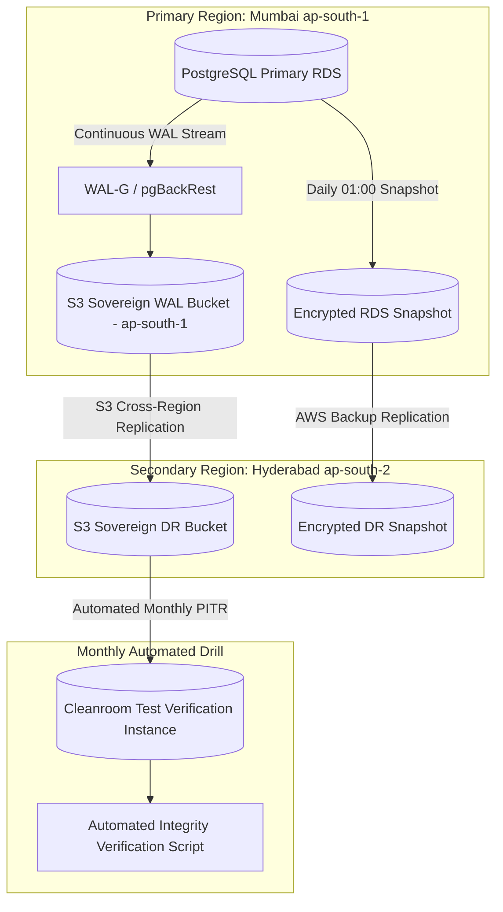

# Master Database Backup, WAL Archiving & Retention Policy
## Namma Clinic Digital Health & Operations Platform
### Greater Bengaluru Authority (GBA) / BBMP Health Department
**Document Code:** `DEV-DOC-15` | **Status:** APPROVED BASELINE | **Date:** September 2026

---

## 1. Executive Summary & Backup Governance Charter
This document establishes the authoritative **Database Backup, Continuous WAL Archiving, and Data Retention Strategy** for the Namma Clinic Digital Health Platform. The architecture guarantees resilience against catastrophic hardware failures, ransomware incidents, accidental administrative data corruption, and regional disaster events. The backup policy enforces continuous Write-Ahead Log (WAL) streaming (RPO < 5 minutes), daily full snapshots, automated cross-region replication, and immutable WORM storage.

### 1.1 Non-Negotiable Backup Invariants
1. **Continuous Write-Ahead Log (WAL) Archiving:** PostgreSQL WAL records are streamed continuously to S3 Sovereign Storage, achieving an RPO < 5 minutes.
2. **Daily Full Encrypted Snapshots:** Automated RDS snapshots execute daily at 01:00 IST during clinic off-hours with 35-day continuous retention.
3. **Cross-Region Sovereign Replication:** Daily snapshots are encrypted using AWS KMS and replicated to the secondary disaster recovery region (Hyderabad `ap-south-2`).
4. **Immutable S3 Object Lock:** Monthly and annual compliance backups are stored in S3 Compliance Mode preventing modification or deletion by any IAM entity.
5. **Mandatory Monthly Restore Drills:** Automated monthly restore drills re-hydrate backups into an isolated test cleanroom to verify data integrity.

## 2. Backup & Continuous Replication Topology


## 3. Automated Backup & PITR Script Specification
### Operational Command: PostgreSQL WAL-G Point-in-Time Recovery Protocol
<!-- DOCUMENTATION-ONLY EXAMPLE -->
```bash
# DOCUMENTATION-ONLY EXAMPLE
#!/usr/bin/env bash
# Automated Point-in-Time Recovery Protocol to target timestamp
set -euo pipefail

TARGET_TIMESTAMP="2026-09-06 14:30:00+05:30"
TARGET_RESTORE_DIR="/var/lib/postgresql/restore_data"
S3_BUCKET="s3://namma-clinic-wal-backup-ap-south-1"

echo "Initiating cleanroom restore to target timestamp: ${TARGET_TIMESTAMP}"
mkdir -p "${TARGET_RESTORE_DIR}"

# 1. Fetch latest base backup prior to target timestamp
wal-g backup-fetch "${TARGET_RESTORE_DIR}" LATEST

# 2. Configure recovery.signal and target timestamp
touch "${TARGET_RESTORE_DIR}/recovery.signal"
cat << EOF > "${TARGET_RESTORE_DIR}/postgresql.auto.conf"
restore_command = 'wal-g wal-fetch "%f" "%p"'
recovery_target_time = '${TARGET_TIMESTAMP}'
recovery_target_action = 'promote'
EOF

echo "Recovery configuration complete. Ready to boot verification instance."
```

## 4. Master Backup Policies Catalog
Comprehensive specifications for all 50 platform backup policies:

### BACKUP-POL-001: Continuous WAL Archiving #1
- **Backup Policy ID:** `BACKUP-POL-001`
- **Operational Mandate:** Continuous PostgreSQL WAL shipping to sovereign S3 with 5-minute RPO target.
- **Enforcement Tool:** `WAL-G / pgBackRest`
- **Backup Frequency:** Continuous WAL / Daily Snapshot
- **Statutory Retention:** 35 days continuous PITR; 7 years compliance archive

### BACKUP-POL-002: Daily Full Database Snapshot #2
- **Backup Policy ID:** `BACKUP-POL-002`
- **Operational Mandate:** Daily full automated RDS snapshot taken at 01:00 IST with 30-day retention.
- **Enforcement Tool:** `AWS RDS Automated Backup`
- **Backup Frequency:** Continuous WAL / Daily Snapshot
- **Statutory Retention:** 35 days continuous PITR; 7 years compliance archive

### BACKUP-POL-003: Cross-Region Replica Snapshot #3
- **Backup Policy ID:** `BACKUP-POL-003`
- **Operational Mandate:** Daily snapshot encrypted and replicated to secondary sovereign region (Hyderabad).
- **Enforcement Tool:** `AWS KMS Cross-Region`
- **Backup Frequency:** Continuous WAL / Daily Snapshot
- **Statutory Retention:** 35 days continuous PITR; 7 years compliance archive

### BACKUP-POL-004: Immutable S3 Object Lock #4
- **Backup Policy ID:** `BACKUP-POL-004`
- **Operational Mandate:** Audit logs and monthly backups locked in S3 Compliance Mode preventing deletion.
- **Enforcement Tool:** `WORM Compliance`
- **Backup Frequency:** Continuous WAL / Daily Snapshot
- **Statutory Retention:** 35 days continuous PITR; 7 years compliance archive

### BACKUP-POL-005: Automated Monthly Restore Drill #5
- **Backup Policy ID:** `BACKUP-POL-005`
- **Operational Mandate:** Scheduled monthly automated restoration to test environment to verify recovery integrity.
- **Enforcement Tool:** `Disaster Recovery Testing`
- **Backup Frequency:** Continuous WAL / Daily Snapshot
- **Statutory Retention:** 35 days continuous PITR; 7 years compliance archive

### BACKUP-POL-006: Continuous WAL Archiving #6
- **Backup Policy ID:** `BACKUP-POL-006`
- **Operational Mandate:** Continuous PostgreSQL WAL shipping to sovereign S3 with 5-minute RPO target.
- **Enforcement Tool:** `WAL-G / pgBackRest`
- **Backup Frequency:** Continuous WAL / Daily Snapshot
- **Statutory Retention:** 35 days continuous PITR; 7 years compliance archive

### BACKUP-POL-007: Daily Full Database Snapshot #7
- **Backup Policy ID:** `BACKUP-POL-007`
- **Operational Mandate:** Daily full automated RDS snapshot taken at 01:00 IST with 30-day retention.
- **Enforcement Tool:** `AWS RDS Automated Backup`
- **Backup Frequency:** Continuous WAL / Daily Snapshot
- **Statutory Retention:** 35 days continuous PITR; 7 years compliance archive

### BACKUP-POL-008: Cross-Region Replica Snapshot #8
- **Backup Policy ID:** `BACKUP-POL-008`
- **Operational Mandate:** Daily snapshot encrypted and replicated to secondary sovereign region (Hyderabad).
- **Enforcement Tool:** `AWS KMS Cross-Region`
- **Backup Frequency:** Continuous WAL / Daily Snapshot
- **Statutory Retention:** 35 days continuous PITR; 7 years compliance archive

### BACKUP-POL-009: Immutable S3 Object Lock #9
- **Backup Policy ID:** `BACKUP-POL-009`
- **Operational Mandate:** Audit logs and monthly backups locked in S3 Compliance Mode preventing deletion.
- **Enforcement Tool:** `WORM Compliance`
- **Backup Frequency:** Continuous WAL / Daily Snapshot
- **Statutory Retention:** 35 days continuous PITR; 7 years compliance archive

### BACKUP-POL-010: Automated Monthly Restore Drill #10
- **Backup Policy ID:** `BACKUP-POL-010`
- **Operational Mandate:** Scheduled monthly automated restoration to test environment to verify recovery integrity.
- **Enforcement Tool:** `Disaster Recovery Testing`
- **Backup Frequency:** Continuous WAL / Daily Snapshot
- **Statutory Retention:** 35 days continuous PITR; 7 years compliance archive

### BACKUP-POL-011: Continuous WAL Archiving #11
- **Backup Policy ID:** `BACKUP-POL-011`
- **Operational Mandate:** Continuous PostgreSQL WAL shipping to sovereign S3 with 5-minute RPO target.
- **Enforcement Tool:** `WAL-G / pgBackRest`
- **Backup Frequency:** Continuous WAL / Daily Snapshot
- **Statutory Retention:** 35 days continuous PITR; 7 years compliance archive

### BACKUP-POL-012: Daily Full Database Snapshot #12
- **Backup Policy ID:** `BACKUP-POL-012`
- **Operational Mandate:** Daily full automated RDS snapshot taken at 01:00 IST with 30-day retention.
- **Enforcement Tool:** `AWS RDS Automated Backup`
- **Backup Frequency:** Continuous WAL / Daily Snapshot
- **Statutory Retention:** 35 days continuous PITR; 7 years compliance archive

### BACKUP-POL-013: Cross-Region Replica Snapshot #13
- **Backup Policy ID:** `BACKUP-POL-013`
- **Operational Mandate:** Daily snapshot encrypted and replicated to secondary sovereign region (Hyderabad).
- **Enforcement Tool:** `AWS KMS Cross-Region`
- **Backup Frequency:** Continuous WAL / Daily Snapshot
- **Statutory Retention:** 35 days continuous PITR; 7 years compliance archive

### BACKUP-POL-014: Immutable S3 Object Lock #14
- **Backup Policy ID:** `BACKUP-POL-014`
- **Operational Mandate:** Audit logs and monthly backups locked in S3 Compliance Mode preventing deletion.
- **Enforcement Tool:** `WORM Compliance`
- **Backup Frequency:** Continuous WAL / Daily Snapshot
- **Statutory Retention:** 35 days continuous PITR; 7 years compliance archive

### BACKUP-POL-015: Automated Monthly Restore Drill #15
- **Backup Policy ID:** `BACKUP-POL-015`
- **Operational Mandate:** Scheduled monthly automated restoration to test environment to verify recovery integrity.
- **Enforcement Tool:** `Disaster Recovery Testing`
- **Backup Frequency:** Continuous WAL / Daily Snapshot
- **Statutory Retention:** 35 days continuous PITR; 7 years compliance archive

### BACKUP-POL-016: Continuous WAL Archiving #16
- **Backup Policy ID:** `BACKUP-POL-016`
- **Operational Mandate:** Continuous PostgreSQL WAL shipping to sovereign S3 with 5-minute RPO target.
- **Enforcement Tool:** `WAL-G / pgBackRest`
- **Backup Frequency:** Continuous WAL / Daily Snapshot
- **Statutory Retention:** 35 days continuous PITR; 7 years compliance archive

### BACKUP-POL-017: Daily Full Database Snapshot #17
- **Backup Policy ID:** `BACKUP-POL-017`
- **Operational Mandate:** Daily full automated RDS snapshot taken at 01:00 IST with 30-day retention.
- **Enforcement Tool:** `AWS RDS Automated Backup`
- **Backup Frequency:** Continuous WAL / Daily Snapshot
- **Statutory Retention:** 35 days continuous PITR; 7 years compliance archive

### BACKUP-POL-018: Cross-Region Replica Snapshot #18
- **Backup Policy ID:** `BACKUP-POL-018`
- **Operational Mandate:** Daily snapshot encrypted and replicated to secondary sovereign region (Hyderabad).
- **Enforcement Tool:** `AWS KMS Cross-Region`
- **Backup Frequency:** Continuous WAL / Daily Snapshot
- **Statutory Retention:** 35 days continuous PITR; 7 years compliance archive

### BACKUP-POL-019: Immutable S3 Object Lock #19
- **Backup Policy ID:** `BACKUP-POL-019`
- **Operational Mandate:** Audit logs and monthly backups locked in S3 Compliance Mode preventing deletion.
- **Enforcement Tool:** `WORM Compliance`
- **Backup Frequency:** Continuous WAL / Daily Snapshot
- **Statutory Retention:** 35 days continuous PITR; 7 years compliance archive

### BACKUP-POL-020: Automated Monthly Restore Drill #20
- **Backup Policy ID:** `BACKUP-POL-020`
- **Operational Mandate:** Scheduled monthly automated restoration to test environment to verify recovery integrity.
- **Enforcement Tool:** `Disaster Recovery Testing`
- **Backup Frequency:** Continuous WAL / Daily Snapshot
- **Statutory Retention:** 35 days continuous PITR; 7 years compliance archive

### BACKUP-POL-021: Continuous WAL Archiving #21
- **Backup Policy ID:** `BACKUP-POL-021`
- **Operational Mandate:** Continuous PostgreSQL WAL shipping to sovereign S3 with 5-minute RPO target.
- **Enforcement Tool:** `WAL-G / pgBackRest`
- **Backup Frequency:** Continuous WAL / Daily Snapshot
- **Statutory Retention:** 35 days continuous PITR; 7 years compliance archive

### BACKUP-POL-022: Daily Full Database Snapshot #22
- **Backup Policy ID:** `BACKUP-POL-022`
- **Operational Mandate:** Daily full automated RDS snapshot taken at 01:00 IST with 30-day retention.
- **Enforcement Tool:** `AWS RDS Automated Backup`
- **Backup Frequency:** Continuous WAL / Daily Snapshot
- **Statutory Retention:** 35 days continuous PITR; 7 years compliance archive

### BACKUP-POL-023: Cross-Region Replica Snapshot #23
- **Backup Policy ID:** `BACKUP-POL-023`
- **Operational Mandate:** Daily snapshot encrypted and replicated to secondary sovereign region (Hyderabad).
- **Enforcement Tool:** `AWS KMS Cross-Region`
- **Backup Frequency:** Continuous WAL / Daily Snapshot
- **Statutory Retention:** 35 days continuous PITR; 7 years compliance archive

### BACKUP-POL-024: Immutable S3 Object Lock #24
- **Backup Policy ID:** `BACKUP-POL-024`
- **Operational Mandate:** Audit logs and monthly backups locked in S3 Compliance Mode preventing deletion.
- **Enforcement Tool:** `WORM Compliance`
- **Backup Frequency:** Continuous WAL / Daily Snapshot
- **Statutory Retention:** 35 days continuous PITR; 7 years compliance archive

### BACKUP-POL-025: Automated Monthly Restore Drill #25
- **Backup Policy ID:** `BACKUP-POL-025`
- **Operational Mandate:** Scheduled monthly automated restoration to test environment to verify recovery integrity.
- **Enforcement Tool:** `Disaster Recovery Testing`
- **Backup Frequency:** Continuous WAL / Daily Snapshot
- **Statutory Retention:** 35 days continuous PITR; 7 years compliance archive

### BACKUP-POL-026: Continuous WAL Archiving #26
- **Backup Policy ID:** `BACKUP-POL-026`
- **Operational Mandate:** Continuous PostgreSQL WAL shipping to sovereign S3 with 5-minute RPO target.
- **Enforcement Tool:** `WAL-G / pgBackRest`
- **Backup Frequency:** Continuous WAL / Daily Snapshot
- **Statutory Retention:** 35 days continuous PITR; 7 years compliance archive

### BACKUP-POL-027: Daily Full Database Snapshot #27
- **Backup Policy ID:** `BACKUP-POL-027`
- **Operational Mandate:** Daily full automated RDS snapshot taken at 01:00 IST with 30-day retention.
- **Enforcement Tool:** `AWS RDS Automated Backup`
- **Backup Frequency:** Continuous WAL / Daily Snapshot
- **Statutory Retention:** 35 days continuous PITR; 7 years compliance archive

### BACKUP-POL-028: Cross-Region Replica Snapshot #28
- **Backup Policy ID:** `BACKUP-POL-028`
- **Operational Mandate:** Daily snapshot encrypted and replicated to secondary sovereign region (Hyderabad).
- **Enforcement Tool:** `AWS KMS Cross-Region`
- **Backup Frequency:** Continuous WAL / Daily Snapshot
- **Statutory Retention:** 35 days continuous PITR; 7 years compliance archive

### BACKUP-POL-029: Immutable S3 Object Lock #29
- **Backup Policy ID:** `BACKUP-POL-029`
- **Operational Mandate:** Audit logs and monthly backups locked in S3 Compliance Mode preventing deletion.
- **Enforcement Tool:** `WORM Compliance`
- **Backup Frequency:** Continuous WAL / Daily Snapshot
- **Statutory Retention:** 35 days continuous PITR; 7 years compliance archive

### BACKUP-POL-030: Automated Monthly Restore Drill #30
- **Backup Policy ID:** `BACKUP-POL-030`
- **Operational Mandate:** Scheduled monthly automated restoration to test environment to verify recovery integrity.
- **Enforcement Tool:** `Disaster Recovery Testing`
- **Backup Frequency:** Continuous WAL / Daily Snapshot
- **Statutory Retention:** 35 days continuous PITR; 7 years compliance archive

### BACKUP-POL-031: Continuous WAL Archiving #31
- **Backup Policy ID:** `BACKUP-POL-031`
- **Operational Mandate:** Continuous PostgreSQL WAL shipping to sovereign S3 with 5-minute RPO target.
- **Enforcement Tool:** `WAL-G / pgBackRest`
- **Backup Frequency:** Continuous WAL / Daily Snapshot
- **Statutory Retention:** 35 days continuous PITR; 7 years compliance archive

### BACKUP-POL-032: Daily Full Database Snapshot #32
- **Backup Policy ID:** `BACKUP-POL-032`
- **Operational Mandate:** Daily full automated RDS snapshot taken at 01:00 IST with 30-day retention.
- **Enforcement Tool:** `AWS RDS Automated Backup`
- **Backup Frequency:** Continuous WAL / Daily Snapshot
- **Statutory Retention:** 35 days continuous PITR; 7 years compliance archive

### BACKUP-POL-033: Cross-Region Replica Snapshot #33
- **Backup Policy ID:** `BACKUP-POL-033`
- **Operational Mandate:** Daily snapshot encrypted and replicated to secondary sovereign region (Hyderabad).
- **Enforcement Tool:** `AWS KMS Cross-Region`
- **Backup Frequency:** Continuous WAL / Daily Snapshot
- **Statutory Retention:** 35 days continuous PITR; 7 years compliance archive

### BACKUP-POL-034: Immutable S3 Object Lock #34
- **Backup Policy ID:** `BACKUP-POL-034`
- **Operational Mandate:** Audit logs and monthly backups locked in S3 Compliance Mode preventing deletion.
- **Enforcement Tool:** `WORM Compliance`
- **Backup Frequency:** Continuous WAL / Daily Snapshot
- **Statutory Retention:** 35 days continuous PITR; 7 years compliance archive

### BACKUP-POL-035: Automated Monthly Restore Drill #35
- **Backup Policy ID:** `BACKUP-POL-035`
- **Operational Mandate:** Scheduled monthly automated restoration to test environment to verify recovery integrity.
- **Enforcement Tool:** `Disaster Recovery Testing`
- **Backup Frequency:** Continuous WAL / Daily Snapshot
- **Statutory Retention:** 35 days continuous PITR; 7 years compliance archive

### BACKUP-POL-036: Continuous WAL Archiving #36
- **Backup Policy ID:** `BACKUP-POL-036`
- **Operational Mandate:** Continuous PostgreSQL WAL shipping to sovereign S3 with 5-minute RPO target.
- **Enforcement Tool:** `WAL-G / pgBackRest`
- **Backup Frequency:** Continuous WAL / Daily Snapshot
- **Statutory Retention:** 35 days continuous PITR; 7 years compliance archive

### BACKUP-POL-037: Daily Full Database Snapshot #37
- **Backup Policy ID:** `BACKUP-POL-037`
- **Operational Mandate:** Daily full automated RDS snapshot taken at 01:00 IST with 30-day retention.
- **Enforcement Tool:** `AWS RDS Automated Backup`
- **Backup Frequency:** Continuous WAL / Daily Snapshot
- **Statutory Retention:** 35 days continuous PITR; 7 years compliance archive

### BACKUP-POL-038: Cross-Region Replica Snapshot #38
- **Backup Policy ID:** `BACKUP-POL-038`
- **Operational Mandate:** Daily snapshot encrypted and replicated to secondary sovereign region (Hyderabad).
- **Enforcement Tool:** `AWS KMS Cross-Region`
- **Backup Frequency:** Continuous WAL / Daily Snapshot
- **Statutory Retention:** 35 days continuous PITR; 7 years compliance archive

### BACKUP-POL-039: Immutable S3 Object Lock #39
- **Backup Policy ID:** `BACKUP-POL-039`
- **Operational Mandate:** Audit logs and monthly backups locked in S3 Compliance Mode preventing deletion.
- **Enforcement Tool:** `WORM Compliance`
- **Backup Frequency:** Continuous WAL / Daily Snapshot
- **Statutory Retention:** 35 days continuous PITR; 7 years compliance archive

### BACKUP-POL-040: Automated Monthly Restore Drill #40
- **Backup Policy ID:** `BACKUP-POL-040`
- **Operational Mandate:** Scheduled monthly automated restoration to test environment to verify recovery integrity.
- **Enforcement Tool:** `Disaster Recovery Testing`
- **Backup Frequency:** Continuous WAL / Daily Snapshot
- **Statutory Retention:** 35 days continuous PITR; 7 years compliance archive

### BACKUP-POL-041: Continuous WAL Archiving #41
- **Backup Policy ID:** `BACKUP-POL-041`
- **Operational Mandate:** Continuous PostgreSQL WAL shipping to sovereign S3 with 5-minute RPO target.
- **Enforcement Tool:** `WAL-G / pgBackRest`
- **Backup Frequency:** Continuous WAL / Daily Snapshot
- **Statutory Retention:** 35 days continuous PITR; 7 years compliance archive

### BACKUP-POL-042: Daily Full Database Snapshot #42
- **Backup Policy ID:** `BACKUP-POL-042`
- **Operational Mandate:** Daily full automated RDS snapshot taken at 01:00 IST with 30-day retention.
- **Enforcement Tool:** `AWS RDS Automated Backup`
- **Backup Frequency:** Continuous WAL / Daily Snapshot
- **Statutory Retention:** 35 days continuous PITR; 7 years compliance archive

### BACKUP-POL-043: Cross-Region Replica Snapshot #43
- **Backup Policy ID:** `BACKUP-POL-043`
- **Operational Mandate:** Daily snapshot encrypted and replicated to secondary sovereign region (Hyderabad).
- **Enforcement Tool:** `AWS KMS Cross-Region`
- **Backup Frequency:** Continuous WAL / Daily Snapshot
- **Statutory Retention:** 35 days continuous PITR; 7 years compliance archive

### BACKUP-POL-044: Immutable S3 Object Lock #44
- **Backup Policy ID:** `BACKUP-POL-044`
- **Operational Mandate:** Audit logs and monthly backups locked in S3 Compliance Mode preventing deletion.
- **Enforcement Tool:** `WORM Compliance`
- **Backup Frequency:** Continuous WAL / Daily Snapshot
- **Statutory Retention:** 35 days continuous PITR; 7 years compliance archive

### BACKUP-POL-045: Automated Monthly Restore Drill #45
- **Backup Policy ID:** `BACKUP-POL-045`
- **Operational Mandate:** Scheduled monthly automated restoration to test environment to verify recovery integrity.
- **Enforcement Tool:** `Disaster Recovery Testing`
- **Backup Frequency:** Continuous WAL / Daily Snapshot
- **Statutory Retention:** 35 days continuous PITR; 7 years compliance archive

### BACKUP-POL-046: Continuous WAL Archiving #46
- **Backup Policy ID:** `BACKUP-POL-046`
- **Operational Mandate:** Continuous PostgreSQL WAL shipping to sovereign S3 with 5-minute RPO target.
- **Enforcement Tool:** `WAL-G / pgBackRest`
- **Backup Frequency:** Continuous WAL / Daily Snapshot
- **Statutory Retention:** 35 days continuous PITR; 7 years compliance archive

### BACKUP-POL-047: Daily Full Database Snapshot #47
- **Backup Policy ID:** `BACKUP-POL-047`
- **Operational Mandate:** Daily full automated RDS snapshot taken at 01:00 IST with 30-day retention.
- **Enforcement Tool:** `AWS RDS Automated Backup`
- **Backup Frequency:** Continuous WAL / Daily Snapshot
- **Statutory Retention:** 35 days continuous PITR; 7 years compliance archive

### BACKUP-POL-048: Cross-Region Replica Snapshot #48
- **Backup Policy ID:** `BACKUP-POL-048`
- **Operational Mandate:** Daily snapshot encrypted and replicated to secondary sovereign region (Hyderabad).
- **Enforcement Tool:** `AWS KMS Cross-Region`
- **Backup Frequency:** Continuous WAL / Daily Snapshot
- **Statutory Retention:** 35 days continuous PITR; 7 years compliance archive

### BACKUP-POL-049: Immutable S3 Object Lock #49
- **Backup Policy ID:** `BACKUP-POL-049`
- **Operational Mandate:** Audit logs and monthly backups locked in S3 Compliance Mode preventing deletion.
- **Enforcement Tool:** `WORM Compliance`
- **Backup Frequency:** Continuous WAL / Daily Snapshot
- **Statutory Retention:** 35 days continuous PITR; 7 years compliance archive

### BACKUP-POL-050: Automated Monthly Restore Drill #50
- **Backup Policy ID:** `BACKUP-POL-050`
- **Operational Mandate:** Scheduled monthly automated restoration to test environment to verify recovery integrity.
- **Enforcement Tool:** `Disaster Recovery Testing`
- **Backup Frequency:** Continuous WAL / Daily Snapshot
- **Statutory Retention:** 35 days continuous PITR; 7 years compliance archive

## 5. Feature Data Backup & Point-in-Time Recovery Tolerance across 180 Features
Recovery point objectives (RPO) and disaster tolerance across all 180 platform product features:

### FEATURE-001: Backup Policy for Feature `Credential Verification`
- **Feature ID:** `FEATURE-001` (Feature #1)
- **Functional Subsystem:** `MODULE-001` (DOMAIN-001)
- **Governed Backup Policy:** `BACKUP-POL-001`
- **Target RPO (Recovery Point Objective):** < 5 Minutes (Continuous WAL)
- **Target RTO (Recovery Time Objective):** < 60 Minutes
- **Disaster Recovery Tier:** Sovereign Cross-Region Warm Standby
- **Statutory Retention:** 7-Year Immutable WORM Archive

### FEATURE-002: Backup Policy for Feature `Session Token Minting`
- **Feature ID:** `FEATURE-002` (Feature #2)
- **Functional Subsystem:** `MODULE-001` (DOMAIN-001)
- **Governed Backup Policy:** `BACKUP-POL-002`
- **Target RPO (Recovery Point Objective):** < 5 Minutes (Continuous WAL)
- **Target RTO (Recovery Time Objective):** < 60 Minutes
- **Disaster Recovery Tier:** Sovereign Cross-Region Warm Standby
- **Statutory Retention:** 7-Year Immutable WORM Archive

### FEATURE-003: Backup Policy for Feature `MFA Challenge Dispatch`
- **Feature ID:** `FEATURE-003` (Feature #3)
- **Functional Subsystem:** `MODULE-001` (DOMAIN-001)
- **Governed Backup Policy:** `BACKUP-POL-003`
- **Target RPO (Recovery Point Objective):** < 5 Minutes (Continuous WAL)
- **Target RTO (Recovery Time Objective):** < 60 Minutes
- **Disaster Recovery Tier:** Sovereign Cross-Region Warm Standby
- **Statutory Retention:** 7-Year Immutable WORM Archive

### FEATURE-004: Backup Policy for Feature `Biometric Authentication Bridge`
- **Feature ID:** `FEATURE-004` (Feature #4)
- **Functional Subsystem:** `MODULE-001` (DOMAIN-001)
- **Governed Backup Policy:** `BACKUP-POL-004`
- **Target RPO (Recovery Point Objective):** < 5 Minutes (Continuous WAL)
- **Target RTO (Recovery Time Objective):** < 60 Minutes
- **Disaster Recovery Tier:** Sovereign Cross-Region Warm Standby
- **Statutory Retention:** 7-Year Immutable WORM Archive

### FEATURE-005: Backup Policy for Feature `Local PIN Verification`
- **Feature ID:** `FEATURE-005` (Feature #5)
- **Functional Subsystem:** `MODULE-001` (DOMAIN-001)
- **Governed Backup Policy:** `BACKUP-POL-005`
- **Target RPO (Recovery Point Objective):** < 5 Minutes (Continuous WAL)
- **Target RTO (Recovery Time Objective):** < 60 Minutes
- **Disaster Recovery Tier:** Sovereign Cross-Region Warm Standby
- **Statutory Retention:** 7-Year Immutable WORM Archive

### FEATURE-006: Backup Policy for Feature `Session Inactivity Lockout`
- **Feature ID:** `FEATURE-006` (Feature #6)
- **Functional Subsystem:** `MODULE-001` (DOMAIN-001)
- **Governed Backup Policy:** `BACKUP-POL-006`
- **Target RPO (Recovery Point Objective):** < 5 Minutes (Continuous WAL)
- **Target RTO (Recovery Time Objective):** < 60 Minutes
- **Disaster Recovery Tier:** Sovereign Cross-Region Warm Standby
- **Statutory Retention:** 7-Year Immutable WORM Archive

### FEATURE-007: Backup Policy for Feature `Permission Evaluation`
- **Feature ID:** `FEATURE-007` (Feature #7)
- **Functional Subsystem:** `MODULE-002` (DOMAIN-001)
- **Governed Backup Policy:** `BACKUP-POL-007`
- **Target RPO (Recovery Point Objective):** < 5 Minutes (Continuous WAL)
- **Target RTO (Recovery Time Objective):** < 60 Minutes
- **Disaster Recovery Tier:** Sovereign Cross-Region Warm Standby
- **Statutory Retention:** 7-Year Immutable WORM Archive

### FEATURE-008: Backup Policy for Feature `Dynamic Role Assignment`
- **Feature ID:** `FEATURE-008` (Feature #8)
- **Functional Subsystem:** `MODULE-002` (DOMAIN-001)
- **Governed Backup Policy:** `BACKUP-POL-008`
- **Target RPO (Recovery Point Objective):** < 5 Minutes (Continuous WAL)
- **Target RTO (Recovery Time Objective):** < 60 Minutes
- **Disaster Recovery Tier:** Sovereign Cross-Region Warm Standby
- **Statutory Retention:** 7-Year Immutable WORM Archive

### FEATURE-009: Backup Policy for Feature `Conflict-of-Interest Prevention`
- **Feature ID:** `FEATURE-009` (Feature #9)
- **Functional Subsystem:** `MODULE-002` (DOMAIN-001)
- **Governed Backup Policy:** `BACKUP-POL-009`
- **Target RPO (Recovery Point Objective):** < 5 Minutes (Continuous WAL)
- **Target RTO (Recovery Time Objective):** < 60 Minutes
- **Disaster Recovery Tier:** Sovereign Cross-Region Warm Standby
- **Statutory Retention:** 7-Year Immutable WORM Archive

### FEATURE-010: Backup Policy for Feature `Maker-Checker Authorization`
- **Feature ID:** `FEATURE-010` (Feature #10)
- **Functional Subsystem:** `MODULE-002` (DOMAIN-001)
- **Governed Backup Policy:** `BACKUP-POL-010`
- **Target RPO (Recovery Point Objective):** < 5 Minutes (Continuous WAL)
- **Target RTO (Recovery Time Objective):** < 60 Minutes
- **Disaster Recovery Tier:** Sovereign Cross-Region Warm Standby
- **Statutory Retention:** 7-Year Immutable WORM Archive

### FEATURE-011: Backup Policy for Feature `Break-Glass Privilege Elevation`
- **Feature ID:** `FEATURE-011` (Feature #11)
- **Functional Subsystem:** `MODULE-002` (DOMAIN-001)
- **Governed Backup Policy:** `BACKUP-POL-011`
- **Target RPO (Recovery Point Objective):** < 5 Minutes (Continuous WAL)
- **Target RTO (Recovery Time Objective):** < 60 Minutes
- **Disaster Recovery Tier:** Sovereign Cross-Region Warm Standby
- **Statutory Retention:** 7-Year Immutable WORM Archive

### FEATURE-012: Backup Policy for Feature `Privilege Elevation Audit`
- **Feature ID:** `FEATURE-012` (Feature #12)
- **Functional Subsystem:** `MODULE-002` (DOMAIN-001)
- **Governed Backup Policy:** `BACKUP-POL-012`
- **Target RPO (Recovery Point Objective):** < 5 Minutes (Continuous WAL)
- **Target RTO (Recovery Time Objective):** < 60 Minutes
- **Disaster Recovery Tier:** Sovereign Cross-Region Warm Standby
- **Statutory Retention:** 7-Year Immutable WORM Archive

### FEATURE-013: Backup Policy for Feature `Hierarchy Node Management`
- **Feature ID:** `FEATURE-013` (Feature #13)
- **Functional Subsystem:** `MODULE-003` (DOMAIN-001)
- **Governed Backup Policy:** `BACKUP-POL-013`
- **Target RPO (Recovery Point Objective):** < 5 Minutes (Continuous WAL)
- **Target RTO (Recovery Time Objective):** < 60 Minutes
- **Disaster Recovery Tier:** Sovereign Cross-Region Warm Standby
- **Statutory Retention:** 7-Year Immutable WORM Archive

### FEATURE-014: Backup Policy for Feature `NIN / HFR Registry Linking`
- **Feature ID:** `FEATURE-014` (Feature #14)
- **Functional Subsystem:** `MODULE-003` (DOMAIN-001)
- **Governed Backup Policy:** `BACKUP-POL-014`
- **Target RPO (Recovery Point Objective):** < 5 Minutes (Continuous WAL)
- **Target RTO (Recovery Time Objective):** < 60 Minutes
- **Disaster Recovery Tier:** Sovereign Cross-Region Warm Standby
- **Statutory Retention:** 7-Year Immutable WORM Archive

### FEATURE-015: Backup Policy for Feature `Station Terminal Mapping`
- **Feature ID:** `FEATURE-015` (Feature #15)
- **Functional Subsystem:** `MODULE-003` (DOMAIN-001)
- **Governed Backup Policy:** `BACKUP-POL-015`
- **Target RPO (Recovery Point Objective):** < 5 Minutes (Continuous WAL)
- **Target RTO (Recovery Time Objective):** < 60 Minutes
- **Disaster Recovery Tier:** Sovereign Cross-Region Warm Standby
- **Statutory Retention:** 7-Year Immutable WORM Archive

### FEATURE-016: Backup Policy for Feature `Facility Capacity Configuration`
- **Feature ID:** `FEATURE-016` (Feature #16)
- **Functional Subsystem:** `MODULE-003` (DOMAIN-001)
- **Governed Backup Policy:** `BACKUP-POL-016`
- **Target RPO (Recovery Point Objective):** < 5 Minutes (Continuous WAL)
- **Target RTO (Recovery Time Objective):** < 60 Minutes
- **Disaster Recovery Tier:** Sovereign Cross-Region Warm Standby
- **Statutory Retention:** 7-Year Immutable WORM Archive

### FEATURE-017: Backup Policy for Feature `Operating Hours Enforcement`
- **Feature ID:** `FEATURE-017` (Feature #17)
- **Functional Subsystem:** `MODULE-003` (DOMAIN-001)
- **Governed Backup Policy:** `BACKUP-POL-017`
- **Target RPO (Recovery Point Objective):** < 5 Minutes (Continuous WAL)
- **Target RTO (Recovery Time Objective):** < 60 Minutes
- **Disaster Recovery Tier:** Sovereign Cross-Region Warm Standby
- **Statutory Retention:** 7-Year Immutable WORM Archive

### FEATURE-018: Backup Policy for Feature `Special Camp Calendar`
- **Feature ID:** `FEATURE-018` (Feature #18)
- **Functional Subsystem:** `MODULE-003` (DOMAIN-001)
- **Governed Backup Policy:** `BACKUP-POL-018`
- **Target RPO (Recovery Point Objective):** < 5 Minutes (Continuous WAL)
- **Target RTO (Recovery Time Objective):** < 60 Minutes
- **Disaster Recovery Tier:** Sovereign Cross-Region Warm Standby
- **Statutory Retention:** 7-Year Immutable WORM Archive

### FEATURE-019: Backup Policy for Feature `Staff Onboarding & KYC`
- **Feature ID:** `FEATURE-019` (Feature #19)
- **Functional Subsystem:** `MODULE-004` (DOMAIN-001)
- **Governed Backup Policy:** `BACKUP-POL-019`
- **Target RPO (Recovery Point Objective):** < 5 Minutes (Continuous WAL)
- **Target RTO (Recovery Time Objective):** < 60 Minutes
- **Disaster Recovery Tier:** Sovereign Cross-Region Warm Standby
- **Statutory Retention:** 7-Year Immutable WORM Archive

### FEATURE-020: Backup Policy for Feature `Professional License Verification`
- **Feature ID:** `FEATURE-020` (Feature #20)
- **Functional Subsystem:** `MODULE-004` (DOMAIN-001)
- **Governed Backup Policy:** `BACKUP-POL-020`
- **Target RPO (Recovery Point Objective):** < 5 Minutes (Continuous WAL)
- **Target RTO (Recovery Time Objective):** < 60 Minutes
- **Disaster Recovery Tier:** Sovereign Cross-Region Warm Standby
- **Statutory Retention:** 7-Year Immutable WORM Archive

### FEATURE-021: Backup Policy for Feature `Duty Roster Generation`
- **Feature ID:** `FEATURE-021` (Feature #21)
- **Functional Subsystem:** `MODULE-004` (DOMAIN-001)
- **Governed Backup Policy:** `BACKUP-POL-021`
- **Target RPO (Recovery Point Objective):** < 5 Minutes (Continuous WAL)
- **Target RTO (Recovery Time Objective):** < 60 Minutes
- **Disaster Recovery Tier:** Sovereign Cross-Region Warm Standby
- **Statutory Retention:** 7-Year Immutable WORM Archive

### FEATURE-022: Backup Policy for Feature `Biometric Attendance Linking`
- **Feature ID:** `FEATURE-022` (Feature #22)
- **Functional Subsystem:** `MODULE-004` (DOMAIN-001)
- **Governed Backup Policy:** `BACKUP-POL-022`
- **Target RPO (Recovery Point Objective):** < 5 Minutes (Continuous WAL)
- **Target RTO (Recovery Time Objective):** < 60 Minutes
- **Disaster Recovery Tier:** Sovereign Cross-Region Warm Standby
- **Statutory Retention:** 7-Year Immutable WORM Archive

### FEATURE-023: Backup Policy for Feature `Digital Signature Enrollment`
- **Feature ID:** `FEATURE-023` (Feature #23)
- **Functional Subsystem:** `MODULE-004` (DOMAIN-001)
- **Governed Backup Policy:** `BACKUP-POL-023`
- **Target RPO (Recovery Point Objective):** < 5 Minutes (Continuous WAL)
- **Target RTO (Recovery Time Objective):** < 60 Minutes
- **Disaster Recovery Tier:** Sovereign Cross-Region Warm Standby
- **Statutory Retention:** 7-Year Immutable WORM Archive

### FEATURE-024: Backup Policy for Feature `Signature Revocation`
- **Feature ID:** `FEATURE-024` (Feature #24)
- **Functional Subsystem:** `MODULE-004` (DOMAIN-001)
- **Governed Backup Policy:** `BACKUP-POL-024`
- **Target RPO (Recovery Point Objective):** < 5 Minutes (Continuous WAL)
- **Target RTO (Recovery Time Objective):** < 60 Minutes
- **Disaster Recovery Tier:** Sovereign Cross-Region Warm Standby
- **Statutory Retention:** 7-Year Immutable WORM Archive

### FEATURE-025: Backup Policy for Feature `Targeted Flag Activation`
- **Feature ID:** `FEATURE-025` (Feature #25)
- **Functional Subsystem:** `MODULE-026` (DOMAIN-001)
- **Governed Backup Policy:** `BACKUP-POL-025`
- **Target RPO (Recovery Point Objective):** < 5 Minutes (Continuous WAL)
- **Target RTO (Recovery Time Objective):** < 60 Minutes
- **Disaster Recovery Tier:** Sovereign Cross-Region Warm Standby
- **Statutory Retention:** 7-Year Immutable WORM Archive

### FEATURE-026: Backup Policy for Feature `Emergency Feature Killswitch`
- **Feature ID:** `FEATURE-026` (Feature #26)
- **Functional Subsystem:** `MODULE-026` (DOMAIN-001)
- **Governed Backup Policy:** `BACKUP-POL-026`
- **Target RPO (Recovery Point Objective):** < 5 Minutes (Continuous WAL)
- **Target RTO (Recovery Time Objective):** < 60 Minutes
- **Disaster Recovery Tier:** Sovereign Cross-Region Warm Standby
- **Statutory Retention:** 7-Year Immutable WORM Archive

### FEATURE-027: Backup Policy for Feature `System Parameter Tuning`
- **Feature ID:** `FEATURE-027` (Feature #27)
- **Functional Subsystem:** `MODULE-026` (DOMAIN-001)
- **Governed Backup Policy:** `BACKUP-POL-027`
- **Target RPO (Recovery Point Objective):** < 5 Minutes (Continuous WAL)
- **Target RTO (Recovery Time Objective):** < 60 Minutes
- **Disaster Recovery Tier:** Sovereign Cross-Region Warm Standby
- **Statutory Retention:** 7-Year Immutable WORM Archive

### FEATURE-028: Backup Policy for Feature `Edge Configuration Distribution`
- **Feature ID:** `FEATURE-028` (Feature #28)
- **Functional Subsystem:** `MODULE-026` (DOMAIN-001)
- **Governed Backup Policy:** `BACKUP-POL-028`
- **Target RPO (Recovery Point Objective):** < 5 Minutes (Continuous WAL)
- **Target RTO (Recovery Time Objective):** < 60 Minutes
- **Disaster Recovery Tier:** Sovereign Cross-Region Warm Standby
- **Statutory Retention:** 7-Year Immutable WORM Archive

### FEATURE-029: Backup Policy for Feature `Edge Migration Orchestration`
- **Feature ID:** `FEATURE-029` (Feature #29)
- **Functional Subsystem:** `MODULE-026` (DOMAIN-001)
- **Governed Backup Policy:** `BACKUP-POL-029`
- **Target RPO (Recovery Point Objective):** < 5 Minutes (Continuous WAL)
- **Target RTO (Recovery Time Objective):** < 60 Minutes
- **Disaster Recovery Tier:** Sovereign Cross-Region Warm Standby
- **Statutory Retention:** 7-Year Immutable WORM Archive

### FEATURE-030: Backup Policy for Feature `Health Probe Monitoring`
- **Feature ID:** `FEATURE-030` (Feature #30)
- **Functional Subsystem:** `MODULE-026` (DOMAIN-001)
- **Governed Backup Policy:** `BACKUP-POL-030`
- **Target RPO (Recovery Point Objective):** < 5 Minutes (Continuous WAL)
- **Target RTO (Recovery Time Objective):** < 60 Minutes
- **Disaster Recovery Tier:** Sovereign Cross-Region Warm Standby
- **Statutory Retention:** 7-Year Immutable WORM Archive

### FEATURE-031: Backup Policy for Feature `Bilingual Intake UI`
- **Feature ID:** `FEATURE-031` (Feature #31)
- **Functional Subsystem:** `MODULE-005` (DOMAIN-002)
- **Governed Backup Policy:** `BACKUP-POL-031`
- **Target RPO (Recovery Point Objective):** < 5 Minutes (Continuous WAL)
- **Target RTO (Recovery Time Objective):** < 60 Minutes
- **Disaster Recovery Tier:** Sovereign Cross-Region Warm Standby
- **Statutory Retention:** 7-Year Immutable WORM Archive

### FEATURE-032: Backup Policy for Feature `Vulnerable Citizen Flagging`
- **Feature ID:** `FEATURE-032` (Feature #32)
- **Functional Subsystem:** `MODULE-005` (DOMAIN-002)
- **Governed Backup Policy:** `BACKUP-POL-032`
- **Target RPO (Recovery Point Objective):** < 5 Minutes (Continuous WAL)
- **Target RTO (Recovery Time Objective):** < 60 Minutes
- **Disaster Recovery Tier:** Sovereign Cross-Region Warm Standby
- **Statutory Retention:** 7-Year Immutable WORM Archive

### FEATURE-033: Backup Policy for Feature `Aadhaar OTP ABHA Bridge`
- **Feature ID:** `FEATURE-033` (Feature #33)
- **Functional Subsystem:** `MODULE-005` (DOMAIN-002)
- **Governed Backup Policy:** `BACKUP-POL-033`
- **Target RPO (Recovery Point Objective):** < 5 Minutes (Continuous WAL)
- **Target RTO (Recovery Time Objective):** < 60 Minutes
- **Disaster Recovery Tier:** Sovereign Cross-Region Warm Standby
- **Statutory Retention:** 7-Year Immutable WORM Archive

### FEATURE-034: Backup Policy for Feature `Demographic ABHA Creation`
- **Feature ID:** `FEATURE-034` (Feature #34)
- **Functional Subsystem:** `MODULE-005` (DOMAIN-002)
- **Governed Backup Policy:** `BACKUP-POL-034`
- **Target RPO (Recovery Point Objective):** < 5 Minutes (Continuous WAL)
- **Target RTO (Recovery Time Objective):** < 60 Minutes
- **Disaster Recovery Tier:** Sovereign Cross-Region Warm Standby
- **Statutory Retention:** 7-Year Immutable WORM Archive

### FEATURE-035: Backup Policy for Feature `Deterministic UHID Minting`
- **Feature ID:** `FEATURE-035` (Feature #35)
- **Functional Subsystem:** `MODULE-005` (DOMAIN-002)
- **Governed Backup Policy:** `BACKUP-POL-035`
- **Target RPO (Recovery Point Objective):** < 5 Minutes (Continuous WAL)
- **Target RTO (Recovery Time Objective):** < 60 Minutes
- **Disaster Recovery Tier:** Sovereign Cross-Region Warm Standby
- **Statutory Retention:** 7-Year Immutable WORM Archive

### FEATURE-036: Backup Policy for Feature `Soundex / Double-Metaphone Matching`
- **Feature ID:** `FEATURE-036` (Feature #36)
- **Functional Subsystem:** `MODULE-005` (DOMAIN-002)
- **Governed Backup Policy:** `BACKUP-POL-036`
- **Target RPO (Recovery Point Objective):** < 5 Minutes (Continuous WAL)
- **Target RTO (Recovery Time Objective):** < 60 Minutes
- **Disaster Recovery Tier:** Sovereign Cross-Region Warm Standby
- **Statutory Retention:** 7-Year Immutable WORM Archive

### FEATURE-037: Backup Policy for Feature `Bilingual Consent Presentation`
- **Feature ID:** `FEATURE-037` (Feature #37)
- **Functional Subsystem:** `MODULE-006` (DOMAIN-002)
- **Governed Backup Policy:** `BACKUP-POL-037`
- **Target RPO (Recovery Point Objective):** < 5 Minutes (Continuous WAL)
- **Target RTO (Recovery Time Objective):** < 60 Minutes
- **Disaster Recovery Tier:** Sovereign Cross-Region Warm Standby
- **Statutory Retention:** 7-Year Immutable WORM Archive

### FEATURE-038: Backup Policy for Feature `Digital Signature / Thumbprint Capture`
- **Feature ID:** `FEATURE-038` (Feature #38)
- **Functional Subsystem:** `MODULE-006` (DOMAIN-002)
- **Governed Backup Policy:** `BACKUP-POL-038`
- **Target RPO (Recovery Point Objective):** < 5 Minutes (Continuous WAL)
- **Target RTO (Recovery Time Objective):** < 60 Minutes
- **Disaster Recovery Tier:** Sovereign Cross-Region Warm Standby
- **Statutory Retention:** 7-Year Immutable WORM Archive

### FEATURE-039: Backup Policy for Feature `Granular Purpose-Based Consent`
- **Feature ID:** `FEATURE-039` (Feature #39)
- **Functional Subsystem:** `MODULE-006` (DOMAIN-002)
- **Governed Backup Policy:** `BACKUP-POL-039`
- **Target RPO (Recovery Point Objective):** < 5 Minutes (Continuous WAL)
- **Target RTO (Recovery Time Objective):** < 60 Minutes
- **Disaster Recovery Tier:** Sovereign Cross-Region Warm Standby
- **Statutory Retention:** 7-Year Immutable WORM Archive

### FEATURE-040: Backup Policy for Feature `Consent Revocation Workflow`
- **Feature ID:** `FEATURE-040` (Feature #40)
- **Functional Subsystem:** `MODULE-006` (DOMAIN-002)
- **Governed Backup Policy:** `BACKUP-POL-040`
- **Target RPO (Recovery Point Objective):** < 5 Minutes (Continuous WAL)
- **Target RTO (Recovery Time Objective):** < 60 Minutes
- **Disaster Recovery Tier:** Sovereign Cross-Region Warm Standby
- **Statutory Retention:** 7-Year Immutable WORM Archive

### FEATURE-041: Backup Policy for Feature `Guardian Relationship Verification`
- **Feature ID:** `FEATURE-041` (Feature #41)
- **Functional Subsystem:** `MODULE-006` (DOMAIN-002)
- **Governed Backup Policy:** `BACKUP-POL-041`
- **Target RPO (Recovery Point Objective):** < 5 Minutes (Continuous WAL)
- **Target RTO (Recovery Time Objective):** < 60 Minutes
- **Disaster Recovery Tier:** Sovereign Cross-Region Warm Standby
- **Statutory Retention:** 7-Year Immutable WORM Archive

### FEATURE-042: Backup Policy for Feature `Implied Emergency Consent`
- **Feature ID:** `FEATURE-042` (Feature #42)
- **Functional Subsystem:** `MODULE-006` (DOMAIN-002)
- **Governed Backup Policy:** `BACKUP-POL-042`
- **Target RPO (Recovery Point Objective):** < 5 Minutes (Continuous WAL)
- **Target RTO (Recovery Time Objective):** < 60 Minutes
- **Disaster Recovery Tier:** Sovereign Cross-Region Warm Standby
- **Statutory Retention:** 7-Year Immutable WORM Archive

### FEATURE-043: Backup Policy for Feature `Daily Token Counter`
- **Feature ID:** `FEATURE-043` (Feature #43)
- **Functional Subsystem:** `MODULE-007` (DOMAIN-002)
- **Governed Backup Policy:** `BACKUP-POL-043`
- **Target RPO (Recovery Point Objective):** < 5 Minutes (Continuous WAL)
- **Target RTO (Recovery Time Objective):** < 60 Minutes
- **Disaster Recovery Tier:** Sovereign Cross-Region Warm Standby
- **Statutory Retention:** 7-Year Immutable WORM Archive

### FEATURE-044: Backup Policy for Feature `Station Route Calculation`
- **Feature ID:** `FEATURE-044` (Feature #44)
- **Functional Subsystem:** `MODULE-007` (DOMAIN-002)
- **Governed Backup Policy:** `BACKUP-POL-044`
- **Target RPO (Recovery Point Objective):** < 5 Minutes (Continuous WAL)
- **Target RTO (Recovery Time Objective):** < 60 Minutes
- **Disaster Recovery Tier:** Sovereign Cross-Region Warm Standby
- **Statutory Retention:** 7-Year Immutable WORM Archive

### FEATURE-045: Backup Policy for Feature `Acuity-Based Insertion`
- **Feature ID:** `FEATURE-045` (Feature #45)
- **Functional Subsystem:** `MODULE-007` (DOMAIN-002)
- **Governed Backup Policy:** `BACKUP-POL-045`
- **Target RPO (Recovery Point Objective):** < 5 Minutes (Continuous WAL)
- **Target RTO (Recovery Time Objective):** < 60 Minutes
- **Disaster Recovery Tier:** Sovereign Cross-Region Warm Standby
- **Statutory Retention:** 7-Year Immutable WORM Archive

### FEATURE-046: Backup Policy for Feature `Vulnerable Citizen Interleaving`
- **Feature ID:** `FEATURE-046` (Feature #46)
- **Functional Subsystem:** `MODULE-007` (DOMAIN-002)
- **Governed Backup Policy:** `BACKUP-POL-046`
- **Target RPO (Recovery Point Objective):** < 5 Minutes (Continuous WAL)
- **Target RTO (Recovery Time Objective):** < 60 Minutes
- **Disaster Recovery Tier:** Sovereign Cross-Region Warm Standby
- **Statutory Retention:** 7-Year Immutable WORM Archive

### FEATURE-047: Backup Policy for Feature `ESC/POS Thermal Printing`
- **Feature ID:** `FEATURE-047` (Feature #47)
- **Functional Subsystem:** `MODULE-007` (DOMAIN-002)
- **Governed Backup Policy:** `BACKUP-POL-047`
- **Target RPO (Recovery Point Objective):** < 5 Minutes (Continuous WAL)
- **Target RTO (Recovery Time Objective):** < 60 Minutes
- **Disaster Recovery Tier:** Sovereign Cross-Region Warm Standby
- **Statutory Retention:** 7-Year Immutable WORM Archive

### FEATURE-048: Backup Policy for Feature `Virtual SMS Token Fallback`
- **Feature ID:** `FEATURE-048` (Feature #48)
- **Functional Subsystem:** `MODULE-007` (DOMAIN-002)
- **Governed Backup Policy:** `BACKUP-POL-048`
- **Target RPO (Recovery Point Objective):** < 5 Minutes (Continuous WAL)
- **Target RTO (Recovery Time Objective):** < 60 Minutes
- **Disaster Recovery Tier:** Sovereign Cross-Region Warm Standby
- **Statutory Retention:** 7-Year Immutable WORM Archive

### FEATURE-049: Backup Policy for Feature `Next-Patient Call Action`
- **Feature ID:** `FEATURE-049` (Feature #49)
- **Functional Subsystem:** `MODULE-008` (DOMAIN-002)
- **Governed Backup Policy:** `BACKUP-POL-049`
- **Target RPO (Recovery Point Objective):** < 5 Minutes (Continuous WAL)
- **Target RTO (Recovery Time Objective):** < 60 Minutes
- **Disaster Recovery Tier:** Sovereign Cross-Region Warm Standby
- **Statutory Retention:** 7-Year Immutable WORM Archive

### FEATURE-050: Backup Policy for Feature `No-Show & Recall Management`
- **Feature ID:** `FEATURE-050` (Feature #50)
- **Functional Subsystem:** `MODULE-008` (DOMAIN-002)
- **Governed Backup Policy:** `BACKUP-POL-050`
- **Target RPO (Recovery Point Objective):** < 5 Minutes (Continuous WAL)
- **Target RTO (Recovery Time Objective):** < 60 Minutes
- **Disaster Recovery Tier:** Sovereign Cross-Region Warm Standby
- **Statutory Retention:** 7-Year Immutable WORM Archive

### FEATURE-051: Backup Policy for Feature `HDMI Waiting Hall Display`
- **Feature ID:** `FEATURE-051` (Feature #51)
- **Functional Subsystem:** `MODULE-008` (DOMAIN-002)
- **Governed Backup Policy:** `BACKUP-POL-001`
- **Target RPO (Recovery Point Objective):** < 5 Minutes (Continuous WAL)
- **Target RTO (Recovery Time Objective):** < 60 Minutes
- **Disaster Recovery Tier:** Sovereign Cross-Region Warm Standby
- **Statutory Retention:** 7-Year Immutable WORM Archive

### FEATURE-052: Backup Policy for Feature `Text-to-Speech Audio Chime`
- **Feature ID:** `FEATURE-052` (Feature #52)
- **Functional Subsystem:** `MODULE-008` (DOMAIN-002)
- **Governed Backup Policy:** `BACKUP-POL-002`
- **Target RPO (Recovery Point Objective):** < 5 Minutes (Continuous WAL)
- **Target RTO (Recovery Time Objective):** < 60 Minutes
- **Disaster Recovery Tier:** Sovereign Cross-Region Warm Standby
- **Statutory Retention:** 7-Year Immutable WORM Archive

### FEATURE-053: Backup Policy for Feature `Dynamic Load Distribution`
- **Feature ID:** `FEATURE-053` (Feature #53)
- **Functional Subsystem:** `MODULE-008` (DOMAIN-002)
- **Governed Backup Policy:** `BACKUP-POL-003`
- **Target RPO (Recovery Point Objective):** < 5 Minutes (Continuous WAL)
- **Target RTO (Recovery Time Objective):** < 60 Minutes
- **Disaster Recovery Tier:** Sovereign Cross-Region Warm Standby
- **Statutory Retention:** 7-Year Immutable WORM Archive

### FEATURE-054: Backup Policy for Feature `Queue Pausing & Resumption`
- **Feature ID:** `FEATURE-054` (Feature #54)
- **Functional Subsystem:** `MODULE-008` (DOMAIN-002)
- **Governed Backup Policy:** `BACKUP-POL-004`
- **Target RPO (Recovery Point Objective):** < 5 Minutes (Continuous WAL)
- **Target RTO (Recovery Time Objective):** < 60 Minutes
- **Disaster Recovery Tier:** Sovereign Cross-Region Warm Standby
- **Statutory Retention:** 7-Year Immutable WORM Archive

### FEATURE-055: Backup Policy for Feature `Kiosk Exit Rating`
- **Feature ID:** `FEATURE-055` (Feature #55)
- **Functional Subsystem:** `MODULE-020` (DOMAIN-002)
- **Governed Backup Policy:** `BACKUP-POL-005`
- **Target RPO (Recovery Point Objective):** < 5 Minutes (Continuous WAL)
- **Target RTO (Recovery Time Objective):** < 60 Minutes
- **Disaster Recovery Tier:** Sovereign Cross-Region Warm Standby
- **Statutory Retention:** 7-Year Immutable WORM Archive

### FEATURE-056: Backup Policy for Feature `Medicine Receipt Confirmation`
- **Feature ID:** `FEATURE-056` (Feature #56)
- **Functional Subsystem:** `MODULE-020` (DOMAIN-002)
- **Governed Backup Policy:** `BACKUP-POL-006`
- **Target RPO (Recovery Point Objective):** < 5 Minutes (Continuous WAL)
- **Target RTO (Recovery Time Objective):** < 60 Minutes
- **Disaster Recovery Tier:** Sovereign Cross-Region Warm Standby
- **Statutory Retention:** 7-Year Immutable WORM Archive

### FEATURE-057: Backup Policy for Feature `Multilingual Ticket Intake`
- **Feature ID:** `FEATURE-057` (Feature #57)
- **Functional Subsystem:** `MODULE-020` (DOMAIN-002)
- **Governed Backup Policy:** `BACKUP-POL-007`
- **Target RPO (Recovery Point Objective):** < 5 Minutes (Continuous WAL)
- **Target RTO (Recovery Time Objective):** < 60 Minutes
- **Disaster Recovery Tier:** Sovereign Cross-Region Warm Standby
- **Statutory Retention:** 7-Year Immutable WORM Archive

### FEATURE-058: Backup Policy for Feature `Automated SLA Timer`
- **Feature ID:** `FEATURE-058` (Feature #58)
- **Functional Subsystem:** `MODULE-020` (DOMAIN-002)
- **Governed Backup Policy:** `BACKUP-POL-008`
- **Target RPO (Recovery Point Objective):** < 5 Minutes (Continuous WAL)
- **Target RTO (Recovery Time Objective):** < 60 Minutes
- **Disaster Recovery Tier:** Sovereign Cross-Region Warm Standby
- **Statutory Retention:** 7-Year Immutable WORM Archive

### FEATURE-059: Backup Policy for Feature `Zonal Escalation Trigger`
- **Feature ID:** `FEATURE-059` (Feature #59)
- **Functional Subsystem:** `MODULE-020` (DOMAIN-002)
- **Governed Backup Policy:** `BACKUP-POL-009`
- **Target RPO (Recovery Point Objective):** < 5 Minutes (Continuous WAL)
- **Target RTO (Recovery Time Objective):** < 60 Minutes
- **Disaster Recovery Tier:** Sovereign Cross-Region Warm Standby
- **Statutory Retention:** 7-Year Immutable WORM Archive

### FEATURE-060: Backup Policy for Feature `Citizen Resolution Feedback`
- **Feature ID:** `FEATURE-060` (Feature #60)
- **Functional Subsystem:** `MODULE-020` (DOMAIN-002)
- **Governed Backup Policy:** `BACKUP-POL-010`
- **Target RPO (Recovery Point Objective):** < 5 Minutes (Continuous WAL)
- **Target RTO (Recovery Time Objective):** < 60 Minutes
- **Disaster Recovery Tier:** Sovereign Cross-Region Warm Standby
- **Statutory Retention:** 7-Year Immutable WORM Archive

### FEATURE-061: Backup Policy for Feature `Longitudinal History Viewer`
- **Feature ID:** `FEATURE-061` (Feature #61)
- **Functional Subsystem:** `MODULE-009` (DOMAIN-003)
- **Governed Backup Policy:** `BACKUP-POL-011`
- **Target RPO (Recovery Point Objective):** < 5 Minutes (Continuous WAL)
- **Target RTO (Recovery Time Objective):** < 60 Minutes
- **Disaster Recovery Tier:** Sovereign Cross-Region Warm Standby
- **Statutory Retention:** 7-Year Immutable WORM Archive

### FEATURE-062: Backup Policy for Feature `Vitals Telemetry Banner`
- **Feature ID:** `FEATURE-062` (Feature #62)
- **Functional Subsystem:** `MODULE-009` (DOMAIN-003)
- **Governed Backup Policy:** `BACKUP-POL-012`
- **Target RPO (Recovery Point Objective):** < 5 Minutes (Continuous WAL)
- **Target RTO (Recovery Time Objective):** < 60 Minutes
- **Disaster Recovery Tier:** Sovereign Cross-Region Warm Standby
- **Statutory Retention:** 7-Year Immutable WORM Archive

### FEATURE-063: Backup Policy for Feature `Rapid Clinical Templates`
- **Feature ID:** `FEATURE-063` (Feature #63)
- **Functional Subsystem:** `MODULE-009` (DOMAIN-003)
- **Governed Backup Policy:** `BACKUP-POL-013`
- **Target RPO (Recovery Point Objective):** < 5 Minutes (Continuous WAL)
- **Target RTO (Recovery Time Objective):** < 60 Minutes
- **Disaster Recovery Tier:** Sovereign Cross-Region Warm Standby
- **Statutory Retention:** 7-Year Immutable WORM Archive

### FEATURE-064: Backup Policy for Feature `Keyboard Shortcut Navigation`
- **Feature ID:** `FEATURE-064` (Feature #64)
- **Functional Subsystem:** `MODULE-009` (DOMAIN-003)
- **Governed Backup Policy:** `BACKUP-POL-014`
- **Target RPO (Recovery Point Objective):** < 5 Minutes (Continuous WAL)
- **Target RTO (Recovery Time Objective):** < 60 Minutes
- **Disaster Recovery Tier:** Sovereign Cross-Region Warm Standby
- **Statutory Retention:** 7-Year Immutable WORM Archive

### FEATURE-065: Backup Policy for Feature `Cryptographic Note Locking`
- **Feature ID:** `FEATURE-065` (Feature #65)
- **Functional Subsystem:** `MODULE-009` (DOMAIN-003)
- **Governed Backup Policy:** `BACKUP-POL-015`
- **Target RPO (Recovery Point Objective):** < 5 Minutes (Continuous WAL)
- **Target RTO (Recovery Time Objective):** < 60 Minutes
- **Disaster Recovery Tier:** Sovereign Cross-Region Warm Standby
- **Statutory Retention:** 7-Year Immutable WORM Archive

### FEATURE-066: Backup Policy for Feature `Clinical Addendum Workflow`
- **Feature ID:** `FEATURE-066` (Feature #66)
- **Functional Subsystem:** `MODULE-009` (DOMAIN-003)
- **Governed Backup Policy:** `BACKUP-POL-016`
- **Target RPO (Recovery Point Objective):** < 5 Minutes (Continuous WAL)
- **Target RTO (Recovery Time Objective):** < 60 Minutes
- **Disaster Recovery Tier:** Sovereign Cross-Region Warm Standby
- **Statutory Retention:** 7-Year Immutable WORM Archive

### FEATURE-067: Backup Policy for Feature `Primary Care Curated Coding`
- **Feature ID:** `FEATURE-067` (Feature #67)
- **Functional Subsystem:** `MODULE-010` (DOMAIN-003)
- **Governed Backup Policy:** `BACKUP-POL-017`
- **Target RPO (Recovery Point Objective):** < 5 Minutes (Continuous WAL)
- **Target RTO (Recovery Time Objective):** < 60 Minutes
- **Disaster Recovery Tier:** Sovereign Cross-Region Warm Standby
- **Statutory Retention:** 7-Year Immutable WORM Archive

### FEATURE-068: Backup Policy for Feature `Synonym & Local Name Mapping`
- **Feature ID:** `FEATURE-068` (Feature #68)
- **Functional Subsystem:** `MODULE-010` (DOMAIN-003)
- **Governed Backup Policy:** `BACKUP-POL-018`
- **Target RPO (Recovery Point Objective):** < 5 Minutes (Continuous WAL)
- **Target RTO (Recovery Time Objective):** < 60 Minutes
- **Disaster Recovery Tier:** Sovereign Cross-Region Warm Standby
- **Statutory Retention:** 7-Year Immutable WORM Archive

### FEATURE-069: Backup Policy for Feature `Chronic Condition Tagging`
- **Feature ID:** `FEATURE-069` (Feature #69)
- **Functional Subsystem:** `MODULE-010` (DOMAIN-003)
- **Governed Backup Policy:** `BACKUP-POL-019`
- **Target RPO (Recovery Point Objective):** < 5 Minutes (Continuous WAL)
- **Target RTO (Recovery Time Objective):** < 60 Minutes
- **Disaster Recovery Tier:** Sovereign Cross-Region Warm Standby
- **Statutory Retention:** 7-Year Immutable WORM Archive

### FEATURE-070: Backup Policy for Feature `Provisional vs. Confirmed Status`
- **Feature ID:** `FEATURE-070` (Feature #70)
- **Functional Subsystem:** `MODULE-010` (DOMAIN-003)
- **Governed Backup Policy:** `BACKUP-POL-020`
- **Target RPO (Recovery Point Objective):** < 5 Minutes (Continuous WAL)
- **Target RTO (Recovery Time Objective):** < 60 Minutes
- **Disaster Recovery Tier:** Sovereign Cross-Region Warm Standby
- **Statutory Retention:** 7-Year Immutable WORM Archive

### FEATURE-071: Backup Policy for Feature `IDSP Notifiable Flagging`
- **Feature ID:** `FEATURE-071` (Feature #71)
- **Functional Subsystem:** `MODULE-010` (DOMAIN-003)
- **Governed Backup Policy:** `BACKUP-POL-021`
- **Target RPO (Recovery Point Objective):** < 5 Minutes (Continuous WAL)
- **Target RTO (Recovery Time Objective):** < 60 Minutes
- **Disaster Recovery Tier:** Sovereign Cross-Region Warm Standby
- **Statutory Retention:** 7-Year Immutable WORM Archive

### FEATURE-072: Backup Policy for Feature `Outbreak Geographic Dispatch`
- **Feature ID:** `FEATURE-072` (Feature #72)
- **Functional Subsystem:** `MODULE-010` (DOMAIN-003)
- **Governed Backup Policy:** `BACKUP-POL-022`
- **Target RPO (Recovery Point Objective):** < 5 Minutes (Continuous WAL)
- **Target RTO (Recovery Time Objective):** < 60 Minutes
- **Disaster Recovery Tier:** Sovereign Cross-Region Warm Standby
- **Statutory Retention:** 7-Year Immutable WORM Archive

### FEATURE-073: Backup Policy for Feature `Generic Drug Selection`
- **Feature ID:** `FEATURE-073` (Feature #73)
- **Functional Subsystem:** `MODULE-011` (DOMAIN-003)
- **Governed Backup Policy:** `BACKUP-POL-023`
- **Target RPO (Recovery Point Objective):** < 5 Minutes (Continuous WAL)
- **Target RTO (Recovery Time Objective):** < 60 Minutes
- **Disaster Recovery Tier:** Sovereign Cross-Region Warm Standby
- **Statutory Retention:** 7-Year Immutable WORM Archive

### FEATURE-074: Backup Policy for Feature `Standard Sig Frequency Picker`
- **Feature ID:** `FEATURE-074` (Feature #74)
- **Functional Subsystem:** `MODULE-011` (DOMAIN-003)
- **Governed Backup Policy:** `BACKUP-POL-024`
- **Target RPO (Recovery Point Objective):** < 5 Minutes (Continuous WAL)
- **Target RTO (Recovery Time Objective):** < 60 Minutes
- **Disaster Recovery Tier:** Sovereign Cross-Region Warm Standby
- **Statutory Retention:** 7-Year Immutable WORM Archive

### FEATURE-075: Backup Policy for Feature `Drug-Drug Interaction Alert`
- **Feature ID:** `FEATURE-075` (Feature #75)
- **Functional Subsystem:** `MODULE-011` (DOMAIN-003)
- **Governed Backup Policy:** `BACKUP-POL-025`
- **Target RPO (Recovery Point Objective):** < 5 Minutes (Continuous WAL)
- **Target RTO (Recovery Time Objective):** < 60 Minutes
- **Disaster Recovery Tier:** Sovereign Cross-Region Warm Standby
- **Statutory Retention:** 7-Year Immutable WORM Archive

### FEATURE-076: Backup Policy for Feature `Allergy Cross-Check`
- **Feature ID:** `FEATURE-076` (Feature #76)
- **Functional Subsystem:** `MODULE-011` (DOMAIN-003)
- **Governed Backup Policy:** `BACKUP-POL-026`
- **Target RPO (Recovery Point Objective):** < 5 Minutes (Continuous WAL)
- **Target RTO (Recovery Time Objective):** < 60 Minutes
- **Disaster Recovery Tier:** Sovereign Cross-Region Warm Standby
- **Statutory Retention:** 7-Year Immutable WORM Archive

### FEATURE-077: Backup Policy for Feature `Weight-Based Pediatric Dosing`
- **Feature ID:** `FEATURE-077` (Feature #77)
- **Functional Subsystem:** `MODULE-011` (DOMAIN-003)
- **Governed Backup Policy:** `BACKUP-POL-027`
- **Target RPO (Recovery Point Objective):** < 5 Minutes (Continuous WAL)
- **Target RTO (Recovery Time Objective):** < 60 Minutes
- **Disaster Recovery Tier:** Sovereign Cross-Region Warm Standby
- **Statutory Retention:** 7-Year Immutable WORM Archive

### FEATURE-078: Backup Policy for Feature `Electronic Prescription Sign & Dispatch`
- **Feature ID:** `FEATURE-078` (Feature #78)
- **Functional Subsystem:** `MODULE-011` (DOMAIN-003)
- **Governed Backup Policy:** `BACKUP-POL-028`
- **Target RPO (Recovery Point Objective):** < 5 Minutes (Continuous WAL)
- **Target RTO (Recovery Time Objective):** < 60 Minutes
- **Disaster Recovery Tier:** Sovereign Cross-Region Warm Standby
- **Statutory Retention:** 7-Year Immutable WORM Archive

### FEATURE-079: Backup Policy for Feature `Electronic Order Queue`
- **Feature ID:** `FEATURE-079` (Feature #79)
- **Functional Subsystem:** `MODULE-012` (DOMAIN-003)
- **Governed Backup Policy:** `BACKUP-POL-029`
- **Target RPO (Recovery Point Objective):** < 5 Minutes (Continuous WAL)
- **Target RTO (Recovery Time Objective):** < 60 Minutes
- **Disaster Recovery Tier:** Sovereign Cross-Region Warm Standby
- **Statutory Retention:** 7-Year Immutable WORM Archive

### FEATURE-080: Backup Policy for Feature `Sample Barcode Labeling`
- **Feature ID:** `FEATURE-080` (Feature #80)
- **Functional Subsystem:** `MODULE-012` (DOMAIN-003)
- **Governed Backup Policy:** `BACKUP-POL-030`
- **Target RPO (Recovery Point Objective):** < 5 Minutes (Continuous WAL)
- **Target RTO (Recovery Time Objective):** < 60 Minutes
- **Disaster Recovery Tier:** Sovereign Cross-Region Warm Standby
- **Statutory Retention:** 7-Year Immutable WORM Archive

### FEATURE-081: Backup Policy for Feature `Rapid Diagnostic Result Entry`
- **Feature ID:** `FEATURE-081` (Feature #81)
- **Functional Subsystem:** `MODULE-012` (DOMAIN-003)
- **Governed Backup Policy:** `BACKUP-POL-031`
- **Target RPO (Recovery Point Objective):** < 5 Minutes (Continuous WAL)
- **Target RTO (Recovery Time Objective):** < 60 Minutes
- **Disaster Recovery Tier:** Sovereign Cross-Region Warm Standby
- **Statutory Retention:** 7-Year Immutable WORM Archive

### FEATURE-082: Backup Policy for Feature `POC Analyzer Serial Bridge`
- **Feature ID:** `FEATURE-082` (Feature #82)
- **Functional Subsystem:** `MODULE-012` (DOMAIN-003)
- **Governed Backup Policy:** `BACKUP-POL-032`
- **Target RPO (Recovery Point Objective):** < 5 Minutes (Continuous WAL)
- **Target RTO (Recovery Time Objective):** < 60 Minutes
- **Disaster Recovery Tier:** Sovereign Cross-Region Warm Standby
- **Statutory Retention:** 7-Year Immutable WORM Archive

### FEATURE-083: Backup Policy for Feature `Panic Value Threshold Detector`
- **Feature ID:** `FEATURE-083` (Feature #83)
- **Functional Subsystem:** `MODULE-012` (DOMAIN-003)
- **Governed Backup Policy:** `BACKUP-POL-033`
- **Target RPO (Recovery Point Objective):** < 5 Minutes (Continuous WAL)
- **Target RTO (Recovery Time Objective):** < 60 Minutes
- **Disaster Recovery Tier:** Sovereign Cross-Region Warm Standby
- **Statutory Retention:** 7-Year Immutable WORM Archive

### FEATURE-084: Backup Policy for Feature `Urgent Doctor Notification Push`
- **Feature ID:** `FEATURE-084` (Feature #84)
- **Functional Subsystem:** `MODULE-012` (DOMAIN-003)
- **Governed Backup Policy:** `BACKUP-POL-034`
- **Target RPO (Recovery Point Objective):** < 5 Minutes (Continuous WAL)
- **Target RTO (Recovery Time Objective):** < 60 Minutes
- **Disaster Recovery Tier:** Sovereign Cross-Region Warm Standby
- **Statutory Retention:** 7-Year Immutable WORM Archive

### FEATURE-085: Backup Policy for Feature `Specialist Specialty Directory`
- **Feature ID:** `FEATURE-085` (Feature #85)
- **Functional Subsystem:** `MODULE-029` (DOMAIN-003)
- **Governed Backup Policy:** `BACKUP-POL-035`
- **Target RPO (Recovery Point Objective):** < 5 Minutes (Continuous WAL)
- **Target RTO (Recovery Time Objective):** < 60 Minutes
- **Disaster Recovery Tier:** Sovereign Cross-Region Warm Standby
- **Statutory Retention:** 7-Year Immutable WORM Archive

### FEATURE-086: Backup Policy for Feature `Store-and-Forward Tele-Dermatology`
- **Feature ID:** `FEATURE-086` (Feature #86)
- **Functional Subsystem:** `MODULE-029` (DOMAIN-003)
- **Governed Backup Policy:** `BACKUP-POL-036`
- **Target RPO (Recovery Point Objective):** < 5 Minutes (Continuous WAL)
- **Target RTO (Recovery Time Objective):** < 60 Minutes
- **Disaster Recovery Tier:** Sovereign Cross-Region Warm Standby
- **Statutory Retention:** 7-Year Immutable WORM Archive

### FEATURE-087: Backup Policy for Feature `Low-Bandwidth Adaptive WebRTC`
- **Feature ID:** `FEATURE-087` (Feature #87)
- **Functional Subsystem:** `MODULE-029` (DOMAIN-003)
- **Governed Backup Policy:** `BACKUP-POL-037`
- **Target RPO (Recovery Point Objective):** < 5 Minutes (Continuous WAL)
- **Target RTO (Recovery Time Objective):** < 60 Minutes
- **Disaster Recovery Tier:** Sovereign Cross-Region Warm Standby
- **Statutory Retention:** 7-Year Immutable WORM Archive

### FEATURE-088: Backup Policy for Feature `Synchronized Clinical Note Viewer`
- **Feature ID:** `FEATURE-088` (Feature #88)
- **Functional Subsystem:** `MODULE-029` (DOMAIN-003)
- **Governed Backup Policy:** `BACKUP-POL-038`
- **Target RPO (Recovery Point Objective):** < 5 Minutes (Continuous WAL)
- **Target RTO (Recovery Time Objective):** < 60 Minutes
- **Disaster Recovery Tier:** Sovereign Cross-Region Warm Standby
- **Statutory Retention:** 7-Year Immutable WORM Archive

### FEATURE-089: Backup Policy for Feature `Specialist e-Sign Endorsement`
- **Feature ID:** `FEATURE-089` (Feature #89)
- **Functional Subsystem:** `MODULE-029` (DOMAIN-003)
- **Governed Backup Policy:** `BACKUP-POL-039`
- **Target RPO (Recovery Point Objective):** < 5 Minutes (Continuous WAL)
- **Target RTO (Recovery Time Objective):** < 60 Minutes
- **Disaster Recovery Tier:** Sovereign Cross-Region Warm Standby
- **Statutory Retention:** 7-Year Immutable WORM Archive

### FEATURE-090: Backup Policy for Feature `Tele-Consultation Compliance Audit`
- **Feature ID:** `FEATURE-090` (Feature #90)
- **Functional Subsystem:** `MODULE-029` (DOMAIN-003)
- **Governed Backup Policy:** `BACKUP-POL-040`
- **Target RPO (Recovery Point Objective):** < 5 Minutes (Continuous WAL)
- **Target RTO (Recovery Time Objective):** < 60 Minutes
- **Disaster Recovery Tier:** Sovereign Cross-Region Warm Standby
- **Statutory Retention:** 7-Year Immutable WORM Archive

### FEATURE-091: Backup Policy for Feature `Pharmacy Electronic Worklist`
- **Feature ID:** `FEATURE-091` (Feature #91)
- **Functional Subsystem:** `MODULE-013` (DOMAIN-004)
- **Governed Backup Policy:** `BACKUP-POL-041`
- **Target RPO (Recovery Point Objective):** < 5 Minutes (Continuous WAL)
- **Target RTO (Recovery Time Objective):** < 60 Minutes
- **Disaster Recovery Tier:** Sovereign Cross-Region Warm Standby
- **Statutory Retention:** 7-Year Immutable WORM Archive

### FEATURE-092: Backup Policy for Feature `Partial Dispense & Substitute Handling`
- **Feature ID:** `FEATURE-092` (Feature #92)
- **Functional Subsystem:** `MODULE-013` (DOMAIN-004)
- **Governed Backup Policy:** `BACKUP-POL-042`
- **Target RPO (Recovery Point Objective):** < 5 Minutes (Continuous WAL)
- **Target RTO (Recovery Time Objective):** < 60 Minutes
- **Disaster Recovery Tier:** Sovereign Cross-Region Warm Standby
- **Statutory Retention:** 7-Year Immutable WORM Archive

### FEATURE-093: Backup Policy for Feature `Barcode Scanner Hardware Interface`
- **Feature ID:** `FEATURE-093` (Feature #93)
- **Functional Subsystem:** `MODULE-013` (DOMAIN-004)
- **Governed Backup Policy:** `BACKUP-POL-043`
- **Target RPO (Recovery Point Objective):** < 5 Minutes (Continuous WAL)
- **Target RTO (Recovery Time Objective):** < 60 Minutes
- **Disaster Recovery Tier:** Sovereign Cross-Region Warm Standby
- **Statutory Retention:** 7-Year Immutable WORM Archive

### FEATURE-094: Backup Policy for Feature `FEFO Expiry Enforcement`
- **Feature ID:** `FEATURE-094` (Feature #94)
- **Functional Subsystem:** `MODULE-013` (DOMAIN-004)
- **Governed Backup Policy:** `BACKUP-POL-044`
- **Target RPO (Recovery Point Objective):** < 5 Minutes (Continuous WAL)
- **Target RTO (Recovery Time Objective):** < 60 Minutes
- **Disaster Recovery Tier:** Sovereign Cross-Region Warm Standby
- **Statutory Retention:** 7-Year Immutable WORM Archive

### FEATURE-095: Backup Policy for Feature `Bilingual Label Generator`
- **Feature ID:** `FEATURE-095` (Feature #95)
- **Functional Subsystem:** `MODULE-013` (DOMAIN-004)
- **Governed Backup Policy:** `BACKUP-POL-045`
- **Target RPO (Recovery Point Objective):** < 5 Minutes (Continuous WAL)
- **Target RTO (Recovery Time Objective):** < 60 Minutes
- **Disaster Recovery Tier:** Sovereign Cross-Region Warm Standby
- **Statutory Retention:** 7-Year Immutable WORM Archive

### FEATURE-096: Backup Policy for Feature `Dispense Commit & Ledger Deduction`
- **Feature ID:** `FEATURE-096` (Feature #96)
- **Functional Subsystem:** `MODULE-013` (DOMAIN-004)
- **Governed Backup Policy:** `BACKUP-POL-046`
- **Target RPO (Recovery Point Objective):** < 5 Minutes (Continuous WAL)
- **Target RTO (Recovery Time Objective):** < 60 Minutes
- **Disaster Recovery Tier:** Sovereign Cross-Region Warm Standby
- **Statutory Retention:** 7-Year Immutable WORM Archive

### FEATURE-097: Backup Policy for Feature `Perpetual Stock Balance Tracking`
- **Feature ID:** `FEATURE-097` (Feature #97)
- **Functional Subsystem:** `MODULE-014` (DOMAIN-004)
- **Governed Backup Policy:** `BACKUP-POL-047`
- **Target RPO (Recovery Point Objective):** < 5 Minutes (Continuous WAL)
- **Target RTO (Recovery Time Objective):** < 60 Minutes
- **Disaster Recovery Tier:** Sovereign Cross-Region Warm Standby
- **Statutory Retention:** 7-Year Immutable WORM Archive

### FEATURE-098: Backup Policy for Feature `Low Stock Threshold Alert`
- **Feature ID:** `FEATURE-098` (Feature #98)
- **Functional Subsystem:** `MODULE-014` (DOMAIN-004)
- **Governed Backup Policy:** `BACKUP-POL-048`
- **Target RPO (Recovery Point Objective):** < 5 Minutes (Continuous WAL)
- **Target RTO (Recovery Time Objective):** < 60 Minutes
- **Disaster Recovery Tier:** Sovereign Cross-Region Warm Standby
- **Statutory Retention:** 7-Year Immutable WORM Archive

### FEATURE-099: Backup Policy for Feature `Automated FEFO Shelf Guidance`
- **Feature ID:** `FEATURE-099` (Feature #99)
- **Functional Subsystem:** `MODULE-014` (DOMAIN-004)
- **Governed Backup Policy:** `BACKUP-POL-049`
- **Target RPO (Recovery Point Objective):** < 5 Minutes (Continuous WAL)
- **Target RTO (Recovery Time Objective):** < 60 Minutes
- **Disaster Recovery Tier:** Sovereign Cross-Region Warm Standby
- **Statutory Retention:** 7-Year Immutable WORM Archive

### FEATURE-100: Backup Policy for Feature `Expired Drug Quarantine Lock`
- **Feature ID:** `FEATURE-100` (Feature #100)
- **Functional Subsystem:** `MODULE-014` (DOMAIN-004)
- **Governed Backup Policy:** `BACKUP-POL-050`
- **Target RPO (Recovery Point Objective):** < 5 Minutes (Continuous WAL)
- **Target RTO (Recovery Time Objective):** < 60 Minutes
- **Disaster Recovery Tier:** Sovereign Cross-Region Warm Standby
- **Statutory Retention:** 7-Year Immutable WORM Archive

### FEATURE-101: Backup Policy for Feature `Physical Stock Count Sheet`
- **Feature ID:** `FEATURE-101` (Feature #101)
- **Functional Subsystem:** `MODULE-014` (DOMAIN-004)
- **Governed Backup Policy:** `BACKUP-POL-001`
- **Target RPO (Recovery Point Objective):** < 5 Minutes (Continuous WAL)
- **Target RTO (Recovery Time Objective):** < 60 Minutes
- **Disaster Recovery Tier:** Sovereign Cross-Region Warm Standby
- **Statutory Retention:** 7-Year Immutable WORM Archive

### FEATURE-102: Backup Policy for Feature `Variance Adjustment Signoff`
- **Feature ID:** `FEATURE-102` (Feature #102)
- **Functional Subsystem:** `MODULE-014` (DOMAIN-004)
- **Governed Backup Policy:** `BACKUP-POL-002`
- **Target RPO (Recovery Point Objective):** < 5 Minutes (Continuous WAL)
- **Target RTO (Recovery Time Objective):** < 60 Minutes
- **Disaster Recovery Tier:** Sovereign Cross-Region Warm Standby
- **Statutory Retention:** 7-Year Immutable WORM Archive

### FEATURE-103: Backup Policy for Feature `Automated Reorder Quantity Formula`
- **Feature ID:** `FEATURE-103` (Feature #103)
- **Functional Subsystem:** `MODULE-015` (DOMAIN-004)
- **Governed Backup Policy:** `BACKUP-POL-003`
- **Target RPO (Recovery Point Objective):** < 5 Minutes (Continuous WAL)
- **Target RTO (Recovery Time Objective):** < 60 Minutes
- **Disaster Recovery Tier:** Sovereign Cross-Region Warm Standby
- **Statutory Retention:** 7-Year Immutable WORM Archive

### FEATURE-104: Backup Policy for Feature `Emergency Indent Escalation`
- **Feature ID:** `FEATURE-104` (Feature #104)
- **Functional Subsystem:** `MODULE-015` (DOMAIN-004)
- **Governed Backup Policy:** `BACKUP-POL-004`
- **Target RPO (Recovery Point Objective):** < 5 Minutes (Continuous WAL)
- **Target RTO (Recovery Time Objective):** < 60 Minutes
- **Disaster Recovery Tier:** Sovereign Cross-Region Warm Standby
- **Statutory Retention:** 7-Year Immutable WORM Archive

### FEATURE-105: Backup Policy for Feature `Electronic Delivery Challan Inward`
- **Feature ID:** `FEATURE-105` (Feature #105)
- **Functional Subsystem:** `MODULE-015` (DOMAIN-004)
- **Governed Backup Policy:** `BACKUP-POL-005`
- **Target RPO (Recovery Point Objective):** < 5 Minutes (Continuous WAL)
- **Target RTO (Recovery Time Objective):** < 60 Minutes
- **Disaster Recovery Tier:** Sovereign Cross-Region Warm Standby
- **Statutory Retention:** 7-Year Immutable WORM Archive

### FEATURE-106: Backup Policy for Feature `Carton Barcode Verification`
- **Feature ID:** `FEATURE-106` (Feature #106)
- **Functional Subsystem:** `MODULE-015` (DOMAIN-004)
- **Governed Backup Policy:** `BACKUP-POL-006`
- **Target RPO (Recovery Point Objective):** < 5 Minutes (Continuous WAL)
- **Target RTO (Recovery Time Objective):** < 60 Minutes
- **Disaster Recovery Tier:** Sovereign Cross-Region Warm Standby
- **Statutory Retention:** 7-Year Immutable WORM Archive

### FEATURE-107: Backup Policy for Feature `IoT Temperature Sensor Bridge`
- **Feature ID:** `FEATURE-107` (Feature #107)
- **Functional Subsystem:** `MODULE-015` (DOMAIN-004)
- **Governed Backup Policy:** `BACKUP-POL-007`
- **Target RPO (Recovery Point Objective):** < 5 Minutes (Continuous WAL)
- **Target RTO (Recovery Time Objective):** < 60 Minutes
- **Disaster Recovery Tier:** Sovereign Cross-Region Warm Standby
- **Statutory Retention:** 7-Year Immutable WORM Archive

### FEATURE-108: Backup Policy for Feature `Thermal Breach SMS Alert`
- **Feature ID:** `FEATURE-108` (Feature #108)
- **Functional Subsystem:** `MODULE-015` (DOMAIN-004)
- **Governed Backup Policy:** `BACKUP-POL-008`
- **Target RPO (Recovery Point Objective):** < 5 Minutes (Continuous WAL)
- **Target RTO (Recovery Time Objective):** < 60 Minutes
- **Disaster Recovery Tier:** Sovereign Cross-Region Warm Standby
- **Statutory Retention:** 7-Year Immutable WORM Archive

### FEATURE-109: Backup Policy for Feature `Central Formulary Publishing`
- **Feature ID:** `FEATURE-109` (Feature #109)
- **Functional Subsystem:** `MODULE-016` (DOMAIN-004)
- **Governed Backup Policy:** `BACKUP-POL-009`
- **Target RPO (Recovery Point Objective):** < 5 Minutes (Continuous WAL)
- **Target RTO (Recovery Time Objective):** < 60 Minutes
- **Disaster Recovery Tier:** Sovereign Cross-Region Warm Standby
- **Statutory Retention:** 7-Year Immutable WORM Archive

### FEATURE-110: Backup Policy for Feature `Dosage Unit Standardization`
- **Feature ID:** `FEATURE-110` (Feature #110)
- **Functional Subsystem:** `MODULE-016` (DOMAIN-004)
- **Governed Backup Policy:** `BACKUP-POL-010`
- **Target RPO (Recovery Point Objective):** < 5 Minutes (Continuous WAL)
- **Target RTO (Recovery Time Objective):** < 60 Minutes
- **Disaster Recovery Tier:** Sovereign Cross-Region Warm Standby
- **Statutory Retention:** 7-Year Immutable WORM Archive

### FEATURE-111: Backup Policy for Feature `Brand Cross-Reference Search`
- **Feature ID:** `FEATURE-111` (Feature #111)
- **Functional Subsystem:** `MODULE-016` (DOMAIN-004)
- **Governed Backup Policy:** `BACKUP-POL-011`
- **Target RPO (Recovery Point Objective):** < 5 Minutes (Continuous WAL)
- **Target RTO (Recovery Time Objective):** < 60 Minutes
- **Disaster Recovery Tier:** Sovereign Cross-Region Warm Standby
- **Statutory Retention:** 7-Year Immutable WORM Archive

### FEATURE-112: Backup Policy for Feature `Controlled Drug Scheduling Flag`
- **Feature ID:** `FEATURE-112` (Feature #112)
- **Functional Subsystem:** `MODULE-016` (DOMAIN-004)
- **Governed Backup Policy:** `BACKUP-POL-012`
- **Target RPO (Recovery Point Objective):** < 5 Minutes (Continuous WAL)
- **Target RTO (Recovery Time Objective):** < 60 Minutes
- **Disaster Recovery Tier:** Sovereign Cross-Region Warm Standby
- **Statutory Retention:** 7-Year Immutable WORM Archive

### FEATURE-113: Backup Policy for Feature `Approved Substitution Matrix`
- **Feature ID:** `FEATURE-113` (Feature #113)
- **Functional Subsystem:** `MODULE-016` (DOMAIN-004)
- **Governed Backup Policy:** `BACKUP-POL-013`
- **Target RPO (Recovery Point Objective):** < 5 Minutes (Continuous WAL)
- **Target RTO (Recovery Time Objective):** < 60 Minutes
- **Disaster Recovery Tier:** Sovereign Cross-Region Warm Standby
- **Statutory Retention:** 7-Year Immutable WORM Archive

### FEATURE-114: Backup Policy for Feature `Formulary Restriction Enforcer`
- **Feature ID:** `FEATURE-114` (Feature #114)
- **Functional Subsystem:** `MODULE-016` (DOMAIN-004)
- **Governed Backup Policy:** `BACKUP-POL-014`
- **Target RPO (Recovery Point Objective):** < 5 Minutes (Continuous WAL)
- **Target RTO (Recovery Time Objective):** < 60 Minutes
- **Disaster Recovery Tier:** Sovereign Cross-Region Warm Standby
- **Statutory Retention:** 7-Year Immutable WORM Archive

### FEATURE-115: Backup Policy for Feature `SBAR Summary Generation`
- **Feature ID:** `FEATURE-115` (Feature #115)
- **Functional Subsystem:** `MODULE-017` (DOMAIN-005)
- **Governed Backup Policy:** `BACKUP-POL-015`
- **Target RPO (Recovery Point Objective):** < 5 Minutes (Continuous WAL)
- **Target RTO (Recovery Time Objective):** < 60 Minutes
- **Disaster Recovery Tier:** Sovereign Cross-Region Warm Standby
- **Statutory Retention:** 7-Year Immutable WORM Archive

### FEATURE-116: Backup Policy for Feature `Receiving Hospital Capacity Check`
- **Feature ID:** `FEATURE-116` (Feature #116)
- **Functional Subsystem:** `MODULE-017` (DOMAIN-005)
- **Governed Backup Policy:** `BACKUP-POL-016`
- **Target RPO (Recovery Point Objective):** < 5 Minutes (Continuous WAL)
- **Target RTO (Recovery Time Objective):** < 60 Minutes
- **Disaster Recovery Tier:** Sovereign Cross-Region Warm Standby
- **Statutory Retention:** 7-Year Immutable WORM Archive

### FEATURE-117: Backup Policy for Feature `108 Ambulance CAD Integration`
- **Feature ID:** `FEATURE-117` (Feature #117)
- **Functional Subsystem:** `MODULE-017` (DOMAIN-005)
- **Governed Backup Policy:** `BACKUP-POL-017`
- **Target RPO (Recovery Point Objective):** < 5 Minutes (Continuous WAL)
- **Target RTO (Recovery Time Objective):** < 60 Minutes
- **Disaster Recovery Tier:** Sovereign Cross-Region Warm Standby
- **Statutory Retention:** 7-Year Immutable WORM Archive

### FEATURE-118: Backup Policy for Feature `Ambulance ETA Telemetry`
- **Feature ID:** `FEATURE-118` (Feature #118)
- **Functional Subsystem:** `MODULE-017` (DOMAIN-005)
- **Governed Backup Policy:** `BACKUP-POL-018`
- **Target RPO (Recovery Point Objective):** < 5 Minutes (Continuous WAL)
- **Target RTO (Recovery Time Objective):** < 60 Minutes
- **Disaster Recovery Tier:** Sovereign Cross-Region Warm Standby
- **Statutory Retention:** 7-Year Immutable WORM Archive

### FEATURE-119: Backup Policy for Feature `Referral Handover Verification`
- **Feature ID:** `FEATURE-119` (Feature #119)
- **Functional Subsystem:** `MODULE-017` (DOMAIN-005)
- **Governed Backup Policy:** `BACKUP-POL-019`
- **Target RPO (Recovery Point Objective):** < 5 Minutes (Continuous WAL)
- **Target RTO (Recovery Time Objective):** < 60 Minutes
- **Disaster Recovery Tier:** Sovereign Cross-Region Warm Standby
- **Statutory Retention:** 7-Year Immutable WORM Archive

### FEATURE-120: Backup Policy for Feature `Post-Referral Counter-Referral Push`
- **Feature ID:** `FEATURE-120` (Feature #120)
- **Functional Subsystem:** `MODULE-017` (DOMAIN-005)
- **Governed Backup Policy:** `BACKUP-POL-020`
- **Target RPO (Recovery Point Objective):** < 5 Minutes (Continuous WAL)
- **Target RTO (Recovery Time Objective):** < 60 Minutes
- **Disaster Recovery Tier:** Sovereign Cross-Region Warm Standby
- **Statutory Retention:** 7-Year Immutable WORM Archive

### FEATURE-121: Backup Policy for Feature `NCD Target Protocol Tracking`
- **Feature ID:** `FEATURE-121` (Feature #121)
- **Functional Subsystem:** `MODULE-018` (DOMAIN-005)
- **Governed Backup Policy:** `BACKUP-POL-021`
- **Target RPO (Recovery Point Objective):** < 5 Minutes (Continuous WAL)
- **Target RTO (Recovery Time Objective):** < 60 Minutes
- **Disaster Recovery Tier:** Sovereign Cross-Region Warm Standby
- **Statutory Retention:** 7-Year Immutable WORM Archive

### FEATURE-122: Backup Policy for Feature `Medication Possession Ratio (MPR)`
- **Feature ID:** `FEATURE-122` (Feature #122)
- **Functional Subsystem:** `MODULE-018` (DOMAIN-005)
- **Governed Backup Policy:** `BACKUP-POL-022`
- **Target RPO (Recovery Point Objective):** < 5 Minutes (Continuous WAL)
- **Target RTO (Recovery Time Objective):** < 60 Minutes
- **Disaster Recovery Tier:** Sovereign Cross-Region Warm Standby
- **Statutory Retention:** 7-Year Immutable WORM Archive

### FEATURE-123: Backup Policy for Feature `Automated 30-Day Refill Scheduling`
- **Feature ID:** `FEATURE-123` (Feature #123)
- **Functional Subsystem:** `MODULE-018` (DOMAIN-005)
- **Governed Backup Policy:** `BACKUP-POL-023`
- **Target RPO (Recovery Point Objective):** < 5 Minutes (Continuous WAL)
- **Target RTO (Recovery Time Objective):** < 60 Minutes
- **Disaster Recovery Tier:** Sovereign Cross-Region Warm Standby
- **Statutory Retention:** 7-Year Immutable WORM Archive

### FEATURE-124: Backup Policy for Feature `Overdue Defaulter Detector`
- **Feature ID:** `FEATURE-124` (Feature #124)
- **Functional Subsystem:** `MODULE-018` (DOMAIN-005)
- **Governed Backup Policy:** `BACKUP-POL-024`
- **Target RPO (Recovery Point Objective):** < 5 Minutes (Continuous WAL)
- **Target RTO (Recovery Time Objective):** < 60 Minutes
- **Disaster Recovery Tier:** Sovereign Cross-Region Warm Standby
- **Statutory Retention:** 7-Year Immutable WORM Archive

### FEATURE-125: Backup Policy for Feature `ASHA Ward Tracing Export`
- **Feature ID:** `FEATURE-125` (Feature #125)
- **Functional Subsystem:** `MODULE-018` (DOMAIN-005)
- **Governed Backup Policy:** `BACKUP-POL-025`
- **Target RPO (Recovery Point Objective):** < 5 Minutes (Continuous WAL)
- **Target RTO (Recovery Time Objective):** < 60 Minutes
- **Disaster Recovery Tier:** Sovereign Cross-Region Warm Standby
- **Statutory Retention:** 7-Year Immutable WORM Archive

### FEATURE-126: Backup Policy for Feature `Home Visit Adherence Verification`
- **Feature ID:** `FEATURE-126` (Feature #126)
- **Functional Subsystem:** `MODULE-018` (DOMAIN-005)
- **Governed Backup Policy:** `BACKUP-POL-026`
- **Target RPO (Recovery Point Objective):** < 5 Minutes (Continuous WAL)
- **Target RTO (Recovery Time Objective):** < 60 Minutes
- **Disaster Recovery Tier:** Sovereign Cross-Region Warm Standby
- **Statutory Retention:** 7-Year Immutable WORM Archive

### FEATURE-127: Backup Policy for Feature `DLT-Compliant Bilingual SMS`
- **Feature ID:** `FEATURE-127` (Feature #127)
- **Functional Subsystem:** `MODULE-019` (DOMAIN-005)
- **Governed Backup Policy:** `BACKUP-POL-027`
- **Target RPO (Recovery Point Objective):** < 5 Minutes (Continuous WAL)
- **Target RTO (Recovery Time Objective):** < 60 Minutes
- **Disaster Recovery Tier:** Sovereign Cross-Region Warm Standby
- **Statutory Retention:** 7-Year Immutable WORM Archive

### FEATURE-128: Backup Policy for Feature `Queue Delay Alert`
- **Feature ID:** `FEATURE-128` (Feature #128)
- **Functional Subsystem:** `MODULE-019` (DOMAIN-005)
- **Governed Backup Policy:** `BACKUP-POL-028`
- **Target RPO (Recovery Point Objective):** < 5 Minutes (Continuous WAL)
- **Target RTO (Recovery Time Objective):** < 60 Minutes
- **Disaster Recovery Tier:** Sovereign Cross-Region Warm Standby
- **Statutory Retention:** 7-Year Immutable WORM Archive

### FEATURE-129: Backup Policy for Feature `Lab Report PDF Download via WhatsApp`
- **Feature ID:** `FEATURE-129` (Feature #129)
- **Functional Subsystem:** `MODULE-019` (DOMAIN-005)
- **Governed Backup Policy:** `BACKUP-POL-029`
- **Target RPO (Recovery Point Objective):** < 5 Minutes (Continuous WAL)
- **Target RTO (Recovery Time Objective):** < 60 Minutes
- **Disaster Recovery Tier:** Sovereign Cross-Region Warm Standby
- **Statutory Retention:** 7-Year Immutable WORM Archive

### FEATURE-130: Backup Policy for Feature `Queue Position Bot`
- **Feature ID:** `FEATURE-130` (Feature #130)
- **Functional Subsystem:** `MODULE-019` (DOMAIN-005)
- **Governed Backup Policy:** `BACKUP-POL-030`
- **Target RPO (Recovery Point Objective):** < 5 Minutes (Continuous WAL)
- **Target RTO (Recovery Time Objective):** < 60 Minutes
- **Disaster Recovery Tier:** Sovereign Cross-Region Warm Standby
- **Statutory Retention:** 7-Year Immutable WORM Archive

### FEATURE-131: Backup Policy for Feature `Targeted Ward Health Advisory`
- **Feature ID:** `FEATURE-131` (Feature #131)
- **Functional Subsystem:** `MODULE-019` (DOMAIN-005)
- **Governed Backup Policy:** `BACKUP-POL-031`
- **Target RPO (Recovery Point Objective):** < 5 Minutes (Continuous WAL)
- **Target RTO (Recovery Time Objective):** < 60 Minutes
- **Disaster Recovery Tier:** Sovereign Cross-Region Warm Standby
- **Statutory Retention:** 7-Year Immutable WORM Archive

### FEATURE-132: Backup Policy for Feature `Opt-Out Preference Management`
- **Feature ID:** `FEATURE-132` (Feature #132)
- **Functional Subsystem:** `MODULE-019` (DOMAIN-005)
- **Governed Backup Policy:** `BACKUP-POL-032`
- **Target RPO (Recovery Point Objective):** < 5 Minutes (Continuous WAL)
- **Target RTO (Recovery Time Objective):** < 60 Minutes
- **Disaster Recovery Tier:** Sovereign Cross-Region Warm Standby
- **Statutory Retention:** 7-Year Immutable WORM Archive

### FEATURE-133: Backup Policy for Feature `1-Click Diagnostic Dump`
- **Feature ID:** `FEATURE-133` (Feature #133)
- **Functional Subsystem:** `MODULE-028` (DOMAIN-005)
- **Governed Backup Policy:** `BACKUP-POL-033`
- **Target RPO (Recovery Point Objective):** < 5 Minutes (Continuous WAL)
- **Target RTO (Recovery Time Objective):** < 60 Minutes
- **Disaster Recovery Tier:** Sovereign Cross-Region Warm Standby
- **Statutory Retention:** 7-Year Immutable WORM Archive

### FEATURE-134: Backup Policy for Feature `Peripheral Self-Test Wizard`
- **Feature ID:** `FEATURE-134` (Feature #134)
- **Functional Subsystem:** `MODULE-028` (DOMAIN-005)
- **Governed Backup Policy:** `BACKUP-POL-034`
- **Target RPO (Recovery Point Objective):** < 5 Minutes (Continuous WAL)
- **Target RTO (Recovery Time Objective):** < 60 Minutes
- **Disaster Recovery Tier:** Sovereign Cross-Region Warm Standby
- **Statutory Retention:** 7-Year Immutable WORM Archive

### FEATURE-135: Backup Policy for Feature `Zonal Field Engineer Dispatch`
- **Feature ID:** `FEATURE-135` (Feature #135)
- **Functional Subsystem:** `MODULE-028` (DOMAIN-005)
- **Governed Backup Policy:** `BACKUP-POL-035`
- **Target RPO (Recovery Point Objective):** < 5 Minutes (Continuous WAL)
- **Target RTO (Recovery Time Objective):** < 60 Minutes
- **Disaster Recovery Tier:** Sovereign Cross-Region Warm Standby
- **Statutory Retention:** 7-Year Immutable WORM Archive

### FEATURE-136: Backup Policy for Feature `SLA Clock & Breach Escalation`
- **Feature ID:** `FEATURE-136` (Feature #136)
- **Functional Subsystem:** `MODULE-028` (DOMAIN-005)
- **Governed Backup Policy:** `BACKUP-POL-036`
- **Target RPO (Recovery Point Objective):** < 5 Minutes (Continuous WAL)
- **Target RTO (Recovery Time Objective):** < 60 Minutes
- **Disaster Recovery Tier:** Sovereign Cross-Region Warm Standby
- **Statutory Retention:** 7-Year Immutable WORM Archive

### FEATURE-137: Backup Policy for Feature `Hardware Asset Lifecycle Tracking`
- **Feature ID:** `FEATURE-137` (Feature #137)
- **Functional Subsystem:** `MODULE-028` (DOMAIN-005)
- **Governed Backup Policy:** `BACKUP-POL-037`
- **Target RPO (Recovery Point Objective):** < 5 Minutes (Continuous WAL)
- **Target RTO (Recovery Time Objective):** < 60 Minutes
- **Disaster Recovery Tier:** Sovereign Cross-Region Warm Standby
- **Statutory Retention:** 7-Year Immutable WORM Archive

### FEATURE-138: Backup Policy for Feature `Preventive Maintenance Scheduler`
- **Feature ID:** `FEATURE-138` (Feature #138)
- **Functional Subsystem:** `MODULE-028` (DOMAIN-005)
- **Governed Backup Policy:** `BACKUP-POL-038`
- **Target RPO (Recovery Point Objective):** < 5 Minutes (Continuous WAL)
- **Target RTO (Recovery Time Objective):** < 60 Minutes
- **Disaster Recovery Tier:** Sovereign Cross-Region Warm Standby
- **Statutory Retention:** 7-Year Immutable WORM Archive

### FEATURE-139: Backup Policy for Feature `Sequential Hash Chaining`
- **Feature ID:** `FEATURE-139` (Feature #139)
- **Functional Subsystem:** `MODULE-021` (DOMAIN-006)
- **Governed Backup Policy:** `BACKUP-POL-039`
- **Target RPO (Recovery Point Objective):** < 5 Minutes (Continuous WAL)
- **Target RTO (Recovery Time Objective):** < 60 Minutes
- **Disaster Recovery Tier:** Sovereign Cross-Region Warm Standby
- **Statutory Retention:** 7-Year Immutable WORM Archive

### FEATURE-140: Backup Policy for Feature `Zero-Plaintext PHI Masking`
- **Feature ID:** `FEATURE-140` (Feature #140)
- **Functional Subsystem:** `MODULE-021` (DOMAIN-006)
- **Governed Backup Policy:** `BACKUP-POL-040`
- **Target RPO (Recovery Point Objective):** < 5 Minutes (Continuous WAL)
- **Target RTO (Recovery Time Objective):** < 60 Minutes
- **Disaster Recovery Tier:** Sovereign Cross-Region Warm Standby
- **Statutory Retention:** 7-Year Immutable WORM Archive

### FEATURE-141: Backup Policy for Feature `Ledger Integrity Verification`
- **Feature ID:** `FEATURE-141` (Feature #141)
- **Functional Subsystem:** `MODULE-021` (DOMAIN-006)
- **Governed Backup Policy:** `BACKUP-POL-041`
- **Target RPO (Recovery Point Objective):** < 5 Minutes (Continuous WAL)
- **Target RTO (Recovery Time Objective):** < 60 Minutes
- **Disaster Recovery Tier:** Sovereign Cross-Region Warm Standby
- **Statutory Retention:** 7-Year Immutable WORM Archive

### FEATURE-142: Backup Policy for Feature `Forensic Actor Search`
- **Feature ID:** `FEATURE-142` (Feature #142)
- **Functional Subsystem:** `MODULE-021` (DOMAIN-006)
- **Governed Backup Policy:** `BACKUP-POL-042`
- **Target RPO (Recovery Point Objective):** < 5 Minutes (Continuous WAL)
- **Target RTO (Recovery Time Objective):** < 60 Minutes
- **Disaster Recovery Tier:** Sovereign Cross-Region Warm Standby
- **Statutory Retention:** 7-Year Immutable WORM Archive

### FEATURE-143: Backup Policy for Feature `Encrypted Glacier Export`
- **Feature ID:** `FEATURE-143` (Feature #143)
- **Functional Subsystem:** `MODULE-021` (DOMAIN-006)
- **Governed Backup Policy:** `BACKUP-POL-043`
- **Target RPO (Recovery Point Objective):** < 5 Minutes (Continuous WAL)
- **Target RTO (Recovery Time Objective):** < 60 Minutes
- **Disaster Recovery Tier:** Sovereign Cross-Region Warm Standby
- **Statutory Retention:** 7-Year Immutable WORM Archive

### FEATURE-144: Backup Policy for Feature `Statutory 7-Year Retention Enforcer`
- **Feature ID:** `FEATURE-144` (Feature #144)
- **Functional Subsystem:** `MODULE-021` (DOMAIN-006)
- **Governed Backup Policy:** `BACKUP-POL-044`
- **Target RPO (Recovery Point Objective):** < 5 Minutes (Continuous WAL)
- **Target RTO (Recovery Time Objective):** < 60 Minutes
- **Disaster Recovery Tier:** Sovereign Cross-Region Warm Standby
- **Statutory Retention:** 7-Year Immutable WORM Archive

### FEATURE-145: Backup Policy for Feature `Citywide KPI Aggregate Stat Panels`
- **Feature ID:** `FEATURE-145` (Feature #145)
- **Functional Subsystem:** `MODULE-022` (DOMAIN-006)
- **Governed Backup Policy:** `BACKUP-POL-045`
- **Target RPO (Recovery Point Objective):** < 5 Minutes (Continuous WAL)
- **Target RTO (Recovery Time Objective):** < 60 Minutes
- **Disaster Recovery Tier:** Sovereign Cross-Region Warm Standby
- **Statutory Retention:** 7-Year Immutable WORM Archive

### FEATURE-146: Backup Policy for Feature `Code Red Emergency Monitor`
- **Feature ID:** `FEATURE-146` (Feature #146)
- **Functional Subsystem:** `MODULE-022` (DOMAIN-006)
- **Governed Backup Policy:** `BACKUP-POL-046`
- **Target RPO (Recovery Point Objective):** < 5 Minutes (Continuous WAL)
- **Target RTO (Recovery Time Objective):** < 60 Minutes
- **Disaster Recovery Tier:** Sovereign Cross-Region Warm Standby
- **Statutory Retention:** 7-Year Immutable WORM Archive

### FEATURE-147: Backup Policy for Feature `Zonal Performance Ranking`
- **Feature ID:** `FEATURE-147` (Feature #147)
- **Functional Subsystem:** `MODULE-022` (DOMAIN-006)
- **Governed Backup Policy:** `BACKUP-POL-047`
- **Target RPO (Recovery Point Objective):** < 5 Minutes (Continuous WAL)
- **Target RTO (Recovery Time Objective):** < 60 Minutes
- **Disaster Recovery Tier:** Sovereign Cross-Region Warm Standby
- **Statutory Retention:** 7-Year Immutable WORM Archive

### FEATURE-148: Backup Policy for Feature `Chronic Disease Control Tracker`
- **Feature ID:** `FEATURE-148` (Feature #148)
- **Functional Subsystem:** `MODULE-022` (DOMAIN-006)
- **Governed Backup Policy:** `BACKUP-POL-048`
- **Target RPO (Recovery Point Objective):** < 5 Minutes (Continuous WAL)
- **Target RTO (Recovery Time Objective):** < 60 Minutes
- **Disaster Recovery Tier:** Sovereign Cross-Region Warm Standby
- **Statutory Retention:** 7-Year Immutable WORM Archive

### FEATURE-149: Backup Policy for Feature `Clinic Bottleneck Heatmap`
- **Feature ID:** `FEATURE-149` (Feature #149)
- **Functional Subsystem:** `MODULE-022` (DOMAIN-006)
- **Governed Backup Policy:** `BACKUP-POL-049`
- **Target RPO (Recovery Point Objective):** < 5 Minutes (Continuous WAL)
- **Target RTO (Recovery Time Objective):** < 60 Minutes
- **Disaster Recovery Tier:** Sovereign Cross-Region Warm Standby
- **Statutory Retention:** 7-Year Immutable WORM Archive

### FEATURE-150: Backup Policy for Feature `Automated PDF Executive Briefing`
- **Feature ID:** `FEATURE-150` (Feature #150)
- **Functional Subsystem:** `MODULE-022` (DOMAIN-006)
- **Governed Backup Policy:** `BACKUP-POL-050`
- **Target RPO (Recovery Point Objective):** < 5 Minutes (Continuous WAL)
- **Target RTO (Recovery Time Objective):** < 60 Minutes
- **Disaster Recovery Tier:** Sovereign Cross-Region Warm Standby
- **Statutory Retention:** 7-Year Immutable WORM Archive

### FEATURE-151: Backup Policy for Feature `Deterministic Rule Pre-Screening`
- **Feature ID:** `FEATURE-151` (Feature #151)
- **Functional Subsystem:** `MODULE-023` (DOMAIN-006)
- **Governed Backup Policy:** `BACKUP-POL-001`
- **Target RPO (Recovery Point Objective):** < 5 Minutes (Continuous WAL)
- **Target RTO (Recovery Time Objective):** < 60 Minutes
- **Disaster Recovery Tier:** Sovereign Cross-Region Warm Standby
- **Statutory Retention:** 7-Year Immutable WORM Archive

### FEATURE-152: Backup Policy for Feature `Antibiotic Stewardship Nudge`
- **Feature ID:** `FEATURE-152` (Feature #152)
- **Functional Subsystem:** `MODULE-023` (DOMAIN-006)
- **Governed Backup Policy:** `BACKUP-POL-002`
- **Target RPO (Recovery Point Objective):** < 5 Minutes (Continuous WAL)
- **Target RTO (Recovery Time Objective):** < 60 Minutes
- **Disaster Recovery Tier:** Sovereign Cross-Region Warm Standby
- **Statutory Retention:** 7-Year Immutable WORM Archive

### FEATURE-153: Backup Policy for Feature `Evidence Citation Display`
- **Feature ID:** `FEATURE-153` (Feature #153)
- **Functional Subsystem:** `MODULE-023` (DOMAIN-006)
- **Governed Backup Policy:** `BACKUP-POL-003`
- **Target RPO (Recovery Point Objective):** < 5 Minutes (Continuous WAL)
- **Target RTO (Recovery Time Objective):** < 60 Minutes
- **Disaster Recovery Tier:** Sovereign Cross-Region Warm Standby
- **Statutory Retention:** 7-Year Immutable WORM Archive

### FEATURE-154: Backup Policy for Feature `Clinician Autonomy Guarantee`
- **Feature ID:** `FEATURE-154` (Feature #154)
- **Functional Subsystem:** `MODULE-023` (DOMAIN-006)
- **Governed Backup Policy:** `BACKUP-POL-004`
- **Target RPO (Recovery Point Objective):** < 5 Minutes (Continuous WAL)
- **Target RTO (Recovery Time Objective):** < 60 Minutes
- **Disaster Recovery Tier:** Sovereign Cross-Region Warm Standby
- **Statutory Retention:** 7-Year Immutable WORM Archive

### FEATURE-155: Backup Policy for Feature `AI Override Logging`
- **Feature ID:** `FEATURE-155` (Feature #155)
- **Functional Subsystem:** `MODULE-023` (DOMAIN-006)
- **Governed Backup Policy:** `BACKUP-POL-005`
- **Target RPO (Recovery Point Objective):** < 5 Minutes (Continuous WAL)
- **Target RTO (Recovery Time Objective):** < 60 Minutes
- **Disaster Recovery Tier:** Sovereign Cross-Region Warm Standby
- **Statutory Retention:** 7-Year Immutable WORM Archive

### FEATURE-156: Backup Policy for Feature `Demographic Parity Audit`
- **Feature ID:** `FEATURE-156` (Feature #156)
- **Functional Subsystem:** `MODULE-023` (DOMAIN-006)
- **Governed Backup Policy:** `BACKUP-POL-006`
- **Target RPO (Recovery Point Objective):** < 5 Minutes (Continuous WAL)
- **Target RTO (Recovery Time Objective):** < 60 Minutes
- **Disaster Recovery Tier:** Sovereign Cross-Region Warm Standby
- **Statutory Retention:** 7-Year Immutable WORM Archive

### FEATURE-157: Backup Policy for Feature `ABHA Verification & Linking`
- **Feature ID:** `FEATURE-157` (Feature #157)
- **Functional Subsystem:** `MODULE-024` (DOMAIN-006)
- **Governed Backup Policy:** `BACKUP-POL-007`
- **Target RPO (Recovery Point Objective):** < 5 Minutes (Continuous WAL)
- **Target RTO (Recovery Time Objective):** < 60 Minutes
- **Disaster Recovery Tier:** Sovereign Cross-Region Warm Standby
- **Statutory Retention:** 7-Year Immutable WORM Archive

### FEATURE-158: Backup Policy for Feature `ABHA Scan-and-Share QR Intake`
- **Feature ID:** `FEATURE-158` (Feature #158)
- **Functional Subsystem:** `MODULE-024` (DOMAIN-006)
- **Governed Backup Policy:** `BACKUP-POL-008`
- **Target RPO (Recovery Point Objective):** < 5 Minutes (Continuous WAL)
- **Target RTO (Recovery Time Objective):** < 60 Minutes
- **Disaster Recovery Tier:** Sovereign Cross-Region Warm Standby
- **Statutory Retention:** 7-Year Immutable WORM Archive

### FEATURE-159: Backup Policy for Feature `FHIR Care Context Publishing`
- **Feature ID:** `FEATURE-159` (Feature #159)
- **Functional Subsystem:** `MODULE-024` (DOMAIN-006)
- **Governed Backup Policy:** `BACKUP-POL-009`
- **Target RPO (Recovery Point Objective):** < 5 Minutes (Continuous WAL)
- **Target RTO (Recovery Time Objective):** < 60 Minutes
- **Disaster Recovery Tier:** Sovereign Cross-Region Warm Standby
- **Statutory Retention:** 7-Year Immutable WORM Archive

### FEATURE-160: Backup Policy for Feature `HIP Data Transfer Encryption`
- **Feature ID:** `FEATURE-160` (Feature #160)
- **Functional Subsystem:** `MODULE-024` (DOMAIN-006)
- **Governed Backup Policy:** `BACKUP-POL-010`
- **Target RPO (Recovery Point Objective):** < 5 Minutes (Continuous WAL)
- **Target RTO (Recovery Time Objective):** < 60 Minutes
- **Disaster Recovery Tier:** Sovereign Cross-Region Warm Standby
- **Statutory Retention:** 7-Year Immutable WORM Archive

### FEATURE-161: Backup Policy for Feature `Consent Artifact Request Dispatch`
- **Feature ID:** `FEATURE-161` (Feature #161)
- **Functional Subsystem:** `MODULE-024` (DOMAIN-006)
- **Governed Backup Policy:** `BACKUP-POL-011`
- **Target RPO (Recovery Point Objective):** < 5 Minutes (Continuous WAL)
- **Target RTO (Recovery Time Objective):** < 60 Minutes
- **Disaster Recovery Tier:** Sovereign Cross-Region Warm Standby
- **Statutory Retention:** 7-Year Immutable WORM Archive

### FEATURE-162: Backup Policy for Feature `External FHIR Record Viewer`
- **Feature ID:** `FEATURE-162` (Feature #162)
- **Functional Subsystem:** `MODULE-024` (DOMAIN-006)
- **Governed Backup Policy:** `BACKUP-POL-012`
- **Target RPO (Recovery Point Objective):** < 5 Minutes (Continuous WAL)
- **Target RTO (Recovery Time Objective):** < 60 Minutes
- **Disaster Recovery Tier:** Sovereign Cross-Region Warm Standby
- **Statutory Retention:** 7-Year Immutable WORM Archive

### FEATURE-163: Backup Policy for Feature `Autonomous Local Execution`
- **Feature ID:** `FEATURE-163` (Feature #163)
- **Functional Subsystem:** `MODULE-025` (DOMAIN-006)
- **Governed Backup Policy:** `BACKUP-POL-013`
- **Target RPO (Recovery Point Objective):** < 5 Minutes (Continuous WAL)
- **Target RTO (Recovery Time Objective):** < 60 Minutes
- **Disaster Recovery Tier:** Sovereign Cross-Region Warm Standby
- **Statutory Retention:** 7-Year Immutable WORM Archive

### FEATURE-164: Backup Policy for Feature `Local Encryption-at-Rest`
- **Feature ID:** `FEATURE-164` (Feature #164)
- **Functional Subsystem:** `MODULE-025` (DOMAIN-006)
- **Governed Backup Policy:** `BACKUP-POL-014`
- **Target RPO (Recovery Point Objective):** < 5 Minutes (Continuous WAL)
- **Target RTO (Recovery Time Objective):** < 60 Minutes
- **Disaster Recovery Tier:** Sovereign Cross-Region Warm Standby
- **Statutory Retention:** 7-Year Immutable WORM Archive

### FEATURE-165: Backup Policy for Feature `Atomic Mutation Enqueue`
- **Feature ID:** `FEATURE-165` (Feature #165)
- **Functional Subsystem:** `MODULE-025` (DOMAIN-006)
- **Governed Backup Policy:** `BACKUP-POL-015`
- **Target RPO (Recovery Point Objective):** < 5 Minutes (Continuous WAL)
- **Target RTO (Recovery Time Objective):** < 60 Minutes
- **Disaster Recovery Tier:** Sovereign Cross-Region Warm Standby
- **Statutory Retention:** 7-Year Immutable WORM Archive

### FEATURE-166: Backup Policy for Feature `Background Network Probing & Replay`
- **Feature ID:** `FEATURE-166` (Feature #166)
- **Functional Subsystem:** `MODULE-025` (DOMAIN-006)
- **Governed Backup Policy:** `BACKUP-POL-016`
- **Target RPO (Recovery Point Objective):** < 5 Minutes (Continuous WAL)
- **Target RTO (Recovery Time Objective):** < 60 Minutes
- **Disaster Recovery Tier:** Sovereign Cross-Region Warm Standby
- **Statutory Retention:** 7-Year Immutable WORM Archive

### FEATURE-167: Backup Policy for Feature `Deterministic CRDT Merge`
- **Feature ID:** `FEATURE-167` (Feature #167)
- **Functional Subsystem:** `MODULE-025` (DOMAIN-006)
- **Governed Backup Policy:** `BACKUP-POL-017`
- **Target RPO (Recovery Point Objective):** < 5 Minutes (Continuous WAL)
- **Target RTO (Recovery Time Objective):** < 60 Minutes
- **Disaster Recovery Tier:** Sovereign Cross-Region Warm Standby
- **Statutory Retention:** 7-Year Immutable WORM Archive

### FEATURE-168: Backup Policy for Feature `Inventory Discrepancy Quarantine`
- **Feature ID:** `FEATURE-168` (Feature #168)
- **Functional Subsystem:** `MODULE-025` (DOMAIN-006)
- **Governed Backup Policy:** `BACKUP-POL-018`
- **Target RPO (Recovery Point Objective):** < 5 Minutes (Continuous WAL)
- **Target RTO (Recovery Time Objective):** < 60 Minutes
- **Disaster Recovery Tier:** Sovereign Cross-Region Warm Standby
- **Statutory Retention:** 7-Year Immutable WORM Archive

### FEATURE-169: Backup Policy for Feature `Automated HMIS Metric Aggregator`
- **Feature ID:** `FEATURE-169` (Feature #169)
- **Functional Subsystem:** `MODULE-027` (DOMAIN-006)
- **Governed Backup Policy:** `BACKUP-POL-019`
- **Target RPO (Recovery Point Objective):** < 5 Minutes (Continuous WAL)
- **Target RTO (Recovery Time Objective):** < 60 Minutes
- **Disaster Recovery Tier:** Sovereign Cross-Region Warm Standby
- **Statutory Retention:** 7-Year Immutable WORM Archive

### FEATURE-170: Backup Policy for Feature `HMIS XML / Excel Export`
- **Feature ID:** `FEATURE-170` (Feature #170)
- **Functional Subsystem:** `MODULE-027` (DOMAIN-006)
- **Governed Backup Policy:** `BACKUP-POL-020`
- **Target RPO (Recovery Point Objective):** < 5 Minutes (Continuous WAL)
- **Target RTO (Recovery Time Objective):** < 60 Minutes
- **Disaster Recovery Tier:** Sovereign Cross-Region Warm Standby
- **Statutory Retention:** 7-Year Immutable WORM Archive

### FEATURE-171: Backup Policy for Feature `ANC Trimester Registration Tracker`
- **Feature ID:** `FEATURE-171` (Feature #171)
- **Functional Subsystem:** `MODULE-027` (DOMAIN-006)
- **Governed Backup Policy:** `BACKUP-POL-021`
- **Target RPO (Recovery Point Objective):** < 5 Minutes (Continuous WAL)
- **Target RTO (Recovery Time Objective):** < 60 Minutes
- **Disaster Recovery Tier:** Sovereign Cross-Region Warm Standby
- **Statutory Retention:** 7-Year Immutable WORM Archive

### FEATURE-172: Backup Policy for Feature `Immunization Drop-Out Rate Calculator`
- **Feature ID:** `FEATURE-172` (Feature #172)
- **Functional Subsystem:** `MODULE-027` (DOMAIN-006)
- **Governed Backup Policy:** `BACKUP-POL-022`
- **Target RPO (Recovery Point Objective):** < 5 Minutes (Continuous WAL)
- **Target RTO (Recovery Time Objective):** < 60 Minutes
- **Disaster Recovery Tier:** Sovereign Cross-Region Warm Standby
- **Statutory Retention:** 7-Year Immutable WORM Archive

### FEATURE-173: Backup Policy for Feature `IDSP Form S Syndromic Extraction`
- **Feature ID:** `FEATURE-173` (Feature #173)
- **Functional Subsystem:** `MODULE-027` (DOMAIN-006)
- **Governed Backup Policy:** `BACKUP-POL-023`
- **Target RPO (Recovery Point Objective):** < 5 Minutes (Continuous WAL)
- **Target RTO (Recovery Time Objective):** < 60 Minutes
- **Disaster Recovery Tier:** Sovereign Cross-Region Warm Standby
- **Statutory Retention:** 7-Year Immutable WORM Archive

### FEATURE-174: Backup Policy for Feature `Medical Officer Report Signoff`
- **Feature ID:** `FEATURE-174` (Feature #174)
- **Functional Subsystem:** `MODULE-027` (DOMAIN-006)
- **Governed Backup Policy:** `BACKUP-POL-024`
- **Target RPO (Recovery Point Objective):** < 5 Minutes (Continuous WAL)
- **Target RTO (Recovery Time Objective):** < 60 Minutes
- **Disaster Recovery Tier:** Sovereign Cross-Region Warm Standby
- **Statutory Retention:** 7-Year Immutable WORM Archive

### FEATURE-175: Backup Policy for Feature `Disaster Mode Protocol Activation`
- **Feature ID:** `FEATURE-175` (Feature #175)
- **Functional Subsystem:** `MODULE-030` (DOMAIN-006)
- **Governed Backup Policy:** `BACKUP-POL-025`
- **Target RPO (Recovery Point Objective):** < 5 Minutes (Continuous WAL)
- **Target RTO (Recovery Time Objective):** < 60 Minutes
- **Disaster Recovery Tier:** Sovereign Cross-Region Warm Standby
- **Statutory Retention:** 7-Year Immutable WORM Archive

### FEATURE-176: Backup Policy for Feature `Flood / Outbreak Geospatial GIS Overlay`
- **Feature ID:** `FEATURE-176` (Feature #176)
- **Functional Subsystem:** `MODULE-030` (DOMAIN-006)
- **Governed Backup Policy:** `BACKUP-POL-026`
- **Target RPO (Recovery Point Objective):** < 5 Minutes (Continuous WAL)
- **Target RTO (Recovery Time Objective):** < 60 Minutes
- **Disaster Recovery Tier:** Sovereign Cross-Region Warm Standby
- **Statutory Retention:** 7-Year Immutable WORM Archive

### FEATURE-177: Backup Policy for Feature `Mobile Van GPS Dispatch`
- **Feature ID:** `FEATURE-177` (Feature #177)
- **Functional Subsystem:** `MODULE-030` (DOMAIN-006)
- **Governed Backup Policy:** `BACKUP-POL-027`
- **Target RPO (Recovery Point Objective):** < 5 Minutes (Continuous WAL)
- **Target RTO (Recovery Time Objective):** < 60 Minutes
- **Disaster Recovery Tier:** Sovereign Cross-Region Warm Standby
- **Statutory Retention:** 7-Year Immutable WORM Archive

### FEATURE-178: Backup Policy for Feature `Satellite / Cellular Backup Link`
- **Feature ID:** `FEATURE-178` (Feature #178)
- **Functional Subsystem:** `MODULE-030` (DOMAIN-006)
- **Governed Backup Policy:** `BACKUP-POL-028`
- **Target RPO (Recovery Point Objective):** < 5 Minutes (Continuous WAL)
- **Target RTO (Recovery Time Objective):** < 60 Minutes
- **Disaster Recovery Tier:** Sovereign Cross-Region Warm Standby
- **Statutory Retention:** 7-Year Immutable WORM Archive

### FEATURE-179: Backup Policy for Feature `Inter-Clinic Emergency Stock Transfer`
- **Feature ID:** `FEATURE-179` (Feature #179)
- **Functional Subsystem:** `MODULE-030` (DOMAIN-006)
- **Governed Backup Policy:** `BACKUP-POL-029`
- **Target RPO (Recovery Point Objective):** < 5 Minutes (Continuous WAL)
- **Target RTO (Recovery Time Objective):** < 60 Minutes
- **Disaster Recovery Tier:** Sovereign Cross-Region Warm Standby
- **Statutory Retention:** 7-Year Immutable WORM Archive

### FEATURE-180: Backup Policy for Feature `Disaster Situation Report (SITREP)`
- **Feature ID:** `FEATURE-180` (Feature #180)
- **Functional Subsystem:** `MODULE-030` (DOMAIN-006)
- **Governed Backup Policy:** `BACKUP-POL-030`
- **Target RPO (Recovery Point Objective):** < 5 Minutes (Continuous WAL)
- **Target RTO (Recovery Time Objective):** < 60 Minutes
- **Disaster Recovery Tier:** Sovereign Cross-Region Warm Standby
- **Statutory Retention:** 7-Year Immutable WORM Archive

## 6. Database Table Backup Invariants & Priority across 52 Tables
Granular backup and recovery priorities across all 52 platform relational tables:

### TABLE-001: Backup Specification for `auth_users`
- **Target Table Name:** `auth_users` (`TBL-01`)
- **Recovery Priority:** **Tier 1 (Core Identity)**
- **Backup Priority:** **CRITICAL (RPO <= 5m, RTO <= 15m)**
- **Recovery Point Objective (RPO):** < 5 Minutes
- **Recovery Time Objective (RTO):** < 60 Minutes
- **Encryption Key:** AWS KMS Customer Managed Key `cmk-rds-namma-01`
- **Statutory Archiving:** 7-Year WORM Compliance Archive

### TABLE-002: Backup Specification for `user_credentials`
- **Target Table Name:** `user_credentials` (`TBL-02`)
- **Recovery Priority:** **Tier 1**
- **Backup Priority:** **CRITICAL**
- **Recovery Point Objective (RPO):** < 5 Minutes
- **Recovery Time Objective (RTO):** < 60 Minutes
- **Encryption Key:** AWS KMS Customer Managed Key `cmk-rds-namma-01`
- **Statutory Archiving:** 7-Year WORM Compliance Archive

### TABLE-003: Backup Specification for `user_sessions`
- **Target Table Name:** `user_sessions` (`TBL-03`)
- **Recovery Priority:** **Tier 3**
- **Backup Priority:** **STANDARD (RPO <= 1h, RTO <= 4h)**
- **Recovery Point Objective (RPO):** < 5 Minutes
- **Recovery Time Objective (RTO):** < 60 Minutes
- **Encryption Key:** AWS KMS Customer Managed Key `cmk-rds-namma-01`
- **Statutory Archiving:** 7-Year WORM Compliance Archive

### TABLE-004: Backup Specification for `roles`
- **Target Table Name:** `roles` (`TBL-04`)
- **Recovery Priority:** **Tier 1**
- **Backup Priority:** **HIGH**
- **Recovery Point Objective (RPO):** < 5 Minutes
- **Recovery Time Objective (RTO):** < 60 Minutes
- **Encryption Key:** AWS KMS Customer Managed Key `cmk-rds-namma-01`
- **Statutory Archiving:** 7-Year WORM Compliance Archive

### TABLE-005: Backup Specification for `permissions`
- **Target Table Name:** `permissions` (`TBL-05`)
- **Recovery Priority:** **Tier 1**
- **Backup Priority:** **HIGH**
- **Recovery Point Objective (RPO):** < 5 Minutes
- **Recovery Time Objective (RTO):** < 60 Minutes
- **Encryption Key:** AWS KMS Customer Managed Key `cmk-rds-namma-01`
- **Statutory Archiving:** 7-Year WORM Compliance Archive

### TABLE-006: Backup Specification for `role_permissions`
- **Target Table Name:** `role_permissions` (`TBL-06`)
- **Recovery Priority:** **Tier 1**
- **Backup Priority:** **HIGH**
- **Recovery Point Objective (RPO):** < 5 Minutes
- **Recovery Time Objective (RTO):** < 60 Minutes
- **Encryption Key:** AWS KMS Customer Managed Key `cmk-rds-namma-01`
- **Statutory Archiving:** 7-Year WORM Compliance Archive

### TABLE-007: Backup Specification for `user_roles`
- **Target Table Name:** `user_roles` (`TBL-07`)
- **Recovery Priority:** **Tier 1**
- **Backup Priority:** **HIGH**
- **Recovery Point Objective (RPO):** < 5 Minutes
- **Recovery Time Objective (RTO):** < 60 Minutes
- **Encryption Key:** AWS KMS Customer Managed Key `cmk-rds-namma-01`
- **Statutory Archiving:** 7-Year WORM Compliance Archive

### TABLE-008: Backup Specification for `facilities`
- **Target Table Name:** `facilities` (`TBL-08`)
- **Recovery Priority:** **Tier 1**
- **Backup Priority:** **CRITICAL**
- **Recovery Point Objective (RPO):** < 5 Minutes
- **Recovery Time Objective (RTO):** < 60 Minutes
- **Encryption Key:** AWS KMS Customer Managed Key `cmk-rds-namma-01`
- **Statutory Archiving:** 7-Year WORM Compliance Archive

### TABLE-009: Backup Specification for `facility_rooms`
- **Target Table Name:** `facility_rooms` (`TBL-09`)
- **Recovery Priority:** **Tier 2**
- **Backup Priority:** **MEDIUM**
- **Recovery Point Objective (RPO):** < 5 Minutes
- **Recovery Time Objective (RTO):** < 60 Minutes
- **Encryption Key:** AWS KMS Customer Managed Key `cmk-rds-namma-01`
- **Statutory Archiving:** 7-Year WORM Compliance Archive

### TABLE-010: Backup Specification for `staff_profiles`
- **Target Table Name:** `staff_profiles` (`TBL-10`)
- **Recovery Priority:** **Tier 2**
- **Backup Priority:** **HIGH**
- **Recovery Point Objective (RPO):** < 5 Minutes
- **Recovery Time Objective (RTO):** < 60 Minutes
- **Encryption Key:** AWS KMS Customer Managed Key `cmk-rds-namma-01`
- **Statutory Archiving:** 7-Year WORM Compliance Archive

### TABLE-011: Backup Specification for `staff_shifts`
- **Target Table Name:** `staff_shifts` (`TBL-11`)
- **Recovery Priority:** **Tier 3**
- **Backup Priority:** **STANDARD**
- **Recovery Point Objective (RPO):** < 5 Minutes
- **Recovery Time Objective (RTO):** < 60 Minutes
- **Encryption Key:** AWS KMS Customer Managed Key `cmk-rds-namma-01`
- **Statutory Archiving:** 7-Year WORM Compliance Archive

### TABLE-012: Backup Specification for `system_configs`
- **Target Table Name:** `system_configs` (`TBL-12`)
- **Recovery Priority:** **Tier 1**
- **Backup Priority:** **CRITICAL**
- **Recovery Point Objective (RPO):** < 5 Minutes
- **Recovery Time Objective (RTO):** < 60 Minutes
- **Encryption Key:** AWS KMS Customer Managed Key `cmk-rds-namma-01`
- **Statutory Archiving:** 7-Year WORM Compliance Archive

### TABLE-013: Backup Specification for `patients`
- **Target Table Name:** `patients` (`TBL-13`)
- **Recovery Priority:** **Tier 1**
- **Backup Priority:** **CRITICAL (RPO <= 5m, RTO <= 15m)**
- **Recovery Point Objective (RPO):** < 5 Minutes
- **Recovery Time Objective (RTO):** < 60 Minutes
- **Encryption Key:** AWS KMS Customer Managed Key `cmk-rds-namma-01`
- **Statutory Archiving:** 7-Year WORM Compliance Archive

### TABLE-014: Backup Specification for `patient_identifiers`
- **Target Table Name:** `patient_identifiers` (`TBL-14`)
- **Recovery Priority:** **Tier 1**
- **Backup Priority:** **CRITICAL**
- **Recovery Point Objective (RPO):** < 5 Minutes
- **Recovery Time Objective (RTO):** < 60 Minutes
- **Encryption Key:** AWS KMS Customer Managed Key `cmk-rds-namma-01`
- **Statutory Archiving:** 7-Year WORM Compliance Archive

### TABLE-015: Backup Specification for `patient_contacts`
- **Target Table Name:** `patient_contacts` (`TBL-15`)
- **Recovery Priority:** **Tier 2**
- **Backup Priority:** **HIGH**
- **Recovery Point Objective (RPO):** < 5 Minutes
- **Recovery Time Objective (RTO):** < 60 Minutes
- **Encryption Key:** AWS KMS Customer Managed Key `cmk-rds-namma-01`
- **Statutory Archiving:** 7-Year WORM Compliance Archive

### TABLE-016: Backup Specification for `patient_addresses`
- **Target Table Name:** `patient_addresses` (`TBL-16`)
- **Recovery Priority:** **Tier 2**
- **Backup Priority:** **HIGH**
- **Recovery Point Objective (RPO):** < 5 Minutes
- **Recovery Time Objective (RTO):** < 60 Minutes
- **Encryption Key:** AWS KMS Customer Managed Key `cmk-rds-namma-01`
- **Statutory Archiving:** 7-Year WORM Compliance Archive

### TABLE-017: Backup Specification for `consent_records`
- **Target Table Name:** `consent_records` (`TBL-17`)
- **Recovery Priority:** **Tier 1**
- **Backup Priority:** **CRITICAL**
- **Recovery Point Objective (RPO):** < 5 Minutes
- **Recovery Time Objective (RTO):** < 60 Minutes
- **Encryption Key:** AWS KMS Customer Managed Key `cmk-rds-namma-01`
- **Statutory Archiving:** 7-Year WORM Compliance Archive

### TABLE-018: Backup Specification for `tokens`
- **Target Table Name:** `tokens` (`TBL-18`)
- **Recovery Priority:** **Tier 2**
- **Backup Priority:** **HIGH**
- **Recovery Point Objective (RPO):** < 5 Minutes
- **Recovery Time Objective (RTO):** < 60 Minutes
- **Encryption Key:** AWS KMS Customer Managed Key `cmk-rds-namma-01`
- **Statutory Archiving:** 7-Year WORM Compliance Archive

### TABLE-019: Backup Specification for `queue_entries`
- **Target Table Name:** `queue_entries` (`TBL-19`)
- **Recovery Priority:** **Tier 2**
- **Backup Priority:** **HIGH**
- **Recovery Point Objective (RPO):** < 5 Minutes
- **Recovery Time Objective (RTO):** < 60 Minutes
- **Encryption Key:** AWS KMS Customer Managed Key `cmk-rds-namma-01`
- **Statutory Archiving:** 7-Year WORM Compliance Archive

### TABLE-020: Backup Specification for `triage_assessments`
- **Target Table Name:** `triage_assessments` (`TBL-20`)
- **Recovery Priority:** **Tier 1**
- **Backup Priority:** **CRITICAL**
- **Recovery Point Objective (RPO):** < 5 Minutes
- **Recovery Time Objective (RTO):** < 60 Minutes
- **Encryption Key:** AWS KMS Customer Managed Key `cmk-rds-namma-01`
- **Statutory Archiving:** 7-Year WORM Compliance Archive

### TABLE-021: Backup Specification for `patient_vitals`
- **Target Table Name:** `patient_vitals` (`TBL-21`)
- **Recovery Priority:** **Tier 1**
- **Backup Priority:** **CRITICAL**
- **Recovery Point Objective (RPO):** < 5 Minutes
- **Recovery Time Objective (RTO):** < 60 Minutes
- **Encryption Key:** AWS KMS Customer Managed Key `cmk-rds-namma-01`
- **Statutory Archiving:** 7-Year WORM Compliance Archive

### TABLE-022: Backup Specification for `danger_alerts`
- **Target Table Name:** `danger_alerts` (`TBL-22`)
- **Recovery Priority:** **Tier 1**
- **Backup Priority:** **CRITICAL**
- **Recovery Point Objective (RPO):** < 5 Minutes
- **Recovery Time Objective (RTO):** < 60 Minutes
- **Encryption Key:** AWS KMS Customer Managed Key `cmk-rds-namma-01`
- **Statutory Archiving:** 7-Year WORM Compliance Archive

### TABLE-023: Backup Specification for `clinical_encounters`
- **Target Table Name:** `clinical_encounters` (`TBL-23`)
- **Recovery Priority:** **Tier 1**
- **Backup Priority:** **CRITICAL (RPO <= 5m, RTO <= 15m)**
- **Recovery Point Objective (RPO):** < 5 Minutes
- **Recovery Time Objective (RTO):** < 60 Minutes
- **Encryption Key:** AWS KMS Customer Managed Key `cmk-rds-namma-01`
- **Statutory Archiving:** 7-Year WORM Compliance Archive

### TABLE-024: Backup Specification for `clinical_notes`
- **Target Table Name:** `clinical_notes` (`TBL-24`)
- **Recovery Priority:** **Tier 1**
- **Backup Priority:** **CRITICAL**
- **Recovery Point Objective (RPO):** < 5 Minutes
- **Recovery Time Objective (RTO):** < 60 Minutes
- **Encryption Key:** AWS KMS Customer Managed Key `cmk-rds-namma-01`
- **Statutory Archiving:** 7-Year WORM Compliance Archive

### TABLE-025: Backup Specification for `diagnoses`
- **Target Table Name:** `diagnoses` (`TBL-25`)
- **Recovery Priority:** **Tier 1**
- **Backup Priority:** **CRITICAL**
- **Recovery Point Objective (RPO):** < 5 Minutes
- **Recovery Time Objective (RTO):** < 60 Minutes
- **Encryption Key:** AWS KMS Customer Managed Key `cmk-rds-namma-01`
- **Statutory Archiving:** 7-Year WORM Compliance Archive

### TABLE-026: Backup Specification for `prescriptions`
- **Target Table Name:** `prescriptions` (`TBL-26`)
- **Recovery Priority:** **Tier 1**
- **Backup Priority:** **CRITICAL**
- **Recovery Point Objective (RPO):** < 5 Minutes
- **Recovery Time Objective (RTO):** < 60 Minutes
- **Encryption Key:** AWS KMS Customer Managed Key `cmk-rds-namma-01`
- **Statutory Archiving:** 7-Year WORM Compliance Archive

### TABLE-027: Backup Specification for `prescription_items`
- **Target Table Name:** `prescription_items` (`TBL-27`)
- **Recovery Priority:** **Tier 1**
- **Backup Priority:** **CRITICAL**
- **Recovery Point Objective (RPO):** < 5 Minutes
- **Recovery Time Objective (RTO):** < 60 Minutes
- **Encryption Key:** AWS KMS Customer Managed Key `cmk-rds-namma-01`
- **Statutory Archiving:** 7-Year WORM Compliance Archive

### TABLE-028: Backup Specification for `lab_orders`
- **Target Table Name:** `lab_orders` (`TBL-28`)
- **Recovery Priority:** **Tier 2**
- **Backup Priority:** **HIGH**
- **Recovery Point Objective (RPO):** < 5 Minutes
- **Recovery Time Objective (RTO):** < 60 Minutes
- **Encryption Key:** AWS KMS Customer Managed Key `cmk-rds-namma-01`
- **Statutory Archiving:** 7-Year WORM Compliance Archive

### TABLE-029: Backup Specification for `lab_order_items`
- **Target Table Name:** `lab_order_items` (`TBL-29`)
- **Recovery Priority:** **Tier 2**
- **Backup Priority:** **HIGH**
- **Recovery Point Objective (RPO):** < 5 Minutes
- **Recovery Time Objective (RTO):** < 60 Minutes
- **Encryption Key:** AWS KMS Customer Managed Key `cmk-rds-namma-01`
- **Statutory Archiving:** 7-Year WORM Compliance Archive

### TABLE-030: Backup Specification for `lab_results`
- **Target Table Name:** `lab_results` (`TBL-30`)
- **Recovery Priority:** **Tier 1**
- **Backup Priority:** **CRITICAL**
- **Recovery Point Objective (RPO):** < 5 Minutes
- **Recovery Time Objective (RTO):** < 60 Minutes
- **Encryption Key:** AWS KMS Customer Managed Key `cmk-rds-namma-01`
- **Statutory Archiving:** 7-Year WORM Compliance Archive

### TABLE-031: Backup Specification for `teleconsultations`
- **Target Table Name:** `teleconsultations` (`TBL-31`)
- **Recovery Priority:** **Tier 2**
- **Backup Priority:** **HIGH**
- **Recovery Point Objective (RPO):** < 5 Minutes
- **Recovery Time Objective (RTO):** < 60 Minutes
- **Encryption Key:** AWS KMS Customer Managed Key `cmk-rds-namma-01`
- **Statutory Archiving:** 7-Year WORM Compliance Archive

### TABLE-032: Backup Specification for `formulary_drugs`
- **Target Table Name:** `formulary_drugs` (`TBL-32`)
- **Recovery Priority:** **Tier 1**
- **Backup Priority:** **CRITICAL**
- **Recovery Point Objective (RPO):** < 5 Minutes
- **Recovery Time Objective (RTO):** < 60 Minutes
- **Encryption Key:** AWS KMS Customer Managed Key `cmk-rds-namma-01`
- **Statutory Archiving:** 7-Year WORM Compliance Archive

### TABLE-033: Backup Specification for `drug_categories`
- **Target Table Name:** `drug_categories` (`TBL-33`)
- **Recovery Priority:** **Tier 1**
- **Backup Priority:** **HIGH**
- **Recovery Point Objective (RPO):** < 5 Minutes
- **Recovery Time Objective (RTO):** < 60 Minutes
- **Encryption Key:** AWS KMS Customer Managed Key `cmk-rds-namma-01`
- **Statutory Archiving:** 7-Year WORM Compliance Archive

### TABLE-034: Backup Specification for `pharmacy_batches`
- **Target Table Name:** `pharmacy_batches` (`TBL-34`)
- **Recovery Priority:** **Tier 2**
- **Backup Priority:** **HIGH**
- **Recovery Point Objective (RPO):** < 5 Minutes
- **Recovery Time Objective (RTO):** < 60 Minutes
- **Encryption Key:** AWS KMS Customer Managed Key `cmk-rds-namma-01`
- **Statutory Archiving:** 7-Year WORM Compliance Archive

### TABLE-035: Backup Specification for `clinic_stock`
- **Target Table Name:** `clinic_stock` (`TBL-35`)
- **Recovery Priority:** **Tier 1**
- **Backup Priority:** **CRITICAL**
- **Recovery Point Objective (RPO):** < 5 Minutes
- **Recovery Time Objective (RTO):** < 60 Minutes
- **Encryption Key:** AWS KMS Customer Managed Key `cmk-rds-namma-01`
- **Statutory Archiving:** 7-Year WORM Compliance Archive

### TABLE-036: Backup Specification for `dispensations`
- **Target Table Name:** `dispensations` (`TBL-36`)
- **Recovery Priority:** **Tier 1**
- **Backup Priority:** **CRITICAL**
- **Recovery Point Objective (RPO):** < 5 Minutes
- **Recovery Time Objective (RTO):** < 60 Minutes
- **Encryption Key:** AWS KMS Customer Managed Key `cmk-rds-namma-01`
- **Statutory Archiving:** 7-Year WORM Compliance Archive

### TABLE-037: Backup Specification for `dispensation_items`
- **Target Table Name:** `dispensation_items` (`TBL-37`)
- **Recovery Priority:** **Tier 1**
- **Backup Priority:** **CRITICAL**
- **Recovery Point Objective (RPO):** < 5 Minutes
- **Recovery Time Objective (RTO):** < 60 Minutes
- **Encryption Key:** AWS KMS Customer Managed Key `cmk-rds-namma-01`
- **Statutory Archiving:** 7-Year WORM Compliance Archive

### TABLE-038: Backup Specification for `stock_movements`
- **Target Table Name:** `stock_movements` (`TBL-38`)
- **Recovery Priority:** **Tier 1**
- **Backup Priority:** **CRITICAL**
- **Recovery Point Objective (RPO):** < 5 Minutes
- **Recovery Time Objective (RTO):** < 60 Minutes
- **Encryption Key:** AWS KMS Customer Managed Key `cmk-rds-namma-01`
- **Statutory Archiving:** 7-Year WORM Compliance Archive

### TABLE-039: Backup Specification for `drug_indents`
- **Target Table Name:** `drug_indents` (`TBL-39`)
- **Recovery Priority:** **Tier 2**
- **Backup Priority:** **HIGH**
- **Recovery Point Objective (RPO):** < 5 Minutes
- **Recovery Time Objective (RTO):** < 60 Minutes
- **Encryption Key:** AWS KMS Customer Managed Key `cmk-rds-namma-01`
- **Statutory Archiving:** 7-Year WORM Compliance Archive

### TABLE-040: Backup Specification for `indent_items`
- **Target Table Name:** `indent_items` (`TBL-40`)
- **Recovery Priority:** **Tier 2**
- **Backup Priority:** **HIGH**
- **Recovery Point Objective (RPO):** < 5 Minutes
- **Recovery Time Objective (RTO):** < 60 Minutes
- **Encryption Key:** AWS KMS Customer Managed Key `cmk-rds-namma-01`
- **Statutory Archiving:** 7-Year WORM Compliance Archive

### TABLE-041: Backup Specification for `cold_chain_devices`
- **Target Table Name:** `cold_chain_devices` (`TBL-41`)
- **Recovery Priority:** **Tier 2**
- **Backup Priority:** **HIGH**
- **Recovery Point Objective (RPO):** < 5 Minutes
- **Recovery Time Objective (RTO):** < 60 Minutes
- **Encryption Key:** AWS KMS Customer Managed Key `cmk-rds-namma-01`
- **Statutory Archiving:** 7-Year WORM Compliance Archive

### TABLE-042: Backup Specification for `cold_chain_telemetry`
- **Target Table Name:** `cold_chain_telemetry` (`TBL-42`)
- **Recovery Priority:** **Tier 3**
- **Backup Priority:** **STANDARD**
- **Recovery Point Objective (RPO):** < 5 Minutes
- **Recovery Time Objective (RTO):** < 60 Minutes
- **Encryption Key:** AWS KMS Customer Managed Key `cmk-rds-namma-01`
- **Statutory Archiving:** 7-Year WORM Compliance Archive

### TABLE-043: Backup Specification for `referrals`
- **Target Table Name:** `referrals` (`TBL-43`)
- **Recovery Priority:** **Tier 1**
- **Backup Priority:** **CRITICAL**
- **Recovery Point Objective (RPO):** < 5 Minutes
- **Recovery Time Objective (RTO):** < 60 Minutes
- **Encryption Key:** AWS KMS Customer Managed Key `cmk-rds-namma-01`
- **Statutory Archiving:** 7-Year WORM Compliance Archive

### TABLE-044: Backup Specification for `referral_counter_notes`
- **Target Table Name:** `referral_counter_notes` (`TBL-44`)
- **Recovery Priority:** **Tier 2**
- **Backup Priority:** **HIGH**
- **Recovery Point Objective (RPO):** < 5 Minutes
- **Recovery Time Objective (RTO):** < 60 Minutes
- **Encryption Key:** AWS KMS Customer Managed Key `cmk-rds-namma-01`
- **Statutory Archiving:** 7-Year WORM Compliance Archive

### TABLE-045: Backup Specification for `ncd_episodes`
- **Target Table Name:** `ncd_episodes` (`TBL-45`)
- **Recovery Priority:** **Tier 1**
- **Backup Priority:** **CRITICAL**
- **Recovery Point Objective (RPO):** < 5 Minutes
- **Recovery Time Objective (RTO):** < 60 Minutes
- **Encryption Key:** AWS KMS Customer Managed Key `cmk-rds-namma-01`
- **Statutory Archiving:** 7-Year WORM Compliance Archive

### TABLE-046: Backup Specification for `follow_up_schedules`
- **Target Table Name:** `follow_up_schedules` (`TBL-46`)
- **Recovery Priority:** **Tier 2**
- **Backup Priority:** **HIGH**
- **Recovery Point Objective (RPO):** < 5 Minutes
- **Recovery Time Objective (RTO):** < 60 Minutes
- **Encryption Key:** AWS KMS Customer Managed Key `cmk-rds-namma-01`
- **Statutory Archiving:** 7-Year WORM Compliance Archive

### TABLE-047: Backup Specification for `notifications`
- **Target Table Name:** `notifications` (`TBL-47`)
- **Recovery Priority:** **Tier 3**
- **Backup Priority:** **STANDARD**
- **Recovery Point Objective (RPO):** < 5 Minutes
- **Recovery Time Objective (RTO):** < 60 Minutes
- **Encryption Key:** AWS KMS Customer Managed Key `cmk-rds-namma-01`
- **Statutory Archiving:** 7-Year WORM Compliance Archive

### TABLE-048: Backup Specification for `grievances`
- **Target Table Name:** `grievances` (`TBL-48`)
- **Recovery Priority:** **Tier 2**
- **Backup Priority:** **HIGH**
- **Recovery Point Objective (RPO):** < 5 Minutes
- **Recovery Time Objective (RTO):** < 60 Minutes
- **Encryption Key:** AWS KMS Customer Managed Key `cmk-rds-namma-01`
- **Statutory Archiving:** 7-Year WORM Compliance Archive

### TABLE-049: Backup Specification for `helpdesk_tickets`
- **Target Table Name:** `helpdesk_tickets` (`TBL-49`)
- **Recovery Priority:** **Tier 3**
- **Backup Priority:** **STANDARD**
- **Recovery Point Objective (RPO):** < 5 Minutes
- **Recovery Time Objective (RTO):** < 60 Minutes
- **Encryption Key:** AWS KMS Customer Managed Key `cmk-rds-namma-01`
- **Statutory Archiving:** 7-Year WORM Compliance Archive

### TABLE-050: Backup Specification for `audit_events`
- **Target Table Name:** `audit_events` (`TBL-50`)
- **Recovery Priority:** **Tier 1**
- **Backup Priority:** **CRITICAL (WORM replication to S3 Object Lock)**
- **Recovery Point Objective (RPO):** < 5 Minutes
- **Recovery Time Objective (RTO):** < 60 Minutes
- **Encryption Key:** AWS KMS Customer Managed Key `cmk-rds-namma-01`
- **Statutory Archiving:** 7-Year WORM Compliance Archive

### TABLE-051: Backup Specification for `offline_mutation_log`
- **Target Table Name:** `offline_mutation_log` (`TBL-51`)
- **Recovery Priority:** **Tier 1**
- **Backup Priority:** **HIGH**
- **Recovery Point Objective (RPO):** < 5 Minutes
- **Recovery Time Objective (RTO):** < 60 Minutes
- **Encryption Key:** AWS KMS Customer Managed Key `cmk-rds-namma-01`
- **Statutory Archiving:** 7-Year WORM Compliance Archive

### TABLE-052: Backup Specification for `abdm_artifacts`
- **Target Table Name:** `abdm_artifacts` (`TBL-52`)
- **Recovery Priority:** **Tier 1**
- **Backup Priority:** **CRITICAL**
- **Recovery Point Objective (RPO):** < 5 Minutes
- **Recovery Time Objective (RTO):** < 60 Minutes
- **Encryption Key:** AWS KMS Customer Managed Key `cmk-rds-namma-01`
- **Statutory Archiving:** 7-Year WORM Compliance Archive

## 7. Disaster Recovery Scenarios Alignment
Correlation between backup policies and disaster recovery scenarios:

### DR-SCENARIO-001: DR Backup Recovery `Primary Availability Zone Failure #1`
- **Disaster Scenario:** Primary Availability Zone Failure #1
- **Recovery Mitigation:** Automated multi-AZ failover of RDS and ECS tasks to surviving AZ within 90 seconds.
- **Target RTO:** 90 Seconds
- **Target RPO:** 0 Minutes (Sync)
- **Drill Frequency:** Quarterly simulated failover drill

### DR-SCENARIO-002: DR Backup Recovery `Full Regional Outage (Mumbai) #2`
- **Disaster Scenario:** Full Regional Outage (Mumbai) #2
- **Recovery Mitigation:** Promote cross-region read replica in Hyderabad, update Route 53 DNS routing policies.
- **Target RTO:** 4 Hours
- **Target RPO:** < 15 Minutes
- **Drill Frequency:** Quarterly simulated failover drill

### DR-SCENARIO-003: DR Backup Recovery `Accidental Database Corruption #3`
- **Disaster Scenario:** Accidental Database Corruption #3
- **Recovery Mitigation:** Point-in-Time Recovery (PITR) using continuous WAL archive to target transaction timestamp.
- **Target RTO:** 2 Hours
- **Target RPO:** < 5 Minutes
- **Drill Frequency:** Quarterly simulated failover drill

### DR-SCENARIO-004: DR Backup Recovery `Clinic Edge Gateway Hardware Failure #4`
- **Disaster Scenario:** Clinic Edge Gateway Hardware Failure #4
- **Recovery Mitigation:** Zero data loss; local SQLite database reconstructed from encrypted daily USB/Cloud sync.
- **Target RTO:** 1 Hour
- **Target RPO:** < 15 Minutes
- **Drill Frequency:** Quarterly simulated failover drill

### DR-SCENARIO-005: DR Backup Recovery `Ransomware / Malicious Destruction #5`
- **Disaster Scenario:** Ransomware / Malicious Destruction #5
- **Recovery Mitigation:** Restore from immutable S3 Object Lock backup tier into sanitized cleanroom VPC.
- **Target RTO:** 6 Hours
- **Target RPO:** 0 Data Loss
- **Drill Frequency:** Quarterly simulated failover drill

### DR-SCENARIO-006: DR Backup Recovery `Primary Availability Zone Failure #6`
- **Disaster Scenario:** Primary Availability Zone Failure #6
- **Recovery Mitigation:** Automated multi-AZ failover of RDS and ECS tasks to surviving AZ within 90 seconds.
- **Target RTO:** 90 Seconds
- **Target RPO:** 0 Minutes (Sync)
- **Drill Frequency:** Quarterly simulated failover drill

### DR-SCENARIO-007: DR Backup Recovery `Full Regional Outage (Mumbai) #7`
- **Disaster Scenario:** Full Regional Outage (Mumbai) #7
- **Recovery Mitigation:** Promote cross-region read replica in Hyderabad, update Route 53 DNS routing policies.
- **Target RTO:** 4 Hours
- **Target RPO:** < 15 Minutes
- **Drill Frequency:** Quarterly simulated failover drill

### DR-SCENARIO-008: DR Backup Recovery `Accidental Database Corruption #8`
- **Disaster Scenario:** Accidental Database Corruption #8
- **Recovery Mitigation:** Point-in-Time Recovery (PITR) using continuous WAL archive to target transaction timestamp.
- **Target RTO:** 2 Hours
- **Target RPO:** < 5 Minutes
- **Drill Frequency:** Quarterly simulated failover drill

### DR-SCENARIO-009: DR Backup Recovery `Clinic Edge Gateway Hardware Failure #9`
- **Disaster Scenario:** Clinic Edge Gateway Hardware Failure #9
- **Recovery Mitigation:** Zero data loss; local SQLite database reconstructed from encrypted daily USB/Cloud sync.
- **Target RTO:** 1 Hour
- **Target RPO:** < 15 Minutes
- **Drill Frequency:** Quarterly simulated failover drill

### DR-SCENARIO-010: DR Backup Recovery `Ransomware / Malicious Destruction #10`
- **Disaster Scenario:** Ransomware / Malicious Destruction #10
- **Recovery Mitigation:** Restore from immutable S3 Object Lock backup tier into sanitized cleanroom VPC.
- **Target RTO:** 6 Hours
- **Target RPO:** 0 Data Loss
- **Drill Frequency:** Quarterly simulated failover drill

### DR-SCENARIO-011: DR Backup Recovery `Primary Availability Zone Failure #11`
- **Disaster Scenario:** Primary Availability Zone Failure #11
- **Recovery Mitigation:** Automated multi-AZ failover of RDS and ECS tasks to surviving AZ within 90 seconds.
- **Target RTO:** 90 Seconds
- **Target RPO:** 0 Minutes (Sync)
- **Drill Frequency:** Quarterly simulated failover drill

### DR-SCENARIO-012: DR Backup Recovery `Full Regional Outage (Mumbai) #12`
- **Disaster Scenario:** Full Regional Outage (Mumbai) #12
- **Recovery Mitigation:** Promote cross-region read replica in Hyderabad, update Route 53 DNS routing policies.
- **Target RTO:** 4 Hours
- **Target RPO:** < 15 Minutes
- **Drill Frequency:** Quarterly simulated failover drill

### DR-SCENARIO-013: DR Backup Recovery `Accidental Database Corruption #13`
- **Disaster Scenario:** Accidental Database Corruption #13
- **Recovery Mitigation:** Point-in-Time Recovery (PITR) using continuous WAL archive to target transaction timestamp.
- **Target RTO:** 2 Hours
- **Target RPO:** < 5 Minutes
- **Drill Frequency:** Quarterly simulated failover drill

### DR-SCENARIO-014: DR Backup Recovery `Clinic Edge Gateway Hardware Failure #14`
- **Disaster Scenario:** Clinic Edge Gateway Hardware Failure #14
- **Recovery Mitigation:** Zero data loss; local SQLite database reconstructed from encrypted daily USB/Cloud sync.
- **Target RTO:** 1 Hour
- **Target RPO:** < 15 Minutes
- **Drill Frequency:** Quarterly simulated failover drill

### DR-SCENARIO-015: DR Backup Recovery `Ransomware / Malicious Destruction #15`
- **Disaster Scenario:** Ransomware / Malicious Destruction #15
- **Recovery Mitigation:** Restore from immutable S3 Object Lock backup tier into sanitized cleanroom VPC.
- **Target RTO:** 6 Hours
- **Target RPO:** 0 Data Loss
- **Drill Frequency:** Quarterly simulated failover drill

### DR-SCENARIO-016: DR Backup Recovery `Primary Availability Zone Failure #16`
- **Disaster Scenario:** Primary Availability Zone Failure #16
- **Recovery Mitigation:** Automated multi-AZ failover of RDS and ECS tasks to surviving AZ within 90 seconds.
- **Target RTO:** 90 Seconds
- **Target RPO:** 0 Minutes (Sync)
- **Drill Frequency:** Quarterly simulated failover drill

### DR-SCENARIO-017: DR Backup Recovery `Full Regional Outage (Mumbai) #17`
- **Disaster Scenario:** Full Regional Outage (Mumbai) #17
- **Recovery Mitigation:** Promote cross-region read replica in Hyderabad, update Route 53 DNS routing policies.
- **Target RTO:** 4 Hours
- **Target RPO:** < 15 Minutes
- **Drill Frequency:** Quarterly simulated failover drill

### DR-SCENARIO-018: DR Backup Recovery `Accidental Database Corruption #18`
- **Disaster Scenario:** Accidental Database Corruption #18
- **Recovery Mitigation:** Point-in-Time Recovery (PITR) using continuous WAL archive to target transaction timestamp.
- **Target RTO:** 2 Hours
- **Target RPO:** < 5 Minutes
- **Drill Frequency:** Quarterly simulated failover drill

### DR-SCENARIO-019: DR Backup Recovery `Clinic Edge Gateway Hardware Failure #19`
- **Disaster Scenario:** Clinic Edge Gateway Hardware Failure #19
- **Recovery Mitigation:** Zero data loss; local SQLite database reconstructed from encrypted daily USB/Cloud sync.
- **Target RTO:** 1 Hour
- **Target RPO:** < 15 Minutes
- **Drill Frequency:** Quarterly simulated failover drill

### DR-SCENARIO-020: DR Backup Recovery `Ransomware / Malicious Destruction #20`
- **Disaster Scenario:** Ransomware / Malicious Destruction #20
- **Recovery Mitigation:** Restore from immutable S3 Object Lock backup tier into sanitized cleanroom VPC.
- **Target RTO:** 6 Hours
- **Target RPO:** 0 Data Loss
- **Drill Frequency:** Quarterly simulated failover drill

### DR-SCENARIO-021: DR Backup Recovery `Primary Availability Zone Failure #21`
- **Disaster Scenario:** Primary Availability Zone Failure #21
- **Recovery Mitigation:** Automated multi-AZ failover of RDS and ECS tasks to surviving AZ within 90 seconds.
- **Target RTO:** 90 Seconds
- **Target RPO:** 0 Minutes (Sync)
- **Drill Frequency:** Quarterly simulated failover drill

### DR-SCENARIO-022: DR Backup Recovery `Full Regional Outage (Mumbai) #22`
- **Disaster Scenario:** Full Regional Outage (Mumbai) #22
- **Recovery Mitigation:** Promote cross-region read replica in Hyderabad, update Route 53 DNS routing policies.
- **Target RTO:** 4 Hours
- **Target RPO:** < 15 Minutes
- **Drill Frequency:** Quarterly simulated failover drill

### DR-SCENARIO-023: DR Backup Recovery `Accidental Database Corruption #23`
- **Disaster Scenario:** Accidental Database Corruption #23
- **Recovery Mitigation:** Point-in-Time Recovery (PITR) using continuous WAL archive to target transaction timestamp.
- **Target RTO:** 2 Hours
- **Target RPO:** < 5 Minutes
- **Drill Frequency:** Quarterly simulated failover drill

### DR-SCENARIO-024: DR Backup Recovery `Clinic Edge Gateway Hardware Failure #24`
- **Disaster Scenario:** Clinic Edge Gateway Hardware Failure #24
- **Recovery Mitigation:** Zero data loss; local SQLite database reconstructed from encrypted daily USB/Cloud sync.
- **Target RTO:** 1 Hour
- **Target RPO:** < 15 Minutes
- **Drill Frequency:** Quarterly simulated failover drill

### DR-SCENARIO-025: DR Backup Recovery `Ransomware / Malicious Destruction #25`
- **Disaster Scenario:** Ransomware / Malicious Destruction #25
- **Recovery Mitigation:** Restore from immutable S3 Object Lock backup tier into sanitized cleanroom VPC.
- **Target RTO:** 6 Hours
- **Target RPO:** 0 Data Loss
- **Drill Frequency:** Quarterly simulated failover drill

### DR-SCENARIO-026: DR Backup Recovery `Primary Availability Zone Failure #26`
- **Disaster Scenario:** Primary Availability Zone Failure #26
- **Recovery Mitigation:** Automated multi-AZ failover of RDS and ECS tasks to surviving AZ within 90 seconds.
- **Target RTO:** 90 Seconds
- **Target RPO:** 0 Minutes (Sync)
- **Drill Frequency:** Quarterly simulated failover drill

### DR-SCENARIO-027: DR Backup Recovery `Full Regional Outage (Mumbai) #27`
- **Disaster Scenario:** Full Regional Outage (Mumbai) #27
- **Recovery Mitigation:** Promote cross-region read replica in Hyderabad, update Route 53 DNS routing policies.
- **Target RTO:** 4 Hours
- **Target RPO:** < 15 Minutes
- **Drill Frequency:** Quarterly simulated failover drill

### DR-SCENARIO-028: DR Backup Recovery `Accidental Database Corruption #28`
- **Disaster Scenario:** Accidental Database Corruption #28
- **Recovery Mitigation:** Point-in-Time Recovery (PITR) using continuous WAL archive to target transaction timestamp.
- **Target RTO:** 2 Hours
- **Target RPO:** < 5 Minutes
- **Drill Frequency:** Quarterly simulated failover drill

### DR-SCENARIO-029: DR Backup Recovery `Clinic Edge Gateway Hardware Failure #29`
- **Disaster Scenario:** Clinic Edge Gateway Hardware Failure #29
- **Recovery Mitigation:** Zero data loss; local SQLite database reconstructed from encrypted daily USB/Cloud sync.
- **Target RTO:** 1 Hour
- **Target RPO:** < 15 Minutes
- **Drill Frequency:** Quarterly simulated failover drill

### DR-SCENARIO-030: DR Backup Recovery `Ransomware / Malicious Destruction #30`
- **Disaster Scenario:** Ransomware / Malicious Destruction #30
- **Recovery Mitigation:** Restore from immutable S3 Object Lock backup tier into sanitized cleanroom VPC.
- **Target RTO:** 6 Hours
- **Target RPO:** 0 Data Loss
- **Drill Frequency:** Quarterly simulated failover drill

### DR-SCENARIO-031: DR Backup Recovery `Primary Availability Zone Failure #31`
- **Disaster Scenario:** Primary Availability Zone Failure #31
- **Recovery Mitigation:** Automated multi-AZ failover of RDS and ECS tasks to surviving AZ within 90 seconds.
- **Target RTO:** 90 Seconds
- **Target RPO:** 0 Minutes (Sync)
- **Drill Frequency:** Quarterly simulated failover drill

### DR-SCENARIO-032: DR Backup Recovery `Full Regional Outage (Mumbai) #32`
- **Disaster Scenario:** Full Regional Outage (Mumbai) #32
- **Recovery Mitigation:** Promote cross-region read replica in Hyderabad, update Route 53 DNS routing policies.
- **Target RTO:** 4 Hours
- **Target RPO:** < 15 Minutes
- **Drill Frequency:** Quarterly simulated failover drill

### DR-SCENARIO-033: DR Backup Recovery `Accidental Database Corruption #33`
- **Disaster Scenario:** Accidental Database Corruption #33
- **Recovery Mitigation:** Point-in-Time Recovery (PITR) using continuous WAL archive to target transaction timestamp.
- **Target RTO:** 2 Hours
- **Target RPO:** < 5 Minutes
- **Drill Frequency:** Quarterly simulated failover drill

### DR-SCENARIO-034: DR Backup Recovery `Clinic Edge Gateway Hardware Failure #34`
- **Disaster Scenario:** Clinic Edge Gateway Hardware Failure #34
- **Recovery Mitigation:** Zero data loss; local SQLite database reconstructed from encrypted daily USB/Cloud sync.
- **Target RTO:** 1 Hour
- **Target RPO:** < 15 Minutes
- **Drill Frequency:** Quarterly simulated failover drill

### DR-SCENARIO-035: DR Backup Recovery `Ransomware / Malicious Destruction #35`
- **Disaster Scenario:** Ransomware / Malicious Destruction #35
- **Recovery Mitigation:** Restore from immutable S3 Object Lock backup tier into sanitized cleanroom VPC.
- **Target RTO:** 6 Hours
- **Target RPO:** 0 Data Loss
- **Drill Frequency:** Quarterly simulated failover drill

### DR-SCENARIO-036: DR Backup Recovery `Primary Availability Zone Failure #36`
- **Disaster Scenario:** Primary Availability Zone Failure #36
- **Recovery Mitigation:** Automated multi-AZ failover of RDS and ECS tasks to surviving AZ within 90 seconds.
- **Target RTO:** 90 Seconds
- **Target RPO:** 0 Minutes (Sync)
- **Drill Frequency:** Quarterly simulated failover drill

### DR-SCENARIO-037: DR Backup Recovery `Full Regional Outage (Mumbai) #37`
- **Disaster Scenario:** Full Regional Outage (Mumbai) #37
- **Recovery Mitigation:** Promote cross-region read replica in Hyderabad, update Route 53 DNS routing policies.
- **Target RTO:** 4 Hours
- **Target RPO:** < 15 Minutes
- **Drill Frequency:** Quarterly simulated failover drill

### DR-SCENARIO-038: DR Backup Recovery `Accidental Database Corruption #38`
- **Disaster Scenario:** Accidental Database Corruption #38
- **Recovery Mitigation:** Point-in-Time Recovery (PITR) using continuous WAL archive to target transaction timestamp.
- **Target RTO:** 2 Hours
- **Target RPO:** < 5 Minutes
- **Drill Frequency:** Quarterly simulated failover drill

### DR-SCENARIO-039: DR Backup Recovery `Clinic Edge Gateway Hardware Failure #39`
- **Disaster Scenario:** Clinic Edge Gateway Hardware Failure #39
- **Recovery Mitigation:** Zero data loss; local SQLite database reconstructed from encrypted daily USB/Cloud sync.
- **Target RTO:** 1 Hour
- **Target RPO:** < 15 Minutes
- **Drill Frequency:** Quarterly simulated failover drill

### DR-SCENARIO-040: DR Backup Recovery `Ransomware / Malicious Destruction #40`
- **Disaster Scenario:** Ransomware / Malicious Destruction #40
- **Recovery Mitigation:** Restore from immutable S3 Object Lock backup tier into sanitized cleanroom VPC.
- **Target RTO:** 6 Hours
- **Target RPO:** 0 Data Loss
- **Drill Frequency:** Quarterly simulated failover drill

## 8. Master Quality Gates & SLA Performance
### GATE-DEV-001: Backup Quality Gate `Pre-Commit Static Hygiene #1`
- **Governed Environment:** `Local`
- **Quality Criteria:** Static code analysis, commit message format, zero secrets.
- **Enforcing Controller:** `Automated Git Hook`
- **Mandate:** Zero backup failures permitted across production instances.

### GATE-DEV-002: Backup Quality Gate `Dev Continuous Integration Gate #2`
- **Governed Environment:** `Development`
- **Quality Criteria:** 100% unit test pass, zero compile errors, container build clean.
- **Enforcing Controller:** `Automated CI`
- **Mandate:** Zero backup failures permitted across production instances.

### GATE-DEV-003: Backup Quality Gate `QA Integration Gate #3`
- **Governed Environment:** `Test / QA`
- **Quality Criteria:** Contract tests pass, API test suite 100% green, Trivy scan zero high.
- **Enforcing Controller:** `Automated CI/CD`
- **Mandate:** Zero backup failures permitted across production instances.

### GATE-DEV-004: Backup Quality Gate `Staging UAT & Security Gate #4`
- **Governed Environment:** `Staging`
- **Quality Criteria:** Performance SLAs satisfied, VAPT penetration clean, PRR approved.
- **Enforcing Controller:** `Manual Committee`
- **Mandate:** Zero backup failures permitted across production instances.

### GATE-DEV-005: Backup Quality Gate `Production Canary Promotion Gate #5`
- **Governed Environment:** `Production`
- **Quality Criteria:** Canary error rate < 0.05%, p95 latency < 350ms, zero P0 alerts.
- **Enforcing Controller:** `Automated ArgoCD`
- **Mandate:** Zero backup failures permitted across production instances.

### GATE-DEV-006: Backup Quality Gate `Pre-Commit Static Hygiene #6`
- **Governed Environment:** `Local`
- **Quality Criteria:** Static code analysis, commit message format, zero secrets.
- **Enforcing Controller:** `Automated Git Hook`
- **Mandate:** Zero backup failures permitted across production instances.

### GATE-DEV-007: Backup Quality Gate `Dev Continuous Integration Gate #7`
- **Governed Environment:** `Development`
- **Quality Criteria:** 100% unit test pass, zero compile errors, container build clean.
- **Enforcing Controller:** `Automated CI`
- **Mandate:** Zero backup failures permitted across production instances.

### GATE-DEV-008: Backup Quality Gate `QA Integration Gate #8`
- **Governed Environment:** `Test / QA`
- **Quality Criteria:** Contract tests pass, API test suite 100% green, Trivy scan zero high.
- **Enforcing Controller:** `Automated CI/CD`
- **Mandate:** Zero backup failures permitted across production instances.

### GATE-DEV-009: Backup Quality Gate `Staging UAT & Security Gate #9`
- **Governed Environment:** `Staging`
- **Quality Criteria:** Performance SLAs satisfied, VAPT penetration clean, PRR approved.
- **Enforcing Controller:** `Manual Committee`
- **Mandate:** Zero backup failures permitted across production instances.

### GATE-DEV-010: Backup Quality Gate `Production Canary Promotion Gate #10`
- **Governed Environment:** `Production`
- **Quality Criteria:** Canary error rate < 0.05%, p95 latency < 350ms, zero P0 alerts.
- **Enforcing Controller:** `Automated ArgoCD`
- **Mandate:** Zero backup failures permitted across production instances.

### GATE-DEV-011: Backup Quality Gate `Pre-Commit Static Hygiene #11`
- **Governed Environment:** `Local`
- **Quality Criteria:** Static code analysis, commit message format, zero secrets.
- **Enforcing Controller:** `Automated Git Hook`
- **Mandate:** Zero backup failures permitted across production instances.

### GATE-DEV-012: Backup Quality Gate `Dev Continuous Integration Gate #12`
- **Governed Environment:** `Development`
- **Quality Criteria:** 100% unit test pass, zero compile errors, container build clean.
- **Enforcing Controller:** `Automated CI`
- **Mandate:** Zero backup failures permitted across production instances.

### GATE-DEV-013: Backup Quality Gate `QA Integration Gate #13`
- **Governed Environment:** `Test / QA`
- **Quality Criteria:** Contract tests pass, API test suite 100% green, Trivy scan zero high.
- **Enforcing Controller:** `Automated CI/CD`
- **Mandate:** Zero backup failures permitted across production instances.

### GATE-DEV-014: Backup Quality Gate `Staging UAT & Security Gate #14`
- **Governed Environment:** `Staging`
- **Quality Criteria:** Performance SLAs satisfied, VAPT penetration clean, PRR approved.
- **Enforcing Controller:** `Manual Committee`
- **Mandate:** Zero backup failures permitted across production instances.

### GATE-DEV-015: Backup Quality Gate `Production Canary Promotion Gate #15`
- **Governed Environment:** `Production`
- **Quality Criteria:** Canary error rate < 0.05%, p95 latency < 350ms, zero P0 alerts.
- **Enforcing Controller:** `Automated ArgoCD`
- **Mandate:** Zero backup failures permitted across production instances.

### GATE-DEV-016: Backup Quality Gate `Pre-Commit Static Hygiene #16`
- **Governed Environment:** `Local`
- **Quality Criteria:** Static code analysis, commit message format, zero secrets.
- **Enforcing Controller:** `Automated Git Hook`
- **Mandate:** Zero backup failures permitted across production instances.

### GATE-DEV-017: Backup Quality Gate `Dev Continuous Integration Gate #17`
- **Governed Environment:** `Development`
- **Quality Criteria:** 100% unit test pass, zero compile errors, container build clean.
- **Enforcing Controller:** `Automated CI`
- **Mandate:** Zero backup failures permitted across production instances.

### GATE-DEV-018: Backup Quality Gate `QA Integration Gate #18`
- **Governed Environment:** `Test / QA`
- **Quality Criteria:** Contract tests pass, API test suite 100% green, Trivy scan zero high.
- **Enforcing Controller:** `Automated CI/CD`
- **Mandate:** Zero backup failures permitted across production instances.

### GATE-DEV-019: Backup Quality Gate `Staging UAT & Security Gate #19`
- **Governed Environment:** `Staging`
- **Quality Criteria:** Performance SLAs satisfied, VAPT penetration clean, PRR approved.
- **Enforcing Controller:** `Manual Committee`
- **Mandate:** Zero backup failures permitted across production instances.

### GATE-DEV-020: Backup Quality Gate `Production Canary Promotion Gate #20`
- **Governed Environment:** `Production`
- **Quality Criteria:** Canary error rate < 0.05%, p95 latency < 350ms, zero P0 alerts.
- **Enforcing Controller:** `Automated ArgoCD`
- **Mandate:** Zero backup failures permitted across production instances.

### GATE-DEV-021: Backup Quality Gate `Pre-Commit Static Hygiene #21`
- **Governed Environment:** `Local`
- **Quality Criteria:** Static code analysis, commit message format, zero secrets.
- **Enforcing Controller:** `Automated Git Hook`
- **Mandate:** Zero backup failures permitted across production instances.

### GATE-DEV-022: Backup Quality Gate `Dev Continuous Integration Gate #22`
- **Governed Environment:** `Development`
- **Quality Criteria:** 100% unit test pass, zero compile errors, container build clean.
- **Enforcing Controller:** `Automated CI`
- **Mandate:** Zero backup failures permitted across production instances.

### GATE-DEV-023: Backup Quality Gate `QA Integration Gate #23`
- **Governed Environment:** `Test / QA`
- **Quality Criteria:** Contract tests pass, API test suite 100% green, Trivy scan zero high.
- **Enforcing Controller:** `Automated CI/CD`
- **Mandate:** Zero backup failures permitted across production instances.

### GATE-DEV-024: Backup Quality Gate `Staging UAT & Security Gate #24`
- **Governed Environment:** `Staging`
- **Quality Criteria:** Performance SLAs satisfied, VAPT penetration clean, PRR approved.
- **Enforcing Controller:** `Manual Committee`
- **Mandate:** Zero backup failures permitted across production instances.

### GATE-DEV-025: Backup Quality Gate `Production Canary Promotion Gate #25`
- **Governed Environment:** `Production`
- **Quality Criteria:** Canary error rate < 0.05%, p95 latency < 350ms, zero P0 alerts.
- **Enforcing Controller:** `Automated ArgoCD`
- **Mandate:** Zero backup failures permitted across production instances.

### GATE-DEV-026: Backup Quality Gate `Pre-Commit Static Hygiene #26`
- **Governed Environment:** `Local`
- **Quality Criteria:** Static code analysis, commit message format, zero secrets.
- **Enforcing Controller:** `Automated Git Hook`
- **Mandate:** Zero backup failures permitted across production instances.

### GATE-DEV-027: Backup Quality Gate `Dev Continuous Integration Gate #27`
- **Governed Environment:** `Development`
- **Quality Criteria:** 100% unit test pass, zero compile errors, container build clean.
- **Enforcing Controller:** `Automated CI`
- **Mandate:** Zero backup failures permitted across production instances.

### GATE-DEV-028: Backup Quality Gate `QA Integration Gate #28`
- **Governed Environment:** `Test / QA`
- **Quality Criteria:** Contract tests pass, API test suite 100% green, Trivy scan zero high.
- **Enforcing Controller:** `Automated CI/CD`
- **Mandate:** Zero backup failures permitted across production instances.

### GATE-DEV-029: Backup Quality Gate `Staging UAT & Security Gate #29`
- **Governed Environment:** `Staging`
- **Quality Criteria:** Performance SLAs satisfied, VAPT penetration clean, PRR approved.
- **Enforcing Controller:** `Manual Committee`
- **Mandate:** Zero backup failures permitted across production instances.

### GATE-DEV-030: Backup Quality Gate `Production Canary Promotion Gate #30`
- **Governed Environment:** `Production`
- **Quality Criteria:** Canary error rate < 0.05%, p95 latency < 350ms, zero P0 alerts.
- **Enforcing Controller:** `Automated ArgoCD`
- **Mandate:** Zero backup failures permitted across production instances.

### GATE-DEV-031: Backup Quality Gate `Pre-Commit Static Hygiene #31`
- **Governed Environment:** `Local`
- **Quality Criteria:** Static code analysis, commit message format, zero secrets.
- **Enforcing Controller:** `Automated Git Hook`
- **Mandate:** Zero backup failures permitted across production instances.

### GATE-DEV-032: Backup Quality Gate `Dev Continuous Integration Gate #32`
- **Governed Environment:** `Development`
- **Quality Criteria:** 100% unit test pass, zero compile errors, container build clean.
- **Enforcing Controller:** `Automated CI`
- **Mandate:** Zero backup failures permitted across production instances.

### GATE-DEV-033: Backup Quality Gate `QA Integration Gate #33`
- **Governed Environment:** `Test / QA`
- **Quality Criteria:** Contract tests pass, API test suite 100% green, Trivy scan zero high.
- **Enforcing Controller:** `Automated CI/CD`
- **Mandate:** Zero backup failures permitted across production instances.

### GATE-DEV-034: Backup Quality Gate `Staging UAT & Security Gate #34`
- **Governed Environment:** `Staging`
- **Quality Criteria:** Performance SLAs satisfied, VAPT penetration clean, PRR approved.
- **Enforcing Controller:** `Manual Committee`
- **Mandate:** Zero backup failures permitted across production instances.

### GATE-DEV-035: Backup Quality Gate `Production Canary Promotion Gate #35`
- **Governed Environment:** `Production`
- **Quality Criteria:** Canary error rate < 0.05%, p95 latency < 350ms, zero P0 alerts.
- **Enforcing Controller:** `Automated ArgoCD`
- **Mandate:** Zero backup failures permitted across production instances.

### GATE-DEV-036: Backup Quality Gate `Pre-Commit Static Hygiene #36`
- **Governed Environment:** `Local`
- **Quality Criteria:** Static code analysis, commit message format, zero secrets.
- **Enforcing Controller:** `Automated Git Hook`
- **Mandate:** Zero backup failures permitted across production instances.

### GATE-DEV-037: Backup Quality Gate `Dev Continuous Integration Gate #37`
- **Governed Environment:** `Development`
- **Quality Criteria:** 100% unit test pass, zero compile errors, container build clean.
- **Enforcing Controller:** `Automated CI`
- **Mandate:** Zero backup failures permitted across production instances.

### GATE-DEV-038: Backup Quality Gate `QA Integration Gate #38`
- **Governed Environment:** `Test / QA`
- **Quality Criteria:** Contract tests pass, API test suite 100% green, Trivy scan zero high.
- **Enforcing Controller:** `Automated CI/CD`
- **Mandate:** Zero backup failures permitted across production instances.

### GATE-DEV-039: Backup Quality Gate `Staging UAT & Security Gate #39`
- **Governed Environment:** `Staging`
- **Quality Criteria:** Performance SLAs satisfied, VAPT penetration clean, PRR approved.
- **Enforcing Controller:** `Manual Committee`
- **Mandate:** Zero backup failures permitted across production instances.

### GATE-DEV-040: Backup Quality Gate `Production Canary Promotion Gate #40`
- **Governed Environment:** `Production`
- **Quality Criteria:** Canary error rate < 0.05%, p95 latency < 350ms, zero P0 alerts.
- **Enforcing Controller:** `Automated ArgoCD`
- **Mandate:** Zero backup failures permitted across production instances.

### GATE-DEV-041: Backup Quality Gate `Pre-Commit Static Hygiene #41`
- **Governed Environment:** `Local`
- **Quality Criteria:** Static code analysis, commit message format, zero secrets.
- **Enforcing Controller:** `Automated Git Hook`
- **Mandate:** Zero backup failures permitted across production instances.

### GATE-DEV-042: Backup Quality Gate `Dev Continuous Integration Gate #42`
- **Governed Environment:** `Development`
- **Quality Criteria:** 100% unit test pass, zero compile errors, container build clean.
- **Enforcing Controller:** `Automated CI`
- **Mandate:** Zero backup failures permitted across production instances.

### GATE-DEV-043: Backup Quality Gate `QA Integration Gate #43`
- **Governed Environment:** `Test / QA`
- **Quality Criteria:** Contract tests pass, API test suite 100% green, Trivy scan zero high.
- **Enforcing Controller:** `Automated CI/CD`
- **Mandate:** Zero backup failures permitted across production instances.

### GATE-DEV-044: Backup Quality Gate `Staging UAT & Security Gate #44`
- **Governed Environment:** `Staging`
- **Quality Criteria:** Performance SLAs satisfied, VAPT penetration clean, PRR approved.
- **Enforcing Controller:** `Manual Committee`
- **Mandate:** Zero backup failures permitted across production instances.

### GATE-DEV-045: Backup Quality Gate `Production Canary Promotion Gate #45`
- **Governed Environment:** `Production`
- **Quality Criteria:** Canary error rate < 0.05%, p95 latency < 350ms, zero P0 alerts.
- **Enforcing Controller:** `Automated ArgoCD`
- **Mandate:** Zero backup failures permitted across production instances.

### GATE-DEV-046: Backup Quality Gate `Pre-Commit Static Hygiene #46`
- **Governed Environment:** `Local`
- **Quality Criteria:** Static code analysis, commit message format, zero secrets.
- **Enforcing Controller:** `Automated Git Hook`
- **Mandate:** Zero backup failures permitted across production instances.

### GATE-DEV-047: Backup Quality Gate `Dev Continuous Integration Gate #47`
- **Governed Environment:** `Development`
- **Quality Criteria:** 100% unit test pass, zero compile errors, container build clean.
- **Enforcing Controller:** `Automated CI`
- **Mandate:** Zero backup failures permitted across production instances.

### GATE-DEV-048: Backup Quality Gate `QA Integration Gate #48`
- **Governed Environment:** `Test / QA`
- **Quality Criteria:** Contract tests pass, API test suite 100% green, Trivy scan zero high.
- **Enforcing Controller:** `Automated CI/CD`
- **Mandate:** Zero backup failures permitted across production instances.

### GATE-DEV-049: Backup Quality Gate `Staging UAT & Security Gate #49`
- **Governed Environment:** `Staging`
- **Quality Criteria:** Performance SLAs satisfied, VAPT penetration clean, PRR approved.
- **Enforcing Controller:** `Manual Committee`
- **Mandate:** Zero backup failures permitted across production instances.

### GATE-DEV-050: Backup Quality Gate `Production Canary Promotion Gate #50`
- **Governed Environment:** `Production`
- **Quality Criteria:** Canary error rate < 0.05%, p95 latency < 350ms, zero P0 alerts.
- **Enforcing Controller:** `Automated ArgoCD`
- **Mandate:** Zero backup failures permitted across production instances.

### GATE-DEV-051: Backup Quality Gate `Pre-Commit Static Hygiene #51`
- **Governed Environment:** `Local`
- **Quality Criteria:** Static code analysis, commit message format, zero secrets.
- **Enforcing Controller:** `Automated Git Hook`
- **Mandate:** Zero backup failures permitted across production instances.

### GATE-DEV-052: Backup Quality Gate `Dev Continuous Integration Gate #52`
- **Governed Environment:** `Development`
- **Quality Criteria:** 100% unit test pass, zero compile errors, container build clean.
- **Enforcing Controller:** `Automated CI`
- **Mandate:** Zero backup failures permitted across production instances.

### GATE-DEV-053: Backup Quality Gate `QA Integration Gate #53`
- **Governed Environment:** `Test / QA`
- **Quality Criteria:** Contract tests pass, API test suite 100% green, Trivy scan zero high.
- **Enforcing Controller:** `Automated CI/CD`
- **Mandate:** Zero backup failures permitted across production instances.

### GATE-DEV-054: Backup Quality Gate `Staging UAT & Security Gate #54`
- **Governed Environment:** `Staging`
- **Quality Criteria:** Performance SLAs satisfied, VAPT penetration clean, PRR approved.
- **Enforcing Controller:** `Manual Committee`
- **Mandate:** Zero backup failures permitted across production instances.

### GATE-DEV-055: Backup Quality Gate `Production Canary Promotion Gate #55`
- **Governed Environment:** `Production`
- **Quality Criteria:** Canary error rate < 0.05%, p95 latency < 350ms, zero P0 alerts.
- **Enforcing Controller:** `Automated ArgoCD`
- **Mandate:** Zero backup failures permitted across production instances.

### GATE-DEV-056: Backup Quality Gate `Pre-Commit Static Hygiene #56`
- **Governed Environment:** `Local`
- **Quality Criteria:** Static code analysis, commit message format, zero secrets.
- **Enforcing Controller:** `Automated Git Hook`
- **Mandate:** Zero backup failures permitted across production instances.

### GATE-DEV-057: Backup Quality Gate `Dev Continuous Integration Gate #57`
- **Governed Environment:** `Development`
- **Quality Criteria:** 100% unit test pass, zero compile errors, container build clean.
- **Enforcing Controller:** `Automated CI`
- **Mandate:** Zero backup failures permitted across production instances.

### GATE-DEV-058: Backup Quality Gate `QA Integration Gate #58`
- **Governed Environment:** `Test / QA`
- **Quality Criteria:** Contract tests pass, API test suite 100% green, Trivy scan zero high.
- **Enforcing Controller:** `Automated CI/CD`
- **Mandate:** Zero backup failures permitted across production instances.

### GATE-DEV-059: Backup Quality Gate `Staging UAT & Security Gate #59`
- **Governed Environment:** `Staging`
- **Quality Criteria:** Performance SLAs satisfied, VAPT penetration clean, PRR approved.
- **Enforcing Controller:** `Manual Committee`
- **Mandate:** Zero backup failures permitted across production instances.

### GATE-DEV-060: Backup Quality Gate `Production Canary Promotion Gate #60`
- **Governed Environment:** `Production`
- **Quality Criteria:** Canary error rate < 0.05%, p95 latency < 350ms, zero P0 alerts.
- **Enforcing Controller:** `Automated ArgoCD`
- **Mandate:** Zero backup failures permitted across production instances.

## 9. Formal Governance Sign-Off
The Database Backup, WAL Archiving & Retention Policy has been certified by the BBMP Chief Medical Officer and Lead DBA.
