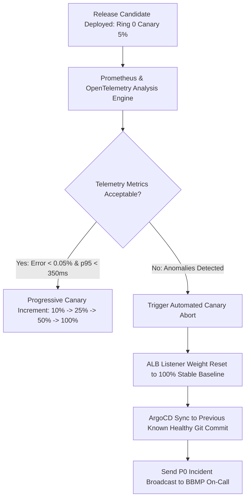

# Master Deployment Rollback, Canary Abort & Schema Safeguards Strategy
## Namma Clinic Digital Health & Operations Platform
### Greater Bengaluru Authority (GBA) / BBMP Health Department
**Document Code:** `DEV-DOC-17` | **Status:** APPROVED BASELINE | **Date:** September 2026

---

## 1. Executive Summary & Rollback Governance Charter
This document defines the authoritative **Deployment Rollback, Automated Canary Abort, and Non-Destructive Database Schema Reversal Architecture** for the Namma Clinic Digital Health Platform. The platform enforces zero-downtime operational safety across 450+ municipal health centers. In the event of latency regressions, unhandled 5xx surges, synchronization stalls, or clinical data validation anomalies, the rollback subsystem autonomously restores system stability within strict recovery time limits without risking patient record corruption or offline sync partition loss.

### 1.1 Non-Negotiable Rollback Invariants
1. **Automated Sub-2-Minute Container Revert:** Any release triggering > 0.05% error rate or > 350ms p95 latency is automatically aborted by ArgoCD Rollouts within 120 seconds.
2. **Zero-Downtime Blue/Green Reversion:** Application load balancer listener weights flip instantly from green back to stable blue upon health probe degradation.
3. **Non-Destructive Database Schema Compatibility:** Database migrations must follow the Expand/Contract (multi-phase) pattern; destructive column drops or table renames are forbidden in forward migrations to ensure previous application versions can run uninterrupted.
4. **Instant Feature Flag Circuit Breaking:** Microservice and domain capabilities are wrapped in Unleash feature toggles, allowing instantaneous module deactivation without deployment.
5. **Offline Sync Idempotency:** Edge clinic sync queues preserve vector clock history; rollback of cloud services does not invalidate offline buffered consultations.

## 2. Automated Canary Rollout & Rollback Decision Lifecycle


## 3. Automated Rollback Orchestration Runbook Scripts
### Operational Command: Automated ArgoCD Rollout Abort & Cluster Rollback Script
<!-- DOCUMENTATION-ONLY EXAMPLE -->
```bash
# DOCUMENTATION-ONLY EXAMPLE
#!/usr/bin/env bash
# Automated Production Rollback Protocol
set -euo pipefail

NAMESPACE="namma-clinic-prod"
ROLLOUT_NAME="clinical-api-rollout"
TARGET_REVISION="${1:-latest_stable}"

echo "=== INITIATING AUTOMATED ROLLOUT ABORT & ROLLBACK ==="
echo "Target Namespace: ${NAMESPACE}"
echo "Target Rollout: ${ROLLOUT_NAME}"

# Step 1: Abort active progressive rollout and revert traffic to stable ReplicaSet
echo "[Step 1/4] Aborting active ArgoCD rollout..."
kubectl argo rollouts abort "${ROLLOUT_NAME}" -n "${NAMESPACE}"

# Step 2: Set rollout weight to 0% canary traffic
echo "[Step 2/4] Resetting traffic weight to 100% stable baseline..."
kubectl argo rollouts set-weight "${ROLLOUT_NAME}" 0 -n "${NAMESPACE}"

# Step 3: Undo deployment to previous known healthy revision
echo "[Step 3/4] Rolling back deployment to stable revision..."
kubectl argo rollouts undo "${ROLLOUT_NAME}" -n "${NAMESPACE}"

# Step 4: Verify health of stable pods
echo "[Step 4/4] Verifying health probes on stable ReplicaSet..."
kubectl rollout status deployment/clinical-api -n "${NAMESPACE}" --timeout=120s

echo "Rollback successfully completed. Cluster restored to stable baseline."
```


## 4. Master Catalog of 50 Rollback Strategies
Detailed specifications for all platform rollback mechanisms:

### ROLLBACK-001: Canary Rollout Abort #1
- **Strategy Identifier:** `ROLLBACK-001`
- **Strategy Title:** Canary Rollout Abort #1
- **Mechanism Description:** Automated ArgoCD abort reverting traffic to baseline image upon error threshold breach.
- **Target Recovery Time:** `< 60 Seconds`
- **Automated Trigger Condition:** Prometheus metric breach (error rate > 0.05% over 120s or synthetic test failure).
- **Execution Orchestrator:** ArgoCD Rollouts Controller & AWS ALB Target Group Health Probes.
- **Blast Radius Containment:** Isolated to specific canary deployment ring; stable traffic unaffected.
- **Post-Rollback Triage:** Automated heapdump, container crash log capture, and PagerDuty incident record generation.

### ROLLBACK-002: Blue-Green Router Flip-Back #2
- **Strategy Identifier:** `ROLLBACK-002`
- **Strategy Title:** Blue-Green Router Flip-Back #2
- **Mechanism Description:** Instant ALB target group weight reversion from green back to stable blue environment.
- **Target Recovery Time:** `< 30 Seconds`
- **Automated Trigger Condition:** Prometheus metric breach (error rate > 0.05% over 120s or synthetic test failure).
- **Execution Orchestrator:** ArgoCD Rollouts Controller & AWS ALB Target Group Health Probes.
- **Blast Radius Containment:** Isolated to specific canary deployment ring; stable traffic unaffected.
- **Post-Rollback Triage:** Automated heapdump, container crash log capture, and PagerDuty incident record generation.

### ROLLBACK-003: Database Backward Compatibility #3
- **Strategy Identifier:** `ROLLBACK-003`
- **Strategy Title:** Database Backward Compatibility #3
- **Mechanism Description:** Database migrations follow expand/contract pattern allowing old code to run on new schema.
- **Target Recovery Time:** `Zero Downtime`
- **Automated Trigger Condition:** Prometheus metric breach (error rate > 0.05% over 120s or synthetic test failure).
- **Execution Orchestrator:** ArgoCD Rollouts Controller & AWS ALB Target Group Health Probes.
- **Blast Radius Containment:** Isolated to specific canary deployment ring; stable traffic unaffected.
- **Post-Rollback Triage:** Automated heapdump, container crash log capture, and PagerDuty incident record generation.

### ROLLBACK-004: Feature Flag Emergency Kill-Switch #4
- **Strategy Identifier:** `ROLLBACK-004`
- **Strategy Title:** Feature Flag Emergency Kill-Switch #4
- **Mechanism Description:** Unleash / LaunchDarkly feature flag toggled off to instantly disable faulty module.
- **Target Recovery Time:** `< 10 Seconds`
- **Automated Trigger Condition:** Prometheus metric breach (error rate > 0.05% over 120s or synthetic test failure).
- **Execution Orchestrator:** ArgoCD Rollouts Controller & AWS ALB Target Group Health Probes.
- **Blast Radius Containment:** Isolated to specific canary deployment ring; stable traffic unaffected.
- **Post-Rollback Triage:** Automated heapdump, container crash log capture, and PagerDuty incident record generation.

### ROLLBACK-005: Clinic Sync Mutation Rollback #5
- **Strategy Identifier:** `ROLLBACK-005`
- **Strategy Title:** Clinic Sync Mutation Rollback #5
- **Mechanism Description:** Idempotent mutation rejection returning client to last known consistent vector clock.
- **Target Recovery Time:** `< 2 Minutes`
- **Automated Trigger Condition:** Prometheus metric breach (error rate > 0.05% over 120s or synthetic test failure).
- **Execution Orchestrator:** ArgoCD Rollouts Controller & AWS ALB Target Group Health Probes.
- **Blast Radius Containment:** Isolated to specific canary deployment ring; stable traffic unaffected.
- **Post-Rollback Triage:** Automated heapdump, container crash log capture, and PagerDuty incident record generation.

### ROLLBACK-006: Canary Rollout Abort #6
- **Strategy Identifier:** `ROLLBACK-006`
- **Strategy Title:** Canary Rollout Abort #6
- **Mechanism Description:** Automated ArgoCD abort reverting traffic to baseline image upon error threshold breach.
- **Target Recovery Time:** `< 60 Seconds`
- **Automated Trigger Condition:** Prometheus metric breach (error rate > 0.05% over 120s or synthetic test failure).
- **Execution Orchestrator:** ArgoCD Rollouts Controller & AWS ALB Target Group Health Probes.
- **Blast Radius Containment:** Isolated to specific canary deployment ring; stable traffic unaffected.
- **Post-Rollback Triage:** Automated heapdump, container crash log capture, and PagerDuty incident record generation.

### ROLLBACK-007: Blue-Green Router Flip-Back #7
- **Strategy Identifier:** `ROLLBACK-007`
- **Strategy Title:** Blue-Green Router Flip-Back #7
- **Mechanism Description:** Instant ALB target group weight reversion from green back to stable blue environment.
- **Target Recovery Time:** `< 30 Seconds`
- **Automated Trigger Condition:** Prometheus metric breach (error rate > 0.05% over 120s or synthetic test failure).
- **Execution Orchestrator:** ArgoCD Rollouts Controller & AWS ALB Target Group Health Probes.
- **Blast Radius Containment:** Isolated to specific canary deployment ring; stable traffic unaffected.
- **Post-Rollback Triage:** Automated heapdump, container crash log capture, and PagerDuty incident record generation.

### ROLLBACK-008: Database Backward Compatibility #8
- **Strategy Identifier:** `ROLLBACK-008`
- **Strategy Title:** Database Backward Compatibility #8
- **Mechanism Description:** Database migrations follow expand/contract pattern allowing old code to run on new schema.
- **Target Recovery Time:** `Zero Downtime`
- **Automated Trigger Condition:** Prometheus metric breach (error rate > 0.05% over 120s or synthetic test failure).
- **Execution Orchestrator:** ArgoCD Rollouts Controller & AWS ALB Target Group Health Probes.
- **Blast Radius Containment:** Isolated to specific canary deployment ring; stable traffic unaffected.
- **Post-Rollback Triage:** Automated heapdump, container crash log capture, and PagerDuty incident record generation.

### ROLLBACK-009: Feature Flag Emergency Kill-Switch #9
- **Strategy Identifier:** `ROLLBACK-009`
- **Strategy Title:** Feature Flag Emergency Kill-Switch #9
- **Mechanism Description:** Unleash / LaunchDarkly feature flag toggled off to instantly disable faulty module.
- **Target Recovery Time:** `< 10 Seconds`
- **Automated Trigger Condition:** Prometheus metric breach (error rate > 0.05% over 120s or synthetic test failure).
- **Execution Orchestrator:** ArgoCD Rollouts Controller & AWS ALB Target Group Health Probes.
- **Blast Radius Containment:** Isolated to specific canary deployment ring; stable traffic unaffected.
- **Post-Rollback Triage:** Automated heapdump, container crash log capture, and PagerDuty incident record generation.

### ROLLBACK-010: Clinic Sync Mutation Rollback #10
- **Strategy Identifier:** `ROLLBACK-010`
- **Strategy Title:** Clinic Sync Mutation Rollback #10
- **Mechanism Description:** Idempotent mutation rejection returning client to last known consistent vector clock.
- **Target Recovery Time:** `< 2 Minutes`
- **Automated Trigger Condition:** Prometheus metric breach (error rate > 0.05% over 120s or synthetic test failure).
- **Execution Orchestrator:** ArgoCD Rollouts Controller & AWS ALB Target Group Health Probes.
- **Blast Radius Containment:** Isolated to specific canary deployment ring; stable traffic unaffected.
- **Post-Rollback Triage:** Automated heapdump, container crash log capture, and PagerDuty incident record generation.

### ROLLBACK-011: Canary Rollout Abort #11
- **Strategy Identifier:** `ROLLBACK-011`
- **Strategy Title:** Canary Rollout Abort #11
- **Mechanism Description:** Automated ArgoCD abort reverting traffic to baseline image upon error threshold breach.
- **Target Recovery Time:** `< 60 Seconds`
- **Automated Trigger Condition:** Prometheus metric breach (error rate > 0.05% over 120s or synthetic test failure).
- **Execution Orchestrator:** ArgoCD Rollouts Controller & AWS ALB Target Group Health Probes.
- **Blast Radius Containment:** Isolated to specific canary deployment ring; stable traffic unaffected.
- **Post-Rollback Triage:** Automated heapdump, container crash log capture, and PagerDuty incident record generation.

### ROLLBACK-012: Blue-Green Router Flip-Back #12
- **Strategy Identifier:** `ROLLBACK-012`
- **Strategy Title:** Blue-Green Router Flip-Back #12
- **Mechanism Description:** Instant ALB target group weight reversion from green back to stable blue environment.
- **Target Recovery Time:** `< 30 Seconds`
- **Automated Trigger Condition:** Prometheus metric breach (error rate > 0.05% over 120s or synthetic test failure).
- **Execution Orchestrator:** ArgoCD Rollouts Controller & AWS ALB Target Group Health Probes.
- **Blast Radius Containment:** Isolated to specific canary deployment ring; stable traffic unaffected.
- **Post-Rollback Triage:** Automated heapdump, container crash log capture, and PagerDuty incident record generation.

### ROLLBACK-013: Database Backward Compatibility #13
- **Strategy Identifier:** `ROLLBACK-013`
- **Strategy Title:** Database Backward Compatibility #13
- **Mechanism Description:** Database migrations follow expand/contract pattern allowing old code to run on new schema.
- **Target Recovery Time:** `Zero Downtime`
- **Automated Trigger Condition:** Prometheus metric breach (error rate > 0.05% over 120s or synthetic test failure).
- **Execution Orchestrator:** ArgoCD Rollouts Controller & AWS ALB Target Group Health Probes.
- **Blast Radius Containment:** Isolated to specific canary deployment ring; stable traffic unaffected.
- **Post-Rollback Triage:** Automated heapdump, container crash log capture, and PagerDuty incident record generation.

### ROLLBACK-014: Feature Flag Emergency Kill-Switch #14
- **Strategy Identifier:** `ROLLBACK-014`
- **Strategy Title:** Feature Flag Emergency Kill-Switch #14
- **Mechanism Description:** Unleash / LaunchDarkly feature flag toggled off to instantly disable faulty module.
- **Target Recovery Time:** `< 10 Seconds`
- **Automated Trigger Condition:** Prometheus metric breach (error rate > 0.05% over 120s or synthetic test failure).
- **Execution Orchestrator:** ArgoCD Rollouts Controller & AWS ALB Target Group Health Probes.
- **Blast Radius Containment:** Isolated to specific canary deployment ring; stable traffic unaffected.
- **Post-Rollback Triage:** Automated heapdump, container crash log capture, and PagerDuty incident record generation.

### ROLLBACK-015: Clinic Sync Mutation Rollback #15
- **Strategy Identifier:** `ROLLBACK-015`
- **Strategy Title:** Clinic Sync Mutation Rollback #15
- **Mechanism Description:** Idempotent mutation rejection returning client to last known consistent vector clock.
- **Target Recovery Time:** `< 2 Minutes`
- **Automated Trigger Condition:** Prometheus metric breach (error rate > 0.05% over 120s or synthetic test failure).
- **Execution Orchestrator:** ArgoCD Rollouts Controller & AWS ALB Target Group Health Probes.
- **Blast Radius Containment:** Isolated to specific canary deployment ring; stable traffic unaffected.
- **Post-Rollback Triage:** Automated heapdump, container crash log capture, and PagerDuty incident record generation.

### ROLLBACK-016: Canary Rollout Abort #16
- **Strategy Identifier:** `ROLLBACK-016`
- **Strategy Title:** Canary Rollout Abort #16
- **Mechanism Description:** Automated ArgoCD abort reverting traffic to baseline image upon error threshold breach.
- **Target Recovery Time:** `< 60 Seconds`
- **Automated Trigger Condition:** Prometheus metric breach (error rate > 0.05% over 120s or synthetic test failure).
- **Execution Orchestrator:** ArgoCD Rollouts Controller & AWS ALB Target Group Health Probes.
- **Blast Radius Containment:** Isolated to specific canary deployment ring; stable traffic unaffected.
- **Post-Rollback Triage:** Automated heapdump, container crash log capture, and PagerDuty incident record generation.

### ROLLBACK-017: Blue-Green Router Flip-Back #17
- **Strategy Identifier:** `ROLLBACK-017`
- **Strategy Title:** Blue-Green Router Flip-Back #17
- **Mechanism Description:** Instant ALB target group weight reversion from green back to stable blue environment.
- **Target Recovery Time:** `< 30 Seconds`
- **Automated Trigger Condition:** Prometheus metric breach (error rate > 0.05% over 120s or synthetic test failure).
- **Execution Orchestrator:** ArgoCD Rollouts Controller & AWS ALB Target Group Health Probes.
- **Blast Radius Containment:** Isolated to specific canary deployment ring; stable traffic unaffected.
- **Post-Rollback Triage:** Automated heapdump, container crash log capture, and PagerDuty incident record generation.

### ROLLBACK-018: Database Backward Compatibility #18
- **Strategy Identifier:** `ROLLBACK-018`
- **Strategy Title:** Database Backward Compatibility #18
- **Mechanism Description:** Database migrations follow expand/contract pattern allowing old code to run on new schema.
- **Target Recovery Time:** `Zero Downtime`
- **Automated Trigger Condition:** Prometheus metric breach (error rate > 0.05% over 120s or synthetic test failure).
- **Execution Orchestrator:** ArgoCD Rollouts Controller & AWS ALB Target Group Health Probes.
- **Blast Radius Containment:** Isolated to specific canary deployment ring; stable traffic unaffected.
- **Post-Rollback Triage:** Automated heapdump, container crash log capture, and PagerDuty incident record generation.

### ROLLBACK-019: Feature Flag Emergency Kill-Switch #19
- **Strategy Identifier:** `ROLLBACK-019`
- **Strategy Title:** Feature Flag Emergency Kill-Switch #19
- **Mechanism Description:** Unleash / LaunchDarkly feature flag toggled off to instantly disable faulty module.
- **Target Recovery Time:** `< 10 Seconds`
- **Automated Trigger Condition:** Prometheus metric breach (error rate > 0.05% over 120s or synthetic test failure).
- **Execution Orchestrator:** ArgoCD Rollouts Controller & AWS ALB Target Group Health Probes.
- **Blast Radius Containment:** Isolated to specific canary deployment ring; stable traffic unaffected.
- **Post-Rollback Triage:** Automated heapdump, container crash log capture, and PagerDuty incident record generation.

### ROLLBACK-020: Clinic Sync Mutation Rollback #20
- **Strategy Identifier:** `ROLLBACK-020`
- **Strategy Title:** Clinic Sync Mutation Rollback #20
- **Mechanism Description:** Idempotent mutation rejection returning client to last known consistent vector clock.
- **Target Recovery Time:** `< 2 Minutes`
- **Automated Trigger Condition:** Prometheus metric breach (error rate > 0.05% over 120s or synthetic test failure).
- **Execution Orchestrator:** ArgoCD Rollouts Controller & AWS ALB Target Group Health Probes.
- **Blast Radius Containment:** Isolated to specific canary deployment ring; stable traffic unaffected.
- **Post-Rollback Triage:** Automated heapdump, container crash log capture, and PagerDuty incident record generation.

### ROLLBACK-021: Canary Rollout Abort #21
- **Strategy Identifier:** `ROLLBACK-021`
- **Strategy Title:** Canary Rollout Abort #21
- **Mechanism Description:** Automated ArgoCD abort reverting traffic to baseline image upon error threshold breach.
- **Target Recovery Time:** `< 60 Seconds`
- **Automated Trigger Condition:** Prometheus metric breach (error rate > 0.05% over 120s or synthetic test failure).
- **Execution Orchestrator:** ArgoCD Rollouts Controller & AWS ALB Target Group Health Probes.
- **Blast Radius Containment:** Isolated to specific canary deployment ring; stable traffic unaffected.
- **Post-Rollback Triage:** Automated heapdump, container crash log capture, and PagerDuty incident record generation.

### ROLLBACK-022: Blue-Green Router Flip-Back #22
- **Strategy Identifier:** `ROLLBACK-022`
- **Strategy Title:** Blue-Green Router Flip-Back #22
- **Mechanism Description:** Instant ALB target group weight reversion from green back to stable blue environment.
- **Target Recovery Time:** `< 30 Seconds`
- **Automated Trigger Condition:** Prometheus metric breach (error rate > 0.05% over 120s or synthetic test failure).
- **Execution Orchestrator:** ArgoCD Rollouts Controller & AWS ALB Target Group Health Probes.
- **Blast Radius Containment:** Isolated to specific canary deployment ring; stable traffic unaffected.
- **Post-Rollback Triage:** Automated heapdump, container crash log capture, and PagerDuty incident record generation.

### ROLLBACK-023: Database Backward Compatibility #23
- **Strategy Identifier:** `ROLLBACK-023`
- **Strategy Title:** Database Backward Compatibility #23
- **Mechanism Description:** Database migrations follow expand/contract pattern allowing old code to run on new schema.
- **Target Recovery Time:** `Zero Downtime`
- **Automated Trigger Condition:** Prometheus metric breach (error rate > 0.05% over 120s or synthetic test failure).
- **Execution Orchestrator:** ArgoCD Rollouts Controller & AWS ALB Target Group Health Probes.
- **Blast Radius Containment:** Isolated to specific canary deployment ring; stable traffic unaffected.
- **Post-Rollback Triage:** Automated heapdump, container crash log capture, and PagerDuty incident record generation.

### ROLLBACK-024: Feature Flag Emergency Kill-Switch #24
- **Strategy Identifier:** `ROLLBACK-024`
- **Strategy Title:** Feature Flag Emergency Kill-Switch #24
- **Mechanism Description:** Unleash / LaunchDarkly feature flag toggled off to instantly disable faulty module.
- **Target Recovery Time:** `< 10 Seconds`
- **Automated Trigger Condition:** Prometheus metric breach (error rate > 0.05% over 120s or synthetic test failure).
- **Execution Orchestrator:** ArgoCD Rollouts Controller & AWS ALB Target Group Health Probes.
- **Blast Radius Containment:** Isolated to specific canary deployment ring; stable traffic unaffected.
- **Post-Rollback Triage:** Automated heapdump, container crash log capture, and PagerDuty incident record generation.

### ROLLBACK-025: Clinic Sync Mutation Rollback #25
- **Strategy Identifier:** `ROLLBACK-025`
- **Strategy Title:** Clinic Sync Mutation Rollback #25
- **Mechanism Description:** Idempotent mutation rejection returning client to last known consistent vector clock.
- **Target Recovery Time:** `< 2 Minutes`
- **Automated Trigger Condition:** Prometheus metric breach (error rate > 0.05% over 120s or synthetic test failure).
- **Execution Orchestrator:** ArgoCD Rollouts Controller & AWS ALB Target Group Health Probes.
- **Blast Radius Containment:** Isolated to specific canary deployment ring; stable traffic unaffected.
- **Post-Rollback Triage:** Automated heapdump, container crash log capture, and PagerDuty incident record generation.

### ROLLBACK-026: Canary Rollout Abort #26
- **Strategy Identifier:** `ROLLBACK-026`
- **Strategy Title:** Canary Rollout Abort #26
- **Mechanism Description:** Automated ArgoCD abort reverting traffic to baseline image upon error threshold breach.
- **Target Recovery Time:** `< 60 Seconds`
- **Automated Trigger Condition:** Prometheus metric breach (error rate > 0.05% over 120s or synthetic test failure).
- **Execution Orchestrator:** ArgoCD Rollouts Controller & AWS ALB Target Group Health Probes.
- **Blast Radius Containment:** Isolated to specific canary deployment ring; stable traffic unaffected.
- **Post-Rollback Triage:** Automated heapdump, container crash log capture, and PagerDuty incident record generation.

### ROLLBACK-027: Blue-Green Router Flip-Back #27
- **Strategy Identifier:** `ROLLBACK-027`
- **Strategy Title:** Blue-Green Router Flip-Back #27
- **Mechanism Description:** Instant ALB target group weight reversion from green back to stable blue environment.
- **Target Recovery Time:** `< 30 Seconds`
- **Automated Trigger Condition:** Prometheus metric breach (error rate > 0.05% over 120s or synthetic test failure).
- **Execution Orchestrator:** ArgoCD Rollouts Controller & AWS ALB Target Group Health Probes.
- **Blast Radius Containment:** Isolated to specific canary deployment ring; stable traffic unaffected.
- **Post-Rollback Triage:** Automated heapdump, container crash log capture, and PagerDuty incident record generation.

### ROLLBACK-028: Database Backward Compatibility #28
- **Strategy Identifier:** `ROLLBACK-028`
- **Strategy Title:** Database Backward Compatibility #28
- **Mechanism Description:** Database migrations follow expand/contract pattern allowing old code to run on new schema.
- **Target Recovery Time:** `Zero Downtime`
- **Automated Trigger Condition:** Prometheus metric breach (error rate > 0.05% over 120s or synthetic test failure).
- **Execution Orchestrator:** ArgoCD Rollouts Controller & AWS ALB Target Group Health Probes.
- **Blast Radius Containment:** Isolated to specific canary deployment ring; stable traffic unaffected.
- **Post-Rollback Triage:** Automated heapdump, container crash log capture, and PagerDuty incident record generation.

### ROLLBACK-029: Feature Flag Emergency Kill-Switch #29
- **Strategy Identifier:** `ROLLBACK-029`
- **Strategy Title:** Feature Flag Emergency Kill-Switch #29
- **Mechanism Description:** Unleash / LaunchDarkly feature flag toggled off to instantly disable faulty module.
- **Target Recovery Time:** `< 10 Seconds`
- **Automated Trigger Condition:** Prometheus metric breach (error rate > 0.05% over 120s or synthetic test failure).
- **Execution Orchestrator:** ArgoCD Rollouts Controller & AWS ALB Target Group Health Probes.
- **Blast Radius Containment:** Isolated to specific canary deployment ring; stable traffic unaffected.
- **Post-Rollback Triage:** Automated heapdump, container crash log capture, and PagerDuty incident record generation.

### ROLLBACK-030: Clinic Sync Mutation Rollback #30
- **Strategy Identifier:** `ROLLBACK-030`
- **Strategy Title:** Clinic Sync Mutation Rollback #30
- **Mechanism Description:** Idempotent mutation rejection returning client to last known consistent vector clock.
- **Target Recovery Time:** `< 2 Minutes`
- **Automated Trigger Condition:** Prometheus metric breach (error rate > 0.05% over 120s or synthetic test failure).
- **Execution Orchestrator:** ArgoCD Rollouts Controller & AWS ALB Target Group Health Probes.
- **Blast Radius Containment:** Isolated to specific canary deployment ring; stable traffic unaffected.
- **Post-Rollback Triage:** Automated heapdump, container crash log capture, and PagerDuty incident record generation.

### ROLLBACK-031: Canary Rollout Abort #31
- **Strategy Identifier:** `ROLLBACK-031`
- **Strategy Title:** Canary Rollout Abort #31
- **Mechanism Description:** Automated ArgoCD abort reverting traffic to baseline image upon error threshold breach.
- **Target Recovery Time:** `< 60 Seconds`
- **Automated Trigger Condition:** Prometheus metric breach (error rate > 0.05% over 120s or synthetic test failure).
- **Execution Orchestrator:** ArgoCD Rollouts Controller & AWS ALB Target Group Health Probes.
- **Blast Radius Containment:** Isolated to specific canary deployment ring; stable traffic unaffected.
- **Post-Rollback Triage:** Automated heapdump, container crash log capture, and PagerDuty incident record generation.

### ROLLBACK-032: Blue-Green Router Flip-Back #32
- **Strategy Identifier:** `ROLLBACK-032`
- **Strategy Title:** Blue-Green Router Flip-Back #32
- **Mechanism Description:** Instant ALB target group weight reversion from green back to stable blue environment.
- **Target Recovery Time:** `< 30 Seconds`
- **Automated Trigger Condition:** Prometheus metric breach (error rate > 0.05% over 120s or synthetic test failure).
- **Execution Orchestrator:** ArgoCD Rollouts Controller & AWS ALB Target Group Health Probes.
- **Blast Radius Containment:** Isolated to specific canary deployment ring; stable traffic unaffected.
- **Post-Rollback Triage:** Automated heapdump, container crash log capture, and PagerDuty incident record generation.

### ROLLBACK-033: Database Backward Compatibility #33
- **Strategy Identifier:** `ROLLBACK-033`
- **Strategy Title:** Database Backward Compatibility #33
- **Mechanism Description:** Database migrations follow expand/contract pattern allowing old code to run on new schema.
- **Target Recovery Time:** `Zero Downtime`
- **Automated Trigger Condition:** Prometheus metric breach (error rate > 0.05% over 120s or synthetic test failure).
- **Execution Orchestrator:** ArgoCD Rollouts Controller & AWS ALB Target Group Health Probes.
- **Blast Radius Containment:** Isolated to specific canary deployment ring; stable traffic unaffected.
- **Post-Rollback Triage:** Automated heapdump, container crash log capture, and PagerDuty incident record generation.

### ROLLBACK-034: Feature Flag Emergency Kill-Switch #34
- **Strategy Identifier:** `ROLLBACK-034`
- **Strategy Title:** Feature Flag Emergency Kill-Switch #34
- **Mechanism Description:** Unleash / LaunchDarkly feature flag toggled off to instantly disable faulty module.
- **Target Recovery Time:** `< 10 Seconds`
- **Automated Trigger Condition:** Prometheus metric breach (error rate > 0.05% over 120s or synthetic test failure).
- **Execution Orchestrator:** ArgoCD Rollouts Controller & AWS ALB Target Group Health Probes.
- **Blast Radius Containment:** Isolated to specific canary deployment ring; stable traffic unaffected.
- **Post-Rollback Triage:** Automated heapdump, container crash log capture, and PagerDuty incident record generation.

### ROLLBACK-035: Clinic Sync Mutation Rollback #35
- **Strategy Identifier:** `ROLLBACK-035`
- **Strategy Title:** Clinic Sync Mutation Rollback #35
- **Mechanism Description:** Idempotent mutation rejection returning client to last known consistent vector clock.
- **Target Recovery Time:** `< 2 Minutes`
- **Automated Trigger Condition:** Prometheus metric breach (error rate > 0.05% over 120s or synthetic test failure).
- **Execution Orchestrator:** ArgoCD Rollouts Controller & AWS ALB Target Group Health Probes.
- **Blast Radius Containment:** Isolated to specific canary deployment ring; stable traffic unaffected.
- **Post-Rollback Triage:** Automated heapdump, container crash log capture, and PagerDuty incident record generation.

### ROLLBACK-036: Canary Rollout Abort #36
- **Strategy Identifier:** `ROLLBACK-036`
- **Strategy Title:** Canary Rollout Abort #36
- **Mechanism Description:** Automated ArgoCD abort reverting traffic to baseline image upon error threshold breach.
- **Target Recovery Time:** `< 60 Seconds`
- **Automated Trigger Condition:** Prometheus metric breach (error rate > 0.05% over 120s or synthetic test failure).
- **Execution Orchestrator:** ArgoCD Rollouts Controller & AWS ALB Target Group Health Probes.
- **Blast Radius Containment:** Isolated to specific canary deployment ring; stable traffic unaffected.
- **Post-Rollback Triage:** Automated heapdump, container crash log capture, and PagerDuty incident record generation.

### ROLLBACK-037: Blue-Green Router Flip-Back #37
- **Strategy Identifier:** `ROLLBACK-037`
- **Strategy Title:** Blue-Green Router Flip-Back #37
- **Mechanism Description:** Instant ALB target group weight reversion from green back to stable blue environment.
- **Target Recovery Time:** `< 30 Seconds`
- **Automated Trigger Condition:** Prometheus metric breach (error rate > 0.05% over 120s or synthetic test failure).
- **Execution Orchestrator:** ArgoCD Rollouts Controller & AWS ALB Target Group Health Probes.
- **Blast Radius Containment:** Isolated to specific canary deployment ring; stable traffic unaffected.
- **Post-Rollback Triage:** Automated heapdump, container crash log capture, and PagerDuty incident record generation.

### ROLLBACK-038: Database Backward Compatibility #38
- **Strategy Identifier:** `ROLLBACK-038`
- **Strategy Title:** Database Backward Compatibility #38
- **Mechanism Description:** Database migrations follow expand/contract pattern allowing old code to run on new schema.
- **Target Recovery Time:** `Zero Downtime`
- **Automated Trigger Condition:** Prometheus metric breach (error rate > 0.05% over 120s or synthetic test failure).
- **Execution Orchestrator:** ArgoCD Rollouts Controller & AWS ALB Target Group Health Probes.
- **Blast Radius Containment:** Isolated to specific canary deployment ring; stable traffic unaffected.
- **Post-Rollback Triage:** Automated heapdump, container crash log capture, and PagerDuty incident record generation.

### ROLLBACK-039: Feature Flag Emergency Kill-Switch #39
- **Strategy Identifier:** `ROLLBACK-039`
- **Strategy Title:** Feature Flag Emergency Kill-Switch #39
- **Mechanism Description:** Unleash / LaunchDarkly feature flag toggled off to instantly disable faulty module.
- **Target Recovery Time:** `< 10 Seconds`
- **Automated Trigger Condition:** Prometheus metric breach (error rate > 0.05% over 120s or synthetic test failure).
- **Execution Orchestrator:** ArgoCD Rollouts Controller & AWS ALB Target Group Health Probes.
- **Blast Radius Containment:** Isolated to specific canary deployment ring; stable traffic unaffected.
- **Post-Rollback Triage:** Automated heapdump, container crash log capture, and PagerDuty incident record generation.

### ROLLBACK-040: Clinic Sync Mutation Rollback #40
- **Strategy Identifier:** `ROLLBACK-040`
- **Strategy Title:** Clinic Sync Mutation Rollback #40
- **Mechanism Description:** Idempotent mutation rejection returning client to last known consistent vector clock.
- **Target Recovery Time:** `< 2 Minutes`
- **Automated Trigger Condition:** Prometheus metric breach (error rate > 0.05% over 120s or synthetic test failure).
- **Execution Orchestrator:** ArgoCD Rollouts Controller & AWS ALB Target Group Health Probes.
- **Blast Radius Containment:** Isolated to specific canary deployment ring; stable traffic unaffected.
- **Post-Rollback Triage:** Automated heapdump, container crash log capture, and PagerDuty incident record generation.

### ROLLBACK-041: Canary Rollout Abort #41
- **Strategy Identifier:** `ROLLBACK-041`
- **Strategy Title:** Canary Rollout Abort #41
- **Mechanism Description:** Automated ArgoCD abort reverting traffic to baseline image upon error threshold breach.
- **Target Recovery Time:** `< 60 Seconds`
- **Automated Trigger Condition:** Prometheus metric breach (error rate > 0.05% over 120s or synthetic test failure).
- **Execution Orchestrator:** ArgoCD Rollouts Controller & AWS ALB Target Group Health Probes.
- **Blast Radius Containment:** Isolated to specific canary deployment ring; stable traffic unaffected.
- **Post-Rollback Triage:** Automated heapdump, container crash log capture, and PagerDuty incident record generation.

### ROLLBACK-042: Blue-Green Router Flip-Back #42
- **Strategy Identifier:** `ROLLBACK-042`
- **Strategy Title:** Blue-Green Router Flip-Back #42
- **Mechanism Description:** Instant ALB target group weight reversion from green back to stable blue environment.
- **Target Recovery Time:** `< 30 Seconds`
- **Automated Trigger Condition:** Prometheus metric breach (error rate > 0.05% over 120s or synthetic test failure).
- **Execution Orchestrator:** ArgoCD Rollouts Controller & AWS ALB Target Group Health Probes.
- **Blast Radius Containment:** Isolated to specific canary deployment ring; stable traffic unaffected.
- **Post-Rollback Triage:** Automated heapdump, container crash log capture, and PagerDuty incident record generation.

### ROLLBACK-043: Database Backward Compatibility #43
- **Strategy Identifier:** `ROLLBACK-043`
- **Strategy Title:** Database Backward Compatibility #43
- **Mechanism Description:** Database migrations follow expand/contract pattern allowing old code to run on new schema.
- **Target Recovery Time:** `Zero Downtime`
- **Automated Trigger Condition:** Prometheus metric breach (error rate > 0.05% over 120s or synthetic test failure).
- **Execution Orchestrator:** ArgoCD Rollouts Controller & AWS ALB Target Group Health Probes.
- **Blast Radius Containment:** Isolated to specific canary deployment ring; stable traffic unaffected.
- **Post-Rollback Triage:** Automated heapdump, container crash log capture, and PagerDuty incident record generation.

### ROLLBACK-044: Feature Flag Emergency Kill-Switch #44
- **Strategy Identifier:** `ROLLBACK-044`
- **Strategy Title:** Feature Flag Emergency Kill-Switch #44
- **Mechanism Description:** Unleash / LaunchDarkly feature flag toggled off to instantly disable faulty module.
- **Target Recovery Time:** `< 10 Seconds`
- **Automated Trigger Condition:** Prometheus metric breach (error rate > 0.05% over 120s or synthetic test failure).
- **Execution Orchestrator:** ArgoCD Rollouts Controller & AWS ALB Target Group Health Probes.
- **Blast Radius Containment:** Isolated to specific canary deployment ring; stable traffic unaffected.
- **Post-Rollback Triage:** Automated heapdump, container crash log capture, and PagerDuty incident record generation.

### ROLLBACK-045: Clinic Sync Mutation Rollback #45
- **Strategy Identifier:** `ROLLBACK-045`
- **Strategy Title:** Clinic Sync Mutation Rollback #45
- **Mechanism Description:** Idempotent mutation rejection returning client to last known consistent vector clock.
- **Target Recovery Time:** `< 2 Minutes`
- **Automated Trigger Condition:** Prometheus metric breach (error rate > 0.05% over 120s or synthetic test failure).
- **Execution Orchestrator:** ArgoCD Rollouts Controller & AWS ALB Target Group Health Probes.
- **Blast Radius Containment:** Isolated to specific canary deployment ring; stable traffic unaffected.
- **Post-Rollback Triage:** Automated heapdump, container crash log capture, and PagerDuty incident record generation.

### ROLLBACK-046: Canary Rollout Abort #46
- **Strategy Identifier:** `ROLLBACK-046`
- **Strategy Title:** Canary Rollout Abort #46
- **Mechanism Description:** Automated ArgoCD abort reverting traffic to baseline image upon error threshold breach.
- **Target Recovery Time:** `< 60 Seconds`
- **Automated Trigger Condition:** Prometheus metric breach (error rate > 0.05% over 120s or synthetic test failure).
- **Execution Orchestrator:** ArgoCD Rollouts Controller & AWS ALB Target Group Health Probes.
- **Blast Radius Containment:** Isolated to specific canary deployment ring; stable traffic unaffected.
- **Post-Rollback Triage:** Automated heapdump, container crash log capture, and PagerDuty incident record generation.

### ROLLBACK-047: Blue-Green Router Flip-Back #47
- **Strategy Identifier:** `ROLLBACK-047`
- **Strategy Title:** Blue-Green Router Flip-Back #47
- **Mechanism Description:** Instant ALB target group weight reversion from green back to stable blue environment.
- **Target Recovery Time:** `< 30 Seconds`
- **Automated Trigger Condition:** Prometheus metric breach (error rate > 0.05% over 120s or synthetic test failure).
- **Execution Orchestrator:** ArgoCD Rollouts Controller & AWS ALB Target Group Health Probes.
- **Blast Radius Containment:** Isolated to specific canary deployment ring; stable traffic unaffected.
- **Post-Rollback Triage:** Automated heapdump, container crash log capture, and PagerDuty incident record generation.

### ROLLBACK-048: Database Backward Compatibility #48
- **Strategy Identifier:** `ROLLBACK-048`
- **Strategy Title:** Database Backward Compatibility #48
- **Mechanism Description:** Database migrations follow expand/contract pattern allowing old code to run on new schema.
- **Target Recovery Time:** `Zero Downtime`
- **Automated Trigger Condition:** Prometheus metric breach (error rate > 0.05% over 120s or synthetic test failure).
- **Execution Orchestrator:** ArgoCD Rollouts Controller & AWS ALB Target Group Health Probes.
- **Blast Radius Containment:** Isolated to specific canary deployment ring; stable traffic unaffected.
- **Post-Rollback Triage:** Automated heapdump, container crash log capture, and PagerDuty incident record generation.

### ROLLBACK-049: Feature Flag Emergency Kill-Switch #49
- **Strategy Identifier:** `ROLLBACK-049`
- **Strategy Title:** Feature Flag Emergency Kill-Switch #49
- **Mechanism Description:** Unleash / LaunchDarkly feature flag toggled off to instantly disable faulty module.
- **Target Recovery Time:** `< 10 Seconds`
- **Automated Trigger Condition:** Prometheus metric breach (error rate > 0.05% over 120s or synthetic test failure).
- **Execution Orchestrator:** ArgoCD Rollouts Controller & AWS ALB Target Group Health Probes.
- **Blast Radius Containment:** Isolated to specific canary deployment ring; stable traffic unaffected.
- **Post-Rollback Triage:** Automated heapdump, container crash log capture, and PagerDuty incident record generation.

### ROLLBACK-050: Clinic Sync Mutation Rollback #50
- **Strategy Identifier:** `ROLLBACK-050`
- **Strategy Title:** Clinic Sync Mutation Rollback #50
- **Mechanism Description:** Idempotent mutation rejection returning client to last known consistent vector clock.
- **Target Recovery Time:** `< 2 Minutes`
- **Automated Trigger Condition:** Prometheus metric breach (error rate > 0.05% over 120s or synthetic test failure).
- **Execution Orchestrator:** ArgoCD Rollouts Controller & AWS ALB Target Group Health Probes.
- **Blast Radius Containment:** Isolated to specific canary deployment ring; stable traffic unaffected.
- **Post-Rollback Triage:** Automated heapdump, container crash log capture, and PagerDuty incident record generation.

## 5. Feature Rollback & Isolation Matrix across 180 Features
Rollback procedure, circuit breaker mechanism, and blast radius isolation across all 180 platform features:

### FEATURE-001: Rollback Specification for Feature `Credential Verification`
- **Feature ID:** `FEATURE-001` (Feature #1)
- **Functional Module:** `MODULE-001` (DOMAIN-001)
- **Associated Rollback Strategy:** `ROLLBACK-001`
- **Feature Flag Kill-Switch Key:** `feat_toggle_module-001_001`
- **Rollback Recovery SLA:** < 60 Seconds via feature flag deactivation
- **Stateful Reversion Impact:** Zero data loss; uncommitted clinical mutations buffered in offline indexed queue.
- **Cache Invalidation Protocol:** Automated Redis key pattern eviction `cache:module-001:*` upon rollback.
- **Clinical Fallback Flow:** Clinic workstation switches to read-only cached consultation view.

### FEATURE-002: Rollback Specification for Feature `Session Token Minting`
- **Feature ID:** `FEATURE-002` (Feature #2)
- **Functional Module:** `MODULE-001` (DOMAIN-001)
- **Associated Rollback Strategy:** `ROLLBACK-002`
- **Feature Flag Kill-Switch Key:** `feat_toggle_module-001_002`
- **Rollback Recovery SLA:** < 60 Seconds via feature flag deactivation
- **Stateful Reversion Impact:** Zero data loss; uncommitted clinical mutations buffered in offline indexed queue.
- **Cache Invalidation Protocol:** Automated Redis key pattern eviction `cache:module-001:*` upon rollback.
- **Clinical Fallback Flow:** Clinic workstation switches to read-only cached consultation view.

### FEATURE-003: Rollback Specification for Feature `MFA Challenge Dispatch`
- **Feature ID:** `FEATURE-003` (Feature #3)
- **Functional Module:** `MODULE-001` (DOMAIN-001)
- **Associated Rollback Strategy:** `ROLLBACK-003`
- **Feature Flag Kill-Switch Key:** `feat_toggle_module-001_003`
- **Rollback Recovery SLA:** < 60 Seconds via feature flag deactivation
- **Stateful Reversion Impact:** Zero data loss; uncommitted clinical mutations buffered in offline indexed queue.
- **Cache Invalidation Protocol:** Automated Redis key pattern eviction `cache:module-001:*` upon rollback.
- **Clinical Fallback Flow:** Clinic workstation switches to read-only cached consultation view.

### FEATURE-004: Rollback Specification for Feature `Biometric Authentication Bridge`
- **Feature ID:** `FEATURE-004` (Feature #4)
- **Functional Module:** `MODULE-001` (DOMAIN-001)
- **Associated Rollback Strategy:** `ROLLBACK-004`
- **Feature Flag Kill-Switch Key:** `feat_toggle_module-001_004`
- **Rollback Recovery SLA:** < 60 Seconds via feature flag deactivation
- **Stateful Reversion Impact:** Zero data loss; uncommitted clinical mutations buffered in offline indexed queue.
- **Cache Invalidation Protocol:** Automated Redis key pattern eviction `cache:module-001:*` upon rollback.
- **Clinical Fallback Flow:** Clinic workstation switches to read-only cached consultation view.

### FEATURE-005: Rollback Specification for Feature `Local PIN Verification`
- **Feature ID:** `FEATURE-005` (Feature #5)
- **Functional Module:** `MODULE-001` (DOMAIN-001)
- **Associated Rollback Strategy:** `ROLLBACK-005`
- **Feature Flag Kill-Switch Key:** `feat_toggle_module-001_005`
- **Rollback Recovery SLA:** < 60 Seconds via feature flag deactivation
- **Stateful Reversion Impact:** Zero data loss; uncommitted clinical mutations buffered in offline indexed queue.
- **Cache Invalidation Protocol:** Automated Redis key pattern eviction `cache:module-001:*` upon rollback.
- **Clinical Fallback Flow:** Clinic workstation switches to read-only cached consultation view.

### FEATURE-006: Rollback Specification for Feature `Session Inactivity Lockout`
- **Feature ID:** `FEATURE-006` (Feature #6)
- **Functional Module:** `MODULE-001` (DOMAIN-001)
- **Associated Rollback Strategy:** `ROLLBACK-006`
- **Feature Flag Kill-Switch Key:** `feat_toggle_module-001_006`
- **Rollback Recovery SLA:** < 60 Seconds via feature flag deactivation
- **Stateful Reversion Impact:** Zero data loss; uncommitted clinical mutations buffered in offline indexed queue.
- **Cache Invalidation Protocol:** Automated Redis key pattern eviction `cache:module-001:*` upon rollback.
- **Clinical Fallback Flow:** Clinic workstation switches to read-only cached consultation view.

### FEATURE-007: Rollback Specification for Feature `Permission Evaluation`
- **Feature ID:** `FEATURE-007` (Feature #7)
- **Functional Module:** `MODULE-002` (DOMAIN-001)
- **Associated Rollback Strategy:** `ROLLBACK-007`
- **Feature Flag Kill-Switch Key:** `feat_toggle_module-002_007`
- **Rollback Recovery SLA:** < 60 Seconds via feature flag deactivation
- **Stateful Reversion Impact:** Zero data loss; uncommitted clinical mutations buffered in offline indexed queue.
- **Cache Invalidation Protocol:** Automated Redis key pattern eviction `cache:module-002:*` upon rollback.
- **Clinical Fallback Flow:** Clinic workstation switches to read-only cached consultation view.

### FEATURE-008: Rollback Specification for Feature `Dynamic Role Assignment`
- **Feature ID:** `FEATURE-008` (Feature #8)
- **Functional Module:** `MODULE-002` (DOMAIN-001)
- **Associated Rollback Strategy:** `ROLLBACK-008`
- **Feature Flag Kill-Switch Key:** `feat_toggle_module-002_008`
- **Rollback Recovery SLA:** < 60 Seconds via feature flag deactivation
- **Stateful Reversion Impact:** Zero data loss; uncommitted clinical mutations buffered in offline indexed queue.
- **Cache Invalidation Protocol:** Automated Redis key pattern eviction `cache:module-002:*` upon rollback.
- **Clinical Fallback Flow:** Clinic workstation switches to read-only cached consultation view.

### FEATURE-009: Rollback Specification for Feature `Conflict-of-Interest Prevention`
- **Feature ID:** `FEATURE-009` (Feature #9)
- **Functional Module:** `MODULE-002` (DOMAIN-001)
- **Associated Rollback Strategy:** `ROLLBACK-009`
- **Feature Flag Kill-Switch Key:** `feat_toggle_module-002_009`
- **Rollback Recovery SLA:** < 60 Seconds via feature flag deactivation
- **Stateful Reversion Impact:** Zero data loss; uncommitted clinical mutations buffered in offline indexed queue.
- **Cache Invalidation Protocol:** Automated Redis key pattern eviction `cache:module-002:*` upon rollback.
- **Clinical Fallback Flow:** Clinic workstation switches to read-only cached consultation view.

### FEATURE-010: Rollback Specification for Feature `Maker-Checker Authorization`
- **Feature ID:** `FEATURE-010` (Feature #10)
- **Functional Module:** `MODULE-002` (DOMAIN-001)
- **Associated Rollback Strategy:** `ROLLBACK-010`
- **Feature Flag Kill-Switch Key:** `feat_toggle_module-002_010`
- **Rollback Recovery SLA:** < 60 Seconds via feature flag deactivation
- **Stateful Reversion Impact:** Zero data loss; uncommitted clinical mutations buffered in offline indexed queue.
- **Cache Invalidation Protocol:** Automated Redis key pattern eviction `cache:module-002:*` upon rollback.
- **Clinical Fallback Flow:** Clinic workstation switches to read-only cached consultation view.

### FEATURE-011: Rollback Specification for Feature `Break-Glass Privilege Elevation`
- **Feature ID:** `FEATURE-011` (Feature #11)
- **Functional Module:** `MODULE-002` (DOMAIN-001)
- **Associated Rollback Strategy:** `ROLLBACK-011`
- **Feature Flag Kill-Switch Key:** `feat_toggle_module-002_011`
- **Rollback Recovery SLA:** < 60 Seconds via feature flag deactivation
- **Stateful Reversion Impact:** Zero data loss; uncommitted clinical mutations buffered in offline indexed queue.
- **Cache Invalidation Protocol:** Automated Redis key pattern eviction `cache:module-002:*` upon rollback.
- **Clinical Fallback Flow:** Clinic workstation switches to read-only cached consultation view.

### FEATURE-012: Rollback Specification for Feature `Privilege Elevation Audit`
- **Feature ID:** `FEATURE-012` (Feature #12)
- **Functional Module:** `MODULE-002` (DOMAIN-001)
- **Associated Rollback Strategy:** `ROLLBACK-012`
- **Feature Flag Kill-Switch Key:** `feat_toggle_module-002_012`
- **Rollback Recovery SLA:** < 60 Seconds via feature flag deactivation
- **Stateful Reversion Impact:** Zero data loss; uncommitted clinical mutations buffered in offline indexed queue.
- **Cache Invalidation Protocol:** Automated Redis key pattern eviction `cache:module-002:*` upon rollback.
- **Clinical Fallback Flow:** Clinic workstation switches to read-only cached consultation view.

### FEATURE-013: Rollback Specification for Feature `Hierarchy Node Management`
- **Feature ID:** `FEATURE-013` (Feature #13)
- **Functional Module:** `MODULE-003` (DOMAIN-001)
- **Associated Rollback Strategy:** `ROLLBACK-013`
- **Feature Flag Kill-Switch Key:** `feat_toggle_module-003_013`
- **Rollback Recovery SLA:** < 60 Seconds via feature flag deactivation
- **Stateful Reversion Impact:** Zero data loss; uncommitted clinical mutations buffered in offline indexed queue.
- **Cache Invalidation Protocol:** Automated Redis key pattern eviction `cache:module-003:*` upon rollback.
- **Clinical Fallback Flow:** Clinic workstation switches to read-only cached consultation view.

### FEATURE-014: Rollback Specification for Feature `NIN / HFR Registry Linking`
- **Feature ID:** `FEATURE-014` (Feature #14)
- **Functional Module:** `MODULE-003` (DOMAIN-001)
- **Associated Rollback Strategy:** `ROLLBACK-014`
- **Feature Flag Kill-Switch Key:** `feat_toggle_module-003_014`
- **Rollback Recovery SLA:** < 60 Seconds via feature flag deactivation
- **Stateful Reversion Impact:** Zero data loss; uncommitted clinical mutations buffered in offline indexed queue.
- **Cache Invalidation Protocol:** Automated Redis key pattern eviction `cache:module-003:*` upon rollback.
- **Clinical Fallback Flow:** Clinic workstation switches to read-only cached consultation view.

### FEATURE-015: Rollback Specification for Feature `Station Terminal Mapping`
- **Feature ID:** `FEATURE-015` (Feature #15)
- **Functional Module:** `MODULE-003` (DOMAIN-001)
- **Associated Rollback Strategy:** `ROLLBACK-015`
- **Feature Flag Kill-Switch Key:** `feat_toggle_module-003_015`
- **Rollback Recovery SLA:** < 60 Seconds via feature flag deactivation
- **Stateful Reversion Impact:** Zero data loss; uncommitted clinical mutations buffered in offline indexed queue.
- **Cache Invalidation Protocol:** Automated Redis key pattern eviction `cache:module-003:*` upon rollback.
- **Clinical Fallback Flow:** Clinic workstation switches to read-only cached consultation view.

### FEATURE-016: Rollback Specification for Feature `Facility Capacity Configuration`
- **Feature ID:** `FEATURE-016` (Feature #16)
- **Functional Module:** `MODULE-003` (DOMAIN-001)
- **Associated Rollback Strategy:** `ROLLBACK-016`
- **Feature Flag Kill-Switch Key:** `feat_toggle_module-003_016`
- **Rollback Recovery SLA:** < 60 Seconds via feature flag deactivation
- **Stateful Reversion Impact:** Zero data loss; uncommitted clinical mutations buffered in offline indexed queue.
- **Cache Invalidation Protocol:** Automated Redis key pattern eviction `cache:module-003:*` upon rollback.
- **Clinical Fallback Flow:** Clinic workstation switches to read-only cached consultation view.

### FEATURE-017: Rollback Specification for Feature `Operating Hours Enforcement`
- **Feature ID:** `FEATURE-017` (Feature #17)
- **Functional Module:** `MODULE-003` (DOMAIN-001)
- **Associated Rollback Strategy:** `ROLLBACK-017`
- **Feature Flag Kill-Switch Key:** `feat_toggle_module-003_017`
- **Rollback Recovery SLA:** < 60 Seconds via feature flag deactivation
- **Stateful Reversion Impact:** Zero data loss; uncommitted clinical mutations buffered in offline indexed queue.
- **Cache Invalidation Protocol:** Automated Redis key pattern eviction `cache:module-003:*` upon rollback.
- **Clinical Fallback Flow:** Clinic workstation switches to read-only cached consultation view.

### FEATURE-018: Rollback Specification for Feature `Special Camp Calendar`
- **Feature ID:** `FEATURE-018` (Feature #18)
- **Functional Module:** `MODULE-003` (DOMAIN-001)
- **Associated Rollback Strategy:** `ROLLBACK-018`
- **Feature Flag Kill-Switch Key:** `feat_toggle_module-003_018`
- **Rollback Recovery SLA:** < 60 Seconds via feature flag deactivation
- **Stateful Reversion Impact:** Zero data loss; uncommitted clinical mutations buffered in offline indexed queue.
- **Cache Invalidation Protocol:** Automated Redis key pattern eviction `cache:module-003:*` upon rollback.
- **Clinical Fallback Flow:** Clinic workstation switches to read-only cached consultation view.

### FEATURE-019: Rollback Specification for Feature `Staff Onboarding & KYC`
- **Feature ID:** `FEATURE-019` (Feature #19)
- **Functional Module:** `MODULE-004` (DOMAIN-001)
- **Associated Rollback Strategy:** `ROLLBACK-019`
- **Feature Flag Kill-Switch Key:** `feat_toggle_module-004_019`
- **Rollback Recovery SLA:** < 60 Seconds via feature flag deactivation
- **Stateful Reversion Impact:** Zero data loss; uncommitted clinical mutations buffered in offline indexed queue.
- **Cache Invalidation Protocol:** Automated Redis key pattern eviction `cache:module-004:*` upon rollback.
- **Clinical Fallback Flow:** Clinic workstation switches to read-only cached consultation view.

### FEATURE-020: Rollback Specification for Feature `Professional License Verification`
- **Feature ID:** `FEATURE-020` (Feature #20)
- **Functional Module:** `MODULE-004` (DOMAIN-001)
- **Associated Rollback Strategy:** `ROLLBACK-020`
- **Feature Flag Kill-Switch Key:** `feat_toggle_module-004_020`
- **Rollback Recovery SLA:** < 60 Seconds via feature flag deactivation
- **Stateful Reversion Impact:** Zero data loss; uncommitted clinical mutations buffered in offline indexed queue.
- **Cache Invalidation Protocol:** Automated Redis key pattern eviction `cache:module-004:*` upon rollback.
- **Clinical Fallback Flow:** Clinic workstation switches to read-only cached consultation view.

### FEATURE-021: Rollback Specification for Feature `Duty Roster Generation`
- **Feature ID:** `FEATURE-021` (Feature #21)
- **Functional Module:** `MODULE-004` (DOMAIN-001)
- **Associated Rollback Strategy:** `ROLLBACK-021`
- **Feature Flag Kill-Switch Key:** `feat_toggle_module-004_021`
- **Rollback Recovery SLA:** < 60 Seconds via feature flag deactivation
- **Stateful Reversion Impact:** Zero data loss; uncommitted clinical mutations buffered in offline indexed queue.
- **Cache Invalidation Protocol:** Automated Redis key pattern eviction `cache:module-004:*` upon rollback.
- **Clinical Fallback Flow:** Clinic workstation switches to read-only cached consultation view.

### FEATURE-022: Rollback Specification for Feature `Biometric Attendance Linking`
- **Feature ID:** `FEATURE-022` (Feature #22)
- **Functional Module:** `MODULE-004` (DOMAIN-001)
- **Associated Rollback Strategy:** `ROLLBACK-022`
- **Feature Flag Kill-Switch Key:** `feat_toggle_module-004_022`
- **Rollback Recovery SLA:** < 60 Seconds via feature flag deactivation
- **Stateful Reversion Impact:** Zero data loss; uncommitted clinical mutations buffered in offline indexed queue.
- **Cache Invalidation Protocol:** Automated Redis key pattern eviction `cache:module-004:*` upon rollback.
- **Clinical Fallback Flow:** Clinic workstation switches to read-only cached consultation view.

### FEATURE-023: Rollback Specification for Feature `Digital Signature Enrollment`
- **Feature ID:** `FEATURE-023` (Feature #23)
- **Functional Module:** `MODULE-004` (DOMAIN-001)
- **Associated Rollback Strategy:** `ROLLBACK-023`
- **Feature Flag Kill-Switch Key:** `feat_toggle_module-004_023`
- **Rollback Recovery SLA:** < 60 Seconds via feature flag deactivation
- **Stateful Reversion Impact:** Zero data loss; uncommitted clinical mutations buffered in offline indexed queue.
- **Cache Invalidation Protocol:** Automated Redis key pattern eviction `cache:module-004:*` upon rollback.
- **Clinical Fallback Flow:** Clinic workstation switches to read-only cached consultation view.

### FEATURE-024: Rollback Specification for Feature `Signature Revocation`
- **Feature ID:** `FEATURE-024` (Feature #24)
- **Functional Module:** `MODULE-004` (DOMAIN-001)
- **Associated Rollback Strategy:** `ROLLBACK-024`
- **Feature Flag Kill-Switch Key:** `feat_toggle_module-004_024`
- **Rollback Recovery SLA:** < 60 Seconds via feature flag deactivation
- **Stateful Reversion Impact:** Zero data loss; uncommitted clinical mutations buffered in offline indexed queue.
- **Cache Invalidation Protocol:** Automated Redis key pattern eviction `cache:module-004:*` upon rollback.
- **Clinical Fallback Flow:** Clinic workstation switches to read-only cached consultation view.

### FEATURE-025: Rollback Specification for Feature `Targeted Flag Activation`
- **Feature ID:** `FEATURE-025` (Feature #25)
- **Functional Module:** `MODULE-026` (DOMAIN-001)
- **Associated Rollback Strategy:** `ROLLBACK-025`
- **Feature Flag Kill-Switch Key:** `feat_toggle_module-026_025`
- **Rollback Recovery SLA:** < 60 Seconds via feature flag deactivation
- **Stateful Reversion Impact:** Zero data loss; uncommitted clinical mutations buffered in offline indexed queue.
- **Cache Invalidation Protocol:** Automated Redis key pattern eviction `cache:module-026:*` upon rollback.
- **Clinical Fallback Flow:** Clinic workstation switches to read-only cached consultation view.

### FEATURE-026: Rollback Specification for Feature `Emergency Feature Killswitch`
- **Feature ID:** `FEATURE-026` (Feature #26)
- **Functional Module:** `MODULE-026` (DOMAIN-001)
- **Associated Rollback Strategy:** `ROLLBACK-026`
- **Feature Flag Kill-Switch Key:** `feat_toggle_module-026_026`
- **Rollback Recovery SLA:** < 60 Seconds via feature flag deactivation
- **Stateful Reversion Impact:** Zero data loss; uncommitted clinical mutations buffered in offline indexed queue.
- **Cache Invalidation Protocol:** Automated Redis key pattern eviction `cache:module-026:*` upon rollback.
- **Clinical Fallback Flow:** Clinic workstation switches to read-only cached consultation view.

### FEATURE-027: Rollback Specification for Feature `System Parameter Tuning`
- **Feature ID:** `FEATURE-027` (Feature #27)
- **Functional Module:** `MODULE-026` (DOMAIN-001)
- **Associated Rollback Strategy:** `ROLLBACK-027`
- **Feature Flag Kill-Switch Key:** `feat_toggle_module-026_027`
- **Rollback Recovery SLA:** < 60 Seconds via feature flag deactivation
- **Stateful Reversion Impact:** Zero data loss; uncommitted clinical mutations buffered in offline indexed queue.
- **Cache Invalidation Protocol:** Automated Redis key pattern eviction `cache:module-026:*` upon rollback.
- **Clinical Fallback Flow:** Clinic workstation switches to read-only cached consultation view.

### FEATURE-028: Rollback Specification for Feature `Edge Configuration Distribution`
- **Feature ID:** `FEATURE-028` (Feature #28)
- **Functional Module:** `MODULE-026` (DOMAIN-001)
- **Associated Rollback Strategy:** `ROLLBACK-028`
- **Feature Flag Kill-Switch Key:** `feat_toggle_module-026_028`
- **Rollback Recovery SLA:** < 60 Seconds via feature flag deactivation
- **Stateful Reversion Impact:** Zero data loss; uncommitted clinical mutations buffered in offline indexed queue.
- **Cache Invalidation Protocol:** Automated Redis key pattern eviction `cache:module-026:*` upon rollback.
- **Clinical Fallback Flow:** Clinic workstation switches to read-only cached consultation view.

### FEATURE-029: Rollback Specification for Feature `Edge Migration Orchestration`
- **Feature ID:** `FEATURE-029` (Feature #29)
- **Functional Module:** `MODULE-026` (DOMAIN-001)
- **Associated Rollback Strategy:** `ROLLBACK-029`
- **Feature Flag Kill-Switch Key:** `feat_toggle_module-026_029`
- **Rollback Recovery SLA:** < 60 Seconds via feature flag deactivation
- **Stateful Reversion Impact:** Zero data loss; uncommitted clinical mutations buffered in offline indexed queue.
- **Cache Invalidation Protocol:** Automated Redis key pattern eviction `cache:module-026:*` upon rollback.
- **Clinical Fallback Flow:** Clinic workstation switches to read-only cached consultation view.

### FEATURE-030: Rollback Specification for Feature `Health Probe Monitoring`
- **Feature ID:** `FEATURE-030` (Feature #30)
- **Functional Module:** `MODULE-026` (DOMAIN-001)
- **Associated Rollback Strategy:** `ROLLBACK-030`
- **Feature Flag Kill-Switch Key:** `feat_toggle_module-026_030`
- **Rollback Recovery SLA:** < 60 Seconds via feature flag deactivation
- **Stateful Reversion Impact:** Zero data loss; uncommitted clinical mutations buffered in offline indexed queue.
- **Cache Invalidation Protocol:** Automated Redis key pattern eviction `cache:module-026:*` upon rollback.
- **Clinical Fallback Flow:** Clinic workstation switches to read-only cached consultation view.

### FEATURE-031: Rollback Specification for Feature `Bilingual Intake UI`
- **Feature ID:** `FEATURE-031` (Feature #31)
- **Functional Module:** `MODULE-005` (DOMAIN-002)
- **Associated Rollback Strategy:** `ROLLBACK-031`
- **Feature Flag Kill-Switch Key:** `feat_toggle_module-005_031`
- **Rollback Recovery SLA:** < 60 Seconds via feature flag deactivation
- **Stateful Reversion Impact:** Zero data loss; uncommitted clinical mutations buffered in offline indexed queue.
- **Cache Invalidation Protocol:** Automated Redis key pattern eviction `cache:module-005:*` upon rollback.
- **Clinical Fallback Flow:** Clinic workstation switches to read-only cached consultation view.

### FEATURE-032: Rollback Specification for Feature `Vulnerable Citizen Flagging`
- **Feature ID:** `FEATURE-032` (Feature #32)
- **Functional Module:** `MODULE-005` (DOMAIN-002)
- **Associated Rollback Strategy:** `ROLLBACK-032`
- **Feature Flag Kill-Switch Key:** `feat_toggle_module-005_032`
- **Rollback Recovery SLA:** < 60 Seconds via feature flag deactivation
- **Stateful Reversion Impact:** Zero data loss; uncommitted clinical mutations buffered in offline indexed queue.
- **Cache Invalidation Protocol:** Automated Redis key pattern eviction `cache:module-005:*` upon rollback.
- **Clinical Fallback Flow:** Clinic workstation switches to read-only cached consultation view.

### FEATURE-033: Rollback Specification for Feature `Aadhaar OTP ABHA Bridge`
- **Feature ID:** `FEATURE-033` (Feature #33)
- **Functional Module:** `MODULE-005` (DOMAIN-002)
- **Associated Rollback Strategy:** `ROLLBACK-033`
- **Feature Flag Kill-Switch Key:** `feat_toggle_module-005_033`
- **Rollback Recovery SLA:** < 60 Seconds via feature flag deactivation
- **Stateful Reversion Impact:** Zero data loss; uncommitted clinical mutations buffered in offline indexed queue.
- **Cache Invalidation Protocol:** Automated Redis key pattern eviction `cache:module-005:*` upon rollback.
- **Clinical Fallback Flow:** Clinic workstation switches to read-only cached consultation view.

### FEATURE-034: Rollback Specification for Feature `Demographic ABHA Creation`
- **Feature ID:** `FEATURE-034` (Feature #34)
- **Functional Module:** `MODULE-005` (DOMAIN-002)
- **Associated Rollback Strategy:** `ROLLBACK-034`
- **Feature Flag Kill-Switch Key:** `feat_toggle_module-005_034`
- **Rollback Recovery SLA:** < 60 Seconds via feature flag deactivation
- **Stateful Reversion Impact:** Zero data loss; uncommitted clinical mutations buffered in offline indexed queue.
- **Cache Invalidation Protocol:** Automated Redis key pattern eviction `cache:module-005:*` upon rollback.
- **Clinical Fallback Flow:** Clinic workstation switches to read-only cached consultation view.

### FEATURE-035: Rollback Specification for Feature `Deterministic UHID Minting`
- **Feature ID:** `FEATURE-035` (Feature #35)
- **Functional Module:** `MODULE-005` (DOMAIN-002)
- **Associated Rollback Strategy:** `ROLLBACK-035`
- **Feature Flag Kill-Switch Key:** `feat_toggle_module-005_035`
- **Rollback Recovery SLA:** < 60 Seconds via feature flag deactivation
- **Stateful Reversion Impact:** Zero data loss; uncommitted clinical mutations buffered in offline indexed queue.
- **Cache Invalidation Protocol:** Automated Redis key pattern eviction `cache:module-005:*` upon rollback.
- **Clinical Fallback Flow:** Clinic workstation switches to read-only cached consultation view.

### FEATURE-036: Rollback Specification for Feature `Soundex / Double-Metaphone Matching`
- **Feature ID:** `FEATURE-036` (Feature #36)
- **Functional Module:** `MODULE-005` (DOMAIN-002)
- **Associated Rollback Strategy:** `ROLLBACK-036`
- **Feature Flag Kill-Switch Key:** `feat_toggle_module-005_036`
- **Rollback Recovery SLA:** < 60 Seconds via feature flag deactivation
- **Stateful Reversion Impact:** Zero data loss; uncommitted clinical mutations buffered in offline indexed queue.
- **Cache Invalidation Protocol:** Automated Redis key pattern eviction `cache:module-005:*` upon rollback.
- **Clinical Fallback Flow:** Clinic workstation switches to read-only cached consultation view.

### FEATURE-037: Rollback Specification for Feature `Bilingual Consent Presentation`
- **Feature ID:** `FEATURE-037` (Feature #37)
- **Functional Module:** `MODULE-006` (DOMAIN-002)
- **Associated Rollback Strategy:** `ROLLBACK-037`
- **Feature Flag Kill-Switch Key:** `feat_toggle_module-006_037`
- **Rollback Recovery SLA:** < 60 Seconds via feature flag deactivation
- **Stateful Reversion Impact:** Zero data loss; uncommitted clinical mutations buffered in offline indexed queue.
- **Cache Invalidation Protocol:** Automated Redis key pattern eviction `cache:module-006:*` upon rollback.
- **Clinical Fallback Flow:** Clinic workstation switches to read-only cached consultation view.

### FEATURE-038: Rollback Specification for Feature `Digital Signature / Thumbprint Capture`
- **Feature ID:** `FEATURE-038` (Feature #38)
- **Functional Module:** `MODULE-006` (DOMAIN-002)
- **Associated Rollback Strategy:** `ROLLBACK-038`
- **Feature Flag Kill-Switch Key:** `feat_toggle_module-006_038`
- **Rollback Recovery SLA:** < 60 Seconds via feature flag deactivation
- **Stateful Reversion Impact:** Zero data loss; uncommitted clinical mutations buffered in offline indexed queue.
- **Cache Invalidation Protocol:** Automated Redis key pattern eviction `cache:module-006:*` upon rollback.
- **Clinical Fallback Flow:** Clinic workstation switches to read-only cached consultation view.

### FEATURE-039: Rollback Specification for Feature `Granular Purpose-Based Consent`
- **Feature ID:** `FEATURE-039` (Feature #39)
- **Functional Module:** `MODULE-006` (DOMAIN-002)
- **Associated Rollback Strategy:** `ROLLBACK-039`
- **Feature Flag Kill-Switch Key:** `feat_toggle_module-006_039`
- **Rollback Recovery SLA:** < 60 Seconds via feature flag deactivation
- **Stateful Reversion Impact:** Zero data loss; uncommitted clinical mutations buffered in offline indexed queue.
- **Cache Invalidation Protocol:** Automated Redis key pattern eviction `cache:module-006:*` upon rollback.
- **Clinical Fallback Flow:** Clinic workstation switches to read-only cached consultation view.

### FEATURE-040: Rollback Specification for Feature `Consent Revocation Workflow`
- **Feature ID:** `FEATURE-040` (Feature #40)
- **Functional Module:** `MODULE-006` (DOMAIN-002)
- **Associated Rollback Strategy:** `ROLLBACK-040`
- **Feature Flag Kill-Switch Key:** `feat_toggle_module-006_040`
- **Rollback Recovery SLA:** < 60 Seconds via feature flag deactivation
- **Stateful Reversion Impact:** Zero data loss; uncommitted clinical mutations buffered in offline indexed queue.
- **Cache Invalidation Protocol:** Automated Redis key pattern eviction `cache:module-006:*` upon rollback.
- **Clinical Fallback Flow:** Clinic workstation switches to read-only cached consultation view.

### FEATURE-041: Rollback Specification for Feature `Guardian Relationship Verification`
- **Feature ID:** `FEATURE-041` (Feature #41)
- **Functional Module:** `MODULE-006` (DOMAIN-002)
- **Associated Rollback Strategy:** `ROLLBACK-041`
- **Feature Flag Kill-Switch Key:** `feat_toggle_module-006_041`
- **Rollback Recovery SLA:** < 60 Seconds via feature flag deactivation
- **Stateful Reversion Impact:** Zero data loss; uncommitted clinical mutations buffered in offline indexed queue.
- **Cache Invalidation Protocol:** Automated Redis key pattern eviction `cache:module-006:*` upon rollback.
- **Clinical Fallback Flow:** Clinic workstation switches to read-only cached consultation view.

### FEATURE-042: Rollback Specification for Feature `Implied Emergency Consent`
- **Feature ID:** `FEATURE-042` (Feature #42)
- **Functional Module:** `MODULE-006` (DOMAIN-002)
- **Associated Rollback Strategy:** `ROLLBACK-042`
- **Feature Flag Kill-Switch Key:** `feat_toggle_module-006_042`
- **Rollback Recovery SLA:** < 60 Seconds via feature flag deactivation
- **Stateful Reversion Impact:** Zero data loss; uncommitted clinical mutations buffered in offline indexed queue.
- **Cache Invalidation Protocol:** Automated Redis key pattern eviction `cache:module-006:*` upon rollback.
- **Clinical Fallback Flow:** Clinic workstation switches to read-only cached consultation view.

### FEATURE-043: Rollback Specification for Feature `Daily Token Counter`
- **Feature ID:** `FEATURE-043` (Feature #43)
- **Functional Module:** `MODULE-007` (DOMAIN-002)
- **Associated Rollback Strategy:** `ROLLBACK-043`
- **Feature Flag Kill-Switch Key:** `feat_toggle_module-007_043`
- **Rollback Recovery SLA:** < 60 Seconds via feature flag deactivation
- **Stateful Reversion Impact:** Zero data loss; uncommitted clinical mutations buffered in offline indexed queue.
- **Cache Invalidation Protocol:** Automated Redis key pattern eviction `cache:module-007:*` upon rollback.
- **Clinical Fallback Flow:** Clinic workstation switches to read-only cached consultation view.

### FEATURE-044: Rollback Specification for Feature `Station Route Calculation`
- **Feature ID:** `FEATURE-044` (Feature #44)
- **Functional Module:** `MODULE-007` (DOMAIN-002)
- **Associated Rollback Strategy:** `ROLLBACK-044`
- **Feature Flag Kill-Switch Key:** `feat_toggle_module-007_044`
- **Rollback Recovery SLA:** < 60 Seconds via feature flag deactivation
- **Stateful Reversion Impact:** Zero data loss; uncommitted clinical mutations buffered in offline indexed queue.
- **Cache Invalidation Protocol:** Automated Redis key pattern eviction `cache:module-007:*` upon rollback.
- **Clinical Fallback Flow:** Clinic workstation switches to read-only cached consultation view.

### FEATURE-045: Rollback Specification for Feature `Acuity-Based Insertion`
- **Feature ID:** `FEATURE-045` (Feature #45)
- **Functional Module:** `MODULE-007` (DOMAIN-002)
- **Associated Rollback Strategy:** `ROLLBACK-045`
- **Feature Flag Kill-Switch Key:** `feat_toggle_module-007_045`
- **Rollback Recovery SLA:** < 60 Seconds via feature flag deactivation
- **Stateful Reversion Impact:** Zero data loss; uncommitted clinical mutations buffered in offline indexed queue.
- **Cache Invalidation Protocol:** Automated Redis key pattern eviction `cache:module-007:*` upon rollback.
- **Clinical Fallback Flow:** Clinic workstation switches to read-only cached consultation view.

### FEATURE-046: Rollback Specification for Feature `Vulnerable Citizen Interleaving`
- **Feature ID:** `FEATURE-046` (Feature #46)
- **Functional Module:** `MODULE-007` (DOMAIN-002)
- **Associated Rollback Strategy:** `ROLLBACK-046`
- **Feature Flag Kill-Switch Key:** `feat_toggle_module-007_046`
- **Rollback Recovery SLA:** < 60 Seconds via feature flag deactivation
- **Stateful Reversion Impact:** Zero data loss; uncommitted clinical mutations buffered in offline indexed queue.
- **Cache Invalidation Protocol:** Automated Redis key pattern eviction `cache:module-007:*` upon rollback.
- **Clinical Fallback Flow:** Clinic workstation switches to read-only cached consultation view.

### FEATURE-047: Rollback Specification for Feature `ESC/POS Thermal Printing`
- **Feature ID:** `FEATURE-047` (Feature #47)
- **Functional Module:** `MODULE-007` (DOMAIN-002)
- **Associated Rollback Strategy:** `ROLLBACK-047`
- **Feature Flag Kill-Switch Key:** `feat_toggle_module-007_047`
- **Rollback Recovery SLA:** < 60 Seconds via feature flag deactivation
- **Stateful Reversion Impact:** Zero data loss; uncommitted clinical mutations buffered in offline indexed queue.
- **Cache Invalidation Protocol:** Automated Redis key pattern eviction `cache:module-007:*` upon rollback.
- **Clinical Fallback Flow:** Clinic workstation switches to read-only cached consultation view.

### FEATURE-048: Rollback Specification for Feature `Virtual SMS Token Fallback`
- **Feature ID:** `FEATURE-048` (Feature #48)
- **Functional Module:** `MODULE-007` (DOMAIN-002)
- **Associated Rollback Strategy:** `ROLLBACK-048`
- **Feature Flag Kill-Switch Key:** `feat_toggle_module-007_048`
- **Rollback Recovery SLA:** < 60 Seconds via feature flag deactivation
- **Stateful Reversion Impact:** Zero data loss; uncommitted clinical mutations buffered in offline indexed queue.
- **Cache Invalidation Protocol:** Automated Redis key pattern eviction `cache:module-007:*` upon rollback.
- **Clinical Fallback Flow:** Clinic workstation switches to read-only cached consultation view.

### FEATURE-049: Rollback Specification for Feature `Next-Patient Call Action`
- **Feature ID:** `FEATURE-049` (Feature #49)
- **Functional Module:** `MODULE-008` (DOMAIN-002)
- **Associated Rollback Strategy:** `ROLLBACK-049`
- **Feature Flag Kill-Switch Key:** `feat_toggle_module-008_049`
- **Rollback Recovery SLA:** < 60 Seconds via feature flag deactivation
- **Stateful Reversion Impact:** Zero data loss; uncommitted clinical mutations buffered in offline indexed queue.
- **Cache Invalidation Protocol:** Automated Redis key pattern eviction `cache:module-008:*` upon rollback.
- **Clinical Fallback Flow:** Clinic workstation switches to read-only cached consultation view.

### FEATURE-050: Rollback Specification for Feature `No-Show & Recall Management`
- **Feature ID:** `FEATURE-050` (Feature #50)
- **Functional Module:** `MODULE-008` (DOMAIN-002)
- **Associated Rollback Strategy:** `ROLLBACK-050`
- **Feature Flag Kill-Switch Key:** `feat_toggle_module-008_050`
- **Rollback Recovery SLA:** < 60 Seconds via feature flag deactivation
- **Stateful Reversion Impact:** Zero data loss; uncommitted clinical mutations buffered in offline indexed queue.
- **Cache Invalidation Protocol:** Automated Redis key pattern eviction `cache:module-008:*` upon rollback.
- **Clinical Fallback Flow:** Clinic workstation switches to read-only cached consultation view.

### FEATURE-051: Rollback Specification for Feature `HDMI Waiting Hall Display`
- **Feature ID:** `FEATURE-051` (Feature #51)
- **Functional Module:** `MODULE-008` (DOMAIN-002)
- **Associated Rollback Strategy:** `ROLLBACK-001`
- **Feature Flag Kill-Switch Key:** `feat_toggle_module-008_051`
- **Rollback Recovery SLA:** < 60 Seconds via feature flag deactivation
- **Stateful Reversion Impact:** Zero data loss; uncommitted clinical mutations buffered in offline indexed queue.
- **Cache Invalidation Protocol:** Automated Redis key pattern eviction `cache:module-008:*` upon rollback.
- **Clinical Fallback Flow:** Clinic workstation switches to read-only cached consultation view.

### FEATURE-052: Rollback Specification for Feature `Text-to-Speech Audio Chime`
- **Feature ID:** `FEATURE-052` (Feature #52)
- **Functional Module:** `MODULE-008` (DOMAIN-002)
- **Associated Rollback Strategy:** `ROLLBACK-002`
- **Feature Flag Kill-Switch Key:** `feat_toggle_module-008_052`
- **Rollback Recovery SLA:** < 60 Seconds via feature flag deactivation
- **Stateful Reversion Impact:** Zero data loss; uncommitted clinical mutations buffered in offline indexed queue.
- **Cache Invalidation Protocol:** Automated Redis key pattern eviction `cache:module-008:*` upon rollback.
- **Clinical Fallback Flow:** Clinic workstation switches to read-only cached consultation view.

### FEATURE-053: Rollback Specification for Feature `Dynamic Load Distribution`
- **Feature ID:** `FEATURE-053` (Feature #53)
- **Functional Module:** `MODULE-008` (DOMAIN-002)
- **Associated Rollback Strategy:** `ROLLBACK-003`
- **Feature Flag Kill-Switch Key:** `feat_toggle_module-008_053`
- **Rollback Recovery SLA:** < 60 Seconds via feature flag deactivation
- **Stateful Reversion Impact:** Zero data loss; uncommitted clinical mutations buffered in offline indexed queue.
- **Cache Invalidation Protocol:** Automated Redis key pattern eviction `cache:module-008:*` upon rollback.
- **Clinical Fallback Flow:** Clinic workstation switches to read-only cached consultation view.

### FEATURE-054: Rollback Specification for Feature `Queue Pausing & Resumption`
- **Feature ID:** `FEATURE-054` (Feature #54)
- **Functional Module:** `MODULE-008` (DOMAIN-002)
- **Associated Rollback Strategy:** `ROLLBACK-004`
- **Feature Flag Kill-Switch Key:** `feat_toggle_module-008_054`
- **Rollback Recovery SLA:** < 60 Seconds via feature flag deactivation
- **Stateful Reversion Impact:** Zero data loss; uncommitted clinical mutations buffered in offline indexed queue.
- **Cache Invalidation Protocol:** Automated Redis key pattern eviction `cache:module-008:*` upon rollback.
- **Clinical Fallback Flow:** Clinic workstation switches to read-only cached consultation view.

### FEATURE-055: Rollback Specification for Feature `Kiosk Exit Rating`
- **Feature ID:** `FEATURE-055` (Feature #55)
- **Functional Module:** `MODULE-020` (DOMAIN-002)
- **Associated Rollback Strategy:** `ROLLBACK-005`
- **Feature Flag Kill-Switch Key:** `feat_toggle_module-020_055`
- **Rollback Recovery SLA:** < 60 Seconds via feature flag deactivation
- **Stateful Reversion Impact:** Zero data loss; uncommitted clinical mutations buffered in offline indexed queue.
- **Cache Invalidation Protocol:** Automated Redis key pattern eviction `cache:module-020:*` upon rollback.
- **Clinical Fallback Flow:** Clinic workstation switches to read-only cached consultation view.

### FEATURE-056: Rollback Specification for Feature `Medicine Receipt Confirmation`
- **Feature ID:** `FEATURE-056` (Feature #56)
- **Functional Module:** `MODULE-020` (DOMAIN-002)
- **Associated Rollback Strategy:** `ROLLBACK-006`
- **Feature Flag Kill-Switch Key:** `feat_toggle_module-020_056`
- **Rollback Recovery SLA:** < 60 Seconds via feature flag deactivation
- **Stateful Reversion Impact:** Zero data loss; uncommitted clinical mutations buffered in offline indexed queue.
- **Cache Invalidation Protocol:** Automated Redis key pattern eviction `cache:module-020:*` upon rollback.
- **Clinical Fallback Flow:** Clinic workstation switches to read-only cached consultation view.

### FEATURE-057: Rollback Specification for Feature `Multilingual Ticket Intake`
- **Feature ID:** `FEATURE-057` (Feature #57)
- **Functional Module:** `MODULE-020` (DOMAIN-002)
- **Associated Rollback Strategy:** `ROLLBACK-007`
- **Feature Flag Kill-Switch Key:** `feat_toggle_module-020_057`
- **Rollback Recovery SLA:** < 60 Seconds via feature flag deactivation
- **Stateful Reversion Impact:** Zero data loss; uncommitted clinical mutations buffered in offline indexed queue.
- **Cache Invalidation Protocol:** Automated Redis key pattern eviction `cache:module-020:*` upon rollback.
- **Clinical Fallback Flow:** Clinic workstation switches to read-only cached consultation view.

### FEATURE-058: Rollback Specification for Feature `Automated SLA Timer`
- **Feature ID:** `FEATURE-058` (Feature #58)
- **Functional Module:** `MODULE-020` (DOMAIN-002)
- **Associated Rollback Strategy:** `ROLLBACK-008`
- **Feature Flag Kill-Switch Key:** `feat_toggle_module-020_058`
- **Rollback Recovery SLA:** < 60 Seconds via feature flag deactivation
- **Stateful Reversion Impact:** Zero data loss; uncommitted clinical mutations buffered in offline indexed queue.
- **Cache Invalidation Protocol:** Automated Redis key pattern eviction `cache:module-020:*` upon rollback.
- **Clinical Fallback Flow:** Clinic workstation switches to read-only cached consultation view.

### FEATURE-059: Rollback Specification for Feature `Zonal Escalation Trigger`
- **Feature ID:** `FEATURE-059` (Feature #59)
- **Functional Module:** `MODULE-020` (DOMAIN-002)
- **Associated Rollback Strategy:** `ROLLBACK-009`
- **Feature Flag Kill-Switch Key:** `feat_toggle_module-020_059`
- **Rollback Recovery SLA:** < 60 Seconds via feature flag deactivation
- **Stateful Reversion Impact:** Zero data loss; uncommitted clinical mutations buffered in offline indexed queue.
- **Cache Invalidation Protocol:** Automated Redis key pattern eviction `cache:module-020:*` upon rollback.
- **Clinical Fallback Flow:** Clinic workstation switches to read-only cached consultation view.

### FEATURE-060: Rollback Specification for Feature `Citizen Resolution Feedback`
- **Feature ID:** `FEATURE-060` (Feature #60)
- **Functional Module:** `MODULE-020` (DOMAIN-002)
- **Associated Rollback Strategy:** `ROLLBACK-010`
- **Feature Flag Kill-Switch Key:** `feat_toggle_module-020_060`
- **Rollback Recovery SLA:** < 60 Seconds via feature flag deactivation
- **Stateful Reversion Impact:** Zero data loss; uncommitted clinical mutations buffered in offline indexed queue.
- **Cache Invalidation Protocol:** Automated Redis key pattern eviction `cache:module-020:*` upon rollback.
- **Clinical Fallback Flow:** Clinic workstation switches to read-only cached consultation view.

### FEATURE-061: Rollback Specification for Feature `Longitudinal History Viewer`
- **Feature ID:** `FEATURE-061` (Feature #61)
- **Functional Module:** `MODULE-009` (DOMAIN-003)
- **Associated Rollback Strategy:** `ROLLBACK-011`
- **Feature Flag Kill-Switch Key:** `feat_toggle_module-009_061`
- **Rollback Recovery SLA:** < 60 Seconds via feature flag deactivation
- **Stateful Reversion Impact:** Zero data loss; uncommitted clinical mutations buffered in offline indexed queue.
- **Cache Invalidation Protocol:** Automated Redis key pattern eviction `cache:module-009:*` upon rollback.
- **Clinical Fallback Flow:** Clinic workstation switches to read-only cached consultation view.

### FEATURE-062: Rollback Specification for Feature `Vitals Telemetry Banner`
- **Feature ID:** `FEATURE-062` (Feature #62)
- **Functional Module:** `MODULE-009` (DOMAIN-003)
- **Associated Rollback Strategy:** `ROLLBACK-012`
- **Feature Flag Kill-Switch Key:** `feat_toggle_module-009_062`
- **Rollback Recovery SLA:** < 60 Seconds via feature flag deactivation
- **Stateful Reversion Impact:** Zero data loss; uncommitted clinical mutations buffered in offline indexed queue.
- **Cache Invalidation Protocol:** Automated Redis key pattern eviction `cache:module-009:*` upon rollback.
- **Clinical Fallback Flow:** Clinic workstation switches to read-only cached consultation view.

### FEATURE-063: Rollback Specification for Feature `Rapid Clinical Templates`
- **Feature ID:** `FEATURE-063` (Feature #63)
- **Functional Module:** `MODULE-009` (DOMAIN-003)
- **Associated Rollback Strategy:** `ROLLBACK-013`
- **Feature Flag Kill-Switch Key:** `feat_toggle_module-009_063`
- **Rollback Recovery SLA:** < 60 Seconds via feature flag deactivation
- **Stateful Reversion Impact:** Zero data loss; uncommitted clinical mutations buffered in offline indexed queue.
- **Cache Invalidation Protocol:** Automated Redis key pattern eviction `cache:module-009:*` upon rollback.
- **Clinical Fallback Flow:** Clinic workstation switches to read-only cached consultation view.

### FEATURE-064: Rollback Specification for Feature `Keyboard Shortcut Navigation`
- **Feature ID:** `FEATURE-064` (Feature #64)
- **Functional Module:** `MODULE-009` (DOMAIN-003)
- **Associated Rollback Strategy:** `ROLLBACK-014`
- **Feature Flag Kill-Switch Key:** `feat_toggle_module-009_064`
- **Rollback Recovery SLA:** < 60 Seconds via feature flag deactivation
- **Stateful Reversion Impact:** Zero data loss; uncommitted clinical mutations buffered in offline indexed queue.
- **Cache Invalidation Protocol:** Automated Redis key pattern eviction `cache:module-009:*` upon rollback.
- **Clinical Fallback Flow:** Clinic workstation switches to read-only cached consultation view.

### FEATURE-065: Rollback Specification for Feature `Cryptographic Note Locking`
- **Feature ID:** `FEATURE-065` (Feature #65)
- **Functional Module:** `MODULE-009` (DOMAIN-003)
- **Associated Rollback Strategy:** `ROLLBACK-015`
- **Feature Flag Kill-Switch Key:** `feat_toggle_module-009_065`
- **Rollback Recovery SLA:** < 60 Seconds via feature flag deactivation
- **Stateful Reversion Impact:** Zero data loss; uncommitted clinical mutations buffered in offline indexed queue.
- **Cache Invalidation Protocol:** Automated Redis key pattern eviction `cache:module-009:*` upon rollback.
- **Clinical Fallback Flow:** Clinic workstation switches to read-only cached consultation view.

### FEATURE-066: Rollback Specification for Feature `Clinical Addendum Workflow`
- **Feature ID:** `FEATURE-066` (Feature #66)
- **Functional Module:** `MODULE-009` (DOMAIN-003)
- **Associated Rollback Strategy:** `ROLLBACK-016`
- **Feature Flag Kill-Switch Key:** `feat_toggle_module-009_066`
- **Rollback Recovery SLA:** < 60 Seconds via feature flag deactivation
- **Stateful Reversion Impact:** Zero data loss; uncommitted clinical mutations buffered in offline indexed queue.
- **Cache Invalidation Protocol:** Automated Redis key pattern eviction `cache:module-009:*` upon rollback.
- **Clinical Fallback Flow:** Clinic workstation switches to read-only cached consultation view.

### FEATURE-067: Rollback Specification for Feature `Primary Care Curated Coding`
- **Feature ID:** `FEATURE-067` (Feature #67)
- **Functional Module:** `MODULE-010` (DOMAIN-003)
- **Associated Rollback Strategy:** `ROLLBACK-017`
- **Feature Flag Kill-Switch Key:** `feat_toggle_module-010_067`
- **Rollback Recovery SLA:** < 60 Seconds via feature flag deactivation
- **Stateful Reversion Impact:** Zero data loss; uncommitted clinical mutations buffered in offline indexed queue.
- **Cache Invalidation Protocol:** Automated Redis key pattern eviction `cache:module-010:*` upon rollback.
- **Clinical Fallback Flow:** Clinic workstation switches to read-only cached consultation view.

### FEATURE-068: Rollback Specification for Feature `Synonym & Local Name Mapping`
- **Feature ID:** `FEATURE-068` (Feature #68)
- **Functional Module:** `MODULE-010` (DOMAIN-003)
- **Associated Rollback Strategy:** `ROLLBACK-018`
- **Feature Flag Kill-Switch Key:** `feat_toggle_module-010_068`
- **Rollback Recovery SLA:** < 60 Seconds via feature flag deactivation
- **Stateful Reversion Impact:** Zero data loss; uncommitted clinical mutations buffered in offline indexed queue.
- **Cache Invalidation Protocol:** Automated Redis key pattern eviction `cache:module-010:*` upon rollback.
- **Clinical Fallback Flow:** Clinic workstation switches to read-only cached consultation view.

### FEATURE-069: Rollback Specification for Feature `Chronic Condition Tagging`
- **Feature ID:** `FEATURE-069` (Feature #69)
- **Functional Module:** `MODULE-010` (DOMAIN-003)
- **Associated Rollback Strategy:** `ROLLBACK-019`
- **Feature Flag Kill-Switch Key:** `feat_toggle_module-010_069`
- **Rollback Recovery SLA:** < 60 Seconds via feature flag deactivation
- **Stateful Reversion Impact:** Zero data loss; uncommitted clinical mutations buffered in offline indexed queue.
- **Cache Invalidation Protocol:** Automated Redis key pattern eviction `cache:module-010:*` upon rollback.
- **Clinical Fallback Flow:** Clinic workstation switches to read-only cached consultation view.

### FEATURE-070: Rollback Specification for Feature `Provisional vs. Confirmed Status`
- **Feature ID:** `FEATURE-070` (Feature #70)
- **Functional Module:** `MODULE-010` (DOMAIN-003)
- **Associated Rollback Strategy:** `ROLLBACK-020`
- **Feature Flag Kill-Switch Key:** `feat_toggle_module-010_070`
- **Rollback Recovery SLA:** < 60 Seconds via feature flag deactivation
- **Stateful Reversion Impact:** Zero data loss; uncommitted clinical mutations buffered in offline indexed queue.
- **Cache Invalidation Protocol:** Automated Redis key pattern eviction `cache:module-010:*` upon rollback.
- **Clinical Fallback Flow:** Clinic workstation switches to read-only cached consultation view.

### FEATURE-071: Rollback Specification for Feature `IDSP Notifiable Flagging`
- **Feature ID:** `FEATURE-071` (Feature #71)
- **Functional Module:** `MODULE-010` (DOMAIN-003)
- **Associated Rollback Strategy:** `ROLLBACK-021`
- **Feature Flag Kill-Switch Key:** `feat_toggle_module-010_071`
- **Rollback Recovery SLA:** < 60 Seconds via feature flag deactivation
- **Stateful Reversion Impact:** Zero data loss; uncommitted clinical mutations buffered in offline indexed queue.
- **Cache Invalidation Protocol:** Automated Redis key pattern eviction `cache:module-010:*` upon rollback.
- **Clinical Fallback Flow:** Clinic workstation switches to read-only cached consultation view.

### FEATURE-072: Rollback Specification for Feature `Outbreak Geographic Dispatch`
- **Feature ID:** `FEATURE-072` (Feature #72)
- **Functional Module:** `MODULE-010` (DOMAIN-003)
- **Associated Rollback Strategy:** `ROLLBACK-022`
- **Feature Flag Kill-Switch Key:** `feat_toggle_module-010_072`
- **Rollback Recovery SLA:** < 60 Seconds via feature flag deactivation
- **Stateful Reversion Impact:** Zero data loss; uncommitted clinical mutations buffered in offline indexed queue.
- **Cache Invalidation Protocol:** Automated Redis key pattern eviction `cache:module-010:*` upon rollback.
- **Clinical Fallback Flow:** Clinic workstation switches to read-only cached consultation view.

### FEATURE-073: Rollback Specification for Feature `Generic Drug Selection`
- **Feature ID:** `FEATURE-073` (Feature #73)
- **Functional Module:** `MODULE-011` (DOMAIN-003)
- **Associated Rollback Strategy:** `ROLLBACK-023`
- **Feature Flag Kill-Switch Key:** `feat_toggle_module-011_073`
- **Rollback Recovery SLA:** < 60 Seconds via feature flag deactivation
- **Stateful Reversion Impact:** Zero data loss; uncommitted clinical mutations buffered in offline indexed queue.
- **Cache Invalidation Protocol:** Automated Redis key pattern eviction `cache:module-011:*` upon rollback.
- **Clinical Fallback Flow:** Clinic workstation switches to read-only cached consultation view.

### FEATURE-074: Rollback Specification for Feature `Standard Sig Frequency Picker`
- **Feature ID:** `FEATURE-074` (Feature #74)
- **Functional Module:** `MODULE-011` (DOMAIN-003)
- **Associated Rollback Strategy:** `ROLLBACK-024`
- **Feature Flag Kill-Switch Key:** `feat_toggle_module-011_074`
- **Rollback Recovery SLA:** < 60 Seconds via feature flag deactivation
- **Stateful Reversion Impact:** Zero data loss; uncommitted clinical mutations buffered in offline indexed queue.
- **Cache Invalidation Protocol:** Automated Redis key pattern eviction `cache:module-011:*` upon rollback.
- **Clinical Fallback Flow:** Clinic workstation switches to read-only cached consultation view.

### FEATURE-075: Rollback Specification for Feature `Drug-Drug Interaction Alert`
- **Feature ID:** `FEATURE-075` (Feature #75)
- **Functional Module:** `MODULE-011` (DOMAIN-003)
- **Associated Rollback Strategy:** `ROLLBACK-025`
- **Feature Flag Kill-Switch Key:** `feat_toggle_module-011_075`
- **Rollback Recovery SLA:** < 60 Seconds via feature flag deactivation
- **Stateful Reversion Impact:** Zero data loss; uncommitted clinical mutations buffered in offline indexed queue.
- **Cache Invalidation Protocol:** Automated Redis key pattern eviction `cache:module-011:*` upon rollback.
- **Clinical Fallback Flow:** Clinic workstation switches to read-only cached consultation view.

### FEATURE-076: Rollback Specification for Feature `Allergy Cross-Check`
- **Feature ID:** `FEATURE-076` (Feature #76)
- **Functional Module:** `MODULE-011` (DOMAIN-003)
- **Associated Rollback Strategy:** `ROLLBACK-026`
- **Feature Flag Kill-Switch Key:** `feat_toggle_module-011_076`
- **Rollback Recovery SLA:** < 60 Seconds via feature flag deactivation
- **Stateful Reversion Impact:** Zero data loss; uncommitted clinical mutations buffered in offline indexed queue.
- **Cache Invalidation Protocol:** Automated Redis key pattern eviction `cache:module-011:*` upon rollback.
- **Clinical Fallback Flow:** Clinic workstation switches to read-only cached consultation view.

### FEATURE-077: Rollback Specification for Feature `Weight-Based Pediatric Dosing`
- **Feature ID:** `FEATURE-077` (Feature #77)
- **Functional Module:** `MODULE-011` (DOMAIN-003)
- **Associated Rollback Strategy:** `ROLLBACK-027`
- **Feature Flag Kill-Switch Key:** `feat_toggle_module-011_077`
- **Rollback Recovery SLA:** < 60 Seconds via feature flag deactivation
- **Stateful Reversion Impact:** Zero data loss; uncommitted clinical mutations buffered in offline indexed queue.
- **Cache Invalidation Protocol:** Automated Redis key pattern eviction `cache:module-011:*` upon rollback.
- **Clinical Fallback Flow:** Clinic workstation switches to read-only cached consultation view.

### FEATURE-078: Rollback Specification for Feature `Electronic Prescription Sign & Dispatch`
- **Feature ID:** `FEATURE-078` (Feature #78)
- **Functional Module:** `MODULE-011` (DOMAIN-003)
- **Associated Rollback Strategy:** `ROLLBACK-028`
- **Feature Flag Kill-Switch Key:** `feat_toggle_module-011_078`
- **Rollback Recovery SLA:** < 60 Seconds via feature flag deactivation
- **Stateful Reversion Impact:** Zero data loss; uncommitted clinical mutations buffered in offline indexed queue.
- **Cache Invalidation Protocol:** Automated Redis key pattern eviction `cache:module-011:*` upon rollback.
- **Clinical Fallback Flow:** Clinic workstation switches to read-only cached consultation view.

### FEATURE-079: Rollback Specification for Feature `Electronic Order Queue`
- **Feature ID:** `FEATURE-079` (Feature #79)
- **Functional Module:** `MODULE-012` (DOMAIN-003)
- **Associated Rollback Strategy:** `ROLLBACK-029`
- **Feature Flag Kill-Switch Key:** `feat_toggle_module-012_079`
- **Rollback Recovery SLA:** < 60 Seconds via feature flag deactivation
- **Stateful Reversion Impact:** Zero data loss; uncommitted clinical mutations buffered in offline indexed queue.
- **Cache Invalidation Protocol:** Automated Redis key pattern eviction `cache:module-012:*` upon rollback.
- **Clinical Fallback Flow:** Clinic workstation switches to read-only cached consultation view.

### FEATURE-080: Rollback Specification for Feature `Sample Barcode Labeling`
- **Feature ID:** `FEATURE-080` (Feature #80)
- **Functional Module:** `MODULE-012` (DOMAIN-003)
- **Associated Rollback Strategy:** `ROLLBACK-030`
- **Feature Flag Kill-Switch Key:** `feat_toggle_module-012_080`
- **Rollback Recovery SLA:** < 60 Seconds via feature flag deactivation
- **Stateful Reversion Impact:** Zero data loss; uncommitted clinical mutations buffered in offline indexed queue.
- **Cache Invalidation Protocol:** Automated Redis key pattern eviction `cache:module-012:*` upon rollback.
- **Clinical Fallback Flow:** Clinic workstation switches to read-only cached consultation view.

### FEATURE-081: Rollback Specification for Feature `Rapid Diagnostic Result Entry`
- **Feature ID:** `FEATURE-081` (Feature #81)
- **Functional Module:** `MODULE-012` (DOMAIN-003)
- **Associated Rollback Strategy:** `ROLLBACK-031`
- **Feature Flag Kill-Switch Key:** `feat_toggle_module-012_081`
- **Rollback Recovery SLA:** < 60 Seconds via feature flag deactivation
- **Stateful Reversion Impact:** Zero data loss; uncommitted clinical mutations buffered in offline indexed queue.
- **Cache Invalidation Protocol:** Automated Redis key pattern eviction `cache:module-012:*` upon rollback.
- **Clinical Fallback Flow:** Clinic workstation switches to read-only cached consultation view.

### FEATURE-082: Rollback Specification for Feature `POC Analyzer Serial Bridge`
- **Feature ID:** `FEATURE-082` (Feature #82)
- **Functional Module:** `MODULE-012` (DOMAIN-003)
- **Associated Rollback Strategy:** `ROLLBACK-032`
- **Feature Flag Kill-Switch Key:** `feat_toggle_module-012_082`
- **Rollback Recovery SLA:** < 60 Seconds via feature flag deactivation
- **Stateful Reversion Impact:** Zero data loss; uncommitted clinical mutations buffered in offline indexed queue.
- **Cache Invalidation Protocol:** Automated Redis key pattern eviction `cache:module-012:*` upon rollback.
- **Clinical Fallback Flow:** Clinic workstation switches to read-only cached consultation view.

### FEATURE-083: Rollback Specification for Feature `Panic Value Threshold Detector`
- **Feature ID:** `FEATURE-083` (Feature #83)
- **Functional Module:** `MODULE-012` (DOMAIN-003)
- **Associated Rollback Strategy:** `ROLLBACK-033`
- **Feature Flag Kill-Switch Key:** `feat_toggle_module-012_083`
- **Rollback Recovery SLA:** < 60 Seconds via feature flag deactivation
- **Stateful Reversion Impact:** Zero data loss; uncommitted clinical mutations buffered in offline indexed queue.
- **Cache Invalidation Protocol:** Automated Redis key pattern eviction `cache:module-012:*` upon rollback.
- **Clinical Fallback Flow:** Clinic workstation switches to read-only cached consultation view.

### FEATURE-084: Rollback Specification for Feature `Urgent Doctor Notification Push`
- **Feature ID:** `FEATURE-084` (Feature #84)
- **Functional Module:** `MODULE-012` (DOMAIN-003)
- **Associated Rollback Strategy:** `ROLLBACK-034`
- **Feature Flag Kill-Switch Key:** `feat_toggle_module-012_084`
- **Rollback Recovery SLA:** < 60 Seconds via feature flag deactivation
- **Stateful Reversion Impact:** Zero data loss; uncommitted clinical mutations buffered in offline indexed queue.
- **Cache Invalidation Protocol:** Automated Redis key pattern eviction `cache:module-012:*` upon rollback.
- **Clinical Fallback Flow:** Clinic workstation switches to read-only cached consultation view.

### FEATURE-085: Rollback Specification for Feature `Specialist Specialty Directory`
- **Feature ID:** `FEATURE-085` (Feature #85)
- **Functional Module:** `MODULE-029` (DOMAIN-003)
- **Associated Rollback Strategy:** `ROLLBACK-035`
- **Feature Flag Kill-Switch Key:** `feat_toggle_module-029_085`
- **Rollback Recovery SLA:** < 60 Seconds via feature flag deactivation
- **Stateful Reversion Impact:** Zero data loss; uncommitted clinical mutations buffered in offline indexed queue.
- **Cache Invalidation Protocol:** Automated Redis key pattern eviction `cache:module-029:*` upon rollback.
- **Clinical Fallback Flow:** Clinic workstation switches to read-only cached consultation view.

### FEATURE-086: Rollback Specification for Feature `Store-and-Forward Tele-Dermatology`
- **Feature ID:** `FEATURE-086` (Feature #86)
- **Functional Module:** `MODULE-029` (DOMAIN-003)
- **Associated Rollback Strategy:** `ROLLBACK-036`
- **Feature Flag Kill-Switch Key:** `feat_toggle_module-029_086`
- **Rollback Recovery SLA:** < 60 Seconds via feature flag deactivation
- **Stateful Reversion Impact:** Zero data loss; uncommitted clinical mutations buffered in offline indexed queue.
- **Cache Invalidation Protocol:** Automated Redis key pattern eviction `cache:module-029:*` upon rollback.
- **Clinical Fallback Flow:** Clinic workstation switches to read-only cached consultation view.

### FEATURE-087: Rollback Specification for Feature `Low-Bandwidth Adaptive WebRTC`
- **Feature ID:** `FEATURE-087` (Feature #87)
- **Functional Module:** `MODULE-029` (DOMAIN-003)
- **Associated Rollback Strategy:** `ROLLBACK-037`
- **Feature Flag Kill-Switch Key:** `feat_toggle_module-029_087`
- **Rollback Recovery SLA:** < 60 Seconds via feature flag deactivation
- **Stateful Reversion Impact:** Zero data loss; uncommitted clinical mutations buffered in offline indexed queue.
- **Cache Invalidation Protocol:** Automated Redis key pattern eviction `cache:module-029:*` upon rollback.
- **Clinical Fallback Flow:** Clinic workstation switches to read-only cached consultation view.

### FEATURE-088: Rollback Specification for Feature `Synchronized Clinical Note Viewer`
- **Feature ID:** `FEATURE-088` (Feature #88)
- **Functional Module:** `MODULE-029` (DOMAIN-003)
- **Associated Rollback Strategy:** `ROLLBACK-038`
- **Feature Flag Kill-Switch Key:** `feat_toggle_module-029_088`
- **Rollback Recovery SLA:** < 60 Seconds via feature flag deactivation
- **Stateful Reversion Impact:** Zero data loss; uncommitted clinical mutations buffered in offline indexed queue.
- **Cache Invalidation Protocol:** Automated Redis key pattern eviction `cache:module-029:*` upon rollback.
- **Clinical Fallback Flow:** Clinic workstation switches to read-only cached consultation view.

### FEATURE-089: Rollback Specification for Feature `Specialist e-Sign Endorsement`
- **Feature ID:** `FEATURE-089` (Feature #89)
- **Functional Module:** `MODULE-029` (DOMAIN-003)
- **Associated Rollback Strategy:** `ROLLBACK-039`
- **Feature Flag Kill-Switch Key:** `feat_toggle_module-029_089`
- **Rollback Recovery SLA:** < 60 Seconds via feature flag deactivation
- **Stateful Reversion Impact:** Zero data loss; uncommitted clinical mutations buffered in offline indexed queue.
- **Cache Invalidation Protocol:** Automated Redis key pattern eviction `cache:module-029:*` upon rollback.
- **Clinical Fallback Flow:** Clinic workstation switches to read-only cached consultation view.

### FEATURE-090: Rollback Specification for Feature `Tele-Consultation Compliance Audit`
- **Feature ID:** `FEATURE-090` (Feature #90)
- **Functional Module:** `MODULE-029` (DOMAIN-003)
- **Associated Rollback Strategy:** `ROLLBACK-040`
- **Feature Flag Kill-Switch Key:** `feat_toggle_module-029_090`
- **Rollback Recovery SLA:** < 60 Seconds via feature flag deactivation
- **Stateful Reversion Impact:** Zero data loss; uncommitted clinical mutations buffered in offline indexed queue.
- **Cache Invalidation Protocol:** Automated Redis key pattern eviction `cache:module-029:*` upon rollback.
- **Clinical Fallback Flow:** Clinic workstation switches to read-only cached consultation view.

### FEATURE-091: Rollback Specification for Feature `Pharmacy Electronic Worklist`
- **Feature ID:** `FEATURE-091` (Feature #91)
- **Functional Module:** `MODULE-013` (DOMAIN-004)
- **Associated Rollback Strategy:** `ROLLBACK-041`
- **Feature Flag Kill-Switch Key:** `feat_toggle_module-013_091`
- **Rollback Recovery SLA:** < 60 Seconds via feature flag deactivation
- **Stateful Reversion Impact:** Zero data loss; uncommitted clinical mutations buffered in offline indexed queue.
- **Cache Invalidation Protocol:** Automated Redis key pattern eviction `cache:module-013:*` upon rollback.
- **Clinical Fallback Flow:** Clinic workstation switches to read-only cached consultation view.

### FEATURE-092: Rollback Specification for Feature `Partial Dispense & Substitute Handling`
- **Feature ID:** `FEATURE-092` (Feature #92)
- **Functional Module:** `MODULE-013` (DOMAIN-004)
- **Associated Rollback Strategy:** `ROLLBACK-042`
- **Feature Flag Kill-Switch Key:** `feat_toggle_module-013_092`
- **Rollback Recovery SLA:** < 60 Seconds via feature flag deactivation
- **Stateful Reversion Impact:** Zero data loss; uncommitted clinical mutations buffered in offline indexed queue.
- **Cache Invalidation Protocol:** Automated Redis key pattern eviction `cache:module-013:*` upon rollback.
- **Clinical Fallback Flow:** Clinic workstation switches to read-only cached consultation view.

### FEATURE-093: Rollback Specification for Feature `Barcode Scanner Hardware Interface`
- **Feature ID:** `FEATURE-093` (Feature #93)
- **Functional Module:** `MODULE-013` (DOMAIN-004)
- **Associated Rollback Strategy:** `ROLLBACK-043`
- **Feature Flag Kill-Switch Key:** `feat_toggle_module-013_093`
- **Rollback Recovery SLA:** < 60 Seconds via feature flag deactivation
- **Stateful Reversion Impact:** Zero data loss; uncommitted clinical mutations buffered in offline indexed queue.
- **Cache Invalidation Protocol:** Automated Redis key pattern eviction `cache:module-013:*` upon rollback.
- **Clinical Fallback Flow:** Clinic workstation switches to read-only cached consultation view.

### FEATURE-094: Rollback Specification for Feature `FEFO Expiry Enforcement`
- **Feature ID:** `FEATURE-094` (Feature #94)
- **Functional Module:** `MODULE-013` (DOMAIN-004)
- **Associated Rollback Strategy:** `ROLLBACK-044`
- **Feature Flag Kill-Switch Key:** `feat_toggle_module-013_094`
- **Rollback Recovery SLA:** < 60 Seconds via feature flag deactivation
- **Stateful Reversion Impact:** Zero data loss; uncommitted clinical mutations buffered in offline indexed queue.
- **Cache Invalidation Protocol:** Automated Redis key pattern eviction `cache:module-013:*` upon rollback.
- **Clinical Fallback Flow:** Clinic workstation switches to read-only cached consultation view.

### FEATURE-095: Rollback Specification for Feature `Bilingual Label Generator`
- **Feature ID:** `FEATURE-095` (Feature #95)
- **Functional Module:** `MODULE-013` (DOMAIN-004)
- **Associated Rollback Strategy:** `ROLLBACK-045`
- **Feature Flag Kill-Switch Key:** `feat_toggle_module-013_095`
- **Rollback Recovery SLA:** < 60 Seconds via feature flag deactivation
- **Stateful Reversion Impact:** Zero data loss; uncommitted clinical mutations buffered in offline indexed queue.
- **Cache Invalidation Protocol:** Automated Redis key pattern eviction `cache:module-013:*` upon rollback.
- **Clinical Fallback Flow:** Clinic workstation switches to read-only cached consultation view.

### FEATURE-096: Rollback Specification for Feature `Dispense Commit & Ledger Deduction`
- **Feature ID:** `FEATURE-096` (Feature #96)
- **Functional Module:** `MODULE-013` (DOMAIN-004)
- **Associated Rollback Strategy:** `ROLLBACK-046`
- **Feature Flag Kill-Switch Key:** `feat_toggle_module-013_096`
- **Rollback Recovery SLA:** < 60 Seconds via feature flag deactivation
- **Stateful Reversion Impact:** Zero data loss; uncommitted clinical mutations buffered in offline indexed queue.
- **Cache Invalidation Protocol:** Automated Redis key pattern eviction `cache:module-013:*` upon rollback.
- **Clinical Fallback Flow:** Clinic workstation switches to read-only cached consultation view.

### FEATURE-097: Rollback Specification for Feature `Perpetual Stock Balance Tracking`
- **Feature ID:** `FEATURE-097` (Feature #97)
- **Functional Module:** `MODULE-014` (DOMAIN-004)
- **Associated Rollback Strategy:** `ROLLBACK-047`
- **Feature Flag Kill-Switch Key:** `feat_toggle_module-014_097`
- **Rollback Recovery SLA:** < 60 Seconds via feature flag deactivation
- **Stateful Reversion Impact:** Zero data loss; uncommitted clinical mutations buffered in offline indexed queue.
- **Cache Invalidation Protocol:** Automated Redis key pattern eviction `cache:module-014:*` upon rollback.
- **Clinical Fallback Flow:** Clinic workstation switches to read-only cached consultation view.

### FEATURE-098: Rollback Specification for Feature `Low Stock Threshold Alert`
- **Feature ID:** `FEATURE-098` (Feature #98)
- **Functional Module:** `MODULE-014` (DOMAIN-004)
- **Associated Rollback Strategy:** `ROLLBACK-048`
- **Feature Flag Kill-Switch Key:** `feat_toggle_module-014_098`
- **Rollback Recovery SLA:** < 60 Seconds via feature flag deactivation
- **Stateful Reversion Impact:** Zero data loss; uncommitted clinical mutations buffered in offline indexed queue.
- **Cache Invalidation Protocol:** Automated Redis key pattern eviction `cache:module-014:*` upon rollback.
- **Clinical Fallback Flow:** Clinic workstation switches to read-only cached consultation view.

### FEATURE-099: Rollback Specification for Feature `Automated FEFO Shelf Guidance`
- **Feature ID:** `FEATURE-099` (Feature #99)
- **Functional Module:** `MODULE-014` (DOMAIN-004)
- **Associated Rollback Strategy:** `ROLLBACK-049`
- **Feature Flag Kill-Switch Key:** `feat_toggle_module-014_099`
- **Rollback Recovery SLA:** < 60 Seconds via feature flag deactivation
- **Stateful Reversion Impact:** Zero data loss; uncommitted clinical mutations buffered in offline indexed queue.
- **Cache Invalidation Protocol:** Automated Redis key pattern eviction `cache:module-014:*` upon rollback.
- **Clinical Fallback Flow:** Clinic workstation switches to read-only cached consultation view.

### FEATURE-100: Rollback Specification for Feature `Expired Drug Quarantine Lock`
- **Feature ID:** `FEATURE-100` (Feature #100)
- **Functional Module:** `MODULE-014` (DOMAIN-004)
- **Associated Rollback Strategy:** `ROLLBACK-050`
- **Feature Flag Kill-Switch Key:** `feat_toggle_module-014_100`
- **Rollback Recovery SLA:** < 60 Seconds via feature flag deactivation
- **Stateful Reversion Impact:** Zero data loss; uncommitted clinical mutations buffered in offline indexed queue.
- **Cache Invalidation Protocol:** Automated Redis key pattern eviction `cache:module-014:*` upon rollback.
- **Clinical Fallback Flow:** Clinic workstation switches to read-only cached consultation view.

### FEATURE-101: Rollback Specification for Feature `Physical Stock Count Sheet`
- **Feature ID:** `FEATURE-101` (Feature #101)
- **Functional Module:** `MODULE-014` (DOMAIN-004)
- **Associated Rollback Strategy:** `ROLLBACK-001`
- **Feature Flag Kill-Switch Key:** `feat_toggle_module-014_101`
- **Rollback Recovery SLA:** < 60 Seconds via feature flag deactivation
- **Stateful Reversion Impact:** Zero data loss; uncommitted clinical mutations buffered in offline indexed queue.
- **Cache Invalidation Protocol:** Automated Redis key pattern eviction `cache:module-014:*` upon rollback.
- **Clinical Fallback Flow:** Clinic workstation switches to read-only cached consultation view.

### FEATURE-102: Rollback Specification for Feature `Variance Adjustment Signoff`
- **Feature ID:** `FEATURE-102` (Feature #102)
- **Functional Module:** `MODULE-014` (DOMAIN-004)
- **Associated Rollback Strategy:** `ROLLBACK-002`
- **Feature Flag Kill-Switch Key:** `feat_toggle_module-014_102`
- **Rollback Recovery SLA:** < 60 Seconds via feature flag deactivation
- **Stateful Reversion Impact:** Zero data loss; uncommitted clinical mutations buffered in offline indexed queue.
- **Cache Invalidation Protocol:** Automated Redis key pattern eviction `cache:module-014:*` upon rollback.
- **Clinical Fallback Flow:** Clinic workstation switches to read-only cached consultation view.

### FEATURE-103: Rollback Specification for Feature `Automated Reorder Quantity Formula`
- **Feature ID:** `FEATURE-103` (Feature #103)
- **Functional Module:** `MODULE-015` (DOMAIN-004)
- **Associated Rollback Strategy:** `ROLLBACK-003`
- **Feature Flag Kill-Switch Key:** `feat_toggle_module-015_103`
- **Rollback Recovery SLA:** < 60 Seconds via feature flag deactivation
- **Stateful Reversion Impact:** Zero data loss; uncommitted clinical mutations buffered in offline indexed queue.
- **Cache Invalidation Protocol:** Automated Redis key pattern eviction `cache:module-015:*` upon rollback.
- **Clinical Fallback Flow:** Clinic workstation switches to read-only cached consultation view.

### FEATURE-104: Rollback Specification for Feature `Emergency Indent Escalation`
- **Feature ID:** `FEATURE-104` (Feature #104)
- **Functional Module:** `MODULE-015` (DOMAIN-004)
- **Associated Rollback Strategy:** `ROLLBACK-004`
- **Feature Flag Kill-Switch Key:** `feat_toggle_module-015_104`
- **Rollback Recovery SLA:** < 60 Seconds via feature flag deactivation
- **Stateful Reversion Impact:** Zero data loss; uncommitted clinical mutations buffered in offline indexed queue.
- **Cache Invalidation Protocol:** Automated Redis key pattern eviction `cache:module-015:*` upon rollback.
- **Clinical Fallback Flow:** Clinic workstation switches to read-only cached consultation view.

### FEATURE-105: Rollback Specification for Feature `Electronic Delivery Challan Inward`
- **Feature ID:** `FEATURE-105` (Feature #105)
- **Functional Module:** `MODULE-015` (DOMAIN-004)
- **Associated Rollback Strategy:** `ROLLBACK-005`
- **Feature Flag Kill-Switch Key:** `feat_toggle_module-015_105`
- **Rollback Recovery SLA:** < 60 Seconds via feature flag deactivation
- **Stateful Reversion Impact:** Zero data loss; uncommitted clinical mutations buffered in offline indexed queue.
- **Cache Invalidation Protocol:** Automated Redis key pattern eviction `cache:module-015:*` upon rollback.
- **Clinical Fallback Flow:** Clinic workstation switches to read-only cached consultation view.

### FEATURE-106: Rollback Specification for Feature `Carton Barcode Verification`
- **Feature ID:** `FEATURE-106` (Feature #106)
- **Functional Module:** `MODULE-015` (DOMAIN-004)
- **Associated Rollback Strategy:** `ROLLBACK-006`
- **Feature Flag Kill-Switch Key:** `feat_toggle_module-015_106`
- **Rollback Recovery SLA:** < 60 Seconds via feature flag deactivation
- **Stateful Reversion Impact:** Zero data loss; uncommitted clinical mutations buffered in offline indexed queue.
- **Cache Invalidation Protocol:** Automated Redis key pattern eviction `cache:module-015:*` upon rollback.
- **Clinical Fallback Flow:** Clinic workstation switches to read-only cached consultation view.

### FEATURE-107: Rollback Specification for Feature `IoT Temperature Sensor Bridge`
- **Feature ID:** `FEATURE-107` (Feature #107)
- **Functional Module:** `MODULE-015` (DOMAIN-004)
- **Associated Rollback Strategy:** `ROLLBACK-007`
- **Feature Flag Kill-Switch Key:** `feat_toggle_module-015_107`
- **Rollback Recovery SLA:** < 60 Seconds via feature flag deactivation
- **Stateful Reversion Impact:** Zero data loss; uncommitted clinical mutations buffered in offline indexed queue.
- **Cache Invalidation Protocol:** Automated Redis key pattern eviction `cache:module-015:*` upon rollback.
- **Clinical Fallback Flow:** Clinic workstation switches to read-only cached consultation view.

### FEATURE-108: Rollback Specification for Feature `Thermal Breach SMS Alert`
- **Feature ID:** `FEATURE-108` (Feature #108)
- **Functional Module:** `MODULE-015` (DOMAIN-004)
- **Associated Rollback Strategy:** `ROLLBACK-008`
- **Feature Flag Kill-Switch Key:** `feat_toggle_module-015_108`
- **Rollback Recovery SLA:** < 60 Seconds via feature flag deactivation
- **Stateful Reversion Impact:** Zero data loss; uncommitted clinical mutations buffered in offline indexed queue.
- **Cache Invalidation Protocol:** Automated Redis key pattern eviction `cache:module-015:*` upon rollback.
- **Clinical Fallback Flow:** Clinic workstation switches to read-only cached consultation view.

### FEATURE-109: Rollback Specification for Feature `Central Formulary Publishing`
- **Feature ID:** `FEATURE-109` (Feature #109)
- **Functional Module:** `MODULE-016` (DOMAIN-004)
- **Associated Rollback Strategy:** `ROLLBACK-009`
- **Feature Flag Kill-Switch Key:** `feat_toggle_module-016_109`
- **Rollback Recovery SLA:** < 60 Seconds via feature flag deactivation
- **Stateful Reversion Impact:** Zero data loss; uncommitted clinical mutations buffered in offline indexed queue.
- **Cache Invalidation Protocol:** Automated Redis key pattern eviction `cache:module-016:*` upon rollback.
- **Clinical Fallback Flow:** Clinic workstation switches to read-only cached consultation view.

### FEATURE-110: Rollback Specification for Feature `Dosage Unit Standardization`
- **Feature ID:** `FEATURE-110` (Feature #110)
- **Functional Module:** `MODULE-016` (DOMAIN-004)
- **Associated Rollback Strategy:** `ROLLBACK-010`
- **Feature Flag Kill-Switch Key:** `feat_toggle_module-016_110`
- **Rollback Recovery SLA:** < 60 Seconds via feature flag deactivation
- **Stateful Reversion Impact:** Zero data loss; uncommitted clinical mutations buffered in offline indexed queue.
- **Cache Invalidation Protocol:** Automated Redis key pattern eviction `cache:module-016:*` upon rollback.
- **Clinical Fallback Flow:** Clinic workstation switches to read-only cached consultation view.

### FEATURE-111: Rollback Specification for Feature `Brand Cross-Reference Search`
- **Feature ID:** `FEATURE-111` (Feature #111)
- **Functional Module:** `MODULE-016` (DOMAIN-004)
- **Associated Rollback Strategy:** `ROLLBACK-011`
- **Feature Flag Kill-Switch Key:** `feat_toggle_module-016_111`
- **Rollback Recovery SLA:** < 60 Seconds via feature flag deactivation
- **Stateful Reversion Impact:** Zero data loss; uncommitted clinical mutations buffered in offline indexed queue.
- **Cache Invalidation Protocol:** Automated Redis key pattern eviction `cache:module-016:*` upon rollback.
- **Clinical Fallback Flow:** Clinic workstation switches to read-only cached consultation view.

### FEATURE-112: Rollback Specification for Feature `Controlled Drug Scheduling Flag`
- **Feature ID:** `FEATURE-112` (Feature #112)
- **Functional Module:** `MODULE-016` (DOMAIN-004)
- **Associated Rollback Strategy:** `ROLLBACK-012`
- **Feature Flag Kill-Switch Key:** `feat_toggle_module-016_112`
- **Rollback Recovery SLA:** < 60 Seconds via feature flag deactivation
- **Stateful Reversion Impact:** Zero data loss; uncommitted clinical mutations buffered in offline indexed queue.
- **Cache Invalidation Protocol:** Automated Redis key pattern eviction `cache:module-016:*` upon rollback.
- **Clinical Fallback Flow:** Clinic workstation switches to read-only cached consultation view.

### FEATURE-113: Rollback Specification for Feature `Approved Substitution Matrix`
- **Feature ID:** `FEATURE-113` (Feature #113)
- **Functional Module:** `MODULE-016` (DOMAIN-004)
- **Associated Rollback Strategy:** `ROLLBACK-013`
- **Feature Flag Kill-Switch Key:** `feat_toggle_module-016_113`
- **Rollback Recovery SLA:** < 60 Seconds via feature flag deactivation
- **Stateful Reversion Impact:** Zero data loss; uncommitted clinical mutations buffered in offline indexed queue.
- **Cache Invalidation Protocol:** Automated Redis key pattern eviction `cache:module-016:*` upon rollback.
- **Clinical Fallback Flow:** Clinic workstation switches to read-only cached consultation view.

### FEATURE-114: Rollback Specification for Feature `Formulary Restriction Enforcer`
- **Feature ID:** `FEATURE-114` (Feature #114)
- **Functional Module:** `MODULE-016` (DOMAIN-004)
- **Associated Rollback Strategy:** `ROLLBACK-014`
- **Feature Flag Kill-Switch Key:** `feat_toggle_module-016_114`
- **Rollback Recovery SLA:** < 60 Seconds via feature flag deactivation
- **Stateful Reversion Impact:** Zero data loss; uncommitted clinical mutations buffered in offline indexed queue.
- **Cache Invalidation Protocol:** Automated Redis key pattern eviction `cache:module-016:*` upon rollback.
- **Clinical Fallback Flow:** Clinic workstation switches to read-only cached consultation view.

### FEATURE-115: Rollback Specification for Feature `SBAR Summary Generation`
- **Feature ID:** `FEATURE-115` (Feature #115)
- **Functional Module:** `MODULE-017` (DOMAIN-005)
- **Associated Rollback Strategy:** `ROLLBACK-015`
- **Feature Flag Kill-Switch Key:** `feat_toggle_module-017_115`
- **Rollback Recovery SLA:** < 60 Seconds via feature flag deactivation
- **Stateful Reversion Impact:** Zero data loss; uncommitted clinical mutations buffered in offline indexed queue.
- **Cache Invalidation Protocol:** Automated Redis key pattern eviction `cache:module-017:*` upon rollback.
- **Clinical Fallback Flow:** Clinic workstation switches to read-only cached consultation view.

### FEATURE-116: Rollback Specification for Feature `Receiving Hospital Capacity Check`
- **Feature ID:** `FEATURE-116` (Feature #116)
- **Functional Module:** `MODULE-017` (DOMAIN-005)
- **Associated Rollback Strategy:** `ROLLBACK-016`
- **Feature Flag Kill-Switch Key:** `feat_toggle_module-017_116`
- **Rollback Recovery SLA:** < 60 Seconds via feature flag deactivation
- **Stateful Reversion Impact:** Zero data loss; uncommitted clinical mutations buffered in offline indexed queue.
- **Cache Invalidation Protocol:** Automated Redis key pattern eviction `cache:module-017:*` upon rollback.
- **Clinical Fallback Flow:** Clinic workstation switches to read-only cached consultation view.

### FEATURE-117: Rollback Specification for Feature `108 Ambulance CAD Integration`
- **Feature ID:** `FEATURE-117` (Feature #117)
- **Functional Module:** `MODULE-017` (DOMAIN-005)
- **Associated Rollback Strategy:** `ROLLBACK-017`
- **Feature Flag Kill-Switch Key:** `feat_toggle_module-017_117`
- **Rollback Recovery SLA:** < 60 Seconds via feature flag deactivation
- **Stateful Reversion Impact:** Zero data loss; uncommitted clinical mutations buffered in offline indexed queue.
- **Cache Invalidation Protocol:** Automated Redis key pattern eviction `cache:module-017:*` upon rollback.
- **Clinical Fallback Flow:** Clinic workstation switches to read-only cached consultation view.

### FEATURE-118: Rollback Specification for Feature `Ambulance ETA Telemetry`
- **Feature ID:** `FEATURE-118` (Feature #118)
- **Functional Module:** `MODULE-017` (DOMAIN-005)
- **Associated Rollback Strategy:** `ROLLBACK-018`
- **Feature Flag Kill-Switch Key:** `feat_toggle_module-017_118`
- **Rollback Recovery SLA:** < 60 Seconds via feature flag deactivation
- **Stateful Reversion Impact:** Zero data loss; uncommitted clinical mutations buffered in offline indexed queue.
- **Cache Invalidation Protocol:** Automated Redis key pattern eviction `cache:module-017:*` upon rollback.
- **Clinical Fallback Flow:** Clinic workstation switches to read-only cached consultation view.

### FEATURE-119: Rollback Specification for Feature `Referral Handover Verification`
- **Feature ID:** `FEATURE-119` (Feature #119)
- **Functional Module:** `MODULE-017` (DOMAIN-005)
- **Associated Rollback Strategy:** `ROLLBACK-019`
- **Feature Flag Kill-Switch Key:** `feat_toggle_module-017_119`
- **Rollback Recovery SLA:** < 60 Seconds via feature flag deactivation
- **Stateful Reversion Impact:** Zero data loss; uncommitted clinical mutations buffered in offline indexed queue.
- **Cache Invalidation Protocol:** Automated Redis key pattern eviction `cache:module-017:*` upon rollback.
- **Clinical Fallback Flow:** Clinic workstation switches to read-only cached consultation view.

### FEATURE-120: Rollback Specification for Feature `Post-Referral Counter-Referral Push`
- **Feature ID:** `FEATURE-120` (Feature #120)
- **Functional Module:** `MODULE-017` (DOMAIN-005)
- **Associated Rollback Strategy:** `ROLLBACK-020`
- **Feature Flag Kill-Switch Key:** `feat_toggle_module-017_120`
- **Rollback Recovery SLA:** < 60 Seconds via feature flag deactivation
- **Stateful Reversion Impact:** Zero data loss; uncommitted clinical mutations buffered in offline indexed queue.
- **Cache Invalidation Protocol:** Automated Redis key pattern eviction `cache:module-017:*` upon rollback.
- **Clinical Fallback Flow:** Clinic workstation switches to read-only cached consultation view.

### FEATURE-121: Rollback Specification for Feature `NCD Target Protocol Tracking`
- **Feature ID:** `FEATURE-121` (Feature #121)
- **Functional Module:** `MODULE-018` (DOMAIN-005)
- **Associated Rollback Strategy:** `ROLLBACK-021`
- **Feature Flag Kill-Switch Key:** `feat_toggle_module-018_121`
- **Rollback Recovery SLA:** < 60 Seconds via feature flag deactivation
- **Stateful Reversion Impact:** Zero data loss; uncommitted clinical mutations buffered in offline indexed queue.
- **Cache Invalidation Protocol:** Automated Redis key pattern eviction `cache:module-018:*` upon rollback.
- **Clinical Fallback Flow:** Clinic workstation switches to read-only cached consultation view.

### FEATURE-122: Rollback Specification for Feature `Medication Possession Ratio (MPR)`
- **Feature ID:** `FEATURE-122` (Feature #122)
- **Functional Module:** `MODULE-018` (DOMAIN-005)
- **Associated Rollback Strategy:** `ROLLBACK-022`
- **Feature Flag Kill-Switch Key:** `feat_toggle_module-018_122`
- **Rollback Recovery SLA:** < 60 Seconds via feature flag deactivation
- **Stateful Reversion Impact:** Zero data loss; uncommitted clinical mutations buffered in offline indexed queue.
- **Cache Invalidation Protocol:** Automated Redis key pattern eviction `cache:module-018:*` upon rollback.
- **Clinical Fallback Flow:** Clinic workstation switches to read-only cached consultation view.

### FEATURE-123: Rollback Specification for Feature `Automated 30-Day Refill Scheduling`
- **Feature ID:** `FEATURE-123` (Feature #123)
- **Functional Module:** `MODULE-018` (DOMAIN-005)
- **Associated Rollback Strategy:** `ROLLBACK-023`
- **Feature Flag Kill-Switch Key:** `feat_toggle_module-018_123`
- **Rollback Recovery SLA:** < 60 Seconds via feature flag deactivation
- **Stateful Reversion Impact:** Zero data loss; uncommitted clinical mutations buffered in offline indexed queue.
- **Cache Invalidation Protocol:** Automated Redis key pattern eviction `cache:module-018:*` upon rollback.
- **Clinical Fallback Flow:** Clinic workstation switches to read-only cached consultation view.

### FEATURE-124: Rollback Specification for Feature `Overdue Defaulter Detector`
- **Feature ID:** `FEATURE-124` (Feature #124)
- **Functional Module:** `MODULE-018` (DOMAIN-005)
- **Associated Rollback Strategy:** `ROLLBACK-024`
- **Feature Flag Kill-Switch Key:** `feat_toggle_module-018_124`
- **Rollback Recovery SLA:** < 60 Seconds via feature flag deactivation
- **Stateful Reversion Impact:** Zero data loss; uncommitted clinical mutations buffered in offline indexed queue.
- **Cache Invalidation Protocol:** Automated Redis key pattern eviction `cache:module-018:*` upon rollback.
- **Clinical Fallback Flow:** Clinic workstation switches to read-only cached consultation view.

### FEATURE-125: Rollback Specification for Feature `ASHA Ward Tracing Export`
- **Feature ID:** `FEATURE-125` (Feature #125)
- **Functional Module:** `MODULE-018` (DOMAIN-005)
- **Associated Rollback Strategy:** `ROLLBACK-025`
- **Feature Flag Kill-Switch Key:** `feat_toggle_module-018_125`
- **Rollback Recovery SLA:** < 60 Seconds via feature flag deactivation
- **Stateful Reversion Impact:** Zero data loss; uncommitted clinical mutations buffered in offline indexed queue.
- **Cache Invalidation Protocol:** Automated Redis key pattern eviction `cache:module-018:*` upon rollback.
- **Clinical Fallback Flow:** Clinic workstation switches to read-only cached consultation view.

### FEATURE-126: Rollback Specification for Feature `Home Visit Adherence Verification`
- **Feature ID:** `FEATURE-126` (Feature #126)
- **Functional Module:** `MODULE-018` (DOMAIN-005)
- **Associated Rollback Strategy:** `ROLLBACK-026`
- **Feature Flag Kill-Switch Key:** `feat_toggle_module-018_126`
- **Rollback Recovery SLA:** < 60 Seconds via feature flag deactivation
- **Stateful Reversion Impact:** Zero data loss; uncommitted clinical mutations buffered in offline indexed queue.
- **Cache Invalidation Protocol:** Automated Redis key pattern eviction `cache:module-018:*` upon rollback.
- **Clinical Fallback Flow:** Clinic workstation switches to read-only cached consultation view.

### FEATURE-127: Rollback Specification for Feature `DLT-Compliant Bilingual SMS`
- **Feature ID:** `FEATURE-127` (Feature #127)
- **Functional Module:** `MODULE-019` (DOMAIN-005)
- **Associated Rollback Strategy:** `ROLLBACK-027`
- **Feature Flag Kill-Switch Key:** `feat_toggle_module-019_127`
- **Rollback Recovery SLA:** < 60 Seconds via feature flag deactivation
- **Stateful Reversion Impact:** Zero data loss; uncommitted clinical mutations buffered in offline indexed queue.
- **Cache Invalidation Protocol:** Automated Redis key pattern eviction `cache:module-019:*` upon rollback.
- **Clinical Fallback Flow:** Clinic workstation switches to read-only cached consultation view.

### FEATURE-128: Rollback Specification for Feature `Queue Delay Alert`
- **Feature ID:** `FEATURE-128` (Feature #128)
- **Functional Module:** `MODULE-019` (DOMAIN-005)
- **Associated Rollback Strategy:** `ROLLBACK-028`
- **Feature Flag Kill-Switch Key:** `feat_toggle_module-019_128`
- **Rollback Recovery SLA:** < 60 Seconds via feature flag deactivation
- **Stateful Reversion Impact:** Zero data loss; uncommitted clinical mutations buffered in offline indexed queue.
- **Cache Invalidation Protocol:** Automated Redis key pattern eviction `cache:module-019:*` upon rollback.
- **Clinical Fallback Flow:** Clinic workstation switches to read-only cached consultation view.

### FEATURE-129: Rollback Specification for Feature `Lab Report PDF Download via WhatsApp`
- **Feature ID:** `FEATURE-129` (Feature #129)
- **Functional Module:** `MODULE-019` (DOMAIN-005)
- **Associated Rollback Strategy:** `ROLLBACK-029`
- **Feature Flag Kill-Switch Key:** `feat_toggle_module-019_129`
- **Rollback Recovery SLA:** < 60 Seconds via feature flag deactivation
- **Stateful Reversion Impact:** Zero data loss; uncommitted clinical mutations buffered in offline indexed queue.
- **Cache Invalidation Protocol:** Automated Redis key pattern eviction `cache:module-019:*` upon rollback.
- **Clinical Fallback Flow:** Clinic workstation switches to read-only cached consultation view.

### FEATURE-130: Rollback Specification for Feature `Queue Position Bot`
- **Feature ID:** `FEATURE-130` (Feature #130)
- **Functional Module:** `MODULE-019` (DOMAIN-005)
- **Associated Rollback Strategy:** `ROLLBACK-030`
- **Feature Flag Kill-Switch Key:** `feat_toggle_module-019_130`
- **Rollback Recovery SLA:** < 60 Seconds via feature flag deactivation
- **Stateful Reversion Impact:** Zero data loss; uncommitted clinical mutations buffered in offline indexed queue.
- **Cache Invalidation Protocol:** Automated Redis key pattern eviction `cache:module-019:*` upon rollback.
- **Clinical Fallback Flow:** Clinic workstation switches to read-only cached consultation view.

### FEATURE-131: Rollback Specification for Feature `Targeted Ward Health Advisory`
- **Feature ID:** `FEATURE-131` (Feature #131)
- **Functional Module:** `MODULE-019` (DOMAIN-005)
- **Associated Rollback Strategy:** `ROLLBACK-031`
- **Feature Flag Kill-Switch Key:** `feat_toggle_module-019_131`
- **Rollback Recovery SLA:** < 60 Seconds via feature flag deactivation
- **Stateful Reversion Impact:** Zero data loss; uncommitted clinical mutations buffered in offline indexed queue.
- **Cache Invalidation Protocol:** Automated Redis key pattern eviction `cache:module-019:*` upon rollback.
- **Clinical Fallback Flow:** Clinic workstation switches to read-only cached consultation view.

### FEATURE-132: Rollback Specification for Feature `Opt-Out Preference Management`
- **Feature ID:** `FEATURE-132` (Feature #132)
- **Functional Module:** `MODULE-019` (DOMAIN-005)
- **Associated Rollback Strategy:** `ROLLBACK-032`
- **Feature Flag Kill-Switch Key:** `feat_toggle_module-019_132`
- **Rollback Recovery SLA:** < 60 Seconds via feature flag deactivation
- **Stateful Reversion Impact:** Zero data loss; uncommitted clinical mutations buffered in offline indexed queue.
- **Cache Invalidation Protocol:** Automated Redis key pattern eviction `cache:module-019:*` upon rollback.
- **Clinical Fallback Flow:** Clinic workstation switches to read-only cached consultation view.

### FEATURE-133: Rollback Specification for Feature `1-Click Diagnostic Dump`
- **Feature ID:** `FEATURE-133` (Feature #133)
- **Functional Module:** `MODULE-028` (DOMAIN-005)
- **Associated Rollback Strategy:** `ROLLBACK-033`
- **Feature Flag Kill-Switch Key:** `feat_toggle_module-028_133`
- **Rollback Recovery SLA:** < 60 Seconds via feature flag deactivation
- **Stateful Reversion Impact:** Zero data loss; uncommitted clinical mutations buffered in offline indexed queue.
- **Cache Invalidation Protocol:** Automated Redis key pattern eviction `cache:module-028:*` upon rollback.
- **Clinical Fallback Flow:** Clinic workstation switches to read-only cached consultation view.

### FEATURE-134: Rollback Specification for Feature `Peripheral Self-Test Wizard`
- **Feature ID:** `FEATURE-134` (Feature #134)
- **Functional Module:** `MODULE-028` (DOMAIN-005)
- **Associated Rollback Strategy:** `ROLLBACK-034`
- **Feature Flag Kill-Switch Key:** `feat_toggle_module-028_134`
- **Rollback Recovery SLA:** < 60 Seconds via feature flag deactivation
- **Stateful Reversion Impact:** Zero data loss; uncommitted clinical mutations buffered in offline indexed queue.
- **Cache Invalidation Protocol:** Automated Redis key pattern eviction `cache:module-028:*` upon rollback.
- **Clinical Fallback Flow:** Clinic workstation switches to read-only cached consultation view.

### FEATURE-135: Rollback Specification for Feature `Zonal Field Engineer Dispatch`
- **Feature ID:** `FEATURE-135` (Feature #135)
- **Functional Module:** `MODULE-028` (DOMAIN-005)
- **Associated Rollback Strategy:** `ROLLBACK-035`
- **Feature Flag Kill-Switch Key:** `feat_toggle_module-028_135`
- **Rollback Recovery SLA:** < 60 Seconds via feature flag deactivation
- **Stateful Reversion Impact:** Zero data loss; uncommitted clinical mutations buffered in offline indexed queue.
- **Cache Invalidation Protocol:** Automated Redis key pattern eviction `cache:module-028:*` upon rollback.
- **Clinical Fallback Flow:** Clinic workstation switches to read-only cached consultation view.

### FEATURE-136: Rollback Specification for Feature `SLA Clock & Breach Escalation`
- **Feature ID:** `FEATURE-136` (Feature #136)
- **Functional Module:** `MODULE-028` (DOMAIN-005)
- **Associated Rollback Strategy:** `ROLLBACK-036`
- **Feature Flag Kill-Switch Key:** `feat_toggle_module-028_136`
- **Rollback Recovery SLA:** < 60 Seconds via feature flag deactivation
- **Stateful Reversion Impact:** Zero data loss; uncommitted clinical mutations buffered in offline indexed queue.
- **Cache Invalidation Protocol:** Automated Redis key pattern eviction `cache:module-028:*` upon rollback.
- **Clinical Fallback Flow:** Clinic workstation switches to read-only cached consultation view.

### FEATURE-137: Rollback Specification for Feature `Hardware Asset Lifecycle Tracking`
- **Feature ID:** `FEATURE-137` (Feature #137)
- **Functional Module:** `MODULE-028` (DOMAIN-005)
- **Associated Rollback Strategy:** `ROLLBACK-037`
- **Feature Flag Kill-Switch Key:** `feat_toggle_module-028_137`
- **Rollback Recovery SLA:** < 60 Seconds via feature flag deactivation
- **Stateful Reversion Impact:** Zero data loss; uncommitted clinical mutations buffered in offline indexed queue.
- **Cache Invalidation Protocol:** Automated Redis key pattern eviction `cache:module-028:*` upon rollback.
- **Clinical Fallback Flow:** Clinic workstation switches to read-only cached consultation view.

### FEATURE-138: Rollback Specification for Feature `Preventive Maintenance Scheduler`
- **Feature ID:** `FEATURE-138` (Feature #138)
- **Functional Module:** `MODULE-028` (DOMAIN-005)
- **Associated Rollback Strategy:** `ROLLBACK-038`
- **Feature Flag Kill-Switch Key:** `feat_toggle_module-028_138`
- **Rollback Recovery SLA:** < 60 Seconds via feature flag deactivation
- **Stateful Reversion Impact:** Zero data loss; uncommitted clinical mutations buffered in offline indexed queue.
- **Cache Invalidation Protocol:** Automated Redis key pattern eviction `cache:module-028:*` upon rollback.
- **Clinical Fallback Flow:** Clinic workstation switches to read-only cached consultation view.

### FEATURE-139: Rollback Specification for Feature `Sequential Hash Chaining`
- **Feature ID:** `FEATURE-139` (Feature #139)
- **Functional Module:** `MODULE-021` (DOMAIN-006)
- **Associated Rollback Strategy:** `ROLLBACK-039`
- **Feature Flag Kill-Switch Key:** `feat_toggle_module-021_139`
- **Rollback Recovery SLA:** < 60 Seconds via feature flag deactivation
- **Stateful Reversion Impact:** Zero data loss; uncommitted clinical mutations buffered in offline indexed queue.
- **Cache Invalidation Protocol:** Automated Redis key pattern eviction `cache:module-021:*` upon rollback.
- **Clinical Fallback Flow:** Clinic workstation switches to read-only cached consultation view.

### FEATURE-140: Rollback Specification for Feature `Zero-Plaintext PHI Masking`
- **Feature ID:** `FEATURE-140` (Feature #140)
- **Functional Module:** `MODULE-021` (DOMAIN-006)
- **Associated Rollback Strategy:** `ROLLBACK-040`
- **Feature Flag Kill-Switch Key:** `feat_toggle_module-021_140`
- **Rollback Recovery SLA:** < 60 Seconds via feature flag deactivation
- **Stateful Reversion Impact:** Zero data loss; uncommitted clinical mutations buffered in offline indexed queue.
- **Cache Invalidation Protocol:** Automated Redis key pattern eviction `cache:module-021:*` upon rollback.
- **Clinical Fallback Flow:** Clinic workstation switches to read-only cached consultation view.

### FEATURE-141: Rollback Specification for Feature `Ledger Integrity Verification`
- **Feature ID:** `FEATURE-141` (Feature #141)
- **Functional Module:** `MODULE-021` (DOMAIN-006)
- **Associated Rollback Strategy:** `ROLLBACK-041`
- **Feature Flag Kill-Switch Key:** `feat_toggle_module-021_141`
- **Rollback Recovery SLA:** < 60 Seconds via feature flag deactivation
- **Stateful Reversion Impact:** Zero data loss; uncommitted clinical mutations buffered in offline indexed queue.
- **Cache Invalidation Protocol:** Automated Redis key pattern eviction `cache:module-021:*` upon rollback.
- **Clinical Fallback Flow:** Clinic workstation switches to read-only cached consultation view.

### FEATURE-142: Rollback Specification for Feature `Forensic Actor Search`
- **Feature ID:** `FEATURE-142` (Feature #142)
- **Functional Module:** `MODULE-021` (DOMAIN-006)
- **Associated Rollback Strategy:** `ROLLBACK-042`
- **Feature Flag Kill-Switch Key:** `feat_toggle_module-021_142`
- **Rollback Recovery SLA:** < 60 Seconds via feature flag deactivation
- **Stateful Reversion Impact:** Zero data loss; uncommitted clinical mutations buffered in offline indexed queue.
- **Cache Invalidation Protocol:** Automated Redis key pattern eviction `cache:module-021:*` upon rollback.
- **Clinical Fallback Flow:** Clinic workstation switches to read-only cached consultation view.

### FEATURE-143: Rollback Specification for Feature `Encrypted Glacier Export`
- **Feature ID:** `FEATURE-143` (Feature #143)
- **Functional Module:** `MODULE-021` (DOMAIN-006)
- **Associated Rollback Strategy:** `ROLLBACK-043`
- **Feature Flag Kill-Switch Key:** `feat_toggle_module-021_143`
- **Rollback Recovery SLA:** < 60 Seconds via feature flag deactivation
- **Stateful Reversion Impact:** Zero data loss; uncommitted clinical mutations buffered in offline indexed queue.
- **Cache Invalidation Protocol:** Automated Redis key pattern eviction `cache:module-021:*` upon rollback.
- **Clinical Fallback Flow:** Clinic workstation switches to read-only cached consultation view.

### FEATURE-144: Rollback Specification for Feature `Statutory 7-Year Retention Enforcer`
- **Feature ID:** `FEATURE-144` (Feature #144)
- **Functional Module:** `MODULE-021` (DOMAIN-006)
- **Associated Rollback Strategy:** `ROLLBACK-044`
- **Feature Flag Kill-Switch Key:** `feat_toggle_module-021_144`
- **Rollback Recovery SLA:** < 60 Seconds via feature flag deactivation
- **Stateful Reversion Impact:** Zero data loss; uncommitted clinical mutations buffered in offline indexed queue.
- **Cache Invalidation Protocol:** Automated Redis key pattern eviction `cache:module-021:*` upon rollback.
- **Clinical Fallback Flow:** Clinic workstation switches to read-only cached consultation view.

### FEATURE-145: Rollback Specification for Feature `Citywide KPI Aggregate Stat Panels`
- **Feature ID:** `FEATURE-145` (Feature #145)
- **Functional Module:** `MODULE-022` (DOMAIN-006)
- **Associated Rollback Strategy:** `ROLLBACK-045`
- **Feature Flag Kill-Switch Key:** `feat_toggle_module-022_145`
- **Rollback Recovery SLA:** < 60 Seconds via feature flag deactivation
- **Stateful Reversion Impact:** Zero data loss; uncommitted clinical mutations buffered in offline indexed queue.
- **Cache Invalidation Protocol:** Automated Redis key pattern eviction `cache:module-022:*` upon rollback.
- **Clinical Fallback Flow:** Clinic workstation switches to read-only cached consultation view.

### FEATURE-146: Rollback Specification for Feature `Code Red Emergency Monitor`
- **Feature ID:** `FEATURE-146` (Feature #146)
- **Functional Module:** `MODULE-022` (DOMAIN-006)
- **Associated Rollback Strategy:** `ROLLBACK-046`
- **Feature Flag Kill-Switch Key:** `feat_toggle_module-022_146`
- **Rollback Recovery SLA:** < 60 Seconds via feature flag deactivation
- **Stateful Reversion Impact:** Zero data loss; uncommitted clinical mutations buffered in offline indexed queue.
- **Cache Invalidation Protocol:** Automated Redis key pattern eviction `cache:module-022:*` upon rollback.
- **Clinical Fallback Flow:** Clinic workstation switches to read-only cached consultation view.

### FEATURE-147: Rollback Specification for Feature `Zonal Performance Ranking`
- **Feature ID:** `FEATURE-147` (Feature #147)
- **Functional Module:** `MODULE-022` (DOMAIN-006)
- **Associated Rollback Strategy:** `ROLLBACK-047`
- **Feature Flag Kill-Switch Key:** `feat_toggle_module-022_147`
- **Rollback Recovery SLA:** < 60 Seconds via feature flag deactivation
- **Stateful Reversion Impact:** Zero data loss; uncommitted clinical mutations buffered in offline indexed queue.
- **Cache Invalidation Protocol:** Automated Redis key pattern eviction `cache:module-022:*` upon rollback.
- **Clinical Fallback Flow:** Clinic workstation switches to read-only cached consultation view.

### FEATURE-148: Rollback Specification for Feature `Chronic Disease Control Tracker`
- **Feature ID:** `FEATURE-148` (Feature #148)
- **Functional Module:** `MODULE-022` (DOMAIN-006)
- **Associated Rollback Strategy:** `ROLLBACK-048`
- **Feature Flag Kill-Switch Key:** `feat_toggle_module-022_148`
- **Rollback Recovery SLA:** < 60 Seconds via feature flag deactivation
- **Stateful Reversion Impact:** Zero data loss; uncommitted clinical mutations buffered in offline indexed queue.
- **Cache Invalidation Protocol:** Automated Redis key pattern eviction `cache:module-022:*` upon rollback.
- **Clinical Fallback Flow:** Clinic workstation switches to read-only cached consultation view.

### FEATURE-149: Rollback Specification for Feature `Clinic Bottleneck Heatmap`
- **Feature ID:** `FEATURE-149` (Feature #149)
- **Functional Module:** `MODULE-022` (DOMAIN-006)
- **Associated Rollback Strategy:** `ROLLBACK-049`
- **Feature Flag Kill-Switch Key:** `feat_toggle_module-022_149`
- **Rollback Recovery SLA:** < 60 Seconds via feature flag deactivation
- **Stateful Reversion Impact:** Zero data loss; uncommitted clinical mutations buffered in offline indexed queue.
- **Cache Invalidation Protocol:** Automated Redis key pattern eviction `cache:module-022:*` upon rollback.
- **Clinical Fallback Flow:** Clinic workstation switches to read-only cached consultation view.

### FEATURE-150: Rollback Specification for Feature `Automated PDF Executive Briefing`
- **Feature ID:** `FEATURE-150` (Feature #150)
- **Functional Module:** `MODULE-022` (DOMAIN-006)
- **Associated Rollback Strategy:** `ROLLBACK-050`
- **Feature Flag Kill-Switch Key:** `feat_toggle_module-022_150`
- **Rollback Recovery SLA:** < 60 Seconds via feature flag deactivation
- **Stateful Reversion Impact:** Zero data loss; uncommitted clinical mutations buffered in offline indexed queue.
- **Cache Invalidation Protocol:** Automated Redis key pattern eviction `cache:module-022:*` upon rollback.
- **Clinical Fallback Flow:** Clinic workstation switches to read-only cached consultation view.

### FEATURE-151: Rollback Specification for Feature `Deterministic Rule Pre-Screening`
- **Feature ID:** `FEATURE-151` (Feature #151)
- **Functional Module:** `MODULE-023` (DOMAIN-006)
- **Associated Rollback Strategy:** `ROLLBACK-001`
- **Feature Flag Kill-Switch Key:** `feat_toggle_module-023_151`
- **Rollback Recovery SLA:** < 60 Seconds via feature flag deactivation
- **Stateful Reversion Impact:** Zero data loss; uncommitted clinical mutations buffered in offline indexed queue.
- **Cache Invalidation Protocol:** Automated Redis key pattern eviction `cache:module-023:*` upon rollback.
- **Clinical Fallback Flow:** Clinic workstation switches to read-only cached consultation view.

### FEATURE-152: Rollback Specification for Feature `Antibiotic Stewardship Nudge`
- **Feature ID:** `FEATURE-152` (Feature #152)
- **Functional Module:** `MODULE-023` (DOMAIN-006)
- **Associated Rollback Strategy:** `ROLLBACK-002`
- **Feature Flag Kill-Switch Key:** `feat_toggle_module-023_152`
- **Rollback Recovery SLA:** < 60 Seconds via feature flag deactivation
- **Stateful Reversion Impact:** Zero data loss; uncommitted clinical mutations buffered in offline indexed queue.
- **Cache Invalidation Protocol:** Automated Redis key pattern eviction `cache:module-023:*` upon rollback.
- **Clinical Fallback Flow:** Clinic workstation switches to read-only cached consultation view.

### FEATURE-153: Rollback Specification for Feature `Evidence Citation Display`
- **Feature ID:** `FEATURE-153` (Feature #153)
- **Functional Module:** `MODULE-023` (DOMAIN-006)
- **Associated Rollback Strategy:** `ROLLBACK-003`
- **Feature Flag Kill-Switch Key:** `feat_toggle_module-023_153`
- **Rollback Recovery SLA:** < 60 Seconds via feature flag deactivation
- **Stateful Reversion Impact:** Zero data loss; uncommitted clinical mutations buffered in offline indexed queue.
- **Cache Invalidation Protocol:** Automated Redis key pattern eviction `cache:module-023:*` upon rollback.
- **Clinical Fallback Flow:** Clinic workstation switches to read-only cached consultation view.

### FEATURE-154: Rollback Specification for Feature `Clinician Autonomy Guarantee`
- **Feature ID:** `FEATURE-154` (Feature #154)
- **Functional Module:** `MODULE-023` (DOMAIN-006)
- **Associated Rollback Strategy:** `ROLLBACK-004`
- **Feature Flag Kill-Switch Key:** `feat_toggle_module-023_154`
- **Rollback Recovery SLA:** < 60 Seconds via feature flag deactivation
- **Stateful Reversion Impact:** Zero data loss; uncommitted clinical mutations buffered in offline indexed queue.
- **Cache Invalidation Protocol:** Automated Redis key pattern eviction `cache:module-023:*` upon rollback.
- **Clinical Fallback Flow:** Clinic workstation switches to read-only cached consultation view.

### FEATURE-155: Rollback Specification for Feature `AI Override Logging`
- **Feature ID:** `FEATURE-155` (Feature #155)
- **Functional Module:** `MODULE-023` (DOMAIN-006)
- **Associated Rollback Strategy:** `ROLLBACK-005`
- **Feature Flag Kill-Switch Key:** `feat_toggle_module-023_155`
- **Rollback Recovery SLA:** < 60 Seconds via feature flag deactivation
- **Stateful Reversion Impact:** Zero data loss; uncommitted clinical mutations buffered in offline indexed queue.
- **Cache Invalidation Protocol:** Automated Redis key pattern eviction `cache:module-023:*` upon rollback.
- **Clinical Fallback Flow:** Clinic workstation switches to read-only cached consultation view.

### FEATURE-156: Rollback Specification for Feature `Demographic Parity Audit`
- **Feature ID:** `FEATURE-156` (Feature #156)
- **Functional Module:** `MODULE-023` (DOMAIN-006)
- **Associated Rollback Strategy:** `ROLLBACK-006`
- **Feature Flag Kill-Switch Key:** `feat_toggle_module-023_156`
- **Rollback Recovery SLA:** < 60 Seconds via feature flag deactivation
- **Stateful Reversion Impact:** Zero data loss; uncommitted clinical mutations buffered in offline indexed queue.
- **Cache Invalidation Protocol:** Automated Redis key pattern eviction `cache:module-023:*` upon rollback.
- **Clinical Fallback Flow:** Clinic workstation switches to read-only cached consultation view.

### FEATURE-157: Rollback Specification for Feature `ABHA Verification & Linking`
- **Feature ID:** `FEATURE-157` (Feature #157)
- **Functional Module:** `MODULE-024` (DOMAIN-006)
- **Associated Rollback Strategy:** `ROLLBACK-007`
- **Feature Flag Kill-Switch Key:** `feat_toggle_module-024_157`
- **Rollback Recovery SLA:** < 60 Seconds via feature flag deactivation
- **Stateful Reversion Impact:** Zero data loss; uncommitted clinical mutations buffered in offline indexed queue.
- **Cache Invalidation Protocol:** Automated Redis key pattern eviction `cache:module-024:*` upon rollback.
- **Clinical Fallback Flow:** Clinic workstation switches to read-only cached consultation view.

### FEATURE-158: Rollback Specification for Feature `ABHA Scan-and-Share QR Intake`
- **Feature ID:** `FEATURE-158` (Feature #158)
- **Functional Module:** `MODULE-024` (DOMAIN-006)
- **Associated Rollback Strategy:** `ROLLBACK-008`
- **Feature Flag Kill-Switch Key:** `feat_toggle_module-024_158`
- **Rollback Recovery SLA:** < 60 Seconds via feature flag deactivation
- **Stateful Reversion Impact:** Zero data loss; uncommitted clinical mutations buffered in offline indexed queue.
- **Cache Invalidation Protocol:** Automated Redis key pattern eviction `cache:module-024:*` upon rollback.
- **Clinical Fallback Flow:** Clinic workstation switches to read-only cached consultation view.

### FEATURE-159: Rollback Specification for Feature `FHIR Care Context Publishing`
- **Feature ID:** `FEATURE-159` (Feature #159)
- **Functional Module:** `MODULE-024` (DOMAIN-006)
- **Associated Rollback Strategy:** `ROLLBACK-009`
- **Feature Flag Kill-Switch Key:** `feat_toggle_module-024_159`
- **Rollback Recovery SLA:** < 60 Seconds via feature flag deactivation
- **Stateful Reversion Impact:** Zero data loss; uncommitted clinical mutations buffered in offline indexed queue.
- **Cache Invalidation Protocol:** Automated Redis key pattern eviction `cache:module-024:*` upon rollback.
- **Clinical Fallback Flow:** Clinic workstation switches to read-only cached consultation view.

### FEATURE-160: Rollback Specification for Feature `HIP Data Transfer Encryption`
- **Feature ID:** `FEATURE-160` (Feature #160)
- **Functional Module:** `MODULE-024` (DOMAIN-006)
- **Associated Rollback Strategy:** `ROLLBACK-010`
- **Feature Flag Kill-Switch Key:** `feat_toggle_module-024_160`
- **Rollback Recovery SLA:** < 60 Seconds via feature flag deactivation
- **Stateful Reversion Impact:** Zero data loss; uncommitted clinical mutations buffered in offline indexed queue.
- **Cache Invalidation Protocol:** Automated Redis key pattern eviction `cache:module-024:*` upon rollback.
- **Clinical Fallback Flow:** Clinic workstation switches to read-only cached consultation view.

### FEATURE-161: Rollback Specification for Feature `Consent Artifact Request Dispatch`
- **Feature ID:** `FEATURE-161` (Feature #161)
- **Functional Module:** `MODULE-024` (DOMAIN-006)
- **Associated Rollback Strategy:** `ROLLBACK-011`
- **Feature Flag Kill-Switch Key:** `feat_toggle_module-024_161`
- **Rollback Recovery SLA:** < 60 Seconds via feature flag deactivation
- **Stateful Reversion Impact:** Zero data loss; uncommitted clinical mutations buffered in offline indexed queue.
- **Cache Invalidation Protocol:** Automated Redis key pattern eviction `cache:module-024:*` upon rollback.
- **Clinical Fallback Flow:** Clinic workstation switches to read-only cached consultation view.

### FEATURE-162: Rollback Specification for Feature `External FHIR Record Viewer`
- **Feature ID:** `FEATURE-162` (Feature #162)
- **Functional Module:** `MODULE-024` (DOMAIN-006)
- **Associated Rollback Strategy:** `ROLLBACK-012`
- **Feature Flag Kill-Switch Key:** `feat_toggle_module-024_162`
- **Rollback Recovery SLA:** < 60 Seconds via feature flag deactivation
- **Stateful Reversion Impact:** Zero data loss; uncommitted clinical mutations buffered in offline indexed queue.
- **Cache Invalidation Protocol:** Automated Redis key pattern eviction `cache:module-024:*` upon rollback.
- **Clinical Fallback Flow:** Clinic workstation switches to read-only cached consultation view.

### FEATURE-163: Rollback Specification for Feature `Autonomous Local Execution`
- **Feature ID:** `FEATURE-163` (Feature #163)
- **Functional Module:** `MODULE-025` (DOMAIN-006)
- **Associated Rollback Strategy:** `ROLLBACK-013`
- **Feature Flag Kill-Switch Key:** `feat_toggle_module-025_163`
- **Rollback Recovery SLA:** < 60 Seconds via feature flag deactivation
- **Stateful Reversion Impact:** Zero data loss; uncommitted clinical mutations buffered in offline indexed queue.
- **Cache Invalidation Protocol:** Automated Redis key pattern eviction `cache:module-025:*` upon rollback.
- **Clinical Fallback Flow:** Clinic workstation switches to read-only cached consultation view.

### FEATURE-164: Rollback Specification for Feature `Local Encryption-at-Rest`
- **Feature ID:** `FEATURE-164` (Feature #164)
- **Functional Module:** `MODULE-025` (DOMAIN-006)
- **Associated Rollback Strategy:** `ROLLBACK-014`
- **Feature Flag Kill-Switch Key:** `feat_toggle_module-025_164`
- **Rollback Recovery SLA:** < 60 Seconds via feature flag deactivation
- **Stateful Reversion Impact:** Zero data loss; uncommitted clinical mutations buffered in offline indexed queue.
- **Cache Invalidation Protocol:** Automated Redis key pattern eviction `cache:module-025:*` upon rollback.
- **Clinical Fallback Flow:** Clinic workstation switches to read-only cached consultation view.

### FEATURE-165: Rollback Specification for Feature `Atomic Mutation Enqueue`
- **Feature ID:** `FEATURE-165` (Feature #165)
- **Functional Module:** `MODULE-025` (DOMAIN-006)
- **Associated Rollback Strategy:** `ROLLBACK-015`
- **Feature Flag Kill-Switch Key:** `feat_toggle_module-025_165`
- **Rollback Recovery SLA:** < 60 Seconds via feature flag deactivation
- **Stateful Reversion Impact:** Zero data loss; uncommitted clinical mutations buffered in offline indexed queue.
- **Cache Invalidation Protocol:** Automated Redis key pattern eviction `cache:module-025:*` upon rollback.
- **Clinical Fallback Flow:** Clinic workstation switches to read-only cached consultation view.

### FEATURE-166: Rollback Specification for Feature `Background Network Probing & Replay`
- **Feature ID:** `FEATURE-166` (Feature #166)
- **Functional Module:** `MODULE-025` (DOMAIN-006)
- **Associated Rollback Strategy:** `ROLLBACK-016`
- **Feature Flag Kill-Switch Key:** `feat_toggle_module-025_166`
- **Rollback Recovery SLA:** < 60 Seconds via feature flag deactivation
- **Stateful Reversion Impact:** Zero data loss; uncommitted clinical mutations buffered in offline indexed queue.
- **Cache Invalidation Protocol:** Automated Redis key pattern eviction `cache:module-025:*` upon rollback.
- **Clinical Fallback Flow:** Clinic workstation switches to read-only cached consultation view.

### FEATURE-167: Rollback Specification for Feature `Deterministic CRDT Merge`
- **Feature ID:** `FEATURE-167` (Feature #167)
- **Functional Module:** `MODULE-025` (DOMAIN-006)
- **Associated Rollback Strategy:** `ROLLBACK-017`
- **Feature Flag Kill-Switch Key:** `feat_toggle_module-025_167`
- **Rollback Recovery SLA:** < 60 Seconds via feature flag deactivation
- **Stateful Reversion Impact:** Zero data loss; uncommitted clinical mutations buffered in offline indexed queue.
- **Cache Invalidation Protocol:** Automated Redis key pattern eviction `cache:module-025:*` upon rollback.
- **Clinical Fallback Flow:** Clinic workstation switches to read-only cached consultation view.

### FEATURE-168: Rollback Specification for Feature `Inventory Discrepancy Quarantine`
- **Feature ID:** `FEATURE-168` (Feature #168)
- **Functional Module:** `MODULE-025` (DOMAIN-006)
- **Associated Rollback Strategy:** `ROLLBACK-018`
- **Feature Flag Kill-Switch Key:** `feat_toggle_module-025_168`
- **Rollback Recovery SLA:** < 60 Seconds via feature flag deactivation
- **Stateful Reversion Impact:** Zero data loss; uncommitted clinical mutations buffered in offline indexed queue.
- **Cache Invalidation Protocol:** Automated Redis key pattern eviction `cache:module-025:*` upon rollback.
- **Clinical Fallback Flow:** Clinic workstation switches to read-only cached consultation view.

### FEATURE-169: Rollback Specification for Feature `Automated HMIS Metric Aggregator`
- **Feature ID:** `FEATURE-169` (Feature #169)
- **Functional Module:** `MODULE-027` (DOMAIN-006)
- **Associated Rollback Strategy:** `ROLLBACK-019`
- **Feature Flag Kill-Switch Key:** `feat_toggle_module-027_169`
- **Rollback Recovery SLA:** < 60 Seconds via feature flag deactivation
- **Stateful Reversion Impact:** Zero data loss; uncommitted clinical mutations buffered in offline indexed queue.
- **Cache Invalidation Protocol:** Automated Redis key pattern eviction `cache:module-027:*` upon rollback.
- **Clinical Fallback Flow:** Clinic workstation switches to read-only cached consultation view.

### FEATURE-170: Rollback Specification for Feature `HMIS XML / Excel Export`
- **Feature ID:** `FEATURE-170` (Feature #170)
- **Functional Module:** `MODULE-027` (DOMAIN-006)
- **Associated Rollback Strategy:** `ROLLBACK-020`
- **Feature Flag Kill-Switch Key:** `feat_toggle_module-027_170`
- **Rollback Recovery SLA:** < 60 Seconds via feature flag deactivation
- **Stateful Reversion Impact:** Zero data loss; uncommitted clinical mutations buffered in offline indexed queue.
- **Cache Invalidation Protocol:** Automated Redis key pattern eviction `cache:module-027:*` upon rollback.
- **Clinical Fallback Flow:** Clinic workstation switches to read-only cached consultation view.

### FEATURE-171: Rollback Specification for Feature `ANC Trimester Registration Tracker`
- **Feature ID:** `FEATURE-171` (Feature #171)
- **Functional Module:** `MODULE-027` (DOMAIN-006)
- **Associated Rollback Strategy:** `ROLLBACK-021`
- **Feature Flag Kill-Switch Key:** `feat_toggle_module-027_171`
- **Rollback Recovery SLA:** < 60 Seconds via feature flag deactivation
- **Stateful Reversion Impact:** Zero data loss; uncommitted clinical mutations buffered in offline indexed queue.
- **Cache Invalidation Protocol:** Automated Redis key pattern eviction `cache:module-027:*` upon rollback.
- **Clinical Fallback Flow:** Clinic workstation switches to read-only cached consultation view.

### FEATURE-172: Rollback Specification for Feature `Immunization Drop-Out Rate Calculator`
- **Feature ID:** `FEATURE-172` (Feature #172)
- **Functional Module:** `MODULE-027` (DOMAIN-006)
- **Associated Rollback Strategy:** `ROLLBACK-022`
- **Feature Flag Kill-Switch Key:** `feat_toggle_module-027_172`
- **Rollback Recovery SLA:** < 60 Seconds via feature flag deactivation
- **Stateful Reversion Impact:** Zero data loss; uncommitted clinical mutations buffered in offline indexed queue.
- **Cache Invalidation Protocol:** Automated Redis key pattern eviction `cache:module-027:*` upon rollback.
- **Clinical Fallback Flow:** Clinic workstation switches to read-only cached consultation view.

### FEATURE-173: Rollback Specification for Feature `IDSP Form S Syndromic Extraction`
- **Feature ID:** `FEATURE-173` (Feature #173)
- **Functional Module:** `MODULE-027` (DOMAIN-006)
- **Associated Rollback Strategy:** `ROLLBACK-023`
- **Feature Flag Kill-Switch Key:** `feat_toggle_module-027_173`
- **Rollback Recovery SLA:** < 60 Seconds via feature flag deactivation
- **Stateful Reversion Impact:** Zero data loss; uncommitted clinical mutations buffered in offline indexed queue.
- **Cache Invalidation Protocol:** Automated Redis key pattern eviction `cache:module-027:*` upon rollback.
- **Clinical Fallback Flow:** Clinic workstation switches to read-only cached consultation view.

### FEATURE-174: Rollback Specification for Feature `Medical Officer Report Signoff`
- **Feature ID:** `FEATURE-174` (Feature #174)
- **Functional Module:** `MODULE-027` (DOMAIN-006)
- **Associated Rollback Strategy:** `ROLLBACK-024`
- **Feature Flag Kill-Switch Key:** `feat_toggle_module-027_174`
- **Rollback Recovery SLA:** < 60 Seconds via feature flag deactivation
- **Stateful Reversion Impact:** Zero data loss; uncommitted clinical mutations buffered in offline indexed queue.
- **Cache Invalidation Protocol:** Automated Redis key pattern eviction `cache:module-027:*` upon rollback.
- **Clinical Fallback Flow:** Clinic workstation switches to read-only cached consultation view.

### FEATURE-175: Rollback Specification for Feature `Disaster Mode Protocol Activation`
- **Feature ID:** `FEATURE-175` (Feature #175)
- **Functional Module:** `MODULE-030` (DOMAIN-006)
- **Associated Rollback Strategy:** `ROLLBACK-025`
- **Feature Flag Kill-Switch Key:** `feat_toggle_module-030_175`
- **Rollback Recovery SLA:** < 60 Seconds via feature flag deactivation
- **Stateful Reversion Impact:** Zero data loss; uncommitted clinical mutations buffered in offline indexed queue.
- **Cache Invalidation Protocol:** Automated Redis key pattern eviction `cache:module-030:*` upon rollback.
- **Clinical Fallback Flow:** Clinic workstation switches to read-only cached consultation view.

### FEATURE-176: Rollback Specification for Feature `Flood / Outbreak Geospatial GIS Overlay`
- **Feature ID:** `FEATURE-176` (Feature #176)
- **Functional Module:** `MODULE-030` (DOMAIN-006)
- **Associated Rollback Strategy:** `ROLLBACK-026`
- **Feature Flag Kill-Switch Key:** `feat_toggle_module-030_176`
- **Rollback Recovery SLA:** < 60 Seconds via feature flag deactivation
- **Stateful Reversion Impact:** Zero data loss; uncommitted clinical mutations buffered in offline indexed queue.
- **Cache Invalidation Protocol:** Automated Redis key pattern eviction `cache:module-030:*` upon rollback.
- **Clinical Fallback Flow:** Clinic workstation switches to read-only cached consultation view.

### FEATURE-177: Rollback Specification for Feature `Mobile Van GPS Dispatch`
- **Feature ID:** `FEATURE-177` (Feature #177)
- **Functional Module:** `MODULE-030` (DOMAIN-006)
- **Associated Rollback Strategy:** `ROLLBACK-027`
- **Feature Flag Kill-Switch Key:** `feat_toggle_module-030_177`
- **Rollback Recovery SLA:** < 60 Seconds via feature flag deactivation
- **Stateful Reversion Impact:** Zero data loss; uncommitted clinical mutations buffered in offline indexed queue.
- **Cache Invalidation Protocol:** Automated Redis key pattern eviction `cache:module-030:*` upon rollback.
- **Clinical Fallback Flow:** Clinic workstation switches to read-only cached consultation view.

### FEATURE-178: Rollback Specification for Feature `Satellite / Cellular Backup Link`
- **Feature ID:** `FEATURE-178` (Feature #178)
- **Functional Module:** `MODULE-030` (DOMAIN-006)
- **Associated Rollback Strategy:** `ROLLBACK-028`
- **Feature Flag Kill-Switch Key:** `feat_toggle_module-030_178`
- **Rollback Recovery SLA:** < 60 Seconds via feature flag deactivation
- **Stateful Reversion Impact:** Zero data loss; uncommitted clinical mutations buffered in offline indexed queue.
- **Cache Invalidation Protocol:** Automated Redis key pattern eviction `cache:module-030:*` upon rollback.
- **Clinical Fallback Flow:** Clinic workstation switches to read-only cached consultation view.

### FEATURE-179: Rollback Specification for Feature `Inter-Clinic Emergency Stock Transfer`
- **Feature ID:** `FEATURE-179` (Feature #179)
- **Functional Module:** `MODULE-030` (DOMAIN-006)
- **Associated Rollback Strategy:** `ROLLBACK-029`
- **Feature Flag Kill-Switch Key:** `feat_toggle_module-030_179`
- **Rollback Recovery SLA:** < 60 Seconds via feature flag deactivation
- **Stateful Reversion Impact:** Zero data loss; uncommitted clinical mutations buffered in offline indexed queue.
- **Cache Invalidation Protocol:** Automated Redis key pattern eviction `cache:module-030:*` upon rollback.
- **Clinical Fallback Flow:** Clinic workstation switches to read-only cached consultation view.

### FEATURE-180: Rollback Specification for Feature `Disaster Situation Report (SITREP)`
- **Feature ID:** `FEATURE-180` (Feature #180)
- **Functional Module:** `MODULE-030` (DOMAIN-006)
- **Associated Rollback Strategy:** `ROLLBACK-030`
- **Feature Flag Kill-Switch Key:** `feat_toggle_module-030_180`
- **Rollback Recovery SLA:** < 60 Seconds via feature flag deactivation
- **Stateful Reversion Impact:** Zero data loss; uncommitted clinical mutations buffered in offline indexed queue.
- **Cache Invalidation Protocol:** Automated Redis key pattern eviction `cache:module-030:*` upon rollback.
- **Clinical Fallback Flow:** Clinic workstation switches to read-only cached consultation view.

## 6. Database Schema Non-Destructive Rollback Matrix across 52 Tables
Expand/Contract schema evolution, non-destructive migration rules, and backward-compatibility across all 52 platform tables:

### TABLE-001: Schema Rollback Protection for `auth_users`
- **Table Identifier:** `TABLE-001` (`TBL-01`)
- **Target Schema Entity:** `auth_users`
- **Expand Phase Rule:** New columns must be added as `NULLABLE` or have non-volatile default values.
- **Contract Phase Rule:** Column removals postponed to N+2 releases; old application versions continue writing safely.
- **Rollback Safety Score:** 100% Non-Destructive (No `DROP TABLE` or `DROP COLUMN` permitted in patch releases).
- **Shadow Column Strategy:** Dual-writing enabled during structural column type alterations.
- **Emergency Migration Rollback:** `alembic downgrade -1` verified safe against production replica snapshots.

### TABLE-002: Schema Rollback Protection for `user_credentials`
- **Table Identifier:** `TABLE-002` (`TBL-02`)
- **Target Schema Entity:** `user_credentials`
- **Expand Phase Rule:** New columns must be added as `NULLABLE` or have non-volatile default values.
- **Contract Phase Rule:** Column removals postponed to N+2 releases; old application versions continue writing safely.
- **Rollback Safety Score:** 100% Non-Destructive (No `DROP TABLE` or `DROP COLUMN` permitted in patch releases).
- **Shadow Column Strategy:** Dual-writing enabled during structural column type alterations.
- **Emergency Migration Rollback:** `alembic downgrade -1` verified safe against production replica snapshots.

### TABLE-003: Schema Rollback Protection for `user_sessions`
- **Table Identifier:** `TABLE-003` (`TBL-03`)
- **Target Schema Entity:** `user_sessions`
- **Expand Phase Rule:** New columns must be added as `NULLABLE` or have non-volatile default values.
- **Contract Phase Rule:** Column removals postponed to N+2 releases; old application versions continue writing safely.
- **Rollback Safety Score:** 100% Non-Destructive (No `DROP TABLE` or `DROP COLUMN` permitted in patch releases).
- **Shadow Column Strategy:** Dual-writing enabled during structural column type alterations.
- **Emergency Migration Rollback:** `alembic downgrade -1` verified safe against production replica snapshots.

### TABLE-004: Schema Rollback Protection for `roles`
- **Table Identifier:** `TABLE-004` (`TBL-04`)
- **Target Schema Entity:** `roles`
- **Expand Phase Rule:** New columns must be added as `NULLABLE` or have non-volatile default values.
- **Contract Phase Rule:** Column removals postponed to N+2 releases; old application versions continue writing safely.
- **Rollback Safety Score:** 100% Non-Destructive (No `DROP TABLE` or `DROP COLUMN` permitted in patch releases).
- **Shadow Column Strategy:** Dual-writing enabled during structural column type alterations.
- **Emergency Migration Rollback:** `alembic downgrade -1` verified safe against production replica snapshots.

### TABLE-005: Schema Rollback Protection for `permissions`
- **Table Identifier:** `TABLE-005` (`TBL-05`)
- **Target Schema Entity:** `permissions`
- **Expand Phase Rule:** New columns must be added as `NULLABLE` or have non-volatile default values.
- **Contract Phase Rule:** Column removals postponed to N+2 releases; old application versions continue writing safely.
- **Rollback Safety Score:** 100% Non-Destructive (No `DROP TABLE` or `DROP COLUMN` permitted in patch releases).
- **Shadow Column Strategy:** Dual-writing enabled during structural column type alterations.
- **Emergency Migration Rollback:** `alembic downgrade -1` verified safe against production replica snapshots.

### TABLE-006: Schema Rollback Protection for `role_permissions`
- **Table Identifier:** `TABLE-006` (`TBL-06`)
- **Target Schema Entity:** `role_permissions`
- **Expand Phase Rule:** New columns must be added as `NULLABLE` or have non-volatile default values.
- **Contract Phase Rule:** Column removals postponed to N+2 releases; old application versions continue writing safely.
- **Rollback Safety Score:** 100% Non-Destructive (No `DROP TABLE` or `DROP COLUMN` permitted in patch releases).
- **Shadow Column Strategy:** Dual-writing enabled during structural column type alterations.
- **Emergency Migration Rollback:** `alembic downgrade -1` verified safe against production replica snapshots.

### TABLE-007: Schema Rollback Protection for `user_roles`
- **Table Identifier:** `TABLE-007` (`TBL-07`)
- **Target Schema Entity:** `user_roles`
- **Expand Phase Rule:** New columns must be added as `NULLABLE` or have non-volatile default values.
- **Contract Phase Rule:** Column removals postponed to N+2 releases; old application versions continue writing safely.
- **Rollback Safety Score:** 100% Non-Destructive (No `DROP TABLE` or `DROP COLUMN` permitted in patch releases).
- **Shadow Column Strategy:** Dual-writing enabled during structural column type alterations.
- **Emergency Migration Rollback:** `alembic downgrade -1` verified safe against production replica snapshots.

### TABLE-008: Schema Rollback Protection for `facilities`
- **Table Identifier:** `TABLE-008` (`TBL-08`)
- **Target Schema Entity:** `facilities`
- **Expand Phase Rule:** New columns must be added as `NULLABLE` or have non-volatile default values.
- **Contract Phase Rule:** Column removals postponed to N+2 releases; old application versions continue writing safely.
- **Rollback Safety Score:** 100% Non-Destructive (No `DROP TABLE` or `DROP COLUMN` permitted in patch releases).
- **Shadow Column Strategy:** Dual-writing enabled during structural column type alterations.
- **Emergency Migration Rollback:** `alembic downgrade -1` verified safe against production replica snapshots.

### TABLE-009: Schema Rollback Protection for `facility_rooms`
- **Table Identifier:** `TABLE-009` (`TBL-09`)
- **Target Schema Entity:** `facility_rooms`
- **Expand Phase Rule:** New columns must be added as `NULLABLE` or have non-volatile default values.
- **Contract Phase Rule:** Column removals postponed to N+2 releases; old application versions continue writing safely.
- **Rollback Safety Score:** 100% Non-Destructive (No `DROP TABLE` or `DROP COLUMN` permitted in patch releases).
- **Shadow Column Strategy:** Dual-writing enabled during structural column type alterations.
- **Emergency Migration Rollback:** `alembic downgrade -1` verified safe against production replica snapshots.

### TABLE-010: Schema Rollback Protection for `staff_profiles`
- **Table Identifier:** `TABLE-010` (`TBL-10`)
- **Target Schema Entity:** `staff_profiles`
- **Expand Phase Rule:** New columns must be added as `NULLABLE` or have non-volatile default values.
- **Contract Phase Rule:** Column removals postponed to N+2 releases; old application versions continue writing safely.
- **Rollback Safety Score:** 100% Non-Destructive (No `DROP TABLE` or `DROP COLUMN` permitted in patch releases).
- **Shadow Column Strategy:** Dual-writing enabled during structural column type alterations.
- **Emergency Migration Rollback:** `alembic downgrade -1` verified safe against production replica snapshots.

### TABLE-011: Schema Rollback Protection for `staff_shifts`
- **Table Identifier:** `TABLE-011` (`TBL-11`)
- **Target Schema Entity:** `staff_shifts`
- **Expand Phase Rule:** New columns must be added as `NULLABLE` or have non-volatile default values.
- **Contract Phase Rule:** Column removals postponed to N+2 releases; old application versions continue writing safely.
- **Rollback Safety Score:** 100% Non-Destructive (No `DROP TABLE` or `DROP COLUMN` permitted in patch releases).
- **Shadow Column Strategy:** Dual-writing enabled during structural column type alterations.
- **Emergency Migration Rollback:** `alembic downgrade -1` verified safe against production replica snapshots.

### TABLE-012: Schema Rollback Protection for `system_configs`
- **Table Identifier:** `TABLE-012` (`TBL-12`)
- **Target Schema Entity:** `system_configs`
- **Expand Phase Rule:** New columns must be added as `NULLABLE` or have non-volatile default values.
- **Contract Phase Rule:** Column removals postponed to N+2 releases; old application versions continue writing safely.
- **Rollback Safety Score:** 100% Non-Destructive (No `DROP TABLE` or `DROP COLUMN` permitted in patch releases).
- **Shadow Column Strategy:** Dual-writing enabled during structural column type alterations.
- **Emergency Migration Rollback:** `alembic downgrade -1` verified safe against production replica snapshots.

### TABLE-013: Schema Rollback Protection for `patients`
- **Table Identifier:** `TABLE-013` (`TBL-13`)
- **Target Schema Entity:** `patients`
- **Expand Phase Rule:** New columns must be added as `NULLABLE` or have non-volatile default values.
- **Contract Phase Rule:** Column removals postponed to N+2 releases; old application versions continue writing safely.
- **Rollback Safety Score:** 100% Non-Destructive (No `DROP TABLE` or `DROP COLUMN` permitted in patch releases).
- **Shadow Column Strategy:** Dual-writing enabled during structural column type alterations.
- **Emergency Migration Rollback:** `alembic downgrade -1` verified safe against production replica snapshots.

### TABLE-014: Schema Rollback Protection for `patient_identifiers`
- **Table Identifier:** `TABLE-014` (`TBL-14`)
- **Target Schema Entity:** `patient_identifiers`
- **Expand Phase Rule:** New columns must be added as `NULLABLE` or have non-volatile default values.
- **Contract Phase Rule:** Column removals postponed to N+2 releases; old application versions continue writing safely.
- **Rollback Safety Score:** 100% Non-Destructive (No `DROP TABLE` or `DROP COLUMN` permitted in patch releases).
- **Shadow Column Strategy:** Dual-writing enabled during structural column type alterations.
- **Emergency Migration Rollback:** `alembic downgrade -1` verified safe against production replica snapshots.

### TABLE-015: Schema Rollback Protection for `patient_contacts`
- **Table Identifier:** `TABLE-015` (`TBL-15`)
- **Target Schema Entity:** `patient_contacts`
- **Expand Phase Rule:** New columns must be added as `NULLABLE` or have non-volatile default values.
- **Contract Phase Rule:** Column removals postponed to N+2 releases; old application versions continue writing safely.
- **Rollback Safety Score:** 100% Non-Destructive (No `DROP TABLE` or `DROP COLUMN` permitted in patch releases).
- **Shadow Column Strategy:** Dual-writing enabled during structural column type alterations.
- **Emergency Migration Rollback:** `alembic downgrade -1` verified safe against production replica snapshots.

### TABLE-016: Schema Rollback Protection for `patient_addresses`
- **Table Identifier:** `TABLE-016` (`TBL-16`)
- **Target Schema Entity:** `patient_addresses`
- **Expand Phase Rule:** New columns must be added as `NULLABLE` or have non-volatile default values.
- **Contract Phase Rule:** Column removals postponed to N+2 releases; old application versions continue writing safely.
- **Rollback Safety Score:** 100% Non-Destructive (No `DROP TABLE` or `DROP COLUMN` permitted in patch releases).
- **Shadow Column Strategy:** Dual-writing enabled during structural column type alterations.
- **Emergency Migration Rollback:** `alembic downgrade -1` verified safe against production replica snapshots.

### TABLE-017: Schema Rollback Protection for `consent_records`
- **Table Identifier:** `TABLE-017` (`TBL-17`)
- **Target Schema Entity:** `consent_records`
- **Expand Phase Rule:** New columns must be added as `NULLABLE` or have non-volatile default values.
- **Contract Phase Rule:** Column removals postponed to N+2 releases; old application versions continue writing safely.
- **Rollback Safety Score:** 100% Non-Destructive (No `DROP TABLE` or `DROP COLUMN` permitted in patch releases).
- **Shadow Column Strategy:** Dual-writing enabled during structural column type alterations.
- **Emergency Migration Rollback:** `alembic downgrade -1` verified safe against production replica snapshots.

### TABLE-018: Schema Rollback Protection for `tokens`
- **Table Identifier:** `TABLE-018` (`TBL-18`)
- **Target Schema Entity:** `tokens`
- **Expand Phase Rule:** New columns must be added as `NULLABLE` or have non-volatile default values.
- **Contract Phase Rule:** Column removals postponed to N+2 releases; old application versions continue writing safely.
- **Rollback Safety Score:** 100% Non-Destructive (No `DROP TABLE` or `DROP COLUMN` permitted in patch releases).
- **Shadow Column Strategy:** Dual-writing enabled during structural column type alterations.
- **Emergency Migration Rollback:** `alembic downgrade -1` verified safe against production replica snapshots.

### TABLE-019: Schema Rollback Protection for `queue_entries`
- **Table Identifier:** `TABLE-019` (`TBL-19`)
- **Target Schema Entity:** `queue_entries`
- **Expand Phase Rule:** New columns must be added as `NULLABLE` or have non-volatile default values.
- **Contract Phase Rule:** Column removals postponed to N+2 releases; old application versions continue writing safely.
- **Rollback Safety Score:** 100% Non-Destructive (No `DROP TABLE` or `DROP COLUMN` permitted in patch releases).
- **Shadow Column Strategy:** Dual-writing enabled during structural column type alterations.
- **Emergency Migration Rollback:** `alembic downgrade -1` verified safe against production replica snapshots.

### TABLE-020: Schema Rollback Protection for `triage_assessments`
- **Table Identifier:** `TABLE-020` (`TBL-20`)
- **Target Schema Entity:** `triage_assessments`
- **Expand Phase Rule:** New columns must be added as `NULLABLE` or have non-volatile default values.
- **Contract Phase Rule:** Column removals postponed to N+2 releases; old application versions continue writing safely.
- **Rollback Safety Score:** 100% Non-Destructive (No `DROP TABLE` or `DROP COLUMN` permitted in patch releases).
- **Shadow Column Strategy:** Dual-writing enabled during structural column type alterations.
- **Emergency Migration Rollback:** `alembic downgrade -1` verified safe against production replica snapshots.

### TABLE-021: Schema Rollback Protection for `patient_vitals`
- **Table Identifier:** `TABLE-021` (`TBL-21`)
- **Target Schema Entity:** `patient_vitals`
- **Expand Phase Rule:** New columns must be added as `NULLABLE` or have non-volatile default values.
- **Contract Phase Rule:** Column removals postponed to N+2 releases; old application versions continue writing safely.
- **Rollback Safety Score:** 100% Non-Destructive (No `DROP TABLE` or `DROP COLUMN` permitted in patch releases).
- **Shadow Column Strategy:** Dual-writing enabled during structural column type alterations.
- **Emergency Migration Rollback:** `alembic downgrade -1` verified safe against production replica snapshots.

### TABLE-022: Schema Rollback Protection for `danger_alerts`
- **Table Identifier:** `TABLE-022` (`TBL-22`)
- **Target Schema Entity:** `danger_alerts`
- **Expand Phase Rule:** New columns must be added as `NULLABLE` or have non-volatile default values.
- **Contract Phase Rule:** Column removals postponed to N+2 releases; old application versions continue writing safely.
- **Rollback Safety Score:** 100% Non-Destructive (No `DROP TABLE` or `DROP COLUMN` permitted in patch releases).
- **Shadow Column Strategy:** Dual-writing enabled during structural column type alterations.
- **Emergency Migration Rollback:** `alembic downgrade -1` verified safe against production replica snapshots.

### TABLE-023: Schema Rollback Protection for `clinical_encounters`
- **Table Identifier:** `TABLE-023` (`TBL-23`)
- **Target Schema Entity:** `clinical_encounters`
- **Expand Phase Rule:** New columns must be added as `NULLABLE` or have non-volatile default values.
- **Contract Phase Rule:** Column removals postponed to N+2 releases; old application versions continue writing safely.
- **Rollback Safety Score:** 100% Non-Destructive (No `DROP TABLE` or `DROP COLUMN` permitted in patch releases).
- **Shadow Column Strategy:** Dual-writing enabled during structural column type alterations.
- **Emergency Migration Rollback:** `alembic downgrade -1` verified safe against production replica snapshots.

### TABLE-024: Schema Rollback Protection for `clinical_notes`
- **Table Identifier:** `TABLE-024` (`TBL-24`)
- **Target Schema Entity:** `clinical_notes`
- **Expand Phase Rule:** New columns must be added as `NULLABLE` or have non-volatile default values.
- **Contract Phase Rule:** Column removals postponed to N+2 releases; old application versions continue writing safely.
- **Rollback Safety Score:** 100% Non-Destructive (No `DROP TABLE` or `DROP COLUMN` permitted in patch releases).
- **Shadow Column Strategy:** Dual-writing enabled during structural column type alterations.
- **Emergency Migration Rollback:** `alembic downgrade -1` verified safe against production replica snapshots.

### TABLE-025: Schema Rollback Protection for `diagnoses`
- **Table Identifier:** `TABLE-025` (`TBL-25`)
- **Target Schema Entity:** `diagnoses`
- **Expand Phase Rule:** New columns must be added as `NULLABLE` or have non-volatile default values.
- **Contract Phase Rule:** Column removals postponed to N+2 releases; old application versions continue writing safely.
- **Rollback Safety Score:** 100% Non-Destructive (No `DROP TABLE` or `DROP COLUMN` permitted in patch releases).
- **Shadow Column Strategy:** Dual-writing enabled during structural column type alterations.
- **Emergency Migration Rollback:** `alembic downgrade -1` verified safe against production replica snapshots.

### TABLE-026: Schema Rollback Protection for `prescriptions`
- **Table Identifier:** `TABLE-026` (`TBL-26`)
- **Target Schema Entity:** `prescriptions`
- **Expand Phase Rule:** New columns must be added as `NULLABLE` or have non-volatile default values.
- **Contract Phase Rule:** Column removals postponed to N+2 releases; old application versions continue writing safely.
- **Rollback Safety Score:** 100% Non-Destructive (No `DROP TABLE` or `DROP COLUMN` permitted in patch releases).
- **Shadow Column Strategy:** Dual-writing enabled during structural column type alterations.
- **Emergency Migration Rollback:** `alembic downgrade -1` verified safe against production replica snapshots.

### TABLE-027: Schema Rollback Protection for `prescription_items`
- **Table Identifier:** `TABLE-027` (`TBL-27`)
- **Target Schema Entity:** `prescription_items`
- **Expand Phase Rule:** New columns must be added as `NULLABLE` or have non-volatile default values.
- **Contract Phase Rule:** Column removals postponed to N+2 releases; old application versions continue writing safely.
- **Rollback Safety Score:** 100% Non-Destructive (No `DROP TABLE` or `DROP COLUMN` permitted in patch releases).
- **Shadow Column Strategy:** Dual-writing enabled during structural column type alterations.
- **Emergency Migration Rollback:** `alembic downgrade -1` verified safe against production replica snapshots.

### TABLE-028: Schema Rollback Protection for `lab_orders`
- **Table Identifier:** `TABLE-028` (`TBL-28`)
- **Target Schema Entity:** `lab_orders`
- **Expand Phase Rule:** New columns must be added as `NULLABLE` or have non-volatile default values.
- **Contract Phase Rule:** Column removals postponed to N+2 releases; old application versions continue writing safely.
- **Rollback Safety Score:** 100% Non-Destructive (No `DROP TABLE` or `DROP COLUMN` permitted in patch releases).
- **Shadow Column Strategy:** Dual-writing enabled during structural column type alterations.
- **Emergency Migration Rollback:** `alembic downgrade -1` verified safe against production replica snapshots.

### TABLE-029: Schema Rollback Protection for `lab_order_items`
- **Table Identifier:** `TABLE-029` (`TBL-29`)
- **Target Schema Entity:** `lab_order_items`
- **Expand Phase Rule:** New columns must be added as `NULLABLE` or have non-volatile default values.
- **Contract Phase Rule:** Column removals postponed to N+2 releases; old application versions continue writing safely.
- **Rollback Safety Score:** 100% Non-Destructive (No `DROP TABLE` or `DROP COLUMN` permitted in patch releases).
- **Shadow Column Strategy:** Dual-writing enabled during structural column type alterations.
- **Emergency Migration Rollback:** `alembic downgrade -1` verified safe against production replica snapshots.

### TABLE-030: Schema Rollback Protection for `lab_results`
- **Table Identifier:** `TABLE-030` (`TBL-30`)
- **Target Schema Entity:** `lab_results`
- **Expand Phase Rule:** New columns must be added as `NULLABLE` or have non-volatile default values.
- **Contract Phase Rule:** Column removals postponed to N+2 releases; old application versions continue writing safely.
- **Rollback Safety Score:** 100% Non-Destructive (No `DROP TABLE` or `DROP COLUMN` permitted in patch releases).
- **Shadow Column Strategy:** Dual-writing enabled during structural column type alterations.
- **Emergency Migration Rollback:** `alembic downgrade -1` verified safe against production replica snapshots.

### TABLE-031: Schema Rollback Protection for `teleconsultations`
- **Table Identifier:** `TABLE-031` (`TBL-31`)
- **Target Schema Entity:** `teleconsultations`
- **Expand Phase Rule:** New columns must be added as `NULLABLE` or have non-volatile default values.
- **Contract Phase Rule:** Column removals postponed to N+2 releases; old application versions continue writing safely.
- **Rollback Safety Score:** 100% Non-Destructive (No `DROP TABLE` or `DROP COLUMN` permitted in patch releases).
- **Shadow Column Strategy:** Dual-writing enabled during structural column type alterations.
- **Emergency Migration Rollback:** `alembic downgrade -1` verified safe against production replica snapshots.

### TABLE-032: Schema Rollback Protection for `formulary_drugs`
- **Table Identifier:** `TABLE-032` (`TBL-32`)
- **Target Schema Entity:** `formulary_drugs`
- **Expand Phase Rule:** New columns must be added as `NULLABLE` or have non-volatile default values.
- **Contract Phase Rule:** Column removals postponed to N+2 releases; old application versions continue writing safely.
- **Rollback Safety Score:** 100% Non-Destructive (No `DROP TABLE` or `DROP COLUMN` permitted in patch releases).
- **Shadow Column Strategy:** Dual-writing enabled during structural column type alterations.
- **Emergency Migration Rollback:** `alembic downgrade -1` verified safe against production replica snapshots.

### TABLE-033: Schema Rollback Protection for `drug_categories`
- **Table Identifier:** `TABLE-033` (`TBL-33`)
- **Target Schema Entity:** `drug_categories`
- **Expand Phase Rule:** New columns must be added as `NULLABLE` or have non-volatile default values.
- **Contract Phase Rule:** Column removals postponed to N+2 releases; old application versions continue writing safely.
- **Rollback Safety Score:** 100% Non-Destructive (No `DROP TABLE` or `DROP COLUMN` permitted in patch releases).
- **Shadow Column Strategy:** Dual-writing enabled during structural column type alterations.
- **Emergency Migration Rollback:** `alembic downgrade -1` verified safe against production replica snapshots.

### TABLE-034: Schema Rollback Protection for `pharmacy_batches`
- **Table Identifier:** `TABLE-034` (`TBL-34`)
- **Target Schema Entity:** `pharmacy_batches`
- **Expand Phase Rule:** New columns must be added as `NULLABLE` or have non-volatile default values.
- **Contract Phase Rule:** Column removals postponed to N+2 releases; old application versions continue writing safely.
- **Rollback Safety Score:** 100% Non-Destructive (No `DROP TABLE` or `DROP COLUMN` permitted in patch releases).
- **Shadow Column Strategy:** Dual-writing enabled during structural column type alterations.
- **Emergency Migration Rollback:** `alembic downgrade -1` verified safe against production replica snapshots.

### TABLE-035: Schema Rollback Protection for `clinic_stock`
- **Table Identifier:** `TABLE-035` (`TBL-35`)
- **Target Schema Entity:** `clinic_stock`
- **Expand Phase Rule:** New columns must be added as `NULLABLE` or have non-volatile default values.
- **Contract Phase Rule:** Column removals postponed to N+2 releases; old application versions continue writing safely.
- **Rollback Safety Score:** 100% Non-Destructive (No `DROP TABLE` or `DROP COLUMN` permitted in patch releases).
- **Shadow Column Strategy:** Dual-writing enabled during structural column type alterations.
- **Emergency Migration Rollback:** `alembic downgrade -1` verified safe against production replica snapshots.

### TABLE-036: Schema Rollback Protection for `dispensations`
- **Table Identifier:** `TABLE-036` (`TBL-36`)
- **Target Schema Entity:** `dispensations`
- **Expand Phase Rule:** New columns must be added as `NULLABLE` or have non-volatile default values.
- **Contract Phase Rule:** Column removals postponed to N+2 releases; old application versions continue writing safely.
- **Rollback Safety Score:** 100% Non-Destructive (No `DROP TABLE` or `DROP COLUMN` permitted in patch releases).
- **Shadow Column Strategy:** Dual-writing enabled during structural column type alterations.
- **Emergency Migration Rollback:** `alembic downgrade -1` verified safe against production replica snapshots.

### TABLE-037: Schema Rollback Protection for `dispensation_items`
- **Table Identifier:** `TABLE-037` (`TBL-37`)
- **Target Schema Entity:** `dispensation_items`
- **Expand Phase Rule:** New columns must be added as `NULLABLE` or have non-volatile default values.
- **Contract Phase Rule:** Column removals postponed to N+2 releases; old application versions continue writing safely.
- **Rollback Safety Score:** 100% Non-Destructive (No `DROP TABLE` or `DROP COLUMN` permitted in patch releases).
- **Shadow Column Strategy:** Dual-writing enabled during structural column type alterations.
- **Emergency Migration Rollback:** `alembic downgrade -1` verified safe against production replica snapshots.

### TABLE-038: Schema Rollback Protection for `stock_movements`
- **Table Identifier:** `TABLE-038` (`TBL-38`)
- **Target Schema Entity:** `stock_movements`
- **Expand Phase Rule:** New columns must be added as `NULLABLE` or have non-volatile default values.
- **Contract Phase Rule:** Column removals postponed to N+2 releases; old application versions continue writing safely.
- **Rollback Safety Score:** 100% Non-Destructive (No `DROP TABLE` or `DROP COLUMN` permitted in patch releases).
- **Shadow Column Strategy:** Dual-writing enabled during structural column type alterations.
- **Emergency Migration Rollback:** `alembic downgrade -1` verified safe against production replica snapshots.

### TABLE-039: Schema Rollback Protection for `drug_indents`
- **Table Identifier:** `TABLE-039` (`TBL-39`)
- **Target Schema Entity:** `drug_indents`
- **Expand Phase Rule:** New columns must be added as `NULLABLE` or have non-volatile default values.
- **Contract Phase Rule:** Column removals postponed to N+2 releases; old application versions continue writing safely.
- **Rollback Safety Score:** 100% Non-Destructive (No `DROP TABLE` or `DROP COLUMN` permitted in patch releases).
- **Shadow Column Strategy:** Dual-writing enabled during structural column type alterations.
- **Emergency Migration Rollback:** `alembic downgrade -1` verified safe against production replica snapshots.

### TABLE-040: Schema Rollback Protection for `indent_items`
- **Table Identifier:** `TABLE-040` (`TBL-40`)
- **Target Schema Entity:** `indent_items`
- **Expand Phase Rule:** New columns must be added as `NULLABLE` or have non-volatile default values.
- **Contract Phase Rule:** Column removals postponed to N+2 releases; old application versions continue writing safely.
- **Rollback Safety Score:** 100% Non-Destructive (No `DROP TABLE` or `DROP COLUMN` permitted in patch releases).
- **Shadow Column Strategy:** Dual-writing enabled during structural column type alterations.
- **Emergency Migration Rollback:** `alembic downgrade -1` verified safe against production replica snapshots.

### TABLE-041: Schema Rollback Protection for `cold_chain_devices`
- **Table Identifier:** `TABLE-041` (`TBL-41`)
- **Target Schema Entity:** `cold_chain_devices`
- **Expand Phase Rule:** New columns must be added as `NULLABLE` or have non-volatile default values.
- **Contract Phase Rule:** Column removals postponed to N+2 releases; old application versions continue writing safely.
- **Rollback Safety Score:** 100% Non-Destructive (No `DROP TABLE` or `DROP COLUMN` permitted in patch releases).
- **Shadow Column Strategy:** Dual-writing enabled during structural column type alterations.
- **Emergency Migration Rollback:** `alembic downgrade -1` verified safe against production replica snapshots.

### TABLE-042: Schema Rollback Protection for `cold_chain_telemetry`
- **Table Identifier:** `TABLE-042` (`TBL-42`)
- **Target Schema Entity:** `cold_chain_telemetry`
- **Expand Phase Rule:** New columns must be added as `NULLABLE` or have non-volatile default values.
- **Contract Phase Rule:** Column removals postponed to N+2 releases; old application versions continue writing safely.
- **Rollback Safety Score:** 100% Non-Destructive (No `DROP TABLE` or `DROP COLUMN` permitted in patch releases).
- **Shadow Column Strategy:** Dual-writing enabled during structural column type alterations.
- **Emergency Migration Rollback:** `alembic downgrade -1` verified safe against production replica snapshots.

### TABLE-043: Schema Rollback Protection for `referrals`
- **Table Identifier:** `TABLE-043` (`TBL-43`)
- **Target Schema Entity:** `referrals`
- **Expand Phase Rule:** New columns must be added as `NULLABLE` or have non-volatile default values.
- **Contract Phase Rule:** Column removals postponed to N+2 releases; old application versions continue writing safely.
- **Rollback Safety Score:** 100% Non-Destructive (No `DROP TABLE` or `DROP COLUMN` permitted in patch releases).
- **Shadow Column Strategy:** Dual-writing enabled during structural column type alterations.
- **Emergency Migration Rollback:** `alembic downgrade -1` verified safe against production replica snapshots.

### TABLE-044: Schema Rollback Protection for `referral_counter_notes`
- **Table Identifier:** `TABLE-044` (`TBL-44`)
- **Target Schema Entity:** `referral_counter_notes`
- **Expand Phase Rule:** New columns must be added as `NULLABLE` or have non-volatile default values.
- **Contract Phase Rule:** Column removals postponed to N+2 releases; old application versions continue writing safely.
- **Rollback Safety Score:** 100% Non-Destructive (No `DROP TABLE` or `DROP COLUMN` permitted in patch releases).
- **Shadow Column Strategy:** Dual-writing enabled during structural column type alterations.
- **Emergency Migration Rollback:** `alembic downgrade -1` verified safe against production replica snapshots.

### TABLE-045: Schema Rollback Protection for `ncd_episodes`
- **Table Identifier:** `TABLE-045` (`TBL-45`)
- **Target Schema Entity:** `ncd_episodes`
- **Expand Phase Rule:** New columns must be added as `NULLABLE` or have non-volatile default values.
- **Contract Phase Rule:** Column removals postponed to N+2 releases; old application versions continue writing safely.
- **Rollback Safety Score:** 100% Non-Destructive (No `DROP TABLE` or `DROP COLUMN` permitted in patch releases).
- **Shadow Column Strategy:** Dual-writing enabled during structural column type alterations.
- **Emergency Migration Rollback:** `alembic downgrade -1` verified safe against production replica snapshots.

### TABLE-046: Schema Rollback Protection for `follow_up_schedules`
- **Table Identifier:** `TABLE-046` (`TBL-46`)
- **Target Schema Entity:** `follow_up_schedules`
- **Expand Phase Rule:** New columns must be added as `NULLABLE` or have non-volatile default values.
- **Contract Phase Rule:** Column removals postponed to N+2 releases; old application versions continue writing safely.
- **Rollback Safety Score:** 100% Non-Destructive (No `DROP TABLE` or `DROP COLUMN` permitted in patch releases).
- **Shadow Column Strategy:** Dual-writing enabled during structural column type alterations.
- **Emergency Migration Rollback:** `alembic downgrade -1` verified safe against production replica snapshots.

### TABLE-047: Schema Rollback Protection for `notifications`
- **Table Identifier:** `TABLE-047` (`TBL-47`)
- **Target Schema Entity:** `notifications`
- **Expand Phase Rule:** New columns must be added as `NULLABLE` or have non-volatile default values.
- **Contract Phase Rule:** Column removals postponed to N+2 releases; old application versions continue writing safely.
- **Rollback Safety Score:** 100% Non-Destructive (No `DROP TABLE` or `DROP COLUMN` permitted in patch releases).
- **Shadow Column Strategy:** Dual-writing enabled during structural column type alterations.
- **Emergency Migration Rollback:** `alembic downgrade -1` verified safe against production replica snapshots.

### TABLE-048: Schema Rollback Protection for `grievances`
- **Table Identifier:** `TABLE-048` (`TBL-48`)
- **Target Schema Entity:** `grievances`
- **Expand Phase Rule:** New columns must be added as `NULLABLE` or have non-volatile default values.
- **Contract Phase Rule:** Column removals postponed to N+2 releases; old application versions continue writing safely.
- **Rollback Safety Score:** 100% Non-Destructive (No `DROP TABLE` or `DROP COLUMN` permitted in patch releases).
- **Shadow Column Strategy:** Dual-writing enabled during structural column type alterations.
- **Emergency Migration Rollback:** `alembic downgrade -1` verified safe against production replica snapshots.

### TABLE-049: Schema Rollback Protection for `helpdesk_tickets`
- **Table Identifier:** `TABLE-049` (`TBL-49`)
- **Target Schema Entity:** `helpdesk_tickets`
- **Expand Phase Rule:** New columns must be added as `NULLABLE` or have non-volatile default values.
- **Contract Phase Rule:** Column removals postponed to N+2 releases; old application versions continue writing safely.
- **Rollback Safety Score:** 100% Non-Destructive (No `DROP TABLE` or `DROP COLUMN` permitted in patch releases).
- **Shadow Column Strategy:** Dual-writing enabled during structural column type alterations.
- **Emergency Migration Rollback:** `alembic downgrade -1` verified safe against production replica snapshots.

### TABLE-050: Schema Rollback Protection for `audit_events`
- **Table Identifier:** `TABLE-050` (`TBL-50`)
- **Target Schema Entity:** `audit_events`
- **Expand Phase Rule:** New columns must be added as `NULLABLE` or have non-volatile default values.
- **Contract Phase Rule:** Column removals postponed to N+2 releases; old application versions continue writing safely.
- **Rollback Safety Score:** 100% Non-Destructive (No `DROP TABLE` or `DROP COLUMN` permitted in patch releases).
- **Shadow Column Strategy:** Dual-writing enabled during structural column type alterations.
- **Emergency Migration Rollback:** `alembic downgrade -1` verified safe against production replica snapshots.

### TABLE-051: Schema Rollback Protection for `offline_mutation_log`
- **Table Identifier:** `TABLE-051` (`TBL-51`)
- **Target Schema Entity:** `offline_mutation_log`
- **Expand Phase Rule:** New columns must be added as `NULLABLE` or have non-volatile default values.
- **Contract Phase Rule:** Column removals postponed to N+2 releases; old application versions continue writing safely.
- **Rollback Safety Score:** 100% Non-Destructive (No `DROP TABLE` or `DROP COLUMN` permitted in patch releases).
- **Shadow Column Strategy:** Dual-writing enabled during structural column type alterations.
- **Emergency Migration Rollback:** `alembic downgrade -1` verified safe against production replica snapshots.

### TABLE-052: Schema Rollback Protection for `abdm_artifacts`
- **Table Identifier:** `TABLE-052` (`TBL-52`)
- **Target Schema Entity:** `abdm_artifacts`
- **Expand Phase Rule:** New columns must be added as `NULLABLE` or have non-volatile default values.
- **Contract Phase Rule:** Column removals postponed to N+2 releases; old application versions continue writing safely.
- **Rollback Safety Score:** 100% Non-Destructive (No `DROP TABLE` or `DROP COLUMN` permitted in patch releases).
- **Shadow Column Strategy:** Dual-writing enabled during structural column type alterations.
- **Emergency Migration Rollback:** `alembic downgrade -1` verified safe against production replica snapshots.

## 7. Master Quality Gates & Rollback Verification
### GATE-DEV-001: Rollback Governance Gate `Pre-Commit Static Hygiene #1`
- **Governed Tier:** `Local`
- **Enforcement Standard:** Static code analysis, commit message format, zero secrets.
- **Automated Verification:** Staging canary abort simulation during CI/CD test execution.
- **Release Criteria:** Zero releases promoted without proven non-destructive rollback pathways.

### GATE-DEV-002: Rollback Governance Gate `Dev Continuous Integration Gate #2`
- **Governed Tier:** `Development`
- **Enforcement Standard:** 100% unit test pass, zero compile errors, container build clean.
- **Automated Verification:** Staging canary abort simulation during CI/CD test execution.
- **Release Criteria:** Zero releases promoted without proven non-destructive rollback pathways.

### GATE-DEV-003: Rollback Governance Gate `QA Integration Gate #3`
- **Governed Tier:** `Test / QA`
- **Enforcement Standard:** Contract tests pass, API test suite 100% green, Trivy scan zero high.
- **Automated Verification:** Staging canary abort simulation during CI/CD test execution.
- **Release Criteria:** Zero releases promoted without proven non-destructive rollback pathways.

### GATE-DEV-004: Rollback Governance Gate `Staging UAT & Security Gate #4`
- **Governed Tier:** `Staging`
- **Enforcement Standard:** Performance SLAs satisfied, VAPT penetration clean, PRR approved.
- **Automated Verification:** Staging canary abort simulation during CI/CD test execution.
- **Release Criteria:** Zero releases promoted without proven non-destructive rollback pathways.

### GATE-DEV-005: Rollback Governance Gate `Production Canary Promotion Gate #5`
- **Governed Tier:** `Production`
- **Enforcement Standard:** Canary error rate < 0.05%, p95 latency < 350ms, zero P0 alerts.
- **Automated Verification:** Staging canary abort simulation during CI/CD test execution.
- **Release Criteria:** Zero releases promoted without proven non-destructive rollback pathways.

### GATE-DEV-006: Rollback Governance Gate `Pre-Commit Static Hygiene #6`
- **Governed Tier:** `Local`
- **Enforcement Standard:** Static code analysis, commit message format, zero secrets.
- **Automated Verification:** Staging canary abort simulation during CI/CD test execution.
- **Release Criteria:** Zero releases promoted without proven non-destructive rollback pathways.

### GATE-DEV-007: Rollback Governance Gate `Dev Continuous Integration Gate #7`
- **Governed Tier:** `Development`
- **Enforcement Standard:** 100% unit test pass, zero compile errors, container build clean.
- **Automated Verification:** Staging canary abort simulation during CI/CD test execution.
- **Release Criteria:** Zero releases promoted without proven non-destructive rollback pathways.

### GATE-DEV-008: Rollback Governance Gate `QA Integration Gate #8`
- **Governed Tier:** `Test / QA`
- **Enforcement Standard:** Contract tests pass, API test suite 100% green, Trivy scan zero high.
- **Automated Verification:** Staging canary abort simulation during CI/CD test execution.
- **Release Criteria:** Zero releases promoted without proven non-destructive rollback pathways.

### GATE-DEV-009: Rollback Governance Gate `Staging UAT & Security Gate #9`
- **Governed Tier:** `Staging`
- **Enforcement Standard:** Performance SLAs satisfied, VAPT penetration clean, PRR approved.
- **Automated Verification:** Staging canary abort simulation during CI/CD test execution.
- **Release Criteria:** Zero releases promoted without proven non-destructive rollback pathways.

### GATE-DEV-010: Rollback Governance Gate `Production Canary Promotion Gate #10`
- **Governed Tier:** `Production`
- **Enforcement Standard:** Canary error rate < 0.05%, p95 latency < 350ms, zero P0 alerts.
- **Automated Verification:** Staging canary abort simulation during CI/CD test execution.
- **Release Criteria:** Zero releases promoted without proven non-destructive rollback pathways.

### GATE-DEV-011: Rollback Governance Gate `Pre-Commit Static Hygiene #11`
- **Governed Tier:** `Local`
- **Enforcement Standard:** Static code analysis, commit message format, zero secrets.
- **Automated Verification:** Staging canary abort simulation during CI/CD test execution.
- **Release Criteria:** Zero releases promoted without proven non-destructive rollback pathways.

### GATE-DEV-012: Rollback Governance Gate `Dev Continuous Integration Gate #12`
- **Governed Tier:** `Development`
- **Enforcement Standard:** 100% unit test pass, zero compile errors, container build clean.
- **Automated Verification:** Staging canary abort simulation during CI/CD test execution.
- **Release Criteria:** Zero releases promoted without proven non-destructive rollback pathways.

### GATE-DEV-013: Rollback Governance Gate `QA Integration Gate #13`
- **Governed Tier:** `Test / QA`
- **Enforcement Standard:** Contract tests pass, API test suite 100% green, Trivy scan zero high.
- **Automated Verification:** Staging canary abort simulation during CI/CD test execution.
- **Release Criteria:** Zero releases promoted without proven non-destructive rollback pathways.

### GATE-DEV-014: Rollback Governance Gate `Staging UAT & Security Gate #14`
- **Governed Tier:** `Staging`
- **Enforcement Standard:** Performance SLAs satisfied, VAPT penetration clean, PRR approved.
- **Automated Verification:** Staging canary abort simulation during CI/CD test execution.
- **Release Criteria:** Zero releases promoted without proven non-destructive rollback pathways.

### GATE-DEV-015: Rollback Governance Gate `Production Canary Promotion Gate #15`
- **Governed Tier:** `Production`
- **Enforcement Standard:** Canary error rate < 0.05%, p95 latency < 350ms, zero P0 alerts.
- **Automated Verification:** Staging canary abort simulation during CI/CD test execution.
- **Release Criteria:** Zero releases promoted without proven non-destructive rollback pathways.

### GATE-DEV-016: Rollback Governance Gate `Pre-Commit Static Hygiene #16`
- **Governed Tier:** `Local`
- **Enforcement Standard:** Static code analysis, commit message format, zero secrets.
- **Automated Verification:** Staging canary abort simulation during CI/CD test execution.
- **Release Criteria:** Zero releases promoted without proven non-destructive rollback pathways.

### GATE-DEV-017: Rollback Governance Gate `Dev Continuous Integration Gate #17`
- **Governed Tier:** `Development`
- **Enforcement Standard:** 100% unit test pass, zero compile errors, container build clean.
- **Automated Verification:** Staging canary abort simulation during CI/CD test execution.
- **Release Criteria:** Zero releases promoted without proven non-destructive rollback pathways.

### GATE-DEV-018: Rollback Governance Gate `QA Integration Gate #18`
- **Governed Tier:** `Test / QA`
- **Enforcement Standard:** Contract tests pass, API test suite 100% green, Trivy scan zero high.
- **Automated Verification:** Staging canary abort simulation during CI/CD test execution.
- **Release Criteria:** Zero releases promoted without proven non-destructive rollback pathways.

### GATE-DEV-019: Rollback Governance Gate `Staging UAT & Security Gate #19`
- **Governed Tier:** `Staging`
- **Enforcement Standard:** Performance SLAs satisfied, VAPT penetration clean, PRR approved.
- **Automated Verification:** Staging canary abort simulation during CI/CD test execution.
- **Release Criteria:** Zero releases promoted without proven non-destructive rollback pathways.

### GATE-DEV-020: Rollback Governance Gate `Production Canary Promotion Gate #20`
- **Governed Tier:** `Production`
- **Enforcement Standard:** Canary error rate < 0.05%, p95 latency < 350ms, zero P0 alerts.
- **Automated Verification:** Staging canary abort simulation during CI/CD test execution.
- **Release Criteria:** Zero releases promoted without proven non-destructive rollback pathways.

### GATE-DEV-021: Rollback Governance Gate `Pre-Commit Static Hygiene #21`
- **Governed Tier:** `Local`
- **Enforcement Standard:** Static code analysis, commit message format, zero secrets.
- **Automated Verification:** Staging canary abort simulation during CI/CD test execution.
- **Release Criteria:** Zero releases promoted without proven non-destructive rollback pathways.

### GATE-DEV-022: Rollback Governance Gate `Dev Continuous Integration Gate #22`
- **Governed Tier:** `Development`
- **Enforcement Standard:** 100% unit test pass, zero compile errors, container build clean.
- **Automated Verification:** Staging canary abort simulation during CI/CD test execution.
- **Release Criteria:** Zero releases promoted without proven non-destructive rollback pathways.

### GATE-DEV-023: Rollback Governance Gate `QA Integration Gate #23`
- **Governed Tier:** `Test / QA`
- **Enforcement Standard:** Contract tests pass, API test suite 100% green, Trivy scan zero high.
- **Automated Verification:** Staging canary abort simulation during CI/CD test execution.
- **Release Criteria:** Zero releases promoted without proven non-destructive rollback pathways.

### GATE-DEV-024: Rollback Governance Gate `Staging UAT & Security Gate #24`
- **Governed Tier:** `Staging`
- **Enforcement Standard:** Performance SLAs satisfied, VAPT penetration clean, PRR approved.
- **Automated Verification:** Staging canary abort simulation during CI/CD test execution.
- **Release Criteria:** Zero releases promoted without proven non-destructive rollback pathways.

### GATE-DEV-025: Rollback Governance Gate `Production Canary Promotion Gate #25`
- **Governed Tier:** `Production`
- **Enforcement Standard:** Canary error rate < 0.05%, p95 latency < 350ms, zero P0 alerts.
- **Automated Verification:** Staging canary abort simulation during CI/CD test execution.
- **Release Criteria:** Zero releases promoted without proven non-destructive rollback pathways.

### GATE-DEV-026: Rollback Governance Gate `Pre-Commit Static Hygiene #26`
- **Governed Tier:** `Local`
- **Enforcement Standard:** Static code analysis, commit message format, zero secrets.
- **Automated Verification:** Staging canary abort simulation during CI/CD test execution.
- **Release Criteria:** Zero releases promoted without proven non-destructive rollback pathways.

### GATE-DEV-027: Rollback Governance Gate `Dev Continuous Integration Gate #27`
- **Governed Tier:** `Development`
- **Enforcement Standard:** 100% unit test pass, zero compile errors, container build clean.
- **Automated Verification:** Staging canary abort simulation during CI/CD test execution.
- **Release Criteria:** Zero releases promoted without proven non-destructive rollback pathways.

### GATE-DEV-028: Rollback Governance Gate `QA Integration Gate #28`
- **Governed Tier:** `Test / QA`
- **Enforcement Standard:** Contract tests pass, API test suite 100% green, Trivy scan zero high.
- **Automated Verification:** Staging canary abort simulation during CI/CD test execution.
- **Release Criteria:** Zero releases promoted without proven non-destructive rollback pathways.

### GATE-DEV-029: Rollback Governance Gate `Staging UAT & Security Gate #29`
- **Governed Tier:** `Staging`
- **Enforcement Standard:** Performance SLAs satisfied, VAPT penetration clean, PRR approved.
- **Automated Verification:** Staging canary abort simulation during CI/CD test execution.
- **Release Criteria:** Zero releases promoted without proven non-destructive rollback pathways.

### GATE-DEV-030: Rollback Governance Gate `Production Canary Promotion Gate #30`
- **Governed Tier:** `Production`
- **Enforcement Standard:** Canary error rate < 0.05%, p95 latency < 350ms, zero P0 alerts.
- **Automated Verification:** Staging canary abort simulation during CI/CD test execution.
- **Release Criteria:** Zero releases promoted without proven non-destructive rollback pathways.

### GATE-DEV-031: Rollback Governance Gate `Pre-Commit Static Hygiene #31`
- **Governed Tier:** `Local`
- **Enforcement Standard:** Static code analysis, commit message format, zero secrets.
- **Automated Verification:** Staging canary abort simulation during CI/CD test execution.
- **Release Criteria:** Zero releases promoted without proven non-destructive rollback pathways.

### GATE-DEV-032: Rollback Governance Gate `Dev Continuous Integration Gate #32`
- **Governed Tier:** `Development`
- **Enforcement Standard:** 100% unit test pass, zero compile errors, container build clean.
- **Automated Verification:** Staging canary abort simulation during CI/CD test execution.
- **Release Criteria:** Zero releases promoted without proven non-destructive rollback pathways.

### GATE-DEV-033: Rollback Governance Gate `QA Integration Gate #33`
- **Governed Tier:** `Test / QA`
- **Enforcement Standard:** Contract tests pass, API test suite 100% green, Trivy scan zero high.
- **Automated Verification:** Staging canary abort simulation during CI/CD test execution.
- **Release Criteria:** Zero releases promoted without proven non-destructive rollback pathways.

### GATE-DEV-034: Rollback Governance Gate `Staging UAT & Security Gate #34`
- **Governed Tier:** `Staging`
- **Enforcement Standard:** Performance SLAs satisfied, VAPT penetration clean, PRR approved.
- **Automated Verification:** Staging canary abort simulation during CI/CD test execution.
- **Release Criteria:** Zero releases promoted without proven non-destructive rollback pathways.

### GATE-DEV-035: Rollback Governance Gate `Production Canary Promotion Gate #35`
- **Governed Tier:** `Production`
- **Enforcement Standard:** Canary error rate < 0.05%, p95 latency < 350ms, zero P0 alerts.
- **Automated Verification:** Staging canary abort simulation during CI/CD test execution.
- **Release Criteria:** Zero releases promoted without proven non-destructive rollback pathways.

### GATE-DEV-036: Rollback Governance Gate `Pre-Commit Static Hygiene #36`
- **Governed Tier:** `Local`
- **Enforcement Standard:** Static code analysis, commit message format, zero secrets.
- **Automated Verification:** Staging canary abort simulation during CI/CD test execution.
- **Release Criteria:** Zero releases promoted without proven non-destructive rollback pathways.

### GATE-DEV-037: Rollback Governance Gate `Dev Continuous Integration Gate #37`
- **Governed Tier:** `Development`
- **Enforcement Standard:** 100% unit test pass, zero compile errors, container build clean.
- **Automated Verification:** Staging canary abort simulation during CI/CD test execution.
- **Release Criteria:** Zero releases promoted without proven non-destructive rollback pathways.

### GATE-DEV-038: Rollback Governance Gate `QA Integration Gate #38`
- **Governed Tier:** `Test / QA`
- **Enforcement Standard:** Contract tests pass, API test suite 100% green, Trivy scan zero high.
- **Automated Verification:** Staging canary abort simulation during CI/CD test execution.
- **Release Criteria:** Zero releases promoted without proven non-destructive rollback pathways.

### GATE-DEV-039: Rollback Governance Gate `Staging UAT & Security Gate #39`
- **Governed Tier:** `Staging`
- **Enforcement Standard:** Performance SLAs satisfied, VAPT penetration clean, PRR approved.
- **Automated Verification:** Staging canary abort simulation during CI/CD test execution.
- **Release Criteria:** Zero releases promoted without proven non-destructive rollback pathways.

### GATE-DEV-040: Rollback Governance Gate `Production Canary Promotion Gate #40`
- **Governed Tier:** `Production`
- **Enforcement Standard:** Canary error rate < 0.05%, p95 latency < 350ms, zero P0 alerts.
- **Automated Verification:** Staging canary abort simulation during CI/CD test execution.
- **Release Criteria:** Zero releases promoted without proven non-destructive rollback pathways.

### GATE-DEV-041: Rollback Governance Gate `Pre-Commit Static Hygiene #41`
- **Governed Tier:** `Local`
- **Enforcement Standard:** Static code analysis, commit message format, zero secrets.
- **Automated Verification:** Staging canary abort simulation during CI/CD test execution.
- **Release Criteria:** Zero releases promoted without proven non-destructive rollback pathways.

### GATE-DEV-042: Rollback Governance Gate `Dev Continuous Integration Gate #42`
- **Governed Tier:** `Development`
- **Enforcement Standard:** 100% unit test pass, zero compile errors, container build clean.
- **Automated Verification:** Staging canary abort simulation during CI/CD test execution.
- **Release Criteria:** Zero releases promoted without proven non-destructive rollback pathways.

### GATE-DEV-043: Rollback Governance Gate `QA Integration Gate #43`
- **Governed Tier:** `Test / QA`
- **Enforcement Standard:** Contract tests pass, API test suite 100% green, Trivy scan zero high.
- **Automated Verification:** Staging canary abort simulation during CI/CD test execution.
- **Release Criteria:** Zero releases promoted without proven non-destructive rollback pathways.

### GATE-DEV-044: Rollback Governance Gate `Staging UAT & Security Gate #44`
- **Governed Tier:** `Staging`
- **Enforcement Standard:** Performance SLAs satisfied, VAPT penetration clean, PRR approved.
- **Automated Verification:** Staging canary abort simulation during CI/CD test execution.
- **Release Criteria:** Zero releases promoted without proven non-destructive rollback pathways.

### GATE-DEV-045: Rollback Governance Gate `Production Canary Promotion Gate #45`
- **Governed Tier:** `Production`
- **Enforcement Standard:** Canary error rate < 0.05%, p95 latency < 350ms, zero P0 alerts.
- **Automated Verification:** Staging canary abort simulation during CI/CD test execution.
- **Release Criteria:** Zero releases promoted without proven non-destructive rollback pathways.

### GATE-DEV-046: Rollback Governance Gate `Pre-Commit Static Hygiene #46`
- **Governed Tier:** `Local`
- **Enforcement Standard:** Static code analysis, commit message format, zero secrets.
- **Automated Verification:** Staging canary abort simulation during CI/CD test execution.
- **Release Criteria:** Zero releases promoted without proven non-destructive rollback pathways.

### GATE-DEV-047: Rollback Governance Gate `Dev Continuous Integration Gate #47`
- **Governed Tier:** `Development`
- **Enforcement Standard:** 100% unit test pass, zero compile errors, container build clean.
- **Automated Verification:** Staging canary abort simulation during CI/CD test execution.
- **Release Criteria:** Zero releases promoted without proven non-destructive rollback pathways.

### GATE-DEV-048: Rollback Governance Gate `QA Integration Gate #48`
- **Governed Tier:** `Test / QA`
- **Enforcement Standard:** Contract tests pass, API test suite 100% green, Trivy scan zero high.
- **Automated Verification:** Staging canary abort simulation during CI/CD test execution.
- **Release Criteria:** Zero releases promoted without proven non-destructive rollback pathways.

### GATE-DEV-049: Rollback Governance Gate `Staging UAT & Security Gate #49`
- **Governed Tier:** `Staging`
- **Enforcement Standard:** Performance SLAs satisfied, VAPT penetration clean, PRR approved.
- **Automated Verification:** Staging canary abort simulation during CI/CD test execution.
- **Release Criteria:** Zero releases promoted without proven non-destructive rollback pathways.

### GATE-DEV-050: Rollback Governance Gate `Production Canary Promotion Gate #50`
- **Governed Tier:** `Production`
- **Enforcement Standard:** Canary error rate < 0.05%, p95 latency < 350ms, zero P0 alerts.
- **Automated Verification:** Staging canary abort simulation during CI/CD test execution.
- **Release Criteria:** Zero releases promoted without proven non-destructive rollback pathways.

### GATE-DEV-051: Rollback Governance Gate `Pre-Commit Static Hygiene #51`
- **Governed Tier:** `Local`
- **Enforcement Standard:** Static code analysis, commit message format, zero secrets.
- **Automated Verification:** Staging canary abort simulation during CI/CD test execution.
- **Release Criteria:** Zero releases promoted without proven non-destructive rollback pathways.

### GATE-DEV-052: Rollback Governance Gate `Dev Continuous Integration Gate #52`
- **Governed Tier:** `Development`
- **Enforcement Standard:** 100% unit test pass, zero compile errors, container build clean.
- **Automated Verification:** Staging canary abort simulation during CI/CD test execution.
- **Release Criteria:** Zero releases promoted without proven non-destructive rollback pathways.

### GATE-DEV-053: Rollback Governance Gate `QA Integration Gate #53`
- **Governed Tier:** `Test / QA`
- **Enforcement Standard:** Contract tests pass, API test suite 100% green, Trivy scan zero high.
- **Automated Verification:** Staging canary abort simulation during CI/CD test execution.
- **Release Criteria:** Zero releases promoted without proven non-destructive rollback pathways.

### GATE-DEV-054: Rollback Governance Gate `Staging UAT & Security Gate #54`
- **Governed Tier:** `Staging`
- **Enforcement Standard:** Performance SLAs satisfied, VAPT penetration clean, PRR approved.
- **Automated Verification:** Staging canary abort simulation during CI/CD test execution.
- **Release Criteria:** Zero releases promoted without proven non-destructive rollback pathways.

### GATE-DEV-055: Rollback Governance Gate `Production Canary Promotion Gate #55`
- **Governed Tier:** `Production`
- **Enforcement Standard:** Canary error rate < 0.05%, p95 latency < 350ms, zero P0 alerts.
- **Automated Verification:** Staging canary abort simulation during CI/CD test execution.
- **Release Criteria:** Zero releases promoted without proven non-destructive rollback pathways.

### GATE-DEV-056: Rollback Governance Gate `Pre-Commit Static Hygiene #56`
- **Governed Tier:** `Local`
- **Enforcement Standard:** Static code analysis, commit message format, zero secrets.
- **Automated Verification:** Staging canary abort simulation during CI/CD test execution.
- **Release Criteria:** Zero releases promoted without proven non-destructive rollback pathways.

### GATE-DEV-057: Rollback Governance Gate `Dev Continuous Integration Gate #57`
- **Governed Tier:** `Development`
- **Enforcement Standard:** 100% unit test pass, zero compile errors, container build clean.
- **Automated Verification:** Staging canary abort simulation during CI/CD test execution.
- **Release Criteria:** Zero releases promoted without proven non-destructive rollback pathways.

### GATE-DEV-058: Rollback Governance Gate `QA Integration Gate #58`
- **Governed Tier:** `Test / QA`
- **Enforcement Standard:** Contract tests pass, API test suite 100% green, Trivy scan zero high.
- **Automated Verification:** Staging canary abort simulation during CI/CD test execution.
- **Release Criteria:** Zero releases promoted without proven non-destructive rollback pathways.

### GATE-DEV-059: Rollback Governance Gate `Staging UAT & Security Gate #59`
- **Governed Tier:** `Staging`
- **Enforcement Standard:** Performance SLAs satisfied, VAPT penetration clean, PRR approved.
- **Automated Verification:** Staging canary abort simulation during CI/CD test execution.
- **Release Criteria:** Zero releases promoted without proven non-destructive rollback pathways.

### GATE-DEV-060: Rollback Governance Gate `Production Canary Promotion Gate #60`
- **Governed Tier:** `Production`
- **Enforcement Standard:** Canary error rate < 0.05%, p95 latency < 350ms, zero P0 alerts.
- **Automated Verification:** Staging canary abort simulation during CI/CD test execution.
- **Release Criteria:** Zero releases promoted without proven non-destructive rollback pathways.

## 8. Formal Governance Sign-Off
The Master Deployment Rollback, Canary Abort, and Schema Safeguards Strategy has been ratified by the BBMP Health SRE Council and Lead Database Architect.
