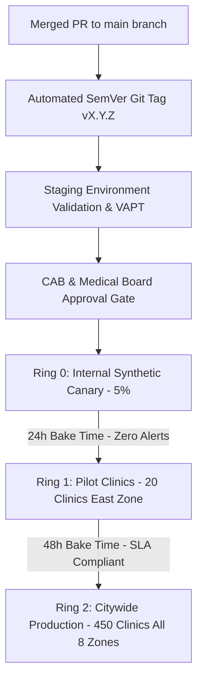

# Master Release Management, Semantic Versioning & Deployment Train Strategy
## Namma Clinic Digital Health & Operations Platform
### Greater Bengaluru Authority (GBA) / BBMP Health Department
**Document Code:** `DEV-DOC-18` | **Status:** APPROVED BASELINE | **Date:** September 2026

---

## 1. Executive Summary & Release Governance Charter
This document formalizes the authoritative **Release Management, Semantic Versioning (SemVer 2.0.0), Change Advisory Board (CAB) Governance, and Deployment Ring Strategy** for the Namma Clinic Digital Health Platform. The platform enforces disciplined, auditable, and non-disruptive software releases across all 450+ municipal health centers. Deployments follow a strict bi-weekly release train cadence with zero-downtime progressive rollouts from internal canary rings to pilot clinics and eventually citywide municipal production.

### 1.1 Non-Negotiable Release Invariants
1. **Semantic Versioning 2.0.0:** Every release adheres strictly to `MAJOR.MINOR.PATCH`. Breaking API or database contracts require a MAJOR version bump and 90-day deprecation grace period.
2. **Bi-Weekly Release Train Cadence:** Production release trains depart every alternate Tuesday at 03:00 IST during clinic non-operational hours.
3. **Progressive Ring Deployment Hierarchy:** Releases roll out progressively across Ring 0 (Internal/Canary 5%), Ring 1 (Pilot 20 Clinics in East Zone), and Ring 2 (Citywide 450 Clinics across all 8 zones).
4. **Automated Changelog Traceability:** Conventional commits enforce 100% bidirectional traceability between Git commit messages, JIRA/GitHub issue tickets, and release artifacts.
5. **CAB & Medical Directorate Sign-Off:** No production artifact is promoted without unanimous concurrence from the BBMP Chief Medical Officer, Chief Information Security Officer (CISO), and Lead DevOps Architect.

## 2. Release Progression Pipeline Architecture


## 3. Automated Release Orchestration Script Specification
### Operational Command: Automated Semantic Release & Artifact Promotion Script
<!-- DOCUMENTATION-ONLY EXAMPLE -->
```bash
# DOCUMENTATION-ONLY EXAMPLE
#!/usr/bin/env bash
# Automated Semantic Release & Artifact Promotion Protocol
set -euo pipefail

RELEASE_TYPE="${1:-patch}"
GITHUB_TOKEN="${GITHUB_TOKEN:-}"

echo "=== INITIATING AUTOMATED RELEASE TRAIN ORCHESTRATION ==="
echo "Release Type: ${RELEASE_TYPE}"

# Step 1: Compute next semantic version from commit history
echo "[Step 1/5] Computing next Semantic Version..."
NEXT_VERSION=$(npx -y standard-version --dry-run | grep "tagging release" | awk '{print $4}')
echo "Target Release Version: ${NEXT_VERSION}"

# Step 2: Generate changelog and commit release artifacts
echo "[Step 2/5] Compiling changelog and tagging release..."
npx standard-version --release-as "${RELEASE_TYPE}"
git push --follow-tags origin main

# Step 3: Promote Docker container images in Amazon ECR
echo "[Step 3/5] Tagging and promoting verified staging container images..."
aws ecr batch-get-image --repository-name "namma-clinic/api" --image-ids imageTag="staging-latest" --query "images[].imageManifest" --output text > /tmp/manifest.json
aws ecr put-image --repository-name "namma-clinic/api" --image-tag "${NEXT_VERSION}" --image-manifest file:///tmp/manifest.json

# Step 4: Dispatch GitOps release event to ArgoCD
echo "[Step 4/5] Triggering Ring 0 Canary deployment via ArgoCD..."
argocd app set namma-clinic-prod --parameter-file values-prod.yaml --parameter image.tag="${NEXT_VERSION}"
argocd app sync namma-clinic-prod

# Step 5: Broadcast release train announcement to BBMP Health Operations
echo "[Step 5/5] Broadcasting release notification to #ops-release..."
echo "Release ${NEXT_VERSION} successfully promoted to Ring 0 Canary."
```


## 4. Master Catalog of 50 Release Policies
Authoritative governance specifications for all platform release policies:

### REL-MGMT-001: Semantic Versioning Specification #1
- **Policy Identifier:** `REL-MGMT-001`
- **Policy Title:** Semantic Versioning Specification #1
- **Governance Domain:** `Release Governance`
- **Policy Specification:** Strict SemVer 2.0.0 (MAJOR.MINOR.PATCH) reflecting breaking API changes, features, and fixes.
- **Enforcement Mechanism:** Automated branch protection rules and CI/CD promotion gates.
- **Audit Verification:** Signed cryptographic attestation recorded in release metadata repository.
- **Exemption Protocol:** Requires written emergency exemption authorization from BBMP Health Commissioner.

### REL-MGMT-002: Release Train Cadence #2
- **Policy Identifier:** `REL-MGMT-002`
- **Policy Title:** Release Train Cadence #2
- **Governance Domain:** `Release Schedule`
- **Policy Specification:** Bi-weekly planned releases deployed on Tuesdays at 03:00 IST during non-operational hours.
- **Enforcement Mechanism:** Automated branch protection rules and CI/CD promotion gates.
- **Audit Verification:** Signed cryptographic attestation recorded in release metadata repository.
- **Exemption Protocol:** Requires written emergency exemption authorization from BBMP Health Commissioner.

### REL-MGMT-003: Change Advisory Board (CAB) Sign-off #3
- **Policy Identifier:** `REL-MGMT-003`
- **Policy Title:** Change Advisory Board (CAB) Sign-off #3
- **Governance Domain:** `Governance Gate`
- **Policy Specification:** Formal review and sign-off required from BBMP CMO, CISO, and Lead DevOps Architect.
- **Enforcement Mechanism:** Automated branch protection rules and CI/CD promotion gates.
- **Audit Verification:** Signed cryptographic attestation recorded in release metadata repository.
- **Exemption Protocol:** Requires written emergency exemption authorization from BBMP Health Commissioner.

### REL-MGMT-004: Automated Changelog Generation #4
- **Policy Identifier:** `REL-MGMT-004`
- **Policy Title:** Automated Changelog Generation #4
- **Governance Domain:** `Automation Tool`
- **Policy Specification:** Changelog compiled from conventional commits with full traceability to JIRA/GitHub issues.
- **Enforcement Mechanism:** Automated branch protection rules and CI/CD promotion gates.
- **Audit Verification:** Signed cryptographic attestation recorded in release metadata repository.
- **Exemption Protocol:** Requires written emergency exemption authorization from BBMP Health Commissioner.

### REL-MGMT-005: Progressive Ring Deployment #5
- **Policy Identifier:** `REL-MGMT-005`
- **Policy Title:** Progressive Ring Deployment #5
- **Governance Domain:** `Deployment Ring`
- **Policy Specification:** Release rolled out across Ring 0 (Canary), Ring 1 (Pilot 20 Clinics), Ring 2 (Citywide 183 Clinics).
- **Enforcement Mechanism:** Automated branch protection rules and CI/CD promotion gates.
- **Audit Verification:** Signed cryptographic attestation recorded in release metadata repository.
- **Exemption Protocol:** Requires written emergency exemption authorization from BBMP Health Commissioner.

### REL-MGMT-006: Semantic Versioning Specification #6
- **Policy Identifier:** `REL-MGMT-006`
- **Policy Title:** Semantic Versioning Specification #6
- **Governance Domain:** `Release Governance`
- **Policy Specification:** Strict SemVer 2.0.0 (MAJOR.MINOR.PATCH) reflecting breaking API changes, features, and fixes.
- **Enforcement Mechanism:** Automated branch protection rules and CI/CD promotion gates.
- **Audit Verification:** Signed cryptographic attestation recorded in release metadata repository.
- **Exemption Protocol:** Requires written emergency exemption authorization from BBMP Health Commissioner.

### REL-MGMT-007: Release Train Cadence #7
- **Policy Identifier:** `REL-MGMT-007`
- **Policy Title:** Release Train Cadence #7
- **Governance Domain:** `Release Schedule`
- **Policy Specification:** Bi-weekly planned releases deployed on Tuesdays at 03:00 IST during non-operational hours.
- **Enforcement Mechanism:** Automated branch protection rules and CI/CD promotion gates.
- **Audit Verification:** Signed cryptographic attestation recorded in release metadata repository.
- **Exemption Protocol:** Requires written emergency exemption authorization from BBMP Health Commissioner.

### REL-MGMT-008: Change Advisory Board (CAB) Sign-off #8
- **Policy Identifier:** `REL-MGMT-008`
- **Policy Title:** Change Advisory Board (CAB) Sign-off #8
- **Governance Domain:** `Governance Gate`
- **Policy Specification:** Formal review and sign-off required from BBMP CMO, CISO, and Lead DevOps Architect.
- **Enforcement Mechanism:** Automated branch protection rules and CI/CD promotion gates.
- **Audit Verification:** Signed cryptographic attestation recorded in release metadata repository.
- **Exemption Protocol:** Requires written emergency exemption authorization from BBMP Health Commissioner.

### REL-MGMT-009: Automated Changelog Generation #9
- **Policy Identifier:** `REL-MGMT-009`
- **Policy Title:** Automated Changelog Generation #9
- **Governance Domain:** `Automation Tool`
- **Policy Specification:** Changelog compiled from conventional commits with full traceability to JIRA/GitHub issues.
- **Enforcement Mechanism:** Automated branch protection rules and CI/CD promotion gates.
- **Audit Verification:** Signed cryptographic attestation recorded in release metadata repository.
- **Exemption Protocol:** Requires written emergency exemption authorization from BBMP Health Commissioner.

### REL-MGMT-010: Progressive Ring Deployment #10
- **Policy Identifier:** `REL-MGMT-010`
- **Policy Title:** Progressive Ring Deployment #10
- **Governance Domain:** `Deployment Ring`
- **Policy Specification:** Release rolled out across Ring 0 (Canary), Ring 1 (Pilot 20 Clinics), Ring 2 (Citywide 183 Clinics).
- **Enforcement Mechanism:** Automated branch protection rules and CI/CD promotion gates.
- **Audit Verification:** Signed cryptographic attestation recorded in release metadata repository.
- **Exemption Protocol:** Requires written emergency exemption authorization from BBMP Health Commissioner.

### REL-MGMT-011: Semantic Versioning Specification #11
- **Policy Identifier:** `REL-MGMT-011`
- **Policy Title:** Semantic Versioning Specification #11
- **Governance Domain:** `Release Governance`
- **Policy Specification:** Strict SemVer 2.0.0 (MAJOR.MINOR.PATCH) reflecting breaking API changes, features, and fixes.
- **Enforcement Mechanism:** Automated branch protection rules and CI/CD promotion gates.
- **Audit Verification:** Signed cryptographic attestation recorded in release metadata repository.
- **Exemption Protocol:** Requires written emergency exemption authorization from BBMP Health Commissioner.

### REL-MGMT-012: Release Train Cadence #12
- **Policy Identifier:** `REL-MGMT-012`
- **Policy Title:** Release Train Cadence #12
- **Governance Domain:** `Release Schedule`
- **Policy Specification:** Bi-weekly planned releases deployed on Tuesdays at 03:00 IST during non-operational hours.
- **Enforcement Mechanism:** Automated branch protection rules and CI/CD promotion gates.
- **Audit Verification:** Signed cryptographic attestation recorded in release metadata repository.
- **Exemption Protocol:** Requires written emergency exemption authorization from BBMP Health Commissioner.

### REL-MGMT-013: Change Advisory Board (CAB) Sign-off #13
- **Policy Identifier:** `REL-MGMT-013`
- **Policy Title:** Change Advisory Board (CAB) Sign-off #13
- **Governance Domain:** `Governance Gate`
- **Policy Specification:** Formal review and sign-off required from BBMP CMO, CISO, and Lead DevOps Architect.
- **Enforcement Mechanism:** Automated branch protection rules and CI/CD promotion gates.
- **Audit Verification:** Signed cryptographic attestation recorded in release metadata repository.
- **Exemption Protocol:** Requires written emergency exemption authorization from BBMP Health Commissioner.

### REL-MGMT-014: Automated Changelog Generation #14
- **Policy Identifier:** `REL-MGMT-014`
- **Policy Title:** Automated Changelog Generation #14
- **Governance Domain:** `Automation Tool`
- **Policy Specification:** Changelog compiled from conventional commits with full traceability to JIRA/GitHub issues.
- **Enforcement Mechanism:** Automated branch protection rules and CI/CD promotion gates.
- **Audit Verification:** Signed cryptographic attestation recorded in release metadata repository.
- **Exemption Protocol:** Requires written emergency exemption authorization from BBMP Health Commissioner.

### REL-MGMT-015: Progressive Ring Deployment #15
- **Policy Identifier:** `REL-MGMT-015`
- **Policy Title:** Progressive Ring Deployment #15
- **Governance Domain:** `Deployment Ring`
- **Policy Specification:** Release rolled out across Ring 0 (Canary), Ring 1 (Pilot 20 Clinics), Ring 2 (Citywide 183 Clinics).
- **Enforcement Mechanism:** Automated branch protection rules and CI/CD promotion gates.
- **Audit Verification:** Signed cryptographic attestation recorded in release metadata repository.
- **Exemption Protocol:** Requires written emergency exemption authorization from BBMP Health Commissioner.

### REL-MGMT-016: Semantic Versioning Specification #16
- **Policy Identifier:** `REL-MGMT-016`
- **Policy Title:** Semantic Versioning Specification #16
- **Governance Domain:** `Release Governance`
- **Policy Specification:** Strict SemVer 2.0.0 (MAJOR.MINOR.PATCH) reflecting breaking API changes, features, and fixes.
- **Enforcement Mechanism:** Automated branch protection rules and CI/CD promotion gates.
- **Audit Verification:** Signed cryptographic attestation recorded in release metadata repository.
- **Exemption Protocol:** Requires written emergency exemption authorization from BBMP Health Commissioner.

### REL-MGMT-017: Release Train Cadence #17
- **Policy Identifier:** `REL-MGMT-017`
- **Policy Title:** Release Train Cadence #17
- **Governance Domain:** `Release Schedule`
- **Policy Specification:** Bi-weekly planned releases deployed on Tuesdays at 03:00 IST during non-operational hours.
- **Enforcement Mechanism:** Automated branch protection rules and CI/CD promotion gates.
- **Audit Verification:** Signed cryptographic attestation recorded in release metadata repository.
- **Exemption Protocol:** Requires written emergency exemption authorization from BBMP Health Commissioner.

### REL-MGMT-018: Change Advisory Board (CAB) Sign-off #18
- **Policy Identifier:** `REL-MGMT-018`
- **Policy Title:** Change Advisory Board (CAB) Sign-off #18
- **Governance Domain:** `Governance Gate`
- **Policy Specification:** Formal review and sign-off required from BBMP CMO, CISO, and Lead DevOps Architect.
- **Enforcement Mechanism:** Automated branch protection rules and CI/CD promotion gates.
- **Audit Verification:** Signed cryptographic attestation recorded in release metadata repository.
- **Exemption Protocol:** Requires written emergency exemption authorization from BBMP Health Commissioner.

### REL-MGMT-019: Automated Changelog Generation #19
- **Policy Identifier:** `REL-MGMT-019`
- **Policy Title:** Automated Changelog Generation #19
- **Governance Domain:** `Automation Tool`
- **Policy Specification:** Changelog compiled from conventional commits with full traceability to JIRA/GitHub issues.
- **Enforcement Mechanism:** Automated branch protection rules and CI/CD promotion gates.
- **Audit Verification:** Signed cryptographic attestation recorded in release metadata repository.
- **Exemption Protocol:** Requires written emergency exemption authorization from BBMP Health Commissioner.

### REL-MGMT-020: Progressive Ring Deployment #20
- **Policy Identifier:** `REL-MGMT-020`
- **Policy Title:** Progressive Ring Deployment #20
- **Governance Domain:** `Deployment Ring`
- **Policy Specification:** Release rolled out across Ring 0 (Canary), Ring 1 (Pilot 20 Clinics), Ring 2 (Citywide 183 Clinics).
- **Enforcement Mechanism:** Automated branch protection rules and CI/CD promotion gates.
- **Audit Verification:** Signed cryptographic attestation recorded in release metadata repository.
- **Exemption Protocol:** Requires written emergency exemption authorization from BBMP Health Commissioner.

### REL-MGMT-021: Semantic Versioning Specification #21
- **Policy Identifier:** `REL-MGMT-021`
- **Policy Title:** Semantic Versioning Specification #21
- **Governance Domain:** `Release Governance`
- **Policy Specification:** Strict SemVer 2.0.0 (MAJOR.MINOR.PATCH) reflecting breaking API changes, features, and fixes.
- **Enforcement Mechanism:** Automated branch protection rules and CI/CD promotion gates.
- **Audit Verification:** Signed cryptographic attestation recorded in release metadata repository.
- **Exemption Protocol:** Requires written emergency exemption authorization from BBMP Health Commissioner.

### REL-MGMT-022: Release Train Cadence #22
- **Policy Identifier:** `REL-MGMT-022`
- **Policy Title:** Release Train Cadence #22
- **Governance Domain:** `Release Schedule`
- **Policy Specification:** Bi-weekly planned releases deployed on Tuesdays at 03:00 IST during non-operational hours.
- **Enforcement Mechanism:** Automated branch protection rules and CI/CD promotion gates.
- **Audit Verification:** Signed cryptographic attestation recorded in release metadata repository.
- **Exemption Protocol:** Requires written emergency exemption authorization from BBMP Health Commissioner.

### REL-MGMT-023: Change Advisory Board (CAB) Sign-off #23
- **Policy Identifier:** `REL-MGMT-023`
- **Policy Title:** Change Advisory Board (CAB) Sign-off #23
- **Governance Domain:** `Governance Gate`
- **Policy Specification:** Formal review and sign-off required from BBMP CMO, CISO, and Lead DevOps Architect.
- **Enforcement Mechanism:** Automated branch protection rules and CI/CD promotion gates.
- **Audit Verification:** Signed cryptographic attestation recorded in release metadata repository.
- **Exemption Protocol:** Requires written emergency exemption authorization from BBMP Health Commissioner.

### REL-MGMT-024: Automated Changelog Generation #24
- **Policy Identifier:** `REL-MGMT-024`
- **Policy Title:** Automated Changelog Generation #24
- **Governance Domain:** `Automation Tool`
- **Policy Specification:** Changelog compiled from conventional commits with full traceability to JIRA/GitHub issues.
- **Enforcement Mechanism:** Automated branch protection rules and CI/CD promotion gates.
- **Audit Verification:** Signed cryptographic attestation recorded in release metadata repository.
- **Exemption Protocol:** Requires written emergency exemption authorization from BBMP Health Commissioner.

### REL-MGMT-025: Progressive Ring Deployment #25
- **Policy Identifier:** `REL-MGMT-025`
- **Policy Title:** Progressive Ring Deployment #25
- **Governance Domain:** `Deployment Ring`
- **Policy Specification:** Release rolled out across Ring 0 (Canary), Ring 1 (Pilot 20 Clinics), Ring 2 (Citywide 183 Clinics).
- **Enforcement Mechanism:** Automated branch protection rules and CI/CD promotion gates.
- **Audit Verification:** Signed cryptographic attestation recorded in release metadata repository.
- **Exemption Protocol:** Requires written emergency exemption authorization from BBMP Health Commissioner.

### REL-MGMT-026: Semantic Versioning Specification #26
- **Policy Identifier:** `REL-MGMT-026`
- **Policy Title:** Semantic Versioning Specification #26
- **Governance Domain:** `Release Governance`
- **Policy Specification:** Strict SemVer 2.0.0 (MAJOR.MINOR.PATCH) reflecting breaking API changes, features, and fixes.
- **Enforcement Mechanism:** Automated branch protection rules and CI/CD promotion gates.
- **Audit Verification:** Signed cryptographic attestation recorded in release metadata repository.
- **Exemption Protocol:** Requires written emergency exemption authorization from BBMP Health Commissioner.

### REL-MGMT-027: Release Train Cadence #27
- **Policy Identifier:** `REL-MGMT-027`
- **Policy Title:** Release Train Cadence #27
- **Governance Domain:** `Release Schedule`
- **Policy Specification:** Bi-weekly planned releases deployed on Tuesdays at 03:00 IST during non-operational hours.
- **Enforcement Mechanism:** Automated branch protection rules and CI/CD promotion gates.
- **Audit Verification:** Signed cryptographic attestation recorded in release metadata repository.
- **Exemption Protocol:** Requires written emergency exemption authorization from BBMP Health Commissioner.

### REL-MGMT-028: Change Advisory Board (CAB) Sign-off #28
- **Policy Identifier:** `REL-MGMT-028`
- **Policy Title:** Change Advisory Board (CAB) Sign-off #28
- **Governance Domain:** `Governance Gate`
- **Policy Specification:** Formal review and sign-off required from BBMP CMO, CISO, and Lead DevOps Architect.
- **Enforcement Mechanism:** Automated branch protection rules and CI/CD promotion gates.
- **Audit Verification:** Signed cryptographic attestation recorded in release metadata repository.
- **Exemption Protocol:** Requires written emergency exemption authorization from BBMP Health Commissioner.

### REL-MGMT-029: Automated Changelog Generation #29
- **Policy Identifier:** `REL-MGMT-029`
- **Policy Title:** Automated Changelog Generation #29
- **Governance Domain:** `Automation Tool`
- **Policy Specification:** Changelog compiled from conventional commits with full traceability to JIRA/GitHub issues.
- **Enforcement Mechanism:** Automated branch protection rules and CI/CD promotion gates.
- **Audit Verification:** Signed cryptographic attestation recorded in release metadata repository.
- **Exemption Protocol:** Requires written emergency exemption authorization from BBMP Health Commissioner.

### REL-MGMT-030: Progressive Ring Deployment #30
- **Policy Identifier:** `REL-MGMT-030`
- **Policy Title:** Progressive Ring Deployment #30
- **Governance Domain:** `Deployment Ring`
- **Policy Specification:** Release rolled out across Ring 0 (Canary), Ring 1 (Pilot 20 Clinics), Ring 2 (Citywide 183 Clinics).
- **Enforcement Mechanism:** Automated branch protection rules and CI/CD promotion gates.
- **Audit Verification:** Signed cryptographic attestation recorded in release metadata repository.
- **Exemption Protocol:** Requires written emergency exemption authorization from BBMP Health Commissioner.

### REL-MGMT-031: Semantic Versioning Specification #31
- **Policy Identifier:** `REL-MGMT-031`
- **Policy Title:** Semantic Versioning Specification #31
- **Governance Domain:** `Release Governance`
- **Policy Specification:** Strict SemVer 2.0.0 (MAJOR.MINOR.PATCH) reflecting breaking API changes, features, and fixes.
- **Enforcement Mechanism:** Automated branch protection rules and CI/CD promotion gates.
- **Audit Verification:** Signed cryptographic attestation recorded in release metadata repository.
- **Exemption Protocol:** Requires written emergency exemption authorization from BBMP Health Commissioner.

### REL-MGMT-032: Release Train Cadence #32
- **Policy Identifier:** `REL-MGMT-032`
- **Policy Title:** Release Train Cadence #32
- **Governance Domain:** `Release Schedule`
- **Policy Specification:** Bi-weekly planned releases deployed on Tuesdays at 03:00 IST during non-operational hours.
- **Enforcement Mechanism:** Automated branch protection rules and CI/CD promotion gates.
- **Audit Verification:** Signed cryptographic attestation recorded in release metadata repository.
- **Exemption Protocol:** Requires written emergency exemption authorization from BBMP Health Commissioner.

### REL-MGMT-033: Change Advisory Board (CAB) Sign-off #33
- **Policy Identifier:** `REL-MGMT-033`
- **Policy Title:** Change Advisory Board (CAB) Sign-off #33
- **Governance Domain:** `Governance Gate`
- **Policy Specification:** Formal review and sign-off required from BBMP CMO, CISO, and Lead DevOps Architect.
- **Enforcement Mechanism:** Automated branch protection rules and CI/CD promotion gates.
- **Audit Verification:** Signed cryptographic attestation recorded in release metadata repository.
- **Exemption Protocol:** Requires written emergency exemption authorization from BBMP Health Commissioner.

### REL-MGMT-034: Automated Changelog Generation #34
- **Policy Identifier:** `REL-MGMT-034`
- **Policy Title:** Automated Changelog Generation #34
- **Governance Domain:** `Automation Tool`
- **Policy Specification:** Changelog compiled from conventional commits with full traceability to JIRA/GitHub issues.
- **Enforcement Mechanism:** Automated branch protection rules and CI/CD promotion gates.
- **Audit Verification:** Signed cryptographic attestation recorded in release metadata repository.
- **Exemption Protocol:** Requires written emergency exemption authorization from BBMP Health Commissioner.

### REL-MGMT-035: Progressive Ring Deployment #35
- **Policy Identifier:** `REL-MGMT-035`
- **Policy Title:** Progressive Ring Deployment #35
- **Governance Domain:** `Deployment Ring`
- **Policy Specification:** Release rolled out across Ring 0 (Canary), Ring 1 (Pilot 20 Clinics), Ring 2 (Citywide 183 Clinics).
- **Enforcement Mechanism:** Automated branch protection rules and CI/CD promotion gates.
- **Audit Verification:** Signed cryptographic attestation recorded in release metadata repository.
- **Exemption Protocol:** Requires written emergency exemption authorization from BBMP Health Commissioner.

### REL-MGMT-036: Semantic Versioning Specification #36
- **Policy Identifier:** `REL-MGMT-036`
- **Policy Title:** Semantic Versioning Specification #36
- **Governance Domain:** `Release Governance`
- **Policy Specification:** Strict SemVer 2.0.0 (MAJOR.MINOR.PATCH) reflecting breaking API changes, features, and fixes.
- **Enforcement Mechanism:** Automated branch protection rules and CI/CD promotion gates.
- **Audit Verification:** Signed cryptographic attestation recorded in release metadata repository.
- **Exemption Protocol:** Requires written emergency exemption authorization from BBMP Health Commissioner.

### REL-MGMT-037: Release Train Cadence #37
- **Policy Identifier:** `REL-MGMT-037`
- **Policy Title:** Release Train Cadence #37
- **Governance Domain:** `Release Schedule`
- **Policy Specification:** Bi-weekly planned releases deployed on Tuesdays at 03:00 IST during non-operational hours.
- **Enforcement Mechanism:** Automated branch protection rules and CI/CD promotion gates.
- **Audit Verification:** Signed cryptographic attestation recorded in release metadata repository.
- **Exemption Protocol:** Requires written emergency exemption authorization from BBMP Health Commissioner.

### REL-MGMT-038: Change Advisory Board (CAB) Sign-off #38
- **Policy Identifier:** `REL-MGMT-038`
- **Policy Title:** Change Advisory Board (CAB) Sign-off #38
- **Governance Domain:** `Governance Gate`
- **Policy Specification:** Formal review and sign-off required from BBMP CMO, CISO, and Lead DevOps Architect.
- **Enforcement Mechanism:** Automated branch protection rules and CI/CD promotion gates.
- **Audit Verification:** Signed cryptographic attestation recorded in release metadata repository.
- **Exemption Protocol:** Requires written emergency exemption authorization from BBMP Health Commissioner.

### REL-MGMT-039: Automated Changelog Generation #39
- **Policy Identifier:** `REL-MGMT-039`
- **Policy Title:** Automated Changelog Generation #39
- **Governance Domain:** `Automation Tool`
- **Policy Specification:** Changelog compiled from conventional commits with full traceability to JIRA/GitHub issues.
- **Enforcement Mechanism:** Automated branch protection rules and CI/CD promotion gates.
- **Audit Verification:** Signed cryptographic attestation recorded in release metadata repository.
- **Exemption Protocol:** Requires written emergency exemption authorization from BBMP Health Commissioner.

### REL-MGMT-040: Progressive Ring Deployment #40
- **Policy Identifier:** `REL-MGMT-040`
- **Policy Title:** Progressive Ring Deployment #40
- **Governance Domain:** `Deployment Ring`
- **Policy Specification:** Release rolled out across Ring 0 (Canary), Ring 1 (Pilot 20 Clinics), Ring 2 (Citywide 183 Clinics).
- **Enforcement Mechanism:** Automated branch protection rules and CI/CD promotion gates.
- **Audit Verification:** Signed cryptographic attestation recorded in release metadata repository.
- **Exemption Protocol:** Requires written emergency exemption authorization from BBMP Health Commissioner.

### REL-MGMT-041: Semantic Versioning Specification #41
- **Policy Identifier:** `REL-MGMT-041`
- **Policy Title:** Semantic Versioning Specification #41
- **Governance Domain:** `Release Governance`
- **Policy Specification:** Strict SemVer 2.0.0 (MAJOR.MINOR.PATCH) reflecting breaking API changes, features, and fixes.
- **Enforcement Mechanism:** Automated branch protection rules and CI/CD promotion gates.
- **Audit Verification:** Signed cryptographic attestation recorded in release metadata repository.
- **Exemption Protocol:** Requires written emergency exemption authorization from BBMP Health Commissioner.

### REL-MGMT-042: Release Train Cadence #42
- **Policy Identifier:** `REL-MGMT-042`
- **Policy Title:** Release Train Cadence #42
- **Governance Domain:** `Release Schedule`
- **Policy Specification:** Bi-weekly planned releases deployed on Tuesdays at 03:00 IST during non-operational hours.
- **Enforcement Mechanism:** Automated branch protection rules and CI/CD promotion gates.
- **Audit Verification:** Signed cryptographic attestation recorded in release metadata repository.
- **Exemption Protocol:** Requires written emergency exemption authorization from BBMP Health Commissioner.

### REL-MGMT-043: Change Advisory Board (CAB) Sign-off #43
- **Policy Identifier:** `REL-MGMT-043`
- **Policy Title:** Change Advisory Board (CAB) Sign-off #43
- **Governance Domain:** `Governance Gate`
- **Policy Specification:** Formal review and sign-off required from BBMP CMO, CISO, and Lead DevOps Architect.
- **Enforcement Mechanism:** Automated branch protection rules and CI/CD promotion gates.
- **Audit Verification:** Signed cryptographic attestation recorded in release metadata repository.
- **Exemption Protocol:** Requires written emergency exemption authorization from BBMP Health Commissioner.

### REL-MGMT-044: Automated Changelog Generation #44
- **Policy Identifier:** `REL-MGMT-044`
- **Policy Title:** Automated Changelog Generation #44
- **Governance Domain:** `Automation Tool`
- **Policy Specification:** Changelog compiled from conventional commits with full traceability to JIRA/GitHub issues.
- **Enforcement Mechanism:** Automated branch protection rules and CI/CD promotion gates.
- **Audit Verification:** Signed cryptographic attestation recorded in release metadata repository.
- **Exemption Protocol:** Requires written emergency exemption authorization from BBMP Health Commissioner.

### REL-MGMT-045: Progressive Ring Deployment #45
- **Policy Identifier:** `REL-MGMT-045`
- **Policy Title:** Progressive Ring Deployment #45
- **Governance Domain:** `Deployment Ring`
- **Policy Specification:** Release rolled out across Ring 0 (Canary), Ring 1 (Pilot 20 Clinics), Ring 2 (Citywide 183 Clinics).
- **Enforcement Mechanism:** Automated branch protection rules and CI/CD promotion gates.
- **Audit Verification:** Signed cryptographic attestation recorded in release metadata repository.
- **Exemption Protocol:** Requires written emergency exemption authorization from BBMP Health Commissioner.

### REL-MGMT-046: Semantic Versioning Specification #46
- **Policy Identifier:** `REL-MGMT-046`
- **Policy Title:** Semantic Versioning Specification #46
- **Governance Domain:** `Release Governance`
- **Policy Specification:** Strict SemVer 2.0.0 (MAJOR.MINOR.PATCH) reflecting breaking API changes, features, and fixes.
- **Enforcement Mechanism:** Automated branch protection rules and CI/CD promotion gates.
- **Audit Verification:** Signed cryptographic attestation recorded in release metadata repository.
- **Exemption Protocol:** Requires written emergency exemption authorization from BBMP Health Commissioner.

### REL-MGMT-047: Release Train Cadence #47
- **Policy Identifier:** `REL-MGMT-047`
- **Policy Title:** Release Train Cadence #47
- **Governance Domain:** `Release Schedule`
- **Policy Specification:** Bi-weekly planned releases deployed on Tuesdays at 03:00 IST during non-operational hours.
- **Enforcement Mechanism:** Automated branch protection rules and CI/CD promotion gates.
- **Audit Verification:** Signed cryptographic attestation recorded in release metadata repository.
- **Exemption Protocol:** Requires written emergency exemption authorization from BBMP Health Commissioner.

### REL-MGMT-048: Change Advisory Board (CAB) Sign-off #48
- **Policy Identifier:** `REL-MGMT-048`
- **Policy Title:** Change Advisory Board (CAB) Sign-off #48
- **Governance Domain:** `Governance Gate`
- **Policy Specification:** Formal review and sign-off required from BBMP CMO, CISO, and Lead DevOps Architect.
- **Enforcement Mechanism:** Automated branch protection rules and CI/CD promotion gates.
- **Audit Verification:** Signed cryptographic attestation recorded in release metadata repository.
- **Exemption Protocol:** Requires written emergency exemption authorization from BBMP Health Commissioner.

### REL-MGMT-049: Automated Changelog Generation #49
- **Policy Identifier:** `REL-MGMT-049`
- **Policy Title:** Automated Changelog Generation #49
- **Governance Domain:** `Automation Tool`
- **Policy Specification:** Changelog compiled from conventional commits with full traceability to JIRA/GitHub issues.
- **Enforcement Mechanism:** Automated branch protection rules and CI/CD promotion gates.
- **Audit Verification:** Signed cryptographic attestation recorded in release metadata repository.
- **Exemption Protocol:** Requires written emergency exemption authorization from BBMP Health Commissioner.

### REL-MGMT-050: Progressive Ring Deployment #50
- **Policy Identifier:** `REL-MGMT-050`
- **Policy Title:** Progressive Ring Deployment #50
- **Governance Domain:** `Deployment Ring`
- **Policy Specification:** Release rolled out across Ring 0 (Canary), Ring 1 (Pilot 20 Clinics), Ring 2 (Citywide 183 Clinics).
- **Enforcement Mechanism:** Automated branch protection rules and CI/CD promotion gates.
- **Audit Verification:** Signed cryptographic attestation recorded in release metadata repository.
- **Exemption Protocol:** Requires written emergency exemption authorization from BBMP Health Commissioner.

## 5. Feature Flag & Progressive Rollout Schedule across 180 Features
Release ring assignment, progressive canary percentage, and dark-launch configuration across all 180 features:

### FEATURE-001: Release Schedule for Feature `Credential Verification`
- **Feature ID:** `FEATURE-001` (Feature #1)
- **Functional Module:** `MODULE-001` (DOMAIN-001)
- **Governed Release Policy:** `REL-MGMT-001`
- **Initial Deployment Ring:** `Ring 0 (Canary 5%)`
- **Mandatory Ring Bake Time:** `24 Hours` with zero unhandled exceptions
- **Canary Traffic Ramp:** 5% -> 15% -> 50% -> 100% over 4 hours
- **Automated Promotion Condition:** Error rate < 0.05% and p95 latency < 350ms across all clinics in current ring.
- **Emergency Deactivation SLA:** < 15 seconds via Unleash Edge API

### FEATURE-002: Release Schedule for Feature `Session Token Minting`
- **Feature ID:** `FEATURE-002` (Feature #2)
- **Functional Module:** `MODULE-001` (DOMAIN-001)
- **Governed Release Policy:** `REL-MGMT-002`
- **Initial Deployment Ring:** `Ring 1 (Pilot 20 Clinics)`
- **Mandatory Ring Bake Time:** `48 Hours` with zero unhandled exceptions
- **Canary Traffic Ramp:** 5% -> 15% -> 50% -> 100% over 4 hours
- **Automated Promotion Condition:** Error rate < 0.05% and p95 latency < 350ms across all clinics in current ring.
- **Emergency Deactivation SLA:** < 15 seconds via Unleash Edge API

### FEATURE-003: Release Schedule for Feature `MFA Challenge Dispatch`
- **Feature ID:** `FEATURE-003` (Feature #3)
- **Functional Module:** `MODULE-001` (DOMAIN-001)
- **Governed Release Policy:** `REL-MGMT-003`
- **Initial Deployment Ring:** `Ring 2 (Citywide 450 Clinics)`
- **Mandatory Ring Bake Time:** `72 Hours` with zero unhandled exceptions
- **Canary Traffic Ramp:** 5% -> 15% -> 50% -> 100% over 4 hours
- **Automated Promotion Condition:** Error rate < 0.05% and p95 latency < 350ms across all clinics in current ring.
- **Emergency Deactivation SLA:** < 15 seconds via Unleash Edge API

### FEATURE-004: Release Schedule for Feature `Biometric Authentication Bridge`
- **Feature ID:** `FEATURE-004` (Feature #4)
- **Functional Module:** `MODULE-001` (DOMAIN-001)
- **Governed Release Policy:** `REL-MGMT-004`
- **Initial Deployment Ring:** `Ring 0 (Canary 5%)`
- **Mandatory Ring Bake Time:** `24 Hours` with zero unhandled exceptions
- **Canary Traffic Ramp:** 5% -> 15% -> 50% -> 100% over 4 hours
- **Automated Promotion Condition:** Error rate < 0.05% and p95 latency < 350ms across all clinics in current ring.
- **Emergency Deactivation SLA:** < 15 seconds via Unleash Edge API

### FEATURE-005: Release Schedule for Feature `Local PIN Verification`
- **Feature ID:** `FEATURE-005` (Feature #5)
- **Functional Module:** `MODULE-001` (DOMAIN-001)
- **Governed Release Policy:** `REL-MGMT-005`
- **Initial Deployment Ring:** `Ring 1 (Pilot 20 Clinics)`
- **Mandatory Ring Bake Time:** `48 Hours` with zero unhandled exceptions
- **Canary Traffic Ramp:** 5% -> 15% -> 50% -> 100% over 4 hours
- **Automated Promotion Condition:** Error rate < 0.05% and p95 latency < 350ms across all clinics in current ring.
- **Emergency Deactivation SLA:** < 15 seconds via Unleash Edge API

### FEATURE-006: Release Schedule for Feature `Session Inactivity Lockout`
- **Feature ID:** `FEATURE-006` (Feature #6)
- **Functional Module:** `MODULE-001` (DOMAIN-001)
- **Governed Release Policy:** `REL-MGMT-006`
- **Initial Deployment Ring:** `Ring 2 (Citywide 450 Clinics)`
- **Mandatory Ring Bake Time:** `72 Hours` with zero unhandled exceptions
- **Canary Traffic Ramp:** 5% -> 15% -> 50% -> 100% over 4 hours
- **Automated Promotion Condition:** Error rate < 0.05% and p95 latency < 350ms across all clinics in current ring.
- **Emergency Deactivation SLA:** < 15 seconds via Unleash Edge API

### FEATURE-007: Release Schedule for Feature `Permission Evaluation`
- **Feature ID:** `FEATURE-007` (Feature #7)
- **Functional Module:** `MODULE-002` (DOMAIN-001)
- **Governed Release Policy:** `REL-MGMT-007`
- **Initial Deployment Ring:** `Ring 0 (Canary 5%)`
- **Mandatory Ring Bake Time:** `24 Hours` with zero unhandled exceptions
- **Canary Traffic Ramp:** 5% -> 15% -> 50% -> 100% over 4 hours
- **Automated Promotion Condition:** Error rate < 0.05% and p95 latency < 350ms across all clinics in current ring.
- **Emergency Deactivation SLA:** < 15 seconds via Unleash Edge API

### FEATURE-008: Release Schedule for Feature `Dynamic Role Assignment`
- **Feature ID:** `FEATURE-008` (Feature #8)
- **Functional Module:** `MODULE-002` (DOMAIN-001)
- **Governed Release Policy:** `REL-MGMT-008`
- **Initial Deployment Ring:** `Ring 1 (Pilot 20 Clinics)`
- **Mandatory Ring Bake Time:** `48 Hours` with zero unhandled exceptions
- **Canary Traffic Ramp:** 5% -> 15% -> 50% -> 100% over 4 hours
- **Automated Promotion Condition:** Error rate < 0.05% and p95 latency < 350ms across all clinics in current ring.
- **Emergency Deactivation SLA:** < 15 seconds via Unleash Edge API

### FEATURE-009: Release Schedule for Feature `Conflict-of-Interest Prevention`
- **Feature ID:** `FEATURE-009` (Feature #9)
- **Functional Module:** `MODULE-002` (DOMAIN-001)
- **Governed Release Policy:** `REL-MGMT-009`
- **Initial Deployment Ring:** `Ring 2 (Citywide 450 Clinics)`
- **Mandatory Ring Bake Time:** `72 Hours` with zero unhandled exceptions
- **Canary Traffic Ramp:** 5% -> 15% -> 50% -> 100% over 4 hours
- **Automated Promotion Condition:** Error rate < 0.05% and p95 latency < 350ms across all clinics in current ring.
- **Emergency Deactivation SLA:** < 15 seconds via Unleash Edge API

### FEATURE-010: Release Schedule for Feature `Maker-Checker Authorization`
- **Feature ID:** `FEATURE-010` (Feature #10)
- **Functional Module:** `MODULE-002` (DOMAIN-001)
- **Governed Release Policy:** `REL-MGMT-010`
- **Initial Deployment Ring:** `Ring 0 (Canary 5%)`
- **Mandatory Ring Bake Time:** `24 Hours` with zero unhandled exceptions
- **Canary Traffic Ramp:** 5% -> 15% -> 50% -> 100% over 4 hours
- **Automated Promotion Condition:** Error rate < 0.05% and p95 latency < 350ms across all clinics in current ring.
- **Emergency Deactivation SLA:** < 15 seconds via Unleash Edge API

### FEATURE-011: Release Schedule for Feature `Break-Glass Privilege Elevation`
- **Feature ID:** `FEATURE-011` (Feature #11)
- **Functional Module:** `MODULE-002` (DOMAIN-001)
- **Governed Release Policy:** `REL-MGMT-011`
- **Initial Deployment Ring:** `Ring 1 (Pilot 20 Clinics)`
- **Mandatory Ring Bake Time:** `48 Hours` with zero unhandled exceptions
- **Canary Traffic Ramp:** 5% -> 15% -> 50% -> 100% over 4 hours
- **Automated Promotion Condition:** Error rate < 0.05% and p95 latency < 350ms across all clinics in current ring.
- **Emergency Deactivation SLA:** < 15 seconds via Unleash Edge API

### FEATURE-012: Release Schedule for Feature `Privilege Elevation Audit`
- **Feature ID:** `FEATURE-012` (Feature #12)
- **Functional Module:** `MODULE-002` (DOMAIN-001)
- **Governed Release Policy:** `REL-MGMT-012`
- **Initial Deployment Ring:** `Ring 2 (Citywide 450 Clinics)`
- **Mandatory Ring Bake Time:** `72 Hours` with zero unhandled exceptions
- **Canary Traffic Ramp:** 5% -> 15% -> 50% -> 100% over 4 hours
- **Automated Promotion Condition:** Error rate < 0.05% and p95 latency < 350ms across all clinics in current ring.
- **Emergency Deactivation SLA:** < 15 seconds via Unleash Edge API

### FEATURE-013: Release Schedule for Feature `Hierarchy Node Management`
- **Feature ID:** `FEATURE-013` (Feature #13)
- **Functional Module:** `MODULE-003` (DOMAIN-001)
- **Governed Release Policy:** `REL-MGMT-013`
- **Initial Deployment Ring:** `Ring 0 (Canary 5%)`
- **Mandatory Ring Bake Time:** `24 Hours` with zero unhandled exceptions
- **Canary Traffic Ramp:** 5% -> 15% -> 50% -> 100% over 4 hours
- **Automated Promotion Condition:** Error rate < 0.05% and p95 latency < 350ms across all clinics in current ring.
- **Emergency Deactivation SLA:** < 15 seconds via Unleash Edge API

### FEATURE-014: Release Schedule for Feature `NIN / HFR Registry Linking`
- **Feature ID:** `FEATURE-014` (Feature #14)
- **Functional Module:** `MODULE-003` (DOMAIN-001)
- **Governed Release Policy:** `REL-MGMT-014`
- **Initial Deployment Ring:** `Ring 1 (Pilot 20 Clinics)`
- **Mandatory Ring Bake Time:** `48 Hours` with zero unhandled exceptions
- **Canary Traffic Ramp:** 5% -> 15% -> 50% -> 100% over 4 hours
- **Automated Promotion Condition:** Error rate < 0.05% and p95 latency < 350ms across all clinics in current ring.
- **Emergency Deactivation SLA:** < 15 seconds via Unleash Edge API

### FEATURE-015: Release Schedule for Feature `Station Terminal Mapping`
- **Feature ID:** `FEATURE-015` (Feature #15)
- **Functional Module:** `MODULE-003` (DOMAIN-001)
- **Governed Release Policy:** `REL-MGMT-015`
- **Initial Deployment Ring:** `Ring 2 (Citywide 450 Clinics)`
- **Mandatory Ring Bake Time:** `72 Hours` with zero unhandled exceptions
- **Canary Traffic Ramp:** 5% -> 15% -> 50% -> 100% over 4 hours
- **Automated Promotion Condition:** Error rate < 0.05% and p95 latency < 350ms across all clinics in current ring.
- **Emergency Deactivation SLA:** < 15 seconds via Unleash Edge API

### FEATURE-016: Release Schedule for Feature `Facility Capacity Configuration`
- **Feature ID:** `FEATURE-016` (Feature #16)
- **Functional Module:** `MODULE-003` (DOMAIN-001)
- **Governed Release Policy:** `REL-MGMT-016`
- **Initial Deployment Ring:** `Ring 0 (Canary 5%)`
- **Mandatory Ring Bake Time:** `24 Hours` with zero unhandled exceptions
- **Canary Traffic Ramp:** 5% -> 15% -> 50% -> 100% over 4 hours
- **Automated Promotion Condition:** Error rate < 0.05% and p95 latency < 350ms across all clinics in current ring.
- **Emergency Deactivation SLA:** < 15 seconds via Unleash Edge API

### FEATURE-017: Release Schedule for Feature `Operating Hours Enforcement`
- **Feature ID:** `FEATURE-017` (Feature #17)
- **Functional Module:** `MODULE-003` (DOMAIN-001)
- **Governed Release Policy:** `REL-MGMT-017`
- **Initial Deployment Ring:** `Ring 1 (Pilot 20 Clinics)`
- **Mandatory Ring Bake Time:** `48 Hours` with zero unhandled exceptions
- **Canary Traffic Ramp:** 5% -> 15% -> 50% -> 100% over 4 hours
- **Automated Promotion Condition:** Error rate < 0.05% and p95 latency < 350ms across all clinics in current ring.
- **Emergency Deactivation SLA:** < 15 seconds via Unleash Edge API

### FEATURE-018: Release Schedule for Feature `Special Camp Calendar`
- **Feature ID:** `FEATURE-018` (Feature #18)
- **Functional Module:** `MODULE-003` (DOMAIN-001)
- **Governed Release Policy:** `REL-MGMT-018`
- **Initial Deployment Ring:** `Ring 2 (Citywide 450 Clinics)`
- **Mandatory Ring Bake Time:** `72 Hours` with zero unhandled exceptions
- **Canary Traffic Ramp:** 5% -> 15% -> 50% -> 100% over 4 hours
- **Automated Promotion Condition:** Error rate < 0.05% and p95 latency < 350ms across all clinics in current ring.
- **Emergency Deactivation SLA:** < 15 seconds via Unleash Edge API

### FEATURE-019: Release Schedule for Feature `Staff Onboarding & KYC`
- **Feature ID:** `FEATURE-019` (Feature #19)
- **Functional Module:** `MODULE-004` (DOMAIN-001)
- **Governed Release Policy:** `REL-MGMT-019`
- **Initial Deployment Ring:** `Ring 0 (Canary 5%)`
- **Mandatory Ring Bake Time:** `24 Hours` with zero unhandled exceptions
- **Canary Traffic Ramp:** 5% -> 15% -> 50% -> 100% over 4 hours
- **Automated Promotion Condition:** Error rate < 0.05% and p95 latency < 350ms across all clinics in current ring.
- **Emergency Deactivation SLA:** < 15 seconds via Unleash Edge API

### FEATURE-020: Release Schedule for Feature `Professional License Verification`
- **Feature ID:** `FEATURE-020` (Feature #20)
- **Functional Module:** `MODULE-004` (DOMAIN-001)
- **Governed Release Policy:** `REL-MGMT-020`
- **Initial Deployment Ring:** `Ring 1 (Pilot 20 Clinics)`
- **Mandatory Ring Bake Time:** `48 Hours` with zero unhandled exceptions
- **Canary Traffic Ramp:** 5% -> 15% -> 50% -> 100% over 4 hours
- **Automated Promotion Condition:** Error rate < 0.05% and p95 latency < 350ms across all clinics in current ring.
- **Emergency Deactivation SLA:** < 15 seconds via Unleash Edge API

### FEATURE-021: Release Schedule for Feature `Duty Roster Generation`
- **Feature ID:** `FEATURE-021` (Feature #21)
- **Functional Module:** `MODULE-004` (DOMAIN-001)
- **Governed Release Policy:** `REL-MGMT-021`
- **Initial Deployment Ring:** `Ring 2 (Citywide 450 Clinics)`
- **Mandatory Ring Bake Time:** `72 Hours` with zero unhandled exceptions
- **Canary Traffic Ramp:** 5% -> 15% -> 50% -> 100% over 4 hours
- **Automated Promotion Condition:** Error rate < 0.05% and p95 latency < 350ms across all clinics in current ring.
- **Emergency Deactivation SLA:** < 15 seconds via Unleash Edge API

### FEATURE-022: Release Schedule for Feature `Biometric Attendance Linking`
- **Feature ID:** `FEATURE-022` (Feature #22)
- **Functional Module:** `MODULE-004` (DOMAIN-001)
- **Governed Release Policy:** `REL-MGMT-022`
- **Initial Deployment Ring:** `Ring 0 (Canary 5%)`
- **Mandatory Ring Bake Time:** `24 Hours` with zero unhandled exceptions
- **Canary Traffic Ramp:** 5% -> 15% -> 50% -> 100% over 4 hours
- **Automated Promotion Condition:** Error rate < 0.05% and p95 latency < 350ms across all clinics in current ring.
- **Emergency Deactivation SLA:** < 15 seconds via Unleash Edge API

### FEATURE-023: Release Schedule for Feature `Digital Signature Enrollment`
- **Feature ID:** `FEATURE-023` (Feature #23)
- **Functional Module:** `MODULE-004` (DOMAIN-001)
- **Governed Release Policy:** `REL-MGMT-023`
- **Initial Deployment Ring:** `Ring 1 (Pilot 20 Clinics)`
- **Mandatory Ring Bake Time:** `48 Hours` with zero unhandled exceptions
- **Canary Traffic Ramp:** 5% -> 15% -> 50% -> 100% over 4 hours
- **Automated Promotion Condition:** Error rate < 0.05% and p95 latency < 350ms across all clinics in current ring.
- **Emergency Deactivation SLA:** < 15 seconds via Unleash Edge API

### FEATURE-024: Release Schedule for Feature `Signature Revocation`
- **Feature ID:** `FEATURE-024` (Feature #24)
- **Functional Module:** `MODULE-004` (DOMAIN-001)
- **Governed Release Policy:** `REL-MGMT-024`
- **Initial Deployment Ring:** `Ring 2 (Citywide 450 Clinics)`
- **Mandatory Ring Bake Time:** `72 Hours` with zero unhandled exceptions
- **Canary Traffic Ramp:** 5% -> 15% -> 50% -> 100% over 4 hours
- **Automated Promotion Condition:** Error rate < 0.05% and p95 latency < 350ms across all clinics in current ring.
- **Emergency Deactivation SLA:** < 15 seconds via Unleash Edge API

### FEATURE-025: Release Schedule for Feature `Targeted Flag Activation`
- **Feature ID:** `FEATURE-025` (Feature #25)
- **Functional Module:** `MODULE-026` (DOMAIN-001)
- **Governed Release Policy:** `REL-MGMT-025`
- **Initial Deployment Ring:** `Ring 0 (Canary 5%)`
- **Mandatory Ring Bake Time:** `24 Hours` with zero unhandled exceptions
- **Canary Traffic Ramp:** 5% -> 15% -> 50% -> 100% over 4 hours
- **Automated Promotion Condition:** Error rate < 0.05% and p95 latency < 350ms across all clinics in current ring.
- **Emergency Deactivation SLA:** < 15 seconds via Unleash Edge API

### FEATURE-026: Release Schedule for Feature `Emergency Feature Killswitch`
- **Feature ID:** `FEATURE-026` (Feature #26)
- **Functional Module:** `MODULE-026` (DOMAIN-001)
- **Governed Release Policy:** `REL-MGMT-026`
- **Initial Deployment Ring:** `Ring 1 (Pilot 20 Clinics)`
- **Mandatory Ring Bake Time:** `48 Hours` with zero unhandled exceptions
- **Canary Traffic Ramp:** 5% -> 15% -> 50% -> 100% over 4 hours
- **Automated Promotion Condition:** Error rate < 0.05% and p95 latency < 350ms across all clinics in current ring.
- **Emergency Deactivation SLA:** < 15 seconds via Unleash Edge API

### FEATURE-027: Release Schedule for Feature `System Parameter Tuning`
- **Feature ID:** `FEATURE-027` (Feature #27)
- **Functional Module:** `MODULE-026` (DOMAIN-001)
- **Governed Release Policy:** `REL-MGMT-027`
- **Initial Deployment Ring:** `Ring 2 (Citywide 450 Clinics)`
- **Mandatory Ring Bake Time:** `72 Hours` with zero unhandled exceptions
- **Canary Traffic Ramp:** 5% -> 15% -> 50% -> 100% over 4 hours
- **Automated Promotion Condition:** Error rate < 0.05% and p95 latency < 350ms across all clinics in current ring.
- **Emergency Deactivation SLA:** < 15 seconds via Unleash Edge API

### FEATURE-028: Release Schedule for Feature `Edge Configuration Distribution`
- **Feature ID:** `FEATURE-028` (Feature #28)
- **Functional Module:** `MODULE-026` (DOMAIN-001)
- **Governed Release Policy:** `REL-MGMT-028`
- **Initial Deployment Ring:** `Ring 0 (Canary 5%)`
- **Mandatory Ring Bake Time:** `24 Hours` with zero unhandled exceptions
- **Canary Traffic Ramp:** 5% -> 15% -> 50% -> 100% over 4 hours
- **Automated Promotion Condition:** Error rate < 0.05% and p95 latency < 350ms across all clinics in current ring.
- **Emergency Deactivation SLA:** < 15 seconds via Unleash Edge API

### FEATURE-029: Release Schedule for Feature `Edge Migration Orchestration`
- **Feature ID:** `FEATURE-029` (Feature #29)
- **Functional Module:** `MODULE-026` (DOMAIN-001)
- **Governed Release Policy:** `REL-MGMT-029`
- **Initial Deployment Ring:** `Ring 1 (Pilot 20 Clinics)`
- **Mandatory Ring Bake Time:** `48 Hours` with zero unhandled exceptions
- **Canary Traffic Ramp:** 5% -> 15% -> 50% -> 100% over 4 hours
- **Automated Promotion Condition:** Error rate < 0.05% and p95 latency < 350ms across all clinics in current ring.
- **Emergency Deactivation SLA:** < 15 seconds via Unleash Edge API

### FEATURE-030: Release Schedule for Feature `Health Probe Monitoring`
- **Feature ID:** `FEATURE-030` (Feature #30)
- **Functional Module:** `MODULE-026` (DOMAIN-001)
- **Governed Release Policy:** `REL-MGMT-030`
- **Initial Deployment Ring:** `Ring 2 (Citywide 450 Clinics)`
- **Mandatory Ring Bake Time:** `72 Hours` with zero unhandled exceptions
- **Canary Traffic Ramp:** 5% -> 15% -> 50% -> 100% over 4 hours
- **Automated Promotion Condition:** Error rate < 0.05% and p95 latency < 350ms across all clinics in current ring.
- **Emergency Deactivation SLA:** < 15 seconds via Unleash Edge API

### FEATURE-031: Release Schedule for Feature `Bilingual Intake UI`
- **Feature ID:** `FEATURE-031` (Feature #31)
- **Functional Module:** `MODULE-005` (DOMAIN-002)
- **Governed Release Policy:** `REL-MGMT-031`
- **Initial Deployment Ring:** `Ring 0 (Canary 5%)`
- **Mandatory Ring Bake Time:** `24 Hours` with zero unhandled exceptions
- **Canary Traffic Ramp:** 5% -> 15% -> 50% -> 100% over 4 hours
- **Automated Promotion Condition:** Error rate < 0.05% and p95 latency < 350ms across all clinics in current ring.
- **Emergency Deactivation SLA:** < 15 seconds via Unleash Edge API

### FEATURE-032: Release Schedule for Feature `Vulnerable Citizen Flagging`
- **Feature ID:** `FEATURE-032` (Feature #32)
- **Functional Module:** `MODULE-005` (DOMAIN-002)
- **Governed Release Policy:** `REL-MGMT-032`
- **Initial Deployment Ring:** `Ring 1 (Pilot 20 Clinics)`
- **Mandatory Ring Bake Time:** `48 Hours` with zero unhandled exceptions
- **Canary Traffic Ramp:** 5% -> 15% -> 50% -> 100% over 4 hours
- **Automated Promotion Condition:** Error rate < 0.05% and p95 latency < 350ms across all clinics in current ring.
- **Emergency Deactivation SLA:** < 15 seconds via Unleash Edge API

### FEATURE-033: Release Schedule for Feature `Aadhaar OTP ABHA Bridge`
- **Feature ID:** `FEATURE-033` (Feature #33)
- **Functional Module:** `MODULE-005` (DOMAIN-002)
- **Governed Release Policy:** `REL-MGMT-033`
- **Initial Deployment Ring:** `Ring 2 (Citywide 450 Clinics)`
- **Mandatory Ring Bake Time:** `72 Hours` with zero unhandled exceptions
- **Canary Traffic Ramp:** 5% -> 15% -> 50% -> 100% over 4 hours
- **Automated Promotion Condition:** Error rate < 0.05% and p95 latency < 350ms across all clinics in current ring.
- **Emergency Deactivation SLA:** < 15 seconds via Unleash Edge API

### FEATURE-034: Release Schedule for Feature `Demographic ABHA Creation`
- **Feature ID:** `FEATURE-034` (Feature #34)
- **Functional Module:** `MODULE-005` (DOMAIN-002)
- **Governed Release Policy:** `REL-MGMT-034`
- **Initial Deployment Ring:** `Ring 0 (Canary 5%)`
- **Mandatory Ring Bake Time:** `24 Hours` with zero unhandled exceptions
- **Canary Traffic Ramp:** 5% -> 15% -> 50% -> 100% over 4 hours
- **Automated Promotion Condition:** Error rate < 0.05% and p95 latency < 350ms across all clinics in current ring.
- **Emergency Deactivation SLA:** < 15 seconds via Unleash Edge API

### FEATURE-035: Release Schedule for Feature `Deterministic UHID Minting`
- **Feature ID:** `FEATURE-035` (Feature #35)
- **Functional Module:** `MODULE-005` (DOMAIN-002)
- **Governed Release Policy:** `REL-MGMT-035`
- **Initial Deployment Ring:** `Ring 1 (Pilot 20 Clinics)`
- **Mandatory Ring Bake Time:** `48 Hours` with zero unhandled exceptions
- **Canary Traffic Ramp:** 5% -> 15% -> 50% -> 100% over 4 hours
- **Automated Promotion Condition:** Error rate < 0.05% and p95 latency < 350ms across all clinics in current ring.
- **Emergency Deactivation SLA:** < 15 seconds via Unleash Edge API

### FEATURE-036: Release Schedule for Feature `Soundex / Double-Metaphone Matching`
- **Feature ID:** `FEATURE-036` (Feature #36)
- **Functional Module:** `MODULE-005` (DOMAIN-002)
- **Governed Release Policy:** `REL-MGMT-036`
- **Initial Deployment Ring:** `Ring 2 (Citywide 450 Clinics)`
- **Mandatory Ring Bake Time:** `72 Hours` with zero unhandled exceptions
- **Canary Traffic Ramp:** 5% -> 15% -> 50% -> 100% over 4 hours
- **Automated Promotion Condition:** Error rate < 0.05% and p95 latency < 350ms across all clinics in current ring.
- **Emergency Deactivation SLA:** < 15 seconds via Unleash Edge API

### FEATURE-037: Release Schedule for Feature `Bilingual Consent Presentation`
- **Feature ID:** `FEATURE-037` (Feature #37)
- **Functional Module:** `MODULE-006` (DOMAIN-002)
- **Governed Release Policy:** `REL-MGMT-037`
- **Initial Deployment Ring:** `Ring 0 (Canary 5%)`
- **Mandatory Ring Bake Time:** `24 Hours` with zero unhandled exceptions
- **Canary Traffic Ramp:** 5% -> 15% -> 50% -> 100% over 4 hours
- **Automated Promotion Condition:** Error rate < 0.05% and p95 latency < 350ms across all clinics in current ring.
- **Emergency Deactivation SLA:** < 15 seconds via Unleash Edge API

### FEATURE-038: Release Schedule for Feature `Digital Signature / Thumbprint Capture`
- **Feature ID:** `FEATURE-038` (Feature #38)
- **Functional Module:** `MODULE-006` (DOMAIN-002)
- **Governed Release Policy:** `REL-MGMT-038`
- **Initial Deployment Ring:** `Ring 1 (Pilot 20 Clinics)`
- **Mandatory Ring Bake Time:** `48 Hours` with zero unhandled exceptions
- **Canary Traffic Ramp:** 5% -> 15% -> 50% -> 100% over 4 hours
- **Automated Promotion Condition:** Error rate < 0.05% and p95 latency < 350ms across all clinics in current ring.
- **Emergency Deactivation SLA:** < 15 seconds via Unleash Edge API

### FEATURE-039: Release Schedule for Feature `Granular Purpose-Based Consent`
- **Feature ID:** `FEATURE-039` (Feature #39)
- **Functional Module:** `MODULE-006` (DOMAIN-002)
- **Governed Release Policy:** `REL-MGMT-039`
- **Initial Deployment Ring:** `Ring 2 (Citywide 450 Clinics)`
- **Mandatory Ring Bake Time:** `72 Hours` with zero unhandled exceptions
- **Canary Traffic Ramp:** 5% -> 15% -> 50% -> 100% over 4 hours
- **Automated Promotion Condition:** Error rate < 0.05% and p95 latency < 350ms across all clinics in current ring.
- **Emergency Deactivation SLA:** < 15 seconds via Unleash Edge API

### FEATURE-040: Release Schedule for Feature `Consent Revocation Workflow`
- **Feature ID:** `FEATURE-040` (Feature #40)
- **Functional Module:** `MODULE-006` (DOMAIN-002)
- **Governed Release Policy:** `REL-MGMT-040`
- **Initial Deployment Ring:** `Ring 0 (Canary 5%)`
- **Mandatory Ring Bake Time:** `24 Hours` with zero unhandled exceptions
- **Canary Traffic Ramp:** 5% -> 15% -> 50% -> 100% over 4 hours
- **Automated Promotion Condition:** Error rate < 0.05% and p95 latency < 350ms across all clinics in current ring.
- **Emergency Deactivation SLA:** < 15 seconds via Unleash Edge API

### FEATURE-041: Release Schedule for Feature `Guardian Relationship Verification`
- **Feature ID:** `FEATURE-041` (Feature #41)
- **Functional Module:** `MODULE-006` (DOMAIN-002)
- **Governed Release Policy:** `REL-MGMT-041`
- **Initial Deployment Ring:** `Ring 1 (Pilot 20 Clinics)`
- **Mandatory Ring Bake Time:** `48 Hours` with zero unhandled exceptions
- **Canary Traffic Ramp:** 5% -> 15% -> 50% -> 100% over 4 hours
- **Automated Promotion Condition:** Error rate < 0.05% and p95 latency < 350ms across all clinics in current ring.
- **Emergency Deactivation SLA:** < 15 seconds via Unleash Edge API

### FEATURE-042: Release Schedule for Feature `Implied Emergency Consent`
- **Feature ID:** `FEATURE-042` (Feature #42)
- **Functional Module:** `MODULE-006` (DOMAIN-002)
- **Governed Release Policy:** `REL-MGMT-042`
- **Initial Deployment Ring:** `Ring 2 (Citywide 450 Clinics)`
- **Mandatory Ring Bake Time:** `72 Hours` with zero unhandled exceptions
- **Canary Traffic Ramp:** 5% -> 15% -> 50% -> 100% over 4 hours
- **Automated Promotion Condition:** Error rate < 0.05% and p95 latency < 350ms across all clinics in current ring.
- **Emergency Deactivation SLA:** < 15 seconds via Unleash Edge API

### FEATURE-043: Release Schedule for Feature `Daily Token Counter`
- **Feature ID:** `FEATURE-043` (Feature #43)
- **Functional Module:** `MODULE-007` (DOMAIN-002)
- **Governed Release Policy:** `REL-MGMT-043`
- **Initial Deployment Ring:** `Ring 0 (Canary 5%)`
- **Mandatory Ring Bake Time:** `24 Hours` with zero unhandled exceptions
- **Canary Traffic Ramp:** 5% -> 15% -> 50% -> 100% over 4 hours
- **Automated Promotion Condition:** Error rate < 0.05% and p95 latency < 350ms across all clinics in current ring.
- **Emergency Deactivation SLA:** < 15 seconds via Unleash Edge API

### FEATURE-044: Release Schedule for Feature `Station Route Calculation`
- **Feature ID:** `FEATURE-044` (Feature #44)
- **Functional Module:** `MODULE-007` (DOMAIN-002)
- **Governed Release Policy:** `REL-MGMT-044`
- **Initial Deployment Ring:** `Ring 1 (Pilot 20 Clinics)`
- **Mandatory Ring Bake Time:** `48 Hours` with zero unhandled exceptions
- **Canary Traffic Ramp:** 5% -> 15% -> 50% -> 100% over 4 hours
- **Automated Promotion Condition:** Error rate < 0.05% and p95 latency < 350ms across all clinics in current ring.
- **Emergency Deactivation SLA:** < 15 seconds via Unleash Edge API

### FEATURE-045: Release Schedule for Feature `Acuity-Based Insertion`
- **Feature ID:** `FEATURE-045` (Feature #45)
- **Functional Module:** `MODULE-007` (DOMAIN-002)
- **Governed Release Policy:** `REL-MGMT-045`
- **Initial Deployment Ring:** `Ring 2 (Citywide 450 Clinics)`
- **Mandatory Ring Bake Time:** `72 Hours` with zero unhandled exceptions
- **Canary Traffic Ramp:** 5% -> 15% -> 50% -> 100% over 4 hours
- **Automated Promotion Condition:** Error rate < 0.05% and p95 latency < 350ms across all clinics in current ring.
- **Emergency Deactivation SLA:** < 15 seconds via Unleash Edge API

### FEATURE-046: Release Schedule for Feature `Vulnerable Citizen Interleaving`
- **Feature ID:** `FEATURE-046` (Feature #46)
- **Functional Module:** `MODULE-007` (DOMAIN-002)
- **Governed Release Policy:** `REL-MGMT-046`
- **Initial Deployment Ring:** `Ring 0 (Canary 5%)`
- **Mandatory Ring Bake Time:** `24 Hours` with zero unhandled exceptions
- **Canary Traffic Ramp:** 5% -> 15% -> 50% -> 100% over 4 hours
- **Automated Promotion Condition:** Error rate < 0.05% and p95 latency < 350ms across all clinics in current ring.
- **Emergency Deactivation SLA:** < 15 seconds via Unleash Edge API

### FEATURE-047: Release Schedule for Feature `ESC/POS Thermal Printing`
- **Feature ID:** `FEATURE-047` (Feature #47)
- **Functional Module:** `MODULE-007` (DOMAIN-002)
- **Governed Release Policy:** `REL-MGMT-047`
- **Initial Deployment Ring:** `Ring 1 (Pilot 20 Clinics)`
- **Mandatory Ring Bake Time:** `48 Hours` with zero unhandled exceptions
- **Canary Traffic Ramp:** 5% -> 15% -> 50% -> 100% over 4 hours
- **Automated Promotion Condition:** Error rate < 0.05% and p95 latency < 350ms across all clinics in current ring.
- **Emergency Deactivation SLA:** < 15 seconds via Unleash Edge API

### FEATURE-048: Release Schedule for Feature `Virtual SMS Token Fallback`
- **Feature ID:** `FEATURE-048` (Feature #48)
- **Functional Module:** `MODULE-007` (DOMAIN-002)
- **Governed Release Policy:** `REL-MGMT-048`
- **Initial Deployment Ring:** `Ring 2 (Citywide 450 Clinics)`
- **Mandatory Ring Bake Time:** `72 Hours` with zero unhandled exceptions
- **Canary Traffic Ramp:** 5% -> 15% -> 50% -> 100% over 4 hours
- **Automated Promotion Condition:** Error rate < 0.05% and p95 latency < 350ms across all clinics in current ring.
- **Emergency Deactivation SLA:** < 15 seconds via Unleash Edge API

### FEATURE-049: Release Schedule for Feature `Next-Patient Call Action`
- **Feature ID:** `FEATURE-049` (Feature #49)
- **Functional Module:** `MODULE-008` (DOMAIN-002)
- **Governed Release Policy:** `REL-MGMT-049`
- **Initial Deployment Ring:** `Ring 0 (Canary 5%)`
- **Mandatory Ring Bake Time:** `24 Hours` with zero unhandled exceptions
- **Canary Traffic Ramp:** 5% -> 15% -> 50% -> 100% over 4 hours
- **Automated Promotion Condition:** Error rate < 0.05% and p95 latency < 350ms across all clinics in current ring.
- **Emergency Deactivation SLA:** < 15 seconds via Unleash Edge API

### FEATURE-050: Release Schedule for Feature `No-Show & Recall Management`
- **Feature ID:** `FEATURE-050` (Feature #50)
- **Functional Module:** `MODULE-008` (DOMAIN-002)
- **Governed Release Policy:** `REL-MGMT-050`
- **Initial Deployment Ring:** `Ring 1 (Pilot 20 Clinics)`
- **Mandatory Ring Bake Time:** `48 Hours` with zero unhandled exceptions
- **Canary Traffic Ramp:** 5% -> 15% -> 50% -> 100% over 4 hours
- **Automated Promotion Condition:** Error rate < 0.05% and p95 latency < 350ms across all clinics in current ring.
- **Emergency Deactivation SLA:** < 15 seconds via Unleash Edge API

### FEATURE-051: Release Schedule for Feature `HDMI Waiting Hall Display`
- **Feature ID:** `FEATURE-051` (Feature #51)
- **Functional Module:** `MODULE-008` (DOMAIN-002)
- **Governed Release Policy:** `REL-MGMT-001`
- **Initial Deployment Ring:** `Ring 2 (Citywide 450 Clinics)`
- **Mandatory Ring Bake Time:** `72 Hours` with zero unhandled exceptions
- **Canary Traffic Ramp:** 5% -> 15% -> 50% -> 100% over 4 hours
- **Automated Promotion Condition:** Error rate < 0.05% and p95 latency < 350ms across all clinics in current ring.
- **Emergency Deactivation SLA:** < 15 seconds via Unleash Edge API

### FEATURE-052: Release Schedule for Feature `Text-to-Speech Audio Chime`
- **Feature ID:** `FEATURE-052` (Feature #52)
- **Functional Module:** `MODULE-008` (DOMAIN-002)
- **Governed Release Policy:** `REL-MGMT-002`
- **Initial Deployment Ring:** `Ring 0 (Canary 5%)`
- **Mandatory Ring Bake Time:** `24 Hours` with zero unhandled exceptions
- **Canary Traffic Ramp:** 5% -> 15% -> 50% -> 100% over 4 hours
- **Automated Promotion Condition:** Error rate < 0.05% and p95 latency < 350ms across all clinics in current ring.
- **Emergency Deactivation SLA:** < 15 seconds via Unleash Edge API

### FEATURE-053: Release Schedule for Feature `Dynamic Load Distribution`
- **Feature ID:** `FEATURE-053` (Feature #53)
- **Functional Module:** `MODULE-008` (DOMAIN-002)
- **Governed Release Policy:** `REL-MGMT-003`
- **Initial Deployment Ring:** `Ring 1 (Pilot 20 Clinics)`
- **Mandatory Ring Bake Time:** `48 Hours` with zero unhandled exceptions
- **Canary Traffic Ramp:** 5% -> 15% -> 50% -> 100% over 4 hours
- **Automated Promotion Condition:** Error rate < 0.05% and p95 latency < 350ms across all clinics in current ring.
- **Emergency Deactivation SLA:** < 15 seconds via Unleash Edge API

### FEATURE-054: Release Schedule for Feature `Queue Pausing & Resumption`
- **Feature ID:** `FEATURE-054` (Feature #54)
- **Functional Module:** `MODULE-008` (DOMAIN-002)
- **Governed Release Policy:** `REL-MGMT-004`
- **Initial Deployment Ring:** `Ring 2 (Citywide 450 Clinics)`
- **Mandatory Ring Bake Time:** `72 Hours` with zero unhandled exceptions
- **Canary Traffic Ramp:** 5% -> 15% -> 50% -> 100% over 4 hours
- **Automated Promotion Condition:** Error rate < 0.05% and p95 latency < 350ms across all clinics in current ring.
- **Emergency Deactivation SLA:** < 15 seconds via Unleash Edge API

### FEATURE-055: Release Schedule for Feature `Kiosk Exit Rating`
- **Feature ID:** `FEATURE-055` (Feature #55)
- **Functional Module:** `MODULE-020` (DOMAIN-002)
- **Governed Release Policy:** `REL-MGMT-005`
- **Initial Deployment Ring:** `Ring 0 (Canary 5%)`
- **Mandatory Ring Bake Time:** `24 Hours` with zero unhandled exceptions
- **Canary Traffic Ramp:** 5% -> 15% -> 50% -> 100% over 4 hours
- **Automated Promotion Condition:** Error rate < 0.05% and p95 latency < 350ms across all clinics in current ring.
- **Emergency Deactivation SLA:** < 15 seconds via Unleash Edge API

### FEATURE-056: Release Schedule for Feature `Medicine Receipt Confirmation`
- **Feature ID:** `FEATURE-056` (Feature #56)
- **Functional Module:** `MODULE-020` (DOMAIN-002)
- **Governed Release Policy:** `REL-MGMT-006`
- **Initial Deployment Ring:** `Ring 1 (Pilot 20 Clinics)`
- **Mandatory Ring Bake Time:** `48 Hours` with zero unhandled exceptions
- **Canary Traffic Ramp:** 5% -> 15% -> 50% -> 100% over 4 hours
- **Automated Promotion Condition:** Error rate < 0.05% and p95 latency < 350ms across all clinics in current ring.
- **Emergency Deactivation SLA:** < 15 seconds via Unleash Edge API

### FEATURE-057: Release Schedule for Feature `Multilingual Ticket Intake`
- **Feature ID:** `FEATURE-057` (Feature #57)
- **Functional Module:** `MODULE-020` (DOMAIN-002)
- **Governed Release Policy:** `REL-MGMT-007`
- **Initial Deployment Ring:** `Ring 2 (Citywide 450 Clinics)`
- **Mandatory Ring Bake Time:** `72 Hours` with zero unhandled exceptions
- **Canary Traffic Ramp:** 5% -> 15% -> 50% -> 100% over 4 hours
- **Automated Promotion Condition:** Error rate < 0.05% and p95 latency < 350ms across all clinics in current ring.
- **Emergency Deactivation SLA:** < 15 seconds via Unleash Edge API

### FEATURE-058: Release Schedule for Feature `Automated SLA Timer`
- **Feature ID:** `FEATURE-058` (Feature #58)
- **Functional Module:** `MODULE-020` (DOMAIN-002)
- **Governed Release Policy:** `REL-MGMT-008`
- **Initial Deployment Ring:** `Ring 0 (Canary 5%)`
- **Mandatory Ring Bake Time:** `24 Hours` with zero unhandled exceptions
- **Canary Traffic Ramp:** 5% -> 15% -> 50% -> 100% over 4 hours
- **Automated Promotion Condition:** Error rate < 0.05% and p95 latency < 350ms across all clinics in current ring.
- **Emergency Deactivation SLA:** < 15 seconds via Unleash Edge API

### FEATURE-059: Release Schedule for Feature `Zonal Escalation Trigger`
- **Feature ID:** `FEATURE-059` (Feature #59)
- **Functional Module:** `MODULE-020` (DOMAIN-002)
- **Governed Release Policy:** `REL-MGMT-009`
- **Initial Deployment Ring:** `Ring 1 (Pilot 20 Clinics)`
- **Mandatory Ring Bake Time:** `48 Hours` with zero unhandled exceptions
- **Canary Traffic Ramp:** 5% -> 15% -> 50% -> 100% over 4 hours
- **Automated Promotion Condition:** Error rate < 0.05% and p95 latency < 350ms across all clinics in current ring.
- **Emergency Deactivation SLA:** < 15 seconds via Unleash Edge API

### FEATURE-060: Release Schedule for Feature `Citizen Resolution Feedback`
- **Feature ID:** `FEATURE-060` (Feature #60)
- **Functional Module:** `MODULE-020` (DOMAIN-002)
- **Governed Release Policy:** `REL-MGMT-010`
- **Initial Deployment Ring:** `Ring 2 (Citywide 450 Clinics)`
- **Mandatory Ring Bake Time:** `72 Hours` with zero unhandled exceptions
- **Canary Traffic Ramp:** 5% -> 15% -> 50% -> 100% over 4 hours
- **Automated Promotion Condition:** Error rate < 0.05% and p95 latency < 350ms across all clinics in current ring.
- **Emergency Deactivation SLA:** < 15 seconds via Unleash Edge API

### FEATURE-061: Release Schedule for Feature `Longitudinal History Viewer`
- **Feature ID:** `FEATURE-061` (Feature #61)
- **Functional Module:** `MODULE-009` (DOMAIN-003)
- **Governed Release Policy:** `REL-MGMT-011`
- **Initial Deployment Ring:** `Ring 0 (Canary 5%)`
- **Mandatory Ring Bake Time:** `24 Hours` with zero unhandled exceptions
- **Canary Traffic Ramp:** 5% -> 15% -> 50% -> 100% over 4 hours
- **Automated Promotion Condition:** Error rate < 0.05% and p95 latency < 350ms across all clinics in current ring.
- **Emergency Deactivation SLA:** < 15 seconds via Unleash Edge API

### FEATURE-062: Release Schedule for Feature `Vitals Telemetry Banner`
- **Feature ID:** `FEATURE-062` (Feature #62)
- **Functional Module:** `MODULE-009` (DOMAIN-003)
- **Governed Release Policy:** `REL-MGMT-012`
- **Initial Deployment Ring:** `Ring 1 (Pilot 20 Clinics)`
- **Mandatory Ring Bake Time:** `48 Hours` with zero unhandled exceptions
- **Canary Traffic Ramp:** 5% -> 15% -> 50% -> 100% over 4 hours
- **Automated Promotion Condition:** Error rate < 0.05% and p95 latency < 350ms across all clinics in current ring.
- **Emergency Deactivation SLA:** < 15 seconds via Unleash Edge API

### FEATURE-063: Release Schedule for Feature `Rapid Clinical Templates`
- **Feature ID:** `FEATURE-063` (Feature #63)
- **Functional Module:** `MODULE-009` (DOMAIN-003)
- **Governed Release Policy:** `REL-MGMT-013`
- **Initial Deployment Ring:** `Ring 2 (Citywide 450 Clinics)`
- **Mandatory Ring Bake Time:** `72 Hours` with zero unhandled exceptions
- **Canary Traffic Ramp:** 5% -> 15% -> 50% -> 100% over 4 hours
- **Automated Promotion Condition:** Error rate < 0.05% and p95 latency < 350ms across all clinics in current ring.
- **Emergency Deactivation SLA:** < 15 seconds via Unleash Edge API

### FEATURE-064: Release Schedule for Feature `Keyboard Shortcut Navigation`
- **Feature ID:** `FEATURE-064` (Feature #64)
- **Functional Module:** `MODULE-009` (DOMAIN-003)
- **Governed Release Policy:** `REL-MGMT-014`
- **Initial Deployment Ring:** `Ring 0 (Canary 5%)`
- **Mandatory Ring Bake Time:** `24 Hours` with zero unhandled exceptions
- **Canary Traffic Ramp:** 5% -> 15% -> 50% -> 100% over 4 hours
- **Automated Promotion Condition:** Error rate < 0.05% and p95 latency < 350ms across all clinics in current ring.
- **Emergency Deactivation SLA:** < 15 seconds via Unleash Edge API

### FEATURE-065: Release Schedule for Feature `Cryptographic Note Locking`
- **Feature ID:** `FEATURE-065` (Feature #65)
- **Functional Module:** `MODULE-009` (DOMAIN-003)
- **Governed Release Policy:** `REL-MGMT-015`
- **Initial Deployment Ring:** `Ring 1 (Pilot 20 Clinics)`
- **Mandatory Ring Bake Time:** `48 Hours` with zero unhandled exceptions
- **Canary Traffic Ramp:** 5% -> 15% -> 50% -> 100% over 4 hours
- **Automated Promotion Condition:** Error rate < 0.05% and p95 latency < 350ms across all clinics in current ring.
- **Emergency Deactivation SLA:** < 15 seconds via Unleash Edge API

### FEATURE-066: Release Schedule for Feature `Clinical Addendum Workflow`
- **Feature ID:** `FEATURE-066` (Feature #66)
- **Functional Module:** `MODULE-009` (DOMAIN-003)
- **Governed Release Policy:** `REL-MGMT-016`
- **Initial Deployment Ring:** `Ring 2 (Citywide 450 Clinics)`
- **Mandatory Ring Bake Time:** `72 Hours` with zero unhandled exceptions
- **Canary Traffic Ramp:** 5% -> 15% -> 50% -> 100% over 4 hours
- **Automated Promotion Condition:** Error rate < 0.05% and p95 latency < 350ms across all clinics in current ring.
- **Emergency Deactivation SLA:** < 15 seconds via Unleash Edge API

### FEATURE-067: Release Schedule for Feature `Primary Care Curated Coding`
- **Feature ID:** `FEATURE-067` (Feature #67)
- **Functional Module:** `MODULE-010` (DOMAIN-003)
- **Governed Release Policy:** `REL-MGMT-017`
- **Initial Deployment Ring:** `Ring 0 (Canary 5%)`
- **Mandatory Ring Bake Time:** `24 Hours` with zero unhandled exceptions
- **Canary Traffic Ramp:** 5% -> 15% -> 50% -> 100% over 4 hours
- **Automated Promotion Condition:** Error rate < 0.05% and p95 latency < 350ms across all clinics in current ring.
- **Emergency Deactivation SLA:** < 15 seconds via Unleash Edge API

### FEATURE-068: Release Schedule for Feature `Synonym & Local Name Mapping`
- **Feature ID:** `FEATURE-068` (Feature #68)
- **Functional Module:** `MODULE-010` (DOMAIN-003)
- **Governed Release Policy:** `REL-MGMT-018`
- **Initial Deployment Ring:** `Ring 1 (Pilot 20 Clinics)`
- **Mandatory Ring Bake Time:** `48 Hours` with zero unhandled exceptions
- **Canary Traffic Ramp:** 5% -> 15% -> 50% -> 100% over 4 hours
- **Automated Promotion Condition:** Error rate < 0.05% and p95 latency < 350ms across all clinics in current ring.
- **Emergency Deactivation SLA:** < 15 seconds via Unleash Edge API

### FEATURE-069: Release Schedule for Feature `Chronic Condition Tagging`
- **Feature ID:** `FEATURE-069` (Feature #69)
- **Functional Module:** `MODULE-010` (DOMAIN-003)
- **Governed Release Policy:** `REL-MGMT-019`
- **Initial Deployment Ring:** `Ring 2 (Citywide 450 Clinics)`
- **Mandatory Ring Bake Time:** `72 Hours` with zero unhandled exceptions
- **Canary Traffic Ramp:** 5% -> 15% -> 50% -> 100% over 4 hours
- **Automated Promotion Condition:** Error rate < 0.05% and p95 latency < 350ms across all clinics in current ring.
- **Emergency Deactivation SLA:** < 15 seconds via Unleash Edge API

### FEATURE-070: Release Schedule for Feature `Provisional vs. Confirmed Status`
- **Feature ID:** `FEATURE-070` (Feature #70)
- **Functional Module:** `MODULE-010` (DOMAIN-003)
- **Governed Release Policy:** `REL-MGMT-020`
- **Initial Deployment Ring:** `Ring 0 (Canary 5%)`
- **Mandatory Ring Bake Time:** `24 Hours` with zero unhandled exceptions
- **Canary Traffic Ramp:** 5% -> 15% -> 50% -> 100% over 4 hours
- **Automated Promotion Condition:** Error rate < 0.05% and p95 latency < 350ms across all clinics in current ring.
- **Emergency Deactivation SLA:** < 15 seconds via Unleash Edge API

### FEATURE-071: Release Schedule for Feature `IDSP Notifiable Flagging`
- **Feature ID:** `FEATURE-071` (Feature #71)
- **Functional Module:** `MODULE-010` (DOMAIN-003)
- **Governed Release Policy:** `REL-MGMT-021`
- **Initial Deployment Ring:** `Ring 1 (Pilot 20 Clinics)`
- **Mandatory Ring Bake Time:** `48 Hours` with zero unhandled exceptions
- **Canary Traffic Ramp:** 5% -> 15% -> 50% -> 100% over 4 hours
- **Automated Promotion Condition:** Error rate < 0.05% and p95 latency < 350ms across all clinics in current ring.
- **Emergency Deactivation SLA:** < 15 seconds via Unleash Edge API

### FEATURE-072: Release Schedule for Feature `Outbreak Geographic Dispatch`
- **Feature ID:** `FEATURE-072` (Feature #72)
- **Functional Module:** `MODULE-010` (DOMAIN-003)
- **Governed Release Policy:** `REL-MGMT-022`
- **Initial Deployment Ring:** `Ring 2 (Citywide 450 Clinics)`
- **Mandatory Ring Bake Time:** `72 Hours` with zero unhandled exceptions
- **Canary Traffic Ramp:** 5% -> 15% -> 50% -> 100% over 4 hours
- **Automated Promotion Condition:** Error rate < 0.05% and p95 latency < 350ms across all clinics in current ring.
- **Emergency Deactivation SLA:** < 15 seconds via Unleash Edge API

### FEATURE-073: Release Schedule for Feature `Generic Drug Selection`
- **Feature ID:** `FEATURE-073` (Feature #73)
- **Functional Module:** `MODULE-011` (DOMAIN-003)
- **Governed Release Policy:** `REL-MGMT-023`
- **Initial Deployment Ring:** `Ring 0 (Canary 5%)`
- **Mandatory Ring Bake Time:** `24 Hours` with zero unhandled exceptions
- **Canary Traffic Ramp:** 5% -> 15% -> 50% -> 100% over 4 hours
- **Automated Promotion Condition:** Error rate < 0.05% and p95 latency < 350ms across all clinics in current ring.
- **Emergency Deactivation SLA:** < 15 seconds via Unleash Edge API

### FEATURE-074: Release Schedule for Feature `Standard Sig Frequency Picker`
- **Feature ID:** `FEATURE-074` (Feature #74)
- **Functional Module:** `MODULE-011` (DOMAIN-003)
- **Governed Release Policy:** `REL-MGMT-024`
- **Initial Deployment Ring:** `Ring 1 (Pilot 20 Clinics)`
- **Mandatory Ring Bake Time:** `48 Hours` with zero unhandled exceptions
- **Canary Traffic Ramp:** 5% -> 15% -> 50% -> 100% over 4 hours
- **Automated Promotion Condition:** Error rate < 0.05% and p95 latency < 350ms across all clinics in current ring.
- **Emergency Deactivation SLA:** < 15 seconds via Unleash Edge API

### FEATURE-075: Release Schedule for Feature `Drug-Drug Interaction Alert`
- **Feature ID:** `FEATURE-075` (Feature #75)
- **Functional Module:** `MODULE-011` (DOMAIN-003)
- **Governed Release Policy:** `REL-MGMT-025`
- **Initial Deployment Ring:** `Ring 2 (Citywide 450 Clinics)`
- **Mandatory Ring Bake Time:** `72 Hours` with zero unhandled exceptions
- **Canary Traffic Ramp:** 5% -> 15% -> 50% -> 100% over 4 hours
- **Automated Promotion Condition:** Error rate < 0.05% and p95 latency < 350ms across all clinics in current ring.
- **Emergency Deactivation SLA:** < 15 seconds via Unleash Edge API

### FEATURE-076: Release Schedule for Feature `Allergy Cross-Check`
- **Feature ID:** `FEATURE-076` (Feature #76)
- **Functional Module:** `MODULE-011` (DOMAIN-003)
- **Governed Release Policy:** `REL-MGMT-026`
- **Initial Deployment Ring:** `Ring 0 (Canary 5%)`
- **Mandatory Ring Bake Time:** `24 Hours` with zero unhandled exceptions
- **Canary Traffic Ramp:** 5% -> 15% -> 50% -> 100% over 4 hours
- **Automated Promotion Condition:** Error rate < 0.05% and p95 latency < 350ms across all clinics in current ring.
- **Emergency Deactivation SLA:** < 15 seconds via Unleash Edge API

### FEATURE-077: Release Schedule for Feature `Weight-Based Pediatric Dosing`
- **Feature ID:** `FEATURE-077` (Feature #77)
- **Functional Module:** `MODULE-011` (DOMAIN-003)
- **Governed Release Policy:** `REL-MGMT-027`
- **Initial Deployment Ring:** `Ring 1 (Pilot 20 Clinics)`
- **Mandatory Ring Bake Time:** `48 Hours` with zero unhandled exceptions
- **Canary Traffic Ramp:** 5% -> 15% -> 50% -> 100% over 4 hours
- **Automated Promotion Condition:** Error rate < 0.05% and p95 latency < 350ms across all clinics in current ring.
- **Emergency Deactivation SLA:** < 15 seconds via Unleash Edge API

### FEATURE-078: Release Schedule for Feature `Electronic Prescription Sign & Dispatch`
- **Feature ID:** `FEATURE-078` (Feature #78)
- **Functional Module:** `MODULE-011` (DOMAIN-003)
- **Governed Release Policy:** `REL-MGMT-028`
- **Initial Deployment Ring:** `Ring 2 (Citywide 450 Clinics)`
- **Mandatory Ring Bake Time:** `72 Hours` with zero unhandled exceptions
- **Canary Traffic Ramp:** 5% -> 15% -> 50% -> 100% over 4 hours
- **Automated Promotion Condition:** Error rate < 0.05% and p95 latency < 350ms across all clinics in current ring.
- **Emergency Deactivation SLA:** < 15 seconds via Unleash Edge API

### FEATURE-079: Release Schedule for Feature `Electronic Order Queue`
- **Feature ID:** `FEATURE-079` (Feature #79)
- **Functional Module:** `MODULE-012` (DOMAIN-003)
- **Governed Release Policy:** `REL-MGMT-029`
- **Initial Deployment Ring:** `Ring 0 (Canary 5%)`
- **Mandatory Ring Bake Time:** `24 Hours` with zero unhandled exceptions
- **Canary Traffic Ramp:** 5% -> 15% -> 50% -> 100% over 4 hours
- **Automated Promotion Condition:** Error rate < 0.05% and p95 latency < 350ms across all clinics in current ring.
- **Emergency Deactivation SLA:** < 15 seconds via Unleash Edge API

### FEATURE-080: Release Schedule for Feature `Sample Barcode Labeling`
- **Feature ID:** `FEATURE-080` (Feature #80)
- **Functional Module:** `MODULE-012` (DOMAIN-003)
- **Governed Release Policy:** `REL-MGMT-030`
- **Initial Deployment Ring:** `Ring 1 (Pilot 20 Clinics)`
- **Mandatory Ring Bake Time:** `48 Hours` with zero unhandled exceptions
- **Canary Traffic Ramp:** 5% -> 15% -> 50% -> 100% over 4 hours
- **Automated Promotion Condition:** Error rate < 0.05% and p95 latency < 350ms across all clinics in current ring.
- **Emergency Deactivation SLA:** < 15 seconds via Unleash Edge API

### FEATURE-081: Release Schedule for Feature `Rapid Diagnostic Result Entry`
- **Feature ID:** `FEATURE-081` (Feature #81)
- **Functional Module:** `MODULE-012` (DOMAIN-003)
- **Governed Release Policy:** `REL-MGMT-031`
- **Initial Deployment Ring:** `Ring 2 (Citywide 450 Clinics)`
- **Mandatory Ring Bake Time:** `72 Hours` with zero unhandled exceptions
- **Canary Traffic Ramp:** 5% -> 15% -> 50% -> 100% over 4 hours
- **Automated Promotion Condition:** Error rate < 0.05% and p95 latency < 350ms across all clinics in current ring.
- **Emergency Deactivation SLA:** < 15 seconds via Unleash Edge API

### FEATURE-082: Release Schedule for Feature `POC Analyzer Serial Bridge`
- **Feature ID:** `FEATURE-082` (Feature #82)
- **Functional Module:** `MODULE-012` (DOMAIN-003)
- **Governed Release Policy:** `REL-MGMT-032`
- **Initial Deployment Ring:** `Ring 0 (Canary 5%)`
- **Mandatory Ring Bake Time:** `24 Hours` with zero unhandled exceptions
- **Canary Traffic Ramp:** 5% -> 15% -> 50% -> 100% over 4 hours
- **Automated Promotion Condition:** Error rate < 0.05% and p95 latency < 350ms across all clinics in current ring.
- **Emergency Deactivation SLA:** < 15 seconds via Unleash Edge API

### FEATURE-083: Release Schedule for Feature `Panic Value Threshold Detector`
- **Feature ID:** `FEATURE-083` (Feature #83)
- **Functional Module:** `MODULE-012` (DOMAIN-003)
- **Governed Release Policy:** `REL-MGMT-033`
- **Initial Deployment Ring:** `Ring 1 (Pilot 20 Clinics)`
- **Mandatory Ring Bake Time:** `48 Hours` with zero unhandled exceptions
- **Canary Traffic Ramp:** 5% -> 15% -> 50% -> 100% over 4 hours
- **Automated Promotion Condition:** Error rate < 0.05% and p95 latency < 350ms across all clinics in current ring.
- **Emergency Deactivation SLA:** < 15 seconds via Unleash Edge API

### FEATURE-084: Release Schedule for Feature `Urgent Doctor Notification Push`
- **Feature ID:** `FEATURE-084` (Feature #84)
- **Functional Module:** `MODULE-012` (DOMAIN-003)
- **Governed Release Policy:** `REL-MGMT-034`
- **Initial Deployment Ring:** `Ring 2 (Citywide 450 Clinics)`
- **Mandatory Ring Bake Time:** `72 Hours` with zero unhandled exceptions
- **Canary Traffic Ramp:** 5% -> 15% -> 50% -> 100% over 4 hours
- **Automated Promotion Condition:** Error rate < 0.05% and p95 latency < 350ms across all clinics in current ring.
- **Emergency Deactivation SLA:** < 15 seconds via Unleash Edge API

### FEATURE-085: Release Schedule for Feature `Specialist Specialty Directory`
- **Feature ID:** `FEATURE-085` (Feature #85)
- **Functional Module:** `MODULE-029` (DOMAIN-003)
- **Governed Release Policy:** `REL-MGMT-035`
- **Initial Deployment Ring:** `Ring 0 (Canary 5%)`
- **Mandatory Ring Bake Time:** `24 Hours` with zero unhandled exceptions
- **Canary Traffic Ramp:** 5% -> 15% -> 50% -> 100% over 4 hours
- **Automated Promotion Condition:** Error rate < 0.05% and p95 latency < 350ms across all clinics in current ring.
- **Emergency Deactivation SLA:** < 15 seconds via Unleash Edge API

### FEATURE-086: Release Schedule for Feature `Store-and-Forward Tele-Dermatology`
- **Feature ID:** `FEATURE-086` (Feature #86)
- **Functional Module:** `MODULE-029` (DOMAIN-003)
- **Governed Release Policy:** `REL-MGMT-036`
- **Initial Deployment Ring:** `Ring 1 (Pilot 20 Clinics)`
- **Mandatory Ring Bake Time:** `48 Hours` with zero unhandled exceptions
- **Canary Traffic Ramp:** 5% -> 15% -> 50% -> 100% over 4 hours
- **Automated Promotion Condition:** Error rate < 0.05% and p95 latency < 350ms across all clinics in current ring.
- **Emergency Deactivation SLA:** < 15 seconds via Unleash Edge API

### FEATURE-087: Release Schedule for Feature `Low-Bandwidth Adaptive WebRTC`
- **Feature ID:** `FEATURE-087` (Feature #87)
- **Functional Module:** `MODULE-029` (DOMAIN-003)
- **Governed Release Policy:** `REL-MGMT-037`
- **Initial Deployment Ring:** `Ring 2 (Citywide 450 Clinics)`
- **Mandatory Ring Bake Time:** `72 Hours` with zero unhandled exceptions
- **Canary Traffic Ramp:** 5% -> 15% -> 50% -> 100% over 4 hours
- **Automated Promotion Condition:** Error rate < 0.05% and p95 latency < 350ms across all clinics in current ring.
- **Emergency Deactivation SLA:** < 15 seconds via Unleash Edge API

### FEATURE-088: Release Schedule for Feature `Synchronized Clinical Note Viewer`
- **Feature ID:** `FEATURE-088` (Feature #88)
- **Functional Module:** `MODULE-029` (DOMAIN-003)
- **Governed Release Policy:** `REL-MGMT-038`
- **Initial Deployment Ring:** `Ring 0 (Canary 5%)`
- **Mandatory Ring Bake Time:** `24 Hours` with zero unhandled exceptions
- **Canary Traffic Ramp:** 5% -> 15% -> 50% -> 100% over 4 hours
- **Automated Promotion Condition:** Error rate < 0.05% and p95 latency < 350ms across all clinics in current ring.
- **Emergency Deactivation SLA:** < 15 seconds via Unleash Edge API

### FEATURE-089: Release Schedule for Feature `Specialist e-Sign Endorsement`
- **Feature ID:** `FEATURE-089` (Feature #89)
- **Functional Module:** `MODULE-029` (DOMAIN-003)
- **Governed Release Policy:** `REL-MGMT-039`
- **Initial Deployment Ring:** `Ring 1 (Pilot 20 Clinics)`
- **Mandatory Ring Bake Time:** `48 Hours` with zero unhandled exceptions
- **Canary Traffic Ramp:** 5% -> 15% -> 50% -> 100% over 4 hours
- **Automated Promotion Condition:** Error rate < 0.05% and p95 latency < 350ms across all clinics in current ring.
- **Emergency Deactivation SLA:** < 15 seconds via Unleash Edge API

### FEATURE-090: Release Schedule for Feature `Tele-Consultation Compliance Audit`
- **Feature ID:** `FEATURE-090` (Feature #90)
- **Functional Module:** `MODULE-029` (DOMAIN-003)
- **Governed Release Policy:** `REL-MGMT-040`
- **Initial Deployment Ring:** `Ring 2 (Citywide 450 Clinics)`
- **Mandatory Ring Bake Time:** `72 Hours` with zero unhandled exceptions
- **Canary Traffic Ramp:** 5% -> 15% -> 50% -> 100% over 4 hours
- **Automated Promotion Condition:** Error rate < 0.05% and p95 latency < 350ms across all clinics in current ring.
- **Emergency Deactivation SLA:** < 15 seconds via Unleash Edge API

### FEATURE-091: Release Schedule for Feature `Pharmacy Electronic Worklist`
- **Feature ID:** `FEATURE-091` (Feature #91)
- **Functional Module:** `MODULE-013` (DOMAIN-004)
- **Governed Release Policy:** `REL-MGMT-041`
- **Initial Deployment Ring:** `Ring 0 (Canary 5%)`
- **Mandatory Ring Bake Time:** `24 Hours` with zero unhandled exceptions
- **Canary Traffic Ramp:** 5% -> 15% -> 50% -> 100% over 4 hours
- **Automated Promotion Condition:** Error rate < 0.05% and p95 latency < 350ms across all clinics in current ring.
- **Emergency Deactivation SLA:** < 15 seconds via Unleash Edge API

### FEATURE-092: Release Schedule for Feature `Partial Dispense & Substitute Handling`
- **Feature ID:** `FEATURE-092` (Feature #92)
- **Functional Module:** `MODULE-013` (DOMAIN-004)
- **Governed Release Policy:** `REL-MGMT-042`
- **Initial Deployment Ring:** `Ring 1 (Pilot 20 Clinics)`
- **Mandatory Ring Bake Time:** `48 Hours` with zero unhandled exceptions
- **Canary Traffic Ramp:** 5% -> 15% -> 50% -> 100% over 4 hours
- **Automated Promotion Condition:** Error rate < 0.05% and p95 latency < 350ms across all clinics in current ring.
- **Emergency Deactivation SLA:** < 15 seconds via Unleash Edge API

### FEATURE-093: Release Schedule for Feature `Barcode Scanner Hardware Interface`
- **Feature ID:** `FEATURE-093` (Feature #93)
- **Functional Module:** `MODULE-013` (DOMAIN-004)
- **Governed Release Policy:** `REL-MGMT-043`
- **Initial Deployment Ring:** `Ring 2 (Citywide 450 Clinics)`
- **Mandatory Ring Bake Time:** `72 Hours` with zero unhandled exceptions
- **Canary Traffic Ramp:** 5% -> 15% -> 50% -> 100% over 4 hours
- **Automated Promotion Condition:** Error rate < 0.05% and p95 latency < 350ms across all clinics in current ring.
- **Emergency Deactivation SLA:** < 15 seconds via Unleash Edge API

### FEATURE-094: Release Schedule for Feature `FEFO Expiry Enforcement`
- **Feature ID:** `FEATURE-094` (Feature #94)
- **Functional Module:** `MODULE-013` (DOMAIN-004)
- **Governed Release Policy:** `REL-MGMT-044`
- **Initial Deployment Ring:** `Ring 0 (Canary 5%)`
- **Mandatory Ring Bake Time:** `24 Hours` with zero unhandled exceptions
- **Canary Traffic Ramp:** 5% -> 15% -> 50% -> 100% over 4 hours
- **Automated Promotion Condition:** Error rate < 0.05% and p95 latency < 350ms across all clinics in current ring.
- **Emergency Deactivation SLA:** < 15 seconds via Unleash Edge API

### FEATURE-095: Release Schedule for Feature `Bilingual Label Generator`
- **Feature ID:** `FEATURE-095` (Feature #95)
- **Functional Module:** `MODULE-013` (DOMAIN-004)
- **Governed Release Policy:** `REL-MGMT-045`
- **Initial Deployment Ring:** `Ring 1 (Pilot 20 Clinics)`
- **Mandatory Ring Bake Time:** `48 Hours` with zero unhandled exceptions
- **Canary Traffic Ramp:** 5% -> 15% -> 50% -> 100% over 4 hours
- **Automated Promotion Condition:** Error rate < 0.05% and p95 latency < 350ms across all clinics in current ring.
- **Emergency Deactivation SLA:** < 15 seconds via Unleash Edge API

### FEATURE-096: Release Schedule for Feature `Dispense Commit & Ledger Deduction`
- **Feature ID:** `FEATURE-096` (Feature #96)
- **Functional Module:** `MODULE-013` (DOMAIN-004)
- **Governed Release Policy:** `REL-MGMT-046`
- **Initial Deployment Ring:** `Ring 2 (Citywide 450 Clinics)`
- **Mandatory Ring Bake Time:** `72 Hours` with zero unhandled exceptions
- **Canary Traffic Ramp:** 5% -> 15% -> 50% -> 100% over 4 hours
- **Automated Promotion Condition:** Error rate < 0.05% and p95 latency < 350ms across all clinics in current ring.
- **Emergency Deactivation SLA:** < 15 seconds via Unleash Edge API

### FEATURE-097: Release Schedule for Feature `Perpetual Stock Balance Tracking`
- **Feature ID:** `FEATURE-097` (Feature #97)
- **Functional Module:** `MODULE-014` (DOMAIN-004)
- **Governed Release Policy:** `REL-MGMT-047`
- **Initial Deployment Ring:** `Ring 0 (Canary 5%)`
- **Mandatory Ring Bake Time:** `24 Hours` with zero unhandled exceptions
- **Canary Traffic Ramp:** 5% -> 15% -> 50% -> 100% over 4 hours
- **Automated Promotion Condition:** Error rate < 0.05% and p95 latency < 350ms across all clinics in current ring.
- **Emergency Deactivation SLA:** < 15 seconds via Unleash Edge API

### FEATURE-098: Release Schedule for Feature `Low Stock Threshold Alert`
- **Feature ID:** `FEATURE-098` (Feature #98)
- **Functional Module:** `MODULE-014` (DOMAIN-004)
- **Governed Release Policy:** `REL-MGMT-048`
- **Initial Deployment Ring:** `Ring 1 (Pilot 20 Clinics)`
- **Mandatory Ring Bake Time:** `48 Hours` with zero unhandled exceptions
- **Canary Traffic Ramp:** 5% -> 15% -> 50% -> 100% over 4 hours
- **Automated Promotion Condition:** Error rate < 0.05% and p95 latency < 350ms across all clinics in current ring.
- **Emergency Deactivation SLA:** < 15 seconds via Unleash Edge API

### FEATURE-099: Release Schedule for Feature `Automated FEFO Shelf Guidance`
- **Feature ID:** `FEATURE-099` (Feature #99)
- **Functional Module:** `MODULE-014` (DOMAIN-004)
- **Governed Release Policy:** `REL-MGMT-049`
- **Initial Deployment Ring:** `Ring 2 (Citywide 450 Clinics)`
- **Mandatory Ring Bake Time:** `72 Hours` with zero unhandled exceptions
- **Canary Traffic Ramp:** 5% -> 15% -> 50% -> 100% over 4 hours
- **Automated Promotion Condition:** Error rate < 0.05% and p95 latency < 350ms across all clinics in current ring.
- **Emergency Deactivation SLA:** < 15 seconds via Unleash Edge API

### FEATURE-100: Release Schedule for Feature `Expired Drug Quarantine Lock`
- **Feature ID:** `FEATURE-100` (Feature #100)
- **Functional Module:** `MODULE-014` (DOMAIN-004)
- **Governed Release Policy:** `REL-MGMT-050`
- **Initial Deployment Ring:** `Ring 0 (Canary 5%)`
- **Mandatory Ring Bake Time:** `24 Hours` with zero unhandled exceptions
- **Canary Traffic Ramp:** 5% -> 15% -> 50% -> 100% over 4 hours
- **Automated Promotion Condition:** Error rate < 0.05% and p95 latency < 350ms across all clinics in current ring.
- **Emergency Deactivation SLA:** < 15 seconds via Unleash Edge API

### FEATURE-101: Release Schedule for Feature `Physical Stock Count Sheet`
- **Feature ID:** `FEATURE-101` (Feature #101)
- **Functional Module:** `MODULE-014` (DOMAIN-004)
- **Governed Release Policy:** `REL-MGMT-001`
- **Initial Deployment Ring:** `Ring 1 (Pilot 20 Clinics)`
- **Mandatory Ring Bake Time:** `48 Hours` with zero unhandled exceptions
- **Canary Traffic Ramp:** 5% -> 15% -> 50% -> 100% over 4 hours
- **Automated Promotion Condition:** Error rate < 0.05% and p95 latency < 350ms across all clinics in current ring.
- **Emergency Deactivation SLA:** < 15 seconds via Unleash Edge API

### FEATURE-102: Release Schedule for Feature `Variance Adjustment Signoff`
- **Feature ID:** `FEATURE-102` (Feature #102)
- **Functional Module:** `MODULE-014` (DOMAIN-004)
- **Governed Release Policy:** `REL-MGMT-002`
- **Initial Deployment Ring:** `Ring 2 (Citywide 450 Clinics)`
- **Mandatory Ring Bake Time:** `72 Hours` with zero unhandled exceptions
- **Canary Traffic Ramp:** 5% -> 15% -> 50% -> 100% over 4 hours
- **Automated Promotion Condition:** Error rate < 0.05% and p95 latency < 350ms across all clinics in current ring.
- **Emergency Deactivation SLA:** < 15 seconds via Unleash Edge API

### FEATURE-103: Release Schedule for Feature `Automated Reorder Quantity Formula`
- **Feature ID:** `FEATURE-103` (Feature #103)
- **Functional Module:** `MODULE-015` (DOMAIN-004)
- **Governed Release Policy:** `REL-MGMT-003`
- **Initial Deployment Ring:** `Ring 0 (Canary 5%)`
- **Mandatory Ring Bake Time:** `24 Hours` with zero unhandled exceptions
- **Canary Traffic Ramp:** 5% -> 15% -> 50% -> 100% over 4 hours
- **Automated Promotion Condition:** Error rate < 0.05% and p95 latency < 350ms across all clinics in current ring.
- **Emergency Deactivation SLA:** < 15 seconds via Unleash Edge API

### FEATURE-104: Release Schedule for Feature `Emergency Indent Escalation`
- **Feature ID:** `FEATURE-104` (Feature #104)
- **Functional Module:** `MODULE-015` (DOMAIN-004)
- **Governed Release Policy:** `REL-MGMT-004`
- **Initial Deployment Ring:** `Ring 1 (Pilot 20 Clinics)`
- **Mandatory Ring Bake Time:** `48 Hours` with zero unhandled exceptions
- **Canary Traffic Ramp:** 5% -> 15% -> 50% -> 100% over 4 hours
- **Automated Promotion Condition:** Error rate < 0.05% and p95 latency < 350ms across all clinics in current ring.
- **Emergency Deactivation SLA:** < 15 seconds via Unleash Edge API

### FEATURE-105: Release Schedule for Feature `Electronic Delivery Challan Inward`
- **Feature ID:** `FEATURE-105` (Feature #105)
- **Functional Module:** `MODULE-015` (DOMAIN-004)
- **Governed Release Policy:** `REL-MGMT-005`
- **Initial Deployment Ring:** `Ring 2 (Citywide 450 Clinics)`
- **Mandatory Ring Bake Time:** `72 Hours` with zero unhandled exceptions
- **Canary Traffic Ramp:** 5% -> 15% -> 50% -> 100% over 4 hours
- **Automated Promotion Condition:** Error rate < 0.05% and p95 latency < 350ms across all clinics in current ring.
- **Emergency Deactivation SLA:** < 15 seconds via Unleash Edge API

### FEATURE-106: Release Schedule for Feature `Carton Barcode Verification`
- **Feature ID:** `FEATURE-106` (Feature #106)
- **Functional Module:** `MODULE-015` (DOMAIN-004)
- **Governed Release Policy:** `REL-MGMT-006`
- **Initial Deployment Ring:** `Ring 0 (Canary 5%)`
- **Mandatory Ring Bake Time:** `24 Hours` with zero unhandled exceptions
- **Canary Traffic Ramp:** 5% -> 15% -> 50% -> 100% over 4 hours
- **Automated Promotion Condition:** Error rate < 0.05% and p95 latency < 350ms across all clinics in current ring.
- **Emergency Deactivation SLA:** < 15 seconds via Unleash Edge API

### FEATURE-107: Release Schedule for Feature `IoT Temperature Sensor Bridge`
- **Feature ID:** `FEATURE-107` (Feature #107)
- **Functional Module:** `MODULE-015` (DOMAIN-004)
- **Governed Release Policy:** `REL-MGMT-007`
- **Initial Deployment Ring:** `Ring 1 (Pilot 20 Clinics)`
- **Mandatory Ring Bake Time:** `48 Hours` with zero unhandled exceptions
- **Canary Traffic Ramp:** 5% -> 15% -> 50% -> 100% over 4 hours
- **Automated Promotion Condition:** Error rate < 0.05% and p95 latency < 350ms across all clinics in current ring.
- **Emergency Deactivation SLA:** < 15 seconds via Unleash Edge API

### FEATURE-108: Release Schedule for Feature `Thermal Breach SMS Alert`
- **Feature ID:** `FEATURE-108` (Feature #108)
- **Functional Module:** `MODULE-015` (DOMAIN-004)
- **Governed Release Policy:** `REL-MGMT-008`
- **Initial Deployment Ring:** `Ring 2 (Citywide 450 Clinics)`
- **Mandatory Ring Bake Time:** `72 Hours` with zero unhandled exceptions
- **Canary Traffic Ramp:** 5% -> 15% -> 50% -> 100% over 4 hours
- **Automated Promotion Condition:** Error rate < 0.05% and p95 latency < 350ms across all clinics in current ring.
- **Emergency Deactivation SLA:** < 15 seconds via Unleash Edge API

### FEATURE-109: Release Schedule for Feature `Central Formulary Publishing`
- **Feature ID:** `FEATURE-109` (Feature #109)
- **Functional Module:** `MODULE-016` (DOMAIN-004)
- **Governed Release Policy:** `REL-MGMT-009`
- **Initial Deployment Ring:** `Ring 0 (Canary 5%)`
- **Mandatory Ring Bake Time:** `24 Hours` with zero unhandled exceptions
- **Canary Traffic Ramp:** 5% -> 15% -> 50% -> 100% over 4 hours
- **Automated Promotion Condition:** Error rate < 0.05% and p95 latency < 350ms across all clinics in current ring.
- **Emergency Deactivation SLA:** < 15 seconds via Unleash Edge API

### FEATURE-110: Release Schedule for Feature `Dosage Unit Standardization`
- **Feature ID:** `FEATURE-110` (Feature #110)
- **Functional Module:** `MODULE-016` (DOMAIN-004)
- **Governed Release Policy:** `REL-MGMT-010`
- **Initial Deployment Ring:** `Ring 1 (Pilot 20 Clinics)`
- **Mandatory Ring Bake Time:** `48 Hours` with zero unhandled exceptions
- **Canary Traffic Ramp:** 5% -> 15% -> 50% -> 100% over 4 hours
- **Automated Promotion Condition:** Error rate < 0.05% and p95 latency < 350ms across all clinics in current ring.
- **Emergency Deactivation SLA:** < 15 seconds via Unleash Edge API

### FEATURE-111: Release Schedule for Feature `Brand Cross-Reference Search`
- **Feature ID:** `FEATURE-111` (Feature #111)
- **Functional Module:** `MODULE-016` (DOMAIN-004)
- **Governed Release Policy:** `REL-MGMT-011`
- **Initial Deployment Ring:** `Ring 2 (Citywide 450 Clinics)`
- **Mandatory Ring Bake Time:** `72 Hours` with zero unhandled exceptions
- **Canary Traffic Ramp:** 5% -> 15% -> 50% -> 100% over 4 hours
- **Automated Promotion Condition:** Error rate < 0.05% and p95 latency < 350ms across all clinics in current ring.
- **Emergency Deactivation SLA:** < 15 seconds via Unleash Edge API

### FEATURE-112: Release Schedule for Feature `Controlled Drug Scheduling Flag`
- **Feature ID:** `FEATURE-112` (Feature #112)
- **Functional Module:** `MODULE-016` (DOMAIN-004)
- **Governed Release Policy:** `REL-MGMT-012`
- **Initial Deployment Ring:** `Ring 0 (Canary 5%)`
- **Mandatory Ring Bake Time:** `24 Hours` with zero unhandled exceptions
- **Canary Traffic Ramp:** 5% -> 15% -> 50% -> 100% over 4 hours
- **Automated Promotion Condition:** Error rate < 0.05% and p95 latency < 350ms across all clinics in current ring.
- **Emergency Deactivation SLA:** < 15 seconds via Unleash Edge API

### FEATURE-113: Release Schedule for Feature `Approved Substitution Matrix`
- **Feature ID:** `FEATURE-113` (Feature #113)
- **Functional Module:** `MODULE-016` (DOMAIN-004)
- **Governed Release Policy:** `REL-MGMT-013`
- **Initial Deployment Ring:** `Ring 1 (Pilot 20 Clinics)`
- **Mandatory Ring Bake Time:** `48 Hours` with zero unhandled exceptions
- **Canary Traffic Ramp:** 5% -> 15% -> 50% -> 100% over 4 hours
- **Automated Promotion Condition:** Error rate < 0.05% and p95 latency < 350ms across all clinics in current ring.
- **Emergency Deactivation SLA:** < 15 seconds via Unleash Edge API

### FEATURE-114: Release Schedule for Feature `Formulary Restriction Enforcer`
- **Feature ID:** `FEATURE-114` (Feature #114)
- **Functional Module:** `MODULE-016` (DOMAIN-004)
- **Governed Release Policy:** `REL-MGMT-014`
- **Initial Deployment Ring:** `Ring 2 (Citywide 450 Clinics)`
- **Mandatory Ring Bake Time:** `72 Hours` with zero unhandled exceptions
- **Canary Traffic Ramp:** 5% -> 15% -> 50% -> 100% over 4 hours
- **Automated Promotion Condition:** Error rate < 0.05% and p95 latency < 350ms across all clinics in current ring.
- **Emergency Deactivation SLA:** < 15 seconds via Unleash Edge API

### FEATURE-115: Release Schedule for Feature `SBAR Summary Generation`
- **Feature ID:** `FEATURE-115` (Feature #115)
- **Functional Module:** `MODULE-017` (DOMAIN-005)
- **Governed Release Policy:** `REL-MGMT-015`
- **Initial Deployment Ring:** `Ring 0 (Canary 5%)`
- **Mandatory Ring Bake Time:** `24 Hours` with zero unhandled exceptions
- **Canary Traffic Ramp:** 5% -> 15% -> 50% -> 100% over 4 hours
- **Automated Promotion Condition:** Error rate < 0.05% and p95 latency < 350ms across all clinics in current ring.
- **Emergency Deactivation SLA:** < 15 seconds via Unleash Edge API

### FEATURE-116: Release Schedule for Feature `Receiving Hospital Capacity Check`
- **Feature ID:** `FEATURE-116` (Feature #116)
- **Functional Module:** `MODULE-017` (DOMAIN-005)
- **Governed Release Policy:** `REL-MGMT-016`
- **Initial Deployment Ring:** `Ring 1 (Pilot 20 Clinics)`
- **Mandatory Ring Bake Time:** `48 Hours` with zero unhandled exceptions
- **Canary Traffic Ramp:** 5% -> 15% -> 50% -> 100% over 4 hours
- **Automated Promotion Condition:** Error rate < 0.05% and p95 latency < 350ms across all clinics in current ring.
- **Emergency Deactivation SLA:** < 15 seconds via Unleash Edge API

### FEATURE-117: Release Schedule for Feature `108 Ambulance CAD Integration`
- **Feature ID:** `FEATURE-117` (Feature #117)
- **Functional Module:** `MODULE-017` (DOMAIN-005)
- **Governed Release Policy:** `REL-MGMT-017`
- **Initial Deployment Ring:** `Ring 2 (Citywide 450 Clinics)`
- **Mandatory Ring Bake Time:** `72 Hours` with zero unhandled exceptions
- **Canary Traffic Ramp:** 5% -> 15% -> 50% -> 100% over 4 hours
- **Automated Promotion Condition:** Error rate < 0.05% and p95 latency < 350ms across all clinics in current ring.
- **Emergency Deactivation SLA:** < 15 seconds via Unleash Edge API

### FEATURE-118: Release Schedule for Feature `Ambulance ETA Telemetry`
- **Feature ID:** `FEATURE-118` (Feature #118)
- **Functional Module:** `MODULE-017` (DOMAIN-005)
- **Governed Release Policy:** `REL-MGMT-018`
- **Initial Deployment Ring:** `Ring 0 (Canary 5%)`
- **Mandatory Ring Bake Time:** `24 Hours` with zero unhandled exceptions
- **Canary Traffic Ramp:** 5% -> 15% -> 50% -> 100% over 4 hours
- **Automated Promotion Condition:** Error rate < 0.05% and p95 latency < 350ms across all clinics in current ring.
- **Emergency Deactivation SLA:** < 15 seconds via Unleash Edge API

### FEATURE-119: Release Schedule for Feature `Referral Handover Verification`
- **Feature ID:** `FEATURE-119` (Feature #119)
- **Functional Module:** `MODULE-017` (DOMAIN-005)
- **Governed Release Policy:** `REL-MGMT-019`
- **Initial Deployment Ring:** `Ring 1 (Pilot 20 Clinics)`
- **Mandatory Ring Bake Time:** `48 Hours` with zero unhandled exceptions
- **Canary Traffic Ramp:** 5% -> 15% -> 50% -> 100% over 4 hours
- **Automated Promotion Condition:** Error rate < 0.05% and p95 latency < 350ms across all clinics in current ring.
- **Emergency Deactivation SLA:** < 15 seconds via Unleash Edge API

### FEATURE-120: Release Schedule for Feature `Post-Referral Counter-Referral Push`
- **Feature ID:** `FEATURE-120` (Feature #120)
- **Functional Module:** `MODULE-017` (DOMAIN-005)
- **Governed Release Policy:** `REL-MGMT-020`
- **Initial Deployment Ring:** `Ring 2 (Citywide 450 Clinics)`
- **Mandatory Ring Bake Time:** `72 Hours` with zero unhandled exceptions
- **Canary Traffic Ramp:** 5% -> 15% -> 50% -> 100% over 4 hours
- **Automated Promotion Condition:** Error rate < 0.05% and p95 latency < 350ms across all clinics in current ring.
- **Emergency Deactivation SLA:** < 15 seconds via Unleash Edge API

### FEATURE-121: Release Schedule for Feature `NCD Target Protocol Tracking`
- **Feature ID:** `FEATURE-121` (Feature #121)
- **Functional Module:** `MODULE-018` (DOMAIN-005)
- **Governed Release Policy:** `REL-MGMT-021`
- **Initial Deployment Ring:** `Ring 0 (Canary 5%)`
- **Mandatory Ring Bake Time:** `24 Hours` with zero unhandled exceptions
- **Canary Traffic Ramp:** 5% -> 15% -> 50% -> 100% over 4 hours
- **Automated Promotion Condition:** Error rate < 0.05% and p95 latency < 350ms across all clinics in current ring.
- **Emergency Deactivation SLA:** < 15 seconds via Unleash Edge API

### FEATURE-122: Release Schedule for Feature `Medication Possession Ratio (MPR)`
- **Feature ID:** `FEATURE-122` (Feature #122)
- **Functional Module:** `MODULE-018` (DOMAIN-005)
- **Governed Release Policy:** `REL-MGMT-022`
- **Initial Deployment Ring:** `Ring 1 (Pilot 20 Clinics)`
- **Mandatory Ring Bake Time:** `48 Hours` with zero unhandled exceptions
- **Canary Traffic Ramp:** 5% -> 15% -> 50% -> 100% over 4 hours
- **Automated Promotion Condition:** Error rate < 0.05% and p95 latency < 350ms across all clinics in current ring.
- **Emergency Deactivation SLA:** < 15 seconds via Unleash Edge API

### FEATURE-123: Release Schedule for Feature `Automated 30-Day Refill Scheduling`
- **Feature ID:** `FEATURE-123` (Feature #123)
- **Functional Module:** `MODULE-018` (DOMAIN-005)
- **Governed Release Policy:** `REL-MGMT-023`
- **Initial Deployment Ring:** `Ring 2 (Citywide 450 Clinics)`
- **Mandatory Ring Bake Time:** `72 Hours` with zero unhandled exceptions
- **Canary Traffic Ramp:** 5% -> 15% -> 50% -> 100% over 4 hours
- **Automated Promotion Condition:** Error rate < 0.05% and p95 latency < 350ms across all clinics in current ring.
- **Emergency Deactivation SLA:** < 15 seconds via Unleash Edge API

### FEATURE-124: Release Schedule for Feature `Overdue Defaulter Detector`
- **Feature ID:** `FEATURE-124` (Feature #124)
- **Functional Module:** `MODULE-018` (DOMAIN-005)
- **Governed Release Policy:** `REL-MGMT-024`
- **Initial Deployment Ring:** `Ring 0 (Canary 5%)`
- **Mandatory Ring Bake Time:** `24 Hours` with zero unhandled exceptions
- **Canary Traffic Ramp:** 5% -> 15% -> 50% -> 100% over 4 hours
- **Automated Promotion Condition:** Error rate < 0.05% and p95 latency < 350ms across all clinics in current ring.
- **Emergency Deactivation SLA:** < 15 seconds via Unleash Edge API

### FEATURE-125: Release Schedule for Feature `ASHA Ward Tracing Export`
- **Feature ID:** `FEATURE-125` (Feature #125)
- **Functional Module:** `MODULE-018` (DOMAIN-005)
- **Governed Release Policy:** `REL-MGMT-025`
- **Initial Deployment Ring:** `Ring 1 (Pilot 20 Clinics)`
- **Mandatory Ring Bake Time:** `48 Hours` with zero unhandled exceptions
- **Canary Traffic Ramp:** 5% -> 15% -> 50% -> 100% over 4 hours
- **Automated Promotion Condition:** Error rate < 0.05% and p95 latency < 350ms across all clinics in current ring.
- **Emergency Deactivation SLA:** < 15 seconds via Unleash Edge API

### FEATURE-126: Release Schedule for Feature `Home Visit Adherence Verification`
- **Feature ID:** `FEATURE-126` (Feature #126)
- **Functional Module:** `MODULE-018` (DOMAIN-005)
- **Governed Release Policy:** `REL-MGMT-026`
- **Initial Deployment Ring:** `Ring 2 (Citywide 450 Clinics)`
- **Mandatory Ring Bake Time:** `72 Hours` with zero unhandled exceptions
- **Canary Traffic Ramp:** 5% -> 15% -> 50% -> 100% over 4 hours
- **Automated Promotion Condition:** Error rate < 0.05% and p95 latency < 350ms across all clinics in current ring.
- **Emergency Deactivation SLA:** < 15 seconds via Unleash Edge API

### FEATURE-127: Release Schedule for Feature `DLT-Compliant Bilingual SMS`
- **Feature ID:** `FEATURE-127` (Feature #127)
- **Functional Module:** `MODULE-019` (DOMAIN-005)
- **Governed Release Policy:** `REL-MGMT-027`
- **Initial Deployment Ring:** `Ring 0 (Canary 5%)`
- **Mandatory Ring Bake Time:** `24 Hours` with zero unhandled exceptions
- **Canary Traffic Ramp:** 5% -> 15% -> 50% -> 100% over 4 hours
- **Automated Promotion Condition:** Error rate < 0.05% and p95 latency < 350ms across all clinics in current ring.
- **Emergency Deactivation SLA:** < 15 seconds via Unleash Edge API

### FEATURE-128: Release Schedule for Feature `Queue Delay Alert`
- **Feature ID:** `FEATURE-128` (Feature #128)
- **Functional Module:** `MODULE-019` (DOMAIN-005)
- **Governed Release Policy:** `REL-MGMT-028`
- **Initial Deployment Ring:** `Ring 1 (Pilot 20 Clinics)`
- **Mandatory Ring Bake Time:** `48 Hours` with zero unhandled exceptions
- **Canary Traffic Ramp:** 5% -> 15% -> 50% -> 100% over 4 hours
- **Automated Promotion Condition:** Error rate < 0.05% and p95 latency < 350ms across all clinics in current ring.
- **Emergency Deactivation SLA:** < 15 seconds via Unleash Edge API

### FEATURE-129: Release Schedule for Feature `Lab Report PDF Download via WhatsApp`
- **Feature ID:** `FEATURE-129` (Feature #129)
- **Functional Module:** `MODULE-019` (DOMAIN-005)
- **Governed Release Policy:** `REL-MGMT-029`
- **Initial Deployment Ring:** `Ring 2 (Citywide 450 Clinics)`
- **Mandatory Ring Bake Time:** `72 Hours` with zero unhandled exceptions
- **Canary Traffic Ramp:** 5% -> 15% -> 50% -> 100% over 4 hours
- **Automated Promotion Condition:** Error rate < 0.05% and p95 latency < 350ms across all clinics in current ring.
- **Emergency Deactivation SLA:** < 15 seconds via Unleash Edge API

### FEATURE-130: Release Schedule for Feature `Queue Position Bot`
- **Feature ID:** `FEATURE-130` (Feature #130)
- **Functional Module:** `MODULE-019` (DOMAIN-005)
- **Governed Release Policy:** `REL-MGMT-030`
- **Initial Deployment Ring:** `Ring 0 (Canary 5%)`
- **Mandatory Ring Bake Time:** `24 Hours` with zero unhandled exceptions
- **Canary Traffic Ramp:** 5% -> 15% -> 50% -> 100% over 4 hours
- **Automated Promotion Condition:** Error rate < 0.05% and p95 latency < 350ms across all clinics in current ring.
- **Emergency Deactivation SLA:** < 15 seconds via Unleash Edge API

### FEATURE-131: Release Schedule for Feature `Targeted Ward Health Advisory`
- **Feature ID:** `FEATURE-131` (Feature #131)
- **Functional Module:** `MODULE-019` (DOMAIN-005)
- **Governed Release Policy:** `REL-MGMT-031`
- **Initial Deployment Ring:** `Ring 1 (Pilot 20 Clinics)`
- **Mandatory Ring Bake Time:** `48 Hours` with zero unhandled exceptions
- **Canary Traffic Ramp:** 5% -> 15% -> 50% -> 100% over 4 hours
- **Automated Promotion Condition:** Error rate < 0.05% and p95 latency < 350ms across all clinics in current ring.
- **Emergency Deactivation SLA:** < 15 seconds via Unleash Edge API

### FEATURE-132: Release Schedule for Feature `Opt-Out Preference Management`
- **Feature ID:** `FEATURE-132` (Feature #132)
- **Functional Module:** `MODULE-019` (DOMAIN-005)
- **Governed Release Policy:** `REL-MGMT-032`
- **Initial Deployment Ring:** `Ring 2 (Citywide 450 Clinics)`
- **Mandatory Ring Bake Time:** `72 Hours` with zero unhandled exceptions
- **Canary Traffic Ramp:** 5% -> 15% -> 50% -> 100% over 4 hours
- **Automated Promotion Condition:** Error rate < 0.05% and p95 latency < 350ms across all clinics in current ring.
- **Emergency Deactivation SLA:** < 15 seconds via Unleash Edge API

### FEATURE-133: Release Schedule for Feature `1-Click Diagnostic Dump`
- **Feature ID:** `FEATURE-133` (Feature #133)
- **Functional Module:** `MODULE-028` (DOMAIN-005)
- **Governed Release Policy:** `REL-MGMT-033`
- **Initial Deployment Ring:** `Ring 0 (Canary 5%)`
- **Mandatory Ring Bake Time:** `24 Hours` with zero unhandled exceptions
- **Canary Traffic Ramp:** 5% -> 15% -> 50% -> 100% over 4 hours
- **Automated Promotion Condition:** Error rate < 0.05% and p95 latency < 350ms across all clinics in current ring.
- **Emergency Deactivation SLA:** < 15 seconds via Unleash Edge API

### FEATURE-134: Release Schedule for Feature `Peripheral Self-Test Wizard`
- **Feature ID:** `FEATURE-134` (Feature #134)
- **Functional Module:** `MODULE-028` (DOMAIN-005)
- **Governed Release Policy:** `REL-MGMT-034`
- **Initial Deployment Ring:** `Ring 1 (Pilot 20 Clinics)`
- **Mandatory Ring Bake Time:** `48 Hours` with zero unhandled exceptions
- **Canary Traffic Ramp:** 5% -> 15% -> 50% -> 100% over 4 hours
- **Automated Promotion Condition:** Error rate < 0.05% and p95 latency < 350ms across all clinics in current ring.
- **Emergency Deactivation SLA:** < 15 seconds via Unleash Edge API

### FEATURE-135: Release Schedule for Feature `Zonal Field Engineer Dispatch`
- **Feature ID:** `FEATURE-135` (Feature #135)
- **Functional Module:** `MODULE-028` (DOMAIN-005)
- **Governed Release Policy:** `REL-MGMT-035`
- **Initial Deployment Ring:** `Ring 2 (Citywide 450 Clinics)`
- **Mandatory Ring Bake Time:** `72 Hours` with zero unhandled exceptions
- **Canary Traffic Ramp:** 5% -> 15% -> 50% -> 100% over 4 hours
- **Automated Promotion Condition:** Error rate < 0.05% and p95 latency < 350ms across all clinics in current ring.
- **Emergency Deactivation SLA:** < 15 seconds via Unleash Edge API

### FEATURE-136: Release Schedule for Feature `SLA Clock & Breach Escalation`
- **Feature ID:** `FEATURE-136` (Feature #136)
- **Functional Module:** `MODULE-028` (DOMAIN-005)
- **Governed Release Policy:** `REL-MGMT-036`
- **Initial Deployment Ring:** `Ring 0 (Canary 5%)`
- **Mandatory Ring Bake Time:** `24 Hours` with zero unhandled exceptions
- **Canary Traffic Ramp:** 5% -> 15% -> 50% -> 100% over 4 hours
- **Automated Promotion Condition:** Error rate < 0.05% and p95 latency < 350ms across all clinics in current ring.
- **Emergency Deactivation SLA:** < 15 seconds via Unleash Edge API

### FEATURE-137: Release Schedule for Feature `Hardware Asset Lifecycle Tracking`
- **Feature ID:** `FEATURE-137` (Feature #137)
- **Functional Module:** `MODULE-028` (DOMAIN-005)
- **Governed Release Policy:** `REL-MGMT-037`
- **Initial Deployment Ring:** `Ring 1 (Pilot 20 Clinics)`
- **Mandatory Ring Bake Time:** `48 Hours` with zero unhandled exceptions
- **Canary Traffic Ramp:** 5% -> 15% -> 50% -> 100% over 4 hours
- **Automated Promotion Condition:** Error rate < 0.05% and p95 latency < 350ms across all clinics in current ring.
- **Emergency Deactivation SLA:** < 15 seconds via Unleash Edge API

### FEATURE-138: Release Schedule for Feature `Preventive Maintenance Scheduler`
- **Feature ID:** `FEATURE-138` (Feature #138)
- **Functional Module:** `MODULE-028` (DOMAIN-005)
- **Governed Release Policy:** `REL-MGMT-038`
- **Initial Deployment Ring:** `Ring 2 (Citywide 450 Clinics)`
- **Mandatory Ring Bake Time:** `72 Hours` with zero unhandled exceptions
- **Canary Traffic Ramp:** 5% -> 15% -> 50% -> 100% over 4 hours
- **Automated Promotion Condition:** Error rate < 0.05% and p95 latency < 350ms across all clinics in current ring.
- **Emergency Deactivation SLA:** < 15 seconds via Unleash Edge API

### FEATURE-139: Release Schedule for Feature `Sequential Hash Chaining`
- **Feature ID:** `FEATURE-139` (Feature #139)
- **Functional Module:** `MODULE-021` (DOMAIN-006)
- **Governed Release Policy:** `REL-MGMT-039`
- **Initial Deployment Ring:** `Ring 0 (Canary 5%)`
- **Mandatory Ring Bake Time:** `24 Hours` with zero unhandled exceptions
- **Canary Traffic Ramp:** 5% -> 15% -> 50% -> 100% over 4 hours
- **Automated Promotion Condition:** Error rate < 0.05% and p95 latency < 350ms across all clinics in current ring.
- **Emergency Deactivation SLA:** < 15 seconds via Unleash Edge API

### FEATURE-140: Release Schedule for Feature `Zero-Plaintext PHI Masking`
- **Feature ID:** `FEATURE-140` (Feature #140)
- **Functional Module:** `MODULE-021` (DOMAIN-006)
- **Governed Release Policy:** `REL-MGMT-040`
- **Initial Deployment Ring:** `Ring 1 (Pilot 20 Clinics)`
- **Mandatory Ring Bake Time:** `48 Hours` with zero unhandled exceptions
- **Canary Traffic Ramp:** 5% -> 15% -> 50% -> 100% over 4 hours
- **Automated Promotion Condition:** Error rate < 0.05% and p95 latency < 350ms across all clinics in current ring.
- **Emergency Deactivation SLA:** < 15 seconds via Unleash Edge API

### FEATURE-141: Release Schedule for Feature `Ledger Integrity Verification`
- **Feature ID:** `FEATURE-141` (Feature #141)
- **Functional Module:** `MODULE-021` (DOMAIN-006)
- **Governed Release Policy:** `REL-MGMT-041`
- **Initial Deployment Ring:** `Ring 2 (Citywide 450 Clinics)`
- **Mandatory Ring Bake Time:** `72 Hours` with zero unhandled exceptions
- **Canary Traffic Ramp:** 5% -> 15% -> 50% -> 100% over 4 hours
- **Automated Promotion Condition:** Error rate < 0.05% and p95 latency < 350ms across all clinics in current ring.
- **Emergency Deactivation SLA:** < 15 seconds via Unleash Edge API

### FEATURE-142: Release Schedule for Feature `Forensic Actor Search`
- **Feature ID:** `FEATURE-142` (Feature #142)
- **Functional Module:** `MODULE-021` (DOMAIN-006)
- **Governed Release Policy:** `REL-MGMT-042`
- **Initial Deployment Ring:** `Ring 0 (Canary 5%)`
- **Mandatory Ring Bake Time:** `24 Hours` with zero unhandled exceptions
- **Canary Traffic Ramp:** 5% -> 15% -> 50% -> 100% over 4 hours
- **Automated Promotion Condition:** Error rate < 0.05% and p95 latency < 350ms across all clinics in current ring.
- **Emergency Deactivation SLA:** < 15 seconds via Unleash Edge API

### FEATURE-143: Release Schedule for Feature `Encrypted Glacier Export`
- **Feature ID:** `FEATURE-143` (Feature #143)
- **Functional Module:** `MODULE-021` (DOMAIN-006)
- **Governed Release Policy:** `REL-MGMT-043`
- **Initial Deployment Ring:** `Ring 1 (Pilot 20 Clinics)`
- **Mandatory Ring Bake Time:** `48 Hours` with zero unhandled exceptions
- **Canary Traffic Ramp:** 5% -> 15% -> 50% -> 100% over 4 hours
- **Automated Promotion Condition:** Error rate < 0.05% and p95 latency < 350ms across all clinics in current ring.
- **Emergency Deactivation SLA:** < 15 seconds via Unleash Edge API

### FEATURE-144: Release Schedule for Feature `Statutory 7-Year Retention Enforcer`
- **Feature ID:** `FEATURE-144` (Feature #144)
- **Functional Module:** `MODULE-021` (DOMAIN-006)
- **Governed Release Policy:** `REL-MGMT-044`
- **Initial Deployment Ring:** `Ring 2 (Citywide 450 Clinics)`
- **Mandatory Ring Bake Time:** `72 Hours` with zero unhandled exceptions
- **Canary Traffic Ramp:** 5% -> 15% -> 50% -> 100% over 4 hours
- **Automated Promotion Condition:** Error rate < 0.05% and p95 latency < 350ms across all clinics in current ring.
- **Emergency Deactivation SLA:** < 15 seconds via Unleash Edge API

### FEATURE-145: Release Schedule for Feature `Citywide KPI Aggregate Stat Panels`
- **Feature ID:** `FEATURE-145` (Feature #145)
- **Functional Module:** `MODULE-022` (DOMAIN-006)
- **Governed Release Policy:** `REL-MGMT-045`
- **Initial Deployment Ring:** `Ring 0 (Canary 5%)`
- **Mandatory Ring Bake Time:** `24 Hours` with zero unhandled exceptions
- **Canary Traffic Ramp:** 5% -> 15% -> 50% -> 100% over 4 hours
- **Automated Promotion Condition:** Error rate < 0.05% and p95 latency < 350ms across all clinics in current ring.
- **Emergency Deactivation SLA:** < 15 seconds via Unleash Edge API

### FEATURE-146: Release Schedule for Feature `Code Red Emergency Monitor`
- **Feature ID:** `FEATURE-146` (Feature #146)
- **Functional Module:** `MODULE-022` (DOMAIN-006)
- **Governed Release Policy:** `REL-MGMT-046`
- **Initial Deployment Ring:** `Ring 1 (Pilot 20 Clinics)`
- **Mandatory Ring Bake Time:** `48 Hours` with zero unhandled exceptions
- **Canary Traffic Ramp:** 5% -> 15% -> 50% -> 100% over 4 hours
- **Automated Promotion Condition:** Error rate < 0.05% and p95 latency < 350ms across all clinics in current ring.
- **Emergency Deactivation SLA:** < 15 seconds via Unleash Edge API

### FEATURE-147: Release Schedule for Feature `Zonal Performance Ranking`
- **Feature ID:** `FEATURE-147` (Feature #147)
- **Functional Module:** `MODULE-022` (DOMAIN-006)
- **Governed Release Policy:** `REL-MGMT-047`
- **Initial Deployment Ring:** `Ring 2 (Citywide 450 Clinics)`
- **Mandatory Ring Bake Time:** `72 Hours` with zero unhandled exceptions
- **Canary Traffic Ramp:** 5% -> 15% -> 50% -> 100% over 4 hours
- **Automated Promotion Condition:** Error rate < 0.05% and p95 latency < 350ms across all clinics in current ring.
- **Emergency Deactivation SLA:** < 15 seconds via Unleash Edge API

### FEATURE-148: Release Schedule for Feature `Chronic Disease Control Tracker`
- **Feature ID:** `FEATURE-148` (Feature #148)
- **Functional Module:** `MODULE-022` (DOMAIN-006)
- **Governed Release Policy:** `REL-MGMT-048`
- **Initial Deployment Ring:** `Ring 0 (Canary 5%)`
- **Mandatory Ring Bake Time:** `24 Hours` with zero unhandled exceptions
- **Canary Traffic Ramp:** 5% -> 15% -> 50% -> 100% over 4 hours
- **Automated Promotion Condition:** Error rate < 0.05% and p95 latency < 350ms across all clinics in current ring.
- **Emergency Deactivation SLA:** < 15 seconds via Unleash Edge API

### FEATURE-149: Release Schedule for Feature `Clinic Bottleneck Heatmap`
- **Feature ID:** `FEATURE-149` (Feature #149)
- **Functional Module:** `MODULE-022` (DOMAIN-006)
- **Governed Release Policy:** `REL-MGMT-049`
- **Initial Deployment Ring:** `Ring 1 (Pilot 20 Clinics)`
- **Mandatory Ring Bake Time:** `48 Hours` with zero unhandled exceptions
- **Canary Traffic Ramp:** 5% -> 15% -> 50% -> 100% over 4 hours
- **Automated Promotion Condition:** Error rate < 0.05% and p95 latency < 350ms across all clinics in current ring.
- **Emergency Deactivation SLA:** < 15 seconds via Unleash Edge API

### FEATURE-150: Release Schedule for Feature `Automated PDF Executive Briefing`
- **Feature ID:** `FEATURE-150` (Feature #150)
- **Functional Module:** `MODULE-022` (DOMAIN-006)
- **Governed Release Policy:** `REL-MGMT-050`
- **Initial Deployment Ring:** `Ring 2 (Citywide 450 Clinics)`
- **Mandatory Ring Bake Time:** `72 Hours` with zero unhandled exceptions
- **Canary Traffic Ramp:** 5% -> 15% -> 50% -> 100% over 4 hours
- **Automated Promotion Condition:** Error rate < 0.05% and p95 latency < 350ms across all clinics in current ring.
- **Emergency Deactivation SLA:** < 15 seconds via Unleash Edge API

### FEATURE-151: Release Schedule for Feature `Deterministic Rule Pre-Screening`
- **Feature ID:** `FEATURE-151` (Feature #151)
- **Functional Module:** `MODULE-023` (DOMAIN-006)
- **Governed Release Policy:** `REL-MGMT-001`
- **Initial Deployment Ring:** `Ring 0 (Canary 5%)`
- **Mandatory Ring Bake Time:** `24 Hours` with zero unhandled exceptions
- **Canary Traffic Ramp:** 5% -> 15% -> 50% -> 100% over 4 hours
- **Automated Promotion Condition:** Error rate < 0.05% and p95 latency < 350ms across all clinics in current ring.
- **Emergency Deactivation SLA:** < 15 seconds via Unleash Edge API

### FEATURE-152: Release Schedule for Feature `Antibiotic Stewardship Nudge`
- **Feature ID:** `FEATURE-152` (Feature #152)
- **Functional Module:** `MODULE-023` (DOMAIN-006)
- **Governed Release Policy:** `REL-MGMT-002`
- **Initial Deployment Ring:** `Ring 1 (Pilot 20 Clinics)`
- **Mandatory Ring Bake Time:** `48 Hours` with zero unhandled exceptions
- **Canary Traffic Ramp:** 5% -> 15% -> 50% -> 100% over 4 hours
- **Automated Promotion Condition:** Error rate < 0.05% and p95 latency < 350ms across all clinics in current ring.
- **Emergency Deactivation SLA:** < 15 seconds via Unleash Edge API

### FEATURE-153: Release Schedule for Feature `Evidence Citation Display`
- **Feature ID:** `FEATURE-153` (Feature #153)
- **Functional Module:** `MODULE-023` (DOMAIN-006)
- **Governed Release Policy:** `REL-MGMT-003`
- **Initial Deployment Ring:** `Ring 2 (Citywide 450 Clinics)`
- **Mandatory Ring Bake Time:** `72 Hours` with zero unhandled exceptions
- **Canary Traffic Ramp:** 5% -> 15% -> 50% -> 100% over 4 hours
- **Automated Promotion Condition:** Error rate < 0.05% and p95 latency < 350ms across all clinics in current ring.
- **Emergency Deactivation SLA:** < 15 seconds via Unleash Edge API

### FEATURE-154: Release Schedule for Feature `Clinician Autonomy Guarantee`
- **Feature ID:** `FEATURE-154` (Feature #154)
- **Functional Module:** `MODULE-023` (DOMAIN-006)
- **Governed Release Policy:** `REL-MGMT-004`
- **Initial Deployment Ring:** `Ring 0 (Canary 5%)`
- **Mandatory Ring Bake Time:** `24 Hours` with zero unhandled exceptions
- **Canary Traffic Ramp:** 5% -> 15% -> 50% -> 100% over 4 hours
- **Automated Promotion Condition:** Error rate < 0.05% and p95 latency < 350ms across all clinics in current ring.
- **Emergency Deactivation SLA:** < 15 seconds via Unleash Edge API

### FEATURE-155: Release Schedule for Feature `AI Override Logging`
- **Feature ID:** `FEATURE-155` (Feature #155)
- **Functional Module:** `MODULE-023` (DOMAIN-006)
- **Governed Release Policy:** `REL-MGMT-005`
- **Initial Deployment Ring:** `Ring 1 (Pilot 20 Clinics)`
- **Mandatory Ring Bake Time:** `48 Hours` with zero unhandled exceptions
- **Canary Traffic Ramp:** 5% -> 15% -> 50% -> 100% over 4 hours
- **Automated Promotion Condition:** Error rate < 0.05% and p95 latency < 350ms across all clinics in current ring.
- **Emergency Deactivation SLA:** < 15 seconds via Unleash Edge API

### FEATURE-156: Release Schedule for Feature `Demographic Parity Audit`
- **Feature ID:** `FEATURE-156` (Feature #156)
- **Functional Module:** `MODULE-023` (DOMAIN-006)
- **Governed Release Policy:** `REL-MGMT-006`
- **Initial Deployment Ring:** `Ring 2 (Citywide 450 Clinics)`
- **Mandatory Ring Bake Time:** `72 Hours` with zero unhandled exceptions
- **Canary Traffic Ramp:** 5% -> 15% -> 50% -> 100% over 4 hours
- **Automated Promotion Condition:** Error rate < 0.05% and p95 latency < 350ms across all clinics in current ring.
- **Emergency Deactivation SLA:** < 15 seconds via Unleash Edge API

### FEATURE-157: Release Schedule for Feature `ABHA Verification & Linking`
- **Feature ID:** `FEATURE-157` (Feature #157)
- **Functional Module:** `MODULE-024` (DOMAIN-006)
- **Governed Release Policy:** `REL-MGMT-007`
- **Initial Deployment Ring:** `Ring 0 (Canary 5%)`
- **Mandatory Ring Bake Time:** `24 Hours` with zero unhandled exceptions
- **Canary Traffic Ramp:** 5% -> 15% -> 50% -> 100% over 4 hours
- **Automated Promotion Condition:** Error rate < 0.05% and p95 latency < 350ms across all clinics in current ring.
- **Emergency Deactivation SLA:** < 15 seconds via Unleash Edge API

### FEATURE-158: Release Schedule for Feature `ABHA Scan-and-Share QR Intake`
- **Feature ID:** `FEATURE-158` (Feature #158)
- **Functional Module:** `MODULE-024` (DOMAIN-006)
- **Governed Release Policy:** `REL-MGMT-008`
- **Initial Deployment Ring:** `Ring 1 (Pilot 20 Clinics)`
- **Mandatory Ring Bake Time:** `48 Hours` with zero unhandled exceptions
- **Canary Traffic Ramp:** 5% -> 15% -> 50% -> 100% over 4 hours
- **Automated Promotion Condition:** Error rate < 0.05% and p95 latency < 350ms across all clinics in current ring.
- **Emergency Deactivation SLA:** < 15 seconds via Unleash Edge API

### FEATURE-159: Release Schedule for Feature `FHIR Care Context Publishing`
- **Feature ID:** `FEATURE-159` (Feature #159)
- **Functional Module:** `MODULE-024` (DOMAIN-006)
- **Governed Release Policy:** `REL-MGMT-009`
- **Initial Deployment Ring:** `Ring 2 (Citywide 450 Clinics)`
- **Mandatory Ring Bake Time:** `72 Hours` with zero unhandled exceptions
- **Canary Traffic Ramp:** 5% -> 15% -> 50% -> 100% over 4 hours
- **Automated Promotion Condition:** Error rate < 0.05% and p95 latency < 350ms across all clinics in current ring.
- **Emergency Deactivation SLA:** < 15 seconds via Unleash Edge API

### FEATURE-160: Release Schedule for Feature `HIP Data Transfer Encryption`
- **Feature ID:** `FEATURE-160` (Feature #160)
- **Functional Module:** `MODULE-024` (DOMAIN-006)
- **Governed Release Policy:** `REL-MGMT-010`
- **Initial Deployment Ring:** `Ring 0 (Canary 5%)`
- **Mandatory Ring Bake Time:** `24 Hours` with zero unhandled exceptions
- **Canary Traffic Ramp:** 5% -> 15% -> 50% -> 100% over 4 hours
- **Automated Promotion Condition:** Error rate < 0.05% and p95 latency < 350ms across all clinics in current ring.
- **Emergency Deactivation SLA:** < 15 seconds via Unleash Edge API

### FEATURE-161: Release Schedule for Feature `Consent Artifact Request Dispatch`
- **Feature ID:** `FEATURE-161` (Feature #161)
- **Functional Module:** `MODULE-024` (DOMAIN-006)
- **Governed Release Policy:** `REL-MGMT-011`
- **Initial Deployment Ring:** `Ring 1 (Pilot 20 Clinics)`
- **Mandatory Ring Bake Time:** `48 Hours` with zero unhandled exceptions
- **Canary Traffic Ramp:** 5% -> 15% -> 50% -> 100% over 4 hours
- **Automated Promotion Condition:** Error rate < 0.05% and p95 latency < 350ms across all clinics in current ring.
- **Emergency Deactivation SLA:** < 15 seconds via Unleash Edge API

### FEATURE-162: Release Schedule for Feature `External FHIR Record Viewer`
- **Feature ID:** `FEATURE-162` (Feature #162)
- **Functional Module:** `MODULE-024` (DOMAIN-006)
- **Governed Release Policy:** `REL-MGMT-012`
- **Initial Deployment Ring:** `Ring 2 (Citywide 450 Clinics)`
- **Mandatory Ring Bake Time:** `72 Hours` with zero unhandled exceptions
- **Canary Traffic Ramp:** 5% -> 15% -> 50% -> 100% over 4 hours
- **Automated Promotion Condition:** Error rate < 0.05% and p95 latency < 350ms across all clinics in current ring.
- **Emergency Deactivation SLA:** < 15 seconds via Unleash Edge API

### FEATURE-163: Release Schedule for Feature `Autonomous Local Execution`
- **Feature ID:** `FEATURE-163` (Feature #163)
- **Functional Module:** `MODULE-025` (DOMAIN-006)
- **Governed Release Policy:** `REL-MGMT-013`
- **Initial Deployment Ring:** `Ring 0 (Canary 5%)`
- **Mandatory Ring Bake Time:** `24 Hours` with zero unhandled exceptions
- **Canary Traffic Ramp:** 5% -> 15% -> 50% -> 100% over 4 hours
- **Automated Promotion Condition:** Error rate < 0.05% and p95 latency < 350ms across all clinics in current ring.
- **Emergency Deactivation SLA:** < 15 seconds via Unleash Edge API

### FEATURE-164: Release Schedule for Feature `Local Encryption-at-Rest`
- **Feature ID:** `FEATURE-164` (Feature #164)
- **Functional Module:** `MODULE-025` (DOMAIN-006)
- **Governed Release Policy:** `REL-MGMT-014`
- **Initial Deployment Ring:** `Ring 1 (Pilot 20 Clinics)`
- **Mandatory Ring Bake Time:** `48 Hours` with zero unhandled exceptions
- **Canary Traffic Ramp:** 5% -> 15% -> 50% -> 100% over 4 hours
- **Automated Promotion Condition:** Error rate < 0.05% and p95 latency < 350ms across all clinics in current ring.
- **Emergency Deactivation SLA:** < 15 seconds via Unleash Edge API

### FEATURE-165: Release Schedule for Feature `Atomic Mutation Enqueue`
- **Feature ID:** `FEATURE-165` (Feature #165)
- **Functional Module:** `MODULE-025` (DOMAIN-006)
- **Governed Release Policy:** `REL-MGMT-015`
- **Initial Deployment Ring:** `Ring 2 (Citywide 450 Clinics)`
- **Mandatory Ring Bake Time:** `72 Hours` with zero unhandled exceptions
- **Canary Traffic Ramp:** 5% -> 15% -> 50% -> 100% over 4 hours
- **Automated Promotion Condition:** Error rate < 0.05% and p95 latency < 350ms across all clinics in current ring.
- **Emergency Deactivation SLA:** < 15 seconds via Unleash Edge API

### FEATURE-166: Release Schedule for Feature `Background Network Probing & Replay`
- **Feature ID:** `FEATURE-166` (Feature #166)
- **Functional Module:** `MODULE-025` (DOMAIN-006)
- **Governed Release Policy:** `REL-MGMT-016`
- **Initial Deployment Ring:** `Ring 0 (Canary 5%)`
- **Mandatory Ring Bake Time:** `24 Hours` with zero unhandled exceptions
- **Canary Traffic Ramp:** 5% -> 15% -> 50% -> 100% over 4 hours
- **Automated Promotion Condition:** Error rate < 0.05% and p95 latency < 350ms across all clinics in current ring.
- **Emergency Deactivation SLA:** < 15 seconds via Unleash Edge API

### FEATURE-167: Release Schedule for Feature `Deterministic CRDT Merge`
- **Feature ID:** `FEATURE-167` (Feature #167)
- **Functional Module:** `MODULE-025` (DOMAIN-006)
- **Governed Release Policy:** `REL-MGMT-017`
- **Initial Deployment Ring:** `Ring 1 (Pilot 20 Clinics)`
- **Mandatory Ring Bake Time:** `48 Hours` with zero unhandled exceptions
- **Canary Traffic Ramp:** 5% -> 15% -> 50% -> 100% over 4 hours
- **Automated Promotion Condition:** Error rate < 0.05% and p95 latency < 350ms across all clinics in current ring.
- **Emergency Deactivation SLA:** < 15 seconds via Unleash Edge API

### FEATURE-168: Release Schedule for Feature `Inventory Discrepancy Quarantine`
- **Feature ID:** `FEATURE-168` (Feature #168)
- **Functional Module:** `MODULE-025` (DOMAIN-006)
- **Governed Release Policy:** `REL-MGMT-018`
- **Initial Deployment Ring:** `Ring 2 (Citywide 450 Clinics)`
- **Mandatory Ring Bake Time:** `72 Hours` with zero unhandled exceptions
- **Canary Traffic Ramp:** 5% -> 15% -> 50% -> 100% over 4 hours
- **Automated Promotion Condition:** Error rate < 0.05% and p95 latency < 350ms across all clinics in current ring.
- **Emergency Deactivation SLA:** < 15 seconds via Unleash Edge API

### FEATURE-169: Release Schedule for Feature `Automated HMIS Metric Aggregator`
- **Feature ID:** `FEATURE-169` (Feature #169)
- **Functional Module:** `MODULE-027` (DOMAIN-006)
- **Governed Release Policy:** `REL-MGMT-019`
- **Initial Deployment Ring:** `Ring 0 (Canary 5%)`
- **Mandatory Ring Bake Time:** `24 Hours` with zero unhandled exceptions
- **Canary Traffic Ramp:** 5% -> 15% -> 50% -> 100% over 4 hours
- **Automated Promotion Condition:** Error rate < 0.05% and p95 latency < 350ms across all clinics in current ring.
- **Emergency Deactivation SLA:** < 15 seconds via Unleash Edge API

### FEATURE-170: Release Schedule for Feature `HMIS XML / Excel Export`
- **Feature ID:** `FEATURE-170` (Feature #170)
- **Functional Module:** `MODULE-027` (DOMAIN-006)
- **Governed Release Policy:** `REL-MGMT-020`
- **Initial Deployment Ring:** `Ring 1 (Pilot 20 Clinics)`
- **Mandatory Ring Bake Time:** `48 Hours` with zero unhandled exceptions
- **Canary Traffic Ramp:** 5% -> 15% -> 50% -> 100% over 4 hours
- **Automated Promotion Condition:** Error rate < 0.05% and p95 latency < 350ms across all clinics in current ring.
- **Emergency Deactivation SLA:** < 15 seconds via Unleash Edge API

### FEATURE-171: Release Schedule for Feature `ANC Trimester Registration Tracker`
- **Feature ID:** `FEATURE-171` (Feature #171)
- **Functional Module:** `MODULE-027` (DOMAIN-006)
- **Governed Release Policy:** `REL-MGMT-021`
- **Initial Deployment Ring:** `Ring 2 (Citywide 450 Clinics)`
- **Mandatory Ring Bake Time:** `72 Hours` with zero unhandled exceptions
- **Canary Traffic Ramp:** 5% -> 15% -> 50% -> 100% over 4 hours
- **Automated Promotion Condition:** Error rate < 0.05% and p95 latency < 350ms across all clinics in current ring.
- **Emergency Deactivation SLA:** < 15 seconds via Unleash Edge API

### FEATURE-172: Release Schedule for Feature `Immunization Drop-Out Rate Calculator`
- **Feature ID:** `FEATURE-172` (Feature #172)
- **Functional Module:** `MODULE-027` (DOMAIN-006)
- **Governed Release Policy:** `REL-MGMT-022`
- **Initial Deployment Ring:** `Ring 0 (Canary 5%)`
- **Mandatory Ring Bake Time:** `24 Hours` with zero unhandled exceptions
- **Canary Traffic Ramp:** 5% -> 15% -> 50% -> 100% over 4 hours
- **Automated Promotion Condition:** Error rate < 0.05% and p95 latency < 350ms across all clinics in current ring.
- **Emergency Deactivation SLA:** < 15 seconds via Unleash Edge API

### FEATURE-173: Release Schedule for Feature `IDSP Form S Syndromic Extraction`
- **Feature ID:** `FEATURE-173` (Feature #173)
- **Functional Module:** `MODULE-027` (DOMAIN-006)
- **Governed Release Policy:** `REL-MGMT-023`
- **Initial Deployment Ring:** `Ring 1 (Pilot 20 Clinics)`
- **Mandatory Ring Bake Time:** `48 Hours` with zero unhandled exceptions
- **Canary Traffic Ramp:** 5% -> 15% -> 50% -> 100% over 4 hours
- **Automated Promotion Condition:** Error rate < 0.05% and p95 latency < 350ms across all clinics in current ring.
- **Emergency Deactivation SLA:** < 15 seconds via Unleash Edge API

### FEATURE-174: Release Schedule for Feature `Medical Officer Report Signoff`
- **Feature ID:** `FEATURE-174` (Feature #174)
- **Functional Module:** `MODULE-027` (DOMAIN-006)
- **Governed Release Policy:** `REL-MGMT-024`
- **Initial Deployment Ring:** `Ring 2 (Citywide 450 Clinics)`
- **Mandatory Ring Bake Time:** `72 Hours` with zero unhandled exceptions
- **Canary Traffic Ramp:** 5% -> 15% -> 50% -> 100% over 4 hours
- **Automated Promotion Condition:** Error rate < 0.05% and p95 latency < 350ms across all clinics in current ring.
- **Emergency Deactivation SLA:** < 15 seconds via Unleash Edge API

### FEATURE-175: Release Schedule for Feature `Disaster Mode Protocol Activation`
- **Feature ID:** `FEATURE-175` (Feature #175)
- **Functional Module:** `MODULE-030` (DOMAIN-006)
- **Governed Release Policy:** `REL-MGMT-025`
- **Initial Deployment Ring:** `Ring 0 (Canary 5%)`
- **Mandatory Ring Bake Time:** `24 Hours` with zero unhandled exceptions
- **Canary Traffic Ramp:** 5% -> 15% -> 50% -> 100% over 4 hours
- **Automated Promotion Condition:** Error rate < 0.05% and p95 latency < 350ms across all clinics in current ring.
- **Emergency Deactivation SLA:** < 15 seconds via Unleash Edge API

### FEATURE-176: Release Schedule for Feature `Flood / Outbreak Geospatial GIS Overlay`
- **Feature ID:** `FEATURE-176` (Feature #176)
- **Functional Module:** `MODULE-030` (DOMAIN-006)
- **Governed Release Policy:** `REL-MGMT-026`
- **Initial Deployment Ring:** `Ring 1 (Pilot 20 Clinics)`
- **Mandatory Ring Bake Time:** `48 Hours` with zero unhandled exceptions
- **Canary Traffic Ramp:** 5% -> 15% -> 50% -> 100% over 4 hours
- **Automated Promotion Condition:** Error rate < 0.05% and p95 latency < 350ms across all clinics in current ring.
- **Emergency Deactivation SLA:** < 15 seconds via Unleash Edge API

### FEATURE-177: Release Schedule for Feature `Mobile Van GPS Dispatch`
- **Feature ID:** `FEATURE-177` (Feature #177)
- **Functional Module:** `MODULE-030` (DOMAIN-006)
- **Governed Release Policy:** `REL-MGMT-027`
- **Initial Deployment Ring:** `Ring 2 (Citywide 450 Clinics)`
- **Mandatory Ring Bake Time:** `72 Hours` with zero unhandled exceptions
- **Canary Traffic Ramp:** 5% -> 15% -> 50% -> 100% over 4 hours
- **Automated Promotion Condition:** Error rate < 0.05% and p95 latency < 350ms across all clinics in current ring.
- **Emergency Deactivation SLA:** < 15 seconds via Unleash Edge API

### FEATURE-178: Release Schedule for Feature `Satellite / Cellular Backup Link`
- **Feature ID:** `FEATURE-178` (Feature #178)
- **Functional Module:** `MODULE-030` (DOMAIN-006)
- **Governed Release Policy:** `REL-MGMT-028`
- **Initial Deployment Ring:** `Ring 0 (Canary 5%)`
- **Mandatory Ring Bake Time:** `24 Hours` with zero unhandled exceptions
- **Canary Traffic Ramp:** 5% -> 15% -> 50% -> 100% over 4 hours
- **Automated Promotion Condition:** Error rate < 0.05% and p95 latency < 350ms across all clinics in current ring.
- **Emergency Deactivation SLA:** < 15 seconds via Unleash Edge API

### FEATURE-179: Release Schedule for Feature `Inter-Clinic Emergency Stock Transfer`
- **Feature ID:** `FEATURE-179` (Feature #179)
- **Functional Module:** `MODULE-030` (DOMAIN-006)
- **Governed Release Policy:** `REL-MGMT-029`
- **Initial Deployment Ring:** `Ring 1 (Pilot 20 Clinics)`
- **Mandatory Ring Bake Time:** `48 Hours` with zero unhandled exceptions
- **Canary Traffic Ramp:** 5% -> 15% -> 50% -> 100% over 4 hours
- **Automated Promotion Condition:** Error rate < 0.05% and p95 latency < 350ms across all clinics in current ring.
- **Emergency Deactivation SLA:** < 15 seconds via Unleash Edge API

### FEATURE-180: Release Schedule for Feature `Disaster Situation Report (SITREP)`
- **Feature ID:** `FEATURE-180` (Feature #180)
- **Functional Module:** `MODULE-030` (DOMAIN-006)
- **Governed Release Policy:** `REL-MGMT-030`
- **Initial Deployment Ring:** `Ring 2 (Citywide 450 Clinics)`
- **Mandatory Ring Bake Time:** `72 Hours` with zero unhandled exceptions
- **Canary Traffic Ramp:** 5% -> 15% -> 50% -> 100% over 4 hours
- **Automated Promotion Condition:** Error rate < 0.05% and p95 latency < 350ms across all clinics in current ring.
- **Emergency Deactivation SLA:** < 15 seconds via Unleash Edge API

## 6. Database Migration Compatibility Windows across 52 Tables
Schema evolution window, multi-version backward compatibility, and release boundary stability across all 52 platform tables:

### TABLE-001: Release Compatibility Specification for Table `auth_users`
- **Table Identifier:** `TABLE-001` (`TBL-01`)
- **Target Schema Entity:** `auth_users`
- **Backward Compatibility Window:** Minimum N-1 release support; old application version runs concurrently during rollout.
- **Forward Compatibility Window:** Minimum N+1 schema tolerance; new columns ignored by older API container versions.
- **Locking Risk Category:** Low (Zero non-concurrent table rewrites or table exclusive locks permitted).
- **Migration Execution Window:** Executed in pre-sync hook prior to new container pod instantiation.
- **Post-Release Index Verification:** Automated index health inspection post 100% traffic cutover.

### TABLE-002: Release Compatibility Specification for Table `user_credentials`
- **Table Identifier:** `TABLE-002` (`TBL-02`)
- **Target Schema Entity:** `user_credentials`
- **Backward Compatibility Window:** Minimum N-1 release support; old application version runs concurrently during rollout.
- **Forward Compatibility Window:** Minimum N+1 schema tolerance; new columns ignored by older API container versions.
- **Locking Risk Category:** Low (Zero non-concurrent table rewrites or table exclusive locks permitted).
- **Migration Execution Window:** Executed in pre-sync hook prior to new container pod instantiation.
- **Post-Release Index Verification:** Automated index health inspection post 100% traffic cutover.

### TABLE-003: Release Compatibility Specification for Table `user_sessions`
- **Table Identifier:** `TABLE-003` (`TBL-03`)
- **Target Schema Entity:** `user_sessions`
- **Backward Compatibility Window:** Minimum N-1 release support; old application version runs concurrently during rollout.
- **Forward Compatibility Window:** Minimum N+1 schema tolerance; new columns ignored by older API container versions.
- **Locking Risk Category:** Low (Zero non-concurrent table rewrites or table exclusive locks permitted).
- **Migration Execution Window:** Executed in pre-sync hook prior to new container pod instantiation.
- **Post-Release Index Verification:** Automated index health inspection post 100% traffic cutover.

### TABLE-004: Release Compatibility Specification for Table `roles`
- **Table Identifier:** `TABLE-004` (`TBL-04`)
- **Target Schema Entity:** `roles`
- **Backward Compatibility Window:** Minimum N-1 release support; old application version runs concurrently during rollout.
- **Forward Compatibility Window:** Minimum N+1 schema tolerance; new columns ignored by older API container versions.
- **Locking Risk Category:** Low (Zero non-concurrent table rewrites or table exclusive locks permitted).
- **Migration Execution Window:** Executed in pre-sync hook prior to new container pod instantiation.
- **Post-Release Index Verification:** Automated index health inspection post 100% traffic cutover.

### TABLE-005: Release Compatibility Specification for Table `permissions`
- **Table Identifier:** `TABLE-005` (`TBL-05`)
- **Target Schema Entity:** `permissions`
- **Backward Compatibility Window:** Minimum N-1 release support; old application version runs concurrently during rollout.
- **Forward Compatibility Window:** Minimum N+1 schema tolerance; new columns ignored by older API container versions.
- **Locking Risk Category:** Low (Zero non-concurrent table rewrites or table exclusive locks permitted).
- **Migration Execution Window:** Executed in pre-sync hook prior to new container pod instantiation.
- **Post-Release Index Verification:** Automated index health inspection post 100% traffic cutover.

### TABLE-006: Release Compatibility Specification for Table `role_permissions`
- **Table Identifier:** `TABLE-006` (`TBL-06`)
- **Target Schema Entity:** `role_permissions`
- **Backward Compatibility Window:** Minimum N-1 release support; old application version runs concurrently during rollout.
- **Forward Compatibility Window:** Minimum N+1 schema tolerance; new columns ignored by older API container versions.
- **Locking Risk Category:** Low (Zero non-concurrent table rewrites or table exclusive locks permitted).
- **Migration Execution Window:** Executed in pre-sync hook prior to new container pod instantiation.
- **Post-Release Index Verification:** Automated index health inspection post 100% traffic cutover.

### TABLE-007: Release Compatibility Specification for Table `user_roles`
- **Table Identifier:** `TABLE-007` (`TBL-07`)
- **Target Schema Entity:** `user_roles`
- **Backward Compatibility Window:** Minimum N-1 release support; old application version runs concurrently during rollout.
- **Forward Compatibility Window:** Minimum N+1 schema tolerance; new columns ignored by older API container versions.
- **Locking Risk Category:** Low (Zero non-concurrent table rewrites or table exclusive locks permitted).
- **Migration Execution Window:** Executed in pre-sync hook prior to new container pod instantiation.
- **Post-Release Index Verification:** Automated index health inspection post 100% traffic cutover.

### TABLE-008: Release Compatibility Specification for Table `facilities`
- **Table Identifier:** `TABLE-008` (`TBL-08`)
- **Target Schema Entity:** `facilities`
- **Backward Compatibility Window:** Minimum N-1 release support; old application version runs concurrently during rollout.
- **Forward Compatibility Window:** Minimum N+1 schema tolerance; new columns ignored by older API container versions.
- **Locking Risk Category:** Low (Zero non-concurrent table rewrites or table exclusive locks permitted).
- **Migration Execution Window:** Executed in pre-sync hook prior to new container pod instantiation.
- **Post-Release Index Verification:** Automated index health inspection post 100% traffic cutover.

### TABLE-009: Release Compatibility Specification for Table `facility_rooms`
- **Table Identifier:** `TABLE-009` (`TBL-09`)
- **Target Schema Entity:** `facility_rooms`
- **Backward Compatibility Window:** Minimum N-1 release support; old application version runs concurrently during rollout.
- **Forward Compatibility Window:** Minimum N+1 schema tolerance; new columns ignored by older API container versions.
- **Locking Risk Category:** Low (Zero non-concurrent table rewrites or table exclusive locks permitted).
- **Migration Execution Window:** Executed in pre-sync hook prior to new container pod instantiation.
- **Post-Release Index Verification:** Automated index health inspection post 100% traffic cutover.

### TABLE-010: Release Compatibility Specification for Table `staff_profiles`
- **Table Identifier:** `TABLE-010` (`TBL-10`)
- **Target Schema Entity:** `staff_profiles`
- **Backward Compatibility Window:** Minimum N-1 release support; old application version runs concurrently during rollout.
- **Forward Compatibility Window:** Minimum N+1 schema tolerance; new columns ignored by older API container versions.
- **Locking Risk Category:** Low (Zero non-concurrent table rewrites or table exclusive locks permitted).
- **Migration Execution Window:** Executed in pre-sync hook prior to new container pod instantiation.
- **Post-Release Index Verification:** Automated index health inspection post 100% traffic cutover.

### TABLE-011: Release Compatibility Specification for Table `staff_shifts`
- **Table Identifier:** `TABLE-011` (`TBL-11`)
- **Target Schema Entity:** `staff_shifts`
- **Backward Compatibility Window:** Minimum N-1 release support; old application version runs concurrently during rollout.
- **Forward Compatibility Window:** Minimum N+1 schema tolerance; new columns ignored by older API container versions.
- **Locking Risk Category:** Low (Zero non-concurrent table rewrites or table exclusive locks permitted).
- **Migration Execution Window:** Executed in pre-sync hook prior to new container pod instantiation.
- **Post-Release Index Verification:** Automated index health inspection post 100% traffic cutover.

### TABLE-012: Release Compatibility Specification for Table `system_configs`
- **Table Identifier:** `TABLE-012` (`TBL-12`)
- **Target Schema Entity:** `system_configs`
- **Backward Compatibility Window:** Minimum N-1 release support; old application version runs concurrently during rollout.
- **Forward Compatibility Window:** Minimum N+1 schema tolerance; new columns ignored by older API container versions.
- **Locking Risk Category:** Low (Zero non-concurrent table rewrites or table exclusive locks permitted).
- **Migration Execution Window:** Executed in pre-sync hook prior to new container pod instantiation.
- **Post-Release Index Verification:** Automated index health inspection post 100% traffic cutover.

### TABLE-013: Release Compatibility Specification for Table `patients`
- **Table Identifier:** `TABLE-013` (`TBL-13`)
- **Target Schema Entity:** `patients`
- **Backward Compatibility Window:** Minimum N-1 release support; old application version runs concurrently during rollout.
- **Forward Compatibility Window:** Minimum N+1 schema tolerance; new columns ignored by older API container versions.
- **Locking Risk Category:** Low (Zero non-concurrent table rewrites or table exclusive locks permitted).
- **Migration Execution Window:** Executed in pre-sync hook prior to new container pod instantiation.
- **Post-Release Index Verification:** Automated index health inspection post 100% traffic cutover.

### TABLE-014: Release Compatibility Specification for Table `patient_identifiers`
- **Table Identifier:** `TABLE-014` (`TBL-14`)
- **Target Schema Entity:** `patient_identifiers`
- **Backward Compatibility Window:** Minimum N-1 release support; old application version runs concurrently during rollout.
- **Forward Compatibility Window:** Minimum N+1 schema tolerance; new columns ignored by older API container versions.
- **Locking Risk Category:** Low (Zero non-concurrent table rewrites or table exclusive locks permitted).
- **Migration Execution Window:** Executed in pre-sync hook prior to new container pod instantiation.
- **Post-Release Index Verification:** Automated index health inspection post 100% traffic cutover.

### TABLE-015: Release Compatibility Specification for Table `patient_contacts`
- **Table Identifier:** `TABLE-015` (`TBL-15`)
- **Target Schema Entity:** `patient_contacts`
- **Backward Compatibility Window:** Minimum N-1 release support; old application version runs concurrently during rollout.
- **Forward Compatibility Window:** Minimum N+1 schema tolerance; new columns ignored by older API container versions.
- **Locking Risk Category:** Low (Zero non-concurrent table rewrites or table exclusive locks permitted).
- **Migration Execution Window:** Executed in pre-sync hook prior to new container pod instantiation.
- **Post-Release Index Verification:** Automated index health inspection post 100% traffic cutover.

### TABLE-016: Release Compatibility Specification for Table `patient_addresses`
- **Table Identifier:** `TABLE-016` (`TBL-16`)
- **Target Schema Entity:** `patient_addresses`
- **Backward Compatibility Window:** Minimum N-1 release support; old application version runs concurrently during rollout.
- **Forward Compatibility Window:** Minimum N+1 schema tolerance; new columns ignored by older API container versions.
- **Locking Risk Category:** Low (Zero non-concurrent table rewrites or table exclusive locks permitted).
- **Migration Execution Window:** Executed in pre-sync hook prior to new container pod instantiation.
- **Post-Release Index Verification:** Automated index health inspection post 100% traffic cutover.

### TABLE-017: Release Compatibility Specification for Table `consent_records`
- **Table Identifier:** `TABLE-017` (`TBL-17`)
- **Target Schema Entity:** `consent_records`
- **Backward Compatibility Window:** Minimum N-1 release support; old application version runs concurrently during rollout.
- **Forward Compatibility Window:** Minimum N+1 schema tolerance; new columns ignored by older API container versions.
- **Locking Risk Category:** Low (Zero non-concurrent table rewrites or table exclusive locks permitted).
- **Migration Execution Window:** Executed in pre-sync hook prior to new container pod instantiation.
- **Post-Release Index Verification:** Automated index health inspection post 100% traffic cutover.

### TABLE-018: Release Compatibility Specification for Table `tokens`
- **Table Identifier:** `TABLE-018` (`TBL-18`)
- **Target Schema Entity:** `tokens`
- **Backward Compatibility Window:** Minimum N-1 release support; old application version runs concurrently during rollout.
- **Forward Compatibility Window:** Minimum N+1 schema tolerance; new columns ignored by older API container versions.
- **Locking Risk Category:** Low (Zero non-concurrent table rewrites or table exclusive locks permitted).
- **Migration Execution Window:** Executed in pre-sync hook prior to new container pod instantiation.
- **Post-Release Index Verification:** Automated index health inspection post 100% traffic cutover.

### TABLE-019: Release Compatibility Specification for Table `queue_entries`
- **Table Identifier:** `TABLE-019` (`TBL-19`)
- **Target Schema Entity:** `queue_entries`
- **Backward Compatibility Window:** Minimum N-1 release support; old application version runs concurrently during rollout.
- **Forward Compatibility Window:** Minimum N+1 schema tolerance; new columns ignored by older API container versions.
- **Locking Risk Category:** Low (Zero non-concurrent table rewrites or table exclusive locks permitted).
- **Migration Execution Window:** Executed in pre-sync hook prior to new container pod instantiation.
- **Post-Release Index Verification:** Automated index health inspection post 100% traffic cutover.

### TABLE-020: Release Compatibility Specification for Table `triage_assessments`
- **Table Identifier:** `TABLE-020` (`TBL-20`)
- **Target Schema Entity:** `triage_assessments`
- **Backward Compatibility Window:** Minimum N-1 release support; old application version runs concurrently during rollout.
- **Forward Compatibility Window:** Minimum N+1 schema tolerance; new columns ignored by older API container versions.
- **Locking Risk Category:** Low (Zero non-concurrent table rewrites or table exclusive locks permitted).
- **Migration Execution Window:** Executed in pre-sync hook prior to new container pod instantiation.
- **Post-Release Index Verification:** Automated index health inspection post 100% traffic cutover.

### TABLE-021: Release Compatibility Specification for Table `patient_vitals`
- **Table Identifier:** `TABLE-021` (`TBL-21`)
- **Target Schema Entity:** `patient_vitals`
- **Backward Compatibility Window:** Minimum N-1 release support; old application version runs concurrently during rollout.
- **Forward Compatibility Window:** Minimum N+1 schema tolerance; new columns ignored by older API container versions.
- **Locking Risk Category:** Low (Zero non-concurrent table rewrites or table exclusive locks permitted).
- **Migration Execution Window:** Executed in pre-sync hook prior to new container pod instantiation.
- **Post-Release Index Verification:** Automated index health inspection post 100% traffic cutover.

### TABLE-022: Release Compatibility Specification for Table `danger_alerts`
- **Table Identifier:** `TABLE-022` (`TBL-22`)
- **Target Schema Entity:** `danger_alerts`
- **Backward Compatibility Window:** Minimum N-1 release support; old application version runs concurrently during rollout.
- **Forward Compatibility Window:** Minimum N+1 schema tolerance; new columns ignored by older API container versions.
- **Locking Risk Category:** Low (Zero non-concurrent table rewrites or table exclusive locks permitted).
- **Migration Execution Window:** Executed in pre-sync hook prior to new container pod instantiation.
- **Post-Release Index Verification:** Automated index health inspection post 100% traffic cutover.

### TABLE-023: Release Compatibility Specification for Table `clinical_encounters`
- **Table Identifier:** `TABLE-023` (`TBL-23`)
- **Target Schema Entity:** `clinical_encounters`
- **Backward Compatibility Window:** Minimum N-1 release support; old application version runs concurrently during rollout.
- **Forward Compatibility Window:** Minimum N+1 schema tolerance; new columns ignored by older API container versions.
- **Locking Risk Category:** Low (Zero non-concurrent table rewrites or table exclusive locks permitted).
- **Migration Execution Window:** Executed in pre-sync hook prior to new container pod instantiation.
- **Post-Release Index Verification:** Automated index health inspection post 100% traffic cutover.

### TABLE-024: Release Compatibility Specification for Table `clinical_notes`
- **Table Identifier:** `TABLE-024` (`TBL-24`)
- **Target Schema Entity:** `clinical_notes`
- **Backward Compatibility Window:** Minimum N-1 release support; old application version runs concurrently during rollout.
- **Forward Compatibility Window:** Minimum N+1 schema tolerance; new columns ignored by older API container versions.
- **Locking Risk Category:** Low (Zero non-concurrent table rewrites or table exclusive locks permitted).
- **Migration Execution Window:** Executed in pre-sync hook prior to new container pod instantiation.
- **Post-Release Index Verification:** Automated index health inspection post 100% traffic cutover.

### TABLE-025: Release Compatibility Specification for Table `diagnoses`
- **Table Identifier:** `TABLE-025` (`TBL-25`)
- **Target Schema Entity:** `diagnoses`
- **Backward Compatibility Window:** Minimum N-1 release support; old application version runs concurrently during rollout.
- **Forward Compatibility Window:** Minimum N+1 schema tolerance; new columns ignored by older API container versions.
- **Locking Risk Category:** Low (Zero non-concurrent table rewrites or table exclusive locks permitted).
- **Migration Execution Window:** Executed in pre-sync hook prior to new container pod instantiation.
- **Post-Release Index Verification:** Automated index health inspection post 100% traffic cutover.

### TABLE-026: Release Compatibility Specification for Table `prescriptions`
- **Table Identifier:** `TABLE-026` (`TBL-26`)
- **Target Schema Entity:** `prescriptions`
- **Backward Compatibility Window:** Minimum N-1 release support; old application version runs concurrently during rollout.
- **Forward Compatibility Window:** Minimum N+1 schema tolerance; new columns ignored by older API container versions.
- **Locking Risk Category:** Low (Zero non-concurrent table rewrites or table exclusive locks permitted).
- **Migration Execution Window:** Executed in pre-sync hook prior to new container pod instantiation.
- **Post-Release Index Verification:** Automated index health inspection post 100% traffic cutover.

### TABLE-027: Release Compatibility Specification for Table `prescription_items`
- **Table Identifier:** `TABLE-027` (`TBL-27`)
- **Target Schema Entity:** `prescription_items`
- **Backward Compatibility Window:** Minimum N-1 release support; old application version runs concurrently during rollout.
- **Forward Compatibility Window:** Minimum N+1 schema tolerance; new columns ignored by older API container versions.
- **Locking Risk Category:** Low (Zero non-concurrent table rewrites or table exclusive locks permitted).
- **Migration Execution Window:** Executed in pre-sync hook prior to new container pod instantiation.
- **Post-Release Index Verification:** Automated index health inspection post 100% traffic cutover.

### TABLE-028: Release Compatibility Specification for Table `lab_orders`
- **Table Identifier:** `TABLE-028` (`TBL-28`)
- **Target Schema Entity:** `lab_orders`
- **Backward Compatibility Window:** Minimum N-1 release support; old application version runs concurrently during rollout.
- **Forward Compatibility Window:** Minimum N+1 schema tolerance; new columns ignored by older API container versions.
- **Locking Risk Category:** Low (Zero non-concurrent table rewrites or table exclusive locks permitted).
- **Migration Execution Window:** Executed in pre-sync hook prior to new container pod instantiation.
- **Post-Release Index Verification:** Automated index health inspection post 100% traffic cutover.

### TABLE-029: Release Compatibility Specification for Table `lab_order_items`
- **Table Identifier:** `TABLE-029` (`TBL-29`)
- **Target Schema Entity:** `lab_order_items`
- **Backward Compatibility Window:** Minimum N-1 release support; old application version runs concurrently during rollout.
- **Forward Compatibility Window:** Minimum N+1 schema tolerance; new columns ignored by older API container versions.
- **Locking Risk Category:** Low (Zero non-concurrent table rewrites or table exclusive locks permitted).
- **Migration Execution Window:** Executed in pre-sync hook prior to new container pod instantiation.
- **Post-Release Index Verification:** Automated index health inspection post 100% traffic cutover.

### TABLE-030: Release Compatibility Specification for Table `lab_results`
- **Table Identifier:** `TABLE-030` (`TBL-30`)
- **Target Schema Entity:** `lab_results`
- **Backward Compatibility Window:** Minimum N-1 release support; old application version runs concurrently during rollout.
- **Forward Compatibility Window:** Minimum N+1 schema tolerance; new columns ignored by older API container versions.
- **Locking Risk Category:** Low (Zero non-concurrent table rewrites or table exclusive locks permitted).
- **Migration Execution Window:** Executed in pre-sync hook prior to new container pod instantiation.
- **Post-Release Index Verification:** Automated index health inspection post 100% traffic cutover.

### TABLE-031: Release Compatibility Specification for Table `teleconsultations`
- **Table Identifier:** `TABLE-031` (`TBL-31`)
- **Target Schema Entity:** `teleconsultations`
- **Backward Compatibility Window:** Minimum N-1 release support; old application version runs concurrently during rollout.
- **Forward Compatibility Window:** Minimum N+1 schema tolerance; new columns ignored by older API container versions.
- **Locking Risk Category:** Low (Zero non-concurrent table rewrites or table exclusive locks permitted).
- **Migration Execution Window:** Executed in pre-sync hook prior to new container pod instantiation.
- **Post-Release Index Verification:** Automated index health inspection post 100% traffic cutover.

### TABLE-032: Release Compatibility Specification for Table `formulary_drugs`
- **Table Identifier:** `TABLE-032` (`TBL-32`)
- **Target Schema Entity:** `formulary_drugs`
- **Backward Compatibility Window:** Minimum N-1 release support; old application version runs concurrently during rollout.
- **Forward Compatibility Window:** Minimum N+1 schema tolerance; new columns ignored by older API container versions.
- **Locking Risk Category:** Low (Zero non-concurrent table rewrites or table exclusive locks permitted).
- **Migration Execution Window:** Executed in pre-sync hook prior to new container pod instantiation.
- **Post-Release Index Verification:** Automated index health inspection post 100% traffic cutover.

### TABLE-033: Release Compatibility Specification for Table `drug_categories`
- **Table Identifier:** `TABLE-033` (`TBL-33`)
- **Target Schema Entity:** `drug_categories`
- **Backward Compatibility Window:** Minimum N-1 release support; old application version runs concurrently during rollout.
- **Forward Compatibility Window:** Minimum N+1 schema tolerance; new columns ignored by older API container versions.
- **Locking Risk Category:** Low (Zero non-concurrent table rewrites or table exclusive locks permitted).
- **Migration Execution Window:** Executed in pre-sync hook prior to new container pod instantiation.
- **Post-Release Index Verification:** Automated index health inspection post 100% traffic cutover.

### TABLE-034: Release Compatibility Specification for Table `pharmacy_batches`
- **Table Identifier:** `TABLE-034` (`TBL-34`)
- **Target Schema Entity:** `pharmacy_batches`
- **Backward Compatibility Window:** Minimum N-1 release support; old application version runs concurrently during rollout.
- **Forward Compatibility Window:** Minimum N+1 schema tolerance; new columns ignored by older API container versions.
- **Locking Risk Category:** Low (Zero non-concurrent table rewrites or table exclusive locks permitted).
- **Migration Execution Window:** Executed in pre-sync hook prior to new container pod instantiation.
- **Post-Release Index Verification:** Automated index health inspection post 100% traffic cutover.

### TABLE-035: Release Compatibility Specification for Table `clinic_stock`
- **Table Identifier:** `TABLE-035` (`TBL-35`)
- **Target Schema Entity:** `clinic_stock`
- **Backward Compatibility Window:** Minimum N-1 release support; old application version runs concurrently during rollout.
- **Forward Compatibility Window:** Minimum N+1 schema tolerance; new columns ignored by older API container versions.
- **Locking Risk Category:** Low (Zero non-concurrent table rewrites or table exclusive locks permitted).
- **Migration Execution Window:** Executed in pre-sync hook prior to new container pod instantiation.
- **Post-Release Index Verification:** Automated index health inspection post 100% traffic cutover.

### TABLE-036: Release Compatibility Specification for Table `dispensations`
- **Table Identifier:** `TABLE-036` (`TBL-36`)
- **Target Schema Entity:** `dispensations`
- **Backward Compatibility Window:** Minimum N-1 release support; old application version runs concurrently during rollout.
- **Forward Compatibility Window:** Minimum N+1 schema tolerance; new columns ignored by older API container versions.
- **Locking Risk Category:** Low (Zero non-concurrent table rewrites or table exclusive locks permitted).
- **Migration Execution Window:** Executed in pre-sync hook prior to new container pod instantiation.
- **Post-Release Index Verification:** Automated index health inspection post 100% traffic cutover.

### TABLE-037: Release Compatibility Specification for Table `dispensation_items`
- **Table Identifier:** `TABLE-037` (`TBL-37`)
- **Target Schema Entity:** `dispensation_items`
- **Backward Compatibility Window:** Minimum N-1 release support; old application version runs concurrently during rollout.
- **Forward Compatibility Window:** Minimum N+1 schema tolerance; new columns ignored by older API container versions.
- **Locking Risk Category:** Low (Zero non-concurrent table rewrites or table exclusive locks permitted).
- **Migration Execution Window:** Executed in pre-sync hook prior to new container pod instantiation.
- **Post-Release Index Verification:** Automated index health inspection post 100% traffic cutover.

### TABLE-038: Release Compatibility Specification for Table `stock_movements`
- **Table Identifier:** `TABLE-038` (`TBL-38`)
- **Target Schema Entity:** `stock_movements`
- **Backward Compatibility Window:** Minimum N-1 release support; old application version runs concurrently during rollout.
- **Forward Compatibility Window:** Minimum N+1 schema tolerance; new columns ignored by older API container versions.
- **Locking Risk Category:** Low (Zero non-concurrent table rewrites or table exclusive locks permitted).
- **Migration Execution Window:** Executed in pre-sync hook prior to new container pod instantiation.
- **Post-Release Index Verification:** Automated index health inspection post 100% traffic cutover.

### TABLE-039: Release Compatibility Specification for Table `drug_indents`
- **Table Identifier:** `TABLE-039` (`TBL-39`)
- **Target Schema Entity:** `drug_indents`
- **Backward Compatibility Window:** Minimum N-1 release support; old application version runs concurrently during rollout.
- **Forward Compatibility Window:** Minimum N+1 schema tolerance; new columns ignored by older API container versions.
- **Locking Risk Category:** Low (Zero non-concurrent table rewrites or table exclusive locks permitted).
- **Migration Execution Window:** Executed in pre-sync hook prior to new container pod instantiation.
- **Post-Release Index Verification:** Automated index health inspection post 100% traffic cutover.

### TABLE-040: Release Compatibility Specification for Table `indent_items`
- **Table Identifier:** `TABLE-040` (`TBL-40`)
- **Target Schema Entity:** `indent_items`
- **Backward Compatibility Window:** Minimum N-1 release support; old application version runs concurrently during rollout.
- **Forward Compatibility Window:** Minimum N+1 schema tolerance; new columns ignored by older API container versions.
- **Locking Risk Category:** Low (Zero non-concurrent table rewrites or table exclusive locks permitted).
- **Migration Execution Window:** Executed in pre-sync hook prior to new container pod instantiation.
- **Post-Release Index Verification:** Automated index health inspection post 100% traffic cutover.

### TABLE-041: Release Compatibility Specification for Table `cold_chain_devices`
- **Table Identifier:** `TABLE-041` (`TBL-41`)
- **Target Schema Entity:** `cold_chain_devices`
- **Backward Compatibility Window:** Minimum N-1 release support; old application version runs concurrently during rollout.
- **Forward Compatibility Window:** Minimum N+1 schema tolerance; new columns ignored by older API container versions.
- **Locking Risk Category:** Low (Zero non-concurrent table rewrites or table exclusive locks permitted).
- **Migration Execution Window:** Executed in pre-sync hook prior to new container pod instantiation.
- **Post-Release Index Verification:** Automated index health inspection post 100% traffic cutover.

### TABLE-042: Release Compatibility Specification for Table `cold_chain_telemetry`
- **Table Identifier:** `TABLE-042` (`TBL-42`)
- **Target Schema Entity:** `cold_chain_telemetry`
- **Backward Compatibility Window:** Minimum N-1 release support; old application version runs concurrently during rollout.
- **Forward Compatibility Window:** Minimum N+1 schema tolerance; new columns ignored by older API container versions.
- **Locking Risk Category:** Low (Zero non-concurrent table rewrites or table exclusive locks permitted).
- **Migration Execution Window:** Executed in pre-sync hook prior to new container pod instantiation.
- **Post-Release Index Verification:** Automated index health inspection post 100% traffic cutover.

### TABLE-043: Release Compatibility Specification for Table `referrals`
- **Table Identifier:** `TABLE-043` (`TBL-43`)
- **Target Schema Entity:** `referrals`
- **Backward Compatibility Window:** Minimum N-1 release support; old application version runs concurrently during rollout.
- **Forward Compatibility Window:** Minimum N+1 schema tolerance; new columns ignored by older API container versions.
- **Locking Risk Category:** Low (Zero non-concurrent table rewrites or table exclusive locks permitted).
- **Migration Execution Window:** Executed in pre-sync hook prior to new container pod instantiation.
- **Post-Release Index Verification:** Automated index health inspection post 100% traffic cutover.

### TABLE-044: Release Compatibility Specification for Table `referral_counter_notes`
- **Table Identifier:** `TABLE-044` (`TBL-44`)
- **Target Schema Entity:** `referral_counter_notes`
- **Backward Compatibility Window:** Minimum N-1 release support; old application version runs concurrently during rollout.
- **Forward Compatibility Window:** Minimum N+1 schema tolerance; new columns ignored by older API container versions.
- **Locking Risk Category:** Low (Zero non-concurrent table rewrites or table exclusive locks permitted).
- **Migration Execution Window:** Executed in pre-sync hook prior to new container pod instantiation.
- **Post-Release Index Verification:** Automated index health inspection post 100% traffic cutover.

### TABLE-045: Release Compatibility Specification for Table `ncd_episodes`
- **Table Identifier:** `TABLE-045` (`TBL-45`)
- **Target Schema Entity:** `ncd_episodes`
- **Backward Compatibility Window:** Minimum N-1 release support; old application version runs concurrently during rollout.
- **Forward Compatibility Window:** Minimum N+1 schema tolerance; new columns ignored by older API container versions.
- **Locking Risk Category:** Low (Zero non-concurrent table rewrites or table exclusive locks permitted).
- **Migration Execution Window:** Executed in pre-sync hook prior to new container pod instantiation.
- **Post-Release Index Verification:** Automated index health inspection post 100% traffic cutover.

### TABLE-046: Release Compatibility Specification for Table `follow_up_schedules`
- **Table Identifier:** `TABLE-046` (`TBL-46`)
- **Target Schema Entity:** `follow_up_schedules`
- **Backward Compatibility Window:** Minimum N-1 release support; old application version runs concurrently during rollout.
- **Forward Compatibility Window:** Minimum N+1 schema tolerance; new columns ignored by older API container versions.
- **Locking Risk Category:** Low (Zero non-concurrent table rewrites or table exclusive locks permitted).
- **Migration Execution Window:** Executed in pre-sync hook prior to new container pod instantiation.
- **Post-Release Index Verification:** Automated index health inspection post 100% traffic cutover.

### TABLE-047: Release Compatibility Specification for Table `notifications`
- **Table Identifier:** `TABLE-047` (`TBL-47`)
- **Target Schema Entity:** `notifications`
- **Backward Compatibility Window:** Minimum N-1 release support; old application version runs concurrently during rollout.
- **Forward Compatibility Window:** Minimum N+1 schema tolerance; new columns ignored by older API container versions.
- **Locking Risk Category:** Low (Zero non-concurrent table rewrites or table exclusive locks permitted).
- **Migration Execution Window:** Executed in pre-sync hook prior to new container pod instantiation.
- **Post-Release Index Verification:** Automated index health inspection post 100% traffic cutover.

### TABLE-048: Release Compatibility Specification for Table `grievances`
- **Table Identifier:** `TABLE-048` (`TBL-48`)
- **Target Schema Entity:** `grievances`
- **Backward Compatibility Window:** Minimum N-1 release support; old application version runs concurrently during rollout.
- **Forward Compatibility Window:** Minimum N+1 schema tolerance; new columns ignored by older API container versions.
- **Locking Risk Category:** Low (Zero non-concurrent table rewrites or table exclusive locks permitted).
- **Migration Execution Window:** Executed in pre-sync hook prior to new container pod instantiation.
- **Post-Release Index Verification:** Automated index health inspection post 100% traffic cutover.

### TABLE-049: Release Compatibility Specification for Table `helpdesk_tickets`
- **Table Identifier:** `TABLE-049` (`TBL-49`)
- **Target Schema Entity:** `helpdesk_tickets`
- **Backward Compatibility Window:** Minimum N-1 release support; old application version runs concurrently during rollout.
- **Forward Compatibility Window:** Minimum N+1 schema tolerance; new columns ignored by older API container versions.
- **Locking Risk Category:** Low (Zero non-concurrent table rewrites or table exclusive locks permitted).
- **Migration Execution Window:** Executed in pre-sync hook prior to new container pod instantiation.
- **Post-Release Index Verification:** Automated index health inspection post 100% traffic cutover.

### TABLE-050: Release Compatibility Specification for Table `audit_events`
- **Table Identifier:** `TABLE-050` (`TBL-50`)
- **Target Schema Entity:** `audit_events`
- **Backward Compatibility Window:** Minimum N-1 release support; old application version runs concurrently during rollout.
- **Forward Compatibility Window:** Minimum N+1 schema tolerance; new columns ignored by older API container versions.
- **Locking Risk Category:** Low (Zero non-concurrent table rewrites or table exclusive locks permitted).
- **Migration Execution Window:** Executed in pre-sync hook prior to new container pod instantiation.
- **Post-Release Index Verification:** Automated index health inspection post 100% traffic cutover.

### TABLE-051: Release Compatibility Specification for Table `offline_mutation_log`
- **Table Identifier:** `TABLE-051` (`TBL-51`)
- **Target Schema Entity:** `offline_mutation_log`
- **Backward Compatibility Window:** Minimum N-1 release support; old application version runs concurrently during rollout.
- **Forward Compatibility Window:** Minimum N+1 schema tolerance; new columns ignored by older API container versions.
- **Locking Risk Category:** Low (Zero non-concurrent table rewrites or table exclusive locks permitted).
- **Migration Execution Window:** Executed in pre-sync hook prior to new container pod instantiation.
- **Post-Release Index Verification:** Automated index health inspection post 100% traffic cutover.

### TABLE-052: Release Compatibility Specification for Table `abdm_artifacts`
- **Table Identifier:** `TABLE-052` (`TBL-52`)
- **Target Schema Entity:** `abdm_artifacts`
- **Backward Compatibility Window:** Minimum N-1 release support; old application version runs concurrently during rollout.
- **Forward Compatibility Window:** Minimum N+1 schema tolerance; new columns ignored by older API container versions.
- **Locking Risk Category:** Low (Zero non-concurrent table rewrites or table exclusive locks permitted).
- **Migration Execution Window:** Executed in pre-sync hook prior to new container pod instantiation.
- **Post-Release Index Verification:** Automated index health inspection post 100% traffic cutover.

## 7. Master Quality Gates & Release Approval Standards
### GATE-DEV-001: Release Governance Gate `Pre-Commit Static Hygiene #1`
- **Governed Tier:** `Local`
- **Enforcement Standard:** Static code analysis, commit message format, zero secrets.
- **Enforcing Entity:** Automated Git Hook
- **Verification Evidence:** Cryptographically signed release manifest in GitHub Releases.

### GATE-DEV-002: Release Governance Gate `Dev Continuous Integration Gate #2`
- **Governed Tier:** `Development`
- **Enforcement Standard:** 100% unit test pass, zero compile errors, container build clean.
- **Enforcing Entity:** Automated CI
- **Verification Evidence:** Cryptographically signed release manifest in GitHub Releases.

### GATE-DEV-003: Release Governance Gate `QA Integration Gate #3`
- **Governed Tier:** `Test / QA`
- **Enforcement Standard:** Contract tests pass, API test suite 100% green, Trivy scan zero high.
- **Enforcing Entity:** Automated CI/CD
- **Verification Evidence:** Cryptographically signed release manifest in GitHub Releases.

### GATE-DEV-004: Release Governance Gate `Staging UAT & Security Gate #4`
- **Governed Tier:** `Staging`
- **Enforcement Standard:** Performance SLAs satisfied, VAPT penetration clean, PRR approved.
- **Enforcing Entity:** Manual Committee
- **Verification Evidence:** Cryptographically signed release manifest in GitHub Releases.

### GATE-DEV-005: Release Governance Gate `Production Canary Promotion Gate #5`
- **Governed Tier:** `Production`
- **Enforcement Standard:** Canary error rate < 0.05%, p95 latency < 350ms, zero P0 alerts.
- **Enforcing Entity:** Automated ArgoCD
- **Verification Evidence:** Cryptographically signed release manifest in GitHub Releases.

### GATE-DEV-006: Release Governance Gate `Pre-Commit Static Hygiene #6`
- **Governed Tier:** `Local`
- **Enforcement Standard:** Static code analysis, commit message format, zero secrets.
- **Enforcing Entity:** Automated Git Hook
- **Verification Evidence:** Cryptographically signed release manifest in GitHub Releases.

### GATE-DEV-007: Release Governance Gate `Dev Continuous Integration Gate #7`
- **Governed Tier:** `Development`
- **Enforcement Standard:** 100% unit test pass, zero compile errors, container build clean.
- **Enforcing Entity:** Automated CI
- **Verification Evidence:** Cryptographically signed release manifest in GitHub Releases.

### GATE-DEV-008: Release Governance Gate `QA Integration Gate #8`
- **Governed Tier:** `Test / QA`
- **Enforcement Standard:** Contract tests pass, API test suite 100% green, Trivy scan zero high.
- **Enforcing Entity:** Automated CI/CD
- **Verification Evidence:** Cryptographically signed release manifest in GitHub Releases.

### GATE-DEV-009: Release Governance Gate `Staging UAT & Security Gate #9`
- **Governed Tier:** `Staging`
- **Enforcement Standard:** Performance SLAs satisfied, VAPT penetration clean, PRR approved.
- **Enforcing Entity:** Manual Committee
- **Verification Evidence:** Cryptographically signed release manifest in GitHub Releases.

### GATE-DEV-010: Release Governance Gate `Production Canary Promotion Gate #10`
- **Governed Tier:** `Production`
- **Enforcement Standard:** Canary error rate < 0.05%, p95 latency < 350ms, zero P0 alerts.
- **Enforcing Entity:** Automated ArgoCD
- **Verification Evidence:** Cryptographically signed release manifest in GitHub Releases.

### GATE-DEV-011: Release Governance Gate `Pre-Commit Static Hygiene #11`
- **Governed Tier:** `Local`
- **Enforcement Standard:** Static code analysis, commit message format, zero secrets.
- **Enforcing Entity:** Automated Git Hook
- **Verification Evidence:** Cryptographically signed release manifest in GitHub Releases.

### GATE-DEV-012: Release Governance Gate `Dev Continuous Integration Gate #12`
- **Governed Tier:** `Development`
- **Enforcement Standard:** 100% unit test pass, zero compile errors, container build clean.
- **Enforcing Entity:** Automated CI
- **Verification Evidence:** Cryptographically signed release manifest in GitHub Releases.

### GATE-DEV-013: Release Governance Gate `QA Integration Gate #13`
- **Governed Tier:** `Test / QA`
- **Enforcement Standard:** Contract tests pass, API test suite 100% green, Trivy scan zero high.
- **Enforcing Entity:** Automated CI/CD
- **Verification Evidence:** Cryptographically signed release manifest in GitHub Releases.

### GATE-DEV-014: Release Governance Gate `Staging UAT & Security Gate #14`
- **Governed Tier:** `Staging`
- **Enforcement Standard:** Performance SLAs satisfied, VAPT penetration clean, PRR approved.
- **Enforcing Entity:** Manual Committee
- **Verification Evidence:** Cryptographically signed release manifest in GitHub Releases.

### GATE-DEV-015: Release Governance Gate `Production Canary Promotion Gate #15`
- **Governed Tier:** `Production`
- **Enforcement Standard:** Canary error rate < 0.05%, p95 latency < 350ms, zero P0 alerts.
- **Enforcing Entity:** Automated ArgoCD
- **Verification Evidence:** Cryptographically signed release manifest in GitHub Releases.

### GATE-DEV-016: Release Governance Gate `Pre-Commit Static Hygiene #16`
- **Governed Tier:** `Local`
- **Enforcement Standard:** Static code analysis, commit message format, zero secrets.
- **Enforcing Entity:** Automated Git Hook
- **Verification Evidence:** Cryptographically signed release manifest in GitHub Releases.

### GATE-DEV-017: Release Governance Gate `Dev Continuous Integration Gate #17`
- **Governed Tier:** `Development`
- **Enforcement Standard:** 100% unit test pass, zero compile errors, container build clean.
- **Enforcing Entity:** Automated CI
- **Verification Evidence:** Cryptographically signed release manifest in GitHub Releases.

### GATE-DEV-018: Release Governance Gate `QA Integration Gate #18`
- **Governed Tier:** `Test / QA`
- **Enforcement Standard:** Contract tests pass, API test suite 100% green, Trivy scan zero high.
- **Enforcing Entity:** Automated CI/CD
- **Verification Evidence:** Cryptographically signed release manifest in GitHub Releases.

### GATE-DEV-019: Release Governance Gate `Staging UAT & Security Gate #19`
- **Governed Tier:** `Staging`
- **Enforcement Standard:** Performance SLAs satisfied, VAPT penetration clean, PRR approved.
- **Enforcing Entity:** Manual Committee
- **Verification Evidence:** Cryptographically signed release manifest in GitHub Releases.

### GATE-DEV-020: Release Governance Gate `Production Canary Promotion Gate #20`
- **Governed Tier:** `Production`
- **Enforcement Standard:** Canary error rate < 0.05%, p95 latency < 350ms, zero P0 alerts.
- **Enforcing Entity:** Automated ArgoCD
- **Verification Evidence:** Cryptographically signed release manifest in GitHub Releases.

### GATE-DEV-021: Release Governance Gate `Pre-Commit Static Hygiene #21`
- **Governed Tier:** `Local`
- **Enforcement Standard:** Static code analysis, commit message format, zero secrets.
- **Enforcing Entity:** Automated Git Hook
- **Verification Evidence:** Cryptographically signed release manifest in GitHub Releases.

### GATE-DEV-022: Release Governance Gate `Dev Continuous Integration Gate #22`
- **Governed Tier:** `Development`
- **Enforcement Standard:** 100% unit test pass, zero compile errors, container build clean.
- **Enforcing Entity:** Automated CI
- **Verification Evidence:** Cryptographically signed release manifest in GitHub Releases.

### GATE-DEV-023: Release Governance Gate `QA Integration Gate #23`
- **Governed Tier:** `Test / QA`
- **Enforcement Standard:** Contract tests pass, API test suite 100% green, Trivy scan zero high.
- **Enforcing Entity:** Automated CI/CD
- **Verification Evidence:** Cryptographically signed release manifest in GitHub Releases.

### GATE-DEV-024: Release Governance Gate `Staging UAT & Security Gate #24`
- **Governed Tier:** `Staging`
- **Enforcement Standard:** Performance SLAs satisfied, VAPT penetration clean, PRR approved.
- **Enforcing Entity:** Manual Committee
- **Verification Evidence:** Cryptographically signed release manifest in GitHub Releases.

### GATE-DEV-025: Release Governance Gate `Production Canary Promotion Gate #25`
- **Governed Tier:** `Production`
- **Enforcement Standard:** Canary error rate < 0.05%, p95 latency < 350ms, zero P0 alerts.
- **Enforcing Entity:** Automated ArgoCD
- **Verification Evidence:** Cryptographically signed release manifest in GitHub Releases.

### GATE-DEV-026: Release Governance Gate `Pre-Commit Static Hygiene #26`
- **Governed Tier:** `Local`
- **Enforcement Standard:** Static code analysis, commit message format, zero secrets.
- **Enforcing Entity:** Automated Git Hook
- **Verification Evidence:** Cryptographically signed release manifest in GitHub Releases.

### GATE-DEV-027: Release Governance Gate `Dev Continuous Integration Gate #27`
- **Governed Tier:** `Development`
- **Enforcement Standard:** 100% unit test pass, zero compile errors, container build clean.
- **Enforcing Entity:** Automated CI
- **Verification Evidence:** Cryptographically signed release manifest in GitHub Releases.

### GATE-DEV-028: Release Governance Gate `QA Integration Gate #28`
- **Governed Tier:** `Test / QA`
- **Enforcement Standard:** Contract tests pass, API test suite 100% green, Trivy scan zero high.
- **Enforcing Entity:** Automated CI/CD
- **Verification Evidence:** Cryptographically signed release manifest in GitHub Releases.

### GATE-DEV-029: Release Governance Gate `Staging UAT & Security Gate #29`
- **Governed Tier:** `Staging`
- **Enforcement Standard:** Performance SLAs satisfied, VAPT penetration clean, PRR approved.
- **Enforcing Entity:** Manual Committee
- **Verification Evidence:** Cryptographically signed release manifest in GitHub Releases.

### GATE-DEV-030: Release Governance Gate `Production Canary Promotion Gate #30`
- **Governed Tier:** `Production`
- **Enforcement Standard:** Canary error rate < 0.05%, p95 latency < 350ms, zero P0 alerts.
- **Enforcing Entity:** Automated ArgoCD
- **Verification Evidence:** Cryptographically signed release manifest in GitHub Releases.

### GATE-DEV-031: Release Governance Gate `Pre-Commit Static Hygiene #31`
- **Governed Tier:** `Local`
- **Enforcement Standard:** Static code analysis, commit message format, zero secrets.
- **Enforcing Entity:** Automated Git Hook
- **Verification Evidence:** Cryptographically signed release manifest in GitHub Releases.

### GATE-DEV-032: Release Governance Gate `Dev Continuous Integration Gate #32`
- **Governed Tier:** `Development`
- **Enforcement Standard:** 100% unit test pass, zero compile errors, container build clean.
- **Enforcing Entity:** Automated CI
- **Verification Evidence:** Cryptographically signed release manifest in GitHub Releases.

### GATE-DEV-033: Release Governance Gate `QA Integration Gate #33`
- **Governed Tier:** `Test / QA`
- **Enforcement Standard:** Contract tests pass, API test suite 100% green, Trivy scan zero high.
- **Enforcing Entity:** Automated CI/CD
- **Verification Evidence:** Cryptographically signed release manifest in GitHub Releases.

### GATE-DEV-034: Release Governance Gate `Staging UAT & Security Gate #34`
- **Governed Tier:** `Staging`
- **Enforcement Standard:** Performance SLAs satisfied, VAPT penetration clean, PRR approved.
- **Enforcing Entity:** Manual Committee
- **Verification Evidence:** Cryptographically signed release manifest in GitHub Releases.

### GATE-DEV-035: Release Governance Gate `Production Canary Promotion Gate #35`
- **Governed Tier:** `Production`
- **Enforcement Standard:** Canary error rate < 0.05%, p95 latency < 350ms, zero P0 alerts.
- **Enforcing Entity:** Automated ArgoCD
- **Verification Evidence:** Cryptographically signed release manifest in GitHub Releases.

### GATE-DEV-036: Release Governance Gate `Pre-Commit Static Hygiene #36`
- **Governed Tier:** `Local`
- **Enforcement Standard:** Static code analysis, commit message format, zero secrets.
- **Enforcing Entity:** Automated Git Hook
- **Verification Evidence:** Cryptographically signed release manifest in GitHub Releases.

### GATE-DEV-037: Release Governance Gate `Dev Continuous Integration Gate #37`
- **Governed Tier:** `Development`
- **Enforcement Standard:** 100% unit test pass, zero compile errors, container build clean.
- **Enforcing Entity:** Automated CI
- **Verification Evidence:** Cryptographically signed release manifest in GitHub Releases.

### GATE-DEV-038: Release Governance Gate `QA Integration Gate #38`
- **Governed Tier:** `Test / QA`
- **Enforcement Standard:** Contract tests pass, API test suite 100% green, Trivy scan zero high.
- **Enforcing Entity:** Automated CI/CD
- **Verification Evidence:** Cryptographically signed release manifest in GitHub Releases.

### GATE-DEV-039: Release Governance Gate `Staging UAT & Security Gate #39`
- **Governed Tier:** `Staging`
- **Enforcement Standard:** Performance SLAs satisfied, VAPT penetration clean, PRR approved.
- **Enforcing Entity:** Manual Committee
- **Verification Evidence:** Cryptographically signed release manifest in GitHub Releases.

### GATE-DEV-040: Release Governance Gate `Production Canary Promotion Gate #40`
- **Governed Tier:** `Production`
- **Enforcement Standard:** Canary error rate < 0.05%, p95 latency < 350ms, zero P0 alerts.
- **Enforcing Entity:** Automated ArgoCD
- **Verification Evidence:** Cryptographically signed release manifest in GitHub Releases.

### GATE-DEV-041: Release Governance Gate `Pre-Commit Static Hygiene #41`
- **Governed Tier:** `Local`
- **Enforcement Standard:** Static code analysis, commit message format, zero secrets.
- **Enforcing Entity:** Automated Git Hook
- **Verification Evidence:** Cryptographically signed release manifest in GitHub Releases.

### GATE-DEV-042: Release Governance Gate `Dev Continuous Integration Gate #42`
- **Governed Tier:** `Development`
- **Enforcement Standard:** 100% unit test pass, zero compile errors, container build clean.
- **Enforcing Entity:** Automated CI
- **Verification Evidence:** Cryptographically signed release manifest in GitHub Releases.

### GATE-DEV-043: Release Governance Gate `QA Integration Gate #43`
- **Governed Tier:** `Test / QA`
- **Enforcement Standard:** Contract tests pass, API test suite 100% green, Trivy scan zero high.
- **Enforcing Entity:** Automated CI/CD
- **Verification Evidence:** Cryptographically signed release manifest in GitHub Releases.

### GATE-DEV-044: Release Governance Gate `Staging UAT & Security Gate #44`
- **Governed Tier:** `Staging`
- **Enforcement Standard:** Performance SLAs satisfied, VAPT penetration clean, PRR approved.
- **Enforcing Entity:** Manual Committee
- **Verification Evidence:** Cryptographically signed release manifest in GitHub Releases.

### GATE-DEV-045: Release Governance Gate `Production Canary Promotion Gate #45`
- **Governed Tier:** `Production`
- **Enforcement Standard:** Canary error rate < 0.05%, p95 latency < 350ms, zero P0 alerts.
- **Enforcing Entity:** Automated ArgoCD
- **Verification Evidence:** Cryptographically signed release manifest in GitHub Releases.

### GATE-DEV-046: Release Governance Gate `Pre-Commit Static Hygiene #46`
- **Governed Tier:** `Local`
- **Enforcement Standard:** Static code analysis, commit message format, zero secrets.
- **Enforcing Entity:** Automated Git Hook
- **Verification Evidence:** Cryptographically signed release manifest in GitHub Releases.

### GATE-DEV-047: Release Governance Gate `Dev Continuous Integration Gate #47`
- **Governed Tier:** `Development`
- **Enforcement Standard:** 100% unit test pass, zero compile errors, container build clean.
- **Enforcing Entity:** Automated CI
- **Verification Evidence:** Cryptographically signed release manifest in GitHub Releases.

### GATE-DEV-048: Release Governance Gate `QA Integration Gate #48`
- **Governed Tier:** `Test / QA`
- **Enforcement Standard:** Contract tests pass, API test suite 100% green, Trivy scan zero high.
- **Enforcing Entity:** Automated CI/CD
- **Verification Evidence:** Cryptographically signed release manifest in GitHub Releases.

### GATE-DEV-049: Release Governance Gate `Staging UAT & Security Gate #49`
- **Governed Tier:** `Staging`
- **Enforcement Standard:** Performance SLAs satisfied, VAPT penetration clean, PRR approved.
- **Enforcing Entity:** Manual Committee
- **Verification Evidence:** Cryptographically signed release manifest in GitHub Releases.

### GATE-DEV-050: Release Governance Gate `Production Canary Promotion Gate #50`
- **Governed Tier:** `Production`
- **Enforcement Standard:** Canary error rate < 0.05%, p95 latency < 350ms, zero P0 alerts.
- **Enforcing Entity:** Automated ArgoCD
- **Verification Evidence:** Cryptographically signed release manifest in GitHub Releases.

### GATE-DEV-051: Release Governance Gate `Pre-Commit Static Hygiene #51`
- **Governed Tier:** `Local`
- **Enforcement Standard:** Static code analysis, commit message format, zero secrets.
- **Enforcing Entity:** Automated Git Hook
- **Verification Evidence:** Cryptographically signed release manifest in GitHub Releases.

### GATE-DEV-052: Release Governance Gate `Dev Continuous Integration Gate #52`
- **Governed Tier:** `Development`
- **Enforcement Standard:** 100% unit test pass, zero compile errors, container build clean.
- **Enforcing Entity:** Automated CI
- **Verification Evidence:** Cryptographically signed release manifest in GitHub Releases.

### GATE-DEV-053: Release Governance Gate `QA Integration Gate #53`
- **Governed Tier:** `Test / QA`
- **Enforcement Standard:** Contract tests pass, API test suite 100% green, Trivy scan zero high.
- **Enforcing Entity:** Automated CI/CD
- **Verification Evidence:** Cryptographically signed release manifest in GitHub Releases.

### GATE-DEV-054: Release Governance Gate `Staging UAT & Security Gate #54`
- **Governed Tier:** `Staging`
- **Enforcement Standard:** Performance SLAs satisfied, VAPT penetration clean, PRR approved.
- **Enforcing Entity:** Manual Committee
- **Verification Evidence:** Cryptographically signed release manifest in GitHub Releases.

### GATE-DEV-055: Release Governance Gate `Production Canary Promotion Gate #55`
- **Governed Tier:** `Production`
- **Enforcement Standard:** Canary error rate < 0.05%, p95 latency < 350ms, zero P0 alerts.
- **Enforcing Entity:** Automated ArgoCD
- **Verification Evidence:** Cryptographically signed release manifest in GitHub Releases.

### GATE-DEV-056: Release Governance Gate `Pre-Commit Static Hygiene #56`
- **Governed Tier:** `Local`
- **Enforcement Standard:** Static code analysis, commit message format, zero secrets.
- **Enforcing Entity:** Automated Git Hook
- **Verification Evidence:** Cryptographically signed release manifest in GitHub Releases.

### GATE-DEV-057: Release Governance Gate `Dev Continuous Integration Gate #57`
- **Governed Tier:** `Development`
- **Enforcement Standard:** 100% unit test pass, zero compile errors, container build clean.
- **Enforcing Entity:** Automated CI
- **Verification Evidence:** Cryptographically signed release manifest in GitHub Releases.

### GATE-DEV-058: Release Governance Gate `QA Integration Gate #58`
- **Governed Tier:** `Test / QA`
- **Enforcement Standard:** Contract tests pass, API test suite 100% green, Trivy scan zero high.
- **Enforcing Entity:** Automated CI/CD
- **Verification Evidence:** Cryptographically signed release manifest in GitHub Releases.

### GATE-DEV-059: Release Governance Gate `Staging UAT & Security Gate #59`
- **Governed Tier:** `Staging`
- **Enforcement Standard:** Performance SLAs satisfied, VAPT penetration clean, PRR approved.
- **Enforcing Entity:** Manual Committee
- **Verification Evidence:** Cryptographically signed release manifest in GitHub Releases.

### GATE-DEV-060: Release Governance Gate `Production Canary Promotion Gate #60`
- **Governed Tier:** `Production`
- **Enforcement Standard:** Canary error rate < 0.05%, p95 latency < 350ms, zero P0 alerts.
- **Enforcing Entity:** Automated ArgoCD
- **Verification Evidence:** Cryptographically signed release manifest in GitHub Releases.

## 8. Formal Governance Sign-Off
The Master Release Management, Semantic Versioning, and Deployment Train Strategy has been signed off by the BBMP Change Advisory Board, Chief Medical Officer, and Lead DevOps Architect.
