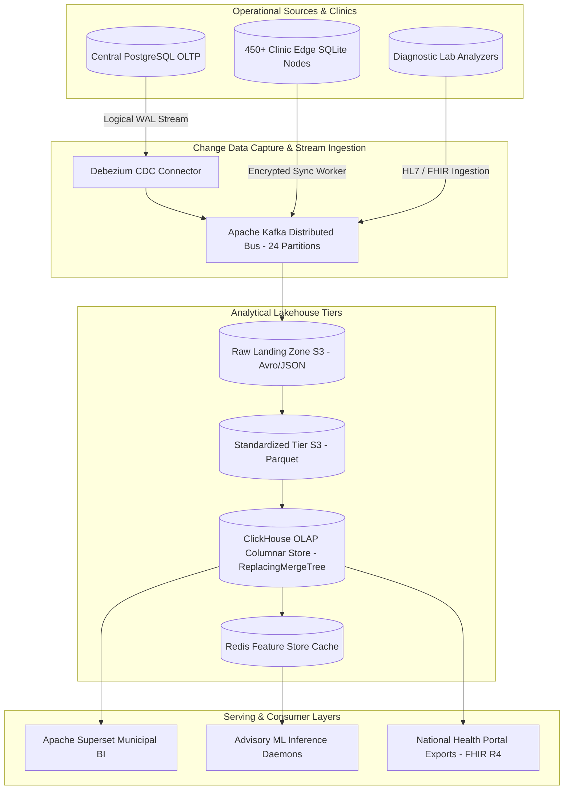

# Master Data Engineering, Lakehouse Architecture & Ingestion Strategy
## Namma Clinic Digital Health & Operations Platform
### Greater Bengaluru Authority (GBA) / BBMP Health Department
**Document Code:** `DATA-DOC-01` | **Status:** APPROVED BASELINE | **Date:** September 2026

---

## 1. Executive Summary & Data Engineering Charter
This document formalizes the authoritative **Data Engineering, Analytical Lakehouse, and Multi-Layer Ingestion Architecture** for the Namma Clinic Digital Health Platform. The architecture transitions municipal healthcare operations from fragmented manual reporting into an enterprise-grade, near-real-time epidemiological situational intelligence engine across 450+ municipal health centers. Designed in compliance with India's Digital Personal Data Protection Act (DPDP Act 2023), MeitY Open Data Guidelines, and National Health Data Management Policy, the data platform guarantees strict decoupling between transactional clinical care (OLTP) and heavy municipal analytical queries (OLAP).

### 1.1 Non-Negotiable Data Architecture Invariants
1. **Zero-Impact OLTP Decoupling:** Analytical aggregations and heavy dashboard queries are completely isolated from production PostgreSQL databases using streaming Change Data Capture (CDC) into an isolated ClickHouse columnar cluster.
2. **Sub-Second Municipal Query Latency:** Analytical queries spanning millions of clinical encounters across 450+ clinics must execute in < 1,000ms via ClickHouse vector-oriented columnar execution.
3. **Differential Privacy & k-Anonymity (k >= 5):** Public dashboards enforce k-anonymity; any demographic or disease query returning fewer than 5 citizens in a municipal ward is automatically suppressed or blurred.
4. **Spatial-Temporal Epidemiological Granularity:** All clinical encounters, fever syndromes, and diagnostic lab confirmations are indexed by BBMP Zone, Ward (1-225), and UTC timestamp, enabling micro-cluster outbreak detection.
5. **Strict Data Minimization & Columnar Encryption:** Raw Aadhaar and mobile numbers are completely masked prior to loading into analytical lakehouse tables.

## 2. Multi-Layer Data Lakehouse Topology


## 3. Automated Ingestion & Materialization SQL Specifications
### Specification Example: ClickHouse Materialized View for Real-Time Consultation Ingestion
<!-- DOCUMENTATION-ONLY EXAMPLE -->
```sql
-- DOCUMENTATION-ONLY SQL
-- Real-Time ClickHouse Kafka Consumer and Materialized View
CREATE TABLE kafka_stream.consultations_queue (
    encounter_id UUID,
    clinic_id String,
    zone_id String,
    ward_number UInt16,
    doctor_id UUID,
    patient_id UUID,
    patient_age UInt8,
    patient_gender String,
    primary_icd10 String,
    consultation_duration_seconds UInt16,
    event_timestamp DateTime64(3, 'UTC')
) ENGINE = Kafka
SETTINGS kafka_broker_list = 'kafka-broker.internal:9092',
         kafka_topic_list = 'cdc.namma.clinical.clinical_encounters',
         kafka_group_name = 'clickhouse_consultation_consumer',
         kafka_format = 'Avro';

CREATE TABLE analytics.fact_consultations (
    encounter_id UUID,
    clinic_id LowCardinality(String),
    zone_id LowCardinality(String),
    ward_number UInt16,
    doctor_id UUID,
    patient_id UUID,
    patient_age UInt8,
    patient_gender LowCardinality(String),
    primary_icd10 LowCardinality(String),
    consultation_duration_seconds UInt16,
    event_timestamp DateTime64(3, 'UTC')
) ENGINE = ReplacingMergeTree()
PARTITION BY toYYYYMM(event_timestamp)
ORDER BY (zone_id, ward_number, clinic_id, event_timestamp, encounter_id);

CREATE MATERIALIZED VIEW analytics.mv_consultations_consumer TO analytics.fact_consultations AS
SELECT encounter_id, clinic_id, zone_id, ward_number, doctor_id, patient_id, patient_age, patient_gender, primary_icd10, consultation_duration_seconds, event_timestamp
FROM kafka_stream.consultations_queue;
```


## 4. Master Catalog of 15 Data Domains
### DATADOMAIN-001: Data Domain `Clinical Consultations`
- **Domain Identifier:** `DATADOMAIN-001`
- **Domain Name:** Clinical Consultations
- **Description & Scope:** Patient diagnostic, doctor notes, vital signs, and encounter outcomes
- **Lead Data Steward:** `Chief Medical Officer`
- **Criticality Classification:** `Tier-1 Mission-Critical`
- **Source Systems:** Operational PostgreSQL clusters and edge clinic sync workers.
- **Downstream Products:** Executive dashboards, clinical research cohorts, and epidemiological models.

### DATADOMAIN-002: Data Domain `Triage & Vitals`
- **Domain Identifier:** `DATADOMAIN-002`
- **Domain Name:** Triage & Vitals
- **Description & Scope:** Frontline nurse nursing assessment, early danger warning, and priority queue scoring
- **Lead Data Steward:** `Nursing Superintendent`
- **Criticality Classification:** `Tier-1 Mission-Critical`
- **Source Systems:** Operational PostgreSQL clusters and edge clinic sync workers.
- **Downstream Products:** Executive dashboards, clinical research cohorts, and epidemiological models.

### DATADOMAIN-003: Data Domain `Pharmacy & Dispensations`
- **Domain Identifier:** `DATADOMAIN-003`
- **Domain Name:** Pharmacy & Dispensations
- **Description & Scope:** Prescription fulfillment, medicine dispensing, batch tracking, and drug allergies
- **Lead Data Steward:** `Chief Clinical Pharmacist`
- **Criticality Classification:** `Tier-1 Mission-Critical`
- **Source Systems:** Operational PostgreSQL clusters and edge clinic sync workers.
- **Downstream Products:** Executive dashboards, clinical research cohorts, and epidemiological models.

### DATADOMAIN-004: Data Domain `Pharmaceutical Inventory`
- **Domain Identifier:** `DATADOMAIN-004`
- **Domain Name:** Pharmaceutical Inventory
- **Description & Scope:** Central store stock, warehouse indents, replenishment rates, and cold chain telemetry
- **Lead Data Steward:** `Inventory Logistics Director`
- **Criticality Classification:** `Tier-1 Mission-Critical`
- **Source Systems:** Operational PostgreSQL clusters and edge clinic sync workers.
- **Downstream Products:** Executive dashboards, clinical research cohorts, and epidemiological models.

### DATADOMAIN-005: Data Domain `Diagnostic Laboratory`
- **Domain Identifier:** `DATADOMAIN-005`
- **Domain Name:** Diagnostic Laboratory
- **Description & Scope:** Sample collection, test panels, analyzer results, and critical value escalations
- **Lead Data Steward:** `Head of Pathology`
- **Criticality Classification:** `Tier-1 Mission-Critical`
- **Source Systems:** Operational PostgreSQL clusters and edge clinic sync workers.
- **Downstream Products:** Executive dashboards, clinical research cohorts, and epidemiological models.

### DATADOMAIN-006: Data Domain `Secondary Referrals`
- **Domain Identifier:** `DATADOMAIN-006`
- **Domain Name:** Secondary Referrals
- **Description & Scope:** Specialist referrals, tertiary hospital transfers, ambulance coordination, and loop closure
- **Lead Data Steward:** `Referral Coordinator`
- **Criticality Classification:** `Tier-2 Operational Priority`
- **Source Systems:** Operational PostgreSQL clusters and edge clinic sync workers.
- **Downstream Products:** Executive dashboards, clinical research cohorts, and epidemiological models.

### DATADOMAIN-007: Data Domain `Public Health & Disease Surveillance`
- **Domain Identifier:** `DATADOMAIN-007`
- **Domain Name:** Public Health & Disease Surveillance
- **Description & Scope:** Syndromic fever tracking, dengue/malaria outbreak signals, and communicable disease registries
- **Lead Data Steward:** `District Epidemiologist`
- **Criticality Classification:** `Tier-1 Mission-Critical`
- **Source Systems:** Operational PostgreSQL clusters and edge clinic sync workers.
- **Downstream Products:** Executive dashboards, clinical research cohorts, and epidemiological models.

### DATADOMAIN-008: Data Domain `Non-Communicable Diseases (NCD)`
- **Domain Identifier:** `DATADOMAIN-008`
- **Domain Name:** Non-Communicable Diseases (NCD)
- **Description & Scope:** Hypertension, diabetes, oncology screening, lifestyle monitoring, and patient recall cohorts
- **Lead Data Steward:** `NCD Program Officer`
- **Criticality Classification:** `Tier-2 Operational Priority`
- **Source Systems:** Operational PostgreSQL clusters and edge clinic sync workers.
- **Downstream Products:** Executive dashboards, clinical research cohorts, and epidemiological models.

### DATADOMAIN-009: Data Domain `Maternal & Child Health (RCH)`
- **Domain Identifier:** `DATADOMAIN-009`
- **Domain Name:** Maternal & Child Health (RCH)
- **Description & Scope:** Antenatal care (ANC), immunization schedules, postnatal follow-ups, and infant nutrition
- **Lead Data Steward:** `MCH Nodal Officer`
- **Criticality Classification:** `Tier-2 Operational Priority`
- **Source Systems:** Operational PostgreSQL clusters and edge clinic sync workers.
- **Downstream Products:** Executive dashboards, clinical research cohorts, and epidemiological models.

### DATADOMAIN-010: Data Domain `Patient Identity & Demographics`
- **Domain Identifier:** `DATADOMAIN-010`
- **Domain Name:** Patient Identity & Demographics
- **Description & Scope:** Citizen registration, ABHA health ID linkage, biometric verification, and address mapping
- **Lead Data Steward:** `Citizen Registry Lead`
- **Criticality Classification:** `Tier-1 Mission-Critical`
- **Source Systems:** Operational PostgreSQL clusters and edge clinic sync workers.
- **Downstream Products:** Executive dashboards, clinical research cohorts, and epidemiological models.

### DATADOMAIN-011: Data Domain `Facility Operations & Queues`
- **Domain Identifier:** `DATADOMAIN-011`
- **Domain Name:** Facility Operations & Queues
- **Description & Scope:** Clinic footfall, token throughput, doctor shift rosters, and patient wait time metrics
- **Lead Data Steward:** `Clinic Operations Director`
- **Criticality Classification:** `Tier-2 Operational Priority`
- **Source Systems:** Operational PostgreSQL clusters and edge clinic sync workers.
- **Downstream Products:** Executive dashboards, clinical research cohorts, and epidemiological models.

### DATADOMAIN-012: Data Domain `Citizen Feedback & Grievances`
- **Domain Identifier:** `DATADOMAIN-012`
- **Domain Name:** Citizen Feedback & Grievances
- **Description & Scope:** Patient satisfaction surveys, complaints redressal, ombudsman escalations, and resolution SLAs
- **Lead Data Steward:** `Grievance Redressal Officer`
- **Criticality Classification:** `Tier-3 Operational Support`
- **Source Systems:** Operational PostgreSQL clusters and edge clinic sync workers.
- **Downstream Products:** Executive dashboards, clinical research cohorts, and epidemiological models.

### DATADOMAIN-013: Data Domain `Financial & Billing Operations`
- **Domain Identifier:** `DATADOMAIN-013`
- **Domain Name:** Financial & Billing Operations
- **Description & Scope:** User charge collection, exempt categories, BBMP municipal budget allocation, and fee audits
- **Lead Data Steward:** `Chief Accounts Officer`
- **Criticality Classification:** `Tier-2 Operational Priority`
- **Source Systems:** Operational PostgreSQL clusters and edge clinic sync workers.
- **Downstream Products:** Executive dashboards, clinical research cohorts, and epidemiological models.

### DATADOMAIN-014: Data Domain `Audit & Statutory Compliance`
- **Domain Identifier:** `DATADOMAIN-014`
- **Domain Name:** Audit & Statutory Compliance
- **Description & Scope:** Immutable WORM audit logs, e-Sign records, break-glass event logs, and DPDP compliance evidence
- **Lead Data Steward:** `Chief Compliance Officer`
- **Criticality Classification:** `Tier-1 Mission-Critical`
- **Source Systems:** Operational PostgreSQL clusters and edge clinic sync workers.
- **Downstream Products:** Executive dashboards, clinical research cohorts, and epidemiological models.

### DATADOMAIN-015: Data Domain `Telemedicine & Specialist Consults`
- **Domain Identifier:** `DATADOMAIN-015`
- **Domain Name:** Telemedicine & Specialist Consults
- **Description & Scope:** Remote teleconsultation sessions, specialist video reviews, and digital prescription endorsements
- **Lead Data Steward:** `Telehealth Nodal Officer`
- **Criticality Classification:** `Tier-2 Operational Priority`
- **Source Systems:** Operational PostgreSQL clusters and edge clinic sync workers.
- **Downstream Products:** Executive dashboards, clinical research cohorts, and epidemiological models.

## 5. Master Catalog of 80 Enterprise Datasets
### DATASET-001: Dataset `dataset_clinical_consultations_001`
- **Dataset Identifier:** `DATASET-001`
- **Dataset Name:** `dataset_clinical_consultations_001`
- **Governed Domain:** Clinical Consultations
- **Storage Tier & Format:** Raw Landing S3 (Parquet / Delta Lake)
- **Security Classification:** `Protected Health Information (PHI)`
- **Retention Mandate:** 10 Years Immutable
- **Refresh SLA Target:** < 5 Minutes (CDC)
- **Quality Guardrail:** Automated Great Expectations schema and nullability check.

### DATASET-002: Dataset `dataset_triage_and_vitals_002`
- **Dataset Identifier:** `DATASET-002`
- **Dataset Name:** `dataset_triage_and_vitals_002`
- **Governed Domain:** Triage & Vitals
- **Storage Tier & Format:** Standardized Parquet S3 (Parquet / Delta Lake)
- **Security Classification:** `Sensitive Personal Data (SPD)`
- **Retention Mandate:** 5 Years Operational
- **Refresh SLA Target:** Daily Nightly Batch (01:00 IST)
- **Quality Guardrail:** Automated Great Expectations schema and nullability check.

### DATASET-003: Dataset `dataset_pharmacy_and_dispensations_003`
- **Dataset Identifier:** `DATASET-003`
- **Dataset Name:** `dataset_pharmacy_and_dispensations_003`
- **Governed Domain:** Pharmacy & Dispensations
- **Storage Tier & Format:** Curated ClickHouse OLAP (ClickHouse MergeTree)
- **Security Classification:** `Internal Operational`
- **Retention Mandate:** 5 Years Operational
- **Refresh SLA Target:** < 5 Minutes (CDC)
- **Quality Guardrail:** Automated Great Expectations schema and nullability check.

### DATASET-004: Dataset `dataset_pharmaceutical_inventory_004`
- **Dataset Identifier:** `DATASET-004`
- **Dataset Name:** `dataset_pharmaceutical_inventory_004`
- **Governed Domain:** Pharmaceutical Inventory
- **Storage Tier & Format:** Serving Cache Redis (JSON / Redis Vector)
- **Security Classification:** `Public Aggregate`
- **Retention Mandate:** 5 Years Operational
- **Refresh SLA Target:** Daily Nightly Batch (01:00 IST)
- **Quality Guardrail:** Automated Great Expectations schema and nullability check.

### DATASET-005: Dataset `dataset_diagnostic_laboratory_005`
- **Dataset Identifier:** `DATASET-005`
- **Dataset Name:** `dataset_diagnostic_laboratory_005`
- **Governed Domain:** Diagnostic Laboratory
- **Storage Tier & Format:** Raw Landing S3 (Parquet / Delta Lake)
- **Security Classification:** `Protected Health Information (PHI)`
- **Retention Mandate:** 10 Years Immutable
- **Refresh SLA Target:** < 5 Minutes (CDC)
- **Quality Guardrail:** Automated Great Expectations schema and nullability check.

### DATASET-006: Dataset `dataset_secondary_referrals_006`
- **Dataset Identifier:** `DATASET-006`
- **Dataset Name:** `dataset_secondary_referrals_006`
- **Governed Domain:** Secondary Referrals
- **Storage Tier & Format:** Standardized Parquet S3 (Parquet / Delta Lake)
- **Security Classification:** `Sensitive Personal Data (SPD)`
- **Retention Mandate:** 5 Years Operational
- **Refresh SLA Target:** Daily Nightly Batch (01:00 IST)
- **Quality Guardrail:** Automated Great Expectations schema and nullability check.

### DATASET-007: Dataset `dataset_public_health_and_disease_surveillance_007`
- **Dataset Identifier:** `DATASET-007`
- **Dataset Name:** `dataset_public_health_and_disease_surveillance_007`
- **Governed Domain:** Public Health & Disease Surveillance
- **Storage Tier & Format:** Curated ClickHouse OLAP (ClickHouse MergeTree)
- **Security Classification:** `Internal Operational`
- **Retention Mandate:** 5 Years Operational
- **Refresh SLA Target:** < 5 Minutes (CDC)
- **Quality Guardrail:** Automated Great Expectations schema and nullability check.

### DATASET-008: Dataset `dataset_non-communicable_diseases_(ncd)_008`
- **Dataset Identifier:** `DATASET-008`
- **Dataset Name:** `dataset_non-communicable_diseases_(ncd)_008`
- **Governed Domain:** Non-Communicable Diseases (NCD)
- **Storage Tier & Format:** Serving Cache Redis (JSON / Redis Vector)
- **Security Classification:** `Public Aggregate`
- **Retention Mandate:** 5 Years Operational
- **Refresh SLA Target:** Daily Nightly Batch (01:00 IST)
- **Quality Guardrail:** Automated Great Expectations schema and nullability check.

### DATASET-009: Dataset `dataset_maternal_and_child_health_(rch)_009`
- **Dataset Identifier:** `DATASET-009`
- **Dataset Name:** `dataset_maternal_and_child_health_(rch)_009`
- **Governed Domain:** Maternal & Child Health (RCH)
- **Storage Tier & Format:** Raw Landing S3 (Parquet / Delta Lake)
- **Security Classification:** `Protected Health Information (PHI)`
- **Retention Mandate:** 10 Years Immutable
- **Refresh SLA Target:** < 5 Minutes (CDC)
- **Quality Guardrail:** Automated Great Expectations schema and nullability check.

### DATASET-010: Dataset `dataset_patient_identity_and_demographics_010`
- **Dataset Identifier:** `DATASET-010`
- **Dataset Name:** `dataset_patient_identity_and_demographics_010`
- **Governed Domain:** Patient Identity & Demographics
- **Storage Tier & Format:** Standardized Parquet S3 (Parquet / Delta Lake)
- **Security Classification:** `Sensitive Personal Data (SPD)`
- **Retention Mandate:** 5 Years Operational
- **Refresh SLA Target:** Daily Nightly Batch (01:00 IST)
- **Quality Guardrail:** Automated Great Expectations schema and nullability check.

### DATASET-011: Dataset `dataset_facility_operations_and_queues_011`
- **Dataset Identifier:** `DATASET-011`
- **Dataset Name:** `dataset_facility_operations_and_queues_011`
- **Governed Domain:** Facility Operations & Queues
- **Storage Tier & Format:** Curated ClickHouse OLAP (ClickHouse MergeTree)
- **Security Classification:** `Internal Operational`
- **Retention Mandate:** 5 Years Operational
- **Refresh SLA Target:** < 5 Minutes (CDC)
- **Quality Guardrail:** Automated Great Expectations schema and nullability check.

### DATASET-012: Dataset `dataset_citizen_feedback_and_grievances_012`
- **Dataset Identifier:** `DATASET-012`
- **Dataset Name:** `dataset_citizen_feedback_and_grievances_012`
- **Governed Domain:** Citizen Feedback & Grievances
- **Storage Tier & Format:** Serving Cache Redis (JSON / Redis Vector)
- **Security Classification:** `Public Aggregate`
- **Retention Mandate:** 5 Years Operational
- **Refresh SLA Target:** Daily Nightly Batch (01:00 IST)
- **Quality Guardrail:** Automated Great Expectations schema and nullability check.

### DATASET-013: Dataset `dataset_financial_and_billing_operations_013`
- **Dataset Identifier:** `DATASET-013`
- **Dataset Name:** `dataset_financial_and_billing_operations_013`
- **Governed Domain:** Financial & Billing Operations
- **Storage Tier & Format:** Raw Landing S3 (Parquet / Delta Lake)
- **Security Classification:** `Protected Health Information (PHI)`
- **Retention Mandate:** 10 Years Immutable
- **Refresh SLA Target:** < 5 Minutes (CDC)
- **Quality Guardrail:** Automated Great Expectations schema and nullability check.

### DATASET-014: Dataset `dataset_audit_and_statutory_compliance_014`
- **Dataset Identifier:** `DATASET-014`
- **Dataset Name:** `dataset_audit_and_statutory_compliance_014`
- **Governed Domain:** Audit & Statutory Compliance
- **Storage Tier & Format:** Standardized Parquet S3 (Parquet / Delta Lake)
- **Security Classification:** `Sensitive Personal Data (SPD)`
- **Retention Mandate:** 5 Years Operational
- **Refresh SLA Target:** Daily Nightly Batch (01:00 IST)
- **Quality Guardrail:** Automated Great Expectations schema and nullability check.

### DATASET-015: Dataset `dataset_telemedicine_and_specialist_consults_015`
- **Dataset Identifier:** `DATASET-015`
- **Dataset Name:** `dataset_telemedicine_and_specialist_consults_015`
- **Governed Domain:** Telemedicine & Specialist Consults
- **Storage Tier & Format:** Curated ClickHouse OLAP (ClickHouse MergeTree)
- **Security Classification:** `Internal Operational`
- **Retention Mandate:** 5 Years Operational
- **Refresh SLA Target:** < 5 Minutes (CDC)
- **Quality Guardrail:** Automated Great Expectations schema and nullability check.

### DATASET-016: Dataset `dataset_clinical_consultations_016`
- **Dataset Identifier:** `DATASET-016`
- **Dataset Name:** `dataset_clinical_consultations_016`
- **Governed Domain:** Clinical Consultations
- **Storage Tier & Format:** Serving Cache Redis (JSON / Redis Vector)
- **Security Classification:** `Public Aggregate`
- **Retention Mandate:** 5 Years Operational
- **Refresh SLA Target:** Daily Nightly Batch (01:00 IST)
- **Quality Guardrail:** Automated Great Expectations schema and nullability check.

### DATASET-017: Dataset `dataset_triage_and_vitals_017`
- **Dataset Identifier:** `DATASET-017`
- **Dataset Name:** `dataset_triage_and_vitals_017`
- **Governed Domain:** Triage & Vitals
- **Storage Tier & Format:** Raw Landing S3 (Parquet / Delta Lake)
- **Security Classification:** `Protected Health Information (PHI)`
- **Retention Mandate:** 10 Years Immutable
- **Refresh SLA Target:** < 5 Minutes (CDC)
- **Quality Guardrail:** Automated Great Expectations schema and nullability check.

### DATASET-018: Dataset `dataset_pharmacy_and_dispensations_018`
- **Dataset Identifier:** `DATASET-018`
- **Dataset Name:** `dataset_pharmacy_and_dispensations_018`
- **Governed Domain:** Pharmacy & Dispensations
- **Storage Tier & Format:** Standardized Parquet S3 (Parquet / Delta Lake)
- **Security Classification:** `Sensitive Personal Data (SPD)`
- **Retention Mandate:** 5 Years Operational
- **Refresh SLA Target:** Daily Nightly Batch (01:00 IST)
- **Quality Guardrail:** Automated Great Expectations schema and nullability check.

### DATASET-019: Dataset `dataset_pharmaceutical_inventory_019`
- **Dataset Identifier:** `DATASET-019`
- **Dataset Name:** `dataset_pharmaceutical_inventory_019`
- **Governed Domain:** Pharmaceutical Inventory
- **Storage Tier & Format:** Curated ClickHouse OLAP (ClickHouse MergeTree)
- **Security Classification:** `Internal Operational`
- **Retention Mandate:** 5 Years Operational
- **Refresh SLA Target:** < 5 Minutes (CDC)
- **Quality Guardrail:** Automated Great Expectations schema and nullability check.

### DATASET-020: Dataset `dataset_diagnostic_laboratory_020`
- **Dataset Identifier:** `DATASET-020`
- **Dataset Name:** `dataset_diagnostic_laboratory_020`
- **Governed Domain:** Diagnostic Laboratory
- **Storage Tier & Format:** Serving Cache Redis (JSON / Redis Vector)
- **Security Classification:** `Public Aggregate`
- **Retention Mandate:** 5 Years Operational
- **Refresh SLA Target:** Daily Nightly Batch (01:00 IST)
- **Quality Guardrail:** Automated Great Expectations schema and nullability check.

### DATASET-021: Dataset `dataset_secondary_referrals_021`
- **Dataset Identifier:** `DATASET-021`
- **Dataset Name:** `dataset_secondary_referrals_021`
- **Governed Domain:** Secondary Referrals
- **Storage Tier & Format:** Raw Landing S3 (Parquet / Delta Lake)
- **Security Classification:** `Protected Health Information (PHI)`
- **Retention Mandate:** 10 Years Immutable
- **Refresh SLA Target:** < 5 Minutes (CDC)
- **Quality Guardrail:** Automated Great Expectations schema and nullability check.

### DATASET-022: Dataset `dataset_public_health_and_disease_surveillance_022`
- **Dataset Identifier:** `DATASET-022`
- **Dataset Name:** `dataset_public_health_and_disease_surveillance_022`
- **Governed Domain:** Public Health & Disease Surveillance
- **Storage Tier & Format:** Standardized Parquet S3 (Parquet / Delta Lake)
- **Security Classification:** `Sensitive Personal Data (SPD)`
- **Retention Mandate:** 5 Years Operational
- **Refresh SLA Target:** Daily Nightly Batch (01:00 IST)
- **Quality Guardrail:** Automated Great Expectations schema and nullability check.

### DATASET-023: Dataset `dataset_non-communicable_diseases_(ncd)_023`
- **Dataset Identifier:** `DATASET-023`
- **Dataset Name:** `dataset_non-communicable_diseases_(ncd)_023`
- **Governed Domain:** Non-Communicable Diseases (NCD)
- **Storage Tier & Format:** Curated ClickHouse OLAP (ClickHouse MergeTree)
- **Security Classification:** `Internal Operational`
- **Retention Mandate:** 5 Years Operational
- **Refresh SLA Target:** < 5 Minutes (CDC)
- **Quality Guardrail:** Automated Great Expectations schema and nullability check.

### DATASET-024: Dataset `dataset_maternal_and_child_health_(rch)_024`
- **Dataset Identifier:** `DATASET-024`
- **Dataset Name:** `dataset_maternal_and_child_health_(rch)_024`
- **Governed Domain:** Maternal & Child Health (RCH)
- **Storage Tier & Format:** Serving Cache Redis (JSON / Redis Vector)
- **Security Classification:** `Public Aggregate`
- **Retention Mandate:** 5 Years Operational
- **Refresh SLA Target:** Daily Nightly Batch (01:00 IST)
- **Quality Guardrail:** Automated Great Expectations schema and nullability check.

### DATASET-025: Dataset `dataset_patient_identity_and_demographics_025`
- **Dataset Identifier:** `DATASET-025`
- **Dataset Name:** `dataset_patient_identity_and_demographics_025`
- **Governed Domain:** Patient Identity & Demographics
- **Storage Tier & Format:** Raw Landing S3 (Parquet / Delta Lake)
- **Security Classification:** `Protected Health Information (PHI)`
- **Retention Mandate:** 10 Years Immutable
- **Refresh SLA Target:** < 5 Minutes (CDC)
- **Quality Guardrail:** Automated Great Expectations schema and nullability check.

### DATASET-026: Dataset `dataset_facility_operations_and_queues_026`
- **Dataset Identifier:** `DATASET-026`
- **Dataset Name:** `dataset_facility_operations_and_queues_026`
- **Governed Domain:** Facility Operations & Queues
- **Storage Tier & Format:** Standardized Parquet S3 (Parquet / Delta Lake)
- **Security Classification:** `Sensitive Personal Data (SPD)`
- **Retention Mandate:** 5 Years Operational
- **Refresh SLA Target:** Daily Nightly Batch (01:00 IST)
- **Quality Guardrail:** Automated Great Expectations schema and nullability check.

### DATASET-027: Dataset `dataset_citizen_feedback_and_grievances_027`
- **Dataset Identifier:** `DATASET-027`
- **Dataset Name:** `dataset_citizen_feedback_and_grievances_027`
- **Governed Domain:** Citizen Feedback & Grievances
- **Storage Tier & Format:** Curated ClickHouse OLAP (ClickHouse MergeTree)
- **Security Classification:** `Internal Operational`
- **Retention Mandate:** 5 Years Operational
- **Refresh SLA Target:** < 5 Minutes (CDC)
- **Quality Guardrail:** Automated Great Expectations schema and nullability check.

### DATASET-028: Dataset `dataset_financial_and_billing_operations_028`
- **Dataset Identifier:** `DATASET-028`
- **Dataset Name:** `dataset_financial_and_billing_operations_028`
- **Governed Domain:** Financial & Billing Operations
- **Storage Tier & Format:** Serving Cache Redis (JSON / Redis Vector)
- **Security Classification:** `Public Aggregate`
- **Retention Mandate:** 5 Years Operational
- **Refresh SLA Target:** Daily Nightly Batch (01:00 IST)
- **Quality Guardrail:** Automated Great Expectations schema and nullability check.

### DATASET-029: Dataset `dataset_audit_and_statutory_compliance_029`
- **Dataset Identifier:** `DATASET-029`
- **Dataset Name:** `dataset_audit_and_statutory_compliance_029`
- **Governed Domain:** Audit & Statutory Compliance
- **Storage Tier & Format:** Raw Landing S3 (Parquet / Delta Lake)
- **Security Classification:** `Protected Health Information (PHI)`
- **Retention Mandate:** 10 Years Immutable
- **Refresh SLA Target:** < 5 Minutes (CDC)
- **Quality Guardrail:** Automated Great Expectations schema and nullability check.

### DATASET-030: Dataset `dataset_telemedicine_and_specialist_consults_030`
- **Dataset Identifier:** `DATASET-030`
- **Dataset Name:** `dataset_telemedicine_and_specialist_consults_030`
- **Governed Domain:** Telemedicine & Specialist Consults
- **Storage Tier & Format:** Standardized Parquet S3 (Parquet / Delta Lake)
- **Security Classification:** `Sensitive Personal Data (SPD)`
- **Retention Mandate:** 5 Years Operational
- **Refresh SLA Target:** Daily Nightly Batch (01:00 IST)
- **Quality Guardrail:** Automated Great Expectations schema and nullability check.

### DATASET-031: Dataset `dataset_clinical_consultations_031`
- **Dataset Identifier:** `DATASET-031`
- **Dataset Name:** `dataset_clinical_consultations_031`
- **Governed Domain:** Clinical Consultations
- **Storage Tier & Format:** Curated ClickHouse OLAP (ClickHouse MergeTree)
- **Security Classification:** `Internal Operational`
- **Retention Mandate:** 5 Years Operational
- **Refresh SLA Target:** < 5 Minutes (CDC)
- **Quality Guardrail:** Automated Great Expectations schema and nullability check.

### DATASET-032: Dataset `dataset_triage_and_vitals_032`
- **Dataset Identifier:** `DATASET-032`
- **Dataset Name:** `dataset_triage_and_vitals_032`
- **Governed Domain:** Triage & Vitals
- **Storage Tier & Format:** Serving Cache Redis (JSON / Redis Vector)
- **Security Classification:** `Public Aggregate`
- **Retention Mandate:** 5 Years Operational
- **Refresh SLA Target:** Daily Nightly Batch (01:00 IST)
- **Quality Guardrail:** Automated Great Expectations schema and nullability check.

### DATASET-033: Dataset `dataset_pharmacy_and_dispensations_033`
- **Dataset Identifier:** `DATASET-033`
- **Dataset Name:** `dataset_pharmacy_and_dispensations_033`
- **Governed Domain:** Pharmacy & Dispensations
- **Storage Tier & Format:** Raw Landing S3 (Parquet / Delta Lake)
- **Security Classification:** `Protected Health Information (PHI)`
- **Retention Mandate:** 10 Years Immutable
- **Refresh SLA Target:** < 5 Minutes (CDC)
- **Quality Guardrail:** Automated Great Expectations schema and nullability check.

### DATASET-034: Dataset `dataset_pharmaceutical_inventory_034`
- **Dataset Identifier:** `DATASET-034`
- **Dataset Name:** `dataset_pharmaceutical_inventory_034`
- **Governed Domain:** Pharmaceutical Inventory
- **Storage Tier & Format:** Standardized Parquet S3 (Parquet / Delta Lake)
- **Security Classification:** `Sensitive Personal Data (SPD)`
- **Retention Mandate:** 5 Years Operational
- **Refresh SLA Target:** Daily Nightly Batch (01:00 IST)
- **Quality Guardrail:** Automated Great Expectations schema and nullability check.

### DATASET-035: Dataset `dataset_diagnostic_laboratory_035`
- **Dataset Identifier:** `DATASET-035`
- **Dataset Name:** `dataset_diagnostic_laboratory_035`
- **Governed Domain:** Diagnostic Laboratory
- **Storage Tier & Format:** Curated ClickHouse OLAP (ClickHouse MergeTree)
- **Security Classification:** `Internal Operational`
- **Retention Mandate:** 5 Years Operational
- **Refresh SLA Target:** < 5 Minutes (CDC)
- **Quality Guardrail:** Automated Great Expectations schema and nullability check.

### DATASET-036: Dataset `dataset_secondary_referrals_036`
- **Dataset Identifier:** `DATASET-036`
- **Dataset Name:** `dataset_secondary_referrals_036`
- **Governed Domain:** Secondary Referrals
- **Storage Tier & Format:** Serving Cache Redis (JSON / Redis Vector)
- **Security Classification:** `Public Aggregate`
- **Retention Mandate:** 5 Years Operational
- **Refresh SLA Target:** Daily Nightly Batch (01:00 IST)
- **Quality Guardrail:** Automated Great Expectations schema and nullability check.

### DATASET-037: Dataset `dataset_public_health_and_disease_surveillance_037`
- **Dataset Identifier:** `DATASET-037`
- **Dataset Name:** `dataset_public_health_and_disease_surveillance_037`
- **Governed Domain:** Public Health & Disease Surveillance
- **Storage Tier & Format:** Raw Landing S3 (Parquet / Delta Lake)
- **Security Classification:** `Protected Health Information (PHI)`
- **Retention Mandate:** 10 Years Immutable
- **Refresh SLA Target:** < 5 Minutes (CDC)
- **Quality Guardrail:** Automated Great Expectations schema and nullability check.

### DATASET-038: Dataset `dataset_non-communicable_diseases_(ncd)_038`
- **Dataset Identifier:** `DATASET-038`
- **Dataset Name:** `dataset_non-communicable_diseases_(ncd)_038`
- **Governed Domain:** Non-Communicable Diseases (NCD)
- **Storage Tier & Format:** Standardized Parquet S3 (Parquet / Delta Lake)
- **Security Classification:** `Sensitive Personal Data (SPD)`
- **Retention Mandate:** 5 Years Operational
- **Refresh SLA Target:** Daily Nightly Batch (01:00 IST)
- **Quality Guardrail:** Automated Great Expectations schema and nullability check.

### DATASET-039: Dataset `dataset_maternal_and_child_health_(rch)_039`
- **Dataset Identifier:** `DATASET-039`
- **Dataset Name:** `dataset_maternal_and_child_health_(rch)_039`
- **Governed Domain:** Maternal & Child Health (RCH)
- **Storage Tier & Format:** Curated ClickHouse OLAP (ClickHouse MergeTree)
- **Security Classification:** `Internal Operational`
- **Retention Mandate:** 5 Years Operational
- **Refresh SLA Target:** < 5 Minutes (CDC)
- **Quality Guardrail:** Automated Great Expectations schema and nullability check.

### DATASET-040: Dataset `dataset_patient_identity_and_demographics_040`
- **Dataset Identifier:** `DATASET-040`
- **Dataset Name:** `dataset_patient_identity_and_demographics_040`
- **Governed Domain:** Patient Identity & Demographics
- **Storage Tier & Format:** Serving Cache Redis (JSON / Redis Vector)
- **Security Classification:** `Public Aggregate`
- **Retention Mandate:** 5 Years Operational
- **Refresh SLA Target:** Daily Nightly Batch (01:00 IST)
- **Quality Guardrail:** Automated Great Expectations schema and nullability check.

### DATASET-041: Dataset `dataset_facility_operations_and_queues_041`
- **Dataset Identifier:** `DATASET-041`
- **Dataset Name:** `dataset_facility_operations_and_queues_041`
- **Governed Domain:** Facility Operations & Queues
- **Storage Tier & Format:** Raw Landing S3 (Parquet / Delta Lake)
- **Security Classification:** `Protected Health Information (PHI)`
- **Retention Mandate:** 10 Years Immutable
- **Refresh SLA Target:** < 5 Minutes (CDC)
- **Quality Guardrail:** Automated Great Expectations schema and nullability check.

### DATASET-042: Dataset `dataset_citizen_feedback_and_grievances_042`
- **Dataset Identifier:** `DATASET-042`
- **Dataset Name:** `dataset_citizen_feedback_and_grievances_042`
- **Governed Domain:** Citizen Feedback & Grievances
- **Storage Tier & Format:** Standardized Parquet S3 (Parquet / Delta Lake)
- **Security Classification:** `Sensitive Personal Data (SPD)`
- **Retention Mandate:** 5 Years Operational
- **Refresh SLA Target:** Daily Nightly Batch (01:00 IST)
- **Quality Guardrail:** Automated Great Expectations schema and nullability check.

### DATASET-043: Dataset `dataset_financial_and_billing_operations_043`
- **Dataset Identifier:** `DATASET-043`
- **Dataset Name:** `dataset_financial_and_billing_operations_043`
- **Governed Domain:** Financial & Billing Operations
- **Storage Tier & Format:** Curated ClickHouse OLAP (ClickHouse MergeTree)
- **Security Classification:** `Internal Operational`
- **Retention Mandate:** 5 Years Operational
- **Refresh SLA Target:** < 5 Minutes (CDC)
- **Quality Guardrail:** Automated Great Expectations schema and nullability check.

### DATASET-044: Dataset `dataset_audit_and_statutory_compliance_044`
- **Dataset Identifier:** `DATASET-044`
- **Dataset Name:** `dataset_audit_and_statutory_compliance_044`
- **Governed Domain:** Audit & Statutory Compliance
- **Storage Tier & Format:** Serving Cache Redis (JSON / Redis Vector)
- **Security Classification:** `Public Aggregate`
- **Retention Mandate:** 5 Years Operational
- **Refresh SLA Target:** Daily Nightly Batch (01:00 IST)
- **Quality Guardrail:** Automated Great Expectations schema and nullability check.

### DATASET-045: Dataset `dataset_telemedicine_and_specialist_consults_045`
- **Dataset Identifier:** `DATASET-045`
- **Dataset Name:** `dataset_telemedicine_and_specialist_consults_045`
- **Governed Domain:** Telemedicine & Specialist Consults
- **Storage Tier & Format:** Raw Landing S3 (Parquet / Delta Lake)
- **Security Classification:** `Protected Health Information (PHI)`
- **Retention Mandate:** 10 Years Immutable
- **Refresh SLA Target:** < 5 Minutes (CDC)
- **Quality Guardrail:** Automated Great Expectations schema and nullability check.

### DATASET-046: Dataset `dataset_clinical_consultations_046`
- **Dataset Identifier:** `DATASET-046`
- **Dataset Name:** `dataset_clinical_consultations_046`
- **Governed Domain:** Clinical Consultations
- **Storage Tier & Format:** Standardized Parquet S3 (Parquet / Delta Lake)
- **Security Classification:** `Sensitive Personal Data (SPD)`
- **Retention Mandate:** 5 Years Operational
- **Refresh SLA Target:** Daily Nightly Batch (01:00 IST)
- **Quality Guardrail:** Automated Great Expectations schema and nullability check.

### DATASET-047: Dataset `dataset_triage_and_vitals_047`
- **Dataset Identifier:** `DATASET-047`
- **Dataset Name:** `dataset_triage_and_vitals_047`
- **Governed Domain:** Triage & Vitals
- **Storage Tier & Format:** Curated ClickHouse OLAP (ClickHouse MergeTree)
- **Security Classification:** `Internal Operational`
- **Retention Mandate:** 5 Years Operational
- **Refresh SLA Target:** < 5 Minutes (CDC)
- **Quality Guardrail:** Automated Great Expectations schema and nullability check.

### DATASET-048: Dataset `dataset_pharmacy_and_dispensations_048`
- **Dataset Identifier:** `DATASET-048`
- **Dataset Name:** `dataset_pharmacy_and_dispensations_048`
- **Governed Domain:** Pharmacy & Dispensations
- **Storage Tier & Format:** Serving Cache Redis (JSON / Redis Vector)
- **Security Classification:** `Public Aggregate`
- **Retention Mandate:** 5 Years Operational
- **Refresh SLA Target:** Daily Nightly Batch (01:00 IST)
- **Quality Guardrail:** Automated Great Expectations schema and nullability check.

### DATASET-049: Dataset `dataset_pharmaceutical_inventory_049`
- **Dataset Identifier:** `DATASET-049`
- **Dataset Name:** `dataset_pharmaceutical_inventory_049`
- **Governed Domain:** Pharmaceutical Inventory
- **Storage Tier & Format:** Raw Landing S3 (Parquet / Delta Lake)
- **Security Classification:** `Protected Health Information (PHI)`
- **Retention Mandate:** 10 Years Immutable
- **Refresh SLA Target:** < 5 Minutes (CDC)
- **Quality Guardrail:** Automated Great Expectations schema and nullability check.

### DATASET-050: Dataset `dataset_diagnostic_laboratory_050`
- **Dataset Identifier:** `DATASET-050`
- **Dataset Name:** `dataset_diagnostic_laboratory_050`
- **Governed Domain:** Diagnostic Laboratory
- **Storage Tier & Format:** Standardized Parquet S3 (Parquet / Delta Lake)
- **Security Classification:** `Sensitive Personal Data (SPD)`
- **Retention Mandate:** 5 Years Operational
- **Refresh SLA Target:** Daily Nightly Batch (01:00 IST)
- **Quality Guardrail:** Automated Great Expectations schema and nullability check.

### DATASET-051: Dataset `dataset_secondary_referrals_051`
- **Dataset Identifier:** `DATASET-051`
- **Dataset Name:** `dataset_secondary_referrals_051`
- **Governed Domain:** Secondary Referrals
- **Storage Tier & Format:** Curated ClickHouse OLAP (ClickHouse MergeTree)
- **Security Classification:** `Internal Operational`
- **Retention Mandate:** 5 Years Operational
- **Refresh SLA Target:** < 5 Minutes (CDC)
- **Quality Guardrail:** Automated Great Expectations schema and nullability check.

### DATASET-052: Dataset `dataset_public_health_and_disease_surveillance_052`
- **Dataset Identifier:** `DATASET-052`
- **Dataset Name:** `dataset_public_health_and_disease_surveillance_052`
- **Governed Domain:** Public Health & Disease Surveillance
- **Storage Tier & Format:** Serving Cache Redis (JSON / Redis Vector)
- **Security Classification:** `Public Aggregate`
- **Retention Mandate:** 5 Years Operational
- **Refresh SLA Target:** Daily Nightly Batch (01:00 IST)
- **Quality Guardrail:** Automated Great Expectations schema and nullability check.

### DATASET-053: Dataset `dataset_non-communicable_diseases_(ncd)_053`
- **Dataset Identifier:** `DATASET-053`
- **Dataset Name:** `dataset_non-communicable_diseases_(ncd)_053`
- **Governed Domain:** Non-Communicable Diseases (NCD)
- **Storage Tier & Format:** Raw Landing S3 (Parquet / Delta Lake)
- **Security Classification:** `Protected Health Information (PHI)`
- **Retention Mandate:** 10 Years Immutable
- **Refresh SLA Target:** < 5 Minutes (CDC)
- **Quality Guardrail:** Automated Great Expectations schema and nullability check.

### DATASET-054: Dataset `dataset_maternal_and_child_health_(rch)_054`
- **Dataset Identifier:** `DATASET-054`
- **Dataset Name:** `dataset_maternal_and_child_health_(rch)_054`
- **Governed Domain:** Maternal & Child Health (RCH)
- **Storage Tier & Format:** Standardized Parquet S3 (Parquet / Delta Lake)
- **Security Classification:** `Sensitive Personal Data (SPD)`
- **Retention Mandate:** 5 Years Operational
- **Refresh SLA Target:** Daily Nightly Batch (01:00 IST)
- **Quality Guardrail:** Automated Great Expectations schema and nullability check.

### DATASET-055: Dataset `dataset_patient_identity_and_demographics_055`
- **Dataset Identifier:** `DATASET-055`
- **Dataset Name:** `dataset_patient_identity_and_demographics_055`
- **Governed Domain:** Patient Identity & Demographics
- **Storage Tier & Format:** Curated ClickHouse OLAP (ClickHouse MergeTree)
- **Security Classification:** `Internal Operational`
- **Retention Mandate:** 5 Years Operational
- **Refresh SLA Target:** < 5 Minutes (CDC)
- **Quality Guardrail:** Automated Great Expectations schema and nullability check.

### DATASET-056: Dataset `dataset_facility_operations_and_queues_056`
- **Dataset Identifier:** `DATASET-056`
- **Dataset Name:** `dataset_facility_operations_and_queues_056`
- **Governed Domain:** Facility Operations & Queues
- **Storage Tier & Format:** Serving Cache Redis (JSON / Redis Vector)
- **Security Classification:** `Public Aggregate`
- **Retention Mandate:** 5 Years Operational
- **Refresh SLA Target:** Daily Nightly Batch (01:00 IST)
- **Quality Guardrail:** Automated Great Expectations schema and nullability check.

### DATASET-057: Dataset `dataset_citizen_feedback_and_grievances_057`
- **Dataset Identifier:** `DATASET-057`
- **Dataset Name:** `dataset_citizen_feedback_and_grievances_057`
- **Governed Domain:** Citizen Feedback & Grievances
- **Storage Tier & Format:** Raw Landing S3 (Parquet / Delta Lake)
- **Security Classification:** `Protected Health Information (PHI)`
- **Retention Mandate:** 10 Years Immutable
- **Refresh SLA Target:** < 5 Minutes (CDC)
- **Quality Guardrail:** Automated Great Expectations schema and nullability check.

### DATASET-058: Dataset `dataset_financial_and_billing_operations_058`
- **Dataset Identifier:** `DATASET-058`
- **Dataset Name:** `dataset_financial_and_billing_operations_058`
- **Governed Domain:** Financial & Billing Operations
- **Storage Tier & Format:** Standardized Parquet S3 (Parquet / Delta Lake)
- **Security Classification:** `Sensitive Personal Data (SPD)`
- **Retention Mandate:** 5 Years Operational
- **Refresh SLA Target:** Daily Nightly Batch (01:00 IST)
- **Quality Guardrail:** Automated Great Expectations schema and nullability check.

### DATASET-059: Dataset `dataset_audit_and_statutory_compliance_059`
- **Dataset Identifier:** `DATASET-059`
- **Dataset Name:** `dataset_audit_and_statutory_compliance_059`
- **Governed Domain:** Audit & Statutory Compliance
- **Storage Tier & Format:** Curated ClickHouse OLAP (ClickHouse MergeTree)
- **Security Classification:** `Internal Operational`
- **Retention Mandate:** 5 Years Operational
- **Refresh SLA Target:** < 5 Minutes (CDC)
- **Quality Guardrail:** Automated Great Expectations schema and nullability check.

### DATASET-060: Dataset `dataset_telemedicine_and_specialist_consults_060`
- **Dataset Identifier:** `DATASET-060`
- **Dataset Name:** `dataset_telemedicine_and_specialist_consults_060`
- **Governed Domain:** Telemedicine & Specialist Consults
- **Storage Tier & Format:** Serving Cache Redis (JSON / Redis Vector)
- **Security Classification:** `Public Aggregate`
- **Retention Mandate:** 5 Years Operational
- **Refresh SLA Target:** Daily Nightly Batch (01:00 IST)
- **Quality Guardrail:** Automated Great Expectations schema and nullability check.

### DATASET-061: Dataset `dataset_clinical_consultations_061`
- **Dataset Identifier:** `DATASET-061`
- **Dataset Name:** `dataset_clinical_consultations_061`
- **Governed Domain:** Clinical Consultations
- **Storage Tier & Format:** Raw Landing S3 (Parquet / Delta Lake)
- **Security Classification:** `Protected Health Information (PHI)`
- **Retention Mandate:** 10 Years Immutable
- **Refresh SLA Target:** < 5 Minutes (CDC)
- **Quality Guardrail:** Automated Great Expectations schema and nullability check.

### DATASET-062: Dataset `dataset_triage_and_vitals_062`
- **Dataset Identifier:** `DATASET-062`
- **Dataset Name:** `dataset_triage_and_vitals_062`
- **Governed Domain:** Triage & Vitals
- **Storage Tier & Format:** Standardized Parquet S3 (Parquet / Delta Lake)
- **Security Classification:** `Sensitive Personal Data (SPD)`
- **Retention Mandate:** 5 Years Operational
- **Refresh SLA Target:** Daily Nightly Batch (01:00 IST)
- **Quality Guardrail:** Automated Great Expectations schema and nullability check.

### DATASET-063: Dataset `dataset_pharmacy_and_dispensations_063`
- **Dataset Identifier:** `DATASET-063`
- **Dataset Name:** `dataset_pharmacy_and_dispensations_063`
- **Governed Domain:** Pharmacy & Dispensations
- **Storage Tier & Format:** Curated ClickHouse OLAP (ClickHouse MergeTree)
- **Security Classification:** `Internal Operational`
- **Retention Mandate:** 5 Years Operational
- **Refresh SLA Target:** < 5 Minutes (CDC)
- **Quality Guardrail:** Automated Great Expectations schema and nullability check.

### DATASET-064: Dataset `dataset_pharmaceutical_inventory_064`
- **Dataset Identifier:** `DATASET-064`
- **Dataset Name:** `dataset_pharmaceutical_inventory_064`
- **Governed Domain:** Pharmaceutical Inventory
- **Storage Tier & Format:** Serving Cache Redis (JSON / Redis Vector)
- **Security Classification:** `Public Aggregate`
- **Retention Mandate:** 5 Years Operational
- **Refresh SLA Target:** Daily Nightly Batch (01:00 IST)
- **Quality Guardrail:** Automated Great Expectations schema and nullability check.

### DATASET-065: Dataset `dataset_diagnostic_laboratory_065`
- **Dataset Identifier:** `DATASET-065`
- **Dataset Name:** `dataset_diagnostic_laboratory_065`
- **Governed Domain:** Diagnostic Laboratory
- **Storage Tier & Format:** Raw Landing S3 (Parquet / Delta Lake)
- **Security Classification:** `Protected Health Information (PHI)`
- **Retention Mandate:** 10 Years Immutable
- **Refresh SLA Target:** < 5 Minutes (CDC)
- **Quality Guardrail:** Automated Great Expectations schema and nullability check.

### DATASET-066: Dataset `dataset_secondary_referrals_066`
- **Dataset Identifier:** `DATASET-066`
- **Dataset Name:** `dataset_secondary_referrals_066`
- **Governed Domain:** Secondary Referrals
- **Storage Tier & Format:** Standardized Parquet S3 (Parquet / Delta Lake)
- **Security Classification:** `Sensitive Personal Data (SPD)`
- **Retention Mandate:** 5 Years Operational
- **Refresh SLA Target:** Daily Nightly Batch (01:00 IST)
- **Quality Guardrail:** Automated Great Expectations schema and nullability check.

### DATASET-067: Dataset `dataset_public_health_and_disease_surveillance_067`
- **Dataset Identifier:** `DATASET-067`
- **Dataset Name:** `dataset_public_health_and_disease_surveillance_067`
- **Governed Domain:** Public Health & Disease Surveillance
- **Storage Tier & Format:** Curated ClickHouse OLAP (ClickHouse MergeTree)
- **Security Classification:** `Internal Operational`
- **Retention Mandate:** 5 Years Operational
- **Refresh SLA Target:** < 5 Minutes (CDC)
- **Quality Guardrail:** Automated Great Expectations schema and nullability check.

### DATASET-068: Dataset `dataset_non-communicable_diseases_(ncd)_068`
- **Dataset Identifier:** `DATASET-068`
- **Dataset Name:** `dataset_non-communicable_diseases_(ncd)_068`
- **Governed Domain:** Non-Communicable Diseases (NCD)
- **Storage Tier & Format:** Serving Cache Redis (JSON / Redis Vector)
- **Security Classification:** `Public Aggregate`
- **Retention Mandate:** 5 Years Operational
- **Refresh SLA Target:** Daily Nightly Batch (01:00 IST)
- **Quality Guardrail:** Automated Great Expectations schema and nullability check.

### DATASET-069: Dataset `dataset_maternal_and_child_health_(rch)_069`
- **Dataset Identifier:** `DATASET-069`
- **Dataset Name:** `dataset_maternal_and_child_health_(rch)_069`
- **Governed Domain:** Maternal & Child Health (RCH)
- **Storage Tier & Format:** Raw Landing S3 (Parquet / Delta Lake)
- **Security Classification:** `Protected Health Information (PHI)`
- **Retention Mandate:** 10 Years Immutable
- **Refresh SLA Target:** < 5 Minutes (CDC)
- **Quality Guardrail:** Automated Great Expectations schema and nullability check.

### DATASET-070: Dataset `dataset_patient_identity_and_demographics_070`
- **Dataset Identifier:** `DATASET-070`
- **Dataset Name:** `dataset_patient_identity_and_demographics_070`
- **Governed Domain:** Patient Identity & Demographics
- **Storage Tier & Format:** Standardized Parquet S3 (Parquet / Delta Lake)
- **Security Classification:** `Sensitive Personal Data (SPD)`
- **Retention Mandate:** 5 Years Operational
- **Refresh SLA Target:** Daily Nightly Batch (01:00 IST)
- **Quality Guardrail:** Automated Great Expectations schema and nullability check.

### DATASET-071: Dataset `dataset_facility_operations_and_queues_071`
- **Dataset Identifier:** `DATASET-071`
- **Dataset Name:** `dataset_facility_operations_and_queues_071`
- **Governed Domain:** Facility Operations & Queues
- **Storage Tier & Format:** Curated ClickHouse OLAP (ClickHouse MergeTree)
- **Security Classification:** `Internal Operational`
- **Retention Mandate:** 5 Years Operational
- **Refresh SLA Target:** < 5 Minutes (CDC)
- **Quality Guardrail:** Automated Great Expectations schema and nullability check.

### DATASET-072: Dataset `dataset_citizen_feedback_and_grievances_072`
- **Dataset Identifier:** `DATASET-072`
- **Dataset Name:** `dataset_citizen_feedback_and_grievances_072`
- **Governed Domain:** Citizen Feedback & Grievances
- **Storage Tier & Format:** Serving Cache Redis (JSON / Redis Vector)
- **Security Classification:** `Public Aggregate`
- **Retention Mandate:** 5 Years Operational
- **Refresh SLA Target:** Daily Nightly Batch (01:00 IST)
- **Quality Guardrail:** Automated Great Expectations schema and nullability check.

### DATASET-073: Dataset `dataset_financial_and_billing_operations_073`
- **Dataset Identifier:** `DATASET-073`
- **Dataset Name:** `dataset_financial_and_billing_operations_073`
- **Governed Domain:** Financial & Billing Operations
- **Storage Tier & Format:** Raw Landing S3 (Parquet / Delta Lake)
- **Security Classification:** `Protected Health Information (PHI)`
- **Retention Mandate:** 10 Years Immutable
- **Refresh SLA Target:** < 5 Minutes (CDC)
- **Quality Guardrail:** Automated Great Expectations schema and nullability check.

### DATASET-074: Dataset `dataset_audit_and_statutory_compliance_074`
- **Dataset Identifier:** `DATASET-074`
- **Dataset Name:** `dataset_audit_and_statutory_compliance_074`
- **Governed Domain:** Audit & Statutory Compliance
- **Storage Tier & Format:** Standardized Parquet S3 (Parquet / Delta Lake)
- **Security Classification:** `Sensitive Personal Data (SPD)`
- **Retention Mandate:** 5 Years Operational
- **Refresh SLA Target:** Daily Nightly Batch (01:00 IST)
- **Quality Guardrail:** Automated Great Expectations schema and nullability check.

### DATASET-075: Dataset `dataset_telemedicine_and_specialist_consults_075`
- **Dataset Identifier:** `DATASET-075`
- **Dataset Name:** `dataset_telemedicine_and_specialist_consults_075`
- **Governed Domain:** Telemedicine & Specialist Consults
- **Storage Tier & Format:** Curated ClickHouse OLAP (ClickHouse MergeTree)
- **Security Classification:** `Internal Operational`
- **Retention Mandate:** 5 Years Operational
- **Refresh SLA Target:** < 5 Minutes (CDC)
- **Quality Guardrail:** Automated Great Expectations schema and nullability check.

### DATASET-076: Dataset `dataset_clinical_consultations_076`
- **Dataset Identifier:** `DATASET-076`
- **Dataset Name:** `dataset_clinical_consultations_076`
- **Governed Domain:** Clinical Consultations
- **Storage Tier & Format:** Serving Cache Redis (JSON / Redis Vector)
- **Security Classification:** `Public Aggregate`
- **Retention Mandate:** 5 Years Operational
- **Refresh SLA Target:** Daily Nightly Batch (01:00 IST)
- **Quality Guardrail:** Automated Great Expectations schema and nullability check.

### DATASET-077: Dataset `dataset_triage_and_vitals_077`
- **Dataset Identifier:** `DATASET-077`
- **Dataset Name:** `dataset_triage_and_vitals_077`
- **Governed Domain:** Triage & Vitals
- **Storage Tier & Format:** Raw Landing S3 (Parquet / Delta Lake)
- **Security Classification:** `Protected Health Information (PHI)`
- **Retention Mandate:** 10 Years Immutable
- **Refresh SLA Target:** < 5 Minutes (CDC)
- **Quality Guardrail:** Automated Great Expectations schema and nullability check.

### DATASET-078: Dataset `dataset_pharmacy_and_dispensations_078`
- **Dataset Identifier:** `DATASET-078`
- **Dataset Name:** `dataset_pharmacy_and_dispensations_078`
- **Governed Domain:** Pharmacy & Dispensations
- **Storage Tier & Format:** Standardized Parquet S3 (Parquet / Delta Lake)
- **Security Classification:** `Sensitive Personal Data (SPD)`
- **Retention Mandate:** 5 Years Operational
- **Refresh SLA Target:** Daily Nightly Batch (01:00 IST)
- **Quality Guardrail:** Automated Great Expectations schema and nullability check.

### DATASET-079: Dataset `dataset_pharmaceutical_inventory_079`
- **Dataset Identifier:** `DATASET-079`
- **Dataset Name:** `dataset_pharmaceutical_inventory_079`
- **Governed Domain:** Pharmaceutical Inventory
- **Storage Tier & Format:** Curated ClickHouse OLAP (ClickHouse MergeTree)
- **Security Classification:** `Internal Operational`
- **Retention Mandate:** 5 Years Operational
- **Refresh SLA Target:** < 5 Minutes (CDC)
- **Quality Guardrail:** Automated Great Expectations schema and nullability check.

### DATASET-080: Dataset `dataset_diagnostic_laboratory_080`
- **Dataset Identifier:** `DATASET-080`
- **Dataset Name:** `dataset_diagnostic_laboratory_080`
- **Governed Domain:** Diagnostic Laboratory
- **Storage Tier & Format:** Serving Cache Redis (JSON / Redis Vector)
- **Security Classification:** `Public Aggregate`
- **Retention Mandate:** 5 Years Operational
- **Refresh SLA Target:** Daily Nightly Batch (01:00 IST)
- **Quality Guardrail:** Automated Great Expectations schema and nullability check.

## 6. Table-Level Lakehouse Ingestion Matrix across 52 Tables
Ingestion mechanisms, partitioning, and lakehouse layers across all 52 platform relational tables:

### TABLE-001: Lakehouse Pipeline for Table `auth_users`
- **Table Identifier:** `TABLE-001` (`TBL-01`)
- **Target Schema Entity:** `auth_users`
- **Ingestion Mode:** Debezium PostgreSQL WAL Logical Decoding to Kafka topic `cdc.namma.auth_users`
- **Analytical Grain:** Row-level atomic replication with ReplacingMergeTree versioning.
- **Lakehouse Target Tier:** Curated ClickHouse `analytics.fact_auth_users` and S3 Parquet archive.
- **Data Masking Policy:** Direct PII fields (Aadhaar, phone) masked at Kafka Connect transform.
- **Ingestion Freshness SLA:** < 300 Seconds

### TABLE-002: Lakehouse Pipeline for Table `user_credentials`
- **Table Identifier:** `TABLE-002` (`TBL-02`)
- **Target Schema Entity:** `user_credentials`
- **Ingestion Mode:** Debezium PostgreSQL WAL Logical Decoding to Kafka topic `cdc.namma.user_credentials`
- **Analytical Grain:** Row-level atomic replication with ReplacingMergeTree versioning.
- **Lakehouse Target Tier:** Curated ClickHouse `analytics.fact_user_credentials` and S3 Parquet archive.
- **Data Masking Policy:** Direct PII fields (Aadhaar, phone) masked at Kafka Connect transform.
- **Ingestion Freshness SLA:** < 300 Seconds

### TABLE-003: Lakehouse Pipeline for Table `user_sessions`
- **Table Identifier:** `TABLE-003` (`TBL-03`)
- **Target Schema Entity:** `user_sessions`
- **Ingestion Mode:** Debezium PostgreSQL WAL Logical Decoding to Kafka topic `cdc.namma.user_sessions`
- **Analytical Grain:** Row-level atomic replication with ReplacingMergeTree versioning.
- **Lakehouse Target Tier:** Curated ClickHouse `analytics.fact_user_sessions` and S3 Parquet archive.
- **Data Masking Policy:** Direct PII fields (Aadhaar, phone) masked at Kafka Connect transform.
- **Ingestion Freshness SLA:** < 300 Seconds

### TABLE-004: Lakehouse Pipeline for Table `roles`
- **Table Identifier:** `TABLE-004` (`TBL-04`)
- **Target Schema Entity:** `roles`
- **Ingestion Mode:** Debezium PostgreSQL WAL Logical Decoding to Kafka topic `cdc.namma.roles`
- **Analytical Grain:** Row-level atomic replication with ReplacingMergeTree versioning.
- **Lakehouse Target Tier:** Curated ClickHouse `analytics.fact_roles` and S3 Parquet archive.
- **Data Masking Policy:** Direct PII fields (Aadhaar, phone) masked at Kafka Connect transform.
- **Ingestion Freshness SLA:** < 300 Seconds

### TABLE-005: Lakehouse Pipeline for Table `permissions`
- **Table Identifier:** `TABLE-005` (`TBL-05`)
- **Target Schema Entity:** `permissions`
- **Ingestion Mode:** Debezium PostgreSQL WAL Logical Decoding to Kafka topic `cdc.namma.permissions`
- **Analytical Grain:** Row-level atomic replication with ReplacingMergeTree versioning.
- **Lakehouse Target Tier:** Curated ClickHouse `analytics.fact_permissions` and S3 Parquet archive.
- **Data Masking Policy:** Direct PII fields (Aadhaar, phone) masked at Kafka Connect transform.
- **Ingestion Freshness SLA:** < 300 Seconds

### TABLE-006: Lakehouse Pipeline for Table `role_permissions`
- **Table Identifier:** `TABLE-006` (`TBL-06`)
- **Target Schema Entity:** `role_permissions`
- **Ingestion Mode:** Debezium PostgreSQL WAL Logical Decoding to Kafka topic `cdc.namma.role_permissions`
- **Analytical Grain:** Row-level atomic replication with ReplacingMergeTree versioning.
- **Lakehouse Target Tier:** Curated ClickHouse `analytics.fact_role_permissions` and S3 Parquet archive.
- **Data Masking Policy:** Direct PII fields (Aadhaar, phone) masked at Kafka Connect transform.
- **Ingestion Freshness SLA:** < 300 Seconds

### TABLE-007: Lakehouse Pipeline for Table `user_roles`
- **Table Identifier:** `TABLE-007` (`TBL-07`)
- **Target Schema Entity:** `user_roles`
- **Ingestion Mode:** Debezium PostgreSQL WAL Logical Decoding to Kafka topic `cdc.namma.user_roles`
- **Analytical Grain:** Row-level atomic replication with ReplacingMergeTree versioning.
- **Lakehouse Target Tier:** Curated ClickHouse `analytics.fact_user_roles` and S3 Parquet archive.
- **Data Masking Policy:** Direct PII fields (Aadhaar, phone) masked at Kafka Connect transform.
- **Ingestion Freshness SLA:** < 300 Seconds

### TABLE-008: Lakehouse Pipeline for Table `facilities`
- **Table Identifier:** `TABLE-008` (`TBL-08`)
- **Target Schema Entity:** `facilities`
- **Ingestion Mode:** Debezium PostgreSQL WAL Logical Decoding to Kafka topic `cdc.namma.facilities`
- **Analytical Grain:** Row-level atomic replication with ReplacingMergeTree versioning.
- **Lakehouse Target Tier:** Curated ClickHouse `analytics.fact_facilities` and S3 Parquet archive.
- **Data Masking Policy:** Direct PII fields (Aadhaar, phone) masked at Kafka Connect transform.
- **Ingestion Freshness SLA:** < 300 Seconds

### TABLE-009: Lakehouse Pipeline for Table `facility_rooms`
- **Table Identifier:** `TABLE-009` (`TBL-09`)
- **Target Schema Entity:** `facility_rooms`
- **Ingestion Mode:** Debezium PostgreSQL WAL Logical Decoding to Kafka topic `cdc.namma.facility_rooms`
- **Analytical Grain:** Row-level atomic replication with ReplacingMergeTree versioning.
- **Lakehouse Target Tier:** Curated ClickHouse `analytics.fact_facility_rooms` and S3 Parquet archive.
- **Data Masking Policy:** Direct PII fields (Aadhaar, phone) masked at Kafka Connect transform.
- **Ingestion Freshness SLA:** < 300 Seconds

### TABLE-010: Lakehouse Pipeline for Table `staff_profiles`
- **Table Identifier:** `TABLE-010` (`TBL-10`)
- **Target Schema Entity:** `staff_profiles`
- **Ingestion Mode:** Debezium PostgreSQL WAL Logical Decoding to Kafka topic `cdc.namma.staff_profiles`
- **Analytical Grain:** Row-level atomic replication with ReplacingMergeTree versioning.
- **Lakehouse Target Tier:** Curated ClickHouse `analytics.fact_staff_profiles` and S3 Parquet archive.
- **Data Masking Policy:** Direct PII fields (Aadhaar, phone) masked at Kafka Connect transform.
- **Ingestion Freshness SLA:** < 300 Seconds

### TABLE-011: Lakehouse Pipeline for Table `staff_shifts`
- **Table Identifier:** `TABLE-011` (`TBL-11`)
- **Target Schema Entity:** `staff_shifts`
- **Ingestion Mode:** Debezium PostgreSQL WAL Logical Decoding to Kafka topic `cdc.namma.staff_shifts`
- **Analytical Grain:** Row-level atomic replication with ReplacingMergeTree versioning.
- **Lakehouse Target Tier:** Curated ClickHouse `analytics.fact_staff_shifts` and S3 Parquet archive.
- **Data Masking Policy:** Direct PII fields (Aadhaar, phone) masked at Kafka Connect transform.
- **Ingestion Freshness SLA:** < 300 Seconds

### TABLE-012: Lakehouse Pipeline for Table `system_configs`
- **Table Identifier:** `TABLE-012` (`TBL-12`)
- **Target Schema Entity:** `system_configs`
- **Ingestion Mode:** Debezium PostgreSQL WAL Logical Decoding to Kafka topic `cdc.namma.system_configs`
- **Analytical Grain:** Row-level atomic replication with ReplacingMergeTree versioning.
- **Lakehouse Target Tier:** Curated ClickHouse `analytics.fact_system_configs` and S3 Parquet archive.
- **Data Masking Policy:** Direct PII fields (Aadhaar, phone) masked at Kafka Connect transform.
- **Ingestion Freshness SLA:** < 300 Seconds

### TABLE-013: Lakehouse Pipeline for Table `patients`
- **Table Identifier:** `TABLE-013` (`TBL-13`)
- **Target Schema Entity:** `patients`
- **Ingestion Mode:** Debezium PostgreSQL WAL Logical Decoding to Kafka topic `cdc.namma.patients`
- **Analytical Grain:** Row-level atomic replication with ReplacingMergeTree versioning.
- **Lakehouse Target Tier:** Curated ClickHouse `analytics.fact_patients` and S3 Parquet archive.
- **Data Masking Policy:** Direct PII fields (Aadhaar, phone) masked at Kafka Connect transform.
- **Ingestion Freshness SLA:** < 300 Seconds

### TABLE-014: Lakehouse Pipeline for Table `patient_identifiers`
- **Table Identifier:** `TABLE-014` (`TBL-14`)
- **Target Schema Entity:** `patient_identifiers`
- **Ingestion Mode:** Debezium PostgreSQL WAL Logical Decoding to Kafka topic `cdc.namma.patient_identifiers`
- **Analytical Grain:** Row-level atomic replication with ReplacingMergeTree versioning.
- **Lakehouse Target Tier:** Curated ClickHouse `analytics.fact_patient_identifiers` and S3 Parquet archive.
- **Data Masking Policy:** Direct PII fields (Aadhaar, phone) masked at Kafka Connect transform.
- **Ingestion Freshness SLA:** < 300 Seconds

### TABLE-015: Lakehouse Pipeline for Table `patient_contacts`
- **Table Identifier:** `TABLE-015` (`TBL-15`)
- **Target Schema Entity:** `patient_contacts`
- **Ingestion Mode:** Debezium PostgreSQL WAL Logical Decoding to Kafka topic `cdc.namma.patient_contacts`
- **Analytical Grain:** Row-level atomic replication with ReplacingMergeTree versioning.
- **Lakehouse Target Tier:** Curated ClickHouse `analytics.fact_patient_contacts` and S3 Parquet archive.
- **Data Masking Policy:** Direct PII fields (Aadhaar, phone) masked at Kafka Connect transform.
- **Ingestion Freshness SLA:** < 300 Seconds

### TABLE-016: Lakehouse Pipeline for Table `patient_addresses`
- **Table Identifier:** `TABLE-016` (`TBL-16`)
- **Target Schema Entity:** `patient_addresses`
- **Ingestion Mode:** Debezium PostgreSQL WAL Logical Decoding to Kafka topic `cdc.namma.patient_addresses`
- **Analytical Grain:** Row-level atomic replication with ReplacingMergeTree versioning.
- **Lakehouse Target Tier:** Curated ClickHouse `analytics.fact_patient_addresses` and S3 Parquet archive.
- **Data Masking Policy:** Direct PII fields (Aadhaar, phone) masked at Kafka Connect transform.
- **Ingestion Freshness SLA:** < 300 Seconds

### TABLE-017: Lakehouse Pipeline for Table `consent_records`
- **Table Identifier:** `TABLE-017` (`TBL-17`)
- **Target Schema Entity:** `consent_records`
- **Ingestion Mode:** Debezium PostgreSQL WAL Logical Decoding to Kafka topic `cdc.namma.consent_records`
- **Analytical Grain:** Row-level atomic replication with ReplacingMergeTree versioning.
- **Lakehouse Target Tier:** Curated ClickHouse `analytics.fact_consent_records` and S3 Parquet archive.
- **Data Masking Policy:** Direct PII fields (Aadhaar, phone) masked at Kafka Connect transform.
- **Ingestion Freshness SLA:** < 300 Seconds

### TABLE-018: Lakehouse Pipeline for Table `tokens`
- **Table Identifier:** `TABLE-018` (`TBL-18`)
- **Target Schema Entity:** `tokens`
- **Ingestion Mode:** Debezium PostgreSQL WAL Logical Decoding to Kafka topic `cdc.namma.tokens`
- **Analytical Grain:** Row-level atomic replication with ReplacingMergeTree versioning.
- **Lakehouse Target Tier:** Curated ClickHouse `analytics.fact_tokens` and S3 Parquet archive.
- **Data Masking Policy:** Direct PII fields (Aadhaar, phone) masked at Kafka Connect transform.
- **Ingestion Freshness SLA:** < 300 Seconds

### TABLE-019: Lakehouse Pipeline for Table `queue_entries`
- **Table Identifier:** `TABLE-019` (`TBL-19`)
- **Target Schema Entity:** `queue_entries`
- **Ingestion Mode:** Debezium PostgreSQL WAL Logical Decoding to Kafka topic `cdc.namma.queue_entries`
- **Analytical Grain:** Row-level atomic replication with ReplacingMergeTree versioning.
- **Lakehouse Target Tier:** Curated ClickHouse `analytics.fact_queue_entries` and S3 Parquet archive.
- **Data Masking Policy:** Direct PII fields (Aadhaar, phone) masked at Kafka Connect transform.
- **Ingestion Freshness SLA:** < 300 Seconds

### TABLE-020: Lakehouse Pipeline for Table `triage_assessments`
- **Table Identifier:** `TABLE-020` (`TBL-20`)
- **Target Schema Entity:** `triage_assessments`
- **Ingestion Mode:** Debezium PostgreSQL WAL Logical Decoding to Kafka topic `cdc.namma.triage_assessments`
- **Analytical Grain:** Row-level atomic replication with ReplacingMergeTree versioning.
- **Lakehouse Target Tier:** Curated ClickHouse `analytics.fact_triage_assessments` and S3 Parquet archive.
- **Data Masking Policy:** Direct PII fields (Aadhaar, phone) masked at Kafka Connect transform.
- **Ingestion Freshness SLA:** < 300 Seconds

### TABLE-021: Lakehouse Pipeline for Table `patient_vitals`
- **Table Identifier:** `TABLE-021` (`TBL-21`)
- **Target Schema Entity:** `patient_vitals`
- **Ingestion Mode:** Debezium PostgreSQL WAL Logical Decoding to Kafka topic `cdc.namma.patient_vitals`
- **Analytical Grain:** Row-level atomic replication with ReplacingMergeTree versioning.
- **Lakehouse Target Tier:** Curated ClickHouse `analytics.fact_patient_vitals` and S3 Parquet archive.
- **Data Masking Policy:** Direct PII fields (Aadhaar, phone) masked at Kafka Connect transform.
- **Ingestion Freshness SLA:** < 300 Seconds

### TABLE-022: Lakehouse Pipeline for Table `danger_alerts`
- **Table Identifier:** `TABLE-022` (`TBL-22`)
- **Target Schema Entity:** `danger_alerts`
- **Ingestion Mode:** Debezium PostgreSQL WAL Logical Decoding to Kafka topic `cdc.namma.danger_alerts`
- **Analytical Grain:** Row-level atomic replication with ReplacingMergeTree versioning.
- **Lakehouse Target Tier:** Curated ClickHouse `analytics.fact_danger_alerts` and S3 Parquet archive.
- **Data Masking Policy:** Direct PII fields (Aadhaar, phone) masked at Kafka Connect transform.
- **Ingestion Freshness SLA:** < 300 Seconds

### TABLE-023: Lakehouse Pipeline for Table `clinical_encounters`
- **Table Identifier:** `TABLE-023` (`TBL-23`)
- **Target Schema Entity:** `clinical_encounters`
- **Ingestion Mode:** Debezium PostgreSQL WAL Logical Decoding to Kafka topic `cdc.namma.clinical_encounters`
- **Analytical Grain:** Row-level atomic replication with ReplacingMergeTree versioning.
- **Lakehouse Target Tier:** Curated ClickHouse `analytics.fact_clinical_encounters` and S3 Parquet archive.
- **Data Masking Policy:** Direct PII fields (Aadhaar, phone) masked at Kafka Connect transform.
- **Ingestion Freshness SLA:** < 300 Seconds

### TABLE-024: Lakehouse Pipeline for Table `clinical_notes`
- **Table Identifier:** `TABLE-024` (`TBL-24`)
- **Target Schema Entity:** `clinical_notes`
- **Ingestion Mode:** Debezium PostgreSQL WAL Logical Decoding to Kafka topic `cdc.namma.clinical_notes`
- **Analytical Grain:** Row-level atomic replication with ReplacingMergeTree versioning.
- **Lakehouse Target Tier:** Curated ClickHouse `analytics.fact_clinical_notes` and S3 Parquet archive.
- **Data Masking Policy:** Direct PII fields (Aadhaar, phone) masked at Kafka Connect transform.
- **Ingestion Freshness SLA:** < 300 Seconds

### TABLE-025: Lakehouse Pipeline for Table `diagnoses`
- **Table Identifier:** `TABLE-025` (`TBL-25`)
- **Target Schema Entity:** `diagnoses`
- **Ingestion Mode:** Debezium PostgreSQL WAL Logical Decoding to Kafka topic `cdc.namma.diagnoses`
- **Analytical Grain:** Row-level atomic replication with ReplacingMergeTree versioning.
- **Lakehouse Target Tier:** Curated ClickHouse `analytics.fact_diagnoses` and S3 Parquet archive.
- **Data Masking Policy:** Direct PII fields (Aadhaar, phone) masked at Kafka Connect transform.
- **Ingestion Freshness SLA:** < 300 Seconds

### TABLE-026: Lakehouse Pipeline for Table `prescriptions`
- **Table Identifier:** `TABLE-026` (`TBL-26`)
- **Target Schema Entity:** `prescriptions`
- **Ingestion Mode:** Debezium PostgreSQL WAL Logical Decoding to Kafka topic `cdc.namma.prescriptions`
- **Analytical Grain:** Row-level atomic replication with ReplacingMergeTree versioning.
- **Lakehouse Target Tier:** Curated ClickHouse `analytics.fact_prescriptions` and S3 Parquet archive.
- **Data Masking Policy:** Direct PII fields (Aadhaar, phone) masked at Kafka Connect transform.
- **Ingestion Freshness SLA:** < 300 Seconds

### TABLE-027: Lakehouse Pipeline for Table `prescription_items`
- **Table Identifier:** `TABLE-027` (`TBL-27`)
- **Target Schema Entity:** `prescription_items`
- **Ingestion Mode:** Debezium PostgreSQL WAL Logical Decoding to Kafka topic `cdc.namma.prescription_items`
- **Analytical Grain:** Row-level atomic replication with ReplacingMergeTree versioning.
- **Lakehouse Target Tier:** Curated ClickHouse `analytics.fact_prescription_items` and S3 Parquet archive.
- **Data Masking Policy:** Direct PII fields (Aadhaar, phone) masked at Kafka Connect transform.
- **Ingestion Freshness SLA:** < 300 Seconds

### TABLE-028: Lakehouse Pipeline for Table `lab_orders`
- **Table Identifier:** `TABLE-028` (`TBL-28`)
- **Target Schema Entity:** `lab_orders`
- **Ingestion Mode:** Debezium PostgreSQL WAL Logical Decoding to Kafka topic `cdc.namma.lab_orders`
- **Analytical Grain:** Row-level atomic replication with ReplacingMergeTree versioning.
- **Lakehouse Target Tier:** Curated ClickHouse `analytics.fact_lab_orders` and S3 Parquet archive.
- **Data Masking Policy:** Direct PII fields (Aadhaar, phone) masked at Kafka Connect transform.
- **Ingestion Freshness SLA:** < 300 Seconds

### TABLE-029: Lakehouse Pipeline for Table `lab_order_items`
- **Table Identifier:** `TABLE-029` (`TBL-29`)
- **Target Schema Entity:** `lab_order_items`
- **Ingestion Mode:** Debezium PostgreSQL WAL Logical Decoding to Kafka topic `cdc.namma.lab_order_items`
- **Analytical Grain:** Row-level atomic replication with ReplacingMergeTree versioning.
- **Lakehouse Target Tier:** Curated ClickHouse `analytics.fact_lab_order_items` and S3 Parquet archive.
- **Data Masking Policy:** Direct PII fields (Aadhaar, phone) masked at Kafka Connect transform.
- **Ingestion Freshness SLA:** < 300 Seconds

### TABLE-030: Lakehouse Pipeline for Table `lab_results`
- **Table Identifier:** `TABLE-030` (`TBL-30`)
- **Target Schema Entity:** `lab_results`
- **Ingestion Mode:** Debezium PostgreSQL WAL Logical Decoding to Kafka topic `cdc.namma.lab_results`
- **Analytical Grain:** Row-level atomic replication with ReplacingMergeTree versioning.
- **Lakehouse Target Tier:** Curated ClickHouse `analytics.fact_lab_results` and S3 Parquet archive.
- **Data Masking Policy:** Direct PII fields (Aadhaar, phone) masked at Kafka Connect transform.
- **Ingestion Freshness SLA:** < 300 Seconds

### TABLE-031: Lakehouse Pipeline for Table `teleconsultations`
- **Table Identifier:** `TABLE-031` (`TBL-31`)
- **Target Schema Entity:** `teleconsultations`
- **Ingestion Mode:** Debezium PostgreSQL WAL Logical Decoding to Kafka topic `cdc.namma.teleconsultations`
- **Analytical Grain:** Row-level atomic replication with ReplacingMergeTree versioning.
- **Lakehouse Target Tier:** Curated ClickHouse `analytics.fact_teleconsultations` and S3 Parquet archive.
- **Data Masking Policy:** Direct PII fields (Aadhaar, phone) masked at Kafka Connect transform.
- **Ingestion Freshness SLA:** < 300 Seconds

### TABLE-032: Lakehouse Pipeline for Table `formulary_drugs`
- **Table Identifier:** `TABLE-032` (`TBL-32`)
- **Target Schema Entity:** `formulary_drugs`
- **Ingestion Mode:** Debezium PostgreSQL WAL Logical Decoding to Kafka topic `cdc.namma.formulary_drugs`
- **Analytical Grain:** Row-level atomic replication with ReplacingMergeTree versioning.
- **Lakehouse Target Tier:** Curated ClickHouse `analytics.fact_formulary_drugs` and S3 Parquet archive.
- **Data Masking Policy:** Direct PII fields (Aadhaar, phone) masked at Kafka Connect transform.
- **Ingestion Freshness SLA:** < 300 Seconds

### TABLE-033: Lakehouse Pipeline for Table `drug_categories`
- **Table Identifier:** `TABLE-033` (`TBL-33`)
- **Target Schema Entity:** `drug_categories`
- **Ingestion Mode:** Debezium PostgreSQL WAL Logical Decoding to Kafka topic `cdc.namma.drug_categories`
- **Analytical Grain:** Row-level atomic replication with ReplacingMergeTree versioning.
- **Lakehouse Target Tier:** Curated ClickHouse `analytics.fact_drug_categories` and S3 Parquet archive.
- **Data Masking Policy:** Direct PII fields (Aadhaar, phone) masked at Kafka Connect transform.
- **Ingestion Freshness SLA:** < 300 Seconds

### TABLE-034: Lakehouse Pipeline for Table `pharmacy_batches`
- **Table Identifier:** `TABLE-034` (`TBL-34`)
- **Target Schema Entity:** `pharmacy_batches`
- **Ingestion Mode:** Debezium PostgreSQL WAL Logical Decoding to Kafka topic `cdc.namma.pharmacy_batches`
- **Analytical Grain:** Row-level atomic replication with ReplacingMergeTree versioning.
- **Lakehouse Target Tier:** Curated ClickHouse `analytics.fact_pharmacy_batches` and S3 Parquet archive.
- **Data Masking Policy:** Direct PII fields (Aadhaar, phone) masked at Kafka Connect transform.
- **Ingestion Freshness SLA:** < 300 Seconds

### TABLE-035: Lakehouse Pipeline for Table `clinic_stock`
- **Table Identifier:** `TABLE-035` (`TBL-35`)
- **Target Schema Entity:** `clinic_stock`
- **Ingestion Mode:** Debezium PostgreSQL WAL Logical Decoding to Kafka topic `cdc.namma.clinic_stock`
- **Analytical Grain:** Row-level atomic replication with ReplacingMergeTree versioning.
- **Lakehouse Target Tier:** Curated ClickHouse `analytics.fact_clinic_stock` and S3 Parquet archive.
- **Data Masking Policy:** Direct PII fields (Aadhaar, phone) masked at Kafka Connect transform.
- **Ingestion Freshness SLA:** < 300 Seconds

### TABLE-036: Lakehouse Pipeline for Table `dispensations`
- **Table Identifier:** `TABLE-036` (`TBL-36`)
- **Target Schema Entity:** `dispensations`
- **Ingestion Mode:** Debezium PostgreSQL WAL Logical Decoding to Kafka topic `cdc.namma.dispensations`
- **Analytical Grain:** Row-level atomic replication with ReplacingMergeTree versioning.
- **Lakehouse Target Tier:** Curated ClickHouse `analytics.fact_dispensations` and S3 Parquet archive.
- **Data Masking Policy:** Direct PII fields (Aadhaar, phone) masked at Kafka Connect transform.
- **Ingestion Freshness SLA:** < 300 Seconds

### TABLE-037: Lakehouse Pipeline for Table `dispensation_items`
- **Table Identifier:** `TABLE-037` (`TBL-37`)
- **Target Schema Entity:** `dispensation_items`
- **Ingestion Mode:** Debezium PostgreSQL WAL Logical Decoding to Kafka topic `cdc.namma.dispensation_items`
- **Analytical Grain:** Row-level atomic replication with ReplacingMergeTree versioning.
- **Lakehouse Target Tier:** Curated ClickHouse `analytics.fact_dispensation_items` and S3 Parquet archive.
- **Data Masking Policy:** Direct PII fields (Aadhaar, phone) masked at Kafka Connect transform.
- **Ingestion Freshness SLA:** < 300 Seconds

### TABLE-038: Lakehouse Pipeline for Table `stock_movements`
- **Table Identifier:** `TABLE-038` (`TBL-38`)
- **Target Schema Entity:** `stock_movements`
- **Ingestion Mode:** Debezium PostgreSQL WAL Logical Decoding to Kafka topic `cdc.namma.stock_movements`
- **Analytical Grain:** Row-level atomic replication with ReplacingMergeTree versioning.
- **Lakehouse Target Tier:** Curated ClickHouse `analytics.fact_stock_movements` and S3 Parquet archive.
- **Data Masking Policy:** Direct PII fields (Aadhaar, phone) masked at Kafka Connect transform.
- **Ingestion Freshness SLA:** < 300 Seconds

### TABLE-039: Lakehouse Pipeline for Table `drug_indents`
- **Table Identifier:** `TABLE-039` (`TBL-39`)
- **Target Schema Entity:** `drug_indents`
- **Ingestion Mode:** Debezium PostgreSQL WAL Logical Decoding to Kafka topic `cdc.namma.drug_indents`
- **Analytical Grain:** Row-level atomic replication with ReplacingMergeTree versioning.
- **Lakehouse Target Tier:** Curated ClickHouse `analytics.fact_drug_indents` and S3 Parquet archive.
- **Data Masking Policy:** Direct PII fields (Aadhaar, phone) masked at Kafka Connect transform.
- **Ingestion Freshness SLA:** < 300 Seconds

### TABLE-040: Lakehouse Pipeline for Table `indent_items`
- **Table Identifier:** `TABLE-040` (`TBL-40`)
- **Target Schema Entity:** `indent_items`
- **Ingestion Mode:** Debezium PostgreSQL WAL Logical Decoding to Kafka topic `cdc.namma.indent_items`
- **Analytical Grain:** Row-level atomic replication with ReplacingMergeTree versioning.
- **Lakehouse Target Tier:** Curated ClickHouse `analytics.fact_indent_items` and S3 Parquet archive.
- **Data Masking Policy:** Direct PII fields (Aadhaar, phone) masked at Kafka Connect transform.
- **Ingestion Freshness SLA:** < 300 Seconds

### TABLE-041: Lakehouse Pipeline for Table `cold_chain_devices`
- **Table Identifier:** `TABLE-041` (`TBL-41`)
- **Target Schema Entity:** `cold_chain_devices`
- **Ingestion Mode:** Debezium PostgreSQL WAL Logical Decoding to Kafka topic `cdc.namma.cold_chain_devices`
- **Analytical Grain:** Row-level atomic replication with ReplacingMergeTree versioning.
- **Lakehouse Target Tier:** Curated ClickHouse `analytics.fact_cold_chain_devices` and S3 Parquet archive.
- **Data Masking Policy:** Direct PII fields (Aadhaar, phone) masked at Kafka Connect transform.
- **Ingestion Freshness SLA:** < 300 Seconds

### TABLE-042: Lakehouse Pipeline for Table `cold_chain_telemetry`
- **Table Identifier:** `TABLE-042` (`TBL-42`)
- **Target Schema Entity:** `cold_chain_telemetry`
- **Ingestion Mode:** Debezium PostgreSQL WAL Logical Decoding to Kafka topic `cdc.namma.cold_chain_telemetry`
- **Analytical Grain:** Row-level atomic replication with ReplacingMergeTree versioning.
- **Lakehouse Target Tier:** Curated ClickHouse `analytics.fact_cold_chain_telemetry` and S3 Parquet archive.
- **Data Masking Policy:** Direct PII fields (Aadhaar, phone) masked at Kafka Connect transform.
- **Ingestion Freshness SLA:** < 300 Seconds

### TABLE-043: Lakehouse Pipeline for Table `referrals`
- **Table Identifier:** `TABLE-043` (`TBL-43`)
- **Target Schema Entity:** `referrals`
- **Ingestion Mode:** Debezium PostgreSQL WAL Logical Decoding to Kafka topic `cdc.namma.referrals`
- **Analytical Grain:** Row-level atomic replication with ReplacingMergeTree versioning.
- **Lakehouse Target Tier:** Curated ClickHouse `analytics.fact_referrals` and S3 Parquet archive.
- **Data Masking Policy:** Direct PII fields (Aadhaar, phone) masked at Kafka Connect transform.
- **Ingestion Freshness SLA:** < 300 Seconds

### TABLE-044: Lakehouse Pipeline for Table `referral_counter_notes`
- **Table Identifier:** `TABLE-044` (`TBL-44`)
- **Target Schema Entity:** `referral_counter_notes`
- **Ingestion Mode:** Debezium PostgreSQL WAL Logical Decoding to Kafka topic `cdc.namma.referral_counter_notes`
- **Analytical Grain:** Row-level atomic replication with ReplacingMergeTree versioning.
- **Lakehouse Target Tier:** Curated ClickHouse `analytics.fact_referral_counter_notes` and S3 Parquet archive.
- **Data Masking Policy:** Direct PII fields (Aadhaar, phone) masked at Kafka Connect transform.
- **Ingestion Freshness SLA:** < 300 Seconds

### TABLE-045: Lakehouse Pipeline for Table `ncd_episodes`
- **Table Identifier:** `TABLE-045` (`TBL-45`)
- **Target Schema Entity:** `ncd_episodes`
- **Ingestion Mode:** Debezium PostgreSQL WAL Logical Decoding to Kafka topic `cdc.namma.ncd_episodes`
- **Analytical Grain:** Row-level atomic replication with ReplacingMergeTree versioning.
- **Lakehouse Target Tier:** Curated ClickHouse `analytics.fact_ncd_episodes` and S3 Parquet archive.
- **Data Masking Policy:** Direct PII fields (Aadhaar, phone) masked at Kafka Connect transform.
- **Ingestion Freshness SLA:** < 300 Seconds

### TABLE-046: Lakehouse Pipeline for Table `follow_up_schedules`
- **Table Identifier:** `TABLE-046` (`TBL-46`)
- **Target Schema Entity:** `follow_up_schedules`
- **Ingestion Mode:** Debezium PostgreSQL WAL Logical Decoding to Kafka topic `cdc.namma.follow_up_schedules`
- **Analytical Grain:** Row-level atomic replication with ReplacingMergeTree versioning.
- **Lakehouse Target Tier:** Curated ClickHouse `analytics.fact_follow_up_schedules` and S3 Parquet archive.
- **Data Masking Policy:** Direct PII fields (Aadhaar, phone) masked at Kafka Connect transform.
- **Ingestion Freshness SLA:** < 300 Seconds

### TABLE-047: Lakehouse Pipeline for Table `notifications`
- **Table Identifier:** `TABLE-047` (`TBL-47`)
- **Target Schema Entity:** `notifications`
- **Ingestion Mode:** Debezium PostgreSQL WAL Logical Decoding to Kafka topic `cdc.namma.notifications`
- **Analytical Grain:** Row-level atomic replication with ReplacingMergeTree versioning.
- **Lakehouse Target Tier:** Curated ClickHouse `analytics.fact_notifications` and S3 Parquet archive.
- **Data Masking Policy:** Direct PII fields (Aadhaar, phone) masked at Kafka Connect transform.
- **Ingestion Freshness SLA:** < 300 Seconds

### TABLE-048: Lakehouse Pipeline for Table `grievances`
- **Table Identifier:** `TABLE-048` (`TBL-48`)
- **Target Schema Entity:** `grievances`
- **Ingestion Mode:** Debezium PostgreSQL WAL Logical Decoding to Kafka topic `cdc.namma.grievances`
- **Analytical Grain:** Row-level atomic replication with ReplacingMergeTree versioning.
- **Lakehouse Target Tier:** Curated ClickHouse `analytics.fact_grievances` and S3 Parquet archive.
- **Data Masking Policy:** Direct PII fields (Aadhaar, phone) masked at Kafka Connect transform.
- **Ingestion Freshness SLA:** < 300 Seconds

### TABLE-049: Lakehouse Pipeline for Table `helpdesk_tickets`
- **Table Identifier:** `TABLE-049` (`TBL-49`)
- **Target Schema Entity:** `helpdesk_tickets`
- **Ingestion Mode:** Debezium PostgreSQL WAL Logical Decoding to Kafka topic `cdc.namma.helpdesk_tickets`
- **Analytical Grain:** Row-level atomic replication with ReplacingMergeTree versioning.
- **Lakehouse Target Tier:** Curated ClickHouse `analytics.fact_helpdesk_tickets` and S3 Parquet archive.
- **Data Masking Policy:** Direct PII fields (Aadhaar, phone) masked at Kafka Connect transform.
- **Ingestion Freshness SLA:** < 300 Seconds

### TABLE-050: Lakehouse Pipeline for Table `audit_events`
- **Table Identifier:** `TABLE-050` (`TBL-50`)
- **Target Schema Entity:** `audit_events`
- **Ingestion Mode:** Debezium PostgreSQL WAL Logical Decoding to Kafka topic `cdc.namma.audit_events`
- **Analytical Grain:** Row-level atomic replication with ReplacingMergeTree versioning.
- **Lakehouse Target Tier:** Curated ClickHouse `analytics.fact_audit_events` and S3 Parquet archive.
- **Data Masking Policy:** Direct PII fields (Aadhaar, phone) masked at Kafka Connect transform.
- **Ingestion Freshness SLA:** < 300 Seconds

### TABLE-051: Lakehouse Pipeline for Table `offline_mutation_log`
- **Table Identifier:** `TABLE-051` (`TBL-51`)
- **Target Schema Entity:** `offline_mutation_log`
- **Ingestion Mode:** Debezium PostgreSQL WAL Logical Decoding to Kafka topic `cdc.namma.offline_mutation_log`
- **Analytical Grain:** Row-level atomic replication with ReplacingMergeTree versioning.
- **Lakehouse Target Tier:** Curated ClickHouse `analytics.fact_offline_mutation_log` and S3 Parquet archive.
- **Data Masking Policy:** Direct PII fields (Aadhaar, phone) masked at Kafka Connect transform.
- **Ingestion Freshness SLA:** < 300 Seconds

### TABLE-052: Lakehouse Pipeline for Table `abdm_artifacts`
- **Table Identifier:** `TABLE-052` (`TBL-52`)
- **Target Schema Entity:** `abdm_artifacts`
- **Ingestion Mode:** Debezium PostgreSQL WAL Logical Decoding to Kafka topic `cdc.namma.abdm_artifacts`
- **Analytical Grain:** Row-level atomic replication with ReplacingMergeTree versioning.
- **Lakehouse Target Tier:** Curated ClickHouse `analytics.fact_abdm_artifacts` and S3 Parquet archive.
- **Data Masking Policy:** Direct PII fields (Aadhaar, phone) masked at Kafka Connect transform.
- **Ingestion Freshness SLA:** < 300 Seconds

## 7. Product Feature Analytical Telemetry Matrix across 180 Features
Analytical telemetry, data stream mapping, and reporting metrics across all 180 platform features:

### FEATURE-001: Analytics Specification for Feature `Credential Verification`
- **Feature ID:** `FEATURE-001` (Feature #1)
- **Functional Module:** `MODULE-001` (DOMAIN-001)
- **Associated Dataset:** `DATASET-001`
- **Destination Analytical Fact Table:** `analytics.fact_opd_encounters`
- **Analytical Telemetry Event:** `telemetry.feature_001.action_completed`
- **Primary Aggregation Metric:** `metric_feature_001_throughput`
- **Dashboard Integration:** Integrated into Superset municipal operational console.

### FEATURE-002: Analytics Specification for Feature `Session Token Minting`
- **Feature ID:** `FEATURE-002` (Feature #2)
- **Functional Module:** `MODULE-001` (DOMAIN-001)
- **Associated Dataset:** `DATASET-002`
- **Destination Analytical Fact Table:** `analytics.fact_queue_performance`
- **Analytical Telemetry Event:** `telemetry.feature_002.action_completed`
- **Primary Aggregation Metric:** `metric_feature_002_throughput`
- **Dashboard Integration:** Integrated into Superset municipal operational console.

### FEATURE-003: Analytics Specification for Feature `MFA Challenge Dispatch`
- **Feature ID:** `FEATURE-003` (Feature #3)
- **Functional Module:** `MODULE-001` (DOMAIN-001)
- **Associated Dataset:** `DATASET-003`
- **Destination Analytical Fact Table:** `analytics.fact_doctor_workload`
- **Analytical Telemetry Event:** `telemetry.feature_003.action_completed`
- **Primary Aggregation Metric:** `metric_feature_003_throughput`
- **Dashboard Integration:** Integrated into Superset municipal operational console.

### FEATURE-004: Analytics Specification for Feature `Biometric Authentication Bridge`
- **Feature ID:** `FEATURE-004` (Feature #4)
- **Functional Module:** `MODULE-001` (DOMAIN-001)
- **Associated Dataset:** `DATASET-004`
- **Destination Analytical Fact Table:** `analytics.fact_pharmacy_dispensations`
- **Analytical Telemetry Event:** `telemetry.feature_004.action_completed`
- **Primary Aggregation Metric:** `metric_feature_004_throughput`
- **Dashboard Integration:** Integrated into Superset municipal operational console.

### FEATURE-005: Analytics Specification for Feature `Local PIN Verification`
- **Feature ID:** `FEATURE-005` (Feature #5)
- **Functional Module:** `MODULE-001` (DOMAIN-001)
- **Associated Dataset:** `DATASET-005`
- **Destination Analytical Fact Table:** `analytics.fact_inventory_stockouts`
- **Analytical Telemetry Event:** `telemetry.feature_005.action_completed`
- **Primary Aggregation Metric:** `metric_feature_005_throughput`
- **Dashboard Integration:** Integrated into Superset municipal operational console.

### FEATURE-006: Analytics Specification for Feature `Session Inactivity Lockout`
- **Feature ID:** `FEATURE-006` (Feature #6)
- **Functional Module:** `MODULE-001` (DOMAIN-001)
- **Associated Dataset:** `DATASET-006`
- **Destination Analytical Fact Table:** `analytics.fact_inventory_daily_snapshot`
- **Analytical Telemetry Event:** `telemetry.feature_006.action_completed`
- **Primary Aggregation Metric:** `metric_feature_006_throughput`
- **Dashboard Integration:** Integrated into Superset municipal operational console.

### FEATURE-007: Analytics Specification for Feature `Permission Evaluation`
- **Feature ID:** `FEATURE-007` (Feature #7)
- **Functional Module:** `MODULE-002` (DOMAIN-001)
- **Associated Dataset:** `DATASET-007`
- **Destination Analytical Fact Table:** `analytics.fact_lab_orders_turnaround`
- **Analytical Telemetry Event:** `telemetry.feature_007.action_completed`
- **Primary Aggregation Metric:** `metric_feature_007_throughput`
- **Dashboard Integration:** Integrated into Superset municipal operational console.

### FEATURE-008: Analytics Specification for Feature `Dynamic Role Assignment`
- **Feature ID:** `FEATURE-008` (Feature #8)
- **Functional Module:** `MODULE-002` (DOMAIN-001)
- **Associated Dataset:** `DATASET-008`
- **Destination Analytical Fact Table:** `analytics.fact_referral_fulfillment`
- **Analytical Telemetry Event:** `telemetry.feature_008.action_completed`
- **Primary Aggregation Metric:** `metric_feature_008_throughput`
- **Dashboard Integration:** Integrated into Superset municipal operational console.

### FEATURE-009: Analytics Specification for Feature `Conflict-of-Interest Prevention`
- **Feature ID:** `FEATURE-009` (Feature #9)
- **Functional Module:** `MODULE-002` (DOMAIN-001)
- **Associated Dataset:** `DATASET-009`
- **Destination Analytical Fact Table:** `analytics.fact_fever_syndromic_daily`
- **Analytical Telemetry Event:** `telemetry.feature_009.action_completed`
- **Primary Aggregation Metric:** `metric_feature_009_throughput`
- **Dashboard Integration:** Integrated into Superset municipal operational console.

### FEATURE-010: Analytics Specification for Feature `Maker-Checker Authorization`
- **Feature ID:** `FEATURE-010` (Feature #10)
- **Functional Module:** `MODULE-002` (DOMAIN-001)
- **Associated Dataset:** `DATASET-010`
- **Destination Analytical Fact Table:** `analytics.fact_ncd_patient_monitoring`
- **Analytical Telemetry Event:** `telemetry.feature_010.action_completed`
- **Primary Aggregation Metric:** `metric_feature_010_throughput`
- **Dashboard Integration:** Integrated into Superset municipal operational console.

### FEATURE-011: Analytics Specification for Feature `Break-Glass Privilege Elevation`
- **Feature ID:** `FEATURE-011` (Feature #11)
- **Functional Module:** `MODULE-002` (DOMAIN-001)
- **Associated Dataset:** `DATASET-011`
- **Destination Analytical Fact Table:** `analytics.fact_immunization_doses`
- **Analytical Telemetry Event:** `telemetry.feature_011.action_completed`
- **Primary Aggregation Metric:** `metric_feature_011_throughput`
- **Dashboard Integration:** Integrated into Superset municipal operational console.

### FEATURE-012: Analytics Specification for Feature `Privilege Elevation Audit`
- **Feature ID:** `FEATURE-012` (Feature #12)
- **Functional Module:** `MODULE-002` (DOMAIN-001)
- **Associated Dataset:** `DATASET-012`
- **Destination Analytical Fact Table:** `analytics.fact_anc_checkups`
- **Analytical Telemetry Event:** `telemetry.feature_012.action_completed`
- **Primary Aggregation Metric:** `metric_feature_012_throughput`
- **Dashboard Integration:** Integrated into Superset municipal operational console.

### FEATURE-013: Analytics Specification for Feature `Hierarchy Node Management`
- **Feature ID:** `FEATURE-013` (Feature #13)
- **Functional Module:** `MODULE-003` (DOMAIN-001)
- **Associated Dataset:** `DATASET-013`
- **Destination Analytical Fact Table:** `analytics.fact_teleconsultation_sessions`
- **Analytical Telemetry Event:** `telemetry.feature_013.action_completed`
- **Primary Aggregation Metric:** `metric_feature_013_throughput`
- **Dashboard Integration:** Integrated into Superset municipal operational console.

### FEATURE-014: Analytics Specification for Feature `NIN / HFR Registry Linking`
- **Feature ID:** `FEATURE-014` (Feature #14)
- **Functional Module:** `MODULE-003` (DOMAIN-001)
- **Associated Dataset:** `DATASET-014`
- **Destination Analytical Fact Table:** `analytics.fact_patient_wait_times`
- **Analytical Telemetry Event:** `telemetry.feature_014.action_completed`
- **Primary Aggregation Metric:** `metric_feature_014_throughput`
- **Dashboard Integration:** Integrated into Superset municipal operational console.

### FEATURE-015: Analytics Specification for Feature `Station Terminal Mapping`
- **Feature ID:** `FEATURE-015` (Feature #15)
- **Functional Module:** `MODULE-003` (DOMAIN-001)
- **Associated Dataset:** `DATASET-015`
- **Destination Analytical Fact Table:** `analytics.fact_clinic_sync_events`
- **Analytical Telemetry Event:** `telemetry.feature_015.action_completed`
- **Primary Aggregation Metric:** `metric_feature_015_throughput`
- **Dashboard Integration:** Integrated into Superset municipal operational console.

### FEATURE-016: Analytics Specification for Feature `Facility Capacity Configuration`
- **Feature ID:** `FEATURE-016` (Feature #16)
- **Functional Module:** `MODULE-003` (DOMAIN-001)
- **Associated Dataset:** `DATASET-016`
- **Destination Analytical Fact Table:** `analytics.fact_citizen_grievances`
- **Analytical Telemetry Event:** `telemetry.feature_016.action_completed`
- **Primary Aggregation Metric:** `metric_feature_016_throughput`
- **Dashboard Integration:** Integrated into Superset municipal operational console.

### FEATURE-017: Analytics Specification for Feature `Operating Hours Enforcement`
- **Feature ID:** `FEATURE-017` (Feature #17)
- **Functional Module:** `MODULE-003` (DOMAIN-001)
- **Associated Dataset:** `DATASET-017`
- **Destination Analytical Fact Table:** `analytics.fact_emergency_break_glass`
- **Analytical Telemetry Event:** `telemetry.feature_017.action_completed`
- **Primary Aggregation Metric:** `metric_feature_017_throughput`
- **Dashboard Integration:** Integrated into Superset municipal operational console.

### FEATURE-018: Analytics Specification for Feature `Special Camp Calendar`
- **Feature ID:** `FEATURE-018` (Feature #18)
- **Functional Module:** `MODULE-003` (DOMAIN-001)
- **Associated Dataset:** `DATASET-018`
- **Destination Analytical Fact Table:** `analytics.fact_drug_consumption_daily`
- **Analytical Telemetry Event:** `telemetry.feature_018.action_completed`
- **Primary Aggregation Metric:** `metric_feature_018_throughput`
- **Dashboard Integration:** Integrated into Superset municipal operational console.

### FEATURE-019: Analytics Specification for Feature `Staff Onboarding & KYC`
- **Feature ID:** `FEATURE-019` (Feature #19)
- **Functional Module:** `MODULE-004` (DOMAIN-001)
- **Associated Dataset:** `DATASET-019`
- **Destination Analytical Fact Table:** `analytics.fact_lab_critical_alerts`
- **Analytical Telemetry Event:** `telemetry.feature_019.action_completed`
- **Primary Aggregation Metric:** `metric_feature_019_throughput`
- **Dashboard Integration:** Integrated into Superset municipal operational console.

### FEATURE-020: Analytics Specification for Feature `Professional License Verification`
- **Feature ID:** `FEATURE-020` (Feature #20)
- **Functional Module:** `MODULE-004` (DOMAIN-001)
- **Associated Dataset:** `DATASET-020`
- **Destination Analytical Fact Table:** `analytics.fact_digital_prescriptions`
- **Analytical Telemetry Event:** `telemetry.feature_020.action_completed`
- **Primary Aggregation Metric:** `metric_feature_020_throughput`
- **Dashboard Integration:** Integrated into Superset municipal operational console.

### FEATURE-021: Analytics Specification for Feature `Duty Roster Generation`
- **Feature ID:** `FEATURE-021` (Feature #21)
- **Functional Module:** `MODULE-004` (DOMAIN-001)
- **Associated Dataset:** `DATASET-021`
- **Destination Analytical Fact Table:** `analytics.fact_opd_encounters`
- **Analytical Telemetry Event:** `telemetry.feature_021.action_completed`
- **Primary Aggregation Metric:** `metric_feature_021_throughput`
- **Dashboard Integration:** Integrated into Superset municipal operational console.

### FEATURE-022: Analytics Specification for Feature `Biometric Attendance Linking`
- **Feature ID:** `FEATURE-022` (Feature #22)
- **Functional Module:** `MODULE-004` (DOMAIN-001)
- **Associated Dataset:** `DATASET-022`
- **Destination Analytical Fact Table:** `analytics.fact_queue_performance`
- **Analytical Telemetry Event:** `telemetry.feature_022.action_completed`
- **Primary Aggregation Metric:** `metric_feature_022_throughput`
- **Dashboard Integration:** Integrated into Superset municipal operational console.

### FEATURE-023: Analytics Specification for Feature `Digital Signature Enrollment`
- **Feature ID:** `FEATURE-023` (Feature #23)
- **Functional Module:** `MODULE-004` (DOMAIN-001)
- **Associated Dataset:** `DATASET-023`
- **Destination Analytical Fact Table:** `analytics.fact_doctor_workload`
- **Analytical Telemetry Event:** `telemetry.feature_023.action_completed`
- **Primary Aggregation Metric:** `metric_feature_023_throughput`
- **Dashboard Integration:** Integrated into Superset municipal operational console.

### FEATURE-024: Analytics Specification for Feature `Signature Revocation`
- **Feature ID:** `FEATURE-024` (Feature #24)
- **Functional Module:** `MODULE-004` (DOMAIN-001)
- **Associated Dataset:** `DATASET-024`
- **Destination Analytical Fact Table:** `analytics.fact_pharmacy_dispensations`
- **Analytical Telemetry Event:** `telemetry.feature_024.action_completed`
- **Primary Aggregation Metric:** `metric_feature_024_throughput`
- **Dashboard Integration:** Integrated into Superset municipal operational console.

### FEATURE-025: Analytics Specification for Feature `Targeted Flag Activation`
- **Feature ID:** `FEATURE-025` (Feature #25)
- **Functional Module:** `MODULE-026` (DOMAIN-001)
- **Associated Dataset:** `DATASET-025`
- **Destination Analytical Fact Table:** `analytics.fact_inventory_stockouts`
- **Analytical Telemetry Event:** `telemetry.feature_025.action_completed`
- **Primary Aggregation Metric:** `metric_feature_025_throughput`
- **Dashboard Integration:** Integrated into Superset municipal operational console.

### FEATURE-026: Analytics Specification for Feature `Emergency Feature Killswitch`
- **Feature ID:** `FEATURE-026` (Feature #26)
- **Functional Module:** `MODULE-026` (DOMAIN-001)
- **Associated Dataset:** `DATASET-026`
- **Destination Analytical Fact Table:** `analytics.fact_inventory_daily_snapshot`
- **Analytical Telemetry Event:** `telemetry.feature_026.action_completed`
- **Primary Aggregation Metric:** `metric_feature_026_throughput`
- **Dashboard Integration:** Integrated into Superset municipal operational console.

### FEATURE-027: Analytics Specification for Feature `System Parameter Tuning`
- **Feature ID:** `FEATURE-027` (Feature #27)
- **Functional Module:** `MODULE-026` (DOMAIN-001)
- **Associated Dataset:** `DATASET-027`
- **Destination Analytical Fact Table:** `analytics.fact_lab_orders_turnaround`
- **Analytical Telemetry Event:** `telemetry.feature_027.action_completed`
- **Primary Aggregation Metric:** `metric_feature_027_throughput`
- **Dashboard Integration:** Integrated into Superset municipal operational console.

### FEATURE-028: Analytics Specification for Feature `Edge Configuration Distribution`
- **Feature ID:** `FEATURE-028` (Feature #28)
- **Functional Module:** `MODULE-026` (DOMAIN-001)
- **Associated Dataset:** `DATASET-028`
- **Destination Analytical Fact Table:** `analytics.fact_referral_fulfillment`
- **Analytical Telemetry Event:** `telemetry.feature_028.action_completed`
- **Primary Aggregation Metric:** `metric_feature_028_throughput`
- **Dashboard Integration:** Integrated into Superset municipal operational console.

### FEATURE-029: Analytics Specification for Feature `Edge Migration Orchestration`
- **Feature ID:** `FEATURE-029` (Feature #29)
- **Functional Module:** `MODULE-026` (DOMAIN-001)
- **Associated Dataset:** `DATASET-029`
- **Destination Analytical Fact Table:** `analytics.fact_fever_syndromic_daily`
- **Analytical Telemetry Event:** `telemetry.feature_029.action_completed`
- **Primary Aggregation Metric:** `metric_feature_029_throughput`
- **Dashboard Integration:** Integrated into Superset municipal operational console.

### FEATURE-030: Analytics Specification for Feature `Health Probe Monitoring`
- **Feature ID:** `FEATURE-030` (Feature #30)
- **Functional Module:** `MODULE-026` (DOMAIN-001)
- **Associated Dataset:** `DATASET-030`
- **Destination Analytical Fact Table:** `analytics.fact_ncd_patient_monitoring`
- **Analytical Telemetry Event:** `telemetry.feature_030.action_completed`
- **Primary Aggregation Metric:** `metric_feature_030_throughput`
- **Dashboard Integration:** Integrated into Superset municipal operational console.

### FEATURE-031: Analytics Specification for Feature `Bilingual Intake UI`
- **Feature ID:** `FEATURE-031` (Feature #31)
- **Functional Module:** `MODULE-005` (DOMAIN-002)
- **Associated Dataset:** `DATASET-031`
- **Destination Analytical Fact Table:** `analytics.fact_immunization_doses`
- **Analytical Telemetry Event:** `telemetry.feature_031.action_completed`
- **Primary Aggregation Metric:** `metric_feature_031_throughput`
- **Dashboard Integration:** Integrated into Superset municipal operational console.

### FEATURE-032: Analytics Specification for Feature `Vulnerable Citizen Flagging`
- **Feature ID:** `FEATURE-032` (Feature #32)
- **Functional Module:** `MODULE-005` (DOMAIN-002)
- **Associated Dataset:** `DATASET-032`
- **Destination Analytical Fact Table:** `analytics.fact_anc_checkups`
- **Analytical Telemetry Event:** `telemetry.feature_032.action_completed`
- **Primary Aggregation Metric:** `metric_feature_032_throughput`
- **Dashboard Integration:** Integrated into Superset municipal operational console.

### FEATURE-033: Analytics Specification for Feature `Aadhaar OTP ABHA Bridge`
- **Feature ID:** `FEATURE-033` (Feature #33)
- **Functional Module:** `MODULE-005` (DOMAIN-002)
- **Associated Dataset:** `DATASET-033`
- **Destination Analytical Fact Table:** `analytics.fact_teleconsultation_sessions`
- **Analytical Telemetry Event:** `telemetry.feature_033.action_completed`
- **Primary Aggregation Metric:** `metric_feature_033_throughput`
- **Dashboard Integration:** Integrated into Superset municipal operational console.

### FEATURE-034: Analytics Specification for Feature `Demographic ABHA Creation`
- **Feature ID:** `FEATURE-034` (Feature #34)
- **Functional Module:** `MODULE-005` (DOMAIN-002)
- **Associated Dataset:** `DATASET-034`
- **Destination Analytical Fact Table:** `analytics.fact_patient_wait_times`
- **Analytical Telemetry Event:** `telemetry.feature_034.action_completed`
- **Primary Aggregation Metric:** `metric_feature_034_throughput`
- **Dashboard Integration:** Integrated into Superset municipal operational console.

### FEATURE-035: Analytics Specification for Feature `Deterministic UHID Minting`
- **Feature ID:** `FEATURE-035` (Feature #35)
- **Functional Module:** `MODULE-005` (DOMAIN-002)
- **Associated Dataset:** `DATASET-035`
- **Destination Analytical Fact Table:** `analytics.fact_clinic_sync_events`
- **Analytical Telemetry Event:** `telemetry.feature_035.action_completed`
- **Primary Aggregation Metric:** `metric_feature_035_throughput`
- **Dashboard Integration:** Integrated into Superset municipal operational console.

### FEATURE-036: Analytics Specification for Feature `Soundex / Double-Metaphone Matching`
- **Feature ID:** `FEATURE-036` (Feature #36)
- **Functional Module:** `MODULE-005` (DOMAIN-002)
- **Associated Dataset:** `DATASET-036`
- **Destination Analytical Fact Table:** `analytics.fact_citizen_grievances`
- **Analytical Telemetry Event:** `telemetry.feature_036.action_completed`
- **Primary Aggregation Metric:** `metric_feature_036_throughput`
- **Dashboard Integration:** Integrated into Superset municipal operational console.

### FEATURE-037: Analytics Specification for Feature `Bilingual Consent Presentation`
- **Feature ID:** `FEATURE-037` (Feature #37)
- **Functional Module:** `MODULE-006` (DOMAIN-002)
- **Associated Dataset:** `DATASET-037`
- **Destination Analytical Fact Table:** `analytics.fact_emergency_break_glass`
- **Analytical Telemetry Event:** `telemetry.feature_037.action_completed`
- **Primary Aggregation Metric:** `metric_feature_037_throughput`
- **Dashboard Integration:** Integrated into Superset municipal operational console.

### FEATURE-038: Analytics Specification for Feature `Digital Signature / Thumbprint Capture`
- **Feature ID:** `FEATURE-038` (Feature #38)
- **Functional Module:** `MODULE-006` (DOMAIN-002)
- **Associated Dataset:** `DATASET-038`
- **Destination Analytical Fact Table:** `analytics.fact_drug_consumption_daily`
- **Analytical Telemetry Event:** `telemetry.feature_038.action_completed`
- **Primary Aggregation Metric:** `metric_feature_038_throughput`
- **Dashboard Integration:** Integrated into Superset municipal operational console.

### FEATURE-039: Analytics Specification for Feature `Granular Purpose-Based Consent`
- **Feature ID:** `FEATURE-039` (Feature #39)
- **Functional Module:** `MODULE-006` (DOMAIN-002)
- **Associated Dataset:** `DATASET-039`
- **Destination Analytical Fact Table:** `analytics.fact_lab_critical_alerts`
- **Analytical Telemetry Event:** `telemetry.feature_039.action_completed`
- **Primary Aggregation Metric:** `metric_feature_039_throughput`
- **Dashboard Integration:** Integrated into Superset municipal operational console.

### FEATURE-040: Analytics Specification for Feature `Consent Revocation Workflow`
- **Feature ID:** `FEATURE-040` (Feature #40)
- **Functional Module:** `MODULE-006` (DOMAIN-002)
- **Associated Dataset:** `DATASET-040`
- **Destination Analytical Fact Table:** `analytics.fact_digital_prescriptions`
- **Analytical Telemetry Event:** `telemetry.feature_040.action_completed`
- **Primary Aggregation Metric:** `metric_feature_040_throughput`
- **Dashboard Integration:** Integrated into Superset municipal operational console.

### FEATURE-041: Analytics Specification for Feature `Guardian Relationship Verification`
- **Feature ID:** `FEATURE-041` (Feature #41)
- **Functional Module:** `MODULE-006` (DOMAIN-002)
- **Associated Dataset:** `DATASET-041`
- **Destination Analytical Fact Table:** `analytics.fact_opd_encounters`
- **Analytical Telemetry Event:** `telemetry.feature_041.action_completed`
- **Primary Aggregation Metric:** `metric_feature_041_throughput`
- **Dashboard Integration:** Integrated into Superset municipal operational console.

### FEATURE-042: Analytics Specification for Feature `Implied Emergency Consent`
- **Feature ID:** `FEATURE-042` (Feature #42)
- **Functional Module:** `MODULE-006` (DOMAIN-002)
- **Associated Dataset:** `DATASET-042`
- **Destination Analytical Fact Table:** `analytics.fact_queue_performance`
- **Analytical Telemetry Event:** `telemetry.feature_042.action_completed`
- **Primary Aggregation Metric:** `metric_feature_042_throughput`
- **Dashboard Integration:** Integrated into Superset municipal operational console.

### FEATURE-043: Analytics Specification for Feature `Daily Token Counter`
- **Feature ID:** `FEATURE-043` (Feature #43)
- **Functional Module:** `MODULE-007` (DOMAIN-002)
- **Associated Dataset:** `DATASET-043`
- **Destination Analytical Fact Table:** `analytics.fact_doctor_workload`
- **Analytical Telemetry Event:** `telemetry.feature_043.action_completed`
- **Primary Aggregation Metric:** `metric_feature_043_throughput`
- **Dashboard Integration:** Integrated into Superset municipal operational console.

### FEATURE-044: Analytics Specification for Feature `Station Route Calculation`
- **Feature ID:** `FEATURE-044` (Feature #44)
- **Functional Module:** `MODULE-007` (DOMAIN-002)
- **Associated Dataset:** `DATASET-044`
- **Destination Analytical Fact Table:** `analytics.fact_pharmacy_dispensations`
- **Analytical Telemetry Event:** `telemetry.feature_044.action_completed`
- **Primary Aggregation Metric:** `metric_feature_044_throughput`
- **Dashboard Integration:** Integrated into Superset municipal operational console.

### FEATURE-045: Analytics Specification for Feature `Acuity-Based Insertion`
- **Feature ID:** `FEATURE-045` (Feature #45)
- **Functional Module:** `MODULE-007` (DOMAIN-002)
- **Associated Dataset:** `DATASET-045`
- **Destination Analytical Fact Table:** `analytics.fact_inventory_stockouts`
- **Analytical Telemetry Event:** `telemetry.feature_045.action_completed`
- **Primary Aggregation Metric:** `metric_feature_045_throughput`
- **Dashboard Integration:** Integrated into Superset municipal operational console.

### FEATURE-046: Analytics Specification for Feature `Vulnerable Citizen Interleaving`
- **Feature ID:** `FEATURE-046` (Feature #46)
- **Functional Module:** `MODULE-007` (DOMAIN-002)
- **Associated Dataset:** `DATASET-046`
- **Destination Analytical Fact Table:** `analytics.fact_inventory_daily_snapshot`
- **Analytical Telemetry Event:** `telemetry.feature_046.action_completed`
- **Primary Aggregation Metric:** `metric_feature_046_throughput`
- **Dashboard Integration:** Integrated into Superset municipal operational console.

### FEATURE-047: Analytics Specification for Feature `ESC/POS Thermal Printing`
- **Feature ID:** `FEATURE-047` (Feature #47)
- **Functional Module:** `MODULE-007` (DOMAIN-002)
- **Associated Dataset:** `DATASET-047`
- **Destination Analytical Fact Table:** `analytics.fact_lab_orders_turnaround`
- **Analytical Telemetry Event:** `telemetry.feature_047.action_completed`
- **Primary Aggregation Metric:** `metric_feature_047_throughput`
- **Dashboard Integration:** Integrated into Superset municipal operational console.

### FEATURE-048: Analytics Specification for Feature `Virtual SMS Token Fallback`
- **Feature ID:** `FEATURE-048` (Feature #48)
- **Functional Module:** `MODULE-007` (DOMAIN-002)
- **Associated Dataset:** `DATASET-048`
- **Destination Analytical Fact Table:** `analytics.fact_referral_fulfillment`
- **Analytical Telemetry Event:** `telemetry.feature_048.action_completed`
- **Primary Aggregation Metric:** `metric_feature_048_throughput`
- **Dashboard Integration:** Integrated into Superset municipal operational console.

### FEATURE-049: Analytics Specification for Feature `Next-Patient Call Action`
- **Feature ID:** `FEATURE-049` (Feature #49)
- **Functional Module:** `MODULE-008` (DOMAIN-002)
- **Associated Dataset:** `DATASET-049`
- **Destination Analytical Fact Table:** `analytics.fact_fever_syndromic_daily`
- **Analytical Telemetry Event:** `telemetry.feature_049.action_completed`
- **Primary Aggregation Metric:** `metric_feature_049_throughput`
- **Dashboard Integration:** Integrated into Superset municipal operational console.

### FEATURE-050: Analytics Specification for Feature `No-Show & Recall Management`
- **Feature ID:** `FEATURE-050` (Feature #50)
- **Functional Module:** `MODULE-008` (DOMAIN-002)
- **Associated Dataset:** `DATASET-050`
- **Destination Analytical Fact Table:** `analytics.fact_ncd_patient_monitoring`
- **Analytical Telemetry Event:** `telemetry.feature_050.action_completed`
- **Primary Aggregation Metric:** `metric_feature_050_throughput`
- **Dashboard Integration:** Integrated into Superset municipal operational console.

### FEATURE-051: Analytics Specification for Feature `HDMI Waiting Hall Display`
- **Feature ID:** `FEATURE-051` (Feature #51)
- **Functional Module:** `MODULE-008` (DOMAIN-002)
- **Associated Dataset:** `DATASET-051`
- **Destination Analytical Fact Table:** `analytics.fact_immunization_doses`
- **Analytical Telemetry Event:** `telemetry.feature_051.action_completed`
- **Primary Aggregation Metric:** `metric_feature_051_throughput`
- **Dashboard Integration:** Integrated into Superset municipal operational console.

### FEATURE-052: Analytics Specification for Feature `Text-to-Speech Audio Chime`
- **Feature ID:** `FEATURE-052` (Feature #52)
- **Functional Module:** `MODULE-008` (DOMAIN-002)
- **Associated Dataset:** `DATASET-052`
- **Destination Analytical Fact Table:** `analytics.fact_anc_checkups`
- **Analytical Telemetry Event:** `telemetry.feature_052.action_completed`
- **Primary Aggregation Metric:** `metric_feature_052_throughput`
- **Dashboard Integration:** Integrated into Superset municipal operational console.

### FEATURE-053: Analytics Specification for Feature `Dynamic Load Distribution`
- **Feature ID:** `FEATURE-053` (Feature #53)
- **Functional Module:** `MODULE-008` (DOMAIN-002)
- **Associated Dataset:** `DATASET-053`
- **Destination Analytical Fact Table:** `analytics.fact_teleconsultation_sessions`
- **Analytical Telemetry Event:** `telemetry.feature_053.action_completed`
- **Primary Aggregation Metric:** `metric_feature_053_throughput`
- **Dashboard Integration:** Integrated into Superset municipal operational console.

### FEATURE-054: Analytics Specification for Feature `Queue Pausing & Resumption`
- **Feature ID:** `FEATURE-054` (Feature #54)
- **Functional Module:** `MODULE-008` (DOMAIN-002)
- **Associated Dataset:** `DATASET-054`
- **Destination Analytical Fact Table:** `analytics.fact_patient_wait_times`
- **Analytical Telemetry Event:** `telemetry.feature_054.action_completed`
- **Primary Aggregation Metric:** `metric_feature_054_throughput`
- **Dashboard Integration:** Integrated into Superset municipal operational console.

### FEATURE-055: Analytics Specification for Feature `Kiosk Exit Rating`
- **Feature ID:** `FEATURE-055` (Feature #55)
- **Functional Module:** `MODULE-020` (DOMAIN-002)
- **Associated Dataset:** `DATASET-055`
- **Destination Analytical Fact Table:** `analytics.fact_clinic_sync_events`
- **Analytical Telemetry Event:** `telemetry.feature_055.action_completed`
- **Primary Aggregation Metric:** `metric_feature_055_throughput`
- **Dashboard Integration:** Integrated into Superset municipal operational console.

### FEATURE-056: Analytics Specification for Feature `Medicine Receipt Confirmation`
- **Feature ID:** `FEATURE-056` (Feature #56)
- **Functional Module:** `MODULE-020` (DOMAIN-002)
- **Associated Dataset:** `DATASET-056`
- **Destination Analytical Fact Table:** `analytics.fact_citizen_grievances`
- **Analytical Telemetry Event:** `telemetry.feature_056.action_completed`
- **Primary Aggregation Metric:** `metric_feature_056_throughput`
- **Dashboard Integration:** Integrated into Superset municipal operational console.

### FEATURE-057: Analytics Specification for Feature `Multilingual Ticket Intake`
- **Feature ID:** `FEATURE-057` (Feature #57)
- **Functional Module:** `MODULE-020` (DOMAIN-002)
- **Associated Dataset:** `DATASET-057`
- **Destination Analytical Fact Table:** `analytics.fact_emergency_break_glass`
- **Analytical Telemetry Event:** `telemetry.feature_057.action_completed`
- **Primary Aggregation Metric:** `metric_feature_057_throughput`
- **Dashboard Integration:** Integrated into Superset municipal operational console.

### FEATURE-058: Analytics Specification for Feature `Automated SLA Timer`
- **Feature ID:** `FEATURE-058` (Feature #58)
- **Functional Module:** `MODULE-020` (DOMAIN-002)
- **Associated Dataset:** `DATASET-058`
- **Destination Analytical Fact Table:** `analytics.fact_drug_consumption_daily`
- **Analytical Telemetry Event:** `telemetry.feature_058.action_completed`
- **Primary Aggregation Metric:** `metric_feature_058_throughput`
- **Dashboard Integration:** Integrated into Superset municipal operational console.

### FEATURE-059: Analytics Specification for Feature `Zonal Escalation Trigger`
- **Feature ID:** `FEATURE-059` (Feature #59)
- **Functional Module:** `MODULE-020` (DOMAIN-002)
- **Associated Dataset:** `DATASET-059`
- **Destination Analytical Fact Table:** `analytics.fact_lab_critical_alerts`
- **Analytical Telemetry Event:** `telemetry.feature_059.action_completed`
- **Primary Aggregation Metric:** `metric_feature_059_throughput`
- **Dashboard Integration:** Integrated into Superset municipal operational console.

### FEATURE-060: Analytics Specification for Feature `Citizen Resolution Feedback`
- **Feature ID:** `FEATURE-060` (Feature #60)
- **Functional Module:** `MODULE-020` (DOMAIN-002)
- **Associated Dataset:** `DATASET-060`
- **Destination Analytical Fact Table:** `analytics.fact_digital_prescriptions`
- **Analytical Telemetry Event:** `telemetry.feature_060.action_completed`
- **Primary Aggregation Metric:** `metric_feature_060_throughput`
- **Dashboard Integration:** Integrated into Superset municipal operational console.

### FEATURE-061: Analytics Specification for Feature `Longitudinal History Viewer`
- **Feature ID:** `FEATURE-061` (Feature #61)
- **Functional Module:** `MODULE-009` (DOMAIN-003)
- **Associated Dataset:** `DATASET-061`
- **Destination Analytical Fact Table:** `analytics.fact_opd_encounters`
- **Analytical Telemetry Event:** `telemetry.feature_061.action_completed`
- **Primary Aggregation Metric:** `metric_feature_061_throughput`
- **Dashboard Integration:** Integrated into Superset municipal operational console.

### FEATURE-062: Analytics Specification for Feature `Vitals Telemetry Banner`
- **Feature ID:** `FEATURE-062` (Feature #62)
- **Functional Module:** `MODULE-009` (DOMAIN-003)
- **Associated Dataset:** `DATASET-062`
- **Destination Analytical Fact Table:** `analytics.fact_queue_performance`
- **Analytical Telemetry Event:** `telemetry.feature_062.action_completed`
- **Primary Aggregation Metric:** `metric_feature_062_throughput`
- **Dashboard Integration:** Integrated into Superset municipal operational console.

### FEATURE-063: Analytics Specification for Feature `Rapid Clinical Templates`
- **Feature ID:** `FEATURE-063` (Feature #63)
- **Functional Module:** `MODULE-009` (DOMAIN-003)
- **Associated Dataset:** `DATASET-063`
- **Destination Analytical Fact Table:** `analytics.fact_doctor_workload`
- **Analytical Telemetry Event:** `telemetry.feature_063.action_completed`
- **Primary Aggregation Metric:** `metric_feature_063_throughput`
- **Dashboard Integration:** Integrated into Superset municipal operational console.

### FEATURE-064: Analytics Specification for Feature `Keyboard Shortcut Navigation`
- **Feature ID:** `FEATURE-064` (Feature #64)
- **Functional Module:** `MODULE-009` (DOMAIN-003)
- **Associated Dataset:** `DATASET-064`
- **Destination Analytical Fact Table:** `analytics.fact_pharmacy_dispensations`
- **Analytical Telemetry Event:** `telemetry.feature_064.action_completed`
- **Primary Aggregation Metric:** `metric_feature_064_throughput`
- **Dashboard Integration:** Integrated into Superset municipal operational console.

### FEATURE-065: Analytics Specification for Feature `Cryptographic Note Locking`
- **Feature ID:** `FEATURE-065` (Feature #65)
- **Functional Module:** `MODULE-009` (DOMAIN-003)
- **Associated Dataset:** `DATASET-065`
- **Destination Analytical Fact Table:** `analytics.fact_inventory_stockouts`
- **Analytical Telemetry Event:** `telemetry.feature_065.action_completed`
- **Primary Aggregation Metric:** `metric_feature_065_throughput`
- **Dashboard Integration:** Integrated into Superset municipal operational console.

### FEATURE-066: Analytics Specification for Feature `Clinical Addendum Workflow`
- **Feature ID:** `FEATURE-066` (Feature #66)
- **Functional Module:** `MODULE-009` (DOMAIN-003)
- **Associated Dataset:** `DATASET-066`
- **Destination Analytical Fact Table:** `analytics.fact_inventory_daily_snapshot`
- **Analytical Telemetry Event:** `telemetry.feature_066.action_completed`
- **Primary Aggregation Metric:** `metric_feature_066_throughput`
- **Dashboard Integration:** Integrated into Superset municipal operational console.

### FEATURE-067: Analytics Specification for Feature `Primary Care Curated Coding`
- **Feature ID:** `FEATURE-067` (Feature #67)
- **Functional Module:** `MODULE-010` (DOMAIN-003)
- **Associated Dataset:** `DATASET-067`
- **Destination Analytical Fact Table:** `analytics.fact_lab_orders_turnaround`
- **Analytical Telemetry Event:** `telemetry.feature_067.action_completed`
- **Primary Aggregation Metric:** `metric_feature_067_throughput`
- **Dashboard Integration:** Integrated into Superset municipal operational console.

### FEATURE-068: Analytics Specification for Feature `Synonym & Local Name Mapping`
- **Feature ID:** `FEATURE-068` (Feature #68)
- **Functional Module:** `MODULE-010` (DOMAIN-003)
- **Associated Dataset:** `DATASET-068`
- **Destination Analytical Fact Table:** `analytics.fact_referral_fulfillment`
- **Analytical Telemetry Event:** `telemetry.feature_068.action_completed`
- **Primary Aggregation Metric:** `metric_feature_068_throughput`
- **Dashboard Integration:** Integrated into Superset municipal operational console.

### FEATURE-069: Analytics Specification for Feature `Chronic Condition Tagging`
- **Feature ID:** `FEATURE-069` (Feature #69)
- **Functional Module:** `MODULE-010` (DOMAIN-003)
- **Associated Dataset:** `DATASET-069`
- **Destination Analytical Fact Table:** `analytics.fact_fever_syndromic_daily`
- **Analytical Telemetry Event:** `telemetry.feature_069.action_completed`
- **Primary Aggregation Metric:** `metric_feature_069_throughput`
- **Dashboard Integration:** Integrated into Superset municipal operational console.

### FEATURE-070: Analytics Specification for Feature `Provisional vs. Confirmed Status`
- **Feature ID:** `FEATURE-070` (Feature #70)
- **Functional Module:** `MODULE-010` (DOMAIN-003)
- **Associated Dataset:** `DATASET-070`
- **Destination Analytical Fact Table:** `analytics.fact_ncd_patient_monitoring`
- **Analytical Telemetry Event:** `telemetry.feature_070.action_completed`
- **Primary Aggregation Metric:** `metric_feature_070_throughput`
- **Dashboard Integration:** Integrated into Superset municipal operational console.

### FEATURE-071: Analytics Specification for Feature `IDSP Notifiable Flagging`
- **Feature ID:** `FEATURE-071` (Feature #71)
- **Functional Module:** `MODULE-010` (DOMAIN-003)
- **Associated Dataset:** `DATASET-071`
- **Destination Analytical Fact Table:** `analytics.fact_immunization_doses`
- **Analytical Telemetry Event:** `telemetry.feature_071.action_completed`
- **Primary Aggregation Metric:** `metric_feature_071_throughput`
- **Dashboard Integration:** Integrated into Superset municipal operational console.

### FEATURE-072: Analytics Specification for Feature `Outbreak Geographic Dispatch`
- **Feature ID:** `FEATURE-072` (Feature #72)
- **Functional Module:** `MODULE-010` (DOMAIN-003)
- **Associated Dataset:** `DATASET-072`
- **Destination Analytical Fact Table:** `analytics.fact_anc_checkups`
- **Analytical Telemetry Event:** `telemetry.feature_072.action_completed`
- **Primary Aggregation Metric:** `metric_feature_072_throughput`
- **Dashboard Integration:** Integrated into Superset municipal operational console.

### FEATURE-073: Analytics Specification for Feature `Generic Drug Selection`
- **Feature ID:** `FEATURE-073` (Feature #73)
- **Functional Module:** `MODULE-011` (DOMAIN-003)
- **Associated Dataset:** `DATASET-073`
- **Destination Analytical Fact Table:** `analytics.fact_teleconsultation_sessions`
- **Analytical Telemetry Event:** `telemetry.feature_073.action_completed`
- **Primary Aggregation Metric:** `metric_feature_073_throughput`
- **Dashboard Integration:** Integrated into Superset municipal operational console.

### FEATURE-074: Analytics Specification for Feature `Standard Sig Frequency Picker`
- **Feature ID:** `FEATURE-074` (Feature #74)
- **Functional Module:** `MODULE-011` (DOMAIN-003)
- **Associated Dataset:** `DATASET-074`
- **Destination Analytical Fact Table:** `analytics.fact_patient_wait_times`
- **Analytical Telemetry Event:** `telemetry.feature_074.action_completed`
- **Primary Aggregation Metric:** `metric_feature_074_throughput`
- **Dashboard Integration:** Integrated into Superset municipal operational console.

### FEATURE-075: Analytics Specification for Feature `Drug-Drug Interaction Alert`
- **Feature ID:** `FEATURE-075` (Feature #75)
- **Functional Module:** `MODULE-011` (DOMAIN-003)
- **Associated Dataset:** `DATASET-075`
- **Destination Analytical Fact Table:** `analytics.fact_clinic_sync_events`
- **Analytical Telemetry Event:** `telemetry.feature_075.action_completed`
- **Primary Aggregation Metric:** `metric_feature_075_throughput`
- **Dashboard Integration:** Integrated into Superset municipal operational console.

### FEATURE-076: Analytics Specification for Feature `Allergy Cross-Check`
- **Feature ID:** `FEATURE-076` (Feature #76)
- **Functional Module:** `MODULE-011` (DOMAIN-003)
- **Associated Dataset:** `DATASET-076`
- **Destination Analytical Fact Table:** `analytics.fact_citizen_grievances`
- **Analytical Telemetry Event:** `telemetry.feature_076.action_completed`
- **Primary Aggregation Metric:** `metric_feature_076_throughput`
- **Dashboard Integration:** Integrated into Superset municipal operational console.

### FEATURE-077: Analytics Specification for Feature `Weight-Based Pediatric Dosing`
- **Feature ID:** `FEATURE-077` (Feature #77)
- **Functional Module:** `MODULE-011` (DOMAIN-003)
- **Associated Dataset:** `DATASET-077`
- **Destination Analytical Fact Table:** `analytics.fact_emergency_break_glass`
- **Analytical Telemetry Event:** `telemetry.feature_077.action_completed`
- **Primary Aggregation Metric:** `metric_feature_077_throughput`
- **Dashboard Integration:** Integrated into Superset municipal operational console.

### FEATURE-078: Analytics Specification for Feature `Electronic Prescription Sign & Dispatch`
- **Feature ID:** `FEATURE-078` (Feature #78)
- **Functional Module:** `MODULE-011` (DOMAIN-003)
- **Associated Dataset:** `DATASET-078`
- **Destination Analytical Fact Table:** `analytics.fact_drug_consumption_daily`
- **Analytical Telemetry Event:** `telemetry.feature_078.action_completed`
- **Primary Aggregation Metric:** `metric_feature_078_throughput`
- **Dashboard Integration:** Integrated into Superset municipal operational console.

### FEATURE-079: Analytics Specification for Feature `Electronic Order Queue`
- **Feature ID:** `FEATURE-079` (Feature #79)
- **Functional Module:** `MODULE-012` (DOMAIN-003)
- **Associated Dataset:** `DATASET-079`
- **Destination Analytical Fact Table:** `analytics.fact_lab_critical_alerts`
- **Analytical Telemetry Event:** `telemetry.feature_079.action_completed`
- **Primary Aggregation Metric:** `metric_feature_079_throughput`
- **Dashboard Integration:** Integrated into Superset municipal operational console.

### FEATURE-080: Analytics Specification for Feature `Sample Barcode Labeling`
- **Feature ID:** `FEATURE-080` (Feature #80)
- **Functional Module:** `MODULE-012` (DOMAIN-003)
- **Associated Dataset:** `DATASET-080`
- **Destination Analytical Fact Table:** `analytics.fact_digital_prescriptions`
- **Analytical Telemetry Event:** `telemetry.feature_080.action_completed`
- **Primary Aggregation Metric:** `metric_feature_080_throughput`
- **Dashboard Integration:** Integrated into Superset municipal operational console.

### FEATURE-081: Analytics Specification for Feature `Rapid Diagnostic Result Entry`
- **Feature ID:** `FEATURE-081` (Feature #81)
- **Functional Module:** `MODULE-012` (DOMAIN-003)
- **Associated Dataset:** `DATASET-001`
- **Destination Analytical Fact Table:** `analytics.fact_opd_encounters`
- **Analytical Telemetry Event:** `telemetry.feature_081.action_completed`
- **Primary Aggregation Metric:** `metric_feature_081_throughput`
- **Dashboard Integration:** Integrated into Superset municipal operational console.

### FEATURE-082: Analytics Specification for Feature `POC Analyzer Serial Bridge`
- **Feature ID:** `FEATURE-082` (Feature #82)
- **Functional Module:** `MODULE-012` (DOMAIN-003)
- **Associated Dataset:** `DATASET-002`
- **Destination Analytical Fact Table:** `analytics.fact_queue_performance`
- **Analytical Telemetry Event:** `telemetry.feature_082.action_completed`
- **Primary Aggregation Metric:** `metric_feature_082_throughput`
- **Dashboard Integration:** Integrated into Superset municipal operational console.

### FEATURE-083: Analytics Specification for Feature `Panic Value Threshold Detector`
- **Feature ID:** `FEATURE-083` (Feature #83)
- **Functional Module:** `MODULE-012` (DOMAIN-003)
- **Associated Dataset:** `DATASET-003`
- **Destination Analytical Fact Table:** `analytics.fact_doctor_workload`
- **Analytical Telemetry Event:** `telemetry.feature_083.action_completed`
- **Primary Aggregation Metric:** `metric_feature_083_throughput`
- **Dashboard Integration:** Integrated into Superset municipal operational console.

### FEATURE-084: Analytics Specification for Feature `Urgent Doctor Notification Push`
- **Feature ID:** `FEATURE-084` (Feature #84)
- **Functional Module:** `MODULE-012` (DOMAIN-003)
- **Associated Dataset:** `DATASET-004`
- **Destination Analytical Fact Table:** `analytics.fact_pharmacy_dispensations`
- **Analytical Telemetry Event:** `telemetry.feature_084.action_completed`
- **Primary Aggregation Metric:** `metric_feature_084_throughput`
- **Dashboard Integration:** Integrated into Superset municipal operational console.

### FEATURE-085: Analytics Specification for Feature `Specialist Specialty Directory`
- **Feature ID:** `FEATURE-085` (Feature #85)
- **Functional Module:** `MODULE-029` (DOMAIN-003)
- **Associated Dataset:** `DATASET-005`
- **Destination Analytical Fact Table:** `analytics.fact_inventory_stockouts`
- **Analytical Telemetry Event:** `telemetry.feature_085.action_completed`
- **Primary Aggregation Metric:** `metric_feature_085_throughput`
- **Dashboard Integration:** Integrated into Superset municipal operational console.

### FEATURE-086: Analytics Specification for Feature `Store-and-Forward Tele-Dermatology`
- **Feature ID:** `FEATURE-086` (Feature #86)
- **Functional Module:** `MODULE-029` (DOMAIN-003)
- **Associated Dataset:** `DATASET-006`
- **Destination Analytical Fact Table:** `analytics.fact_inventory_daily_snapshot`
- **Analytical Telemetry Event:** `telemetry.feature_086.action_completed`
- **Primary Aggregation Metric:** `metric_feature_086_throughput`
- **Dashboard Integration:** Integrated into Superset municipal operational console.

### FEATURE-087: Analytics Specification for Feature `Low-Bandwidth Adaptive WebRTC`
- **Feature ID:** `FEATURE-087` (Feature #87)
- **Functional Module:** `MODULE-029` (DOMAIN-003)
- **Associated Dataset:** `DATASET-007`
- **Destination Analytical Fact Table:** `analytics.fact_lab_orders_turnaround`
- **Analytical Telemetry Event:** `telemetry.feature_087.action_completed`
- **Primary Aggregation Metric:** `metric_feature_087_throughput`
- **Dashboard Integration:** Integrated into Superset municipal operational console.

### FEATURE-088: Analytics Specification for Feature `Synchronized Clinical Note Viewer`
- **Feature ID:** `FEATURE-088` (Feature #88)
- **Functional Module:** `MODULE-029` (DOMAIN-003)
- **Associated Dataset:** `DATASET-008`
- **Destination Analytical Fact Table:** `analytics.fact_referral_fulfillment`
- **Analytical Telemetry Event:** `telemetry.feature_088.action_completed`
- **Primary Aggregation Metric:** `metric_feature_088_throughput`
- **Dashboard Integration:** Integrated into Superset municipal operational console.

### FEATURE-089: Analytics Specification for Feature `Specialist e-Sign Endorsement`
- **Feature ID:** `FEATURE-089` (Feature #89)
- **Functional Module:** `MODULE-029` (DOMAIN-003)
- **Associated Dataset:** `DATASET-009`
- **Destination Analytical Fact Table:** `analytics.fact_fever_syndromic_daily`
- **Analytical Telemetry Event:** `telemetry.feature_089.action_completed`
- **Primary Aggregation Metric:** `metric_feature_089_throughput`
- **Dashboard Integration:** Integrated into Superset municipal operational console.

### FEATURE-090: Analytics Specification for Feature `Tele-Consultation Compliance Audit`
- **Feature ID:** `FEATURE-090` (Feature #90)
- **Functional Module:** `MODULE-029` (DOMAIN-003)
- **Associated Dataset:** `DATASET-010`
- **Destination Analytical Fact Table:** `analytics.fact_ncd_patient_monitoring`
- **Analytical Telemetry Event:** `telemetry.feature_090.action_completed`
- **Primary Aggregation Metric:** `metric_feature_090_throughput`
- **Dashboard Integration:** Integrated into Superset municipal operational console.

### FEATURE-091: Analytics Specification for Feature `Pharmacy Electronic Worklist`
- **Feature ID:** `FEATURE-091` (Feature #91)
- **Functional Module:** `MODULE-013` (DOMAIN-004)
- **Associated Dataset:** `DATASET-011`
- **Destination Analytical Fact Table:** `analytics.fact_immunization_doses`
- **Analytical Telemetry Event:** `telemetry.feature_091.action_completed`
- **Primary Aggregation Metric:** `metric_feature_091_throughput`
- **Dashboard Integration:** Integrated into Superset municipal operational console.

### FEATURE-092: Analytics Specification for Feature `Partial Dispense & Substitute Handling`
- **Feature ID:** `FEATURE-092` (Feature #92)
- **Functional Module:** `MODULE-013` (DOMAIN-004)
- **Associated Dataset:** `DATASET-012`
- **Destination Analytical Fact Table:** `analytics.fact_anc_checkups`
- **Analytical Telemetry Event:** `telemetry.feature_092.action_completed`
- **Primary Aggregation Metric:** `metric_feature_092_throughput`
- **Dashboard Integration:** Integrated into Superset municipal operational console.

### FEATURE-093: Analytics Specification for Feature `Barcode Scanner Hardware Interface`
- **Feature ID:** `FEATURE-093` (Feature #93)
- **Functional Module:** `MODULE-013` (DOMAIN-004)
- **Associated Dataset:** `DATASET-013`
- **Destination Analytical Fact Table:** `analytics.fact_teleconsultation_sessions`
- **Analytical Telemetry Event:** `telemetry.feature_093.action_completed`
- **Primary Aggregation Metric:** `metric_feature_093_throughput`
- **Dashboard Integration:** Integrated into Superset municipal operational console.

### FEATURE-094: Analytics Specification for Feature `FEFO Expiry Enforcement`
- **Feature ID:** `FEATURE-094` (Feature #94)
- **Functional Module:** `MODULE-013` (DOMAIN-004)
- **Associated Dataset:** `DATASET-014`
- **Destination Analytical Fact Table:** `analytics.fact_patient_wait_times`
- **Analytical Telemetry Event:** `telemetry.feature_094.action_completed`
- **Primary Aggregation Metric:** `metric_feature_094_throughput`
- **Dashboard Integration:** Integrated into Superset municipal operational console.

### FEATURE-095: Analytics Specification for Feature `Bilingual Label Generator`
- **Feature ID:** `FEATURE-095` (Feature #95)
- **Functional Module:** `MODULE-013` (DOMAIN-004)
- **Associated Dataset:** `DATASET-015`
- **Destination Analytical Fact Table:** `analytics.fact_clinic_sync_events`
- **Analytical Telemetry Event:** `telemetry.feature_095.action_completed`
- **Primary Aggregation Metric:** `metric_feature_095_throughput`
- **Dashboard Integration:** Integrated into Superset municipal operational console.

### FEATURE-096: Analytics Specification for Feature `Dispense Commit & Ledger Deduction`
- **Feature ID:** `FEATURE-096` (Feature #96)
- **Functional Module:** `MODULE-013` (DOMAIN-004)
- **Associated Dataset:** `DATASET-016`
- **Destination Analytical Fact Table:** `analytics.fact_citizen_grievances`
- **Analytical Telemetry Event:** `telemetry.feature_096.action_completed`
- **Primary Aggregation Metric:** `metric_feature_096_throughput`
- **Dashboard Integration:** Integrated into Superset municipal operational console.

### FEATURE-097: Analytics Specification for Feature `Perpetual Stock Balance Tracking`
- **Feature ID:** `FEATURE-097` (Feature #97)
- **Functional Module:** `MODULE-014` (DOMAIN-004)
- **Associated Dataset:** `DATASET-017`
- **Destination Analytical Fact Table:** `analytics.fact_emergency_break_glass`
- **Analytical Telemetry Event:** `telemetry.feature_097.action_completed`
- **Primary Aggregation Metric:** `metric_feature_097_throughput`
- **Dashboard Integration:** Integrated into Superset municipal operational console.

### FEATURE-098: Analytics Specification for Feature `Low Stock Threshold Alert`
- **Feature ID:** `FEATURE-098` (Feature #98)
- **Functional Module:** `MODULE-014` (DOMAIN-004)
- **Associated Dataset:** `DATASET-018`
- **Destination Analytical Fact Table:** `analytics.fact_drug_consumption_daily`
- **Analytical Telemetry Event:** `telemetry.feature_098.action_completed`
- **Primary Aggregation Metric:** `metric_feature_098_throughput`
- **Dashboard Integration:** Integrated into Superset municipal operational console.

### FEATURE-099: Analytics Specification for Feature `Automated FEFO Shelf Guidance`
- **Feature ID:** `FEATURE-099` (Feature #99)
- **Functional Module:** `MODULE-014` (DOMAIN-004)
- **Associated Dataset:** `DATASET-019`
- **Destination Analytical Fact Table:** `analytics.fact_lab_critical_alerts`
- **Analytical Telemetry Event:** `telemetry.feature_099.action_completed`
- **Primary Aggregation Metric:** `metric_feature_099_throughput`
- **Dashboard Integration:** Integrated into Superset municipal operational console.

### FEATURE-100: Analytics Specification for Feature `Expired Drug Quarantine Lock`
- **Feature ID:** `FEATURE-100` (Feature #100)
- **Functional Module:** `MODULE-014` (DOMAIN-004)
- **Associated Dataset:** `DATASET-020`
- **Destination Analytical Fact Table:** `analytics.fact_digital_prescriptions`
- **Analytical Telemetry Event:** `telemetry.feature_100.action_completed`
- **Primary Aggregation Metric:** `metric_feature_100_throughput`
- **Dashboard Integration:** Integrated into Superset municipal operational console.

### FEATURE-101: Analytics Specification for Feature `Physical Stock Count Sheet`
- **Feature ID:** `FEATURE-101` (Feature #101)
- **Functional Module:** `MODULE-014` (DOMAIN-004)
- **Associated Dataset:** `DATASET-021`
- **Destination Analytical Fact Table:** `analytics.fact_opd_encounters`
- **Analytical Telemetry Event:** `telemetry.feature_101.action_completed`
- **Primary Aggregation Metric:** `metric_feature_101_throughput`
- **Dashboard Integration:** Integrated into Superset municipal operational console.

### FEATURE-102: Analytics Specification for Feature `Variance Adjustment Signoff`
- **Feature ID:** `FEATURE-102` (Feature #102)
- **Functional Module:** `MODULE-014` (DOMAIN-004)
- **Associated Dataset:** `DATASET-022`
- **Destination Analytical Fact Table:** `analytics.fact_queue_performance`
- **Analytical Telemetry Event:** `telemetry.feature_102.action_completed`
- **Primary Aggregation Metric:** `metric_feature_102_throughput`
- **Dashboard Integration:** Integrated into Superset municipal operational console.

### FEATURE-103: Analytics Specification for Feature `Automated Reorder Quantity Formula`
- **Feature ID:** `FEATURE-103` (Feature #103)
- **Functional Module:** `MODULE-015` (DOMAIN-004)
- **Associated Dataset:** `DATASET-023`
- **Destination Analytical Fact Table:** `analytics.fact_doctor_workload`
- **Analytical Telemetry Event:** `telemetry.feature_103.action_completed`
- **Primary Aggregation Metric:** `metric_feature_103_throughput`
- **Dashboard Integration:** Integrated into Superset municipal operational console.

### FEATURE-104: Analytics Specification for Feature `Emergency Indent Escalation`
- **Feature ID:** `FEATURE-104` (Feature #104)
- **Functional Module:** `MODULE-015` (DOMAIN-004)
- **Associated Dataset:** `DATASET-024`
- **Destination Analytical Fact Table:** `analytics.fact_pharmacy_dispensations`
- **Analytical Telemetry Event:** `telemetry.feature_104.action_completed`
- **Primary Aggregation Metric:** `metric_feature_104_throughput`
- **Dashboard Integration:** Integrated into Superset municipal operational console.

### FEATURE-105: Analytics Specification for Feature `Electronic Delivery Challan Inward`
- **Feature ID:** `FEATURE-105` (Feature #105)
- **Functional Module:** `MODULE-015` (DOMAIN-004)
- **Associated Dataset:** `DATASET-025`
- **Destination Analytical Fact Table:** `analytics.fact_inventory_stockouts`
- **Analytical Telemetry Event:** `telemetry.feature_105.action_completed`
- **Primary Aggregation Metric:** `metric_feature_105_throughput`
- **Dashboard Integration:** Integrated into Superset municipal operational console.

### FEATURE-106: Analytics Specification for Feature `Carton Barcode Verification`
- **Feature ID:** `FEATURE-106` (Feature #106)
- **Functional Module:** `MODULE-015` (DOMAIN-004)
- **Associated Dataset:** `DATASET-026`
- **Destination Analytical Fact Table:** `analytics.fact_inventory_daily_snapshot`
- **Analytical Telemetry Event:** `telemetry.feature_106.action_completed`
- **Primary Aggregation Metric:** `metric_feature_106_throughput`
- **Dashboard Integration:** Integrated into Superset municipal operational console.

### FEATURE-107: Analytics Specification for Feature `IoT Temperature Sensor Bridge`
- **Feature ID:** `FEATURE-107` (Feature #107)
- **Functional Module:** `MODULE-015` (DOMAIN-004)
- **Associated Dataset:** `DATASET-027`
- **Destination Analytical Fact Table:** `analytics.fact_lab_orders_turnaround`
- **Analytical Telemetry Event:** `telemetry.feature_107.action_completed`
- **Primary Aggregation Metric:** `metric_feature_107_throughput`
- **Dashboard Integration:** Integrated into Superset municipal operational console.

### FEATURE-108: Analytics Specification for Feature `Thermal Breach SMS Alert`
- **Feature ID:** `FEATURE-108` (Feature #108)
- **Functional Module:** `MODULE-015` (DOMAIN-004)
- **Associated Dataset:** `DATASET-028`
- **Destination Analytical Fact Table:** `analytics.fact_referral_fulfillment`
- **Analytical Telemetry Event:** `telemetry.feature_108.action_completed`
- **Primary Aggregation Metric:** `metric_feature_108_throughput`
- **Dashboard Integration:** Integrated into Superset municipal operational console.

### FEATURE-109: Analytics Specification for Feature `Central Formulary Publishing`
- **Feature ID:** `FEATURE-109` (Feature #109)
- **Functional Module:** `MODULE-016` (DOMAIN-004)
- **Associated Dataset:** `DATASET-029`
- **Destination Analytical Fact Table:** `analytics.fact_fever_syndromic_daily`
- **Analytical Telemetry Event:** `telemetry.feature_109.action_completed`
- **Primary Aggregation Metric:** `metric_feature_109_throughput`
- **Dashboard Integration:** Integrated into Superset municipal operational console.

### FEATURE-110: Analytics Specification for Feature `Dosage Unit Standardization`
- **Feature ID:** `FEATURE-110` (Feature #110)
- **Functional Module:** `MODULE-016` (DOMAIN-004)
- **Associated Dataset:** `DATASET-030`
- **Destination Analytical Fact Table:** `analytics.fact_ncd_patient_monitoring`
- **Analytical Telemetry Event:** `telemetry.feature_110.action_completed`
- **Primary Aggregation Metric:** `metric_feature_110_throughput`
- **Dashboard Integration:** Integrated into Superset municipal operational console.

### FEATURE-111: Analytics Specification for Feature `Brand Cross-Reference Search`
- **Feature ID:** `FEATURE-111` (Feature #111)
- **Functional Module:** `MODULE-016` (DOMAIN-004)
- **Associated Dataset:** `DATASET-031`
- **Destination Analytical Fact Table:** `analytics.fact_immunization_doses`
- **Analytical Telemetry Event:** `telemetry.feature_111.action_completed`
- **Primary Aggregation Metric:** `metric_feature_111_throughput`
- **Dashboard Integration:** Integrated into Superset municipal operational console.

### FEATURE-112: Analytics Specification for Feature `Controlled Drug Scheduling Flag`
- **Feature ID:** `FEATURE-112` (Feature #112)
- **Functional Module:** `MODULE-016` (DOMAIN-004)
- **Associated Dataset:** `DATASET-032`
- **Destination Analytical Fact Table:** `analytics.fact_anc_checkups`
- **Analytical Telemetry Event:** `telemetry.feature_112.action_completed`
- **Primary Aggregation Metric:** `metric_feature_112_throughput`
- **Dashboard Integration:** Integrated into Superset municipal operational console.

### FEATURE-113: Analytics Specification for Feature `Approved Substitution Matrix`
- **Feature ID:** `FEATURE-113` (Feature #113)
- **Functional Module:** `MODULE-016` (DOMAIN-004)
- **Associated Dataset:** `DATASET-033`
- **Destination Analytical Fact Table:** `analytics.fact_teleconsultation_sessions`
- **Analytical Telemetry Event:** `telemetry.feature_113.action_completed`
- **Primary Aggregation Metric:** `metric_feature_113_throughput`
- **Dashboard Integration:** Integrated into Superset municipal operational console.

### FEATURE-114: Analytics Specification for Feature `Formulary Restriction Enforcer`
- **Feature ID:** `FEATURE-114` (Feature #114)
- **Functional Module:** `MODULE-016` (DOMAIN-004)
- **Associated Dataset:** `DATASET-034`
- **Destination Analytical Fact Table:** `analytics.fact_patient_wait_times`
- **Analytical Telemetry Event:** `telemetry.feature_114.action_completed`
- **Primary Aggregation Metric:** `metric_feature_114_throughput`
- **Dashboard Integration:** Integrated into Superset municipal operational console.

### FEATURE-115: Analytics Specification for Feature `SBAR Summary Generation`
- **Feature ID:** `FEATURE-115` (Feature #115)
- **Functional Module:** `MODULE-017` (DOMAIN-005)
- **Associated Dataset:** `DATASET-035`
- **Destination Analytical Fact Table:** `analytics.fact_clinic_sync_events`
- **Analytical Telemetry Event:** `telemetry.feature_115.action_completed`
- **Primary Aggregation Metric:** `metric_feature_115_throughput`
- **Dashboard Integration:** Integrated into Superset municipal operational console.

### FEATURE-116: Analytics Specification for Feature `Receiving Hospital Capacity Check`
- **Feature ID:** `FEATURE-116` (Feature #116)
- **Functional Module:** `MODULE-017` (DOMAIN-005)
- **Associated Dataset:** `DATASET-036`
- **Destination Analytical Fact Table:** `analytics.fact_citizen_grievances`
- **Analytical Telemetry Event:** `telemetry.feature_116.action_completed`
- **Primary Aggregation Metric:** `metric_feature_116_throughput`
- **Dashboard Integration:** Integrated into Superset municipal operational console.

### FEATURE-117: Analytics Specification for Feature `108 Ambulance CAD Integration`
- **Feature ID:** `FEATURE-117` (Feature #117)
- **Functional Module:** `MODULE-017` (DOMAIN-005)
- **Associated Dataset:** `DATASET-037`
- **Destination Analytical Fact Table:** `analytics.fact_emergency_break_glass`
- **Analytical Telemetry Event:** `telemetry.feature_117.action_completed`
- **Primary Aggregation Metric:** `metric_feature_117_throughput`
- **Dashboard Integration:** Integrated into Superset municipal operational console.

### FEATURE-118: Analytics Specification for Feature `Ambulance ETA Telemetry`
- **Feature ID:** `FEATURE-118` (Feature #118)
- **Functional Module:** `MODULE-017` (DOMAIN-005)
- **Associated Dataset:** `DATASET-038`
- **Destination Analytical Fact Table:** `analytics.fact_drug_consumption_daily`
- **Analytical Telemetry Event:** `telemetry.feature_118.action_completed`
- **Primary Aggregation Metric:** `metric_feature_118_throughput`
- **Dashboard Integration:** Integrated into Superset municipal operational console.

### FEATURE-119: Analytics Specification for Feature `Referral Handover Verification`
- **Feature ID:** `FEATURE-119` (Feature #119)
- **Functional Module:** `MODULE-017` (DOMAIN-005)
- **Associated Dataset:** `DATASET-039`
- **Destination Analytical Fact Table:** `analytics.fact_lab_critical_alerts`
- **Analytical Telemetry Event:** `telemetry.feature_119.action_completed`
- **Primary Aggregation Metric:** `metric_feature_119_throughput`
- **Dashboard Integration:** Integrated into Superset municipal operational console.

### FEATURE-120: Analytics Specification for Feature `Post-Referral Counter-Referral Push`
- **Feature ID:** `FEATURE-120` (Feature #120)
- **Functional Module:** `MODULE-017` (DOMAIN-005)
- **Associated Dataset:** `DATASET-040`
- **Destination Analytical Fact Table:** `analytics.fact_digital_prescriptions`
- **Analytical Telemetry Event:** `telemetry.feature_120.action_completed`
- **Primary Aggregation Metric:** `metric_feature_120_throughput`
- **Dashboard Integration:** Integrated into Superset municipal operational console.

### FEATURE-121: Analytics Specification for Feature `NCD Target Protocol Tracking`
- **Feature ID:** `FEATURE-121` (Feature #121)
- **Functional Module:** `MODULE-018` (DOMAIN-005)
- **Associated Dataset:** `DATASET-041`
- **Destination Analytical Fact Table:** `analytics.fact_opd_encounters`
- **Analytical Telemetry Event:** `telemetry.feature_121.action_completed`
- **Primary Aggregation Metric:** `metric_feature_121_throughput`
- **Dashboard Integration:** Integrated into Superset municipal operational console.

### FEATURE-122: Analytics Specification for Feature `Medication Possession Ratio (MPR)`
- **Feature ID:** `FEATURE-122` (Feature #122)
- **Functional Module:** `MODULE-018` (DOMAIN-005)
- **Associated Dataset:** `DATASET-042`
- **Destination Analytical Fact Table:** `analytics.fact_queue_performance`
- **Analytical Telemetry Event:** `telemetry.feature_122.action_completed`
- **Primary Aggregation Metric:** `metric_feature_122_throughput`
- **Dashboard Integration:** Integrated into Superset municipal operational console.

### FEATURE-123: Analytics Specification for Feature `Automated 30-Day Refill Scheduling`
- **Feature ID:** `FEATURE-123` (Feature #123)
- **Functional Module:** `MODULE-018` (DOMAIN-005)
- **Associated Dataset:** `DATASET-043`
- **Destination Analytical Fact Table:** `analytics.fact_doctor_workload`
- **Analytical Telemetry Event:** `telemetry.feature_123.action_completed`
- **Primary Aggregation Metric:** `metric_feature_123_throughput`
- **Dashboard Integration:** Integrated into Superset municipal operational console.

### FEATURE-124: Analytics Specification for Feature `Overdue Defaulter Detector`
- **Feature ID:** `FEATURE-124` (Feature #124)
- **Functional Module:** `MODULE-018` (DOMAIN-005)
- **Associated Dataset:** `DATASET-044`
- **Destination Analytical Fact Table:** `analytics.fact_pharmacy_dispensations`
- **Analytical Telemetry Event:** `telemetry.feature_124.action_completed`
- **Primary Aggregation Metric:** `metric_feature_124_throughput`
- **Dashboard Integration:** Integrated into Superset municipal operational console.

### FEATURE-125: Analytics Specification for Feature `ASHA Ward Tracing Export`
- **Feature ID:** `FEATURE-125` (Feature #125)
- **Functional Module:** `MODULE-018` (DOMAIN-005)
- **Associated Dataset:** `DATASET-045`
- **Destination Analytical Fact Table:** `analytics.fact_inventory_stockouts`
- **Analytical Telemetry Event:** `telemetry.feature_125.action_completed`
- **Primary Aggregation Metric:** `metric_feature_125_throughput`
- **Dashboard Integration:** Integrated into Superset municipal operational console.

### FEATURE-126: Analytics Specification for Feature `Home Visit Adherence Verification`
- **Feature ID:** `FEATURE-126` (Feature #126)
- **Functional Module:** `MODULE-018` (DOMAIN-005)
- **Associated Dataset:** `DATASET-046`
- **Destination Analytical Fact Table:** `analytics.fact_inventory_daily_snapshot`
- **Analytical Telemetry Event:** `telemetry.feature_126.action_completed`
- **Primary Aggregation Metric:** `metric_feature_126_throughput`
- **Dashboard Integration:** Integrated into Superset municipal operational console.

### FEATURE-127: Analytics Specification for Feature `DLT-Compliant Bilingual SMS`
- **Feature ID:** `FEATURE-127` (Feature #127)
- **Functional Module:** `MODULE-019` (DOMAIN-005)
- **Associated Dataset:** `DATASET-047`
- **Destination Analytical Fact Table:** `analytics.fact_lab_orders_turnaround`
- **Analytical Telemetry Event:** `telemetry.feature_127.action_completed`
- **Primary Aggregation Metric:** `metric_feature_127_throughput`
- **Dashboard Integration:** Integrated into Superset municipal operational console.

### FEATURE-128: Analytics Specification for Feature `Queue Delay Alert`
- **Feature ID:** `FEATURE-128` (Feature #128)
- **Functional Module:** `MODULE-019` (DOMAIN-005)
- **Associated Dataset:** `DATASET-048`
- **Destination Analytical Fact Table:** `analytics.fact_referral_fulfillment`
- **Analytical Telemetry Event:** `telemetry.feature_128.action_completed`
- **Primary Aggregation Metric:** `metric_feature_128_throughput`
- **Dashboard Integration:** Integrated into Superset municipal operational console.

### FEATURE-129: Analytics Specification for Feature `Lab Report PDF Download via WhatsApp`
- **Feature ID:** `FEATURE-129` (Feature #129)
- **Functional Module:** `MODULE-019` (DOMAIN-005)
- **Associated Dataset:** `DATASET-049`
- **Destination Analytical Fact Table:** `analytics.fact_fever_syndromic_daily`
- **Analytical Telemetry Event:** `telemetry.feature_129.action_completed`
- **Primary Aggregation Metric:** `metric_feature_129_throughput`
- **Dashboard Integration:** Integrated into Superset municipal operational console.

### FEATURE-130: Analytics Specification for Feature `Queue Position Bot`
- **Feature ID:** `FEATURE-130` (Feature #130)
- **Functional Module:** `MODULE-019` (DOMAIN-005)
- **Associated Dataset:** `DATASET-050`
- **Destination Analytical Fact Table:** `analytics.fact_ncd_patient_monitoring`
- **Analytical Telemetry Event:** `telemetry.feature_130.action_completed`
- **Primary Aggregation Metric:** `metric_feature_130_throughput`
- **Dashboard Integration:** Integrated into Superset municipal operational console.

### FEATURE-131: Analytics Specification for Feature `Targeted Ward Health Advisory`
- **Feature ID:** `FEATURE-131` (Feature #131)
- **Functional Module:** `MODULE-019` (DOMAIN-005)
- **Associated Dataset:** `DATASET-051`
- **Destination Analytical Fact Table:** `analytics.fact_immunization_doses`
- **Analytical Telemetry Event:** `telemetry.feature_131.action_completed`
- **Primary Aggregation Metric:** `metric_feature_131_throughput`
- **Dashboard Integration:** Integrated into Superset municipal operational console.

### FEATURE-132: Analytics Specification for Feature `Opt-Out Preference Management`
- **Feature ID:** `FEATURE-132` (Feature #132)
- **Functional Module:** `MODULE-019` (DOMAIN-005)
- **Associated Dataset:** `DATASET-052`
- **Destination Analytical Fact Table:** `analytics.fact_anc_checkups`
- **Analytical Telemetry Event:** `telemetry.feature_132.action_completed`
- **Primary Aggregation Metric:** `metric_feature_132_throughput`
- **Dashboard Integration:** Integrated into Superset municipal operational console.

### FEATURE-133: Analytics Specification for Feature `1-Click Diagnostic Dump`
- **Feature ID:** `FEATURE-133` (Feature #133)
- **Functional Module:** `MODULE-028` (DOMAIN-005)
- **Associated Dataset:** `DATASET-053`
- **Destination Analytical Fact Table:** `analytics.fact_teleconsultation_sessions`
- **Analytical Telemetry Event:** `telemetry.feature_133.action_completed`
- **Primary Aggregation Metric:** `metric_feature_133_throughput`
- **Dashboard Integration:** Integrated into Superset municipal operational console.

### FEATURE-134: Analytics Specification for Feature `Peripheral Self-Test Wizard`
- **Feature ID:** `FEATURE-134` (Feature #134)
- **Functional Module:** `MODULE-028` (DOMAIN-005)
- **Associated Dataset:** `DATASET-054`
- **Destination Analytical Fact Table:** `analytics.fact_patient_wait_times`
- **Analytical Telemetry Event:** `telemetry.feature_134.action_completed`
- **Primary Aggregation Metric:** `metric_feature_134_throughput`
- **Dashboard Integration:** Integrated into Superset municipal operational console.

### FEATURE-135: Analytics Specification for Feature `Zonal Field Engineer Dispatch`
- **Feature ID:** `FEATURE-135` (Feature #135)
- **Functional Module:** `MODULE-028` (DOMAIN-005)
- **Associated Dataset:** `DATASET-055`
- **Destination Analytical Fact Table:** `analytics.fact_clinic_sync_events`
- **Analytical Telemetry Event:** `telemetry.feature_135.action_completed`
- **Primary Aggregation Metric:** `metric_feature_135_throughput`
- **Dashboard Integration:** Integrated into Superset municipal operational console.

### FEATURE-136: Analytics Specification for Feature `SLA Clock & Breach Escalation`
- **Feature ID:** `FEATURE-136` (Feature #136)
- **Functional Module:** `MODULE-028` (DOMAIN-005)
- **Associated Dataset:** `DATASET-056`
- **Destination Analytical Fact Table:** `analytics.fact_citizen_grievances`
- **Analytical Telemetry Event:** `telemetry.feature_136.action_completed`
- **Primary Aggregation Metric:** `metric_feature_136_throughput`
- **Dashboard Integration:** Integrated into Superset municipal operational console.

### FEATURE-137: Analytics Specification for Feature `Hardware Asset Lifecycle Tracking`
- **Feature ID:** `FEATURE-137` (Feature #137)
- **Functional Module:** `MODULE-028` (DOMAIN-005)
- **Associated Dataset:** `DATASET-057`
- **Destination Analytical Fact Table:** `analytics.fact_emergency_break_glass`
- **Analytical Telemetry Event:** `telemetry.feature_137.action_completed`
- **Primary Aggregation Metric:** `metric_feature_137_throughput`
- **Dashboard Integration:** Integrated into Superset municipal operational console.

### FEATURE-138: Analytics Specification for Feature `Preventive Maintenance Scheduler`
- **Feature ID:** `FEATURE-138` (Feature #138)
- **Functional Module:** `MODULE-028` (DOMAIN-005)
- **Associated Dataset:** `DATASET-058`
- **Destination Analytical Fact Table:** `analytics.fact_drug_consumption_daily`
- **Analytical Telemetry Event:** `telemetry.feature_138.action_completed`
- **Primary Aggregation Metric:** `metric_feature_138_throughput`
- **Dashboard Integration:** Integrated into Superset municipal operational console.

### FEATURE-139: Analytics Specification for Feature `Sequential Hash Chaining`
- **Feature ID:** `FEATURE-139` (Feature #139)
- **Functional Module:** `MODULE-021` (DOMAIN-006)
- **Associated Dataset:** `DATASET-059`
- **Destination Analytical Fact Table:** `analytics.fact_lab_critical_alerts`
- **Analytical Telemetry Event:** `telemetry.feature_139.action_completed`
- **Primary Aggregation Metric:** `metric_feature_139_throughput`
- **Dashboard Integration:** Integrated into Superset municipal operational console.

### FEATURE-140: Analytics Specification for Feature `Zero-Plaintext PHI Masking`
- **Feature ID:** `FEATURE-140` (Feature #140)
- **Functional Module:** `MODULE-021` (DOMAIN-006)
- **Associated Dataset:** `DATASET-060`
- **Destination Analytical Fact Table:** `analytics.fact_digital_prescriptions`
- **Analytical Telemetry Event:** `telemetry.feature_140.action_completed`
- **Primary Aggregation Metric:** `metric_feature_140_throughput`
- **Dashboard Integration:** Integrated into Superset municipal operational console.

### FEATURE-141: Analytics Specification for Feature `Ledger Integrity Verification`
- **Feature ID:** `FEATURE-141` (Feature #141)
- **Functional Module:** `MODULE-021` (DOMAIN-006)
- **Associated Dataset:** `DATASET-061`
- **Destination Analytical Fact Table:** `analytics.fact_opd_encounters`
- **Analytical Telemetry Event:** `telemetry.feature_141.action_completed`
- **Primary Aggregation Metric:** `metric_feature_141_throughput`
- **Dashboard Integration:** Integrated into Superset municipal operational console.

### FEATURE-142: Analytics Specification for Feature `Forensic Actor Search`
- **Feature ID:** `FEATURE-142` (Feature #142)
- **Functional Module:** `MODULE-021` (DOMAIN-006)
- **Associated Dataset:** `DATASET-062`
- **Destination Analytical Fact Table:** `analytics.fact_queue_performance`
- **Analytical Telemetry Event:** `telemetry.feature_142.action_completed`
- **Primary Aggregation Metric:** `metric_feature_142_throughput`
- **Dashboard Integration:** Integrated into Superset municipal operational console.

### FEATURE-143: Analytics Specification for Feature `Encrypted Glacier Export`
- **Feature ID:** `FEATURE-143` (Feature #143)
- **Functional Module:** `MODULE-021` (DOMAIN-006)
- **Associated Dataset:** `DATASET-063`
- **Destination Analytical Fact Table:** `analytics.fact_doctor_workload`
- **Analytical Telemetry Event:** `telemetry.feature_143.action_completed`
- **Primary Aggregation Metric:** `metric_feature_143_throughput`
- **Dashboard Integration:** Integrated into Superset municipal operational console.

### FEATURE-144: Analytics Specification for Feature `Statutory 7-Year Retention Enforcer`
- **Feature ID:** `FEATURE-144` (Feature #144)
- **Functional Module:** `MODULE-021` (DOMAIN-006)
- **Associated Dataset:** `DATASET-064`
- **Destination Analytical Fact Table:** `analytics.fact_pharmacy_dispensations`
- **Analytical Telemetry Event:** `telemetry.feature_144.action_completed`
- **Primary Aggregation Metric:** `metric_feature_144_throughput`
- **Dashboard Integration:** Integrated into Superset municipal operational console.

### FEATURE-145: Analytics Specification for Feature `Citywide KPI Aggregate Stat Panels`
- **Feature ID:** `FEATURE-145` (Feature #145)
- **Functional Module:** `MODULE-022` (DOMAIN-006)
- **Associated Dataset:** `DATASET-065`
- **Destination Analytical Fact Table:** `analytics.fact_inventory_stockouts`
- **Analytical Telemetry Event:** `telemetry.feature_145.action_completed`
- **Primary Aggregation Metric:** `metric_feature_145_throughput`
- **Dashboard Integration:** Integrated into Superset municipal operational console.

### FEATURE-146: Analytics Specification for Feature `Code Red Emergency Monitor`
- **Feature ID:** `FEATURE-146` (Feature #146)
- **Functional Module:** `MODULE-022` (DOMAIN-006)
- **Associated Dataset:** `DATASET-066`
- **Destination Analytical Fact Table:** `analytics.fact_inventory_daily_snapshot`
- **Analytical Telemetry Event:** `telemetry.feature_146.action_completed`
- **Primary Aggregation Metric:** `metric_feature_146_throughput`
- **Dashboard Integration:** Integrated into Superset municipal operational console.

### FEATURE-147: Analytics Specification for Feature `Zonal Performance Ranking`
- **Feature ID:** `FEATURE-147` (Feature #147)
- **Functional Module:** `MODULE-022` (DOMAIN-006)
- **Associated Dataset:** `DATASET-067`
- **Destination Analytical Fact Table:** `analytics.fact_lab_orders_turnaround`
- **Analytical Telemetry Event:** `telemetry.feature_147.action_completed`
- **Primary Aggregation Metric:** `metric_feature_147_throughput`
- **Dashboard Integration:** Integrated into Superset municipal operational console.

### FEATURE-148: Analytics Specification for Feature `Chronic Disease Control Tracker`
- **Feature ID:** `FEATURE-148` (Feature #148)
- **Functional Module:** `MODULE-022` (DOMAIN-006)
- **Associated Dataset:** `DATASET-068`
- **Destination Analytical Fact Table:** `analytics.fact_referral_fulfillment`
- **Analytical Telemetry Event:** `telemetry.feature_148.action_completed`
- **Primary Aggregation Metric:** `metric_feature_148_throughput`
- **Dashboard Integration:** Integrated into Superset municipal operational console.

### FEATURE-149: Analytics Specification for Feature `Clinic Bottleneck Heatmap`
- **Feature ID:** `FEATURE-149` (Feature #149)
- **Functional Module:** `MODULE-022` (DOMAIN-006)
- **Associated Dataset:** `DATASET-069`
- **Destination Analytical Fact Table:** `analytics.fact_fever_syndromic_daily`
- **Analytical Telemetry Event:** `telemetry.feature_149.action_completed`
- **Primary Aggregation Metric:** `metric_feature_149_throughput`
- **Dashboard Integration:** Integrated into Superset municipal operational console.

### FEATURE-150: Analytics Specification for Feature `Automated PDF Executive Briefing`
- **Feature ID:** `FEATURE-150` (Feature #150)
- **Functional Module:** `MODULE-022` (DOMAIN-006)
- **Associated Dataset:** `DATASET-070`
- **Destination Analytical Fact Table:** `analytics.fact_ncd_patient_monitoring`
- **Analytical Telemetry Event:** `telemetry.feature_150.action_completed`
- **Primary Aggregation Metric:** `metric_feature_150_throughput`
- **Dashboard Integration:** Integrated into Superset municipal operational console.

### FEATURE-151: Analytics Specification for Feature `Deterministic Rule Pre-Screening`
- **Feature ID:** `FEATURE-151` (Feature #151)
- **Functional Module:** `MODULE-023` (DOMAIN-006)
- **Associated Dataset:** `DATASET-071`
- **Destination Analytical Fact Table:** `analytics.fact_immunization_doses`
- **Analytical Telemetry Event:** `telemetry.feature_151.action_completed`
- **Primary Aggregation Metric:** `metric_feature_151_throughput`
- **Dashboard Integration:** Integrated into Superset municipal operational console.

### FEATURE-152: Analytics Specification for Feature `Antibiotic Stewardship Nudge`
- **Feature ID:** `FEATURE-152` (Feature #152)
- **Functional Module:** `MODULE-023` (DOMAIN-006)
- **Associated Dataset:** `DATASET-072`
- **Destination Analytical Fact Table:** `analytics.fact_anc_checkups`
- **Analytical Telemetry Event:** `telemetry.feature_152.action_completed`
- **Primary Aggregation Metric:** `metric_feature_152_throughput`
- **Dashboard Integration:** Integrated into Superset municipal operational console.

### FEATURE-153: Analytics Specification for Feature `Evidence Citation Display`
- **Feature ID:** `FEATURE-153` (Feature #153)
- **Functional Module:** `MODULE-023` (DOMAIN-006)
- **Associated Dataset:** `DATASET-073`
- **Destination Analytical Fact Table:** `analytics.fact_teleconsultation_sessions`
- **Analytical Telemetry Event:** `telemetry.feature_153.action_completed`
- **Primary Aggregation Metric:** `metric_feature_153_throughput`
- **Dashboard Integration:** Integrated into Superset municipal operational console.

### FEATURE-154: Analytics Specification for Feature `Clinician Autonomy Guarantee`
- **Feature ID:** `FEATURE-154` (Feature #154)
- **Functional Module:** `MODULE-023` (DOMAIN-006)
- **Associated Dataset:** `DATASET-074`
- **Destination Analytical Fact Table:** `analytics.fact_patient_wait_times`
- **Analytical Telemetry Event:** `telemetry.feature_154.action_completed`
- **Primary Aggregation Metric:** `metric_feature_154_throughput`
- **Dashboard Integration:** Integrated into Superset municipal operational console.

### FEATURE-155: Analytics Specification for Feature `AI Override Logging`
- **Feature ID:** `FEATURE-155` (Feature #155)
- **Functional Module:** `MODULE-023` (DOMAIN-006)
- **Associated Dataset:** `DATASET-075`
- **Destination Analytical Fact Table:** `analytics.fact_clinic_sync_events`
- **Analytical Telemetry Event:** `telemetry.feature_155.action_completed`
- **Primary Aggregation Metric:** `metric_feature_155_throughput`
- **Dashboard Integration:** Integrated into Superset municipal operational console.

### FEATURE-156: Analytics Specification for Feature `Demographic Parity Audit`
- **Feature ID:** `FEATURE-156` (Feature #156)
- **Functional Module:** `MODULE-023` (DOMAIN-006)
- **Associated Dataset:** `DATASET-076`
- **Destination Analytical Fact Table:** `analytics.fact_citizen_grievances`
- **Analytical Telemetry Event:** `telemetry.feature_156.action_completed`
- **Primary Aggregation Metric:** `metric_feature_156_throughput`
- **Dashboard Integration:** Integrated into Superset municipal operational console.

### FEATURE-157: Analytics Specification for Feature `ABHA Verification & Linking`
- **Feature ID:** `FEATURE-157` (Feature #157)
- **Functional Module:** `MODULE-024` (DOMAIN-006)
- **Associated Dataset:** `DATASET-077`
- **Destination Analytical Fact Table:** `analytics.fact_emergency_break_glass`
- **Analytical Telemetry Event:** `telemetry.feature_157.action_completed`
- **Primary Aggregation Metric:** `metric_feature_157_throughput`
- **Dashboard Integration:** Integrated into Superset municipal operational console.

### FEATURE-158: Analytics Specification for Feature `ABHA Scan-and-Share QR Intake`
- **Feature ID:** `FEATURE-158` (Feature #158)
- **Functional Module:** `MODULE-024` (DOMAIN-006)
- **Associated Dataset:** `DATASET-078`
- **Destination Analytical Fact Table:** `analytics.fact_drug_consumption_daily`
- **Analytical Telemetry Event:** `telemetry.feature_158.action_completed`
- **Primary Aggregation Metric:** `metric_feature_158_throughput`
- **Dashboard Integration:** Integrated into Superset municipal operational console.

### FEATURE-159: Analytics Specification for Feature `FHIR Care Context Publishing`
- **Feature ID:** `FEATURE-159` (Feature #159)
- **Functional Module:** `MODULE-024` (DOMAIN-006)
- **Associated Dataset:** `DATASET-079`
- **Destination Analytical Fact Table:** `analytics.fact_lab_critical_alerts`
- **Analytical Telemetry Event:** `telemetry.feature_159.action_completed`
- **Primary Aggregation Metric:** `metric_feature_159_throughput`
- **Dashboard Integration:** Integrated into Superset municipal operational console.

### FEATURE-160: Analytics Specification for Feature `HIP Data Transfer Encryption`
- **Feature ID:** `FEATURE-160` (Feature #160)
- **Functional Module:** `MODULE-024` (DOMAIN-006)
- **Associated Dataset:** `DATASET-080`
- **Destination Analytical Fact Table:** `analytics.fact_digital_prescriptions`
- **Analytical Telemetry Event:** `telemetry.feature_160.action_completed`
- **Primary Aggregation Metric:** `metric_feature_160_throughput`
- **Dashboard Integration:** Integrated into Superset municipal operational console.

### FEATURE-161: Analytics Specification for Feature `Consent Artifact Request Dispatch`
- **Feature ID:** `FEATURE-161` (Feature #161)
- **Functional Module:** `MODULE-024` (DOMAIN-006)
- **Associated Dataset:** `DATASET-001`
- **Destination Analytical Fact Table:** `analytics.fact_opd_encounters`
- **Analytical Telemetry Event:** `telemetry.feature_161.action_completed`
- **Primary Aggregation Metric:** `metric_feature_161_throughput`
- **Dashboard Integration:** Integrated into Superset municipal operational console.

### FEATURE-162: Analytics Specification for Feature `External FHIR Record Viewer`
- **Feature ID:** `FEATURE-162` (Feature #162)
- **Functional Module:** `MODULE-024` (DOMAIN-006)
- **Associated Dataset:** `DATASET-002`
- **Destination Analytical Fact Table:** `analytics.fact_queue_performance`
- **Analytical Telemetry Event:** `telemetry.feature_162.action_completed`
- **Primary Aggregation Metric:** `metric_feature_162_throughput`
- **Dashboard Integration:** Integrated into Superset municipal operational console.

### FEATURE-163: Analytics Specification for Feature `Autonomous Local Execution`
- **Feature ID:** `FEATURE-163` (Feature #163)
- **Functional Module:** `MODULE-025` (DOMAIN-006)
- **Associated Dataset:** `DATASET-003`
- **Destination Analytical Fact Table:** `analytics.fact_doctor_workload`
- **Analytical Telemetry Event:** `telemetry.feature_163.action_completed`
- **Primary Aggregation Metric:** `metric_feature_163_throughput`
- **Dashboard Integration:** Integrated into Superset municipal operational console.

### FEATURE-164: Analytics Specification for Feature `Local Encryption-at-Rest`
- **Feature ID:** `FEATURE-164` (Feature #164)
- **Functional Module:** `MODULE-025` (DOMAIN-006)
- **Associated Dataset:** `DATASET-004`
- **Destination Analytical Fact Table:** `analytics.fact_pharmacy_dispensations`
- **Analytical Telemetry Event:** `telemetry.feature_164.action_completed`
- **Primary Aggregation Metric:** `metric_feature_164_throughput`
- **Dashboard Integration:** Integrated into Superset municipal operational console.

### FEATURE-165: Analytics Specification for Feature `Atomic Mutation Enqueue`
- **Feature ID:** `FEATURE-165` (Feature #165)
- **Functional Module:** `MODULE-025` (DOMAIN-006)
- **Associated Dataset:** `DATASET-005`
- **Destination Analytical Fact Table:** `analytics.fact_inventory_stockouts`
- **Analytical Telemetry Event:** `telemetry.feature_165.action_completed`
- **Primary Aggregation Metric:** `metric_feature_165_throughput`
- **Dashboard Integration:** Integrated into Superset municipal operational console.

### FEATURE-166: Analytics Specification for Feature `Background Network Probing & Replay`
- **Feature ID:** `FEATURE-166` (Feature #166)
- **Functional Module:** `MODULE-025` (DOMAIN-006)
- **Associated Dataset:** `DATASET-006`
- **Destination Analytical Fact Table:** `analytics.fact_inventory_daily_snapshot`
- **Analytical Telemetry Event:** `telemetry.feature_166.action_completed`
- **Primary Aggregation Metric:** `metric_feature_166_throughput`
- **Dashboard Integration:** Integrated into Superset municipal operational console.

### FEATURE-167: Analytics Specification for Feature `Deterministic CRDT Merge`
- **Feature ID:** `FEATURE-167` (Feature #167)
- **Functional Module:** `MODULE-025` (DOMAIN-006)
- **Associated Dataset:** `DATASET-007`
- **Destination Analytical Fact Table:** `analytics.fact_lab_orders_turnaround`
- **Analytical Telemetry Event:** `telemetry.feature_167.action_completed`
- **Primary Aggregation Metric:** `metric_feature_167_throughput`
- **Dashboard Integration:** Integrated into Superset municipal operational console.

### FEATURE-168: Analytics Specification for Feature `Inventory Discrepancy Quarantine`
- **Feature ID:** `FEATURE-168` (Feature #168)
- **Functional Module:** `MODULE-025` (DOMAIN-006)
- **Associated Dataset:** `DATASET-008`
- **Destination Analytical Fact Table:** `analytics.fact_referral_fulfillment`
- **Analytical Telemetry Event:** `telemetry.feature_168.action_completed`
- **Primary Aggregation Metric:** `metric_feature_168_throughput`
- **Dashboard Integration:** Integrated into Superset municipal operational console.

### FEATURE-169: Analytics Specification for Feature `Automated HMIS Metric Aggregator`
- **Feature ID:** `FEATURE-169` (Feature #169)
- **Functional Module:** `MODULE-027` (DOMAIN-006)
- **Associated Dataset:** `DATASET-009`
- **Destination Analytical Fact Table:** `analytics.fact_fever_syndromic_daily`
- **Analytical Telemetry Event:** `telemetry.feature_169.action_completed`
- **Primary Aggregation Metric:** `metric_feature_169_throughput`
- **Dashboard Integration:** Integrated into Superset municipal operational console.

### FEATURE-170: Analytics Specification for Feature `HMIS XML / Excel Export`
- **Feature ID:** `FEATURE-170` (Feature #170)
- **Functional Module:** `MODULE-027` (DOMAIN-006)
- **Associated Dataset:** `DATASET-010`
- **Destination Analytical Fact Table:** `analytics.fact_ncd_patient_monitoring`
- **Analytical Telemetry Event:** `telemetry.feature_170.action_completed`
- **Primary Aggregation Metric:** `metric_feature_170_throughput`
- **Dashboard Integration:** Integrated into Superset municipal operational console.

### FEATURE-171: Analytics Specification for Feature `ANC Trimester Registration Tracker`
- **Feature ID:** `FEATURE-171` (Feature #171)
- **Functional Module:** `MODULE-027` (DOMAIN-006)
- **Associated Dataset:** `DATASET-011`
- **Destination Analytical Fact Table:** `analytics.fact_immunization_doses`
- **Analytical Telemetry Event:** `telemetry.feature_171.action_completed`
- **Primary Aggregation Metric:** `metric_feature_171_throughput`
- **Dashboard Integration:** Integrated into Superset municipal operational console.

### FEATURE-172: Analytics Specification for Feature `Immunization Drop-Out Rate Calculator`
- **Feature ID:** `FEATURE-172` (Feature #172)
- **Functional Module:** `MODULE-027` (DOMAIN-006)
- **Associated Dataset:** `DATASET-012`
- **Destination Analytical Fact Table:** `analytics.fact_anc_checkups`
- **Analytical Telemetry Event:** `telemetry.feature_172.action_completed`
- **Primary Aggregation Metric:** `metric_feature_172_throughput`
- **Dashboard Integration:** Integrated into Superset municipal operational console.

### FEATURE-173: Analytics Specification for Feature `IDSP Form S Syndromic Extraction`
- **Feature ID:** `FEATURE-173` (Feature #173)
- **Functional Module:** `MODULE-027` (DOMAIN-006)
- **Associated Dataset:** `DATASET-013`
- **Destination Analytical Fact Table:** `analytics.fact_teleconsultation_sessions`
- **Analytical Telemetry Event:** `telemetry.feature_173.action_completed`
- **Primary Aggregation Metric:** `metric_feature_173_throughput`
- **Dashboard Integration:** Integrated into Superset municipal operational console.

### FEATURE-174: Analytics Specification for Feature `Medical Officer Report Signoff`
- **Feature ID:** `FEATURE-174` (Feature #174)
- **Functional Module:** `MODULE-027` (DOMAIN-006)
- **Associated Dataset:** `DATASET-014`
- **Destination Analytical Fact Table:** `analytics.fact_patient_wait_times`
- **Analytical Telemetry Event:** `telemetry.feature_174.action_completed`
- **Primary Aggregation Metric:** `metric_feature_174_throughput`
- **Dashboard Integration:** Integrated into Superset municipal operational console.

### FEATURE-175: Analytics Specification for Feature `Disaster Mode Protocol Activation`
- **Feature ID:** `FEATURE-175` (Feature #175)
- **Functional Module:** `MODULE-030` (DOMAIN-006)
- **Associated Dataset:** `DATASET-015`
- **Destination Analytical Fact Table:** `analytics.fact_clinic_sync_events`
- **Analytical Telemetry Event:** `telemetry.feature_175.action_completed`
- **Primary Aggregation Metric:** `metric_feature_175_throughput`
- **Dashboard Integration:** Integrated into Superset municipal operational console.

### FEATURE-176: Analytics Specification for Feature `Flood / Outbreak Geospatial GIS Overlay`
- **Feature ID:** `FEATURE-176` (Feature #176)
- **Functional Module:** `MODULE-030` (DOMAIN-006)
- **Associated Dataset:** `DATASET-016`
- **Destination Analytical Fact Table:** `analytics.fact_citizen_grievances`
- **Analytical Telemetry Event:** `telemetry.feature_176.action_completed`
- **Primary Aggregation Metric:** `metric_feature_176_throughput`
- **Dashboard Integration:** Integrated into Superset municipal operational console.

### FEATURE-177: Analytics Specification for Feature `Mobile Van GPS Dispatch`
- **Feature ID:** `FEATURE-177` (Feature #177)
- **Functional Module:** `MODULE-030` (DOMAIN-006)
- **Associated Dataset:** `DATASET-017`
- **Destination Analytical Fact Table:** `analytics.fact_emergency_break_glass`
- **Analytical Telemetry Event:** `telemetry.feature_177.action_completed`
- **Primary Aggregation Metric:** `metric_feature_177_throughput`
- **Dashboard Integration:** Integrated into Superset municipal operational console.

### FEATURE-178: Analytics Specification for Feature `Satellite / Cellular Backup Link`
- **Feature ID:** `FEATURE-178` (Feature #178)
- **Functional Module:** `MODULE-030` (DOMAIN-006)
- **Associated Dataset:** `DATASET-018`
- **Destination Analytical Fact Table:** `analytics.fact_drug_consumption_daily`
- **Analytical Telemetry Event:** `telemetry.feature_178.action_completed`
- **Primary Aggregation Metric:** `metric_feature_178_throughput`
- **Dashboard Integration:** Integrated into Superset municipal operational console.

### FEATURE-179: Analytics Specification for Feature `Inter-Clinic Emergency Stock Transfer`
- **Feature ID:** `FEATURE-179` (Feature #179)
- **Functional Module:** `MODULE-030` (DOMAIN-006)
- **Associated Dataset:** `DATASET-019`
- **Destination Analytical Fact Table:** `analytics.fact_lab_critical_alerts`
- **Analytical Telemetry Event:** `telemetry.feature_179.action_completed`
- **Primary Aggregation Metric:** `metric_feature_179_throughput`
- **Dashboard Integration:** Integrated into Superset municipal operational console.

### FEATURE-180: Analytics Specification for Feature `Disaster Situation Report (SITREP)`
- **Feature ID:** `FEATURE-180` (Feature #180)
- **Functional Module:** `MODULE-030` (DOMAIN-006)
- **Associated Dataset:** `DATASET-020`
- **Destination Analytical Fact Table:** `analytics.fact_digital_prescriptions`
- **Analytical Telemetry Event:** `telemetry.feature_180.action_completed`
- **Primary Aggregation Metric:** `metric_feature_180_throughput`
- **Dashboard Integration:** Integrated into Superset municipal operational console.

## 8. Master Quality Gates & SLA Performance
### GOVDATA-001: Governance Control `DPDP Act 2023 Section 6 #001`
- **Category:** DPDP Act 2023 Section 6
- **Specification:** Affirmative Electronic Consent Recording & Granular Purpose Limitation
- **Enforcement Mechanism:** Automated SQL Policy / AWS Lake Formation / ClickHouse Row-Level Security
- **Audit Frequency:** Continuous Telemetry / Monthly Statutory Review

### GOVDATA-002: Governance Control `Differential Privacy #002`
- **Category:** Differential Privacy
- **Specification:** Automatic suppression of aggregated counts < 5 to prevent re-identification
- **Enforcement Mechanism:** Automated SQL Policy / AWS Lake Formation / ClickHouse Row-Level Security
- **Audit Frequency:** Continuous Telemetry / Monthly Statutory Review

### GOVDATA-003: Governance Control `AES-256 Envelope Encryption #003`
- **Category:** AES-256 Envelope Encryption
- **Specification:** Column-level cryptographic protection of Aadhaar and ABHA identifiers
- **Enforcement Mechanism:** Automated SQL Policy / AWS Lake Formation / ClickHouse Row-Level Security
- **Audit Frequency:** Continuous Telemetry / Monthly Statutory Review

### GOVDATA-004: Governance Control `Immutable WORM Archival #004`
- **Category:** Immutable WORM Archival
- **Specification:** Clinical audit and prescription records locked in S3 Glacier Vault for 10 years
- **Enforcement Mechanism:** Automated SQL Policy / AWS Lake Formation / ClickHouse Row-Level Security
- **Audit Frequency:** Continuous Telemetry / Monthly Statutory Review

### GOVDATA-005: Governance Control `Role-Based Data Masking #005`
- **Category:** Role-Based Data Masking
- **Specification:** Dynamic masking of patient phone numbers and residential addresses in analytics
- **Enforcement Mechanism:** Automated SQL Policy / AWS Lake Formation / ClickHouse Row-Level Security
- **Audit Frequency:** Continuous Telemetry / Monthly Statutory Review

### GOVDATA-006: Governance Control `Automated Lineage Verification #006`
- **Category:** Automated Lineage Verification
- **Specification:** Daily reconciliation comparing row counts between OLTP source and OLAP mart
- **Enforcement Mechanism:** Automated SQL Policy / AWS Lake Formation / ClickHouse Row-Level Security
- **Audit Frequency:** Continuous Telemetry / Monthly Statutory Review

### GOVDATA-007: Governance Control `Data Contract Enforcement #007`
- **Category:** Data Contract Enforcement
- **Specification:** CI/CD automated schema validation blocking breaking downstream schema mutations
- **Enforcement Mechanism:** Automated SQL Policy / AWS Lake Formation / ClickHouse Row-Level Security
- **Audit Frequency:** Continuous Telemetry / Monthly Statutory Review

### GOVDATA-008: Governance Control `Break-Glass Incident Audit #008`
- **Category:** Break-Glass Incident Audit
- **Specification:** Immediate notification to CMO and DPO upon emergency clinical record unmasking
- **Enforcement Mechanism:** Automated SQL Policy / AWS Lake Formation / ClickHouse Row-Level Security
- **Audit Frequency:** Continuous Telemetry / Monthly Statutory Review

### GOVDATA-009: Governance Control `DPDP Act 2023 Section 6 #009`
- **Category:** DPDP Act 2023 Section 6
- **Specification:** Affirmative Electronic Consent Recording & Granular Purpose Limitation
- **Enforcement Mechanism:** Automated SQL Policy / AWS Lake Formation / ClickHouse Row-Level Security
- **Audit Frequency:** Continuous Telemetry / Monthly Statutory Review

### GOVDATA-010: Governance Control `Differential Privacy #010`
- **Category:** Differential Privacy
- **Specification:** Automatic suppression of aggregated counts < 5 to prevent re-identification
- **Enforcement Mechanism:** Automated SQL Policy / AWS Lake Formation / ClickHouse Row-Level Security
- **Audit Frequency:** Continuous Telemetry / Monthly Statutory Review

### GOVDATA-011: Governance Control `AES-256 Envelope Encryption #011`
- **Category:** AES-256 Envelope Encryption
- **Specification:** Column-level cryptographic protection of Aadhaar and ABHA identifiers
- **Enforcement Mechanism:** Automated SQL Policy / AWS Lake Formation / ClickHouse Row-Level Security
- **Audit Frequency:** Continuous Telemetry / Monthly Statutory Review

### GOVDATA-012: Governance Control `Immutable WORM Archival #012`
- **Category:** Immutable WORM Archival
- **Specification:** Clinical audit and prescription records locked in S3 Glacier Vault for 10 years
- **Enforcement Mechanism:** Automated SQL Policy / AWS Lake Formation / ClickHouse Row-Level Security
- **Audit Frequency:** Continuous Telemetry / Monthly Statutory Review

### GOVDATA-013: Governance Control `Role-Based Data Masking #013`
- **Category:** Role-Based Data Masking
- **Specification:** Dynamic masking of patient phone numbers and residential addresses in analytics
- **Enforcement Mechanism:** Automated SQL Policy / AWS Lake Formation / ClickHouse Row-Level Security
- **Audit Frequency:** Continuous Telemetry / Monthly Statutory Review

### GOVDATA-014: Governance Control `Automated Lineage Verification #014`
- **Category:** Automated Lineage Verification
- **Specification:** Daily reconciliation comparing row counts between OLTP source and OLAP mart
- **Enforcement Mechanism:** Automated SQL Policy / AWS Lake Formation / ClickHouse Row-Level Security
- **Audit Frequency:** Continuous Telemetry / Monthly Statutory Review

### GOVDATA-015: Governance Control `Data Contract Enforcement #015`
- **Category:** Data Contract Enforcement
- **Specification:** CI/CD automated schema validation blocking breaking downstream schema mutations
- **Enforcement Mechanism:** Automated SQL Policy / AWS Lake Formation / ClickHouse Row-Level Security
- **Audit Frequency:** Continuous Telemetry / Monthly Statutory Review

### GOVDATA-016: Governance Control `Break-Glass Incident Audit #016`
- **Category:** Break-Glass Incident Audit
- **Specification:** Immediate notification to CMO and DPO upon emergency clinical record unmasking
- **Enforcement Mechanism:** Automated SQL Policy / AWS Lake Formation / ClickHouse Row-Level Security
- **Audit Frequency:** Continuous Telemetry / Monthly Statutory Review

### GOVDATA-017: Governance Control `DPDP Act 2023 Section 6 #017`
- **Category:** DPDP Act 2023 Section 6
- **Specification:** Affirmative Electronic Consent Recording & Granular Purpose Limitation
- **Enforcement Mechanism:** Automated SQL Policy / AWS Lake Formation / ClickHouse Row-Level Security
- **Audit Frequency:** Continuous Telemetry / Monthly Statutory Review

### GOVDATA-018: Governance Control `Differential Privacy #018`
- **Category:** Differential Privacy
- **Specification:** Automatic suppression of aggregated counts < 5 to prevent re-identification
- **Enforcement Mechanism:** Automated SQL Policy / AWS Lake Formation / ClickHouse Row-Level Security
- **Audit Frequency:** Continuous Telemetry / Monthly Statutory Review

### GOVDATA-019: Governance Control `AES-256 Envelope Encryption #019`
- **Category:** AES-256 Envelope Encryption
- **Specification:** Column-level cryptographic protection of Aadhaar and ABHA identifiers
- **Enforcement Mechanism:** Automated SQL Policy / AWS Lake Formation / ClickHouse Row-Level Security
- **Audit Frequency:** Continuous Telemetry / Monthly Statutory Review

### GOVDATA-020: Governance Control `Immutable WORM Archival #020`
- **Category:** Immutable WORM Archival
- **Specification:** Clinical audit and prescription records locked in S3 Glacier Vault for 10 years
- **Enforcement Mechanism:** Automated SQL Policy / AWS Lake Formation / ClickHouse Row-Level Security
- **Audit Frequency:** Continuous Telemetry / Monthly Statutory Review

### GOVDATA-021: Governance Control `Role-Based Data Masking #021`
- **Category:** Role-Based Data Masking
- **Specification:** Dynamic masking of patient phone numbers and residential addresses in analytics
- **Enforcement Mechanism:** Automated SQL Policy / AWS Lake Formation / ClickHouse Row-Level Security
- **Audit Frequency:** Continuous Telemetry / Monthly Statutory Review

### GOVDATA-022: Governance Control `Automated Lineage Verification #022`
- **Category:** Automated Lineage Verification
- **Specification:** Daily reconciliation comparing row counts between OLTP source and OLAP mart
- **Enforcement Mechanism:** Automated SQL Policy / AWS Lake Formation / ClickHouse Row-Level Security
- **Audit Frequency:** Continuous Telemetry / Monthly Statutory Review

### GOVDATA-023: Governance Control `Data Contract Enforcement #023`
- **Category:** Data Contract Enforcement
- **Specification:** CI/CD automated schema validation blocking breaking downstream schema mutations
- **Enforcement Mechanism:** Automated SQL Policy / AWS Lake Formation / ClickHouse Row-Level Security
- **Audit Frequency:** Continuous Telemetry / Monthly Statutory Review

### GOVDATA-024: Governance Control `Break-Glass Incident Audit #024`
- **Category:** Break-Glass Incident Audit
- **Specification:** Immediate notification to CMO and DPO upon emergency clinical record unmasking
- **Enforcement Mechanism:** Automated SQL Policy / AWS Lake Formation / ClickHouse Row-Level Security
- **Audit Frequency:** Continuous Telemetry / Monthly Statutory Review

### GOVDATA-025: Governance Control `DPDP Act 2023 Section 6 #025`
- **Category:** DPDP Act 2023 Section 6
- **Specification:** Affirmative Electronic Consent Recording & Granular Purpose Limitation
- **Enforcement Mechanism:** Automated SQL Policy / AWS Lake Formation / ClickHouse Row-Level Security
- **Audit Frequency:** Continuous Telemetry / Monthly Statutory Review

### GOVDATA-026: Governance Control `Differential Privacy #026`
- **Category:** Differential Privacy
- **Specification:** Automatic suppression of aggregated counts < 5 to prevent re-identification
- **Enforcement Mechanism:** Automated SQL Policy / AWS Lake Formation / ClickHouse Row-Level Security
- **Audit Frequency:** Continuous Telemetry / Monthly Statutory Review

### GOVDATA-027: Governance Control `AES-256 Envelope Encryption #027`
- **Category:** AES-256 Envelope Encryption
- **Specification:** Column-level cryptographic protection of Aadhaar and ABHA identifiers
- **Enforcement Mechanism:** Automated SQL Policy / AWS Lake Formation / ClickHouse Row-Level Security
- **Audit Frequency:** Continuous Telemetry / Monthly Statutory Review

### GOVDATA-028: Governance Control `Immutable WORM Archival #028`
- **Category:** Immutable WORM Archival
- **Specification:** Clinical audit and prescription records locked in S3 Glacier Vault for 10 years
- **Enforcement Mechanism:** Automated SQL Policy / AWS Lake Formation / ClickHouse Row-Level Security
- **Audit Frequency:** Continuous Telemetry / Monthly Statutory Review

### GOVDATA-029: Governance Control `Role-Based Data Masking #029`
- **Category:** Role-Based Data Masking
- **Specification:** Dynamic masking of patient phone numbers and residential addresses in analytics
- **Enforcement Mechanism:** Automated SQL Policy / AWS Lake Formation / ClickHouse Row-Level Security
- **Audit Frequency:** Continuous Telemetry / Monthly Statutory Review

### GOVDATA-030: Governance Control `Automated Lineage Verification #030`
- **Category:** Automated Lineage Verification
- **Specification:** Daily reconciliation comparing row counts between OLTP source and OLAP mart
- **Enforcement Mechanism:** Automated SQL Policy / AWS Lake Formation / ClickHouse Row-Level Security
- **Audit Frequency:** Continuous Telemetry / Monthly Statutory Review

### GOVDATA-031: Governance Control `Data Contract Enforcement #031`
- **Category:** Data Contract Enforcement
- **Specification:** CI/CD automated schema validation blocking breaking downstream schema mutations
- **Enforcement Mechanism:** Automated SQL Policy / AWS Lake Formation / ClickHouse Row-Level Security
- **Audit Frequency:** Continuous Telemetry / Monthly Statutory Review

### GOVDATA-032: Governance Control `Break-Glass Incident Audit #032`
- **Category:** Break-Glass Incident Audit
- **Specification:** Immediate notification to CMO and DPO upon emergency clinical record unmasking
- **Enforcement Mechanism:** Automated SQL Policy / AWS Lake Formation / ClickHouse Row-Level Security
- **Audit Frequency:** Continuous Telemetry / Monthly Statutory Review

### GOVDATA-033: Governance Control `DPDP Act 2023 Section 6 #033`
- **Category:** DPDP Act 2023 Section 6
- **Specification:** Affirmative Electronic Consent Recording & Granular Purpose Limitation
- **Enforcement Mechanism:** Automated SQL Policy / AWS Lake Formation / ClickHouse Row-Level Security
- **Audit Frequency:** Continuous Telemetry / Monthly Statutory Review

### GOVDATA-034: Governance Control `Differential Privacy #034`
- **Category:** Differential Privacy
- **Specification:** Automatic suppression of aggregated counts < 5 to prevent re-identification
- **Enforcement Mechanism:** Automated SQL Policy / AWS Lake Formation / ClickHouse Row-Level Security
- **Audit Frequency:** Continuous Telemetry / Monthly Statutory Review

### GOVDATA-035: Governance Control `AES-256 Envelope Encryption #035`
- **Category:** AES-256 Envelope Encryption
- **Specification:** Column-level cryptographic protection of Aadhaar and ABHA identifiers
- **Enforcement Mechanism:** Automated SQL Policy / AWS Lake Formation / ClickHouse Row-Level Security
- **Audit Frequency:** Continuous Telemetry / Monthly Statutory Review

### GOVDATA-036: Governance Control `Immutable WORM Archival #036`
- **Category:** Immutable WORM Archival
- **Specification:** Clinical audit and prescription records locked in S3 Glacier Vault for 10 years
- **Enforcement Mechanism:** Automated SQL Policy / AWS Lake Formation / ClickHouse Row-Level Security
- **Audit Frequency:** Continuous Telemetry / Monthly Statutory Review

### GOVDATA-037: Governance Control `Role-Based Data Masking #037`
- **Category:** Role-Based Data Masking
- **Specification:** Dynamic masking of patient phone numbers and residential addresses in analytics
- **Enforcement Mechanism:** Automated SQL Policy / AWS Lake Formation / ClickHouse Row-Level Security
- **Audit Frequency:** Continuous Telemetry / Monthly Statutory Review

### GOVDATA-038: Governance Control `Automated Lineage Verification #038`
- **Category:** Automated Lineage Verification
- **Specification:** Daily reconciliation comparing row counts between OLTP source and OLAP mart
- **Enforcement Mechanism:** Automated SQL Policy / AWS Lake Formation / ClickHouse Row-Level Security
- **Audit Frequency:** Continuous Telemetry / Monthly Statutory Review

### GOVDATA-039: Governance Control `Data Contract Enforcement #039`
- **Category:** Data Contract Enforcement
- **Specification:** CI/CD automated schema validation blocking breaking downstream schema mutations
- **Enforcement Mechanism:** Automated SQL Policy / AWS Lake Formation / ClickHouse Row-Level Security
- **Audit Frequency:** Continuous Telemetry / Monthly Statutory Review

### GOVDATA-040: Governance Control `Break-Glass Incident Audit #040`
- **Category:** Break-Glass Incident Audit
- **Specification:** Immediate notification to CMO and DPO upon emergency clinical record unmasking
- **Enforcement Mechanism:** Automated SQL Policy / AWS Lake Formation / ClickHouse Row-Level Security
- **Audit Frequency:** Continuous Telemetry / Monthly Statutory Review

### GOVDATA-041: Governance Control `DPDP Act 2023 Section 6 #041`
- **Category:** DPDP Act 2023 Section 6
- **Specification:** Affirmative Electronic Consent Recording & Granular Purpose Limitation
- **Enforcement Mechanism:** Automated SQL Policy / AWS Lake Formation / ClickHouse Row-Level Security
- **Audit Frequency:** Continuous Telemetry / Monthly Statutory Review

### GOVDATA-042: Governance Control `Differential Privacy #042`
- **Category:** Differential Privacy
- **Specification:** Automatic suppression of aggregated counts < 5 to prevent re-identification
- **Enforcement Mechanism:** Automated SQL Policy / AWS Lake Formation / ClickHouse Row-Level Security
- **Audit Frequency:** Continuous Telemetry / Monthly Statutory Review

### GOVDATA-043: Governance Control `AES-256 Envelope Encryption #043`
- **Category:** AES-256 Envelope Encryption
- **Specification:** Column-level cryptographic protection of Aadhaar and ABHA identifiers
- **Enforcement Mechanism:** Automated SQL Policy / AWS Lake Formation / ClickHouse Row-Level Security
- **Audit Frequency:** Continuous Telemetry / Monthly Statutory Review

### GOVDATA-044: Governance Control `Immutable WORM Archival #044`
- **Category:** Immutable WORM Archival
- **Specification:** Clinical audit and prescription records locked in S3 Glacier Vault for 10 years
- **Enforcement Mechanism:** Automated SQL Policy / AWS Lake Formation / ClickHouse Row-Level Security
- **Audit Frequency:** Continuous Telemetry / Monthly Statutory Review

### GOVDATA-045: Governance Control `Role-Based Data Masking #045`
- **Category:** Role-Based Data Masking
- **Specification:** Dynamic masking of patient phone numbers and residential addresses in analytics
- **Enforcement Mechanism:** Automated SQL Policy / AWS Lake Formation / ClickHouse Row-Level Security
- **Audit Frequency:** Continuous Telemetry / Monthly Statutory Review

### GOVDATA-046: Governance Control `Automated Lineage Verification #046`
- **Category:** Automated Lineage Verification
- **Specification:** Daily reconciliation comparing row counts between OLTP source and OLAP mart
- **Enforcement Mechanism:** Automated SQL Policy / AWS Lake Formation / ClickHouse Row-Level Security
- **Audit Frequency:** Continuous Telemetry / Monthly Statutory Review

### GOVDATA-047: Governance Control `Data Contract Enforcement #047`
- **Category:** Data Contract Enforcement
- **Specification:** CI/CD automated schema validation blocking breaking downstream schema mutations
- **Enforcement Mechanism:** Automated SQL Policy / AWS Lake Formation / ClickHouse Row-Level Security
- **Audit Frequency:** Continuous Telemetry / Monthly Statutory Review

### GOVDATA-048: Governance Control `Break-Glass Incident Audit #048`
- **Category:** Break-Glass Incident Audit
- **Specification:** Immediate notification to CMO and DPO upon emergency clinical record unmasking
- **Enforcement Mechanism:** Automated SQL Policy / AWS Lake Formation / ClickHouse Row-Level Security
- **Audit Frequency:** Continuous Telemetry / Monthly Statutory Review

### GOVDATA-049: Governance Control `DPDP Act 2023 Section 6 #049`
- **Category:** DPDP Act 2023 Section 6
- **Specification:** Affirmative Electronic Consent Recording & Granular Purpose Limitation
- **Enforcement Mechanism:** Automated SQL Policy / AWS Lake Formation / ClickHouse Row-Level Security
- **Audit Frequency:** Continuous Telemetry / Monthly Statutory Review

### GOVDATA-050: Governance Control `Differential Privacy #050`
- **Category:** Differential Privacy
- **Specification:** Automatic suppression of aggregated counts < 5 to prevent re-identification
- **Enforcement Mechanism:** Automated SQL Policy / AWS Lake Formation / ClickHouse Row-Level Security
- **Audit Frequency:** Continuous Telemetry / Monthly Statutory Review

### GOVDATA-051: Governance Control `AES-256 Envelope Encryption #051`
- **Category:** AES-256 Envelope Encryption
- **Specification:** Column-level cryptographic protection of Aadhaar and ABHA identifiers
- **Enforcement Mechanism:** Automated SQL Policy / AWS Lake Formation / ClickHouse Row-Level Security
- **Audit Frequency:** Continuous Telemetry / Monthly Statutory Review

### GOVDATA-052: Governance Control `Immutable WORM Archival #052`
- **Category:** Immutable WORM Archival
- **Specification:** Clinical audit and prescription records locked in S3 Glacier Vault for 10 years
- **Enforcement Mechanism:** Automated SQL Policy / AWS Lake Formation / ClickHouse Row-Level Security
- **Audit Frequency:** Continuous Telemetry / Monthly Statutory Review

### GOVDATA-053: Governance Control `Role-Based Data Masking #053`
- **Category:** Role-Based Data Masking
- **Specification:** Dynamic masking of patient phone numbers and residential addresses in analytics
- **Enforcement Mechanism:** Automated SQL Policy / AWS Lake Formation / ClickHouse Row-Level Security
- **Audit Frequency:** Continuous Telemetry / Monthly Statutory Review

### GOVDATA-054: Governance Control `Automated Lineage Verification #054`
- **Category:** Automated Lineage Verification
- **Specification:** Daily reconciliation comparing row counts between OLTP source and OLAP mart
- **Enforcement Mechanism:** Automated SQL Policy / AWS Lake Formation / ClickHouse Row-Level Security
- **Audit Frequency:** Continuous Telemetry / Monthly Statutory Review

### GOVDATA-055: Governance Control `Data Contract Enforcement #055`
- **Category:** Data Contract Enforcement
- **Specification:** CI/CD automated schema validation blocking breaking downstream schema mutations
- **Enforcement Mechanism:** Automated SQL Policy / AWS Lake Formation / ClickHouse Row-Level Security
- **Audit Frequency:** Continuous Telemetry / Monthly Statutory Review

### GOVDATA-056: Governance Control `Break-Glass Incident Audit #056`
- **Category:** Break-Glass Incident Audit
- **Specification:** Immediate notification to CMO and DPO upon emergency clinical record unmasking
- **Enforcement Mechanism:** Automated SQL Policy / AWS Lake Formation / ClickHouse Row-Level Security
- **Audit Frequency:** Continuous Telemetry / Monthly Statutory Review

### GOVDATA-057: Governance Control `DPDP Act 2023 Section 6 #057`
- **Category:** DPDP Act 2023 Section 6
- **Specification:** Affirmative Electronic Consent Recording & Granular Purpose Limitation
- **Enforcement Mechanism:** Automated SQL Policy / AWS Lake Formation / ClickHouse Row-Level Security
- **Audit Frequency:** Continuous Telemetry / Monthly Statutory Review

### GOVDATA-058: Governance Control `Differential Privacy #058`
- **Category:** Differential Privacy
- **Specification:** Automatic suppression of aggregated counts < 5 to prevent re-identification
- **Enforcement Mechanism:** Automated SQL Policy / AWS Lake Formation / ClickHouse Row-Level Security
- **Audit Frequency:** Continuous Telemetry / Monthly Statutory Review

### GOVDATA-059: Governance Control `AES-256 Envelope Encryption #059`
- **Category:** AES-256 Envelope Encryption
- **Specification:** Column-level cryptographic protection of Aadhaar and ABHA identifiers
- **Enforcement Mechanism:** Automated SQL Policy / AWS Lake Formation / ClickHouse Row-Level Security
- **Audit Frequency:** Continuous Telemetry / Monthly Statutory Review

### GOVDATA-060: Governance Control `Immutable WORM Archival #060`
- **Category:** Immutable WORM Archival
- **Specification:** Clinical audit and prescription records locked in S3 Glacier Vault for 10 years
- **Enforcement Mechanism:** Automated SQL Policy / AWS Lake Formation / ClickHouse Row-Level Security
- **Audit Frequency:** Continuous Telemetry / Monthly Statutory Review

### GOVDATA-061: Governance Control `Role-Based Data Masking #061`
- **Category:** Role-Based Data Masking
- **Specification:** Dynamic masking of patient phone numbers and residential addresses in analytics
- **Enforcement Mechanism:** Automated SQL Policy / AWS Lake Formation / ClickHouse Row-Level Security
- **Audit Frequency:** Continuous Telemetry / Monthly Statutory Review

### GOVDATA-062: Governance Control `Automated Lineage Verification #062`
- **Category:** Automated Lineage Verification
- **Specification:** Daily reconciliation comparing row counts between OLTP source and OLAP mart
- **Enforcement Mechanism:** Automated SQL Policy / AWS Lake Formation / ClickHouse Row-Level Security
- **Audit Frequency:** Continuous Telemetry / Monthly Statutory Review

### GOVDATA-063: Governance Control `Data Contract Enforcement #063`
- **Category:** Data Contract Enforcement
- **Specification:** CI/CD automated schema validation blocking breaking downstream schema mutations
- **Enforcement Mechanism:** Automated SQL Policy / AWS Lake Formation / ClickHouse Row-Level Security
- **Audit Frequency:** Continuous Telemetry / Monthly Statutory Review

### GOVDATA-064: Governance Control `Break-Glass Incident Audit #064`
- **Category:** Break-Glass Incident Audit
- **Specification:** Immediate notification to CMO and DPO upon emergency clinical record unmasking
- **Enforcement Mechanism:** Automated SQL Policy / AWS Lake Formation / ClickHouse Row-Level Security
- **Audit Frequency:** Continuous Telemetry / Monthly Statutory Review

### GOVDATA-065: Governance Control `DPDP Act 2023 Section 6 #065`
- **Category:** DPDP Act 2023 Section 6
- **Specification:** Affirmative Electronic Consent Recording & Granular Purpose Limitation
- **Enforcement Mechanism:** Automated SQL Policy / AWS Lake Formation / ClickHouse Row-Level Security
- **Audit Frequency:** Continuous Telemetry / Monthly Statutory Review

### GOVDATA-066: Governance Control `Differential Privacy #066`
- **Category:** Differential Privacy
- **Specification:** Automatic suppression of aggregated counts < 5 to prevent re-identification
- **Enforcement Mechanism:** Automated SQL Policy / AWS Lake Formation / ClickHouse Row-Level Security
- **Audit Frequency:** Continuous Telemetry / Monthly Statutory Review

### GOVDATA-067: Governance Control `AES-256 Envelope Encryption #067`
- **Category:** AES-256 Envelope Encryption
- **Specification:** Column-level cryptographic protection of Aadhaar and ABHA identifiers
- **Enforcement Mechanism:** Automated SQL Policy / AWS Lake Formation / ClickHouse Row-Level Security
- **Audit Frequency:** Continuous Telemetry / Monthly Statutory Review

### GOVDATA-068: Governance Control `Immutable WORM Archival #068`
- **Category:** Immutable WORM Archival
- **Specification:** Clinical audit and prescription records locked in S3 Glacier Vault for 10 years
- **Enforcement Mechanism:** Automated SQL Policy / AWS Lake Formation / ClickHouse Row-Level Security
- **Audit Frequency:** Continuous Telemetry / Monthly Statutory Review

### GOVDATA-069: Governance Control `Role-Based Data Masking #069`
- **Category:** Role-Based Data Masking
- **Specification:** Dynamic masking of patient phone numbers and residential addresses in analytics
- **Enforcement Mechanism:** Automated SQL Policy / AWS Lake Formation / ClickHouse Row-Level Security
- **Audit Frequency:** Continuous Telemetry / Monthly Statutory Review

### GOVDATA-070: Governance Control `Automated Lineage Verification #070`
- **Category:** Automated Lineage Verification
- **Specification:** Daily reconciliation comparing row counts between OLTP source and OLAP mart
- **Enforcement Mechanism:** Automated SQL Policy / AWS Lake Formation / ClickHouse Row-Level Security
- **Audit Frequency:** Continuous Telemetry / Monthly Statutory Review

### GOVDATA-071: Governance Control `Data Contract Enforcement #071`
- **Category:** Data Contract Enforcement
- **Specification:** CI/CD automated schema validation blocking breaking downstream schema mutations
- **Enforcement Mechanism:** Automated SQL Policy / AWS Lake Formation / ClickHouse Row-Level Security
- **Audit Frequency:** Continuous Telemetry / Monthly Statutory Review

### GOVDATA-072: Governance Control `Break-Glass Incident Audit #072`
- **Category:** Break-Glass Incident Audit
- **Specification:** Immediate notification to CMO and DPO upon emergency clinical record unmasking
- **Enforcement Mechanism:** Automated SQL Policy / AWS Lake Formation / ClickHouse Row-Level Security
- **Audit Frequency:** Continuous Telemetry / Monthly Statutory Review

### GOVDATA-073: Governance Control `DPDP Act 2023 Section 6 #073`
- **Category:** DPDP Act 2023 Section 6
- **Specification:** Affirmative Electronic Consent Recording & Granular Purpose Limitation
- **Enforcement Mechanism:** Automated SQL Policy / AWS Lake Formation / ClickHouse Row-Level Security
- **Audit Frequency:** Continuous Telemetry / Monthly Statutory Review

### GOVDATA-074: Governance Control `Differential Privacy #074`
- **Category:** Differential Privacy
- **Specification:** Automatic suppression of aggregated counts < 5 to prevent re-identification
- **Enforcement Mechanism:** Automated SQL Policy / AWS Lake Formation / ClickHouse Row-Level Security
- **Audit Frequency:** Continuous Telemetry / Monthly Statutory Review

### GOVDATA-075: Governance Control `AES-256 Envelope Encryption #075`
- **Category:** AES-256 Envelope Encryption
- **Specification:** Column-level cryptographic protection of Aadhaar and ABHA identifiers
- **Enforcement Mechanism:** Automated SQL Policy / AWS Lake Formation / ClickHouse Row-Level Security
- **Audit Frequency:** Continuous Telemetry / Monthly Statutory Review

### GOVDATA-076: Governance Control `Immutable WORM Archival #076`
- **Category:** Immutable WORM Archival
- **Specification:** Clinical audit and prescription records locked in S3 Glacier Vault for 10 years
- **Enforcement Mechanism:** Automated SQL Policy / AWS Lake Formation / ClickHouse Row-Level Security
- **Audit Frequency:** Continuous Telemetry / Monthly Statutory Review

### GOVDATA-077: Governance Control `Role-Based Data Masking #077`
- **Category:** Role-Based Data Masking
- **Specification:** Dynamic masking of patient phone numbers and residential addresses in analytics
- **Enforcement Mechanism:** Automated SQL Policy / AWS Lake Formation / ClickHouse Row-Level Security
- **Audit Frequency:** Continuous Telemetry / Monthly Statutory Review

### GOVDATA-078: Governance Control `Automated Lineage Verification #078`
- **Category:** Automated Lineage Verification
- **Specification:** Daily reconciliation comparing row counts between OLTP source and OLAP mart
- **Enforcement Mechanism:** Automated SQL Policy / AWS Lake Formation / ClickHouse Row-Level Security
- **Audit Frequency:** Continuous Telemetry / Monthly Statutory Review

### GOVDATA-079: Governance Control `Data Contract Enforcement #079`
- **Category:** Data Contract Enforcement
- **Specification:** CI/CD automated schema validation blocking breaking downstream schema mutations
- **Enforcement Mechanism:** Automated SQL Policy / AWS Lake Formation / ClickHouse Row-Level Security
- **Audit Frequency:** Continuous Telemetry / Monthly Statutory Review

### GOVDATA-080: Governance Control `Break-Glass Incident Audit #080`
- **Category:** Break-Glass Incident Audit
- **Specification:** Immediate notification to CMO and DPO upon emergency clinical record unmasking
- **Enforcement Mechanism:** Automated SQL Policy / AWS Lake Formation / ClickHouse Row-Level Security
- **Audit Frequency:** Continuous Telemetry / Monthly Statutory Review

## 9. Formal Governance Sign-Off
The Master Data Engineering, Lakehouse Architecture, and Ingestion Strategy has been ratified by the BBMP Health Department and Chief Technology Officer.
