# Master OLTP / OLAP Separation Architecture & Decoupling Strategy
## Namma Clinic Digital Health & Operations Platform
### Greater Bengaluru Authority (GBA) / BBMP Health Department
**Document Code:** `DATA-DOC-02` | **Status:** APPROVED BASELINE | **Date:** September 2026

---

## 1. Executive Summary & Decoupling Mandate
This document formalizes the authoritative **Online Transaction Processing (OLTP) and Online Analytical Processing (OLAP) Decoupling Strategy** for the Namma Clinic Digital Health Platform. In high-throughput municipal healthcare environments spanning 450+ physical clinics, mixing real-time electronic health record (EHR) transactions with heavy analytical epidemiological queries leads to severe database locking, unpredictable latency spikes, and degraded patient consultation experiences. This architecture enforces an absolute physical, logical, and network boundary between transactional operational datastores (PostgreSQL + SQLite) and the analytical lakehouse cluster (ClickHouse + S3 Parquet).

### 1.1 Non-Negotiable Decoupling Invariants
1. **Zero Analytical Queries on Primary OLTP:** Analytical, aggregate, or retrospective reporting queries are strictly prohibited on the primary transactional PostgreSQL cluster. All BI and analytical workloads execute against ClickHouse.
2. **Asynchronous CDC Streaming:** Transactional mutation replication is strictly non-blocking. Database WAL (Write-Ahead Logging) is decoded asynchronously by Debezium connectors without synchronous triggers or two-phase commits.
3. **Columnar Optimized Storage:** Analytical entities are transformed into columnar tables utilizing ClickHouse `ReplacingMergeTree` and `AggregatingMergeTree` storage engines partitioned by calendar month.
4. **Zero-PII Analytical Marts:** Patient identifying attributes (Aadhaar, contact phone numbers) are masked or removed before ingestion into analytical tables.
5. **Sub-Second SLA on Multidimensional Slices:** Analytical aggregations across municipal zones, disease classifications, and date ranges execute with p95 latency < 500ms.

## 2. Decoupled System Topology & Ingestion Pipeline

```mermaid
graph LR
    subgraph OLTP [Transactional Tier - Low Latency ACID]
        Clinics[450+ Edge Clinic Tablets / Desktops]
        API[FastAPI Modular Monolith Services]
        PG_Master[(PostgreSQL 16 Primary DB)]
        PG_Replica[(PostgreSQL Read-Only Replica)]
        Clinics -->|HTTPS Sync / REST| API
        API -->|Read/Write ACID Transactions| PG_Master
        PG_Master -.->|Streaming Replication| PG_Replica
    end

    subgraph Streaming [CDC Decoupling Bus]
        Debezium[Debezium CDC Connectors]
        Kafka[(Apache Kafka 24-Partition Event Bus)]
        PG_Replica -->|Logical WAL Decoding| Debezium
        Debezium -->|JSON / Avro Row Deltas| Kafka
    end

    subgraph OLAP [Analytical Tier - Vectorized Columnar]
        KafkaEngine[ClickHouse Kafka Ingestion Engine]
        CH_Cluster[(ClickHouse Columnar Storage - ReplacingMergeTree)]
        S3_Archive[(Long-Term S3 Parquet Lakehouse)]
        Superset[Apache Superset / Municipal Dashboards]
        Kafka -->|Zero-Lag Batch Consumer| KafkaEngine
        KafkaEngine -->|Materialized View Transform| CH_Cluster
        CH_Cluster -.->|Nightly Cold Tiering| S3_Archive
        CH_Cluster -->|Sub-Second OLAP Queries| Superset
    end
```


## 3. Storage Engine Specifications & Partitioning Design
ClickHouse is deployed as a multi-node columnar cluster. The analytical tables utilize purpose-built ClickHouse engines to achieve high compression (typically 4x to 8x vs row store) and blazing query speed:

### 3.1 ReplacingMergeTree for Mutable Entities
Entities subject to updates (such as patient registration updates, encounter status updates, or inventory batch movements) use `ReplacingMergeTree(updated_at)`. Deduplication occurs in the background during merge passes, and point-in-time state is queried with `FINAL` or `argMax()` aggregations.

### 3.2 AggregatingMergeTree for Pre-Aggregated Metrics
High-frequency municipal KPIs (hourly clinic footfall, daily syndromic fever counts, medication dispensation counts) are modeled using `AggregatingMergeTree` with state combinators (`countState`, `uniqExactState`, `sumState`). Analytical queries compute finalized aggregates (`countMerge`, `uniqExactMerge`) in single-digit milliseconds.

### Specification Example: ClickHouse DDL: Decoupled Fact Table Ingestion
<!-- DOCUMENTATION-ONLY EXAMPLE -->
```sql
-- DOCUMENTATION-ONLY SQL
-- DOCUMENTATION-ONLY SQL: ClickHouse ReplacingMergeTree for Encounters
CREATE TABLE analytics.fact_encounters_cdc
(
    id UUID,
    clinic_id UUID,
    patient_id UUID,
    doctor_id UUID,
    encounter_type LowCardinality(String),
    encounter_status LowCardinality(String),
    chief_complaint String,
    systolic_bp Nullable(UInt16),
    diastolic_bp Nullable(UInt16),
    pulse_rate Nullable(UInt16),
    temperature Nullable(Decimal(4, 1)),
    created_at DateTime('UTC'),
    updated_at DateTime('UTC'),
    _cdc_op LowCardinality(String),
    _cdc_lsn UInt64,
    event_date Date MATERIALIZED toDate(created_at)
)
ENGINE = ReplacingMergeTree(updated_at)
PARTITION BY toYYYYMM(event_date)
ORDER BY (clinic_id, event_date, id)
SETTINGS index_granularity = 8192;
```

## 4. Master Catalog of 80 ETL / ELT Pipelines
The platform operates 80 canonical ingestion and transformation pipelines responsible for extracting, loading, and transforming transactional data into analytical formats:

### PIPELINE-001: Pipeline `pipeline_data_flow_001`
- **Pipeline Identifier:** `PIPELINE-001`
- **Pipeline Name:** `pipeline_data_flow_001`
- **Pipeline Type:** `Batch ELT`
- **Source Dataset:** `DATASET-001`
- **Target Dataset:** `DATASET-012`
- **Execution Schedule:** `Hourly at :15`
- **Idempotency Strategy:** Upsert on primary surrogate key with event_version deduplication
- **Dead-Letter Queue:** `arn:aws:sqs:ap-south-1:104857620:dlq-pipeline-001`
- **Max Retries:** 3
- **Max Allowable Latency SLA:** < 300 Seconds

### PIPELINE-002: Pipeline `pipeline_data_flow_002`
- **Pipeline Identifier:** `PIPELINE-002`
- **Pipeline Name:** `pipeline_data_flow_002`
- **Pipeline Type:** `Micro-Batch Streaming`
- **Source Dataset:** `DATASET-002`
- **Target Dataset:** `DATASET-013`
- **Execution Schedule:** `Continuous 2s Micro-Batch`
- **Idempotency Strategy:** Upsert on primary surrogate key with event_version deduplication
- **Dead-Letter Queue:** `arn:aws:sqs:ap-south-1:104857620:dlq-pipeline-002`
- **Max Retries:** 3
- **Max Allowable Latency SLA:** < 300 Seconds

### PIPELINE-003: Pipeline `pipeline_data_flow_003`
- **Pipeline Identifier:** `PIPELINE-003`
- **Pipeline Name:** `pipeline_data_flow_003`
- **Pipeline Type:** `DBT Dimensional Mart`
- **Source Dataset:** `DATASET-003`
- **Target Dataset:** `DATASET-014`
- **Execution Schedule:** `Daily 02:00 IST`
- **Idempotency Strategy:** Upsert on primary surrogate key with event_version deduplication
- **Dead-Letter Queue:** `arn:aws:sqs:ap-south-1:104857620:dlq-pipeline-003`
- **Max Retries:** 3
- **Max Allowable Latency SLA:** < 300 Seconds

### PIPELINE-004: Pipeline `pipeline_data_flow_004`
- **Pipeline Identifier:** `PIPELINE-004`
- **Pipeline Name:** `pipeline_data_flow_004`
- **Pipeline Type:** `Near-Real-Time Rehydration`
- **Source Dataset:** `DATASET-004`
- **Target Dataset:** `DATASET-015`
- **Execution Schedule:** `Daily 02:00 IST`
- **Idempotency Strategy:** Upsert on primary surrogate key with event_version deduplication
- **Dead-Letter Queue:** `arn:aws:sqs:ap-south-1:104857620:dlq-pipeline-004`
- **Max Retries:** 3
- **Max Allowable Latency SLA:** < 300 Seconds

### PIPELINE-005: Pipeline `pipeline_data_flow_005`
- **Pipeline Identifier:** `PIPELINE-005`
- **Pipeline Name:** `pipeline_data_flow_005`
- **Pipeline Type:** `Batch ELT`
- **Source Dataset:** `DATASET-005`
- **Target Dataset:** `DATASET-016`
- **Execution Schedule:** `Hourly at :15`
- **Idempotency Strategy:** Upsert on primary surrogate key with event_version deduplication
- **Dead-Letter Queue:** `arn:aws:sqs:ap-south-1:104857620:dlq-pipeline-005`
- **Max Retries:** 3
- **Max Allowable Latency SLA:** < 300 Seconds

### PIPELINE-006: Pipeline `pipeline_data_flow_006`
- **Pipeline Identifier:** `PIPELINE-006`
- **Pipeline Name:** `pipeline_data_flow_006`
- **Pipeline Type:** `Micro-Batch Streaming`
- **Source Dataset:** `DATASET-006`
- **Target Dataset:** `DATASET-017`
- **Execution Schedule:** `Continuous 2s Micro-Batch`
- **Idempotency Strategy:** Upsert on primary surrogate key with event_version deduplication
- **Dead-Letter Queue:** `arn:aws:sqs:ap-south-1:104857620:dlq-pipeline-006`
- **Max Retries:** 3
- **Max Allowable Latency SLA:** < 300 Seconds

### PIPELINE-007: Pipeline `pipeline_data_flow_007`
- **Pipeline Identifier:** `PIPELINE-007`
- **Pipeline Name:** `pipeline_data_flow_007`
- **Pipeline Type:** `DBT Dimensional Mart`
- **Source Dataset:** `DATASET-007`
- **Target Dataset:** `DATASET-018`
- **Execution Schedule:** `Daily 02:00 IST`
- **Idempotency Strategy:** Upsert on primary surrogate key with event_version deduplication
- **Dead-Letter Queue:** `arn:aws:sqs:ap-south-1:104857620:dlq-pipeline-007`
- **Max Retries:** 3
- **Max Allowable Latency SLA:** < 300 Seconds

### PIPELINE-008: Pipeline `pipeline_data_flow_008`
- **Pipeline Identifier:** `PIPELINE-008`
- **Pipeline Name:** `pipeline_data_flow_008`
- **Pipeline Type:** `Near-Real-Time Rehydration`
- **Source Dataset:** `DATASET-008`
- **Target Dataset:** `DATASET-019`
- **Execution Schedule:** `Daily 02:00 IST`
- **Idempotency Strategy:** Upsert on primary surrogate key with event_version deduplication
- **Dead-Letter Queue:** `arn:aws:sqs:ap-south-1:104857620:dlq-pipeline-008`
- **Max Retries:** 3
- **Max Allowable Latency SLA:** < 300 Seconds

### PIPELINE-009: Pipeline `pipeline_data_flow_009`
- **Pipeline Identifier:** `PIPELINE-009`
- **Pipeline Name:** `pipeline_data_flow_009`
- **Pipeline Type:** `Batch ELT`
- **Source Dataset:** `DATASET-009`
- **Target Dataset:** `DATASET-020`
- **Execution Schedule:** `Hourly at :15`
- **Idempotency Strategy:** Upsert on primary surrogate key with event_version deduplication
- **Dead-Letter Queue:** `arn:aws:sqs:ap-south-1:104857620:dlq-pipeline-009`
- **Max Retries:** 3
- **Max Allowable Latency SLA:** < 300 Seconds

### PIPELINE-010: Pipeline `pipeline_data_flow_010`
- **Pipeline Identifier:** `PIPELINE-010`
- **Pipeline Name:** `pipeline_data_flow_010`
- **Pipeline Type:** `Micro-Batch Streaming`
- **Source Dataset:** `DATASET-010`
- **Target Dataset:** `DATASET-021`
- **Execution Schedule:** `Continuous 2s Micro-Batch`
- **Idempotency Strategy:** Upsert on primary surrogate key with event_version deduplication
- **Dead-Letter Queue:** `arn:aws:sqs:ap-south-1:104857620:dlq-pipeline-010`
- **Max Retries:** 3
- **Max Allowable Latency SLA:** < 300 Seconds

### PIPELINE-011: Pipeline `pipeline_data_flow_011`
- **Pipeline Identifier:** `PIPELINE-011`
- **Pipeline Name:** `pipeline_data_flow_011`
- **Pipeline Type:** `DBT Dimensional Mart`
- **Source Dataset:** `DATASET-011`
- **Target Dataset:** `DATASET-022`
- **Execution Schedule:** `Daily 02:00 IST`
- **Idempotency Strategy:** Upsert on primary surrogate key with event_version deduplication
- **Dead-Letter Queue:** `arn:aws:sqs:ap-south-1:104857620:dlq-pipeline-011`
- **Max Retries:** 3
- **Max Allowable Latency SLA:** < 300 Seconds

### PIPELINE-012: Pipeline `pipeline_data_flow_012`
- **Pipeline Identifier:** `PIPELINE-012`
- **Pipeline Name:** `pipeline_data_flow_012`
- **Pipeline Type:** `Near-Real-Time Rehydration`
- **Source Dataset:** `DATASET-012`
- **Target Dataset:** `DATASET-023`
- **Execution Schedule:** `Daily 02:00 IST`
- **Idempotency Strategy:** Upsert on primary surrogate key with event_version deduplication
- **Dead-Letter Queue:** `arn:aws:sqs:ap-south-1:104857620:dlq-pipeline-012`
- **Max Retries:** 3
- **Max Allowable Latency SLA:** < 300 Seconds

### PIPELINE-013: Pipeline `pipeline_data_flow_013`
- **Pipeline Identifier:** `PIPELINE-013`
- **Pipeline Name:** `pipeline_data_flow_013`
- **Pipeline Type:** `Batch ELT`
- **Source Dataset:** `DATASET-013`
- **Target Dataset:** `DATASET-024`
- **Execution Schedule:** `Hourly at :15`
- **Idempotency Strategy:** Upsert on primary surrogate key with event_version deduplication
- **Dead-Letter Queue:** `arn:aws:sqs:ap-south-1:104857620:dlq-pipeline-013`
- **Max Retries:** 3
- **Max Allowable Latency SLA:** < 300 Seconds

### PIPELINE-014: Pipeline `pipeline_data_flow_014`
- **Pipeline Identifier:** `PIPELINE-014`
- **Pipeline Name:** `pipeline_data_flow_014`
- **Pipeline Type:** `Micro-Batch Streaming`
- **Source Dataset:** `DATASET-014`
- **Target Dataset:** `DATASET-025`
- **Execution Schedule:** `Continuous 2s Micro-Batch`
- **Idempotency Strategy:** Upsert on primary surrogate key with event_version deduplication
- **Dead-Letter Queue:** `arn:aws:sqs:ap-south-1:104857620:dlq-pipeline-014`
- **Max Retries:** 3
- **Max Allowable Latency SLA:** < 300 Seconds

### PIPELINE-015: Pipeline `pipeline_data_flow_015`
- **Pipeline Identifier:** `PIPELINE-015`
- **Pipeline Name:** `pipeline_data_flow_015`
- **Pipeline Type:** `DBT Dimensional Mart`
- **Source Dataset:** `DATASET-015`
- **Target Dataset:** `DATASET-026`
- **Execution Schedule:** `Daily 02:00 IST`
- **Idempotency Strategy:** Upsert on primary surrogate key with event_version deduplication
- **Dead-Letter Queue:** `arn:aws:sqs:ap-south-1:104857620:dlq-pipeline-015`
- **Max Retries:** 3
- **Max Allowable Latency SLA:** < 300 Seconds

### PIPELINE-016: Pipeline `pipeline_data_flow_016`
- **Pipeline Identifier:** `PIPELINE-016`
- **Pipeline Name:** `pipeline_data_flow_016`
- **Pipeline Type:** `Near-Real-Time Rehydration`
- **Source Dataset:** `DATASET-016`
- **Target Dataset:** `DATASET-027`
- **Execution Schedule:** `Daily 02:00 IST`
- **Idempotency Strategy:** Upsert on primary surrogate key with event_version deduplication
- **Dead-Letter Queue:** `arn:aws:sqs:ap-south-1:104857620:dlq-pipeline-016`
- **Max Retries:** 3
- **Max Allowable Latency SLA:** < 300 Seconds

### PIPELINE-017: Pipeline `pipeline_data_flow_017`
- **Pipeline Identifier:** `PIPELINE-017`
- **Pipeline Name:** `pipeline_data_flow_017`
- **Pipeline Type:** `Batch ELT`
- **Source Dataset:** `DATASET-017`
- **Target Dataset:** `DATASET-028`
- **Execution Schedule:** `Hourly at :15`
- **Idempotency Strategy:** Upsert on primary surrogate key with event_version deduplication
- **Dead-Letter Queue:** `arn:aws:sqs:ap-south-1:104857620:dlq-pipeline-017`
- **Max Retries:** 3
- **Max Allowable Latency SLA:** < 300 Seconds

### PIPELINE-018: Pipeline `pipeline_data_flow_018`
- **Pipeline Identifier:** `PIPELINE-018`
- **Pipeline Name:** `pipeline_data_flow_018`
- **Pipeline Type:** `Micro-Batch Streaming`
- **Source Dataset:** `DATASET-018`
- **Target Dataset:** `DATASET-029`
- **Execution Schedule:** `Continuous 2s Micro-Batch`
- **Idempotency Strategy:** Upsert on primary surrogate key with event_version deduplication
- **Dead-Letter Queue:** `arn:aws:sqs:ap-south-1:104857620:dlq-pipeline-018`
- **Max Retries:** 3
- **Max Allowable Latency SLA:** < 300 Seconds

### PIPELINE-019: Pipeline `pipeline_data_flow_019`
- **Pipeline Identifier:** `PIPELINE-019`
- **Pipeline Name:** `pipeline_data_flow_019`
- **Pipeline Type:** `DBT Dimensional Mart`
- **Source Dataset:** `DATASET-019`
- **Target Dataset:** `DATASET-030`
- **Execution Schedule:** `Daily 02:00 IST`
- **Idempotency Strategy:** Upsert on primary surrogate key with event_version deduplication
- **Dead-Letter Queue:** `arn:aws:sqs:ap-south-1:104857620:dlq-pipeline-019`
- **Max Retries:** 3
- **Max Allowable Latency SLA:** < 300 Seconds

### PIPELINE-020: Pipeline `pipeline_data_flow_020`
- **Pipeline Identifier:** `PIPELINE-020`
- **Pipeline Name:** `pipeline_data_flow_020`
- **Pipeline Type:** `Near-Real-Time Rehydration`
- **Source Dataset:** `DATASET-020`
- **Target Dataset:** `DATASET-031`
- **Execution Schedule:** `Daily 02:00 IST`
- **Idempotency Strategy:** Upsert on primary surrogate key with event_version deduplication
- **Dead-Letter Queue:** `arn:aws:sqs:ap-south-1:104857620:dlq-pipeline-020`
- **Max Retries:** 3
- **Max Allowable Latency SLA:** < 300 Seconds

### PIPELINE-021: Pipeline `pipeline_data_flow_021`
- **Pipeline Identifier:** `PIPELINE-021`
- **Pipeline Name:** `pipeline_data_flow_021`
- **Pipeline Type:** `Batch ELT`
- **Source Dataset:** `DATASET-021`
- **Target Dataset:** `DATASET-032`
- **Execution Schedule:** `Hourly at :15`
- **Idempotency Strategy:** Upsert on primary surrogate key with event_version deduplication
- **Dead-Letter Queue:** `arn:aws:sqs:ap-south-1:104857620:dlq-pipeline-021`
- **Max Retries:** 3
- **Max Allowable Latency SLA:** < 300 Seconds

### PIPELINE-022: Pipeline `pipeline_data_flow_022`
- **Pipeline Identifier:** `PIPELINE-022`
- **Pipeline Name:** `pipeline_data_flow_022`
- **Pipeline Type:** `Micro-Batch Streaming`
- **Source Dataset:** `DATASET-022`
- **Target Dataset:** `DATASET-033`
- **Execution Schedule:** `Continuous 2s Micro-Batch`
- **Idempotency Strategy:** Upsert on primary surrogate key with event_version deduplication
- **Dead-Letter Queue:** `arn:aws:sqs:ap-south-1:104857620:dlq-pipeline-022`
- **Max Retries:** 3
- **Max Allowable Latency SLA:** < 300 Seconds

### PIPELINE-023: Pipeline `pipeline_data_flow_023`
- **Pipeline Identifier:** `PIPELINE-023`
- **Pipeline Name:** `pipeline_data_flow_023`
- **Pipeline Type:** `DBT Dimensional Mart`
- **Source Dataset:** `DATASET-023`
- **Target Dataset:** `DATASET-034`
- **Execution Schedule:** `Daily 02:00 IST`
- **Idempotency Strategy:** Upsert on primary surrogate key with event_version deduplication
- **Dead-Letter Queue:** `arn:aws:sqs:ap-south-1:104857620:dlq-pipeline-023`
- **Max Retries:** 3
- **Max Allowable Latency SLA:** < 300 Seconds

### PIPELINE-024: Pipeline `pipeline_data_flow_024`
- **Pipeline Identifier:** `PIPELINE-024`
- **Pipeline Name:** `pipeline_data_flow_024`
- **Pipeline Type:** `Near-Real-Time Rehydration`
- **Source Dataset:** `DATASET-024`
- **Target Dataset:** `DATASET-035`
- **Execution Schedule:** `Daily 02:00 IST`
- **Idempotency Strategy:** Upsert on primary surrogate key with event_version deduplication
- **Dead-Letter Queue:** `arn:aws:sqs:ap-south-1:104857620:dlq-pipeline-024`
- **Max Retries:** 3
- **Max Allowable Latency SLA:** < 300 Seconds

### PIPELINE-025: Pipeline `pipeline_data_flow_025`
- **Pipeline Identifier:** `PIPELINE-025`
- **Pipeline Name:** `pipeline_data_flow_025`
- **Pipeline Type:** `Batch ELT`
- **Source Dataset:** `DATASET-025`
- **Target Dataset:** `DATASET-036`
- **Execution Schedule:** `Hourly at :15`
- **Idempotency Strategy:** Upsert on primary surrogate key with event_version deduplication
- **Dead-Letter Queue:** `arn:aws:sqs:ap-south-1:104857620:dlq-pipeline-025`
- **Max Retries:** 3
- **Max Allowable Latency SLA:** < 300 Seconds

### PIPELINE-026: Pipeline `pipeline_data_flow_026`
- **Pipeline Identifier:** `PIPELINE-026`
- **Pipeline Name:** `pipeline_data_flow_026`
- **Pipeline Type:** `Micro-Batch Streaming`
- **Source Dataset:** `DATASET-026`
- **Target Dataset:** `DATASET-037`
- **Execution Schedule:** `Continuous 2s Micro-Batch`
- **Idempotency Strategy:** Upsert on primary surrogate key with event_version deduplication
- **Dead-Letter Queue:** `arn:aws:sqs:ap-south-1:104857620:dlq-pipeline-026`
- **Max Retries:** 3
- **Max Allowable Latency SLA:** < 300 Seconds

### PIPELINE-027: Pipeline `pipeline_data_flow_027`
- **Pipeline Identifier:** `PIPELINE-027`
- **Pipeline Name:** `pipeline_data_flow_027`
- **Pipeline Type:** `DBT Dimensional Mart`
- **Source Dataset:** `DATASET-027`
- **Target Dataset:** `DATASET-038`
- **Execution Schedule:** `Daily 02:00 IST`
- **Idempotency Strategy:** Upsert on primary surrogate key with event_version deduplication
- **Dead-Letter Queue:** `arn:aws:sqs:ap-south-1:104857620:dlq-pipeline-027`
- **Max Retries:** 3
- **Max Allowable Latency SLA:** < 300 Seconds

### PIPELINE-028: Pipeline `pipeline_data_flow_028`
- **Pipeline Identifier:** `PIPELINE-028`
- **Pipeline Name:** `pipeline_data_flow_028`
- **Pipeline Type:** `Near-Real-Time Rehydration`
- **Source Dataset:** `DATASET-028`
- **Target Dataset:** `DATASET-039`
- **Execution Schedule:** `Daily 02:00 IST`
- **Idempotency Strategy:** Upsert on primary surrogate key with event_version deduplication
- **Dead-Letter Queue:** `arn:aws:sqs:ap-south-1:104857620:dlq-pipeline-028`
- **Max Retries:** 3
- **Max Allowable Latency SLA:** < 300 Seconds

### PIPELINE-029: Pipeline `pipeline_data_flow_029`
- **Pipeline Identifier:** `PIPELINE-029`
- **Pipeline Name:** `pipeline_data_flow_029`
- **Pipeline Type:** `Batch ELT`
- **Source Dataset:** `DATASET-029`
- **Target Dataset:** `DATASET-040`
- **Execution Schedule:** `Hourly at :15`
- **Idempotency Strategy:** Upsert on primary surrogate key with event_version deduplication
- **Dead-Letter Queue:** `arn:aws:sqs:ap-south-1:104857620:dlq-pipeline-029`
- **Max Retries:** 3
- **Max Allowable Latency SLA:** < 300 Seconds

### PIPELINE-030: Pipeline `pipeline_data_flow_030`
- **Pipeline Identifier:** `PIPELINE-030`
- **Pipeline Name:** `pipeline_data_flow_030`
- **Pipeline Type:** `Micro-Batch Streaming`
- **Source Dataset:** `DATASET-030`
- **Target Dataset:** `DATASET-041`
- **Execution Schedule:** `Continuous 2s Micro-Batch`
- **Idempotency Strategy:** Upsert on primary surrogate key with event_version deduplication
- **Dead-Letter Queue:** `arn:aws:sqs:ap-south-1:104857620:dlq-pipeline-030`
- **Max Retries:** 3
- **Max Allowable Latency SLA:** < 300 Seconds

### PIPELINE-031: Pipeline `pipeline_data_flow_031`
- **Pipeline Identifier:** `PIPELINE-031`
- **Pipeline Name:** `pipeline_data_flow_031`
- **Pipeline Type:** `DBT Dimensional Mart`
- **Source Dataset:** `DATASET-031`
- **Target Dataset:** `DATASET-042`
- **Execution Schedule:** `Daily 02:00 IST`
- **Idempotency Strategy:** Upsert on primary surrogate key with event_version deduplication
- **Dead-Letter Queue:** `arn:aws:sqs:ap-south-1:104857620:dlq-pipeline-031`
- **Max Retries:** 3
- **Max Allowable Latency SLA:** < 300 Seconds

### PIPELINE-032: Pipeline `pipeline_data_flow_032`
- **Pipeline Identifier:** `PIPELINE-032`
- **Pipeline Name:** `pipeline_data_flow_032`
- **Pipeline Type:** `Near-Real-Time Rehydration`
- **Source Dataset:** `DATASET-032`
- **Target Dataset:** `DATASET-043`
- **Execution Schedule:** `Daily 02:00 IST`
- **Idempotency Strategy:** Upsert on primary surrogate key with event_version deduplication
- **Dead-Letter Queue:** `arn:aws:sqs:ap-south-1:104857620:dlq-pipeline-032`
- **Max Retries:** 3
- **Max Allowable Latency SLA:** < 300 Seconds

### PIPELINE-033: Pipeline `pipeline_data_flow_033`
- **Pipeline Identifier:** `PIPELINE-033`
- **Pipeline Name:** `pipeline_data_flow_033`
- **Pipeline Type:** `Batch ELT`
- **Source Dataset:** `DATASET-033`
- **Target Dataset:** `DATASET-044`
- **Execution Schedule:** `Hourly at :15`
- **Idempotency Strategy:** Upsert on primary surrogate key with event_version deduplication
- **Dead-Letter Queue:** `arn:aws:sqs:ap-south-1:104857620:dlq-pipeline-033`
- **Max Retries:** 3
- **Max Allowable Latency SLA:** < 300 Seconds

### PIPELINE-034: Pipeline `pipeline_data_flow_034`
- **Pipeline Identifier:** `PIPELINE-034`
- **Pipeline Name:** `pipeline_data_flow_034`
- **Pipeline Type:** `Micro-Batch Streaming`
- **Source Dataset:** `DATASET-034`
- **Target Dataset:** `DATASET-045`
- **Execution Schedule:** `Continuous 2s Micro-Batch`
- **Idempotency Strategy:** Upsert on primary surrogate key with event_version deduplication
- **Dead-Letter Queue:** `arn:aws:sqs:ap-south-1:104857620:dlq-pipeline-034`
- **Max Retries:** 3
- **Max Allowable Latency SLA:** < 300 Seconds

### PIPELINE-035: Pipeline `pipeline_data_flow_035`
- **Pipeline Identifier:** `PIPELINE-035`
- **Pipeline Name:** `pipeline_data_flow_035`
- **Pipeline Type:** `DBT Dimensional Mart`
- **Source Dataset:** `DATASET-035`
- **Target Dataset:** `DATASET-046`
- **Execution Schedule:** `Daily 02:00 IST`
- **Idempotency Strategy:** Upsert on primary surrogate key with event_version deduplication
- **Dead-Letter Queue:** `arn:aws:sqs:ap-south-1:104857620:dlq-pipeline-035`
- **Max Retries:** 3
- **Max Allowable Latency SLA:** < 300 Seconds

### PIPELINE-036: Pipeline `pipeline_data_flow_036`
- **Pipeline Identifier:** `PIPELINE-036`
- **Pipeline Name:** `pipeline_data_flow_036`
- **Pipeline Type:** `Near-Real-Time Rehydration`
- **Source Dataset:** `DATASET-036`
- **Target Dataset:** `DATASET-047`
- **Execution Schedule:** `Daily 02:00 IST`
- **Idempotency Strategy:** Upsert on primary surrogate key with event_version deduplication
- **Dead-Letter Queue:** `arn:aws:sqs:ap-south-1:104857620:dlq-pipeline-036`
- **Max Retries:** 3
- **Max Allowable Latency SLA:** < 300 Seconds

### PIPELINE-037: Pipeline `pipeline_data_flow_037`
- **Pipeline Identifier:** `PIPELINE-037`
- **Pipeline Name:** `pipeline_data_flow_037`
- **Pipeline Type:** `Batch ELT`
- **Source Dataset:** `DATASET-037`
- **Target Dataset:** `DATASET-048`
- **Execution Schedule:** `Hourly at :15`
- **Idempotency Strategy:** Upsert on primary surrogate key with event_version deduplication
- **Dead-Letter Queue:** `arn:aws:sqs:ap-south-1:104857620:dlq-pipeline-037`
- **Max Retries:** 3
- **Max Allowable Latency SLA:** < 300 Seconds

### PIPELINE-038: Pipeline `pipeline_data_flow_038`
- **Pipeline Identifier:** `PIPELINE-038`
- **Pipeline Name:** `pipeline_data_flow_038`
- **Pipeline Type:** `Micro-Batch Streaming`
- **Source Dataset:** `DATASET-038`
- **Target Dataset:** `DATASET-049`
- **Execution Schedule:** `Continuous 2s Micro-Batch`
- **Idempotency Strategy:** Upsert on primary surrogate key with event_version deduplication
- **Dead-Letter Queue:** `arn:aws:sqs:ap-south-1:104857620:dlq-pipeline-038`
- **Max Retries:** 3
- **Max Allowable Latency SLA:** < 300 Seconds

### PIPELINE-039: Pipeline `pipeline_data_flow_039`
- **Pipeline Identifier:** `PIPELINE-039`
- **Pipeline Name:** `pipeline_data_flow_039`
- **Pipeline Type:** `DBT Dimensional Mart`
- **Source Dataset:** `DATASET-039`
- **Target Dataset:** `DATASET-050`
- **Execution Schedule:** `Daily 02:00 IST`
- **Idempotency Strategy:** Upsert on primary surrogate key with event_version deduplication
- **Dead-Letter Queue:** `arn:aws:sqs:ap-south-1:104857620:dlq-pipeline-039`
- **Max Retries:** 3
- **Max Allowable Latency SLA:** < 300 Seconds

### PIPELINE-040: Pipeline `pipeline_data_flow_040`
- **Pipeline Identifier:** `PIPELINE-040`
- **Pipeline Name:** `pipeline_data_flow_040`
- **Pipeline Type:** `Near-Real-Time Rehydration`
- **Source Dataset:** `DATASET-040`
- **Target Dataset:** `DATASET-051`
- **Execution Schedule:** `Daily 02:00 IST`
- **Idempotency Strategy:** Upsert on primary surrogate key with event_version deduplication
- **Dead-Letter Queue:** `arn:aws:sqs:ap-south-1:104857620:dlq-pipeline-040`
- **Max Retries:** 3
- **Max Allowable Latency SLA:** < 300 Seconds

### PIPELINE-041: Pipeline `pipeline_data_flow_041`
- **Pipeline Identifier:** `PIPELINE-041`
- **Pipeline Name:** `pipeline_data_flow_041`
- **Pipeline Type:** `Batch ELT`
- **Source Dataset:** `DATASET-041`
- **Target Dataset:** `DATASET-052`
- **Execution Schedule:** `Hourly at :15`
- **Idempotency Strategy:** Upsert on primary surrogate key with event_version deduplication
- **Dead-Letter Queue:** `arn:aws:sqs:ap-south-1:104857620:dlq-pipeline-041`
- **Max Retries:** 3
- **Max Allowable Latency SLA:** < 300 Seconds

### PIPELINE-042: Pipeline `pipeline_data_flow_042`
- **Pipeline Identifier:** `PIPELINE-042`
- **Pipeline Name:** `pipeline_data_flow_042`
- **Pipeline Type:** `Micro-Batch Streaming`
- **Source Dataset:** `DATASET-042`
- **Target Dataset:** `DATASET-053`
- **Execution Schedule:** `Continuous 2s Micro-Batch`
- **Idempotency Strategy:** Upsert on primary surrogate key with event_version deduplication
- **Dead-Letter Queue:** `arn:aws:sqs:ap-south-1:104857620:dlq-pipeline-042`
- **Max Retries:** 3
- **Max Allowable Latency SLA:** < 300 Seconds

### PIPELINE-043: Pipeline `pipeline_data_flow_043`
- **Pipeline Identifier:** `PIPELINE-043`
- **Pipeline Name:** `pipeline_data_flow_043`
- **Pipeline Type:** `DBT Dimensional Mart`
- **Source Dataset:** `DATASET-043`
- **Target Dataset:** `DATASET-054`
- **Execution Schedule:** `Daily 02:00 IST`
- **Idempotency Strategy:** Upsert on primary surrogate key with event_version deduplication
- **Dead-Letter Queue:** `arn:aws:sqs:ap-south-1:104857620:dlq-pipeline-043`
- **Max Retries:** 3
- **Max Allowable Latency SLA:** < 300 Seconds

### PIPELINE-044: Pipeline `pipeline_data_flow_044`
- **Pipeline Identifier:** `PIPELINE-044`
- **Pipeline Name:** `pipeline_data_flow_044`
- **Pipeline Type:** `Near-Real-Time Rehydration`
- **Source Dataset:** `DATASET-044`
- **Target Dataset:** `DATASET-055`
- **Execution Schedule:** `Daily 02:00 IST`
- **Idempotency Strategy:** Upsert on primary surrogate key with event_version deduplication
- **Dead-Letter Queue:** `arn:aws:sqs:ap-south-1:104857620:dlq-pipeline-044`
- **Max Retries:** 3
- **Max Allowable Latency SLA:** < 300 Seconds

### PIPELINE-045: Pipeline `pipeline_data_flow_045`
- **Pipeline Identifier:** `PIPELINE-045`
- **Pipeline Name:** `pipeline_data_flow_045`
- **Pipeline Type:** `Batch ELT`
- **Source Dataset:** `DATASET-045`
- **Target Dataset:** `DATASET-056`
- **Execution Schedule:** `Hourly at :15`
- **Idempotency Strategy:** Upsert on primary surrogate key with event_version deduplication
- **Dead-Letter Queue:** `arn:aws:sqs:ap-south-1:104857620:dlq-pipeline-045`
- **Max Retries:** 3
- **Max Allowable Latency SLA:** < 300 Seconds

### PIPELINE-046: Pipeline `pipeline_data_flow_046`
- **Pipeline Identifier:** `PIPELINE-046`
- **Pipeline Name:** `pipeline_data_flow_046`
- **Pipeline Type:** `Micro-Batch Streaming`
- **Source Dataset:** `DATASET-046`
- **Target Dataset:** `DATASET-057`
- **Execution Schedule:** `Continuous 2s Micro-Batch`
- **Idempotency Strategy:** Upsert on primary surrogate key with event_version deduplication
- **Dead-Letter Queue:** `arn:aws:sqs:ap-south-1:104857620:dlq-pipeline-046`
- **Max Retries:** 3
- **Max Allowable Latency SLA:** < 300 Seconds

### PIPELINE-047: Pipeline `pipeline_data_flow_047`
- **Pipeline Identifier:** `PIPELINE-047`
- **Pipeline Name:** `pipeline_data_flow_047`
- **Pipeline Type:** `DBT Dimensional Mart`
- **Source Dataset:** `DATASET-047`
- **Target Dataset:** `DATASET-058`
- **Execution Schedule:** `Daily 02:00 IST`
- **Idempotency Strategy:** Upsert on primary surrogate key with event_version deduplication
- **Dead-Letter Queue:** `arn:aws:sqs:ap-south-1:104857620:dlq-pipeline-047`
- **Max Retries:** 3
- **Max Allowable Latency SLA:** < 300 Seconds

### PIPELINE-048: Pipeline `pipeline_data_flow_048`
- **Pipeline Identifier:** `PIPELINE-048`
- **Pipeline Name:** `pipeline_data_flow_048`
- **Pipeline Type:** `Near-Real-Time Rehydration`
- **Source Dataset:** `DATASET-048`
- **Target Dataset:** `DATASET-059`
- **Execution Schedule:** `Daily 02:00 IST`
- **Idempotency Strategy:** Upsert on primary surrogate key with event_version deduplication
- **Dead-Letter Queue:** `arn:aws:sqs:ap-south-1:104857620:dlq-pipeline-048`
- **Max Retries:** 3
- **Max Allowable Latency SLA:** < 300 Seconds

### PIPELINE-049: Pipeline `pipeline_data_flow_049`
- **Pipeline Identifier:** `PIPELINE-049`
- **Pipeline Name:** `pipeline_data_flow_049`
- **Pipeline Type:** `Batch ELT`
- **Source Dataset:** `DATASET-049`
- **Target Dataset:** `DATASET-060`
- **Execution Schedule:** `Hourly at :15`
- **Idempotency Strategy:** Upsert on primary surrogate key with event_version deduplication
- **Dead-Letter Queue:** `arn:aws:sqs:ap-south-1:104857620:dlq-pipeline-049`
- **Max Retries:** 3
- **Max Allowable Latency SLA:** < 300 Seconds

### PIPELINE-050: Pipeline `pipeline_data_flow_050`
- **Pipeline Identifier:** `PIPELINE-050`
- **Pipeline Name:** `pipeline_data_flow_050`
- **Pipeline Type:** `Micro-Batch Streaming`
- **Source Dataset:** `DATASET-050`
- **Target Dataset:** `DATASET-061`
- **Execution Schedule:** `Continuous 2s Micro-Batch`
- **Idempotency Strategy:** Upsert on primary surrogate key with event_version deduplication
- **Dead-Letter Queue:** `arn:aws:sqs:ap-south-1:104857620:dlq-pipeline-050`
- **Max Retries:** 3
- **Max Allowable Latency SLA:** < 300 Seconds

### PIPELINE-051: Pipeline `pipeline_data_flow_051`
- **Pipeline Identifier:** `PIPELINE-051`
- **Pipeline Name:** `pipeline_data_flow_051`
- **Pipeline Type:** `DBT Dimensional Mart`
- **Source Dataset:** `DATASET-051`
- **Target Dataset:** `DATASET-062`
- **Execution Schedule:** `Daily 02:00 IST`
- **Idempotency Strategy:** Upsert on primary surrogate key with event_version deduplication
- **Dead-Letter Queue:** `arn:aws:sqs:ap-south-1:104857620:dlq-pipeline-051`
- **Max Retries:** 3
- **Max Allowable Latency SLA:** < 300 Seconds

### PIPELINE-052: Pipeline `pipeline_data_flow_052`
- **Pipeline Identifier:** `PIPELINE-052`
- **Pipeline Name:** `pipeline_data_flow_052`
- **Pipeline Type:** `Near-Real-Time Rehydration`
- **Source Dataset:** `DATASET-052`
- **Target Dataset:** `DATASET-063`
- **Execution Schedule:** `Daily 02:00 IST`
- **Idempotency Strategy:** Upsert on primary surrogate key with event_version deduplication
- **Dead-Letter Queue:** `arn:aws:sqs:ap-south-1:104857620:dlq-pipeline-052`
- **Max Retries:** 3
- **Max Allowable Latency SLA:** < 300 Seconds

### PIPELINE-053: Pipeline `pipeline_data_flow_053`
- **Pipeline Identifier:** `PIPELINE-053`
- **Pipeline Name:** `pipeline_data_flow_053`
- **Pipeline Type:** `Batch ELT`
- **Source Dataset:** `DATASET-053`
- **Target Dataset:** `DATASET-064`
- **Execution Schedule:** `Hourly at :15`
- **Idempotency Strategy:** Upsert on primary surrogate key with event_version deduplication
- **Dead-Letter Queue:** `arn:aws:sqs:ap-south-1:104857620:dlq-pipeline-053`
- **Max Retries:** 3
- **Max Allowable Latency SLA:** < 300 Seconds

### PIPELINE-054: Pipeline `pipeline_data_flow_054`
- **Pipeline Identifier:** `PIPELINE-054`
- **Pipeline Name:** `pipeline_data_flow_054`
- **Pipeline Type:** `Micro-Batch Streaming`
- **Source Dataset:** `DATASET-054`
- **Target Dataset:** `DATASET-065`
- **Execution Schedule:** `Continuous 2s Micro-Batch`
- **Idempotency Strategy:** Upsert on primary surrogate key with event_version deduplication
- **Dead-Letter Queue:** `arn:aws:sqs:ap-south-1:104857620:dlq-pipeline-054`
- **Max Retries:** 3
- **Max Allowable Latency SLA:** < 300 Seconds

### PIPELINE-055: Pipeline `pipeline_data_flow_055`
- **Pipeline Identifier:** `PIPELINE-055`
- **Pipeline Name:** `pipeline_data_flow_055`
- **Pipeline Type:** `DBT Dimensional Mart`
- **Source Dataset:** `DATASET-055`
- **Target Dataset:** `DATASET-066`
- **Execution Schedule:** `Daily 02:00 IST`
- **Idempotency Strategy:** Upsert on primary surrogate key with event_version deduplication
- **Dead-Letter Queue:** `arn:aws:sqs:ap-south-1:104857620:dlq-pipeline-055`
- **Max Retries:** 3
- **Max Allowable Latency SLA:** < 300 Seconds

### PIPELINE-056: Pipeline `pipeline_data_flow_056`
- **Pipeline Identifier:** `PIPELINE-056`
- **Pipeline Name:** `pipeline_data_flow_056`
- **Pipeline Type:** `Near-Real-Time Rehydration`
- **Source Dataset:** `DATASET-056`
- **Target Dataset:** `DATASET-067`
- **Execution Schedule:** `Daily 02:00 IST`
- **Idempotency Strategy:** Upsert on primary surrogate key with event_version deduplication
- **Dead-Letter Queue:** `arn:aws:sqs:ap-south-1:104857620:dlq-pipeline-056`
- **Max Retries:** 3
- **Max Allowable Latency SLA:** < 300 Seconds

### PIPELINE-057: Pipeline `pipeline_data_flow_057`
- **Pipeline Identifier:** `PIPELINE-057`
- **Pipeline Name:** `pipeline_data_flow_057`
- **Pipeline Type:** `Batch ELT`
- **Source Dataset:** `DATASET-057`
- **Target Dataset:** `DATASET-068`
- **Execution Schedule:** `Hourly at :15`
- **Idempotency Strategy:** Upsert on primary surrogate key with event_version deduplication
- **Dead-Letter Queue:** `arn:aws:sqs:ap-south-1:104857620:dlq-pipeline-057`
- **Max Retries:** 3
- **Max Allowable Latency SLA:** < 300 Seconds

### PIPELINE-058: Pipeline `pipeline_data_flow_058`
- **Pipeline Identifier:** `PIPELINE-058`
- **Pipeline Name:** `pipeline_data_flow_058`
- **Pipeline Type:** `Micro-Batch Streaming`
- **Source Dataset:** `DATASET-058`
- **Target Dataset:** `DATASET-069`
- **Execution Schedule:** `Continuous 2s Micro-Batch`
- **Idempotency Strategy:** Upsert on primary surrogate key with event_version deduplication
- **Dead-Letter Queue:** `arn:aws:sqs:ap-south-1:104857620:dlq-pipeline-058`
- **Max Retries:** 3
- **Max Allowable Latency SLA:** < 300 Seconds

### PIPELINE-059: Pipeline `pipeline_data_flow_059`
- **Pipeline Identifier:** `PIPELINE-059`
- **Pipeline Name:** `pipeline_data_flow_059`
- **Pipeline Type:** `DBT Dimensional Mart`
- **Source Dataset:** `DATASET-059`
- **Target Dataset:** `DATASET-070`
- **Execution Schedule:** `Daily 02:00 IST`
- **Idempotency Strategy:** Upsert on primary surrogate key with event_version deduplication
- **Dead-Letter Queue:** `arn:aws:sqs:ap-south-1:104857620:dlq-pipeline-059`
- **Max Retries:** 3
- **Max Allowable Latency SLA:** < 300 Seconds

### PIPELINE-060: Pipeline `pipeline_data_flow_060`
- **Pipeline Identifier:** `PIPELINE-060`
- **Pipeline Name:** `pipeline_data_flow_060`
- **Pipeline Type:** `Near-Real-Time Rehydration`
- **Source Dataset:** `DATASET-060`
- **Target Dataset:** `DATASET-071`
- **Execution Schedule:** `Daily 02:00 IST`
- **Idempotency Strategy:** Upsert on primary surrogate key with event_version deduplication
- **Dead-Letter Queue:** `arn:aws:sqs:ap-south-1:104857620:dlq-pipeline-060`
- **Max Retries:** 3
- **Max Allowable Latency SLA:** < 300 Seconds

### PIPELINE-061: Pipeline `pipeline_data_flow_061`
- **Pipeline Identifier:** `PIPELINE-061`
- **Pipeline Name:** `pipeline_data_flow_061`
- **Pipeline Type:** `Batch ELT`
- **Source Dataset:** `DATASET-061`
- **Target Dataset:** `DATASET-072`
- **Execution Schedule:** `Hourly at :15`
- **Idempotency Strategy:** Upsert on primary surrogate key with event_version deduplication
- **Dead-Letter Queue:** `arn:aws:sqs:ap-south-1:104857620:dlq-pipeline-061`
- **Max Retries:** 3
- **Max Allowable Latency SLA:** < 300 Seconds

### PIPELINE-062: Pipeline `pipeline_data_flow_062`
- **Pipeline Identifier:** `PIPELINE-062`
- **Pipeline Name:** `pipeline_data_flow_062`
- **Pipeline Type:** `Micro-Batch Streaming`
- **Source Dataset:** `DATASET-062`
- **Target Dataset:** `DATASET-073`
- **Execution Schedule:** `Continuous 2s Micro-Batch`
- **Idempotency Strategy:** Upsert on primary surrogate key with event_version deduplication
- **Dead-Letter Queue:** `arn:aws:sqs:ap-south-1:104857620:dlq-pipeline-062`
- **Max Retries:** 3
- **Max Allowable Latency SLA:** < 300 Seconds

### PIPELINE-063: Pipeline `pipeline_data_flow_063`
- **Pipeline Identifier:** `PIPELINE-063`
- **Pipeline Name:** `pipeline_data_flow_063`
- **Pipeline Type:** `DBT Dimensional Mart`
- **Source Dataset:** `DATASET-063`
- **Target Dataset:** `DATASET-074`
- **Execution Schedule:** `Daily 02:00 IST`
- **Idempotency Strategy:** Upsert on primary surrogate key with event_version deduplication
- **Dead-Letter Queue:** `arn:aws:sqs:ap-south-1:104857620:dlq-pipeline-063`
- **Max Retries:** 3
- **Max Allowable Latency SLA:** < 300 Seconds

### PIPELINE-064: Pipeline `pipeline_data_flow_064`
- **Pipeline Identifier:** `PIPELINE-064`
- **Pipeline Name:** `pipeline_data_flow_064`
- **Pipeline Type:** `Near-Real-Time Rehydration`
- **Source Dataset:** `DATASET-064`
- **Target Dataset:** `DATASET-075`
- **Execution Schedule:** `Daily 02:00 IST`
- **Idempotency Strategy:** Upsert on primary surrogate key with event_version deduplication
- **Dead-Letter Queue:** `arn:aws:sqs:ap-south-1:104857620:dlq-pipeline-064`
- **Max Retries:** 3
- **Max Allowable Latency SLA:** < 300 Seconds

### PIPELINE-065: Pipeline `pipeline_data_flow_065`
- **Pipeline Identifier:** `PIPELINE-065`
- **Pipeline Name:** `pipeline_data_flow_065`
- **Pipeline Type:** `Batch ELT`
- **Source Dataset:** `DATASET-065`
- **Target Dataset:** `DATASET-076`
- **Execution Schedule:** `Hourly at :15`
- **Idempotency Strategy:** Upsert on primary surrogate key with event_version deduplication
- **Dead-Letter Queue:** `arn:aws:sqs:ap-south-1:104857620:dlq-pipeline-065`
- **Max Retries:** 3
- **Max Allowable Latency SLA:** < 300 Seconds

### PIPELINE-066: Pipeline `pipeline_data_flow_066`
- **Pipeline Identifier:** `PIPELINE-066`
- **Pipeline Name:** `pipeline_data_flow_066`
- **Pipeline Type:** `Micro-Batch Streaming`
- **Source Dataset:** `DATASET-066`
- **Target Dataset:** `DATASET-077`
- **Execution Schedule:** `Continuous 2s Micro-Batch`
- **Idempotency Strategy:** Upsert on primary surrogate key with event_version deduplication
- **Dead-Letter Queue:** `arn:aws:sqs:ap-south-1:104857620:dlq-pipeline-066`
- **Max Retries:** 3
- **Max Allowable Latency SLA:** < 300 Seconds

### PIPELINE-067: Pipeline `pipeline_data_flow_067`
- **Pipeline Identifier:** `PIPELINE-067`
- **Pipeline Name:** `pipeline_data_flow_067`
- **Pipeline Type:** `DBT Dimensional Mart`
- **Source Dataset:** `DATASET-067`
- **Target Dataset:** `DATASET-078`
- **Execution Schedule:** `Daily 02:00 IST`
- **Idempotency Strategy:** Upsert on primary surrogate key with event_version deduplication
- **Dead-Letter Queue:** `arn:aws:sqs:ap-south-1:104857620:dlq-pipeline-067`
- **Max Retries:** 3
- **Max Allowable Latency SLA:** < 300 Seconds

### PIPELINE-068: Pipeline `pipeline_data_flow_068`
- **Pipeline Identifier:** `PIPELINE-068`
- **Pipeline Name:** `pipeline_data_flow_068`
- **Pipeline Type:** `Near-Real-Time Rehydration`
- **Source Dataset:** `DATASET-068`
- **Target Dataset:** `DATASET-079`
- **Execution Schedule:** `Daily 02:00 IST`
- **Idempotency Strategy:** Upsert on primary surrogate key with event_version deduplication
- **Dead-Letter Queue:** `arn:aws:sqs:ap-south-1:104857620:dlq-pipeline-068`
- **Max Retries:** 3
- **Max Allowable Latency SLA:** < 300 Seconds

### PIPELINE-069: Pipeline `pipeline_data_flow_069`
- **Pipeline Identifier:** `PIPELINE-069`
- **Pipeline Name:** `pipeline_data_flow_069`
- **Pipeline Type:** `Batch ELT`
- **Source Dataset:** `DATASET-069`
- **Target Dataset:** `DATASET-080`
- **Execution Schedule:** `Hourly at :15`
- **Idempotency Strategy:** Upsert on primary surrogate key with event_version deduplication
- **Dead-Letter Queue:** `arn:aws:sqs:ap-south-1:104857620:dlq-pipeline-069`
- **Max Retries:** 3
- **Max Allowable Latency SLA:** < 300 Seconds

### PIPELINE-070: Pipeline `pipeline_data_flow_070`
- **Pipeline Identifier:** `PIPELINE-070`
- **Pipeline Name:** `pipeline_data_flow_070`
- **Pipeline Type:** `Micro-Batch Streaming`
- **Source Dataset:** `DATASET-070`
- **Target Dataset:** `DATASET-001`
- **Execution Schedule:** `Continuous 2s Micro-Batch`
- **Idempotency Strategy:** Upsert on primary surrogate key with event_version deduplication
- **Dead-Letter Queue:** `arn:aws:sqs:ap-south-1:104857620:dlq-pipeline-070`
- **Max Retries:** 3
- **Max Allowable Latency SLA:** < 300 Seconds

### PIPELINE-071: Pipeline `pipeline_data_flow_071`
- **Pipeline Identifier:** `PIPELINE-071`
- **Pipeline Name:** `pipeline_data_flow_071`
- **Pipeline Type:** `DBT Dimensional Mart`
- **Source Dataset:** `DATASET-071`
- **Target Dataset:** `DATASET-002`
- **Execution Schedule:** `Daily 02:00 IST`
- **Idempotency Strategy:** Upsert on primary surrogate key with event_version deduplication
- **Dead-Letter Queue:** `arn:aws:sqs:ap-south-1:104857620:dlq-pipeline-071`
- **Max Retries:** 3
- **Max Allowable Latency SLA:** < 300 Seconds

### PIPELINE-072: Pipeline `pipeline_data_flow_072`
- **Pipeline Identifier:** `PIPELINE-072`
- **Pipeline Name:** `pipeline_data_flow_072`
- **Pipeline Type:** `Near-Real-Time Rehydration`
- **Source Dataset:** `DATASET-072`
- **Target Dataset:** `DATASET-003`
- **Execution Schedule:** `Daily 02:00 IST`
- **Idempotency Strategy:** Upsert on primary surrogate key with event_version deduplication
- **Dead-Letter Queue:** `arn:aws:sqs:ap-south-1:104857620:dlq-pipeline-072`
- **Max Retries:** 3
- **Max Allowable Latency SLA:** < 300 Seconds

### PIPELINE-073: Pipeline `pipeline_data_flow_073`
- **Pipeline Identifier:** `PIPELINE-073`
- **Pipeline Name:** `pipeline_data_flow_073`
- **Pipeline Type:** `Batch ELT`
- **Source Dataset:** `DATASET-073`
- **Target Dataset:** `DATASET-004`
- **Execution Schedule:** `Hourly at :15`
- **Idempotency Strategy:** Upsert on primary surrogate key with event_version deduplication
- **Dead-Letter Queue:** `arn:aws:sqs:ap-south-1:104857620:dlq-pipeline-073`
- **Max Retries:** 3
- **Max Allowable Latency SLA:** < 300 Seconds

### PIPELINE-074: Pipeline `pipeline_data_flow_074`
- **Pipeline Identifier:** `PIPELINE-074`
- **Pipeline Name:** `pipeline_data_flow_074`
- **Pipeline Type:** `Micro-Batch Streaming`
- **Source Dataset:** `DATASET-074`
- **Target Dataset:** `DATASET-005`
- **Execution Schedule:** `Continuous 2s Micro-Batch`
- **Idempotency Strategy:** Upsert on primary surrogate key with event_version deduplication
- **Dead-Letter Queue:** `arn:aws:sqs:ap-south-1:104857620:dlq-pipeline-074`
- **Max Retries:** 3
- **Max Allowable Latency SLA:** < 300 Seconds

### PIPELINE-075: Pipeline `pipeline_data_flow_075`
- **Pipeline Identifier:** `PIPELINE-075`
- **Pipeline Name:** `pipeline_data_flow_075`
- **Pipeline Type:** `DBT Dimensional Mart`
- **Source Dataset:** `DATASET-075`
- **Target Dataset:** `DATASET-006`
- **Execution Schedule:** `Daily 02:00 IST`
- **Idempotency Strategy:** Upsert on primary surrogate key with event_version deduplication
- **Dead-Letter Queue:** `arn:aws:sqs:ap-south-1:104857620:dlq-pipeline-075`
- **Max Retries:** 3
- **Max Allowable Latency SLA:** < 300 Seconds

### PIPELINE-076: Pipeline `pipeline_data_flow_076`
- **Pipeline Identifier:** `PIPELINE-076`
- **Pipeline Name:** `pipeline_data_flow_076`
- **Pipeline Type:** `Near-Real-Time Rehydration`
- **Source Dataset:** `DATASET-076`
- **Target Dataset:** `DATASET-007`
- **Execution Schedule:** `Daily 02:00 IST`
- **Idempotency Strategy:** Upsert on primary surrogate key with event_version deduplication
- **Dead-Letter Queue:** `arn:aws:sqs:ap-south-1:104857620:dlq-pipeline-076`
- **Max Retries:** 3
- **Max Allowable Latency SLA:** < 300 Seconds

### PIPELINE-077: Pipeline `pipeline_data_flow_077`
- **Pipeline Identifier:** `PIPELINE-077`
- **Pipeline Name:** `pipeline_data_flow_077`
- **Pipeline Type:** `Batch ELT`
- **Source Dataset:** `DATASET-077`
- **Target Dataset:** `DATASET-008`
- **Execution Schedule:** `Hourly at :15`
- **Idempotency Strategy:** Upsert on primary surrogate key with event_version deduplication
- **Dead-Letter Queue:** `arn:aws:sqs:ap-south-1:104857620:dlq-pipeline-077`
- **Max Retries:** 3
- **Max Allowable Latency SLA:** < 300 Seconds

### PIPELINE-078: Pipeline `pipeline_data_flow_078`
- **Pipeline Identifier:** `PIPELINE-078`
- **Pipeline Name:** `pipeline_data_flow_078`
- **Pipeline Type:** `Micro-Batch Streaming`
- **Source Dataset:** `DATASET-078`
- **Target Dataset:** `DATASET-009`
- **Execution Schedule:** `Continuous 2s Micro-Batch`
- **Idempotency Strategy:** Upsert on primary surrogate key with event_version deduplication
- **Dead-Letter Queue:** `arn:aws:sqs:ap-south-1:104857620:dlq-pipeline-078`
- **Max Retries:** 3
- **Max Allowable Latency SLA:** < 300 Seconds

### PIPELINE-079: Pipeline `pipeline_data_flow_079`
- **Pipeline Identifier:** `PIPELINE-079`
- **Pipeline Name:** `pipeline_data_flow_079`
- **Pipeline Type:** `DBT Dimensional Mart`
- **Source Dataset:** `DATASET-079`
- **Target Dataset:** `DATASET-010`
- **Execution Schedule:** `Daily 02:00 IST`
- **Idempotency Strategy:** Upsert on primary surrogate key with event_version deduplication
- **Dead-Letter Queue:** `arn:aws:sqs:ap-south-1:104857620:dlq-pipeline-079`
- **Max Retries:** 3
- **Max Allowable Latency SLA:** < 300 Seconds

### PIPELINE-080: Pipeline `pipeline_data_flow_080`
- **Pipeline Identifier:** `PIPELINE-080`
- **Pipeline Name:** `pipeline_data_flow_080`
- **Pipeline Type:** `Near-Real-Time Rehydration`
- **Source Dataset:** `DATASET-080`
- **Target Dataset:** `DATASET-011`
- **Execution Schedule:** `Daily 02:00 IST`
- **Idempotency Strategy:** Upsert on primary surrogate key with event_version deduplication
- **Dead-Letter Queue:** `arn:aws:sqs:ap-south-1:104857620:dlq-pipeline-080`
- **Max Retries:** 3
- **Max Allowable Latency SLA:** < 300 Seconds

## 5. Table-by-Table Decoupling & Storage Mapping across 52 Tables
Workload classification, CDC topics, and ClickHouse table targets across all 52 platform relational tables:

### TABLE-001: Decoupling Architecture for Table `auth_users`
- **Table Identifier:** `TABLE-001` (`TBL-01`)
- **Transactional Store:** PostgreSQL Primary / Read-Replica (`public.auth_users`)
- **Transactional Ingestion Pattern:** Bounded OLTP index lookup; write-intensive append/update.
- **CDC Kafka Topic:** `cdc.namma_clinic.auth_users`
- **Analytical Store:** ClickHouse Columnar Table (`analytics.fact_auth_users`)
- **ClickHouse Engine:** `ReplacingMergeTree(updated_at)`
- **Partitioning Key:** `toYYYYMM(created_at)` (Monthly calendar partitions)
- **Primary Sort Key:** `(clinic_id, created_at, id)`
- **PII Data Masking:** Direct identifiers stripped; surrogate keys utilized.
- **Retention Tiering:** 12 months in NVMe SSD ClickHouse, tiered to S3 Parquet thereafter.

### TABLE-002: Decoupling Architecture for Table `user_credentials`
- **Table Identifier:** `TABLE-002` (`TBL-02`)
- **Transactional Store:** PostgreSQL Primary / Read-Replica (`public.user_credentials`)
- **Transactional Ingestion Pattern:** Bounded OLTP index lookup; write-intensive append/update.
- **CDC Kafka Topic:** `cdc.namma_clinic.user_credentials`
- **Analytical Store:** ClickHouse Columnar Table (`analytics.fact_user_credentials`)
- **ClickHouse Engine:** `ReplacingMergeTree(updated_at)`
- **Partitioning Key:** `toYYYYMM(created_at)` (Monthly calendar partitions)
- **Primary Sort Key:** `(clinic_id, created_at, id)`
- **PII Data Masking:** Direct identifiers stripped; surrogate keys utilized.
- **Retention Tiering:** 12 months in NVMe SSD ClickHouse, tiered to S3 Parquet thereafter.

### TABLE-003: Decoupling Architecture for Table `user_sessions`
- **Table Identifier:** `TABLE-003` (`TBL-03`)
- **Transactional Store:** PostgreSQL Primary / Read-Replica (`public.user_sessions`)
- **Transactional Ingestion Pattern:** Bounded OLTP index lookup; write-intensive append/update.
- **CDC Kafka Topic:** `cdc.namma_clinic.user_sessions`
- **Analytical Store:** ClickHouse Columnar Table (`analytics.fact_user_sessions`)
- **ClickHouse Engine:** `ReplacingMergeTree(updated_at)`
- **Partitioning Key:** `toYYYYMM(created_at)` (Monthly calendar partitions)
- **Primary Sort Key:** `(clinic_id, created_at, id)`
- **PII Data Masking:** Direct identifiers stripped; surrogate keys utilized.
- **Retention Tiering:** 12 months in NVMe SSD ClickHouse, tiered to S3 Parquet thereafter.

### TABLE-004: Decoupling Architecture for Table `roles`
- **Table Identifier:** `TABLE-004` (`TBL-04`)
- **Transactional Store:** PostgreSQL Primary / Read-Replica (`public.roles`)
- **Transactional Ingestion Pattern:** Bounded OLTP index lookup; write-intensive append/update.
- **CDC Kafka Topic:** `cdc.namma_clinic.roles`
- **Analytical Store:** ClickHouse Columnar Table (`analytics.fact_roles`)
- **ClickHouse Engine:** `ReplacingMergeTree(updated_at)`
- **Partitioning Key:** `toYYYYMM(created_at)` (Monthly calendar partitions)
- **Primary Sort Key:** `(clinic_id, created_at, id)`
- **PII Data Masking:** Direct identifiers stripped; surrogate keys utilized.
- **Retention Tiering:** 12 months in NVMe SSD ClickHouse, tiered to S3 Parquet thereafter.

### TABLE-005: Decoupling Architecture for Table `permissions`
- **Table Identifier:** `TABLE-005` (`TBL-05`)
- **Transactional Store:** PostgreSQL Primary / Read-Replica (`public.permissions`)
- **Transactional Ingestion Pattern:** Bounded OLTP index lookup; write-intensive append/update.
- **CDC Kafka Topic:** `cdc.namma_clinic.permissions`
- **Analytical Store:** ClickHouse Columnar Table (`analytics.fact_permissions`)
- **ClickHouse Engine:** `ReplacingMergeTree(updated_at)`
- **Partitioning Key:** `toYYYYMM(created_at)` (Monthly calendar partitions)
- **Primary Sort Key:** `(clinic_id, created_at, id)`
- **PII Data Masking:** Direct identifiers stripped; surrogate keys utilized.
- **Retention Tiering:** 12 months in NVMe SSD ClickHouse, tiered to S3 Parquet thereafter.

### TABLE-006: Decoupling Architecture for Table `role_permissions`
- **Table Identifier:** `TABLE-006` (`TBL-06`)
- **Transactional Store:** PostgreSQL Primary / Read-Replica (`public.role_permissions`)
- **Transactional Ingestion Pattern:** Bounded OLTP index lookup; write-intensive append/update.
- **CDC Kafka Topic:** `cdc.namma_clinic.role_permissions`
- **Analytical Store:** ClickHouse Columnar Table (`analytics.fact_role_permissions`)
- **ClickHouse Engine:** `ReplacingMergeTree(updated_at)`
- **Partitioning Key:** `toYYYYMM(created_at)` (Monthly calendar partitions)
- **Primary Sort Key:** `(clinic_id, created_at, id)`
- **PII Data Masking:** Direct identifiers stripped; surrogate keys utilized.
- **Retention Tiering:** 12 months in NVMe SSD ClickHouse, tiered to S3 Parquet thereafter.

### TABLE-007: Decoupling Architecture for Table `user_roles`
- **Table Identifier:** `TABLE-007` (`TBL-07`)
- **Transactional Store:** PostgreSQL Primary / Read-Replica (`public.user_roles`)
- **Transactional Ingestion Pattern:** Bounded OLTP index lookup; write-intensive append/update.
- **CDC Kafka Topic:** `cdc.namma_clinic.user_roles`
- **Analytical Store:** ClickHouse Columnar Table (`analytics.fact_user_roles`)
- **ClickHouse Engine:** `ReplacingMergeTree(updated_at)`
- **Partitioning Key:** `toYYYYMM(created_at)` (Monthly calendar partitions)
- **Primary Sort Key:** `(clinic_id, created_at, id)`
- **PII Data Masking:** Direct identifiers stripped; surrogate keys utilized.
- **Retention Tiering:** 12 months in NVMe SSD ClickHouse, tiered to S3 Parquet thereafter.

### TABLE-008: Decoupling Architecture for Table `facilities`
- **Table Identifier:** `TABLE-008` (`TBL-08`)
- **Transactional Store:** PostgreSQL Primary / Read-Replica (`public.facilities`)
- **Transactional Ingestion Pattern:** Bounded OLTP index lookup; write-intensive append/update.
- **CDC Kafka Topic:** `cdc.namma_clinic.facilities`
- **Analytical Store:** ClickHouse Columnar Table (`analytics.fact_facilities`)
- **ClickHouse Engine:** `ReplacingMergeTree(updated_at)`
- **Partitioning Key:** `toYYYYMM(created_at)` (Monthly calendar partitions)
- **Primary Sort Key:** `(clinic_id, created_at, id)`
- **PII Data Masking:** Direct identifiers stripped; surrogate keys utilized.
- **Retention Tiering:** 12 months in NVMe SSD ClickHouse, tiered to S3 Parquet thereafter.

### TABLE-009: Decoupling Architecture for Table `facility_rooms`
- **Table Identifier:** `TABLE-009` (`TBL-09`)
- **Transactional Store:** PostgreSQL Primary / Read-Replica (`public.facility_rooms`)
- **Transactional Ingestion Pattern:** Bounded OLTP index lookup; write-intensive append/update.
- **CDC Kafka Topic:** `cdc.namma_clinic.facility_rooms`
- **Analytical Store:** ClickHouse Columnar Table (`analytics.fact_facility_rooms`)
- **ClickHouse Engine:** `ReplacingMergeTree(updated_at)`
- **Partitioning Key:** `toYYYYMM(created_at)` (Monthly calendar partitions)
- **Primary Sort Key:** `(clinic_id, created_at, id)`
- **PII Data Masking:** Direct identifiers stripped; surrogate keys utilized.
- **Retention Tiering:** 12 months in NVMe SSD ClickHouse, tiered to S3 Parquet thereafter.

### TABLE-010: Decoupling Architecture for Table `staff_profiles`
- **Table Identifier:** `TABLE-010` (`TBL-10`)
- **Transactional Store:** PostgreSQL Primary / Read-Replica (`public.staff_profiles`)
- **Transactional Ingestion Pattern:** Bounded OLTP index lookup; write-intensive append/update.
- **CDC Kafka Topic:** `cdc.namma_clinic.staff_profiles`
- **Analytical Store:** ClickHouse Columnar Table (`analytics.fact_staff_profiles`)
- **ClickHouse Engine:** `ReplacingMergeTree(updated_at)`
- **Partitioning Key:** `toYYYYMM(created_at)` (Monthly calendar partitions)
- **Primary Sort Key:** `(clinic_id, created_at, id)`
- **PII Data Masking:** Direct identifiers stripped; surrogate keys utilized.
- **Retention Tiering:** 12 months in NVMe SSD ClickHouse, tiered to S3 Parquet thereafter.

### TABLE-011: Decoupling Architecture for Table `staff_shifts`
- **Table Identifier:** `TABLE-011` (`TBL-11`)
- **Transactional Store:** PostgreSQL Primary / Read-Replica (`public.staff_shifts`)
- **Transactional Ingestion Pattern:** Bounded OLTP index lookup; write-intensive append/update.
- **CDC Kafka Topic:** `cdc.namma_clinic.staff_shifts`
- **Analytical Store:** ClickHouse Columnar Table (`analytics.fact_staff_shifts`)
- **ClickHouse Engine:** `ReplacingMergeTree(updated_at)`
- **Partitioning Key:** `toYYYYMM(created_at)` (Monthly calendar partitions)
- **Primary Sort Key:** `(clinic_id, created_at, id)`
- **PII Data Masking:** Direct identifiers stripped; surrogate keys utilized.
- **Retention Tiering:** 12 months in NVMe SSD ClickHouse, tiered to S3 Parquet thereafter.

### TABLE-012: Decoupling Architecture for Table `system_configs`
- **Table Identifier:** `TABLE-012` (`TBL-12`)
- **Transactional Store:** PostgreSQL Primary / Read-Replica (`public.system_configs`)
- **Transactional Ingestion Pattern:** Bounded OLTP index lookup; write-intensive append/update.
- **CDC Kafka Topic:** `cdc.namma_clinic.system_configs`
- **Analytical Store:** ClickHouse Columnar Table (`analytics.fact_system_configs`)
- **ClickHouse Engine:** `ReplacingMergeTree(updated_at)`
- **Partitioning Key:** `toYYYYMM(created_at)` (Monthly calendar partitions)
- **Primary Sort Key:** `(clinic_id, created_at, id)`
- **PII Data Masking:** Direct identifiers stripped; surrogate keys utilized.
- **Retention Tiering:** 12 months in NVMe SSD ClickHouse, tiered to S3 Parquet thereafter.

### TABLE-013: Decoupling Architecture for Table `patients`
- **Table Identifier:** `TABLE-013` (`TBL-13`)
- **Transactional Store:** PostgreSQL Primary / Read-Replica (`public.patients`)
- **Transactional Ingestion Pattern:** Bounded OLTP index lookup; write-intensive append/update.
- **CDC Kafka Topic:** `cdc.namma_clinic.patients`
- **Analytical Store:** ClickHouse Columnar Table (`analytics.fact_patients`)
- **ClickHouse Engine:** `ReplacingMergeTree(updated_at)`
- **Partitioning Key:** `toYYYYMM(created_at)` (Monthly calendar partitions)
- **Primary Sort Key:** `(clinic_id, created_at, id)`
- **PII Data Masking:** Direct identifiers stripped; surrogate keys utilized.
- **Retention Tiering:** 12 months in NVMe SSD ClickHouse, tiered to S3 Parquet thereafter.

### TABLE-014: Decoupling Architecture for Table `patient_identifiers`
- **Table Identifier:** `TABLE-014` (`TBL-14`)
- **Transactional Store:** PostgreSQL Primary / Read-Replica (`public.patient_identifiers`)
- **Transactional Ingestion Pattern:** Bounded OLTP index lookup; write-intensive append/update.
- **CDC Kafka Topic:** `cdc.namma_clinic.patient_identifiers`
- **Analytical Store:** ClickHouse Columnar Table (`analytics.fact_patient_identifiers`)
- **ClickHouse Engine:** `ReplacingMergeTree(updated_at)`
- **Partitioning Key:** `toYYYYMM(created_at)` (Monthly calendar partitions)
- **Primary Sort Key:** `(clinic_id, created_at, id)`
- **PII Data Masking:** Direct identifiers stripped; surrogate keys utilized.
- **Retention Tiering:** 12 months in NVMe SSD ClickHouse, tiered to S3 Parquet thereafter.

### TABLE-015: Decoupling Architecture for Table `patient_contacts`
- **Table Identifier:** `TABLE-015` (`TBL-15`)
- **Transactional Store:** PostgreSQL Primary / Read-Replica (`public.patient_contacts`)
- **Transactional Ingestion Pattern:** Bounded OLTP index lookup; write-intensive append/update.
- **CDC Kafka Topic:** `cdc.namma_clinic.patient_contacts`
- **Analytical Store:** ClickHouse Columnar Table (`analytics.fact_patient_contacts`)
- **ClickHouse Engine:** `ReplacingMergeTree(updated_at)`
- **Partitioning Key:** `toYYYYMM(created_at)` (Monthly calendar partitions)
- **Primary Sort Key:** `(clinic_id, created_at, id)`
- **PII Data Masking:** Direct identifiers stripped; surrogate keys utilized.
- **Retention Tiering:** 12 months in NVMe SSD ClickHouse, tiered to S3 Parquet thereafter.

### TABLE-016: Decoupling Architecture for Table `patient_addresses`
- **Table Identifier:** `TABLE-016` (`TBL-16`)
- **Transactional Store:** PostgreSQL Primary / Read-Replica (`public.patient_addresses`)
- **Transactional Ingestion Pattern:** Bounded OLTP index lookup; write-intensive append/update.
- **CDC Kafka Topic:** `cdc.namma_clinic.patient_addresses`
- **Analytical Store:** ClickHouse Columnar Table (`analytics.fact_patient_addresses`)
- **ClickHouse Engine:** `ReplacingMergeTree(updated_at)`
- **Partitioning Key:** `toYYYYMM(created_at)` (Monthly calendar partitions)
- **Primary Sort Key:** `(clinic_id, created_at, id)`
- **PII Data Masking:** Direct identifiers stripped; surrogate keys utilized.
- **Retention Tiering:** 12 months in NVMe SSD ClickHouse, tiered to S3 Parquet thereafter.

### TABLE-017: Decoupling Architecture for Table `consent_records`
- **Table Identifier:** `TABLE-017` (`TBL-17`)
- **Transactional Store:** PostgreSQL Primary / Read-Replica (`public.consent_records`)
- **Transactional Ingestion Pattern:** Bounded OLTP index lookup; write-intensive append/update.
- **CDC Kafka Topic:** `cdc.namma_clinic.consent_records`
- **Analytical Store:** ClickHouse Columnar Table (`analytics.fact_consent_records`)
- **ClickHouse Engine:** `ReplacingMergeTree(updated_at)`
- **Partitioning Key:** `toYYYYMM(created_at)` (Monthly calendar partitions)
- **Primary Sort Key:** `(clinic_id, created_at, id)`
- **PII Data Masking:** Direct identifiers stripped; surrogate keys utilized.
- **Retention Tiering:** 12 months in NVMe SSD ClickHouse, tiered to S3 Parquet thereafter.

### TABLE-018: Decoupling Architecture for Table `tokens`
- **Table Identifier:** `TABLE-018` (`TBL-18`)
- **Transactional Store:** PostgreSQL Primary / Read-Replica (`public.tokens`)
- **Transactional Ingestion Pattern:** Bounded OLTP index lookup; write-intensive append/update.
- **CDC Kafka Topic:** `cdc.namma_clinic.tokens`
- **Analytical Store:** ClickHouse Columnar Table (`analytics.fact_tokens`)
- **ClickHouse Engine:** `ReplacingMergeTree(updated_at)`
- **Partitioning Key:** `toYYYYMM(created_at)` (Monthly calendar partitions)
- **Primary Sort Key:** `(clinic_id, created_at, id)`
- **PII Data Masking:** Direct identifiers stripped; surrogate keys utilized.
- **Retention Tiering:** 12 months in NVMe SSD ClickHouse, tiered to S3 Parquet thereafter.

### TABLE-019: Decoupling Architecture for Table `queue_entries`
- **Table Identifier:** `TABLE-019` (`TBL-19`)
- **Transactional Store:** PostgreSQL Primary / Read-Replica (`public.queue_entries`)
- **Transactional Ingestion Pattern:** Bounded OLTP index lookup; write-intensive append/update.
- **CDC Kafka Topic:** `cdc.namma_clinic.queue_entries`
- **Analytical Store:** ClickHouse Columnar Table (`analytics.fact_queue_entries`)
- **ClickHouse Engine:** `ReplacingMergeTree(updated_at)`
- **Partitioning Key:** `toYYYYMM(created_at)` (Monthly calendar partitions)
- **Primary Sort Key:** `(clinic_id, created_at, id)`
- **PII Data Masking:** Direct identifiers stripped; surrogate keys utilized.
- **Retention Tiering:** 12 months in NVMe SSD ClickHouse, tiered to S3 Parquet thereafter.

### TABLE-020: Decoupling Architecture for Table `triage_assessments`
- **Table Identifier:** `TABLE-020` (`TBL-20`)
- **Transactional Store:** PostgreSQL Primary / Read-Replica (`public.triage_assessments`)
- **Transactional Ingestion Pattern:** Bounded OLTP index lookup; write-intensive append/update.
- **CDC Kafka Topic:** `cdc.namma_clinic.triage_assessments`
- **Analytical Store:** ClickHouse Columnar Table (`analytics.fact_triage_assessments`)
- **ClickHouse Engine:** `ReplacingMergeTree(updated_at)`
- **Partitioning Key:** `toYYYYMM(created_at)` (Monthly calendar partitions)
- **Primary Sort Key:** `(clinic_id, created_at, id)`
- **PII Data Masking:** Direct identifiers stripped; surrogate keys utilized.
- **Retention Tiering:** 12 months in NVMe SSD ClickHouse, tiered to S3 Parquet thereafter.

### TABLE-021: Decoupling Architecture for Table `patient_vitals`
- **Table Identifier:** `TABLE-021` (`TBL-21`)
- **Transactional Store:** PostgreSQL Primary / Read-Replica (`public.patient_vitals`)
- **Transactional Ingestion Pattern:** Bounded OLTP index lookup; write-intensive append/update.
- **CDC Kafka Topic:** `cdc.namma_clinic.patient_vitals`
- **Analytical Store:** ClickHouse Columnar Table (`analytics.fact_patient_vitals`)
- **ClickHouse Engine:** `ReplacingMergeTree(updated_at)`
- **Partitioning Key:** `toYYYYMM(created_at)` (Monthly calendar partitions)
- **Primary Sort Key:** `(clinic_id, created_at, id)`
- **PII Data Masking:** Direct identifiers stripped; surrogate keys utilized.
- **Retention Tiering:** 12 months in NVMe SSD ClickHouse, tiered to S3 Parquet thereafter.

### TABLE-022: Decoupling Architecture for Table `danger_alerts`
- **Table Identifier:** `TABLE-022` (`TBL-22`)
- **Transactional Store:** PostgreSQL Primary / Read-Replica (`public.danger_alerts`)
- **Transactional Ingestion Pattern:** Bounded OLTP index lookup; write-intensive append/update.
- **CDC Kafka Topic:** `cdc.namma_clinic.danger_alerts`
- **Analytical Store:** ClickHouse Columnar Table (`analytics.fact_danger_alerts`)
- **ClickHouse Engine:** `ReplacingMergeTree(updated_at)`
- **Partitioning Key:** `toYYYYMM(created_at)` (Monthly calendar partitions)
- **Primary Sort Key:** `(clinic_id, created_at, id)`
- **PII Data Masking:** Direct identifiers stripped; surrogate keys utilized.
- **Retention Tiering:** 12 months in NVMe SSD ClickHouse, tiered to S3 Parquet thereafter.

### TABLE-023: Decoupling Architecture for Table `clinical_encounters`
- **Table Identifier:** `TABLE-023` (`TBL-23`)
- **Transactional Store:** PostgreSQL Primary / Read-Replica (`public.clinical_encounters`)
- **Transactional Ingestion Pattern:** Bounded OLTP index lookup; write-intensive append/update.
- **CDC Kafka Topic:** `cdc.namma_clinic.clinical_encounters`
- **Analytical Store:** ClickHouse Columnar Table (`analytics.fact_clinical_encounters`)
- **ClickHouse Engine:** `ReplacingMergeTree(updated_at)`
- **Partitioning Key:** `toYYYYMM(created_at)` (Monthly calendar partitions)
- **Primary Sort Key:** `(clinic_id, created_at, id)`
- **PII Data Masking:** Direct identifiers stripped; surrogate keys utilized.
- **Retention Tiering:** 12 months in NVMe SSD ClickHouse, tiered to S3 Parquet thereafter.

### TABLE-024: Decoupling Architecture for Table `clinical_notes`
- **Table Identifier:** `TABLE-024` (`TBL-24`)
- **Transactional Store:** PostgreSQL Primary / Read-Replica (`public.clinical_notes`)
- **Transactional Ingestion Pattern:** Bounded OLTP index lookup; write-intensive append/update.
- **CDC Kafka Topic:** `cdc.namma_clinic.clinical_notes`
- **Analytical Store:** ClickHouse Columnar Table (`analytics.fact_clinical_notes`)
- **ClickHouse Engine:** `ReplacingMergeTree(updated_at)`
- **Partitioning Key:** `toYYYYMM(created_at)` (Monthly calendar partitions)
- **Primary Sort Key:** `(clinic_id, created_at, id)`
- **PII Data Masking:** Direct identifiers stripped; surrogate keys utilized.
- **Retention Tiering:** 12 months in NVMe SSD ClickHouse, tiered to S3 Parquet thereafter.

### TABLE-025: Decoupling Architecture for Table `diagnoses`
- **Table Identifier:** `TABLE-025` (`TBL-25`)
- **Transactional Store:** PostgreSQL Primary / Read-Replica (`public.diagnoses`)
- **Transactional Ingestion Pattern:** Bounded OLTP index lookup; write-intensive append/update.
- **CDC Kafka Topic:** `cdc.namma_clinic.diagnoses`
- **Analytical Store:** ClickHouse Columnar Table (`analytics.fact_diagnoses`)
- **ClickHouse Engine:** `ReplacingMergeTree(updated_at)`
- **Partitioning Key:** `toYYYYMM(created_at)` (Monthly calendar partitions)
- **Primary Sort Key:** `(clinic_id, created_at, id)`
- **PII Data Masking:** Direct identifiers stripped; surrogate keys utilized.
- **Retention Tiering:** 12 months in NVMe SSD ClickHouse, tiered to S3 Parquet thereafter.

### TABLE-026: Decoupling Architecture for Table `prescriptions`
- **Table Identifier:** `TABLE-026` (`TBL-26`)
- **Transactional Store:** PostgreSQL Primary / Read-Replica (`public.prescriptions`)
- **Transactional Ingestion Pattern:** Bounded OLTP index lookup; write-intensive append/update.
- **CDC Kafka Topic:** `cdc.namma_clinic.prescriptions`
- **Analytical Store:** ClickHouse Columnar Table (`analytics.fact_prescriptions`)
- **ClickHouse Engine:** `ReplacingMergeTree(updated_at)`
- **Partitioning Key:** `toYYYYMM(created_at)` (Monthly calendar partitions)
- **Primary Sort Key:** `(clinic_id, created_at, id)`
- **PII Data Masking:** Direct identifiers stripped; surrogate keys utilized.
- **Retention Tiering:** 12 months in NVMe SSD ClickHouse, tiered to S3 Parquet thereafter.

### TABLE-027: Decoupling Architecture for Table `prescription_items`
- **Table Identifier:** `TABLE-027` (`TBL-27`)
- **Transactional Store:** PostgreSQL Primary / Read-Replica (`public.prescription_items`)
- **Transactional Ingestion Pattern:** Bounded OLTP index lookup; write-intensive append/update.
- **CDC Kafka Topic:** `cdc.namma_clinic.prescription_items`
- **Analytical Store:** ClickHouse Columnar Table (`analytics.fact_prescription_items`)
- **ClickHouse Engine:** `ReplacingMergeTree(updated_at)`
- **Partitioning Key:** `toYYYYMM(created_at)` (Monthly calendar partitions)
- **Primary Sort Key:** `(clinic_id, created_at, id)`
- **PII Data Masking:** Direct identifiers stripped; surrogate keys utilized.
- **Retention Tiering:** 12 months in NVMe SSD ClickHouse, tiered to S3 Parquet thereafter.

### TABLE-028: Decoupling Architecture for Table `lab_orders`
- **Table Identifier:** `TABLE-028` (`TBL-28`)
- **Transactional Store:** PostgreSQL Primary / Read-Replica (`public.lab_orders`)
- **Transactional Ingestion Pattern:** Bounded OLTP index lookup; write-intensive append/update.
- **CDC Kafka Topic:** `cdc.namma_clinic.lab_orders`
- **Analytical Store:** ClickHouse Columnar Table (`analytics.fact_lab_orders`)
- **ClickHouse Engine:** `ReplacingMergeTree(updated_at)`
- **Partitioning Key:** `toYYYYMM(created_at)` (Monthly calendar partitions)
- **Primary Sort Key:** `(clinic_id, created_at, id)`
- **PII Data Masking:** Direct identifiers stripped; surrogate keys utilized.
- **Retention Tiering:** 12 months in NVMe SSD ClickHouse, tiered to S3 Parquet thereafter.

### TABLE-029: Decoupling Architecture for Table `lab_order_items`
- **Table Identifier:** `TABLE-029` (`TBL-29`)
- **Transactional Store:** PostgreSQL Primary / Read-Replica (`public.lab_order_items`)
- **Transactional Ingestion Pattern:** Bounded OLTP index lookup; write-intensive append/update.
- **CDC Kafka Topic:** `cdc.namma_clinic.lab_order_items`
- **Analytical Store:** ClickHouse Columnar Table (`analytics.fact_lab_order_items`)
- **ClickHouse Engine:** `ReplacingMergeTree(updated_at)`
- **Partitioning Key:** `toYYYYMM(created_at)` (Monthly calendar partitions)
- **Primary Sort Key:** `(clinic_id, created_at, id)`
- **PII Data Masking:** Direct identifiers stripped; surrogate keys utilized.
- **Retention Tiering:** 12 months in NVMe SSD ClickHouse, tiered to S3 Parquet thereafter.

### TABLE-030: Decoupling Architecture for Table `lab_results`
- **Table Identifier:** `TABLE-030` (`TBL-30`)
- **Transactional Store:** PostgreSQL Primary / Read-Replica (`public.lab_results`)
- **Transactional Ingestion Pattern:** Bounded OLTP index lookup; write-intensive append/update.
- **CDC Kafka Topic:** `cdc.namma_clinic.lab_results`
- **Analytical Store:** ClickHouse Columnar Table (`analytics.fact_lab_results`)
- **ClickHouse Engine:** `ReplacingMergeTree(updated_at)`
- **Partitioning Key:** `toYYYYMM(created_at)` (Monthly calendar partitions)
- **Primary Sort Key:** `(clinic_id, created_at, id)`
- **PII Data Masking:** Direct identifiers stripped; surrogate keys utilized.
- **Retention Tiering:** 12 months in NVMe SSD ClickHouse, tiered to S3 Parquet thereafter.

### TABLE-031: Decoupling Architecture for Table `teleconsultations`
- **Table Identifier:** `TABLE-031` (`TBL-31`)
- **Transactional Store:** PostgreSQL Primary / Read-Replica (`public.teleconsultations`)
- **Transactional Ingestion Pattern:** Bounded OLTP index lookup; write-intensive append/update.
- **CDC Kafka Topic:** `cdc.namma_clinic.teleconsultations`
- **Analytical Store:** ClickHouse Columnar Table (`analytics.fact_teleconsultations`)
- **ClickHouse Engine:** `ReplacingMergeTree(updated_at)`
- **Partitioning Key:** `toYYYYMM(created_at)` (Monthly calendar partitions)
- **Primary Sort Key:** `(clinic_id, created_at, id)`
- **PII Data Masking:** Direct identifiers stripped; surrogate keys utilized.
- **Retention Tiering:** 12 months in NVMe SSD ClickHouse, tiered to S3 Parquet thereafter.

### TABLE-032: Decoupling Architecture for Table `formulary_drugs`
- **Table Identifier:** `TABLE-032` (`TBL-32`)
- **Transactional Store:** PostgreSQL Primary / Read-Replica (`public.formulary_drugs`)
- **Transactional Ingestion Pattern:** Bounded OLTP index lookup; write-intensive append/update.
- **CDC Kafka Topic:** `cdc.namma_clinic.formulary_drugs`
- **Analytical Store:** ClickHouse Columnar Table (`analytics.fact_formulary_drugs`)
- **ClickHouse Engine:** `ReplacingMergeTree(updated_at)`
- **Partitioning Key:** `toYYYYMM(created_at)` (Monthly calendar partitions)
- **Primary Sort Key:** `(clinic_id, created_at, id)`
- **PII Data Masking:** Direct identifiers stripped; surrogate keys utilized.
- **Retention Tiering:** 12 months in NVMe SSD ClickHouse, tiered to S3 Parquet thereafter.

### TABLE-033: Decoupling Architecture for Table `drug_categories`
- **Table Identifier:** `TABLE-033` (`TBL-33`)
- **Transactional Store:** PostgreSQL Primary / Read-Replica (`public.drug_categories`)
- **Transactional Ingestion Pattern:** Bounded OLTP index lookup; write-intensive append/update.
- **CDC Kafka Topic:** `cdc.namma_clinic.drug_categories`
- **Analytical Store:** ClickHouse Columnar Table (`analytics.fact_drug_categories`)
- **ClickHouse Engine:** `ReplacingMergeTree(updated_at)`
- **Partitioning Key:** `toYYYYMM(created_at)` (Monthly calendar partitions)
- **Primary Sort Key:** `(clinic_id, created_at, id)`
- **PII Data Masking:** Direct identifiers stripped; surrogate keys utilized.
- **Retention Tiering:** 12 months in NVMe SSD ClickHouse, tiered to S3 Parquet thereafter.

### TABLE-034: Decoupling Architecture for Table `pharmacy_batches`
- **Table Identifier:** `TABLE-034` (`TBL-34`)
- **Transactional Store:** PostgreSQL Primary / Read-Replica (`public.pharmacy_batches`)
- **Transactional Ingestion Pattern:** Bounded OLTP index lookup; write-intensive append/update.
- **CDC Kafka Topic:** `cdc.namma_clinic.pharmacy_batches`
- **Analytical Store:** ClickHouse Columnar Table (`analytics.fact_pharmacy_batches`)
- **ClickHouse Engine:** `ReplacingMergeTree(updated_at)`
- **Partitioning Key:** `toYYYYMM(created_at)` (Monthly calendar partitions)
- **Primary Sort Key:** `(clinic_id, created_at, id)`
- **PII Data Masking:** Direct identifiers stripped; surrogate keys utilized.
- **Retention Tiering:** 12 months in NVMe SSD ClickHouse, tiered to S3 Parquet thereafter.

### TABLE-035: Decoupling Architecture for Table `clinic_stock`
- **Table Identifier:** `TABLE-035` (`TBL-35`)
- **Transactional Store:** PostgreSQL Primary / Read-Replica (`public.clinic_stock`)
- **Transactional Ingestion Pattern:** Bounded OLTP index lookup; write-intensive append/update.
- **CDC Kafka Topic:** `cdc.namma_clinic.clinic_stock`
- **Analytical Store:** ClickHouse Columnar Table (`analytics.fact_clinic_stock`)
- **ClickHouse Engine:** `ReplacingMergeTree(updated_at)`
- **Partitioning Key:** `toYYYYMM(created_at)` (Monthly calendar partitions)
- **Primary Sort Key:** `(clinic_id, created_at, id)`
- **PII Data Masking:** Direct identifiers stripped; surrogate keys utilized.
- **Retention Tiering:** 12 months in NVMe SSD ClickHouse, tiered to S3 Parquet thereafter.

### TABLE-036: Decoupling Architecture for Table `dispensations`
- **Table Identifier:** `TABLE-036` (`TBL-36`)
- **Transactional Store:** PostgreSQL Primary / Read-Replica (`public.dispensations`)
- **Transactional Ingestion Pattern:** Bounded OLTP index lookup; write-intensive append/update.
- **CDC Kafka Topic:** `cdc.namma_clinic.dispensations`
- **Analytical Store:** ClickHouse Columnar Table (`analytics.fact_dispensations`)
- **ClickHouse Engine:** `ReplacingMergeTree(updated_at)`
- **Partitioning Key:** `toYYYYMM(created_at)` (Monthly calendar partitions)
- **Primary Sort Key:** `(clinic_id, created_at, id)`
- **PII Data Masking:** Direct identifiers stripped; surrogate keys utilized.
- **Retention Tiering:** 12 months in NVMe SSD ClickHouse, tiered to S3 Parquet thereafter.

### TABLE-037: Decoupling Architecture for Table `dispensation_items`
- **Table Identifier:** `TABLE-037` (`TBL-37`)
- **Transactional Store:** PostgreSQL Primary / Read-Replica (`public.dispensation_items`)
- **Transactional Ingestion Pattern:** Bounded OLTP index lookup; write-intensive append/update.
- **CDC Kafka Topic:** `cdc.namma_clinic.dispensation_items`
- **Analytical Store:** ClickHouse Columnar Table (`analytics.fact_dispensation_items`)
- **ClickHouse Engine:** `ReplacingMergeTree(updated_at)`
- **Partitioning Key:** `toYYYYMM(created_at)` (Monthly calendar partitions)
- **Primary Sort Key:** `(clinic_id, created_at, id)`
- **PII Data Masking:** Direct identifiers stripped; surrogate keys utilized.
- **Retention Tiering:** 12 months in NVMe SSD ClickHouse, tiered to S3 Parquet thereafter.

### TABLE-038: Decoupling Architecture for Table `stock_movements`
- **Table Identifier:** `TABLE-038` (`TBL-38`)
- **Transactional Store:** PostgreSQL Primary / Read-Replica (`public.stock_movements`)
- **Transactional Ingestion Pattern:** Bounded OLTP index lookup; write-intensive append/update.
- **CDC Kafka Topic:** `cdc.namma_clinic.stock_movements`
- **Analytical Store:** ClickHouse Columnar Table (`analytics.fact_stock_movements`)
- **ClickHouse Engine:** `ReplacingMergeTree(updated_at)`
- **Partitioning Key:** `toYYYYMM(created_at)` (Monthly calendar partitions)
- **Primary Sort Key:** `(clinic_id, created_at, id)`
- **PII Data Masking:** Direct identifiers stripped; surrogate keys utilized.
- **Retention Tiering:** 12 months in NVMe SSD ClickHouse, tiered to S3 Parquet thereafter.

### TABLE-039: Decoupling Architecture for Table `drug_indents`
- **Table Identifier:** `TABLE-039` (`TBL-39`)
- **Transactional Store:** PostgreSQL Primary / Read-Replica (`public.drug_indents`)
- **Transactional Ingestion Pattern:** Bounded OLTP index lookup; write-intensive append/update.
- **CDC Kafka Topic:** `cdc.namma_clinic.drug_indents`
- **Analytical Store:** ClickHouse Columnar Table (`analytics.fact_drug_indents`)
- **ClickHouse Engine:** `ReplacingMergeTree(updated_at)`
- **Partitioning Key:** `toYYYYMM(created_at)` (Monthly calendar partitions)
- **Primary Sort Key:** `(clinic_id, created_at, id)`
- **PII Data Masking:** Direct identifiers stripped; surrogate keys utilized.
- **Retention Tiering:** 12 months in NVMe SSD ClickHouse, tiered to S3 Parquet thereafter.

### TABLE-040: Decoupling Architecture for Table `indent_items`
- **Table Identifier:** `TABLE-040` (`TBL-40`)
- **Transactional Store:** PostgreSQL Primary / Read-Replica (`public.indent_items`)
- **Transactional Ingestion Pattern:** Bounded OLTP index lookup; write-intensive append/update.
- **CDC Kafka Topic:** `cdc.namma_clinic.indent_items`
- **Analytical Store:** ClickHouse Columnar Table (`analytics.fact_indent_items`)
- **ClickHouse Engine:** `ReplacingMergeTree(updated_at)`
- **Partitioning Key:** `toYYYYMM(created_at)` (Monthly calendar partitions)
- **Primary Sort Key:** `(clinic_id, created_at, id)`
- **PII Data Masking:** Direct identifiers stripped; surrogate keys utilized.
- **Retention Tiering:** 12 months in NVMe SSD ClickHouse, tiered to S3 Parquet thereafter.

### TABLE-041: Decoupling Architecture for Table `cold_chain_devices`
- **Table Identifier:** `TABLE-041` (`TBL-41`)
- **Transactional Store:** PostgreSQL Primary / Read-Replica (`public.cold_chain_devices`)
- **Transactional Ingestion Pattern:** Bounded OLTP index lookup; write-intensive append/update.
- **CDC Kafka Topic:** `cdc.namma_clinic.cold_chain_devices`
- **Analytical Store:** ClickHouse Columnar Table (`analytics.fact_cold_chain_devices`)
- **ClickHouse Engine:** `ReplacingMergeTree(updated_at)`
- **Partitioning Key:** `toYYYYMM(created_at)` (Monthly calendar partitions)
- **Primary Sort Key:** `(clinic_id, created_at, id)`
- **PII Data Masking:** Direct identifiers stripped; surrogate keys utilized.
- **Retention Tiering:** 12 months in NVMe SSD ClickHouse, tiered to S3 Parquet thereafter.

### TABLE-042: Decoupling Architecture for Table `cold_chain_telemetry`
- **Table Identifier:** `TABLE-042` (`TBL-42`)
- **Transactional Store:** PostgreSQL Primary / Read-Replica (`public.cold_chain_telemetry`)
- **Transactional Ingestion Pattern:** Bounded OLTP index lookup; write-intensive append/update.
- **CDC Kafka Topic:** `cdc.namma_clinic.cold_chain_telemetry`
- **Analytical Store:** ClickHouse Columnar Table (`analytics.fact_cold_chain_telemetry`)
- **ClickHouse Engine:** `ReplacingMergeTree(updated_at)`
- **Partitioning Key:** `toYYYYMM(created_at)` (Monthly calendar partitions)
- **Primary Sort Key:** `(clinic_id, created_at, id)`
- **PII Data Masking:** Direct identifiers stripped; surrogate keys utilized.
- **Retention Tiering:** 12 months in NVMe SSD ClickHouse, tiered to S3 Parquet thereafter.

### TABLE-043: Decoupling Architecture for Table `referrals`
- **Table Identifier:** `TABLE-043` (`TBL-43`)
- **Transactional Store:** PostgreSQL Primary / Read-Replica (`public.referrals`)
- **Transactional Ingestion Pattern:** Bounded OLTP index lookup; write-intensive append/update.
- **CDC Kafka Topic:** `cdc.namma_clinic.referrals`
- **Analytical Store:** ClickHouse Columnar Table (`analytics.fact_referrals`)
- **ClickHouse Engine:** `ReplacingMergeTree(updated_at)`
- **Partitioning Key:** `toYYYYMM(created_at)` (Monthly calendar partitions)
- **Primary Sort Key:** `(clinic_id, created_at, id)`
- **PII Data Masking:** Direct identifiers stripped; surrogate keys utilized.
- **Retention Tiering:** 12 months in NVMe SSD ClickHouse, tiered to S3 Parquet thereafter.

### TABLE-044: Decoupling Architecture for Table `referral_counter_notes`
- **Table Identifier:** `TABLE-044` (`TBL-44`)
- **Transactional Store:** PostgreSQL Primary / Read-Replica (`public.referral_counter_notes`)
- **Transactional Ingestion Pattern:** Bounded OLTP index lookup; write-intensive append/update.
- **CDC Kafka Topic:** `cdc.namma_clinic.referral_counter_notes`
- **Analytical Store:** ClickHouse Columnar Table (`analytics.fact_referral_counter_notes`)
- **ClickHouse Engine:** `ReplacingMergeTree(updated_at)`
- **Partitioning Key:** `toYYYYMM(created_at)` (Monthly calendar partitions)
- **Primary Sort Key:** `(clinic_id, created_at, id)`
- **PII Data Masking:** Direct identifiers stripped; surrogate keys utilized.
- **Retention Tiering:** 12 months in NVMe SSD ClickHouse, tiered to S3 Parquet thereafter.

### TABLE-045: Decoupling Architecture for Table `ncd_episodes`
- **Table Identifier:** `TABLE-045` (`TBL-45`)
- **Transactional Store:** PostgreSQL Primary / Read-Replica (`public.ncd_episodes`)
- **Transactional Ingestion Pattern:** Bounded OLTP index lookup; write-intensive append/update.
- **CDC Kafka Topic:** `cdc.namma_clinic.ncd_episodes`
- **Analytical Store:** ClickHouse Columnar Table (`analytics.fact_ncd_episodes`)
- **ClickHouse Engine:** `ReplacingMergeTree(updated_at)`
- **Partitioning Key:** `toYYYYMM(created_at)` (Monthly calendar partitions)
- **Primary Sort Key:** `(clinic_id, created_at, id)`
- **PII Data Masking:** Direct identifiers stripped; surrogate keys utilized.
- **Retention Tiering:** 12 months in NVMe SSD ClickHouse, tiered to S3 Parquet thereafter.

### TABLE-046: Decoupling Architecture for Table `follow_up_schedules`
- **Table Identifier:** `TABLE-046` (`TBL-46`)
- **Transactional Store:** PostgreSQL Primary / Read-Replica (`public.follow_up_schedules`)
- **Transactional Ingestion Pattern:** Bounded OLTP index lookup; write-intensive append/update.
- **CDC Kafka Topic:** `cdc.namma_clinic.follow_up_schedules`
- **Analytical Store:** ClickHouse Columnar Table (`analytics.fact_follow_up_schedules`)
- **ClickHouse Engine:** `ReplacingMergeTree(updated_at)`
- **Partitioning Key:** `toYYYYMM(created_at)` (Monthly calendar partitions)
- **Primary Sort Key:** `(clinic_id, created_at, id)`
- **PII Data Masking:** Direct identifiers stripped; surrogate keys utilized.
- **Retention Tiering:** 12 months in NVMe SSD ClickHouse, tiered to S3 Parquet thereafter.

### TABLE-047: Decoupling Architecture for Table `notifications`
- **Table Identifier:** `TABLE-047` (`TBL-47`)
- **Transactional Store:** PostgreSQL Primary / Read-Replica (`public.notifications`)
- **Transactional Ingestion Pattern:** Bounded OLTP index lookup; write-intensive append/update.
- **CDC Kafka Topic:** `cdc.namma_clinic.notifications`
- **Analytical Store:** ClickHouse Columnar Table (`analytics.fact_notifications`)
- **ClickHouse Engine:** `ReplacingMergeTree(updated_at)`
- **Partitioning Key:** `toYYYYMM(created_at)` (Monthly calendar partitions)
- **Primary Sort Key:** `(clinic_id, created_at, id)`
- **PII Data Masking:** Direct identifiers stripped; surrogate keys utilized.
- **Retention Tiering:** 12 months in NVMe SSD ClickHouse, tiered to S3 Parquet thereafter.

### TABLE-048: Decoupling Architecture for Table `grievances`
- **Table Identifier:** `TABLE-048` (`TBL-48`)
- **Transactional Store:** PostgreSQL Primary / Read-Replica (`public.grievances`)
- **Transactional Ingestion Pattern:** Bounded OLTP index lookup; write-intensive append/update.
- **CDC Kafka Topic:** `cdc.namma_clinic.grievances`
- **Analytical Store:** ClickHouse Columnar Table (`analytics.fact_grievances`)
- **ClickHouse Engine:** `ReplacingMergeTree(updated_at)`
- **Partitioning Key:** `toYYYYMM(created_at)` (Monthly calendar partitions)
- **Primary Sort Key:** `(clinic_id, created_at, id)`
- **PII Data Masking:** Direct identifiers stripped; surrogate keys utilized.
- **Retention Tiering:** 12 months in NVMe SSD ClickHouse, tiered to S3 Parquet thereafter.

### TABLE-049: Decoupling Architecture for Table `helpdesk_tickets`
- **Table Identifier:** `TABLE-049` (`TBL-49`)
- **Transactional Store:** PostgreSQL Primary / Read-Replica (`public.helpdesk_tickets`)
- **Transactional Ingestion Pattern:** Bounded OLTP index lookup; write-intensive append/update.
- **CDC Kafka Topic:** `cdc.namma_clinic.helpdesk_tickets`
- **Analytical Store:** ClickHouse Columnar Table (`analytics.fact_helpdesk_tickets`)
- **ClickHouse Engine:** `ReplacingMergeTree(updated_at)`
- **Partitioning Key:** `toYYYYMM(created_at)` (Monthly calendar partitions)
- **Primary Sort Key:** `(clinic_id, created_at, id)`
- **PII Data Masking:** Direct identifiers stripped; surrogate keys utilized.
- **Retention Tiering:** 12 months in NVMe SSD ClickHouse, tiered to S3 Parquet thereafter.

### TABLE-050: Decoupling Architecture for Table `audit_events`
- **Table Identifier:** `TABLE-050` (`TBL-50`)
- **Transactional Store:** PostgreSQL Primary / Read-Replica (`public.audit_events`)
- **Transactional Ingestion Pattern:** Bounded OLTP index lookup; write-intensive append/update.
- **CDC Kafka Topic:** `cdc.namma_clinic.audit_events`
- **Analytical Store:** ClickHouse Columnar Table (`analytics.fact_audit_events`)
- **ClickHouse Engine:** `ReplacingMergeTree(updated_at)`
- **Partitioning Key:** `toYYYYMM(created_at)` (Monthly calendar partitions)
- **Primary Sort Key:** `(clinic_id, created_at, id)`
- **PII Data Masking:** Direct identifiers stripped; surrogate keys utilized.
- **Retention Tiering:** 12 months in NVMe SSD ClickHouse, tiered to S3 Parquet thereafter.

### TABLE-051: Decoupling Architecture for Table `offline_mutation_log`
- **Table Identifier:** `TABLE-051` (`TBL-51`)
- **Transactional Store:** PostgreSQL Primary / Read-Replica (`public.offline_mutation_log`)
- **Transactional Ingestion Pattern:** Bounded OLTP index lookup; write-intensive append/update.
- **CDC Kafka Topic:** `cdc.namma_clinic.offline_mutation_log`
- **Analytical Store:** ClickHouse Columnar Table (`analytics.fact_offline_mutation_log`)
- **ClickHouse Engine:** `ReplacingMergeTree(updated_at)`
- **Partitioning Key:** `toYYYYMM(created_at)` (Monthly calendar partitions)
- **Primary Sort Key:** `(clinic_id, created_at, id)`
- **PII Data Masking:** Direct identifiers stripped; surrogate keys utilized.
- **Retention Tiering:** 12 months in NVMe SSD ClickHouse, tiered to S3 Parquet thereafter.

### TABLE-052: Decoupling Architecture for Table `abdm_artifacts`
- **Table Identifier:** `TABLE-052` (`TBL-52`)
- **Transactional Store:** PostgreSQL Primary / Read-Replica (`public.abdm_artifacts`)
- **Transactional Ingestion Pattern:** Bounded OLTP index lookup; write-intensive append/update.
- **CDC Kafka Topic:** `cdc.namma_clinic.abdm_artifacts`
- **Analytical Store:** ClickHouse Columnar Table (`analytics.fact_abdm_artifacts`)
- **ClickHouse Engine:** `ReplacingMergeTree(updated_at)`
- **Partitioning Key:** `toYYYYMM(created_at)` (Monthly calendar partitions)
- **Primary Sort Key:** `(clinic_id, created_at, id)`
- **PII Data Masking:** Direct identifiers stripped; surrogate keys utilized.
- **Retention Tiering:** 12 months in NVMe SSD ClickHouse, tiered to S3 Parquet thereafter.

## 6. Product Feature Analytical Telemetry Matrix across 180 Features
Decoupling specifications, analytical queries, and isolation rules across all 180 platform features:

### FEATURE-001: Decoupling Policy for Feature `Credential Verification`
- **Feature ID:** `FEATURE-001` (Feature #1)
- **Functional Module:** `MODULE-001` (DOMAIN-001)
- **Bound Ingestion Pipeline:** `PIPELINE-001`
- **OLTP Read/Write Profile:** Sub-50ms single-record read/write on primary PostgreSQL instance.
- **OLAP Analytical Profile:** Heavy aggregation queries strictly routed to ClickHouse OLAP cluster.
- **Workload Isolation SLA:** 0% CPU impact on transactional query pool during peak reporting.
- **Caching Policy:** Redis query cache (TTL 300s) for repeated municipal summary cards.

### FEATURE-002: Decoupling Policy for Feature `Session Token Minting`
- **Feature ID:** `FEATURE-002` (Feature #2)
- **Functional Module:** `MODULE-001` (DOMAIN-001)
- **Bound Ingestion Pipeline:** `PIPELINE-002`
- **OLTP Read/Write Profile:** Sub-50ms single-record read/write on primary PostgreSQL instance.
- **OLAP Analytical Profile:** Heavy aggregation queries strictly routed to ClickHouse OLAP cluster.
- **Workload Isolation SLA:** 0% CPU impact on transactional query pool during peak reporting.
- **Caching Policy:** Redis query cache (TTL 300s) for repeated municipal summary cards.

### FEATURE-003: Decoupling Policy for Feature `MFA Challenge Dispatch`
- **Feature ID:** `FEATURE-003` (Feature #3)
- **Functional Module:** `MODULE-001` (DOMAIN-001)
- **Bound Ingestion Pipeline:** `PIPELINE-003`
- **OLTP Read/Write Profile:** Sub-50ms single-record read/write on primary PostgreSQL instance.
- **OLAP Analytical Profile:** Heavy aggregation queries strictly routed to ClickHouse OLAP cluster.
- **Workload Isolation SLA:** 0% CPU impact on transactional query pool during peak reporting.
- **Caching Policy:** Redis query cache (TTL 300s) for repeated municipal summary cards.

### FEATURE-004: Decoupling Policy for Feature `Biometric Authentication Bridge`
- **Feature ID:** `FEATURE-004` (Feature #4)
- **Functional Module:** `MODULE-001` (DOMAIN-001)
- **Bound Ingestion Pipeline:** `PIPELINE-004`
- **OLTP Read/Write Profile:** Sub-50ms single-record read/write on primary PostgreSQL instance.
- **OLAP Analytical Profile:** Heavy aggregation queries strictly routed to ClickHouse OLAP cluster.
- **Workload Isolation SLA:** 0% CPU impact on transactional query pool during peak reporting.
- **Caching Policy:** Redis query cache (TTL 300s) for repeated municipal summary cards.

### FEATURE-005: Decoupling Policy for Feature `Local PIN Verification`
- **Feature ID:** `FEATURE-005` (Feature #5)
- **Functional Module:** `MODULE-001` (DOMAIN-001)
- **Bound Ingestion Pipeline:** `PIPELINE-005`
- **OLTP Read/Write Profile:** Sub-50ms single-record read/write on primary PostgreSQL instance.
- **OLAP Analytical Profile:** Heavy aggregation queries strictly routed to ClickHouse OLAP cluster.
- **Workload Isolation SLA:** 0% CPU impact on transactional query pool during peak reporting.
- **Caching Policy:** Redis query cache (TTL 300s) for repeated municipal summary cards.

### FEATURE-006: Decoupling Policy for Feature `Session Inactivity Lockout`
- **Feature ID:** `FEATURE-006` (Feature #6)
- **Functional Module:** `MODULE-001` (DOMAIN-001)
- **Bound Ingestion Pipeline:** `PIPELINE-006`
- **OLTP Read/Write Profile:** Sub-50ms single-record read/write on primary PostgreSQL instance.
- **OLAP Analytical Profile:** Heavy aggregation queries strictly routed to ClickHouse OLAP cluster.
- **Workload Isolation SLA:** 0% CPU impact on transactional query pool during peak reporting.
- **Caching Policy:** Redis query cache (TTL 300s) for repeated municipal summary cards.

### FEATURE-007: Decoupling Policy for Feature `Permission Evaluation`
- **Feature ID:** `FEATURE-007` (Feature #7)
- **Functional Module:** `MODULE-002` (DOMAIN-001)
- **Bound Ingestion Pipeline:** `PIPELINE-007`
- **OLTP Read/Write Profile:** Sub-50ms single-record read/write on primary PostgreSQL instance.
- **OLAP Analytical Profile:** Heavy aggregation queries strictly routed to ClickHouse OLAP cluster.
- **Workload Isolation SLA:** 0% CPU impact on transactional query pool during peak reporting.
- **Caching Policy:** Redis query cache (TTL 300s) for repeated municipal summary cards.

### FEATURE-008: Decoupling Policy for Feature `Dynamic Role Assignment`
- **Feature ID:** `FEATURE-008` (Feature #8)
- **Functional Module:** `MODULE-002` (DOMAIN-001)
- **Bound Ingestion Pipeline:** `PIPELINE-008`
- **OLTP Read/Write Profile:** Sub-50ms single-record read/write on primary PostgreSQL instance.
- **OLAP Analytical Profile:** Heavy aggregation queries strictly routed to ClickHouse OLAP cluster.
- **Workload Isolation SLA:** 0% CPU impact on transactional query pool during peak reporting.
- **Caching Policy:** Redis query cache (TTL 300s) for repeated municipal summary cards.

### FEATURE-009: Decoupling Policy for Feature `Conflict-of-Interest Prevention`
- **Feature ID:** `FEATURE-009` (Feature #9)
- **Functional Module:** `MODULE-002` (DOMAIN-001)
- **Bound Ingestion Pipeline:** `PIPELINE-009`
- **OLTP Read/Write Profile:** Sub-50ms single-record read/write on primary PostgreSQL instance.
- **OLAP Analytical Profile:** Heavy aggregation queries strictly routed to ClickHouse OLAP cluster.
- **Workload Isolation SLA:** 0% CPU impact on transactional query pool during peak reporting.
- **Caching Policy:** Redis query cache (TTL 300s) for repeated municipal summary cards.

### FEATURE-010: Decoupling Policy for Feature `Maker-Checker Authorization`
- **Feature ID:** `FEATURE-010` (Feature #10)
- **Functional Module:** `MODULE-002` (DOMAIN-001)
- **Bound Ingestion Pipeline:** `PIPELINE-010`
- **OLTP Read/Write Profile:** Sub-50ms single-record read/write on primary PostgreSQL instance.
- **OLAP Analytical Profile:** Heavy aggregation queries strictly routed to ClickHouse OLAP cluster.
- **Workload Isolation SLA:** 0% CPU impact on transactional query pool during peak reporting.
- **Caching Policy:** Redis query cache (TTL 300s) for repeated municipal summary cards.

### FEATURE-011: Decoupling Policy for Feature `Break-Glass Privilege Elevation`
- **Feature ID:** `FEATURE-011` (Feature #11)
- **Functional Module:** `MODULE-002` (DOMAIN-001)
- **Bound Ingestion Pipeline:** `PIPELINE-011`
- **OLTP Read/Write Profile:** Sub-50ms single-record read/write on primary PostgreSQL instance.
- **OLAP Analytical Profile:** Heavy aggregation queries strictly routed to ClickHouse OLAP cluster.
- **Workload Isolation SLA:** 0% CPU impact on transactional query pool during peak reporting.
- **Caching Policy:** Redis query cache (TTL 300s) for repeated municipal summary cards.

### FEATURE-012: Decoupling Policy for Feature `Privilege Elevation Audit`
- **Feature ID:** `FEATURE-012` (Feature #12)
- **Functional Module:** `MODULE-002` (DOMAIN-001)
- **Bound Ingestion Pipeline:** `PIPELINE-012`
- **OLTP Read/Write Profile:** Sub-50ms single-record read/write on primary PostgreSQL instance.
- **OLAP Analytical Profile:** Heavy aggregation queries strictly routed to ClickHouse OLAP cluster.
- **Workload Isolation SLA:** 0% CPU impact on transactional query pool during peak reporting.
- **Caching Policy:** Redis query cache (TTL 300s) for repeated municipal summary cards.

### FEATURE-013: Decoupling Policy for Feature `Hierarchy Node Management`
- **Feature ID:** `FEATURE-013` (Feature #13)
- **Functional Module:** `MODULE-003` (DOMAIN-001)
- **Bound Ingestion Pipeline:** `PIPELINE-013`
- **OLTP Read/Write Profile:** Sub-50ms single-record read/write on primary PostgreSQL instance.
- **OLAP Analytical Profile:** Heavy aggregation queries strictly routed to ClickHouse OLAP cluster.
- **Workload Isolation SLA:** 0% CPU impact on transactional query pool during peak reporting.
- **Caching Policy:** Redis query cache (TTL 300s) for repeated municipal summary cards.

### FEATURE-014: Decoupling Policy for Feature `NIN / HFR Registry Linking`
- **Feature ID:** `FEATURE-014` (Feature #14)
- **Functional Module:** `MODULE-003` (DOMAIN-001)
- **Bound Ingestion Pipeline:** `PIPELINE-014`
- **OLTP Read/Write Profile:** Sub-50ms single-record read/write on primary PostgreSQL instance.
- **OLAP Analytical Profile:** Heavy aggregation queries strictly routed to ClickHouse OLAP cluster.
- **Workload Isolation SLA:** 0% CPU impact on transactional query pool during peak reporting.
- **Caching Policy:** Redis query cache (TTL 300s) for repeated municipal summary cards.

### FEATURE-015: Decoupling Policy for Feature `Station Terminal Mapping`
- **Feature ID:** `FEATURE-015` (Feature #15)
- **Functional Module:** `MODULE-003` (DOMAIN-001)
- **Bound Ingestion Pipeline:** `PIPELINE-015`
- **OLTP Read/Write Profile:** Sub-50ms single-record read/write on primary PostgreSQL instance.
- **OLAP Analytical Profile:** Heavy aggregation queries strictly routed to ClickHouse OLAP cluster.
- **Workload Isolation SLA:** 0% CPU impact on transactional query pool during peak reporting.
- **Caching Policy:** Redis query cache (TTL 300s) for repeated municipal summary cards.

### FEATURE-016: Decoupling Policy for Feature `Facility Capacity Configuration`
- **Feature ID:** `FEATURE-016` (Feature #16)
- **Functional Module:** `MODULE-003` (DOMAIN-001)
- **Bound Ingestion Pipeline:** `PIPELINE-016`
- **OLTP Read/Write Profile:** Sub-50ms single-record read/write on primary PostgreSQL instance.
- **OLAP Analytical Profile:** Heavy aggregation queries strictly routed to ClickHouse OLAP cluster.
- **Workload Isolation SLA:** 0% CPU impact on transactional query pool during peak reporting.
- **Caching Policy:** Redis query cache (TTL 300s) for repeated municipal summary cards.

### FEATURE-017: Decoupling Policy for Feature `Operating Hours Enforcement`
- **Feature ID:** `FEATURE-017` (Feature #17)
- **Functional Module:** `MODULE-003` (DOMAIN-001)
- **Bound Ingestion Pipeline:** `PIPELINE-017`
- **OLTP Read/Write Profile:** Sub-50ms single-record read/write on primary PostgreSQL instance.
- **OLAP Analytical Profile:** Heavy aggregation queries strictly routed to ClickHouse OLAP cluster.
- **Workload Isolation SLA:** 0% CPU impact on transactional query pool during peak reporting.
- **Caching Policy:** Redis query cache (TTL 300s) for repeated municipal summary cards.

### FEATURE-018: Decoupling Policy for Feature `Special Camp Calendar`
- **Feature ID:** `FEATURE-018` (Feature #18)
- **Functional Module:** `MODULE-003` (DOMAIN-001)
- **Bound Ingestion Pipeline:** `PIPELINE-018`
- **OLTP Read/Write Profile:** Sub-50ms single-record read/write on primary PostgreSQL instance.
- **OLAP Analytical Profile:** Heavy aggregation queries strictly routed to ClickHouse OLAP cluster.
- **Workload Isolation SLA:** 0% CPU impact on transactional query pool during peak reporting.
- **Caching Policy:** Redis query cache (TTL 300s) for repeated municipal summary cards.

### FEATURE-019: Decoupling Policy for Feature `Staff Onboarding & KYC`
- **Feature ID:** `FEATURE-019` (Feature #19)
- **Functional Module:** `MODULE-004` (DOMAIN-001)
- **Bound Ingestion Pipeline:** `PIPELINE-019`
- **OLTP Read/Write Profile:** Sub-50ms single-record read/write on primary PostgreSQL instance.
- **OLAP Analytical Profile:** Heavy aggregation queries strictly routed to ClickHouse OLAP cluster.
- **Workload Isolation SLA:** 0% CPU impact on transactional query pool during peak reporting.
- **Caching Policy:** Redis query cache (TTL 300s) for repeated municipal summary cards.

### FEATURE-020: Decoupling Policy for Feature `Professional License Verification`
- **Feature ID:** `FEATURE-020` (Feature #20)
- **Functional Module:** `MODULE-004` (DOMAIN-001)
- **Bound Ingestion Pipeline:** `PIPELINE-020`
- **OLTP Read/Write Profile:** Sub-50ms single-record read/write on primary PostgreSQL instance.
- **OLAP Analytical Profile:** Heavy aggregation queries strictly routed to ClickHouse OLAP cluster.
- **Workload Isolation SLA:** 0% CPU impact on transactional query pool during peak reporting.
- **Caching Policy:** Redis query cache (TTL 300s) for repeated municipal summary cards.

### FEATURE-021: Decoupling Policy for Feature `Duty Roster Generation`
- **Feature ID:** `FEATURE-021` (Feature #21)
- **Functional Module:** `MODULE-004` (DOMAIN-001)
- **Bound Ingestion Pipeline:** `PIPELINE-021`
- **OLTP Read/Write Profile:** Sub-50ms single-record read/write on primary PostgreSQL instance.
- **OLAP Analytical Profile:** Heavy aggregation queries strictly routed to ClickHouse OLAP cluster.
- **Workload Isolation SLA:** 0% CPU impact on transactional query pool during peak reporting.
- **Caching Policy:** Redis query cache (TTL 300s) for repeated municipal summary cards.

### FEATURE-022: Decoupling Policy for Feature `Biometric Attendance Linking`
- **Feature ID:** `FEATURE-022` (Feature #22)
- **Functional Module:** `MODULE-004` (DOMAIN-001)
- **Bound Ingestion Pipeline:** `PIPELINE-022`
- **OLTP Read/Write Profile:** Sub-50ms single-record read/write on primary PostgreSQL instance.
- **OLAP Analytical Profile:** Heavy aggregation queries strictly routed to ClickHouse OLAP cluster.
- **Workload Isolation SLA:** 0% CPU impact on transactional query pool during peak reporting.
- **Caching Policy:** Redis query cache (TTL 300s) for repeated municipal summary cards.

### FEATURE-023: Decoupling Policy for Feature `Digital Signature Enrollment`
- **Feature ID:** `FEATURE-023` (Feature #23)
- **Functional Module:** `MODULE-004` (DOMAIN-001)
- **Bound Ingestion Pipeline:** `PIPELINE-023`
- **OLTP Read/Write Profile:** Sub-50ms single-record read/write on primary PostgreSQL instance.
- **OLAP Analytical Profile:** Heavy aggregation queries strictly routed to ClickHouse OLAP cluster.
- **Workload Isolation SLA:** 0% CPU impact on transactional query pool during peak reporting.
- **Caching Policy:** Redis query cache (TTL 300s) for repeated municipal summary cards.

### FEATURE-024: Decoupling Policy for Feature `Signature Revocation`
- **Feature ID:** `FEATURE-024` (Feature #24)
- **Functional Module:** `MODULE-004` (DOMAIN-001)
- **Bound Ingestion Pipeline:** `PIPELINE-024`
- **OLTP Read/Write Profile:** Sub-50ms single-record read/write on primary PostgreSQL instance.
- **OLAP Analytical Profile:** Heavy aggregation queries strictly routed to ClickHouse OLAP cluster.
- **Workload Isolation SLA:** 0% CPU impact on transactional query pool during peak reporting.
- **Caching Policy:** Redis query cache (TTL 300s) for repeated municipal summary cards.

### FEATURE-025: Decoupling Policy for Feature `Targeted Flag Activation`
- **Feature ID:** `FEATURE-025` (Feature #25)
- **Functional Module:** `MODULE-026` (DOMAIN-001)
- **Bound Ingestion Pipeline:** `PIPELINE-025`
- **OLTP Read/Write Profile:** Sub-50ms single-record read/write on primary PostgreSQL instance.
- **OLAP Analytical Profile:** Heavy aggregation queries strictly routed to ClickHouse OLAP cluster.
- **Workload Isolation SLA:** 0% CPU impact on transactional query pool during peak reporting.
- **Caching Policy:** Redis query cache (TTL 300s) for repeated municipal summary cards.

### FEATURE-026: Decoupling Policy for Feature `Emergency Feature Killswitch`
- **Feature ID:** `FEATURE-026` (Feature #26)
- **Functional Module:** `MODULE-026` (DOMAIN-001)
- **Bound Ingestion Pipeline:** `PIPELINE-026`
- **OLTP Read/Write Profile:** Sub-50ms single-record read/write on primary PostgreSQL instance.
- **OLAP Analytical Profile:** Heavy aggregation queries strictly routed to ClickHouse OLAP cluster.
- **Workload Isolation SLA:** 0% CPU impact on transactional query pool during peak reporting.
- **Caching Policy:** Redis query cache (TTL 300s) for repeated municipal summary cards.

### FEATURE-027: Decoupling Policy for Feature `System Parameter Tuning`
- **Feature ID:** `FEATURE-027` (Feature #27)
- **Functional Module:** `MODULE-026` (DOMAIN-001)
- **Bound Ingestion Pipeline:** `PIPELINE-027`
- **OLTP Read/Write Profile:** Sub-50ms single-record read/write on primary PostgreSQL instance.
- **OLAP Analytical Profile:** Heavy aggregation queries strictly routed to ClickHouse OLAP cluster.
- **Workload Isolation SLA:** 0% CPU impact on transactional query pool during peak reporting.
- **Caching Policy:** Redis query cache (TTL 300s) for repeated municipal summary cards.

### FEATURE-028: Decoupling Policy for Feature `Edge Configuration Distribution`
- **Feature ID:** `FEATURE-028` (Feature #28)
- **Functional Module:** `MODULE-026` (DOMAIN-001)
- **Bound Ingestion Pipeline:** `PIPELINE-028`
- **OLTP Read/Write Profile:** Sub-50ms single-record read/write on primary PostgreSQL instance.
- **OLAP Analytical Profile:** Heavy aggregation queries strictly routed to ClickHouse OLAP cluster.
- **Workload Isolation SLA:** 0% CPU impact on transactional query pool during peak reporting.
- **Caching Policy:** Redis query cache (TTL 300s) for repeated municipal summary cards.

### FEATURE-029: Decoupling Policy for Feature `Edge Migration Orchestration`
- **Feature ID:** `FEATURE-029` (Feature #29)
- **Functional Module:** `MODULE-026` (DOMAIN-001)
- **Bound Ingestion Pipeline:** `PIPELINE-029`
- **OLTP Read/Write Profile:** Sub-50ms single-record read/write on primary PostgreSQL instance.
- **OLAP Analytical Profile:** Heavy aggregation queries strictly routed to ClickHouse OLAP cluster.
- **Workload Isolation SLA:** 0% CPU impact on transactional query pool during peak reporting.
- **Caching Policy:** Redis query cache (TTL 300s) for repeated municipal summary cards.

### FEATURE-030: Decoupling Policy for Feature `Health Probe Monitoring`
- **Feature ID:** `FEATURE-030` (Feature #30)
- **Functional Module:** `MODULE-026` (DOMAIN-001)
- **Bound Ingestion Pipeline:** `PIPELINE-030`
- **OLTP Read/Write Profile:** Sub-50ms single-record read/write on primary PostgreSQL instance.
- **OLAP Analytical Profile:** Heavy aggregation queries strictly routed to ClickHouse OLAP cluster.
- **Workload Isolation SLA:** 0% CPU impact on transactional query pool during peak reporting.
- **Caching Policy:** Redis query cache (TTL 300s) for repeated municipal summary cards.

### FEATURE-031: Decoupling Policy for Feature `Bilingual Intake UI`
- **Feature ID:** `FEATURE-031` (Feature #31)
- **Functional Module:** `MODULE-005` (DOMAIN-002)
- **Bound Ingestion Pipeline:** `PIPELINE-031`
- **OLTP Read/Write Profile:** Sub-50ms single-record read/write on primary PostgreSQL instance.
- **OLAP Analytical Profile:** Heavy aggregation queries strictly routed to ClickHouse OLAP cluster.
- **Workload Isolation SLA:** 0% CPU impact on transactional query pool during peak reporting.
- **Caching Policy:** Redis query cache (TTL 300s) for repeated municipal summary cards.

### FEATURE-032: Decoupling Policy for Feature `Vulnerable Citizen Flagging`
- **Feature ID:** `FEATURE-032` (Feature #32)
- **Functional Module:** `MODULE-005` (DOMAIN-002)
- **Bound Ingestion Pipeline:** `PIPELINE-032`
- **OLTP Read/Write Profile:** Sub-50ms single-record read/write on primary PostgreSQL instance.
- **OLAP Analytical Profile:** Heavy aggregation queries strictly routed to ClickHouse OLAP cluster.
- **Workload Isolation SLA:** 0% CPU impact on transactional query pool during peak reporting.
- **Caching Policy:** Redis query cache (TTL 300s) for repeated municipal summary cards.

### FEATURE-033: Decoupling Policy for Feature `Aadhaar OTP ABHA Bridge`
- **Feature ID:** `FEATURE-033` (Feature #33)
- **Functional Module:** `MODULE-005` (DOMAIN-002)
- **Bound Ingestion Pipeline:** `PIPELINE-033`
- **OLTP Read/Write Profile:** Sub-50ms single-record read/write on primary PostgreSQL instance.
- **OLAP Analytical Profile:** Heavy aggregation queries strictly routed to ClickHouse OLAP cluster.
- **Workload Isolation SLA:** 0% CPU impact on transactional query pool during peak reporting.
- **Caching Policy:** Redis query cache (TTL 300s) for repeated municipal summary cards.

### FEATURE-034: Decoupling Policy for Feature `Demographic ABHA Creation`
- **Feature ID:** `FEATURE-034` (Feature #34)
- **Functional Module:** `MODULE-005` (DOMAIN-002)
- **Bound Ingestion Pipeline:** `PIPELINE-034`
- **OLTP Read/Write Profile:** Sub-50ms single-record read/write on primary PostgreSQL instance.
- **OLAP Analytical Profile:** Heavy aggregation queries strictly routed to ClickHouse OLAP cluster.
- **Workload Isolation SLA:** 0% CPU impact on transactional query pool during peak reporting.
- **Caching Policy:** Redis query cache (TTL 300s) for repeated municipal summary cards.

### FEATURE-035: Decoupling Policy for Feature `Deterministic UHID Minting`
- **Feature ID:** `FEATURE-035` (Feature #35)
- **Functional Module:** `MODULE-005` (DOMAIN-002)
- **Bound Ingestion Pipeline:** `PIPELINE-035`
- **OLTP Read/Write Profile:** Sub-50ms single-record read/write on primary PostgreSQL instance.
- **OLAP Analytical Profile:** Heavy aggregation queries strictly routed to ClickHouse OLAP cluster.
- **Workload Isolation SLA:** 0% CPU impact on transactional query pool during peak reporting.
- **Caching Policy:** Redis query cache (TTL 300s) for repeated municipal summary cards.

### FEATURE-036: Decoupling Policy for Feature `Soundex / Double-Metaphone Matching`
- **Feature ID:** `FEATURE-036` (Feature #36)
- **Functional Module:** `MODULE-005` (DOMAIN-002)
- **Bound Ingestion Pipeline:** `PIPELINE-036`
- **OLTP Read/Write Profile:** Sub-50ms single-record read/write on primary PostgreSQL instance.
- **OLAP Analytical Profile:** Heavy aggregation queries strictly routed to ClickHouse OLAP cluster.
- **Workload Isolation SLA:** 0% CPU impact on transactional query pool during peak reporting.
- **Caching Policy:** Redis query cache (TTL 300s) for repeated municipal summary cards.

### FEATURE-037: Decoupling Policy for Feature `Bilingual Consent Presentation`
- **Feature ID:** `FEATURE-037` (Feature #37)
- **Functional Module:** `MODULE-006` (DOMAIN-002)
- **Bound Ingestion Pipeline:** `PIPELINE-037`
- **OLTP Read/Write Profile:** Sub-50ms single-record read/write on primary PostgreSQL instance.
- **OLAP Analytical Profile:** Heavy aggregation queries strictly routed to ClickHouse OLAP cluster.
- **Workload Isolation SLA:** 0% CPU impact on transactional query pool during peak reporting.
- **Caching Policy:** Redis query cache (TTL 300s) for repeated municipal summary cards.

### FEATURE-038: Decoupling Policy for Feature `Digital Signature / Thumbprint Capture`
- **Feature ID:** `FEATURE-038` (Feature #38)
- **Functional Module:** `MODULE-006` (DOMAIN-002)
- **Bound Ingestion Pipeline:** `PIPELINE-038`
- **OLTP Read/Write Profile:** Sub-50ms single-record read/write on primary PostgreSQL instance.
- **OLAP Analytical Profile:** Heavy aggregation queries strictly routed to ClickHouse OLAP cluster.
- **Workload Isolation SLA:** 0% CPU impact on transactional query pool during peak reporting.
- **Caching Policy:** Redis query cache (TTL 300s) for repeated municipal summary cards.

### FEATURE-039: Decoupling Policy for Feature `Granular Purpose-Based Consent`
- **Feature ID:** `FEATURE-039` (Feature #39)
- **Functional Module:** `MODULE-006` (DOMAIN-002)
- **Bound Ingestion Pipeline:** `PIPELINE-039`
- **OLTP Read/Write Profile:** Sub-50ms single-record read/write on primary PostgreSQL instance.
- **OLAP Analytical Profile:** Heavy aggregation queries strictly routed to ClickHouse OLAP cluster.
- **Workload Isolation SLA:** 0% CPU impact on transactional query pool during peak reporting.
- **Caching Policy:** Redis query cache (TTL 300s) for repeated municipal summary cards.

### FEATURE-040: Decoupling Policy for Feature `Consent Revocation Workflow`
- **Feature ID:** `FEATURE-040` (Feature #40)
- **Functional Module:** `MODULE-006` (DOMAIN-002)
- **Bound Ingestion Pipeline:** `PIPELINE-040`
- **OLTP Read/Write Profile:** Sub-50ms single-record read/write on primary PostgreSQL instance.
- **OLAP Analytical Profile:** Heavy aggregation queries strictly routed to ClickHouse OLAP cluster.
- **Workload Isolation SLA:** 0% CPU impact on transactional query pool during peak reporting.
- **Caching Policy:** Redis query cache (TTL 300s) for repeated municipal summary cards.

### FEATURE-041: Decoupling Policy for Feature `Guardian Relationship Verification`
- **Feature ID:** `FEATURE-041` (Feature #41)
- **Functional Module:** `MODULE-006` (DOMAIN-002)
- **Bound Ingestion Pipeline:** `PIPELINE-041`
- **OLTP Read/Write Profile:** Sub-50ms single-record read/write on primary PostgreSQL instance.
- **OLAP Analytical Profile:** Heavy aggregation queries strictly routed to ClickHouse OLAP cluster.
- **Workload Isolation SLA:** 0% CPU impact on transactional query pool during peak reporting.
- **Caching Policy:** Redis query cache (TTL 300s) for repeated municipal summary cards.

### FEATURE-042: Decoupling Policy for Feature `Implied Emergency Consent`
- **Feature ID:** `FEATURE-042` (Feature #42)
- **Functional Module:** `MODULE-006` (DOMAIN-002)
- **Bound Ingestion Pipeline:** `PIPELINE-042`
- **OLTP Read/Write Profile:** Sub-50ms single-record read/write on primary PostgreSQL instance.
- **OLAP Analytical Profile:** Heavy aggregation queries strictly routed to ClickHouse OLAP cluster.
- **Workload Isolation SLA:** 0% CPU impact on transactional query pool during peak reporting.
- **Caching Policy:** Redis query cache (TTL 300s) for repeated municipal summary cards.

### FEATURE-043: Decoupling Policy for Feature `Daily Token Counter`
- **Feature ID:** `FEATURE-043` (Feature #43)
- **Functional Module:** `MODULE-007` (DOMAIN-002)
- **Bound Ingestion Pipeline:** `PIPELINE-043`
- **OLTP Read/Write Profile:** Sub-50ms single-record read/write on primary PostgreSQL instance.
- **OLAP Analytical Profile:** Heavy aggregation queries strictly routed to ClickHouse OLAP cluster.
- **Workload Isolation SLA:** 0% CPU impact on transactional query pool during peak reporting.
- **Caching Policy:** Redis query cache (TTL 300s) for repeated municipal summary cards.

### FEATURE-044: Decoupling Policy for Feature `Station Route Calculation`
- **Feature ID:** `FEATURE-044` (Feature #44)
- **Functional Module:** `MODULE-007` (DOMAIN-002)
- **Bound Ingestion Pipeline:** `PIPELINE-044`
- **OLTP Read/Write Profile:** Sub-50ms single-record read/write on primary PostgreSQL instance.
- **OLAP Analytical Profile:** Heavy aggregation queries strictly routed to ClickHouse OLAP cluster.
- **Workload Isolation SLA:** 0% CPU impact on transactional query pool during peak reporting.
- **Caching Policy:** Redis query cache (TTL 300s) for repeated municipal summary cards.

### FEATURE-045: Decoupling Policy for Feature `Acuity-Based Insertion`
- **Feature ID:** `FEATURE-045` (Feature #45)
- **Functional Module:** `MODULE-007` (DOMAIN-002)
- **Bound Ingestion Pipeline:** `PIPELINE-045`
- **OLTP Read/Write Profile:** Sub-50ms single-record read/write on primary PostgreSQL instance.
- **OLAP Analytical Profile:** Heavy aggregation queries strictly routed to ClickHouse OLAP cluster.
- **Workload Isolation SLA:** 0% CPU impact on transactional query pool during peak reporting.
- **Caching Policy:** Redis query cache (TTL 300s) for repeated municipal summary cards.

### FEATURE-046: Decoupling Policy for Feature `Vulnerable Citizen Interleaving`
- **Feature ID:** `FEATURE-046` (Feature #46)
- **Functional Module:** `MODULE-007` (DOMAIN-002)
- **Bound Ingestion Pipeline:** `PIPELINE-046`
- **OLTP Read/Write Profile:** Sub-50ms single-record read/write on primary PostgreSQL instance.
- **OLAP Analytical Profile:** Heavy aggregation queries strictly routed to ClickHouse OLAP cluster.
- **Workload Isolation SLA:** 0% CPU impact on transactional query pool during peak reporting.
- **Caching Policy:** Redis query cache (TTL 300s) for repeated municipal summary cards.

### FEATURE-047: Decoupling Policy for Feature `ESC/POS Thermal Printing`
- **Feature ID:** `FEATURE-047` (Feature #47)
- **Functional Module:** `MODULE-007` (DOMAIN-002)
- **Bound Ingestion Pipeline:** `PIPELINE-047`
- **OLTP Read/Write Profile:** Sub-50ms single-record read/write on primary PostgreSQL instance.
- **OLAP Analytical Profile:** Heavy aggregation queries strictly routed to ClickHouse OLAP cluster.
- **Workload Isolation SLA:** 0% CPU impact on transactional query pool during peak reporting.
- **Caching Policy:** Redis query cache (TTL 300s) for repeated municipal summary cards.

### FEATURE-048: Decoupling Policy for Feature `Virtual SMS Token Fallback`
- **Feature ID:** `FEATURE-048` (Feature #48)
- **Functional Module:** `MODULE-007` (DOMAIN-002)
- **Bound Ingestion Pipeline:** `PIPELINE-048`
- **OLTP Read/Write Profile:** Sub-50ms single-record read/write on primary PostgreSQL instance.
- **OLAP Analytical Profile:** Heavy aggregation queries strictly routed to ClickHouse OLAP cluster.
- **Workload Isolation SLA:** 0% CPU impact on transactional query pool during peak reporting.
- **Caching Policy:** Redis query cache (TTL 300s) for repeated municipal summary cards.

### FEATURE-049: Decoupling Policy for Feature `Next-Patient Call Action`
- **Feature ID:** `FEATURE-049` (Feature #49)
- **Functional Module:** `MODULE-008` (DOMAIN-002)
- **Bound Ingestion Pipeline:** `PIPELINE-049`
- **OLTP Read/Write Profile:** Sub-50ms single-record read/write on primary PostgreSQL instance.
- **OLAP Analytical Profile:** Heavy aggregation queries strictly routed to ClickHouse OLAP cluster.
- **Workload Isolation SLA:** 0% CPU impact on transactional query pool during peak reporting.
- **Caching Policy:** Redis query cache (TTL 300s) for repeated municipal summary cards.

### FEATURE-050: Decoupling Policy for Feature `No-Show & Recall Management`
- **Feature ID:** `FEATURE-050` (Feature #50)
- **Functional Module:** `MODULE-008` (DOMAIN-002)
- **Bound Ingestion Pipeline:** `PIPELINE-050`
- **OLTP Read/Write Profile:** Sub-50ms single-record read/write on primary PostgreSQL instance.
- **OLAP Analytical Profile:** Heavy aggregation queries strictly routed to ClickHouse OLAP cluster.
- **Workload Isolation SLA:** 0% CPU impact on transactional query pool during peak reporting.
- **Caching Policy:** Redis query cache (TTL 300s) for repeated municipal summary cards.

### FEATURE-051: Decoupling Policy for Feature `HDMI Waiting Hall Display`
- **Feature ID:** `FEATURE-051` (Feature #51)
- **Functional Module:** `MODULE-008` (DOMAIN-002)
- **Bound Ingestion Pipeline:** `PIPELINE-051`
- **OLTP Read/Write Profile:** Sub-50ms single-record read/write on primary PostgreSQL instance.
- **OLAP Analytical Profile:** Heavy aggregation queries strictly routed to ClickHouse OLAP cluster.
- **Workload Isolation SLA:** 0% CPU impact on transactional query pool during peak reporting.
- **Caching Policy:** Redis query cache (TTL 300s) for repeated municipal summary cards.

### FEATURE-052: Decoupling Policy for Feature `Text-to-Speech Audio Chime`
- **Feature ID:** `FEATURE-052` (Feature #52)
- **Functional Module:** `MODULE-008` (DOMAIN-002)
- **Bound Ingestion Pipeline:** `PIPELINE-052`
- **OLTP Read/Write Profile:** Sub-50ms single-record read/write on primary PostgreSQL instance.
- **OLAP Analytical Profile:** Heavy aggregation queries strictly routed to ClickHouse OLAP cluster.
- **Workload Isolation SLA:** 0% CPU impact on transactional query pool during peak reporting.
- **Caching Policy:** Redis query cache (TTL 300s) for repeated municipal summary cards.

### FEATURE-053: Decoupling Policy for Feature `Dynamic Load Distribution`
- **Feature ID:** `FEATURE-053` (Feature #53)
- **Functional Module:** `MODULE-008` (DOMAIN-002)
- **Bound Ingestion Pipeline:** `PIPELINE-053`
- **OLTP Read/Write Profile:** Sub-50ms single-record read/write on primary PostgreSQL instance.
- **OLAP Analytical Profile:** Heavy aggregation queries strictly routed to ClickHouse OLAP cluster.
- **Workload Isolation SLA:** 0% CPU impact on transactional query pool during peak reporting.
- **Caching Policy:** Redis query cache (TTL 300s) for repeated municipal summary cards.

### FEATURE-054: Decoupling Policy for Feature `Queue Pausing & Resumption`
- **Feature ID:** `FEATURE-054` (Feature #54)
- **Functional Module:** `MODULE-008` (DOMAIN-002)
- **Bound Ingestion Pipeline:** `PIPELINE-054`
- **OLTP Read/Write Profile:** Sub-50ms single-record read/write on primary PostgreSQL instance.
- **OLAP Analytical Profile:** Heavy aggregation queries strictly routed to ClickHouse OLAP cluster.
- **Workload Isolation SLA:** 0% CPU impact on transactional query pool during peak reporting.
- **Caching Policy:** Redis query cache (TTL 300s) for repeated municipal summary cards.

### FEATURE-055: Decoupling Policy for Feature `Kiosk Exit Rating`
- **Feature ID:** `FEATURE-055` (Feature #55)
- **Functional Module:** `MODULE-020` (DOMAIN-002)
- **Bound Ingestion Pipeline:** `PIPELINE-055`
- **OLTP Read/Write Profile:** Sub-50ms single-record read/write on primary PostgreSQL instance.
- **OLAP Analytical Profile:** Heavy aggregation queries strictly routed to ClickHouse OLAP cluster.
- **Workload Isolation SLA:** 0% CPU impact on transactional query pool during peak reporting.
- **Caching Policy:** Redis query cache (TTL 300s) for repeated municipal summary cards.

### FEATURE-056: Decoupling Policy for Feature `Medicine Receipt Confirmation`
- **Feature ID:** `FEATURE-056` (Feature #56)
- **Functional Module:** `MODULE-020` (DOMAIN-002)
- **Bound Ingestion Pipeline:** `PIPELINE-056`
- **OLTP Read/Write Profile:** Sub-50ms single-record read/write on primary PostgreSQL instance.
- **OLAP Analytical Profile:** Heavy aggregation queries strictly routed to ClickHouse OLAP cluster.
- **Workload Isolation SLA:** 0% CPU impact on transactional query pool during peak reporting.
- **Caching Policy:** Redis query cache (TTL 300s) for repeated municipal summary cards.

### FEATURE-057: Decoupling Policy for Feature `Multilingual Ticket Intake`
- **Feature ID:** `FEATURE-057` (Feature #57)
- **Functional Module:** `MODULE-020` (DOMAIN-002)
- **Bound Ingestion Pipeline:** `PIPELINE-057`
- **OLTP Read/Write Profile:** Sub-50ms single-record read/write on primary PostgreSQL instance.
- **OLAP Analytical Profile:** Heavy aggregation queries strictly routed to ClickHouse OLAP cluster.
- **Workload Isolation SLA:** 0% CPU impact on transactional query pool during peak reporting.
- **Caching Policy:** Redis query cache (TTL 300s) for repeated municipal summary cards.

### FEATURE-058: Decoupling Policy for Feature `Automated SLA Timer`
- **Feature ID:** `FEATURE-058` (Feature #58)
- **Functional Module:** `MODULE-020` (DOMAIN-002)
- **Bound Ingestion Pipeline:** `PIPELINE-058`
- **OLTP Read/Write Profile:** Sub-50ms single-record read/write on primary PostgreSQL instance.
- **OLAP Analytical Profile:** Heavy aggregation queries strictly routed to ClickHouse OLAP cluster.
- **Workload Isolation SLA:** 0% CPU impact on transactional query pool during peak reporting.
- **Caching Policy:** Redis query cache (TTL 300s) for repeated municipal summary cards.

### FEATURE-059: Decoupling Policy for Feature `Zonal Escalation Trigger`
- **Feature ID:** `FEATURE-059` (Feature #59)
- **Functional Module:** `MODULE-020` (DOMAIN-002)
- **Bound Ingestion Pipeline:** `PIPELINE-059`
- **OLTP Read/Write Profile:** Sub-50ms single-record read/write on primary PostgreSQL instance.
- **OLAP Analytical Profile:** Heavy aggregation queries strictly routed to ClickHouse OLAP cluster.
- **Workload Isolation SLA:** 0% CPU impact on transactional query pool during peak reporting.
- **Caching Policy:** Redis query cache (TTL 300s) for repeated municipal summary cards.

### FEATURE-060: Decoupling Policy for Feature `Citizen Resolution Feedback`
- **Feature ID:** `FEATURE-060` (Feature #60)
- **Functional Module:** `MODULE-020` (DOMAIN-002)
- **Bound Ingestion Pipeline:** `PIPELINE-060`
- **OLTP Read/Write Profile:** Sub-50ms single-record read/write on primary PostgreSQL instance.
- **OLAP Analytical Profile:** Heavy aggregation queries strictly routed to ClickHouse OLAP cluster.
- **Workload Isolation SLA:** 0% CPU impact on transactional query pool during peak reporting.
- **Caching Policy:** Redis query cache (TTL 300s) for repeated municipal summary cards.

### FEATURE-061: Decoupling Policy for Feature `Longitudinal History Viewer`
- **Feature ID:** `FEATURE-061` (Feature #61)
- **Functional Module:** `MODULE-009` (DOMAIN-003)
- **Bound Ingestion Pipeline:** `PIPELINE-061`
- **OLTP Read/Write Profile:** Sub-50ms single-record read/write on primary PostgreSQL instance.
- **OLAP Analytical Profile:** Heavy aggregation queries strictly routed to ClickHouse OLAP cluster.
- **Workload Isolation SLA:** 0% CPU impact on transactional query pool during peak reporting.
- **Caching Policy:** Redis query cache (TTL 300s) for repeated municipal summary cards.

### FEATURE-062: Decoupling Policy for Feature `Vitals Telemetry Banner`
- **Feature ID:** `FEATURE-062` (Feature #62)
- **Functional Module:** `MODULE-009` (DOMAIN-003)
- **Bound Ingestion Pipeline:** `PIPELINE-062`
- **OLTP Read/Write Profile:** Sub-50ms single-record read/write on primary PostgreSQL instance.
- **OLAP Analytical Profile:** Heavy aggregation queries strictly routed to ClickHouse OLAP cluster.
- **Workload Isolation SLA:** 0% CPU impact on transactional query pool during peak reporting.
- **Caching Policy:** Redis query cache (TTL 300s) for repeated municipal summary cards.

### FEATURE-063: Decoupling Policy for Feature `Rapid Clinical Templates`
- **Feature ID:** `FEATURE-063` (Feature #63)
- **Functional Module:** `MODULE-009` (DOMAIN-003)
- **Bound Ingestion Pipeline:** `PIPELINE-063`
- **OLTP Read/Write Profile:** Sub-50ms single-record read/write on primary PostgreSQL instance.
- **OLAP Analytical Profile:** Heavy aggregation queries strictly routed to ClickHouse OLAP cluster.
- **Workload Isolation SLA:** 0% CPU impact on transactional query pool during peak reporting.
- **Caching Policy:** Redis query cache (TTL 300s) for repeated municipal summary cards.

### FEATURE-064: Decoupling Policy for Feature `Keyboard Shortcut Navigation`
- **Feature ID:** `FEATURE-064` (Feature #64)
- **Functional Module:** `MODULE-009` (DOMAIN-003)
- **Bound Ingestion Pipeline:** `PIPELINE-064`
- **OLTP Read/Write Profile:** Sub-50ms single-record read/write on primary PostgreSQL instance.
- **OLAP Analytical Profile:** Heavy aggregation queries strictly routed to ClickHouse OLAP cluster.
- **Workload Isolation SLA:** 0% CPU impact on transactional query pool during peak reporting.
- **Caching Policy:** Redis query cache (TTL 300s) for repeated municipal summary cards.

### FEATURE-065: Decoupling Policy for Feature `Cryptographic Note Locking`
- **Feature ID:** `FEATURE-065` (Feature #65)
- **Functional Module:** `MODULE-009` (DOMAIN-003)
- **Bound Ingestion Pipeline:** `PIPELINE-065`
- **OLTP Read/Write Profile:** Sub-50ms single-record read/write on primary PostgreSQL instance.
- **OLAP Analytical Profile:** Heavy aggregation queries strictly routed to ClickHouse OLAP cluster.
- **Workload Isolation SLA:** 0% CPU impact on transactional query pool during peak reporting.
- **Caching Policy:** Redis query cache (TTL 300s) for repeated municipal summary cards.

### FEATURE-066: Decoupling Policy for Feature `Clinical Addendum Workflow`
- **Feature ID:** `FEATURE-066` (Feature #66)
- **Functional Module:** `MODULE-009` (DOMAIN-003)
- **Bound Ingestion Pipeline:** `PIPELINE-066`
- **OLTP Read/Write Profile:** Sub-50ms single-record read/write on primary PostgreSQL instance.
- **OLAP Analytical Profile:** Heavy aggregation queries strictly routed to ClickHouse OLAP cluster.
- **Workload Isolation SLA:** 0% CPU impact on transactional query pool during peak reporting.
- **Caching Policy:** Redis query cache (TTL 300s) for repeated municipal summary cards.

### FEATURE-067: Decoupling Policy for Feature `Primary Care Curated Coding`
- **Feature ID:** `FEATURE-067` (Feature #67)
- **Functional Module:** `MODULE-010` (DOMAIN-003)
- **Bound Ingestion Pipeline:** `PIPELINE-067`
- **OLTP Read/Write Profile:** Sub-50ms single-record read/write on primary PostgreSQL instance.
- **OLAP Analytical Profile:** Heavy aggregation queries strictly routed to ClickHouse OLAP cluster.
- **Workload Isolation SLA:** 0% CPU impact on transactional query pool during peak reporting.
- **Caching Policy:** Redis query cache (TTL 300s) for repeated municipal summary cards.

### FEATURE-068: Decoupling Policy for Feature `Synonym & Local Name Mapping`
- **Feature ID:** `FEATURE-068` (Feature #68)
- **Functional Module:** `MODULE-010` (DOMAIN-003)
- **Bound Ingestion Pipeline:** `PIPELINE-068`
- **OLTP Read/Write Profile:** Sub-50ms single-record read/write on primary PostgreSQL instance.
- **OLAP Analytical Profile:** Heavy aggregation queries strictly routed to ClickHouse OLAP cluster.
- **Workload Isolation SLA:** 0% CPU impact on transactional query pool during peak reporting.
- **Caching Policy:** Redis query cache (TTL 300s) for repeated municipal summary cards.

### FEATURE-069: Decoupling Policy for Feature `Chronic Condition Tagging`
- **Feature ID:** `FEATURE-069` (Feature #69)
- **Functional Module:** `MODULE-010` (DOMAIN-003)
- **Bound Ingestion Pipeline:** `PIPELINE-069`
- **OLTP Read/Write Profile:** Sub-50ms single-record read/write on primary PostgreSQL instance.
- **OLAP Analytical Profile:** Heavy aggregation queries strictly routed to ClickHouse OLAP cluster.
- **Workload Isolation SLA:** 0% CPU impact on transactional query pool during peak reporting.
- **Caching Policy:** Redis query cache (TTL 300s) for repeated municipal summary cards.

### FEATURE-070: Decoupling Policy for Feature `Provisional vs. Confirmed Status`
- **Feature ID:** `FEATURE-070` (Feature #70)
- **Functional Module:** `MODULE-010` (DOMAIN-003)
- **Bound Ingestion Pipeline:** `PIPELINE-070`
- **OLTP Read/Write Profile:** Sub-50ms single-record read/write on primary PostgreSQL instance.
- **OLAP Analytical Profile:** Heavy aggregation queries strictly routed to ClickHouse OLAP cluster.
- **Workload Isolation SLA:** 0% CPU impact on transactional query pool during peak reporting.
- **Caching Policy:** Redis query cache (TTL 300s) for repeated municipal summary cards.

### FEATURE-071: Decoupling Policy for Feature `IDSP Notifiable Flagging`
- **Feature ID:** `FEATURE-071` (Feature #71)
- **Functional Module:** `MODULE-010` (DOMAIN-003)
- **Bound Ingestion Pipeline:** `PIPELINE-071`
- **OLTP Read/Write Profile:** Sub-50ms single-record read/write on primary PostgreSQL instance.
- **OLAP Analytical Profile:** Heavy aggregation queries strictly routed to ClickHouse OLAP cluster.
- **Workload Isolation SLA:** 0% CPU impact on transactional query pool during peak reporting.
- **Caching Policy:** Redis query cache (TTL 300s) for repeated municipal summary cards.

### FEATURE-072: Decoupling Policy for Feature `Outbreak Geographic Dispatch`
- **Feature ID:** `FEATURE-072` (Feature #72)
- **Functional Module:** `MODULE-010` (DOMAIN-003)
- **Bound Ingestion Pipeline:** `PIPELINE-072`
- **OLTP Read/Write Profile:** Sub-50ms single-record read/write on primary PostgreSQL instance.
- **OLAP Analytical Profile:** Heavy aggregation queries strictly routed to ClickHouse OLAP cluster.
- **Workload Isolation SLA:** 0% CPU impact on transactional query pool during peak reporting.
- **Caching Policy:** Redis query cache (TTL 300s) for repeated municipal summary cards.

### FEATURE-073: Decoupling Policy for Feature `Generic Drug Selection`
- **Feature ID:** `FEATURE-073` (Feature #73)
- **Functional Module:** `MODULE-011` (DOMAIN-003)
- **Bound Ingestion Pipeline:** `PIPELINE-073`
- **OLTP Read/Write Profile:** Sub-50ms single-record read/write on primary PostgreSQL instance.
- **OLAP Analytical Profile:** Heavy aggregation queries strictly routed to ClickHouse OLAP cluster.
- **Workload Isolation SLA:** 0% CPU impact on transactional query pool during peak reporting.
- **Caching Policy:** Redis query cache (TTL 300s) for repeated municipal summary cards.

### FEATURE-074: Decoupling Policy for Feature `Standard Sig Frequency Picker`
- **Feature ID:** `FEATURE-074` (Feature #74)
- **Functional Module:** `MODULE-011` (DOMAIN-003)
- **Bound Ingestion Pipeline:** `PIPELINE-074`
- **OLTP Read/Write Profile:** Sub-50ms single-record read/write on primary PostgreSQL instance.
- **OLAP Analytical Profile:** Heavy aggregation queries strictly routed to ClickHouse OLAP cluster.
- **Workload Isolation SLA:** 0% CPU impact on transactional query pool during peak reporting.
- **Caching Policy:** Redis query cache (TTL 300s) for repeated municipal summary cards.

### FEATURE-075: Decoupling Policy for Feature `Drug-Drug Interaction Alert`
- **Feature ID:** `FEATURE-075` (Feature #75)
- **Functional Module:** `MODULE-011` (DOMAIN-003)
- **Bound Ingestion Pipeline:** `PIPELINE-075`
- **OLTP Read/Write Profile:** Sub-50ms single-record read/write on primary PostgreSQL instance.
- **OLAP Analytical Profile:** Heavy aggregation queries strictly routed to ClickHouse OLAP cluster.
- **Workload Isolation SLA:** 0% CPU impact on transactional query pool during peak reporting.
- **Caching Policy:** Redis query cache (TTL 300s) for repeated municipal summary cards.

### FEATURE-076: Decoupling Policy for Feature `Allergy Cross-Check`
- **Feature ID:** `FEATURE-076` (Feature #76)
- **Functional Module:** `MODULE-011` (DOMAIN-003)
- **Bound Ingestion Pipeline:** `PIPELINE-076`
- **OLTP Read/Write Profile:** Sub-50ms single-record read/write on primary PostgreSQL instance.
- **OLAP Analytical Profile:** Heavy aggregation queries strictly routed to ClickHouse OLAP cluster.
- **Workload Isolation SLA:** 0% CPU impact on transactional query pool during peak reporting.
- **Caching Policy:** Redis query cache (TTL 300s) for repeated municipal summary cards.

### FEATURE-077: Decoupling Policy for Feature `Weight-Based Pediatric Dosing`
- **Feature ID:** `FEATURE-077` (Feature #77)
- **Functional Module:** `MODULE-011` (DOMAIN-003)
- **Bound Ingestion Pipeline:** `PIPELINE-077`
- **OLTP Read/Write Profile:** Sub-50ms single-record read/write on primary PostgreSQL instance.
- **OLAP Analytical Profile:** Heavy aggregation queries strictly routed to ClickHouse OLAP cluster.
- **Workload Isolation SLA:** 0% CPU impact on transactional query pool during peak reporting.
- **Caching Policy:** Redis query cache (TTL 300s) for repeated municipal summary cards.

### FEATURE-078: Decoupling Policy for Feature `Electronic Prescription Sign & Dispatch`
- **Feature ID:** `FEATURE-078` (Feature #78)
- **Functional Module:** `MODULE-011` (DOMAIN-003)
- **Bound Ingestion Pipeline:** `PIPELINE-078`
- **OLTP Read/Write Profile:** Sub-50ms single-record read/write on primary PostgreSQL instance.
- **OLAP Analytical Profile:** Heavy aggregation queries strictly routed to ClickHouse OLAP cluster.
- **Workload Isolation SLA:** 0% CPU impact on transactional query pool during peak reporting.
- **Caching Policy:** Redis query cache (TTL 300s) for repeated municipal summary cards.

### FEATURE-079: Decoupling Policy for Feature `Electronic Order Queue`
- **Feature ID:** `FEATURE-079` (Feature #79)
- **Functional Module:** `MODULE-012` (DOMAIN-003)
- **Bound Ingestion Pipeline:** `PIPELINE-079`
- **OLTP Read/Write Profile:** Sub-50ms single-record read/write on primary PostgreSQL instance.
- **OLAP Analytical Profile:** Heavy aggregation queries strictly routed to ClickHouse OLAP cluster.
- **Workload Isolation SLA:** 0% CPU impact on transactional query pool during peak reporting.
- **Caching Policy:** Redis query cache (TTL 300s) for repeated municipal summary cards.

### FEATURE-080: Decoupling Policy for Feature `Sample Barcode Labeling`
- **Feature ID:** `FEATURE-080` (Feature #80)
- **Functional Module:** `MODULE-012` (DOMAIN-003)
- **Bound Ingestion Pipeline:** `PIPELINE-080`
- **OLTP Read/Write Profile:** Sub-50ms single-record read/write on primary PostgreSQL instance.
- **OLAP Analytical Profile:** Heavy aggregation queries strictly routed to ClickHouse OLAP cluster.
- **Workload Isolation SLA:** 0% CPU impact on transactional query pool during peak reporting.
- **Caching Policy:** Redis query cache (TTL 300s) for repeated municipal summary cards.

### FEATURE-081: Decoupling Policy for Feature `Rapid Diagnostic Result Entry`
- **Feature ID:** `FEATURE-081` (Feature #81)
- **Functional Module:** `MODULE-012` (DOMAIN-003)
- **Bound Ingestion Pipeline:** `PIPELINE-001`
- **OLTP Read/Write Profile:** Sub-50ms single-record read/write on primary PostgreSQL instance.
- **OLAP Analytical Profile:** Heavy aggregation queries strictly routed to ClickHouse OLAP cluster.
- **Workload Isolation SLA:** 0% CPU impact on transactional query pool during peak reporting.
- **Caching Policy:** Redis query cache (TTL 300s) for repeated municipal summary cards.

### FEATURE-082: Decoupling Policy for Feature `POC Analyzer Serial Bridge`
- **Feature ID:** `FEATURE-082` (Feature #82)
- **Functional Module:** `MODULE-012` (DOMAIN-003)
- **Bound Ingestion Pipeline:** `PIPELINE-002`
- **OLTP Read/Write Profile:** Sub-50ms single-record read/write on primary PostgreSQL instance.
- **OLAP Analytical Profile:** Heavy aggregation queries strictly routed to ClickHouse OLAP cluster.
- **Workload Isolation SLA:** 0% CPU impact on transactional query pool during peak reporting.
- **Caching Policy:** Redis query cache (TTL 300s) for repeated municipal summary cards.

### FEATURE-083: Decoupling Policy for Feature `Panic Value Threshold Detector`
- **Feature ID:** `FEATURE-083` (Feature #83)
- **Functional Module:** `MODULE-012` (DOMAIN-003)
- **Bound Ingestion Pipeline:** `PIPELINE-003`
- **OLTP Read/Write Profile:** Sub-50ms single-record read/write on primary PostgreSQL instance.
- **OLAP Analytical Profile:** Heavy aggregation queries strictly routed to ClickHouse OLAP cluster.
- **Workload Isolation SLA:** 0% CPU impact on transactional query pool during peak reporting.
- **Caching Policy:** Redis query cache (TTL 300s) for repeated municipal summary cards.

### FEATURE-084: Decoupling Policy for Feature `Urgent Doctor Notification Push`
- **Feature ID:** `FEATURE-084` (Feature #84)
- **Functional Module:** `MODULE-012` (DOMAIN-003)
- **Bound Ingestion Pipeline:** `PIPELINE-004`
- **OLTP Read/Write Profile:** Sub-50ms single-record read/write on primary PostgreSQL instance.
- **OLAP Analytical Profile:** Heavy aggregation queries strictly routed to ClickHouse OLAP cluster.
- **Workload Isolation SLA:** 0% CPU impact on transactional query pool during peak reporting.
- **Caching Policy:** Redis query cache (TTL 300s) for repeated municipal summary cards.

### FEATURE-085: Decoupling Policy for Feature `Specialist Specialty Directory`
- **Feature ID:** `FEATURE-085` (Feature #85)
- **Functional Module:** `MODULE-029` (DOMAIN-003)
- **Bound Ingestion Pipeline:** `PIPELINE-005`
- **OLTP Read/Write Profile:** Sub-50ms single-record read/write on primary PostgreSQL instance.
- **OLAP Analytical Profile:** Heavy aggregation queries strictly routed to ClickHouse OLAP cluster.
- **Workload Isolation SLA:** 0% CPU impact on transactional query pool during peak reporting.
- **Caching Policy:** Redis query cache (TTL 300s) for repeated municipal summary cards.

### FEATURE-086: Decoupling Policy for Feature `Store-and-Forward Tele-Dermatology`
- **Feature ID:** `FEATURE-086` (Feature #86)
- **Functional Module:** `MODULE-029` (DOMAIN-003)
- **Bound Ingestion Pipeline:** `PIPELINE-006`
- **OLTP Read/Write Profile:** Sub-50ms single-record read/write on primary PostgreSQL instance.
- **OLAP Analytical Profile:** Heavy aggregation queries strictly routed to ClickHouse OLAP cluster.
- **Workload Isolation SLA:** 0% CPU impact on transactional query pool during peak reporting.
- **Caching Policy:** Redis query cache (TTL 300s) for repeated municipal summary cards.

### FEATURE-087: Decoupling Policy for Feature `Low-Bandwidth Adaptive WebRTC`
- **Feature ID:** `FEATURE-087` (Feature #87)
- **Functional Module:** `MODULE-029` (DOMAIN-003)
- **Bound Ingestion Pipeline:** `PIPELINE-007`
- **OLTP Read/Write Profile:** Sub-50ms single-record read/write on primary PostgreSQL instance.
- **OLAP Analytical Profile:** Heavy aggregation queries strictly routed to ClickHouse OLAP cluster.
- **Workload Isolation SLA:** 0% CPU impact on transactional query pool during peak reporting.
- **Caching Policy:** Redis query cache (TTL 300s) for repeated municipal summary cards.

### FEATURE-088: Decoupling Policy for Feature `Synchronized Clinical Note Viewer`
- **Feature ID:** `FEATURE-088` (Feature #88)
- **Functional Module:** `MODULE-029` (DOMAIN-003)
- **Bound Ingestion Pipeline:** `PIPELINE-008`
- **OLTP Read/Write Profile:** Sub-50ms single-record read/write on primary PostgreSQL instance.
- **OLAP Analytical Profile:** Heavy aggregation queries strictly routed to ClickHouse OLAP cluster.
- **Workload Isolation SLA:** 0% CPU impact on transactional query pool during peak reporting.
- **Caching Policy:** Redis query cache (TTL 300s) for repeated municipal summary cards.

### FEATURE-089: Decoupling Policy for Feature `Specialist e-Sign Endorsement`
- **Feature ID:** `FEATURE-089` (Feature #89)
- **Functional Module:** `MODULE-029` (DOMAIN-003)
- **Bound Ingestion Pipeline:** `PIPELINE-009`
- **OLTP Read/Write Profile:** Sub-50ms single-record read/write on primary PostgreSQL instance.
- **OLAP Analytical Profile:** Heavy aggregation queries strictly routed to ClickHouse OLAP cluster.
- **Workload Isolation SLA:** 0% CPU impact on transactional query pool during peak reporting.
- **Caching Policy:** Redis query cache (TTL 300s) for repeated municipal summary cards.

### FEATURE-090: Decoupling Policy for Feature `Tele-Consultation Compliance Audit`
- **Feature ID:** `FEATURE-090` (Feature #90)
- **Functional Module:** `MODULE-029` (DOMAIN-003)
- **Bound Ingestion Pipeline:** `PIPELINE-010`
- **OLTP Read/Write Profile:** Sub-50ms single-record read/write on primary PostgreSQL instance.
- **OLAP Analytical Profile:** Heavy aggregation queries strictly routed to ClickHouse OLAP cluster.
- **Workload Isolation SLA:** 0% CPU impact on transactional query pool during peak reporting.
- **Caching Policy:** Redis query cache (TTL 300s) for repeated municipal summary cards.

### FEATURE-091: Decoupling Policy for Feature `Pharmacy Electronic Worklist`
- **Feature ID:** `FEATURE-091` (Feature #91)
- **Functional Module:** `MODULE-013` (DOMAIN-004)
- **Bound Ingestion Pipeline:** `PIPELINE-011`
- **OLTP Read/Write Profile:** Sub-50ms single-record read/write on primary PostgreSQL instance.
- **OLAP Analytical Profile:** Heavy aggregation queries strictly routed to ClickHouse OLAP cluster.
- **Workload Isolation SLA:** 0% CPU impact on transactional query pool during peak reporting.
- **Caching Policy:** Redis query cache (TTL 300s) for repeated municipal summary cards.

### FEATURE-092: Decoupling Policy for Feature `Partial Dispense & Substitute Handling`
- **Feature ID:** `FEATURE-092` (Feature #92)
- **Functional Module:** `MODULE-013` (DOMAIN-004)
- **Bound Ingestion Pipeline:** `PIPELINE-012`
- **OLTP Read/Write Profile:** Sub-50ms single-record read/write on primary PostgreSQL instance.
- **OLAP Analytical Profile:** Heavy aggregation queries strictly routed to ClickHouse OLAP cluster.
- **Workload Isolation SLA:** 0% CPU impact on transactional query pool during peak reporting.
- **Caching Policy:** Redis query cache (TTL 300s) for repeated municipal summary cards.

### FEATURE-093: Decoupling Policy for Feature `Barcode Scanner Hardware Interface`
- **Feature ID:** `FEATURE-093` (Feature #93)
- **Functional Module:** `MODULE-013` (DOMAIN-004)
- **Bound Ingestion Pipeline:** `PIPELINE-013`
- **OLTP Read/Write Profile:** Sub-50ms single-record read/write on primary PostgreSQL instance.
- **OLAP Analytical Profile:** Heavy aggregation queries strictly routed to ClickHouse OLAP cluster.
- **Workload Isolation SLA:** 0% CPU impact on transactional query pool during peak reporting.
- **Caching Policy:** Redis query cache (TTL 300s) for repeated municipal summary cards.

### FEATURE-094: Decoupling Policy for Feature `FEFO Expiry Enforcement`
- **Feature ID:** `FEATURE-094` (Feature #94)
- **Functional Module:** `MODULE-013` (DOMAIN-004)
- **Bound Ingestion Pipeline:** `PIPELINE-014`
- **OLTP Read/Write Profile:** Sub-50ms single-record read/write on primary PostgreSQL instance.
- **OLAP Analytical Profile:** Heavy aggregation queries strictly routed to ClickHouse OLAP cluster.
- **Workload Isolation SLA:** 0% CPU impact on transactional query pool during peak reporting.
- **Caching Policy:** Redis query cache (TTL 300s) for repeated municipal summary cards.

### FEATURE-095: Decoupling Policy for Feature `Bilingual Label Generator`
- **Feature ID:** `FEATURE-095` (Feature #95)
- **Functional Module:** `MODULE-013` (DOMAIN-004)
- **Bound Ingestion Pipeline:** `PIPELINE-015`
- **OLTP Read/Write Profile:** Sub-50ms single-record read/write on primary PostgreSQL instance.
- **OLAP Analytical Profile:** Heavy aggregation queries strictly routed to ClickHouse OLAP cluster.
- **Workload Isolation SLA:** 0% CPU impact on transactional query pool during peak reporting.
- **Caching Policy:** Redis query cache (TTL 300s) for repeated municipal summary cards.

### FEATURE-096: Decoupling Policy for Feature `Dispense Commit & Ledger Deduction`
- **Feature ID:** `FEATURE-096` (Feature #96)
- **Functional Module:** `MODULE-013` (DOMAIN-004)
- **Bound Ingestion Pipeline:** `PIPELINE-016`
- **OLTP Read/Write Profile:** Sub-50ms single-record read/write on primary PostgreSQL instance.
- **OLAP Analytical Profile:** Heavy aggregation queries strictly routed to ClickHouse OLAP cluster.
- **Workload Isolation SLA:** 0% CPU impact on transactional query pool during peak reporting.
- **Caching Policy:** Redis query cache (TTL 300s) for repeated municipal summary cards.

### FEATURE-097: Decoupling Policy for Feature `Perpetual Stock Balance Tracking`
- **Feature ID:** `FEATURE-097` (Feature #97)
- **Functional Module:** `MODULE-014` (DOMAIN-004)
- **Bound Ingestion Pipeline:** `PIPELINE-017`
- **OLTP Read/Write Profile:** Sub-50ms single-record read/write on primary PostgreSQL instance.
- **OLAP Analytical Profile:** Heavy aggregation queries strictly routed to ClickHouse OLAP cluster.
- **Workload Isolation SLA:** 0% CPU impact on transactional query pool during peak reporting.
- **Caching Policy:** Redis query cache (TTL 300s) for repeated municipal summary cards.

### FEATURE-098: Decoupling Policy for Feature `Low Stock Threshold Alert`
- **Feature ID:** `FEATURE-098` (Feature #98)
- **Functional Module:** `MODULE-014` (DOMAIN-004)
- **Bound Ingestion Pipeline:** `PIPELINE-018`
- **OLTP Read/Write Profile:** Sub-50ms single-record read/write on primary PostgreSQL instance.
- **OLAP Analytical Profile:** Heavy aggregation queries strictly routed to ClickHouse OLAP cluster.
- **Workload Isolation SLA:** 0% CPU impact on transactional query pool during peak reporting.
- **Caching Policy:** Redis query cache (TTL 300s) for repeated municipal summary cards.

### FEATURE-099: Decoupling Policy for Feature `Automated FEFO Shelf Guidance`
- **Feature ID:** `FEATURE-099` (Feature #99)
- **Functional Module:** `MODULE-014` (DOMAIN-004)
- **Bound Ingestion Pipeline:** `PIPELINE-019`
- **OLTP Read/Write Profile:** Sub-50ms single-record read/write on primary PostgreSQL instance.
- **OLAP Analytical Profile:** Heavy aggregation queries strictly routed to ClickHouse OLAP cluster.
- **Workload Isolation SLA:** 0% CPU impact on transactional query pool during peak reporting.
- **Caching Policy:** Redis query cache (TTL 300s) for repeated municipal summary cards.

### FEATURE-100: Decoupling Policy for Feature `Expired Drug Quarantine Lock`
- **Feature ID:** `FEATURE-100` (Feature #100)
- **Functional Module:** `MODULE-014` (DOMAIN-004)
- **Bound Ingestion Pipeline:** `PIPELINE-020`
- **OLTP Read/Write Profile:** Sub-50ms single-record read/write on primary PostgreSQL instance.
- **OLAP Analytical Profile:** Heavy aggregation queries strictly routed to ClickHouse OLAP cluster.
- **Workload Isolation SLA:** 0% CPU impact on transactional query pool during peak reporting.
- **Caching Policy:** Redis query cache (TTL 300s) for repeated municipal summary cards.

### FEATURE-101: Decoupling Policy for Feature `Physical Stock Count Sheet`
- **Feature ID:** `FEATURE-101` (Feature #101)
- **Functional Module:** `MODULE-014` (DOMAIN-004)
- **Bound Ingestion Pipeline:** `PIPELINE-021`
- **OLTP Read/Write Profile:** Sub-50ms single-record read/write on primary PostgreSQL instance.
- **OLAP Analytical Profile:** Heavy aggregation queries strictly routed to ClickHouse OLAP cluster.
- **Workload Isolation SLA:** 0% CPU impact on transactional query pool during peak reporting.
- **Caching Policy:** Redis query cache (TTL 300s) for repeated municipal summary cards.

### FEATURE-102: Decoupling Policy for Feature `Variance Adjustment Signoff`
- **Feature ID:** `FEATURE-102` (Feature #102)
- **Functional Module:** `MODULE-014` (DOMAIN-004)
- **Bound Ingestion Pipeline:** `PIPELINE-022`
- **OLTP Read/Write Profile:** Sub-50ms single-record read/write on primary PostgreSQL instance.
- **OLAP Analytical Profile:** Heavy aggregation queries strictly routed to ClickHouse OLAP cluster.
- **Workload Isolation SLA:** 0% CPU impact on transactional query pool during peak reporting.
- **Caching Policy:** Redis query cache (TTL 300s) for repeated municipal summary cards.

### FEATURE-103: Decoupling Policy for Feature `Automated Reorder Quantity Formula`
- **Feature ID:** `FEATURE-103` (Feature #103)
- **Functional Module:** `MODULE-015` (DOMAIN-004)
- **Bound Ingestion Pipeline:** `PIPELINE-023`
- **OLTP Read/Write Profile:** Sub-50ms single-record read/write on primary PostgreSQL instance.
- **OLAP Analytical Profile:** Heavy aggregation queries strictly routed to ClickHouse OLAP cluster.
- **Workload Isolation SLA:** 0% CPU impact on transactional query pool during peak reporting.
- **Caching Policy:** Redis query cache (TTL 300s) for repeated municipal summary cards.

### FEATURE-104: Decoupling Policy for Feature `Emergency Indent Escalation`
- **Feature ID:** `FEATURE-104` (Feature #104)
- **Functional Module:** `MODULE-015` (DOMAIN-004)
- **Bound Ingestion Pipeline:** `PIPELINE-024`
- **OLTP Read/Write Profile:** Sub-50ms single-record read/write on primary PostgreSQL instance.
- **OLAP Analytical Profile:** Heavy aggregation queries strictly routed to ClickHouse OLAP cluster.
- **Workload Isolation SLA:** 0% CPU impact on transactional query pool during peak reporting.
- **Caching Policy:** Redis query cache (TTL 300s) for repeated municipal summary cards.

### FEATURE-105: Decoupling Policy for Feature `Electronic Delivery Challan Inward`
- **Feature ID:** `FEATURE-105` (Feature #105)
- **Functional Module:** `MODULE-015` (DOMAIN-004)
- **Bound Ingestion Pipeline:** `PIPELINE-025`
- **OLTP Read/Write Profile:** Sub-50ms single-record read/write on primary PostgreSQL instance.
- **OLAP Analytical Profile:** Heavy aggregation queries strictly routed to ClickHouse OLAP cluster.
- **Workload Isolation SLA:** 0% CPU impact on transactional query pool during peak reporting.
- **Caching Policy:** Redis query cache (TTL 300s) for repeated municipal summary cards.

### FEATURE-106: Decoupling Policy for Feature `Carton Barcode Verification`
- **Feature ID:** `FEATURE-106` (Feature #106)
- **Functional Module:** `MODULE-015` (DOMAIN-004)
- **Bound Ingestion Pipeline:** `PIPELINE-026`
- **OLTP Read/Write Profile:** Sub-50ms single-record read/write on primary PostgreSQL instance.
- **OLAP Analytical Profile:** Heavy aggregation queries strictly routed to ClickHouse OLAP cluster.
- **Workload Isolation SLA:** 0% CPU impact on transactional query pool during peak reporting.
- **Caching Policy:** Redis query cache (TTL 300s) for repeated municipal summary cards.

### FEATURE-107: Decoupling Policy for Feature `IoT Temperature Sensor Bridge`
- **Feature ID:** `FEATURE-107` (Feature #107)
- **Functional Module:** `MODULE-015` (DOMAIN-004)
- **Bound Ingestion Pipeline:** `PIPELINE-027`
- **OLTP Read/Write Profile:** Sub-50ms single-record read/write on primary PostgreSQL instance.
- **OLAP Analytical Profile:** Heavy aggregation queries strictly routed to ClickHouse OLAP cluster.
- **Workload Isolation SLA:** 0% CPU impact on transactional query pool during peak reporting.
- **Caching Policy:** Redis query cache (TTL 300s) for repeated municipal summary cards.

### FEATURE-108: Decoupling Policy for Feature `Thermal Breach SMS Alert`
- **Feature ID:** `FEATURE-108` (Feature #108)
- **Functional Module:** `MODULE-015` (DOMAIN-004)
- **Bound Ingestion Pipeline:** `PIPELINE-028`
- **OLTP Read/Write Profile:** Sub-50ms single-record read/write on primary PostgreSQL instance.
- **OLAP Analytical Profile:** Heavy aggregation queries strictly routed to ClickHouse OLAP cluster.
- **Workload Isolation SLA:** 0% CPU impact on transactional query pool during peak reporting.
- **Caching Policy:** Redis query cache (TTL 300s) for repeated municipal summary cards.

### FEATURE-109: Decoupling Policy for Feature `Central Formulary Publishing`
- **Feature ID:** `FEATURE-109` (Feature #109)
- **Functional Module:** `MODULE-016` (DOMAIN-004)
- **Bound Ingestion Pipeline:** `PIPELINE-029`
- **OLTP Read/Write Profile:** Sub-50ms single-record read/write on primary PostgreSQL instance.
- **OLAP Analytical Profile:** Heavy aggregation queries strictly routed to ClickHouse OLAP cluster.
- **Workload Isolation SLA:** 0% CPU impact on transactional query pool during peak reporting.
- **Caching Policy:** Redis query cache (TTL 300s) for repeated municipal summary cards.

### FEATURE-110: Decoupling Policy for Feature `Dosage Unit Standardization`
- **Feature ID:** `FEATURE-110` (Feature #110)
- **Functional Module:** `MODULE-016` (DOMAIN-004)
- **Bound Ingestion Pipeline:** `PIPELINE-030`
- **OLTP Read/Write Profile:** Sub-50ms single-record read/write on primary PostgreSQL instance.
- **OLAP Analytical Profile:** Heavy aggregation queries strictly routed to ClickHouse OLAP cluster.
- **Workload Isolation SLA:** 0% CPU impact on transactional query pool during peak reporting.
- **Caching Policy:** Redis query cache (TTL 300s) for repeated municipal summary cards.

### FEATURE-111: Decoupling Policy for Feature `Brand Cross-Reference Search`
- **Feature ID:** `FEATURE-111` (Feature #111)
- **Functional Module:** `MODULE-016` (DOMAIN-004)
- **Bound Ingestion Pipeline:** `PIPELINE-031`
- **OLTP Read/Write Profile:** Sub-50ms single-record read/write on primary PostgreSQL instance.
- **OLAP Analytical Profile:** Heavy aggregation queries strictly routed to ClickHouse OLAP cluster.
- **Workload Isolation SLA:** 0% CPU impact on transactional query pool during peak reporting.
- **Caching Policy:** Redis query cache (TTL 300s) for repeated municipal summary cards.

### FEATURE-112: Decoupling Policy for Feature `Controlled Drug Scheduling Flag`
- **Feature ID:** `FEATURE-112` (Feature #112)
- **Functional Module:** `MODULE-016` (DOMAIN-004)
- **Bound Ingestion Pipeline:** `PIPELINE-032`
- **OLTP Read/Write Profile:** Sub-50ms single-record read/write on primary PostgreSQL instance.
- **OLAP Analytical Profile:** Heavy aggregation queries strictly routed to ClickHouse OLAP cluster.
- **Workload Isolation SLA:** 0% CPU impact on transactional query pool during peak reporting.
- **Caching Policy:** Redis query cache (TTL 300s) for repeated municipal summary cards.

### FEATURE-113: Decoupling Policy for Feature `Approved Substitution Matrix`
- **Feature ID:** `FEATURE-113` (Feature #113)
- **Functional Module:** `MODULE-016` (DOMAIN-004)
- **Bound Ingestion Pipeline:** `PIPELINE-033`
- **OLTP Read/Write Profile:** Sub-50ms single-record read/write on primary PostgreSQL instance.
- **OLAP Analytical Profile:** Heavy aggregation queries strictly routed to ClickHouse OLAP cluster.
- **Workload Isolation SLA:** 0% CPU impact on transactional query pool during peak reporting.
- **Caching Policy:** Redis query cache (TTL 300s) for repeated municipal summary cards.

### FEATURE-114: Decoupling Policy for Feature `Formulary Restriction Enforcer`
- **Feature ID:** `FEATURE-114` (Feature #114)
- **Functional Module:** `MODULE-016` (DOMAIN-004)
- **Bound Ingestion Pipeline:** `PIPELINE-034`
- **OLTP Read/Write Profile:** Sub-50ms single-record read/write on primary PostgreSQL instance.
- **OLAP Analytical Profile:** Heavy aggregation queries strictly routed to ClickHouse OLAP cluster.
- **Workload Isolation SLA:** 0% CPU impact on transactional query pool during peak reporting.
- **Caching Policy:** Redis query cache (TTL 300s) for repeated municipal summary cards.

### FEATURE-115: Decoupling Policy for Feature `SBAR Summary Generation`
- **Feature ID:** `FEATURE-115` (Feature #115)
- **Functional Module:** `MODULE-017` (DOMAIN-005)
- **Bound Ingestion Pipeline:** `PIPELINE-035`
- **OLTP Read/Write Profile:** Sub-50ms single-record read/write on primary PostgreSQL instance.
- **OLAP Analytical Profile:** Heavy aggregation queries strictly routed to ClickHouse OLAP cluster.
- **Workload Isolation SLA:** 0% CPU impact on transactional query pool during peak reporting.
- **Caching Policy:** Redis query cache (TTL 300s) for repeated municipal summary cards.

### FEATURE-116: Decoupling Policy for Feature `Receiving Hospital Capacity Check`
- **Feature ID:** `FEATURE-116` (Feature #116)
- **Functional Module:** `MODULE-017` (DOMAIN-005)
- **Bound Ingestion Pipeline:** `PIPELINE-036`
- **OLTP Read/Write Profile:** Sub-50ms single-record read/write on primary PostgreSQL instance.
- **OLAP Analytical Profile:** Heavy aggregation queries strictly routed to ClickHouse OLAP cluster.
- **Workload Isolation SLA:** 0% CPU impact on transactional query pool during peak reporting.
- **Caching Policy:** Redis query cache (TTL 300s) for repeated municipal summary cards.

### FEATURE-117: Decoupling Policy for Feature `108 Ambulance CAD Integration`
- **Feature ID:** `FEATURE-117` (Feature #117)
- **Functional Module:** `MODULE-017` (DOMAIN-005)
- **Bound Ingestion Pipeline:** `PIPELINE-037`
- **OLTP Read/Write Profile:** Sub-50ms single-record read/write on primary PostgreSQL instance.
- **OLAP Analytical Profile:** Heavy aggregation queries strictly routed to ClickHouse OLAP cluster.
- **Workload Isolation SLA:** 0% CPU impact on transactional query pool during peak reporting.
- **Caching Policy:** Redis query cache (TTL 300s) for repeated municipal summary cards.

### FEATURE-118: Decoupling Policy for Feature `Ambulance ETA Telemetry`
- **Feature ID:** `FEATURE-118` (Feature #118)
- **Functional Module:** `MODULE-017` (DOMAIN-005)
- **Bound Ingestion Pipeline:** `PIPELINE-038`
- **OLTP Read/Write Profile:** Sub-50ms single-record read/write on primary PostgreSQL instance.
- **OLAP Analytical Profile:** Heavy aggregation queries strictly routed to ClickHouse OLAP cluster.
- **Workload Isolation SLA:** 0% CPU impact on transactional query pool during peak reporting.
- **Caching Policy:** Redis query cache (TTL 300s) for repeated municipal summary cards.

### FEATURE-119: Decoupling Policy for Feature `Referral Handover Verification`
- **Feature ID:** `FEATURE-119` (Feature #119)
- **Functional Module:** `MODULE-017` (DOMAIN-005)
- **Bound Ingestion Pipeline:** `PIPELINE-039`
- **OLTP Read/Write Profile:** Sub-50ms single-record read/write on primary PostgreSQL instance.
- **OLAP Analytical Profile:** Heavy aggregation queries strictly routed to ClickHouse OLAP cluster.
- **Workload Isolation SLA:** 0% CPU impact on transactional query pool during peak reporting.
- **Caching Policy:** Redis query cache (TTL 300s) for repeated municipal summary cards.

### FEATURE-120: Decoupling Policy for Feature `Post-Referral Counter-Referral Push`
- **Feature ID:** `FEATURE-120` (Feature #120)
- **Functional Module:** `MODULE-017` (DOMAIN-005)
- **Bound Ingestion Pipeline:** `PIPELINE-040`
- **OLTP Read/Write Profile:** Sub-50ms single-record read/write on primary PostgreSQL instance.
- **OLAP Analytical Profile:** Heavy aggregation queries strictly routed to ClickHouse OLAP cluster.
- **Workload Isolation SLA:** 0% CPU impact on transactional query pool during peak reporting.
- **Caching Policy:** Redis query cache (TTL 300s) for repeated municipal summary cards.

### FEATURE-121: Decoupling Policy for Feature `NCD Target Protocol Tracking`
- **Feature ID:** `FEATURE-121` (Feature #121)
- **Functional Module:** `MODULE-018` (DOMAIN-005)
- **Bound Ingestion Pipeline:** `PIPELINE-041`
- **OLTP Read/Write Profile:** Sub-50ms single-record read/write on primary PostgreSQL instance.
- **OLAP Analytical Profile:** Heavy aggregation queries strictly routed to ClickHouse OLAP cluster.
- **Workload Isolation SLA:** 0% CPU impact on transactional query pool during peak reporting.
- **Caching Policy:** Redis query cache (TTL 300s) for repeated municipal summary cards.

### FEATURE-122: Decoupling Policy for Feature `Medication Possession Ratio (MPR)`
- **Feature ID:** `FEATURE-122` (Feature #122)
- **Functional Module:** `MODULE-018` (DOMAIN-005)
- **Bound Ingestion Pipeline:** `PIPELINE-042`
- **OLTP Read/Write Profile:** Sub-50ms single-record read/write on primary PostgreSQL instance.
- **OLAP Analytical Profile:** Heavy aggregation queries strictly routed to ClickHouse OLAP cluster.
- **Workload Isolation SLA:** 0% CPU impact on transactional query pool during peak reporting.
- **Caching Policy:** Redis query cache (TTL 300s) for repeated municipal summary cards.

### FEATURE-123: Decoupling Policy for Feature `Automated 30-Day Refill Scheduling`
- **Feature ID:** `FEATURE-123` (Feature #123)
- **Functional Module:** `MODULE-018` (DOMAIN-005)
- **Bound Ingestion Pipeline:** `PIPELINE-043`
- **OLTP Read/Write Profile:** Sub-50ms single-record read/write on primary PostgreSQL instance.
- **OLAP Analytical Profile:** Heavy aggregation queries strictly routed to ClickHouse OLAP cluster.
- **Workload Isolation SLA:** 0% CPU impact on transactional query pool during peak reporting.
- **Caching Policy:** Redis query cache (TTL 300s) for repeated municipal summary cards.

### FEATURE-124: Decoupling Policy for Feature `Overdue Defaulter Detector`
- **Feature ID:** `FEATURE-124` (Feature #124)
- **Functional Module:** `MODULE-018` (DOMAIN-005)
- **Bound Ingestion Pipeline:** `PIPELINE-044`
- **OLTP Read/Write Profile:** Sub-50ms single-record read/write on primary PostgreSQL instance.
- **OLAP Analytical Profile:** Heavy aggregation queries strictly routed to ClickHouse OLAP cluster.
- **Workload Isolation SLA:** 0% CPU impact on transactional query pool during peak reporting.
- **Caching Policy:** Redis query cache (TTL 300s) for repeated municipal summary cards.

### FEATURE-125: Decoupling Policy for Feature `ASHA Ward Tracing Export`
- **Feature ID:** `FEATURE-125` (Feature #125)
- **Functional Module:** `MODULE-018` (DOMAIN-005)
- **Bound Ingestion Pipeline:** `PIPELINE-045`
- **OLTP Read/Write Profile:** Sub-50ms single-record read/write on primary PostgreSQL instance.
- **OLAP Analytical Profile:** Heavy aggregation queries strictly routed to ClickHouse OLAP cluster.
- **Workload Isolation SLA:** 0% CPU impact on transactional query pool during peak reporting.
- **Caching Policy:** Redis query cache (TTL 300s) for repeated municipal summary cards.

### FEATURE-126: Decoupling Policy for Feature `Home Visit Adherence Verification`
- **Feature ID:** `FEATURE-126` (Feature #126)
- **Functional Module:** `MODULE-018` (DOMAIN-005)
- **Bound Ingestion Pipeline:** `PIPELINE-046`
- **OLTP Read/Write Profile:** Sub-50ms single-record read/write on primary PostgreSQL instance.
- **OLAP Analytical Profile:** Heavy aggregation queries strictly routed to ClickHouse OLAP cluster.
- **Workload Isolation SLA:** 0% CPU impact on transactional query pool during peak reporting.
- **Caching Policy:** Redis query cache (TTL 300s) for repeated municipal summary cards.

### FEATURE-127: Decoupling Policy for Feature `DLT-Compliant Bilingual SMS`
- **Feature ID:** `FEATURE-127` (Feature #127)
- **Functional Module:** `MODULE-019` (DOMAIN-005)
- **Bound Ingestion Pipeline:** `PIPELINE-047`
- **OLTP Read/Write Profile:** Sub-50ms single-record read/write on primary PostgreSQL instance.
- **OLAP Analytical Profile:** Heavy aggregation queries strictly routed to ClickHouse OLAP cluster.
- **Workload Isolation SLA:** 0% CPU impact on transactional query pool during peak reporting.
- **Caching Policy:** Redis query cache (TTL 300s) for repeated municipal summary cards.

### FEATURE-128: Decoupling Policy for Feature `Queue Delay Alert`
- **Feature ID:** `FEATURE-128` (Feature #128)
- **Functional Module:** `MODULE-019` (DOMAIN-005)
- **Bound Ingestion Pipeline:** `PIPELINE-048`
- **OLTP Read/Write Profile:** Sub-50ms single-record read/write on primary PostgreSQL instance.
- **OLAP Analytical Profile:** Heavy aggregation queries strictly routed to ClickHouse OLAP cluster.
- **Workload Isolation SLA:** 0% CPU impact on transactional query pool during peak reporting.
- **Caching Policy:** Redis query cache (TTL 300s) for repeated municipal summary cards.

### FEATURE-129: Decoupling Policy for Feature `Lab Report PDF Download via WhatsApp`
- **Feature ID:** `FEATURE-129` (Feature #129)
- **Functional Module:** `MODULE-019` (DOMAIN-005)
- **Bound Ingestion Pipeline:** `PIPELINE-049`
- **OLTP Read/Write Profile:** Sub-50ms single-record read/write on primary PostgreSQL instance.
- **OLAP Analytical Profile:** Heavy aggregation queries strictly routed to ClickHouse OLAP cluster.
- **Workload Isolation SLA:** 0% CPU impact on transactional query pool during peak reporting.
- **Caching Policy:** Redis query cache (TTL 300s) for repeated municipal summary cards.

### FEATURE-130: Decoupling Policy for Feature `Queue Position Bot`
- **Feature ID:** `FEATURE-130` (Feature #130)
- **Functional Module:** `MODULE-019` (DOMAIN-005)
- **Bound Ingestion Pipeline:** `PIPELINE-050`
- **OLTP Read/Write Profile:** Sub-50ms single-record read/write on primary PostgreSQL instance.
- **OLAP Analytical Profile:** Heavy aggregation queries strictly routed to ClickHouse OLAP cluster.
- **Workload Isolation SLA:** 0% CPU impact on transactional query pool during peak reporting.
- **Caching Policy:** Redis query cache (TTL 300s) for repeated municipal summary cards.

### FEATURE-131: Decoupling Policy for Feature `Targeted Ward Health Advisory`
- **Feature ID:** `FEATURE-131` (Feature #131)
- **Functional Module:** `MODULE-019` (DOMAIN-005)
- **Bound Ingestion Pipeline:** `PIPELINE-051`
- **OLTP Read/Write Profile:** Sub-50ms single-record read/write on primary PostgreSQL instance.
- **OLAP Analytical Profile:** Heavy aggregation queries strictly routed to ClickHouse OLAP cluster.
- **Workload Isolation SLA:** 0% CPU impact on transactional query pool during peak reporting.
- **Caching Policy:** Redis query cache (TTL 300s) for repeated municipal summary cards.

### FEATURE-132: Decoupling Policy for Feature `Opt-Out Preference Management`
- **Feature ID:** `FEATURE-132` (Feature #132)
- **Functional Module:** `MODULE-019` (DOMAIN-005)
- **Bound Ingestion Pipeline:** `PIPELINE-052`
- **OLTP Read/Write Profile:** Sub-50ms single-record read/write on primary PostgreSQL instance.
- **OLAP Analytical Profile:** Heavy aggregation queries strictly routed to ClickHouse OLAP cluster.
- **Workload Isolation SLA:** 0% CPU impact on transactional query pool during peak reporting.
- **Caching Policy:** Redis query cache (TTL 300s) for repeated municipal summary cards.

### FEATURE-133: Decoupling Policy for Feature `1-Click Diagnostic Dump`
- **Feature ID:** `FEATURE-133` (Feature #133)
- **Functional Module:** `MODULE-028` (DOMAIN-005)
- **Bound Ingestion Pipeline:** `PIPELINE-053`
- **OLTP Read/Write Profile:** Sub-50ms single-record read/write on primary PostgreSQL instance.
- **OLAP Analytical Profile:** Heavy aggregation queries strictly routed to ClickHouse OLAP cluster.
- **Workload Isolation SLA:** 0% CPU impact on transactional query pool during peak reporting.
- **Caching Policy:** Redis query cache (TTL 300s) for repeated municipal summary cards.

### FEATURE-134: Decoupling Policy for Feature `Peripheral Self-Test Wizard`
- **Feature ID:** `FEATURE-134` (Feature #134)
- **Functional Module:** `MODULE-028` (DOMAIN-005)
- **Bound Ingestion Pipeline:** `PIPELINE-054`
- **OLTP Read/Write Profile:** Sub-50ms single-record read/write on primary PostgreSQL instance.
- **OLAP Analytical Profile:** Heavy aggregation queries strictly routed to ClickHouse OLAP cluster.
- **Workload Isolation SLA:** 0% CPU impact on transactional query pool during peak reporting.
- **Caching Policy:** Redis query cache (TTL 300s) for repeated municipal summary cards.

### FEATURE-135: Decoupling Policy for Feature `Zonal Field Engineer Dispatch`
- **Feature ID:** `FEATURE-135` (Feature #135)
- **Functional Module:** `MODULE-028` (DOMAIN-005)
- **Bound Ingestion Pipeline:** `PIPELINE-055`
- **OLTP Read/Write Profile:** Sub-50ms single-record read/write on primary PostgreSQL instance.
- **OLAP Analytical Profile:** Heavy aggregation queries strictly routed to ClickHouse OLAP cluster.
- **Workload Isolation SLA:** 0% CPU impact on transactional query pool during peak reporting.
- **Caching Policy:** Redis query cache (TTL 300s) for repeated municipal summary cards.

### FEATURE-136: Decoupling Policy for Feature `SLA Clock & Breach Escalation`
- **Feature ID:** `FEATURE-136` (Feature #136)
- **Functional Module:** `MODULE-028` (DOMAIN-005)
- **Bound Ingestion Pipeline:** `PIPELINE-056`
- **OLTP Read/Write Profile:** Sub-50ms single-record read/write on primary PostgreSQL instance.
- **OLAP Analytical Profile:** Heavy aggregation queries strictly routed to ClickHouse OLAP cluster.
- **Workload Isolation SLA:** 0% CPU impact on transactional query pool during peak reporting.
- **Caching Policy:** Redis query cache (TTL 300s) for repeated municipal summary cards.

### FEATURE-137: Decoupling Policy for Feature `Hardware Asset Lifecycle Tracking`
- **Feature ID:** `FEATURE-137` (Feature #137)
- **Functional Module:** `MODULE-028` (DOMAIN-005)
- **Bound Ingestion Pipeline:** `PIPELINE-057`
- **OLTP Read/Write Profile:** Sub-50ms single-record read/write on primary PostgreSQL instance.
- **OLAP Analytical Profile:** Heavy aggregation queries strictly routed to ClickHouse OLAP cluster.
- **Workload Isolation SLA:** 0% CPU impact on transactional query pool during peak reporting.
- **Caching Policy:** Redis query cache (TTL 300s) for repeated municipal summary cards.

### FEATURE-138: Decoupling Policy for Feature `Preventive Maintenance Scheduler`
- **Feature ID:** `FEATURE-138` (Feature #138)
- **Functional Module:** `MODULE-028` (DOMAIN-005)
- **Bound Ingestion Pipeline:** `PIPELINE-058`
- **OLTP Read/Write Profile:** Sub-50ms single-record read/write on primary PostgreSQL instance.
- **OLAP Analytical Profile:** Heavy aggregation queries strictly routed to ClickHouse OLAP cluster.
- **Workload Isolation SLA:** 0% CPU impact on transactional query pool during peak reporting.
- **Caching Policy:** Redis query cache (TTL 300s) for repeated municipal summary cards.

### FEATURE-139: Decoupling Policy for Feature `Sequential Hash Chaining`
- **Feature ID:** `FEATURE-139` (Feature #139)
- **Functional Module:** `MODULE-021` (DOMAIN-006)
- **Bound Ingestion Pipeline:** `PIPELINE-059`
- **OLTP Read/Write Profile:** Sub-50ms single-record read/write on primary PostgreSQL instance.
- **OLAP Analytical Profile:** Heavy aggregation queries strictly routed to ClickHouse OLAP cluster.
- **Workload Isolation SLA:** 0% CPU impact on transactional query pool during peak reporting.
- **Caching Policy:** Redis query cache (TTL 300s) for repeated municipal summary cards.

### FEATURE-140: Decoupling Policy for Feature `Zero-Plaintext PHI Masking`
- **Feature ID:** `FEATURE-140` (Feature #140)
- **Functional Module:** `MODULE-021` (DOMAIN-006)
- **Bound Ingestion Pipeline:** `PIPELINE-060`
- **OLTP Read/Write Profile:** Sub-50ms single-record read/write on primary PostgreSQL instance.
- **OLAP Analytical Profile:** Heavy aggregation queries strictly routed to ClickHouse OLAP cluster.
- **Workload Isolation SLA:** 0% CPU impact on transactional query pool during peak reporting.
- **Caching Policy:** Redis query cache (TTL 300s) for repeated municipal summary cards.

### FEATURE-141: Decoupling Policy for Feature `Ledger Integrity Verification`
- **Feature ID:** `FEATURE-141` (Feature #141)
- **Functional Module:** `MODULE-021` (DOMAIN-006)
- **Bound Ingestion Pipeline:** `PIPELINE-061`
- **OLTP Read/Write Profile:** Sub-50ms single-record read/write on primary PostgreSQL instance.
- **OLAP Analytical Profile:** Heavy aggregation queries strictly routed to ClickHouse OLAP cluster.
- **Workload Isolation SLA:** 0% CPU impact on transactional query pool during peak reporting.
- **Caching Policy:** Redis query cache (TTL 300s) for repeated municipal summary cards.

### FEATURE-142: Decoupling Policy for Feature `Forensic Actor Search`
- **Feature ID:** `FEATURE-142` (Feature #142)
- **Functional Module:** `MODULE-021` (DOMAIN-006)
- **Bound Ingestion Pipeline:** `PIPELINE-062`
- **OLTP Read/Write Profile:** Sub-50ms single-record read/write on primary PostgreSQL instance.
- **OLAP Analytical Profile:** Heavy aggregation queries strictly routed to ClickHouse OLAP cluster.
- **Workload Isolation SLA:** 0% CPU impact on transactional query pool during peak reporting.
- **Caching Policy:** Redis query cache (TTL 300s) for repeated municipal summary cards.

### FEATURE-143: Decoupling Policy for Feature `Encrypted Glacier Export`
- **Feature ID:** `FEATURE-143` (Feature #143)
- **Functional Module:** `MODULE-021` (DOMAIN-006)
- **Bound Ingestion Pipeline:** `PIPELINE-063`
- **OLTP Read/Write Profile:** Sub-50ms single-record read/write on primary PostgreSQL instance.
- **OLAP Analytical Profile:** Heavy aggregation queries strictly routed to ClickHouse OLAP cluster.
- **Workload Isolation SLA:** 0% CPU impact on transactional query pool during peak reporting.
- **Caching Policy:** Redis query cache (TTL 300s) for repeated municipal summary cards.

### FEATURE-144: Decoupling Policy for Feature `Statutory 7-Year Retention Enforcer`
- **Feature ID:** `FEATURE-144` (Feature #144)
- **Functional Module:** `MODULE-021` (DOMAIN-006)
- **Bound Ingestion Pipeline:** `PIPELINE-064`
- **OLTP Read/Write Profile:** Sub-50ms single-record read/write on primary PostgreSQL instance.
- **OLAP Analytical Profile:** Heavy aggregation queries strictly routed to ClickHouse OLAP cluster.
- **Workload Isolation SLA:** 0% CPU impact on transactional query pool during peak reporting.
- **Caching Policy:** Redis query cache (TTL 300s) for repeated municipal summary cards.

### FEATURE-145: Decoupling Policy for Feature `Citywide KPI Aggregate Stat Panels`
- **Feature ID:** `FEATURE-145` (Feature #145)
- **Functional Module:** `MODULE-022` (DOMAIN-006)
- **Bound Ingestion Pipeline:** `PIPELINE-065`
- **OLTP Read/Write Profile:** Sub-50ms single-record read/write on primary PostgreSQL instance.
- **OLAP Analytical Profile:** Heavy aggregation queries strictly routed to ClickHouse OLAP cluster.
- **Workload Isolation SLA:** 0% CPU impact on transactional query pool during peak reporting.
- **Caching Policy:** Redis query cache (TTL 300s) for repeated municipal summary cards.

### FEATURE-146: Decoupling Policy for Feature `Code Red Emergency Monitor`
- **Feature ID:** `FEATURE-146` (Feature #146)
- **Functional Module:** `MODULE-022` (DOMAIN-006)
- **Bound Ingestion Pipeline:** `PIPELINE-066`
- **OLTP Read/Write Profile:** Sub-50ms single-record read/write on primary PostgreSQL instance.
- **OLAP Analytical Profile:** Heavy aggregation queries strictly routed to ClickHouse OLAP cluster.
- **Workload Isolation SLA:** 0% CPU impact on transactional query pool during peak reporting.
- **Caching Policy:** Redis query cache (TTL 300s) for repeated municipal summary cards.

### FEATURE-147: Decoupling Policy for Feature `Zonal Performance Ranking`
- **Feature ID:** `FEATURE-147` (Feature #147)
- **Functional Module:** `MODULE-022` (DOMAIN-006)
- **Bound Ingestion Pipeline:** `PIPELINE-067`
- **OLTP Read/Write Profile:** Sub-50ms single-record read/write on primary PostgreSQL instance.
- **OLAP Analytical Profile:** Heavy aggregation queries strictly routed to ClickHouse OLAP cluster.
- **Workload Isolation SLA:** 0% CPU impact on transactional query pool during peak reporting.
- **Caching Policy:** Redis query cache (TTL 300s) for repeated municipal summary cards.

### FEATURE-148: Decoupling Policy for Feature `Chronic Disease Control Tracker`
- **Feature ID:** `FEATURE-148` (Feature #148)
- **Functional Module:** `MODULE-022` (DOMAIN-006)
- **Bound Ingestion Pipeline:** `PIPELINE-068`
- **OLTP Read/Write Profile:** Sub-50ms single-record read/write on primary PostgreSQL instance.
- **OLAP Analytical Profile:** Heavy aggregation queries strictly routed to ClickHouse OLAP cluster.
- **Workload Isolation SLA:** 0% CPU impact on transactional query pool during peak reporting.
- **Caching Policy:** Redis query cache (TTL 300s) for repeated municipal summary cards.

### FEATURE-149: Decoupling Policy for Feature `Clinic Bottleneck Heatmap`
- **Feature ID:** `FEATURE-149` (Feature #149)
- **Functional Module:** `MODULE-022` (DOMAIN-006)
- **Bound Ingestion Pipeline:** `PIPELINE-069`
- **OLTP Read/Write Profile:** Sub-50ms single-record read/write on primary PostgreSQL instance.
- **OLAP Analytical Profile:** Heavy aggregation queries strictly routed to ClickHouse OLAP cluster.
- **Workload Isolation SLA:** 0% CPU impact on transactional query pool during peak reporting.
- **Caching Policy:** Redis query cache (TTL 300s) for repeated municipal summary cards.

### FEATURE-150: Decoupling Policy for Feature `Automated PDF Executive Briefing`
- **Feature ID:** `FEATURE-150` (Feature #150)
- **Functional Module:** `MODULE-022` (DOMAIN-006)
- **Bound Ingestion Pipeline:** `PIPELINE-070`
- **OLTP Read/Write Profile:** Sub-50ms single-record read/write on primary PostgreSQL instance.
- **OLAP Analytical Profile:** Heavy aggregation queries strictly routed to ClickHouse OLAP cluster.
- **Workload Isolation SLA:** 0% CPU impact on transactional query pool during peak reporting.
- **Caching Policy:** Redis query cache (TTL 300s) for repeated municipal summary cards.

### FEATURE-151: Decoupling Policy for Feature `Deterministic Rule Pre-Screening`
- **Feature ID:** `FEATURE-151` (Feature #151)
- **Functional Module:** `MODULE-023` (DOMAIN-006)
- **Bound Ingestion Pipeline:** `PIPELINE-071`
- **OLTP Read/Write Profile:** Sub-50ms single-record read/write on primary PostgreSQL instance.
- **OLAP Analytical Profile:** Heavy aggregation queries strictly routed to ClickHouse OLAP cluster.
- **Workload Isolation SLA:** 0% CPU impact on transactional query pool during peak reporting.
- **Caching Policy:** Redis query cache (TTL 300s) for repeated municipal summary cards.

### FEATURE-152: Decoupling Policy for Feature `Antibiotic Stewardship Nudge`
- **Feature ID:** `FEATURE-152` (Feature #152)
- **Functional Module:** `MODULE-023` (DOMAIN-006)
- **Bound Ingestion Pipeline:** `PIPELINE-072`
- **OLTP Read/Write Profile:** Sub-50ms single-record read/write on primary PostgreSQL instance.
- **OLAP Analytical Profile:** Heavy aggregation queries strictly routed to ClickHouse OLAP cluster.
- **Workload Isolation SLA:** 0% CPU impact on transactional query pool during peak reporting.
- **Caching Policy:** Redis query cache (TTL 300s) for repeated municipal summary cards.

### FEATURE-153: Decoupling Policy for Feature `Evidence Citation Display`
- **Feature ID:** `FEATURE-153` (Feature #153)
- **Functional Module:** `MODULE-023` (DOMAIN-006)
- **Bound Ingestion Pipeline:** `PIPELINE-073`
- **OLTP Read/Write Profile:** Sub-50ms single-record read/write on primary PostgreSQL instance.
- **OLAP Analytical Profile:** Heavy aggregation queries strictly routed to ClickHouse OLAP cluster.
- **Workload Isolation SLA:** 0% CPU impact on transactional query pool during peak reporting.
- **Caching Policy:** Redis query cache (TTL 300s) for repeated municipal summary cards.

### FEATURE-154: Decoupling Policy for Feature `Clinician Autonomy Guarantee`
- **Feature ID:** `FEATURE-154` (Feature #154)
- **Functional Module:** `MODULE-023` (DOMAIN-006)
- **Bound Ingestion Pipeline:** `PIPELINE-074`
- **OLTP Read/Write Profile:** Sub-50ms single-record read/write on primary PostgreSQL instance.
- **OLAP Analytical Profile:** Heavy aggregation queries strictly routed to ClickHouse OLAP cluster.
- **Workload Isolation SLA:** 0% CPU impact on transactional query pool during peak reporting.
- **Caching Policy:** Redis query cache (TTL 300s) for repeated municipal summary cards.

### FEATURE-155: Decoupling Policy for Feature `AI Override Logging`
- **Feature ID:** `FEATURE-155` (Feature #155)
- **Functional Module:** `MODULE-023` (DOMAIN-006)
- **Bound Ingestion Pipeline:** `PIPELINE-075`
- **OLTP Read/Write Profile:** Sub-50ms single-record read/write on primary PostgreSQL instance.
- **OLAP Analytical Profile:** Heavy aggregation queries strictly routed to ClickHouse OLAP cluster.
- **Workload Isolation SLA:** 0% CPU impact on transactional query pool during peak reporting.
- **Caching Policy:** Redis query cache (TTL 300s) for repeated municipal summary cards.

### FEATURE-156: Decoupling Policy for Feature `Demographic Parity Audit`
- **Feature ID:** `FEATURE-156` (Feature #156)
- **Functional Module:** `MODULE-023` (DOMAIN-006)
- **Bound Ingestion Pipeline:** `PIPELINE-076`
- **OLTP Read/Write Profile:** Sub-50ms single-record read/write on primary PostgreSQL instance.
- **OLAP Analytical Profile:** Heavy aggregation queries strictly routed to ClickHouse OLAP cluster.
- **Workload Isolation SLA:** 0% CPU impact on transactional query pool during peak reporting.
- **Caching Policy:** Redis query cache (TTL 300s) for repeated municipal summary cards.

### FEATURE-157: Decoupling Policy for Feature `ABHA Verification & Linking`
- **Feature ID:** `FEATURE-157` (Feature #157)
- **Functional Module:** `MODULE-024` (DOMAIN-006)
- **Bound Ingestion Pipeline:** `PIPELINE-077`
- **OLTP Read/Write Profile:** Sub-50ms single-record read/write on primary PostgreSQL instance.
- **OLAP Analytical Profile:** Heavy aggregation queries strictly routed to ClickHouse OLAP cluster.
- **Workload Isolation SLA:** 0% CPU impact on transactional query pool during peak reporting.
- **Caching Policy:** Redis query cache (TTL 300s) for repeated municipal summary cards.

### FEATURE-158: Decoupling Policy for Feature `ABHA Scan-and-Share QR Intake`
- **Feature ID:** `FEATURE-158` (Feature #158)
- **Functional Module:** `MODULE-024` (DOMAIN-006)
- **Bound Ingestion Pipeline:** `PIPELINE-078`
- **OLTP Read/Write Profile:** Sub-50ms single-record read/write on primary PostgreSQL instance.
- **OLAP Analytical Profile:** Heavy aggregation queries strictly routed to ClickHouse OLAP cluster.
- **Workload Isolation SLA:** 0% CPU impact on transactional query pool during peak reporting.
- **Caching Policy:** Redis query cache (TTL 300s) for repeated municipal summary cards.

### FEATURE-159: Decoupling Policy for Feature `FHIR Care Context Publishing`
- **Feature ID:** `FEATURE-159` (Feature #159)
- **Functional Module:** `MODULE-024` (DOMAIN-006)
- **Bound Ingestion Pipeline:** `PIPELINE-079`
- **OLTP Read/Write Profile:** Sub-50ms single-record read/write on primary PostgreSQL instance.
- **OLAP Analytical Profile:** Heavy aggregation queries strictly routed to ClickHouse OLAP cluster.
- **Workload Isolation SLA:** 0% CPU impact on transactional query pool during peak reporting.
- **Caching Policy:** Redis query cache (TTL 300s) for repeated municipal summary cards.

### FEATURE-160: Decoupling Policy for Feature `HIP Data Transfer Encryption`
- **Feature ID:** `FEATURE-160` (Feature #160)
- **Functional Module:** `MODULE-024` (DOMAIN-006)
- **Bound Ingestion Pipeline:** `PIPELINE-080`
- **OLTP Read/Write Profile:** Sub-50ms single-record read/write on primary PostgreSQL instance.
- **OLAP Analytical Profile:** Heavy aggregation queries strictly routed to ClickHouse OLAP cluster.
- **Workload Isolation SLA:** 0% CPU impact on transactional query pool during peak reporting.
- **Caching Policy:** Redis query cache (TTL 300s) for repeated municipal summary cards.

### FEATURE-161: Decoupling Policy for Feature `Consent Artifact Request Dispatch`
- **Feature ID:** `FEATURE-161` (Feature #161)
- **Functional Module:** `MODULE-024` (DOMAIN-006)
- **Bound Ingestion Pipeline:** `PIPELINE-001`
- **OLTP Read/Write Profile:** Sub-50ms single-record read/write on primary PostgreSQL instance.
- **OLAP Analytical Profile:** Heavy aggregation queries strictly routed to ClickHouse OLAP cluster.
- **Workload Isolation SLA:** 0% CPU impact on transactional query pool during peak reporting.
- **Caching Policy:** Redis query cache (TTL 300s) for repeated municipal summary cards.

### FEATURE-162: Decoupling Policy for Feature `External FHIR Record Viewer`
- **Feature ID:** `FEATURE-162` (Feature #162)
- **Functional Module:** `MODULE-024` (DOMAIN-006)
- **Bound Ingestion Pipeline:** `PIPELINE-002`
- **OLTP Read/Write Profile:** Sub-50ms single-record read/write on primary PostgreSQL instance.
- **OLAP Analytical Profile:** Heavy aggregation queries strictly routed to ClickHouse OLAP cluster.
- **Workload Isolation SLA:** 0% CPU impact on transactional query pool during peak reporting.
- **Caching Policy:** Redis query cache (TTL 300s) for repeated municipal summary cards.

### FEATURE-163: Decoupling Policy for Feature `Autonomous Local Execution`
- **Feature ID:** `FEATURE-163` (Feature #163)
- **Functional Module:** `MODULE-025` (DOMAIN-006)
- **Bound Ingestion Pipeline:** `PIPELINE-003`
- **OLTP Read/Write Profile:** Sub-50ms single-record read/write on primary PostgreSQL instance.
- **OLAP Analytical Profile:** Heavy aggregation queries strictly routed to ClickHouse OLAP cluster.
- **Workload Isolation SLA:** 0% CPU impact on transactional query pool during peak reporting.
- **Caching Policy:** Redis query cache (TTL 300s) for repeated municipal summary cards.

### FEATURE-164: Decoupling Policy for Feature `Local Encryption-at-Rest`
- **Feature ID:** `FEATURE-164` (Feature #164)
- **Functional Module:** `MODULE-025` (DOMAIN-006)
- **Bound Ingestion Pipeline:** `PIPELINE-004`
- **OLTP Read/Write Profile:** Sub-50ms single-record read/write on primary PostgreSQL instance.
- **OLAP Analytical Profile:** Heavy aggregation queries strictly routed to ClickHouse OLAP cluster.
- **Workload Isolation SLA:** 0% CPU impact on transactional query pool during peak reporting.
- **Caching Policy:** Redis query cache (TTL 300s) for repeated municipal summary cards.

### FEATURE-165: Decoupling Policy for Feature `Atomic Mutation Enqueue`
- **Feature ID:** `FEATURE-165` (Feature #165)
- **Functional Module:** `MODULE-025` (DOMAIN-006)
- **Bound Ingestion Pipeline:** `PIPELINE-005`
- **OLTP Read/Write Profile:** Sub-50ms single-record read/write on primary PostgreSQL instance.
- **OLAP Analytical Profile:** Heavy aggregation queries strictly routed to ClickHouse OLAP cluster.
- **Workload Isolation SLA:** 0% CPU impact on transactional query pool during peak reporting.
- **Caching Policy:** Redis query cache (TTL 300s) for repeated municipal summary cards.

### FEATURE-166: Decoupling Policy for Feature `Background Network Probing & Replay`
- **Feature ID:** `FEATURE-166` (Feature #166)
- **Functional Module:** `MODULE-025` (DOMAIN-006)
- **Bound Ingestion Pipeline:** `PIPELINE-006`
- **OLTP Read/Write Profile:** Sub-50ms single-record read/write on primary PostgreSQL instance.
- **OLAP Analytical Profile:** Heavy aggregation queries strictly routed to ClickHouse OLAP cluster.
- **Workload Isolation SLA:** 0% CPU impact on transactional query pool during peak reporting.
- **Caching Policy:** Redis query cache (TTL 300s) for repeated municipal summary cards.

### FEATURE-167: Decoupling Policy for Feature `Deterministic CRDT Merge`
- **Feature ID:** `FEATURE-167` (Feature #167)
- **Functional Module:** `MODULE-025` (DOMAIN-006)
- **Bound Ingestion Pipeline:** `PIPELINE-007`
- **OLTP Read/Write Profile:** Sub-50ms single-record read/write on primary PostgreSQL instance.
- **OLAP Analytical Profile:** Heavy aggregation queries strictly routed to ClickHouse OLAP cluster.
- **Workload Isolation SLA:** 0% CPU impact on transactional query pool during peak reporting.
- **Caching Policy:** Redis query cache (TTL 300s) for repeated municipal summary cards.

### FEATURE-168: Decoupling Policy for Feature `Inventory Discrepancy Quarantine`
- **Feature ID:** `FEATURE-168` (Feature #168)
- **Functional Module:** `MODULE-025` (DOMAIN-006)
- **Bound Ingestion Pipeline:** `PIPELINE-008`
- **OLTP Read/Write Profile:** Sub-50ms single-record read/write on primary PostgreSQL instance.
- **OLAP Analytical Profile:** Heavy aggregation queries strictly routed to ClickHouse OLAP cluster.
- **Workload Isolation SLA:** 0% CPU impact on transactional query pool during peak reporting.
- **Caching Policy:** Redis query cache (TTL 300s) for repeated municipal summary cards.

### FEATURE-169: Decoupling Policy for Feature `Automated HMIS Metric Aggregator`
- **Feature ID:** `FEATURE-169` (Feature #169)
- **Functional Module:** `MODULE-027` (DOMAIN-006)
- **Bound Ingestion Pipeline:** `PIPELINE-009`
- **OLTP Read/Write Profile:** Sub-50ms single-record read/write on primary PostgreSQL instance.
- **OLAP Analytical Profile:** Heavy aggregation queries strictly routed to ClickHouse OLAP cluster.
- **Workload Isolation SLA:** 0% CPU impact on transactional query pool during peak reporting.
- **Caching Policy:** Redis query cache (TTL 300s) for repeated municipal summary cards.

### FEATURE-170: Decoupling Policy for Feature `HMIS XML / Excel Export`
- **Feature ID:** `FEATURE-170` (Feature #170)
- **Functional Module:** `MODULE-027` (DOMAIN-006)
- **Bound Ingestion Pipeline:** `PIPELINE-010`
- **OLTP Read/Write Profile:** Sub-50ms single-record read/write on primary PostgreSQL instance.
- **OLAP Analytical Profile:** Heavy aggregation queries strictly routed to ClickHouse OLAP cluster.
- **Workload Isolation SLA:** 0% CPU impact on transactional query pool during peak reporting.
- **Caching Policy:** Redis query cache (TTL 300s) for repeated municipal summary cards.

### FEATURE-171: Decoupling Policy for Feature `ANC Trimester Registration Tracker`
- **Feature ID:** `FEATURE-171` (Feature #171)
- **Functional Module:** `MODULE-027` (DOMAIN-006)
- **Bound Ingestion Pipeline:** `PIPELINE-011`
- **OLTP Read/Write Profile:** Sub-50ms single-record read/write on primary PostgreSQL instance.
- **OLAP Analytical Profile:** Heavy aggregation queries strictly routed to ClickHouse OLAP cluster.
- **Workload Isolation SLA:** 0% CPU impact on transactional query pool during peak reporting.
- **Caching Policy:** Redis query cache (TTL 300s) for repeated municipal summary cards.

### FEATURE-172: Decoupling Policy for Feature `Immunization Drop-Out Rate Calculator`
- **Feature ID:** `FEATURE-172` (Feature #172)
- **Functional Module:** `MODULE-027` (DOMAIN-006)
- **Bound Ingestion Pipeline:** `PIPELINE-012`
- **OLTP Read/Write Profile:** Sub-50ms single-record read/write on primary PostgreSQL instance.
- **OLAP Analytical Profile:** Heavy aggregation queries strictly routed to ClickHouse OLAP cluster.
- **Workload Isolation SLA:** 0% CPU impact on transactional query pool during peak reporting.
- **Caching Policy:** Redis query cache (TTL 300s) for repeated municipal summary cards.

### FEATURE-173: Decoupling Policy for Feature `IDSP Form S Syndromic Extraction`
- **Feature ID:** `FEATURE-173` (Feature #173)
- **Functional Module:** `MODULE-027` (DOMAIN-006)
- **Bound Ingestion Pipeline:** `PIPELINE-013`
- **OLTP Read/Write Profile:** Sub-50ms single-record read/write on primary PostgreSQL instance.
- **OLAP Analytical Profile:** Heavy aggregation queries strictly routed to ClickHouse OLAP cluster.
- **Workload Isolation SLA:** 0% CPU impact on transactional query pool during peak reporting.
- **Caching Policy:** Redis query cache (TTL 300s) for repeated municipal summary cards.

### FEATURE-174: Decoupling Policy for Feature `Medical Officer Report Signoff`
- **Feature ID:** `FEATURE-174` (Feature #174)
- **Functional Module:** `MODULE-027` (DOMAIN-006)
- **Bound Ingestion Pipeline:** `PIPELINE-014`
- **OLTP Read/Write Profile:** Sub-50ms single-record read/write on primary PostgreSQL instance.
- **OLAP Analytical Profile:** Heavy aggregation queries strictly routed to ClickHouse OLAP cluster.
- **Workload Isolation SLA:** 0% CPU impact on transactional query pool during peak reporting.
- **Caching Policy:** Redis query cache (TTL 300s) for repeated municipal summary cards.

### FEATURE-175: Decoupling Policy for Feature `Disaster Mode Protocol Activation`
- **Feature ID:** `FEATURE-175` (Feature #175)
- **Functional Module:** `MODULE-030` (DOMAIN-006)
- **Bound Ingestion Pipeline:** `PIPELINE-015`
- **OLTP Read/Write Profile:** Sub-50ms single-record read/write on primary PostgreSQL instance.
- **OLAP Analytical Profile:** Heavy aggregation queries strictly routed to ClickHouse OLAP cluster.
- **Workload Isolation SLA:** 0% CPU impact on transactional query pool during peak reporting.
- **Caching Policy:** Redis query cache (TTL 300s) for repeated municipal summary cards.

### FEATURE-176: Decoupling Policy for Feature `Flood / Outbreak Geospatial GIS Overlay`
- **Feature ID:** `FEATURE-176` (Feature #176)
- **Functional Module:** `MODULE-030` (DOMAIN-006)
- **Bound Ingestion Pipeline:** `PIPELINE-016`
- **OLTP Read/Write Profile:** Sub-50ms single-record read/write on primary PostgreSQL instance.
- **OLAP Analytical Profile:** Heavy aggregation queries strictly routed to ClickHouse OLAP cluster.
- **Workload Isolation SLA:** 0% CPU impact on transactional query pool during peak reporting.
- **Caching Policy:** Redis query cache (TTL 300s) for repeated municipal summary cards.

### FEATURE-177: Decoupling Policy for Feature `Mobile Van GPS Dispatch`
- **Feature ID:** `FEATURE-177` (Feature #177)
- **Functional Module:** `MODULE-030` (DOMAIN-006)
- **Bound Ingestion Pipeline:** `PIPELINE-017`
- **OLTP Read/Write Profile:** Sub-50ms single-record read/write on primary PostgreSQL instance.
- **OLAP Analytical Profile:** Heavy aggregation queries strictly routed to ClickHouse OLAP cluster.
- **Workload Isolation SLA:** 0% CPU impact on transactional query pool during peak reporting.
- **Caching Policy:** Redis query cache (TTL 300s) for repeated municipal summary cards.

### FEATURE-178: Decoupling Policy for Feature `Satellite / Cellular Backup Link`
- **Feature ID:** `FEATURE-178` (Feature #178)
- **Functional Module:** `MODULE-030` (DOMAIN-006)
- **Bound Ingestion Pipeline:** `PIPELINE-018`
- **OLTP Read/Write Profile:** Sub-50ms single-record read/write on primary PostgreSQL instance.
- **OLAP Analytical Profile:** Heavy aggregation queries strictly routed to ClickHouse OLAP cluster.
- **Workload Isolation SLA:** 0% CPU impact on transactional query pool during peak reporting.
- **Caching Policy:** Redis query cache (TTL 300s) for repeated municipal summary cards.

### FEATURE-179: Decoupling Policy for Feature `Inter-Clinic Emergency Stock Transfer`
- **Feature ID:** `FEATURE-179` (Feature #179)
- **Functional Module:** `MODULE-030` (DOMAIN-006)
- **Bound Ingestion Pipeline:** `PIPELINE-019`
- **OLTP Read/Write Profile:** Sub-50ms single-record read/write on primary PostgreSQL instance.
- **OLAP Analytical Profile:** Heavy aggregation queries strictly routed to ClickHouse OLAP cluster.
- **Workload Isolation SLA:** 0% CPU impact on transactional query pool during peak reporting.
- **Caching Policy:** Redis query cache (TTL 300s) for repeated municipal summary cards.

### FEATURE-180: Decoupling Policy for Feature `Disaster Situation Report (SITREP)`
- **Feature ID:** `FEATURE-180` (Feature #180)
- **Functional Module:** `MODULE-030` (DOMAIN-006)
- **Bound Ingestion Pipeline:** `PIPELINE-020`
- **OLTP Read/Write Profile:** Sub-50ms single-record read/write on primary PostgreSQL instance.
- **OLAP Analytical Profile:** Heavy aggregation queries strictly routed to ClickHouse OLAP cluster.
- **Workload Isolation SLA:** 0% CPU impact on transactional query pool during peak reporting.
- **Caching Policy:** Redis query cache (TTL 300s) for repeated municipal summary cards.

## 7. Master Quality Gates & SLA Performance
### GOVDATA-001: Decoupling Control `DPDP Act 2023 Section 6 #001`
- **Category:** DPDP Act 2023 Section 6
- **Specification:** Affirmative Electronic Consent Recording & Granular Purpose Limitation
- **Enforcement Mechanism:** Automated SQL Policy / AWS Lake Formation / ClickHouse Row-Level Security
- **Audit Frequency:** Continuous Telemetry / Monthly Statutory Review

### GOVDATA-002: Decoupling Control `Differential Privacy #002`
- **Category:** Differential Privacy
- **Specification:** Automatic suppression of aggregated counts < 5 to prevent re-identification
- **Enforcement Mechanism:** Automated SQL Policy / AWS Lake Formation / ClickHouse Row-Level Security
- **Audit Frequency:** Continuous Telemetry / Monthly Statutory Review

### GOVDATA-003: Decoupling Control `AES-256 Envelope Encryption #003`
- **Category:** AES-256 Envelope Encryption
- **Specification:** Column-level cryptographic protection of Aadhaar and ABHA identifiers
- **Enforcement Mechanism:** Automated SQL Policy / AWS Lake Formation / ClickHouse Row-Level Security
- **Audit Frequency:** Continuous Telemetry / Monthly Statutory Review

### GOVDATA-004: Decoupling Control `Immutable WORM Archival #004`
- **Category:** Immutable WORM Archival
- **Specification:** Clinical audit and prescription records locked in S3 Glacier Vault for 10 years
- **Enforcement Mechanism:** Automated SQL Policy / AWS Lake Formation / ClickHouse Row-Level Security
- **Audit Frequency:** Continuous Telemetry / Monthly Statutory Review

### GOVDATA-005: Decoupling Control `Role-Based Data Masking #005`
- **Category:** Role-Based Data Masking
- **Specification:** Dynamic masking of patient phone numbers and residential addresses in analytics
- **Enforcement Mechanism:** Automated SQL Policy / AWS Lake Formation / ClickHouse Row-Level Security
- **Audit Frequency:** Continuous Telemetry / Monthly Statutory Review

### GOVDATA-006: Decoupling Control `Automated Lineage Verification #006`
- **Category:** Automated Lineage Verification
- **Specification:** Daily reconciliation comparing row counts between OLTP source and OLAP mart
- **Enforcement Mechanism:** Automated SQL Policy / AWS Lake Formation / ClickHouse Row-Level Security
- **Audit Frequency:** Continuous Telemetry / Monthly Statutory Review

### GOVDATA-007: Decoupling Control `Data Contract Enforcement #007`
- **Category:** Data Contract Enforcement
- **Specification:** CI/CD automated schema validation blocking breaking downstream schema mutations
- **Enforcement Mechanism:** Automated SQL Policy / AWS Lake Formation / ClickHouse Row-Level Security
- **Audit Frequency:** Continuous Telemetry / Monthly Statutory Review

### GOVDATA-008: Decoupling Control `Break-Glass Incident Audit #008`
- **Category:** Break-Glass Incident Audit
- **Specification:** Immediate notification to CMO and DPO upon emergency clinical record unmasking
- **Enforcement Mechanism:** Automated SQL Policy / AWS Lake Formation / ClickHouse Row-Level Security
- **Audit Frequency:** Continuous Telemetry / Monthly Statutory Review

### GOVDATA-009: Decoupling Control `DPDP Act 2023 Section 6 #009`
- **Category:** DPDP Act 2023 Section 6
- **Specification:** Affirmative Electronic Consent Recording & Granular Purpose Limitation
- **Enforcement Mechanism:** Automated SQL Policy / AWS Lake Formation / ClickHouse Row-Level Security
- **Audit Frequency:** Continuous Telemetry / Monthly Statutory Review

### GOVDATA-010: Decoupling Control `Differential Privacy #010`
- **Category:** Differential Privacy
- **Specification:** Automatic suppression of aggregated counts < 5 to prevent re-identification
- **Enforcement Mechanism:** Automated SQL Policy / AWS Lake Formation / ClickHouse Row-Level Security
- **Audit Frequency:** Continuous Telemetry / Monthly Statutory Review

### GOVDATA-011: Decoupling Control `AES-256 Envelope Encryption #011`
- **Category:** AES-256 Envelope Encryption
- **Specification:** Column-level cryptographic protection of Aadhaar and ABHA identifiers
- **Enforcement Mechanism:** Automated SQL Policy / AWS Lake Formation / ClickHouse Row-Level Security
- **Audit Frequency:** Continuous Telemetry / Monthly Statutory Review

### GOVDATA-012: Decoupling Control `Immutable WORM Archival #012`
- **Category:** Immutable WORM Archival
- **Specification:** Clinical audit and prescription records locked in S3 Glacier Vault for 10 years
- **Enforcement Mechanism:** Automated SQL Policy / AWS Lake Formation / ClickHouse Row-Level Security
- **Audit Frequency:** Continuous Telemetry / Monthly Statutory Review

### GOVDATA-013: Decoupling Control `Role-Based Data Masking #013`
- **Category:** Role-Based Data Masking
- **Specification:** Dynamic masking of patient phone numbers and residential addresses in analytics
- **Enforcement Mechanism:** Automated SQL Policy / AWS Lake Formation / ClickHouse Row-Level Security
- **Audit Frequency:** Continuous Telemetry / Monthly Statutory Review

### GOVDATA-014: Decoupling Control `Automated Lineage Verification #014`
- **Category:** Automated Lineage Verification
- **Specification:** Daily reconciliation comparing row counts between OLTP source and OLAP mart
- **Enforcement Mechanism:** Automated SQL Policy / AWS Lake Formation / ClickHouse Row-Level Security
- **Audit Frequency:** Continuous Telemetry / Monthly Statutory Review

### GOVDATA-015: Decoupling Control `Data Contract Enforcement #015`
- **Category:** Data Contract Enforcement
- **Specification:** CI/CD automated schema validation blocking breaking downstream schema mutations
- **Enforcement Mechanism:** Automated SQL Policy / AWS Lake Formation / ClickHouse Row-Level Security
- **Audit Frequency:** Continuous Telemetry / Monthly Statutory Review

### GOVDATA-016: Decoupling Control `Break-Glass Incident Audit #016`
- **Category:** Break-Glass Incident Audit
- **Specification:** Immediate notification to CMO and DPO upon emergency clinical record unmasking
- **Enforcement Mechanism:** Automated SQL Policy / AWS Lake Formation / ClickHouse Row-Level Security
- **Audit Frequency:** Continuous Telemetry / Monthly Statutory Review

### GOVDATA-017: Decoupling Control `DPDP Act 2023 Section 6 #017`
- **Category:** DPDP Act 2023 Section 6
- **Specification:** Affirmative Electronic Consent Recording & Granular Purpose Limitation
- **Enforcement Mechanism:** Automated SQL Policy / AWS Lake Formation / ClickHouse Row-Level Security
- **Audit Frequency:** Continuous Telemetry / Monthly Statutory Review

### GOVDATA-018: Decoupling Control `Differential Privacy #018`
- **Category:** Differential Privacy
- **Specification:** Automatic suppression of aggregated counts < 5 to prevent re-identification
- **Enforcement Mechanism:** Automated SQL Policy / AWS Lake Formation / ClickHouse Row-Level Security
- **Audit Frequency:** Continuous Telemetry / Monthly Statutory Review

### GOVDATA-019: Decoupling Control `AES-256 Envelope Encryption #019`
- **Category:** AES-256 Envelope Encryption
- **Specification:** Column-level cryptographic protection of Aadhaar and ABHA identifiers
- **Enforcement Mechanism:** Automated SQL Policy / AWS Lake Formation / ClickHouse Row-Level Security
- **Audit Frequency:** Continuous Telemetry / Monthly Statutory Review

### GOVDATA-020: Decoupling Control `Immutable WORM Archival #020`
- **Category:** Immutable WORM Archival
- **Specification:** Clinical audit and prescription records locked in S3 Glacier Vault for 10 years
- **Enforcement Mechanism:** Automated SQL Policy / AWS Lake Formation / ClickHouse Row-Level Security
- **Audit Frequency:** Continuous Telemetry / Monthly Statutory Review

### GOVDATA-021: Decoupling Control `Role-Based Data Masking #021`
- **Category:** Role-Based Data Masking
- **Specification:** Dynamic masking of patient phone numbers and residential addresses in analytics
- **Enforcement Mechanism:** Automated SQL Policy / AWS Lake Formation / ClickHouse Row-Level Security
- **Audit Frequency:** Continuous Telemetry / Monthly Statutory Review

### GOVDATA-022: Decoupling Control `Automated Lineage Verification #022`
- **Category:** Automated Lineage Verification
- **Specification:** Daily reconciliation comparing row counts between OLTP source and OLAP mart
- **Enforcement Mechanism:** Automated SQL Policy / AWS Lake Formation / ClickHouse Row-Level Security
- **Audit Frequency:** Continuous Telemetry / Monthly Statutory Review

### GOVDATA-023: Decoupling Control `Data Contract Enforcement #023`
- **Category:** Data Contract Enforcement
- **Specification:** CI/CD automated schema validation blocking breaking downstream schema mutations
- **Enforcement Mechanism:** Automated SQL Policy / AWS Lake Formation / ClickHouse Row-Level Security
- **Audit Frequency:** Continuous Telemetry / Monthly Statutory Review

### GOVDATA-024: Decoupling Control `Break-Glass Incident Audit #024`
- **Category:** Break-Glass Incident Audit
- **Specification:** Immediate notification to CMO and DPO upon emergency clinical record unmasking
- **Enforcement Mechanism:** Automated SQL Policy / AWS Lake Formation / ClickHouse Row-Level Security
- **Audit Frequency:** Continuous Telemetry / Monthly Statutory Review

### GOVDATA-025: Decoupling Control `DPDP Act 2023 Section 6 #025`
- **Category:** DPDP Act 2023 Section 6
- **Specification:** Affirmative Electronic Consent Recording & Granular Purpose Limitation
- **Enforcement Mechanism:** Automated SQL Policy / AWS Lake Formation / ClickHouse Row-Level Security
- **Audit Frequency:** Continuous Telemetry / Monthly Statutory Review

### GOVDATA-026: Decoupling Control `Differential Privacy #026`
- **Category:** Differential Privacy
- **Specification:** Automatic suppression of aggregated counts < 5 to prevent re-identification
- **Enforcement Mechanism:** Automated SQL Policy / AWS Lake Formation / ClickHouse Row-Level Security
- **Audit Frequency:** Continuous Telemetry / Monthly Statutory Review

### GOVDATA-027: Decoupling Control `AES-256 Envelope Encryption #027`
- **Category:** AES-256 Envelope Encryption
- **Specification:** Column-level cryptographic protection of Aadhaar and ABHA identifiers
- **Enforcement Mechanism:** Automated SQL Policy / AWS Lake Formation / ClickHouse Row-Level Security
- **Audit Frequency:** Continuous Telemetry / Monthly Statutory Review

### GOVDATA-028: Decoupling Control `Immutable WORM Archival #028`
- **Category:** Immutable WORM Archival
- **Specification:** Clinical audit and prescription records locked in S3 Glacier Vault for 10 years
- **Enforcement Mechanism:** Automated SQL Policy / AWS Lake Formation / ClickHouse Row-Level Security
- **Audit Frequency:** Continuous Telemetry / Monthly Statutory Review

### GOVDATA-029: Decoupling Control `Role-Based Data Masking #029`
- **Category:** Role-Based Data Masking
- **Specification:** Dynamic masking of patient phone numbers and residential addresses in analytics
- **Enforcement Mechanism:** Automated SQL Policy / AWS Lake Formation / ClickHouse Row-Level Security
- **Audit Frequency:** Continuous Telemetry / Monthly Statutory Review

### GOVDATA-030: Decoupling Control `Automated Lineage Verification #030`
- **Category:** Automated Lineage Verification
- **Specification:** Daily reconciliation comparing row counts between OLTP source and OLAP mart
- **Enforcement Mechanism:** Automated SQL Policy / AWS Lake Formation / ClickHouse Row-Level Security
- **Audit Frequency:** Continuous Telemetry / Monthly Statutory Review

### GOVDATA-031: Decoupling Control `Data Contract Enforcement #031`
- **Category:** Data Contract Enforcement
- **Specification:** CI/CD automated schema validation blocking breaking downstream schema mutations
- **Enforcement Mechanism:** Automated SQL Policy / AWS Lake Formation / ClickHouse Row-Level Security
- **Audit Frequency:** Continuous Telemetry / Monthly Statutory Review

### GOVDATA-032: Decoupling Control `Break-Glass Incident Audit #032`
- **Category:** Break-Glass Incident Audit
- **Specification:** Immediate notification to CMO and DPO upon emergency clinical record unmasking
- **Enforcement Mechanism:** Automated SQL Policy / AWS Lake Formation / ClickHouse Row-Level Security
- **Audit Frequency:** Continuous Telemetry / Monthly Statutory Review

### GOVDATA-033: Decoupling Control `DPDP Act 2023 Section 6 #033`
- **Category:** DPDP Act 2023 Section 6
- **Specification:** Affirmative Electronic Consent Recording & Granular Purpose Limitation
- **Enforcement Mechanism:** Automated SQL Policy / AWS Lake Formation / ClickHouse Row-Level Security
- **Audit Frequency:** Continuous Telemetry / Monthly Statutory Review

### GOVDATA-034: Decoupling Control `Differential Privacy #034`
- **Category:** Differential Privacy
- **Specification:** Automatic suppression of aggregated counts < 5 to prevent re-identification
- **Enforcement Mechanism:** Automated SQL Policy / AWS Lake Formation / ClickHouse Row-Level Security
- **Audit Frequency:** Continuous Telemetry / Monthly Statutory Review

### GOVDATA-035: Decoupling Control `AES-256 Envelope Encryption #035`
- **Category:** AES-256 Envelope Encryption
- **Specification:** Column-level cryptographic protection of Aadhaar and ABHA identifiers
- **Enforcement Mechanism:** Automated SQL Policy / AWS Lake Formation / ClickHouse Row-Level Security
- **Audit Frequency:** Continuous Telemetry / Monthly Statutory Review

### GOVDATA-036: Decoupling Control `Immutable WORM Archival #036`
- **Category:** Immutable WORM Archival
- **Specification:** Clinical audit and prescription records locked in S3 Glacier Vault for 10 years
- **Enforcement Mechanism:** Automated SQL Policy / AWS Lake Formation / ClickHouse Row-Level Security
- **Audit Frequency:** Continuous Telemetry / Monthly Statutory Review

### GOVDATA-037: Decoupling Control `Role-Based Data Masking #037`
- **Category:** Role-Based Data Masking
- **Specification:** Dynamic masking of patient phone numbers and residential addresses in analytics
- **Enforcement Mechanism:** Automated SQL Policy / AWS Lake Formation / ClickHouse Row-Level Security
- **Audit Frequency:** Continuous Telemetry / Monthly Statutory Review

### GOVDATA-038: Decoupling Control `Automated Lineage Verification #038`
- **Category:** Automated Lineage Verification
- **Specification:** Daily reconciliation comparing row counts between OLTP source and OLAP mart
- **Enforcement Mechanism:** Automated SQL Policy / AWS Lake Formation / ClickHouse Row-Level Security
- **Audit Frequency:** Continuous Telemetry / Monthly Statutory Review

### GOVDATA-039: Decoupling Control `Data Contract Enforcement #039`
- **Category:** Data Contract Enforcement
- **Specification:** CI/CD automated schema validation blocking breaking downstream schema mutations
- **Enforcement Mechanism:** Automated SQL Policy / AWS Lake Formation / ClickHouse Row-Level Security
- **Audit Frequency:** Continuous Telemetry / Monthly Statutory Review

### GOVDATA-040: Decoupling Control `Break-Glass Incident Audit #040`
- **Category:** Break-Glass Incident Audit
- **Specification:** Immediate notification to CMO and DPO upon emergency clinical record unmasking
- **Enforcement Mechanism:** Automated SQL Policy / AWS Lake Formation / ClickHouse Row-Level Security
- **Audit Frequency:** Continuous Telemetry / Monthly Statutory Review

### GOVDATA-041: Decoupling Control `DPDP Act 2023 Section 6 #041`
- **Category:** DPDP Act 2023 Section 6
- **Specification:** Affirmative Electronic Consent Recording & Granular Purpose Limitation
- **Enforcement Mechanism:** Automated SQL Policy / AWS Lake Formation / ClickHouse Row-Level Security
- **Audit Frequency:** Continuous Telemetry / Monthly Statutory Review

### GOVDATA-042: Decoupling Control `Differential Privacy #042`
- **Category:** Differential Privacy
- **Specification:** Automatic suppression of aggregated counts < 5 to prevent re-identification
- **Enforcement Mechanism:** Automated SQL Policy / AWS Lake Formation / ClickHouse Row-Level Security
- **Audit Frequency:** Continuous Telemetry / Monthly Statutory Review

### GOVDATA-043: Decoupling Control `AES-256 Envelope Encryption #043`
- **Category:** AES-256 Envelope Encryption
- **Specification:** Column-level cryptographic protection of Aadhaar and ABHA identifiers
- **Enforcement Mechanism:** Automated SQL Policy / AWS Lake Formation / ClickHouse Row-Level Security
- **Audit Frequency:** Continuous Telemetry / Monthly Statutory Review

### GOVDATA-044: Decoupling Control `Immutable WORM Archival #044`
- **Category:** Immutable WORM Archival
- **Specification:** Clinical audit and prescription records locked in S3 Glacier Vault for 10 years
- **Enforcement Mechanism:** Automated SQL Policy / AWS Lake Formation / ClickHouse Row-Level Security
- **Audit Frequency:** Continuous Telemetry / Monthly Statutory Review

### GOVDATA-045: Decoupling Control `Role-Based Data Masking #045`
- **Category:** Role-Based Data Masking
- **Specification:** Dynamic masking of patient phone numbers and residential addresses in analytics
- **Enforcement Mechanism:** Automated SQL Policy / AWS Lake Formation / ClickHouse Row-Level Security
- **Audit Frequency:** Continuous Telemetry / Monthly Statutory Review

### GOVDATA-046: Decoupling Control `Automated Lineage Verification #046`
- **Category:** Automated Lineage Verification
- **Specification:** Daily reconciliation comparing row counts between OLTP source and OLAP mart
- **Enforcement Mechanism:** Automated SQL Policy / AWS Lake Formation / ClickHouse Row-Level Security
- **Audit Frequency:** Continuous Telemetry / Monthly Statutory Review

### GOVDATA-047: Decoupling Control `Data Contract Enforcement #047`
- **Category:** Data Contract Enforcement
- **Specification:** CI/CD automated schema validation blocking breaking downstream schema mutations
- **Enforcement Mechanism:** Automated SQL Policy / AWS Lake Formation / ClickHouse Row-Level Security
- **Audit Frequency:** Continuous Telemetry / Monthly Statutory Review

### GOVDATA-048: Decoupling Control `Break-Glass Incident Audit #048`
- **Category:** Break-Glass Incident Audit
- **Specification:** Immediate notification to CMO and DPO upon emergency clinical record unmasking
- **Enforcement Mechanism:** Automated SQL Policy / AWS Lake Formation / ClickHouse Row-Level Security
- **Audit Frequency:** Continuous Telemetry / Monthly Statutory Review

### GOVDATA-049: Decoupling Control `DPDP Act 2023 Section 6 #049`
- **Category:** DPDP Act 2023 Section 6
- **Specification:** Affirmative Electronic Consent Recording & Granular Purpose Limitation
- **Enforcement Mechanism:** Automated SQL Policy / AWS Lake Formation / ClickHouse Row-Level Security
- **Audit Frequency:** Continuous Telemetry / Monthly Statutory Review

### GOVDATA-050: Decoupling Control `Differential Privacy #050`
- **Category:** Differential Privacy
- **Specification:** Automatic suppression of aggregated counts < 5 to prevent re-identification
- **Enforcement Mechanism:** Automated SQL Policy / AWS Lake Formation / ClickHouse Row-Level Security
- **Audit Frequency:** Continuous Telemetry / Monthly Statutory Review

### GOVDATA-051: Decoupling Control `AES-256 Envelope Encryption #051`
- **Category:** AES-256 Envelope Encryption
- **Specification:** Column-level cryptographic protection of Aadhaar and ABHA identifiers
- **Enforcement Mechanism:** Automated SQL Policy / AWS Lake Formation / ClickHouse Row-Level Security
- **Audit Frequency:** Continuous Telemetry / Monthly Statutory Review

### GOVDATA-052: Decoupling Control `Immutable WORM Archival #052`
- **Category:** Immutable WORM Archival
- **Specification:** Clinical audit and prescription records locked in S3 Glacier Vault for 10 years
- **Enforcement Mechanism:** Automated SQL Policy / AWS Lake Formation / ClickHouse Row-Level Security
- **Audit Frequency:** Continuous Telemetry / Monthly Statutory Review

### GOVDATA-053: Decoupling Control `Role-Based Data Masking #053`
- **Category:** Role-Based Data Masking
- **Specification:** Dynamic masking of patient phone numbers and residential addresses in analytics
- **Enforcement Mechanism:** Automated SQL Policy / AWS Lake Formation / ClickHouse Row-Level Security
- **Audit Frequency:** Continuous Telemetry / Monthly Statutory Review

### GOVDATA-054: Decoupling Control `Automated Lineage Verification #054`
- **Category:** Automated Lineage Verification
- **Specification:** Daily reconciliation comparing row counts between OLTP source and OLAP mart
- **Enforcement Mechanism:** Automated SQL Policy / AWS Lake Formation / ClickHouse Row-Level Security
- **Audit Frequency:** Continuous Telemetry / Monthly Statutory Review

### GOVDATA-055: Decoupling Control `Data Contract Enforcement #055`
- **Category:** Data Contract Enforcement
- **Specification:** CI/CD automated schema validation blocking breaking downstream schema mutations
- **Enforcement Mechanism:** Automated SQL Policy / AWS Lake Formation / ClickHouse Row-Level Security
- **Audit Frequency:** Continuous Telemetry / Monthly Statutory Review

### GOVDATA-056: Decoupling Control `Break-Glass Incident Audit #056`
- **Category:** Break-Glass Incident Audit
- **Specification:** Immediate notification to CMO and DPO upon emergency clinical record unmasking
- **Enforcement Mechanism:** Automated SQL Policy / AWS Lake Formation / ClickHouse Row-Level Security
- **Audit Frequency:** Continuous Telemetry / Monthly Statutory Review

### GOVDATA-057: Decoupling Control `DPDP Act 2023 Section 6 #057`
- **Category:** DPDP Act 2023 Section 6
- **Specification:** Affirmative Electronic Consent Recording & Granular Purpose Limitation
- **Enforcement Mechanism:** Automated SQL Policy / AWS Lake Formation / ClickHouse Row-Level Security
- **Audit Frequency:** Continuous Telemetry / Monthly Statutory Review

### GOVDATA-058: Decoupling Control `Differential Privacy #058`
- **Category:** Differential Privacy
- **Specification:** Automatic suppression of aggregated counts < 5 to prevent re-identification
- **Enforcement Mechanism:** Automated SQL Policy / AWS Lake Formation / ClickHouse Row-Level Security
- **Audit Frequency:** Continuous Telemetry / Monthly Statutory Review

### GOVDATA-059: Decoupling Control `AES-256 Envelope Encryption #059`
- **Category:** AES-256 Envelope Encryption
- **Specification:** Column-level cryptographic protection of Aadhaar and ABHA identifiers
- **Enforcement Mechanism:** Automated SQL Policy / AWS Lake Formation / ClickHouse Row-Level Security
- **Audit Frequency:** Continuous Telemetry / Monthly Statutory Review

### GOVDATA-060: Decoupling Control `Immutable WORM Archival #060`
- **Category:** Immutable WORM Archival
- **Specification:** Clinical audit and prescription records locked in S3 Glacier Vault for 10 years
- **Enforcement Mechanism:** Automated SQL Policy / AWS Lake Formation / ClickHouse Row-Level Security
- **Audit Frequency:** Continuous Telemetry / Monthly Statutory Review

### GOVDATA-061: Decoupling Control `Role-Based Data Masking #061`
- **Category:** Role-Based Data Masking
- **Specification:** Dynamic masking of patient phone numbers and residential addresses in analytics
- **Enforcement Mechanism:** Automated SQL Policy / AWS Lake Formation / ClickHouse Row-Level Security
- **Audit Frequency:** Continuous Telemetry / Monthly Statutory Review

### GOVDATA-062: Decoupling Control `Automated Lineage Verification #062`
- **Category:** Automated Lineage Verification
- **Specification:** Daily reconciliation comparing row counts between OLTP source and OLAP mart
- **Enforcement Mechanism:** Automated SQL Policy / AWS Lake Formation / ClickHouse Row-Level Security
- **Audit Frequency:** Continuous Telemetry / Monthly Statutory Review

### GOVDATA-063: Decoupling Control `Data Contract Enforcement #063`
- **Category:** Data Contract Enforcement
- **Specification:** CI/CD automated schema validation blocking breaking downstream schema mutations
- **Enforcement Mechanism:** Automated SQL Policy / AWS Lake Formation / ClickHouse Row-Level Security
- **Audit Frequency:** Continuous Telemetry / Monthly Statutory Review

### GOVDATA-064: Decoupling Control `Break-Glass Incident Audit #064`
- **Category:** Break-Glass Incident Audit
- **Specification:** Immediate notification to CMO and DPO upon emergency clinical record unmasking
- **Enforcement Mechanism:** Automated SQL Policy / AWS Lake Formation / ClickHouse Row-Level Security
- **Audit Frequency:** Continuous Telemetry / Monthly Statutory Review

### GOVDATA-065: Decoupling Control `DPDP Act 2023 Section 6 #065`
- **Category:** DPDP Act 2023 Section 6
- **Specification:** Affirmative Electronic Consent Recording & Granular Purpose Limitation
- **Enforcement Mechanism:** Automated SQL Policy / AWS Lake Formation / ClickHouse Row-Level Security
- **Audit Frequency:** Continuous Telemetry / Monthly Statutory Review

### GOVDATA-066: Decoupling Control `Differential Privacy #066`
- **Category:** Differential Privacy
- **Specification:** Automatic suppression of aggregated counts < 5 to prevent re-identification
- **Enforcement Mechanism:** Automated SQL Policy / AWS Lake Formation / ClickHouse Row-Level Security
- **Audit Frequency:** Continuous Telemetry / Monthly Statutory Review

### GOVDATA-067: Decoupling Control `AES-256 Envelope Encryption #067`
- **Category:** AES-256 Envelope Encryption
- **Specification:** Column-level cryptographic protection of Aadhaar and ABHA identifiers
- **Enforcement Mechanism:** Automated SQL Policy / AWS Lake Formation / ClickHouse Row-Level Security
- **Audit Frequency:** Continuous Telemetry / Monthly Statutory Review

### GOVDATA-068: Decoupling Control `Immutable WORM Archival #068`
- **Category:** Immutable WORM Archival
- **Specification:** Clinical audit and prescription records locked in S3 Glacier Vault for 10 years
- **Enforcement Mechanism:** Automated SQL Policy / AWS Lake Formation / ClickHouse Row-Level Security
- **Audit Frequency:** Continuous Telemetry / Monthly Statutory Review

### GOVDATA-069: Decoupling Control `Role-Based Data Masking #069`
- **Category:** Role-Based Data Masking
- **Specification:** Dynamic masking of patient phone numbers and residential addresses in analytics
- **Enforcement Mechanism:** Automated SQL Policy / AWS Lake Formation / ClickHouse Row-Level Security
- **Audit Frequency:** Continuous Telemetry / Monthly Statutory Review

### GOVDATA-070: Decoupling Control `Automated Lineage Verification #070`
- **Category:** Automated Lineage Verification
- **Specification:** Daily reconciliation comparing row counts between OLTP source and OLAP mart
- **Enforcement Mechanism:** Automated SQL Policy / AWS Lake Formation / ClickHouse Row-Level Security
- **Audit Frequency:** Continuous Telemetry / Monthly Statutory Review

### GOVDATA-071: Decoupling Control `Data Contract Enforcement #071`
- **Category:** Data Contract Enforcement
- **Specification:** CI/CD automated schema validation blocking breaking downstream schema mutations
- **Enforcement Mechanism:** Automated SQL Policy / AWS Lake Formation / ClickHouse Row-Level Security
- **Audit Frequency:** Continuous Telemetry / Monthly Statutory Review

### GOVDATA-072: Decoupling Control `Break-Glass Incident Audit #072`
- **Category:** Break-Glass Incident Audit
- **Specification:** Immediate notification to CMO and DPO upon emergency clinical record unmasking
- **Enforcement Mechanism:** Automated SQL Policy / AWS Lake Formation / ClickHouse Row-Level Security
- **Audit Frequency:** Continuous Telemetry / Monthly Statutory Review

### GOVDATA-073: Decoupling Control `DPDP Act 2023 Section 6 #073`
- **Category:** DPDP Act 2023 Section 6
- **Specification:** Affirmative Electronic Consent Recording & Granular Purpose Limitation
- **Enforcement Mechanism:** Automated SQL Policy / AWS Lake Formation / ClickHouse Row-Level Security
- **Audit Frequency:** Continuous Telemetry / Monthly Statutory Review

### GOVDATA-074: Decoupling Control `Differential Privacy #074`
- **Category:** Differential Privacy
- **Specification:** Automatic suppression of aggregated counts < 5 to prevent re-identification
- **Enforcement Mechanism:** Automated SQL Policy / AWS Lake Formation / ClickHouse Row-Level Security
- **Audit Frequency:** Continuous Telemetry / Monthly Statutory Review

### GOVDATA-075: Decoupling Control `AES-256 Envelope Encryption #075`
- **Category:** AES-256 Envelope Encryption
- **Specification:** Column-level cryptographic protection of Aadhaar and ABHA identifiers
- **Enforcement Mechanism:** Automated SQL Policy / AWS Lake Formation / ClickHouse Row-Level Security
- **Audit Frequency:** Continuous Telemetry / Monthly Statutory Review

### GOVDATA-076: Decoupling Control `Immutable WORM Archival #076`
- **Category:** Immutable WORM Archival
- **Specification:** Clinical audit and prescription records locked in S3 Glacier Vault for 10 years
- **Enforcement Mechanism:** Automated SQL Policy / AWS Lake Formation / ClickHouse Row-Level Security
- **Audit Frequency:** Continuous Telemetry / Monthly Statutory Review

### GOVDATA-077: Decoupling Control `Role-Based Data Masking #077`
- **Category:** Role-Based Data Masking
- **Specification:** Dynamic masking of patient phone numbers and residential addresses in analytics
- **Enforcement Mechanism:** Automated SQL Policy / AWS Lake Formation / ClickHouse Row-Level Security
- **Audit Frequency:** Continuous Telemetry / Monthly Statutory Review

### GOVDATA-078: Decoupling Control `Automated Lineage Verification #078`
- **Category:** Automated Lineage Verification
- **Specification:** Daily reconciliation comparing row counts between OLTP source and OLAP mart
- **Enforcement Mechanism:** Automated SQL Policy / AWS Lake Formation / ClickHouse Row-Level Security
- **Audit Frequency:** Continuous Telemetry / Monthly Statutory Review

### GOVDATA-079: Decoupling Control `Data Contract Enforcement #079`
- **Category:** Data Contract Enforcement
- **Specification:** CI/CD automated schema validation blocking breaking downstream schema mutations
- **Enforcement Mechanism:** Automated SQL Policy / AWS Lake Formation / ClickHouse Row-Level Security
- **Audit Frequency:** Continuous Telemetry / Monthly Statutory Review

### GOVDATA-080: Decoupling Control `Break-Glass Incident Audit #080`
- **Category:** Break-Glass Incident Audit
- **Specification:** Immediate notification to CMO and DPO upon emergency clinical record unmasking
- **Enforcement Mechanism:** Automated SQL Policy / AWS Lake Formation / ClickHouse Row-Level Security
- **Audit Frequency:** Continuous Telemetry / Monthly Statutory Review

## 8. Formal Governance Sign-Off
The Master OLTP / OLAP Separation Strategy has been approved by the BBMP Database Administration Board and Lead Solutions Architect.
