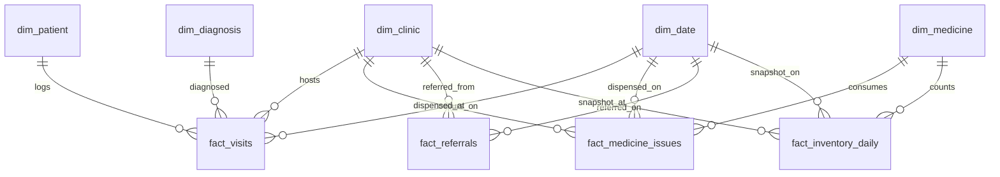

# ⭐ Analytics Star Schema Architecture
## Namma Clinic Digital Health & Operations Platform
**Document Code:** DTA-STR-03 | **Status:** Approved Baseline | **Date:** September 2026

---

### 1. Dimensional Architecture & Star Schema Model

### 2. Core Fact & Dimension Table Definitions
- `fact_visits`: Outpatient visit counts, wait duration, triage category, consultation time.
- `fact_medicine_issues`: Quantity dispensed by drug, batch, clinic, and patient age bracket.
- `fact_referrals`: Outbound referral volume, destination facility, primary clinical reason.
- `fact_inventory_daily`: End-of-day stock snapshots, days of supply remaining, stockout flags.
- `dim_patient`: Anonymized demographics (age bracket, gender, ward of residence).
- `dim_clinic`: Clinic metadata (Ward, Zone, Medical Officer in charge, operational status).
- `dim_medicine`: Formulary drug metadata (therapeutic class, strength, dosage form).
- `dim_diagnosis`: ICD-10 chapter, syndromic surveillance category (e.g., Acute Febrile Illness).
- `dim_date`: Gregorian calendar date dimension with municipal fiscal year mapping.
