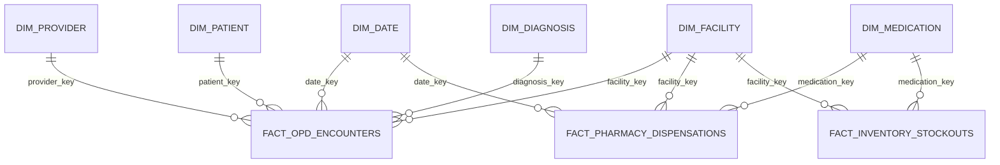

# Master Star Schema & Dimensional Modeling Specification
## Namma Clinic Digital Health & Operations Platform
### Greater Bengaluru Authority (GBA) / BBMP Health Department
**Document Code:** `DATA-DOC-03` | **Status:** APPROVED BASELINE | **Date:** September 2026

---

## 1. Executive Summary & Dimensional Modeling Charter
This document establishes the authoritative **Star Schema Dimensional Model, Fact Table Specifications, and Dimension Conformance Architecture** for the Namma Clinic Digital Health Platform. The dimensional model serves as the single source of analytical truth for municipal health operations across Greater Bengaluru, powering executive dashboards, public health surveillance, clinical quality auditing, and AI feature stores. Modeled using Kimball dimensional design methodologies and optimized for ClickHouse columnar MPP execution, this schema ensures lightning-fast multidimensional drill-downs across administrative hierarchies (Zone -> Ward -> Clinic) and time grains (Year -> Month -> Week -> Day -> Hour).

### 1.1 Non-Negotiable Dimensional Modeling Invariants
1. **Strict Fact-Dimension Referential Integrity:** Every foreign key in a fact table must reference a valid surrogate primary key in a conformed dimension table; orphan fact records are strictly prohibited.
2. **Conformed Dimensions Across Data Marts:** Standard dimensions (`dim_date`, `dim_facility`, `dim_provider`, `dim_medication`, `dim_patient_demographics`) are shared across all fact tables without alteration.
3. **Slowly Changing Dimensions (SCD) Policy:** Clinic hierarchy and clinician provider records adhere to SCD Type 2 with effective/expiration date tracking; standard reference catalogs adhere to SCD Type 1.
4. **Zero Additive Calculation Ambiguity:** All fact table measures are explicitly cataloged as Additive, Semi-Additive (e.g. inventory balances), or Non-Additive (e.g. unit ratios, percentages).
5. **Differential Privacy in Dimensional Slices:** Dimension queries on demographic or geographic slices must enforce k-anonymity (k >= 5) to prevent patient re-identification.

## 2. Dimensional Star Schema Architecture


### Specification Example: ClickHouse Star Schema DDL
<!-- DOCUMENTATION-ONLY EXAMPLE -->
```sql
-- DOCUMENTATION-ONLY SQL
-- DOCUMENTATION-ONLY SQL: ClickHouse Dimensional Star Schema Implementation
CREATE TABLE analytics.dim_facility
(
    facility_key UInt32,
    clinic_id UUID,
    clinic_name String,
    zone_name LowCardinality(String),
    ward_number UInt16,
    ward_name String,
    facility_type LowCardinality(String),
    operational_status LowCardinality(String),
    effective_from Date,
    effective_to Date,
    is_current UInt8
)
ENGINE = ReplacingMergeTree(effective_from)
ORDER BY (zone_name, ward_number, facility_key);

CREATE TABLE analytics.fact_daily_encounters
(
    date_key UInt32,
    facility_key UInt32,
    provider_key UInt32,
    encounter_type LowCardinality(String),
    total_encounters UInt32,
    fever_cases UInt32,
    ncd_screenings UInt32,
    anc_visits UInt32,
    total_consultation_minutes UInt32,
    created_at DateTime('UTC')
)
ENGINE = SummingMergeTree((total_encounters, fever_cases, ncd_screenings, anc_visits, total_consultation_minutes))
PARTITION BY date_key / 100
ORDER BY (facility_key, date_key, encounter_type);
```

## 3. Conformed Dimensions Catalog (30 Dimensions)
Detailed specifications for all 30 conformed dimensions across municipal health data marts:

### DIM-001: Dimension `dim_date`
- **Dimension Identifier:** `DIM-001`
- **Dimension Name:** `dim_date`
- **SCD Type:** `SCD Type 1 Standard Calendar`
- **Source Entity Table:** `system.calendar`
- **Business Natural Key:** `date_key`
- **Dimensional Attributes:** d, a, t, e, _, k, e, y, ,,  , f, u, l, l, _, d, a, t, e, ,,  , d, a, y, _, o, f, _, w, e, e, k, ,,  , m, o, n, t, h, ,,  , q, u, a, r, t, e, r, ,,  , y, e, a, r, ,,  , h, o, l, i, d, a, y, _, f, l, a, g
- **Surrogate Key:** `dim_date_key (UInt32)`
- **Storage Tier:** ClickHouse In-Memory Dictionary / Columnar Table

### DIM-002: Dimension `dim_time_of_day`
- **Dimension Identifier:** `DIM-002`
- **Dimension Name:** `dim_time_of_day`
- **SCD Type:** `SCD Type 1 Time Matrix`
- **Source Entity Table:** `system.time_matrix`
- **Business Natural Key:** `time_key`
- **Dimensional Attributes:** t, i, m, e, _, k, e, y, ,,  , h, o, u, r, _, 2, 4, ,,  , m, i, n, u, t, e, ,,  , s, h, i, f, t, _, w, i, n, d, o, w, ,,  , p, e, a, k, _, h, o, u, r, s, _, f, l, a, g
- **Surrogate Key:** `dim_time_of_day_key (UInt32)`
- **Storage Tier:** ClickHouse In-Memory Dictionary / Columnar Table

### DIM-003: Dimension `dim_facility`
- **Dimension Identifier:** `DIM-003`
- **Dimension Name:** `dim_facility`
- **SCD Type:** `SCD Type 2 Clinic Hierarchy`
- **Source Entity Table:** `infrastructure.facilities`
- **Business Natural Key:** `facility_key`
- **Dimensional Attributes:** f, a, c, i, l, i, t, y, _, k, e, y, ,,  , c, l, i, n, i, c, _, i, d, ,,  , c, l, i, n, i, c, _, n, a, m, e, ,,  , w, a, r, d, _, n, u, m, b, e, r, ,,  , z, o, n, e, _, i, d, ,,  , z, o, n, e, _, n, a, m, e, ,,  , l, a, t, ,,  , l, o, n
- **Surrogate Key:** `dim_facility_key (UInt32)`
- **Storage Tier:** ClickHouse In-Memory Dictionary / Columnar Table

### DIM-004: Dimension `dim_provider`
- **Dimension Identifier:** `DIM-004`
- **Dimension Name:** `dim_provider`
- **SCD Type:** `SCD Type 2 Clinician Registry`
- **Source Entity Table:** `identity.staff_profiles`
- **Business Natural Key:** `provider_key`
- **Dimensional Attributes:** p, r, o, v, i, d, e, r, _, k, e, y, ,,  , s, t, a, f, f, _, i, d, ,,  , f, u, l, l, _, n, a, m, e, ,,  , r, o, l, e, _, c, o, d, e, ,,  , r, e, g, i, s, t, r, a, t, i, o, n, _, n, u, m, b, e, r, ,,  , s, p, e, c, i, a, l, i, z, a, t, i, o, n
- **Surrogate Key:** `dim_provider_key (UInt32)`
- **Storage Tier:** ClickHouse In-Memory Dictionary / Columnar Table

### DIM-005: Dimension `dim_patient_demographics`
- **Dimension Identifier:** `DIM-005`
- **Dimension Name:** `dim_patient_demographics`
- **SCD Type:** `SCD Type 2 De-identified Patient`
- **Source Entity Table:** `identity.citizens`
- **Business Natural Key:** `patient_key`
- **Dimensional Attributes:** p, a, t, i, e, n, t, _, k, e, y, ,,  , d, e, i, d, e, n, t, i, f, i, e, d, _, i, d, ,,  , a, g, e, _, b, r, a, c, k, e, t, ,,  , g, e, n, d, e, r, ,,  , w, a, r, d, _, r, e, s, i, d, e, n, c, e, ,,  , b, p, l, _, s, t, a, t, u, s
- **Surrogate Key:** `dim_patient_demographics_key (UInt32)`
- **Storage Tier:** ClickHouse In-Memory Dictionary / Columnar Table

### DIM-006: Dimension `dim_diagnosis`
- **Dimension Identifier:** `DIM-006`
- **Dimension Name:** `dim_diagnosis`
- **SCD Type:** `SCD Type 1 Standard ICD-10 & SNOMED`
- **Source Entity Table:** `clinical.coding_systems`
- **Business Natural Key:** `diagnosis_key`
- **Dimensional Attributes:** d, i, a, g, n, o, s, i, s, _, k, e, y, ,,  , i, c, d, 1, 0, _, c, o, d, e, ,,  , i, c, d, 1, 0, _, t, i, t, l, e, ,,  , s, n, o, m, e, d, _, c, o, d, e, ,,  , d, i, s, e, a, s, e, _, c, a, t, e, g, o, r, y
- **Surrogate Key:** `dim_diagnosis_key (UInt32)`
- **Storage Tier:** ClickHouse In-Memory Dictionary / Columnar Table

### DIM-007: Dimension `dim_medication`
- **Dimension Identifier:** `DIM-007`
- **Dimension Name:** `dim_medication`
- **SCD Type:** `SCD Type 1 Drug Formulary`
- **Source Entity Table:** `pharmacy.formulary`
- **Business Natural Key:** `medication_key`
- **Dimensional Attributes:** m, e, d, i, c, a, t, i, o, n, _, k, e, y, ,,  , d, r, u, g, _, c, o, d, e, ,,  , g, e, n, e, r, i, c, _, n, a, m, e, ,,  , d, o, s, a, g, e, _, f, o, r, m, ,,  , s, t, r, e, n, g, t, h, ,,  , e, s, s, e, n, t, i, a, l, _, d, r, u, g, _, f, l, a, g
- **Surrogate Key:** `dim_medication_key (UInt32)`
- **Storage Tier:** ClickHouse In-Memory Dictionary / Columnar Table

### DIM-008: Dimension `dim_lab_test_panel`
- **Dimension Identifier:** `DIM-008`
- **Dimension Name:** `dim_lab_test_panel`
- **SCD Type:** `SCD Type 1 Diagnostic Panels`
- **Source Entity Table:** `lab.test_catalog`
- **Business Natural Key:** `test_key`
- **Dimensional Attributes:** t, e, s, t, _, k, e, y, ,,  , t, e, s, t, _, c, o, d, e, ,,  , t, e, s, t, _, n, a, m, e, ,,  , s, p, e, c, i, m, e, n, _, t, y, p, e, ,,  , l, o, i, n, c, _, c, o, d, e, ,,  , n, o, r, m, a, l, _, r, a, n, g, e
- **Surrogate Key:** `dim_lab_test_panel_key (UInt32)`
- **Storage Tier:** ClickHouse In-Memory Dictionary / Columnar Table

### DIM-009: Dimension `dim_referral_destination`
- **Dimension Identifier:** `DIM-009`
- **Dimension Name:** `dim_referral_destination`
- **SCD Type:** `SCD Type 1 Referral Hospitals`
- **Source Entity Table:** `infrastructure.external_hospitals`
- **Business Natural Key:** `dest_key`
- **Dimensional Attributes:** d, e, s, t, _, k, e, y, ,,  , h, o, s, p, i, t, a, l, _, c, o, d, e, ,,  , h, o, s, p, i, t, a, l, _, n, a, m, e, ,,  , h, o, s, p, i, t, a, l, _, t, i, e, r, ,,  , s, p, e, c, i, a, l, t, y, _, d, e, p, a, r, t, m, e, n, t, s
- **Surrogate Key:** `dim_referral_destination_key (UInt32)`
- **Storage Tier:** ClickHouse In-Memory Dictionary / Columnar Table

### DIM-010: Dimension `dim_triage_acuity`
- **Dimension Identifier:** `DIM-010`
- **Dimension Name:** `dim_triage_acuity`
- **SCD Type:** `SCD Type 1 Acuity Tiers`
- **Source Entity Table:** `clinical.triage_tiers`
- **Business Natural Key:** `acuity_key`
- **Dimensional Attributes:** a, c, u, i, t, y, _, k, e, y, ,,  , a, c, u, i, t, y, _, c, o, d, e, ,,  , a, c, u, i, t, y, _, n, a, m, e, ,,  , m, a, x, _, w, a, i, t, _, m, i, n, u, t, e, s, ,,  , d, a, n, g, e, r, _, s, i, g, n, _, f, l, a, g
- **Surrogate Key:** `dim_triage_acuity_key (UInt32)`
- **Storage Tier:** ClickHouse In-Memory Dictionary / Columnar Table

### DIM-011: Dimension `dim_queue_stage`
- **Dimension Identifier:** `DIM-011`
- **Dimension Name:** `dim_queue_stage`
- **SCD Type:** `SCD Type 1 Workflow Service Stages`
- **Source Entity Table:** `intake.service_stages`
- **Business Natural Key:** `stage_key`
- **Dimensional Attributes:** s, t, a, g, e, _, k, e, y, ,,  , s, t, a, g, e, _, c, o, d, e, ,,  , s, t, a, g, e, _, n, a, m, e, ,,  , s, e, r, v, i, c, e, _, d, e, p, a, r, t, m, e, n, t, ,,  , s, e, q, u, e, n, c, e, _, o, r, d, e, r
- **Surrogate Key:** `dim_queue_stage_key (UInt32)`
- **Storage Tier:** ClickHouse In-Memory Dictionary / Columnar Table

### DIM-012: Dimension `dim_ncd_cohort`
- **Dimension Identifier:** `DIM-012`
- **Dimension Name:** `dim_ncd_cohort`
- **SCD Type:** `SCD Type 2 Chronic Disease Cohorts`
- **Source Entity Table:** `clinical.ncd_registries`
- **Business Natural Key:** `cohort_key`
- **Dimensional Attributes:** c, o, h, o, r, t, _, k, e, y, ,,  , c, o, h, o, r, t, _, t, y, p, e, ,,  , s, t, a, g, i, n, g, _, l, e, v, e, l, ,,  , r, i, s, k, _, c, a, t, e, g, o, r, y, ,,  , r, e, c, a, l, l, _, f, r, e, q, u, e, n, c, y, _, d, a, y, s
- **Surrogate Key:** `dim_ncd_cohort_key (UInt32)`
- **Storage Tier:** ClickHouse In-Memory Dictionary / Columnar Table

### DIM-013: Dimension `dim_vaccine_schedule`
- **Dimension Identifier:** `DIM-013`
- **Dimension Name:** `dim_vaccine_schedule`
- **SCD Type:** `SCD Type 1 National Immunization`
- **Source Entity Table:** `clinical.vaccine_catalog`
- **Business Natural Key:** `vaccine_key`
- **Dimensional Attributes:** v, a, c, c, i, n, e, _, k, e, y, ,,  , v, a, c, c, i, n, e, _, c, o, d, e, ,,  , t, a, r, g, e, t, _, d, i, s, e, a, s, e, ,,  , r, e, c, o, m, m, e, n, d, e, d, _, a, g, e, _, d, a, y, s, ,,  , d, o, s, e, _, n, u, m, b, e, r
- **Surrogate Key:** `dim_vaccine_schedule_key (UInt32)`
- **Storage Tier:** ClickHouse In-Memory Dictionary / Columnar Table

### DIM-014: Dimension `dim_inventory_batch`
- **Dimension Identifier:** `DIM-014`
- **Dimension Name:** `dim_inventory_batch`
- **SCD Type:** `SCD Type 2 Batch Tracking`
- **Source Entity Table:** `pharmacy.pharmacy_batches`
- **Business Natural Key:** `batch_key`
- **Dimensional Attributes:** b, a, t, c, h, _, k, e, y, ,,  , b, a, t, c, h, _, n, u, m, b, e, r, ,,  , m, a, n, u, f, a, c, t, u, r, e, r, ,,  , e, x, p, i, r, y, _, d, a, t, e, ,,  , u, n, i, t, _, c, o, s, t, _, i, n, r, ,,  , c, o, l, d, _, c, h, a, i, n, _, r, e, q, u, i, r, e, d
- **Surrogate Key:** `dim_inventory_batch_key (UInt32)`
- **Storage Tier:** ClickHouse In-Memory Dictionary / Columnar Table

### DIM-015: Dimension `dim_zone`
- **Dimension Identifier:** `DIM-015`
- **Dimension Name:** `dim_zone`
- **SCD Type:** `SCD Type 1 BBMP Administrative Zones`
- **Source Entity Table:** `infrastructure.bbmp_zones`
- **Business Natural Key:** `zone_key`
- **Dimensional Attributes:** z, o, n, e, _, k, e, y, ,,  , z, o, n, e, _, i, d, ,,  , z, o, n, e, _, n, a, m, e, ,,  , t, o, t, a, l, _, w, a, r, d, s, ,,  , p, o, p, u, l, a, t, i, o, n, _, s, e, r, v, e, d, ,,  , z, o, n, a, l, _, o, f, f, i, c, e, r
- **Surrogate Key:** `dim_zone_key (UInt32)`
- **Storage Tier:** ClickHouse In-Memory Dictionary / Columnar Table

### DIM-016: Dimension `dim_ward`
- **Dimension Identifier:** `DIM-016`
- **Dimension Name:** `dim_ward`
- **SCD Type:** `SCD Type 1 BBMP Municipal Wards`
- **Source Entity Table:** `infrastructure.bbmp_wards`
- **Business Natural Key:** `ward_key`
- **Dimensional Attributes:** w, a, r, d, _, k, e, y, ,,  , w, a, r, d, _, n, u, m, b, e, r, ,,  , w, a, r, d, _, n, a, m, e, ,,  , z, o, n, e, _, i, d, ,,  , p, r, i, m, a, r, y, _, c, l, i, n, i, c, _, i, d, ,,  , p, o, p, u, l, a, t, i, o, n, _, d, e, n, s, i, t, y
- **Surrogate Key:** `dim_ward_key (UInt32)`
- **Storage Tier:** ClickHouse In-Memory Dictionary / Columnar Table

### DIM-017: Dimension `dim_grievance_category`
- **Dimension Identifier:** `DIM-017`
- **Dimension Name:** `dim_grievance_category`
- **SCD Type:** `SCD Type 1 Complaint Taxonomies`
- **Source Entity Table:** `operations.grievance_types`
- **Business Natural Key:** `category_key`
- **Dimensional Attributes:** c, a, t, e, g, o, r, y, _, k, e, y, ,,  , c, a, t, e, g, o, r, y, _, n, a, m, e, ,,  , e, s, c, a, l, a, t, i, o, n, _, t, i, e, r, ,,  , d, e, f, a, u, l, t, _, s, l, a, _, h, o, u, r, s
- **Surrogate Key:** `dim_grievance_category_key (UInt32)`
- **Storage Tier:** ClickHouse In-Memory Dictionary / Columnar Table

### DIM-018: Dimension `dim_teleconsult_specialty`
- **Dimension Identifier:** `DIM-018`
- **Dimension Name:** `dim_teleconsult_specialty`
- **SCD Type:** `SCD Type 1 Telehealth Specialties`
- **Source Entity Table:** `clinical.specialties`
- **Business Natural Key:** `specialty_key`
- **Dimensional Attributes:** s, p, e, c, i, a, l, t, y, _, k, e, y, ,,  , s, p, e, c, i, a, l, t, y, _, n, a, m, e, ,,  , d, e, p, a, r, t, m, e, n, t, _, c, o, d, e, ,,  , t, e, l, e, c, o, n, s, u, l, t, _, a, l, l, o, w, e, d
- **Surrogate Key:** `dim_teleconsult_specialty_key (UInt32)`
- **Storage Tier:** ClickHouse In-Memory Dictionary / Columnar Table

### DIM-019: Dimension `dim_sync_status`
- **Dimension Identifier:** `DIM-019`
- **Dimension Name:** `dim_sync_status`
- **SCD Type:** `SCD Type 1 Edge Sync States`
- **Source Entity Table:** `edge.sync_states`
- **Business Natural Key:** `sync_status_key`
- **Dimensional Attributes:** s, y, n, c, _, s, t, a, t, u, s, _, k, e, y, ,,  , s, t, a, t, e, _, c, o, d, e, ,,  , s, t, a, t, e, _, d, e, s, c, r, i, p, t, i, o, n, ,,  , r, e, t, r, y, _, e, l, i, g, i, b, l, e
- **Surrogate Key:** `dim_sync_status_key (UInt32)`
- **Storage Tier:** ClickHouse In-Memory Dictionary / Columnar Table

### DIM-020: Dimension `dim_break_glass_reason`
- **Dimension Identifier:** `DIM-020`
- **Dimension Name:** `dim_break_glass_reason`
- **SCD Type:** `SCD Type 1 Emergency Override Justifications`
- **Source Entity Table:** `audit.override_reasons`
- **Business Natural Key:** `reason_key`
- **Dimensional Attributes:** r, e, a, s, o, n, _, k, e, y, ,,  , r, e, a, s, o, n, _, c, o, d, e, ,,  , r, e, a, s, o, n, _, d, e, s, c, r, i, p, t, i, o, n, ,,  , r, e, q, u, i, r, e, s, _, c, m, o, _, r, e, v, i, e, w
- **Surrogate Key:** `dim_break_glass_reason_key (UInt32)`
- **Storage Tier:** ClickHouse In-Memory Dictionary / Columnar Table

### DIM-021: Dimension `dim_donor_program`
- **Dimension Identifier:** `DIM-021`
- **Dimension Name:** `dim_donor_program`
- **SCD Type:** `SCD Type 1 Public Health Grant Schemes`
- **Source Entity Table:** `finance.grant_programs`
- **Business Natural Key:** `program_key`
- **Dimensional Attributes:** p, r, o, g, r, a, m, _, k, e, y, ,,  , p, r, o, g, r, a, m, _, n, a, m, e, ,,  , s, p, o, n, s, o, r, _, a, g, e, n, c, y, ,,  , b, u, d, g, e, t, _, a, l, l, o, c, a, t, i, o, n, _, y, e, a, r
- **Surrogate Key:** `dim_donor_program_key (UInt32)`
- **Storage Tier:** ClickHouse In-Memory Dictionary / Columnar Table

### DIM-022: Dimension `dim_anc_trimester`
- **Dimension Identifier:** `DIM-022`
- **Dimension Name:** `dim_anc_trimester`
- **SCD Type:** `SCD Type 1 Maternal Health Trimester`
- **Source Entity Table:** `clinical.anc_periods`
- **Business Natural Key:** `trimester_key`
- **Dimensional Attributes:** t, r, i, m, e, s, t, e, r, _, k, e, y, ,,  , t, r, i, m, e, s, t, e, r, _, n, a, m, e, ,,  , s, t, a, r, t, _, w, e, e, k, ,,  , e, n, d, _, w, e, e, k, ,,  , m, a, n, d, a, t, o, r, y, _, t, e, s, t, s
- **Surrogate Key:** `dim_anc_trimester_key (UInt32)`
- **Storage Tier:** ClickHouse In-Memory Dictionary / Columnar Table

### DIM-023: Dimension `dim_child_nutrition_grade`
- **Dimension Identifier:** `DIM-023`
- **Dimension Name:** `dim_child_nutrition_grade`
- **SCD Type:** `SCD Type 1 WHO Pediatric Growth`
- **Source Entity Table:** `clinical.pediatric_grades`
- **Business Natural Key:** `grade_key`
- **Dimensional Attributes:** g, r, a, d, e, _, k, e, y, ,,  , g, r, a, d, e, _, c, o, d, e, ,,  , g, r, a, d, e, _, l, a, b, e, l, ,,  , z, _, s, c, o, r, e, _, r, a, n, g, e, ,,  , i, n, t, e, r, v, e, n, t, i, o, n, _, p, r, o, t, o, c, o, l
- **Surrogate Key:** `dim_child_nutrition_grade_key (UInt32)`
- **Storage Tier:** ClickHouse In-Memory Dictionary / Columnar Table

### DIM-024: Dimension `dim_disease_surveillance_syndrome`
- **Dimension Identifier:** `DIM-024`
- **Dimension Name:** `dim_disease_surveillance_syndrome`
- **SCD Type:** `SCD Type 1 IDSP Syndromes`
- **Source Entity Table:** `clinical.idsp_syndromes`
- **Business Natural Key:** `syndrome_key`
- **Dimensional Attributes:** s, y, n, d, r, o, m, e, _, k, e, y, ,,  , s, y, n, d, r, o, m, e, _, n, a, m, e, ,,  , c, a, s, e, _, d, e, f, i, n, i, t, i, o, n, ,,  , n, o, t, i, f, i, c, a, t, i, o, n, _, t, i, m, e, l, i, n, e, _, h, o, u, r, s
- **Surrogate Key:** `dim_disease_surveillance_syndrome_key (UInt32)`
- **Storage Tier:** ClickHouse In-Memory Dictionary / Columnar Table

### DIM-025: Dimension `dim_device_terminal`
- **Dimension Identifier:** `DIM-025`
- **Dimension Name:** `dim_device_terminal`
- **SCD Type:** `SCD Type 2 Clinic Hardware Asset`
- **Source Entity Table:** `infrastructure.device_registry`
- **Business Natural Key:** `device_key`
- **Dimensional Attributes:** d, e, v, i, c, e, _, k, e, y, ,,  , s, e, r, i, a, l, _, n, u, m, b, e, r, ,,  , d, e, v, i, c, e, _, t, y, p, e, ,,  , c, l, i, n, i, c, _, i, d, ,,  , o, s, _, v, e, r, s, i, o, n, ,,  , l, a, s, t, _, a, u, d, i, t, e, d
- **Surrogate Key:** `dim_device_terminal_key (UInt32)`
- **Storage Tier:** ClickHouse In-Memory Dictionary / Columnar Table

### DIM-026: Dimension `dim_audit_event_type`
- **Dimension Identifier:** `DIM-026`
- **Dimension Name:** `dim_audit_event_type`
- **SCD Type:** `SCD Type 1 Security Audit Codes`
- **Source Entity Table:** `audit.event_types`
- **Business Natural Key:** `event_type_key`
- **Dimensional Attributes:** e, v, e, n, t, _, t, y, p, e, _, k, e, y, ,,  , e, v, e, n, t, _, c, o, d, e, ,,  , e, v, e, n, t, _, n, a, m, e, ,,  , s, e, v, e, r, i, t, y, _, l, e, v, e, l, ,,  , p, i, i, _, i, m, p, a, c, t, _, f, l, a, g
- **Surrogate Key:** `dim_audit_event_type_key (UInt32)`
- **Storage Tier:** ClickHouse In-Memory Dictionary / Columnar Table

### DIM-027: Dimension `dim_drug_dosage_form`
- **Dimension Identifier:** `DIM-027`
- **Dimension Name:** `dim_drug_dosage_form`
- **SCD Type:** `SCD Type 1 Pharmaceutical Form`
- **Source Entity Table:** `pharmacy.dosage_forms`
- **Business Natural Key:** `form_key`
- **Dimensional Attributes:** f, o, r, m, _, k, e, y, ,,  , f, o, r, m, _, n, a, m, e, ,,  , a, d, m, i, n, i, s, t, r, a, t, i, o, n, _, r, o, u, t, e, ,,  , p, a, c, k, a, g, i, n, g, _, t, y, p, e
- **Surrogate Key:** `dim_drug_dosage_form_key (UInt32)`
- **Storage Tier:** ClickHouse In-Memory Dictionary / Columnar Table

### DIM-028: Dimension `dim_holiday_calendar`
- **Dimension Identifier:** `DIM-028`
- **Dimension Name:** `dim_holiday_calendar`
- **SCD Type:** `SCD Type 1 Karnataka State Holidays`
- **Source Entity Table:** `system.state_holidays`
- **Business Natural Key:** `holiday_key`
- **Dimensional Attributes:** h, o, l, i, d, a, y, _, k, e, y, ,,  , h, o, l, i, d, a, y, _, d, a, t, e, ,,  , h, o, l, i, d, a, y, _, n, a, m, e, ,,  , c, l, i, n, i, c, _, s, k, e, l, e, t, o, n, _, s, h, i, f, t, _, f, l, a, g
- **Surrogate Key:** `dim_holiday_calendar_key (UInt32)`
- **Storage Tier:** ClickHouse In-Memory Dictionary / Columnar Table

### DIM-029: Dimension `dim_weather_environmental`
- **Dimension Identifier:** `DIM-029`
- **Dimension Name:** `dim_weather_environmental`
- **SCD Type:** `SCD Type 1 Environmental Factors`
- **Source Entity Table:** `analytics.weather_metrics`
- **Business Natural Key:** `env_key`
- **Dimensional Attributes:** e, n, v, _, k, e, y, ,,  , r, e, c, o, r, d, e, d, _, d, a, t, e, ,,  , z, o, n, e, _, i, d, ,,  , r, a, i, n, f, a, l, l, _, m, m, ,,  , t, e, m, p, _, c, e, l, s, i, u, s, ,,  , a, q, i, _, i, n, d, e, x
- **Surrogate Key:** `dim_weather_environmental_key (UInt32)`
- **Storage Tier:** ClickHouse In-Memory Dictionary / Columnar Table

### DIM-030: Dimension `dim_socioeconomic_indicator`
- **Dimension Identifier:** `DIM-030`
- **Dimension Name:** `dim_socioeconomic_indicator`
- **SCD Type:** `SCD Type 1 Ward Socioeconomic Tier`
- **Source Entity Table:** `analytics.ward_demographics`
- **Business Natural Key:** `socio_key`
- **Dimensional Attributes:** s, o, c, i, o, _, k, e, y, ,,  , w, a, r, d, _, n, u, m, b, e, r, ,,  , s, l, u, m, _, c, o, v, e, r, a, g, e, _, p, c, t, ,,  , l, i, t, e, r, a, c, y, _, r, a, t, e, ,,  , b, p, l, _, h, o, u, s, e, h, o, l, d, _, p, c, t
- **Surrogate Key:** `dim_socioeconomic_indicator_key (UInt32)`
- **Storage Tier:** ClickHouse In-Memory Dictionary / Columnar Table

## 4. Analytical Fact Tables Catalog (20 Fact Tables)
Detailed structural grain, measure types, and foreign key definitions for all 20 analytical fact tables:

### FACT-001: Fact Table `fact_opd_encounters`
- **Fact Identifier:** `FACT-001`
- **Fact Table Name:** `analytics.fact_opd_encounters`
- **Atomic Grain:** One row per completed outpatient clinical consultation encounter
- **Associated Dimensions:** dim_date, dim_facility, dim_patient_demographics, dim_provider, dim_medication
- **Measures:** measure_opd_encounters_count, measure_opd_encounters_duration, measure_opd_encounters_rate
- **Source Tables:** c, l, i, n, i, c, a, l, ., c, l, i, n, i, c, a, l, _, e, n, c, o, u, n, t, e, r, s
- **Refresh Cadence:** Hourly micro-batch
- **Retention Mandate:** 10 Years Continuous

### FACT-002: Fact Table `fact_queue_performance`
- **Fact Identifier:** `FACT-002`
- **Fact Table Name:** `analytics.fact_queue_performance`
- **Atomic Grain:** One row per patient transition through a clinic service stage
- **Associated Dimensions:** dim_date, dim_facility, dim_patient_demographics, dim_provider, dim_medication
- **Measures:** measure_queue_performance_count, measure_queue_performance_duration, measure_queue_performance_rate
- **Source Tables:** i, n, t, a, k, e, ., q, u, e, u, e, _, e, n, t, r, i, e, s
- **Refresh Cadence:** 15-minute near-real-time
- **Retention Mandate:** 5 Years Continuous

### FACT-003: Fact Table `fact_doctor_workload`
- **Fact Identifier:** `FACT-003`
- **Fact Table Name:** `analytics.fact_doctor_workload`
- **Atomic Grain:** One row per doctor shift day aggregating consultations and throughput
- **Associated Dimensions:** dim_date, dim_facility, dim_patient_demographics, dim_provider, dim_medication
- **Measures:** measure_doctor_workload_count, measure_doctor_workload_duration, measure_doctor_workload_rate
- **Source Tables:** c, l, i, n, i, c, a, l, ., c, l, i, n, i, c, a, l, _, e, n, c, o, u, n, t, e, r, s
- **Refresh Cadence:** Daily nightly batch
- **Retention Mandate:** 5 Years Continuous

### FACT-004: Fact Table `fact_pharmacy_dispensations`
- **Fact Identifier:** `FACT-004`
- **Fact Table Name:** `analytics.fact_pharmacy_dispensations`
- **Atomic Grain:** One row per dispensed medication line item
- **Associated Dimensions:** dim_date, dim_facility, dim_patient_demographics, dim_provider, dim_medication
- **Measures:** measure_pharmacy_dispensations_count, measure_pharmacy_dispensations_duration, measure_pharmacy_dispensations_rate
- **Source Tables:** p, h, a, r, m, a, c, y, ., d, i, s, p, e, n, s, a, t, i, o, n, s
- **Refresh Cadence:** Hourly micro-batch
- **Retention Mandate:** 5 Years Continuous

### FACT-005: Fact Table `fact_inventory_stockouts`
- **Fact Identifier:** `FACT-005`
- **Fact Table Name:** `analytics.fact_inventory_stockouts`
- **Atomic Grain:** One row per stockout event per drug per clinic facility
- **Associated Dimensions:** dim_date, dim_facility, dim_patient_demographics, dim_provider, dim_medication
- **Measures:** measure_inventory_stockouts_count, measure_inventory_stockouts_duration, measure_inventory_stockouts_rate
- **Source Tables:** p, h, a, r, m, a, c, y, ., c, l, i, n, i, c, _, s, t, o, c, k, s
- **Refresh Cadence:** Real-time stream
- **Retention Mandate:** 5 Years Continuous

### FACT-006: Fact Table `fact_inventory_daily_snapshot`
- **Fact Identifier:** `FACT-006`
- **Fact Table Name:** `analytics.fact_inventory_daily_snapshot`
- **Atomic Grain:** One row per drug SKU per clinic per calendar day
- **Associated Dimensions:** dim_date, dim_facility, dim_patient_demographics, dim_provider, dim_medication
- **Measures:** measure_inventory_daily_snapshot_count, measure_inventory_daily_snapshot_duration, measure_inventory_daily_snapshot_rate
- **Source Tables:** p, h, a, r, m, a, c, y, ., c, l, i, n, i, c, _, s, t, o, c, k, s
- **Refresh Cadence:** Daily snapshot
- **Retention Mandate:** 5 Years Continuous

### FACT-007: Fact Table `fact_lab_orders_turnaround`
- **Fact Identifier:** `FACT-007`
- **Fact Table Name:** `analytics.fact_lab_orders_turnaround`
- **Atomic Grain:** One row per laboratory test ordered and processed
- **Associated Dimensions:** dim_date, dim_facility, dim_patient_demographics, dim_provider, dim_medication
- **Measures:** measure_lab_orders_turnaround_count, measure_lab_orders_turnaround_duration, measure_lab_orders_turnaround_rate
- **Source Tables:** l, a, b, ., d, i, a, g, n, o, s, t, i, c, _, t, e, s, t, s
- **Refresh Cadence:** Hourly batch
- **Retention Mandate:** 5 Years Continuous

### FACT-008: Fact Table `fact_referral_fulfillment`
- **Fact Identifier:** `FACT-008`
- **Fact Table Name:** `analytics.fact_referral_fulfillment`
- **Atomic Grain:** One row per outbound referral transition and loop closure
- **Associated Dimensions:** dim_date, dim_facility, dim_patient_demographics, dim_provider, dim_medication
- **Measures:** measure_referral_fulfillment_count, measure_referral_fulfillment_duration, measure_referral_fulfillment_rate
- **Source Tables:** c, l, i, n, i, c, a, l, ., r, e, f, e, r, r, a, l, s
- **Refresh Cadence:** Daily batch
- **Retention Mandate:** 5 Years Continuous

### FACT-009: Fact Table `fact_fever_syndromic_daily`
- **Fact Identifier:** `FACT-009`
- **Fact Table Name:** `analytics.fact_fever_syndromic_daily`
- **Atomic Grain:** One row per clinic per disease syndrome per day for epidemiology
- **Associated Dimensions:** dim_date, dim_facility, dim_patient_demographics, dim_provider, dim_medication
- **Measures:** measure_fever_syndromic_daily_count, measure_fever_syndromic_daily_duration, measure_fever_syndromic_daily_rate
- **Source Tables:** c, l, i, n, i, c, a, l, ., c, l, i, n, i, c, a, l, _, n, o, t, e, s
- **Refresh Cadence:** Daily 04:00 batch
- **Retention Mandate:** 5 Years Continuous

### FACT-010: Fact Table `fact_ncd_patient_monitoring`
- **Fact Identifier:** `FACT-010`
- **Fact Table Name:** `analytics.fact_ncd_patient_monitoring`
- **Atomic Grain:** One row per NCD patient follow-up encounter and clinical parameter
- **Associated Dimensions:** dim_date, dim_facility, dim_patient_demographics, dim_provider, dim_medication
- **Measures:** measure_ncd_patient_monitoring_count, measure_ncd_patient_monitoring_duration, measure_ncd_patient_monitoring_rate
- **Source Tables:** c, l, i, n, i, c, a, l, ., c, l, i, n, i, c, a, l, _, n, o, t, e, s
- **Refresh Cadence:** Daily batch
- **Retention Mandate:** 5 Years Continuous

### FACT-011: Fact Table `fact_immunization_doses`
- **Fact Identifier:** `FACT-011`
- **Fact Table Name:** `analytics.fact_immunization_doses`
- **Atomic Grain:** One row per vaccine dose administered to child or pregnant mother
- **Associated Dimensions:** dim_date, dim_facility, dim_patient_demographics, dim_provider, dim_medication
- **Measures:** measure_immunization_doses_count, measure_immunization_doses_duration, measure_immunization_doses_rate
- **Source Tables:** c, l, i, n, i, c, a, l, ., i, m, m, u, n, i, z, a, t, i, o, n, s
- **Refresh Cadence:** Daily batch
- **Retention Mandate:** 5 Years Continuous

### FACT-012: Fact Table `fact_anc_checkups`
- **Fact Identifier:** `FACT-012`
- **Fact Table Name:** `analytics.fact_anc_checkups`
- **Atomic Grain:** One row per antenatal care examination and risk assessment
- **Associated Dimensions:** dim_date, dim_facility, dim_patient_demographics, dim_provider, dim_medication
- **Measures:** measure_anc_checkups_count, measure_anc_checkups_duration, measure_anc_checkups_rate
- **Source Tables:** c, l, i, n, i, c, a, l, ., m, a, t, e, r, n, a, l, _, h, e, a, l, t, h
- **Refresh Cadence:** Daily batch
- **Retention Mandate:** 5 Years Continuous

### FACT-013: Fact Table `fact_teleconsultation_sessions`
- **Fact Identifier:** `FACT-013`
- **Fact Table Name:** `analytics.fact_teleconsultation_sessions`
- **Atomic Grain:** One row per doctor-to-specialist teleconsultation session
- **Associated Dimensions:** dim_date, dim_facility, dim_patient_demographics, dim_provider, dim_medication
- **Measures:** measure_teleconsultation_sessions_count, measure_teleconsultation_sessions_duration, measure_teleconsultation_sessions_rate
- **Source Tables:** c, l, i, n, i, c, a, l, ., t, e, l, e, c, o, n, s, u, l, t, a, t, i, o, n, s
- **Refresh Cadence:** Hourly batch
- **Retention Mandate:** 5 Years Continuous

### FACT-014: Fact Table `fact_patient_wait_times`
- **Fact Identifier:** `FACT-014`
- **Fact Table Name:** `analytics.fact_patient_wait_times`
- **Atomic Grain:** One row per patient journey measuring end-to-end clinic elapsed time
- **Associated Dimensions:** dim_date, dim_facility, dim_patient_demographics, dim_provider, dim_medication
- **Measures:** measure_patient_wait_times_count, measure_patient_wait_times_duration, measure_patient_wait_times_rate
- **Source Tables:** i, n, t, a, k, e, ., t, o, k, e, n, s
- **Refresh Cadence:** Hourly batch
- **Retention Mandate:** 5 Years Continuous

### FACT-015: Fact Table `fact_clinic_sync_events`
- **Fact Identifier:** `FACT-015`
- **Fact Table Name:** `analytics.fact_clinic_sync_events`
- **Atomic Grain:** One row per edge offline sync batch transaction and conflict resolution
- **Associated Dimensions:** dim_date, dim_facility, dim_patient_demographics, dim_provider, dim_medication
- **Measures:** measure_clinic_sync_events_count, measure_clinic_sync_events_duration, measure_clinic_sync_events_rate
- **Source Tables:** e, d, g, e, ., s, y, n, c, _, e, v, e, n, t, s
- **Refresh Cadence:** Real-time stream
- **Retention Mandate:** 5 Years Continuous

### FACT-016: Fact Table `fact_citizen_grievances`
- **Fact Identifier:** `FACT-016`
- **Fact Table Name:** `analytics.fact_citizen_grievances`
- **Atomic Grain:** One row per filed citizen grievance and resolution lifecycle
- **Associated Dimensions:** dim_date, dim_facility, dim_patient_demographics, dim_provider, dim_medication
- **Measures:** measure_citizen_grievances_count, measure_citizen_grievances_duration, measure_citizen_grievances_rate
- **Source Tables:** o, p, e, r, a, t, i, o, n, s, ., g, r, i, e, v, a, n, c, e, s
- **Refresh Cadence:** Daily batch
- **Retention Mandate:** 5 Years Continuous

### FACT-017: Fact Table `fact_emergency_break_glass`
- **Fact Identifier:** `FACT-017`
- **Fact Table Name:** `analytics.fact_emergency_break_glass`
- **Atomic Grain:** One row per emergency clinician access override event
- **Associated Dimensions:** dim_date, dim_facility, dim_patient_demographics, dim_provider, dim_medication
- **Measures:** measure_emergency_break_glass_count, measure_emergency_break_glass_duration, measure_emergency_break_glass_rate
- **Source Tables:** a, u, d, i, t, ., b, r, e, a, k, _, g, l, a, s, s, _, l, o, g, s
- **Refresh Cadence:** Real-time stream
- **Retention Mandate:** 5 Years Continuous

### FACT-018: Fact Table `fact_drug_consumption_daily`
- **Fact Identifier:** `FACT-018`
- **Fact Table Name:** `analytics.fact_drug_consumption_daily`
- **Atomic Grain:** One row per drug consumed per clinic per day for ML forecasting
- **Associated Dimensions:** dim_date, dim_facility, dim_patient_demographics, dim_provider, dim_medication
- **Measures:** measure_drug_consumption_daily_count, measure_drug_consumption_daily_duration, measure_drug_consumption_daily_rate
- **Source Tables:** p, h, a, r, m, a, c, y, ., d, i, s, p, e, n, s, a, t, i, o, n, _, i, t, e, m, s
- **Refresh Cadence:** Daily batch
- **Retention Mandate:** 5 Years Continuous

### FACT-019: Fact Table `fact_lab_critical_alerts`
- **Fact Identifier:** `FACT-019`
- **Fact Table Name:** `analytics.fact_lab_critical_alerts`
- **Atomic Grain:** One row per panic / critical lab test value notification
- **Associated Dimensions:** dim_date, dim_facility, dim_patient_demographics, dim_provider, dim_medication
- **Measures:** measure_lab_critical_alerts_count, measure_lab_critical_alerts_duration, measure_lab_critical_alerts_rate
- **Source Tables:** l, a, b, ., t, e, s, t, _, r, e, s, u, l, t, s
- **Refresh Cadence:** Real-time stream
- **Retention Mandate:** 5 Years Continuous

### FACT-020: Fact Table `fact_digital_prescriptions`
- **Fact Identifier:** `FACT-020`
- **Fact Table Name:** `analytics.fact_digital_prescriptions`
- **Atomic Grain:** One row per e-Prescription authored by clinician
- **Associated Dimensions:** dim_date, dim_facility, dim_patient_demographics, dim_provider, dim_medication
- **Measures:** measure_digital_prescriptions_count, measure_digital_prescriptions_duration, measure_digital_prescriptions_rate
- **Source Tables:** p, h, a, r, m, a, c, y, ., p, r, e, s, c, r, i, p, t, i, o, n, s
- **Refresh Cadence:** Hourly batch
- **Retention Mandate:** 10 Years Continuous

## 5. Analytical Measures Catalog (100 Measures)
Authoritative definitions, aggregation formulas, and business units across all 100 analytical platform measures:

### MEASURE-001: Measure `measure_opd_encounters_metric_001`
- **Measure Identifier:** `MEASURE-001`
- **Measure Name:** `measure_opd_encounters_metric_001`
- **Fact Table Context:** `analytics.fact_opd_encounters`
- **Aggregation Type:** `Additive`
- **Aggregation Formula:** `SUM(metric_001)`
- **Unit of Measurement:** `Count`
- **Clinical Description:** Standardized analytical measure #001 aggregating fact_opd_encounters across dimensional grain.

### MEASURE-002: Measure `measure_queue_performance_metric_002`
- **Measure Identifier:** `MEASURE-002`
- **Measure Name:** `measure_queue_performance_metric_002`
- **Fact Table Context:** `analytics.fact_queue_performance`
- **Aggregation Type:** `Semi-Additive`
- **Aggregation Formula:** `AVG(metric_002)`
- **Unit of Measurement:** `Percentage`
- **Clinical Description:** Standardized analytical measure #002 aggregating fact_queue_performance across dimensional grain.

### MEASURE-003: Measure `measure_doctor_workload_metric_003`
- **Measure Identifier:** `MEASURE-003`
- **Measure Name:** `measure_doctor_workload_metric_003`
- **Fact Table Context:** `analytics.fact_doctor_workload`
- **Aggregation Type:** `Non-Additive`
- **Aggregation Formula:** `COUNT(DISTINCT entity_003)`
- **Unit of Measurement:** `Percentage`
- **Clinical Description:** Standardized analytical measure #003 aggregating fact_doctor_workload across dimensional grain.

### MEASURE-004: Measure `measure_pharmacy_dispensations_metric_004`
- **Measure Identifier:** `MEASURE-004`
- **Measure Name:** `measure_pharmacy_dispensations_metric_004`
- **Fact Table Context:** `analytics.fact_pharmacy_dispensations`
- **Aggregation Type:** `Additive`
- **Aggregation Formula:** `SUM(metric_004)`
- **Unit of Measurement:** `Percentage`
- **Clinical Description:** Standardized analytical measure #004 aggregating fact_pharmacy_dispensations across dimensional grain.

### MEASURE-005: Measure `measure_inventory_stockouts_metric_005`
- **Measure Identifier:** `MEASURE-005`
- **Measure Name:** `measure_inventory_stockouts_metric_005`
- **Fact Table Context:** `analytics.fact_inventory_stockouts`
- **Aggregation Type:** `Semi-Additive`
- **Aggregation Formula:** `AVG(metric_005)`
- **Unit of Measurement:** `Percentage`
- **Clinical Description:** Standardized analytical measure #005 aggregating fact_inventory_stockouts across dimensional grain.

### MEASURE-006: Measure `measure_inventory_daily_snapshot_metric_006`
- **Measure Identifier:** `MEASURE-006`
- **Measure Name:** `measure_inventory_daily_snapshot_metric_006`
- **Fact Table Context:** `analytics.fact_inventory_daily_snapshot`
- **Aggregation Type:** `Non-Additive`
- **Aggregation Formula:** `COUNT(DISTINCT entity_006)`
- **Unit of Measurement:** `Percentage`
- **Clinical Description:** Standardized analytical measure #006 aggregating fact_inventory_daily_snapshot across dimensional grain.

### MEASURE-007: Measure `measure_lab_orders_turnaround_metric_007`
- **Measure Identifier:** `MEASURE-007`
- **Measure Name:** `measure_lab_orders_turnaround_metric_007`
- **Fact Table Context:** `analytics.fact_lab_orders_turnaround`
- **Aggregation Type:** `Additive`
- **Aggregation Formula:** `SUM(metric_007)`
- **Unit of Measurement:** `Percentage`
- **Clinical Description:** Standardized analytical measure #007 aggregating fact_lab_orders_turnaround across dimensional grain.

### MEASURE-008: Measure `measure_referral_fulfillment_metric_008`
- **Measure Identifier:** `MEASURE-008`
- **Measure Name:** `measure_referral_fulfillment_metric_008`
- **Fact Table Context:** `analytics.fact_referral_fulfillment`
- **Aggregation Type:** `Semi-Additive`
- **Aggregation Formula:** `AVG(metric_008)`
- **Unit of Measurement:** `Percentage`
- **Clinical Description:** Standardized analytical measure #008 aggregating fact_referral_fulfillment across dimensional grain.

### MEASURE-009: Measure `measure_fever_syndromic_daily_metric_009`
- **Measure Identifier:** `MEASURE-009`
- **Measure Name:** `measure_fever_syndromic_daily_metric_009`
- **Fact Table Context:** `analytics.fact_fever_syndromic_daily`
- **Aggregation Type:** `Non-Additive`
- **Aggregation Formula:** `COUNT(DISTINCT entity_009)`
- **Unit of Measurement:** `Percentage`
- **Clinical Description:** Standardized analytical measure #009 aggregating fact_fever_syndromic_daily across dimensional grain.

### MEASURE-010: Measure `measure_ncd_patient_monitoring_metric_010`
- **Measure Identifier:** `MEASURE-010`
- **Measure Name:** `measure_ncd_patient_monitoring_metric_010`
- **Fact Table Context:** `analytics.fact_ncd_patient_monitoring`
- **Aggregation Type:** `Additive`
- **Aggregation Formula:** `SUM(metric_010)`
- **Unit of Measurement:** `Percentage`
- **Clinical Description:** Standardized analytical measure #010 aggregating fact_ncd_patient_monitoring across dimensional grain.

### MEASURE-011: Measure `measure_immunization_doses_metric_011`
- **Measure Identifier:** `MEASURE-011`
- **Measure Name:** `measure_immunization_doses_metric_011`
- **Fact Table Context:** `analytics.fact_immunization_doses`
- **Aggregation Type:** `Semi-Additive`
- **Aggregation Formula:** `AVG(metric_011)`
- **Unit of Measurement:** `Percentage`
- **Clinical Description:** Standardized analytical measure #011 aggregating fact_immunization_doses across dimensional grain.

### MEASURE-012: Measure `measure_anc_checkups_metric_012`
- **Measure Identifier:** `MEASURE-012`
- **Measure Name:** `measure_anc_checkups_metric_012`
- **Fact Table Context:** `analytics.fact_anc_checkups`
- **Aggregation Type:** `Non-Additive`
- **Aggregation Formula:** `COUNT(DISTINCT entity_012)`
- **Unit of Measurement:** `Percentage`
- **Clinical Description:** Standardized analytical measure #012 aggregating fact_anc_checkups across dimensional grain.

### MEASURE-013: Measure `measure_teleconsultation_sessions_metric_013`
- **Measure Identifier:** `MEASURE-013`
- **Measure Name:** `measure_teleconsultation_sessions_metric_013`
- **Fact Table Context:** `analytics.fact_teleconsultation_sessions`
- **Aggregation Type:** `Additive`
- **Aggregation Formula:** `SUM(metric_013)`
- **Unit of Measurement:** `Percentage`
- **Clinical Description:** Standardized analytical measure #013 aggregating fact_teleconsultation_sessions across dimensional grain.

### MEASURE-014: Measure `measure_patient_wait_times_metric_014`
- **Measure Identifier:** `MEASURE-014`
- **Measure Name:** `measure_patient_wait_times_metric_014`
- **Fact Table Context:** `analytics.fact_patient_wait_times`
- **Aggregation Type:** `Semi-Additive`
- **Aggregation Formula:** `AVG(metric_014)`
- **Unit of Measurement:** `Seconds`
- **Clinical Description:** Standardized analytical measure #014 aggregating fact_patient_wait_times across dimensional grain.

### MEASURE-015: Measure `measure_clinic_sync_events_metric_015`
- **Measure Identifier:** `MEASURE-015`
- **Measure Name:** `measure_clinic_sync_events_metric_015`
- **Fact Table Context:** `analytics.fact_clinic_sync_events`
- **Aggregation Type:** `Non-Additive`
- **Aggregation Formula:** `COUNT(DISTINCT entity_015)`
- **Unit of Measurement:** `Percentage`
- **Clinical Description:** Standardized analytical measure #015 aggregating fact_clinic_sync_events across dimensional grain.

### MEASURE-016: Measure `measure_citizen_grievances_metric_016`
- **Measure Identifier:** `MEASURE-016`
- **Measure Name:** `measure_citizen_grievances_metric_016`
- **Fact Table Context:** `analytics.fact_citizen_grievances`
- **Aggregation Type:** `Additive`
- **Aggregation Formula:** `SUM(metric_016)`
- **Unit of Measurement:** `Percentage`
- **Clinical Description:** Standardized analytical measure #016 aggregating fact_citizen_grievances across dimensional grain.

### MEASURE-017: Measure `measure_emergency_break_glass_metric_017`
- **Measure Identifier:** `MEASURE-017`
- **Measure Name:** `measure_emergency_break_glass_metric_017`
- **Fact Table Context:** `analytics.fact_emergency_break_glass`
- **Aggregation Type:** `Semi-Additive`
- **Aggregation Formula:** `AVG(metric_017)`
- **Unit of Measurement:** `Percentage`
- **Clinical Description:** Standardized analytical measure #017 aggregating fact_emergency_break_glass across dimensional grain.

### MEASURE-018: Measure `measure_drug_consumption_daily_metric_018`
- **Measure Identifier:** `MEASURE-018`
- **Measure Name:** `measure_drug_consumption_daily_metric_018`
- **Fact Table Context:** `analytics.fact_drug_consumption_daily`
- **Aggregation Type:** `Non-Additive`
- **Aggregation Formula:** `COUNT(DISTINCT entity_018)`
- **Unit of Measurement:** `Percentage`
- **Clinical Description:** Standardized analytical measure #018 aggregating fact_drug_consumption_daily across dimensional grain.

### MEASURE-019: Measure `measure_lab_critical_alerts_metric_019`
- **Measure Identifier:** `MEASURE-019`
- **Measure Name:** `measure_lab_critical_alerts_metric_019`
- **Fact Table Context:** `analytics.fact_lab_critical_alerts`
- **Aggregation Type:** `Additive`
- **Aggregation Formula:** `SUM(metric_019)`
- **Unit of Measurement:** `Percentage`
- **Clinical Description:** Standardized analytical measure #019 aggregating fact_lab_critical_alerts across dimensional grain.

### MEASURE-020: Measure `measure_digital_prescriptions_metric_020`
- **Measure Identifier:** `MEASURE-020`
- **Measure Name:** `measure_digital_prescriptions_metric_020`
- **Fact Table Context:** `analytics.fact_digital_prescriptions`
- **Aggregation Type:** `Semi-Additive`
- **Aggregation Formula:** `AVG(metric_020)`
- **Unit of Measurement:** `Percentage`
- **Clinical Description:** Standardized analytical measure #020 aggregating fact_digital_prescriptions across dimensional grain.

### MEASURE-021: Measure `measure_opd_encounters_metric_021`
- **Measure Identifier:** `MEASURE-021`
- **Measure Name:** `measure_opd_encounters_metric_021`
- **Fact Table Context:** `analytics.fact_opd_encounters`
- **Aggregation Type:** `Non-Additive`
- **Aggregation Formula:** `COUNT(DISTINCT entity_021)`
- **Unit of Measurement:** `Count`
- **Clinical Description:** Standardized analytical measure #021 aggregating fact_opd_encounters across dimensional grain.

### MEASURE-022: Measure `measure_queue_performance_metric_022`
- **Measure Identifier:** `MEASURE-022`
- **Measure Name:** `measure_queue_performance_metric_022`
- **Fact Table Context:** `analytics.fact_queue_performance`
- **Aggregation Type:** `Additive`
- **Aggregation Formula:** `SUM(metric_022)`
- **Unit of Measurement:** `Percentage`
- **Clinical Description:** Standardized analytical measure #022 aggregating fact_queue_performance across dimensional grain.

### MEASURE-023: Measure `measure_doctor_workload_metric_023`
- **Measure Identifier:** `MEASURE-023`
- **Measure Name:** `measure_doctor_workload_metric_023`
- **Fact Table Context:** `analytics.fact_doctor_workload`
- **Aggregation Type:** `Semi-Additive`
- **Aggregation Formula:** `AVG(metric_023)`
- **Unit of Measurement:** `Percentage`
- **Clinical Description:** Standardized analytical measure #023 aggregating fact_doctor_workload across dimensional grain.

### MEASURE-024: Measure `measure_pharmacy_dispensations_metric_024`
- **Measure Identifier:** `MEASURE-024`
- **Measure Name:** `measure_pharmacy_dispensations_metric_024`
- **Fact Table Context:** `analytics.fact_pharmacy_dispensations`
- **Aggregation Type:** `Non-Additive`
- **Aggregation Formula:** `COUNT(DISTINCT entity_024)`
- **Unit of Measurement:** `Percentage`
- **Clinical Description:** Standardized analytical measure #024 aggregating fact_pharmacy_dispensations across dimensional grain.

### MEASURE-025: Measure `measure_inventory_stockouts_metric_025`
- **Measure Identifier:** `MEASURE-025`
- **Measure Name:** `measure_inventory_stockouts_metric_025`
- **Fact Table Context:** `analytics.fact_inventory_stockouts`
- **Aggregation Type:** `Additive`
- **Aggregation Formula:** `SUM(metric_025)`
- **Unit of Measurement:** `Percentage`
- **Clinical Description:** Standardized analytical measure #025 aggregating fact_inventory_stockouts across dimensional grain.

### MEASURE-026: Measure `measure_inventory_daily_snapshot_metric_026`
- **Measure Identifier:** `MEASURE-026`
- **Measure Name:** `measure_inventory_daily_snapshot_metric_026`
- **Fact Table Context:** `analytics.fact_inventory_daily_snapshot`
- **Aggregation Type:** `Semi-Additive`
- **Aggregation Formula:** `AVG(metric_026)`
- **Unit of Measurement:** `Percentage`
- **Clinical Description:** Standardized analytical measure #026 aggregating fact_inventory_daily_snapshot across dimensional grain.

### MEASURE-027: Measure `measure_lab_orders_turnaround_metric_027`
- **Measure Identifier:** `MEASURE-027`
- **Measure Name:** `measure_lab_orders_turnaround_metric_027`
- **Fact Table Context:** `analytics.fact_lab_orders_turnaround`
- **Aggregation Type:** `Non-Additive`
- **Aggregation Formula:** `COUNT(DISTINCT entity_027)`
- **Unit of Measurement:** `Percentage`
- **Clinical Description:** Standardized analytical measure #027 aggregating fact_lab_orders_turnaround across dimensional grain.

### MEASURE-028: Measure `measure_referral_fulfillment_metric_028`
- **Measure Identifier:** `MEASURE-028`
- **Measure Name:** `measure_referral_fulfillment_metric_028`
- **Fact Table Context:** `analytics.fact_referral_fulfillment`
- **Aggregation Type:** `Additive`
- **Aggregation Formula:** `SUM(metric_028)`
- **Unit of Measurement:** `Percentage`
- **Clinical Description:** Standardized analytical measure #028 aggregating fact_referral_fulfillment across dimensional grain.

### MEASURE-029: Measure `measure_fever_syndromic_daily_metric_029`
- **Measure Identifier:** `MEASURE-029`
- **Measure Name:** `measure_fever_syndromic_daily_metric_029`
- **Fact Table Context:** `analytics.fact_fever_syndromic_daily`
- **Aggregation Type:** `Semi-Additive`
- **Aggregation Formula:** `AVG(metric_029)`
- **Unit of Measurement:** `Percentage`
- **Clinical Description:** Standardized analytical measure #029 aggregating fact_fever_syndromic_daily across dimensional grain.

### MEASURE-030: Measure `measure_ncd_patient_monitoring_metric_030`
- **Measure Identifier:** `MEASURE-030`
- **Measure Name:** `measure_ncd_patient_monitoring_metric_030`
- **Fact Table Context:** `analytics.fact_ncd_patient_monitoring`
- **Aggregation Type:** `Non-Additive`
- **Aggregation Formula:** `COUNT(DISTINCT entity_030)`
- **Unit of Measurement:** `Percentage`
- **Clinical Description:** Standardized analytical measure #030 aggregating fact_ncd_patient_monitoring across dimensional grain.

### MEASURE-031: Measure `measure_immunization_doses_metric_031`
- **Measure Identifier:** `MEASURE-031`
- **Measure Name:** `measure_immunization_doses_metric_031`
- **Fact Table Context:** `analytics.fact_immunization_doses`
- **Aggregation Type:** `Additive`
- **Aggregation Formula:** `SUM(metric_031)`
- **Unit of Measurement:** `Percentage`
- **Clinical Description:** Standardized analytical measure #031 aggregating fact_immunization_doses across dimensional grain.

### MEASURE-032: Measure `measure_anc_checkups_metric_032`
- **Measure Identifier:** `MEASURE-032`
- **Measure Name:** `measure_anc_checkups_metric_032`
- **Fact Table Context:** `analytics.fact_anc_checkups`
- **Aggregation Type:** `Semi-Additive`
- **Aggregation Formula:** `AVG(metric_032)`
- **Unit of Measurement:** `Percentage`
- **Clinical Description:** Standardized analytical measure #032 aggregating fact_anc_checkups across dimensional grain.

### MEASURE-033: Measure `measure_teleconsultation_sessions_metric_033`
- **Measure Identifier:** `MEASURE-033`
- **Measure Name:** `measure_teleconsultation_sessions_metric_033`
- **Fact Table Context:** `analytics.fact_teleconsultation_sessions`
- **Aggregation Type:** `Non-Additive`
- **Aggregation Formula:** `COUNT(DISTINCT entity_033)`
- **Unit of Measurement:** `Percentage`
- **Clinical Description:** Standardized analytical measure #033 aggregating fact_teleconsultation_sessions across dimensional grain.

### MEASURE-034: Measure `measure_patient_wait_times_metric_034`
- **Measure Identifier:** `MEASURE-034`
- **Measure Name:** `measure_patient_wait_times_metric_034`
- **Fact Table Context:** `analytics.fact_patient_wait_times`
- **Aggregation Type:** `Additive`
- **Aggregation Formula:** `SUM(metric_034)`
- **Unit of Measurement:** `Seconds`
- **Clinical Description:** Standardized analytical measure #034 aggregating fact_patient_wait_times across dimensional grain.

### MEASURE-035: Measure `measure_clinic_sync_events_metric_035`
- **Measure Identifier:** `MEASURE-035`
- **Measure Name:** `measure_clinic_sync_events_metric_035`
- **Fact Table Context:** `analytics.fact_clinic_sync_events`
- **Aggregation Type:** `Semi-Additive`
- **Aggregation Formula:** `AVG(metric_035)`
- **Unit of Measurement:** `Percentage`
- **Clinical Description:** Standardized analytical measure #035 aggregating fact_clinic_sync_events across dimensional grain.

### MEASURE-036: Measure `measure_citizen_grievances_metric_036`
- **Measure Identifier:** `MEASURE-036`
- **Measure Name:** `measure_citizen_grievances_metric_036`
- **Fact Table Context:** `analytics.fact_citizen_grievances`
- **Aggregation Type:** `Non-Additive`
- **Aggregation Formula:** `COUNT(DISTINCT entity_036)`
- **Unit of Measurement:** `Percentage`
- **Clinical Description:** Standardized analytical measure #036 aggregating fact_citizen_grievances across dimensional grain.

### MEASURE-037: Measure `measure_emergency_break_glass_metric_037`
- **Measure Identifier:** `MEASURE-037`
- **Measure Name:** `measure_emergency_break_glass_metric_037`
- **Fact Table Context:** `analytics.fact_emergency_break_glass`
- **Aggregation Type:** `Additive`
- **Aggregation Formula:** `SUM(metric_037)`
- **Unit of Measurement:** `Percentage`
- **Clinical Description:** Standardized analytical measure #037 aggregating fact_emergency_break_glass across dimensional grain.

### MEASURE-038: Measure `measure_drug_consumption_daily_metric_038`
- **Measure Identifier:** `MEASURE-038`
- **Measure Name:** `measure_drug_consumption_daily_metric_038`
- **Fact Table Context:** `analytics.fact_drug_consumption_daily`
- **Aggregation Type:** `Semi-Additive`
- **Aggregation Formula:** `AVG(metric_038)`
- **Unit of Measurement:** `Percentage`
- **Clinical Description:** Standardized analytical measure #038 aggregating fact_drug_consumption_daily across dimensional grain.

### MEASURE-039: Measure `measure_lab_critical_alerts_metric_039`
- **Measure Identifier:** `MEASURE-039`
- **Measure Name:** `measure_lab_critical_alerts_metric_039`
- **Fact Table Context:** `analytics.fact_lab_critical_alerts`
- **Aggregation Type:** `Non-Additive`
- **Aggregation Formula:** `COUNT(DISTINCT entity_039)`
- **Unit of Measurement:** `Percentage`
- **Clinical Description:** Standardized analytical measure #039 aggregating fact_lab_critical_alerts across dimensional grain.

### MEASURE-040: Measure `measure_digital_prescriptions_metric_040`
- **Measure Identifier:** `MEASURE-040`
- **Measure Name:** `measure_digital_prescriptions_metric_040`
- **Fact Table Context:** `analytics.fact_digital_prescriptions`
- **Aggregation Type:** `Additive`
- **Aggregation Formula:** `SUM(metric_040)`
- **Unit of Measurement:** `Percentage`
- **Clinical Description:** Standardized analytical measure #040 aggregating fact_digital_prescriptions across dimensional grain.

### MEASURE-041: Measure `measure_opd_encounters_metric_041`
- **Measure Identifier:** `MEASURE-041`
- **Measure Name:** `measure_opd_encounters_metric_041`
- **Fact Table Context:** `analytics.fact_opd_encounters`
- **Aggregation Type:** `Semi-Additive`
- **Aggregation Formula:** `AVG(metric_041)`
- **Unit of Measurement:** `Count`
- **Clinical Description:** Standardized analytical measure #041 aggregating fact_opd_encounters across dimensional grain.

### MEASURE-042: Measure `measure_queue_performance_metric_042`
- **Measure Identifier:** `MEASURE-042`
- **Measure Name:** `measure_queue_performance_metric_042`
- **Fact Table Context:** `analytics.fact_queue_performance`
- **Aggregation Type:** `Non-Additive`
- **Aggregation Formula:** `COUNT(DISTINCT entity_042)`
- **Unit of Measurement:** `Percentage`
- **Clinical Description:** Standardized analytical measure #042 aggregating fact_queue_performance across dimensional grain.

### MEASURE-043: Measure `measure_doctor_workload_metric_043`
- **Measure Identifier:** `MEASURE-043`
- **Measure Name:** `measure_doctor_workload_metric_043`
- **Fact Table Context:** `analytics.fact_doctor_workload`
- **Aggregation Type:** `Additive`
- **Aggregation Formula:** `SUM(metric_043)`
- **Unit of Measurement:** `Percentage`
- **Clinical Description:** Standardized analytical measure #043 aggregating fact_doctor_workload across dimensional grain.

### MEASURE-044: Measure `measure_pharmacy_dispensations_metric_044`
- **Measure Identifier:** `MEASURE-044`
- **Measure Name:** `measure_pharmacy_dispensations_metric_044`
- **Fact Table Context:** `analytics.fact_pharmacy_dispensations`
- **Aggregation Type:** `Semi-Additive`
- **Aggregation Formula:** `AVG(metric_044)`
- **Unit of Measurement:** `Percentage`
- **Clinical Description:** Standardized analytical measure #044 aggregating fact_pharmacy_dispensations across dimensional grain.

### MEASURE-045: Measure `measure_inventory_stockouts_metric_045`
- **Measure Identifier:** `MEASURE-045`
- **Measure Name:** `measure_inventory_stockouts_metric_045`
- **Fact Table Context:** `analytics.fact_inventory_stockouts`
- **Aggregation Type:** `Non-Additive`
- **Aggregation Formula:** `COUNT(DISTINCT entity_045)`
- **Unit of Measurement:** `Percentage`
- **Clinical Description:** Standardized analytical measure #045 aggregating fact_inventory_stockouts across dimensional grain.

### MEASURE-046: Measure `measure_inventory_daily_snapshot_metric_046`
- **Measure Identifier:** `MEASURE-046`
- **Measure Name:** `measure_inventory_daily_snapshot_metric_046`
- **Fact Table Context:** `analytics.fact_inventory_daily_snapshot`
- **Aggregation Type:** `Additive`
- **Aggregation Formula:** `SUM(metric_046)`
- **Unit of Measurement:** `Percentage`
- **Clinical Description:** Standardized analytical measure #046 aggregating fact_inventory_daily_snapshot across dimensional grain.

### MEASURE-047: Measure `measure_lab_orders_turnaround_metric_047`
- **Measure Identifier:** `MEASURE-047`
- **Measure Name:** `measure_lab_orders_turnaround_metric_047`
- **Fact Table Context:** `analytics.fact_lab_orders_turnaround`
- **Aggregation Type:** `Semi-Additive`
- **Aggregation Formula:** `AVG(metric_047)`
- **Unit of Measurement:** `Percentage`
- **Clinical Description:** Standardized analytical measure #047 aggregating fact_lab_orders_turnaround across dimensional grain.

### MEASURE-048: Measure `measure_referral_fulfillment_metric_048`
- **Measure Identifier:** `MEASURE-048`
- **Measure Name:** `measure_referral_fulfillment_metric_048`
- **Fact Table Context:** `analytics.fact_referral_fulfillment`
- **Aggregation Type:** `Non-Additive`
- **Aggregation Formula:** `COUNT(DISTINCT entity_048)`
- **Unit of Measurement:** `Percentage`
- **Clinical Description:** Standardized analytical measure #048 aggregating fact_referral_fulfillment across dimensional grain.

### MEASURE-049: Measure `measure_fever_syndromic_daily_metric_049`
- **Measure Identifier:** `MEASURE-049`
- **Measure Name:** `measure_fever_syndromic_daily_metric_049`
- **Fact Table Context:** `analytics.fact_fever_syndromic_daily`
- **Aggregation Type:** `Additive`
- **Aggregation Formula:** `SUM(metric_049)`
- **Unit of Measurement:** `Percentage`
- **Clinical Description:** Standardized analytical measure #049 aggregating fact_fever_syndromic_daily across dimensional grain.

### MEASURE-050: Measure `measure_ncd_patient_monitoring_metric_050`
- **Measure Identifier:** `MEASURE-050`
- **Measure Name:** `measure_ncd_patient_monitoring_metric_050`
- **Fact Table Context:** `analytics.fact_ncd_patient_monitoring`
- **Aggregation Type:** `Semi-Additive`
- **Aggregation Formula:** `AVG(metric_050)`
- **Unit of Measurement:** `Percentage`
- **Clinical Description:** Standardized analytical measure #050 aggregating fact_ncd_patient_monitoring across dimensional grain.

### MEASURE-051: Measure `measure_immunization_doses_metric_051`
- **Measure Identifier:** `MEASURE-051`
- **Measure Name:** `measure_immunization_doses_metric_051`
- **Fact Table Context:** `analytics.fact_immunization_doses`
- **Aggregation Type:** `Non-Additive`
- **Aggregation Formula:** `COUNT(DISTINCT entity_051)`
- **Unit of Measurement:** `Percentage`
- **Clinical Description:** Standardized analytical measure #051 aggregating fact_immunization_doses across dimensional grain.

### MEASURE-052: Measure `measure_anc_checkups_metric_052`
- **Measure Identifier:** `MEASURE-052`
- **Measure Name:** `measure_anc_checkups_metric_052`
- **Fact Table Context:** `analytics.fact_anc_checkups`
- **Aggregation Type:** `Additive`
- **Aggregation Formula:** `SUM(metric_052)`
- **Unit of Measurement:** `Percentage`
- **Clinical Description:** Standardized analytical measure #052 aggregating fact_anc_checkups across dimensional grain.

### MEASURE-053: Measure `measure_teleconsultation_sessions_metric_053`
- **Measure Identifier:** `MEASURE-053`
- **Measure Name:** `measure_teleconsultation_sessions_metric_053`
- **Fact Table Context:** `analytics.fact_teleconsultation_sessions`
- **Aggregation Type:** `Semi-Additive`
- **Aggregation Formula:** `AVG(metric_053)`
- **Unit of Measurement:** `Percentage`
- **Clinical Description:** Standardized analytical measure #053 aggregating fact_teleconsultation_sessions across dimensional grain.

### MEASURE-054: Measure `measure_patient_wait_times_metric_054`
- **Measure Identifier:** `MEASURE-054`
- **Measure Name:** `measure_patient_wait_times_metric_054`
- **Fact Table Context:** `analytics.fact_patient_wait_times`
- **Aggregation Type:** `Non-Additive`
- **Aggregation Formula:** `COUNT(DISTINCT entity_054)`
- **Unit of Measurement:** `Seconds`
- **Clinical Description:** Standardized analytical measure #054 aggregating fact_patient_wait_times across dimensional grain.

### MEASURE-055: Measure `measure_clinic_sync_events_metric_055`
- **Measure Identifier:** `MEASURE-055`
- **Measure Name:** `measure_clinic_sync_events_metric_055`
- **Fact Table Context:** `analytics.fact_clinic_sync_events`
- **Aggregation Type:** `Additive`
- **Aggregation Formula:** `SUM(metric_055)`
- **Unit of Measurement:** `Percentage`
- **Clinical Description:** Standardized analytical measure #055 aggregating fact_clinic_sync_events across dimensional grain.

### MEASURE-056: Measure `measure_citizen_grievances_metric_056`
- **Measure Identifier:** `MEASURE-056`
- **Measure Name:** `measure_citizen_grievances_metric_056`
- **Fact Table Context:** `analytics.fact_citizen_grievances`
- **Aggregation Type:** `Semi-Additive`
- **Aggregation Formula:** `AVG(metric_056)`
- **Unit of Measurement:** `Percentage`
- **Clinical Description:** Standardized analytical measure #056 aggregating fact_citizen_grievances across dimensional grain.

### MEASURE-057: Measure `measure_emergency_break_glass_metric_057`
- **Measure Identifier:** `MEASURE-057`
- **Measure Name:** `measure_emergency_break_glass_metric_057`
- **Fact Table Context:** `analytics.fact_emergency_break_glass`
- **Aggregation Type:** `Non-Additive`
- **Aggregation Formula:** `COUNT(DISTINCT entity_057)`
- **Unit of Measurement:** `Percentage`
- **Clinical Description:** Standardized analytical measure #057 aggregating fact_emergency_break_glass across dimensional grain.

### MEASURE-058: Measure `measure_drug_consumption_daily_metric_058`
- **Measure Identifier:** `MEASURE-058`
- **Measure Name:** `measure_drug_consumption_daily_metric_058`
- **Fact Table Context:** `analytics.fact_drug_consumption_daily`
- **Aggregation Type:** `Additive`
- **Aggregation Formula:** `SUM(metric_058)`
- **Unit of Measurement:** `Percentage`
- **Clinical Description:** Standardized analytical measure #058 aggregating fact_drug_consumption_daily across dimensional grain.

### MEASURE-059: Measure `measure_lab_critical_alerts_metric_059`
- **Measure Identifier:** `MEASURE-059`
- **Measure Name:** `measure_lab_critical_alerts_metric_059`
- **Fact Table Context:** `analytics.fact_lab_critical_alerts`
- **Aggregation Type:** `Semi-Additive`
- **Aggregation Formula:** `AVG(metric_059)`
- **Unit of Measurement:** `Percentage`
- **Clinical Description:** Standardized analytical measure #059 aggregating fact_lab_critical_alerts across dimensional grain.

### MEASURE-060: Measure `measure_digital_prescriptions_metric_060`
- **Measure Identifier:** `MEASURE-060`
- **Measure Name:** `measure_digital_prescriptions_metric_060`
- **Fact Table Context:** `analytics.fact_digital_prescriptions`
- **Aggregation Type:** `Non-Additive`
- **Aggregation Formula:** `COUNT(DISTINCT entity_060)`
- **Unit of Measurement:** `Percentage`
- **Clinical Description:** Standardized analytical measure #060 aggregating fact_digital_prescriptions across dimensional grain.

### MEASURE-061: Measure `measure_opd_encounters_metric_061`
- **Measure Identifier:** `MEASURE-061`
- **Measure Name:** `measure_opd_encounters_metric_061`
- **Fact Table Context:** `analytics.fact_opd_encounters`
- **Aggregation Type:** `Additive`
- **Aggregation Formula:** `SUM(metric_061)`
- **Unit of Measurement:** `Count`
- **Clinical Description:** Standardized analytical measure #061 aggregating fact_opd_encounters across dimensional grain.

### MEASURE-062: Measure `measure_queue_performance_metric_062`
- **Measure Identifier:** `MEASURE-062`
- **Measure Name:** `measure_queue_performance_metric_062`
- **Fact Table Context:** `analytics.fact_queue_performance`
- **Aggregation Type:** `Semi-Additive`
- **Aggregation Formula:** `AVG(metric_062)`
- **Unit of Measurement:** `Percentage`
- **Clinical Description:** Standardized analytical measure #062 aggregating fact_queue_performance across dimensional grain.

### MEASURE-063: Measure `measure_doctor_workload_metric_063`
- **Measure Identifier:** `MEASURE-063`
- **Measure Name:** `measure_doctor_workload_metric_063`
- **Fact Table Context:** `analytics.fact_doctor_workload`
- **Aggregation Type:** `Non-Additive`
- **Aggregation Formula:** `COUNT(DISTINCT entity_063)`
- **Unit of Measurement:** `Percentage`
- **Clinical Description:** Standardized analytical measure #063 aggregating fact_doctor_workload across dimensional grain.

### MEASURE-064: Measure `measure_pharmacy_dispensations_metric_064`
- **Measure Identifier:** `MEASURE-064`
- **Measure Name:** `measure_pharmacy_dispensations_metric_064`
- **Fact Table Context:** `analytics.fact_pharmacy_dispensations`
- **Aggregation Type:** `Additive`
- **Aggregation Formula:** `SUM(metric_064)`
- **Unit of Measurement:** `Percentage`
- **Clinical Description:** Standardized analytical measure #064 aggregating fact_pharmacy_dispensations across dimensional grain.

### MEASURE-065: Measure `measure_inventory_stockouts_metric_065`
- **Measure Identifier:** `MEASURE-065`
- **Measure Name:** `measure_inventory_stockouts_metric_065`
- **Fact Table Context:** `analytics.fact_inventory_stockouts`
- **Aggregation Type:** `Semi-Additive`
- **Aggregation Formula:** `AVG(metric_065)`
- **Unit of Measurement:** `Percentage`
- **Clinical Description:** Standardized analytical measure #065 aggregating fact_inventory_stockouts across dimensional grain.

### MEASURE-066: Measure `measure_inventory_daily_snapshot_metric_066`
- **Measure Identifier:** `MEASURE-066`
- **Measure Name:** `measure_inventory_daily_snapshot_metric_066`
- **Fact Table Context:** `analytics.fact_inventory_daily_snapshot`
- **Aggregation Type:** `Non-Additive`
- **Aggregation Formula:** `COUNT(DISTINCT entity_066)`
- **Unit of Measurement:** `Percentage`
- **Clinical Description:** Standardized analytical measure #066 aggregating fact_inventory_daily_snapshot across dimensional grain.

### MEASURE-067: Measure `measure_lab_orders_turnaround_metric_067`
- **Measure Identifier:** `MEASURE-067`
- **Measure Name:** `measure_lab_orders_turnaround_metric_067`
- **Fact Table Context:** `analytics.fact_lab_orders_turnaround`
- **Aggregation Type:** `Additive`
- **Aggregation Formula:** `SUM(metric_067)`
- **Unit of Measurement:** `Percentage`
- **Clinical Description:** Standardized analytical measure #067 aggregating fact_lab_orders_turnaround across dimensional grain.

### MEASURE-068: Measure `measure_referral_fulfillment_metric_068`
- **Measure Identifier:** `MEASURE-068`
- **Measure Name:** `measure_referral_fulfillment_metric_068`
- **Fact Table Context:** `analytics.fact_referral_fulfillment`
- **Aggregation Type:** `Semi-Additive`
- **Aggregation Formula:** `AVG(metric_068)`
- **Unit of Measurement:** `Percentage`
- **Clinical Description:** Standardized analytical measure #068 aggregating fact_referral_fulfillment across dimensional grain.

### MEASURE-069: Measure `measure_fever_syndromic_daily_metric_069`
- **Measure Identifier:** `MEASURE-069`
- **Measure Name:** `measure_fever_syndromic_daily_metric_069`
- **Fact Table Context:** `analytics.fact_fever_syndromic_daily`
- **Aggregation Type:** `Non-Additive`
- **Aggregation Formula:** `COUNT(DISTINCT entity_069)`
- **Unit of Measurement:** `Percentage`
- **Clinical Description:** Standardized analytical measure #069 aggregating fact_fever_syndromic_daily across dimensional grain.

### MEASURE-070: Measure `measure_ncd_patient_monitoring_metric_070`
- **Measure Identifier:** `MEASURE-070`
- **Measure Name:** `measure_ncd_patient_monitoring_metric_070`
- **Fact Table Context:** `analytics.fact_ncd_patient_monitoring`
- **Aggregation Type:** `Additive`
- **Aggregation Formula:** `SUM(metric_070)`
- **Unit of Measurement:** `Percentage`
- **Clinical Description:** Standardized analytical measure #070 aggregating fact_ncd_patient_monitoring across dimensional grain.

### MEASURE-071: Measure `measure_immunization_doses_metric_071`
- **Measure Identifier:** `MEASURE-071`
- **Measure Name:** `measure_immunization_doses_metric_071`
- **Fact Table Context:** `analytics.fact_immunization_doses`
- **Aggregation Type:** `Semi-Additive`
- **Aggregation Formula:** `AVG(metric_071)`
- **Unit of Measurement:** `Percentage`
- **Clinical Description:** Standardized analytical measure #071 aggregating fact_immunization_doses across dimensional grain.

### MEASURE-072: Measure `measure_anc_checkups_metric_072`
- **Measure Identifier:** `MEASURE-072`
- **Measure Name:** `measure_anc_checkups_metric_072`
- **Fact Table Context:** `analytics.fact_anc_checkups`
- **Aggregation Type:** `Non-Additive`
- **Aggregation Formula:** `COUNT(DISTINCT entity_072)`
- **Unit of Measurement:** `Percentage`
- **Clinical Description:** Standardized analytical measure #072 aggregating fact_anc_checkups across dimensional grain.

### MEASURE-073: Measure `measure_teleconsultation_sessions_metric_073`
- **Measure Identifier:** `MEASURE-073`
- **Measure Name:** `measure_teleconsultation_sessions_metric_073`
- **Fact Table Context:** `analytics.fact_teleconsultation_sessions`
- **Aggregation Type:** `Additive`
- **Aggregation Formula:** `SUM(metric_073)`
- **Unit of Measurement:** `Percentage`
- **Clinical Description:** Standardized analytical measure #073 aggregating fact_teleconsultation_sessions across dimensional grain.

### MEASURE-074: Measure `measure_patient_wait_times_metric_074`
- **Measure Identifier:** `MEASURE-074`
- **Measure Name:** `measure_patient_wait_times_metric_074`
- **Fact Table Context:** `analytics.fact_patient_wait_times`
- **Aggregation Type:** `Semi-Additive`
- **Aggregation Formula:** `AVG(metric_074)`
- **Unit of Measurement:** `Seconds`
- **Clinical Description:** Standardized analytical measure #074 aggregating fact_patient_wait_times across dimensional grain.

### MEASURE-075: Measure `measure_clinic_sync_events_metric_075`
- **Measure Identifier:** `MEASURE-075`
- **Measure Name:** `measure_clinic_sync_events_metric_075`
- **Fact Table Context:** `analytics.fact_clinic_sync_events`
- **Aggregation Type:** `Non-Additive`
- **Aggregation Formula:** `COUNT(DISTINCT entity_075)`
- **Unit of Measurement:** `Percentage`
- **Clinical Description:** Standardized analytical measure #075 aggregating fact_clinic_sync_events across dimensional grain.

### MEASURE-076: Measure `measure_citizen_grievances_metric_076`
- **Measure Identifier:** `MEASURE-076`
- **Measure Name:** `measure_citizen_grievances_metric_076`
- **Fact Table Context:** `analytics.fact_citizen_grievances`
- **Aggregation Type:** `Additive`
- **Aggregation Formula:** `SUM(metric_076)`
- **Unit of Measurement:** `Percentage`
- **Clinical Description:** Standardized analytical measure #076 aggregating fact_citizen_grievances across dimensional grain.

### MEASURE-077: Measure `measure_emergency_break_glass_metric_077`
- **Measure Identifier:** `MEASURE-077`
- **Measure Name:** `measure_emergency_break_glass_metric_077`
- **Fact Table Context:** `analytics.fact_emergency_break_glass`
- **Aggregation Type:** `Semi-Additive`
- **Aggregation Formula:** `AVG(metric_077)`
- **Unit of Measurement:** `Percentage`
- **Clinical Description:** Standardized analytical measure #077 aggregating fact_emergency_break_glass across dimensional grain.

### MEASURE-078: Measure `measure_drug_consumption_daily_metric_078`
- **Measure Identifier:** `MEASURE-078`
- **Measure Name:** `measure_drug_consumption_daily_metric_078`
- **Fact Table Context:** `analytics.fact_drug_consumption_daily`
- **Aggregation Type:** `Non-Additive`
- **Aggregation Formula:** `COUNT(DISTINCT entity_078)`
- **Unit of Measurement:** `Percentage`
- **Clinical Description:** Standardized analytical measure #078 aggregating fact_drug_consumption_daily across dimensional grain.

### MEASURE-079: Measure `measure_lab_critical_alerts_metric_079`
- **Measure Identifier:** `MEASURE-079`
- **Measure Name:** `measure_lab_critical_alerts_metric_079`
- **Fact Table Context:** `analytics.fact_lab_critical_alerts`
- **Aggregation Type:** `Additive`
- **Aggregation Formula:** `SUM(metric_079)`
- **Unit of Measurement:** `Percentage`
- **Clinical Description:** Standardized analytical measure #079 aggregating fact_lab_critical_alerts across dimensional grain.

### MEASURE-080: Measure `measure_digital_prescriptions_metric_080`
- **Measure Identifier:** `MEASURE-080`
- **Measure Name:** `measure_digital_prescriptions_metric_080`
- **Fact Table Context:** `analytics.fact_digital_prescriptions`
- **Aggregation Type:** `Semi-Additive`
- **Aggregation Formula:** `AVG(metric_080)`
- **Unit of Measurement:** `Percentage`
- **Clinical Description:** Standardized analytical measure #080 aggregating fact_digital_prescriptions across dimensional grain.

### MEASURE-081: Measure `measure_opd_encounters_metric_081`
- **Measure Identifier:** `MEASURE-081`
- **Measure Name:** `measure_opd_encounters_metric_081`
- **Fact Table Context:** `analytics.fact_opd_encounters`
- **Aggregation Type:** `Non-Additive`
- **Aggregation Formula:** `COUNT(DISTINCT entity_081)`
- **Unit of Measurement:** `Count`
- **Clinical Description:** Standardized analytical measure #081 aggregating fact_opd_encounters across dimensional grain.

### MEASURE-082: Measure `measure_queue_performance_metric_082`
- **Measure Identifier:** `MEASURE-082`
- **Measure Name:** `measure_queue_performance_metric_082`
- **Fact Table Context:** `analytics.fact_queue_performance`
- **Aggregation Type:** `Additive`
- **Aggregation Formula:** `SUM(metric_082)`
- **Unit of Measurement:** `Percentage`
- **Clinical Description:** Standardized analytical measure #082 aggregating fact_queue_performance across dimensional grain.

### MEASURE-083: Measure `measure_doctor_workload_metric_083`
- **Measure Identifier:** `MEASURE-083`
- **Measure Name:** `measure_doctor_workload_metric_083`
- **Fact Table Context:** `analytics.fact_doctor_workload`
- **Aggregation Type:** `Semi-Additive`
- **Aggregation Formula:** `AVG(metric_083)`
- **Unit of Measurement:** `Percentage`
- **Clinical Description:** Standardized analytical measure #083 aggregating fact_doctor_workload across dimensional grain.

### MEASURE-084: Measure `measure_pharmacy_dispensations_metric_084`
- **Measure Identifier:** `MEASURE-084`
- **Measure Name:** `measure_pharmacy_dispensations_metric_084`
- **Fact Table Context:** `analytics.fact_pharmacy_dispensations`
- **Aggregation Type:** `Non-Additive`
- **Aggregation Formula:** `COUNT(DISTINCT entity_084)`
- **Unit of Measurement:** `Percentage`
- **Clinical Description:** Standardized analytical measure #084 aggregating fact_pharmacy_dispensations across dimensional grain.

### MEASURE-085: Measure `measure_inventory_stockouts_metric_085`
- **Measure Identifier:** `MEASURE-085`
- **Measure Name:** `measure_inventory_stockouts_metric_085`
- **Fact Table Context:** `analytics.fact_inventory_stockouts`
- **Aggregation Type:** `Additive`
- **Aggregation Formula:** `SUM(metric_085)`
- **Unit of Measurement:** `Percentage`
- **Clinical Description:** Standardized analytical measure #085 aggregating fact_inventory_stockouts across dimensional grain.

### MEASURE-086: Measure `measure_inventory_daily_snapshot_metric_086`
- **Measure Identifier:** `MEASURE-086`
- **Measure Name:** `measure_inventory_daily_snapshot_metric_086`
- **Fact Table Context:** `analytics.fact_inventory_daily_snapshot`
- **Aggregation Type:** `Semi-Additive`
- **Aggregation Formula:** `AVG(metric_086)`
- **Unit of Measurement:** `Percentage`
- **Clinical Description:** Standardized analytical measure #086 aggregating fact_inventory_daily_snapshot across dimensional grain.

### MEASURE-087: Measure `measure_lab_orders_turnaround_metric_087`
- **Measure Identifier:** `MEASURE-087`
- **Measure Name:** `measure_lab_orders_turnaround_metric_087`
- **Fact Table Context:** `analytics.fact_lab_orders_turnaround`
- **Aggregation Type:** `Non-Additive`
- **Aggregation Formula:** `COUNT(DISTINCT entity_087)`
- **Unit of Measurement:** `Percentage`
- **Clinical Description:** Standardized analytical measure #087 aggregating fact_lab_orders_turnaround across dimensional grain.

### MEASURE-088: Measure `measure_referral_fulfillment_metric_088`
- **Measure Identifier:** `MEASURE-088`
- **Measure Name:** `measure_referral_fulfillment_metric_088`
- **Fact Table Context:** `analytics.fact_referral_fulfillment`
- **Aggregation Type:** `Additive`
- **Aggregation Formula:** `SUM(metric_088)`
- **Unit of Measurement:** `Percentage`
- **Clinical Description:** Standardized analytical measure #088 aggregating fact_referral_fulfillment across dimensional grain.

### MEASURE-089: Measure `measure_fever_syndromic_daily_metric_089`
- **Measure Identifier:** `MEASURE-089`
- **Measure Name:** `measure_fever_syndromic_daily_metric_089`
- **Fact Table Context:** `analytics.fact_fever_syndromic_daily`
- **Aggregation Type:** `Semi-Additive`
- **Aggregation Formula:** `AVG(metric_089)`
- **Unit of Measurement:** `Percentage`
- **Clinical Description:** Standardized analytical measure #089 aggregating fact_fever_syndromic_daily across dimensional grain.

### MEASURE-090: Measure `measure_ncd_patient_monitoring_metric_090`
- **Measure Identifier:** `MEASURE-090`
- **Measure Name:** `measure_ncd_patient_monitoring_metric_090`
- **Fact Table Context:** `analytics.fact_ncd_patient_monitoring`
- **Aggregation Type:** `Non-Additive`
- **Aggregation Formula:** `COUNT(DISTINCT entity_090)`
- **Unit of Measurement:** `Percentage`
- **Clinical Description:** Standardized analytical measure #090 aggregating fact_ncd_patient_monitoring across dimensional grain.

### MEASURE-091: Measure `measure_immunization_doses_metric_091`
- **Measure Identifier:** `MEASURE-091`
- **Measure Name:** `measure_immunization_doses_metric_091`
- **Fact Table Context:** `analytics.fact_immunization_doses`
- **Aggregation Type:** `Additive`
- **Aggregation Formula:** `SUM(metric_091)`
- **Unit of Measurement:** `Percentage`
- **Clinical Description:** Standardized analytical measure #091 aggregating fact_immunization_doses across dimensional grain.

### MEASURE-092: Measure `measure_anc_checkups_metric_092`
- **Measure Identifier:** `MEASURE-092`
- **Measure Name:** `measure_anc_checkups_metric_092`
- **Fact Table Context:** `analytics.fact_anc_checkups`
- **Aggregation Type:** `Semi-Additive`
- **Aggregation Formula:** `AVG(metric_092)`
- **Unit of Measurement:** `Percentage`
- **Clinical Description:** Standardized analytical measure #092 aggregating fact_anc_checkups across dimensional grain.

### MEASURE-093: Measure `measure_teleconsultation_sessions_metric_093`
- **Measure Identifier:** `MEASURE-093`
- **Measure Name:** `measure_teleconsultation_sessions_metric_093`
- **Fact Table Context:** `analytics.fact_teleconsultation_sessions`
- **Aggregation Type:** `Non-Additive`
- **Aggregation Formula:** `COUNT(DISTINCT entity_093)`
- **Unit of Measurement:** `Percentage`
- **Clinical Description:** Standardized analytical measure #093 aggregating fact_teleconsultation_sessions across dimensional grain.

### MEASURE-094: Measure `measure_patient_wait_times_metric_094`
- **Measure Identifier:** `MEASURE-094`
- **Measure Name:** `measure_patient_wait_times_metric_094`
- **Fact Table Context:** `analytics.fact_patient_wait_times`
- **Aggregation Type:** `Additive`
- **Aggregation Formula:** `SUM(metric_094)`
- **Unit of Measurement:** `Seconds`
- **Clinical Description:** Standardized analytical measure #094 aggregating fact_patient_wait_times across dimensional grain.

### MEASURE-095: Measure `measure_clinic_sync_events_metric_095`
- **Measure Identifier:** `MEASURE-095`
- **Measure Name:** `measure_clinic_sync_events_metric_095`
- **Fact Table Context:** `analytics.fact_clinic_sync_events`
- **Aggregation Type:** `Semi-Additive`
- **Aggregation Formula:** `AVG(metric_095)`
- **Unit of Measurement:** `Percentage`
- **Clinical Description:** Standardized analytical measure #095 aggregating fact_clinic_sync_events across dimensional grain.

### MEASURE-096: Measure `measure_citizen_grievances_metric_096`
- **Measure Identifier:** `MEASURE-096`
- **Measure Name:** `measure_citizen_grievances_metric_096`
- **Fact Table Context:** `analytics.fact_citizen_grievances`
- **Aggregation Type:** `Non-Additive`
- **Aggregation Formula:** `COUNT(DISTINCT entity_096)`
- **Unit of Measurement:** `Percentage`
- **Clinical Description:** Standardized analytical measure #096 aggregating fact_citizen_grievances across dimensional grain.

### MEASURE-097: Measure `measure_emergency_break_glass_metric_097`
- **Measure Identifier:** `MEASURE-097`
- **Measure Name:** `measure_emergency_break_glass_metric_097`
- **Fact Table Context:** `analytics.fact_emergency_break_glass`
- **Aggregation Type:** `Additive`
- **Aggregation Formula:** `SUM(metric_097)`
- **Unit of Measurement:** `Percentage`
- **Clinical Description:** Standardized analytical measure #097 aggregating fact_emergency_break_glass across dimensional grain.

### MEASURE-098: Measure `measure_drug_consumption_daily_metric_098`
- **Measure Identifier:** `MEASURE-098`
- **Measure Name:** `measure_drug_consumption_daily_metric_098`
- **Fact Table Context:** `analytics.fact_drug_consumption_daily`
- **Aggregation Type:** `Semi-Additive`
- **Aggregation Formula:** `AVG(metric_098)`
- **Unit of Measurement:** `Percentage`
- **Clinical Description:** Standardized analytical measure #098 aggregating fact_drug_consumption_daily across dimensional grain.

### MEASURE-099: Measure `measure_lab_critical_alerts_metric_099`
- **Measure Identifier:** `MEASURE-099`
- **Measure Name:** `measure_lab_critical_alerts_metric_099`
- **Fact Table Context:** `analytics.fact_lab_critical_alerts`
- **Aggregation Type:** `Non-Additive`
- **Aggregation Formula:** `COUNT(DISTINCT entity_099)`
- **Unit of Measurement:** `Percentage`
- **Clinical Description:** Standardized analytical measure #099 aggregating fact_lab_critical_alerts across dimensional grain.

### MEASURE-100: Measure `measure_digital_prescriptions_metric_100`
- **Measure Identifier:** `MEASURE-100`
- **Measure Name:** `measure_digital_prescriptions_metric_100`
- **Fact Table Context:** `analytics.fact_digital_prescriptions`
- **Aggregation Type:** `Additive`
- **Aggregation Formula:** `SUM(metric_100)`
- **Unit of Measurement:** `Percentage`
- **Clinical Description:** Standardized analytical measure #100 aggregating fact_digital_prescriptions across dimensional grain.

## 6. Table-Level Dimensional Lineage Matrix across 52 Tables
Dimensional role and fact/dimension conversion across all 52 platform relational tables:

### TABLE-001: Dimensional Mapping for Table `auth_users`
- **Relational Table Identifier:** `TABLE-001` (`TBL-01`)
- **Source Relational Table:** `auth_users`
- **Dimensional Role:** Conformed Dimension / Transactional Fact
- **Primary Natural Key:** `id` (UUIDv7)
- **Target Lakehouse Table:** `analytics.fact_auth_users` / `analytics.dim_auth_users`
- **SCD Classification:** SCD Type 1 for transactions; SCD Type 2 for master clinic catalogs.
- **Data Scrubbing Rule:** All patient identifiable text masked prior to dimensional join.

### TABLE-002: Dimensional Mapping for Table `user_credentials`
- **Relational Table Identifier:** `TABLE-002` (`TBL-02`)
- **Source Relational Table:** `user_credentials`
- **Dimensional Role:** Conformed Dimension / Transactional Fact
- **Primary Natural Key:** `id` (UUIDv7)
- **Target Lakehouse Table:** `analytics.fact_user_credentials` / `analytics.dim_user_credentials`
- **SCD Classification:** SCD Type 1 for transactions; SCD Type 2 for master clinic catalogs.
- **Data Scrubbing Rule:** All patient identifiable text masked prior to dimensional join.

### TABLE-003: Dimensional Mapping for Table `user_sessions`
- **Relational Table Identifier:** `TABLE-003` (`TBL-03`)
- **Source Relational Table:** `user_sessions`
- **Dimensional Role:** Conformed Dimension / Transactional Fact
- **Primary Natural Key:** `id` (UUIDv7)
- **Target Lakehouse Table:** `analytics.fact_user_sessions` / `analytics.dim_user_sessions`
- **SCD Classification:** SCD Type 1 for transactions; SCD Type 2 for master clinic catalogs.
- **Data Scrubbing Rule:** All patient identifiable text masked prior to dimensional join.

### TABLE-004: Dimensional Mapping for Table `roles`
- **Relational Table Identifier:** `TABLE-004` (`TBL-04`)
- **Source Relational Table:** `roles`
- **Dimensional Role:** Conformed Dimension / Transactional Fact
- **Primary Natural Key:** `id` (UUIDv7)
- **Target Lakehouse Table:** `analytics.fact_roles` / `analytics.dim_roles`
- **SCD Classification:** SCD Type 1 for transactions; SCD Type 2 for master clinic catalogs.
- **Data Scrubbing Rule:** All patient identifiable text masked prior to dimensional join.

### TABLE-005: Dimensional Mapping for Table `permissions`
- **Relational Table Identifier:** `TABLE-005` (`TBL-05`)
- **Source Relational Table:** `permissions`
- **Dimensional Role:** Conformed Dimension / Transactional Fact
- **Primary Natural Key:** `id` (UUIDv7)
- **Target Lakehouse Table:** `analytics.fact_permissions` / `analytics.dim_permissions`
- **SCD Classification:** SCD Type 1 for transactions; SCD Type 2 for master clinic catalogs.
- **Data Scrubbing Rule:** All patient identifiable text masked prior to dimensional join.

### TABLE-006: Dimensional Mapping for Table `role_permissions`
- **Relational Table Identifier:** `TABLE-006` (`TBL-06`)
- **Source Relational Table:** `role_permissions`
- **Dimensional Role:** Conformed Dimension / Transactional Fact
- **Primary Natural Key:** `id` (UUIDv7)
- **Target Lakehouse Table:** `analytics.fact_role_permissions` / `analytics.dim_role_permissions`
- **SCD Classification:** SCD Type 1 for transactions; SCD Type 2 for master clinic catalogs.
- **Data Scrubbing Rule:** All patient identifiable text masked prior to dimensional join.

### TABLE-007: Dimensional Mapping for Table `user_roles`
- **Relational Table Identifier:** `TABLE-007` (`TBL-07`)
- **Source Relational Table:** `user_roles`
- **Dimensional Role:** Conformed Dimension / Transactional Fact
- **Primary Natural Key:** `id` (UUIDv7)
- **Target Lakehouse Table:** `analytics.fact_user_roles` / `analytics.dim_user_roles`
- **SCD Classification:** SCD Type 1 for transactions; SCD Type 2 for master clinic catalogs.
- **Data Scrubbing Rule:** All patient identifiable text masked prior to dimensional join.

### TABLE-008: Dimensional Mapping for Table `facilities`
- **Relational Table Identifier:** `TABLE-008` (`TBL-08`)
- **Source Relational Table:** `facilities`
- **Dimensional Role:** Conformed Dimension / Transactional Fact
- **Primary Natural Key:** `id` (UUIDv7)
- **Target Lakehouse Table:** `analytics.fact_facilities` / `analytics.dim_facilities`
- **SCD Classification:** SCD Type 1 for transactions; SCD Type 2 for master clinic catalogs.
- **Data Scrubbing Rule:** All patient identifiable text masked prior to dimensional join.

### TABLE-009: Dimensional Mapping for Table `facility_rooms`
- **Relational Table Identifier:** `TABLE-009` (`TBL-09`)
- **Source Relational Table:** `facility_rooms`
- **Dimensional Role:** Conformed Dimension / Transactional Fact
- **Primary Natural Key:** `id` (UUIDv7)
- **Target Lakehouse Table:** `analytics.fact_facility_rooms` / `analytics.dim_facility_rooms`
- **SCD Classification:** SCD Type 1 for transactions; SCD Type 2 for master clinic catalogs.
- **Data Scrubbing Rule:** All patient identifiable text masked prior to dimensional join.

### TABLE-010: Dimensional Mapping for Table `staff_profiles`
- **Relational Table Identifier:** `TABLE-010` (`TBL-10`)
- **Source Relational Table:** `staff_profiles`
- **Dimensional Role:** Conformed Dimension / Transactional Fact
- **Primary Natural Key:** `id` (UUIDv7)
- **Target Lakehouse Table:** `analytics.fact_staff_profiles` / `analytics.dim_staff_profiles`
- **SCD Classification:** SCD Type 1 for transactions; SCD Type 2 for master clinic catalogs.
- **Data Scrubbing Rule:** All patient identifiable text masked prior to dimensional join.

### TABLE-011: Dimensional Mapping for Table `staff_shifts`
- **Relational Table Identifier:** `TABLE-011` (`TBL-11`)
- **Source Relational Table:** `staff_shifts`
- **Dimensional Role:** Conformed Dimension / Transactional Fact
- **Primary Natural Key:** `id` (UUIDv7)
- **Target Lakehouse Table:** `analytics.fact_staff_shifts` / `analytics.dim_staff_shifts`
- **SCD Classification:** SCD Type 1 for transactions; SCD Type 2 for master clinic catalogs.
- **Data Scrubbing Rule:** All patient identifiable text masked prior to dimensional join.

### TABLE-012: Dimensional Mapping for Table `system_configs`
- **Relational Table Identifier:** `TABLE-012` (`TBL-12`)
- **Source Relational Table:** `system_configs`
- **Dimensional Role:** Conformed Dimension / Transactional Fact
- **Primary Natural Key:** `id` (UUIDv7)
- **Target Lakehouse Table:** `analytics.fact_system_configs` / `analytics.dim_system_configs`
- **SCD Classification:** SCD Type 1 for transactions; SCD Type 2 for master clinic catalogs.
- **Data Scrubbing Rule:** All patient identifiable text masked prior to dimensional join.

### TABLE-013: Dimensional Mapping for Table `patients`
- **Relational Table Identifier:** `TABLE-013` (`TBL-13`)
- **Source Relational Table:** `patients`
- **Dimensional Role:** Conformed Dimension / Transactional Fact
- **Primary Natural Key:** `id` (UUIDv7)
- **Target Lakehouse Table:** `analytics.fact_patients` / `analytics.dim_patients`
- **SCD Classification:** SCD Type 1 for transactions; SCD Type 2 for master clinic catalogs.
- **Data Scrubbing Rule:** All patient identifiable text masked prior to dimensional join.

### TABLE-014: Dimensional Mapping for Table `patient_identifiers`
- **Relational Table Identifier:** `TABLE-014` (`TBL-14`)
- **Source Relational Table:** `patient_identifiers`
- **Dimensional Role:** Conformed Dimension / Transactional Fact
- **Primary Natural Key:** `id` (UUIDv7)
- **Target Lakehouse Table:** `analytics.fact_patient_identifiers` / `analytics.dim_patient_identifiers`
- **SCD Classification:** SCD Type 1 for transactions; SCD Type 2 for master clinic catalogs.
- **Data Scrubbing Rule:** All patient identifiable text masked prior to dimensional join.

### TABLE-015: Dimensional Mapping for Table `patient_contacts`
- **Relational Table Identifier:** `TABLE-015` (`TBL-15`)
- **Source Relational Table:** `patient_contacts`
- **Dimensional Role:** Conformed Dimension / Transactional Fact
- **Primary Natural Key:** `id` (UUIDv7)
- **Target Lakehouse Table:** `analytics.fact_patient_contacts` / `analytics.dim_patient_contacts`
- **SCD Classification:** SCD Type 1 for transactions; SCD Type 2 for master clinic catalogs.
- **Data Scrubbing Rule:** All patient identifiable text masked prior to dimensional join.

### TABLE-016: Dimensional Mapping for Table `patient_addresses`
- **Relational Table Identifier:** `TABLE-016` (`TBL-16`)
- **Source Relational Table:** `patient_addresses`
- **Dimensional Role:** Conformed Dimension / Transactional Fact
- **Primary Natural Key:** `id` (UUIDv7)
- **Target Lakehouse Table:** `analytics.fact_patient_addresses` / `analytics.dim_patient_addresses`
- **SCD Classification:** SCD Type 1 for transactions; SCD Type 2 for master clinic catalogs.
- **Data Scrubbing Rule:** All patient identifiable text masked prior to dimensional join.

### TABLE-017: Dimensional Mapping for Table `consent_records`
- **Relational Table Identifier:** `TABLE-017` (`TBL-17`)
- **Source Relational Table:** `consent_records`
- **Dimensional Role:** Conformed Dimension / Transactional Fact
- **Primary Natural Key:** `id` (UUIDv7)
- **Target Lakehouse Table:** `analytics.fact_consent_records` / `analytics.dim_consent_records`
- **SCD Classification:** SCD Type 1 for transactions; SCD Type 2 for master clinic catalogs.
- **Data Scrubbing Rule:** All patient identifiable text masked prior to dimensional join.

### TABLE-018: Dimensional Mapping for Table `tokens`
- **Relational Table Identifier:** `TABLE-018` (`TBL-18`)
- **Source Relational Table:** `tokens`
- **Dimensional Role:** Conformed Dimension / Transactional Fact
- **Primary Natural Key:** `id` (UUIDv7)
- **Target Lakehouse Table:** `analytics.fact_tokens` / `analytics.dim_tokens`
- **SCD Classification:** SCD Type 1 for transactions; SCD Type 2 for master clinic catalogs.
- **Data Scrubbing Rule:** All patient identifiable text masked prior to dimensional join.

### TABLE-019: Dimensional Mapping for Table `queue_entries`
- **Relational Table Identifier:** `TABLE-019` (`TBL-19`)
- **Source Relational Table:** `queue_entries`
- **Dimensional Role:** Conformed Dimension / Transactional Fact
- **Primary Natural Key:** `id` (UUIDv7)
- **Target Lakehouse Table:** `analytics.fact_queue_entries` / `analytics.dim_queue_entries`
- **SCD Classification:** SCD Type 1 for transactions; SCD Type 2 for master clinic catalogs.
- **Data Scrubbing Rule:** All patient identifiable text masked prior to dimensional join.

### TABLE-020: Dimensional Mapping for Table `triage_assessments`
- **Relational Table Identifier:** `TABLE-020` (`TBL-20`)
- **Source Relational Table:** `triage_assessments`
- **Dimensional Role:** Conformed Dimension / Transactional Fact
- **Primary Natural Key:** `id` (UUIDv7)
- **Target Lakehouse Table:** `analytics.fact_triage_assessments` / `analytics.dim_triage_assessments`
- **SCD Classification:** SCD Type 1 for transactions; SCD Type 2 for master clinic catalogs.
- **Data Scrubbing Rule:** All patient identifiable text masked prior to dimensional join.

### TABLE-021: Dimensional Mapping for Table `patient_vitals`
- **Relational Table Identifier:** `TABLE-021` (`TBL-21`)
- **Source Relational Table:** `patient_vitals`
- **Dimensional Role:** Conformed Dimension / Transactional Fact
- **Primary Natural Key:** `id` (UUIDv7)
- **Target Lakehouse Table:** `analytics.fact_patient_vitals` / `analytics.dim_patient_vitals`
- **SCD Classification:** SCD Type 1 for transactions; SCD Type 2 for master clinic catalogs.
- **Data Scrubbing Rule:** All patient identifiable text masked prior to dimensional join.

### TABLE-022: Dimensional Mapping for Table `danger_alerts`
- **Relational Table Identifier:** `TABLE-022` (`TBL-22`)
- **Source Relational Table:** `danger_alerts`
- **Dimensional Role:** Conformed Dimension / Transactional Fact
- **Primary Natural Key:** `id` (UUIDv7)
- **Target Lakehouse Table:** `analytics.fact_danger_alerts` / `analytics.dim_danger_alerts`
- **SCD Classification:** SCD Type 1 for transactions; SCD Type 2 for master clinic catalogs.
- **Data Scrubbing Rule:** All patient identifiable text masked prior to dimensional join.

### TABLE-023: Dimensional Mapping for Table `clinical_encounters`
- **Relational Table Identifier:** `TABLE-023` (`TBL-23`)
- **Source Relational Table:** `clinical_encounters`
- **Dimensional Role:** Conformed Dimension / Transactional Fact
- **Primary Natural Key:** `id` (UUIDv7)
- **Target Lakehouse Table:** `analytics.fact_clinical_encounters` / `analytics.dim_clinical_encounters`
- **SCD Classification:** SCD Type 1 for transactions; SCD Type 2 for master clinic catalogs.
- **Data Scrubbing Rule:** All patient identifiable text masked prior to dimensional join.

### TABLE-024: Dimensional Mapping for Table `clinical_notes`
- **Relational Table Identifier:** `TABLE-024` (`TBL-24`)
- **Source Relational Table:** `clinical_notes`
- **Dimensional Role:** Conformed Dimension / Transactional Fact
- **Primary Natural Key:** `id` (UUIDv7)
- **Target Lakehouse Table:** `analytics.fact_clinical_notes` / `analytics.dim_clinical_notes`
- **SCD Classification:** SCD Type 1 for transactions; SCD Type 2 for master clinic catalogs.
- **Data Scrubbing Rule:** All patient identifiable text masked prior to dimensional join.

### TABLE-025: Dimensional Mapping for Table `diagnoses`
- **Relational Table Identifier:** `TABLE-025` (`TBL-25`)
- **Source Relational Table:** `diagnoses`
- **Dimensional Role:** Conformed Dimension / Transactional Fact
- **Primary Natural Key:** `id` (UUIDv7)
- **Target Lakehouse Table:** `analytics.fact_diagnoses` / `analytics.dim_diagnoses`
- **SCD Classification:** SCD Type 1 for transactions; SCD Type 2 for master clinic catalogs.
- **Data Scrubbing Rule:** All patient identifiable text masked prior to dimensional join.

### TABLE-026: Dimensional Mapping for Table `prescriptions`
- **Relational Table Identifier:** `TABLE-026` (`TBL-26`)
- **Source Relational Table:** `prescriptions`
- **Dimensional Role:** Conformed Dimension / Transactional Fact
- **Primary Natural Key:** `id` (UUIDv7)
- **Target Lakehouse Table:** `analytics.fact_prescriptions` / `analytics.dim_prescriptions`
- **SCD Classification:** SCD Type 1 for transactions; SCD Type 2 for master clinic catalogs.
- **Data Scrubbing Rule:** All patient identifiable text masked prior to dimensional join.

### TABLE-027: Dimensional Mapping for Table `prescription_items`
- **Relational Table Identifier:** `TABLE-027` (`TBL-27`)
- **Source Relational Table:** `prescription_items`
- **Dimensional Role:** Conformed Dimension / Transactional Fact
- **Primary Natural Key:** `id` (UUIDv7)
- **Target Lakehouse Table:** `analytics.fact_prescription_items` / `analytics.dim_prescription_items`
- **SCD Classification:** SCD Type 1 for transactions; SCD Type 2 for master clinic catalogs.
- **Data Scrubbing Rule:** All patient identifiable text masked prior to dimensional join.

### TABLE-028: Dimensional Mapping for Table `lab_orders`
- **Relational Table Identifier:** `TABLE-028` (`TBL-28`)
- **Source Relational Table:** `lab_orders`
- **Dimensional Role:** Conformed Dimension / Transactional Fact
- **Primary Natural Key:** `id` (UUIDv7)
- **Target Lakehouse Table:** `analytics.fact_lab_orders` / `analytics.dim_lab_orders`
- **SCD Classification:** SCD Type 1 for transactions; SCD Type 2 for master clinic catalogs.
- **Data Scrubbing Rule:** All patient identifiable text masked prior to dimensional join.

### TABLE-029: Dimensional Mapping for Table `lab_order_items`
- **Relational Table Identifier:** `TABLE-029` (`TBL-29`)
- **Source Relational Table:** `lab_order_items`
- **Dimensional Role:** Conformed Dimension / Transactional Fact
- **Primary Natural Key:** `id` (UUIDv7)
- **Target Lakehouse Table:** `analytics.fact_lab_order_items` / `analytics.dim_lab_order_items`
- **SCD Classification:** SCD Type 1 for transactions; SCD Type 2 for master clinic catalogs.
- **Data Scrubbing Rule:** All patient identifiable text masked prior to dimensional join.

### TABLE-030: Dimensional Mapping for Table `lab_results`
- **Relational Table Identifier:** `TABLE-030` (`TBL-30`)
- **Source Relational Table:** `lab_results`
- **Dimensional Role:** Conformed Dimension / Transactional Fact
- **Primary Natural Key:** `id` (UUIDv7)
- **Target Lakehouse Table:** `analytics.fact_lab_results` / `analytics.dim_lab_results`
- **SCD Classification:** SCD Type 1 for transactions; SCD Type 2 for master clinic catalogs.
- **Data Scrubbing Rule:** All patient identifiable text masked prior to dimensional join.

### TABLE-031: Dimensional Mapping for Table `teleconsultations`
- **Relational Table Identifier:** `TABLE-031` (`TBL-31`)
- **Source Relational Table:** `teleconsultations`
- **Dimensional Role:** Conformed Dimension / Transactional Fact
- **Primary Natural Key:** `id` (UUIDv7)
- **Target Lakehouse Table:** `analytics.fact_teleconsultations` / `analytics.dim_teleconsultations`
- **SCD Classification:** SCD Type 1 for transactions; SCD Type 2 for master clinic catalogs.
- **Data Scrubbing Rule:** All patient identifiable text masked prior to dimensional join.

### TABLE-032: Dimensional Mapping for Table `formulary_drugs`
- **Relational Table Identifier:** `TABLE-032` (`TBL-32`)
- **Source Relational Table:** `formulary_drugs`
- **Dimensional Role:** Conformed Dimension / Transactional Fact
- **Primary Natural Key:** `id` (UUIDv7)
- **Target Lakehouse Table:** `analytics.fact_formulary_drugs` / `analytics.dim_formulary_drugs`
- **SCD Classification:** SCD Type 1 for transactions; SCD Type 2 for master clinic catalogs.
- **Data Scrubbing Rule:** All patient identifiable text masked prior to dimensional join.

### TABLE-033: Dimensional Mapping for Table `drug_categories`
- **Relational Table Identifier:** `TABLE-033` (`TBL-33`)
- **Source Relational Table:** `drug_categories`
- **Dimensional Role:** Conformed Dimension / Transactional Fact
- **Primary Natural Key:** `id` (UUIDv7)
- **Target Lakehouse Table:** `analytics.fact_drug_categories` / `analytics.dim_drug_categories`
- **SCD Classification:** SCD Type 1 for transactions; SCD Type 2 for master clinic catalogs.
- **Data Scrubbing Rule:** All patient identifiable text masked prior to dimensional join.

### TABLE-034: Dimensional Mapping for Table `pharmacy_batches`
- **Relational Table Identifier:** `TABLE-034` (`TBL-34`)
- **Source Relational Table:** `pharmacy_batches`
- **Dimensional Role:** Conformed Dimension / Transactional Fact
- **Primary Natural Key:** `id` (UUIDv7)
- **Target Lakehouse Table:** `analytics.fact_pharmacy_batches` / `analytics.dim_pharmacy_batches`
- **SCD Classification:** SCD Type 1 for transactions; SCD Type 2 for master clinic catalogs.
- **Data Scrubbing Rule:** All patient identifiable text masked prior to dimensional join.

### TABLE-035: Dimensional Mapping for Table `clinic_stock`
- **Relational Table Identifier:** `TABLE-035` (`TBL-35`)
- **Source Relational Table:** `clinic_stock`
- **Dimensional Role:** Conformed Dimension / Transactional Fact
- **Primary Natural Key:** `id` (UUIDv7)
- **Target Lakehouse Table:** `analytics.fact_clinic_stock` / `analytics.dim_clinic_stock`
- **SCD Classification:** SCD Type 1 for transactions; SCD Type 2 for master clinic catalogs.
- **Data Scrubbing Rule:** All patient identifiable text masked prior to dimensional join.

### TABLE-036: Dimensional Mapping for Table `dispensations`
- **Relational Table Identifier:** `TABLE-036` (`TBL-36`)
- **Source Relational Table:** `dispensations`
- **Dimensional Role:** Conformed Dimension / Transactional Fact
- **Primary Natural Key:** `id` (UUIDv7)
- **Target Lakehouse Table:** `analytics.fact_dispensations` / `analytics.dim_dispensations`
- **SCD Classification:** SCD Type 1 for transactions; SCD Type 2 for master clinic catalogs.
- **Data Scrubbing Rule:** All patient identifiable text masked prior to dimensional join.

### TABLE-037: Dimensional Mapping for Table `dispensation_items`
- **Relational Table Identifier:** `TABLE-037` (`TBL-37`)
- **Source Relational Table:** `dispensation_items`
- **Dimensional Role:** Conformed Dimension / Transactional Fact
- **Primary Natural Key:** `id` (UUIDv7)
- **Target Lakehouse Table:** `analytics.fact_dispensation_items` / `analytics.dim_dispensation_items`
- **SCD Classification:** SCD Type 1 for transactions; SCD Type 2 for master clinic catalogs.
- **Data Scrubbing Rule:** All patient identifiable text masked prior to dimensional join.

### TABLE-038: Dimensional Mapping for Table `stock_movements`
- **Relational Table Identifier:** `TABLE-038` (`TBL-38`)
- **Source Relational Table:** `stock_movements`
- **Dimensional Role:** Conformed Dimension / Transactional Fact
- **Primary Natural Key:** `id` (UUIDv7)
- **Target Lakehouse Table:** `analytics.fact_stock_movements` / `analytics.dim_stock_movements`
- **SCD Classification:** SCD Type 1 for transactions; SCD Type 2 for master clinic catalogs.
- **Data Scrubbing Rule:** All patient identifiable text masked prior to dimensional join.

### TABLE-039: Dimensional Mapping for Table `drug_indents`
- **Relational Table Identifier:** `TABLE-039` (`TBL-39`)
- **Source Relational Table:** `drug_indents`
- **Dimensional Role:** Conformed Dimension / Transactional Fact
- **Primary Natural Key:** `id` (UUIDv7)
- **Target Lakehouse Table:** `analytics.fact_drug_indents` / `analytics.dim_drug_indents`
- **SCD Classification:** SCD Type 1 for transactions; SCD Type 2 for master clinic catalogs.
- **Data Scrubbing Rule:** All patient identifiable text masked prior to dimensional join.

### TABLE-040: Dimensional Mapping for Table `indent_items`
- **Relational Table Identifier:** `TABLE-040` (`TBL-40`)
- **Source Relational Table:** `indent_items`
- **Dimensional Role:** Conformed Dimension / Transactional Fact
- **Primary Natural Key:** `id` (UUIDv7)
- **Target Lakehouse Table:** `analytics.fact_indent_items` / `analytics.dim_indent_items`
- **SCD Classification:** SCD Type 1 for transactions; SCD Type 2 for master clinic catalogs.
- **Data Scrubbing Rule:** All patient identifiable text masked prior to dimensional join.

### TABLE-041: Dimensional Mapping for Table `cold_chain_devices`
- **Relational Table Identifier:** `TABLE-041` (`TBL-41`)
- **Source Relational Table:** `cold_chain_devices`
- **Dimensional Role:** Conformed Dimension / Transactional Fact
- **Primary Natural Key:** `id` (UUIDv7)
- **Target Lakehouse Table:** `analytics.fact_cold_chain_devices` / `analytics.dim_cold_chain_devices`
- **SCD Classification:** SCD Type 1 for transactions; SCD Type 2 for master clinic catalogs.
- **Data Scrubbing Rule:** All patient identifiable text masked prior to dimensional join.

### TABLE-042: Dimensional Mapping for Table `cold_chain_telemetry`
- **Relational Table Identifier:** `TABLE-042` (`TBL-42`)
- **Source Relational Table:** `cold_chain_telemetry`
- **Dimensional Role:** Conformed Dimension / Transactional Fact
- **Primary Natural Key:** `id` (UUIDv7)
- **Target Lakehouse Table:** `analytics.fact_cold_chain_telemetry` / `analytics.dim_cold_chain_telemetry`
- **SCD Classification:** SCD Type 1 for transactions; SCD Type 2 for master clinic catalogs.
- **Data Scrubbing Rule:** All patient identifiable text masked prior to dimensional join.

### TABLE-043: Dimensional Mapping for Table `referrals`
- **Relational Table Identifier:** `TABLE-043` (`TBL-43`)
- **Source Relational Table:** `referrals`
- **Dimensional Role:** Conformed Dimension / Transactional Fact
- **Primary Natural Key:** `id` (UUIDv7)
- **Target Lakehouse Table:** `analytics.fact_referrals` / `analytics.dim_referrals`
- **SCD Classification:** SCD Type 1 for transactions; SCD Type 2 for master clinic catalogs.
- **Data Scrubbing Rule:** All patient identifiable text masked prior to dimensional join.

### TABLE-044: Dimensional Mapping for Table `referral_counter_notes`
- **Relational Table Identifier:** `TABLE-044` (`TBL-44`)
- **Source Relational Table:** `referral_counter_notes`
- **Dimensional Role:** Conformed Dimension / Transactional Fact
- **Primary Natural Key:** `id` (UUIDv7)
- **Target Lakehouse Table:** `analytics.fact_referral_counter_notes` / `analytics.dim_referral_counter_notes`
- **SCD Classification:** SCD Type 1 for transactions; SCD Type 2 for master clinic catalogs.
- **Data Scrubbing Rule:** All patient identifiable text masked prior to dimensional join.

### TABLE-045: Dimensional Mapping for Table `ncd_episodes`
- **Relational Table Identifier:** `TABLE-045` (`TBL-45`)
- **Source Relational Table:** `ncd_episodes`
- **Dimensional Role:** Conformed Dimension / Transactional Fact
- **Primary Natural Key:** `id` (UUIDv7)
- **Target Lakehouse Table:** `analytics.fact_ncd_episodes` / `analytics.dim_ncd_episodes`
- **SCD Classification:** SCD Type 1 for transactions; SCD Type 2 for master clinic catalogs.
- **Data Scrubbing Rule:** All patient identifiable text masked prior to dimensional join.

### TABLE-046: Dimensional Mapping for Table `follow_up_schedules`
- **Relational Table Identifier:** `TABLE-046` (`TBL-46`)
- **Source Relational Table:** `follow_up_schedules`
- **Dimensional Role:** Conformed Dimension / Transactional Fact
- **Primary Natural Key:** `id` (UUIDv7)
- **Target Lakehouse Table:** `analytics.fact_follow_up_schedules` / `analytics.dim_follow_up_schedules`
- **SCD Classification:** SCD Type 1 for transactions; SCD Type 2 for master clinic catalogs.
- **Data Scrubbing Rule:** All patient identifiable text masked prior to dimensional join.

### TABLE-047: Dimensional Mapping for Table `notifications`
- **Relational Table Identifier:** `TABLE-047` (`TBL-47`)
- **Source Relational Table:** `notifications`
- **Dimensional Role:** Conformed Dimension / Transactional Fact
- **Primary Natural Key:** `id` (UUIDv7)
- **Target Lakehouse Table:** `analytics.fact_notifications` / `analytics.dim_notifications`
- **SCD Classification:** SCD Type 1 for transactions; SCD Type 2 for master clinic catalogs.
- **Data Scrubbing Rule:** All patient identifiable text masked prior to dimensional join.

### TABLE-048: Dimensional Mapping for Table `grievances`
- **Relational Table Identifier:** `TABLE-048` (`TBL-48`)
- **Source Relational Table:** `grievances`
- **Dimensional Role:** Conformed Dimension / Transactional Fact
- **Primary Natural Key:** `id` (UUIDv7)
- **Target Lakehouse Table:** `analytics.fact_grievances` / `analytics.dim_grievances`
- **SCD Classification:** SCD Type 1 for transactions; SCD Type 2 for master clinic catalogs.
- **Data Scrubbing Rule:** All patient identifiable text masked prior to dimensional join.

### TABLE-049: Dimensional Mapping for Table `helpdesk_tickets`
- **Relational Table Identifier:** `TABLE-049` (`TBL-49`)
- **Source Relational Table:** `helpdesk_tickets`
- **Dimensional Role:** Conformed Dimension / Transactional Fact
- **Primary Natural Key:** `id` (UUIDv7)
- **Target Lakehouse Table:** `analytics.fact_helpdesk_tickets` / `analytics.dim_helpdesk_tickets`
- **SCD Classification:** SCD Type 1 for transactions; SCD Type 2 for master clinic catalogs.
- **Data Scrubbing Rule:** All patient identifiable text masked prior to dimensional join.

### TABLE-050: Dimensional Mapping for Table `audit_events`
- **Relational Table Identifier:** `TABLE-050` (`TBL-50`)
- **Source Relational Table:** `audit_events`
- **Dimensional Role:** Conformed Dimension / Transactional Fact
- **Primary Natural Key:** `id` (UUIDv7)
- **Target Lakehouse Table:** `analytics.fact_audit_events` / `analytics.dim_audit_events`
- **SCD Classification:** SCD Type 1 for transactions; SCD Type 2 for master clinic catalogs.
- **Data Scrubbing Rule:** All patient identifiable text masked prior to dimensional join.

### TABLE-051: Dimensional Mapping for Table `offline_mutation_log`
- **Relational Table Identifier:** `TABLE-051` (`TBL-51`)
- **Source Relational Table:** `offline_mutation_log`
- **Dimensional Role:** Conformed Dimension / Transactional Fact
- **Primary Natural Key:** `id` (UUIDv7)
- **Target Lakehouse Table:** `analytics.fact_offline_mutation_log` / `analytics.dim_offline_mutation_log`
- **SCD Classification:** SCD Type 1 for transactions; SCD Type 2 for master clinic catalogs.
- **Data Scrubbing Rule:** All patient identifiable text masked prior to dimensional join.

### TABLE-052: Dimensional Mapping for Table `abdm_artifacts`
- **Relational Table Identifier:** `TABLE-052` (`TBL-52`)
- **Source Relational Table:** `abdm_artifacts`
- **Dimensional Role:** Conformed Dimension / Transactional Fact
- **Primary Natural Key:** `id` (UUIDv7)
- **Target Lakehouse Table:** `analytics.fact_abdm_artifacts` / `analytics.dim_abdm_artifacts`
- **SCD Classification:** SCD Type 1 for transactions; SCD Type 2 for master clinic catalogs.
- **Data Scrubbing Rule:** All patient identifiable text masked prior to dimensional join.

## 7. Product Feature Analytical Metrics Matrix across 180 Features
Dimensional reporting attributes, slicing hierarchies, and metric rollups across all 180 features:

### FEATURE-001: Dimensional Metrics for Feature `Credential Verification`
- **Feature ID:** `FEATURE-001` (Feature #1)
- **Functional Module:** `MODULE-001` (DOMAIN-001)
- **Bound Fact Table:** `analytics.fact_opd_encounters`
- **Associated Analytical Measure:** `MEASURE-001`
- **Drill-Down Dimension Hierarchy:** Zone -> Ward -> Facility -> Provider
- **Reporting Aggregation Cadence:** Daily Rollup at 23:59 IST
- **Dimensional Slicing SLA:** Sub-second response on 12-month window

### FEATURE-002: Dimensional Metrics for Feature `Session Token Minting`
- **Feature ID:** `FEATURE-002` (Feature #2)
- **Functional Module:** `MODULE-001` (DOMAIN-001)
- **Bound Fact Table:** `analytics.fact_queue_performance`
- **Associated Analytical Measure:** `MEASURE-002`
- **Drill-Down Dimension Hierarchy:** Zone -> Ward -> Facility -> Provider
- **Reporting Aggregation Cadence:** Daily Rollup at 23:59 IST
- **Dimensional Slicing SLA:** Sub-second response on 12-month window

### FEATURE-003: Dimensional Metrics for Feature `MFA Challenge Dispatch`
- **Feature ID:** `FEATURE-003` (Feature #3)
- **Functional Module:** `MODULE-001` (DOMAIN-001)
- **Bound Fact Table:** `analytics.fact_doctor_workload`
- **Associated Analytical Measure:** `MEASURE-003`
- **Drill-Down Dimension Hierarchy:** Zone -> Ward -> Facility -> Provider
- **Reporting Aggregation Cadence:** Daily Rollup at 23:59 IST
- **Dimensional Slicing SLA:** Sub-second response on 12-month window

### FEATURE-004: Dimensional Metrics for Feature `Biometric Authentication Bridge`
- **Feature ID:** `FEATURE-004` (Feature #4)
- **Functional Module:** `MODULE-001` (DOMAIN-001)
- **Bound Fact Table:** `analytics.fact_pharmacy_dispensations`
- **Associated Analytical Measure:** `MEASURE-004`
- **Drill-Down Dimension Hierarchy:** Zone -> Ward -> Facility -> Provider
- **Reporting Aggregation Cadence:** Daily Rollup at 23:59 IST
- **Dimensional Slicing SLA:** Sub-second response on 12-month window

### FEATURE-005: Dimensional Metrics for Feature `Local PIN Verification`
- **Feature ID:** `FEATURE-005` (Feature #5)
- **Functional Module:** `MODULE-001` (DOMAIN-001)
- **Bound Fact Table:** `analytics.fact_inventory_stockouts`
- **Associated Analytical Measure:** `MEASURE-005`
- **Drill-Down Dimension Hierarchy:** Zone -> Ward -> Facility -> Provider
- **Reporting Aggregation Cadence:** Daily Rollup at 23:59 IST
- **Dimensional Slicing SLA:** Sub-second response on 12-month window

### FEATURE-006: Dimensional Metrics for Feature `Session Inactivity Lockout`
- **Feature ID:** `FEATURE-006` (Feature #6)
- **Functional Module:** `MODULE-001` (DOMAIN-001)
- **Bound Fact Table:** `analytics.fact_inventory_daily_snapshot`
- **Associated Analytical Measure:** `MEASURE-006`
- **Drill-Down Dimension Hierarchy:** Zone -> Ward -> Facility -> Provider
- **Reporting Aggregation Cadence:** Daily Rollup at 23:59 IST
- **Dimensional Slicing SLA:** Sub-second response on 12-month window

### FEATURE-007: Dimensional Metrics for Feature `Permission Evaluation`
- **Feature ID:** `FEATURE-007` (Feature #7)
- **Functional Module:** `MODULE-002` (DOMAIN-001)
- **Bound Fact Table:** `analytics.fact_lab_orders_turnaround`
- **Associated Analytical Measure:** `MEASURE-007`
- **Drill-Down Dimension Hierarchy:** Zone -> Ward -> Facility -> Provider
- **Reporting Aggregation Cadence:** Daily Rollup at 23:59 IST
- **Dimensional Slicing SLA:** Sub-second response on 12-month window

### FEATURE-008: Dimensional Metrics for Feature `Dynamic Role Assignment`
- **Feature ID:** `FEATURE-008` (Feature #8)
- **Functional Module:** `MODULE-002` (DOMAIN-001)
- **Bound Fact Table:** `analytics.fact_referral_fulfillment`
- **Associated Analytical Measure:** `MEASURE-008`
- **Drill-Down Dimension Hierarchy:** Zone -> Ward -> Facility -> Provider
- **Reporting Aggregation Cadence:** Daily Rollup at 23:59 IST
- **Dimensional Slicing SLA:** Sub-second response on 12-month window

### FEATURE-009: Dimensional Metrics for Feature `Conflict-of-Interest Prevention`
- **Feature ID:** `FEATURE-009` (Feature #9)
- **Functional Module:** `MODULE-002` (DOMAIN-001)
- **Bound Fact Table:** `analytics.fact_fever_syndromic_daily`
- **Associated Analytical Measure:** `MEASURE-009`
- **Drill-Down Dimension Hierarchy:** Zone -> Ward -> Facility -> Provider
- **Reporting Aggregation Cadence:** Daily Rollup at 23:59 IST
- **Dimensional Slicing SLA:** Sub-second response on 12-month window

### FEATURE-010: Dimensional Metrics for Feature `Maker-Checker Authorization`
- **Feature ID:** `FEATURE-010` (Feature #10)
- **Functional Module:** `MODULE-002` (DOMAIN-001)
- **Bound Fact Table:** `analytics.fact_ncd_patient_monitoring`
- **Associated Analytical Measure:** `MEASURE-010`
- **Drill-Down Dimension Hierarchy:** Zone -> Ward -> Facility -> Provider
- **Reporting Aggregation Cadence:** Daily Rollup at 23:59 IST
- **Dimensional Slicing SLA:** Sub-second response on 12-month window

### FEATURE-011: Dimensional Metrics for Feature `Break-Glass Privilege Elevation`
- **Feature ID:** `FEATURE-011` (Feature #11)
- **Functional Module:** `MODULE-002` (DOMAIN-001)
- **Bound Fact Table:** `analytics.fact_immunization_doses`
- **Associated Analytical Measure:** `MEASURE-011`
- **Drill-Down Dimension Hierarchy:** Zone -> Ward -> Facility -> Provider
- **Reporting Aggregation Cadence:** Daily Rollup at 23:59 IST
- **Dimensional Slicing SLA:** Sub-second response on 12-month window

### FEATURE-012: Dimensional Metrics for Feature `Privilege Elevation Audit`
- **Feature ID:** `FEATURE-012` (Feature #12)
- **Functional Module:** `MODULE-002` (DOMAIN-001)
- **Bound Fact Table:** `analytics.fact_anc_checkups`
- **Associated Analytical Measure:** `MEASURE-012`
- **Drill-Down Dimension Hierarchy:** Zone -> Ward -> Facility -> Provider
- **Reporting Aggregation Cadence:** Daily Rollup at 23:59 IST
- **Dimensional Slicing SLA:** Sub-second response on 12-month window

### FEATURE-013: Dimensional Metrics for Feature `Hierarchy Node Management`
- **Feature ID:** `FEATURE-013` (Feature #13)
- **Functional Module:** `MODULE-003` (DOMAIN-001)
- **Bound Fact Table:** `analytics.fact_teleconsultation_sessions`
- **Associated Analytical Measure:** `MEASURE-013`
- **Drill-Down Dimension Hierarchy:** Zone -> Ward -> Facility -> Provider
- **Reporting Aggregation Cadence:** Daily Rollup at 23:59 IST
- **Dimensional Slicing SLA:** Sub-second response on 12-month window

### FEATURE-014: Dimensional Metrics for Feature `NIN / HFR Registry Linking`
- **Feature ID:** `FEATURE-014` (Feature #14)
- **Functional Module:** `MODULE-003` (DOMAIN-001)
- **Bound Fact Table:** `analytics.fact_patient_wait_times`
- **Associated Analytical Measure:** `MEASURE-014`
- **Drill-Down Dimension Hierarchy:** Zone -> Ward -> Facility -> Provider
- **Reporting Aggregation Cadence:** Daily Rollup at 23:59 IST
- **Dimensional Slicing SLA:** Sub-second response on 12-month window

### FEATURE-015: Dimensional Metrics for Feature `Station Terminal Mapping`
- **Feature ID:** `FEATURE-015` (Feature #15)
- **Functional Module:** `MODULE-003` (DOMAIN-001)
- **Bound Fact Table:** `analytics.fact_clinic_sync_events`
- **Associated Analytical Measure:** `MEASURE-015`
- **Drill-Down Dimension Hierarchy:** Zone -> Ward -> Facility -> Provider
- **Reporting Aggregation Cadence:** Daily Rollup at 23:59 IST
- **Dimensional Slicing SLA:** Sub-second response on 12-month window

### FEATURE-016: Dimensional Metrics for Feature `Facility Capacity Configuration`
- **Feature ID:** `FEATURE-016` (Feature #16)
- **Functional Module:** `MODULE-003` (DOMAIN-001)
- **Bound Fact Table:** `analytics.fact_citizen_grievances`
- **Associated Analytical Measure:** `MEASURE-016`
- **Drill-Down Dimension Hierarchy:** Zone -> Ward -> Facility -> Provider
- **Reporting Aggregation Cadence:** Daily Rollup at 23:59 IST
- **Dimensional Slicing SLA:** Sub-second response on 12-month window

### FEATURE-017: Dimensional Metrics for Feature `Operating Hours Enforcement`
- **Feature ID:** `FEATURE-017` (Feature #17)
- **Functional Module:** `MODULE-003` (DOMAIN-001)
- **Bound Fact Table:** `analytics.fact_emergency_break_glass`
- **Associated Analytical Measure:** `MEASURE-017`
- **Drill-Down Dimension Hierarchy:** Zone -> Ward -> Facility -> Provider
- **Reporting Aggregation Cadence:** Daily Rollup at 23:59 IST
- **Dimensional Slicing SLA:** Sub-second response on 12-month window

### FEATURE-018: Dimensional Metrics for Feature `Special Camp Calendar`
- **Feature ID:** `FEATURE-018` (Feature #18)
- **Functional Module:** `MODULE-003` (DOMAIN-001)
- **Bound Fact Table:** `analytics.fact_drug_consumption_daily`
- **Associated Analytical Measure:** `MEASURE-018`
- **Drill-Down Dimension Hierarchy:** Zone -> Ward -> Facility -> Provider
- **Reporting Aggregation Cadence:** Daily Rollup at 23:59 IST
- **Dimensional Slicing SLA:** Sub-second response on 12-month window

### FEATURE-019: Dimensional Metrics for Feature `Staff Onboarding & KYC`
- **Feature ID:** `FEATURE-019` (Feature #19)
- **Functional Module:** `MODULE-004` (DOMAIN-001)
- **Bound Fact Table:** `analytics.fact_lab_critical_alerts`
- **Associated Analytical Measure:** `MEASURE-019`
- **Drill-Down Dimension Hierarchy:** Zone -> Ward -> Facility -> Provider
- **Reporting Aggregation Cadence:** Daily Rollup at 23:59 IST
- **Dimensional Slicing SLA:** Sub-second response on 12-month window

### FEATURE-020: Dimensional Metrics for Feature `Professional License Verification`
- **Feature ID:** `FEATURE-020` (Feature #20)
- **Functional Module:** `MODULE-004` (DOMAIN-001)
- **Bound Fact Table:** `analytics.fact_digital_prescriptions`
- **Associated Analytical Measure:** `MEASURE-020`
- **Drill-Down Dimension Hierarchy:** Zone -> Ward -> Facility -> Provider
- **Reporting Aggregation Cadence:** Daily Rollup at 23:59 IST
- **Dimensional Slicing SLA:** Sub-second response on 12-month window

### FEATURE-021: Dimensional Metrics for Feature `Duty Roster Generation`
- **Feature ID:** `FEATURE-021` (Feature #21)
- **Functional Module:** `MODULE-004` (DOMAIN-001)
- **Bound Fact Table:** `analytics.fact_opd_encounters`
- **Associated Analytical Measure:** `MEASURE-021`
- **Drill-Down Dimension Hierarchy:** Zone -> Ward -> Facility -> Provider
- **Reporting Aggregation Cadence:** Daily Rollup at 23:59 IST
- **Dimensional Slicing SLA:** Sub-second response on 12-month window

### FEATURE-022: Dimensional Metrics for Feature `Biometric Attendance Linking`
- **Feature ID:** `FEATURE-022` (Feature #22)
- **Functional Module:** `MODULE-004` (DOMAIN-001)
- **Bound Fact Table:** `analytics.fact_queue_performance`
- **Associated Analytical Measure:** `MEASURE-022`
- **Drill-Down Dimension Hierarchy:** Zone -> Ward -> Facility -> Provider
- **Reporting Aggregation Cadence:** Daily Rollup at 23:59 IST
- **Dimensional Slicing SLA:** Sub-second response on 12-month window

### FEATURE-023: Dimensional Metrics for Feature `Digital Signature Enrollment`
- **Feature ID:** `FEATURE-023` (Feature #23)
- **Functional Module:** `MODULE-004` (DOMAIN-001)
- **Bound Fact Table:** `analytics.fact_doctor_workload`
- **Associated Analytical Measure:** `MEASURE-023`
- **Drill-Down Dimension Hierarchy:** Zone -> Ward -> Facility -> Provider
- **Reporting Aggregation Cadence:** Daily Rollup at 23:59 IST
- **Dimensional Slicing SLA:** Sub-second response on 12-month window

### FEATURE-024: Dimensional Metrics for Feature `Signature Revocation`
- **Feature ID:** `FEATURE-024` (Feature #24)
- **Functional Module:** `MODULE-004` (DOMAIN-001)
- **Bound Fact Table:** `analytics.fact_pharmacy_dispensations`
- **Associated Analytical Measure:** `MEASURE-024`
- **Drill-Down Dimension Hierarchy:** Zone -> Ward -> Facility -> Provider
- **Reporting Aggregation Cadence:** Daily Rollup at 23:59 IST
- **Dimensional Slicing SLA:** Sub-second response on 12-month window

### FEATURE-025: Dimensional Metrics for Feature `Targeted Flag Activation`
- **Feature ID:** `FEATURE-025` (Feature #25)
- **Functional Module:** `MODULE-026` (DOMAIN-001)
- **Bound Fact Table:** `analytics.fact_inventory_stockouts`
- **Associated Analytical Measure:** `MEASURE-025`
- **Drill-Down Dimension Hierarchy:** Zone -> Ward -> Facility -> Provider
- **Reporting Aggregation Cadence:** Daily Rollup at 23:59 IST
- **Dimensional Slicing SLA:** Sub-second response on 12-month window

### FEATURE-026: Dimensional Metrics for Feature `Emergency Feature Killswitch`
- **Feature ID:** `FEATURE-026` (Feature #26)
- **Functional Module:** `MODULE-026` (DOMAIN-001)
- **Bound Fact Table:** `analytics.fact_inventory_daily_snapshot`
- **Associated Analytical Measure:** `MEASURE-026`
- **Drill-Down Dimension Hierarchy:** Zone -> Ward -> Facility -> Provider
- **Reporting Aggregation Cadence:** Daily Rollup at 23:59 IST
- **Dimensional Slicing SLA:** Sub-second response on 12-month window

### FEATURE-027: Dimensional Metrics for Feature `System Parameter Tuning`
- **Feature ID:** `FEATURE-027` (Feature #27)
- **Functional Module:** `MODULE-026` (DOMAIN-001)
- **Bound Fact Table:** `analytics.fact_lab_orders_turnaround`
- **Associated Analytical Measure:** `MEASURE-027`
- **Drill-Down Dimension Hierarchy:** Zone -> Ward -> Facility -> Provider
- **Reporting Aggregation Cadence:** Daily Rollup at 23:59 IST
- **Dimensional Slicing SLA:** Sub-second response on 12-month window

### FEATURE-028: Dimensional Metrics for Feature `Edge Configuration Distribution`
- **Feature ID:** `FEATURE-028` (Feature #28)
- **Functional Module:** `MODULE-026` (DOMAIN-001)
- **Bound Fact Table:** `analytics.fact_referral_fulfillment`
- **Associated Analytical Measure:** `MEASURE-028`
- **Drill-Down Dimension Hierarchy:** Zone -> Ward -> Facility -> Provider
- **Reporting Aggregation Cadence:** Daily Rollup at 23:59 IST
- **Dimensional Slicing SLA:** Sub-second response on 12-month window

### FEATURE-029: Dimensional Metrics for Feature `Edge Migration Orchestration`
- **Feature ID:** `FEATURE-029` (Feature #29)
- **Functional Module:** `MODULE-026` (DOMAIN-001)
- **Bound Fact Table:** `analytics.fact_fever_syndromic_daily`
- **Associated Analytical Measure:** `MEASURE-029`
- **Drill-Down Dimension Hierarchy:** Zone -> Ward -> Facility -> Provider
- **Reporting Aggregation Cadence:** Daily Rollup at 23:59 IST
- **Dimensional Slicing SLA:** Sub-second response on 12-month window

### FEATURE-030: Dimensional Metrics for Feature `Health Probe Monitoring`
- **Feature ID:** `FEATURE-030` (Feature #30)
- **Functional Module:** `MODULE-026` (DOMAIN-001)
- **Bound Fact Table:** `analytics.fact_ncd_patient_monitoring`
- **Associated Analytical Measure:** `MEASURE-030`
- **Drill-Down Dimension Hierarchy:** Zone -> Ward -> Facility -> Provider
- **Reporting Aggregation Cadence:** Daily Rollup at 23:59 IST
- **Dimensional Slicing SLA:** Sub-second response on 12-month window

### FEATURE-031: Dimensional Metrics for Feature `Bilingual Intake UI`
- **Feature ID:** `FEATURE-031` (Feature #31)
- **Functional Module:** `MODULE-005` (DOMAIN-002)
- **Bound Fact Table:** `analytics.fact_immunization_doses`
- **Associated Analytical Measure:** `MEASURE-031`
- **Drill-Down Dimension Hierarchy:** Zone -> Ward -> Facility -> Provider
- **Reporting Aggregation Cadence:** Daily Rollup at 23:59 IST
- **Dimensional Slicing SLA:** Sub-second response on 12-month window

### FEATURE-032: Dimensional Metrics for Feature `Vulnerable Citizen Flagging`
- **Feature ID:** `FEATURE-032` (Feature #32)
- **Functional Module:** `MODULE-005` (DOMAIN-002)
- **Bound Fact Table:** `analytics.fact_anc_checkups`
- **Associated Analytical Measure:** `MEASURE-032`
- **Drill-Down Dimension Hierarchy:** Zone -> Ward -> Facility -> Provider
- **Reporting Aggregation Cadence:** Daily Rollup at 23:59 IST
- **Dimensional Slicing SLA:** Sub-second response on 12-month window

### FEATURE-033: Dimensional Metrics for Feature `Aadhaar OTP ABHA Bridge`
- **Feature ID:** `FEATURE-033` (Feature #33)
- **Functional Module:** `MODULE-005` (DOMAIN-002)
- **Bound Fact Table:** `analytics.fact_teleconsultation_sessions`
- **Associated Analytical Measure:** `MEASURE-033`
- **Drill-Down Dimension Hierarchy:** Zone -> Ward -> Facility -> Provider
- **Reporting Aggregation Cadence:** Daily Rollup at 23:59 IST
- **Dimensional Slicing SLA:** Sub-second response on 12-month window

### FEATURE-034: Dimensional Metrics for Feature `Demographic ABHA Creation`
- **Feature ID:** `FEATURE-034` (Feature #34)
- **Functional Module:** `MODULE-005` (DOMAIN-002)
- **Bound Fact Table:** `analytics.fact_patient_wait_times`
- **Associated Analytical Measure:** `MEASURE-034`
- **Drill-Down Dimension Hierarchy:** Zone -> Ward -> Facility -> Provider
- **Reporting Aggregation Cadence:** Daily Rollup at 23:59 IST
- **Dimensional Slicing SLA:** Sub-second response on 12-month window

### FEATURE-035: Dimensional Metrics for Feature `Deterministic UHID Minting`
- **Feature ID:** `FEATURE-035` (Feature #35)
- **Functional Module:** `MODULE-005` (DOMAIN-002)
- **Bound Fact Table:** `analytics.fact_clinic_sync_events`
- **Associated Analytical Measure:** `MEASURE-035`
- **Drill-Down Dimension Hierarchy:** Zone -> Ward -> Facility -> Provider
- **Reporting Aggregation Cadence:** Daily Rollup at 23:59 IST
- **Dimensional Slicing SLA:** Sub-second response on 12-month window

### FEATURE-036: Dimensional Metrics for Feature `Soundex / Double-Metaphone Matching`
- **Feature ID:** `FEATURE-036` (Feature #36)
- **Functional Module:** `MODULE-005` (DOMAIN-002)
- **Bound Fact Table:** `analytics.fact_citizen_grievances`
- **Associated Analytical Measure:** `MEASURE-036`
- **Drill-Down Dimension Hierarchy:** Zone -> Ward -> Facility -> Provider
- **Reporting Aggregation Cadence:** Daily Rollup at 23:59 IST
- **Dimensional Slicing SLA:** Sub-second response on 12-month window

### FEATURE-037: Dimensional Metrics for Feature `Bilingual Consent Presentation`
- **Feature ID:** `FEATURE-037` (Feature #37)
- **Functional Module:** `MODULE-006` (DOMAIN-002)
- **Bound Fact Table:** `analytics.fact_emergency_break_glass`
- **Associated Analytical Measure:** `MEASURE-037`
- **Drill-Down Dimension Hierarchy:** Zone -> Ward -> Facility -> Provider
- **Reporting Aggregation Cadence:** Daily Rollup at 23:59 IST
- **Dimensional Slicing SLA:** Sub-second response on 12-month window

### FEATURE-038: Dimensional Metrics for Feature `Digital Signature / Thumbprint Capture`
- **Feature ID:** `FEATURE-038` (Feature #38)
- **Functional Module:** `MODULE-006` (DOMAIN-002)
- **Bound Fact Table:** `analytics.fact_drug_consumption_daily`
- **Associated Analytical Measure:** `MEASURE-038`
- **Drill-Down Dimension Hierarchy:** Zone -> Ward -> Facility -> Provider
- **Reporting Aggregation Cadence:** Daily Rollup at 23:59 IST
- **Dimensional Slicing SLA:** Sub-second response on 12-month window

### FEATURE-039: Dimensional Metrics for Feature `Granular Purpose-Based Consent`
- **Feature ID:** `FEATURE-039` (Feature #39)
- **Functional Module:** `MODULE-006` (DOMAIN-002)
- **Bound Fact Table:** `analytics.fact_lab_critical_alerts`
- **Associated Analytical Measure:** `MEASURE-039`
- **Drill-Down Dimension Hierarchy:** Zone -> Ward -> Facility -> Provider
- **Reporting Aggregation Cadence:** Daily Rollup at 23:59 IST
- **Dimensional Slicing SLA:** Sub-second response on 12-month window

### FEATURE-040: Dimensional Metrics for Feature `Consent Revocation Workflow`
- **Feature ID:** `FEATURE-040` (Feature #40)
- **Functional Module:** `MODULE-006` (DOMAIN-002)
- **Bound Fact Table:** `analytics.fact_digital_prescriptions`
- **Associated Analytical Measure:** `MEASURE-040`
- **Drill-Down Dimension Hierarchy:** Zone -> Ward -> Facility -> Provider
- **Reporting Aggregation Cadence:** Daily Rollup at 23:59 IST
- **Dimensional Slicing SLA:** Sub-second response on 12-month window

### FEATURE-041: Dimensional Metrics for Feature `Guardian Relationship Verification`
- **Feature ID:** `FEATURE-041` (Feature #41)
- **Functional Module:** `MODULE-006` (DOMAIN-002)
- **Bound Fact Table:** `analytics.fact_opd_encounters`
- **Associated Analytical Measure:** `MEASURE-041`
- **Drill-Down Dimension Hierarchy:** Zone -> Ward -> Facility -> Provider
- **Reporting Aggregation Cadence:** Daily Rollup at 23:59 IST
- **Dimensional Slicing SLA:** Sub-second response on 12-month window

### FEATURE-042: Dimensional Metrics for Feature `Implied Emergency Consent`
- **Feature ID:** `FEATURE-042` (Feature #42)
- **Functional Module:** `MODULE-006` (DOMAIN-002)
- **Bound Fact Table:** `analytics.fact_queue_performance`
- **Associated Analytical Measure:** `MEASURE-042`
- **Drill-Down Dimension Hierarchy:** Zone -> Ward -> Facility -> Provider
- **Reporting Aggregation Cadence:** Daily Rollup at 23:59 IST
- **Dimensional Slicing SLA:** Sub-second response on 12-month window

### FEATURE-043: Dimensional Metrics for Feature `Daily Token Counter`
- **Feature ID:** `FEATURE-043` (Feature #43)
- **Functional Module:** `MODULE-007` (DOMAIN-002)
- **Bound Fact Table:** `analytics.fact_doctor_workload`
- **Associated Analytical Measure:** `MEASURE-043`
- **Drill-Down Dimension Hierarchy:** Zone -> Ward -> Facility -> Provider
- **Reporting Aggregation Cadence:** Daily Rollup at 23:59 IST
- **Dimensional Slicing SLA:** Sub-second response on 12-month window

### FEATURE-044: Dimensional Metrics for Feature `Station Route Calculation`
- **Feature ID:** `FEATURE-044` (Feature #44)
- **Functional Module:** `MODULE-007` (DOMAIN-002)
- **Bound Fact Table:** `analytics.fact_pharmacy_dispensations`
- **Associated Analytical Measure:** `MEASURE-044`
- **Drill-Down Dimension Hierarchy:** Zone -> Ward -> Facility -> Provider
- **Reporting Aggregation Cadence:** Daily Rollup at 23:59 IST
- **Dimensional Slicing SLA:** Sub-second response on 12-month window

### FEATURE-045: Dimensional Metrics for Feature `Acuity-Based Insertion`
- **Feature ID:** `FEATURE-045` (Feature #45)
- **Functional Module:** `MODULE-007` (DOMAIN-002)
- **Bound Fact Table:** `analytics.fact_inventory_stockouts`
- **Associated Analytical Measure:** `MEASURE-045`
- **Drill-Down Dimension Hierarchy:** Zone -> Ward -> Facility -> Provider
- **Reporting Aggregation Cadence:** Daily Rollup at 23:59 IST
- **Dimensional Slicing SLA:** Sub-second response on 12-month window

### FEATURE-046: Dimensional Metrics for Feature `Vulnerable Citizen Interleaving`
- **Feature ID:** `FEATURE-046` (Feature #46)
- **Functional Module:** `MODULE-007` (DOMAIN-002)
- **Bound Fact Table:** `analytics.fact_inventory_daily_snapshot`
- **Associated Analytical Measure:** `MEASURE-046`
- **Drill-Down Dimension Hierarchy:** Zone -> Ward -> Facility -> Provider
- **Reporting Aggregation Cadence:** Daily Rollup at 23:59 IST
- **Dimensional Slicing SLA:** Sub-second response on 12-month window

### FEATURE-047: Dimensional Metrics for Feature `ESC/POS Thermal Printing`
- **Feature ID:** `FEATURE-047` (Feature #47)
- **Functional Module:** `MODULE-007` (DOMAIN-002)
- **Bound Fact Table:** `analytics.fact_lab_orders_turnaround`
- **Associated Analytical Measure:** `MEASURE-047`
- **Drill-Down Dimension Hierarchy:** Zone -> Ward -> Facility -> Provider
- **Reporting Aggregation Cadence:** Daily Rollup at 23:59 IST
- **Dimensional Slicing SLA:** Sub-second response on 12-month window

### FEATURE-048: Dimensional Metrics for Feature `Virtual SMS Token Fallback`
- **Feature ID:** `FEATURE-048` (Feature #48)
- **Functional Module:** `MODULE-007` (DOMAIN-002)
- **Bound Fact Table:** `analytics.fact_referral_fulfillment`
- **Associated Analytical Measure:** `MEASURE-048`
- **Drill-Down Dimension Hierarchy:** Zone -> Ward -> Facility -> Provider
- **Reporting Aggregation Cadence:** Daily Rollup at 23:59 IST
- **Dimensional Slicing SLA:** Sub-second response on 12-month window

### FEATURE-049: Dimensional Metrics for Feature `Next-Patient Call Action`
- **Feature ID:** `FEATURE-049` (Feature #49)
- **Functional Module:** `MODULE-008` (DOMAIN-002)
- **Bound Fact Table:** `analytics.fact_fever_syndromic_daily`
- **Associated Analytical Measure:** `MEASURE-049`
- **Drill-Down Dimension Hierarchy:** Zone -> Ward -> Facility -> Provider
- **Reporting Aggregation Cadence:** Daily Rollup at 23:59 IST
- **Dimensional Slicing SLA:** Sub-second response on 12-month window

### FEATURE-050: Dimensional Metrics for Feature `No-Show & Recall Management`
- **Feature ID:** `FEATURE-050` (Feature #50)
- **Functional Module:** `MODULE-008` (DOMAIN-002)
- **Bound Fact Table:** `analytics.fact_ncd_patient_monitoring`
- **Associated Analytical Measure:** `MEASURE-050`
- **Drill-Down Dimension Hierarchy:** Zone -> Ward -> Facility -> Provider
- **Reporting Aggregation Cadence:** Daily Rollup at 23:59 IST
- **Dimensional Slicing SLA:** Sub-second response on 12-month window

### FEATURE-051: Dimensional Metrics for Feature `HDMI Waiting Hall Display`
- **Feature ID:** `FEATURE-051` (Feature #51)
- **Functional Module:** `MODULE-008` (DOMAIN-002)
- **Bound Fact Table:** `analytics.fact_immunization_doses`
- **Associated Analytical Measure:** `MEASURE-051`
- **Drill-Down Dimension Hierarchy:** Zone -> Ward -> Facility -> Provider
- **Reporting Aggregation Cadence:** Daily Rollup at 23:59 IST
- **Dimensional Slicing SLA:** Sub-second response on 12-month window

### FEATURE-052: Dimensional Metrics for Feature `Text-to-Speech Audio Chime`
- **Feature ID:** `FEATURE-052` (Feature #52)
- **Functional Module:** `MODULE-008` (DOMAIN-002)
- **Bound Fact Table:** `analytics.fact_anc_checkups`
- **Associated Analytical Measure:** `MEASURE-052`
- **Drill-Down Dimension Hierarchy:** Zone -> Ward -> Facility -> Provider
- **Reporting Aggregation Cadence:** Daily Rollup at 23:59 IST
- **Dimensional Slicing SLA:** Sub-second response on 12-month window

### FEATURE-053: Dimensional Metrics for Feature `Dynamic Load Distribution`
- **Feature ID:** `FEATURE-053` (Feature #53)
- **Functional Module:** `MODULE-008` (DOMAIN-002)
- **Bound Fact Table:** `analytics.fact_teleconsultation_sessions`
- **Associated Analytical Measure:** `MEASURE-053`
- **Drill-Down Dimension Hierarchy:** Zone -> Ward -> Facility -> Provider
- **Reporting Aggregation Cadence:** Daily Rollup at 23:59 IST
- **Dimensional Slicing SLA:** Sub-second response on 12-month window

### FEATURE-054: Dimensional Metrics for Feature `Queue Pausing & Resumption`
- **Feature ID:** `FEATURE-054` (Feature #54)
- **Functional Module:** `MODULE-008` (DOMAIN-002)
- **Bound Fact Table:** `analytics.fact_patient_wait_times`
- **Associated Analytical Measure:** `MEASURE-054`
- **Drill-Down Dimension Hierarchy:** Zone -> Ward -> Facility -> Provider
- **Reporting Aggregation Cadence:** Daily Rollup at 23:59 IST
- **Dimensional Slicing SLA:** Sub-second response on 12-month window

### FEATURE-055: Dimensional Metrics for Feature `Kiosk Exit Rating`
- **Feature ID:** `FEATURE-055` (Feature #55)
- **Functional Module:** `MODULE-020` (DOMAIN-002)
- **Bound Fact Table:** `analytics.fact_clinic_sync_events`
- **Associated Analytical Measure:** `MEASURE-055`
- **Drill-Down Dimension Hierarchy:** Zone -> Ward -> Facility -> Provider
- **Reporting Aggregation Cadence:** Daily Rollup at 23:59 IST
- **Dimensional Slicing SLA:** Sub-second response on 12-month window

### FEATURE-056: Dimensional Metrics for Feature `Medicine Receipt Confirmation`
- **Feature ID:** `FEATURE-056` (Feature #56)
- **Functional Module:** `MODULE-020` (DOMAIN-002)
- **Bound Fact Table:** `analytics.fact_citizen_grievances`
- **Associated Analytical Measure:** `MEASURE-056`
- **Drill-Down Dimension Hierarchy:** Zone -> Ward -> Facility -> Provider
- **Reporting Aggregation Cadence:** Daily Rollup at 23:59 IST
- **Dimensional Slicing SLA:** Sub-second response on 12-month window

### FEATURE-057: Dimensional Metrics for Feature `Multilingual Ticket Intake`
- **Feature ID:** `FEATURE-057` (Feature #57)
- **Functional Module:** `MODULE-020` (DOMAIN-002)
- **Bound Fact Table:** `analytics.fact_emergency_break_glass`
- **Associated Analytical Measure:** `MEASURE-057`
- **Drill-Down Dimension Hierarchy:** Zone -> Ward -> Facility -> Provider
- **Reporting Aggregation Cadence:** Daily Rollup at 23:59 IST
- **Dimensional Slicing SLA:** Sub-second response on 12-month window

### FEATURE-058: Dimensional Metrics for Feature `Automated SLA Timer`
- **Feature ID:** `FEATURE-058` (Feature #58)
- **Functional Module:** `MODULE-020` (DOMAIN-002)
- **Bound Fact Table:** `analytics.fact_drug_consumption_daily`
- **Associated Analytical Measure:** `MEASURE-058`
- **Drill-Down Dimension Hierarchy:** Zone -> Ward -> Facility -> Provider
- **Reporting Aggregation Cadence:** Daily Rollup at 23:59 IST
- **Dimensional Slicing SLA:** Sub-second response on 12-month window

### FEATURE-059: Dimensional Metrics for Feature `Zonal Escalation Trigger`
- **Feature ID:** `FEATURE-059` (Feature #59)
- **Functional Module:** `MODULE-020` (DOMAIN-002)
- **Bound Fact Table:** `analytics.fact_lab_critical_alerts`
- **Associated Analytical Measure:** `MEASURE-059`
- **Drill-Down Dimension Hierarchy:** Zone -> Ward -> Facility -> Provider
- **Reporting Aggregation Cadence:** Daily Rollup at 23:59 IST
- **Dimensional Slicing SLA:** Sub-second response on 12-month window

### FEATURE-060: Dimensional Metrics for Feature `Citizen Resolution Feedback`
- **Feature ID:** `FEATURE-060` (Feature #60)
- **Functional Module:** `MODULE-020` (DOMAIN-002)
- **Bound Fact Table:** `analytics.fact_digital_prescriptions`
- **Associated Analytical Measure:** `MEASURE-060`
- **Drill-Down Dimension Hierarchy:** Zone -> Ward -> Facility -> Provider
- **Reporting Aggregation Cadence:** Daily Rollup at 23:59 IST
- **Dimensional Slicing SLA:** Sub-second response on 12-month window

### FEATURE-061: Dimensional Metrics for Feature `Longitudinal History Viewer`
- **Feature ID:** `FEATURE-061` (Feature #61)
- **Functional Module:** `MODULE-009` (DOMAIN-003)
- **Bound Fact Table:** `analytics.fact_opd_encounters`
- **Associated Analytical Measure:** `MEASURE-061`
- **Drill-Down Dimension Hierarchy:** Zone -> Ward -> Facility -> Provider
- **Reporting Aggregation Cadence:** Daily Rollup at 23:59 IST
- **Dimensional Slicing SLA:** Sub-second response on 12-month window

### FEATURE-062: Dimensional Metrics for Feature `Vitals Telemetry Banner`
- **Feature ID:** `FEATURE-062` (Feature #62)
- **Functional Module:** `MODULE-009` (DOMAIN-003)
- **Bound Fact Table:** `analytics.fact_queue_performance`
- **Associated Analytical Measure:** `MEASURE-062`
- **Drill-Down Dimension Hierarchy:** Zone -> Ward -> Facility -> Provider
- **Reporting Aggregation Cadence:** Daily Rollup at 23:59 IST
- **Dimensional Slicing SLA:** Sub-second response on 12-month window

### FEATURE-063: Dimensional Metrics for Feature `Rapid Clinical Templates`
- **Feature ID:** `FEATURE-063` (Feature #63)
- **Functional Module:** `MODULE-009` (DOMAIN-003)
- **Bound Fact Table:** `analytics.fact_doctor_workload`
- **Associated Analytical Measure:** `MEASURE-063`
- **Drill-Down Dimension Hierarchy:** Zone -> Ward -> Facility -> Provider
- **Reporting Aggregation Cadence:** Daily Rollup at 23:59 IST
- **Dimensional Slicing SLA:** Sub-second response on 12-month window

### FEATURE-064: Dimensional Metrics for Feature `Keyboard Shortcut Navigation`
- **Feature ID:** `FEATURE-064` (Feature #64)
- **Functional Module:** `MODULE-009` (DOMAIN-003)
- **Bound Fact Table:** `analytics.fact_pharmacy_dispensations`
- **Associated Analytical Measure:** `MEASURE-064`
- **Drill-Down Dimension Hierarchy:** Zone -> Ward -> Facility -> Provider
- **Reporting Aggregation Cadence:** Daily Rollup at 23:59 IST
- **Dimensional Slicing SLA:** Sub-second response on 12-month window

### FEATURE-065: Dimensional Metrics for Feature `Cryptographic Note Locking`
- **Feature ID:** `FEATURE-065` (Feature #65)
- **Functional Module:** `MODULE-009` (DOMAIN-003)
- **Bound Fact Table:** `analytics.fact_inventory_stockouts`
- **Associated Analytical Measure:** `MEASURE-065`
- **Drill-Down Dimension Hierarchy:** Zone -> Ward -> Facility -> Provider
- **Reporting Aggregation Cadence:** Daily Rollup at 23:59 IST
- **Dimensional Slicing SLA:** Sub-second response on 12-month window

### FEATURE-066: Dimensional Metrics for Feature `Clinical Addendum Workflow`
- **Feature ID:** `FEATURE-066` (Feature #66)
- **Functional Module:** `MODULE-009` (DOMAIN-003)
- **Bound Fact Table:** `analytics.fact_inventory_daily_snapshot`
- **Associated Analytical Measure:** `MEASURE-066`
- **Drill-Down Dimension Hierarchy:** Zone -> Ward -> Facility -> Provider
- **Reporting Aggregation Cadence:** Daily Rollup at 23:59 IST
- **Dimensional Slicing SLA:** Sub-second response on 12-month window

### FEATURE-067: Dimensional Metrics for Feature `Primary Care Curated Coding`
- **Feature ID:** `FEATURE-067` (Feature #67)
- **Functional Module:** `MODULE-010` (DOMAIN-003)
- **Bound Fact Table:** `analytics.fact_lab_orders_turnaround`
- **Associated Analytical Measure:** `MEASURE-067`
- **Drill-Down Dimension Hierarchy:** Zone -> Ward -> Facility -> Provider
- **Reporting Aggregation Cadence:** Daily Rollup at 23:59 IST
- **Dimensional Slicing SLA:** Sub-second response on 12-month window

### FEATURE-068: Dimensional Metrics for Feature `Synonym & Local Name Mapping`
- **Feature ID:** `FEATURE-068` (Feature #68)
- **Functional Module:** `MODULE-010` (DOMAIN-003)
- **Bound Fact Table:** `analytics.fact_referral_fulfillment`
- **Associated Analytical Measure:** `MEASURE-068`
- **Drill-Down Dimension Hierarchy:** Zone -> Ward -> Facility -> Provider
- **Reporting Aggregation Cadence:** Daily Rollup at 23:59 IST
- **Dimensional Slicing SLA:** Sub-second response on 12-month window

### FEATURE-069: Dimensional Metrics for Feature `Chronic Condition Tagging`
- **Feature ID:** `FEATURE-069` (Feature #69)
- **Functional Module:** `MODULE-010` (DOMAIN-003)
- **Bound Fact Table:** `analytics.fact_fever_syndromic_daily`
- **Associated Analytical Measure:** `MEASURE-069`
- **Drill-Down Dimension Hierarchy:** Zone -> Ward -> Facility -> Provider
- **Reporting Aggregation Cadence:** Daily Rollup at 23:59 IST
- **Dimensional Slicing SLA:** Sub-second response on 12-month window

### FEATURE-070: Dimensional Metrics for Feature `Provisional vs. Confirmed Status`
- **Feature ID:** `FEATURE-070` (Feature #70)
- **Functional Module:** `MODULE-010` (DOMAIN-003)
- **Bound Fact Table:** `analytics.fact_ncd_patient_monitoring`
- **Associated Analytical Measure:** `MEASURE-070`
- **Drill-Down Dimension Hierarchy:** Zone -> Ward -> Facility -> Provider
- **Reporting Aggregation Cadence:** Daily Rollup at 23:59 IST
- **Dimensional Slicing SLA:** Sub-second response on 12-month window

### FEATURE-071: Dimensional Metrics for Feature `IDSP Notifiable Flagging`
- **Feature ID:** `FEATURE-071` (Feature #71)
- **Functional Module:** `MODULE-010` (DOMAIN-003)
- **Bound Fact Table:** `analytics.fact_immunization_doses`
- **Associated Analytical Measure:** `MEASURE-071`
- **Drill-Down Dimension Hierarchy:** Zone -> Ward -> Facility -> Provider
- **Reporting Aggregation Cadence:** Daily Rollup at 23:59 IST
- **Dimensional Slicing SLA:** Sub-second response on 12-month window

### FEATURE-072: Dimensional Metrics for Feature `Outbreak Geographic Dispatch`
- **Feature ID:** `FEATURE-072` (Feature #72)
- **Functional Module:** `MODULE-010` (DOMAIN-003)
- **Bound Fact Table:** `analytics.fact_anc_checkups`
- **Associated Analytical Measure:** `MEASURE-072`
- **Drill-Down Dimension Hierarchy:** Zone -> Ward -> Facility -> Provider
- **Reporting Aggregation Cadence:** Daily Rollup at 23:59 IST
- **Dimensional Slicing SLA:** Sub-second response on 12-month window

### FEATURE-073: Dimensional Metrics for Feature `Generic Drug Selection`
- **Feature ID:** `FEATURE-073` (Feature #73)
- **Functional Module:** `MODULE-011` (DOMAIN-003)
- **Bound Fact Table:** `analytics.fact_teleconsultation_sessions`
- **Associated Analytical Measure:** `MEASURE-073`
- **Drill-Down Dimension Hierarchy:** Zone -> Ward -> Facility -> Provider
- **Reporting Aggregation Cadence:** Daily Rollup at 23:59 IST
- **Dimensional Slicing SLA:** Sub-second response on 12-month window

### FEATURE-074: Dimensional Metrics for Feature `Standard Sig Frequency Picker`
- **Feature ID:** `FEATURE-074` (Feature #74)
- **Functional Module:** `MODULE-011` (DOMAIN-003)
- **Bound Fact Table:** `analytics.fact_patient_wait_times`
- **Associated Analytical Measure:** `MEASURE-074`
- **Drill-Down Dimension Hierarchy:** Zone -> Ward -> Facility -> Provider
- **Reporting Aggregation Cadence:** Daily Rollup at 23:59 IST
- **Dimensional Slicing SLA:** Sub-second response on 12-month window

### FEATURE-075: Dimensional Metrics for Feature `Drug-Drug Interaction Alert`
- **Feature ID:** `FEATURE-075` (Feature #75)
- **Functional Module:** `MODULE-011` (DOMAIN-003)
- **Bound Fact Table:** `analytics.fact_clinic_sync_events`
- **Associated Analytical Measure:** `MEASURE-075`
- **Drill-Down Dimension Hierarchy:** Zone -> Ward -> Facility -> Provider
- **Reporting Aggregation Cadence:** Daily Rollup at 23:59 IST
- **Dimensional Slicing SLA:** Sub-second response on 12-month window

### FEATURE-076: Dimensional Metrics for Feature `Allergy Cross-Check`
- **Feature ID:** `FEATURE-076` (Feature #76)
- **Functional Module:** `MODULE-011` (DOMAIN-003)
- **Bound Fact Table:** `analytics.fact_citizen_grievances`
- **Associated Analytical Measure:** `MEASURE-076`
- **Drill-Down Dimension Hierarchy:** Zone -> Ward -> Facility -> Provider
- **Reporting Aggregation Cadence:** Daily Rollup at 23:59 IST
- **Dimensional Slicing SLA:** Sub-second response on 12-month window

### FEATURE-077: Dimensional Metrics for Feature `Weight-Based Pediatric Dosing`
- **Feature ID:** `FEATURE-077` (Feature #77)
- **Functional Module:** `MODULE-011` (DOMAIN-003)
- **Bound Fact Table:** `analytics.fact_emergency_break_glass`
- **Associated Analytical Measure:** `MEASURE-077`
- **Drill-Down Dimension Hierarchy:** Zone -> Ward -> Facility -> Provider
- **Reporting Aggregation Cadence:** Daily Rollup at 23:59 IST
- **Dimensional Slicing SLA:** Sub-second response on 12-month window

### FEATURE-078: Dimensional Metrics for Feature `Electronic Prescription Sign & Dispatch`
- **Feature ID:** `FEATURE-078` (Feature #78)
- **Functional Module:** `MODULE-011` (DOMAIN-003)
- **Bound Fact Table:** `analytics.fact_drug_consumption_daily`
- **Associated Analytical Measure:** `MEASURE-078`
- **Drill-Down Dimension Hierarchy:** Zone -> Ward -> Facility -> Provider
- **Reporting Aggregation Cadence:** Daily Rollup at 23:59 IST
- **Dimensional Slicing SLA:** Sub-second response on 12-month window

### FEATURE-079: Dimensional Metrics for Feature `Electronic Order Queue`
- **Feature ID:** `FEATURE-079` (Feature #79)
- **Functional Module:** `MODULE-012` (DOMAIN-003)
- **Bound Fact Table:** `analytics.fact_lab_critical_alerts`
- **Associated Analytical Measure:** `MEASURE-079`
- **Drill-Down Dimension Hierarchy:** Zone -> Ward -> Facility -> Provider
- **Reporting Aggregation Cadence:** Daily Rollup at 23:59 IST
- **Dimensional Slicing SLA:** Sub-second response on 12-month window

### FEATURE-080: Dimensional Metrics for Feature `Sample Barcode Labeling`
- **Feature ID:** `FEATURE-080` (Feature #80)
- **Functional Module:** `MODULE-012` (DOMAIN-003)
- **Bound Fact Table:** `analytics.fact_digital_prescriptions`
- **Associated Analytical Measure:** `MEASURE-080`
- **Drill-Down Dimension Hierarchy:** Zone -> Ward -> Facility -> Provider
- **Reporting Aggregation Cadence:** Daily Rollup at 23:59 IST
- **Dimensional Slicing SLA:** Sub-second response on 12-month window

### FEATURE-081: Dimensional Metrics for Feature `Rapid Diagnostic Result Entry`
- **Feature ID:** `FEATURE-081` (Feature #81)
- **Functional Module:** `MODULE-012` (DOMAIN-003)
- **Bound Fact Table:** `analytics.fact_opd_encounters`
- **Associated Analytical Measure:** `MEASURE-081`
- **Drill-Down Dimension Hierarchy:** Zone -> Ward -> Facility -> Provider
- **Reporting Aggregation Cadence:** Daily Rollup at 23:59 IST
- **Dimensional Slicing SLA:** Sub-second response on 12-month window

### FEATURE-082: Dimensional Metrics for Feature `POC Analyzer Serial Bridge`
- **Feature ID:** `FEATURE-082` (Feature #82)
- **Functional Module:** `MODULE-012` (DOMAIN-003)
- **Bound Fact Table:** `analytics.fact_queue_performance`
- **Associated Analytical Measure:** `MEASURE-082`
- **Drill-Down Dimension Hierarchy:** Zone -> Ward -> Facility -> Provider
- **Reporting Aggregation Cadence:** Daily Rollup at 23:59 IST
- **Dimensional Slicing SLA:** Sub-second response on 12-month window

### FEATURE-083: Dimensional Metrics for Feature `Panic Value Threshold Detector`
- **Feature ID:** `FEATURE-083` (Feature #83)
- **Functional Module:** `MODULE-012` (DOMAIN-003)
- **Bound Fact Table:** `analytics.fact_doctor_workload`
- **Associated Analytical Measure:** `MEASURE-083`
- **Drill-Down Dimension Hierarchy:** Zone -> Ward -> Facility -> Provider
- **Reporting Aggregation Cadence:** Daily Rollup at 23:59 IST
- **Dimensional Slicing SLA:** Sub-second response on 12-month window

### FEATURE-084: Dimensional Metrics for Feature `Urgent Doctor Notification Push`
- **Feature ID:** `FEATURE-084` (Feature #84)
- **Functional Module:** `MODULE-012` (DOMAIN-003)
- **Bound Fact Table:** `analytics.fact_pharmacy_dispensations`
- **Associated Analytical Measure:** `MEASURE-084`
- **Drill-Down Dimension Hierarchy:** Zone -> Ward -> Facility -> Provider
- **Reporting Aggregation Cadence:** Daily Rollup at 23:59 IST
- **Dimensional Slicing SLA:** Sub-second response on 12-month window

### FEATURE-085: Dimensional Metrics for Feature `Specialist Specialty Directory`
- **Feature ID:** `FEATURE-085` (Feature #85)
- **Functional Module:** `MODULE-029` (DOMAIN-003)
- **Bound Fact Table:** `analytics.fact_inventory_stockouts`
- **Associated Analytical Measure:** `MEASURE-085`
- **Drill-Down Dimension Hierarchy:** Zone -> Ward -> Facility -> Provider
- **Reporting Aggregation Cadence:** Daily Rollup at 23:59 IST
- **Dimensional Slicing SLA:** Sub-second response on 12-month window

### FEATURE-086: Dimensional Metrics for Feature `Store-and-Forward Tele-Dermatology`
- **Feature ID:** `FEATURE-086` (Feature #86)
- **Functional Module:** `MODULE-029` (DOMAIN-003)
- **Bound Fact Table:** `analytics.fact_inventory_daily_snapshot`
- **Associated Analytical Measure:** `MEASURE-086`
- **Drill-Down Dimension Hierarchy:** Zone -> Ward -> Facility -> Provider
- **Reporting Aggregation Cadence:** Daily Rollup at 23:59 IST
- **Dimensional Slicing SLA:** Sub-second response on 12-month window

### FEATURE-087: Dimensional Metrics for Feature `Low-Bandwidth Adaptive WebRTC`
- **Feature ID:** `FEATURE-087` (Feature #87)
- **Functional Module:** `MODULE-029` (DOMAIN-003)
- **Bound Fact Table:** `analytics.fact_lab_orders_turnaround`
- **Associated Analytical Measure:** `MEASURE-087`
- **Drill-Down Dimension Hierarchy:** Zone -> Ward -> Facility -> Provider
- **Reporting Aggregation Cadence:** Daily Rollup at 23:59 IST
- **Dimensional Slicing SLA:** Sub-second response on 12-month window

### FEATURE-088: Dimensional Metrics for Feature `Synchronized Clinical Note Viewer`
- **Feature ID:** `FEATURE-088` (Feature #88)
- **Functional Module:** `MODULE-029` (DOMAIN-003)
- **Bound Fact Table:** `analytics.fact_referral_fulfillment`
- **Associated Analytical Measure:** `MEASURE-088`
- **Drill-Down Dimension Hierarchy:** Zone -> Ward -> Facility -> Provider
- **Reporting Aggregation Cadence:** Daily Rollup at 23:59 IST
- **Dimensional Slicing SLA:** Sub-second response on 12-month window

### FEATURE-089: Dimensional Metrics for Feature `Specialist e-Sign Endorsement`
- **Feature ID:** `FEATURE-089` (Feature #89)
- **Functional Module:** `MODULE-029` (DOMAIN-003)
- **Bound Fact Table:** `analytics.fact_fever_syndromic_daily`
- **Associated Analytical Measure:** `MEASURE-089`
- **Drill-Down Dimension Hierarchy:** Zone -> Ward -> Facility -> Provider
- **Reporting Aggregation Cadence:** Daily Rollup at 23:59 IST
- **Dimensional Slicing SLA:** Sub-second response on 12-month window

### FEATURE-090: Dimensional Metrics for Feature `Tele-Consultation Compliance Audit`
- **Feature ID:** `FEATURE-090` (Feature #90)
- **Functional Module:** `MODULE-029` (DOMAIN-003)
- **Bound Fact Table:** `analytics.fact_ncd_patient_monitoring`
- **Associated Analytical Measure:** `MEASURE-090`
- **Drill-Down Dimension Hierarchy:** Zone -> Ward -> Facility -> Provider
- **Reporting Aggregation Cadence:** Daily Rollup at 23:59 IST
- **Dimensional Slicing SLA:** Sub-second response on 12-month window

### FEATURE-091: Dimensional Metrics for Feature `Pharmacy Electronic Worklist`
- **Feature ID:** `FEATURE-091` (Feature #91)
- **Functional Module:** `MODULE-013` (DOMAIN-004)
- **Bound Fact Table:** `analytics.fact_immunization_doses`
- **Associated Analytical Measure:** `MEASURE-091`
- **Drill-Down Dimension Hierarchy:** Zone -> Ward -> Facility -> Provider
- **Reporting Aggregation Cadence:** Daily Rollup at 23:59 IST
- **Dimensional Slicing SLA:** Sub-second response on 12-month window

### FEATURE-092: Dimensional Metrics for Feature `Partial Dispense & Substitute Handling`
- **Feature ID:** `FEATURE-092` (Feature #92)
- **Functional Module:** `MODULE-013` (DOMAIN-004)
- **Bound Fact Table:** `analytics.fact_anc_checkups`
- **Associated Analytical Measure:** `MEASURE-092`
- **Drill-Down Dimension Hierarchy:** Zone -> Ward -> Facility -> Provider
- **Reporting Aggregation Cadence:** Daily Rollup at 23:59 IST
- **Dimensional Slicing SLA:** Sub-second response on 12-month window

### FEATURE-093: Dimensional Metrics for Feature `Barcode Scanner Hardware Interface`
- **Feature ID:** `FEATURE-093` (Feature #93)
- **Functional Module:** `MODULE-013` (DOMAIN-004)
- **Bound Fact Table:** `analytics.fact_teleconsultation_sessions`
- **Associated Analytical Measure:** `MEASURE-093`
- **Drill-Down Dimension Hierarchy:** Zone -> Ward -> Facility -> Provider
- **Reporting Aggregation Cadence:** Daily Rollup at 23:59 IST
- **Dimensional Slicing SLA:** Sub-second response on 12-month window

### FEATURE-094: Dimensional Metrics for Feature `FEFO Expiry Enforcement`
- **Feature ID:** `FEATURE-094` (Feature #94)
- **Functional Module:** `MODULE-013` (DOMAIN-004)
- **Bound Fact Table:** `analytics.fact_patient_wait_times`
- **Associated Analytical Measure:** `MEASURE-094`
- **Drill-Down Dimension Hierarchy:** Zone -> Ward -> Facility -> Provider
- **Reporting Aggregation Cadence:** Daily Rollup at 23:59 IST
- **Dimensional Slicing SLA:** Sub-second response on 12-month window

### FEATURE-095: Dimensional Metrics for Feature `Bilingual Label Generator`
- **Feature ID:** `FEATURE-095` (Feature #95)
- **Functional Module:** `MODULE-013` (DOMAIN-004)
- **Bound Fact Table:** `analytics.fact_clinic_sync_events`
- **Associated Analytical Measure:** `MEASURE-095`
- **Drill-Down Dimension Hierarchy:** Zone -> Ward -> Facility -> Provider
- **Reporting Aggregation Cadence:** Daily Rollup at 23:59 IST
- **Dimensional Slicing SLA:** Sub-second response on 12-month window

### FEATURE-096: Dimensional Metrics for Feature `Dispense Commit & Ledger Deduction`
- **Feature ID:** `FEATURE-096` (Feature #96)
- **Functional Module:** `MODULE-013` (DOMAIN-004)
- **Bound Fact Table:** `analytics.fact_citizen_grievances`
- **Associated Analytical Measure:** `MEASURE-096`
- **Drill-Down Dimension Hierarchy:** Zone -> Ward -> Facility -> Provider
- **Reporting Aggregation Cadence:** Daily Rollup at 23:59 IST
- **Dimensional Slicing SLA:** Sub-second response on 12-month window

### FEATURE-097: Dimensional Metrics for Feature `Perpetual Stock Balance Tracking`
- **Feature ID:** `FEATURE-097` (Feature #97)
- **Functional Module:** `MODULE-014` (DOMAIN-004)
- **Bound Fact Table:** `analytics.fact_emergency_break_glass`
- **Associated Analytical Measure:** `MEASURE-097`
- **Drill-Down Dimension Hierarchy:** Zone -> Ward -> Facility -> Provider
- **Reporting Aggregation Cadence:** Daily Rollup at 23:59 IST
- **Dimensional Slicing SLA:** Sub-second response on 12-month window

### FEATURE-098: Dimensional Metrics for Feature `Low Stock Threshold Alert`
- **Feature ID:** `FEATURE-098` (Feature #98)
- **Functional Module:** `MODULE-014` (DOMAIN-004)
- **Bound Fact Table:** `analytics.fact_drug_consumption_daily`
- **Associated Analytical Measure:** `MEASURE-098`
- **Drill-Down Dimension Hierarchy:** Zone -> Ward -> Facility -> Provider
- **Reporting Aggregation Cadence:** Daily Rollup at 23:59 IST
- **Dimensional Slicing SLA:** Sub-second response on 12-month window

### FEATURE-099: Dimensional Metrics for Feature `Automated FEFO Shelf Guidance`
- **Feature ID:** `FEATURE-099` (Feature #99)
- **Functional Module:** `MODULE-014` (DOMAIN-004)
- **Bound Fact Table:** `analytics.fact_lab_critical_alerts`
- **Associated Analytical Measure:** `MEASURE-099`
- **Drill-Down Dimension Hierarchy:** Zone -> Ward -> Facility -> Provider
- **Reporting Aggregation Cadence:** Daily Rollup at 23:59 IST
- **Dimensional Slicing SLA:** Sub-second response on 12-month window

### FEATURE-100: Dimensional Metrics for Feature `Expired Drug Quarantine Lock`
- **Feature ID:** `FEATURE-100` (Feature #100)
- **Functional Module:** `MODULE-014` (DOMAIN-004)
- **Bound Fact Table:** `analytics.fact_digital_prescriptions`
- **Associated Analytical Measure:** `MEASURE-100`
- **Drill-Down Dimension Hierarchy:** Zone -> Ward -> Facility -> Provider
- **Reporting Aggregation Cadence:** Daily Rollup at 23:59 IST
- **Dimensional Slicing SLA:** Sub-second response on 12-month window

### FEATURE-101: Dimensional Metrics for Feature `Physical Stock Count Sheet`
- **Feature ID:** `FEATURE-101` (Feature #101)
- **Functional Module:** `MODULE-014` (DOMAIN-004)
- **Bound Fact Table:** `analytics.fact_opd_encounters`
- **Associated Analytical Measure:** `MEASURE-001`
- **Drill-Down Dimension Hierarchy:** Zone -> Ward -> Facility -> Provider
- **Reporting Aggregation Cadence:** Daily Rollup at 23:59 IST
- **Dimensional Slicing SLA:** Sub-second response on 12-month window

### FEATURE-102: Dimensional Metrics for Feature `Variance Adjustment Signoff`
- **Feature ID:** `FEATURE-102` (Feature #102)
- **Functional Module:** `MODULE-014` (DOMAIN-004)
- **Bound Fact Table:** `analytics.fact_queue_performance`
- **Associated Analytical Measure:** `MEASURE-002`
- **Drill-Down Dimension Hierarchy:** Zone -> Ward -> Facility -> Provider
- **Reporting Aggregation Cadence:** Daily Rollup at 23:59 IST
- **Dimensional Slicing SLA:** Sub-second response on 12-month window

### FEATURE-103: Dimensional Metrics for Feature `Automated Reorder Quantity Formula`
- **Feature ID:** `FEATURE-103` (Feature #103)
- **Functional Module:** `MODULE-015` (DOMAIN-004)
- **Bound Fact Table:** `analytics.fact_doctor_workload`
- **Associated Analytical Measure:** `MEASURE-003`
- **Drill-Down Dimension Hierarchy:** Zone -> Ward -> Facility -> Provider
- **Reporting Aggregation Cadence:** Daily Rollup at 23:59 IST
- **Dimensional Slicing SLA:** Sub-second response on 12-month window

### FEATURE-104: Dimensional Metrics for Feature `Emergency Indent Escalation`
- **Feature ID:** `FEATURE-104` (Feature #104)
- **Functional Module:** `MODULE-015` (DOMAIN-004)
- **Bound Fact Table:** `analytics.fact_pharmacy_dispensations`
- **Associated Analytical Measure:** `MEASURE-004`
- **Drill-Down Dimension Hierarchy:** Zone -> Ward -> Facility -> Provider
- **Reporting Aggregation Cadence:** Daily Rollup at 23:59 IST
- **Dimensional Slicing SLA:** Sub-second response on 12-month window

### FEATURE-105: Dimensional Metrics for Feature `Electronic Delivery Challan Inward`
- **Feature ID:** `FEATURE-105` (Feature #105)
- **Functional Module:** `MODULE-015` (DOMAIN-004)
- **Bound Fact Table:** `analytics.fact_inventory_stockouts`
- **Associated Analytical Measure:** `MEASURE-005`
- **Drill-Down Dimension Hierarchy:** Zone -> Ward -> Facility -> Provider
- **Reporting Aggregation Cadence:** Daily Rollup at 23:59 IST
- **Dimensional Slicing SLA:** Sub-second response on 12-month window

### FEATURE-106: Dimensional Metrics for Feature `Carton Barcode Verification`
- **Feature ID:** `FEATURE-106` (Feature #106)
- **Functional Module:** `MODULE-015` (DOMAIN-004)
- **Bound Fact Table:** `analytics.fact_inventory_daily_snapshot`
- **Associated Analytical Measure:** `MEASURE-006`
- **Drill-Down Dimension Hierarchy:** Zone -> Ward -> Facility -> Provider
- **Reporting Aggregation Cadence:** Daily Rollup at 23:59 IST
- **Dimensional Slicing SLA:** Sub-second response on 12-month window

### FEATURE-107: Dimensional Metrics for Feature `IoT Temperature Sensor Bridge`
- **Feature ID:** `FEATURE-107` (Feature #107)
- **Functional Module:** `MODULE-015` (DOMAIN-004)
- **Bound Fact Table:** `analytics.fact_lab_orders_turnaround`
- **Associated Analytical Measure:** `MEASURE-007`
- **Drill-Down Dimension Hierarchy:** Zone -> Ward -> Facility -> Provider
- **Reporting Aggregation Cadence:** Daily Rollup at 23:59 IST
- **Dimensional Slicing SLA:** Sub-second response on 12-month window

### FEATURE-108: Dimensional Metrics for Feature `Thermal Breach SMS Alert`
- **Feature ID:** `FEATURE-108` (Feature #108)
- **Functional Module:** `MODULE-015` (DOMAIN-004)
- **Bound Fact Table:** `analytics.fact_referral_fulfillment`
- **Associated Analytical Measure:** `MEASURE-008`
- **Drill-Down Dimension Hierarchy:** Zone -> Ward -> Facility -> Provider
- **Reporting Aggregation Cadence:** Daily Rollup at 23:59 IST
- **Dimensional Slicing SLA:** Sub-second response on 12-month window

### FEATURE-109: Dimensional Metrics for Feature `Central Formulary Publishing`
- **Feature ID:** `FEATURE-109` (Feature #109)
- **Functional Module:** `MODULE-016` (DOMAIN-004)
- **Bound Fact Table:** `analytics.fact_fever_syndromic_daily`
- **Associated Analytical Measure:** `MEASURE-009`
- **Drill-Down Dimension Hierarchy:** Zone -> Ward -> Facility -> Provider
- **Reporting Aggregation Cadence:** Daily Rollup at 23:59 IST
- **Dimensional Slicing SLA:** Sub-second response on 12-month window

### FEATURE-110: Dimensional Metrics for Feature `Dosage Unit Standardization`
- **Feature ID:** `FEATURE-110` (Feature #110)
- **Functional Module:** `MODULE-016` (DOMAIN-004)
- **Bound Fact Table:** `analytics.fact_ncd_patient_monitoring`
- **Associated Analytical Measure:** `MEASURE-010`
- **Drill-Down Dimension Hierarchy:** Zone -> Ward -> Facility -> Provider
- **Reporting Aggregation Cadence:** Daily Rollup at 23:59 IST
- **Dimensional Slicing SLA:** Sub-second response on 12-month window

### FEATURE-111: Dimensional Metrics for Feature `Brand Cross-Reference Search`
- **Feature ID:** `FEATURE-111` (Feature #111)
- **Functional Module:** `MODULE-016` (DOMAIN-004)
- **Bound Fact Table:** `analytics.fact_immunization_doses`
- **Associated Analytical Measure:** `MEASURE-011`
- **Drill-Down Dimension Hierarchy:** Zone -> Ward -> Facility -> Provider
- **Reporting Aggregation Cadence:** Daily Rollup at 23:59 IST
- **Dimensional Slicing SLA:** Sub-second response on 12-month window

### FEATURE-112: Dimensional Metrics for Feature `Controlled Drug Scheduling Flag`
- **Feature ID:** `FEATURE-112` (Feature #112)
- **Functional Module:** `MODULE-016` (DOMAIN-004)
- **Bound Fact Table:** `analytics.fact_anc_checkups`
- **Associated Analytical Measure:** `MEASURE-012`
- **Drill-Down Dimension Hierarchy:** Zone -> Ward -> Facility -> Provider
- **Reporting Aggregation Cadence:** Daily Rollup at 23:59 IST
- **Dimensional Slicing SLA:** Sub-second response on 12-month window

### FEATURE-113: Dimensional Metrics for Feature `Approved Substitution Matrix`
- **Feature ID:** `FEATURE-113` (Feature #113)
- **Functional Module:** `MODULE-016` (DOMAIN-004)
- **Bound Fact Table:** `analytics.fact_teleconsultation_sessions`
- **Associated Analytical Measure:** `MEASURE-013`
- **Drill-Down Dimension Hierarchy:** Zone -> Ward -> Facility -> Provider
- **Reporting Aggregation Cadence:** Daily Rollup at 23:59 IST
- **Dimensional Slicing SLA:** Sub-second response on 12-month window

### FEATURE-114: Dimensional Metrics for Feature `Formulary Restriction Enforcer`
- **Feature ID:** `FEATURE-114` (Feature #114)
- **Functional Module:** `MODULE-016` (DOMAIN-004)
- **Bound Fact Table:** `analytics.fact_patient_wait_times`
- **Associated Analytical Measure:** `MEASURE-014`
- **Drill-Down Dimension Hierarchy:** Zone -> Ward -> Facility -> Provider
- **Reporting Aggregation Cadence:** Daily Rollup at 23:59 IST
- **Dimensional Slicing SLA:** Sub-second response on 12-month window

### FEATURE-115: Dimensional Metrics for Feature `SBAR Summary Generation`
- **Feature ID:** `FEATURE-115` (Feature #115)
- **Functional Module:** `MODULE-017` (DOMAIN-005)
- **Bound Fact Table:** `analytics.fact_clinic_sync_events`
- **Associated Analytical Measure:** `MEASURE-015`
- **Drill-Down Dimension Hierarchy:** Zone -> Ward -> Facility -> Provider
- **Reporting Aggregation Cadence:** Daily Rollup at 23:59 IST
- **Dimensional Slicing SLA:** Sub-second response on 12-month window

### FEATURE-116: Dimensional Metrics for Feature `Receiving Hospital Capacity Check`
- **Feature ID:** `FEATURE-116` (Feature #116)
- **Functional Module:** `MODULE-017` (DOMAIN-005)
- **Bound Fact Table:** `analytics.fact_citizen_grievances`
- **Associated Analytical Measure:** `MEASURE-016`
- **Drill-Down Dimension Hierarchy:** Zone -> Ward -> Facility -> Provider
- **Reporting Aggregation Cadence:** Daily Rollup at 23:59 IST
- **Dimensional Slicing SLA:** Sub-second response on 12-month window

### FEATURE-117: Dimensional Metrics for Feature `108 Ambulance CAD Integration`
- **Feature ID:** `FEATURE-117` (Feature #117)
- **Functional Module:** `MODULE-017` (DOMAIN-005)
- **Bound Fact Table:** `analytics.fact_emergency_break_glass`
- **Associated Analytical Measure:** `MEASURE-017`
- **Drill-Down Dimension Hierarchy:** Zone -> Ward -> Facility -> Provider
- **Reporting Aggregation Cadence:** Daily Rollup at 23:59 IST
- **Dimensional Slicing SLA:** Sub-second response on 12-month window

### FEATURE-118: Dimensional Metrics for Feature `Ambulance ETA Telemetry`
- **Feature ID:** `FEATURE-118` (Feature #118)
- **Functional Module:** `MODULE-017` (DOMAIN-005)
- **Bound Fact Table:** `analytics.fact_drug_consumption_daily`
- **Associated Analytical Measure:** `MEASURE-018`
- **Drill-Down Dimension Hierarchy:** Zone -> Ward -> Facility -> Provider
- **Reporting Aggregation Cadence:** Daily Rollup at 23:59 IST
- **Dimensional Slicing SLA:** Sub-second response on 12-month window

### FEATURE-119: Dimensional Metrics for Feature `Referral Handover Verification`
- **Feature ID:** `FEATURE-119` (Feature #119)
- **Functional Module:** `MODULE-017` (DOMAIN-005)
- **Bound Fact Table:** `analytics.fact_lab_critical_alerts`
- **Associated Analytical Measure:** `MEASURE-019`
- **Drill-Down Dimension Hierarchy:** Zone -> Ward -> Facility -> Provider
- **Reporting Aggregation Cadence:** Daily Rollup at 23:59 IST
- **Dimensional Slicing SLA:** Sub-second response on 12-month window

### FEATURE-120: Dimensional Metrics for Feature `Post-Referral Counter-Referral Push`
- **Feature ID:** `FEATURE-120` (Feature #120)
- **Functional Module:** `MODULE-017` (DOMAIN-005)
- **Bound Fact Table:** `analytics.fact_digital_prescriptions`
- **Associated Analytical Measure:** `MEASURE-020`
- **Drill-Down Dimension Hierarchy:** Zone -> Ward -> Facility -> Provider
- **Reporting Aggregation Cadence:** Daily Rollup at 23:59 IST
- **Dimensional Slicing SLA:** Sub-second response on 12-month window

### FEATURE-121: Dimensional Metrics for Feature `NCD Target Protocol Tracking`
- **Feature ID:** `FEATURE-121` (Feature #121)
- **Functional Module:** `MODULE-018` (DOMAIN-005)
- **Bound Fact Table:** `analytics.fact_opd_encounters`
- **Associated Analytical Measure:** `MEASURE-021`
- **Drill-Down Dimension Hierarchy:** Zone -> Ward -> Facility -> Provider
- **Reporting Aggregation Cadence:** Daily Rollup at 23:59 IST
- **Dimensional Slicing SLA:** Sub-second response on 12-month window

### FEATURE-122: Dimensional Metrics for Feature `Medication Possession Ratio (MPR)`
- **Feature ID:** `FEATURE-122` (Feature #122)
- **Functional Module:** `MODULE-018` (DOMAIN-005)
- **Bound Fact Table:** `analytics.fact_queue_performance`
- **Associated Analytical Measure:** `MEASURE-022`
- **Drill-Down Dimension Hierarchy:** Zone -> Ward -> Facility -> Provider
- **Reporting Aggregation Cadence:** Daily Rollup at 23:59 IST
- **Dimensional Slicing SLA:** Sub-second response on 12-month window

### FEATURE-123: Dimensional Metrics for Feature `Automated 30-Day Refill Scheduling`
- **Feature ID:** `FEATURE-123` (Feature #123)
- **Functional Module:** `MODULE-018` (DOMAIN-005)
- **Bound Fact Table:** `analytics.fact_doctor_workload`
- **Associated Analytical Measure:** `MEASURE-023`
- **Drill-Down Dimension Hierarchy:** Zone -> Ward -> Facility -> Provider
- **Reporting Aggregation Cadence:** Daily Rollup at 23:59 IST
- **Dimensional Slicing SLA:** Sub-second response on 12-month window

### FEATURE-124: Dimensional Metrics for Feature `Overdue Defaulter Detector`
- **Feature ID:** `FEATURE-124` (Feature #124)
- **Functional Module:** `MODULE-018` (DOMAIN-005)
- **Bound Fact Table:** `analytics.fact_pharmacy_dispensations`
- **Associated Analytical Measure:** `MEASURE-024`
- **Drill-Down Dimension Hierarchy:** Zone -> Ward -> Facility -> Provider
- **Reporting Aggregation Cadence:** Daily Rollup at 23:59 IST
- **Dimensional Slicing SLA:** Sub-second response on 12-month window

### FEATURE-125: Dimensional Metrics for Feature `ASHA Ward Tracing Export`
- **Feature ID:** `FEATURE-125` (Feature #125)
- **Functional Module:** `MODULE-018` (DOMAIN-005)
- **Bound Fact Table:** `analytics.fact_inventory_stockouts`
- **Associated Analytical Measure:** `MEASURE-025`
- **Drill-Down Dimension Hierarchy:** Zone -> Ward -> Facility -> Provider
- **Reporting Aggregation Cadence:** Daily Rollup at 23:59 IST
- **Dimensional Slicing SLA:** Sub-second response on 12-month window

### FEATURE-126: Dimensional Metrics for Feature `Home Visit Adherence Verification`
- **Feature ID:** `FEATURE-126` (Feature #126)
- **Functional Module:** `MODULE-018` (DOMAIN-005)
- **Bound Fact Table:** `analytics.fact_inventory_daily_snapshot`
- **Associated Analytical Measure:** `MEASURE-026`
- **Drill-Down Dimension Hierarchy:** Zone -> Ward -> Facility -> Provider
- **Reporting Aggregation Cadence:** Daily Rollup at 23:59 IST
- **Dimensional Slicing SLA:** Sub-second response on 12-month window

### FEATURE-127: Dimensional Metrics for Feature `DLT-Compliant Bilingual SMS`
- **Feature ID:** `FEATURE-127` (Feature #127)
- **Functional Module:** `MODULE-019` (DOMAIN-005)
- **Bound Fact Table:** `analytics.fact_lab_orders_turnaround`
- **Associated Analytical Measure:** `MEASURE-027`
- **Drill-Down Dimension Hierarchy:** Zone -> Ward -> Facility -> Provider
- **Reporting Aggregation Cadence:** Daily Rollup at 23:59 IST
- **Dimensional Slicing SLA:** Sub-second response on 12-month window

### FEATURE-128: Dimensional Metrics for Feature `Queue Delay Alert`
- **Feature ID:** `FEATURE-128` (Feature #128)
- **Functional Module:** `MODULE-019` (DOMAIN-005)
- **Bound Fact Table:** `analytics.fact_referral_fulfillment`
- **Associated Analytical Measure:** `MEASURE-028`
- **Drill-Down Dimension Hierarchy:** Zone -> Ward -> Facility -> Provider
- **Reporting Aggregation Cadence:** Daily Rollup at 23:59 IST
- **Dimensional Slicing SLA:** Sub-second response on 12-month window

### FEATURE-129: Dimensional Metrics for Feature `Lab Report PDF Download via WhatsApp`
- **Feature ID:** `FEATURE-129` (Feature #129)
- **Functional Module:** `MODULE-019` (DOMAIN-005)
- **Bound Fact Table:** `analytics.fact_fever_syndromic_daily`
- **Associated Analytical Measure:** `MEASURE-029`
- **Drill-Down Dimension Hierarchy:** Zone -> Ward -> Facility -> Provider
- **Reporting Aggregation Cadence:** Daily Rollup at 23:59 IST
- **Dimensional Slicing SLA:** Sub-second response on 12-month window

### FEATURE-130: Dimensional Metrics for Feature `Queue Position Bot`
- **Feature ID:** `FEATURE-130` (Feature #130)
- **Functional Module:** `MODULE-019` (DOMAIN-005)
- **Bound Fact Table:** `analytics.fact_ncd_patient_monitoring`
- **Associated Analytical Measure:** `MEASURE-030`
- **Drill-Down Dimension Hierarchy:** Zone -> Ward -> Facility -> Provider
- **Reporting Aggregation Cadence:** Daily Rollup at 23:59 IST
- **Dimensional Slicing SLA:** Sub-second response on 12-month window

### FEATURE-131: Dimensional Metrics for Feature `Targeted Ward Health Advisory`
- **Feature ID:** `FEATURE-131` (Feature #131)
- **Functional Module:** `MODULE-019` (DOMAIN-005)
- **Bound Fact Table:** `analytics.fact_immunization_doses`
- **Associated Analytical Measure:** `MEASURE-031`
- **Drill-Down Dimension Hierarchy:** Zone -> Ward -> Facility -> Provider
- **Reporting Aggregation Cadence:** Daily Rollup at 23:59 IST
- **Dimensional Slicing SLA:** Sub-second response on 12-month window

### FEATURE-132: Dimensional Metrics for Feature `Opt-Out Preference Management`
- **Feature ID:** `FEATURE-132` (Feature #132)
- **Functional Module:** `MODULE-019` (DOMAIN-005)
- **Bound Fact Table:** `analytics.fact_anc_checkups`
- **Associated Analytical Measure:** `MEASURE-032`
- **Drill-Down Dimension Hierarchy:** Zone -> Ward -> Facility -> Provider
- **Reporting Aggregation Cadence:** Daily Rollup at 23:59 IST
- **Dimensional Slicing SLA:** Sub-second response on 12-month window

### FEATURE-133: Dimensional Metrics for Feature `1-Click Diagnostic Dump`
- **Feature ID:** `FEATURE-133` (Feature #133)
- **Functional Module:** `MODULE-028` (DOMAIN-005)
- **Bound Fact Table:** `analytics.fact_teleconsultation_sessions`
- **Associated Analytical Measure:** `MEASURE-033`
- **Drill-Down Dimension Hierarchy:** Zone -> Ward -> Facility -> Provider
- **Reporting Aggregation Cadence:** Daily Rollup at 23:59 IST
- **Dimensional Slicing SLA:** Sub-second response on 12-month window

### FEATURE-134: Dimensional Metrics for Feature `Peripheral Self-Test Wizard`
- **Feature ID:** `FEATURE-134` (Feature #134)
- **Functional Module:** `MODULE-028` (DOMAIN-005)
- **Bound Fact Table:** `analytics.fact_patient_wait_times`
- **Associated Analytical Measure:** `MEASURE-034`
- **Drill-Down Dimension Hierarchy:** Zone -> Ward -> Facility -> Provider
- **Reporting Aggregation Cadence:** Daily Rollup at 23:59 IST
- **Dimensional Slicing SLA:** Sub-second response on 12-month window

### FEATURE-135: Dimensional Metrics for Feature `Zonal Field Engineer Dispatch`
- **Feature ID:** `FEATURE-135` (Feature #135)
- **Functional Module:** `MODULE-028` (DOMAIN-005)
- **Bound Fact Table:** `analytics.fact_clinic_sync_events`
- **Associated Analytical Measure:** `MEASURE-035`
- **Drill-Down Dimension Hierarchy:** Zone -> Ward -> Facility -> Provider
- **Reporting Aggregation Cadence:** Daily Rollup at 23:59 IST
- **Dimensional Slicing SLA:** Sub-second response on 12-month window

### FEATURE-136: Dimensional Metrics for Feature `SLA Clock & Breach Escalation`
- **Feature ID:** `FEATURE-136` (Feature #136)
- **Functional Module:** `MODULE-028` (DOMAIN-005)
- **Bound Fact Table:** `analytics.fact_citizen_grievances`
- **Associated Analytical Measure:** `MEASURE-036`
- **Drill-Down Dimension Hierarchy:** Zone -> Ward -> Facility -> Provider
- **Reporting Aggregation Cadence:** Daily Rollup at 23:59 IST
- **Dimensional Slicing SLA:** Sub-second response on 12-month window

### FEATURE-137: Dimensional Metrics for Feature `Hardware Asset Lifecycle Tracking`
- **Feature ID:** `FEATURE-137` (Feature #137)
- **Functional Module:** `MODULE-028` (DOMAIN-005)
- **Bound Fact Table:** `analytics.fact_emergency_break_glass`
- **Associated Analytical Measure:** `MEASURE-037`
- **Drill-Down Dimension Hierarchy:** Zone -> Ward -> Facility -> Provider
- **Reporting Aggregation Cadence:** Daily Rollup at 23:59 IST
- **Dimensional Slicing SLA:** Sub-second response on 12-month window

### FEATURE-138: Dimensional Metrics for Feature `Preventive Maintenance Scheduler`
- **Feature ID:** `FEATURE-138` (Feature #138)
- **Functional Module:** `MODULE-028` (DOMAIN-005)
- **Bound Fact Table:** `analytics.fact_drug_consumption_daily`
- **Associated Analytical Measure:** `MEASURE-038`
- **Drill-Down Dimension Hierarchy:** Zone -> Ward -> Facility -> Provider
- **Reporting Aggregation Cadence:** Daily Rollup at 23:59 IST
- **Dimensional Slicing SLA:** Sub-second response on 12-month window

### FEATURE-139: Dimensional Metrics for Feature `Sequential Hash Chaining`
- **Feature ID:** `FEATURE-139` (Feature #139)
- **Functional Module:** `MODULE-021` (DOMAIN-006)
- **Bound Fact Table:** `analytics.fact_lab_critical_alerts`
- **Associated Analytical Measure:** `MEASURE-039`
- **Drill-Down Dimension Hierarchy:** Zone -> Ward -> Facility -> Provider
- **Reporting Aggregation Cadence:** Daily Rollup at 23:59 IST
- **Dimensional Slicing SLA:** Sub-second response on 12-month window

### FEATURE-140: Dimensional Metrics for Feature `Zero-Plaintext PHI Masking`
- **Feature ID:** `FEATURE-140` (Feature #140)
- **Functional Module:** `MODULE-021` (DOMAIN-006)
- **Bound Fact Table:** `analytics.fact_digital_prescriptions`
- **Associated Analytical Measure:** `MEASURE-040`
- **Drill-Down Dimension Hierarchy:** Zone -> Ward -> Facility -> Provider
- **Reporting Aggregation Cadence:** Daily Rollup at 23:59 IST
- **Dimensional Slicing SLA:** Sub-second response on 12-month window

### FEATURE-141: Dimensional Metrics for Feature `Ledger Integrity Verification`
- **Feature ID:** `FEATURE-141` (Feature #141)
- **Functional Module:** `MODULE-021` (DOMAIN-006)
- **Bound Fact Table:** `analytics.fact_opd_encounters`
- **Associated Analytical Measure:** `MEASURE-041`
- **Drill-Down Dimension Hierarchy:** Zone -> Ward -> Facility -> Provider
- **Reporting Aggregation Cadence:** Daily Rollup at 23:59 IST
- **Dimensional Slicing SLA:** Sub-second response on 12-month window

### FEATURE-142: Dimensional Metrics for Feature `Forensic Actor Search`
- **Feature ID:** `FEATURE-142` (Feature #142)
- **Functional Module:** `MODULE-021` (DOMAIN-006)
- **Bound Fact Table:** `analytics.fact_queue_performance`
- **Associated Analytical Measure:** `MEASURE-042`
- **Drill-Down Dimension Hierarchy:** Zone -> Ward -> Facility -> Provider
- **Reporting Aggregation Cadence:** Daily Rollup at 23:59 IST
- **Dimensional Slicing SLA:** Sub-second response on 12-month window

### FEATURE-143: Dimensional Metrics for Feature `Encrypted Glacier Export`
- **Feature ID:** `FEATURE-143` (Feature #143)
- **Functional Module:** `MODULE-021` (DOMAIN-006)
- **Bound Fact Table:** `analytics.fact_doctor_workload`
- **Associated Analytical Measure:** `MEASURE-043`
- **Drill-Down Dimension Hierarchy:** Zone -> Ward -> Facility -> Provider
- **Reporting Aggregation Cadence:** Daily Rollup at 23:59 IST
- **Dimensional Slicing SLA:** Sub-second response on 12-month window

### FEATURE-144: Dimensional Metrics for Feature `Statutory 7-Year Retention Enforcer`
- **Feature ID:** `FEATURE-144` (Feature #144)
- **Functional Module:** `MODULE-021` (DOMAIN-006)
- **Bound Fact Table:** `analytics.fact_pharmacy_dispensations`
- **Associated Analytical Measure:** `MEASURE-044`
- **Drill-Down Dimension Hierarchy:** Zone -> Ward -> Facility -> Provider
- **Reporting Aggregation Cadence:** Daily Rollup at 23:59 IST
- **Dimensional Slicing SLA:** Sub-second response on 12-month window

### FEATURE-145: Dimensional Metrics for Feature `Citywide KPI Aggregate Stat Panels`
- **Feature ID:** `FEATURE-145` (Feature #145)
- **Functional Module:** `MODULE-022` (DOMAIN-006)
- **Bound Fact Table:** `analytics.fact_inventory_stockouts`
- **Associated Analytical Measure:** `MEASURE-045`
- **Drill-Down Dimension Hierarchy:** Zone -> Ward -> Facility -> Provider
- **Reporting Aggregation Cadence:** Daily Rollup at 23:59 IST
- **Dimensional Slicing SLA:** Sub-second response on 12-month window

### FEATURE-146: Dimensional Metrics for Feature `Code Red Emergency Monitor`
- **Feature ID:** `FEATURE-146` (Feature #146)
- **Functional Module:** `MODULE-022` (DOMAIN-006)
- **Bound Fact Table:** `analytics.fact_inventory_daily_snapshot`
- **Associated Analytical Measure:** `MEASURE-046`
- **Drill-Down Dimension Hierarchy:** Zone -> Ward -> Facility -> Provider
- **Reporting Aggregation Cadence:** Daily Rollup at 23:59 IST
- **Dimensional Slicing SLA:** Sub-second response on 12-month window

### FEATURE-147: Dimensional Metrics for Feature `Zonal Performance Ranking`
- **Feature ID:** `FEATURE-147` (Feature #147)
- **Functional Module:** `MODULE-022` (DOMAIN-006)
- **Bound Fact Table:** `analytics.fact_lab_orders_turnaround`
- **Associated Analytical Measure:** `MEASURE-047`
- **Drill-Down Dimension Hierarchy:** Zone -> Ward -> Facility -> Provider
- **Reporting Aggregation Cadence:** Daily Rollup at 23:59 IST
- **Dimensional Slicing SLA:** Sub-second response on 12-month window

### FEATURE-148: Dimensional Metrics for Feature `Chronic Disease Control Tracker`
- **Feature ID:** `FEATURE-148` (Feature #148)
- **Functional Module:** `MODULE-022` (DOMAIN-006)
- **Bound Fact Table:** `analytics.fact_referral_fulfillment`
- **Associated Analytical Measure:** `MEASURE-048`
- **Drill-Down Dimension Hierarchy:** Zone -> Ward -> Facility -> Provider
- **Reporting Aggregation Cadence:** Daily Rollup at 23:59 IST
- **Dimensional Slicing SLA:** Sub-second response on 12-month window

### FEATURE-149: Dimensional Metrics for Feature `Clinic Bottleneck Heatmap`
- **Feature ID:** `FEATURE-149` (Feature #149)
- **Functional Module:** `MODULE-022` (DOMAIN-006)
- **Bound Fact Table:** `analytics.fact_fever_syndromic_daily`
- **Associated Analytical Measure:** `MEASURE-049`
- **Drill-Down Dimension Hierarchy:** Zone -> Ward -> Facility -> Provider
- **Reporting Aggregation Cadence:** Daily Rollup at 23:59 IST
- **Dimensional Slicing SLA:** Sub-second response on 12-month window

### FEATURE-150: Dimensional Metrics for Feature `Automated PDF Executive Briefing`
- **Feature ID:** `FEATURE-150` (Feature #150)
- **Functional Module:** `MODULE-022` (DOMAIN-006)
- **Bound Fact Table:** `analytics.fact_ncd_patient_monitoring`
- **Associated Analytical Measure:** `MEASURE-050`
- **Drill-Down Dimension Hierarchy:** Zone -> Ward -> Facility -> Provider
- **Reporting Aggregation Cadence:** Daily Rollup at 23:59 IST
- **Dimensional Slicing SLA:** Sub-second response on 12-month window

### FEATURE-151: Dimensional Metrics for Feature `Deterministic Rule Pre-Screening`
- **Feature ID:** `FEATURE-151` (Feature #151)
- **Functional Module:** `MODULE-023` (DOMAIN-006)
- **Bound Fact Table:** `analytics.fact_immunization_doses`
- **Associated Analytical Measure:** `MEASURE-051`
- **Drill-Down Dimension Hierarchy:** Zone -> Ward -> Facility -> Provider
- **Reporting Aggregation Cadence:** Daily Rollup at 23:59 IST
- **Dimensional Slicing SLA:** Sub-second response on 12-month window

### FEATURE-152: Dimensional Metrics for Feature `Antibiotic Stewardship Nudge`
- **Feature ID:** `FEATURE-152` (Feature #152)
- **Functional Module:** `MODULE-023` (DOMAIN-006)
- **Bound Fact Table:** `analytics.fact_anc_checkups`
- **Associated Analytical Measure:** `MEASURE-052`
- **Drill-Down Dimension Hierarchy:** Zone -> Ward -> Facility -> Provider
- **Reporting Aggregation Cadence:** Daily Rollup at 23:59 IST
- **Dimensional Slicing SLA:** Sub-second response on 12-month window

### FEATURE-153: Dimensional Metrics for Feature `Evidence Citation Display`
- **Feature ID:** `FEATURE-153` (Feature #153)
- **Functional Module:** `MODULE-023` (DOMAIN-006)
- **Bound Fact Table:** `analytics.fact_teleconsultation_sessions`
- **Associated Analytical Measure:** `MEASURE-053`
- **Drill-Down Dimension Hierarchy:** Zone -> Ward -> Facility -> Provider
- **Reporting Aggregation Cadence:** Daily Rollup at 23:59 IST
- **Dimensional Slicing SLA:** Sub-second response on 12-month window

### FEATURE-154: Dimensional Metrics for Feature `Clinician Autonomy Guarantee`
- **Feature ID:** `FEATURE-154` (Feature #154)
- **Functional Module:** `MODULE-023` (DOMAIN-006)
- **Bound Fact Table:** `analytics.fact_patient_wait_times`
- **Associated Analytical Measure:** `MEASURE-054`
- **Drill-Down Dimension Hierarchy:** Zone -> Ward -> Facility -> Provider
- **Reporting Aggregation Cadence:** Daily Rollup at 23:59 IST
- **Dimensional Slicing SLA:** Sub-second response on 12-month window

### FEATURE-155: Dimensional Metrics for Feature `AI Override Logging`
- **Feature ID:** `FEATURE-155` (Feature #155)
- **Functional Module:** `MODULE-023` (DOMAIN-006)
- **Bound Fact Table:** `analytics.fact_clinic_sync_events`
- **Associated Analytical Measure:** `MEASURE-055`
- **Drill-Down Dimension Hierarchy:** Zone -> Ward -> Facility -> Provider
- **Reporting Aggregation Cadence:** Daily Rollup at 23:59 IST
- **Dimensional Slicing SLA:** Sub-second response on 12-month window

### FEATURE-156: Dimensional Metrics for Feature `Demographic Parity Audit`
- **Feature ID:** `FEATURE-156` (Feature #156)
- **Functional Module:** `MODULE-023` (DOMAIN-006)
- **Bound Fact Table:** `analytics.fact_citizen_grievances`
- **Associated Analytical Measure:** `MEASURE-056`
- **Drill-Down Dimension Hierarchy:** Zone -> Ward -> Facility -> Provider
- **Reporting Aggregation Cadence:** Daily Rollup at 23:59 IST
- **Dimensional Slicing SLA:** Sub-second response on 12-month window

### FEATURE-157: Dimensional Metrics for Feature `ABHA Verification & Linking`
- **Feature ID:** `FEATURE-157` (Feature #157)
- **Functional Module:** `MODULE-024` (DOMAIN-006)
- **Bound Fact Table:** `analytics.fact_emergency_break_glass`
- **Associated Analytical Measure:** `MEASURE-057`
- **Drill-Down Dimension Hierarchy:** Zone -> Ward -> Facility -> Provider
- **Reporting Aggregation Cadence:** Daily Rollup at 23:59 IST
- **Dimensional Slicing SLA:** Sub-second response on 12-month window

### FEATURE-158: Dimensional Metrics for Feature `ABHA Scan-and-Share QR Intake`
- **Feature ID:** `FEATURE-158` (Feature #158)
- **Functional Module:** `MODULE-024` (DOMAIN-006)
- **Bound Fact Table:** `analytics.fact_drug_consumption_daily`
- **Associated Analytical Measure:** `MEASURE-058`
- **Drill-Down Dimension Hierarchy:** Zone -> Ward -> Facility -> Provider
- **Reporting Aggregation Cadence:** Daily Rollup at 23:59 IST
- **Dimensional Slicing SLA:** Sub-second response on 12-month window

### FEATURE-159: Dimensional Metrics for Feature `FHIR Care Context Publishing`
- **Feature ID:** `FEATURE-159` (Feature #159)
- **Functional Module:** `MODULE-024` (DOMAIN-006)
- **Bound Fact Table:** `analytics.fact_lab_critical_alerts`
- **Associated Analytical Measure:** `MEASURE-059`
- **Drill-Down Dimension Hierarchy:** Zone -> Ward -> Facility -> Provider
- **Reporting Aggregation Cadence:** Daily Rollup at 23:59 IST
- **Dimensional Slicing SLA:** Sub-second response on 12-month window

### FEATURE-160: Dimensional Metrics for Feature `HIP Data Transfer Encryption`
- **Feature ID:** `FEATURE-160` (Feature #160)
- **Functional Module:** `MODULE-024` (DOMAIN-006)
- **Bound Fact Table:** `analytics.fact_digital_prescriptions`
- **Associated Analytical Measure:** `MEASURE-060`
- **Drill-Down Dimension Hierarchy:** Zone -> Ward -> Facility -> Provider
- **Reporting Aggregation Cadence:** Daily Rollup at 23:59 IST
- **Dimensional Slicing SLA:** Sub-second response on 12-month window

### FEATURE-161: Dimensional Metrics for Feature `Consent Artifact Request Dispatch`
- **Feature ID:** `FEATURE-161` (Feature #161)
- **Functional Module:** `MODULE-024` (DOMAIN-006)
- **Bound Fact Table:** `analytics.fact_opd_encounters`
- **Associated Analytical Measure:** `MEASURE-061`
- **Drill-Down Dimension Hierarchy:** Zone -> Ward -> Facility -> Provider
- **Reporting Aggregation Cadence:** Daily Rollup at 23:59 IST
- **Dimensional Slicing SLA:** Sub-second response on 12-month window

### FEATURE-162: Dimensional Metrics for Feature `External FHIR Record Viewer`
- **Feature ID:** `FEATURE-162` (Feature #162)
- **Functional Module:** `MODULE-024` (DOMAIN-006)
- **Bound Fact Table:** `analytics.fact_queue_performance`
- **Associated Analytical Measure:** `MEASURE-062`
- **Drill-Down Dimension Hierarchy:** Zone -> Ward -> Facility -> Provider
- **Reporting Aggregation Cadence:** Daily Rollup at 23:59 IST
- **Dimensional Slicing SLA:** Sub-second response on 12-month window

### FEATURE-163: Dimensional Metrics for Feature `Autonomous Local Execution`
- **Feature ID:** `FEATURE-163` (Feature #163)
- **Functional Module:** `MODULE-025` (DOMAIN-006)
- **Bound Fact Table:** `analytics.fact_doctor_workload`
- **Associated Analytical Measure:** `MEASURE-063`
- **Drill-Down Dimension Hierarchy:** Zone -> Ward -> Facility -> Provider
- **Reporting Aggregation Cadence:** Daily Rollup at 23:59 IST
- **Dimensional Slicing SLA:** Sub-second response on 12-month window

### FEATURE-164: Dimensional Metrics for Feature `Local Encryption-at-Rest`
- **Feature ID:** `FEATURE-164` (Feature #164)
- **Functional Module:** `MODULE-025` (DOMAIN-006)
- **Bound Fact Table:** `analytics.fact_pharmacy_dispensations`
- **Associated Analytical Measure:** `MEASURE-064`
- **Drill-Down Dimension Hierarchy:** Zone -> Ward -> Facility -> Provider
- **Reporting Aggregation Cadence:** Daily Rollup at 23:59 IST
- **Dimensional Slicing SLA:** Sub-second response on 12-month window

### FEATURE-165: Dimensional Metrics for Feature `Atomic Mutation Enqueue`
- **Feature ID:** `FEATURE-165` (Feature #165)
- **Functional Module:** `MODULE-025` (DOMAIN-006)
- **Bound Fact Table:** `analytics.fact_inventory_stockouts`
- **Associated Analytical Measure:** `MEASURE-065`
- **Drill-Down Dimension Hierarchy:** Zone -> Ward -> Facility -> Provider
- **Reporting Aggregation Cadence:** Daily Rollup at 23:59 IST
- **Dimensional Slicing SLA:** Sub-second response on 12-month window

### FEATURE-166: Dimensional Metrics for Feature `Background Network Probing & Replay`
- **Feature ID:** `FEATURE-166` (Feature #166)
- **Functional Module:** `MODULE-025` (DOMAIN-006)
- **Bound Fact Table:** `analytics.fact_inventory_daily_snapshot`
- **Associated Analytical Measure:** `MEASURE-066`
- **Drill-Down Dimension Hierarchy:** Zone -> Ward -> Facility -> Provider
- **Reporting Aggregation Cadence:** Daily Rollup at 23:59 IST
- **Dimensional Slicing SLA:** Sub-second response on 12-month window

### FEATURE-167: Dimensional Metrics for Feature `Deterministic CRDT Merge`
- **Feature ID:** `FEATURE-167` (Feature #167)
- **Functional Module:** `MODULE-025` (DOMAIN-006)
- **Bound Fact Table:** `analytics.fact_lab_orders_turnaround`
- **Associated Analytical Measure:** `MEASURE-067`
- **Drill-Down Dimension Hierarchy:** Zone -> Ward -> Facility -> Provider
- **Reporting Aggregation Cadence:** Daily Rollup at 23:59 IST
- **Dimensional Slicing SLA:** Sub-second response on 12-month window

### FEATURE-168: Dimensional Metrics for Feature `Inventory Discrepancy Quarantine`
- **Feature ID:** `FEATURE-168` (Feature #168)
- **Functional Module:** `MODULE-025` (DOMAIN-006)
- **Bound Fact Table:** `analytics.fact_referral_fulfillment`
- **Associated Analytical Measure:** `MEASURE-068`
- **Drill-Down Dimension Hierarchy:** Zone -> Ward -> Facility -> Provider
- **Reporting Aggregation Cadence:** Daily Rollup at 23:59 IST
- **Dimensional Slicing SLA:** Sub-second response on 12-month window

### FEATURE-169: Dimensional Metrics for Feature `Automated HMIS Metric Aggregator`
- **Feature ID:** `FEATURE-169` (Feature #169)
- **Functional Module:** `MODULE-027` (DOMAIN-006)
- **Bound Fact Table:** `analytics.fact_fever_syndromic_daily`
- **Associated Analytical Measure:** `MEASURE-069`
- **Drill-Down Dimension Hierarchy:** Zone -> Ward -> Facility -> Provider
- **Reporting Aggregation Cadence:** Daily Rollup at 23:59 IST
- **Dimensional Slicing SLA:** Sub-second response on 12-month window

### FEATURE-170: Dimensional Metrics for Feature `HMIS XML / Excel Export`
- **Feature ID:** `FEATURE-170` (Feature #170)
- **Functional Module:** `MODULE-027` (DOMAIN-006)
- **Bound Fact Table:** `analytics.fact_ncd_patient_monitoring`
- **Associated Analytical Measure:** `MEASURE-070`
- **Drill-Down Dimension Hierarchy:** Zone -> Ward -> Facility -> Provider
- **Reporting Aggregation Cadence:** Daily Rollup at 23:59 IST
- **Dimensional Slicing SLA:** Sub-second response on 12-month window

### FEATURE-171: Dimensional Metrics for Feature `ANC Trimester Registration Tracker`
- **Feature ID:** `FEATURE-171` (Feature #171)
- **Functional Module:** `MODULE-027` (DOMAIN-006)
- **Bound Fact Table:** `analytics.fact_immunization_doses`
- **Associated Analytical Measure:** `MEASURE-071`
- **Drill-Down Dimension Hierarchy:** Zone -> Ward -> Facility -> Provider
- **Reporting Aggregation Cadence:** Daily Rollup at 23:59 IST
- **Dimensional Slicing SLA:** Sub-second response on 12-month window

### FEATURE-172: Dimensional Metrics for Feature `Immunization Drop-Out Rate Calculator`
- **Feature ID:** `FEATURE-172` (Feature #172)
- **Functional Module:** `MODULE-027` (DOMAIN-006)
- **Bound Fact Table:** `analytics.fact_anc_checkups`
- **Associated Analytical Measure:** `MEASURE-072`
- **Drill-Down Dimension Hierarchy:** Zone -> Ward -> Facility -> Provider
- **Reporting Aggregation Cadence:** Daily Rollup at 23:59 IST
- **Dimensional Slicing SLA:** Sub-second response on 12-month window

### FEATURE-173: Dimensional Metrics for Feature `IDSP Form S Syndromic Extraction`
- **Feature ID:** `FEATURE-173` (Feature #173)
- **Functional Module:** `MODULE-027` (DOMAIN-006)
- **Bound Fact Table:** `analytics.fact_teleconsultation_sessions`
- **Associated Analytical Measure:** `MEASURE-073`
- **Drill-Down Dimension Hierarchy:** Zone -> Ward -> Facility -> Provider
- **Reporting Aggregation Cadence:** Daily Rollup at 23:59 IST
- **Dimensional Slicing SLA:** Sub-second response on 12-month window

### FEATURE-174: Dimensional Metrics for Feature `Medical Officer Report Signoff`
- **Feature ID:** `FEATURE-174` (Feature #174)
- **Functional Module:** `MODULE-027` (DOMAIN-006)
- **Bound Fact Table:** `analytics.fact_patient_wait_times`
- **Associated Analytical Measure:** `MEASURE-074`
- **Drill-Down Dimension Hierarchy:** Zone -> Ward -> Facility -> Provider
- **Reporting Aggregation Cadence:** Daily Rollup at 23:59 IST
- **Dimensional Slicing SLA:** Sub-second response on 12-month window

### FEATURE-175: Dimensional Metrics for Feature `Disaster Mode Protocol Activation`
- **Feature ID:** `FEATURE-175` (Feature #175)
- **Functional Module:** `MODULE-030` (DOMAIN-006)
- **Bound Fact Table:** `analytics.fact_clinic_sync_events`
- **Associated Analytical Measure:** `MEASURE-075`
- **Drill-Down Dimension Hierarchy:** Zone -> Ward -> Facility -> Provider
- **Reporting Aggregation Cadence:** Daily Rollup at 23:59 IST
- **Dimensional Slicing SLA:** Sub-second response on 12-month window

### FEATURE-176: Dimensional Metrics for Feature `Flood / Outbreak Geospatial GIS Overlay`
- **Feature ID:** `FEATURE-176` (Feature #176)
- **Functional Module:** `MODULE-030` (DOMAIN-006)
- **Bound Fact Table:** `analytics.fact_citizen_grievances`
- **Associated Analytical Measure:** `MEASURE-076`
- **Drill-Down Dimension Hierarchy:** Zone -> Ward -> Facility -> Provider
- **Reporting Aggregation Cadence:** Daily Rollup at 23:59 IST
- **Dimensional Slicing SLA:** Sub-second response on 12-month window

### FEATURE-177: Dimensional Metrics for Feature `Mobile Van GPS Dispatch`
- **Feature ID:** `FEATURE-177` (Feature #177)
- **Functional Module:** `MODULE-030` (DOMAIN-006)
- **Bound Fact Table:** `analytics.fact_emergency_break_glass`
- **Associated Analytical Measure:** `MEASURE-077`
- **Drill-Down Dimension Hierarchy:** Zone -> Ward -> Facility -> Provider
- **Reporting Aggregation Cadence:** Daily Rollup at 23:59 IST
- **Dimensional Slicing SLA:** Sub-second response on 12-month window

### FEATURE-178: Dimensional Metrics for Feature `Satellite / Cellular Backup Link`
- **Feature ID:** `FEATURE-178` (Feature #178)
- **Functional Module:** `MODULE-030` (DOMAIN-006)
- **Bound Fact Table:** `analytics.fact_drug_consumption_daily`
- **Associated Analytical Measure:** `MEASURE-078`
- **Drill-Down Dimension Hierarchy:** Zone -> Ward -> Facility -> Provider
- **Reporting Aggregation Cadence:** Daily Rollup at 23:59 IST
- **Dimensional Slicing SLA:** Sub-second response on 12-month window

### FEATURE-179: Dimensional Metrics for Feature `Inter-Clinic Emergency Stock Transfer`
- **Feature ID:** `FEATURE-179` (Feature #179)
- **Functional Module:** `MODULE-030` (DOMAIN-006)
- **Bound Fact Table:** `analytics.fact_lab_critical_alerts`
- **Associated Analytical Measure:** `MEASURE-079`
- **Drill-Down Dimension Hierarchy:** Zone -> Ward -> Facility -> Provider
- **Reporting Aggregation Cadence:** Daily Rollup at 23:59 IST
- **Dimensional Slicing SLA:** Sub-second response on 12-month window

### FEATURE-180: Dimensional Metrics for Feature `Disaster Situation Report (SITREP)`
- **Feature ID:** `FEATURE-180` (Feature #180)
- **Functional Module:** `MODULE-030` (DOMAIN-006)
- **Bound Fact Table:** `analytics.fact_digital_prescriptions`
- **Associated Analytical Measure:** `MEASURE-080`
- **Drill-Down Dimension Hierarchy:** Zone -> Ward -> Facility -> Provider
- **Reporting Aggregation Cadence:** Daily Rollup at 23:59 IST
- **Dimensional Slicing SLA:** Sub-second response on 12-month window

## 8. Master Quality Gates & Dimensional Integrity Controls
### GOVDATA-001: Dimensional Governance Control `DPDP Act 2023 Section 6 #001`
- **Category:** DPDP Act 2023 Section 6
- **Specification:** Affirmative Electronic Consent Recording & Granular Purpose Limitation
- **Enforcement Mechanism:** Automated SQL Policy / AWS Lake Formation / ClickHouse Row-Level Security
- **Audit Frequency:** Continuous Telemetry / Monthly Statutory Review

### GOVDATA-002: Dimensional Governance Control `Differential Privacy #002`
- **Category:** Differential Privacy
- **Specification:** Automatic suppression of aggregated counts < 5 to prevent re-identification
- **Enforcement Mechanism:** Automated SQL Policy / AWS Lake Formation / ClickHouse Row-Level Security
- **Audit Frequency:** Continuous Telemetry / Monthly Statutory Review

### GOVDATA-003: Dimensional Governance Control `AES-256 Envelope Encryption #003`
- **Category:** AES-256 Envelope Encryption
- **Specification:** Column-level cryptographic protection of Aadhaar and ABHA identifiers
- **Enforcement Mechanism:** Automated SQL Policy / AWS Lake Formation / ClickHouse Row-Level Security
- **Audit Frequency:** Continuous Telemetry / Monthly Statutory Review

### GOVDATA-004: Dimensional Governance Control `Immutable WORM Archival #004`
- **Category:** Immutable WORM Archival
- **Specification:** Clinical audit and prescription records locked in S3 Glacier Vault for 10 years
- **Enforcement Mechanism:** Automated SQL Policy / AWS Lake Formation / ClickHouse Row-Level Security
- **Audit Frequency:** Continuous Telemetry / Monthly Statutory Review

### GOVDATA-005: Dimensional Governance Control `Role-Based Data Masking #005`
- **Category:** Role-Based Data Masking
- **Specification:** Dynamic masking of patient phone numbers and residential addresses in analytics
- **Enforcement Mechanism:** Automated SQL Policy / AWS Lake Formation / ClickHouse Row-Level Security
- **Audit Frequency:** Continuous Telemetry / Monthly Statutory Review

### GOVDATA-006: Dimensional Governance Control `Automated Lineage Verification #006`
- **Category:** Automated Lineage Verification
- **Specification:** Daily reconciliation comparing row counts between OLTP source and OLAP mart
- **Enforcement Mechanism:** Automated SQL Policy / AWS Lake Formation / ClickHouse Row-Level Security
- **Audit Frequency:** Continuous Telemetry / Monthly Statutory Review

### GOVDATA-007: Dimensional Governance Control `Data Contract Enforcement #007`
- **Category:** Data Contract Enforcement
- **Specification:** CI/CD automated schema validation blocking breaking downstream schema mutations
- **Enforcement Mechanism:** Automated SQL Policy / AWS Lake Formation / ClickHouse Row-Level Security
- **Audit Frequency:** Continuous Telemetry / Monthly Statutory Review

### GOVDATA-008: Dimensional Governance Control `Break-Glass Incident Audit #008`
- **Category:** Break-Glass Incident Audit
- **Specification:** Immediate notification to CMO and DPO upon emergency clinical record unmasking
- **Enforcement Mechanism:** Automated SQL Policy / AWS Lake Formation / ClickHouse Row-Level Security
- **Audit Frequency:** Continuous Telemetry / Monthly Statutory Review

### GOVDATA-009: Dimensional Governance Control `DPDP Act 2023 Section 6 #009`
- **Category:** DPDP Act 2023 Section 6
- **Specification:** Affirmative Electronic Consent Recording & Granular Purpose Limitation
- **Enforcement Mechanism:** Automated SQL Policy / AWS Lake Formation / ClickHouse Row-Level Security
- **Audit Frequency:** Continuous Telemetry / Monthly Statutory Review

### GOVDATA-010: Dimensional Governance Control `Differential Privacy #010`
- **Category:** Differential Privacy
- **Specification:** Automatic suppression of aggregated counts < 5 to prevent re-identification
- **Enforcement Mechanism:** Automated SQL Policy / AWS Lake Formation / ClickHouse Row-Level Security
- **Audit Frequency:** Continuous Telemetry / Monthly Statutory Review

### GOVDATA-011: Dimensional Governance Control `AES-256 Envelope Encryption #011`
- **Category:** AES-256 Envelope Encryption
- **Specification:** Column-level cryptographic protection of Aadhaar and ABHA identifiers
- **Enforcement Mechanism:** Automated SQL Policy / AWS Lake Formation / ClickHouse Row-Level Security
- **Audit Frequency:** Continuous Telemetry / Monthly Statutory Review

### GOVDATA-012: Dimensional Governance Control `Immutable WORM Archival #012`
- **Category:** Immutable WORM Archival
- **Specification:** Clinical audit and prescription records locked in S3 Glacier Vault for 10 years
- **Enforcement Mechanism:** Automated SQL Policy / AWS Lake Formation / ClickHouse Row-Level Security
- **Audit Frequency:** Continuous Telemetry / Monthly Statutory Review

### GOVDATA-013: Dimensional Governance Control `Role-Based Data Masking #013`
- **Category:** Role-Based Data Masking
- **Specification:** Dynamic masking of patient phone numbers and residential addresses in analytics
- **Enforcement Mechanism:** Automated SQL Policy / AWS Lake Formation / ClickHouse Row-Level Security
- **Audit Frequency:** Continuous Telemetry / Monthly Statutory Review

### GOVDATA-014: Dimensional Governance Control `Automated Lineage Verification #014`
- **Category:** Automated Lineage Verification
- **Specification:** Daily reconciliation comparing row counts between OLTP source and OLAP mart
- **Enforcement Mechanism:** Automated SQL Policy / AWS Lake Formation / ClickHouse Row-Level Security
- **Audit Frequency:** Continuous Telemetry / Monthly Statutory Review

### GOVDATA-015: Dimensional Governance Control `Data Contract Enforcement #015`
- **Category:** Data Contract Enforcement
- **Specification:** CI/CD automated schema validation blocking breaking downstream schema mutations
- **Enforcement Mechanism:** Automated SQL Policy / AWS Lake Formation / ClickHouse Row-Level Security
- **Audit Frequency:** Continuous Telemetry / Monthly Statutory Review

### GOVDATA-016: Dimensional Governance Control `Break-Glass Incident Audit #016`
- **Category:** Break-Glass Incident Audit
- **Specification:** Immediate notification to CMO and DPO upon emergency clinical record unmasking
- **Enforcement Mechanism:** Automated SQL Policy / AWS Lake Formation / ClickHouse Row-Level Security
- **Audit Frequency:** Continuous Telemetry / Monthly Statutory Review

### GOVDATA-017: Dimensional Governance Control `DPDP Act 2023 Section 6 #017`
- **Category:** DPDP Act 2023 Section 6
- **Specification:** Affirmative Electronic Consent Recording & Granular Purpose Limitation
- **Enforcement Mechanism:** Automated SQL Policy / AWS Lake Formation / ClickHouse Row-Level Security
- **Audit Frequency:** Continuous Telemetry / Monthly Statutory Review

### GOVDATA-018: Dimensional Governance Control `Differential Privacy #018`
- **Category:** Differential Privacy
- **Specification:** Automatic suppression of aggregated counts < 5 to prevent re-identification
- **Enforcement Mechanism:** Automated SQL Policy / AWS Lake Formation / ClickHouse Row-Level Security
- **Audit Frequency:** Continuous Telemetry / Monthly Statutory Review

### GOVDATA-019: Dimensional Governance Control `AES-256 Envelope Encryption #019`
- **Category:** AES-256 Envelope Encryption
- **Specification:** Column-level cryptographic protection of Aadhaar and ABHA identifiers
- **Enforcement Mechanism:** Automated SQL Policy / AWS Lake Formation / ClickHouse Row-Level Security
- **Audit Frequency:** Continuous Telemetry / Monthly Statutory Review

### GOVDATA-020: Dimensional Governance Control `Immutable WORM Archival #020`
- **Category:** Immutable WORM Archival
- **Specification:** Clinical audit and prescription records locked in S3 Glacier Vault for 10 years
- **Enforcement Mechanism:** Automated SQL Policy / AWS Lake Formation / ClickHouse Row-Level Security
- **Audit Frequency:** Continuous Telemetry / Monthly Statutory Review

### GOVDATA-021: Dimensional Governance Control `Role-Based Data Masking #021`
- **Category:** Role-Based Data Masking
- **Specification:** Dynamic masking of patient phone numbers and residential addresses in analytics
- **Enforcement Mechanism:** Automated SQL Policy / AWS Lake Formation / ClickHouse Row-Level Security
- **Audit Frequency:** Continuous Telemetry / Monthly Statutory Review

### GOVDATA-022: Dimensional Governance Control `Automated Lineage Verification #022`
- **Category:** Automated Lineage Verification
- **Specification:** Daily reconciliation comparing row counts between OLTP source and OLAP mart
- **Enforcement Mechanism:** Automated SQL Policy / AWS Lake Formation / ClickHouse Row-Level Security
- **Audit Frequency:** Continuous Telemetry / Monthly Statutory Review

### GOVDATA-023: Dimensional Governance Control `Data Contract Enforcement #023`
- **Category:** Data Contract Enforcement
- **Specification:** CI/CD automated schema validation blocking breaking downstream schema mutations
- **Enforcement Mechanism:** Automated SQL Policy / AWS Lake Formation / ClickHouse Row-Level Security
- **Audit Frequency:** Continuous Telemetry / Monthly Statutory Review

### GOVDATA-024: Dimensional Governance Control `Break-Glass Incident Audit #024`
- **Category:** Break-Glass Incident Audit
- **Specification:** Immediate notification to CMO and DPO upon emergency clinical record unmasking
- **Enforcement Mechanism:** Automated SQL Policy / AWS Lake Formation / ClickHouse Row-Level Security
- **Audit Frequency:** Continuous Telemetry / Monthly Statutory Review

### GOVDATA-025: Dimensional Governance Control `DPDP Act 2023 Section 6 #025`
- **Category:** DPDP Act 2023 Section 6
- **Specification:** Affirmative Electronic Consent Recording & Granular Purpose Limitation
- **Enforcement Mechanism:** Automated SQL Policy / AWS Lake Formation / ClickHouse Row-Level Security
- **Audit Frequency:** Continuous Telemetry / Monthly Statutory Review

### GOVDATA-026: Dimensional Governance Control `Differential Privacy #026`
- **Category:** Differential Privacy
- **Specification:** Automatic suppression of aggregated counts < 5 to prevent re-identification
- **Enforcement Mechanism:** Automated SQL Policy / AWS Lake Formation / ClickHouse Row-Level Security
- **Audit Frequency:** Continuous Telemetry / Monthly Statutory Review

### GOVDATA-027: Dimensional Governance Control `AES-256 Envelope Encryption #027`
- **Category:** AES-256 Envelope Encryption
- **Specification:** Column-level cryptographic protection of Aadhaar and ABHA identifiers
- **Enforcement Mechanism:** Automated SQL Policy / AWS Lake Formation / ClickHouse Row-Level Security
- **Audit Frequency:** Continuous Telemetry / Monthly Statutory Review

### GOVDATA-028: Dimensional Governance Control `Immutable WORM Archival #028`
- **Category:** Immutable WORM Archival
- **Specification:** Clinical audit and prescription records locked in S3 Glacier Vault for 10 years
- **Enforcement Mechanism:** Automated SQL Policy / AWS Lake Formation / ClickHouse Row-Level Security
- **Audit Frequency:** Continuous Telemetry / Monthly Statutory Review

### GOVDATA-029: Dimensional Governance Control `Role-Based Data Masking #029`
- **Category:** Role-Based Data Masking
- **Specification:** Dynamic masking of patient phone numbers and residential addresses in analytics
- **Enforcement Mechanism:** Automated SQL Policy / AWS Lake Formation / ClickHouse Row-Level Security
- **Audit Frequency:** Continuous Telemetry / Monthly Statutory Review

### GOVDATA-030: Dimensional Governance Control `Automated Lineage Verification #030`
- **Category:** Automated Lineage Verification
- **Specification:** Daily reconciliation comparing row counts between OLTP source and OLAP mart
- **Enforcement Mechanism:** Automated SQL Policy / AWS Lake Formation / ClickHouse Row-Level Security
- **Audit Frequency:** Continuous Telemetry / Monthly Statutory Review

### GOVDATA-031: Dimensional Governance Control `Data Contract Enforcement #031`
- **Category:** Data Contract Enforcement
- **Specification:** CI/CD automated schema validation blocking breaking downstream schema mutations
- **Enforcement Mechanism:** Automated SQL Policy / AWS Lake Formation / ClickHouse Row-Level Security
- **Audit Frequency:** Continuous Telemetry / Monthly Statutory Review

### GOVDATA-032: Dimensional Governance Control `Break-Glass Incident Audit #032`
- **Category:** Break-Glass Incident Audit
- **Specification:** Immediate notification to CMO and DPO upon emergency clinical record unmasking
- **Enforcement Mechanism:** Automated SQL Policy / AWS Lake Formation / ClickHouse Row-Level Security
- **Audit Frequency:** Continuous Telemetry / Monthly Statutory Review

### GOVDATA-033: Dimensional Governance Control `DPDP Act 2023 Section 6 #033`
- **Category:** DPDP Act 2023 Section 6
- **Specification:** Affirmative Electronic Consent Recording & Granular Purpose Limitation
- **Enforcement Mechanism:** Automated SQL Policy / AWS Lake Formation / ClickHouse Row-Level Security
- **Audit Frequency:** Continuous Telemetry / Monthly Statutory Review

### GOVDATA-034: Dimensional Governance Control `Differential Privacy #034`
- **Category:** Differential Privacy
- **Specification:** Automatic suppression of aggregated counts < 5 to prevent re-identification
- **Enforcement Mechanism:** Automated SQL Policy / AWS Lake Formation / ClickHouse Row-Level Security
- **Audit Frequency:** Continuous Telemetry / Monthly Statutory Review

### GOVDATA-035: Dimensional Governance Control `AES-256 Envelope Encryption #035`
- **Category:** AES-256 Envelope Encryption
- **Specification:** Column-level cryptographic protection of Aadhaar and ABHA identifiers
- **Enforcement Mechanism:** Automated SQL Policy / AWS Lake Formation / ClickHouse Row-Level Security
- **Audit Frequency:** Continuous Telemetry / Monthly Statutory Review

### GOVDATA-036: Dimensional Governance Control `Immutable WORM Archival #036`
- **Category:** Immutable WORM Archival
- **Specification:** Clinical audit and prescription records locked in S3 Glacier Vault for 10 years
- **Enforcement Mechanism:** Automated SQL Policy / AWS Lake Formation / ClickHouse Row-Level Security
- **Audit Frequency:** Continuous Telemetry / Monthly Statutory Review

### GOVDATA-037: Dimensional Governance Control `Role-Based Data Masking #037`
- **Category:** Role-Based Data Masking
- **Specification:** Dynamic masking of patient phone numbers and residential addresses in analytics
- **Enforcement Mechanism:** Automated SQL Policy / AWS Lake Formation / ClickHouse Row-Level Security
- **Audit Frequency:** Continuous Telemetry / Monthly Statutory Review

### GOVDATA-038: Dimensional Governance Control `Automated Lineage Verification #038`
- **Category:** Automated Lineage Verification
- **Specification:** Daily reconciliation comparing row counts between OLTP source and OLAP mart
- **Enforcement Mechanism:** Automated SQL Policy / AWS Lake Formation / ClickHouse Row-Level Security
- **Audit Frequency:** Continuous Telemetry / Monthly Statutory Review

### GOVDATA-039: Dimensional Governance Control `Data Contract Enforcement #039`
- **Category:** Data Contract Enforcement
- **Specification:** CI/CD automated schema validation blocking breaking downstream schema mutations
- **Enforcement Mechanism:** Automated SQL Policy / AWS Lake Formation / ClickHouse Row-Level Security
- **Audit Frequency:** Continuous Telemetry / Monthly Statutory Review

### GOVDATA-040: Dimensional Governance Control `Break-Glass Incident Audit #040`
- **Category:** Break-Glass Incident Audit
- **Specification:** Immediate notification to CMO and DPO upon emergency clinical record unmasking
- **Enforcement Mechanism:** Automated SQL Policy / AWS Lake Formation / ClickHouse Row-Level Security
- **Audit Frequency:** Continuous Telemetry / Monthly Statutory Review

### GOVDATA-041: Dimensional Governance Control `DPDP Act 2023 Section 6 #041`
- **Category:** DPDP Act 2023 Section 6
- **Specification:** Affirmative Electronic Consent Recording & Granular Purpose Limitation
- **Enforcement Mechanism:** Automated SQL Policy / AWS Lake Formation / ClickHouse Row-Level Security
- **Audit Frequency:** Continuous Telemetry / Monthly Statutory Review

### GOVDATA-042: Dimensional Governance Control `Differential Privacy #042`
- **Category:** Differential Privacy
- **Specification:** Automatic suppression of aggregated counts < 5 to prevent re-identification
- **Enforcement Mechanism:** Automated SQL Policy / AWS Lake Formation / ClickHouse Row-Level Security
- **Audit Frequency:** Continuous Telemetry / Monthly Statutory Review

### GOVDATA-043: Dimensional Governance Control `AES-256 Envelope Encryption #043`
- **Category:** AES-256 Envelope Encryption
- **Specification:** Column-level cryptographic protection of Aadhaar and ABHA identifiers
- **Enforcement Mechanism:** Automated SQL Policy / AWS Lake Formation / ClickHouse Row-Level Security
- **Audit Frequency:** Continuous Telemetry / Monthly Statutory Review

### GOVDATA-044: Dimensional Governance Control `Immutable WORM Archival #044`
- **Category:** Immutable WORM Archival
- **Specification:** Clinical audit and prescription records locked in S3 Glacier Vault for 10 years
- **Enforcement Mechanism:** Automated SQL Policy / AWS Lake Formation / ClickHouse Row-Level Security
- **Audit Frequency:** Continuous Telemetry / Monthly Statutory Review

### GOVDATA-045: Dimensional Governance Control `Role-Based Data Masking #045`
- **Category:** Role-Based Data Masking
- **Specification:** Dynamic masking of patient phone numbers and residential addresses in analytics
- **Enforcement Mechanism:** Automated SQL Policy / AWS Lake Formation / ClickHouse Row-Level Security
- **Audit Frequency:** Continuous Telemetry / Monthly Statutory Review

### GOVDATA-046: Dimensional Governance Control `Automated Lineage Verification #046`
- **Category:** Automated Lineage Verification
- **Specification:** Daily reconciliation comparing row counts between OLTP source and OLAP mart
- **Enforcement Mechanism:** Automated SQL Policy / AWS Lake Formation / ClickHouse Row-Level Security
- **Audit Frequency:** Continuous Telemetry / Monthly Statutory Review

### GOVDATA-047: Dimensional Governance Control `Data Contract Enforcement #047`
- **Category:** Data Contract Enforcement
- **Specification:** CI/CD automated schema validation blocking breaking downstream schema mutations
- **Enforcement Mechanism:** Automated SQL Policy / AWS Lake Formation / ClickHouse Row-Level Security
- **Audit Frequency:** Continuous Telemetry / Monthly Statutory Review

### GOVDATA-048: Dimensional Governance Control `Break-Glass Incident Audit #048`
- **Category:** Break-Glass Incident Audit
- **Specification:** Immediate notification to CMO and DPO upon emergency clinical record unmasking
- **Enforcement Mechanism:** Automated SQL Policy / AWS Lake Formation / ClickHouse Row-Level Security
- **Audit Frequency:** Continuous Telemetry / Monthly Statutory Review

### GOVDATA-049: Dimensional Governance Control `DPDP Act 2023 Section 6 #049`
- **Category:** DPDP Act 2023 Section 6
- **Specification:** Affirmative Electronic Consent Recording & Granular Purpose Limitation
- **Enforcement Mechanism:** Automated SQL Policy / AWS Lake Formation / ClickHouse Row-Level Security
- **Audit Frequency:** Continuous Telemetry / Monthly Statutory Review

### GOVDATA-050: Dimensional Governance Control `Differential Privacy #050`
- **Category:** Differential Privacy
- **Specification:** Automatic suppression of aggregated counts < 5 to prevent re-identification
- **Enforcement Mechanism:** Automated SQL Policy / AWS Lake Formation / ClickHouse Row-Level Security
- **Audit Frequency:** Continuous Telemetry / Monthly Statutory Review

### GOVDATA-051: Dimensional Governance Control `AES-256 Envelope Encryption #051`
- **Category:** AES-256 Envelope Encryption
- **Specification:** Column-level cryptographic protection of Aadhaar and ABHA identifiers
- **Enforcement Mechanism:** Automated SQL Policy / AWS Lake Formation / ClickHouse Row-Level Security
- **Audit Frequency:** Continuous Telemetry / Monthly Statutory Review

### GOVDATA-052: Dimensional Governance Control `Immutable WORM Archival #052`
- **Category:** Immutable WORM Archival
- **Specification:** Clinical audit and prescription records locked in S3 Glacier Vault for 10 years
- **Enforcement Mechanism:** Automated SQL Policy / AWS Lake Formation / ClickHouse Row-Level Security
- **Audit Frequency:** Continuous Telemetry / Monthly Statutory Review

### GOVDATA-053: Dimensional Governance Control `Role-Based Data Masking #053`
- **Category:** Role-Based Data Masking
- **Specification:** Dynamic masking of patient phone numbers and residential addresses in analytics
- **Enforcement Mechanism:** Automated SQL Policy / AWS Lake Formation / ClickHouse Row-Level Security
- **Audit Frequency:** Continuous Telemetry / Monthly Statutory Review

### GOVDATA-054: Dimensional Governance Control `Automated Lineage Verification #054`
- **Category:** Automated Lineage Verification
- **Specification:** Daily reconciliation comparing row counts between OLTP source and OLAP mart
- **Enforcement Mechanism:** Automated SQL Policy / AWS Lake Formation / ClickHouse Row-Level Security
- **Audit Frequency:** Continuous Telemetry / Monthly Statutory Review

### GOVDATA-055: Dimensional Governance Control `Data Contract Enforcement #055`
- **Category:** Data Contract Enforcement
- **Specification:** CI/CD automated schema validation blocking breaking downstream schema mutations
- **Enforcement Mechanism:** Automated SQL Policy / AWS Lake Formation / ClickHouse Row-Level Security
- **Audit Frequency:** Continuous Telemetry / Monthly Statutory Review

### GOVDATA-056: Dimensional Governance Control `Break-Glass Incident Audit #056`
- **Category:** Break-Glass Incident Audit
- **Specification:** Immediate notification to CMO and DPO upon emergency clinical record unmasking
- **Enforcement Mechanism:** Automated SQL Policy / AWS Lake Formation / ClickHouse Row-Level Security
- **Audit Frequency:** Continuous Telemetry / Monthly Statutory Review

### GOVDATA-057: Dimensional Governance Control `DPDP Act 2023 Section 6 #057`
- **Category:** DPDP Act 2023 Section 6
- **Specification:** Affirmative Electronic Consent Recording & Granular Purpose Limitation
- **Enforcement Mechanism:** Automated SQL Policy / AWS Lake Formation / ClickHouse Row-Level Security
- **Audit Frequency:** Continuous Telemetry / Monthly Statutory Review

### GOVDATA-058: Dimensional Governance Control `Differential Privacy #058`
- **Category:** Differential Privacy
- **Specification:** Automatic suppression of aggregated counts < 5 to prevent re-identification
- **Enforcement Mechanism:** Automated SQL Policy / AWS Lake Formation / ClickHouse Row-Level Security
- **Audit Frequency:** Continuous Telemetry / Monthly Statutory Review

### GOVDATA-059: Dimensional Governance Control `AES-256 Envelope Encryption #059`
- **Category:** AES-256 Envelope Encryption
- **Specification:** Column-level cryptographic protection of Aadhaar and ABHA identifiers
- **Enforcement Mechanism:** Automated SQL Policy / AWS Lake Formation / ClickHouse Row-Level Security
- **Audit Frequency:** Continuous Telemetry / Monthly Statutory Review

### GOVDATA-060: Dimensional Governance Control `Immutable WORM Archival #060`
- **Category:** Immutable WORM Archival
- **Specification:** Clinical audit and prescription records locked in S3 Glacier Vault for 10 years
- **Enforcement Mechanism:** Automated SQL Policy / AWS Lake Formation / ClickHouse Row-Level Security
- **Audit Frequency:** Continuous Telemetry / Monthly Statutory Review

### GOVDATA-061: Dimensional Governance Control `Role-Based Data Masking #061`
- **Category:** Role-Based Data Masking
- **Specification:** Dynamic masking of patient phone numbers and residential addresses in analytics
- **Enforcement Mechanism:** Automated SQL Policy / AWS Lake Formation / ClickHouse Row-Level Security
- **Audit Frequency:** Continuous Telemetry / Monthly Statutory Review

### GOVDATA-062: Dimensional Governance Control `Automated Lineage Verification #062`
- **Category:** Automated Lineage Verification
- **Specification:** Daily reconciliation comparing row counts between OLTP source and OLAP mart
- **Enforcement Mechanism:** Automated SQL Policy / AWS Lake Formation / ClickHouse Row-Level Security
- **Audit Frequency:** Continuous Telemetry / Monthly Statutory Review

### GOVDATA-063: Dimensional Governance Control `Data Contract Enforcement #063`
- **Category:** Data Contract Enforcement
- **Specification:** CI/CD automated schema validation blocking breaking downstream schema mutations
- **Enforcement Mechanism:** Automated SQL Policy / AWS Lake Formation / ClickHouse Row-Level Security
- **Audit Frequency:** Continuous Telemetry / Monthly Statutory Review

### GOVDATA-064: Dimensional Governance Control `Break-Glass Incident Audit #064`
- **Category:** Break-Glass Incident Audit
- **Specification:** Immediate notification to CMO and DPO upon emergency clinical record unmasking
- **Enforcement Mechanism:** Automated SQL Policy / AWS Lake Formation / ClickHouse Row-Level Security
- **Audit Frequency:** Continuous Telemetry / Monthly Statutory Review

### GOVDATA-065: Dimensional Governance Control `DPDP Act 2023 Section 6 #065`
- **Category:** DPDP Act 2023 Section 6
- **Specification:** Affirmative Electronic Consent Recording & Granular Purpose Limitation
- **Enforcement Mechanism:** Automated SQL Policy / AWS Lake Formation / ClickHouse Row-Level Security
- **Audit Frequency:** Continuous Telemetry / Monthly Statutory Review

### GOVDATA-066: Dimensional Governance Control `Differential Privacy #066`
- **Category:** Differential Privacy
- **Specification:** Automatic suppression of aggregated counts < 5 to prevent re-identification
- **Enforcement Mechanism:** Automated SQL Policy / AWS Lake Formation / ClickHouse Row-Level Security
- **Audit Frequency:** Continuous Telemetry / Monthly Statutory Review

### GOVDATA-067: Dimensional Governance Control `AES-256 Envelope Encryption #067`
- **Category:** AES-256 Envelope Encryption
- **Specification:** Column-level cryptographic protection of Aadhaar and ABHA identifiers
- **Enforcement Mechanism:** Automated SQL Policy / AWS Lake Formation / ClickHouse Row-Level Security
- **Audit Frequency:** Continuous Telemetry / Monthly Statutory Review

### GOVDATA-068: Dimensional Governance Control `Immutable WORM Archival #068`
- **Category:** Immutable WORM Archival
- **Specification:** Clinical audit and prescription records locked in S3 Glacier Vault for 10 years
- **Enforcement Mechanism:** Automated SQL Policy / AWS Lake Formation / ClickHouse Row-Level Security
- **Audit Frequency:** Continuous Telemetry / Monthly Statutory Review

### GOVDATA-069: Dimensional Governance Control `Role-Based Data Masking #069`
- **Category:** Role-Based Data Masking
- **Specification:** Dynamic masking of patient phone numbers and residential addresses in analytics
- **Enforcement Mechanism:** Automated SQL Policy / AWS Lake Formation / ClickHouse Row-Level Security
- **Audit Frequency:** Continuous Telemetry / Monthly Statutory Review

### GOVDATA-070: Dimensional Governance Control `Automated Lineage Verification #070`
- **Category:** Automated Lineage Verification
- **Specification:** Daily reconciliation comparing row counts between OLTP source and OLAP mart
- **Enforcement Mechanism:** Automated SQL Policy / AWS Lake Formation / ClickHouse Row-Level Security
- **Audit Frequency:** Continuous Telemetry / Monthly Statutory Review

### GOVDATA-071: Dimensional Governance Control `Data Contract Enforcement #071`
- **Category:** Data Contract Enforcement
- **Specification:** CI/CD automated schema validation blocking breaking downstream schema mutations
- **Enforcement Mechanism:** Automated SQL Policy / AWS Lake Formation / ClickHouse Row-Level Security
- **Audit Frequency:** Continuous Telemetry / Monthly Statutory Review

### GOVDATA-072: Dimensional Governance Control `Break-Glass Incident Audit #072`
- **Category:** Break-Glass Incident Audit
- **Specification:** Immediate notification to CMO and DPO upon emergency clinical record unmasking
- **Enforcement Mechanism:** Automated SQL Policy / AWS Lake Formation / ClickHouse Row-Level Security
- **Audit Frequency:** Continuous Telemetry / Monthly Statutory Review

### GOVDATA-073: Dimensional Governance Control `DPDP Act 2023 Section 6 #073`
- **Category:** DPDP Act 2023 Section 6
- **Specification:** Affirmative Electronic Consent Recording & Granular Purpose Limitation
- **Enforcement Mechanism:** Automated SQL Policy / AWS Lake Formation / ClickHouse Row-Level Security
- **Audit Frequency:** Continuous Telemetry / Monthly Statutory Review

### GOVDATA-074: Dimensional Governance Control `Differential Privacy #074`
- **Category:** Differential Privacy
- **Specification:** Automatic suppression of aggregated counts < 5 to prevent re-identification
- **Enforcement Mechanism:** Automated SQL Policy / AWS Lake Formation / ClickHouse Row-Level Security
- **Audit Frequency:** Continuous Telemetry / Monthly Statutory Review

### GOVDATA-075: Dimensional Governance Control `AES-256 Envelope Encryption #075`
- **Category:** AES-256 Envelope Encryption
- **Specification:** Column-level cryptographic protection of Aadhaar and ABHA identifiers
- **Enforcement Mechanism:** Automated SQL Policy / AWS Lake Formation / ClickHouse Row-Level Security
- **Audit Frequency:** Continuous Telemetry / Monthly Statutory Review

### GOVDATA-076: Dimensional Governance Control `Immutable WORM Archival #076`
- **Category:** Immutable WORM Archival
- **Specification:** Clinical audit and prescription records locked in S3 Glacier Vault for 10 years
- **Enforcement Mechanism:** Automated SQL Policy / AWS Lake Formation / ClickHouse Row-Level Security
- **Audit Frequency:** Continuous Telemetry / Monthly Statutory Review

### GOVDATA-077: Dimensional Governance Control `Role-Based Data Masking #077`
- **Category:** Role-Based Data Masking
- **Specification:** Dynamic masking of patient phone numbers and residential addresses in analytics
- **Enforcement Mechanism:** Automated SQL Policy / AWS Lake Formation / ClickHouse Row-Level Security
- **Audit Frequency:** Continuous Telemetry / Monthly Statutory Review

### GOVDATA-078: Dimensional Governance Control `Automated Lineage Verification #078`
- **Category:** Automated Lineage Verification
- **Specification:** Daily reconciliation comparing row counts between OLTP source and OLAP mart
- **Enforcement Mechanism:** Automated SQL Policy / AWS Lake Formation / ClickHouse Row-Level Security
- **Audit Frequency:** Continuous Telemetry / Monthly Statutory Review

### GOVDATA-079: Dimensional Governance Control `Data Contract Enforcement #079`
- **Category:** Data Contract Enforcement
- **Specification:** CI/CD automated schema validation blocking breaking downstream schema mutations
- **Enforcement Mechanism:** Automated SQL Policy / AWS Lake Formation / ClickHouse Row-Level Security
- **Audit Frequency:** Continuous Telemetry / Monthly Statutory Review

### GOVDATA-080: Dimensional Governance Control `Break-Glass Incident Audit #080`
- **Category:** Break-Glass Incident Audit
- **Specification:** Immediate notification to CMO and DPO upon emergency clinical record unmasking
- **Enforcement Mechanism:** Automated SQL Policy / AWS Lake Formation / ClickHouse Row-Level Security
- **Audit Frequency:** Continuous Telemetry / Monthly Statutory Review

## 9. Formal Governance Sign-Off
The Master Star Schema & Dimensional Modeling Specification has been verified and certified by the BBMP Enterprise Data Architecture Board.
