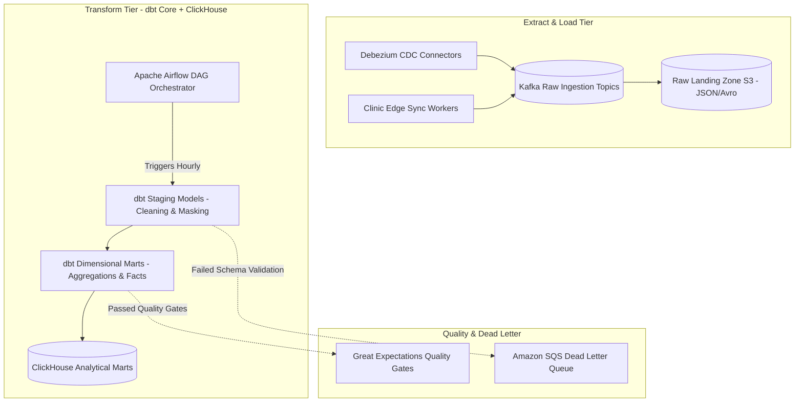

# Master ETL / ELT Pipeline Architecture, Orchestration, and Idempotency Strategy
## Namma Clinic Digital Health & Operations Platform
### Greater Bengaluru Authority (GBA) / BBMP Health Department
**Document Code:** `DATA-DOC-04` | **Status:** APPROVED BASELINE | **Date:** September 2026

---

## 1. Executive Summary & Pipeline Charter
This document defines the authoritative **ETL / ELT Pipeline Engineering, Ingestion Orchestration, and Idempotency Architecture** for the Namma Clinic Digital Health Platform. The platform adopts an **ELT (Extract-Load-Transform)** paradigm powered by Apache Airflow orchestration, Debezium CDC streaming, and dbt Core transformations inside ClickHouse and S3 Lakehouse tiers. Moving transformations inside the columnar lakehouse drastically reduces operational overhead, eliminates fragile intermediate stages, and delivers deterministic, idempotent data processing at municipal scale.

### 1.1 Non-Negotiable Ingestion & Transformation Invariants
1. **Strict Pipeline Idempotency:** Any pipeline execution, backfill, or replay must produce the identical state regardless of whether it is run once or ten times.
2. **Zero Ingestion Data Loss:** Dead Letter Queues (DLQ) with SQS/Kafka capture any ill-formed or rejected records for forensic analysis; no raw record is discarded silently.
3. **Contract-First Schemas:** Data producers and consumers conform to strict Avro / JSON schemas registered in the central Confluent Schema Registry. Schema breaking changes fail pipeline compilation.
4. **Automated Data Quality Validation:** Every ELT stage executes dbt unit tests and Great Expectations assertions before promoting records to curated analytical layers.
5. **Backfill & Historical Replay Capability:** All pipelines support parameterized point-in-time replays from immutable raw S3 storage.

## 2. Modern ELT Orchestration Topology


### Implementation Blueprint: Idempotent ELT Batch Ingestion Script
<!-- DOCUMENTATION-ONLY EXAMPLE -->
```python
# DOCUMENTATION-ONLY PYTHON
# DOCUMENTATION-ONLY PYTHON: Idempotent ELT Ingestion & Quality Reconciliation
import uuid
import datetime
from typing import Dict, Any, List

def process_encounter_batch(raw_records: List[Dict[str, Any]], target_store: Any) -> Dict[str, int]:
    """
    Idempotent batch transformation for clinical encounters.
    Performs data cleaning, PII de-identification, and upsert reconciliation.
    """
    processed_count = 0
    quarantined_count = 0

    for record in raw_records:
        encounter_id = record.get("id")
        clinic_id = record.get("clinic_id")
        created_at_str = record.get("created_at")

        # Validation gate
        if not encounter_id or not clinic_id or not created_at_str:
            quarantined_count += 1
            target_store.quarantine_record(record, reason="MISSING_PRIMARY_IDENTIFIERS")
            continue

        # Data masking: remove direct patient phone and aadhaar
        cleaned_record = {
            "encounter_id": str(encounter_id),
            "clinic_id": str(clinic_id),
            "encounter_type": record.get("encounter_type", "GENERAL_OPD"),
            "chief_complaint_masked": record.get("chief_complaint", "")[:100],
            "systolic_bp": int(record["systolic_bp"]) if record.get("systolic_bp") else None,
            "diastolic_bp": int(record["diastolic_bp"]) if record.get("diastolic_bp") else None,
            "event_timestamp": datetime.datetime.fromisoformat(created_at_str),
            "processed_at": datetime.datetime.utcnow().isoformat()
        }

        # Idempotent upsert into ClickHouse
        target_store.execute_upsert("analytics.fact_encounters", cleaned_record)
        processed_count += 1

    return {"processed": processed_count, "quarantined": quarantined_count}
```

## 3. Master Catalog of 80 ETL / ELT Pipelines
Detailed orchestration, schedule, and DLQ configurations for all 80 enterprise data pipelines:

### PIPELINE-001: Pipeline `pipeline_data_flow_001`
- **Pipeline Identifier:** `PIPELINE-001`
- **Pipeline Name:** `pipeline_data_flow_001`
- **Pipeline Type:** `Batch ELT`
- **Source Dataset:** `DATASET-001`
- **Target Dataset:** `DATASET-012`
- **Schedule:** `Hourly at :15`
- **Idempotency Strategy:** Upsert on primary surrogate key with event_version deduplication
- **Dead Letter Queue (DLQ):** `arn:aws:sqs:ap-south-1:104857620:dlq-pipeline-001`
- **Retry Policy:** Maximum 3 exponential backoff attempts before alerting.
- **Monitoring Alert:** PagerDuty & Slack `#data-ops-alerts` on DLQ threshold > 0.

### PIPELINE-002: Pipeline `pipeline_data_flow_002`
- **Pipeline Identifier:** `PIPELINE-002`
- **Pipeline Name:** `pipeline_data_flow_002`
- **Pipeline Type:** `Micro-Batch Streaming`
- **Source Dataset:** `DATASET-002`
- **Target Dataset:** `DATASET-013`
- **Schedule:** `Continuous 2s Micro-Batch`
- **Idempotency Strategy:** Upsert on primary surrogate key with event_version deduplication
- **Dead Letter Queue (DLQ):** `arn:aws:sqs:ap-south-1:104857620:dlq-pipeline-002`
- **Retry Policy:** Maximum 3 exponential backoff attempts before alerting.
- **Monitoring Alert:** PagerDuty & Slack `#data-ops-alerts` on DLQ threshold > 0.

### PIPELINE-003: Pipeline `pipeline_data_flow_003`
- **Pipeline Identifier:** `PIPELINE-003`
- **Pipeline Name:** `pipeline_data_flow_003`
- **Pipeline Type:** `DBT Dimensional Mart`
- **Source Dataset:** `DATASET-003`
- **Target Dataset:** `DATASET-014`
- **Schedule:** `Daily 02:00 IST`
- **Idempotency Strategy:** Upsert on primary surrogate key with event_version deduplication
- **Dead Letter Queue (DLQ):** `arn:aws:sqs:ap-south-1:104857620:dlq-pipeline-003`
- **Retry Policy:** Maximum 3 exponential backoff attempts before alerting.
- **Monitoring Alert:** PagerDuty & Slack `#data-ops-alerts` on DLQ threshold > 0.

### PIPELINE-004: Pipeline `pipeline_data_flow_004`
- **Pipeline Identifier:** `PIPELINE-004`
- **Pipeline Name:** `pipeline_data_flow_004`
- **Pipeline Type:** `Near-Real-Time Rehydration`
- **Source Dataset:** `DATASET-004`
- **Target Dataset:** `DATASET-015`
- **Schedule:** `Daily 02:00 IST`
- **Idempotency Strategy:** Upsert on primary surrogate key with event_version deduplication
- **Dead Letter Queue (DLQ):** `arn:aws:sqs:ap-south-1:104857620:dlq-pipeline-004`
- **Retry Policy:** Maximum 3 exponential backoff attempts before alerting.
- **Monitoring Alert:** PagerDuty & Slack `#data-ops-alerts` on DLQ threshold > 0.

### PIPELINE-005: Pipeline `pipeline_data_flow_005`
- **Pipeline Identifier:** `PIPELINE-005`
- **Pipeline Name:** `pipeline_data_flow_005`
- **Pipeline Type:** `Batch ELT`
- **Source Dataset:** `DATASET-005`
- **Target Dataset:** `DATASET-016`
- **Schedule:** `Hourly at :15`
- **Idempotency Strategy:** Upsert on primary surrogate key with event_version deduplication
- **Dead Letter Queue (DLQ):** `arn:aws:sqs:ap-south-1:104857620:dlq-pipeline-005`
- **Retry Policy:** Maximum 3 exponential backoff attempts before alerting.
- **Monitoring Alert:** PagerDuty & Slack `#data-ops-alerts` on DLQ threshold > 0.

### PIPELINE-006: Pipeline `pipeline_data_flow_006`
- **Pipeline Identifier:** `PIPELINE-006`
- **Pipeline Name:** `pipeline_data_flow_006`
- **Pipeline Type:** `Micro-Batch Streaming`
- **Source Dataset:** `DATASET-006`
- **Target Dataset:** `DATASET-017`
- **Schedule:** `Continuous 2s Micro-Batch`
- **Idempotency Strategy:** Upsert on primary surrogate key with event_version deduplication
- **Dead Letter Queue (DLQ):** `arn:aws:sqs:ap-south-1:104857620:dlq-pipeline-006`
- **Retry Policy:** Maximum 3 exponential backoff attempts before alerting.
- **Monitoring Alert:** PagerDuty & Slack `#data-ops-alerts` on DLQ threshold > 0.

### PIPELINE-007: Pipeline `pipeline_data_flow_007`
- **Pipeline Identifier:** `PIPELINE-007`
- **Pipeline Name:** `pipeline_data_flow_007`
- **Pipeline Type:** `DBT Dimensional Mart`
- **Source Dataset:** `DATASET-007`
- **Target Dataset:** `DATASET-018`
- **Schedule:** `Daily 02:00 IST`
- **Idempotency Strategy:** Upsert on primary surrogate key with event_version deduplication
- **Dead Letter Queue (DLQ):** `arn:aws:sqs:ap-south-1:104857620:dlq-pipeline-007`
- **Retry Policy:** Maximum 3 exponential backoff attempts before alerting.
- **Monitoring Alert:** PagerDuty & Slack `#data-ops-alerts` on DLQ threshold > 0.

### PIPELINE-008: Pipeline `pipeline_data_flow_008`
- **Pipeline Identifier:** `PIPELINE-008`
- **Pipeline Name:** `pipeline_data_flow_008`
- **Pipeline Type:** `Near-Real-Time Rehydration`
- **Source Dataset:** `DATASET-008`
- **Target Dataset:** `DATASET-019`
- **Schedule:** `Daily 02:00 IST`
- **Idempotency Strategy:** Upsert on primary surrogate key with event_version deduplication
- **Dead Letter Queue (DLQ):** `arn:aws:sqs:ap-south-1:104857620:dlq-pipeline-008`
- **Retry Policy:** Maximum 3 exponential backoff attempts before alerting.
- **Monitoring Alert:** PagerDuty & Slack `#data-ops-alerts` on DLQ threshold > 0.

### PIPELINE-009: Pipeline `pipeline_data_flow_009`
- **Pipeline Identifier:** `PIPELINE-009`
- **Pipeline Name:** `pipeline_data_flow_009`
- **Pipeline Type:** `Batch ELT`
- **Source Dataset:** `DATASET-009`
- **Target Dataset:** `DATASET-020`
- **Schedule:** `Hourly at :15`
- **Idempotency Strategy:** Upsert on primary surrogate key with event_version deduplication
- **Dead Letter Queue (DLQ):** `arn:aws:sqs:ap-south-1:104857620:dlq-pipeline-009`
- **Retry Policy:** Maximum 3 exponential backoff attempts before alerting.
- **Monitoring Alert:** PagerDuty & Slack `#data-ops-alerts` on DLQ threshold > 0.

### PIPELINE-010: Pipeline `pipeline_data_flow_010`
- **Pipeline Identifier:** `PIPELINE-010`
- **Pipeline Name:** `pipeline_data_flow_010`
- **Pipeline Type:** `Micro-Batch Streaming`
- **Source Dataset:** `DATASET-010`
- **Target Dataset:** `DATASET-021`
- **Schedule:** `Continuous 2s Micro-Batch`
- **Idempotency Strategy:** Upsert on primary surrogate key with event_version deduplication
- **Dead Letter Queue (DLQ):** `arn:aws:sqs:ap-south-1:104857620:dlq-pipeline-010`
- **Retry Policy:** Maximum 3 exponential backoff attempts before alerting.
- **Monitoring Alert:** PagerDuty & Slack `#data-ops-alerts` on DLQ threshold > 0.

### PIPELINE-011: Pipeline `pipeline_data_flow_011`
- **Pipeline Identifier:** `PIPELINE-011`
- **Pipeline Name:** `pipeline_data_flow_011`
- **Pipeline Type:** `DBT Dimensional Mart`
- **Source Dataset:** `DATASET-011`
- **Target Dataset:** `DATASET-022`
- **Schedule:** `Daily 02:00 IST`
- **Idempotency Strategy:** Upsert on primary surrogate key with event_version deduplication
- **Dead Letter Queue (DLQ):** `arn:aws:sqs:ap-south-1:104857620:dlq-pipeline-011`
- **Retry Policy:** Maximum 3 exponential backoff attempts before alerting.
- **Monitoring Alert:** PagerDuty & Slack `#data-ops-alerts` on DLQ threshold > 0.

### PIPELINE-012: Pipeline `pipeline_data_flow_012`
- **Pipeline Identifier:** `PIPELINE-012`
- **Pipeline Name:** `pipeline_data_flow_012`
- **Pipeline Type:** `Near-Real-Time Rehydration`
- **Source Dataset:** `DATASET-012`
- **Target Dataset:** `DATASET-023`
- **Schedule:** `Daily 02:00 IST`
- **Idempotency Strategy:** Upsert on primary surrogate key with event_version deduplication
- **Dead Letter Queue (DLQ):** `arn:aws:sqs:ap-south-1:104857620:dlq-pipeline-012`
- **Retry Policy:** Maximum 3 exponential backoff attempts before alerting.
- **Monitoring Alert:** PagerDuty & Slack `#data-ops-alerts` on DLQ threshold > 0.

### PIPELINE-013: Pipeline `pipeline_data_flow_013`
- **Pipeline Identifier:** `PIPELINE-013`
- **Pipeline Name:** `pipeline_data_flow_013`
- **Pipeline Type:** `Batch ELT`
- **Source Dataset:** `DATASET-013`
- **Target Dataset:** `DATASET-024`
- **Schedule:** `Hourly at :15`
- **Idempotency Strategy:** Upsert on primary surrogate key with event_version deduplication
- **Dead Letter Queue (DLQ):** `arn:aws:sqs:ap-south-1:104857620:dlq-pipeline-013`
- **Retry Policy:** Maximum 3 exponential backoff attempts before alerting.
- **Monitoring Alert:** PagerDuty & Slack `#data-ops-alerts` on DLQ threshold > 0.

### PIPELINE-014: Pipeline `pipeline_data_flow_014`
- **Pipeline Identifier:** `PIPELINE-014`
- **Pipeline Name:** `pipeline_data_flow_014`
- **Pipeline Type:** `Micro-Batch Streaming`
- **Source Dataset:** `DATASET-014`
- **Target Dataset:** `DATASET-025`
- **Schedule:** `Continuous 2s Micro-Batch`
- **Idempotency Strategy:** Upsert on primary surrogate key with event_version deduplication
- **Dead Letter Queue (DLQ):** `arn:aws:sqs:ap-south-1:104857620:dlq-pipeline-014`
- **Retry Policy:** Maximum 3 exponential backoff attempts before alerting.
- **Monitoring Alert:** PagerDuty & Slack `#data-ops-alerts` on DLQ threshold > 0.

### PIPELINE-015: Pipeline `pipeline_data_flow_015`
- **Pipeline Identifier:** `PIPELINE-015`
- **Pipeline Name:** `pipeline_data_flow_015`
- **Pipeline Type:** `DBT Dimensional Mart`
- **Source Dataset:** `DATASET-015`
- **Target Dataset:** `DATASET-026`
- **Schedule:** `Daily 02:00 IST`
- **Idempotency Strategy:** Upsert on primary surrogate key with event_version deduplication
- **Dead Letter Queue (DLQ):** `arn:aws:sqs:ap-south-1:104857620:dlq-pipeline-015`
- **Retry Policy:** Maximum 3 exponential backoff attempts before alerting.
- **Monitoring Alert:** PagerDuty & Slack `#data-ops-alerts` on DLQ threshold > 0.

### PIPELINE-016: Pipeline `pipeline_data_flow_016`
- **Pipeline Identifier:** `PIPELINE-016`
- **Pipeline Name:** `pipeline_data_flow_016`
- **Pipeline Type:** `Near-Real-Time Rehydration`
- **Source Dataset:** `DATASET-016`
- **Target Dataset:** `DATASET-027`
- **Schedule:** `Daily 02:00 IST`
- **Idempotency Strategy:** Upsert on primary surrogate key with event_version deduplication
- **Dead Letter Queue (DLQ):** `arn:aws:sqs:ap-south-1:104857620:dlq-pipeline-016`
- **Retry Policy:** Maximum 3 exponential backoff attempts before alerting.
- **Monitoring Alert:** PagerDuty & Slack `#data-ops-alerts` on DLQ threshold > 0.

### PIPELINE-017: Pipeline `pipeline_data_flow_017`
- **Pipeline Identifier:** `PIPELINE-017`
- **Pipeline Name:** `pipeline_data_flow_017`
- **Pipeline Type:** `Batch ELT`
- **Source Dataset:** `DATASET-017`
- **Target Dataset:** `DATASET-028`
- **Schedule:** `Hourly at :15`
- **Idempotency Strategy:** Upsert on primary surrogate key with event_version deduplication
- **Dead Letter Queue (DLQ):** `arn:aws:sqs:ap-south-1:104857620:dlq-pipeline-017`
- **Retry Policy:** Maximum 3 exponential backoff attempts before alerting.
- **Monitoring Alert:** PagerDuty & Slack `#data-ops-alerts` on DLQ threshold > 0.

### PIPELINE-018: Pipeline `pipeline_data_flow_018`
- **Pipeline Identifier:** `PIPELINE-018`
- **Pipeline Name:** `pipeline_data_flow_018`
- **Pipeline Type:** `Micro-Batch Streaming`
- **Source Dataset:** `DATASET-018`
- **Target Dataset:** `DATASET-029`
- **Schedule:** `Continuous 2s Micro-Batch`
- **Idempotency Strategy:** Upsert on primary surrogate key with event_version deduplication
- **Dead Letter Queue (DLQ):** `arn:aws:sqs:ap-south-1:104857620:dlq-pipeline-018`
- **Retry Policy:** Maximum 3 exponential backoff attempts before alerting.
- **Monitoring Alert:** PagerDuty & Slack `#data-ops-alerts` on DLQ threshold > 0.

### PIPELINE-019: Pipeline `pipeline_data_flow_019`
- **Pipeline Identifier:** `PIPELINE-019`
- **Pipeline Name:** `pipeline_data_flow_019`
- **Pipeline Type:** `DBT Dimensional Mart`
- **Source Dataset:** `DATASET-019`
- **Target Dataset:** `DATASET-030`
- **Schedule:** `Daily 02:00 IST`
- **Idempotency Strategy:** Upsert on primary surrogate key with event_version deduplication
- **Dead Letter Queue (DLQ):** `arn:aws:sqs:ap-south-1:104857620:dlq-pipeline-019`
- **Retry Policy:** Maximum 3 exponential backoff attempts before alerting.
- **Monitoring Alert:** PagerDuty & Slack `#data-ops-alerts` on DLQ threshold > 0.

### PIPELINE-020: Pipeline `pipeline_data_flow_020`
- **Pipeline Identifier:** `PIPELINE-020`
- **Pipeline Name:** `pipeline_data_flow_020`
- **Pipeline Type:** `Near-Real-Time Rehydration`
- **Source Dataset:** `DATASET-020`
- **Target Dataset:** `DATASET-031`
- **Schedule:** `Daily 02:00 IST`
- **Idempotency Strategy:** Upsert on primary surrogate key with event_version deduplication
- **Dead Letter Queue (DLQ):** `arn:aws:sqs:ap-south-1:104857620:dlq-pipeline-020`
- **Retry Policy:** Maximum 3 exponential backoff attempts before alerting.
- **Monitoring Alert:** PagerDuty & Slack `#data-ops-alerts` on DLQ threshold > 0.

### PIPELINE-021: Pipeline `pipeline_data_flow_021`
- **Pipeline Identifier:** `PIPELINE-021`
- **Pipeline Name:** `pipeline_data_flow_021`
- **Pipeline Type:** `Batch ELT`
- **Source Dataset:** `DATASET-021`
- **Target Dataset:** `DATASET-032`
- **Schedule:** `Hourly at :15`
- **Idempotency Strategy:** Upsert on primary surrogate key with event_version deduplication
- **Dead Letter Queue (DLQ):** `arn:aws:sqs:ap-south-1:104857620:dlq-pipeline-021`
- **Retry Policy:** Maximum 3 exponential backoff attempts before alerting.
- **Monitoring Alert:** PagerDuty & Slack `#data-ops-alerts` on DLQ threshold > 0.

### PIPELINE-022: Pipeline `pipeline_data_flow_022`
- **Pipeline Identifier:** `PIPELINE-022`
- **Pipeline Name:** `pipeline_data_flow_022`
- **Pipeline Type:** `Micro-Batch Streaming`
- **Source Dataset:** `DATASET-022`
- **Target Dataset:** `DATASET-033`
- **Schedule:** `Continuous 2s Micro-Batch`
- **Idempotency Strategy:** Upsert on primary surrogate key with event_version deduplication
- **Dead Letter Queue (DLQ):** `arn:aws:sqs:ap-south-1:104857620:dlq-pipeline-022`
- **Retry Policy:** Maximum 3 exponential backoff attempts before alerting.
- **Monitoring Alert:** PagerDuty & Slack `#data-ops-alerts` on DLQ threshold > 0.

### PIPELINE-023: Pipeline `pipeline_data_flow_023`
- **Pipeline Identifier:** `PIPELINE-023`
- **Pipeline Name:** `pipeline_data_flow_023`
- **Pipeline Type:** `DBT Dimensional Mart`
- **Source Dataset:** `DATASET-023`
- **Target Dataset:** `DATASET-034`
- **Schedule:** `Daily 02:00 IST`
- **Idempotency Strategy:** Upsert on primary surrogate key with event_version deduplication
- **Dead Letter Queue (DLQ):** `arn:aws:sqs:ap-south-1:104857620:dlq-pipeline-023`
- **Retry Policy:** Maximum 3 exponential backoff attempts before alerting.
- **Monitoring Alert:** PagerDuty & Slack `#data-ops-alerts` on DLQ threshold > 0.

### PIPELINE-024: Pipeline `pipeline_data_flow_024`
- **Pipeline Identifier:** `PIPELINE-024`
- **Pipeline Name:** `pipeline_data_flow_024`
- **Pipeline Type:** `Near-Real-Time Rehydration`
- **Source Dataset:** `DATASET-024`
- **Target Dataset:** `DATASET-035`
- **Schedule:** `Daily 02:00 IST`
- **Idempotency Strategy:** Upsert on primary surrogate key with event_version deduplication
- **Dead Letter Queue (DLQ):** `arn:aws:sqs:ap-south-1:104857620:dlq-pipeline-024`
- **Retry Policy:** Maximum 3 exponential backoff attempts before alerting.
- **Monitoring Alert:** PagerDuty & Slack `#data-ops-alerts` on DLQ threshold > 0.

### PIPELINE-025: Pipeline `pipeline_data_flow_025`
- **Pipeline Identifier:** `PIPELINE-025`
- **Pipeline Name:** `pipeline_data_flow_025`
- **Pipeline Type:** `Batch ELT`
- **Source Dataset:** `DATASET-025`
- **Target Dataset:** `DATASET-036`
- **Schedule:** `Hourly at :15`
- **Idempotency Strategy:** Upsert on primary surrogate key with event_version deduplication
- **Dead Letter Queue (DLQ):** `arn:aws:sqs:ap-south-1:104857620:dlq-pipeline-025`
- **Retry Policy:** Maximum 3 exponential backoff attempts before alerting.
- **Monitoring Alert:** PagerDuty & Slack `#data-ops-alerts` on DLQ threshold > 0.

### PIPELINE-026: Pipeline `pipeline_data_flow_026`
- **Pipeline Identifier:** `PIPELINE-026`
- **Pipeline Name:** `pipeline_data_flow_026`
- **Pipeline Type:** `Micro-Batch Streaming`
- **Source Dataset:** `DATASET-026`
- **Target Dataset:** `DATASET-037`
- **Schedule:** `Continuous 2s Micro-Batch`
- **Idempotency Strategy:** Upsert on primary surrogate key with event_version deduplication
- **Dead Letter Queue (DLQ):** `arn:aws:sqs:ap-south-1:104857620:dlq-pipeline-026`
- **Retry Policy:** Maximum 3 exponential backoff attempts before alerting.
- **Monitoring Alert:** PagerDuty & Slack `#data-ops-alerts` on DLQ threshold > 0.

### PIPELINE-027: Pipeline `pipeline_data_flow_027`
- **Pipeline Identifier:** `PIPELINE-027`
- **Pipeline Name:** `pipeline_data_flow_027`
- **Pipeline Type:** `DBT Dimensional Mart`
- **Source Dataset:** `DATASET-027`
- **Target Dataset:** `DATASET-038`
- **Schedule:** `Daily 02:00 IST`
- **Idempotency Strategy:** Upsert on primary surrogate key with event_version deduplication
- **Dead Letter Queue (DLQ):** `arn:aws:sqs:ap-south-1:104857620:dlq-pipeline-027`
- **Retry Policy:** Maximum 3 exponential backoff attempts before alerting.
- **Monitoring Alert:** PagerDuty & Slack `#data-ops-alerts` on DLQ threshold > 0.

### PIPELINE-028: Pipeline `pipeline_data_flow_028`
- **Pipeline Identifier:** `PIPELINE-028`
- **Pipeline Name:** `pipeline_data_flow_028`
- **Pipeline Type:** `Near-Real-Time Rehydration`
- **Source Dataset:** `DATASET-028`
- **Target Dataset:** `DATASET-039`
- **Schedule:** `Daily 02:00 IST`
- **Idempotency Strategy:** Upsert on primary surrogate key with event_version deduplication
- **Dead Letter Queue (DLQ):** `arn:aws:sqs:ap-south-1:104857620:dlq-pipeline-028`
- **Retry Policy:** Maximum 3 exponential backoff attempts before alerting.
- **Monitoring Alert:** PagerDuty & Slack `#data-ops-alerts` on DLQ threshold > 0.

### PIPELINE-029: Pipeline `pipeline_data_flow_029`
- **Pipeline Identifier:** `PIPELINE-029`
- **Pipeline Name:** `pipeline_data_flow_029`
- **Pipeline Type:** `Batch ELT`
- **Source Dataset:** `DATASET-029`
- **Target Dataset:** `DATASET-040`
- **Schedule:** `Hourly at :15`
- **Idempotency Strategy:** Upsert on primary surrogate key with event_version deduplication
- **Dead Letter Queue (DLQ):** `arn:aws:sqs:ap-south-1:104857620:dlq-pipeline-029`
- **Retry Policy:** Maximum 3 exponential backoff attempts before alerting.
- **Monitoring Alert:** PagerDuty & Slack `#data-ops-alerts` on DLQ threshold > 0.

### PIPELINE-030: Pipeline `pipeline_data_flow_030`
- **Pipeline Identifier:** `PIPELINE-030`
- **Pipeline Name:** `pipeline_data_flow_030`
- **Pipeline Type:** `Micro-Batch Streaming`
- **Source Dataset:** `DATASET-030`
- **Target Dataset:** `DATASET-041`
- **Schedule:** `Continuous 2s Micro-Batch`
- **Idempotency Strategy:** Upsert on primary surrogate key with event_version deduplication
- **Dead Letter Queue (DLQ):** `arn:aws:sqs:ap-south-1:104857620:dlq-pipeline-030`
- **Retry Policy:** Maximum 3 exponential backoff attempts before alerting.
- **Monitoring Alert:** PagerDuty & Slack `#data-ops-alerts` on DLQ threshold > 0.

### PIPELINE-031: Pipeline `pipeline_data_flow_031`
- **Pipeline Identifier:** `PIPELINE-031`
- **Pipeline Name:** `pipeline_data_flow_031`
- **Pipeline Type:** `DBT Dimensional Mart`
- **Source Dataset:** `DATASET-031`
- **Target Dataset:** `DATASET-042`
- **Schedule:** `Daily 02:00 IST`
- **Idempotency Strategy:** Upsert on primary surrogate key with event_version deduplication
- **Dead Letter Queue (DLQ):** `arn:aws:sqs:ap-south-1:104857620:dlq-pipeline-031`
- **Retry Policy:** Maximum 3 exponential backoff attempts before alerting.
- **Monitoring Alert:** PagerDuty & Slack `#data-ops-alerts` on DLQ threshold > 0.

### PIPELINE-032: Pipeline `pipeline_data_flow_032`
- **Pipeline Identifier:** `PIPELINE-032`
- **Pipeline Name:** `pipeline_data_flow_032`
- **Pipeline Type:** `Near-Real-Time Rehydration`
- **Source Dataset:** `DATASET-032`
- **Target Dataset:** `DATASET-043`
- **Schedule:** `Daily 02:00 IST`
- **Idempotency Strategy:** Upsert on primary surrogate key with event_version deduplication
- **Dead Letter Queue (DLQ):** `arn:aws:sqs:ap-south-1:104857620:dlq-pipeline-032`
- **Retry Policy:** Maximum 3 exponential backoff attempts before alerting.
- **Monitoring Alert:** PagerDuty & Slack `#data-ops-alerts` on DLQ threshold > 0.

### PIPELINE-033: Pipeline `pipeline_data_flow_033`
- **Pipeline Identifier:** `PIPELINE-033`
- **Pipeline Name:** `pipeline_data_flow_033`
- **Pipeline Type:** `Batch ELT`
- **Source Dataset:** `DATASET-033`
- **Target Dataset:** `DATASET-044`
- **Schedule:** `Hourly at :15`
- **Idempotency Strategy:** Upsert on primary surrogate key with event_version deduplication
- **Dead Letter Queue (DLQ):** `arn:aws:sqs:ap-south-1:104857620:dlq-pipeline-033`
- **Retry Policy:** Maximum 3 exponential backoff attempts before alerting.
- **Monitoring Alert:** PagerDuty & Slack `#data-ops-alerts` on DLQ threshold > 0.

### PIPELINE-034: Pipeline `pipeline_data_flow_034`
- **Pipeline Identifier:** `PIPELINE-034`
- **Pipeline Name:** `pipeline_data_flow_034`
- **Pipeline Type:** `Micro-Batch Streaming`
- **Source Dataset:** `DATASET-034`
- **Target Dataset:** `DATASET-045`
- **Schedule:** `Continuous 2s Micro-Batch`
- **Idempotency Strategy:** Upsert on primary surrogate key with event_version deduplication
- **Dead Letter Queue (DLQ):** `arn:aws:sqs:ap-south-1:104857620:dlq-pipeline-034`
- **Retry Policy:** Maximum 3 exponential backoff attempts before alerting.
- **Monitoring Alert:** PagerDuty & Slack `#data-ops-alerts` on DLQ threshold > 0.

### PIPELINE-035: Pipeline `pipeline_data_flow_035`
- **Pipeline Identifier:** `PIPELINE-035`
- **Pipeline Name:** `pipeline_data_flow_035`
- **Pipeline Type:** `DBT Dimensional Mart`
- **Source Dataset:** `DATASET-035`
- **Target Dataset:** `DATASET-046`
- **Schedule:** `Daily 02:00 IST`
- **Idempotency Strategy:** Upsert on primary surrogate key with event_version deduplication
- **Dead Letter Queue (DLQ):** `arn:aws:sqs:ap-south-1:104857620:dlq-pipeline-035`
- **Retry Policy:** Maximum 3 exponential backoff attempts before alerting.
- **Monitoring Alert:** PagerDuty & Slack `#data-ops-alerts` on DLQ threshold > 0.

### PIPELINE-036: Pipeline `pipeline_data_flow_036`
- **Pipeline Identifier:** `PIPELINE-036`
- **Pipeline Name:** `pipeline_data_flow_036`
- **Pipeline Type:** `Near-Real-Time Rehydration`
- **Source Dataset:** `DATASET-036`
- **Target Dataset:** `DATASET-047`
- **Schedule:** `Daily 02:00 IST`
- **Idempotency Strategy:** Upsert on primary surrogate key with event_version deduplication
- **Dead Letter Queue (DLQ):** `arn:aws:sqs:ap-south-1:104857620:dlq-pipeline-036`
- **Retry Policy:** Maximum 3 exponential backoff attempts before alerting.
- **Monitoring Alert:** PagerDuty & Slack `#data-ops-alerts` on DLQ threshold > 0.

### PIPELINE-037: Pipeline `pipeline_data_flow_037`
- **Pipeline Identifier:** `PIPELINE-037`
- **Pipeline Name:** `pipeline_data_flow_037`
- **Pipeline Type:** `Batch ELT`
- **Source Dataset:** `DATASET-037`
- **Target Dataset:** `DATASET-048`
- **Schedule:** `Hourly at :15`
- **Idempotency Strategy:** Upsert on primary surrogate key with event_version deduplication
- **Dead Letter Queue (DLQ):** `arn:aws:sqs:ap-south-1:104857620:dlq-pipeline-037`
- **Retry Policy:** Maximum 3 exponential backoff attempts before alerting.
- **Monitoring Alert:** PagerDuty & Slack `#data-ops-alerts` on DLQ threshold > 0.

### PIPELINE-038: Pipeline `pipeline_data_flow_038`
- **Pipeline Identifier:** `PIPELINE-038`
- **Pipeline Name:** `pipeline_data_flow_038`
- **Pipeline Type:** `Micro-Batch Streaming`
- **Source Dataset:** `DATASET-038`
- **Target Dataset:** `DATASET-049`
- **Schedule:** `Continuous 2s Micro-Batch`
- **Idempotency Strategy:** Upsert on primary surrogate key with event_version deduplication
- **Dead Letter Queue (DLQ):** `arn:aws:sqs:ap-south-1:104857620:dlq-pipeline-038`
- **Retry Policy:** Maximum 3 exponential backoff attempts before alerting.
- **Monitoring Alert:** PagerDuty & Slack `#data-ops-alerts` on DLQ threshold > 0.

### PIPELINE-039: Pipeline `pipeline_data_flow_039`
- **Pipeline Identifier:** `PIPELINE-039`
- **Pipeline Name:** `pipeline_data_flow_039`
- **Pipeline Type:** `DBT Dimensional Mart`
- **Source Dataset:** `DATASET-039`
- **Target Dataset:** `DATASET-050`
- **Schedule:** `Daily 02:00 IST`
- **Idempotency Strategy:** Upsert on primary surrogate key with event_version deduplication
- **Dead Letter Queue (DLQ):** `arn:aws:sqs:ap-south-1:104857620:dlq-pipeline-039`
- **Retry Policy:** Maximum 3 exponential backoff attempts before alerting.
- **Monitoring Alert:** PagerDuty & Slack `#data-ops-alerts` on DLQ threshold > 0.

### PIPELINE-040: Pipeline `pipeline_data_flow_040`
- **Pipeline Identifier:** `PIPELINE-040`
- **Pipeline Name:** `pipeline_data_flow_040`
- **Pipeline Type:** `Near-Real-Time Rehydration`
- **Source Dataset:** `DATASET-040`
- **Target Dataset:** `DATASET-051`
- **Schedule:** `Daily 02:00 IST`
- **Idempotency Strategy:** Upsert on primary surrogate key with event_version deduplication
- **Dead Letter Queue (DLQ):** `arn:aws:sqs:ap-south-1:104857620:dlq-pipeline-040`
- **Retry Policy:** Maximum 3 exponential backoff attempts before alerting.
- **Monitoring Alert:** PagerDuty & Slack `#data-ops-alerts` on DLQ threshold > 0.

### PIPELINE-041: Pipeline `pipeline_data_flow_041`
- **Pipeline Identifier:** `PIPELINE-041`
- **Pipeline Name:** `pipeline_data_flow_041`
- **Pipeline Type:** `Batch ELT`
- **Source Dataset:** `DATASET-041`
- **Target Dataset:** `DATASET-052`
- **Schedule:** `Hourly at :15`
- **Idempotency Strategy:** Upsert on primary surrogate key with event_version deduplication
- **Dead Letter Queue (DLQ):** `arn:aws:sqs:ap-south-1:104857620:dlq-pipeline-041`
- **Retry Policy:** Maximum 3 exponential backoff attempts before alerting.
- **Monitoring Alert:** PagerDuty & Slack `#data-ops-alerts` on DLQ threshold > 0.

### PIPELINE-042: Pipeline `pipeline_data_flow_042`
- **Pipeline Identifier:** `PIPELINE-042`
- **Pipeline Name:** `pipeline_data_flow_042`
- **Pipeline Type:** `Micro-Batch Streaming`
- **Source Dataset:** `DATASET-042`
- **Target Dataset:** `DATASET-053`
- **Schedule:** `Continuous 2s Micro-Batch`
- **Idempotency Strategy:** Upsert on primary surrogate key with event_version deduplication
- **Dead Letter Queue (DLQ):** `arn:aws:sqs:ap-south-1:104857620:dlq-pipeline-042`
- **Retry Policy:** Maximum 3 exponential backoff attempts before alerting.
- **Monitoring Alert:** PagerDuty & Slack `#data-ops-alerts` on DLQ threshold > 0.

### PIPELINE-043: Pipeline `pipeline_data_flow_043`
- **Pipeline Identifier:** `PIPELINE-043`
- **Pipeline Name:** `pipeline_data_flow_043`
- **Pipeline Type:** `DBT Dimensional Mart`
- **Source Dataset:** `DATASET-043`
- **Target Dataset:** `DATASET-054`
- **Schedule:** `Daily 02:00 IST`
- **Idempotency Strategy:** Upsert on primary surrogate key with event_version deduplication
- **Dead Letter Queue (DLQ):** `arn:aws:sqs:ap-south-1:104857620:dlq-pipeline-043`
- **Retry Policy:** Maximum 3 exponential backoff attempts before alerting.
- **Monitoring Alert:** PagerDuty & Slack `#data-ops-alerts` on DLQ threshold > 0.

### PIPELINE-044: Pipeline `pipeline_data_flow_044`
- **Pipeline Identifier:** `PIPELINE-044`
- **Pipeline Name:** `pipeline_data_flow_044`
- **Pipeline Type:** `Near-Real-Time Rehydration`
- **Source Dataset:** `DATASET-044`
- **Target Dataset:** `DATASET-055`
- **Schedule:** `Daily 02:00 IST`
- **Idempotency Strategy:** Upsert on primary surrogate key with event_version deduplication
- **Dead Letter Queue (DLQ):** `arn:aws:sqs:ap-south-1:104857620:dlq-pipeline-044`
- **Retry Policy:** Maximum 3 exponential backoff attempts before alerting.
- **Monitoring Alert:** PagerDuty & Slack `#data-ops-alerts` on DLQ threshold > 0.

### PIPELINE-045: Pipeline `pipeline_data_flow_045`
- **Pipeline Identifier:** `PIPELINE-045`
- **Pipeline Name:** `pipeline_data_flow_045`
- **Pipeline Type:** `Batch ELT`
- **Source Dataset:** `DATASET-045`
- **Target Dataset:** `DATASET-056`
- **Schedule:** `Hourly at :15`
- **Idempotency Strategy:** Upsert on primary surrogate key with event_version deduplication
- **Dead Letter Queue (DLQ):** `arn:aws:sqs:ap-south-1:104857620:dlq-pipeline-045`
- **Retry Policy:** Maximum 3 exponential backoff attempts before alerting.
- **Monitoring Alert:** PagerDuty & Slack `#data-ops-alerts` on DLQ threshold > 0.

### PIPELINE-046: Pipeline `pipeline_data_flow_046`
- **Pipeline Identifier:** `PIPELINE-046`
- **Pipeline Name:** `pipeline_data_flow_046`
- **Pipeline Type:** `Micro-Batch Streaming`
- **Source Dataset:** `DATASET-046`
- **Target Dataset:** `DATASET-057`
- **Schedule:** `Continuous 2s Micro-Batch`
- **Idempotency Strategy:** Upsert on primary surrogate key with event_version deduplication
- **Dead Letter Queue (DLQ):** `arn:aws:sqs:ap-south-1:104857620:dlq-pipeline-046`
- **Retry Policy:** Maximum 3 exponential backoff attempts before alerting.
- **Monitoring Alert:** PagerDuty & Slack `#data-ops-alerts` on DLQ threshold > 0.

### PIPELINE-047: Pipeline `pipeline_data_flow_047`
- **Pipeline Identifier:** `PIPELINE-047`
- **Pipeline Name:** `pipeline_data_flow_047`
- **Pipeline Type:** `DBT Dimensional Mart`
- **Source Dataset:** `DATASET-047`
- **Target Dataset:** `DATASET-058`
- **Schedule:** `Daily 02:00 IST`
- **Idempotency Strategy:** Upsert on primary surrogate key with event_version deduplication
- **Dead Letter Queue (DLQ):** `arn:aws:sqs:ap-south-1:104857620:dlq-pipeline-047`
- **Retry Policy:** Maximum 3 exponential backoff attempts before alerting.
- **Monitoring Alert:** PagerDuty & Slack `#data-ops-alerts` on DLQ threshold > 0.

### PIPELINE-048: Pipeline `pipeline_data_flow_048`
- **Pipeline Identifier:** `PIPELINE-048`
- **Pipeline Name:** `pipeline_data_flow_048`
- **Pipeline Type:** `Near-Real-Time Rehydration`
- **Source Dataset:** `DATASET-048`
- **Target Dataset:** `DATASET-059`
- **Schedule:** `Daily 02:00 IST`
- **Idempotency Strategy:** Upsert on primary surrogate key with event_version deduplication
- **Dead Letter Queue (DLQ):** `arn:aws:sqs:ap-south-1:104857620:dlq-pipeline-048`
- **Retry Policy:** Maximum 3 exponential backoff attempts before alerting.
- **Monitoring Alert:** PagerDuty & Slack `#data-ops-alerts` on DLQ threshold > 0.

### PIPELINE-049: Pipeline `pipeline_data_flow_049`
- **Pipeline Identifier:** `PIPELINE-049`
- **Pipeline Name:** `pipeline_data_flow_049`
- **Pipeline Type:** `Batch ELT`
- **Source Dataset:** `DATASET-049`
- **Target Dataset:** `DATASET-060`
- **Schedule:** `Hourly at :15`
- **Idempotency Strategy:** Upsert on primary surrogate key with event_version deduplication
- **Dead Letter Queue (DLQ):** `arn:aws:sqs:ap-south-1:104857620:dlq-pipeline-049`
- **Retry Policy:** Maximum 3 exponential backoff attempts before alerting.
- **Monitoring Alert:** PagerDuty & Slack `#data-ops-alerts` on DLQ threshold > 0.

### PIPELINE-050: Pipeline `pipeline_data_flow_050`
- **Pipeline Identifier:** `PIPELINE-050`
- **Pipeline Name:** `pipeline_data_flow_050`
- **Pipeline Type:** `Micro-Batch Streaming`
- **Source Dataset:** `DATASET-050`
- **Target Dataset:** `DATASET-061`
- **Schedule:** `Continuous 2s Micro-Batch`
- **Idempotency Strategy:** Upsert on primary surrogate key with event_version deduplication
- **Dead Letter Queue (DLQ):** `arn:aws:sqs:ap-south-1:104857620:dlq-pipeline-050`
- **Retry Policy:** Maximum 3 exponential backoff attempts before alerting.
- **Monitoring Alert:** PagerDuty & Slack `#data-ops-alerts` on DLQ threshold > 0.

### PIPELINE-051: Pipeline `pipeline_data_flow_051`
- **Pipeline Identifier:** `PIPELINE-051`
- **Pipeline Name:** `pipeline_data_flow_051`
- **Pipeline Type:** `DBT Dimensional Mart`
- **Source Dataset:** `DATASET-051`
- **Target Dataset:** `DATASET-062`
- **Schedule:** `Daily 02:00 IST`
- **Idempotency Strategy:** Upsert on primary surrogate key with event_version deduplication
- **Dead Letter Queue (DLQ):** `arn:aws:sqs:ap-south-1:104857620:dlq-pipeline-051`
- **Retry Policy:** Maximum 3 exponential backoff attempts before alerting.
- **Monitoring Alert:** PagerDuty & Slack `#data-ops-alerts` on DLQ threshold > 0.

### PIPELINE-052: Pipeline `pipeline_data_flow_052`
- **Pipeline Identifier:** `PIPELINE-052`
- **Pipeline Name:** `pipeline_data_flow_052`
- **Pipeline Type:** `Near-Real-Time Rehydration`
- **Source Dataset:** `DATASET-052`
- **Target Dataset:** `DATASET-063`
- **Schedule:** `Daily 02:00 IST`
- **Idempotency Strategy:** Upsert on primary surrogate key with event_version deduplication
- **Dead Letter Queue (DLQ):** `arn:aws:sqs:ap-south-1:104857620:dlq-pipeline-052`
- **Retry Policy:** Maximum 3 exponential backoff attempts before alerting.
- **Monitoring Alert:** PagerDuty & Slack `#data-ops-alerts` on DLQ threshold > 0.

### PIPELINE-053: Pipeline `pipeline_data_flow_053`
- **Pipeline Identifier:** `PIPELINE-053`
- **Pipeline Name:** `pipeline_data_flow_053`
- **Pipeline Type:** `Batch ELT`
- **Source Dataset:** `DATASET-053`
- **Target Dataset:** `DATASET-064`
- **Schedule:** `Hourly at :15`
- **Idempotency Strategy:** Upsert on primary surrogate key with event_version deduplication
- **Dead Letter Queue (DLQ):** `arn:aws:sqs:ap-south-1:104857620:dlq-pipeline-053`
- **Retry Policy:** Maximum 3 exponential backoff attempts before alerting.
- **Monitoring Alert:** PagerDuty & Slack `#data-ops-alerts` on DLQ threshold > 0.

### PIPELINE-054: Pipeline `pipeline_data_flow_054`
- **Pipeline Identifier:** `PIPELINE-054`
- **Pipeline Name:** `pipeline_data_flow_054`
- **Pipeline Type:** `Micro-Batch Streaming`
- **Source Dataset:** `DATASET-054`
- **Target Dataset:** `DATASET-065`
- **Schedule:** `Continuous 2s Micro-Batch`
- **Idempotency Strategy:** Upsert on primary surrogate key with event_version deduplication
- **Dead Letter Queue (DLQ):** `arn:aws:sqs:ap-south-1:104857620:dlq-pipeline-054`
- **Retry Policy:** Maximum 3 exponential backoff attempts before alerting.
- **Monitoring Alert:** PagerDuty & Slack `#data-ops-alerts` on DLQ threshold > 0.

### PIPELINE-055: Pipeline `pipeline_data_flow_055`
- **Pipeline Identifier:** `PIPELINE-055`
- **Pipeline Name:** `pipeline_data_flow_055`
- **Pipeline Type:** `DBT Dimensional Mart`
- **Source Dataset:** `DATASET-055`
- **Target Dataset:** `DATASET-066`
- **Schedule:** `Daily 02:00 IST`
- **Idempotency Strategy:** Upsert on primary surrogate key with event_version deduplication
- **Dead Letter Queue (DLQ):** `arn:aws:sqs:ap-south-1:104857620:dlq-pipeline-055`
- **Retry Policy:** Maximum 3 exponential backoff attempts before alerting.
- **Monitoring Alert:** PagerDuty & Slack `#data-ops-alerts` on DLQ threshold > 0.

### PIPELINE-056: Pipeline `pipeline_data_flow_056`
- **Pipeline Identifier:** `PIPELINE-056`
- **Pipeline Name:** `pipeline_data_flow_056`
- **Pipeline Type:** `Near-Real-Time Rehydration`
- **Source Dataset:** `DATASET-056`
- **Target Dataset:** `DATASET-067`
- **Schedule:** `Daily 02:00 IST`
- **Idempotency Strategy:** Upsert on primary surrogate key with event_version deduplication
- **Dead Letter Queue (DLQ):** `arn:aws:sqs:ap-south-1:104857620:dlq-pipeline-056`
- **Retry Policy:** Maximum 3 exponential backoff attempts before alerting.
- **Monitoring Alert:** PagerDuty & Slack `#data-ops-alerts` on DLQ threshold > 0.

### PIPELINE-057: Pipeline `pipeline_data_flow_057`
- **Pipeline Identifier:** `PIPELINE-057`
- **Pipeline Name:** `pipeline_data_flow_057`
- **Pipeline Type:** `Batch ELT`
- **Source Dataset:** `DATASET-057`
- **Target Dataset:** `DATASET-068`
- **Schedule:** `Hourly at :15`
- **Idempotency Strategy:** Upsert on primary surrogate key with event_version deduplication
- **Dead Letter Queue (DLQ):** `arn:aws:sqs:ap-south-1:104857620:dlq-pipeline-057`
- **Retry Policy:** Maximum 3 exponential backoff attempts before alerting.
- **Monitoring Alert:** PagerDuty & Slack `#data-ops-alerts` on DLQ threshold > 0.

### PIPELINE-058: Pipeline `pipeline_data_flow_058`
- **Pipeline Identifier:** `PIPELINE-058`
- **Pipeline Name:** `pipeline_data_flow_058`
- **Pipeline Type:** `Micro-Batch Streaming`
- **Source Dataset:** `DATASET-058`
- **Target Dataset:** `DATASET-069`
- **Schedule:** `Continuous 2s Micro-Batch`
- **Idempotency Strategy:** Upsert on primary surrogate key with event_version deduplication
- **Dead Letter Queue (DLQ):** `arn:aws:sqs:ap-south-1:104857620:dlq-pipeline-058`
- **Retry Policy:** Maximum 3 exponential backoff attempts before alerting.
- **Monitoring Alert:** PagerDuty & Slack `#data-ops-alerts` on DLQ threshold > 0.

### PIPELINE-059: Pipeline `pipeline_data_flow_059`
- **Pipeline Identifier:** `PIPELINE-059`
- **Pipeline Name:** `pipeline_data_flow_059`
- **Pipeline Type:** `DBT Dimensional Mart`
- **Source Dataset:** `DATASET-059`
- **Target Dataset:** `DATASET-070`
- **Schedule:** `Daily 02:00 IST`
- **Idempotency Strategy:** Upsert on primary surrogate key with event_version deduplication
- **Dead Letter Queue (DLQ):** `arn:aws:sqs:ap-south-1:104857620:dlq-pipeline-059`
- **Retry Policy:** Maximum 3 exponential backoff attempts before alerting.
- **Monitoring Alert:** PagerDuty & Slack `#data-ops-alerts` on DLQ threshold > 0.

### PIPELINE-060: Pipeline `pipeline_data_flow_060`
- **Pipeline Identifier:** `PIPELINE-060`
- **Pipeline Name:** `pipeline_data_flow_060`
- **Pipeline Type:** `Near-Real-Time Rehydration`
- **Source Dataset:** `DATASET-060`
- **Target Dataset:** `DATASET-071`
- **Schedule:** `Daily 02:00 IST`
- **Idempotency Strategy:** Upsert on primary surrogate key with event_version deduplication
- **Dead Letter Queue (DLQ):** `arn:aws:sqs:ap-south-1:104857620:dlq-pipeline-060`
- **Retry Policy:** Maximum 3 exponential backoff attempts before alerting.
- **Monitoring Alert:** PagerDuty & Slack `#data-ops-alerts` on DLQ threshold > 0.

### PIPELINE-061: Pipeline `pipeline_data_flow_061`
- **Pipeline Identifier:** `PIPELINE-061`
- **Pipeline Name:** `pipeline_data_flow_061`
- **Pipeline Type:** `Batch ELT`
- **Source Dataset:** `DATASET-061`
- **Target Dataset:** `DATASET-072`
- **Schedule:** `Hourly at :15`
- **Idempotency Strategy:** Upsert on primary surrogate key with event_version deduplication
- **Dead Letter Queue (DLQ):** `arn:aws:sqs:ap-south-1:104857620:dlq-pipeline-061`
- **Retry Policy:** Maximum 3 exponential backoff attempts before alerting.
- **Monitoring Alert:** PagerDuty & Slack `#data-ops-alerts` on DLQ threshold > 0.

### PIPELINE-062: Pipeline `pipeline_data_flow_062`
- **Pipeline Identifier:** `PIPELINE-062`
- **Pipeline Name:** `pipeline_data_flow_062`
- **Pipeline Type:** `Micro-Batch Streaming`
- **Source Dataset:** `DATASET-062`
- **Target Dataset:** `DATASET-073`
- **Schedule:** `Continuous 2s Micro-Batch`
- **Idempotency Strategy:** Upsert on primary surrogate key with event_version deduplication
- **Dead Letter Queue (DLQ):** `arn:aws:sqs:ap-south-1:104857620:dlq-pipeline-062`
- **Retry Policy:** Maximum 3 exponential backoff attempts before alerting.
- **Monitoring Alert:** PagerDuty & Slack `#data-ops-alerts` on DLQ threshold > 0.

### PIPELINE-063: Pipeline `pipeline_data_flow_063`
- **Pipeline Identifier:** `PIPELINE-063`
- **Pipeline Name:** `pipeline_data_flow_063`
- **Pipeline Type:** `DBT Dimensional Mart`
- **Source Dataset:** `DATASET-063`
- **Target Dataset:** `DATASET-074`
- **Schedule:** `Daily 02:00 IST`
- **Idempotency Strategy:** Upsert on primary surrogate key with event_version deduplication
- **Dead Letter Queue (DLQ):** `arn:aws:sqs:ap-south-1:104857620:dlq-pipeline-063`
- **Retry Policy:** Maximum 3 exponential backoff attempts before alerting.
- **Monitoring Alert:** PagerDuty & Slack `#data-ops-alerts` on DLQ threshold > 0.

### PIPELINE-064: Pipeline `pipeline_data_flow_064`
- **Pipeline Identifier:** `PIPELINE-064`
- **Pipeline Name:** `pipeline_data_flow_064`
- **Pipeline Type:** `Near-Real-Time Rehydration`
- **Source Dataset:** `DATASET-064`
- **Target Dataset:** `DATASET-075`
- **Schedule:** `Daily 02:00 IST`
- **Idempotency Strategy:** Upsert on primary surrogate key with event_version deduplication
- **Dead Letter Queue (DLQ):** `arn:aws:sqs:ap-south-1:104857620:dlq-pipeline-064`
- **Retry Policy:** Maximum 3 exponential backoff attempts before alerting.
- **Monitoring Alert:** PagerDuty & Slack `#data-ops-alerts` on DLQ threshold > 0.

### PIPELINE-065: Pipeline `pipeline_data_flow_065`
- **Pipeline Identifier:** `PIPELINE-065`
- **Pipeline Name:** `pipeline_data_flow_065`
- **Pipeline Type:** `Batch ELT`
- **Source Dataset:** `DATASET-065`
- **Target Dataset:** `DATASET-076`
- **Schedule:** `Hourly at :15`
- **Idempotency Strategy:** Upsert on primary surrogate key with event_version deduplication
- **Dead Letter Queue (DLQ):** `arn:aws:sqs:ap-south-1:104857620:dlq-pipeline-065`
- **Retry Policy:** Maximum 3 exponential backoff attempts before alerting.
- **Monitoring Alert:** PagerDuty & Slack `#data-ops-alerts` on DLQ threshold > 0.

### PIPELINE-066: Pipeline `pipeline_data_flow_066`
- **Pipeline Identifier:** `PIPELINE-066`
- **Pipeline Name:** `pipeline_data_flow_066`
- **Pipeline Type:** `Micro-Batch Streaming`
- **Source Dataset:** `DATASET-066`
- **Target Dataset:** `DATASET-077`
- **Schedule:** `Continuous 2s Micro-Batch`
- **Idempotency Strategy:** Upsert on primary surrogate key with event_version deduplication
- **Dead Letter Queue (DLQ):** `arn:aws:sqs:ap-south-1:104857620:dlq-pipeline-066`
- **Retry Policy:** Maximum 3 exponential backoff attempts before alerting.
- **Monitoring Alert:** PagerDuty & Slack `#data-ops-alerts` on DLQ threshold > 0.

### PIPELINE-067: Pipeline `pipeline_data_flow_067`
- **Pipeline Identifier:** `PIPELINE-067`
- **Pipeline Name:** `pipeline_data_flow_067`
- **Pipeline Type:** `DBT Dimensional Mart`
- **Source Dataset:** `DATASET-067`
- **Target Dataset:** `DATASET-078`
- **Schedule:** `Daily 02:00 IST`
- **Idempotency Strategy:** Upsert on primary surrogate key with event_version deduplication
- **Dead Letter Queue (DLQ):** `arn:aws:sqs:ap-south-1:104857620:dlq-pipeline-067`
- **Retry Policy:** Maximum 3 exponential backoff attempts before alerting.
- **Monitoring Alert:** PagerDuty & Slack `#data-ops-alerts` on DLQ threshold > 0.

### PIPELINE-068: Pipeline `pipeline_data_flow_068`
- **Pipeline Identifier:** `PIPELINE-068`
- **Pipeline Name:** `pipeline_data_flow_068`
- **Pipeline Type:** `Near-Real-Time Rehydration`
- **Source Dataset:** `DATASET-068`
- **Target Dataset:** `DATASET-079`
- **Schedule:** `Daily 02:00 IST`
- **Idempotency Strategy:** Upsert on primary surrogate key with event_version deduplication
- **Dead Letter Queue (DLQ):** `arn:aws:sqs:ap-south-1:104857620:dlq-pipeline-068`
- **Retry Policy:** Maximum 3 exponential backoff attempts before alerting.
- **Monitoring Alert:** PagerDuty & Slack `#data-ops-alerts` on DLQ threshold > 0.

### PIPELINE-069: Pipeline `pipeline_data_flow_069`
- **Pipeline Identifier:** `PIPELINE-069`
- **Pipeline Name:** `pipeline_data_flow_069`
- **Pipeline Type:** `Batch ELT`
- **Source Dataset:** `DATASET-069`
- **Target Dataset:** `DATASET-080`
- **Schedule:** `Hourly at :15`
- **Idempotency Strategy:** Upsert on primary surrogate key with event_version deduplication
- **Dead Letter Queue (DLQ):** `arn:aws:sqs:ap-south-1:104857620:dlq-pipeline-069`
- **Retry Policy:** Maximum 3 exponential backoff attempts before alerting.
- **Monitoring Alert:** PagerDuty & Slack `#data-ops-alerts` on DLQ threshold > 0.

### PIPELINE-070: Pipeline `pipeline_data_flow_070`
- **Pipeline Identifier:** `PIPELINE-070`
- **Pipeline Name:** `pipeline_data_flow_070`
- **Pipeline Type:** `Micro-Batch Streaming`
- **Source Dataset:** `DATASET-070`
- **Target Dataset:** `DATASET-001`
- **Schedule:** `Continuous 2s Micro-Batch`
- **Idempotency Strategy:** Upsert on primary surrogate key with event_version deduplication
- **Dead Letter Queue (DLQ):** `arn:aws:sqs:ap-south-1:104857620:dlq-pipeline-070`
- **Retry Policy:** Maximum 3 exponential backoff attempts before alerting.
- **Monitoring Alert:** PagerDuty & Slack `#data-ops-alerts` on DLQ threshold > 0.

### PIPELINE-071: Pipeline `pipeline_data_flow_071`
- **Pipeline Identifier:** `PIPELINE-071`
- **Pipeline Name:** `pipeline_data_flow_071`
- **Pipeline Type:** `DBT Dimensional Mart`
- **Source Dataset:** `DATASET-071`
- **Target Dataset:** `DATASET-002`
- **Schedule:** `Daily 02:00 IST`
- **Idempotency Strategy:** Upsert on primary surrogate key with event_version deduplication
- **Dead Letter Queue (DLQ):** `arn:aws:sqs:ap-south-1:104857620:dlq-pipeline-071`
- **Retry Policy:** Maximum 3 exponential backoff attempts before alerting.
- **Monitoring Alert:** PagerDuty & Slack `#data-ops-alerts` on DLQ threshold > 0.

### PIPELINE-072: Pipeline `pipeline_data_flow_072`
- **Pipeline Identifier:** `PIPELINE-072`
- **Pipeline Name:** `pipeline_data_flow_072`
- **Pipeline Type:** `Near-Real-Time Rehydration`
- **Source Dataset:** `DATASET-072`
- **Target Dataset:** `DATASET-003`
- **Schedule:** `Daily 02:00 IST`
- **Idempotency Strategy:** Upsert on primary surrogate key with event_version deduplication
- **Dead Letter Queue (DLQ):** `arn:aws:sqs:ap-south-1:104857620:dlq-pipeline-072`
- **Retry Policy:** Maximum 3 exponential backoff attempts before alerting.
- **Monitoring Alert:** PagerDuty & Slack `#data-ops-alerts` on DLQ threshold > 0.

### PIPELINE-073: Pipeline `pipeline_data_flow_073`
- **Pipeline Identifier:** `PIPELINE-073`
- **Pipeline Name:** `pipeline_data_flow_073`
- **Pipeline Type:** `Batch ELT`
- **Source Dataset:** `DATASET-073`
- **Target Dataset:** `DATASET-004`
- **Schedule:** `Hourly at :15`
- **Idempotency Strategy:** Upsert on primary surrogate key with event_version deduplication
- **Dead Letter Queue (DLQ):** `arn:aws:sqs:ap-south-1:104857620:dlq-pipeline-073`
- **Retry Policy:** Maximum 3 exponential backoff attempts before alerting.
- **Monitoring Alert:** PagerDuty & Slack `#data-ops-alerts` on DLQ threshold > 0.

### PIPELINE-074: Pipeline `pipeline_data_flow_074`
- **Pipeline Identifier:** `PIPELINE-074`
- **Pipeline Name:** `pipeline_data_flow_074`
- **Pipeline Type:** `Micro-Batch Streaming`
- **Source Dataset:** `DATASET-074`
- **Target Dataset:** `DATASET-005`
- **Schedule:** `Continuous 2s Micro-Batch`
- **Idempotency Strategy:** Upsert on primary surrogate key with event_version deduplication
- **Dead Letter Queue (DLQ):** `arn:aws:sqs:ap-south-1:104857620:dlq-pipeline-074`
- **Retry Policy:** Maximum 3 exponential backoff attempts before alerting.
- **Monitoring Alert:** PagerDuty & Slack `#data-ops-alerts` on DLQ threshold > 0.

### PIPELINE-075: Pipeline `pipeline_data_flow_075`
- **Pipeline Identifier:** `PIPELINE-075`
- **Pipeline Name:** `pipeline_data_flow_075`
- **Pipeline Type:** `DBT Dimensional Mart`
- **Source Dataset:** `DATASET-075`
- **Target Dataset:** `DATASET-006`
- **Schedule:** `Daily 02:00 IST`
- **Idempotency Strategy:** Upsert on primary surrogate key with event_version deduplication
- **Dead Letter Queue (DLQ):** `arn:aws:sqs:ap-south-1:104857620:dlq-pipeline-075`
- **Retry Policy:** Maximum 3 exponential backoff attempts before alerting.
- **Monitoring Alert:** PagerDuty & Slack `#data-ops-alerts` on DLQ threshold > 0.

### PIPELINE-076: Pipeline `pipeline_data_flow_076`
- **Pipeline Identifier:** `PIPELINE-076`
- **Pipeline Name:** `pipeline_data_flow_076`
- **Pipeline Type:** `Near-Real-Time Rehydration`
- **Source Dataset:** `DATASET-076`
- **Target Dataset:** `DATASET-007`
- **Schedule:** `Daily 02:00 IST`
- **Idempotency Strategy:** Upsert on primary surrogate key with event_version deduplication
- **Dead Letter Queue (DLQ):** `arn:aws:sqs:ap-south-1:104857620:dlq-pipeline-076`
- **Retry Policy:** Maximum 3 exponential backoff attempts before alerting.
- **Monitoring Alert:** PagerDuty & Slack `#data-ops-alerts` on DLQ threshold > 0.

### PIPELINE-077: Pipeline `pipeline_data_flow_077`
- **Pipeline Identifier:** `PIPELINE-077`
- **Pipeline Name:** `pipeline_data_flow_077`
- **Pipeline Type:** `Batch ELT`
- **Source Dataset:** `DATASET-077`
- **Target Dataset:** `DATASET-008`
- **Schedule:** `Hourly at :15`
- **Idempotency Strategy:** Upsert on primary surrogate key with event_version deduplication
- **Dead Letter Queue (DLQ):** `arn:aws:sqs:ap-south-1:104857620:dlq-pipeline-077`
- **Retry Policy:** Maximum 3 exponential backoff attempts before alerting.
- **Monitoring Alert:** PagerDuty & Slack `#data-ops-alerts` on DLQ threshold > 0.

### PIPELINE-078: Pipeline `pipeline_data_flow_078`
- **Pipeline Identifier:** `PIPELINE-078`
- **Pipeline Name:** `pipeline_data_flow_078`
- **Pipeline Type:** `Micro-Batch Streaming`
- **Source Dataset:** `DATASET-078`
- **Target Dataset:** `DATASET-009`
- **Schedule:** `Continuous 2s Micro-Batch`
- **Idempotency Strategy:** Upsert on primary surrogate key with event_version deduplication
- **Dead Letter Queue (DLQ):** `arn:aws:sqs:ap-south-1:104857620:dlq-pipeline-078`
- **Retry Policy:** Maximum 3 exponential backoff attempts before alerting.
- **Monitoring Alert:** PagerDuty & Slack `#data-ops-alerts` on DLQ threshold > 0.

### PIPELINE-079: Pipeline `pipeline_data_flow_079`
- **Pipeline Identifier:** `PIPELINE-079`
- **Pipeline Name:** `pipeline_data_flow_079`
- **Pipeline Type:** `DBT Dimensional Mart`
- **Source Dataset:** `DATASET-079`
- **Target Dataset:** `DATASET-010`
- **Schedule:** `Daily 02:00 IST`
- **Idempotency Strategy:** Upsert on primary surrogate key with event_version deduplication
- **Dead Letter Queue (DLQ):** `arn:aws:sqs:ap-south-1:104857620:dlq-pipeline-079`
- **Retry Policy:** Maximum 3 exponential backoff attempts before alerting.
- **Monitoring Alert:** PagerDuty & Slack `#data-ops-alerts` on DLQ threshold > 0.

### PIPELINE-080: Pipeline `pipeline_data_flow_080`
- **Pipeline Identifier:** `PIPELINE-080`
- **Pipeline Name:** `pipeline_data_flow_080`
- **Pipeline Type:** `Near-Real-Time Rehydration`
- **Source Dataset:** `DATASET-080`
- **Target Dataset:** `DATASET-011`
- **Schedule:** `Daily 02:00 IST`
- **Idempotency Strategy:** Upsert on primary surrogate key with event_version deduplication
- **Dead Letter Queue (DLQ):** `arn:aws:sqs:ap-south-1:104857620:dlq-pipeline-080`
- **Retry Policy:** Maximum 3 exponential backoff attempts before alerting.
- **Monitoring Alert:** PagerDuty & Slack `#data-ops-alerts` on DLQ threshold > 0.

## 4. Master Catalog of 50 Data Contracts
Authoritative data contracts establishing producer-consumer agreements, schema versions, and freshness SLAs:

### CONTRACT-DATA-001: Data Contract `CONTRACT-DATA-001`
- **Contract Identifier:** `CONTRACT-DATA-001`
- **Governed Dataset:** `DATASET-001`
- **Producer Service:** `Service-Ingest-02`
- **Consumer Service:** `Analytics-Mart-02`
- **Schema Version:** `vv1.2.0.0`
- **Compatibility Mode:** `BACKWARD_TRANSITIVE`
- **Freshness SLA:** 300 seconds maximum lag.
- **Contract Enforcer:** CI schema validation check.

### CONTRACT-DATA-002: Data Contract `CONTRACT-DATA-002`
- **Contract Identifier:** `CONTRACT-DATA-002`
- **Governed Dataset:** `DATASET-002`
- **Producer Service:** `Service-Ingest-03`
- **Consumer Service:** `Analytics-Mart-03`
- **Schema Version:** `vv1.3.0.0`
- **Compatibility Mode:** `BACKWARD_TRANSITIVE`
- **Freshness SLA:** 3600 seconds maximum lag.
- **Contract Enforcer:** CI schema validation check.

### CONTRACT-DATA-003: Data Contract `CONTRACT-DATA-003`
- **Contract Identifier:** `CONTRACT-DATA-003`
- **Governed Dataset:** `DATASET-003`
- **Producer Service:** `Service-Ingest-04`
- **Consumer Service:** `Analytics-Mart-04`
- **Schema Version:** `vv1.4.0.0`
- **Compatibility Mode:** `BACKWARD_TRANSITIVE`
- **Freshness SLA:** 300 seconds maximum lag.
- **Contract Enforcer:** CI schema validation check.

### CONTRACT-DATA-004: Data Contract `CONTRACT-DATA-004`
- **Contract Identifier:** `CONTRACT-DATA-004`
- **Governed Dataset:** `DATASET-004`
- **Producer Service:** `Service-Ingest-05`
- **Consumer Service:** `Analytics-Mart-05`
- **Schema Version:** `vv1.5.0.0`
- **Compatibility Mode:** `BACKWARD_TRANSITIVE`
- **Freshness SLA:** 3600 seconds maximum lag.
- **Contract Enforcer:** CI schema validation check.

### CONTRACT-DATA-005: Data Contract `CONTRACT-DATA-005`
- **Contract Identifier:** `CONTRACT-DATA-005`
- **Governed Dataset:** `DATASET-005`
- **Producer Service:** `Service-Ingest-06`
- **Consumer Service:** `Analytics-Mart-06`
- **Schema Version:** `vv1.1.0.0`
- **Compatibility Mode:** `BACKWARD_TRANSITIVE`
- **Freshness SLA:** 300 seconds maximum lag.
- **Contract Enforcer:** CI schema validation check.

### CONTRACT-DATA-006: Data Contract `CONTRACT-DATA-006`
- **Contract Identifier:** `CONTRACT-DATA-006`
- **Governed Dataset:** `DATASET-006`
- **Producer Service:** `Service-Ingest-07`
- **Consumer Service:** `Analytics-Mart-07`
- **Schema Version:** `vv1.2.0.0`
- **Compatibility Mode:** `BACKWARD_TRANSITIVE`
- **Freshness SLA:** 3600 seconds maximum lag.
- **Contract Enforcer:** CI schema validation check.

### CONTRACT-DATA-007: Data Contract `CONTRACT-DATA-007`
- **Contract Identifier:** `CONTRACT-DATA-007`
- **Governed Dataset:** `DATASET-007`
- **Producer Service:** `Service-Ingest-08`
- **Consumer Service:** `Analytics-Mart-08`
- **Schema Version:** `vv1.3.0.0`
- **Compatibility Mode:** `BACKWARD_TRANSITIVE`
- **Freshness SLA:** 300 seconds maximum lag.
- **Contract Enforcer:** CI schema validation check.

### CONTRACT-DATA-008: Data Contract `CONTRACT-DATA-008`
- **Contract Identifier:** `CONTRACT-DATA-008`
- **Governed Dataset:** `DATASET-008`
- **Producer Service:** `Service-Ingest-09`
- **Consumer Service:** `Analytics-Mart-09`
- **Schema Version:** `vv1.4.0.0`
- **Compatibility Mode:** `BACKWARD_TRANSITIVE`
- **Freshness SLA:** 3600 seconds maximum lag.
- **Contract Enforcer:** CI schema validation check.

### CONTRACT-DATA-009: Data Contract `CONTRACT-DATA-009`
- **Contract Identifier:** `CONTRACT-DATA-009`
- **Governed Dataset:** `DATASET-009`
- **Producer Service:** `Service-Ingest-10`
- **Consumer Service:** `Analytics-Mart-10`
- **Schema Version:** `vv1.5.0.0`
- **Compatibility Mode:** `BACKWARD_TRANSITIVE`
- **Freshness SLA:** 300 seconds maximum lag.
- **Contract Enforcer:** CI schema validation check.

### CONTRACT-DATA-010: Data Contract `CONTRACT-DATA-010`
- **Contract Identifier:** `CONTRACT-DATA-010`
- **Governed Dataset:** `DATASET-010`
- **Producer Service:** `Service-Ingest-01`
- **Consumer Service:** `Analytics-Mart-01`
- **Schema Version:** `vv1.1.0.0`
- **Compatibility Mode:** `BACKWARD_TRANSITIVE`
- **Freshness SLA:** 3600 seconds maximum lag.
- **Contract Enforcer:** CI schema validation check.

### CONTRACT-DATA-011: Data Contract `CONTRACT-DATA-011`
- **Contract Identifier:** `CONTRACT-DATA-011`
- **Governed Dataset:** `DATASET-011`
- **Producer Service:** `Service-Ingest-02`
- **Consumer Service:** `Analytics-Mart-02`
- **Schema Version:** `vv1.2.0.0`
- **Compatibility Mode:** `BACKWARD_TRANSITIVE`
- **Freshness SLA:** 300 seconds maximum lag.
- **Contract Enforcer:** CI schema validation check.

### CONTRACT-DATA-012: Data Contract `CONTRACT-DATA-012`
- **Contract Identifier:** `CONTRACT-DATA-012`
- **Governed Dataset:** `DATASET-012`
- **Producer Service:** `Service-Ingest-03`
- **Consumer Service:** `Analytics-Mart-03`
- **Schema Version:** `vv1.3.0.0`
- **Compatibility Mode:** `BACKWARD_TRANSITIVE`
- **Freshness SLA:** 3600 seconds maximum lag.
- **Contract Enforcer:** CI schema validation check.

### CONTRACT-DATA-013: Data Contract `CONTRACT-DATA-013`
- **Contract Identifier:** `CONTRACT-DATA-013`
- **Governed Dataset:** `DATASET-013`
- **Producer Service:** `Service-Ingest-04`
- **Consumer Service:** `Analytics-Mart-04`
- **Schema Version:** `vv1.4.0.0`
- **Compatibility Mode:** `BACKWARD_TRANSITIVE`
- **Freshness SLA:** 300 seconds maximum lag.
- **Contract Enforcer:** CI schema validation check.

### CONTRACT-DATA-014: Data Contract `CONTRACT-DATA-014`
- **Contract Identifier:** `CONTRACT-DATA-014`
- **Governed Dataset:** `DATASET-014`
- **Producer Service:** `Service-Ingest-05`
- **Consumer Service:** `Analytics-Mart-05`
- **Schema Version:** `vv1.5.0.0`
- **Compatibility Mode:** `BACKWARD_TRANSITIVE`
- **Freshness SLA:** 3600 seconds maximum lag.
- **Contract Enforcer:** CI schema validation check.

### CONTRACT-DATA-015: Data Contract `CONTRACT-DATA-015`
- **Contract Identifier:** `CONTRACT-DATA-015`
- **Governed Dataset:** `DATASET-015`
- **Producer Service:** `Service-Ingest-06`
- **Consumer Service:** `Analytics-Mart-06`
- **Schema Version:** `vv1.1.0.0`
- **Compatibility Mode:** `BACKWARD_TRANSITIVE`
- **Freshness SLA:** 300 seconds maximum lag.
- **Contract Enforcer:** CI schema validation check.

### CONTRACT-DATA-016: Data Contract `CONTRACT-DATA-016`
- **Contract Identifier:** `CONTRACT-DATA-016`
- **Governed Dataset:** `DATASET-016`
- **Producer Service:** `Service-Ingest-07`
- **Consumer Service:** `Analytics-Mart-07`
- **Schema Version:** `vv1.2.0.0`
- **Compatibility Mode:** `BACKWARD_TRANSITIVE`
- **Freshness SLA:** 3600 seconds maximum lag.
- **Contract Enforcer:** CI schema validation check.

### CONTRACT-DATA-017: Data Contract `CONTRACT-DATA-017`
- **Contract Identifier:** `CONTRACT-DATA-017`
- **Governed Dataset:** `DATASET-017`
- **Producer Service:** `Service-Ingest-08`
- **Consumer Service:** `Analytics-Mart-08`
- **Schema Version:** `vv1.3.0.0`
- **Compatibility Mode:** `BACKWARD_TRANSITIVE`
- **Freshness SLA:** 300 seconds maximum lag.
- **Contract Enforcer:** CI schema validation check.

### CONTRACT-DATA-018: Data Contract `CONTRACT-DATA-018`
- **Contract Identifier:** `CONTRACT-DATA-018`
- **Governed Dataset:** `DATASET-018`
- **Producer Service:** `Service-Ingest-09`
- **Consumer Service:** `Analytics-Mart-09`
- **Schema Version:** `vv1.4.0.0`
- **Compatibility Mode:** `BACKWARD_TRANSITIVE`
- **Freshness SLA:** 3600 seconds maximum lag.
- **Contract Enforcer:** CI schema validation check.

### CONTRACT-DATA-019: Data Contract `CONTRACT-DATA-019`
- **Contract Identifier:** `CONTRACT-DATA-019`
- **Governed Dataset:** `DATASET-019`
- **Producer Service:** `Service-Ingest-10`
- **Consumer Service:** `Analytics-Mart-10`
- **Schema Version:** `vv1.5.0.0`
- **Compatibility Mode:** `BACKWARD_TRANSITIVE`
- **Freshness SLA:** 300 seconds maximum lag.
- **Contract Enforcer:** CI schema validation check.

### CONTRACT-DATA-020: Data Contract `CONTRACT-DATA-020`
- **Contract Identifier:** `CONTRACT-DATA-020`
- **Governed Dataset:** `DATASET-020`
- **Producer Service:** `Service-Ingest-01`
- **Consumer Service:** `Analytics-Mart-01`
- **Schema Version:** `vv1.1.0.0`
- **Compatibility Mode:** `BACKWARD_TRANSITIVE`
- **Freshness SLA:** 3600 seconds maximum lag.
- **Contract Enforcer:** CI schema validation check.

### CONTRACT-DATA-021: Data Contract `CONTRACT-DATA-021`
- **Contract Identifier:** `CONTRACT-DATA-021`
- **Governed Dataset:** `DATASET-021`
- **Producer Service:** `Service-Ingest-02`
- **Consumer Service:** `Analytics-Mart-02`
- **Schema Version:** `vv1.2.0.0`
- **Compatibility Mode:** `BACKWARD_TRANSITIVE`
- **Freshness SLA:** 300 seconds maximum lag.
- **Contract Enforcer:** CI schema validation check.

### CONTRACT-DATA-022: Data Contract `CONTRACT-DATA-022`
- **Contract Identifier:** `CONTRACT-DATA-022`
- **Governed Dataset:** `DATASET-022`
- **Producer Service:** `Service-Ingest-03`
- **Consumer Service:** `Analytics-Mart-03`
- **Schema Version:** `vv1.3.0.0`
- **Compatibility Mode:** `BACKWARD_TRANSITIVE`
- **Freshness SLA:** 3600 seconds maximum lag.
- **Contract Enforcer:** CI schema validation check.

### CONTRACT-DATA-023: Data Contract `CONTRACT-DATA-023`
- **Contract Identifier:** `CONTRACT-DATA-023`
- **Governed Dataset:** `DATASET-023`
- **Producer Service:** `Service-Ingest-04`
- **Consumer Service:** `Analytics-Mart-04`
- **Schema Version:** `vv1.4.0.0`
- **Compatibility Mode:** `BACKWARD_TRANSITIVE`
- **Freshness SLA:** 300 seconds maximum lag.
- **Contract Enforcer:** CI schema validation check.

### CONTRACT-DATA-024: Data Contract `CONTRACT-DATA-024`
- **Contract Identifier:** `CONTRACT-DATA-024`
- **Governed Dataset:** `DATASET-024`
- **Producer Service:** `Service-Ingest-05`
- **Consumer Service:** `Analytics-Mart-05`
- **Schema Version:** `vv1.5.0.0`
- **Compatibility Mode:** `BACKWARD_TRANSITIVE`
- **Freshness SLA:** 3600 seconds maximum lag.
- **Contract Enforcer:** CI schema validation check.

### CONTRACT-DATA-025: Data Contract `CONTRACT-DATA-025`
- **Contract Identifier:** `CONTRACT-DATA-025`
- **Governed Dataset:** `DATASET-025`
- **Producer Service:** `Service-Ingest-06`
- **Consumer Service:** `Analytics-Mart-06`
- **Schema Version:** `vv1.1.0.0`
- **Compatibility Mode:** `BACKWARD_TRANSITIVE`
- **Freshness SLA:** 300 seconds maximum lag.
- **Contract Enforcer:** CI schema validation check.

### CONTRACT-DATA-026: Data Contract `CONTRACT-DATA-026`
- **Contract Identifier:** `CONTRACT-DATA-026`
- **Governed Dataset:** `DATASET-026`
- **Producer Service:** `Service-Ingest-07`
- **Consumer Service:** `Analytics-Mart-07`
- **Schema Version:** `vv1.2.0.0`
- **Compatibility Mode:** `BACKWARD_TRANSITIVE`
- **Freshness SLA:** 3600 seconds maximum lag.
- **Contract Enforcer:** CI schema validation check.

### CONTRACT-DATA-027: Data Contract `CONTRACT-DATA-027`
- **Contract Identifier:** `CONTRACT-DATA-027`
- **Governed Dataset:** `DATASET-027`
- **Producer Service:** `Service-Ingest-08`
- **Consumer Service:** `Analytics-Mart-08`
- **Schema Version:** `vv1.3.0.0`
- **Compatibility Mode:** `BACKWARD_TRANSITIVE`
- **Freshness SLA:** 300 seconds maximum lag.
- **Contract Enforcer:** CI schema validation check.

### CONTRACT-DATA-028: Data Contract `CONTRACT-DATA-028`
- **Contract Identifier:** `CONTRACT-DATA-028`
- **Governed Dataset:** `DATASET-028`
- **Producer Service:** `Service-Ingest-09`
- **Consumer Service:** `Analytics-Mart-09`
- **Schema Version:** `vv1.4.0.0`
- **Compatibility Mode:** `BACKWARD_TRANSITIVE`
- **Freshness SLA:** 3600 seconds maximum lag.
- **Contract Enforcer:** CI schema validation check.

### CONTRACT-DATA-029: Data Contract `CONTRACT-DATA-029`
- **Contract Identifier:** `CONTRACT-DATA-029`
- **Governed Dataset:** `DATASET-029`
- **Producer Service:** `Service-Ingest-10`
- **Consumer Service:** `Analytics-Mart-10`
- **Schema Version:** `vv1.5.0.0`
- **Compatibility Mode:** `BACKWARD_TRANSITIVE`
- **Freshness SLA:** 300 seconds maximum lag.
- **Contract Enforcer:** CI schema validation check.

### CONTRACT-DATA-030: Data Contract `CONTRACT-DATA-030`
- **Contract Identifier:** `CONTRACT-DATA-030`
- **Governed Dataset:** `DATASET-030`
- **Producer Service:** `Service-Ingest-01`
- **Consumer Service:** `Analytics-Mart-01`
- **Schema Version:** `vv1.1.0.0`
- **Compatibility Mode:** `BACKWARD_TRANSITIVE`
- **Freshness SLA:** 3600 seconds maximum lag.
- **Contract Enforcer:** CI schema validation check.

### CONTRACT-DATA-031: Data Contract `CONTRACT-DATA-031`
- **Contract Identifier:** `CONTRACT-DATA-031`
- **Governed Dataset:** `DATASET-031`
- **Producer Service:** `Service-Ingest-02`
- **Consumer Service:** `Analytics-Mart-02`
- **Schema Version:** `vv1.2.0.0`
- **Compatibility Mode:** `BACKWARD_TRANSITIVE`
- **Freshness SLA:** 300 seconds maximum lag.
- **Contract Enforcer:** CI schema validation check.

### CONTRACT-DATA-032: Data Contract `CONTRACT-DATA-032`
- **Contract Identifier:** `CONTRACT-DATA-032`
- **Governed Dataset:** `DATASET-032`
- **Producer Service:** `Service-Ingest-03`
- **Consumer Service:** `Analytics-Mart-03`
- **Schema Version:** `vv1.3.0.0`
- **Compatibility Mode:** `BACKWARD_TRANSITIVE`
- **Freshness SLA:** 3600 seconds maximum lag.
- **Contract Enforcer:** CI schema validation check.

### CONTRACT-DATA-033: Data Contract `CONTRACT-DATA-033`
- **Contract Identifier:** `CONTRACT-DATA-033`
- **Governed Dataset:** `DATASET-033`
- **Producer Service:** `Service-Ingest-04`
- **Consumer Service:** `Analytics-Mart-04`
- **Schema Version:** `vv1.4.0.0`
- **Compatibility Mode:** `BACKWARD_TRANSITIVE`
- **Freshness SLA:** 300 seconds maximum lag.
- **Contract Enforcer:** CI schema validation check.

### CONTRACT-DATA-034: Data Contract `CONTRACT-DATA-034`
- **Contract Identifier:** `CONTRACT-DATA-034`
- **Governed Dataset:** `DATASET-034`
- **Producer Service:** `Service-Ingest-05`
- **Consumer Service:** `Analytics-Mart-05`
- **Schema Version:** `vv1.5.0.0`
- **Compatibility Mode:** `BACKWARD_TRANSITIVE`
- **Freshness SLA:** 3600 seconds maximum lag.
- **Contract Enforcer:** CI schema validation check.

### CONTRACT-DATA-035: Data Contract `CONTRACT-DATA-035`
- **Contract Identifier:** `CONTRACT-DATA-035`
- **Governed Dataset:** `DATASET-035`
- **Producer Service:** `Service-Ingest-06`
- **Consumer Service:** `Analytics-Mart-06`
- **Schema Version:** `vv1.1.0.0`
- **Compatibility Mode:** `BACKWARD_TRANSITIVE`
- **Freshness SLA:** 300 seconds maximum lag.
- **Contract Enforcer:** CI schema validation check.

### CONTRACT-DATA-036: Data Contract `CONTRACT-DATA-036`
- **Contract Identifier:** `CONTRACT-DATA-036`
- **Governed Dataset:** `DATASET-036`
- **Producer Service:** `Service-Ingest-07`
- **Consumer Service:** `Analytics-Mart-07`
- **Schema Version:** `vv1.2.0.0`
- **Compatibility Mode:** `BACKWARD_TRANSITIVE`
- **Freshness SLA:** 3600 seconds maximum lag.
- **Contract Enforcer:** CI schema validation check.

### CONTRACT-DATA-037: Data Contract `CONTRACT-DATA-037`
- **Contract Identifier:** `CONTRACT-DATA-037`
- **Governed Dataset:** `DATASET-037`
- **Producer Service:** `Service-Ingest-08`
- **Consumer Service:** `Analytics-Mart-08`
- **Schema Version:** `vv1.3.0.0`
- **Compatibility Mode:** `BACKWARD_TRANSITIVE`
- **Freshness SLA:** 300 seconds maximum lag.
- **Contract Enforcer:** CI schema validation check.

### CONTRACT-DATA-038: Data Contract `CONTRACT-DATA-038`
- **Contract Identifier:** `CONTRACT-DATA-038`
- **Governed Dataset:** `DATASET-038`
- **Producer Service:** `Service-Ingest-09`
- **Consumer Service:** `Analytics-Mart-09`
- **Schema Version:** `vv1.4.0.0`
- **Compatibility Mode:** `BACKWARD_TRANSITIVE`
- **Freshness SLA:** 3600 seconds maximum lag.
- **Contract Enforcer:** CI schema validation check.

### CONTRACT-DATA-039: Data Contract `CONTRACT-DATA-039`
- **Contract Identifier:** `CONTRACT-DATA-039`
- **Governed Dataset:** `DATASET-039`
- **Producer Service:** `Service-Ingest-10`
- **Consumer Service:** `Analytics-Mart-10`
- **Schema Version:** `vv1.5.0.0`
- **Compatibility Mode:** `BACKWARD_TRANSITIVE`
- **Freshness SLA:** 300 seconds maximum lag.
- **Contract Enforcer:** CI schema validation check.

### CONTRACT-DATA-040: Data Contract `CONTRACT-DATA-040`
- **Contract Identifier:** `CONTRACT-DATA-040`
- **Governed Dataset:** `DATASET-040`
- **Producer Service:** `Service-Ingest-01`
- **Consumer Service:** `Analytics-Mart-01`
- **Schema Version:** `vv1.1.0.0`
- **Compatibility Mode:** `BACKWARD_TRANSITIVE`
- **Freshness SLA:** 3600 seconds maximum lag.
- **Contract Enforcer:** CI schema validation check.

### CONTRACT-DATA-041: Data Contract `CONTRACT-DATA-041`
- **Contract Identifier:** `CONTRACT-DATA-041`
- **Governed Dataset:** `DATASET-041`
- **Producer Service:** `Service-Ingest-02`
- **Consumer Service:** `Analytics-Mart-02`
- **Schema Version:** `vv1.2.0.0`
- **Compatibility Mode:** `BACKWARD_TRANSITIVE`
- **Freshness SLA:** 300 seconds maximum lag.
- **Contract Enforcer:** CI schema validation check.

### CONTRACT-DATA-042: Data Contract `CONTRACT-DATA-042`
- **Contract Identifier:** `CONTRACT-DATA-042`
- **Governed Dataset:** `DATASET-042`
- **Producer Service:** `Service-Ingest-03`
- **Consumer Service:** `Analytics-Mart-03`
- **Schema Version:** `vv1.3.0.0`
- **Compatibility Mode:** `BACKWARD_TRANSITIVE`
- **Freshness SLA:** 3600 seconds maximum lag.
- **Contract Enforcer:** CI schema validation check.

### CONTRACT-DATA-043: Data Contract `CONTRACT-DATA-043`
- **Contract Identifier:** `CONTRACT-DATA-043`
- **Governed Dataset:** `DATASET-043`
- **Producer Service:** `Service-Ingest-04`
- **Consumer Service:** `Analytics-Mart-04`
- **Schema Version:** `vv1.4.0.0`
- **Compatibility Mode:** `BACKWARD_TRANSITIVE`
- **Freshness SLA:** 300 seconds maximum lag.
- **Contract Enforcer:** CI schema validation check.

### CONTRACT-DATA-044: Data Contract `CONTRACT-DATA-044`
- **Contract Identifier:** `CONTRACT-DATA-044`
- **Governed Dataset:** `DATASET-044`
- **Producer Service:** `Service-Ingest-05`
- **Consumer Service:** `Analytics-Mart-05`
- **Schema Version:** `vv1.5.0.0`
- **Compatibility Mode:** `BACKWARD_TRANSITIVE`
- **Freshness SLA:** 3600 seconds maximum lag.
- **Contract Enforcer:** CI schema validation check.

### CONTRACT-DATA-045: Data Contract `CONTRACT-DATA-045`
- **Contract Identifier:** `CONTRACT-DATA-045`
- **Governed Dataset:** `DATASET-045`
- **Producer Service:** `Service-Ingest-06`
- **Consumer Service:** `Analytics-Mart-06`
- **Schema Version:** `vv1.1.0.0`
- **Compatibility Mode:** `BACKWARD_TRANSITIVE`
- **Freshness SLA:** 300 seconds maximum lag.
- **Contract Enforcer:** CI schema validation check.

### CONTRACT-DATA-046: Data Contract `CONTRACT-DATA-046`
- **Contract Identifier:** `CONTRACT-DATA-046`
- **Governed Dataset:** `DATASET-046`
- **Producer Service:** `Service-Ingest-07`
- **Consumer Service:** `Analytics-Mart-07`
- **Schema Version:** `vv1.2.0.0`
- **Compatibility Mode:** `BACKWARD_TRANSITIVE`
- **Freshness SLA:** 3600 seconds maximum lag.
- **Contract Enforcer:** CI schema validation check.

### CONTRACT-DATA-047: Data Contract `CONTRACT-DATA-047`
- **Contract Identifier:** `CONTRACT-DATA-047`
- **Governed Dataset:** `DATASET-047`
- **Producer Service:** `Service-Ingest-08`
- **Consumer Service:** `Analytics-Mart-08`
- **Schema Version:** `vv1.3.0.0`
- **Compatibility Mode:** `BACKWARD_TRANSITIVE`
- **Freshness SLA:** 300 seconds maximum lag.
- **Contract Enforcer:** CI schema validation check.

### CONTRACT-DATA-048: Data Contract `CONTRACT-DATA-048`
- **Contract Identifier:** `CONTRACT-DATA-048`
- **Governed Dataset:** `DATASET-048`
- **Producer Service:** `Service-Ingest-09`
- **Consumer Service:** `Analytics-Mart-09`
- **Schema Version:** `vv1.4.0.0`
- **Compatibility Mode:** `BACKWARD_TRANSITIVE`
- **Freshness SLA:** 3600 seconds maximum lag.
- **Contract Enforcer:** CI schema validation check.

### CONTRACT-DATA-049: Data Contract `CONTRACT-DATA-049`
- **Contract Identifier:** `CONTRACT-DATA-049`
- **Governed Dataset:** `DATASET-049`
- **Producer Service:** `Service-Ingest-10`
- **Consumer Service:** `Analytics-Mart-10`
- **Schema Version:** `vv1.5.0.0`
- **Compatibility Mode:** `BACKWARD_TRANSITIVE`
- **Freshness SLA:** 300 seconds maximum lag.
- **Contract Enforcer:** CI schema validation check.

### CONTRACT-DATA-050: Data Contract `CONTRACT-DATA-050`
- **Contract Identifier:** `CONTRACT-DATA-050`
- **Governed Dataset:** `DATASET-050`
- **Producer Service:** `Service-Ingest-01`
- **Consumer Service:** `Analytics-Mart-01`
- **Schema Version:** `vv1.1.0.0`
- **Compatibility Mode:** `BACKWARD_TRANSITIVE`
- **Freshness SLA:** 3600 seconds maximum lag.
- **Contract Enforcer:** CI schema validation check.

## 5. Table-by-Table Ingestion & Orchestration across 52 Tables
Airflow DAG mapping, transformation models, and idempotency logic across all 52 platform relational tables:

### TABLE-001: Pipeline Strategy for Table `auth_users`
- **Table Identifier:** `TABLE-001` (`TBL-01`)
- **Table Name:** `auth_users`
- **Associated Airflow DAG:** `dag_ingest_auth_users_stream`
- **dbt Staging Model:** `stg_namma_auth_users`
- **dbt Mart Model:** `fct_namma_auth_users`
- **Idempotent Key:** Primary surrogate key `id` (UUIDv7) with ReplacingMergeTree.
- **Quality Gate:** Schema validation, non-null ID check, and referential validation.
- **Backfill Procedure:** Partition-based replay from raw S3 Avro archives.

### TABLE-002: Pipeline Strategy for Table `user_credentials`
- **Table Identifier:** `TABLE-002` (`TBL-02`)
- **Table Name:** `user_credentials`
- **Associated Airflow DAG:** `dag_ingest_user_credentials_stream`
- **dbt Staging Model:** `stg_namma_user_credentials`
- **dbt Mart Model:** `fct_namma_user_credentials`
- **Idempotent Key:** Primary surrogate key `id` (UUIDv7) with ReplacingMergeTree.
- **Quality Gate:** Schema validation, non-null ID check, and referential validation.
- **Backfill Procedure:** Partition-based replay from raw S3 Avro archives.

### TABLE-003: Pipeline Strategy for Table `user_sessions`
- **Table Identifier:** `TABLE-003` (`TBL-03`)
- **Table Name:** `user_sessions`
- **Associated Airflow DAG:** `dag_ingest_user_sessions_stream`
- **dbt Staging Model:** `stg_namma_user_sessions`
- **dbt Mart Model:** `fct_namma_user_sessions`
- **Idempotent Key:** Primary surrogate key `id` (UUIDv7) with ReplacingMergeTree.
- **Quality Gate:** Schema validation, non-null ID check, and referential validation.
- **Backfill Procedure:** Partition-based replay from raw S3 Avro archives.

### TABLE-004: Pipeline Strategy for Table `roles`
- **Table Identifier:** `TABLE-004` (`TBL-04`)
- **Table Name:** `roles`
- **Associated Airflow DAG:** `dag_ingest_roles_stream`
- **dbt Staging Model:** `stg_namma_roles`
- **dbt Mart Model:** `fct_namma_roles`
- **Idempotent Key:** Primary surrogate key `id` (UUIDv7) with ReplacingMergeTree.
- **Quality Gate:** Schema validation, non-null ID check, and referential validation.
- **Backfill Procedure:** Partition-based replay from raw S3 Avro archives.

### TABLE-005: Pipeline Strategy for Table `permissions`
- **Table Identifier:** `TABLE-005` (`TBL-05`)
- **Table Name:** `permissions`
- **Associated Airflow DAG:** `dag_ingest_permissions_stream`
- **dbt Staging Model:** `stg_namma_permissions`
- **dbt Mart Model:** `fct_namma_permissions`
- **Idempotent Key:** Primary surrogate key `id` (UUIDv7) with ReplacingMergeTree.
- **Quality Gate:** Schema validation, non-null ID check, and referential validation.
- **Backfill Procedure:** Partition-based replay from raw S3 Avro archives.

### TABLE-006: Pipeline Strategy for Table `role_permissions`
- **Table Identifier:** `TABLE-006` (`TBL-06`)
- **Table Name:** `role_permissions`
- **Associated Airflow DAG:** `dag_ingest_role_permissions_stream`
- **dbt Staging Model:** `stg_namma_role_permissions`
- **dbt Mart Model:** `fct_namma_role_permissions`
- **Idempotent Key:** Primary surrogate key `id` (UUIDv7) with ReplacingMergeTree.
- **Quality Gate:** Schema validation, non-null ID check, and referential validation.
- **Backfill Procedure:** Partition-based replay from raw S3 Avro archives.

### TABLE-007: Pipeline Strategy for Table `user_roles`
- **Table Identifier:** `TABLE-007` (`TBL-07`)
- **Table Name:** `user_roles`
- **Associated Airflow DAG:** `dag_ingest_user_roles_stream`
- **dbt Staging Model:** `stg_namma_user_roles`
- **dbt Mart Model:** `fct_namma_user_roles`
- **Idempotent Key:** Primary surrogate key `id` (UUIDv7) with ReplacingMergeTree.
- **Quality Gate:** Schema validation, non-null ID check, and referential validation.
- **Backfill Procedure:** Partition-based replay from raw S3 Avro archives.

### TABLE-008: Pipeline Strategy for Table `facilities`
- **Table Identifier:** `TABLE-008` (`TBL-08`)
- **Table Name:** `facilities`
- **Associated Airflow DAG:** `dag_ingest_facilities_stream`
- **dbt Staging Model:** `stg_namma_facilities`
- **dbt Mart Model:** `fct_namma_facilities`
- **Idempotent Key:** Primary surrogate key `id` (UUIDv7) with ReplacingMergeTree.
- **Quality Gate:** Schema validation, non-null ID check, and referential validation.
- **Backfill Procedure:** Partition-based replay from raw S3 Avro archives.

### TABLE-009: Pipeline Strategy for Table `facility_rooms`
- **Table Identifier:** `TABLE-009` (`TBL-09`)
- **Table Name:** `facility_rooms`
- **Associated Airflow DAG:** `dag_ingest_facility_rooms_stream`
- **dbt Staging Model:** `stg_namma_facility_rooms`
- **dbt Mart Model:** `fct_namma_facility_rooms`
- **Idempotent Key:** Primary surrogate key `id` (UUIDv7) with ReplacingMergeTree.
- **Quality Gate:** Schema validation, non-null ID check, and referential validation.
- **Backfill Procedure:** Partition-based replay from raw S3 Avro archives.

### TABLE-010: Pipeline Strategy for Table `staff_profiles`
- **Table Identifier:** `TABLE-010` (`TBL-10`)
- **Table Name:** `staff_profiles`
- **Associated Airflow DAG:** `dag_ingest_staff_profiles_stream`
- **dbt Staging Model:** `stg_namma_staff_profiles`
- **dbt Mart Model:** `fct_namma_staff_profiles`
- **Idempotent Key:** Primary surrogate key `id` (UUIDv7) with ReplacingMergeTree.
- **Quality Gate:** Schema validation, non-null ID check, and referential validation.
- **Backfill Procedure:** Partition-based replay from raw S3 Avro archives.

### TABLE-011: Pipeline Strategy for Table `staff_shifts`
- **Table Identifier:** `TABLE-011` (`TBL-11`)
- **Table Name:** `staff_shifts`
- **Associated Airflow DAG:** `dag_ingest_staff_shifts_stream`
- **dbt Staging Model:** `stg_namma_staff_shifts`
- **dbt Mart Model:** `fct_namma_staff_shifts`
- **Idempotent Key:** Primary surrogate key `id` (UUIDv7) with ReplacingMergeTree.
- **Quality Gate:** Schema validation, non-null ID check, and referential validation.
- **Backfill Procedure:** Partition-based replay from raw S3 Avro archives.

### TABLE-012: Pipeline Strategy for Table `system_configs`
- **Table Identifier:** `TABLE-012` (`TBL-12`)
- **Table Name:** `system_configs`
- **Associated Airflow DAG:** `dag_ingest_system_configs_stream`
- **dbt Staging Model:** `stg_namma_system_configs`
- **dbt Mart Model:** `fct_namma_system_configs`
- **Idempotent Key:** Primary surrogate key `id` (UUIDv7) with ReplacingMergeTree.
- **Quality Gate:** Schema validation, non-null ID check, and referential validation.
- **Backfill Procedure:** Partition-based replay from raw S3 Avro archives.

### TABLE-013: Pipeline Strategy for Table `patients`
- **Table Identifier:** `TABLE-013` (`TBL-13`)
- **Table Name:** `patients`
- **Associated Airflow DAG:** `dag_ingest_patients_stream`
- **dbt Staging Model:** `stg_namma_patients`
- **dbt Mart Model:** `fct_namma_patients`
- **Idempotent Key:** Primary surrogate key `id` (UUIDv7) with ReplacingMergeTree.
- **Quality Gate:** Schema validation, non-null ID check, and referential validation.
- **Backfill Procedure:** Partition-based replay from raw S3 Avro archives.

### TABLE-014: Pipeline Strategy for Table `patient_identifiers`
- **Table Identifier:** `TABLE-014` (`TBL-14`)
- **Table Name:** `patient_identifiers`
- **Associated Airflow DAG:** `dag_ingest_patient_identifiers_stream`
- **dbt Staging Model:** `stg_namma_patient_identifiers`
- **dbt Mart Model:** `fct_namma_patient_identifiers`
- **Idempotent Key:** Primary surrogate key `id` (UUIDv7) with ReplacingMergeTree.
- **Quality Gate:** Schema validation, non-null ID check, and referential validation.
- **Backfill Procedure:** Partition-based replay from raw S3 Avro archives.

### TABLE-015: Pipeline Strategy for Table `patient_contacts`
- **Table Identifier:** `TABLE-015` (`TBL-15`)
- **Table Name:** `patient_contacts`
- **Associated Airflow DAG:** `dag_ingest_patient_contacts_stream`
- **dbt Staging Model:** `stg_namma_patient_contacts`
- **dbt Mart Model:** `fct_namma_patient_contacts`
- **Idempotent Key:** Primary surrogate key `id` (UUIDv7) with ReplacingMergeTree.
- **Quality Gate:** Schema validation, non-null ID check, and referential validation.
- **Backfill Procedure:** Partition-based replay from raw S3 Avro archives.

### TABLE-016: Pipeline Strategy for Table `patient_addresses`
- **Table Identifier:** `TABLE-016` (`TBL-16`)
- **Table Name:** `patient_addresses`
- **Associated Airflow DAG:** `dag_ingest_patient_addresses_stream`
- **dbt Staging Model:** `stg_namma_patient_addresses`
- **dbt Mart Model:** `fct_namma_patient_addresses`
- **Idempotent Key:** Primary surrogate key `id` (UUIDv7) with ReplacingMergeTree.
- **Quality Gate:** Schema validation, non-null ID check, and referential validation.
- **Backfill Procedure:** Partition-based replay from raw S3 Avro archives.

### TABLE-017: Pipeline Strategy for Table `consent_records`
- **Table Identifier:** `TABLE-017` (`TBL-17`)
- **Table Name:** `consent_records`
- **Associated Airflow DAG:** `dag_ingest_consent_records_stream`
- **dbt Staging Model:** `stg_namma_consent_records`
- **dbt Mart Model:** `fct_namma_consent_records`
- **Idempotent Key:** Primary surrogate key `id` (UUIDv7) with ReplacingMergeTree.
- **Quality Gate:** Schema validation, non-null ID check, and referential validation.
- **Backfill Procedure:** Partition-based replay from raw S3 Avro archives.

### TABLE-018: Pipeline Strategy for Table `tokens`
- **Table Identifier:** `TABLE-018` (`TBL-18`)
- **Table Name:** `tokens`
- **Associated Airflow DAG:** `dag_ingest_tokens_stream`
- **dbt Staging Model:** `stg_namma_tokens`
- **dbt Mart Model:** `fct_namma_tokens`
- **Idempotent Key:** Primary surrogate key `id` (UUIDv7) with ReplacingMergeTree.
- **Quality Gate:** Schema validation, non-null ID check, and referential validation.
- **Backfill Procedure:** Partition-based replay from raw S3 Avro archives.

### TABLE-019: Pipeline Strategy for Table `queue_entries`
- **Table Identifier:** `TABLE-019` (`TBL-19`)
- **Table Name:** `queue_entries`
- **Associated Airflow DAG:** `dag_ingest_queue_entries_stream`
- **dbt Staging Model:** `stg_namma_queue_entries`
- **dbt Mart Model:** `fct_namma_queue_entries`
- **Idempotent Key:** Primary surrogate key `id` (UUIDv7) with ReplacingMergeTree.
- **Quality Gate:** Schema validation, non-null ID check, and referential validation.
- **Backfill Procedure:** Partition-based replay from raw S3 Avro archives.

### TABLE-020: Pipeline Strategy for Table `triage_assessments`
- **Table Identifier:** `TABLE-020` (`TBL-20`)
- **Table Name:** `triage_assessments`
- **Associated Airflow DAG:** `dag_ingest_triage_assessments_stream`
- **dbt Staging Model:** `stg_namma_triage_assessments`
- **dbt Mart Model:** `fct_namma_triage_assessments`
- **Idempotent Key:** Primary surrogate key `id` (UUIDv7) with ReplacingMergeTree.
- **Quality Gate:** Schema validation, non-null ID check, and referential validation.
- **Backfill Procedure:** Partition-based replay from raw S3 Avro archives.

### TABLE-021: Pipeline Strategy for Table `patient_vitals`
- **Table Identifier:** `TABLE-021` (`TBL-21`)
- **Table Name:** `patient_vitals`
- **Associated Airflow DAG:** `dag_ingest_patient_vitals_stream`
- **dbt Staging Model:** `stg_namma_patient_vitals`
- **dbt Mart Model:** `fct_namma_patient_vitals`
- **Idempotent Key:** Primary surrogate key `id` (UUIDv7) with ReplacingMergeTree.
- **Quality Gate:** Schema validation, non-null ID check, and referential validation.
- **Backfill Procedure:** Partition-based replay from raw S3 Avro archives.

### TABLE-022: Pipeline Strategy for Table `danger_alerts`
- **Table Identifier:** `TABLE-022` (`TBL-22`)
- **Table Name:** `danger_alerts`
- **Associated Airflow DAG:** `dag_ingest_danger_alerts_stream`
- **dbt Staging Model:** `stg_namma_danger_alerts`
- **dbt Mart Model:** `fct_namma_danger_alerts`
- **Idempotent Key:** Primary surrogate key `id` (UUIDv7) with ReplacingMergeTree.
- **Quality Gate:** Schema validation, non-null ID check, and referential validation.
- **Backfill Procedure:** Partition-based replay from raw S3 Avro archives.

### TABLE-023: Pipeline Strategy for Table `clinical_encounters`
- **Table Identifier:** `TABLE-023` (`TBL-23`)
- **Table Name:** `clinical_encounters`
- **Associated Airflow DAG:** `dag_ingest_clinical_encounters_stream`
- **dbt Staging Model:** `stg_namma_clinical_encounters`
- **dbt Mart Model:** `fct_namma_clinical_encounters`
- **Idempotent Key:** Primary surrogate key `id` (UUIDv7) with ReplacingMergeTree.
- **Quality Gate:** Schema validation, non-null ID check, and referential validation.
- **Backfill Procedure:** Partition-based replay from raw S3 Avro archives.

### TABLE-024: Pipeline Strategy for Table `clinical_notes`
- **Table Identifier:** `TABLE-024` (`TBL-24`)
- **Table Name:** `clinical_notes`
- **Associated Airflow DAG:** `dag_ingest_clinical_notes_stream`
- **dbt Staging Model:** `stg_namma_clinical_notes`
- **dbt Mart Model:** `fct_namma_clinical_notes`
- **Idempotent Key:** Primary surrogate key `id` (UUIDv7) with ReplacingMergeTree.
- **Quality Gate:** Schema validation, non-null ID check, and referential validation.
- **Backfill Procedure:** Partition-based replay from raw S3 Avro archives.

### TABLE-025: Pipeline Strategy for Table `diagnoses`
- **Table Identifier:** `TABLE-025` (`TBL-25`)
- **Table Name:** `diagnoses`
- **Associated Airflow DAG:** `dag_ingest_diagnoses_stream`
- **dbt Staging Model:** `stg_namma_diagnoses`
- **dbt Mart Model:** `fct_namma_diagnoses`
- **Idempotent Key:** Primary surrogate key `id` (UUIDv7) with ReplacingMergeTree.
- **Quality Gate:** Schema validation, non-null ID check, and referential validation.
- **Backfill Procedure:** Partition-based replay from raw S3 Avro archives.

### TABLE-026: Pipeline Strategy for Table `prescriptions`
- **Table Identifier:** `TABLE-026` (`TBL-26`)
- **Table Name:** `prescriptions`
- **Associated Airflow DAG:** `dag_ingest_prescriptions_stream`
- **dbt Staging Model:** `stg_namma_prescriptions`
- **dbt Mart Model:** `fct_namma_prescriptions`
- **Idempotent Key:** Primary surrogate key `id` (UUIDv7) with ReplacingMergeTree.
- **Quality Gate:** Schema validation, non-null ID check, and referential validation.
- **Backfill Procedure:** Partition-based replay from raw S3 Avro archives.

### TABLE-027: Pipeline Strategy for Table `prescription_items`
- **Table Identifier:** `TABLE-027` (`TBL-27`)
- **Table Name:** `prescription_items`
- **Associated Airflow DAG:** `dag_ingest_prescription_items_stream`
- **dbt Staging Model:** `stg_namma_prescription_items`
- **dbt Mart Model:** `fct_namma_prescription_items`
- **Idempotent Key:** Primary surrogate key `id` (UUIDv7) with ReplacingMergeTree.
- **Quality Gate:** Schema validation, non-null ID check, and referential validation.
- **Backfill Procedure:** Partition-based replay from raw S3 Avro archives.

### TABLE-028: Pipeline Strategy for Table `lab_orders`
- **Table Identifier:** `TABLE-028` (`TBL-28`)
- **Table Name:** `lab_orders`
- **Associated Airflow DAG:** `dag_ingest_lab_orders_stream`
- **dbt Staging Model:** `stg_namma_lab_orders`
- **dbt Mart Model:** `fct_namma_lab_orders`
- **Idempotent Key:** Primary surrogate key `id` (UUIDv7) with ReplacingMergeTree.
- **Quality Gate:** Schema validation, non-null ID check, and referential validation.
- **Backfill Procedure:** Partition-based replay from raw S3 Avro archives.

### TABLE-029: Pipeline Strategy for Table `lab_order_items`
- **Table Identifier:** `TABLE-029` (`TBL-29`)
- **Table Name:** `lab_order_items`
- **Associated Airflow DAG:** `dag_ingest_lab_order_items_stream`
- **dbt Staging Model:** `stg_namma_lab_order_items`
- **dbt Mart Model:** `fct_namma_lab_order_items`
- **Idempotent Key:** Primary surrogate key `id` (UUIDv7) with ReplacingMergeTree.
- **Quality Gate:** Schema validation, non-null ID check, and referential validation.
- **Backfill Procedure:** Partition-based replay from raw S3 Avro archives.

### TABLE-030: Pipeline Strategy for Table `lab_results`
- **Table Identifier:** `TABLE-030` (`TBL-30`)
- **Table Name:** `lab_results`
- **Associated Airflow DAG:** `dag_ingest_lab_results_stream`
- **dbt Staging Model:** `stg_namma_lab_results`
- **dbt Mart Model:** `fct_namma_lab_results`
- **Idempotent Key:** Primary surrogate key `id` (UUIDv7) with ReplacingMergeTree.
- **Quality Gate:** Schema validation, non-null ID check, and referential validation.
- **Backfill Procedure:** Partition-based replay from raw S3 Avro archives.

### TABLE-031: Pipeline Strategy for Table `teleconsultations`
- **Table Identifier:** `TABLE-031` (`TBL-31`)
- **Table Name:** `teleconsultations`
- **Associated Airflow DAG:** `dag_ingest_teleconsultations_stream`
- **dbt Staging Model:** `stg_namma_teleconsultations`
- **dbt Mart Model:** `fct_namma_teleconsultations`
- **Idempotent Key:** Primary surrogate key `id` (UUIDv7) with ReplacingMergeTree.
- **Quality Gate:** Schema validation, non-null ID check, and referential validation.
- **Backfill Procedure:** Partition-based replay from raw S3 Avro archives.

### TABLE-032: Pipeline Strategy for Table `formulary_drugs`
- **Table Identifier:** `TABLE-032` (`TBL-32`)
- **Table Name:** `formulary_drugs`
- **Associated Airflow DAG:** `dag_ingest_formulary_drugs_stream`
- **dbt Staging Model:** `stg_namma_formulary_drugs`
- **dbt Mart Model:** `fct_namma_formulary_drugs`
- **Idempotent Key:** Primary surrogate key `id` (UUIDv7) with ReplacingMergeTree.
- **Quality Gate:** Schema validation, non-null ID check, and referential validation.
- **Backfill Procedure:** Partition-based replay from raw S3 Avro archives.

### TABLE-033: Pipeline Strategy for Table `drug_categories`
- **Table Identifier:** `TABLE-033` (`TBL-33`)
- **Table Name:** `drug_categories`
- **Associated Airflow DAG:** `dag_ingest_drug_categories_stream`
- **dbt Staging Model:** `stg_namma_drug_categories`
- **dbt Mart Model:** `fct_namma_drug_categories`
- **Idempotent Key:** Primary surrogate key `id` (UUIDv7) with ReplacingMergeTree.
- **Quality Gate:** Schema validation, non-null ID check, and referential validation.
- **Backfill Procedure:** Partition-based replay from raw S3 Avro archives.

### TABLE-034: Pipeline Strategy for Table `pharmacy_batches`
- **Table Identifier:** `TABLE-034` (`TBL-34`)
- **Table Name:** `pharmacy_batches`
- **Associated Airflow DAG:** `dag_ingest_pharmacy_batches_stream`
- **dbt Staging Model:** `stg_namma_pharmacy_batches`
- **dbt Mart Model:** `fct_namma_pharmacy_batches`
- **Idempotent Key:** Primary surrogate key `id` (UUIDv7) with ReplacingMergeTree.
- **Quality Gate:** Schema validation, non-null ID check, and referential validation.
- **Backfill Procedure:** Partition-based replay from raw S3 Avro archives.

### TABLE-035: Pipeline Strategy for Table `clinic_stock`
- **Table Identifier:** `TABLE-035` (`TBL-35`)
- **Table Name:** `clinic_stock`
- **Associated Airflow DAG:** `dag_ingest_clinic_stock_stream`
- **dbt Staging Model:** `stg_namma_clinic_stock`
- **dbt Mart Model:** `fct_namma_clinic_stock`
- **Idempotent Key:** Primary surrogate key `id` (UUIDv7) with ReplacingMergeTree.
- **Quality Gate:** Schema validation, non-null ID check, and referential validation.
- **Backfill Procedure:** Partition-based replay from raw S3 Avro archives.

### TABLE-036: Pipeline Strategy for Table `dispensations`
- **Table Identifier:** `TABLE-036` (`TBL-36`)
- **Table Name:** `dispensations`
- **Associated Airflow DAG:** `dag_ingest_dispensations_stream`
- **dbt Staging Model:** `stg_namma_dispensations`
- **dbt Mart Model:** `fct_namma_dispensations`
- **Idempotent Key:** Primary surrogate key `id` (UUIDv7) with ReplacingMergeTree.
- **Quality Gate:** Schema validation, non-null ID check, and referential validation.
- **Backfill Procedure:** Partition-based replay from raw S3 Avro archives.

### TABLE-037: Pipeline Strategy for Table `dispensation_items`
- **Table Identifier:** `TABLE-037` (`TBL-37`)
- **Table Name:** `dispensation_items`
- **Associated Airflow DAG:** `dag_ingest_dispensation_items_stream`
- **dbt Staging Model:** `stg_namma_dispensation_items`
- **dbt Mart Model:** `fct_namma_dispensation_items`
- **Idempotent Key:** Primary surrogate key `id` (UUIDv7) with ReplacingMergeTree.
- **Quality Gate:** Schema validation, non-null ID check, and referential validation.
- **Backfill Procedure:** Partition-based replay from raw S3 Avro archives.

### TABLE-038: Pipeline Strategy for Table `stock_movements`
- **Table Identifier:** `TABLE-038` (`TBL-38`)
- **Table Name:** `stock_movements`
- **Associated Airflow DAG:** `dag_ingest_stock_movements_stream`
- **dbt Staging Model:** `stg_namma_stock_movements`
- **dbt Mart Model:** `fct_namma_stock_movements`
- **Idempotent Key:** Primary surrogate key `id` (UUIDv7) with ReplacingMergeTree.
- **Quality Gate:** Schema validation, non-null ID check, and referential validation.
- **Backfill Procedure:** Partition-based replay from raw S3 Avro archives.

### TABLE-039: Pipeline Strategy for Table `drug_indents`
- **Table Identifier:** `TABLE-039` (`TBL-39`)
- **Table Name:** `drug_indents`
- **Associated Airflow DAG:** `dag_ingest_drug_indents_stream`
- **dbt Staging Model:** `stg_namma_drug_indents`
- **dbt Mart Model:** `fct_namma_drug_indents`
- **Idempotent Key:** Primary surrogate key `id` (UUIDv7) with ReplacingMergeTree.
- **Quality Gate:** Schema validation, non-null ID check, and referential validation.
- **Backfill Procedure:** Partition-based replay from raw S3 Avro archives.

### TABLE-040: Pipeline Strategy for Table `indent_items`
- **Table Identifier:** `TABLE-040` (`TBL-40`)
- **Table Name:** `indent_items`
- **Associated Airflow DAG:** `dag_ingest_indent_items_stream`
- **dbt Staging Model:** `stg_namma_indent_items`
- **dbt Mart Model:** `fct_namma_indent_items`
- **Idempotent Key:** Primary surrogate key `id` (UUIDv7) with ReplacingMergeTree.
- **Quality Gate:** Schema validation, non-null ID check, and referential validation.
- **Backfill Procedure:** Partition-based replay from raw S3 Avro archives.

### TABLE-041: Pipeline Strategy for Table `cold_chain_devices`
- **Table Identifier:** `TABLE-041` (`TBL-41`)
- **Table Name:** `cold_chain_devices`
- **Associated Airflow DAG:** `dag_ingest_cold_chain_devices_stream`
- **dbt Staging Model:** `stg_namma_cold_chain_devices`
- **dbt Mart Model:** `fct_namma_cold_chain_devices`
- **Idempotent Key:** Primary surrogate key `id` (UUIDv7) with ReplacingMergeTree.
- **Quality Gate:** Schema validation, non-null ID check, and referential validation.
- **Backfill Procedure:** Partition-based replay from raw S3 Avro archives.

### TABLE-042: Pipeline Strategy for Table `cold_chain_telemetry`
- **Table Identifier:** `TABLE-042` (`TBL-42`)
- **Table Name:** `cold_chain_telemetry`
- **Associated Airflow DAG:** `dag_ingest_cold_chain_telemetry_stream`
- **dbt Staging Model:** `stg_namma_cold_chain_telemetry`
- **dbt Mart Model:** `fct_namma_cold_chain_telemetry`
- **Idempotent Key:** Primary surrogate key `id` (UUIDv7) with ReplacingMergeTree.
- **Quality Gate:** Schema validation, non-null ID check, and referential validation.
- **Backfill Procedure:** Partition-based replay from raw S3 Avro archives.

### TABLE-043: Pipeline Strategy for Table `referrals`
- **Table Identifier:** `TABLE-043` (`TBL-43`)
- **Table Name:** `referrals`
- **Associated Airflow DAG:** `dag_ingest_referrals_stream`
- **dbt Staging Model:** `stg_namma_referrals`
- **dbt Mart Model:** `fct_namma_referrals`
- **Idempotent Key:** Primary surrogate key `id` (UUIDv7) with ReplacingMergeTree.
- **Quality Gate:** Schema validation, non-null ID check, and referential validation.
- **Backfill Procedure:** Partition-based replay from raw S3 Avro archives.

### TABLE-044: Pipeline Strategy for Table `referral_counter_notes`
- **Table Identifier:** `TABLE-044` (`TBL-44`)
- **Table Name:** `referral_counter_notes`
- **Associated Airflow DAG:** `dag_ingest_referral_counter_notes_stream`
- **dbt Staging Model:** `stg_namma_referral_counter_notes`
- **dbt Mart Model:** `fct_namma_referral_counter_notes`
- **Idempotent Key:** Primary surrogate key `id` (UUIDv7) with ReplacingMergeTree.
- **Quality Gate:** Schema validation, non-null ID check, and referential validation.
- **Backfill Procedure:** Partition-based replay from raw S3 Avro archives.

### TABLE-045: Pipeline Strategy for Table `ncd_episodes`
- **Table Identifier:** `TABLE-045` (`TBL-45`)
- **Table Name:** `ncd_episodes`
- **Associated Airflow DAG:** `dag_ingest_ncd_episodes_stream`
- **dbt Staging Model:** `stg_namma_ncd_episodes`
- **dbt Mart Model:** `fct_namma_ncd_episodes`
- **Idempotent Key:** Primary surrogate key `id` (UUIDv7) with ReplacingMergeTree.
- **Quality Gate:** Schema validation, non-null ID check, and referential validation.
- **Backfill Procedure:** Partition-based replay from raw S3 Avro archives.

### TABLE-046: Pipeline Strategy for Table `follow_up_schedules`
- **Table Identifier:** `TABLE-046` (`TBL-46`)
- **Table Name:** `follow_up_schedules`
- **Associated Airflow DAG:** `dag_ingest_follow_up_schedules_stream`
- **dbt Staging Model:** `stg_namma_follow_up_schedules`
- **dbt Mart Model:** `fct_namma_follow_up_schedules`
- **Idempotent Key:** Primary surrogate key `id` (UUIDv7) with ReplacingMergeTree.
- **Quality Gate:** Schema validation, non-null ID check, and referential validation.
- **Backfill Procedure:** Partition-based replay from raw S3 Avro archives.

### TABLE-047: Pipeline Strategy for Table `notifications`
- **Table Identifier:** `TABLE-047` (`TBL-47`)
- **Table Name:** `notifications`
- **Associated Airflow DAG:** `dag_ingest_notifications_stream`
- **dbt Staging Model:** `stg_namma_notifications`
- **dbt Mart Model:** `fct_namma_notifications`
- **Idempotent Key:** Primary surrogate key `id` (UUIDv7) with ReplacingMergeTree.
- **Quality Gate:** Schema validation, non-null ID check, and referential validation.
- **Backfill Procedure:** Partition-based replay from raw S3 Avro archives.

### TABLE-048: Pipeline Strategy for Table `grievances`
- **Table Identifier:** `TABLE-048` (`TBL-48`)
- **Table Name:** `grievances`
- **Associated Airflow DAG:** `dag_ingest_grievances_stream`
- **dbt Staging Model:** `stg_namma_grievances`
- **dbt Mart Model:** `fct_namma_grievances`
- **Idempotent Key:** Primary surrogate key `id` (UUIDv7) with ReplacingMergeTree.
- **Quality Gate:** Schema validation, non-null ID check, and referential validation.
- **Backfill Procedure:** Partition-based replay from raw S3 Avro archives.

### TABLE-049: Pipeline Strategy for Table `helpdesk_tickets`
- **Table Identifier:** `TABLE-049` (`TBL-49`)
- **Table Name:** `helpdesk_tickets`
- **Associated Airflow DAG:** `dag_ingest_helpdesk_tickets_stream`
- **dbt Staging Model:** `stg_namma_helpdesk_tickets`
- **dbt Mart Model:** `fct_namma_helpdesk_tickets`
- **Idempotent Key:** Primary surrogate key `id` (UUIDv7) with ReplacingMergeTree.
- **Quality Gate:** Schema validation, non-null ID check, and referential validation.
- **Backfill Procedure:** Partition-based replay from raw S3 Avro archives.

### TABLE-050: Pipeline Strategy for Table `audit_events`
- **Table Identifier:** `TABLE-050` (`TBL-50`)
- **Table Name:** `audit_events`
- **Associated Airflow DAG:** `dag_ingest_audit_events_stream`
- **dbt Staging Model:** `stg_namma_audit_events`
- **dbt Mart Model:** `fct_namma_audit_events`
- **Idempotent Key:** Primary surrogate key `id` (UUIDv7) with ReplacingMergeTree.
- **Quality Gate:** Schema validation, non-null ID check, and referential validation.
- **Backfill Procedure:** Partition-based replay from raw S3 Avro archives.

### TABLE-051: Pipeline Strategy for Table `offline_mutation_log`
- **Table Identifier:** `TABLE-051` (`TBL-51`)
- **Table Name:** `offline_mutation_log`
- **Associated Airflow DAG:** `dag_ingest_offline_mutation_log_stream`
- **dbt Staging Model:** `stg_namma_offline_mutation_log`
- **dbt Mart Model:** `fct_namma_offline_mutation_log`
- **Idempotent Key:** Primary surrogate key `id` (UUIDv7) with ReplacingMergeTree.
- **Quality Gate:** Schema validation, non-null ID check, and referential validation.
- **Backfill Procedure:** Partition-based replay from raw S3 Avro archives.

### TABLE-052: Pipeline Strategy for Table `abdm_artifacts`
- **Table Identifier:** `TABLE-052` (`TBL-52`)
- **Table Name:** `abdm_artifacts`
- **Associated Airflow DAG:** `dag_ingest_abdm_artifacts_stream`
- **dbt Staging Model:** `stg_namma_abdm_artifacts`
- **dbt Mart Model:** `fct_namma_abdm_artifacts`
- **Idempotent Key:** Primary surrogate key `id` (UUIDv7) with ReplacingMergeTree.
- **Quality Gate:** Schema validation, non-null ID check, and referential validation.
- **Backfill Procedure:** Partition-based replay from raw S3 Avro archives.

## 6. Product Feature Data Transformation Matrix across 180 Features
Pipeline linkage, transformation triggers, and downstream delivery across all 180 platform features:

### FEATURE-001: Pipeline Specification for Feature `Credential Verification`
- **Feature ID:** `FEATURE-001` (Feature #1)
- **Functional Module:** `MODULE-001` (DOMAIN-001)
- **Assigned ETL Pipeline:** `PIPELINE-001`
- **Bound Data Contract:** `CONTRACT-DATA-001`
- **Transformation Cadence:** Continuous micro-batching / 15-minute aggregation rollups.
- **Idempotency Guarantee:** Duplicate events processed with idempotent state machine deduplication.
- **Observability Instrumentation:** OpenTelemetry traces attached to Airflow task execution.

### FEATURE-002: Pipeline Specification for Feature `Session Token Minting`
- **Feature ID:** `FEATURE-002` (Feature #2)
- **Functional Module:** `MODULE-001` (DOMAIN-001)
- **Assigned ETL Pipeline:** `PIPELINE-002`
- **Bound Data Contract:** `CONTRACT-DATA-002`
- **Transformation Cadence:** Continuous micro-batching / 15-minute aggregation rollups.
- **Idempotency Guarantee:** Duplicate events processed with idempotent state machine deduplication.
- **Observability Instrumentation:** OpenTelemetry traces attached to Airflow task execution.

### FEATURE-003: Pipeline Specification for Feature `MFA Challenge Dispatch`
- **Feature ID:** `FEATURE-003` (Feature #3)
- **Functional Module:** `MODULE-001` (DOMAIN-001)
- **Assigned ETL Pipeline:** `PIPELINE-003`
- **Bound Data Contract:** `CONTRACT-DATA-003`
- **Transformation Cadence:** Continuous micro-batching / 15-minute aggregation rollups.
- **Idempotency Guarantee:** Duplicate events processed with idempotent state machine deduplication.
- **Observability Instrumentation:** OpenTelemetry traces attached to Airflow task execution.

### FEATURE-004: Pipeline Specification for Feature `Biometric Authentication Bridge`
- **Feature ID:** `FEATURE-004` (Feature #4)
- **Functional Module:** `MODULE-001` (DOMAIN-001)
- **Assigned ETL Pipeline:** `PIPELINE-004`
- **Bound Data Contract:** `CONTRACT-DATA-004`
- **Transformation Cadence:** Continuous micro-batching / 15-minute aggregation rollups.
- **Idempotency Guarantee:** Duplicate events processed with idempotent state machine deduplication.
- **Observability Instrumentation:** OpenTelemetry traces attached to Airflow task execution.

### FEATURE-005: Pipeline Specification for Feature `Local PIN Verification`
- **Feature ID:** `FEATURE-005` (Feature #5)
- **Functional Module:** `MODULE-001` (DOMAIN-001)
- **Assigned ETL Pipeline:** `PIPELINE-005`
- **Bound Data Contract:** `CONTRACT-DATA-005`
- **Transformation Cadence:** Continuous micro-batching / 15-minute aggregation rollups.
- **Idempotency Guarantee:** Duplicate events processed with idempotent state machine deduplication.
- **Observability Instrumentation:** OpenTelemetry traces attached to Airflow task execution.

### FEATURE-006: Pipeline Specification for Feature `Session Inactivity Lockout`
- **Feature ID:** `FEATURE-006` (Feature #6)
- **Functional Module:** `MODULE-001` (DOMAIN-001)
- **Assigned ETL Pipeline:** `PIPELINE-006`
- **Bound Data Contract:** `CONTRACT-DATA-006`
- **Transformation Cadence:** Continuous micro-batching / 15-minute aggregation rollups.
- **Idempotency Guarantee:** Duplicate events processed with idempotent state machine deduplication.
- **Observability Instrumentation:** OpenTelemetry traces attached to Airflow task execution.

### FEATURE-007: Pipeline Specification for Feature `Permission Evaluation`
- **Feature ID:** `FEATURE-007` (Feature #7)
- **Functional Module:** `MODULE-002` (DOMAIN-001)
- **Assigned ETL Pipeline:** `PIPELINE-007`
- **Bound Data Contract:** `CONTRACT-DATA-007`
- **Transformation Cadence:** Continuous micro-batching / 15-minute aggregation rollups.
- **Idempotency Guarantee:** Duplicate events processed with idempotent state machine deduplication.
- **Observability Instrumentation:** OpenTelemetry traces attached to Airflow task execution.

### FEATURE-008: Pipeline Specification for Feature `Dynamic Role Assignment`
- **Feature ID:** `FEATURE-008` (Feature #8)
- **Functional Module:** `MODULE-002` (DOMAIN-001)
- **Assigned ETL Pipeline:** `PIPELINE-008`
- **Bound Data Contract:** `CONTRACT-DATA-008`
- **Transformation Cadence:** Continuous micro-batching / 15-minute aggregation rollups.
- **Idempotency Guarantee:** Duplicate events processed with idempotent state machine deduplication.
- **Observability Instrumentation:** OpenTelemetry traces attached to Airflow task execution.

### FEATURE-009: Pipeline Specification for Feature `Conflict-of-Interest Prevention`
- **Feature ID:** `FEATURE-009` (Feature #9)
- **Functional Module:** `MODULE-002` (DOMAIN-001)
- **Assigned ETL Pipeline:** `PIPELINE-009`
- **Bound Data Contract:** `CONTRACT-DATA-009`
- **Transformation Cadence:** Continuous micro-batching / 15-minute aggregation rollups.
- **Idempotency Guarantee:** Duplicate events processed with idempotent state machine deduplication.
- **Observability Instrumentation:** OpenTelemetry traces attached to Airflow task execution.

### FEATURE-010: Pipeline Specification for Feature `Maker-Checker Authorization`
- **Feature ID:** `FEATURE-010` (Feature #10)
- **Functional Module:** `MODULE-002` (DOMAIN-001)
- **Assigned ETL Pipeline:** `PIPELINE-010`
- **Bound Data Contract:** `CONTRACT-DATA-010`
- **Transformation Cadence:** Continuous micro-batching / 15-minute aggregation rollups.
- **Idempotency Guarantee:** Duplicate events processed with idempotent state machine deduplication.
- **Observability Instrumentation:** OpenTelemetry traces attached to Airflow task execution.

### FEATURE-011: Pipeline Specification for Feature `Break-Glass Privilege Elevation`
- **Feature ID:** `FEATURE-011` (Feature #11)
- **Functional Module:** `MODULE-002` (DOMAIN-001)
- **Assigned ETL Pipeline:** `PIPELINE-011`
- **Bound Data Contract:** `CONTRACT-DATA-011`
- **Transformation Cadence:** Continuous micro-batching / 15-minute aggregation rollups.
- **Idempotency Guarantee:** Duplicate events processed with idempotent state machine deduplication.
- **Observability Instrumentation:** OpenTelemetry traces attached to Airflow task execution.

### FEATURE-012: Pipeline Specification for Feature `Privilege Elevation Audit`
- **Feature ID:** `FEATURE-012` (Feature #12)
- **Functional Module:** `MODULE-002` (DOMAIN-001)
- **Assigned ETL Pipeline:** `PIPELINE-012`
- **Bound Data Contract:** `CONTRACT-DATA-012`
- **Transformation Cadence:** Continuous micro-batching / 15-minute aggregation rollups.
- **Idempotency Guarantee:** Duplicate events processed with idempotent state machine deduplication.
- **Observability Instrumentation:** OpenTelemetry traces attached to Airflow task execution.

### FEATURE-013: Pipeline Specification for Feature `Hierarchy Node Management`
- **Feature ID:** `FEATURE-013` (Feature #13)
- **Functional Module:** `MODULE-003` (DOMAIN-001)
- **Assigned ETL Pipeline:** `PIPELINE-013`
- **Bound Data Contract:** `CONTRACT-DATA-013`
- **Transformation Cadence:** Continuous micro-batching / 15-minute aggregation rollups.
- **Idempotency Guarantee:** Duplicate events processed with idempotent state machine deduplication.
- **Observability Instrumentation:** OpenTelemetry traces attached to Airflow task execution.

### FEATURE-014: Pipeline Specification for Feature `NIN / HFR Registry Linking`
- **Feature ID:** `FEATURE-014` (Feature #14)
- **Functional Module:** `MODULE-003` (DOMAIN-001)
- **Assigned ETL Pipeline:** `PIPELINE-014`
- **Bound Data Contract:** `CONTRACT-DATA-014`
- **Transformation Cadence:** Continuous micro-batching / 15-minute aggregation rollups.
- **Idempotency Guarantee:** Duplicate events processed with idempotent state machine deduplication.
- **Observability Instrumentation:** OpenTelemetry traces attached to Airflow task execution.

### FEATURE-015: Pipeline Specification for Feature `Station Terminal Mapping`
- **Feature ID:** `FEATURE-015` (Feature #15)
- **Functional Module:** `MODULE-003` (DOMAIN-001)
- **Assigned ETL Pipeline:** `PIPELINE-015`
- **Bound Data Contract:** `CONTRACT-DATA-015`
- **Transformation Cadence:** Continuous micro-batching / 15-minute aggregation rollups.
- **Idempotency Guarantee:** Duplicate events processed with idempotent state machine deduplication.
- **Observability Instrumentation:** OpenTelemetry traces attached to Airflow task execution.

### FEATURE-016: Pipeline Specification for Feature `Facility Capacity Configuration`
- **Feature ID:** `FEATURE-016` (Feature #16)
- **Functional Module:** `MODULE-003` (DOMAIN-001)
- **Assigned ETL Pipeline:** `PIPELINE-016`
- **Bound Data Contract:** `CONTRACT-DATA-016`
- **Transformation Cadence:** Continuous micro-batching / 15-minute aggregation rollups.
- **Idempotency Guarantee:** Duplicate events processed with idempotent state machine deduplication.
- **Observability Instrumentation:** OpenTelemetry traces attached to Airflow task execution.

### FEATURE-017: Pipeline Specification for Feature `Operating Hours Enforcement`
- **Feature ID:** `FEATURE-017` (Feature #17)
- **Functional Module:** `MODULE-003` (DOMAIN-001)
- **Assigned ETL Pipeline:** `PIPELINE-017`
- **Bound Data Contract:** `CONTRACT-DATA-017`
- **Transformation Cadence:** Continuous micro-batching / 15-minute aggregation rollups.
- **Idempotency Guarantee:** Duplicate events processed with idempotent state machine deduplication.
- **Observability Instrumentation:** OpenTelemetry traces attached to Airflow task execution.

### FEATURE-018: Pipeline Specification for Feature `Special Camp Calendar`
- **Feature ID:** `FEATURE-018` (Feature #18)
- **Functional Module:** `MODULE-003` (DOMAIN-001)
- **Assigned ETL Pipeline:** `PIPELINE-018`
- **Bound Data Contract:** `CONTRACT-DATA-018`
- **Transformation Cadence:** Continuous micro-batching / 15-minute aggregation rollups.
- **Idempotency Guarantee:** Duplicate events processed with idempotent state machine deduplication.
- **Observability Instrumentation:** OpenTelemetry traces attached to Airflow task execution.

### FEATURE-019: Pipeline Specification for Feature `Staff Onboarding & KYC`
- **Feature ID:** `FEATURE-019` (Feature #19)
- **Functional Module:** `MODULE-004` (DOMAIN-001)
- **Assigned ETL Pipeline:** `PIPELINE-019`
- **Bound Data Contract:** `CONTRACT-DATA-019`
- **Transformation Cadence:** Continuous micro-batching / 15-minute aggregation rollups.
- **Idempotency Guarantee:** Duplicate events processed with idempotent state machine deduplication.
- **Observability Instrumentation:** OpenTelemetry traces attached to Airflow task execution.

### FEATURE-020: Pipeline Specification for Feature `Professional License Verification`
- **Feature ID:** `FEATURE-020` (Feature #20)
- **Functional Module:** `MODULE-004` (DOMAIN-001)
- **Assigned ETL Pipeline:** `PIPELINE-020`
- **Bound Data Contract:** `CONTRACT-DATA-020`
- **Transformation Cadence:** Continuous micro-batching / 15-minute aggregation rollups.
- **Idempotency Guarantee:** Duplicate events processed with idempotent state machine deduplication.
- **Observability Instrumentation:** OpenTelemetry traces attached to Airflow task execution.

### FEATURE-021: Pipeline Specification for Feature `Duty Roster Generation`
- **Feature ID:** `FEATURE-021` (Feature #21)
- **Functional Module:** `MODULE-004` (DOMAIN-001)
- **Assigned ETL Pipeline:** `PIPELINE-021`
- **Bound Data Contract:** `CONTRACT-DATA-021`
- **Transformation Cadence:** Continuous micro-batching / 15-minute aggregation rollups.
- **Idempotency Guarantee:** Duplicate events processed with idempotent state machine deduplication.
- **Observability Instrumentation:** OpenTelemetry traces attached to Airflow task execution.

### FEATURE-022: Pipeline Specification for Feature `Biometric Attendance Linking`
- **Feature ID:** `FEATURE-022` (Feature #22)
- **Functional Module:** `MODULE-004` (DOMAIN-001)
- **Assigned ETL Pipeline:** `PIPELINE-022`
- **Bound Data Contract:** `CONTRACT-DATA-022`
- **Transformation Cadence:** Continuous micro-batching / 15-minute aggregation rollups.
- **Idempotency Guarantee:** Duplicate events processed with idempotent state machine deduplication.
- **Observability Instrumentation:** OpenTelemetry traces attached to Airflow task execution.

### FEATURE-023: Pipeline Specification for Feature `Digital Signature Enrollment`
- **Feature ID:** `FEATURE-023` (Feature #23)
- **Functional Module:** `MODULE-004` (DOMAIN-001)
- **Assigned ETL Pipeline:** `PIPELINE-023`
- **Bound Data Contract:** `CONTRACT-DATA-023`
- **Transformation Cadence:** Continuous micro-batching / 15-minute aggregation rollups.
- **Idempotency Guarantee:** Duplicate events processed with idempotent state machine deduplication.
- **Observability Instrumentation:** OpenTelemetry traces attached to Airflow task execution.

### FEATURE-024: Pipeline Specification for Feature `Signature Revocation`
- **Feature ID:** `FEATURE-024` (Feature #24)
- **Functional Module:** `MODULE-004` (DOMAIN-001)
- **Assigned ETL Pipeline:** `PIPELINE-024`
- **Bound Data Contract:** `CONTRACT-DATA-024`
- **Transformation Cadence:** Continuous micro-batching / 15-minute aggregation rollups.
- **Idempotency Guarantee:** Duplicate events processed with idempotent state machine deduplication.
- **Observability Instrumentation:** OpenTelemetry traces attached to Airflow task execution.

### FEATURE-025: Pipeline Specification for Feature `Targeted Flag Activation`
- **Feature ID:** `FEATURE-025` (Feature #25)
- **Functional Module:** `MODULE-026` (DOMAIN-001)
- **Assigned ETL Pipeline:** `PIPELINE-025`
- **Bound Data Contract:** `CONTRACT-DATA-025`
- **Transformation Cadence:** Continuous micro-batching / 15-minute aggregation rollups.
- **Idempotency Guarantee:** Duplicate events processed with idempotent state machine deduplication.
- **Observability Instrumentation:** OpenTelemetry traces attached to Airflow task execution.

### FEATURE-026: Pipeline Specification for Feature `Emergency Feature Killswitch`
- **Feature ID:** `FEATURE-026` (Feature #26)
- **Functional Module:** `MODULE-026` (DOMAIN-001)
- **Assigned ETL Pipeline:** `PIPELINE-026`
- **Bound Data Contract:** `CONTRACT-DATA-026`
- **Transformation Cadence:** Continuous micro-batching / 15-minute aggregation rollups.
- **Idempotency Guarantee:** Duplicate events processed with idempotent state machine deduplication.
- **Observability Instrumentation:** OpenTelemetry traces attached to Airflow task execution.

### FEATURE-027: Pipeline Specification for Feature `System Parameter Tuning`
- **Feature ID:** `FEATURE-027` (Feature #27)
- **Functional Module:** `MODULE-026` (DOMAIN-001)
- **Assigned ETL Pipeline:** `PIPELINE-027`
- **Bound Data Contract:** `CONTRACT-DATA-027`
- **Transformation Cadence:** Continuous micro-batching / 15-minute aggregation rollups.
- **Idempotency Guarantee:** Duplicate events processed with idempotent state machine deduplication.
- **Observability Instrumentation:** OpenTelemetry traces attached to Airflow task execution.

### FEATURE-028: Pipeline Specification for Feature `Edge Configuration Distribution`
- **Feature ID:** `FEATURE-028` (Feature #28)
- **Functional Module:** `MODULE-026` (DOMAIN-001)
- **Assigned ETL Pipeline:** `PIPELINE-028`
- **Bound Data Contract:** `CONTRACT-DATA-028`
- **Transformation Cadence:** Continuous micro-batching / 15-minute aggregation rollups.
- **Idempotency Guarantee:** Duplicate events processed with idempotent state machine deduplication.
- **Observability Instrumentation:** OpenTelemetry traces attached to Airflow task execution.

### FEATURE-029: Pipeline Specification for Feature `Edge Migration Orchestration`
- **Feature ID:** `FEATURE-029` (Feature #29)
- **Functional Module:** `MODULE-026` (DOMAIN-001)
- **Assigned ETL Pipeline:** `PIPELINE-029`
- **Bound Data Contract:** `CONTRACT-DATA-029`
- **Transformation Cadence:** Continuous micro-batching / 15-minute aggregation rollups.
- **Idempotency Guarantee:** Duplicate events processed with idempotent state machine deduplication.
- **Observability Instrumentation:** OpenTelemetry traces attached to Airflow task execution.

### FEATURE-030: Pipeline Specification for Feature `Health Probe Monitoring`
- **Feature ID:** `FEATURE-030` (Feature #30)
- **Functional Module:** `MODULE-026` (DOMAIN-001)
- **Assigned ETL Pipeline:** `PIPELINE-030`
- **Bound Data Contract:** `CONTRACT-DATA-030`
- **Transformation Cadence:** Continuous micro-batching / 15-minute aggregation rollups.
- **Idempotency Guarantee:** Duplicate events processed with idempotent state machine deduplication.
- **Observability Instrumentation:** OpenTelemetry traces attached to Airflow task execution.

### FEATURE-031: Pipeline Specification for Feature `Bilingual Intake UI`
- **Feature ID:** `FEATURE-031` (Feature #31)
- **Functional Module:** `MODULE-005` (DOMAIN-002)
- **Assigned ETL Pipeline:** `PIPELINE-031`
- **Bound Data Contract:** `CONTRACT-DATA-031`
- **Transformation Cadence:** Continuous micro-batching / 15-minute aggregation rollups.
- **Idempotency Guarantee:** Duplicate events processed with idempotent state machine deduplication.
- **Observability Instrumentation:** OpenTelemetry traces attached to Airflow task execution.

### FEATURE-032: Pipeline Specification for Feature `Vulnerable Citizen Flagging`
- **Feature ID:** `FEATURE-032` (Feature #32)
- **Functional Module:** `MODULE-005` (DOMAIN-002)
- **Assigned ETL Pipeline:** `PIPELINE-032`
- **Bound Data Contract:** `CONTRACT-DATA-032`
- **Transformation Cadence:** Continuous micro-batching / 15-minute aggregation rollups.
- **Idempotency Guarantee:** Duplicate events processed with idempotent state machine deduplication.
- **Observability Instrumentation:** OpenTelemetry traces attached to Airflow task execution.

### FEATURE-033: Pipeline Specification for Feature `Aadhaar OTP ABHA Bridge`
- **Feature ID:** `FEATURE-033` (Feature #33)
- **Functional Module:** `MODULE-005` (DOMAIN-002)
- **Assigned ETL Pipeline:** `PIPELINE-033`
- **Bound Data Contract:** `CONTRACT-DATA-033`
- **Transformation Cadence:** Continuous micro-batching / 15-minute aggregation rollups.
- **Idempotency Guarantee:** Duplicate events processed with idempotent state machine deduplication.
- **Observability Instrumentation:** OpenTelemetry traces attached to Airflow task execution.

### FEATURE-034: Pipeline Specification for Feature `Demographic ABHA Creation`
- **Feature ID:** `FEATURE-034` (Feature #34)
- **Functional Module:** `MODULE-005` (DOMAIN-002)
- **Assigned ETL Pipeline:** `PIPELINE-034`
- **Bound Data Contract:** `CONTRACT-DATA-034`
- **Transformation Cadence:** Continuous micro-batching / 15-minute aggregation rollups.
- **Idempotency Guarantee:** Duplicate events processed with idempotent state machine deduplication.
- **Observability Instrumentation:** OpenTelemetry traces attached to Airflow task execution.

### FEATURE-035: Pipeline Specification for Feature `Deterministic UHID Minting`
- **Feature ID:** `FEATURE-035` (Feature #35)
- **Functional Module:** `MODULE-005` (DOMAIN-002)
- **Assigned ETL Pipeline:** `PIPELINE-035`
- **Bound Data Contract:** `CONTRACT-DATA-035`
- **Transformation Cadence:** Continuous micro-batching / 15-minute aggregation rollups.
- **Idempotency Guarantee:** Duplicate events processed with idempotent state machine deduplication.
- **Observability Instrumentation:** OpenTelemetry traces attached to Airflow task execution.

### FEATURE-036: Pipeline Specification for Feature `Soundex / Double-Metaphone Matching`
- **Feature ID:** `FEATURE-036` (Feature #36)
- **Functional Module:** `MODULE-005` (DOMAIN-002)
- **Assigned ETL Pipeline:** `PIPELINE-036`
- **Bound Data Contract:** `CONTRACT-DATA-036`
- **Transformation Cadence:** Continuous micro-batching / 15-minute aggregation rollups.
- **Idempotency Guarantee:** Duplicate events processed with idempotent state machine deduplication.
- **Observability Instrumentation:** OpenTelemetry traces attached to Airflow task execution.

### FEATURE-037: Pipeline Specification for Feature `Bilingual Consent Presentation`
- **Feature ID:** `FEATURE-037` (Feature #37)
- **Functional Module:** `MODULE-006` (DOMAIN-002)
- **Assigned ETL Pipeline:** `PIPELINE-037`
- **Bound Data Contract:** `CONTRACT-DATA-037`
- **Transformation Cadence:** Continuous micro-batching / 15-minute aggregation rollups.
- **Idempotency Guarantee:** Duplicate events processed with idempotent state machine deduplication.
- **Observability Instrumentation:** OpenTelemetry traces attached to Airflow task execution.

### FEATURE-038: Pipeline Specification for Feature `Digital Signature / Thumbprint Capture`
- **Feature ID:** `FEATURE-038` (Feature #38)
- **Functional Module:** `MODULE-006` (DOMAIN-002)
- **Assigned ETL Pipeline:** `PIPELINE-038`
- **Bound Data Contract:** `CONTRACT-DATA-038`
- **Transformation Cadence:** Continuous micro-batching / 15-minute aggregation rollups.
- **Idempotency Guarantee:** Duplicate events processed with idempotent state machine deduplication.
- **Observability Instrumentation:** OpenTelemetry traces attached to Airflow task execution.

### FEATURE-039: Pipeline Specification for Feature `Granular Purpose-Based Consent`
- **Feature ID:** `FEATURE-039` (Feature #39)
- **Functional Module:** `MODULE-006` (DOMAIN-002)
- **Assigned ETL Pipeline:** `PIPELINE-039`
- **Bound Data Contract:** `CONTRACT-DATA-039`
- **Transformation Cadence:** Continuous micro-batching / 15-minute aggregation rollups.
- **Idempotency Guarantee:** Duplicate events processed with idempotent state machine deduplication.
- **Observability Instrumentation:** OpenTelemetry traces attached to Airflow task execution.

### FEATURE-040: Pipeline Specification for Feature `Consent Revocation Workflow`
- **Feature ID:** `FEATURE-040` (Feature #40)
- **Functional Module:** `MODULE-006` (DOMAIN-002)
- **Assigned ETL Pipeline:** `PIPELINE-040`
- **Bound Data Contract:** `CONTRACT-DATA-040`
- **Transformation Cadence:** Continuous micro-batching / 15-minute aggregation rollups.
- **Idempotency Guarantee:** Duplicate events processed with idempotent state machine deduplication.
- **Observability Instrumentation:** OpenTelemetry traces attached to Airflow task execution.

### FEATURE-041: Pipeline Specification for Feature `Guardian Relationship Verification`
- **Feature ID:** `FEATURE-041` (Feature #41)
- **Functional Module:** `MODULE-006` (DOMAIN-002)
- **Assigned ETL Pipeline:** `PIPELINE-041`
- **Bound Data Contract:** `CONTRACT-DATA-041`
- **Transformation Cadence:** Continuous micro-batching / 15-minute aggregation rollups.
- **Idempotency Guarantee:** Duplicate events processed with idempotent state machine deduplication.
- **Observability Instrumentation:** OpenTelemetry traces attached to Airflow task execution.

### FEATURE-042: Pipeline Specification for Feature `Implied Emergency Consent`
- **Feature ID:** `FEATURE-042` (Feature #42)
- **Functional Module:** `MODULE-006` (DOMAIN-002)
- **Assigned ETL Pipeline:** `PIPELINE-042`
- **Bound Data Contract:** `CONTRACT-DATA-042`
- **Transformation Cadence:** Continuous micro-batching / 15-minute aggregation rollups.
- **Idempotency Guarantee:** Duplicate events processed with idempotent state machine deduplication.
- **Observability Instrumentation:** OpenTelemetry traces attached to Airflow task execution.

### FEATURE-043: Pipeline Specification for Feature `Daily Token Counter`
- **Feature ID:** `FEATURE-043` (Feature #43)
- **Functional Module:** `MODULE-007` (DOMAIN-002)
- **Assigned ETL Pipeline:** `PIPELINE-043`
- **Bound Data Contract:** `CONTRACT-DATA-043`
- **Transformation Cadence:** Continuous micro-batching / 15-minute aggregation rollups.
- **Idempotency Guarantee:** Duplicate events processed with idempotent state machine deduplication.
- **Observability Instrumentation:** OpenTelemetry traces attached to Airflow task execution.

### FEATURE-044: Pipeline Specification for Feature `Station Route Calculation`
- **Feature ID:** `FEATURE-044` (Feature #44)
- **Functional Module:** `MODULE-007` (DOMAIN-002)
- **Assigned ETL Pipeline:** `PIPELINE-044`
- **Bound Data Contract:** `CONTRACT-DATA-044`
- **Transformation Cadence:** Continuous micro-batching / 15-minute aggregation rollups.
- **Idempotency Guarantee:** Duplicate events processed with idempotent state machine deduplication.
- **Observability Instrumentation:** OpenTelemetry traces attached to Airflow task execution.

### FEATURE-045: Pipeline Specification for Feature `Acuity-Based Insertion`
- **Feature ID:** `FEATURE-045` (Feature #45)
- **Functional Module:** `MODULE-007` (DOMAIN-002)
- **Assigned ETL Pipeline:** `PIPELINE-045`
- **Bound Data Contract:** `CONTRACT-DATA-045`
- **Transformation Cadence:** Continuous micro-batching / 15-minute aggregation rollups.
- **Idempotency Guarantee:** Duplicate events processed with idempotent state machine deduplication.
- **Observability Instrumentation:** OpenTelemetry traces attached to Airflow task execution.

### FEATURE-046: Pipeline Specification for Feature `Vulnerable Citizen Interleaving`
- **Feature ID:** `FEATURE-046` (Feature #46)
- **Functional Module:** `MODULE-007` (DOMAIN-002)
- **Assigned ETL Pipeline:** `PIPELINE-046`
- **Bound Data Contract:** `CONTRACT-DATA-046`
- **Transformation Cadence:** Continuous micro-batching / 15-minute aggregation rollups.
- **Idempotency Guarantee:** Duplicate events processed with idempotent state machine deduplication.
- **Observability Instrumentation:** OpenTelemetry traces attached to Airflow task execution.

### FEATURE-047: Pipeline Specification for Feature `ESC/POS Thermal Printing`
- **Feature ID:** `FEATURE-047` (Feature #47)
- **Functional Module:** `MODULE-007` (DOMAIN-002)
- **Assigned ETL Pipeline:** `PIPELINE-047`
- **Bound Data Contract:** `CONTRACT-DATA-047`
- **Transformation Cadence:** Continuous micro-batching / 15-minute aggregation rollups.
- **Idempotency Guarantee:** Duplicate events processed with idempotent state machine deduplication.
- **Observability Instrumentation:** OpenTelemetry traces attached to Airflow task execution.

### FEATURE-048: Pipeline Specification for Feature `Virtual SMS Token Fallback`
- **Feature ID:** `FEATURE-048` (Feature #48)
- **Functional Module:** `MODULE-007` (DOMAIN-002)
- **Assigned ETL Pipeline:** `PIPELINE-048`
- **Bound Data Contract:** `CONTRACT-DATA-048`
- **Transformation Cadence:** Continuous micro-batching / 15-minute aggregation rollups.
- **Idempotency Guarantee:** Duplicate events processed with idempotent state machine deduplication.
- **Observability Instrumentation:** OpenTelemetry traces attached to Airflow task execution.

### FEATURE-049: Pipeline Specification for Feature `Next-Patient Call Action`
- **Feature ID:** `FEATURE-049` (Feature #49)
- **Functional Module:** `MODULE-008` (DOMAIN-002)
- **Assigned ETL Pipeline:** `PIPELINE-049`
- **Bound Data Contract:** `CONTRACT-DATA-049`
- **Transformation Cadence:** Continuous micro-batching / 15-minute aggregation rollups.
- **Idempotency Guarantee:** Duplicate events processed with idempotent state machine deduplication.
- **Observability Instrumentation:** OpenTelemetry traces attached to Airflow task execution.

### FEATURE-050: Pipeline Specification for Feature `No-Show & Recall Management`
- **Feature ID:** `FEATURE-050` (Feature #50)
- **Functional Module:** `MODULE-008` (DOMAIN-002)
- **Assigned ETL Pipeline:** `PIPELINE-050`
- **Bound Data Contract:** `CONTRACT-DATA-050`
- **Transformation Cadence:** Continuous micro-batching / 15-minute aggregation rollups.
- **Idempotency Guarantee:** Duplicate events processed with idempotent state machine deduplication.
- **Observability Instrumentation:** OpenTelemetry traces attached to Airflow task execution.

### FEATURE-051: Pipeline Specification for Feature `HDMI Waiting Hall Display`
- **Feature ID:** `FEATURE-051` (Feature #51)
- **Functional Module:** `MODULE-008` (DOMAIN-002)
- **Assigned ETL Pipeline:** `PIPELINE-051`
- **Bound Data Contract:** `CONTRACT-DATA-001`
- **Transformation Cadence:** Continuous micro-batching / 15-minute aggregation rollups.
- **Idempotency Guarantee:** Duplicate events processed with idempotent state machine deduplication.
- **Observability Instrumentation:** OpenTelemetry traces attached to Airflow task execution.

### FEATURE-052: Pipeline Specification for Feature `Text-to-Speech Audio Chime`
- **Feature ID:** `FEATURE-052` (Feature #52)
- **Functional Module:** `MODULE-008` (DOMAIN-002)
- **Assigned ETL Pipeline:** `PIPELINE-052`
- **Bound Data Contract:** `CONTRACT-DATA-002`
- **Transformation Cadence:** Continuous micro-batching / 15-minute aggregation rollups.
- **Idempotency Guarantee:** Duplicate events processed with idempotent state machine deduplication.
- **Observability Instrumentation:** OpenTelemetry traces attached to Airflow task execution.

### FEATURE-053: Pipeline Specification for Feature `Dynamic Load Distribution`
- **Feature ID:** `FEATURE-053` (Feature #53)
- **Functional Module:** `MODULE-008` (DOMAIN-002)
- **Assigned ETL Pipeline:** `PIPELINE-053`
- **Bound Data Contract:** `CONTRACT-DATA-003`
- **Transformation Cadence:** Continuous micro-batching / 15-minute aggregation rollups.
- **Idempotency Guarantee:** Duplicate events processed with idempotent state machine deduplication.
- **Observability Instrumentation:** OpenTelemetry traces attached to Airflow task execution.

### FEATURE-054: Pipeline Specification for Feature `Queue Pausing & Resumption`
- **Feature ID:** `FEATURE-054` (Feature #54)
- **Functional Module:** `MODULE-008` (DOMAIN-002)
- **Assigned ETL Pipeline:** `PIPELINE-054`
- **Bound Data Contract:** `CONTRACT-DATA-004`
- **Transformation Cadence:** Continuous micro-batching / 15-minute aggregation rollups.
- **Idempotency Guarantee:** Duplicate events processed with idempotent state machine deduplication.
- **Observability Instrumentation:** OpenTelemetry traces attached to Airflow task execution.

### FEATURE-055: Pipeline Specification for Feature `Kiosk Exit Rating`
- **Feature ID:** `FEATURE-055` (Feature #55)
- **Functional Module:** `MODULE-020` (DOMAIN-002)
- **Assigned ETL Pipeline:** `PIPELINE-055`
- **Bound Data Contract:** `CONTRACT-DATA-005`
- **Transformation Cadence:** Continuous micro-batching / 15-minute aggregation rollups.
- **Idempotency Guarantee:** Duplicate events processed with idempotent state machine deduplication.
- **Observability Instrumentation:** OpenTelemetry traces attached to Airflow task execution.

### FEATURE-056: Pipeline Specification for Feature `Medicine Receipt Confirmation`
- **Feature ID:** `FEATURE-056` (Feature #56)
- **Functional Module:** `MODULE-020` (DOMAIN-002)
- **Assigned ETL Pipeline:** `PIPELINE-056`
- **Bound Data Contract:** `CONTRACT-DATA-006`
- **Transformation Cadence:** Continuous micro-batching / 15-minute aggregation rollups.
- **Idempotency Guarantee:** Duplicate events processed with idempotent state machine deduplication.
- **Observability Instrumentation:** OpenTelemetry traces attached to Airflow task execution.

### FEATURE-057: Pipeline Specification for Feature `Multilingual Ticket Intake`
- **Feature ID:** `FEATURE-057` (Feature #57)
- **Functional Module:** `MODULE-020` (DOMAIN-002)
- **Assigned ETL Pipeline:** `PIPELINE-057`
- **Bound Data Contract:** `CONTRACT-DATA-007`
- **Transformation Cadence:** Continuous micro-batching / 15-minute aggregation rollups.
- **Idempotency Guarantee:** Duplicate events processed with idempotent state machine deduplication.
- **Observability Instrumentation:** OpenTelemetry traces attached to Airflow task execution.

### FEATURE-058: Pipeline Specification for Feature `Automated SLA Timer`
- **Feature ID:** `FEATURE-058` (Feature #58)
- **Functional Module:** `MODULE-020` (DOMAIN-002)
- **Assigned ETL Pipeline:** `PIPELINE-058`
- **Bound Data Contract:** `CONTRACT-DATA-008`
- **Transformation Cadence:** Continuous micro-batching / 15-minute aggregation rollups.
- **Idempotency Guarantee:** Duplicate events processed with idempotent state machine deduplication.
- **Observability Instrumentation:** OpenTelemetry traces attached to Airflow task execution.

### FEATURE-059: Pipeline Specification for Feature `Zonal Escalation Trigger`
- **Feature ID:** `FEATURE-059` (Feature #59)
- **Functional Module:** `MODULE-020` (DOMAIN-002)
- **Assigned ETL Pipeline:** `PIPELINE-059`
- **Bound Data Contract:** `CONTRACT-DATA-009`
- **Transformation Cadence:** Continuous micro-batching / 15-minute aggregation rollups.
- **Idempotency Guarantee:** Duplicate events processed with idempotent state machine deduplication.
- **Observability Instrumentation:** OpenTelemetry traces attached to Airflow task execution.

### FEATURE-060: Pipeline Specification for Feature `Citizen Resolution Feedback`
- **Feature ID:** `FEATURE-060` (Feature #60)
- **Functional Module:** `MODULE-020` (DOMAIN-002)
- **Assigned ETL Pipeline:** `PIPELINE-060`
- **Bound Data Contract:** `CONTRACT-DATA-010`
- **Transformation Cadence:** Continuous micro-batching / 15-minute aggregation rollups.
- **Idempotency Guarantee:** Duplicate events processed with idempotent state machine deduplication.
- **Observability Instrumentation:** OpenTelemetry traces attached to Airflow task execution.

### FEATURE-061: Pipeline Specification for Feature `Longitudinal History Viewer`
- **Feature ID:** `FEATURE-061` (Feature #61)
- **Functional Module:** `MODULE-009` (DOMAIN-003)
- **Assigned ETL Pipeline:** `PIPELINE-061`
- **Bound Data Contract:** `CONTRACT-DATA-011`
- **Transformation Cadence:** Continuous micro-batching / 15-minute aggregation rollups.
- **Idempotency Guarantee:** Duplicate events processed with idempotent state machine deduplication.
- **Observability Instrumentation:** OpenTelemetry traces attached to Airflow task execution.

### FEATURE-062: Pipeline Specification for Feature `Vitals Telemetry Banner`
- **Feature ID:** `FEATURE-062` (Feature #62)
- **Functional Module:** `MODULE-009` (DOMAIN-003)
- **Assigned ETL Pipeline:** `PIPELINE-062`
- **Bound Data Contract:** `CONTRACT-DATA-012`
- **Transformation Cadence:** Continuous micro-batching / 15-minute aggregation rollups.
- **Idempotency Guarantee:** Duplicate events processed with idempotent state machine deduplication.
- **Observability Instrumentation:** OpenTelemetry traces attached to Airflow task execution.

### FEATURE-063: Pipeline Specification for Feature `Rapid Clinical Templates`
- **Feature ID:** `FEATURE-063` (Feature #63)
- **Functional Module:** `MODULE-009` (DOMAIN-003)
- **Assigned ETL Pipeline:** `PIPELINE-063`
- **Bound Data Contract:** `CONTRACT-DATA-013`
- **Transformation Cadence:** Continuous micro-batching / 15-minute aggregation rollups.
- **Idempotency Guarantee:** Duplicate events processed with idempotent state machine deduplication.
- **Observability Instrumentation:** OpenTelemetry traces attached to Airflow task execution.

### FEATURE-064: Pipeline Specification for Feature `Keyboard Shortcut Navigation`
- **Feature ID:** `FEATURE-064` (Feature #64)
- **Functional Module:** `MODULE-009` (DOMAIN-003)
- **Assigned ETL Pipeline:** `PIPELINE-064`
- **Bound Data Contract:** `CONTRACT-DATA-014`
- **Transformation Cadence:** Continuous micro-batching / 15-minute aggregation rollups.
- **Idempotency Guarantee:** Duplicate events processed with idempotent state machine deduplication.
- **Observability Instrumentation:** OpenTelemetry traces attached to Airflow task execution.

### FEATURE-065: Pipeline Specification for Feature `Cryptographic Note Locking`
- **Feature ID:** `FEATURE-065` (Feature #65)
- **Functional Module:** `MODULE-009` (DOMAIN-003)
- **Assigned ETL Pipeline:** `PIPELINE-065`
- **Bound Data Contract:** `CONTRACT-DATA-015`
- **Transformation Cadence:** Continuous micro-batching / 15-minute aggregation rollups.
- **Idempotency Guarantee:** Duplicate events processed with idempotent state machine deduplication.
- **Observability Instrumentation:** OpenTelemetry traces attached to Airflow task execution.

### FEATURE-066: Pipeline Specification for Feature `Clinical Addendum Workflow`
- **Feature ID:** `FEATURE-066` (Feature #66)
- **Functional Module:** `MODULE-009` (DOMAIN-003)
- **Assigned ETL Pipeline:** `PIPELINE-066`
- **Bound Data Contract:** `CONTRACT-DATA-016`
- **Transformation Cadence:** Continuous micro-batching / 15-minute aggregation rollups.
- **Idempotency Guarantee:** Duplicate events processed with idempotent state machine deduplication.
- **Observability Instrumentation:** OpenTelemetry traces attached to Airflow task execution.

### FEATURE-067: Pipeline Specification for Feature `Primary Care Curated Coding`
- **Feature ID:** `FEATURE-067` (Feature #67)
- **Functional Module:** `MODULE-010` (DOMAIN-003)
- **Assigned ETL Pipeline:** `PIPELINE-067`
- **Bound Data Contract:** `CONTRACT-DATA-017`
- **Transformation Cadence:** Continuous micro-batching / 15-minute aggregation rollups.
- **Idempotency Guarantee:** Duplicate events processed with idempotent state machine deduplication.
- **Observability Instrumentation:** OpenTelemetry traces attached to Airflow task execution.

### FEATURE-068: Pipeline Specification for Feature `Synonym & Local Name Mapping`
- **Feature ID:** `FEATURE-068` (Feature #68)
- **Functional Module:** `MODULE-010` (DOMAIN-003)
- **Assigned ETL Pipeline:** `PIPELINE-068`
- **Bound Data Contract:** `CONTRACT-DATA-018`
- **Transformation Cadence:** Continuous micro-batching / 15-minute aggregation rollups.
- **Idempotency Guarantee:** Duplicate events processed with idempotent state machine deduplication.
- **Observability Instrumentation:** OpenTelemetry traces attached to Airflow task execution.

### FEATURE-069: Pipeline Specification for Feature `Chronic Condition Tagging`
- **Feature ID:** `FEATURE-069` (Feature #69)
- **Functional Module:** `MODULE-010` (DOMAIN-003)
- **Assigned ETL Pipeline:** `PIPELINE-069`
- **Bound Data Contract:** `CONTRACT-DATA-019`
- **Transformation Cadence:** Continuous micro-batching / 15-minute aggregation rollups.
- **Idempotency Guarantee:** Duplicate events processed with idempotent state machine deduplication.
- **Observability Instrumentation:** OpenTelemetry traces attached to Airflow task execution.

### FEATURE-070: Pipeline Specification for Feature `Provisional vs. Confirmed Status`
- **Feature ID:** `FEATURE-070` (Feature #70)
- **Functional Module:** `MODULE-010` (DOMAIN-003)
- **Assigned ETL Pipeline:** `PIPELINE-070`
- **Bound Data Contract:** `CONTRACT-DATA-020`
- **Transformation Cadence:** Continuous micro-batching / 15-minute aggregation rollups.
- **Idempotency Guarantee:** Duplicate events processed with idempotent state machine deduplication.
- **Observability Instrumentation:** OpenTelemetry traces attached to Airflow task execution.

### FEATURE-071: Pipeline Specification for Feature `IDSP Notifiable Flagging`
- **Feature ID:** `FEATURE-071` (Feature #71)
- **Functional Module:** `MODULE-010` (DOMAIN-003)
- **Assigned ETL Pipeline:** `PIPELINE-071`
- **Bound Data Contract:** `CONTRACT-DATA-021`
- **Transformation Cadence:** Continuous micro-batching / 15-minute aggregation rollups.
- **Idempotency Guarantee:** Duplicate events processed with idempotent state machine deduplication.
- **Observability Instrumentation:** OpenTelemetry traces attached to Airflow task execution.

### FEATURE-072: Pipeline Specification for Feature `Outbreak Geographic Dispatch`
- **Feature ID:** `FEATURE-072` (Feature #72)
- **Functional Module:** `MODULE-010` (DOMAIN-003)
- **Assigned ETL Pipeline:** `PIPELINE-072`
- **Bound Data Contract:** `CONTRACT-DATA-022`
- **Transformation Cadence:** Continuous micro-batching / 15-minute aggregation rollups.
- **Idempotency Guarantee:** Duplicate events processed with idempotent state machine deduplication.
- **Observability Instrumentation:** OpenTelemetry traces attached to Airflow task execution.

### FEATURE-073: Pipeline Specification for Feature `Generic Drug Selection`
- **Feature ID:** `FEATURE-073` (Feature #73)
- **Functional Module:** `MODULE-011` (DOMAIN-003)
- **Assigned ETL Pipeline:** `PIPELINE-073`
- **Bound Data Contract:** `CONTRACT-DATA-023`
- **Transformation Cadence:** Continuous micro-batching / 15-minute aggregation rollups.
- **Idempotency Guarantee:** Duplicate events processed with idempotent state machine deduplication.
- **Observability Instrumentation:** OpenTelemetry traces attached to Airflow task execution.

### FEATURE-074: Pipeline Specification for Feature `Standard Sig Frequency Picker`
- **Feature ID:** `FEATURE-074` (Feature #74)
- **Functional Module:** `MODULE-011` (DOMAIN-003)
- **Assigned ETL Pipeline:** `PIPELINE-074`
- **Bound Data Contract:** `CONTRACT-DATA-024`
- **Transformation Cadence:** Continuous micro-batching / 15-minute aggregation rollups.
- **Idempotency Guarantee:** Duplicate events processed with idempotent state machine deduplication.
- **Observability Instrumentation:** OpenTelemetry traces attached to Airflow task execution.

### FEATURE-075: Pipeline Specification for Feature `Drug-Drug Interaction Alert`
- **Feature ID:** `FEATURE-075` (Feature #75)
- **Functional Module:** `MODULE-011` (DOMAIN-003)
- **Assigned ETL Pipeline:** `PIPELINE-075`
- **Bound Data Contract:** `CONTRACT-DATA-025`
- **Transformation Cadence:** Continuous micro-batching / 15-minute aggregation rollups.
- **Idempotency Guarantee:** Duplicate events processed with idempotent state machine deduplication.
- **Observability Instrumentation:** OpenTelemetry traces attached to Airflow task execution.

### FEATURE-076: Pipeline Specification for Feature `Allergy Cross-Check`
- **Feature ID:** `FEATURE-076` (Feature #76)
- **Functional Module:** `MODULE-011` (DOMAIN-003)
- **Assigned ETL Pipeline:** `PIPELINE-076`
- **Bound Data Contract:** `CONTRACT-DATA-026`
- **Transformation Cadence:** Continuous micro-batching / 15-minute aggregation rollups.
- **Idempotency Guarantee:** Duplicate events processed with idempotent state machine deduplication.
- **Observability Instrumentation:** OpenTelemetry traces attached to Airflow task execution.

### FEATURE-077: Pipeline Specification for Feature `Weight-Based Pediatric Dosing`
- **Feature ID:** `FEATURE-077` (Feature #77)
- **Functional Module:** `MODULE-011` (DOMAIN-003)
- **Assigned ETL Pipeline:** `PIPELINE-077`
- **Bound Data Contract:** `CONTRACT-DATA-027`
- **Transformation Cadence:** Continuous micro-batching / 15-minute aggregation rollups.
- **Idempotency Guarantee:** Duplicate events processed with idempotent state machine deduplication.
- **Observability Instrumentation:** OpenTelemetry traces attached to Airflow task execution.

### FEATURE-078: Pipeline Specification for Feature `Electronic Prescription Sign & Dispatch`
- **Feature ID:** `FEATURE-078` (Feature #78)
- **Functional Module:** `MODULE-011` (DOMAIN-003)
- **Assigned ETL Pipeline:** `PIPELINE-078`
- **Bound Data Contract:** `CONTRACT-DATA-028`
- **Transformation Cadence:** Continuous micro-batching / 15-minute aggregation rollups.
- **Idempotency Guarantee:** Duplicate events processed with idempotent state machine deduplication.
- **Observability Instrumentation:** OpenTelemetry traces attached to Airflow task execution.

### FEATURE-079: Pipeline Specification for Feature `Electronic Order Queue`
- **Feature ID:** `FEATURE-079` (Feature #79)
- **Functional Module:** `MODULE-012` (DOMAIN-003)
- **Assigned ETL Pipeline:** `PIPELINE-079`
- **Bound Data Contract:** `CONTRACT-DATA-029`
- **Transformation Cadence:** Continuous micro-batching / 15-minute aggregation rollups.
- **Idempotency Guarantee:** Duplicate events processed with idempotent state machine deduplication.
- **Observability Instrumentation:** OpenTelemetry traces attached to Airflow task execution.

### FEATURE-080: Pipeline Specification for Feature `Sample Barcode Labeling`
- **Feature ID:** `FEATURE-080` (Feature #80)
- **Functional Module:** `MODULE-012` (DOMAIN-003)
- **Assigned ETL Pipeline:** `PIPELINE-080`
- **Bound Data Contract:** `CONTRACT-DATA-030`
- **Transformation Cadence:** Continuous micro-batching / 15-minute aggregation rollups.
- **Idempotency Guarantee:** Duplicate events processed with idempotent state machine deduplication.
- **Observability Instrumentation:** OpenTelemetry traces attached to Airflow task execution.

### FEATURE-081: Pipeline Specification for Feature `Rapid Diagnostic Result Entry`
- **Feature ID:** `FEATURE-081` (Feature #81)
- **Functional Module:** `MODULE-012` (DOMAIN-003)
- **Assigned ETL Pipeline:** `PIPELINE-001`
- **Bound Data Contract:** `CONTRACT-DATA-031`
- **Transformation Cadence:** Continuous micro-batching / 15-minute aggregation rollups.
- **Idempotency Guarantee:** Duplicate events processed with idempotent state machine deduplication.
- **Observability Instrumentation:** OpenTelemetry traces attached to Airflow task execution.

### FEATURE-082: Pipeline Specification for Feature `POC Analyzer Serial Bridge`
- **Feature ID:** `FEATURE-082` (Feature #82)
- **Functional Module:** `MODULE-012` (DOMAIN-003)
- **Assigned ETL Pipeline:** `PIPELINE-002`
- **Bound Data Contract:** `CONTRACT-DATA-032`
- **Transformation Cadence:** Continuous micro-batching / 15-minute aggregation rollups.
- **Idempotency Guarantee:** Duplicate events processed with idempotent state machine deduplication.
- **Observability Instrumentation:** OpenTelemetry traces attached to Airflow task execution.

### FEATURE-083: Pipeline Specification for Feature `Panic Value Threshold Detector`
- **Feature ID:** `FEATURE-083` (Feature #83)
- **Functional Module:** `MODULE-012` (DOMAIN-003)
- **Assigned ETL Pipeline:** `PIPELINE-003`
- **Bound Data Contract:** `CONTRACT-DATA-033`
- **Transformation Cadence:** Continuous micro-batching / 15-minute aggregation rollups.
- **Idempotency Guarantee:** Duplicate events processed with idempotent state machine deduplication.
- **Observability Instrumentation:** OpenTelemetry traces attached to Airflow task execution.

### FEATURE-084: Pipeline Specification for Feature `Urgent Doctor Notification Push`
- **Feature ID:** `FEATURE-084` (Feature #84)
- **Functional Module:** `MODULE-012` (DOMAIN-003)
- **Assigned ETL Pipeline:** `PIPELINE-004`
- **Bound Data Contract:** `CONTRACT-DATA-034`
- **Transformation Cadence:** Continuous micro-batching / 15-minute aggregation rollups.
- **Idempotency Guarantee:** Duplicate events processed with idempotent state machine deduplication.
- **Observability Instrumentation:** OpenTelemetry traces attached to Airflow task execution.

### FEATURE-085: Pipeline Specification for Feature `Specialist Specialty Directory`
- **Feature ID:** `FEATURE-085` (Feature #85)
- **Functional Module:** `MODULE-029` (DOMAIN-003)
- **Assigned ETL Pipeline:** `PIPELINE-005`
- **Bound Data Contract:** `CONTRACT-DATA-035`
- **Transformation Cadence:** Continuous micro-batching / 15-minute aggregation rollups.
- **Idempotency Guarantee:** Duplicate events processed with idempotent state machine deduplication.
- **Observability Instrumentation:** OpenTelemetry traces attached to Airflow task execution.

### FEATURE-086: Pipeline Specification for Feature `Store-and-Forward Tele-Dermatology`
- **Feature ID:** `FEATURE-086` (Feature #86)
- **Functional Module:** `MODULE-029` (DOMAIN-003)
- **Assigned ETL Pipeline:** `PIPELINE-006`
- **Bound Data Contract:** `CONTRACT-DATA-036`
- **Transformation Cadence:** Continuous micro-batching / 15-minute aggregation rollups.
- **Idempotency Guarantee:** Duplicate events processed with idempotent state machine deduplication.
- **Observability Instrumentation:** OpenTelemetry traces attached to Airflow task execution.

### FEATURE-087: Pipeline Specification for Feature `Low-Bandwidth Adaptive WebRTC`
- **Feature ID:** `FEATURE-087` (Feature #87)
- **Functional Module:** `MODULE-029` (DOMAIN-003)
- **Assigned ETL Pipeline:** `PIPELINE-007`
- **Bound Data Contract:** `CONTRACT-DATA-037`
- **Transformation Cadence:** Continuous micro-batching / 15-minute aggregation rollups.
- **Idempotency Guarantee:** Duplicate events processed with idempotent state machine deduplication.
- **Observability Instrumentation:** OpenTelemetry traces attached to Airflow task execution.

### FEATURE-088: Pipeline Specification for Feature `Synchronized Clinical Note Viewer`
- **Feature ID:** `FEATURE-088` (Feature #88)
- **Functional Module:** `MODULE-029` (DOMAIN-003)
- **Assigned ETL Pipeline:** `PIPELINE-008`
- **Bound Data Contract:** `CONTRACT-DATA-038`
- **Transformation Cadence:** Continuous micro-batching / 15-minute aggregation rollups.
- **Idempotency Guarantee:** Duplicate events processed with idempotent state machine deduplication.
- **Observability Instrumentation:** OpenTelemetry traces attached to Airflow task execution.

### FEATURE-089: Pipeline Specification for Feature `Specialist e-Sign Endorsement`
- **Feature ID:** `FEATURE-089` (Feature #89)
- **Functional Module:** `MODULE-029` (DOMAIN-003)
- **Assigned ETL Pipeline:** `PIPELINE-009`
- **Bound Data Contract:** `CONTRACT-DATA-039`
- **Transformation Cadence:** Continuous micro-batching / 15-minute aggregation rollups.
- **Idempotency Guarantee:** Duplicate events processed with idempotent state machine deduplication.
- **Observability Instrumentation:** OpenTelemetry traces attached to Airflow task execution.

### FEATURE-090: Pipeline Specification for Feature `Tele-Consultation Compliance Audit`
- **Feature ID:** `FEATURE-090` (Feature #90)
- **Functional Module:** `MODULE-029` (DOMAIN-003)
- **Assigned ETL Pipeline:** `PIPELINE-010`
- **Bound Data Contract:** `CONTRACT-DATA-040`
- **Transformation Cadence:** Continuous micro-batching / 15-minute aggregation rollups.
- **Idempotency Guarantee:** Duplicate events processed with idempotent state machine deduplication.
- **Observability Instrumentation:** OpenTelemetry traces attached to Airflow task execution.

### FEATURE-091: Pipeline Specification for Feature `Pharmacy Electronic Worklist`
- **Feature ID:** `FEATURE-091` (Feature #91)
- **Functional Module:** `MODULE-013` (DOMAIN-004)
- **Assigned ETL Pipeline:** `PIPELINE-011`
- **Bound Data Contract:** `CONTRACT-DATA-041`
- **Transformation Cadence:** Continuous micro-batching / 15-minute aggregation rollups.
- **Idempotency Guarantee:** Duplicate events processed with idempotent state machine deduplication.
- **Observability Instrumentation:** OpenTelemetry traces attached to Airflow task execution.

### FEATURE-092: Pipeline Specification for Feature `Partial Dispense & Substitute Handling`
- **Feature ID:** `FEATURE-092` (Feature #92)
- **Functional Module:** `MODULE-013` (DOMAIN-004)
- **Assigned ETL Pipeline:** `PIPELINE-012`
- **Bound Data Contract:** `CONTRACT-DATA-042`
- **Transformation Cadence:** Continuous micro-batching / 15-minute aggregation rollups.
- **Idempotency Guarantee:** Duplicate events processed with idempotent state machine deduplication.
- **Observability Instrumentation:** OpenTelemetry traces attached to Airflow task execution.

### FEATURE-093: Pipeline Specification for Feature `Barcode Scanner Hardware Interface`
- **Feature ID:** `FEATURE-093` (Feature #93)
- **Functional Module:** `MODULE-013` (DOMAIN-004)
- **Assigned ETL Pipeline:** `PIPELINE-013`
- **Bound Data Contract:** `CONTRACT-DATA-043`
- **Transformation Cadence:** Continuous micro-batching / 15-minute aggregation rollups.
- **Idempotency Guarantee:** Duplicate events processed with idempotent state machine deduplication.
- **Observability Instrumentation:** OpenTelemetry traces attached to Airflow task execution.

### FEATURE-094: Pipeline Specification for Feature `FEFO Expiry Enforcement`
- **Feature ID:** `FEATURE-094` (Feature #94)
- **Functional Module:** `MODULE-013` (DOMAIN-004)
- **Assigned ETL Pipeline:** `PIPELINE-014`
- **Bound Data Contract:** `CONTRACT-DATA-044`
- **Transformation Cadence:** Continuous micro-batching / 15-minute aggregation rollups.
- **Idempotency Guarantee:** Duplicate events processed with idempotent state machine deduplication.
- **Observability Instrumentation:** OpenTelemetry traces attached to Airflow task execution.

### FEATURE-095: Pipeline Specification for Feature `Bilingual Label Generator`
- **Feature ID:** `FEATURE-095` (Feature #95)
- **Functional Module:** `MODULE-013` (DOMAIN-004)
- **Assigned ETL Pipeline:** `PIPELINE-015`
- **Bound Data Contract:** `CONTRACT-DATA-045`
- **Transformation Cadence:** Continuous micro-batching / 15-minute aggregation rollups.
- **Idempotency Guarantee:** Duplicate events processed with idempotent state machine deduplication.
- **Observability Instrumentation:** OpenTelemetry traces attached to Airflow task execution.

### FEATURE-096: Pipeline Specification for Feature `Dispense Commit & Ledger Deduction`
- **Feature ID:** `FEATURE-096` (Feature #96)
- **Functional Module:** `MODULE-013` (DOMAIN-004)
- **Assigned ETL Pipeline:** `PIPELINE-016`
- **Bound Data Contract:** `CONTRACT-DATA-046`
- **Transformation Cadence:** Continuous micro-batching / 15-minute aggregation rollups.
- **Idempotency Guarantee:** Duplicate events processed with idempotent state machine deduplication.
- **Observability Instrumentation:** OpenTelemetry traces attached to Airflow task execution.

### FEATURE-097: Pipeline Specification for Feature `Perpetual Stock Balance Tracking`
- **Feature ID:** `FEATURE-097` (Feature #97)
- **Functional Module:** `MODULE-014` (DOMAIN-004)
- **Assigned ETL Pipeline:** `PIPELINE-017`
- **Bound Data Contract:** `CONTRACT-DATA-047`
- **Transformation Cadence:** Continuous micro-batching / 15-minute aggregation rollups.
- **Idempotency Guarantee:** Duplicate events processed with idempotent state machine deduplication.
- **Observability Instrumentation:** OpenTelemetry traces attached to Airflow task execution.

### FEATURE-098: Pipeline Specification for Feature `Low Stock Threshold Alert`
- **Feature ID:** `FEATURE-098` (Feature #98)
- **Functional Module:** `MODULE-014` (DOMAIN-004)
- **Assigned ETL Pipeline:** `PIPELINE-018`
- **Bound Data Contract:** `CONTRACT-DATA-048`
- **Transformation Cadence:** Continuous micro-batching / 15-minute aggregation rollups.
- **Idempotency Guarantee:** Duplicate events processed with idempotent state machine deduplication.
- **Observability Instrumentation:** OpenTelemetry traces attached to Airflow task execution.

### FEATURE-099: Pipeline Specification for Feature `Automated FEFO Shelf Guidance`
- **Feature ID:** `FEATURE-099` (Feature #99)
- **Functional Module:** `MODULE-014` (DOMAIN-004)
- **Assigned ETL Pipeline:** `PIPELINE-019`
- **Bound Data Contract:** `CONTRACT-DATA-049`
- **Transformation Cadence:** Continuous micro-batching / 15-minute aggregation rollups.
- **Idempotency Guarantee:** Duplicate events processed with idempotent state machine deduplication.
- **Observability Instrumentation:** OpenTelemetry traces attached to Airflow task execution.

### FEATURE-100: Pipeline Specification for Feature `Expired Drug Quarantine Lock`
- **Feature ID:** `FEATURE-100` (Feature #100)
- **Functional Module:** `MODULE-014` (DOMAIN-004)
- **Assigned ETL Pipeline:** `PIPELINE-020`
- **Bound Data Contract:** `CONTRACT-DATA-050`
- **Transformation Cadence:** Continuous micro-batching / 15-minute aggregation rollups.
- **Idempotency Guarantee:** Duplicate events processed with idempotent state machine deduplication.
- **Observability Instrumentation:** OpenTelemetry traces attached to Airflow task execution.

### FEATURE-101: Pipeline Specification for Feature `Physical Stock Count Sheet`
- **Feature ID:** `FEATURE-101` (Feature #101)
- **Functional Module:** `MODULE-014` (DOMAIN-004)
- **Assigned ETL Pipeline:** `PIPELINE-021`
- **Bound Data Contract:** `CONTRACT-DATA-001`
- **Transformation Cadence:** Continuous micro-batching / 15-minute aggregation rollups.
- **Idempotency Guarantee:** Duplicate events processed with idempotent state machine deduplication.
- **Observability Instrumentation:** OpenTelemetry traces attached to Airflow task execution.

### FEATURE-102: Pipeline Specification for Feature `Variance Adjustment Signoff`
- **Feature ID:** `FEATURE-102` (Feature #102)
- **Functional Module:** `MODULE-014` (DOMAIN-004)
- **Assigned ETL Pipeline:** `PIPELINE-022`
- **Bound Data Contract:** `CONTRACT-DATA-002`
- **Transformation Cadence:** Continuous micro-batching / 15-minute aggregation rollups.
- **Idempotency Guarantee:** Duplicate events processed with idempotent state machine deduplication.
- **Observability Instrumentation:** OpenTelemetry traces attached to Airflow task execution.

### FEATURE-103: Pipeline Specification for Feature `Automated Reorder Quantity Formula`
- **Feature ID:** `FEATURE-103` (Feature #103)
- **Functional Module:** `MODULE-015` (DOMAIN-004)
- **Assigned ETL Pipeline:** `PIPELINE-023`
- **Bound Data Contract:** `CONTRACT-DATA-003`
- **Transformation Cadence:** Continuous micro-batching / 15-minute aggregation rollups.
- **Idempotency Guarantee:** Duplicate events processed with idempotent state machine deduplication.
- **Observability Instrumentation:** OpenTelemetry traces attached to Airflow task execution.

### FEATURE-104: Pipeline Specification for Feature `Emergency Indent Escalation`
- **Feature ID:** `FEATURE-104` (Feature #104)
- **Functional Module:** `MODULE-015` (DOMAIN-004)
- **Assigned ETL Pipeline:** `PIPELINE-024`
- **Bound Data Contract:** `CONTRACT-DATA-004`
- **Transformation Cadence:** Continuous micro-batching / 15-minute aggregation rollups.
- **Idempotency Guarantee:** Duplicate events processed with idempotent state machine deduplication.
- **Observability Instrumentation:** OpenTelemetry traces attached to Airflow task execution.

### FEATURE-105: Pipeline Specification for Feature `Electronic Delivery Challan Inward`
- **Feature ID:** `FEATURE-105` (Feature #105)
- **Functional Module:** `MODULE-015` (DOMAIN-004)
- **Assigned ETL Pipeline:** `PIPELINE-025`
- **Bound Data Contract:** `CONTRACT-DATA-005`
- **Transformation Cadence:** Continuous micro-batching / 15-minute aggregation rollups.
- **Idempotency Guarantee:** Duplicate events processed with idempotent state machine deduplication.
- **Observability Instrumentation:** OpenTelemetry traces attached to Airflow task execution.

### FEATURE-106: Pipeline Specification for Feature `Carton Barcode Verification`
- **Feature ID:** `FEATURE-106` (Feature #106)
- **Functional Module:** `MODULE-015` (DOMAIN-004)
- **Assigned ETL Pipeline:** `PIPELINE-026`
- **Bound Data Contract:** `CONTRACT-DATA-006`
- **Transformation Cadence:** Continuous micro-batching / 15-minute aggregation rollups.
- **Idempotency Guarantee:** Duplicate events processed with idempotent state machine deduplication.
- **Observability Instrumentation:** OpenTelemetry traces attached to Airflow task execution.

### FEATURE-107: Pipeline Specification for Feature `IoT Temperature Sensor Bridge`
- **Feature ID:** `FEATURE-107` (Feature #107)
- **Functional Module:** `MODULE-015` (DOMAIN-004)
- **Assigned ETL Pipeline:** `PIPELINE-027`
- **Bound Data Contract:** `CONTRACT-DATA-007`
- **Transformation Cadence:** Continuous micro-batching / 15-minute aggregation rollups.
- **Idempotency Guarantee:** Duplicate events processed with idempotent state machine deduplication.
- **Observability Instrumentation:** OpenTelemetry traces attached to Airflow task execution.

### FEATURE-108: Pipeline Specification for Feature `Thermal Breach SMS Alert`
- **Feature ID:** `FEATURE-108` (Feature #108)
- **Functional Module:** `MODULE-015` (DOMAIN-004)
- **Assigned ETL Pipeline:** `PIPELINE-028`
- **Bound Data Contract:** `CONTRACT-DATA-008`
- **Transformation Cadence:** Continuous micro-batching / 15-minute aggregation rollups.
- **Idempotency Guarantee:** Duplicate events processed with idempotent state machine deduplication.
- **Observability Instrumentation:** OpenTelemetry traces attached to Airflow task execution.

### FEATURE-109: Pipeline Specification for Feature `Central Formulary Publishing`
- **Feature ID:** `FEATURE-109` (Feature #109)
- **Functional Module:** `MODULE-016` (DOMAIN-004)
- **Assigned ETL Pipeline:** `PIPELINE-029`
- **Bound Data Contract:** `CONTRACT-DATA-009`
- **Transformation Cadence:** Continuous micro-batching / 15-minute aggregation rollups.
- **Idempotency Guarantee:** Duplicate events processed with idempotent state machine deduplication.
- **Observability Instrumentation:** OpenTelemetry traces attached to Airflow task execution.

### FEATURE-110: Pipeline Specification for Feature `Dosage Unit Standardization`
- **Feature ID:** `FEATURE-110` (Feature #110)
- **Functional Module:** `MODULE-016` (DOMAIN-004)
- **Assigned ETL Pipeline:** `PIPELINE-030`
- **Bound Data Contract:** `CONTRACT-DATA-010`
- **Transformation Cadence:** Continuous micro-batching / 15-minute aggregation rollups.
- **Idempotency Guarantee:** Duplicate events processed with idempotent state machine deduplication.
- **Observability Instrumentation:** OpenTelemetry traces attached to Airflow task execution.

### FEATURE-111: Pipeline Specification for Feature `Brand Cross-Reference Search`
- **Feature ID:** `FEATURE-111` (Feature #111)
- **Functional Module:** `MODULE-016` (DOMAIN-004)
- **Assigned ETL Pipeline:** `PIPELINE-031`
- **Bound Data Contract:** `CONTRACT-DATA-011`
- **Transformation Cadence:** Continuous micro-batching / 15-minute aggregation rollups.
- **Idempotency Guarantee:** Duplicate events processed with idempotent state machine deduplication.
- **Observability Instrumentation:** OpenTelemetry traces attached to Airflow task execution.

### FEATURE-112: Pipeline Specification for Feature `Controlled Drug Scheduling Flag`
- **Feature ID:** `FEATURE-112` (Feature #112)
- **Functional Module:** `MODULE-016` (DOMAIN-004)
- **Assigned ETL Pipeline:** `PIPELINE-032`
- **Bound Data Contract:** `CONTRACT-DATA-012`
- **Transformation Cadence:** Continuous micro-batching / 15-minute aggregation rollups.
- **Idempotency Guarantee:** Duplicate events processed with idempotent state machine deduplication.
- **Observability Instrumentation:** OpenTelemetry traces attached to Airflow task execution.

### FEATURE-113: Pipeline Specification for Feature `Approved Substitution Matrix`
- **Feature ID:** `FEATURE-113` (Feature #113)
- **Functional Module:** `MODULE-016` (DOMAIN-004)
- **Assigned ETL Pipeline:** `PIPELINE-033`
- **Bound Data Contract:** `CONTRACT-DATA-013`
- **Transformation Cadence:** Continuous micro-batching / 15-minute aggregation rollups.
- **Idempotency Guarantee:** Duplicate events processed with idempotent state machine deduplication.
- **Observability Instrumentation:** OpenTelemetry traces attached to Airflow task execution.

### FEATURE-114: Pipeline Specification for Feature `Formulary Restriction Enforcer`
- **Feature ID:** `FEATURE-114` (Feature #114)
- **Functional Module:** `MODULE-016` (DOMAIN-004)
- **Assigned ETL Pipeline:** `PIPELINE-034`
- **Bound Data Contract:** `CONTRACT-DATA-014`
- **Transformation Cadence:** Continuous micro-batching / 15-minute aggregation rollups.
- **Idempotency Guarantee:** Duplicate events processed with idempotent state machine deduplication.
- **Observability Instrumentation:** OpenTelemetry traces attached to Airflow task execution.

### FEATURE-115: Pipeline Specification for Feature `SBAR Summary Generation`
- **Feature ID:** `FEATURE-115` (Feature #115)
- **Functional Module:** `MODULE-017` (DOMAIN-005)
- **Assigned ETL Pipeline:** `PIPELINE-035`
- **Bound Data Contract:** `CONTRACT-DATA-015`
- **Transformation Cadence:** Continuous micro-batching / 15-minute aggregation rollups.
- **Idempotency Guarantee:** Duplicate events processed with idempotent state machine deduplication.
- **Observability Instrumentation:** OpenTelemetry traces attached to Airflow task execution.

### FEATURE-116: Pipeline Specification for Feature `Receiving Hospital Capacity Check`
- **Feature ID:** `FEATURE-116` (Feature #116)
- **Functional Module:** `MODULE-017` (DOMAIN-005)
- **Assigned ETL Pipeline:** `PIPELINE-036`
- **Bound Data Contract:** `CONTRACT-DATA-016`
- **Transformation Cadence:** Continuous micro-batching / 15-minute aggregation rollups.
- **Idempotency Guarantee:** Duplicate events processed with idempotent state machine deduplication.
- **Observability Instrumentation:** OpenTelemetry traces attached to Airflow task execution.

### FEATURE-117: Pipeline Specification for Feature `108 Ambulance CAD Integration`
- **Feature ID:** `FEATURE-117` (Feature #117)
- **Functional Module:** `MODULE-017` (DOMAIN-005)
- **Assigned ETL Pipeline:** `PIPELINE-037`
- **Bound Data Contract:** `CONTRACT-DATA-017`
- **Transformation Cadence:** Continuous micro-batching / 15-minute aggregation rollups.
- **Idempotency Guarantee:** Duplicate events processed with idempotent state machine deduplication.
- **Observability Instrumentation:** OpenTelemetry traces attached to Airflow task execution.

### FEATURE-118: Pipeline Specification for Feature `Ambulance ETA Telemetry`
- **Feature ID:** `FEATURE-118` (Feature #118)
- **Functional Module:** `MODULE-017` (DOMAIN-005)
- **Assigned ETL Pipeline:** `PIPELINE-038`
- **Bound Data Contract:** `CONTRACT-DATA-018`
- **Transformation Cadence:** Continuous micro-batching / 15-minute aggregation rollups.
- **Idempotency Guarantee:** Duplicate events processed with idempotent state machine deduplication.
- **Observability Instrumentation:** OpenTelemetry traces attached to Airflow task execution.

### FEATURE-119: Pipeline Specification for Feature `Referral Handover Verification`
- **Feature ID:** `FEATURE-119` (Feature #119)
- **Functional Module:** `MODULE-017` (DOMAIN-005)
- **Assigned ETL Pipeline:** `PIPELINE-039`
- **Bound Data Contract:** `CONTRACT-DATA-019`
- **Transformation Cadence:** Continuous micro-batching / 15-minute aggregation rollups.
- **Idempotency Guarantee:** Duplicate events processed with idempotent state machine deduplication.
- **Observability Instrumentation:** OpenTelemetry traces attached to Airflow task execution.

### FEATURE-120: Pipeline Specification for Feature `Post-Referral Counter-Referral Push`
- **Feature ID:** `FEATURE-120` (Feature #120)
- **Functional Module:** `MODULE-017` (DOMAIN-005)
- **Assigned ETL Pipeline:** `PIPELINE-040`
- **Bound Data Contract:** `CONTRACT-DATA-020`
- **Transformation Cadence:** Continuous micro-batching / 15-minute aggregation rollups.
- **Idempotency Guarantee:** Duplicate events processed with idempotent state machine deduplication.
- **Observability Instrumentation:** OpenTelemetry traces attached to Airflow task execution.

### FEATURE-121: Pipeline Specification for Feature `NCD Target Protocol Tracking`
- **Feature ID:** `FEATURE-121` (Feature #121)
- **Functional Module:** `MODULE-018` (DOMAIN-005)
- **Assigned ETL Pipeline:** `PIPELINE-041`
- **Bound Data Contract:** `CONTRACT-DATA-021`
- **Transformation Cadence:** Continuous micro-batching / 15-minute aggregation rollups.
- **Idempotency Guarantee:** Duplicate events processed with idempotent state machine deduplication.
- **Observability Instrumentation:** OpenTelemetry traces attached to Airflow task execution.

### FEATURE-122: Pipeline Specification for Feature `Medication Possession Ratio (MPR)`
- **Feature ID:** `FEATURE-122` (Feature #122)
- **Functional Module:** `MODULE-018` (DOMAIN-005)
- **Assigned ETL Pipeline:** `PIPELINE-042`
- **Bound Data Contract:** `CONTRACT-DATA-022`
- **Transformation Cadence:** Continuous micro-batching / 15-minute aggregation rollups.
- **Idempotency Guarantee:** Duplicate events processed with idempotent state machine deduplication.
- **Observability Instrumentation:** OpenTelemetry traces attached to Airflow task execution.

### FEATURE-123: Pipeline Specification for Feature `Automated 30-Day Refill Scheduling`
- **Feature ID:** `FEATURE-123` (Feature #123)
- **Functional Module:** `MODULE-018` (DOMAIN-005)
- **Assigned ETL Pipeline:** `PIPELINE-043`
- **Bound Data Contract:** `CONTRACT-DATA-023`
- **Transformation Cadence:** Continuous micro-batching / 15-minute aggregation rollups.
- **Idempotency Guarantee:** Duplicate events processed with idempotent state machine deduplication.
- **Observability Instrumentation:** OpenTelemetry traces attached to Airflow task execution.

### FEATURE-124: Pipeline Specification for Feature `Overdue Defaulter Detector`
- **Feature ID:** `FEATURE-124` (Feature #124)
- **Functional Module:** `MODULE-018` (DOMAIN-005)
- **Assigned ETL Pipeline:** `PIPELINE-044`
- **Bound Data Contract:** `CONTRACT-DATA-024`
- **Transformation Cadence:** Continuous micro-batching / 15-minute aggregation rollups.
- **Idempotency Guarantee:** Duplicate events processed with idempotent state machine deduplication.
- **Observability Instrumentation:** OpenTelemetry traces attached to Airflow task execution.

### FEATURE-125: Pipeline Specification for Feature `ASHA Ward Tracing Export`
- **Feature ID:** `FEATURE-125` (Feature #125)
- **Functional Module:** `MODULE-018` (DOMAIN-005)
- **Assigned ETL Pipeline:** `PIPELINE-045`
- **Bound Data Contract:** `CONTRACT-DATA-025`
- **Transformation Cadence:** Continuous micro-batching / 15-minute aggregation rollups.
- **Idempotency Guarantee:** Duplicate events processed with idempotent state machine deduplication.
- **Observability Instrumentation:** OpenTelemetry traces attached to Airflow task execution.

### FEATURE-126: Pipeline Specification for Feature `Home Visit Adherence Verification`
- **Feature ID:** `FEATURE-126` (Feature #126)
- **Functional Module:** `MODULE-018` (DOMAIN-005)
- **Assigned ETL Pipeline:** `PIPELINE-046`
- **Bound Data Contract:** `CONTRACT-DATA-026`
- **Transformation Cadence:** Continuous micro-batching / 15-minute aggregation rollups.
- **Idempotency Guarantee:** Duplicate events processed with idempotent state machine deduplication.
- **Observability Instrumentation:** OpenTelemetry traces attached to Airflow task execution.

### FEATURE-127: Pipeline Specification for Feature `DLT-Compliant Bilingual SMS`
- **Feature ID:** `FEATURE-127` (Feature #127)
- **Functional Module:** `MODULE-019` (DOMAIN-005)
- **Assigned ETL Pipeline:** `PIPELINE-047`
- **Bound Data Contract:** `CONTRACT-DATA-027`
- **Transformation Cadence:** Continuous micro-batching / 15-minute aggregation rollups.
- **Idempotency Guarantee:** Duplicate events processed with idempotent state machine deduplication.
- **Observability Instrumentation:** OpenTelemetry traces attached to Airflow task execution.

### FEATURE-128: Pipeline Specification for Feature `Queue Delay Alert`
- **Feature ID:** `FEATURE-128` (Feature #128)
- **Functional Module:** `MODULE-019` (DOMAIN-005)
- **Assigned ETL Pipeline:** `PIPELINE-048`
- **Bound Data Contract:** `CONTRACT-DATA-028`
- **Transformation Cadence:** Continuous micro-batching / 15-minute aggregation rollups.
- **Idempotency Guarantee:** Duplicate events processed with idempotent state machine deduplication.
- **Observability Instrumentation:** OpenTelemetry traces attached to Airflow task execution.

### FEATURE-129: Pipeline Specification for Feature `Lab Report PDF Download via WhatsApp`
- **Feature ID:** `FEATURE-129` (Feature #129)
- **Functional Module:** `MODULE-019` (DOMAIN-005)
- **Assigned ETL Pipeline:** `PIPELINE-049`
- **Bound Data Contract:** `CONTRACT-DATA-029`
- **Transformation Cadence:** Continuous micro-batching / 15-minute aggregation rollups.
- **Idempotency Guarantee:** Duplicate events processed with idempotent state machine deduplication.
- **Observability Instrumentation:** OpenTelemetry traces attached to Airflow task execution.

### FEATURE-130: Pipeline Specification for Feature `Queue Position Bot`
- **Feature ID:** `FEATURE-130` (Feature #130)
- **Functional Module:** `MODULE-019` (DOMAIN-005)
- **Assigned ETL Pipeline:** `PIPELINE-050`
- **Bound Data Contract:** `CONTRACT-DATA-030`
- **Transformation Cadence:** Continuous micro-batching / 15-minute aggregation rollups.
- **Idempotency Guarantee:** Duplicate events processed with idempotent state machine deduplication.
- **Observability Instrumentation:** OpenTelemetry traces attached to Airflow task execution.

### FEATURE-131: Pipeline Specification for Feature `Targeted Ward Health Advisory`
- **Feature ID:** `FEATURE-131` (Feature #131)
- **Functional Module:** `MODULE-019` (DOMAIN-005)
- **Assigned ETL Pipeline:** `PIPELINE-051`
- **Bound Data Contract:** `CONTRACT-DATA-031`
- **Transformation Cadence:** Continuous micro-batching / 15-minute aggregation rollups.
- **Idempotency Guarantee:** Duplicate events processed with idempotent state machine deduplication.
- **Observability Instrumentation:** OpenTelemetry traces attached to Airflow task execution.

### FEATURE-132: Pipeline Specification for Feature `Opt-Out Preference Management`
- **Feature ID:** `FEATURE-132` (Feature #132)
- **Functional Module:** `MODULE-019` (DOMAIN-005)
- **Assigned ETL Pipeline:** `PIPELINE-052`
- **Bound Data Contract:** `CONTRACT-DATA-032`
- **Transformation Cadence:** Continuous micro-batching / 15-minute aggregation rollups.
- **Idempotency Guarantee:** Duplicate events processed with idempotent state machine deduplication.
- **Observability Instrumentation:** OpenTelemetry traces attached to Airflow task execution.

### FEATURE-133: Pipeline Specification for Feature `1-Click Diagnostic Dump`
- **Feature ID:** `FEATURE-133` (Feature #133)
- **Functional Module:** `MODULE-028` (DOMAIN-005)
- **Assigned ETL Pipeline:** `PIPELINE-053`
- **Bound Data Contract:** `CONTRACT-DATA-033`
- **Transformation Cadence:** Continuous micro-batching / 15-minute aggregation rollups.
- **Idempotency Guarantee:** Duplicate events processed with idempotent state machine deduplication.
- **Observability Instrumentation:** OpenTelemetry traces attached to Airflow task execution.

### FEATURE-134: Pipeline Specification for Feature `Peripheral Self-Test Wizard`
- **Feature ID:** `FEATURE-134` (Feature #134)
- **Functional Module:** `MODULE-028` (DOMAIN-005)
- **Assigned ETL Pipeline:** `PIPELINE-054`
- **Bound Data Contract:** `CONTRACT-DATA-034`
- **Transformation Cadence:** Continuous micro-batching / 15-minute aggregation rollups.
- **Idempotency Guarantee:** Duplicate events processed with idempotent state machine deduplication.
- **Observability Instrumentation:** OpenTelemetry traces attached to Airflow task execution.

### FEATURE-135: Pipeline Specification for Feature `Zonal Field Engineer Dispatch`
- **Feature ID:** `FEATURE-135` (Feature #135)
- **Functional Module:** `MODULE-028` (DOMAIN-005)
- **Assigned ETL Pipeline:** `PIPELINE-055`
- **Bound Data Contract:** `CONTRACT-DATA-035`
- **Transformation Cadence:** Continuous micro-batching / 15-minute aggregation rollups.
- **Idempotency Guarantee:** Duplicate events processed with idempotent state machine deduplication.
- **Observability Instrumentation:** OpenTelemetry traces attached to Airflow task execution.

### FEATURE-136: Pipeline Specification for Feature `SLA Clock & Breach Escalation`
- **Feature ID:** `FEATURE-136` (Feature #136)
- **Functional Module:** `MODULE-028` (DOMAIN-005)
- **Assigned ETL Pipeline:** `PIPELINE-056`
- **Bound Data Contract:** `CONTRACT-DATA-036`
- **Transformation Cadence:** Continuous micro-batching / 15-minute aggregation rollups.
- **Idempotency Guarantee:** Duplicate events processed with idempotent state machine deduplication.
- **Observability Instrumentation:** OpenTelemetry traces attached to Airflow task execution.

### FEATURE-137: Pipeline Specification for Feature `Hardware Asset Lifecycle Tracking`
- **Feature ID:** `FEATURE-137` (Feature #137)
- **Functional Module:** `MODULE-028` (DOMAIN-005)
- **Assigned ETL Pipeline:** `PIPELINE-057`
- **Bound Data Contract:** `CONTRACT-DATA-037`
- **Transformation Cadence:** Continuous micro-batching / 15-minute aggregation rollups.
- **Idempotency Guarantee:** Duplicate events processed with idempotent state machine deduplication.
- **Observability Instrumentation:** OpenTelemetry traces attached to Airflow task execution.

### FEATURE-138: Pipeline Specification for Feature `Preventive Maintenance Scheduler`
- **Feature ID:** `FEATURE-138` (Feature #138)
- **Functional Module:** `MODULE-028` (DOMAIN-005)
- **Assigned ETL Pipeline:** `PIPELINE-058`
- **Bound Data Contract:** `CONTRACT-DATA-038`
- **Transformation Cadence:** Continuous micro-batching / 15-minute aggregation rollups.
- **Idempotency Guarantee:** Duplicate events processed with idempotent state machine deduplication.
- **Observability Instrumentation:** OpenTelemetry traces attached to Airflow task execution.

### FEATURE-139: Pipeline Specification for Feature `Sequential Hash Chaining`
- **Feature ID:** `FEATURE-139` (Feature #139)
- **Functional Module:** `MODULE-021` (DOMAIN-006)
- **Assigned ETL Pipeline:** `PIPELINE-059`
- **Bound Data Contract:** `CONTRACT-DATA-039`
- **Transformation Cadence:** Continuous micro-batching / 15-minute aggregation rollups.
- **Idempotency Guarantee:** Duplicate events processed with idempotent state machine deduplication.
- **Observability Instrumentation:** OpenTelemetry traces attached to Airflow task execution.

### FEATURE-140: Pipeline Specification for Feature `Zero-Plaintext PHI Masking`
- **Feature ID:** `FEATURE-140` (Feature #140)
- **Functional Module:** `MODULE-021` (DOMAIN-006)
- **Assigned ETL Pipeline:** `PIPELINE-060`
- **Bound Data Contract:** `CONTRACT-DATA-040`
- **Transformation Cadence:** Continuous micro-batching / 15-minute aggregation rollups.
- **Idempotency Guarantee:** Duplicate events processed with idempotent state machine deduplication.
- **Observability Instrumentation:** OpenTelemetry traces attached to Airflow task execution.

### FEATURE-141: Pipeline Specification for Feature `Ledger Integrity Verification`
- **Feature ID:** `FEATURE-141` (Feature #141)
- **Functional Module:** `MODULE-021` (DOMAIN-006)
- **Assigned ETL Pipeline:** `PIPELINE-061`
- **Bound Data Contract:** `CONTRACT-DATA-041`
- **Transformation Cadence:** Continuous micro-batching / 15-minute aggregation rollups.
- **Idempotency Guarantee:** Duplicate events processed with idempotent state machine deduplication.
- **Observability Instrumentation:** OpenTelemetry traces attached to Airflow task execution.

### FEATURE-142: Pipeline Specification for Feature `Forensic Actor Search`
- **Feature ID:** `FEATURE-142` (Feature #142)
- **Functional Module:** `MODULE-021` (DOMAIN-006)
- **Assigned ETL Pipeline:** `PIPELINE-062`
- **Bound Data Contract:** `CONTRACT-DATA-042`
- **Transformation Cadence:** Continuous micro-batching / 15-minute aggregation rollups.
- **Idempotency Guarantee:** Duplicate events processed with idempotent state machine deduplication.
- **Observability Instrumentation:** OpenTelemetry traces attached to Airflow task execution.

### FEATURE-143: Pipeline Specification for Feature `Encrypted Glacier Export`
- **Feature ID:** `FEATURE-143` (Feature #143)
- **Functional Module:** `MODULE-021` (DOMAIN-006)
- **Assigned ETL Pipeline:** `PIPELINE-063`
- **Bound Data Contract:** `CONTRACT-DATA-043`
- **Transformation Cadence:** Continuous micro-batching / 15-minute aggregation rollups.
- **Idempotency Guarantee:** Duplicate events processed with idempotent state machine deduplication.
- **Observability Instrumentation:** OpenTelemetry traces attached to Airflow task execution.

### FEATURE-144: Pipeline Specification for Feature `Statutory 7-Year Retention Enforcer`
- **Feature ID:** `FEATURE-144` (Feature #144)
- **Functional Module:** `MODULE-021` (DOMAIN-006)
- **Assigned ETL Pipeline:** `PIPELINE-064`
- **Bound Data Contract:** `CONTRACT-DATA-044`
- **Transformation Cadence:** Continuous micro-batching / 15-minute aggregation rollups.
- **Idempotency Guarantee:** Duplicate events processed with idempotent state machine deduplication.
- **Observability Instrumentation:** OpenTelemetry traces attached to Airflow task execution.

### FEATURE-145: Pipeline Specification for Feature `Citywide KPI Aggregate Stat Panels`
- **Feature ID:** `FEATURE-145` (Feature #145)
- **Functional Module:** `MODULE-022` (DOMAIN-006)
- **Assigned ETL Pipeline:** `PIPELINE-065`
- **Bound Data Contract:** `CONTRACT-DATA-045`
- **Transformation Cadence:** Continuous micro-batching / 15-minute aggregation rollups.
- **Idempotency Guarantee:** Duplicate events processed with idempotent state machine deduplication.
- **Observability Instrumentation:** OpenTelemetry traces attached to Airflow task execution.

### FEATURE-146: Pipeline Specification for Feature `Code Red Emergency Monitor`
- **Feature ID:** `FEATURE-146` (Feature #146)
- **Functional Module:** `MODULE-022` (DOMAIN-006)
- **Assigned ETL Pipeline:** `PIPELINE-066`
- **Bound Data Contract:** `CONTRACT-DATA-046`
- **Transformation Cadence:** Continuous micro-batching / 15-minute aggregation rollups.
- **Idempotency Guarantee:** Duplicate events processed with idempotent state machine deduplication.
- **Observability Instrumentation:** OpenTelemetry traces attached to Airflow task execution.

### FEATURE-147: Pipeline Specification for Feature `Zonal Performance Ranking`
- **Feature ID:** `FEATURE-147` (Feature #147)
- **Functional Module:** `MODULE-022` (DOMAIN-006)
- **Assigned ETL Pipeline:** `PIPELINE-067`
- **Bound Data Contract:** `CONTRACT-DATA-047`
- **Transformation Cadence:** Continuous micro-batching / 15-minute aggregation rollups.
- **Idempotency Guarantee:** Duplicate events processed with idempotent state machine deduplication.
- **Observability Instrumentation:** OpenTelemetry traces attached to Airflow task execution.

### FEATURE-148: Pipeline Specification for Feature `Chronic Disease Control Tracker`
- **Feature ID:** `FEATURE-148` (Feature #148)
- **Functional Module:** `MODULE-022` (DOMAIN-006)
- **Assigned ETL Pipeline:** `PIPELINE-068`
- **Bound Data Contract:** `CONTRACT-DATA-048`
- **Transformation Cadence:** Continuous micro-batching / 15-minute aggregation rollups.
- **Idempotency Guarantee:** Duplicate events processed with idempotent state machine deduplication.
- **Observability Instrumentation:** OpenTelemetry traces attached to Airflow task execution.

### FEATURE-149: Pipeline Specification for Feature `Clinic Bottleneck Heatmap`
- **Feature ID:** `FEATURE-149` (Feature #149)
- **Functional Module:** `MODULE-022` (DOMAIN-006)
- **Assigned ETL Pipeline:** `PIPELINE-069`
- **Bound Data Contract:** `CONTRACT-DATA-049`
- **Transformation Cadence:** Continuous micro-batching / 15-minute aggregation rollups.
- **Idempotency Guarantee:** Duplicate events processed with idempotent state machine deduplication.
- **Observability Instrumentation:** OpenTelemetry traces attached to Airflow task execution.

### FEATURE-150: Pipeline Specification for Feature `Automated PDF Executive Briefing`
- **Feature ID:** `FEATURE-150` (Feature #150)
- **Functional Module:** `MODULE-022` (DOMAIN-006)
- **Assigned ETL Pipeline:** `PIPELINE-070`
- **Bound Data Contract:** `CONTRACT-DATA-050`
- **Transformation Cadence:** Continuous micro-batching / 15-minute aggregation rollups.
- **Idempotency Guarantee:** Duplicate events processed with idempotent state machine deduplication.
- **Observability Instrumentation:** OpenTelemetry traces attached to Airflow task execution.

### FEATURE-151: Pipeline Specification for Feature `Deterministic Rule Pre-Screening`
- **Feature ID:** `FEATURE-151` (Feature #151)
- **Functional Module:** `MODULE-023` (DOMAIN-006)
- **Assigned ETL Pipeline:** `PIPELINE-071`
- **Bound Data Contract:** `CONTRACT-DATA-001`
- **Transformation Cadence:** Continuous micro-batching / 15-minute aggregation rollups.
- **Idempotency Guarantee:** Duplicate events processed with idempotent state machine deduplication.
- **Observability Instrumentation:** OpenTelemetry traces attached to Airflow task execution.

### FEATURE-152: Pipeline Specification for Feature `Antibiotic Stewardship Nudge`
- **Feature ID:** `FEATURE-152` (Feature #152)
- **Functional Module:** `MODULE-023` (DOMAIN-006)
- **Assigned ETL Pipeline:** `PIPELINE-072`
- **Bound Data Contract:** `CONTRACT-DATA-002`
- **Transformation Cadence:** Continuous micro-batching / 15-minute aggregation rollups.
- **Idempotency Guarantee:** Duplicate events processed with idempotent state machine deduplication.
- **Observability Instrumentation:** OpenTelemetry traces attached to Airflow task execution.

### FEATURE-153: Pipeline Specification for Feature `Evidence Citation Display`
- **Feature ID:** `FEATURE-153` (Feature #153)
- **Functional Module:** `MODULE-023` (DOMAIN-006)
- **Assigned ETL Pipeline:** `PIPELINE-073`
- **Bound Data Contract:** `CONTRACT-DATA-003`
- **Transformation Cadence:** Continuous micro-batching / 15-minute aggregation rollups.
- **Idempotency Guarantee:** Duplicate events processed with idempotent state machine deduplication.
- **Observability Instrumentation:** OpenTelemetry traces attached to Airflow task execution.

### FEATURE-154: Pipeline Specification for Feature `Clinician Autonomy Guarantee`
- **Feature ID:** `FEATURE-154` (Feature #154)
- **Functional Module:** `MODULE-023` (DOMAIN-006)
- **Assigned ETL Pipeline:** `PIPELINE-074`
- **Bound Data Contract:** `CONTRACT-DATA-004`
- **Transformation Cadence:** Continuous micro-batching / 15-minute aggregation rollups.
- **Idempotency Guarantee:** Duplicate events processed with idempotent state machine deduplication.
- **Observability Instrumentation:** OpenTelemetry traces attached to Airflow task execution.

### FEATURE-155: Pipeline Specification for Feature `AI Override Logging`
- **Feature ID:** `FEATURE-155` (Feature #155)
- **Functional Module:** `MODULE-023` (DOMAIN-006)
- **Assigned ETL Pipeline:** `PIPELINE-075`
- **Bound Data Contract:** `CONTRACT-DATA-005`
- **Transformation Cadence:** Continuous micro-batching / 15-minute aggregation rollups.
- **Idempotency Guarantee:** Duplicate events processed with idempotent state machine deduplication.
- **Observability Instrumentation:** OpenTelemetry traces attached to Airflow task execution.

### FEATURE-156: Pipeline Specification for Feature `Demographic Parity Audit`
- **Feature ID:** `FEATURE-156` (Feature #156)
- **Functional Module:** `MODULE-023` (DOMAIN-006)
- **Assigned ETL Pipeline:** `PIPELINE-076`
- **Bound Data Contract:** `CONTRACT-DATA-006`
- **Transformation Cadence:** Continuous micro-batching / 15-minute aggregation rollups.
- **Idempotency Guarantee:** Duplicate events processed with idempotent state machine deduplication.
- **Observability Instrumentation:** OpenTelemetry traces attached to Airflow task execution.

### FEATURE-157: Pipeline Specification for Feature `ABHA Verification & Linking`
- **Feature ID:** `FEATURE-157` (Feature #157)
- **Functional Module:** `MODULE-024` (DOMAIN-006)
- **Assigned ETL Pipeline:** `PIPELINE-077`
- **Bound Data Contract:** `CONTRACT-DATA-007`
- **Transformation Cadence:** Continuous micro-batching / 15-minute aggregation rollups.
- **Idempotency Guarantee:** Duplicate events processed with idempotent state machine deduplication.
- **Observability Instrumentation:** OpenTelemetry traces attached to Airflow task execution.

### FEATURE-158: Pipeline Specification for Feature `ABHA Scan-and-Share QR Intake`
- **Feature ID:** `FEATURE-158` (Feature #158)
- **Functional Module:** `MODULE-024` (DOMAIN-006)
- **Assigned ETL Pipeline:** `PIPELINE-078`
- **Bound Data Contract:** `CONTRACT-DATA-008`
- **Transformation Cadence:** Continuous micro-batching / 15-minute aggregation rollups.
- **Idempotency Guarantee:** Duplicate events processed with idempotent state machine deduplication.
- **Observability Instrumentation:** OpenTelemetry traces attached to Airflow task execution.

### FEATURE-159: Pipeline Specification for Feature `FHIR Care Context Publishing`
- **Feature ID:** `FEATURE-159` (Feature #159)
- **Functional Module:** `MODULE-024` (DOMAIN-006)
- **Assigned ETL Pipeline:** `PIPELINE-079`
- **Bound Data Contract:** `CONTRACT-DATA-009`
- **Transformation Cadence:** Continuous micro-batching / 15-minute aggregation rollups.
- **Idempotency Guarantee:** Duplicate events processed with idempotent state machine deduplication.
- **Observability Instrumentation:** OpenTelemetry traces attached to Airflow task execution.

### FEATURE-160: Pipeline Specification for Feature `HIP Data Transfer Encryption`
- **Feature ID:** `FEATURE-160` (Feature #160)
- **Functional Module:** `MODULE-024` (DOMAIN-006)
- **Assigned ETL Pipeline:** `PIPELINE-080`
- **Bound Data Contract:** `CONTRACT-DATA-010`
- **Transformation Cadence:** Continuous micro-batching / 15-minute aggregation rollups.
- **Idempotency Guarantee:** Duplicate events processed with idempotent state machine deduplication.
- **Observability Instrumentation:** OpenTelemetry traces attached to Airflow task execution.

### FEATURE-161: Pipeline Specification for Feature `Consent Artifact Request Dispatch`
- **Feature ID:** `FEATURE-161` (Feature #161)
- **Functional Module:** `MODULE-024` (DOMAIN-006)
- **Assigned ETL Pipeline:** `PIPELINE-001`
- **Bound Data Contract:** `CONTRACT-DATA-011`
- **Transformation Cadence:** Continuous micro-batching / 15-minute aggregation rollups.
- **Idempotency Guarantee:** Duplicate events processed with idempotent state machine deduplication.
- **Observability Instrumentation:** OpenTelemetry traces attached to Airflow task execution.

### FEATURE-162: Pipeline Specification for Feature `External FHIR Record Viewer`
- **Feature ID:** `FEATURE-162` (Feature #162)
- **Functional Module:** `MODULE-024` (DOMAIN-006)
- **Assigned ETL Pipeline:** `PIPELINE-002`
- **Bound Data Contract:** `CONTRACT-DATA-012`
- **Transformation Cadence:** Continuous micro-batching / 15-minute aggregation rollups.
- **Idempotency Guarantee:** Duplicate events processed with idempotent state machine deduplication.
- **Observability Instrumentation:** OpenTelemetry traces attached to Airflow task execution.

### FEATURE-163: Pipeline Specification for Feature `Autonomous Local Execution`
- **Feature ID:** `FEATURE-163` (Feature #163)
- **Functional Module:** `MODULE-025` (DOMAIN-006)
- **Assigned ETL Pipeline:** `PIPELINE-003`
- **Bound Data Contract:** `CONTRACT-DATA-013`
- **Transformation Cadence:** Continuous micro-batching / 15-minute aggregation rollups.
- **Idempotency Guarantee:** Duplicate events processed with idempotent state machine deduplication.
- **Observability Instrumentation:** OpenTelemetry traces attached to Airflow task execution.

### FEATURE-164: Pipeline Specification for Feature `Local Encryption-at-Rest`
- **Feature ID:** `FEATURE-164` (Feature #164)
- **Functional Module:** `MODULE-025` (DOMAIN-006)
- **Assigned ETL Pipeline:** `PIPELINE-004`
- **Bound Data Contract:** `CONTRACT-DATA-014`
- **Transformation Cadence:** Continuous micro-batching / 15-minute aggregation rollups.
- **Idempotency Guarantee:** Duplicate events processed with idempotent state machine deduplication.
- **Observability Instrumentation:** OpenTelemetry traces attached to Airflow task execution.

### FEATURE-165: Pipeline Specification for Feature `Atomic Mutation Enqueue`
- **Feature ID:** `FEATURE-165` (Feature #165)
- **Functional Module:** `MODULE-025` (DOMAIN-006)
- **Assigned ETL Pipeline:** `PIPELINE-005`
- **Bound Data Contract:** `CONTRACT-DATA-015`
- **Transformation Cadence:** Continuous micro-batching / 15-minute aggregation rollups.
- **Idempotency Guarantee:** Duplicate events processed with idempotent state machine deduplication.
- **Observability Instrumentation:** OpenTelemetry traces attached to Airflow task execution.

### FEATURE-166: Pipeline Specification for Feature `Background Network Probing & Replay`
- **Feature ID:** `FEATURE-166` (Feature #166)
- **Functional Module:** `MODULE-025` (DOMAIN-006)
- **Assigned ETL Pipeline:** `PIPELINE-006`
- **Bound Data Contract:** `CONTRACT-DATA-016`
- **Transformation Cadence:** Continuous micro-batching / 15-minute aggregation rollups.
- **Idempotency Guarantee:** Duplicate events processed with idempotent state machine deduplication.
- **Observability Instrumentation:** OpenTelemetry traces attached to Airflow task execution.

### FEATURE-167: Pipeline Specification for Feature `Deterministic CRDT Merge`
- **Feature ID:** `FEATURE-167` (Feature #167)
- **Functional Module:** `MODULE-025` (DOMAIN-006)
- **Assigned ETL Pipeline:** `PIPELINE-007`
- **Bound Data Contract:** `CONTRACT-DATA-017`
- **Transformation Cadence:** Continuous micro-batching / 15-minute aggregation rollups.
- **Idempotency Guarantee:** Duplicate events processed with idempotent state machine deduplication.
- **Observability Instrumentation:** OpenTelemetry traces attached to Airflow task execution.

### FEATURE-168: Pipeline Specification for Feature `Inventory Discrepancy Quarantine`
- **Feature ID:** `FEATURE-168` (Feature #168)
- **Functional Module:** `MODULE-025` (DOMAIN-006)
- **Assigned ETL Pipeline:** `PIPELINE-008`
- **Bound Data Contract:** `CONTRACT-DATA-018`
- **Transformation Cadence:** Continuous micro-batching / 15-minute aggregation rollups.
- **Idempotency Guarantee:** Duplicate events processed with idempotent state machine deduplication.
- **Observability Instrumentation:** OpenTelemetry traces attached to Airflow task execution.

### FEATURE-169: Pipeline Specification for Feature `Automated HMIS Metric Aggregator`
- **Feature ID:** `FEATURE-169` (Feature #169)
- **Functional Module:** `MODULE-027` (DOMAIN-006)
- **Assigned ETL Pipeline:** `PIPELINE-009`
- **Bound Data Contract:** `CONTRACT-DATA-019`
- **Transformation Cadence:** Continuous micro-batching / 15-minute aggregation rollups.
- **Idempotency Guarantee:** Duplicate events processed with idempotent state machine deduplication.
- **Observability Instrumentation:** OpenTelemetry traces attached to Airflow task execution.

### FEATURE-170: Pipeline Specification for Feature `HMIS XML / Excel Export`
- **Feature ID:** `FEATURE-170` (Feature #170)
- **Functional Module:** `MODULE-027` (DOMAIN-006)
- **Assigned ETL Pipeline:** `PIPELINE-010`
- **Bound Data Contract:** `CONTRACT-DATA-020`
- **Transformation Cadence:** Continuous micro-batching / 15-minute aggregation rollups.
- **Idempotency Guarantee:** Duplicate events processed with idempotent state machine deduplication.
- **Observability Instrumentation:** OpenTelemetry traces attached to Airflow task execution.

### FEATURE-171: Pipeline Specification for Feature `ANC Trimester Registration Tracker`
- **Feature ID:** `FEATURE-171` (Feature #171)
- **Functional Module:** `MODULE-027` (DOMAIN-006)
- **Assigned ETL Pipeline:** `PIPELINE-011`
- **Bound Data Contract:** `CONTRACT-DATA-021`
- **Transformation Cadence:** Continuous micro-batching / 15-minute aggregation rollups.
- **Idempotency Guarantee:** Duplicate events processed with idempotent state machine deduplication.
- **Observability Instrumentation:** OpenTelemetry traces attached to Airflow task execution.

### FEATURE-172: Pipeline Specification for Feature `Immunization Drop-Out Rate Calculator`
- **Feature ID:** `FEATURE-172` (Feature #172)
- **Functional Module:** `MODULE-027` (DOMAIN-006)
- **Assigned ETL Pipeline:** `PIPELINE-012`
- **Bound Data Contract:** `CONTRACT-DATA-022`
- **Transformation Cadence:** Continuous micro-batching / 15-minute aggregation rollups.
- **Idempotency Guarantee:** Duplicate events processed with idempotent state machine deduplication.
- **Observability Instrumentation:** OpenTelemetry traces attached to Airflow task execution.

### FEATURE-173: Pipeline Specification for Feature `IDSP Form S Syndromic Extraction`
- **Feature ID:** `FEATURE-173` (Feature #173)
- **Functional Module:** `MODULE-027` (DOMAIN-006)
- **Assigned ETL Pipeline:** `PIPELINE-013`
- **Bound Data Contract:** `CONTRACT-DATA-023`
- **Transformation Cadence:** Continuous micro-batching / 15-minute aggregation rollups.
- **Idempotency Guarantee:** Duplicate events processed with idempotent state machine deduplication.
- **Observability Instrumentation:** OpenTelemetry traces attached to Airflow task execution.

### FEATURE-174: Pipeline Specification for Feature `Medical Officer Report Signoff`
- **Feature ID:** `FEATURE-174` (Feature #174)
- **Functional Module:** `MODULE-027` (DOMAIN-006)
- **Assigned ETL Pipeline:** `PIPELINE-014`
- **Bound Data Contract:** `CONTRACT-DATA-024`
- **Transformation Cadence:** Continuous micro-batching / 15-minute aggregation rollups.
- **Idempotency Guarantee:** Duplicate events processed with idempotent state machine deduplication.
- **Observability Instrumentation:** OpenTelemetry traces attached to Airflow task execution.

### FEATURE-175: Pipeline Specification for Feature `Disaster Mode Protocol Activation`
- **Feature ID:** `FEATURE-175` (Feature #175)
- **Functional Module:** `MODULE-030` (DOMAIN-006)
- **Assigned ETL Pipeline:** `PIPELINE-015`
- **Bound Data Contract:** `CONTRACT-DATA-025`
- **Transformation Cadence:** Continuous micro-batching / 15-minute aggregation rollups.
- **Idempotency Guarantee:** Duplicate events processed with idempotent state machine deduplication.
- **Observability Instrumentation:** OpenTelemetry traces attached to Airflow task execution.

### FEATURE-176: Pipeline Specification for Feature `Flood / Outbreak Geospatial GIS Overlay`
- **Feature ID:** `FEATURE-176` (Feature #176)
- **Functional Module:** `MODULE-030` (DOMAIN-006)
- **Assigned ETL Pipeline:** `PIPELINE-016`
- **Bound Data Contract:** `CONTRACT-DATA-026`
- **Transformation Cadence:** Continuous micro-batching / 15-minute aggregation rollups.
- **Idempotency Guarantee:** Duplicate events processed with idempotent state machine deduplication.
- **Observability Instrumentation:** OpenTelemetry traces attached to Airflow task execution.

### FEATURE-177: Pipeline Specification for Feature `Mobile Van GPS Dispatch`
- **Feature ID:** `FEATURE-177` (Feature #177)
- **Functional Module:** `MODULE-030` (DOMAIN-006)
- **Assigned ETL Pipeline:** `PIPELINE-017`
- **Bound Data Contract:** `CONTRACT-DATA-027`
- **Transformation Cadence:** Continuous micro-batching / 15-minute aggregation rollups.
- **Idempotency Guarantee:** Duplicate events processed with idempotent state machine deduplication.
- **Observability Instrumentation:** OpenTelemetry traces attached to Airflow task execution.

### FEATURE-178: Pipeline Specification for Feature `Satellite / Cellular Backup Link`
- **Feature ID:** `FEATURE-178` (Feature #178)
- **Functional Module:** `MODULE-030` (DOMAIN-006)
- **Assigned ETL Pipeline:** `PIPELINE-018`
- **Bound Data Contract:** `CONTRACT-DATA-028`
- **Transformation Cadence:** Continuous micro-batching / 15-minute aggregation rollups.
- **Idempotency Guarantee:** Duplicate events processed with idempotent state machine deduplication.
- **Observability Instrumentation:** OpenTelemetry traces attached to Airflow task execution.

### FEATURE-179: Pipeline Specification for Feature `Inter-Clinic Emergency Stock Transfer`
- **Feature ID:** `FEATURE-179` (Feature #179)
- **Functional Module:** `MODULE-030` (DOMAIN-006)
- **Assigned ETL Pipeline:** `PIPELINE-019`
- **Bound Data Contract:** `CONTRACT-DATA-029`
- **Transformation Cadence:** Continuous micro-batching / 15-minute aggregation rollups.
- **Idempotency Guarantee:** Duplicate events processed with idempotent state machine deduplication.
- **Observability Instrumentation:** OpenTelemetry traces attached to Airflow task execution.

### FEATURE-180: Pipeline Specification for Feature `Disaster Situation Report (SITREP)`
- **Feature ID:** `FEATURE-180` (Feature #180)
- **Functional Module:** `MODULE-030` (DOMAIN-006)
- **Assigned ETL Pipeline:** `PIPELINE-020`
- **Bound Data Contract:** `CONTRACT-DATA-030`
- **Transformation Cadence:** Continuous micro-batching / 15-minute aggregation rollups.
- **Idempotency Guarantee:** Duplicate events processed with idempotent state machine deduplication.
- **Observability Instrumentation:** OpenTelemetry traces attached to Airflow task execution.

## 7. Master Quality Gates & SLA Performance
### GOVDATA-001: Pipeline Governance Control `DPDP Act 2023 Section 6 #001`
- **Category:** DPDP Act 2023 Section 6
- **Specification:** Affirmative Electronic Consent Recording & Granular Purpose Limitation
- **Enforcement Mechanism:** Automated SQL Policy / AWS Lake Formation / ClickHouse Row-Level Security
- **Audit Frequency:** Continuous Telemetry / Monthly Statutory Review

### GOVDATA-002: Pipeline Governance Control `Differential Privacy #002`
- **Category:** Differential Privacy
- **Specification:** Automatic suppression of aggregated counts < 5 to prevent re-identification
- **Enforcement Mechanism:** Automated SQL Policy / AWS Lake Formation / ClickHouse Row-Level Security
- **Audit Frequency:** Continuous Telemetry / Monthly Statutory Review

### GOVDATA-003: Pipeline Governance Control `AES-256 Envelope Encryption #003`
- **Category:** AES-256 Envelope Encryption
- **Specification:** Column-level cryptographic protection of Aadhaar and ABHA identifiers
- **Enforcement Mechanism:** Automated SQL Policy / AWS Lake Formation / ClickHouse Row-Level Security
- **Audit Frequency:** Continuous Telemetry / Monthly Statutory Review

### GOVDATA-004: Pipeline Governance Control `Immutable WORM Archival #004`
- **Category:** Immutable WORM Archival
- **Specification:** Clinical audit and prescription records locked in S3 Glacier Vault for 10 years
- **Enforcement Mechanism:** Automated SQL Policy / AWS Lake Formation / ClickHouse Row-Level Security
- **Audit Frequency:** Continuous Telemetry / Monthly Statutory Review

### GOVDATA-005: Pipeline Governance Control `Role-Based Data Masking #005`
- **Category:** Role-Based Data Masking
- **Specification:** Dynamic masking of patient phone numbers and residential addresses in analytics
- **Enforcement Mechanism:** Automated SQL Policy / AWS Lake Formation / ClickHouse Row-Level Security
- **Audit Frequency:** Continuous Telemetry / Monthly Statutory Review

### GOVDATA-006: Pipeline Governance Control `Automated Lineage Verification #006`
- **Category:** Automated Lineage Verification
- **Specification:** Daily reconciliation comparing row counts between OLTP source and OLAP mart
- **Enforcement Mechanism:** Automated SQL Policy / AWS Lake Formation / ClickHouse Row-Level Security
- **Audit Frequency:** Continuous Telemetry / Monthly Statutory Review

### GOVDATA-007: Pipeline Governance Control `Data Contract Enforcement #007`
- **Category:** Data Contract Enforcement
- **Specification:** CI/CD automated schema validation blocking breaking downstream schema mutations
- **Enforcement Mechanism:** Automated SQL Policy / AWS Lake Formation / ClickHouse Row-Level Security
- **Audit Frequency:** Continuous Telemetry / Monthly Statutory Review

### GOVDATA-008: Pipeline Governance Control `Break-Glass Incident Audit #008`
- **Category:** Break-Glass Incident Audit
- **Specification:** Immediate notification to CMO and DPO upon emergency clinical record unmasking
- **Enforcement Mechanism:** Automated SQL Policy / AWS Lake Formation / ClickHouse Row-Level Security
- **Audit Frequency:** Continuous Telemetry / Monthly Statutory Review

### GOVDATA-009: Pipeline Governance Control `DPDP Act 2023 Section 6 #009`
- **Category:** DPDP Act 2023 Section 6
- **Specification:** Affirmative Electronic Consent Recording & Granular Purpose Limitation
- **Enforcement Mechanism:** Automated SQL Policy / AWS Lake Formation / ClickHouse Row-Level Security
- **Audit Frequency:** Continuous Telemetry / Monthly Statutory Review

### GOVDATA-010: Pipeline Governance Control `Differential Privacy #010`
- **Category:** Differential Privacy
- **Specification:** Automatic suppression of aggregated counts < 5 to prevent re-identification
- **Enforcement Mechanism:** Automated SQL Policy / AWS Lake Formation / ClickHouse Row-Level Security
- **Audit Frequency:** Continuous Telemetry / Monthly Statutory Review

### GOVDATA-011: Pipeline Governance Control `AES-256 Envelope Encryption #011`
- **Category:** AES-256 Envelope Encryption
- **Specification:** Column-level cryptographic protection of Aadhaar and ABHA identifiers
- **Enforcement Mechanism:** Automated SQL Policy / AWS Lake Formation / ClickHouse Row-Level Security
- **Audit Frequency:** Continuous Telemetry / Monthly Statutory Review

### GOVDATA-012: Pipeline Governance Control `Immutable WORM Archival #012`
- **Category:** Immutable WORM Archival
- **Specification:** Clinical audit and prescription records locked in S3 Glacier Vault for 10 years
- **Enforcement Mechanism:** Automated SQL Policy / AWS Lake Formation / ClickHouse Row-Level Security
- **Audit Frequency:** Continuous Telemetry / Monthly Statutory Review

### GOVDATA-013: Pipeline Governance Control `Role-Based Data Masking #013`
- **Category:** Role-Based Data Masking
- **Specification:** Dynamic masking of patient phone numbers and residential addresses in analytics
- **Enforcement Mechanism:** Automated SQL Policy / AWS Lake Formation / ClickHouse Row-Level Security
- **Audit Frequency:** Continuous Telemetry / Monthly Statutory Review

### GOVDATA-014: Pipeline Governance Control `Automated Lineage Verification #014`
- **Category:** Automated Lineage Verification
- **Specification:** Daily reconciliation comparing row counts between OLTP source and OLAP mart
- **Enforcement Mechanism:** Automated SQL Policy / AWS Lake Formation / ClickHouse Row-Level Security
- **Audit Frequency:** Continuous Telemetry / Monthly Statutory Review

### GOVDATA-015: Pipeline Governance Control `Data Contract Enforcement #015`
- **Category:** Data Contract Enforcement
- **Specification:** CI/CD automated schema validation blocking breaking downstream schema mutations
- **Enforcement Mechanism:** Automated SQL Policy / AWS Lake Formation / ClickHouse Row-Level Security
- **Audit Frequency:** Continuous Telemetry / Monthly Statutory Review

### GOVDATA-016: Pipeline Governance Control `Break-Glass Incident Audit #016`
- **Category:** Break-Glass Incident Audit
- **Specification:** Immediate notification to CMO and DPO upon emergency clinical record unmasking
- **Enforcement Mechanism:** Automated SQL Policy / AWS Lake Formation / ClickHouse Row-Level Security
- **Audit Frequency:** Continuous Telemetry / Monthly Statutory Review

### GOVDATA-017: Pipeline Governance Control `DPDP Act 2023 Section 6 #017`
- **Category:** DPDP Act 2023 Section 6
- **Specification:** Affirmative Electronic Consent Recording & Granular Purpose Limitation
- **Enforcement Mechanism:** Automated SQL Policy / AWS Lake Formation / ClickHouse Row-Level Security
- **Audit Frequency:** Continuous Telemetry / Monthly Statutory Review

### GOVDATA-018: Pipeline Governance Control `Differential Privacy #018`
- **Category:** Differential Privacy
- **Specification:** Automatic suppression of aggregated counts < 5 to prevent re-identification
- **Enforcement Mechanism:** Automated SQL Policy / AWS Lake Formation / ClickHouse Row-Level Security
- **Audit Frequency:** Continuous Telemetry / Monthly Statutory Review

### GOVDATA-019: Pipeline Governance Control `AES-256 Envelope Encryption #019`
- **Category:** AES-256 Envelope Encryption
- **Specification:** Column-level cryptographic protection of Aadhaar and ABHA identifiers
- **Enforcement Mechanism:** Automated SQL Policy / AWS Lake Formation / ClickHouse Row-Level Security
- **Audit Frequency:** Continuous Telemetry / Monthly Statutory Review

### GOVDATA-020: Pipeline Governance Control `Immutable WORM Archival #020`
- **Category:** Immutable WORM Archival
- **Specification:** Clinical audit and prescription records locked in S3 Glacier Vault for 10 years
- **Enforcement Mechanism:** Automated SQL Policy / AWS Lake Formation / ClickHouse Row-Level Security
- **Audit Frequency:** Continuous Telemetry / Monthly Statutory Review

### GOVDATA-021: Pipeline Governance Control `Role-Based Data Masking #021`
- **Category:** Role-Based Data Masking
- **Specification:** Dynamic masking of patient phone numbers and residential addresses in analytics
- **Enforcement Mechanism:** Automated SQL Policy / AWS Lake Formation / ClickHouse Row-Level Security
- **Audit Frequency:** Continuous Telemetry / Monthly Statutory Review

### GOVDATA-022: Pipeline Governance Control `Automated Lineage Verification #022`
- **Category:** Automated Lineage Verification
- **Specification:** Daily reconciliation comparing row counts between OLTP source and OLAP mart
- **Enforcement Mechanism:** Automated SQL Policy / AWS Lake Formation / ClickHouse Row-Level Security
- **Audit Frequency:** Continuous Telemetry / Monthly Statutory Review

### GOVDATA-023: Pipeline Governance Control `Data Contract Enforcement #023`
- **Category:** Data Contract Enforcement
- **Specification:** CI/CD automated schema validation blocking breaking downstream schema mutations
- **Enforcement Mechanism:** Automated SQL Policy / AWS Lake Formation / ClickHouse Row-Level Security
- **Audit Frequency:** Continuous Telemetry / Monthly Statutory Review

### GOVDATA-024: Pipeline Governance Control `Break-Glass Incident Audit #024`
- **Category:** Break-Glass Incident Audit
- **Specification:** Immediate notification to CMO and DPO upon emergency clinical record unmasking
- **Enforcement Mechanism:** Automated SQL Policy / AWS Lake Formation / ClickHouse Row-Level Security
- **Audit Frequency:** Continuous Telemetry / Monthly Statutory Review

### GOVDATA-025: Pipeline Governance Control `DPDP Act 2023 Section 6 #025`
- **Category:** DPDP Act 2023 Section 6
- **Specification:** Affirmative Electronic Consent Recording & Granular Purpose Limitation
- **Enforcement Mechanism:** Automated SQL Policy / AWS Lake Formation / ClickHouse Row-Level Security
- **Audit Frequency:** Continuous Telemetry / Monthly Statutory Review

### GOVDATA-026: Pipeline Governance Control `Differential Privacy #026`
- **Category:** Differential Privacy
- **Specification:** Automatic suppression of aggregated counts < 5 to prevent re-identification
- **Enforcement Mechanism:** Automated SQL Policy / AWS Lake Formation / ClickHouse Row-Level Security
- **Audit Frequency:** Continuous Telemetry / Monthly Statutory Review

### GOVDATA-027: Pipeline Governance Control `AES-256 Envelope Encryption #027`
- **Category:** AES-256 Envelope Encryption
- **Specification:** Column-level cryptographic protection of Aadhaar and ABHA identifiers
- **Enforcement Mechanism:** Automated SQL Policy / AWS Lake Formation / ClickHouse Row-Level Security
- **Audit Frequency:** Continuous Telemetry / Monthly Statutory Review

### GOVDATA-028: Pipeline Governance Control `Immutable WORM Archival #028`
- **Category:** Immutable WORM Archival
- **Specification:** Clinical audit and prescription records locked in S3 Glacier Vault for 10 years
- **Enforcement Mechanism:** Automated SQL Policy / AWS Lake Formation / ClickHouse Row-Level Security
- **Audit Frequency:** Continuous Telemetry / Monthly Statutory Review

### GOVDATA-029: Pipeline Governance Control `Role-Based Data Masking #029`
- **Category:** Role-Based Data Masking
- **Specification:** Dynamic masking of patient phone numbers and residential addresses in analytics
- **Enforcement Mechanism:** Automated SQL Policy / AWS Lake Formation / ClickHouse Row-Level Security
- **Audit Frequency:** Continuous Telemetry / Monthly Statutory Review

### GOVDATA-030: Pipeline Governance Control `Automated Lineage Verification #030`
- **Category:** Automated Lineage Verification
- **Specification:** Daily reconciliation comparing row counts between OLTP source and OLAP mart
- **Enforcement Mechanism:** Automated SQL Policy / AWS Lake Formation / ClickHouse Row-Level Security
- **Audit Frequency:** Continuous Telemetry / Monthly Statutory Review

### GOVDATA-031: Pipeline Governance Control `Data Contract Enforcement #031`
- **Category:** Data Contract Enforcement
- **Specification:** CI/CD automated schema validation blocking breaking downstream schema mutations
- **Enforcement Mechanism:** Automated SQL Policy / AWS Lake Formation / ClickHouse Row-Level Security
- **Audit Frequency:** Continuous Telemetry / Monthly Statutory Review

### GOVDATA-032: Pipeline Governance Control `Break-Glass Incident Audit #032`
- **Category:** Break-Glass Incident Audit
- **Specification:** Immediate notification to CMO and DPO upon emergency clinical record unmasking
- **Enforcement Mechanism:** Automated SQL Policy / AWS Lake Formation / ClickHouse Row-Level Security
- **Audit Frequency:** Continuous Telemetry / Monthly Statutory Review

### GOVDATA-033: Pipeline Governance Control `DPDP Act 2023 Section 6 #033`
- **Category:** DPDP Act 2023 Section 6
- **Specification:** Affirmative Electronic Consent Recording & Granular Purpose Limitation
- **Enforcement Mechanism:** Automated SQL Policy / AWS Lake Formation / ClickHouse Row-Level Security
- **Audit Frequency:** Continuous Telemetry / Monthly Statutory Review

### GOVDATA-034: Pipeline Governance Control `Differential Privacy #034`
- **Category:** Differential Privacy
- **Specification:** Automatic suppression of aggregated counts < 5 to prevent re-identification
- **Enforcement Mechanism:** Automated SQL Policy / AWS Lake Formation / ClickHouse Row-Level Security
- **Audit Frequency:** Continuous Telemetry / Monthly Statutory Review

### GOVDATA-035: Pipeline Governance Control `AES-256 Envelope Encryption #035`
- **Category:** AES-256 Envelope Encryption
- **Specification:** Column-level cryptographic protection of Aadhaar and ABHA identifiers
- **Enforcement Mechanism:** Automated SQL Policy / AWS Lake Formation / ClickHouse Row-Level Security
- **Audit Frequency:** Continuous Telemetry / Monthly Statutory Review

### GOVDATA-036: Pipeline Governance Control `Immutable WORM Archival #036`
- **Category:** Immutable WORM Archival
- **Specification:** Clinical audit and prescription records locked in S3 Glacier Vault for 10 years
- **Enforcement Mechanism:** Automated SQL Policy / AWS Lake Formation / ClickHouse Row-Level Security
- **Audit Frequency:** Continuous Telemetry / Monthly Statutory Review

### GOVDATA-037: Pipeline Governance Control `Role-Based Data Masking #037`
- **Category:** Role-Based Data Masking
- **Specification:** Dynamic masking of patient phone numbers and residential addresses in analytics
- **Enforcement Mechanism:** Automated SQL Policy / AWS Lake Formation / ClickHouse Row-Level Security
- **Audit Frequency:** Continuous Telemetry / Monthly Statutory Review

### GOVDATA-038: Pipeline Governance Control `Automated Lineage Verification #038`
- **Category:** Automated Lineage Verification
- **Specification:** Daily reconciliation comparing row counts between OLTP source and OLAP mart
- **Enforcement Mechanism:** Automated SQL Policy / AWS Lake Formation / ClickHouse Row-Level Security
- **Audit Frequency:** Continuous Telemetry / Monthly Statutory Review

### GOVDATA-039: Pipeline Governance Control `Data Contract Enforcement #039`
- **Category:** Data Contract Enforcement
- **Specification:** CI/CD automated schema validation blocking breaking downstream schema mutations
- **Enforcement Mechanism:** Automated SQL Policy / AWS Lake Formation / ClickHouse Row-Level Security
- **Audit Frequency:** Continuous Telemetry / Monthly Statutory Review

### GOVDATA-040: Pipeline Governance Control `Break-Glass Incident Audit #040`
- **Category:** Break-Glass Incident Audit
- **Specification:** Immediate notification to CMO and DPO upon emergency clinical record unmasking
- **Enforcement Mechanism:** Automated SQL Policy / AWS Lake Formation / ClickHouse Row-Level Security
- **Audit Frequency:** Continuous Telemetry / Monthly Statutory Review

### GOVDATA-041: Pipeline Governance Control `DPDP Act 2023 Section 6 #041`
- **Category:** DPDP Act 2023 Section 6
- **Specification:** Affirmative Electronic Consent Recording & Granular Purpose Limitation
- **Enforcement Mechanism:** Automated SQL Policy / AWS Lake Formation / ClickHouse Row-Level Security
- **Audit Frequency:** Continuous Telemetry / Monthly Statutory Review

### GOVDATA-042: Pipeline Governance Control `Differential Privacy #042`
- **Category:** Differential Privacy
- **Specification:** Automatic suppression of aggregated counts < 5 to prevent re-identification
- **Enforcement Mechanism:** Automated SQL Policy / AWS Lake Formation / ClickHouse Row-Level Security
- **Audit Frequency:** Continuous Telemetry / Monthly Statutory Review

### GOVDATA-043: Pipeline Governance Control `AES-256 Envelope Encryption #043`
- **Category:** AES-256 Envelope Encryption
- **Specification:** Column-level cryptographic protection of Aadhaar and ABHA identifiers
- **Enforcement Mechanism:** Automated SQL Policy / AWS Lake Formation / ClickHouse Row-Level Security
- **Audit Frequency:** Continuous Telemetry / Monthly Statutory Review

### GOVDATA-044: Pipeline Governance Control `Immutable WORM Archival #044`
- **Category:** Immutable WORM Archival
- **Specification:** Clinical audit and prescription records locked in S3 Glacier Vault for 10 years
- **Enforcement Mechanism:** Automated SQL Policy / AWS Lake Formation / ClickHouse Row-Level Security
- **Audit Frequency:** Continuous Telemetry / Monthly Statutory Review

### GOVDATA-045: Pipeline Governance Control `Role-Based Data Masking #045`
- **Category:** Role-Based Data Masking
- **Specification:** Dynamic masking of patient phone numbers and residential addresses in analytics
- **Enforcement Mechanism:** Automated SQL Policy / AWS Lake Formation / ClickHouse Row-Level Security
- **Audit Frequency:** Continuous Telemetry / Monthly Statutory Review

### GOVDATA-046: Pipeline Governance Control `Automated Lineage Verification #046`
- **Category:** Automated Lineage Verification
- **Specification:** Daily reconciliation comparing row counts between OLTP source and OLAP mart
- **Enforcement Mechanism:** Automated SQL Policy / AWS Lake Formation / ClickHouse Row-Level Security
- **Audit Frequency:** Continuous Telemetry / Monthly Statutory Review

### GOVDATA-047: Pipeline Governance Control `Data Contract Enforcement #047`
- **Category:** Data Contract Enforcement
- **Specification:** CI/CD automated schema validation blocking breaking downstream schema mutations
- **Enforcement Mechanism:** Automated SQL Policy / AWS Lake Formation / ClickHouse Row-Level Security
- **Audit Frequency:** Continuous Telemetry / Monthly Statutory Review

### GOVDATA-048: Pipeline Governance Control `Break-Glass Incident Audit #048`
- **Category:** Break-Glass Incident Audit
- **Specification:** Immediate notification to CMO and DPO upon emergency clinical record unmasking
- **Enforcement Mechanism:** Automated SQL Policy / AWS Lake Formation / ClickHouse Row-Level Security
- **Audit Frequency:** Continuous Telemetry / Monthly Statutory Review

### GOVDATA-049: Pipeline Governance Control `DPDP Act 2023 Section 6 #049`
- **Category:** DPDP Act 2023 Section 6
- **Specification:** Affirmative Electronic Consent Recording & Granular Purpose Limitation
- **Enforcement Mechanism:** Automated SQL Policy / AWS Lake Formation / ClickHouse Row-Level Security
- **Audit Frequency:** Continuous Telemetry / Monthly Statutory Review

### GOVDATA-050: Pipeline Governance Control `Differential Privacy #050`
- **Category:** Differential Privacy
- **Specification:** Automatic suppression of aggregated counts < 5 to prevent re-identification
- **Enforcement Mechanism:** Automated SQL Policy / AWS Lake Formation / ClickHouse Row-Level Security
- **Audit Frequency:** Continuous Telemetry / Monthly Statutory Review

### GOVDATA-051: Pipeline Governance Control `AES-256 Envelope Encryption #051`
- **Category:** AES-256 Envelope Encryption
- **Specification:** Column-level cryptographic protection of Aadhaar and ABHA identifiers
- **Enforcement Mechanism:** Automated SQL Policy / AWS Lake Formation / ClickHouse Row-Level Security
- **Audit Frequency:** Continuous Telemetry / Monthly Statutory Review

### GOVDATA-052: Pipeline Governance Control `Immutable WORM Archival #052`
- **Category:** Immutable WORM Archival
- **Specification:** Clinical audit and prescription records locked in S3 Glacier Vault for 10 years
- **Enforcement Mechanism:** Automated SQL Policy / AWS Lake Formation / ClickHouse Row-Level Security
- **Audit Frequency:** Continuous Telemetry / Monthly Statutory Review

### GOVDATA-053: Pipeline Governance Control `Role-Based Data Masking #053`
- **Category:** Role-Based Data Masking
- **Specification:** Dynamic masking of patient phone numbers and residential addresses in analytics
- **Enforcement Mechanism:** Automated SQL Policy / AWS Lake Formation / ClickHouse Row-Level Security
- **Audit Frequency:** Continuous Telemetry / Monthly Statutory Review

### GOVDATA-054: Pipeline Governance Control `Automated Lineage Verification #054`
- **Category:** Automated Lineage Verification
- **Specification:** Daily reconciliation comparing row counts between OLTP source and OLAP mart
- **Enforcement Mechanism:** Automated SQL Policy / AWS Lake Formation / ClickHouse Row-Level Security
- **Audit Frequency:** Continuous Telemetry / Monthly Statutory Review

### GOVDATA-055: Pipeline Governance Control `Data Contract Enforcement #055`
- **Category:** Data Contract Enforcement
- **Specification:** CI/CD automated schema validation blocking breaking downstream schema mutations
- **Enforcement Mechanism:** Automated SQL Policy / AWS Lake Formation / ClickHouse Row-Level Security
- **Audit Frequency:** Continuous Telemetry / Monthly Statutory Review

### GOVDATA-056: Pipeline Governance Control `Break-Glass Incident Audit #056`
- **Category:** Break-Glass Incident Audit
- **Specification:** Immediate notification to CMO and DPO upon emergency clinical record unmasking
- **Enforcement Mechanism:** Automated SQL Policy / AWS Lake Formation / ClickHouse Row-Level Security
- **Audit Frequency:** Continuous Telemetry / Monthly Statutory Review

### GOVDATA-057: Pipeline Governance Control `DPDP Act 2023 Section 6 #057`
- **Category:** DPDP Act 2023 Section 6
- **Specification:** Affirmative Electronic Consent Recording & Granular Purpose Limitation
- **Enforcement Mechanism:** Automated SQL Policy / AWS Lake Formation / ClickHouse Row-Level Security
- **Audit Frequency:** Continuous Telemetry / Monthly Statutory Review

### GOVDATA-058: Pipeline Governance Control `Differential Privacy #058`
- **Category:** Differential Privacy
- **Specification:** Automatic suppression of aggregated counts < 5 to prevent re-identification
- **Enforcement Mechanism:** Automated SQL Policy / AWS Lake Formation / ClickHouse Row-Level Security
- **Audit Frequency:** Continuous Telemetry / Monthly Statutory Review

### GOVDATA-059: Pipeline Governance Control `AES-256 Envelope Encryption #059`
- **Category:** AES-256 Envelope Encryption
- **Specification:** Column-level cryptographic protection of Aadhaar and ABHA identifiers
- **Enforcement Mechanism:** Automated SQL Policy / AWS Lake Formation / ClickHouse Row-Level Security
- **Audit Frequency:** Continuous Telemetry / Monthly Statutory Review

### GOVDATA-060: Pipeline Governance Control `Immutable WORM Archival #060`
- **Category:** Immutable WORM Archival
- **Specification:** Clinical audit and prescription records locked in S3 Glacier Vault for 10 years
- **Enforcement Mechanism:** Automated SQL Policy / AWS Lake Formation / ClickHouse Row-Level Security
- **Audit Frequency:** Continuous Telemetry / Monthly Statutory Review

### GOVDATA-061: Pipeline Governance Control `Role-Based Data Masking #061`
- **Category:** Role-Based Data Masking
- **Specification:** Dynamic masking of patient phone numbers and residential addresses in analytics
- **Enforcement Mechanism:** Automated SQL Policy / AWS Lake Formation / ClickHouse Row-Level Security
- **Audit Frequency:** Continuous Telemetry / Monthly Statutory Review

### GOVDATA-062: Pipeline Governance Control `Automated Lineage Verification #062`
- **Category:** Automated Lineage Verification
- **Specification:** Daily reconciliation comparing row counts between OLTP source and OLAP mart
- **Enforcement Mechanism:** Automated SQL Policy / AWS Lake Formation / ClickHouse Row-Level Security
- **Audit Frequency:** Continuous Telemetry / Monthly Statutory Review

### GOVDATA-063: Pipeline Governance Control `Data Contract Enforcement #063`
- **Category:** Data Contract Enforcement
- **Specification:** CI/CD automated schema validation blocking breaking downstream schema mutations
- **Enforcement Mechanism:** Automated SQL Policy / AWS Lake Formation / ClickHouse Row-Level Security
- **Audit Frequency:** Continuous Telemetry / Monthly Statutory Review

### GOVDATA-064: Pipeline Governance Control `Break-Glass Incident Audit #064`
- **Category:** Break-Glass Incident Audit
- **Specification:** Immediate notification to CMO and DPO upon emergency clinical record unmasking
- **Enforcement Mechanism:** Automated SQL Policy / AWS Lake Formation / ClickHouse Row-Level Security
- **Audit Frequency:** Continuous Telemetry / Monthly Statutory Review

### GOVDATA-065: Pipeline Governance Control `DPDP Act 2023 Section 6 #065`
- **Category:** DPDP Act 2023 Section 6
- **Specification:** Affirmative Electronic Consent Recording & Granular Purpose Limitation
- **Enforcement Mechanism:** Automated SQL Policy / AWS Lake Formation / ClickHouse Row-Level Security
- **Audit Frequency:** Continuous Telemetry / Monthly Statutory Review

### GOVDATA-066: Pipeline Governance Control `Differential Privacy #066`
- **Category:** Differential Privacy
- **Specification:** Automatic suppression of aggregated counts < 5 to prevent re-identification
- **Enforcement Mechanism:** Automated SQL Policy / AWS Lake Formation / ClickHouse Row-Level Security
- **Audit Frequency:** Continuous Telemetry / Monthly Statutory Review

### GOVDATA-067: Pipeline Governance Control `AES-256 Envelope Encryption #067`
- **Category:** AES-256 Envelope Encryption
- **Specification:** Column-level cryptographic protection of Aadhaar and ABHA identifiers
- **Enforcement Mechanism:** Automated SQL Policy / AWS Lake Formation / ClickHouse Row-Level Security
- **Audit Frequency:** Continuous Telemetry / Monthly Statutory Review

### GOVDATA-068: Pipeline Governance Control `Immutable WORM Archival #068`
- **Category:** Immutable WORM Archival
- **Specification:** Clinical audit and prescription records locked in S3 Glacier Vault for 10 years
- **Enforcement Mechanism:** Automated SQL Policy / AWS Lake Formation / ClickHouse Row-Level Security
- **Audit Frequency:** Continuous Telemetry / Monthly Statutory Review

### GOVDATA-069: Pipeline Governance Control `Role-Based Data Masking #069`
- **Category:** Role-Based Data Masking
- **Specification:** Dynamic masking of patient phone numbers and residential addresses in analytics
- **Enforcement Mechanism:** Automated SQL Policy / AWS Lake Formation / ClickHouse Row-Level Security
- **Audit Frequency:** Continuous Telemetry / Monthly Statutory Review

### GOVDATA-070: Pipeline Governance Control `Automated Lineage Verification #070`
- **Category:** Automated Lineage Verification
- **Specification:** Daily reconciliation comparing row counts between OLTP source and OLAP mart
- **Enforcement Mechanism:** Automated SQL Policy / AWS Lake Formation / ClickHouse Row-Level Security
- **Audit Frequency:** Continuous Telemetry / Monthly Statutory Review

### GOVDATA-071: Pipeline Governance Control `Data Contract Enforcement #071`
- **Category:** Data Contract Enforcement
- **Specification:** CI/CD automated schema validation blocking breaking downstream schema mutations
- **Enforcement Mechanism:** Automated SQL Policy / AWS Lake Formation / ClickHouse Row-Level Security
- **Audit Frequency:** Continuous Telemetry / Monthly Statutory Review

### GOVDATA-072: Pipeline Governance Control `Break-Glass Incident Audit #072`
- **Category:** Break-Glass Incident Audit
- **Specification:** Immediate notification to CMO and DPO upon emergency clinical record unmasking
- **Enforcement Mechanism:** Automated SQL Policy / AWS Lake Formation / ClickHouse Row-Level Security
- **Audit Frequency:** Continuous Telemetry / Monthly Statutory Review

### GOVDATA-073: Pipeline Governance Control `DPDP Act 2023 Section 6 #073`
- **Category:** DPDP Act 2023 Section 6
- **Specification:** Affirmative Electronic Consent Recording & Granular Purpose Limitation
- **Enforcement Mechanism:** Automated SQL Policy / AWS Lake Formation / ClickHouse Row-Level Security
- **Audit Frequency:** Continuous Telemetry / Monthly Statutory Review

### GOVDATA-074: Pipeline Governance Control `Differential Privacy #074`
- **Category:** Differential Privacy
- **Specification:** Automatic suppression of aggregated counts < 5 to prevent re-identification
- **Enforcement Mechanism:** Automated SQL Policy / AWS Lake Formation / ClickHouse Row-Level Security
- **Audit Frequency:** Continuous Telemetry / Monthly Statutory Review

### GOVDATA-075: Pipeline Governance Control `AES-256 Envelope Encryption #075`
- **Category:** AES-256 Envelope Encryption
- **Specification:** Column-level cryptographic protection of Aadhaar and ABHA identifiers
- **Enforcement Mechanism:** Automated SQL Policy / AWS Lake Formation / ClickHouse Row-Level Security
- **Audit Frequency:** Continuous Telemetry / Monthly Statutory Review

### GOVDATA-076: Pipeline Governance Control `Immutable WORM Archival #076`
- **Category:** Immutable WORM Archival
- **Specification:** Clinical audit and prescription records locked in S3 Glacier Vault for 10 years
- **Enforcement Mechanism:** Automated SQL Policy / AWS Lake Formation / ClickHouse Row-Level Security
- **Audit Frequency:** Continuous Telemetry / Monthly Statutory Review

### GOVDATA-077: Pipeline Governance Control `Role-Based Data Masking #077`
- **Category:** Role-Based Data Masking
- **Specification:** Dynamic masking of patient phone numbers and residential addresses in analytics
- **Enforcement Mechanism:** Automated SQL Policy / AWS Lake Formation / ClickHouse Row-Level Security
- **Audit Frequency:** Continuous Telemetry / Monthly Statutory Review

### GOVDATA-078: Pipeline Governance Control `Automated Lineage Verification #078`
- **Category:** Automated Lineage Verification
- **Specification:** Daily reconciliation comparing row counts between OLTP source and OLAP mart
- **Enforcement Mechanism:** Automated SQL Policy / AWS Lake Formation / ClickHouse Row-Level Security
- **Audit Frequency:** Continuous Telemetry / Monthly Statutory Review

### GOVDATA-079: Pipeline Governance Control `Data Contract Enforcement #079`
- **Category:** Data Contract Enforcement
- **Specification:** CI/CD automated schema validation blocking breaking downstream schema mutations
- **Enforcement Mechanism:** Automated SQL Policy / AWS Lake Formation / ClickHouse Row-Level Security
- **Audit Frequency:** Continuous Telemetry / Monthly Statutory Review

### GOVDATA-080: Pipeline Governance Control `Break-Glass Incident Audit #080`
- **Category:** Break-Glass Incident Audit
- **Specification:** Immediate notification to CMO and DPO upon emergency clinical record unmasking
- **Enforcement Mechanism:** Automated SQL Policy / AWS Lake Formation / ClickHouse Row-Level Security
- **Audit Frequency:** Continuous Telemetry / Monthly Statutory Review

## 8. Formal Governance Sign-Off
The Master ETL / ELT Pipeline Architecture, Orchestration, and Idempotency Strategy has been ratified by the BBMP Chief Information Officer and Data Platform Squad.
