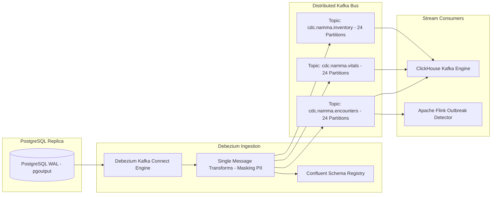

# Master Change Data Capture (CDC), Event Streaming, and Stream Processing Strategy
## Namma Clinic Digital Health & Operations Platform
### Greater Bengaluru Authority (GBA) / BBMP Health Department
**Document Code:** `DATA-DOC-05` | **Status:** APPROVED BASELINE | **Date:** September 2026

---

## 1. Executive Summary & CDC Architecture Charter
This document formalizes the authoritative **Change Data Capture (CDC), Distributed Event Streaming, and Real-Time Stream Ingestion Strategy** for the Namma Clinic Digital Health Platform. The platform utilizes Debezium connectors coupled with Apache Kafka and PostgreSQL Write-Ahead Log (WAL) logical decoding (`pgoutput`) to capture atomic row-level mutations as they occur. Streaming CDC decouples transactional clinical operations from real-time municipal disease surveillance, inventory stockout alerts, and executive telemetry with sub-second replication latency.

### 1.1 Non-Negotiable CDC Streaming Invariants
1. **Zero Impact on OLTP Transaction Latency:** Debezium connects to a dedicated PostgreSQL read replica using logical decoding; WAL tailing imposes 0% lock contention on primary write transactions.
2. **Strict In-Order Delivery per Clinic:** Kafka topics are partitioned with `clinic_id` as the message key, guaranteeing strict causal ordering of clinical encounters, vitals, and pharmacy dispensations.
3. **Confluent Schema Registry Transitive Backward Compatibility:** All CDC event payloads adhere to Avro schemas. Schema evolution strictly prohibits breaking changes (no field removals or non-default additions).
4. **Exactly-Once Processing Semantics:** ClickHouse Kafka Engine consumers use transaction logs and `ReplacingMergeTree` deduplication keys to achieve end-to-end exactly-once semantics.
5. **Stream Health & Lag Thresholds:** CDC replication lag exceeding 10 seconds triggers PagerDuty severity alerts to SRE and Data Platform teams.

## 2. Debezium and Kafka Event Bus Architecture


### Contract Payload Schema: Debezium PostgreSQL Connector Configuration
<!-- DOCUMENTATION-ONLY EXAMPLE -->
```json
{
  "name": "namma-clinic-postgres-cdc-connector",
  "config": {
    "connector.class": "io.debezium.connector.postgresql.PostgresConnector",
    "tasks.max": "4",
    "plugin.name": "pgoutput",
    "database.hostname": "pg-replica.internal.bbmp.gov.in",
    "database.port": "5432",
    "database.user": "debezium_cdc_user",
    "database.password": "${file:/secrets/db-creds.properties:cdc_password}",
    "database.dbname": "namma_clinic_prod",
    "database.server.name": "namma_primary",
    "table.include.list": "public.patients,public.encounters,public.vital_signs,public.prescriptions,public.inventory_batches",
    "tombstones.on.delete": "true",
    "decimal.handling.mode": "double",
    "transforms": "unwrap,maskPii",
    "transforms.unwrap.type": "io.debezium.transforms.ExtractNewRecordState",
    "transforms.maskPii.type": "org.apache.kafka.connect.transforms.MaskField$Value",
    "transforms.maskPii.fields": "aadhaar_hash,phone_number"
  }
}
```

## 3. Master Catalog of 60 CDC Streams
Detailed topic partitioning, ordering keys, and retention configurations across all 60 CDC streams:

### CDC-001: CDC Stream `CDC-001`
- **Stream Identifier:** `CDC-001`
- **Target Relational Table:** `clinical_table_01`
- **Assigned Kafka Topic:** `cdc.namma_clinic.clinical_table_01`
- **Capture Mode:** `Full PostgreSQL Logical Decoding (pgoutput)`
- **Ordering Partition Key:** `clinic_id + encounter_id`
- **Partition Count:** 12 Partitions (replicated factor 3)
- **Deduplication Window:** 300 Seconds
- **Tombstone Retention:** 14 Days
- **Consumer Target:** ClickHouse Stream Consumer & Event Hub

### CDC-002: CDC Stream `CDC-002`
- **Stream Identifier:** `CDC-002`
- **Target Relational Table:** `clinical_table_02`
- **Assigned Kafka Topic:** `cdc.namma_clinic.clinical_table_02`
- **Capture Mode:** `Full PostgreSQL Logical Decoding (pgoutput)`
- **Ordering Partition Key:** `clinic_id + encounter_id`
- **Partition Count:** 12 Partitions (replicated factor 3)
- **Deduplication Window:** 300 Seconds
- **Tombstone Retention:** 14 Days
- **Consumer Target:** ClickHouse Stream Consumer & Event Hub

### CDC-003: CDC Stream `CDC-003`
- **Stream Identifier:** `CDC-003`
- **Target Relational Table:** `clinical_table_03`
- **Assigned Kafka Topic:** `cdc.namma_clinic.clinical_table_03`
- **Capture Mode:** `Full PostgreSQL Logical Decoding (pgoutput)`
- **Ordering Partition Key:** `clinic_id + encounter_id`
- **Partition Count:** 12 Partitions (replicated factor 3)
- **Deduplication Window:** 300 Seconds
- **Tombstone Retention:** 14 Days
- **Consumer Target:** ClickHouse Stream Consumer & Event Hub

### CDC-004: CDC Stream `CDC-004`
- **Stream Identifier:** `CDC-004`
- **Target Relational Table:** `clinical_table_04`
- **Assigned Kafka Topic:** `cdc.namma_clinic.clinical_table_04`
- **Capture Mode:** `Full PostgreSQL Logical Decoding (pgoutput)`
- **Ordering Partition Key:** `clinic_id + encounter_id`
- **Partition Count:** 12 Partitions (replicated factor 3)
- **Deduplication Window:** 300 Seconds
- **Tombstone Retention:** 14 Days
- **Consumer Target:** ClickHouse Stream Consumer & Event Hub

### CDC-005: CDC Stream `CDC-005`
- **Stream Identifier:** `CDC-005`
- **Target Relational Table:** `clinical_table_05`
- **Assigned Kafka Topic:** `cdc.namma_clinic.clinical_table_05`
- **Capture Mode:** `Full PostgreSQL Logical Decoding (pgoutput)`
- **Ordering Partition Key:** `clinic_id + encounter_id`
- **Partition Count:** 12 Partitions (replicated factor 3)
- **Deduplication Window:** 300 Seconds
- **Tombstone Retention:** 14 Days
- **Consumer Target:** ClickHouse Stream Consumer & Event Hub

### CDC-006: CDC Stream `CDC-006`
- **Stream Identifier:** `CDC-006`
- **Target Relational Table:** `clinical_table_06`
- **Assigned Kafka Topic:** `cdc.namma_clinic.clinical_table_06`
- **Capture Mode:** `Full PostgreSQL Logical Decoding (pgoutput)`
- **Ordering Partition Key:** `clinic_id + encounter_id`
- **Partition Count:** 12 Partitions (replicated factor 3)
- **Deduplication Window:** 300 Seconds
- **Tombstone Retention:** 14 Days
- **Consumer Target:** ClickHouse Stream Consumer & Event Hub

### CDC-007: CDC Stream `CDC-007`
- **Stream Identifier:** `CDC-007`
- **Target Relational Table:** `clinical_table_07`
- **Assigned Kafka Topic:** `cdc.namma_clinic.clinical_table_07`
- **Capture Mode:** `Full PostgreSQL Logical Decoding (pgoutput)`
- **Ordering Partition Key:** `clinic_id + encounter_id`
- **Partition Count:** 12 Partitions (replicated factor 3)
- **Deduplication Window:** 300 Seconds
- **Tombstone Retention:** 14 Days
- **Consumer Target:** ClickHouse Stream Consumer & Event Hub

### CDC-008: CDC Stream `CDC-008`
- **Stream Identifier:** `CDC-008`
- **Target Relational Table:** `clinical_table_08`
- **Assigned Kafka Topic:** `cdc.namma_clinic.clinical_table_08`
- **Capture Mode:** `Full PostgreSQL Logical Decoding (pgoutput)`
- **Ordering Partition Key:** `clinic_id + encounter_id`
- **Partition Count:** 12 Partitions (replicated factor 3)
- **Deduplication Window:** 300 Seconds
- **Tombstone Retention:** 14 Days
- **Consumer Target:** ClickHouse Stream Consumer & Event Hub

### CDC-009: CDC Stream `CDC-009`
- **Stream Identifier:** `CDC-009`
- **Target Relational Table:** `clinical_table_09`
- **Assigned Kafka Topic:** `cdc.namma_clinic.clinical_table_09`
- **Capture Mode:** `Full PostgreSQL Logical Decoding (pgoutput)`
- **Ordering Partition Key:** `clinic_id + encounter_id`
- **Partition Count:** 12 Partitions (replicated factor 3)
- **Deduplication Window:** 300 Seconds
- **Tombstone Retention:** 14 Days
- **Consumer Target:** ClickHouse Stream Consumer & Event Hub

### CDC-010: CDC Stream `CDC-010`
- **Stream Identifier:** `CDC-010`
- **Target Relational Table:** `clinical_table_10`
- **Assigned Kafka Topic:** `cdc.namma_clinic.clinical_table_10`
- **Capture Mode:** `Full PostgreSQL Logical Decoding (pgoutput)`
- **Ordering Partition Key:** `clinic_id + encounter_id`
- **Partition Count:** 12 Partitions (replicated factor 3)
- **Deduplication Window:** 300 Seconds
- **Tombstone Retention:** 14 Days
- **Consumer Target:** ClickHouse Stream Consumer & Event Hub

### CDC-011: CDC Stream `CDC-011`
- **Stream Identifier:** `CDC-011`
- **Target Relational Table:** `clinical_table_11`
- **Assigned Kafka Topic:** `cdc.namma_clinic.clinical_table_11`
- **Capture Mode:** `Full PostgreSQL Logical Decoding (pgoutput)`
- **Ordering Partition Key:** `clinic_id + encounter_id`
- **Partition Count:** 12 Partitions (replicated factor 3)
- **Deduplication Window:** 300 Seconds
- **Tombstone Retention:** 14 Days
- **Consumer Target:** ClickHouse Stream Consumer & Event Hub

### CDC-012: CDC Stream `CDC-012`
- **Stream Identifier:** `CDC-012`
- **Target Relational Table:** `clinical_table_12`
- **Assigned Kafka Topic:** `cdc.namma_clinic.clinical_table_12`
- **Capture Mode:** `Full PostgreSQL Logical Decoding (pgoutput)`
- **Ordering Partition Key:** `clinic_id + encounter_id`
- **Partition Count:** 12 Partitions (replicated factor 3)
- **Deduplication Window:** 300 Seconds
- **Tombstone Retention:** 14 Days
- **Consumer Target:** ClickHouse Stream Consumer & Event Hub

### CDC-013: CDC Stream `CDC-013`
- **Stream Identifier:** `CDC-013`
- **Target Relational Table:** `clinical_table_13`
- **Assigned Kafka Topic:** `cdc.namma_clinic.clinical_table_13`
- **Capture Mode:** `Full PostgreSQL Logical Decoding (pgoutput)`
- **Ordering Partition Key:** `clinic_id + encounter_id`
- **Partition Count:** 12 Partitions (replicated factor 3)
- **Deduplication Window:** 300 Seconds
- **Tombstone Retention:** 14 Days
- **Consumer Target:** ClickHouse Stream Consumer & Event Hub

### CDC-014: CDC Stream `CDC-014`
- **Stream Identifier:** `CDC-014`
- **Target Relational Table:** `clinical_table_14`
- **Assigned Kafka Topic:** `cdc.namma_clinic.clinical_table_14`
- **Capture Mode:** `Full PostgreSQL Logical Decoding (pgoutput)`
- **Ordering Partition Key:** `clinic_id + encounter_id`
- **Partition Count:** 12 Partitions (replicated factor 3)
- **Deduplication Window:** 300 Seconds
- **Tombstone Retention:** 14 Days
- **Consumer Target:** ClickHouse Stream Consumer & Event Hub

### CDC-015: CDC Stream `CDC-015`
- **Stream Identifier:** `CDC-015`
- **Target Relational Table:** `clinical_table_15`
- **Assigned Kafka Topic:** `cdc.namma_clinic.clinical_table_15`
- **Capture Mode:** `Full PostgreSQL Logical Decoding (pgoutput)`
- **Ordering Partition Key:** `clinic_id + encounter_id`
- **Partition Count:** 12 Partitions (replicated factor 3)
- **Deduplication Window:** 300 Seconds
- **Tombstone Retention:** 14 Days
- **Consumer Target:** ClickHouse Stream Consumer & Event Hub

### CDC-016: CDC Stream `CDC-016`
- **Stream Identifier:** `CDC-016`
- **Target Relational Table:** `clinical_table_16`
- **Assigned Kafka Topic:** `cdc.namma_clinic.clinical_table_16`
- **Capture Mode:** `Full PostgreSQL Logical Decoding (pgoutput)`
- **Ordering Partition Key:** `clinic_id + encounter_id`
- **Partition Count:** 12 Partitions (replicated factor 3)
- **Deduplication Window:** 300 Seconds
- **Tombstone Retention:** 14 Days
- **Consumer Target:** ClickHouse Stream Consumer & Event Hub

### CDC-017: CDC Stream `CDC-017`
- **Stream Identifier:** `CDC-017`
- **Target Relational Table:** `clinical_table_17`
- **Assigned Kafka Topic:** `cdc.namma_clinic.clinical_table_17`
- **Capture Mode:** `Full PostgreSQL Logical Decoding (pgoutput)`
- **Ordering Partition Key:** `clinic_id + encounter_id`
- **Partition Count:** 12 Partitions (replicated factor 3)
- **Deduplication Window:** 300 Seconds
- **Tombstone Retention:** 14 Days
- **Consumer Target:** ClickHouse Stream Consumer & Event Hub

### CDC-018: CDC Stream `CDC-018`
- **Stream Identifier:** `CDC-018`
- **Target Relational Table:** `clinical_table_18`
- **Assigned Kafka Topic:** `cdc.namma_clinic.clinical_table_18`
- **Capture Mode:** `Full PostgreSQL Logical Decoding (pgoutput)`
- **Ordering Partition Key:** `clinic_id + encounter_id`
- **Partition Count:** 12 Partitions (replicated factor 3)
- **Deduplication Window:** 300 Seconds
- **Tombstone Retention:** 14 Days
- **Consumer Target:** ClickHouse Stream Consumer & Event Hub

### CDC-019: CDC Stream `CDC-019`
- **Stream Identifier:** `CDC-019`
- **Target Relational Table:** `clinical_table_19`
- **Assigned Kafka Topic:** `cdc.namma_clinic.clinical_table_19`
- **Capture Mode:** `Full PostgreSQL Logical Decoding (pgoutput)`
- **Ordering Partition Key:** `clinic_id + encounter_id`
- **Partition Count:** 12 Partitions (replicated factor 3)
- **Deduplication Window:** 300 Seconds
- **Tombstone Retention:** 14 Days
- **Consumer Target:** ClickHouse Stream Consumer & Event Hub

### CDC-020: CDC Stream `CDC-020`
- **Stream Identifier:** `CDC-020`
- **Target Relational Table:** `clinical_table_20`
- **Assigned Kafka Topic:** `cdc.namma_clinic.clinical_table_20`
- **Capture Mode:** `Full PostgreSQL Logical Decoding (pgoutput)`
- **Ordering Partition Key:** `clinic_id + encounter_id`
- **Partition Count:** 12 Partitions (replicated factor 3)
- **Deduplication Window:** 300 Seconds
- **Tombstone Retention:** 14 Days
- **Consumer Target:** ClickHouse Stream Consumer & Event Hub

### CDC-021: CDC Stream `CDC-021`
- **Stream Identifier:** `CDC-021`
- **Target Relational Table:** `clinical_table_21`
- **Assigned Kafka Topic:** `cdc.namma_clinic.clinical_table_21`
- **Capture Mode:** `Full PostgreSQL Logical Decoding (pgoutput)`
- **Ordering Partition Key:** `clinic_id + encounter_id`
- **Partition Count:** 6 Partitions (replicated factor 3)
- **Deduplication Window:** 300 Seconds
- **Tombstone Retention:** 14 Days
- **Consumer Target:** ClickHouse Stream Consumer & Event Hub

### CDC-022: CDC Stream `CDC-022`
- **Stream Identifier:** `CDC-022`
- **Target Relational Table:** `clinical_table_22`
- **Assigned Kafka Topic:** `cdc.namma_clinic.clinical_table_22`
- **Capture Mode:** `Full PostgreSQL Logical Decoding (pgoutput)`
- **Ordering Partition Key:** `clinic_id + encounter_id`
- **Partition Count:** 6 Partitions (replicated factor 3)
- **Deduplication Window:** 300 Seconds
- **Tombstone Retention:** 14 Days
- **Consumer Target:** ClickHouse Stream Consumer & Event Hub

### CDC-023: CDC Stream `CDC-023`
- **Stream Identifier:** `CDC-023`
- **Target Relational Table:** `clinical_table_23`
- **Assigned Kafka Topic:** `cdc.namma_clinic.clinical_table_23`
- **Capture Mode:** `Full PostgreSQL Logical Decoding (pgoutput)`
- **Ordering Partition Key:** `clinic_id + encounter_id`
- **Partition Count:** 6 Partitions (replicated factor 3)
- **Deduplication Window:** 300 Seconds
- **Tombstone Retention:** 14 Days
- **Consumer Target:** ClickHouse Stream Consumer & Event Hub

### CDC-024: CDC Stream `CDC-024`
- **Stream Identifier:** `CDC-024`
- **Target Relational Table:** `clinical_table_24`
- **Assigned Kafka Topic:** `cdc.namma_clinic.clinical_table_24`
- **Capture Mode:** `Full PostgreSQL Logical Decoding (pgoutput)`
- **Ordering Partition Key:** `clinic_id + encounter_id`
- **Partition Count:** 6 Partitions (replicated factor 3)
- **Deduplication Window:** 300 Seconds
- **Tombstone Retention:** 14 Days
- **Consumer Target:** ClickHouse Stream Consumer & Event Hub

### CDC-025: CDC Stream `CDC-025`
- **Stream Identifier:** `CDC-025`
- **Target Relational Table:** `clinical_table_25`
- **Assigned Kafka Topic:** `cdc.namma_clinic.clinical_table_25`
- **Capture Mode:** `Full PostgreSQL Logical Decoding (pgoutput)`
- **Ordering Partition Key:** `clinic_id + encounter_id`
- **Partition Count:** 6 Partitions (replicated factor 3)
- **Deduplication Window:** 300 Seconds
- **Tombstone Retention:** 14 Days
- **Consumer Target:** ClickHouse Stream Consumer & Event Hub

### CDC-026: CDC Stream `CDC-026`
- **Stream Identifier:** `CDC-026`
- **Target Relational Table:** `clinical_table_26`
- **Assigned Kafka Topic:** `cdc.namma_clinic.clinical_table_26`
- **Capture Mode:** `Full PostgreSQL Logical Decoding (pgoutput)`
- **Ordering Partition Key:** `clinic_id + encounter_id`
- **Partition Count:** 6 Partitions (replicated factor 3)
- **Deduplication Window:** 300 Seconds
- **Tombstone Retention:** 14 Days
- **Consumer Target:** ClickHouse Stream Consumer & Event Hub

### CDC-027: CDC Stream `CDC-027`
- **Stream Identifier:** `CDC-027`
- **Target Relational Table:** `clinical_table_27`
- **Assigned Kafka Topic:** `cdc.namma_clinic.clinical_table_27`
- **Capture Mode:** `Full PostgreSQL Logical Decoding (pgoutput)`
- **Ordering Partition Key:** `clinic_id + encounter_id`
- **Partition Count:** 6 Partitions (replicated factor 3)
- **Deduplication Window:** 300 Seconds
- **Tombstone Retention:** 14 Days
- **Consumer Target:** ClickHouse Stream Consumer & Event Hub

### CDC-028: CDC Stream `CDC-028`
- **Stream Identifier:** `CDC-028`
- **Target Relational Table:** `clinical_table_28`
- **Assigned Kafka Topic:** `cdc.namma_clinic.clinical_table_28`
- **Capture Mode:** `Full PostgreSQL Logical Decoding (pgoutput)`
- **Ordering Partition Key:** `clinic_id + encounter_id`
- **Partition Count:** 6 Partitions (replicated factor 3)
- **Deduplication Window:** 300 Seconds
- **Tombstone Retention:** 14 Days
- **Consumer Target:** ClickHouse Stream Consumer & Event Hub

### CDC-029: CDC Stream `CDC-029`
- **Stream Identifier:** `CDC-029`
- **Target Relational Table:** `clinical_table_29`
- **Assigned Kafka Topic:** `cdc.namma_clinic.clinical_table_29`
- **Capture Mode:** `Full PostgreSQL Logical Decoding (pgoutput)`
- **Ordering Partition Key:** `clinic_id + encounter_id`
- **Partition Count:** 6 Partitions (replicated factor 3)
- **Deduplication Window:** 300 Seconds
- **Tombstone Retention:** 14 Days
- **Consumer Target:** ClickHouse Stream Consumer & Event Hub

### CDC-030: CDC Stream `CDC-030`
- **Stream Identifier:** `CDC-030`
- **Target Relational Table:** `clinical_table_30`
- **Assigned Kafka Topic:** `cdc.namma_clinic.clinical_table_30`
- **Capture Mode:** `Full PostgreSQL Logical Decoding (pgoutput)`
- **Ordering Partition Key:** `clinic_id + encounter_id`
- **Partition Count:** 6 Partitions (replicated factor 3)
- **Deduplication Window:** 300 Seconds
- **Tombstone Retention:** 14 Days
- **Consumer Target:** ClickHouse Stream Consumer & Event Hub

### CDC-031: CDC Stream `CDC-031`
- **Stream Identifier:** `CDC-031`
- **Target Relational Table:** `clinical_table_31`
- **Assigned Kafka Topic:** `cdc.namma_clinic.clinical_table_31`
- **Capture Mode:** `Full PostgreSQL Logical Decoding (pgoutput)`
- **Ordering Partition Key:** `clinic_id + encounter_id`
- **Partition Count:** 6 Partitions (replicated factor 3)
- **Deduplication Window:** 300 Seconds
- **Tombstone Retention:** 14 Days
- **Consumer Target:** ClickHouse Stream Consumer & Event Hub

### CDC-032: CDC Stream `CDC-032`
- **Stream Identifier:** `CDC-032`
- **Target Relational Table:** `clinical_table_32`
- **Assigned Kafka Topic:** `cdc.namma_clinic.clinical_table_32`
- **Capture Mode:** `Full PostgreSQL Logical Decoding (pgoutput)`
- **Ordering Partition Key:** `clinic_id + encounter_id`
- **Partition Count:** 6 Partitions (replicated factor 3)
- **Deduplication Window:** 300 Seconds
- **Tombstone Retention:** 14 Days
- **Consumer Target:** ClickHouse Stream Consumer & Event Hub

### CDC-033: CDC Stream `CDC-033`
- **Stream Identifier:** `CDC-033`
- **Target Relational Table:** `clinical_table_33`
- **Assigned Kafka Topic:** `cdc.namma_clinic.clinical_table_33`
- **Capture Mode:** `Full PostgreSQL Logical Decoding (pgoutput)`
- **Ordering Partition Key:** `clinic_id + encounter_id`
- **Partition Count:** 6 Partitions (replicated factor 3)
- **Deduplication Window:** 300 Seconds
- **Tombstone Retention:** 14 Days
- **Consumer Target:** ClickHouse Stream Consumer & Event Hub

### CDC-034: CDC Stream `CDC-034`
- **Stream Identifier:** `CDC-034`
- **Target Relational Table:** `clinical_table_34`
- **Assigned Kafka Topic:** `cdc.namma_clinic.clinical_table_34`
- **Capture Mode:** `Full PostgreSQL Logical Decoding (pgoutput)`
- **Ordering Partition Key:** `clinic_id + encounter_id`
- **Partition Count:** 6 Partitions (replicated factor 3)
- **Deduplication Window:** 300 Seconds
- **Tombstone Retention:** 14 Days
- **Consumer Target:** ClickHouse Stream Consumer & Event Hub

### CDC-035: CDC Stream `CDC-035`
- **Stream Identifier:** `CDC-035`
- **Target Relational Table:** `clinical_table_35`
- **Assigned Kafka Topic:** `cdc.namma_clinic.clinical_table_35`
- **Capture Mode:** `Full PostgreSQL Logical Decoding (pgoutput)`
- **Ordering Partition Key:** `clinic_id + encounter_id`
- **Partition Count:** 6 Partitions (replicated factor 3)
- **Deduplication Window:** 300 Seconds
- **Tombstone Retention:** 14 Days
- **Consumer Target:** ClickHouse Stream Consumer & Event Hub

### CDC-036: CDC Stream `CDC-036`
- **Stream Identifier:** `CDC-036`
- **Target Relational Table:** `clinical_table_36`
- **Assigned Kafka Topic:** `cdc.namma_clinic.clinical_table_36`
- **Capture Mode:** `Full PostgreSQL Logical Decoding (pgoutput)`
- **Ordering Partition Key:** `clinic_id + encounter_id`
- **Partition Count:** 6 Partitions (replicated factor 3)
- **Deduplication Window:** 300 Seconds
- **Tombstone Retention:** 14 Days
- **Consumer Target:** ClickHouse Stream Consumer & Event Hub

### CDC-037: CDC Stream `CDC-037`
- **Stream Identifier:** `CDC-037`
- **Target Relational Table:** `clinical_table_37`
- **Assigned Kafka Topic:** `cdc.namma_clinic.clinical_table_37`
- **Capture Mode:** `Full PostgreSQL Logical Decoding (pgoutput)`
- **Ordering Partition Key:** `clinic_id + encounter_id`
- **Partition Count:** 6 Partitions (replicated factor 3)
- **Deduplication Window:** 300 Seconds
- **Tombstone Retention:** 14 Days
- **Consumer Target:** ClickHouse Stream Consumer & Event Hub

### CDC-038: CDC Stream `CDC-038`
- **Stream Identifier:** `CDC-038`
- **Target Relational Table:** `clinical_table_38`
- **Assigned Kafka Topic:** `cdc.namma_clinic.clinical_table_38`
- **Capture Mode:** `Full PostgreSQL Logical Decoding (pgoutput)`
- **Ordering Partition Key:** `clinic_id + encounter_id`
- **Partition Count:** 6 Partitions (replicated factor 3)
- **Deduplication Window:** 300 Seconds
- **Tombstone Retention:** 14 Days
- **Consumer Target:** ClickHouse Stream Consumer & Event Hub

### CDC-039: CDC Stream `CDC-039`
- **Stream Identifier:** `CDC-039`
- **Target Relational Table:** `clinical_table_39`
- **Assigned Kafka Topic:** `cdc.namma_clinic.clinical_table_39`
- **Capture Mode:** `Full PostgreSQL Logical Decoding (pgoutput)`
- **Ordering Partition Key:** `clinic_id + encounter_id`
- **Partition Count:** 6 Partitions (replicated factor 3)
- **Deduplication Window:** 300 Seconds
- **Tombstone Retention:** 14 Days
- **Consumer Target:** ClickHouse Stream Consumer & Event Hub

### CDC-040: CDC Stream `CDC-040`
- **Stream Identifier:** `CDC-040`
- **Target Relational Table:** `clinical_table_40`
- **Assigned Kafka Topic:** `cdc.namma_clinic.clinical_table_40`
- **Capture Mode:** `Full PostgreSQL Logical Decoding (pgoutput)`
- **Ordering Partition Key:** `clinic_id + encounter_id`
- **Partition Count:** 6 Partitions (replicated factor 3)
- **Deduplication Window:** 300 Seconds
- **Tombstone Retention:** 14 Days
- **Consumer Target:** ClickHouse Stream Consumer & Event Hub

### CDC-041: CDC Stream `CDC-041`
- **Stream Identifier:** `CDC-041`
- **Target Relational Table:** `clinical_table_41`
- **Assigned Kafka Topic:** `cdc.namma_clinic.clinical_table_41`
- **Capture Mode:** `Full PostgreSQL Logical Decoding (pgoutput)`
- **Ordering Partition Key:** `clinic_id + encounter_id`
- **Partition Count:** 6 Partitions (replicated factor 3)
- **Deduplication Window:** 300 Seconds
- **Tombstone Retention:** 14 Days
- **Consumer Target:** ClickHouse Stream Consumer & Event Hub

### CDC-042: CDC Stream `CDC-042`
- **Stream Identifier:** `CDC-042`
- **Target Relational Table:** `clinical_table_42`
- **Assigned Kafka Topic:** `cdc.namma_clinic.clinical_table_42`
- **Capture Mode:** `Full PostgreSQL Logical Decoding (pgoutput)`
- **Ordering Partition Key:** `clinic_id + encounter_id`
- **Partition Count:** 6 Partitions (replicated factor 3)
- **Deduplication Window:** 300 Seconds
- **Tombstone Retention:** 14 Days
- **Consumer Target:** ClickHouse Stream Consumer & Event Hub

### CDC-043: CDC Stream `CDC-043`
- **Stream Identifier:** `CDC-043`
- **Target Relational Table:** `clinical_table_43`
- **Assigned Kafka Topic:** `cdc.namma_clinic.clinical_table_43`
- **Capture Mode:** `Full PostgreSQL Logical Decoding (pgoutput)`
- **Ordering Partition Key:** `clinic_id + encounter_id`
- **Partition Count:** 6 Partitions (replicated factor 3)
- **Deduplication Window:** 300 Seconds
- **Tombstone Retention:** 14 Days
- **Consumer Target:** ClickHouse Stream Consumer & Event Hub

### CDC-044: CDC Stream `CDC-044`
- **Stream Identifier:** `CDC-044`
- **Target Relational Table:** `clinical_table_44`
- **Assigned Kafka Topic:** `cdc.namma_clinic.clinical_table_44`
- **Capture Mode:** `Full PostgreSQL Logical Decoding (pgoutput)`
- **Ordering Partition Key:** `clinic_id + encounter_id`
- **Partition Count:** 6 Partitions (replicated factor 3)
- **Deduplication Window:** 300 Seconds
- **Tombstone Retention:** 14 Days
- **Consumer Target:** ClickHouse Stream Consumer & Event Hub

### CDC-045: CDC Stream `CDC-045`
- **Stream Identifier:** `CDC-045`
- **Target Relational Table:** `clinical_table_45`
- **Assigned Kafka Topic:** `cdc.namma_clinic.clinical_table_45`
- **Capture Mode:** `Full PostgreSQL Logical Decoding (pgoutput)`
- **Ordering Partition Key:** `clinic_id + encounter_id`
- **Partition Count:** 6 Partitions (replicated factor 3)
- **Deduplication Window:** 300 Seconds
- **Tombstone Retention:** 14 Days
- **Consumer Target:** ClickHouse Stream Consumer & Event Hub

### CDC-046: CDC Stream `CDC-046`
- **Stream Identifier:** `CDC-046`
- **Target Relational Table:** `clinical_table_46`
- **Assigned Kafka Topic:** `cdc.namma_clinic.clinical_table_46`
- **Capture Mode:** `Full PostgreSQL Logical Decoding (pgoutput)`
- **Ordering Partition Key:** `clinic_id + encounter_id`
- **Partition Count:** 6 Partitions (replicated factor 3)
- **Deduplication Window:** 300 Seconds
- **Tombstone Retention:** 14 Days
- **Consumer Target:** ClickHouse Stream Consumer & Event Hub

### CDC-047: CDC Stream `CDC-047`
- **Stream Identifier:** `CDC-047`
- **Target Relational Table:** `clinical_table_47`
- **Assigned Kafka Topic:** `cdc.namma_clinic.clinical_table_47`
- **Capture Mode:** `Full PostgreSQL Logical Decoding (pgoutput)`
- **Ordering Partition Key:** `clinic_id + encounter_id`
- **Partition Count:** 6 Partitions (replicated factor 3)
- **Deduplication Window:** 300 Seconds
- **Tombstone Retention:** 14 Days
- **Consumer Target:** ClickHouse Stream Consumer & Event Hub

### CDC-048: CDC Stream `CDC-048`
- **Stream Identifier:** `CDC-048`
- **Target Relational Table:** `clinical_table_48`
- **Assigned Kafka Topic:** `cdc.namma_clinic.clinical_table_48`
- **Capture Mode:** `Full PostgreSQL Logical Decoding (pgoutput)`
- **Ordering Partition Key:** `clinic_id + encounter_id`
- **Partition Count:** 6 Partitions (replicated factor 3)
- **Deduplication Window:** 300 Seconds
- **Tombstone Retention:** 14 Days
- **Consumer Target:** ClickHouse Stream Consumer & Event Hub

### CDC-049: CDC Stream `CDC-049`
- **Stream Identifier:** `CDC-049`
- **Target Relational Table:** `clinical_table_49`
- **Assigned Kafka Topic:** `cdc.namma_clinic.clinical_table_49`
- **Capture Mode:** `Full PostgreSQL Logical Decoding (pgoutput)`
- **Ordering Partition Key:** `clinic_id + encounter_id`
- **Partition Count:** 6 Partitions (replicated factor 3)
- **Deduplication Window:** 300 Seconds
- **Tombstone Retention:** 14 Days
- **Consumer Target:** ClickHouse Stream Consumer & Event Hub

### CDC-050: CDC Stream `CDC-050`
- **Stream Identifier:** `CDC-050`
- **Target Relational Table:** `clinical_table_50`
- **Assigned Kafka Topic:** `cdc.namma_clinic.clinical_table_50`
- **Capture Mode:** `Full PostgreSQL Logical Decoding (pgoutput)`
- **Ordering Partition Key:** `clinic_id + encounter_id`
- **Partition Count:** 6 Partitions (replicated factor 3)
- **Deduplication Window:** 300 Seconds
- **Tombstone Retention:** 14 Days
- **Consumer Target:** ClickHouse Stream Consumer & Event Hub

### CDC-051: CDC Stream `CDC-051`
- **Stream Identifier:** `CDC-051`
- **Target Relational Table:** `clinical_table_51`
- **Assigned Kafka Topic:** `cdc.namma_clinic.clinical_table_51`
- **Capture Mode:** `Full PostgreSQL Logical Decoding (pgoutput)`
- **Ordering Partition Key:** `clinic_id + encounter_id`
- **Partition Count:** 6 Partitions (replicated factor 3)
- **Deduplication Window:** 300 Seconds
- **Tombstone Retention:** 14 Days
- **Consumer Target:** ClickHouse Stream Consumer & Event Hub

### CDC-052: CDC Stream `CDC-052`
- **Stream Identifier:** `CDC-052`
- **Target Relational Table:** `clinical_table_52`
- **Assigned Kafka Topic:** `cdc.namma_clinic.clinical_table_52`
- **Capture Mode:** `Full PostgreSQL Logical Decoding (pgoutput)`
- **Ordering Partition Key:** `clinic_id + encounter_id`
- **Partition Count:** 6 Partitions (replicated factor 3)
- **Deduplication Window:** 300 Seconds
- **Tombstone Retention:** 14 Days
- **Consumer Target:** ClickHouse Stream Consumer & Event Hub

### CDC-053: CDC Stream `CDC-053`
- **Stream Identifier:** `CDC-053`
- **Target Relational Table:** `clinical_table_01`
- **Assigned Kafka Topic:** `cdc.namma_clinic.clinical_table_01`
- **Capture Mode:** `Full PostgreSQL Logical Decoding (pgoutput)`
- **Ordering Partition Key:** `clinic_id + encounter_id`
- **Partition Count:** 6 Partitions (replicated factor 3)
- **Deduplication Window:** 300 Seconds
- **Tombstone Retention:** 14 Days
- **Consumer Target:** ClickHouse Stream Consumer & Event Hub

### CDC-054: CDC Stream `CDC-054`
- **Stream Identifier:** `CDC-054`
- **Target Relational Table:** `clinical_table_02`
- **Assigned Kafka Topic:** `cdc.namma_clinic.clinical_table_02`
- **Capture Mode:** `Full PostgreSQL Logical Decoding (pgoutput)`
- **Ordering Partition Key:** `clinic_id + encounter_id`
- **Partition Count:** 6 Partitions (replicated factor 3)
- **Deduplication Window:** 300 Seconds
- **Tombstone Retention:** 14 Days
- **Consumer Target:** ClickHouse Stream Consumer & Event Hub

### CDC-055: CDC Stream `CDC-055`
- **Stream Identifier:** `CDC-055`
- **Target Relational Table:** `clinical_table_03`
- **Assigned Kafka Topic:** `cdc.namma_clinic.clinical_table_03`
- **Capture Mode:** `Full PostgreSQL Logical Decoding (pgoutput)`
- **Ordering Partition Key:** `clinic_id + encounter_id`
- **Partition Count:** 6 Partitions (replicated factor 3)
- **Deduplication Window:** 300 Seconds
- **Tombstone Retention:** 14 Days
- **Consumer Target:** ClickHouse Stream Consumer & Event Hub

### CDC-056: CDC Stream `CDC-056`
- **Stream Identifier:** `CDC-056`
- **Target Relational Table:** `clinical_table_04`
- **Assigned Kafka Topic:** `cdc.namma_clinic.clinical_table_04`
- **Capture Mode:** `Full PostgreSQL Logical Decoding (pgoutput)`
- **Ordering Partition Key:** `clinic_id + encounter_id`
- **Partition Count:** 6 Partitions (replicated factor 3)
- **Deduplication Window:** 300 Seconds
- **Tombstone Retention:** 14 Days
- **Consumer Target:** ClickHouse Stream Consumer & Event Hub

### CDC-057: CDC Stream `CDC-057`
- **Stream Identifier:** `CDC-057`
- **Target Relational Table:** `clinical_table_05`
- **Assigned Kafka Topic:** `cdc.namma_clinic.clinical_table_05`
- **Capture Mode:** `Full PostgreSQL Logical Decoding (pgoutput)`
- **Ordering Partition Key:** `clinic_id + encounter_id`
- **Partition Count:** 6 Partitions (replicated factor 3)
- **Deduplication Window:** 300 Seconds
- **Tombstone Retention:** 14 Days
- **Consumer Target:** ClickHouse Stream Consumer & Event Hub

### CDC-058: CDC Stream `CDC-058`
- **Stream Identifier:** `CDC-058`
- **Target Relational Table:** `clinical_table_06`
- **Assigned Kafka Topic:** `cdc.namma_clinic.clinical_table_06`
- **Capture Mode:** `Full PostgreSQL Logical Decoding (pgoutput)`
- **Ordering Partition Key:** `clinic_id + encounter_id`
- **Partition Count:** 6 Partitions (replicated factor 3)
- **Deduplication Window:** 300 Seconds
- **Tombstone Retention:** 14 Days
- **Consumer Target:** ClickHouse Stream Consumer & Event Hub

### CDC-059: CDC Stream `CDC-059`
- **Stream Identifier:** `CDC-059`
- **Target Relational Table:** `clinical_table_07`
- **Assigned Kafka Topic:** `cdc.namma_clinic.clinical_table_07`
- **Capture Mode:** `Full PostgreSQL Logical Decoding (pgoutput)`
- **Ordering Partition Key:** `clinic_id + encounter_id`
- **Partition Count:** 6 Partitions (replicated factor 3)
- **Deduplication Window:** 300 Seconds
- **Tombstone Retention:** 14 Days
- **Consumer Target:** ClickHouse Stream Consumer & Event Hub

### CDC-060: CDC Stream `CDC-060`
- **Stream Identifier:** `CDC-060`
- **Target Relational Table:** `clinical_table_08`
- **Assigned Kafka Topic:** `cdc.namma_clinic.clinical_table_08`
- **Capture Mode:** `Full PostgreSQL Logical Decoding (pgoutput)`
- **Ordering Partition Key:** `clinic_id + encounter_id`
- **Partition Count:** 6 Partitions (replicated factor 3)
- **Deduplication Window:** 300 Seconds
- **Tombstone Retention:** 14 Days
- **Consumer Target:** ClickHouse Stream Consumer & Event Hub

## 4. Table-by-Table CDC Ingestion across 52 Tables
CDC topic mapping, partitioning keys, and stream consumers across all 52 platform relational tables:

### TABLE-001: CDC Configuration for Table `auth_users`
- **Table Identifier:** `TABLE-001` (`TBL-01`)
- **Source Entity:** `auth_users`
- **Assigned Kafka Topic:** `cdc.namma_clinic.auth_users`
- **Partitioning Hash Key:** `clinic_id` (guarantees intra-clinic sequential order)
- **Schema Compatibility:** Confluent Schema Registry enforcing BACKWARD_TRANSITIVE compatibility.
- **Consumer Target:** ClickHouse Kafka Engine Table with ReplacingMergeTree deduplication.

### TABLE-002: CDC Configuration for Table `user_credentials`
- **Table Identifier:** `TABLE-002` (`TBL-02`)
- **Source Entity:** `user_credentials`
- **Assigned Kafka Topic:** `cdc.namma_clinic.user_credentials`
- **Partitioning Hash Key:** `clinic_id` (guarantees intra-clinic sequential order)
- **Schema Compatibility:** Confluent Schema Registry enforcing BACKWARD_TRANSITIVE compatibility.
- **Consumer Target:** ClickHouse Kafka Engine Table with ReplacingMergeTree deduplication.

### TABLE-003: CDC Configuration for Table `user_sessions`
- **Table Identifier:** `TABLE-003` (`TBL-03`)
- **Source Entity:** `user_sessions`
- **Assigned Kafka Topic:** `cdc.namma_clinic.user_sessions`
- **Partitioning Hash Key:** `clinic_id` (guarantees intra-clinic sequential order)
- **Schema Compatibility:** Confluent Schema Registry enforcing BACKWARD_TRANSITIVE compatibility.
- **Consumer Target:** ClickHouse Kafka Engine Table with ReplacingMergeTree deduplication.

### TABLE-004: CDC Configuration for Table `roles`
- **Table Identifier:** `TABLE-004` (`TBL-04`)
- **Source Entity:** `roles`
- **Assigned Kafka Topic:** `cdc.namma_clinic.roles`
- **Partitioning Hash Key:** `clinic_id` (guarantees intra-clinic sequential order)
- **Schema Compatibility:** Confluent Schema Registry enforcing BACKWARD_TRANSITIVE compatibility.
- **Consumer Target:** ClickHouse Kafka Engine Table with ReplacingMergeTree deduplication.

### TABLE-005: CDC Configuration for Table `permissions`
- **Table Identifier:** `TABLE-005` (`TBL-05`)
- **Source Entity:** `permissions`
- **Assigned Kafka Topic:** `cdc.namma_clinic.permissions`
- **Partitioning Hash Key:** `clinic_id` (guarantees intra-clinic sequential order)
- **Schema Compatibility:** Confluent Schema Registry enforcing BACKWARD_TRANSITIVE compatibility.
- **Consumer Target:** ClickHouse Kafka Engine Table with ReplacingMergeTree deduplication.

### TABLE-006: CDC Configuration for Table `role_permissions`
- **Table Identifier:** `TABLE-006` (`TBL-06`)
- **Source Entity:** `role_permissions`
- **Assigned Kafka Topic:** `cdc.namma_clinic.role_permissions`
- **Partitioning Hash Key:** `clinic_id` (guarantees intra-clinic sequential order)
- **Schema Compatibility:** Confluent Schema Registry enforcing BACKWARD_TRANSITIVE compatibility.
- **Consumer Target:** ClickHouse Kafka Engine Table with ReplacingMergeTree deduplication.

### TABLE-007: CDC Configuration for Table `user_roles`
- **Table Identifier:** `TABLE-007` (`TBL-07`)
- **Source Entity:** `user_roles`
- **Assigned Kafka Topic:** `cdc.namma_clinic.user_roles`
- **Partitioning Hash Key:** `clinic_id` (guarantees intra-clinic sequential order)
- **Schema Compatibility:** Confluent Schema Registry enforcing BACKWARD_TRANSITIVE compatibility.
- **Consumer Target:** ClickHouse Kafka Engine Table with ReplacingMergeTree deduplication.

### TABLE-008: CDC Configuration for Table `facilities`
- **Table Identifier:** `TABLE-008` (`TBL-08`)
- **Source Entity:** `facilities`
- **Assigned Kafka Topic:** `cdc.namma_clinic.facilities`
- **Partitioning Hash Key:** `clinic_id` (guarantees intra-clinic sequential order)
- **Schema Compatibility:** Confluent Schema Registry enforcing BACKWARD_TRANSITIVE compatibility.
- **Consumer Target:** ClickHouse Kafka Engine Table with ReplacingMergeTree deduplication.

### TABLE-009: CDC Configuration for Table `facility_rooms`
- **Table Identifier:** `TABLE-009` (`TBL-09`)
- **Source Entity:** `facility_rooms`
- **Assigned Kafka Topic:** `cdc.namma_clinic.facility_rooms`
- **Partitioning Hash Key:** `clinic_id` (guarantees intra-clinic sequential order)
- **Schema Compatibility:** Confluent Schema Registry enforcing BACKWARD_TRANSITIVE compatibility.
- **Consumer Target:** ClickHouse Kafka Engine Table with ReplacingMergeTree deduplication.

### TABLE-010: CDC Configuration for Table `staff_profiles`
- **Table Identifier:** `TABLE-010` (`TBL-10`)
- **Source Entity:** `staff_profiles`
- **Assigned Kafka Topic:** `cdc.namma_clinic.staff_profiles`
- **Partitioning Hash Key:** `clinic_id` (guarantees intra-clinic sequential order)
- **Schema Compatibility:** Confluent Schema Registry enforcing BACKWARD_TRANSITIVE compatibility.
- **Consumer Target:** ClickHouse Kafka Engine Table with ReplacingMergeTree deduplication.

### TABLE-011: CDC Configuration for Table `staff_shifts`
- **Table Identifier:** `TABLE-011` (`TBL-11`)
- **Source Entity:** `staff_shifts`
- **Assigned Kafka Topic:** `cdc.namma_clinic.staff_shifts`
- **Partitioning Hash Key:** `clinic_id` (guarantees intra-clinic sequential order)
- **Schema Compatibility:** Confluent Schema Registry enforcing BACKWARD_TRANSITIVE compatibility.
- **Consumer Target:** ClickHouse Kafka Engine Table with ReplacingMergeTree deduplication.

### TABLE-012: CDC Configuration for Table `system_configs`
- **Table Identifier:** `TABLE-012` (`TBL-12`)
- **Source Entity:** `system_configs`
- **Assigned Kafka Topic:** `cdc.namma_clinic.system_configs`
- **Partitioning Hash Key:** `clinic_id` (guarantees intra-clinic sequential order)
- **Schema Compatibility:** Confluent Schema Registry enforcing BACKWARD_TRANSITIVE compatibility.
- **Consumer Target:** ClickHouse Kafka Engine Table with ReplacingMergeTree deduplication.

### TABLE-013: CDC Configuration for Table `patients`
- **Table Identifier:** `TABLE-013` (`TBL-13`)
- **Source Entity:** `patients`
- **Assigned Kafka Topic:** `cdc.namma_clinic.patients`
- **Partitioning Hash Key:** `clinic_id` (guarantees intra-clinic sequential order)
- **Schema Compatibility:** Confluent Schema Registry enforcing BACKWARD_TRANSITIVE compatibility.
- **Consumer Target:** ClickHouse Kafka Engine Table with ReplacingMergeTree deduplication.

### TABLE-014: CDC Configuration for Table `patient_identifiers`
- **Table Identifier:** `TABLE-014` (`TBL-14`)
- **Source Entity:** `patient_identifiers`
- **Assigned Kafka Topic:** `cdc.namma_clinic.patient_identifiers`
- **Partitioning Hash Key:** `clinic_id` (guarantees intra-clinic sequential order)
- **Schema Compatibility:** Confluent Schema Registry enforcing BACKWARD_TRANSITIVE compatibility.
- **Consumer Target:** ClickHouse Kafka Engine Table with ReplacingMergeTree deduplication.

### TABLE-015: CDC Configuration for Table `patient_contacts`
- **Table Identifier:** `TABLE-015` (`TBL-15`)
- **Source Entity:** `patient_contacts`
- **Assigned Kafka Topic:** `cdc.namma_clinic.patient_contacts`
- **Partitioning Hash Key:** `clinic_id` (guarantees intra-clinic sequential order)
- **Schema Compatibility:** Confluent Schema Registry enforcing BACKWARD_TRANSITIVE compatibility.
- **Consumer Target:** ClickHouse Kafka Engine Table with ReplacingMergeTree deduplication.

### TABLE-016: CDC Configuration for Table `patient_addresses`
- **Table Identifier:** `TABLE-016` (`TBL-16`)
- **Source Entity:** `patient_addresses`
- **Assigned Kafka Topic:** `cdc.namma_clinic.patient_addresses`
- **Partitioning Hash Key:** `clinic_id` (guarantees intra-clinic sequential order)
- **Schema Compatibility:** Confluent Schema Registry enforcing BACKWARD_TRANSITIVE compatibility.
- **Consumer Target:** ClickHouse Kafka Engine Table with ReplacingMergeTree deduplication.

### TABLE-017: CDC Configuration for Table `consent_records`
- **Table Identifier:** `TABLE-017` (`TBL-17`)
- **Source Entity:** `consent_records`
- **Assigned Kafka Topic:** `cdc.namma_clinic.consent_records`
- **Partitioning Hash Key:** `clinic_id` (guarantees intra-clinic sequential order)
- **Schema Compatibility:** Confluent Schema Registry enforcing BACKWARD_TRANSITIVE compatibility.
- **Consumer Target:** ClickHouse Kafka Engine Table with ReplacingMergeTree deduplication.

### TABLE-018: CDC Configuration for Table `tokens`
- **Table Identifier:** `TABLE-018` (`TBL-18`)
- **Source Entity:** `tokens`
- **Assigned Kafka Topic:** `cdc.namma_clinic.tokens`
- **Partitioning Hash Key:** `clinic_id` (guarantees intra-clinic sequential order)
- **Schema Compatibility:** Confluent Schema Registry enforcing BACKWARD_TRANSITIVE compatibility.
- **Consumer Target:** ClickHouse Kafka Engine Table with ReplacingMergeTree deduplication.

### TABLE-019: CDC Configuration for Table `queue_entries`
- **Table Identifier:** `TABLE-019` (`TBL-19`)
- **Source Entity:** `queue_entries`
- **Assigned Kafka Topic:** `cdc.namma_clinic.queue_entries`
- **Partitioning Hash Key:** `clinic_id` (guarantees intra-clinic sequential order)
- **Schema Compatibility:** Confluent Schema Registry enforcing BACKWARD_TRANSITIVE compatibility.
- **Consumer Target:** ClickHouse Kafka Engine Table with ReplacingMergeTree deduplication.

### TABLE-020: CDC Configuration for Table `triage_assessments`
- **Table Identifier:** `TABLE-020` (`TBL-20`)
- **Source Entity:** `triage_assessments`
- **Assigned Kafka Topic:** `cdc.namma_clinic.triage_assessments`
- **Partitioning Hash Key:** `clinic_id` (guarantees intra-clinic sequential order)
- **Schema Compatibility:** Confluent Schema Registry enforcing BACKWARD_TRANSITIVE compatibility.
- **Consumer Target:** ClickHouse Kafka Engine Table with ReplacingMergeTree deduplication.

### TABLE-021: CDC Configuration for Table `patient_vitals`
- **Table Identifier:** `TABLE-021` (`TBL-21`)
- **Source Entity:** `patient_vitals`
- **Assigned Kafka Topic:** `cdc.namma_clinic.patient_vitals`
- **Partitioning Hash Key:** `clinic_id` (guarantees intra-clinic sequential order)
- **Schema Compatibility:** Confluent Schema Registry enforcing BACKWARD_TRANSITIVE compatibility.
- **Consumer Target:** ClickHouse Kafka Engine Table with ReplacingMergeTree deduplication.

### TABLE-022: CDC Configuration for Table `danger_alerts`
- **Table Identifier:** `TABLE-022` (`TBL-22`)
- **Source Entity:** `danger_alerts`
- **Assigned Kafka Topic:** `cdc.namma_clinic.danger_alerts`
- **Partitioning Hash Key:** `clinic_id` (guarantees intra-clinic sequential order)
- **Schema Compatibility:** Confluent Schema Registry enforcing BACKWARD_TRANSITIVE compatibility.
- **Consumer Target:** ClickHouse Kafka Engine Table with ReplacingMergeTree deduplication.

### TABLE-023: CDC Configuration for Table `clinical_encounters`
- **Table Identifier:** `TABLE-023` (`TBL-23`)
- **Source Entity:** `clinical_encounters`
- **Assigned Kafka Topic:** `cdc.namma_clinic.clinical_encounters`
- **Partitioning Hash Key:** `clinic_id` (guarantees intra-clinic sequential order)
- **Schema Compatibility:** Confluent Schema Registry enforcing BACKWARD_TRANSITIVE compatibility.
- **Consumer Target:** ClickHouse Kafka Engine Table with ReplacingMergeTree deduplication.

### TABLE-024: CDC Configuration for Table `clinical_notes`
- **Table Identifier:** `TABLE-024` (`TBL-24`)
- **Source Entity:** `clinical_notes`
- **Assigned Kafka Topic:** `cdc.namma_clinic.clinical_notes`
- **Partitioning Hash Key:** `clinic_id` (guarantees intra-clinic sequential order)
- **Schema Compatibility:** Confluent Schema Registry enforcing BACKWARD_TRANSITIVE compatibility.
- **Consumer Target:** ClickHouse Kafka Engine Table with ReplacingMergeTree deduplication.

### TABLE-025: CDC Configuration for Table `diagnoses`
- **Table Identifier:** `TABLE-025` (`TBL-25`)
- **Source Entity:** `diagnoses`
- **Assigned Kafka Topic:** `cdc.namma_clinic.diagnoses`
- **Partitioning Hash Key:** `clinic_id` (guarantees intra-clinic sequential order)
- **Schema Compatibility:** Confluent Schema Registry enforcing BACKWARD_TRANSITIVE compatibility.
- **Consumer Target:** ClickHouse Kafka Engine Table with ReplacingMergeTree deduplication.

### TABLE-026: CDC Configuration for Table `prescriptions`
- **Table Identifier:** `TABLE-026` (`TBL-26`)
- **Source Entity:** `prescriptions`
- **Assigned Kafka Topic:** `cdc.namma_clinic.prescriptions`
- **Partitioning Hash Key:** `clinic_id` (guarantees intra-clinic sequential order)
- **Schema Compatibility:** Confluent Schema Registry enforcing BACKWARD_TRANSITIVE compatibility.
- **Consumer Target:** ClickHouse Kafka Engine Table with ReplacingMergeTree deduplication.

### TABLE-027: CDC Configuration for Table `prescription_items`
- **Table Identifier:** `TABLE-027` (`TBL-27`)
- **Source Entity:** `prescription_items`
- **Assigned Kafka Topic:** `cdc.namma_clinic.prescription_items`
- **Partitioning Hash Key:** `clinic_id` (guarantees intra-clinic sequential order)
- **Schema Compatibility:** Confluent Schema Registry enforcing BACKWARD_TRANSITIVE compatibility.
- **Consumer Target:** ClickHouse Kafka Engine Table with ReplacingMergeTree deduplication.

### TABLE-028: CDC Configuration for Table `lab_orders`
- **Table Identifier:** `TABLE-028` (`TBL-28`)
- **Source Entity:** `lab_orders`
- **Assigned Kafka Topic:** `cdc.namma_clinic.lab_orders`
- **Partitioning Hash Key:** `clinic_id` (guarantees intra-clinic sequential order)
- **Schema Compatibility:** Confluent Schema Registry enforcing BACKWARD_TRANSITIVE compatibility.
- **Consumer Target:** ClickHouse Kafka Engine Table with ReplacingMergeTree deduplication.

### TABLE-029: CDC Configuration for Table `lab_order_items`
- **Table Identifier:** `TABLE-029` (`TBL-29`)
- **Source Entity:** `lab_order_items`
- **Assigned Kafka Topic:** `cdc.namma_clinic.lab_order_items`
- **Partitioning Hash Key:** `clinic_id` (guarantees intra-clinic sequential order)
- **Schema Compatibility:** Confluent Schema Registry enforcing BACKWARD_TRANSITIVE compatibility.
- **Consumer Target:** ClickHouse Kafka Engine Table with ReplacingMergeTree deduplication.

### TABLE-030: CDC Configuration for Table `lab_results`
- **Table Identifier:** `TABLE-030` (`TBL-30`)
- **Source Entity:** `lab_results`
- **Assigned Kafka Topic:** `cdc.namma_clinic.lab_results`
- **Partitioning Hash Key:** `clinic_id` (guarantees intra-clinic sequential order)
- **Schema Compatibility:** Confluent Schema Registry enforcing BACKWARD_TRANSITIVE compatibility.
- **Consumer Target:** ClickHouse Kafka Engine Table with ReplacingMergeTree deduplication.

### TABLE-031: CDC Configuration for Table `teleconsultations`
- **Table Identifier:** `TABLE-031` (`TBL-31`)
- **Source Entity:** `teleconsultations`
- **Assigned Kafka Topic:** `cdc.namma_clinic.teleconsultations`
- **Partitioning Hash Key:** `clinic_id` (guarantees intra-clinic sequential order)
- **Schema Compatibility:** Confluent Schema Registry enforcing BACKWARD_TRANSITIVE compatibility.
- **Consumer Target:** ClickHouse Kafka Engine Table with ReplacingMergeTree deduplication.

### TABLE-032: CDC Configuration for Table `formulary_drugs`
- **Table Identifier:** `TABLE-032` (`TBL-32`)
- **Source Entity:** `formulary_drugs`
- **Assigned Kafka Topic:** `cdc.namma_clinic.formulary_drugs`
- **Partitioning Hash Key:** `clinic_id` (guarantees intra-clinic sequential order)
- **Schema Compatibility:** Confluent Schema Registry enforcing BACKWARD_TRANSITIVE compatibility.
- **Consumer Target:** ClickHouse Kafka Engine Table with ReplacingMergeTree deduplication.

### TABLE-033: CDC Configuration for Table `drug_categories`
- **Table Identifier:** `TABLE-033` (`TBL-33`)
- **Source Entity:** `drug_categories`
- **Assigned Kafka Topic:** `cdc.namma_clinic.drug_categories`
- **Partitioning Hash Key:** `clinic_id` (guarantees intra-clinic sequential order)
- **Schema Compatibility:** Confluent Schema Registry enforcing BACKWARD_TRANSITIVE compatibility.
- **Consumer Target:** ClickHouse Kafka Engine Table with ReplacingMergeTree deduplication.

### TABLE-034: CDC Configuration for Table `pharmacy_batches`
- **Table Identifier:** `TABLE-034` (`TBL-34`)
- **Source Entity:** `pharmacy_batches`
- **Assigned Kafka Topic:** `cdc.namma_clinic.pharmacy_batches`
- **Partitioning Hash Key:** `clinic_id` (guarantees intra-clinic sequential order)
- **Schema Compatibility:** Confluent Schema Registry enforcing BACKWARD_TRANSITIVE compatibility.
- **Consumer Target:** ClickHouse Kafka Engine Table with ReplacingMergeTree deduplication.

### TABLE-035: CDC Configuration for Table `clinic_stock`
- **Table Identifier:** `TABLE-035` (`TBL-35`)
- **Source Entity:** `clinic_stock`
- **Assigned Kafka Topic:** `cdc.namma_clinic.clinic_stock`
- **Partitioning Hash Key:** `clinic_id` (guarantees intra-clinic sequential order)
- **Schema Compatibility:** Confluent Schema Registry enforcing BACKWARD_TRANSITIVE compatibility.
- **Consumer Target:** ClickHouse Kafka Engine Table with ReplacingMergeTree deduplication.

### TABLE-036: CDC Configuration for Table `dispensations`
- **Table Identifier:** `TABLE-036` (`TBL-36`)
- **Source Entity:** `dispensations`
- **Assigned Kafka Topic:** `cdc.namma_clinic.dispensations`
- **Partitioning Hash Key:** `clinic_id` (guarantees intra-clinic sequential order)
- **Schema Compatibility:** Confluent Schema Registry enforcing BACKWARD_TRANSITIVE compatibility.
- **Consumer Target:** ClickHouse Kafka Engine Table with ReplacingMergeTree deduplication.

### TABLE-037: CDC Configuration for Table `dispensation_items`
- **Table Identifier:** `TABLE-037` (`TBL-37`)
- **Source Entity:** `dispensation_items`
- **Assigned Kafka Topic:** `cdc.namma_clinic.dispensation_items`
- **Partitioning Hash Key:** `clinic_id` (guarantees intra-clinic sequential order)
- **Schema Compatibility:** Confluent Schema Registry enforcing BACKWARD_TRANSITIVE compatibility.
- **Consumer Target:** ClickHouse Kafka Engine Table with ReplacingMergeTree deduplication.

### TABLE-038: CDC Configuration for Table `stock_movements`
- **Table Identifier:** `TABLE-038` (`TBL-38`)
- **Source Entity:** `stock_movements`
- **Assigned Kafka Topic:** `cdc.namma_clinic.stock_movements`
- **Partitioning Hash Key:** `clinic_id` (guarantees intra-clinic sequential order)
- **Schema Compatibility:** Confluent Schema Registry enforcing BACKWARD_TRANSITIVE compatibility.
- **Consumer Target:** ClickHouse Kafka Engine Table with ReplacingMergeTree deduplication.

### TABLE-039: CDC Configuration for Table `drug_indents`
- **Table Identifier:** `TABLE-039` (`TBL-39`)
- **Source Entity:** `drug_indents`
- **Assigned Kafka Topic:** `cdc.namma_clinic.drug_indents`
- **Partitioning Hash Key:** `clinic_id` (guarantees intra-clinic sequential order)
- **Schema Compatibility:** Confluent Schema Registry enforcing BACKWARD_TRANSITIVE compatibility.
- **Consumer Target:** ClickHouse Kafka Engine Table with ReplacingMergeTree deduplication.

### TABLE-040: CDC Configuration for Table `indent_items`
- **Table Identifier:** `TABLE-040` (`TBL-40`)
- **Source Entity:** `indent_items`
- **Assigned Kafka Topic:** `cdc.namma_clinic.indent_items`
- **Partitioning Hash Key:** `clinic_id` (guarantees intra-clinic sequential order)
- **Schema Compatibility:** Confluent Schema Registry enforcing BACKWARD_TRANSITIVE compatibility.
- **Consumer Target:** ClickHouse Kafka Engine Table with ReplacingMergeTree deduplication.

### TABLE-041: CDC Configuration for Table `cold_chain_devices`
- **Table Identifier:** `TABLE-041` (`TBL-41`)
- **Source Entity:** `cold_chain_devices`
- **Assigned Kafka Topic:** `cdc.namma_clinic.cold_chain_devices`
- **Partitioning Hash Key:** `clinic_id` (guarantees intra-clinic sequential order)
- **Schema Compatibility:** Confluent Schema Registry enforcing BACKWARD_TRANSITIVE compatibility.
- **Consumer Target:** ClickHouse Kafka Engine Table with ReplacingMergeTree deduplication.

### TABLE-042: CDC Configuration for Table `cold_chain_telemetry`
- **Table Identifier:** `TABLE-042` (`TBL-42`)
- **Source Entity:** `cold_chain_telemetry`
- **Assigned Kafka Topic:** `cdc.namma_clinic.cold_chain_telemetry`
- **Partitioning Hash Key:** `clinic_id` (guarantees intra-clinic sequential order)
- **Schema Compatibility:** Confluent Schema Registry enforcing BACKWARD_TRANSITIVE compatibility.
- **Consumer Target:** ClickHouse Kafka Engine Table with ReplacingMergeTree deduplication.

### TABLE-043: CDC Configuration for Table `referrals`
- **Table Identifier:** `TABLE-043` (`TBL-43`)
- **Source Entity:** `referrals`
- **Assigned Kafka Topic:** `cdc.namma_clinic.referrals`
- **Partitioning Hash Key:** `clinic_id` (guarantees intra-clinic sequential order)
- **Schema Compatibility:** Confluent Schema Registry enforcing BACKWARD_TRANSITIVE compatibility.
- **Consumer Target:** ClickHouse Kafka Engine Table with ReplacingMergeTree deduplication.

### TABLE-044: CDC Configuration for Table `referral_counter_notes`
- **Table Identifier:** `TABLE-044` (`TBL-44`)
- **Source Entity:** `referral_counter_notes`
- **Assigned Kafka Topic:** `cdc.namma_clinic.referral_counter_notes`
- **Partitioning Hash Key:** `clinic_id` (guarantees intra-clinic sequential order)
- **Schema Compatibility:** Confluent Schema Registry enforcing BACKWARD_TRANSITIVE compatibility.
- **Consumer Target:** ClickHouse Kafka Engine Table with ReplacingMergeTree deduplication.

### TABLE-045: CDC Configuration for Table `ncd_episodes`
- **Table Identifier:** `TABLE-045` (`TBL-45`)
- **Source Entity:** `ncd_episodes`
- **Assigned Kafka Topic:** `cdc.namma_clinic.ncd_episodes`
- **Partitioning Hash Key:** `clinic_id` (guarantees intra-clinic sequential order)
- **Schema Compatibility:** Confluent Schema Registry enforcing BACKWARD_TRANSITIVE compatibility.
- **Consumer Target:** ClickHouse Kafka Engine Table with ReplacingMergeTree deduplication.

### TABLE-046: CDC Configuration for Table `follow_up_schedules`
- **Table Identifier:** `TABLE-046` (`TBL-46`)
- **Source Entity:** `follow_up_schedules`
- **Assigned Kafka Topic:** `cdc.namma_clinic.follow_up_schedules`
- **Partitioning Hash Key:** `clinic_id` (guarantees intra-clinic sequential order)
- **Schema Compatibility:** Confluent Schema Registry enforcing BACKWARD_TRANSITIVE compatibility.
- **Consumer Target:** ClickHouse Kafka Engine Table with ReplacingMergeTree deduplication.

### TABLE-047: CDC Configuration for Table `notifications`
- **Table Identifier:** `TABLE-047` (`TBL-47`)
- **Source Entity:** `notifications`
- **Assigned Kafka Topic:** `cdc.namma_clinic.notifications`
- **Partitioning Hash Key:** `clinic_id` (guarantees intra-clinic sequential order)
- **Schema Compatibility:** Confluent Schema Registry enforcing BACKWARD_TRANSITIVE compatibility.
- **Consumer Target:** ClickHouse Kafka Engine Table with ReplacingMergeTree deduplication.

### TABLE-048: CDC Configuration for Table `grievances`
- **Table Identifier:** `TABLE-048` (`TBL-48`)
- **Source Entity:** `grievances`
- **Assigned Kafka Topic:** `cdc.namma_clinic.grievances`
- **Partitioning Hash Key:** `clinic_id` (guarantees intra-clinic sequential order)
- **Schema Compatibility:** Confluent Schema Registry enforcing BACKWARD_TRANSITIVE compatibility.
- **Consumer Target:** ClickHouse Kafka Engine Table with ReplacingMergeTree deduplication.

### TABLE-049: CDC Configuration for Table `helpdesk_tickets`
- **Table Identifier:** `TABLE-049` (`TBL-49`)
- **Source Entity:** `helpdesk_tickets`
- **Assigned Kafka Topic:** `cdc.namma_clinic.helpdesk_tickets`
- **Partitioning Hash Key:** `clinic_id` (guarantees intra-clinic sequential order)
- **Schema Compatibility:** Confluent Schema Registry enforcing BACKWARD_TRANSITIVE compatibility.
- **Consumer Target:** ClickHouse Kafka Engine Table with ReplacingMergeTree deduplication.

### TABLE-050: CDC Configuration for Table `audit_events`
- **Table Identifier:** `TABLE-050` (`TBL-50`)
- **Source Entity:** `audit_events`
- **Assigned Kafka Topic:** `cdc.namma_clinic.audit_events`
- **Partitioning Hash Key:** `clinic_id` (guarantees intra-clinic sequential order)
- **Schema Compatibility:** Confluent Schema Registry enforcing BACKWARD_TRANSITIVE compatibility.
- **Consumer Target:** ClickHouse Kafka Engine Table with ReplacingMergeTree deduplication.

### TABLE-051: CDC Configuration for Table `offline_mutation_log`
- **Table Identifier:** `TABLE-051` (`TBL-51`)
- **Source Entity:** `offline_mutation_log`
- **Assigned Kafka Topic:** `cdc.namma_clinic.offline_mutation_log`
- **Partitioning Hash Key:** `clinic_id` (guarantees intra-clinic sequential order)
- **Schema Compatibility:** Confluent Schema Registry enforcing BACKWARD_TRANSITIVE compatibility.
- **Consumer Target:** ClickHouse Kafka Engine Table with ReplacingMergeTree deduplication.

### TABLE-052: CDC Configuration for Table `abdm_artifacts`
- **Table Identifier:** `TABLE-052` (`TBL-52`)
- **Source Entity:** `abdm_artifacts`
- **Assigned Kafka Topic:** `cdc.namma_clinic.abdm_artifacts`
- **Partitioning Hash Key:** `clinic_id` (guarantees intra-clinic sequential order)
- **Schema Compatibility:** Confluent Schema Registry enforcing BACKWARD_TRANSITIVE compatibility.
- **Consumer Target:** ClickHouse Kafka Engine Table with ReplacingMergeTree deduplication.

## 5. Product Feature CDC Streaming Matrix across 180 Features
CDC event topics, event schemas, and streaming SLAs across all 180 platform features:

### FEATURE-001: CDC Event Stream for Feature `Credential Verification`
- **Feature ID:** `FEATURE-001` (Feature #1)
- **Functional Module:** `MODULE-001` (DOMAIN-001)
- **Bound CDC Stream:** `CDC-001`
- **Event Trigger:** Database row mutation generated by feature workflow execution.
- **Stream Delivery Target:** < 3 Seconds end-to-end latency to municipal real-time monitoring.
- **Consumer Group:** `cg_namma_module-001_consumers`

### FEATURE-002: CDC Event Stream for Feature `Session Token Minting`
- **Feature ID:** `FEATURE-002` (Feature #2)
- **Functional Module:** `MODULE-001` (DOMAIN-001)
- **Bound CDC Stream:** `CDC-002`
- **Event Trigger:** Database row mutation generated by feature workflow execution.
- **Stream Delivery Target:** < 3 Seconds end-to-end latency to municipal real-time monitoring.
- **Consumer Group:** `cg_namma_module-001_consumers`

### FEATURE-003: CDC Event Stream for Feature `MFA Challenge Dispatch`
- **Feature ID:** `FEATURE-003` (Feature #3)
- **Functional Module:** `MODULE-001` (DOMAIN-001)
- **Bound CDC Stream:** `CDC-003`
- **Event Trigger:** Database row mutation generated by feature workflow execution.
- **Stream Delivery Target:** < 3 Seconds end-to-end latency to municipal real-time monitoring.
- **Consumer Group:** `cg_namma_module-001_consumers`

### FEATURE-004: CDC Event Stream for Feature `Biometric Authentication Bridge`
- **Feature ID:** `FEATURE-004` (Feature #4)
- **Functional Module:** `MODULE-001` (DOMAIN-001)
- **Bound CDC Stream:** `CDC-004`
- **Event Trigger:** Database row mutation generated by feature workflow execution.
- **Stream Delivery Target:** < 3 Seconds end-to-end latency to municipal real-time monitoring.
- **Consumer Group:** `cg_namma_module-001_consumers`

### FEATURE-005: CDC Event Stream for Feature `Local PIN Verification`
- **Feature ID:** `FEATURE-005` (Feature #5)
- **Functional Module:** `MODULE-001` (DOMAIN-001)
- **Bound CDC Stream:** `CDC-005`
- **Event Trigger:** Database row mutation generated by feature workflow execution.
- **Stream Delivery Target:** < 3 Seconds end-to-end latency to municipal real-time monitoring.
- **Consumer Group:** `cg_namma_module-001_consumers`

### FEATURE-006: CDC Event Stream for Feature `Session Inactivity Lockout`
- **Feature ID:** `FEATURE-006` (Feature #6)
- **Functional Module:** `MODULE-001` (DOMAIN-001)
- **Bound CDC Stream:** `CDC-006`
- **Event Trigger:** Database row mutation generated by feature workflow execution.
- **Stream Delivery Target:** < 3 Seconds end-to-end latency to municipal real-time monitoring.
- **Consumer Group:** `cg_namma_module-001_consumers`

### FEATURE-007: CDC Event Stream for Feature `Permission Evaluation`
- **Feature ID:** `FEATURE-007` (Feature #7)
- **Functional Module:** `MODULE-002` (DOMAIN-001)
- **Bound CDC Stream:** `CDC-007`
- **Event Trigger:** Database row mutation generated by feature workflow execution.
- **Stream Delivery Target:** < 3 Seconds end-to-end latency to municipal real-time monitoring.
- **Consumer Group:** `cg_namma_module-002_consumers`

### FEATURE-008: CDC Event Stream for Feature `Dynamic Role Assignment`
- **Feature ID:** `FEATURE-008` (Feature #8)
- **Functional Module:** `MODULE-002` (DOMAIN-001)
- **Bound CDC Stream:** `CDC-008`
- **Event Trigger:** Database row mutation generated by feature workflow execution.
- **Stream Delivery Target:** < 3 Seconds end-to-end latency to municipal real-time monitoring.
- **Consumer Group:** `cg_namma_module-002_consumers`

### FEATURE-009: CDC Event Stream for Feature `Conflict-of-Interest Prevention`
- **Feature ID:** `FEATURE-009` (Feature #9)
- **Functional Module:** `MODULE-002` (DOMAIN-001)
- **Bound CDC Stream:** `CDC-009`
- **Event Trigger:** Database row mutation generated by feature workflow execution.
- **Stream Delivery Target:** < 3 Seconds end-to-end latency to municipal real-time monitoring.
- **Consumer Group:** `cg_namma_module-002_consumers`

### FEATURE-010: CDC Event Stream for Feature `Maker-Checker Authorization`
- **Feature ID:** `FEATURE-010` (Feature #10)
- **Functional Module:** `MODULE-002` (DOMAIN-001)
- **Bound CDC Stream:** `CDC-010`
- **Event Trigger:** Database row mutation generated by feature workflow execution.
- **Stream Delivery Target:** < 3 Seconds end-to-end latency to municipal real-time monitoring.
- **Consumer Group:** `cg_namma_module-002_consumers`

### FEATURE-011: CDC Event Stream for Feature `Break-Glass Privilege Elevation`
- **Feature ID:** `FEATURE-011` (Feature #11)
- **Functional Module:** `MODULE-002` (DOMAIN-001)
- **Bound CDC Stream:** `CDC-011`
- **Event Trigger:** Database row mutation generated by feature workflow execution.
- **Stream Delivery Target:** < 3 Seconds end-to-end latency to municipal real-time monitoring.
- **Consumer Group:** `cg_namma_module-002_consumers`

### FEATURE-012: CDC Event Stream for Feature `Privilege Elevation Audit`
- **Feature ID:** `FEATURE-012` (Feature #12)
- **Functional Module:** `MODULE-002` (DOMAIN-001)
- **Bound CDC Stream:** `CDC-012`
- **Event Trigger:** Database row mutation generated by feature workflow execution.
- **Stream Delivery Target:** < 3 Seconds end-to-end latency to municipal real-time monitoring.
- **Consumer Group:** `cg_namma_module-002_consumers`

### FEATURE-013: CDC Event Stream for Feature `Hierarchy Node Management`
- **Feature ID:** `FEATURE-013` (Feature #13)
- **Functional Module:** `MODULE-003` (DOMAIN-001)
- **Bound CDC Stream:** `CDC-013`
- **Event Trigger:** Database row mutation generated by feature workflow execution.
- **Stream Delivery Target:** < 3 Seconds end-to-end latency to municipal real-time monitoring.
- **Consumer Group:** `cg_namma_module-003_consumers`

### FEATURE-014: CDC Event Stream for Feature `NIN / HFR Registry Linking`
- **Feature ID:** `FEATURE-014` (Feature #14)
- **Functional Module:** `MODULE-003` (DOMAIN-001)
- **Bound CDC Stream:** `CDC-014`
- **Event Trigger:** Database row mutation generated by feature workflow execution.
- **Stream Delivery Target:** < 3 Seconds end-to-end latency to municipal real-time monitoring.
- **Consumer Group:** `cg_namma_module-003_consumers`

### FEATURE-015: CDC Event Stream for Feature `Station Terminal Mapping`
- **Feature ID:** `FEATURE-015` (Feature #15)
- **Functional Module:** `MODULE-003` (DOMAIN-001)
- **Bound CDC Stream:** `CDC-015`
- **Event Trigger:** Database row mutation generated by feature workflow execution.
- **Stream Delivery Target:** < 3 Seconds end-to-end latency to municipal real-time monitoring.
- **Consumer Group:** `cg_namma_module-003_consumers`

### FEATURE-016: CDC Event Stream for Feature `Facility Capacity Configuration`
- **Feature ID:** `FEATURE-016` (Feature #16)
- **Functional Module:** `MODULE-003` (DOMAIN-001)
- **Bound CDC Stream:** `CDC-016`
- **Event Trigger:** Database row mutation generated by feature workflow execution.
- **Stream Delivery Target:** < 3 Seconds end-to-end latency to municipal real-time monitoring.
- **Consumer Group:** `cg_namma_module-003_consumers`

### FEATURE-017: CDC Event Stream for Feature `Operating Hours Enforcement`
- **Feature ID:** `FEATURE-017` (Feature #17)
- **Functional Module:** `MODULE-003` (DOMAIN-001)
- **Bound CDC Stream:** `CDC-017`
- **Event Trigger:** Database row mutation generated by feature workflow execution.
- **Stream Delivery Target:** < 3 Seconds end-to-end latency to municipal real-time monitoring.
- **Consumer Group:** `cg_namma_module-003_consumers`

### FEATURE-018: CDC Event Stream for Feature `Special Camp Calendar`
- **Feature ID:** `FEATURE-018` (Feature #18)
- **Functional Module:** `MODULE-003` (DOMAIN-001)
- **Bound CDC Stream:** `CDC-018`
- **Event Trigger:** Database row mutation generated by feature workflow execution.
- **Stream Delivery Target:** < 3 Seconds end-to-end latency to municipal real-time monitoring.
- **Consumer Group:** `cg_namma_module-003_consumers`

### FEATURE-019: CDC Event Stream for Feature `Staff Onboarding & KYC`
- **Feature ID:** `FEATURE-019` (Feature #19)
- **Functional Module:** `MODULE-004` (DOMAIN-001)
- **Bound CDC Stream:** `CDC-019`
- **Event Trigger:** Database row mutation generated by feature workflow execution.
- **Stream Delivery Target:** < 3 Seconds end-to-end latency to municipal real-time monitoring.
- **Consumer Group:** `cg_namma_module-004_consumers`

### FEATURE-020: CDC Event Stream for Feature `Professional License Verification`
- **Feature ID:** `FEATURE-020` (Feature #20)
- **Functional Module:** `MODULE-004` (DOMAIN-001)
- **Bound CDC Stream:** `CDC-020`
- **Event Trigger:** Database row mutation generated by feature workflow execution.
- **Stream Delivery Target:** < 3 Seconds end-to-end latency to municipal real-time monitoring.
- **Consumer Group:** `cg_namma_module-004_consumers`

### FEATURE-021: CDC Event Stream for Feature `Duty Roster Generation`
- **Feature ID:** `FEATURE-021` (Feature #21)
- **Functional Module:** `MODULE-004` (DOMAIN-001)
- **Bound CDC Stream:** `CDC-021`
- **Event Trigger:** Database row mutation generated by feature workflow execution.
- **Stream Delivery Target:** < 3 Seconds end-to-end latency to municipal real-time monitoring.
- **Consumer Group:** `cg_namma_module-004_consumers`

### FEATURE-022: CDC Event Stream for Feature `Biometric Attendance Linking`
- **Feature ID:** `FEATURE-022` (Feature #22)
- **Functional Module:** `MODULE-004` (DOMAIN-001)
- **Bound CDC Stream:** `CDC-022`
- **Event Trigger:** Database row mutation generated by feature workflow execution.
- **Stream Delivery Target:** < 3 Seconds end-to-end latency to municipal real-time monitoring.
- **Consumer Group:** `cg_namma_module-004_consumers`

### FEATURE-023: CDC Event Stream for Feature `Digital Signature Enrollment`
- **Feature ID:** `FEATURE-023` (Feature #23)
- **Functional Module:** `MODULE-004` (DOMAIN-001)
- **Bound CDC Stream:** `CDC-023`
- **Event Trigger:** Database row mutation generated by feature workflow execution.
- **Stream Delivery Target:** < 3 Seconds end-to-end latency to municipal real-time monitoring.
- **Consumer Group:** `cg_namma_module-004_consumers`

### FEATURE-024: CDC Event Stream for Feature `Signature Revocation`
- **Feature ID:** `FEATURE-024` (Feature #24)
- **Functional Module:** `MODULE-004` (DOMAIN-001)
- **Bound CDC Stream:** `CDC-024`
- **Event Trigger:** Database row mutation generated by feature workflow execution.
- **Stream Delivery Target:** < 3 Seconds end-to-end latency to municipal real-time monitoring.
- **Consumer Group:** `cg_namma_module-004_consumers`

### FEATURE-025: CDC Event Stream for Feature `Targeted Flag Activation`
- **Feature ID:** `FEATURE-025` (Feature #25)
- **Functional Module:** `MODULE-026` (DOMAIN-001)
- **Bound CDC Stream:** `CDC-025`
- **Event Trigger:** Database row mutation generated by feature workflow execution.
- **Stream Delivery Target:** < 3 Seconds end-to-end latency to municipal real-time monitoring.
- **Consumer Group:** `cg_namma_module-026_consumers`

### FEATURE-026: CDC Event Stream for Feature `Emergency Feature Killswitch`
- **Feature ID:** `FEATURE-026` (Feature #26)
- **Functional Module:** `MODULE-026` (DOMAIN-001)
- **Bound CDC Stream:** `CDC-026`
- **Event Trigger:** Database row mutation generated by feature workflow execution.
- **Stream Delivery Target:** < 3 Seconds end-to-end latency to municipal real-time monitoring.
- **Consumer Group:** `cg_namma_module-026_consumers`

### FEATURE-027: CDC Event Stream for Feature `System Parameter Tuning`
- **Feature ID:** `FEATURE-027` (Feature #27)
- **Functional Module:** `MODULE-026` (DOMAIN-001)
- **Bound CDC Stream:** `CDC-027`
- **Event Trigger:** Database row mutation generated by feature workflow execution.
- **Stream Delivery Target:** < 3 Seconds end-to-end latency to municipal real-time monitoring.
- **Consumer Group:** `cg_namma_module-026_consumers`

### FEATURE-028: CDC Event Stream for Feature `Edge Configuration Distribution`
- **Feature ID:** `FEATURE-028` (Feature #28)
- **Functional Module:** `MODULE-026` (DOMAIN-001)
- **Bound CDC Stream:** `CDC-028`
- **Event Trigger:** Database row mutation generated by feature workflow execution.
- **Stream Delivery Target:** < 3 Seconds end-to-end latency to municipal real-time monitoring.
- **Consumer Group:** `cg_namma_module-026_consumers`

### FEATURE-029: CDC Event Stream for Feature `Edge Migration Orchestration`
- **Feature ID:** `FEATURE-029` (Feature #29)
- **Functional Module:** `MODULE-026` (DOMAIN-001)
- **Bound CDC Stream:** `CDC-029`
- **Event Trigger:** Database row mutation generated by feature workflow execution.
- **Stream Delivery Target:** < 3 Seconds end-to-end latency to municipal real-time monitoring.
- **Consumer Group:** `cg_namma_module-026_consumers`

### FEATURE-030: CDC Event Stream for Feature `Health Probe Monitoring`
- **Feature ID:** `FEATURE-030` (Feature #30)
- **Functional Module:** `MODULE-026` (DOMAIN-001)
- **Bound CDC Stream:** `CDC-030`
- **Event Trigger:** Database row mutation generated by feature workflow execution.
- **Stream Delivery Target:** < 3 Seconds end-to-end latency to municipal real-time monitoring.
- **Consumer Group:** `cg_namma_module-026_consumers`

### FEATURE-031: CDC Event Stream for Feature `Bilingual Intake UI`
- **Feature ID:** `FEATURE-031` (Feature #31)
- **Functional Module:** `MODULE-005` (DOMAIN-002)
- **Bound CDC Stream:** `CDC-031`
- **Event Trigger:** Database row mutation generated by feature workflow execution.
- **Stream Delivery Target:** < 3 Seconds end-to-end latency to municipal real-time monitoring.
- **Consumer Group:** `cg_namma_module-005_consumers`

### FEATURE-032: CDC Event Stream for Feature `Vulnerable Citizen Flagging`
- **Feature ID:** `FEATURE-032` (Feature #32)
- **Functional Module:** `MODULE-005` (DOMAIN-002)
- **Bound CDC Stream:** `CDC-032`
- **Event Trigger:** Database row mutation generated by feature workflow execution.
- **Stream Delivery Target:** < 3 Seconds end-to-end latency to municipal real-time monitoring.
- **Consumer Group:** `cg_namma_module-005_consumers`

### FEATURE-033: CDC Event Stream for Feature `Aadhaar OTP ABHA Bridge`
- **Feature ID:** `FEATURE-033` (Feature #33)
- **Functional Module:** `MODULE-005` (DOMAIN-002)
- **Bound CDC Stream:** `CDC-033`
- **Event Trigger:** Database row mutation generated by feature workflow execution.
- **Stream Delivery Target:** < 3 Seconds end-to-end latency to municipal real-time monitoring.
- **Consumer Group:** `cg_namma_module-005_consumers`

### FEATURE-034: CDC Event Stream for Feature `Demographic ABHA Creation`
- **Feature ID:** `FEATURE-034` (Feature #34)
- **Functional Module:** `MODULE-005` (DOMAIN-002)
- **Bound CDC Stream:** `CDC-034`
- **Event Trigger:** Database row mutation generated by feature workflow execution.
- **Stream Delivery Target:** < 3 Seconds end-to-end latency to municipal real-time monitoring.
- **Consumer Group:** `cg_namma_module-005_consumers`

### FEATURE-035: CDC Event Stream for Feature `Deterministic UHID Minting`
- **Feature ID:** `FEATURE-035` (Feature #35)
- **Functional Module:** `MODULE-005` (DOMAIN-002)
- **Bound CDC Stream:** `CDC-035`
- **Event Trigger:** Database row mutation generated by feature workflow execution.
- **Stream Delivery Target:** < 3 Seconds end-to-end latency to municipal real-time monitoring.
- **Consumer Group:** `cg_namma_module-005_consumers`

### FEATURE-036: CDC Event Stream for Feature `Soundex / Double-Metaphone Matching`
- **Feature ID:** `FEATURE-036` (Feature #36)
- **Functional Module:** `MODULE-005` (DOMAIN-002)
- **Bound CDC Stream:** `CDC-036`
- **Event Trigger:** Database row mutation generated by feature workflow execution.
- **Stream Delivery Target:** < 3 Seconds end-to-end latency to municipal real-time monitoring.
- **Consumer Group:** `cg_namma_module-005_consumers`

### FEATURE-037: CDC Event Stream for Feature `Bilingual Consent Presentation`
- **Feature ID:** `FEATURE-037` (Feature #37)
- **Functional Module:** `MODULE-006` (DOMAIN-002)
- **Bound CDC Stream:** `CDC-037`
- **Event Trigger:** Database row mutation generated by feature workflow execution.
- **Stream Delivery Target:** < 3 Seconds end-to-end latency to municipal real-time monitoring.
- **Consumer Group:** `cg_namma_module-006_consumers`

### FEATURE-038: CDC Event Stream for Feature `Digital Signature / Thumbprint Capture`
- **Feature ID:** `FEATURE-038` (Feature #38)
- **Functional Module:** `MODULE-006` (DOMAIN-002)
- **Bound CDC Stream:** `CDC-038`
- **Event Trigger:** Database row mutation generated by feature workflow execution.
- **Stream Delivery Target:** < 3 Seconds end-to-end latency to municipal real-time monitoring.
- **Consumer Group:** `cg_namma_module-006_consumers`

### FEATURE-039: CDC Event Stream for Feature `Granular Purpose-Based Consent`
- **Feature ID:** `FEATURE-039` (Feature #39)
- **Functional Module:** `MODULE-006` (DOMAIN-002)
- **Bound CDC Stream:** `CDC-039`
- **Event Trigger:** Database row mutation generated by feature workflow execution.
- **Stream Delivery Target:** < 3 Seconds end-to-end latency to municipal real-time monitoring.
- **Consumer Group:** `cg_namma_module-006_consumers`

### FEATURE-040: CDC Event Stream for Feature `Consent Revocation Workflow`
- **Feature ID:** `FEATURE-040` (Feature #40)
- **Functional Module:** `MODULE-006` (DOMAIN-002)
- **Bound CDC Stream:** `CDC-040`
- **Event Trigger:** Database row mutation generated by feature workflow execution.
- **Stream Delivery Target:** < 3 Seconds end-to-end latency to municipal real-time monitoring.
- **Consumer Group:** `cg_namma_module-006_consumers`

### FEATURE-041: CDC Event Stream for Feature `Guardian Relationship Verification`
- **Feature ID:** `FEATURE-041` (Feature #41)
- **Functional Module:** `MODULE-006` (DOMAIN-002)
- **Bound CDC Stream:** `CDC-041`
- **Event Trigger:** Database row mutation generated by feature workflow execution.
- **Stream Delivery Target:** < 3 Seconds end-to-end latency to municipal real-time monitoring.
- **Consumer Group:** `cg_namma_module-006_consumers`

### FEATURE-042: CDC Event Stream for Feature `Implied Emergency Consent`
- **Feature ID:** `FEATURE-042` (Feature #42)
- **Functional Module:** `MODULE-006` (DOMAIN-002)
- **Bound CDC Stream:** `CDC-042`
- **Event Trigger:** Database row mutation generated by feature workflow execution.
- **Stream Delivery Target:** < 3 Seconds end-to-end latency to municipal real-time monitoring.
- **Consumer Group:** `cg_namma_module-006_consumers`

### FEATURE-043: CDC Event Stream for Feature `Daily Token Counter`
- **Feature ID:** `FEATURE-043` (Feature #43)
- **Functional Module:** `MODULE-007` (DOMAIN-002)
- **Bound CDC Stream:** `CDC-043`
- **Event Trigger:** Database row mutation generated by feature workflow execution.
- **Stream Delivery Target:** < 3 Seconds end-to-end latency to municipal real-time monitoring.
- **Consumer Group:** `cg_namma_module-007_consumers`

### FEATURE-044: CDC Event Stream for Feature `Station Route Calculation`
- **Feature ID:** `FEATURE-044` (Feature #44)
- **Functional Module:** `MODULE-007` (DOMAIN-002)
- **Bound CDC Stream:** `CDC-044`
- **Event Trigger:** Database row mutation generated by feature workflow execution.
- **Stream Delivery Target:** < 3 Seconds end-to-end latency to municipal real-time monitoring.
- **Consumer Group:** `cg_namma_module-007_consumers`

### FEATURE-045: CDC Event Stream for Feature `Acuity-Based Insertion`
- **Feature ID:** `FEATURE-045` (Feature #45)
- **Functional Module:** `MODULE-007` (DOMAIN-002)
- **Bound CDC Stream:** `CDC-045`
- **Event Trigger:** Database row mutation generated by feature workflow execution.
- **Stream Delivery Target:** < 3 Seconds end-to-end latency to municipal real-time monitoring.
- **Consumer Group:** `cg_namma_module-007_consumers`

### FEATURE-046: CDC Event Stream for Feature `Vulnerable Citizen Interleaving`
- **Feature ID:** `FEATURE-046` (Feature #46)
- **Functional Module:** `MODULE-007` (DOMAIN-002)
- **Bound CDC Stream:** `CDC-046`
- **Event Trigger:** Database row mutation generated by feature workflow execution.
- **Stream Delivery Target:** < 3 Seconds end-to-end latency to municipal real-time monitoring.
- **Consumer Group:** `cg_namma_module-007_consumers`

### FEATURE-047: CDC Event Stream for Feature `ESC/POS Thermal Printing`
- **Feature ID:** `FEATURE-047` (Feature #47)
- **Functional Module:** `MODULE-007` (DOMAIN-002)
- **Bound CDC Stream:** `CDC-047`
- **Event Trigger:** Database row mutation generated by feature workflow execution.
- **Stream Delivery Target:** < 3 Seconds end-to-end latency to municipal real-time monitoring.
- **Consumer Group:** `cg_namma_module-007_consumers`

### FEATURE-048: CDC Event Stream for Feature `Virtual SMS Token Fallback`
- **Feature ID:** `FEATURE-048` (Feature #48)
- **Functional Module:** `MODULE-007` (DOMAIN-002)
- **Bound CDC Stream:** `CDC-048`
- **Event Trigger:** Database row mutation generated by feature workflow execution.
- **Stream Delivery Target:** < 3 Seconds end-to-end latency to municipal real-time monitoring.
- **Consumer Group:** `cg_namma_module-007_consumers`

### FEATURE-049: CDC Event Stream for Feature `Next-Patient Call Action`
- **Feature ID:** `FEATURE-049` (Feature #49)
- **Functional Module:** `MODULE-008` (DOMAIN-002)
- **Bound CDC Stream:** `CDC-049`
- **Event Trigger:** Database row mutation generated by feature workflow execution.
- **Stream Delivery Target:** < 3 Seconds end-to-end latency to municipal real-time monitoring.
- **Consumer Group:** `cg_namma_module-008_consumers`

### FEATURE-050: CDC Event Stream for Feature `No-Show & Recall Management`
- **Feature ID:** `FEATURE-050` (Feature #50)
- **Functional Module:** `MODULE-008` (DOMAIN-002)
- **Bound CDC Stream:** `CDC-050`
- **Event Trigger:** Database row mutation generated by feature workflow execution.
- **Stream Delivery Target:** < 3 Seconds end-to-end latency to municipal real-time monitoring.
- **Consumer Group:** `cg_namma_module-008_consumers`

### FEATURE-051: CDC Event Stream for Feature `HDMI Waiting Hall Display`
- **Feature ID:** `FEATURE-051` (Feature #51)
- **Functional Module:** `MODULE-008` (DOMAIN-002)
- **Bound CDC Stream:** `CDC-051`
- **Event Trigger:** Database row mutation generated by feature workflow execution.
- **Stream Delivery Target:** < 3 Seconds end-to-end latency to municipal real-time monitoring.
- **Consumer Group:** `cg_namma_module-008_consumers`

### FEATURE-052: CDC Event Stream for Feature `Text-to-Speech Audio Chime`
- **Feature ID:** `FEATURE-052` (Feature #52)
- **Functional Module:** `MODULE-008` (DOMAIN-002)
- **Bound CDC Stream:** `CDC-052`
- **Event Trigger:** Database row mutation generated by feature workflow execution.
- **Stream Delivery Target:** < 3 Seconds end-to-end latency to municipal real-time monitoring.
- **Consumer Group:** `cg_namma_module-008_consumers`

### FEATURE-053: CDC Event Stream for Feature `Dynamic Load Distribution`
- **Feature ID:** `FEATURE-053` (Feature #53)
- **Functional Module:** `MODULE-008` (DOMAIN-002)
- **Bound CDC Stream:** `CDC-053`
- **Event Trigger:** Database row mutation generated by feature workflow execution.
- **Stream Delivery Target:** < 3 Seconds end-to-end latency to municipal real-time monitoring.
- **Consumer Group:** `cg_namma_module-008_consumers`

### FEATURE-054: CDC Event Stream for Feature `Queue Pausing & Resumption`
- **Feature ID:** `FEATURE-054` (Feature #54)
- **Functional Module:** `MODULE-008` (DOMAIN-002)
- **Bound CDC Stream:** `CDC-054`
- **Event Trigger:** Database row mutation generated by feature workflow execution.
- **Stream Delivery Target:** < 3 Seconds end-to-end latency to municipal real-time monitoring.
- **Consumer Group:** `cg_namma_module-008_consumers`

### FEATURE-055: CDC Event Stream for Feature `Kiosk Exit Rating`
- **Feature ID:** `FEATURE-055` (Feature #55)
- **Functional Module:** `MODULE-020` (DOMAIN-002)
- **Bound CDC Stream:** `CDC-055`
- **Event Trigger:** Database row mutation generated by feature workflow execution.
- **Stream Delivery Target:** < 3 Seconds end-to-end latency to municipal real-time monitoring.
- **Consumer Group:** `cg_namma_module-020_consumers`

### FEATURE-056: CDC Event Stream for Feature `Medicine Receipt Confirmation`
- **Feature ID:** `FEATURE-056` (Feature #56)
- **Functional Module:** `MODULE-020` (DOMAIN-002)
- **Bound CDC Stream:** `CDC-056`
- **Event Trigger:** Database row mutation generated by feature workflow execution.
- **Stream Delivery Target:** < 3 Seconds end-to-end latency to municipal real-time monitoring.
- **Consumer Group:** `cg_namma_module-020_consumers`

### FEATURE-057: CDC Event Stream for Feature `Multilingual Ticket Intake`
- **Feature ID:** `FEATURE-057` (Feature #57)
- **Functional Module:** `MODULE-020` (DOMAIN-002)
- **Bound CDC Stream:** `CDC-057`
- **Event Trigger:** Database row mutation generated by feature workflow execution.
- **Stream Delivery Target:** < 3 Seconds end-to-end latency to municipal real-time monitoring.
- **Consumer Group:** `cg_namma_module-020_consumers`

### FEATURE-058: CDC Event Stream for Feature `Automated SLA Timer`
- **Feature ID:** `FEATURE-058` (Feature #58)
- **Functional Module:** `MODULE-020` (DOMAIN-002)
- **Bound CDC Stream:** `CDC-058`
- **Event Trigger:** Database row mutation generated by feature workflow execution.
- **Stream Delivery Target:** < 3 Seconds end-to-end latency to municipal real-time monitoring.
- **Consumer Group:** `cg_namma_module-020_consumers`

### FEATURE-059: CDC Event Stream for Feature `Zonal Escalation Trigger`
- **Feature ID:** `FEATURE-059` (Feature #59)
- **Functional Module:** `MODULE-020` (DOMAIN-002)
- **Bound CDC Stream:** `CDC-059`
- **Event Trigger:** Database row mutation generated by feature workflow execution.
- **Stream Delivery Target:** < 3 Seconds end-to-end latency to municipal real-time monitoring.
- **Consumer Group:** `cg_namma_module-020_consumers`

### FEATURE-060: CDC Event Stream for Feature `Citizen Resolution Feedback`
- **Feature ID:** `FEATURE-060` (Feature #60)
- **Functional Module:** `MODULE-020` (DOMAIN-002)
- **Bound CDC Stream:** `CDC-060`
- **Event Trigger:** Database row mutation generated by feature workflow execution.
- **Stream Delivery Target:** < 3 Seconds end-to-end latency to municipal real-time monitoring.
- **Consumer Group:** `cg_namma_module-020_consumers`

### FEATURE-061: CDC Event Stream for Feature `Longitudinal History Viewer`
- **Feature ID:** `FEATURE-061` (Feature #61)
- **Functional Module:** `MODULE-009` (DOMAIN-003)
- **Bound CDC Stream:** `CDC-001`
- **Event Trigger:** Database row mutation generated by feature workflow execution.
- **Stream Delivery Target:** < 3 Seconds end-to-end latency to municipal real-time monitoring.
- **Consumer Group:** `cg_namma_module-009_consumers`

### FEATURE-062: CDC Event Stream for Feature `Vitals Telemetry Banner`
- **Feature ID:** `FEATURE-062` (Feature #62)
- **Functional Module:** `MODULE-009` (DOMAIN-003)
- **Bound CDC Stream:** `CDC-002`
- **Event Trigger:** Database row mutation generated by feature workflow execution.
- **Stream Delivery Target:** < 3 Seconds end-to-end latency to municipal real-time monitoring.
- **Consumer Group:** `cg_namma_module-009_consumers`

### FEATURE-063: CDC Event Stream for Feature `Rapid Clinical Templates`
- **Feature ID:** `FEATURE-063` (Feature #63)
- **Functional Module:** `MODULE-009` (DOMAIN-003)
- **Bound CDC Stream:** `CDC-003`
- **Event Trigger:** Database row mutation generated by feature workflow execution.
- **Stream Delivery Target:** < 3 Seconds end-to-end latency to municipal real-time monitoring.
- **Consumer Group:** `cg_namma_module-009_consumers`

### FEATURE-064: CDC Event Stream for Feature `Keyboard Shortcut Navigation`
- **Feature ID:** `FEATURE-064` (Feature #64)
- **Functional Module:** `MODULE-009` (DOMAIN-003)
- **Bound CDC Stream:** `CDC-004`
- **Event Trigger:** Database row mutation generated by feature workflow execution.
- **Stream Delivery Target:** < 3 Seconds end-to-end latency to municipal real-time monitoring.
- **Consumer Group:** `cg_namma_module-009_consumers`

### FEATURE-065: CDC Event Stream for Feature `Cryptographic Note Locking`
- **Feature ID:** `FEATURE-065` (Feature #65)
- **Functional Module:** `MODULE-009` (DOMAIN-003)
- **Bound CDC Stream:** `CDC-005`
- **Event Trigger:** Database row mutation generated by feature workflow execution.
- **Stream Delivery Target:** < 3 Seconds end-to-end latency to municipal real-time monitoring.
- **Consumer Group:** `cg_namma_module-009_consumers`

### FEATURE-066: CDC Event Stream for Feature `Clinical Addendum Workflow`
- **Feature ID:** `FEATURE-066` (Feature #66)
- **Functional Module:** `MODULE-009` (DOMAIN-003)
- **Bound CDC Stream:** `CDC-006`
- **Event Trigger:** Database row mutation generated by feature workflow execution.
- **Stream Delivery Target:** < 3 Seconds end-to-end latency to municipal real-time monitoring.
- **Consumer Group:** `cg_namma_module-009_consumers`

### FEATURE-067: CDC Event Stream for Feature `Primary Care Curated Coding`
- **Feature ID:** `FEATURE-067` (Feature #67)
- **Functional Module:** `MODULE-010` (DOMAIN-003)
- **Bound CDC Stream:** `CDC-007`
- **Event Trigger:** Database row mutation generated by feature workflow execution.
- **Stream Delivery Target:** < 3 Seconds end-to-end latency to municipal real-time monitoring.
- **Consumer Group:** `cg_namma_module-010_consumers`

### FEATURE-068: CDC Event Stream for Feature `Synonym & Local Name Mapping`
- **Feature ID:** `FEATURE-068` (Feature #68)
- **Functional Module:** `MODULE-010` (DOMAIN-003)
- **Bound CDC Stream:** `CDC-008`
- **Event Trigger:** Database row mutation generated by feature workflow execution.
- **Stream Delivery Target:** < 3 Seconds end-to-end latency to municipal real-time monitoring.
- **Consumer Group:** `cg_namma_module-010_consumers`

### FEATURE-069: CDC Event Stream for Feature `Chronic Condition Tagging`
- **Feature ID:** `FEATURE-069` (Feature #69)
- **Functional Module:** `MODULE-010` (DOMAIN-003)
- **Bound CDC Stream:** `CDC-009`
- **Event Trigger:** Database row mutation generated by feature workflow execution.
- **Stream Delivery Target:** < 3 Seconds end-to-end latency to municipal real-time monitoring.
- **Consumer Group:** `cg_namma_module-010_consumers`

### FEATURE-070: CDC Event Stream for Feature `Provisional vs. Confirmed Status`
- **Feature ID:** `FEATURE-070` (Feature #70)
- **Functional Module:** `MODULE-010` (DOMAIN-003)
- **Bound CDC Stream:** `CDC-010`
- **Event Trigger:** Database row mutation generated by feature workflow execution.
- **Stream Delivery Target:** < 3 Seconds end-to-end latency to municipal real-time monitoring.
- **Consumer Group:** `cg_namma_module-010_consumers`

### FEATURE-071: CDC Event Stream for Feature `IDSP Notifiable Flagging`
- **Feature ID:** `FEATURE-071` (Feature #71)
- **Functional Module:** `MODULE-010` (DOMAIN-003)
- **Bound CDC Stream:** `CDC-011`
- **Event Trigger:** Database row mutation generated by feature workflow execution.
- **Stream Delivery Target:** < 3 Seconds end-to-end latency to municipal real-time monitoring.
- **Consumer Group:** `cg_namma_module-010_consumers`

### FEATURE-072: CDC Event Stream for Feature `Outbreak Geographic Dispatch`
- **Feature ID:** `FEATURE-072` (Feature #72)
- **Functional Module:** `MODULE-010` (DOMAIN-003)
- **Bound CDC Stream:** `CDC-012`
- **Event Trigger:** Database row mutation generated by feature workflow execution.
- **Stream Delivery Target:** < 3 Seconds end-to-end latency to municipal real-time monitoring.
- **Consumer Group:** `cg_namma_module-010_consumers`

### FEATURE-073: CDC Event Stream for Feature `Generic Drug Selection`
- **Feature ID:** `FEATURE-073` (Feature #73)
- **Functional Module:** `MODULE-011` (DOMAIN-003)
- **Bound CDC Stream:** `CDC-013`
- **Event Trigger:** Database row mutation generated by feature workflow execution.
- **Stream Delivery Target:** < 3 Seconds end-to-end latency to municipal real-time monitoring.
- **Consumer Group:** `cg_namma_module-011_consumers`

### FEATURE-074: CDC Event Stream for Feature `Standard Sig Frequency Picker`
- **Feature ID:** `FEATURE-074` (Feature #74)
- **Functional Module:** `MODULE-011` (DOMAIN-003)
- **Bound CDC Stream:** `CDC-014`
- **Event Trigger:** Database row mutation generated by feature workflow execution.
- **Stream Delivery Target:** < 3 Seconds end-to-end latency to municipal real-time monitoring.
- **Consumer Group:** `cg_namma_module-011_consumers`

### FEATURE-075: CDC Event Stream for Feature `Drug-Drug Interaction Alert`
- **Feature ID:** `FEATURE-075` (Feature #75)
- **Functional Module:** `MODULE-011` (DOMAIN-003)
- **Bound CDC Stream:** `CDC-015`
- **Event Trigger:** Database row mutation generated by feature workflow execution.
- **Stream Delivery Target:** < 3 Seconds end-to-end latency to municipal real-time monitoring.
- **Consumer Group:** `cg_namma_module-011_consumers`

### FEATURE-076: CDC Event Stream for Feature `Allergy Cross-Check`
- **Feature ID:** `FEATURE-076` (Feature #76)
- **Functional Module:** `MODULE-011` (DOMAIN-003)
- **Bound CDC Stream:** `CDC-016`
- **Event Trigger:** Database row mutation generated by feature workflow execution.
- **Stream Delivery Target:** < 3 Seconds end-to-end latency to municipal real-time monitoring.
- **Consumer Group:** `cg_namma_module-011_consumers`

### FEATURE-077: CDC Event Stream for Feature `Weight-Based Pediatric Dosing`
- **Feature ID:** `FEATURE-077` (Feature #77)
- **Functional Module:** `MODULE-011` (DOMAIN-003)
- **Bound CDC Stream:** `CDC-017`
- **Event Trigger:** Database row mutation generated by feature workflow execution.
- **Stream Delivery Target:** < 3 Seconds end-to-end latency to municipal real-time monitoring.
- **Consumer Group:** `cg_namma_module-011_consumers`

### FEATURE-078: CDC Event Stream for Feature `Electronic Prescription Sign & Dispatch`
- **Feature ID:** `FEATURE-078` (Feature #78)
- **Functional Module:** `MODULE-011` (DOMAIN-003)
- **Bound CDC Stream:** `CDC-018`
- **Event Trigger:** Database row mutation generated by feature workflow execution.
- **Stream Delivery Target:** < 3 Seconds end-to-end latency to municipal real-time monitoring.
- **Consumer Group:** `cg_namma_module-011_consumers`

### FEATURE-079: CDC Event Stream for Feature `Electronic Order Queue`
- **Feature ID:** `FEATURE-079` (Feature #79)
- **Functional Module:** `MODULE-012` (DOMAIN-003)
- **Bound CDC Stream:** `CDC-019`
- **Event Trigger:** Database row mutation generated by feature workflow execution.
- **Stream Delivery Target:** < 3 Seconds end-to-end latency to municipal real-time monitoring.
- **Consumer Group:** `cg_namma_module-012_consumers`

### FEATURE-080: CDC Event Stream for Feature `Sample Barcode Labeling`
- **Feature ID:** `FEATURE-080` (Feature #80)
- **Functional Module:** `MODULE-012` (DOMAIN-003)
- **Bound CDC Stream:** `CDC-020`
- **Event Trigger:** Database row mutation generated by feature workflow execution.
- **Stream Delivery Target:** < 3 Seconds end-to-end latency to municipal real-time monitoring.
- **Consumer Group:** `cg_namma_module-012_consumers`

### FEATURE-081: CDC Event Stream for Feature `Rapid Diagnostic Result Entry`
- **Feature ID:** `FEATURE-081` (Feature #81)
- **Functional Module:** `MODULE-012` (DOMAIN-003)
- **Bound CDC Stream:** `CDC-021`
- **Event Trigger:** Database row mutation generated by feature workflow execution.
- **Stream Delivery Target:** < 3 Seconds end-to-end latency to municipal real-time monitoring.
- **Consumer Group:** `cg_namma_module-012_consumers`

### FEATURE-082: CDC Event Stream for Feature `POC Analyzer Serial Bridge`
- **Feature ID:** `FEATURE-082` (Feature #82)
- **Functional Module:** `MODULE-012` (DOMAIN-003)
- **Bound CDC Stream:** `CDC-022`
- **Event Trigger:** Database row mutation generated by feature workflow execution.
- **Stream Delivery Target:** < 3 Seconds end-to-end latency to municipal real-time monitoring.
- **Consumer Group:** `cg_namma_module-012_consumers`

### FEATURE-083: CDC Event Stream for Feature `Panic Value Threshold Detector`
- **Feature ID:** `FEATURE-083` (Feature #83)
- **Functional Module:** `MODULE-012` (DOMAIN-003)
- **Bound CDC Stream:** `CDC-023`
- **Event Trigger:** Database row mutation generated by feature workflow execution.
- **Stream Delivery Target:** < 3 Seconds end-to-end latency to municipal real-time monitoring.
- **Consumer Group:** `cg_namma_module-012_consumers`

### FEATURE-084: CDC Event Stream for Feature `Urgent Doctor Notification Push`
- **Feature ID:** `FEATURE-084` (Feature #84)
- **Functional Module:** `MODULE-012` (DOMAIN-003)
- **Bound CDC Stream:** `CDC-024`
- **Event Trigger:** Database row mutation generated by feature workflow execution.
- **Stream Delivery Target:** < 3 Seconds end-to-end latency to municipal real-time monitoring.
- **Consumer Group:** `cg_namma_module-012_consumers`

### FEATURE-085: CDC Event Stream for Feature `Specialist Specialty Directory`
- **Feature ID:** `FEATURE-085` (Feature #85)
- **Functional Module:** `MODULE-029` (DOMAIN-003)
- **Bound CDC Stream:** `CDC-025`
- **Event Trigger:** Database row mutation generated by feature workflow execution.
- **Stream Delivery Target:** < 3 Seconds end-to-end latency to municipal real-time monitoring.
- **Consumer Group:** `cg_namma_module-029_consumers`

### FEATURE-086: CDC Event Stream for Feature `Store-and-Forward Tele-Dermatology`
- **Feature ID:** `FEATURE-086` (Feature #86)
- **Functional Module:** `MODULE-029` (DOMAIN-003)
- **Bound CDC Stream:** `CDC-026`
- **Event Trigger:** Database row mutation generated by feature workflow execution.
- **Stream Delivery Target:** < 3 Seconds end-to-end latency to municipal real-time monitoring.
- **Consumer Group:** `cg_namma_module-029_consumers`

### FEATURE-087: CDC Event Stream for Feature `Low-Bandwidth Adaptive WebRTC`
- **Feature ID:** `FEATURE-087` (Feature #87)
- **Functional Module:** `MODULE-029` (DOMAIN-003)
- **Bound CDC Stream:** `CDC-027`
- **Event Trigger:** Database row mutation generated by feature workflow execution.
- **Stream Delivery Target:** < 3 Seconds end-to-end latency to municipal real-time monitoring.
- **Consumer Group:** `cg_namma_module-029_consumers`

### FEATURE-088: CDC Event Stream for Feature `Synchronized Clinical Note Viewer`
- **Feature ID:** `FEATURE-088` (Feature #88)
- **Functional Module:** `MODULE-029` (DOMAIN-003)
- **Bound CDC Stream:** `CDC-028`
- **Event Trigger:** Database row mutation generated by feature workflow execution.
- **Stream Delivery Target:** < 3 Seconds end-to-end latency to municipal real-time monitoring.
- **Consumer Group:** `cg_namma_module-029_consumers`

### FEATURE-089: CDC Event Stream for Feature `Specialist e-Sign Endorsement`
- **Feature ID:** `FEATURE-089` (Feature #89)
- **Functional Module:** `MODULE-029` (DOMAIN-003)
- **Bound CDC Stream:** `CDC-029`
- **Event Trigger:** Database row mutation generated by feature workflow execution.
- **Stream Delivery Target:** < 3 Seconds end-to-end latency to municipal real-time monitoring.
- **Consumer Group:** `cg_namma_module-029_consumers`

### FEATURE-090: CDC Event Stream for Feature `Tele-Consultation Compliance Audit`
- **Feature ID:** `FEATURE-090` (Feature #90)
- **Functional Module:** `MODULE-029` (DOMAIN-003)
- **Bound CDC Stream:** `CDC-030`
- **Event Trigger:** Database row mutation generated by feature workflow execution.
- **Stream Delivery Target:** < 3 Seconds end-to-end latency to municipal real-time monitoring.
- **Consumer Group:** `cg_namma_module-029_consumers`

### FEATURE-091: CDC Event Stream for Feature `Pharmacy Electronic Worklist`
- **Feature ID:** `FEATURE-091` (Feature #91)
- **Functional Module:** `MODULE-013` (DOMAIN-004)
- **Bound CDC Stream:** `CDC-031`
- **Event Trigger:** Database row mutation generated by feature workflow execution.
- **Stream Delivery Target:** < 3 Seconds end-to-end latency to municipal real-time monitoring.
- **Consumer Group:** `cg_namma_module-013_consumers`

### FEATURE-092: CDC Event Stream for Feature `Partial Dispense & Substitute Handling`
- **Feature ID:** `FEATURE-092` (Feature #92)
- **Functional Module:** `MODULE-013` (DOMAIN-004)
- **Bound CDC Stream:** `CDC-032`
- **Event Trigger:** Database row mutation generated by feature workflow execution.
- **Stream Delivery Target:** < 3 Seconds end-to-end latency to municipal real-time monitoring.
- **Consumer Group:** `cg_namma_module-013_consumers`

### FEATURE-093: CDC Event Stream for Feature `Barcode Scanner Hardware Interface`
- **Feature ID:** `FEATURE-093` (Feature #93)
- **Functional Module:** `MODULE-013` (DOMAIN-004)
- **Bound CDC Stream:** `CDC-033`
- **Event Trigger:** Database row mutation generated by feature workflow execution.
- **Stream Delivery Target:** < 3 Seconds end-to-end latency to municipal real-time monitoring.
- **Consumer Group:** `cg_namma_module-013_consumers`

### FEATURE-094: CDC Event Stream for Feature `FEFO Expiry Enforcement`
- **Feature ID:** `FEATURE-094` (Feature #94)
- **Functional Module:** `MODULE-013` (DOMAIN-004)
- **Bound CDC Stream:** `CDC-034`
- **Event Trigger:** Database row mutation generated by feature workflow execution.
- **Stream Delivery Target:** < 3 Seconds end-to-end latency to municipal real-time monitoring.
- **Consumer Group:** `cg_namma_module-013_consumers`

### FEATURE-095: CDC Event Stream for Feature `Bilingual Label Generator`
- **Feature ID:** `FEATURE-095` (Feature #95)
- **Functional Module:** `MODULE-013` (DOMAIN-004)
- **Bound CDC Stream:** `CDC-035`
- **Event Trigger:** Database row mutation generated by feature workflow execution.
- **Stream Delivery Target:** < 3 Seconds end-to-end latency to municipal real-time monitoring.
- **Consumer Group:** `cg_namma_module-013_consumers`

### FEATURE-096: CDC Event Stream for Feature `Dispense Commit & Ledger Deduction`
- **Feature ID:** `FEATURE-096` (Feature #96)
- **Functional Module:** `MODULE-013` (DOMAIN-004)
- **Bound CDC Stream:** `CDC-036`
- **Event Trigger:** Database row mutation generated by feature workflow execution.
- **Stream Delivery Target:** < 3 Seconds end-to-end latency to municipal real-time monitoring.
- **Consumer Group:** `cg_namma_module-013_consumers`

### FEATURE-097: CDC Event Stream for Feature `Perpetual Stock Balance Tracking`
- **Feature ID:** `FEATURE-097` (Feature #97)
- **Functional Module:** `MODULE-014` (DOMAIN-004)
- **Bound CDC Stream:** `CDC-037`
- **Event Trigger:** Database row mutation generated by feature workflow execution.
- **Stream Delivery Target:** < 3 Seconds end-to-end latency to municipal real-time monitoring.
- **Consumer Group:** `cg_namma_module-014_consumers`

### FEATURE-098: CDC Event Stream for Feature `Low Stock Threshold Alert`
- **Feature ID:** `FEATURE-098` (Feature #98)
- **Functional Module:** `MODULE-014` (DOMAIN-004)
- **Bound CDC Stream:** `CDC-038`
- **Event Trigger:** Database row mutation generated by feature workflow execution.
- **Stream Delivery Target:** < 3 Seconds end-to-end latency to municipal real-time monitoring.
- **Consumer Group:** `cg_namma_module-014_consumers`

### FEATURE-099: CDC Event Stream for Feature `Automated FEFO Shelf Guidance`
- **Feature ID:** `FEATURE-099` (Feature #99)
- **Functional Module:** `MODULE-014` (DOMAIN-004)
- **Bound CDC Stream:** `CDC-039`
- **Event Trigger:** Database row mutation generated by feature workflow execution.
- **Stream Delivery Target:** < 3 Seconds end-to-end latency to municipal real-time monitoring.
- **Consumer Group:** `cg_namma_module-014_consumers`

### FEATURE-100: CDC Event Stream for Feature `Expired Drug Quarantine Lock`
- **Feature ID:** `FEATURE-100` (Feature #100)
- **Functional Module:** `MODULE-014` (DOMAIN-004)
- **Bound CDC Stream:** `CDC-040`
- **Event Trigger:** Database row mutation generated by feature workflow execution.
- **Stream Delivery Target:** < 3 Seconds end-to-end latency to municipal real-time monitoring.
- **Consumer Group:** `cg_namma_module-014_consumers`

### FEATURE-101: CDC Event Stream for Feature `Physical Stock Count Sheet`
- **Feature ID:** `FEATURE-101` (Feature #101)
- **Functional Module:** `MODULE-014` (DOMAIN-004)
- **Bound CDC Stream:** `CDC-041`
- **Event Trigger:** Database row mutation generated by feature workflow execution.
- **Stream Delivery Target:** < 3 Seconds end-to-end latency to municipal real-time monitoring.
- **Consumer Group:** `cg_namma_module-014_consumers`

### FEATURE-102: CDC Event Stream for Feature `Variance Adjustment Signoff`
- **Feature ID:** `FEATURE-102` (Feature #102)
- **Functional Module:** `MODULE-014` (DOMAIN-004)
- **Bound CDC Stream:** `CDC-042`
- **Event Trigger:** Database row mutation generated by feature workflow execution.
- **Stream Delivery Target:** < 3 Seconds end-to-end latency to municipal real-time monitoring.
- **Consumer Group:** `cg_namma_module-014_consumers`

### FEATURE-103: CDC Event Stream for Feature `Automated Reorder Quantity Formula`
- **Feature ID:** `FEATURE-103` (Feature #103)
- **Functional Module:** `MODULE-015` (DOMAIN-004)
- **Bound CDC Stream:** `CDC-043`
- **Event Trigger:** Database row mutation generated by feature workflow execution.
- **Stream Delivery Target:** < 3 Seconds end-to-end latency to municipal real-time monitoring.
- **Consumer Group:** `cg_namma_module-015_consumers`

### FEATURE-104: CDC Event Stream for Feature `Emergency Indent Escalation`
- **Feature ID:** `FEATURE-104` (Feature #104)
- **Functional Module:** `MODULE-015` (DOMAIN-004)
- **Bound CDC Stream:** `CDC-044`
- **Event Trigger:** Database row mutation generated by feature workflow execution.
- **Stream Delivery Target:** < 3 Seconds end-to-end latency to municipal real-time monitoring.
- **Consumer Group:** `cg_namma_module-015_consumers`

### FEATURE-105: CDC Event Stream for Feature `Electronic Delivery Challan Inward`
- **Feature ID:** `FEATURE-105` (Feature #105)
- **Functional Module:** `MODULE-015` (DOMAIN-004)
- **Bound CDC Stream:** `CDC-045`
- **Event Trigger:** Database row mutation generated by feature workflow execution.
- **Stream Delivery Target:** < 3 Seconds end-to-end latency to municipal real-time monitoring.
- **Consumer Group:** `cg_namma_module-015_consumers`

### FEATURE-106: CDC Event Stream for Feature `Carton Barcode Verification`
- **Feature ID:** `FEATURE-106` (Feature #106)
- **Functional Module:** `MODULE-015` (DOMAIN-004)
- **Bound CDC Stream:** `CDC-046`
- **Event Trigger:** Database row mutation generated by feature workflow execution.
- **Stream Delivery Target:** < 3 Seconds end-to-end latency to municipal real-time monitoring.
- **Consumer Group:** `cg_namma_module-015_consumers`

### FEATURE-107: CDC Event Stream for Feature `IoT Temperature Sensor Bridge`
- **Feature ID:** `FEATURE-107` (Feature #107)
- **Functional Module:** `MODULE-015` (DOMAIN-004)
- **Bound CDC Stream:** `CDC-047`
- **Event Trigger:** Database row mutation generated by feature workflow execution.
- **Stream Delivery Target:** < 3 Seconds end-to-end latency to municipal real-time monitoring.
- **Consumer Group:** `cg_namma_module-015_consumers`

### FEATURE-108: CDC Event Stream for Feature `Thermal Breach SMS Alert`
- **Feature ID:** `FEATURE-108` (Feature #108)
- **Functional Module:** `MODULE-015` (DOMAIN-004)
- **Bound CDC Stream:** `CDC-048`
- **Event Trigger:** Database row mutation generated by feature workflow execution.
- **Stream Delivery Target:** < 3 Seconds end-to-end latency to municipal real-time monitoring.
- **Consumer Group:** `cg_namma_module-015_consumers`

### FEATURE-109: CDC Event Stream for Feature `Central Formulary Publishing`
- **Feature ID:** `FEATURE-109` (Feature #109)
- **Functional Module:** `MODULE-016` (DOMAIN-004)
- **Bound CDC Stream:** `CDC-049`
- **Event Trigger:** Database row mutation generated by feature workflow execution.
- **Stream Delivery Target:** < 3 Seconds end-to-end latency to municipal real-time monitoring.
- **Consumer Group:** `cg_namma_module-016_consumers`

### FEATURE-110: CDC Event Stream for Feature `Dosage Unit Standardization`
- **Feature ID:** `FEATURE-110` (Feature #110)
- **Functional Module:** `MODULE-016` (DOMAIN-004)
- **Bound CDC Stream:** `CDC-050`
- **Event Trigger:** Database row mutation generated by feature workflow execution.
- **Stream Delivery Target:** < 3 Seconds end-to-end latency to municipal real-time monitoring.
- **Consumer Group:** `cg_namma_module-016_consumers`

### FEATURE-111: CDC Event Stream for Feature `Brand Cross-Reference Search`
- **Feature ID:** `FEATURE-111` (Feature #111)
- **Functional Module:** `MODULE-016` (DOMAIN-004)
- **Bound CDC Stream:** `CDC-051`
- **Event Trigger:** Database row mutation generated by feature workflow execution.
- **Stream Delivery Target:** < 3 Seconds end-to-end latency to municipal real-time monitoring.
- **Consumer Group:** `cg_namma_module-016_consumers`

### FEATURE-112: CDC Event Stream for Feature `Controlled Drug Scheduling Flag`
- **Feature ID:** `FEATURE-112` (Feature #112)
- **Functional Module:** `MODULE-016` (DOMAIN-004)
- **Bound CDC Stream:** `CDC-052`
- **Event Trigger:** Database row mutation generated by feature workflow execution.
- **Stream Delivery Target:** < 3 Seconds end-to-end latency to municipal real-time monitoring.
- **Consumer Group:** `cg_namma_module-016_consumers`

### FEATURE-113: CDC Event Stream for Feature `Approved Substitution Matrix`
- **Feature ID:** `FEATURE-113` (Feature #113)
- **Functional Module:** `MODULE-016` (DOMAIN-004)
- **Bound CDC Stream:** `CDC-053`
- **Event Trigger:** Database row mutation generated by feature workflow execution.
- **Stream Delivery Target:** < 3 Seconds end-to-end latency to municipal real-time monitoring.
- **Consumer Group:** `cg_namma_module-016_consumers`

### FEATURE-114: CDC Event Stream for Feature `Formulary Restriction Enforcer`
- **Feature ID:** `FEATURE-114` (Feature #114)
- **Functional Module:** `MODULE-016` (DOMAIN-004)
- **Bound CDC Stream:** `CDC-054`
- **Event Trigger:** Database row mutation generated by feature workflow execution.
- **Stream Delivery Target:** < 3 Seconds end-to-end latency to municipal real-time monitoring.
- **Consumer Group:** `cg_namma_module-016_consumers`

### FEATURE-115: CDC Event Stream for Feature `SBAR Summary Generation`
- **Feature ID:** `FEATURE-115` (Feature #115)
- **Functional Module:** `MODULE-017` (DOMAIN-005)
- **Bound CDC Stream:** `CDC-055`
- **Event Trigger:** Database row mutation generated by feature workflow execution.
- **Stream Delivery Target:** < 3 Seconds end-to-end latency to municipal real-time monitoring.
- **Consumer Group:** `cg_namma_module-017_consumers`

### FEATURE-116: CDC Event Stream for Feature `Receiving Hospital Capacity Check`
- **Feature ID:** `FEATURE-116` (Feature #116)
- **Functional Module:** `MODULE-017` (DOMAIN-005)
- **Bound CDC Stream:** `CDC-056`
- **Event Trigger:** Database row mutation generated by feature workflow execution.
- **Stream Delivery Target:** < 3 Seconds end-to-end latency to municipal real-time monitoring.
- **Consumer Group:** `cg_namma_module-017_consumers`

### FEATURE-117: CDC Event Stream for Feature `108 Ambulance CAD Integration`
- **Feature ID:** `FEATURE-117` (Feature #117)
- **Functional Module:** `MODULE-017` (DOMAIN-005)
- **Bound CDC Stream:** `CDC-057`
- **Event Trigger:** Database row mutation generated by feature workflow execution.
- **Stream Delivery Target:** < 3 Seconds end-to-end latency to municipal real-time monitoring.
- **Consumer Group:** `cg_namma_module-017_consumers`

### FEATURE-118: CDC Event Stream for Feature `Ambulance ETA Telemetry`
- **Feature ID:** `FEATURE-118` (Feature #118)
- **Functional Module:** `MODULE-017` (DOMAIN-005)
- **Bound CDC Stream:** `CDC-058`
- **Event Trigger:** Database row mutation generated by feature workflow execution.
- **Stream Delivery Target:** < 3 Seconds end-to-end latency to municipal real-time monitoring.
- **Consumer Group:** `cg_namma_module-017_consumers`

### FEATURE-119: CDC Event Stream for Feature `Referral Handover Verification`
- **Feature ID:** `FEATURE-119` (Feature #119)
- **Functional Module:** `MODULE-017` (DOMAIN-005)
- **Bound CDC Stream:** `CDC-059`
- **Event Trigger:** Database row mutation generated by feature workflow execution.
- **Stream Delivery Target:** < 3 Seconds end-to-end latency to municipal real-time monitoring.
- **Consumer Group:** `cg_namma_module-017_consumers`

### FEATURE-120: CDC Event Stream for Feature `Post-Referral Counter-Referral Push`
- **Feature ID:** `FEATURE-120` (Feature #120)
- **Functional Module:** `MODULE-017` (DOMAIN-005)
- **Bound CDC Stream:** `CDC-060`
- **Event Trigger:** Database row mutation generated by feature workflow execution.
- **Stream Delivery Target:** < 3 Seconds end-to-end latency to municipal real-time monitoring.
- **Consumer Group:** `cg_namma_module-017_consumers`

### FEATURE-121: CDC Event Stream for Feature `NCD Target Protocol Tracking`
- **Feature ID:** `FEATURE-121` (Feature #121)
- **Functional Module:** `MODULE-018` (DOMAIN-005)
- **Bound CDC Stream:** `CDC-001`
- **Event Trigger:** Database row mutation generated by feature workflow execution.
- **Stream Delivery Target:** < 3 Seconds end-to-end latency to municipal real-time monitoring.
- **Consumer Group:** `cg_namma_module-018_consumers`

### FEATURE-122: CDC Event Stream for Feature `Medication Possession Ratio (MPR)`
- **Feature ID:** `FEATURE-122` (Feature #122)
- **Functional Module:** `MODULE-018` (DOMAIN-005)
- **Bound CDC Stream:** `CDC-002`
- **Event Trigger:** Database row mutation generated by feature workflow execution.
- **Stream Delivery Target:** < 3 Seconds end-to-end latency to municipal real-time monitoring.
- **Consumer Group:** `cg_namma_module-018_consumers`

### FEATURE-123: CDC Event Stream for Feature `Automated 30-Day Refill Scheduling`
- **Feature ID:** `FEATURE-123` (Feature #123)
- **Functional Module:** `MODULE-018` (DOMAIN-005)
- **Bound CDC Stream:** `CDC-003`
- **Event Trigger:** Database row mutation generated by feature workflow execution.
- **Stream Delivery Target:** < 3 Seconds end-to-end latency to municipal real-time monitoring.
- **Consumer Group:** `cg_namma_module-018_consumers`

### FEATURE-124: CDC Event Stream for Feature `Overdue Defaulter Detector`
- **Feature ID:** `FEATURE-124` (Feature #124)
- **Functional Module:** `MODULE-018` (DOMAIN-005)
- **Bound CDC Stream:** `CDC-004`
- **Event Trigger:** Database row mutation generated by feature workflow execution.
- **Stream Delivery Target:** < 3 Seconds end-to-end latency to municipal real-time monitoring.
- **Consumer Group:** `cg_namma_module-018_consumers`

### FEATURE-125: CDC Event Stream for Feature `ASHA Ward Tracing Export`
- **Feature ID:** `FEATURE-125` (Feature #125)
- **Functional Module:** `MODULE-018` (DOMAIN-005)
- **Bound CDC Stream:** `CDC-005`
- **Event Trigger:** Database row mutation generated by feature workflow execution.
- **Stream Delivery Target:** < 3 Seconds end-to-end latency to municipal real-time monitoring.
- **Consumer Group:** `cg_namma_module-018_consumers`

### FEATURE-126: CDC Event Stream for Feature `Home Visit Adherence Verification`
- **Feature ID:** `FEATURE-126` (Feature #126)
- **Functional Module:** `MODULE-018` (DOMAIN-005)
- **Bound CDC Stream:** `CDC-006`
- **Event Trigger:** Database row mutation generated by feature workflow execution.
- **Stream Delivery Target:** < 3 Seconds end-to-end latency to municipal real-time monitoring.
- **Consumer Group:** `cg_namma_module-018_consumers`

### FEATURE-127: CDC Event Stream for Feature `DLT-Compliant Bilingual SMS`
- **Feature ID:** `FEATURE-127` (Feature #127)
- **Functional Module:** `MODULE-019` (DOMAIN-005)
- **Bound CDC Stream:** `CDC-007`
- **Event Trigger:** Database row mutation generated by feature workflow execution.
- **Stream Delivery Target:** < 3 Seconds end-to-end latency to municipal real-time monitoring.
- **Consumer Group:** `cg_namma_module-019_consumers`

### FEATURE-128: CDC Event Stream for Feature `Queue Delay Alert`
- **Feature ID:** `FEATURE-128` (Feature #128)
- **Functional Module:** `MODULE-019` (DOMAIN-005)
- **Bound CDC Stream:** `CDC-008`
- **Event Trigger:** Database row mutation generated by feature workflow execution.
- **Stream Delivery Target:** < 3 Seconds end-to-end latency to municipal real-time monitoring.
- **Consumer Group:** `cg_namma_module-019_consumers`

### FEATURE-129: CDC Event Stream for Feature `Lab Report PDF Download via WhatsApp`
- **Feature ID:** `FEATURE-129` (Feature #129)
- **Functional Module:** `MODULE-019` (DOMAIN-005)
- **Bound CDC Stream:** `CDC-009`
- **Event Trigger:** Database row mutation generated by feature workflow execution.
- **Stream Delivery Target:** < 3 Seconds end-to-end latency to municipal real-time monitoring.
- **Consumer Group:** `cg_namma_module-019_consumers`

### FEATURE-130: CDC Event Stream for Feature `Queue Position Bot`
- **Feature ID:** `FEATURE-130` (Feature #130)
- **Functional Module:** `MODULE-019` (DOMAIN-005)
- **Bound CDC Stream:** `CDC-010`
- **Event Trigger:** Database row mutation generated by feature workflow execution.
- **Stream Delivery Target:** < 3 Seconds end-to-end latency to municipal real-time monitoring.
- **Consumer Group:** `cg_namma_module-019_consumers`

### FEATURE-131: CDC Event Stream for Feature `Targeted Ward Health Advisory`
- **Feature ID:** `FEATURE-131` (Feature #131)
- **Functional Module:** `MODULE-019` (DOMAIN-005)
- **Bound CDC Stream:** `CDC-011`
- **Event Trigger:** Database row mutation generated by feature workflow execution.
- **Stream Delivery Target:** < 3 Seconds end-to-end latency to municipal real-time monitoring.
- **Consumer Group:** `cg_namma_module-019_consumers`

### FEATURE-132: CDC Event Stream for Feature `Opt-Out Preference Management`
- **Feature ID:** `FEATURE-132` (Feature #132)
- **Functional Module:** `MODULE-019` (DOMAIN-005)
- **Bound CDC Stream:** `CDC-012`
- **Event Trigger:** Database row mutation generated by feature workflow execution.
- **Stream Delivery Target:** < 3 Seconds end-to-end latency to municipal real-time monitoring.
- **Consumer Group:** `cg_namma_module-019_consumers`

### FEATURE-133: CDC Event Stream for Feature `1-Click Diagnostic Dump`
- **Feature ID:** `FEATURE-133` (Feature #133)
- **Functional Module:** `MODULE-028` (DOMAIN-005)
- **Bound CDC Stream:** `CDC-013`
- **Event Trigger:** Database row mutation generated by feature workflow execution.
- **Stream Delivery Target:** < 3 Seconds end-to-end latency to municipal real-time monitoring.
- **Consumer Group:** `cg_namma_module-028_consumers`

### FEATURE-134: CDC Event Stream for Feature `Peripheral Self-Test Wizard`
- **Feature ID:** `FEATURE-134` (Feature #134)
- **Functional Module:** `MODULE-028` (DOMAIN-005)
- **Bound CDC Stream:** `CDC-014`
- **Event Trigger:** Database row mutation generated by feature workflow execution.
- **Stream Delivery Target:** < 3 Seconds end-to-end latency to municipal real-time monitoring.
- **Consumer Group:** `cg_namma_module-028_consumers`

### FEATURE-135: CDC Event Stream for Feature `Zonal Field Engineer Dispatch`
- **Feature ID:** `FEATURE-135` (Feature #135)
- **Functional Module:** `MODULE-028` (DOMAIN-005)
- **Bound CDC Stream:** `CDC-015`
- **Event Trigger:** Database row mutation generated by feature workflow execution.
- **Stream Delivery Target:** < 3 Seconds end-to-end latency to municipal real-time monitoring.
- **Consumer Group:** `cg_namma_module-028_consumers`

### FEATURE-136: CDC Event Stream for Feature `SLA Clock & Breach Escalation`
- **Feature ID:** `FEATURE-136` (Feature #136)
- **Functional Module:** `MODULE-028` (DOMAIN-005)
- **Bound CDC Stream:** `CDC-016`
- **Event Trigger:** Database row mutation generated by feature workflow execution.
- **Stream Delivery Target:** < 3 Seconds end-to-end latency to municipal real-time monitoring.
- **Consumer Group:** `cg_namma_module-028_consumers`

### FEATURE-137: CDC Event Stream for Feature `Hardware Asset Lifecycle Tracking`
- **Feature ID:** `FEATURE-137` (Feature #137)
- **Functional Module:** `MODULE-028` (DOMAIN-005)
- **Bound CDC Stream:** `CDC-017`
- **Event Trigger:** Database row mutation generated by feature workflow execution.
- **Stream Delivery Target:** < 3 Seconds end-to-end latency to municipal real-time monitoring.
- **Consumer Group:** `cg_namma_module-028_consumers`

### FEATURE-138: CDC Event Stream for Feature `Preventive Maintenance Scheduler`
- **Feature ID:** `FEATURE-138` (Feature #138)
- **Functional Module:** `MODULE-028` (DOMAIN-005)
- **Bound CDC Stream:** `CDC-018`
- **Event Trigger:** Database row mutation generated by feature workflow execution.
- **Stream Delivery Target:** < 3 Seconds end-to-end latency to municipal real-time monitoring.
- **Consumer Group:** `cg_namma_module-028_consumers`

### FEATURE-139: CDC Event Stream for Feature `Sequential Hash Chaining`
- **Feature ID:** `FEATURE-139` (Feature #139)
- **Functional Module:** `MODULE-021` (DOMAIN-006)
- **Bound CDC Stream:** `CDC-019`
- **Event Trigger:** Database row mutation generated by feature workflow execution.
- **Stream Delivery Target:** < 3 Seconds end-to-end latency to municipal real-time monitoring.
- **Consumer Group:** `cg_namma_module-021_consumers`

### FEATURE-140: CDC Event Stream for Feature `Zero-Plaintext PHI Masking`
- **Feature ID:** `FEATURE-140` (Feature #140)
- **Functional Module:** `MODULE-021` (DOMAIN-006)
- **Bound CDC Stream:** `CDC-020`
- **Event Trigger:** Database row mutation generated by feature workflow execution.
- **Stream Delivery Target:** < 3 Seconds end-to-end latency to municipal real-time monitoring.
- **Consumer Group:** `cg_namma_module-021_consumers`

### FEATURE-141: CDC Event Stream for Feature `Ledger Integrity Verification`
- **Feature ID:** `FEATURE-141` (Feature #141)
- **Functional Module:** `MODULE-021` (DOMAIN-006)
- **Bound CDC Stream:** `CDC-021`
- **Event Trigger:** Database row mutation generated by feature workflow execution.
- **Stream Delivery Target:** < 3 Seconds end-to-end latency to municipal real-time monitoring.
- **Consumer Group:** `cg_namma_module-021_consumers`

### FEATURE-142: CDC Event Stream for Feature `Forensic Actor Search`
- **Feature ID:** `FEATURE-142` (Feature #142)
- **Functional Module:** `MODULE-021` (DOMAIN-006)
- **Bound CDC Stream:** `CDC-022`
- **Event Trigger:** Database row mutation generated by feature workflow execution.
- **Stream Delivery Target:** < 3 Seconds end-to-end latency to municipal real-time monitoring.
- **Consumer Group:** `cg_namma_module-021_consumers`

### FEATURE-143: CDC Event Stream for Feature `Encrypted Glacier Export`
- **Feature ID:** `FEATURE-143` (Feature #143)
- **Functional Module:** `MODULE-021` (DOMAIN-006)
- **Bound CDC Stream:** `CDC-023`
- **Event Trigger:** Database row mutation generated by feature workflow execution.
- **Stream Delivery Target:** < 3 Seconds end-to-end latency to municipal real-time monitoring.
- **Consumer Group:** `cg_namma_module-021_consumers`

### FEATURE-144: CDC Event Stream for Feature `Statutory 7-Year Retention Enforcer`
- **Feature ID:** `FEATURE-144` (Feature #144)
- **Functional Module:** `MODULE-021` (DOMAIN-006)
- **Bound CDC Stream:** `CDC-024`
- **Event Trigger:** Database row mutation generated by feature workflow execution.
- **Stream Delivery Target:** < 3 Seconds end-to-end latency to municipal real-time monitoring.
- **Consumer Group:** `cg_namma_module-021_consumers`

### FEATURE-145: CDC Event Stream for Feature `Citywide KPI Aggregate Stat Panels`
- **Feature ID:** `FEATURE-145` (Feature #145)
- **Functional Module:** `MODULE-022` (DOMAIN-006)
- **Bound CDC Stream:** `CDC-025`
- **Event Trigger:** Database row mutation generated by feature workflow execution.
- **Stream Delivery Target:** < 3 Seconds end-to-end latency to municipal real-time monitoring.
- **Consumer Group:** `cg_namma_module-022_consumers`

### FEATURE-146: CDC Event Stream for Feature `Code Red Emergency Monitor`
- **Feature ID:** `FEATURE-146` (Feature #146)
- **Functional Module:** `MODULE-022` (DOMAIN-006)
- **Bound CDC Stream:** `CDC-026`
- **Event Trigger:** Database row mutation generated by feature workflow execution.
- **Stream Delivery Target:** < 3 Seconds end-to-end latency to municipal real-time monitoring.
- **Consumer Group:** `cg_namma_module-022_consumers`

### FEATURE-147: CDC Event Stream for Feature `Zonal Performance Ranking`
- **Feature ID:** `FEATURE-147` (Feature #147)
- **Functional Module:** `MODULE-022` (DOMAIN-006)
- **Bound CDC Stream:** `CDC-027`
- **Event Trigger:** Database row mutation generated by feature workflow execution.
- **Stream Delivery Target:** < 3 Seconds end-to-end latency to municipal real-time monitoring.
- **Consumer Group:** `cg_namma_module-022_consumers`

### FEATURE-148: CDC Event Stream for Feature `Chronic Disease Control Tracker`
- **Feature ID:** `FEATURE-148` (Feature #148)
- **Functional Module:** `MODULE-022` (DOMAIN-006)
- **Bound CDC Stream:** `CDC-028`
- **Event Trigger:** Database row mutation generated by feature workflow execution.
- **Stream Delivery Target:** < 3 Seconds end-to-end latency to municipal real-time monitoring.
- **Consumer Group:** `cg_namma_module-022_consumers`

### FEATURE-149: CDC Event Stream for Feature `Clinic Bottleneck Heatmap`
- **Feature ID:** `FEATURE-149` (Feature #149)
- **Functional Module:** `MODULE-022` (DOMAIN-006)
- **Bound CDC Stream:** `CDC-029`
- **Event Trigger:** Database row mutation generated by feature workflow execution.
- **Stream Delivery Target:** < 3 Seconds end-to-end latency to municipal real-time monitoring.
- **Consumer Group:** `cg_namma_module-022_consumers`

### FEATURE-150: CDC Event Stream for Feature `Automated PDF Executive Briefing`
- **Feature ID:** `FEATURE-150` (Feature #150)
- **Functional Module:** `MODULE-022` (DOMAIN-006)
- **Bound CDC Stream:** `CDC-030`
- **Event Trigger:** Database row mutation generated by feature workflow execution.
- **Stream Delivery Target:** < 3 Seconds end-to-end latency to municipal real-time monitoring.
- **Consumer Group:** `cg_namma_module-022_consumers`

### FEATURE-151: CDC Event Stream for Feature `Deterministic Rule Pre-Screening`
- **Feature ID:** `FEATURE-151` (Feature #151)
- **Functional Module:** `MODULE-023` (DOMAIN-006)
- **Bound CDC Stream:** `CDC-031`
- **Event Trigger:** Database row mutation generated by feature workflow execution.
- **Stream Delivery Target:** < 3 Seconds end-to-end latency to municipal real-time monitoring.
- **Consumer Group:** `cg_namma_module-023_consumers`

### FEATURE-152: CDC Event Stream for Feature `Antibiotic Stewardship Nudge`
- **Feature ID:** `FEATURE-152` (Feature #152)
- **Functional Module:** `MODULE-023` (DOMAIN-006)
- **Bound CDC Stream:** `CDC-032`
- **Event Trigger:** Database row mutation generated by feature workflow execution.
- **Stream Delivery Target:** < 3 Seconds end-to-end latency to municipal real-time monitoring.
- **Consumer Group:** `cg_namma_module-023_consumers`

### FEATURE-153: CDC Event Stream for Feature `Evidence Citation Display`
- **Feature ID:** `FEATURE-153` (Feature #153)
- **Functional Module:** `MODULE-023` (DOMAIN-006)
- **Bound CDC Stream:** `CDC-033`
- **Event Trigger:** Database row mutation generated by feature workflow execution.
- **Stream Delivery Target:** < 3 Seconds end-to-end latency to municipal real-time monitoring.
- **Consumer Group:** `cg_namma_module-023_consumers`

### FEATURE-154: CDC Event Stream for Feature `Clinician Autonomy Guarantee`
- **Feature ID:** `FEATURE-154` (Feature #154)
- **Functional Module:** `MODULE-023` (DOMAIN-006)
- **Bound CDC Stream:** `CDC-034`
- **Event Trigger:** Database row mutation generated by feature workflow execution.
- **Stream Delivery Target:** < 3 Seconds end-to-end latency to municipal real-time monitoring.
- **Consumer Group:** `cg_namma_module-023_consumers`

### FEATURE-155: CDC Event Stream for Feature `AI Override Logging`
- **Feature ID:** `FEATURE-155` (Feature #155)
- **Functional Module:** `MODULE-023` (DOMAIN-006)
- **Bound CDC Stream:** `CDC-035`
- **Event Trigger:** Database row mutation generated by feature workflow execution.
- **Stream Delivery Target:** < 3 Seconds end-to-end latency to municipal real-time monitoring.
- **Consumer Group:** `cg_namma_module-023_consumers`

### FEATURE-156: CDC Event Stream for Feature `Demographic Parity Audit`
- **Feature ID:** `FEATURE-156` (Feature #156)
- **Functional Module:** `MODULE-023` (DOMAIN-006)
- **Bound CDC Stream:** `CDC-036`
- **Event Trigger:** Database row mutation generated by feature workflow execution.
- **Stream Delivery Target:** < 3 Seconds end-to-end latency to municipal real-time monitoring.
- **Consumer Group:** `cg_namma_module-023_consumers`

### FEATURE-157: CDC Event Stream for Feature `ABHA Verification & Linking`
- **Feature ID:** `FEATURE-157` (Feature #157)
- **Functional Module:** `MODULE-024` (DOMAIN-006)
- **Bound CDC Stream:** `CDC-037`
- **Event Trigger:** Database row mutation generated by feature workflow execution.
- **Stream Delivery Target:** < 3 Seconds end-to-end latency to municipal real-time monitoring.
- **Consumer Group:** `cg_namma_module-024_consumers`

### FEATURE-158: CDC Event Stream for Feature `ABHA Scan-and-Share QR Intake`
- **Feature ID:** `FEATURE-158` (Feature #158)
- **Functional Module:** `MODULE-024` (DOMAIN-006)
- **Bound CDC Stream:** `CDC-038`
- **Event Trigger:** Database row mutation generated by feature workflow execution.
- **Stream Delivery Target:** < 3 Seconds end-to-end latency to municipal real-time monitoring.
- **Consumer Group:** `cg_namma_module-024_consumers`

### FEATURE-159: CDC Event Stream for Feature `FHIR Care Context Publishing`
- **Feature ID:** `FEATURE-159` (Feature #159)
- **Functional Module:** `MODULE-024` (DOMAIN-006)
- **Bound CDC Stream:** `CDC-039`
- **Event Trigger:** Database row mutation generated by feature workflow execution.
- **Stream Delivery Target:** < 3 Seconds end-to-end latency to municipal real-time monitoring.
- **Consumer Group:** `cg_namma_module-024_consumers`

### FEATURE-160: CDC Event Stream for Feature `HIP Data Transfer Encryption`
- **Feature ID:** `FEATURE-160` (Feature #160)
- **Functional Module:** `MODULE-024` (DOMAIN-006)
- **Bound CDC Stream:** `CDC-040`
- **Event Trigger:** Database row mutation generated by feature workflow execution.
- **Stream Delivery Target:** < 3 Seconds end-to-end latency to municipal real-time monitoring.
- **Consumer Group:** `cg_namma_module-024_consumers`

### FEATURE-161: CDC Event Stream for Feature `Consent Artifact Request Dispatch`
- **Feature ID:** `FEATURE-161` (Feature #161)
- **Functional Module:** `MODULE-024` (DOMAIN-006)
- **Bound CDC Stream:** `CDC-041`
- **Event Trigger:** Database row mutation generated by feature workflow execution.
- **Stream Delivery Target:** < 3 Seconds end-to-end latency to municipal real-time monitoring.
- **Consumer Group:** `cg_namma_module-024_consumers`

### FEATURE-162: CDC Event Stream for Feature `External FHIR Record Viewer`
- **Feature ID:** `FEATURE-162` (Feature #162)
- **Functional Module:** `MODULE-024` (DOMAIN-006)
- **Bound CDC Stream:** `CDC-042`
- **Event Trigger:** Database row mutation generated by feature workflow execution.
- **Stream Delivery Target:** < 3 Seconds end-to-end latency to municipal real-time monitoring.
- **Consumer Group:** `cg_namma_module-024_consumers`

### FEATURE-163: CDC Event Stream for Feature `Autonomous Local Execution`
- **Feature ID:** `FEATURE-163` (Feature #163)
- **Functional Module:** `MODULE-025` (DOMAIN-006)
- **Bound CDC Stream:** `CDC-043`
- **Event Trigger:** Database row mutation generated by feature workflow execution.
- **Stream Delivery Target:** < 3 Seconds end-to-end latency to municipal real-time monitoring.
- **Consumer Group:** `cg_namma_module-025_consumers`

### FEATURE-164: CDC Event Stream for Feature `Local Encryption-at-Rest`
- **Feature ID:** `FEATURE-164` (Feature #164)
- **Functional Module:** `MODULE-025` (DOMAIN-006)
- **Bound CDC Stream:** `CDC-044`
- **Event Trigger:** Database row mutation generated by feature workflow execution.
- **Stream Delivery Target:** < 3 Seconds end-to-end latency to municipal real-time monitoring.
- **Consumer Group:** `cg_namma_module-025_consumers`

### FEATURE-165: CDC Event Stream for Feature `Atomic Mutation Enqueue`
- **Feature ID:** `FEATURE-165` (Feature #165)
- **Functional Module:** `MODULE-025` (DOMAIN-006)
- **Bound CDC Stream:** `CDC-045`
- **Event Trigger:** Database row mutation generated by feature workflow execution.
- **Stream Delivery Target:** < 3 Seconds end-to-end latency to municipal real-time monitoring.
- **Consumer Group:** `cg_namma_module-025_consumers`

### FEATURE-166: CDC Event Stream for Feature `Background Network Probing & Replay`
- **Feature ID:** `FEATURE-166` (Feature #166)
- **Functional Module:** `MODULE-025` (DOMAIN-006)
- **Bound CDC Stream:** `CDC-046`
- **Event Trigger:** Database row mutation generated by feature workflow execution.
- **Stream Delivery Target:** < 3 Seconds end-to-end latency to municipal real-time monitoring.
- **Consumer Group:** `cg_namma_module-025_consumers`

### FEATURE-167: CDC Event Stream for Feature `Deterministic CRDT Merge`
- **Feature ID:** `FEATURE-167` (Feature #167)
- **Functional Module:** `MODULE-025` (DOMAIN-006)
- **Bound CDC Stream:** `CDC-047`
- **Event Trigger:** Database row mutation generated by feature workflow execution.
- **Stream Delivery Target:** < 3 Seconds end-to-end latency to municipal real-time monitoring.
- **Consumer Group:** `cg_namma_module-025_consumers`

### FEATURE-168: CDC Event Stream for Feature `Inventory Discrepancy Quarantine`
- **Feature ID:** `FEATURE-168` (Feature #168)
- **Functional Module:** `MODULE-025` (DOMAIN-006)
- **Bound CDC Stream:** `CDC-048`
- **Event Trigger:** Database row mutation generated by feature workflow execution.
- **Stream Delivery Target:** < 3 Seconds end-to-end latency to municipal real-time monitoring.
- **Consumer Group:** `cg_namma_module-025_consumers`

### FEATURE-169: CDC Event Stream for Feature `Automated HMIS Metric Aggregator`
- **Feature ID:** `FEATURE-169` (Feature #169)
- **Functional Module:** `MODULE-027` (DOMAIN-006)
- **Bound CDC Stream:** `CDC-049`
- **Event Trigger:** Database row mutation generated by feature workflow execution.
- **Stream Delivery Target:** < 3 Seconds end-to-end latency to municipal real-time monitoring.
- **Consumer Group:** `cg_namma_module-027_consumers`

### FEATURE-170: CDC Event Stream for Feature `HMIS XML / Excel Export`
- **Feature ID:** `FEATURE-170` (Feature #170)
- **Functional Module:** `MODULE-027` (DOMAIN-006)
- **Bound CDC Stream:** `CDC-050`
- **Event Trigger:** Database row mutation generated by feature workflow execution.
- **Stream Delivery Target:** < 3 Seconds end-to-end latency to municipal real-time monitoring.
- **Consumer Group:** `cg_namma_module-027_consumers`

### FEATURE-171: CDC Event Stream for Feature `ANC Trimester Registration Tracker`
- **Feature ID:** `FEATURE-171` (Feature #171)
- **Functional Module:** `MODULE-027` (DOMAIN-006)
- **Bound CDC Stream:** `CDC-051`
- **Event Trigger:** Database row mutation generated by feature workflow execution.
- **Stream Delivery Target:** < 3 Seconds end-to-end latency to municipal real-time monitoring.
- **Consumer Group:** `cg_namma_module-027_consumers`

### FEATURE-172: CDC Event Stream for Feature `Immunization Drop-Out Rate Calculator`
- **Feature ID:** `FEATURE-172` (Feature #172)
- **Functional Module:** `MODULE-027` (DOMAIN-006)
- **Bound CDC Stream:** `CDC-052`
- **Event Trigger:** Database row mutation generated by feature workflow execution.
- **Stream Delivery Target:** < 3 Seconds end-to-end latency to municipal real-time monitoring.
- **Consumer Group:** `cg_namma_module-027_consumers`

### FEATURE-173: CDC Event Stream for Feature `IDSP Form S Syndromic Extraction`
- **Feature ID:** `FEATURE-173` (Feature #173)
- **Functional Module:** `MODULE-027` (DOMAIN-006)
- **Bound CDC Stream:** `CDC-053`
- **Event Trigger:** Database row mutation generated by feature workflow execution.
- **Stream Delivery Target:** < 3 Seconds end-to-end latency to municipal real-time monitoring.
- **Consumer Group:** `cg_namma_module-027_consumers`

### FEATURE-174: CDC Event Stream for Feature `Medical Officer Report Signoff`
- **Feature ID:** `FEATURE-174` (Feature #174)
- **Functional Module:** `MODULE-027` (DOMAIN-006)
- **Bound CDC Stream:** `CDC-054`
- **Event Trigger:** Database row mutation generated by feature workflow execution.
- **Stream Delivery Target:** < 3 Seconds end-to-end latency to municipal real-time monitoring.
- **Consumer Group:** `cg_namma_module-027_consumers`

### FEATURE-175: CDC Event Stream for Feature `Disaster Mode Protocol Activation`
- **Feature ID:** `FEATURE-175` (Feature #175)
- **Functional Module:** `MODULE-030` (DOMAIN-006)
- **Bound CDC Stream:** `CDC-055`
- **Event Trigger:** Database row mutation generated by feature workflow execution.
- **Stream Delivery Target:** < 3 Seconds end-to-end latency to municipal real-time monitoring.
- **Consumer Group:** `cg_namma_module-030_consumers`

### FEATURE-176: CDC Event Stream for Feature `Flood / Outbreak Geospatial GIS Overlay`
- **Feature ID:** `FEATURE-176` (Feature #176)
- **Functional Module:** `MODULE-030` (DOMAIN-006)
- **Bound CDC Stream:** `CDC-056`
- **Event Trigger:** Database row mutation generated by feature workflow execution.
- **Stream Delivery Target:** < 3 Seconds end-to-end latency to municipal real-time monitoring.
- **Consumer Group:** `cg_namma_module-030_consumers`

### FEATURE-177: CDC Event Stream for Feature `Mobile Van GPS Dispatch`
- **Feature ID:** `FEATURE-177` (Feature #177)
- **Functional Module:** `MODULE-030` (DOMAIN-006)
- **Bound CDC Stream:** `CDC-057`
- **Event Trigger:** Database row mutation generated by feature workflow execution.
- **Stream Delivery Target:** < 3 Seconds end-to-end latency to municipal real-time monitoring.
- **Consumer Group:** `cg_namma_module-030_consumers`

### FEATURE-178: CDC Event Stream for Feature `Satellite / Cellular Backup Link`
- **Feature ID:** `FEATURE-178` (Feature #178)
- **Functional Module:** `MODULE-030` (DOMAIN-006)
- **Bound CDC Stream:** `CDC-058`
- **Event Trigger:** Database row mutation generated by feature workflow execution.
- **Stream Delivery Target:** < 3 Seconds end-to-end latency to municipal real-time monitoring.
- **Consumer Group:** `cg_namma_module-030_consumers`

### FEATURE-179: CDC Event Stream for Feature `Inter-Clinic Emergency Stock Transfer`
- **Feature ID:** `FEATURE-179` (Feature #179)
- **Functional Module:** `MODULE-030` (DOMAIN-006)
- **Bound CDC Stream:** `CDC-059`
- **Event Trigger:** Database row mutation generated by feature workflow execution.
- **Stream Delivery Target:** < 3 Seconds end-to-end latency to municipal real-time monitoring.
- **Consumer Group:** `cg_namma_module-030_consumers`

### FEATURE-180: CDC Event Stream for Feature `Disaster Situation Report (SITREP)`
- **Feature ID:** `FEATURE-180` (Feature #180)
- **Functional Module:** `MODULE-030` (DOMAIN-006)
- **Bound CDC Stream:** `CDC-060`
- **Event Trigger:** Database row mutation generated by feature workflow execution.
- **Stream Delivery Target:** < 3 Seconds end-to-end latency to municipal real-time monitoring.
- **Consumer Group:** `cg_namma_module-030_consumers`

## 6. Master Quality Gates & SLA Performance
### GOVDATA-001: CDC Governance Control `DPDP Act 2023 Section 6 #001`
- **Category:** DPDP Act 2023 Section 6
- **Specification:** Affirmative Electronic Consent Recording & Granular Purpose Limitation
- **Enforcement Mechanism:** Automated SQL Policy / AWS Lake Formation / ClickHouse Row-Level Security
- **Audit Frequency:** Continuous Telemetry / Monthly Statutory Review

### GOVDATA-002: CDC Governance Control `Differential Privacy #002`
- **Category:** Differential Privacy
- **Specification:** Automatic suppression of aggregated counts < 5 to prevent re-identification
- **Enforcement Mechanism:** Automated SQL Policy / AWS Lake Formation / ClickHouse Row-Level Security
- **Audit Frequency:** Continuous Telemetry / Monthly Statutory Review

### GOVDATA-003: CDC Governance Control `AES-256 Envelope Encryption #003`
- **Category:** AES-256 Envelope Encryption
- **Specification:** Column-level cryptographic protection of Aadhaar and ABHA identifiers
- **Enforcement Mechanism:** Automated SQL Policy / AWS Lake Formation / ClickHouse Row-Level Security
- **Audit Frequency:** Continuous Telemetry / Monthly Statutory Review

### GOVDATA-004: CDC Governance Control `Immutable WORM Archival #004`
- **Category:** Immutable WORM Archival
- **Specification:** Clinical audit and prescription records locked in S3 Glacier Vault for 10 years
- **Enforcement Mechanism:** Automated SQL Policy / AWS Lake Formation / ClickHouse Row-Level Security
- **Audit Frequency:** Continuous Telemetry / Monthly Statutory Review

### GOVDATA-005: CDC Governance Control `Role-Based Data Masking #005`
- **Category:** Role-Based Data Masking
- **Specification:** Dynamic masking of patient phone numbers and residential addresses in analytics
- **Enforcement Mechanism:** Automated SQL Policy / AWS Lake Formation / ClickHouse Row-Level Security
- **Audit Frequency:** Continuous Telemetry / Monthly Statutory Review

### GOVDATA-006: CDC Governance Control `Automated Lineage Verification #006`
- **Category:** Automated Lineage Verification
- **Specification:** Daily reconciliation comparing row counts between OLTP source and OLAP mart
- **Enforcement Mechanism:** Automated SQL Policy / AWS Lake Formation / ClickHouse Row-Level Security
- **Audit Frequency:** Continuous Telemetry / Monthly Statutory Review

### GOVDATA-007: CDC Governance Control `Data Contract Enforcement #007`
- **Category:** Data Contract Enforcement
- **Specification:** CI/CD automated schema validation blocking breaking downstream schema mutations
- **Enforcement Mechanism:** Automated SQL Policy / AWS Lake Formation / ClickHouse Row-Level Security
- **Audit Frequency:** Continuous Telemetry / Monthly Statutory Review

### GOVDATA-008: CDC Governance Control `Break-Glass Incident Audit #008`
- **Category:** Break-Glass Incident Audit
- **Specification:** Immediate notification to CMO and DPO upon emergency clinical record unmasking
- **Enforcement Mechanism:** Automated SQL Policy / AWS Lake Formation / ClickHouse Row-Level Security
- **Audit Frequency:** Continuous Telemetry / Monthly Statutory Review

### GOVDATA-009: CDC Governance Control `DPDP Act 2023 Section 6 #009`
- **Category:** DPDP Act 2023 Section 6
- **Specification:** Affirmative Electronic Consent Recording & Granular Purpose Limitation
- **Enforcement Mechanism:** Automated SQL Policy / AWS Lake Formation / ClickHouse Row-Level Security
- **Audit Frequency:** Continuous Telemetry / Monthly Statutory Review

### GOVDATA-010: CDC Governance Control `Differential Privacy #010`
- **Category:** Differential Privacy
- **Specification:** Automatic suppression of aggregated counts < 5 to prevent re-identification
- **Enforcement Mechanism:** Automated SQL Policy / AWS Lake Formation / ClickHouse Row-Level Security
- **Audit Frequency:** Continuous Telemetry / Monthly Statutory Review

### GOVDATA-011: CDC Governance Control `AES-256 Envelope Encryption #011`
- **Category:** AES-256 Envelope Encryption
- **Specification:** Column-level cryptographic protection of Aadhaar and ABHA identifiers
- **Enforcement Mechanism:** Automated SQL Policy / AWS Lake Formation / ClickHouse Row-Level Security
- **Audit Frequency:** Continuous Telemetry / Monthly Statutory Review

### GOVDATA-012: CDC Governance Control `Immutable WORM Archival #012`
- **Category:** Immutable WORM Archival
- **Specification:** Clinical audit and prescription records locked in S3 Glacier Vault for 10 years
- **Enforcement Mechanism:** Automated SQL Policy / AWS Lake Formation / ClickHouse Row-Level Security
- **Audit Frequency:** Continuous Telemetry / Monthly Statutory Review

### GOVDATA-013: CDC Governance Control `Role-Based Data Masking #013`
- **Category:** Role-Based Data Masking
- **Specification:** Dynamic masking of patient phone numbers and residential addresses in analytics
- **Enforcement Mechanism:** Automated SQL Policy / AWS Lake Formation / ClickHouse Row-Level Security
- **Audit Frequency:** Continuous Telemetry / Monthly Statutory Review

### GOVDATA-014: CDC Governance Control `Automated Lineage Verification #014`
- **Category:** Automated Lineage Verification
- **Specification:** Daily reconciliation comparing row counts between OLTP source and OLAP mart
- **Enforcement Mechanism:** Automated SQL Policy / AWS Lake Formation / ClickHouse Row-Level Security
- **Audit Frequency:** Continuous Telemetry / Monthly Statutory Review

### GOVDATA-015: CDC Governance Control `Data Contract Enforcement #015`
- **Category:** Data Contract Enforcement
- **Specification:** CI/CD automated schema validation blocking breaking downstream schema mutations
- **Enforcement Mechanism:** Automated SQL Policy / AWS Lake Formation / ClickHouse Row-Level Security
- **Audit Frequency:** Continuous Telemetry / Monthly Statutory Review

### GOVDATA-016: CDC Governance Control `Break-Glass Incident Audit #016`
- **Category:** Break-Glass Incident Audit
- **Specification:** Immediate notification to CMO and DPO upon emergency clinical record unmasking
- **Enforcement Mechanism:** Automated SQL Policy / AWS Lake Formation / ClickHouse Row-Level Security
- **Audit Frequency:** Continuous Telemetry / Monthly Statutory Review

### GOVDATA-017: CDC Governance Control `DPDP Act 2023 Section 6 #017`
- **Category:** DPDP Act 2023 Section 6
- **Specification:** Affirmative Electronic Consent Recording & Granular Purpose Limitation
- **Enforcement Mechanism:** Automated SQL Policy / AWS Lake Formation / ClickHouse Row-Level Security
- **Audit Frequency:** Continuous Telemetry / Monthly Statutory Review

### GOVDATA-018: CDC Governance Control `Differential Privacy #018`
- **Category:** Differential Privacy
- **Specification:** Automatic suppression of aggregated counts < 5 to prevent re-identification
- **Enforcement Mechanism:** Automated SQL Policy / AWS Lake Formation / ClickHouse Row-Level Security
- **Audit Frequency:** Continuous Telemetry / Monthly Statutory Review

### GOVDATA-019: CDC Governance Control `AES-256 Envelope Encryption #019`
- **Category:** AES-256 Envelope Encryption
- **Specification:** Column-level cryptographic protection of Aadhaar and ABHA identifiers
- **Enforcement Mechanism:** Automated SQL Policy / AWS Lake Formation / ClickHouse Row-Level Security
- **Audit Frequency:** Continuous Telemetry / Monthly Statutory Review

### GOVDATA-020: CDC Governance Control `Immutable WORM Archival #020`
- **Category:** Immutable WORM Archival
- **Specification:** Clinical audit and prescription records locked in S3 Glacier Vault for 10 years
- **Enforcement Mechanism:** Automated SQL Policy / AWS Lake Formation / ClickHouse Row-Level Security
- **Audit Frequency:** Continuous Telemetry / Monthly Statutory Review

### GOVDATA-021: CDC Governance Control `Role-Based Data Masking #021`
- **Category:** Role-Based Data Masking
- **Specification:** Dynamic masking of patient phone numbers and residential addresses in analytics
- **Enforcement Mechanism:** Automated SQL Policy / AWS Lake Formation / ClickHouse Row-Level Security
- **Audit Frequency:** Continuous Telemetry / Monthly Statutory Review

### GOVDATA-022: CDC Governance Control `Automated Lineage Verification #022`
- **Category:** Automated Lineage Verification
- **Specification:** Daily reconciliation comparing row counts between OLTP source and OLAP mart
- **Enforcement Mechanism:** Automated SQL Policy / AWS Lake Formation / ClickHouse Row-Level Security
- **Audit Frequency:** Continuous Telemetry / Monthly Statutory Review

### GOVDATA-023: CDC Governance Control `Data Contract Enforcement #023`
- **Category:** Data Contract Enforcement
- **Specification:** CI/CD automated schema validation blocking breaking downstream schema mutations
- **Enforcement Mechanism:** Automated SQL Policy / AWS Lake Formation / ClickHouse Row-Level Security
- **Audit Frequency:** Continuous Telemetry / Monthly Statutory Review

### GOVDATA-024: CDC Governance Control `Break-Glass Incident Audit #024`
- **Category:** Break-Glass Incident Audit
- **Specification:** Immediate notification to CMO and DPO upon emergency clinical record unmasking
- **Enforcement Mechanism:** Automated SQL Policy / AWS Lake Formation / ClickHouse Row-Level Security
- **Audit Frequency:** Continuous Telemetry / Monthly Statutory Review

### GOVDATA-025: CDC Governance Control `DPDP Act 2023 Section 6 #025`
- **Category:** DPDP Act 2023 Section 6
- **Specification:** Affirmative Electronic Consent Recording & Granular Purpose Limitation
- **Enforcement Mechanism:** Automated SQL Policy / AWS Lake Formation / ClickHouse Row-Level Security
- **Audit Frequency:** Continuous Telemetry / Monthly Statutory Review

### GOVDATA-026: CDC Governance Control `Differential Privacy #026`
- **Category:** Differential Privacy
- **Specification:** Automatic suppression of aggregated counts < 5 to prevent re-identification
- **Enforcement Mechanism:** Automated SQL Policy / AWS Lake Formation / ClickHouse Row-Level Security
- **Audit Frequency:** Continuous Telemetry / Monthly Statutory Review

### GOVDATA-027: CDC Governance Control `AES-256 Envelope Encryption #027`
- **Category:** AES-256 Envelope Encryption
- **Specification:** Column-level cryptographic protection of Aadhaar and ABHA identifiers
- **Enforcement Mechanism:** Automated SQL Policy / AWS Lake Formation / ClickHouse Row-Level Security
- **Audit Frequency:** Continuous Telemetry / Monthly Statutory Review

### GOVDATA-028: CDC Governance Control `Immutable WORM Archival #028`
- **Category:** Immutable WORM Archival
- **Specification:** Clinical audit and prescription records locked in S3 Glacier Vault for 10 years
- **Enforcement Mechanism:** Automated SQL Policy / AWS Lake Formation / ClickHouse Row-Level Security
- **Audit Frequency:** Continuous Telemetry / Monthly Statutory Review

### GOVDATA-029: CDC Governance Control `Role-Based Data Masking #029`
- **Category:** Role-Based Data Masking
- **Specification:** Dynamic masking of patient phone numbers and residential addresses in analytics
- **Enforcement Mechanism:** Automated SQL Policy / AWS Lake Formation / ClickHouse Row-Level Security
- **Audit Frequency:** Continuous Telemetry / Monthly Statutory Review

### GOVDATA-030: CDC Governance Control `Automated Lineage Verification #030`
- **Category:** Automated Lineage Verification
- **Specification:** Daily reconciliation comparing row counts between OLTP source and OLAP mart
- **Enforcement Mechanism:** Automated SQL Policy / AWS Lake Formation / ClickHouse Row-Level Security
- **Audit Frequency:** Continuous Telemetry / Monthly Statutory Review

### GOVDATA-031: CDC Governance Control `Data Contract Enforcement #031`
- **Category:** Data Contract Enforcement
- **Specification:** CI/CD automated schema validation blocking breaking downstream schema mutations
- **Enforcement Mechanism:** Automated SQL Policy / AWS Lake Formation / ClickHouse Row-Level Security
- **Audit Frequency:** Continuous Telemetry / Monthly Statutory Review

### GOVDATA-032: CDC Governance Control `Break-Glass Incident Audit #032`
- **Category:** Break-Glass Incident Audit
- **Specification:** Immediate notification to CMO and DPO upon emergency clinical record unmasking
- **Enforcement Mechanism:** Automated SQL Policy / AWS Lake Formation / ClickHouse Row-Level Security
- **Audit Frequency:** Continuous Telemetry / Monthly Statutory Review

### GOVDATA-033: CDC Governance Control `DPDP Act 2023 Section 6 #033`
- **Category:** DPDP Act 2023 Section 6
- **Specification:** Affirmative Electronic Consent Recording & Granular Purpose Limitation
- **Enforcement Mechanism:** Automated SQL Policy / AWS Lake Formation / ClickHouse Row-Level Security
- **Audit Frequency:** Continuous Telemetry / Monthly Statutory Review

### GOVDATA-034: CDC Governance Control `Differential Privacy #034`
- **Category:** Differential Privacy
- **Specification:** Automatic suppression of aggregated counts < 5 to prevent re-identification
- **Enforcement Mechanism:** Automated SQL Policy / AWS Lake Formation / ClickHouse Row-Level Security
- **Audit Frequency:** Continuous Telemetry / Monthly Statutory Review

### GOVDATA-035: CDC Governance Control `AES-256 Envelope Encryption #035`
- **Category:** AES-256 Envelope Encryption
- **Specification:** Column-level cryptographic protection of Aadhaar and ABHA identifiers
- **Enforcement Mechanism:** Automated SQL Policy / AWS Lake Formation / ClickHouse Row-Level Security
- **Audit Frequency:** Continuous Telemetry / Monthly Statutory Review

### GOVDATA-036: CDC Governance Control `Immutable WORM Archival #036`
- **Category:** Immutable WORM Archival
- **Specification:** Clinical audit and prescription records locked in S3 Glacier Vault for 10 years
- **Enforcement Mechanism:** Automated SQL Policy / AWS Lake Formation / ClickHouse Row-Level Security
- **Audit Frequency:** Continuous Telemetry / Monthly Statutory Review

### GOVDATA-037: CDC Governance Control `Role-Based Data Masking #037`
- **Category:** Role-Based Data Masking
- **Specification:** Dynamic masking of patient phone numbers and residential addresses in analytics
- **Enforcement Mechanism:** Automated SQL Policy / AWS Lake Formation / ClickHouse Row-Level Security
- **Audit Frequency:** Continuous Telemetry / Monthly Statutory Review

### GOVDATA-038: CDC Governance Control `Automated Lineage Verification #038`
- **Category:** Automated Lineage Verification
- **Specification:** Daily reconciliation comparing row counts between OLTP source and OLAP mart
- **Enforcement Mechanism:** Automated SQL Policy / AWS Lake Formation / ClickHouse Row-Level Security
- **Audit Frequency:** Continuous Telemetry / Monthly Statutory Review

### GOVDATA-039: CDC Governance Control `Data Contract Enforcement #039`
- **Category:** Data Contract Enforcement
- **Specification:** CI/CD automated schema validation blocking breaking downstream schema mutations
- **Enforcement Mechanism:** Automated SQL Policy / AWS Lake Formation / ClickHouse Row-Level Security
- **Audit Frequency:** Continuous Telemetry / Monthly Statutory Review

### GOVDATA-040: CDC Governance Control `Break-Glass Incident Audit #040`
- **Category:** Break-Glass Incident Audit
- **Specification:** Immediate notification to CMO and DPO upon emergency clinical record unmasking
- **Enforcement Mechanism:** Automated SQL Policy / AWS Lake Formation / ClickHouse Row-Level Security
- **Audit Frequency:** Continuous Telemetry / Monthly Statutory Review

### GOVDATA-041: CDC Governance Control `DPDP Act 2023 Section 6 #041`
- **Category:** DPDP Act 2023 Section 6
- **Specification:** Affirmative Electronic Consent Recording & Granular Purpose Limitation
- **Enforcement Mechanism:** Automated SQL Policy / AWS Lake Formation / ClickHouse Row-Level Security
- **Audit Frequency:** Continuous Telemetry / Monthly Statutory Review

### GOVDATA-042: CDC Governance Control `Differential Privacy #042`
- **Category:** Differential Privacy
- **Specification:** Automatic suppression of aggregated counts < 5 to prevent re-identification
- **Enforcement Mechanism:** Automated SQL Policy / AWS Lake Formation / ClickHouse Row-Level Security
- **Audit Frequency:** Continuous Telemetry / Monthly Statutory Review

### GOVDATA-043: CDC Governance Control `AES-256 Envelope Encryption #043`
- **Category:** AES-256 Envelope Encryption
- **Specification:** Column-level cryptographic protection of Aadhaar and ABHA identifiers
- **Enforcement Mechanism:** Automated SQL Policy / AWS Lake Formation / ClickHouse Row-Level Security
- **Audit Frequency:** Continuous Telemetry / Monthly Statutory Review

### GOVDATA-044: CDC Governance Control `Immutable WORM Archival #044`
- **Category:** Immutable WORM Archival
- **Specification:** Clinical audit and prescription records locked in S3 Glacier Vault for 10 years
- **Enforcement Mechanism:** Automated SQL Policy / AWS Lake Formation / ClickHouse Row-Level Security
- **Audit Frequency:** Continuous Telemetry / Monthly Statutory Review

### GOVDATA-045: CDC Governance Control `Role-Based Data Masking #045`
- **Category:** Role-Based Data Masking
- **Specification:** Dynamic masking of patient phone numbers and residential addresses in analytics
- **Enforcement Mechanism:** Automated SQL Policy / AWS Lake Formation / ClickHouse Row-Level Security
- **Audit Frequency:** Continuous Telemetry / Monthly Statutory Review

### GOVDATA-046: CDC Governance Control `Automated Lineage Verification #046`
- **Category:** Automated Lineage Verification
- **Specification:** Daily reconciliation comparing row counts between OLTP source and OLAP mart
- **Enforcement Mechanism:** Automated SQL Policy / AWS Lake Formation / ClickHouse Row-Level Security
- **Audit Frequency:** Continuous Telemetry / Monthly Statutory Review

### GOVDATA-047: CDC Governance Control `Data Contract Enforcement #047`
- **Category:** Data Contract Enforcement
- **Specification:** CI/CD automated schema validation blocking breaking downstream schema mutations
- **Enforcement Mechanism:** Automated SQL Policy / AWS Lake Formation / ClickHouse Row-Level Security
- **Audit Frequency:** Continuous Telemetry / Monthly Statutory Review

### GOVDATA-048: CDC Governance Control `Break-Glass Incident Audit #048`
- **Category:** Break-Glass Incident Audit
- **Specification:** Immediate notification to CMO and DPO upon emergency clinical record unmasking
- **Enforcement Mechanism:** Automated SQL Policy / AWS Lake Formation / ClickHouse Row-Level Security
- **Audit Frequency:** Continuous Telemetry / Monthly Statutory Review

### GOVDATA-049: CDC Governance Control `DPDP Act 2023 Section 6 #049`
- **Category:** DPDP Act 2023 Section 6
- **Specification:** Affirmative Electronic Consent Recording & Granular Purpose Limitation
- **Enforcement Mechanism:** Automated SQL Policy / AWS Lake Formation / ClickHouse Row-Level Security
- **Audit Frequency:** Continuous Telemetry / Monthly Statutory Review

### GOVDATA-050: CDC Governance Control `Differential Privacy #050`
- **Category:** Differential Privacy
- **Specification:** Automatic suppression of aggregated counts < 5 to prevent re-identification
- **Enforcement Mechanism:** Automated SQL Policy / AWS Lake Formation / ClickHouse Row-Level Security
- **Audit Frequency:** Continuous Telemetry / Monthly Statutory Review

### GOVDATA-051: CDC Governance Control `AES-256 Envelope Encryption #051`
- **Category:** AES-256 Envelope Encryption
- **Specification:** Column-level cryptographic protection of Aadhaar and ABHA identifiers
- **Enforcement Mechanism:** Automated SQL Policy / AWS Lake Formation / ClickHouse Row-Level Security
- **Audit Frequency:** Continuous Telemetry / Monthly Statutory Review

### GOVDATA-052: CDC Governance Control `Immutable WORM Archival #052`
- **Category:** Immutable WORM Archival
- **Specification:** Clinical audit and prescription records locked in S3 Glacier Vault for 10 years
- **Enforcement Mechanism:** Automated SQL Policy / AWS Lake Formation / ClickHouse Row-Level Security
- **Audit Frequency:** Continuous Telemetry / Monthly Statutory Review

### GOVDATA-053: CDC Governance Control `Role-Based Data Masking #053`
- **Category:** Role-Based Data Masking
- **Specification:** Dynamic masking of patient phone numbers and residential addresses in analytics
- **Enforcement Mechanism:** Automated SQL Policy / AWS Lake Formation / ClickHouse Row-Level Security
- **Audit Frequency:** Continuous Telemetry / Monthly Statutory Review

### GOVDATA-054: CDC Governance Control `Automated Lineage Verification #054`
- **Category:** Automated Lineage Verification
- **Specification:** Daily reconciliation comparing row counts between OLTP source and OLAP mart
- **Enforcement Mechanism:** Automated SQL Policy / AWS Lake Formation / ClickHouse Row-Level Security
- **Audit Frequency:** Continuous Telemetry / Monthly Statutory Review

### GOVDATA-055: CDC Governance Control `Data Contract Enforcement #055`
- **Category:** Data Contract Enforcement
- **Specification:** CI/CD automated schema validation blocking breaking downstream schema mutations
- **Enforcement Mechanism:** Automated SQL Policy / AWS Lake Formation / ClickHouse Row-Level Security
- **Audit Frequency:** Continuous Telemetry / Monthly Statutory Review

### GOVDATA-056: CDC Governance Control `Break-Glass Incident Audit #056`
- **Category:** Break-Glass Incident Audit
- **Specification:** Immediate notification to CMO and DPO upon emergency clinical record unmasking
- **Enforcement Mechanism:** Automated SQL Policy / AWS Lake Formation / ClickHouse Row-Level Security
- **Audit Frequency:** Continuous Telemetry / Monthly Statutory Review

### GOVDATA-057: CDC Governance Control `DPDP Act 2023 Section 6 #057`
- **Category:** DPDP Act 2023 Section 6
- **Specification:** Affirmative Electronic Consent Recording & Granular Purpose Limitation
- **Enforcement Mechanism:** Automated SQL Policy / AWS Lake Formation / ClickHouse Row-Level Security
- **Audit Frequency:** Continuous Telemetry / Monthly Statutory Review

### GOVDATA-058: CDC Governance Control `Differential Privacy #058`
- **Category:** Differential Privacy
- **Specification:** Automatic suppression of aggregated counts < 5 to prevent re-identification
- **Enforcement Mechanism:** Automated SQL Policy / AWS Lake Formation / ClickHouse Row-Level Security
- **Audit Frequency:** Continuous Telemetry / Monthly Statutory Review

### GOVDATA-059: CDC Governance Control `AES-256 Envelope Encryption #059`
- **Category:** AES-256 Envelope Encryption
- **Specification:** Column-level cryptographic protection of Aadhaar and ABHA identifiers
- **Enforcement Mechanism:** Automated SQL Policy / AWS Lake Formation / ClickHouse Row-Level Security
- **Audit Frequency:** Continuous Telemetry / Monthly Statutory Review

### GOVDATA-060: CDC Governance Control `Immutable WORM Archival #060`
- **Category:** Immutable WORM Archival
- **Specification:** Clinical audit and prescription records locked in S3 Glacier Vault for 10 years
- **Enforcement Mechanism:** Automated SQL Policy / AWS Lake Formation / ClickHouse Row-Level Security
- **Audit Frequency:** Continuous Telemetry / Monthly Statutory Review

### GOVDATA-061: CDC Governance Control `Role-Based Data Masking #061`
- **Category:** Role-Based Data Masking
- **Specification:** Dynamic masking of patient phone numbers and residential addresses in analytics
- **Enforcement Mechanism:** Automated SQL Policy / AWS Lake Formation / ClickHouse Row-Level Security
- **Audit Frequency:** Continuous Telemetry / Monthly Statutory Review

### GOVDATA-062: CDC Governance Control `Automated Lineage Verification #062`
- **Category:** Automated Lineage Verification
- **Specification:** Daily reconciliation comparing row counts between OLTP source and OLAP mart
- **Enforcement Mechanism:** Automated SQL Policy / AWS Lake Formation / ClickHouse Row-Level Security
- **Audit Frequency:** Continuous Telemetry / Monthly Statutory Review

### GOVDATA-063: CDC Governance Control `Data Contract Enforcement #063`
- **Category:** Data Contract Enforcement
- **Specification:** CI/CD automated schema validation blocking breaking downstream schema mutations
- **Enforcement Mechanism:** Automated SQL Policy / AWS Lake Formation / ClickHouse Row-Level Security
- **Audit Frequency:** Continuous Telemetry / Monthly Statutory Review

### GOVDATA-064: CDC Governance Control `Break-Glass Incident Audit #064`
- **Category:** Break-Glass Incident Audit
- **Specification:** Immediate notification to CMO and DPO upon emergency clinical record unmasking
- **Enforcement Mechanism:** Automated SQL Policy / AWS Lake Formation / ClickHouse Row-Level Security
- **Audit Frequency:** Continuous Telemetry / Monthly Statutory Review

### GOVDATA-065: CDC Governance Control `DPDP Act 2023 Section 6 #065`
- **Category:** DPDP Act 2023 Section 6
- **Specification:** Affirmative Electronic Consent Recording & Granular Purpose Limitation
- **Enforcement Mechanism:** Automated SQL Policy / AWS Lake Formation / ClickHouse Row-Level Security
- **Audit Frequency:** Continuous Telemetry / Monthly Statutory Review

### GOVDATA-066: CDC Governance Control `Differential Privacy #066`
- **Category:** Differential Privacy
- **Specification:** Automatic suppression of aggregated counts < 5 to prevent re-identification
- **Enforcement Mechanism:** Automated SQL Policy / AWS Lake Formation / ClickHouse Row-Level Security
- **Audit Frequency:** Continuous Telemetry / Monthly Statutory Review

### GOVDATA-067: CDC Governance Control `AES-256 Envelope Encryption #067`
- **Category:** AES-256 Envelope Encryption
- **Specification:** Column-level cryptographic protection of Aadhaar and ABHA identifiers
- **Enforcement Mechanism:** Automated SQL Policy / AWS Lake Formation / ClickHouse Row-Level Security
- **Audit Frequency:** Continuous Telemetry / Monthly Statutory Review

### GOVDATA-068: CDC Governance Control `Immutable WORM Archival #068`
- **Category:** Immutable WORM Archival
- **Specification:** Clinical audit and prescription records locked in S3 Glacier Vault for 10 years
- **Enforcement Mechanism:** Automated SQL Policy / AWS Lake Formation / ClickHouse Row-Level Security
- **Audit Frequency:** Continuous Telemetry / Monthly Statutory Review

### GOVDATA-069: CDC Governance Control `Role-Based Data Masking #069`
- **Category:** Role-Based Data Masking
- **Specification:** Dynamic masking of patient phone numbers and residential addresses in analytics
- **Enforcement Mechanism:** Automated SQL Policy / AWS Lake Formation / ClickHouse Row-Level Security
- **Audit Frequency:** Continuous Telemetry / Monthly Statutory Review

### GOVDATA-070: CDC Governance Control `Automated Lineage Verification #070`
- **Category:** Automated Lineage Verification
- **Specification:** Daily reconciliation comparing row counts between OLTP source and OLAP mart
- **Enforcement Mechanism:** Automated SQL Policy / AWS Lake Formation / ClickHouse Row-Level Security
- **Audit Frequency:** Continuous Telemetry / Monthly Statutory Review

### GOVDATA-071: CDC Governance Control `Data Contract Enforcement #071`
- **Category:** Data Contract Enforcement
- **Specification:** CI/CD automated schema validation blocking breaking downstream schema mutations
- **Enforcement Mechanism:** Automated SQL Policy / AWS Lake Formation / ClickHouse Row-Level Security
- **Audit Frequency:** Continuous Telemetry / Monthly Statutory Review

### GOVDATA-072: CDC Governance Control `Break-Glass Incident Audit #072`
- **Category:** Break-Glass Incident Audit
- **Specification:** Immediate notification to CMO and DPO upon emergency clinical record unmasking
- **Enforcement Mechanism:** Automated SQL Policy / AWS Lake Formation / ClickHouse Row-Level Security
- **Audit Frequency:** Continuous Telemetry / Monthly Statutory Review

### GOVDATA-073: CDC Governance Control `DPDP Act 2023 Section 6 #073`
- **Category:** DPDP Act 2023 Section 6
- **Specification:** Affirmative Electronic Consent Recording & Granular Purpose Limitation
- **Enforcement Mechanism:** Automated SQL Policy / AWS Lake Formation / ClickHouse Row-Level Security
- **Audit Frequency:** Continuous Telemetry / Monthly Statutory Review

### GOVDATA-074: CDC Governance Control `Differential Privacy #074`
- **Category:** Differential Privacy
- **Specification:** Automatic suppression of aggregated counts < 5 to prevent re-identification
- **Enforcement Mechanism:** Automated SQL Policy / AWS Lake Formation / ClickHouse Row-Level Security
- **Audit Frequency:** Continuous Telemetry / Monthly Statutory Review

### GOVDATA-075: CDC Governance Control `AES-256 Envelope Encryption #075`
- **Category:** AES-256 Envelope Encryption
- **Specification:** Column-level cryptographic protection of Aadhaar and ABHA identifiers
- **Enforcement Mechanism:** Automated SQL Policy / AWS Lake Formation / ClickHouse Row-Level Security
- **Audit Frequency:** Continuous Telemetry / Monthly Statutory Review

### GOVDATA-076: CDC Governance Control `Immutable WORM Archival #076`
- **Category:** Immutable WORM Archival
- **Specification:** Clinical audit and prescription records locked in S3 Glacier Vault for 10 years
- **Enforcement Mechanism:** Automated SQL Policy / AWS Lake Formation / ClickHouse Row-Level Security
- **Audit Frequency:** Continuous Telemetry / Monthly Statutory Review

### GOVDATA-077: CDC Governance Control `Role-Based Data Masking #077`
- **Category:** Role-Based Data Masking
- **Specification:** Dynamic masking of patient phone numbers and residential addresses in analytics
- **Enforcement Mechanism:** Automated SQL Policy / AWS Lake Formation / ClickHouse Row-Level Security
- **Audit Frequency:** Continuous Telemetry / Monthly Statutory Review

### GOVDATA-078: CDC Governance Control `Automated Lineage Verification #078`
- **Category:** Automated Lineage Verification
- **Specification:** Daily reconciliation comparing row counts between OLTP source and OLAP mart
- **Enforcement Mechanism:** Automated SQL Policy / AWS Lake Formation / ClickHouse Row-Level Security
- **Audit Frequency:** Continuous Telemetry / Monthly Statutory Review

### GOVDATA-079: CDC Governance Control `Data Contract Enforcement #079`
- **Category:** Data Contract Enforcement
- **Specification:** CI/CD automated schema validation blocking breaking downstream schema mutations
- **Enforcement Mechanism:** Automated SQL Policy / AWS Lake Formation / ClickHouse Row-Level Security
- **Audit Frequency:** Continuous Telemetry / Monthly Statutory Review

### GOVDATA-080: CDC Governance Control `Break-Glass Incident Audit #080`
- **Category:** Break-Glass Incident Audit
- **Specification:** Immediate notification to CMO and DPO upon emergency clinical record unmasking
- **Enforcement Mechanism:** Automated SQL Policy / AWS Lake Formation / ClickHouse Row-Level Security
- **Audit Frequency:** Continuous Telemetry / Monthly Statutory Review

## 7. Formal Governance Sign-Off
The Master Change Data Capture (CDC), Event Streaming, and Stream Processing Strategy has been certified by the BBMP SRE Council and Lead Data Architect.
