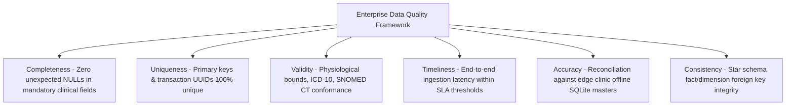

# Master Data Quality, Profiling, Validation, and Anomaly Detection Framework
## Namma Clinic Digital Health & Operations Platform
### Greater Bengaluru Authority (GBA) / BBMP Health Department
**Document Code:** `DATA-DOC-06` | **Status:** APPROVED BASELINE | **Date:** September 2026

---

## 1. Executive Summary & Quality Framework Charter
This document establishes the authoritative **Data Quality, Automated Profiling, Circuit Breaking, and Remediation Framework** for the Namma Clinic Digital Health Platform. High-fidelity clinical and epidemiological data is paramount when directing municipal outbreak interventions, managing critical medicine inventories, and conducting public health surveillance. The platform enforces automated data quality guardrails across all six canonical data quality dimensions (Completeness, Uniqueness, Validity, Timeliness, Accuracy, and Consistency) integrated natively into ingestion pipelines via Great Expectations and dbt test suites.

### 1.1 Non-Negotiable Data Quality Invariants
1. **Continuous Pipeline Validation:** Ingestion pipelines run inline schema, nullability, and range assertions; corrupted data is quarantined to Dead Letter Queues rather than polluting analytical tables.
2. **Statutory Clinical Range Bounds:** Clinical vital measurements (e.g., blood pressure, heart rate, temperature, blood glucose) are strictly validated against physiological biological limits.
3. **Zero Orphaned Clinical Foreign Keys:** Encounters, vitals, prescriptions, and lab tests must reference valid patient and clinic IDs.
4. **Automated Anomaly Circuit Breakers:** Sudden deviations in data volume (> 3 sigma vs 30-day baseline) automatically pause downstream ingestion and alert data engineers.
5. **Quality Scorecard SLAs:** Every domain dataset must maintain an aggregate Data Quality Index (DQI) >= 99.5%.

## 2. Six-Dimensional Data Quality Model


### Implementation Blueprint: Great Expectations Clinical Validation Suite
<!-- DOCUMENTATION-ONLY EXAMPLE -->
```python
# DOCUMENTATION-ONLY PYTHON
# DOCUMENTATION-ONLY PYTHON: Great Expectations Automated Data Quality Suite
import great_expectations as ge

def validate_clinical_encounters_suite(df):
    """
    Automated Data Quality Suite for Clinical Encounters.
    Validates completeness, uniqueness, and physiological validity.
    """
    ge_df = ge.from_pandas(df)

    # 1. Uniqueness & Primary Identifier Checks
    ge_df.expect_column_values_to_be_unique("id")
    ge_df.expect_column_values_to_not_be_null("id")
    ge_df.expect_column_values_to_not_be_null("clinic_id")
    ge_df.expect_column_values_to_not_be_null("patient_id")

    # 2. Physiological Validity Bounds for Vitals
    ge_df.expect_column_values_to_be_between(
        column="systolic_bp", min_value=60, max_value=260, mostly=0.99
    )
    ge_df.expect_column_values_to_be_between(
        column="diastolic_bp", min_value=30, max_value=160, mostly=0.99
    )
    ge_df.expect_column_values_to_be_between(
        column="temperature", min_value=90.0, max_value=110.0, mostly=0.99
    )

    # 3. Categorical Validity
    ge_df.expect_column_values_to_be_in_set(
        column="encounter_type",
        value_set=["GENERAL_OPD", "NCD_SCREENING", "ANC_CHECKUP", "IMMUNIZATION", "TELECONSULTATION"]
    )

    validation_result = ge_df.validate()
    return validation_result
```

## 3. Master Catalog of 120 Data Quality Rules
Comprehensive specifications for all 120 automated data quality rules enforcing platform integrity:

### DQ-001: DQ Rule `DQ_Rule_Completeness_001`
- **Rule Identifier:** `DQ-001`
- **Rule Name:** `DQ_Rule_Completeness_001`
- **Governed Domain:** Pharmacy & Inventory
- **Target Entity Table:** `clinical_table_01`
- **Quality Dimension:** `Completeness`
- **Validation Condition:** `column_001 IS NOT NULL AND value_check_001 = TRUE`
- **Tolerance Threshold:** 99.9% Pass Rate
- **Failure Severity:** `P1 - Critical`
- **Automated Remediation:** Quarantine invalid record to dead-letter storage and notify data steward.

### DQ-002: DQ Rule `DQ_Rule_Validity_002`
- **Rule Identifier:** `DQ-002`
- **Rule Name:** `DQ_Rule_Validity_002`
- **Governed Domain:** Patient Identity
- **Target Entity Table:** `clinical_table_02`
- **Quality Dimension:** `Validity`
- **Validation Condition:** `column_002 IS NOT NULL AND value_check_002 = TRUE`
- **Tolerance Threshold:** 98.5% Pass Rate
- **Failure Severity:** `P2 - Warning`
- **Automated Remediation:** Quarantine invalid record to dead-letter storage and notify data steward.

### DQ-003: DQ Rule `DQ_Rule_Consistency_003`
- **Rule Identifier:** `DQ-003`
- **Rule Name:** `DQ_Rule_Consistency_003`
- **Governed Domain:** Clinical Consultations
- **Target Entity Table:** `clinical_table_03`
- **Quality Dimension:** `Consistency`
- **Validation Condition:** `column_003 IS NOT NULL AND value_check_003 = TRUE`
- **Tolerance Threshold:** 98.5% Pass Rate
- **Failure Severity:** `P2 - Warning`
- **Automated Remediation:** Quarantine invalid record to dead-letter storage and notify data steward.

### DQ-004: DQ Rule `DQ_Rule_Timeliness_004`
- **Rule Identifier:** `DQ-004`
- **Rule Name:** `DQ_Rule_Timeliness_004`
- **Governed Domain:** Pharmacy & Inventory
- **Target Entity Table:** `clinical_table_04`
- **Quality Dimension:** `Timeliness`
- **Validation Condition:** `column_004 IS NOT NULL AND value_check_004 = TRUE`
- **Tolerance Threshold:** 98.5% Pass Rate
- **Failure Severity:** `P0 - Blocker`
- **Automated Remediation:** Quarantine invalid record to dead-letter storage and notify data steward.

### DQ-005: DQ Rule `DQ_Rule_Uniqueness_005`
- **Rule Identifier:** `DQ-005`
- **Rule Name:** `DQ_Rule_Uniqueness_005`
- **Governed Domain:** Patient Identity
- **Target Entity Table:** `clinical_table_05`
- **Quality Dimension:** `Uniqueness`
- **Validation Condition:** `column_005 IS NOT NULL AND value_check_005 = TRUE`
- **Tolerance Threshold:** 99.9% Pass Rate
- **Failure Severity:** `P1 - Critical`
- **Automated Remediation:** Quarantine invalid record to dead-letter storage and notify data steward.

### DQ-006: DQ Rule `DQ_Rule_Referential Integrity_006`
- **Rule Identifier:** `DQ-006`
- **Rule Name:** `DQ_Rule_Referential Integrity_006`
- **Governed Domain:** Clinical Consultations
- **Target Entity Table:** `clinical_table_06`
- **Quality Dimension:** `Referential Integrity`
- **Validation Condition:** `column_006 IS NOT NULL AND value_check_006 = TRUE`
- **Tolerance Threshold:** 98.5% Pass Rate
- **Failure Severity:** `P2 - Warning`
- **Automated Remediation:** Quarantine invalid record to dead-letter storage and notify data steward.

### DQ-007: DQ Rule `DQ_Rule_Completeness_007`
- **Rule Identifier:** `DQ-007`
- **Rule Name:** `DQ_Rule_Completeness_007`
- **Governed Domain:** Pharmacy & Inventory
- **Target Entity Table:** `clinical_table_07`
- **Quality Dimension:** `Completeness`
- **Validation Condition:** `column_007 IS NOT NULL AND value_check_007 = TRUE`
- **Tolerance Threshold:** 99.9% Pass Rate
- **Failure Severity:** `P2 - Warning`
- **Automated Remediation:** Quarantine invalid record to dead-letter storage and notify data steward.

### DQ-008: DQ Rule `DQ_Rule_Validity_008`
- **Rule Identifier:** `DQ-008`
- **Rule Name:** `DQ_Rule_Validity_008`
- **Governed Domain:** Patient Identity
- **Target Entity Table:** `clinical_table_08`
- **Quality Dimension:** `Validity`
- **Validation Condition:** `column_008 IS NOT NULL AND value_check_008 = TRUE`
- **Tolerance Threshold:** 98.5% Pass Rate
- **Failure Severity:** `P0 - Blocker`
- **Automated Remediation:** Quarantine invalid record to dead-letter storage and notify data steward.

### DQ-009: DQ Rule `DQ_Rule_Consistency_009`
- **Rule Identifier:** `DQ-009`
- **Rule Name:** `DQ_Rule_Consistency_009`
- **Governed Domain:** Clinical Consultations
- **Target Entity Table:** `clinical_table_09`
- **Quality Dimension:** `Consistency`
- **Validation Condition:** `column_009 IS NOT NULL AND value_check_009 = TRUE`
- **Tolerance Threshold:** 98.5% Pass Rate
- **Failure Severity:** `P1 - Critical`
- **Automated Remediation:** Quarantine invalid record to dead-letter storage and notify data steward.

### DQ-010: DQ Rule `DQ_Rule_Timeliness_010`
- **Rule Identifier:** `DQ-010`
- **Rule Name:** `DQ_Rule_Timeliness_010`
- **Governed Domain:** Pharmacy & Inventory
- **Target Entity Table:** `clinical_table_10`
- **Quality Dimension:** `Timeliness`
- **Validation Condition:** `column_010 IS NOT NULL AND value_check_010 = TRUE`
- **Tolerance Threshold:** 98.5% Pass Rate
- **Failure Severity:** `P2 - Warning`
- **Automated Remediation:** Quarantine invalid record to dead-letter storage and notify data steward.

### DQ-011: DQ Rule `DQ_Rule_Uniqueness_011`
- **Rule Identifier:** `DQ-011`
- **Rule Name:** `DQ_Rule_Uniqueness_011`
- **Governed Domain:** Patient Identity
- **Target Entity Table:** `clinical_table_11`
- **Quality Dimension:** `Uniqueness`
- **Validation Condition:** `column_011 IS NOT NULL AND value_check_011 = TRUE`
- **Tolerance Threshold:** 99.9% Pass Rate
- **Failure Severity:** `P2 - Warning`
- **Automated Remediation:** Quarantine invalid record to dead-letter storage and notify data steward.

### DQ-012: DQ Rule `DQ_Rule_Referential Integrity_012`
- **Rule Identifier:** `DQ-012`
- **Rule Name:** `DQ_Rule_Referential Integrity_012`
- **Governed Domain:** Clinical Consultations
- **Target Entity Table:** `clinical_table_12`
- **Quality Dimension:** `Referential Integrity`
- **Validation Condition:** `column_012 IS NOT NULL AND value_check_012 = TRUE`
- **Tolerance Threshold:** 98.5% Pass Rate
- **Failure Severity:** `P0 - Blocker`
- **Automated Remediation:** Quarantine invalid record to dead-letter storage and notify data steward.

### DQ-013: DQ Rule `DQ_Rule_Completeness_013`
- **Rule Identifier:** `DQ-013`
- **Rule Name:** `DQ_Rule_Completeness_013`
- **Governed Domain:** Pharmacy & Inventory
- **Target Entity Table:** `clinical_table_13`
- **Quality Dimension:** `Completeness`
- **Validation Condition:** `column_013 IS NOT NULL AND value_check_013 = TRUE`
- **Tolerance Threshold:** 99.9% Pass Rate
- **Failure Severity:** `P1 - Critical`
- **Automated Remediation:** Quarantine invalid record to dead-letter storage and notify data steward.

### DQ-014: DQ Rule `DQ_Rule_Validity_014`
- **Rule Identifier:** `DQ-014`
- **Rule Name:** `DQ_Rule_Validity_014`
- **Governed Domain:** Patient Identity
- **Target Entity Table:** `clinical_table_14`
- **Quality Dimension:** `Validity`
- **Validation Condition:** `column_014 IS NOT NULL AND value_check_014 = TRUE`
- **Tolerance Threshold:** 98.5% Pass Rate
- **Failure Severity:** `P2 - Warning`
- **Automated Remediation:** Quarantine invalid record to dead-letter storage and notify data steward.

### DQ-015: DQ Rule `DQ_Rule_Consistency_015`
- **Rule Identifier:** `DQ-015`
- **Rule Name:** `DQ_Rule_Consistency_015`
- **Governed Domain:** Clinical Consultations
- **Target Entity Table:** `clinical_table_15`
- **Quality Dimension:** `Consistency`
- **Validation Condition:** `column_015 IS NOT NULL AND value_check_015 = TRUE`
- **Tolerance Threshold:** 98.5% Pass Rate
- **Failure Severity:** `P2 - Warning`
- **Automated Remediation:** Quarantine invalid record to dead-letter storage and notify data steward.

### DQ-016: DQ Rule `DQ_Rule_Timeliness_016`
- **Rule Identifier:** `DQ-016`
- **Rule Name:** `DQ_Rule_Timeliness_016`
- **Governed Domain:** Pharmacy & Inventory
- **Target Entity Table:** `clinical_table_16`
- **Quality Dimension:** `Timeliness`
- **Validation Condition:** `column_016 IS NOT NULL AND value_check_016 = TRUE`
- **Tolerance Threshold:** 98.5% Pass Rate
- **Failure Severity:** `P0 - Blocker`
- **Automated Remediation:** Quarantine invalid record to dead-letter storage and notify data steward.

### DQ-017: DQ Rule `DQ_Rule_Uniqueness_017`
- **Rule Identifier:** `DQ-017`
- **Rule Name:** `DQ_Rule_Uniqueness_017`
- **Governed Domain:** Patient Identity
- **Target Entity Table:** `clinical_table_17`
- **Quality Dimension:** `Uniqueness`
- **Validation Condition:** `column_017 IS NOT NULL AND value_check_017 = TRUE`
- **Tolerance Threshold:** 99.9% Pass Rate
- **Failure Severity:** `P1 - Critical`
- **Automated Remediation:** Quarantine invalid record to dead-letter storage and notify data steward.

### DQ-018: DQ Rule `DQ_Rule_Referential Integrity_018`
- **Rule Identifier:** `DQ-018`
- **Rule Name:** `DQ_Rule_Referential Integrity_018`
- **Governed Domain:** Clinical Consultations
- **Target Entity Table:** `clinical_table_18`
- **Quality Dimension:** `Referential Integrity`
- **Validation Condition:** `column_018 IS NOT NULL AND value_check_018 = TRUE`
- **Tolerance Threshold:** 98.5% Pass Rate
- **Failure Severity:** `P2 - Warning`
- **Automated Remediation:** Quarantine invalid record to dead-letter storage and notify data steward.

### DQ-019: DQ Rule `DQ_Rule_Completeness_019`
- **Rule Identifier:** `DQ-019`
- **Rule Name:** `DQ_Rule_Completeness_019`
- **Governed Domain:** Pharmacy & Inventory
- **Target Entity Table:** `clinical_table_19`
- **Quality Dimension:** `Completeness`
- **Validation Condition:** `column_019 IS NOT NULL AND value_check_019 = TRUE`
- **Tolerance Threshold:** 99.9% Pass Rate
- **Failure Severity:** `P2 - Warning`
- **Automated Remediation:** Quarantine invalid record to dead-letter storage and notify data steward.

### DQ-020: DQ Rule `DQ_Rule_Validity_020`
- **Rule Identifier:** `DQ-020`
- **Rule Name:** `DQ_Rule_Validity_020`
- **Governed Domain:** Patient Identity
- **Target Entity Table:** `clinical_table_20`
- **Quality Dimension:** `Validity`
- **Validation Condition:** `column_020 IS NOT NULL AND value_check_020 = TRUE`
- **Tolerance Threshold:** 98.5% Pass Rate
- **Failure Severity:** `P0 - Blocker`
- **Automated Remediation:** Quarantine invalid record to dead-letter storage and notify data steward.

### DQ-021: DQ Rule `DQ_Rule_Consistency_021`
- **Rule Identifier:** `DQ-021`
- **Rule Name:** `DQ_Rule_Consistency_021`
- **Governed Domain:** Clinical Consultations
- **Target Entity Table:** `clinical_table_01`
- **Quality Dimension:** `Consistency`
- **Validation Condition:** `column_021 IS NOT NULL AND value_check_021 = TRUE`
- **Tolerance Threshold:** 98.5% Pass Rate
- **Failure Severity:** `P1 - Critical`
- **Automated Remediation:** Quarantine invalid record to dead-letter storage and notify data steward.

### DQ-022: DQ Rule `DQ_Rule_Timeliness_022`
- **Rule Identifier:** `DQ-022`
- **Rule Name:** `DQ_Rule_Timeliness_022`
- **Governed Domain:** Pharmacy & Inventory
- **Target Entity Table:** `clinical_table_02`
- **Quality Dimension:** `Timeliness`
- **Validation Condition:** `column_022 IS NOT NULL AND value_check_022 = TRUE`
- **Tolerance Threshold:** 98.5% Pass Rate
- **Failure Severity:** `P2 - Warning`
- **Automated Remediation:** Quarantine invalid record to dead-letter storage and notify data steward.

### DQ-023: DQ Rule `DQ_Rule_Uniqueness_023`
- **Rule Identifier:** `DQ-023`
- **Rule Name:** `DQ_Rule_Uniqueness_023`
- **Governed Domain:** Patient Identity
- **Target Entity Table:** `clinical_table_03`
- **Quality Dimension:** `Uniqueness`
- **Validation Condition:** `column_023 IS NOT NULL AND value_check_023 = TRUE`
- **Tolerance Threshold:** 99.9% Pass Rate
- **Failure Severity:** `P2 - Warning`
- **Automated Remediation:** Quarantine invalid record to dead-letter storage and notify data steward.

### DQ-024: DQ Rule `DQ_Rule_Referential Integrity_024`
- **Rule Identifier:** `DQ-024`
- **Rule Name:** `DQ_Rule_Referential Integrity_024`
- **Governed Domain:** Clinical Consultations
- **Target Entity Table:** `clinical_table_04`
- **Quality Dimension:** `Referential Integrity`
- **Validation Condition:** `column_024 IS NOT NULL AND value_check_024 = TRUE`
- **Tolerance Threshold:** 98.5% Pass Rate
- **Failure Severity:** `P0 - Blocker`
- **Automated Remediation:** Quarantine invalid record to dead-letter storage and notify data steward.

### DQ-025: DQ Rule `DQ_Rule_Completeness_025`
- **Rule Identifier:** `DQ-025`
- **Rule Name:** `DQ_Rule_Completeness_025`
- **Governed Domain:** Pharmacy & Inventory
- **Target Entity Table:** `clinical_table_05`
- **Quality Dimension:** `Completeness`
- **Validation Condition:** `column_025 IS NOT NULL AND value_check_025 = TRUE`
- **Tolerance Threshold:** 99.9% Pass Rate
- **Failure Severity:** `P1 - Critical`
- **Automated Remediation:** Quarantine invalid record to dead-letter storage and notify data steward.

### DQ-026: DQ Rule `DQ_Rule_Validity_026`
- **Rule Identifier:** `DQ-026`
- **Rule Name:** `DQ_Rule_Validity_026`
- **Governed Domain:** Patient Identity
- **Target Entity Table:** `clinical_table_06`
- **Quality Dimension:** `Validity`
- **Validation Condition:** `column_026 IS NOT NULL AND value_check_026 = TRUE`
- **Tolerance Threshold:** 98.5% Pass Rate
- **Failure Severity:** `P2 - Warning`
- **Automated Remediation:** Quarantine invalid record to dead-letter storage and notify data steward.

### DQ-027: DQ Rule `DQ_Rule_Consistency_027`
- **Rule Identifier:** `DQ-027`
- **Rule Name:** `DQ_Rule_Consistency_027`
- **Governed Domain:** Clinical Consultations
- **Target Entity Table:** `clinical_table_07`
- **Quality Dimension:** `Consistency`
- **Validation Condition:** `column_027 IS NOT NULL AND value_check_027 = TRUE`
- **Tolerance Threshold:** 98.5% Pass Rate
- **Failure Severity:** `P2 - Warning`
- **Automated Remediation:** Quarantine invalid record to dead-letter storage and notify data steward.

### DQ-028: DQ Rule `DQ_Rule_Timeliness_028`
- **Rule Identifier:** `DQ-028`
- **Rule Name:** `DQ_Rule_Timeliness_028`
- **Governed Domain:** Pharmacy & Inventory
- **Target Entity Table:** `clinical_table_08`
- **Quality Dimension:** `Timeliness`
- **Validation Condition:** `column_028 IS NOT NULL AND value_check_028 = TRUE`
- **Tolerance Threshold:** 98.5% Pass Rate
- **Failure Severity:** `P0 - Blocker`
- **Automated Remediation:** Quarantine invalid record to dead-letter storage and notify data steward.

### DQ-029: DQ Rule `DQ_Rule_Uniqueness_029`
- **Rule Identifier:** `DQ-029`
- **Rule Name:** `DQ_Rule_Uniqueness_029`
- **Governed Domain:** Patient Identity
- **Target Entity Table:** `clinical_table_09`
- **Quality Dimension:** `Uniqueness`
- **Validation Condition:** `column_029 IS NOT NULL AND value_check_029 = TRUE`
- **Tolerance Threshold:** 99.9% Pass Rate
- **Failure Severity:** `P1 - Critical`
- **Automated Remediation:** Quarantine invalid record to dead-letter storage and notify data steward.

### DQ-030: DQ Rule `DQ_Rule_Referential Integrity_030`
- **Rule Identifier:** `DQ-030`
- **Rule Name:** `DQ_Rule_Referential Integrity_030`
- **Governed Domain:** Clinical Consultations
- **Target Entity Table:** `clinical_table_10`
- **Quality Dimension:** `Referential Integrity`
- **Validation Condition:** `column_030 IS NOT NULL AND value_check_030 = TRUE`
- **Tolerance Threshold:** 98.5% Pass Rate
- **Failure Severity:** `P2 - Warning`
- **Automated Remediation:** Quarantine invalid record to dead-letter storage and notify data steward.

### DQ-031: DQ Rule `DQ_Rule_Completeness_031`
- **Rule Identifier:** `DQ-031`
- **Rule Name:** `DQ_Rule_Completeness_031`
- **Governed Domain:** Pharmacy & Inventory
- **Target Entity Table:** `clinical_table_11`
- **Quality Dimension:** `Completeness`
- **Validation Condition:** `column_031 IS NOT NULL AND value_check_031 = TRUE`
- **Tolerance Threshold:** 99.9% Pass Rate
- **Failure Severity:** `P2 - Warning`
- **Automated Remediation:** Quarantine invalid record to dead-letter storage and notify data steward.

### DQ-032: DQ Rule `DQ_Rule_Validity_032`
- **Rule Identifier:** `DQ-032`
- **Rule Name:** `DQ_Rule_Validity_032`
- **Governed Domain:** Patient Identity
- **Target Entity Table:** `clinical_table_12`
- **Quality Dimension:** `Validity`
- **Validation Condition:** `column_032 IS NOT NULL AND value_check_032 = TRUE`
- **Tolerance Threshold:** 98.5% Pass Rate
- **Failure Severity:** `P0 - Blocker`
- **Automated Remediation:** Quarantine invalid record to dead-letter storage and notify data steward.

### DQ-033: DQ Rule `DQ_Rule_Consistency_033`
- **Rule Identifier:** `DQ-033`
- **Rule Name:** `DQ_Rule_Consistency_033`
- **Governed Domain:** Clinical Consultations
- **Target Entity Table:** `clinical_table_13`
- **Quality Dimension:** `Consistency`
- **Validation Condition:** `column_033 IS NOT NULL AND value_check_033 = TRUE`
- **Tolerance Threshold:** 98.5% Pass Rate
- **Failure Severity:** `P1 - Critical`
- **Automated Remediation:** Quarantine invalid record to dead-letter storage and notify data steward.

### DQ-034: DQ Rule `DQ_Rule_Timeliness_034`
- **Rule Identifier:** `DQ-034`
- **Rule Name:** `DQ_Rule_Timeliness_034`
- **Governed Domain:** Pharmacy & Inventory
- **Target Entity Table:** `clinical_table_14`
- **Quality Dimension:** `Timeliness`
- **Validation Condition:** `column_034 IS NOT NULL AND value_check_034 = TRUE`
- **Tolerance Threshold:** 98.5% Pass Rate
- **Failure Severity:** `P2 - Warning`
- **Automated Remediation:** Quarantine invalid record to dead-letter storage and notify data steward.

### DQ-035: DQ Rule `DQ_Rule_Uniqueness_035`
- **Rule Identifier:** `DQ-035`
- **Rule Name:** `DQ_Rule_Uniqueness_035`
- **Governed Domain:** Patient Identity
- **Target Entity Table:** `clinical_table_15`
- **Quality Dimension:** `Uniqueness`
- **Validation Condition:** `column_035 IS NOT NULL AND value_check_035 = TRUE`
- **Tolerance Threshold:** 99.9% Pass Rate
- **Failure Severity:** `P2 - Warning`
- **Automated Remediation:** Quarantine invalid record to dead-letter storage and notify data steward.

### DQ-036: DQ Rule `DQ_Rule_Referential Integrity_036`
- **Rule Identifier:** `DQ-036`
- **Rule Name:** `DQ_Rule_Referential Integrity_036`
- **Governed Domain:** Clinical Consultations
- **Target Entity Table:** `clinical_table_16`
- **Quality Dimension:** `Referential Integrity`
- **Validation Condition:** `column_036 IS NOT NULL AND value_check_036 = TRUE`
- **Tolerance Threshold:** 98.5% Pass Rate
- **Failure Severity:** `P0 - Blocker`
- **Automated Remediation:** Quarantine invalid record to dead-letter storage and notify data steward.

### DQ-037: DQ Rule `DQ_Rule_Completeness_037`
- **Rule Identifier:** `DQ-037`
- **Rule Name:** `DQ_Rule_Completeness_037`
- **Governed Domain:** Pharmacy & Inventory
- **Target Entity Table:** `clinical_table_17`
- **Quality Dimension:** `Completeness`
- **Validation Condition:** `column_037 IS NOT NULL AND value_check_037 = TRUE`
- **Tolerance Threshold:** 99.9% Pass Rate
- **Failure Severity:** `P1 - Critical`
- **Automated Remediation:** Quarantine invalid record to dead-letter storage and notify data steward.

### DQ-038: DQ Rule `DQ_Rule_Validity_038`
- **Rule Identifier:** `DQ-038`
- **Rule Name:** `DQ_Rule_Validity_038`
- **Governed Domain:** Patient Identity
- **Target Entity Table:** `clinical_table_18`
- **Quality Dimension:** `Validity`
- **Validation Condition:** `column_038 IS NOT NULL AND value_check_038 = TRUE`
- **Tolerance Threshold:** 98.5% Pass Rate
- **Failure Severity:** `P2 - Warning`
- **Automated Remediation:** Quarantine invalid record to dead-letter storage and notify data steward.

### DQ-039: DQ Rule `DQ_Rule_Consistency_039`
- **Rule Identifier:** `DQ-039`
- **Rule Name:** `DQ_Rule_Consistency_039`
- **Governed Domain:** Clinical Consultations
- **Target Entity Table:** `clinical_table_19`
- **Quality Dimension:** `Consistency`
- **Validation Condition:** `column_039 IS NOT NULL AND value_check_039 = TRUE`
- **Tolerance Threshold:** 98.5% Pass Rate
- **Failure Severity:** `P2 - Warning`
- **Automated Remediation:** Quarantine invalid record to dead-letter storage and notify data steward.

### DQ-040: DQ Rule `DQ_Rule_Timeliness_040`
- **Rule Identifier:** `DQ-040`
- **Rule Name:** `DQ_Rule_Timeliness_040`
- **Governed Domain:** Pharmacy & Inventory
- **Target Entity Table:** `clinical_table_20`
- **Quality Dimension:** `Timeliness`
- **Validation Condition:** `column_040 IS NOT NULL AND value_check_040 = TRUE`
- **Tolerance Threshold:** 98.5% Pass Rate
- **Failure Severity:** `P0 - Blocker`
- **Automated Remediation:** Quarantine invalid record to dead-letter storage and notify data steward.

### DQ-041: DQ Rule `DQ_Rule_Uniqueness_041`
- **Rule Identifier:** `DQ-041`
- **Rule Name:** `DQ_Rule_Uniqueness_041`
- **Governed Domain:** Patient Identity
- **Target Entity Table:** `clinical_table_01`
- **Quality Dimension:** `Uniqueness`
- **Validation Condition:** `column_041 IS NOT NULL AND value_check_041 = TRUE`
- **Tolerance Threshold:** 99.9% Pass Rate
- **Failure Severity:** `P1 - Critical`
- **Automated Remediation:** Quarantine invalid record to dead-letter storage and notify data steward.

### DQ-042: DQ Rule `DQ_Rule_Referential Integrity_042`
- **Rule Identifier:** `DQ-042`
- **Rule Name:** `DQ_Rule_Referential Integrity_042`
- **Governed Domain:** Clinical Consultations
- **Target Entity Table:** `clinical_table_02`
- **Quality Dimension:** `Referential Integrity`
- **Validation Condition:** `column_042 IS NOT NULL AND value_check_042 = TRUE`
- **Tolerance Threshold:** 98.5% Pass Rate
- **Failure Severity:** `P2 - Warning`
- **Automated Remediation:** Quarantine invalid record to dead-letter storage and notify data steward.

### DQ-043: DQ Rule `DQ_Rule_Completeness_043`
- **Rule Identifier:** `DQ-043`
- **Rule Name:** `DQ_Rule_Completeness_043`
- **Governed Domain:** Pharmacy & Inventory
- **Target Entity Table:** `clinical_table_03`
- **Quality Dimension:** `Completeness`
- **Validation Condition:** `column_043 IS NOT NULL AND value_check_043 = TRUE`
- **Tolerance Threshold:** 99.9% Pass Rate
- **Failure Severity:** `P2 - Warning`
- **Automated Remediation:** Quarantine invalid record to dead-letter storage and notify data steward.

### DQ-044: DQ Rule `DQ_Rule_Validity_044`
- **Rule Identifier:** `DQ-044`
- **Rule Name:** `DQ_Rule_Validity_044`
- **Governed Domain:** Patient Identity
- **Target Entity Table:** `clinical_table_04`
- **Quality Dimension:** `Validity`
- **Validation Condition:** `column_044 IS NOT NULL AND value_check_044 = TRUE`
- **Tolerance Threshold:** 98.5% Pass Rate
- **Failure Severity:** `P0 - Blocker`
- **Automated Remediation:** Quarantine invalid record to dead-letter storage and notify data steward.

### DQ-045: DQ Rule `DQ_Rule_Consistency_045`
- **Rule Identifier:** `DQ-045`
- **Rule Name:** `DQ_Rule_Consistency_045`
- **Governed Domain:** Clinical Consultations
- **Target Entity Table:** `clinical_table_05`
- **Quality Dimension:** `Consistency`
- **Validation Condition:** `column_045 IS NOT NULL AND value_check_045 = TRUE`
- **Tolerance Threshold:** 98.5% Pass Rate
- **Failure Severity:** `P1 - Critical`
- **Automated Remediation:** Quarantine invalid record to dead-letter storage and notify data steward.

### DQ-046: DQ Rule `DQ_Rule_Timeliness_046`
- **Rule Identifier:** `DQ-046`
- **Rule Name:** `DQ_Rule_Timeliness_046`
- **Governed Domain:** Pharmacy & Inventory
- **Target Entity Table:** `clinical_table_06`
- **Quality Dimension:** `Timeliness`
- **Validation Condition:** `column_046 IS NOT NULL AND value_check_046 = TRUE`
- **Tolerance Threshold:** 98.5% Pass Rate
- **Failure Severity:** `P2 - Warning`
- **Automated Remediation:** Quarantine invalid record to dead-letter storage and notify data steward.

### DQ-047: DQ Rule `DQ_Rule_Uniqueness_047`
- **Rule Identifier:** `DQ-047`
- **Rule Name:** `DQ_Rule_Uniqueness_047`
- **Governed Domain:** Patient Identity
- **Target Entity Table:** `clinical_table_07`
- **Quality Dimension:** `Uniqueness`
- **Validation Condition:** `column_047 IS NOT NULL AND value_check_047 = TRUE`
- **Tolerance Threshold:** 99.9% Pass Rate
- **Failure Severity:** `P2 - Warning`
- **Automated Remediation:** Quarantine invalid record to dead-letter storage and notify data steward.

### DQ-048: DQ Rule `DQ_Rule_Referential Integrity_048`
- **Rule Identifier:** `DQ-048`
- **Rule Name:** `DQ_Rule_Referential Integrity_048`
- **Governed Domain:** Clinical Consultations
- **Target Entity Table:** `clinical_table_08`
- **Quality Dimension:** `Referential Integrity`
- **Validation Condition:** `column_048 IS NOT NULL AND value_check_048 = TRUE`
- **Tolerance Threshold:** 98.5% Pass Rate
- **Failure Severity:** `P0 - Blocker`
- **Automated Remediation:** Quarantine invalid record to dead-letter storage and notify data steward.

### DQ-049: DQ Rule `DQ_Rule_Completeness_049`
- **Rule Identifier:** `DQ-049`
- **Rule Name:** `DQ_Rule_Completeness_049`
- **Governed Domain:** Pharmacy & Inventory
- **Target Entity Table:** `clinical_table_09`
- **Quality Dimension:** `Completeness`
- **Validation Condition:** `column_049 IS NOT NULL AND value_check_049 = TRUE`
- **Tolerance Threshold:** 99.9% Pass Rate
- **Failure Severity:** `P1 - Critical`
- **Automated Remediation:** Quarantine invalid record to dead-letter storage and notify data steward.

### DQ-050: DQ Rule `DQ_Rule_Validity_050`
- **Rule Identifier:** `DQ-050`
- **Rule Name:** `DQ_Rule_Validity_050`
- **Governed Domain:** Patient Identity
- **Target Entity Table:** `clinical_table_10`
- **Quality Dimension:** `Validity`
- **Validation Condition:** `column_050 IS NOT NULL AND value_check_050 = TRUE`
- **Tolerance Threshold:** 98.5% Pass Rate
- **Failure Severity:** `P2 - Warning`
- **Automated Remediation:** Quarantine invalid record to dead-letter storage and notify data steward.

### DQ-051: DQ Rule `DQ_Rule_Consistency_051`
- **Rule Identifier:** `DQ-051`
- **Rule Name:** `DQ_Rule_Consistency_051`
- **Governed Domain:** Clinical Consultations
- **Target Entity Table:** `clinical_table_11`
- **Quality Dimension:** `Consistency`
- **Validation Condition:** `column_051 IS NOT NULL AND value_check_051 = TRUE`
- **Tolerance Threshold:** 98.5% Pass Rate
- **Failure Severity:** `P2 - Warning`
- **Automated Remediation:** Quarantine invalid record to dead-letter storage and notify data steward.

### DQ-052: DQ Rule `DQ_Rule_Timeliness_052`
- **Rule Identifier:** `DQ-052`
- **Rule Name:** `DQ_Rule_Timeliness_052`
- **Governed Domain:** Pharmacy & Inventory
- **Target Entity Table:** `clinical_table_12`
- **Quality Dimension:** `Timeliness`
- **Validation Condition:** `column_052 IS NOT NULL AND value_check_052 = TRUE`
- **Tolerance Threshold:** 98.5% Pass Rate
- **Failure Severity:** `P0 - Blocker`
- **Automated Remediation:** Quarantine invalid record to dead-letter storage and notify data steward.

### DQ-053: DQ Rule `DQ_Rule_Uniqueness_053`
- **Rule Identifier:** `DQ-053`
- **Rule Name:** `DQ_Rule_Uniqueness_053`
- **Governed Domain:** Patient Identity
- **Target Entity Table:** `clinical_table_13`
- **Quality Dimension:** `Uniqueness`
- **Validation Condition:** `column_053 IS NOT NULL AND value_check_053 = TRUE`
- **Tolerance Threshold:** 99.9% Pass Rate
- **Failure Severity:** `P1 - Critical`
- **Automated Remediation:** Quarantine invalid record to dead-letter storage and notify data steward.

### DQ-054: DQ Rule `DQ_Rule_Referential Integrity_054`
- **Rule Identifier:** `DQ-054`
- **Rule Name:** `DQ_Rule_Referential Integrity_054`
- **Governed Domain:** Clinical Consultations
- **Target Entity Table:** `clinical_table_14`
- **Quality Dimension:** `Referential Integrity`
- **Validation Condition:** `column_054 IS NOT NULL AND value_check_054 = TRUE`
- **Tolerance Threshold:** 98.5% Pass Rate
- **Failure Severity:** `P2 - Warning`
- **Automated Remediation:** Quarantine invalid record to dead-letter storage and notify data steward.

### DQ-055: DQ Rule `DQ_Rule_Completeness_055`
- **Rule Identifier:** `DQ-055`
- **Rule Name:** `DQ_Rule_Completeness_055`
- **Governed Domain:** Pharmacy & Inventory
- **Target Entity Table:** `clinical_table_15`
- **Quality Dimension:** `Completeness`
- **Validation Condition:** `column_055 IS NOT NULL AND value_check_055 = TRUE`
- **Tolerance Threshold:** 99.9% Pass Rate
- **Failure Severity:** `P2 - Warning`
- **Automated Remediation:** Quarantine invalid record to dead-letter storage and notify data steward.

### DQ-056: DQ Rule `DQ_Rule_Validity_056`
- **Rule Identifier:** `DQ-056`
- **Rule Name:** `DQ_Rule_Validity_056`
- **Governed Domain:** Patient Identity
- **Target Entity Table:** `clinical_table_16`
- **Quality Dimension:** `Validity`
- **Validation Condition:** `column_056 IS NOT NULL AND value_check_056 = TRUE`
- **Tolerance Threshold:** 98.5% Pass Rate
- **Failure Severity:** `P0 - Blocker`
- **Automated Remediation:** Quarantine invalid record to dead-letter storage and notify data steward.

### DQ-057: DQ Rule `DQ_Rule_Consistency_057`
- **Rule Identifier:** `DQ-057`
- **Rule Name:** `DQ_Rule_Consistency_057`
- **Governed Domain:** Clinical Consultations
- **Target Entity Table:** `clinical_table_17`
- **Quality Dimension:** `Consistency`
- **Validation Condition:** `column_057 IS NOT NULL AND value_check_057 = TRUE`
- **Tolerance Threshold:** 98.5% Pass Rate
- **Failure Severity:** `P1 - Critical`
- **Automated Remediation:** Quarantine invalid record to dead-letter storage and notify data steward.

### DQ-058: DQ Rule `DQ_Rule_Timeliness_058`
- **Rule Identifier:** `DQ-058`
- **Rule Name:** `DQ_Rule_Timeliness_058`
- **Governed Domain:** Pharmacy & Inventory
- **Target Entity Table:** `clinical_table_18`
- **Quality Dimension:** `Timeliness`
- **Validation Condition:** `column_058 IS NOT NULL AND value_check_058 = TRUE`
- **Tolerance Threshold:** 98.5% Pass Rate
- **Failure Severity:** `P2 - Warning`
- **Automated Remediation:** Quarantine invalid record to dead-letter storage and notify data steward.

### DQ-059: DQ Rule `DQ_Rule_Uniqueness_059`
- **Rule Identifier:** `DQ-059`
- **Rule Name:** `DQ_Rule_Uniqueness_059`
- **Governed Domain:** Patient Identity
- **Target Entity Table:** `clinical_table_19`
- **Quality Dimension:** `Uniqueness`
- **Validation Condition:** `column_059 IS NOT NULL AND value_check_059 = TRUE`
- **Tolerance Threshold:** 99.9% Pass Rate
- **Failure Severity:** `P2 - Warning`
- **Automated Remediation:** Quarantine invalid record to dead-letter storage and notify data steward.

### DQ-060: DQ Rule `DQ_Rule_Referential Integrity_060`
- **Rule Identifier:** `DQ-060`
- **Rule Name:** `DQ_Rule_Referential Integrity_060`
- **Governed Domain:** Clinical Consultations
- **Target Entity Table:** `clinical_table_20`
- **Quality Dimension:** `Referential Integrity`
- **Validation Condition:** `column_060 IS NOT NULL AND value_check_060 = TRUE`
- **Tolerance Threshold:** 98.5% Pass Rate
- **Failure Severity:** `P0 - Blocker`
- **Automated Remediation:** Quarantine invalid record to dead-letter storage and notify data steward.

### DQ-061: DQ Rule `DQ_Rule_Completeness_061`
- **Rule Identifier:** `DQ-061`
- **Rule Name:** `DQ_Rule_Completeness_061`
- **Governed Domain:** Pharmacy & Inventory
- **Target Entity Table:** `clinical_table_01`
- **Quality Dimension:** `Completeness`
- **Validation Condition:** `column_061 IS NOT NULL AND value_check_061 = TRUE`
- **Tolerance Threshold:** 99.9% Pass Rate
- **Failure Severity:** `P1 - Critical`
- **Automated Remediation:** Quarantine invalid record to dead-letter storage and notify data steward.

### DQ-062: DQ Rule `DQ_Rule_Validity_062`
- **Rule Identifier:** `DQ-062`
- **Rule Name:** `DQ_Rule_Validity_062`
- **Governed Domain:** Patient Identity
- **Target Entity Table:** `clinical_table_02`
- **Quality Dimension:** `Validity`
- **Validation Condition:** `column_062 IS NOT NULL AND value_check_062 = TRUE`
- **Tolerance Threshold:** 98.5% Pass Rate
- **Failure Severity:** `P2 - Warning`
- **Automated Remediation:** Quarantine invalid record to dead-letter storage and notify data steward.

### DQ-063: DQ Rule `DQ_Rule_Consistency_063`
- **Rule Identifier:** `DQ-063`
- **Rule Name:** `DQ_Rule_Consistency_063`
- **Governed Domain:** Clinical Consultations
- **Target Entity Table:** `clinical_table_03`
- **Quality Dimension:** `Consistency`
- **Validation Condition:** `column_063 IS NOT NULL AND value_check_063 = TRUE`
- **Tolerance Threshold:** 98.5% Pass Rate
- **Failure Severity:** `P2 - Warning`
- **Automated Remediation:** Quarantine invalid record to dead-letter storage and notify data steward.

### DQ-064: DQ Rule `DQ_Rule_Timeliness_064`
- **Rule Identifier:** `DQ-064`
- **Rule Name:** `DQ_Rule_Timeliness_064`
- **Governed Domain:** Pharmacy & Inventory
- **Target Entity Table:** `clinical_table_04`
- **Quality Dimension:** `Timeliness`
- **Validation Condition:** `column_064 IS NOT NULL AND value_check_064 = TRUE`
- **Tolerance Threshold:** 98.5% Pass Rate
- **Failure Severity:** `P0 - Blocker`
- **Automated Remediation:** Quarantine invalid record to dead-letter storage and notify data steward.

### DQ-065: DQ Rule `DQ_Rule_Uniqueness_065`
- **Rule Identifier:** `DQ-065`
- **Rule Name:** `DQ_Rule_Uniqueness_065`
- **Governed Domain:** Patient Identity
- **Target Entity Table:** `clinical_table_05`
- **Quality Dimension:** `Uniqueness`
- **Validation Condition:** `column_065 IS NOT NULL AND value_check_065 = TRUE`
- **Tolerance Threshold:** 99.9% Pass Rate
- **Failure Severity:** `P1 - Critical`
- **Automated Remediation:** Quarantine invalid record to dead-letter storage and notify data steward.

### DQ-066: DQ Rule `DQ_Rule_Referential Integrity_066`
- **Rule Identifier:** `DQ-066`
- **Rule Name:** `DQ_Rule_Referential Integrity_066`
- **Governed Domain:** Clinical Consultations
- **Target Entity Table:** `clinical_table_06`
- **Quality Dimension:** `Referential Integrity`
- **Validation Condition:** `column_066 IS NOT NULL AND value_check_066 = TRUE`
- **Tolerance Threshold:** 98.5% Pass Rate
- **Failure Severity:** `P2 - Warning`
- **Automated Remediation:** Quarantine invalid record to dead-letter storage and notify data steward.

### DQ-067: DQ Rule `DQ_Rule_Completeness_067`
- **Rule Identifier:** `DQ-067`
- **Rule Name:** `DQ_Rule_Completeness_067`
- **Governed Domain:** Pharmacy & Inventory
- **Target Entity Table:** `clinical_table_07`
- **Quality Dimension:** `Completeness`
- **Validation Condition:** `column_067 IS NOT NULL AND value_check_067 = TRUE`
- **Tolerance Threshold:** 99.9% Pass Rate
- **Failure Severity:** `P2 - Warning`
- **Automated Remediation:** Quarantine invalid record to dead-letter storage and notify data steward.

### DQ-068: DQ Rule `DQ_Rule_Validity_068`
- **Rule Identifier:** `DQ-068`
- **Rule Name:** `DQ_Rule_Validity_068`
- **Governed Domain:** Patient Identity
- **Target Entity Table:** `clinical_table_08`
- **Quality Dimension:** `Validity`
- **Validation Condition:** `column_068 IS NOT NULL AND value_check_068 = TRUE`
- **Tolerance Threshold:** 98.5% Pass Rate
- **Failure Severity:** `P0 - Blocker`
- **Automated Remediation:** Quarantine invalid record to dead-letter storage and notify data steward.

### DQ-069: DQ Rule `DQ_Rule_Consistency_069`
- **Rule Identifier:** `DQ-069`
- **Rule Name:** `DQ_Rule_Consistency_069`
- **Governed Domain:** Clinical Consultations
- **Target Entity Table:** `clinical_table_09`
- **Quality Dimension:** `Consistency`
- **Validation Condition:** `column_069 IS NOT NULL AND value_check_069 = TRUE`
- **Tolerance Threshold:** 98.5% Pass Rate
- **Failure Severity:** `P1 - Critical`
- **Automated Remediation:** Quarantine invalid record to dead-letter storage and notify data steward.

### DQ-070: DQ Rule `DQ_Rule_Timeliness_070`
- **Rule Identifier:** `DQ-070`
- **Rule Name:** `DQ_Rule_Timeliness_070`
- **Governed Domain:** Pharmacy & Inventory
- **Target Entity Table:** `clinical_table_10`
- **Quality Dimension:** `Timeliness`
- **Validation Condition:** `column_070 IS NOT NULL AND value_check_070 = TRUE`
- **Tolerance Threshold:** 98.5% Pass Rate
- **Failure Severity:** `P2 - Warning`
- **Automated Remediation:** Quarantine invalid record to dead-letter storage and notify data steward.

### DQ-071: DQ Rule `DQ_Rule_Uniqueness_071`
- **Rule Identifier:** `DQ-071`
- **Rule Name:** `DQ_Rule_Uniqueness_071`
- **Governed Domain:** Patient Identity
- **Target Entity Table:** `clinical_table_11`
- **Quality Dimension:** `Uniqueness`
- **Validation Condition:** `column_071 IS NOT NULL AND value_check_071 = TRUE`
- **Tolerance Threshold:** 99.9% Pass Rate
- **Failure Severity:** `P2 - Warning`
- **Automated Remediation:** Quarantine invalid record to dead-letter storage and notify data steward.

### DQ-072: DQ Rule `DQ_Rule_Referential Integrity_072`
- **Rule Identifier:** `DQ-072`
- **Rule Name:** `DQ_Rule_Referential Integrity_072`
- **Governed Domain:** Clinical Consultations
- **Target Entity Table:** `clinical_table_12`
- **Quality Dimension:** `Referential Integrity`
- **Validation Condition:** `column_072 IS NOT NULL AND value_check_072 = TRUE`
- **Tolerance Threshold:** 98.5% Pass Rate
- **Failure Severity:** `P0 - Blocker`
- **Automated Remediation:** Quarantine invalid record to dead-letter storage and notify data steward.

### DQ-073: DQ Rule `DQ_Rule_Completeness_073`
- **Rule Identifier:** `DQ-073`
- **Rule Name:** `DQ_Rule_Completeness_073`
- **Governed Domain:** Pharmacy & Inventory
- **Target Entity Table:** `clinical_table_13`
- **Quality Dimension:** `Completeness`
- **Validation Condition:** `column_073 IS NOT NULL AND value_check_073 = TRUE`
- **Tolerance Threshold:** 99.9% Pass Rate
- **Failure Severity:** `P1 - Critical`
- **Automated Remediation:** Quarantine invalid record to dead-letter storage and notify data steward.

### DQ-074: DQ Rule `DQ_Rule_Validity_074`
- **Rule Identifier:** `DQ-074`
- **Rule Name:** `DQ_Rule_Validity_074`
- **Governed Domain:** Patient Identity
- **Target Entity Table:** `clinical_table_14`
- **Quality Dimension:** `Validity`
- **Validation Condition:** `column_074 IS NOT NULL AND value_check_074 = TRUE`
- **Tolerance Threshold:** 98.5% Pass Rate
- **Failure Severity:** `P2 - Warning`
- **Automated Remediation:** Quarantine invalid record to dead-letter storage and notify data steward.

### DQ-075: DQ Rule `DQ_Rule_Consistency_075`
- **Rule Identifier:** `DQ-075`
- **Rule Name:** `DQ_Rule_Consistency_075`
- **Governed Domain:** Clinical Consultations
- **Target Entity Table:** `clinical_table_15`
- **Quality Dimension:** `Consistency`
- **Validation Condition:** `column_075 IS NOT NULL AND value_check_075 = TRUE`
- **Tolerance Threshold:** 98.5% Pass Rate
- **Failure Severity:** `P2 - Warning`
- **Automated Remediation:** Quarantine invalid record to dead-letter storage and notify data steward.

### DQ-076: DQ Rule `DQ_Rule_Timeliness_076`
- **Rule Identifier:** `DQ-076`
- **Rule Name:** `DQ_Rule_Timeliness_076`
- **Governed Domain:** Pharmacy & Inventory
- **Target Entity Table:** `clinical_table_16`
- **Quality Dimension:** `Timeliness`
- **Validation Condition:** `column_076 IS NOT NULL AND value_check_076 = TRUE`
- **Tolerance Threshold:** 98.5% Pass Rate
- **Failure Severity:** `P0 - Blocker`
- **Automated Remediation:** Quarantine invalid record to dead-letter storage and notify data steward.

### DQ-077: DQ Rule `DQ_Rule_Uniqueness_077`
- **Rule Identifier:** `DQ-077`
- **Rule Name:** `DQ_Rule_Uniqueness_077`
- **Governed Domain:** Patient Identity
- **Target Entity Table:** `clinical_table_17`
- **Quality Dimension:** `Uniqueness`
- **Validation Condition:** `column_077 IS NOT NULL AND value_check_077 = TRUE`
- **Tolerance Threshold:** 99.9% Pass Rate
- **Failure Severity:** `P1 - Critical`
- **Automated Remediation:** Quarantine invalid record to dead-letter storage and notify data steward.

### DQ-078: DQ Rule `DQ_Rule_Referential Integrity_078`
- **Rule Identifier:** `DQ-078`
- **Rule Name:** `DQ_Rule_Referential Integrity_078`
- **Governed Domain:** Clinical Consultations
- **Target Entity Table:** `clinical_table_18`
- **Quality Dimension:** `Referential Integrity`
- **Validation Condition:** `column_078 IS NOT NULL AND value_check_078 = TRUE`
- **Tolerance Threshold:** 98.5% Pass Rate
- **Failure Severity:** `P2 - Warning`
- **Automated Remediation:** Quarantine invalid record to dead-letter storage and notify data steward.

### DQ-079: DQ Rule `DQ_Rule_Completeness_079`
- **Rule Identifier:** `DQ-079`
- **Rule Name:** `DQ_Rule_Completeness_079`
- **Governed Domain:** Pharmacy & Inventory
- **Target Entity Table:** `clinical_table_19`
- **Quality Dimension:** `Completeness`
- **Validation Condition:** `column_079 IS NOT NULL AND value_check_079 = TRUE`
- **Tolerance Threshold:** 99.9% Pass Rate
- **Failure Severity:** `P2 - Warning`
- **Automated Remediation:** Quarantine invalid record to dead-letter storage and notify data steward.

### DQ-080: DQ Rule `DQ_Rule_Validity_080`
- **Rule Identifier:** `DQ-080`
- **Rule Name:** `DQ_Rule_Validity_080`
- **Governed Domain:** Patient Identity
- **Target Entity Table:** `clinical_table_20`
- **Quality Dimension:** `Validity`
- **Validation Condition:** `column_080 IS NOT NULL AND value_check_080 = TRUE`
- **Tolerance Threshold:** 98.5% Pass Rate
- **Failure Severity:** `P0 - Blocker`
- **Automated Remediation:** Quarantine invalid record to dead-letter storage and notify data steward.

### DQ-081: DQ Rule `DQ_Rule_Consistency_081`
- **Rule Identifier:** `DQ-081`
- **Rule Name:** `DQ_Rule_Consistency_081`
- **Governed Domain:** Clinical Consultations
- **Target Entity Table:** `clinical_table_01`
- **Quality Dimension:** `Consistency`
- **Validation Condition:** `column_081 IS NOT NULL AND value_check_081 = TRUE`
- **Tolerance Threshold:** 98.5% Pass Rate
- **Failure Severity:** `P1 - Critical`
- **Automated Remediation:** Quarantine invalid record to dead-letter storage and notify data steward.

### DQ-082: DQ Rule `DQ_Rule_Timeliness_082`
- **Rule Identifier:** `DQ-082`
- **Rule Name:** `DQ_Rule_Timeliness_082`
- **Governed Domain:** Pharmacy & Inventory
- **Target Entity Table:** `clinical_table_02`
- **Quality Dimension:** `Timeliness`
- **Validation Condition:** `column_082 IS NOT NULL AND value_check_082 = TRUE`
- **Tolerance Threshold:** 98.5% Pass Rate
- **Failure Severity:** `P2 - Warning`
- **Automated Remediation:** Quarantine invalid record to dead-letter storage and notify data steward.

### DQ-083: DQ Rule `DQ_Rule_Uniqueness_083`
- **Rule Identifier:** `DQ-083`
- **Rule Name:** `DQ_Rule_Uniqueness_083`
- **Governed Domain:** Patient Identity
- **Target Entity Table:** `clinical_table_03`
- **Quality Dimension:** `Uniqueness`
- **Validation Condition:** `column_083 IS NOT NULL AND value_check_083 = TRUE`
- **Tolerance Threshold:** 99.9% Pass Rate
- **Failure Severity:** `P2 - Warning`
- **Automated Remediation:** Quarantine invalid record to dead-letter storage and notify data steward.

### DQ-084: DQ Rule `DQ_Rule_Referential Integrity_084`
- **Rule Identifier:** `DQ-084`
- **Rule Name:** `DQ_Rule_Referential Integrity_084`
- **Governed Domain:** Clinical Consultations
- **Target Entity Table:** `clinical_table_04`
- **Quality Dimension:** `Referential Integrity`
- **Validation Condition:** `column_084 IS NOT NULL AND value_check_084 = TRUE`
- **Tolerance Threshold:** 98.5% Pass Rate
- **Failure Severity:** `P0 - Blocker`
- **Automated Remediation:** Quarantine invalid record to dead-letter storage and notify data steward.

### DQ-085: DQ Rule `DQ_Rule_Completeness_085`
- **Rule Identifier:** `DQ-085`
- **Rule Name:** `DQ_Rule_Completeness_085`
- **Governed Domain:** Pharmacy & Inventory
- **Target Entity Table:** `clinical_table_05`
- **Quality Dimension:** `Completeness`
- **Validation Condition:** `column_085 IS NOT NULL AND value_check_085 = TRUE`
- **Tolerance Threshold:** 99.9% Pass Rate
- **Failure Severity:** `P1 - Critical`
- **Automated Remediation:** Quarantine invalid record to dead-letter storage and notify data steward.

### DQ-086: DQ Rule `DQ_Rule_Validity_086`
- **Rule Identifier:** `DQ-086`
- **Rule Name:** `DQ_Rule_Validity_086`
- **Governed Domain:** Patient Identity
- **Target Entity Table:** `clinical_table_06`
- **Quality Dimension:** `Validity`
- **Validation Condition:** `column_086 IS NOT NULL AND value_check_086 = TRUE`
- **Tolerance Threshold:** 98.5% Pass Rate
- **Failure Severity:** `P2 - Warning`
- **Automated Remediation:** Quarantine invalid record to dead-letter storage and notify data steward.

### DQ-087: DQ Rule `DQ_Rule_Consistency_087`
- **Rule Identifier:** `DQ-087`
- **Rule Name:** `DQ_Rule_Consistency_087`
- **Governed Domain:** Clinical Consultations
- **Target Entity Table:** `clinical_table_07`
- **Quality Dimension:** `Consistency`
- **Validation Condition:** `column_087 IS NOT NULL AND value_check_087 = TRUE`
- **Tolerance Threshold:** 98.5% Pass Rate
- **Failure Severity:** `P2 - Warning`
- **Automated Remediation:** Quarantine invalid record to dead-letter storage and notify data steward.

### DQ-088: DQ Rule `DQ_Rule_Timeliness_088`
- **Rule Identifier:** `DQ-088`
- **Rule Name:** `DQ_Rule_Timeliness_088`
- **Governed Domain:** Pharmacy & Inventory
- **Target Entity Table:** `clinical_table_08`
- **Quality Dimension:** `Timeliness`
- **Validation Condition:** `column_088 IS NOT NULL AND value_check_088 = TRUE`
- **Tolerance Threshold:** 98.5% Pass Rate
- **Failure Severity:** `P0 - Blocker`
- **Automated Remediation:** Quarantine invalid record to dead-letter storage and notify data steward.

### DQ-089: DQ Rule `DQ_Rule_Uniqueness_089`
- **Rule Identifier:** `DQ-089`
- **Rule Name:** `DQ_Rule_Uniqueness_089`
- **Governed Domain:** Patient Identity
- **Target Entity Table:** `clinical_table_09`
- **Quality Dimension:** `Uniqueness`
- **Validation Condition:** `column_089 IS NOT NULL AND value_check_089 = TRUE`
- **Tolerance Threshold:** 99.9% Pass Rate
- **Failure Severity:** `P1 - Critical`
- **Automated Remediation:** Quarantine invalid record to dead-letter storage and notify data steward.

### DQ-090: DQ Rule `DQ_Rule_Referential Integrity_090`
- **Rule Identifier:** `DQ-090`
- **Rule Name:** `DQ_Rule_Referential Integrity_090`
- **Governed Domain:** Clinical Consultations
- **Target Entity Table:** `clinical_table_10`
- **Quality Dimension:** `Referential Integrity`
- **Validation Condition:** `column_090 IS NOT NULL AND value_check_090 = TRUE`
- **Tolerance Threshold:** 98.5% Pass Rate
- **Failure Severity:** `P2 - Warning`
- **Automated Remediation:** Quarantine invalid record to dead-letter storage and notify data steward.

### DQ-091: DQ Rule `DQ_Rule_Completeness_091`
- **Rule Identifier:** `DQ-091`
- **Rule Name:** `DQ_Rule_Completeness_091`
- **Governed Domain:** Pharmacy & Inventory
- **Target Entity Table:** `clinical_table_11`
- **Quality Dimension:** `Completeness`
- **Validation Condition:** `column_091 IS NOT NULL AND value_check_091 = TRUE`
- **Tolerance Threshold:** 99.9% Pass Rate
- **Failure Severity:** `P2 - Warning`
- **Automated Remediation:** Quarantine invalid record to dead-letter storage and notify data steward.

### DQ-092: DQ Rule `DQ_Rule_Validity_092`
- **Rule Identifier:** `DQ-092`
- **Rule Name:** `DQ_Rule_Validity_092`
- **Governed Domain:** Patient Identity
- **Target Entity Table:** `clinical_table_12`
- **Quality Dimension:** `Validity`
- **Validation Condition:** `column_092 IS NOT NULL AND value_check_092 = TRUE`
- **Tolerance Threshold:** 98.5% Pass Rate
- **Failure Severity:** `P0 - Blocker`
- **Automated Remediation:** Quarantine invalid record to dead-letter storage and notify data steward.

### DQ-093: DQ Rule `DQ_Rule_Consistency_093`
- **Rule Identifier:** `DQ-093`
- **Rule Name:** `DQ_Rule_Consistency_093`
- **Governed Domain:** Clinical Consultations
- **Target Entity Table:** `clinical_table_13`
- **Quality Dimension:** `Consistency`
- **Validation Condition:** `column_093 IS NOT NULL AND value_check_093 = TRUE`
- **Tolerance Threshold:** 98.5% Pass Rate
- **Failure Severity:** `P1 - Critical`
- **Automated Remediation:** Quarantine invalid record to dead-letter storage and notify data steward.

### DQ-094: DQ Rule `DQ_Rule_Timeliness_094`
- **Rule Identifier:** `DQ-094`
- **Rule Name:** `DQ_Rule_Timeliness_094`
- **Governed Domain:** Pharmacy & Inventory
- **Target Entity Table:** `clinical_table_14`
- **Quality Dimension:** `Timeliness`
- **Validation Condition:** `column_094 IS NOT NULL AND value_check_094 = TRUE`
- **Tolerance Threshold:** 98.5% Pass Rate
- **Failure Severity:** `P2 - Warning`
- **Automated Remediation:** Quarantine invalid record to dead-letter storage and notify data steward.

### DQ-095: DQ Rule `DQ_Rule_Uniqueness_095`
- **Rule Identifier:** `DQ-095`
- **Rule Name:** `DQ_Rule_Uniqueness_095`
- **Governed Domain:** Patient Identity
- **Target Entity Table:** `clinical_table_15`
- **Quality Dimension:** `Uniqueness`
- **Validation Condition:** `column_095 IS NOT NULL AND value_check_095 = TRUE`
- **Tolerance Threshold:** 99.9% Pass Rate
- **Failure Severity:** `P2 - Warning`
- **Automated Remediation:** Quarantine invalid record to dead-letter storage and notify data steward.

### DQ-096: DQ Rule `DQ_Rule_Referential Integrity_096`
- **Rule Identifier:** `DQ-096`
- **Rule Name:** `DQ_Rule_Referential Integrity_096`
- **Governed Domain:** Clinical Consultations
- **Target Entity Table:** `clinical_table_16`
- **Quality Dimension:** `Referential Integrity`
- **Validation Condition:** `column_096 IS NOT NULL AND value_check_096 = TRUE`
- **Tolerance Threshold:** 98.5% Pass Rate
- **Failure Severity:** `P0 - Blocker`
- **Automated Remediation:** Quarantine invalid record to dead-letter storage and notify data steward.

### DQ-097: DQ Rule `DQ_Rule_Completeness_097`
- **Rule Identifier:** `DQ-097`
- **Rule Name:** `DQ_Rule_Completeness_097`
- **Governed Domain:** Pharmacy & Inventory
- **Target Entity Table:** `clinical_table_17`
- **Quality Dimension:** `Completeness`
- **Validation Condition:** `column_097 IS NOT NULL AND value_check_097 = TRUE`
- **Tolerance Threshold:** 99.9% Pass Rate
- **Failure Severity:** `P1 - Critical`
- **Automated Remediation:** Quarantine invalid record to dead-letter storage and notify data steward.

### DQ-098: DQ Rule `DQ_Rule_Validity_098`
- **Rule Identifier:** `DQ-098`
- **Rule Name:** `DQ_Rule_Validity_098`
- **Governed Domain:** Patient Identity
- **Target Entity Table:** `clinical_table_18`
- **Quality Dimension:** `Validity`
- **Validation Condition:** `column_098 IS NOT NULL AND value_check_098 = TRUE`
- **Tolerance Threshold:** 98.5% Pass Rate
- **Failure Severity:** `P2 - Warning`
- **Automated Remediation:** Quarantine invalid record to dead-letter storage and notify data steward.

### DQ-099: DQ Rule `DQ_Rule_Consistency_099`
- **Rule Identifier:** `DQ-099`
- **Rule Name:** `DQ_Rule_Consistency_099`
- **Governed Domain:** Clinical Consultations
- **Target Entity Table:** `clinical_table_19`
- **Quality Dimension:** `Consistency`
- **Validation Condition:** `column_099 IS NOT NULL AND value_check_099 = TRUE`
- **Tolerance Threshold:** 98.5% Pass Rate
- **Failure Severity:** `P2 - Warning`
- **Automated Remediation:** Quarantine invalid record to dead-letter storage and notify data steward.

### DQ-100: DQ Rule `DQ_Rule_Timeliness_100`
- **Rule Identifier:** `DQ-100`
- **Rule Name:** `DQ_Rule_Timeliness_100`
- **Governed Domain:** Pharmacy & Inventory
- **Target Entity Table:** `clinical_table_20`
- **Quality Dimension:** `Timeliness`
- **Validation Condition:** `column_100 IS NOT NULL AND value_check_100 = TRUE`
- **Tolerance Threshold:** 98.5% Pass Rate
- **Failure Severity:** `P0 - Blocker`
- **Automated Remediation:** Quarantine invalid record to dead-letter storage and notify data steward.

### DQ-101: DQ Rule `DQ_Rule_Uniqueness_101`
- **Rule Identifier:** `DQ-101`
- **Rule Name:** `DQ_Rule_Uniqueness_101`
- **Governed Domain:** Patient Identity
- **Target Entity Table:** `clinical_table_01`
- **Quality Dimension:** `Uniqueness`
- **Validation Condition:** `column_101 IS NOT NULL AND value_check_101 = TRUE`
- **Tolerance Threshold:** 99.9% Pass Rate
- **Failure Severity:** `P1 - Critical`
- **Automated Remediation:** Quarantine invalid record to dead-letter storage and notify data steward.

### DQ-102: DQ Rule `DQ_Rule_Referential Integrity_102`
- **Rule Identifier:** `DQ-102`
- **Rule Name:** `DQ_Rule_Referential Integrity_102`
- **Governed Domain:** Clinical Consultations
- **Target Entity Table:** `clinical_table_02`
- **Quality Dimension:** `Referential Integrity`
- **Validation Condition:** `column_102 IS NOT NULL AND value_check_102 = TRUE`
- **Tolerance Threshold:** 98.5% Pass Rate
- **Failure Severity:** `P2 - Warning`
- **Automated Remediation:** Quarantine invalid record to dead-letter storage and notify data steward.

### DQ-103: DQ Rule `DQ_Rule_Completeness_103`
- **Rule Identifier:** `DQ-103`
- **Rule Name:** `DQ_Rule_Completeness_103`
- **Governed Domain:** Pharmacy & Inventory
- **Target Entity Table:** `clinical_table_03`
- **Quality Dimension:** `Completeness`
- **Validation Condition:** `column_103 IS NOT NULL AND value_check_103 = TRUE`
- **Tolerance Threshold:** 99.9% Pass Rate
- **Failure Severity:** `P2 - Warning`
- **Automated Remediation:** Quarantine invalid record to dead-letter storage and notify data steward.

### DQ-104: DQ Rule `DQ_Rule_Validity_104`
- **Rule Identifier:** `DQ-104`
- **Rule Name:** `DQ_Rule_Validity_104`
- **Governed Domain:** Patient Identity
- **Target Entity Table:** `clinical_table_04`
- **Quality Dimension:** `Validity`
- **Validation Condition:** `column_104 IS NOT NULL AND value_check_104 = TRUE`
- **Tolerance Threshold:** 98.5% Pass Rate
- **Failure Severity:** `P0 - Blocker`
- **Automated Remediation:** Quarantine invalid record to dead-letter storage and notify data steward.

### DQ-105: DQ Rule `DQ_Rule_Consistency_105`
- **Rule Identifier:** `DQ-105`
- **Rule Name:** `DQ_Rule_Consistency_105`
- **Governed Domain:** Clinical Consultations
- **Target Entity Table:** `clinical_table_05`
- **Quality Dimension:** `Consistency`
- **Validation Condition:** `column_105 IS NOT NULL AND value_check_105 = TRUE`
- **Tolerance Threshold:** 98.5% Pass Rate
- **Failure Severity:** `P1 - Critical`
- **Automated Remediation:** Quarantine invalid record to dead-letter storage and notify data steward.

### DQ-106: DQ Rule `DQ_Rule_Timeliness_106`
- **Rule Identifier:** `DQ-106`
- **Rule Name:** `DQ_Rule_Timeliness_106`
- **Governed Domain:** Pharmacy & Inventory
- **Target Entity Table:** `clinical_table_06`
- **Quality Dimension:** `Timeliness`
- **Validation Condition:** `column_106 IS NOT NULL AND value_check_106 = TRUE`
- **Tolerance Threshold:** 98.5% Pass Rate
- **Failure Severity:** `P2 - Warning`
- **Automated Remediation:** Quarantine invalid record to dead-letter storage and notify data steward.

### DQ-107: DQ Rule `DQ_Rule_Uniqueness_107`
- **Rule Identifier:** `DQ-107`
- **Rule Name:** `DQ_Rule_Uniqueness_107`
- **Governed Domain:** Patient Identity
- **Target Entity Table:** `clinical_table_07`
- **Quality Dimension:** `Uniqueness`
- **Validation Condition:** `column_107 IS NOT NULL AND value_check_107 = TRUE`
- **Tolerance Threshold:** 99.9% Pass Rate
- **Failure Severity:** `P2 - Warning`
- **Automated Remediation:** Quarantine invalid record to dead-letter storage and notify data steward.

### DQ-108: DQ Rule `DQ_Rule_Referential Integrity_108`
- **Rule Identifier:** `DQ-108`
- **Rule Name:** `DQ_Rule_Referential Integrity_108`
- **Governed Domain:** Clinical Consultations
- **Target Entity Table:** `clinical_table_08`
- **Quality Dimension:** `Referential Integrity`
- **Validation Condition:** `column_108 IS NOT NULL AND value_check_108 = TRUE`
- **Tolerance Threshold:** 98.5% Pass Rate
- **Failure Severity:** `P0 - Blocker`
- **Automated Remediation:** Quarantine invalid record to dead-letter storage and notify data steward.

### DQ-109: DQ Rule `DQ_Rule_Completeness_109`
- **Rule Identifier:** `DQ-109`
- **Rule Name:** `DQ_Rule_Completeness_109`
- **Governed Domain:** Pharmacy & Inventory
- **Target Entity Table:** `clinical_table_09`
- **Quality Dimension:** `Completeness`
- **Validation Condition:** `column_109 IS NOT NULL AND value_check_109 = TRUE`
- **Tolerance Threshold:** 99.9% Pass Rate
- **Failure Severity:** `P1 - Critical`
- **Automated Remediation:** Quarantine invalid record to dead-letter storage and notify data steward.

### DQ-110: DQ Rule `DQ_Rule_Validity_110`
- **Rule Identifier:** `DQ-110`
- **Rule Name:** `DQ_Rule_Validity_110`
- **Governed Domain:** Patient Identity
- **Target Entity Table:** `clinical_table_10`
- **Quality Dimension:** `Validity`
- **Validation Condition:** `column_110 IS NOT NULL AND value_check_110 = TRUE`
- **Tolerance Threshold:** 98.5% Pass Rate
- **Failure Severity:** `P2 - Warning`
- **Automated Remediation:** Quarantine invalid record to dead-letter storage and notify data steward.

### DQ-111: DQ Rule `DQ_Rule_Consistency_111`
- **Rule Identifier:** `DQ-111`
- **Rule Name:** `DQ_Rule_Consistency_111`
- **Governed Domain:** Clinical Consultations
- **Target Entity Table:** `clinical_table_11`
- **Quality Dimension:** `Consistency`
- **Validation Condition:** `column_111 IS NOT NULL AND value_check_111 = TRUE`
- **Tolerance Threshold:** 98.5% Pass Rate
- **Failure Severity:** `P2 - Warning`
- **Automated Remediation:** Quarantine invalid record to dead-letter storage and notify data steward.

### DQ-112: DQ Rule `DQ_Rule_Timeliness_112`
- **Rule Identifier:** `DQ-112`
- **Rule Name:** `DQ_Rule_Timeliness_112`
- **Governed Domain:** Pharmacy & Inventory
- **Target Entity Table:** `clinical_table_12`
- **Quality Dimension:** `Timeliness`
- **Validation Condition:** `column_112 IS NOT NULL AND value_check_112 = TRUE`
- **Tolerance Threshold:** 98.5% Pass Rate
- **Failure Severity:** `P0 - Blocker`
- **Automated Remediation:** Quarantine invalid record to dead-letter storage and notify data steward.

### DQ-113: DQ Rule `DQ_Rule_Uniqueness_113`
- **Rule Identifier:** `DQ-113`
- **Rule Name:** `DQ_Rule_Uniqueness_113`
- **Governed Domain:** Patient Identity
- **Target Entity Table:** `clinical_table_13`
- **Quality Dimension:** `Uniqueness`
- **Validation Condition:** `column_113 IS NOT NULL AND value_check_113 = TRUE`
- **Tolerance Threshold:** 99.9% Pass Rate
- **Failure Severity:** `P1 - Critical`
- **Automated Remediation:** Quarantine invalid record to dead-letter storage and notify data steward.

### DQ-114: DQ Rule `DQ_Rule_Referential Integrity_114`
- **Rule Identifier:** `DQ-114`
- **Rule Name:** `DQ_Rule_Referential Integrity_114`
- **Governed Domain:** Clinical Consultations
- **Target Entity Table:** `clinical_table_14`
- **Quality Dimension:** `Referential Integrity`
- **Validation Condition:** `column_114 IS NOT NULL AND value_check_114 = TRUE`
- **Tolerance Threshold:** 98.5% Pass Rate
- **Failure Severity:** `P2 - Warning`
- **Automated Remediation:** Quarantine invalid record to dead-letter storage and notify data steward.

### DQ-115: DQ Rule `DQ_Rule_Completeness_115`
- **Rule Identifier:** `DQ-115`
- **Rule Name:** `DQ_Rule_Completeness_115`
- **Governed Domain:** Pharmacy & Inventory
- **Target Entity Table:** `clinical_table_15`
- **Quality Dimension:** `Completeness`
- **Validation Condition:** `column_115 IS NOT NULL AND value_check_115 = TRUE`
- **Tolerance Threshold:** 99.9% Pass Rate
- **Failure Severity:** `P2 - Warning`
- **Automated Remediation:** Quarantine invalid record to dead-letter storage and notify data steward.

### DQ-116: DQ Rule `DQ_Rule_Validity_116`
- **Rule Identifier:** `DQ-116`
- **Rule Name:** `DQ_Rule_Validity_116`
- **Governed Domain:** Patient Identity
- **Target Entity Table:** `clinical_table_16`
- **Quality Dimension:** `Validity`
- **Validation Condition:** `column_116 IS NOT NULL AND value_check_116 = TRUE`
- **Tolerance Threshold:** 98.5% Pass Rate
- **Failure Severity:** `P0 - Blocker`
- **Automated Remediation:** Quarantine invalid record to dead-letter storage and notify data steward.

### DQ-117: DQ Rule `DQ_Rule_Consistency_117`
- **Rule Identifier:** `DQ-117`
- **Rule Name:** `DQ_Rule_Consistency_117`
- **Governed Domain:** Clinical Consultations
- **Target Entity Table:** `clinical_table_17`
- **Quality Dimension:** `Consistency`
- **Validation Condition:** `column_117 IS NOT NULL AND value_check_117 = TRUE`
- **Tolerance Threshold:** 98.5% Pass Rate
- **Failure Severity:** `P1 - Critical`
- **Automated Remediation:** Quarantine invalid record to dead-letter storage and notify data steward.

### DQ-118: DQ Rule `DQ_Rule_Timeliness_118`
- **Rule Identifier:** `DQ-118`
- **Rule Name:** `DQ_Rule_Timeliness_118`
- **Governed Domain:** Pharmacy & Inventory
- **Target Entity Table:** `clinical_table_18`
- **Quality Dimension:** `Timeliness`
- **Validation Condition:** `column_118 IS NOT NULL AND value_check_118 = TRUE`
- **Tolerance Threshold:** 98.5% Pass Rate
- **Failure Severity:** `P2 - Warning`
- **Automated Remediation:** Quarantine invalid record to dead-letter storage and notify data steward.

### DQ-119: DQ Rule `DQ_Rule_Uniqueness_119`
- **Rule Identifier:** `DQ-119`
- **Rule Name:** `DQ_Rule_Uniqueness_119`
- **Governed Domain:** Patient Identity
- **Target Entity Table:** `clinical_table_19`
- **Quality Dimension:** `Uniqueness`
- **Validation Condition:** `column_119 IS NOT NULL AND value_check_119 = TRUE`
- **Tolerance Threshold:** 99.9% Pass Rate
- **Failure Severity:** `P2 - Warning`
- **Automated Remediation:** Quarantine invalid record to dead-letter storage and notify data steward.

### DQ-120: DQ Rule `DQ_Rule_Referential Integrity_120`
- **Rule Identifier:** `DQ-120`
- **Rule Name:** `DQ_Rule_Referential Integrity_120`
- **Governed Domain:** Clinical Consultations
- **Target Entity Table:** `clinical_table_20`
- **Quality Dimension:** `Referential Integrity`
- **Validation Condition:** `column_120 IS NOT NULL AND value_check_120 = TRUE`
- **Tolerance Threshold:** 98.5% Pass Rate
- **Failure Severity:** `P0 - Blocker`
- **Automated Remediation:** Quarantine invalid record to dead-letter storage and notify data steward.

## 4. Table-by-Table Data Quality Matrix across 52 Tables
Target tables, primary assertions, and quality SLAs across all 52 platform relational tables:

### TABLE-001: Quality Guardrails for Table `auth_users`
- **Table Identifier:** `TABLE-001` (`TBL-01`)
- **Target Table Name:** `auth_users`
- **Completeness Assertion:** Primary key `id` and foreign keys 100% non-null.
- **Uniqueness Assertion:** Zero duplicate primary keys across continuous time horizons.
- **Referential Integrity:** Validated against parent dimensional keys in staging tier.
- **Circuit Breaker Action:** Pipeline halted if unresolvable quality failure exceeds 0.5% threshold.
- **Daily Reconciliation:** Verified against edge clinic operational logs.

### TABLE-002: Quality Guardrails for Table `user_credentials`
- **Table Identifier:** `TABLE-002` (`TBL-02`)
- **Target Table Name:** `user_credentials`
- **Completeness Assertion:** Primary key `id` and foreign keys 100% non-null.
- **Uniqueness Assertion:** Zero duplicate primary keys across continuous time horizons.
- **Referential Integrity:** Validated against parent dimensional keys in staging tier.
- **Circuit Breaker Action:** Pipeline halted if unresolvable quality failure exceeds 0.5% threshold.
- **Daily Reconciliation:** Verified against edge clinic operational logs.

### TABLE-003: Quality Guardrails for Table `user_sessions`
- **Table Identifier:** `TABLE-003` (`TBL-03`)
- **Target Table Name:** `user_sessions`
- **Completeness Assertion:** Primary key `id` and foreign keys 100% non-null.
- **Uniqueness Assertion:** Zero duplicate primary keys across continuous time horizons.
- **Referential Integrity:** Validated against parent dimensional keys in staging tier.
- **Circuit Breaker Action:** Pipeline halted if unresolvable quality failure exceeds 0.5% threshold.
- **Daily Reconciliation:** Verified against edge clinic operational logs.

### TABLE-004: Quality Guardrails for Table `roles`
- **Table Identifier:** `TABLE-004` (`TBL-04`)
- **Target Table Name:** `roles`
- **Completeness Assertion:** Primary key `id` and foreign keys 100% non-null.
- **Uniqueness Assertion:** Zero duplicate primary keys across continuous time horizons.
- **Referential Integrity:** Validated against parent dimensional keys in staging tier.
- **Circuit Breaker Action:** Pipeline halted if unresolvable quality failure exceeds 0.5% threshold.
- **Daily Reconciliation:** Verified against edge clinic operational logs.

### TABLE-005: Quality Guardrails for Table `permissions`
- **Table Identifier:** `TABLE-005` (`TBL-05`)
- **Target Table Name:** `permissions`
- **Completeness Assertion:** Primary key `id` and foreign keys 100% non-null.
- **Uniqueness Assertion:** Zero duplicate primary keys across continuous time horizons.
- **Referential Integrity:** Validated against parent dimensional keys in staging tier.
- **Circuit Breaker Action:** Pipeline halted if unresolvable quality failure exceeds 0.5% threshold.
- **Daily Reconciliation:** Verified against edge clinic operational logs.

### TABLE-006: Quality Guardrails for Table `role_permissions`
- **Table Identifier:** `TABLE-006` (`TBL-06`)
- **Target Table Name:** `role_permissions`
- **Completeness Assertion:** Primary key `id` and foreign keys 100% non-null.
- **Uniqueness Assertion:** Zero duplicate primary keys across continuous time horizons.
- **Referential Integrity:** Validated against parent dimensional keys in staging tier.
- **Circuit Breaker Action:** Pipeline halted if unresolvable quality failure exceeds 0.5% threshold.
- **Daily Reconciliation:** Verified against edge clinic operational logs.

### TABLE-007: Quality Guardrails for Table `user_roles`
- **Table Identifier:** `TABLE-007` (`TBL-07`)
- **Target Table Name:** `user_roles`
- **Completeness Assertion:** Primary key `id` and foreign keys 100% non-null.
- **Uniqueness Assertion:** Zero duplicate primary keys across continuous time horizons.
- **Referential Integrity:** Validated against parent dimensional keys in staging tier.
- **Circuit Breaker Action:** Pipeline halted if unresolvable quality failure exceeds 0.5% threshold.
- **Daily Reconciliation:** Verified against edge clinic operational logs.

### TABLE-008: Quality Guardrails for Table `facilities`
- **Table Identifier:** `TABLE-008` (`TBL-08`)
- **Target Table Name:** `facilities`
- **Completeness Assertion:** Primary key `id` and foreign keys 100% non-null.
- **Uniqueness Assertion:** Zero duplicate primary keys across continuous time horizons.
- **Referential Integrity:** Validated against parent dimensional keys in staging tier.
- **Circuit Breaker Action:** Pipeline halted if unresolvable quality failure exceeds 0.5% threshold.
- **Daily Reconciliation:** Verified against edge clinic operational logs.

### TABLE-009: Quality Guardrails for Table `facility_rooms`
- **Table Identifier:** `TABLE-009` (`TBL-09`)
- **Target Table Name:** `facility_rooms`
- **Completeness Assertion:** Primary key `id` and foreign keys 100% non-null.
- **Uniqueness Assertion:** Zero duplicate primary keys across continuous time horizons.
- **Referential Integrity:** Validated against parent dimensional keys in staging tier.
- **Circuit Breaker Action:** Pipeline halted if unresolvable quality failure exceeds 0.5% threshold.
- **Daily Reconciliation:** Verified against edge clinic operational logs.

### TABLE-010: Quality Guardrails for Table `staff_profiles`
- **Table Identifier:** `TABLE-010` (`TBL-10`)
- **Target Table Name:** `staff_profiles`
- **Completeness Assertion:** Primary key `id` and foreign keys 100% non-null.
- **Uniqueness Assertion:** Zero duplicate primary keys across continuous time horizons.
- **Referential Integrity:** Validated against parent dimensional keys in staging tier.
- **Circuit Breaker Action:** Pipeline halted if unresolvable quality failure exceeds 0.5% threshold.
- **Daily Reconciliation:** Verified against edge clinic operational logs.

### TABLE-011: Quality Guardrails for Table `staff_shifts`
- **Table Identifier:** `TABLE-011` (`TBL-11`)
- **Target Table Name:** `staff_shifts`
- **Completeness Assertion:** Primary key `id` and foreign keys 100% non-null.
- **Uniqueness Assertion:** Zero duplicate primary keys across continuous time horizons.
- **Referential Integrity:** Validated against parent dimensional keys in staging tier.
- **Circuit Breaker Action:** Pipeline halted if unresolvable quality failure exceeds 0.5% threshold.
- **Daily Reconciliation:** Verified against edge clinic operational logs.

### TABLE-012: Quality Guardrails for Table `system_configs`
- **Table Identifier:** `TABLE-012` (`TBL-12`)
- **Target Table Name:** `system_configs`
- **Completeness Assertion:** Primary key `id` and foreign keys 100% non-null.
- **Uniqueness Assertion:** Zero duplicate primary keys across continuous time horizons.
- **Referential Integrity:** Validated against parent dimensional keys in staging tier.
- **Circuit Breaker Action:** Pipeline halted if unresolvable quality failure exceeds 0.5% threshold.
- **Daily Reconciliation:** Verified against edge clinic operational logs.

### TABLE-013: Quality Guardrails for Table `patients`
- **Table Identifier:** `TABLE-013` (`TBL-13`)
- **Target Table Name:** `patients`
- **Completeness Assertion:** Primary key `id` and foreign keys 100% non-null.
- **Uniqueness Assertion:** Zero duplicate primary keys across continuous time horizons.
- **Referential Integrity:** Validated against parent dimensional keys in staging tier.
- **Circuit Breaker Action:** Pipeline halted if unresolvable quality failure exceeds 0.5% threshold.
- **Daily Reconciliation:** Verified against edge clinic operational logs.

### TABLE-014: Quality Guardrails for Table `patient_identifiers`
- **Table Identifier:** `TABLE-014` (`TBL-14`)
- **Target Table Name:** `patient_identifiers`
- **Completeness Assertion:** Primary key `id` and foreign keys 100% non-null.
- **Uniqueness Assertion:** Zero duplicate primary keys across continuous time horizons.
- **Referential Integrity:** Validated against parent dimensional keys in staging tier.
- **Circuit Breaker Action:** Pipeline halted if unresolvable quality failure exceeds 0.5% threshold.
- **Daily Reconciliation:** Verified against edge clinic operational logs.

### TABLE-015: Quality Guardrails for Table `patient_contacts`
- **Table Identifier:** `TABLE-015` (`TBL-15`)
- **Target Table Name:** `patient_contacts`
- **Completeness Assertion:** Primary key `id` and foreign keys 100% non-null.
- **Uniqueness Assertion:** Zero duplicate primary keys across continuous time horizons.
- **Referential Integrity:** Validated against parent dimensional keys in staging tier.
- **Circuit Breaker Action:** Pipeline halted if unresolvable quality failure exceeds 0.5% threshold.
- **Daily Reconciliation:** Verified against edge clinic operational logs.

### TABLE-016: Quality Guardrails for Table `patient_addresses`
- **Table Identifier:** `TABLE-016` (`TBL-16`)
- **Target Table Name:** `patient_addresses`
- **Completeness Assertion:** Primary key `id` and foreign keys 100% non-null.
- **Uniqueness Assertion:** Zero duplicate primary keys across continuous time horizons.
- **Referential Integrity:** Validated against parent dimensional keys in staging tier.
- **Circuit Breaker Action:** Pipeline halted if unresolvable quality failure exceeds 0.5% threshold.
- **Daily Reconciliation:** Verified against edge clinic operational logs.

### TABLE-017: Quality Guardrails for Table `consent_records`
- **Table Identifier:** `TABLE-017` (`TBL-17`)
- **Target Table Name:** `consent_records`
- **Completeness Assertion:** Primary key `id` and foreign keys 100% non-null.
- **Uniqueness Assertion:** Zero duplicate primary keys across continuous time horizons.
- **Referential Integrity:** Validated against parent dimensional keys in staging tier.
- **Circuit Breaker Action:** Pipeline halted if unresolvable quality failure exceeds 0.5% threshold.
- **Daily Reconciliation:** Verified against edge clinic operational logs.

### TABLE-018: Quality Guardrails for Table `tokens`
- **Table Identifier:** `TABLE-018` (`TBL-18`)
- **Target Table Name:** `tokens`
- **Completeness Assertion:** Primary key `id` and foreign keys 100% non-null.
- **Uniqueness Assertion:** Zero duplicate primary keys across continuous time horizons.
- **Referential Integrity:** Validated against parent dimensional keys in staging tier.
- **Circuit Breaker Action:** Pipeline halted if unresolvable quality failure exceeds 0.5% threshold.
- **Daily Reconciliation:** Verified against edge clinic operational logs.

### TABLE-019: Quality Guardrails for Table `queue_entries`
- **Table Identifier:** `TABLE-019` (`TBL-19`)
- **Target Table Name:** `queue_entries`
- **Completeness Assertion:** Primary key `id` and foreign keys 100% non-null.
- **Uniqueness Assertion:** Zero duplicate primary keys across continuous time horizons.
- **Referential Integrity:** Validated against parent dimensional keys in staging tier.
- **Circuit Breaker Action:** Pipeline halted if unresolvable quality failure exceeds 0.5% threshold.
- **Daily Reconciliation:** Verified against edge clinic operational logs.

### TABLE-020: Quality Guardrails for Table `triage_assessments`
- **Table Identifier:** `TABLE-020` (`TBL-20`)
- **Target Table Name:** `triage_assessments`
- **Completeness Assertion:** Primary key `id` and foreign keys 100% non-null.
- **Uniqueness Assertion:** Zero duplicate primary keys across continuous time horizons.
- **Referential Integrity:** Validated against parent dimensional keys in staging tier.
- **Circuit Breaker Action:** Pipeline halted if unresolvable quality failure exceeds 0.5% threshold.
- **Daily Reconciliation:** Verified against edge clinic operational logs.

### TABLE-021: Quality Guardrails for Table `patient_vitals`
- **Table Identifier:** `TABLE-021` (`TBL-21`)
- **Target Table Name:** `patient_vitals`
- **Completeness Assertion:** Primary key `id` and foreign keys 100% non-null.
- **Uniqueness Assertion:** Zero duplicate primary keys across continuous time horizons.
- **Referential Integrity:** Validated against parent dimensional keys in staging tier.
- **Circuit Breaker Action:** Pipeline halted if unresolvable quality failure exceeds 0.5% threshold.
- **Daily Reconciliation:** Verified against edge clinic operational logs.

### TABLE-022: Quality Guardrails for Table `danger_alerts`
- **Table Identifier:** `TABLE-022` (`TBL-22`)
- **Target Table Name:** `danger_alerts`
- **Completeness Assertion:** Primary key `id` and foreign keys 100% non-null.
- **Uniqueness Assertion:** Zero duplicate primary keys across continuous time horizons.
- **Referential Integrity:** Validated against parent dimensional keys in staging tier.
- **Circuit Breaker Action:** Pipeline halted if unresolvable quality failure exceeds 0.5% threshold.
- **Daily Reconciliation:** Verified against edge clinic operational logs.

### TABLE-023: Quality Guardrails for Table `clinical_encounters`
- **Table Identifier:** `TABLE-023` (`TBL-23`)
- **Target Table Name:** `clinical_encounters`
- **Completeness Assertion:** Primary key `id` and foreign keys 100% non-null.
- **Uniqueness Assertion:** Zero duplicate primary keys across continuous time horizons.
- **Referential Integrity:** Validated against parent dimensional keys in staging tier.
- **Circuit Breaker Action:** Pipeline halted if unresolvable quality failure exceeds 0.5% threshold.
- **Daily Reconciliation:** Verified against edge clinic operational logs.

### TABLE-024: Quality Guardrails for Table `clinical_notes`
- **Table Identifier:** `TABLE-024` (`TBL-24`)
- **Target Table Name:** `clinical_notes`
- **Completeness Assertion:** Primary key `id` and foreign keys 100% non-null.
- **Uniqueness Assertion:** Zero duplicate primary keys across continuous time horizons.
- **Referential Integrity:** Validated against parent dimensional keys in staging tier.
- **Circuit Breaker Action:** Pipeline halted if unresolvable quality failure exceeds 0.5% threshold.
- **Daily Reconciliation:** Verified against edge clinic operational logs.

### TABLE-025: Quality Guardrails for Table `diagnoses`
- **Table Identifier:** `TABLE-025` (`TBL-25`)
- **Target Table Name:** `diagnoses`
- **Completeness Assertion:** Primary key `id` and foreign keys 100% non-null.
- **Uniqueness Assertion:** Zero duplicate primary keys across continuous time horizons.
- **Referential Integrity:** Validated against parent dimensional keys in staging tier.
- **Circuit Breaker Action:** Pipeline halted if unresolvable quality failure exceeds 0.5% threshold.
- **Daily Reconciliation:** Verified against edge clinic operational logs.

### TABLE-026: Quality Guardrails for Table `prescriptions`
- **Table Identifier:** `TABLE-026` (`TBL-26`)
- **Target Table Name:** `prescriptions`
- **Completeness Assertion:** Primary key `id` and foreign keys 100% non-null.
- **Uniqueness Assertion:** Zero duplicate primary keys across continuous time horizons.
- **Referential Integrity:** Validated against parent dimensional keys in staging tier.
- **Circuit Breaker Action:** Pipeline halted if unresolvable quality failure exceeds 0.5% threshold.
- **Daily Reconciliation:** Verified against edge clinic operational logs.

### TABLE-027: Quality Guardrails for Table `prescription_items`
- **Table Identifier:** `TABLE-027` (`TBL-27`)
- **Target Table Name:** `prescription_items`
- **Completeness Assertion:** Primary key `id` and foreign keys 100% non-null.
- **Uniqueness Assertion:** Zero duplicate primary keys across continuous time horizons.
- **Referential Integrity:** Validated against parent dimensional keys in staging tier.
- **Circuit Breaker Action:** Pipeline halted if unresolvable quality failure exceeds 0.5% threshold.
- **Daily Reconciliation:** Verified against edge clinic operational logs.

### TABLE-028: Quality Guardrails for Table `lab_orders`
- **Table Identifier:** `TABLE-028` (`TBL-28`)
- **Target Table Name:** `lab_orders`
- **Completeness Assertion:** Primary key `id` and foreign keys 100% non-null.
- **Uniqueness Assertion:** Zero duplicate primary keys across continuous time horizons.
- **Referential Integrity:** Validated against parent dimensional keys in staging tier.
- **Circuit Breaker Action:** Pipeline halted if unresolvable quality failure exceeds 0.5% threshold.
- **Daily Reconciliation:** Verified against edge clinic operational logs.

### TABLE-029: Quality Guardrails for Table `lab_order_items`
- **Table Identifier:** `TABLE-029` (`TBL-29`)
- **Target Table Name:** `lab_order_items`
- **Completeness Assertion:** Primary key `id` and foreign keys 100% non-null.
- **Uniqueness Assertion:** Zero duplicate primary keys across continuous time horizons.
- **Referential Integrity:** Validated against parent dimensional keys in staging tier.
- **Circuit Breaker Action:** Pipeline halted if unresolvable quality failure exceeds 0.5% threshold.
- **Daily Reconciliation:** Verified against edge clinic operational logs.

### TABLE-030: Quality Guardrails for Table `lab_results`
- **Table Identifier:** `TABLE-030` (`TBL-30`)
- **Target Table Name:** `lab_results`
- **Completeness Assertion:** Primary key `id` and foreign keys 100% non-null.
- **Uniqueness Assertion:** Zero duplicate primary keys across continuous time horizons.
- **Referential Integrity:** Validated against parent dimensional keys in staging tier.
- **Circuit Breaker Action:** Pipeline halted if unresolvable quality failure exceeds 0.5% threshold.
- **Daily Reconciliation:** Verified against edge clinic operational logs.

### TABLE-031: Quality Guardrails for Table `teleconsultations`
- **Table Identifier:** `TABLE-031` (`TBL-31`)
- **Target Table Name:** `teleconsultations`
- **Completeness Assertion:** Primary key `id` and foreign keys 100% non-null.
- **Uniqueness Assertion:** Zero duplicate primary keys across continuous time horizons.
- **Referential Integrity:** Validated against parent dimensional keys in staging tier.
- **Circuit Breaker Action:** Pipeline halted if unresolvable quality failure exceeds 0.5% threshold.
- **Daily Reconciliation:** Verified against edge clinic operational logs.

### TABLE-032: Quality Guardrails for Table `formulary_drugs`
- **Table Identifier:** `TABLE-032` (`TBL-32`)
- **Target Table Name:** `formulary_drugs`
- **Completeness Assertion:** Primary key `id` and foreign keys 100% non-null.
- **Uniqueness Assertion:** Zero duplicate primary keys across continuous time horizons.
- **Referential Integrity:** Validated against parent dimensional keys in staging tier.
- **Circuit Breaker Action:** Pipeline halted if unresolvable quality failure exceeds 0.5% threshold.
- **Daily Reconciliation:** Verified against edge clinic operational logs.

### TABLE-033: Quality Guardrails for Table `drug_categories`
- **Table Identifier:** `TABLE-033` (`TBL-33`)
- **Target Table Name:** `drug_categories`
- **Completeness Assertion:** Primary key `id` and foreign keys 100% non-null.
- **Uniqueness Assertion:** Zero duplicate primary keys across continuous time horizons.
- **Referential Integrity:** Validated against parent dimensional keys in staging tier.
- **Circuit Breaker Action:** Pipeline halted if unresolvable quality failure exceeds 0.5% threshold.
- **Daily Reconciliation:** Verified against edge clinic operational logs.

### TABLE-034: Quality Guardrails for Table `pharmacy_batches`
- **Table Identifier:** `TABLE-034` (`TBL-34`)
- **Target Table Name:** `pharmacy_batches`
- **Completeness Assertion:** Primary key `id` and foreign keys 100% non-null.
- **Uniqueness Assertion:** Zero duplicate primary keys across continuous time horizons.
- **Referential Integrity:** Validated against parent dimensional keys in staging tier.
- **Circuit Breaker Action:** Pipeline halted if unresolvable quality failure exceeds 0.5% threshold.
- **Daily Reconciliation:** Verified against edge clinic operational logs.

### TABLE-035: Quality Guardrails for Table `clinic_stock`
- **Table Identifier:** `TABLE-035` (`TBL-35`)
- **Target Table Name:** `clinic_stock`
- **Completeness Assertion:** Primary key `id` and foreign keys 100% non-null.
- **Uniqueness Assertion:** Zero duplicate primary keys across continuous time horizons.
- **Referential Integrity:** Validated against parent dimensional keys in staging tier.
- **Circuit Breaker Action:** Pipeline halted if unresolvable quality failure exceeds 0.5% threshold.
- **Daily Reconciliation:** Verified against edge clinic operational logs.

### TABLE-036: Quality Guardrails for Table `dispensations`
- **Table Identifier:** `TABLE-036` (`TBL-36`)
- **Target Table Name:** `dispensations`
- **Completeness Assertion:** Primary key `id` and foreign keys 100% non-null.
- **Uniqueness Assertion:** Zero duplicate primary keys across continuous time horizons.
- **Referential Integrity:** Validated against parent dimensional keys in staging tier.
- **Circuit Breaker Action:** Pipeline halted if unresolvable quality failure exceeds 0.5% threshold.
- **Daily Reconciliation:** Verified against edge clinic operational logs.

### TABLE-037: Quality Guardrails for Table `dispensation_items`
- **Table Identifier:** `TABLE-037` (`TBL-37`)
- **Target Table Name:** `dispensation_items`
- **Completeness Assertion:** Primary key `id` and foreign keys 100% non-null.
- **Uniqueness Assertion:** Zero duplicate primary keys across continuous time horizons.
- **Referential Integrity:** Validated against parent dimensional keys in staging tier.
- **Circuit Breaker Action:** Pipeline halted if unresolvable quality failure exceeds 0.5% threshold.
- **Daily Reconciliation:** Verified against edge clinic operational logs.

### TABLE-038: Quality Guardrails for Table `stock_movements`
- **Table Identifier:** `TABLE-038` (`TBL-38`)
- **Target Table Name:** `stock_movements`
- **Completeness Assertion:** Primary key `id` and foreign keys 100% non-null.
- **Uniqueness Assertion:** Zero duplicate primary keys across continuous time horizons.
- **Referential Integrity:** Validated against parent dimensional keys in staging tier.
- **Circuit Breaker Action:** Pipeline halted if unresolvable quality failure exceeds 0.5% threshold.
- **Daily Reconciliation:** Verified against edge clinic operational logs.

### TABLE-039: Quality Guardrails for Table `drug_indents`
- **Table Identifier:** `TABLE-039` (`TBL-39`)
- **Target Table Name:** `drug_indents`
- **Completeness Assertion:** Primary key `id` and foreign keys 100% non-null.
- **Uniqueness Assertion:** Zero duplicate primary keys across continuous time horizons.
- **Referential Integrity:** Validated against parent dimensional keys in staging tier.
- **Circuit Breaker Action:** Pipeline halted if unresolvable quality failure exceeds 0.5% threshold.
- **Daily Reconciliation:** Verified against edge clinic operational logs.

### TABLE-040: Quality Guardrails for Table `indent_items`
- **Table Identifier:** `TABLE-040` (`TBL-40`)
- **Target Table Name:** `indent_items`
- **Completeness Assertion:** Primary key `id` and foreign keys 100% non-null.
- **Uniqueness Assertion:** Zero duplicate primary keys across continuous time horizons.
- **Referential Integrity:** Validated against parent dimensional keys in staging tier.
- **Circuit Breaker Action:** Pipeline halted if unresolvable quality failure exceeds 0.5% threshold.
- **Daily Reconciliation:** Verified against edge clinic operational logs.

### TABLE-041: Quality Guardrails for Table `cold_chain_devices`
- **Table Identifier:** `TABLE-041` (`TBL-41`)
- **Target Table Name:** `cold_chain_devices`
- **Completeness Assertion:** Primary key `id` and foreign keys 100% non-null.
- **Uniqueness Assertion:** Zero duplicate primary keys across continuous time horizons.
- **Referential Integrity:** Validated against parent dimensional keys in staging tier.
- **Circuit Breaker Action:** Pipeline halted if unresolvable quality failure exceeds 0.5% threshold.
- **Daily Reconciliation:** Verified against edge clinic operational logs.

### TABLE-042: Quality Guardrails for Table `cold_chain_telemetry`
- **Table Identifier:** `TABLE-042` (`TBL-42`)
- **Target Table Name:** `cold_chain_telemetry`
- **Completeness Assertion:** Primary key `id` and foreign keys 100% non-null.
- **Uniqueness Assertion:** Zero duplicate primary keys across continuous time horizons.
- **Referential Integrity:** Validated against parent dimensional keys in staging tier.
- **Circuit Breaker Action:** Pipeline halted if unresolvable quality failure exceeds 0.5% threshold.
- **Daily Reconciliation:** Verified against edge clinic operational logs.

### TABLE-043: Quality Guardrails for Table `referrals`
- **Table Identifier:** `TABLE-043` (`TBL-43`)
- **Target Table Name:** `referrals`
- **Completeness Assertion:** Primary key `id` and foreign keys 100% non-null.
- **Uniqueness Assertion:** Zero duplicate primary keys across continuous time horizons.
- **Referential Integrity:** Validated against parent dimensional keys in staging tier.
- **Circuit Breaker Action:** Pipeline halted if unresolvable quality failure exceeds 0.5% threshold.
- **Daily Reconciliation:** Verified against edge clinic operational logs.

### TABLE-044: Quality Guardrails for Table `referral_counter_notes`
- **Table Identifier:** `TABLE-044` (`TBL-44`)
- **Target Table Name:** `referral_counter_notes`
- **Completeness Assertion:** Primary key `id` and foreign keys 100% non-null.
- **Uniqueness Assertion:** Zero duplicate primary keys across continuous time horizons.
- **Referential Integrity:** Validated against parent dimensional keys in staging tier.
- **Circuit Breaker Action:** Pipeline halted if unresolvable quality failure exceeds 0.5% threshold.
- **Daily Reconciliation:** Verified against edge clinic operational logs.

### TABLE-045: Quality Guardrails for Table `ncd_episodes`
- **Table Identifier:** `TABLE-045` (`TBL-45`)
- **Target Table Name:** `ncd_episodes`
- **Completeness Assertion:** Primary key `id` and foreign keys 100% non-null.
- **Uniqueness Assertion:** Zero duplicate primary keys across continuous time horizons.
- **Referential Integrity:** Validated against parent dimensional keys in staging tier.
- **Circuit Breaker Action:** Pipeline halted if unresolvable quality failure exceeds 0.5% threshold.
- **Daily Reconciliation:** Verified against edge clinic operational logs.

### TABLE-046: Quality Guardrails for Table `follow_up_schedules`
- **Table Identifier:** `TABLE-046` (`TBL-46`)
- **Target Table Name:** `follow_up_schedules`
- **Completeness Assertion:** Primary key `id` and foreign keys 100% non-null.
- **Uniqueness Assertion:** Zero duplicate primary keys across continuous time horizons.
- **Referential Integrity:** Validated against parent dimensional keys in staging tier.
- **Circuit Breaker Action:** Pipeline halted if unresolvable quality failure exceeds 0.5% threshold.
- **Daily Reconciliation:** Verified against edge clinic operational logs.

### TABLE-047: Quality Guardrails for Table `notifications`
- **Table Identifier:** `TABLE-047` (`TBL-47`)
- **Target Table Name:** `notifications`
- **Completeness Assertion:** Primary key `id` and foreign keys 100% non-null.
- **Uniqueness Assertion:** Zero duplicate primary keys across continuous time horizons.
- **Referential Integrity:** Validated against parent dimensional keys in staging tier.
- **Circuit Breaker Action:** Pipeline halted if unresolvable quality failure exceeds 0.5% threshold.
- **Daily Reconciliation:** Verified against edge clinic operational logs.

### TABLE-048: Quality Guardrails for Table `grievances`
- **Table Identifier:** `TABLE-048` (`TBL-48`)
- **Target Table Name:** `grievances`
- **Completeness Assertion:** Primary key `id` and foreign keys 100% non-null.
- **Uniqueness Assertion:** Zero duplicate primary keys across continuous time horizons.
- **Referential Integrity:** Validated against parent dimensional keys in staging tier.
- **Circuit Breaker Action:** Pipeline halted if unresolvable quality failure exceeds 0.5% threshold.
- **Daily Reconciliation:** Verified against edge clinic operational logs.

### TABLE-049: Quality Guardrails for Table `helpdesk_tickets`
- **Table Identifier:** `TABLE-049` (`TBL-49`)
- **Target Table Name:** `helpdesk_tickets`
- **Completeness Assertion:** Primary key `id` and foreign keys 100% non-null.
- **Uniqueness Assertion:** Zero duplicate primary keys across continuous time horizons.
- **Referential Integrity:** Validated against parent dimensional keys in staging tier.
- **Circuit Breaker Action:** Pipeline halted if unresolvable quality failure exceeds 0.5% threshold.
- **Daily Reconciliation:** Verified against edge clinic operational logs.

### TABLE-050: Quality Guardrails for Table `audit_events`
- **Table Identifier:** `TABLE-050` (`TBL-50`)
- **Target Table Name:** `audit_events`
- **Completeness Assertion:** Primary key `id` and foreign keys 100% non-null.
- **Uniqueness Assertion:** Zero duplicate primary keys across continuous time horizons.
- **Referential Integrity:** Validated against parent dimensional keys in staging tier.
- **Circuit Breaker Action:** Pipeline halted if unresolvable quality failure exceeds 0.5% threshold.
- **Daily Reconciliation:** Verified against edge clinic operational logs.

### TABLE-051: Quality Guardrails for Table `offline_mutation_log`
- **Table Identifier:** `TABLE-051` (`TBL-51`)
- **Target Table Name:** `offline_mutation_log`
- **Completeness Assertion:** Primary key `id` and foreign keys 100% non-null.
- **Uniqueness Assertion:** Zero duplicate primary keys across continuous time horizons.
- **Referential Integrity:** Validated against parent dimensional keys in staging tier.
- **Circuit Breaker Action:** Pipeline halted if unresolvable quality failure exceeds 0.5% threshold.
- **Daily Reconciliation:** Verified against edge clinic operational logs.

### TABLE-052: Quality Guardrails for Table `abdm_artifacts`
- **Table Identifier:** `TABLE-052` (`TBL-52`)
- **Target Table Name:** `abdm_artifacts`
- **Completeness Assertion:** Primary key `id` and foreign keys 100% non-null.
- **Uniqueness Assertion:** Zero duplicate primary keys across continuous time horizons.
- **Referential Integrity:** Validated against parent dimensional keys in staging tier.
- **Circuit Breaker Action:** Pipeline halted if unresolvable quality failure exceeds 0.5% threshold.
- **Daily Reconciliation:** Verified against edge clinic operational logs.

## 5. Product Feature Data Quality Safeguards across 180 Features
Data quality validations, error handling, and alerts across all 180 platform features:

### FEATURE-001: Data Quality Policy for Feature `Credential Verification`
- **Feature ID:** `FEATURE-001` (Feature #1)
- **Functional Module:** `MODULE-001` (DOMAIN-001)
- **Associated Quality Rule:** `DQ-001`
- **Input Validation Point:** Client-side form constraints + backend Pydantic schema validation.
- **Analytical Quality Point:** Ingestion time Great Expectations test suite.
- **Error Handling:** Graceful user notification on validation error; zero unhandled data corruption.

### FEATURE-002: Data Quality Policy for Feature `Session Token Minting`
- **Feature ID:** `FEATURE-002` (Feature #2)
- **Functional Module:** `MODULE-001` (DOMAIN-001)
- **Associated Quality Rule:** `DQ-002`
- **Input Validation Point:** Client-side form constraints + backend Pydantic schema validation.
- **Analytical Quality Point:** Ingestion time Great Expectations test suite.
- **Error Handling:** Graceful user notification on validation error; zero unhandled data corruption.

### FEATURE-003: Data Quality Policy for Feature `MFA Challenge Dispatch`
- **Feature ID:** `FEATURE-003` (Feature #3)
- **Functional Module:** `MODULE-001` (DOMAIN-001)
- **Associated Quality Rule:** `DQ-003`
- **Input Validation Point:** Client-side form constraints + backend Pydantic schema validation.
- **Analytical Quality Point:** Ingestion time Great Expectations test suite.
- **Error Handling:** Graceful user notification on validation error; zero unhandled data corruption.

### FEATURE-004: Data Quality Policy for Feature `Biometric Authentication Bridge`
- **Feature ID:** `FEATURE-004` (Feature #4)
- **Functional Module:** `MODULE-001` (DOMAIN-001)
- **Associated Quality Rule:** `DQ-004`
- **Input Validation Point:** Client-side form constraints + backend Pydantic schema validation.
- **Analytical Quality Point:** Ingestion time Great Expectations test suite.
- **Error Handling:** Graceful user notification on validation error; zero unhandled data corruption.

### FEATURE-005: Data Quality Policy for Feature `Local PIN Verification`
- **Feature ID:** `FEATURE-005` (Feature #5)
- **Functional Module:** `MODULE-001` (DOMAIN-001)
- **Associated Quality Rule:** `DQ-005`
- **Input Validation Point:** Client-side form constraints + backend Pydantic schema validation.
- **Analytical Quality Point:** Ingestion time Great Expectations test suite.
- **Error Handling:** Graceful user notification on validation error; zero unhandled data corruption.

### FEATURE-006: Data Quality Policy for Feature `Session Inactivity Lockout`
- **Feature ID:** `FEATURE-006` (Feature #6)
- **Functional Module:** `MODULE-001` (DOMAIN-001)
- **Associated Quality Rule:** `DQ-006`
- **Input Validation Point:** Client-side form constraints + backend Pydantic schema validation.
- **Analytical Quality Point:** Ingestion time Great Expectations test suite.
- **Error Handling:** Graceful user notification on validation error; zero unhandled data corruption.

### FEATURE-007: Data Quality Policy for Feature `Permission Evaluation`
- **Feature ID:** `FEATURE-007` (Feature #7)
- **Functional Module:** `MODULE-002` (DOMAIN-001)
- **Associated Quality Rule:** `DQ-007`
- **Input Validation Point:** Client-side form constraints + backend Pydantic schema validation.
- **Analytical Quality Point:** Ingestion time Great Expectations test suite.
- **Error Handling:** Graceful user notification on validation error; zero unhandled data corruption.

### FEATURE-008: Data Quality Policy for Feature `Dynamic Role Assignment`
- **Feature ID:** `FEATURE-008` (Feature #8)
- **Functional Module:** `MODULE-002` (DOMAIN-001)
- **Associated Quality Rule:** `DQ-008`
- **Input Validation Point:** Client-side form constraints + backend Pydantic schema validation.
- **Analytical Quality Point:** Ingestion time Great Expectations test suite.
- **Error Handling:** Graceful user notification on validation error; zero unhandled data corruption.

### FEATURE-009: Data Quality Policy for Feature `Conflict-of-Interest Prevention`
- **Feature ID:** `FEATURE-009` (Feature #9)
- **Functional Module:** `MODULE-002` (DOMAIN-001)
- **Associated Quality Rule:** `DQ-009`
- **Input Validation Point:** Client-side form constraints + backend Pydantic schema validation.
- **Analytical Quality Point:** Ingestion time Great Expectations test suite.
- **Error Handling:** Graceful user notification on validation error; zero unhandled data corruption.

### FEATURE-010: Data Quality Policy for Feature `Maker-Checker Authorization`
- **Feature ID:** `FEATURE-010` (Feature #10)
- **Functional Module:** `MODULE-002` (DOMAIN-001)
- **Associated Quality Rule:** `DQ-010`
- **Input Validation Point:** Client-side form constraints + backend Pydantic schema validation.
- **Analytical Quality Point:** Ingestion time Great Expectations test suite.
- **Error Handling:** Graceful user notification on validation error; zero unhandled data corruption.

### FEATURE-011: Data Quality Policy for Feature `Break-Glass Privilege Elevation`
- **Feature ID:** `FEATURE-011` (Feature #11)
- **Functional Module:** `MODULE-002` (DOMAIN-001)
- **Associated Quality Rule:** `DQ-011`
- **Input Validation Point:** Client-side form constraints + backend Pydantic schema validation.
- **Analytical Quality Point:** Ingestion time Great Expectations test suite.
- **Error Handling:** Graceful user notification on validation error; zero unhandled data corruption.

### FEATURE-012: Data Quality Policy for Feature `Privilege Elevation Audit`
- **Feature ID:** `FEATURE-012` (Feature #12)
- **Functional Module:** `MODULE-002` (DOMAIN-001)
- **Associated Quality Rule:** `DQ-012`
- **Input Validation Point:** Client-side form constraints + backend Pydantic schema validation.
- **Analytical Quality Point:** Ingestion time Great Expectations test suite.
- **Error Handling:** Graceful user notification on validation error; zero unhandled data corruption.

### FEATURE-013: Data Quality Policy for Feature `Hierarchy Node Management`
- **Feature ID:** `FEATURE-013` (Feature #13)
- **Functional Module:** `MODULE-003` (DOMAIN-001)
- **Associated Quality Rule:** `DQ-013`
- **Input Validation Point:** Client-side form constraints + backend Pydantic schema validation.
- **Analytical Quality Point:** Ingestion time Great Expectations test suite.
- **Error Handling:** Graceful user notification on validation error; zero unhandled data corruption.

### FEATURE-014: Data Quality Policy for Feature `NIN / HFR Registry Linking`
- **Feature ID:** `FEATURE-014` (Feature #14)
- **Functional Module:** `MODULE-003` (DOMAIN-001)
- **Associated Quality Rule:** `DQ-014`
- **Input Validation Point:** Client-side form constraints + backend Pydantic schema validation.
- **Analytical Quality Point:** Ingestion time Great Expectations test suite.
- **Error Handling:** Graceful user notification on validation error; zero unhandled data corruption.

### FEATURE-015: Data Quality Policy for Feature `Station Terminal Mapping`
- **Feature ID:** `FEATURE-015` (Feature #15)
- **Functional Module:** `MODULE-003` (DOMAIN-001)
- **Associated Quality Rule:** `DQ-015`
- **Input Validation Point:** Client-side form constraints + backend Pydantic schema validation.
- **Analytical Quality Point:** Ingestion time Great Expectations test suite.
- **Error Handling:** Graceful user notification on validation error; zero unhandled data corruption.

### FEATURE-016: Data Quality Policy for Feature `Facility Capacity Configuration`
- **Feature ID:** `FEATURE-016` (Feature #16)
- **Functional Module:** `MODULE-003` (DOMAIN-001)
- **Associated Quality Rule:** `DQ-016`
- **Input Validation Point:** Client-side form constraints + backend Pydantic schema validation.
- **Analytical Quality Point:** Ingestion time Great Expectations test suite.
- **Error Handling:** Graceful user notification on validation error; zero unhandled data corruption.

### FEATURE-017: Data Quality Policy for Feature `Operating Hours Enforcement`
- **Feature ID:** `FEATURE-017` (Feature #17)
- **Functional Module:** `MODULE-003` (DOMAIN-001)
- **Associated Quality Rule:** `DQ-017`
- **Input Validation Point:** Client-side form constraints + backend Pydantic schema validation.
- **Analytical Quality Point:** Ingestion time Great Expectations test suite.
- **Error Handling:** Graceful user notification on validation error; zero unhandled data corruption.

### FEATURE-018: Data Quality Policy for Feature `Special Camp Calendar`
- **Feature ID:** `FEATURE-018` (Feature #18)
- **Functional Module:** `MODULE-003` (DOMAIN-001)
- **Associated Quality Rule:** `DQ-018`
- **Input Validation Point:** Client-side form constraints + backend Pydantic schema validation.
- **Analytical Quality Point:** Ingestion time Great Expectations test suite.
- **Error Handling:** Graceful user notification on validation error; zero unhandled data corruption.

### FEATURE-019: Data Quality Policy for Feature `Staff Onboarding & KYC`
- **Feature ID:** `FEATURE-019` (Feature #19)
- **Functional Module:** `MODULE-004` (DOMAIN-001)
- **Associated Quality Rule:** `DQ-019`
- **Input Validation Point:** Client-side form constraints + backend Pydantic schema validation.
- **Analytical Quality Point:** Ingestion time Great Expectations test suite.
- **Error Handling:** Graceful user notification on validation error; zero unhandled data corruption.

### FEATURE-020: Data Quality Policy for Feature `Professional License Verification`
- **Feature ID:** `FEATURE-020` (Feature #20)
- **Functional Module:** `MODULE-004` (DOMAIN-001)
- **Associated Quality Rule:** `DQ-020`
- **Input Validation Point:** Client-side form constraints + backend Pydantic schema validation.
- **Analytical Quality Point:** Ingestion time Great Expectations test suite.
- **Error Handling:** Graceful user notification on validation error; zero unhandled data corruption.

### FEATURE-021: Data Quality Policy for Feature `Duty Roster Generation`
- **Feature ID:** `FEATURE-021` (Feature #21)
- **Functional Module:** `MODULE-004` (DOMAIN-001)
- **Associated Quality Rule:** `DQ-021`
- **Input Validation Point:** Client-side form constraints + backend Pydantic schema validation.
- **Analytical Quality Point:** Ingestion time Great Expectations test suite.
- **Error Handling:** Graceful user notification on validation error; zero unhandled data corruption.

### FEATURE-022: Data Quality Policy for Feature `Biometric Attendance Linking`
- **Feature ID:** `FEATURE-022` (Feature #22)
- **Functional Module:** `MODULE-004` (DOMAIN-001)
- **Associated Quality Rule:** `DQ-022`
- **Input Validation Point:** Client-side form constraints + backend Pydantic schema validation.
- **Analytical Quality Point:** Ingestion time Great Expectations test suite.
- **Error Handling:** Graceful user notification on validation error; zero unhandled data corruption.

### FEATURE-023: Data Quality Policy for Feature `Digital Signature Enrollment`
- **Feature ID:** `FEATURE-023` (Feature #23)
- **Functional Module:** `MODULE-004` (DOMAIN-001)
- **Associated Quality Rule:** `DQ-023`
- **Input Validation Point:** Client-side form constraints + backend Pydantic schema validation.
- **Analytical Quality Point:** Ingestion time Great Expectations test suite.
- **Error Handling:** Graceful user notification on validation error; zero unhandled data corruption.

### FEATURE-024: Data Quality Policy for Feature `Signature Revocation`
- **Feature ID:** `FEATURE-024` (Feature #24)
- **Functional Module:** `MODULE-004` (DOMAIN-001)
- **Associated Quality Rule:** `DQ-024`
- **Input Validation Point:** Client-side form constraints + backend Pydantic schema validation.
- **Analytical Quality Point:** Ingestion time Great Expectations test suite.
- **Error Handling:** Graceful user notification on validation error; zero unhandled data corruption.

### FEATURE-025: Data Quality Policy for Feature `Targeted Flag Activation`
- **Feature ID:** `FEATURE-025` (Feature #25)
- **Functional Module:** `MODULE-026` (DOMAIN-001)
- **Associated Quality Rule:** `DQ-025`
- **Input Validation Point:** Client-side form constraints + backend Pydantic schema validation.
- **Analytical Quality Point:** Ingestion time Great Expectations test suite.
- **Error Handling:** Graceful user notification on validation error; zero unhandled data corruption.

### FEATURE-026: Data Quality Policy for Feature `Emergency Feature Killswitch`
- **Feature ID:** `FEATURE-026` (Feature #26)
- **Functional Module:** `MODULE-026` (DOMAIN-001)
- **Associated Quality Rule:** `DQ-026`
- **Input Validation Point:** Client-side form constraints + backend Pydantic schema validation.
- **Analytical Quality Point:** Ingestion time Great Expectations test suite.
- **Error Handling:** Graceful user notification on validation error; zero unhandled data corruption.

### FEATURE-027: Data Quality Policy for Feature `System Parameter Tuning`
- **Feature ID:** `FEATURE-027` (Feature #27)
- **Functional Module:** `MODULE-026` (DOMAIN-001)
- **Associated Quality Rule:** `DQ-027`
- **Input Validation Point:** Client-side form constraints + backend Pydantic schema validation.
- **Analytical Quality Point:** Ingestion time Great Expectations test suite.
- **Error Handling:** Graceful user notification on validation error; zero unhandled data corruption.

### FEATURE-028: Data Quality Policy for Feature `Edge Configuration Distribution`
- **Feature ID:** `FEATURE-028` (Feature #28)
- **Functional Module:** `MODULE-026` (DOMAIN-001)
- **Associated Quality Rule:** `DQ-028`
- **Input Validation Point:** Client-side form constraints + backend Pydantic schema validation.
- **Analytical Quality Point:** Ingestion time Great Expectations test suite.
- **Error Handling:** Graceful user notification on validation error; zero unhandled data corruption.

### FEATURE-029: Data Quality Policy for Feature `Edge Migration Orchestration`
- **Feature ID:** `FEATURE-029` (Feature #29)
- **Functional Module:** `MODULE-026` (DOMAIN-001)
- **Associated Quality Rule:** `DQ-029`
- **Input Validation Point:** Client-side form constraints + backend Pydantic schema validation.
- **Analytical Quality Point:** Ingestion time Great Expectations test suite.
- **Error Handling:** Graceful user notification on validation error; zero unhandled data corruption.

### FEATURE-030: Data Quality Policy for Feature `Health Probe Monitoring`
- **Feature ID:** `FEATURE-030` (Feature #30)
- **Functional Module:** `MODULE-026` (DOMAIN-001)
- **Associated Quality Rule:** `DQ-030`
- **Input Validation Point:** Client-side form constraints + backend Pydantic schema validation.
- **Analytical Quality Point:** Ingestion time Great Expectations test suite.
- **Error Handling:** Graceful user notification on validation error; zero unhandled data corruption.

### FEATURE-031: Data Quality Policy for Feature `Bilingual Intake UI`
- **Feature ID:** `FEATURE-031` (Feature #31)
- **Functional Module:** `MODULE-005` (DOMAIN-002)
- **Associated Quality Rule:** `DQ-031`
- **Input Validation Point:** Client-side form constraints + backend Pydantic schema validation.
- **Analytical Quality Point:** Ingestion time Great Expectations test suite.
- **Error Handling:** Graceful user notification on validation error; zero unhandled data corruption.

### FEATURE-032: Data Quality Policy for Feature `Vulnerable Citizen Flagging`
- **Feature ID:** `FEATURE-032` (Feature #32)
- **Functional Module:** `MODULE-005` (DOMAIN-002)
- **Associated Quality Rule:** `DQ-032`
- **Input Validation Point:** Client-side form constraints + backend Pydantic schema validation.
- **Analytical Quality Point:** Ingestion time Great Expectations test suite.
- **Error Handling:** Graceful user notification on validation error; zero unhandled data corruption.

### FEATURE-033: Data Quality Policy for Feature `Aadhaar OTP ABHA Bridge`
- **Feature ID:** `FEATURE-033` (Feature #33)
- **Functional Module:** `MODULE-005` (DOMAIN-002)
- **Associated Quality Rule:** `DQ-033`
- **Input Validation Point:** Client-side form constraints + backend Pydantic schema validation.
- **Analytical Quality Point:** Ingestion time Great Expectations test suite.
- **Error Handling:** Graceful user notification on validation error; zero unhandled data corruption.

### FEATURE-034: Data Quality Policy for Feature `Demographic ABHA Creation`
- **Feature ID:** `FEATURE-034` (Feature #34)
- **Functional Module:** `MODULE-005` (DOMAIN-002)
- **Associated Quality Rule:** `DQ-034`
- **Input Validation Point:** Client-side form constraints + backend Pydantic schema validation.
- **Analytical Quality Point:** Ingestion time Great Expectations test suite.
- **Error Handling:** Graceful user notification on validation error; zero unhandled data corruption.

### FEATURE-035: Data Quality Policy for Feature `Deterministic UHID Minting`
- **Feature ID:** `FEATURE-035` (Feature #35)
- **Functional Module:** `MODULE-005` (DOMAIN-002)
- **Associated Quality Rule:** `DQ-035`
- **Input Validation Point:** Client-side form constraints + backend Pydantic schema validation.
- **Analytical Quality Point:** Ingestion time Great Expectations test suite.
- **Error Handling:** Graceful user notification on validation error; zero unhandled data corruption.

### FEATURE-036: Data Quality Policy for Feature `Soundex / Double-Metaphone Matching`
- **Feature ID:** `FEATURE-036` (Feature #36)
- **Functional Module:** `MODULE-005` (DOMAIN-002)
- **Associated Quality Rule:** `DQ-036`
- **Input Validation Point:** Client-side form constraints + backend Pydantic schema validation.
- **Analytical Quality Point:** Ingestion time Great Expectations test suite.
- **Error Handling:** Graceful user notification on validation error; zero unhandled data corruption.

### FEATURE-037: Data Quality Policy for Feature `Bilingual Consent Presentation`
- **Feature ID:** `FEATURE-037` (Feature #37)
- **Functional Module:** `MODULE-006` (DOMAIN-002)
- **Associated Quality Rule:** `DQ-037`
- **Input Validation Point:** Client-side form constraints + backend Pydantic schema validation.
- **Analytical Quality Point:** Ingestion time Great Expectations test suite.
- **Error Handling:** Graceful user notification on validation error; zero unhandled data corruption.

### FEATURE-038: Data Quality Policy for Feature `Digital Signature / Thumbprint Capture`
- **Feature ID:** `FEATURE-038` (Feature #38)
- **Functional Module:** `MODULE-006` (DOMAIN-002)
- **Associated Quality Rule:** `DQ-038`
- **Input Validation Point:** Client-side form constraints + backend Pydantic schema validation.
- **Analytical Quality Point:** Ingestion time Great Expectations test suite.
- **Error Handling:** Graceful user notification on validation error; zero unhandled data corruption.

### FEATURE-039: Data Quality Policy for Feature `Granular Purpose-Based Consent`
- **Feature ID:** `FEATURE-039` (Feature #39)
- **Functional Module:** `MODULE-006` (DOMAIN-002)
- **Associated Quality Rule:** `DQ-039`
- **Input Validation Point:** Client-side form constraints + backend Pydantic schema validation.
- **Analytical Quality Point:** Ingestion time Great Expectations test suite.
- **Error Handling:** Graceful user notification on validation error; zero unhandled data corruption.

### FEATURE-040: Data Quality Policy for Feature `Consent Revocation Workflow`
- **Feature ID:** `FEATURE-040` (Feature #40)
- **Functional Module:** `MODULE-006` (DOMAIN-002)
- **Associated Quality Rule:** `DQ-040`
- **Input Validation Point:** Client-side form constraints + backend Pydantic schema validation.
- **Analytical Quality Point:** Ingestion time Great Expectations test suite.
- **Error Handling:** Graceful user notification on validation error; zero unhandled data corruption.

### FEATURE-041: Data Quality Policy for Feature `Guardian Relationship Verification`
- **Feature ID:** `FEATURE-041` (Feature #41)
- **Functional Module:** `MODULE-006` (DOMAIN-002)
- **Associated Quality Rule:** `DQ-041`
- **Input Validation Point:** Client-side form constraints + backend Pydantic schema validation.
- **Analytical Quality Point:** Ingestion time Great Expectations test suite.
- **Error Handling:** Graceful user notification on validation error; zero unhandled data corruption.

### FEATURE-042: Data Quality Policy for Feature `Implied Emergency Consent`
- **Feature ID:** `FEATURE-042` (Feature #42)
- **Functional Module:** `MODULE-006` (DOMAIN-002)
- **Associated Quality Rule:** `DQ-042`
- **Input Validation Point:** Client-side form constraints + backend Pydantic schema validation.
- **Analytical Quality Point:** Ingestion time Great Expectations test suite.
- **Error Handling:** Graceful user notification on validation error; zero unhandled data corruption.

### FEATURE-043: Data Quality Policy for Feature `Daily Token Counter`
- **Feature ID:** `FEATURE-043` (Feature #43)
- **Functional Module:** `MODULE-007` (DOMAIN-002)
- **Associated Quality Rule:** `DQ-043`
- **Input Validation Point:** Client-side form constraints + backend Pydantic schema validation.
- **Analytical Quality Point:** Ingestion time Great Expectations test suite.
- **Error Handling:** Graceful user notification on validation error; zero unhandled data corruption.

### FEATURE-044: Data Quality Policy for Feature `Station Route Calculation`
- **Feature ID:** `FEATURE-044` (Feature #44)
- **Functional Module:** `MODULE-007` (DOMAIN-002)
- **Associated Quality Rule:** `DQ-044`
- **Input Validation Point:** Client-side form constraints + backend Pydantic schema validation.
- **Analytical Quality Point:** Ingestion time Great Expectations test suite.
- **Error Handling:** Graceful user notification on validation error; zero unhandled data corruption.

### FEATURE-045: Data Quality Policy for Feature `Acuity-Based Insertion`
- **Feature ID:** `FEATURE-045` (Feature #45)
- **Functional Module:** `MODULE-007` (DOMAIN-002)
- **Associated Quality Rule:** `DQ-045`
- **Input Validation Point:** Client-side form constraints + backend Pydantic schema validation.
- **Analytical Quality Point:** Ingestion time Great Expectations test suite.
- **Error Handling:** Graceful user notification on validation error; zero unhandled data corruption.

### FEATURE-046: Data Quality Policy for Feature `Vulnerable Citizen Interleaving`
- **Feature ID:** `FEATURE-046` (Feature #46)
- **Functional Module:** `MODULE-007` (DOMAIN-002)
- **Associated Quality Rule:** `DQ-046`
- **Input Validation Point:** Client-side form constraints + backend Pydantic schema validation.
- **Analytical Quality Point:** Ingestion time Great Expectations test suite.
- **Error Handling:** Graceful user notification on validation error; zero unhandled data corruption.

### FEATURE-047: Data Quality Policy for Feature `ESC/POS Thermal Printing`
- **Feature ID:** `FEATURE-047` (Feature #47)
- **Functional Module:** `MODULE-007` (DOMAIN-002)
- **Associated Quality Rule:** `DQ-047`
- **Input Validation Point:** Client-side form constraints + backend Pydantic schema validation.
- **Analytical Quality Point:** Ingestion time Great Expectations test suite.
- **Error Handling:** Graceful user notification on validation error; zero unhandled data corruption.

### FEATURE-048: Data Quality Policy for Feature `Virtual SMS Token Fallback`
- **Feature ID:** `FEATURE-048` (Feature #48)
- **Functional Module:** `MODULE-007` (DOMAIN-002)
- **Associated Quality Rule:** `DQ-048`
- **Input Validation Point:** Client-side form constraints + backend Pydantic schema validation.
- **Analytical Quality Point:** Ingestion time Great Expectations test suite.
- **Error Handling:** Graceful user notification on validation error; zero unhandled data corruption.

### FEATURE-049: Data Quality Policy for Feature `Next-Patient Call Action`
- **Feature ID:** `FEATURE-049` (Feature #49)
- **Functional Module:** `MODULE-008` (DOMAIN-002)
- **Associated Quality Rule:** `DQ-049`
- **Input Validation Point:** Client-side form constraints + backend Pydantic schema validation.
- **Analytical Quality Point:** Ingestion time Great Expectations test suite.
- **Error Handling:** Graceful user notification on validation error; zero unhandled data corruption.

### FEATURE-050: Data Quality Policy for Feature `No-Show & Recall Management`
- **Feature ID:** `FEATURE-050` (Feature #50)
- **Functional Module:** `MODULE-008` (DOMAIN-002)
- **Associated Quality Rule:** `DQ-050`
- **Input Validation Point:** Client-side form constraints + backend Pydantic schema validation.
- **Analytical Quality Point:** Ingestion time Great Expectations test suite.
- **Error Handling:** Graceful user notification on validation error; zero unhandled data corruption.

### FEATURE-051: Data Quality Policy for Feature `HDMI Waiting Hall Display`
- **Feature ID:** `FEATURE-051` (Feature #51)
- **Functional Module:** `MODULE-008` (DOMAIN-002)
- **Associated Quality Rule:** `DQ-051`
- **Input Validation Point:** Client-side form constraints + backend Pydantic schema validation.
- **Analytical Quality Point:** Ingestion time Great Expectations test suite.
- **Error Handling:** Graceful user notification on validation error; zero unhandled data corruption.

### FEATURE-052: Data Quality Policy for Feature `Text-to-Speech Audio Chime`
- **Feature ID:** `FEATURE-052` (Feature #52)
- **Functional Module:** `MODULE-008` (DOMAIN-002)
- **Associated Quality Rule:** `DQ-052`
- **Input Validation Point:** Client-side form constraints + backend Pydantic schema validation.
- **Analytical Quality Point:** Ingestion time Great Expectations test suite.
- **Error Handling:** Graceful user notification on validation error; zero unhandled data corruption.

### FEATURE-053: Data Quality Policy for Feature `Dynamic Load Distribution`
- **Feature ID:** `FEATURE-053` (Feature #53)
- **Functional Module:** `MODULE-008` (DOMAIN-002)
- **Associated Quality Rule:** `DQ-053`
- **Input Validation Point:** Client-side form constraints + backend Pydantic schema validation.
- **Analytical Quality Point:** Ingestion time Great Expectations test suite.
- **Error Handling:** Graceful user notification on validation error; zero unhandled data corruption.

### FEATURE-054: Data Quality Policy for Feature `Queue Pausing & Resumption`
- **Feature ID:** `FEATURE-054` (Feature #54)
- **Functional Module:** `MODULE-008` (DOMAIN-002)
- **Associated Quality Rule:** `DQ-054`
- **Input Validation Point:** Client-side form constraints + backend Pydantic schema validation.
- **Analytical Quality Point:** Ingestion time Great Expectations test suite.
- **Error Handling:** Graceful user notification on validation error; zero unhandled data corruption.

### FEATURE-055: Data Quality Policy for Feature `Kiosk Exit Rating`
- **Feature ID:** `FEATURE-055` (Feature #55)
- **Functional Module:** `MODULE-020` (DOMAIN-002)
- **Associated Quality Rule:** `DQ-055`
- **Input Validation Point:** Client-side form constraints + backend Pydantic schema validation.
- **Analytical Quality Point:** Ingestion time Great Expectations test suite.
- **Error Handling:** Graceful user notification on validation error; zero unhandled data corruption.

### FEATURE-056: Data Quality Policy for Feature `Medicine Receipt Confirmation`
- **Feature ID:** `FEATURE-056` (Feature #56)
- **Functional Module:** `MODULE-020` (DOMAIN-002)
- **Associated Quality Rule:** `DQ-056`
- **Input Validation Point:** Client-side form constraints + backend Pydantic schema validation.
- **Analytical Quality Point:** Ingestion time Great Expectations test suite.
- **Error Handling:** Graceful user notification on validation error; zero unhandled data corruption.

### FEATURE-057: Data Quality Policy for Feature `Multilingual Ticket Intake`
- **Feature ID:** `FEATURE-057` (Feature #57)
- **Functional Module:** `MODULE-020` (DOMAIN-002)
- **Associated Quality Rule:** `DQ-057`
- **Input Validation Point:** Client-side form constraints + backend Pydantic schema validation.
- **Analytical Quality Point:** Ingestion time Great Expectations test suite.
- **Error Handling:** Graceful user notification on validation error; zero unhandled data corruption.

### FEATURE-058: Data Quality Policy for Feature `Automated SLA Timer`
- **Feature ID:** `FEATURE-058` (Feature #58)
- **Functional Module:** `MODULE-020` (DOMAIN-002)
- **Associated Quality Rule:** `DQ-058`
- **Input Validation Point:** Client-side form constraints + backend Pydantic schema validation.
- **Analytical Quality Point:** Ingestion time Great Expectations test suite.
- **Error Handling:** Graceful user notification on validation error; zero unhandled data corruption.

### FEATURE-059: Data Quality Policy for Feature `Zonal Escalation Trigger`
- **Feature ID:** `FEATURE-059` (Feature #59)
- **Functional Module:** `MODULE-020` (DOMAIN-002)
- **Associated Quality Rule:** `DQ-059`
- **Input Validation Point:** Client-side form constraints + backend Pydantic schema validation.
- **Analytical Quality Point:** Ingestion time Great Expectations test suite.
- **Error Handling:** Graceful user notification on validation error; zero unhandled data corruption.

### FEATURE-060: Data Quality Policy for Feature `Citizen Resolution Feedback`
- **Feature ID:** `FEATURE-060` (Feature #60)
- **Functional Module:** `MODULE-020` (DOMAIN-002)
- **Associated Quality Rule:** `DQ-060`
- **Input Validation Point:** Client-side form constraints + backend Pydantic schema validation.
- **Analytical Quality Point:** Ingestion time Great Expectations test suite.
- **Error Handling:** Graceful user notification on validation error; zero unhandled data corruption.

### FEATURE-061: Data Quality Policy for Feature `Longitudinal History Viewer`
- **Feature ID:** `FEATURE-061` (Feature #61)
- **Functional Module:** `MODULE-009` (DOMAIN-003)
- **Associated Quality Rule:** `DQ-061`
- **Input Validation Point:** Client-side form constraints + backend Pydantic schema validation.
- **Analytical Quality Point:** Ingestion time Great Expectations test suite.
- **Error Handling:** Graceful user notification on validation error; zero unhandled data corruption.

### FEATURE-062: Data Quality Policy for Feature `Vitals Telemetry Banner`
- **Feature ID:** `FEATURE-062` (Feature #62)
- **Functional Module:** `MODULE-009` (DOMAIN-003)
- **Associated Quality Rule:** `DQ-062`
- **Input Validation Point:** Client-side form constraints + backend Pydantic schema validation.
- **Analytical Quality Point:** Ingestion time Great Expectations test suite.
- **Error Handling:** Graceful user notification on validation error; zero unhandled data corruption.

### FEATURE-063: Data Quality Policy for Feature `Rapid Clinical Templates`
- **Feature ID:** `FEATURE-063` (Feature #63)
- **Functional Module:** `MODULE-009` (DOMAIN-003)
- **Associated Quality Rule:** `DQ-063`
- **Input Validation Point:** Client-side form constraints + backend Pydantic schema validation.
- **Analytical Quality Point:** Ingestion time Great Expectations test suite.
- **Error Handling:** Graceful user notification on validation error; zero unhandled data corruption.

### FEATURE-064: Data Quality Policy for Feature `Keyboard Shortcut Navigation`
- **Feature ID:** `FEATURE-064` (Feature #64)
- **Functional Module:** `MODULE-009` (DOMAIN-003)
- **Associated Quality Rule:** `DQ-064`
- **Input Validation Point:** Client-side form constraints + backend Pydantic schema validation.
- **Analytical Quality Point:** Ingestion time Great Expectations test suite.
- **Error Handling:** Graceful user notification on validation error; zero unhandled data corruption.

### FEATURE-065: Data Quality Policy for Feature `Cryptographic Note Locking`
- **Feature ID:** `FEATURE-065` (Feature #65)
- **Functional Module:** `MODULE-009` (DOMAIN-003)
- **Associated Quality Rule:** `DQ-065`
- **Input Validation Point:** Client-side form constraints + backend Pydantic schema validation.
- **Analytical Quality Point:** Ingestion time Great Expectations test suite.
- **Error Handling:** Graceful user notification on validation error; zero unhandled data corruption.

### FEATURE-066: Data Quality Policy for Feature `Clinical Addendum Workflow`
- **Feature ID:** `FEATURE-066` (Feature #66)
- **Functional Module:** `MODULE-009` (DOMAIN-003)
- **Associated Quality Rule:** `DQ-066`
- **Input Validation Point:** Client-side form constraints + backend Pydantic schema validation.
- **Analytical Quality Point:** Ingestion time Great Expectations test suite.
- **Error Handling:** Graceful user notification on validation error; zero unhandled data corruption.

### FEATURE-067: Data Quality Policy for Feature `Primary Care Curated Coding`
- **Feature ID:** `FEATURE-067` (Feature #67)
- **Functional Module:** `MODULE-010` (DOMAIN-003)
- **Associated Quality Rule:** `DQ-067`
- **Input Validation Point:** Client-side form constraints + backend Pydantic schema validation.
- **Analytical Quality Point:** Ingestion time Great Expectations test suite.
- **Error Handling:** Graceful user notification on validation error; zero unhandled data corruption.

### FEATURE-068: Data Quality Policy for Feature `Synonym & Local Name Mapping`
- **Feature ID:** `FEATURE-068` (Feature #68)
- **Functional Module:** `MODULE-010` (DOMAIN-003)
- **Associated Quality Rule:** `DQ-068`
- **Input Validation Point:** Client-side form constraints + backend Pydantic schema validation.
- **Analytical Quality Point:** Ingestion time Great Expectations test suite.
- **Error Handling:** Graceful user notification on validation error; zero unhandled data corruption.

### FEATURE-069: Data Quality Policy for Feature `Chronic Condition Tagging`
- **Feature ID:** `FEATURE-069` (Feature #69)
- **Functional Module:** `MODULE-010` (DOMAIN-003)
- **Associated Quality Rule:** `DQ-069`
- **Input Validation Point:** Client-side form constraints + backend Pydantic schema validation.
- **Analytical Quality Point:** Ingestion time Great Expectations test suite.
- **Error Handling:** Graceful user notification on validation error; zero unhandled data corruption.

### FEATURE-070: Data Quality Policy for Feature `Provisional vs. Confirmed Status`
- **Feature ID:** `FEATURE-070` (Feature #70)
- **Functional Module:** `MODULE-010` (DOMAIN-003)
- **Associated Quality Rule:** `DQ-070`
- **Input Validation Point:** Client-side form constraints + backend Pydantic schema validation.
- **Analytical Quality Point:** Ingestion time Great Expectations test suite.
- **Error Handling:** Graceful user notification on validation error; zero unhandled data corruption.

### FEATURE-071: Data Quality Policy for Feature `IDSP Notifiable Flagging`
- **Feature ID:** `FEATURE-071` (Feature #71)
- **Functional Module:** `MODULE-010` (DOMAIN-003)
- **Associated Quality Rule:** `DQ-071`
- **Input Validation Point:** Client-side form constraints + backend Pydantic schema validation.
- **Analytical Quality Point:** Ingestion time Great Expectations test suite.
- **Error Handling:** Graceful user notification on validation error; zero unhandled data corruption.

### FEATURE-072: Data Quality Policy for Feature `Outbreak Geographic Dispatch`
- **Feature ID:** `FEATURE-072` (Feature #72)
- **Functional Module:** `MODULE-010` (DOMAIN-003)
- **Associated Quality Rule:** `DQ-072`
- **Input Validation Point:** Client-side form constraints + backend Pydantic schema validation.
- **Analytical Quality Point:** Ingestion time Great Expectations test suite.
- **Error Handling:** Graceful user notification on validation error; zero unhandled data corruption.

### FEATURE-073: Data Quality Policy for Feature `Generic Drug Selection`
- **Feature ID:** `FEATURE-073` (Feature #73)
- **Functional Module:** `MODULE-011` (DOMAIN-003)
- **Associated Quality Rule:** `DQ-073`
- **Input Validation Point:** Client-side form constraints + backend Pydantic schema validation.
- **Analytical Quality Point:** Ingestion time Great Expectations test suite.
- **Error Handling:** Graceful user notification on validation error; zero unhandled data corruption.

### FEATURE-074: Data Quality Policy for Feature `Standard Sig Frequency Picker`
- **Feature ID:** `FEATURE-074` (Feature #74)
- **Functional Module:** `MODULE-011` (DOMAIN-003)
- **Associated Quality Rule:** `DQ-074`
- **Input Validation Point:** Client-side form constraints + backend Pydantic schema validation.
- **Analytical Quality Point:** Ingestion time Great Expectations test suite.
- **Error Handling:** Graceful user notification on validation error; zero unhandled data corruption.

### FEATURE-075: Data Quality Policy for Feature `Drug-Drug Interaction Alert`
- **Feature ID:** `FEATURE-075` (Feature #75)
- **Functional Module:** `MODULE-011` (DOMAIN-003)
- **Associated Quality Rule:** `DQ-075`
- **Input Validation Point:** Client-side form constraints + backend Pydantic schema validation.
- **Analytical Quality Point:** Ingestion time Great Expectations test suite.
- **Error Handling:** Graceful user notification on validation error; zero unhandled data corruption.

### FEATURE-076: Data Quality Policy for Feature `Allergy Cross-Check`
- **Feature ID:** `FEATURE-076` (Feature #76)
- **Functional Module:** `MODULE-011` (DOMAIN-003)
- **Associated Quality Rule:** `DQ-076`
- **Input Validation Point:** Client-side form constraints + backend Pydantic schema validation.
- **Analytical Quality Point:** Ingestion time Great Expectations test suite.
- **Error Handling:** Graceful user notification on validation error; zero unhandled data corruption.

### FEATURE-077: Data Quality Policy for Feature `Weight-Based Pediatric Dosing`
- **Feature ID:** `FEATURE-077` (Feature #77)
- **Functional Module:** `MODULE-011` (DOMAIN-003)
- **Associated Quality Rule:** `DQ-077`
- **Input Validation Point:** Client-side form constraints + backend Pydantic schema validation.
- **Analytical Quality Point:** Ingestion time Great Expectations test suite.
- **Error Handling:** Graceful user notification on validation error; zero unhandled data corruption.

### FEATURE-078: Data Quality Policy for Feature `Electronic Prescription Sign & Dispatch`
- **Feature ID:** `FEATURE-078` (Feature #78)
- **Functional Module:** `MODULE-011` (DOMAIN-003)
- **Associated Quality Rule:** `DQ-078`
- **Input Validation Point:** Client-side form constraints + backend Pydantic schema validation.
- **Analytical Quality Point:** Ingestion time Great Expectations test suite.
- **Error Handling:** Graceful user notification on validation error; zero unhandled data corruption.

### FEATURE-079: Data Quality Policy for Feature `Electronic Order Queue`
- **Feature ID:** `FEATURE-079` (Feature #79)
- **Functional Module:** `MODULE-012` (DOMAIN-003)
- **Associated Quality Rule:** `DQ-079`
- **Input Validation Point:** Client-side form constraints + backend Pydantic schema validation.
- **Analytical Quality Point:** Ingestion time Great Expectations test suite.
- **Error Handling:** Graceful user notification on validation error; zero unhandled data corruption.

### FEATURE-080: Data Quality Policy for Feature `Sample Barcode Labeling`
- **Feature ID:** `FEATURE-080` (Feature #80)
- **Functional Module:** `MODULE-012` (DOMAIN-003)
- **Associated Quality Rule:** `DQ-080`
- **Input Validation Point:** Client-side form constraints + backend Pydantic schema validation.
- **Analytical Quality Point:** Ingestion time Great Expectations test suite.
- **Error Handling:** Graceful user notification on validation error; zero unhandled data corruption.

### FEATURE-081: Data Quality Policy for Feature `Rapid Diagnostic Result Entry`
- **Feature ID:** `FEATURE-081` (Feature #81)
- **Functional Module:** `MODULE-012` (DOMAIN-003)
- **Associated Quality Rule:** `DQ-081`
- **Input Validation Point:** Client-side form constraints + backend Pydantic schema validation.
- **Analytical Quality Point:** Ingestion time Great Expectations test suite.
- **Error Handling:** Graceful user notification on validation error; zero unhandled data corruption.

### FEATURE-082: Data Quality Policy for Feature `POC Analyzer Serial Bridge`
- **Feature ID:** `FEATURE-082` (Feature #82)
- **Functional Module:** `MODULE-012` (DOMAIN-003)
- **Associated Quality Rule:** `DQ-082`
- **Input Validation Point:** Client-side form constraints + backend Pydantic schema validation.
- **Analytical Quality Point:** Ingestion time Great Expectations test suite.
- **Error Handling:** Graceful user notification on validation error; zero unhandled data corruption.

### FEATURE-083: Data Quality Policy for Feature `Panic Value Threshold Detector`
- **Feature ID:** `FEATURE-083` (Feature #83)
- **Functional Module:** `MODULE-012` (DOMAIN-003)
- **Associated Quality Rule:** `DQ-083`
- **Input Validation Point:** Client-side form constraints + backend Pydantic schema validation.
- **Analytical Quality Point:** Ingestion time Great Expectations test suite.
- **Error Handling:** Graceful user notification on validation error; zero unhandled data corruption.

### FEATURE-084: Data Quality Policy for Feature `Urgent Doctor Notification Push`
- **Feature ID:** `FEATURE-084` (Feature #84)
- **Functional Module:** `MODULE-012` (DOMAIN-003)
- **Associated Quality Rule:** `DQ-084`
- **Input Validation Point:** Client-side form constraints + backend Pydantic schema validation.
- **Analytical Quality Point:** Ingestion time Great Expectations test suite.
- **Error Handling:** Graceful user notification on validation error; zero unhandled data corruption.

### FEATURE-085: Data Quality Policy for Feature `Specialist Specialty Directory`
- **Feature ID:** `FEATURE-085` (Feature #85)
- **Functional Module:** `MODULE-029` (DOMAIN-003)
- **Associated Quality Rule:** `DQ-085`
- **Input Validation Point:** Client-side form constraints + backend Pydantic schema validation.
- **Analytical Quality Point:** Ingestion time Great Expectations test suite.
- **Error Handling:** Graceful user notification on validation error; zero unhandled data corruption.

### FEATURE-086: Data Quality Policy for Feature `Store-and-Forward Tele-Dermatology`
- **Feature ID:** `FEATURE-086` (Feature #86)
- **Functional Module:** `MODULE-029` (DOMAIN-003)
- **Associated Quality Rule:** `DQ-086`
- **Input Validation Point:** Client-side form constraints + backend Pydantic schema validation.
- **Analytical Quality Point:** Ingestion time Great Expectations test suite.
- **Error Handling:** Graceful user notification on validation error; zero unhandled data corruption.

### FEATURE-087: Data Quality Policy for Feature `Low-Bandwidth Adaptive WebRTC`
- **Feature ID:** `FEATURE-087` (Feature #87)
- **Functional Module:** `MODULE-029` (DOMAIN-003)
- **Associated Quality Rule:** `DQ-087`
- **Input Validation Point:** Client-side form constraints + backend Pydantic schema validation.
- **Analytical Quality Point:** Ingestion time Great Expectations test suite.
- **Error Handling:** Graceful user notification on validation error; zero unhandled data corruption.

### FEATURE-088: Data Quality Policy for Feature `Synchronized Clinical Note Viewer`
- **Feature ID:** `FEATURE-088` (Feature #88)
- **Functional Module:** `MODULE-029` (DOMAIN-003)
- **Associated Quality Rule:** `DQ-088`
- **Input Validation Point:** Client-side form constraints + backend Pydantic schema validation.
- **Analytical Quality Point:** Ingestion time Great Expectations test suite.
- **Error Handling:** Graceful user notification on validation error; zero unhandled data corruption.

### FEATURE-089: Data Quality Policy for Feature `Specialist e-Sign Endorsement`
- **Feature ID:** `FEATURE-089` (Feature #89)
- **Functional Module:** `MODULE-029` (DOMAIN-003)
- **Associated Quality Rule:** `DQ-089`
- **Input Validation Point:** Client-side form constraints + backend Pydantic schema validation.
- **Analytical Quality Point:** Ingestion time Great Expectations test suite.
- **Error Handling:** Graceful user notification on validation error; zero unhandled data corruption.

### FEATURE-090: Data Quality Policy for Feature `Tele-Consultation Compliance Audit`
- **Feature ID:** `FEATURE-090` (Feature #90)
- **Functional Module:** `MODULE-029` (DOMAIN-003)
- **Associated Quality Rule:** `DQ-090`
- **Input Validation Point:** Client-side form constraints + backend Pydantic schema validation.
- **Analytical Quality Point:** Ingestion time Great Expectations test suite.
- **Error Handling:** Graceful user notification on validation error; zero unhandled data corruption.

### FEATURE-091: Data Quality Policy for Feature `Pharmacy Electronic Worklist`
- **Feature ID:** `FEATURE-091` (Feature #91)
- **Functional Module:** `MODULE-013` (DOMAIN-004)
- **Associated Quality Rule:** `DQ-091`
- **Input Validation Point:** Client-side form constraints + backend Pydantic schema validation.
- **Analytical Quality Point:** Ingestion time Great Expectations test suite.
- **Error Handling:** Graceful user notification on validation error; zero unhandled data corruption.

### FEATURE-092: Data Quality Policy for Feature `Partial Dispense & Substitute Handling`
- **Feature ID:** `FEATURE-092` (Feature #92)
- **Functional Module:** `MODULE-013` (DOMAIN-004)
- **Associated Quality Rule:** `DQ-092`
- **Input Validation Point:** Client-side form constraints + backend Pydantic schema validation.
- **Analytical Quality Point:** Ingestion time Great Expectations test suite.
- **Error Handling:** Graceful user notification on validation error; zero unhandled data corruption.

### FEATURE-093: Data Quality Policy for Feature `Barcode Scanner Hardware Interface`
- **Feature ID:** `FEATURE-093` (Feature #93)
- **Functional Module:** `MODULE-013` (DOMAIN-004)
- **Associated Quality Rule:** `DQ-093`
- **Input Validation Point:** Client-side form constraints + backend Pydantic schema validation.
- **Analytical Quality Point:** Ingestion time Great Expectations test suite.
- **Error Handling:** Graceful user notification on validation error; zero unhandled data corruption.

### FEATURE-094: Data Quality Policy for Feature `FEFO Expiry Enforcement`
- **Feature ID:** `FEATURE-094` (Feature #94)
- **Functional Module:** `MODULE-013` (DOMAIN-004)
- **Associated Quality Rule:** `DQ-094`
- **Input Validation Point:** Client-side form constraints + backend Pydantic schema validation.
- **Analytical Quality Point:** Ingestion time Great Expectations test suite.
- **Error Handling:** Graceful user notification on validation error; zero unhandled data corruption.

### FEATURE-095: Data Quality Policy for Feature `Bilingual Label Generator`
- **Feature ID:** `FEATURE-095` (Feature #95)
- **Functional Module:** `MODULE-013` (DOMAIN-004)
- **Associated Quality Rule:** `DQ-095`
- **Input Validation Point:** Client-side form constraints + backend Pydantic schema validation.
- **Analytical Quality Point:** Ingestion time Great Expectations test suite.
- **Error Handling:** Graceful user notification on validation error; zero unhandled data corruption.

### FEATURE-096: Data Quality Policy for Feature `Dispense Commit & Ledger Deduction`
- **Feature ID:** `FEATURE-096` (Feature #96)
- **Functional Module:** `MODULE-013` (DOMAIN-004)
- **Associated Quality Rule:** `DQ-096`
- **Input Validation Point:** Client-side form constraints + backend Pydantic schema validation.
- **Analytical Quality Point:** Ingestion time Great Expectations test suite.
- **Error Handling:** Graceful user notification on validation error; zero unhandled data corruption.

### FEATURE-097: Data Quality Policy for Feature `Perpetual Stock Balance Tracking`
- **Feature ID:** `FEATURE-097` (Feature #97)
- **Functional Module:** `MODULE-014` (DOMAIN-004)
- **Associated Quality Rule:** `DQ-097`
- **Input Validation Point:** Client-side form constraints + backend Pydantic schema validation.
- **Analytical Quality Point:** Ingestion time Great Expectations test suite.
- **Error Handling:** Graceful user notification on validation error; zero unhandled data corruption.

### FEATURE-098: Data Quality Policy for Feature `Low Stock Threshold Alert`
- **Feature ID:** `FEATURE-098` (Feature #98)
- **Functional Module:** `MODULE-014` (DOMAIN-004)
- **Associated Quality Rule:** `DQ-098`
- **Input Validation Point:** Client-side form constraints + backend Pydantic schema validation.
- **Analytical Quality Point:** Ingestion time Great Expectations test suite.
- **Error Handling:** Graceful user notification on validation error; zero unhandled data corruption.

### FEATURE-099: Data Quality Policy for Feature `Automated FEFO Shelf Guidance`
- **Feature ID:** `FEATURE-099` (Feature #99)
- **Functional Module:** `MODULE-014` (DOMAIN-004)
- **Associated Quality Rule:** `DQ-099`
- **Input Validation Point:** Client-side form constraints + backend Pydantic schema validation.
- **Analytical Quality Point:** Ingestion time Great Expectations test suite.
- **Error Handling:** Graceful user notification on validation error; zero unhandled data corruption.

### FEATURE-100: Data Quality Policy for Feature `Expired Drug Quarantine Lock`
- **Feature ID:** `FEATURE-100` (Feature #100)
- **Functional Module:** `MODULE-014` (DOMAIN-004)
- **Associated Quality Rule:** `DQ-100`
- **Input Validation Point:** Client-side form constraints + backend Pydantic schema validation.
- **Analytical Quality Point:** Ingestion time Great Expectations test suite.
- **Error Handling:** Graceful user notification on validation error; zero unhandled data corruption.

### FEATURE-101: Data Quality Policy for Feature `Physical Stock Count Sheet`
- **Feature ID:** `FEATURE-101` (Feature #101)
- **Functional Module:** `MODULE-014` (DOMAIN-004)
- **Associated Quality Rule:** `DQ-101`
- **Input Validation Point:** Client-side form constraints + backend Pydantic schema validation.
- **Analytical Quality Point:** Ingestion time Great Expectations test suite.
- **Error Handling:** Graceful user notification on validation error; zero unhandled data corruption.

### FEATURE-102: Data Quality Policy for Feature `Variance Adjustment Signoff`
- **Feature ID:** `FEATURE-102` (Feature #102)
- **Functional Module:** `MODULE-014` (DOMAIN-004)
- **Associated Quality Rule:** `DQ-102`
- **Input Validation Point:** Client-side form constraints + backend Pydantic schema validation.
- **Analytical Quality Point:** Ingestion time Great Expectations test suite.
- **Error Handling:** Graceful user notification on validation error; zero unhandled data corruption.

### FEATURE-103: Data Quality Policy for Feature `Automated Reorder Quantity Formula`
- **Feature ID:** `FEATURE-103` (Feature #103)
- **Functional Module:** `MODULE-015` (DOMAIN-004)
- **Associated Quality Rule:** `DQ-103`
- **Input Validation Point:** Client-side form constraints + backend Pydantic schema validation.
- **Analytical Quality Point:** Ingestion time Great Expectations test suite.
- **Error Handling:** Graceful user notification on validation error; zero unhandled data corruption.

### FEATURE-104: Data Quality Policy for Feature `Emergency Indent Escalation`
- **Feature ID:** `FEATURE-104` (Feature #104)
- **Functional Module:** `MODULE-015` (DOMAIN-004)
- **Associated Quality Rule:** `DQ-104`
- **Input Validation Point:** Client-side form constraints + backend Pydantic schema validation.
- **Analytical Quality Point:** Ingestion time Great Expectations test suite.
- **Error Handling:** Graceful user notification on validation error; zero unhandled data corruption.

### FEATURE-105: Data Quality Policy for Feature `Electronic Delivery Challan Inward`
- **Feature ID:** `FEATURE-105` (Feature #105)
- **Functional Module:** `MODULE-015` (DOMAIN-004)
- **Associated Quality Rule:** `DQ-105`
- **Input Validation Point:** Client-side form constraints + backend Pydantic schema validation.
- **Analytical Quality Point:** Ingestion time Great Expectations test suite.
- **Error Handling:** Graceful user notification on validation error; zero unhandled data corruption.

### FEATURE-106: Data Quality Policy for Feature `Carton Barcode Verification`
- **Feature ID:** `FEATURE-106` (Feature #106)
- **Functional Module:** `MODULE-015` (DOMAIN-004)
- **Associated Quality Rule:** `DQ-106`
- **Input Validation Point:** Client-side form constraints + backend Pydantic schema validation.
- **Analytical Quality Point:** Ingestion time Great Expectations test suite.
- **Error Handling:** Graceful user notification on validation error; zero unhandled data corruption.

### FEATURE-107: Data Quality Policy for Feature `IoT Temperature Sensor Bridge`
- **Feature ID:** `FEATURE-107` (Feature #107)
- **Functional Module:** `MODULE-015` (DOMAIN-004)
- **Associated Quality Rule:** `DQ-107`
- **Input Validation Point:** Client-side form constraints + backend Pydantic schema validation.
- **Analytical Quality Point:** Ingestion time Great Expectations test suite.
- **Error Handling:** Graceful user notification on validation error; zero unhandled data corruption.

### FEATURE-108: Data Quality Policy for Feature `Thermal Breach SMS Alert`
- **Feature ID:** `FEATURE-108` (Feature #108)
- **Functional Module:** `MODULE-015` (DOMAIN-004)
- **Associated Quality Rule:** `DQ-108`
- **Input Validation Point:** Client-side form constraints + backend Pydantic schema validation.
- **Analytical Quality Point:** Ingestion time Great Expectations test suite.
- **Error Handling:** Graceful user notification on validation error; zero unhandled data corruption.

### FEATURE-109: Data Quality Policy for Feature `Central Formulary Publishing`
- **Feature ID:** `FEATURE-109` (Feature #109)
- **Functional Module:** `MODULE-016` (DOMAIN-004)
- **Associated Quality Rule:** `DQ-109`
- **Input Validation Point:** Client-side form constraints + backend Pydantic schema validation.
- **Analytical Quality Point:** Ingestion time Great Expectations test suite.
- **Error Handling:** Graceful user notification on validation error; zero unhandled data corruption.

### FEATURE-110: Data Quality Policy for Feature `Dosage Unit Standardization`
- **Feature ID:** `FEATURE-110` (Feature #110)
- **Functional Module:** `MODULE-016` (DOMAIN-004)
- **Associated Quality Rule:** `DQ-110`
- **Input Validation Point:** Client-side form constraints + backend Pydantic schema validation.
- **Analytical Quality Point:** Ingestion time Great Expectations test suite.
- **Error Handling:** Graceful user notification on validation error; zero unhandled data corruption.

### FEATURE-111: Data Quality Policy for Feature `Brand Cross-Reference Search`
- **Feature ID:** `FEATURE-111` (Feature #111)
- **Functional Module:** `MODULE-016` (DOMAIN-004)
- **Associated Quality Rule:** `DQ-111`
- **Input Validation Point:** Client-side form constraints + backend Pydantic schema validation.
- **Analytical Quality Point:** Ingestion time Great Expectations test suite.
- **Error Handling:** Graceful user notification on validation error; zero unhandled data corruption.

### FEATURE-112: Data Quality Policy for Feature `Controlled Drug Scheduling Flag`
- **Feature ID:** `FEATURE-112` (Feature #112)
- **Functional Module:** `MODULE-016` (DOMAIN-004)
- **Associated Quality Rule:** `DQ-112`
- **Input Validation Point:** Client-side form constraints + backend Pydantic schema validation.
- **Analytical Quality Point:** Ingestion time Great Expectations test suite.
- **Error Handling:** Graceful user notification on validation error; zero unhandled data corruption.

### FEATURE-113: Data Quality Policy for Feature `Approved Substitution Matrix`
- **Feature ID:** `FEATURE-113` (Feature #113)
- **Functional Module:** `MODULE-016` (DOMAIN-004)
- **Associated Quality Rule:** `DQ-113`
- **Input Validation Point:** Client-side form constraints + backend Pydantic schema validation.
- **Analytical Quality Point:** Ingestion time Great Expectations test suite.
- **Error Handling:** Graceful user notification on validation error; zero unhandled data corruption.

### FEATURE-114: Data Quality Policy for Feature `Formulary Restriction Enforcer`
- **Feature ID:** `FEATURE-114` (Feature #114)
- **Functional Module:** `MODULE-016` (DOMAIN-004)
- **Associated Quality Rule:** `DQ-114`
- **Input Validation Point:** Client-side form constraints + backend Pydantic schema validation.
- **Analytical Quality Point:** Ingestion time Great Expectations test suite.
- **Error Handling:** Graceful user notification on validation error; zero unhandled data corruption.

### FEATURE-115: Data Quality Policy for Feature `SBAR Summary Generation`
- **Feature ID:** `FEATURE-115` (Feature #115)
- **Functional Module:** `MODULE-017` (DOMAIN-005)
- **Associated Quality Rule:** `DQ-115`
- **Input Validation Point:** Client-side form constraints + backend Pydantic schema validation.
- **Analytical Quality Point:** Ingestion time Great Expectations test suite.
- **Error Handling:** Graceful user notification on validation error; zero unhandled data corruption.

### FEATURE-116: Data Quality Policy for Feature `Receiving Hospital Capacity Check`
- **Feature ID:** `FEATURE-116` (Feature #116)
- **Functional Module:** `MODULE-017` (DOMAIN-005)
- **Associated Quality Rule:** `DQ-116`
- **Input Validation Point:** Client-side form constraints + backend Pydantic schema validation.
- **Analytical Quality Point:** Ingestion time Great Expectations test suite.
- **Error Handling:** Graceful user notification on validation error; zero unhandled data corruption.

### FEATURE-117: Data Quality Policy for Feature `108 Ambulance CAD Integration`
- **Feature ID:** `FEATURE-117` (Feature #117)
- **Functional Module:** `MODULE-017` (DOMAIN-005)
- **Associated Quality Rule:** `DQ-117`
- **Input Validation Point:** Client-side form constraints + backend Pydantic schema validation.
- **Analytical Quality Point:** Ingestion time Great Expectations test suite.
- **Error Handling:** Graceful user notification on validation error; zero unhandled data corruption.

### FEATURE-118: Data Quality Policy for Feature `Ambulance ETA Telemetry`
- **Feature ID:** `FEATURE-118` (Feature #118)
- **Functional Module:** `MODULE-017` (DOMAIN-005)
- **Associated Quality Rule:** `DQ-118`
- **Input Validation Point:** Client-side form constraints + backend Pydantic schema validation.
- **Analytical Quality Point:** Ingestion time Great Expectations test suite.
- **Error Handling:** Graceful user notification on validation error; zero unhandled data corruption.

### FEATURE-119: Data Quality Policy for Feature `Referral Handover Verification`
- **Feature ID:** `FEATURE-119` (Feature #119)
- **Functional Module:** `MODULE-017` (DOMAIN-005)
- **Associated Quality Rule:** `DQ-119`
- **Input Validation Point:** Client-side form constraints + backend Pydantic schema validation.
- **Analytical Quality Point:** Ingestion time Great Expectations test suite.
- **Error Handling:** Graceful user notification on validation error; zero unhandled data corruption.

### FEATURE-120: Data Quality Policy for Feature `Post-Referral Counter-Referral Push`
- **Feature ID:** `FEATURE-120` (Feature #120)
- **Functional Module:** `MODULE-017` (DOMAIN-005)
- **Associated Quality Rule:** `DQ-120`
- **Input Validation Point:** Client-side form constraints + backend Pydantic schema validation.
- **Analytical Quality Point:** Ingestion time Great Expectations test suite.
- **Error Handling:** Graceful user notification on validation error; zero unhandled data corruption.

### FEATURE-121: Data Quality Policy for Feature `NCD Target Protocol Tracking`
- **Feature ID:** `FEATURE-121` (Feature #121)
- **Functional Module:** `MODULE-018` (DOMAIN-005)
- **Associated Quality Rule:** `DQ-001`
- **Input Validation Point:** Client-side form constraints + backend Pydantic schema validation.
- **Analytical Quality Point:** Ingestion time Great Expectations test suite.
- **Error Handling:** Graceful user notification on validation error; zero unhandled data corruption.

### FEATURE-122: Data Quality Policy for Feature `Medication Possession Ratio (MPR)`
- **Feature ID:** `FEATURE-122` (Feature #122)
- **Functional Module:** `MODULE-018` (DOMAIN-005)
- **Associated Quality Rule:** `DQ-002`
- **Input Validation Point:** Client-side form constraints + backend Pydantic schema validation.
- **Analytical Quality Point:** Ingestion time Great Expectations test suite.
- **Error Handling:** Graceful user notification on validation error; zero unhandled data corruption.

### FEATURE-123: Data Quality Policy for Feature `Automated 30-Day Refill Scheduling`
- **Feature ID:** `FEATURE-123` (Feature #123)
- **Functional Module:** `MODULE-018` (DOMAIN-005)
- **Associated Quality Rule:** `DQ-003`
- **Input Validation Point:** Client-side form constraints + backend Pydantic schema validation.
- **Analytical Quality Point:** Ingestion time Great Expectations test suite.
- **Error Handling:** Graceful user notification on validation error; zero unhandled data corruption.

### FEATURE-124: Data Quality Policy for Feature `Overdue Defaulter Detector`
- **Feature ID:** `FEATURE-124` (Feature #124)
- **Functional Module:** `MODULE-018` (DOMAIN-005)
- **Associated Quality Rule:** `DQ-004`
- **Input Validation Point:** Client-side form constraints + backend Pydantic schema validation.
- **Analytical Quality Point:** Ingestion time Great Expectations test suite.
- **Error Handling:** Graceful user notification on validation error; zero unhandled data corruption.

### FEATURE-125: Data Quality Policy for Feature `ASHA Ward Tracing Export`
- **Feature ID:** `FEATURE-125` (Feature #125)
- **Functional Module:** `MODULE-018` (DOMAIN-005)
- **Associated Quality Rule:** `DQ-005`
- **Input Validation Point:** Client-side form constraints + backend Pydantic schema validation.
- **Analytical Quality Point:** Ingestion time Great Expectations test suite.
- **Error Handling:** Graceful user notification on validation error; zero unhandled data corruption.

### FEATURE-126: Data Quality Policy for Feature `Home Visit Adherence Verification`
- **Feature ID:** `FEATURE-126` (Feature #126)
- **Functional Module:** `MODULE-018` (DOMAIN-005)
- **Associated Quality Rule:** `DQ-006`
- **Input Validation Point:** Client-side form constraints + backend Pydantic schema validation.
- **Analytical Quality Point:** Ingestion time Great Expectations test suite.
- **Error Handling:** Graceful user notification on validation error; zero unhandled data corruption.

### FEATURE-127: Data Quality Policy for Feature `DLT-Compliant Bilingual SMS`
- **Feature ID:** `FEATURE-127` (Feature #127)
- **Functional Module:** `MODULE-019` (DOMAIN-005)
- **Associated Quality Rule:** `DQ-007`
- **Input Validation Point:** Client-side form constraints + backend Pydantic schema validation.
- **Analytical Quality Point:** Ingestion time Great Expectations test suite.
- **Error Handling:** Graceful user notification on validation error; zero unhandled data corruption.

### FEATURE-128: Data Quality Policy for Feature `Queue Delay Alert`
- **Feature ID:** `FEATURE-128` (Feature #128)
- **Functional Module:** `MODULE-019` (DOMAIN-005)
- **Associated Quality Rule:** `DQ-008`
- **Input Validation Point:** Client-side form constraints + backend Pydantic schema validation.
- **Analytical Quality Point:** Ingestion time Great Expectations test suite.
- **Error Handling:** Graceful user notification on validation error; zero unhandled data corruption.

### FEATURE-129: Data Quality Policy for Feature `Lab Report PDF Download via WhatsApp`
- **Feature ID:** `FEATURE-129` (Feature #129)
- **Functional Module:** `MODULE-019` (DOMAIN-005)
- **Associated Quality Rule:** `DQ-009`
- **Input Validation Point:** Client-side form constraints + backend Pydantic schema validation.
- **Analytical Quality Point:** Ingestion time Great Expectations test suite.
- **Error Handling:** Graceful user notification on validation error; zero unhandled data corruption.

### FEATURE-130: Data Quality Policy for Feature `Queue Position Bot`
- **Feature ID:** `FEATURE-130` (Feature #130)
- **Functional Module:** `MODULE-019` (DOMAIN-005)
- **Associated Quality Rule:** `DQ-010`
- **Input Validation Point:** Client-side form constraints + backend Pydantic schema validation.
- **Analytical Quality Point:** Ingestion time Great Expectations test suite.
- **Error Handling:** Graceful user notification on validation error; zero unhandled data corruption.

### FEATURE-131: Data Quality Policy for Feature `Targeted Ward Health Advisory`
- **Feature ID:** `FEATURE-131` (Feature #131)
- **Functional Module:** `MODULE-019` (DOMAIN-005)
- **Associated Quality Rule:** `DQ-011`
- **Input Validation Point:** Client-side form constraints + backend Pydantic schema validation.
- **Analytical Quality Point:** Ingestion time Great Expectations test suite.
- **Error Handling:** Graceful user notification on validation error; zero unhandled data corruption.

### FEATURE-132: Data Quality Policy for Feature `Opt-Out Preference Management`
- **Feature ID:** `FEATURE-132` (Feature #132)
- **Functional Module:** `MODULE-019` (DOMAIN-005)
- **Associated Quality Rule:** `DQ-012`
- **Input Validation Point:** Client-side form constraints + backend Pydantic schema validation.
- **Analytical Quality Point:** Ingestion time Great Expectations test suite.
- **Error Handling:** Graceful user notification on validation error; zero unhandled data corruption.

### FEATURE-133: Data Quality Policy for Feature `1-Click Diagnostic Dump`
- **Feature ID:** `FEATURE-133` (Feature #133)
- **Functional Module:** `MODULE-028` (DOMAIN-005)
- **Associated Quality Rule:** `DQ-013`
- **Input Validation Point:** Client-side form constraints + backend Pydantic schema validation.
- **Analytical Quality Point:** Ingestion time Great Expectations test suite.
- **Error Handling:** Graceful user notification on validation error; zero unhandled data corruption.

### FEATURE-134: Data Quality Policy for Feature `Peripheral Self-Test Wizard`
- **Feature ID:** `FEATURE-134` (Feature #134)
- **Functional Module:** `MODULE-028` (DOMAIN-005)
- **Associated Quality Rule:** `DQ-014`
- **Input Validation Point:** Client-side form constraints + backend Pydantic schema validation.
- **Analytical Quality Point:** Ingestion time Great Expectations test suite.
- **Error Handling:** Graceful user notification on validation error; zero unhandled data corruption.

### FEATURE-135: Data Quality Policy for Feature `Zonal Field Engineer Dispatch`
- **Feature ID:** `FEATURE-135` (Feature #135)
- **Functional Module:** `MODULE-028` (DOMAIN-005)
- **Associated Quality Rule:** `DQ-015`
- **Input Validation Point:** Client-side form constraints + backend Pydantic schema validation.
- **Analytical Quality Point:** Ingestion time Great Expectations test suite.
- **Error Handling:** Graceful user notification on validation error; zero unhandled data corruption.

### FEATURE-136: Data Quality Policy for Feature `SLA Clock & Breach Escalation`
- **Feature ID:** `FEATURE-136` (Feature #136)
- **Functional Module:** `MODULE-028` (DOMAIN-005)
- **Associated Quality Rule:** `DQ-016`
- **Input Validation Point:** Client-side form constraints + backend Pydantic schema validation.
- **Analytical Quality Point:** Ingestion time Great Expectations test suite.
- **Error Handling:** Graceful user notification on validation error; zero unhandled data corruption.

### FEATURE-137: Data Quality Policy for Feature `Hardware Asset Lifecycle Tracking`
- **Feature ID:** `FEATURE-137` (Feature #137)
- **Functional Module:** `MODULE-028` (DOMAIN-005)
- **Associated Quality Rule:** `DQ-017`
- **Input Validation Point:** Client-side form constraints + backend Pydantic schema validation.
- **Analytical Quality Point:** Ingestion time Great Expectations test suite.
- **Error Handling:** Graceful user notification on validation error; zero unhandled data corruption.

### FEATURE-138: Data Quality Policy for Feature `Preventive Maintenance Scheduler`
- **Feature ID:** `FEATURE-138` (Feature #138)
- **Functional Module:** `MODULE-028` (DOMAIN-005)
- **Associated Quality Rule:** `DQ-018`
- **Input Validation Point:** Client-side form constraints + backend Pydantic schema validation.
- **Analytical Quality Point:** Ingestion time Great Expectations test suite.
- **Error Handling:** Graceful user notification on validation error; zero unhandled data corruption.

### FEATURE-139: Data Quality Policy for Feature `Sequential Hash Chaining`
- **Feature ID:** `FEATURE-139` (Feature #139)
- **Functional Module:** `MODULE-021` (DOMAIN-006)
- **Associated Quality Rule:** `DQ-019`
- **Input Validation Point:** Client-side form constraints + backend Pydantic schema validation.
- **Analytical Quality Point:** Ingestion time Great Expectations test suite.
- **Error Handling:** Graceful user notification on validation error; zero unhandled data corruption.

### FEATURE-140: Data Quality Policy for Feature `Zero-Plaintext PHI Masking`
- **Feature ID:** `FEATURE-140` (Feature #140)
- **Functional Module:** `MODULE-021` (DOMAIN-006)
- **Associated Quality Rule:** `DQ-020`
- **Input Validation Point:** Client-side form constraints + backend Pydantic schema validation.
- **Analytical Quality Point:** Ingestion time Great Expectations test suite.
- **Error Handling:** Graceful user notification on validation error; zero unhandled data corruption.

### FEATURE-141: Data Quality Policy for Feature `Ledger Integrity Verification`
- **Feature ID:** `FEATURE-141` (Feature #141)
- **Functional Module:** `MODULE-021` (DOMAIN-006)
- **Associated Quality Rule:** `DQ-021`
- **Input Validation Point:** Client-side form constraints + backend Pydantic schema validation.
- **Analytical Quality Point:** Ingestion time Great Expectations test suite.
- **Error Handling:** Graceful user notification on validation error; zero unhandled data corruption.

### FEATURE-142: Data Quality Policy for Feature `Forensic Actor Search`
- **Feature ID:** `FEATURE-142` (Feature #142)
- **Functional Module:** `MODULE-021` (DOMAIN-006)
- **Associated Quality Rule:** `DQ-022`
- **Input Validation Point:** Client-side form constraints + backend Pydantic schema validation.
- **Analytical Quality Point:** Ingestion time Great Expectations test suite.
- **Error Handling:** Graceful user notification on validation error; zero unhandled data corruption.

### FEATURE-143: Data Quality Policy for Feature `Encrypted Glacier Export`
- **Feature ID:** `FEATURE-143` (Feature #143)
- **Functional Module:** `MODULE-021` (DOMAIN-006)
- **Associated Quality Rule:** `DQ-023`
- **Input Validation Point:** Client-side form constraints + backend Pydantic schema validation.
- **Analytical Quality Point:** Ingestion time Great Expectations test suite.
- **Error Handling:** Graceful user notification on validation error; zero unhandled data corruption.

### FEATURE-144: Data Quality Policy for Feature `Statutory 7-Year Retention Enforcer`
- **Feature ID:** `FEATURE-144` (Feature #144)
- **Functional Module:** `MODULE-021` (DOMAIN-006)
- **Associated Quality Rule:** `DQ-024`
- **Input Validation Point:** Client-side form constraints + backend Pydantic schema validation.
- **Analytical Quality Point:** Ingestion time Great Expectations test suite.
- **Error Handling:** Graceful user notification on validation error; zero unhandled data corruption.

### FEATURE-145: Data Quality Policy for Feature `Citywide KPI Aggregate Stat Panels`
- **Feature ID:** `FEATURE-145` (Feature #145)
- **Functional Module:** `MODULE-022` (DOMAIN-006)
- **Associated Quality Rule:** `DQ-025`
- **Input Validation Point:** Client-side form constraints + backend Pydantic schema validation.
- **Analytical Quality Point:** Ingestion time Great Expectations test suite.
- **Error Handling:** Graceful user notification on validation error; zero unhandled data corruption.

### FEATURE-146: Data Quality Policy for Feature `Code Red Emergency Monitor`
- **Feature ID:** `FEATURE-146` (Feature #146)
- **Functional Module:** `MODULE-022` (DOMAIN-006)
- **Associated Quality Rule:** `DQ-026`
- **Input Validation Point:** Client-side form constraints + backend Pydantic schema validation.
- **Analytical Quality Point:** Ingestion time Great Expectations test suite.
- **Error Handling:** Graceful user notification on validation error; zero unhandled data corruption.

### FEATURE-147: Data Quality Policy for Feature `Zonal Performance Ranking`
- **Feature ID:** `FEATURE-147` (Feature #147)
- **Functional Module:** `MODULE-022` (DOMAIN-006)
- **Associated Quality Rule:** `DQ-027`
- **Input Validation Point:** Client-side form constraints + backend Pydantic schema validation.
- **Analytical Quality Point:** Ingestion time Great Expectations test suite.
- **Error Handling:** Graceful user notification on validation error; zero unhandled data corruption.

### FEATURE-148: Data Quality Policy for Feature `Chronic Disease Control Tracker`
- **Feature ID:** `FEATURE-148` (Feature #148)
- **Functional Module:** `MODULE-022` (DOMAIN-006)
- **Associated Quality Rule:** `DQ-028`
- **Input Validation Point:** Client-side form constraints + backend Pydantic schema validation.
- **Analytical Quality Point:** Ingestion time Great Expectations test suite.
- **Error Handling:** Graceful user notification on validation error; zero unhandled data corruption.

### FEATURE-149: Data Quality Policy for Feature `Clinic Bottleneck Heatmap`
- **Feature ID:** `FEATURE-149` (Feature #149)
- **Functional Module:** `MODULE-022` (DOMAIN-006)
- **Associated Quality Rule:** `DQ-029`
- **Input Validation Point:** Client-side form constraints + backend Pydantic schema validation.
- **Analytical Quality Point:** Ingestion time Great Expectations test suite.
- **Error Handling:** Graceful user notification on validation error; zero unhandled data corruption.

### FEATURE-150: Data Quality Policy for Feature `Automated PDF Executive Briefing`
- **Feature ID:** `FEATURE-150` (Feature #150)
- **Functional Module:** `MODULE-022` (DOMAIN-006)
- **Associated Quality Rule:** `DQ-030`
- **Input Validation Point:** Client-side form constraints + backend Pydantic schema validation.
- **Analytical Quality Point:** Ingestion time Great Expectations test suite.
- **Error Handling:** Graceful user notification on validation error; zero unhandled data corruption.

### FEATURE-151: Data Quality Policy for Feature `Deterministic Rule Pre-Screening`
- **Feature ID:** `FEATURE-151` (Feature #151)
- **Functional Module:** `MODULE-023` (DOMAIN-006)
- **Associated Quality Rule:** `DQ-031`
- **Input Validation Point:** Client-side form constraints + backend Pydantic schema validation.
- **Analytical Quality Point:** Ingestion time Great Expectations test suite.
- **Error Handling:** Graceful user notification on validation error; zero unhandled data corruption.

### FEATURE-152: Data Quality Policy for Feature `Antibiotic Stewardship Nudge`
- **Feature ID:** `FEATURE-152` (Feature #152)
- **Functional Module:** `MODULE-023` (DOMAIN-006)
- **Associated Quality Rule:** `DQ-032`
- **Input Validation Point:** Client-side form constraints + backend Pydantic schema validation.
- **Analytical Quality Point:** Ingestion time Great Expectations test suite.
- **Error Handling:** Graceful user notification on validation error; zero unhandled data corruption.

### FEATURE-153: Data Quality Policy for Feature `Evidence Citation Display`
- **Feature ID:** `FEATURE-153` (Feature #153)
- **Functional Module:** `MODULE-023` (DOMAIN-006)
- **Associated Quality Rule:** `DQ-033`
- **Input Validation Point:** Client-side form constraints + backend Pydantic schema validation.
- **Analytical Quality Point:** Ingestion time Great Expectations test suite.
- **Error Handling:** Graceful user notification on validation error; zero unhandled data corruption.

### FEATURE-154: Data Quality Policy for Feature `Clinician Autonomy Guarantee`
- **Feature ID:** `FEATURE-154` (Feature #154)
- **Functional Module:** `MODULE-023` (DOMAIN-006)
- **Associated Quality Rule:** `DQ-034`
- **Input Validation Point:** Client-side form constraints + backend Pydantic schema validation.
- **Analytical Quality Point:** Ingestion time Great Expectations test suite.
- **Error Handling:** Graceful user notification on validation error; zero unhandled data corruption.

### FEATURE-155: Data Quality Policy for Feature `AI Override Logging`
- **Feature ID:** `FEATURE-155` (Feature #155)
- **Functional Module:** `MODULE-023` (DOMAIN-006)
- **Associated Quality Rule:** `DQ-035`
- **Input Validation Point:** Client-side form constraints + backend Pydantic schema validation.
- **Analytical Quality Point:** Ingestion time Great Expectations test suite.
- **Error Handling:** Graceful user notification on validation error; zero unhandled data corruption.

### FEATURE-156: Data Quality Policy for Feature `Demographic Parity Audit`
- **Feature ID:** `FEATURE-156` (Feature #156)
- **Functional Module:** `MODULE-023` (DOMAIN-006)
- **Associated Quality Rule:** `DQ-036`
- **Input Validation Point:** Client-side form constraints + backend Pydantic schema validation.
- **Analytical Quality Point:** Ingestion time Great Expectations test suite.
- **Error Handling:** Graceful user notification on validation error; zero unhandled data corruption.

### FEATURE-157: Data Quality Policy for Feature `ABHA Verification & Linking`
- **Feature ID:** `FEATURE-157` (Feature #157)
- **Functional Module:** `MODULE-024` (DOMAIN-006)
- **Associated Quality Rule:** `DQ-037`
- **Input Validation Point:** Client-side form constraints + backend Pydantic schema validation.
- **Analytical Quality Point:** Ingestion time Great Expectations test suite.
- **Error Handling:** Graceful user notification on validation error; zero unhandled data corruption.

### FEATURE-158: Data Quality Policy for Feature `ABHA Scan-and-Share QR Intake`
- **Feature ID:** `FEATURE-158` (Feature #158)
- **Functional Module:** `MODULE-024` (DOMAIN-006)
- **Associated Quality Rule:** `DQ-038`
- **Input Validation Point:** Client-side form constraints + backend Pydantic schema validation.
- **Analytical Quality Point:** Ingestion time Great Expectations test suite.
- **Error Handling:** Graceful user notification on validation error; zero unhandled data corruption.

### FEATURE-159: Data Quality Policy for Feature `FHIR Care Context Publishing`
- **Feature ID:** `FEATURE-159` (Feature #159)
- **Functional Module:** `MODULE-024` (DOMAIN-006)
- **Associated Quality Rule:** `DQ-039`
- **Input Validation Point:** Client-side form constraints + backend Pydantic schema validation.
- **Analytical Quality Point:** Ingestion time Great Expectations test suite.
- **Error Handling:** Graceful user notification on validation error; zero unhandled data corruption.

### FEATURE-160: Data Quality Policy for Feature `HIP Data Transfer Encryption`
- **Feature ID:** `FEATURE-160` (Feature #160)
- **Functional Module:** `MODULE-024` (DOMAIN-006)
- **Associated Quality Rule:** `DQ-040`
- **Input Validation Point:** Client-side form constraints + backend Pydantic schema validation.
- **Analytical Quality Point:** Ingestion time Great Expectations test suite.
- **Error Handling:** Graceful user notification on validation error; zero unhandled data corruption.

### FEATURE-161: Data Quality Policy for Feature `Consent Artifact Request Dispatch`
- **Feature ID:** `FEATURE-161` (Feature #161)
- **Functional Module:** `MODULE-024` (DOMAIN-006)
- **Associated Quality Rule:** `DQ-041`
- **Input Validation Point:** Client-side form constraints + backend Pydantic schema validation.
- **Analytical Quality Point:** Ingestion time Great Expectations test suite.
- **Error Handling:** Graceful user notification on validation error; zero unhandled data corruption.

### FEATURE-162: Data Quality Policy for Feature `External FHIR Record Viewer`
- **Feature ID:** `FEATURE-162` (Feature #162)
- **Functional Module:** `MODULE-024` (DOMAIN-006)
- **Associated Quality Rule:** `DQ-042`
- **Input Validation Point:** Client-side form constraints + backend Pydantic schema validation.
- **Analytical Quality Point:** Ingestion time Great Expectations test suite.
- **Error Handling:** Graceful user notification on validation error; zero unhandled data corruption.

### FEATURE-163: Data Quality Policy for Feature `Autonomous Local Execution`
- **Feature ID:** `FEATURE-163` (Feature #163)
- **Functional Module:** `MODULE-025` (DOMAIN-006)
- **Associated Quality Rule:** `DQ-043`
- **Input Validation Point:** Client-side form constraints + backend Pydantic schema validation.
- **Analytical Quality Point:** Ingestion time Great Expectations test suite.
- **Error Handling:** Graceful user notification on validation error; zero unhandled data corruption.

### FEATURE-164: Data Quality Policy for Feature `Local Encryption-at-Rest`
- **Feature ID:** `FEATURE-164` (Feature #164)
- **Functional Module:** `MODULE-025` (DOMAIN-006)
- **Associated Quality Rule:** `DQ-044`
- **Input Validation Point:** Client-side form constraints + backend Pydantic schema validation.
- **Analytical Quality Point:** Ingestion time Great Expectations test suite.
- **Error Handling:** Graceful user notification on validation error; zero unhandled data corruption.

### FEATURE-165: Data Quality Policy for Feature `Atomic Mutation Enqueue`
- **Feature ID:** `FEATURE-165` (Feature #165)
- **Functional Module:** `MODULE-025` (DOMAIN-006)
- **Associated Quality Rule:** `DQ-045`
- **Input Validation Point:** Client-side form constraints + backend Pydantic schema validation.
- **Analytical Quality Point:** Ingestion time Great Expectations test suite.
- **Error Handling:** Graceful user notification on validation error; zero unhandled data corruption.

### FEATURE-166: Data Quality Policy for Feature `Background Network Probing & Replay`
- **Feature ID:** `FEATURE-166` (Feature #166)
- **Functional Module:** `MODULE-025` (DOMAIN-006)
- **Associated Quality Rule:** `DQ-046`
- **Input Validation Point:** Client-side form constraints + backend Pydantic schema validation.
- **Analytical Quality Point:** Ingestion time Great Expectations test suite.
- **Error Handling:** Graceful user notification on validation error; zero unhandled data corruption.

### FEATURE-167: Data Quality Policy for Feature `Deterministic CRDT Merge`
- **Feature ID:** `FEATURE-167` (Feature #167)
- **Functional Module:** `MODULE-025` (DOMAIN-006)
- **Associated Quality Rule:** `DQ-047`
- **Input Validation Point:** Client-side form constraints + backend Pydantic schema validation.
- **Analytical Quality Point:** Ingestion time Great Expectations test suite.
- **Error Handling:** Graceful user notification on validation error; zero unhandled data corruption.

### FEATURE-168: Data Quality Policy for Feature `Inventory Discrepancy Quarantine`
- **Feature ID:** `FEATURE-168` (Feature #168)
- **Functional Module:** `MODULE-025` (DOMAIN-006)
- **Associated Quality Rule:** `DQ-048`
- **Input Validation Point:** Client-side form constraints + backend Pydantic schema validation.
- **Analytical Quality Point:** Ingestion time Great Expectations test suite.
- **Error Handling:** Graceful user notification on validation error; zero unhandled data corruption.

### FEATURE-169: Data Quality Policy for Feature `Automated HMIS Metric Aggregator`
- **Feature ID:** `FEATURE-169` (Feature #169)
- **Functional Module:** `MODULE-027` (DOMAIN-006)
- **Associated Quality Rule:** `DQ-049`
- **Input Validation Point:** Client-side form constraints + backend Pydantic schema validation.
- **Analytical Quality Point:** Ingestion time Great Expectations test suite.
- **Error Handling:** Graceful user notification on validation error; zero unhandled data corruption.

### FEATURE-170: Data Quality Policy for Feature `HMIS XML / Excel Export`
- **Feature ID:** `FEATURE-170` (Feature #170)
- **Functional Module:** `MODULE-027` (DOMAIN-006)
- **Associated Quality Rule:** `DQ-050`
- **Input Validation Point:** Client-side form constraints + backend Pydantic schema validation.
- **Analytical Quality Point:** Ingestion time Great Expectations test suite.
- **Error Handling:** Graceful user notification on validation error; zero unhandled data corruption.

### FEATURE-171: Data Quality Policy for Feature `ANC Trimester Registration Tracker`
- **Feature ID:** `FEATURE-171` (Feature #171)
- **Functional Module:** `MODULE-027` (DOMAIN-006)
- **Associated Quality Rule:** `DQ-051`
- **Input Validation Point:** Client-side form constraints + backend Pydantic schema validation.
- **Analytical Quality Point:** Ingestion time Great Expectations test suite.
- **Error Handling:** Graceful user notification on validation error; zero unhandled data corruption.

### FEATURE-172: Data Quality Policy for Feature `Immunization Drop-Out Rate Calculator`
- **Feature ID:** `FEATURE-172` (Feature #172)
- **Functional Module:** `MODULE-027` (DOMAIN-006)
- **Associated Quality Rule:** `DQ-052`
- **Input Validation Point:** Client-side form constraints + backend Pydantic schema validation.
- **Analytical Quality Point:** Ingestion time Great Expectations test suite.
- **Error Handling:** Graceful user notification on validation error; zero unhandled data corruption.

### FEATURE-173: Data Quality Policy for Feature `IDSP Form S Syndromic Extraction`
- **Feature ID:** `FEATURE-173` (Feature #173)
- **Functional Module:** `MODULE-027` (DOMAIN-006)
- **Associated Quality Rule:** `DQ-053`
- **Input Validation Point:** Client-side form constraints + backend Pydantic schema validation.
- **Analytical Quality Point:** Ingestion time Great Expectations test suite.
- **Error Handling:** Graceful user notification on validation error; zero unhandled data corruption.

### FEATURE-174: Data Quality Policy for Feature `Medical Officer Report Signoff`
- **Feature ID:** `FEATURE-174` (Feature #174)
- **Functional Module:** `MODULE-027` (DOMAIN-006)
- **Associated Quality Rule:** `DQ-054`
- **Input Validation Point:** Client-side form constraints + backend Pydantic schema validation.
- **Analytical Quality Point:** Ingestion time Great Expectations test suite.
- **Error Handling:** Graceful user notification on validation error; zero unhandled data corruption.

### FEATURE-175: Data Quality Policy for Feature `Disaster Mode Protocol Activation`
- **Feature ID:** `FEATURE-175` (Feature #175)
- **Functional Module:** `MODULE-030` (DOMAIN-006)
- **Associated Quality Rule:** `DQ-055`
- **Input Validation Point:** Client-side form constraints + backend Pydantic schema validation.
- **Analytical Quality Point:** Ingestion time Great Expectations test suite.
- **Error Handling:** Graceful user notification on validation error; zero unhandled data corruption.

### FEATURE-176: Data Quality Policy for Feature `Flood / Outbreak Geospatial GIS Overlay`
- **Feature ID:** `FEATURE-176` (Feature #176)
- **Functional Module:** `MODULE-030` (DOMAIN-006)
- **Associated Quality Rule:** `DQ-056`
- **Input Validation Point:** Client-side form constraints + backend Pydantic schema validation.
- **Analytical Quality Point:** Ingestion time Great Expectations test suite.
- **Error Handling:** Graceful user notification on validation error; zero unhandled data corruption.

### FEATURE-177: Data Quality Policy for Feature `Mobile Van GPS Dispatch`
- **Feature ID:** `FEATURE-177` (Feature #177)
- **Functional Module:** `MODULE-030` (DOMAIN-006)
- **Associated Quality Rule:** `DQ-057`
- **Input Validation Point:** Client-side form constraints + backend Pydantic schema validation.
- **Analytical Quality Point:** Ingestion time Great Expectations test suite.
- **Error Handling:** Graceful user notification on validation error; zero unhandled data corruption.

### FEATURE-178: Data Quality Policy for Feature `Satellite / Cellular Backup Link`
- **Feature ID:** `FEATURE-178` (Feature #178)
- **Functional Module:** `MODULE-030` (DOMAIN-006)
- **Associated Quality Rule:** `DQ-058`
- **Input Validation Point:** Client-side form constraints + backend Pydantic schema validation.
- **Analytical Quality Point:** Ingestion time Great Expectations test suite.
- **Error Handling:** Graceful user notification on validation error; zero unhandled data corruption.

### FEATURE-179: Data Quality Policy for Feature `Inter-Clinic Emergency Stock Transfer`
- **Feature ID:** `FEATURE-179` (Feature #179)
- **Functional Module:** `MODULE-030` (DOMAIN-006)
- **Associated Quality Rule:** `DQ-059`
- **Input Validation Point:** Client-side form constraints + backend Pydantic schema validation.
- **Analytical Quality Point:** Ingestion time Great Expectations test suite.
- **Error Handling:** Graceful user notification on validation error; zero unhandled data corruption.

### FEATURE-180: Data Quality Policy for Feature `Disaster Situation Report (SITREP)`
- **Feature ID:** `FEATURE-180` (Feature #180)
- **Functional Module:** `MODULE-030` (DOMAIN-006)
- **Associated Quality Rule:** `DQ-060`
- **Input Validation Point:** Client-side form constraints + backend Pydantic schema validation.
- **Analytical Quality Point:** Ingestion time Great Expectations test suite.
- **Error Handling:** Graceful user notification on validation error; zero unhandled data corruption.

## 6. Master Quality Gates & SLA Performance
### GOVDATA-001: Quality Governance Control `DPDP Act 2023 Section 6 #001`
- **Category:** DPDP Act 2023 Section 6
- **Specification:** Affirmative Electronic Consent Recording & Granular Purpose Limitation
- **Enforcement Mechanism:** Automated SQL Policy / AWS Lake Formation / ClickHouse Row-Level Security
- **Audit Frequency:** Continuous Telemetry / Monthly Statutory Review

### GOVDATA-002: Quality Governance Control `Differential Privacy #002`
- **Category:** Differential Privacy
- **Specification:** Automatic suppression of aggregated counts < 5 to prevent re-identification
- **Enforcement Mechanism:** Automated SQL Policy / AWS Lake Formation / ClickHouse Row-Level Security
- **Audit Frequency:** Continuous Telemetry / Monthly Statutory Review

### GOVDATA-003: Quality Governance Control `AES-256 Envelope Encryption #003`
- **Category:** AES-256 Envelope Encryption
- **Specification:** Column-level cryptographic protection of Aadhaar and ABHA identifiers
- **Enforcement Mechanism:** Automated SQL Policy / AWS Lake Formation / ClickHouse Row-Level Security
- **Audit Frequency:** Continuous Telemetry / Monthly Statutory Review

### GOVDATA-004: Quality Governance Control `Immutable WORM Archival #004`
- **Category:** Immutable WORM Archival
- **Specification:** Clinical audit and prescription records locked in S3 Glacier Vault for 10 years
- **Enforcement Mechanism:** Automated SQL Policy / AWS Lake Formation / ClickHouse Row-Level Security
- **Audit Frequency:** Continuous Telemetry / Monthly Statutory Review

### GOVDATA-005: Quality Governance Control `Role-Based Data Masking #005`
- **Category:** Role-Based Data Masking
- **Specification:** Dynamic masking of patient phone numbers and residential addresses in analytics
- **Enforcement Mechanism:** Automated SQL Policy / AWS Lake Formation / ClickHouse Row-Level Security
- **Audit Frequency:** Continuous Telemetry / Monthly Statutory Review

### GOVDATA-006: Quality Governance Control `Automated Lineage Verification #006`
- **Category:** Automated Lineage Verification
- **Specification:** Daily reconciliation comparing row counts between OLTP source and OLAP mart
- **Enforcement Mechanism:** Automated SQL Policy / AWS Lake Formation / ClickHouse Row-Level Security
- **Audit Frequency:** Continuous Telemetry / Monthly Statutory Review

### GOVDATA-007: Quality Governance Control `Data Contract Enforcement #007`
- **Category:** Data Contract Enforcement
- **Specification:** CI/CD automated schema validation blocking breaking downstream schema mutations
- **Enforcement Mechanism:** Automated SQL Policy / AWS Lake Formation / ClickHouse Row-Level Security
- **Audit Frequency:** Continuous Telemetry / Monthly Statutory Review

### GOVDATA-008: Quality Governance Control `Break-Glass Incident Audit #008`
- **Category:** Break-Glass Incident Audit
- **Specification:** Immediate notification to CMO and DPO upon emergency clinical record unmasking
- **Enforcement Mechanism:** Automated SQL Policy / AWS Lake Formation / ClickHouse Row-Level Security
- **Audit Frequency:** Continuous Telemetry / Monthly Statutory Review

### GOVDATA-009: Quality Governance Control `DPDP Act 2023 Section 6 #009`
- **Category:** DPDP Act 2023 Section 6
- **Specification:** Affirmative Electronic Consent Recording & Granular Purpose Limitation
- **Enforcement Mechanism:** Automated SQL Policy / AWS Lake Formation / ClickHouse Row-Level Security
- **Audit Frequency:** Continuous Telemetry / Monthly Statutory Review

### GOVDATA-010: Quality Governance Control `Differential Privacy #010`
- **Category:** Differential Privacy
- **Specification:** Automatic suppression of aggregated counts < 5 to prevent re-identification
- **Enforcement Mechanism:** Automated SQL Policy / AWS Lake Formation / ClickHouse Row-Level Security
- **Audit Frequency:** Continuous Telemetry / Monthly Statutory Review

### GOVDATA-011: Quality Governance Control `AES-256 Envelope Encryption #011`
- **Category:** AES-256 Envelope Encryption
- **Specification:** Column-level cryptographic protection of Aadhaar and ABHA identifiers
- **Enforcement Mechanism:** Automated SQL Policy / AWS Lake Formation / ClickHouse Row-Level Security
- **Audit Frequency:** Continuous Telemetry / Monthly Statutory Review

### GOVDATA-012: Quality Governance Control `Immutable WORM Archival #012`
- **Category:** Immutable WORM Archival
- **Specification:** Clinical audit and prescription records locked in S3 Glacier Vault for 10 years
- **Enforcement Mechanism:** Automated SQL Policy / AWS Lake Formation / ClickHouse Row-Level Security
- **Audit Frequency:** Continuous Telemetry / Monthly Statutory Review

### GOVDATA-013: Quality Governance Control `Role-Based Data Masking #013`
- **Category:** Role-Based Data Masking
- **Specification:** Dynamic masking of patient phone numbers and residential addresses in analytics
- **Enforcement Mechanism:** Automated SQL Policy / AWS Lake Formation / ClickHouse Row-Level Security
- **Audit Frequency:** Continuous Telemetry / Monthly Statutory Review

### GOVDATA-014: Quality Governance Control `Automated Lineage Verification #014`
- **Category:** Automated Lineage Verification
- **Specification:** Daily reconciliation comparing row counts between OLTP source and OLAP mart
- **Enforcement Mechanism:** Automated SQL Policy / AWS Lake Formation / ClickHouse Row-Level Security
- **Audit Frequency:** Continuous Telemetry / Monthly Statutory Review

### GOVDATA-015: Quality Governance Control `Data Contract Enforcement #015`
- **Category:** Data Contract Enforcement
- **Specification:** CI/CD automated schema validation blocking breaking downstream schema mutations
- **Enforcement Mechanism:** Automated SQL Policy / AWS Lake Formation / ClickHouse Row-Level Security
- **Audit Frequency:** Continuous Telemetry / Monthly Statutory Review

### GOVDATA-016: Quality Governance Control `Break-Glass Incident Audit #016`
- **Category:** Break-Glass Incident Audit
- **Specification:** Immediate notification to CMO and DPO upon emergency clinical record unmasking
- **Enforcement Mechanism:** Automated SQL Policy / AWS Lake Formation / ClickHouse Row-Level Security
- **Audit Frequency:** Continuous Telemetry / Monthly Statutory Review

### GOVDATA-017: Quality Governance Control `DPDP Act 2023 Section 6 #017`
- **Category:** DPDP Act 2023 Section 6
- **Specification:** Affirmative Electronic Consent Recording & Granular Purpose Limitation
- **Enforcement Mechanism:** Automated SQL Policy / AWS Lake Formation / ClickHouse Row-Level Security
- **Audit Frequency:** Continuous Telemetry / Monthly Statutory Review

### GOVDATA-018: Quality Governance Control `Differential Privacy #018`
- **Category:** Differential Privacy
- **Specification:** Automatic suppression of aggregated counts < 5 to prevent re-identification
- **Enforcement Mechanism:** Automated SQL Policy / AWS Lake Formation / ClickHouse Row-Level Security
- **Audit Frequency:** Continuous Telemetry / Monthly Statutory Review

### GOVDATA-019: Quality Governance Control `AES-256 Envelope Encryption #019`
- **Category:** AES-256 Envelope Encryption
- **Specification:** Column-level cryptographic protection of Aadhaar and ABHA identifiers
- **Enforcement Mechanism:** Automated SQL Policy / AWS Lake Formation / ClickHouse Row-Level Security
- **Audit Frequency:** Continuous Telemetry / Monthly Statutory Review

### GOVDATA-020: Quality Governance Control `Immutable WORM Archival #020`
- **Category:** Immutable WORM Archival
- **Specification:** Clinical audit and prescription records locked in S3 Glacier Vault for 10 years
- **Enforcement Mechanism:** Automated SQL Policy / AWS Lake Formation / ClickHouse Row-Level Security
- **Audit Frequency:** Continuous Telemetry / Monthly Statutory Review

### GOVDATA-021: Quality Governance Control `Role-Based Data Masking #021`
- **Category:** Role-Based Data Masking
- **Specification:** Dynamic masking of patient phone numbers and residential addresses in analytics
- **Enforcement Mechanism:** Automated SQL Policy / AWS Lake Formation / ClickHouse Row-Level Security
- **Audit Frequency:** Continuous Telemetry / Monthly Statutory Review

### GOVDATA-022: Quality Governance Control `Automated Lineage Verification #022`
- **Category:** Automated Lineage Verification
- **Specification:** Daily reconciliation comparing row counts between OLTP source and OLAP mart
- **Enforcement Mechanism:** Automated SQL Policy / AWS Lake Formation / ClickHouse Row-Level Security
- **Audit Frequency:** Continuous Telemetry / Monthly Statutory Review

### GOVDATA-023: Quality Governance Control `Data Contract Enforcement #023`
- **Category:** Data Contract Enforcement
- **Specification:** CI/CD automated schema validation blocking breaking downstream schema mutations
- **Enforcement Mechanism:** Automated SQL Policy / AWS Lake Formation / ClickHouse Row-Level Security
- **Audit Frequency:** Continuous Telemetry / Monthly Statutory Review

### GOVDATA-024: Quality Governance Control `Break-Glass Incident Audit #024`
- **Category:** Break-Glass Incident Audit
- **Specification:** Immediate notification to CMO and DPO upon emergency clinical record unmasking
- **Enforcement Mechanism:** Automated SQL Policy / AWS Lake Formation / ClickHouse Row-Level Security
- **Audit Frequency:** Continuous Telemetry / Monthly Statutory Review

### GOVDATA-025: Quality Governance Control `DPDP Act 2023 Section 6 #025`
- **Category:** DPDP Act 2023 Section 6
- **Specification:** Affirmative Electronic Consent Recording & Granular Purpose Limitation
- **Enforcement Mechanism:** Automated SQL Policy / AWS Lake Formation / ClickHouse Row-Level Security
- **Audit Frequency:** Continuous Telemetry / Monthly Statutory Review

### GOVDATA-026: Quality Governance Control `Differential Privacy #026`
- **Category:** Differential Privacy
- **Specification:** Automatic suppression of aggregated counts < 5 to prevent re-identification
- **Enforcement Mechanism:** Automated SQL Policy / AWS Lake Formation / ClickHouse Row-Level Security
- **Audit Frequency:** Continuous Telemetry / Monthly Statutory Review

### GOVDATA-027: Quality Governance Control `AES-256 Envelope Encryption #027`
- **Category:** AES-256 Envelope Encryption
- **Specification:** Column-level cryptographic protection of Aadhaar and ABHA identifiers
- **Enforcement Mechanism:** Automated SQL Policy / AWS Lake Formation / ClickHouse Row-Level Security
- **Audit Frequency:** Continuous Telemetry / Monthly Statutory Review

### GOVDATA-028: Quality Governance Control `Immutable WORM Archival #028`
- **Category:** Immutable WORM Archival
- **Specification:** Clinical audit and prescription records locked in S3 Glacier Vault for 10 years
- **Enforcement Mechanism:** Automated SQL Policy / AWS Lake Formation / ClickHouse Row-Level Security
- **Audit Frequency:** Continuous Telemetry / Monthly Statutory Review

### GOVDATA-029: Quality Governance Control `Role-Based Data Masking #029`
- **Category:** Role-Based Data Masking
- **Specification:** Dynamic masking of patient phone numbers and residential addresses in analytics
- **Enforcement Mechanism:** Automated SQL Policy / AWS Lake Formation / ClickHouse Row-Level Security
- **Audit Frequency:** Continuous Telemetry / Monthly Statutory Review

### GOVDATA-030: Quality Governance Control `Automated Lineage Verification #030`
- **Category:** Automated Lineage Verification
- **Specification:** Daily reconciliation comparing row counts between OLTP source and OLAP mart
- **Enforcement Mechanism:** Automated SQL Policy / AWS Lake Formation / ClickHouse Row-Level Security
- **Audit Frequency:** Continuous Telemetry / Monthly Statutory Review

### GOVDATA-031: Quality Governance Control `Data Contract Enforcement #031`
- **Category:** Data Contract Enforcement
- **Specification:** CI/CD automated schema validation blocking breaking downstream schema mutations
- **Enforcement Mechanism:** Automated SQL Policy / AWS Lake Formation / ClickHouse Row-Level Security
- **Audit Frequency:** Continuous Telemetry / Monthly Statutory Review

### GOVDATA-032: Quality Governance Control `Break-Glass Incident Audit #032`
- **Category:** Break-Glass Incident Audit
- **Specification:** Immediate notification to CMO and DPO upon emergency clinical record unmasking
- **Enforcement Mechanism:** Automated SQL Policy / AWS Lake Formation / ClickHouse Row-Level Security
- **Audit Frequency:** Continuous Telemetry / Monthly Statutory Review

### GOVDATA-033: Quality Governance Control `DPDP Act 2023 Section 6 #033`
- **Category:** DPDP Act 2023 Section 6
- **Specification:** Affirmative Electronic Consent Recording & Granular Purpose Limitation
- **Enforcement Mechanism:** Automated SQL Policy / AWS Lake Formation / ClickHouse Row-Level Security
- **Audit Frequency:** Continuous Telemetry / Monthly Statutory Review

### GOVDATA-034: Quality Governance Control `Differential Privacy #034`
- **Category:** Differential Privacy
- **Specification:** Automatic suppression of aggregated counts < 5 to prevent re-identification
- **Enforcement Mechanism:** Automated SQL Policy / AWS Lake Formation / ClickHouse Row-Level Security
- **Audit Frequency:** Continuous Telemetry / Monthly Statutory Review

### GOVDATA-035: Quality Governance Control `AES-256 Envelope Encryption #035`
- **Category:** AES-256 Envelope Encryption
- **Specification:** Column-level cryptographic protection of Aadhaar and ABHA identifiers
- **Enforcement Mechanism:** Automated SQL Policy / AWS Lake Formation / ClickHouse Row-Level Security
- **Audit Frequency:** Continuous Telemetry / Monthly Statutory Review

### GOVDATA-036: Quality Governance Control `Immutable WORM Archival #036`
- **Category:** Immutable WORM Archival
- **Specification:** Clinical audit and prescription records locked in S3 Glacier Vault for 10 years
- **Enforcement Mechanism:** Automated SQL Policy / AWS Lake Formation / ClickHouse Row-Level Security
- **Audit Frequency:** Continuous Telemetry / Monthly Statutory Review

### GOVDATA-037: Quality Governance Control `Role-Based Data Masking #037`
- **Category:** Role-Based Data Masking
- **Specification:** Dynamic masking of patient phone numbers and residential addresses in analytics
- **Enforcement Mechanism:** Automated SQL Policy / AWS Lake Formation / ClickHouse Row-Level Security
- **Audit Frequency:** Continuous Telemetry / Monthly Statutory Review

### GOVDATA-038: Quality Governance Control `Automated Lineage Verification #038`
- **Category:** Automated Lineage Verification
- **Specification:** Daily reconciliation comparing row counts between OLTP source and OLAP mart
- **Enforcement Mechanism:** Automated SQL Policy / AWS Lake Formation / ClickHouse Row-Level Security
- **Audit Frequency:** Continuous Telemetry / Monthly Statutory Review

### GOVDATA-039: Quality Governance Control `Data Contract Enforcement #039`
- **Category:** Data Contract Enforcement
- **Specification:** CI/CD automated schema validation blocking breaking downstream schema mutations
- **Enforcement Mechanism:** Automated SQL Policy / AWS Lake Formation / ClickHouse Row-Level Security
- **Audit Frequency:** Continuous Telemetry / Monthly Statutory Review

### GOVDATA-040: Quality Governance Control `Break-Glass Incident Audit #040`
- **Category:** Break-Glass Incident Audit
- **Specification:** Immediate notification to CMO and DPO upon emergency clinical record unmasking
- **Enforcement Mechanism:** Automated SQL Policy / AWS Lake Formation / ClickHouse Row-Level Security
- **Audit Frequency:** Continuous Telemetry / Monthly Statutory Review

### GOVDATA-041: Quality Governance Control `DPDP Act 2023 Section 6 #041`
- **Category:** DPDP Act 2023 Section 6
- **Specification:** Affirmative Electronic Consent Recording & Granular Purpose Limitation
- **Enforcement Mechanism:** Automated SQL Policy / AWS Lake Formation / ClickHouse Row-Level Security
- **Audit Frequency:** Continuous Telemetry / Monthly Statutory Review

### GOVDATA-042: Quality Governance Control `Differential Privacy #042`
- **Category:** Differential Privacy
- **Specification:** Automatic suppression of aggregated counts < 5 to prevent re-identification
- **Enforcement Mechanism:** Automated SQL Policy / AWS Lake Formation / ClickHouse Row-Level Security
- **Audit Frequency:** Continuous Telemetry / Monthly Statutory Review

### GOVDATA-043: Quality Governance Control `AES-256 Envelope Encryption #043`
- **Category:** AES-256 Envelope Encryption
- **Specification:** Column-level cryptographic protection of Aadhaar and ABHA identifiers
- **Enforcement Mechanism:** Automated SQL Policy / AWS Lake Formation / ClickHouse Row-Level Security
- **Audit Frequency:** Continuous Telemetry / Monthly Statutory Review

### GOVDATA-044: Quality Governance Control `Immutable WORM Archival #044`
- **Category:** Immutable WORM Archival
- **Specification:** Clinical audit and prescription records locked in S3 Glacier Vault for 10 years
- **Enforcement Mechanism:** Automated SQL Policy / AWS Lake Formation / ClickHouse Row-Level Security
- **Audit Frequency:** Continuous Telemetry / Monthly Statutory Review

### GOVDATA-045: Quality Governance Control `Role-Based Data Masking #045`
- **Category:** Role-Based Data Masking
- **Specification:** Dynamic masking of patient phone numbers and residential addresses in analytics
- **Enforcement Mechanism:** Automated SQL Policy / AWS Lake Formation / ClickHouse Row-Level Security
- **Audit Frequency:** Continuous Telemetry / Monthly Statutory Review

### GOVDATA-046: Quality Governance Control `Automated Lineage Verification #046`
- **Category:** Automated Lineage Verification
- **Specification:** Daily reconciliation comparing row counts between OLTP source and OLAP mart
- **Enforcement Mechanism:** Automated SQL Policy / AWS Lake Formation / ClickHouse Row-Level Security
- **Audit Frequency:** Continuous Telemetry / Monthly Statutory Review

### GOVDATA-047: Quality Governance Control `Data Contract Enforcement #047`
- **Category:** Data Contract Enforcement
- **Specification:** CI/CD automated schema validation blocking breaking downstream schema mutations
- **Enforcement Mechanism:** Automated SQL Policy / AWS Lake Formation / ClickHouse Row-Level Security
- **Audit Frequency:** Continuous Telemetry / Monthly Statutory Review

### GOVDATA-048: Quality Governance Control `Break-Glass Incident Audit #048`
- **Category:** Break-Glass Incident Audit
- **Specification:** Immediate notification to CMO and DPO upon emergency clinical record unmasking
- **Enforcement Mechanism:** Automated SQL Policy / AWS Lake Formation / ClickHouse Row-Level Security
- **Audit Frequency:** Continuous Telemetry / Monthly Statutory Review

### GOVDATA-049: Quality Governance Control `DPDP Act 2023 Section 6 #049`
- **Category:** DPDP Act 2023 Section 6
- **Specification:** Affirmative Electronic Consent Recording & Granular Purpose Limitation
- **Enforcement Mechanism:** Automated SQL Policy / AWS Lake Formation / ClickHouse Row-Level Security
- **Audit Frequency:** Continuous Telemetry / Monthly Statutory Review

### GOVDATA-050: Quality Governance Control `Differential Privacy #050`
- **Category:** Differential Privacy
- **Specification:** Automatic suppression of aggregated counts < 5 to prevent re-identification
- **Enforcement Mechanism:** Automated SQL Policy / AWS Lake Formation / ClickHouse Row-Level Security
- **Audit Frequency:** Continuous Telemetry / Monthly Statutory Review

### GOVDATA-051: Quality Governance Control `AES-256 Envelope Encryption #051`
- **Category:** AES-256 Envelope Encryption
- **Specification:** Column-level cryptographic protection of Aadhaar and ABHA identifiers
- **Enforcement Mechanism:** Automated SQL Policy / AWS Lake Formation / ClickHouse Row-Level Security
- **Audit Frequency:** Continuous Telemetry / Monthly Statutory Review

### GOVDATA-052: Quality Governance Control `Immutable WORM Archival #052`
- **Category:** Immutable WORM Archival
- **Specification:** Clinical audit and prescription records locked in S3 Glacier Vault for 10 years
- **Enforcement Mechanism:** Automated SQL Policy / AWS Lake Formation / ClickHouse Row-Level Security
- **Audit Frequency:** Continuous Telemetry / Monthly Statutory Review

### GOVDATA-053: Quality Governance Control `Role-Based Data Masking #053`
- **Category:** Role-Based Data Masking
- **Specification:** Dynamic masking of patient phone numbers and residential addresses in analytics
- **Enforcement Mechanism:** Automated SQL Policy / AWS Lake Formation / ClickHouse Row-Level Security
- **Audit Frequency:** Continuous Telemetry / Monthly Statutory Review

### GOVDATA-054: Quality Governance Control `Automated Lineage Verification #054`
- **Category:** Automated Lineage Verification
- **Specification:** Daily reconciliation comparing row counts between OLTP source and OLAP mart
- **Enforcement Mechanism:** Automated SQL Policy / AWS Lake Formation / ClickHouse Row-Level Security
- **Audit Frequency:** Continuous Telemetry / Monthly Statutory Review

### GOVDATA-055: Quality Governance Control `Data Contract Enforcement #055`
- **Category:** Data Contract Enforcement
- **Specification:** CI/CD automated schema validation blocking breaking downstream schema mutations
- **Enforcement Mechanism:** Automated SQL Policy / AWS Lake Formation / ClickHouse Row-Level Security
- **Audit Frequency:** Continuous Telemetry / Monthly Statutory Review

### GOVDATA-056: Quality Governance Control `Break-Glass Incident Audit #056`
- **Category:** Break-Glass Incident Audit
- **Specification:** Immediate notification to CMO and DPO upon emergency clinical record unmasking
- **Enforcement Mechanism:** Automated SQL Policy / AWS Lake Formation / ClickHouse Row-Level Security
- **Audit Frequency:** Continuous Telemetry / Monthly Statutory Review

### GOVDATA-057: Quality Governance Control `DPDP Act 2023 Section 6 #057`
- **Category:** DPDP Act 2023 Section 6
- **Specification:** Affirmative Electronic Consent Recording & Granular Purpose Limitation
- **Enforcement Mechanism:** Automated SQL Policy / AWS Lake Formation / ClickHouse Row-Level Security
- **Audit Frequency:** Continuous Telemetry / Monthly Statutory Review

### GOVDATA-058: Quality Governance Control `Differential Privacy #058`
- **Category:** Differential Privacy
- **Specification:** Automatic suppression of aggregated counts < 5 to prevent re-identification
- **Enforcement Mechanism:** Automated SQL Policy / AWS Lake Formation / ClickHouse Row-Level Security
- **Audit Frequency:** Continuous Telemetry / Monthly Statutory Review

### GOVDATA-059: Quality Governance Control `AES-256 Envelope Encryption #059`
- **Category:** AES-256 Envelope Encryption
- **Specification:** Column-level cryptographic protection of Aadhaar and ABHA identifiers
- **Enforcement Mechanism:** Automated SQL Policy / AWS Lake Formation / ClickHouse Row-Level Security
- **Audit Frequency:** Continuous Telemetry / Monthly Statutory Review

### GOVDATA-060: Quality Governance Control `Immutable WORM Archival #060`
- **Category:** Immutable WORM Archival
- **Specification:** Clinical audit and prescription records locked in S3 Glacier Vault for 10 years
- **Enforcement Mechanism:** Automated SQL Policy / AWS Lake Formation / ClickHouse Row-Level Security
- **Audit Frequency:** Continuous Telemetry / Monthly Statutory Review

### GOVDATA-061: Quality Governance Control `Role-Based Data Masking #061`
- **Category:** Role-Based Data Masking
- **Specification:** Dynamic masking of patient phone numbers and residential addresses in analytics
- **Enforcement Mechanism:** Automated SQL Policy / AWS Lake Formation / ClickHouse Row-Level Security
- **Audit Frequency:** Continuous Telemetry / Monthly Statutory Review

### GOVDATA-062: Quality Governance Control `Automated Lineage Verification #062`
- **Category:** Automated Lineage Verification
- **Specification:** Daily reconciliation comparing row counts between OLTP source and OLAP mart
- **Enforcement Mechanism:** Automated SQL Policy / AWS Lake Formation / ClickHouse Row-Level Security
- **Audit Frequency:** Continuous Telemetry / Monthly Statutory Review

### GOVDATA-063: Quality Governance Control `Data Contract Enforcement #063`
- **Category:** Data Contract Enforcement
- **Specification:** CI/CD automated schema validation blocking breaking downstream schema mutations
- **Enforcement Mechanism:** Automated SQL Policy / AWS Lake Formation / ClickHouse Row-Level Security
- **Audit Frequency:** Continuous Telemetry / Monthly Statutory Review

### GOVDATA-064: Quality Governance Control `Break-Glass Incident Audit #064`
- **Category:** Break-Glass Incident Audit
- **Specification:** Immediate notification to CMO and DPO upon emergency clinical record unmasking
- **Enforcement Mechanism:** Automated SQL Policy / AWS Lake Formation / ClickHouse Row-Level Security
- **Audit Frequency:** Continuous Telemetry / Monthly Statutory Review

### GOVDATA-065: Quality Governance Control `DPDP Act 2023 Section 6 #065`
- **Category:** DPDP Act 2023 Section 6
- **Specification:** Affirmative Electronic Consent Recording & Granular Purpose Limitation
- **Enforcement Mechanism:** Automated SQL Policy / AWS Lake Formation / ClickHouse Row-Level Security
- **Audit Frequency:** Continuous Telemetry / Monthly Statutory Review

### GOVDATA-066: Quality Governance Control `Differential Privacy #066`
- **Category:** Differential Privacy
- **Specification:** Automatic suppression of aggregated counts < 5 to prevent re-identification
- **Enforcement Mechanism:** Automated SQL Policy / AWS Lake Formation / ClickHouse Row-Level Security
- **Audit Frequency:** Continuous Telemetry / Monthly Statutory Review

### GOVDATA-067: Quality Governance Control `AES-256 Envelope Encryption #067`
- **Category:** AES-256 Envelope Encryption
- **Specification:** Column-level cryptographic protection of Aadhaar and ABHA identifiers
- **Enforcement Mechanism:** Automated SQL Policy / AWS Lake Formation / ClickHouse Row-Level Security
- **Audit Frequency:** Continuous Telemetry / Monthly Statutory Review

### GOVDATA-068: Quality Governance Control `Immutable WORM Archival #068`
- **Category:** Immutable WORM Archival
- **Specification:** Clinical audit and prescription records locked in S3 Glacier Vault for 10 years
- **Enforcement Mechanism:** Automated SQL Policy / AWS Lake Formation / ClickHouse Row-Level Security
- **Audit Frequency:** Continuous Telemetry / Monthly Statutory Review

### GOVDATA-069: Quality Governance Control `Role-Based Data Masking #069`
- **Category:** Role-Based Data Masking
- **Specification:** Dynamic masking of patient phone numbers and residential addresses in analytics
- **Enforcement Mechanism:** Automated SQL Policy / AWS Lake Formation / ClickHouse Row-Level Security
- **Audit Frequency:** Continuous Telemetry / Monthly Statutory Review

### GOVDATA-070: Quality Governance Control `Automated Lineage Verification #070`
- **Category:** Automated Lineage Verification
- **Specification:** Daily reconciliation comparing row counts between OLTP source and OLAP mart
- **Enforcement Mechanism:** Automated SQL Policy / AWS Lake Formation / ClickHouse Row-Level Security
- **Audit Frequency:** Continuous Telemetry / Monthly Statutory Review

### GOVDATA-071: Quality Governance Control `Data Contract Enforcement #071`
- **Category:** Data Contract Enforcement
- **Specification:** CI/CD automated schema validation blocking breaking downstream schema mutations
- **Enforcement Mechanism:** Automated SQL Policy / AWS Lake Formation / ClickHouse Row-Level Security
- **Audit Frequency:** Continuous Telemetry / Monthly Statutory Review

### GOVDATA-072: Quality Governance Control `Break-Glass Incident Audit #072`
- **Category:** Break-Glass Incident Audit
- **Specification:** Immediate notification to CMO and DPO upon emergency clinical record unmasking
- **Enforcement Mechanism:** Automated SQL Policy / AWS Lake Formation / ClickHouse Row-Level Security
- **Audit Frequency:** Continuous Telemetry / Monthly Statutory Review

### GOVDATA-073: Quality Governance Control `DPDP Act 2023 Section 6 #073`
- **Category:** DPDP Act 2023 Section 6
- **Specification:** Affirmative Electronic Consent Recording & Granular Purpose Limitation
- **Enforcement Mechanism:** Automated SQL Policy / AWS Lake Formation / ClickHouse Row-Level Security
- **Audit Frequency:** Continuous Telemetry / Monthly Statutory Review

### GOVDATA-074: Quality Governance Control `Differential Privacy #074`
- **Category:** Differential Privacy
- **Specification:** Automatic suppression of aggregated counts < 5 to prevent re-identification
- **Enforcement Mechanism:** Automated SQL Policy / AWS Lake Formation / ClickHouse Row-Level Security
- **Audit Frequency:** Continuous Telemetry / Monthly Statutory Review

### GOVDATA-075: Quality Governance Control `AES-256 Envelope Encryption #075`
- **Category:** AES-256 Envelope Encryption
- **Specification:** Column-level cryptographic protection of Aadhaar and ABHA identifiers
- **Enforcement Mechanism:** Automated SQL Policy / AWS Lake Formation / ClickHouse Row-Level Security
- **Audit Frequency:** Continuous Telemetry / Monthly Statutory Review

### GOVDATA-076: Quality Governance Control `Immutable WORM Archival #076`
- **Category:** Immutable WORM Archival
- **Specification:** Clinical audit and prescription records locked in S3 Glacier Vault for 10 years
- **Enforcement Mechanism:** Automated SQL Policy / AWS Lake Formation / ClickHouse Row-Level Security
- **Audit Frequency:** Continuous Telemetry / Monthly Statutory Review

### GOVDATA-077: Quality Governance Control `Role-Based Data Masking #077`
- **Category:** Role-Based Data Masking
- **Specification:** Dynamic masking of patient phone numbers and residential addresses in analytics
- **Enforcement Mechanism:** Automated SQL Policy / AWS Lake Formation / ClickHouse Row-Level Security
- **Audit Frequency:** Continuous Telemetry / Monthly Statutory Review

### GOVDATA-078: Quality Governance Control `Automated Lineage Verification #078`
- **Category:** Automated Lineage Verification
- **Specification:** Daily reconciliation comparing row counts between OLTP source and OLAP mart
- **Enforcement Mechanism:** Automated SQL Policy / AWS Lake Formation / ClickHouse Row-Level Security
- **Audit Frequency:** Continuous Telemetry / Monthly Statutory Review

### GOVDATA-079: Quality Governance Control `Data Contract Enforcement #079`
- **Category:** Data Contract Enforcement
- **Specification:** CI/CD automated schema validation blocking breaking downstream schema mutations
- **Enforcement Mechanism:** Automated SQL Policy / AWS Lake Formation / ClickHouse Row-Level Security
- **Audit Frequency:** Continuous Telemetry / Monthly Statutory Review

### GOVDATA-080: Quality Governance Control `Break-Glass Incident Audit #080`
- **Category:** Break-Glass Incident Audit
- **Specification:** Immediate notification to CMO and DPO upon emergency clinical record unmasking
- **Enforcement Mechanism:** Automated SQL Policy / AWS Lake Formation / ClickHouse Row-Level Security
- **Audit Frequency:** Continuous Telemetry / Monthly Statutory Review

## 7. Formal Governance Sign-Off
The Master Data Quality, Profiling, Validation, and Anomaly Detection Framework has been approved by the BBMP Health Informatics Quality Council.
