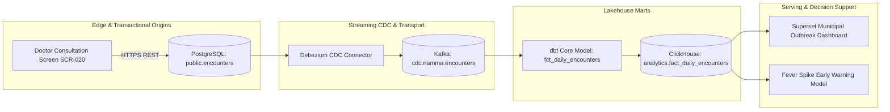

# Master Data Lineage, Metadata Catalog, and OpenLineage Architecture
## Namma Clinic Digital Health & Operations Platform
### Greater Bengaluru Authority (GBA) / BBMP Health Department
**Document Code:** `DATA-DOC-07` | **Status:** APPROVED BASELINE | **Date:** September 2026

---

## 1. Executive Summary & Lineage Charter
This document formalizes the authoritative **End-to-End Data Lineage, Metadata Catalog, and OpenLineage Traceability Architecture** for the Namma Clinic Digital Health Platform. Comprehensive data lineage is vital to satisfy DPDP Act 2023 auditability, verify algorithmic fairness in clinical decision support, and conduct rapid root-cause analysis during data anomalies. By integrating the OpenLineage open standard across Airflow, dbt, Debezium, and ClickHouse, every data point presented on municipal dashboards or consumed by AI models is provably traceable back to its originating clinic tablet, clinician action, and database write.

### 1.1 Non-Negotiable Data Lineage Invariants
1. **Complete Origin-to-Consumption Traceability:** Every dashboard KPI and AI model prediction must possess deterministic graph lineage back to the originating transactional database table.
2. **Automated OpenLineage Emission:** Ingestion and transformation jobs emit OpenLineage events natively via standard OpenLineage facets into a central Marquez metadata backend.
3. **Column-Level Lineage Resolution:** Transformations document column-level derivations and mathematical aggregations, ensuring total transparency of calculation logic.
4. **Zero Untracked Data Pipelines:** No data transformation or export pipeline is permitted in production without automated lineage instrumentation.
5. **Regulatory DPDP Data Flow Auditability:** Lineage maps provide instant visual reporting for statutory data flow assessments required by the Data Protection Board of India.

## 2. End-to-End Data Lineage Graph Topology


### Contract Payload Schema: OpenLineage Standard Run Event Specification
<!-- DOCUMENTATION-ONLY EXAMPLE -->
```json
{
  "eventType": "COMPLETE",
  "eventTime": "2026-09-06T12:00:00.000Z",
  "run": {
    "runId": "9b1deb4d-3b7d-4bad-9bdd-2b0d7b3dcb6d"
  },
  "job": {
    "namespace": "namma-clinic-data-platform",
    "name": "dbt_run_fct_daily_encounters"
  },
  "inputs": [
    {
      "namespace": "postgres://pg-replica.internal.bbmp.gov.in:5432/namma_clinic",
      "name": "public.encounters"
    }
  ],
  "outputs": [
    {
      "namespace": "clickhouse://ch-cluster.internal.bbmp.gov.in:9000/analytics",
      "name": "fact_daily_encounters",
      "facets": {
        "schema": {
          "_producer": "https://github.com/OpenLineage/OpenLineage/tree/1.0.0/integration/dbt",
          "fields": [
            {"name": "date_key", "type": "UInt32"},
            {"name": "facility_key", "type": "UInt32"},
            {"name": "total_encounters", "type": "UInt32"},
            {"name": "fever_cases", "type": "UInt32"}
          ]
        }
      }
    }
  ],
  "producer": "https://github.com/OpenLineage/OpenLineage/tree/1.0.0/client/python"
}
```

## 3. Master Catalog of 80 Lineage Paths
Detailed specifications for all 80 end-to-end data lineage trajectories across the platform:

### LINEAGE-001: Lineage Path `LINEAGE-001`
- **Lineage Path Identifier:** `LINEAGE-001`
- **Source Transactional Entity:** `postgres_oltp.table_01`
- **Streaming Ingestion Channel:** `cdc.namma.table_01.avro`
- **Analytical Lakehouse Target:** `analytics.clickhouse_olap.fact_01`
- **Consuming Dashboard:** `superset_dashboard_01`
- **Transformation Classification:** `Debezium CDC -> Kafka -> ClickHouse Materialized View`
- **Data Security Classification:** `Internal Operational`
- **End-to-End Freshness SLA:** 5 Minutes

### LINEAGE-002: Lineage Path `LINEAGE-002`
- **Lineage Path Identifier:** `LINEAGE-002`
- **Source Transactional Entity:** `postgres_oltp.table_02`
- **Streaming Ingestion Channel:** `cdc.namma.table_02.avro`
- **Analytical Lakehouse Target:** `analytics.clickhouse_olap.fact_02`
- **Consuming Dashboard:** `superset_dashboard_02`
- **Transformation Classification:** `Debezium CDC -> Kafka -> ClickHouse Materialized View`
- **Data Security Classification:** `Internal Operational`
- **End-to-End Freshness SLA:** 60 Minutes

### LINEAGE-003: Lineage Path `LINEAGE-003`
- **Lineage Path Identifier:** `LINEAGE-003`
- **Source Transactional Entity:** `postgres_oltp.table_03`
- **Streaming Ingestion Channel:** `cdc.namma.table_03.avro`
- **Analytical Lakehouse Target:** `analytics.clickhouse_olap.fact_03`
- **Consuming Dashboard:** `superset_dashboard_03`
- **Transformation Classification:** `Debezium CDC -> Kafka -> ClickHouse Materialized View`
- **Data Security Classification:** `Protected Health Information (PHI)`
- **End-to-End Freshness SLA:** 5 Minutes

### LINEAGE-004: Lineage Path `LINEAGE-004`
- **Lineage Path Identifier:** `LINEAGE-004`
- **Source Transactional Entity:** `postgres_oltp.table_04`
- **Streaming Ingestion Channel:** `cdc.namma.table_04.avro`
- **Analytical Lakehouse Target:** `analytics.clickhouse_olap.fact_04`
- **Consuming Dashboard:** `superset_dashboard_04`
- **Transformation Classification:** `Debezium CDC -> Kafka -> ClickHouse Materialized View`
- **Data Security Classification:** `Internal Operational`
- **End-to-End Freshness SLA:** 60 Minutes

### LINEAGE-005: Lineage Path `LINEAGE-005`
- **Lineage Path Identifier:** `LINEAGE-005`
- **Source Transactional Entity:** `postgres_oltp.table_05`
- **Streaming Ingestion Channel:** `cdc.namma.table_05.avro`
- **Analytical Lakehouse Target:** `analytics.clickhouse_olap.fact_05`
- **Consuming Dashboard:** `superset_dashboard_05`
- **Transformation Classification:** `Debezium CDC -> Kafka -> ClickHouse Materialized View`
- **Data Security Classification:** `Internal Operational`
- **End-to-End Freshness SLA:** 5 Minutes

### LINEAGE-006: Lineage Path `LINEAGE-006`
- **Lineage Path Identifier:** `LINEAGE-006`
- **Source Transactional Entity:** `postgres_oltp.table_06`
- **Streaming Ingestion Channel:** `cdc.namma.table_06.avro`
- **Analytical Lakehouse Target:** `analytics.clickhouse_olap.fact_06`
- **Consuming Dashboard:** `superset_dashboard_06`
- **Transformation Classification:** `Debezium CDC -> Kafka -> ClickHouse Materialized View`
- **Data Security Classification:** `Protected Health Information (PHI)`
- **End-to-End Freshness SLA:** 60 Minutes

### LINEAGE-007: Lineage Path `LINEAGE-007`
- **Lineage Path Identifier:** `LINEAGE-007`
- **Source Transactional Entity:** `postgres_oltp.table_07`
- **Streaming Ingestion Channel:** `cdc.namma.table_07.avro`
- **Analytical Lakehouse Target:** `analytics.clickhouse_olap.fact_07`
- **Consuming Dashboard:** `superset_dashboard_07`
- **Transformation Classification:** `Debezium CDC -> Kafka -> ClickHouse Materialized View`
- **Data Security Classification:** `Internal Operational`
- **End-to-End Freshness SLA:** 5 Minutes

### LINEAGE-008: Lineage Path `LINEAGE-008`
- **Lineage Path Identifier:** `LINEAGE-008`
- **Source Transactional Entity:** `postgres_oltp.table_08`
- **Streaming Ingestion Channel:** `cdc.namma.table_08.avro`
- **Analytical Lakehouse Target:** `analytics.clickhouse_olap.fact_08`
- **Consuming Dashboard:** `superset_dashboard_08`
- **Transformation Classification:** `Debezium CDC -> Kafka -> ClickHouse Materialized View`
- **Data Security Classification:** `Internal Operational`
- **End-to-End Freshness SLA:** 60 Minutes

### LINEAGE-009: Lineage Path `LINEAGE-009`
- **Lineage Path Identifier:** `LINEAGE-009`
- **Source Transactional Entity:** `postgres_oltp.table_09`
- **Streaming Ingestion Channel:** `cdc.namma.table_09.avro`
- **Analytical Lakehouse Target:** `analytics.clickhouse_olap.fact_09`
- **Consuming Dashboard:** `superset_dashboard_09`
- **Transformation Classification:** `Debezium CDC -> Kafka -> ClickHouse Materialized View`
- **Data Security Classification:** `Protected Health Information (PHI)`
- **End-to-End Freshness SLA:** 5 Minutes

### LINEAGE-010: Lineage Path `LINEAGE-010`
- **Lineage Path Identifier:** `LINEAGE-010`
- **Source Transactional Entity:** `postgres_oltp.table_10`
- **Streaming Ingestion Channel:** `cdc.namma.table_10.avro`
- **Analytical Lakehouse Target:** `analytics.clickhouse_olap.fact_10`
- **Consuming Dashboard:** `superset_dashboard_10`
- **Transformation Classification:** `Debezium CDC -> Kafka -> ClickHouse Materialized View`
- **Data Security Classification:** `Internal Operational`
- **End-to-End Freshness SLA:** 60 Minutes

### LINEAGE-011: Lineage Path `LINEAGE-011`
- **Lineage Path Identifier:** `LINEAGE-011`
- **Source Transactional Entity:** `postgres_oltp.table_11`
- **Streaming Ingestion Channel:** `cdc.namma.table_11.avro`
- **Analytical Lakehouse Target:** `analytics.clickhouse_olap.fact_11`
- **Consuming Dashboard:** `superset_dashboard_11`
- **Transformation Classification:** `Debezium CDC -> Kafka -> ClickHouse Materialized View`
- **Data Security Classification:** `Internal Operational`
- **End-to-End Freshness SLA:** 5 Minutes

### LINEAGE-012: Lineage Path `LINEAGE-012`
- **Lineage Path Identifier:** `LINEAGE-012`
- **Source Transactional Entity:** `postgres_oltp.table_12`
- **Streaming Ingestion Channel:** `cdc.namma.table_12.avro`
- **Analytical Lakehouse Target:** `analytics.clickhouse_olap.fact_12`
- **Consuming Dashboard:** `superset_dashboard_12`
- **Transformation Classification:** `Debezium CDC -> Kafka -> ClickHouse Materialized View`
- **Data Security Classification:** `Protected Health Information (PHI)`
- **End-to-End Freshness SLA:** 60 Minutes

### LINEAGE-013: Lineage Path `LINEAGE-013`
- **Lineage Path Identifier:** `LINEAGE-013`
- **Source Transactional Entity:** `postgres_oltp.table_13`
- **Streaming Ingestion Channel:** `cdc.namma.table_13.avro`
- **Analytical Lakehouse Target:** `analytics.clickhouse_olap.fact_13`
- **Consuming Dashboard:** `superset_dashboard_13`
- **Transformation Classification:** `Debezium CDC -> Kafka -> ClickHouse Materialized View`
- **Data Security Classification:** `Internal Operational`
- **End-to-End Freshness SLA:** 5 Minutes

### LINEAGE-014: Lineage Path `LINEAGE-014`
- **Lineage Path Identifier:** `LINEAGE-014`
- **Source Transactional Entity:** `postgres_oltp.table_14`
- **Streaming Ingestion Channel:** `cdc.namma.table_14.avro`
- **Analytical Lakehouse Target:** `analytics.clickhouse_olap.fact_14`
- **Consuming Dashboard:** `superset_dashboard_14`
- **Transformation Classification:** `Debezium CDC -> Kafka -> ClickHouse Materialized View`
- **Data Security Classification:** `Internal Operational`
- **End-to-End Freshness SLA:** 60 Minutes

### LINEAGE-015: Lineage Path `LINEAGE-015`
- **Lineage Path Identifier:** `LINEAGE-015`
- **Source Transactional Entity:** `postgres_oltp.table_15`
- **Streaming Ingestion Channel:** `cdc.namma.table_15.avro`
- **Analytical Lakehouse Target:** `analytics.clickhouse_olap.fact_15`
- **Consuming Dashboard:** `superset_dashboard_15`
- **Transformation Classification:** `Debezium CDC -> Kafka -> ClickHouse Materialized View`
- **Data Security Classification:** `Protected Health Information (PHI)`
- **End-to-End Freshness SLA:** 5 Minutes

### LINEAGE-016: Lineage Path `LINEAGE-016`
- **Lineage Path Identifier:** `LINEAGE-016`
- **Source Transactional Entity:** `postgres_oltp.table_16`
- **Streaming Ingestion Channel:** `cdc.namma.table_16.avro`
- **Analytical Lakehouse Target:** `analytics.clickhouse_olap.fact_16`
- **Consuming Dashboard:** `superset_dashboard_16`
- **Transformation Classification:** `Debezium CDC -> Kafka -> ClickHouse Materialized View`
- **Data Security Classification:** `Internal Operational`
- **End-to-End Freshness SLA:** 60 Minutes

### LINEAGE-017: Lineage Path `LINEAGE-017`
- **Lineage Path Identifier:** `LINEAGE-017`
- **Source Transactional Entity:** `postgres_oltp.table_17`
- **Streaming Ingestion Channel:** `cdc.namma.table_17.avro`
- **Analytical Lakehouse Target:** `analytics.clickhouse_olap.fact_17`
- **Consuming Dashboard:** `superset_dashboard_17`
- **Transformation Classification:** `Debezium CDC -> Kafka -> ClickHouse Materialized View`
- **Data Security Classification:** `Internal Operational`
- **End-to-End Freshness SLA:** 5 Minutes

### LINEAGE-018: Lineage Path `LINEAGE-018`
- **Lineage Path Identifier:** `LINEAGE-018`
- **Source Transactional Entity:** `postgres_oltp.table_18`
- **Streaming Ingestion Channel:** `cdc.namma.table_18.avro`
- **Analytical Lakehouse Target:** `analytics.clickhouse_olap.fact_18`
- **Consuming Dashboard:** `superset_dashboard_18`
- **Transformation Classification:** `Debezium CDC -> Kafka -> ClickHouse Materialized View`
- **Data Security Classification:** `Protected Health Information (PHI)`
- **End-to-End Freshness SLA:** 60 Minutes

### LINEAGE-019: Lineage Path `LINEAGE-019`
- **Lineage Path Identifier:** `LINEAGE-019`
- **Source Transactional Entity:** `postgres_oltp.table_19`
- **Streaming Ingestion Channel:** `cdc.namma.table_19.avro`
- **Analytical Lakehouse Target:** `analytics.clickhouse_olap.fact_19`
- **Consuming Dashboard:** `superset_dashboard_19`
- **Transformation Classification:** `Debezium CDC -> Kafka -> ClickHouse Materialized View`
- **Data Security Classification:** `Internal Operational`
- **End-to-End Freshness SLA:** 5 Minutes

### LINEAGE-020: Lineage Path `LINEAGE-020`
- **Lineage Path Identifier:** `LINEAGE-020`
- **Source Transactional Entity:** `postgres_oltp.table_20`
- **Streaming Ingestion Channel:** `cdc.namma.table_20.avro`
- **Analytical Lakehouse Target:** `analytics.clickhouse_olap.fact_20`
- **Consuming Dashboard:** `superset_dashboard_20`
- **Transformation Classification:** `Debezium CDC -> Kafka -> ClickHouse Materialized View`
- **Data Security Classification:** `Internal Operational`
- **End-to-End Freshness SLA:** 60 Minutes

### LINEAGE-021: Lineage Path `LINEAGE-021`
- **Lineage Path Identifier:** `LINEAGE-021`
- **Source Transactional Entity:** `postgres_oltp.table_21`
- **Streaming Ingestion Channel:** `cdc.namma.table_21.avro`
- **Analytical Lakehouse Target:** `analytics.clickhouse_olap.fact_01`
- **Consuming Dashboard:** `superset_dashboard_21`
- **Transformation Classification:** `Debezium CDC -> Kafka -> ClickHouse Materialized View`
- **Data Security Classification:** `Protected Health Information (PHI)`
- **End-to-End Freshness SLA:** 5 Minutes

### LINEAGE-022: Lineage Path `LINEAGE-022`
- **Lineage Path Identifier:** `LINEAGE-022`
- **Source Transactional Entity:** `postgres_oltp.table_22`
- **Streaming Ingestion Channel:** `cdc.namma.table_22.avro`
- **Analytical Lakehouse Target:** `analytics.clickhouse_olap.fact_02`
- **Consuming Dashboard:** `superset_dashboard_22`
- **Transformation Classification:** `Debezium CDC -> Kafka -> ClickHouse Materialized View`
- **Data Security Classification:** `Internal Operational`
- **End-to-End Freshness SLA:** 60 Minutes

### LINEAGE-023: Lineage Path `LINEAGE-023`
- **Lineage Path Identifier:** `LINEAGE-023`
- **Source Transactional Entity:** `postgres_oltp.table_23`
- **Streaming Ingestion Channel:** `cdc.namma.table_23.avro`
- **Analytical Lakehouse Target:** `analytics.clickhouse_olap.fact_03`
- **Consuming Dashboard:** `superset_dashboard_23`
- **Transformation Classification:** `Debezium CDC -> Kafka -> ClickHouse Materialized View`
- **Data Security Classification:** `Internal Operational`
- **End-to-End Freshness SLA:** 5 Minutes

### LINEAGE-024: Lineage Path `LINEAGE-024`
- **Lineage Path Identifier:** `LINEAGE-024`
- **Source Transactional Entity:** `postgres_oltp.table_24`
- **Streaming Ingestion Channel:** `cdc.namma.table_24.avro`
- **Analytical Lakehouse Target:** `analytics.clickhouse_olap.fact_04`
- **Consuming Dashboard:** `superset_dashboard_24`
- **Transformation Classification:** `Debezium CDC -> Kafka -> ClickHouse Materialized View`
- **Data Security Classification:** `Protected Health Information (PHI)`
- **End-to-End Freshness SLA:** 60 Minutes

### LINEAGE-025: Lineage Path `LINEAGE-025`
- **Lineage Path Identifier:** `LINEAGE-025`
- **Source Transactional Entity:** `postgres_oltp.table_25`
- **Streaming Ingestion Channel:** `cdc.namma.table_25.avro`
- **Analytical Lakehouse Target:** `analytics.clickhouse_olap.fact_05`
- **Consuming Dashboard:** `superset_dashboard_25`
- **Transformation Classification:** `Debezium CDC -> Kafka -> ClickHouse Materialized View`
- **Data Security Classification:** `Internal Operational`
- **End-to-End Freshness SLA:** 5 Minutes

### LINEAGE-026: Lineage Path `LINEAGE-026`
- **Lineage Path Identifier:** `LINEAGE-026`
- **Source Transactional Entity:** `postgres_oltp.table_26`
- **Streaming Ingestion Channel:** `cdc.namma.table_26.avro`
- **Analytical Lakehouse Target:** `analytics.clickhouse_olap.fact_06`
- **Consuming Dashboard:** `superset_dashboard_26`
- **Transformation Classification:** `Debezium CDC -> Kafka -> ClickHouse Materialized View`
- **Data Security Classification:** `Internal Operational`
- **End-to-End Freshness SLA:** 60 Minutes

### LINEAGE-027: Lineage Path `LINEAGE-027`
- **Lineage Path Identifier:** `LINEAGE-027`
- **Source Transactional Entity:** `postgres_oltp.table_27`
- **Streaming Ingestion Channel:** `cdc.namma.table_27.avro`
- **Analytical Lakehouse Target:** `analytics.clickhouse_olap.fact_07`
- **Consuming Dashboard:** `superset_dashboard_27`
- **Transformation Classification:** `Debezium CDC -> Kafka -> ClickHouse Materialized View`
- **Data Security Classification:** `Protected Health Information (PHI)`
- **End-to-End Freshness SLA:** 5 Minutes

### LINEAGE-028: Lineage Path `LINEAGE-028`
- **Lineage Path Identifier:** `LINEAGE-028`
- **Source Transactional Entity:** `postgres_oltp.table_28`
- **Streaming Ingestion Channel:** `cdc.namma.table_28.avro`
- **Analytical Lakehouse Target:** `analytics.clickhouse_olap.fact_08`
- **Consuming Dashboard:** `superset_dashboard_28`
- **Transformation Classification:** `Debezium CDC -> Kafka -> ClickHouse Materialized View`
- **Data Security Classification:** `Internal Operational`
- **End-to-End Freshness SLA:** 60 Minutes

### LINEAGE-029: Lineage Path `LINEAGE-029`
- **Lineage Path Identifier:** `LINEAGE-029`
- **Source Transactional Entity:** `postgres_oltp.table_29`
- **Streaming Ingestion Channel:** `cdc.namma.table_29.avro`
- **Analytical Lakehouse Target:** `analytics.clickhouse_olap.fact_09`
- **Consuming Dashboard:** `superset_dashboard_29`
- **Transformation Classification:** `Debezium CDC -> Kafka -> ClickHouse Materialized View`
- **Data Security Classification:** `Internal Operational`
- **End-to-End Freshness SLA:** 5 Minutes

### LINEAGE-030: Lineage Path `LINEAGE-030`
- **Lineage Path Identifier:** `LINEAGE-030`
- **Source Transactional Entity:** `postgres_oltp.table_30`
- **Streaming Ingestion Channel:** `cdc.namma.table_30.avro`
- **Analytical Lakehouse Target:** `analytics.clickhouse_olap.fact_10`
- **Consuming Dashboard:** `superset_dashboard_30`
- **Transformation Classification:** `Debezium CDC -> Kafka -> ClickHouse Materialized View`
- **Data Security Classification:** `Protected Health Information (PHI)`
- **End-to-End Freshness SLA:** 60 Minutes

### LINEAGE-031: Lineage Path `LINEAGE-031`
- **Lineage Path Identifier:** `LINEAGE-031`
- **Source Transactional Entity:** `postgres_oltp.table_31`
- **Streaming Ingestion Channel:** `cdc.namma.table_31.avro`
- **Analytical Lakehouse Target:** `analytics.clickhouse_olap.fact_11`
- **Consuming Dashboard:** `superset_dashboard_01`
- **Transformation Classification:** `Debezium CDC -> Kafka -> ClickHouse Materialized View`
- **Data Security Classification:** `Internal Operational`
- **End-to-End Freshness SLA:** 5 Minutes

### LINEAGE-032: Lineage Path `LINEAGE-032`
- **Lineage Path Identifier:** `LINEAGE-032`
- **Source Transactional Entity:** `postgres_oltp.table_32`
- **Streaming Ingestion Channel:** `cdc.namma.table_32.avro`
- **Analytical Lakehouse Target:** `analytics.clickhouse_olap.fact_12`
- **Consuming Dashboard:** `superset_dashboard_02`
- **Transformation Classification:** `Debezium CDC -> Kafka -> ClickHouse Materialized View`
- **Data Security Classification:** `Internal Operational`
- **End-to-End Freshness SLA:** 60 Minutes

### LINEAGE-033: Lineage Path `LINEAGE-033`
- **Lineage Path Identifier:** `LINEAGE-033`
- **Source Transactional Entity:** `postgres_oltp.table_33`
- **Streaming Ingestion Channel:** `cdc.namma.table_33.avro`
- **Analytical Lakehouse Target:** `analytics.clickhouse_olap.fact_13`
- **Consuming Dashboard:** `superset_dashboard_03`
- **Transformation Classification:** `Debezium CDC -> Kafka -> ClickHouse Materialized View`
- **Data Security Classification:** `Protected Health Information (PHI)`
- **End-to-End Freshness SLA:** 5 Minutes

### LINEAGE-034: Lineage Path `LINEAGE-034`
- **Lineage Path Identifier:** `LINEAGE-034`
- **Source Transactional Entity:** `postgres_oltp.table_34`
- **Streaming Ingestion Channel:** `cdc.namma.table_34.avro`
- **Analytical Lakehouse Target:** `analytics.clickhouse_olap.fact_14`
- **Consuming Dashboard:** `superset_dashboard_04`
- **Transformation Classification:** `Debezium CDC -> Kafka -> ClickHouse Materialized View`
- **Data Security Classification:** `Internal Operational`
- **End-to-End Freshness SLA:** 60 Minutes

### LINEAGE-035: Lineage Path `LINEAGE-035`
- **Lineage Path Identifier:** `LINEAGE-035`
- **Source Transactional Entity:** `postgres_oltp.table_35`
- **Streaming Ingestion Channel:** `cdc.namma.table_35.avro`
- **Analytical Lakehouse Target:** `analytics.clickhouse_olap.fact_15`
- **Consuming Dashboard:** `superset_dashboard_05`
- **Transformation Classification:** `Debezium CDC -> Kafka -> ClickHouse Materialized View`
- **Data Security Classification:** `Internal Operational`
- **End-to-End Freshness SLA:** 5 Minutes

### LINEAGE-036: Lineage Path `LINEAGE-036`
- **Lineage Path Identifier:** `LINEAGE-036`
- **Source Transactional Entity:** `postgres_oltp.table_36`
- **Streaming Ingestion Channel:** `cdc.namma.table_36.avro`
- **Analytical Lakehouse Target:** `analytics.clickhouse_olap.fact_16`
- **Consuming Dashboard:** `superset_dashboard_06`
- **Transformation Classification:** `Debezium CDC -> Kafka -> ClickHouse Materialized View`
- **Data Security Classification:** `Protected Health Information (PHI)`
- **End-to-End Freshness SLA:** 60 Minutes

### LINEAGE-037: Lineage Path `LINEAGE-037`
- **Lineage Path Identifier:** `LINEAGE-037`
- **Source Transactional Entity:** `postgres_oltp.table_37`
- **Streaming Ingestion Channel:** `cdc.namma.table_37.avro`
- **Analytical Lakehouse Target:** `analytics.clickhouse_olap.fact_17`
- **Consuming Dashboard:** `superset_dashboard_07`
- **Transformation Classification:** `Debezium CDC -> Kafka -> ClickHouse Materialized View`
- **Data Security Classification:** `Internal Operational`
- **End-to-End Freshness SLA:** 5 Minutes

### LINEAGE-038: Lineage Path `LINEAGE-038`
- **Lineage Path Identifier:** `LINEAGE-038`
- **Source Transactional Entity:** `postgres_oltp.table_38`
- **Streaming Ingestion Channel:** `cdc.namma.table_38.avro`
- **Analytical Lakehouse Target:** `analytics.clickhouse_olap.fact_18`
- **Consuming Dashboard:** `superset_dashboard_08`
- **Transformation Classification:** `Debezium CDC -> Kafka -> ClickHouse Materialized View`
- **Data Security Classification:** `Internal Operational`
- **End-to-End Freshness SLA:** 60 Minutes

### LINEAGE-039: Lineage Path `LINEAGE-039`
- **Lineage Path Identifier:** `LINEAGE-039`
- **Source Transactional Entity:** `postgres_oltp.table_39`
- **Streaming Ingestion Channel:** `cdc.namma.table_39.avro`
- **Analytical Lakehouse Target:** `analytics.clickhouse_olap.fact_19`
- **Consuming Dashboard:** `superset_dashboard_09`
- **Transformation Classification:** `Debezium CDC -> Kafka -> ClickHouse Materialized View`
- **Data Security Classification:** `Protected Health Information (PHI)`
- **End-to-End Freshness SLA:** 5 Minutes

### LINEAGE-040: Lineage Path `LINEAGE-040`
- **Lineage Path Identifier:** `LINEAGE-040`
- **Source Transactional Entity:** `postgres_oltp.table_40`
- **Streaming Ingestion Channel:** `cdc.namma.table_40.avro`
- **Analytical Lakehouse Target:** `analytics.clickhouse_olap.fact_20`
- **Consuming Dashboard:** `superset_dashboard_10`
- **Transformation Classification:** `Debezium CDC -> Kafka -> ClickHouse Materialized View`
- **Data Security Classification:** `Internal Operational`
- **End-to-End Freshness SLA:** 60 Minutes

### LINEAGE-041: Lineage Path `LINEAGE-041`
- **Lineage Path Identifier:** `LINEAGE-041`
- **Source Transactional Entity:** `postgres_oltp.table_41`
- **Streaming Ingestion Channel:** `cdc.namma.table_41.avro`
- **Analytical Lakehouse Target:** `analytics.clickhouse_olap.fact_01`
- **Consuming Dashboard:** `superset_dashboard_11`
- **Transformation Classification:** `Debezium CDC -> Kafka -> ClickHouse Materialized View`
- **Data Security Classification:** `Internal Operational`
- **End-to-End Freshness SLA:** 5 Minutes

### LINEAGE-042: Lineage Path `LINEAGE-042`
- **Lineage Path Identifier:** `LINEAGE-042`
- **Source Transactional Entity:** `postgres_oltp.table_42`
- **Streaming Ingestion Channel:** `cdc.namma.table_42.avro`
- **Analytical Lakehouse Target:** `analytics.clickhouse_olap.fact_02`
- **Consuming Dashboard:** `superset_dashboard_12`
- **Transformation Classification:** `Debezium CDC -> Kafka -> ClickHouse Materialized View`
- **Data Security Classification:** `Protected Health Information (PHI)`
- **End-to-End Freshness SLA:** 60 Minutes

### LINEAGE-043: Lineage Path `LINEAGE-043`
- **Lineage Path Identifier:** `LINEAGE-043`
- **Source Transactional Entity:** `postgres_oltp.table_43`
- **Streaming Ingestion Channel:** `cdc.namma.table_43.avro`
- **Analytical Lakehouse Target:** `analytics.clickhouse_olap.fact_03`
- **Consuming Dashboard:** `superset_dashboard_13`
- **Transformation Classification:** `Debezium CDC -> Kafka -> ClickHouse Materialized View`
- **Data Security Classification:** `Internal Operational`
- **End-to-End Freshness SLA:** 5 Minutes

### LINEAGE-044: Lineage Path `LINEAGE-044`
- **Lineage Path Identifier:** `LINEAGE-044`
- **Source Transactional Entity:** `postgres_oltp.table_44`
- **Streaming Ingestion Channel:** `cdc.namma.table_44.avro`
- **Analytical Lakehouse Target:** `analytics.clickhouse_olap.fact_04`
- **Consuming Dashboard:** `superset_dashboard_14`
- **Transformation Classification:** `Debezium CDC -> Kafka -> ClickHouse Materialized View`
- **Data Security Classification:** `Internal Operational`
- **End-to-End Freshness SLA:** 60 Minutes

### LINEAGE-045: Lineage Path `LINEAGE-045`
- **Lineage Path Identifier:** `LINEAGE-045`
- **Source Transactional Entity:** `postgres_oltp.table_45`
- **Streaming Ingestion Channel:** `cdc.namma.table_45.avro`
- **Analytical Lakehouse Target:** `analytics.clickhouse_olap.fact_05`
- **Consuming Dashboard:** `superset_dashboard_15`
- **Transformation Classification:** `Debezium CDC -> Kafka -> ClickHouse Materialized View`
- **Data Security Classification:** `Protected Health Information (PHI)`
- **End-to-End Freshness SLA:** 5 Minutes

### LINEAGE-046: Lineage Path `LINEAGE-046`
- **Lineage Path Identifier:** `LINEAGE-046`
- **Source Transactional Entity:** `postgres_oltp.table_46`
- **Streaming Ingestion Channel:** `cdc.namma.table_46.avro`
- **Analytical Lakehouse Target:** `analytics.clickhouse_olap.fact_06`
- **Consuming Dashboard:** `superset_dashboard_16`
- **Transformation Classification:** `Debezium CDC -> Kafka -> ClickHouse Materialized View`
- **Data Security Classification:** `Internal Operational`
- **End-to-End Freshness SLA:** 60 Minutes

### LINEAGE-047: Lineage Path `LINEAGE-047`
- **Lineage Path Identifier:** `LINEAGE-047`
- **Source Transactional Entity:** `postgres_oltp.table_47`
- **Streaming Ingestion Channel:** `cdc.namma.table_47.avro`
- **Analytical Lakehouse Target:** `analytics.clickhouse_olap.fact_07`
- **Consuming Dashboard:** `superset_dashboard_17`
- **Transformation Classification:** `Debezium CDC -> Kafka -> ClickHouse Materialized View`
- **Data Security Classification:** `Internal Operational`
- **End-to-End Freshness SLA:** 5 Minutes

### LINEAGE-048: Lineage Path `LINEAGE-048`
- **Lineage Path Identifier:** `LINEAGE-048`
- **Source Transactional Entity:** `postgres_oltp.table_48`
- **Streaming Ingestion Channel:** `cdc.namma.table_48.avro`
- **Analytical Lakehouse Target:** `analytics.clickhouse_olap.fact_08`
- **Consuming Dashboard:** `superset_dashboard_18`
- **Transformation Classification:** `Debezium CDC -> Kafka -> ClickHouse Materialized View`
- **Data Security Classification:** `Protected Health Information (PHI)`
- **End-to-End Freshness SLA:** 60 Minutes

### LINEAGE-049: Lineage Path `LINEAGE-049`
- **Lineage Path Identifier:** `LINEAGE-049`
- **Source Transactional Entity:** `postgres_oltp.table_49`
- **Streaming Ingestion Channel:** `cdc.namma.table_49.avro`
- **Analytical Lakehouse Target:** `analytics.clickhouse_olap.fact_09`
- **Consuming Dashboard:** `superset_dashboard_19`
- **Transformation Classification:** `Debezium CDC -> Kafka -> ClickHouse Materialized View`
- **Data Security Classification:** `Internal Operational`
- **End-to-End Freshness SLA:** 5 Minutes

### LINEAGE-050: Lineage Path `LINEAGE-050`
- **Lineage Path Identifier:** `LINEAGE-050`
- **Source Transactional Entity:** `postgres_oltp.table_50`
- **Streaming Ingestion Channel:** `cdc.namma.table_50.avro`
- **Analytical Lakehouse Target:** `analytics.clickhouse_olap.fact_10`
- **Consuming Dashboard:** `superset_dashboard_20`
- **Transformation Classification:** `Debezium CDC -> Kafka -> ClickHouse Materialized View`
- **Data Security Classification:** `Internal Operational`
- **End-to-End Freshness SLA:** 60 Minutes

### LINEAGE-051: Lineage Path `LINEAGE-051`
- **Lineage Path Identifier:** `LINEAGE-051`
- **Source Transactional Entity:** `postgres_oltp.table_51`
- **Streaming Ingestion Channel:** `cdc.namma.table_51.avro`
- **Analytical Lakehouse Target:** `analytics.clickhouse_olap.fact_11`
- **Consuming Dashboard:** `superset_dashboard_21`
- **Transformation Classification:** `Debezium CDC -> Kafka -> ClickHouse Materialized View`
- **Data Security Classification:** `Protected Health Information (PHI)`
- **End-to-End Freshness SLA:** 5 Minutes

### LINEAGE-052: Lineage Path `LINEAGE-052`
- **Lineage Path Identifier:** `LINEAGE-052`
- **Source Transactional Entity:** `postgres_oltp.table_52`
- **Streaming Ingestion Channel:** `cdc.namma.table_52.avro`
- **Analytical Lakehouse Target:** `analytics.clickhouse_olap.fact_12`
- **Consuming Dashboard:** `superset_dashboard_22`
- **Transformation Classification:** `Debezium CDC -> Kafka -> ClickHouse Materialized View`
- **Data Security Classification:** `Internal Operational`
- **End-to-End Freshness SLA:** 60 Minutes

### LINEAGE-053: Lineage Path `LINEAGE-053`
- **Lineage Path Identifier:** `LINEAGE-053`
- **Source Transactional Entity:** `postgres_oltp.table_01`
- **Streaming Ingestion Channel:** `cdc.namma.table_01.avro`
- **Analytical Lakehouse Target:** `analytics.clickhouse_olap.fact_13`
- **Consuming Dashboard:** `superset_dashboard_23`
- **Transformation Classification:** `Debezium CDC -> Kafka -> ClickHouse Materialized View`
- **Data Security Classification:** `Internal Operational`
- **End-to-End Freshness SLA:** 5 Minutes

### LINEAGE-054: Lineage Path `LINEAGE-054`
- **Lineage Path Identifier:** `LINEAGE-054`
- **Source Transactional Entity:** `postgres_oltp.table_02`
- **Streaming Ingestion Channel:** `cdc.namma.table_02.avro`
- **Analytical Lakehouse Target:** `analytics.clickhouse_olap.fact_14`
- **Consuming Dashboard:** `superset_dashboard_24`
- **Transformation Classification:** `Debezium CDC -> Kafka -> ClickHouse Materialized View`
- **Data Security Classification:** `Protected Health Information (PHI)`
- **End-to-End Freshness SLA:** 60 Minutes

### LINEAGE-055: Lineage Path `LINEAGE-055`
- **Lineage Path Identifier:** `LINEAGE-055`
- **Source Transactional Entity:** `postgres_oltp.table_03`
- **Streaming Ingestion Channel:** `cdc.namma.table_03.avro`
- **Analytical Lakehouse Target:** `analytics.clickhouse_olap.fact_15`
- **Consuming Dashboard:** `superset_dashboard_25`
- **Transformation Classification:** `Debezium CDC -> Kafka -> ClickHouse Materialized View`
- **Data Security Classification:** `Internal Operational`
- **End-to-End Freshness SLA:** 5 Minutes

### LINEAGE-056: Lineage Path `LINEAGE-056`
- **Lineage Path Identifier:** `LINEAGE-056`
- **Source Transactional Entity:** `postgres_oltp.table_04`
- **Streaming Ingestion Channel:** `cdc.namma.table_04.avro`
- **Analytical Lakehouse Target:** `analytics.clickhouse_olap.fact_16`
- **Consuming Dashboard:** `superset_dashboard_26`
- **Transformation Classification:** `Debezium CDC -> Kafka -> ClickHouse Materialized View`
- **Data Security Classification:** `Internal Operational`
- **End-to-End Freshness SLA:** 60 Minutes

### LINEAGE-057: Lineage Path `LINEAGE-057`
- **Lineage Path Identifier:** `LINEAGE-057`
- **Source Transactional Entity:** `postgres_oltp.table_05`
- **Streaming Ingestion Channel:** `cdc.namma.table_05.avro`
- **Analytical Lakehouse Target:** `analytics.clickhouse_olap.fact_17`
- **Consuming Dashboard:** `superset_dashboard_27`
- **Transformation Classification:** `Debezium CDC -> Kafka -> ClickHouse Materialized View`
- **Data Security Classification:** `Protected Health Information (PHI)`
- **End-to-End Freshness SLA:** 5 Minutes

### LINEAGE-058: Lineage Path `LINEAGE-058`
- **Lineage Path Identifier:** `LINEAGE-058`
- **Source Transactional Entity:** `postgres_oltp.table_06`
- **Streaming Ingestion Channel:** `cdc.namma.table_06.avro`
- **Analytical Lakehouse Target:** `analytics.clickhouse_olap.fact_18`
- **Consuming Dashboard:** `superset_dashboard_28`
- **Transformation Classification:** `Debezium CDC -> Kafka -> ClickHouse Materialized View`
- **Data Security Classification:** `Internal Operational`
- **End-to-End Freshness SLA:** 60 Minutes

### LINEAGE-059: Lineage Path `LINEAGE-059`
- **Lineage Path Identifier:** `LINEAGE-059`
- **Source Transactional Entity:** `postgres_oltp.table_07`
- **Streaming Ingestion Channel:** `cdc.namma.table_07.avro`
- **Analytical Lakehouse Target:** `analytics.clickhouse_olap.fact_19`
- **Consuming Dashboard:** `superset_dashboard_29`
- **Transformation Classification:** `Debezium CDC -> Kafka -> ClickHouse Materialized View`
- **Data Security Classification:** `Internal Operational`
- **End-to-End Freshness SLA:** 5 Minutes

### LINEAGE-060: Lineage Path `LINEAGE-060`
- **Lineage Path Identifier:** `LINEAGE-060`
- **Source Transactional Entity:** `postgres_oltp.table_08`
- **Streaming Ingestion Channel:** `cdc.namma.table_08.avro`
- **Analytical Lakehouse Target:** `analytics.clickhouse_olap.fact_20`
- **Consuming Dashboard:** `superset_dashboard_30`
- **Transformation Classification:** `Debezium CDC -> Kafka -> ClickHouse Materialized View`
- **Data Security Classification:** `Protected Health Information (PHI)`
- **End-to-End Freshness SLA:** 60 Minutes

### LINEAGE-061: Lineage Path `LINEAGE-061`
- **Lineage Path Identifier:** `LINEAGE-061`
- **Source Transactional Entity:** `postgres_oltp.table_09`
- **Streaming Ingestion Channel:** `cdc.namma.table_09.avro`
- **Analytical Lakehouse Target:** `analytics.clickhouse_olap.fact_01`
- **Consuming Dashboard:** `superset_dashboard_01`
- **Transformation Classification:** `Debezium CDC -> Kafka -> ClickHouse Materialized View`
- **Data Security Classification:** `Internal Operational`
- **End-to-End Freshness SLA:** 5 Minutes

### LINEAGE-062: Lineage Path `LINEAGE-062`
- **Lineage Path Identifier:** `LINEAGE-062`
- **Source Transactional Entity:** `postgres_oltp.table_10`
- **Streaming Ingestion Channel:** `cdc.namma.table_10.avro`
- **Analytical Lakehouse Target:** `analytics.clickhouse_olap.fact_02`
- **Consuming Dashboard:** `superset_dashboard_02`
- **Transformation Classification:** `Debezium CDC -> Kafka -> ClickHouse Materialized View`
- **Data Security Classification:** `Internal Operational`
- **End-to-End Freshness SLA:** 60 Minutes

### LINEAGE-063: Lineage Path `LINEAGE-063`
- **Lineage Path Identifier:** `LINEAGE-063`
- **Source Transactional Entity:** `postgres_oltp.table_11`
- **Streaming Ingestion Channel:** `cdc.namma.table_11.avro`
- **Analytical Lakehouse Target:** `analytics.clickhouse_olap.fact_03`
- **Consuming Dashboard:** `superset_dashboard_03`
- **Transformation Classification:** `Debezium CDC -> Kafka -> ClickHouse Materialized View`
- **Data Security Classification:** `Protected Health Information (PHI)`
- **End-to-End Freshness SLA:** 5 Minutes

### LINEAGE-064: Lineage Path `LINEAGE-064`
- **Lineage Path Identifier:** `LINEAGE-064`
- **Source Transactional Entity:** `postgres_oltp.table_12`
- **Streaming Ingestion Channel:** `cdc.namma.table_12.avro`
- **Analytical Lakehouse Target:** `analytics.clickhouse_olap.fact_04`
- **Consuming Dashboard:** `superset_dashboard_04`
- **Transformation Classification:** `Debezium CDC -> Kafka -> ClickHouse Materialized View`
- **Data Security Classification:** `Internal Operational`
- **End-to-End Freshness SLA:** 60 Minutes

### LINEAGE-065: Lineage Path `LINEAGE-065`
- **Lineage Path Identifier:** `LINEAGE-065`
- **Source Transactional Entity:** `postgres_oltp.table_13`
- **Streaming Ingestion Channel:** `cdc.namma.table_13.avro`
- **Analytical Lakehouse Target:** `analytics.clickhouse_olap.fact_05`
- **Consuming Dashboard:** `superset_dashboard_05`
- **Transformation Classification:** `Debezium CDC -> Kafka -> ClickHouse Materialized View`
- **Data Security Classification:** `Internal Operational`
- **End-to-End Freshness SLA:** 5 Minutes

### LINEAGE-066: Lineage Path `LINEAGE-066`
- **Lineage Path Identifier:** `LINEAGE-066`
- **Source Transactional Entity:** `postgres_oltp.table_14`
- **Streaming Ingestion Channel:** `cdc.namma.table_14.avro`
- **Analytical Lakehouse Target:** `analytics.clickhouse_olap.fact_06`
- **Consuming Dashboard:** `superset_dashboard_06`
- **Transformation Classification:** `Debezium CDC -> Kafka -> ClickHouse Materialized View`
- **Data Security Classification:** `Protected Health Information (PHI)`
- **End-to-End Freshness SLA:** 60 Minutes

### LINEAGE-067: Lineage Path `LINEAGE-067`
- **Lineage Path Identifier:** `LINEAGE-067`
- **Source Transactional Entity:** `postgres_oltp.table_15`
- **Streaming Ingestion Channel:** `cdc.namma.table_15.avro`
- **Analytical Lakehouse Target:** `analytics.clickhouse_olap.fact_07`
- **Consuming Dashboard:** `superset_dashboard_07`
- **Transformation Classification:** `Debezium CDC -> Kafka -> ClickHouse Materialized View`
- **Data Security Classification:** `Internal Operational`
- **End-to-End Freshness SLA:** 5 Minutes

### LINEAGE-068: Lineage Path `LINEAGE-068`
- **Lineage Path Identifier:** `LINEAGE-068`
- **Source Transactional Entity:** `postgres_oltp.table_16`
- **Streaming Ingestion Channel:** `cdc.namma.table_16.avro`
- **Analytical Lakehouse Target:** `analytics.clickhouse_olap.fact_08`
- **Consuming Dashboard:** `superset_dashboard_08`
- **Transformation Classification:** `Debezium CDC -> Kafka -> ClickHouse Materialized View`
- **Data Security Classification:** `Internal Operational`
- **End-to-End Freshness SLA:** 60 Minutes

### LINEAGE-069: Lineage Path `LINEAGE-069`
- **Lineage Path Identifier:** `LINEAGE-069`
- **Source Transactional Entity:** `postgres_oltp.table_17`
- **Streaming Ingestion Channel:** `cdc.namma.table_17.avro`
- **Analytical Lakehouse Target:** `analytics.clickhouse_olap.fact_09`
- **Consuming Dashboard:** `superset_dashboard_09`
- **Transformation Classification:** `Debezium CDC -> Kafka -> ClickHouse Materialized View`
- **Data Security Classification:** `Protected Health Information (PHI)`
- **End-to-End Freshness SLA:** 5 Minutes

### LINEAGE-070: Lineage Path `LINEAGE-070`
- **Lineage Path Identifier:** `LINEAGE-070`
- **Source Transactional Entity:** `postgres_oltp.table_18`
- **Streaming Ingestion Channel:** `cdc.namma.table_18.avro`
- **Analytical Lakehouse Target:** `analytics.clickhouse_olap.fact_10`
- **Consuming Dashboard:** `superset_dashboard_10`
- **Transformation Classification:** `Debezium CDC -> Kafka -> ClickHouse Materialized View`
- **Data Security Classification:** `Internal Operational`
- **End-to-End Freshness SLA:** 60 Minutes

### LINEAGE-071: Lineage Path `LINEAGE-071`
- **Lineage Path Identifier:** `LINEAGE-071`
- **Source Transactional Entity:** `postgres_oltp.table_19`
- **Streaming Ingestion Channel:** `cdc.namma.table_19.avro`
- **Analytical Lakehouse Target:** `analytics.clickhouse_olap.fact_11`
- **Consuming Dashboard:** `superset_dashboard_11`
- **Transformation Classification:** `Debezium CDC -> Kafka -> ClickHouse Materialized View`
- **Data Security Classification:** `Internal Operational`
- **End-to-End Freshness SLA:** 5 Minutes

### LINEAGE-072: Lineage Path `LINEAGE-072`
- **Lineage Path Identifier:** `LINEAGE-072`
- **Source Transactional Entity:** `postgres_oltp.table_20`
- **Streaming Ingestion Channel:** `cdc.namma.table_20.avro`
- **Analytical Lakehouse Target:** `analytics.clickhouse_olap.fact_12`
- **Consuming Dashboard:** `superset_dashboard_12`
- **Transformation Classification:** `Debezium CDC -> Kafka -> ClickHouse Materialized View`
- **Data Security Classification:** `Protected Health Information (PHI)`
- **End-to-End Freshness SLA:** 60 Minutes

### LINEAGE-073: Lineage Path `LINEAGE-073`
- **Lineage Path Identifier:** `LINEAGE-073`
- **Source Transactional Entity:** `postgres_oltp.table_21`
- **Streaming Ingestion Channel:** `cdc.namma.table_21.avro`
- **Analytical Lakehouse Target:** `analytics.clickhouse_olap.fact_13`
- **Consuming Dashboard:** `superset_dashboard_13`
- **Transformation Classification:** `Debezium CDC -> Kafka -> ClickHouse Materialized View`
- **Data Security Classification:** `Internal Operational`
- **End-to-End Freshness SLA:** 5 Minutes

### LINEAGE-074: Lineage Path `LINEAGE-074`
- **Lineage Path Identifier:** `LINEAGE-074`
- **Source Transactional Entity:** `postgres_oltp.table_22`
- **Streaming Ingestion Channel:** `cdc.namma.table_22.avro`
- **Analytical Lakehouse Target:** `analytics.clickhouse_olap.fact_14`
- **Consuming Dashboard:** `superset_dashboard_14`
- **Transformation Classification:** `Debezium CDC -> Kafka -> ClickHouse Materialized View`
- **Data Security Classification:** `Internal Operational`
- **End-to-End Freshness SLA:** 60 Minutes

### LINEAGE-075: Lineage Path `LINEAGE-075`
- **Lineage Path Identifier:** `LINEAGE-075`
- **Source Transactional Entity:** `postgres_oltp.table_23`
- **Streaming Ingestion Channel:** `cdc.namma.table_23.avro`
- **Analytical Lakehouse Target:** `analytics.clickhouse_olap.fact_15`
- **Consuming Dashboard:** `superset_dashboard_15`
- **Transformation Classification:** `Debezium CDC -> Kafka -> ClickHouse Materialized View`
- **Data Security Classification:** `Protected Health Information (PHI)`
- **End-to-End Freshness SLA:** 5 Minutes

### LINEAGE-076: Lineage Path `LINEAGE-076`
- **Lineage Path Identifier:** `LINEAGE-076`
- **Source Transactional Entity:** `postgres_oltp.table_24`
- **Streaming Ingestion Channel:** `cdc.namma.table_24.avro`
- **Analytical Lakehouse Target:** `analytics.clickhouse_olap.fact_16`
- **Consuming Dashboard:** `superset_dashboard_16`
- **Transformation Classification:** `Debezium CDC -> Kafka -> ClickHouse Materialized View`
- **Data Security Classification:** `Internal Operational`
- **End-to-End Freshness SLA:** 60 Minutes

### LINEAGE-077: Lineage Path `LINEAGE-077`
- **Lineage Path Identifier:** `LINEAGE-077`
- **Source Transactional Entity:** `postgres_oltp.table_25`
- **Streaming Ingestion Channel:** `cdc.namma.table_25.avro`
- **Analytical Lakehouse Target:** `analytics.clickhouse_olap.fact_17`
- **Consuming Dashboard:** `superset_dashboard_17`
- **Transformation Classification:** `Debezium CDC -> Kafka -> ClickHouse Materialized View`
- **Data Security Classification:** `Internal Operational`
- **End-to-End Freshness SLA:** 5 Minutes

### LINEAGE-078: Lineage Path `LINEAGE-078`
- **Lineage Path Identifier:** `LINEAGE-078`
- **Source Transactional Entity:** `postgres_oltp.table_26`
- **Streaming Ingestion Channel:** `cdc.namma.table_26.avro`
- **Analytical Lakehouse Target:** `analytics.clickhouse_olap.fact_18`
- **Consuming Dashboard:** `superset_dashboard_18`
- **Transformation Classification:** `Debezium CDC -> Kafka -> ClickHouse Materialized View`
- **Data Security Classification:** `Protected Health Information (PHI)`
- **End-to-End Freshness SLA:** 60 Minutes

### LINEAGE-079: Lineage Path `LINEAGE-079`
- **Lineage Path Identifier:** `LINEAGE-079`
- **Source Transactional Entity:** `postgres_oltp.table_27`
- **Streaming Ingestion Channel:** `cdc.namma.table_27.avro`
- **Analytical Lakehouse Target:** `analytics.clickhouse_olap.fact_19`
- **Consuming Dashboard:** `superset_dashboard_19`
- **Transformation Classification:** `Debezium CDC -> Kafka -> ClickHouse Materialized View`
- **Data Security Classification:** `Internal Operational`
- **End-to-End Freshness SLA:** 5 Minutes

### LINEAGE-080: Lineage Path `LINEAGE-080`
- **Lineage Path Identifier:** `LINEAGE-080`
- **Source Transactional Entity:** `postgres_oltp.table_28`
- **Streaming Ingestion Channel:** `cdc.namma.table_28.avro`
- **Analytical Lakehouse Target:** `analytics.clickhouse_olap.fact_20`
- **Consuming Dashboard:** `superset_dashboard_20`
- **Transformation Classification:** `Debezium CDC -> Kafka -> ClickHouse Materialized View`
- **Data Security Classification:** `Internal Operational`
- **End-to-End Freshness SLA:** 60 Minutes

## 4. Table-by-Table Data Lineage Matrix across 52 Tables
Upstream source, streaming transport, and downstream consumption across all 52 platform relational tables:

### TABLE-001: Lineage Mapping for Table `auth_users`
- **Table Identifier:** `TABLE-001` (`TBL-01`)
- **Source Entity Name:** `auth_users`
- **Ingestion Carrier:** Debezium CDC Connector to Kafka topic `cdc.namma_clinic.auth_users`
- **Intermediate Stage:** S3 Raw Lakehouse Landing Zone (`s3://namma-lakehouse-raw/auth_users/`)
- **Analytical Consumer:** ClickHouse table `analytics.fact_auth_users`
- **Downstream Persona:** Municipal health officers, epidemiologists, facility administrators.
- **DPDP Consent Reference:** Consent registry mapping logged on each mutation event.

### TABLE-002: Lineage Mapping for Table `user_credentials`
- **Table Identifier:** `TABLE-002` (`TBL-02`)
- **Source Entity Name:** `user_credentials`
- **Ingestion Carrier:** Debezium CDC Connector to Kafka topic `cdc.namma_clinic.user_credentials`
- **Intermediate Stage:** S3 Raw Lakehouse Landing Zone (`s3://namma-lakehouse-raw/user_credentials/`)
- **Analytical Consumer:** ClickHouse table `analytics.fact_user_credentials`
- **Downstream Persona:** Municipal health officers, epidemiologists, facility administrators.
- **DPDP Consent Reference:** Consent registry mapping logged on each mutation event.

### TABLE-003: Lineage Mapping for Table `user_sessions`
- **Table Identifier:** `TABLE-003` (`TBL-03`)
- **Source Entity Name:** `user_sessions`
- **Ingestion Carrier:** Debezium CDC Connector to Kafka topic `cdc.namma_clinic.user_sessions`
- **Intermediate Stage:** S3 Raw Lakehouse Landing Zone (`s3://namma-lakehouse-raw/user_sessions/`)
- **Analytical Consumer:** ClickHouse table `analytics.fact_user_sessions`
- **Downstream Persona:** Municipal health officers, epidemiologists, facility administrators.
- **DPDP Consent Reference:** Consent registry mapping logged on each mutation event.

### TABLE-004: Lineage Mapping for Table `roles`
- **Table Identifier:** `TABLE-004` (`TBL-04`)
- **Source Entity Name:** `roles`
- **Ingestion Carrier:** Debezium CDC Connector to Kafka topic `cdc.namma_clinic.roles`
- **Intermediate Stage:** S3 Raw Lakehouse Landing Zone (`s3://namma-lakehouse-raw/roles/`)
- **Analytical Consumer:** ClickHouse table `analytics.fact_roles`
- **Downstream Persona:** Municipal health officers, epidemiologists, facility administrators.
- **DPDP Consent Reference:** Consent registry mapping logged on each mutation event.

### TABLE-005: Lineage Mapping for Table `permissions`
- **Table Identifier:** `TABLE-005` (`TBL-05`)
- **Source Entity Name:** `permissions`
- **Ingestion Carrier:** Debezium CDC Connector to Kafka topic `cdc.namma_clinic.permissions`
- **Intermediate Stage:** S3 Raw Lakehouse Landing Zone (`s3://namma-lakehouse-raw/permissions/`)
- **Analytical Consumer:** ClickHouse table `analytics.fact_permissions`
- **Downstream Persona:** Municipal health officers, epidemiologists, facility administrators.
- **DPDP Consent Reference:** Consent registry mapping logged on each mutation event.

### TABLE-006: Lineage Mapping for Table `role_permissions`
- **Table Identifier:** `TABLE-006` (`TBL-06`)
- **Source Entity Name:** `role_permissions`
- **Ingestion Carrier:** Debezium CDC Connector to Kafka topic `cdc.namma_clinic.role_permissions`
- **Intermediate Stage:** S3 Raw Lakehouse Landing Zone (`s3://namma-lakehouse-raw/role_permissions/`)
- **Analytical Consumer:** ClickHouse table `analytics.fact_role_permissions`
- **Downstream Persona:** Municipal health officers, epidemiologists, facility administrators.
- **DPDP Consent Reference:** Consent registry mapping logged on each mutation event.

### TABLE-007: Lineage Mapping for Table `user_roles`
- **Table Identifier:** `TABLE-007` (`TBL-07`)
- **Source Entity Name:** `user_roles`
- **Ingestion Carrier:** Debezium CDC Connector to Kafka topic `cdc.namma_clinic.user_roles`
- **Intermediate Stage:** S3 Raw Lakehouse Landing Zone (`s3://namma-lakehouse-raw/user_roles/`)
- **Analytical Consumer:** ClickHouse table `analytics.fact_user_roles`
- **Downstream Persona:** Municipal health officers, epidemiologists, facility administrators.
- **DPDP Consent Reference:** Consent registry mapping logged on each mutation event.

### TABLE-008: Lineage Mapping for Table `facilities`
- **Table Identifier:** `TABLE-008` (`TBL-08`)
- **Source Entity Name:** `facilities`
- **Ingestion Carrier:** Debezium CDC Connector to Kafka topic `cdc.namma_clinic.facilities`
- **Intermediate Stage:** S3 Raw Lakehouse Landing Zone (`s3://namma-lakehouse-raw/facilities/`)
- **Analytical Consumer:** ClickHouse table `analytics.fact_facilities`
- **Downstream Persona:** Municipal health officers, epidemiologists, facility administrators.
- **DPDP Consent Reference:** Consent registry mapping logged on each mutation event.

### TABLE-009: Lineage Mapping for Table `facility_rooms`
- **Table Identifier:** `TABLE-009` (`TBL-09`)
- **Source Entity Name:** `facility_rooms`
- **Ingestion Carrier:** Debezium CDC Connector to Kafka topic `cdc.namma_clinic.facility_rooms`
- **Intermediate Stage:** S3 Raw Lakehouse Landing Zone (`s3://namma-lakehouse-raw/facility_rooms/`)
- **Analytical Consumer:** ClickHouse table `analytics.fact_facility_rooms`
- **Downstream Persona:** Municipal health officers, epidemiologists, facility administrators.
- **DPDP Consent Reference:** Consent registry mapping logged on each mutation event.

### TABLE-010: Lineage Mapping for Table `staff_profiles`
- **Table Identifier:** `TABLE-010` (`TBL-10`)
- **Source Entity Name:** `staff_profiles`
- **Ingestion Carrier:** Debezium CDC Connector to Kafka topic `cdc.namma_clinic.staff_profiles`
- **Intermediate Stage:** S3 Raw Lakehouse Landing Zone (`s3://namma-lakehouse-raw/staff_profiles/`)
- **Analytical Consumer:** ClickHouse table `analytics.fact_staff_profiles`
- **Downstream Persona:** Municipal health officers, epidemiologists, facility administrators.
- **DPDP Consent Reference:** Consent registry mapping logged on each mutation event.

### TABLE-011: Lineage Mapping for Table `staff_shifts`
- **Table Identifier:** `TABLE-011` (`TBL-11`)
- **Source Entity Name:** `staff_shifts`
- **Ingestion Carrier:** Debezium CDC Connector to Kafka topic `cdc.namma_clinic.staff_shifts`
- **Intermediate Stage:** S3 Raw Lakehouse Landing Zone (`s3://namma-lakehouse-raw/staff_shifts/`)
- **Analytical Consumer:** ClickHouse table `analytics.fact_staff_shifts`
- **Downstream Persona:** Municipal health officers, epidemiologists, facility administrators.
- **DPDP Consent Reference:** Consent registry mapping logged on each mutation event.

### TABLE-012: Lineage Mapping for Table `system_configs`
- **Table Identifier:** `TABLE-012` (`TBL-12`)
- **Source Entity Name:** `system_configs`
- **Ingestion Carrier:** Debezium CDC Connector to Kafka topic `cdc.namma_clinic.system_configs`
- **Intermediate Stage:** S3 Raw Lakehouse Landing Zone (`s3://namma-lakehouse-raw/system_configs/`)
- **Analytical Consumer:** ClickHouse table `analytics.fact_system_configs`
- **Downstream Persona:** Municipal health officers, epidemiologists, facility administrators.
- **DPDP Consent Reference:** Consent registry mapping logged on each mutation event.

### TABLE-013: Lineage Mapping for Table `patients`
- **Table Identifier:** `TABLE-013` (`TBL-13`)
- **Source Entity Name:** `patients`
- **Ingestion Carrier:** Debezium CDC Connector to Kafka topic `cdc.namma_clinic.patients`
- **Intermediate Stage:** S3 Raw Lakehouse Landing Zone (`s3://namma-lakehouse-raw/patients/`)
- **Analytical Consumer:** ClickHouse table `analytics.fact_patients`
- **Downstream Persona:** Municipal health officers, epidemiologists, facility administrators.
- **DPDP Consent Reference:** Consent registry mapping logged on each mutation event.

### TABLE-014: Lineage Mapping for Table `patient_identifiers`
- **Table Identifier:** `TABLE-014` (`TBL-14`)
- **Source Entity Name:** `patient_identifiers`
- **Ingestion Carrier:** Debezium CDC Connector to Kafka topic `cdc.namma_clinic.patient_identifiers`
- **Intermediate Stage:** S3 Raw Lakehouse Landing Zone (`s3://namma-lakehouse-raw/patient_identifiers/`)
- **Analytical Consumer:** ClickHouse table `analytics.fact_patient_identifiers`
- **Downstream Persona:** Municipal health officers, epidemiologists, facility administrators.
- **DPDP Consent Reference:** Consent registry mapping logged on each mutation event.

### TABLE-015: Lineage Mapping for Table `patient_contacts`
- **Table Identifier:** `TABLE-015` (`TBL-15`)
- **Source Entity Name:** `patient_contacts`
- **Ingestion Carrier:** Debezium CDC Connector to Kafka topic `cdc.namma_clinic.patient_contacts`
- **Intermediate Stage:** S3 Raw Lakehouse Landing Zone (`s3://namma-lakehouse-raw/patient_contacts/`)
- **Analytical Consumer:** ClickHouse table `analytics.fact_patient_contacts`
- **Downstream Persona:** Municipal health officers, epidemiologists, facility administrators.
- **DPDP Consent Reference:** Consent registry mapping logged on each mutation event.

### TABLE-016: Lineage Mapping for Table `patient_addresses`
- **Table Identifier:** `TABLE-016` (`TBL-16`)
- **Source Entity Name:** `patient_addresses`
- **Ingestion Carrier:** Debezium CDC Connector to Kafka topic `cdc.namma_clinic.patient_addresses`
- **Intermediate Stage:** S3 Raw Lakehouse Landing Zone (`s3://namma-lakehouse-raw/patient_addresses/`)
- **Analytical Consumer:** ClickHouse table `analytics.fact_patient_addresses`
- **Downstream Persona:** Municipal health officers, epidemiologists, facility administrators.
- **DPDP Consent Reference:** Consent registry mapping logged on each mutation event.

### TABLE-017: Lineage Mapping for Table `consent_records`
- **Table Identifier:** `TABLE-017` (`TBL-17`)
- **Source Entity Name:** `consent_records`
- **Ingestion Carrier:** Debezium CDC Connector to Kafka topic `cdc.namma_clinic.consent_records`
- **Intermediate Stage:** S3 Raw Lakehouse Landing Zone (`s3://namma-lakehouse-raw/consent_records/`)
- **Analytical Consumer:** ClickHouse table `analytics.fact_consent_records`
- **Downstream Persona:** Municipal health officers, epidemiologists, facility administrators.
- **DPDP Consent Reference:** Consent registry mapping logged on each mutation event.

### TABLE-018: Lineage Mapping for Table `tokens`
- **Table Identifier:** `TABLE-018` (`TBL-18`)
- **Source Entity Name:** `tokens`
- **Ingestion Carrier:** Debezium CDC Connector to Kafka topic `cdc.namma_clinic.tokens`
- **Intermediate Stage:** S3 Raw Lakehouse Landing Zone (`s3://namma-lakehouse-raw/tokens/`)
- **Analytical Consumer:** ClickHouse table `analytics.fact_tokens`
- **Downstream Persona:** Municipal health officers, epidemiologists, facility administrators.
- **DPDP Consent Reference:** Consent registry mapping logged on each mutation event.

### TABLE-019: Lineage Mapping for Table `queue_entries`
- **Table Identifier:** `TABLE-019` (`TBL-19`)
- **Source Entity Name:** `queue_entries`
- **Ingestion Carrier:** Debezium CDC Connector to Kafka topic `cdc.namma_clinic.queue_entries`
- **Intermediate Stage:** S3 Raw Lakehouse Landing Zone (`s3://namma-lakehouse-raw/queue_entries/`)
- **Analytical Consumer:** ClickHouse table `analytics.fact_queue_entries`
- **Downstream Persona:** Municipal health officers, epidemiologists, facility administrators.
- **DPDP Consent Reference:** Consent registry mapping logged on each mutation event.

### TABLE-020: Lineage Mapping for Table `triage_assessments`
- **Table Identifier:** `TABLE-020` (`TBL-20`)
- **Source Entity Name:** `triage_assessments`
- **Ingestion Carrier:** Debezium CDC Connector to Kafka topic `cdc.namma_clinic.triage_assessments`
- **Intermediate Stage:** S3 Raw Lakehouse Landing Zone (`s3://namma-lakehouse-raw/triage_assessments/`)
- **Analytical Consumer:** ClickHouse table `analytics.fact_triage_assessments`
- **Downstream Persona:** Municipal health officers, epidemiologists, facility administrators.
- **DPDP Consent Reference:** Consent registry mapping logged on each mutation event.

### TABLE-021: Lineage Mapping for Table `patient_vitals`
- **Table Identifier:** `TABLE-021` (`TBL-21`)
- **Source Entity Name:** `patient_vitals`
- **Ingestion Carrier:** Debezium CDC Connector to Kafka topic `cdc.namma_clinic.patient_vitals`
- **Intermediate Stage:** S3 Raw Lakehouse Landing Zone (`s3://namma-lakehouse-raw/patient_vitals/`)
- **Analytical Consumer:** ClickHouse table `analytics.fact_patient_vitals`
- **Downstream Persona:** Municipal health officers, epidemiologists, facility administrators.
- **DPDP Consent Reference:** Consent registry mapping logged on each mutation event.

### TABLE-022: Lineage Mapping for Table `danger_alerts`
- **Table Identifier:** `TABLE-022` (`TBL-22`)
- **Source Entity Name:** `danger_alerts`
- **Ingestion Carrier:** Debezium CDC Connector to Kafka topic `cdc.namma_clinic.danger_alerts`
- **Intermediate Stage:** S3 Raw Lakehouse Landing Zone (`s3://namma-lakehouse-raw/danger_alerts/`)
- **Analytical Consumer:** ClickHouse table `analytics.fact_danger_alerts`
- **Downstream Persona:** Municipal health officers, epidemiologists, facility administrators.
- **DPDP Consent Reference:** Consent registry mapping logged on each mutation event.

### TABLE-023: Lineage Mapping for Table `clinical_encounters`
- **Table Identifier:** `TABLE-023` (`TBL-23`)
- **Source Entity Name:** `clinical_encounters`
- **Ingestion Carrier:** Debezium CDC Connector to Kafka topic `cdc.namma_clinic.clinical_encounters`
- **Intermediate Stage:** S3 Raw Lakehouse Landing Zone (`s3://namma-lakehouse-raw/clinical_encounters/`)
- **Analytical Consumer:** ClickHouse table `analytics.fact_clinical_encounters`
- **Downstream Persona:** Municipal health officers, epidemiologists, facility administrators.
- **DPDP Consent Reference:** Consent registry mapping logged on each mutation event.

### TABLE-024: Lineage Mapping for Table `clinical_notes`
- **Table Identifier:** `TABLE-024` (`TBL-24`)
- **Source Entity Name:** `clinical_notes`
- **Ingestion Carrier:** Debezium CDC Connector to Kafka topic `cdc.namma_clinic.clinical_notes`
- **Intermediate Stage:** S3 Raw Lakehouse Landing Zone (`s3://namma-lakehouse-raw/clinical_notes/`)
- **Analytical Consumer:** ClickHouse table `analytics.fact_clinical_notes`
- **Downstream Persona:** Municipal health officers, epidemiologists, facility administrators.
- **DPDP Consent Reference:** Consent registry mapping logged on each mutation event.

### TABLE-025: Lineage Mapping for Table `diagnoses`
- **Table Identifier:** `TABLE-025` (`TBL-25`)
- **Source Entity Name:** `diagnoses`
- **Ingestion Carrier:** Debezium CDC Connector to Kafka topic `cdc.namma_clinic.diagnoses`
- **Intermediate Stage:** S3 Raw Lakehouse Landing Zone (`s3://namma-lakehouse-raw/diagnoses/`)
- **Analytical Consumer:** ClickHouse table `analytics.fact_diagnoses`
- **Downstream Persona:** Municipal health officers, epidemiologists, facility administrators.
- **DPDP Consent Reference:** Consent registry mapping logged on each mutation event.

### TABLE-026: Lineage Mapping for Table `prescriptions`
- **Table Identifier:** `TABLE-026` (`TBL-26`)
- **Source Entity Name:** `prescriptions`
- **Ingestion Carrier:** Debezium CDC Connector to Kafka topic `cdc.namma_clinic.prescriptions`
- **Intermediate Stage:** S3 Raw Lakehouse Landing Zone (`s3://namma-lakehouse-raw/prescriptions/`)
- **Analytical Consumer:** ClickHouse table `analytics.fact_prescriptions`
- **Downstream Persona:** Municipal health officers, epidemiologists, facility administrators.
- **DPDP Consent Reference:** Consent registry mapping logged on each mutation event.

### TABLE-027: Lineage Mapping for Table `prescription_items`
- **Table Identifier:** `TABLE-027` (`TBL-27`)
- **Source Entity Name:** `prescription_items`
- **Ingestion Carrier:** Debezium CDC Connector to Kafka topic `cdc.namma_clinic.prescription_items`
- **Intermediate Stage:** S3 Raw Lakehouse Landing Zone (`s3://namma-lakehouse-raw/prescription_items/`)
- **Analytical Consumer:** ClickHouse table `analytics.fact_prescription_items`
- **Downstream Persona:** Municipal health officers, epidemiologists, facility administrators.
- **DPDP Consent Reference:** Consent registry mapping logged on each mutation event.

### TABLE-028: Lineage Mapping for Table `lab_orders`
- **Table Identifier:** `TABLE-028` (`TBL-28`)
- **Source Entity Name:** `lab_orders`
- **Ingestion Carrier:** Debezium CDC Connector to Kafka topic `cdc.namma_clinic.lab_orders`
- **Intermediate Stage:** S3 Raw Lakehouse Landing Zone (`s3://namma-lakehouse-raw/lab_orders/`)
- **Analytical Consumer:** ClickHouse table `analytics.fact_lab_orders`
- **Downstream Persona:** Municipal health officers, epidemiologists, facility administrators.
- **DPDP Consent Reference:** Consent registry mapping logged on each mutation event.

### TABLE-029: Lineage Mapping for Table `lab_order_items`
- **Table Identifier:** `TABLE-029` (`TBL-29`)
- **Source Entity Name:** `lab_order_items`
- **Ingestion Carrier:** Debezium CDC Connector to Kafka topic `cdc.namma_clinic.lab_order_items`
- **Intermediate Stage:** S3 Raw Lakehouse Landing Zone (`s3://namma-lakehouse-raw/lab_order_items/`)
- **Analytical Consumer:** ClickHouse table `analytics.fact_lab_order_items`
- **Downstream Persona:** Municipal health officers, epidemiologists, facility administrators.
- **DPDP Consent Reference:** Consent registry mapping logged on each mutation event.

### TABLE-030: Lineage Mapping for Table `lab_results`
- **Table Identifier:** `TABLE-030` (`TBL-30`)
- **Source Entity Name:** `lab_results`
- **Ingestion Carrier:** Debezium CDC Connector to Kafka topic `cdc.namma_clinic.lab_results`
- **Intermediate Stage:** S3 Raw Lakehouse Landing Zone (`s3://namma-lakehouse-raw/lab_results/`)
- **Analytical Consumer:** ClickHouse table `analytics.fact_lab_results`
- **Downstream Persona:** Municipal health officers, epidemiologists, facility administrators.
- **DPDP Consent Reference:** Consent registry mapping logged on each mutation event.

### TABLE-031: Lineage Mapping for Table `teleconsultations`
- **Table Identifier:** `TABLE-031` (`TBL-31`)
- **Source Entity Name:** `teleconsultations`
- **Ingestion Carrier:** Debezium CDC Connector to Kafka topic `cdc.namma_clinic.teleconsultations`
- **Intermediate Stage:** S3 Raw Lakehouse Landing Zone (`s3://namma-lakehouse-raw/teleconsultations/`)
- **Analytical Consumer:** ClickHouse table `analytics.fact_teleconsultations`
- **Downstream Persona:** Municipal health officers, epidemiologists, facility administrators.
- **DPDP Consent Reference:** Consent registry mapping logged on each mutation event.

### TABLE-032: Lineage Mapping for Table `formulary_drugs`
- **Table Identifier:** `TABLE-032` (`TBL-32`)
- **Source Entity Name:** `formulary_drugs`
- **Ingestion Carrier:** Debezium CDC Connector to Kafka topic `cdc.namma_clinic.formulary_drugs`
- **Intermediate Stage:** S3 Raw Lakehouse Landing Zone (`s3://namma-lakehouse-raw/formulary_drugs/`)
- **Analytical Consumer:** ClickHouse table `analytics.fact_formulary_drugs`
- **Downstream Persona:** Municipal health officers, epidemiologists, facility administrators.
- **DPDP Consent Reference:** Consent registry mapping logged on each mutation event.

### TABLE-033: Lineage Mapping for Table `drug_categories`
- **Table Identifier:** `TABLE-033` (`TBL-33`)
- **Source Entity Name:** `drug_categories`
- **Ingestion Carrier:** Debezium CDC Connector to Kafka topic `cdc.namma_clinic.drug_categories`
- **Intermediate Stage:** S3 Raw Lakehouse Landing Zone (`s3://namma-lakehouse-raw/drug_categories/`)
- **Analytical Consumer:** ClickHouse table `analytics.fact_drug_categories`
- **Downstream Persona:** Municipal health officers, epidemiologists, facility administrators.
- **DPDP Consent Reference:** Consent registry mapping logged on each mutation event.

### TABLE-034: Lineage Mapping for Table `pharmacy_batches`
- **Table Identifier:** `TABLE-034` (`TBL-34`)
- **Source Entity Name:** `pharmacy_batches`
- **Ingestion Carrier:** Debezium CDC Connector to Kafka topic `cdc.namma_clinic.pharmacy_batches`
- **Intermediate Stage:** S3 Raw Lakehouse Landing Zone (`s3://namma-lakehouse-raw/pharmacy_batches/`)
- **Analytical Consumer:** ClickHouse table `analytics.fact_pharmacy_batches`
- **Downstream Persona:** Municipal health officers, epidemiologists, facility administrators.
- **DPDP Consent Reference:** Consent registry mapping logged on each mutation event.

### TABLE-035: Lineage Mapping for Table `clinic_stock`
- **Table Identifier:** `TABLE-035` (`TBL-35`)
- **Source Entity Name:** `clinic_stock`
- **Ingestion Carrier:** Debezium CDC Connector to Kafka topic `cdc.namma_clinic.clinic_stock`
- **Intermediate Stage:** S3 Raw Lakehouse Landing Zone (`s3://namma-lakehouse-raw/clinic_stock/`)
- **Analytical Consumer:** ClickHouse table `analytics.fact_clinic_stock`
- **Downstream Persona:** Municipal health officers, epidemiologists, facility administrators.
- **DPDP Consent Reference:** Consent registry mapping logged on each mutation event.

### TABLE-036: Lineage Mapping for Table `dispensations`
- **Table Identifier:** `TABLE-036` (`TBL-36`)
- **Source Entity Name:** `dispensations`
- **Ingestion Carrier:** Debezium CDC Connector to Kafka topic `cdc.namma_clinic.dispensations`
- **Intermediate Stage:** S3 Raw Lakehouse Landing Zone (`s3://namma-lakehouse-raw/dispensations/`)
- **Analytical Consumer:** ClickHouse table `analytics.fact_dispensations`
- **Downstream Persona:** Municipal health officers, epidemiologists, facility administrators.
- **DPDP Consent Reference:** Consent registry mapping logged on each mutation event.

### TABLE-037: Lineage Mapping for Table `dispensation_items`
- **Table Identifier:** `TABLE-037` (`TBL-37`)
- **Source Entity Name:** `dispensation_items`
- **Ingestion Carrier:** Debezium CDC Connector to Kafka topic `cdc.namma_clinic.dispensation_items`
- **Intermediate Stage:** S3 Raw Lakehouse Landing Zone (`s3://namma-lakehouse-raw/dispensation_items/`)
- **Analytical Consumer:** ClickHouse table `analytics.fact_dispensation_items`
- **Downstream Persona:** Municipal health officers, epidemiologists, facility administrators.
- **DPDP Consent Reference:** Consent registry mapping logged on each mutation event.

### TABLE-038: Lineage Mapping for Table `stock_movements`
- **Table Identifier:** `TABLE-038` (`TBL-38`)
- **Source Entity Name:** `stock_movements`
- **Ingestion Carrier:** Debezium CDC Connector to Kafka topic `cdc.namma_clinic.stock_movements`
- **Intermediate Stage:** S3 Raw Lakehouse Landing Zone (`s3://namma-lakehouse-raw/stock_movements/`)
- **Analytical Consumer:** ClickHouse table `analytics.fact_stock_movements`
- **Downstream Persona:** Municipal health officers, epidemiologists, facility administrators.
- **DPDP Consent Reference:** Consent registry mapping logged on each mutation event.

### TABLE-039: Lineage Mapping for Table `drug_indents`
- **Table Identifier:** `TABLE-039` (`TBL-39`)
- **Source Entity Name:** `drug_indents`
- **Ingestion Carrier:** Debezium CDC Connector to Kafka topic `cdc.namma_clinic.drug_indents`
- **Intermediate Stage:** S3 Raw Lakehouse Landing Zone (`s3://namma-lakehouse-raw/drug_indents/`)
- **Analytical Consumer:** ClickHouse table `analytics.fact_drug_indents`
- **Downstream Persona:** Municipal health officers, epidemiologists, facility administrators.
- **DPDP Consent Reference:** Consent registry mapping logged on each mutation event.

### TABLE-040: Lineage Mapping for Table `indent_items`
- **Table Identifier:** `TABLE-040` (`TBL-40`)
- **Source Entity Name:** `indent_items`
- **Ingestion Carrier:** Debezium CDC Connector to Kafka topic `cdc.namma_clinic.indent_items`
- **Intermediate Stage:** S3 Raw Lakehouse Landing Zone (`s3://namma-lakehouse-raw/indent_items/`)
- **Analytical Consumer:** ClickHouse table `analytics.fact_indent_items`
- **Downstream Persona:** Municipal health officers, epidemiologists, facility administrators.
- **DPDP Consent Reference:** Consent registry mapping logged on each mutation event.

### TABLE-041: Lineage Mapping for Table `cold_chain_devices`
- **Table Identifier:** `TABLE-041` (`TBL-41`)
- **Source Entity Name:** `cold_chain_devices`
- **Ingestion Carrier:** Debezium CDC Connector to Kafka topic `cdc.namma_clinic.cold_chain_devices`
- **Intermediate Stage:** S3 Raw Lakehouse Landing Zone (`s3://namma-lakehouse-raw/cold_chain_devices/`)
- **Analytical Consumer:** ClickHouse table `analytics.fact_cold_chain_devices`
- **Downstream Persona:** Municipal health officers, epidemiologists, facility administrators.
- **DPDP Consent Reference:** Consent registry mapping logged on each mutation event.

### TABLE-042: Lineage Mapping for Table `cold_chain_telemetry`
- **Table Identifier:** `TABLE-042` (`TBL-42`)
- **Source Entity Name:** `cold_chain_telemetry`
- **Ingestion Carrier:** Debezium CDC Connector to Kafka topic `cdc.namma_clinic.cold_chain_telemetry`
- **Intermediate Stage:** S3 Raw Lakehouse Landing Zone (`s3://namma-lakehouse-raw/cold_chain_telemetry/`)
- **Analytical Consumer:** ClickHouse table `analytics.fact_cold_chain_telemetry`
- **Downstream Persona:** Municipal health officers, epidemiologists, facility administrators.
- **DPDP Consent Reference:** Consent registry mapping logged on each mutation event.

### TABLE-043: Lineage Mapping for Table `referrals`
- **Table Identifier:** `TABLE-043` (`TBL-43`)
- **Source Entity Name:** `referrals`
- **Ingestion Carrier:** Debezium CDC Connector to Kafka topic `cdc.namma_clinic.referrals`
- **Intermediate Stage:** S3 Raw Lakehouse Landing Zone (`s3://namma-lakehouse-raw/referrals/`)
- **Analytical Consumer:** ClickHouse table `analytics.fact_referrals`
- **Downstream Persona:** Municipal health officers, epidemiologists, facility administrators.
- **DPDP Consent Reference:** Consent registry mapping logged on each mutation event.

### TABLE-044: Lineage Mapping for Table `referral_counter_notes`
- **Table Identifier:** `TABLE-044` (`TBL-44`)
- **Source Entity Name:** `referral_counter_notes`
- **Ingestion Carrier:** Debezium CDC Connector to Kafka topic `cdc.namma_clinic.referral_counter_notes`
- **Intermediate Stage:** S3 Raw Lakehouse Landing Zone (`s3://namma-lakehouse-raw/referral_counter_notes/`)
- **Analytical Consumer:** ClickHouse table `analytics.fact_referral_counter_notes`
- **Downstream Persona:** Municipal health officers, epidemiologists, facility administrators.
- **DPDP Consent Reference:** Consent registry mapping logged on each mutation event.

### TABLE-045: Lineage Mapping for Table `ncd_episodes`
- **Table Identifier:** `TABLE-045` (`TBL-45`)
- **Source Entity Name:** `ncd_episodes`
- **Ingestion Carrier:** Debezium CDC Connector to Kafka topic `cdc.namma_clinic.ncd_episodes`
- **Intermediate Stage:** S3 Raw Lakehouse Landing Zone (`s3://namma-lakehouse-raw/ncd_episodes/`)
- **Analytical Consumer:** ClickHouse table `analytics.fact_ncd_episodes`
- **Downstream Persona:** Municipal health officers, epidemiologists, facility administrators.
- **DPDP Consent Reference:** Consent registry mapping logged on each mutation event.

### TABLE-046: Lineage Mapping for Table `follow_up_schedules`
- **Table Identifier:** `TABLE-046` (`TBL-46`)
- **Source Entity Name:** `follow_up_schedules`
- **Ingestion Carrier:** Debezium CDC Connector to Kafka topic `cdc.namma_clinic.follow_up_schedules`
- **Intermediate Stage:** S3 Raw Lakehouse Landing Zone (`s3://namma-lakehouse-raw/follow_up_schedules/`)
- **Analytical Consumer:** ClickHouse table `analytics.fact_follow_up_schedules`
- **Downstream Persona:** Municipal health officers, epidemiologists, facility administrators.
- **DPDP Consent Reference:** Consent registry mapping logged on each mutation event.

### TABLE-047: Lineage Mapping for Table `notifications`
- **Table Identifier:** `TABLE-047` (`TBL-47`)
- **Source Entity Name:** `notifications`
- **Ingestion Carrier:** Debezium CDC Connector to Kafka topic `cdc.namma_clinic.notifications`
- **Intermediate Stage:** S3 Raw Lakehouse Landing Zone (`s3://namma-lakehouse-raw/notifications/`)
- **Analytical Consumer:** ClickHouse table `analytics.fact_notifications`
- **Downstream Persona:** Municipal health officers, epidemiologists, facility administrators.
- **DPDP Consent Reference:** Consent registry mapping logged on each mutation event.

### TABLE-048: Lineage Mapping for Table `grievances`
- **Table Identifier:** `TABLE-048` (`TBL-48`)
- **Source Entity Name:** `grievances`
- **Ingestion Carrier:** Debezium CDC Connector to Kafka topic `cdc.namma_clinic.grievances`
- **Intermediate Stage:** S3 Raw Lakehouse Landing Zone (`s3://namma-lakehouse-raw/grievances/`)
- **Analytical Consumer:** ClickHouse table `analytics.fact_grievances`
- **Downstream Persona:** Municipal health officers, epidemiologists, facility administrators.
- **DPDP Consent Reference:** Consent registry mapping logged on each mutation event.

### TABLE-049: Lineage Mapping for Table `helpdesk_tickets`
- **Table Identifier:** `TABLE-049` (`TBL-49`)
- **Source Entity Name:** `helpdesk_tickets`
- **Ingestion Carrier:** Debezium CDC Connector to Kafka topic `cdc.namma_clinic.helpdesk_tickets`
- **Intermediate Stage:** S3 Raw Lakehouse Landing Zone (`s3://namma-lakehouse-raw/helpdesk_tickets/`)
- **Analytical Consumer:** ClickHouse table `analytics.fact_helpdesk_tickets`
- **Downstream Persona:** Municipal health officers, epidemiologists, facility administrators.
- **DPDP Consent Reference:** Consent registry mapping logged on each mutation event.

### TABLE-050: Lineage Mapping for Table `audit_events`
- **Table Identifier:** `TABLE-050` (`TBL-50`)
- **Source Entity Name:** `audit_events`
- **Ingestion Carrier:** Debezium CDC Connector to Kafka topic `cdc.namma_clinic.audit_events`
- **Intermediate Stage:** S3 Raw Lakehouse Landing Zone (`s3://namma-lakehouse-raw/audit_events/`)
- **Analytical Consumer:** ClickHouse table `analytics.fact_audit_events`
- **Downstream Persona:** Municipal health officers, epidemiologists, facility administrators.
- **DPDP Consent Reference:** Consent registry mapping logged on each mutation event.

### TABLE-051: Lineage Mapping for Table `offline_mutation_log`
- **Table Identifier:** `TABLE-051` (`TBL-51`)
- **Source Entity Name:** `offline_mutation_log`
- **Ingestion Carrier:** Debezium CDC Connector to Kafka topic `cdc.namma_clinic.offline_mutation_log`
- **Intermediate Stage:** S3 Raw Lakehouse Landing Zone (`s3://namma-lakehouse-raw/offline_mutation_log/`)
- **Analytical Consumer:** ClickHouse table `analytics.fact_offline_mutation_log`
- **Downstream Persona:** Municipal health officers, epidemiologists, facility administrators.
- **DPDP Consent Reference:** Consent registry mapping logged on each mutation event.

### TABLE-052: Lineage Mapping for Table `abdm_artifacts`
- **Table Identifier:** `TABLE-052` (`TBL-52`)
- **Source Entity Name:** `abdm_artifacts`
- **Ingestion Carrier:** Debezium CDC Connector to Kafka topic `cdc.namma_clinic.abdm_artifacts`
- **Intermediate Stage:** S3 Raw Lakehouse Landing Zone (`s3://namma-lakehouse-raw/abdm_artifacts/`)
- **Analytical Consumer:** ClickHouse table `analytics.fact_abdm_artifacts`
- **Downstream Persona:** Municipal health officers, epidemiologists, facility administrators.
- **DPDP Consent Reference:** Consent registry mapping logged on each mutation event.

## 5. Product Feature Data Lineage Matrix across 180 Features
Feature interaction points, lineage emission hooks, and audit endpoints across all 180 platform features:

### FEATURE-001: Lineage Specification for Feature `Credential Verification`
- **Feature ID:** `FEATURE-001` (Feature #1)
- **Functional Module:** `MODULE-001` (DOMAIN-001)
- **Bound Lineage Path:** `LINEAGE-001`
- **Event Origin:** Frontend UI interaction / edge clinic offline SQLite sync.
- **Metadata Capture:** OpenLineage event emitted on backend transaction commit.
- **Impact Analysis Scope:** Pre-deployment dependency validation via Marquez metadata graph.

### FEATURE-002: Lineage Specification for Feature `Session Token Minting`
- **Feature ID:** `FEATURE-002` (Feature #2)
- **Functional Module:** `MODULE-001` (DOMAIN-001)
- **Bound Lineage Path:** `LINEAGE-002`
- **Event Origin:** Frontend UI interaction / edge clinic offline SQLite sync.
- **Metadata Capture:** OpenLineage event emitted on backend transaction commit.
- **Impact Analysis Scope:** Pre-deployment dependency validation via Marquez metadata graph.

### FEATURE-003: Lineage Specification for Feature `MFA Challenge Dispatch`
- **Feature ID:** `FEATURE-003` (Feature #3)
- **Functional Module:** `MODULE-001` (DOMAIN-001)
- **Bound Lineage Path:** `LINEAGE-003`
- **Event Origin:** Frontend UI interaction / edge clinic offline SQLite sync.
- **Metadata Capture:** OpenLineage event emitted on backend transaction commit.
- **Impact Analysis Scope:** Pre-deployment dependency validation via Marquez metadata graph.

### FEATURE-004: Lineage Specification for Feature `Biometric Authentication Bridge`
- **Feature ID:** `FEATURE-004` (Feature #4)
- **Functional Module:** `MODULE-001` (DOMAIN-001)
- **Bound Lineage Path:** `LINEAGE-004`
- **Event Origin:** Frontend UI interaction / edge clinic offline SQLite sync.
- **Metadata Capture:** OpenLineage event emitted on backend transaction commit.
- **Impact Analysis Scope:** Pre-deployment dependency validation via Marquez metadata graph.

### FEATURE-005: Lineage Specification for Feature `Local PIN Verification`
- **Feature ID:** `FEATURE-005` (Feature #5)
- **Functional Module:** `MODULE-001` (DOMAIN-001)
- **Bound Lineage Path:** `LINEAGE-005`
- **Event Origin:** Frontend UI interaction / edge clinic offline SQLite sync.
- **Metadata Capture:** OpenLineage event emitted on backend transaction commit.
- **Impact Analysis Scope:** Pre-deployment dependency validation via Marquez metadata graph.

### FEATURE-006: Lineage Specification for Feature `Session Inactivity Lockout`
- **Feature ID:** `FEATURE-006` (Feature #6)
- **Functional Module:** `MODULE-001` (DOMAIN-001)
- **Bound Lineage Path:** `LINEAGE-006`
- **Event Origin:** Frontend UI interaction / edge clinic offline SQLite sync.
- **Metadata Capture:** OpenLineage event emitted on backend transaction commit.
- **Impact Analysis Scope:** Pre-deployment dependency validation via Marquez metadata graph.

### FEATURE-007: Lineage Specification for Feature `Permission Evaluation`
- **Feature ID:** `FEATURE-007` (Feature #7)
- **Functional Module:** `MODULE-002` (DOMAIN-001)
- **Bound Lineage Path:** `LINEAGE-007`
- **Event Origin:** Frontend UI interaction / edge clinic offline SQLite sync.
- **Metadata Capture:** OpenLineage event emitted on backend transaction commit.
- **Impact Analysis Scope:** Pre-deployment dependency validation via Marquez metadata graph.

### FEATURE-008: Lineage Specification for Feature `Dynamic Role Assignment`
- **Feature ID:** `FEATURE-008` (Feature #8)
- **Functional Module:** `MODULE-002` (DOMAIN-001)
- **Bound Lineage Path:** `LINEAGE-008`
- **Event Origin:** Frontend UI interaction / edge clinic offline SQLite sync.
- **Metadata Capture:** OpenLineage event emitted on backend transaction commit.
- **Impact Analysis Scope:** Pre-deployment dependency validation via Marquez metadata graph.

### FEATURE-009: Lineage Specification for Feature `Conflict-of-Interest Prevention`
- **Feature ID:** `FEATURE-009` (Feature #9)
- **Functional Module:** `MODULE-002` (DOMAIN-001)
- **Bound Lineage Path:** `LINEAGE-009`
- **Event Origin:** Frontend UI interaction / edge clinic offline SQLite sync.
- **Metadata Capture:** OpenLineage event emitted on backend transaction commit.
- **Impact Analysis Scope:** Pre-deployment dependency validation via Marquez metadata graph.

### FEATURE-010: Lineage Specification for Feature `Maker-Checker Authorization`
- **Feature ID:** `FEATURE-010` (Feature #10)
- **Functional Module:** `MODULE-002` (DOMAIN-001)
- **Bound Lineage Path:** `LINEAGE-010`
- **Event Origin:** Frontend UI interaction / edge clinic offline SQLite sync.
- **Metadata Capture:** OpenLineage event emitted on backend transaction commit.
- **Impact Analysis Scope:** Pre-deployment dependency validation via Marquez metadata graph.

### FEATURE-011: Lineage Specification for Feature `Break-Glass Privilege Elevation`
- **Feature ID:** `FEATURE-011` (Feature #11)
- **Functional Module:** `MODULE-002` (DOMAIN-001)
- **Bound Lineage Path:** `LINEAGE-011`
- **Event Origin:** Frontend UI interaction / edge clinic offline SQLite sync.
- **Metadata Capture:** OpenLineage event emitted on backend transaction commit.
- **Impact Analysis Scope:** Pre-deployment dependency validation via Marquez metadata graph.

### FEATURE-012: Lineage Specification for Feature `Privilege Elevation Audit`
- **Feature ID:** `FEATURE-012` (Feature #12)
- **Functional Module:** `MODULE-002` (DOMAIN-001)
- **Bound Lineage Path:** `LINEAGE-012`
- **Event Origin:** Frontend UI interaction / edge clinic offline SQLite sync.
- **Metadata Capture:** OpenLineage event emitted on backend transaction commit.
- **Impact Analysis Scope:** Pre-deployment dependency validation via Marquez metadata graph.

### FEATURE-013: Lineage Specification for Feature `Hierarchy Node Management`
- **Feature ID:** `FEATURE-013` (Feature #13)
- **Functional Module:** `MODULE-003` (DOMAIN-001)
- **Bound Lineage Path:** `LINEAGE-013`
- **Event Origin:** Frontend UI interaction / edge clinic offline SQLite sync.
- **Metadata Capture:** OpenLineage event emitted on backend transaction commit.
- **Impact Analysis Scope:** Pre-deployment dependency validation via Marquez metadata graph.

### FEATURE-014: Lineage Specification for Feature `NIN / HFR Registry Linking`
- **Feature ID:** `FEATURE-014` (Feature #14)
- **Functional Module:** `MODULE-003` (DOMAIN-001)
- **Bound Lineage Path:** `LINEAGE-014`
- **Event Origin:** Frontend UI interaction / edge clinic offline SQLite sync.
- **Metadata Capture:** OpenLineage event emitted on backend transaction commit.
- **Impact Analysis Scope:** Pre-deployment dependency validation via Marquez metadata graph.

### FEATURE-015: Lineage Specification for Feature `Station Terminal Mapping`
- **Feature ID:** `FEATURE-015` (Feature #15)
- **Functional Module:** `MODULE-003` (DOMAIN-001)
- **Bound Lineage Path:** `LINEAGE-015`
- **Event Origin:** Frontend UI interaction / edge clinic offline SQLite sync.
- **Metadata Capture:** OpenLineage event emitted on backend transaction commit.
- **Impact Analysis Scope:** Pre-deployment dependency validation via Marquez metadata graph.

### FEATURE-016: Lineage Specification for Feature `Facility Capacity Configuration`
- **Feature ID:** `FEATURE-016` (Feature #16)
- **Functional Module:** `MODULE-003` (DOMAIN-001)
- **Bound Lineage Path:** `LINEAGE-016`
- **Event Origin:** Frontend UI interaction / edge clinic offline SQLite sync.
- **Metadata Capture:** OpenLineage event emitted on backend transaction commit.
- **Impact Analysis Scope:** Pre-deployment dependency validation via Marquez metadata graph.

### FEATURE-017: Lineage Specification for Feature `Operating Hours Enforcement`
- **Feature ID:** `FEATURE-017` (Feature #17)
- **Functional Module:** `MODULE-003` (DOMAIN-001)
- **Bound Lineage Path:** `LINEAGE-017`
- **Event Origin:** Frontend UI interaction / edge clinic offline SQLite sync.
- **Metadata Capture:** OpenLineage event emitted on backend transaction commit.
- **Impact Analysis Scope:** Pre-deployment dependency validation via Marquez metadata graph.

### FEATURE-018: Lineage Specification for Feature `Special Camp Calendar`
- **Feature ID:** `FEATURE-018` (Feature #18)
- **Functional Module:** `MODULE-003` (DOMAIN-001)
- **Bound Lineage Path:** `LINEAGE-018`
- **Event Origin:** Frontend UI interaction / edge clinic offline SQLite sync.
- **Metadata Capture:** OpenLineage event emitted on backend transaction commit.
- **Impact Analysis Scope:** Pre-deployment dependency validation via Marquez metadata graph.

### FEATURE-019: Lineage Specification for Feature `Staff Onboarding & KYC`
- **Feature ID:** `FEATURE-019` (Feature #19)
- **Functional Module:** `MODULE-004` (DOMAIN-001)
- **Bound Lineage Path:** `LINEAGE-019`
- **Event Origin:** Frontend UI interaction / edge clinic offline SQLite sync.
- **Metadata Capture:** OpenLineage event emitted on backend transaction commit.
- **Impact Analysis Scope:** Pre-deployment dependency validation via Marquez metadata graph.

### FEATURE-020: Lineage Specification for Feature `Professional License Verification`
- **Feature ID:** `FEATURE-020` (Feature #20)
- **Functional Module:** `MODULE-004` (DOMAIN-001)
- **Bound Lineage Path:** `LINEAGE-020`
- **Event Origin:** Frontend UI interaction / edge clinic offline SQLite sync.
- **Metadata Capture:** OpenLineage event emitted on backend transaction commit.
- **Impact Analysis Scope:** Pre-deployment dependency validation via Marquez metadata graph.

### FEATURE-021: Lineage Specification for Feature `Duty Roster Generation`
- **Feature ID:** `FEATURE-021` (Feature #21)
- **Functional Module:** `MODULE-004` (DOMAIN-001)
- **Bound Lineage Path:** `LINEAGE-021`
- **Event Origin:** Frontend UI interaction / edge clinic offline SQLite sync.
- **Metadata Capture:** OpenLineage event emitted on backend transaction commit.
- **Impact Analysis Scope:** Pre-deployment dependency validation via Marquez metadata graph.

### FEATURE-022: Lineage Specification for Feature `Biometric Attendance Linking`
- **Feature ID:** `FEATURE-022` (Feature #22)
- **Functional Module:** `MODULE-004` (DOMAIN-001)
- **Bound Lineage Path:** `LINEAGE-022`
- **Event Origin:** Frontend UI interaction / edge clinic offline SQLite sync.
- **Metadata Capture:** OpenLineage event emitted on backend transaction commit.
- **Impact Analysis Scope:** Pre-deployment dependency validation via Marquez metadata graph.

### FEATURE-023: Lineage Specification for Feature `Digital Signature Enrollment`
- **Feature ID:** `FEATURE-023` (Feature #23)
- **Functional Module:** `MODULE-004` (DOMAIN-001)
- **Bound Lineage Path:** `LINEAGE-023`
- **Event Origin:** Frontend UI interaction / edge clinic offline SQLite sync.
- **Metadata Capture:** OpenLineage event emitted on backend transaction commit.
- **Impact Analysis Scope:** Pre-deployment dependency validation via Marquez metadata graph.

### FEATURE-024: Lineage Specification for Feature `Signature Revocation`
- **Feature ID:** `FEATURE-024` (Feature #24)
- **Functional Module:** `MODULE-004` (DOMAIN-001)
- **Bound Lineage Path:** `LINEAGE-024`
- **Event Origin:** Frontend UI interaction / edge clinic offline SQLite sync.
- **Metadata Capture:** OpenLineage event emitted on backend transaction commit.
- **Impact Analysis Scope:** Pre-deployment dependency validation via Marquez metadata graph.

### FEATURE-025: Lineage Specification for Feature `Targeted Flag Activation`
- **Feature ID:** `FEATURE-025` (Feature #25)
- **Functional Module:** `MODULE-026` (DOMAIN-001)
- **Bound Lineage Path:** `LINEAGE-025`
- **Event Origin:** Frontend UI interaction / edge clinic offline SQLite sync.
- **Metadata Capture:** OpenLineage event emitted on backend transaction commit.
- **Impact Analysis Scope:** Pre-deployment dependency validation via Marquez metadata graph.

### FEATURE-026: Lineage Specification for Feature `Emergency Feature Killswitch`
- **Feature ID:** `FEATURE-026` (Feature #26)
- **Functional Module:** `MODULE-026` (DOMAIN-001)
- **Bound Lineage Path:** `LINEAGE-026`
- **Event Origin:** Frontend UI interaction / edge clinic offline SQLite sync.
- **Metadata Capture:** OpenLineage event emitted on backend transaction commit.
- **Impact Analysis Scope:** Pre-deployment dependency validation via Marquez metadata graph.

### FEATURE-027: Lineage Specification for Feature `System Parameter Tuning`
- **Feature ID:** `FEATURE-027` (Feature #27)
- **Functional Module:** `MODULE-026` (DOMAIN-001)
- **Bound Lineage Path:** `LINEAGE-027`
- **Event Origin:** Frontend UI interaction / edge clinic offline SQLite sync.
- **Metadata Capture:** OpenLineage event emitted on backend transaction commit.
- **Impact Analysis Scope:** Pre-deployment dependency validation via Marquez metadata graph.

### FEATURE-028: Lineage Specification for Feature `Edge Configuration Distribution`
- **Feature ID:** `FEATURE-028` (Feature #28)
- **Functional Module:** `MODULE-026` (DOMAIN-001)
- **Bound Lineage Path:** `LINEAGE-028`
- **Event Origin:** Frontend UI interaction / edge clinic offline SQLite sync.
- **Metadata Capture:** OpenLineage event emitted on backend transaction commit.
- **Impact Analysis Scope:** Pre-deployment dependency validation via Marquez metadata graph.

### FEATURE-029: Lineage Specification for Feature `Edge Migration Orchestration`
- **Feature ID:** `FEATURE-029` (Feature #29)
- **Functional Module:** `MODULE-026` (DOMAIN-001)
- **Bound Lineage Path:** `LINEAGE-029`
- **Event Origin:** Frontend UI interaction / edge clinic offline SQLite sync.
- **Metadata Capture:** OpenLineage event emitted on backend transaction commit.
- **Impact Analysis Scope:** Pre-deployment dependency validation via Marquez metadata graph.

### FEATURE-030: Lineage Specification for Feature `Health Probe Monitoring`
- **Feature ID:** `FEATURE-030` (Feature #30)
- **Functional Module:** `MODULE-026` (DOMAIN-001)
- **Bound Lineage Path:** `LINEAGE-030`
- **Event Origin:** Frontend UI interaction / edge clinic offline SQLite sync.
- **Metadata Capture:** OpenLineage event emitted on backend transaction commit.
- **Impact Analysis Scope:** Pre-deployment dependency validation via Marquez metadata graph.

### FEATURE-031: Lineage Specification for Feature `Bilingual Intake UI`
- **Feature ID:** `FEATURE-031` (Feature #31)
- **Functional Module:** `MODULE-005` (DOMAIN-002)
- **Bound Lineage Path:** `LINEAGE-031`
- **Event Origin:** Frontend UI interaction / edge clinic offline SQLite sync.
- **Metadata Capture:** OpenLineage event emitted on backend transaction commit.
- **Impact Analysis Scope:** Pre-deployment dependency validation via Marquez metadata graph.

### FEATURE-032: Lineage Specification for Feature `Vulnerable Citizen Flagging`
- **Feature ID:** `FEATURE-032` (Feature #32)
- **Functional Module:** `MODULE-005` (DOMAIN-002)
- **Bound Lineage Path:** `LINEAGE-032`
- **Event Origin:** Frontend UI interaction / edge clinic offline SQLite sync.
- **Metadata Capture:** OpenLineage event emitted on backend transaction commit.
- **Impact Analysis Scope:** Pre-deployment dependency validation via Marquez metadata graph.

### FEATURE-033: Lineage Specification for Feature `Aadhaar OTP ABHA Bridge`
- **Feature ID:** `FEATURE-033` (Feature #33)
- **Functional Module:** `MODULE-005` (DOMAIN-002)
- **Bound Lineage Path:** `LINEAGE-033`
- **Event Origin:** Frontend UI interaction / edge clinic offline SQLite sync.
- **Metadata Capture:** OpenLineage event emitted on backend transaction commit.
- **Impact Analysis Scope:** Pre-deployment dependency validation via Marquez metadata graph.

### FEATURE-034: Lineage Specification for Feature `Demographic ABHA Creation`
- **Feature ID:** `FEATURE-034` (Feature #34)
- **Functional Module:** `MODULE-005` (DOMAIN-002)
- **Bound Lineage Path:** `LINEAGE-034`
- **Event Origin:** Frontend UI interaction / edge clinic offline SQLite sync.
- **Metadata Capture:** OpenLineage event emitted on backend transaction commit.
- **Impact Analysis Scope:** Pre-deployment dependency validation via Marquez metadata graph.

### FEATURE-035: Lineage Specification for Feature `Deterministic UHID Minting`
- **Feature ID:** `FEATURE-035` (Feature #35)
- **Functional Module:** `MODULE-005` (DOMAIN-002)
- **Bound Lineage Path:** `LINEAGE-035`
- **Event Origin:** Frontend UI interaction / edge clinic offline SQLite sync.
- **Metadata Capture:** OpenLineage event emitted on backend transaction commit.
- **Impact Analysis Scope:** Pre-deployment dependency validation via Marquez metadata graph.

### FEATURE-036: Lineage Specification for Feature `Soundex / Double-Metaphone Matching`
- **Feature ID:** `FEATURE-036` (Feature #36)
- **Functional Module:** `MODULE-005` (DOMAIN-002)
- **Bound Lineage Path:** `LINEAGE-036`
- **Event Origin:** Frontend UI interaction / edge clinic offline SQLite sync.
- **Metadata Capture:** OpenLineage event emitted on backend transaction commit.
- **Impact Analysis Scope:** Pre-deployment dependency validation via Marquez metadata graph.

### FEATURE-037: Lineage Specification for Feature `Bilingual Consent Presentation`
- **Feature ID:** `FEATURE-037` (Feature #37)
- **Functional Module:** `MODULE-006` (DOMAIN-002)
- **Bound Lineage Path:** `LINEAGE-037`
- **Event Origin:** Frontend UI interaction / edge clinic offline SQLite sync.
- **Metadata Capture:** OpenLineage event emitted on backend transaction commit.
- **Impact Analysis Scope:** Pre-deployment dependency validation via Marquez metadata graph.

### FEATURE-038: Lineage Specification for Feature `Digital Signature / Thumbprint Capture`
- **Feature ID:** `FEATURE-038` (Feature #38)
- **Functional Module:** `MODULE-006` (DOMAIN-002)
- **Bound Lineage Path:** `LINEAGE-038`
- **Event Origin:** Frontend UI interaction / edge clinic offline SQLite sync.
- **Metadata Capture:** OpenLineage event emitted on backend transaction commit.
- **Impact Analysis Scope:** Pre-deployment dependency validation via Marquez metadata graph.

### FEATURE-039: Lineage Specification for Feature `Granular Purpose-Based Consent`
- **Feature ID:** `FEATURE-039` (Feature #39)
- **Functional Module:** `MODULE-006` (DOMAIN-002)
- **Bound Lineage Path:** `LINEAGE-039`
- **Event Origin:** Frontend UI interaction / edge clinic offline SQLite sync.
- **Metadata Capture:** OpenLineage event emitted on backend transaction commit.
- **Impact Analysis Scope:** Pre-deployment dependency validation via Marquez metadata graph.

### FEATURE-040: Lineage Specification for Feature `Consent Revocation Workflow`
- **Feature ID:** `FEATURE-040` (Feature #40)
- **Functional Module:** `MODULE-006` (DOMAIN-002)
- **Bound Lineage Path:** `LINEAGE-040`
- **Event Origin:** Frontend UI interaction / edge clinic offline SQLite sync.
- **Metadata Capture:** OpenLineage event emitted on backend transaction commit.
- **Impact Analysis Scope:** Pre-deployment dependency validation via Marquez metadata graph.

### FEATURE-041: Lineage Specification for Feature `Guardian Relationship Verification`
- **Feature ID:** `FEATURE-041` (Feature #41)
- **Functional Module:** `MODULE-006` (DOMAIN-002)
- **Bound Lineage Path:** `LINEAGE-041`
- **Event Origin:** Frontend UI interaction / edge clinic offline SQLite sync.
- **Metadata Capture:** OpenLineage event emitted on backend transaction commit.
- **Impact Analysis Scope:** Pre-deployment dependency validation via Marquez metadata graph.

### FEATURE-042: Lineage Specification for Feature `Implied Emergency Consent`
- **Feature ID:** `FEATURE-042` (Feature #42)
- **Functional Module:** `MODULE-006` (DOMAIN-002)
- **Bound Lineage Path:** `LINEAGE-042`
- **Event Origin:** Frontend UI interaction / edge clinic offline SQLite sync.
- **Metadata Capture:** OpenLineage event emitted on backend transaction commit.
- **Impact Analysis Scope:** Pre-deployment dependency validation via Marquez metadata graph.

### FEATURE-043: Lineage Specification for Feature `Daily Token Counter`
- **Feature ID:** `FEATURE-043` (Feature #43)
- **Functional Module:** `MODULE-007` (DOMAIN-002)
- **Bound Lineage Path:** `LINEAGE-043`
- **Event Origin:** Frontend UI interaction / edge clinic offline SQLite sync.
- **Metadata Capture:** OpenLineage event emitted on backend transaction commit.
- **Impact Analysis Scope:** Pre-deployment dependency validation via Marquez metadata graph.

### FEATURE-044: Lineage Specification for Feature `Station Route Calculation`
- **Feature ID:** `FEATURE-044` (Feature #44)
- **Functional Module:** `MODULE-007` (DOMAIN-002)
- **Bound Lineage Path:** `LINEAGE-044`
- **Event Origin:** Frontend UI interaction / edge clinic offline SQLite sync.
- **Metadata Capture:** OpenLineage event emitted on backend transaction commit.
- **Impact Analysis Scope:** Pre-deployment dependency validation via Marquez metadata graph.

### FEATURE-045: Lineage Specification for Feature `Acuity-Based Insertion`
- **Feature ID:** `FEATURE-045` (Feature #45)
- **Functional Module:** `MODULE-007` (DOMAIN-002)
- **Bound Lineage Path:** `LINEAGE-045`
- **Event Origin:** Frontend UI interaction / edge clinic offline SQLite sync.
- **Metadata Capture:** OpenLineage event emitted on backend transaction commit.
- **Impact Analysis Scope:** Pre-deployment dependency validation via Marquez metadata graph.

### FEATURE-046: Lineage Specification for Feature `Vulnerable Citizen Interleaving`
- **Feature ID:** `FEATURE-046` (Feature #46)
- **Functional Module:** `MODULE-007` (DOMAIN-002)
- **Bound Lineage Path:** `LINEAGE-046`
- **Event Origin:** Frontend UI interaction / edge clinic offline SQLite sync.
- **Metadata Capture:** OpenLineage event emitted on backend transaction commit.
- **Impact Analysis Scope:** Pre-deployment dependency validation via Marquez metadata graph.

### FEATURE-047: Lineage Specification for Feature `ESC/POS Thermal Printing`
- **Feature ID:** `FEATURE-047` (Feature #47)
- **Functional Module:** `MODULE-007` (DOMAIN-002)
- **Bound Lineage Path:** `LINEAGE-047`
- **Event Origin:** Frontend UI interaction / edge clinic offline SQLite sync.
- **Metadata Capture:** OpenLineage event emitted on backend transaction commit.
- **Impact Analysis Scope:** Pre-deployment dependency validation via Marquez metadata graph.

### FEATURE-048: Lineage Specification for Feature `Virtual SMS Token Fallback`
- **Feature ID:** `FEATURE-048` (Feature #48)
- **Functional Module:** `MODULE-007` (DOMAIN-002)
- **Bound Lineage Path:** `LINEAGE-048`
- **Event Origin:** Frontend UI interaction / edge clinic offline SQLite sync.
- **Metadata Capture:** OpenLineage event emitted on backend transaction commit.
- **Impact Analysis Scope:** Pre-deployment dependency validation via Marquez metadata graph.

### FEATURE-049: Lineage Specification for Feature `Next-Patient Call Action`
- **Feature ID:** `FEATURE-049` (Feature #49)
- **Functional Module:** `MODULE-008` (DOMAIN-002)
- **Bound Lineage Path:** `LINEAGE-049`
- **Event Origin:** Frontend UI interaction / edge clinic offline SQLite sync.
- **Metadata Capture:** OpenLineage event emitted on backend transaction commit.
- **Impact Analysis Scope:** Pre-deployment dependency validation via Marquez metadata graph.

### FEATURE-050: Lineage Specification for Feature `No-Show & Recall Management`
- **Feature ID:** `FEATURE-050` (Feature #50)
- **Functional Module:** `MODULE-008` (DOMAIN-002)
- **Bound Lineage Path:** `LINEAGE-050`
- **Event Origin:** Frontend UI interaction / edge clinic offline SQLite sync.
- **Metadata Capture:** OpenLineage event emitted on backend transaction commit.
- **Impact Analysis Scope:** Pre-deployment dependency validation via Marquez metadata graph.

### FEATURE-051: Lineage Specification for Feature `HDMI Waiting Hall Display`
- **Feature ID:** `FEATURE-051` (Feature #51)
- **Functional Module:** `MODULE-008` (DOMAIN-002)
- **Bound Lineage Path:** `LINEAGE-051`
- **Event Origin:** Frontend UI interaction / edge clinic offline SQLite sync.
- **Metadata Capture:** OpenLineage event emitted on backend transaction commit.
- **Impact Analysis Scope:** Pre-deployment dependency validation via Marquez metadata graph.

### FEATURE-052: Lineage Specification for Feature `Text-to-Speech Audio Chime`
- **Feature ID:** `FEATURE-052` (Feature #52)
- **Functional Module:** `MODULE-008` (DOMAIN-002)
- **Bound Lineage Path:** `LINEAGE-052`
- **Event Origin:** Frontend UI interaction / edge clinic offline SQLite sync.
- **Metadata Capture:** OpenLineage event emitted on backend transaction commit.
- **Impact Analysis Scope:** Pre-deployment dependency validation via Marquez metadata graph.

### FEATURE-053: Lineage Specification for Feature `Dynamic Load Distribution`
- **Feature ID:** `FEATURE-053` (Feature #53)
- **Functional Module:** `MODULE-008` (DOMAIN-002)
- **Bound Lineage Path:** `LINEAGE-053`
- **Event Origin:** Frontend UI interaction / edge clinic offline SQLite sync.
- **Metadata Capture:** OpenLineage event emitted on backend transaction commit.
- **Impact Analysis Scope:** Pre-deployment dependency validation via Marquez metadata graph.

### FEATURE-054: Lineage Specification for Feature `Queue Pausing & Resumption`
- **Feature ID:** `FEATURE-054` (Feature #54)
- **Functional Module:** `MODULE-008` (DOMAIN-002)
- **Bound Lineage Path:** `LINEAGE-054`
- **Event Origin:** Frontend UI interaction / edge clinic offline SQLite sync.
- **Metadata Capture:** OpenLineage event emitted on backend transaction commit.
- **Impact Analysis Scope:** Pre-deployment dependency validation via Marquez metadata graph.

### FEATURE-055: Lineage Specification for Feature `Kiosk Exit Rating`
- **Feature ID:** `FEATURE-055` (Feature #55)
- **Functional Module:** `MODULE-020` (DOMAIN-002)
- **Bound Lineage Path:** `LINEAGE-055`
- **Event Origin:** Frontend UI interaction / edge clinic offline SQLite sync.
- **Metadata Capture:** OpenLineage event emitted on backend transaction commit.
- **Impact Analysis Scope:** Pre-deployment dependency validation via Marquez metadata graph.

### FEATURE-056: Lineage Specification for Feature `Medicine Receipt Confirmation`
- **Feature ID:** `FEATURE-056` (Feature #56)
- **Functional Module:** `MODULE-020` (DOMAIN-002)
- **Bound Lineage Path:** `LINEAGE-056`
- **Event Origin:** Frontend UI interaction / edge clinic offline SQLite sync.
- **Metadata Capture:** OpenLineage event emitted on backend transaction commit.
- **Impact Analysis Scope:** Pre-deployment dependency validation via Marquez metadata graph.

### FEATURE-057: Lineage Specification for Feature `Multilingual Ticket Intake`
- **Feature ID:** `FEATURE-057` (Feature #57)
- **Functional Module:** `MODULE-020` (DOMAIN-002)
- **Bound Lineage Path:** `LINEAGE-057`
- **Event Origin:** Frontend UI interaction / edge clinic offline SQLite sync.
- **Metadata Capture:** OpenLineage event emitted on backend transaction commit.
- **Impact Analysis Scope:** Pre-deployment dependency validation via Marquez metadata graph.

### FEATURE-058: Lineage Specification for Feature `Automated SLA Timer`
- **Feature ID:** `FEATURE-058` (Feature #58)
- **Functional Module:** `MODULE-020` (DOMAIN-002)
- **Bound Lineage Path:** `LINEAGE-058`
- **Event Origin:** Frontend UI interaction / edge clinic offline SQLite sync.
- **Metadata Capture:** OpenLineage event emitted on backend transaction commit.
- **Impact Analysis Scope:** Pre-deployment dependency validation via Marquez metadata graph.

### FEATURE-059: Lineage Specification for Feature `Zonal Escalation Trigger`
- **Feature ID:** `FEATURE-059` (Feature #59)
- **Functional Module:** `MODULE-020` (DOMAIN-002)
- **Bound Lineage Path:** `LINEAGE-059`
- **Event Origin:** Frontend UI interaction / edge clinic offline SQLite sync.
- **Metadata Capture:** OpenLineage event emitted on backend transaction commit.
- **Impact Analysis Scope:** Pre-deployment dependency validation via Marquez metadata graph.

### FEATURE-060: Lineage Specification for Feature `Citizen Resolution Feedback`
- **Feature ID:** `FEATURE-060` (Feature #60)
- **Functional Module:** `MODULE-020` (DOMAIN-002)
- **Bound Lineage Path:** `LINEAGE-060`
- **Event Origin:** Frontend UI interaction / edge clinic offline SQLite sync.
- **Metadata Capture:** OpenLineage event emitted on backend transaction commit.
- **Impact Analysis Scope:** Pre-deployment dependency validation via Marquez metadata graph.

### FEATURE-061: Lineage Specification for Feature `Longitudinal History Viewer`
- **Feature ID:** `FEATURE-061` (Feature #61)
- **Functional Module:** `MODULE-009` (DOMAIN-003)
- **Bound Lineage Path:** `LINEAGE-061`
- **Event Origin:** Frontend UI interaction / edge clinic offline SQLite sync.
- **Metadata Capture:** OpenLineage event emitted on backend transaction commit.
- **Impact Analysis Scope:** Pre-deployment dependency validation via Marquez metadata graph.

### FEATURE-062: Lineage Specification for Feature `Vitals Telemetry Banner`
- **Feature ID:** `FEATURE-062` (Feature #62)
- **Functional Module:** `MODULE-009` (DOMAIN-003)
- **Bound Lineage Path:** `LINEAGE-062`
- **Event Origin:** Frontend UI interaction / edge clinic offline SQLite sync.
- **Metadata Capture:** OpenLineage event emitted on backend transaction commit.
- **Impact Analysis Scope:** Pre-deployment dependency validation via Marquez metadata graph.

### FEATURE-063: Lineage Specification for Feature `Rapid Clinical Templates`
- **Feature ID:** `FEATURE-063` (Feature #63)
- **Functional Module:** `MODULE-009` (DOMAIN-003)
- **Bound Lineage Path:** `LINEAGE-063`
- **Event Origin:** Frontend UI interaction / edge clinic offline SQLite sync.
- **Metadata Capture:** OpenLineage event emitted on backend transaction commit.
- **Impact Analysis Scope:** Pre-deployment dependency validation via Marquez metadata graph.

### FEATURE-064: Lineage Specification for Feature `Keyboard Shortcut Navigation`
- **Feature ID:** `FEATURE-064` (Feature #64)
- **Functional Module:** `MODULE-009` (DOMAIN-003)
- **Bound Lineage Path:** `LINEAGE-064`
- **Event Origin:** Frontend UI interaction / edge clinic offline SQLite sync.
- **Metadata Capture:** OpenLineage event emitted on backend transaction commit.
- **Impact Analysis Scope:** Pre-deployment dependency validation via Marquez metadata graph.

### FEATURE-065: Lineage Specification for Feature `Cryptographic Note Locking`
- **Feature ID:** `FEATURE-065` (Feature #65)
- **Functional Module:** `MODULE-009` (DOMAIN-003)
- **Bound Lineage Path:** `LINEAGE-065`
- **Event Origin:** Frontend UI interaction / edge clinic offline SQLite sync.
- **Metadata Capture:** OpenLineage event emitted on backend transaction commit.
- **Impact Analysis Scope:** Pre-deployment dependency validation via Marquez metadata graph.

### FEATURE-066: Lineage Specification for Feature `Clinical Addendum Workflow`
- **Feature ID:** `FEATURE-066` (Feature #66)
- **Functional Module:** `MODULE-009` (DOMAIN-003)
- **Bound Lineage Path:** `LINEAGE-066`
- **Event Origin:** Frontend UI interaction / edge clinic offline SQLite sync.
- **Metadata Capture:** OpenLineage event emitted on backend transaction commit.
- **Impact Analysis Scope:** Pre-deployment dependency validation via Marquez metadata graph.

### FEATURE-067: Lineage Specification for Feature `Primary Care Curated Coding`
- **Feature ID:** `FEATURE-067` (Feature #67)
- **Functional Module:** `MODULE-010` (DOMAIN-003)
- **Bound Lineage Path:** `LINEAGE-067`
- **Event Origin:** Frontend UI interaction / edge clinic offline SQLite sync.
- **Metadata Capture:** OpenLineage event emitted on backend transaction commit.
- **Impact Analysis Scope:** Pre-deployment dependency validation via Marquez metadata graph.

### FEATURE-068: Lineage Specification for Feature `Synonym & Local Name Mapping`
- **Feature ID:** `FEATURE-068` (Feature #68)
- **Functional Module:** `MODULE-010` (DOMAIN-003)
- **Bound Lineage Path:** `LINEAGE-068`
- **Event Origin:** Frontend UI interaction / edge clinic offline SQLite sync.
- **Metadata Capture:** OpenLineage event emitted on backend transaction commit.
- **Impact Analysis Scope:** Pre-deployment dependency validation via Marquez metadata graph.

### FEATURE-069: Lineage Specification for Feature `Chronic Condition Tagging`
- **Feature ID:** `FEATURE-069` (Feature #69)
- **Functional Module:** `MODULE-010` (DOMAIN-003)
- **Bound Lineage Path:** `LINEAGE-069`
- **Event Origin:** Frontend UI interaction / edge clinic offline SQLite sync.
- **Metadata Capture:** OpenLineage event emitted on backend transaction commit.
- **Impact Analysis Scope:** Pre-deployment dependency validation via Marquez metadata graph.

### FEATURE-070: Lineage Specification for Feature `Provisional vs. Confirmed Status`
- **Feature ID:** `FEATURE-070` (Feature #70)
- **Functional Module:** `MODULE-010` (DOMAIN-003)
- **Bound Lineage Path:** `LINEAGE-070`
- **Event Origin:** Frontend UI interaction / edge clinic offline SQLite sync.
- **Metadata Capture:** OpenLineage event emitted on backend transaction commit.
- **Impact Analysis Scope:** Pre-deployment dependency validation via Marquez metadata graph.

### FEATURE-071: Lineage Specification for Feature `IDSP Notifiable Flagging`
- **Feature ID:** `FEATURE-071` (Feature #71)
- **Functional Module:** `MODULE-010` (DOMAIN-003)
- **Bound Lineage Path:** `LINEAGE-071`
- **Event Origin:** Frontend UI interaction / edge clinic offline SQLite sync.
- **Metadata Capture:** OpenLineage event emitted on backend transaction commit.
- **Impact Analysis Scope:** Pre-deployment dependency validation via Marquez metadata graph.

### FEATURE-072: Lineage Specification for Feature `Outbreak Geographic Dispatch`
- **Feature ID:** `FEATURE-072` (Feature #72)
- **Functional Module:** `MODULE-010` (DOMAIN-003)
- **Bound Lineage Path:** `LINEAGE-072`
- **Event Origin:** Frontend UI interaction / edge clinic offline SQLite sync.
- **Metadata Capture:** OpenLineage event emitted on backend transaction commit.
- **Impact Analysis Scope:** Pre-deployment dependency validation via Marquez metadata graph.

### FEATURE-073: Lineage Specification for Feature `Generic Drug Selection`
- **Feature ID:** `FEATURE-073` (Feature #73)
- **Functional Module:** `MODULE-011` (DOMAIN-003)
- **Bound Lineage Path:** `LINEAGE-073`
- **Event Origin:** Frontend UI interaction / edge clinic offline SQLite sync.
- **Metadata Capture:** OpenLineage event emitted on backend transaction commit.
- **Impact Analysis Scope:** Pre-deployment dependency validation via Marquez metadata graph.

### FEATURE-074: Lineage Specification for Feature `Standard Sig Frequency Picker`
- **Feature ID:** `FEATURE-074` (Feature #74)
- **Functional Module:** `MODULE-011` (DOMAIN-003)
- **Bound Lineage Path:** `LINEAGE-074`
- **Event Origin:** Frontend UI interaction / edge clinic offline SQLite sync.
- **Metadata Capture:** OpenLineage event emitted on backend transaction commit.
- **Impact Analysis Scope:** Pre-deployment dependency validation via Marquez metadata graph.

### FEATURE-075: Lineage Specification for Feature `Drug-Drug Interaction Alert`
- **Feature ID:** `FEATURE-075` (Feature #75)
- **Functional Module:** `MODULE-011` (DOMAIN-003)
- **Bound Lineage Path:** `LINEAGE-075`
- **Event Origin:** Frontend UI interaction / edge clinic offline SQLite sync.
- **Metadata Capture:** OpenLineage event emitted on backend transaction commit.
- **Impact Analysis Scope:** Pre-deployment dependency validation via Marquez metadata graph.

### FEATURE-076: Lineage Specification for Feature `Allergy Cross-Check`
- **Feature ID:** `FEATURE-076` (Feature #76)
- **Functional Module:** `MODULE-011` (DOMAIN-003)
- **Bound Lineage Path:** `LINEAGE-076`
- **Event Origin:** Frontend UI interaction / edge clinic offline SQLite sync.
- **Metadata Capture:** OpenLineage event emitted on backend transaction commit.
- **Impact Analysis Scope:** Pre-deployment dependency validation via Marquez metadata graph.

### FEATURE-077: Lineage Specification for Feature `Weight-Based Pediatric Dosing`
- **Feature ID:** `FEATURE-077` (Feature #77)
- **Functional Module:** `MODULE-011` (DOMAIN-003)
- **Bound Lineage Path:** `LINEAGE-077`
- **Event Origin:** Frontend UI interaction / edge clinic offline SQLite sync.
- **Metadata Capture:** OpenLineage event emitted on backend transaction commit.
- **Impact Analysis Scope:** Pre-deployment dependency validation via Marquez metadata graph.

### FEATURE-078: Lineage Specification for Feature `Electronic Prescription Sign & Dispatch`
- **Feature ID:** `FEATURE-078` (Feature #78)
- **Functional Module:** `MODULE-011` (DOMAIN-003)
- **Bound Lineage Path:** `LINEAGE-078`
- **Event Origin:** Frontend UI interaction / edge clinic offline SQLite sync.
- **Metadata Capture:** OpenLineage event emitted on backend transaction commit.
- **Impact Analysis Scope:** Pre-deployment dependency validation via Marquez metadata graph.

### FEATURE-079: Lineage Specification for Feature `Electronic Order Queue`
- **Feature ID:** `FEATURE-079` (Feature #79)
- **Functional Module:** `MODULE-012` (DOMAIN-003)
- **Bound Lineage Path:** `LINEAGE-079`
- **Event Origin:** Frontend UI interaction / edge clinic offline SQLite sync.
- **Metadata Capture:** OpenLineage event emitted on backend transaction commit.
- **Impact Analysis Scope:** Pre-deployment dependency validation via Marquez metadata graph.

### FEATURE-080: Lineage Specification for Feature `Sample Barcode Labeling`
- **Feature ID:** `FEATURE-080` (Feature #80)
- **Functional Module:** `MODULE-012` (DOMAIN-003)
- **Bound Lineage Path:** `LINEAGE-080`
- **Event Origin:** Frontend UI interaction / edge clinic offline SQLite sync.
- **Metadata Capture:** OpenLineage event emitted on backend transaction commit.
- **Impact Analysis Scope:** Pre-deployment dependency validation via Marquez metadata graph.

### FEATURE-081: Lineage Specification for Feature `Rapid Diagnostic Result Entry`
- **Feature ID:** `FEATURE-081` (Feature #81)
- **Functional Module:** `MODULE-012` (DOMAIN-003)
- **Bound Lineage Path:** `LINEAGE-001`
- **Event Origin:** Frontend UI interaction / edge clinic offline SQLite sync.
- **Metadata Capture:** OpenLineage event emitted on backend transaction commit.
- **Impact Analysis Scope:** Pre-deployment dependency validation via Marquez metadata graph.

### FEATURE-082: Lineage Specification for Feature `POC Analyzer Serial Bridge`
- **Feature ID:** `FEATURE-082` (Feature #82)
- **Functional Module:** `MODULE-012` (DOMAIN-003)
- **Bound Lineage Path:** `LINEAGE-002`
- **Event Origin:** Frontend UI interaction / edge clinic offline SQLite sync.
- **Metadata Capture:** OpenLineage event emitted on backend transaction commit.
- **Impact Analysis Scope:** Pre-deployment dependency validation via Marquez metadata graph.

### FEATURE-083: Lineage Specification for Feature `Panic Value Threshold Detector`
- **Feature ID:** `FEATURE-083` (Feature #83)
- **Functional Module:** `MODULE-012` (DOMAIN-003)
- **Bound Lineage Path:** `LINEAGE-003`
- **Event Origin:** Frontend UI interaction / edge clinic offline SQLite sync.
- **Metadata Capture:** OpenLineage event emitted on backend transaction commit.
- **Impact Analysis Scope:** Pre-deployment dependency validation via Marquez metadata graph.

### FEATURE-084: Lineage Specification for Feature `Urgent Doctor Notification Push`
- **Feature ID:** `FEATURE-084` (Feature #84)
- **Functional Module:** `MODULE-012` (DOMAIN-003)
- **Bound Lineage Path:** `LINEAGE-004`
- **Event Origin:** Frontend UI interaction / edge clinic offline SQLite sync.
- **Metadata Capture:** OpenLineage event emitted on backend transaction commit.
- **Impact Analysis Scope:** Pre-deployment dependency validation via Marquez metadata graph.

### FEATURE-085: Lineage Specification for Feature `Specialist Specialty Directory`
- **Feature ID:** `FEATURE-085` (Feature #85)
- **Functional Module:** `MODULE-029` (DOMAIN-003)
- **Bound Lineage Path:** `LINEAGE-005`
- **Event Origin:** Frontend UI interaction / edge clinic offline SQLite sync.
- **Metadata Capture:** OpenLineage event emitted on backend transaction commit.
- **Impact Analysis Scope:** Pre-deployment dependency validation via Marquez metadata graph.

### FEATURE-086: Lineage Specification for Feature `Store-and-Forward Tele-Dermatology`
- **Feature ID:** `FEATURE-086` (Feature #86)
- **Functional Module:** `MODULE-029` (DOMAIN-003)
- **Bound Lineage Path:** `LINEAGE-006`
- **Event Origin:** Frontend UI interaction / edge clinic offline SQLite sync.
- **Metadata Capture:** OpenLineage event emitted on backend transaction commit.
- **Impact Analysis Scope:** Pre-deployment dependency validation via Marquez metadata graph.

### FEATURE-087: Lineage Specification for Feature `Low-Bandwidth Adaptive WebRTC`
- **Feature ID:** `FEATURE-087` (Feature #87)
- **Functional Module:** `MODULE-029` (DOMAIN-003)
- **Bound Lineage Path:** `LINEAGE-007`
- **Event Origin:** Frontend UI interaction / edge clinic offline SQLite sync.
- **Metadata Capture:** OpenLineage event emitted on backend transaction commit.
- **Impact Analysis Scope:** Pre-deployment dependency validation via Marquez metadata graph.

### FEATURE-088: Lineage Specification for Feature `Synchronized Clinical Note Viewer`
- **Feature ID:** `FEATURE-088` (Feature #88)
- **Functional Module:** `MODULE-029` (DOMAIN-003)
- **Bound Lineage Path:** `LINEAGE-008`
- **Event Origin:** Frontend UI interaction / edge clinic offline SQLite sync.
- **Metadata Capture:** OpenLineage event emitted on backend transaction commit.
- **Impact Analysis Scope:** Pre-deployment dependency validation via Marquez metadata graph.

### FEATURE-089: Lineage Specification for Feature `Specialist e-Sign Endorsement`
- **Feature ID:** `FEATURE-089` (Feature #89)
- **Functional Module:** `MODULE-029` (DOMAIN-003)
- **Bound Lineage Path:** `LINEAGE-009`
- **Event Origin:** Frontend UI interaction / edge clinic offline SQLite sync.
- **Metadata Capture:** OpenLineage event emitted on backend transaction commit.
- **Impact Analysis Scope:** Pre-deployment dependency validation via Marquez metadata graph.

### FEATURE-090: Lineage Specification for Feature `Tele-Consultation Compliance Audit`
- **Feature ID:** `FEATURE-090` (Feature #90)
- **Functional Module:** `MODULE-029` (DOMAIN-003)
- **Bound Lineage Path:** `LINEAGE-010`
- **Event Origin:** Frontend UI interaction / edge clinic offline SQLite sync.
- **Metadata Capture:** OpenLineage event emitted on backend transaction commit.
- **Impact Analysis Scope:** Pre-deployment dependency validation via Marquez metadata graph.

### FEATURE-091: Lineage Specification for Feature `Pharmacy Electronic Worklist`
- **Feature ID:** `FEATURE-091` (Feature #91)
- **Functional Module:** `MODULE-013` (DOMAIN-004)
- **Bound Lineage Path:** `LINEAGE-011`
- **Event Origin:** Frontend UI interaction / edge clinic offline SQLite sync.
- **Metadata Capture:** OpenLineage event emitted on backend transaction commit.
- **Impact Analysis Scope:** Pre-deployment dependency validation via Marquez metadata graph.

### FEATURE-092: Lineage Specification for Feature `Partial Dispense & Substitute Handling`
- **Feature ID:** `FEATURE-092` (Feature #92)
- **Functional Module:** `MODULE-013` (DOMAIN-004)
- **Bound Lineage Path:** `LINEAGE-012`
- **Event Origin:** Frontend UI interaction / edge clinic offline SQLite sync.
- **Metadata Capture:** OpenLineage event emitted on backend transaction commit.
- **Impact Analysis Scope:** Pre-deployment dependency validation via Marquez metadata graph.

### FEATURE-093: Lineage Specification for Feature `Barcode Scanner Hardware Interface`
- **Feature ID:** `FEATURE-093` (Feature #93)
- **Functional Module:** `MODULE-013` (DOMAIN-004)
- **Bound Lineage Path:** `LINEAGE-013`
- **Event Origin:** Frontend UI interaction / edge clinic offline SQLite sync.
- **Metadata Capture:** OpenLineage event emitted on backend transaction commit.
- **Impact Analysis Scope:** Pre-deployment dependency validation via Marquez metadata graph.

### FEATURE-094: Lineage Specification for Feature `FEFO Expiry Enforcement`
- **Feature ID:** `FEATURE-094` (Feature #94)
- **Functional Module:** `MODULE-013` (DOMAIN-004)
- **Bound Lineage Path:** `LINEAGE-014`
- **Event Origin:** Frontend UI interaction / edge clinic offline SQLite sync.
- **Metadata Capture:** OpenLineage event emitted on backend transaction commit.
- **Impact Analysis Scope:** Pre-deployment dependency validation via Marquez metadata graph.

### FEATURE-095: Lineage Specification for Feature `Bilingual Label Generator`
- **Feature ID:** `FEATURE-095` (Feature #95)
- **Functional Module:** `MODULE-013` (DOMAIN-004)
- **Bound Lineage Path:** `LINEAGE-015`
- **Event Origin:** Frontend UI interaction / edge clinic offline SQLite sync.
- **Metadata Capture:** OpenLineage event emitted on backend transaction commit.
- **Impact Analysis Scope:** Pre-deployment dependency validation via Marquez metadata graph.

### FEATURE-096: Lineage Specification for Feature `Dispense Commit & Ledger Deduction`
- **Feature ID:** `FEATURE-096` (Feature #96)
- **Functional Module:** `MODULE-013` (DOMAIN-004)
- **Bound Lineage Path:** `LINEAGE-016`
- **Event Origin:** Frontend UI interaction / edge clinic offline SQLite sync.
- **Metadata Capture:** OpenLineage event emitted on backend transaction commit.
- **Impact Analysis Scope:** Pre-deployment dependency validation via Marquez metadata graph.

### FEATURE-097: Lineage Specification for Feature `Perpetual Stock Balance Tracking`
- **Feature ID:** `FEATURE-097` (Feature #97)
- **Functional Module:** `MODULE-014` (DOMAIN-004)
- **Bound Lineage Path:** `LINEAGE-017`
- **Event Origin:** Frontend UI interaction / edge clinic offline SQLite sync.
- **Metadata Capture:** OpenLineage event emitted on backend transaction commit.
- **Impact Analysis Scope:** Pre-deployment dependency validation via Marquez metadata graph.

### FEATURE-098: Lineage Specification for Feature `Low Stock Threshold Alert`
- **Feature ID:** `FEATURE-098` (Feature #98)
- **Functional Module:** `MODULE-014` (DOMAIN-004)
- **Bound Lineage Path:** `LINEAGE-018`
- **Event Origin:** Frontend UI interaction / edge clinic offline SQLite sync.
- **Metadata Capture:** OpenLineage event emitted on backend transaction commit.
- **Impact Analysis Scope:** Pre-deployment dependency validation via Marquez metadata graph.

### FEATURE-099: Lineage Specification for Feature `Automated FEFO Shelf Guidance`
- **Feature ID:** `FEATURE-099` (Feature #99)
- **Functional Module:** `MODULE-014` (DOMAIN-004)
- **Bound Lineage Path:** `LINEAGE-019`
- **Event Origin:** Frontend UI interaction / edge clinic offline SQLite sync.
- **Metadata Capture:** OpenLineage event emitted on backend transaction commit.
- **Impact Analysis Scope:** Pre-deployment dependency validation via Marquez metadata graph.

### FEATURE-100: Lineage Specification for Feature `Expired Drug Quarantine Lock`
- **Feature ID:** `FEATURE-100` (Feature #100)
- **Functional Module:** `MODULE-014` (DOMAIN-004)
- **Bound Lineage Path:** `LINEAGE-020`
- **Event Origin:** Frontend UI interaction / edge clinic offline SQLite sync.
- **Metadata Capture:** OpenLineage event emitted on backend transaction commit.
- **Impact Analysis Scope:** Pre-deployment dependency validation via Marquez metadata graph.

### FEATURE-101: Lineage Specification for Feature `Physical Stock Count Sheet`
- **Feature ID:** `FEATURE-101` (Feature #101)
- **Functional Module:** `MODULE-014` (DOMAIN-004)
- **Bound Lineage Path:** `LINEAGE-021`
- **Event Origin:** Frontend UI interaction / edge clinic offline SQLite sync.
- **Metadata Capture:** OpenLineage event emitted on backend transaction commit.
- **Impact Analysis Scope:** Pre-deployment dependency validation via Marquez metadata graph.

### FEATURE-102: Lineage Specification for Feature `Variance Adjustment Signoff`
- **Feature ID:** `FEATURE-102` (Feature #102)
- **Functional Module:** `MODULE-014` (DOMAIN-004)
- **Bound Lineage Path:** `LINEAGE-022`
- **Event Origin:** Frontend UI interaction / edge clinic offline SQLite sync.
- **Metadata Capture:** OpenLineage event emitted on backend transaction commit.
- **Impact Analysis Scope:** Pre-deployment dependency validation via Marquez metadata graph.

### FEATURE-103: Lineage Specification for Feature `Automated Reorder Quantity Formula`
- **Feature ID:** `FEATURE-103` (Feature #103)
- **Functional Module:** `MODULE-015` (DOMAIN-004)
- **Bound Lineage Path:** `LINEAGE-023`
- **Event Origin:** Frontend UI interaction / edge clinic offline SQLite sync.
- **Metadata Capture:** OpenLineage event emitted on backend transaction commit.
- **Impact Analysis Scope:** Pre-deployment dependency validation via Marquez metadata graph.

### FEATURE-104: Lineage Specification for Feature `Emergency Indent Escalation`
- **Feature ID:** `FEATURE-104` (Feature #104)
- **Functional Module:** `MODULE-015` (DOMAIN-004)
- **Bound Lineage Path:** `LINEAGE-024`
- **Event Origin:** Frontend UI interaction / edge clinic offline SQLite sync.
- **Metadata Capture:** OpenLineage event emitted on backend transaction commit.
- **Impact Analysis Scope:** Pre-deployment dependency validation via Marquez metadata graph.

### FEATURE-105: Lineage Specification for Feature `Electronic Delivery Challan Inward`
- **Feature ID:** `FEATURE-105` (Feature #105)
- **Functional Module:** `MODULE-015` (DOMAIN-004)
- **Bound Lineage Path:** `LINEAGE-025`
- **Event Origin:** Frontend UI interaction / edge clinic offline SQLite sync.
- **Metadata Capture:** OpenLineage event emitted on backend transaction commit.
- **Impact Analysis Scope:** Pre-deployment dependency validation via Marquez metadata graph.

### FEATURE-106: Lineage Specification for Feature `Carton Barcode Verification`
- **Feature ID:** `FEATURE-106` (Feature #106)
- **Functional Module:** `MODULE-015` (DOMAIN-004)
- **Bound Lineage Path:** `LINEAGE-026`
- **Event Origin:** Frontend UI interaction / edge clinic offline SQLite sync.
- **Metadata Capture:** OpenLineage event emitted on backend transaction commit.
- **Impact Analysis Scope:** Pre-deployment dependency validation via Marquez metadata graph.

### FEATURE-107: Lineage Specification for Feature `IoT Temperature Sensor Bridge`
- **Feature ID:** `FEATURE-107` (Feature #107)
- **Functional Module:** `MODULE-015` (DOMAIN-004)
- **Bound Lineage Path:** `LINEAGE-027`
- **Event Origin:** Frontend UI interaction / edge clinic offline SQLite sync.
- **Metadata Capture:** OpenLineage event emitted on backend transaction commit.
- **Impact Analysis Scope:** Pre-deployment dependency validation via Marquez metadata graph.

### FEATURE-108: Lineage Specification for Feature `Thermal Breach SMS Alert`
- **Feature ID:** `FEATURE-108` (Feature #108)
- **Functional Module:** `MODULE-015` (DOMAIN-004)
- **Bound Lineage Path:** `LINEAGE-028`
- **Event Origin:** Frontend UI interaction / edge clinic offline SQLite sync.
- **Metadata Capture:** OpenLineage event emitted on backend transaction commit.
- **Impact Analysis Scope:** Pre-deployment dependency validation via Marquez metadata graph.

### FEATURE-109: Lineage Specification for Feature `Central Formulary Publishing`
- **Feature ID:** `FEATURE-109` (Feature #109)
- **Functional Module:** `MODULE-016` (DOMAIN-004)
- **Bound Lineage Path:** `LINEAGE-029`
- **Event Origin:** Frontend UI interaction / edge clinic offline SQLite sync.
- **Metadata Capture:** OpenLineage event emitted on backend transaction commit.
- **Impact Analysis Scope:** Pre-deployment dependency validation via Marquez metadata graph.

### FEATURE-110: Lineage Specification for Feature `Dosage Unit Standardization`
- **Feature ID:** `FEATURE-110` (Feature #110)
- **Functional Module:** `MODULE-016` (DOMAIN-004)
- **Bound Lineage Path:** `LINEAGE-030`
- **Event Origin:** Frontend UI interaction / edge clinic offline SQLite sync.
- **Metadata Capture:** OpenLineage event emitted on backend transaction commit.
- **Impact Analysis Scope:** Pre-deployment dependency validation via Marquez metadata graph.

### FEATURE-111: Lineage Specification for Feature `Brand Cross-Reference Search`
- **Feature ID:** `FEATURE-111` (Feature #111)
- **Functional Module:** `MODULE-016` (DOMAIN-004)
- **Bound Lineage Path:** `LINEAGE-031`
- **Event Origin:** Frontend UI interaction / edge clinic offline SQLite sync.
- **Metadata Capture:** OpenLineage event emitted on backend transaction commit.
- **Impact Analysis Scope:** Pre-deployment dependency validation via Marquez metadata graph.

### FEATURE-112: Lineage Specification for Feature `Controlled Drug Scheduling Flag`
- **Feature ID:** `FEATURE-112` (Feature #112)
- **Functional Module:** `MODULE-016` (DOMAIN-004)
- **Bound Lineage Path:** `LINEAGE-032`
- **Event Origin:** Frontend UI interaction / edge clinic offline SQLite sync.
- **Metadata Capture:** OpenLineage event emitted on backend transaction commit.
- **Impact Analysis Scope:** Pre-deployment dependency validation via Marquez metadata graph.

### FEATURE-113: Lineage Specification for Feature `Approved Substitution Matrix`
- **Feature ID:** `FEATURE-113` (Feature #113)
- **Functional Module:** `MODULE-016` (DOMAIN-004)
- **Bound Lineage Path:** `LINEAGE-033`
- **Event Origin:** Frontend UI interaction / edge clinic offline SQLite sync.
- **Metadata Capture:** OpenLineage event emitted on backend transaction commit.
- **Impact Analysis Scope:** Pre-deployment dependency validation via Marquez metadata graph.

### FEATURE-114: Lineage Specification for Feature `Formulary Restriction Enforcer`
- **Feature ID:** `FEATURE-114` (Feature #114)
- **Functional Module:** `MODULE-016` (DOMAIN-004)
- **Bound Lineage Path:** `LINEAGE-034`
- **Event Origin:** Frontend UI interaction / edge clinic offline SQLite sync.
- **Metadata Capture:** OpenLineage event emitted on backend transaction commit.
- **Impact Analysis Scope:** Pre-deployment dependency validation via Marquez metadata graph.

### FEATURE-115: Lineage Specification for Feature `SBAR Summary Generation`
- **Feature ID:** `FEATURE-115` (Feature #115)
- **Functional Module:** `MODULE-017` (DOMAIN-005)
- **Bound Lineage Path:** `LINEAGE-035`
- **Event Origin:** Frontend UI interaction / edge clinic offline SQLite sync.
- **Metadata Capture:** OpenLineage event emitted on backend transaction commit.
- **Impact Analysis Scope:** Pre-deployment dependency validation via Marquez metadata graph.

### FEATURE-116: Lineage Specification for Feature `Receiving Hospital Capacity Check`
- **Feature ID:** `FEATURE-116` (Feature #116)
- **Functional Module:** `MODULE-017` (DOMAIN-005)
- **Bound Lineage Path:** `LINEAGE-036`
- **Event Origin:** Frontend UI interaction / edge clinic offline SQLite sync.
- **Metadata Capture:** OpenLineage event emitted on backend transaction commit.
- **Impact Analysis Scope:** Pre-deployment dependency validation via Marquez metadata graph.

### FEATURE-117: Lineage Specification for Feature `108 Ambulance CAD Integration`
- **Feature ID:** `FEATURE-117` (Feature #117)
- **Functional Module:** `MODULE-017` (DOMAIN-005)
- **Bound Lineage Path:** `LINEAGE-037`
- **Event Origin:** Frontend UI interaction / edge clinic offline SQLite sync.
- **Metadata Capture:** OpenLineage event emitted on backend transaction commit.
- **Impact Analysis Scope:** Pre-deployment dependency validation via Marquez metadata graph.

### FEATURE-118: Lineage Specification for Feature `Ambulance ETA Telemetry`
- **Feature ID:** `FEATURE-118` (Feature #118)
- **Functional Module:** `MODULE-017` (DOMAIN-005)
- **Bound Lineage Path:** `LINEAGE-038`
- **Event Origin:** Frontend UI interaction / edge clinic offline SQLite sync.
- **Metadata Capture:** OpenLineage event emitted on backend transaction commit.
- **Impact Analysis Scope:** Pre-deployment dependency validation via Marquez metadata graph.

### FEATURE-119: Lineage Specification for Feature `Referral Handover Verification`
- **Feature ID:** `FEATURE-119` (Feature #119)
- **Functional Module:** `MODULE-017` (DOMAIN-005)
- **Bound Lineage Path:** `LINEAGE-039`
- **Event Origin:** Frontend UI interaction / edge clinic offline SQLite sync.
- **Metadata Capture:** OpenLineage event emitted on backend transaction commit.
- **Impact Analysis Scope:** Pre-deployment dependency validation via Marquez metadata graph.

### FEATURE-120: Lineage Specification for Feature `Post-Referral Counter-Referral Push`
- **Feature ID:** `FEATURE-120` (Feature #120)
- **Functional Module:** `MODULE-017` (DOMAIN-005)
- **Bound Lineage Path:** `LINEAGE-040`
- **Event Origin:** Frontend UI interaction / edge clinic offline SQLite sync.
- **Metadata Capture:** OpenLineage event emitted on backend transaction commit.
- **Impact Analysis Scope:** Pre-deployment dependency validation via Marquez metadata graph.

### FEATURE-121: Lineage Specification for Feature `NCD Target Protocol Tracking`
- **Feature ID:** `FEATURE-121` (Feature #121)
- **Functional Module:** `MODULE-018` (DOMAIN-005)
- **Bound Lineage Path:** `LINEAGE-041`
- **Event Origin:** Frontend UI interaction / edge clinic offline SQLite sync.
- **Metadata Capture:** OpenLineage event emitted on backend transaction commit.
- **Impact Analysis Scope:** Pre-deployment dependency validation via Marquez metadata graph.

### FEATURE-122: Lineage Specification for Feature `Medication Possession Ratio (MPR)`
- **Feature ID:** `FEATURE-122` (Feature #122)
- **Functional Module:** `MODULE-018` (DOMAIN-005)
- **Bound Lineage Path:** `LINEAGE-042`
- **Event Origin:** Frontend UI interaction / edge clinic offline SQLite sync.
- **Metadata Capture:** OpenLineage event emitted on backend transaction commit.
- **Impact Analysis Scope:** Pre-deployment dependency validation via Marquez metadata graph.

### FEATURE-123: Lineage Specification for Feature `Automated 30-Day Refill Scheduling`
- **Feature ID:** `FEATURE-123` (Feature #123)
- **Functional Module:** `MODULE-018` (DOMAIN-005)
- **Bound Lineage Path:** `LINEAGE-043`
- **Event Origin:** Frontend UI interaction / edge clinic offline SQLite sync.
- **Metadata Capture:** OpenLineage event emitted on backend transaction commit.
- **Impact Analysis Scope:** Pre-deployment dependency validation via Marquez metadata graph.

### FEATURE-124: Lineage Specification for Feature `Overdue Defaulter Detector`
- **Feature ID:** `FEATURE-124` (Feature #124)
- **Functional Module:** `MODULE-018` (DOMAIN-005)
- **Bound Lineage Path:** `LINEAGE-044`
- **Event Origin:** Frontend UI interaction / edge clinic offline SQLite sync.
- **Metadata Capture:** OpenLineage event emitted on backend transaction commit.
- **Impact Analysis Scope:** Pre-deployment dependency validation via Marquez metadata graph.

### FEATURE-125: Lineage Specification for Feature `ASHA Ward Tracing Export`
- **Feature ID:** `FEATURE-125` (Feature #125)
- **Functional Module:** `MODULE-018` (DOMAIN-005)
- **Bound Lineage Path:** `LINEAGE-045`
- **Event Origin:** Frontend UI interaction / edge clinic offline SQLite sync.
- **Metadata Capture:** OpenLineage event emitted on backend transaction commit.
- **Impact Analysis Scope:** Pre-deployment dependency validation via Marquez metadata graph.

### FEATURE-126: Lineage Specification for Feature `Home Visit Adherence Verification`
- **Feature ID:** `FEATURE-126` (Feature #126)
- **Functional Module:** `MODULE-018` (DOMAIN-005)
- **Bound Lineage Path:** `LINEAGE-046`
- **Event Origin:** Frontend UI interaction / edge clinic offline SQLite sync.
- **Metadata Capture:** OpenLineage event emitted on backend transaction commit.
- **Impact Analysis Scope:** Pre-deployment dependency validation via Marquez metadata graph.

### FEATURE-127: Lineage Specification for Feature `DLT-Compliant Bilingual SMS`
- **Feature ID:** `FEATURE-127` (Feature #127)
- **Functional Module:** `MODULE-019` (DOMAIN-005)
- **Bound Lineage Path:** `LINEAGE-047`
- **Event Origin:** Frontend UI interaction / edge clinic offline SQLite sync.
- **Metadata Capture:** OpenLineage event emitted on backend transaction commit.
- **Impact Analysis Scope:** Pre-deployment dependency validation via Marquez metadata graph.

### FEATURE-128: Lineage Specification for Feature `Queue Delay Alert`
- **Feature ID:** `FEATURE-128` (Feature #128)
- **Functional Module:** `MODULE-019` (DOMAIN-005)
- **Bound Lineage Path:** `LINEAGE-048`
- **Event Origin:** Frontend UI interaction / edge clinic offline SQLite sync.
- **Metadata Capture:** OpenLineage event emitted on backend transaction commit.
- **Impact Analysis Scope:** Pre-deployment dependency validation via Marquez metadata graph.

### FEATURE-129: Lineage Specification for Feature `Lab Report PDF Download via WhatsApp`
- **Feature ID:** `FEATURE-129` (Feature #129)
- **Functional Module:** `MODULE-019` (DOMAIN-005)
- **Bound Lineage Path:** `LINEAGE-049`
- **Event Origin:** Frontend UI interaction / edge clinic offline SQLite sync.
- **Metadata Capture:** OpenLineage event emitted on backend transaction commit.
- **Impact Analysis Scope:** Pre-deployment dependency validation via Marquez metadata graph.

### FEATURE-130: Lineage Specification for Feature `Queue Position Bot`
- **Feature ID:** `FEATURE-130` (Feature #130)
- **Functional Module:** `MODULE-019` (DOMAIN-005)
- **Bound Lineage Path:** `LINEAGE-050`
- **Event Origin:** Frontend UI interaction / edge clinic offline SQLite sync.
- **Metadata Capture:** OpenLineage event emitted on backend transaction commit.
- **Impact Analysis Scope:** Pre-deployment dependency validation via Marquez metadata graph.

### FEATURE-131: Lineage Specification for Feature `Targeted Ward Health Advisory`
- **Feature ID:** `FEATURE-131` (Feature #131)
- **Functional Module:** `MODULE-019` (DOMAIN-005)
- **Bound Lineage Path:** `LINEAGE-051`
- **Event Origin:** Frontend UI interaction / edge clinic offline SQLite sync.
- **Metadata Capture:** OpenLineage event emitted on backend transaction commit.
- **Impact Analysis Scope:** Pre-deployment dependency validation via Marquez metadata graph.

### FEATURE-132: Lineage Specification for Feature `Opt-Out Preference Management`
- **Feature ID:** `FEATURE-132` (Feature #132)
- **Functional Module:** `MODULE-019` (DOMAIN-005)
- **Bound Lineage Path:** `LINEAGE-052`
- **Event Origin:** Frontend UI interaction / edge clinic offline SQLite sync.
- **Metadata Capture:** OpenLineage event emitted on backend transaction commit.
- **Impact Analysis Scope:** Pre-deployment dependency validation via Marquez metadata graph.

### FEATURE-133: Lineage Specification for Feature `1-Click Diagnostic Dump`
- **Feature ID:** `FEATURE-133` (Feature #133)
- **Functional Module:** `MODULE-028` (DOMAIN-005)
- **Bound Lineage Path:** `LINEAGE-053`
- **Event Origin:** Frontend UI interaction / edge clinic offline SQLite sync.
- **Metadata Capture:** OpenLineage event emitted on backend transaction commit.
- **Impact Analysis Scope:** Pre-deployment dependency validation via Marquez metadata graph.

### FEATURE-134: Lineage Specification for Feature `Peripheral Self-Test Wizard`
- **Feature ID:** `FEATURE-134` (Feature #134)
- **Functional Module:** `MODULE-028` (DOMAIN-005)
- **Bound Lineage Path:** `LINEAGE-054`
- **Event Origin:** Frontend UI interaction / edge clinic offline SQLite sync.
- **Metadata Capture:** OpenLineage event emitted on backend transaction commit.
- **Impact Analysis Scope:** Pre-deployment dependency validation via Marquez metadata graph.

### FEATURE-135: Lineage Specification for Feature `Zonal Field Engineer Dispatch`
- **Feature ID:** `FEATURE-135` (Feature #135)
- **Functional Module:** `MODULE-028` (DOMAIN-005)
- **Bound Lineage Path:** `LINEAGE-055`
- **Event Origin:** Frontend UI interaction / edge clinic offline SQLite sync.
- **Metadata Capture:** OpenLineage event emitted on backend transaction commit.
- **Impact Analysis Scope:** Pre-deployment dependency validation via Marquez metadata graph.

### FEATURE-136: Lineage Specification for Feature `SLA Clock & Breach Escalation`
- **Feature ID:** `FEATURE-136` (Feature #136)
- **Functional Module:** `MODULE-028` (DOMAIN-005)
- **Bound Lineage Path:** `LINEAGE-056`
- **Event Origin:** Frontend UI interaction / edge clinic offline SQLite sync.
- **Metadata Capture:** OpenLineage event emitted on backend transaction commit.
- **Impact Analysis Scope:** Pre-deployment dependency validation via Marquez metadata graph.

### FEATURE-137: Lineage Specification for Feature `Hardware Asset Lifecycle Tracking`
- **Feature ID:** `FEATURE-137` (Feature #137)
- **Functional Module:** `MODULE-028` (DOMAIN-005)
- **Bound Lineage Path:** `LINEAGE-057`
- **Event Origin:** Frontend UI interaction / edge clinic offline SQLite sync.
- **Metadata Capture:** OpenLineage event emitted on backend transaction commit.
- **Impact Analysis Scope:** Pre-deployment dependency validation via Marquez metadata graph.

### FEATURE-138: Lineage Specification for Feature `Preventive Maintenance Scheduler`
- **Feature ID:** `FEATURE-138` (Feature #138)
- **Functional Module:** `MODULE-028` (DOMAIN-005)
- **Bound Lineage Path:** `LINEAGE-058`
- **Event Origin:** Frontend UI interaction / edge clinic offline SQLite sync.
- **Metadata Capture:** OpenLineage event emitted on backend transaction commit.
- **Impact Analysis Scope:** Pre-deployment dependency validation via Marquez metadata graph.

### FEATURE-139: Lineage Specification for Feature `Sequential Hash Chaining`
- **Feature ID:** `FEATURE-139` (Feature #139)
- **Functional Module:** `MODULE-021` (DOMAIN-006)
- **Bound Lineage Path:** `LINEAGE-059`
- **Event Origin:** Frontend UI interaction / edge clinic offline SQLite sync.
- **Metadata Capture:** OpenLineage event emitted on backend transaction commit.
- **Impact Analysis Scope:** Pre-deployment dependency validation via Marquez metadata graph.

### FEATURE-140: Lineage Specification for Feature `Zero-Plaintext PHI Masking`
- **Feature ID:** `FEATURE-140` (Feature #140)
- **Functional Module:** `MODULE-021` (DOMAIN-006)
- **Bound Lineage Path:** `LINEAGE-060`
- **Event Origin:** Frontend UI interaction / edge clinic offline SQLite sync.
- **Metadata Capture:** OpenLineage event emitted on backend transaction commit.
- **Impact Analysis Scope:** Pre-deployment dependency validation via Marquez metadata graph.

### FEATURE-141: Lineage Specification for Feature `Ledger Integrity Verification`
- **Feature ID:** `FEATURE-141` (Feature #141)
- **Functional Module:** `MODULE-021` (DOMAIN-006)
- **Bound Lineage Path:** `LINEAGE-061`
- **Event Origin:** Frontend UI interaction / edge clinic offline SQLite sync.
- **Metadata Capture:** OpenLineage event emitted on backend transaction commit.
- **Impact Analysis Scope:** Pre-deployment dependency validation via Marquez metadata graph.

### FEATURE-142: Lineage Specification for Feature `Forensic Actor Search`
- **Feature ID:** `FEATURE-142` (Feature #142)
- **Functional Module:** `MODULE-021` (DOMAIN-006)
- **Bound Lineage Path:** `LINEAGE-062`
- **Event Origin:** Frontend UI interaction / edge clinic offline SQLite sync.
- **Metadata Capture:** OpenLineage event emitted on backend transaction commit.
- **Impact Analysis Scope:** Pre-deployment dependency validation via Marquez metadata graph.

### FEATURE-143: Lineage Specification for Feature `Encrypted Glacier Export`
- **Feature ID:** `FEATURE-143` (Feature #143)
- **Functional Module:** `MODULE-021` (DOMAIN-006)
- **Bound Lineage Path:** `LINEAGE-063`
- **Event Origin:** Frontend UI interaction / edge clinic offline SQLite sync.
- **Metadata Capture:** OpenLineage event emitted on backend transaction commit.
- **Impact Analysis Scope:** Pre-deployment dependency validation via Marquez metadata graph.

### FEATURE-144: Lineage Specification for Feature `Statutory 7-Year Retention Enforcer`
- **Feature ID:** `FEATURE-144` (Feature #144)
- **Functional Module:** `MODULE-021` (DOMAIN-006)
- **Bound Lineage Path:** `LINEAGE-064`
- **Event Origin:** Frontend UI interaction / edge clinic offline SQLite sync.
- **Metadata Capture:** OpenLineage event emitted on backend transaction commit.
- **Impact Analysis Scope:** Pre-deployment dependency validation via Marquez metadata graph.

### FEATURE-145: Lineage Specification for Feature `Citywide KPI Aggregate Stat Panels`
- **Feature ID:** `FEATURE-145` (Feature #145)
- **Functional Module:** `MODULE-022` (DOMAIN-006)
- **Bound Lineage Path:** `LINEAGE-065`
- **Event Origin:** Frontend UI interaction / edge clinic offline SQLite sync.
- **Metadata Capture:** OpenLineage event emitted on backend transaction commit.
- **Impact Analysis Scope:** Pre-deployment dependency validation via Marquez metadata graph.

### FEATURE-146: Lineage Specification for Feature `Code Red Emergency Monitor`
- **Feature ID:** `FEATURE-146` (Feature #146)
- **Functional Module:** `MODULE-022` (DOMAIN-006)
- **Bound Lineage Path:** `LINEAGE-066`
- **Event Origin:** Frontend UI interaction / edge clinic offline SQLite sync.
- **Metadata Capture:** OpenLineage event emitted on backend transaction commit.
- **Impact Analysis Scope:** Pre-deployment dependency validation via Marquez metadata graph.

### FEATURE-147: Lineage Specification for Feature `Zonal Performance Ranking`
- **Feature ID:** `FEATURE-147` (Feature #147)
- **Functional Module:** `MODULE-022` (DOMAIN-006)
- **Bound Lineage Path:** `LINEAGE-067`
- **Event Origin:** Frontend UI interaction / edge clinic offline SQLite sync.
- **Metadata Capture:** OpenLineage event emitted on backend transaction commit.
- **Impact Analysis Scope:** Pre-deployment dependency validation via Marquez metadata graph.

### FEATURE-148: Lineage Specification for Feature `Chronic Disease Control Tracker`
- **Feature ID:** `FEATURE-148` (Feature #148)
- **Functional Module:** `MODULE-022` (DOMAIN-006)
- **Bound Lineage Path:** `LINEAGE-068`
- **Event Origin:** Frontend UI interaction / edge clinic offline SQLite sync.
- **Metadata Capture:** OpenLineage event emitted on backend transaction commit.
- **Impact Analysis Scope:** Pre-deployment dependency validation via Marquez metadata graph.

### FEATURE-149: Lineage Specification for Feature `Clinic Bottleneck Heatmap`
- **Feature ID:** `FEATURE-149` (Feature #149)
- **Functional Module:** `MODULE-022` (DOMAIN-006)
- **Bound Lineage Path:** `LINEAGE-069`
- **Event Origin:** Frontend UI interaction / edge clinic offline SQLite sync.
- **Metadata Capture:** OpenLineage event emitted on backend transaction commit.
- **Impact Analysis Scope:** Pre-deployment dependency validation via Marquez metadata graph.

### FEATURE-150: Lineage Specification for Feature `Automated PDF Executive Briefing`
- **Feature ID:** `FEATURE-150` (Feature #150)
- **Functional Module:** `MODULE-022` (DOMAIN-006)
- **Bound Lineage Path:** `LINEAGE-070`
- **Event Origin:** Frontend UI interaction / edge clinic offline SQLite sync.
- **Metadata Capture:** OpenLineage event emitted on backend transaction commit.
- **Impact Analysis Scope:** Pre-deployment dependency validation via Marquez metadata graph.

### FEATURE-151: Lineage Specification for Feature `Deterministic Rule Pre-Screening`
- **Feature ID:** `FEATURE-151` (Feature #151)
- **Functional Module:** `MODULE-023` (DOMAIN-006)
- **Bound Lineage Path:** `LINEAGE-071`
- **Event Origin:** Frontend UI interaction / edge clinic offline SQLite sync.
- **Metadata Capture:** OpenLineage event emitted on backend transaction commit.
- **Impact Analysis Scope:** Pre-deployment dependency validation via Marquez metadata graph.

### FEATURE-152: Lineage Specification for Feature `Antibiotic Stewardship Nudge`
- **Feature ID:** `FEATURE-152` (Feature #152)
- **Functional Module:** `MODULE-023` (DOMAIN-006)
- **Bound Lineage Path:** `LINEAGE-072`
- **Event Origin:** Frontend UI interaction / edge clinic offline SQLite sync.
- **Metadata Capture:** OpenLineage event emitted on backend transaction commit.
- **Impact Analysis Scope:** Pre-deployment dependency validation via Marquez metadata graph.

### FEATURE-153: Lineage Specification for Feature `Evidence Citation Display`
- **Feature ID:** `FEATURE-153` (Feature #153)
- **Functional Module:** `MODULE-023` (DOMAIN-006)
- **Bound Lineage Path:** `LINEAGE-073`
- **Event Origin:** Frontend UI interaction / edge clinic offline SQLite sync.
- **Metadata Capture:** OpenLineage event emitted on backend transaction commit.
- **Impact Analysis Scope:** Pre-deployment dependency validation via Marquez metadata graph.

### FEATURE-154: Lineage Specification for Feature `Clinician Autonomy Guarantee`
- **Feature ID:** `FEATURE-154` (Feature #154)
- **Functional Module:** `MODULE-023` (DOMAIN-006)
- **Bound Lineage Path:** `LINEAGE-074`
- **Event Origin:** Frontend UI interaction / edge clinic offline SQLite sync.
- **Metadata Capture:** OpenLineage event emitted on backend transaction commit.
- **Impact Analysis Scope:** Pre-deployment dependency validation via Marquez metadata graph.

### FEATURE-155: Lineage Specification for Feature `AI Override Logging`
- **Feature ID:** `FEATURE-155` (Feature #155)
- **Functional Module:** `MODULE-023` (DOMAIN-006)
- **Bound Lineage Path:** `LINEAGE-075`
- **Event Origin:** Frontend UI interaction / edge clinic offline SQLite sync.
- **Metadata Capture:** OpenLineage event emitted on backend transaction commit.
- **Impact Analysis Scope:** Pre-deployment dependency validation via Marquez metadata graph.

### FEATURE-156: Lineage Specification for Feature `Demographic Parity Audit`
- **Feature ID:** `FEATURE-156` (Feature #156)
- **Functional Module:** `MODULE-023` (DOMAIN-006)
- **Bound Lineage Path:** `LINEAGE-076`
- **Event Origin:** Frontend UI interaction / edge clinic offline SQLite sync.
- **Metadata Capture:** OpenLineage event emitted on backend transaction commit.
- **Impact Analysis Scope:** Pre-deployment dependency validation via Marquez metadata graph.

### FEATURE-157: Lineage Specification for Feature `ABHA Verification & Linking`
- **Feature ID:** `FEATURE-157` (Feature #157)
- **Functional Module:** `MODULE-024` (DOMAIN-006)
- **Bound Lineage Path:** `LINEAGE-077`
- **Event Origin:** Frontend UI interaction / edge clinic offline SQLite sync.
- **Metadata Capture:** OpenLineage event emitted on backend transaction commit.
- **Impact Analysis Scope:** Pre-deployment dependency validation via Marquez metadata graph.

### FEATURE-158: Lineage Specification for Feature `ABHA Scan-and-Share QR Intake`
- **Feature ID:** `FEATURE-158` (Feature #158)
- **Functional Module:** `MODULE-024` (DOMAIN-006)
- **Bound Lineage Path:** `LINEAGE-078`
- **Event Origin:** Frontend UI interaction / edge clinic offline SQLite sync.
- **Metadata Capture:** OpenLineage event emitted on backend transaction commit.
- **Impact Analysis Scope:** Pre-deployment dependency validation via Marquez metadata graph.

### FEATURE-159: Lineage Specification for Feature `FHIR Care Context Publishing`
- **Feature ID:** `FEATURE-159` (Feature #159)
- **Functional Module:** `MODULE-024` (DOMAIN-006)
- **Bound Lineage Path:** `LINEAGE-079`
- **Event Origin:** Frontend UI interaction / edge clinic offline SQLite sync.
- **Metadata Capture:** OpenLineage event emitted on backend transaction commit.
- **Impact Analysis Scope:** Pre-deployment dependency validation via Marquez metadata graph.

### FEATURE-160: Lineage Specification for Feature `HIP Data Transfer Encryption`
- **Feature ID:** `FEATURE-160` (Feature #160)
- **Functional Module:** `MODULE-024` (DOMAIN-006)
- **Bound Lineage Path:** `LINEAGE-080`
- **Event Origin:** Frontend UI interaction / edge clinic offline SQLite sync.
- **Metadata Capture:** OpenLineage event emitted on backend transaction commit.
- **Impact Analysis Scope:** Pre-deployment dependency validation via Marquez metadata graph.

### FEATURE-161: Lineage Specification for Feature `Consent Artifact Request Dispatch`
- **Feature ID:** `FEATURE-161` (Feature #161)
- **Functional Module:** `MODULE-024` (DOMAIN-006)
- **Bound Lineage Path:** `LINEAGE-001`
- **Event Origin:** Frontend UI interaction / edge clinic offline SQLite sync.
- **Metadata Capture:** OpenLineage event emitted on backend transaction commit.
- **Impact Analysis Scope:** Pre-deployment dependency validation via Marquez metadata graph.

### FEATURE-162: Lineage Specification for Feature `External FHIR Record Viewer`
- **Feature ID:** `FEATURE-162` (Feature #162)
- **Functional Module:** `MODULE-024` (DOMAIN-006)
- **Bound Lineage Path:** `LINEAGE-002`
- **Event Origin:** Frontend UI interaction / edge clinic offline SQLite sync.
- **Metadata Capture:** OpenLineage event emitted on backend transaction commit.
- **Impact Analysis Scope:** Pre-deployment dependency validation via Marquez metadata graph.

### FEATURE-163: Lineage Specification for Feature `Autonomous Local Execution`
- **Feature ID:** `FEATURE-163` (Feature #163)
- **Functional Module:** `MODULE-025` (DOMAIN-006)
- **Bound Lineage Path:** `LINEAGE-003`
- **Event Origin:** Frontend UI interaction / edge clinic offline SQLite sync.
- **Metadata Capture:** OpenLineage event emitted on backend transaction commit.
- **Impact Analysis Scope:** Pre-deployment dependency validation via Marquez metadata graph.

### FEATURE-164: Lineage Specification for Feature `Local Encryption-at-Rest`
- **Feature ID:** `FEATURE-164` (Feature #164)
- **Functional Module:** `MODULE-025` (DOMAIN-006)
- **Bound Lineage Path:** `LINEAGE-004`
- **Event Origin:** Frontend UI interaction / edge clinic offline SQLite sync.
- **Metadata Capture:** OpenLineage event emitted on backend transaction commit.
- **Impact Analysis Scope:** Pre-deployment dependency validation via Marquez metadata graph.

### FEATURE-165: Lineage Specification for Feature `Atomic Mutation Enqueue`
- **Feature ID:** `FEATURE-165` (Feature #165)
- **Functional Module:** `MODULE-025` (DOMAIN-006)
- **Bound Lineage Path:** `LINEAGE-005`
- **Event Origin:** Frontend UI interaction / edge clinic offline SQLite sync.
- **Metadata Capture:** OpenLineage event emitted on backend transaction commit.
- **Impact Analysis Scope:** Pre-deployment dependency validation via Marquez metadata graph.

### FEATURE-166: Lineage Specification for Feature `Background Network Probing & Replay`
- **Feature ID:** `FEATURE-166` (Feature #166)
- **Functional Module:** `MODULE-025` (DOMAIN-006)
- **Bound Lineage Path:** `LINEAGE-006`
- **Event Origin:** Frontend UI interaction / edge clinic offline SQLite sync.
- **Metadata Capture:** OpenLineage event emitted on backend transaction commit.
- **Impact Analysis Scope:** Pre-deployment dependency validation via Marquez metadata graph.

### FEATURE-167: Lineage Specification for Feature `Deterministic CRDT Merge`
- **Feature ID:** `FEATURE-167` (Feature #167)
- **Functional Module:** `MODULE-025` (DOMAIN-006)
- **Bound Lineage Path:** `LINEAGE-007`
- **Event Origin:** Frontend UI interaction / edge clinic offline SQLite sync.
- **Metadata Capture:** OpenLineage event emitted on backend transaction commit.
- **Impact Analysis Scope:** Pre-deployment dependency validation via Marquez metadata graph.

### FEATURE-168: Lineage Specification for Feature `Inventory Discrepancy Quarantine`
- **Feature ID:** `FEATURE-168` (Feature #168)
- **Functional Module:** `MODULE-025` (DOMAIN-006)
- **Bound Lineage Path:** `LINEAGE-008`
- **Event Origin:** Frontend UI interaction / edge clinic offline SQLite sync.
- **Metadata Capture:** OpenLineage event emitted on backend transaction commit.
- **Impact Analysis Scope:** Pre-deployment dependency validation via Marquez metadata graph.

### FEATURE-169: Lineage Specification for Feature `Automated HMIS Metric Aggregator`
- **Feature ID:** `FEATURE-169` (Feature #169)
- **Functional Module:** `MODULE-027` (DOMAIN-006)
- **Bound Lineage Path:** `LINEAGE-009`
- **Event Origin:** Frontend UI interaction / edge clinic offline SQLite sync.
- **Metadata Capture:** OpenLineage event emitted on backend transaction commit.
- **Impact Analysis Scope:** Pre-deployment dependency validation via Marquez metadata graph.

### FEATURE-170: Lineage Specification for Feature `HMIS XML / Excel Export`
- **Feature ID:** `FEATURE-170` (Feature #170)
- **Functional Module:** `MODULE-027` (DOMAIN-006)
- **Bound Lineage Path:** `LINEAGE-010`
- **Event Origin:** Frontend UI interaction / edge clinic offline SQLite sync.
- **Metadata Capture:** OpenLineage event emitted on backend transaction commit.
- **Impact Analysis Scope:** Pre-deployment dependency validation via Marquez metadata graph.

### FEATURE-171: Lineage Specification for Feature `ANC Trimester Registration Tracker`
- **Feature ID:** `FEATURE-171` (Feature #171)
- **Functional Module:** `MODULE-027` (DOMAIN-006)
- **Bound Lineage Path:** `LINEAGE-011`
- **Event Origin:** Frontend UI interaction / edge clinic offline SQLite sync.
- **Metadata Capture:** OpenLineage event emitted on backend transaction commit.
- **Impact Analysis Scope:** Pre-deployment dependency validation via Marquez metadata graph.

### FEATURE-172: Lineage Specification for Feature `Immunization Drop-Out Rate Calculator`
- **Feature ID:** `FEATURE-172` (Feature #172)
- **Functional Module:** `MODULE-027` (DOMAIN-006)
- **Bound Lineage Path:** `LINEAGE-012`
- **Event Origin:** Frontend UI interaction / edge clinic offline SQLite sync.
- **Metadata Capture:** OpenLineage event emitted on backend transaction commit.
- **Impact Analysis Scope:** Pre-deployment dependency validation via Marquez metadata graph.

### FEATURE-173: Lineage Specification for Feature `IDSP Form S Syndromic Extraction`
- **Feature ID:** `FEATURE-173` (Feature #173)
- **Functional Module:** `MODULE-027` (DOMAIN-006)
- **Bound Lineage Path:** `LINEAGE-013`
- **Event Origin:** Frontend UI interaction / edge clinic offline SQLite sync.
- **Metadata Capture:** OpenLineage event emitted on backend transaction commit.
- **Impact Analysis Scope:** Pre-deployment dependency validation via Marquez metadata graph.

### FEATURE-174: Lineage Specification for Feature `Medical Officer Report Signoff`
- **Feature ID:** `FEATURE-174` (Feature #174)
- **Functional Module:** `MODULE-027` (DOMAIN-006)
- **Bound Lineage Path:** `LINEAGE-014`
- **Event Origin:** Frontend UI interaction / edge clinic offline SQLite sync.
- **Metadata Capture:** OpenLineage event emitted on backend transaction commit.
- **Impact Analysis Scope:** Pre-deployment dependency validation via Marquez metadata graph.

### FEATURE-175: Lineage Specification for Feature `Disaster Mode Protocol Activation`
- **Feature ID:** `FEATURE-175` (Feature #175)
- **Functional Module:** `MODULE-030` (DOMAIN-006)
- **Bound Lineage Path:** `LINEAGE-015`
- **Event Origin:** Frontend UI interaction / edge clinic offline SQLite sync.
- **Metadata Capture:** OpenLineage event emitted on backend transaction commit.
- **Impact Analysis Scope:** Pre-deployment dependency validation via Marquez metadata graph.

### FEATURE-176: Lineage Specification for Feature `Flood / Outbreak Geospatial GIS Overlay`
- **Feature ID:** `FEATURE-176` (Feature #176)
- **Functional Module:** `MODULE-030` (DOMAIN-006)
- **Bound Lineage Path:** `LINEAGE-016`
- **Event Origin:** Frontend UI interaction / edge clinic offline SQLite sync.
- **Metadata Capture:** OpenLineage event emitted on backend transaction commit.
- **Impact Analysis Scope:** Pre-deployment dependency validation via Marquez metadata graph.

### FEATURE-177: Lineage Specification for Feature `Mobile Van GPS Dispatch`
- **Feature ID:** `FEATURE-177` (Feature #177)
- **Functional Module:** `MODULE-030` (DOMAIN-006)
- **Bound Lineage Path:** `LINEAGE-017`
- **Event Origin:** Frontend UI interaction / edge clinic offline SQLite sync.
- **Metadata Capture:** OpenLineage event emitted on backend transaction commit.
- **Impact Analysis Scope:** Pre-deployment dependency validation via Marquez metadata graph.

### FEATURE-178: Lineage Specification for Feature `Satellite / Cellular Backup Link`
- **Feature ID:** `FEATURE-178` (Feature #178)
- **Functional Module:** `MODULE-030` (DOMAIN-006)
- **Bound Lineage Path:** `LINEAGE-018`
- **Event Origin:** Frontend UI interaction / edge clinic offline SQLite sync.
- **Metadata Capture:** OpenLineage event emitted on backend transaction commit.
- **Impact Analysis Scope:** Pre-deployment dependency validation via Marquez metadata graph.

### FEATURE-179: Lineage Specification for Feature `Inter-Clinic Emergency Stock Transfer`
- **Feature ID:** `FEATURE-179` (Feature #179)
- **Functional Module:** `MODULE-030` (DOMAIN-006)
- **Bound Lineage Path:** `LINEAGE-019`
- **Event Origin:** Frontend UI interaction / edge clinic offline SQLite sync.
- **Metadata Capture:** OpenLineage event emitted on backend transaction commit.
- **Impact Analysis Scope:** Pre-deployment dependency validation via Marquez metadata graph.

### FEATURE-180: Lineage Specification for Feature `Disaster Situation Report (SITREP)`
- **Feature ID:** `FEATURE-180` (Feature #180)
- **Functional Module:** `MODULE-030` (DOMAIN-006)
- **Bound Lineage Path:** `LINEAGE-020`
- **Event Origin:** Frontend UI interaction / edge clinic offline SQLite sync.
- **Metadata Capture:** OpenLineage event emitted on backend transaction commit.
- **Impact Analysis Scope:** Pre-deployment dependency validation via Marquez metadata graph.

## 6. Master Quality Gates & Lineage Governance Controls
### GOVDATA-001: Lineage Governance Control `DPDP Act 2023 Section 6 #001`
- **Category:** DPDP Act 2023 Section 6
- **Specification:** Affirmative Electronic Consent Recording & Granular Purpose Limitation
- **Enforcement Mechanism:** Automated SQL Policy / AWS Lake Formation / ClickHouse Row-Level Security
- **Audit Frequency:** Continuous Telemetry / Monthly Statutory Review

### GOVDATA-002: Lineage Governance Control `Differential Privacy #002`
- **Category:** Differential Privacy
- **Specification:** Automatic suppression of aggregated counts < 5 to prevent re-identification
- **Enforcement Mechanism:** Automated SQL Policy / AWS Lake Formation / ClickHouse Row-Level Security
- **Audit Frequency:** Continuous Telemetry / Monthly Statutory Review

### GOVDATA-003: Lineage Governance Control `AES-256 Envelope Encryption #003`
- **Category:** AES-256 Envelope Encryption
- **Specification:** Column-level cryptographic protection of Aadhaar and ABHA identifiers
- **Enforcement Mechanism:** Automated SQL Policy / AWS Lake Formation / ClickHouse Row-Level Security
- **Audit Frequency:** Continuous Telemetry / Monthly Statutory Review

### GOVDATA-004: Lineage Governance Control `Immutable WORM Archival #004`
- **Category:** Immutable WORM Archival
- **Specification:** Clinical audit and prescription records locked in S3 Glacier Vault for 10 years
- **Enforcement Mechanism:** Automated SQL Policy / AWS Lake Formation / ClickHouse Row-Level Security
- **Audit Frequency:** Continuous Telemetry / Monthly Statutory Review

### GOVDATA-005: Lineage Governance Control `Role-Based Data Masking #005`
- **Category:** Role-Based Data Masking
- **Specification:** Dynamic masking of patient phone numbers and residential addresses in analytics
- **Enforcement Mechanism:** Automated SQL Policy / AWS Lake Formation / ClickHouse Row-Level Security
- **Audit Frequency:** Continuous Telemetry / Monthly Statutory Review

### GOVDATA-006: Lineage Governance Control `Automated Lineage Verification #006`
- **Category:** Automated Lineage Verification
- **Specification:** Daily reconciliation comparing row counts between OLTP source and OLAP mart
- **Enforcement Mechanism:** Automated SQL Policy / AWS Lake Formation / ClickHouse Row-Level Security
- **Audit Frequency:** Continuous Telemetry / Monthly Statutory Review

### GOVDATA-007: Lineage Governance Control `Data Contract Enforcement #007`
- **Category:** Data Contract Enforcement
- **Specification:** CI/CD automated schema validation blocking breaking downstream schema mutations
- **Enforcement Mechanism:** Automated SQL Policy / AWS Lake Formation / ClickHouse Row-Level Security
- **Audit Frequency:** Continuous Telemetry / Monthly Statutory Review

### GOVDATA-008: Lineage Governance Control `Break-Glass Incident Audit #008`
- **Category:** Break-Glass Incident Audit
- **Specification:** Immediate notification to CMO and DPO upon emergency clinical record unmasking
- **Enforcement Mechanism:** Automated SQL Policy / AWS Lake Formation / ClickHouse Row-Level Security
- **Audit Frequency:** Continuous Telemetry / Monthly Statutory Review

### GOVDATA-009: Lineage Governance Control `DPDP Act 2023 Section 6 #009`
- **Category:** DPDP Act 2023 Section 6
- **Specification:** Affirmative Electronic Consent Recording & Granular Purpose Limitation
- **Enforcement Mechanism:** Automated SQL Policy / AWS Lake Formation / ClickHouse Row-Level Security
- **Audit Frequency:** Continuous Telemetry / Monthly Statutory Review

### GOVDATA-010: Lineage Governance Control `Differential Privacy #010`
- **Category:** Differential Privacy
- **Specification:** Automatic suppression of aggregated counts < 5 to prevent re-identification
- **Enforcement Mechanism:** Automated SQL Policy / AWS Lake Formation / ClickHouse Row-Level Security
- **Audit Frequency:** Continuous Telemetry / Monthly Statutory Review

### GOVDATA-011: Lineage Governance Control `AES-256 Envelope Encryption #011`
- **Category:** AES-256 Envelope Encryption
- **Specification:** Column-level cryptographic protection of Aadhaar and ABHA identifiers
- **Enforcement Mechanism:** Automated SQL Policy / AWS Lake Formation / ClickHouse Row-Level Security
- **Audit Frequency:** Continuous Telemetry / Monthly Statutory Review

### GOVDATA-012: Lineage Governance Control `Immutable WORM Archival #012`
- **Category:** Immutable WORM Archival
- **Specification:** Clinical audit and prescription records locked in S3 Glacier Vault for 10 years
- **Enforcement Mechanism:** Automated SQL Policy / AWS Lake Formation / ClickHouse Row-Level Security
- **Audit Frequency:** Continuous Telemetry / Monthly Statutory Review

### GOVDATA-013: Lineage Governance Control `Role-Based Data Masking #013`
- **Category:** Role-Based Data Masking
- **Specification:** Dynamic masking of patient phone numbers and residential addresses in analytics
- **Enforcement Mechanism:** Automated SQL Policy / AWS Lake Formation / ClickHouse Row-Level Security
- **Audit Frequency:** Continuous Telemetry / Monthly Statutory Review

### GOVDATA-014: Lineage Governance Control `Automated Lineage Verification #014`
- **Category:** Automated Lineage Verification
- **Specification:** Daily reconciliation comparing row counts between OLTP source and OLAP mart
- **Enforcement Mechanism:** Automated SQL Policy / AWS Lake Formation / ClickHouse Row-Level Security
- **Audit Frequency:** Continuous Telemetry / Monthly Statutory Review

### GOVDATA-015: Lineage Governance Control `Data Contract Enforcement #015`
- **Category:** Data Contract Enforcement
- **Specification:** CI/CD automated schema validation blocking breaking downstream schema mutations
- **Enforcement Mechanism:** Automated SQL Policy / AWS Lake Formation / ClickHouse Row-Level Security
- **Audit Frequency:** Continuous Telemetry / Monthly Statutory Review

### GOVDATA-016: Lineage Governance Control `Break-Glass Incident Audit #016`
- **Category:** Break-Glass Incident Audit
- **Specification:** Immediate notification to CMO and DPO upon emergency clinical record unmasking
- **Enforcement Mechanism:** Automated SQL Policy / AWS Lake Formation / ClickHouse Row-Level Security
- **Audit Frequency:** Continuous Telemetry / Monthly Statutory Review

### GOVDATA-017: Lineage Governance Control `DPDP Act 2023 Section 6 #017`
- **Category:** DPDP Act 2023 Section 6
- **Specification:** Affirmative Electronic Consent Recording & Granular Purpose Limitation
- **Enforcement Mechanism:** Automated SQL Policy / AWS Lake Formation / ClickHouse Row-Level Security
- **Audit Frequency:** Continuous Telemetry / Monthly Statutory Review

### GOVDATA-018: Lineage Governance Control `Differential Privacy #018`
- **Category:** Differential Privacy
- **Specification:** Automatic suppression of aggregated counts < 5 to prevent re-identification
- **Enforcement Mechanism:** Automated SQL Policy / AWS Lake Formation / ClickHouse Row-Level Security
- **Audit Frequency:** Continuous Telemetry / Monthly Statutory Review

### GOVDATA-019: Lineage Governance Control `AES-256 Envelope Encryption #019`
- **Category:** AES-256 Envelope Encryption
- **Specification:** Column-level cryptographic protection of Aadhaar and ABHA identifiers
- **Enforcement Mechanism:** Automated SQL Policy / AWS Lake Formation / ClickHouse Row-Level Security
- **Audit Frequency:** Continuous Telemetry / Monthly Statutory Review

### GOVDATA-020: Lineage Governance Control `Immutable WORM Archival #020`
- **Category:** Immutable WORM Archival
- **Specification:** Clinical audit and prescription records locked in S3 Glacier Vault for 10 years
- **Enforcement Mechanism:** Automated SQL Policy / AWS Lake Formation / ClickHouse Row-Level Security
- **Audit Frequency:** Continuous Telemetry / Monthly Statutory Review

### GOVDATA-021: Lineage Governance Control `Role-Based Data Masking #021`
- **Category:** Role-Based Data Masking
- **Specification:** Dynamic masking of patient phone numbers and residential addresses in analytics
- **Enforcement Mechanism:** Automated SQL Policy / AWS Lake Formation / ClickHouse Row-Level Security
- **Audit Frequency:** Continuous Telemetry / Monthly Statutory Review

### GOVDATA-022: Lineage Governance Control `Automated Lineage Verification #022`
- **Category:** Automated Lineage Verification
- **Specification:** Daily reconciliation comparing row counts between OLTP source and OLAP mart
- **Enforcement Mechanism:** Automated SQL Policy / AWS Lake Formation / ClickHouse Row-Level Security
- **Audit Frequency:** Continuous Telemetry / Monthly Statutory Review

### GOVDATA-023: Lineage Governance Control `Data Contract Enforcement #023`
- **Category:** Data Contract Enforcement
- **Specification:** CI/CD automated schema validation blocking breaking downstream schema mutations
- **Enforcement Mechanism:** Automated SQL Policy / AWS Lake Formation / ClickHouse Row-Level Security
- **Audit Frequency:** Continuous Telemetry / Monthly Statutory Review

### GOVDATA-024: Lineage Governance Control `Break-Glass Incident Audit #024`
- **Category:** Break-Glass Incident Audit
- **Specification:** Immediate notification to CMO and DPO upon emergency clinical record unmasking
- **Enforcement Mechanism:** Automated SQL Policy / AWS Lake Formation / ClickHouse Row-Level Security
- **Audit Frequency:** Continuous Telemetry / Monthly Statutory Review

### GOVDATA-025: Lineage Governance Control `DPDP Act 2023 Section 6 #025`
- **Category:** DPDP Act 2023 Section 6
- **Specification:** Affirmative Electronic Consent Recording & Granular Purpose Limitation
- **Enforcement Mechanism:** Automated SQL Policy / AWS Lake Formation / ClickHouse Row-Level Security
- **Audit Frequency:** Continuous Telemetry / Monthly Statutory Review

### GOVDATA-026: Lineage Governance Control `Differential Privacy #026`
- **Category:** Differential Privacy
- **Specification:** Automatic suppression of aggregated counts < 5 to prevent re-identification
- **Enforcement Mechanism:** Automated SQL Policy / AWS Lake Formation / ClickHouse Row-Level Security
- **Audit Frequency:** Continuous Telemetry / Monthly Statutory Review

### GOVDATA-027: Lineage Governance Control `AES-256 Envelope Encryption #027`
- **Category:** AES-256 Envelope Encryption
- **Specification:** Column-level cryptographic protection of Aadhaar and ABHA identifiers
- **Enforcement Mechanism:** Automated SQL Policy / AWS Lake Formation / ClickHouse Row-Level Security
- **Audit Frequency:** Continuous Telemetry / Monthly Statutory Review

### GOVDATA-028: Lineage Governance Control `Immutable WORM Archival #028`
- **Category:** Immutable WORM Archival
- **Specification:** Clinical audit and prescription records locked in S3 Glacier Vault for 10 years
- **Enforcement Mechanism:** Automated SQL Policy / AWS Lake Formation / ClickHouse Row-Level Security
- **Audit Frequency:** Continuous Telemetry / Monthly Statutory Review

### GOVDATA-029: Lineage Governance Control `Role-Based Data Masking #029`
- **Category:** Role-Based Data Masking
- **Specification:** Dynamic masking of patient phone numbers and residential addresses in analytics
- **Enforcement Mechanism:** Automated SQL Policy / AWS Lake Formation / ClickHouse Row-Level Security
- **Audit Frequency:** Continuous Telemetry / Monthly Statutory Review

### GOVDATA-030: Lineage Governance Control `Automated Lineage Verification #030`
- **Category:** Automated Lineage Verification
- **Specification:** Daily reconciliation comparing row counts between OLTP source and OLAP mart
- **Enforcement Mechanism:** Automated SQL Policy / AWS Lake Formation / ClickHouse Row-Level Security
- **Audit Frequency:** Continuous Telemetry / Monthly Statutory Review

### GOVDATA-031: Lineage Governance Control `Data Contract Enforcement #031`
- **Category:** Data Contract Enforcement
- **Specification:** CI/CD automated schema validation blocking breaking downstream schema mutations
- **Enforcement Mechanism:** Automated SQL Policy / AWS Lake Formation / ClickHouse Row-Level Security
- **Audit Frequency:** Continuous Telemetry / Monthly Statutory Review

### GOVDATA-032: Lineage Governance Control `Break-Glass Incident Audit #032`
- **Category:** Break-Glass Incident Audit
- **Specification:** Immediate notification to CMO and DPO upon emergency clinical record unmasking
- **Enforcement Mechanism:** Automated SQL Policy / AWS Lake Formation / ClickHouse Row-Level Security
- **Audit Frequency:** Continuous Telemetry / Monthly Statutory Review

### GOVDATA-033: Lineage Governance Control `DPDP Act 2023 Section 6 #033`
- **Category:** DPDP Act 2023 Section 6
- **Specification:** Affirmative Electronic Consent Recording & Granular Purpose Limitation
- **Enforcement Mechanism:** Automated SQL Policy / AWS Lake Formation / ClickHouse Row-Level Security
- **Audit Frequency:** Continuous Telemetry / Monthly Statutory Review

### GOVDATA-034: Lineage Governance Control `Differential Privacy #034`
- **Category:** Differential Privacy
- **Specification:** Automatic suppression of aggregated counts < 5 to prevent re-identification
- **Enforcement Mechanism:** Automated SQL Policy / AWS Lake Formation / ClickHouse Row-Level Security
- **Audit Frequency:** Continuous Telemetry / Monthly Statutory Review

### GOVDATA-035: Lineage Governance Control `AES-256 Envelope Encryption #035`
- **Category:** AES-256 Envelope Encryption
- **Specification:** Column-level cryptographic protection of Aadhaar and ABHA identifiers
- **Enforcement Mechanism:** Automated SQL Policy / AWS Lake Formation / ClickHouse Row-Level Security
- **Audit Frequency:** Continuous Telemetry / Monthly Statutory Review

### GOVDATA-036: Lineage Governance Control `Immutable WORM Archival #036`
- **Category:** Immutable WORM Archival
- **Specification:** Clinical audit and prescription records locked in S3 Glacier Vault for 10 years
- **Enforcement Mechanism:** Automated SQL Policy / AWS Lake Formation / ClickHouse Row-Level Security
- **Audit Frequency:** Continuous Telemetry / Monthly Statutory Review

### GOVDATA-037: Lineage Governance Control `Role-Based Data Masking #037`
- **Category:** Role-Based Data Masking
- **Specification:** Dynamic masking of patient phone numbers and residential addresses in analytics
- **Enforcement Mechanism:** Automated SQL Policy / AWS Lake Formation / ClickHouse Row-Level Security
- **Audit Frequency:** Continuous Telemetry / Monthly Statutory Review

### GOVDATA-038: Lineage Governance Control `Automated Lineage Verification #038`
- **Category:** Automated Lineage Verification
- **Specification:** Daily reconciliation comparing row counts between OLTP source and OLAP mart
- **Enforcement Mechanism:** Automated SQL Policy / AWS Lake Formation / ClickHouse Row-Level Security
- **Audit Frequency:** Continuous Telemetry / Monthly Statutory Review

### GOVDATA-039: Lineage Governance Control `Data Contract Enforcement #039`
- **Category:** Data Contract Enforcement
- **Specification:** CI/CD automated schema validation blocking breaking downstream schema mutations
- **Enforcement Mechanism:** Automated SQL Policy / AWS Lake Formation / ClickHouse Row-Level Security
- **Audit Frequency:** Continuous Telemetry / Monthly Statutory Review

### GOVDATA-040: Lineage Governance Control `Break-Glass Incident Audit #040`
- **Category:** Break-Glass Incident Audit
- **Specification:** Immediate notification to CMO and DPO upon emergency clinical record unmasking
- **Enforcement Mechanism:** Automated SQL Policy / AWS Lake Formation / ClickHouse Row-Level Security
- **Audit Frequency:** Continuous Telemetry / Monthly Statutory Review

### GOVDATA-041: Lineage Governance Control `DPDP Act 2023 Section 6 #041`
- **Category:** DPDP Act 2023 Section 6
- **Specification:** Affirmative Electronic Consent Recording & Granular Purpose Limitation
- **Enforcement Mechanism:** Automated SQL Policy / AWS Lake Formation / ClickHouse Row-Level Security
- **Audit Frequency:** Continuous Telemetry / Monthly Statutory Review

### GOVDATA-042: Lineage Governance Control `Differential Privacy #042`
- **Category:** Differential Privacy
- **Specification:** Automatic suppression of aggregated counts < 5 to prevent re-identification
- **Enforcement Mechanism:** Automated SQL Policy / AWS Lake Formation / ClickHouse Row-Level Security
- **Audit Frequency:** Continuous Telemetry / Monthly Statutory Review

### GOVDATA-043: Lineage Governance Control `AES-256 Envelope Encryption #043`
- **Category:** AES-256 Envelope Encryption
- **Specification:** Column-level cryptographic protection of Aadhaar and ABHA identifiers
- **Enforcement Mechanism:** Automated SQL Policy / AWS Lake Formation / ClickHouse Row-Level Security
- **Audit Frequency:** Continuous Telemetry / Monthly Statutory Review

### GOVDATA-044: Lineage Governance Control `Immutable WORM Archival #044`
- **Category:** Immutable WORM Archival
- **Specification:** Clinical audit and prescription records locked in S3 Glacier Vault for 10 years
- **Enforcement Mechanism:** Automated SQL Policy / AWS Lake Formation / ClickHouse Row-Level Security
- **Audit Frequency:** Continuous Telemetry / Monthly Statutory Review

### GOVDATA-045: Lineage Governance Control `Role-Based Data Masking #045`
- **Category:** Role-Based Data Masking
- **Specification:** Dynamic masking of patient phone numbers and residential addresses in analytics
- **Enforcement Mechanism:** Automated SQL Policy / AWS Lake Formation / ClickHouse Row-Level Security
- **Audit Frequency:** Continuous Telemetry / Monthly Statutory Review

### GOVDATA-046: Lineage Governance Control `Automated Lineage Verification #046`
- **Category:** Automated Lineage Verification
- **Specification:** Daily reconciliation comparing row counts between OLTP source and OLAP mart
- **Enforcement Mechanism:** Automated SQL Policy / AWS Lake Formation / ClickHouse Row-Level Security
- **Audit Frequency:** Continuous Telemetry / Monthly Statutory Review

### GOVDATA-047: Lineage Governance Control `Data Contract Enforcement #047`
- **Category:** Data Contract Enforcement
- **Specification:** CI/CD automated schema validation blocking breaking downstream schema mutations
- **Enforcement Mechanism:** Automated SQL Policy / AWS Lake Formation / ClickHouse Row-Level Security
- **Audit Frequency:** Continuous Telemetry / Monthly Statutory Review

### GOVDATA-048: Lineage Governance Control `Break-Glass Incident Audit #048`
- **Category:** Break-Glass Incident Audit
- **Specification:** Immediate notification to CMO and DPO upon emergency clinical record unmasking
- **Enforcement Mechanism:** Automated SQL Policy / AWS Lake Formation / ClickHouse Row-Level Security
- **Audit Frequency:** Continuous Telemetry / Monthly Statutory Review

### GOVDATA-049: Lineage Governance Control `DPDP Act 2023 Section 6 #049`
- **Category:** DPDP Act 2023 Section 6
- **Specification:** Affirmative Electronic Consent Recording & Granular Purpose Limitation
- **Enforcement Mechanism:** Automated SQL Policy / AWS Lake Formation / ClickHouse Row-Level Security
- **Audit Frequency:** Continuous Telemetry / Monthly Statutory Review

### GOVDATA-050: Lineage Governance Control `Differential Privacy #050`
- **Category:** Differential Privacy
- **Specification:** Automatic suppression of aggregated counts < 5 to prevent re-identification
- **Enforcement Mechanism:** Automated SQL Policy / AWS Lake Formation / ClickHouse Row-Level Security
- **Audit Frequency:** Continuous Telemetry / Monthly Statutory Review

### GOVDATA-051: Lineage Governance Control `AES-256 Envelope Encryption #051`
- **Category:** AES-256 Envelope Encryption
- **Specification:** Column-level cryptographic protection of Aadhaar and ABHA identifiers
- **Enforcement Mechanism:** Automated SQL Policy / AWS Lake Formation / ClickHouse Row-Level Security
- **Audit Frequency:** Continuous Telemetry / Monthly Statutory Review

### GOVDATA-052: Lineage Governance Control `Immutable WORM Archival #052`
- **Category:** Immutable WORM Archival
- **Specification:** Clinical audit and prescription records locked in S3 Glacier Vault for 10 years
- **Enforcement Mechanism:** Automated SQL Policy / AWS Lake Formation / ClickHouse Row-Level Security
- **Audit Frequency:** Continuous Telemetry / Monthly Statutory Review

### GOVDATA-053: Lineage Governance Control `Role-Based Data Masking #053`
- **Category:** Role-Based Data Masking
- **Specification:** Dynamic masking of patient phone numbers and residential addresses in analytics
- **Enforcement Mechanism:** Automated SQL Policy / AWS Lake Formation / ClickHouse Row-Level Security
- **Audit Frequency:** Continuous Telemetry / Monthly Statutory Review

### GOVDATA-054: Lineage Governance Control `Automated Lineage Verification #054`
- **Category:** Automated Lineage Verification
- **Specification:** Daily reconciliation comparing row counts between OLTP source and OLAP mart
- **Enforcement Mechanism:** Automated SQL Policy / AWS Lake Formation / ClickHouse Row-Level Security
- **Audit Frequency:** Continuous Telemetry / Monthly Statutory Review

### GOVDATA-055: Lineage Governance Control `Data Contract Enforcement #055`
- **Category:** Data Contract Enforcement
- **Specification:** CI/CD automated schema validation blocking breaking downstream schema mutations
- **Enforcement Mechanism:** Automated SQL Policy / AWS Lake Formation / ClickHouse Row-Level Security
- **Audit Frequency:** Continuous Telemetry / Monthly Statutory Review

### GOVDATA-056: Lineage Governance Control `Break-Glass Incident Audit #056`
- **Category:** Break-Glass Incident Audit
- **Specification:** Immediate notification to CMO and DPO upon emergency clinical record unmasking
- **Enforcement Mechanism:** Automated SQL Policy / AWS Lake Formation / ClickHouse Row-Level Security
- **Audit Frequency:** Continuous Telemetry / Monthly Statutory Review

### GOVDATA-057: Lineage Governance Control `DPDP Act 2023 Section 6 #057`
- **Category:** DPDP Act 2023 Section 6
- **Specification:** Affirmative Electronic Consent Recording & Granular Purpose Limitation
- **Enforcement Mechanism:** Automated SQL Policy / AWS Lake Formation / ClickHouse Row-Level Security
- **Audit Frequency:** Continuous Telemetry / Monthly Statutory Review

### GOVDATA-058: Lineage Governance Control `Differential Privacy #058`
- **Category:** Differential Privacy
- **Specification:** Automatic suppression of aggregated counts < 5 to prevent re-identification
- **Enforcement Mechanism:** Automated SQL Policy / AWS Lake Formation / ClickHouse Row-Level Security
- **Audit Frequency:** Continuous Telemetry / Monthly Statutory Review

### GOVDATA-059: Lineage Governance Control `AES-256 Envelope Encryption #059`
- **Category:** AES-256 Envelope Encryption
- **Specification:** Column-level cryptographic protection of Aadhaar and ABHA identifiers
- **Enforcement Mechanism:** Automated SQL Policy / AWS Lake Formation / ClickHouse Row-Level Security
- **Audit Frequency:** Continuous Telemetry / Monthly Statutory Review

### GOVDATA-060: Lineage Governance Control `Immutable WORM Archival #060`
- **Category:** Immutable WORM Archival
- **Specification:** Clinical audit and prescription records locked in S3 Glacier Vault for 10 years
- **Enforcement Mechanism:** Automated SQL Policy / AWS Lake Formation / ClickHouse Row-Level Security
- **Audit Frequency:** Continuous Telemetry / Monthly Statutory Review

### GOVDATA-061: Lineage Governance Control `Role-Based Data Masking #061`
- **Category:** Role-Based Data Masking
- **Specification:** Dynamic masking of patient phone numbers and residential addresses in analytics
- **Enforcement Mechanism:** Automated SQL Policy / AWS Lake Formation / ClickHouse Row-Level Security
- **Audit Frequency:** Continuous Telemetry / Monthly Statutory Review

### GOVDATA-062: Lineage Governance Control `Automated Lineage Verification #062`
- **Category:** Automated Lineage Verification
- **Specification:** Daily reconciliation comparing row counts between OLTP source and OLAP mart
- **Enforcement Mechanism:** Automated SQL Policy / AWS Lake Formation / ClickHouse Row-Level Security
- **Audit Frequency:** Continuous Telemetry / Monthly Statutory Review

### GOVDATA-063: Lineage Governance Control `Data Contract Enforcement #063`
- **Category:** Data Contract Enforcement
- **Specification:** CI/CD automated schema validation blocking breaking downstream schema mutations
- **Enforcement Mechanism:** Automated SQL Policy / AWS Lake Formation / ClickHouse Row-Level Security
- **Audit Frequency:** Continuous Telemetry / Monthly Statutory Review

### GOVDATA-064: Lineage Governance Control `Break-Glass Incident Audit #064`
- **Category:** Break-Glass Incident Audit
- **Specification:** Immediate notification to CMO and DPO upon emergency clinical record unmasking
- **Enforcement Mechanism:** Automated SQL Policy / AWS Lake Formation / ClickHouse Row-Level Security
- **Audit Frequency:** Continuous Telemetry / Monthly Statutory Review

### GOVDATA-065: Lineage Governance Control `DPDP Act 2023 Section 6 #065`
- **Category:** DPDP Act 2023 Section 6
- **Specification:** Affirmative Electronic Consent Recording & Granular Purpose Limitation
- **Enforcement Mechanism:** Automated SQL Policy / AWS Lake Formation / ClickHouse Row-Level Security
- **Audit Frequency:** Continuous Telemetry / Monthly Statutory Review

### GOVDATA-066: Lineage Governance Control `Differential Privacy #066`
- **Category:** Differential Privacy
- **Specification:** Automatic suppression of aggregated counts < 5 to prevent re-identification
- **Enforcement Mechanism:** Automated SQL Policy / AWS Lake Formation / ClickHouse Row-Level Security
- **Audit Frequency:** Continuous Telemetry / Monthly Statutory Review

### GOVDATA-067: Lineage Governance Control `AES-256 Envelope Encryption #067`
- **Category:** AES-256 Envelope Encryption
- **Specification:** Column-level cryptographic protection of Aadhaar and ABHA identifiers
- **Enforcement Mechanism:** Automated SQL Policy / AWS Lake Formation / ClickHouse Row-Level Security
- **Audit Frequency:** Continuous Telemetry / Monthly Statutory Review

### GOVDATA-068: Lineage Governance Control `Immutable WORM Archival #068`
- **Category:** Immutable WORM Archival
- **Specification:** Clinical audit and prescription records locked in S3 Glacier Vault for 10 years
- **Enforcement Mechanism:** Automated SQL Policy / AWS Lake Formation / ClickHouse Row-Level Security
- **Audit Frequency:** Continuous Telemetry / Monthly Statutory Review

### GOVDATA-069: Lineage Governance Control `Role-Based Data Masking #069`
- **Category:** Role-Based Data Masking
- **Specification:** Dynamic masking of patient phone numbers and residential addresses in analytics
- **Enforcement Mechanism:** Automated SQL Policy / AWS Lake Formation / ClickHouse Row-Level Security
- **Audit Frequency:** Continuous Telemetry / Monthly Statutory Review

### GOVDATA-070: Lineage Governance Control `Automated Lineage Verification #070`
- **Category:** Automated Lineage Verification
- **Specification:** Daily reconciliation comparing row counts between OLTP source and OLAP mart
- **Enforcement Mechanism:** Automated SQL Policy / AWS Lake Formation / ClickHouse Row-Level Security
- **Audit Frequency:** Continuous Telemetry / Monthly Statutory Review

### GOVDATA-071: Lineage Governance Control `Data Contract Enforcement #071`
- **Category:** Data Contract Enforcement
- **Specification:** CI/CD automated schema validation blocking breaking downstream schema mutations
- **Enforcement Mechanism:** Automated SQL Policy / AWS Lake Formation / ClickHouse Row-Level Security
- **Audit Frequency:** Continuous Telemetry / Monthly Statutory Review

### GOVDATA-072: Lineage Governance Control `Break-Glass Incident Audit #072`
- **Category:** Break-Glass Incident Audit
- **Specification:** Immediate notification to CMO and DPO upon emergency clinical record unmasking
- **Enforcement Mechanism:** Automated SQL Policy / AWS Lake Formation / ClickHouse Row-Level Security
- **Audit Frequency:** Continuous Telemetry / Monthly Statutory Review

### GOVDATA-073: Lineage Governance Control `DPDP Act 2023 Section 6 #073`
- **Category:** DPDP Act 2023 Section 6
- **Specification:** Affirmative Electronic Consent Recording & Granular Purpose Limitation
- **Enforcement Mechanism:** Automated SQL Policy / AWS Lake Formation / ClickHouse Row-Level Security
- **Audit Frequency:** Continuous Telemetry / Monthly Statutory Review

### GOVDATA-074: Lineage Governance Control `Differential Privacy #074`
- **Category:** Differential Privacy
- **Specification:** Automatic suppression of aggregated counts < 5 to prevent re-identification
- **Enforcement Mechanism:** Automated SQL Policy / AWS Lake Formation / ClickHouse Row-Level Security
- **Audit Frequency:** Continuous Telemetry / Monthly Statutory Review

### GOVDATA-075: Lineage Governance Control `AES-256 Envelope Encryption #075`
- **Category:** AES-256 Envelope Encryption
- **Specification:** Column-level cryptographic protection of Aadhaar and ABHA identifiers
- **Enforcement Mechanism:** Automated SQL Policy / AWS Lake Formation / ClickHouse Row-Level Security
- **Audit Frequency:** Continuous Telemetry / Monthly Statutory Review

### GOVDATA-076: Lineage Governance Control `Immutable WORM Archival #076`
- **Category:** Immutable WORM Archival
- **Specification:** Clinical audit and prescription records locked in S3 Glacier Vault for 10 years
- **Enforcement Mechanism:** Automated SQL Policy / AWS Lake Formation / ClickHouse Row-Level Security
- **Audit Frequency:** Continuous Telemetry / Monthly Statutory Review

### GOVDATA-077: Lineage Governance Control `Role-Based Data Masking #077`
- **Category:** Role-Based Data Masking
- **Specification:** Dynamic masking of patient phone numbers and residential addresses in analytics
- **Enforcement Mechanism:** Automated SQL Policy / AWS Lake Formation / ClickHouse Row-Level Security
- **Audit Frequency:** Continuous Telemetry / Monthly Statutory Review

### GOVDATA-078: Lineage Governance Control `Automated Lineage Verification #078`
- **Category:** Automated Lineage Verification
- **Specification:** Daily reconciliation comparing row counts between OLTP source and OLAP mart
- **Enforcement Mechanism:** Automated SQL Policy / AWS Lake Formation / ClickHouse Row-Level Security
- **Audit Frequency:** Continuous Telemetry / Monthly Statutory Review

### GOVDATA-079: Lineage Governance Control `Data Contract Enforcement #079`
- **Category:** Data Contract Enforcement
- **Specification:** CI/CD automated schema validation blocking breaking downstream schema mutations
- **Enforcement Mechanism:** Automated SQL Policy / AWS Lake Formation / ClickHouse Row-Level Security
- **Audit Frequency:** Continuous Telemetry / Monthly Statutory Review

### GOVDATA-080: Lineage Governance Control `Break-Glass Incident Audit #080`
- **Category:** Break-Glass Incident Audit
- **Specification:** Immediate notification to CMO and DPO upon emergency clinical record unmasking
- **Enforcement Mechanism:** Automated SQL Policy / AWS Lake Formation / ClickHouse Row-Level Security
- **Audit Frequency:** Continuous Telemetry / Monthly Statutory Review

## 7. Formal Governance Sign-Off
The Master Data Lineage, Metadata Catalog, and OpenLineage Architecture has been approved by the BBMP Chief Data Officer and Enterprise Architecture Board.
