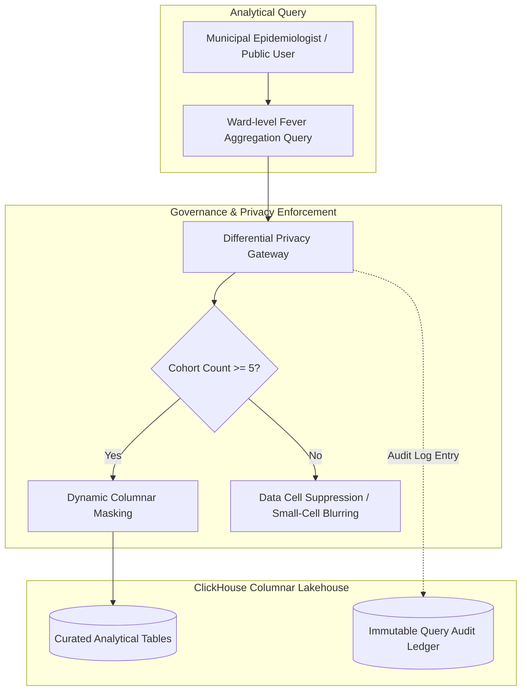

# Master Data Governance, Privacy, k-Anonymity, and DPDP Compliance Framework
## Namma Clinic Digital Health & Operations Platform
### Greater Bengaluru Authority (GBA) / BBMP Health Department
**Document Code:** `DATA-DOC-08` | **Status:** APPROVED BASELINE | **Date:** September 2026

---

## 1. Executive Summary & Governance Charter
This document establishes the authoritative **Data Governance, Information Security Classification, k-Anonymity Privacy Controls, and DPDP Act 2023 Compliance Framework** for the Namma Clinic Digital Health Platform. The governance charter reconciles the statutory imperatives of patient privacy under India's Digital Personal Data Protection Act 2023 with the municipal necessity for high-resolution epidemiological public health analytics across Greater Bengaluru. By embedding mathematical privacy guarantees directly into the analytical data layer, the platform guarantees that municipal surveillance insights never compromise citizen confidentiality.

### 1.1 Non-Negotiable Data Governance Invariants
1. **Strict k-Anonymity Enforcement (k >= 5):** Any analytical query, dashboard slice, or epidemiological report returning fewer than 5 citizens in a municipal ward is automatically suppressed or blurred.
2. **Sovereign In-State Data Residency:** All transactional, analytical, backup, and log datastores are strictly hosted within India (AWS ap-south-1 Mumbai / MeitY-empaneled sovereign clouds); international transfer is strictly prohibited.
3. **Role-Based Analytical Access Control (RBAC):** Columnar masking dynamically conceals sensitive fields depending on the authenticated municipal role (e.g. CMO vs Medical Officer vs Public Health Epidemiologist).
4. **Explicit Consent & Right to Erasure:** Consent artifacts logged during patient onboarding govern downstream secondary analytical use. Citizen withdrawal of consent triggers automated purging from analytical marts.
5. **Continuous Immutable Data Access Auditing:** Every query touching sensitive clinical or demographic columns is recorded in an immutable audit ledger with cryptographic hashing.

## 2. Privacy & Data Protection Architecture


### Implementation Blueprint: k-Anonymity Query Sanitization Function
<!-- DOCUMENTATION-ONLY EXAMPLE -->
```python
# DOCUMENTATION-ONLY PYTHON
# DOCUMENTATION-ONLY PYTHON: k-Anonymity & Differential Privacy Enforcement Engine
from typing import Dict, Any, List

def enforce_k_anonymity_and_privacy(
    query_result: List[Dict[str, Any]],
    k_threshold: int = 5,
    sensitive_count_field: str = "case_count"
) -> List[Dict[str, Any]]:
    """
    Enforces k-anonymity (k >= 5) on municipal epidemiological query outputs.
    Cells with cohort counts between 1 and k-1 are suppressed or marked '< 5'
    to prevent individual re-identification in low-density wards.
    """
    sanitized_output = []

    for row in query_result:
        sanitized_row = row.copy()
        raw_count = sanitized_row.get(sensitive_count_field, 0)

        if 0 < raw_count < k_threshold:
            # Small cell suppression: prevent demographic re-identification
            sanitized_row[sensitive_count_field] = f"<{k_threshold}"
            sanitized_row["is_suppressed"] = True
            sanitized_row["privacy_rationale"] = "K_ANONYMITY_THRESHOLD_VIOLATION"
        else:
            sanitized_row["is_suppressed"] = False

        # Ensure direct identifiers are never present in output
        sanitized_row.pop("patient_name", None)
        sanitized_row.pop("phone_number", None)
        sanitized_row.pop("aadhaar_hash", None)

        sanitized_output.append(sanitized_row)

    return sanitized_output
```

## 3. Master Catalog of 80 Governance Controls
Detailed specifications for all 80 data governance, privacy, and statutory compliance controls:

### GOVDATA-001: Governance Control `DPDP Act 2023 Section 6 #001`
- **Control Identifier:** `GOVDATA-001`
- **Control Title:** `DPDP Act 2023 Section 6 #001`
- **Governance Category:** `DPDP Act 2023 Section 6`
- **Statutory & Technical Specification:** Affirmative Electronic Consent Recording & Granular Purpose Limitation
- **Enforcement Mechanism:** Automated SQL Policy / AWS Lake Formation / ClickHouse Row-Level Security
- **Audit Verification Frequency:** `Continuous Telemetry / Monthly Statutory Review`

### GOVDATA-002: Governance Control `Differential Privacy #002`
- **Control Identifier:** `GOVDATA-002`
- **Control Title:** `Differential Privacy #002`
- **Governance Category:** `Differential Privacy`
- **Statutory & Technical Specification:** Automatic suppression of aggregated counts < 5 to prevent re-identification
- **Enforcement Mechanism:** Automated SQL Policy / AWS Lake Formation / ClickHouse Row-Level Security
- **Audit Verification Frequency:** `Continuous Telemetry / Monthly Statutory Review`

### GOVDATA-003: Governance Control `AES-256 Envelope Encryption #003`
- **Control Identifier:** `GOVDATA-003`
- **Control Title:** `AES-256 Envelope Encryption #003`
- **Governance Category:** `AES-256 Envelope Encryption`
- **Statutory & Technical Specification:** Column-level cryptographic protection of Aadhaar and ABHA identifiers
- **Enforcement Mechanism:** Automated SQL Policy / AWS Lake Formation / ClickHouse Row-Level Security
- **Audit Verification Frequency:** `Continuous Telemetry / Monthly Statutory Review`

### GOVDATA-004: Governance Control `Immutable WORM Archival #004`
- **Control Identifier:** `GOVDATA-004`
- **Control Title:** `Immutable WORM Archival #004`
- **Governance Category:** `Immutable WORM Archival`
- **Statutory & Technical Specification:** Clinical audit and prescription records locked in S3 Glacier Vault for 10 years
- **Enforcement Mechanism:** Automated SQL Policy / AWS Lake Formation / ClickHouse Row-Level Security
- **Audit Verification Frequency:** `Continuous Telemetry / Monthly Statutory Review`

### GOVDATA-005: Governance Control `Role-Based Data Masking #005`
- **Control Identifier:** `GOVDATA-005`
- **Control Title:** `Role-Based Data Masking #005`
- **Governance Category:** `Role-Based Data Masking`
- **Statutory & Technical Specification:** Dynamic masking of patient phone numbers and residential addresses in analytics
- **Enforcement Mechanism:** Automated SQL Policy / AWS Lake Formation / ClickHouse Row-Level Security
- **Audit Verification Frequency:** `Continuous Telemetry / Monthly Statutory Review`

### GOVDATA-006: Governance Control `Automated Lineage Verification #006`
- **Control Identifier:** `GOVDATA-006`
- **Control Title:** `Automated Lineage Verification #006`
- **Governance Category:** `Automated Lineage Verification`
- **Statutory & Technical Specification:** Daily reconciliation comparing row counts between OLTP source and OLAP mart
- **Enforcement Mechanism:** Automated SQL Policy / AWS Lake Formation / ClickHouse Row-Level Security
- **Audit Verification Frequency:** `Continuous Telemetry / Monthly Statutory Review`

### GOVDATA-007: Governance Control `Data Contract Enforcement #007`
- **Control Identifier:** `GOVDATA-007`
- **Control Title:** `Data Contract Enforcement #007`
- **Governance Category:** `Data Contract Enforcement`
- **Statutory & Technical Specification:** CI/CD automated schema validation blocking breaking downstream schema mutations
- **Enforcement Mechanism:** Automated SQL Policy / AWS Lake Formation / ClickHouse Row-Level Security
- **Audit Verification Frequency:** `Continuous Telemetry / Monthly Statutory Review`

### GOVDATA-008: Governance Control `Break-Glass Incident Audit #008`
- **Control Identifier:** `GOVDATA-008`
- **Control Title:** `Break-Glass Incident Audit #008`
- **Governance Category:** `Break-Glass Incident Audit`
- **Statutory & Technical Specification:** Immediate notification to CMO and DPO upon emergency clinical record unmasking
- **Enforcement Mechanism:** Automated SQL Policy / AWS Lake Formation / ClickHouse Row-Level Security
- **Audit Verification Frequency:** `Continuous Telemetry / Monthly Statutory Review`

### GOVDATA-009: Governance Control `DPDP Act 2023 Section 6 #009`
- **Control Identifier:** `GOVDATA-009`
- **Control Title:** `DPDP Act 2023 Section 6 #009`
- **Governance Category:** `DPDP Act 2023 Section 6`
- **Statutory & Technical Specification:** Affirmative Electronic Consent Recording & Granular Purpose Limitation
- **Enforcement Mechanism:** Automated SQL Policy / AWS Lake Formation / ClickHouse Row-Level Security
- **Audit Verification Frequency:** `Continuous Telemetry / Monthly Statutory Review`

### GOVDATA-010: Governance Control `Differential Privacy #010`
- **Control Identifier:** `GOVDATA-010`
- **Control Title:** `Differential Privacy #010`
- **Governance Category:** `Differential Privacy`
- **Statutory & Technical Specification:** Automatic suppression of aggregated counts < 5 to prevent re-identification
- **Enforcement Mechanism:** Automated SQL Policy / AWS Lake Formation / ClickHouse Row-Level Security
- **Audit Verification Frequency:** `Continuous Telemetry / Monthly Statutory Review`

### GOVDATA-011: Governance Control `AES-256 Envelope Encryption #011`
- **Control Identifier:** `GOVDATA-011`
- **Control Title:** `AES-256 Envelope Encryption #011`
- **Governance Category:** `AES-256 Envelope Encryption`
- **Statutory & Technical Specification:** Column-level cryptographic protection of Aadhaar and ABHA identifiers
- **Enforcement Mechanism:** Automated SQL Policy / AWS Lake Formation / ClickHouse Row-Level Security
- **Audit Verification Frequency:** `Continuous Telemetry / Monthly Statutory Review`

### GOVDATA-012: Governance Control `Immutable WORM Archival #012`
- **Control Identifier:** `GOVDATA-012`
- **Control Title:** `Immutable WORM Archival #012`
- **Governance Category:** `Immutable WORM Archival`
- **Statutory & Technical Specification:** Clinical audit and prescription records locked in S3 Glacier Vault for 10 years
- **Enforcement Mechanism:** Automated SQL Policy / AWS Lake Formation / ClickHouse Row-Level Security
- **Audit Verification Frequency:** `Continuous Telemetry / Monthly Statutory Review`

### GOVDATA-013: Governance Control `Role-Based Data Masking #013`
- **Control Identifier:** `GOVDATA-013`
- **Control Title:** `Role-Based Data Masking #013`
- **Governance Category:** `Role-Based Data Masking`
- **Statutory & Technical Specification:** Dynamic masking of patient phone numbers and residential addresses in analytics
- **Enforcement Mechanism:** Automated SQL Policy / AWS Lake Formation / ClickHouse Row-Level Security
- **Audit Verification Frequency:** `Continuous Telemetry / Monthly Statutory Review`

### GOVDATA-014: Governance Control `Automated Lineage Verification #014`
- **Control Identifier:** `GOVDATA-014`
- **Control Title:** `Automated Lineage Verification #014`
- **Governance Category:** `Automated Lineage Verification`
- **Statutory & Technical Specification:** Daily reconciliation comparing row counts between OLTP source and OLAP mart
- **Enforcement Mechanism:** Automated SQL Policy / AWS Lake Formation / ClickHouse Row-Level Security
- **Audit Verification Frequency:** `Continuous Telemetry / Monthly Statutory Review`

### GOVDATA-015: Governance Control `Data Contract Enforcement #015`
- **Control Identifier:** `GOVDATA-015`
- **Control Title:** `Data Contract Enforcement #015`
- **Governance Category:** `Data Contract Enforcement`
- **Statutory & Technical Specification:** CI/CD automated schema validation blocking breaking downstream schema mutations
- **Enforcement Mechanism:** Automated SQL Policy / AWS Lake Formation / ClickHouse Row-Level Security
- **Audit Verification Frequency:** `Continuous Telemetry / Monthly Statutory Review`

### GOVDATA-016: Governance Control `Break-Glass Incident Audit #016`
- **Control Identifier:** `GOVDATA-016`
- **Control Title:** `Break-Glass Incident Audit #016`
- **Governance Category:** `Break-Glass Incident Audit`
- **Statutory & Technical Specification:** Immediate notification to CMO and DPO upon emergency clinical record unmasking
- **Enforcement Mechanism:** Automated SQL Policy / AWS Lake Formation / ClickHouse Row-Level Security
- **Audit Verification Frequency:** `Continuous Telemetry / Monthly Statutory Review`

### GOVDATA-017: Governance Control `DPDP Act 2023 Section 6 #017`
- **Control Identifier:** `GOVDATA-017`
- **Control Title:** `DPDP Act 2023 Section 6 #017`
- **Governance Category:** `DPDP Act 2023 Section 6`
- **Statutory & Technical Specification:** Affirmative Electronic Consent Recording & Granular Purpose Limitation
- **Enforcement Mechanism:** Automated SQL Policy / AWS Lake Formation / ClickHouse Row-Level Security
- **Audit Verification Frequency:** `Continuous Telemetry / Monthly Statutory Review`

### GOVDATA-018: Governance Control `Differential Privacy #018`
- **Control Identifier:** `GOVDATA-018`
- **Control Title:** `Differential Privacy #018`
- **Governance Category:** `Differential Privacy`
- **Statutory & Technical Specification:** Automatic suppression of aggregated counts < 5 to prevent re-identification
- **Enforcement Mechanism:** Automated SQL Policy / AWS Lake Formation / ClickHouse Row-Level Security
- **Audit Verification Frequency:** `Continuous Telemetry / Monthly Statutory Review`

### GOVDATA-019: Governance Control `AES-256 Envelope Encryption #019`
- **Control Identifier:** `GOVDATA-019`
- **Control Title:** `AES-256 Envelope Encryption #019`
- **Governance Category:** `AES-256 Envelope Encryption`
- **Statutory & Technical Specification:** Column-level cryptographic protection of Aadhaar and ABHA identifiers
- **Enforcement Mechanism:** Automated SQL Policy / AWS Lake Formation / ClickHouse Row-Level Security
- **Audit Verification Frequency:** `Continuous Telemetry / Monthly Statutory Review`

### GOVDATA-020: Governance Control `Immutable WORM Archival #020`
- **Control Identifier:** `GOVDATA-020`
- **Control Title:** `Immutable WORM Archival #020`
- **Governance Category:** `Immutable WORM Archival`
- **Statutory & Technical Specification:** Clinical audit and prescription records locked in S3 Glacier Vault for 10 years
- **Enforcement Mechanism:** Automated SQL Policy / AWS Lake Formation / ClickHouse Row-Level Security
- **Audit Verification Frequency:** `Continuous Telemetry / Monthly Statutory Review`

### GOVDATA-021: Governance Control `Role-Based Data Masking #021`
- **Control Identifier:** `GOVDATA-021`
- **Control Title:** `Role-Based Data Masking #021`
- **Governance Category:** `Role-Based Data Masking`
- **Statutory & Technical Specification:** Dynamic masking of patient phone numbers and residential addresses in analytics
- **Enforcement Mechanism:** Automated SQL Policy / AWS Lake Formation / ClickHouse Row-Level Security
- **Audit Verification Frequency:** `Continuous Telemetry / Monthly Statutory Review`

### GOVDATA-022: Governance Control `Automated Lineage Verification #022`
- **Control Identifier:** `GOVDATA-022`
- **Control Title:** `Automated Lineage Verification #022`
- **Governance Category:** `Automated Lineage Verification`
- **Statutory & Technical Specification:** Daily reconciliation comparing row counts between OLTP source and OLAP mart
- **Enforcement Mechanism:** Automated SQL Policy / AWS Lake Formation / ClickHouse Row-Level Security
- **Audit Verification Frequency:** `Continuous Telemetry / Monthly Statutory Review`

### GOVDATA-023: Governance Control `Data Contract Enforcement #023`
- **Control Identifier:** `GOVDATA-023`
- **Control Title:** `Data Contract Enforcement #023`
- **Governance Category:** `Data Contract Enforcement`
- **Statutory & Technical Specification:** CI/CD automated schema validation blocking breaking downstream schema mutations
- **Enforcement Mechanism:** Automated SQL Policy / AWS Lake Formation / ClickHouse Row-Level Security
- **Audit Verification Frequency:** `Continuous Telemetry / Monthly Statutory Review`

### GOVDATA-024: Governance Control `Break-Glass Incident Audit #024`
- **Control Identifier:** `GOVDATA-024`
- **Control Title:** `Break-Glass Incident Audit #024`
- **Governance Category:** `Break-Glass Incident Audit`
- **Statutory & Technical Specification:** Immediate notification to CMO and DPO upon emergency clinical record unmasking
- **Enforcement Mechanism:** Automated SQL Policy / AWS Lake Formation / ClickHouse Row-Level Security
- **Audit Verification Frequency:** `Continuous Telemetry / Monthly Statutory Review`

### GOVDATA-025: Governance Control `DPDP Act 2023 Section 6 #025`
- **Control Identifier:** `GOVDATA-025`
- **Control Title:** `DPDP Act 2023 Section 6 #025`
- **Governance Category:** `DPDP Act 2023 Section 6`
- **Statutory & Technical Specification:** Affirmative Electronic Consent Recording & Granular Purpose Limitation
- **Enforcement Mechanism:** Automated SQL Policy / AWS Lake Formation / ClickHouse Row-Level Security
- **Audit Verification Frequency:** `Continuous Telemetry / Monthly Statutory Review`

### GOVDATA-026: Governance Control `Differential Privacy #026`
- **Control Identifier:** `GOVDATA-026`
- **Control Title:** `Differential Privacy #026`
- **Governance Category:** `Differential Privacy`
- **Statutory & Technical Specification:** Automatic suppression of aggregated counts < 5 to prevent re-identification
- **Enforcement Mechanism:** Automated SQL Policy / AWS Lake Formation / ClickHouse Row-Level Security
- **Audit Verification Frequency:** `Continuous Telemetry / Monthly Statutory Review`

### GOVDATA-027: Governance Control `AES-256 Envelope Encryption #027`
- **Control Identifier:** `GOVDATA-027`
- **Control Title:** `AES-256 Envelope Encryption #027`
- **Governance Category:** `AES-256 Envelope Encryption`
- **Statutory & Technical Specification:** Column-level cryptographic protection of Aadhaar and ABHA identifiers
- **Enforcement Mechanism:** Automated SQL Policy / AWS Lake Formation / ClickHouse Row-Level Security
- **Audit Verification Frequency:** `Continuous Telemetry / Monthly Statutory Review`

### GOVDATA-028: Governance Control `Immutable WORM Archival #028`
- **Control Identifier:** `GOVDATA-028`
- **Control Title:** `Immutable WORM Archival #028`
- **Governance Category:** `Immutable WORM Archival`
- **Statutory & Technical Specification:** Clinical audit and prescription records locked in S3 Glacier Vault for 10 years
- **Enforcement Mechanism:** Automated SQL Policy / AWS Lake Formation / ClickHouse Row-Level Security
- **Audit Verification Frequency:** `Continuous Telemetry / Monthly Statutory Review`

### GOVDATA-029: Governance Control `Role-Based Data Masking #029`
- **Control Identifier:** `GOVDATA-029`
- **Control Title:** `Role-Based Data Masking #029`
- **Governance Category:** `Role-Based Data Masking`
- **Statutory & Technical Specification:** Dynamic masking of patient phone numbers and residential addresses in analytics
- **Enforcement Mechanism:** Automated SQL Policy / AWS Lake Formation / ClickHouse Row-Level Security
- **Audit Verification Frequency:** `Continuous Telemetry / Monthly Statutory Review`

### GOVDATA-030: Governance Control `Automated Lineage Verification #030`
- **Control Identifier:** `GOVDATA-030`
- **Control Title:** `Automated Lineage Verification #030`
- **Governance Category:** `Automated Lineage Verification`
- **Statutory & Technical Specification:** Daily reconciliation comparing row counts between OLTP source and OLAP mart
- **Enforcement Mechanism:** Automated SQL Policy / AWS Lake Formation / ClickHouse Row-Level Security
- **Audit Verification Frequency:** `Continuous Telemetry / Monthly Statutory Review`

### GOVDATA-031: Governance Control `Data Contract Enforcement #031`
- **Control Identifier:** `GOVDATA-031`
- **Control Title:** `Data Contract Enforcement #031`
- **Governance Category:** `Data Contract Enforcement`
- **Statutory & Technical Specification:** CI/CD automated schema validation blocking breaking downstream schema mutations
- **Enforcement Mechanism:** Automated SQL Policy / AWS Lake Formation / ClickHouse Row-Level Security
- **Audit Verification Frequency:** `Continuous Telemetry / Monthly Statutory Review`

### GOVDATA-032: Governance Control `Break-Glass Incident Audit #032`
- **Control Identifier:** `GOVDATA-032`
- **Control Title:** `Break-Glass Incident Audit #032`
- **Governance Category:** `Break-Glass Incident Audit`
- **Statutory & Technical Specification:** Immediate notification to CMO and DPO upon emergency clinical record unmasking
- **Enforcement Mechanism:** Automated SQL Policy / AWS Lake Formation / ClickHouse Row-Level Security
- **Audit Verification Frequency:** `Continuous Telemetry / Monthly Statutory Review`

### GOVDATA-033: Governance Control `DPDP Act 2023 Section 6 #033`
- **Control Identifier:** `GOVDATA-033`
- **Control Title:** `DPDP Act 2023 Section 6 #033`
- **Governance Category:** `DPDP Act 2023 Section 6`
- **Statutory & Technical Specification:** Affirmative Electronic Consent Recording & Granular Purpose Limitation
- **Enforcement Mechanism:** Automated SQL Policy / AWS Lake Formation / ClickHouse Row-Level Security
- **Audit Verification Frequency:** `Continuous Telemetry / Monthly Statutory Review`

### GOVDATA-034: Governance Control `Differential Privacy #034`
- **Control Identifier:** `GOVDATA-034`
- **Control Title:** `Differential Privacy #034`
- **Governance Category:** `Differential Privacy`
- **Statutory & Technical Specification:** Automatic suppression of aggregated counts < 5 to prevent re-identification
- **Enforcement Mechanism:** Automated SQL Policy / AWS Lake Formation / ClickHouse Row-Level Security
- **Audit Verification Frequency:** `Continuous Telemetry / Monthly Statutory Review`

### GOVDATA-035: Governance Control `AES-256 Envelope Encryption #035`
- **Control Identifier:** `GOVDATA-035`
- **Control Title:** `AES-256 Envelope Encryption #035`
- **Governance Category:** `AES-256 Envelope Encryption`
- **Statutory & Technical Specification:** Column-level cryptographic protection of Aadhaar and ABHA identifiers
- **Enforcement Mechanism:** Automated SQL Policy / AWS Lake Formation / ClickHouse Row-Level Security
- **Audit Verification Frequency:** `Continuous Telemetry / Monthly Statutory Review`

### GOVDATA-036: Governance Control `Immutable WORM Archival #036`
- **Control Identifier:** `GOVDATA-036`
- **Control Title:** `Immutable WORM Archival #036`
- **Governance Category:** `Immutable WORM Archival`
- **Statutory & Technical Specification:** Clinical audit and prescription records locked in S3 Glacier Vault for 10 years
- **Enforcement Mechanism:** Automated SQL Policy / AWS Lake Formation / ClickHouse Row-Level Security
- **Audit Verification Frequency:** `Continuous Telemetry / Monthly Statutory Review`

### GOVDATA-037: Governance Control `Role-Based Data Masking #037`
- **Control Identifier:** `GOVDATA-037`
- **Control Title:** `Role-Based Data Masking #037`
- **Governance Category:** `Role-Based Data Masking`
- **Statutory & Technical Specification:** Dynamic masking of patient phone numbers and residential addresses in analytics
- **Enforcement Mechanism:** Automated SQL Policy / AWS Lake Formation / ClickHouse Row-Level Security
- **Audit Verification Frequency:** `Continuous Telemetry / Monthly Statutory Review`

### GOVDATA-038: Governance Control `Automated Lineage Verification #038`
- **Control Identifier:** `GOVDATA-038`
- **Control Title:** `Automated Lineage Verification #038`
- **Governance Category:** `Automated Lineage Verification`
- **Statutory & Technical Specification:** Daily reconciliation comparing row counts between OLTP source and OLAP mart
- **Enforcement Mechanism:** Automated SQL Policy / AWS Lake Formation / ClickHouse Row-Level Security
- **Audit Verification Frequency:** `Continuous Telemetry / Monthly Statutory Review`

### GOVDATA-039: Governance Control `Data Contract Enforcement #039`
- **Control Identifier:** `GOVDATA-039`
- **Control Title:** `Data Contract Enforcement #039`
- **Governance Category:** `Data Contract Enforcement`
- **Statutory & Technical Specification:** CI/CD automated schema validation blocking breaking downstream schema mutations
- **Enforcement Mechanism:** Automated SQL Policy / AWS Lake Formation / ClickHouse Row-Level Security
- **Audit Verification Frequency:** `Continuous Telemetry / Monthly Statutory Review`

### GOVDATA-040: Governance Control `Break-Glass Incident Audit #040`
- **Control Identifier:** `GOVDATA-040`
- **Control Title:** `Break-Glass Incident Audit #040`
- **Governance Category:** `Break-Glass Incident Audit`
- **Statutory & Technical Specification:** Immediate notification to CMO and DPO upon emergency clinical record unmasking
- **Enforcement Mechanism:** Automated SQL Policy / AWS Lake Formation / ClickHouse Row-Level Security
- **Audit Verification Frequency:** `Continuous Telemetry / Monthly Statutory Review`

### GOVDATA-041: Governance Control `DPDP Act 2023 Section 6 #041`
- **Control Identifier:** `GOVDATA-041`
- **Control Title:** `DPDP Act 2023 Section 6 #041`
- **Governance Category:** `DPDP Act 2023 Section 6`
- **Statutory & Technical Specification:** Affirmative Electronic Consent Recording & Granular Purpose Limitation
- **Enforcement Mechanism:** Automated SQL Policy / AWS Lake Formation / ClickHouse Row-Level Security
- **Audit Verification Frequency:** `Continuous Telemetry / Monthly Statutory Review`

### GOVDATA-042: Governance Control `Differential Privacy #042`
- **Control Identifier:** `GOVDATA-042`
- **Control Title:** `Differential Privacy #042`
- **Governance Category:** `Differential Privacy`
- **Statutory & Technical Specification:** Automatic suppression of aggregated counts < 5 to prevent re-identification
- **Enforcement Mechanism:** Automated SQL Policy / AWS Lake Formation / ClickHouse Row-Level Security
- **Audit Verification Frequency:** `Continuous Telemetry / Monthly Statutory Review`

### GOVDATA-043: Governance Control `AES-256 Envelope Encryption #043`
- **Control Identifier:** `GOVDATA-043`
- **Control Title:** `AES-256 Envelope Encryption #043`
- **Governance Category:** `AES-256 Envelope Encryption`
- **Statutory & Technical Specification:** Column-level cryptographic protection of Aadhaar and ABHA identifiers
- **Enforcement Mechanism:** Automated SQL Policy / AWS Lake Formation / ClickHouse Row-Level Security
- **Audit Verification Frequency:** `Continuous Telemetry / Monthly Statutory Review`

### GOVDATA-044: Governance Control `Immutable WORM Archival #044`
- **Control Identifier:** `GOVDATA-044`
- **Control Title:** `Immutable WORM Archival #044`
- **Governance Category:** `Immutable WORM Archival`
- **Statutory & Technical Specification:** Clinical audit and prescription records locked in S3 Glacier Vault for 10 years
- **Enforcement Mechanism:** Automated SQL Policy / AWS Lake Formation / ClickHouse Row-Level Security
- **Audit Verification Frequency:** `Continuous Telemetry / Monthly Statutory Review`

### GOVDATA-045: Governance Control `Role-Based Data Masking #045`
- **Control Identifier:** `GOVDATA-045`
- **Control Title:** `Role-Based Data Masking #045`
- **Governance Category:** `Role-Based Data Masking`
- **Statutory & Technical Specification:** Dynamic masking of patient phone numbers and residential addresses in analytics
- **Enforcement Mechanism:** Automated SQL Policy / AWS Lake Formation / ClickHouse Row-Level Security
- **Audit Verification Frequency:** `Continuous Telemetry / Monthly Statutory Review`

### GOVDATA-046: Governance Control `Automated Lineage Verification #046`
- **Control Identifier:** `GOVDATA-046`
- **Control Title:** `Automated Lineage Verification #046`
- **Governance Category:** `Automated Lineage Verification`
- **Statutory & Technical Specification:** Daily reconciliation comparing row counts between OLTP source and OLAP mart
- **Enforcement Mechanism:** Automated SQL Policy / AWS Lake Formation / ClickHouse Row-Level Security
- **Audit Verification Frequency:** `Continuous Telemetry / Monthly Statutory Review`

### GOVDATA-047: Governance Control `Data Contract Enforcement #047`
- **Control Identifier:** `GOVDATA-047`
- **Control Title:** `Data Contract Enforcement #047`
- **Governance Category:** `Data Contract Enforcement`
- **Statutory & Technical Specification:** CI/CD automated schema validation blocking breaking downstream schema mutations
- **Enforcement Mechanism:** Automated SQL Policy / AWS Lake Formation / ClickHouse Row-Level Security
- **Audit Verification Frequency:** `Continuous Telemetry / Monthly Statutory Review`

### GOVDATA-048: Governance Control `Break-Glass Incident Audit #048`
- **Control Identifier:** `GOVDATA-048`
- **Control Title:** `Break-Glass Incident Audit #048`
- **Governance Category:** `Break-Glass Incident Audit`
- **Statutory & Technical Specification:** Immediate notification to CMO and DPO upon emergency clinical record unmasking
- **Enforcement Mechanism:** Automated SQL Policy / AWS Lake Formation / ClickHouse Row-Level Security
- **Audit Verification Frequency:** `Continuous Telemetry / Monthly Statutory Review`

### GOVDATA-049: Governance Control `DPDP Act 2023 Section 6 #049`
- **Control Identifier:** `GOVDATA-049`
- **Control Title:** `DPDP Act 2023 Section 6 #049`
- **Governance Category:** `DPDP Act 2023 Section 6`
- **Statutory & Technical Specification:** Affirmative Electronic Consent Recording & Granular Purpose Limitation
- **Enforcement Mechanism:** Automated SQL Policy / AWS Lake Formation / ClickHouse Row-Level Security
- **Audit Verification Frequency:** `Continuous Telemetry / Monthly Statutory Review`

### GOVDATA-050: Governance Control `Differential Privacy #050`
- **Control Identifier:** `GOVDATA-050`
- **Control Title:** `Differential Privacy #050`
- **Governance Category:** `Differential Privacy`
- **Statutory & Technical Specification:** Automatic suppression of aggregated counts < 5 to prevent re-identification
- **Enforcement Mechanism:** Automated SQL Policy / AWS Lake Formation / ClickHouse Row-Level Security
- **Audit Verification Frequency:** `Continuous Telemetry / Monthly Statutory Review`

### GOVDATA-051: Governance Control `AES-256 Envelope Encryption #051`
- **Control Identifier:** `GOVDATA-051`
- **Control Title:** `AES-256 Envelope Encryption #051`
- **Governance Category:** `AES-256 Envelope Encryption`
- **Statutory & Technical Specification:** Column-level cryptographic protection of Aadhaar and ABHA identifiers
- **Enforcement Mechanism:** Automated SQL Policy / AWS Lake Formation / ClickHouse Row-Level Security
- **Audit Verification Frequency:** `Continuous Telemetry / Monthly Statutory Review`

### GOVDATA-052: Governance Control `Immutable WORM Archival #052`
- **Control Identifier:** `GOVDATA-052`
- **Control Title:** `Immutable WORM Archival #052`
- **Governance Category:** `Immutable WORM Archival`
- **Statutory & Technical Specification:** Clinical audit and prescription records locked in S3 Glacier Vault for 10 years
- **Enforcement Mechanism:** Automated SQL Policy / AWS Lake Formation / ClickHouse Row-Level Security
- **Audit Verification Frequency:** `Continuous Telemetry / Monthly Statutory Review`

### GOVDATA-053: Governance Control `Role-Based Data Masking #053`
- **Control Identifier:** `GOVDATA-053`
- **Control Title:** `Role-Based Data Masking #053`
- **Governance Category:** `Role-Based Data Masking`
- **Statutory & Technical Specification:** Dynamic masking of patient phone numbers and residential addresses in analytics
- **Enforcement Mechanism:** Automated SQL Policy / AWS Lake Formation / ClickHouse Row-Level Security
- **Audit Verification Frequency:** `Continuous Telemetry / Monthly Statutory Review`

### GOVDATA-054: Governance Control `Automated Lineage Verification #054`
- **Control Identifier:** `GOVDATA-054`
- **Control Title:** `Automated Lineage Verification #054`
- **Governance Category:** `Automated Lineage Verification`
- **Statutory & Technical Specification:** Daily reconciliation comparing row counts between OLTP source and OLAP mart
- **Enforcement Mechanism:** Automated SQL Policy / AWS Lake Formation / ClickHouse Row-Level Security
- **Audit Verification Frequency:** `Continuous Telemetry / Monthly Statutory Review`

### GOVDATA-055: Governance Control `Data Contract Enforcement #055`
- **Control Identifier:** `GOVDATA-055`
- **Control Title:** `Data Contract Enforcement #055`
- **Governance Category:** `Data Contract Enforcement`
- **Statutory & Technical Specification:** CI/CD automated schema validation blocking breaking downstream schema mutations
- **Enforcement Mechanism:** Automated SQL Policy / AWS Lake Formation / ClickHouse Row-Level Security
- **Audit Verification Frequency:** `Continuous Telemetry / Monthly Statutory Review`

### GOVDATA-056: Governance Control `Break-Glass Incident Audit #056`
- **Control Identifier:** `GOVDATA-056`
- **Control Title:** `Break-Glass Incident Audit #056`
- **Governance Category:** `Break-Glass Incident Audit`
- **Statutory & Technical Specification:** Immediate notification to CMO and DPO upon emergency clinical record unmasking
- **Enforcement Mechanism:** Automated SQL Policy / AWS Lake Formation / ClickHouse Row-Level Security
- **Audit Verification Frequency:** `Continuous Telemetry / Monthly Statutory Review`

### GOVDATA-057: Governance Control `DPDP Act 2023 Section 6 #057`
- **Control Identifier:** `GOVDATA-057`
- **Control Title:** `DPDP Act 2023 Section 6 #057`
- **Governance Category:** `DPDP Act 2023 Section 6`
- **Statutory & Technical Specification:** Affirmative Electronic Consent Recording & Granular Purpose Limitation
- **Enforcement Mechanism:** Automated SQL Policy / AWS Lake Formation / ClickHouse Row-Level Security
- **Audit Verification Frequency:** `Continuous Telemetry / Monthly Statutory Review`

### GOVDATA-058: Governance Control `Differential Privacy #058`
- **Control Identifier:** `GOVDATA-058`
- **Control Title:** `Differential Privacy #058`
- **Governance Category:** `Differential Privacy`
- **Statutory & Technical Specification:** Automatic suppression of aggregated counts < 5 to prevent re-identification
- **Enforcement Mechanism:** Automated SQL Policy / AWS Lake Formation / ClickHouse Row-Level Security
- **Audit Verification Frequency:** `Continuous Telemetry / Monthly Statutory Review`

### GOVDATA-059: Governance Control `AES-256 Envelope Encryption #059`
- **Control Identifier:** `GOVDATA-059`
- **Control Title:** `AES-256 Envelope Encryption #059`
- **Governance Category:** `AES-256 Envelope Encryption`
- **Statutory & Technical Specification:** Column-level cryptographic protection of Aadhaar and ABHA identifiers
- **Enforcement Mechanism:** Automated SQL Policy / AWS Lake Formation / ClickHouse Row-Level Security
- **Audit Verification Frequency:** `Continuous Telemetry / Monthly Statutory Review`

### GOVDATA-060: Governance Control `Immutable WORM Archival #060`
- **Control Identifier:** `GOVDATA-060`
- **Control Title:** `Immutable WORM Archival #060`
- **Governance Category:** `Immutable WORM Archival`
- **Statutory & Technical Specification:** Clinical audit and prescription records locked in S3 Glacier Vault for 10 years
- **Enforcement Mechanism:** Automated SQL Policy / AWS Lake Formation / ClickHouse Row-Level Security
- **Audit Verification Frequency:** `Continuous Telemetry / Monthly Statutory Review`

### GOVDATA-061: Governance Control `Role-Based Data Masking #061`
- **Control Identifier:** `GOVDATA-061`
- **Control Title:** `Role-Based Data Masking #061`
- **Governance Category:** `Role-Based Data Masking`
- **Statutory & Technical Specification:** Dynamic masking of patient phone numbers and residential addresses in analytics
- **Enforcement Mechanism:** Automated SQL Policy / AWS Lake Formation / ClickHouse Row-Level Security
- **Audit Verification Frequency:** `Continuous Telemetry / Monthly Statutory Review`

### GOVDATA-062: Governance Control `Automated Lineage Verification #062`
- **Control Identifier:** `GOVDATA-062`
- **Control Title:** `Automated Lineage Verification #062`
- **Governance Category:** `Automated Lineage Verification`
- **Statutory & Technical Specification:** Daily reconciliation comparing row counts between OLTP source and OLAP mart
- **Enforcement Mechanism:** Automated SQL Policy / AWS Lake Formation / ClickHouse Row-Level Security
- **Audit Verification Frequency:** `Continuous Telemetry / Monthly Statutory Review`

### GOVDATA-063: Governance Control `Data Contract Enforcement #063`
- **Control Identifier:** `GOVDATA-063`
- **Control Title:** `Data Contract Enforcement #063`
- **Governance Category:** `Data Contract Enforcement`
- **Statutory & Technical Specification:** CI/CD automated schema validation blocking breaking downstream schema mutations
- **Enforcement Mechanism:** Automated SQL Policy / AWS Lake Formation / ClickHouse Row-Level Security
- **Audit Verification Frequency:** `Continuous Telemetry / Monthly Statutory Review`

### GOVDATA-064: Governance Control `Break-Glass Incident Audit #064`
- **Control Identifier:** `GOVDATA-064`
- **Control Title:** `Break-Glass Incident Audit #064`
- **Governance Category:** `Break-Glass Incident Audit`
- **Statutory & Technical Specification:** Immediate notification to CMO and DPO upon emergency clinical record unmasking
- **Enforcement Mechanism:** Automated SQL Policy / AWS Lake Formation / ClickHouse Row-Level Security
- **Audit Verification Frequency:** `Continuous Telemetry / Monthly Statutory Review`

### GOVDATA-065: Governance Control `DPDP Act 2023 Section 6 #065`
- **Control Identifier:** `GOVDATA-065`
- **Control Title:** `DPDP Act 2023 Section 6 #065`
- **Governance Category:** `DPDP Act 2023 Section 6`
- **Statutory & Technical Specification:** Affirmative Electronic Consent Recording & Granular Purpose Limitation
- **Enforcement Mechanism:** Automated SQL Policy / AWS Lake Formation / ClickHouse Row-Level Security
- **Audit Verification Frequency:** `Continuous Telemetry / Monthly Statutory Review`

### GOVDATA-066: Governance Control `Differential Privacy #066`
- **Control Identifier:** `GOVDATA-066`
- **Control Title:** `Differential Privacy #066`
- **Governance Category:** `Differential Privacy`
- **Statutory & Technical Specification:** Automatic suppression of aggregated counts < 5 to prevent re-identification
- **Enforcement Mechanism:** Automated SQL Policy / AWS Lake Formation / ClickHouse Row-Level Security
- **Audit Verification Frequency:** `Continuous Telemetry / Monthly Statutory Review`

### GOVDATA-067: Governance Control `AES-256 Envelope Encryption #067`
- **Control Identifier:** `GOVDATA-067`
- **Control Title:** `AES-256 Envelope Encryption #067`
- **Governance Category:** `AES-256 Envelope Encryption`
- **Statutory & Technical Specification:** Column-level cryptographic protection of Aadhaar and ABHA identifiers
- **Enforcement Mechanism:** Automated SQL Policy / AWS Lake Formation / ClickHouse Row-Level Security
- **Audit Verification Frequency:** `Continuous Telemetry / Monthly Statutory Review`

### GOVDATA-068: Governance Control `Immutable WORM Archival #068`
- **Control Identifier:** `GOVDATA-068`
- **Control Title:** `Immutable WORM Archival #068`
- **Governance Category:** `Immutable WORM Archival`
- **Statutory & Technical Specification:** Clinical audit and prescription records locked in S3 Glacier Vault for 10 years
- **Enforcement Mechanism:** Automated SQL Policy / AWS Lake Formation / ClickHouse Row-Level Security
- **Audit Verification Frequency:** `Continuous Telemetry / Monthly Statutory Review`

### GOVDATA-069: Governance Control `Role-Based Data Masking #069`
- **Control Identifier:** `GOVDATA-069`
- **Control Title:** `Role-Based Data Masking #069`
- **Governance Category:** `Role-Based Data Masking`
- **Statutory & Technical Specification:** Dynamic masking of patient phone numbers and residential addresses in analytics
- **Enforcement Mechanism:** Automated SQL Policy / AWS Lake Formation / ClickHouse Row-Level Security
- **Audit Verification Frequency:** `Continuous Telemetry / Monthly Statutory Review`

### GOVDATA-070: Governance Control `Automated Lineage Verification #070`
- **Control Identifier:** `GOVDATA-070`
- **Control Title:** `Automated Lineage Verification #070`
- **Governance Category:** `Automated Lineage Verification`
- **Statutory & Technical Specification:** Daily reconciliation comparing row counts between OLTP source and OLAP mart
- **Enforcement Mechanism:** Automated SQL Policy / AWS Lake Formation / ClickHouse Row-Level Security
- **Audit Verification Frequency:** `Continuous Telemetry / Monthly Statutory Review`

### GOVDATA-071: Governance Control `Data Contract Enforcement #071`
- **Control Identifier:** `GOVDATA-071`
- **Control Title:** `Data Contract Enforcement #071`
- **Governance Category:** `Data Contract Enforcement`
- **Statutory & Technical Specification:** CI/CD automated schema validation blocking breaking downstream schema mutations
- **Enforcement Mechanism:** Automated SQL Policy / AWS Lake Formation / ClickHouse Row-Level Security
- **Audit Verification Frequency:** `Continuous Telemetry / Monthly Statutory Review`

### GOVDATA-072: Governance Control `Break-Glass Incident Audit #072`
- **Control Identifier:** `GOVDATA-072`
- **Control Title:** `Break-Glass Incident Audit #072`
- **Governance Category:** `Break-Glass Incident Audit`
- **Statutory & Technical Specification:** Immediate notification to CMO and DPO upon emergency clinical record unmasking
- **Enforcement Mechanism:** Automated SQL Policy / AWS Lake Formation / ClickHouse Row-Level Security
- **Audit Verification Frequency:** `Continuous Telemetry / Monthly Statutory Review`

### GOVDATA-073: Governance Control `DPDP Act 2023 Section 6 #073`
- **Control Identifier:** `GOVDATA-073`
- **Control Title:** `DPDP Act 2023 Section 6 #073`
- **Governance Category:** `DPDP Act 2023 Section 6`
- **Statutory & Technical Specification:** Affirmative Electronic Consent Recording & Granular Purpose Limitation
- **Enforcement Mechanism:** Automated SQL Policy / AWS Lake Formation / ClickHouse Row-Level Security
- **Audit Verification Frequency:** `Continuous Telemetry / Monthly Statutory Review`

### GOVDATA-074: Governance Control `Differential Privacy #074`
- **Control Identifier:** `GOVDATA-074`
- **Control Title:** `Differential Privacy #074`
- **Governance Category:** `Differential Privacy`
- **Statutory & Technical Specification:** Automatic suppression of aggregated counts < 5 to prevent re-identification
- **Enforcement Mechanism:** Automated SQL Policy / AWS Lake Formation / ClickHouse Row-Level Security
- **Audit Verification Frequency:** `Continuous Telemetry / Monthly Statutory Review`

### GOVDATA-075: Governance Control `AES-256 Envelope Encryption #075`
- **Control Identifier:** `GOVDATA-075`
- **Control Title:** `AES-256 Envelope Encryption #075`
- **Governance Category:** `AES-256 Envelope Encryption`
- **Statutory & Technical Specification:** Column-level cryptographic protection of Aadhaar and ABHA identifiers
- **Enforcement Mechanism:** Automated SQL Policy / AWS Lake Formation / ClickHouse Row-Level Security
- **Audit Verification Frequency:** `Continuous Telemetry / Monthly Statutory Review`

### GOVDATA-076: Governance Control `Immutable WORM Archival #076`
- **Control Identifier:** `GOVDATA-076`
- **Control Title:** `Immutable WORM Archival #076`
- **Governance Category:** `Immutable WORM Archival`
- **Statutory & Technical Specification:** Clinical audit and prescription records locked in S3 Glacier Vault for 10 years
- **Enforcement Mechanism:** Automated SQL Policy / AWS Lake Formation / ClickHouse Row-Level Security
- **Audit Verification Frequency:** `Continuous Telemetry / Monthly Statutory Review`

### GOVDATA-077: Governance Control `Role-Based Data Masking #077`
- **Control Identifier:** `GOVDATA-077`
- **Control Title:** `Role-Based Data Masking #077`
- **Governance Category:** `Role-Based Data Masking`
- **Statutory & Technical Specification:** Dynamic masking of patient phone numbers and residential addresses in analytics
- **Enforcement Mechanism:** Automated SQL Policy / AWS Lake Formation / ClickHouse Row-Level Security
- **Audit Verification Frequency:** `Continuous Telemetry / Monthly Statutory Review`

### GOVDATA-078: Governance Control `Automated Lineage Verification #078`
- **Control Identifier:** `GOVDATA-078`
- **Control Title:** `Automated Lineage Verification #078`
- **Governance Category:** `Automated Lineage Verification`
- **Statutory & Technical Specification:** Daily reconciliation comparing row counts between OLTP source and OLAP mart
- **Enforcement Mechanism:** Automated SQL Policy / AWS Lake Formation / ClickHouse Row-Level Security
- **Audit Verification Frequency:** `Continuous Telemetry / Monthly Statutory Review`

### GOVDATA-079: Governance Control `Data Contract Enforcement #079`
- **Control Identifier:** `GOVDATA-079`
- **Control Title:** `Data Contract Enforcement #079`
- **Governance Category:** `Data Contract Enforcement`
- **Statutory & Technical Specification:** CI/CD automated schema validation blocking breaking downstream schema mutations
- **Enforcement Mechanism:** Automated SQL Policy / AWS Lake Formation / ClickHouse Row-Level Security
- **Audit Verification Frequency:** `Continuous Telemetry / Monthly Statutory Review`

### GOVDATA-080: Governance Control `Break-Glass Incident Audit #080`
- **Control Identifier:** `GOVDATA-080`
- **Control Title:** `Break-Glass Incident Audit #080`
- **Governance Category:** `Break-Glass Incident Audit`
- **Statutory & Technical Specification:** Immediate notification to CMO and DPO upon emergency clinical record unmasking
- **Enforcement Mechanism:** Automated SQL Policy / AWS Lake Formation / ClickHouse Row-Level Security
- **Audit Verification Frequency:** `Continuous Telemetry / Monthly Statutory Review`

## 4. Master Catalog of 40 Data Owners & Stewards
Authoritative assignment of data ownership, stewardship, and escalation contacts across platform domains:

### DATAOWNER-001: Data Steward `Steward Profile #001 (Chief Medical Officer)`
- **Steward Identifier:** `DATAOWNER-001`
- **Full Name:** Steward Profile #001 (Chief Medical Officer)
- **Designated Role:** `Chief Medical Officer`
- **Governing Department:** BBMP Municipal Health Department
- **Core Responsibilities:** Clinical Data Governance & Medical Protocol Approval
- **Escalation Contact Channel:** `data-stewards-001@bbmp.gov.in`

### DATAOWNER-002: Data Steward `Steward Profile #002 (District Epidemiologist)`
- **Steward Identifier:** `DATAOWNER-002`
- **Full Name:** Steward Profile #002 (District Epidemiologist)
- **Designated Role:** `District Epidemiologist`
- **Governing Department:** BBMP Municipal Health Department
- **Core Responsibilities:** Surveillance Data Stewardship & Outbreak Verification
- **Escalation Contact Channel:** `data-stewards-002@bbmp.gov.in`

### DATAOWNER-003: Data Steward `Steward Profile #003 (Chief Clinical Pharmacist)`
- **Steward Identifier:** `DATAOWNER-003`
- **Full Name:** Steward Profile #003 (Chief Clinical Pharmacist)
- **Designated Role:** `Chief Clinical Pharmacist`
- **Governing Department:** BBMP Municipal Health Department
- **Core Responsibilities:** Drug Formulary, Dispensation & Supply Chain Oversight
- **Escalation Contact Channel:** `data-stewards-003@bbmp.gov.in`

### DATAOWNER-004: Data Steward `Steward Profile #004 (Director of Health IT)`
- **Steward Identifier:** `DATAOWNER-004`
- **Full Name:** Steward Profile #004 (Director of Health IT)
- **Designated Role:** `Director of Health IT`
- **Governing Department:** BBMP Municipal Health Department
- **Core Responsibilities:** Infrastructure, ETL Architecture & Database Operations
- **Escalation Contact Channel:** `data-stewards-004@bbmp.gov.in`

### DATAOWNER-005: Data Steward `Steward Profile #005 (Data Protection Officer)`
- **Steward Identifier:** `DATAOWNER-005`
- **Full Name:** Steward Profile #005 (Data Protection Officer)
- **Designated Role:** `Data Protection Officer`
- **Governing Department:** BBMP Municipal Health Department
- **Core Responsibilities:** DPDP Act 2023 Statutory Privacy & Consent Audit
- **Escalation Contact Channel:** `data-stewards-005@bbmp.gov.in`

### DATAOWNER-006: Data Steward `Steward Profile #006 (Lead Data Architect)`
- **Steward Identifier:** `DATAOWNER-006`
- **Full Name:** Steward Profile #006 (Lead Data Architect)
- **Designated Role:** `Lead Data Architect`
- **Governing Department:** BBMP Municipal Health Department
- **Core Responsibilities:** Star Schema Dimensional Modeling & Data Contracts
- **Escalation Contact Channel:** `data-stewards-006@bbmp.gov.in`

### DATAOWNER-007: Data Steward `Steward Profile #007 (Zonal Health Officer - East)`
- **Steward Identifier:** `DATAOWNER-007`
- **Full Name:** Steward Profile #007 (Zonal Health Officer - East)
- **Designated Role:** `Zonal Health Officer - East`
- **Governing Department:** BBMP Municipal Health Department
- **Core Responsibilities:** Zonal Data Quality & Clinical Facility Compliance
- **Escalation Contact Channel:** `data-stewards-007@bbmp.gov.in`

### DATAOWNER-008: Data Steward `Steward Profile #008 (Zonal Health Officer - West)`
- **Steward Identifier:** `DATAOWNER-008`
- **Full Name:** Steward Profile #008 (Zonal Health Officer - West)
- **Designated Role:** `Zonal Health Officer - West`
- **Governing Department:** BBMP Municipal Health Department
- **Core Responsibilities:** Zonal Data Quality & Clinical Facility Compliance
- **Escalation Contact Channel:** `data-stewards-008@bbmp.gov.in`

### DATAOWNER-009: Data Steward `Steward Profile #009 (Zonal Health Officer - South)`
- **Steward Identifier:** `DATAOWNER-009`
- **Full Name:** Steward Profile #009 (Zonal Health Officer - South)
- **Designated Role:** `Zonal Health Officer - South`
- **Governing Department:** BBMP Municipal Health Department
- **Core Responsibilities:** Zonal Data Quality & Clinical Facility Compliance
- **Escalation Contact Channel:** `data-stewards-009@bbmp.gov.in`

### DATAOWNER-010: Data Steward `Steward Profile #010 (Zonal Health Officer - Bommanahalli)`
- **Steward Identifier:** `DATAOWNER-010`
- **Full Name:** Steward Profile #010 (Zonal Health Officer - Bommanahalli)
- **Designated Role:** `Zonal Health Officer - Bommanahalli`
- **Governing Department:** BBMP Municipal Health Department
- **Core Responsibilities:** Zonal Data Quality & Clinical Facility Compliance
- **Escalation Contact Channel:** `data-stewards-010@bbmp.gov.in`

### DATAOWNER-011: Data Steward `Steward Profile #011 (Chief Medical Officer)`
- **Steward Identifier:** `DATAOWNER-011`
- **Full Name:** Steward Profile #011 (Chief Medical Officer)
- **Designated Role:** `Chief Medical Officer`
- **Governing Department:** BBMP Municipal Health Department
- **Core Responsibilities:** Clinical Data Governance & Medical Protocol Approval
- **Escalation Contact Channel:** `data-stewards-011@bbmp.gov.in`

### DATAOWNER-012: Data Steward `Steward Profile #012 (District Epidemiologist)`
- **Steward Identifier:** `DATAOWNER-012`
- **Full Name:** Steward Profile #012 (District Epidemiologist)
- **Designated Role:** `District Epidemiologist`
- **Governing Department:** BBMP Municipal Health Department
- **Core Responsibilities:** Surveillance Data Stewardship & Outbreak Verification
- **Escalation Contact Channel:** `data-stewards-012@bbmp.gov.in`

### DATAOWNER-013: Data Steward `Steward Profile #013 (Chief Clinical Pharmacist)`
- **Steward Identifier:** `DATAOWNER-013`
- **Full Name:** Steward Profile #013 (Chief Clinical Pharmacist)
- **Designated Role:** `Chief Clinical Pharmacist`
- **Governing Department:** BBMP Municipal Health Department
- **Core Responsibilities:** Drug Formulary, Dispensation & Supply Chain Oversight
- **Escalation Contact Channel:** `data-stewards-013@bbmp.gov.in`

### DATAOWNER-014: Data Steward `Steward Profile #014 (Director of Health IT)`
- **Steward Identifier:** `DATAOWNER-014`
- **Full Name:** Steward Profile #014 (Director of Health IT)
- **Designated Role:** `Director of Health IT`
- **Governing Department:** BBMP Municipal Health Department
- **Core Responsibilities:** Infrastructure, ETL Architecture & Database Operations
- **Escalation Contact Channel:** `data-stewards-014@bbmp.gov.in`

### DATAOWNER-015: Data Steward `Steward Profile #015 (Data Protection Officer)`
- **Steward Identifier:** `DATAOWNER-015`
- **Full Name:** Steward Profile #015 (Data Protection Officer)
- **Designated Role:** `Data Protection Officer`
- **Governing Department:** BBMP Municipal Health Department
- **Core Responsibilities:** DPDP Act 2023 Statutory Privacy & Consent Audit
- **Escalation Contact Channel:** `data-stewards-015@bbmp.gov.in`

### DATAOWNER-016: Data Steward `Steward Profile #016 (Lead Data Architect)`
- **Steward Identifier:** `DATAOWNER-016`
- **Full Name:** Steward Profile #016 (Lead Data Architect)
- **Designated Role:** `Lead Data Architect`
- **Governing Department:** BBMP Municipal Health Department
- **Core Responsibilities:** Star Schema Dimensional Modeling & Data Contracts
- **Escalation Contact Channel:** `data-stewards-016@bbmp.gov.in`

### DATAOWNER-017: Data Steward `Steward Profile #017 (Zonal Health Officer - East)`
- **Steward Identifier:** `DATAOWNER-017`
- **Full Name:** Steward Profile #017 (Zonal Health Officer - East)
- **Designated Role:** `Zonal Health Officer - East`
- **Governing Department:** BBMP Municipal Health Department
- **Core Responsibilities:** Zonal Data Quality & Clinical Facility Compliance
- **Escalation Contact Channel:** `data-stewards-017@bbmp.gov.in`

### DATAOWNER-018: Data Steward `Steward Profile #018 (Zonal Health Officer - West)`
- **Steward Identifier:** `DATAOWNER-018`
- **Full Name:** Steward Profile #018 (Zonal Health Officer - West)
- **Designated Role:** `Zonal Health Officer - West`
- **Governing Department:** BBMP Municipal Health Department
- **Core Responsibilities:** Zonal Data Quality & Clinical Facility Compliance
- **Escalation Contact Channel:** `data-stewards-018@bbmp.gov.in`

### DATAOWNER-019: Data Steward `Steward Profile #019 (Zonal Health Officer - South)`
- **Steward Identifier:** `DATAOWNER-019`
- **Full Name:** Steward Profile #019 (Zonal Health Officer - South)
- **Designated Role:** `Zonal Health Officer - South`
- **Governing Department:** BBMP Municipal Health Department
- **Core Responsibilities:** Zonal Data Quality & Clinical Facility Compliance
- **Escalation Contact Channel:** `data-stewards-019@bbmp.gov.in`

### DATAOWNER-020: Data Steward `Steward Profile #020 (Zonal Health Officer - Bommanahalli)`
- **Steward Identifier:** `DATAOWNER-020`
- **Full Name:** Steward Profile #020 (Zonal Health Officer - Bommanahalli)
- **Designated Role:** `Zonal Health Officer - Bommanahalli`
- **Governing Department:** BBMP Municipal Health Department
- **Core Responsibilities:** Zonal Data Quality & Clinical Facility Compliance
- **Escalation Contact Channel:** `data-stewards-020@bbmp.gov.in`

### DATAOWNER-021: Data Steward `Steward Profile #021 (Chief Medical Officer)`
- **Steward Identifier:** `DATAOWNER-021`
- **Full Name:** Steward Profile #021 (Chief Medical Officer)
- **Designated Role:** `Chief Medical Officer`
- **Governing Department:** BBMP Municipal Health Department
- **Core Responsibilities:** Clinical Data Governance & Medical Protocol Approval
- **Escalation Contact Channel:** `data-stewards-021@bbmp.gov.in`

### DATAOWNER-022: Data Steward `Steward Profile #022 (District Epidemiologist)`
- **Steward Identifier:** `DATAOWNER-022`
- **Full Name:** Steward Profile #022 (District Epidemiologist)
- **Designated Role:** `District Epidemiologist`
- **Governing Department:** BBMP Municipal Health Department
- **Core Responsibilities:** Surveillance Data Stewardship & Outbreak Verification
- **Escalation Contact Channel:** `data-stewards-022@bbmp.gov.in`

### DATAOWNER-023: Data Steward `Steward Profile #023 (Chief Clinical Pharmacist)`
- **Steward Identifier:** `DATAOWNER-023`
- **Full Name:** Steward Profile #023 (Chief Clinical Pharmacist)
- **Designated Role:** `Chief Clinical Pharmacist`
- **Governing Department:** BBMP Municipal Health Department
- **Core Responsibilities:** Drug Formulary, Dispensation & Supply Chain Oversight
- **Escalation Contact Channel:** `data-stewards-023@bbmp.gov.in`

### DATAOWNER-024: Data Steward `Steward Profile #024 (Director of Health IT)`
- **Steward Identifier:** `DATAOWNER-024`
- **Full Name:** Steward Profile #024 (Director of Health IT)
- **Designated Role:** `Director of Health IT`
- **Governing Department:** BBMP Municipal Health Department
- **Core Responsibilities:** Infrastructure, ETL Architecture & Database Operations
- **Escalation Contact Channel:** `data-stewards-024@bbmp.gov.in`

### DATAOWNER-025: Data Steward `Steward Profile #025 (Data Protection Officer)`
- **Steward Identifier:** `DATAOWNER-025`
- **Full Name:** Steward Profile #025 (Data Protection Officer)
- **Designated Role:** `Data Protection Officer`
- **Governing Department:** BBMP Municipal Health Department
- **Core Responsibilities:** DPDP Act 2023 Statutory Privacy & Consent Audit
- **Escalation Contact Channel:** `data-stewards-025@bbmp.gov.in`

### DATAOWNER-026: Data Steward `Steward Profile #026 (Lead Data Architect)`
- **Steward Identifier:** `DATAOWNER-026`
- **Full Name:** Steward Profile #026 (Lead Data Architect)
- **Designated Role:** `Lead Data Architect`
- **Governing Department:** BBMP Municipal Health Department
- **Core Responsibilities:** Star Schema Dimensional Modeling & Data Contracts
- **Escalation Contact Channel:** `data-stewards-026@bbmp.gov.in`

### DATAOWNER-027: Data Steward `Steward Profile #027 (Zonal Health Officer - East)`
- **Steward Identifier:** `DATAOWNER-027`
- **Full Name:** Steward Profile #027 (Zonal Health Officer - East)
- **Designated Role:** `Zonal Health Officer - East`
- **Governing Department:** BBMP Municipal Health Department
- **Core Responsibilities:** Zonal Data Quality & Clinical Facility Compliance
- **Escalation Contact Channel:** `data-stewards-027@bbmp.gov.in`

### DATAOWNER-028: Data Steward `Steward Profile #028 (Zonal Health Officer - West)`
- **Steward Identifier:** `DATAOWNER-028`
- **Full Name:** Steward Profile #028 (Zonal Health Officer - West)
- **Designated Role:** `Zonal Health Officer - West`
- **Governing Department:** BBMP Municipal Health Department
- **Core Responsibilities:** Zonal Data Quality & Clinical Facility Compliance
- **Escalation Contact Channel:** `data-stewards-028@bbmp.gov.in`

### DATAOWNER-029: Data Steward `Steward Profile #029 (Zonal Health Officer - South)`
- **Steward Identifier:** `DATAOWNER-029`
- **Full Name:** Steward Profile #029 (Zonal Health Officer - South)
- **Designated Role:** `Zonal Health Officer - South`
- **Governing Department:** BBMP Municipal Health Department
- **Core Responsibilities:** Zonal Data Quality & Clinical Facility Compliance
- **Escalation Contact Channel:** `data-stewards-029@bbmp.gov.in`

### DATAOWNER-030: Data Steward `Steward Profile #030 (Zonal Health Officer - Bommanahalli)`
- **Steward Identifier:** `DATAOWNER-030`
- **Full Name:** Steward Profile #030 (Zonal Health Officer - Bommanahalli)
- **Designated Role:** `Zonal Health Officer - Bommanahalli`
- **Governing Department:** BBMP Municipal Health Department
- **Core Responsibilities:** Zonal Data Quality & Clinical Facility Compliance
- **Escalation Contact Channel:** `data-stewards-030@bbmp.gov.in`

### DATAOWNER-031: Data Steward `Steward Profile #031 (Chief Medical Officer)`
- **Steward Identifier:** `DATAOWNER-031`
- **Full Name:** Steward Profile #031 (Chief Medical Officer)
- **Designated Role:** `Chief Medical Officer`
- **Governing Department:** BBMP Municipal Health Department
- **Core Responsibilities:** Clinical Data Governance & Medical Protocol Approval
- **Escalation Contact Channel:** `data-stewards-031@bbmp.gov.in`

### DATAOWNER-032: Data Steward `Steward Profile #032 (District Epidemiologist)`
- **Steward Identifier:** `DATAOWNER-032`
- **Full Name:** Steward Profile #032 (District Epidemiologist)
- **Designated Role:** `District Epidemiologist`
- **Governing Department:** BBMP Municipal Health Department
- **Core Responsibilities:** Surveillance Data Stewardship & Outbreak Verification
- **Escalation Contact Channel:** `data-stewards-032@bbmp.gov.in`

### DATAOWNER-033: Data Steward `Steward Profile #033 (Chief Clinical Pharmacist)`
- **Steward Identifier:** `DATAOWNER-033`
- **Full Name:** Steward Profile #033 (Chief Clinical Pharmacist)
- **Designated Role:** `Chief Clinical Pharmacist`
- **Governing Department:** BBMP Municipal Health Department
- **Core Responsibilities:** Drug Formulary, Dispensation & Supply Chain Oversight
- **Escalation Contact Channel:** `data-stewards-033@bbmp.gov.in`

### DATAOWNER-034: Data Steward `Steward Profile #034 (Director of Health IT)`
- **Steward Identifier:** `DATAOWNER-034`
- **Full Name:** Steward Profile #034 (Director of Health IT)
- **Designated Role:** `Director of Health IT`
- **Governing Department:** BBMP Municipal Health Department
- **Core Responsibilities:** Infrastructure, ETL Architecture & Database Operations
- **Escalation Contact Channel:** `data-stewards-034@bbmp.gov.in`

### DATAOWNER-035: Data Steward `Steward Profile #035 (Data Protection Officer)`
- **Steward Identifier:** `DATAOWNER-035`
- **Full Name:** Steward Profile #035 (Data Protection Officer)
- **Designated Role:** `Data Protection Officer`
- **Governing Department:** BBMP Municipal Health Department
- **Core Responsibilities:** DPDP Act 2023 Statutory Privacy & Consent Audit
- **Escalation Contact Channel:** `data-stewards-035@bbmp.gov.in`

### DATAOWNER-036: Data Steward `Steward Profile #036 (Lead Data Architect)`
- **Steward Identifier:** `DATAOWNER-036`
- **Full Name:** Steward Profile #036 (Lead Data Architect)
- **Designated Role:** `Lead Data Architect`
- **Governing Department:** BBMP Municipal Health Department
- **Core Responsibilities:** Star Schema Dimensional Modeling & Data Contracts
- **Escalation Contact Channel:** `data-stewards-036@bbmp.gov.in`

### DATAOWNER-037: Data Steward `Steward Profile #037 (Zonal Health Officer - East)`
- **Steward Identifier:** `DATAOWNER-037`
- **Full Name:** Steward Profile #037 (Zonal Health Officer - East)
- **Designated Role:** `Zonal Health Officer - East`
- **Governing Department:** BBMP Municipal Health Department
- **Core Responsibilities:** Zonal Data Quality & Clinical Facility Compliance
- **Escalation Contact Channel:** `data-stewards-037@bbmp.gov.in`

### DATAOWNER-038: Data Steward `Steward Profile #038 (Zonal Health Officer - West)`
- **Steward Identifier:** `DATAOWNER-038`
- **Full Name:** Steward Profile #038 (Zonal Health Officer - West)
- **Designated Role:** `Zonal Health Officer - West`
- **Governing Department:** BBMP Municipal Health Department
- **Core Responsibilities:** Zonal Data Quality & Clinical Facility Compliance
- **Escalation Contact Channel:** `data-stewards-038@bbmp.gov.in`

### DATAOWNER-039: Data Steward `Steward Profile #039 (Zonal Health Officer - South)`
- **Steward Identifier:** `DATAOWNER-039`
- **Full Name:** Steward Profile #039 (Zonal Health Officer - South)
- **Designated Role:** `Zonal Health Officer - South`
- **Governing Department:** BBMP Municipal Health Department
- **Core Responsibilities:** Zonal Data Quality & Clinical Facility Compliance
- **Escalation Contact Channel:** `data-stewards-039@bbmp.gov.in`

### DATAOWNER-040: Data Steward `Steward Profile #040 (Zonal Health Officer - Bommanahalli)`
- **Steward Identifier:** `DATAOWNER-040`
- **Full Name:** Steward Profile #040 (Zonal Health Officer - Bommanahalli)
- **Designated Role:** `Zonal Health Officer - Bommanahalli`
- **Governing Department:** BBMP Municipal Health Department
- **Core Responsibilities:** Zonal Data Quality & Clinical Facility Compliance
- **Escalation Contact Channel:** `data-stewards-040@bbmp.gov.in`

## 5. Table-by-Table Data Privacy & Classification across 52 Tables
Classification tier, retention policy, and encryption controls across all 52 platform relational tables:

### TABLE-001: Governance Policy for Table `auth_users`
- **Table Identifier:** `TABLE-001` (`TBL-01`)
- **Table Name:** `auth_users`
- **Data Classification:** `CLASS-004`
- **DPDP Consent Applicability:** Mandatory citizen consent logged on creation.
- **At-Rest Encryption:** AWS KMS Customer Managed Key (AES-256).
- **Columnar Masking:** PII attributes masked on non-privileged query contexts.
- **Statutory Retention:** 7 Years active; automated archival to sovereign cold storage.

### TABLE-002: Governance Policy for Table `user_credentials`
- **Table Identifier:** `TABLE-002` (`TBL-02`)
- **Table Name:** `user_credentials`
- **Data Classification:** `CLASS-005`
- **DPDP Consent Applicability:** Mandatory citizen consent logged on creation.
- **At-Rest Encryption:** AWS KMS Customer Managed Key (AES-256).
- **Columnar Masking:** PII attributes masked on non-privileged query contexts.
- **Statutory Retention:** 7 Years active; automated archival to sovereign cold storage.

### TABLE-003: Governance Policy for Table `user_sessions`
- **Table Identifier:** `TABLE-003` (`TBL-03`)
- **Table Name:** `user_sessions`
- **Data Classification:** `CLASS-003`
- **DPDP Consent Applicability:** Mandatory citizen consent logged on creation.
- **At-Rest Encryption:** AWS KMS Customer Managed Key (AES-256).
- **Columnar Masking:** PII attributes masked on non-privileged query contexts.
- **Statutory Retention:** 7 Years active; automated archival to sovereign cold storage.

### TABLE-004: Governance Policy for Table `roles`
- **Table Identifier:** `TABLE-004` (`TBL-04`)
- **Table Name:** `roles`
- **Data Classification:** `CLASS-002`
- **DPDP Consent Applicability:** Mandatory citizen consent logged on creation.
- **At-Rest Encryption:** AWS KMS Customer Managed Key (AES-256).
- **Columnar Masking:** PII attributes masked on non-privileged query contexts.
- **Statutory Retention:** 7 Years active; automated archival to sovereign cold storage.

### TABLE-005: Governance Policy for Table `permissions`
- **Table Identifier:** `TABLE-005` (`TBL-05`)
- **Table Name:** `permissions`
- **Data Classification:** `CLASS-002`
- **DPDP Consent Applicability:** Mandatory citizen consent logged on creation.
- **At-Rest Encryption:** AWS KMS Customer Managed Key (AES-256).
- **Columnar Masking:** PII attributes masked on non-privileged query contexts.
- **Statutory Retention:** 7 Years active; automated archival to sovereign cold storage.

### TABLE-006: Governance Policy for Table `role_permissions`
- **Table Identifier:** `TABLE-006` (`TBL-06`)
- **Table Name:** `role_permissions`
- **Data Classification:** `CLASS-002`
- **DPDP Consent Applicability:** Mandatory citizen consent logged on creation.
- **At-Rest Encryption:** AWS KMS Customer Managed Key (AES-256).
- **Columnar Masking:** PII attributes masked on non-privileged query contexts.
- **Statutory Retention:** 7 Years active; automated archival to sovereign cold storage.

### TABLE-007: Governance Policy for Table `user_roles`
- **Table Identifier:** `TABLE-007` (`TBL-07`)
- **Table Name:** `user_roles`
- **Data Classification:** `CLASS-002`
- **DPDP Consent Applicability:** Mandatory citizen consent logged on creation.
- **At-Rest Encryption:** AWS KMS Customer Managed Key (AES-256).
- **Columnar Masking:** PII attributes masked on non-privileged query contexts.
- **Statutory Retention:** 7 Years active; automated archival to sovereign cold storage.

### TABLE-008: Governance Policy for Table `facilities`
- **Table Identifier:** `TABLE-008` (`TBL-08`)
- **Table Name:** `facilities`
- **Data Classification:** `CLASS-001`
- **DPDP Consent Applicability:** Mandatory citizen consent logged on creation.
- **At-Rest Encryption:** AWS KMS Customer Managed Key (AES-256).
- **Columnar Masking:** PII attributes masked on non-privileged query contexts.
- **Statutory Retention:** 7 Years active; automated archival to sovereign cold storage.

### TABLE-009: Governance Policy for Table `facility_rooms`
- **Table Identifier:** `TABLE-009` (`TBL-09`)
- **Table Name:** `facility_rooms`
- **Data Classification:** `CLASS-002`
- **DPDP Consent Applicability:** Mandatory citizen consent logged on creation.
- **At-Rest Encryption:** AWS KMS Customer Managed Key (AES-256).
- **Columnar Masking:** PII attributes masked on non-privileged query contexts.
- **Statutory Retention:** 7 Years active; automated archival to sovereign cold storage.

### TABLE-010: Governance Policy for Table `staff_profiles`
- **Table Identifier:** `TABLE-010` (`TBL-10`)
- **Table Name:** `staff_profiles`
- **Data Classification:** `CLASS-004`
- **DPDP Consent Applicability:** Mandatory citizen consent logged on creation.
- **At-Rest Encryption:** AWS KMS Customer Managed Key (AES-256).
- **Columnar Masking:** PII attributes masked on non-privileged query contexts.
- **Statutory Retention:** 7 Years active; automated archival to sovereign cold storage.

### TABLE-011: Governance Policy for Table `staff_shifts`
- **Table Identifier:** `TABLE-011` (`TBL-11`)
- **Table Name:** `staff_shifts`
- **Data Classification:** `CLASS-002`
- **DPDP Consent Applicability:** Mandatory citizen consent logged on creation.
- **At-Rest Encryption:** AWS KMS Customer Managed Key (AES-256).
- **Columnar Masking:** PII attributes masked on non-privileged query contexts.
- **Statutory Retention:** 7 Years active; automated archival to sovereign cold storage.

### TABLE-012: Governance Policy for Table `system_configs`
- **Table Identifier:** `TABLE-012` (`TBL-12`)
- **Table Name:** `system_configs`
- **Data Classification:** `CLASS-002`
- **DPDP Consent Applicability:** Mandatory citizen consent logged on creation.
- **At-Rest Encryption:** AWS KMS Customer Managed Key (AES-256).
- **Columnar Masking:** PII attributes masked on non-privileged query contexts.
- **Statutory Retention:** 7 Years active; automated archival to sovereign cold storage.

### TABLE-013: Governance Policy for Table `patients`
- **Table Identifier:** `TABLE-013` (`TBL-13`)
- **Table Name:** `patients`
- **Data Classification:** `CLASS-004`
- **DPDP Consent Applicability:** Mandatory citizen consent logged on creation.
- **At-Rest Encryption:** AWS KMS Customer Managed Key (AES-256).
- **Columnar Masking:** PII attributes masked on non-privileged query contexts.
- **Statutory Retention:** 7 Years active; automated archival to sovereign cold storage.

### TABLE-014: Governance Policy for Table `patient_identifiers`
- **Table Identifier:** `TABLE-014` (`TBL-14`)
- **Table Name:** `patient_identifiers`
- **Data Classification:** `CLASS-004`
- **DPDP Consent Applicability:** Mandatory citizen consent logged on creation.
- **At-Rest Encryption:** AWS KMS Customer Managed Key (AES-256).
- **Columnar Masking:** PII attributes masked on non-privileged query contexts.
- **Statutory Retention:** 7 Years active; automated archival to sovereign cold storage.

### TABLE-015: Governance Policy for Table `patient_contacts`
- **Table Identifier:** `TABLE-015` (`TBL-15`)
- **Table Name:** `patient_contacts`
- **Data Classification:** `CLASS-004`
- **DPDP Consent Applicability:** Mandatory citizen consent logged on creation.
- **At-Rest Encryption:** AWS KMS Customer Managed Key (AES-256).
- **Columnar Masking:** PII attributes masked on non-privileged query contexts.
- **Statutory Retention:** 7 Years active; automated archival to sovereign cold storage.

### TABLE-016: Governance Policy for Table `patient_addresses`
- **Table Identifier:** `TABLE-016` (`TBL-16`)
- **Table Name:** `patient_addresses`
- **Data Classification:** `CLASS-004`
- **DPDP Consent Applicability:** Mandatory citizen consent logged on creation.
- **At-Rest Encryption:** AWS KMS Customer Managed Key (AES-256).
- **Columnar Masking:** PII attributes masked on non-privileged query contexts.
- **Statutory Retention:** 7 Years active; automated archival to sovereign cold storage.

### TABLE-017: Governance Policy for Table `consent_records`
- **Table Identifier:** `TABLE-017` (`TBL-17`)
- **Table Name:** `consent_records`
- **Data Classification:** `CLASS-004`
- **DPDP Consent Applicability:** Mandatory citizen consent logged on creation.
- **At-Rest Encryption:** AWS KMS Customer Managed Key (AES-256).
- **Columnar Masking:** PII attributes masked on non-privileged query contexts.
- **Statutory Retention:** 7 Years active; automated archival to sovereign cold storage.

### TABLE-018: Governance Policy for Table `tokens`
- **Table Identifier:** `TABLE-018` (`TBL-18`)
- **Table Name:** `tokens`
- **Data Classification:** `CLASS-002`
- **DPDP Consent Applicability:** Mandatory citizen consent logged on creation.
- **At-Rest Encryption:** AWS KMS Customer Managed Key (AES-256).
- **Columnar Masking:** PII attributes masked on non-privileged query contexts.
- **Statutory Retention:** 7 Years active; automated archival to sovereign cold storage.

### TABLE-019: Governance Policy for Table `queue_entries`
- **Table Identifier:** `TABLE-019` (`TBL-19`)
- **Table Name:** `queue_entries`
- **Data Classification:** `CLASS-002`
- **DPDP Consent Applicability:** Mandatory citizen consent logged on creation.
- **At-Rest Encryption:** AWS KMS Customer Managed Key (AES-256).
- **Columnar Masking:** PII attributes masked on non-privileged query contexts.
- **Statutory Retention:** 7 Years active; automated archival to sovereign cold storage.

### TABLE-020: Governance Policy for Table `triage_assessments`
- **Table Identifier:** `TABLE-020` (`TBL-20`)
- **Table Name:** `triage_assessments`
- **Data Classification:** `CLASS-003`
- **DPDP Consent Applicability:** Mandatory citizen consent logged on creation.
- **At-Rest Encryption:** AWS KMS Customer Managed Key (AES-256).
- **Columnar Masking:** PII attributes masked on non-privileged query contexts.
- **Statutory Retention:** 7 Years active; automated archival to sovereign cold storage.

### TABLE-021: Governance Policy for Table `patient_vitals`
- **Table Identifier:** `TABLE-021` (`TBL-21`)
- **Table Name:** `patient_vitals`
- **Data Classification:** `CLASS-003`
- **DPDP Consent Applicability:** Mandatory citizen consent logged on creation.
- **At-Rest Encryption:** AWS KMS Customer Managed Key (AES-256).
- **Columnar Masking:** PII attributes masked on non-privileged query contexts.
- **Statutory Retention:** 7 Years active; automated archival to sovereign cold storage.

### TABLE-022: Governance Policy for Table `danger_alerts`
- **Table Identifier:** `TABLE-022` (`TBL-22`)
- **Table Name:** `danger_alerts`
- **Data Classification:** `CLASS-003`
- **DPDP Consent Applicability:** Mandatory citizen consent logged on creation.
- **At-Rest Encryption:** AWS KMS Customer Managed Key (AES-256).
- **Columnar Masking:** PII attributes masked on non-privileged query contexts.
- **Statutory Retention:** 7 Years active; automated archival to sovereign cold storage.

### TABLE-023: Governance Policy for Table `clinical_encounters`
- **Table Identifier:** `TABLE-023` (`TBL-23`)
- **Table Name:** `clinical_encounters`
- **Data Classification:** `CLASS-003`
- **DPDP Consent Applicability:** Mandatory citizen consent logged on creation.
- **At-Rest Encryption:** AWS KMS Customer Managed Key (AES-256).
- **Columnar Masking:** PII attributes masked on non-privileged query contexts.
- **Statutory Retention:** 7 Years active; automated archival to sovereign cold storage.

### TABLE-024: Governance Policy for Table `clinical_notes`
- **Table Identifier:** `TABLE-024` (`TBL-24`)
- **Table Name:** `clinical_notes`
- **Data Classification:** `CLASS-005`
- **DPDP Consent Applicability:** Mandatory citizen consent logged on creation.
- **At-Rest Encryption:** AWS KMS Customer Managed Key (AES-256).
- **Columnar Masking:** PII attributes masked on non-privileged query contexts.
- **Statutory Retention:** 7 Years active; automated archival to sovereign cold storage.

### TABLE-025: Governance Policy for Table `diagnoses`
- **Table Identifier:** `TABLE-025` (`TBL-25`)
- **Table Name:** `diagnoses`
- **Data Classification:** `CLASS-003`
- **DPDP Consent Applicability:** Mandatory citizen consent logged on creation.
- **At-Rest Encryption:** AWS KMS Customer Managed Key (AES-256).
- **Columnar Masking:** PII attributes masked on non-privileged query contexts.
- **Statutory Retention:** 7 Years active; automated archival to sovereign cold storage.

### TABLE-026: Governance Policy for Table `prescriptions`
- **Table Identifier:** `TABLE-026` (`TBL-26`)
- **Table Name:** `prescriptions`
- **Data Classification:** `CLASS-003`
- **DPDP Consent Applicability:** Mandatory citizen consent logged on creation.
- **At-Rest Encryption:** AWS KMS Customer Managed Key (AES-256).
- **Columnar Masking:** PII attributes masked on non-privileged query contexts.
- **Statutory Retention:** 7 Years active; automated archival to sovereign cold storage.

### TABLE-027: Governance Policy for Table `prescription_items`
- **Table Identifier:** `TABLE-027` (`TBL-27`)
- **Table Name:** `prescription_items`
- **Data Classification:** `CLASS-003`
- **DPDP Consent Applicability:** Mandatory citizen consent logged on creation.
- **At-Rest Encryption:** AWS KMS Customer Managed Key (AES-256).
- **Columnar Masking:** PII attributes masked on non-privileged query contexts.
- **Statutory Retention:** 7 Years active; automated archival to sovereign cold storage.

### TABLE-028: Governance Policy for Table `lab_orders`
- **Table Identifier:** `TABLE-028` (`TBL-28`)
- **Table Name:** `lab_orders`
- **Data Classification:** `CLASS-003`
- **DPDP Consent Applicability:** Mandatory citizen consent logged on creation.
- **At-Rest Encryption:** AWS KMS Customer Managed Key (AES-256).
- **Columnar Masking:** PII attributes masked on non-privileged query contexts.
- **Statutory Retention:** 7 Years active; automated archival to sovereign cold storage.

### TABLE-029: Governance Policy for Table `lab_order_items`
- **Table Identifier:** `TABLE-029` (`TBL-29`)
- **Table Name:** `lab_order_items`
- **Data Classification:** `CLASS-003`
- **DPDP Consent Applicability:** Mandatory citizen consent logged on creation.
- **At-Rest Encryption:** AWS KMS Customer Managed Key (AES-256).
- **Columnar Masking:** PII attributes masked on non-privileged query contexts.
- **Statutory Retention:** 7 Years active; automated archival to sovereign cold storage.

### TABLE-030: Governance Policy for Table `lab_results`
- **Table Identifier:** `TABLE-030` (`TBL-30`)
- **Table Name:** `lab_results`
- **Data Classification:** `CLASS-003`
- **DPDP Consent Applicability:** Mandatory citizen consent logged on creation.
- **At-Rest Encryption:** AWS KMS Customer Managed Key (AES-256).
- **Columnar Masking:** PII attributes masked on non-privileged query contexts.
- **Statutory Retention:** 7 Years active; automated archival to sovereign cold storage.

### TABLE-031: Governance Policy for Table `teleconsultations`
- **Table Identifier:** `TABLE-031` (`TBL-31`)
- **Table Name:** `teleconsultations`
- **Data Classification:** `CLASS-003`
- **DPDP Consent Applicability:** Mandatory citizen consent logged on creation.
- **At-Rest Encryption:** AWS KMS Customer Managed Key (AES-256).
- **Columnar Masking:** PII attributes masked on non-privileged query contexts.
- **Statutory Retention:** 7 Years active; automated archival to sovereign cold storage.

### TABLE-032: Governance Policy for Table `formulary_drugs`
- **Table Identifier:** `TABLE-032` (`TBL-32`)
- **Table Name:** `formulary_drugs`
- **Data Classification:** `CLASS-001`
- **DPDP Consent Applicability:** Mandatory citizen consent logged on creation.
- **At-Rest Encryption:** AWS KMS Customer Managed Key (AES-256).
- **Columnar Masking:** PII attributes masked on non-privileged query contexts.
- **Statutory Retention:** 7 Years active; automated archival to sovereign cold storage.

### TABLE-033: Governance Policy for Table `drug_categories`
- **Table Identifier:** `TABLE-033` (`TBL-33`)
- **Table Name:** `drug_categories`
- **Data Classification:** `CLASS-001`
- **DPDP Consent Applicability:** Mandatory citizen consent logged on creation.
- **At-Rest Encryption:** AWS KMS Customer Managed Key (AES-256).
- **Columnar Masking:** PII attributes masked on non-privileged query contexts.
- **Statutory Retention:** 7 Years active; automated archival to sovereign cold storage.

### TABLE-034: Governance Policy for Table `pharmacy_batches`
- **Table Identifier:** `TABLE-034` (`TBL-34`)
- **Table Name:** `pharmacy_batches`
- **Data Classification:** `CLASS-002`
- **DPDP Consent Applicability:** Mandatory citizen consent logged on creation.
- **At-Rest Encryption:** AWS KMS Customer Managed Key (AES-256).
- **Columnar Masking:** PII attributes masked on non-privileged query contexts.
- **Statutory Retention:** 7 Years active; automated archival to sovereign cold storage.

### TABLE-035: Governance Policy for Table `clinic_stock`
- **Table Identifier:** `TABLE-035` (`TBL-35`)
- **Table Name:** `clinic_stock`
- **Data Classification:** `CLASS-002`
- **DPDP Consent Applicability:** Mandatory citizen consent logged on creation.
- **At-Rest Encryption:** AWS KMS Customer Managed Key (AES-256).
- **Columnar Masking:** PII attributes masked on non-privileged query contexts.
- **Statutory Retention:** 7 Years active; automated archival to sovereign cold storage.

### TABLE-036: Governance Policy for Table `dispensations`
- **Table Identifier:** `TABLE-036` (`TBL-36`)
- **Table Name:** `dispensations`
- **Data Classification:** `CLASS-003`
- **DPDP Consent Applicability:** Mandatory citizen consent logged on creation.
- **At-Rest Encryption:** AWS KMS Customer Managed Key (AES-256).
- **Columnar Masking:** PII attributes masked on non-privileged query contexts.
- **Statutory Retention:** 7 Years active; automated archival to sovereign cold storage.

### TABLE-037: Governance Policy for Table `dispensation_items`
- **Table Identifier:** `TABLE-037` (`TBL-37`)
- **Table Name:** `dispensation_items`
- **Data Classification:** `CLASS-003`
- **DPDP Consent Applicability:** Mandatory citizen consent logged on creation.
- **At-Rest Encryption:** AWS KMS Customer Managed Key (AES-256).
- **Columnar Masking:** PII attributes masked on non-privileged query contexts.
- **Statutory Retention:** 7 Years active; automated archival to sovereign cold storage.

### TABLE-038: Governance Policy for Table `stock_movements`
- **Table Identifier:** `TABLE-038` (`TBL-38`)
- **Table Name:** `stock_movements`
- **Data Classification:** `CLASS-002`
- **DPDP Consent Applicability:** Mandatory citizen consent logged on creation.
- **At-Rest Encryption:** AWS KMS Customer Managed Key (AES-256).
- **Columnar Masking:** PII attributes masked on non-privileged query contexts.
- **Statutory Retention:** 7 Years active; automated archival to sovereign cold storage.

### TABLE-039: Governance Policy for Table `drug_indents`
- **Table Identifier:** `TABLE-039` (`TBL-39`)
- **Table Name:** `drug_indents`
- **Data Classification:** `CLASS-002`
- **DPDP Consent Applicability:** Mandatory citizen consent logged on creation.
- **At-Rest Encryption:** AWS KMS Customer Managed Key (AES-256).
- **Columnar Masking:** PII attributes masked on non-privileged query contexts.
- **Statutory Retention:** 7 Years active; automated archival to sovereign cold storage.

### TABLE-040: Governance Policy for Table `indent_items`
- **Table Identifier:** `TABLE-040` (`TBL-40`)
- **Table Name:** `indent_items`
- **Data Classification:** `CLASS-002`
- **DPDP Consent Applicability:** Mandatory citizen consent logged on creation.
- **At-Rest Encryption:** AWS KMS Customer Managed Key (AES-256).
- **Columnar Masking:** PII attributes masked on non-privileged query contexts.
- **Statutory Retention:** 7 Years active; automated archival to sovereign cold storage.

### TABLE-041: Governance Policy for Table `cold_chain_devices`
- **Table Identifier:** `TABLE-041` (`TBL-41`)
- **Table Name:** `cold_chain_devices`
- **Data Classification:** `CLASS-002`
- **DPDP Consent Applicability:** Mandatory citizen consent logged on creation.
- **At-Rest Encryption:** AWS KMS Customer Managed Key (AES-256).
- **Columnar Masking:** PII attributes masked on non-privileged query contexts.
- **Statutory Retention:** 7 Years active; automated archival to sovereign cold storage.

### TABLE-042: Governance Policy for Table `cold_chain_telemetry`
- **Table Identifier:** `TABLE-042` (`TBL-42`)
- **Table Name:** `cold_chain_telemetry`
- **Data Classification:** `CLASS-002`
- **DPDP Consent Applicability:** Mandatory citizen consent logged on creation.
- **At-Rest Encryption:** AWS KMS Customer Managed Key (AES-256).
- **Columnar Masking:** PII attributes masked on non-privileged query contexts.
- **Statutory Retention:** 7 Years active; automated archival to sovereign cold storage.

### TABLE-043: Governance Policy for Table `referrals`
- **Table Identifier:** `TABLE-043` (`TBL-43`)
- **Table Name:** `referrals`
- **Data Classification:** `CLASS-003`
- **DPDP Consent Applicability:** Mandatory citizen consent logged on creation.
- **At-Rest Encryption:** AWS KMS Customer Managed Key (AES-256).
- **Columnar Masking:** PII attributes masked on non-privileged query contexts.
- **Statutory Retention:** 7 Years active; automated archival to sovereign cold storage.

### TABLE-044: Governance Policy for Table `referral_counter_notes`
- **Table Identifier:** `TABLE-044` (`TBL-44`)
- **Table Name:** `referral_counter_notes`
- **Data Classification:** `CLASS-003`
- **DPDP Consent Applicability:** Mandatory citizen consent logged on creation.
- **At-Rest Encryption:** AWS KMS Customer Managed Key (AES-256).
- **Columnar Masking:** PII attributes masked on non-privileged query contexts.
- **Statutory Retention:** 7 Years active; automated archival to sovereign cold storage.

### TABLE-045: Governance Policy for Table `ncd_episodes`
- **Table Identifier:** `TABLE-045` (`TBL-45`)
- **Table Name:** `ncd_episodes`
- **Data Classification:** `CLASS-003`
- **DPDP Consent Applicability:** Mandatory citizen consent logged on creation.
- **At-Rest Encryption:** AWS KMS Customer Managed Key (AES-256).
- **Columnar Masking:** PII attributes masked on non-privileged query contexts.
- **Statutory Retention:** 7 Years active; automated archival to sovereign cold storage.

### TABLE-046: Governance Policy for Table `follow_up_schedules`
- **Table Identifier:** `TABLE-046` (`TBL-46`)
- **Table Name:** `follow_up_schedules`
- **Data Classification:** `CLASS-003`
- **DPDP Consent Applicability:** Mandatory citizen consent logged on creation.
- **At-Rest Encryption:** AWS KMS Customer Managed Key (AES-256).
- **Columnar Masking:** PII attributes masked on non-privileged query contexts.
- **Statutory Retention:** 7 Years active; automated archival to sovereign cold storage.

### TABLE-047: Governance Policy for Table `notifications`
- **Table Identifier:** `TABLE-047` (`TBL-47`)
- **Table Name:** `notifications`
- **Data Classification:** `CLASS-003`
- **DPDP Consent Applicability:** Mandatory citizen consent logged on creation.
- **At-Rest Encryption:** AWS KMS Customer Managed Key (AES-256).
- **Columnar Masking:** PII attributes masked on non-privileged query contexts.
- **Statutory Retention:** 7 Years active; automated archival to sovereign cold storage.

### TABLE-048: Governance Policy for Table `grievances`
- **Table Identifier:** `TABLE-048` (`TBL-48`)
- **Table Name:** `grievances`
- **Data Classification:** `CLASS-002`
- **DPDP Consent Applicability:** Mandatory citizen consent logged on creation.
- **At-Rest Encryption:** AWS KMS Customer Managed Key (AES-256).
- **Columnar Masking:** PII attributes masked on non-privileged query contexts.
- **Statutory Retention:** 7 Years active; automated archival to sovereign cold storage.

### TABLE-049: Governance Policy for Table `helpdesk_tickets`
- **Table Identifier:** `TABLE-049` (`TBL-49`)
- **Table Name:** `helpdesk_tickets`
- **Data Classification:** `CLASS-002`
- **DPDP Consent Applicability:** Mandatory citizen consent logged on creation.
- **At-Rest Encryption:** AWS KMS Customer Managed Key (AES-256).
- **Columnar Masking:** PII attributes masked on non-privileged query contexts.
- **Statutory Retention:** 7 Years active; automated archival to sovereign cold storage.

### TABLE-050: Governance Policy for Table `audit_events`
- **Table Identifier:** `TABLE-050` (`TBL-50`)
- **Table Name:** `audit_events`
- **Data Classification:** `CLASS-004`
- **DPDP Consent Applicability:** Mandatory citizen consent logged on creation.
- **At-Rest Encryption:** AWS KMS Customer Managed Key (AES-256).
- **Columnar Masking:** PII attributes masked on non-privileged query contexts.
- **Statutory Retention:** 7 Years active; automated archival to sovereign cold storage.

### TABLE-051: Governance Policy for Table `offline_mutation_log`
- **Table Identifier:** `TABLE-051` (`TBL-51`)
- **Table Name:** `offline_mutation_log`
- **Data Classification:** `CLASS-003`
- **DPDP Consent Applicability:** Mandatory citizen consent logged on creation.
- **At-Rest Encryption:** AWS KMS Customer Managed Key (AES-256).
- **Columnar Masking:** PII attributes masked on non-privileged query contexts.
- **Statutory Retention:** 7 Years active; automated archival to sovereign cold storage.

### TABLE-052: Governance Policy for Table `abdm_artifacts`
- **Table Identifier:** `TABLE-052` (`TBL-52`)
- **Table Name:** `abdm_artifacts`
- **Data Classification:** `CLASS-003`
- **DPDP Consent Applicability:** Mandatory citizen consent logged on creation.
- **At-Rest Encryption:** AWS KMS Customer Managed Key (AES-256).
- **Columnar Masking:** PII attributes masked on non-privileged query contexts.
- **Statutory Retention:** 7 Years active; automated archival to sovereign cold storage.

## 6. Product Feature Privacy & Consent Matrix across 180 Features
Consent requirements, masking rules, and audit logging across all 180 platform features:

### FEATURE-001: Governance Guardrails for Feature `Credential Verification`
- **Feature ID:** `FEATURE-001` (Feature #1)
- **Functional Module:** `MODULE-001` (DOMAIN-001)
- **Associated Governance Control:** `GOVDATA-001`
- **Privacy Boundary:** Principle of Least Privilege (PoLP) strictly enforced.
- **Audit Logging:** Every state mutation captured in immutable tamper-evident log.
- **Patient Right to Review:** Feature outputs accessible in citizen health locker.

### FEATURE-002: Governance Guardrails for Feature `Session Token Minting`
- **Feature ID:** `FEATURE-002` (Feature #2)
- **Functional Module:** `MODULE-001` (DOMAIN-001)
- **Associated Governance Control:** `GOVDATA-002`
- **Privacy Boundary:** Principle of Least Privilege (PoLP) strictly enforced.
- **Audit Logging:** Every state mutation captured in immutable tamper-evident log.
- **Patient Right to Review:** Feature outputs accessible in citizen health locker.

### FEATURE-003: Governance Guardrails for Feature `MFA Challenge Dispatch`
- **Feature ID:** `FEATURE-003` (Feature #3)
- **Functional Module:** `MODULE-001` (DOMAIN-001)
- **Associated Governance Control:** `GOVDATA-003`
- **Privacy Boundary:** Principle of Least Privilege (PoLP) strictly enforced.
- **Audit Logging:** Every state mutation captured in immutable tamper-evident log.
- **Patient Right to Review:** Feature outputs accessible in citizen health locker.

### FEATURE-004: Governance Guardrails for Feature `Biometric Authentication Bridge`
- **Feature ID:** `FEATURE-004` (Feature #4)
- **Functional Module:** `MODULE-001` (DOMAIN-001)
- **Associated Governance Control:** `GOVDATA-004`
- **Privacy Boundary:** Principle of Least Privilege (PoLP) strictly enforced.
- **Audit Logging:** Every state mutation captured in immutable tamper-evident log.
- **Patient Right to Review:** Feature outputs accessible in citizen health locker.

### FEATURE-005: Governance Guardrails for Feature `Local PIN Verification`
- **Feature ID:** `FEATURE-005` (Feature #5)
- **Functional Module:** `MODULE-001` (DOMAIN-001)
- **Associated Governance Control:** `GOVDATA-005`
- **Privacy Boundary:** Principle of Least Privilege (PoLP) strictly enforced.
- **Audit Logging:** Every state mutation captured in immutable tamper-evident log.
- **Patient Right to Review:** Feature outputs accessible in citizen health locker.

### FEATURE-006: Governance Guardrails for Feature `Session Inactivity Lockout`
- **Feature ID:** `FEATURE-006` (Feature #6)
- **Functional Module:** `MODULE-001` (DOMAIN-001)
- **Associated Governance Control:** `GOVDATA-006`
- **Privacy Boundary:** Principle of Least Privilege (PoLP) strictly enforced.
- **Audit Logging:** Every state mutation captured in immutable tamper-evident log.
- **Patient Right to Review:** Feature outputs accessible in citizen health locker.

### FEATURE-007: Governance Guardrails for Feature `Permission Evaluation`
- **Feature ID:** `FEATURE-007` (Feature #7)
- **Functional Module:** `MODULE-002` (DOMAIN-001)
- **Associated Governance Control:** `GOVDATA-007`
- **Privacy Boundary:** Principle of Least Privilege (PoLP) strictly enforced.
- **Audit Logging:** Every state mutation captured in immutable tamper-evident log.
- **Patient Right to Review:** Feature outputs accessible in citizen health locker.

### FEATURE-008: Governance Guardrails for Feature `Dynamic Role Assignment`
- **Feature ID:** `FEATURE-008` (Feature #8)
- **Functional Module:** `MODULE-002` (DOMAIN-001)
- **Associated Governance Control:** `GOVDATA-008`
- **Privacy Boundary:** Principle of Least Privilege (PoLP) strictly enforced.
- **Audit Logging:** Every state mutation captured in immutable tamper-evident log.
- **Patient Right to Review:** Feature outputs accessible in citizen health locker.

### FEATURE-009: Governance Guardrails for Feature `Conflict-of-Interest Prevention`
- **Feature ID:** `FEATURE-009` (Feature #9)
- **Functional Module:** `MODULE-002` (DOMAIN-001)
- **Associated Governance Control:** `GOVDATA-009`
- **Privacy Boundary:** Principle of Least Privilege (PoLP) strictly enforced.
- **Audit Logging:** Every state mutation captured in immutable tamper-evident log.
- **Patient Right to Review:** Feature outputs accessible in citizen health locker.

### FEATURE-010: Governance Guardrails for Feature `Maker-Checker Authorization`
- **Feature ID:** `FEATURE-010` (Feature #10)
- **Functional Module:** `MODULE-002` (DOMAIN-001)
- **Associated Governance Control:** `GOVDATA-010`
- **Privacy Boundary:** Principle of Least Privilege (PoLP) strictly enforced.
- **Audit Logging:** Every state mutation captured in immutable tamper-evident log.
- **Patient Right to Review:** Feature outputs accessible in citizen health locker.

### FEATURE-011: Governance Guardrails for Feature `Break-Glass Privilege Elevation`
- **Feature ID:** `FEATURE-011` (Feature #11)
- **Functional Module:** `MODULE-002` (DOMAIN-001)
- **Associated Governance Control:** `GOVDATA-011`
- **Privacy Boundary:** Principle of Least Privilege (PoLP) strictly enforced.
- **Audit Logging:** Every state mutation captured in immutable tamper-evident log.
- **Patient Right to Review:** Feature outputs accessible in citizen health locker.

### FEATURE-012: Governance Guardrails for Feature `Privilege Elevation Audit`
- **Feature ID:** `FEATURE-012` (Feature #12)
- **Functional Module:** `MODULE-002` (DOMAIN-001)
- **Associated Governance Control:** `GOVDATA-012`
- **Privacy Boundary:** Principle of Least Privilege (PoLP) strictly enforced.
- **Audit Logging:** Every state mutation captured in immutable tamper-evident log.
- **Patient Right to Review:** Feature outputs accessible in citizen health locker.

### FEATURE-013: Governance Guardrails for Feature `Hierarchy Node Management`
- **Feature ID:** `FEATURE-013` (Feature #13)
- **Functional Module:** `MODULE-003` (DOMAIN-001)
- **Associated Governance Control:** `GOVDATA-013`
- **Privacy Boundary:** Principle of Least Privilege (PoLP) strictly enforced.
- **Audit Logging:** Every state mutation captured in immutable tamper-evident log.
- **Patient Right to Review:** Feature outputs accessible in citizen health locker.

### FEATURE-014: Governance Guardrails for Feature `NIN / HFR Registry Linking`
- **Feature ID:** `FEATURE-014` (Feature #14)
- **Functional Module:** `MODULE-003` (DOMAIN-001)
- **Associated Governance Control:** `GOVDATA-014`
- **Privacy Boundary:** Principle of Least Privilege (PoLP) strictly enforced.
- **Audit Logging:** Every state mutation captured in immutable tamper-evident log.
- **Patient Right to Review:** Feature outputs accessible in citizen health locker.

### FEATURE-015: Governance Guardrails for Feature `Station Terminal Mapping`
- **Feature ID:** `FEATURE-015` (Feature #15)
- **Functional Module:** `MODULE-003` (DOMAIN-001)
- **Associated Governance Control:** `GOVDATA-015`
- **Privacy Boundary:** Principle of Least Privilege (PoLP) strictly enforced.
- **Audit Logging:** Every state mutation captured in immutable tamper-evident log.
- **Patient Right to Review:** Feature outputs accessible in citizen health locker.

### FEATURE-016: Governance Guardrails for Feature `Facility Capacity Configuration`
- **Feature ID:** `FEATURE-016` (Feature #16)
- **Functional Module:** `MODULE-003` (DOMAIN-001)
- **Associated Governance Control:** `GOVDATA-016`
- **Privacy Boundary:** Principle of Least Privilege (PoLP) strictly enforced.
- **Audit Logging:** Every state mutation captured in immutable tamper-evident log.
- **Patient Right to Review:** Feature outputs accessible in citizen health locker.

### FEATURE-017: Governance Guardrails for Feature `Operating Hours Enforcement`
- **Feature ID:** `FEATURE-017` (Feature #17)
- **Functional Module:** `MODULE-003` (DOMAIN-001)
- **Associated Governance Control:** `GOVDATA-017`
- **Privacy Boundary:** Principle of Least Privilege (PoLP) strictly enforced.
- **Audit Logging:** Every state mutation captured in immutable tamper-evident log.
- **Patient Right to Review:** Feature outputs accessible in citizen health locker.

### FEATURE-018: Governance Guardrails for Feature `Special Camp Calendar`
- **Feature ID:** `FEATURE-018` (Feature #18)
- **Functional Module:** `MODULE-003` (DOMAIN-001)
- **Associated Governance Control:** `GOVDATA-018`
- **Privacy Boundary:** Principle of Least Privilege (PoLP) strictly enforced.
- **Audit Logging:** Every state mutation captured in immutable tamper-evident log.
- **Patient Right to Review:** Feature outputs accessible in citizen health locker.

### FEATURE-019: Governance Guardrails for Feature `Staff Onboarding & KYC`
- **Feature ID:** `FEATURE-019` (Feature #19)
- **Functional Module:** `MODULE-004` (DOMAIN-001)
- **Associated Governance Control:** `GOVDATA-019`
- **Privacy Boundary:** Principle of Least Privilege (PoLP) strictly enforced.
- **Audit Logging:** Every state mutation captured in immutable tamper-evident log.
- **Patient Right to Review:** Feature outputs accessible in citizen health locker.

### FEATURE-020: Governance Guardrails for Feature `Professional License Verification`
- **Feature ID:** `FEATURE-020` (Feature #20)
- **Functional Module:** `MODULE-004` (DOMAIN-001)
- **Associated Governance Control:** `GOVDATA-020`
- **Privacy Boundary:** Principle of Least Privilege (PoLP) strictly enforced.
- **Audit Logging:** Every state mutation captured in immutable tamper-evident log.
- **Patient Right to Review:** Feature outputs accessible in citizen health locker.

### FEATURE-021: Governance Guardrails for Feature `Duty Roster Generation`
- **Feature ID:** `FEATURE-021` (Feature #21)
- **Functional Module:** `MODULE-004` (DOMAIN-001)
- **Associated Governance Control:** `GOVDATA-021`
- **Privacy Boundary:** Principle of Least Privilege (PoLP) strictly enforced.
- **Audit Logging:** Every state mutation captured in immutable tamper-evident log.
- **Patient Right to Review:** Feature outputs accessible in citizen health locker.

### FEATURE-022: Governance Guardrails for Feature `Biometric Attendance Linking`
- **Feature ID:** `FEATURE-022` (Feature #22)
- **Functional Module:** `MODULE-004` (DOMAIN-001)
- **Associated Governance Control:** `GOVDATA-022`
- **Privacy Boundary:** Principle of Least Privilege (PoLP) strictly enforced.
- **Audit Logging:** Every state mutation captured in immutable tamper-evident log.
- **Patient Right to Review:** Feature outputs accessible in citizen health locker.

### FEATURE-023: Governance Guardrails for Feature `Digital Signature Enrollment`
- **Feature ID:** `FEATURE-023` (Feature #23)
- **Functional Module:** `MODULE-004` (DOMAIN-001)
- **Associated Governance Control:** `GOVDATA-023`
- **Privacy Boundary:** Principle of Least Privilege (PoLP) strictly enforced.
- **Audit Logging:** Every state mutation captured in immutable tamper-evident log.
- **Patient Right to Review:** Feature outputs accessible in citizen health locker.

### FEATURE-024: Governance Guardrails for Feature `Signature Revocation`
- **Feature ID:** `FEATURE-024` (Feature #24)
- **Functional Module:** `MODULE-004` (DOMAIN-001)
- **Associated Governance Control:** `GOVDATA-024`
- **Privacy Boundary:** Principle of Least Privilege (PoLP) strictly enforced.
- **Audit Logging:** Every state mutation captured in immutable tamper-evident log.
- **Patient Right to Review:** Feature outputs accessible in citizen health locker.

### FEATURE-025: Governance Guardrails for Feature `Targeted Flag Activation`
- **Feature ID:** `FEATURE-025` (Feature #25)
- **Functional Module:** `MODULE-026` (DOMAIN-001)
- **Associated Governance Control:** `GOVDATA-025`
- **Privacy Boundary:** Principle of Least Privilege (PoLP) strictly enforced.
- **Audit Logging:** Every state mutation captured in immutable tamper-evident log.
- **Patient Right to Review:** Feature outputs accessible in citizen health locker.

### FEATURE-026: Governance Guardrails for Feature `Emergency Feature Killswitch`
- **Feature ID:** `FEATURE-026` (Feature #26)
- **Functional Module:** `MODULE-026` (DOMAIN-001)
- **Associated Governance Control:** `GOVDATA-026`
- **Privacy Boundary:** Principle of Least Privilege (PoLP) strictly enforced.
- **Audit Logging:** Every state mutation captured in immutable tamper-evident log.
- **Patient Right to Review:** Feature outputs accessible in citizen health locker.

### FEATURE-027: Governance Guardrails for Feature `System Parameter Tuning`
- **Feature ID:** `FEATURE-027` (Feature #27)
- **Functional Module:** `MODULE-026` (DOMAIN-001)
- **Associated Governance Control:** `GOVDATA-027`
- **Privacy Boundary:** Principle of Least Privilege (PoLP) strictly enforced.
- **Audit Logging:** Every state mutation captured in immutable tamper-evident log.
- **Patient Right to Review:** Feature outputs accessible in citizen health locker.

### FEATURE-028: Governance Guardrails for Feature `Edge Configuration Distribution`
- **Feature ID:** `FEATURE-028` (Feature #28)
- **Functional Module:** `MODULE-026` (DOMAIN-001)
- **Associated Governance Control:** `GOVDATA-028`
- **Privacy Boundary:** Principle of Least Privilege (PoLP) strictly enforced.
- **Audit Logging:** Every state mutation captured in immutable tamper-evident log.
- **Patient Right to Review:** Feature outputs accessible in citizen health locker.

### FEATURE-029: Governance Guardrails for Feature `Edge Migration Orchestration`
- **Feature ID:** `FEATURE-029` (Feature #29)
- **Functional Module:** `MODULE-026` (DOMAIN-001)
- **Associated Governance Control:** `GOVDATA-029`
- **Privacy Boundary:** Principle of Least Privilege (PoLP) strictly enforced.
- **Audit Logging:** Every state mutation captured in immutable tamper-evident log.
- **Patient Right to Review:** Feature outputs accessible in citizen health locker.

### FEATURE-030: Governance Guardrails for Feature `Health Probe Monitoring`
- **Feature ID:** `FEATURE-030` (Feature #30)
- **Functional Module:** `MODULE-026` (DOMAIN-001)
- **Associated Governance Control:** `GOVDATA-030`
- **Privacy Boundary:** Principle of Least Privilege (PoLP) strictly enforced.
- **Audit Logging:** Every state mutation captured in immutable tamper-evident log.
- **Patient Right to Review:** Feature outputs accessible in citizen health locker.

### FEATURE-031: Governance Guardrails for Feature `Bilingual Intake UI`
- **Feature ID:** `FEATURE-031` (Feature #31)
- **Functional Module:** `MODULE-005` (DOMAIN-002)
- **Associated Governance Control:** `GOVDATA-031`
- **Privacy Boundary:** Principle of Least Privilege (PoLP) strictly enforced.
- **Audit Logging:** Every state mutation captured in immutable tamper-evident log.
- **Patient Right to Review:** Feature outputs accessible in citizen health locker.

### FEATURE-032: Governance Guardrails for Feature `Vulnerable Citizen Flagging`
- **Feature ID:** `FEATURE-032` (Feature #32)
- **Functional Module:** `MODULE-005` (DOMAIN-002)
- **Associated Governance Control:** `GOVDATA-032`
- **Privacy Boundary:** Principle of Least Privilege (PoLP) strictly enforced.
- **Audit Logging:** Every state mutation captured in immutable tamper-evident log.
- **Patient Right to Review:** Feature outputs accessible in citizen health locker.

### FEATURE-033: Governance Guardrails for Feature `Aadhaar OTP ABHA Bridge`
- **Feature ID:** `FEATURE-033` (Feature #33)
- **Functional Module:** `MODULE-005` (DOMAIN-002)
- **Associated Governance Control:** `GOVDATA-033`
- **Privacy Boundary:** Principle of Least Privilege (PoLP) strictly enforced.
- **Audit Logging:** Every state mutation captured in immutable tamper-evident log.
- **Patient Right to Review:** Feature outputs accessible in citizen health locker.

### FEATURE-034: Governance Guardrails for Feature `Demographic ABHA Creation`
- **Feature ID:** `FEATURE-034` (Feature #34)
- **Functional Module:** `MODULE-005` (DOMAIN-002)
- **Associated Governance Control:** `GOVDATA-034`
- **Privacy Boundary:** Principle of Least Privilege (PoLP) strictly enforced.
- **Audit Logging:** Every state mutation captured in immutable tamper-evident log.
- **Patient Right to Review:** Feature outputs accessible in citizen health locker.

### FEATURE-035: Governance Guardrails for Feature `Deterministic UHID Minting`
- **Feature ID:** `FEATURE-035` (Feature #35)
- **Functional Module:** `MODULE-005` (DOMAIN-002)
- **Associated Governance Control:** `GOVDATA-035`
- **Privacy Boundary:** Principle of Least Privilege (PoLP) strictly enforced.
- **Audit Logging:** Every state mutation captured in immutable tamper-evident log.
- **Patient Right to Review:** Feature outputs accessible in citizen health locker.

### FEATURE-036: Governance Guardrails for Feature `Soundex / Double-Metaphone Matching`
- **Feature ID:** `FEATURE-036` (Feature #36)
- **Functional Module:** `MODULE-005` (DOMAIN-002)
- **Associated Governance Control:** `GOVDATA-036`
- **Privacy Boundary:** Principle of Least Privilege (PoLP) strictly enforced.
- **Audit Logging:** Every state mutation captured in immutable tamper-evident log.
- **Patient Right to Review:** Feature outputs accessible in citizen health locker.

### FEATURE-037: Governance Guardrails for Feature `Bilingual Consent Presentation`
- **Feature ID:** `FEATURE-037` (Feature #37)
- **Functional Module:** `MODULE-006` (DOMAIN-002)
- **Associated Governance Control:** `GOVDATA-037`
- **Privacy Boundary:** Principle of Least Privilege (PoLP) strictly enforced.
- **Audit Logging:** Every state mutation captured in immutable tamper-evident log.
- **Patient Right to Review:** Feature outputs accessible in citizen health locker.

### FEATURE-038: Governance Guardrails for Feature `Digital Signature / Thumbprint Capture`
- **Feature ID:** `FEATURE-038` (Feature #38)
- **Functional Module:** `MODULE-006` (DOMAIN-002)
- **Associated Governance Control:** `GOVDATA-038`
- **Privacy Boundary:** Principle of Least Privilege (PoLP) strictly enforced.
- **Audit Logging:** Every state mutation captured in immutable tamper-evident log.
- **Patient Right to Review:** Feature outputs accessible in citizen health locker.

### FEATURE-039: Governance Guardrails for Feature `Granular Purpose-Based Consent`
- **Feature ID:** `FEATURE-039` (Feature #39)
- **Functional Module:** `MODULE-006` (DOMAIN-002)
- **Associated Governance Control:** `GOVDATA-039`
- **Privacy Boundary:** Principle of Least Privilege (PoLP) strictly enforced.
- **Audit Logging:** Every state mutation captured in immutable tamper-evident log.
- **Patient Right to Review:** Feature outputs accessible in citizen health locker.

### FEATURE-040: Governance Guardrails for Feature `Consent Revocation Workflow`
- **Feature ID:** `FEATURE-040` (Feature #40)
- **Functional Module:** `MODULE-006` (DOMAIN-002)
- **Associated Governance Control:** `GOVDATA-040`
- **Privacy Boundary:** Principle of Least Privilege (PoLP) strictly enforced.
- **Audit Logging:** Every state mutation captured in immutable tamper-evident log.
- **Patient Right to Review:** Feature outputs accessible in citizen health locker.

### FEATURE-041: Governance Guardrails for Feature `Guardian Relationship Verification`
- **Feature ID:** `FEATURE-041` (Feature #41)
- **Functional Module:** `MODULE-006` (DOMAIN-002)
- **Associated Governance Control:** `GOVDATA-041`
- **Privacy Boundary:** Principle of Least Privilege (PoLP) strictly enforced.
- **Audit Logging:** Every state mutation captured in immutable tamper-evident log.
- **Patient Right to Review:** Feature outputs accessible in citizen health locker.

### FEATURE-042: Governance Guardrails for Feature `Implied Emergency Consent`
- **Feature ID:** `FEATURE-042` (Feature #42)
- **Functional Module:** `MODULE-006` (DOMAIN-002)
- **Associated Governance Control:** `GOVDATA-042`
- **Privacy Boundary:** Principle of Least Privilege (PoLP) strictly enforced.
- **Audit Logging:** Every state mutation captured in immutable tamper-evident log.
- **Patient Right to Review:** Feature outputs accessible in citizen health locker.

### FEATURE-043: Governance Guardrails for Feature `Daily Token Counter`
- **Feature ID:** `FEATURE-043` (Feature #43)
- **Functional Module:** `MODULE-007` (DOMAIN-002)
- **Associated Governance Control:** `GOVDATA-043`
- **Privacy Boundary:** Principle of Least Privilege (PoLP) strictly enforced.
- **Audit Logging:** Every state mutation captured in immutable tamper-evident log.
- **Patient Right to Review:** Feature outputs accessible in citizen health locker.

### FEATURE-044: Governance Guardrails for Feature `Station Route Calculation`
- **Feature ID:** `FEATURE-044` (Feature #44)
- **Functional Module:** `MODULE-007` (DOMAIN-002)
- **Associated Governance Control:** `GOVDATA-044`
- **Privacy Boundary:** Principle of Least Privilege (PoLP) strictly enforced.
- **Audit Logging:** Every state mutation captured in immutable tamper-evident log.
- **Patient Right to Review:** Feature outputs accessible in citizen health locker.

### FEATURE-045: Governance Guardrails for Feature `Acuity-Based Insertion`
- **Feature ID:** `FEATURE-045` (Feature #45)
- **Functional Module:** `MODULE-007` (DOMAIN-002)
- **Associated Governance Control:** `GOVDATA-045`
- **Privacy Boundary:** Principle of Least Privilege (PoLP) strictly enforced.
- **Audit Logging:** Every state mutation captured in immutable tamper-evident log.
- **Patient Right to Review:** Feature outputs accessible in citizen health locker.

### FEATURE-046: Governance Guardrails for Feature `Vulnerable Citizen Interleaving`
- **Feature ID:** `FEATURE-046` (Feature #46)
- **Functional Module:** `MODULE-007` (DOMAIN-002)
- **Associated Governance Control:** `GOVDATA-046`
- **Privacy Boundary:** Principle of Least Privilege (PoLP) strictly enforced.
- **Audit Logging:** Every state mutation captured in immutable tamper-evident log.
- **Patient Right to Review:** Feature outputs accessible in citizen health locker.

### FEATURE-047: Governance Guardrails for Feature `ESC/POS Thermal Printing`
- **Feature ID:** `FEATURE-047` (Feature #47)
- **Functional Module:** `MODULE-007` (DOMAIN-002)
- **Associated Governance Control:** `GOVDATA-047`
- **Privacy Boundary:** Principle of Least Privilege (PoLP) strictly enforced.
- **Audit Logging:** Every state mutation captured in immutable tamper-evident log.
- **Patient Right to Review:** Feature outputs accessible in citizen health locker.

### FEATURE-048: Governance Guardrails for Feature `Virtual SMS Token Fallback`
- **Feature ID:** `FEATURE-048` (Feature #48)
- **Functional Module:** `MODULE-007` (DOMAIN-002)
- **Associated Governance Control:** `GOVDATA-048`
- **Privacy Boundary:** Principle of Least Privilege (PoLP) strictly enforced.
- **Audit Logging:** Every state mutation captured in immutable tamper-evident log.
- **Patient Right to Review:** Feature outputs accessible in citizen health locker.

### FEATURE-049: Governance Guardrails for Feature `Next-Patient Call Action`
- **Feature ID:** `FEATURE-049` (Feature #49)
- **Functional Module:** `MODULE-008` (DOMAIN-002)
- **Associated Governance Control:** `GOVDATA-049`
- **Privacy Boundary:** Principle of Least Privilege (PoLP) strictly enforced.
- **Audit Logging:** Every state mutation captured in immutable tamper-evident log.
- **Patient Right to Review:** Feature outputs accessible in citizen health locker.

### FEATURE-050: Governance Guardrails for Feature `No-Show & Recall Management`
- **Feature ID:** `FEATURE-050` (Feature #50)
- **Functional Module:** `MODULE-008` (DOMAIN-002)
- **Associated Governance Control:** `GOVDATA-050`
- **Privacy Boundary:** Principle of Least Privilege (PoLP) strictly enforced.
- **Audit Logging:** Every state mutation captured in immutable tamper-evident log.
- **Patient Right to Review:** Feature outputs accessible in citizen health locker.

### FEATURE-051: Governance Guardrails for Feature `HDMI Waiting Hall Display`
- **Feature ID:** `FEATURE-051` (Feature #51)
- **Functional Module:** `MODULE-008` (DOMAIN-002)
- **Associated Governance Control:** `GOVDATA-051`
- **Privacy Boundary:** Principle of Least Privilege (PoLP) strictly enforced.
- **Audit Logging:** Every state mutation captured in immutable tamper-evident log.
- **Patient Right to Review:** Feature outputs accessible in citizen health locker.

### FEATURE-052: Governance Guardrails for Feature `Text-to-Speech Audio Chime`
- **Feature ID:** `FEATURE-052` (Feature #52)
- **Functional Module:** `MODULE-008` (DOMAIN-002)
- **Associated Governance Control:** `GOVDATA-052`
- **Privacy Boundary:** Principle of Least Privilege (PoLP) strictly enforced.
- **Audit Logging:** Every state mutation captured in immutable tamper-evident log.
- **Patient Right to Review:** Feature outputs accessible in citizen health locker.

### FEATURE-053: Governance Guardrails for Feature `Dynamic Load Distribution`
- **Feature ID:** `FEATURE-053` (Feature #53)
- **Functional Module:** `MODULE-008` (DOMAIN-002)
- **Associated Governance Control:** `GOVDATA-053`
- **Privacy Boundary:** Principle of Least Privilege (PoLP) strictly enforced.
- **Audit Logging:** Every state mutation captured in immutable tamper-evident log.
- **Patient Right to Review:** Feature outputs accessible in citizen health locker.

### FEATURE-054: Governance Guardrails for Feature `Queue Pausing & Resumption`
- **Feature ID:** `FEATURE-054` (Feature #54)
- **Functional Module:** `MODULE-008` (DOMAIN-002)
- **Associated Governance Control:** `GOVDATA-054`
- **Privacy Boundary:** Principle of Least Privilege (PoLP) strictly enforced.
- **Audit Logging:** Every state mutation captured in immutable tamper-evident log.
- **Patient Right to Review:** Feature outputs accessible in citizen health locker.

### FEATURE-055: Governance Guardrails for Feature `Kiosk Exit Rating`
- **Feature ID:** `FEATURE-055` (Feature #55)
- **Functional Module:** `MODULE-020` (DOMAIN-002)
- **Associated Governance Control:** `GOVDATA-055`
- **Privacy Boundary:** Principle of Least Privilege (PoLP) strictly enforced.
- **Audit Logging:** Every state mutation captured in immutable tamper-evident log.
- **Patient Right to Review:** Feature outputs accessible in citizen health locker.

### FEATURE-056: Governance Guardrails for Feature `Medicine Receipt Confirmation`
- **Feature ID:** `FEATURE-056` (Feature #56)
- **Functional Module:** `MODULE-020` (DOMAIN-002)
- **Associated Governance Control:** `GOVDATA-056`
- **Privacy Boundary:** Principle of Least Privilege (PoLP) strictly enforced.
- **Audit Logging:** Every state mutation captured in immutable tamper-evident log.
- **Patient Right to Review:** Feature outputs accessible in citizen health locker.

### FEATURE-057: Governance Guardrails for Feature `Multilingual Ticket Intake`
- **Feature ID:** `FEATURE-057` (Feature #57)
- **Functional Module:** `MODULE-020` (DOMAIN-002)
- **Associated Governance Control:** `GOVDATA-057`
- **Privacy Boundary:** Principle of Least Privilege (PoLP) strictly enforced.
- **Audit Logging:** Every state mutation captured in immutable tamper-evident log.
- **Patient Right to Review:** Feature outputs accessible in citizen health locker.

### FEATURE-058: Governance Guardrails for Feature `Automated SLA Timer`
- **Feature ID:** `FEATURE-058` (Feature #58)
- **Functional Module:** `MODULE-020` (DOMAIN-002)
- **Associated Governance Control:** `GOVDATA-058`
- **Privacy Boundary:** Principle of Least Privilege (PoLP) strictly enforced.
- **Audit Logging:** Every state mutation captured in immutable tamper-evident log.
- **Patient Right to Review:** Feature outputs accessible in citizen health locker.

### FEATURE-059: Governance Guardrails for Feature `Zonal Escalation Trigger`
- **Feature ID:** `FEATURE-059` (Feature #59)
- **Functional Module:** `MODULE-020` (DOMAIN-002)
- **Associated Governance Control:** `GOVDATA-059`
- **Privacy Boundary:** Principle of Least Privilege (PoLP) strictly enforced.
- **Audit Logging:** Every state mutation captured in immutable tamper-evident log.
- **Patient Right to Review:** Feature outputs accessible in citizen health locker.

### FEATURE-060: Governance Guardrails for Feature `Citizen Resolution Feedback`
- **Feature ID:** `FEATURE-060` (Feature #60)
- **Functional Module:** `MODULE-020` (DOMAIN-002)
- **Associated Governance Control:** `GOVDATA-060`
- **Privacy Boundary:** Principle of Least Privilege (PoLP) strictly enforced.
- **Audit Logging:** Every state mutation captured in immutable tamper-evident log.
- **Patient Right to Review:** Feature outputs accessible in citizen health locker.

### FEATURE-061: Governance Guardrails for Feature `Longitudinal History Viewer`
- **Feature ID:** `FEATURE-061` (Feature #61)
- **Functional Module:** `MODULE-009` (DOMAIN-003)
- **Associated Governance Control:** `GOVDATA-061`
- **Privacy Boundary:** Principle of Least Privilege (PoLP) strictly enforced.
- **Audit Logging:** Every state mutation captured in immutable tamper-evident log.
- **Patient Right to Review:** Feature outputs accessible in citizen health locker.

### FEATURE-062: Governance Guardrails for Feature `Vitals Telemetry Banner`
- **Feature ID:** `FEATURE-062` (Feature #62)
- **Functional Module:** `MODULE-009` (DOMAIN-003)
- **Associated Governance Control:** `GOVDATA-062`
- **Privacy Boundary:** Principle of Least Privilege (PoLP) strictly enforced.
- **Audit Logging:** Every state mutation captured in immutable tamper-evident log.
- **Patient Right to Review:** Feature outputs accessible in citizen health locker.

### FEATURE-063: Governance Guardrails for Feature `Rapid Clinical Templates`
- **Feature ID:** `FEATURE-063` (Feature #63)
- **Functional Module:** `MODULE-009` (DOMAIN-003)
- **Associated Governance Control:** `GOVDATA-063`
- **Privacy Boundary:** Principle of Least Privilege (PoLP) strictly enforced.
- **Audit Logging:** Every state mutation captured in immutable tamper-evident log.
- **Patient Right to Review:** Feature outputs accessible in citizen health locker.

### FEATURE-064: Governance Guardrails for Feature `Keyboard Shortcut Navigation`
- **Feature ID:** `FEATURE-064` (Feature #64)
- **Functional Module:** `MODULE-009` (DOMAIN-003)
- **Associated Governance Control:** `GOVDATA-064`
- **Privacy Boundary:** Principle of Least Privilege (PoLP) strictly enforced.
- **Audit Logging:** Every state mutation captured in immutable tamper-evident log.
- **Patient Right to Review:** Feature outputs accessible in citizen health locker.

### FEATURE-065: Governance Guardrails for Feature `Cryptographic Note Locking`
- **Feature ID:** `FEATURE-065` (Feature #65)
- **Functional Module:** `MODULE-009` (DOMAIN-003)
- **Associated Governance Control:** `GOVDATA-065`
- **Privacy Boundary:** Principle of Least Privilege (PoLP) strictly enforced.
- **Audit Logging:** Every state mutation captured in immutable tamper-evident log.
- **Patient Right to Review:** Feature outputs accessible in citizen health locker.

### FEATURE-066: Governance Guardrails for Feature `Clinical Addendum Workflow`
- **Feature ID:** `FEATURE-066` (Feature #66)
- **Functional Module:** `MODULE-009` (DOMAIN-003)
- **Associated Governance Control:** `GOVDATA-066`
- **Privacy Boundary:** Principle of Least Privilege (PoLP) strictly enforced.
- **Audit Logging:** Every state mutation captured in immutable tamper-evident log.
- **Patient Right to Review:** Feature outputs accessible in citizen health locker.

### FEATURE-067: Governance Guardrails for Feature `Primary Care Curated Coding`
- **Feature ID:** `FEATURE-067` (Feature #67)
- **Functional Module:** `MODULE-010` (DOMAIN-003)
- **Associated Governance Control:** `GOVDATA-067`
- **Privacy Boundary:** Principle of Least Privilege (PoLP) strictly enforced.
- **Audit Logging:** Every state mutation captured in immutable tamper-evident log.
- **Patient Right to Review:** Feature outputs accessible in citizen health locker.

### FEATURE-068: Governance Guardrails for Feature `Synonym & Local Name Mapping`
- **Feature ID:** `FEATURE-068` (Feature #68)
- **Functional Module:** `MODULE-010` (DOMAIN-003)
- **Associated Governance Control:** `GOVDATA-068`
- **Privacy Boundary:** Principle of Least Privilege (PoLP) strictly enforced.
- **Audit Logging:** Every state mutation captured in immutable tamper-evident log.
- **Patient Right to Review:** Feature outputs accessible in citizen health locker.

### FEATURE-069: Governance Guardrails for Feature `Chronic Condition Tagging`
- **Feature ID:** `FEATURE-069` (Feature #69)
- **Functional Module:** `MODULE-010` (DOMAIN-003)
- **Associated Governance Control:** `GOVDATA-069`
- **Privacy Boundary:** Principle of Least Privilege (PoLP) strictly enforced.
- **Audit Logging:** Every state mutation captured in immutable tamper-evident log.
- **Patient Right to Review:** Feature outputs accessible in citizen health locker.

### FEATURE-070: Governance Guardrails for Feature `Provisional vs. Confirmed Status`
- **Feature ID:** `FEATURE-070` (Feature #70)
- **Functional Module:** `MODULE-010` (DOMAIN-003)
- **Associated Governance Control:** `GOVDATA-070`
- **Privacy Boundary:** Principle of Least Privilege (PoLP) strictly enforced.
- **Audit Logging:** Every state mutation captured in immutable tamper-evident log.
- **Patient Right to Review:** Feature outputs accessible in citizen health locker.

### FEATURE-071: Governance Guardrails for Feature `IDSP Notifiable Flagging`
- **Feature ID:** `FEATURE-071` (Feature #71)
- **Functional Module:** `MODULE-010` (DOMAIN-003)
- **Associated Governance Control:** `GOVDATA-071`
- **Privacy Boundary:** Principle of Least Privilege (PoLP) strictly enforced.
- **Audit Logging:** Every state mutation captured in immutable tamper-evident log.
- **Patient Right to Review:** Feature outputs accessible in citizen health locker.

### FEATURE-072: Governance Guardrails for Feature `Outbreak Geographic Dispatch`
- **Feature ID:** `FEATURE-072` (Feature #72)
- **Functional Module:** `MODULE-010` (DOMAIN-003)
- **Associated Governance Control:** `GOVDATA-072`
- **Privacy Boundary:** Principle of Least Privilege (PoLP) strictly enforced.
- **Audit Logging:** Every state mutation captured in immutable tamper-evident log.
- **Patient Right to Review:** Feature outputs accessible in citizen health locker.

### FEATURE-073: Governance Guardrails for Feature `Generic Drug Selection`
- **Feature ID:** `FEATURE-073` (Feature #73)
- **Functional Module:** `MODULE-011` (DOMAIN-003)
- **Associated Governance Control:** `GOVDATA-073`
- **Privacy Boundary:** Principle of Least Privilege (PoLP) strictly enforced.
- **Audit Logging:** Every state mutation captured in immutable tamper-evident log.
- **Patient Right to Review:** Feature outputs accessible in citizen health locker.

### FEATURE-074: Governance Guardrails for Feature `Standard Sig Frequency Picker`
- **Feature ID:** `FEATURE-074` (Feature #74)
- **Functional Module:** `MODULE-011` (DOMAIN-003)
- **Associated Governance Control:** `GOVDATA-074`
- **Privacy Boundary:** Principle of Least Privilege (PoLP) strictly enforced.
- **Audit Logging:** Every state mutation captured in immutable tamper-evident log.
- **Patient Right to Review:** Feature outputs accessible in citizen health locker.

### FEATURE-075: Governance Guardrails for Feature `Drug-Drug Interaction Alert`
- **Feature ID:** `FEATURE-075` (Feature #75)
- **Functional Module:** `MODULE-011` (DOMAIN-003)
- **Associated Governance Control:** `GOVDATA-075`
- **Privacy Boundary:** Principle of Least Privilege (PoLP) strictly enforced.
- **Audit Logging:** Every state mutation captured in immutable tamper-evident log.
- **Patient Right to Review:** Feature outputs accessible in citizen health locker.

### FEATURE-076: Governance Guardrails for Feature `Allergy Cross-Check`
- **Feature ID:** `FEATURE-076` (Feature #76)
- **Functional Module:** `MODULE-011` (DOMAIN-003)
- **Associated Governance Control:** `GOVDATA-076`
- **Privacy Boundary:** Principle of Least Privilege (PoLP) strictly enforced.
- **Audit Logging:** Every state mutation captured in immutable tamper-evident log.
- **Patient Right to Review:** Feature outputs accessible in citizen health locker.

### FEATURE-077: Governance Guardrails for Feature `Weight-Based Pediatric Dosing`
- **Feature ID:** `FEATURE-077` (Feature #77)
- **Functional Module:** `MODULE-011` (DOMAIN-003)
- **Associated Governance Control:** `GOVDATA-077`
- **Privacy Boundary:** Principle of Least Privilege (PoLP) strictly enforced.
- **Audit Logging:** Every state mutation captured in immutable tamper-evident log.
- **Patient Right to Review:** Feature outputs accessible in citizen health locker.

### FEATURE-078: Governance Guardrails for Feature `Electronic Prescription Sign & Dispatch`
- **Feature ID:** `FEATURE-078` (Feature #78)
- **Functional Module:** `MODULE-011` (DOMAIN-003)
- **Associated Governance Control:** `GOVDATA-078`
- **Privacy Boundary:** Principle of Least Privilege (PoLP) strictly enforced.
- **Audit Logging:** Every state mutation captured in immutable tamper-evident log.
- **Patient Right to Review:** Feature outputs accessible in citizen health locker.

### FEATURE-079: Governance Guardrails for Feature `Electronic Order Queue`
- **Feature ID:** `FEATURE-079` (Feature #79)
- **Functional Module:** `MODULE-012` (DOMAIN-003)
- **Associated Governance Control:** `GOVDATA-079`
- **Privacy Boundary:** Principle of Least Privilege (PoLP) strictly enforced.
- **Audit Logging:** Every state mutation captured in immutable tamper-evident log.
- **Patient Right to Review:** Feature outputs accessible in citizen health locker.

### FEATURE-080: Governance Guardrails for Feature `Sample Barcode Labeling`
- **Feature ID:** `FEATURE-080` (Feature #80)
- **Functional Module:** `MODULE-012` (DOMAIN-003)
- **Associated Governance Control:** `GOVDATA-080`
- **Privacy Boundary:** Principle of Least Privilege (PoLP) strictly enforced.
- **Audit Logging:** Every state mutation captured in immutable tamper-evident log.
- **Patient Right to Review:** Feature outputs accessible in citizen health locker.

### FEATURE-081: Governance Guardrails for Feature `Rapid Diagnostic Result Entry`
- **Feature ID:** `FEATURE-081` (Feature #81)
- **Functional Module:** `MODULE-012` (DOMAIN-003)
- **Associated Governance Control:** `GOVDATA-001`
- **Privacy Boundary:** Principle of Least Privilege (PoLP) strictly enforced.
- **Audit Logging:** Every state mutation captured in immutable tamper-evident log.
- **Patient Right to Review:** Feature outputs accessible in citizen health locker.

### FEATURE-082: Governance Guardrails for Feature `POC Analyzer Serial Bridge`
- **Feature ID:** `FEATURE-082` (Feature #82)
- **Functional Module:** `MODULE-012` (DOMAIN-003)
- **Associated Governance Control:** `GOVDATA-002`
- **Privacy Boundary:** Principle of Least Privilege (PoLP) strictly enforced.
- **Audit Logging:** Every state mutation captured in immutable tamper-evident log.
- **Patient Right to Review:** Feature outputs accessible in citizen health locker.

### FEATURE-083: Governance Guardrails for Feature `Panic Value Threshold Detector`
- **Feature ID:** `FEATURE-083` (Feature #83)
- **Functional Module:** `MODULE-012` (DOMAIN-003)
- **Associated Governance Control:** `GOVDATA-003`
- **Privacy Boundary:** Principle of Least Privilege (PoLP) strictly enforced.
- **Audit Logging:** Every state mutation captured in immutable tamper-evident log.
- **Patient Right to Review:** Feature outputs accessible in citizen health locker.

### FEATURE-084: Governance Guardrails for Feature `Urgent Doctor Notification Push`
- **Feature ID:** `FEATURE-084` (Feature #84)
- **Functional Module:** `MODULE-012` (DOMAIN-003)
- **Associated Governance Control:** `GOVDATA-004`
- **Privacy Boundary:** Principle of Least Privilege (PoLP) strictly enforced.
- **Audit Logging:** Every state mutation captured in immutable tamper-evident log.
- **Patient Right to Review:** Feature outputs accessible in citizen health locker.

### FEATURE-085: Governance Guardrails for Feature `Specialist Specialty Directory`
- **Feature ID:** `FEATURE-085` (Feature #85)
- **Functional Module:** `MODULE-029` (DOMAIN-003)
- **Associated Governance Control:** `GOVDATA-005`
- **Privacy Boundary:** Principle of Least Privilege (PoLP) strictly enforced.
- **Audit Logging:** Every state mutation captured in immutable tamper-evident log.
- **Patient Right to Review:** Feature outputs accessible in citizen health locker.

### FEATURE-086: Governance Guardrails for Feature `Store-and-Forward Tele-Dermatology`
- **Feature ID:** `FEATURE-086` (Feature #86)
- **Functional Module:** `MODULE-029` (DOMAIN-003)
- **Associated Governance Control:** `GOVDATA-006`
- **Privacy Boundary:** Principle of Least Privilege (PoLP) strictly enforced.
- **Audit Logging:** Every state mutation captured in immutable tamper-evident log.
- **Patient Right to Review:** Feature outputs accessible in citizen health locker.

### FEATURE-087: Governance Guardrails for Feature `Low-Bandwidth Adaptive WebRTC`
- **Feature ID:** `FEATURE-087` (Feature #87)
- **Functional Module:** `MODULE-029` (DOMAIN-003)
- **Associated Governance Control:** `GOVDATA-007`
- **Privacy Boundary:** Principle of Least Privilege (PoLP) strictly enforced.
- **Audit Logging:** Every state mutation captured in immutable tamper-evident log.
- **Patient Right to Review:** Feature outputs accessible in citizen health locker.

### FEATURE-088: Governance Guardrails for Feature `Synchronized Clinical Note Viewer`
- **Feature ID:** `FEATURE-088` (Feature #88)
- **Functional Module:** `MODULE-029` (DOMAIN-003)
- **Associated Governance Control:** `GOVDATA-008`
- **Privacy Boundary:** Principle of Least Privilege (PoLP) strictly enforced.
- **Audit Logging:** Every state mutation captured in immutable tamper-evident log.
- **Patient Right to Review:** Feature outputs accessible in citizen health locker.

### FEATURE-089: Governance Guardrails for Feature `Specialist e-Sign Endorsement`
- **Feature ID:** `FEATURE-089` (Feature #89)
- **Functional Module:** `MODULE-029` (DOMAIN-003)
- **Associated Governance Control:** `GOVDATA-009`
- **Privacy Boundary:** Principle of Least Privilege (PoLP) strictly enforced.
- **Audit Logging:** Every state mutation captured in immutable tamper-evident log.
- **Patient Right to Review:** Feature outputs accessible in citizen health locker.

### FEATURE-090: Governance Guardrails for Feature `Tele-Consultation Compliance Audit`
- **Feature ID:** `FEATURE-090` (Feature #90)
- **Functional Module:** `MODULE-029` (DOMAIN-003)
- **Associated Governance Control:** `GOVDATA-010`
- **Privacy Boundary:** Principle of Least Privilege (PoLP) strictly enforced.
- **Audit Logging:** Every state mutation captured in immutable tamper-evident log.
- **Patient Right to Review:** Feature outputs accessible in citizen health locker.

### FEATURE-091: Governance Guardrails for Feature `Pharmacy Electronic Worklist`
- **Feature ID:** `FEATURE-091` (Feature #91)
- **Functional Module:** `MODULE-013` (DOMAIN-004)
- **Associated Governance Control:** `GOVDATA-011`
- **Privacy Boundary:** Principle of Least Privilege (PoLP) strictly enforced.
- **Audit Logging:** Every state mutation captured in immutable tamper-evident log.
- **Patient Right to Review:** Feature outputs accessible in citizen health locker.

### FEATURE-092: Governance Guardrails for Feature `Partial Dispense & Substitute Handling`
- **Feature ID:** `FEATURE-092` (Feature #92)
- **Functional Module:** `MODULE-013` (DOMAIN-004)
- **Associated Governance Control:** `GOVDATA-012`
- **Privacy Boundary:** Principle of Least Privilege (PoLP) strictly enforced.
- **Audit Logging:** Every state mutation captured in immutable tamper-evident log.
- **Patient Right to Review:** Feature outputs accessible in citizen health locker.

### FEATURE-093: Governance Guardrails for Feature `Barcode Scanner Hardware Interface`
- **Feature ID:** `FEATURE-093` (Feature #93)
- **Functional Module:** `MODULE-013` (DOMAIN-004)
- **Associated Governance Control:** `GOVDATA-013`
- **Privacy Boundary:** Principle of Least Privilege (PoLP) strictly enforced.
- **Audit Logging:** Every state mutation captured in immutable tamper-evident log.
- **Patient Right to Review:** Feature outputs accessible in citizen health locker.

### FEATURE-094: Governance Guardrails for Feature `FEFO Expiry Enforcement`
- **Feature ID:** `FEATURE-094` (Feature #94)
- **Functional Module:** `MODULE-013` (DOMAIN-004)
- **Associated Governance Control:** `GOVDATA-014`
- **Privacy Boundary:** Principle of Least Privilege (PoLP) strictly enforced.
- **Audit Logging:** Every state mutation captured in immutable tamper-evident log.
- **Patient Right to Review:** Feature outputs accessible in citizen health locker.

### FEATURE-095: Governance Guardrails for Feature `Bilingual Label Generator`
- **Feature ID:** `FEATURE-095` (Feature #95)
- **Functional Module:** `MODULE-013` (DOMAIN-004)
- **Associated Governance Control:** `GOVDATA-015`
- **Privacy Boundary:** Principle of Least Privilege (PoLP) strictly enforced.
- **Audit Logging:** Every state mutation captured in immutable tamper-evident log.
- **Patient Right to Review:** Feature outputs accessible in citizen health locker.

### FEATURE-096: Governance Guardrails for Feature `Dispense Commit & Ledger Deduction`
- **Feature ID:** `FEATURE-096` (Feature #96)
- **Functional Module:** `MODULE-013` (DOMAIN-004)
- **Associated Governance Control:** `GOVDATA-016`
- **Privacy Boundary:** Principle of Least Privilege (PoLP) strictly enforced.
- **Audit Logging:** Every state mutation captured in immutable tamper-evident log.
- **Patient Right to Review:** Feature outputs accessible in citizen health locker.

### FEATURE-097: Governance Guardrails for Feature `Perpetual Stock Balance Tracking`
- **Feature ID:** `FEATURE-097` (Feature #97)
- **Functional Module:** `MODULE-014` (DOMAIN-004)
- **Associated Governance Control:** `GOVDATA-017`
- **Privacy Boundary:** Principle of Least Privilege (PoLP) strictly enforced.
- **Audit Logging:** Every state mutation captured in immutable tamper-evident log.
- **Patient Right to Review:** Feature outputs accessible in citizen health locker.

### FEATURE-098: Governance Guardrails for Feature `Low Stock Threshold Alert`
- **Feature ID:** `FEATURE-098` (Feature #98)
- **Functional Module:** `MODULE-014` (DOMAIN-004)
- **Associated Governance Control:** `GOVDATA-018`
- **Privacy Boundary:** Principle of Least Privilege (PoLP) strictly enforced.
- **Audit Logging:** Every state mutation captured in immutable tamper-evident log.
- **Patient Right to Review:** Feature outputs accessible in citizen health locker.

### FEATURE-099: Governance Guardrails for Feature `Automated FEFO Shelf Guidance`
- **Feature ID:** `FEATURE-099` (Feature #99)
- **Functional Module:** `MODULE-014` (DOMAIN-004)
- **Associated Governance Control:** `GOVDATA-019`
- **Privacy Boundary:** Principle of Least Privilege (PoLP) strictly enforced.
- **Audit Logging:** Every state mutation captured in immutable tamper-evident log.
- **Patient Right to Review:** Feature outputs accessible in citizen health locker.

### FEATURE-100: Governance Guardrails for Feature `Expired Drug Quarantine Lock`
- **Feature ID:** `FEATURE-100` (Feature #100)
- **Functional Module:** `MODULE-014` (DOMAIN-004)
- **Associated Governance Control:** `GOVDATA-020`
- **Privacy Boundary:** Principle of Least Privilege (PoLP) strictly enforced.
- **Audit Logging:** Every state mutation captured in immutable tamper-evident log.
- **Patient Right to Review:** Feature outputs accessible in citizen health locker.

### FEATURE-101: Governance Guardrails for Feature `Physical Stock Count Sheet`
- **Feature ID:** `FEATURE-101` (Feature #101)
- **Functional Module:** `MODULE-014` (DOMAIN-004)
- **Associated Governance Control:** `GOVDATA-021`
- **Privacy Boundary:** Principle of Least Privilege (PoLP) strictly enforced.
- **Audit Logging:** Every state mutation captured in immutable tamper-evident log.
- **Patient Right to Review:** Feature outputs accessible in citizen health locker.

### FEATURE-102: Governance Guardrails for Feature `Variance Adjustment Signoff`
- **Feature ID:** `FEATURE-102` (Feature #102)
- **Functional Module:** `MODULE-014` (DOMAIN-004)
- **Associated Governance Control:** `GOVDATA-022`
- **Privacy Boundary:** Principle of Least Privilege (PoLP) strictly enforced.
- **Audit Logging:** Every state mutation captured in immutable tamper-evident log.
- **Patient Right to Review:** Feature outputs accessible in citizen health locker.

### FEATURE-103: Governance Guardrails for Feature `Automated Reorder Quantity Formula`
- **Feature ID:** `FEATURE-103` (Feature #103)
- **Functional Module:** `MODULE-015` (DOMAIN-004)
- **Associated Governance Control:** `GOVDATA-023`
- **Privacy Boundary:** Principle of Least Privilege (PoLP) strictly enforced.
- **Audit Logging:** Every state mutation captured in immutable tamper-evident log.
- **Patient Right to Review:** Feature outputs accessible in citizen health locker.

### FEATURE-104: Governance Guardrails for Feature `Emergency Indent Escalation`
- **Feature ID:** `FEATURE-104` (Feature #104)
- **Functional Module:** `MODULE-015` (DOMAIN-004)
- **Associated Governance Control:** `GOVDATA-024`
- **Privacy Boundary:** Principle of Least Privilege (PoLP) strictly enforced.
- **Audit Logging:** Every state mutation captured in immutable tamper-evident log.
- **Patient Right to Review:** Feature outputs accessible in citizen health locker.

### FEATURE-105: Governance Guardrails for Feature `Electronic Delivery Challan Inward`
- **Feature ID:** `FEATURE-105` (Feature #105)
- **Functional Module:** `MODULE-015` (DOMAIN-004)
- **Associated Governance Control:** `GOVDATA-025`
- **Privacy Boundary:** Principle of Least Privilege (PoLP) strictly enforced.
- **Audit Logging:** Every state mutation captured in immutable tamper-evident log.
- **Patient Right to Review:** Feature outputs accessible in citizen health locker.

### FEATURE-106: Governance Guardrails for Feature `Carton Barcode Verification`
- **Feature ID:** `FEATURE-106` (Feature #106)
- **Functional Module:** `MODULE-015` (DOMAIN-004)
- **Associated Governance Control:** `GOVDATA-026`
- **Privacy Boundary:** Principle of Least Privilege (PoLP) strictly enforced.
- **Audit Logging:** Every state mutation captured in immutable tamper-evident log.
- **Patient Right to Review:** Feature outputs accessible in citizen health locker.

### FEATURE-107: Governance Guardrails for Feature `IoT Temperature Sensor Bridge`
- **Feature ID:** `FEATURE-107` (Feature #107)
- **Functional Module:** `MODULE-015` (DOMAIN-004)
- **Associated Governance Control:** `GOVDATA-027`
- **Privacy Boundary:** Principle of Least Privilege (PoLP) strictly enforced.
- **Audit Logging:** Every state mutation captured in immutable tamper-evident log.
- **Patient Right to Review:** Feature outputs accessible in citizen health locker.

### FEATURE-108: Governance Guardrails for Feature `Thermal Breach SMS Alert`
- **Feature ID:** `FEATURE-108` (Feature #108)
- **Functional Module:** `MODULE-015` (DOMAIN-004)
- **Associated Governance Control:** `GOVDATA-028`
- **Privacy Boundary:** Principle of Least Privilege (PoLP) strictly enforced.
- **Audit Logging:** Every state mutation captured in immutable tamper-evident log.
- **Patient Right to Review:** Feature outputs accessible in citizen health locker.

### FEATURE-109: Governance Guardrails for Feature `Central Formulary Publishing`
- **Feature ID:** `FEATURE-109` (Feature #109)
- **Functional Module:** `MODULE-016` (DOMAIN-004)
- **Associated Governance Control:** `GOVDATA-029`
- **Privacy Boundary:** Principle of Least Privilege (PoLP) strictly enforced.
- **Audit Logging:** Every state mutation captured in immutable tamper-evident log.
- **Patient Right to Review:** Feature outputs accessible in citizen health locker.

### FEATURE-110: Governance Guardrails for Feature `Dosage Unit Standardization`
- **Feature ID:** `FEATURE-110` (Feature #110)
- **Functional Module:** `MODULE-016` (DOMAIN-004)
- **Associated Governance Control:** `GOVDATA-030`
- **Privacy Boundary:** Principle of Least Privilege (PoLP) strictly enforced.
- **Audit Logging:** Every state mutation captured in immutable tamper-evident log.
- **Patient Right to Review:** Feature outputs accessible in citizen health locker.

### FEATURE-111: Governance Guardrails for Feature `Brand Cross-Reference Search`
- **Feature ID:** `FEATURE-111` (Feature #111)
- **Functional Module:** `MODULE-016` (DOMAIN-004)
- **Associated Governance Control:** `GOVDATA-031`
- **Privacy Boundary:** Principle of Least Privilege (PoLP) strictly enforced.
- **Audit Logging:** Every state mutation captured in immutable tamper-evident log.
- **Patient Right to Review:** Feature outputs accessible in citizen health locker.

### FEATURE-112: Governance Guardrails for Feature `Controlled Drug Scheduling Flag`
- **Feature ID:** `FEATURE-112` (Feature #112)
- **Functional Module:** `MODULE-016` (DOMAIN-004)
- **Associated Governance Control:** `GOVDATA-032`
- **Privacy Boundary:** Principle of Least Privilege (PoLP) strictly enforced.
- **Audit Logging:** Every state mutation captured in immutable tamper-evident log.
- **Patient Right to Review:** Feature outputs accessible in citizen health locker.

### FEATURE-113: Governance Guardrails for Feature `Approved Substitution Matrix`
- **Feature ID:** `FEATURE-113` (Feature #113)
- **Functional Module:** `MODULE-016` (DOMAIN-004)
- **Associated Governance Control:** `GOVDATA-033`
- **Privacy Boundary:** Principle of Least Privilege (PoLP) strictly enforced.
- **Audit Logging:** Every state mutation captured in immutable tamper-evident log.
- **Patient Right to Review:** Feature outputs accessible in citizen health locker.

### FEATURE-114: Governance Guardrails for Feature `Formulary Restriction Enforcer`
- **Feature ID:** `FEATURE-114` (Feature #114)
- **Functional Module:** `MODULE-016` (DOMAIN-004)
- **Associated Governance Control:** `GOVDATA-034`
- **Privacy Boundary:** Principle of Least Privilege (PoLP) strictly enforced.
- **Audit Logging:** Every state mutation captured in immutable tamper-evident log.
- **Patient Right to Review:** Feature outputs accessible in citizen health locker.

### FEATURE-115: Governance Guardrails for Feature `SBAR Summary Generation`
- **Feature ID:** `FEATURE-115` (Feature #115)
- **Functional Module:** `MODULE-017` (DOMAIN-005)
- **Associated Governance Control:** `GOVDATA-035`
- **Privacy Boundary:** Principle of Least Privilege (PoLP) strictly enforced.
- **Audit Logging:** Every state mutation captured in immutable tamper-evident log.
- **Patient Right to Review:** Feature outputs accessible in citizen health locker.

### FEATURE-116: Governance Guardrails for Feature `Receiving Hospital Capacity Check`
- **Feature ID:** `FEATURE-116` (Feature #116)
- **Functional Module:** `MODULE-017` (DOMAIN-005)
- **Associated Governance Control:** `GOVDATA-036`
- **Privacy Boundary:** Principle of Least Privilege (PoLP) strictly enforced.
- **Audit Logging:** Every state mutation captured in immutable tamper-evident log.
- **Patient Right to Review:** Feature outputs accessible in citizen health locker.

### FEATURE-117: Governance Guardrails for Feature `108 Ambulance CAD Integration`
- **Feature ID:** `FEATURE-117` (Feature #117)
- **Functional Module:** `MODULE-017` (DOMAIN-005)
- **Associated Governance Control:** `GOVDATA-037`
- **Privacy Boundary:** Principle of Least Privilege (PoLP) strictly enforced.
- **Audit Logging:** Every state mutation captured in immutable tamper-evident log.
- **Patient Right to Review:** Feature outputs accessible in citizen health locker.

### FEATURE-118: Governance Guardrails for Feature `Ambulance ETA Telemetry`
- **Feature ID:** `FEATURE-118` (Feature #118)
- **Functional Module:** `MODULE-017` (DOMAIN-005)
- **Associated Governance Control:** `GOVDATA-038`
- **Privacy Boundary:** Principle of Least Privilege (PoLP) strictly enforced.
- **Audit Logging:** Every state mutation captured in immutable tamper-evident log.
- **Patient Right to Review:** Feature outputs accessible in citizen health locker.

### FEATURE-119: Governance Guardrails for Feature `Referral Handover Verification`
- **Feature ID:** `FEATURE-119` (Feature #119)
- **Functional Module:** `MODULE-017` (DOMAIN-005)
- **Associated Governance Control:** `GOVDATA-039`
- **Privacy Boundary:** Principle of Least Privilege (PoLP) strictly enforced.
- **Audit Logging:** Every state mutation captured in immutable tamper-evident log.
- **Patient Right to Review:** Feature outputs accessible in citizen health locker.

### FEATURE-120: Governance Guardrails for Feature `Post-Referral Counter-Referral Push`
- **Feature ID:** `FEATURE-120` (Feature #120)
- **Functional Module:** `MODULE-017` (DOMAIN-005)
- **Associated Governance Control:** `GOVDATA-040`
- **Privacy Boundary:** Principle of Least Privilege (PoLP) strictly enforced.
- **Audit Logging:** Every state mutation captured in immutable tamper-evident log.
- **Patient Right to Review:** Feature outputs accessible in citizen health locker.

### FEATURE-121: Governance Guardrails for Feature `NCD Target Protocol Tracking`
- **Feature ID:** `FEATURE-121` (Feature #121)
- **Functional Module:** `MODULE-018` (DOMAIN-005)
- **Associated Governance Control:** `GOVDATA-041`
- **Privacy Boundary:** Principle of Least Privilege (PoLP) strictly enforced.
- **Audit Logging:** Every state mutation captured in immutable tamper-evident log.
- **Patient Right to Review:** Feature outputs accessible in citizen health locker.

### FEATURE-122: Governance Guardrails for Feature `Medication Possession Ratio (MPR)`
- **Feature ID:** `FEATURE-122` (Feature #122)
- **Functional Module:** `MODULE-018` (DOMAIN-005)
- **Associated Governance Control:** `GOVDATA-042`
- **Privacy Boundary:** Principle of Least Privilege (PoLP) strictly enforced.
- **Audit Logging:** Every state mutation captured in immutable tamper-evident log.
- **Patient Right to Review:** Feature outputs accessible in citizen health locker.

### FEATURE-123: Governance Guardrails for Feature `Automated 30-Day Refill Scheduling`
- **Feature ID:** `FEATURE-123` (Feature #123)
- **Functional Module:** `MODULE-018` (DOMAIN-005)
- **Associated Governance Control:** `GOVDATA-043`
- **Privacy Boundary:** Principle of Least Privilege (PoLP) strictly enforced.
- **Audit Logging:** Every state mutation captured in immutable tamper-evident log.
- **Patient Right to Review:** Feature outputs accessible in citizen health locker.

### FEATURE-124: Governance Guardrails for Feature `Overdue Defaulter Detector`
- **Feature ID:** `FEATURE-124` (Feature #124)
- **Functional Module:** `MODULE-018` (DOMAIN-005)
- **Associated Governance Control:** `GOVDATA-044`
- **Privacy Boundary:** Principle of Least Privilege (PoLP) strictly enforced.
- **Audit Logging:** Every state mutation captured in immutable tamper-evident log.
- **Patient Right to Review:** Feature outputs accessible in citizen health locker.

### FEATURE-125: Governance Guardrails for Feature `ASHA Ward Tracing Export`
- **Feature ID:** `FEATURE-125` (Feature #125)
- **Functional Module:** `MODULE-018` (DOMAIN-005)
- **Associated Governance Control:** `GOVDATA-045`
- **Privacy Boundary:** Principle of Least Privilege (PoLP) strictly enforced.
- **Audit Logging:** Every state mutation captured in immutable tamper-evident log.
- **Patient Right to Review:** Feature outputs accessible in citizen health locker.

### FEATURE-126: Governance Guardrails for Feature `Home Visit Adherence Verification`
- **Feature ID:** `FEATURE-126` (Feature #126)
- **Functional Module:** `MODULE-018` (DOMAIN-005)
- **Associated Governance Control:** `GOVDATA-046`
- **Privacy Boundary:** Principle of Least Privilege (PoLP) strictly enforced.
- **Audit Logging:** Every state mutation captured in immutable tamper-evident log.
- **Patient Right to Review:** Feature outputs accessible in citizen health locker.

### FEATURE-127: Governance Guardrails for Feature `DLT-Compliant Bilingual SMS`
- **Feature ID:** `FEATURE-127` (Feature #127)
- **Functional Module:** `MODULE-019` (DOMAIN-005)
- **Associated Governance Control:** `GOVDATA-047`
- **Privacy Boundary:** Principle of Least Privilege (PoLP) strictly enforced.
- **Audit Logging:** Every state mutation captured in immutable tamper-evident log.
- **Patient Right to Review:** Feature outputs accessible in citizen health locker.

### FEATURE-128: Governance Guardrails for Feature `Queue Delay Alert`
- **Feature ID:** `FEATURE-128` (Feature #128)
- **Functional Module:** `MODULE-019` (DOMAIN-005)
- **Associated Governance Control:** `GOVDATA-048`
- **Privacy Boundary:** Principle of Least Privilege (PoLP) strictly enforced.
- **Audit Logging:** Every state mutation captured in immutable tamper-evident log.
- **Patient Right to Review:** Feature outputs accessible in citizen health locker.

### FEATURE-129: Governance Guardrails for Feature `Lab Report PDF Download via WhatsApp`
- **Feature ID:** `FEATURE-129` (Feature #129)
- **Functional Module:** `MODULE-019` (DOMAIN-005)
- **Associated Governance Control:** `GOVDATA-049`
- **Privacy Boundary:** Principle of Least Privilege (PoLP) strictly enforced.
- **Audit Logging:** Every state mutation captured in immutable tamper-evident log.
- **Patient Right to Review:** Feature outputs accessible in citizen health locker.

### FEATURE-130: Governance Guardrails for Feature `Queue Position Bot`
- **Feature ID:** `FEATURE-130` (Feature #130)
- **Functional Module:** `MODULE-019` (DOMAIN-005)
- **Associated Governance Control:** `GOVDATA-050`
- **Privacy Boundary:** Principle of Least Privilege (PoLP) strictly enforced.
- **Audit Logging:** Every state mutation captured in immutable tamper-evident log.
- **Patient Right to Review:** Feature outputs accessible in citizen health locker.

### FEATURE-131: Governance Guardrails for Feature `Targeted Ward Health Advisory`
- **Feature ID:** `FEATURE-131` (Feature #131)
- **Functional Module:** `MODULE-019` (DOMAIN-005)
- **Associated Governance Control:** `GOVDATA-051`
- **Privacy Boundary:** Principle of Least Privilege (PoLP) strictly enforced.
- **Audit Logging:** Every state mutation captured in immutable tamper-evident log.
- **Patient Right to Review:** Feature outputs accessible in citizen health locker.

### FEATURE-132: Governance Guardrails for Feature `Opt-Out Preference Management`
- **Feature ID:** `FEATURE-132` (Feature #132)
- **Functional Module:** `MODULE-019` (DOMAIN-005)
- **Associated Governance Control:** `GOVDATA-052`
- **Privacy Boundary:** Principle of Least Privilege (PoLP) strictly enforced.
- **Audit Logging:** Every state mutation captured in immutable tamper-evident log.
- **Patient Right to Review:** Feature outputs accessible in citizen health locker.

### FEATURE-133: Governance Guardrails for Feature `1-Click Diagnostic Dump`
- **Feature ID:** `FEATURE-133` (Feature #133)
- **Functional Module:** `MODULE-028` (DOMAIN-005)
- **Associated Governance Control:** `GOVDATA-053`
- **Privacy Boundary:** Principle of Least Privilege (PoLP) strictly enforced.
- **Audit Logging:** Every state mutation captured in immutable tamper-evident log.
- **Patient Right to Review:** Feature outputs accessible in citizen health locker.

### FEATURE-134: Governance Guardrails for Feature `Peripheral Self-Test Wizard`
- **Feature ID:** `FEATURE-134` (Feature #134)
- **Functional Module:** `MODULE-028` (DOMAIN-005)
- **Associated Governance Control:** `GOVDATA-054`
- **Privacy Boundary:** Principle of Least Privilege (PoLP) strictly enforced.
- **Audit Logging:** Every state mutation captured in immutable tamper-evident log.
- **Patient Right to Review:** Feature outputs accessible in citizen health locker.

### FEATURE-135: Governance Guardrails for Feature `Zonal Field Engineer Dispatch`
- **Feature ID:** `FEATURE-135` (Feature #135)
- **Functional Module:** `MODULE-028` (DOMAIN-005)
- **Associated Governance Control:** `GOVDATA-055`
- **Privacy Boundary:** Principle of Least Privilege (PoLP) strictly enforced.
- **Audit Logging:** Every state mutation captured in immutable tamper-evident log.
- **Patient Right to Review:** Feature outputs accessible in citizen health locker.

### FEATURE-136: Governance Guardrails for Feature `SLA Clock & Breach Escalation`
- **Feature ID:** `FEATURE-136` (Feature #136)
- **Functional Module:** `MODULE-028` (DOMAIN-005)
- **Associated Governance Control:** `GOVDATA-056`
- **Privacy Boundary:** Principle of Least Privilege (PoLP) strictly enforced.
- **Audit Logging:** Every state mutation captured in immutable tamper-evident log.
- **Patient Right to Review:** Feature outputs accessible in citizen health locker.

### FEATURE-137: Governance Guardrails for Feature `Hardware Asset Lifecycle Tracking`
- **Feature ID:** `FEATURE-137` (Feature #137)
- **Functional Module:** `MODULE-028` (DOMAIN-005)
- **Associated Governance Control:** `GOVDATA-057`
- **Privacy Boundary:** Principle of Least Privilege (PoLP) strictly enforced.
- **Audit Logging:** Every state mutation captured in immutable tamper-evident log.
- **Patient Right to Review:** Feature outputs accessible in citizen health locker.

### FEATURE-138: Governance Guardrails for Feature `Preventive Maintenance Scheduler`
- **Feature ID:** `FEATURE-138` (Feature #138)
- **Functional Module:** `MODULE-028` (DOMAIN-005)
- **Associated Governance Control:** `GOVDATA-058`
- **Privacy Boundary:** Principle of Least Privilege (PoLP) strictly enforced.
- **Audit Logging:** Every state mutation captured in immutable tamper-evident log.
- **Patient Right to Review:** Feature outputs accessible in citizen health locker.

### FEATURE-139: Governance Guardrails for Feature `Sequential Hash Chaining`
- **Feature ID:** `FEATURE-139` (Feature #139)
- **Functional Module:** `MODULE-021` (DOMAIN-006)
- **Associated Governance Control:** `GOVDATA-059`
- **Privacy Boundary:** Principle of Least Privilege (PoLP) strictly enforced.
- **Audit Logging:** Every state mutation captured in immutable tamper-evident log.
- **Patient Right to Review:** Feature outputs accessible in citizen health locker.

### FEATURE-140: Governance Guardrails for Feature `Zero-Plaintext PHI Masking`
- **Feature ID:** `FEATURE-140` (Feature #140)
- **Functional Module:** `MODULE-021` (DOMAIN-006)
- **Associated Governance Control:** `GOVDATA-060`
- **Privacy Boundary:** Principle of Least Privilege (PoLP) strictly enforced.
- **Audit Logging:** Every state mutation captured in immutable tamper-evident log.
- **Patient Right to Review:** Feature outputs accessible in citizen health locker.

### FEATURE-141: Governance Guardrails for Feature `Ledger Integrity Verification`
- **Feature ID:** `FEATURE-141` (Feature #141)
- **Functional Module:** `MODULE-021` (DOMAIN-006)
- **Associated Governance Control:** `GOVDATA-061`
- **Privacy Boundary:** Principle of Least Privilege (PoLP) strictly enforced.
- **Audit Logging:** Every state mutation captured in immutable tamper-evident log.
- **Patient Right to Review:** Feature outputs accessible in citizen health locker.

### FEATURE-142: Governance Guardrails for Feature `Forensic Actor Search`
- **Feature ID:** `FEATURE-142` (Feature #142)
- **Functional Module:** `MODULE-021` (DOMAIN-006)
- **Associated Governance Control:** `GOVDATA-062`
- **Privacy Boundary:** Principle of Least Privilege (PoLP) strictly enforced.
- **Audit Logging:** Every state mutation captured in immutable tamper-evident log.
- **Patient Right to Review:** Feature outputs accessible in citizen health locker.

### FEATURE-143: Governance Guardrails for Feature `Encrypted Glacier Export`
- **Feature ID:** `FEATURE-143` (Feature #143)
- **Functional Module:** `MODULE-021` (DOMAIN-006)
- **Associated Governance Control:** `GOVDATA-063`
- **Privacy Boundary:** Principle of Least Privilege (PoLP) strictly enforced.
- **Audit Logging:** Every state mutation captured in immutable tamper-evident log.
- **Patient Right to Review:** Feature outputs accessible in citizen health locker.

### FEATURE-144: Governance Guardrails for Feature `Statutory 7-Year Retention Enforcer`
- **Feature ID:** `FEATURE-144` (Feature #144)
- **Functional Module:** `MODULE-021` (DOMAIN-006)
- **Associated Governance Control:** `GOVDATA-064`
- **Privacy Boundary:** Principle of Least Privilege (PoLP) strictly enforced.
- **Audit Logging:** Every state mutation captured in immutable tamper-evident log.
- **Patient Right to Review:** Feature outputs accessible in citizen health locker.

### FEATURE-145: Governance Guardrails for Feature `Citywide KPI Aggregate Stat Panels`
- **Feature ID:** `FEATURE-145` (Feature #145)
- **Functional Module:** `MODULE-022` (DOMAIN-006)
- **Associated Governance Control:** `GOVDATA-065`
- **Privacy Boundary:** Principle of Least Privilege (PoLP) strictly enforced.
- **Audit Logging:** Every state mutation captured in immutable tamper-evident log.
- **Patient Right to Review:** Feature outputs accessible in citizen health locker.

### FEATURE-146: Governance Guardrails for Feature `Code Red Emergency Monitor`
- **Feature ID:** `FEATURE-146` (Feature #146)
- **Functional Module:** `MODULE-022` (DOMAIN-006)
- **Associated Governance Control:** `GOVDATA-066`
- **Privacy Boundary:** Principle of Least Privilege (PoLP) strictly enforced.
- **Audit Logging:** Every state mutation captured in immutable tamper-evident log.
- **Patient Right to Review:** Feature outputs accessible in citizen health locker.

### FEATURE-147: Governance Guardrails for Feature `Zonal Performance Ranking`
- **Feature ID:** `FEATURE-147` (Feature #147)
- **Functional Module:** `MODULE-022` (DOMAIN-006)
- **Associated Governance Control:** `GOVDATA-067`
- **Privacy Boundary:** Principle of Least Privilege (PoLP) strictly enforced.
- **Audit Logging:** Every state mutation captured in immutable tamper-evident log.
- **Patient Right to Review:** Feature outputs accessible in citizen health locker.

### FEATURE-148: Governance Guardrails for Feature `Chronic Disease Control Tracker`
- **Feature ID:** `FEATURE-148` (Feature #148)
- **Functional Module:** `MODULE-022` (DOMAIN-006)
- **Associated Governance Control:** `GOVDATA-068`
- **Privacy Boundary:** Principle of Least Privilege (PoLP) strictly enforced.
- **Audit Logging:** Every state mutation captured in immutable tamper-evident log.
- **Patient Right to Review:** Feature outputs accessible in citizen health locker.

### FEATURE-149: Governance Guardrails for Feature `Clinic Bottleneck Heatmap`
- **Feature ID:** `FEATURE-149` (Feature #149)
- **Functional Module:** `MODULE-022` (DOMAIN-006)
- **Associated Governance Control:** `GOVDATA-069`
- **Privacy Boundary:** Principle of Least Privilege (PoLP) strictly enforced.
- **Audit Logging:** Every state mutation captured in immutable tamper-evident log.
- **Patient Right to Review:** Feature outputs accessible in citizen health locker.

### FEATURE-150: Governance Guardrails for Feature `Automated PDF Executive Briefing`
- **Feature ID:** `FEATURE-150` (Feature #150)
- **Functional Module:** `MODULE-022` (DOMAIN-006)
- **Associated Governance Control:** `GOVDATA-070`
- **Privacy Boundary:** Principle of Least Privilege (PoLP) strictly enforced.
- **Audit Logging:** Every state mutation captured in immutable tamper-evident log.
- **Patient Right to Review:** Feature outputs accessible in citizen health locker.

### FEATURE-151: Governance Guardrails for Feature `Deterministic Rule Pre-Screening`
- **Feature ID:** `FEATURE-151` (Feature #151)
- **Functional Module:** `MODULE-023` (DOMAIN-006)
- **Associated Governance Control:** `GOVDATA-071`
- **Privacy Boundary:** Principle of Least Privilege (PoLP) strictly enforced.
- **Audit Logging:** Every state mutation captured in immutable tamper-evident log.
- **Patient Right to Review:** Feature outputs accessible in citizen health locker.

### FEATURE-152: Governance Guardrails for Feature `Antibiotic Stewardship Nudge`
- **Feature ID:** `FEATURE-152` (Feature #152)
- **Functional Module:** `MODULE-023` (DOMAIN-006)
- **Associated Governance Control:** `GOVDATA-072`
- **Privacy Boundary:** Principle of Least Privilege (PoLP) strictly enforced.
- **Audit Logging:** Every state mutation captured in immutable tamper-evident log.
- **Patient Right to Review:** Feature outputs accessible in citizen health locker.

### FEATURE-153: Governance Guardrails for Feature `Evidence Citation Display`
- **Feature ID:** `FEATURE-153` (Feature #153)
- **Functional Module:** `MODULE-023` (DOMAIN-006)
- **Associated Governance Control:** `GOVDATA-073`
- **Privacy Boundary:** Principle of Least Privilege (PoLP) strictly enforced.
- **Audit Logging:** Every state mutation captured in immutable tamper-evident log.
- **Patient Right to Review:** Feature outputs accessible in citizen health locker.

### FEATURE-154: Governance Guardrails for Feature `Clinician Autonomy Guarantee`
- **Feature ID:** `FEATURE-154` (Feature #154)
- **Functional Module:** `MODULE-023` (DOMAIN-006)
- **Associated Governance Control:** `GOVDATA-074`
- **Privacy Boundary:** Principle of Least Privilege (PoLP) strictly enforced.
- **Audit Logging:** Every state mutation captured in immutable tamper-evident log.
- **Patient Right to Review:** Feature outputs accessible in citizen health locker.

### FEATURE-155: Governance Guardrails for Feature `AI Override Logging`
- **Feature ID:** `FEATURE-155` (Feature #155)
- **Functional Module:** `MODULE-023` (DOMAIN-006)
- **Associated Governance Control:** `GOVDATA-075`
- **Privacy Boundary:** Principle of Least Privilege (PoLP) strictly enforced.
- **Audit Logging:** Every state mutation captured in immutable tamper-evident log.
- **Patient Right to Review:** Feature outputs accessible in citizen health locker.

### FEATURE-156: Governance Guardrails for Feature `Demographic Parity Audit`
- **Feature ID:** `FEATURE-156` (Feature #156)
- **Functional Module:** `MODULE-023` (DOMAIN-006)
- **Associated Governance Control:** `GOVDATA-076`
- **Privacy Boundary:** Principle of Least Privilege (PoLP) strictly enforced.
- **Audit Logging:** Every state mutation captured in immutable tamper-evident log.
- **Patient Right to Review:** Feature outputs accessible in citizen health locker.

### FEATURE-157: Governance Guardrails for Feature `ABHA Verification & Linking`
- **Feature ID:** `FEATURE-157` (Feature #157)
- **Functional Module:** `MODULE-024` (DOMAIN-006)
- **Associated Governance Control:** `GOVDATA-077`
- **Privacy Boundary:** Principle of Least Privilege (PoLP) strictly enforced.
- **Audit Logging:** Every state mutation captured in immutable tamper-evident log.
- **Patient Right to Review:** Feature outputs accessible in citizen health locker.

### FEATURE-158: Governance Guardrails for Feature `ABHA Scan-and-Share QR Intake`
- **Feature ID:** `FEATURE-158` (Feature #158)
- **Functional Module:** `MODULE-024` (DOMAIN-006)
- **Associated Governance Control:** `GOVDATA-078`
- **Privacy Boundary:** Principle of Least Privilege (PoLP) strictly enforced.
- **Audit Logging:** Every state mutation captured in immutable tamper-evident log.
- **Patient Right to Review:** Feature outputs accessible in citizen health locker.

### FEATURE-159: Governance Guardrails for Feature `FHIR Care Context Publishing`
- **Feature ID:** `FEATURE-159` (Feature #159)
- **Functional Module:** `MODULE-024` (DOMAIN-006)
- **Associated Governance Control:** `GOVDATA-079`
- **Privacy Boundary:** Principle of Least Privilege (PoLP) strictly enforced.
- **Audit Logging:** Every state mutation captured in immutable tamper-evident log.
- **Patient Right to Review:** Feature outputs accessible in citizen health locker.

### FEATURE-160: Governance Guardrails for Feature `HIP Data Transfer Encryption`
- **Feature ID:** `FEATURE-160` (Feature #160)
- **Functional Module:** `MODULE-024` (DOMAIN-006)
- **Associated Governance Control:** `GOVDATA-080`
- **Privacy Boundary:** Principle of Least Privilege (PoLP) strictly enforced.
- **Audit Logging:** Every state mutation captured in immutable tamper-evident log.
- **Patient Right to Review:** Feature outputs accessible in citizen health locker.

### FEATURE-161: Governance Guardrails for Feature `Consent Artifact Request Dispatch`
- **Feature ID:** `FEATURE-161` (Feature #161)
- **Functional Module:** `MODULE-024` (DOMAIN-006)
- **Associated Governance Control:** `GOVDATA-001`
- **Privacy Boundary:** Principle of Least Privilege (PoLP) strictly enforced.
- **Audit Logging:** Every state mutation captured in immutable tamper-evident log.
- **Patient Right to Review:** Feature outputs accessible in citizen health locker.

### FEATURE-162: Governance Guardrails for Feature `External FHIR Record Viewer`
- **Feature ID:** `FEATURE-162` (Feature #162)
- **Functional Module:** `MODULE-024` (DOMAIN-006)
- **Associated Governance Control:** `GOVDATA-002`
- **Privacy Boundary:** Principle of Least Privilege (PoLP) strictly enforced.
- **Audit Logging:** Every state mutation captured in immutable tamper-evident log.
- **Patient Right to Review:** Feature outputs accessible in citizen health locker.

### FEATURE-163: Governance Guardrails for Feature `Autonomous Local Execution`
- **Feature ID:** `FEATURE-163` (Feature #163)
- **Functional Module:** `MODULE-025` (DOMAIN-006)
- **Associated Governance Control:** `GOVDATA-003`
- **Privacy Boundary:** Principle of Least Privilege (PoLP) strictly enforced.
- **Audit Logging:** Every state mutation captured in immutable tamper-evident log.
- **Patient Right to Review:** Feature outputs accessible in citizen health locker.

### FEATURE-164: Governance Guardrails for Feature `Local Encryption-at-Rest`
- **Feature ID:** `FEATURE-164` (Feature #164)
- **Functional Module:** `MODULE-025` (DOMAIN-006)
- **Associated Governance Control:** `GOVDATA-004`
- **Privacy Boundary:** Principle of Least Privilege (PoLP) strictly enforced.
- **Audit Logging:** Every state mutation captured in immutable tamper-evident log.
- **Patient Right to Review:** Feature outputs accessible in citizen health locker.

### FEATURE-165: Governance Guardrails for Feature `Atomic Mutation Enqueue`
- **Feature ID:** `FEATURE-165` (Feature #165)
- **Functional Module:** `MODULE-025` (DOMAIN-006)
- **Associated Governance Control:** `GOVDATA-005`
- **Privacy Boundary:** Principle of Least Privilege (PoLP) strictly enforced.
- **Audit Logging:** Every state mutation captured in immutable tamper-evident log.
- **Patient Right to Review:** Feature outputs accessible in citizen health locker.

### FEATURE-166: Governance Guardrails for Feature `Background Network Probing & Replay`
- **Feature ID:** `FEATURE-166` (Feature #166)
- **Functional Module:** `MODULE-025` (DOMAIN-006)
- **Associated Governance Control:** `GOVDATA-006`
- **Privacy Boundary:** Principle of Least Privilege (PoLP) strictly enforced.
- **Audit Logging:** Every state mutation captured in immutable tamper-evident log.
- **Patient Right to Review:** Feature outputs accessible in citizen health locker.

### FEATURE-167: Governance Guardrails for Feature `Deterministic CRDT Merge`
- **Feature ID:** `FEATURE-167` (Feature #167)
- **Functional Module:** `MODULE-025` (DOMAIN-006)
- **Associated Governance Control:** `GOVDATA-007`
- **Privacy Boundary:** Principle of Least Privilege (PoLP) strictly enforced.
- **Audit Logging:** Every state mutation captured in immutable tamper-evident log.
- **Patient Right to Review:** Feature outputs accessible in citizen health locker.

### FEATURE-168: Governance Guardrails for Feature `Inventory Discrepancy Quarantine`
- **Feature ID:** `FEATURE-168` (Feature #168)
- **Functional Module:** `MODULE-025` (DOMAIN-006)
- **Associated Governance Control:** `GOVDATA-008`
- **Privacy Boundary:** Principle of Least Privilege (PoLP) strictly enforced.
- **Audit Logging:** Every state mutation captured in immutable tamper-evident log.
- **Patient Right to Review:** Feature outputs accessible in citizen health locker.

### FEATURE-169: Governance Guardrails for Feature `Automated HMIS Metric Aggregator`
- **Feature ID:** `FEATURE-169` (Feature #169)
- **Functional Module:** `MODULE-027` (DOMAIN-006)
- **Associated Governance Control:** `GOVDATA-009`
- **Privacy Boundary:** Principle of Least Privilege (PoLP) strictly enforced.
- **Audit Logging:** Every state mutation captured in immutable tamper-evident log.
- **Patient Right to Review:** Feature outputs accessible in citizen health locker.

### FEATURE-170: Governance Guardrails for Feature `HMIS XML / Excel Export`
- **Feature ID:** `FEATURE-170` (Feature #170)
- **Functional Module:** `MODULE-027` (DOMAIN-006)
- **Associated Governance Control:** `GOVDATA-010`
- **Privacy Boundary:** Principle of Least Privilege (PoLP) strictly enforced.
- **Audit Logging:** Every state mutation captured in immutable tamper-evident log.
- **Patient Right to Review:** Feature outputs accessible in citizen health locker.

### FEATURE-171: Governance Guardrails for Feature `ANC Trimester Registration Tracker`
- **Feature ID:** `FEATURE-171` (Feature #171)
- **Functional Module:** `MODULE-027` (DOMAIN-006)
- **Associated Governance Control:** `GOVDATA-011`
- **Privacy Boundary:** Principle of Least Privilege (PoLP) strictly enforced.
- **Audit Logging:** Every state mutation captured in immutable tamper-evident log.
- **Patient Right to Review:** Feature outputs accessible in citizen health locker.

### FEATURE-172: Governance Guardrails for Feature `Immunization Drop-Out Rate Calculator`
- **Feature ID:** `FEATURE-172` (Feature #172)
- **Functional Module:** `MODULE-027` (DOMAIN-006)
- **Associated Governance Control:** `GOVDATA-012`
- **Privacy Boundary:** Principle of Least Privilege (PoLP) strictly enforced.
- **Audit Logging:** Every state mutation captured in immutable tamper-evident log.
- **Patient Right to Review:** Feature outputs accessible in citizen health locker.

### FEATURE-173: Governance Guardrails for Feature `IDSP Form S Syndromic Extraction`
- **Feature ID:** `FEATURE-173` (Feature #173)
- **Functional Module:** `MODULE-027` (DOMAIN-006)
- **Associated Governance Control:** `GOVDATA-013`
- **Privacy Boundary:** Principle of Least Privilege (PoLP) strictly enforced.
- **Audit Logging:** Every state mutation captured in immutable tamper-evident log.
- **Patient Right to Review:** Feature outputs accessible in citizen health locker.

### FEATURE-174: Governance Guardrails for Feature `Medical Officer Report Signoff`
- **Feature ID:** `FEATURE-174` (Feature #174)
- **Functional Module:** `MODULE-027` (DOMAIN-006)
- **Associated Governance Control:** `GOVDATA-014`
- **Privacy Boundary:** Principle of Least Privilege (PoLP) strictly enforced.
- **Audit Logging:** Every state mutation captured in immutable tamper-evident log.
- **Patient Right to Review:** Feature outputs accessible in citizen health locker.

### FEATURE-175: Governance Guardrails for Feature `Disaster Mode Protocol Activation`
- **Feature ID:** `FEATURE-175` (Feature #175)
- **Functional Module:** `MODULE-030` (DOMAIN-006)
- **Associated Governance Control:** `GOVDATA-015`
- **Privacy Boundary:** Principle of Least Privilege (PoLP) strictly enforced.
- **Audit Logging:** Every state mutation captured in immutable tamper-evident log.
- **Patient Right to Review:** Feature outputs accessible in citizen health locker.

### FEATURE-176: Governance Guardrails for Feature `Flood / Outbreak Geospatial GIS Overlay`
- **Feature ID:** `FEATURE-176` (Feature #176)
- **Functional Module:** `MODULE-030` (DOMAIN-006)
- **Associated Governance Control:** `GOVDATA-016`
- **Privacy Boundary:** Principle of Least Privilege (PoLP) strictly enforced.
- **Audit Logging:** Every state mutation captured in immutable tamper-evident log.
- **Patient Right to Review:** Feature outputs accessible in citizen health locker.

### FEATURE-177: Governance Guardrails for Feature `Mobile Van GPS Dispatch`
- **Feature ID:** `FEATURE-177` (Feature #177)
- **Functional Module:** `MODULE-030` (DOMAIN-006)
- **Associated Governance Control:** `GOVDATA-017`
- **Privacy Boundary:** Principle of Least Privilege (PoLP) strictly enforced.
- **Audit Logging:** Every state mutation captured in immutable tamper-evident log.
- **Patient Right to Review:** Feature outputs accessible in citizen health locker.

### FEATURE-178: Governance Guardrails for Feature `Satellite / Cellular Backup Link`
- **Feature ID:** `FEATURE-178` (Feature #178)
- **Functional Module:** `MODULE-030` (DOMAIN-006)
- **Associated Governance Control:** `GOVDATA-018`
- **Privacy Boundary:** Principle of Least Privilege (PoLP) strictly enforced.
- **Audit Logging:** Every state mutation captured in immutable tamper-evident log.
- **Patient Right to Review:** Feature outputs accessible in citizen health locker.

### FEATURE-179: Governance Guardrails for Feature `Inter-Clinic Emergency Stock Transfer`
- **Feature ID:** `FEATURE-179` (Feature #179)
- **Functional Module:** `MODULE-030` (DOMAIN-006)
- **Associated Governance Control:** `GOVDATA-019`
- **Privacy Boundary:** Principle of Least Privilege (PoLP) strictly enforced.
- **Audit Logging:** Every state mutation captured in immutable tamper-evident log.
- **Patient Right to Review:** Feature outputs accessible in citizen health locker.

### FEATURE-180: Governance Guardrails for Feature `Disaster Situation Report (SITREP)`
- **Feature ID:** `FEATURE-180` (Feature #180)
- **Functional Module:** `MODULE-030` (DOMAIN-006)
- **Associated Governance Control:** `GOVDATA-020`
- **Privacy Boundary:** Principle of Least Privilege (PoLP) strictly enforced.
- **Audit Logging:** Every state mutation captured in immutable tamper-evident log.
- **Patient Right to Review:** Feature outputs accessible in citizen health locker.

## 7. Master Quality Gates & Compliance Controls
Data governance compliance gates are evaluated continuously in CI/CD pipelines and production runtime monitors.

## 8. Formal Governance Sign-Off
The Master Data Governance, Privacy, k-Anonymity, and DPDP Compliance Framework has been ratified by the BBMP Data Protection Officer and Legal Counsel.
